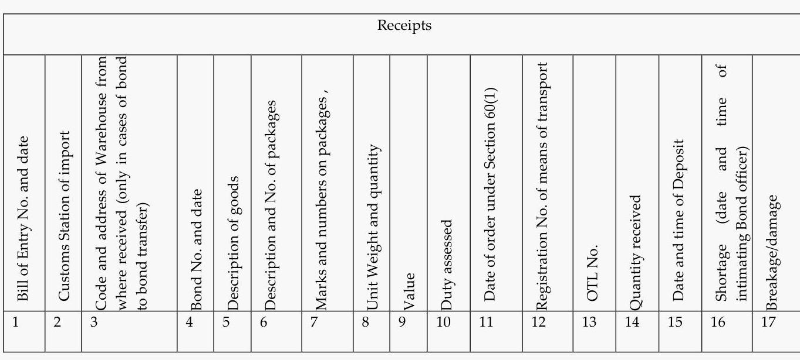

# Refund of Taxes to the Retail Outlets at International Airport on Duty Paid Goods Supplied to Outgoing International Tourist. 

With effect from 01.07.2019, the Government has introduced Scheme for Refund of Taxes paid on inward supply of indigenous goods by retail outlets established at departure area of the international airport beyond immigration counters when supplied to outgoing international tourist against foreign exchange.

The term "outgoing international tourist" has been defined as a person not normally resident in India, who enters India for a stay of not more than six months for legitimate non-immigrant purposes.

Vide notification Nos. 11/2019-Central Tax (Rate), dated 29.06.2019 and 10/2019-Integrated Tax (Rate), dated 29.06.2019, the Government has specified retail outlets established in the departure area of an international airport, beyond the immigration counters, making tax free supply of goods to an outgoing international tourist, as class of persons who shall be entitled to claim refund of applicable Central tax or Integrated tax paid on inward supply of such goods. The refunds are subjected to the conditions specified in Rule 95A of the Central Goods and Services Tax Rules, 2017. The CGST Rules, 2017 are also applicable for the purpose of IGST, UT GST and Compensation Cess.

Similar notification has been issued by each of the States providing refund of state taxes. For refund of Union Territory tax, the notification No. 11/2019-UTT (Rate), dated 29.06.2019 has been issued by the Central Government.

Further, the Government, vide notification No. 11/2019-Integrated Tax (Rate), has fully exempted any supply of goods by a retail outlet established in the departure area of an international airport, beyond the immigration counters, to an outgoing international tourist, from payment of integrated tax leviable thereon under section 5 of the Integrated Goods and Services Tax Act, 2017. But for exemption, such supplies of goods to outgoing international passengers are leviable to integrated tax being considered as supplies in the course of inter-state trade. Similarly, notification No. 1/2019-Compensation Cess (Rate), dated 29.06.2019 provides similar exemption from payment of compensation cess leviable under the GST (Compensation to States) Act, 2017.

The Government has also issued a detailed Circular No. Circular No. 106/25/2019-GST, dated 29.06.2019, has been issued by the Board, wherein the

conditions, manner and procedure for filing and processing of such refund claims have been specified.

# 2. Summary of Relevant Legal Provisions at a Glance 

The relevant legal provisions applicable to the Scheme are as detailed the Table-I given below:-

Table I

| Legal Provision | Subject in Brief |
| :--: | :--: |
| Section 55 of the CGST Act, 2017. (Also applicable to IGST, 2017; and UTT Act, 2017) | It is an enabling provision for grant of refund of input taxes paid in certain cases such as UN or any Multilateral Financial Institution or Consulate or Embassy of foreign countries. It also empowers the Government to specify any other person or class of persons and such person shall be entitled to claim a refund of taxes paid on the notified supplies of goods /services/both received by them. |
| Rule 95A of the CGST Rules, 2017 | It lays down basic procedural requirement governing refund of taxes to the retail outlets established in departure area of an international Airport. |
| Notification No. 11/2019-Central Tax (Rate), dated 29.06.2019 | It specifies retail outlets established in the departure area of an international airport, beyond the immigration counters, making tax free supply of goods to an outgoing international tourist, as class of persons who shall be entitled to claim refund of Central Tax. |
| Notification No. 10/2019-Integrated Tax (Rate), dated 29.06.2019 | It specifies retail outlets established in the departure area of an international airport, beyond the immigration counters, making tax free supply of goods to an outgoing international tourist, as class of persons who shall be entitled to claim refund of Integrated Tax. |
| Notification No. 11/2019-UTT (Rate), dated 29.06.2019 | It specifies retail outlets established in the departure area of an international airport, beyond the immigration counters, making tax free supply of goods to an outgoing international tourist, as class of persons who shall be entitled to claim refund of Union |

|  | Territory Tax. |
| :--: | :--: |
| Exemption from Payment of Duty on Supplies made to Outgoing International Tourists by Retail Outlets |  |
| Notification No. 11/2019-Integrated Tax (Rate), dated 29.06.2019 | It fully exempts any supply of goods by a retail outlet established in the departure area of an international airport, beyond the immigration counters, to an outgoing international tourist, from payment of the IGST. |
| Notification No. 01/2019-Compensation Cess (Rate), dated 29.06.2019 | It fully exempts any supply of goods by a retail outlet established in the departure area of an international airport, beyond the immigration counters, to an outgoing international tourist, from payment of the Compensation Cess. |
| Procedure for Claim of GST Refund to be Followed by Retail Outlets at International Airports |  |
| Circular No. 106/25/2019-GST, dated 29.06.2019 | It specifies the conditions, manner and procedure for filing and processing of such refund claims. |
| Customs Legal Provisions applicable to Retail Outlets at International Airports |  |
| Section 58A of the Customs Act, 1962 | It governs licensing of Special Warehouses wherein dutiable goods may be deposited. Duty |
| Notification No. 72/2016-Customs (NT), dated 14.05.2016. | It notified Special Warehouse Licensing Regulations, 2016. |
| Notification No. 69/2016-Customs (NT), dated 14.05.2016. | It notified the Special Warehouse (Custody \& Handling of Goods) Regulations 2016 which are required to be followed by the Special Warehouses. |
| Notification No. 66 /2016- Customs (N.T.), dated | It specifies the class of goods which are required to be deposited in a special warehouse licensed under sub-section (1) of Section 58A of the Customs Act, 1962. |
| Circular No. 32/2016Customs,   13.07.2016 | It lays down Procedure to be followed by the Duty Free Shops at International Airport with regard to duty free imported goods. |

Other Important Instructions under Customs Act, 1962

| Circular No. 31/2016-   Customs, dated   06.07.2016 as amended   vide notification No.   50/2017-Customs,   dated 18.12.2017. | It clarifies the sale of goods at Duty Free Shops in   Indian Currency. |
| :-- | :-- |
| Circular No. 20/2016-   Customs,   dated   20.05.2018. | It clarifies regarding transitional provisions relating   to duty free shops, Ship Stores, Airline Stores and   Diplomatic Stores in the light of wide ranging   amendments in the warehousing provisions of the   Customs Act, 2016 ( vide the Finance Act, 2016). |

# 3. Salient Features of the Scheme at a Glance 

The salient features of the GST Refund scheme to the Retail Outlets located at the International Airport in the departure area after immigration counters are as given under:-

- Under the Scheme, the retail outlet are eligible to claim refund of all applicable Central GST, State GST, IGST, UT GST and Compensation cess paid by them on all inward supplies of indigenous goods received for the purposes of subsequent supply of such goods to the eligible international passengers.
- The retail outlet must be registered under GST and must have valid GSTIN.
- Supply of such indigenous goods should have been made without collecting any taxes from the eligible passenger.
- The retail outlet are required to keep records with respect to duty paid indigenous goods being brought to the retail outlets and their supplies to eligible passengers in the prescribed format in electronic form. The data is required to be kept updated, accurate and complete at all times by such retail outlets and should be available for inspection/verification of the proper officer of central tax at any time.
- A notice that international tourists are eligible for purchase of goods without payment of domestic taxes should be displayed prominently by the retail outlet.
- No refund of tax paid on input services, if any, to be granted to the retail outlets.

- Refund to be granted to retail outlets is not on account of the accumulated input tax credit but is refund based on the invoices of the inward supplies of indigenous goods received by them.
- No input tax credit of taxes paid on such inward supplies to be availed. If at all taken, the same has to be reversed in accordance the provisions of the CGST Act read with the rules made thereunder.
- Any supply made to an eligible passenger by the retail outlets without payment of taxes by such retail outlets will require the following documents / declarations:
$>$ Details of the Passport (via Passport Reading Machine);
$>$ Details of the Boarding Pass (via a barcode scanning reading device);
$>$ A passenger declaration as per Annexure B;
$>$ A copy of the invoice clearly evidencing that no tax was charged from the eligible passenger by the retail outlet.
- The refund application is to be filed manually (till online utility becomes available) with the following documents:-
- An undertaking stating that the indigenous goods on which refund is being claimed have been received by such retail outlets;
- An undertaking stating that the indigenous goods on which refund is being claimed have been sold to eligible passengers;
- $\quad$ Copies of the valid return furnished in FORM GSTR-3B for the period covered in the refund claim;
- $\quad$ Copies of FORM GSTR-2A for the period covered in the refund claim; and
- $\quad$ Copies of the attested hard copies of the invoices on which refund is claimed but which are not reflected in FORM GSTR-2A.
- Strict timelines prescribed for processing and sanction of refund claim as given under:-
> Acknowledgement of receipt of refund application to be issued within 15 days of the receipt of application in FORM GST RFD-02.
$>$ In case of any deficiencies or any additional information is required, then a deficiency memo in FORM GST RFD-03 to be issued within 15 days of the receipt of the refund application.
> Only one deficiency memo can be issued against one refund application which is complete in all respects.

- Retail outlets are required to submit hard copies of only those invoices of inward supplies that have not been reflected in FORM GSTR-2A.
- Retail outlets to apply for refund with the jurisdictional Central tax/State tax authority only.
- The payment of the sanctioned refund amount in relation to CGST / IGST/ Compensation Cess is to be made by the Central tax authority while payment of the sanctioned refund amount in relation to SGST / UTGST is to be made by the State tax/Union Territory tax authority.
- The refund order issued by the proper officer of Central Tax is to be duly communicated to the concerned counter-part tax authority within seven days for the purpose of disbursal of the remaining sanctioned refund amount. The procedure as per Para 6.0 of Circular No.24/24/2017-GST dated 21.12.2017 is to followed in this regard.
- Refund Order is to be issued in FORM GST RFD-06 along with the manual payment advice in FORM GST RFD-05 for each head i.e., CGST/SGST tax/UT GST /IGST/Compensation Cess.
- In case of any refund having been made in respect of an invoice without the tax having been paid to the Government or where the supply of such goods not made to an eligible passenger, such amount refunded to be recovered along with interest as per the provisions contained in the section 73 or section 74 of the CGST Act.

# 4. List of Relevant Form and Formats 

The various forms and format prescribed under Rule 95A of the CGST Rules, 2017 and CBIC Circular dated 29.06.2019 are as detailed in the Table-2 given below.

Table 2

| Document | Purpose of the document |
| :-- | :-- |
| FORM GST RFD-10B (under Rule   95A of the CGST Rules, 2017. | Application for refund by Duty Free Shops   /Duty Paid Shops (Retail outlets). |
| Annexure-A to the Circular No.   106/25/2019- GST dated 29.06.2019) | Form to be maintained by a Retail Outlet |
| Annexure-B to the Circular No.   106/25/2019-GST, dated 29.06.2019 | Declaration for purchase of Tax free Goods   by a eligible passenger |

# Part II: Text of Legal Provisions 

## A. Text of Section 55 of the CGST Act, 2017.

The Section 55 of the CGST Act, 2017 provides as under:-

## " Refund in certain cases

55. The Government may, on the recommendations of the Council, by notification, specify any specialised agency of the United Nations Organisation or any Multilateral Financial Institution and Organisation notified under the United Nations (Privileges and Immunities) Act, 1947, Consulate or Embassy of foreign countries and any other person or class of persons as may be specified in this behalf, who shall, subject to such conditions and restrictions as may be prescribed, be entitled to claim a refund of taxes paid on the notified supplies of goods or services or both received by them."

## B. Rule 95A of the CGST Rules, 2017.

The rule 95A of the CGST Rules, 2017 as amended provides as under:-
[95A. Refund of taxes to the retail outlets established in departure area of an international Airport beyond immigration counters making tax free supply to an outgoing international tourist.-
(1) Retail outlet established in departure area of an international airport, beyond the immigration counters, supplying indigenous goods to an outgoing international tourist who is leaving India shall be eligible to claim refund of tax paid by it on inward supply of such goods.
(2) Retail outlet claiming refund of the taxes paid on his inward supplies, shall furnish the application for refund claim in FORM GST RFD- 10B on a monthly or quarterly basis, as the case may be, through the common portal either directly or through a Facilitation Centre notified by the Commissioner.
(3) The self-certified compiled information of invoices issued for the supply made during the month or the quarter, as the case may be, along with concerned purchase invoice shall be submitted along with the refund application.
(4) The refund of tax paid by the said retail outlet shall be available if-

(a) the inward supplies of goods were received by the said retail outlet from a registered person against a tax invoice;
(b) the said goods were supplied by the said retail outlet to an outgoing international tourist against foreign exchange without charging any tax;
(c) name and Goods and Services Tax Identification Number of the retail outlet is mentioned in the tax invoice for the inward supply; and
(d) such other restrictions or conditions, as may be specified, are satisfied.
(5) The provisions of rule 92 shall, mutatis mutandis, apply for the sanction and payment of refund under this rule.

Explanation.- For the purposes of this rule, the expression "outgoing international tourist" shall mean a person not normally resident in India, who enters India for a stay of not more than six months for legitimate non-immigrant purposes.

# C. Notification No. 11 /2019 -Central Tax (Rate), dated 29.06.2019 

G.S.R...(E). - In exercise of the powers conferred by section 55 of the Central Goods and Services Tax Act, 2017 (12 of 2017), the Central Government, on the recommendations of the Council, hereby specifies retail outlets established in the departure area of an international airport, beyond the immigration counters, making tax free supply of goods to an outgoing international tourist, as class of persons who shall be entitled to claim refund of applicable central tax paid on inward supply of such goods, subject to the conditions specified in rule 95A of the Central Goods and Services Tax Rules, 2017.

Explanation.- For the purposes of this notification, the expression "outgoing international tourist" shall mean a person not normally resident in India, who enters India for a stay of not more than six months for legitimate non-immigrant purposes.
2. This notification shall come into force with effect from the 1st day of July, 2019.

## D. Text of Notification No. 10/2019 -Integrated Tax (Rate), dated 29.06.2019

G.S.R......(E). - In exercise of the powers conferred by section 20 of the Integrated Goods and Services Tax Act, 2017 (13 of 2017) read with section 55 of the Central Goods and Services Tax Act, 2017 (12 of 2017), the Central Government, on the recommendations of the Council, hereby specifies retail outlets established in the departure area of an international airport, beyond the immigration counters, making tax free supply of goods to an outgoing international tourist, as class of

persons who shall be entitled to claim refund of applicable integrated tax paid on inward supply of such goods, subject to the conditions specified in rule 95A of the Central Goods and Services Tax Rules, 2017.

Explanation.-For the purposes of this notification, the expression "outgoing international tourist" shall mean a person not normally resident in India, who enters India for a stay of not more than six months for legitimate non-immigrant purposes.
2. This notification shall come into force with effect from the 1st day of July, 2019.
[F. No. 354/90/2019-TRU]

# E. Notification No. 11/2019 - Union Territory Tax (Rate), dated 29.06.2019 

G.S.R......(E). - In exercise of the powers conferred by section 21 of the Union Territory Goods and Services Tax Act, 2017 (14 of 2017) read with section 55 of the Central Goods and Services Tax Act, 2017 (12 of 2017), the Central Government, on the recommendations of the Council, hereby specifies retail outlets established in the departure area of an international airport, beyond the immigration counters, making tax free supply of goods to an outgoing international tourist, as class of persons who shall be entitled to claim refund of applicable union territory tax paid on inward supply of such goods, subject to the conditions specified in rule 95A of the Central Goods and Services Tax Rules, 2017.

Explanation. - For the purposes of this notification, the expression "outgoing international tourist" shall mean a person not normally resident in India, who enters India for a stay of not more than six months for legitimate non-immigrant purposes.
2. This notification shall come into force with effect from the 1st day of July, 2019.
[F. No. 354/90/2019-TRU]

## F. Text of Notification No. 11 /2019-Integrated Tax (Rate), dated 29.06.2019

G.S.R (E ).-In exercise of the powers conferred by sub-section (1) of section 6 of the Integrated Goods and Services Tax Act, 2017 (13 of 2017), the Central Government, on being satisfied that it is necessary in the public interest so to do, and on the recommendations of the Council, hereby exempts any supply of goods by a retail

outlet established in the departure area of an international airport, beyond the immigration counters, to an outgoing international tourist, from the whole of the integrated tax leviable thereon under section 5 of the Integrated Goods and Services Tax Act, 2017.

Explanation.- For the purposes of this notification, the expression "outgoing international tourist" shall mean a person not normally resident in India, who enters India for a stay of not more than six months for legitimate non-immigrant purposes.
2. The notification shall come into force with effect from the 1st day of July, 2019.
[F. No. 354/90/2019-TRU]

# G. Notification No. 1/2019-Compensation Cess (Rate), dated 29.06.2019 

G.S.R. (E).- In exercise of the powers conferred by sub-section (1) of section 11 of the Goods and Services Tax (Compensation to States) Act, 2017 (15 of 2017), read with sub-section (1) of section 11 of the Central Goods and Services Tax Act, 2017 (12 of 2017), the Central Government, on being satisfied that is necessary in the public interest so to do, on the recommendations of the Council, hereby exempts any supply of goods by a retail outlet established in the departure area of an international airport, beyond the immigration counters, to an outgoing international tourist, from the whole of the goods and services tax compensation cess leviable thereon under section 8 of the Goods and Services tax (Compensation to States) Act.

Explanation.- For the purposes of this notification, the expression "outgoing international tourist" shall mean a person not normally resident in India, who enters India for a stay of not more than six months for legitimate non-immigrant purposes.
2. The notification shall come into force with effect from the 1st day of July, 2019.
[F. No. 354/90/2019-TRU]

## I. Text of Circular No. 106/25/2019-GST, dated 29.06.2019

Subject: - Refund of taxes paid on inward supply of indigenous goods by retail outlets established at departure area of the international airport beyond

immigration counters when supplied to outgoing international tourist against foreign exchange -reg.

The Government vide notification No. 11/2019-Central Tax (Rate), 10/2019Integrated Tax (Rate) and 11/2019-Union territory Tax (Rate) all dated 29.06.2019 issued in exercise of powers under section 55 of the Central Goods and Services Tax Act, 2017 (hereinafter referred to as the „CGST Act") has notified that the retail outlets established at departure area of the international airport beyond immigration counters shall be entitled to claim refund of all applicable Central tax, Integrated tax, Union territory tax and Compensation cess paid by them on inward supplies of indigenous goods received by them for the purposes of subsequent supply of goods to outgoing international tourists i.e. to a person not normally resident in India, who enters India for a stay of not more than six months for legitimate non-immigrant purposes against foreign exchange (hereinafter referred to as the "eligible passengers"). Identical notifications have been issued by the State or Union territory Governments under the respective State Goods and Services Tax Acts (hereinafter referred to as the "SGST Act") or Union Territory Goods and Services Tax Acts (hereinafter referred to as the "UTGST Act") also to provide for refund of applicable State or Union territory tax.
2. With a view to ensuring expeditious processing of refund claims, the Board, in exercise of its powers conferred under section 168(1) of the CGST Act, hereby specifies the conditions, manner and procedure for filing and processing of such refund claims in succeeding paras.

# 3. Duty Free Shops and Duty Paid Shops: - 

It has been recognized that international airports, house retail shops of two types - "Duty Free Shops" (hereinafter referred to as "DFS") which are point of sale for goods sourced from a warehoused licensed under Section 58A of the Customs Act, 1962 (hereinafter referred to as the "Customs Act") and duty paid indigenous goods and "Duty Paid Shop" (hereinafter referred to as "DPS") retailing duty paid indigenous goods.

## 4. Procurement and supply of imported / warehoused goods: -

The procedure for procurement of imported / warehoused goods is governed by the provisions contained in Customs Act. The procedure and applicable rules as specified under the Customs Act are required to be followed for procurement and supply of such goods.

## 5. Procurement of indigenous goods: -

Under GST regime there is no special procedure for procurement of indigenous goods for sale by DFS or DPS. Therefore, all indigenous goods would have to be procured by DFS or DPS on payment of applicable tax when procured from the domestic market.
6. Supply of indigenous goods by DFS or DPS established at departure area of the international airport beyond immigration counters (hereinafter referred to as "the retail outlets") to eligible passengers:

The sale of indigenous goods procured from domestic market by retail outlets to an eligible passenger is a "supply" under GST law and is subject to levy of Integrated tax but the same has been exempted vide notification No. 11/2019Integrated Tax (Rate) and 01/2019-Compensation Cess (Rate) both dated 29.06.2019. Therefore, retail outlets will supply such indigenous goods without collecting any taxes from the eligible passenger and may apply for refund as per procedure explained in succeeding paragraphs.

# 7. Who is eligible for refund: 

### 7.1 Registration under CGST Act:

The retail outlets applying for refund shall be registered under the provisions of section 22 of the CGST Act read with the rules made thereunder and shall have a valid GSTIN.

### 7.2 Location of retail outlets:

Such retail outlets shall be established at departure area of the international airport beyond immigration counters and shall be entitled to claim a refund of all applicable Central tax, State tax, Integrated tax, Union territory tax and Compensation cess paid by them on all inward supplies of indigenous goods received for the purposes of subsequent supply of such goods to the eligible passengers.

## 8. Procedure for applying for refunds:

### 8.1. Maintenance of Records:

The records with respect to duty paid indigenous goods being brought to the retail outlets and their supplies to eligible passengers shall be maintained as per Annexure A in electronic form. The data shall be kept updated, accurate and complete at all times by such retail outlets and shall be available for inspection/verification of the proper officer of central tax at any time. The electronic

records must incorporate the feature of an audit trail, which means a secure, computer generated, time stamped record that allows for reconstruction of the course of events relating to the creation, modification or deletion of an electronic record and includes actions at the record or system level, such as, attempts to access the system or delete or modify a record.

# 8.2. Invoice-based refund: 

It is clarified that the refund to be granted to retail outlets is not on account of the accumulated input tax credit but is refund based on the invoices of the inward supplies of indigenous goods received by them. As stated in para 6 above, the supply made by such retail outlets to eligible passengers has been exempted vide notification No. 11/2019-Integrated Tax (Rate) and 01/2019-Compensation Cess (Rate) both dated 29.06.2019 and therefore such retail outlets will not be eligible for input tax credit of taxes paid on such inward supplies and the same will have to be reversed in accordance the provisions of the CGST Act read with the rules made thereunder. It is also clarified that no refund of tax paid on input services, if any, will be granted to the retail outlets.
8.3. Any supply made to an eligible passenger by the retail outlets without payment of taxes by such retail outlets shall require the following documents/ declarations:
(a) Details of the Passport (via Passport Reading Machine);
(b) Details of the Boarding Pass (via a barcode scanning reading device);
(c) A passenger declaration as per Annexure B;
(d) A copy of the invoice clearly evidencing that no tax was charged from the eligible passenger by the retail outlet.
8.4. The retail outlets will be required to prominently display a notice that international tourists are eligible for purchase of goods without payment of domestic taxes.

### 8.5. Manual filing of refund claims:

In terms of rule 95A of the Central Goods and Services Tax Rules, 2017 (hereinafter referred to as the "CGST Rules") as inserted vide notification No. 31/2019-Central Tax dated 28.06.2019, the retail outlets are required to apply for refund on a monthly or quarterly basis depending upon the frequency of furnishing of return in FORM GSTR-3B. Till the time the online utility for filing the refund claim is made available on the common portal, these retail outlets shall apply for refund by filing an application in FORM GST RFD-10B, as inserted vide notification No. 31/2019-Central Tax dated 28.06.2019 manually to the jurisdictional

proper officer. The said refund application shall be accompanied with the following documents:
(i) An undertaking by the retail outlets stating that the indigenous goods on which refund is being claimed have been received by such retail outlets;
(ii) An undertaking by the retail outlets stating that the indigenous goods on which refund is being claimed have been sold to eligible passengers;
(iii) Copies of the valid return furnished in FORM GSTR-3B by the retail outlets for the period covered in the refund claim;
(iv) Copies of FORM GSTR-2A for the period covered in the refund claim; and
(v) Copies of the attested hard copies of the invoices on which refund is claimed but which are not reflected in FORM GSTR-2A.

# 9. Processing and sanction of the refund claim: 

9.1. Upon receipt of the complete application in FORM GST RFD-10B, an acknowledgement shall be issued manually by the proper officer within 15 days of the receipt of application in FORM GST RFD-02. In case of any deficiencies or any additional information is required, the same shall be communicated to the retail outlets by issuing a deficiency memo manually in FORM GST RFD-03 by the proper officer within 15 days of the receipt of the refund application. Only one deficiency memo should be issued against one refund application which is complete in all respects.
9.2. The proper officer shall validate the GSTIN details on the common portal to ascertain whether the return in FORM GSTR- 3B has been filed by the retail outlets. The proper officer may scrutinize the details contained in FORM RFD-10B, FORM GSTR-3B and FORM GSTR-2A. The proper officer may rely upon FORM GSTR-2A as an evidence of the accountal of the supply received by them in relation to which the refund has been claimed by the retail outlets. Normally, officers are advised not to call for hard copies of invoices or details contained in Annexure A. As clarified in clause (v) of Para 8.5 above, it is reiterated that the retail outlets would be required to submit hard copies of only those invoices of inward supplies that have not been reflected in FORM GSTR-2A.
9.3. The proper officer shall issue the refund order manually in FORM GST RFD06 along with the manual payment advice in FORM GST RFD-05 for each head i.e., Central tax/State tax/Union territory tax/Integrated tax/Compensation Cess. The amount of sanctioned refund along with the bank account details of the retail outlets shall be manually submitted in the PFMS system by the jurisdictional

Division's DDO and a signed copy of the sanction order shall be sent to the PAO for disbursal of the said amount.
9.4. Where any refund has been made in respect of an invoice without the tax having been paid to the Government or where the supply of such goods was not made to an eligible passenger, such amount refunded shall be recovered along with interest as per the provisions contained in the section 73 or section 74 of the CGST Act, as the case may be.
9.5. It is clarified that the retail outlets will apply for refund with the jurisdictional Central tax/State tax authority only, however, the payment of the sanctioned refund amount in relation to Central tax/ Integrated tax/ Compensation Cess shall be made by the Central tax authority while payment of the sanctioned refund amount in relation to State Tax / Union Territory Tax shall be made by the State tax/Union Territory tax authority. It therefore becomes necessary that the refund order issued by the proper officer of Central Tax is duly communicated to the concerned counter-part tax authority within seven days for the purpose of disbursal of the remaining sanctioned refund amount. The procedure outlined in para 6.0 of Circular No.24/24/2017-GST dated 21stDecember 2017 should be followed in this regard.
10. The scheme shall be effective from 01.07.2019 and would be applicable in respect of all supplies made to eligible passengers after the said date. In other words, retail outlets would be eligible to claim refund of taxes paid on inward supplies of indigenous goods received by them even prior to 01.07 .2019 as long as all the conditions laid down in Rule 95A of the CGST Rules and this circular are fulfilled.
11. It is requested that suitable trade notices may be issued to publicize the contents of this circular. Circular No. 106/25/2019-GST Page 6 of 8
12. Difficulty, if any, in implementation of the above instructions may please be brought to the notice of the Board.

Hindi version would follow.

# Part III. Legal Provisions under the Customs Act, 1962 applicable to the Retail Outlet 

## A. The Section 58A of the Customs Act, 1962 provides as under:-

## SECTION 58A. Licensing of special warehouses.-

(1) The Principal Commissioner of Customs or Commissioner of Customs may, subject to such conditions as may be prescribed, licence a special warehouse wherein dutiable goods may be deposited and such warehouse shall be caused to be locked by the proper officer and no person shall enter the warehouse or remove any goods therefrom without the permission of the proper officer.
(2) The Board may, by notification in the Official Gazette, specify the class of goods which shall be deposited in the special warehouse licensed under sub-section (1).
B. Special Warehouse Licensing Regulations has been notified vide Notification No. 72 /2016 - Customs (N.T.), dated 14.05.2016. The text of regulations is as given under:-
G.S.R (E). - In exercise of the powers conferred by section 157 read with section 58A of the Customs Act, 1962 (52 of 1962), the Central Board of Excise and Customs hereby makes the following regulations, namely:-

## 1. Short title and commencement.-

(1) These regulations shall be called as the Special Warehouse Licensing Regulations, 2016.
(2) They shall come into force on the date of their publication in the Official Gazette.

## 2. Definitions.-

(1) In these regulations, unless the context otherwise requires -
(a) "Act" means the Customs Act, 1962 (52 of 1962);
(b) "applicant" means a person who applies for a licence for a special warehouse under section 58A;
(c) "section" means section of the Act;
(d) "special warehouse" means a site or building that is licensed as such by the Principal Commissioner of Customs or Commissioner of Customs, as the case may be, under section 58A, wherein dutiable goods may be deposited.

(2) The words and expressions used herein and not defined in these regulations but defined in the Act shall have the same meanings respectively as assigned to them in the said Act.

# 3. Licensing of special warehouse. - 

(1) Upon an application being made to license a special warehouse, the Principal Commissioner of Customs or Commissioner of Customs, as the case may be, may issue a licence to an applicant who,-
(a) is a citizen of India or is an entity incorporated or registered under any law for the time being in force;
(b) furnishes a solvency certificate from a scheduled bank for an amount as may be specified by the Principal Commissioner of Customs or Commissioner of Customs, as the case may be:

Provided that the condition of furnishing a solvency certificate shall not be applicable to an undertaking of the Central Government or State Government or Union territory.
(c) proposes to store goods notified by the Board under sub-section (2) of section 58A;
(d) submits an undertaking to comply with such terms and conditions as may be specified by the Principal Commissioner of Customs or Commissioner of Customs, as the case may be; and
(e) undertakes to pay for the services of supervision of the warehouse by officers of customs on recovery of costs.
(2) The Principal Commissioner of Customs or the Commissioner of Customs, as the case may be, shall not issue a licence to an applicant if, -
(a) he has been declared an insolvent or bankrupt by a Court or Tribunal;
(b) he has been convicted for an offence under any law for the time being in force;
(c) he has been penalised for an offence under the Act, the Central Excise Act, 1944 (1 of 1944) or Chapter V of the Finance Act, 1994 (32 of 1994);
(d) he is of unsound mind and stands so declared by a competent Court; or
(e) the Principal Commissioner of Customs or the Commissioner of Customs, as the case may be, is satisfied that-
(i) the site or building of the proposed special warehouse is not suitable for secured storage of dutiable goods;

(ii) the site or building of the proposed special warehouse is not suitable for general supervision by officers of customs;
(iii) bankruptcy proceedings are pending against the applicant; or
(iv) criminal proceedings are pending against the applicant and the offences involved are of such nature that he is not a fit person for grant of licence.

# 4. Conditions to be fulfilled by applicant - 

Where, after inspection of the premises, evaluation of compliance to the conditions of regulation 3 and conducting such enquiries as may be necessary, the Principal Commissioner of Customs or Commissioner of Customs, as the case may be, is satisfied that licence may be granted, he shall require the applicant to,-
(a) provide an all risk insurance policy, that includes natural calamities, riots, fire, theft, skillful pilferage and commercial crime in favour of the President of India for a sum equivalent to the amount of duty involved on the dutiable goods proposed to be stored in the special warehouse at any point of time;
(b) provide an undertaking binding himself to pay any duties, interest, fine and penalties payable in respect of warehoused goods under sub-section (3) of section 73A or under the Special Warehouse (Custody and Handling of Goods) Regulations, 2016;
(c) provide an undertaking indemnifying the Principal Commissioner of Customs or Commissioner of Customs, as the case may be, from any liability arising on account of loss suffered in respect of warehoused goods due to accident, damage, deterioration, destruction or any other unnatural cause during their receipt, delivery, storage, despatch or handling; and
(d) appoint a person who has sufficient experience in warehousing operations and customs procedures as warehouse keeper.

## 5. Grant of licence. -

Upon fulfillment of the conditions specified in regulation 3 and regulation 4, the Principal Commissioner of Customs or Commissioner of Customs, as the case may be, may grant a licence in respect of the special warehouse subject to such conditions as deemed necessary.

## 6. Validity of licence.-

Any licence granted under regulation 5 shall remain valid until and unless it is cancelled in terms of the provisions under section 58B or sub-regulation (2) of regulation 8 .

# 7. Non-transferability of licence. - 

A licence granted under regulation 5 shall not be transferable. 8. Surrender of licence. -
(1) A licensee may surrender the licence granted to him by making a request in writing to the Principal Commissioner of Customs or the Commissioner of Customs, as the case may be.
(2) On receipt of the request under sub-regulation (1), the Principal Commissioner of Customs or the Commissioner of Customs, as the case may be, may cancel the licence if, -
(a) the licensee has paid all monies due to the Central Government under the provisions of the Act, rules or regulations made thereunder;
(b) no warehoused goods remain deposited in the special warehouse or are deposited in the special warehouse from the date of request referred in sub-regulation (1); and
(c) no proceedings are pending against the licensee under the Act or the rules or regulations made thereunder.

## 9. Licence for existing warehouses.-

(1) A public warehouse appointed under section 57 or a private warehouse licensed under section 58 as it stood immediately before the commencement of the Finance Act, 2016 (28 of 2016), may continue to carry out operations in respect of goods notified under sub-section (2) of section 58A for a period of three months from the date of coming into force of these regulations:

Provided that such a warehouse shall remain under the lock of customs.
(2) A warehouse referred to in sub-regulation (1) that intends to store goods notified under sub-section (2) of section 58A beyond the period of three months, shall apply for a license under these regulations within a period of one month from the date of commencement of these regulations.
[F.N.484/03/2015-LC (Vol. II. Pt. 1)]

# C. The Special Warehouse (Custody and Handling of Goods) Regulations, 2016 notified vide Notification No. 69 /2016- Customs (N.T.), dated 14.05.2016 

G.S.R (E). - In exercise of the powers conferred by section 157 read with section 58A and sub-section (2) of Section 73A of the Customs Act, 1962 (52 of 1962), the Central Board of Excise and Customs hereby makes the following regulations, namely:-

## 1. Short Title and commencement. -

(1) These Regulations shall be called as the Special Warehouse (Custody and Handling of Goods) Regulations, 2016.
(2) They shall come into force on the date of their publication in the Official Gazette.

## 2. Definitions. -

(1) In these regulations, unless the context otherwise requires,-
(a) "Act" means the Customs Act, 1962 (52 of 1962);
(b) "bond officer" means an officer of customs in charge of a warehouse;
(c) "Controller of Certifying Authorities" means the authority appointed under subsection (1) of section 17 of the Information Technology Act, 2000 (21 of 2000);
(d) "section" means section of the Act. (2) The words and expressions used herein and not defined in these regulations but defined in the Act shall have the same meanings as respectively assigned to them in the Act.

## 3. Appointment of warehouse keeper. -

(1) A licensee shall appoint a warehouse keeper who has experience in warehousing operations and customs procedures, to discharge functions under these regulations on his behalf.
(2) The warehouse keeper shall obtain a digital signature from authorities licensed by the Controller of Certifying Authorities for filing electronic documents required under the Act, rules or regulations made thereunder.

## 4. Facilities, equipment and personnel.-

A licensee shall provide at the warehouse in respect of which a licence has been issued, -
(a) such facilities, equipment and personnel as are sufficient to control access to the warehouse and provide secure storage of the goods in it, including -

(i) doors, windows and other building components of sturdy construction;
(ii) facility for locking the warehouse by the bond officer;
(iii) signage that prominently indicates that the site or building is a customs bonded warehouse.
(b) adequate personnel, equipment and space for the examination of goods by officers of customs; and
(c) a computerised system for accounting of receipt, storage, operations and removal of goods.

# 5. Control over special warehouses.- 

The bond officer shall cause the warehouse to be locked and no person shall enter the warehouse or deposit or remove any goods therefrom, except in his presence.

## 6. Receipt of goods.-

(1) A licensee shall not receive any goods or permit unloading of any goods at the warehouse except in the presence of the bond officer.
(2) Upon the bond officer permitting the deposit of the goods in the warehouse, the licensee shall take into record the goods received in the warehouse and cause to be delivered an acknowledgement to the proper officer referred to in sub-section (1) of section 60 for receipt of the goods at the warehouse or proper officer of the warehouse of despatch, as the case may be.

## 7. Transfer of goods to another warehouse. -

(1) A licensee shall not allow the transfer of warehoused goods to another warehouse without the permission of the bond officer on the Form for transfer of goods from a warehouse.
(2) Upon the bond officer permitting the removal of the goods from the warehouse, the licensee shall in the presence of the bond officer, cause the goods to be loaded onto the means of transport and affix a one-time-lock to the means of transport.

## 8. Removal of warehoused goods for home consumption. -

(1) A licensee shall not remove or cause to be removed any warehoused goods for home consumption, except in the presence of the bond officer.

(2) Upon the owner of the warehoused goods producing an order made by the proper officer under section 68, the licensee shall, in the presence of the bond officer, deliver the quantity of goods mentioned in the bill of entry for home consumption to the owner of the goods and retain a copy of the bill of entry.

# 9. Removal of warehoused goods for export. - 

(1) A licensee shall not remove or cause to be removed any warehoused goods for export except by an order made by the proper officer under section 69.
(2) Upon the bond officer permitting the removal of the goods from the warehouse, the licensee shall, in the presence of the bond officer, cause the goods to be loaded onto the means of transport and affix a one-time- lock to the means of transport.

## 10. Maintenance of records in relation to warehoused goods. -

(1) A licensee shall, -
(a) maintain detailed records of the receipt, handling, storing, and removal of any goods into or from the warehouse, as the case may be, and produce the same to the bond officer, as and when required;
(b) keep a record of each activity, operation or action taken in relation to the warehoused goods;
(c) keep a record of drawal of samples from the warehoused goods under the Act or under any other law for the time being in force; and
(d) keep copies of the bills of entry, transport documents, Forms for transfer of goods from a warehouse, shipping bills or bills of export or any other documents evidencing the receipt or removal of goods into or from the warehouse and copies of the bonds executed under section 59.
(2) The records and accounts required to be maintained under sub- regulation (1) shall be kept updated and accurate and preserved for a minimum period of five years from the date of removal of goods from the warehouse and shall be made available for inspection by the bond officer or any other officer authorised under the Act.
(3) A licensee shall also preserve updated digital copies of the records specified under subregulation (1) at a place other than the warehouse to prevent loss of records due to natural calamities, fire, theft, skillful pilferage or computer malfunction.

(4) A licensee shall file with the bond officer a monthly return of the receipt, storage, operations and removal of the goods in the warehouse, within ten days after the close of the month to which such return relates.
(5) Where the period specified in section 61 for warehousing of goods is expiring in a particular month, the licensee shall furnish such information to the bond officer on or before the 10th day of the month immediately preceding the month of such expiry.

# 11. Penalty. - 

If a licensee contravenes any of the provisions of these regulations, or abets such contravention or fails to comply with any of the provisions of these regulations, he shall be liable to a penalty in accordance with the provisions of the Act.

## 12. Power to exempt. -

The Board, having regard to the nature of the goods, their manner of transport or storage, may exempt a class of goods from any of the provisions of these regulations.
[F. No. 484/03/2015-LC (Vol II. Pt.-1)]

## D. Notification No. 66 /2016- Customs (N.T.), dated 14.05.2016

S. O. (E). - In exercise of the powers conferred by sub-section (2) of section 58A of the Customs Act, 1962 (52 of 1962), the Central Board of Excise and Customs hereby specifies the following class of goods which shall be deposited in a special warehouse licenced under sub-section (1) of the said section namely:-
(1) gold, silver, other precious metals and semi-precious metals and articles thereof;
(2) goods warehoused for the purpose of -
(a) supply to duty free shops in a customs area;
(b) supply as stores to vessels or aircrafts under Chapter XI of the Customs Act, 1962;
(c) supply to foreign privileged persons in terms of the Foreign Privileged Persons (Regulation of Customs Privileges) Rules, 1957.
[F. No. 484/03/2015-LC (Vol II.Pt-1)]

## E. Circular No. 32 / 2016-Customs, dated 13.07.2016 (F. No: 473 / 05 / 2015 - LC)

# Subject: - Procedure regarding Duty Free Shops. 

Please refer to Notification No. 66/2016 - Customs (N.T.) dated 14th May 2016, Special Warehouse Licensing Regulations, 2016, Special Warehouse (Custody \& Handling of Goods) Regulations, 2016 and Circular no. 20 / 2016 - Customs dated 20th May 2016.
2. It may be noted that the Special Warehouse (Custody \& Handling of Goods) Regulations, 2016 prescribe maintenance of a computerized system for accounting. Accordingly, a system of accounting of receipt, storage, operations and removal of goods with regard to Duty Free Shops is prescribed below:

## 3. Maintenance of records of warehoused goods only in digital form:

(a) Every licensee shall maintain electronic records of receipt, handling, storage and removal of the warehoused goods based upon data elements contained in Form A appended to this circular. While the data elements contained in the Form are mandatory, the licensee will be free to add or continue with any additional data fields, as per their commercial requirements. It would be necessary for the data to be maintained as per systems of "stock keeping unit" (SKU).
(b) All licensees are required to enter data accurately and immediately upon the goods being deposited in or removed from the warehouse. Such electronic records should be kept updated, accurate, complete and shall be available at the warehouse at all times so as to be accessible to the bond officer or any other authorised officer, for verification.
(c) The software for maintenance of electronic records must incorporate the feature of audit trail which means a secure, computer generated, time-stamped electronic record that allows for reconstruction of the course of events relating to the creation, modification, or deletion of an electronic record and includes actions at the record or system level, such as, attempts to access the system or delete or modify a record.

## 4. Filing of returns in relation to warehoused goods:

(a) The Regulations also prescribe that,-
(i) a licensee shall file with the bond officer a monthly return of the receipt, storage, operations and removal of goods in the warehouse,

within ten days after the close of the month to which such return relates.
(ii) where the period specified in section 61 of the Customs Act, 1962 for warehousing of goods is expiring in a particular month, the licensee shall furnish such information to the bond officer on or before the 10th day of the month immediately preceding the month in which the period of storage of goods in the warehouse is expiring.
(b) The monthly return, as per para 4 (a) (i), containing transactions undertaken during the month, shall be filed by the licensee in Form A appended to this circular. The Return may be filed as a paper copy or in digital form, as preferred by the licensee (digital form means, such as, in a Pen drive or CD). The Return need not include details of sales to individual international passengers. These can be verified by the bond officer or any authorised officer, from the digital records maintained by the licensee.
(c) The monthly return to be filed by the licensee as per para 4 (a) (ii) shall be filed in Form B appended to this circular. The Return shall be filed with the Bond officer as a paper copy.
(d) The Duty Free Shop Operator shall also maintain digital records of sales to international passengers as per Form C. The digital file containing these details shall be integrated with the records maintained for the warehoused goods, every 24 hours, and should be available for inspection as a part of the data maintained as per Form A. However, filing of returns would not be required for the record maintained as per Form C.

# 5. Acknowledgement of the receipt of goods in the warehouse: 

The Licensee shall follow the procedure contained in Regulation 6 of the Special Warehouse (Custody \& Handling of Goods) Regulations 2016. Upon receipt of the goods in a warehouse, the licensee shall, send an acknowledgement of such receipt, duly signed by the bond officer, as follows:
(i) in case where goods are received from a customs station, to the Assistant/Deputy Commissioner in charge of the Bond section at the Customs station of import; or
(ii) in case where the goods are received from another warehouse, to the proper officer of the warehouse from where the goods have been received.

# 6. Facilities: 

In view of the requirement in the regulations to retain photocopies of documents such as bills of entry, transport documents and Form for transfer of goods from a warehouse, send acknowledgement of receipt of goods in the warehouse etc., the licensee shall maintain facilities such as computer, photocopier, scanner and printer at the warehouse.

## 7. Effective Date:

The above requirement of maintaining digital records, in the prescribed Forms, is applicable from the 14th May 2016. Thus, the record of any goods received on or after 14th May 2016 shall be maintained as per the prescribed Forms. However, during the consultations with Duty Free Shop Operators, it was gathered that they are already maintaining records in software based systems but due to the requirement of maintaining the bond register, records are being reduced to manual form to comply with prescribed columns. Now that a system of computerised record keeping has been prescribed, the information regarding the stock of goods lying deposited in the warehouse can be integrated into the digital record prescribed under this circular. It is clarified that data relating to goods already removed from the warehouse by 13th May 2016, are not required to be updated in the digital records. However, the stocks lying for sale in the duty free shops should be entered in the digital records since their duty liability is not extinguished till their sale to international passengers. In so far as goods deposited, removed and already sold through Duty Free Shops before 14th May 2016 are concerned, the information recorded in the extant bond register shall suffice.

## 8. Procedure for removal of goods from the warehouse and accounting thereof:

The Board has approved the following procedure for accounting of the goods removed from a warehouse licensed under section 58A of the Customs Act, 1962, without payment of duty:
a. Upon removal of goods from the warehouse licensed under section 58A, the licensee shall immediately record the same in the records;
b. The removal of goods from the warehouse, without payment of duty, is subject to the condition that the goods are removed to the customs area for sale to passengers arriving into or departing from India.

c. The records relating to removal of the goods to the duty free shops at the arrival area and departure area shall be maintained separately.
d. The bond officer shall escort the goods from the warehouse to the point of sale (DFS) in the customs area, whereupon, their subsequent sales to passengers arriving into or going abroad from India shall be under the general supervision of the customs officers on duty at the passenger terminals.
e. Every duty free shop shall record their sales to passengers by a computer generated invoice, which shall contain the name of the passenger, flight number \& passport number. This data shall be stored digitally, in Form C.
f. The records of the warehouse shall be updated every 24 hours with the data elements contained in Form C.

# 9. Security and Solvency Requirements: 

The Board has dispensed with the requirement of security to be furnished under section 59 of the Customs Act, 1962 by a DFS operator in respect of his imports (Circular No.21/2016- Customs refers).
9.1 As regards requirements of solvency, as provided under clause (b) of regulation 3 of the Special Warehouse Licensing Regulations 2016, the Board has decided that the Licensee shall furnish a solvency certificate of a value equivalent to the amount of duty involved on the goods proposed to be stored at any point of time. In this connection, it may be noted that proviso to the aforesaid clause, waives the requirements of a solvency certificate in respect of the PSU owned duty free shops (for example, ITDC).

## 10. In-flight duty free shop:

Requests have been received for clarifying whether the existing business practice of inflight duty free sales can be continued by Airlines.
10.1 The removal of goods from the warehouse licensed under section 58A of the Customs Act, 1962, without payment of duty, is subject to the condition that the goods are removed to the customs area for sale to passengers arriving into or departing from India. In other words, as long as the said goods are sold to passengers arriving from abroad or going abroad, the mode of sale shall not affect the due accounting of the goods removed from the warehouse.

10.2 Accordingly, goods removed from a warehouse licensed under section 58A of the Customs Act, 1962 and loaded on a scheduled commercial airline for sale to passengers going abroad, as inflight duty free shop sales, shall be permitted. In such a case, the bond officer shall escort the goods up to the aircraft and shall take into record the copy of the manifest, which must duly reflect the quantity of goods loaded for in-flight duty free sales. Further, the licensee must have accounting procedures, in conjunction with the Airlines, to record the inflight sales with the name of the passenger, passport number and flight number. The data relating to the inflight sales has to be provided by the Airlines to the inflight duty free shop operator immediately upon return of the aircraft to India. In turn, the operator shall update the electronic records to co-relate with goods removed from the warehouse.

# 11. Recovery of costs: 

Clause (e) of Regulation 3 of the Special Warehouse Regulations 2016 and circular no. 20 / 2016 -Customs dated 20th May 2016 provide that the Licensee of a special warehouse shall undertake to bear costs of customs supervision on Merchant Over Time basis or on Cost Recovery. Now, the Board has approved the following guidelines:
a. The Licensee shall have to indicate the frequency with which the warehouse has to be operated per day / per week and the expected business hours of such operation.
b. The Principal Commissioner / Commissioner shall evaluate the projected requirement and the distance of the warehouse from the customs office to determine which of the modes of recovery of costs needs to be applied.
c. Illustratively, if the requirement of the licensee warrants the operation of the warehouse on a frequency which is, say, once in a week, the cost of supervision shall be charged on Merchant Over Time basis. Or, in cases, where the services of the Customs officer are required once a day, cost of supervision could also be based upon Merchant Over Time. However, if the warehouse is at such distance from the nearest customs office or the nature and duration of work is such that, the visit of the bond officer on every day basis, means his absence from his office for an entire day or better part thereof, the licensee shall have to undertake the services on cost recovery basis. Further, in cases where the licensee requires services of a customs officer for more than once in a day, he shall have to undertake supervision on cost recovery basis. Similarly, in case where round the clock services are

requested, the licensee will have to bear charges on cost recovery basis for a suitable number of officers. Basically, this issue has to be examined on the above lines for deciding the recovery of costs from the licensee.

# 12. Administrative arrangements: 

For the purposes of uniformity of jurisdiction and supervision, the Board has also approved the following:
a. The duty free shops shall be under the general supervision of the Principal Commissioner/ Commissioner of the Airport (Passenger Terminal).
b. A warehouse licensed in the precincts of the Airport complex shall also be in the jurisdiction of the Principal Commissioner/ Commissioner of the Airport (Passenger Terminal). Accordingly, he shall be the licensing authority.
c. A warehouse licensed under section 58A, which is located outside the precincts of the airport shall be under the Principal Commissioner / Commissioner having jurisdiction over that site. Accordingly, he shall be the licensing authority and also allot the Bond Officer(s) required.
d. Principal Commissioners / Commissioners shall ensure a smooth transition to the above system on or before 13th August 2016.
13. Difficulties, if any, should be brought to the notice of the Board.
14. Hindi Version follows.

## G. Circular No. 20/ 2016 - Customs, dated 20.05.2016 ( Issued from F.No: $473 / 05 / 2015$ - LC)

Subject: Amendment to Ch IX of the Customs Act, 1962 -Insertion of Section 58A clarification regarding transitional provisions relating to Duty Free Shops/Ship stores/Airline Stores/Diplomatic Stores - reg.

The Finance Act, 2016 has inserted section 58 A in chapter IX of the Customs Act. Section 58 A reads as under: SECTION 58A. Licensing of Special Warehouses -
(1) The Principal Commissioner of Customs or Commissioner of Customs may, subject to such conditions as may be prescribed, license a special warehouse wherein dutiable goods may be deposited and such warehouse shall be caused to

be locked by the proper officer and no person shall enter the warehouse or remove any goods therefrom without the permission of the proper officer.
(2) The Board may, by notification in the Official Gazette, specify the class of goods which shall be deposited in the special warehouse licensed under subsection (1).
2. The Board has issued a notification under sub-section (2) of section 58A (66 / 2016-Cus (NT) dated 14th May 2016) notifying the class of goods to which the provisions shall apply. The Board has also notified Special Warehouse Licensing Regulations, 2016 and the Special Warehouse (Custody and Handling of Goods) Regulations, 2016.
3. In order to facilitate the understanding of the transitional provisions by the trade, Commissionerates are advised to note the following:
a. Licensees operating warehouses under erstwhile section 57 or 58 and storing goods meant for duty free shops/ship stores/diplomatic stores must apply for a license under section 58A, if they propose to continue to store such goods beyond the transitional period of three months.
b. In order to ensure a smooth and orderly transition, existing warehouses engaged in supply of such goods are allowed to continue operations during the transitional period, under customs lock, for a period of three months.
c. The application under Special Warehouse Licensing Regulation, 2016 must be made within one month w.e.f. 14th May 2016.
d. Any licensee who does not make an application under Special Warehouse Licensing Regulation, 2016, shall not be permitted to store goods meant for the end use notified at serial no. (2) of notification 66/2016-Cus dated 14.5.2016 beyond the said three months.
e. Principal Commissioners / Commissioners are advised that the following time lines may be strictly followed in processing of applications by existing licensees:
(i) Application to be received from existing licensees within one month along with the certificate/undertakings mentioned in sub regulation (1) of regulation 3 of the Special Warehouse Licensing Regulations 2016;
(ii) Commissioners should process the applications within 15 days of receipt. Since the due diligence of existing licenses was carried out

while granting the license, there would be no need for verifying compliance to the conditions under sub regulation (2) of regulation 3;
(iii) Licensee shall thereafter comply with the obligations enjoined under regulation 4 within the next fifteen days.
(iv) The license shall be issued immediately thereafter.
4. A question has been raised as to whether a Duty Free Shop in the airport is to be licensed as a warehouse or not. Attention is drawn to the erstwhile chapter IX of the Customs Act where section 62 stated:

# SECTION 62. Control over warehoused goods. - 

(1) All warehoused goods shall be subject to the control of the proper officer.
(2) No person shall enter a warehouse or remove any goods therefrom without the permission of the proper officer.
(3) The proper officer may cause any warehouse to be locked with the lock of the Customs Department and no person shall remove or break such lock.
(4) The proper officer shall have access to every part of a warehouse and power to examine the goods therein.
4.1 Further, the erstwhile section 64 stated:

SECTION 64. Owner's right to deal with warehoused goods. -

With the sanction of the proper officer and on payment of the prescribed fees, the owner of any goods may either before or after warehousing the same -
(a) inspect the goods;
(b) separate damaged or deteriorated goods from the rest;
(c) sort the goods or change their containers for the purpose of preservation, sale, export or disposal of the goods;
(d) deal with the goods and their containers in such manner as may be necessary to prevent loss or deterioration or damage to the goods;
(e) show the goods for sale; or
(f)
4.2 It may be noted that a duty free shop cannot meet the ingredients of subsection (2) and (3) of erstwhile section 62 of the Customs Act, or currently, the provisions of section 58A. Similarly, the provisions contained in erstwhile section

64 or as it now stands, do not permit retail sales from a warehouse. From this it flows that a duty free shop located in a customs area should not be treated as a warehouse. In fact, it is a point of sale for the goods which are to be ex-bonded and removed from a warehouse for being brought to a DFS in the customs area for sale to eligible persons, namely, international passengers arriving or departing from India.
4.3 It is gathered that Duty Free Shop operators store goods in large warehouses in the city and / or in smaller warehouses in and around the precinct of the airport to act as a staging area for replenishing stocks in the duty free shopping area. These warehouses in the city and / or precinct of the airport qualify to be licensed as bonded warehouses as they are capable of being under the lock of customs.
5. It is also clarified that warehouses licensed under section 58A can belong to an importer of ship stores / airline stores / diplomatic stores / duty free shop stores (exclusive use). There could also be warehouses under section 58A which could be catering to several parties engaged in the business of ship stores / airline stores / diplomatic stores / duty free shop stores (non-exclusive). Since it is the end use which determines whether a warehouse is eligible for being licensed under section 58A, there shall be no restrictions on the type of goods that can be stored in such warehouses, as long as they are meant for the end use notified at serial no. (2) of notification 66/2016-Cus dated 14.5.2016.
6. Clarifications have also been sought regarding regulation 3 (1) (e) and the phrase 'recovery of costs'. Recovery of costs, accommodates both fee recovered under the Customs (Fees for Rendering Services by Customs Officers) Regulations, 1998 (Merchant Over Time) or Cost Recovery basis. To determine whether a Special Warehouse will require services of a customs officer on MoT basis or cost recovery basis, the Principal Commissioner / Commissioner will have to determine from the licensee the extent of requirements for services of a customs officer. Guidelines regarding determining where services are to be rendered on MoT basis or Cost Recovery basis are being issued separately.
7. It is requested that interactive sessions may be planned with owners/operators of ship stores / airline stores / diplomatic stores / duty free shops business to familiarize them with the new provisions and ensure a smooth transition.
8. A detailed circular relating to documentary processes with regard to duty free shops / ship \& airline stores / diplomatic stores is being issued separately.
9. Difficulties, if any, should be brought to the notice of the Board.

10. Hindi version follows.
H. Circular No.31/2016-Customs F.No: 473 / 05 / 2015 - LC, dated 06.07.2016

Subject: - Sale of goods at Duty Free Shops in Indian Currency
Please refer to Circular No. 495/7 /2005-Cus VI dated 28th September 2005 regarding the ceiling in payments in Indian currency of Rs. 5000/- for purchases by passengers at duty free shops at International Airports.
2. RBI has vide Notification no. FEMA 6 (R) / RB - 2015 dated 29th December 2015 permitted export from and import into India of Indian currency up to an amount not exceeding Rs 25,000/- (Rupees twenty five thousand) per person. Any person resident in India is permitted to take outside India (other than to Nepal or Bhutan) or bring into India (other than from Nepal or Bhutan) currency notes up to an amount not exceeding Rs 25,000/-. Similarly, any person resident outside India, not being a citizen of Pakistan or Bangladesh, and visiting India, has also been allowed to take outside India or bring into India, Indian currency notes upto an amount not exceeding Rs 25,000/-
3. In view of the aforesaid regulations notified by the RBI, the Board has reviewed the circular dated 28th September 2005. It has been decided that in consonance with the regulation of the RBI, passengers shall be permitted to purchase goods at duty free shops in Indian rupees up to an amount not exceeding Rs 25,000/-
4. Representations have also been received from travelers that duty free shops neither display prices in Indian Rupees nor display India made goods at duty free shops, which depreciates the visibility of Indian manufactured products and Indian currency. This issue was discussed during the course of consultations with Duty Free Shop operators. It was explained that CBEC has provided the facility of duty free procurement of excisable goods by Duty Free shop operators and the procedure has been prescribed under circular no. 970 / 04 / 2013-Cx dated 23rd May 2013 read with Notification 7/2013 C.E(NT) dated 23rd May 2013. They were also requested to display prices of goods in Indian currency alongside of international currencies. It was also suggested that as a measure of transparency and fair practice, they should display the rate of exchange published by the commercial banks for conversion of foreign currency or the rate of exchange

notified by the CBEC on a fortnightly basis for import and export of goods. The Industry representatives were agreeable to implementing the above measures.
5. Accordingly, Principal Commissioners / Commissioners of Customs may advise the Duty Free Shop operators of the revised permitted limits for purchase of goods in Indian currency at Duty Free shops. Information relating to the use of Indian currency at duty free shops should be displayed at all DFSs. It may be ensured that DFSs display the rate of exchange as published by the commercial banks for conversion of foreign currency or the rate of exchange notified by the CBEC on a fortnightly basis for import and export of goods. Similarly, websites of DFS / Airports must be kept accurately updated with regard to the facility and limit in use of Indian currency for making purchases. It may also be ensured that duty free shop operators are familiarized with the procedures for procuring excisable goods, duty free, from factories in terms of the procedure prescribed from time to time. The display of prices of goods by DFSs in Indian Rupees should also be complied with at the earliest.
6. Difficulties, if any, may be brought to the notice of the Board. 7. Hindi version follows.

# Circular No. 50/2017-Customs, dated 18.12.2017 (Issued from F. No: 473/07/2017-LC) 

Subject:- Sale of goods and display of prices at duty free shops in Indian currency amendment of circular 31/2016 -Customs dated 6th July 2016 - Reg.

Representations have been received regarding lack of clarity in use of INR credit cards/debit cards for making payments by passengers at duty free shops located at International Passenger Terminals. It has been stated that merchandise on display at duty free shops is denominated in foreign currency and passengers have to bear conversion charges alongside of transaction fee and other charges. The matter was taken up with the Reserve Bank of India and DGFT. The Foreign Trade Amendment Order, 2017 dated 25.07.2017 has removed the restriction on duty free shops to sell merchandise to outgoing or incoming passengers against payment in foreign exchange. Further, the RBI has clarified that passengers can make payments through INR Credit Cards / Debit cards at Duty Free shops, directly in Indian Rupees.
2. In view of the Foreign Trade (Exemption in application of Rules in certain cases) Order 2017 and clarification of RBI, it has been decided to extend the facility

of payments in Indian rupees, through INR debit cards or credit cards at Duty Free Shops, without any need for conversion of foreign currency into Indian Rupees.
3. Further, it has also been decided that for the effective implementation of the above, DFSs shall, henceforth, mandatorily display the price of all goods on sale in Indian rupees only.
4. In view of the foregoing -
(i) Instructions contained in para 2 and 3 of circular 31/2016 dated 6th July 2016 regarding ceiling in payment in Indian Currency (i.e. in cash) at Duty Free Shops remain unaltered (i.e. Rs. 25,000);
(ii) Payments made through an INR credit card / debit card at Duty Free Shops located in the arrival hall shall also be subject to a limit of Rs 25,000/- for an incoming passenger;
(iii) However, payments through a INR credit card or debit card at Duty Free Shops located in the departure hall shall be without limit for an outgoing passenger;
(iv) Duty Free Shops shall ensure that passenger making payments through an INR credit/debit card are not subject to paying for merchandise in foreign currency and accordingly do not have to bear any attendant charges for conversion of foreign exchange;
(v) Since prices of merchandise for sale at a Duty Free Shops shall, henceforth, only be displayed in INR, any passenger desiring to make a payment in any foreign currency, shall be charged in foreign currency by applying the rate of exchange notified under Section 14 of the Customs Act, 1962 from time to time;
5. Difficulties, if any, in the implementation of this circular may be brought to the notice of the Board.
6. Hindi version follows.

# Part IV: Forms and Formats 

## A. FORM GST RFD-10B: Application for refund by Duty Free Shops/Duty Paid Shops (Retail outlets)

FORM GST RFD-10 B
[See rule 95A]

## Application for refund by Duty Free Shops/Duty Paid Shops (Retail outlets)

1. GSTIN:
2. Name:
3. Address:
4. Tax Period (Monthly/Quarterly): From (DD/MM/YYYY) To (DD/MM/YYYY)
5. Amount of Refund Claim:
6. Details of inward supplies of goods received and corresponding outward supplies:

| DETAILS OF SUPPLIES |  |  |  |  |  |  |  |  |  |  |  |  |  |
| :--: | :--: | :--: | :--: | :--: | :--: | :--: | :--: | :--: | :--: | :--: | :--: | :--: | :--: |
| Inward Supplies |  |  |  |  |  |  |  |  |  | Corresponding outward supplies |  |  |  |
| GSTI   N of   suppli   er | Invoice details |  |  |  | Rate | Taxa   ble   valu   e | Amount of tax |  |  |  | Invoice details |  |  |
|  | No/Date. | HSN   Code | Qt   y. | Valu   e |  |  | Integrat ed Tax | Centra   1 Tax | State /UT   Tax | Cess | No /   Dat   e | HSN   Code | Qty. | Taxabl   e   Value |
|  |  |  |  |  |  |  |  |  |  |  |  |  |  |  |

7. Refund applied for:

| Central Tax | State/UT Tax | Integrated Tax | Cess | Total |
| :-- | :-- | :-- | :-- | :-- |
|  |  |  |  |  |
|  |  |  |  |  |
| $<$ Total $>$ | $<$ Total $>$ | $<$ Total $>$ | $<$ Total $>$ | $<$ Total $>$ |

8. Details of Bank Account:
i. Bank Account Number
ii. Bank Account Type
iii. Name of the Bank
iv. Name of the Account Holder/Operator

v. Address of Bank Branch
vi. IFSC
vii. MICR
9. Declaration:

I $\qquad$ as an authorized representative of $\qquad$ (Name of Duty Free Shop/Duty Paid Shop-retail outlet) hereby solemnly affirm and declare that,-
(i) refund has not been claimed against any of the invoices in respect of outward supplies submitted with this application.
(ii) the information given herein above is true and correct to the best of my knowledge and belief.

Date:
Place:

Signature of Authorized Signatory:
Name:
Designation / Status

Instructions:

1. Application for refund shall be filed on monthly/quarterly basis depending upon the frequency of furnishing of return by retail outlets.
2. Application shall be made in respect of one inward supply invoice only once. Therefore, it is advised that refund shall be applied only for those inward supply invoices the goods received against which have been completely supplied.
3. Applicant should ensure that all the invoices declared by him have the GSTIN of the supplier and the GSTIN of the respective Duty Free Shop / Duty Paid Shop (retail outlet) clearly marked on them.
4. Documents to be attached with the refund application:
a) Undertaking that all indigenous goods on which refund is being claimed have been received by the Duty-Free Shop/Duty Paid Shop (retail outlet);
b) Undertaking that the indigenous goods have been sold to eligible outgoing international tourist;
c) Copy of the returns for the period for which application is being filed.

B: Annexure A- Form to be maintained by a Retail Outlet (as per Circular No. 106/25/2019- GST dated 29.06.2019)

# Annexure-A 

Form to be maintained by a Retail Outlet (as per Circular No. 106/25/2019- GST dated 29.06.2019)

Airport:
GSTIN Number:

C: Annexure B: Declaration for purchase of Tax free Goods by a eligible passenger ((as per Circular No. 106/25/2019- GST dated 29.06.2019)

## Annexure-B

## Declaration for purchase of Tax free Goods by a eligible passenger

I (Name ), holder of the passport No: $\qquad$ issued in (country name) declare that I am presently resident of $\qquad$ , $\qquad$ (City / Country) and arrived in India on Flight $\qquad$ on $\qquad$ (date). I further declare that I have purchased tax free goods from M/s $\qquad$ (Name of Retail outlet) vide Invoice No. $\qquad$ dated $\qquad$ $\qquad$
(Signature) $\qquad$
(Name) $\qquad$
Email
Date:
Place:

# D: Forms A, B and C (under Customs Act, 1962)-(as per Circular No. 32/ 2016- Customs dated 13.07.2016) 

## FORM -A

Form to be maintained by a special warehouse Licencee of the receipt, handling, storing and removal of warehoused goods. (as per Circular 32/ 2016-Customs dated 13.07.2016)

Warehouse code and address:

| Other removals |  |  |  |  | Returns from DFS |  |  |  | Balance in warehouse |  | Remarks |
| :--: | :--: | :--: | :--: | :--: | :--: | :--: | :--: | :--: | :--: | :--: | :--: |
|  |  |  |  |  |  |  |  |  |  |  |
| 32 | 33 | 34 | 3 5 | 36 | 37 | 38 | 39 | 40 | 41 | 42 | 43 | 44 |

* Data relating to sales to each international passenger shall be maintained in Form C and kept in digital form only. No paper copies of form C are to be filed. Monthly aggregate quantity sold is to be indicated in column 26-31 while filing monthly returns.

# FORM- B 

Details of goods stored in the warehouse where the period for which they may remain warehoused under section 61 is expiring in the following month.
(as per Circular 32/ 2016-Customs dated 13.07.2016)

## FORM - C

Details of sale made through DFS
(as per Circular 32/ 2016-Customs dated 13.07.2016)

|  |  |  |  | Sale to outgoing passengers |  |  |  |
| :-- | :-- | :-- | :-- | :-- | :-- | :-- | :-- |
| Name of   passenger | Passport   No. | Flight   no. | Description   of goods   along with   Quantity | Name of   passenger | Passport   No. | Flight   no. | Description of   goods along   with Quantity |
| 1 | 2 | 3 | 4 | 5 | 6 | 7 | 8 |

# Note: 

- Though all precautions have been taken to make this document error free, still some errors might have crept into this document. Therefore, users of this document are requested to refer to the relevant Gazette notifications before any legal use.
- This document has been prepared using the information available on CBIC website i.e. www.cbic.gov.in.
- Use of this document is restricted for non-commercial purposes only.
- This and similar other documents can be viewed or downloaded from website www.customsindiapathway.org.

Refund of GST to the Retail Outlet at International Airports
Date of Preparation: 08.07.2019

