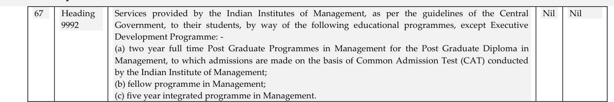

# Part 1 (from 2021-05-01-RATE-CGST-Fully _Exempted_supply_of_services_part1.pdf)


## Page 1

# CGST: Fully Exempted (Nil Rated) Supply of Services 

1. Vide notification No. 12/2017-Central Tax (Rate), dated 28.06.2017, certain intra-state supply of services have been fully exempted from payment of Central Tax.
2. The principal notification No. 12/2017-Central Tax (Rate), dated 28.06.2017 (w.e.f. 01.07.2018) was published vide number GSR 691 (E), dated 28.06.2017. This notification has since been amended vide notification No. 21/2017-Central Tax (Rate), dated 22.08.2017; No. 25/2017-Central Tax (Rate), dated 21.09.2017; No. 30/2017-Central Tax (Rate), dated 29.09.2017; No. 32/2017-Central Tax (Rate), dated 13.10.2017; No. 47/2017-Central Tax (Rate), dated 14.11.2017 (w.e.f. 15.11.2017); No. 2/2018-Central Tax (Rate), 25.01.2018; No. 14/2018-Central Tax (Rate), dated 26.07.2018 (w.e.f. 27.07.2018); No. 23/2018-Central Tax (Rate), dated 20.09.2018; No. 28/2018Central Tax (Rate), dated 31.12.2018 (w.e.f. 01.01.2019); and No. 04/2019Central Tax (Rate), dated 29.03.2019 (w.e.f. 01.04.2019); No. 13/2019-Central Tax (Rate), dated 31.07.2019 (w.e.f. 01.08.2019); No. 21/2019-Central Tax (Rate), dated 30.09.2019 (w.e.f. 01.10.2019); No. 28/2019-Central Tax (Rate), dated 31.12.2019 (w.e.f. 01.01.2020); No. 04/2020-Central Tax (Rate), dated 30.09.2020 (w.e.f. 01.10.2020); and No. 05/2020-Central Tax (Rate), dated 16.10.2020.
3. As amended text of notification No. 12/2107-Central Tax (Rate), dated 28.06.2017 has been given in the following paragraphs. The omissions or substitutions as stood prior to such omission/substitution has also been given in the footnote for convenience of the user of this document.

## Page 2

# Notification No. 12/2017-Central Tax (Rate), dated 28.06.2017 (w.e.f. 01.07.2018) as amended 

G.S.R. 691 (E).- In exercise of the powers conferred by ${ }^{1}$ [sub-section (3) and sub-section (4) of section 9 , sub-section (1) of section 11, sub-section (5) of section 15 and section 148,] of the Central Goods and Services Tax Act, 2017 (12 of 2017), the Central Government, on being satisfied that it is necessary in the public interest so to do, on the recommendations of the Council, hereby exempts the intra-State supply of services of description as specified in column (3) of the Table below from so much of the central tax leviable thereon under sub-section (1) of section 9 of the said Act, as is in excess of the said tax calculated at the rate as specified in the corresponding entry in column (4) of the said Table, unless specified otherwise, subject to the relevant conditions as specified in the corresponding entry in column (5) of the said Table, namely:-

TABLE

| Sl. <br> No. | Chapter, Section, Heading, Group or Service Code (Tariff) | Description of Services | Rate (per cent.) | Condition |
| :--: | :--: | :--: | :--: | :--: |
| (1) | (2) | (3) | (4) | (5) |
| 1 | Chapter 99 | Services by an entity registered under section 12AA of the Income-tax Act, 1961 (43 of 1961) by way of charitable activities. | Nil | Nil |
| 2 | Chapter 99 | Services by way of transfer of a going concern, as a whole or an independent part thereof. | Nil | Nil |
| 3 | Chapter 99 | Pure services (excluding works contract service or other composite supplies involving supply of any goods) provided to the Central Government, State Government or Union territory or local authority or a Governmental authority ${ }^{2}$ [or a Government Entity] by way of any activity in relation to any function entrusted to a Panchayat under article 243G of the Constitution or in relation to any function entrusted to a Municipality under article 243W of the Constitution. | Nil | Nil |
| ${ }^{3} 13 \mathrm{~A}$ | Chapter 99 | Composite supply of goods and services in which the value of supply of goods constitutes not more than 25 per cent. of the value of the said composite supply provided to the Central Government, State Government or Union | Nil | Nil] |

[^0]
[^0]:    1 Substituted for the words, bracket and figures "sub-section (1) of section 11" vide notification No. 04/2019-Central Tax (Tax), dated 29.03.2019 (w.e.f. 01.04.2019).
    2 Inserted vide notification No. 2/2018-Central Tax (Rate), dated 25.01.2018.
    3 Inserted entry No. 3A vide notification No. 2/2018-Central Tax (Rate), dated 25.01.2018.

## Page 3

| Sl. <br> No. | Chapter, Section, Heading, Group or Service Code (Tariff) | Description of Services | Rate (per cent.) | Condition |
| :--: | :--: | :--: | :--: | :--: |
| (1) | (2) | (3) | (4) | (5) |
|  |  | territory or local authority or a Governmental authority or a Government Entity by way of any activity in relation to any function entrusted to a Panchayat under article 243G of the Constitution or in relation to any function entrusted to a Municipality under article 243W of the Constitution. |  |  |
| 4 | Chapter 99 | Services by ${ }^{9}$ [omitted] governmental authority by way of any activity in relation to any function entrusted to a municipality under article 243 W of the Constitution. | Nil | Nil |
| 5 | Chapter 99 | Services by a ${ }^{5}$ [ ${ }^{0}$ [omitted] Government Authority] by way of any activity in relation to any function entrusted to a Panchayat under article 243G of the Constitution. | Nil | Nil |
| 6 | Chapter 99 | Services by the Central Government, State Government, Union territory or local authority excluding the following services- <br> (a) services by the Department of Posts by way of speed post, express parcel post, life insurance, and agency services provided to a person other than the Central Government, State Government, Union territory; <br> (b) services in relation to an aircraft or a vessel, inside or outside the precincts of a port or an airport; <br> (c) transport of goods or passengers; or <br> (d) any service, other than services covered under entries (a) to (c) above, provided to business entities. | Nil | Nil |

[^0]
[^0]:    4 Omitted the words "Central Government, State Government, Union territory, local authority or" vide notification No. 14/2018-Central Tax (Rate), dated 26.07.2018 (w.e.f. 27.07.2018).
    5 Substituted for the words "governmental authority" vide notification No 32/2017-Central Tax (Rate), dated 13.10.2017.

    6 Omitted the words "Central Government, State Government, Union territory, local authority or" vide notification No. 14/2018-Central Tax (Rate), dated 26.07.2018 (w.e.f. 27.07.2018).

## Page 4

| $\begin{gathered} \text { Sl. } \\ \text { No. } \end{gathered}$ | Chapter, Section, Heading, Group or Service Code (Tariff) | Description of Services | Rate (per cent.) | Condition |
| :--: | :--: | :--: | :--: | :--: |
| (1) | (2) | (3) | (4) | (5) |
| 7 | Chapter 99 | Services provided by the Central Government, State Government, Union territory or local authority to a business entity with an aggregate turnover of up to ${ }^{3}$ [such amount in the preceding financial year as makes it eligible for exemption from registration under the Central Goods and Services Tax Act, 2017 (12 of 2017)]. <br> Explanation.- For the purposes of this entry, it is hereby clarified that the provisions of this entry shall not be applicable to- <br> (a) services,- <br> (i) by the Department of Posts by way of speed post, express parcel post, life insurance, and agency services provided to a person other than the Central Government, State Government, Union territory; <br> (ii) in relation to an aircraft or a vessel, inside or outside the precincts of a port or an airport; <br> (iii) of transport of goods or passengers; and <br> (b) services by way of renting of immovable property. | Nil | Nil |
| 8 | Chapter 99 | Services provided by the Central Government, State Government, Union territory or local authority to another Central Government, State Government, Union territory or local authority: <br> Provided that nothing contained in this entry shall apply to services- <br> (i) by the Department of Posts by way of speed post, express parcel post, life insurance, and agency services provided to a person other than the Central Government, State Government, Union territory; <br> (ii) in relation to an aircraft or a vessel, inside or outside the precincts of a port | Nil | Nil |

[^0]
[^0]:    7 Substituted for the words "twenty lakh rupees (ten lakh rupees in case of a special category state) in the preceding financial year" vide notification No. 21/2019-Central Tax (Rate), dated 30.09.2019 (w.e.f. 01.10.2019).

## Page 5

| $\begin{gathered} \text { Sl. } \\ \text { No. } \end{gathered}$ | Chapter, Section, Heading, Group or Service Code (Tariff) | Description of Services | Rate (per cent.) | Condition |
| :--: | :--: | :--: | :--: | :--: |
| (1) | (2) | (3) | (4) | (5) |
|  |  | or an airport; <br> (iii) of transport of goods or passengers. |  |  |
| 9 | Chapter 99 | Services provided by Central Government, State Government, Union territory or a local authority where the consideration for such services does not exceed five thousand rupees: | Nil | Nil |
|  | Provided that nothing contained in this entry shall apply to- <br> (i) services by the Department of Posts by way of speed post, express parcel post, life insurance, and agency services provided to a person other than the Central Government, State Government, Union territory; <br> (ii) services in relation to an aircraft or a vessel, inside or outside the precincts of a port or an airport; <br> (iii) transport of goods or passengers: <br> Provided further that in case where continuous supply of service, as defined in sub-section (33) of section 2 of the Central Goods and Services Tax Act, 2017, is provided by the Central Government, State Government, Union territory or a local authority, the exemption shall apply only where the consideration charged for such service does not exceed five thousand rupees in a financial year. |  |  |  |
| ${ }^{8}[9 \mathrm{~A}$ | Chapter 99 | Services provided by and to Fédération Internationale de Football Association (FIFA) and its subsidiaries directly or indirectly related to any of the events under FIFA U-17 World Cup 2017 to be hosted in India. | Nil | Provided that <br> Director (Sports), Ministry of Youth Affairs and Sports certifies that the services are directly or indirectly related to any of the events under FIFA U17 World Cup 2017.] |
| ${ }^{9}$ [9AA | Chapter 99 | Services provided by and to Fédération | Nil | Provided that |

[^0]
[^0]:    8 Inserted entry No. 9A vide notification No. 21/2017- Central Tax (Rate), dated 22.08.2017.

## Page 6

| Sl. <br> No. | Chapter, Section, Heading, Group or Service Code (Tariff) | Description of Services | Rate (per cent.) | Condition |
| :--: | :--: | :--: | :--: | :--: |
| (1) | (2) | (3) | (4) | (5) |
|  |  | Internationale de Football Association (FIFA) and its subsidiaries directly or indirectly related to any of the events under FIFA U-17 Women's World Cup 2020 to be hosted in India. |  | Director (Sports), Ministry of Youth Affairs and Sports certifies that the services are directly or indirectly related to any of the events under FIFA U-17 Women's World Cup 2020.] |
| ${ }^{10}[9 \mathrm{~B}$ | Chapter 99 | Supply of services associated with transit cargo to Nepal and Bhutan (landlocked countries). | Nil | Nil] |
| ${ }^{11}[9 \mathrm{C}$ | Chapter 99 | Supply of service by a Government Entity to Central Government, State Government, Union territory, local authority or any person specified by Central Government, State Government, Union territory or local authority against consideration received from Central Government, State Government, Union territory or local authority, in the form of grants. | Nil | Nil] |
| ${ }^{12}[9 \mathrm{D}$ | Chapter 99 | Services by an old age home run by Central Government, State Government or by an entity registered under section 12AA of the Income-tax Act, 1961 (43 of 1961) to its residents (aged 60 years or more) against consideration upto twenty- five thousand rupees per month per member, provided that the consideration charged is inclusive of charges for boarding, lodging and maintenance. | Nil | Nil] |

[^0]
[^0]:    9 Inserted entry No. 9AA vide notification No. 21/2019-Central Tax (Rate), dated 30.09.2019 (w.e.f. 01.10.2019).
    10 Inserted entry No. 9B vide notification No. 30/2017-Central Tax (Rate), dated 29.09.2017.
    11 Inserted entry No. 9C vide notification No. 32/2017-Central Tax (Rate), dated 13.10.2017.
    12 Inserted entry No. 9D vide notification No. 14/2018-Central Tax (Rate), dated 26.07.2018 (w.e.f. 27.07.2018).

## Page 7

| $\begin{gathered} \text { Sl. } \\ \text { No. } \end{gathered}$ | Chapter, Section, Heading, Group or Service Code (Tariff) | Description of Services | Rate (per cent.) | Condition |
| :--: | :--: | :--: | :--: | :--: |
| (1) | (2) | (3) | (4) | (5) |
| 10 | Heading 9954 | Services provided by way of pure labour contracts of construction, erection, commissioning, installation, completion, fitting out, repair, maintenance, renovation, or alteration of a civil structure or any other original works pertaining to the beneficiaryled individual house construction or enhancement under the Housing for All (Urban) Mission or Pradhan Mantri Awas Yojana. | Nil | Nil |
| ${ }^{13}[10 \mathrm{~A}$ | Heading 9954 | Services supplied by electricity distribution utilities by way of construction, erection, commissioning, or installation of infrastructure for extending electricity distribution network upto the tube well of the farmer or agriculturalist for agricultural use. | Nil | Nil] |
| 11 | Heading 9954 | Services by way of pure labour contracts of construction, erection, commissioning, or installation of original works pertaining to a single residential unit otherwise than as a part of a residential complex. | Nil | Nil |
| ${ }^{14}[11 \mathrm{~A}$ | $\begin{aligned} & \text { Heading 9961 } \\ & \text { or } \quad \text { Heading } \\ & 9962 \end{aligned}$ | ${ }^{13}$ [Service provided by Fair Price Shops to Central Government, State Government or Union Territory by way of sale of food grains, kerosene, sugar, edible oil, etc under Public Distribution System (PDS) against consideration in the form of commission or margin.] | Nil | Nil |
| ${ }^{16}[11 \mathrm{~B}$ | [Omitted] | [Omitted] | Omitted | Omitted] |
| 12 | Heading 9963 | Services by way of renting of residential | Nil | Nil |

[^0]
[^0]:    13 Inserted entry No. 10A vide notification No. 14/2018-Central Tax (Rate), dated 26.07.2018 (w.e.f. 27.07.2018).
    14 Inserted entry No. 11A and 11B vide notification No. 21/2017- Central Tax (Rate), dated 22.08.2017.
    15 Substituted vide notification No. 47/2017-Central Tax (Rate), dated 14.11.2017 (w.e.f. 15.11.2017) for the words "Service provided by Fair Price Shops to Central Government by way of sale of wheat, rice and coarse grains under Public Distribution System (PDS) against consideration in the form of commission or margin.".
    16 Omitted entry No. 11B vide notification No. 47/2017-Central Tax (Rate), dated 14.11.2017 (w.e.f. 15.11.2017). Prior to omission, the entry No. 11B read as under: -

    | 11B | Heading 9961 <br> or $\quad$ Heading <br> 9962 | Service provided by Fair Price Shops to State Governments or <br> Union territories by way of sale of kerosene, sugar, edible oil, etc. <br> under Public Distribution System (PDS) against consideration in <br> the form of commission or margin. | Nil | Nil] |

## Page 8

| $\begin{gathered} \text { Sl. } \\ \text { No. } \end{gathered}$ | Chapter, Section, Heading, Group or Service Code (Tariff) | Description of Services | Rate (per cent.) | Condition |
| :--: | :--: | :--: | :--: | :--: |
| (1) | (2) | (3) | (4) | (5) |
|  | or $\begin{aligned} & \text { or } \begin{array}{l} \text { Heading } \\ 9972 \end{array} \end{aligned}$ | dwelling for use as residence. |  |  |
| 13 | Heading 9963 or <br> Heading 9972 or <br> Heading 9995 or <br> any other <br> Heading of <br> Section 9 | Services by a person by way of- <br> (a) conduct of any religious ceremony; <br> (b) renting of precincts of a religious place meant for general public, owned or managed by an entity registered as a charitable or religious trust under section 12AA of the Income-tax Act, 1961 (hereinafter referred to as the Income-tax Act) or a trust or an institution registered under sub clause (v) of clause (23C) of section 10 of the Income-tax Act or a body or an authority covered under clause (23BBA) of section 10 of the said Incometax Act: <br> Provided that nothing contained in entry (b) of this exemption shall apply to,- <br> (i) renting of rooms where charges are one thousand rupees or more per day; <br> (ii) renting of premises, community halls, kalyanmandapam or open area, and the like where charges are ten thousand rupees or more per day; <br> (iii) renting of shops or other spaces for business or commerce where charges are ten thousand rupees or more per month. 14 Heading 9963 Services by a hotel, inn, guest house, club or campsite, by whatever name called, for residential or lodging purposes, having declared tariff of a unit of accommodation below one thousand rupees per day or equivalent. | Nil | Nil |
| 14. | Heading 9963 | Services by a hotel, inn, guest house, club or campsite, by whatever name called, for residential or lodging purposes, having ${ }^{17}$ [value of supply] declared tariff of a unit of | Nil | Nil |

[^0]
[^0]:    17 Substituted for the words "declared tariff" vide notification No. 14/2018-Central Tax (Rate), dated 26.07.2018 (w.e.f. 27.07.2018).

## Page 9

| $\begin{gathered} \text { Sl. } \\ \text { No. } \end{gathered}$ | Chapter, Section, Heading, Group or Service Code (Tariff) | Description of Services | Rate (per cent.) | Condition |
| :--: | :--: | :--: | :--: | :--: |
| (1) | (2) | (3) | (4) | (5) |
|  |  | accommodation below ${ }^{18}$ [or equal to] one thousand rupees per day or equivalent. |  |  |
| 15 | Heading 9964 | Transport of passengers, with or without accompanied belongings, by - <br> (a) air, embarking from or terminating in an airport located in the state of Arunachal Pradesh, Assam, Manipur, Meghalaya, Mizoram, Nagaland, Sikkim, or Tripura or at Bagdogra located in West Bengal; <br> (b) non-airconditioned contract carriage other than radio taxi, for transportation of passengers, excluding tourism, conducted tour, charter or hire; or <br> (c) stage carriage other than airconditioned stage carriage. | Nil | Nil |
| 16 | Heading 9964 | Services provided to the Central Government, by way of transport of passengers with or without accompanied belongings, by air, embarking from or terminating at a regional connectivity scheme airport, against consideration in the form of viability gap funding: <br> Provided that nothing contained in this entry shall apply on or after the expiry of a period of ${ }^{19}$ [three years] from the date of commencement of operations of the regional connectivity scheme airport as notified by the Ministry of Civil Aviation. | Nil | Nil |
| 17 | Heading 9964 | Service of transportation of passengers, with or without accompanied belongings, by- <br> (a) railways in a class other than- <br> (i) first class; or <br> (ii) an air-conditioned coach; <br> (b) metro, monorail or tramway; <br> (c) inland waterways; <br> (d) public transport, other than predominantly for tourism purpose, in a vessel between places located in India; and | Nil | Nil |

[^0]
[^0]:    18 Inserted vide notification No. 21/2019-Central Tax (Rate), dated 31.09.2018 (w.e.f. 01.10.2018).
    19 Substituted for the words "one year" vide notification No. 2/2018-Central Tax (Rate), dated 25.01.2018.

## Page 10

| $\begin{gathered} \text { Sl. } \\ \text { No. } \end{gathered}$ | Chapter, Section, Heading, Group or Service Code (Tariff) | Description of Services | Rate (per cent.) | Condition |
| :--: | :--: | :--: | :--: | :--: |
| (1) | (2) | (3) | (4) | (5) |
|  |  | (e) metered cabs or auto rickshaws (including e-rickshaws). |  |  |
| 18 | Heading 9965 | Services by way of transportation of goods- <br> (a) by road except the services of- <br> (i) a goods transportation agency; <br> (ii) a courier agency; <br> (b) by inland waterways. | Nil | Nil |
| 19 | Heading 9965 | Services by way of transportation of goods by an aircraft from a place outside India upto the customs station of clearance in India. | Nil | Nil |
| ${ }^{20}[19 \mathrm{~A}$ | Heading 9965 | Services by way of transportation of goods by an aircraft from customs station of clearance in India to a place outside India. | Nil | Nothing contained in this serial number shall apply after the $30^{\text {th }}$ day of September, <br> ${ }^{21}\left[{ }^{32}\left[{ }^{23}[2021]\right]\right]$. |
| 19B | Heading 9965 | Services by way of transportation of goods by a vessel from customs station of clearance in India to a place outside India. | Nil | Nothing contained in this serial number shall apply after the $30^{\text {th }}$ day of September, ${ }^{24}\left[{ }^{35}\left[{ }^{26}[2021]\right]\right]$ |
| ${ }^{27}[19 \mathrm{C}$ | 9965 | Satellite launch services supplied by Indian Space Research Organisation, Antrix Corporation Limited or New Space India Limited. | Nil | Nil] |
| 20 | Heading 9965 | Services by way of transportation by rail or a vessel from one place in India to another of the following goods - <br> (a) relief materials meant for victims of natural or man-made disasters, calamities, accidents or mishap; <br> (b) defence or military equipments; <br> (c) newspaper or magazines registered with | Nil | Nil |

[^0]
[^0]:    20 Inserted entry Nos. 19A \& 19B vide notification No. 2/2018-Central Tax (Rate), dated 25.01.2018 (w.e.f. 25.01.2018).
    21 Substituted for numbers "2018" vide notification No. 14/2018-Central Tax (Rate), dated 26.07.2018 (w.e.f. 27.07.2018).
    22 Substituted for numbers "2019" vide notification No. 21/2019-Central Tax (Rate), dated 30.09.2019 (w.e.f. 01.10.2019).
    23 Substituted for numbers "2020" vide notification No. 04/2019-Central Tax (Rate), dated 30.09.2020 (w.e.f. 01.10.2020).
    24 Substituted for numbers "2018" vide notification No. 14/2018-Central Tax (Rate), dated 26.07.2018 (w.e.f. 27.07.2018).
    25 Substituted for numbers "2019" vide notification No. 21/2019-Central Tax (Rate), dated 30.09.2019 (w.e.f. 01.10.2019).
    26 Substituted for numbers "2020" vide notification No. 04/2019-Central Tax (Rate), dated 30.09.2020 (w.e.f. 01.10.2020).
    27 Inserted vide notification No. 05/2020-Central Tax (Rate), dated 16.10.2020 (w.e.f. 16.10.2020).

## Page 11

| $\begin{gathered} \text { Sl. } \\ \text { No. } \end{gathered}$ | Chapter, Section, Heading, Group or Service Code (Tariff) | Description of Services | Rate (per cent.) | Condition |
| :--: | :--: | :--: | :--: | :--: |
| (1) | (2) | (3) | (4) | (5) |
|  |  | the Registrar of Newspapers; <br> (d) railway equipments or materials; <br> (e) agricultural produce; <br> (f) milk, salt and food grain including flours, pulses and rice; and <br> (g) organic manure. |  |  |
| 21 | Heading 9965 or <br> Heading 9967 | Services provided by a goods transport agency, by way of transport in a goods carriage of - <br> (a) agricultural produce; <br> (b) goods, where consideration charged for the transportation of goods on a consignment transported in a single carriage does not exceed one thousand five hundred rupees; <br> (c) goods, where consideration charged for transportation of all such goods for a single consignee does not exceed rupees seven hundred and fifty; <br> (d) milk, salt and food grain including flour, pulses and rice; <br> (e) organic manure; <br> (f) newspaper or magazines registered with the Registrar of Newspapers; <br> (g) relief materials meant for victims of natural or man-made disasters, calamities, accidents or mishap; or <br> (h) defence or military equipments. | Nil | Nil |
| ${ }^{28}[21 \mathrm{~A}$ | $\begin{aligned} & \text { Heading 9965 } \\ & \text { Or } \\ & \text { Heading } \\ & 9967 \end{aligned}$ | Services provided by a goods transport agency to an unregistered person, including an unregistered casual taxable person, other than the following recipients, namely: - <br> (a) any factory registered under or governed by the Factories Act, 1948(63 of 1948); or <br> (b) any Society registered under the Societies Registration Act, 1860 (21 of 1860) or under any other law for the time being in force in any part of India; or <br> (c) any Co-operative Society established by or under any law for the time being in | Nil | Nil] |

[^0]
[^0]:    28 Inserted entry No. 21A vide notification No. 32/2017-Central Tax (Rate), dated 13.10.2017.

## Page 12

| $\begin{gathered} \text { Sl. } \\ \text { No. } \end{gathered}$ | Chapter, Section, Heading, Group or Service Code (Tariff) | Description of Services | Rate (per cent.) | Condition |
| :--: | :--: | :--: | :--: | :--: |
| (1) | (2) | (3) | (4) | (5) |
|  |  | force; or <br> (d) any body corporate established, by or under any law for the time being in force; or <br> (e) any partnership firm whether registered or not under any law including association of persons; <br> (f) any casual taxable person registered under the Central Goods and Services Tax Act or the Integrated Goods and Services Tax Act or the State Goods and Services Tax Act or the Union Territory Goods and Services Tax Act. |  |  |
| ${ }^{29}[21 B$ | $\begin{aligned} & \text { Heading } \\ & 9965 \text { or } \\ & \text { Heading } 9967 \end{aligned}$ | Services provided by a goods transport agency, by way of transport of goods in a goods carriage, to, - <br> (a) a Department or Establishment of the Central Government or State Government or Union territory; or <br> (b) local authority; or <br> (c) Governmental agencies, which has taken registration under the Central Goods and Services Tax Act, 2017 (12 of 2017) only for the purpose of deducting tax under Section 51 and not for making a taxable supply of goods or services. | Nil | Nil] |
| 22 | $\begin{aligned} & \text { Heading 9966 } \\ & \text { or Heading } \\ & 9973 \end{aligned}$ | Services by way of giving on hire - <br> (a) to a state transport undertaking, a motor vehicle meant to carry more than twelve passengers; or <br> ${ }^{30}$ [(aa) to a local authority, an Electrically operated vehicle meant to carry more than twelve passengers; or Explanation. - For the purposes of this entry, "Electrically operated vehicle" means vehicle falling under Chapter 87 in the First Schedule to the Customs Tariff Act, | Nil | Nil |

[^0]
[^0]:    ${ }^{29}$ Inserted entry No. 21B vide notification No. 28/2018-Central Tax (Rate), dated 31.12.2018 (w.e.f. 01.01.2019).
    30 Inserted vide notification No. 13/2019-Central Tax (Rate), dated 31.07.2019 (w.e.f. 01.08.2019).

## Page 13

| $\begin{gathered} \text { Sl. } \\ \text { No. } \end{gathered}$ | Chapter, Section, Heading, Group or Service Code (Tariff) | Description of Services | Rate (per cent.) | Condition |
| :--: | :--: | :--: | :--: | :--: |
| (1) | (2) | (3) | (4) | (5) |
|  |  | 1975 (51 of 1975) which is run solely on electrical energy derived from an external source or from one or more electrical batteries fitted to such road vehicle.] <br> (b) to a goods transport agency, a means of transportation of goods. <br> ${ }^{31}$ [(c) motor vehicle for transport of students, faculty and staff, to a person providing services of transportation of students, faculty and staff to an educational institution providing services by way of pre-school education and education upto higher secondary school or equivalent.] |  |  |
| 23 | Heading 9967 | Service by way of access to a road or a bridge on payment of toll charges. | Nil | Nil |
| ${ }^{32}$ [23A | Heading 9967 | Service by way of access to a road or a bridge on payment of annuity. | Nil | Nil] |
| 24 | Heading 9967 or <br> Heading 9985 | Services by way of loading, unloading, packing, storage or warehousing of rice. | Nil | Nil |
| ${ }^{33}[$ 24A | $\begin{aligned} & \text { Heading 9967 } \\ & \text { or Heading } \\ & 9985 \end{aligned}$ | Services by way of warehousing of minor forest produce. | Nil | Nil ] |
| ${ }^{34} \mid 24 \mathrm{~B}$ | $\begin{aligned} & \text { Heading 9967 } \\ & \text { or } \\ & \text { Heading 9985 } \end{aligned}$ | Services by wayof storage or warehousing of cereals, pulses, fruits, nuts and vegetables, spices, copra, sugarcane, jaggery, raw vegetable fibres such as cotton, flax, jute etc., indigo, unmanufactured tobacco, betel leaves, tendu leaves, coffee and tea. | Nil | Nil]. |
| 25 | Heading 9969 | Transmission or distribution of electricity by an electricity transmission or distribution utility. | Nil | Nil |
| 26 | Heading 9971 | Services by the Reserve Bank of India. | Nil | Nil |
| 27 | $\begin{aligned} & \text { Heading 9971 } \end{aligned}$ | Services by way of- <br> (a) extending deposits, loans or advances in | Nil | Nil |

[^0]
[^0]:    31 Inserted vide notification No. 2/2018-Central Tax (Rate), dated 25.01.2018 (w.e.f. 25.01.2018).
    32 Inserted entry No. 23A vide notification No. 32/2017-Central Tax (Rate), dated 13.10.2017.
    33 Inserted entry No. 24A vide notification No. 14/2018-Central Tax (Rate), dated 26.07.2018 (w.e.f. 27.07.2018).
    34 Inserted entry No. 24B vide notification No. 21/2019-Central Tax (Rate), dated 30.09.2019 (w.e.f. 01.10.2019).

## Page 14

| $\begin{gathered} \text { Sl. } \\ \text { No. } \end{gathered}$ | Chapter, Section, Heading, Group or Service Code (Tariff) | Description of Services | Rate (per cent.) | Condition |
| :--: | :--: | :--: | :--: | :--: |
| (1) | (2) | (3) | (4) | (5) |
|  |  | so far as the consideration is represented by way of interest or discount (other than interest involved in credit card services); <br> (b) inter se sale or purchase of foreign currency amongst banks or authorised dealers of foreign exchange or amongst banks and such dealers. |  |  |
| ${ }^{35}$ [27A | Heading 9971 | Services provided by a banking company to Basic Saving Bank Deposit (BSBD) account holders under Pradhan Mantri Jan Dhan Yojana (PMJDY). | Nil | Nil] |
| 28 | $\begin{aligned} & \text { Heading 9971 } \\ & \text { or Heading } \\ & 9991 \end{aligned}$ | Services of life insurance business provided by way of annuity under the National Pension System regulated by the Pension Fund Regulatory and Development Authority of India under the Pension Fund Regulatory and Development Authority Act, 2013 (23 of 2013). | Nil | Nil |
| 29 | $\begin{aligned} & \text { Heading 9971 } \\ & \text { or Heading } \\ & 9991 \end{aligned}$ | Services of life insurance business provided or agreed to be provided by the Army, Naval and Air Force Group Insurance Funds to members of the Army, Navy and Air Force, respectively, under the Group Insurance Schemes of the Central Government. | Nil | Nil |
| ${ }^{36}$ [29A | $\begin{aligned} & \text { Heading 9971 } \\ & \text { or } \quad \text { Heading } \\ & 9991 \text { ] } \end{aligned}$ | Services of life insurance provided or agreed to be provided by the Naval Group Insurance Fund to the personnel of Coast Guard under the Group Insurance Schemes of the Central Government. | Nil | Nil] |
| ${ }^{37}$ [29B | $\begin{aligned} & \text { Heading 9971 } \\ & \text { or } \quad \text { Heading } \\ & 9991 \end{aligned}$ | Services of life insurance provided or agreed to be provided by the Central Armed Police Forces (under Ministry of Home Affairs) Group Insurance Funds to their members under the Group Insurance Schemes of the concerned Central Armed Police Force. | Nil | Nil] |
| 30 | $\begin{aligned} & \text { Heading 9971 } \\ & \text { or } \quad \text { Heading } \\ & 9991 \end{aligned}$ | Services by the Employees' State Insurance Corporation to persons governed under the Employees' State Insurance Act, 1948 (34 of | Nil | Nil |

[^0]
[^0]:    ${ }^{35}$ Inserted entry No. 27A vide notification No. 28/2018-Central Tax (Rate), dated31.12.2018 (w.e.f. 01.01.2019).
    ${ }^{36}$ Inserted entry No. 29A vide notification No. 2/2018-Central Tax (Rate), dated 25.01.2018 (w.e.f. 25.01.2018).
    ${ }^{37}$ Inserted entry No. 29B vide notification No. 21/2019-Central Tax (Rate), dated 30.09.2019 (w.e.f. 01.10.2019).

## Page 15

| $\begin{gathered} \text { Sl. } \\ \text { No. } \end{gathered}$ | Chapter, Section, Heading, Group or Service Code (Tariff) | Description of Services | Rate (per cent.) | Condition |
| :--: | :--: | :--: | :--: | :--: |
| (1) | (2) | (3) | (4) | (5) |
|  |  | 1948). |  |  |
| 31 | Heading 9971 | Services provided by the Employees Provident Fund Organisation to the persons governed under the Employees Provident Funds and the Miscellaneous Provisions Act, 1952 (19 of 1952). | Nil | Nil |
| ${ }^{38}$ [31A | $\begin{aligned} & \text { Heading 9971 } \\ & \text { or Heading } \\ & 9991 \end{aligned}$ | Services by Coal Mines Provident Fund Organisation to persons governed by the Coal Mines Provident Fund and Miscellaneous Provisions Act, 1948 (46 of 1948). | Nil | Nil |
| 31B | $\begin{aligned} & \text { Heading 9971 } \\ & \text { or Heading } \\ & 9991 \end{aligned}$ | Services by National Pension System (NPS) Trust to its members against consideration in the form of administrative fee. | Nil | Nil ] |
| 32 | Heading 9971 | Services provided by the Insurance Regulatory and Development Authority of India to insurers under the Insurance Regulatory and Development Authority of India Act, 1999 (41 of 1999). | Nil | Nil |
| 33 | Heading 9971 | Services provided by the Securities and Exchange Board of India set up under the Securities and Exchange Board of India Act, 1992 (15 of 1992) by way of protecting the interests of investors in securities and to promote the development of, and to regulate, the securities market. | Nil | Nil |
| 34 | Heading 9971 | Services by an acquiring bank, to any person in relation to settlement of an amount upto two thousand rupees in a single transaction transacted through credit card, debit card, charge card or other payment card service. Explanation. - For the purposes of this entry, "acquiring bank" means any banking company, financial institution including nonbanking financial company or any other person, who makes the payment to any person who accepts such card. | Nil | Nil |
| ${ }^{39}$ [34A | Heading 9971 | Services supplied by Central Government, State Government, Union territory to their undertakings or Public Sector Undertakings (PSUs) by way of guaranteeing the loans | Nil | Nil] |

[^0]
[^0]:    ${ }^{38}$ Inserted entry No. 31A \& 31B vide notification No. 14/2018-Central Tax (Rate), dated 26.07.2018 (w.e.f. 27.07.2018).
    39 Inserted entry No. 34A vide notification No. 14/2018-Central Tax (Rate), dated 26.07.2018 (w.e.f. 27.07.2018).

## Page 16

| $\begin{gathered} \text { Sl. } \\ \text { No. } \end{gathered}$ | Chapter, Section, Heading, Group or Service Code (Tariff) | Description of Services | Rate (per cent.) | Condition |
| :--: | :--: | :--: | :--: | :--: |
| (1) | (2) | (3) | (4) | (5) |
|  |  | taken by such undertakings or PSUs from the ${ }^{40}$ [banking companies and] financial institutions. |  |  |
| 35 | Heading 9971 or <br> Heading 9991 | Services of general insurance business provided under following schemes - <br> (a) Hut Insurance Scheme; <br> (b) Cattle Insurance under Swarnajaynti Gram Swarozgar Yojna (earlier known as Integrated Rural Development Programme); <br> (c) Scheme for Insurance of Tribals; <br> (d) Janata Personal Accident Policy and Gramin Accident Policy; <br> (e) Group Personal Accident Policy for Self-Employed Women; <br> (f) Agricultural Pumpset and Failed Well Insurance; <br> (g) premia collected on export credit insurance; <br> (h) ${ }^{41}$ [Restructured Weather Based Crop Insurance Scheme (RWCIS)], approved by the Government of India and implemented by the Ministry of Agriculture; <br> (i) Jan Arogya Bima Policy; <br> (j) ${ }^{42}$ [Pradhan Mantri Fasal Bima Yojana (PMFBY]; <br> (k) Pilot Scheme on Seed Crop Insurance; <br> (l) Central Sector Scheme on Cattle Insurance; <br> (m) Universal Health Insurance Scheme; <br> (n) Rashtriya Swasthya Bima Yojana; <br> (o) Coconut Palm Insurance Scheme; <br> (p) Pradhan Mantri Suraksha BimaYojna; <br> (q) Niramaya Health Insurance Scheme implemented by the Trust constituted under the provisions of the National Trust for the Welfare of Persons with Autism, Cerebral Palsy, Mental Retardation and Multiple Disabilities Act, 1999 (44 of 1999). <br> ${ }^{41}$ [tr) Bangla Shasya Bima] | Nil | Nil |

[^0]
[^0]:    ${ }^{40}$ Inserted vide notification No. 28/2018-Central Tax (Rate), dated 31.12.2018 (w.e.f. 01.01.2019).
    ${ }^{41}$ Substituted for the words "Weather Based Crop Insurance Scheme or the Modified National Agricultural Insurance Scheme" vide notification No. 21/2017-Central Tax (Rate), dated 22.08.2017.
    ${ }^{42}$ Substituted for the words "National Agricultural Insurance Scheme (Rashtriya Krishi Bima Yojana)" vide notification No. 21/2017- Central Tax (Rate), dated 22.08.2017.
    ${ }^{43}$ Inserted vide notification No. 21/2019-Central Tax (Rate), dated 30.09.2019 (w.e.f. 01.10.2019).

## Page 17

| $\begin{gathered} \text { Sl. } \\ \text { No. } \end{gathered}$ | Chapter, Section, Heading, Group or Service Code (Tariff) | Description of Services | Rate (per cent.) | Condition |
| :--: | :--: | :--: | :--: | :--: |
| (1) | (2) | (3) | (4) | (5) |
| 36 | $\begin{aligned} & \text { Heading 9971 } \\ & \text { or Heading } \\ & 9991 \end{aligned}$ | Services of life insurance business provided under following schemes- <br> (a) Janashree Bima Yojana; <br> (b) Aam Aadmi Bima Yojana; <br> (c) Life micro-insurance product as approved by the Insurance Regulatory and Development Authority, having maximum amount of cover of " [two lakhs] rupees; <br> (d) Varishtha Pension BimaYojana; <br> (e) Pradhan Mantri Jeevan JyotiBimaYojana; <br> (f) Pradhan Mantri Jan DhanYogana; <br> (g) Pradhan Mantri Vaya Vandan Yojana. | Nil | Nil |
| ${ }^{45}$ [36A | $\begin{aligned} & \text { Heading 9971 } \\ & \text { or } \quad \text { Heading } \\ & 9991 \text { ] } \end{aligned}$ | Services by way of reinsurance of the insurance schemes specified in serial number 35 or $36{ }^{46}$ [or 40]. | Nil | Nil] |
| 37 | $\begin{aligned} & \text { Heading 9971 } \\ & \text { or } \quad \text { Heading } \\ & 9991 \end{aligned}$ | Services by way of collection of contribution under the Atal Pension Yojana. | Nil | Nil |
| 38 | $\begin{aligned} & \text { Heading 9971 } \\ & \text { or } \quad \text { Heading } \\ & 9991 \end{aligned}$ | Services by way of collection of contribution under any pension scheme of the State Governments. | Nil | Nil |
| 39 | $\begin{aligned} & \text { Heading 9971 } \\ & \text { or } \quad \text { Heading } \\ & 9985 \end{aligned}$ | Services by the following persons in respective capacities - <br> (a) business facilitator or a business correspondent to a banking company with respect to accounts in its rural area branch; <br> (b) any person as an intermediary to a business facilitator or a business correspondent with respect to services mentioned in entry (a); or <br> (c) business facilitator or a business correspondent to an insurance company in a rural area. | Nil | Nil |
| ${ }^{47}$ [39A | $\begin{aligned} & \text { Heading 9971 } \end{aligned}$ | Services by an intermediary of financial services located in a multi services SEZ with International Financial Services Centre | Nil | Nil ] |

[^0]
[^0]:    ${ }^{44}$ Substituted for the words "fifty thousands" vide notification No. 2/2018-Central Tax (Rate), dated 25.01.2018 (w.e.f. 25.01.2018).

    45 Inserted entry No. 36A vide notification No. 2/2018-Central Tax (Rate), dated 25.01.2018 (w.e.f. 25.01.2018).
    46 Inserted vide notification No. 14/2018-Central Tax (Rate), dated 26.07.2018 (w.e.f. 27.07.2018).
    47 Inserted entry No. 39A vide notification No. 2/2018-Central Tax (Rate), dated 25.01.2018 (w.e.f. 25.01.2018).

## Page 18

| Sl. <br> No. | Chapter, Section, Heading, Group or Service Code (Tariff) | Description of Services | Rate (per cent.) | Condition |
| :--: | :--: | :--: | :--: | :--: |
| (1) | (2) | (3) | (4) | (5) |
|  |  | (IFSC) status to a customer located outside India for international financial services in currencies other than Indian rupees (INR). <br> Explanation.- For the purposes of this entry, the intermediary of financial services in IFSC is a person,- <br> (i) who is permitted or recognised as such by the Government of India or any Regulator appointed for regulation of IFSC; or <br> (ii) who is treated as a person resident outside India under the Foreign Exchange Management (International Financial Services Centre) Regulations, 2015; or <br> (iii) who is registered under the Insurance Regulatory and Development Authority of India (International Financial Service Centre) Guidelines, 2015 as IFSC Insurance Office; or <br> (iv) who is permitted as such by Securities and Exchange Board of India (SEBI) under the Securities and Exchange Board of India (International Financial Services Centres) Guidelines, 2015. |  |  |
| 40 | $\begin{aligned} & \text { Heading 9971 } \\ & \text { or } \\ & \text { Heading 9991 } \end{aligned}$ | Services provided to the Central Government, State Government, Union territory under any insurance scheme for which total premium is paid by the Central Government, State Government, Union territory. | Nil | Nil |
| 41 | Heading 9972 | ${ }^{48}$ [Upfront amount (called as premium, salami, cost, price, development charges or by any other name) payable in respect of service by way of granting of long term lease of thirty years, or more) of industrial plots or plots for development of infrastructure for financial business, provided by the State Government Industrial Development Corporations or | Nil | ${ }^{31}$ [Provided that the leased plots shall be used for the purpose for which they are allotted, that is, for industrial or financial activity in an industrial or financial business |

[^0]
[^0]:    48 Substituted vide notification No. 32/2017-Central Tax (Rate), dated 13.10.2017. Prior to substitution, it read as under:-
    "One time upfront amount (called as premium, salami, cost, price, development charges or by any other name) leviable in respect of the service, by way of granting long term (thirty years, or more) lease of industrial plots, provided by the State Government Industrial Development Corporations or Undertakings to industrial units."

## Page 19

| $\begin{gathered} \text { Sl. } \\ \text { No. } \end{gathered}$ | Chapter, Section, Heading, Group or Service Code (Tariff) | Description of Services | Rate (per cent.) | Condition |
| :--: | :--: | :--: | :--: | :--: |
| (1) | (2) | (3) | (4) | (5) |
|  |  | Undertakings or by any other entity having ${ }^{49}[20]$ per cent. or more ownership of Central Government, State Government, Union territory to the industrial units or the developers in any industrial or financial business area.] <br> ${ }^{50}$ [Explanation.- For the purpose of this exemption, the Central Government, State Government or Union territory shall have 50 per cent. or more ownership in the entity directly or through an entity which is wholly owned by the Central Government, State Government or Union territory.] |  | area: <br> Provided further that the State Government concerned shall monitor and enforce the above condition as per the order issued by the State Government in this regard: <br> Provided also that in case of any violation or subsequent change of land use, due to any reason whatsoever, the original lessor, original lessee as well as any subsequent lessee or buyer or owner shall be jointly and severally liable to pay such amount of central tax, as would have been payable on the upfront amount charged for the long term lease of the plots but for the exemption contained herein, along with the applicable interest and penalty: <br> Provided also that the lease agreement entered into by the original lessor |

[^0]
[^0]:    51 Substituted for word "Nil" vide notification No. 28/2019-Central Tax (Rate), dated 31.12.2019 (w. e.f. 01.01.2020). Substituted for figures " 50 " vide notification No. 28/2019-Central Tax (Rate), dated 31.12.2019 (w. e.f. 01.01.2020). Explanation inserted vide notification No. 23/2018-Central Tax (Rate), dated 20.09.2018.

## Page 20

| $\begin{gathered} \text { Sl. } \\ \text { No. } \end{gathered}$ | Chapter, Section, Heading, Group or Service Code (Tariff) | Description of Services | Rate (per cent.) | Condition |
| :--: | :--: | :--: | :--: | :--: |
| (1) | (2) | (3) | (4) | (5) |
|  |  |  |  | with the original lessee or subsequent lessee, or sublessee, as well as any subsequent lease or sale agreements, for lease or sale of such plots to subsequent lessees or buyers or owners shall incorporate in the terms and conditions, the fact that the central tax was exempted on the long term lease of the plots by the original lessor to the original lessee subject to above condition and that the parties to the said agreements undertake to comply with the same.] |
| ${ }^{52}$ [41A | Heading 9972 | Service by way of transfer of development rights (herein refer TDR) or Floor Space Index (FSI) (including additional FSI) on or after 1st April, 2019 for construction of residential apartments by a promoter in a project, intended for sale to a buyer, wholly or partly, except where the entire consideration has been received after issuance of completion certificate, where required, by the competent authority or after its first occupation, whichever is earlier. The amount of GST exemption available for construction of residential apartments in the project under this | Nil | Provided that the promoter shall be liable to pay tax at the applicable rate, on reverse charge basis, on such proportion of value of development rights, or FSI (including additional FSI), or both, as is attributable to the residential |

[^0]
[^0]:    52 Inserted entry Nos. 41A \& 41B vide notification No. 4/2019-Central Tax (Rate), dated 29.03.2019 (w.e.f. 01.04.2019).

## Page 21

| $\begin{gathered} \text { Sl. } \\ \text { No. } \end{gathered}$ | Chapter, Section, Heading, Group or Service Code (Tariff) | Description of Services | Rate (per cent.) | Condition |
| :--: | :--: | :--: | :--: | :--: |
| (1) | (2) | (3) | (4) | (5) |
|  |  | notification shall be calculated as under: [GST payable on TDR or FSI (including additional FSI) or both for construction of the project] x (carpet area of the residential apartments in the project $\div$ Total carpet area of the residential and commercial apartments in the project ). |  | apartments, which remain unbooked on the date of issuance of completion certificate, or first occupation of the project, as the case may be, in the following manner : [GST payable on TDR or FSI (including additional FSI) or both for construction of the residential apartments in the project but for the exemption contained herein] x (carpet area of the residential apartments in the project which remain unbooked on the date of issuance of completion certificate or first occupation $\div$ Total carpet area of the residential apartments in the project) <br> Provided further <br> that tax payable in terms of the first proviso hereinabove shall not exceed 0.5 per cent. of the value in case of affordable residential apartments and 2.5 per cent. of the value in case of residential apartments other than affordable |

## Page 22

| $\begin{gathered} \text { Sl. } \\ \text { No. } \end{gathered}$ | Chapter, Section, Heading, Group or Service Code (Tariff) | Description of Services | Rate (per cent.) | Condition |
| :--: | :--: | :--: | :--: | :--: |
| (1) | (2) | (3) | (4) | $\begin{array}{r} \text { (5) } \\ \text { residential } \\ \text { apartments } \\ \text { remaining un- } \\ \text { booked on the } \\ \text { date of issuance } \\ \text { of completion } \\ \text { certificate or first } \\ \text { occupation } \\ \text { The liability to } \\ \text { pay central tax on } \\ \text { the said portion } \\ \text { of the } \\ \text { development } \\ \text { rights or FSI, or } \\ \text { both, calculated } \\ \text { as above, shall } \\ \text { arise on the date } \\ \text { of completion or } \\ \text { first occupation } \\ \text { of the project, as } \\ \text { the case may be, } \\ \text { whichever is } \\ \text { earlier. } \end{gathered}$ |
| 41B. | Heading 9972 | Upfront amount (called as premium, salami, cost, price, development charges or by any other name) payable in respect of service by way of granting of long term lease of thirty years, or more, on or after 01.04.2019, for Construction of residential apartments by a promoter in a project, intended for sale to a buyer, wholly or partly, except where the entire consideration has been received after issuance of completion certificate where required, by the competent authority or after its first occupation, whichever is earlier. The amount of GST exemption available for construction of residential apartments in the project under this notification shall be calculated as under: <br> [GST payable on upfront amount (called as premium, salami, cost, price, development charges or by any other name) payable for long term lease of land for construction of the project] $\mathbf{x}$ (carpet area of the residential apartments in the project $\div$ Total carpet area of the residential and commercial apartments in the project) | Nil | Provided that the promoter shall be liable to pay tax at the applicable rate, on reverse charge basis, on such proportion of upfront amount (called as premium, salami, cost, price, development charges or by any other name) paid for long term lease of land, as is attributable to the residential apartments, which remain unbooked on the date of issuance of completion certificate, or first occupation of the project, as the case may be, in the following manner - |

## Page 23

| $\begin{gathered} \text { Sl. } \\ \text { No. } \end{gathered}$ | Chapter, Section, Heading, Group or Service Code (Tariff) | Description of Services | Rate (per cent.) | Condition |
| :--: | :--: | :--: | :--: | :--: |
| (1) | (2) | (3) | (4) | (5) |
|  |  |  |  | \{GST payable on upfront amount (called as premium, salami, cost, price, development charges or by any other name) payable for long term lease of land for construction of the residential apartments in the project but for the exemption contained herein\} x (carpet area of the residential apartments in the project which remain unbooked on the date of issuance of completion certificate or first occupation $\approx$ Total carpet area ofthe residential apartments in the project); <br> Provided further that the tax payable in terms of the first proviso shall not exceed 0.5 per cent. of the value in case of affordable residential apartments and 2.5 per cent. of the value in case of residential apartments other than affordable residential apartments remaining unbooked on the date of issuance of completion certificate or first |

## Page 24

| $\begin{gathered} \text { Sl. } \\ \text { No. } \end{gathered}$ | Chapter, Section, Heading, Group or Service Code (Tariff) | Description of Services | Rate (per cent.) | Condition |
| :--: | :--: | :--: | :--: | :--: |
| (1) | (2) | (3) | (4) | (5) |
|  |  |  |  | occupation. <br> The liability to pay central tax on the said proportion of upfront amount (called as premium, salami, cost, price, development charges or by any other name) paid for long term lease of land, calculated as above, shall arise on the date of issue of completion certificate or first occupation of the project, as the case may be. ] |
| 42 | Heading 9973 or Heading 9991 | Services provided by the Central Government, State Government, Union territory or local authority by way of allowing a business entity to operate as a telecom service provider or use radio frequency spectrum during the period prior to the 1st April, 2016, on payment of licence fee or spectrum user charges, as the case may be. | Nil | Nil |
| 43 | Heading 9973 | Services of leasing of assets (rolling stock assets including wagons, coaches, locos) by the Indian Railways Finance Corporation to Indian Railways. | Nil | Nil |
| 44 | Heading 9981 | Services provided by an incubatee up to a total turnover of fifty lakh rupees in a financial year subject to the following conditions, namely: <br> (a) the total turnover had not exceeded fifty lakh rupees during the preceding financial year; and <br> (b) a period of three years has not elapsed from the date of entering into an agreement as an incubatee. | Nil | Nil |
| 45 | Heading 9982 | Services provided by- | Nil | Nil |

## Page 25

| $\begin{gathered} \text { Sl. } \\ \text { No. } \end{gathered}$ | Chapter, Section, Heading, Group or Service Code (Tariff) | Description of Services | Rate (per cent.) | Condition |
| :--: | :--: | :--: | :--: | :--: |
| (1) | (2) | (3) | (4) | (5) |
|  | or $\begin{gathered} \text { or } \begin{array}{c} \text { Heading } \\ 9991 \end{array} \end{gathered}$ | (a) an arbitral tribunal to - <br> (i) any person other than a business entity; or <br> (ii) a business entity with an aggregate turnover up to ${ }^{53}$ [such amount in the preceding financial year as makes it eligible for exemption from registration under the Central Goods and Services Tax Act, 2017 (12 of 2017)]; <br> ${ }^{54}$ [(iii) the Central Government, State <br> Government, Union territory, local authority, Government Authority or Government Entity;] <br> (b) a partnership firm of advocates or an individual as an advocate other than a senior advocate, by way of legal services to- <br> (i) an advocate or partnership firm of advocates providing legal services; <br> (ii) any person other than a business entity; or <br> (iii) a business entity with an aggregate turnover up to ${ }^{55}$ [such amount in the preceding financial year as makes it eligible for exemption from registration under the Central Goods and Services Tax Act, 2017 (12 of 2017)]; <br> ${ }^{56}$ [(iv) the Central Government, State <br> Government, Union territory, local authority, Government Authority or Government Entity;] <br> (c) a senior advocate by way of legal services to- <br> (i) any person other than a business entity; or |  |  |

[^0]
[^0]:    53 Substituted for the words "twenty lakh rupees (ten lakh rupees in the case of special category states) in the preceding financial year" vide notification No. 21/2019-Central Tax (Rate), dated 30.09.2019 (w.e.f. 01.10.2019).
    54 Inserted vide notification No. 2/2018-Central Tax (Rate), dated 25.01.2018.
    55 Substituted for the words "[twenty lakh rupees (ten lakh rupees in the case of special category states) in the preceding financial year" vide notification No. 21/2019-Central Tax (Rate), dated 30.09.2019 (w.e.f. 01.10.2019).
    56 Inserted vide notification No. 2/2018-Central Tax (Rate), dated 25.01.2018.

## Page 26

| Sl. <br> No. | Chapter, Section, Heading, Group or Service Code (Tariff) | Description of Services | Rate (per cent.) | Condition |
| :--: | :--: | :--: | :--: | :--: |
| (1) | (2) | (3) | (4) | (5) |
|  |  | (ii) a business entity with an aggregate turnover up to ${ }^{57}$ [such amount in the preceding financial year as makes it eligible for exemption from registration under the Central Goods and Services Tax Act, 2017 (12 of 2017)]; <br> ${ }^{58}$ [(iii) the Central Government, State Government, Union territory, local authority, Government Authority or Government Entity;] |  |  |
| 46 | Heading 9983 | Services by a veterinary clinic in relation to health care of animals or birds. | Nil | Nil |
| 47 | $\begin{aligned} & \text { Heading } 9983 \\ & \text { or } \quad \text { Heading } \\ & 9991 \end{aligned}$ | Services provided by the Central Government, State Government, Union territory or local authority by way of- (a) registration required under any law for the time being in force; (b) testing, calibration, safety check or certification relating to protection or safety of workers, consumers or public at large, including fire license, required under any law for the time being in force. | Nil | Nil |
| ${ }^{59}[47 \mathrm{~A}$ | $\begin{aligned} & \text { Heading } 9983 \\ & \text { or Heading } \\ & 9991 \end{aligned}$ | Services by way of licensing, registration and analysis or testing of food samples supplied by the Food Safety and Standards Authority of India (FSSAI) to Food Business Operators. | Nil | Nil] |
| 48 | $\begin{aligned} & \text { Heading } 9983 \\ & \text { or any other } \\ & \text { Heading of } \\ & \text { Chapter } 99 \end{aligned}$ | Taxable services, provided or to be provided, by a Technology Business Incubator or a Science and Technology Entrepreneurship Park recognised by the National Science and Technology Entrepreneurship Development Board of the Department of Science and Technology, Government of India or bio incubators recognised by the Biotechnology Industry Research Assistance Council, under | Nil | Nil |

[^0]
[^0]:    57 Substituted for the words "twenty lakh rupees (ten lakh rupees in the case of special category states) in the preceding financial year" vide notification No. 21/2019-Central Tax (Rate), dated 30.09.2019 (w.e.f. 01.10.2019).
    58 Inserted vide notification No. 2/2018-Central Tax (Rate), dated 25.01.2018.
    59 Inserted entry No. 47A vide notification No. 14/2018-Central Tax (Rate), dated 26.07.2018 (w.e.f. 27.07.2018).

## Page 27

| $\begin{gathered} \text { Sl. } \\ \text { No. } \end{gathered}$ | Chapter, Section, Heading, Group or Service Code (Tariff) | Description of Services | Rate (per cent.) | Condition |
| :--: | :--: | :--: | :--: | :--: |
| (1) | (2) | (3) | (4) | (5) |
|  |  | the Department of Biotechnology, Government of India. |  |  |
| 49 | Heading 9984 | Services by way of collecting or providing news by an independent journalist, Press Trust of India or United News of India. | Nil | Nil |
| 50 | Heading 9984 | Services of public libraries by way of lending of books, publications or any other knowledge-enhancing content or material. | Nil | Nil |
| 51 | Heading 9984 | Services provided by the Goods and Services Tax Network to the Central Government or State Governments or Union territories for implementation of Goods and Services Tax. | Nil | Nil |
| 52 | Heading 9985 | Services by an organiser to any person in respect of a business exhibition held outside India. | Nil | Nil |
| 53 | Heading 9985 | Services by way of sponsorship of sporting events organised - <br> (a) by a national sports federation, or its affiliated federations, where the participating teams or individuals represent any district, State, zone or Country; <br> (b) by Association of Indian Universities, Inter-University Sports Board, School Games Federation of India, All India Sports Council for the Deaf, Paralympic Committee of India or Special Olympics Bharat; <br> (c) by the Central Civil Services Cultural and Sports Board; <br> (d) as part of national games, by the Indian Olympic Association; or <br> (e) under the Panchayat Yuva Kreeda Aur Khel Abhiyaan Scheme. | Nil | Nil |
| ${ }^{60}$ [53A | Heading 9985 | Services by way of fumigation in a warehouse of agricultural produce. | Nil | Nil] |
| 54 | Heading 9986 | Services relating to cultivation of plants and | Nil | Nil |

[^0]
[^0]:    ${ }^{60}$ Inserted entry No. 53A vide notification No. 2/2018-Central Tax (Rate), dated 25.01.2018 (w.e.f. 25.01.2018).

## Page 28

| Sl. <br> No. | Chapter, Section, Heading, Group or Service Code (Tariff) | Description of Services | Rate (per cent.) | Condition |
| :--: | :--: | :--: | :--: | :--: |
| (1) | (2) | (3) | (4) | (5) |
|  |  | rearing of all life forms of animals, except the rearing of horses, for food, fibre, fuel, raw material or other similar products or agricultural produce by way of- <br> (a) agricultural operations directly related to production of any agricultural produce including cultivation, harvesting, threshing, plant protection or testing; <br> (b) supply of farm labour; <br> (c) processes carried out at an agricultural farm including tending, pruning, cutting, harvesting, drying, cleaning, trimming, sun drying, fumigating, curing, sorting, grading, cooling or bulk packaging and such like operations which do not alter the essential characteristics of agricultural produce but make it only marketable for the primary market; <br> (d) renting or leasing of agro machinery or vacant land with or without a structure incidental to its use; <br> (e) loading, unloading, packing, storage or warehousing of agricultural produce; <br> (f) agricultural extension services; <br> (g) services by any Agricultural Produce Marketing Committee or Board or services provided by a commission agent for sale or purchase of agricultural produce. <br> ${ }^{61}$ [(h) services by way of fumigation in a warehouse of agricultural produce.] |  |  |
| 55. | Heading 9986 | Carrying out an intermediate production process as job work in relation to cultivation of plants and rearing of all life forms of animals, except the rearing of horses, for food, fibre, fuel, raw material or other similar products or agricultural produce. | Nil | Nil |

[^0]
[^0]:    ${ }^{61}$ Inserted vide notification No. 2/2018-Central Tax (Rate), dated 25.01.2018 (w.e.f. 25.01.2018).

## Page 29

| $\begin{gathered} \text { Sl. } \\ \text { No. } \end{gathered}$ | Chapter, Section, Heading, Group or Service Code (Tariff) | Description of Services | Rate (per cent.) | Condition |
| :--: | :--: | :--: | :--: | :--: |
| (1) | (2) | (3) | (4) | (5) |
| ${ }^{62}$ [55A | $\begin{aligned} & \text { Heading } \\ & 9986 \end{aligned}$ | Services by way of artificial insemination of livestock (other than horses). | Nil | Nil\} |
| 56 | Heading 9988 | Services by way of slaughtering of animals. | Nil | Nil |
| 57 | $\begin{aligned} & \text { Heading } 9988 \text { or } \\ & \text { any other Heading } \\ & \text { of Section } 8 \text { and } \\ & \text { Section } 9 \end{aligned}$ | Services by way of pre-conditioning, precooling, ripening, waxing, retail packing, labelling of fruits and vegetables which do not change or alter the essential characteristics of the said fruits or vegetables. | Nil | Nil |
| 58 | $\begin{aligned} & \text { Heading } 9988 \\ & \text { or } \quad \text { Heading } \\ & 9992 \end{aligned}$ | Services provided by the National Centre for Cold Chain Development under the Ministry of Agriculture, Cooperation and Farmer's Welfare by way of cold chain knowledge dissemination. | Nil | Nil |
| 59 | Heading 9999 | Services by a foreign diplomatic mission located in India. | Nil | Nil |
| 60 | Heading 9991 | Services by a specified organisation in respect of a religious pilgrimage facilitated by ${ }^{63}$ [omitted] the Ministry of External Affairs, the Government of India, under bilateral arrangement. | Nil | Nil |
| 61 | Heading 9991 | Services provided by the Central Government, State Government, Union territory or local authority by way of issuance of passport, visa, driving licence, birth certificate or death certificate. | Nil | Nil |
| 62 | $\begin{aligned} & \text { Heading } 9991 \\ & \text { or } \quad \text { Heading } \\ & 9997 \end{aligned}$ | Services provided by the Central Government, State Government, Union territory or local authority by way of tolerating non-performance of a contract for which consideration in the form of fines or liquidated damages is payable to the Central Government, State Government, Union territory or local authority under such contract. | Nil | Nil |
| 63 | Heading 9991 | Services provided by the Central Government, State Government, Union territory or local authority by way of assignment of right to use natural resources to | Nil | Nil |

[^0]
[^0]:    ${ }^{62}$ Inserted entry No. 55A vide notification No. 14/2018-Central Tax (Rate), dated 26.07.2018 (w.e.f. 27.07.2018).
    63 Omitted the words "the Ministry of External Affairs" vide notification No. 2/2018-Central Tax (Rate), dated 25.01.2018 (w.e.f. 25.01.2018).

## Page 30

| $\begin{gathered} \text { Sl. } \\ \text { No. } \end{gathered}$ | Chapter, Section, Heading, Group or Service Code (Tariff) | Description of Services | Rate (per cent.) | Condition |
| :--: | :--: | :--: | :--: | :--: |
| (1) | (2) | (3) | (4) | (5) |
|  |  | an individual farmer for cultivation of plants and rearing of all life forms of animals, except the rearing of horses, for food, fibre, fuel, raw material or other similar products. |  |  |
| 64 | Heading 9991 or Heading 9973 | Services provided by the Central Government, State Government, Union territory or local authority by way of assignment of right to use any natural resource where such right to use was assigned by the Central Government, State Government, Union territory or local authority before the 1st April, 2016: <br> Provided that the exemption shall apply only to tax payable on one time charge payable, in full upfront or in installments, for assignment of right to use such natural resource. | Nil | Nil |
| 65 | Heading 9991 | Services provided by the Central Government, State Government, Union territory by way of deputing officers after office hours or on holidays for inspection or container stuffing or such other duties in relation to import export cargo on payment of Merchant Overtime charges. | Nil | Nil |
| ${ }^{\text {h4 }}[65 \mathrm{~A}$ | Heading 9991 | Services by way of providing information under the Right to Information Act, 2005 (22 of 2005). | Nil | Nil] |

[^0]
[^0]:    ${ }^{64}$ Inserted entry No. 65A vide notification No. 2/2018-Central Tax (Rate), dated 25.01.2018.

## Page 31

| $\begin{gathered} \text { Sl. } \\ \text { No. } \end{gathered}$ | Chapter, Section, Heading, Group or Service Code (Tariff) | Description of Services | Rate (per cent.) | Condition |
| :--: | :--: | :--: | :--: | :--: |
| (1) | (2) | (3) | (4) | (5) |
| ${ }^{63}[65 \mathrm{~B}$ | Heading 9991 or any other Heading | Services supplied by a State Government to Excess Royalty Collection Contractor (ERCC) by way of assigning the right to collect royalty on behalf of the State Government on the mineral dispatched by the mining lease holders. <br> Explanation.- "mining lease holder" means a person who has been granted mining lease, quarry lease or license or other mineral concession under the Mines and Minerals (Development and Regulation) Act, 1957 (67 of 1957), the rules made thereunder or the rules made by a State Government under sub-section (1) of section 15 of the Mines and Minerals (Development and Regulation) Act, 1957. | Nil | Provided that at the end of the contract period, ERCC shall submit an account to the State <br> Government and certify that the amount of goods and services tax deposited by mining lease holders on royalty is more than the goods and services tax exempted on the service provided by State <br> Government to the ERCC of assignment of right to collect royalty and where such amount of goods and services tax paid by mining lease holders is less than the amount of goods and services tax exempted, the exemption shall be restricted to such amount as is equal to the amount of goods and services tax paid by the mining lease holders and the ERCC shall pay the difference between goods and services tax exempted on the service provided by State <br> Government to the ERCC of assignment of right to collect royalty and goods and services tax |
| Inserted entry No. 65B vide | notification No. 14/2018-Central Tax (Rate), dated 26.07.2018 | 8 (w.e.f. 2 | ga(d)(g), by <br> mining <br> and services |

## Page 32

| $\begin{gathered} \text { Sl. } \\ \text { No. } \end{gathered}$ | Chapter, Section, Heading, Group or Service Code (Tariff) | Description of Services | Rate (per cent.) | Condition |
| :--: | :--: | :--: | :--: | :--: |
| (1) | (2) | (3) | (4) | (5) |
| 66 | ${ }^{66}$ [Heading 9992 or <br> Heading 9963] | Services provided - <br> (a) by an educational institution to its students, faculty and staff; <br> ${ }^{67}$ [(aa) by an educational institution by way of conduct of entrance examination against consideration in the form of entrance fee ;] <br> (b) to an educational institution, by way of, - <br> (i) transportation of students, faculty and staff; <br> (ii) catering, including any mid-day meals scheme sponsored by the Central Government, State Government or Union territory; <br> (iii) security or cleaning or housekeeping services performed in such educational institution; <br> (iv) services relating to admission to, or conduct of examination by, such institution; ${ }^{68}$ [omitted]: <br> ${ }^{69}$ [(v) supply of online educational journals or periodicals:] <br> Provided that nothing contained in ${ }^{70}$ [sub-items (i), (ii) and (iii) of item (b)] shall apply to an educational institution other than an institution providing services by way of preschool education and education up to higher secondary school or equivalent <br> ${ }^{71}$ [Provided further that nothing contained in sub-item (v) of item (b) shall apply to an institution providing | Nil | Nil |

[^0]
[^0]:    ${ }^{66}$ Substituted for word and numbers "Heading 9992" vide notification No. 28/2018-Central Tax (Rate), dated 31.12.2018 (w.e.f. 01.01.2019).

    67 Inserted vide notification No. 2/2018-Central Tax (Rate), dated 25.01.2018.
    68 Omitted the words "upto higher secondary" vide notification No. 2/2018-Central Tax (Rate), dated 25.01.2018 (w.e.f. 25.01.2018).

    69 Inserted vide notification No. 2/2018-Central Tax (Rate), dated 25.01.2018 (w.e.f. 25.01.2018).
    70 Substituted for the words "entry (b)" vide notification No. 2/2018-Central Tax (Rate), dated 25.01.2018 (w.e.f. 25.01.2018).

    71 Inserted vide notification No. 2/2018-Central Tax (Rate), dated 25.01.2018 (w.e.f. 25.01.2018).

## Page 33

| $\begin{gathered} \text { Sl. } \\ \text { No. } \end{gathered}$ | Chapter, Section, Heading, Group or Service Code (Tariff) | Description of Services | Rate (per cent.) | Condition |
| :--: | :--: | :--: | :--: | :--: |
| (1) | (2) | (3) | (4) | (5) |
|  |  | services by way of, - <br> (i) pre-school education and education up to higher secondary school or equivalent; or <br> (ii) education as a part of an approved vocational education course.] |  |  |
| ${ }^{72}[67$ |  | [Omitted $]$ |  | [omitted $]$ |
| 68 | $\begin{aligned} & \text { Heading 9992 } \\ & \text { or Heading } \\ & 9996 \end{aligned}$ | Services provided to a recognised sports body by- <br> (a) an individual as a player, referee, umpire, coach or team manager for participation in a sporting event organised by a recognized sports body; <br> (b) another recognised sports body. | Nil | Nil |
| 69 | $\begin{aligned} & \text { Heading 9992 } \\ & \text { or Heading } \\ & 9983 \quad \text { or } \\ & \text { Heading 9991 } \end{aligned}$ | Any services provided by, - <br> (a) the National Skill Development Corporation set up by the Government of India; <br> (b) a Sector Skill Council approved by the National Skill Development Corporation; <br> (c) an assessment agency approved by the Sector Skill Council or the National Skill Development Corporation; <br> (d) a training partner approved by the National Skill Development Corporation or the Sector Skill Council, in relation to- <br> (i) the National Skill Development Programme implemented by the | Nil | Nil |

${ }^{72}$ Omitted vide notification No. 28/2018-Central Tax (Rate), dated 31.12.2018 (w.e.f. 01.01.2018). Prior to omission, the entry 67 read as under: -


## Page 34

| $\begin{gathered} \text { Sl. } \\ \text { No. } \end{gathered}$ | Chapter, Section, Heading, Group or Service Code (Tariff) | Description of Services | Rate (per cent.) | Condition |
| :--: | :--: | :--: | :--: | :--: |
| (1) | (2) | (3) | (4) | (5) |
|  |  | National Skill Development Corporation; or <br> (ii) a vocational skill development course under the National Skill Certification and Monetary Reward Scheme; or <br> (iii) any other Scheme implemented by the National Skill Development Corporation. |  |  |
| 70 | $\begin{aligned} & \text { Heading 9983 } \\ & \text { or Heading } \\ & 9985 \quad \text { or } \\ & \text { Heading 9992 } \end{aligned}$ | Services of assessing bodies empanelled centrally by the Directorate General of Training, Ministry of Skill Development and Entrepreneurship by way of assessments under the Skill Development Initiative Scheme. | Nil | Nil |
| 71 | Heading 9992 | Services provided by training providers (Project implementation agencies) under Deen Dayal Upadhyaya Grameen Kaushalya Yojana implemented by the Ministry of Rural Development, Government of India by way of offering skill or vocational training courses certified by the National Council for Vocational Training. | Nil | Nil |
| 72 | Heading 9992 | Services provided to the Central Government, State Government, Union territory administration under any training programme for which total expenditure is borne by the Central Government, State Government, Union territory administration. | Nil | Nil |
| 73 | Heading 9993 | Services provided by the cord blood banks by way of preservation of stem cells or any other service in relation to such preservation. | Nil | Nil |
| 74 | Heading 9993 | Services by way of- <br> (a) health care services by a clinical establishment, an authorised medical practitioner or para-medics; <br> (b) services provided by way of transportation of a patient in an ambulance, other than those specified in (a) above. | Nil | Nil |
| ${ }^{73}$ [74A | Heading 9993 | Services provided by rehabilitation | Nil | Nil] |

73 Inserted entry No. 74A vide notification No. 28/2018-Central Tax (Rate), dated 31.12.2018 (w.e.f. 01.01.2019).

## Page 35

| $\begin{gathered} \text { Sl. } \\ \text { No. } \end{gathered}$ | Chapter, Section, Heading, Group or Service Code (Tariff) | Description of Services | Rate (per cent.) | Condition |
| :--: | :--: | :--: | :--: | :--: |
| (1) | (2) | (3) | (4) | (5) |
|  |  | professionals recognised under the Rehabilitation Council of India Act, 1992 (34 of 1992) by way of rehabilitation, therapy or counselling and such other activity as covered by the said Act at medical establishments, educational institutions, rehabilitation centers established by Central Government, State Government or Union territory or an entity registered under section 12AA of the Income-tax Act, 1961 (43 of 1961). |  |  |
| 75 | Heading 9994 | Services provided by operators of the common bio-medical waste treatment facility to a clinical establishment by way of treatment or disposal of bio-medical waste or the processes incidental thereto. | Nil | Nil |
| 76 | Heading 9994 | Services by way of public conveniences such as provision of facilities of bathroom, washrooms, lavatories, urinal or toilets. | Nil | Nil |
| 77 | Heading 9995 | Service by an unincorporated body or a nonprofit entity registered under any law for the time being in force, to its own members by way of reimbursement of charges or share of contribution- <br> (a) as a trade union; <br> (b) for the provision of carrying out any activity which is exempt from the levy of Goods and service Tax; or <br> (c) up to an amount of ${ }^{74}$ [seven thousand five hundred] rupees per month per member for sourcing of goods or services from a third person for the common use of its members in a housing society or a residential complex. | Nil | Nil |
| ${ }^{74}$ [77A | Heading 9995 | Services provided by an unincorporated body or a non-profit entity registered under any law for the time being in force, engaged in,- | Nil | Nil] |

[^0]
[^0]:    74 Substituted for the words "five thousand" vide notification No. 2/2018-Central Tax (Rate), dated 25.01.2018 (w.e.f. 25.01.2018).

    75 Inserted entry No. 77A vide notification No. 14/2018-Central Tax (Rate), dated 26.07.2018 (w.e.f. 27.07.2018).

## Page 36

| $\begin{gathered} \text { Sl. } \\ \text { No. } \end{gathered}$ | Chapter, Section, Heading, Group or Service Code (Tariff) | Description of Services | Rate (per cent.) | Condition |
| :--: | :--: | :--: | :--: | :--: |
| (1) | (2) | (3) | (4) | (5) |
|  |  | (i) activities relating to the welfare of industrial or agricultural labour or farmers; or <br> (ii) promotion of trade, commerce, industry, agriculture, art, science, literature, culture, sports, education, social welfare, charitable activities and protection of environment, to its own members against consideration in the form of membership fee upto an amount of one thousand rupees (Rs 1000/-) per member per year. |  |  |
| 78 | Heading 9996 | Services by an artist by way of a performance in folk or classical art forms of- <br> (a) music, or <br> (b) dance, or <br> (c) theatre, if the consideration charged for such performance is not more than one lakh and fifty thousand rupees: <br> Provided that the exemption shall not apply to service provided by such artist as a brand ambassador. | Nil | Nil |
| 79 | Heading 9996 | Services by way of admission to a museum, national park, wildlife sanctuary, tiger reserve or zoo. | Nil | Nil |
| ${ }^{76}[79 \mathrm{~A}$ | Heading 9996 | Services by way of admission to a protected monument so declared under the Ancient Monuments and Archaeological Sites and Remains Act 1958 (24 of 1958) or any of the State Acts, for the time being in force. | Nil | Nil] |
| 80 | Heading 9996 | Services by way of training or coaching in recreational activities relating to- <br> (a) arts or culture, or <br> (b) sports by charitable entities registered under section 12AA of the Income-tax Act. | Nil | Nil |
| 81 | Heading 9996 | ${ }^{77}$ [Services by way of right to admission to- | Nil | Nil |

[^0]
[^0]:    ${ }^{76}$ Inserted entry No. 79A vide notification No. 47/2017-Central Tax (Rate), dated 14.11.2017 (w.e.f. 15.11.2017).
    77 Substituted vide notification No. 2/2018-Central Tax (Rate), dated 25.01.2018 (w.e.f 25.01.2018). Prior to substitution, it read as under:-
    ${ }^{78}$ Services by way of right to admission to-
    (a) circus, dance, or theatrical performance including drama or ballet;

## Page 37

| Sl. <br> No. | Chapter, Section, Heading, Group or Service Code (Tariff) | Description of Services | Rate (per cent.) | Condition |
| :--: | :--: | :--: | :--: | :--: |
| (1) | (2) | (3) | (4) | (5) |
|  |  | (a) circus, dance, or theatrical performance including drama or ballet; <br> (b) award function, concert, pageant, musical performance or any sporting event other than a recognised sporting event; <br> (c) recognised sporting event; <br> (d) planetarium, <br> where the consideration for right to admission to the events or places as referred to in items (a), (b), (c) or (d) above is not more than Rs 500 per person.] |  |  |
| ${ }^{78}[82$ | Heading 9996 | Services by way of right to admission to the events organised under FIFA U-17 World Cup 2017. | Nil | Nil] |
| ${ }^{79}$ [82A | Heading 9996 | Services by way of right to admission to the events organised under FIFA U-17 Women's World Cup 2020. | Nil | Nil] |

${ }^{80}$ [1A. Value of supply of service by way of transfer of development rights or FSI by a person to the promoter against consideration in the form of residential or commercial apartments shall be deemed to be equal to the value of similar apartments charged by the promoter from the independent buyers nearest to the date on which such development rights or FSI is transferred to the promoter.
1B. Value of portion of residential or commercial apartments remaining un-booked on the date of issuance of completion certificate or first occupation, as the case may be, shall be deemed to be equal to the value of similar apartments charged by the promoter nearest to the date of issuance of completion certificate or first occupation, as the case may be.]
2. Definitions. - For the purposes of this notification, unless the context otherwise requires,-
(a) "advertisement" means any form of presentation for promotion of, or bringing awareness about, any event, idea, immovable property, person, service, goods or actionable claim through newspaper, television, radio or any other means but does not include any presentation made in person;
(b) award function, concert, pageant, musical performance or any sporting event other than a recognised sporting event;
(c) recognised sporting event, where the consideration for admission is not more than Rs 250 per person as referred to in (a), (b) and (c) above."
78 Inserted vide notification No. 25/2017-Central Tax (Rate), dated 21.09.2017
79 Inserted vide notification No. 21/2019-Central Tax (Rate), dated 30.09.2019 (w.e.f. 01.10.2019).
80 Inserted vide notification No. 04/2019-Central Tax (Rate), dated 29.03.2019 (w.e.f. 01.04.2019).

## Page 38

| (b) | "advocate" has the same meaning as assigned to it in clause (a) of subsection (1) of section 2 of the Advocates Act, 1961 (25 of 1961); |
| :--: | :--: |
| (c) | "agricultural extension" means application of scientific research and knowledge to agricultural practices through farmer education or training; |
| (d) | "agricultural produce" means any produce out of cultivation of plants and rearing of all life forms of animals, except the rearing of horses, for food, fibre, fuel, raw material or other similar products, on which either no further processing is done or such processing is done as is usually done by a cultivator or producer which does not alter its essential characteristics but makes it marketable for primary market; |
| (e) | "Agricultural Produce Marketing Committee or Board" means any committee or board constituted under a State law for the time being in force for the purpose of regulating the marketing of agricultural produce; |
| (f) | "aircraft" has the same meaning as assigned to it in clause (1) of section 2 of the Aircraft Act, 1934 (22 of 1934); |
| (g) | "airport" has the same meaning as assigned to it in clause (b) of section 2 of the Airports Authority of India Act, 1994 (55 of 1994.); |
| (h) | "approved vocational education course" means, - |
|  | (i) a course run by an industrial training institute or an industrial training centre affiliated to the National Council for Vocational Training or State Council for Vocational Training offering courses in designated trades notified under the Apprentices Act, 1961 (52 of 1961); or |
|  | (ii) a Modular Employable Skill Course, approved by the National Council of Vocational Training, run by a person registered with the Directorate General of Training, Ministry of Skill Development and Entrepreneurship; |
| (i) | "arbitral tribunal" has the same meaning as assigned to it in clause (d) of section 2 of the Arbitration and Conciliation Act, 1996 (26 of 1996); |
| (j) | "authorised dealer of foreign exchange" shall have the same meaning assigned to "Authorised person" in clause (c) of section 2 of the Foreign Exchange Management Act, 1999 (42 of 1999); |
| (k) | "authorised medical practitioner" means a medical practitioner registered with any of the councils of the recognised system of medicines established or recognised by law in India and includes a medical professional having the requisite qualification to practice in any recognised system of medicines in India as per any law for the time being in force; |
| (l) | "banking company" has the same meaning as assigned to it in clause (a) of section 45A of the Reserve Bank of India Act,1934(2 of 1934); |
| (m) | "brand ambassador" means a person engaged for promotion or marketing of a brand of goods, service, property or actionable claim, event or endorsement of name, including a trade name, logo or house mark of any person; |
| (n) | "business entity" means any person carrying out business; |

## Page 39

| (o) | "business facilitator or business correspondent" means an intermediary appointed under the business facilitator model or the business correspondent model by a banking company or an insurance company under the guidelines issued by the Reserve Bank of India; |
| :--: | :--: |
| (p) | "Central Electricity Authority" means the authority constituted under section 3 of the Electricity (Supply) Act, 1948 (54 of 1948); |
| (q) | "Central Transmission Utility" shall have the same meaning as assigned to it in clause (10) of section 2 of the Electricity Act, 2003 (36 of 2003); |
| (r) | "charitable activities" means activities relating to - |
| (i) | public health by way of ,- |
| (A) | care or counseling of |
|  | (I) terminally ill persons or persons with severe physical or mental disability; |
|  | (II) persons afflicted with HIV or AIDS; |
|  | (III) persons addicted to a dependence-forming substance such as narcotics drugs or alcohol; or |
| (B) | public awareness of preventive health, family planning or prevention of HIV infection; |
|  | (ii) advancement of religion, spirituality or yoga; |
|  | (iii) advancement of educational programmes or skill development relating to,- |
|  | (A) abandoned, orphaned or homeless children; |
|  | (B) physically or mentally abused and traumatized persons; |
|  | (C) prisoners; or |
|  | (D) persons over the age of 65 years residing in a rural area; |
|  | (iv) preservation of environment including watershed, forests and wildlife; |
| (s) | "clinical establishment" means a hospital, nursing home, clinic, sanatorium or any other institution by, whatever name called, that offers services or facilities requiring diagnosis or treatment or care for illness, injury, deformity, abnormality or pregnancy in any recognised system of medicines in India, or a place established as an independent entity or a part of an establishment to carry out diagnostic or investigative services of diseases; |
| (t) | "contract carriage" has the same meaning as assigned to it in clause (7) of section 2 of the Motor Vehicles Act, 1988 (59 of 1988); |
| (u) | "courier agency" means any person engaged in the door-to-door transportation of time-sensitive documents, goods or articles utilising the services of a person, either directly or indirectly, to carry or accompany such documents, goods or articles; |
| (v) | "Customs station" shall have the same meaning as assigned to it in clause (13) of section 2 of the Customs Act, 1962 (52 of 1962); |
| (w) | "declared tariff" includes charges for all amenities provided in the unit of accommodation (given on rent for stay) like furniture, air-conditioner, |

[^0]
[^0]:    Prepared by GST INDIA PATHWAY Team
    Page 39 of 46

## Page 40

refrigerators or any other amenities, but without excluding any discount offered on the published charges for such unit;
(x) "distributor or selling agent" means an individual or a firm or a body corporate or other legal entity under law so appointed by the Organising State through an agreement to market and sell lotteries on behalf of the Organising State;
(y) "educational institution" means an institution providing services by way of,-
(i) pre-school education and education up to higher secondary school or equivalent;
(ii) education as a part of a curriculum for obtaining a qualification recognised by any law for the time being in force;
(iii) education as a part of an approved vocational education course;
(z) "electricity transmission or distribution utility" means the Central Electricity Authority; a State Electricity Board; the Central Transmission Utility or a State Transmission Utility notified under the Electricity Act, 2003 (36 of 2003); or a distribution or transmission licensee under the said Act, or any other entity entrusted with such function by the Central Government or, as the case may be, the State Government;
(za) "e-rickshaw" means a special purpose battery powered vehicle of power not exceeding 4000 watts, having three wheels for carrying goods or passengers, as the case may be, for hire or reward, manufactured, constructed or adapted, equipped and maintained in accordance with such specifications, as may be prescribed in this behalf;
${ }^{81}$ [ (zaa) "financial institution" has the same meaning as assigned to it in clause (c) of section 45-I of the Reserve Bank of India Act, 1934 (2 of 1934).]
(zb) "general insurance business" has the same meaning as assigned to it in clause (g) of section 3 of the General Insurance Business (Nationalisation) Act, 1972 (57 of 1972);
(zc) "general public" means the body of people at large sufficiently defined by some common quality of public or impersonal nature;
(zd) "goods carriage" has the same meaning as assigned to it in clause (14) of section 2 of the Motor Vehicles Act, 1988 (59 of 1988);
(ze) "goods transport agency" means any person who provides service in relation to transport of goods by road and issues consignment note, by whatever name called;
${ }^{82}$ [(zf) "Governmental Authority" means an authority or a board or any other body, -
(i) set up by an Act of Parliament or a State Legislature; or

[^0]
[^0]:    ${ }^{81}$ Inserted vide notification No. 28/2018-Central Tax (Rate), dated 31.12.2018 (w.e.f. 01.01.2019).
    ${ }^{82}$ Substituted vide notification No. 32/2017-Central Tax (Rate), dated 13.10.2017. Prior to substitution, it read as under:-" (zf) "governmental authority" has the same meaning as assigned to it in the Explanation to clause (16) of section 2 of the Integrated Goods and Services Tax Act, 2017 (13 of 2017);".

## Page 41

(ii) established by any Government,
with 90 per cent. or more participation by way of equity or control, to carry out any function entrusted to a Municipality under article 243 W of the Constitution or to a Panchayat under article 243 G of the Constitution.
(zfa) "Government Entity" means an authority or a board or any other body including a society, trust, corporation,
(i) set up by an Act of Parliament or State Legislature; or
(ii) established by any Government,
with 90 per cent. or more participation by way of equity or control, to carry out a function entrusted by the Central Government, State Government, Union Territory or a local authority.]
(zg) "health care services" means any service by way of diagnosis or treatment or care for illness, injury, deformity, abnormality or pregnancy in any recognised system of medicines in India and includes services by way of transportation of the patient to and from a clinical establishment, but does not include hair transplant or cosmetic or plastic surgery, except when undertaken to restore or to reconstruct anatomy or functions of body affected due to congenital defects, developmental abnormalities, injury or trauma;
(zh) "incubatee" means an entrepreneur located within the premises of a Technology Business Incubator or Science and Technology Entrepreneurship Park recognised by the National Science and Technology Entrepreneurship Development Board (NSTEDB) of the Department of Science and Technology, Government of India and who has entered into an agreement with the Technology Business Incubator or the Science and Technology Entrepreneurship Park to enable himself to develop and produce hi-tech and innovative products;
(zi) "inland waterway" means national waterways as defined in clause (h) of section 2 of the Inland Waterways Authority of India Act, 1985 (82 of 1985) or other waterway on any inland water, as defined in clause (b) of section 2 of the Inland Vessels Act, 1917 (1 of 1917);
(zj) "insurance company" means a company carrying on life insurance business or general insurance business;
(zk) "interest" means interest payable in any manner in respect of any moneys borrowed or debt incurred (including a deposit, claim or other similar right or obligation) but does not include any service fee or other charge in respect of the moneys borrowed or debt incurred or in respect of any credit facility which has not been utilised;
(zl) "intermediary" has the same meaning as assigned to it in sub-section (13) of section 2 of the Integrated Goods and Services Tax Act, 2017;
(zm) "legal service" means any service provided in relation to advice, consultancy or assistance in any branch of law, in any manner and includes representational services before any court, tribunal or authority;
(zn) "life insurance business" has the same meaning as assigned to it in clause (11) of section 2 of the Insurance Act, 1938 (4 of 1938);

## Page 42

|  (zo) | "life micro-insurance product" shall have the same meaning as assigned to it in clause (e) of regulation 2 of the Insurance Regulatory and Development Authority (Micro-insurance) Regulations, 2005;  |
| --- | --- |
|  (zp) | "metered cab" means any contract carriage on which an automatic device, of the type and make approved under the relevant rules by the State Transport Authority, is fitted which indicates reading of the fare chargeable at any moment and that is charged accordingly under the conditions of its permit issued under the Motor Vehicles Act, 1988 (59 of 1988) and the rules made thereunder (but does not include radio taxi);  |
|  (zq) | "national park" has the same meaning as assigned to it in clause (21) of the section 2 of the Wild Life (Protection) Act, 1972 (53 of 1972);  |
|  (zr) | "online information and database access or retrieval services" shall have the same meaning as assigned to it in clause (17) of the section 2of the Integrated goods and Services Tax Act,2017(13 of 2017);  |
|  (zs) | "original works" means- all new constructions; (i) all types of additions and alterations to abandoned or damaged structures on land that are required to make them workable; (ii) erection, commissioning or installation of plant, machinery or equipment or structures, whether pre-fabricated or otherwise;  |
|  (zt) | "print media" means,-  |
|  (i) | 'book' as defined in sub-section (1) of section 1 of the Press and Registration of Books Act, 1867 (25 of 1867), but does not include business directories, yellow pages and trade catalogues which are primarily meant for commercial purposes;  |
|  (ii) | 'newspaper' as defined in sub-section (1) of section 1 of the Press and Registration of Books Act, 1867 (25 of 1867);  |
|  (zu) | "port" has the same meaning as assigned to it in clause (q) of section 2 of the Major Port Trusts Act, 1963 (38 of 1963) or in clause (4) of section 3 of the Indian Ports Act, 1908 (15 of 1908); 25  |
|  (zv) | "radio taxi" means a taxi including a radio cab, by whatever name called, which is in two-way radio communication with a central control office and is enabled for tracking using the Global Positioning System or General Packet Radio Service;  |
|  (zw) | "recognised sporting event" means any sporting event, -  |
|  (i) | organised by a recognised sports body where the participating team or individual represent any district, state, zone or country;  |
|  (ii) | organised -  |
|  (A) | by a national sports federation, or its affiliated federations, where the participating teams or individuals represent any district, state or zone;  |
|  (B) | by Association of Indian Universities, Inter-University Sports Board, School Games Federation of India, All India Sports Council for the Deaf, Paralympic Committee of India or Special Olympics Bharat;  |
|  (C) | by Central Civil Services Cultural and Sports Board;  |
|  (D) | as part of national games, by Indian Olympic Association; or  |

## Page 43

| (E) | under Panchayat Yuva Kreeda Aur Khel Abhiyaan (PYKKA) Scheme; |
| :--: | :--: |
| (zx) | "recognised sports body" means - |
| (i) | the Indian Olympic Association; |
| (ii) | Sports Authority of India; |
| (iii) | a national sports federation recognised by the Ministry of Sports and Youth Affairs of the Central Government, and its affiliate federations; |
| (iv) | national sports promotion organisations recognised by the Ministry of Sports and Youth Affairs of the Central Government; |
| (v) | the International Olympic Association or a federation recognised by the International Olympic Association; or |
| (vi) | a federation or a body which regulates a sport at international level and its affiliated federations or bodies regulating a sport in India; |
| (zy) | "religious place" means a place which is primarily meant for conduct of prayers or worship pertaining to a religion, meditation, or spirituality; |
| (zz) | "renting in relation to immovable property" means allowing, permitting or granting access, entry, occupation, use or any such facility, wholly or partly, in an immovable property, with or without the transfer of possession or control of the said immovable property and includes letting, leasing, licensing or other similar arrangements in respect of immovable property; |
| (zza) | "Reserve Bank of India" means the bank established under section 3 of the Reserve Bank of India Act, 1934 (2 of 1934); |
| (zzb) | "residential complex" means any complex comprising of a building or buildings, having more than one single residential unit; |
| (zzc) | "rural area" means the area comprised in a village as defined in land revenue records, excluding the area under any municipal committee, municipal corporation, town area committee, cantonment board or notified area committee; or any area that may be notified as an urban area by the Central Government or a State Government; |
| (zzd) | "senior advocate" has the same meaning as assigned to it in section 16 of the Advocates Act, 1961 (25 of 1961); |
| (zze) | "single residential unit" means a self-contained residential unit which is designed for use, wholly or principally, for residential purposes for one family; |
| (zzf) | "special category States" shall mean the States as specified in sub-clause (g) of clause (4) of article 279A of the Constitution, |
| (zzg) | "specified organisation" shall mean,- |
| (i) | Kumaon Mandal Vikas Nigam Limited, a Government of Uttarakhand Undertaking; or |
| (ii) | 'Committee' or 'State Committee' as defined in section 2 of the Haj Committee Act, 2002 (35 of 2002); |
| (zzh) | "stage carriage" shall have the same meaning as assigned to it in clause (40) of section 2 of the Motor Vehicles Act, 1988 (59 of 1988); |

## Page 44

(zzi) "State Electricity Board" means the Board constituted under section 5 of the Electricity (Supply) Act, 1948 (54 of 1948);
(zzj) "State Transmission Utility" shall have the same meaning as assigned to it in clause (67) of section 2 of the Electricity Act, 2003 (36 of 2003);
(zzk) "state transport undertaking" has the same meaning as assigned to it in clause (42) of section 2 of the Motor Vehicles Act, 1988 (59 of 1988);
(zzl) "tiger reserve" has the same meaning as assigned to it in clause (e) of section 38K of the Wild Life (Protection) Act, 1972 (53 of 1972);
(zzm) "tour operator" means any person engaged in the business of planning, scheduling, organizing, arranging tours (which may include arrangements for accommodation, sightseeing or other similar services) by any mode of transport, and includes any person engaged in the business of operating tours;
(zzn) "trade union" has the same meaning as assigned to it in clause (h) of section 2 of the Trade Unions Act, 1926(16 of 1926);
(zzo) "vessel" has the same meaning as assigned to it in clause (z) of section 2 of the Major Port Trusts Act, 1963 (38 of 1963);
(zzp) "wildlife sanctuary" means a sanctuary as defined in the clause (26) of the section 2 of The Wild Life (Protection) Act, 1972 (53 of 1972);
(zzq) "zoo" has the same meaning as assigned to it in the clause (39) of the section 2 of the Wild Life (Protection) Act, 1972 (53 of 1972).
3. Explanation.- For the purposes of this notification,-
(i) Reference to "Chapter", "Section" or "Heading", wherever they occur, unless the context otherwise requires, shall mean respectively as "Chapter, "Section" and "Heading" in the scheme of classification of services.
(ii) Chapter, Section, Heading, Group, or Service Code mentioned in Column (2) of the Table are only indicative.
${ }^{83}$ [(iii) A "Limited Liability Partnership" formed and registered under the provisions of the Limited Liability Partnership Act, 2008 (6 of 2009) shall also be considered as a partnership firm or a firm.]
${ }^{84}[(\mathrm{iv})$ For removal of doubts, it is clarified that the Central and State Educational Boards shall be treated as Educational Institution for the limited purpose of providing services by way of conduct of examination to the students.]
${ }^{85}[(\mathrm{v})$ The term "apartment" shall have the same meaning as assigned to it in clause (e) under section 2 of the Real Estate (Regulation and Development) Act, 2016 (16 of 2017).
(vi) The term "affordable residential apartment" shall have the same meaning as assigned to it in the notification No. 11/2017-Central Tax (Rate), published in the Gazette of India, Extraordinary, Part II,

[^0]
[^0]:    83 Inserted vide notification No. 21/2017- Central Tax (Rate), dated 22.08.2017.
    84 Inserted vide notification No. 14/2018-Central Tax (Rate), dated 26.07.2018 (w.e.f. 27.07.2018).
    85 Inserted vide notification No. 04/2019-Central Tax (Rate), dated 29.03.2019 (w.e.f. 01.04.2019).

## Page 45

|  | Section 3, Sub-section (i) dated 28th June, 2017 vide GSR number 690(E) dated 28th June, 2017, as amended. |
| :--: | :--: |
| (vii) | The term "promoter" shall have the same meaning as assigned to it in clause (zk) under section 2 of the Real Estate (Regulation and Development) Act, 2016 (16 of 2017). |
| (viii) | The term "project" shall mean a Real Estate Project or a Residential Real Estate Project. |
| (ix) | The term "Real Estate Project (REP)" shall have the same meaning as assigned to it in clause (zn) under section 2 of the Real Estate (Regulation and Development) Act, 2016 (16 of 2017). |
| (x) | The term "Residential Real Estate Project (RREP)" shall mean a REP in which the carpet area of the commercial apartments is not more than 15 per cent. of the total carpet area of all the apartments in the REP; |
| (xi) | The term "carpet area" shall have the same meaning as assigned to it clause (k) under section 2 of the Real Estate (Regulation and Development) Act, 2016 (16 of 2017). |
| (xii) | an apartment booked on or before the date of issuance of completion certificate or first occupation of the project" shall mean an apartment which meets all the following three conditions, namely- |
|  | ```(a) part of supply of construction of the apartment service has time of supply on or before the said date; and``` |
|  | (b) consideration equal to at least one instalment has been credited to the bank account of the registered person on or before the said date; and |
|  | (c) an allotment letter or sale agreement or any other similar document evidencing booking of the apartment has been issued on or before the said date. |
| (xiii) | "floor space index (FSI)" shall mean the ratio of a building's total floor area (gross floor area) to the size of the piece of land upon which it is built.] |

4. This notification shall come into force on the 1st day of July, 2017.
[F. No.334/1/2017 -TRU]

# Note 

The principal notification No. 12/2017-Central Tax (Rate), dated 28.06.2017 (w.e.f. 01.07.2018), published vide number GSR 691 (E), dated 28.06.2017, has been amended vide notification No. 21/2017-Central Tax (Rate), dated 22.08.2017; No. 25/2017-Central Tax (Rate), dated 21.09.2017; No. 30/2017-Central Tax (Rate), dated 29.09.2017; No. 32/2017-Central Tax (Rate), dated 13.10.2017; No. 47/2017-Central Tax (Rate), dated 14.11.2017 (w.e.f. 15.11.2017); No. 2/2018Central Tax (Rate), 25.01.2018; No. 14/2018-Central Tax (Rate), dated 26.07.2018 (w.e.f. 27.07.2018); No. 23/2018-Central Tax (Rate), dated 20.09.2018; No. 28/2018-Central Tax (Rate),

## Page 46

dated 31.12.2018 (w.e.f. 01.01.2019); No. 04/2019-Central Tax (Rate), dated 29.03.2019 (w.e.f. 01.04.2019); No. 13/2019-Central Tax (Rate), dated 31.07.2019 (w.e.f. 01.08.2019); No. 21/2019Central Tax (Rate), dated 30.09.2019 (w.e.f. 01.10.2019); and No. 28/2019-Central Tax (Rate), dated 31.12.2019 (w.e.f. 01.01.2020).

