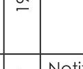
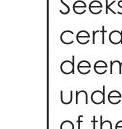
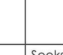
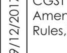
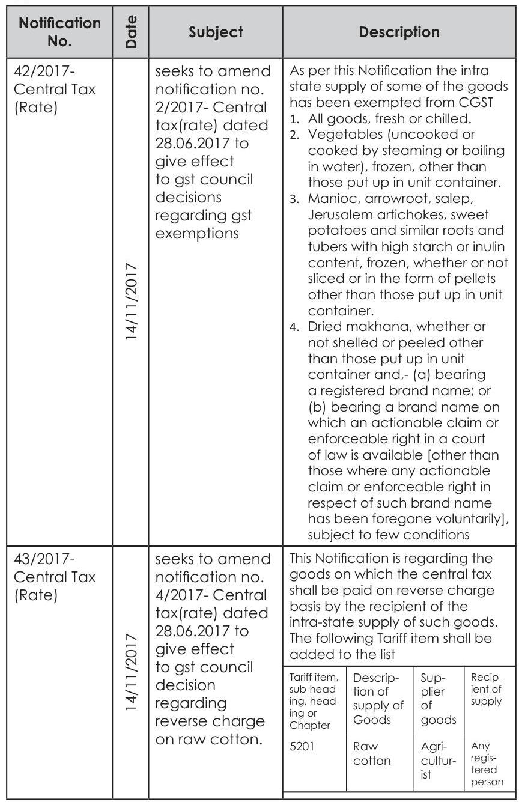
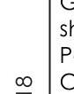
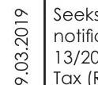
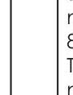

# COMPILATION OF GST NOTIFICATIONS AND CIRCULARS

(1st July, 2017 to 31st May, 2019)

# Published by

The President
The Institute of Cost Accountants of India
CMA Bhawan
12. Sudder Street, Kolkata - 700016

## Delhi Office

## CMA Bhawan

3, Institutional Area, Lodhi Road, New Delhi - 110003

## The Institute of Cost Accountants of India

## (Statutory body under an Act of Parliament)

(c) All rights reserved

## Disclaimer:

This Publication does not constitute professional advice. The information in this publication has been obtained or derived from sources believed by the Institute of Cost Accountants of India (ICAI) to be reliable. Any opinions or estimates contained in this publication represent the judgment of ICAI at this time. Readers of his publication are advised to seek their own professional advice before taking any course of action or decision, for which they are entirely responsible, based on the contents of this publication. ICAI neither accepts nor assumes any responsibility or liability to any reader for this publication in respect of the information contained within it or for any decisions reader may take or decide not to or fail to take.

# PREFACE

The introduction of GST in India has been a journey in which the Government and the Society have put their steps together. After the launch of GST on July, 012017 the Govt. has kept itself open for changes in GST for the benefit of society. Govt. has welcomed suggestion from ingenious experts in Taxation as well as from general public.

The Government has proposed multiple amendments to the Goods and Services Tax (GST) laws with the passage of time. Amendments have been made in Central GST, State GST, Integrated GST and Compensation of Sates Act.

The amendments have been announced through Notifications in CGST, CGST Rate, IGST, IGST Rate etc. Clarifications have also been provided by the Government on various issues through Circulars. We, being the eminent part of this journey have also marked a point by bringing materials and journals on GST, extending Certificate Course on GST and Advanced Certificate Course on GST on PAN India. Organizing Seminars and Workshops on GST, launching GST Helpdesk etc.

This material is a compilation of GST Notifications and Circulars from 1st July, 2017 to 31st May 2019. The main aim of this compilation is to act as a ready reckoner and help professionals in discharging their professional duties.

## Tax Research Department

The Institute of Cost Accountants of India
June 2019

# ACKNOWLEDGEMENTS

## Team-Tax Research Department

CMA Rajat Kumar Basu - Additional Director - Tax Research
CA Neelesh Jain - Deputy Director - Tax Research
CMA Priyanka Roy - Astt. Director - Tax Research
Ms. Mukulika Poddar - Officer - Tax Research
CMA Debasmita Jana - Associate - Tax Research

# Contents

1. CGST Notifications ..... $1-55$
2. CGST Rate Notifications ..... $56-102$
3. IGST Notifications ..... 103- 109
4. IGST Rate Notifications ..... $110-146$
5. Circulars ..... $147-234$

|   Notification No.   |                                                             Subject                                                             |                                                                                                                           Description                                                                                                                           |
| :-------------------: | :------------------------------------------------------------------------------------------------------------------------------: | :-------------------------------------------------------------------------------------------------------------------------------------------------------------------------------------------------------------------------------------------------------------: |
| 01/2017- Central Tax |                        Seeks to bring certain sections of the CGST Act, 2017 into force w.e.f. 22.06.2017                        |                                          Provisions in respect of definitions, officers, appointment, powers, composition levy, registration, migration, common portal and power of government to make rules notified.                                          |
| 02/2017- Central Tax |                                                                                                      |                                                                                                       Appointment\& Jurisdiction of Central Tax Officers.                                                                                                       |
|  03/2017-Central Tax  |                                                                                                      |                                                                                                         Rules on registration and composition notified.                                                                                                         |
|  04/2017-Central Tax  |                                                                                                      | www.gst.gov.in" is the website managed by GSTN which is notified as Common Goods and Services Tax Electronic Portal for facilitating registration, payment of tax, furnishing of returns, computation and settlement of integrated tax and electronic way bill. |
| 05/2017- Central Tax | Seeks to exempt persons only engaged in making taxable supplies, total tax on which is liable to be paid on reverse charge basis |                                 Persons only engaged in making taxable supplies, the total tax on which is liable to be paid on reverse charge basis is exempted from obtaining registration$\mathrm{u} / \mathrm{s} 23(2)$.                                 |

|   Notification No.   |  |                                              Subject                                              |                                                                                                                                                                                                                                       Description                                                                                                                                                                                                                                       |
| :-------------------: | :-------------------------: | :------------------------------------------------------------------------------------------------: | :-------------------------------------------------------------------------------------------------------------------------------------------------------------------------------------------------------------------------------------------------------------------------------------------------------------------------------------------------------------------------------------------------------------------------------------------------------------------------------------: |
| 06/2017- Central Tax |  |                            Modes of verification under CGST Rules, 2017                            |                                                                                                                                                                          Aadhaar based Electronic Verification Code (EVC)\& Bank account based One Time Password (OTP) are notified as modes of verification.                                                                                                                                                                          |
| 07/2017- Central Tax |  | Notification No. 7/2017- Central Tax amending Notification No. 3/2017- Central Tax has been issued |                                                                                                                                                                                                             Central Goods and Services Tax (Amendment) Rules, 2017 issued.                                                                                                                                                                                                             |
| 08/2017- Central Tax |  |                  Seeks to notify the turnover limit for Composition Levy for CGST                  |                                                                                                                                Aggregate turnover for Composition Levy is 75L. For Special Category States, the limit is 50L. No benefit of Composition on Ice cream and other edible ice, Pan Masala and Tobacco and manufactured tobacco substitutes.                                                                                                                                |
| 09/2017- Central Tax |  |         Seeks to bring into force certain sections of the CGST Act, 2017 w.e.f 01.07.2017         | Provisions in respect of scope of supply, levy and collection tax liability on composite and mixed supplies, time and value of supply, ITC, tax invoice, credit and debit notes, accounts and records, returns, payment of tax, interest, penalty and other amounts, refunds assessment, audit, inspection, search and seizure, demand and recovery, advance ruling, appeals and revisions, offences and penalties, transitional provisions and some miscellaneous provisions notified. |

|   Notification No.   |    |                                  Subject                                  |                                                                                                                                                                                                                                 Description                                                                                                                                                                                                                                 |
| :-------------------: | :---------------------------: | :------------------------------------------------------------------------: | :-------------------------------------------------------------------------------------------------------------------------------------------------------------------------------------------------------------------------------------------------------------------------------------------------------------------------------------------------------------------------------------------------------------------------------------------------------------------------: |
| 10/2017- Central Tax |                              | Seeks to amend CGST Rules notification no 3/2017-Central Tax dt 19.06.2017 | Amendments to Central Goods and Services Tax Rules, 2017 called the Central Goods and Services Tax (Second Amendment) Rules 2017 - Valuation rules notified  - Input tax credit rules - TAX INVOICE, CREDIT AND DEBIT NOTES rules - Accounts and Records rules  - Return rules - Payment of tax rules  - Refund rules  - Assessment and Audit rules  - Advance ruling rules  - Appeals and revision rules  - Transitional rules  - Anti-Profiteering rules  - E-way Rules |
| 11/2017- Central Tax |  |      Seeks to amend Notification no 6/2017-Central Tax dt 19.06.2017      |                                                                                                                               Electronic verification code generated through net banking login on the common portal\& Electronic verification code generated on the common portal are substituted for OTP as modes of verification under GST.                                                                                                                               |
| 12/2017- Central Tax |  |      Seeks to notify the number of HSN digits required on tax invoice      |                                                                                                                                          8 digit coding system for HSN is not required in any case. Only 4 digits for more than 5 crore turnover, 2 digits for more than 1.5 crore to 5 cr\& no HSN upto 1.5 crores, is required.                                                                                                                                          |

|   Notification No.   |  |                                                                            Subject                                                                            |                                                                                                                                                                                                                              Description                                                                                                                                                                                                                              |
| :-------------------: | :---------------------------: | :------------------------------------------------------------------------------------------------------------------------------------------------------------: | :-------------------------------------------------------------------------------------------------------------------------------------------------------------------------------------------------------------------------------------------------------------------------------------------------------------------------------------------------------------------------------------------------------------------------------------------------------------------: |
| 13/2017- Central Tax |  |                                                    Seeks to prescribe rate of interest under CGST Act, 2017                                                    |                                                                                                                                                                                           Rate of interest- 18\% and $24 \%$ for tax, $6 \%$ and $9 \%$ for refunds.                                                                                                                                                                                           |
|  14/2017-Central Tax  |  |                                              Assigning jurisdiction and power to officers of various directorates                                              |                                                                                                                                                                                                 Assigning jurisdiction and power to officers of various directorates.                                                                                                                                                                                                 |
| 15/2017- Central Tax |  |                                                   Amending CGST Rules notification 10/2017-CT at 28.06.2017                                                   |                                                                                                              Further to amend the Central Goods and Services Tax Rules, 2017 called the Central Goods and Services Tax (Third Amendment) Rules, 2017  - Inspection, Search and Seizure rules - DEMANDS AND RECOVERY rules Offences and Penalties rules                                                                                                              |
| 16/2017- Central Tax |  | Notification No. 16/2017-CT (conditions and safeguards for furnishing a Letter of Undertaking in place of a bond for export without payment of integrated tax) | (a) a status holder as specified in paragraph 5 of the Foreign Trade Policy 2015- 2020; or (b) who has received the due foreign inward remittances amounting to a minimum of$10 \%$ of the export turnover, which should not be less than one crore rupees, in the preceding financial year and he has not been prosecuted for any offence under CGST Act where the amount of tax evaded exceeds two hundred and fifty lakh rupees shall be allowed to furnish LUT. |
| 17/2017- Central Tax |  |                                                              Seeks to amend the CGST Rules, 2017.                                                              |                                                                                                                                                                                               Called the Central Goods and Services Tax (Fourth Amendment) Rules, 2017                                                                                                                                                                                               |

|   Notification No.   |                                                       Subject                                                       |                                                                              Description                                                                              |
| :-------------------: | :-----------------------------------------------------------------------------------------------------------------: | :--------------------------------------------------------------------------------------------------------------------------------------------------------------------: |
| 18/2017- Central Tax | Seeks to extend time period for filing of details of outward supplies in FORM GSTR-1 for months of July and August. |    Details of outward supplies in FORM GSTR-1 for the m/o July' 17 can be filed from 1st to 5th September, 2017 and for Aug' 17 from 16th to 20th September, 2017.    |
| 19/2017- Central Tax | Seeks to extend time period for filing of details of inward supplies in FORM GSTR-2 for months of July and August. |    Details of inward supplies in FORM GSTR-2 for the m/o July' 17 can be filed from 6th to 10th September, 2017 and for Aug' 17 from 21st to 25th September, 2017.    |
| 20/2017- Central Tax |           Seeks to extend time period for filing of details in FORM GSTR-3 for months of July and August.           |             Details in FORM GSTR-3 for the m/o July' 17 can be filed from 11th to 15th September, 2017 and for Aug' 17 from 26th to 30th September, 2017.             |
| 21/2017- Central Tax |                    Seeks to introduce date for filing of GSTR-3B for months of July and August.                    |                          Date for filing of GSTR-3B for the m/o July' 17 to be 20th August, 2017 and for Aug' 17 to be 20th September, 2017.                          |
| 22/2017- Central Tax |                                         Seeks to amend the CGST Rules, 2017                                         |                                                    Further to amend the Central Goods and Services Tax Rules, 2017                                                    |
| 23/2017- Central Tax |      Seeks to notify the date and conditions for filing the return in FORM GSTR-3B for the month of July, 2017      | Notified that the registered person who shall submit TRANS-1 before FORM GSTR3B for the month of July, 2017, the last date for filing Form-3B to be 28th August, 2017. |
|  24/2017-Central Tax  |         Seeks to further extend the date for filing of return in FORM GSTR-3B for the month of July, 2017.         |                                      Further extended the date for filing of return in FORM GSTR-3B for the month of July, 2017.                                      |

|   Notification No.   |  |                                                 Subject                                                 |                                                                                                                                  Description                                                                                                                                  |
| :-------------------: | :---------------------------: | :------------------------------------------------------------------------------------------------------: | :----------------------------------------------------------------------------------------------------------------------------------------------------------------------------------------------------------------------------------------------------------------------------: |
| 25/2017- Central Tax |  |           Seeks to extend time period for filing of details in FORM GSTR-5A for month of July           | Time limit for furnishing the return for the month of July, 2017, by a person supplying online information and database access or retrieval services from a place outside India to a nontaxable online recipient for the m/o July' 17 extended to 15th day of September, 2017. |
| 26/2017- Central Tax |  |      Seeks to extend time period for filing of details in FORM GSTR-6 for months of July\& August.      |                                                            Time limit for furnishing the return by an Input Service Distributor for the m/o July'17 extended to 8th September and for Aug' 17 till 23rd September.                                                            |
| 27/2017- Central Tax |  |                               Seeks to further amend the CGST Rules, 2017                               |                                                                                                                        Further Amendment in CGST Rules.                                                                                                                        |
| 28/2017- Central Tax |  |            Seeks to waive the late fee for late filing of FORM GSTR-3B, for the month of July            |                                                            Waiver of the late fee payable for all registered persons who failed to furnish the return in FORM GSTR-3B for the month of July, 2017 by the due date.                                                            |
| 29/2017- Central Tax |  | Seeks to extend due dates for furnishing details/ Returns for the months of July, 2017 and August, 2017. |                                                                                        Extended due dates for furnishing details/Returns for the months of July, 2017 and August, 2017.                                                                                        |
| 30/2017- Central Tax |  |                  Seeks to extend the time limit for filing of GSTR-1, GSTR-2 and GSTR3.                  |                                                                     Extended time limit for filing GSTR-1, GSTR-2 and GSTR-3 to 10th October, 2017, 31st October, 2017, 10th November, 2017 respectively.                                                                     |

|    Notification No.    |                                                                     Subject                                                                     |                                                                                                     Description                                                                                                     |
| :--------------------: | :---------------------------------------------------------------------------------------------------------------------------------------------: | :-----------------------------------------------------------------------------------------------------------------------------------------------------------------------------------------------------------------: |
| 31/2017- Central Tax |                                              Seeks to extend the time limit for filing of GSTR-6.                                              |                                     Extended the time limit for furnishing the return by an Input Service Distributor for the month of July, 2017 up to the 13th October, 2017.                                     |
| 32/2017- Central Tax | Seeks to granting exemption to a casual taxable person making taxable supplies of handicraft goods from the requirement to obtain registration. |                                            Exemption to a casual taxable person making taxable supplies of handicraft goods from the requirement to obtain registration.                                            |
|  33/2017-Central Tax  |                                               Notifying section 51 of the CGST Act, 2017 for TDS.                                               |                                                                                 Notifying section 51 of the CGST Act, 2017 for TDS.                                                                                 |
| 34/2017- Central Tax |                                                   Seventh amendment to the CGST Rules, 2017.                                                   |                                                                                              Amendment in CGST Rules.                                                                                              |
| 35/2017- Central Tax |                 Seeks to extend the last date for filing the return in FORM GSTR-3B for the months of August to December, 2017.                 | Last date for filing the return in FORM GSTR-3B for m/o Aug, Sept, Oct, Nov\& Dec 2017 to be 20th September, 2017, 20th October, 2017, 20th November, 2017, 20th December, 2017 \& 20th January, 2018 respectively. |
| 36/2017 - Central Tax |                                                      Eighth amendment to CGST Rules, 2017.                                                      |                                   1."Revision of declaration in FORM GST TRAN-1 allowed and 2. Gave effect to "APPLICATION FOR CANCELATION OF REGISTRATION OF MIGRATED TAXPAYERS.                                   |

|    Notification No.    |  |                                                           Subject                                                           |                                                                                                                                                                                                                                            Description                                                                                                                                                                                                                                            |
| :--------------------: | :-: | :-------------------------------------------------------------------------------------------------------------------------: | :-----------------------------------------------------------------------------------------------------------------------------------------------------------------------------------------------------------------------------------------------------------------------------------------------------------------------------------------------------------------------------------------------------------------------------------------------------------------------------------------------: |
|  37 /2017 Central Tax  |  |                            Notification on extension of facility of LUT to all exporters issued                            | All registered persons who intend to supply goods or services for export without payment of integrated tax shall be eligible to furnish a Letter of Undertaking in place of a bond except those who have been prosecuted for any offence under the Central Goods and Services Tax Act, 2017 (12 of 2017) or the Integrated Goods and Services Tax Act, 2017 (13 of 2017) or any of the existing laws in force in a case where the amount of tax evaded exceeds two hundred and fifty lakh rupees. |
| 38/2017 - Central Tax |  | Seeks to amend notification no. 32/2017-CT dated 15.09.2017 so as to add certain items to the list of ""handicrafts goods" |                                                                                                                                                                                        Amended Notification no. 32/2017-CT dated 15.09.2017 so as to add certain items to the list of ""handicrafts goods"                                                                                                                                                                                        |
| 39/2017 - Central Tax |  |                        Seeks to cross-empower State Tax officers for processing and grant of refund                        |                                                                                                                Officers of the State and Union Territories have been empowered to issue refunds$u / s 54$ or 55 in relation to CGST and IGST also. Earlier the respective officers were only empowered to issue the refunds. This move is to help exporters to get easy refund.                                                                                                                |
| 40/2017 - Central Tax |  | Seeks to make payment of tax on issuance of invoice by registered persons having aggregate turnover less than Rs 1.5 crores |                                                                                         Supplier of Goods; whose turnover during the previous financial year was less than 1.5 crores and in case of newly registered persons if the turnover is likely to be less than 1.5 crores during the current financial year; will be allowed to file returns in the manner prescribed in chapter IX of CGST Act.                                                                                         |

|   Notification No.   |  |                             Subject                             |                                                                                                                                                                                            Description                                                                                                                                                                                            |
| :-------------------: | :---------------------------: | :--------------------------------------------------------------: | :------------------------------------------------------------------------------------------------------------------------------------------------------------------------------------------------------------------------------------------------------------------------------------------------------------------------------------------------------------------------------------------------: |
| 41/2017 -Central Tax |  |     Seeks to extend the time limit for filing of FORM GSTR-4     |                                                                                                            Extension of the time limit for furnishing the return by a composition supplier, in FORM GSTR-4 for the quarter July to September, 2017 till the 15th day of November, 2017.                                                                                                            |
| 42/2017 -Central Tax |  |    Seeks to extend the time limit for filing of FORM GSTR-5A    |                                                                                                                               OIDAR service providers can file return for 1st quarter (July to Sep 2017) till 20th Nov 2017 instead of earlier date of 10th Oct 2017                                                                                                                               |
| 43/2017 - Central Tax |  |     Seeks to extend the time limit for filing of FORM GSTR-6     |                                                                                                                                     ISD Dealers can file return for 1st quarter (July to Sep 2017) till 15th Nov 2017 instead of earlier date of 13th Oct 2017                                                                                                                                     |
| 44/2017 - Central Tax |  | Seeks to extend the time limit for submission of FORM GST ITC-01 | This is applicable for dealers who have shifted from composition scheme to regular scheme that FORM GST ITC-01, by the registered persons, who have become eligible during the months of July, 2017, August, 2017 and September, 2017, to the effect that they are eligible to avail the input tax credit under sub-section (1) of section 18 of the said Act, till the 31st day of October, 2017. |

|    Notification No.    |  |                       Subject                       |                                                                                                                                                                                                                                                                                                                                                                                                                                                                                           Description                                                                                                                                                                                                                                                                                                                                                                                                                                                                                           |
| :--------------------: | :-: | :-------------------------------------------------: | :---------------------------------------------------------------------------------------------------------------------------------------------------------------------------------------------------------------------------------------------------------------------------------------------------------------------------------------------------------------------------------------------------------------------------------------------------------------------------------------------------------------------------------------------------------------------------------------------------------------------------------------------------------------------------------------------------------------------------------------------------------------------------------------------------------------------------------------------------------------------------------------------------------------------------------------------------------------------------------------------: |
| 45/2017 - Central Tax |  |         Seeks to amend the CGST Rules, 2017         | New Rule 3A is inserted. This rule gives effect to file return u/s 10 from the first day he files CMP02. He shall further file ITC-03 within 90 days. 4A of table 4 shall not be furnished in GSTR4. Amendment on form GSTR1\& 1A. Column under table $6 \& 4$ respectively have been added for zero rated supplies made to SEZ and Deemed Exports.  Rule 46 A registered person who is supplying taxable as well as exempted goods or services or both to an unregistered person, a single 'invoice-cum-bill of supply' may be issued for all such supplies.  Rule 62(1) A registered person who opts to pay tax under Composition Scheme u/s section 10 with effect from the first day of a month which is not the first month of a quarter shall furnish the return in FORM GSTR4 for that period of the quarter for which he has paid tax under section 10 and shall furnish the returns as applicable to him for the period of the quarter prior to opting to pay tax under section 10. |
|  46/2017 -Central Tax  |  | Seeks to amend notification No. 8/2017-Central Tax. |                                                                                                                                                                                                                                                                                                                                                   Turnover limits for composition scheme have been increased to Rs. 1 crore from existing 75 Lakhs (for special category states the same has been increased to Rs. 75 Lakhs from existing 50 Lakhs). Person opting composition scheme this month can available the benefit w.e.f. 01.11.2017.                                                                                                                                                                                                                                                                                                                                                   |

|    Notification No.    |  |                                                                             Subject                                                                             |                                                                                                                                                                                                                              Description                                                                                                                                                                                                                              |
| :--------------------: | :---------------------------: | :-------------------------------------------------------------------------------------------------------------------------------------------------------------: | :-------------------------------------------------------------------------------------------------------------------------------------------------------------------------------------------------------------------------------------------------------------------------------------------------------------------------------------------------------------------------------------------------------------------------------------------------------------------: |
| 47/2017 - Central Tax |  |                                                            Tenth Amendment to the CGST rules, 2017.                                                            |                                                                                                                                                            Further to amend the Central Goods and Services Tax Rules, 2017, may be called the Central Goods and Services Tax (Tenth Amendment) Rules, 2017                                                                                                                                                            |
| 48/2017 - Central Tax |  |                                   Seeks to notify certain supplies as deemed exports under section 147 of the CGST Act, 2017.                                   | 1. Supply of goods by a registered person against Advance Authorisation 2. Supply of capital goods by a registered person against Export Promotion Capital Goods Authorisation  3. Supply of goods by a registered person to Export Oriented Unit  4. Supply of gold by a bank or Public Sector Undertaking specified in the notification No. 50/2017-Customs, dated the 30th June, 2017 (as amended) against Advance Authorisation, were notified as deemed exports. |
| 49/2017 - Central Tax |  | Seeks to notify the evidences required to be produced by the supplier of deemed export supplies for claiming refund under rule 89(2)(g) of the CGST rules, 2017 |                                                                                                                                                       Notifies the evidences required to be produced by the supplier of deemed export supplies for claiming refund under rule 89(2)(g) of the CGST rules, 2017.                                                                                                                                                       |
| 50/2017 - Central Tax |  |                                     Seeks to waive late fee payable for delayed filing of FORM GSTR-3B for Aug\& Sep, 2017                                     |                                                                                                                              Waiver of the late fee payable under section 47 of the CGST Act, for all registered persons who failed to furnish the return in FORM GSTR-3B for the months of August and September, 2017 by the due date.                                                                                                                              |

|    Notification No.    |  |                                                                               Subject                                                                               |                                                                                                                        Description                                                                                                                        |
| :--------------------: | :---------------------------: | :------------------------------------------------------------------------------------------------------------------------------------------------------------------: | :--------------------------------------------------------------------------------------------------------------------------------------------------------------------------------------------------------------------------------------------------------: |
| 51/2017 - Central Tax |  |                                                                Eleventh Amendment to CGST Rules, 2017                                                                |                                                        Further to amend the Central Goods and Services Tax Rules, 2017, called the Central Goods and Services Tax (Eleventh Amendment) Rules, 2017                                                        |
| 52/2017 - Central Tax |  |                                              Seeks to extend the due date for submission of details in FORM GST-ITC-01                                              |                                                                                 Extension of the due date for submission of details in FORM GST-ITC-01 fill 30th Nov 2017.                                                                                 |
| 53/2017 - Central Tax |  |                                              Seeks to extend the due date for submission of details in FORM GST-ITC-04                                              | Extension of the due date for submission of details in FORM GST-ITC-04 in respect of goods dispatched to a job worker or received from a job worker or sent from one job worker to another, during the quarter July to September, 2017 fill 30th Nov 2017. |
| 54/2017 - Central Tax |  | Seeks to amend Notification no. 30/2017-Central Tax dated 11.09.2017 so as to extend the due date for filing FORM GSTR-2 and FORM GSTR-3 for the month of July, 2017 |                                                                       Extension of the time limit for furnishing the return GSTR-2 fill 30th Nov 2017 and GSTR-3 fill 11th Dec 2017.                                                                       |
|  55/2017 -Central Tax  |  |                                                                Twelfth amendment to CGST Rules, 2017                                                                |                                                                              Amendments to rules (called the Central Goods and Services Tax (Twelfth Amendment) Rules, 2017)                                                                              |
|  56/2017 -Central Tax  |  |                                              Seeks to mandate the furnishing of return in FORM GSTR-3B fill March, 2018                                              |                                                                                      Mandatory filing of GSTR 3B for the months of January, February and March 2018.                                                                                      |

|    Notification No.    |                                                                Subject                                                                |                                                                                     Description                                                                                     |
| :--------------------: | :------------------------------------------------------------------------------------------------------------------------------------: | :----------------------------------------------------------------------------------------------------------------------------------------------------------------------------------: |
| 57/2017 - Central Tax |        Seeks to prescribe quarterly furnishing of FORM GSTR-1 for those taxpayers with aggregate turnover of upto Rs.1.5 crore        |   Extension of date for filing GSTR-1 by the registered persons having aggregate turnover of upto 1.5 crore rupees in the preceding financial year or the current financial year.   |
|                        |                                                                                                                                        |                                                              Quarter for which the details in FORM GSTR-1 are furnished                                                              |
|                        |                                                                                                                                        |                                                                               July - September, 2017                                                                               |
|                        |                                                                                                                                        |                                                                              October - December, 2017                                                                              |
|                        |                                                                                                                                        |                                                                                January - March, 2018                                                                                |
|  58/2017 -Central Tax  | Seeks to extend the due dates for the furnishing of FORM GSTR-1 for those taxpayers with aggregate turnover of more than Rs.1.5 crores | Extension of date for filing GSTR-1 by the registered persons having aggregate turnover of more than 1.5 crore rupees in the preceding financial year or the current financial year. |
|                        |                                                                                                                                        |                                                              Months for which the details in FORM GSTR-1 are furnished                                                              |
|                        |                                                                                                                                        |                                                                                 July - October, 2017                                                                                 |
|                        |                                                                                                                                        |                                                                                    November, 2017                                                                                    |
|                        |                                                                                                                                        |                                                                                    December, 2017                                                                                    |
|                        |                                                                                                                                        |                                                                                    January, 2018                                                                                    |
|                        |                                                                                                                                        |                                                                                    February, 2018                                                                                    |
|                        |                                                                                                                                        |                                                                                     March, 2018                                                                                     |

|    Notification No.    |  |                                                     Subject                                                     |                                                                                                                                                                           Description                                                                                                                                                                           |
| :--------------------: | :---------------------------: | :-------------------------------------------------------------------------------------------------------------: | :-------------------------------------------------------------------------------------------------------------------------------------------------------------------------------------------------------------------------------------------------------------------------------------------------------------------------------------------------------------: |
| 59/2017 - Central Tax |  |                            Seeks to extend the time limit for filing of FORM GSTR-4                            |                                                                                                                              The time limit was extended for filing GSTR-4 by the Composite Dealers till 24thday of December, 2017                                                                                                                              |
| 60/2017 - Central Tax |  | Seeks to extend the time limit for furnishing the return in FORM GSTR5, for the months of July to October, 2017 |                                                                    The time limit was extended for furnishing the return by a non-resident taxable person, in FORM GSTR-5, for the months of July, 2017, August, 2017, September, 2017 and October, 2017 till the 11th day of December, 2017                                                                    |
| 61/2017 - Central Tax |  | Seeks to extend the time limit for furnishing the return in FORM GSTR5A for the months of July to October, 2017 |                      The time limit was extended for furnishing GSTR-5A for the month of July, 2017, August, 2017, September, 2017 and October, 2017 by a person supplying online information and database access or retrieval services from a place outside India to a non-taxable online recipient, till the 15th day of December, 2017.                      |
| 62/2017 - Central Tax |  |       Seeks to extend the time limit for furnishing the return in FORM GSTR6 for the month of July, 2017       | 1) The time limit for furnishing the return by an Input Service Distributor in FORM GSTR-6 was extended for the month of July, 2017 till the 31st day of December, 2017. 2) The extension of the time limit for furnishing the return for the month of August, 2017, September, 2017 and October, 2017 shall be subsequently notified in the Official Gazette. |

|    Notification No.    |  |                                                       Subject                                                       |                                                                                                                                                                                                             Description                                                                                                                                                                                                             |
| :--------------------: | :---------------------------: | :-----------------------------------------------------------------------------------------------------------------: | :---------------------------------------------------------------------------------------------------------------------------------------------------------------------------------------------------------------------------------------------------------------------------------------------------------------------------------------------------------------------------------------------------------------------------------: |
| 63/2017 - Central Tax |  |                      Seeks to extend the due date for submission of details in FORM GST-ITC-04                      |                                                                           The time limit for making the declaration in FORM GST ITC04, was extended in respect of goods dispatched to a job worker or received from a job worker or sent from one job worker to another, during the quarter July to September, 2017, till the 30th day of December, 2017.                                                                           |
| 64/2017 - Central Tax |  | Seeks to limit the maximum late fee payable for delayed filing of return in FORM GSTR-3B from October, 2017 onwards |                    1) The Central Government has amended late fee payable by any registered person for failure to furnish GSTR3B for the month of October, 2017 onwards by the due date, Rs. 25 for CGST Act and Rs. 25 for SGST Act. 2) Further, if total amount of Central tax Payable is Nil, Late fees will be Rs. 10 per day for CGST Act and Rs. 10 for SGST Act for the month of October, 2017 onwards.                    |
| 65/2017 - Central Tax |  |     Seeks to exempt suppliers of services through an e-commerce platform from obtaining compulsory registration     | The Central Government, specifies the persons under sub-section (5) of section 9 making supplies of services, through an electronic commerce operator who is required to collect tax at source under section 52 and having an aggregate turnover of Rs. 20 lakhs or 10 lakhs ( in case of special category states other than Jammu\& Kashmir), in a financial year, as the category of persons exempted from obtaining registration |

|    Notification No.    | $\begin{aligned} & \text { N } \\ & \text { N } \\ & \text { N } \\ & \text { N } \end{aligned}$ |                                              Subject                                              |                                                                                                                               Description                                                                                                                               |
| :--------------------: | :------------------------------------------------------------------------------------------------: | :-----------------------------------------------------------------------------------------------: | :----------------------------------------------------------------------------------------------------------------------------------------------------------------------------------------------------------------------------------------------------------------------: |
| 66/2017 - Central Tax |                                                                      | Seeks to exempt all taxpayers from payment of tax on advances received in case of supply of goods |                                                         Central Tax, Government has exempted all dealers who did not opt for composition levy from paying GST on receipt of advance against their future supply.                                                         |
|  67/2017 -Central Tax  |                                                                      |                    Seeks to extend the time limit for filing FORM GST ITC-01.                    |         The time limit for making declaration in form ITC-01 for availing input tax credit by the registered persons for the month of July 2017, August 2017, September 2017, October 2017 and November 2017 was extended till$31^{\text {st }}$ January, 2018         |
| 68/2017 - Central Tax |                                                                      |                      Seeks to extend the time limit for filing FORM GSTR-5.                      | The time limit for furnishing the return by a non-resident taxable person, in FORM GSTR-5, for the months of July, 2017, August, 2017, September, 2017, October, 2017, November, 2017 and December, 2017 was extended till the$31^{\text {st }}$ day of January, 2018. |
| 69/2017 - Central Tax |                                                                      |                      Seeks to extend the time limit for filing FORM GSTR5A.                      |                  The time limit for furnishing the return in FORM GSTR5A, for the months of July, 2017, August, 2017, September, 2017, October, 2017, November, 2017 and December, 2017 was extended till the$31^{\text {st }}$ day of January, 2018.                  |
| 70/2017 - Central Tax |                                                                      |                  Seeks to further amend CGST Rules, 2017 (Thirteenth Amendment).                  |                          Amendment in Central Goods and Services Tax Rules, 2017. In the Central Goods and Services Tax Rules, 2017 in Form GST01, the Table 6 shall be substituted by a new table of "Zero rated supplies and Deemed Exports".                          |

|    Notification No.    |  |                                                            Subject                                                            |                                                                                     Description                                                                                     |
| :--------------------: | :---------------------------: | :---------------------------------------------------------------------------------------------------------------------------: | :----------------------------------------------------------------------------------------------------------------------------------------------------------------------------------: |
| 71/2017 - Central Tax |  |   Extends the due dates for quarterly furnishing of FORM GSTR-1 for taxpayers with aggregate turnover of upto Rs.1.5 crore.   |          The time limit for filing GSTR 1 by the registered persons whose Turnover is upto 1.5 Crore rupees in the preceding financial year or the current financial year.          |
|                        |                              |                                                                                                                              |                                                              Quarter for which the details in FORM GSTR-1 are furnished                                                              |
|                        |                              |                                                                                                                              |                                                                               July - September, 2017                                                                               |
|                        |                              |                                                                                                                              |                                                                               October - December, 2017                                                                               |
|                        |                              |                                                                                                                              |                                                                                January - March, 2018                                                                                |
| 72/2017 - Central Tax |  | Extends the due dates for monthly furnishing of FORM GSTR-1 for taxpayers with aggregate turnover of more than Rs.1.5 crores. | Extension of date for filing GSTR-1 by the registered persons having aggregate turnover of more than 1.5 crore rupees in the preceding financial year or the current financial year. |
|                        |                              |                                                                                                                              |                                                              Months for which the details in FORM GSTR-1 are furnished                                                              |
|                        |                              |                                                                                                                              |                                                                                July - November, 2017                                                                                |
|                        |                              |                                                                                                                              |                                                                                    December, 2017                                                                                    |
|                        |                              |                                                                                                                              |                                                                                    January, 2018                                                                                    |
|                        |                              |                                                                                                                              |                                                                                    February, 2018                                                                                    |
|                        |                              |                                                                                                                              |                                                                                     March, 2018                                                                                     |

|    Notification No.    |  |                                                                                        Subject                                                                                        |                                                                                                                                                                                                                                                                                 Description                                                                                                                                                                                                                                                                                 |
| :--------------------: | :---------------------------: | :-----------------------------------------------------------------------------------------------------------------------------------------------------------------------------------: | :--------------------------------------------------------------------------------------------------------------------------------------------------------------------------------------------------------------------------------------------------------------------------------------------------------------------------------------------------------------------------------------------------------------------------------------------------------------------------------------------------------------------------------------------------------------------------: |
| 73/2017 - Central Tax |  |                                                     Waives the late fee payable for failure to furnish the return in FORM GSTR-4                                                     | The Central Govt. has decided to waive off the amount of late fee payable by any registered person for failure to furnish the return in FORM GSTR-4 by the due date, which is in excess of an amount of Rs. 25 for every day during which such failure continues. Provided that where the total amount of central tax in the said return is nil, the amount of late fee payable by any registered person for failure to furnish the said return by the due date shall be waived which is in excess of an amount of Rs. 10 for every day during which such failure continues. |
| 74/2017 - Central Tax |  |                                                          Notifies the date from which E-Way Bill Rules shall come into force                                                          |                                                                                                                                                                                                                                             The procedure of Advance E-Way Bill under GST will initiate from 1ST February, 2018                                                                                                                                                                                                                                             |
|  75/2017 -Central Tax  |  |                                                                        CGST (Fourteenth Amendment) Rules,2017                                                                        |                                                                                                                                                                                                                                                        This Notification is regarding amendment in CGST Rules, 2017.                                                                                                                                                                                                                                                        |
|  01/2018- Central Tax  |  | Central Tax seeks to further amend notification No. 8/2017 - Central Tax so as to prescribe the effective rate of tax under composition scheme for manufacturers and other suppliers. |                                                                                                                                                        The rate of central tax payable under composition scheme will be half percent (Previously One percent) on the turnover in the state for a manufacturer and half percent of the turnover of taxable supplies of goods in the State in case of other suppliers.                                                                                                                                                        |

|   Notification No.   |                                         Subject                                         |                                                                                                                                                                                                                                                                                                                                                                                                                                                                        Description                                                                                                                                                                                                                                                                                                                                                                                                                                                                        |
| :-------------------: | :-------------------------------------------------------------------------------------: | :-------------------------------------------------------------------------------------------------------------------------------------------------------------------------------------------------------------------------------------------------------------------------------------------------------------------------------------------------------------------------------------------------------------------------------------------------------------------------------------------------------------------------------------------------------------------------------------------------------------------------------------------------------------------------------------------------------------------------------------------------------------------------------------------------------------------------------------------------------------------------------------------------------------------------------------------------------: |
| 02/2018- Central Tax | Seeks to extend the last date for filing FORM GSTR3B for December 2017 till 22.01.2018. |                                                                                                                                                                                                                                                                                                                                                                                                                  Last Date for filing of return in FORM GSTR-3B for the month of December 2017 will be 22/01/2018 instead of 20/01/2018.                                                                                                                                                                                                                                                                                                                                                                                                                  |
| 03/2018- Central Tax |                           First Amendment 2018, to CGST Rules                           | 1. Period to file the statement in FORM GST ITC-03 (Declaration for intimation of ITC reversal/ payment of tax on inputs held in stock, inputs contained in semi-finished and finished goods held in stock and capital goods) increased to one hundred and eighty days. 2. The Rate of tax under composition levy for registered persons in case of Manufacturers, other than manufacturers of such goods as may be notified by the Government changed to half percent of the turnover in the State or Union territory. 3. The Rate of tax under composition levy for registered persons in case of Suppliers making supplies referred will be two and a half per cent. of the turnover in the State or Union territory.4. The Rate of tax under composition levy for registered persons in case of Any other supplier eligible for composition levy will be half per cent. of the turnover of taxable supplies of goods in the State or Union territory. |

|   Notification No.   |  |                                              Subject                                              |                                                                                                                                                                Description                                                                                                                                                                |
| :-------------------: | :---------------------------: | :------------------------------------------------------------------------------------------------: | :----------------------------------------------------------------------------------------------------------------------------------------------------------------------------------------------------------------------------------------------------------------------------------------------------------------------------------------: |
| 04/2018- Central Tax |  |                   Reduction of late fee in case of delayed filing of FORM GSTR-1                   |                                                                                                                Late fee for not filing returns on time reduced to Rs. 25 For Nil returns, late fee will be Rs. 10 per day.                                                                                                                |
| 05/2018- Central Tax |  |                   Reduction of late fee in case of delayed filing of FORM GSTR-5                   |                                                                                                        Late fee for not filing returns on time reduced to Rs. 25 For Nil returns (No central Tax), late fee will be Rs. 10 per day.                                                                                                        |
| 06/2018- Central Tax |  |                  Reduction of late fee in case of delayed filing of FORM GSTR-5A                  |                                                                                                      Late fee for not filing returns on time reduced to Rs. 25 For Nil returns (No Integrated Tax), late fee will be Rs. 10 per day.                                                                                                      |
|  07/2018-Central Tax  |  |                   Reduction of late fee in case of delayed filing of FORM GSTR-6                   |                                                                                                                                        Late fee for not filing returns on time reduced to Rs. 25 .                                                                                                                                        |
| 08/2018- Central Tax |  |                       Extension of date for filing the return in FORM GSTR-6                       |                                                                                                                     Time to file FORM GSTR-6 for the months of July 2017 to February, 2018 is extended till 31/03/2018                                                                                                                     |
|  09/2018-Central Tax  |  | Amendment of notification No. 4/2017-Central Tax dated 19.06.2017 for notifying e-way bill website | Effective from 16 January 2018, www.gst.gov.in will be the Common Goods and Services Tax Electronic Portal for registration, payment of tax, furnishing of returns and computation and settlement of integrated tax. www.ewaybillgst.gov.in will be the Common Goods and Services Tax Electronic Portal for furnishing electronic waybill. |

|   Notification No.   |  |                                                                    Subject                                                                    |                                                                                                                                                                                                                                                          Description                                                                                                                                                                                                                                                          |
| :-------------------: | :---------------------------: | :-------------------------------------------------------------------------------------------------------------------------------------------: | :----------------------------------------------------------------------------------------------------------------------------------------------------------------------------------------------------------------------------------------------------------------------------------------------------------------------------------------------------------------------------------------------------------------------------------------------------------------------------------------------------------------------------: |
| 10/2018- Central Tax |  | Amending notification No. 39/2017-Central Tax dated 13.10.2017 for cross-empowerment of State tax officers for processing and grant of refund |                                                                                                                                                                                                           In case of refund, tax paid on goods exported out of India has restrictions on its sanctioning authority.                                                                                                                                                                                                           |
| 11/2018- Central Tax |  |                                        Seeks to postpone the coming into force of the e-way bill rules                                        |                                                                                                                                                                                                                         Central government cancels the roll in of e-way bill scheduled for 01/02/2018.                                                                                                                                                                                                                         |
| 12/2018- Central Tax |  |                                                     Second Amendment (2018) to CGST Rules                                                     | 1. Information to be furnished prior to commencement of movement of goods and generation of e-way bill notified. 2. The person in charge of the conveyance will be required to carry invoice or bill of supply or delivery challan, copy of EWB in physical or electronic form. 3. A proper officer may intercept any conveyance to verify the e-way bill in physical or electronic form for all inter-State and intrastate movement of goods. 4. Details of Verification and inspection of goods and conveyances is notified. |
| 13/2018- Central Tax |  |                                           Rescinding notification No. 06/2018 - CT dated 23.01.2018                                           |                                                                                                                                                                                                                                                 Notification 6/2018 cancelled.                                                                                                                                                                                                                                                 |

|   Notification No.   |                                                                 Subject                                                                 |                                                                                                                                                                                                                                                              Description                                                                                                                                                                                                                                                              |
| :-------------------: | :--------------------------------------------------------------------------------------------------------------------------------------: | :-----------------------------------------------------------------------------------------------------------------------------------------------------------------------------------------------------------------------------------------------------------------------------------------------------------------------------------------------------------------------------------------------------------------------------------------------------------------------------------------------------------------------------------: |
| 14/2018- Central Tax |                                        Amending the CGST Rules, 2017(Third Amendment Rules, 2018)                                        | 1. When goods are directly sent to job worker the chalian may be issued either by the principal or Job worker and should be properly endorsed if need be. 2. A minimum of three members of the Authority shall constitute quorum at its meetings and the opinion of majority will be taken as the decision. 3. The words 'transported by railways', 'transportation of goods by railways', 'transport of goods by rail' and 'movement of goods by rail' does not include cases where leasing of parcel space by Railways takes place. |
| 15/2018- Central Tax |                                   Notifies the date from which E-Way Bill Rules shall come into force                                   |                                                                                                                                                                                                                         April 1st 2018 is announced to be the date from which EWB ruled will come into force                                                                                                                                                                                                                         |
| 16/2018- Central Tax |                       Seeks to prescribe the due dates for filing FORM GSTR3B for the months of April to June, 201                       |                                                                                                                                The last dates for filling of return in form GSTR-3B for these month ends will be April, 2018 - 20th May 2018 May, 2018 - 20th June 2018 June, 2018 - 20 July 2018 The tax liability, penalty, interest if any shall be payable by the last date of filing the return.                                                                                                                                |
| 17/2018- Central Tax | Seeks to prescribe the due date for quarterly furnishing of FORM GSTR-1 for those taxpayers with aggregate turnover of upto Rs.1.5 crore |                                                                                                                                                             Any registered person having aggregate TO up to 1.5 crore rupees in the previous FY or current FY shall furnish details about the supply provided in FORM GSTR-1 for the quarter between April to June 2018.                                                                                                                                                             |

|   Notification No.   |  |                                                                Subject                                                                |                                                                                                                                                                     Description                                                                                                                                                                     |
| :-------------------: | :---------------------------: | :-----------------------------------------------------------------------------------------------------------------------------------: | :-------------------------------------------------------------------------------------------------------------------------------------------------------------------------------------------------------------------------------------------------------------------------------------------------------------------------------------------------: |
| 18/2018- Central Tax |  | Seeks to prescribe the due dates for furnishing of FORM GSTR-1 for those taxpayers with aggregate turnover of more than Rs. 1.5 crore |        The last dates for filing of return in form GSTR-1 for registered people whose TO is more that 1.5 crores rupees for these month ends will be - April ,2018 - 31st May 2018 May, 2018 - 10th June 2018 June, 2018 - 10 July 2018 The tax liability, penalty, interest if any shall be payable by the last date of filing the return.        |
| 19/2018- Central Tax |  |                                        Extension of date for filing the return in FORM GSTR-6                                        |                                                                                                      The return in FORM GSTR6 by the Input service distributor for the months of July, 2017 till April, 2018 should be filled by 31 May 2018.                                                                                                      |
| 20/2018- Central Tax |  |                   Extension of due date for filing of application for refund under section 55 by notified agencies                   |                                                                             The period for application for refund of tax paid on inward supplies shall be mad before the expiry of eighteen months from the last date of the quarter in which such supply was received                                                                             |
| 21/2018- Central Tax |  |                           Notification seeks to make amendments (Fourth Amendment) to the CGST Rules, 2017.                           | 1. Refund on account of inverted duty structure, refund of input tax credit - Maximum Refund Amount$=\{$ (Turnover of inverted rated supply of goods and services) x Net ITC + Adjusted Total Turnover) - tax payable on such inverted rated supply of goods and services  2. Consumer welfare fund will have credits based on this notification. |

|   Notification No.   |  |                                                            Subject                                                            |                                                                                                                                                                                            Description                                                                                                                                                                                            |
| :-------------------: | :---------------------------: | :----------------------------------------------------------------------------------------------------------------------------: | :------------------------------------------------------------------------------------------------------------------------------------------------------------------------------------------------------------------------------------------------------------------------------------------------------------------------------------------------------------------------------------------------: |
| 22/2018- Central Tax |  |                                          Seeks to waive the late fee for FORM GSTR-3B                                          | The late fee payable when Form GSTR-3B is not filed within the due date for the months from October, 2017 to April, 2018 and Form GST TRAN-1 was submitted but not filed on the common portal by 12/27/2017, the late fee will be waived off. However, the declaration in Form GST TRAN-1 should have been filled by the 05/10/2018. Form GSTR-3B for these months should be filled by 05/31/2018. |
| 23/2018- Central Tax |  |                     Seeks to extend the due date for filing of FORM GSTR-3B for the month of April, 2018.                     |                                                                                                                                                  The due date to file Form GSTR-3B for the month of April extended to 05/22/2018 from 05/20/2018.                                                                                                                                                  |
| 24/2018- Central Tax |  | NACIN notified as the authority for conducting the examination for GST Practitioners under rule 83 (3) of the CGST Rules, 2017 |                                                                                               National Academy of Customs, Indirect Taxes and Narcotics, Department of Revenue, Ministry of Finance, Government of India, is notified as the authority to conduct examination for GST Practitioners.                                                                                               |
| 25/2018- Central Tax |  |                                                   GSTR-6 due date Extended!                                                   |                                                                                                                                                         Filing for the months July 2017 to June 2018 has been extended to 31st July 2018.                                                                                                                                                         |
| 26/2018- Central Tax |  |                           Seeks to make amendments (Fifth Amendment, 2018) to the CGST Rules, 2017.                           |                                                               The Central Government amends the following rules (1) These rules may be called the Central Goods and Services Tax (Fifth Amendment) Rules, 2018. (2) Save as otherwise provided, they shall come into force on the date of their publication in the Official Gazette                                                               |

|   Notification No.   |  |                                          Subject                                          |                                                                                                                                                                                                                                                                                                                                   Description                                                                                                                                                                                                                                                                                                                                   |
| :------------------: | :---------------------------: | :---------------------------------------------------------------------------------------: | :------------------------------------------------------------------------------------------------------------------------------------------------------------------------------------------------------------------------------------------------------------------------------------------------------------------------------------------------------------------------------------------------------------------------------------------------------------------------------------------------------------------------------------------------------------------------------------------------------------------------------------------------------------------------------: |
| 27/2018- Central Tax |                              | Seeks to specify goods which may be disposed off by the proper officer after its seizure. | The Central Government notifies the goods or the class of goods which shall be disposed of by the proper officer, having regard to the perishable or hazardous nature, depreciation in value with the passage of time, constraints of storage space or any other relevant considerations of the said goods. The schedule of the goods are as follows -Schedule  1. Salt and hygroscopic substances  2. Raw (wet and salted) hides and skins 3. Newspapers and periodicals  4. Menthol, Camphor, Saffron 5. Re-fills for ball-point pens  6. Lighter fuel, including lighters with gas, not having arrangement for refilling  7. Cells, batteries and rechargeable batteries |
|                      |                              |                                                                                          |                                                                                                                                                                                                                                          8. Petroleum Products 9. Dangerous drugs and psychotropic substances 10. Bulk drugs and chemicals falling under Section VI of the First Schedule to the Customs Tariff Act, 1975 (51 of 1975)                                                                                                                                                                                                                                          |

|   Notification No.   |                        Subject                        |                                                                                                                                                                                                                                                                                                                                                                                                                                                                                                                                                             Description                                                                                                                                                                                                                                                                                                                                                                                                                                                                                                                                                             |
| :------------------: | :---------------------------------------------------: | :---------------------------------------------------------------------------------------------------------------------------------------------------------------------------------------------------------------------------------------------------------------------------------------------------------------------------------------------------------------------------------------------------------------------------------------------------------------------------------------------------------------------------------------------------------------------------------------------------------------------------------------------------------------------------------------------------------------------------------------------------------------------------------------------------------------------------------------------------------------------------------------------------------------------------------------------------------------------------------------------------------------------------------------------------------------------------------------------------------------------------------: |
| 28/2018- Central Tax | Notification issued for amending the CGST Rules, 2017 | Sixth Amendment in CGST Rules, 2018. Rule 58 - New Rule 1A inserted in E Way Bill Rules: a transporter who is registered in more than one State or Union Territory having the same Permanent Account Number, he may apply for a unique common enrolment number by submitting the details in FORM GST ENR-02 using any one of his Goods and Services Tax Identification Numbers. When transporter has obtained a unique common enrolment number, he shall not be eligible to use any of the Goods and Services Tax Identification Numbers for the purpose of E Way Bill. Rule 138C - Proviso to Rule 138C inserted a proviso: where the circumstances so warrant, the Commissioner, or any other officer authorised by him, may, on sufficient cause being shown, extend the time for recording of the final report in Part B of FORM EWB-03, for a further period not exceeding three days. Three days shall be counted from the midnight of the date on which the vehicle was intercepted. After Form GST ENR 01 a new Form GST ENR 02 has been inserted for filing the application for obtaining unique common enrolment number. |

|   Notification No.   |  |                                                                                         Subject                                                                                         |                                                                                                                                                                                                                                                                   Description                                                                                                                                                                                                                                                                   |
| :-------------------: | :---------------------------: | :--------------------------------------------------------------------------------------------------------------------------------------------------------------------------------------: | :----------------------------------------------------------------------------------------------------------------------------------------------------------------------------------------------------------------------------------------------------------------------------------------------------------------------------------------------------------------------------------------------------------------------------------------------------------------------------------------------------------------------------------------------: |
| 33/2018  Central Tax |  | Seeks to prescribe the due dates for quarterly furnishing of FORM GSTR-1 for those taxpayers with aggregate turnover of upto Rs.1.5 crores for the period from July, 2018 to March, 2019 |                                                                                                                                                                          Central has specified the due dates for filing GSTR 1 by the taxpayers having aggregate turnover of less than 1.5 crore rupees in the preceding financial year or the current financial year.                                                                                                                                                                          |
| 34/2018  Central Tax |  |                                          Seeks to prescribe the due dates for filing FORM GSTR3B for the months from July, 2018 to March, 2019                                          |                                                                                                                                                                Central has specified that the due dates for filing GSTR 3B by the Regular Tax Payers for each of the months from July, 2018 to March, 2019 shall be on or before the 20th day of the month succeeding such month.                                                                                                                                                                |
| 39/2018  Central Tax |  |                                                        Seeks to make amendments (Eighth Amendment, 2018) to the CGST Rules, 2017                                                        | The Central Government had made amendments in CGST RulesRule 22 (Cancellation of Registration) sub rule 4 New proviso added "Provided that where the person instead of replying to the notice served under sub-rule  1. for contravention of the provisions contained in clause (b) or clause (c) of sub-section  2. of section 29 , furnishes all the pending returns and makes full payment of the tax dues along with applicable interest and late fee, the proper officer shall drop the proceedings and pass an order in FORM GST-REG 20.". |

| Notification No. |  | Subject |                                                                                                                                                                                                                                                                                                                                                                                                                                                                                                                                                  Description                                                                                                                                                                                                                                                                                                                                                                                                                                                                                                                                                  |
| :--------------: | :---------------------------: | :-----: | :-----------------------------------------------------------------------------------------------------------------------------------------------------------------------------------------------------------------------------------------------------------------------------------------------------------------------------------------------------------------------------------------------------------------------------------------------------------------------------------------------------------------------------------------------------------------------------------------------------------------------------------------------------------------------------------------------------------------------------------------------------------------------------------------------------------------------------------------------------------------------------------------------------------------------------------------------------------------------------------------------------------------------------------------------------------------------------------------------------------: |
|                  |                              |        | Rule 36 (Documentary requirements and conditions for claiming input tax credit) sub rule 2 - New proviso added "Provided that if the said document does not contain all the specified particulars but contains the details of the amount of tax charged, description of goods or services, total value of supply of goods or services or both,GSTIN of the supplier and recipient and place of supply in case of interState supply, input tax credit may be availed by such registered person." Rule 55 (Transportation of goods without issue of invoice) sub rule 5-. After the words "Where the goods are being transported in a semi knocked down or completely knocked down condition completely knocked down condition", the words "or in batches or lots" shall be inserted Rule 89 (Application for refund of tax, interest, penalty, fees or any other amount) sub rule (4), Clause (E) - „(E) "Adjusted Total Turnover" means the sum total of the value of  a) the turnover in a State or a Union territory, as defined under clause (112) of section 2, excluding the turnover of services; and |

|   Notification No.   |  |                                                      Subject                                                      |                                                                                                                                                                                                                                                                                          Description                                                                                                                                                                                                                                                                                          |
| :-------------------: | :---------------------------: | :---------------------------------------------------------------------------------------------------------------: | :--------------------------------------------------------------------------------------------------------------------------------------------------------------------------------------------------------------------------------------------------------------------------------------------------------------------------------------------------------------------------------------------------------------------------------------------------------------------------------------------------------------------------------------------------------------------------------------------: |
|                      |                              |                                                                                                                  | b) the turnover of zerorated supply of services determined in terms of clause (D) above and non-zero rated supply of services, excluding(i) the value of exempt supplies other than zerorated supplies; and (ii) the turnover of supplies in respect of which refund is claimed under sub-rule (4A) or sub-rule (4B) or both, if any, during the relevant period.. For going through the Forms given in the Notification, please click here: http:// www.cbic.gov.in/ resources//htdocs-cbec/ gst/Notification-39-2018-central_tax English. pdf; jsessionid =12F4F57432D9F0 8C0D75F2014A6ED2B9 |
| 41/2018  Central Tax |  | Seeks to waive the late fee paid for specified classes of taxpayers for FORM GSTR-3B, FORM GSTR-4 and FORM GSTR-6 |                                                                         Late fee waived for the following classes of taxpayers: 1. The registered persons whose return in FORM GSTR-3B for the month of October, 2017, was submitted but not filed on the common portal, after generation of the application reference number.  2. The registered persons who have filed the return in FORM GSTR-4 for the period October to December, 2017 by the due date but late fee was erroneously levied on the common portal.                                                                         |

|   Notification No.   |    |                                              Subject                                              |                                                                                                                                                                                                                                                                                                                                     Description                                                                                                                                                                                                                                                                                                                                     |
| :-------------------: | :-----------------------------: | :-----------------------------------------------------------------------------------------------: | :----------------------------------------------------------------------------------------------------------------------------------------------------------------------------------------------------------------------------------------------------------------------------------------------------------------------------------------------------------------------------------------------------------------------------------------------------------------------------------------------------------------------------------------------------------------------------------------------------------------------------------------------------------------------------------: |
| 48/2018  Central Tax |    |             Seeks to make amendments (Ninth Amendment, 2018) to the CGST Rules, 2017.             |                                                                                                                                                                      The Commissioner may, on the recommendations of the Council, extend the date for submitting the declaration electronically in FORM GST TRAN-1 by a further period not beyond 31st March, 2019. Provided the registered persons filing the declaration in FORM GST TRAN-1 may submit the statement in FORM GST TRAN-2 by 30th April, 2019.                                                                                                                                                                      |
| 49/2018  Central Tax |    |             Notification amending the CGST Rules, 2017 (Tenth Amendment Rules, 2018)             |                                                                                                                                                                                                                     As per amendments made by Central Government FORM GSTR-9C has been inserted after FORM GSTR-9A. For full form with explanation, please follow -http://www.cbic. gov.in/resources//htdocs-cbec/ gst /notfctn-49-central-tax-en-glish-new.pdf                                                                                                                                                                                                                     |
| 50/2018  Central Tax |  | Seeks to bring section 51 of the CGST Act (provisions related to TDS) into force w.e.f 01.10.2018 | Amendment is section 51 (Tax Deducted at Source) of CGST Act - Notwithstanding anything to the contrary contained in this Act, the Government may mandate: a) an authority or a board or any other body, -  i. set up by an Act of Parliament or a State Legislature; ii. established by any Government, with fiftyone per cent. or more participation by way of equity or control, tocarry out any function;  b) Society established by the Central Government or the State Government or a Local Authority under the Societies Registration Act, 1860 (21 of 1860);  c) public sector undertakings.  The provision of TDS under GST has been applicable from 1st October, 2018. |

|   Notification No.   |  |                                                                                                                            Subject                                                                                                                            |                                                                                                                                                                                                                                                  Description                                                                                                                                                                                                                                                  |
| :-------------------: | :-----------------------------: | :-----------------------------------------------------------------------------------------------------------------------------------------------------------------------------------------------------------------------------------------------------------: | :------------------------------------------------------------------------------------------------------------------------------------------------------------------------------------------------------------------------------------------------------------------------------------------------------------------------------------------------------------------------------------------------------------------------------------------------------------------------------------------------------------: |
| 51/2018  Central Tax |  |                                                                              Seeks to bring section 52 of the CGST Act (provisions related to TCS) into force w.e.f 01.10 .2018                                                                              |                                                                                                                                                                                                                   The provision of TCS under GST has been applicable from 1st October, 2018.                                                                                                                                                                                                                   |
| 52/2018  Central Tax |  |                                                       Seeks to notify the rate of tax collection at source (TCS) to be collected by every electronic commerce operator for intraState taxable supplies                                                       |                                                                                             Central Government has notified that every electronic commerce operator, not being an agent, shall collect an amount @$1 / 2 \%$ of the net value of intra-State taxable supplies made through it by other suppliers where the consideration with respect to such supplies is to be collected by the said operator.                                                                                             |
| 53/2018  Central Tax |  | Seeks to make amendments (Eleventh Amendment, 2018) to the CGST Rules, 2017. This notification restores rule 96(10) to the position that existed before the amendment carried out in the said rule by notification No. 39/2018- Central Tax dated 04.09.2018. | The persons claiming refund of integrated tax paid on exports of goods or services should not have received supplies on which the supplier has availed the benefit of notification No. 48/2017-Central Tax, dt. 18th October, 2017, or notification No. 40/2017-Central Tax (Rate) dt. 23rd October, 2017, or notification No. 41/2017-Integrated Tax (Rate), dt. 23rd October, 2017, or notification No. 78/2017-Customs, dt. 13th October, 2017, or notification No. 79/2017Customs, dt. 13th October, 2017. |

|   Notification No.   |  |                                                                                                                                               Subject                                                                                                                                               |                                                                                                                                                                                                                                                                                                                                                                                                                                                                 Description                                                                                                                                                                                                                                                                                                                                                                                                                                                                 |
| :-------------------: | :-----------------------------: | :-------------------------------------------------------------------------------------------------------------------------------------------------------------------------------------------------------------------------------------------------------------------------------------------------: | :-----------------------------------------------------------------------------------------------------------------------------------------------------------------------------------------------------------------------------------------------------------------------------------------------------------------------------------------------------------------------------------------------------------------------------------------------------------------------------------------------------------------------------------------------------------------------------------------------------------------------------------------------------------------------------------------------------------------------------------------------------------------------------------------------------------------------------------------------------------------------------------------------------------------------------------------: |
| 54/2018  Central Tax |                                | Seeks to make amendments (Twelfth Amendment, 2018) to the CGST Rules, 2017. This notification amends rule 96(10) to allow exporters who have received capital goods under the EPCG scheme to claim refund of the IGST paid on exports and align rule 89(48) to make it consistent with rule 96(10). | Where the person claiming refund of unutilised input tax credit on account of zero rated supplies without payment of tax has a) received supplies on which the supplier has availed the benefit of the Government of India, notification No. 40/2017-Central Tax (Rate), dt. 23rd October, 2017 or notification No. 41/2017-Integrated Tax (Rate), dt. 23rd October, 2017. b) availed the benefit of notification No. 78/2017-Customs, dt. 13th October, 2017 or notification No. 79/2017-Customs, dt. 13th October, 2017 the refund of input tax credit, availed in respect of inputs received under the said notifications for export of goods and the input tax credit availed in respect of other inputs or input services to the extent used in making such export of goods, shall be granted.". For detailed explanation, please follow-http://www.cbic.gov.in/ resources//htdocs-cbec/ gst/notfctn-54-central-tax-english- 2018.pdf |

|   Notification No.   |  |                                                                                   Subject                                                                                   |                                                                                                                                                                                                                                         Description                                                                                                                                                                                                                                         |
| :------------------: | :-----------------------------: | :--------------------------------------------------------------------------------------------------------------------------------------------------------------------------: | :-----------------------------------------------------------------------------------------------------------------------------------------------------------------------------------------------------------------------------------------------------------------------------------------------------------------------------------------------------------------------------------------------------------------------------------------------------------------------------------------: |
| 56/2018  Central Tax |  |                                                  Seeks to supersede Notification No. 32/2017-Central Tax, dated 15.09.2017                                                  | The Central Government has specified the categories of casual taxable persons making inter-State taxable supplies of handicraft goods as defined in the "Explanation" in notification No. 21/2018 -Central Tax (Rate), dated the who shall be exempted from obtaining registration under the said Act. For detailed explanation, please follow- http://www. cbic.gov.in/resources// htdocs-cbec/gst/notfctn-56-central-tax-english- 2018 pdf; jsessionid= D4A0CA841917104F FB1AA5A72A9C9C52 |
| 58/2018  Central Tax |  | Seeks to provide taxpayers whose registration has been cancelled on or before the 30th September, 2018 time to furnish final return in FORM GSTR-10 till 31st December, 2018 |                                                                                                                  The Central Government has notified that those persons whose registration under the said Act has been cancelled by the proper officer on or before the 30th September, 2018, shall furnish the final return in FORM GSTR-10 till the 31st December, 2018.                                                                                                                  |
| 59/2018  Central Tax |  |         Seeks to extends the time limit for furnishing the declaration in FORM GST ITC04 for the period from July, 2017 to September, 2018 fill 31st December, 2018         |                                     The Central Government has amended the Notification No. 40/2018, dt. 4th September, 2018. In this notification, the time limit for furnishing the declaration in FORM GST ITC-04, in respect of goods dispatched to a job worker or received from a job worker or sent from one job worker to another, during the period from July, 2017 to September, 2018 has been extended till the 31st day of December, 2018.                                     |

|   Notification No.   |  |                                                                                                   Subject                                                                                                   |                                                                                                                                                                                  Description                                                                                                                                                                                  |
| :-------------------: | :-----------------------------: | :---------------------------------------------------------------------------------------------------------------------------------------------------------------------------------------------------------: | :---------------------------------------------------------------------------------------------------------------------------------------------------------------------------------------------------------------------------------------------------------------------------------------------------------------------------------------------------------------------------: |
| 61/2018  Central Tax |  |                       CBIC issues  Notification No. 61/2018 Central Tax (CGST) dt. 5 Nov. 2018 to exempt supplies by PSU to PSU from applicability of provisions relating to GST TDS                       |   Central Government makes amendments in the Notification No. 50/2018-Central Tax, dated the 13th September, 2018. Amendment - Nothing in this Notification shall apply to the supply of goods or services or both from a public sector undertaking to another public sector undertaking, whether or not a distinct person, with effect from the 1st day of October, 2018.   |
| 62/2018  Central Tax |  |                               Seeks to extend the last date for filing of FORM GSTR-3B for taxpayers in Srikakulam district of Andhra Pradesh and 11 districts of Tamil Nadu.                               |                          The registered persons whose principal place of business is in Cuddalore, Thiruvarur, Puddukottai, Dindigul, Nagapatinam, Theni, Thanjavur, Sivagangai, Tiruchirappalli, Karur and Ramanathapuram in the State of Tamil Nadu has to file FORM GSTR-3B for the month of October, 2018 on or before the 20th December, 2018.                          |
| 63/2018  Central Tax |  | Seeks to extend the due date for filing of FORM GSTR - 1 for taxpayers having aggregate turnover above Rs 1.5 crores for taxpayers in Srikakulam district in Andhra Pradesh and 11 districts of Tamil Nadu. | Registered persons whose principal place of business is in Cuddalore, Thiruvarur, Puddukottai, Dindigul, Nagapatinam, Theni, Thanjavur, Sivagangai, Tiruchirappalli, Karur and Ramanathapuram in the State of Tamil Nadu has to file the details of outward supply of goods or services or both in FORM GSTR-1 for the month of October on or before the 20th December, 2018. |
| 66/2018  Central Tax |  |                               Seeks to extend the due date for filing of FORM GSTR -7 for the months of October, 2018 to December, 2018 till the 31 st day of January, 2019.                               |                                                                              CBIC extends the time limit for furnishing the return by a registered person required to deduct tax at source in FORM GSTR-7 for the months of October, 2018 to December, 2018 till the 31 st day of January, 2019.                                                                              |

|   Notification No.   |  |                                                                                                                    Subject                                                                                                                    |                                                                                                                                                                                                                                                                                                                                          Description                                                                                                                                                                                                                                                                                                                                          |
| :-------------------: | :-----------------------------: | :-------------------------------------------------------------------------------------------------------------------------------------------------------------------------------------------------------------------------------------------: | :--------------------------------------------------------------------------------------------------------------------------------------------------------------------------------------------------------------------------------------------------------------------------------------------------------------------------------------------------------------------------------------------------------------------------------------------------------------------------------------------------------------------------------------------------------------------------------------------------------------------------------------------------------------------------------------------: |
| 67/2018  Central Tax |  | Seeks to extend the time period specified in notification No. 31/2018-CT dated 06.08.2018 for availing the special procedure for completing migration of taxpayers who received provisional IDs but could not complete the migration process. |                                                                                                                                                                                                         CBIC has made amendments in the Notification No.31/2018Central Tax, dated the 6th August, 2018,Amendment In paragraph 2 ,-in clause (iv), for the figures, letters and word "30th September, 2018", the figures, letters and word "28th February, 2019" shall be substituted.                                                                                                                                                                                                         |
|                      |                                |                                                                                                                                                                                                                                              |                                                                                                                                                                                                                                                                                                                                                                                                                                                                                                                                                                                                                                                                                                |
| 68/2018- Central Tax |  |                                                                  Seeks to extend the time limit for furnishing the return in FORM GSTR-38 for the newly migrated taxpayers.                                                                  |                                                                                                                                                                                                                                                     CBIC has made amendments in  Notification No. 21/2017-Central Tax, dated the 08th August, 2017  Notification No. 56/2017-  Central Tax, dated the 15th November, 2017,  Amendments-                                                                                                                                                                                                                                                     |
| 69/2018  Central Tax |  |                                                                  Seeks to extend the time limit for furnishing the return in FORM GSTR-38 for the newly migrated taxpayers.                                                                  | CBIC has made amendments- Notification No. 35/2017 - Central Tax, dated the 15th September, 2017, Notification No. 16/2018 Central Tax, dated the 23rd March, 2018, Amendments-  In the first paragraph, in the proviso, for the words, figures and letters "July, 2017 to November, 2018"has been substituted by "July, 2017 to February, 2019" And "31st day of December, 2018" has been substituted by "31st day of March, 2019", in the first paragraph, in the proviso, for the words, figures and letters "July, 2017 to November, 2018"has been substituted by "July, 2017 to February, 2019"  And  "31st day of December, 2018" has been substituted by "31st day of March, 2019". |

|   Notification No.   |  |                                                            Subject                                                            |                                                                                                                                                                            Description                                                                                                                                                                            |
| :-------------------: | :-----------------------------: | :----------------------------------------------------------------------------------------------------------------------------: | :---------------------------------------------------------------------------------------------------------------------------------------------------------------------------------------------------------------------------------------------------------------------------------------------------------------------------------------------------------------: |
|  70/2018 Central Tax  |  |           Seeks to extend the time limit for furnishing the return in FORM GSTR-3B for the newly migrated taxpayers.           | CBIC has made amendments in Notification No. 34/2018 Central Tax, dated the 10th August, 2018. Amendments - In the first paragraph, in the proviso, for the words, figures and letters "July, 2017 to November, 2018"has been substituted by "July, 2017 to February, 2019" And "31st day of December, 2018" has been substituted by "31st day of March, 2019". |
| 71/2018  Central Tax |  | Seeks to extend the time limit for furnishing the details of outward supplies in FORM GSTR-1 for the newly migrated taxpayers. |                                           CBIC has made amendments in Notification No. 43/2018 Central Tax, dated the 10th September, 2018. Amendments - In the first paragraph, in the proviso, for the words, figures and letters  "31st day of December, 2018" has been substituted by "31st day of March, 2019".                                           |

| Notification No. |  | Subject |                                                                                                                                                                                                                                                                                                                                                                                                                                                                                                                                                                                                                                                                                                                                                                                                               Description                                                                                                                                                                                                                                                                                                                                                                                                                                                                                                                                                                                                                                                                                                                                                                                                               |
| :--------------: | :-----------------------------: | :-----: | :--------------------------------------------------------------------------------------------------------------------------------------------------------------------------------------------------------------------------------------------------------------------------------------------------------------------------------------------------------------------------------------------------------------------------------------------------------------------------------------------------------------------------------------------------------------------------------------------------------------------------------------------------------------------------------------------------------------------------------------------------------------------------------------------------------------------------------------------------------------------------------------------------------------------------------------------------------------------------------------------------------------------------------------------------------------------------------------------------------------------------------------------------------------------------------------------------------------------------------------------------------------------------------------------------------------------------------------------------------------------------------------------------------------------------------------------------------------------------------------------------------------------------------------------------------------------------------------------------------------------------------------: |
|                  |                                |        | In case of refund of IGST on export of goods  As per Rule 96(1), shipping bill filed by an exporter of goods shall be deemed to be an application for refund of IGST paid on the goods exported out of India. But such application shall be deemed to have been filed only when: (a) - the person in charge of the conveyance carrying the export goods duly files *a departure manifest or an export manifest or an export report covering the number and the date of shipping bills or bills of export; and - the applicant has furnished a valid return in FORM GSTR-3B. * word inserted by this notification  It means, now mere filing of departure manifest would amount to filing of refund application.Compulsory audit by GST department  The period of audit to be conducted under sub-section (1) of section 65 shall be a financial year *or part thereof or multiples thereof.  *word inserted by this notification  It means, now the compulsory audit by GST department can be done even for a part of the financial year.  Notice to person in case of revision of order affecting the person adversely  Rule 109B (1): - If Revisional Authority decides to revise an order passed, which is likely to affect the person adversely, the Revisional Authority shall serve a notice to that person in FORM GST RVN-01 and shall give him a reasonable opportunity of being heard. Rule 109B (2): - The Revisional Authority shall issue a summary of the revised order in FORM GST APL-04 clearly indicating the final amount of demand confirmed, along with its revised order. Restriction on issuance of E way bill |

|   Notification No.   |  |                                                                      Subject                                                                      |                                                                                                                                                                                                                                                                                                               Description                                                                                                                                                                                                                                                                                                               |
| :-------------------: | :-----------------------------: | :------------------------------------------------------------------------------------------------------------------------------------------------: | :-------------------------------------------------------------------------------------------------------------------------------------------------------------------------------------------------------------------------------------------------------------------------------------------------------------------------------------------------------------------------------------------------------------------------------------------------------------------------------------------------------------------------------------------------------------------------------------------------------------------------------------: |
| 77/2018  Central Tax |  | Seeks to fully waive the amount of late fees leviable on account of delayed furnishing of FORM GSTR4 for the period July, 2017 to September, 2018. |                                                                                                                                                                                                       Entire late fees for the quarters from July, 2017 to September, 2018 and upto September-2018 has been waived off for all type of tax payer provided that pending returns such as GSTR-4 should be filed before 31.03.2019.                                                                                                                                                                                                       |
| 78/2018  Central Tax |  |             Seeks to extend the due date for furnishing FORM ITC-04 for the period from July, 2017 to December, 2018 till 31.03.2019.             |                                                                                                                                                                                         The time limit for furnishing the declaration in FORM GST ITC-04 in respect of goods dispatched to a job worker or received from a job worker, during the period from July, 2017 to December, 2018 has been extended till the 31st day of March, 2019.                                                                                                                                                                                         |
| 79/2018  Central Tax |  |                                      Seeks to amend notification No. 2/2017 - Central Taxes dated 19.06.2017                                      | CBIC has made amendments in the Notification No. 2/2017Central Tax, dated the 19th June, 2017. Amendments -  In the said notification, in paragraph 3, the following shall be inserted, namely :- "Notwithstanding anything contained in this notification, the central tax officer specified in column (3) of Table I and the officers subordinate to him shall exercise powers under sections 73, 74, 75 and 76 of Chapter XV of the said Act throughout the territorial jurisdiction of the corresponding central tax officer specified in column (2) of the said Table in respect of those cases as may be assigned by the Board". |

| Notification No. |  | Subject |                                                                                                                                                                                                                                                                                                                                                                                                                                                                                                                                                                                                                                                                                Description                                                                                                                                                                                                                                                                                                                                                                                                                                                                                                                                                                                                                                                                                |
| :--------------: | :-----------------------------: | :-----: | :------------------------------------------------------------------------------------------------------------------------------------------------------------------------------------------------------------------------------------------------------------------------------------------------------------------------------------------------------------------------------------------------------------------------------------------------------------------------------------------------------------------------------------------------------------------------------------------------------------------------------------------------------------------------------------------------------------------------------------------------------------------------------------------------------------------------------------------------------------------------------------------------------------------------------------------------------------------------------------------------------------------------------------------------------------------------------------------------------------------------------------------------------------------------------------------------------------------------------------------------------------------------------------------------------------------------------------------------------------------------: |
|                  |                                |        | A new section has been inserted to provide that the input tax credit on account of central tax and state tax/union territory tax can be utilised towards the payment of integrated tax, central tax and state tax/union territory tax only after the input tax credit available on account of integrated tax has been first utilised fully towards such payment.A new section has been inserted to allow the government, on the recommendation of the GST Council, to provide a specific order in which a registered person can utilise input tax credit, viz. integrated tax, central tax and state tax or union territory, for the settlement of the tax liability. The amount to be deposited before filing an appeal to the Appellate Authorities shall be restricted to a maximum limit of INR 25 crore and to the Appellate Tribunal, to a maximum of INR 50 crore.  New Section 29A-Person who applied for cancellation, cannot make any taxable supply and need not furnish any return under Section 39 of the CGST Act. Additional activities may be taken by GST Practitioners-Furnish information for generation of E-Way Bill  - Furnish details of challan in FORM GST ITC 04 - File an application for amendment or cancellation of enrolment under rule 58  - File an intimation to pay tax under the composition scheme or withdraw from the said scheme |

|   Notification No.   |  |                                                                                                           Subject                                                                                                           |                                                                                                                                                                                                                                                                                                          Description                                                                                                                                                                                                                                                                                                          |
| :-------------------: | :-----------------------------: | :-------------------------------------------------------------------------------------------------------------------------------------------------------------------------------------------------------------------------: | :----------------------------------------------------------------------------------------------------------------------------------------------------------------------------------------------------------------------------------------------------------------------------------------------------------------------------------------------------------------------------------------------------------------------------------------------------------------------------------------------------------------------------------------------------------------------------------------------------------------------------: |
| 05/2018  Central Tax |  |                                          Seeks to amend notification No. 8/2017-Central Tax dated 27.06.2017 so as to align the rates for Composition Scheme with CGST Rules, 2017                                          | Central Government has made the following further amendments in the Notification No.8/2017 - Central Tax, dated the 27th June, 2017. In the said notification, for the portion beginning with the words "an amount calculated at the rate of" and ending with the words "half per cent. of the turnover of taxable supplies of goods in State in case of other suppliers", the words and figures, "an amount of tax calculated at the rate specified in rule 7 of the Central Goods and Services Tax Rules, 2017" shall be substituted.  This notification has come into force with effect from the 1st day of February, 2019. |
| 06/2018  Central Tax |  | Seeks to amend notification No. 65/2017-Central Tax dated 15.11.2017 in view of bringing into effect the amendments (to align Special Category States with the explanation in section 22 of CGST Act, 2017) in the GST Acts |     Central Government has made the following amendments in the Notification No. 65/2017-Central Tax, dated the 15th November, 2017. In the said notification, in the proviso, for the words, brackets, letters and figures "sub-clause (g) of clause (4) of article 279A of the Constitution, other than the State of Jammu and Kashmir", words, brackets and figures "the first proviso to subsection (1) of section 22 of the said Act, read with clause (iii) of the Explanation to the said section" shall be substituted.  This notification shall come into force with effect from the 1st day of February, 2019.     |

|    Notification No.    |  |                                                                                 Subject                                                                                 |                                                                                                                                                                                                                                                                                                                                                                                                                    Description                                                                                                                                                                                                                                                                                                                                                                                                                    |
| :--------------------: | :-----------------------------: | :---------------------------------------------------------------------------------------------------------------------------------------------------------------------: | :------------------------------------------------------------------------------------------------------------------------------------------------------------------------------------------------------------------------------------------------------------------------------------------------------------------------------------------------------------------------------------------------------------------------------------------------------------------------------------------------------------------------------------------------------------------------------------------------------------------------------------------------------------------------------------------------------------------------------------------------------------------------------------------------------------------------------------------------: |
| 07/2018  Central Tax |  |                     Seeks to extend the due date for furnishing of FORM GSTR - 7 for the months of October, 2018 to December, 2018 fill 28.02.2019                     |                                                                                                                                                                                                                                                                                                                      The Commissioner has made amendment in the Notification No. 66/2018-Central Tax, dated the 29th November, 2018. As per amendment, the due date of furnishing of FORM GSTR-7 has been up to 28.02. 2019.                                                                                                                                                                                                                                                                                                                      |
| 10/2019 - Central Tax |  | To give exemption from registration for any person engaged in exclusive supply of goods and whose aggregate turnover in the financial year does not exceed Rs 40 lakhs. | The Central Government has specified the following category of persons who will be exempted from obtaining registration. Any person, who is engaged in exclusive supply of goods and whose aggregate turnover in the financial year does not exceed 40lakh rupees, except, -- persons required to take compulsory registration under section 24 of the said Act; - persons engaged in making supplies of the goods, the description of which is specified in below the Table  - persons engaged in making intra-State supplies in the States of Arunachal Pradesh, Manipur, Meghalaya, Mizoram, Nagaland, Puduchemy, Sikkim, Telangana, Tripura, Uttarakhand;  - persons exercising option under the provisions of subsection (3) of section 25 , or such registered persons who intend to continue with their registration under the said Act. |

|   Notification No.   |                    $\begin{aligned} & \text { N } \\ & \text { N } \end{aligned}$                    |                                                                                      Subject                                                                                      |                                                                                                                                                                 Description                                                                                                                                                                 |
| :-------------------: | :----------------------------------------------------------------------------------------------------: | :--------------------------------------------------------------------------------------------------------------------------------------------------------------------------------: | :-----------------------------------------------------------------------------------------------------------------------------------------------------------------------------------------------------------------------------------------------------------------------------------------------------------------------------------------: |
|                      |                                                                                                        |                                                                    Tariff item, subheading, heading or Chapter                                                                    |                                                                                                                                                                 Description                                                                                                                                                                 |
|                      |                                                                                                        |                                                                                      21050000                                                                                      |                                                                                                                                      Ice cream and other edible ice, whether or not containing cocoa.                                                                                                                                      |
|                      |                                                                                                        |                                                                                      21069020                                                                                      |                                                                                                                                                                 Pan Masala                                                                                                                                                                 |
|                      |                                                                                                        |                                                                                         24                                                                                         |                                                                                                                                        All goods, i.e. Tobacco and manufactured tobacco substitutes                                                                                                                                        |
| 11/2019- Central Tax | $\begin{aligned} & \text { \% } \\ & \text { \% } \\ & \text { \% } \\ & \text { \% } \end{aligned}$ |     Seeks to prescribe the due dates for furnishing of FORM GSTR-1 for those taxpayers with aggregate turnover upto Rs. 1.5 crores for the months of April, May and June, 2019     |                                                             The Central Government has notified the due date for furnishing GSTR-1 for the registered persons having aggregate turnover of up to 1.5 crore rupees in the preceding financial year or the current financial year                                                             |
|                      |                                                                                                        |                                                                                                                                                                                    |                                                                                                                                           Quarter for which details in FORM GSTR-1 are furnished                                                                                                                                           |
|                      |                                                                                                        |                                                                                                                                                                                    |                                                                                                                                                              April-June, 2019                                                                                                                                                              |
| 12/2019- Central Tax |                                                                        | Seeks to prescribe the due dates for furnishing of FORM GSTR-1 for those taxpayers with aggregate turnover of more than Rs. 1.5 crores for the months of April, May and June, 2019 | CBIC has extended the time limit for furnishing the details of outward supplies in FORM GSTR-1 till 11day of the month succeeding such month for the registered persons having aggregate turnover of more than 1.5 crore rupees in the preceding financial year or the current financial year, for the period of April, 2019 to June, 2019. |

|   Notification No.   |  |                                                                                                          Subject                                                                                                          |                                                                                                                                                                                                                                                                                                                                                                                            Description                                                                                                                                                                                                                                                                                                                                                                                            |
| :------------------: | :-----------------------------: | :-----------------------------------------------------------------------------------------------------------------------------------------------------------------------------------------------------------------------: | :------------------------------------------------------------------------------------------------------------------------------------------------------------------------------------------------------------------------------------------------------------------------------------------------------------------------------------------------------------------------------------------------------------------------------------------------------------------------------------------------------------------------------------------------------------------------------------------------------------------------------------------------------------------------------------------------------------------------------------------------------------------------------------------------: |
| 13/2019-Central Tax |  |                                                        Seeks to prescribe the due dates for furnishing of FORM GSTR-3B for the months of April, May and June, 2019                                                        |                                                                                                                             CBIC has specified the due date(on or before 20th day of the month succeeding such month )for filling GSTR-3B for the period from April, 2019 to June, 2019. Payment of taxes for discharge of tax liability as per FORM GSTR-3B.- Every registered person furnishing the return in FORM GSTR-3B shall discharge his liability towards tax, interest, penalty, fees or any other amount payable by debiting the electronic cash ledger or electronic credit ledger, not later than the last date of furnishing return as mentioned above.                                                                                                                             |
| 14/2019- Central Tax |  | Seeks to supersede notification No. 08/2017 - Central Tax dated 27.06.2017 in order to extend the limit of threshold of aggregate turnover for availing Composition Scheme u/s 10 of the CGST Act, 2017 to Rs. 1.5 crores | The Central Government has specified that an eligible registered person, whose aggregate turnover in the preceding financial year did not exceed 1.50 crore, may opt to pay, an amount of tax as prescribed under rule 7 of the Central Goods and Services Tax Rules, 2017: Provided that the said aggregate turnover in the preceding financial year shall be 75 lakh rupees in the case of an eligible registered person, registered under section 25 of the said Act, in any of the following States- (i) Arunachal Pradesh, (ii) Manipur, (iii) Meghalaya, (iv) Mizoram,  (v) Nagaland, (vi) Sikkim, (vii) Tripura, (viii) Uttarakhand Provided further that the following registered person shall not be eligible to opt for composition levy if such person is a manufacturer of the goods- |

|   Notification No.   |  |                        Subject                        |                                                                                                                                                                                                                                                                                                                                                                                                              Description                                                                                                                                                                                                                                                                                                                                                                                                              |
| :------------------: | :-----------------------------: | :---------------------------------------------------: | :-----------------------------------------------------------------------------------------------------------------------------------------------------------------------------------------------------------------------------------------------------------------------------------------------------------------------------------------------------------------------------------------------------------------------------------------------------------------------------------------------------------------------------------------------------------------------------------------------------------------------------------------------------------------------------------------------------------------------------------------------------------------------------------------------------------------------------------: |
|                      |                                |                                                      |                                                                                         For the purpose of this clause, it is hereby clarified that in case of supply of services covered by clause (b) of paragraph 5 of Schedule II of the said Act, value of T4 shall be zero during the construction phase because inputs and input services will be commonly used for construction of apartments booked on or before the date of issuance of completion certificate or first occupation of the project, whichever is earlier, and those which are not booked by the said date."`<` In clause (g), after the letter and figure "FORM GSTR-2", the words, letters and figure "and at summary level in FORM GSTR-3B" shall be inserted.                                                                                         |
| 20/2019- Central Tax |  | Seeks to make Third amendment, 2019 to the CGST Rules | The Central Government has made further amendments in the Central Goods and Services Tax Rules, 2017. Rule 23, sub rule (1) - All returns due for the period from the date of the order of cancellation of registration till the date of the order of revocation of cancellation of registration shall be furnished by the said person within a period of 30 days from the date of order of revocation of cancellation of registration: Provided also that where the registration has been cancelled with retrospective effect, the registered person shall furnish all returns relating to period from the effective date of cancellation of registration till the date of order of revocation of cancellation of registration within a period of thirty days from the date of order of revocation of cancellation of registration." |

|   Notification No.   |  |                                                                                            Subject                                                                                            |                                                                                                                                                                                                                                                                                                                                                                                                                          Description                                                                                                                                                                                                                                                                                                                                                                                                                          |
| :------------------: | :-----------------------------: | :-------------------------------------------------------------------------------------------------------------------------------------------------------------------------------------------: | :-----------------------------------------------------------------------------------------------------------------------------------------------------------------------------------------------------------------------------------------------------------------------------------------------------------------------------------------------------------------------------------------------------------------------------------------------------------------------------------------------------------------------------------------------------------------------------------------------------------------------------------------------------------------------------------------------------------------------------------------------------------------------------------------------------------------------------------------------------------: |
|                      |                                |                                                                                                                                                                                              | "statement under sub-rule (1) shall discharge his liability towards tax or interest".  Rule 62 .sub rule (4)- after the words and figures "opted to pay tax under section 10" the words, letters, figures and brackets "or by availing the benefit of notification of the Government of India, Ministry of Finance, Department of Revenue No. 02/2019- Central Tax (Rate), dated the 7th March, 2019, shall be inserted. (ii) in the Explanation, (A) after the words "not be eligible to avail", the word "of" shall be omitted;  (B) after the words "opting for the composition scheme", the words, letters, figures and brackets "or opting for paying tax by availing the benefit of notification of the Government of India, Ministry of Finance, Department of Revenue No. 02/2019- Central Tax (Rate), dated the 7th March, 2019, shall be inserted. |
| 21/2019- Central Tax |  | Seeks to notify procedure for quarterly tax payment and annual filing of return for taxpayers availing the benefit of Notification No. 02/2019- Central Tax (Rate), dated the 7th March, 2019 |                                                                                                                                                                                                                                                             CBIC has notified the registered persons paying tax under the provisions of section 10 of the said Act or by availing the benefit of Notification No. 02/2019- Central Tax (Rate), dated the 7th March, 2019, as the class of registered persons who shall follow the special procedure for furnishing of return and payment of tax.                                                                                                                                                                                                                                                             |

|   Notification No.   |  |                                       Subject                                       |                                                                                                                                                                                                                                                                                                                                                                                       Description                                                                                                                                                                                                                                                                                                                                                                                       |
| :------------------: | :-----------------------------: | :---------------------------------------------------------------------------------: | :-------------------------------------------------------------------------------------------------------------------------------------------------------------------------------------------------------------------------------------------------------------------------------------------------------------------------------------------------------------------------------------------------------------------------------------------------------------------------------------------------------------------------------------------------------------------------------------------------------------------------------------------------------------------------------------------------------------------------------------------------------------------------------------: |
|                      |                                |                                                                                    | - The said persons shall furnish a statement containing the details of payment of self-assessed tax in FORM GST CMP-08 of the Central Goods and Services Tax Rules, 2017, till the 18th day of the month succeeding such quarter for every quarter - The said persons shall furnish a return in FORM GSTR-4 of the Central Goods and Services Tax Rules, 2017, on or before the 30th day of April following the end of such financial year for every financial year.- The registered persons paying tax by availing the benefit of the said notification, in respect of the period for which he has availed the said benefit, shall be deemed to have complied with the provisions of section 37 and section 39 of the said Act if they have furnished FORM GST CMP-08 and FORM GSTR-4. |
| 22/2019- Central Tax |  | Seeks to notify the provisions of rule 138E of the CGST Rules w.e.f 21st June, 2019 |                                                                                                                                                                                                                                                                 As per this notification 21st June 2019 is the date from which the provisions of the Central Goods and Services Tax (14th) Amendment Rules, 2018 rule 12 of [notification No. 74/2018Central Tax, dated the 31st December, 2018]shall come into force.                                                                                                                                                                                                                                                                 |

|    Notification No.    |  |                                                                                                            Subject                                                                                                            |                                                                                                                                                                         Description                                                                                                                                                                         |
| :--------------------: | :-----------------------------: | :---------------------------------------------------------------------------------------------------------------------------------------------------------------------------------------------------------------------------: | :---------------------------------------------------------------------------------------------------------------------------------------------------------------------------------------------------------------------------------------------------------------------------------------------------------------------------------------------------------: |
| 23/2019 - Central Tax |  | Seeks to extend the due date for furnishing FORM GSTR-1 for taxpayers having aggregate turnover more than Rs. 1.5 crores for the month of April, 2019 for registered persons in specified districts of Odisha till 10.06.2019 |   CBIC has extended the due date for filling GSTR - 1 for the month of April, 2019 for registered persons having principal place of business in the districts of Angul, Balasore, Bhadrak, Cuttack , Dhenkanal, Ganjam, Jagatsinghpur, Jajpur, Kendrapara, Keonjhar, Khordha, Mayurbhanj, Nayagarh and Puri in the State of Odisha up to 10th June, 2019.   |
|  24/2019 -Central Tax  |  |                        Seeks to extend the due date for furnishing FORM GSTR-3B for the month of for the month of April, 2019 for registered persons in specified districts of Odisha till 20.06.2019                        | CBIC has extended the due date for filling FORM GSTR-3B for the month of April, 2019 for registered persons having principal place of business in the districts of Angul, Balasore, Bhadrak, Cuttack , Dhenkanal, Ganjam, Jagatsinghpur, Jajpur, Kendrapara, Keonjhar, Khordha, Mayurbhanj, Nayagarh and Puri in the State of Odisha up to 20th June, 2019. |

# CGST Rate Notifications

|      Notification No.      |  |                     Subject                     |                                         Description                                         |
| :-------------------------: | :-----------------------------: | :---------------------------------------------: | :-----------------------------------------------------------------------------------------: |
| 01/2017- Central Tax (Rate) |  | CGST Rate Schedule notified under section 9 (1) |       The Government has prescribed the list of GST Rates for goods with 6 schedules:       |
|                            |                                |                                                |                                           SL No.                                           |
|                            |                                |                                                |                                              1                                              |
|                            |                                |                                                |                                              2                                              |
|                            |                                |                                                |                                              3                                              |
|                            |                                |                                                |                                              4                                              |
|                            |                                |                                                |                                              5                                              |
|                            |                                |                                                |                                              6                                              |
| 02/2017- Central Tax (Rate) |  | CGST exempt goods notified under section 11 (1) | The Government has prescribed the list of EXEMPION list for goods from whole of central tax |
|                            |                                |                                                |                                             SN                                             |
|                            |                                |                                                |                                              1                                              |

|      Notification No.      |  |                                                Subject                                                |                                                                                                                                                                                                                                                                                                                           Description                                                                                                                                                                                                                                                                                                                           |
| :-------------------------: | :-----------------------------: | :---------------------------------------------------------------------------------------------------: | :--------------------------------------------------------------------------------------------------------------------------------------------------------------------------------------------------------------------------------------------------------------------------------------------------------------------------------------------------------------------------------------------------------------------------------------------------------------------------------------------------------------------------------------------------------------------------------------------------------------------------------------------------------------: |
| 03/2017- Central Tax (Rate) |                                | 2.5\% concessional CGST rate for supplies to Exploration and Production notified under section 11 (1) |                                                                                                                                  The Government has exempts intra-State supplies of goods, the description of which is specified in column (3) from so much of the central tax leviable as is in excess of the amount calculated at the rate specified in the corresponding entry in column (4) of the said Table and subject to the relevant conditions annexed to this notification, as per column (5) of the Table aforesaid                                                                                                                                  |
|                            |  |                                                                                                      |                                                                                                                                                                                                                                                                                                                       Description of Goods                                                                                                                                                                                                                                                                                                                       |
|                            |                1                |                                                   2                                                   |                                                                                                                                                                                                                                                                                                                                3                                                                                                                                                                                                                                                                                                                                |
|                            |                                |                                                                                                      | Goods specified in the List annexed to this Table required in connection with: (1) Petroleum operations undertaken under petroleum exploration licenses or mining leases, granted by the GOI or any State Government to the ONGC or OIL on nomination basis, or  (2) Petroleum operations undertaken under specified contracts, or  (3) Petroleum operations undertaken under specified contracts under the New Exploration Licensing Policy, or (4) Petroleum operations undertaken under specified contracts under the Marginal Field Policy (MFP), or (5) Coal bed methane operations undertaken under specified contracts under the Coal Bed Methane Policy. |

|       Notification No.       |  |                                                       Subject                                                       |                                                                                                                              Description                                                                                                                              |
| :--------------------------: | :-----------------------------: | :------------------------------------------------------------------------------------------------------------------: | :--------------------------------------------------------------------------------------------------------------------------------------------------------------------------------------------------------------------------------------------------------------------: |
| 05/2017- Central Tax (Rate) |                                | Supplies of goods in respect of which no refund of unutilised input tax credit shall be allowed under section 54 (3) |                                                           The Government has prescribed Supplies of goods in respect of which no refund of unutilised input tax credit shall be allowed under section 54 (3)                                                           |
|                              |                                |                                                          SN                                                          |                                                                                                                          Description of Goods                                                                                                                          |
|                              |                                |                                                          1                                                          |                                                                                                                 Woven fabrics of silk or of silk waste                                                                                                                 |
|                              |                                |                                                          2                                                          |                                                                                                                Woven fabrics of wool or of animal hair                                                                                                                |
|                              |                                |                                                          3                                                          |                                                                                                                        Woven fabrics of cotton                                                                                                                        |
|                              |                                |                                                          4                                                          |                                                                                                      Woven fabrics of other vegetable textile fibres, paper yarn                                                                                                      |
|                              |                                |                                                          5                                                          |                                                                                                               Woven fabrics of manmade textile materials                                                                                                               |
|                              |                                |                                                          6                                                          |                                                                                                                 Woven fabrics of manmade staple fibres                                                                                                                 |
|                              |                                |                                                          7                                                          |                                                                                                                Knitted or crocheted fabrics [All goods]                                                                                                                |
|                              |                                |                                                          8                                                          |                                                                                      Rail locomotives powered from an external source of electricity or by electric accumulators                                                                                      |
|                              |                                |                                                          9                                                          |                                                                         Other rail locomotives; locomotive tenders; such as Diesel-electric locomotives, Steam locomotives and tenders thereof                                                                         |
|                              |                                |                                                          10                                                          |                                                                                      Self-propelled railway or tramway coaches, vans and trucks, other than those of heading 8604                                                                                      |
|                              |                                |                                                          11                                                          |                                    Railway or tramway maintenance or service vehicles, whether or not self-propelled (for example, workshops, cranes, ballast tampers, trackliners, testing coaches and track inspection vehicles)                                    |
|                              |                                |                                                          12                                                          |                                  Railway or tramway passenger coaches, not selfpropelled; luggage vans, post office coaches and other special purpose railway or tramway coaches, not selfpropelled (excluding those of heading 8604)                                  |
|                              |                                |                                                          13                                                          |                                                                                                      Railway or tramway goods vans and wagons, not selfpropelled                                                                                                      |
|                              |                                |                                                          14                                                          |                                                                      Parts of railway or tramway locomotives or rolling-stock; such as Bogies, bissel-bogies, axles and wheels, and parts thereof                                                                      |
|                              |                                |                                                          15                                                          | Railway or tramway track fixtures and fittings; mechanical (including electro-mechanical) signalling, safety or traffic control equipment for railways, tramways, roads, inland waterways, parking facilities, port installations or airfields; parts of the foregoing |

|      Notification No.      |  |                                        Subject                                        |                                                                                                                                                                                                                                                                                                                                                                                                                                                                                                                                                                          Description                                                                                                                                                                                                                                                                                                                                                                                                                                                                                                                                                                          |
| :-------------------------: | :-----------------------------: | :------------------------------------------------------------------------------------: | :-----------------------------------------------------------------------------------------------------------------------------------------------------------------------------------------------------------------------------------------------------------------------------------------------------------------------------------------------------------------------------------------------------------------------------------------------------------------------------------------------------------------------------------------------------------------------------------------------------------------------------------------------------------------------------------------------------------------------------------------------------------------------------------------------------------------------------------------------------------------------------------------------------------------------------------------------------------------------------------------------------------------------------------------------------------------------------------------------------------------------------------------------------------: |
| 10/2017- Central Tax (Rate) |  | CGST exemption for dealers operating under Margin Scheme notified under section 11 (1) |                                                                                                                                                                                                                                                                                                                                                                                                           The Government has exempted intra-State supplies of second hand goods received by a registered person, dealing in buying and selling of second hand goods and who pays the GST on the value of outward supply of such second hand goods, from any supplier, who is not registered, from the whole of the tax leviable thereon under RCM.                                                                                                                                                                                                                                                                                                                                                                                                           |
| 11/2017-Central Tax (Rate) |  |               To notify the rates for supply of services under CGST Act               | The Government has notified the Central GST rate for Supply of Service  Note 1:-The rate of tax on services namely, construction of a complex, building, civil structure or a part thereof, including a complex or building intended for sale to a buyer, wholly or partly, except where the entire consideration has been received after issuance of completion certificate, where required, by the competent authority or after its first occupation, whichever is earlier, has been increased from$12 \%$ to $18 \%$. Sp.Note: However, the requirement to include land value from computation of tax liability has been removed and it has been stated that the value of land or undivided share of land, as the case may be, in such supply shall be deemed to be $1 / 3$ rd of the total amount charged for such supply. Note 2: The word "room tariff \& room rent" as mentioned in the rate schedules approved by the GST council has been replaced "declared tariff". With effect of this amendment, the GST rate applicable on room rent shall be determined based on declared tariff. However, tax shall be levied on the transaction value. |

|      Notification No.      |  |                                                                                 Subject                                                                                 |                                                                                                                                                                               Description                                                                                                                                                                               |
| :-------------------------: | :-----------------------------: | :----------------------------------------------------------------------------------------------------------------------------------------------------------------------: | :----------------------------------------------------------------------------------------------------------------------------------------------------------------------------------------------------------------------------------------------------------------------------------------------------------------------------------------------------------------------: |
| 16/2017- Central Tax (Rate) |  |      To notify specialised agencies entitled to claim a refund of taxes paid on the notified supplies of goods or services or both received by them under CGST Act      |                                                                                             The Government has notified specialised agencies entitled to claim a refund of taxes paid on the notified supplies of goods or services or both received by them under CGST Act                                                                                             |
|                            |                                |                                                                                                                                                                          |                                                                                                                                                                           Sec 55:Conditions :                                                                                                                                                                           |
|                            |                                |                                                                                                                                                                          |                                                                                                                                                     1. United Nations or a specified international organisation; and                                                                                                                                                     |
|                            |                                |                                                                                                                                                                          |                                                                                                                         2. Foreign diplomatic mission or consular post in India, or diplomatic agents or career consular officers posted therein                                                                                                                         |
| 17/2017- Central Tax (Rate) |  |                      To notify the categories of services the tax on intraState supplies of which shall be paid by the electronic commerce operator                      |                                                                                                            The Government has notified the categories of services the tax on intra-State supplies of which shall be paid by the electronic commerce operator                                                                                                            |
|                            |                                |                                                                                                                                                                          |                                                                                                                                 (i) services by way of transportation of passengers by a radio-taxi, motorcab, maxicab and motor cycle;                                                                                                                                 |
|                            |                                |                                                                                                                                                                          | (ii) services by way of providing accommodation in hotels, inns, guest houses, clubs, campsites or other commercial places meant for residential or lodging purposes, except where the person supplying such service through electronic commerce operator is liable for registration under sub-section (1) of section 22 of the said Central Goods and Services Tax Act. |
| 18/2017-Central Tax (Rate) |  | Seek to reduce the rate of Central Tax, Union Territory Tax, on fertilisers from$6 \%$ to $2.5 \%$ and Integrated Tax rate on fertilisers from $12 \%$ to $5 \%$ |                                                                                         The Government Seek to reduce the rate of Central Tax, Union Territory Tax, on fertilisers from$6 \%$ to $2.5 \%$ and Integrated Tax rate on fertilisers from $12 \%$ to $5 \%$                                                                                         |

|      Notification No.      |  |                                      Subject                                      |                                                                                                                                                                                                                                                                                                                                                                                                                                Description                                                                                                                                                                                                                                                                                                                                                                                                                                |
| :-------------------------: | :-----------------------------: | :--------------------------------------------------------------------------------: | :------------------------------------------------------------------------------------------------------------------------------------------------------------------------------------------------------------------------------------------------------------------------------------------------------------------------------------------------------------------------------------------------------------------------------------------------------------------------------------------------------------------------------------------------------------------------------------------------------------------------------------------------------------------------------------------------------------------------------------------------------------------------------------------------------------------------------------------------------------------------: |
| 19/2017- Central Tax (Rate) |                                | Seeks to reduce CGST rate on specified parts of tractors from$14 \%$ to $9 \%$ | Reduction in GST Rate from$28 \%$ to $18 \%$ : Tyre for tractors Tube for tractor tyres Agricultural Diesel Engine of cylinder capacity exceeding 250 cc for Tractor Hydraulic Pumps for Tractors Bumpers and parts thereof for tractors Brakes assembly and its parts thereof for tractors Gear boxes and parts thereof for tractors Transaxles and its parts thereof for tractors Road wheels and parts and accessories thereof for tractors  i. Radiator assembly for tractors and parts thereof,  ii. Cooling system for tractor engine and parts thereof Silencer assembly for tractors and parts thereof Clutch assembly and its parts thereof for tractors Steering wheels and its parts thereof for tractor Hydraulic and its parts thereof for tractors Fender, Hood, wrapper, Grill, Side Panel, Extension Plates, Fuel Tank and parts thereof for tractors |

|      Notification No.      |  |                                                                                                                                                                                   Subject                                                                                                                                                                                   |                                                                                                                                                                                                                                                                                                                                                                                                                                                                                                Description                                                                                                                                                                                                                                                                                                                                                                                                                                                                                                |
| :-------------------------: | :-----------------------------: | :--------------------------------------------------------------------------------------------------------------------------------------------------------------------------------------------------------------------------------------------------------------------------------------------------------------------------------------------------------------------------: | :--------------------------------------------------------------------------------------------------------------------------------------------------------------------------------------------------------------------------------------------------------------------------------------------------------------------------------------------------------------------------------------------------------------------------------------------------------------------------------------------------------------------------------------------------------------------------------------------------------------------------------------------------------------------------------------------------------------------------------------------------------------------------------------------------------------------------------------------------------------------------------------------------------------------------------------------------------------------------------------------------------: |
| 20/2017- Central Tax (Rate) |                                | Seeks to amend notification No. 11/2017-CT(R) to reduce CGST rate on specified supplies of Works Contract Services, job work for textile\& textile products, printing service of books, newspapers etc, admission to planetarium, and, also to provide option to GTA \& transport of passengers by motorcab service providers to avail full ITC \& discharge CGST @ $6 \%$ | Amendment in GST rate: 1. Composite supply of works contract supplied to Govt.$-12 \%$  2. Composite supply of works contract relating to construction of bridges, road, civil structure, a pollution control or effluent treatment plant, except located as a part of a factory and a structure meant for funeral, burial or cremation of deceased. $12 \%$  3. Composite supply of works contract supplied by way of construction, erection, commissioning, or installation of original works pertaining to railways, excluding monorail and metro; a single residential unit otherwise than as a part of a residential complex; low-cost houses up to a carpet area of 60 square metres per house in a housing project approved by competent authority - $12 \%$  4. Service of Transport of passengers and Goods transport agency, where Input Tax Credit has not been claimed - 5\% 5. Service of Transport of passengers and Goods transport agency, where Input Tax Credit claimed $12 \%$ |

|      Notification No.      |  |                                                                                                                     Subject                                                                                                                     |                                                                                                                                                                                                                                                                                                                                                                                                                            Description                                                                                                                                                                                                                                                                                                                                                                                                                            |
| :-------------------------: | :-----------------------------: | :---------------------------------------------------------------------------------------------------------------------------------------------------------------------------------------------------------------------------------------------: | :---------------------------------------------------------------------------------------------------------------------------------------------------------------------------------------------------------------------------------------------------------------------------------------------------------------------------------------------------------------------------------------------------------------------------------------------------------------------------------------------------------------------------------------------------------------------------------------------------------------------------------------------------------------------------------------------------------------------------------------------------------------------------------------------------------------------------------------------------------------: |
| 21/2017- Central Tax (Rate) |                                | Seeks to amend notification No. 12/2017-CT(R) to exempt services provided by Fair Price Shops to Government and those provided by and to FIFA for FIFA U-17. Also to substitute RWCIS\& PMFBY for MNAIS \& NAIS, and insert explanation for LLP | Exemption of services from GST: 1. Services provided by and to (FIFA) and its subsidiaries directly or indirectly related to any of the events under FIFA U-17 World Cup 2017 to be hosted in India. Provided that Director (Sports), Ministry of Youth Affairs and Sports certifies that the services are directly or indirectly related to any of the events under FIFA U17 World Cup 2017 NIL  2. Service provided by Fair Price Shops to Central Government by way of sale of wheat, rice and coarse grains under Public Distribution System(PDS) against consideration in the form of commission or margin - NIL.3. Service provided by Fair Price Shops to State Governments or Union territories by way of sale of kerosene, sugar, edible oil, etc. under Public Distribution System (PDS) against consideration in the form of commission or margin- NIL |

|      Notification No.      |  |                                                                                  Subject                                                                                  |                                                                                                                                                                                                                                                                                  Description                                                                                                                                                                                                                                                                                  |
| :-------------------------: | :-----------------------------: | :-----------------------------------------------------------------------------------------------------------------------------------------------------------------------: | :----------------------------------------------------------------------------------------------------------------------------------------------------------------------------------------------------------------------------------------------------------------------------------------------------------------------------------------------------------------------------------------------------------------------------------------------------------------------------------------------------------------------------------------------------------------------------: |
| 22/2017- Central Tax (Rate) |  |                             Seeks to amend notification No. 13/2017-CT(R) to amend RCM provisions for GTA and to insert explanation for LLP.                             |                                                                           The Government had notified the GTA as a service on which tax will be payable under reverse charge mechanism under CGST Act, provided the GTA has not chosen to opt for GST @$12 \%$. Another explanation on LLP added: "Limited Liability Partnership" formed and registered under the provisions of the Limited Liability Partnership Act, 2008 (6 of 2009) shall also be considered as a partnership firm or a firm."                                                                           |
| 23/2017-Central Tax (Rate) |  | Seeks to amend notification No. 17/2017-CT(R) to make ECO responsible for payment of GST on services provided by way of house-keeping such as plumbing, carpentering etc. |                                                                                                                   Amendment in Notification No. 17/2017 - Addition to Notification. Services by way of housekeeping, such as plumbing, carpentering etc, except where the person supplying such service through electronic commerce operator is liable for registration under sub-section (1) of section 22 of the said Central Goods and Services Tax Act."                                                                                                                   |
| 24/2017-Central Tax (Rate) |  |                            Seeks to amend notification No. 11/2017-CT(R) to reduce CGST rate on specified supplies of Works Contract Services.                            | Services of Construction, erection, commissioning, installation, completion, fitting out, repair, maintenance, renovation, or alteration of -1. a civil structure or any other original works meant predominantly for use other than for commerce, industry, or any other business or profession; 2. a structure meant predominantly for use as (i) an educational, (ii) a clinical, or(iii) an art or cultural establishment; or  3. a residential complex predominantly meant for self-use or the use of their employees$12 \%$.Other services of construction $18 \%$. |

|       Notification No.       |  |                                                          Subject                                                          |                                                                                                                                                                                                                                                              Description                                                                                                                                                                                                                                                              |
| :--------------------------: | :-----------------------------: | :------------------------------------------------------------------------------------------------------------------------: | :------------------------------------------------------------------------------------------------------------------------------------------------------------------------------------------------------------------------------------------------------------------------------------------------------------------------------------------------------------------------------------------------------------------------------------------------------------------------------------------------------------------------------------: |
| 30/2017- Central Tax (Rate) |  |                       Exempting supply of services associated with transit cargo to Nepal and Bhutan                       |                                                                                                                                                                                               Exempting supply of services from GST - Supply of services associated with transit cargo to Nepal and Bhutan (landlocked countries) - NIL.                                                                                                                                                                                               |
| 31/2017- Central Tax (Rate) |  |                                       Seeks to amend notification No. 11/2017-CT(R).                                       | In the said notification  (a) against serial number 3, - A, in item (iii), in column (3), for the words "Government, a local authority or a Governmental authority", the words "Central Government, State Government, Union territory, a local authority, a Governmental Authority or a Government Entity" shall be substituted;  B, in item (vi), in column (3), for the words "a local authority or a Governmental authority" the words "a local authority, a Governmental Authority or a Government Entity" shall be substituted; |
| 32/2017- Central Tax (Rate) |  |                                       Seeks to amend notification No. 12/2017-CT(R).                                       |                                                                                                                                                            (a) In serial number 5, in column (3), for the words "governmental authority" the words "Central Government, State Government, Union territory, local authority or Governmental Authority" shall be substituted                                                                                                                                                            |
| 33/2017- Central Tax (Rate) |  | Seeks to amend notification No. 13/2017CT(R) regarding services provided by Overseeing Committee members to RBI under RCM. |                                                                                                                                                                                                                                                                   10                                                                                                                                                                                                                                                                   |
|  34/2017-Central Tax (Rate)  |  |        The  notification No. 34/2017-Central Tax (Rate) seeks to amend notification No. 1/2017-Central Tax (Rate).        |                                                                                                                           In the said notification.- (A) in Schedule I - 2.5\%,(i) in S. No. 29, for the entry in column (2), the entry, "0802, 0813", shall be substituted; (ii) after S. No. 30 and the entries relating thereto, the following serial number and the entries shall be inserted, namely: -                                                                                                                           |
|                              |                                |                                                                                                                            |                                                                                                                                                                                                                                                                  30A                                                                                                                                                                                                                                                                  |

|      Notification No.      |  |                                Subject                                |                                    Description                                    |
| :-------------------------: | :-----------------------------: | :-------------------------------------------------------------------: | :--------------------------------------------------------------------------------: |
| 37/2017- Central Tax (Rate) |                                | Seeks to prescribe Central Tax rate on the leasing of motor vehicles. | The Central Government, notifies the central tax on intra-State supplies of goods- |
|                            |                                |                                                                      |                                                                                    |
|                            |                                |                                                                      |                                         87                                         |
|                            |                                |                                                                      |                                         87                                         |
|                            |                                |                                                                      |                                     Condition                                     |
|                            |                                |                                                                      |                                         1.                                         |
|                            |                                |                                                                      |                                         2.                                         |

|      Notification No.      |  |                                                                                                                                                                                                                                                                                                                                             Subject                                                                                                                                                                                                                                                                                                                                             |                                                                                                                                                                                                                                                                                                                       Description                                                                                                                                                                                                                                                                                                                       |
| :-------------------------: | :-----------------------------: | :----------------------------------------------------------------------------------------------------------------------------------------------------------------------------------------------------------------------------------------------------------------------------------------------------------------------------------------------------------------------------------------------------------------------------------------------------------------------------------------------------------------------------------------------------------------------------------------------------------------------------------------------------------------------------------------------: | :------------------------------------------------------------------------------------------------------------------------------------------------------------------------------------------------------------------------------------------------------------------------------------------------------------------------------------------------------------------------------------------------------------------------------------------------------------------------------------------------------------------------------------------------------------------------------------------------------------------------------------------------------: |
| 38/2017- Central Tax (Rate) |  |                                                                                                                                                                                                                                                                                                     Seeks to exempt payment of tax under section 9(4) of the CGST Act, 2017 till 31.03.2018                                                                                                                                                                                                                                                                                                     |                                                                                                                                                                                                                       The exemption contained in the Notification No. 8/2017-Central Tax (Rate) dated the 28th June, 2017 as amended by this notification shall apply to all registered persons till the 31st day of March, 2018.                                                                                                                                                                                                                       |
| 39/2017- Central Tax (Rate) |  | Seeks to reduce GST rate on Food preparations put up in unit containers and intended for free distribution to economically weaker sections of the society under a programme duly approved by the Central Government or any State Government, when the supplier of such food preparations produces a certificate from an officer not below the rank of the Deputy Secretary to the Government of India to the effect that such food preparations have been distributed free to the economically weaker sections of the society under a programme duly approved by the Central Government or the State Government concerned, within a period of five months from the date of supply of such goods. | Central Government has notified the central tax rate of$2.5 \%$ on intra State supplies of Food preparations put up in unit containers and intended for free distribution to economically weaker sections of the society under a programme duly approved by the Central Government or any State Government, when the supplier of such food preparations produces a certificate from an officer not below the rank of the Deputy Secretary to the Government of India to the effect that such food preparations have been distributed free to the economically weaker sections of the society under a programme duly approved by the Central Government |

|      Notification No.      |  |                                                                         Subject                                                                         |                                                                                                                                                                                                                                                                                                                                                                          Description                                                                                                                                                                                                                                                                                                                                                                          |
| :-------------------------: | :-----------------------------: | :-----------------------------------------------------------------------------------------------------------------------------------------------------: | :------------------------------------------------------------------------------------------------------------------------------------------------------------------------------------------------------------------------------------------------------------------------------------------------------------------------------------------------------------------------------------------------------------------------------------------------------------------------------------------------------------------------------------------------------------------------------------------------------------------------------------------------------------------------------------------------------------------------------------------------------------: |
| 40/2017- Central Tax (Rate) |  | Seeks to prescribe Central Tax rate of$0.05 \%$ on intra-State supply of taxable goods by a registered supplier to a registered recipient for export, | Central Government exempts the intra-State supply of taxable goods by a registered supplier to a registered recipient for export, from so much of the central tax leviable thereon under section 9 of the Central Goods and Services Tax Act, 2017, as is in excess of the amount calculated at the rate of 0.05 per cent, subject to fulfilment of certain conditions, namely- (i) the registered supplier shall supply the goods to the registered recipient on a tax invoice; (ii) the registered recipient shall indicate the Goods and Services Tax Identification Number of the registered supplier and the tax invoice number issued by the registered supplier in respect of the said goods in the shipping bill or bill of export, as the case may be |
|                            |                                |                                                                                                                                                        |                                                                                                                                                                                                                                                                                                                                                                                                                                                                                                                                                                                                                                                                                                                                                                |
| 41/2017-Central Tax (Rate) |  |         seeks to amend notification no. 1/2017- Central tax(rate) dated 28.06.2017 to give effect to gst council decisions regarding gst rates.         |                                                                                                                                                                                                                          1. Schedule I - 2.5\% [All goods (other than fresh or chilled) and put up in unit container]  2. Schedule II-6\% [Condensed milk]  3. Schedule III-9\% [Sugar confectionery (other than mishri, batasha, bura, sakar, khadi sakar] 4. Schedule-IV-14\% [Rear tractor tyres and of a kind used on aircraft]                                                                                                                                                                                                                          |

|        Notification No.        |  |                                                                               Subject                                                                               |                                                                                                                                                                                                                                                                                                                   Description                                                                                                                                                                                                                                                                                                                   |
| :-----------------------------: | :-----------------------------: | :-----------------------------------------------------------------------------------------------------------------------------------------------------------------: | :---------------------------------------------------------------------------------------------------------------------------------------------------------------------------------------------------------------------------------------------------------------------------------------------------------------------------------------------------------------------------------------------------------------------------------------------------------------------------------------------------------------------------------------------------------------------------------------------------------------------------------------------: |
|   44/2017- Central Tax (Rate)   |  | seeks to amend notification no. 5/2017- Central tax(rate) dated 28.06.2017 to give effect to gst council decisions regarding restriction of ITC on certain fabrics. |                                                                                                                                                                               This Notification is regarding disallowance of refund of unutilized input tax credit, where the credit has accumulated on account of rate of tax on inputs being higher than the rate of tax on the output supplies of such goods (other than nil rated or fully exempt supplies).                                                                                                                                                                               |
|  |                                |                                                                                                                                                                    |                                                                                                                                                                                                                                                                                                   Tariff item, heading, subheading or Chapter                                                                                                                                                                                                                                                                                                   |
|                                |                                |                                                                                                                                                                    |                                                                                                                                                                                                                                                                5608 Knotted netting of twine, cordage or rope; made up fishing nets and other made up nets, of textile materials                                                                                                                                                                                                                                                                |
|                                |                                |                                                                                                                                                                    |                                                                                                                                                                                                                                                                                                                      5801                                                                                                                                                                                                                                                                                                                      |
|                                |                                |                                                                                                                                                                    |                                                                                                                                                                                                                                                                                                                      5806                                                                                                                                                                                                                                                                                                                      |
|   45/2017-Central Tax (Rate)   |  |             seeks to provide concessional GST rate of$2.5 \%$ on scientific and technical equipments supplied to public funded research institutions.             | This Notification is regarding exemption of goods such as Scientific and technical instruments, apparatus, equipment (including computers), accessories, parts, consumables and live animals (experimental purpose) etc. from so much of the central tax leviable thereon under section 9 of the said Act, as in excess of the amount calculated at the rate of 2.5 per cent., when supplied to the institutions i.e. Public funded research institution other than a hospital or a University or an Indian Institute of Technology or Indian Institute of Science, Bangalore or a National Institute Technology/ Regional Engineering College. |

|       Notification No.       |  |                                                                                                                                          Subject                                                                                                                                          |                                                                                                                                                                                                                                                                                                       Description                                                                                                                                                                                                                                                                                                       |
| :--------------------------: | :-----------------------------: | :---------------------------------------------------------------------------------------------------------------------------------------------------------------------------------------------------------------------------------------------------------------------------------------: | :----------------------------------------------------------------------------------------------------------------------------------------------------------------------------------------------------------------------------------------------------------------------------------------------------------------------------------------------------------------------------------------------------------------------------------------------------------------------------------------------------------------------------------------------------------------------------------------------------------------------: |
| 46/2017- Central Tax (Rate) |  | Seeks to amend notification No. 11/2017-CT(R) so as to specify rate @$2.5 \%$ for standalone restaurants and @ $9 \%$ for other restaurants, reduce rate of job work on "handicraft goods" @ $2.5 \%$ and to substitute "Services provided" in item (vi) against SI No. 3 in table. |                                                                                                                                                                                           This Notification is regarding amendment in the Notification No.11/2017Central Tax (Rate), dated the 28th June, 2017 in relation to Central Tax Rate on the intra-State supply of services of description as specified in the table.                                                                                                                                                                                           |
| 47/2017- Central Tax (Rate) |  |                                            Seeks to amend notification No. 11/2017- Central Tax (Rate) so as to notify CGST rates of various services as recommended by Goods and Services Tax Council in its 25th meeting held on 18.01.2018.                                            | This Notification is regarding exemption of services from Central Tax leviable on the intra State supply. Following are the services: 1. Service provided by Fair Price Shops to Central Government, State Government or Union territory by way of sale of food grains, kerosene, sugar, edible oil, etc. under Public Distribution System against consideration in the form of commission or margin. 2. Services by way of admission to a protected monument so declared under the Ancient Monuments and Archaeological Sites and Remains Act 1958 (24 of 1958) or any of the State Acts, for the time being in force. |

|      Notification No.      |  |                                                                                               Subject                                                                                               |                                                                                                                                                                                                                                                   Description                                                                                                                                                                                                                                                   |
| :------------------------: | :-----------------------------: | :-------------------------------------------------------------------------------------------------------------------------------------------------------------------------------------------------: | :--------------------------------------------------------------------------------------------------------------------------------------------------------------------------------------------------------------------------------------------------------------------------------------------------------------------------------------------------------------------------------------------------------------------------------------------------------------------------------------------------------------: |
| 1/2018- Central Tax (Rate) |  | Seeks to amend notification No. 11/2017- Central Tax (Rate) so as to notify CGST rates of various services as recommended by Goods and Services Tax Council in its 25th meeting held on 18.01.2018. |                                                                                                                                                                                                                                            Clarification on GST Rates                                                                                                                                                                                                                                            |
|                            |                                |                                                                                                                                                                                                    |                                                                                                                                                                                                                                                      SL No.                                                                                                                                                                                                                                                      |
|                            |                                |                                                                                                                                                                                                    |                                                                                                                                                                                                                                                        1                                                                                                                                                                                                                                                        |
|                            |                                |                                                                                                                                                                                                    |                                                                                                                                                                                                                                                        2                                                                                                                                                                                                                                                        |
|                            |                                |                                                                                                                                                                                                    |                                                                                                                                                                                                                                                        3                                                                                                                                                                                                                                                        |
|                            |                                |                                                                                                                                                                                                    |                                                                                                                                                                                                                                                        4                                                                                                                                                                                                                                                        |
|                            |                                |                                                                                                                                                                                                    |                                                                                                                                                                                                                                                        5                                                                                                                                                                                                                                                        |
|                            |                                |                                                                                                                                                                                                    |                                                                                                                                                                                                                                                        6                                                                                                                                                                                                                                                        |
| 2/2018-Central Tax (Rate) |  |         Seeks to amend notification No. 12/2017Central Tax (Rate) so as to exempt certain services as recommended by Goods and Services Tax Council in its 25th meeting held on 18.01.2018.         | Following services are exempted from GST- 1. Composite supply of goods and services in which the value of supply of goods constitutes not more than 25 per cent. 2. Services by way of transportation of goods by an aircraft from customs station of clearance in India to a place outside India. 3. Services by way of transportation of goods by a vessel from customs station of clearance in India to a place outside India. 4. Services by way of fumigation in a warehouse of agricultural produce etc. |

|      Notification No.      |  |                                                                                                                                                       Subject                                                                                                                                                       |                                                                                                                                                                                                                                                                         Description                                                                                                                                                                                                                                                                         |
| :------------------------: | :-----------------------------: | :------------------------------------------------------------------------------------------------------------------------------------------------------------------------------------------------------------------------------------------------------------------------------------------------------------------: | :----------------------------------------------------------------------------------------------------------------------------------------------------------------------------------------------------------------------------------------------------------------------------------------------------------------------------------------------------------------------------------------------------------------------------------------------------------------------------------------------------------------------------------------------------------: |
| 3/2018- Central Tax (Rate) |  | Seeks to amend notification No. 13/2017- Central Tax (Rate) so as to specify services supplied by the Central Government, State Government, Union territory or local authority by way of renting of immovable property to a registered person under CGST Act, 2017 to be taxed under Reverse Charge Mechanism (RCM). |                                                                                                                                                  The services "supplied by the Central Government, State Government, Union territory or local authority by way of renting of immovable property to a person registered under the CGST Act, 2017" shall be inserted in the list of Reverse Charge services.                                                                                                                                                  |
| 4/2018-Central Tax (Rate) |  |                                                                Seeks to provide special procedure with respect to payment of tax by registered person supplying service by way of construction against transfer of development right and vice versa.                                                                | This Notification is related to following class of registered persons, namely:1. registered persons who supply development rights to a developer, builder, construction company or any other registered person against consideration, wholly or partly, in the form of construction service of complex, building or civil structure; 2. registered persons who supply construction service of complex, building or civil structure to supplier of development rights against consideration, wholly or partly, in the form of transfer of development rights |

|      Notification No.      |  |                                                  Subject                                                  |                                                                                                                                                                                                         Description                                                                                                                                                                                                         |
| :------------------------: | :-----------------------------: | :--------------------------------------------------------------------------------------------------------: | :--------------------------------------------------------------------------------------------------------------------------------------------------------------------------------------------------------------------------------------------------------------------------------------------------------------------------------------------------------------------------------------------------------------------------: |
| 5/2018- Central Tax (Rate) |  |              Seeks to exempt Central Government's share of Profit Petroleum from Central tax              | Central Govt. has exempted GST on intra state supply of services by way of by way of grant of license or lease to explore or mine petroleum crude or natural gas or both, from so much of the central tax as is leviable on the consideration paid to the Central Government in the form of Central Government's share of profit petroleum as defined in the contract entered into by the Central Government in this behalf. |
| 6/2018- Central Tax (Rate) |  | seeks to amend Notification No.1/2017-CGST (Rate). Government's share of Profit Petroleum from Central tax |                                                                                                                                                                                     ``Chap- ter / Heading / Sub-heading / Tariff item``                                                                                                                                                                                     |
|                            |                                |                                                                                                            |                                                                                                                                                                                                              13                                                                                                                                                                                                              |
|                            |                                |                                                                                                            |                                                                                                                                                                                                         1404 or 3305                                                                                                                                                                                                         |
|                            |                                |                                                                                                            |                                                                                                                                                                                                                                                                                                                                                                                                                              |
|                            |                                |                                                                                                            |                                                                                                                                                                                                             4418                                                                                                                                                                                                             |
|                            |                                |                                                                                                            |                                                                                                                                                                                                         7323  9410                                                                                                                                                                                                         |
|                            |                                |                                                                                                            |                                                                                                                                                                                                         Any Chapter                                                                                                                                                                                                         |

|      Notification No.      |  |                       Subject                       |                                                                                                                                                           Description                                                                                                                                                           |
| :-------------------------: | :-----------------------------: | :--------------------------------------------------: | :------------------------------------------------------------------------------------------------------------------------------------------------------------------------------------------------------------------------------------------------------------------------------------------------------------------------------: |
| 7/2018- Central Tax (Rate) |  |  seeks to amend Notification No.2/2017-CGST (Rate).  |                                                                                                    This Notification is related to insertions, substitutions of certain goods under Section 11 of CGST Act 2017, Schedule I.                                                                                                    |
| 8/2018- Central Tax (Rate) |                                |  seeks to amend Notification No.1/2017-CGST (Rate)  |                                                                                                                                                                                                                                                                                                                                  |
|                            |                                |                                                      |                                                                                                                                                               8703                                                                                                                                                               |
|                            |  |                                                      |                                                                                                                                                               8703                                                                                                                                                               |
|                            |                                |                                                      |                                                                                                                                                               8703                                                                                                                                                               |
|                            |                                |                                                      |                                                                                                                                                                87                                                                                                                                                                |
|  9/2018-Central Tax (Rate)  |  | Seeks to amend Notification No.45/2017Central (Rate) | This Notification is amendment to Notification No. 45/2017 (Central Tax Rate) Dated: 14th November, 2017. It is about substitution in the name of the Institutions\& Conditions who seeks to provide concessional GST rate of $2.5 \%$ on scientific and technical equipments supplied to public funded research institutions. |

|     Notification No.     |  |                                         Subject                                         |                                                                                                                                                                                              Description                                                                                                                                                                                              |
| :-----------------------: | :-----------------------------: | :--------------------------------------------------------------------------------------: | :---------------------------------------------------------------------------------------------------------------------------------------------------------------------------------------------------------------------------------------------------------------------------------------------------------------------------------------------------------------------------------------------------: |
| 10/2018Central Tax (Rate) |  | Seeks to exempt payment of tax under section 9(4) of the CGST Act, 2017 till 30.06.2018. | No RCM till 30.06.2018 on purchase from unregistered person. Exemption from payment of CGST+SGST and IGST on reverse charge basis in case of purchase of goods or services by registered person from unregistered person is continued till 30th June, 2018. In other words, no GST shall be payable under RCM till 30th June, 2018 in case of purchase of goods or services from unregistered person. |
| 11/2018Central Tax (Rate) |  |                       Tariff item, sub-heading, heading or Chapter                       |                                                                                                                                                                                         Description of Goods                                                                                                                                                                                         |
|                          |                                |                                                                                          |                                                                                                                                                                                             Any  Chapter                                                                                                                                                                                             |
| 12/2018Central Tax (Rate) |  | Seeks to exempt payment of tax under section 9(4) of the CGST Act, 2017 till 30.09.2018. |                                                       Central Government made amendment in the Notification No. 8/2017 Central Tax (Rate), dated the 28th June, 2017. In the said notification, for the figures, letters and words "30th day of June, 2018", the figures, letters and words "30th day of September, 2018" shall be substituted.                                                       |

|       Notification No.       |  |                                                                                               Subject                                                                                               |                                                                                                                                                                                                                                                                                                 Description                                                                                                                                                                                                                                                                                                 |
| :--------------------------: | :-----------------------------: | :-------------------------------------------------------------------------------------------------------------------------------------------------------------------------------------------------: | :---------------------------------------------------------------------------------------------------------------------------------------------------------------------------------------------------------------------------------------------------------------------------------------------------------------------------------------------------------------------------------------------------------------------------------------------------------------------------------------------------------------------------------------------------------------------------------------------------------: |
| 13/2018  Central Tax (Rate) |  | Seeks to amend notification No. 11/2017- Central Tax (Rate) so as to notify CGST rates of various services as recommended by Goods and Services Tax Council in its 28th meeting held on 21.07.2018. |                                                                                                                                        The Central Government made the amendments in the Notification No.11/2017- Central Tax (Rate), dated the 28thJune, 2017- In the said notification, in the Table. -(i) against serial number 7, in column (3),- (a) for item (i) and the entries relating thereto in columns (3), (4) and (5), the following was substituted.                                                                                                                                        |
| 14/2018  Central Tax (Rate) |  |         Seeks to amend notification No. 12/2017Central Tax (Rate) so as to exempt certain services as recommended by Goods and Services Tax Council in its 28th meeting held on 21.07.2018         | The Central Government made amendments in the Notification No.12/2017- Central Tax (Rate), dated the 28thJune, 2017. In the said notification, (i) in the Table, - a) against serial number 4, in the entry in column (3), the words "Central Government, State Government, Union territory, local authority or" was omitted; b) against serial number 5, in the entry in column (3), the words "Central Government, State Government, Union territory, local authority or" was omitted; c) after serial number 9C and the entries relating thereto, the following serial number and entries was inserted. |

|      Notification No.      |  |                                                                                                                     Subject                                                                                                                     |                                                                                                                                                                                     Description                                                                                                                                                                                     |
| :-------------------------: | :-----------------------------: | :---------------------------------------------------------------------------------------------------------------------------------------------------------------------------------------------------------------------------------------------: | :----------------------------------------------------------------------------------------------------------------------------------------------------------------------------------------------------------------------------------------------------------------------------------------------------------------------------------------------------------------------------------: |
| 15/2018  Central Tax (Rate) |  |    Seeks to amend notification No. 13/2017Central Tax (Rate) so as to specify services supplied by individual Direct Selling Agents (DSAs) to banks/ non-banking financial company (NBFCs) to be taxed under Reverse Charge Mechanism (RCM).    |                                                   The Central Government made amendments in the Notification No.13/2017Central Tax (Rate), dated the 28thJune, 2017.In the said notification, -  (i) in the Table, after serial number 10 and the entries relating thereto, the following serial number and entries was inserted.                                                   |
| 16/2018  Central Tax (Rate) |  | Seeks to amend notification No. 14/2017- Central Tax (Rate) to notify that services by way of any activity in relation to a function entrusted to a municipality under Article 243W shall be treated neither as a supply of good nor a service. | The Central Government made amendments in the Notification No.14/2017Central Tax (Rate), dated the 28th June, 2017.In the said notification, in the first paragraph,- (i) after the words "State Government", the words "or Union territory" was inserted;(ii) after the word "Constitution", the words "or to a Municipality under article 243W of the Constitution" was inserted. |

|       Notification No.       |  |                                                                                  Subject                                                                                  |                                                                                                                                                                                   Description                                                                                                                                                                                   |
| :--------------------------: | :-----------------------------: | :------------------------------------------------------------------------------------------------------------------------------------------------------------------------: | :------------------------------------------------------------------------------------------------------------------------------------------------------------------------------------------------------------------------------------------------------------------------------------------------------------------------------------------------------------------------------: |
| 17/2018  Central Tax (Rate) |  |        Seeks to insert explanation in an item in notification No. 11/2017 Central Tax (Rate) by exercising powers conferred under section 11(3) of CGST Act, 2017.        | The Central Government inserted following Explanation in Notification No.11/2017Central Tax (Rate), dated the 28thJune, 2017. "Explanation. - For the purposes of this item, the term 'business' shall not include any activity or transaction undertaken by the Central Government, a State Government or any local authority in which they are engaged as public authorities." |
| 18/2018  Central Tax (Rate) |  | Seeks to amend Notification No. 01/2017-Central Tax (Rate),dt. 28-06-2017 to give effect to the recommendations of the GST Council in it's 28th meeting held on 21.07.2018 |                                        The Central Government made amendments in the Notification No.1/2017-Central Tax (Rate), dated the 28th June, 2017.In the said notification, (A) in Schedule I - 2.5\%,  (i) after S. No. 102 and the entries relating thereto, the following serial number and the entries was inserted, namely:-                                        |
|                              |                                |                                                                                                                                                                            |                                                                                                                                                                                      102 A                                                                                                                                                                                      |
|                              |                                |                                                                                                                                                                            |                                                                                                                                                                                                                                                                                                                                                                                  |

|       Notification No.       |  |                                                                                  Subject                                                                                  |                                                                                                                                                                                                                                               Description                                                                                                                                                                                                                                               |
| :--------------------------: | :-----------------------------: | :------------------------------------------------------------------------------------------------------------------------------------------------------------------------: | :------------------------------------------------------------------------------------------------------------------------------------------------------------------------------------------------------------------------------------------------------------------------------------------------------------------------------------------------------------------------------------------------------------------------------------------------------------------------------------------------------: |
| 19/2018  Central Tax (Rate) |  | Seeks to amend Notification No. 02/2017-Central Tax (Rate),dt. 28-06-2017 to give effect to the recommendations of the GST Council in it's 28th meeting held on 21.07.2018 |                                                                                                        The Central Government made amendments in the Notification No.2/2017-Central Tax (Rate), dated the 28th June, 2017. In the said notification, in the Schedule, -  (i) after S. No. 92 and the entries relating thereto, the following serial number and the entries was inserted, namely:                                                                                                        |
|                              |                                |                                                                                                                                                                            |                                                                                                                                                                                                                                                   92 A                                                                                                                                                                                                                                                   |
|                              |                                |                                                                                                                                                                            |                                                                                                                                                                                                                                                                                                                                                                                                                                                                                                          |
|  20/2018 Central Tax (Rate)  |  | Seeks to amend Notification No 05/2017-Central Tax (Rate),dt. 28-06-2017 to give effect to the recommendations of the GST Council in it's 28th meeting held on 21.07.2018 | The Central Government made amendments in the Notification No.5/2017-Central Tax (Rate), dated the 28th June, 2017. In the said notification, in the opening paragraph the following proviso was inserted, namely:"Provided that,-  (i) nothing contained in this notification shall apply to the input tax credit accumulated on supplies received on or after the 1st day of August, 2018, in respect of goods mentioned at serial numbers$1,2,3,4,5,6,6 A, 6 B, 6 C$ and 7 of the Table below; and |
|                              |                                |                                                                                                                                                                            |                                                                                                                                  (ii) in respect of said goods, the accumulated input tax credit lying unutilised in balance, after payment of tax for and upto the month of July, 2018, on the inward supplies received up to the 31st day of July 2018, shall lapse."                                                                                                                                  |

|      Notification No.      |  |                                                                                  Subject                                                                                  |                                                                                                                                                                                                                                                             Description                                                                                                                                                                                                                                                             |
| :-------------------------: | :-----------------------------: | :-----------------------------------------------------------------------------------------------------------------------------------------------------------------------: | :---------------------------------------------------------------------------------------------------------------------------------------------------------------------------------------------------------------------------------------------------------------------------------------------------------------------------------------------------------------------------------------------------------------------------------------------------------------------------------------------------------------------------------: |
| 21/2018  Central Tax (Rate) |  | Seeks to prescribe concessional CGST rate on specified handicraft items, to give effect to the recommendations of the GST Council in it's 28th meeting held on 21.07.2018 | The Central Government exempted the intra-state supplies of handicraft goods. "handicraft goods" means Goods predominantly made by hand even though some tools or machinery may also have been used in the process; such goods are graced with visual appeal in the nature of ornamentation or in-lay work or some similar work of a substantial nature; possess distinctive features, which can be aesthetic, artistic, ethnic or culturally attached and are amply different from mechanically produced goods of similar utility. |
| 23/2018 Central Tax (Rate) |  |      Seeks to insert explanation in an entry in notification No. 12/2017 - Central Tax (Rate) by exercising powers conferred under section 11(3) of CGST  Act, 2017.      |                                        The Central Government inserted the explanation in the Notification 12/2017 dated 28th June, 2017 to clarify scope\& applicability of the said notification.  Explanation.-For the purpose of this exemption, the Central Government, State Government or Union territory shall have $50 \%$, or more ownership in the entity directly or through an entity which is wholly owned by the Central Government, State Government or Union territory.".                                        |

|      Notification No.      |  |                                                                                    Subject                                                                                    |                                                                                                                                                                                                                                                                        Description                                                                                                                                                                                                                                                                        |
| :-------------------------: | :-----------------------------: | :---------------------------------------------------------------------------------------------------------------------------------------------------------------------------: | :-------------------------------------------------------------------------------------------------------------------------------------------------------------------------------------------------------------------------------------------------------------------------------------------------------------------------------------------------------------------------------------------------------------------------------------------------------------------------------------------------------------------------------------------------------: |
| 24/2018  Central Tax  Rate |  | Seeks to further amend notification No. 1/2017-Central Tax (Rate) dated 28.06.2017 to change GST rates on goods as per recommendations of the GST Council in its 31st meeting | CBIC has made amendments in the Notification No.1/2017Central Tax (Rate), dated the 28th June. In the said notification, (a) in the opening paragraph, after the words, brackets and figures "sub-section (1) of section 9", the words, brackets and figures "and sub-section (5) of section 15", shall be inserted; (b) in Schedule I - 2.5\%, -  (i) S. Nos. 23 and 24 and the entries relating thereto shall be omitted; (ii) after S. No. 123 and the entries relating thereto, the following serial number and entries shall be inserted, namely: - |
|                            |                                |                                                                                                                                                                              |                                                                                                                                                                                                                                                                                                                                                                                                                                                                                                                            |
| 25/2018  Central Tax  Rate |  |    Seeks to further amend notification No. 2/2017-Central Tax (Rate) dated 28.06.2017 to exempt GST on goods as per recommendations of the GST Council in its 31st meeting    |                                                                                                                                                                                                           Schedule, - for S. No. 43A and the entries relating thereto, the following serial numbers and entries shall be substituted, namely: -                                                                                                                                                                                                           |
|                            |                                |                                                                                                                                                                              |                                                                                                                                                                                                                                     43A 0710 Vegetables (uncooked or cooked by steaming or boiling in water), frozen                                                                                                                                                                                                                                     |
|                            |                                |                                                                                                                                                                              |                                                                                                                                                                        43B 0711 Vegetables provisionally preserved (for example, by sulphur dioxide gas, in brine, in sulphur water or in other preservative solutions), but unsuitable in that state for immediate consumption".                                                                                                                                                                        |

T

|     Notification No.     |  |                                          Subject                                          |                                                                                                                                                                                                                                                                                                                                                                                                                                                                                                                                                                                                                                          Description                                                                                                                                                                                                                                                                                                                                                                                                                                                                                                                                                                                                                                          |
| :-----------------------: | :-----------------------------: | :---------------------------------------------------------------------------------------: | :--------------------------------------------------------------------------------------------------------------------------------------------------------------------------------------------------------------------------------------------------------------------------------------------------------------------------------------------------------------------------------------------------------------------------------------------------------------------------------------------------------------------------------------------------------------------------------------------------------------------------------------------------------------------------------------------------------------------------------------------------------------------------------------------------------------------------------------------------------------------------------------------------------------------------------------------------------------------------------------------------------------------------------------------------------------------------------------------------------------------------------------------------------------------------------------------------------------------------------------------------------------------------------------------: |
| 26/2018  Central Tax Rate |                                | Seeks to exempt central tax on supply of gold by nominated agencies to registered persons | CBIC has exempted the intraState supply of gold, when supplied by Nominated Agency under the scheme for "Export Against Supply by Nominated Agency", to a registered person, from the whole of the central tax leviable thereon, under section 9 of the Central Goods and Services Tax Act, 2017, subject to following conditions, namely: 1)the Nominated Agency and the recipient shall follow the conditions and observe the procedures as specified in the Foreign Trade Policy read with Handbook of Procedures; 2)the recipient shall export the jewellery made out of such gold within a period of 90 (ninety) days from the date of supply of gold to such recipient and shall provide copy of shipping bill or bill of export containing details of Goods and Services Tax Identification Number (GSTIN) alongwith the invoice for exports to the Nominated Agency within a period of 120 (one hundred and twenty) days from the date of supply by the Nominated Agency: 3)wherever such proof of export is not produced within the period mentioned in condition (ii), the Nominated Agency shall pay the amount of central tax payable on the quantity of gold not exported, along with interest from the date when the said tax on such supply was payable, but for the exemption. |

|     Notification No.     |  |                                                                                              Subject                                                                                              |                                                                                                                                                                                                                                                        Description                                                                                                                                                                                                                                                        |
| :-----------------------: | :-----------------------------: | :------------------------------------------------------------------------------------------------------------------------------------------------------------------------------------------------: | :-----------------------------------------------------------------------------------------------------------------------------------------------------------------------------------------------------------------------------------------------------------------------------------------------------------------------------------------------------------------------------------------------------------------------------------------------------------------------------------------------------------------------: |
| 27/2018  Central Tax Rate |                                | Seeks to amend notification No. 11/2017- Central Tax (Rate) so as to notify CGST rates of various services as recommended by Goods and Services Tax Council in its 31st meeting held on 22.12.2018 | In the said notification.- (i) in the Table, -  (a) against serial number 3, in column (3), in item (xii), after the brackets, figures and word "(xi) above", the word and number "and serial number 38 below" shall be inserted;(b) against serial number 7, in column (3), in item (i). in Explanation 1, the words "school, college" shall be omitted; (c) against serial number 8, - (A) after item (iv) in column (3) and the entries relating thereto in columns (3), (4) and (5), the following shall be inserted. |

|       Notification No.       |  |                                                                                                            Subject                                                                                                            |                                                                                                                                                                                                                                                                                                                                                      Description                                                                                                                                                                                                                                                                                                                                                      |
| :---------------------------: | :-----------------------------: | :----------------------------------------------------------------------------------------------------------------------------------------------------------------------------------------------------------------------------: | :--------------------------------------------------------------------------------------------------------------------------------------------------------------------------------------------------------------------------------------------------------------------------------------------------------------------------------------------------------------------------------------------------------------------------------------------------------------------------------------------------------------------------------------------------------------------------------------------------------------------------------------------------------------------------------------------------------------------: |
|  28/2018  Central Tax  Rate  |  |                      Seeks to amend notification No. 12/2017- Central Tax (Rate) so as to exempt certain services as recommended by Goods and Services Tax Council in its 31st meeting held on 22.12.2018                      |                                                                                                                                                                                                                                                                          In the said notification, (i)in the Table, (a) after serial number 21A and the entries relating thereto, the following serial number and entries shall be inserted.                                                                                                                                                                                                                                                                          |
|                              |  |                                                                                                                                                                                                                                |                                                                                                                      Services provided by a goods transport agency, by way of transport of goods in a goods carriage, to. (a) a Department or Establishment of the Central Government or State Government or Union territory; or (b) local authority; or (c) Governmental agencies, which has taken registration under the Central Goods and Services Tax Act, 2017 (12 of 2017) only for the purpose of deducting tax under Section 51 and not for making a taxable supply of goods or services                                                                                                                      |
|                              |                                |                                                                                                                                                                                                                                |                                                                                                                                                                                                                                                                                                                                                                                                                                                                                                                                                                                                                                                                                                                        |
| 29/2018  Central Tax  (Rate) |  | Seeks to amend notification No. 13/2017- Central Tax (Rate) so as to specify services to be taxed under Reverse Charge Mechanism (RCM) as recommended by Goods and Services Tax Council in its 31st meeting held on 22.12.2018 | In the said notification,(i) in the Table, (a) against serial number 1, in the entry in column (2), after item (g), the following proviso shall be inserted, namely: "Provided that nothing contained in this entry shall apply to services provided by a goods transport agency, by way of transport of goods in a goods carriage by road, to, (a) a Department or Establishment of the Central Government or State Government or Union territory; or (b) local authority; or (c) Governmental agencies which has taken registration under the Central Goods and Services Tax Act, 2017 (12 of 2017) only for the purpose of deducting tax under section 51 and not for making a taxable supply of goods or services. |

|       Notification No.       |  |                                                                            Subject                                                                            |                                                                                                                                                                      Description                                                                                                                                                                      |
| :--------------------------: | :-----------------------------: | :-----------------------------------------------------------------------------------------------------------------------------------------------------------: | :----------------------------------------------------------------------------------------------------------------------------------------------------------------------------------------------------------------------------------------------------------------------------------------------------------------------------------------------------: |
| 30/2018  Central Tax (Rate) |  | Seeks to insert explanation in an item in notification No. 11/2017  - Central Tax (Rate) by exercising powers conferred under section 11(3) of CGST Act, 2017 |                            This shall not apply to supply of a service other than by way of transport of goods from a place in India to another place in India." The existing Explanation in the above item shall be renumbered as Explanation 1. This notification shall come into force on the 1st day of January, 2019.                            |
| 01/2019  Central Tax (Rate) |  |                                                   Reverse Charge on unregistered purchases is still on hold                                                   | The Notifications No 8/2017 Central Tax (Rate) has been rescinded as it has become irrelevant consequent to amendment to Sec 9(4) of The CGST Act 2017. The Reverse Charge on Unregistered Purchases shall be on hold till the government specifies category of persons u/s 9(4) on whom reverse charge for unregistered purchase shall be applicable. |
| 02/2019- Central Tax (Rate) |  |           To give composition scheme for supplier of services with a tax rate of$6 \%$ having annual turnover in preceding year upto Rs 50 lakhs           |                                                                                                                    The Central Government has notified the rate on the intra-State supply of goods or services or both as follows-                                                                                                                    |

| Notification No. |                                                                                                                                                |     Subject     |                                                                                                                                                                                                                                                                                                                  Description                                                                                                                                                                                                                                                                                                                  |
| :--------------: | :----------------------------------------------------------------------------------------------------------------------------------------------------------------------------: | :--------------: | :-------------------------------------------------------------------------------------------------------------------------------------------------------------------------------------------------------------------------------------------------------------------------------------------------------------------------------------------------------------------------------------------------------------------------------------------------------------------------------------------------------------------------------------------------------------------------------------------------------------------------------------------: |
|                  |                                                                             Description of supply                                                                             | Rate (per cent.) |                                                                                                                                                                                                                                                                                                                  Conditions                                                                                                                                                                                                                                                                                                                  |
|                  | First supplies of goods or services or both up to an aggregate turnover of 50 lakh rupees made on or after the 1st day of April in any financial year, by a registered person. |     $3 \%$     | 1.Supplies are made by a registered person, -`=`(i) whose aggregate turnover in the preceding financial year was fifty lakh rupees or below; (ii) who is not eligible to pay tax under sub-section (1) of section 10 of the said Act;  (iii) who is not engaged in making any supply which is not leviable to tax under the said Act;  (iv) who is not engaged in making any inter-State outward supply;  (v) who is neither a casual taxable person nor a nonresident taxable person;  (vi) who is not engaged in making any supply through an electronic commerce operator who is required to collect tax at source under section 52; and |
|                  |                                                                                                                                                                                |                  |                                                                                                                                                                                    2.Where more than one registered persons are having the same Permanent Account Number, issued under the Income Tax Act, 1961 (43 of 1961), central tax on supplies by all such registered persons is paid at the rate specified in column (2) under this notification.                                                                                                                                                                                    |

| Notification No. |                      | Subject |                  |                                                                                                                                                                                                                                                                                                                                                                                                                                                          Description                                                                                                                                                                                                                                                                                                                                                                                                                                                          |
| :--------------: | :-------------------: | :-----: | :--------------: | :---------------------------------------------------------------------------------------------------------------------------------------------------------------------------------------------------------------------------------------------------------------------------------------------------------------------------------------------------------------------------------------------------------------------------------------------------------------------------------------------------------------------------------------------------------------------------------------------------------------------------------------------------------------------------------------------------------------------------------------------------------------------------------------------------------------------------------------------------------------------------------------------------------------------------: |
|                  | Description of supply |        | Rate (per cent.) |                                                                                                                                                                                                                                                                                                                                                                                                                                                          Conditions                                                                                                                                                                                                                                                                                                                                                                                                                                                          |
|                  |                      |        |                  | 7. The registered person opting to pay central tax at the rate of three percent under this notification shall be liable to pay central tax on inward supplies on which he is liable to pay tax under sub-section (3) or, as the case may be, under subsection (4) of section 9 of said Act at the applicable rates. Explanation.-For the purposes of this notification, the expression "first supplies of goods or services or both" shall, for the purposes of determining eligibility of a person to pay tax under this notification, include the supplies from the first day of April of a financial year to the date from which he becomes liable for registration under the said Act but for the purpose of determination of tax payable under this notification shall not include the supplies from the first day of April of a financial year to the date from which he becomes liable for registration under the Act. |

|      Notification No.      |  |                                                                                                    Subject                                                                                                    |                                                                                                                                                                                                                                                                                                                                       Description                                                                                                                                                                                                                                                                                                                                       |
| :-------------------------: | :-----------------------------: | :------------------------------------------------------------------------------------------------------------------------------------------------------------------------------------------------------------: | :-------------------------------------------------------------------------------------------------------------------------------------------------------------------------------------------------------------------------------------------------------------------------------------------------------------------------------------------------------------------------------------------------------------------------------------------------------------------------------------------------------------------------------------------------------------------------------------------------------------------------------------------------------------------------------------: |
|                            |                                |                                                                                                                                                                                                                |                                                                                                                                                                                                                                                                                                                                                                                                                                                                                                                                                                                                                                                                                        |
| 04/2019- Central Tax (Rate) |  |                      Seeks to amend notification No. 12/2017- Central Tax (Rate) so as to exempt certain services as recommended by Goods and Services Tax Council for real estate sector                      |                                                                                                                       The Central Government has made amendments in the Notification No.12/2017- Central Tax (Rate), dated the 28th June, 2017.In the said notification, (i) in the opening paragraph, for the word, brackets and figures "sub-section (1) of section 11" the word, brackets and figures ", sub-section (3) and sub-section (4) of section 9, sub-section (1) of section 11, subsection (5) of section 15 and section 148," shall be substituted.                                                                                                                       |
| 05/2019- Central Tax (Rate) |  | Seeks to amend notification No. 13/2017- Central Tax (Rate) so as to specify services to be taxed under Reverse Charge Mechanism (RCM) as recommended by Goods and Services Tax Council for real estate sector | The Central Government has made amendments in the Notification No.13/2017- Central Tax (Rate), dated the 28thJune, 2017. In the Explanation, after clause (h), the following clauses shall be inserted, namely: " (i) The term "apartment" shall have the same meaning as assigned to it in clause (e) under section 2 of the Real Estate (Regulation and Development) Act, 2016 (16 of 2017). (j) the term "promoter" shall have the same meaning as assigned to it in clause (zk) under section 2 of the Real Estate (Regulation and Development) Act, 2016 (16 of 2017). (k) the term "project" shall mean a Real Estate Project (REP) or a Residential Real Estate Project (RREP); |

|      Notification No.      |  |                                                   Subject                                                   |                                                                                                                                                                                                                                                                                      Description                                                                                                                                                                                                                                                                                      |
| :-------------------------: | :-----------------------------: | :---------------------------------------------------------------------------------------------------------: | :------------------------------------------------------------------------------------------------------------------------------------------------------------------------------------------------------------------------------------------------------------------------------------------------------------------------------------------------------------------------------------------------------------------------------------------------------------------------------------------------------------------------------------------------------------------------------------: |
|                            |                                |                                                                                                            | (I) "the term "Real Estate Project (REP)" shall have the same meaning as assigned to it in in clause (zn) of section 2 of the Real Estate (Regulation and Development) Act, 2016 (16 of 2016). (m) The term "Residential Real Estate Project (RREP)" shall mean a REP in which the carpet area of the commercial apartments is not more than 15 per cent. of the total carpet area of all the apartments in the REP.  (n) "floor space index (FSI)" shall mean the ratio of a building's total floor area (gross floor area) to the size of the piece of land upon which it is built." |
| 06/2019- Central Tax (Rate) |  | Seeks to notify certain class of persons by exercising powers conferred under section 148 of CGST Act, 2017 |                                                                         The Central Government has notified the registered persons, namely;- (i) a promoter who receives development rights or Floor Space Index (FSI) (including additional FSI) on or after 1st April, 2019 for construction of a project against consideration payable or paid by him, wholly or partly, in the form of construction service of commercial or residential apartments in the project or in any other form including in cash                                                                         |

| Notification No. |  | Subject |                                                                                                                                                                                                                                                                                                                                       Description                                                                                                                                                                                                                                                                                                                                       |
| :--------------: | :-----------------------------: | :-----: | :-------------------------------------------------------------------------------------------------------------------------------------------------------------------------------------------------------------------------------------------------------------------------------------------------------------------------------------------------------------------------------------------------------------------------------------------------------------------------------------------------------------------------------------------------------------------------------------------------------------------------------------------------------------------------------------: |
|                  |                                |        |                                                                                                                                                                                        (ii) a promoter, who receives long term lease of land on or after 1st April, 2019 for construction of residential apartments in a project against consideration payable or paid by him, in the form of upfront amount (called as premium, salami, cost, price, development charges or by any other name)                                                                                                                                                                                        |
|                  |                                |        | as the registered persons in whose case the liability to pay central tax on, (a) the consideration paid by him in the form of construction service of commercial or residential apartments in the project, for supply of development rights or FSI (including additional FSI); (b) the monetary consideration paid by him, for supply of development rights or FSI (including additional FSI) relatable to construction of residential apartments in project; (c) the upfront amount (called as premium, salami, cost, price, development charges or by any other name) paid by him for long term lease of land relatable to construction of residential apartments in the project; and |
|                  |                                |        |                                                                                                                                                                                   d) the supply of construction service by him against consideration in the form of development rights or FSI(including additional FSI), shall arise on the date of issuance of completion certificate for the project, where required, by the competent authority or on its first occupation, whichever is earlier.                                                                                                                                                                                   |

|      Notification No.      |  |                                                                            Subject                                                                            |                                                                                                                                                                                                                                                                                                                                                                                                                                                                                                                                                               Description                                                                                                                                                                                                                                                                                                                                                                                                                                                                                                                                                               |
| :-------------------------: | :-----------------------------: | :-----------------------------------------------------------------------------------------------------------------------------------------------------------: | :-------------------------------------------------------------------------------------------------------------------------------------------------------------------------------------------------------------------------------------------------------------------------------------------------------------------------------------------------------------------------------------------------------------------------------------------------------------------------------------------------------------------------------------------------------------------------------------------------------------------------------------------------------------------------------------------------------------------------------------------------------------------------------------------------------------------------------------------------------------------------------------------------------------------------------------------------------------------------------------------------------------------------------------------------------------------------------------------------------------------------------------: |
| 07/2019- Central Tax (Rate) |  | Seeks to notify certain services to be taxed under RCM under section 9(4) of CGST Act as recommended by Goods and Services Tax Council for real estate sector | The Central Government has notified that the registered person shall in respect of supply of goods or services or both, received from an unregistered supplier shall pay tax on reverse charge basis as recipient of such goods or services or both. For the purpose of this notification, the term "promoter" shall have the same meaning as assigned to it in in clause (zk) of section 2 of the Real Estate (Regulation and Development) Act, 2016 (16 of 2016):  "project" shall mean a Real Estate Project (REP) or a Residential Real Estate Project (RREP); the term "Real Estate Project (REP)" shall have the same meaning as assigned to it in in clause (zn) of section 2 of the Real Estate (Regulation and Development) Act, 2016 (16 of 2016):  "Residential Real Estate Project (RREP)" shall mean a REP in which the carpet area of the commercial apartments is not more than$15 \%$ of the total carpet area of all the apartments in the REP, the term "floor space index (FSI)" shall mean the ratio of a building's total floor area (gross floor area) to the size of the piece of land upon which it is built. |

|      Notification No.      |  |                                                                                             Subject                                                                                             |                                                                                                                                                                                                                                                                                                                                                                                                                                                                                                  Description                                                                                                                                                                                                                                                                                                                                                                                                                                                                                                  |
| :-------------------------: | :-----------------------------: | :----------------------------------------------------------------------------------------------------------------------------------------------------------------------------------------------: | :-----------------------------------------------------------------------------------------------------------------------------------------------------------------------------------------------------------------------------------------------------------------------------------------------------------------------------------------------------------------------------------------------------------------------------------------------------------------------------------------------------------------------------------------------------------------------------------------------------------------------------------------------------------------------------------------------------------------------------------------------------------------------------------------------------------------------------------------------------------------------------------------------------------------------------------------------------------------------------------------------------------: |
| 08/2019  Central Tax (Rate) |  |          Seeks to amend notification No. 1/2017- Central Tax (Rate) so as to notify CGST rate of certain goods as recommended by Goods and Services Tax Council for real estate sector          |                                                                                                                                                                                                                                                                                                                                                                                                     Amendments - In the said notification, in Schedule III$9 \%$, after serial number 452 P in column (1) and the entries relating thereto, the following serial number and entries shall be inserted.                                                                                                                                                                                                                                                                                                                                                                                                     |
| 09/2019 Central Tax (Rate) |  | Seeks to amend notification No. 02/2019- Central Tax (Rate) so as to provide for application of Composition rules to persons opting to pay tax under notification no. 2/2019- Central Tax (Rate) | The Central Government has made amendments in the Notification No.02/2019- Central Tax (Rate), dated the 7thMarch, 2019. In the said notification, in the Table, in column 3, after clause 7, the following clause shall be inserted, namely: -  Where any registered person who has availed of input tax credit opts to pay tax under this notification, he shall pay an amount, by way of debit in the electronic credit ledger or electronic cash ledger, equivalent to the credit of input tax in respect of inputs held in stock and inputs contained in semi-finished or finished goods held in stock and on capital goods as if the supply made under this notification attracts the provisions of section 18(4) of the said Act and the rules made there-under and after payment of such amount, the balance of input tax credit, if any, lying in his electronic credit ledger shall lapse."in paragraph 3, in the Explanation, after clause (ii), the following clause shall be inserted, namely: - |

|      Notification No.      |  |                                                                                       Subject                                                                                       |                                                                                                                                                                                                                                       Description                                                                                                                                                                                                                                       |
| :-------------------------: | :-----------------------------: | :---------------------------------------------------------------------------------------------------------------------------------------------------------------------------------: | :--------------------------------------------------------------------------------------------------------------------------------------------------------------------------------------------------------------------------------------------------------------------------------------------------------------------------------------------------------------------------------------------------------------------------------------------------------------------------------------: |
|                            |                                |                                                                                                                                                                                    |                                                                                                                                          the Central Goods and Services Tax Rules, 2017, as applicable to a person paying tax under section 10 of the said Act shall, mutatis mutandis, apply to a person paying tax under this notification."                                                                                                                                          |
| 10/2019- Central Tax (Rate) |  | To amend notification No. 11/ 2017- Central Tax (Rate) so as to extend the last date for exercising the option by promoters to pay tax at the old rates of$12 \% / 8 \%$ with ITC | CBIC has made amendments in the Notification No.11/2017Central Tax (Rate), dated the 28th June, 2017. Amendment-  (i) In the Table, against serial number 3, in items (ie) and (if), in the entries in column (5), for the figures and letters "10th", wherever they occur, the figures and letters "20th " shall be substituted. (ii) In Annexure IV, for the figures and letters "10th ", at both the places where they occur, the figures and letters "20th" shall be substituted. |

# IGST Notifications

|     Notification No.     |  |                                                                                                                                                 Subject                                                                                                                                                 |                                                                                  Description                                                                                  |
| :----------------------: | :-----------------------------: | :-----------------------------------------------------------------------------------------------------------------------------------------------------------------------------------------------------------------------------------------------------------------------------------------------------: | :----------------------------------------------------------------------------------------------------------------------------------------------------------------------------: |
| 01/2017- Integrated  Tax |  |                                                                                                           Seeks to bring certain sections of the IGST Act, 2017 into force w.e.f. 22.06.2017                                                                                                           |            Provisions regarding appointment of officers, payment of tax by OIDAR service suppliers and application of certain provisions of CGST Act are notified.            |
| 02/2017- Integrated Tax |  | Seeks to empower the Principal Commissioner of Central Tax, Bengaluru West to grant registration in case of online information and database access or retrieval services provided or agreed to be provided by a person located in non-taxable territory and received by a non-taxable online recipient. |            Principal Commissioner of Central Tax, Bengaluru West and all the officers subordinate to him are empowered to grant registration under OIDAR services.            |
|  03/2017-Integrated Tax  |  |                                                                                                            Seeks to bring into force certain sections of the IGST Act, 2017 w.e.f 01.07.2017                                                                                                            | Provisions related to levy and collection of tax, determination of nature of supply, place of supply, zero rated supply, apportionment of tax and import of services notified. |
| 04/2017- Integrated Tax |  |                                                                                                                                    Seeks to notify IGST Rules, 2017                                                                                                                                    |                            For carrying out the provisions specified in section 20 OF IGST Act, 2017, the CGST Rules shall apply mutatis mutandis.                            |

|   Notification No.   |  |                                                    Subject                                                    |                                                                                                                                                                                                                                                                                Description                                                                                                                                                                                                                                                                                |
| :-------------------: | :-----------------------------: | :-----------------------------------------------------------------------------------------------------------: | :------------------------------------------------------------------------------------------------------------------------------------------------------------------------------------------------------------------------------------------------------------------------------------------------------------------------------------------------------------------------------------------------------------------------------------------------------------------------------------------------------------------------------------------------------------------------: |
| 10/2017Integrated Tax |  | Seeks to exempt persons making inter-State supplies of taxable services from registration under section 23(2) |                           Specifies the persons making inter-State supplies of taxable services and having an aggregate turnover, to be computed on all India basis, not exceeding an amount of twenty lakh rupees in a financial year as the category of persons exempted from obtaining registration under the said Act. Provided that the aggregate value of such supplies, to be computed on all India basis, should not exceed an amount of ten lakh rupees in case of special category States", other than the State of Jammu and Kashmir.                           |
| 11/2017Integrated Tax |  |                  Seeks to crossempower State Tax officers for processing and grant of refund                  |                                                                                                                                                                                                                                                   Cross-empowering State Tax officers for processing and grant of refund                                                                                                                                                                                                                                                   |
| 12/2017Integrated Tax |                                |   Apportionment of IGST with respect to advertisement services under section 12 (14) of the IGST Act, 2017.   | Rule 3 (a): Publication and newspaper services which are to be published in news papers of different states or union territories, the amount of such advertisement service shall be attributable to the respective state or union territory. Rule 3 (b): services regarding printed material such as pamphlets, leaflets, diaries, calendars, t-shirts etc. the amount payable for distribution of specific number of such material in a particular state or a union territory is the value of the advertisement attributable to the respective state or union territory. |

| Notification No. |  | Subject |                                                                                                                                                                                                                                                                                                                                                                                                                                                                                                                                                                                                                                             Description                                                                                                                                                                                                                                                                                                                                                                                                                                                                                                                                                                                                                                             |
| :--------------: | :-----------------------------: | :-----: | :-------------------------------------------------------------------------------------------------------------------------------------------------------------------------------------------------------------------------------------------------------------------------------------------------------------------------------------------------------------------------------------------------------------------------------------------------------------------------------------------------------------------------------------------------------------------------------------------------------------------------------------------------------------------------------------------------------------------------------------------------------------------------------------------------------------------------------------------------------------------------------------------------------------------------------------------------------------------------------------------------------------------------------------------------------------------------------------------------------------------------------------------------------------------------------------------------------------------------------------------------------------------------------------------------: |
|                  |                                |        | Rule 3 (c)(i): Services regarding hoardings other than those on trains, the amount payable for the hoardings located in each state or union territory, the amount of such advertisement service shall be attributable to the respective state or union territory.Rule 3 (c)(ii): Advertisement placed on a Train, the breakups shall be calculated on the basis of the ratio of the length of the railway track in each state of that train, the amount of such advertisement service shall be attributable to the respective state or union territory. Rule 3 (d)(i): Services regarding advertisement on the back of the utility bills of oil and gas companies etc. the amount payable for the advertisement on such bills pertaining to the consumers having billing address in such States or Union Territories, the amount of such advertisement service shall be attributable to the respective state or union territory.  Rule 3 (d)(ii): In case of services regarding advertisement on railway tracks, the breakup shall be calculated on the basis of the ratio of number of railway stations in each state or union territory, the amount payable for such advertisement shall constitute the value of advertisement services attributable to the respective state or union territory. |

|   Notification No.   |  |                                                                       Subject                                                                       |                                                                                                                                                                                              Description                                                                                                                                                                                              |
| :-------------------: | :-----------------------------: | :-------------------------------------------------------------------------------------------------------------------------------------------------: | :---------------------------------------------------------------------------------------------------------------------------------------------------------------------------------------------------------------------------------------------------------------------------------------------------------------------------------------------------------------------------------------------------: |
| 01/2018Integrated Tax |  | Amendment of notification No. 11/2017-Integrated Tax dated 13.10.2017 for crossempowerment of State tax officers for processing and grant of refund | This Notification is an amendment to the Notification No. Notification No. 11/2017 Integrated Tax, dated 13th October, 2017. According to this Notification the commissioner of the IGST Act shall act as proper officers for the purpose of sanction of refund except for sub rules (1) to (8) and sub rule (10) Rule 96 (Refund of integrated tax paid on goods or services exported out of India). |
| 2/2018 Integrated Tax |  |  Seeks to notify the rate of tax collection at source (TCS) to be collected by every electronic commerce operator for interState taxable supplies  |                                             Central Government notified that every electronic commerce operator, not being an agent, shall collect an amount @$1 \%$ of the net value of inter-State taxable supplies made through it by other suppliers where the consideration with respect to such supplies is to be collected by the said operator.                                             |
| 3/2018 Integrated Tax |  |                                    Seeks to supersede Notification No.8/2017 - Integrated Tax, dated 14.09.2017                                    |                                                                                        The persons making inter-State taxable supplies of handicraft goods as defined in the "Explanation" in notification No. 21/2018 -Central Tax (Rate), dt. 26th July, 2018 shall be exempted from obtaining registration.                                                                                        |

|     Notification No.     |  |                                                                                                   Subject                                                                                                   |                                                                                                                                                                   Description                                                                                                                                                                   |
| :----------------------: | :-----------------------------: | :---------------------------------------------------------------------------------------------------------------------------------------------------------------------------------------------------------: | :----------------------------------------------------------------------------------------------------------------------------------------------------------------------------------------------------------------------------------------------------------------------------------------------------------------------------------------------: |
| 31/2018  Integrated Tax |  | Seeks to amend the IGST Rules, 2017 so as to notify the rules for determination of place of supply in case of inter-State supply under sections 10(2), 12(3), 12(7), 12(11) and 13(7) of the IGST Act, 2017 |                       CBIC has made following amendments in the Integrated Goods and Services Tax Rules, 2017. Short title and commencement.- (1) These rules may be called the Integrated Goods and Services Tax (Amendment) Rules, 2018.  They shall be deemed to have come into force on the 1st day of January, 2019.                       |
| 01/2019  Integrated Tax |  |                                                                          Seeks to bring into force the IGST (Amendment) Act, 2018                                                                          |                                                                      Central Government had appointed the 1st day of February, 2019 as the date on which the provisions of the Integrated Goods and Services Tax (Amendment) Act, 2018 (32 of 2018) shall come into force.                                                                      |
|  02/2019-Integrated Tax  |  |                              Seeks to amend notification No. 7/2017-Integrated Tax dated 14.09.2017 to align with the amended Annexure to Rule 138(14) of the CGST Rules, 2017                              | Central Government has made the following amendment in the Notification No.7/2017Integrated Tax, dated the 14th September, 2017. In the said notification, in the proviso, in clause (b), for the figures, "151", the figure "5" shall be substituted. 2. This notification has come into force with effect from the 1st day of February, 2019.. |

|   Notification No.   |  |                                                                                                            Subject                                                                                                            |                                                                                                                                                                                                                                                                                                     Description                                                                                                                                                                                                                                                                                                     |
| :-------------------: | :-----------------------------: | :----------------------------------------------------------------------------------------------------------------------------------------------------------------------------------------------------------------------------: | :-----------------------------------------------------------------------------------------------------------------------------------------------------------------------------------------------------------------------------------------------------------------------------------------------------------------------------------------------------------------------------------------------------------------------------------------------------------------------------------------------------------------------------------------------------------------------------------------------------------------: |
| 03/2019Integrated Tax |  | Seeks to amend notification No. 10/2017-Integrated Tax dated 13.10.2017 in view of bringing into effect the amendments (to align Special Category States with the explanation in section 22 of CGST Act, 2017) in the GST Acts | Central Government has made the following amendments in the Notification No. 10/2017-Integrated Tax, dated the 13th October, 2017. In the said notification, in the proviso, for the words, brackets, letters and figures "sub-clause (g) of clause (4) of article 279A of the Constitution, other than the State of Jammu and Kashmir", words, brackets and figures "the first proviso to sub-section (1) of section 22 of the said Act, read with clause (iii) of the Explanation to the said section" shall be substituted.This notification has come into force with effect from the 1st day of February, 2019. |

|        Notification No.        |                                                                                 Subject                                                                                 |                                                                             Description                                                                             |
| :----------------------------: | :----------------------------------------------------------------------------------------------------------------------------------------------------------------------: | :-----------------------------------------------------------------------------------------------------------------------------------------------------------------: |
| 01/2017- Integrated Tax (Rate) | Integrated Goods and Services Tax Act, 2017 (13 of 2017), the Central Government, on the recommendations of the Council, hereby notifies the rate of the integrated tax. |                                                                 IGST Rates for Schedule I notified.                                                                 |
| 02/2017-Integrated Tax (Rate) | Integrated Goods and Services Tax Act, 2017 (13 of 2017), the Central Government, on the recommendations of the Council, hereby notifies the rate of the integrated tax. |                                                                 IGST Rates for Schedule I notified.                                                                 |
| 03/2017- Integrated Tax (Rate) | Integrated Goods and Services Tax Act, 2017 (13 of 2017), the Central Government, on the recommendations of the Council, hereby notifies the rate of the integrated tax. |                                                          5\% rate notified related to petroleum products.                                                          |
| 04/2017-Integrated Tax (Rate) |                                                Reverse charge on certain specified supplies of goods under section 5 (3)                                                | Cashew nuts, not shelled or peeled, Bidi wrapper leaves (tendu), Tobacco leaves, Silk yarn and Supply of lottery are notified supply of goods under reverse charge. |

|       Notification No.       |  |                                                                   Subject                                                                   |                                                                                                            Description                                                                                                            |
| :--------------------------: | :-----------------------------: | :------------------------------------------------------------------------------------------------------------------------------------------: | :-------------------------------------------------------------------------------------------------------------------------------------------------------------------------------------------------------------------------------: |
| 05/2017Integrated Tax (Rate) |  |                       Supplies of goods in respect of which no refund of unutilised input tax credit shall be allowed                       |                                                        Woven fabrics and Railways are supply of goods on which no refund of unutilised input tax credit shall be allowed.                                                        |
| 06/2017Integrated Tax (Rate) |  |                           Notification prescribing refund of$50 \%$ of IGST on supplies to CSD under section 20                           | Refund of$50 \%$ of integrated tax paid by it on all inward supplies of goods received by it for the purposes of subsequent supply of such goods to the Unit Run Canteens of the CSD or to the authorized customers of the CSD. |
| 07/2017Integrated Tax (Rate) |  | Exemption from IGST supplies by CSD to Unit Run Canteens and supplies by CSD / Unit Run Canteens to authorised customers under section 6 (1) |                                           Exemption from IGST supplies by CSD to Unit Run Canteens and supplies by CSD / Unit Run Canteens to authorised customers under section 6 (1)                                           |
| 08/2017Integrated Tax (Rate) |  |                                          To notify the rates for supply of services under IGST Act                                          |                                                                                     To notify the rates for supply of services under IGST Act                                                                                     |
| 09/2017Integrated Tax (Rate) |  |                                        To notify the exemptions on supply of services under IGST Act                                        |                                                                                   To notify the exemptions on supply of services under IGST Act                                                                                   |
| 10/2017Integrated Tax (Rate) |  |          To notify the categories of services on which integrated tax will be payable under reverse charge mechanism under IGST Act          |                                                     Notifies the categories of services on which integrated tax will be payable under reverse charge mechanism under IGST Act                                                     |

|       Notification No.       |  |                                                                            Subject                                                                            |                                                                                Description                                                                                |
| :--------------------------: | :-----------------------------: | :-----------------------------------------------------------------------------------------------------------------------------------------------------------: | :-----------------------------------------------------------------------------------------------------------------------------------------------------------------------: |
| 11/2017Integrated Tax (Rate) |  |                     To notify the supplies which shall be treated neither as a supply of goods nor a supply of service under the IGST Act                     |                           Notifies the supplies which shall be treated neither as a supply of goods nor a supply of service under the IGST Act                           |
| 12/2017Integrated Tax (Rate) |  |                                        To notify the supplies not eligible for refund of unutilized ITC under IGST Act                                        | Notifies that in case of the supply of services specified in sub-item(b) of Item 5 of Schedule II of CGST Act no refund of unutilized ITC shall be allowed under IGST Act |
| 13/2017Integrated Tax (Rate) |  | To notify specialised agencies entitled to claim a refund of taxes paid on the notified supplies of goods or services or both received by them under IGST Act |       Notifies specialised agencies entitled to claim a refund of taxes paid on the notified supplies of goods or services or both received by them under IGST Act       |
| 14/2017Integrated Tax (Rate) |  |                To notify the categories of services the tax on inter-State supplies of which shall be paid by the electronic commerce operator                |                      Notifies the categories of services the tax on inter-State supplies of which shall be paid by the electronic commerce operator                      |
| 15/2017Integrated Tax (Rate) |  |                                                     Notification for Exemption from Integrated Tax to SEZ                                                     |             Exemption on all goods or services or both imported by a unit or a developer in the Special Economic Zone, from the whole of the integrated tax.             |

|       Notification No.       |  |                                                                                                                                                                                    Subject                                                                                                                                                                                    |                                                                                                                                                                               Description                                                                                                                                                                               |
| :--------------------------: | :-----------------------------: | :----------------------------------------------------------------------------------------------------------------------------------------------------------------------------------------------------------------------------------------------------------------------------------------------------------------------------------------------------------------------------: | :----------------------------------------------------------------------------------------------------------------------------------------------------------------------------------------------------------------------------------------------------------------------------------------------------------------------------------------------------------------------: |
| 16/2017Integrated Tax (Rate) |  |                                                                                                    Seek to reduce the rate of Central Tax, Union Territory Tax, on fertilisers from$6 \%$ to $2.5 \%$ and Integrated Tax rate on fertilisers from $12 \%$ to $5 \%$                                                                                                    |                                                                                                 Seek to reduce the rate of Central Tax, Union Territory Tax, on fertilisers from$6 \%$ to $2.5 \%$ and Integrated Tax rate on fertilisers from $12 \%$ to $5 \%$                                                                                                 |
| 17/2017Integrated Tax (Rate) |  |                                                                                                                                                   Rescinding Notification No. 15/2017-Integrated Tax (Rate) dated 30.06.2017                                                                                                                                                   |                                                                                                                                                Rescinding Notification No. 15/2017-Integrated Tax (Rate) dated 30.06.2017                                                                                                                                                |
| 18/2017Integrated Tax (Rate) |  |                                                                                                                                                   IGST exemption to SEZs on import of Services by a unit/developer in an SEZ                                                                                                                                                   |                                                                                                           Exemplion on services imported by a unit or a developer in the Special Economic Zone for authorised operations, from the whole of the integrated tax                                                                                                           |
| 19/2017Integrated Tax (Rate) |  |                                                                                                                                              Seeks to reduce IGST rate on specified parts of tractors from$28 \%$ to $18 \%$                                                                                                                                              |                                                                                                                                        Notifies reduction in IGST rate on specified parts of tractors from$28 \%$ to $18 \%$                                                                                                                                        |
| 20/2017Integrated Tax (Rate) |  | Seeks to amend notification No. 08/2017-IT(R) to reduce IGST rate on specified supplies of Works Contract Services, job work for textile\& textile products, printing service of books, newspapers etc, admission to planetarium, and, also to provide option to GTA \& transport of passengers by motor cab service providers to avail full ITC \& discharge IGST @ $12 \%$ | Amended notification No. 08/2017-IT(R) to reduce IGST rate on specified supplies of Works Contract Services, job work for textile\& textile products, printing service of books, newspapers etc., admission to planetarium, and, also to provide option to GTA \& transport of passengers by motor cab service providers to avail full ITC \& discharge IGST @ $12 \%$ |

|       Notification No.       |  |                                                                                                                     Subject                                                                                                                     |                                                                                                                                                                                                            Description                                                                                                                                                                                                            |
| :---------------------------: | :-----------------------------: | :----------------------------------------------------------------------------------------------------------------------------------------------------------------------------------------------------------------------------------------------: | :-------------------------------------------------------------------------------------------------------------------------------------------------------------------------------------------------------------------------------------------------------------------------------------------------------------------------------------------------------------------------------------------------------------------------------: |
| 21/2017-Integrated Tax (Rate) |  | Seeks to amend notification No. 09/2017-IT(R) to exempt services provided by Fair Price Shops to Government and those provided by and to FIFA for FIFA U-17. Also to substitute RWCIS\& PMFBY for MNAIS \& NAIS, and insert explanation for LLP. | Exemption to services provided by Fair Price Shops to Government and those provided by and to FIFA for FIFA U-17 World Cup 2017 to be hosted in India. Also to substitute Restructured Weather Based Crop Insurance Scheme( RWCIS)"\& Pradhan Mantri Fasal Bima Yojana(PMFBY )" for "Modified National Agricultural Insurance Scheme( MNAIS)" \& "National Agricultural Insurance Scheme(NAIS)" and inserted explanation for LLP. |
| 22/2017-Integrated Tax (Rate) |  |                                                                 Seeks to amend notification No. 10/2017-IT(R) to amend RCM provisions for GTA and to insert explanation for LLP.                                                                 |                                                                                                                                                             Amended notification No. 10/2017-IT(R) to amend RCM provisions for GTA and to insert explanation for LLP.                                                                                                                                                             |
| 23/2017-Integrated Tax (Rate) |  |                                    Seeks to amend notification No. 14/2017-IT(R) to make ECO responsible for payment of GST on services provided by way of house-keeping such as plumbing, carpentering etc.                                    |                                                                                                                    Amended Notification No. 14/2017-IT(R) to make Electronic Commerce Operator responsible for payment of GST on services provided by way of house-keeping such as plumbing, carpentering etc.                                                                                                                    |

|       Notification No.       |  |                                                              Subject                                                              |                                                                                                                                                                                                                                                                                                                                                                                              Description                                                                                                                                                                                                                                                                                                                                                                                              |
| :--------------------------: | :-----------------------------: | :-------------------------------------------------------------------------------------------------------------------------------: | :---------------------------------------------------------------------------------------------------------------------------------------------------------------------------------------------------------------------------------------------------------------------------------------------------------------------------------------------------------------------------------------------------------------------------------------------------------------------------------------------------------------------------------------------------------------------------------------------------------------------------------------------------------------------------------------------------------------------------------------------------------------------------------------------------: |
| 24/2017Integrated Tax (Rate) |                                |        Seeks to amend notification No. 08/2017-IT(R) to reduce CGST rate on specified supplies of Works Contract Services.        | Services provided to the Central Government, State Government, Union Territory, a local authority or a governmental authority by way of construction, erection, commissioning, installation, completion, fitting out, repair, maintenance, renovation, or alteration of (a) a civil structure or any other original works meant predominantly for use other than for commerce, industry, or any other business or profession;(b) a structure meant predominantly for use as (i) an educational, (ii) a clinical, or (iii) an art or cultural establishment; or  (c) a residential complex predominantly meant for self-use or the use of their employees or other persons specified in paragraph 3 of the Schedule III of the Central Goods and Services Tax Act, 2017 shall be taxable at$12 \%$. |
| 25/2017Integrated Tax (Rate) |  | Seeks to amend notification No. 09/2017IT(R) to exempt right to admission to the events organised under FIFA U-17 World Cup 2017. |                                                                                                                                                                                                                                                                                                                                              Exemption on Services by way of right to admission to the events organised under FIFA U-17 World Cup 2017.                                                                                                                                                                                                                                                                                                                                              |

|       Notification No.       |  |                                                                                 Subject                                                                                 |                                                                                                                                 Description                                                                                                                                 |
| :---------------------------: | :-----------------------------: | :----------------------------------------------------------------------------------------------------------------------------------------------------------------------: | :--------------------------------------------------------------------------------------------------------------------------------------------------------------------------------------------------------------------------------------------------------------------------: |
| 26/2017Integrated Tax (Rate) |  |                                                                     Exempt certain supplies to NPCIL                                                                     |                                                        Exemption to interstate supply of heavy water and nuclear fuels falling in Chapter 28 of the First Schedule to the Customs Tariff Act, 1975 from whole of tax.                                                        |
| 27/2017-Integrated Tax (Rate) |  |                Seeks to amend notification no. 1/2017integrated tax (rate) dated 28.06.2017 to give effect to GST council decisions regarding GST rates.                |                                                                  Seeks to amend notification no. 1/2017integrated tax (rate) dated 28.06.2017 to give effect to GST council decisions regarding GST rates.                                                                  |
| 28/2017Integrated Tax (Rate) |  |              Seeks to amend notification no. 2/2017integrated tax (rate) dated 28.06.2017 to give effect to GST council decisions regarding GST exemptions.              |                                                                                                          Amendment to exemptions on supply of goods under CGST Act                                                                                                          |
| 29/2017Integrated Tax (Rate) |  | Seeks to amend notification no. 5/2017integrated tax(rate) dated 28.06.2017 to give effect to GST council decisions regarding restriction of refund on corduroy fabrics. | Supplies relating to Corduroy Fabrics will not be allowed refund of excess ITC, where the credit has accumulated on account of rate of tax on inputs being higher than the rate of tax on the output supplies of such goods (other than nil rated or fully exempt supplies). |

|       Notification No.       |  |                                                           Subject                                                           |                                                                                                                                                                       Description                                                                                                                                                                       |
| :---------------------------: | :-----------------------------: | :-------------------------------------------------------------------------------------------------------------------------: | :-----------------------------------------------------------------------------------------------------------------------------------------------------------------------------------------------------------------------------------------------------------------------------------------------------------------------------------------------------: |
| 30/2017Integrated Tax (Rate) |  |                                  seeks to exempt Skimmed milk powder, or concentrated milk                                  | Exempted Skimmed milk powder, or concentrated milk When supplied to a distinct person as per sub - section (4) of section 25 of the Central Goods and Services Tax Act, 2017 (12 of 2017), for use in production of milk [for distribution through dairy cooperatives] and not for further supply of skimmed milk powder, or concentrated milk as such. |
| 31/2017Integrated Tax (Rate) |  |                       Exempting supply of services associated with transit cargo to Nepal and Bhutan.                       |                                                                                                                                     Exempting supply of services associated with transit cargo to Nepal and Bhutan.                                                                                                                                     |
| 32/2017-Integrated Tax (Rate) |  |                  Seeks to exempt payment of tax under section 5(4) of the IGST Act, 2017 till 31.03.2018.                  |                                                                                                                                 Exemption from payment of tax under section 5(4) of the IGST Act, 2017 till 31.03.2018.                                                                                                                                 |
| 33/2017Integrated Tax (Rate) |  |                                        Seeks to amend notification No. 9/2017IT(R).                                        |                                                                                                                                               Amended the exemptions on supply of services under IGST Act                                                                                                                                               |
| 34/2017-Integrated Tax (Rate) |  | Seeks to amend notification No. 10/2017-IT(R) regarding services provided by Overseeing Committee members to RBI under RCM. |                                                                                                                  Supply of services by the members of Overseeing Committee to Reserve Bank of India is under reverse charge mechanism.                                                                                                                  |
| 35/2017Integrated Tax (Rate) |  |                                Seeks to amend notification No. 1/2017-Integrated Tax (Rate).                                |                                                                                                                                                         Amended the IGST Rates for Schedule I.                                                                                                                                                         |

|       Notification No.       |  |                                                                                                                   Subject                                                                                                                   |                                                                                                                                                                Description                                                                                                                                                                |
| :---------------------------: | :-----------------------------: | :------------------------------------------------------------------------------------------------------------------------------------------------------------------------------------------------------------------------------------------: | :---------------------------------------------------------------------------------------------------------------------------------------------------------------------------------------------------------------------------------------------------------------------------------------------------------------------------------------: |
| 36/2017Integrated Tax (Rate) |  |                                                                                        Seeks to amend notification No. 2/2017-Integrated Tax (Rate).                                                                                        |                                                                                                                                                  Amended the IGST Rates for Schedule I.                                                                                                                                                  |
| 37/2017Integrated Tax (Rate) |  |                                                                                        Seeks to amend notification No. 4/2017-Integrated Tax (Rate).                                                                                        |                                                   Supply of Used vehicles, seized and confiscated goods, old and used goods, waste and scrap by Central Government, State Government, Union territory or a local authority to Any registered person is under reverse charge mechanism.                                                   |
| 38/2017Integrated Tax (Rate) |  |                                                                                   Seeks to prescribe Integrated Tax rate on the leasing of motor vehicles                                                                                   |                                                                                                                                      Prescribes Integrated Tax rate on the leasing of motor vehicles                                                                                                                                      |
| 39/2017-Integrated Tax (Rate) |  |                                                                                        Seeks to amend notification No. 8/2017-Integrated Tax (Rate).                                                                                        |                                                                                                                                          Amended the rates for supply of services under IGST Act                                                                                                                                          |
| 40/2017Integrated Tax (Rate) |  | Seeks to reduce GST rate on Food preparations put up in unit containers and intended for free distribution to economically weaker sections of the society under a programme duly approved by the Central Government or any State Government. | Notifies the rate of the integrated tax of 5 per cent on inter-State supplies of goods of Food preparations put up in unit containers and intended for free distribution to economically weaker sections of the society under a programme duly approved by the Central Government or any State Government subject to specified condition. |

|       Notification No.       |  |                                                                                          Subject                                                                                          |                                                                                                                                                                                        Description                                                                                                                                                                                        |
| :--------------------------: | :-----------------------------: | :---------------------------------------------------------------------------------------------------------------------------------------------------------------------------------------: | :---------------------------------------------------------------------------------------------------------------------------------------------------------------------------------------------------------------------------------------------------------------------------------------------------------------------------------------------------------------------------------------: |
| 41/2017Integrated Tax (Rate) |  | Seeks to prescribe Integrated Tax rate of$0.1 \%$ on inter-State supply of taxable goods by a registered supplier to a registered recipient for export subject to specified conditions. |                                                                                                            Notifies Tax rate of$0.1 \%$ on inter-State supply of taxable goods by a registered supplier to a registered recipient for export subject to specified conditions                                                                                                            |
| 42/2017Integrated Tax (Rate) |  |               Seeks to amend notification No. 9/2017Integrated Tax (Rate) so as to exempt IGST on inter-state supply of services to Nepal and Bhutan against payment in INR               |                                                                                                                                         Supply of services having place of supply in Nepal or Bhutan, against payment in Indian Rupees is exempt.                                                                                                                                         |
| 43/2017Integrated Tax (Rate) |  |                         Seeks to amend notification no. 1/2017Integrated tax(rate) dated 28.06.2017 to give effect to GST council decisions regarding GST rates.                         | This Notification is related to amendment in IGST Rates in the following schedules:- Schedule I - 5\% [All goods (other than fresh or chilled) and put up in unit container] - Schedule II-12\% [Condensed milk]  - Schedule III18\% [Sugar confectionery [other than mishri, batasha, bura, sakar, khadi sakar]  - Schedule-IV-28\% [Rear tractor tyres and of a kind used on aircraft] |

|       Notification No.       |  |                                                                           Subject                                                                           |                                                                                      Description                                                                                      |
| :--------------------------: | :-----------------------------: | :---------------------------------------------------------------------------------------------------------------------------------------------------------: | :------------------------------------------------------------------------------------------------------------------------------------------------------------------------------------: |
| 45/2017Integrated Tax (Rate) |  | Seeks to amend notification no. 4/2017Integrated tax (rate) dated 28.06.2017 to give effect to GST council decision regarding reverse charge on raw cotton. | Goods on which the integrated tax shall be paid on reverse charge basis by the recipient of the intrastate supply of such goods. The following Tariff item shall be added to the list. |
|                              |                                |                                                                                                                                                            |                                                                      Tariff item, sub-heading, heading or Chapter                                                                      |

|        Notification No.        |  |                                                                                                                                     Subject                                                                                                                                     |                                                                                                                                                                                                                                                                                                   Description                                                                                                                                                                                                                                                                                                   |
| :-----------------------------: | :-----------------------------: | :------------------------------------------------------------------------------------------------------------------------------------------------------------------------------------------------------------------------------------------------------------------------------: | :--------------------------------------------------------------------------------------------------------------------------------------------------------------------------------------------------------------------------------------------------------------------------------------------------------------------------------------------------------------------------------------------------------------------------------------------------------------------------------------------------------------------------------------------------------------------------------------------------------------: |
| 47/2017- Integrated Tax (Rate) |                                |                                                                     Seeks to provide concessional GST rate of$5 \%$ on scientific and technical equipments supplied to public funded research institutions                                                                     | Exemption of goods such as Scientific and technical instruments, apparatus, equipment (including computers), accessories, parts, consumables and live animals (experimental purpose) etc, from so much of the integrated tax leviable thereon under section 9 of the said Act, as in excess of the amount calculated at the rate of 5 per cent, when supplied to the institutions i.e. Public funded research institution other than a hospital or a University or an Indian Institute of Technology or Indian Institute of Science, Bangalore or a National Institute Technology/ Regional Engineering College. |
| 48/2017- Integrated Tax (Rate) |  | Seeks to amend notification No. 8/2017-IT(R) so as to specify rate @5\% for standalone restaurants and @ $18 \%$ for other restaurants, reduce rate of job work on "handicraft goods" @ $5 \%$ and to substitute "Services provided" in item (vi) against SI No. 3 in table. |                                                                                                                                                                                                    Amendment in the Notification No.8/2017Integrated Tax (Rate), dated the 28th June, 2017 in relation to Integrated Tax Rate on the inter State supply of services of description as specified in the table.                                                                                                                                                                                                    |

|       Notification No.       |  |                                                                          Subject                                                                          |                                                                                                                                                                                                                                                                                        Description                                                                                                                                                                                                                                                                                        |
| :--------------------------: | :-----------------------------: | :-------------------------------------------------------------------------------------------------------------------------------------------------------: | :---------------------------------------------------------------------------------------------------------------------------------------------------------------------------------------------------------------------------------------------------------------------------------------------------------------------------------------------------------------------------------------------------------------------------------------------------------------------------------------------------------------------------------------------------------------------------------------: |
| 49/2017Integrated Tax (Rate) |                                | Seeks to amend notification No. 9/2017-IT(R) so as to extend exemption to admission to "protected monument" and to consolidate entry at SI. No. 12A\& 12B | Exemption of services from Integrated Tax leviable on the inter State supply. Following are the services: - Service provided by Fair Price Shops to Central Government, State Government or Union territory by way of sale of food grains, kerosene, sugar, edible oil, etc. under Public Distribution System against consideration in the form of commission or margin. - Services by way of admission to a protected monument so declared under the Ancient Monuments and Archaeological Sites and Remains Act 1958 (24 of 1958) or any of the State Acts, for the time being in force. |

|        Notification No.        |                                                                                                                                                                            Subject                                                                                                                                                                            |                                                                                                                                                                                               Description                                                                                                                                                                                               |
| :----------------------------: | :------------------------------------------------------------------------------------------------------------------------------------------------------------------------------------------------------------------------------------------------------------------------------------------------------------------------------------------------------------: | :------------------------------------------------------------------------------------------------------------------------------------------------------------------------------------------------------------------------------------------------------------------------------------------------------------------------------------------------------------------------------------------------------: |
| 50/2017- Integrated Tax (Rate) | Seeks to amend notification No. 30/2017 Integrated Tax (Rate) dated 22.09.2017, so as to extend the benefit of IGST exemption, applicable in relation to supply of Skimmed milk powder, or concentrated milk for use in the production of milk distributed through dairy cooperatives to the companies that are registered under the Companies Act, 2013 also. |                                        Exempting the interState supplies of Skimmed milk powder, or concentrated milk when distribution is done through dairy cooperatives or companies registered under the Companies Act, 2013 (18 of 2013), from the whole of the integrated tax leviable thereon under section 5 of the Integrated Good and Services Tax Act                                        |
| 01/2018-Integrated Tax (Rate) |                                                                             Seeks to amend notification No. 8/2017- Integrated Tax (Rate) so as to notify IGST rates of various services as recommended by Goods and Services Tax Council in its 25th meeting held on 18.01.2018.                                                                             | This Notification was an amendment to the Notification No. Notification No. 11/2017 - Integrated Tax, dated 13th October, 2017. According to this Notification the commissioner of the IGST Act shall act as proper officers for the purpose of sanction of refund except for sub rules (1) to (8) and sub rule (10) Rule 96 (Refund of integrated tax paid on goods or services exported out of India). |

|       Notification No.       | $\begin{aligned} & \text { N } \\ & \text { N } \\ & \text { N } \end{aligned}$ |                                                                                                                                                       Subject                                                                                                                                                       |                                                                                                                                                                                                                                                                          Description                                                                                                                                                                                                                                                                          |
| :---------------------------: | :-------------------------------------------------------------------------------: | :------------------------------------------------------------------------------------------------------------------------------------------------------------------------------------------------------------------------------------------------------------------------------------------------------------------: | :-----------------------------------------------------------------------------------------------------------------------------------------------------------------------------------------------------------------------------------------------------------------------------------------------------------------------------------------------------------------------------------------------------------------------------------------------------------------------------------------------------------------------------------------------------------: |
| 02/2018 Integrated Tax (Rate) |                                                                                  |                                                               Seeks to amend notification No. 9/2017- Integrated Tax (Rate) so as to exempt certain services as recommended by Goods and Services Tax Council in its 25th meeting held on 18.01.2018.                                                               |                                                                                                                                                                                                                     This Notification is in relation to clarification regarding GST Rates of certain Services.Clarification on GST Rates.                                                                                                                                                                                                                     |
|                              |                                                                                  |                                                                                                                                                                                                                                                                                                                      |                                                                                                                                                                                                                                                                                                                                                                                                                                                                                                                                                              |
|                              |                                                                                  |                                                                                                                                                                                                                                                                                                                      |                                                                                                                                                                                                                                                                           GST Rate.                                                                                                                                                                                                                                                                           |
|                              |                                                                                  |                                                                                                                                                          1.                                                                                                                                                          |                                                                                                                                                                                                                                              Housekeeping services provided through electronic commerce operator                                                                                                                                                                                                                                              |
|                              |                                                                                  |                                                                                                                                                          2.                                                                                                                                                          |                                                                                                                                                                                                                                                                      Tailoring Services                                                                                                                                                                                                                                                                      |
|                              |                                                                                  |                                                                                                                                                          3.                                                                                                                                                          |                                                                                                                                                                                                                                        Services by way of treatment of effluents by a Common Effluent Treatment Plant                                                                                                                                                                                                                                        |
|                              |                                                                                  |                                                                                                                                                          4.                                                                                                                                                          |                                                                                                                                                                                                                                                        Time charter of vessels for transport of goods.                                                                                                                                                                                                                                                        |
|                              |                                                                                  |                                                                                                                                                          5.                                                                                                                                                          |                                                                                                                                                                                                                                     Service of exploration, mining or drilling of petroleum crude or natural gas or both.                                                                                                                                                                                                                                     |
|                              |                                                                                  |                                                                                                                                                          6.                                                                                                                                                          |                                                                                                                                                                                                            Services by way of admission to amusement parks including theme parks, water parks, joy rides, mer-ry-go rounds, go-carling and ballet.                                                                                                                                                                                                            |
| 03/2018 Integrated Tax (Rate) |                                                                                  | Seeks to amend notification No. 10/2017- Central Tax (Rate) so as to specify services supplied by the Central Government, State Government, Union territory or local authority by way of renting of immovable property to a registered person under CGST Act, 2017 to be taxed under Reverse Charge Mechanism (RCM). | In relation to category of supply of services on which Central Goods and Services Tax Act, shall be paid on reverse charge basis by the recipient of the such services. This notification is an amendment to Notification No. 10/2017. Dated: 28th June, 2018. According to the above Notification, the services "supplied by the Central Government, State Government, Union territory or local authority by way of renting of immovable property to a person registered under the CGST Act, 2017" shall be inserted in the list of Reverse Charge services. |

|        Notification No.        |  |                                                                                                                                     Subject                                                                                                                                     |                                                                                                                                                                                     Description                                                                                                                                                                                     |
| :-----------------------------: | :-----------------------------: | :-----------------------------------------------------------------------------------------------------------------------------------------------------------------------------------------------------------------------------------------------------------------------------: | :----------------------------------------------------------------------------------------------------------------------------------------------------------------------------------------------------------------------------------------------------------------------------------------------------------------------------------------------------------------------------------: |
| 06/2018 - Integrated Tax (Rate) |  | Seeks to exempt royalty and license fee from Integrated tax to the extent it is paid on the consideration attributable to royalty and license fee included in transaction value under Rule 10(1)(c) of Customs Valuation (Determination of value of imported Goods) Rules, 2007 | According to this Notification, integrated tax leviable under section 5 of the IGST Act on the supply of services, imported into the territory of India shall be exempted to the extent of the aggregate of the duties of Customs leviable towards royalties and license fees which are included in the transaction value on which the appropriate duties of Customs have been paid. |
| 07/2018 -Integrated Tax (Rate) |  |                                                                                                                Seeks to amend Notification No.1/2017IGST (Rate).                                                                                                                |                                                                                                                                                            This Notification is related to changes in GST Rate of goods.                                                                                                                                                            |
|                                |                                |                                                                                                                                                                                                                                                                                |                                                                                                                                                                                 Description of Goods                                                                                                                                                                                 |
|                                |                                |                                                                                                                                    Inserited                                                                                                                                    |                                                                                                                                                                       Tamarind kernel powder-shall be inserted                                                                                                                                                                       |
|                                |                                |                                                                                                                                    Inserited                                                                                                                                    |                                                                                                                                                                       Mehendi paste in cones-shall be inserted                                                                                                                                                                       |
|                                |                                |                                                                                                                                   Substituted                                                                                                                                   |                                                                                                                                                              "Corduroy fabrics, velvet fabrics", shall be substituted;                                                                                                                                                              |
|                                |                                |                                                                                                                                    Inserited                                                                                                                                    |                                                                                                                                                                             Bamboo wood building joinery                                                                                                                                                                             |
|                                |                                |                                                                                                                                      Added                                                                                                                                      |                                                                                                                                                                                       Ghamella                                                                                                                                                                                       |
|                                |                                |                                                                                                                                    Inserited                                                                                                                                    |                                                                                                                                          Actionable claim in the form of chance to win in betting, gambling, or horse racing in race club";                                                                                                                                          |
| 08/2018 - Integrated Tax (Rate) |  |                                                                                                                Seeks to amend Notification No.2/2017IGST (Rate)                                                                                                                |                                                                                                                                         Related to insertions, substitutions of certain goods under Section 11 of CGST Act 2017, Schedule I.                                                                                                                                         |

|        Notification No.        |  |                                                                                                Subject                                                                                                |                                                      Description                                                      |
| :-----------------------------: | :-----------------------------: | :---------------------------------------------------------------------------------------------------------------------------------------------------------------------------------------------------: | :--------------------------------------------------------------------------------------------------------------------: |
| 12/2018 - Integrated Tax (Rate) |  |        Seeks to amend notification No. 04/2017Integrated Tax (Rate) dated 28.06.2017 so as to notify levy of Priority Sector Lending Certificate (PSLC) under Reverse Charge Mechanism (RCM).        | This notification is regarding applicability of reverse charge mechanism on integrated tax for interstate transaction: |
|                                |                                |                                                                             Tariff item, sub-heading, heading or Chapter                                                                             |                                                  Description of Goods                                                  |
|                                |                                |                                                                                              Any Chapter                                                                                              |                                          Priority Sector Lending Certificate                                          |
| 13/2018 -Integrated Tax (Rate) |  |                                                       Seeks to exempt payment of tax under section 5(4) of the IGST Act, 2017 till 30.09.2018.                                                       |                                                                                                                        |
|  14/2018 Integrated Tax (Rate)  |  | Seeks to amend notification No. 8/2017- Integrated Tax (Rate) so as to notify IGST rates of various services as recommended by Goods and Services Tax Council in its 28th meeting held on 21.07.2018. |                                                                                                                        |

|        Notification No.        |                                                                                                                    Subject                                                                                                                    |                                                                                                                                                                                                                                                                                                          Description                                                                                                                                                                                                                                                                                                          |
| :----------------------------: | :-------------------------------------------------------------------------------------------------------------------------------------------------------------------------------------------------------------------------------------------: | :---------------------------------------------------------------------------------------------------------------------------------------------------------------------------------------------------------------------------------------------------------------------------------------------------------------------------------------------------------------------------------------------------------------------------------------------------------------------------------------------------------------------------------------------------------------------------------------------------------------------------: |
| 15/2018  Integrated Tax (Rate) |                            Seeks to amend notification No. 9/2017- Integrated Tax (Rate) so as to exempt certain services as recommended by Goods and Services Tax Council in its 28th meeting held on 21.07.2018.                            | The Central Government made amendments in the Notification No.9/2017Integrated Tax (Rate), dated the 28th June, 2017. In the said notification, (i) in the Table, - a) against serial number 4, in the entry in column (3), the words "Central Government, State Government, Union territory, local authority or" has been omitted;  b) against serial number 5, in the entry in column (3), the words "Central Government, State Government, Union territory, local authority or" has been omitted; c) after serial number 10D and the entries relating thereto, the following serial numbers and entries has been inserted. |
| 16/2018  Integrated Tax (Rate) | Seeks to amend notification No. 10/2017- Integrated Tax (Rate) so as to specify services supplied by individual Direct Selling Agents (DSAs) to banks/ nonbanking financial company (NBFCs) to be taxed under Reverse Charge Mechanism (RCM). |                                                                                                                                                                    The Central Government made amendments in the Notification No.10/2017Integrated Tax (Rate), dated the 28th June, 2017. In the said notification, (i) in the Table, after serial number 12 and the entries relating thereto, the following serial number and entries has been inserted.                                                                                                                                                                    |

|         Notification No.         |  |                                                                                                                      Subject                                                                                                                      |                                                                                                                                                                                                                                                                      Description                                                                                                                                                                                                                                                                      |
| :------------------------------: | :-----------------------------: | :------------------------------------------------------------------------------------------------------------------------------------------------------------------------------------------------------------------------------------------------: | :---------------------------------------------------------------------------------------------------------------------------------------------------------------------------------------------------------------------------------------------------------------------------------------------------------------------------------------------------------------------------------------------------------------------------------------------------------------------------------------------------------------------------------------------------: |
| 17/2018  Integrated  Tax (Rate) |  | Seeks to amend notification No. 11/2017- Integrated Tax (Rate) to notify that services by way of any activity in relation to a function entrusted to a municipality under Article 243W shall be treated neither as a supply of good nor a service. | The Central Government made amendments in the Notification No.11/2017- Integrated Tax (Rate), dated the 28th June, 2017, published in the Gazette of India, Extraordinary, Part II, Section 3, Subsection (i), vide number G.S.R. 686(E), dated the 28th June, 2017, namely:In the said notification, in the first paragraph.(i) after the words "State Government", the words "or Union territory" has been inserted; (ii) after the word "Constitution", the words "or to a Municipality under article 243W of the Constitution" has been inserted. |
| 18/2018  Integrated Tax (Rate) |  |                                           Seeks to insert explanation in an item in notification No. 8/2017 - Integrated Tax (Rate) by exercising powers conferred under section 6(3) of IGST Act, 2017.                                           |                                                                                The Central Government has inserted following Explanation in Notification No. 8/2017Integrated Tax (Rate), dated the 28thJune, 2017."Explanation. - For the purposes of this item, the term 'business' shall not include any activity or transaction undertaken by the Central Government, a State Government or any local authority in which they are engaged as public authorities."                                                                                |

|        Notification No.        |  |                                                                                 Subject                                                                                 |                                                                                                                                                Description                                                                                                                                                |
| :-----------------------------: | :-----------------------------: | :----------------------------------------------------------------------------------------------------------------------------------------------------------------------: | :--------------------------------------------------------------------------------------------------------------------------------------------------------------------------------------------------------------------------------------------------------------------------------------------------------: |
| 19/2018  Integrated Tax (Rate) |  | Seeks to amend Notification 01/2017Integrated Tax (Rate),dt. 28-06-2017 to give effect to the recommendations of the GST Council in it's 28th meeting held on 21.07.2018 | The Central  Government made amendments in the Notification No. 1/2017Integrated Tax (Rate), dated the 28th June, 2017.In the said notification, (A) in Schedule I - 5\%,  (i) after S. No. 102 and the entries relating thereto, the following serial number and the entries has been inserted, namely: |
|                                |                                |                                                                                                                                                                          |                                                                                                                                        102A 2207 2207  2207  2207                                                                                                                                        |
|                                |                                |                                                                                                                                                                          |                                                                                                                                                                                                                                                                                                            |
| 20/2018  Integrated Tax (Rate) |  | Seeks to amend Notification 02/2017Integrated Tax (Rate),dt. 28-06-2017 to give effect to the recommendations of the GST Council in it's 28th meeting held on 21.07.2018 |     The Central Government made amendments in the Notification No. 2/2017- Integrated Tax (Rate), dated the 28th June, 2017. In the said notification, in the Schedule, (i) after S. No. 92 and the entries relating thereto, the following serial number and the entries has been inserted, namely:     |

|        Notification No.        |  |                                                                                 Subject                                                                                 |      |                                                                                                                                                                                                                                                                                                                                                                                          Description                                                                                                                                                                                                                                                                                                                                                                                          |
| :-----------------------------: | :-----------------------------: | :----------------------------------------------------------------------------------------------------------------------------------------------------------------------: | :--: | :-------------------------------------------------------------------------------------------------------------------------------------------------------------------------------------------------------------------------------------------------------------------------------------------------------------------------------------------------------------------------------------------------------------------------------------------------------------------------------------------------------------------------------------------------------------------------------------------------------------------------------------------------------------------------------------------------------------------------------------------------------------------------------------------: |
|                                |                                |                                                                                   92 A                                                                                   | 1401 |                                                                                                                                                                                                                                                                                                                                                                     Sal leaves, siali leaves, sisal leaves, sabai grass"                                                                                                                                                                                                                                                                                                                                                                     |
|                                |                                |                                                                                                                                                                          |      |                                                                                                                                                                                                                                                                                                                                                                                                                                                                                                                                                                                                                                                                                                                                                                                              |
| 21/2018 Integrated  Tax (Rate) |                                | Seeks to amend Notification 05/2017Integrated Tax (Rate),dt. 28-06-2017 to give effect to the recommendations of the GST Council in it's 28th meeting held on 21.07.2018 |      | The Central Government made amendments in the Notification No.5/2017Integrated Tax (Rate), dated the 28th June, 2017. In the said notification, in the opening para-graph the following proviso has been inserted, namely:"Provided that,- (i) nothing contained in this notification shall apply to the input tax credit accumulated on supplies received on or after the 1st day of August, 2018, in respect of goods mentioned at serial numbers 1, 2, 3, 4, 5,$6,6 \mathrm{~A}, 6 \mathrm{~B}, 6 \mathrm{C}$ and 7 of the Table below; and  (ii) in respect of said goods, the accumulated input tax credit lying unutilised in balance, after payment of tax for and upto the month of July, 2018, on the inward supplies received up to the 31st day of July 2018, shall lapse.".  |
|                                |                                |                                                                                                                                                                          |      |                                                                                                                                                                                                                                                                                                                                                                                                                                                                                                                                                                                                                                                                                                                                                                                              |

|        Notification No.        |                                                                                  Subject                                                                                  |                                                                                                                                                                                                                                                                                                                                Description                                                                                                                                                                                                                                                                                                                                |
| :----------------------------: | :-----------------------------------------------------------------------------------------------------------------------------------------------------------------------: | :------------------------------------------------------------------------------------------------------------------------------------------------------------------------------------------------------------------------------------------------------------------------------------------------------------------------------------------------------------------------------------------------------------------------------------------------------------------------------------------------------------------------------------------------------------------------------------------------------------------------------------------------------------------------: |
| 22/2018  Integrated Tax (Rate) | Seeks to prescribe concessional IGST rate on specified handicraft items, to give effect to the recommendations of the GST Council in it's 28th meeting held on 21.07.2018 | The Central Government exempted the inter-state supplies of handicraft goods. Explanation - For the purpose of this notification, the expression "handicraft goods" means "Goods predominantly made by hand even though some tools or machinery may also have been used in the process; such goods are graced with visual appeal in the nature of ornamentation or in-lay work or some similar work of a substantial nature; possess distinctive features, which can be aesthetic, artistic, ethnic or culturally attached and are amply different from mechanically produced goods of similar utility.rateenglish. pdf; jsessionid= 1695AC 1F8B E73B3 69CC1 56AE 55327581 |
| 24/2018 Integrated Tax (Rate) |      Seeks to insert explanation in an entry in notification No. 9/2017- Integrated Tax (Rate) by exercising powers conferred under section 6(3) of IGST Act, 2017.      |                                                                                                           The Central Government inserted the explanation in the Notification 9/2017 dated 28th June, 2017 to clarify scope\& applicability of the said notification. Explanation.-For the purpose of this exemption, the Central Government, State Government or Union territory shall have $50 \%$.  or more ownership in the entity directly or through an entity which is wholly owned by the Central Government, State Government or Union territory.".                                                                                                           |
|                                |                                                                                                                                                                          |                                                                                                                                                                                                                                                                                                                                                                                                                                                                                                                                                                                                                                                                            |
|                                |                                                                                                                                                                          |                                                                                                                                                                                                                                                                                                                                                                                                                                                                                                                                                                                                                                                                            |

|        Notification No.        |  |                                                                                     Subject                                                                                     |                                                                                                                                                                                  Description                                                                                                                                                                                  |
| :----------------------------: | :-----------------------------: | :------------------------------------------------------------------------------------------------------------------------------------------------------------------------------: | :----------------------------------------------------------------------------------------------------------------------------------------------------------------------------------------------------------------------------------------------------------------------------------------------------------------------------------------------------------------------------: |
| 25/2018  Integrated  Tax(Rate) |  | Seeks to further amend notification No. 1/2017-Integrated Tax (Rate) dated 28.06.2017 to change GST rates on goods as per recommendations of the GST Council in its 31st meeting | In the said notification, (a) in the opening paragraph, after the brackets, words and figures "(13 of 2017)", the words, brackets and figures "read with subsection (5) of section 15 of the Central Goods and Services Tax Act, 2017 (12 of 2017)", shall be inserted; (b) in Schedule I - 5\%, - (i) S. Nos. 23 and 24 and the entries relating thereto shall be omitted.  |
| 26/2018  Integrated Tax(Rate) |  |    Seeks to further amend notification No. 2/2017-Integrated Tax (Rate) dated 28.06.2017 to exempt GST on goods as per recommendations of the GST Council in its 31st meeting    |                                                  CBIC has made amendments in the Notification No.2/2017Integrated Tax (Rate), dated the 28th June. In the said notification, in the Schedule, - (i) for S. No. 43A and the entries relating thereto, the following serial numbers and entries shall be substituted, namely: -                                                  |
|                                |                                |                                                                                       "43A                                                                                       |                                                                                                                                                                                      0710                                                                                                                                                                                      |
|                                |                                |                                                                                       43B                                                                                       |                                                                                                                                                                                      0711                                                                                                                                                                                      |

|       Notification No.       | $\begin{aligned} & \text { N } \\ & \text { N } \end{aligned}$ |                                                                                        Subject                                                                                        |                                                                                                                                                                                                                                 Description                                                                                                                                                                                                                                 |
| :--------------------------: | :--------------------------------------------------------------: | :------------------------------------------------------------------------------------------------------------------------------------------------------------------------------------: | :-------------------------------------------------------------------------------------------------------------------------------------------------------------------------------------------------------------------------------------------------------------------------------------------------------------------------------------------------------------------------------------------------------------------------------------------------------------------------: |
|                              |                                                                  |                                                                                                                                                                                        |                                                                                                                                                                         cbic.gov.in/resources// htdocs-cbec/gst/notfctn-28-2018-igst-rate-english. pdf;jsessionid=174B9C2BC1FFDB2D79F171BA37D5FC73                                                                                                                                                                         |
| 29/2018 Integrated Tax(Rate) |                                                                  | Seeks to amend notification No. 9/2017- Integrated Tax (Rate) so as to exempt certain services as recommended by Goods and Services Tax Council in its 31st meeting held on 22.12.2018 |                                                                                            CBIC has made amendments in the Notification No9/2017Integrated Tax (Rate), dated the 28th June, 2017 In the said notification, (i)in the Table, (a) after serial number 22 A and the entries relating thereto, the following serial number and entries shall be inserted, namely: -                                                                                            |
|                              |                                                                  |                                                                                                                                                        | Services provided by a goods transport agency, by way of transport of goods in a goods carriage, to, (a) a Department or Establishment of the Central Government or State Government or Union territory; or (b) local authority; or (c) Governmental agencies which has taken registration under the Central Goods and Services Tax Act, 2017 (12 of 2017) only for the purpose of deducting tax under Section 51 and not for making a taxable supply of goods or services. |
|                              |                                                                  |                                                                                                                                                                                        |                                                                                                                                                                                                                                                                                                                                                                                                                                                                            |

|        Notification No.        |  |                                                                                                               Subject                                                                                                               |                                                                                                                                                                                                                  Description                                                                                                                                                                                                                  |
| :----------------------------: | :-----------------------------: | :---------------------------------------------------------------------------------------------------------------------------------------------------------------------------------------------------------------------------------: | :-------------------------------------------------------------------------------------------------------------------------------------------------------------------------------------------------------------------------------------------------------------------------------------------------------------------------------------------------------------------------------------------------------------------------------------------: |
| 31/2018  Integrated Tax (Rate) |  |                                     Seeks to insert explanation in an item in notification No. 8/2017 - Central Tax (Rate) by exercising powers conferred under section 11(3) of CGST Act, 2017                                     | CBIC has made explanation in the Notification No.8/2017Integrated Tax (Rate), dated the 28th June, 2017. "Explanation  Nothing contained in this item shall apply to supply of a service other than by way of transport of goods from a place in India to another place in India. The existing Explanation in the above item shall be renumbered as Explanation 1.  This notification shall come into force on the 1st day of January, 2019. |
| 01/2019 Integrated Tax (Rate) |  |                  Seeks to rescind notification No. 32/2017-Central Tax (Rate) dated 13.10.2017 in view of bringing into effect the amendments (regarding RCM on supplies by unregistered persons) in the GST Acts                  |                                                                             Central Government has rescinded the Notification No. 32/2017-Integrated Tax (Rate), dated the 13th October, 2017 except as respects things done or omitted to be done before such rescission. This notification has come into force with effect from the 1st day of February, 2019.                                                                             |
|  02/2019 Integrated Tax(Rate)  |  | Seeks to rescind SI. No. 10D of Notification No. 09/2017-Integrated Tax (Rate) dated 28.06.2017 in relation to exemption of IGST on supply of services having place of supply in Nepal or Bhutan, against payment in Indian Rupees. |                                                                                                       Central Government has made amendments in the Notification No.9/2017Integrated Tax (Rate), dated the 28th June, 2017. According to amendment, in the Table, serial number 10D and the entries relating thereto, shall be omitted.                                                                                                       |

|       Notification No.       |  |                                                                                                      Subject                                                                                                      |                                                                                                                                                                                                                                                                                        Description                                                                                                                                                                                                                                                                                        |
| :---------------------------: | :-----------------------------: | :---------------------------------------------------------------------------------------------------------------------------------------------------------------------------------------------------------------: | :----------------------------------------------------------------------------------------------------------------------------------------------------------------------------------------------------------------------------------------------------------------------------------------------------------------------------------------------------------------------------------------------------------------------------------------------------------------------------------------------------------------------------------------------------------------------------------------: |
| 04/2019 Integrated Tax(Rate) |  |                      Seeks to amend notification No. 9/2017- Integrated Tax (Rate) so as to exempt certain services as recommended by Goods and Services Tax Council for real estate sector                      | The Central Government has made amendments in the Notification No.9/2017- Integrated Tax (Rate), dated the 28th June, 2017. In the said notification, - (i) in the opening paragraph, for the word, brackets and figures "subsection (1) of section 6" the word, brackets and figures ", sub-section (3) and sub-section (4) of section 5, sub-section (1) of section 6 and clause (xxv) section 20 of the Integrated Goods and Services Tax Act, 2017 (13 of 2017), read with sub-section (5) of section 15 and section 148 of the Central Goods and Services Tax Act, 2017 (12 of 2017). |
| 05/2019  Integrated Tax(Rate) |  | Seeks to amend notification No. 10/2017- Integrated Tax (Rate) so as to specify services to be taxed under Reverse Charge Mechanism (RCM) as recommended by Goods and Services Tax Council for real estate sector |                                                                                             The Central Government has made amendments in the Notification No.10/2017Integrated Tax (Rate), dated the 28th June, 2017. in the Explanation, after clause (h), the following clauses shall be inserted, namely: - (i) The term "apartment" shall have the same meaning as assigned to it in clause (e) under section 2 of the Real Estate (Regulation and Development) Act, 2016 (16 of 2017).                                                                                             |

|       Notification No.       | $\begin{aligned} & \text { N } \\ & \text { N } \\ & \text { N } \end{aligned}$ |                                                   Subject                                                   |                                                                                                                                                                                                                                                                                                                                                                                                                                                                                                                                                                                                         Description                                                                                                                                                                                                                                                                                                                                                                                                                                                                                                                                                                                                         |
| :---------------------------: | :-------------------------------------------------------------------------------: | :---------------------------------------------------------------------------------------------------------: | :-------------------------------------------------------------------------------------------------------------------------------------------------------------------------------------------------------------------------------------------------------------------------------------------------------------------------------------------------------------------------------------------------------------------------------------------------------------------------------------------------------------------------------------------------------------------------------------------------------------------------------------------------------------------------------------------------------------------------------------------------------------------------------------------------------------------------------------------------------------------------------------------------------------------------------------------------------------------------------------------------------------------------------------------------------------------------------------------------------------------------------------------------------------------------------------------------------------------------: |
| 06/2019  Integrated Tax(Rate) |                                                                                  | Seeks to notify certain class of persons by exercising powers conferred under section 148 of CGST Act, 2017 | The Central Government has notified the classes of registered persons, namely:- - a promoter who receives development rights or Floor Space Index (FSI) (including additional FSI) on or after 1 st April, 2019 for construction of a project against consideration payable or paid by him, wholly or partly, in the form of construction service of commercial or residential apartments in the project or in any other form including in cash.  - a promoter, who receives long term lease of land on or after 1 st April, 2019 for construction of residential apartments in a project against consideration payable or paid by him, in the form of upfront amount (called as premium, salami, cost, price, development charges or by any other name). as the registered persons in whose case the liability to pay integrated tax on, (a) the consideration paid by him in the form of construction service of commercial or residential apartments in the project, for supply of development rights or FSI (including additional FSI); (b) the monetary consideration paid by him, for supply of development rights or FSI (including additional FSI) relatable to construction of residential apartments in project; |

|       Notification No.       |  |                                                                            Subject                                                                            |                                                                                                                                                                                                                                                                  Description                                                                                                                                                                                                                                                                  |
| :---------------------------: | :-----------------------------: | :-----------------------------------------------------------------------------------------------------------------------------------------------------------: | :--------------------------------------------------------------------------------------------------------------------------------------------------------------------------------------------------------------------------------------------------------------------------------------------------------------------------------------------------------------------------------------------------------------------------------------------------------------------------------------------------------------------------------------------: |
|                              |                                |                                                                                                                                                              | (c) the upfront amount (called as premium, salami, cost, price, development charges or by any other name) paid by him for long term lease of land relatable to construction of residential apartments in the project; and  (d) the supply of construction service by him against consideration in the form of development rights or FSI(including additional FSI), shall arise on the date of issuance of completion certificate for the project, where required, by the competent authority or on its first occupation, whichever is earlier. |
| 07/2019  Integrated Tax(Rate) |  | Seeks to notify certain services to be taxed under RCM under section 5(4) of IGST Act as recommended by Goods and Services Tax Council for real estate sector |                                                                                                                          The Central Government has notified that the registered person shall in respect of supply of goods or services or both, received from an unregistered supplier shall pay tax on reverse charge basis as recipient of such goods or services or both. For the purpose of this notification, -                                                                                                                          |

| Notification No. |  | Subject |                                                                                                                                                                                                                                                                                                                                                                                                                           Description                                                                                                                                                                                                                                                                                                                                                                                                                           |
| :--------------: | :-----------------------------: | :-----: | :--------------------------------------------------------------------------------------------------------------------------------------------------------------------------------------------------------------------------------------------------------------------------------------------------------------------------------------------------------------------------------------------------------------------------------------------------------------------------------------------------------------------------------------------------------------------------------------------------------------------------------------------------------------------------------------------------------------------------------------------------------------------------------------------------------------------------------------------------------------: |
|                  |                                |        | (i) the term "promoter" shall have the same meaning as assigned to it in in clause (zk) of section 2 of the Real Estate (Regulation and Development) Act, 2016 (16 of 2016); (ii) "project" shall mean a Real Estate Project (REP) or a Residential Real Estate Project (RREP);  (iii) the term "Real Estate Project (REP)" shall have the same meaning as assigned to it in in clause (zn) of section 2 of the Real Estate (Regulation and Development) Act, 2016 (16 of 2016);  (iv) "Residential Real Estate Project (RREP)" shall mean a REP in which the carpet area of the commercial apartments is not more than 15 per cent. of the total carpet area of all the apartments in the REP.  (v) "floor space index (FSI)" shall mean the ratio of a building's total floor area (gross floor area) to the size of the piece of land upon which it is built. |

# Circulars - 2017

## Circular No. 2/2/2017-GST

## Dated: 04.07.2017

Sub: Issues related to furnishing of Bond/ Letter of Undertaking for Exports
Various communications have been received from the field formations and exporters on the issue of difficulties being faced while supplying the goods or services for export without payment of integrated tax and filing the FORM GST RFD -11 on the common portal.
Rule 96A, CGST Rule 2017 - Any registered person availing the option to supply goods or services for export without payment of integrated tax shall furnish, prior to export, a bond or a Letter of Undertaking. This bond or Letter of Undertaking is required to be furnished in FORM GST RFD-11 on the common portal. Circular No. 26/2017- Customs dated 1st July, 2017 has clarified that the procedure as prescribed under rule 96A.

## Circular No. 4/4/2017-GST

## Dated: 05.07.2017

Sub: Issues related to Bond/Letter of Undertaking for exports without payment of integrated tax
Various communications have been received from the field formations and exporters that difficulties are being faced in complying with the procedure prescribed for making exports of goods and services without payment of integrated tax with respect to furnishing of bonds/Letter of Undertaking. Therefore, in exercise of powers conferred under section 168 (1) of the Central Goods and Services Tax Act, 2017, for the purpose of uniformity in the implementation of the Act
As per rule 96A of the Central Goods and Services Tax Rules, 2017 ( The CGST Rules), any registered person exporting goods or services without payment of integrated tax is required to furnish a bond or a Letter of Undertaking (LUT) in FORM GST RFD-11. Attention is invited to notification No. 16/2017-Central Tax dated 01-07-2017vide which the category of exporters who are eligible to export under LUT has been specified along with the conditions and safeguards. All exporters, not covered by the said notification, would submit bond.

## List of Clarifications:

Consignment wise bond would be a significant compliance burden on the exporters. It is directed that the exporters shall

furnish a running bond, in case he is required to furnish a bond, in FORM GST RFD - 11

- The bond would cover the amount of tax involved in the export based on estimated tax liability as assessed by the exporter himself. The exporter shall ensure that the outstanding tax liability on exports is within the bond amount. In case the bond amount is insufficient to cover the tax liability in yet to be completed exports, the exporter shall furnish a fresh bond to cover such liability
- FORM RFD - 11 under rule 96A of the CGST Rules requires furnishing a bank guarantee with bond as a security for the bond. If Commissioner is satisfied with the track record of an exporter then furnishing of bond without bank guarantee would suffice. In any case the bank guarantee should normally not exceed $15 \%$ of the bond amount.
- It is clarified that it shall be valid for twelve months. If the exporter fails to comply with the conditions of the LUT he may be asked to furnish a bond.
- Bond/LUT shall be accepted by the jurisdictional Deputy/Assistant Commissioner having jurisdiction over the principal place of business of the exporter.

## Circular No. 5/5/2017-GST

## Dated: 11.08.2017

Sub: Clarification on issues related to furnishing of Bond/Letter of Undertaking for Exports.
Following issues are being clarified hereunder:
(a) Eligibility to export under LUT - it is hereby clarified that any registered person who has received a minimum foreign inward remittance of $10 \%$ of export turnover in the preceding financial year is eligible for availing the facility of LUT provided that the amount received as foreign inward remittance is not less than Rs. one crore.
(b) Form for LUT - Bonds are furnished on non-judicial stamp paper, while LUTs are generally submitted on the letterhead containing signature and seal of the person or the person authorized in this behalf as provided in said Notification.
(c) Time for acceptance of LUT/Bond - LUT should be accepted within a period of three working days from the date of submission of LUT/bond along with complete documents by the exporter.
(d) Purchases from manufacturer and form CT-1 - The scheme holds no relevance under GST since transaction between a manufacturer and a merchant exporter is in the nature of supply and the same has not been exempted under GST even on submission of LUT/bond.
(e) Transactions with EOUs - Supplies to EOUs are taxable under GST just like any other taxable supplies. The EOUs, to the extent of exports, are eligible for zero rating like any other exporter.

(f) Forward inward remittance in Indian Rupee - LUT instead of a bond for supplies of goods to Nepal or Bhutan or SEZ developer or SEZ unit will be permissible irrespective of whether the payments are made in Indian currency or convertible foreign exchange as long as they are in accordance with applicable RBI guidelines. It may also be noted that supply of services to SEZ developer or SEZ unit will also be permissible on the same lines. The supply of services, however, to Nepal or Bhutan will be deemed to be export of services only if the payment for such services is received by the supplier in convertible foreign exchange.
(g) Bank guarantee - Bank guarantee should normally not exceed $15 \%$ of the bond amount. However, the Commissioner may waive off the requirement to furnish bank guarantee taking into account the facts and circumstances of each case.
(h) Jurisdictional officer - Bond/LUT shall be accepted by the jurisdictional Deputy/Assistant Commissioner having jurisdiction over the principal place of business of the exporter.
(i) Documents for LUT - Documents submitted as proof of fulfilling the conditions of LUT shall be accepted unless there is any evidence to the contrary
(j) Applicability of circulars on Bond/LUTs - The circular shall be applicable after $1^{\text {st }}$ July, 2017.

# Circular No. 6/6/2017-GST

## Dated: 27.08.2017

Sub: Issue related to classification and GST rate on lottery tickets.
Supply of lottery has been treated as supply of goods under the Central Goods and Services Tax (CGST) Act, 2017. It is clarified that the classification for lottery in respective CGST, IGST, UTGST and SGST notifications shall be 'Any Chapter' of the First Schedule to the Customs Tariff Act, 1975 (51 of 1975) and tax on lottery should be paid accordingly at prescribed rates, $12 \%$ or $28 \%$, as the case may be.

## Circular No. 7/7/2017-GST

## Dated: 01.09.2017

Sub: System based reconciliation of information furnished in FORM GSTR-1 and FORM GSTR-2 with FORM GSTR-38.
After submission of the information in FORM GSTR-1 and FORM GSTR-2, the process of matching as per section 41, 42 and 43 of the Act read with rules 69 to 76 of the Rules shall be carried out as if these details were submitted in the regular course. Any amendment in the details furnished in FORM GSTR-1 and GSTR-2 shall be done following the procedure laid down under sub-section (3) of section 37 and sub-section (5) of section 38 of the CGST Act respectively. The return shall be considered to be a valid return when the tax payable as per FORM GSTR-3 has been paid in full after which the

return shall be taken up for matching.

# Circular No. 8/8/2017-GST

## Dated: 04.10.2017

Sub: Clarification on issues related to furnishing of Bond/Letter of Undertaking for exports.
Revision to Circular No. 5/5/2017 in regard to manner of furnishing LUT/Bond
a) Eligibility to export under LUT: The facility of export under LUT has been now extended to all registered persons who intend to supply goods or services for export without payment of integrated tax except those who have been prosecuted for any offence under the CGST Act or the Integrated Goods and Services Tax Act, 2017 or any of the existing laws and the amount of tax evaded in such cases exceeds two hundred and fifty lakh rupees.
b) Validity of LUT: The LUT shall be valid for the whole financial year in which it is tendered
c) Documents for LUT: Self-declaration to the effect that the conditions of LUT have been fulfilled shall be accepted unless there is specific information otherwise.
d) Time for acceptance of LUT/Bond: It is clarified that LUT/bond should be accepted within a period of three working days of its receipt along with the self-declaration. If the LUT / bond is not accepted within a period of three working days from the date of submission, it shall deemed to be accepted.
e) Bank guarantee - Bank guarantee should normally not exceed $15 \%$ of the bond amount. However, the Commissioner may waive off the requirement to furnish bank guarantee taking into account the facts and circumstances of each case.
f) Clarification regarding running bond - The exporters shall furnish a running bond where the bond amount would cover the amount of self-assessed estimated tax liability on the export.
g) Sealing by officers - Till mandatory self-sealing is operationalized, sealing of containers, wherever required to be carried out under the supervision of the officer, shall be done under the supervision of the central excise officer having jurisdiction over the place of business where the sealing is required to be done.
h) Purchases from manufacturer and form CT-1 - The scheme holds no relevance under GST since transaction between a manufacturer and a merchant exporter is in the nature of supply and the same has not been exempted under GST even on submission of LUT/ bond.
i) Transactions with EOUs - Supplies to EOUs are taxable under GST just like any other taxable supplies. The EOUs, to the extent of exports, are eligible for zero rating like any other exporter.

j) Realization of export proceeds in Indian Rupee - LUT for supplies of goods to Nepal or Bhutan or SEZ developer or SEZ unit will be permissible irrespective of whether the payments are made in Indian currency or convertible foreign exchange as long as they are in accordance with the applicable RBI guidelines. It may also be noted that the supply of services to SEZ developer or SEZ unit under LUT will also be permissible on the same lines. The supply of services, however, to Nepal or Bhutan will be deemed to be export of services only if the payment for such services is received by the supplier in convertible foreign exchange

# Circular No. 9/9/2017-GST

## Dated: 04.10.2017

Sub: Officer authorized for enrolling or rejecting application for Goods and Services Tax Practitioner.
GST practitioner needs to apply for enrolment as a practitioner in Form GST PCT-1. The Board specifies the Assistant Commissioner/Deputy Commissioner having jurisdiction over the place declared as the address in the application as the officer authorized to approve or reject the application
The applicant will be at liberty to choose either the Centre or State as the enrolling authority in Item 1 of Part B of Form GST PCT-1.

## Circular No. 10/10/2017-GST

## Dated: 18.10.2017

Sub: Clarification on issues wherein the goods are moved within the State or from the State of registration to another State for supply on approval basis.
The Circular is regarding the Goods which are taken for supply on approval basis can be moved from the place of business of the registered supplier to another place within the same State or to a place outside the State on a delivery challan along with the e-way bill wherever applicable and the invoice may be issued at the time of delivery of goods. For this purpose, the person carrying the goods for such supply can carry the invoice book with him so that he can issue the invoice once the supply is fructified.
It is further clarified that all such supplies, where the supplier carries goods from one State to another and supplies them in a different State, will be inter-state supplies and attract integrated tax in terms of Section 5 of the Integrated Goods and Services Tax Act, 2017.

## Circular No. 11/11/2017-GST

## Dated: 20.10.2017

Sub: Clarification on taxability of printing contracts
This Circular is regarding clarification on taxability of printing contracts. It is clarified that supply of books, pamphlets, brochures, envelopes, annual reports, leaflets, cartons, boxes etc. printed with logo, design, name, address or other contents supplied by the recipient of such printed goods.

are composite supplies and the question, whether such supplies constitute supply of goods or services would be determined on the basis of what constitutes the principal supply
In the case of printing of books, pamphlets, brochures, annual reports, and the like, where only content is supplied by the publisher or the person who owns the usage rights to the intangible inputs while the physical inputs including paper used for printing belong to the printer, supply of printing is the principal supply and therefore such supplies would constitute supply of service falling under heading 9989 of the scheme of classification of services.
In case of supply of printed envelopes, letter cards, printed boxes, tissues, napkins, wall paper etc. falling under Chapter 48 or 49, printed with design, logo etc. supplied by the recipient of goods but made using physical inputs including paper belonging to the printer, predominant supply is that of goods. Supply of printing of the content supplied by the recipient of supply is ancillary to the principal supply of goods and therefore such supplies would constitute supply of goods falling under respective headings of Chapter 48 or 49 of the Customs Tariff.

## Circular No. 12/12/2017-GST

## Dated: 26.10.2017

Sub: Clarification regarding applicability of GST on the superior kerosene oil [SKO] retained for the manufacture of Linear Alkyl Benzene [LAB]
LAB manufacturers have stated that they receive superior Kerosene oil (SKO) from a refinery. These manufacturers extract n-Paraffin (C9-C13 hydrocarbons) from SKO and return back the remaining of SKO to the refinery. In this context, the issue had arisen as to whether in this transaction GST would be levied on SKO sent by IOC for extracting n-paraffin or only on the n-paraffin quantity extracted by the LAB manufactures. Further, doubt was also raised as to whether the return of remaining Kerosene by LAB manufactures would separately attract GST in such transaction.
LAB manufacturers generally receive SKO from a refinery through a dedicated pipeline. On an average about 15 to $17 \%$ of the total quantity of SKO received from refinery is retained and balance quantity ranging from $83 \%-85 \%$ is returned back to refinery. The retained SKO is towards extraction of Normal Paraffin, which is used in the manufacturing of LAB. In this transaction consideration is paid by LAB manufactures only on the quantity of retained SKO (n-paraffin).
It has been clarified that GST will be payable by the refinery only on the net quantity of SKO retained for the manufacture of LAB. However, the refinery will be liable to pay on the returned quantity also if it is supplied to any other person

## Circular No. 13/13/2017-GST

## Dated: 27.10.2017

Sub: Clarification on Unstitched Salwar Suits.

Before becoming readymade articles or an apparel, fabric is cut from bundles or thans and sold in that unstitched state. The consumers buy these sets or pieces and get it stitched to their shape and size.
Fabrics are classifiable under chapters 50 to 55 of the First Schedule to the Customs Tariff Act, 1975 on the basis of their constituent materials and attract a uniform GST rate of $5 \%$ with no refund of the unutilized input tax credit.
Mere cutting and packing of fabrics into pieces of different lengths from bundles or thans, will not change the nature of these goods and such pieces of fabrics would continue to be classifiable under the respective heading as the fabric and attract the $5 \%$ GST rate.

# Circular No. 14/14/2017-GST

## Dated: 06.11.2017

Sub: Procedure regarding procurement of supplies of goods from DTA by Export Oriented Unit (EOU) / Electronic Hardware Technology Park (EHTP) Unit / Software Technology Park (STP) Unit / Bio-Technology Parks (BTP) Unit under deemed export benefits under section 147 of CGST Act, 2017.
(i) The recipient EOU / EHTP / STP / BTP unit shall give prior intimation in a prescribed proforma in "Form-A" bearing a running serial number containing the goods to be procured, as pre-approved by the Development Commissioner and the details of the supplier before such deemed export supplies are made. The said intimation shall be given to -
a) the registered supplier;
b) the jurisdictional GST officer in charge of such registered supplier; and
c) its jurisdictional GST officers.
(ii) The registered supplier thereafter will supply goods under tax invoice to the recipient EOU / EHTP / STP / BTP unit.
(iii) On receipt of such supplies, the EOU / EHTP / STP / BTP unit shall endorse the tax invoice and send a copy of the endorsed tax invoice to -
a) the registered supplier;
b) the jurisdictional GST officer in charge of such registered supplier; and
c) its jurisdictional GST officer.
(iv) The endorsed tax invoice will be considered as proof of deemed export supplies by the registered person to EOU / EHTP / STP / BTP unit.
The recipient EOU / EHTP / STP / BTP unit shall maintain records of such deemed export supplies in digital form, based upon data elements contained in "Form-B". The software for maintenance of digital records shall incorporate the feature of audit trail. While the data elements contained in the Form-B are mandatory, the recipient units will be free to add or continue with any additional data fields, as per their commercial requirements. All recipient units are required to enter data accurately and immediately upon the goods being received in, utilized by or removed from the said unit. The digital records should be kept updated, accurate, complete and available at the said unit at all times for verification by the proper officer, whenever required. A digital copy of Form - B containing transactions for the month, shall be provided to the jurisdictional GST officer, each month (by the 10th of month) in a CD or Pen drive, as convenient to the said unit.
The above procedure and safeguards are in addition to the terms and conditions to be adhered to by EOU / EHTP / STP / BTP unit in terms of the Foreign Trade Policy, 2015-20 and the duty exemption notification being availed by such unit.
Further, the following documents are required to be produced as evidence by the supplier of deemed export supplies for claiming refund as per Notification No. 49/2017-Central Tax dated 18th October 2017:

1. Acknowledgment by the jurisdictional Tax officer of the Advance Authorisation holder or Export Promotion Capital Goods Authorisation holder, as the case may be, that the said deemed export supplies have been received by the said Advance Authorisation or Export Promotion Capital Goods Authorisation holder, or a copy of the tax invoice under which such supplies have been made by the supplier, duly signed by the recipient Export Oriented Unit that said deemed export supplies have been received by it.
2. An undertaking by the recipient of deemed export supplies that no input tax credit on such supplies has been availed of by him.
3. An undertaking by the recipient of deemed export supplies that he shall not claim the refund in respect of the supply and the recipient may claim the refund.

# Circular No. 16/16/2017-GST

## Dated: 15.11.2017

Sub: Clarifications regarding applicability of GST and availability of ITC in respect of certain services.
Applicability of GST on warehousing of agricultural produce such as tea, processed coffee beans or powder, pulses, jaggery, processed spices, processed dry fruits, processed cashew nuts etc.
As per the Exemption Notification No. 11/2017-CT(R) dated 28th June 2017-w.e.f 1.7.2017, GST rate on loading, unloading, packing, storage or warehousing of agricultural produce is NIL. Agricultural produce in the notification has been defined to mean "any produce out of cultivation of plants and rearing of all life forms of animals, except the rearing of horses, for food, fibre, fuel, raw material or other similar products, on which either no further processing is done, or such processing is done as is usually done by a cultivator or producer which does not alter its essential characteristics but makes it marketable for primary market".

Tea used for making the beverage, such as black tea, green tea, white tea is a processed product made in tea factories after carrying out several processes, such as drying, rolling, shaping, refining, oxidation, packing etc. on green leaf and is the processed output of the same.
Thus, green tea leaves and not tea is the "agricultural produce" eligible for exemption available for loading, unloading, packing, storage or warehousing of agricultural produce. Same is the case with coffee obtained after processing of coffee beans. Similarly, processing of sugarcane into jaggery changes its essential characteristics. Thus, jaggery is also not an agricultural produce.
Pulses commonly known as dal are obtained after dehusking or splitting or both. The process of de-husking or splitting is usually not carried out by farmers or at farm level but by the pulse millers. Therefore pulses (dehusked or split) are also not agricultural produce. However whole pulse grains such as whole gram, rajma etc. are covered in the definition of agricultural produce.
In view of the above, it has been clarified that processed products such as tea (i.e. black tea, white tea etc.), processed coffee beans or powder, pulses (de-husked or split), jaggery, processed spices, processed dry fruits, processed cashew nuts etc. fall outside the definition of agricultural produce given in Notification No. 11/2017- Central Tax (Rate) and 12/2017Central Tax (Rate) dated 28th June 2017.
Applicability of GST on inter-state transfer of aircraft engines, parts and accessories for use by their own airlines.
Under Schedule I of the CGST Act, supply of goods or services or both between related persons or between distinct persons as specified in Section 25 , when made in the course or furtherance of business, even if, without consideration, attracts GST.
It was clarified that credit of GST paid on aircraft engines, parts \& accessories will be available for discharging GST on inter-state supply of such aircraft engines, parts \& accessories by way of inter-state stock transfers between distinct persons as specified in section 25 of the CGST Act, notwithstanding that credit of input tax charged on consumption of such goods is not allowed for supply of service of transport of passengers by air in economy class at GST rate of $5 \%$.

# Circular No. 17/17/2017-GST

## Dated: 15.11.2017

Sub: Manual filing and processing of refund claims in respect of zero-rated supplies
Clarification regarding Manual filing and processing of refund claims in respect of zero-rated supplies.

## Following conditions have been laid down:

A registered person may make zero-rated supplies of goods or services or both on payment of integrated tax and claim refund of the tax so paid OR make zero-rated supplies of goods or services or both under bond or

Letter of Undertaking without payment of integrated tax and claim refund of unutilized input tax credit in relation to such zero rated supplies.
Filing of Refund Claims:

| SI. No | Category of Refund                                                                                                                                                        | Process of Filing                                                                                                                                                                                                                                                                                                                                                                         |
| :----- | :------------------------------------------------------------------------------------------------------------------------------------------------------------------------ | :---------------------------------------------------------------------------------------------------------------------------------------------------------------------------------------------------------------------------------------------------------------------------------------------------------------------------------------------------------------------------------------- |
| 1      | Refund of IGST paid on  export of goods                                                                                                                                  | No separate application, shipping bill itself  will be treated as application for refund.                                                                                                                                                                                                                                                                                                 |
| 2      | Refund of IGST paid on  export of services                                                                                                                               | Printout of FORM GST RFD- O1A needs to  be filed manually with the jurisdictional  GST officer (only at one place - Centre or  State) along with relevant documentary  evidences, wherever applicable.                                                                                                                                                                                 |
| 3      | Refund of unutilized  ITC due to the  accumulation of credit of tax paid on inputs  or input services used in making zero-rated supplies of goods or  services or both | FORM GST RFD-01A needs to be filed on  the common portal. The amount of credit  claimed as refund would be debited in the electronic credit ledger and proof  of debit needs to be generated on the  common portal. Printout of the FORM  GST RFD- O1A needs to be submitted  before the jurisdictional GST officer along  with necessary documentary evidences,  wherever applicable |

FORMS mentioned below shall be done manually, within the timelines as specified in the relevant rules.

| No. | FORM            | Details                                                        |
| :-- | :-------------- | :------------------------------------------------------------- |
| 1   | FORM GST RFD-02 | Acknowledgement                                                |
| 2   | FORM GST RFD-03 | Deficiency memo                                                |
| 3   | FORM GST RFD-04 | Payment advice                                                 |
| 4   | FORM GST RFD-05 | Provisional refund order                                       |
| 5   | FORM GST RFD-06 | Refund sanction/Rejection order                                |
| 6   | FORM GST RFD-07 | Order for complete adjustment/withholding of sanctioned refund |
| 7   | FORM GST RFD-08 | Notice for rejection of application for refund                 |
| 8   | FORM GST RFD-09 | Reply to show cause notice                                     |

## Circular No. 18/18/2017-GST

## Dated: 16.11.2017

Sub: Clarification on refund of utilized input tax credit of GST paid on inputs in respect of exporters of fabrics.
Manufacturer of fabrics will be eligible for refund of unutilized Input Tax Credit of GST paid on INPUTS (other than the Input Tax Credit of GST paid on

Capital Goods\} in respect of fabrics manufactured and exported by him.

# Circular No. 19/19/2017-GST

## Dated: 20.11.2017

Sub: Clarification on taxability of custom milling of paddy
Milling of paddy into rice changes its essential characteristics. Milling of paddy into rice cannot be considered as an intermediate production process in relation to cultivation of plants for food, fibre or other similar products or agricultural produce.
Therefore, Milling of Paddy is not exempted. And Milling of paddy into rice on job work basis is liable to GST at the rate of $5 \%$, on the processing charges.

## Circular No. 20/20/2017-GST

## Dated: 20.11.2017

Sub: Issue related to classification and GST rate on Terracotta idols.
As terracotta is clay based, terracotta idols will be eligible for Nil rate

## Circular No. 21/21/2017-GST

## Dated: 22.11.2017

Sub: Clarification on Inter-state movement of rigs, tools and spares and all goods on wheels [like cranes].
Interstate movement of rigs, tools and spares on wheels shall not apply IGST. However, in cases where movement of rigs, tools and spares for further supply, IGST will be applicable.

## Circular No. 22/22/2017-GST

## Dated: 21.12.2017

Sub: Clarification on issues regarding treatment of supply by an artist in various States and supply of goods by artists from galleries.
This circular is regarding Clarification on issues related to treatment of supply by an artist in various States and supply of goods by artists from galleries. Following are the documents required to be issued:

- The supplier shall issue a delivery challan for the initial transportation of goods where such transportation is for reasons other than by way of supply.
- Where the goods being transported are for the purpose of supply to the recipient but the tax invoice could not be issued at the time of removal of goods for the purpose of supply, the supplier shall issue a tax invoice after delivery of goods.
- It is also clarified that the supplies of the art work from one State to another State will be inter-State supplies and attracts integrated tax in terms of section 5 of the Integrated Goods and Services Tax Act, 2017.

It is further clarified that in case of supply by artists through galleries, there is no consideration flowing from the gallery to the artist when the art works are sent to the gallery for exhibition and therefore, the same is not a supply. It is only when the buyer selects a particular art work displayed at the gallery, that the actual supply takes place and applicable GST would be payable at the time of such supply.

## Circular No. 23/23/2017-GST

## Dated: 21.12.2017

Sub: Issues in respect of maintenance of books of accounts relating to additional place of business by a principal or an auctioneer for the purpose of auction of tea, coffee, rubber etc.
This circular is regarding Clarification on Issues in respect of maintenance of books of accounts relating to additional place of business by a principal or an auctioneer for the purpose of auction of tea, coffee, rubber etc

Both the principal and the auctioneer are required to maintain the books of accounts relating to their additional place(s) of business in such places.
o The principal and the auctioneer of tea, coffee, rubber etc. are required to declare warehouses where such goods are stored as their additional place of business.
o The buyer is also required to disclose such warehouse as his additional place of business if he wants to store the goods purchased through auction in such warehouses.
Such principal or auctioneer shall intimate their jurisdictional proper officer in writing about the maintenance of books of accounts relating to additional place(s) of business at their principal place of business.

## Circular No. 24/24/2017-GST

## Dated: 21.12.2017

Sub: Manual filing and processing of refund claims on account of inverted duty structure, deemed exports and excess balance in electronic cash ledger.
This circular is regarding Clarification on Issues relating to Manual filing and processing of refund claims on account of inverted duty structure, deemed exports and excess balance in electronic cash ledger. Due to the non-availability of the refund module on the common portal, it has been decided by the competent authority that the applications/documents/ forms pertaining to refund claims on account of deemed exports and excess balance in electronic cash ledger, shall be filed and processed manually till further orders.
It is clarified that refund claims in respect of zero-rated supplies and on account of inverted duty structure, deemed exports and excess balance in electronic cash ledger shall be filed for a tax period on a monthly basis in

FORM GST RFD-01A. However, in case registered persons having aggregate turnover of up to Rs1.5 Crore in the preceding financial year or the current financial year are opting to file FORM GSTR-1 quarterly

# Circular No. 25/25/2017-GST

## Dated: 21.12.2017

Sub: Manual filing of applications for Advance Ruling and appeals before Appellate Authority for Advance Ruling.
This circular is regarding Clarification on Issues relating to Manual filing of applications for Advance Ruling and appeals before Appellate Authority for Advance Ruling. The application for obtaining an advance ruling and filing an appeal against an advance ruling shall be made by the applicant on the common portal. However, due to the unavailability of the requisite forms on the common portal there shall be the manual filing of the application, intimation, reply, declaration, statement or issuance of notice, order or certificate in such Forms as appended to the CGST Rules.
Form and Manner of Application to the Authority for Advance Ruling
O An application for obtaining an advance ruling under sub-section (1) of section 97 of the CGST Act and the rules made there under shall be made in quadruplicate, in FORM GST ARA-01.
O The application shall be accompanied by a fee of five thousand rupees which is to be deposited online by the applicant.
O In order to make the payment of fee for filing an application for Advance Ruling on the common portal, the applicant has to fill his details using "Generate User ID for Advance Ruling" under "User Services"
Form and Manner of Appeal to the Appellate Authority for Advance Ruling
O An appeal against the advance shall be made by an applicant in quadruplicate, in FORM GST ARA-02 and shall be accompanied by a fee of ten thousand rupees to be deposited online.
O An appeal made by the concerned officer or the jurisdictional officer shall be filed in quadruplicate, in FORM GST ARA-03 and no fee shall be payable by the said officer for filing the appeal.

## Circulars - 2018

## Circular No. 27/01/2018-GST

## Dated: 04.01.2018

Sub: Clarifications regarding levy of GST on accommodation services, betting and gambling in casinos, horse racing, admission to cinema, home stays, printing, legal services etc.

1. Will GST be charged on actual tariff or declared tariff for accommodation services?
2. What will be GST rate if cost goes up (more than declared tariff) owing to additional bed.
3. Where will the declared tariff be published?
4. Same room may have different tariff at different times depending on season or flow of tourists as per dynamic pricing. Which rate to be used then?
5. If tariff changes between booking and actual usage, which rate will be used?
6. GST at what rate would be levied if an upgrade is provided to the customer at a lower rate?

| 1. Declared or published tariff is relevant only  for determination of the tax rate slab. GST will  be payable on the actual amount charged  (transaction value). 2. GST rate would be determined according to declared tariff for the room, and GST at the  rate so determined would be levied on theentire amount charged from the customer. For  example, if the declared tariff is Rs. 7000 per unit per day but the amount charged from the  customer on account of extra bed is Rs. 8000.  GST shall be charged at$18 \%$ on Rs. 8000.  3. Tariff declared anywhere, say on the websites  through which business is being procured  or printed on tariff card or displayed at the reception will be the declared tariff. In case different tariff is declared at different places,  highest of such declared tariffs shall be the  declared tariff for the purpose of levy of GST. 4. In case different tariff is declared for different  seasons or periods of the year, the tariff  declared for the season in which the service of  accommodation is provided shall apply.  5. Declared tariff at the time of supply would apply.  6. If declared tariff of the accommodation  provided by way of upgrade is Rs 10000, but  amount charged is Rs 7000, then GST would be levied @ $28 \%$ on Rs $7000 / \sim$. |                                                                                                                                                                                                                                                                                                                                                                                                                                  |  |
| :-----------------------------------------------------------------------------------------------------------------------------------------------------------------------------------------------------------------------------------------------------------------------------------------------------------------------------------------------------------------------------------------------------------------------------------------------------------------------------------------------------------------------------------------------------------------------------------------------------------------------------------------------------------------------------------------------------------------------------------------------------------------------------------------------------------------------------------------------------------------------------------------------------------------------------------------------------------------------------------------------------------------------------------------------------------------------------------------------------------------------------------------------------------------------------------------------------------------------------------------------------------------------------------------------------------------------------------------: | :-------------------------------------------------------------------------------------------------------------------------------------------------------------------------------------------------------------------------------------------------------------------------------------------------------------------------------------------------------------------------------------------------------------------------------: | :-: |
|                                                                                                                                                                                                                                                                                                                                                                                                                                                                                                                                                                       The provision in rate schedule notification  No. 11/2017-Central Tax (Rate) dated the 28th June 2017 does not clearly state the  tax base to levy GST on horse racing. This  may be clarified.                                                                                                                                                                                                                                                                                                                                                                                                                                                                                                                                                                       | Notification No. 11/2017-Central Tax  (Rate) dated the 28th June 2017 does  not clearly state the tax base to levy GST  on horse racing. This may be clarified. GST would be levitable on the entire bet value i.e. total of face value of any or all  bets paid into the totalisator or placed  with licensed book makers, as the case  may be. Illustration: if entire bet value is  Rs. 100, GST leviable will be Rs. 28/-. |  |

|                                                                                                                              1. Whether for the purpose of entries at SI. Nos. 34(ii) [admission to cinema] and 7(ii)(vi) (viii) [Accommodation in hotels, inns, etc.], of notification 11/2017-CT (Rate) dated 28th June 2017, price/ declared tariff includes the tax component or not? 2. Whether rent on rooms provided to inpatients is exempted? If liable to tax, please mention the entry of CGST Notification 11/2017- CT(Rate)3. What will be the rate of tax for bakery items supplied where eating place is attached - manufacturer for the purpose of composition levy?                                                                                                                              |                                                                                                                                                  1. Price/ declared tariff does not include taxes. 2. Room rent in hospitals is exempt. 3. Any service by way of serving of food or drinks including by a bakery qualifies under section 10 (1) (b) of CGST Act and hence GST rate of composition levy for the same would be$5 \%$.                                                                                                                                                  |
| :---------------------------------------------------------------------------------------------------------------------------------------------------------------------------------------------------------------------------------------------------------------------------------------------------------------------------------------------------------------------------------------------------------------------------------------------------------------------------------------------------------------------------------------------------------------------------------------------------------------------------------------------------------------------------------------------------------------------------------------------------------------------------------------------------------------: | :-------------------------------------------------------------------------------------------------------------------------------------------------------------------------------------------------------------------------------------------------------------------------------------------------------------------------------------------------------------------------------------------------------------------------------------------------------------------------------------------------------------------------------------------------------------------------------------: |
|                                                                                                                                                                                                                                                                                                                                   Whether homestays providing accommodation through an Electronic Commerce Operator, below threshold limit are exempt from taking registration?                                                                                                                                                                                                                                                                                                                                   | Notification No. 17/2017-Central Tax (Rate), has been issued making ECOs liable for payment of GST in case of accommodation services provided in hotels, inns guest houses or other commercial places meant for residential or lodging purposes provided by a person having turnover below Rs. 20 lakhs (Rs. 10 lakhs in special category states) per annum and thus not required to take registration under section 22(1) of CGST Act. Such persons, even though they provide services through ECO, are not required to take registration in view of section 24(ix) of CGST Act, 2017. |
| To clarify whether supply in the situations listed below shall be treated as a supply of goods or supply of service: - 1. The books are printed/ published/ sold on procuring copyright from the author or his legal heir. [e.g. White Tiger Procures copyright from Ruskin Bond]  2. The books are printed/ published/ sold against a specific brand name. [e.g. Manorama Year Book]  3. The books are printed/ published/ sold on paying copyright fees to a foreign publisher for publishing Indian edition (same language) of foreign books. [e.g. Penguin (India) Ltd. pays fees to Routledge (London)] The books are printed/ published/ sold on paying copyright fees to a foreign publisher for publishing Indian language edition (translated). [e.g. Ananda Publishers Ltd. pays fees to Penguin (NY)] |                                                                                                                                                                                                             The supply of books shall be treated as supply of goods as long as the supplier owns the books and has the legal rights to sell those books on his own account.                                                                                                                                                                                                             |
|                                                                                                                                                                                                                                                                                                            Whether legal services other than representational services provided by an individual advocate or a senior advocate to a business entity are liable for GST under reverse charge mechanism?                                                                                                                                                                                                                                                                                                            |                                                                                                                                                            Yes. In case of legal services including representational services provided by an advocate including a senior advocate to a business entity, GST is required to be paid by the recipient of the service under reverse charge mechanism, i.e. the business entity                                                                                                                                                            |

## Circular No. 28/02/2018-GST

## Dated: 08.01.2018

Sub: Clarifications regarding GST on College Hostel Mess Fees.
The educational institutions having mess facility for providing food to their students and staff. Such facility is either run by the institution/ students themselves or is outsourced to a third person. Supply of food or drink provided by a mess or canteen is taxable at $5 \%$ without Input Tax Credit.

## Circular No. 29/03/2018-GST

## Dated: 25.01.2018

Sub: Clarification regarding applicability of GST on Polybutylene feedstock and Liquefied Petroleum Gas retained for the manufacture of Poly Iso Butylene and Propylene or Di-butyl para Cresol.
Clarification regarding applicability of GST on Polybutylene feedstock and Liquefied Petroleum Gas retained for the manufacture of Poly Iso Butylene and Propylene or Di-butyl para Cresol.
GST will be payable by the refinery only on the net quantity of Polybutylene feedstock and Liquefied Petroleum Gas retained by the manufacturer for the manufacture of Poly Iso Butylene and Propylene or Di-butyl para Cresol.

## Circular No. 30/04/2018-GST

## Dated: 25.01.2018

Sub: Clarification on supplies made to the Indian Railways classifiable under any chapter, other than Chapter 86
Clarification on supplies made to the Indian Railways classifiable under any chapter, other than Chapter 86. It is clarified that:
(1) only the goods classified under Chapter 86, supplied to the railways attract $5 \%$ GST rate with no refund of unutilised input tax credit and
(1) other goods [falling in any other chapter], would attract the general applicable GST rates to such goods, under the aforesaid notifications, even if supplied to the railways

## Circular No. 31/05/2018-GST

## Dated: 09.02.2018

Sub: Proper officer under sections 73 and 74 of the Central Goods and Services Tax Act, 2017 and under the Integrated Goods and Services Tax Act, 2017.
It has been decided by the Board that Superintendents of Central Tax shall also be empowered to issue show cause notices and orders under section 74 of the CGST Act (Determination of tax not paid or short paid or erroneously refunded or input tax credit wrongly availed or utilised by reason of fraud or any wilful misstatement or suppression of facts).
Circular No. 32/06/2018-GST

# Das: Clarifications regarding GST in respect of certain services as decided in 25th GST Council meeting.

| Sl. No. |                                                                                                                                                                                                                                                                                                                               Issue                                                                                                                                                                                                                                                                                                                               |                                                                                                                                                                                                                                                                                                                                                                                                                                                                                                                                                                            Clarification                                                                                                                                                                                                                                                                                                                                                                                                                                                                                                                                                                            |
| :-----: | :---------------------------------------------------------------------------------------------------------------------------------------------------------------------------------------------------------------------------------------------------------------------------------------------------------------------------------------------------------------------------------------------------------------------------------------------------------------------------------------------------------------------------------------------------------------------------------------------------------------------------------------------------------------: | :-----------------------------------------------------------------------------------------------------------------------------------------------------------------------------------------------------------------------------------------------------------------------------------------------------------------------------------------------------------------------------------------------------------------------------------------------------------------------------------------------------------------------------------------------------------------------------------------------------------------------------------------------------------------------------------------------------------------------------------------------------------------------------------------------------------------------------------------------------------------------------------------------------------------------------------------------------------------------------------------------------------------------------------------------------------------------------------------------------------------------------------------------------------------: |
|   1.   |                                                                                                                                                                                                                                       Is hostel accommodation provided by Trusts to students covered within the definition of Charitable Activities and thus, exempt under Sl. No. 1 of notification No. 12/2017CT (Rate).                                                                                                                                                                                                                                       |                                                                                                                                                                                                                                                                                      Hostel accommodation services do not fall within the ambit of charitable activities as defined in para 2(r) of notification No. 12/2017-CT (Rate). However, services by a hotel, inn, guest house, club or campsite, by whatever name called, for residential or lodging purposes, having declared tariff of a unit of accommodation below one thousand rupees per day or equivalent are exempt. Thus, accommodation service in hostels including by Trusts having declared tariff below one thousand rupees per day is exempt. [Sl. No. 14 of notification No. 12/2017-CT(Rate) refers]                                                                                                                                                                                                                                                                                      |
|   2.   | Is GST leviable on the fee/amount charged in the following situations/ cases: - (1) A customer pays fees while registering complaints to Consumer Disputes Redressal Commission office and its subordinate offices. These fees are credited into State Customer Welfare Fund's bank account.(2)Consumer Disputes Redressal Commission office and its subordinate offices charge penalty in cash when it is required. (3) When a person files an appeal to Consumers Disputes Redressal Commission against order of District Forum, amount equal to$50 \%$ of total amount imposed by the District Forum or Rs 25000/whichever is less, is required to be paid. | Services by any court or Tribunal established under any law for the time being in force are neither a supply of goods nor services. Consumer Disputes Redressal Commissions (National/ State/ District) may not be tribunals literally as they may not have been set up directly under Article 3238 of the Constitution. However, they are clothed with the characteristics of a tribunal on account of the following: -(1) Statement of objects and reasons as mentioned in the Consumer Protection Bill state that one of its objects is to provide speedy and simple redressal to consumer disputes, for which a quasi judicial machinery is sought to be set up at District, State and Central levels. (2) The President of the District/ State/National Disputes Redressal Commissions is a person who has been or is qualified to be a District Judge, High Court Judge and Supreme Court Judge respectively.  (3) These Commissions have been vested with the powers of a civil court under CPC for issuing summons, enforcing attendance of defendants/witnesses, reception of evidence, discovery/production of documents, examination of witnesses, etc. |

|    |                                                                                                                                                                                                                                                                                                                                                                                                  |                                                               (4) Every proceeding in these Commissions is deemed to be judicial proceedings as per sections 193/228 of IPC. (5) The Commissions have been deemed to be a civil court under CrPC. ()6) Appeals against District Commissions lie to State Commission while appeals against the State Commissions lie to the National Commission. Appeals against National Commission lie to the Supreme Court.  In view of the aforesaid, it is hereby clarified that fee paid by litigants in the Consumer Disputes Redressal Commissions are not leviable to GST. Any penalty imposed by or amount paid to these Commissions will also not attract GST.                                                               |
| :-: | :----------------------------------------------------------------------------------------------------------------------------------------------------------------------------------------------------------------------------------------------------------------------------------------------------------------------------------------------------------------------------------------------: | :---------------------------------------------------------------------------------------------------------------------------------------------------------------------------------------------------------------------------------------------------------------------------------------------------------------------------------------------------------------------------------------------------------------------------------------------------------------------------------------------------------------------------------------------------------------------------------------------------------------------------------------------------------------------------------------------------------------------------------------------------------------------: |
| 3. |                     Whether the services of elephant or camel ride, rickshaw ride and boat ride should be classified under heading 9964 (as passenger transport service) in which case, the rate of tax on such services will be$18 \%$ or under the heading 9996 (recreational, cultural and sporting services) treating them as joy rides, leviable to GST@ $28 \%$ ?                     |                                                                                                                                                                                                                Elephant/ camel joy rides cannot be classified as transportation services. These services will attract GST @$18 \%$ with threshold exemption being available to small service providers. [SI. No 34(iii) of notification No. 11/2017-CT(Rate) dated 28.06.2017 as amended by notification No. 1/2018-CT(Rate) dated 25.01.2018 refers]                                                                                                                                                                                                                |
| 4. | What is the GST rate applicable on rental services of self-propelled access equipment (Boom Scissors/ Telehandlers)? The equipment is imported at GST rate of$28 \%$ and leased further in India where operator is supplied by the leasing company, diesel for working of machine is supplied by customer and transportation cost including loading and unloading is also paid by the customer | Leasing or rental services, with or without operator, for any purpose are taxed at the same rate of GST as applicable on supply of like goods involving transfer of title in goods. Thus, the GST rate for the rental services in the given case shall be$28 \%$, provided the said goods attract GST of $28 \%$. IGST paid at the time of import of these goods would be available for discharging IGST on rental services. Thus, only the value added gets taxed. [SI. No 17(vii) of notification No. 11/2017- CT(Rate) dated 28.6.17 as amended refers].  Comment: please note that there should be no further confusion and rental of vehicles or equipment will be liable to 'rate of GST on supply' of them. There is no general rate on rental at $18 \%$. |

| 5. | Is GST leviable in following cases: (1) Hospitals hire senior doctors/ consultants/ technicians independently, without any contract of such persons with the patient; and pay them consultancy charges, without there being any employer employee relationship. Will such consultancy charges be exempt from GST? Will revenue take a stand that they are providing services to hospitals and not to patients and hence must pay GST?(2) Retention money: Hospitals charge the patients, say, Rs.10000/- and pay to the consultants/ technicians only Rs. 7500/- and keep the balance for providing ancillary services which include nursing care, infrastructure facilities, paramedic care, emergency services, checking of temperature, weight, blood pressure etc. Will GST be applicable on such money retained by the hospitals? (3) Food supplied to the patients: Health care services provided by the clinical establishments will include food supplied to the patients; but such food may be prepared by the canteens run by the hospitals or may be outsourced by the Hospitals from outdoor caterers. When outsourced, there should be no ambiguity that the suppliers shall charge tax as applicable and hospital will get no ITC. If hospitals have their own canteens and prepare their own food; then no ITC will be available on inputs including capital goods and in turn if they supply food to the doctors and their staff; such supplies, even when not charged, may be subjected to GST. | Health care services provided by a clinical establishment, an authorised medical practitioner or para-medics are exempt. [SI. No. 74 of notification No. 12/2017CT(Rate) dated 28.06.2017 as amended refers]. (1) Services provided by senior doctors/ consultants/ technicians hired by the hospitals, whether employees or not, are healthcare services which are exempt.  (2) Healthcare services have been defined to mean any service by way of diagnosis or treatment or care for illness, injury, deformity, abnormality or pregnancy in any recognised system of medicines in India [Para 2(zg) of notification No. 12/2017- CT(Rate)]. Therefore, hospitals also provide healthcare services. The entire amount charged by them from the patients including the retention money and the fee/payments made to the doctors etc., is towards the healthcare services provided by the hospitals to the patients and is exempt. (3) Food supplied to the in-patients as advised by the doctor/ nutritionists is a part of composite supply of healthcare and not separately taxable. Other supplies of food by a hospital to patients (not admitted) or their attendants or visitors are taxable. Comment: Care should be taken to charge tax on supplies to anyone 'other than patient' by the Clinical Establishment. And supplies directly 'by' third person to patient or attender are not exempt under this category. |
| -- | ----------------------------------------------------------------------------------------------------------------------------------------------------------------------------------------------------------------------------------------------------------------------------------------------------------------------------------------------------------------------------------------------------------------------------------------------------------------------------------------------------------------------------------------------------------------------------------------------------------------------------------------------------------------------------------------------------------------------------------------------------------------------------------------------------------------------------------------------------------------------------------------------------------------------------------------------------------------------------------------------------------------------------------------------------------------------------------------------------------------------------------------------------------------------------------------------------------------------------------------------------------------------------------------------------------------------------------------------------------------------------------------------------------------------------------------------------------------------------------------------------------------- | ------------------------------------------------------------------------------------------------------------------------------------------------------------------------------------------------------------------------------------------------------------------------------------------------------------------------------------------------------------------------------------------------------------------------------------------------------------------------------------------------------------------------------------------------------------------------------------------------------------------------------------------------------------------------------------------------------------------------------------------------------------------------------------------------------------------------------------------------------------------------------------------------------------------------------------------------------------------------------------------------------------------------------------------------------------------------------------------------------------------------------------------------------------------------------------------------------------------------------------------------------------------------------------------------------------------------------------------------------------------------------------------------------------------------------ |

6. Appropriate clarification may be issued regarding taxability of Cost Petroleum

As per the Production Sharing Contract (PSC) between the Government and the oil exploration \& production contractors, in case of a commercial discovery of petroleum, the contractors are entitled to recover from the sale proceeds all expenses incurred in exploration, development, production and payment of royalty. Portion of the value of petroleum which the contractor is entitled to take in a year for recovery of these contract costs is called "Cost Petroleum". The relationship of the oil exploration and production contractors with the Government is not that of partners but that of licensor/lessor and licensee/lessee in terms of the Petroleum and Natural Gas Rules, 1959. Having acquired the right to explore, exploit and sell petroleum in lieu of royalty and a share in profit petroleum, contractors carry out the exploration and production of petroleum for themselves and not as a service to the Government. Para 8.1 of the Model Production Sharing Contract (MPSC) states that subject to the provisions of the PSC, the Contractor shall have exclusive right to carry out Petroleum Operations to recover costs and expenses as provided in this Contract. The oil exploration and production contractors conduct all petroleum operations at their sole risk, cost and expense. Hence, cost petroleum is not a consideration for service to GOI and thus not taxable per se. However, cost petroleum may be an indication of the value of mining or exploration services provided by operating member to the joint venture, in a situation where the operating member is found to be supplying service to the oil exploration and production joint venture.

# Circular No. 33/07/2018-GST

## Dated: 23.02.2018

Sub: Directions under Section 168 of the CGST Act regarding nontransition of CENVAT credit under section 140 of CGST Act or nonutilization thereof in certain cases.

## Non-utilization of Disputed Credit carried forward

Where in relation to a certain CENVAT credit pertaining to which a show cause notice was issued under rule 14 of the CENVAT Credit Rules, 2004, which has been adjudicated and where in the last adjudication order or the last order-in-appeal, as it existed on 1st July, 2017, it was held that such CENVAT credit is not admissible, then such CENVAT credit (herein and after referred to as "disputed credit"), credited to the electronic credit ledger, shall not be utilized by a registered taxable person to discharge his tax liability under this Act or under the IGST Act, 2017, till the order-in-original or the last order-in-appeal, as the case may be, holding that disputed credit as inadmissible is in existence.

## Non-transition of Blocked Credit

A registered person shall not take in his electronic credit ledger, amount of CENVAT credit as is carried forward in the return relating to the period ending with the day immediately preceding the appointed day which is not eligible under the Act in terms of sub-section (5) of section 17 (hereinafter referred to as 'blocked credit'), such as, telecommunication towers and pipelines laid outside the factory premises.

## Circular No. 34/08/2018-GST

## Dated: 01.03.2018

Sub: Clarifications regarding GST in respect of certain services

| Sl. No. |                                  Issue                                  |                                                                                                                                                                                                                                                                                     Clarification                                                                                                                                                                                                                                                                                     |
| :-----: | :----------------------------------------------------------------------: | :-----------------------------------------------------------------------------------------------------------------------------------------------------------------------------------------------------------------------------------------------------------------------------------------------------------------------------------------------------------------------------------------------------------------------------------------------------------------------------------------------------------------------------------------------------------------------------------: |
|    1    | Whether activity of bus body building, is a supply of goods or services? |                                                                                                                                                     In the case of bus body building there is supply of goods and services. Thus, classification of this composite supply, as goods or service would depend on which supply is the principal supply which may be determined on the basis of facts and circumstances of each case.                                                                                                                                                     |
|    2    |      Whether retreading of tyres is a supply of goods or services?      | In retreading of tyres, which is a composite supply, the pre-dominant element is the process of retreading which is a supply of service. Rubber used for retreading is an ancillary supply. The primary question that should be asked is what is the essential nature of the composite supply and which element of the supply imparts that essential nature to the composite supply. Supply of retreaded tyres, where the old tyres belong to the supplier of retreaded tyres, is a supply of goods (retreaded tyres under heading 4012 of the Customs Tariff attracting GST @ 28\%) |

| 3 |                                                                               Whether Priority Sector Lending Certificates (PSLCs) are outside the purview of GST and therefore not taxable?                                                                               |                           In Reserve Bank of India FAQ on PSLC, it has been mentioned that PSLC may be construed to be in the nature of goods, dealing in which has been notified as a permissible activity under section 6(1) of the Banking Regulation Act, 1949 vide Government of India notification dated 4th February, 2016. PSLC are not securities. PSLC are akin to freely tradable duty scrips. Renewable Energy Certificates. REP license or replenishment license, which attracted VAT. In GST there is no exemption to trading in PSLCs. Thus, PSLCs are taxable as goods at standard rate of$18 \%$ under the residuary 5 . No. 453 of Schedule III of notification No. 1/2017-Central Tax(Rate). GST payable on the certificates would be available as ITC to the bank buying the certificates.                           |
| :-: | :-------------------------------------------------------------------------------------------------------------------------------------------------------------------------------------------------------------------------------------------------------------------------: | :----------------------------------------------------------------------------------------------------------------------------------------------------------------------------------------------------------------------------------------------------------------------------------------------------------------------------------------------------------------------------------------------------------------------------------------------------------------------------------------------------------------------------------------------------------------------------------------------------------------------------------------------------------------------------------------------------------------------------------------------------------------------------------------------------------------------------------------: |
| 4 | 1. Whether the activities carried by DISCOMS against recovery of charges from consumers under State Electricity Act are exempt from GST? 2. Whether the guarantee provided by State Government to state owned companies against guarantee commission, is taxable under GST? | 1. Service by way of transmission or distribution of electricity by an electricity transmission or distribution utility is exempt from GST under notification No. 12/2017- CT (R), SI. No. 25. The other services such as, - i) Application fee for releasing connection of electricity;  ii) Rental Charges against metering equipment; iii) Testing fee for meters/ transformers, capacitors etc.;  iv) Labour charges from customers for shifting of meters or shifting of service lines; v) charges for duplicate bill;  provided by DISCOMS to consumer are taxable  2. The service provided by Central Government/State Government to any business entity including PSUs by way of guaranteeing the loans taken by them from financial institutions against consideration in any form including Guarantee Commission is taxable. |

# Circular No. 35/09/2018-GST

## Dated: 05.03.2018

Sub: Joint Venture ---taxable services provided by the members of the Joint Venture (JV) to the JV and vice versa and inter se between the members of the JV

The law with regard to levy of GST on service supplied by member of an unincorporated joint venture (JV) to the JV or to other members of the JV, or by JV to the members, essentially remains the same as it was under service tax law.
Example A: There are 4 members in the JV including the operating member and each one contributes Rs 100 as part of their share. A total amount of Rs 400 is collected. The operating member purchases machinery for Rs 400 for the JV to be used in oil production.
Example A will not be the subject matter of 'ST/GST' for the reason that the operating member is not carrying out an activity for another for consideration. In Illustration A, the money paid for purchase of machinery is merely in the nature of capital contribution and is therefore a transaction in money.

## Circular No. 36/10/2018-GST

## Dated: 13.03.2018

Sub: Processing of refund applications for UIN entities
The GST Council, in its 23rd meeting held at Guwahati on 10th November 2017, has decided that the entities having Unique Identity Number (UIN) may be given centralized registration at the option of such entities.

## Status of registration for UINs:

- Entities having UINs are given a special status under the CGST Act as these are not covered under the definition of registered person. These entities have been granted UINs to enable them to claim refund of GST paid on inward supply of goods or services or both received by them. If such entity is making supply of goods or services or both in the course or furtherance of business then such entity will need to apply for GSTIN as per the provisions contained in the CGST Act.

## Filing of return by UIN agencies:

- The procedure for filing returns by UIN entities is specified under sub-rule (1) of Rule 82 of the CGST Rules. The UIN entity is required to file details of inward supplies in FORM GSTR-11.

## Applying for refund by UIN agencies:

- All the entities who have been issued UINs and are notified under Section 55 of the CGST Act will be eligible for refund of inward supply of goods or services in terms of notification No. 16/2017-Central Tax (Rate) dated 28th June 2017 as amended.
- It is hereby clarified that all the entities claiming refund shall submit the duly filled in print out of FORM RFD-10 to the jurisdictional Central Tax Commissionerate.
- There may be cases where multiple UINs existed for the same entity but were later merged into one single UIN. In such cases, field formations are requested to process refund claims for earlier unmerged UINs also. Hence, the refund application will be made with the single UIN only but invoices of old UINs may be declared in the refund claim, which may be accepted and taken into naccount while processing the refund claim.

# Passing of refund order and settlement of funds:

- The facility of centrailzed UIN ensures that irrespective of the type of tax (CGST, SGST, IGST or Cess) and the State where such inward supply of goods or services have been procured, all refunds would be processed by Central authorities only. Therefore, field formations are advised that all refunds are to be processed on merits irrespective of where and which type of tax is paid on inward supply of goods or services or both by such entities.

## Circular No. 37/11/2018-GST

## Dated: 15.03.2018

Sub: Clarifications on exports related refund issues.

## Non-availablement of drawback:

- A supplier availing of drawback only with respect to basic customs duty shall be eligible for refund of unutilized input tax credit of central tax / State tax / Union territory tax / integrated tax / compensation cess under the said provision. It is further clarified that refund of eligible Page 2 of 8 credit on account of State tax shall be available even if the supplier of goods or services or both has availed of drawback in respect of central tax.

## Amendment through Table 9 of GSTR-1:

- It has been reported that refund claims are not being processed on account of mis-matches between data contained in FORM GSTR-1, FORM GSTR-3B and shipping bills/bills of export.

## Exports without LUT:

- Export of goods or services can be made without payment of integrated tax under the provisions of rule 96A of the Central Goods and Services Tax Rules, 2017 (the CGST Rules). Under the said provisions, an exporter is required to furnish a bond or Letter of Undertaking (LUT) to the jurisdictional Commissioner before effecting zero rated supplies. It has been brought to the notice of the Board that in some cases, such zero rated supplies have been made before filing the LUT and refund claims for unutilized input tax credit have been filed.

## Exports after specified period:

- Rule 96A (1) of the CGST Rules provides that any registered person may export goods or services without payment of integrated tax after furnishing a LUT / bond and that he would be liable to pay the tax due along with the interest as applicable within a period of fifteen days after the expiry of three months or such further period as may be allowed by the Commissioner from the date of issue of the invoice for export, if the goods are not exported out of India.
- It has been reported that the exporters have been asked to pay integrated tax where the goods have been exported but not within three months from the date of the issue of the invoice for export. In this regard, it is emphasised that exports have been zero rated under the Integrated Goods and Services Tax Act, 2017 (IGST Act) and as long as goods have actually been exported even after a period of three months, payment of integrated tax first and claiming refund at a subsequent date should not be insisted upon.

# Deficiency Memo:

- It may be noted that if the application for refund is complete an acknowledgement in FORM GST RFD-02 should be issued.
- In this connection, a clarification has been sought whether with respect to a refund claim, deficiency memo can be issued more than once. In this regard rule 90 of the CGST Rules may be referred to, wherein it has been clearly stated that once an applicant has been communicated the deficiencies in respect of a particular application, the applicant shall furnish a fresh refund application after rectification of such deficiencies. It is therefore, clarified that there can be only one deficiency memo for one refund application and once such a memo has been issued, the applicant is required to file a fresh refund application, manually in FORM GST RFD-01A.

## Self-declaration for non-prosecution:

- It is learnt that some field formations are asking for a self-declaration with every refund claim to the effect that the claimant has not been prosecuted.
- The facility of export under LUT is available to all exporters, except to those who have been prosecuted for any offence under the CGST Act or the IGST Act or any of the existing laws in force in a case where the amount of tax evaded exceeds two hundred and fifty lakh rupees.
- It is clarified that this requirement is already satisfied in case of exports under LUT and asking for self-declaration with every refund claim where the exports have been made under LUT is not warranted.

## Refund of transitional credit:

- Refund of unutilized input tax credit is allowed in two scenarios mentioned in sub-section (3) of section 54 of the CGST Act. These two scenarios are zero rated supplies made without payment of tax and inverted tax structure. In sub-rule (4) and (5) of rule 89 of the CGST Rules, the amount of refund under these scenarios is to be calculated using the formulae given in the said sub-rules. The formulae use the phrase 'Net ITC' and defines the same as "input tax credit availed on inputs and input services during the relevant period other than the input tax credit availed for which refund is claimed under sub rules (4A) or (4B) or both".
  Discrepancy between values of GST invoice and shipping bill/bill of export:
- It has been brought to the notice of the Board that in certain cases, where the refund of unutilized input tax credit on account of export of goods is claimed and the value declared in the

tax invoice is different from the export value declared in the corresponding shipping bill under the Customs Act, refund claims are not being processed. The matter has been examined and it is clarified that the zero rated supply of goods is effected under the provisions of the GST laws.

- During the processing of the refund claim, the value of the goods declared in the GST invoice and the value in the corresponding shipping bill / bill of export should be examined and the lower of the two values should be sanctioned as refund.

## Refund of taxes paid under existing laws:

- CGST Act provide that refunds of tax/duty paid under the existing law shall be disposed of in accordance with the provisions of the existing law. It is observed that certain taxpayers have applied for such refund claims in FORM GST RFD-01A also. In this regard, the field formations are advised to reject such applications and pass a rejection order in FORM GST PMT-03 and communicate the same on the common portal in FORM GST RFD-01B. The procedures laid down under the existing laws viz., Central Excise Act, 1944 and Chapter V of the Finance Act, 1994 read with above referred subsections of section 142 of the CGST Act shall be followed while processing such refund claims.
- Furthermore, it has been brought to the notice of the Board that the field formations are rejecting, withholding or re-crediting CENVAT credit, while processing claims of refund filed under the existing laws. In this regard, attention is invited to sub-section (3) of section 142 of the CGST Act which provides that the amount of refund arising out of such claims shall be refunded in cash.

## Filing frequency of Refunds:

- The exporter, at his option, may file refund claim for one calendar month / quarter or by clubbing successive calendar months / quarters. The calendar month(s) / quarter(s) for which refund claim has been filed, however, cannot spread across different financial years.

## BRC / FIRC for export of goods:

- It is clarified that the realization of convertible foreign exchange is one of the conditions for export of services. In case of export of goods, realization of consideration is not a pre-condition.
- Insistence on proof of realization of export proceeds for processing of refund claims related to export of goods has not been envisaged in the law and should not be insisted upon.

## Supplies to Merchant Exporters:

- The benefit of supplies at concessional rate is subject to certain conditions and the said benefit is optional. The option may or may not be availed by the supplier and / or the recipient and the goods may be procured at the normal applicable tax rate.
- It is also clarified that the exporter will be eligible to take creditof the tax @ $0.05 \%$ / $0.1 \%$ paid by him. The supplier who supplies goods at the concessional rate is also eligible for refund on account of inverted tax structure as per the provisions of clause (ii) of the first proviso to sub-section (3) of section 54 of the CGST Act. It may also be noted that the exporter of such goods can export the goods only under LUT / bond and cannot export on payment of integrated tax.

## Requirement of invoices for processing of claims for refund:

- It was envisaged that only the specified statements would be required for processing of refund claims because the details of outward supplies and inward supplies would be available on the common portal which would be matched. Most of the other information like shipping bills details etc.
- A list of documents required for processing the various categories of refund claims on exports is provided in the Table below. Apart from the documents listed in the Table below, no other documents should be called for from the taxpayers, unless the same are not available with the officers electronically:

|                                                       TABLE                                                       |                                                                                    |
| :----------------------------------------------------------------------------------------------------------------: | :--------------------------------------------------------------------------------: |
|                                                   Type of Refund                                                   |                                     Documents                                     |
|                 Export of Services with payment of tax (Refund of IGST paid on export of services)                 | - Copy of FORM RFD-01A filed on common portal Copy of Statement 2 of FORM RFD-01A |
| Export (goods or services) without payment of tax (Refund of accumulated ITC of IGST / CGST / SGST / UTGST / Cess) | - Copy of FORM RFD-01A filed on common portal Copy of Statement 3A of FORM RFD-01A |

## Circular No. 38/12/2018-GST

## Dated: 26.03.2018

Sub: Issues on Job Work provisions under GST from perspective of

A. Scope of Job Work: Job work is a treatment or process undertaken by a person on goods belonging to another registered person. Thus, the job worker is expected to work on the goods sent by the principal and whether the activity is covered within the scope of job work or not would have to be determined on the basis of facts and circumstances of each case. Further, it is clarified that the job worker, in addition to the goods received from the principal, can use his own goods for providing the services of job work.
Author's observation: Job work can be either a pure service such as packing, labelling, etc where inputs supplied by Principal are put together as per specification or it can be a work contract service such as stitching, washing, etc where primary input/semi-finished goods are supplied by Principal and job-worker also applies own goods to complete the service.
B. Requirement of registration for the principal/ job worker: It is important to note that the provisions of GST Act relating to jobwork are applicable to a registered person. Further, it is his choice whether or not to avail benefit of these special provisions.
It is also clarified that a job worker is required to obtain registration only in cases where his aggregate turnover, to be computed on all India basis, in a financial year exceeds the threshold limit regardless of whether the principal and the job worker are located in the same State or in different States.
Author's observation: Principal is not required to obtain registration if its turnover does not exceed threshold limit. In such case, special provisions of GST Act relating to job-work will not apply.
Entity providing job-work services shall calculate turnover of all the goods and services supplied by them rather than turnover of only job-work services to determine whether it is required to obtain registration.
C. Supply of goods by the principal from job worker's place of business / premises: The supply of goods by the principal from the place of business / premises of the job worker will be regarded as supply by the principal and not by the job worker.
Author's observation: Even though finished goods are supplied to principal's customer from job-workers premises, the value of such supply will not be included in turnover of job-worker. Moreover, for the generation of E-way bill, Principal shall remain responsible.
D. Movement of goods from the principal to the job worker and the documents and infimation required therefore: Rule 45 of the CGST Rules provides that inputs, semi-finished goods or capital goods shall be sent to the job worker under the cover of a delivery challan issued by the principal, including in cases where such goods are sent directly to a job worker.
The principal is also required to file FORM GST ITC-04 every quarter stating details of inputs, semi-finished goods and capital goods transferred to job-worker, sent from one job worker to another job worker, directly sold from premises of job-worker and received back from jobworker.
Further, as per the provisions of rule 138 of the CGST Rules, an e-way bill is required to be generated by every registered person who causes movement of goods of consignment value exceeding fifty thousand rupees even in cases where such movement is for reasons other than for supply (e.g. in case of movement for job work).
Further, it is provided that the e-way bill shall be generated either by the principal or by the registered job worker irrespective of the value of the consignment, where goods are sent by a principal located in one State/Union territory to a job worker located in any other State/ Union territory.
Author's observation: Delivery challan and E-way bill are the documents to be accompanied with every transfer of goods between Principal and Job-worker. Following the special procedures for job-work entails furnishing of additional quarterly return in FORM GST ITC-04.
(i) Where goods are sent by principal to only one job worker: The principal shall prepare in triplicate, the challan in terms of rules 45 and 55 of the CGST Rules, for sending the goods to a job worker. Two copies of the challan may be sent to the job worker along with the goods.
(ii) Where the goods are returned to the principal by the job worker: The job worker should send one copy of the challan received by him from the principal while returning the goods to the principal after carrying out the job work.
Author's observation: In fact 4 copies of delivery challan should be prepared, 1 for self, 1 for transporter and 2 for job-worker. Out of the 2 copies, 1 copy shall be returned by job-worker at time of returning goods to principal. A copy of delivery challan so received from job worker should be preserved along with originally prepared delivery challan.
(iii) Where goods are sent from one job worker to another job worker: The goods may move under the cover of a challan issued either by the principal or the job worker. In the alternative, the challan issued by the principal may be endorsed by the job worker sending the goods to another job worker, indicating therein the quantity and description of goods being sent.
Author's observation: Transfer from one job worker to another through endorsement of principal's delivery challan would relieve job work service providers fromadditional documentation.
(iv) Where the goods are sent directly by the supplier to the job worker: In this case, the goods may move from the place of business of the supplier to the premises of the job worker with a copy of the invoice issued by the supplier in the name of the buyer (i.e. the principal) wherein the job worker's name and address should also be mentioned as the consignee. In case of import of goods by the principal which are then supplied directly from the customs station of import, the goods may move from the customs station of import to the place of business/premises of the job worker with a copy of the Bill of Entry. The buyer (i.e., the principal) shall issue the delivery challan under rule 45 of the CGST Rules and send the same to the job worker directly in terms of para (i) above.
Author's observation: In case of direct delivery of goods by supplier to job-worker, while supplier's invoice and/or bill of entry shall contain name and GSTIN of Principal, the principal is required to issue delivery challan to job-worker.
(v) Where goods are returned in piecemeal by the job worker: In case the goods after carrying out the job work, are sent in piecemeal quantities by a job worker to another job worker or to the principal, the challan issued originally by the principal cannot be endorsed and a fresh challan is required to be issued by the job worker.
Author's observation: Transfer of goods in small quantities would require job-worker to issue fresh challans along with goods. However, it is advisable to mention unique reference no. of principal's delivery challan in each fresh challan issued.
(vi) Submission of intimation: The FORM GST ITC-04 will serve as the intimation as envisaged under section 143 of the CGST Act.
E. Liability to issue invoice, determination of place of supply and payment of GST: In response to doubts raised about the time, value and place of supply in the hands of principal or job worker as also about the issuance of invoices by the principal or job worker, following is clarified:

## (i) Supply of job work services:

The job worker, as a supplier of services, is liable to pay GST if he is liable to be registered. He shall issue an invoice at the time of supply of the services as determined in terms of section 13 read with section 31 of the CGST Act.
The value of services would include not only the service charges but also the value of any goods or services used by him for supplying the job work services, if recovered from the principal. Further, it is clarified that the value of such moulds and dies, jigs and fixtures or tools may not be included in the value of job work services provided its value has been factored in the price for the supply of such services by the job worker.

If the job worker is not registered, GST would be payable by the principal on reverse charge basis in terms of the provisions contained in section 9(4) of the CGST Act. However, the said provision has been kept in abeyance for the time being.

# Author's observation:

(1) The cost of moulds, dies, jigs and fixtures, etc will have to be expressly apportioned by job worker while determining price to be charged to principal.
(2) Services of unregistered job worker will attract GST under reverse charge, however such tax under reverse charge has been exempted till 30th June, 2018.
(ii) Supply of goods by the principal from the place of business/ premises of job worker:
Since the supply is being made by the principal, it is clarified that the time, value and place of supply would have to be determined in the hands of the principal irrespective of the location of the job worker's place of business/premises.
Further, the invoice would have to be issued by the principal. It is also clarified that in case of exports directly from the job worker's place of business/premises, the LUT or bond, as the case may be, shall be executed by the principal.
Illustration: The principal is located in State A, the job worker in State B and the recipient in State C. In case the supply is made from the job worker's place of business / premises, the invoice will be issued by the supplier (principal) located in State A to the recipient located in State C. The said transaction will be an inter-State supply. In case the recipient is also located in State A, it will be an intra-State supply.
Author's observation: Firstly, if principal wishes to supply goods directly from job worker's premises, either job worker should be registered under GST or principal will have to add job-worker's premises as its "additional place of business" in case job worker is unregistered under GST. Secondly, whether or not job worker is registered, time, value and place of supply of goods will be determined as if goods are supplied by principal.

## (iii) Supply of waste and scrap generated during the job work:

Waste and scrap generated during the job work may be supplied by the registered job worker directly from his place of business or by the principal in case the job worker is not registered. The principles enunciated in para (ii) above would apply mutatis mutandis in this case.

Author's observation: If waste and scrap are sold by unregistered job worker, it would be treated as if same has been sold by principal and accordingly, principal shall be liable to GST.
F. Violation of conditions laid down in section 143: If the inputs or capital goods are neither returned nor supplied from the job worker's place of business / premises within the specified time period, the principal would issue an invoice for the same and declare such supplies in his return for that particular month in which the time period of one year / three years

has expired. The date of supply shall be the date on which such inputs or capital goods were initially sent to the job worker and interest for the intervening period shall also be payable on the tax.
If such goods are returned by the job worker after the stipulated time period, the same would be treated as a supply by the job worker to the principal and the job worker would be liable to pay GST if he is liable for registration
Author's observation: It is important to note that if goods or capital goods are not returned/sold within one year / three year, principal need to issue tax invoice in month in which one year / three years expire and include such invoice in GST returns of that month. However, interest on GST has to be paid from date of actual supply to job worker.
G. Availability of input tax credit to the principal and job worker: The input tax credit would be available to the principal, irrespective of the fact whether the inputs or capital goods are received by the principal and then sent to the job worker for processing, etc. or whether they are directly received at the job worker's place of business/premises, without being brought to the premises of the principal. It is also clarified that the job worker is also eligible to avail ITC on inputs, etc. used by him in supplying the job work services if he is registered.
Author's observation: Special provisions under GST for job-work transactions do not restrict input tax credit either on part of principal or job-worker has been provided under. However, input tax credit shall be subject to general conditions and restriction provided under GST Act.
Conclusion: This circular essentially clarifies procedures to be followed for job work transactions and efficient implementation of these procedures and adequate documentation will go long way in avoiding unnecessary litigation.
This article is for the purpose of general awareness and does not represent professional opinion of the author.

# Circular No. 39/13/2018-GST

## Dated: 03.04.2018

Sub: Setting up of an IT Grievance Redressal Mechanism to address the grievances of taxpayers due to technical glitches on GST Portal.
It has been decided to put in place an IT-Grievance Redressal Mechanism to address the difficulties faced by a section of taxpayers owing to technical glitches on the GST portal and the relief that needs to be given to them. The relief could be in the nature of allowing filing of any Form or Return prescribed in law or amending any Form or Return already filed.
Problems which are proposed to be addressed through this mechanism would essentially be those which relate to Common Portal (GST Portal) and affect a large section of taxpayers.

## Circular No. 40/14/2018-GST

## Dated: 06.04.2018

Sub: Clarification on issues related to furnishing of Bond/Letter of Undertaking for exports.

Various communications have been received from the field formations and exporters that the LUTs being submitted online in FORM GST RFD-11 on the common portal are not visible
to the jurisdictional officers of Central Board of Indirect Taxes and Customs and of a few States.
Therefore, a need was felt for a clarification regarding the acceptance of LUTs being submitted online in FORM GST RFD-11. Following are the clarifications:
Form for LUT: The registered person (exporters) shall fill and submit FORM GST RFD-11 on the common portal. An LUT shall be deemed to be accepted as soon as an acknowledgement for the same, bearing the Application Reference Number (ARN), is generated online.
Documents for LUT: No document needs to be physically submitted to the jurisdictional office for acceptance of LUT.
Acceptance of LUT/bond: An LUT shall be deemed to have been accepted as soon as an acknowledgement for the same, bearing the Application Reference Number (ARN), is generated online. If it is discovered that an exporter whose LUT has been so accepted, was ineligible to furnish an LUT in place of bond as per Notification No. 37/2017-Central Tax, then the exporter's LUT will be liable for rejection. In case of rejection, the LUT shall be deemed to have been rejected ab initio."

# Circular No. 41/15/2018-GST

## Dated: 13.04.2018

Sub: Procedure for interception of conveyances for inspection of goods in movement, and detention, release and confiscation of such goods and conveyances
Government has clarified procedure and introduced Forms through above circular for ON ROAD CHECKING OF GOODS moved within or interstate with a value more than Rs.50,000/- (which is also subject to checking).
The Clarification is given in each stage:
Under Rule 138B a Proper Officer can intercept the moving Goods in transit if he wishes so or he has any adverse pre information for moving of goods illegally.
The officer has a web site verification through putting your E Way Bill No. on http://mis.ewaybillgst.gov.in or the Mobile App or through SMS by sending EWBVER <EWB_NO> to the mobile number 77382 99899 (For e.g. EWBVER 120100231897)
Where the person in charge of the conveyance fails to produce any prescribed document or where the proper officer intends to undertake an inspection, When Officer intercepted the Vehicle -
Stage 1- Form GST Mov 01 - Statement Recording:
This is first stage at the time of checking goods in transit when Officer is not satisfied with the documents produced and it's matching with goods or if he is not able to explain or produce proper documents then "STATEMENT WILL BE RECORDED BY OFFICER OF CONVEYANCE IN CHARGE - IN GST MOV

# 01 Stage 2- Form GST Mov 02 - Issue Of Order:

In addition to Statement Recorded, Officer shall issue an Order for physical verification of goods in vehicle as well where he will park vehicle under inspection and to allow inspection in Form-GST MOV 02.

## Stage 3- Form GST Ewb 03 -Preparation Of Report And Upload:

A report WITHIN 24 HOURS shall be prepare and up load on common portal by the said officer in form PART A OF GST EWB 03.

## Stage 4- Form GST Mov 03 -Extension Of Time:

Within 3 working days officer has to conclude the proceedings and if he is not able to close due to nature or quantity of goods the inspection cannot be conclude within 3 working days then it can be permitted by Commissioner for further more days then commissioner will issue written permission in GST MOV 03.

## Stage 5- Form GST Mov 04 - Physical Verification Report:

On completion of the physical verification/inspection of the conveyance and the goods in movement, the proper officer shall prepare a report of such physical verification in FORM GST MOV-04 and serve a copy of the said report to the person in charge of the goods and conveyance. The proper officer shall also record, on the common portal, the final report of the inspection in Part B of FORM GST EWB-03 within three days of such physical verification/inspection.

## Up To Step 5 Procedure Is Common

## Then Following Situations May Arrive

1. Goods Found Correct As Per E Way Bill
2. Goods Found Not Correct As Per E Way Bill Or Without E Way Bill Goods Found Correct As Per E Way Bill:

## Stage 6- Form GST Mov 05 - Release Of Goods:

If no discrepancy found then goods will be released by form GST MOV 05 and allow to conveyance move further.
Goods Found Not Correct As Per E Way Bill Or Without E Way Bill
If goods confiscated and detained as empowered u/s 129 of CGST Act, 2017 by Officer

## Stage 1 - Detention Order - GST Mov 6:

Officer will issue an Order in Form GST MOV 06 for "CONFISCATION OF GOODS".

## Stage 2 - Notice For Demand - GST Mov 7:

A notice in FORM GST MOV-07 in accordance with the provisions of subsection (3) of section 129 of the CGST Act, specifying the tax and penalty payable. The said notice shall be served on the person in charge of the conveyance.

NOW AT STAGE 2 TWO SITUATIONS MAY ARISE ONE WHEN DEMAND PAID \& GOODS RELEASED OR DEMAND NOT PAID AND GOODS DETAINED: ONE IF DEMAND PAID:

# Stage 1 - Release Of Goods Order GST Mov 05:

Where the owner of the goods or any person authorized by him comes forward to make the payment of tax and penalty as applicable under clause (a) of sub-section (1) of section 129 of the CGST Act, Goods shall be released and GST MOV 05 will be issued.

## Stage 2 - Up Load Of Demand And Discharge By Order GST Mov 08 \& Gst Mov 09:

Assessee Electronic Credit Ledger shall be up loaded by Order at Common Portal through Form GST MOV 09 FOR accruing demand by debiting Electronic Credit Ledger (ECL) and paid by crediting ECL.
OR Bank Guarantee/Bond in GST MOV 08 can also be given to officer and he will allow to move conveyance and will release goods u/s 129(1)(a) or (b) of CGST Act, 2017

## Second If Demand Not Paid:

Stage 1 - When Demand Puts In Dispute By Supplier GST Mov 09 And Speaking Order Accepted :
Where any objections are filed against the proposed amount of tax and penalty payable, the proper officer shall consider such objections and thereafter, pass a speaking order in FORM GST MOV-09, quantifying the tax and penalty payable. On payment of such tax and penalty, the goods and conveyance shall be released forthwith by an order in FORM GST MOV-05.
The order in FORM GST MOV-09 shall be uploaded on the common portal and the demand accruing from the order shall be added in the electronic liability register and, upon payment of the demand, such register shall be credited by either debiting the electronic cash ledger or the electronic credit ledger of the concerned person in accordance with the provisions of section 49 of the CGST Act.
Stage 2 - When Demand Puts In Dispute By Supplier GST Mov 10 :
In case the proposed tax and penalty are not paid within seven days from the date of the issue of the order of detention in FORM GST MOV-06, action under section 130 of the CGST Act shall be initiated by serving a notice in FORM GST MOV-10, proposing confiscation of the goods and conveyance and imposition of penalty.
No order for confiscation of goods or conveyance, or for imposition of penalty, shall be issued without giving the person an opportunity of being heard.

## Stage 3 - When Goods Confiscated GST Mov 11 :

An order of confiscation of goods shall be passed in FORM GST MOV-11 AND upload at portal, after taking into consideration the objections filed by the person in charge of the goods (owner or his representative), and the same shall be served on the person concerned.
In the said order, a suitable time not exceeding three months shall be offered to make the payment of tax, penalty and fine imposed in lieu of confiscation and get the goods released.

Stage 4 - When Goods Confiscated And No One Come To Discharge Liability:
In case neither the owner of the goods nor any person other than the owner of the goods comes forward to make the payment of tax, penalty and fine imposed and get the goods or conveyance released within the time specified in FORM GST MOV-11, the proper officer shall auction the goods and/or conveyance by a public auction and remit the sale proceeds to the account of the Central Government.
Suitable modifications in the time allowed for the service of notice or order for auction or disposal shall be done in case of perishable and/or hazardous goods.
Demand of any tax, penalty, fine or other charges shall be added in the electronic liability ledger of the person concerned. Where no electronic liability ledger is available in case of an unregistered person, a temporary ID shall be created by the proper officer on the common portal and the liability shall be created therein. He shall also credit the payments made towards such demands of tax, penalty or fine and other charges by debiting the electronic cash ledger of the concerned person.
A summary of every order in FORM GST MOV-09 and FORM GST MOV-11 shall be uploaded electronically in FORM GST-DRC-07 on the common portal.

## Circular No. 42/16/2018-GST

## Dated: 13.04.2018

Sub: Clarification regarding procedure for recovery of arrears under the existing law and reversal of inadmissible input tax credit
The issues have been examined and to ensure uniformity in the implementation of the provisions of the law across the field formations, the Board, in exercise of its powers conferred under section 168 (1) of the Central Goods and Services Tax Act, 2017, (hereinafter referred to as the "CGST Act") hereby specifies the procedure to be followed for recovery of arrears arising out of proceedings under the existing law.
Legal provisions relating to the recovery of arrears of central excise duty and service tax and CENVAT credit thereof arising out of proceedings under the existing law (Central Excise Act, 1944 and Chapter V of the Finance Act, 1994)
i. Recovery of arrears of wrongly availed CENVAT Credit:

In case where any proceeding of appeal, review or reference relating to a claim for CENVAT credit had been initiated, whether before, on or after the appointed day, under the existing law, any amount of such credit becomes recoverable, the same shall, unless recovered under the existing law, be recovered as an arrear of tax under the CGST Act [Section 142(6)(b) of the CGST Act refers].
ii. Recovery of CENVAT Credit carried forward wrongly:

CENVAT credit of central excise duty/service tax availed under the existing law may be carried forward in terms of transitional

provisions as per section 140 of the CGST Act subject to the conditions prescribed therein. Any credit which is not admissible in terms of section 140 of the CGST Act shall not be allowed to be transitioned or carried forward and the same shall be recovered as an arrear of tax under section 79 of the CGST Act
iii. Recovery of arrears of central excise duty and service tax:

Where in pursuance of an assessment or adjudication proceedings instituted, whether before, on or after the appointed day, under the existing law, any amount of tax, interest, fine or penalty becomes recoverable, the same shall, unless recovered under the existing law, be recovered as an arrear of tax under the CGST Act [Section 142(8)(a)of the CGST Act refers].
If due to any proceedings of appeal, review or reference relating to output duty or tax liability initiated, whether before, on or after the appointed day, under the existing law, any amount of output duty or tax becomes recoverable, the same shall, unless recovered under the existing law, be recovered as an arrear of tax under the CGST Act [Section 142(7)(a)of the CGST Act refers].
iv. Recovery of arrears due to revision of return under the existing law: Where any return, furnished under the existing law, is revised after the appointed day and if, pursuant to such revision, any amount is found to be recoverable or any amount of CENVAT credit is found to be inadmissible, the same shall, unless recovered under the existing law, be recovered as an arrear of tax under the CGST Act [Section 142(9)(a)of the CGST Act refers].
4. In view of the above legal provisions, recovery of central excise duty/ service tax and CENVAT credit thereof arising out of the proceedings under the existing law, unless recovered under the existing law, and that of inadmissible transitional credit, is required to be made as an arrear of tax under the CGST Act.The following procedure is hereby prescribed for the recovery of arrears:

# 4.1 Recovery of central excise duty, service tax or wrongly availed CENVAT credit thereof under the existing law and inadmissible transitional credit:

(a) The CENVAT credit of central excise duty or service tax wrongly carried forward as transitional credit shall be recovered as central tax liability to be paid through the utilization of amounts available in the electronic credit ledger or electronic cash ledger of the registered person, and the same shall be recorded in Part II of the Electronic Liability Register (FORM GST PMT-01). Page 3 of 3
(b) The arrears of central excise duty, service tax or wrongly availed CENVAT credit thereof under the existing law arising out of any of the situations discussed in para 3 above, shall, unless recovered under the existing law, be recovered as central tax liability to be paid through the utilization of amounts available

in the electronic credit ledger or electronic cash ledger of the registered person, and the same shall be recorded in Part II of the Electronic Liability Register (FORM GST PMT-01).

# 4.2 Recovery of interest, penalty and late fee payable:

(a) The arrears of interest, penalty and late fee in relation to CENVAT credit wrongly carried forward, arising out of any of the situations discussed in para 3 above, shall be recovered as interest, penalty and late fee of central tax to be paid through the utilization of the amount available in electronic cash ledger of the registered person and the same shall be recorded in Part II of the Electronic Liability Register (FORM GST PMT-01).
(b) The arrears of interest, penalty and late fee in relation to arrears of central excise duty, service tax or wrongly availed CENVAT credit thereof under the existing law arising out of any of the situations discussed in para 3 above, shall, unless recovered under the existing law, be recovered as interest, penalty and late fee of central tax to be paid through the utilization of the amount available in the electronic cash ledger of the registered person and the same shall be recorded in Part II of the Electronic Liability Register (FORM GST PMT-01).
4.3 Payment of central excise duty \& service tax on account of returns filed for the past period: The registered person may file Central Excise / Service Tax return for the period prior to 1st July, 2017 by logging onto www.aces. gov.in and make payment relating to the same through EASIEST portal (cbec-easiest.gov.in), as per the practice prevalent for the period prior to the introduction of GST. However, with effect from 1st of April, 2018, the return filing shall continue on www.aces.gov.in but the payment shall be made through the ICEGATE portal. As the registered person shall be automatically taken to the payment portal on filing of the return, the user interface remains the same for him.
4.4 Recovery of arrears from assessees under the existing law in cases where such assessees are not registered under the CGST Act, 2017:
Such arrears shall be recovered in cash, under the provisions of the existing law and the payment of the same shall be made as per the procedure mentioned in para 4.3 supra.

## Circular No. 43/17/2018-GST

## Dated: 13.04.2018

Sub: Queries regarding processing of refund applications for UIN agencies The Board vide Circular No. 36/10/2017 dated 13th March, 2018 clarified and specified the detailed procedure for UIN refunds. After issuance of the Circular, a number of queries and representations have been received regarding the processing of refund to agencies which have been allotted UINs.

1. Providing statement of invoices while submitting the refund application:

The procedure for filing a refund application has been outlined under rule 95 of the Central Goods and Services Tax Rules, 2017 (hereinafter referred to as the CGST Rules) which provides for filing of refund on a quarterly basis in FORM RFD-10 along with a statement of inward invoices in FORM GSTR-11.

It has come to the notice of the
Board that the print version of FORM GSTR-11 generated by the system does not have
Invoice - wise details, Therefore, it is clarified that till the system generated FORM GSTR-11 does not have invoice-level details, UIN agencies are requested to manually furnish a statement containing the details of all the invoices on which refund has been claimed, along with refund application.
Further, the officers are advised not to request for original or hard copy of the invoices unless necessary.

1. No mention of UINs on Invoices:

It has been represented that many suppliers did not record the UINs on the invoices of supplies of goods or services to UIN agencies. It is hereby clarified that the recording of UIN on the invoice is a necessary condition under rule 46 of the CGST Rules, 2017. If suppliers / vendors are not recording the UINs, action may be initiated against them under the provisions of the CGST Act, 2017.

Further, in cases where, UIN has not been recorded on the invoices pertaining to refund claim for the quarters of July - September 2017, October - December 2017 and January - March 2018, a one-time waiver is being given by the Government, subject to the condition that copies of such invoices will be submitted to the jurisdictional officers and will be attested by the authorized representative of the UIN agency. Field officers are advised that the terms of Notification No. 16/2017-Central Tax (Rate) dated 28th June 2017 and corresponding notifications under the Integrated Goods and Services Tax Act, 2017, Union Territory Goods and Services Tax Act, 2017 and respective State Goods and Services Tax Acts should be satisfied while processing such refund claims.
It is requested that suitable trade notices may be issued to publicize the contents of this circular.

# Circular No. 44/18/2018-GST

## Dated: 02.05.2018

Sub: Issue related to taxability of 'tenancy rights' under GST.
Doubts have been raised as to,-
(i) Whether transfer of tenancy rights to an incoming tenant, consideration for which is in form of tenancy premium, shall attract GST when stamp duty and registration charges is levied on the said premium, if yes what would be the applicable rate?
The activity of transfer of tenancy right against consideration in the form of tenancy premium is a supply of service liable to GST. It is a form of lease or renting of property and such activity is specifically declared to be a service in para 2 of Schedule II i.e. any lease, tenancy, easement, licence to occupy land is a supply of services.
The contention that stamp duty and registration charges is levied on such transfers of tenancy rights, and such transaction thus should not

be subjected to GST, is not relevant. Merely because a transaction or a supply involves execution of documents which may require registration and payment of registration fee and stamp duty, would not preclude them from the scope of supply of goods and services and from payment of GST. The transfer of tenancy rights cannot be treated as sale of land or building declared as neither a supply of goods nor of services.
Thus a consideration for the said activity shall attract levy of GST.
(ii) Further, in case of transfer of tenancy rights, a part of the consideration for such transfer accrues to the outgoing tenant, whether such supplies will also attract GST?
To sum up, the activity of transfer of 'tenancy rights' is squarely covered under the scope of supply and taxable per-se. Transfer of tenancy rights to a new tenant against consideration in the form of tenancy premium is taxable. However, renting of residential dwelling for use as a residence is exempt [SI. No. 12 of notification No. 12/2017-Central Tax (Rate)]. Hence, grant of tenancy rights in a residential dwelling for use as residence dwelling against tenancy premium or periodic rent or both is exempt. As regards services provided by outgoing tenant by way of surrendering the tenancy rights against consideration in the form of a portion of tenancy premium is liable to GST.

# Circular No. 45/19/2018-GST

## Dated: 30.05.2018

Sub: Clarifications on refund related issues
A Summary of the Circular is presented below:

1. Claim for refund filed by an ISD, a person paying tax under composition scheme or a non-resident taxable person - GSTR 1 \& GSTR 3B not mandatory
   Para 2.0 of Circular No. 24/24/2017-GST dated 21.12.2017 mandates that the refund claim for a tax period may be filed only after filing the details in FORM GSTR-1 for the said tax period and that it is also to be ensured that a valid return in FORM GSTR3B has been filed for the last tax period before the one in which the refund application is being filed.
   However, vide this Circular it is clarified that in case of a claim for refund of balance in the electronic cash ledger filed by an ISD or a composition taxpayer; and the claim for refund of balance in the electronic cash and/or credit ledger by a non-resident taxable person, the filing of the details in FORM GSTR-1 and the return in FORM GSTR-3B is not mandatory.
   Instead, the return in FORM GSTR-4 filed by a composition taxpayer, the details in FORM GSTR-6 filed by an ISD and the return in FORM GSTR-5 filed by a non-resident taxable person shall be sufficient for claiming the said refund.
2. Application for refund of integrated tax paid on export of services and supplies made to a SEZ developer or a SEZ unit

Registered persons are unable to file the refund application in FORM GST RFD-01A for refund of integrated tax paid on the export of services or on supplies made to a SEZ developer or a SEZ unit on the GST common portal because of an in-built validation check in the system which restricts the refund amount claimed (integrated tax/cess) to the amount of integrated tax/ cess mentioned under column 3.1(b) of FORM GSTR-3B (zero rated supplies) filed for the corresponding tax period.
In this regard, it is clarified that for the tax periods commencing from 01.07.2017 to 31.03.2018, such registered persons shall be allowed to file the refund application in FORM GST RFD-01A on the common portal subject to the condition that the amount of refund of integrated tax/cess claimed shall not be more than the aggregate amount of integrated tax/cess mentioned in the Table under columns 3.1(a), 3.1(b) and 3.1(c) of FORM GSTR-3B filed for the corresponding tax period.
3. Refund of unutilized input tax credit of compensation cess availed on inputs in cases where the final product is not subject to the levy of compensation cess
It has been clarified vide this notification that a registered person making zero rated supply of under bond or LUT may claim refund of unutilized credit including that of compensation cess paid.
Such registered persons may also make zero-rated supply of products on payment of integrated tax but they cannot utilize the credit of the compensation cess paid for payment of integrated tax in view of the proviso to section 11(2) of the Cess Act, which allows the utilization of the input tax credit of cess, only for the payment of cess on the outward supplies. Accordingly, they cannot claim refund of compensation cess in case of zero-rated supply on payment of integrated tax.
4. Whether bond or Letter of Undertaking (LUT) is required in the case of zero rated supply of exempted or non-GST goods and whether refund can be claimed by the exporter of exempted or non-GST goods
It has been clarified vide this notification that in respect of refund claims on account of export of non-GST and exempted goods without payment of integrated tax; LUT/bond is not required.
Such registered persons exporting non-GST goods shall comply with the requirements prescribed under the existing law (i.e. Central Excise Act, 1944 or the VAT law of the respective State) or under the Customs Act, 1962, if any.
Further, the exporter would be eligible for refund of unutilized input tax credit of central tax, state tax, union territory tax, integrated tax and compensation cess in such cases.
5. What is the scope of the restriction imposed by rule $96(10)$ of the CGST Rules, regarding non-available of the benefit of

# notification Nos. 48/2017-Central Tax dated the 18.10.2017, 40/2017-Central Tax (Rate) dated 23.10.2017, 41/2017-Integrated Tax (Rate) dated 23.10.2017, 78/2017-Customs dated 13.10.2017 or 79/2017-Customs dated 13.10.2017

It has been clarified vide this notification that the restriction under rule 96(10) of the CGST Rules is only applicable to those exporters who are directly receiving goods from those suppliers who are availing the benefit under the aforesaid notifications.
Further, there might be a scenario where a manufacturer might have imported capital goods by availing the benefit of Notification No. 78/2017-Customs dated 13.10.2017 or 79/2017-Customs dated 13.10.2017. Thereafter, goods manufactured from such capital goods may be supplied to an exporter. It is hereby clarified that this restriction does not apply to such inward supplies of an exporter.

## Circular No. 46/20/2018-GST

## Dated: 06.06.2018

Sub: Applicable GST rate on Priority Sector Lending Certificates (PSLCs), Renewable Energy Certificates (RECs) and other similar scrips.
Representations have been received seeking clarification regarding the classification and applicable GST rate on the Renewable Energy Certificates (RECs) and Priority Sector Lending Certificates (PSLCs).
Earlier, in response to a FAQ, it was clarified (vide advertisement dated 27.07.2017), that MEIS and other scrips like SEIS and IEIS are goods classified under heading 4907 and attract $12 \%$ GST, which is the general GST rate for goods falling under heading 4907. Subsequently, the duty credit scrips classifiable under 4907 were exempted from GST, while stock, share or bond certificates and similar documents of title [other than Duty Credit Scrips], classifiable under heading 4907, attract $12 \%$ GST.
Later on, Circular No. 34/8/2018- GST dated 01.03.2018 (S.No.3) was issued clarifying that PSLCs are taxable as goods at a standard rate of $18 \%$ under the residual entry S. No. 453 of Schedule III of notification No. 01/2017-Central Tax (Rate).
As a result, there is lack of clarity on the applicable rate of GST on various scrips/ certificates like RECs, PSLCs etc.
The matter has been re-examined. GST rate of $18 \%$ under the residual entry at S.No. 453 of Schedule III of notification No. 01/2017-Central Tax (Rate) applies only to those goods which are not covered under any other entries of Schedule I, II, IV, V, or VI of the notification. In other words, if any goods are covered under any of the entries of Schedule I, II, IV, V, or VI, the GST rate applicable on them will be decided accordingly, without resorting to the residual entry 453 of Schedule III.
As such, various certificates like RECs, PSLCs etc are classified under heading 4907 and will accordingly attract GST @ $12 \%$, though duty paying scrips classifiable under the same heading will attract Nil GST(under S.No. 122A of Notification No. 2/2017-Central Tax (Rate) dated 28.06.2017, as amended

vide Notification No. 35/2017-Central Tax (Rate) dated 13.10.2017).
7. Accordingly, in modification of S.No. 3 of Circular No. 34/8/2018- GST dated 01.03.2018, it is hereby clarified that Renewable Energy Certificates (RECs) and Priority Sector Lending Certificates (PSLCs) and other similar documents are classifiable under heading 4907 and attract $12 \%$ GST. The duty credit scrips, however, attract Nil GST under S.No. 122A of Notification No. 2/2017-Central Tax (Rate) dated 28.06.2017.

# Circular No. 47/21/2018-GST

## Dated: 08.06.2018

Sub: Clarifications of certain issues under GST.

1. Moulds and dies owned by Original Equipment Manufacturers (OEM) that are sent free of cost (FOC) to a component manufacturer (regarding liability of tax \& reversal of credit)
   Since in the service tax regime, the cost of free supply of material supplied by service recipient to service provider was to be added in the taxable value. This concept has generated a lot of litigation and ultimately, it has been decided by Apex Court in case of Bhayana Builders. But there is no such concept in the GST regime. Thus, the cost of free supply material is not to be added to arrive at taxable value. This is also clarified by CBIC in this circular.

However, circular further says that if the agreement between provider and recipient says that the material was to be supplied by provider only. But the recipient has supplied this material to provider then its value is to be added in the taxable value. Hence, the litigation of service tax regime does not end here and continued in the GST also.
Moreover, the problem arises when the moulds and dies are supplied free of charge by recipient. But the agreement says that the same is to be purchased by provider on his own. But crux of problem is that the complete value of dies and moulds cannot be loaded in a single transaction. A example will clarify the same.
Suppose, a die of Rs. 10,000/-can be used to manufacture 10,00,000 pieces. But the recipient has ordered only 5000 pieces @ 10/- per piece. Now the complete cost of die comes to Rs. 10,000/- cannot be loaded to supply of 5000 pieces. Hence, the amortised value is to be arrived at and value is to be added. So, we will calculate the amortized value by dividing 10,000 by $10,00,000$ and will add per unit cost in the GST value. This was concept prevailing in service tax regime and now it has been added in GST regime also. Litigation will take place on this issue also.

1. Liability of tax in case of Servicing of cars involving both supply of goods (spare parts) and services (labour) -
   This dispute was going on since long as to whether the service provided by authorized service stations will be termed as composite supply and it will be taxed accordingly. But most of the service providers, bill separately for material as well as for labour charges. Many representations have been sent to the Government in this regard. Hence, they were billing at the rates applicable on them.

Now it has been clarified that if assessee supply both goods and services and the value of such goods and services supplied are shown separately, then goods and services would be liable to tax at the rates as applicable to such goods and services separately.
2. Auction of tea, coffee, rubber etc. (regarding maintenance of books of accounts \& eligibility to avail input tax credit)
Books of accounts will be maintained at the principal place of business and additional place(s) of business as follow-
O The principal and the auctioneer may declare the warehouses, where such goods are stored, as their additional place of business.
O The buyer is also required to disclose such warehouse as his additional place of business if he wants to store the goods purchased through auction in such warehouses.
(For the purpose of supply of tea through a private treaty, the principal and an auctioneer may also comply with the said provisions) The principal and the auctioneer are required to maintain the books of accounts relating to each and every place of business in that place it. However, in case of any difficulty, they may maintain the books of accounts relating to the additional place(s) of business at their principal place of business. (Principal and the auctioneer are required to intimate their jurisdictional officer in writing about the same.)

Principal and the auctioneer shall be eligible to avail input tax credit subject to the fulfillment of other provisions of the CGST Act read with the rules made there under.

1. E-way Bill-Whether goods can be delivered without producing e-way bill at the time of delivery in case of transportation of goods by railways.
   It has been clarified that Railways shall not deliver the goods unless the e-way bill is produced at the time of delivery.
2. Whether e-way bill is requiredin the following cases-
3. Where goods are sent in another State while moving from one area in a State to another area in the same State -
   The circular states that, if the goods are sent in second State while moving from one place in a State to another place in the same State, an e-way bill is required to be generated.
4. Where goods move from a DTA unit to a SEZ unit or vice versa located in the same State-
   Where goods move from a DTA unit to a SEZ unit or vice versa located in the same State, there is no requirement to generate an e-way bill (this exemption is applicable only if state has exempted the same.) Means for Rajasthan E-way is required to be generated as there is no exemption regarding the same.

# Circular No. 48/22/2018-GST

## Dated: 14.06.2018

Sub: Clarifications of certain issues under GST

| 1. | Whether services of short-term accommodation, conferencing, banqueting etc. provided to a  Special Economic Zone (SEZ) developer or a SEZ unit should be treated as an interState supply  (under section 7(5)(b) of the IGST Act, 2017) or an intra-State supply  (under section 12(3)(c) of the IGST Act, 2017)? | As per section 7(5) (b) of the Integrated  Goods and Services Tax Act, 2017 (IGST  Act in short), the supply of goods or  services or both to a SEZ developer or a  SEZ unit shall be treated to be a supply of goods or services or both in the course of inter-State trade or commerce. Whereas, as per section 12(3)(c) of the  IGST Act, the place of supply of services  by way of accommodation in any immovable property for organising any  functions shall be the location at which  the immovable property is located. Thus, in such cases, if the location of the  supplier and the place of supply is in the  same State/ Union territory, it would be  treated as an intra-State supply. |
| :-: | :---------------------------------------------------------------------------------------------------------------------------------------------------------------------------------------------------------------------------------------------------------------------------------------------------------------: | :--------------------------------------------------------------------------------------------------------------------------------------------------------------------------------------------------------------------------------------------------------------------------------------------------------------------------------------------------------------------------------------------------------------------------------------------------------------------------------------------------------------------------------------------------------------------------------------------------------------------------------------------------------------------------------------------------------: |
| 2. |                                                      Whether the benefit of zero rated supply can be allowed  to all procurements by a SEZ  developer or a SEZ unit such as event management services, hote and accommodation services,  consumables etc?                                                      |                                   2.1 As per section 16(1) of the IGST Act,"zero rated supplies" means supplies  of goods or services or both to a SEZ  developer or a SEZ unit. Whereas,  section 16(3) of the IGST Act provides for refund to a registered person making  zero rated supplies under bond/LUT or on payment of integrated tax, subject  to such conditions, safeguards and  procedure as may be prescribed. Further, as per the second proviso to rule  89(1) of the Central Goods and Services  Tax Rules, 2017 (CGST Rules in short), in respect of supplies to a SEZ developer  or a SEZ unit, the application for refund shall be filed by the:                                   |

| 2. |                                                                                                                                                                                                                                                                                                                                                                    | (a) supplier of goods after such goods have been admitted in full in the SEZ for authorised operations, as endorsed by the specified officer of the Zone; (b) supplier of services along with such evidences regarding receipt of services for authorised operations as endorsed by the 2.2 A conjoint reading of the above legal provisions reveals that the supplies to a SEZ developer or a SEZ unit shall be zero rated and the supplier shall be eligible for refund of unutilized input tax credit or integrated tax paid, as the case may be, only if such supplies have been received by the SEZ developer or SEZ unit for authorized operations. An endorsement to this effect shall have to be issued by the specified officer of the Zone. 2.3 Therefore, subject to the provisions of section 17(5) of the CGST Act, if event management services, hotel, accommodation services, consumables etc. are received by a SEZ developer or a SEZ unit for authorised operations, as endorsed by the specified officer of the Zone, the benefit of zero rated supply shall be available in such cases to the supplier |
| :-: | :----------------------------------------------------------------------------------------------------------------------------------------------------------------------------------------------------------------------------------------------------------------------------------------------------------------------------------------------------------------: | :--------------------------------------------------------------------------------------------------------------------------------------------------------------------------------------------------------------------------------------------------------------------------------------------------------------------------------------------------------------------------------------------------------------------------------------------------------------------------------------------------------------------------------------------------------------------------------------------------------------------------------------------------------------------------------------------------------------------------------------------------------------------------------------------------------------------------------------------------------------------------------------------------------------------------------------------------------------------------------------------------------------------------------------------------------------------------------------------------------------------------: |
| 3. | Whether independent fabric processors (job workers) in the textile sector supplying job work services are eligible for refund of unutilized input tax credit on account of inverted duty structure under section 54(3) of the CGST Act, 2017, even if the goods (fabrics) supplied are covered under notification No. 5/2017-Central Tax (Rate) dated 28.06.2017\# |                                                                                                                                                3.1 Notification No. 5/2017-Central Tax (Rate) dated 28.06.2017 specifies the goods in respect of which refund of unutilized input tax credit (ITC) on account of inverted duty structure under section 54(3) of the CGST Act shall not be allowed where the credit has accumulated on account of rate of tax on inputs being higher than the rate of tax on output supplies of such goods. However, in case of fabric processors, the output supply is the supply of job work services and not of goods (fabrics).3.2 Hence, it is clarified that the fabric processors shall be eligible for refund of unutilized ITC on account of inverted duty structure under section 54(3) of the CGST Act even if the goods (fabrics) supplied to them are covered under notification No. 5/2017-Central Tax (Rate) dated 28.06.2017.                                                                                                                                                |

# The Inclutive of Cost Accountants of India

## Circular No. 49/23/2018-GST

## Dated: 21.06.2018

Sub: Modifications to the procedure for interception of conveyances for inspection of goods in movement, and detention, release and confiscation of such goods and conveyances, as clarified in Circular No. 41/15/2018-GST dated 13.04.2018
In order to clarify certain issues regarding the specified procedure in this regard and in order to ensure uniform implementation of the provisions of the CGST Act across all the field formations, the Board, in exercise of the powers conferred under section 168 (1) of the Central Goods and Services Tax Act, hereby issues the following modifications to the said Circular:-
i) In para 2 (e) of the said Circular, the expression "three working days" may be replaced by the expression "three days";
ii) The statement after paragraph 3 in FORM GST MOV-05 should read as: "In view of the above, the goods and conveyance(s) are hereby released on (DD/MM/YYYY) at $\qquad$ AM/PM."
Further, it is stated that as per rule 138C (2) of the Central Goods and Services Tax Rules, 2017, where the physical verification of goods being transported on any conveyance has been done during transit at one place within a State or Union territory or in any other State or Union territory, no further physical verification of the said conveyance shall be carried out again in the State or Union territory, unless a specific information relating to evasion of tax is made available subsequently. Since the requisite FORMS are not available on the common portal currently, any action initiated by the State tax officers is not being intimated to the central tax officers and vice-versa, doubts have been raised as to the procedure to be followed in such situations.
In this regard, it is clarified that the hard copies of the notices/orders issued in the specified FORMS by a tax authority may be shown as proof of initiation of action by a tax authority by the transporter/registered person to another tax authority as and when required.
Further, it is clarified that only such goods and/or conveyances should be detained/confiscated in respect of which there is a violation of the provisions of the GST Acts or the rules made thereunder.
Illustration: Where a conveyance carrying twenty-five consignments is intercepted and the person-in-charge of such conveyance produces valid e-way bills and/or other relevant documents in respect of twenty consignments, but is unable to produce the same with respect to the remaining five consignments, detention/confiscation can be made only with respect to the five consignments and the conveyance in respect of which the violation of the Act or the rules made thereunder has been established by the proper officer.

## Circular No. 50/2018

Date: 31st July,2018
Subject: Seeks to withdraw Circular No. 28/02/2018-GST dated

08.01.2018 as amended vide Corrigendum dated 18.01.2018 and Order No 02/2018-CT dated 31.03.2018-reg.
Description: Circular No. 28/02/2018-GST, dated 08.01.2018 as amended vide Corrigendum dated 18.01.2018 was issued to clarify GST rate applicable on catering services, i.e., supply of food or drink in a mess or canteen in an educational institute. Order No 02/2018-Central Tax dated 31.03.2018 was issued to clarify GST rate on supply of food and/or drinks by the Indian Railways or Indian Railways Catering and Tourism Corporation Ltd. or their licensees, in trains or at platforms (static units). According to 28th GST Council Meeting, Circular No. 28/02/2018-GST, dated 08.01.2018 as amended vide Corrigendum dated 18.01.2018 and Order No 02/2018-Central Tax dated 31.03.2018 is withdrawn w.e.f 27.07.2018.

# Circular No. 51/2018

Date: 31st July, 2018
Subject: Applicability of GST on ambulance services provided to Government by private service providers under the National Health Mission (NHM)
Description: According to Circular No. 210/2/2018 Service Tax dt. 30.05.2018, Service of Transportation in ambulance provided by State Governments \& Private Service Providers (PSPs) to patients are exempt. Ambulance Service provided by PSPs to State Governments under National Health Mission is a service provided to Govt. by way of public health and hence exempted.
As regards the Service provided by PSPs to the State Governments by way of transportation of patients on behalf of the State Governments against consideration in the form of Fee or otherwise charged from the State Government, it is clarified that the same would be exempt under -
A) SL. No. 3 of Notification No. 12/2017-Central Tax (Rate) dt. 28.06.2017 if it is a pure service and not a composite supply involving supply of any goods, and
B) SL. No. 3A of Notification No. 12/2017-Central Tax (Rate) dt. 28.06.2017 if it is a composite supply of goods and services in which the value of supply of goods constitutes not more than $25 \%$ of the value of the said composite supply.

## Circular No. 52/2018

Date: $9^{\text {th }}$ August,2018
Subject: Circular No. 52/26/2018-GST dated 09.08.2018 i.r.o. clarification regarding applicability of GST rates on various goods and services

## Description:

1) Toned milk fortified (with vitamins "A" and "D") attracts NIL rate of GST under HSN Code 0401
2) Beet and cane sugar, including refined beet and cane sugar, fall under heading 1701 and attract $5 \%$ GST rate.
3) As both plain (unmodified) tamarind kernel powder and treated (modified) tamarind kernel powder fall under chapter 13, it is hereby clarified that both attract $5 \%$ GST in terms of the said notification.
4) Accordingly, supply of water, other than those excluded from S. No. 99 of notification No. 2/2017-Central Tax (Rate) dated 28.06.2017, would attract GST at "NIL" rate. Therefore, it is clarified that supply of drinking water for public purposes, if it is not supplied in a sealed container, is exempt from GST.
5) Normal human plasma is specifically mentioned at S. No. 186 of List I under S. No. 180 of Schedule I of the notification No. 1/2017-Central Tax (Rate) dated 28th June, 2017, and attracts 5\% GST. Other items falling under HS Code 3002 (including plasma products) would attract $12 \%$ GST under S. No. 61 of Schedule II of the said notification, not specifically covered in the said List I.
   Thus, a harmonious reading of the two entries would mean that normal human plasma would attract $5 \%$ GST rate under List I (S. No. 186), whereas plasma products would attract $12 \%$ GST rate, if otherwise not specifically covered under the said List.
6) Wipes of various kinds are classifiable under heading 3307 or 3401 depending upon their constituents.
   Therefore, if the baby wipes are impregnated with perfumes or cosmetics, then the same would fall under HS code 3307 and would attract $18 \%$ GST rate. Similarly, if they are coated with soap or detergent, then it would fall under HS code 3401 and would attract $18 \%$ GST.
7) It is clarified that imitation zari thread or yarn known as "Kasab" or by any other name in trade parlance, would attract a uniform GST rate of $12 \%$ under tariff heading 5605.
8) It is clarified that the supplies of marine engine for fishing vessel (being a part of the fishing vessel),falling under tariff item 840810 93 attracts $5 \%$ GST.
9) Cotton quilts falling under tariff heading 9404 attract a GST rate of $5 \%$ if the sale value of such cotton quilts does not exceed Rs. 1000 per piece. However, such cotton quilts, with sale value exceeding Rs. 1000 per piece attract a GST rate of $12 \%$.
   The essential character of the cotton quilt is imparted by the filling material. Therefore, a quilt filled with cotton constitutes a cotton quilt, irrespective of the material of the cover of the quilt. The GST rate would accordingly apply.
10) Fabrication of buses may involve the following two situations:
    (a) Bus body builder builds a bus, working on the chassis owned by him and supplies the built-up bus to the customer, and charges the customer for the value of the bus.
    (b) Bus body builder builds body on chassis provided by the principal for body building, and charges fabrication charges

(including certain material that was consumed during the process of job-work).
(c) It is clarified that in case as mentioned at Para (a) above, the supply made is that of bus, and accordingly supply would attract GST @28\%. In the case as mentioned at Para
(b) above, fabrication of body on chassis provided by the principal (not on account of body builder), the supply would merit classification as service, and $18 \%$ GST as applicable will be charged accordingly.
11) It is clear, in view of the HSN Explanatory Notes that the said goods, namely "Disc Brake pad" for automobiles, are appropriately classifiable under heading 8708 of the Customs Tariff Act, 1975 and would attract $28 \%$ GST.

# Circular No. 53/2018

Date: 9th August,2018
Subject: Circular No. 53/27/2018-GST dated 09.08.2018 i.r.o. clarification regarding applicability of GST on petroleum gases retained for the manufacture of petrochemical and chemical products

## Description:

1) GST on petroleum gases, which are supplied by oil refineries to them on a continuous basis through dedicated pipelines, while a portion of the raw material is retained by these manufacturers (recipient of supply), and the remaining quantity is returned to the oil refineries.
2) In this regard, an issue has arisen as to whether in this transaction GST would be leviable on the whole quantity of the principal raw materials supplied by the oil refinery or on the net quantity retained by the manufacturers of petrochemical and chemical products.
3) It is clarified that, GST will be payable by the refinery only on the net quantity of petroleum gases retained by the recipient manufacturer for the manufacture of petrochemical and chemical products. Though, the refinery would be liable to pay GST on such returned quantity of petroleum gases, when the same is supplied by it to any other person. It is reiterated that this clarification would be applicable mutatis mutandis on other cases involving supply of goods, where feed stock is retained by the recipient and remaining residual material is returned back to the supplier. The net billing is done on the amount retained by the recipient.
4) This clarification is issued in the context of the GST only and past issues, if any, will be dealt in accordance with the law prevailing at the material time.

# The Institute of Cost Accountants of India

## Circular No. 54/2018

Date: $9^{\text {th }}$ August, 2018
Subject: Circular No. 54/28/2018-GST dated 09.08.2018 i.r.o. classification of fertilizers supplied for use in the manufacture of other fertilizers at $5 \%$ GST rate.

## Description:

1) Fertilizers falling under heading 3102, 3103, 3104 and 3105, other than those which are clearly not to be used as fertilizers, attract $5 \%$ GST. However, the fertilizers items falling under the above mentioned headings, which are clearly not to be used as fertilizer, attract $18 \%$ GST. The intention has been to provide concessional rate of GST to the fertilizers which are used directly as fertilizers or which are used in the manufacturing of complex fertilizers which are further used as soil or crop fertilizers. The phrase"other than clearly to be used as fertilizers" would not cover such fertilizers that are used for making complex fertilizers for use as soil or crop fertilizers.
2) Thus, it is clarified that the fertilizers supplied for direct use as fertilizers, or supplied for use in the manufacturing of other complex fertilizers for agricultural use (soil or crop fertilizers), will attract $5 \%$ IGST.

## Circular No. 55/2018

Date: $10^{\text {th }}$ August, 2018
Subject: Taxability of services provided by Industrial Training Institutes (ITI) .

## Description:

1) Whether GST is payable on vocational training provided by private ITI in designated trades and in other than designated trades.
2) Services provided by private ITI's in respect of designated trades (under the apprenticeship act, 1961).As a corollary services provided by such ITI's in respect of other designated trades will not be exempt.
3) Whether GST is payable on service provided by private ITI's for conduct of examination against consideration in the form of entrance fees and also on services related to admission to or conduct of examination.
   a) For designated trades - it will be exempt
   b) For non-designated trades - it will not be exempt
4) Services provided by a Government ITI to an individual trainees or students is exempt under s.no. 6 of notification 12/2017CT(R) dated 28.06.2017 as these are in the nature of services provided by the Central or State Government to individuals. Such exemption would cover both - vocational training and examinations conducted by these Government ITI's.

## Circular No. 56/2018

Date: $24^{\text {th }}$ August, 2018
Subject: Clarification on removal of restriction on refund of accumulated Input Tax Credit on fabrics
Description: In the 28th GST Council meeting, it was decided to remove the restriction of not allowing refund of ITC accumulated on account of inverted duty structure on fabrics.
Please follow the link to get the circular in detail http://www.cbic. gov.in/resources//htdocscbec/gst/Circular_No.56.pdf;jsessionid= 58C394AB89C0A8241A464 E65671794D7

## Circular No. 57/2018

Date: $4^{\text {th }}$ September, 2018
Subject: Scope of Principal- agent relationship in the context of Schedule I of the CGST Act.

## Description:

Agent - As per section 182 of the Indian Contract Act, 1872, an "agent" is a person employed to do any act for another, or to represent another in dealings with third person.
Principal - The person for whom such act is done, or who is so represented, is called the "principal. Further, the two limbs of any supply under GST are "consideration" and "in the course or furtherance of business". Where the consideration is not extant in a transaction, such a transaction does not fall within the ambit of supply. But, in certain scenarios, as elucidated in Schedule I of the CGST Act, the key element
of consideration is not required to be present for treating certain activities as supply. Please follow the link to get the entire circular http://www. cbic.gov.in/resources//htdocscbec/gst/Circular_No. 57.pdf;jsessionid= 87D899A261CE8CCB56655438225E8D64

## Circular No. 58/2018

Date: $4^{\text {th }}$ September, 2018
Subject: Recovery of arrears of wrongly availed CENVAT credit under the existing law and inadmissible transitional credit.
Description: Taxpayers may reverse the wrongly availed CENVAT credit under the existing law and inadmissible transitional credit through Table 4(B)(2) of FORM GSTR-3B.

## Circular No. 59/2018

Date: $4^{\text {th }}$ September, 2018
Subject: Clarification on refund related issues.

## Description: Submission of invoices for processing of claims of refund

In view of the difficulties being faced by the claimants of refund, it has been decided that the refund claim shall be accompanied by a print-out of

FORM GSTR-2A of the claimant for the relevant period for which the refund is claimed. The proper officer shall rely upon FORM GSTR-2A as an evidence of the account of the supply by the corresponding supplier in relation to which the input tax credit has been availed by the claimant.
The claimant shall also submit the details of the invoices on the basis of which input tax credit had been availed during the relevant period for which the refund is being claimed, in the format enclosed as Annexure-A manually along with the application for refund claim in FORM GST RFD-01A and the Application Reference Number(ARN).
Please follow the link to get the entire circular http://www.cbic. gov.in/resources//htdocscbec/gst/Circular_No.59.pdf;jsessionid= 90A3DF8C9F052637090A546FB6ED2654

# Circular No. 60/2018

Date: $4^{\text {th }}$ September, 2018
Subject: Processing of refund applications filed by Canteen Stores Department (CSD).
Description: The board specifies the manner and procedure for filing and processing of such refund claims as below:

1) Filing Application for Refund.

Invoice-based refund: It is clarified that the instant refund to be granted to the CSD is not for the accumulated input tax credit but refund based on the invoices of the inward supplies of goods received by them.

Manual filing of claims on a quarterly basis: Till the time the online utility for filing the refund claim is made available on the common portal, the CSD shall apply for refund by filing an application in FORM GST RFD-10A (Annexure-A to this Circular) manually to the jurisdictional tax office. The said form shall be accompanied with the required documents:
2) Processing and sanction of the refund claim.

Upon receipt of the complete application in FORM GST RFD-10A, an acknowledgement shall be issued manually within 15 days of the receipt of the application in FORM GST RFD-02 by the proper officer
3) It is clarified that the CSD will apply for refund with the jurisdictional Central tax/State tax authority to whom the CSD has been assigned.

Please follow the link to get the entire circular http://www.cbic. gov.in/resources//htdocscbec/gst/Circular_No.60.pdf

## Circular No. 61/2018

Date: $4^{\text {th }}$ September, 2018
Subject: E-way bill in case of storing of goods in godown of transporter.
Description: Tit has been stated that textile traders use transporters godown for storage of their goods due to their weak financial conditions. The transporters providing such warehousing facility will have to get themselves registered under GST and maintain detailed records in cases where the transporter takes delivery of the goods and temporarily stores them in his warehouse for further transportation of the goods till the consignee/ recipient taxpayer's premises.
As per rule 138 of the Central Goods and Services Tax Rules, 2017 (hereinafter referred to as the CGST Rules) E-way Bill is a document which is required for the movement of goods from the supplier's place of business to the recipient taxpayer's place of business. Therefore, the goods in movement including when they are stored in the transporter's godown (even if the godown is located in the recipient taxpayer's city/town) prior to delivery shall always be accompanied by a valid e-way bill.
Please follow the link to get the entire circular http://www.cbic. gov.in/resources//htdocscbec/gst/Circular_No.61.pdf;jsessionid= 47D44B81C4799EC8EDF1 1 B3784E4185A

## Circular No. 62/2018

Date: $12^{\text {th }}$ September, 2018
Subject: Levy of GST on Priority Sector Lending Certificate-reg.
Description: Representations have been received requesting to clarify the following:
(i) Mechanism for discharge of tax liability on trading of Priority Sector Lending Certificate (PSLC) for the period 1.7.2017 to 27.5.2018.
(ii) GST rate applicable on trading of PSLCs. The representations have been examined. With the approval of the GST Implementation Committee of the GST Council, it is clarified that GST on PSLCs for the period 1.7.2017 to 27.05.2018 will be paid by the seller bank on forward charge basis and GST rate of $12 \%$ will be applicable on the supply.

## Circular No. 63/2018

Date: $14^{\text {th }}$ September, 2018
Subject: Clarification regarding processing of refund claims filed by UIN

entities
Description: Notifications No. 13/2017 - Integrated Tax (Rate), 16/2017-Central Tax (Rate) and No. 16/2017 - Union Territory tax (Rate) all dated 28th June, 2017 and corresponding notifications under the respective State Goods and Services Tax Acts provide for examination of the refund claims in accordance with the letter of reciprocity issued by the Ministry of External Affairs(hereinafter referred to as MEA). Generally, these letters of reciprocity have certain conditions specified on the basis of which refunds have to be processed and sanctioned. For example, letters may specify the minimum value of goods or services or the end use of such goods or services (official or personal purposes).Circular No. 64/2018

Date: $14^{\text {th }}$ September, 2018
Subject: Modification of the procedure for interception of conveyances for inspection of goods in movement, and detention, release and confiscation of such goods and conveyances, as clarified in Circular Nos. 41/15/2018GST dated 13.04.2018 and 49/23/2018-GST dated 21.06.2018 - regarding
Description: Section 68 of the CGST Act - The person in charge of a conveyance carrying any consignment of goods of value exceeding Rs 50,000/- should carry a copy of documents viz., invoice/bill of supply/ delivery challan/bill of entry and a valid e-way bill in physical or electronic form for verification. In case such person does not carry the mentioned documents, there is no doubt
that a contravention of the provisions of the law takes place and the provisions of section 129 and section 130 of the CGST Act are invocable. Further, it may be noted that the
non-furnishing of information in Part B of FORM GST EWB-01 amounts to the e-way bill becoming not a valid document for the movement of goods by road as per Explanation
(2) to rule 138(3) of the CGST Rules, except in the case where the goods are transported for a distance of upto fifty kilometres within the State or

Union territory to or from the place of business of the transporter to the place of business of the consignor or the consignee, as the case may be.

## Circular No. 65/2018

Date: $14^{\text {th }}$ September, 2018
Subject: Guidelines for Deductions and Deposits of TDS by the DDO under GST
Description: Section 51 of the CGST Act 2017 provides for deduction of tax by the Government Agencies (Deductor) or any other person to be notified in this regard, from the payment made or credited to the supplier (Deductee) of taxable goods or services or both, where the total value of such supply, under a contract, exceeds two lakh and fifty thousand rupees. The amount
deducted as tax under this section shall be paid to the Government by deductor within ten days after the end of the month in which such deduction is made along with a return in FORM GSTR-7 giving the details of deductions and deductees. Further, the deductor has to issue a certificate to the deductee mentioning therein the contract value, rate of deduction, amount deducted etc.

## Circular No. 66/2018

## Date: $26^{\text {th }}$ September, 2018

Subject: GST on Residential programmes or camps meant for advancement of religion, spirituality or yoga by religious and charitable trusts
Description: 1) The services provided by entity registered under Section 12AA of the Income Tax Act, 1961 by way of advancement of religion, spirituality or yoga are exempt. Fee or consideration charged in any other form from the participants for participating in a religious. Yoga or meditation programme or camp meant for advancement of religion, spirituality or yoga shall be exempt.
2) Residential programmes or camps where the fee charged includes cost of lodging and boarding shall also be exempt as long as the primary and predominant activity, objective and purpose of such residential programmes or camps is advancement of religion, spirituality or yoga. 3)However, if charitable or religious trusts merely or primarily provide accommodation or serve food and drinks against consideration in any form including donation, such activities will be taxable. Similarly, activities such as holding of fitness camps or classes such as those in aerobics, dance, music etc. will be taxable.

## Circular No. 67/2018

Date: $28^{\text {th }}$ September, 2018
Subject: Modification to the Guidelines for Deductions and Deposits of TDS by the DDO under GST as clarified in Circular No. 65/39/2018-DOR dated14.09.2018 - reg
Description: Circular No. 65/39/2018 dated 14/09/2018, vide which Guidelines for Deductions and Deposits of TDS by the DDO under GST was issued which has been amended.
To enable the DDOs to account for the TDS bunched together (in terms of Option II), following sub-head related to the GST-TDS below the Head 8658.00.101-PAO Suspense has been opened.

| Major Head      | Sub Head  Description | Major Head Serial Code (8-digit reduced  accounting  code) | SCCD Code |
| :-------------- | :--------------------- | :--------------------------------------------------------- | :-------- |
| $8658-00-101$ | 08-GST TDS             | 86580344                                                   | 367       |

# Circular No. 68/2018

Date: $5^{\text {th }}$ November, 2018
Subject: Notifications issued under CGST Act, 2017 applicable to Goods and Services Tax (Compensation to States) Act, 2017
Description: UN and specified international organizations, foreign diplomatic missions or consular posts in India, or diplomatic agents or career consular officers posted therein under section 55 of the CGST Act, 2017, are entitled to refund of Compensation Cess payable on intra-State and inter-State supply of goods or services or both received by them subject to the same conditions and restrictions, mutatis mutandis, as prescribed in Notification No. 16/2017-Central Tax(Rate) dated 28.06.2017.

## Circular No. 69/2018

Date: $26^{\text {th }}$ October, 2018
Subject: Circular on Standard Operating Procedure for Processing of Applications for Cancellation of Registration submitted in FORM GST REG-16
Description: A taxpayer can apply for cancellation of registration in FORM GST REG-16 within a period of 30 days of the „occurrence of the event warranting the cancellation for(a) Discontinuance of business or closure of business(b) Transfer of business on account of amalgamation, merger, de-merger, sale, lease or otherwise(c) Change in constitution of business leading to change in PAN(d) Taxable person (including those who have taken voluntary registration) is no longer liable to be registered under GST(e) Death of sole proprietor.
The application for cancellation of registration should be immediately accepted by the proper officer and the order for cancellation should be issued in FORM GST REG-19 with the effective date of cancellation being the same as the date from which the applicant has sought cancellation in FORM GST REG-16.
For more clarification,please follow - http://www.cbic.gov.in/resources// htdocs-cbec/gst/Circular-No-69_New.pdf;jsessionid=329B33542EEA 4EDC8EB95997F72A3E8D

## Circular No. 70/2018

Date: $26^{\text {th }}$ October, 2018
Subject: Clarification on certain issues related to refund.
Description: GST RFD-04/06) in cases where refund application is not resubmitted after the issuance of a deficiency memo (in FORM GST RFD03). It was also clarified that once a deficiency memo has been issuedagainst an application for refund, the amount of Input Tax Credit debited is required to be recredited to the electronic credit ledger of the applicant by using FORM GST RFD-01B and the taxpayer is expected to file a fresh application for refund.
Further, Exporters who are importing goods in terms of notification Nos. 78/2017- Customs and 79/2017-Customs both dated 13th October, 2017 would not be eligible for refund of IGST paid on exports as provided in the said sub-rule. However, exporters who are receiving capital goods under the EPCG scheme, either through import in terms of notification No. 79/2017-Customs dated 13th October, 2017 or through domestic procurement in terms of notification No. 48/2017-Central Tax, dated 18th October, 2017, shall continue to be eligible to claim refund of IGST paid on exports and would not be hit by the restrictions provided in the said sub-rule.
For more clarification, please follow -http://www.cbic.gov.in/resources// htdocs-cbec/gst/Circular-No70_New.pdf;jsessionid= FC10609B119FA54 9356DACE23E73654C

## Circular No. 71/2018

Date: $26^{\text {th }}$ October, 2018
Subject: Clarification on issues
pertaining to registration as a casual taxable person \& recovery of excess Input Tax Credit distributed by an Input Service distributor

## Description:

|                                                                                                                                                        Issue                                                                                                                                                        |                                                                                                                                                                                                                                     Clarification                                                                                                                                                                                                                                     |
| :------------------------------------------------------------------------------------------------------------------------------------------------------------------------------------------------------------------------------------------------------------------------------------------------------------------: | :-----------------------------------------------------------------------------------------------------------------------------------------------------------------------------------------------------------------------------------------------------------------------------------------------------------------------------------------------------------------------------------------------------------------------------------------------------------------------------------: |
| Whether the amount required to be deposited as advance tax while taking registration as a casual taxable person (CTP) should be 100\% of the estimated gross tax liability or the estimated tax liability payable in cash should be calculated after deducting the due eligible ITC which might be available to CTP? | 1. It has been noted that while applying for registration as a casual taxable person, the FORM GST REG-1 (S. No. 11) seeks information regarding the "estimated net tax liability" only and not the gross tax liability. 2. It is accordingly clarified that the amount of advance tax which a casual taxable person is required to deposit while obtaining registration should be calculated after considering the due eligible ITC which might be available to such taxable person. |

## Circular No. 72/2018

Date: $26^{\text {th }}$ October, 2018
Subject: Circular to clarify the procedure in respect of return of time expired

drugs or medicines.
Description:

| Date of Supply  of goods from manufacturer/ wholesaler to  wholesaler/ retailer                                                                                                    | Date of return of time expired goods from  retailer / wholesaler  to wholesaler / manufacturer | Treatment in terms of tax liability\&  credit note                                                                                                                                                             |
| :----------------------------------------------------------------------------------------------------------------------------------------------------------------------------------- | :--------------------------------------------------------------------------------------------- | :-------------------------------------------------------------------------------------------------------------------------------------------------------------------------------------------------------------- |
| $1^{\text {st }}$ July, 2017                                                                                                                                                       | $20^{\text {th }}$ September, 2018                                                           | Credit note will be issued by the supplier (manufacturer/ wholesaler) and the same to be  uploaded by him on the common portal.                                                                               |
| Subsequently, tax liability can  be adjusted by such supplier rovided the recipient (wholesaler  / retailer) has either not availed  the ITC or if availed has reversed  the ITC. |                                                                                                |                                                                                                                                                                                                                 |
| $1^{\text {st }}$ July, 2017                                                                                                                                                       | 20th October, 2018                                                                             | Credit note will be issued by the supplier (manufacturer/wholesaler) but there is no  requirement to upload the  same on the common portal. Subsequently tax liability cannot  be adjusted by such supplier. |

# Circular No. 73/2018

Date: $5^{\text {th }}$ November 2018
Subject: Whether Delcreder Agent (DCA) is Termed as Agent Under GST.

## Description:

- In commercial trade parlance, a DCA is a selling agent who is engaged by a principal to assist in supply of goods or services by contacting potential buyers on behalf of the principal.
- DCA guarantees the payment to the supplier.
- Where the buyer fails to make payment to the principal by the due date, DCA makes the payment to the principal on behalf of the buyer (effectively providing an insurance against default by the buyer
- As a result, commission paid to the DCA may be relatively higher than that paid to a normal agent.
- In order to guarantee timely payment to the supplier, the DCA can resort to various methods including extending short-term transaction-based loans to the buyer or paying the supplier

himself and recovering the amount from the buyer with some interest at a later date.

- This loan is to be repaid by the buyer along with an interest to the DCA at a rate mutually agreed between DCA and buyer.
- Concerns have been expressed regarding the valuation of supplies from Principal to recipient where the payment for such supply is being discharged by the recipient through the loan provided by DCA or by the DCA himself.

Whether a DCA falls under the ambit of agent under Para 3 of Schedule I of the CGST Act?
Whether or not the DCA will fall under the ambit of agent under Para 3 of Schedule I of the CGST Act depends on the following possible scenarios: Yes/No based on circumstances.
a) In case where the invoice for supply of goods is issued by the supplier to the customer, either himself or through DCA, the DCA does not fall under the ambit of agent.
(b) In case where the invoice for supply of goods is issued by the DCA in his own name, the DCA would fall under the ambit of agent.

Whether the temporary shortterm transaction based loan extended by the DCA to the recipient (buyer), for which interest is charged by the DCA, is to be included in the value of goods being supplied by the supplier (principal) where DCA is not an agent under Para 3 of Schedule I of the CGST Act? NO

In such a scenario following activities are taking place:

1. Supply of goods from supplier (principal) to recipient;
2. Supply of agency services from DCA to the supplier or the recipient or both;
3. Supply of extension of loan services by the DCA to the recipient.

It is clarified that in cases where the DCA is not an agent under Para 3 of Schedule I, the temporary shortterm transaction based loan being provided by DCA to the buyer is a supply of service by the DCA to the recipient on Principal to Principal basis and is an independent supply. Therefore, the interest being charged by the DCA would not form part of the value of supply of goods supplied (to the buyer) by the supplier. Furthermore, vide notification No. 12/2017Central Tax (Rate) dated 28th June, 2017 (S. No. 27), services by way of extending deposits, loans or advances in so far as the consideration is represented by way of interest or discount (other than interest involved in credit card services) has been exempted.

Where DCA is an agent under Para 3 of Schedule I of the CGST Act and makes payment to the principal on behalf of the buyer and charges

interest to the buyer for delayed payment along with the value of goods being supplied, whether the interest will form a part of the value of supply of goods also or not? YES

In such a scenario following activities are taking place:

1. Supply of goods by the supplier (principal) to the DCA;
2. Further supply of goods by the DCA to the recipient;
3. Supply of agency services by the DCA to the supplier or the recipient or both;
4. Extension of credit by the DCA to the recipient.

It is clarified that in cases where the DCA is an agent under Para 3 of Schedule I of the CGST Act, the temporary shortterm transaction based credit being provided by DCA to the buyer no longer retains its character of an independent supply and is subsumed in the supply of the goods by the DCA to the recipient. It is emphasized that the activity of extension of credit by the DCA to the recipient would not be considered as a separate supply as it is in the context of the supply of goods made by the DCA to the recipient. Therefore, the value of the interest charged for such credit would be required to be included in the value of supply of goods by DCA to the recipient as per section 15(2)(d) of the CGST Act.

# Circular No. 74/2018

Date: $5^{\text {th }}$ November, 2018
Subject: Tea Board of India is Liable to Collect TCS @ 0.50\% CSGT \& 0.50\% SGST (1\%)Yes
Description: Tea Board of India, the operator of the electronic auction system for trading of tea across the country including for collection and settlement of payments, admittedly falls under the category of electronic commerce operator liable to collect Tax at Source (hereinafter referred to as, "TCS") in accordance with the provisions of section 52 of the Central Goods and Service Tax Act, 2017.

O The participants in the said auction are the sellers i.e. the tea producers and auctioneers who carry out the auction on behalf of such sellers and buyers.

O It has been represented that the buyers in the said auction make payment of a consolidated amount to an escrow Account maintained by the Tea Board.

O The said consolidated amount is towards the value of the tea, the selling and buying brokerages charged by the auctioneers and also the amount charged by the Tea Board from sellers, auctioneers and buyers.

O Thereafter, Tea Board pays to the sellers (i.e. tea producers), fromthe said escrow account, for the supply of goods made by them (i.e. tea) and to the auctioneers for the supply of services made by them (i.e. brokerage).

Under no circumstances, the payment is made by the Tea Board to the auctioneers on account of supply of goods i.e., tea sold at auction.

Representation has been received from Tea Board, seeking clarification whether they should collect TCS under section 52 of the CGST Act from the sellers of tea (i.e. the tea producers), or from the auctioneers of tea or from both.
it is clarified that TCS at the notified rate shall be collected by Tea Board respectively from the -
(i) sellers (i.e. tea producers) on the net value of supply of goods i.e. tea; and
(ii) auctioneers on the net value of supply of services (i.e. brokerage).
for the purpose of uniformity in the implementation of the Act.

## Circular No. - 75/49/2018

## Date $-27^{\text {th }}$ December 2018

Subject: Guidelines for processing of applications for financial assistance under the Central Sector Scheme named 'Seva Bhoj Yojna' of the Ministry of Culture - Reg.

- The Ministry of Culture has introduced a Central Sector Scheme called the "Seva Bhoj Yojna
- This scheme has been introduced for reimbursement of CGST and the Central Government's share of IGST paid on the purchase of certain raw food items namely, ghee, edible oil, sugar/ burra/ jaggery, rice, atta/ maida/rava/flour and pulses used for distributing free food to general public/devotees by charitable/religious institutions like Gurudwaras, temples, Dharmik Ashrams, Mosques, Dargahs, Churches, Math, Monasteries, etc.
- The applications for reimbursement of the said taxes shall be processed by a designated nodal central tax officer of each State or Union territory.
- Application for obtaining Seva Bhoj Yojana - Unique Identity Number (SBYUIN)
- The institutions opting to avail of this Scheme have to register at first with the Darpan Portal of NITI Aayog for obtaining a Unique ID from the portal
- Thereafter, the institutions will have to apply on the CSMS Portal on the Ministry of Culture's website www.indiaculture.nic.in in the prescribed format, and upload the requisite documents.
- After enrolling with the Ministry of Culture, unique enrolment number will be provided to only the eligible institutions for filing claims for the reimbursement of the said taxes.
- The claimant (eligible institutions) will have to submit an application in FORMSBY-01 for obtaining a Seva Bhoj Yojana Unique Identity Number (hereinafter called as the "SBY-UIN"), to the jurisdictional nodal officer of the State/Union Territory, in which the specified activity is undertaken.
- The claimant must indicate the details of all the locations/ branches in a State/Union territory from where the specified activity is undertaken by them in FORM SBY-01.
- Since the reimbursement of the said taxes by the nodal officers shall be done State-wise or Union territory-wise, the claimant would be required to apply for a separate SBY-UIN for each State or Union territory in which they undertake the specified activity.
- Upon receipt of the application in FORM SBY-01 and the information of allocation of a Unique Enrolment Number by the Ministry of Culture, a unique ten digit SBYUIN, in the format of XX/YYYYY/ZZZ (where XX stands for the two digit State Code, YYYYY stands for the five digit Unique Enrolment Number allotted by the Ministry of Culture and ZZZ stands for the three digit running number assigned by the jurisdictional nodal officer) shall be communicated to the applicant in FORM SBY02 within 7 days from the receipt of the complete application in FORM SBY-01 by the nodal officer.
  Application for claiming reimbursement of the said taxes in FORM SBY-03
- All applications for reimbursement of the said taxes by a claimant shall be submitted to the nodal officer of the State/ Union territory in whose jurisdiction the claimant undertakes the specified activity, on a quarterly basis in FORM SBY-03, before the expiry of 6 months from the last day of the quarter in which the purchases of the specified items have been made.
- The application for reimbursement of the said taxes in FORM SBY-03shall be filed once for each quarter in respect of all the locations within the State/Union territory, which are specified in Column 6 of FORM SBY-02, from where the claimant undertakes the specified activity.

Separate applications is to be filed with respect to each SBY-UIN to the jurisdictional nodal officers if the claimant undertakes the specified activity from different locations situated in more than one State or Union territory.

The application shall be signed by the authorised signatory of the claimant and shall be submitted along with the following documents:
a) Self-attested copies of the invoices issued by the suppliers for the purchases of the specified items mentioning the unique enrolment number allotted by the Ministry of Culture and SBY-UIN.
b) A Chartered Accountants Certificate certifying the following:
(i) quantity, price and amount of central tax, State tax/ Union territory tax or integrated tax paid on the purchase of the specified items during the quarter for which the claim is filed.
(ii) the claimant is involved in charitable/religious activities.
(iii) the reimbursement claimed in the current quarter/ year is not more than the purchases in the previous corresponding quarter/year plus a maximum of $2.5 \% / 10 \%$ for the current quarter/year, as the case may be.
(iv) the claimant is using the specified items for only distributing free food to the public/devotees etc. during the claim period.
(v) the claimant fully satisfies the conditions issued by the Ministry of Culture.

The nodal officer shall, within a period of fifteen days from the date of receipt of FORM SBY-03, scrutinize the same for its completeness
( Where the application is found to be complete in all respects, the nodal officer will issue an acknowledgement in FORM SBY04 \& the same shall be communicated to the claimant.

- Processing of the application filed in FORM SBY-03
- While processing the application filed in FORM SBY-03, the nodal officer shall verify the following:
  a) Invoices mentioning the unique enrolment number allotted by the Ministry of Culture and the SBY-UIN for the purchase of the specified items have been submitted;
  b) The amount claimed as reimbursement is on account of the

said taxes paid on the purchase of the specified items during the claim period;
c) The amount claimed does not exceed the limit specified

O After examining the application, if the nodal officer is satisfied that the claimant is eligible for the reimbursement of the said taxes, he shall issue an order in FORM SBY-05 sanctioning the amount of reimbursement with full details of the Grant No. and the Functional Head (of Ministry of Culture) under which the amount is to be disbursed by the designated PAO.

O He shall also issue a payment advice in FORM SBY-06 for the eligible amount based on First-cum-First-serve basis with regard to the date of receipt of the complete application in FORM SBY-01.

O The Nodal Officer, in the capacity of Program Division, shall be able to view the available budget (DDO specific) which would get reduced to the extent of the uploaded sanction order immediately after uploading of the sanction order.

O He shall enter the details on the PFMS portal under his login access; scan the sanction order (FORM SBY05) and the payment Advise (FORM SBY06) and forward the same to the designated DDO.

O The designated DDO, on the basis of FORM SBY05 and FORM SBY06, shall generate the bill on the PFMS portal and forward the same to the concerned PAO under his digital signature.

# Penalties in case of misuse of Assistance Grant

O The members of the executive body of the entity /institution would be liable for recovery of misused grants.

O The organization /institution will also be blacklisted for misuse of funds, fake registration certificate, fake documents etc.

O All immovable and movable assets created from the Government grants would be taken over by local administration prescribed by the Ministry.

O The assistance provided by the Ministry of Culture shall be recovered with penal interest, apart from taking criminal action as per law.

# Circular No. 76/50/2018

## Date - $31^{\text {st }}$ December 2018

Clarification on certain issues (sale by government departments to unregistered person; leviability of penalty under section 73(11) of the CGST Act; rate of tax in case of debit notes / credit notes issued under section 142(2) of the CGST Act; applicability of notification No. 50/2018-Central Tax; valuation methodology in case of TCS under Income Tax Act and definition of owner of goods) related to GST
Various representations have been received seeking clarification on certain issues under the GST laws. In order to clarify these issues and to ensure uniformity of implementation across field formations, the Board clarifies the those issues .

## Circular No. 77/50/2018

## Date - $31^{\text {st }}$ December 2018

Denial of composition option by tax authorities and effective date thereof Rule 6 of the Central Goods and Services Tax Rules, 2017 deals with the validity of the composition levy. As per the said rule, the option exercised by a registered person to pay tax under the composition scheme shall remain valid so long as he satisfies the conditions mentioned in section 10 of the Central Goods and Services Tax Act, 2017 and the CGST Rules.

The rule lays down the procedure for withdrawal from the composition scheme by a taxpayer who intends to withdraw from the said scheme and also the procedure for denial of option to the taxpayer to pay tax under the said scheme where he has contravened the provisions of the CGST Act or the CGST Rules.

## Circular No. 78/50/2018

## Date - $31^{\text {st }}$ December 2018

## Clarification on export of services under GST

Representations have been received seeking clarification on certain issues relating to export of services under the GST laws. The same have been examined and the clarifications have been made also.

# Circular No. 79/50/2018

## Date - $31^{\text {st }}$ December 2018

Clarification on refund related issues
Various representations have been received seeking clarification on various issues relating to refund.

In order to clarify these issues and to ensure uniformity in the implementation of the provisions of law across field formations, the Board, in exercise of its powers conferred by section 168 (1) of the Central Goods and Services Tax Act, 2017 clarifies the issues in detailed manner.

## Circular No. 80/50/2018

## Date - $31^{\text {st }}$ December 2018

Clarification regarding GST rates \& classification (goods)
Representations have been received seeking clarification in respect of applicable GST rates on the following items:
(i) Chhatua or Sattu
(ii) Fish meal and other raw materials used for making cattle/ poultry/aquatic feed
(iii) Animal Feed Supplements/ feed additives from drugs
(iv) Liquefied Petroleum Gas for Domestic Use
(v) Polypropylene Woven and Non-Woven Bags and PP Woven and NonWoven Bags laminated with BOPP
(vi) Wood logs for pulping
(vii) Bagasse based laminated particle board
(viii) Embroidered fabric sold in three pieces cloth for lady suits
(ix) Waste to Energy Plant-scope of entry No. 234 of Schedule I of notification No.1/2017- Central Tax (Rate) dated 28.6.2017
(x) Turbo Charger for railways

(xi) Rigs, tools \& Spares moving inter-state for provision of service

## Circular No. 81/50/2018

## Date - $31^{\text {st }}$ December 2018

Seeks to clarify GST rate for Sprinkler and Drip irrigation System including laterals.

Representations have been received seeking clarification as regards the scope and coverage of entry No. 195B of the Schedule II to notification No. 1/2017- Central Tax (Rate), dated 28.06.207.

| S. No |      | Description of Goods                                      | CGST rate |
| :---- | :--- | :-------------------------------------------------------- | :-------- |
| 195B  | 8424 | Sprinklers; drip  irrigation system  including laterals; | $6 \%$  |

## Circular No. 82/2019

## Date - $1^{\text {st }}$ January 2019

Applicability of GST on various programmes conducted by the Indian Institutes of Managements (IIMs).
All the IIMs listed in the schedule to the IIM Act are "institutions of national importance" \& they are empowered to
(i) grant degrees, diplomas, and other academic distinctions or titles,
(ii) specify the criteria and process for admission to courses or programmes of study, and
(iii) specify the academic content of programmes.

Therefore, with effect from 31st January, 2018, all the IIMs are "educational institutions" as defined under notification No. 12/ 2017- Central Tax (Rate) dated 28.06.2017 as they provide education as a part of a curriculum for obtaining a qualification recognised by law for the time being in force.

At present, Indian Institutes of Managements are providing various long duration programs (one year or more) for which they award diploma/

degree certificate duly recommended by Board of Governors as per the power vested in them under the IIM Act, 2017. Therefore, it is clarified that services provided by Indian Institutes of Managements to their students- in all such long duration programs (one year or more) are exempt from levy of GST.

For the period from 1st July, 2017 to 30th January, 2018, IIMs were not covered by the definition of educational institutions as given in notification No. 12/ 2017 Central Tax (Rate) dated 28.06.2017. Thus, they were not entitled to exemption under SI. No. 66 of the said notification.

However, there was specific exemption to following three programs of IIMs under SI. No. 67 of notification No. 12/2017- Central Tax (Rate):-
(i) 2 year full time Post Graduate Programmes in Management for the Post Graduate Diploma in Management, to which admissions are made on the basis of Common Admission Test (CAT) conducted by the Indian Institute of Management,
(ii) fellow programme in Management,
(iii) 5 years integrated programme in Management.

Therefore, for the period from 1st July, 2017 to 30th January, 2018, GST exemption would be available only to three long duration programs specified above.

It is further, clarified that with effect from 31st January, 2018, all IIMs have become eligible for exemption benefit under SI. No. 66 of notification No. 12/ 2017- Central Tax (Rate) dated 28.06.2017.

As such, specific exemption granted to IIMs vide SI. No. 67 has become redundant. The same has been deleted vide notification No. 28/2018Central Tax (Rate) dated, 31st December, 2018 w.e.f. 1st January 2019.

For the period from 31st January, 2018 to 31st December, 2018, two exemptions, i.e. under SI. No. 66 and under SI. No. 67 of notification No. 12/ 2017- Central Tax (Rate), dated 28.06.2017 are available to the IIMs.

The legal position in such situation has been clarified by Hon'ble Supreme Court in many cases that if there are two or more exemption notifications available to an assessee, the assessee can claim the one that is more beneficial to him. Therefore, from 31st January, 2018 to 31st December, 2018, IIMs can avail exemption either under SI. No 66 or SI. No. 67 of the said notification for the eligible programmes.

Indian Institutes of Managements also provide various short duration/ short term programs for which they award participation certificate to the executives/ professionals as they are considered as "participants" of the said programmes. These participation certificates are not any qualification recognized by law. Such participants are also not considered as students of Indian Institutes of Management. Services provided by IIMs as an educational institution to such participants is not exempt from GST. Such short duration executive programs attract standard rate of GST @ $18 \%$

(CGST 9\% + SGST 9\%).

## Circular No. 83/2019

## Date - $1^{\text {st }}$ January 2019

Applicability of GST on Asian Development Bank (ADB) and International Finance Corporation (IFC)

The ADB Act, 1966 provides that the Bank, its assets, properties, income and its operations and transactions shall be exempt from all the taxation and from all customs duties. The Bank shall also be exempt from any obligation for payment, withholding or collection of any tax or duty .

Similarly, IFC Act, 1958 also provides that, the Corporation, its assets, properties, income and its operations and transactions authorised by the Agreement, shall be immune from all taxation and from all customs duties. The Corporation shall also be immune from liability for the collection or payment of any tax or duty.

Accordingly, it is clarified that the services provided by IFC and ADB are exempt from GST in terms of provisions of IFC Act, 1958 and ADB Act. The exemption will be available only to the services provided by ADB and IFC and not to any entity appointed by or working on behalf of ADB or IFC.

## Circular No. 84/2019

## Date - $1^{\text {st }}$ January 2019

Clarification on issue of classification of service of printing of pictures covered under 998386.

The service of "printing of pictures" correctly covered under service code 998386 - "Photographic and video-graphic processing services" is being classified by trade under service code 998912 - "Printing and reproduction services of recorded media, on a fee or contract basis".

Service Code 998386 attracts 18\% GST
Service Code 998912 attracts $12 \%$ GST
Therefore wrong classification may lead to short payment of GST.
According to Explanatory Notes to the scheme of classification of services, the service code "998386 Photographic and video-graphic processing services, includes, -

- developing of negatives and the printing of pictures for others

according to customer specifications such as enlargement of negatives or slides, black and white processing

- colour printing of images from film or digital media; slide and negative duplicates, reprints, etc.
- developing of film for both amateur photographers and commercial clients
- preparing of photographic slides; copying of films
- $\quad$ converting of photographs and films to other media

Further, according to explanatory notes, the service code 998912 "Printing and reproduction services of recorded media, on a fee or contract basis" clearly excludes, - -colour printing of images from film or digital media, cf. 998386, -audio and video production services, cf. 999613".

In view of the above, it is clarified that service of "printing of pictures" falls under service code "998386: Photographic and videographic processing services" and not under "998912: Printing and reproduction services of recorded media, on a fee or contract basis" of the scheme of classification of service annexed to notification No. 11/2017-Central Tax(Rate) dated 28.06.2018. The service of printing of pictures attracts GST @ $18 \%$ falling under item (ii), against serial number 21 of the Table in notification No. 11/2017-Central Tax(Rate) dated 28.06.2017.

# Circular No. 85/2019

## Date - $1^{\text {st }}$ January 2019

Clarification on GST rate applicable on supply of food and beverage services by educational institution.

Representations have been received seeking clarification as to the rate of GST applicable on supply of food and beverages services by educational institution to its students.

It has been stated that the words "school, college" appearing in Explanation 1 to Entry 7 (i) of Notification No. 11/2017-Central Tax (Rate) dated 28.06.2017 give rise to doubt whether supply of food and drinks by an educational institution to its students is eligible for exemption under Notification No. 12/2017- Central Tax (Rate) dated 28.06.2017 SI. No 66, which exempts services provided by an educational institution to its students, faculty and staff.

Notification No. 11/2017-Central Tax (Rate) dated 28.06.2017, SI. No. 7(i) prescribes GST rate of $5 \%$ on supply of food and beverages services.

Explanation 1 to the said entry states that such supply can take place at canteen, mess, cafeteria of an institution such as school, college, hospitals etc. On the other hand, Notification No. 12/2017-Central Tax (Rate), SI. No. 66 (a) exempts services provided by an educational institution to its students, faculty and staff.

There is no conflict between the two entries. Entries in Notification No. 11/2017-Central Tax (Rate) prescribing GST rates on service have to be read together with entries in exemption Notification No. 12/2017-Central Tax (Rate) dated 28.06.2017.

A supply which is specifically covered by any entry of Notification No. 12/2017-Central Tax (Rate) dated 28-06-2017 is exempt from GST notwithstanding the fact that GST rate has been prescribed for the same under Notification No. 11/2017-Central Tax (Rate) dated 28.06.2017.

Supply of all services by an educational institution to its students, faculty and staff is exempt under Notification No. 12/2017-Central Tax (Rate) dated 28.06.2017, SI. No. 66. Such services include supply of food and beverages by an educational institution to its students, faculty and staff. As stated in explanation 3 (ii) to Notification No. 12/2017-Central Tax (Rate) dated 28.06.2017 Chapter, Section, Heading, Group or Service Codes mentioned in column (2) of the table in Notification No. 12/2017-Central Tax (Rate) dated 28.06.2017 are only indicative.

Accordingly, it is clarified that supply of food and beverages by an educational institution to its students, faculty and staff, where such supply is made by the educational institution itself, is exempt under Notification No. 12/2017-Central Tax (Rate) dated 28.06.2017, vide SI. No. 66 w.e.f. 01-07-2017 itself.

However, such supply of food and beverages by any person other than the educational institutions based on a contractual arrangement with such institution is leviable to GST@ 5\%.

In order to remove any doubts on the issue, Explanation 1 to Entry 7(i) of Notification No. 11/2017-Central Tax (Rate) dated 28.06.2017 has been amended vide Notification No. 27/2018-Central Tax (Rate) dated 31.12.2018 to omit from it the words "school, college".

Further, heading 9963 has been added in Column (2) against entry at SI. No. 66 of Notification No. 12/2017-Central Tax (Rate) dated 28.06.2017, vide Notification No. 28/2018-Central Tax (Rate) dated 31.12.2018.

# Circular No. 86/2019

## Date - $1^{\text {st }}$ January 2019

GST on Services of Business Facilitator (BF) or a Business Correspondent (BC) to Banking Company.

Representations have been received seeking clarification on following two issues:
(i) What is the value to be adopted for the purpose of computing GST on services provided by BF/BC to a banking company?
(ii) What is the scope of services provided by BF/BC to a banking company with respect to accounts in its rural area branch

that are eligible for existing GST exemption?
The above matter has been clarified as under-
Issue 1: Clarification on value of services by BF/BC to a banking company:
As per RBI's Circular No. DBOD.No.BL.BC. 58/22.01.001/2005-2006 dated 25.01.2006 and subsequent instructions on the issue (referred to as 'guidelines' hereinafter), banks may pay reasonable commission/fee to the BC, the rate and quantum of which may be reviewed periodically. The agreement of banks with the BC specifically prohibits them from directly charging any fee to the customers for services rendered by them on behalf of the bank.

On the other hand, banks (and not BCs) are permitted to collect reasonable service charges from the customers for such service in a transparent manner. The arrangements of banks with the Business Correspondents specify the requirement that the transactions are accounted for and reflected in the bank's books by end of the day or the next working day, and all agreements/ contracts with the customer shall clearly specify that the bank is responsible to the customer for acts of omission and commission of the Business Facilitator/Correspondent.

Hence, banking company is the service provider in the business facilitator model or the business correspondent model operated by a banking company as per RBI guidelines. The banking company is liable to pay GST on the entire value of service charge or fee charged to customers whether or not received via business facilitator or the business correspondent.

Issue 2: Clarification on the scope of services by BF/BC to a banking company with respect to accounts in rural areas:

It has also been requested that the scope of exemption to services provided in relation to "accounts in its rural area branch" vide SI. No. 39 of Notification No. 12/2017- Central Tax (Rate) dated 28.06.2017 be clarified. This clarification has been requested as the exemption from tax on services provided by BF/BC is dependent on the meaning of the expression "accounts in its rural area branch".

It is clarified that for the purpose of availing exemption from GST under SI. No. 39 of said notification, the conditions flowing from the language of the notification should be satisfied. These conditions are that the services provided by a BF/BC to a banking company in their respective individual capacities should fall under the Heading 9971 and that such services should be with respect to accounts in a branch located in the rural area of the banking company. The procedure for classification of branch of a bank as located in rural area and the services which can be provided by BF/BC, is governed by the RBI guidelines. Therefore, classification adopted by the bank in terms of RBI guidelines in this regard should be accepted.

# Circular No.88/2019

Date - 01.02.2019
Seeks to make amendments in the earlier issued circulars in wake of amendments in the CGST Act, 2017 (which shall come into force w.e.f. 01.02.2019)

## Circular No. 8/8/2017 dated 04.10.2017

The circular is revised in view of the amendment carried out in section 2(6) of the IGST Act, 2017 vide section 2 of the IGST (Amendment) Act, 2018 allowing realization of export proceeds in INR, wherever allowed by the RBI.

## Circular No. 38/12/2018 dated 26.03.2018

This circular is revised in view of the amendment carried out in section 143 of the CGST Act, 2017 vide section 29 of the CGST (Amendment) Act, 2018 empowering the Commissioner to extend the period for return of inputs and capital goods from the job worker. Further on account of amendment carried out in section 9(4) of the CGST Act, 2017 vide section 4 of the CGST (Amendment) Act, 2018 done in relation to reverse charge, certain amendments to the Circular are required.

## Circular No. 41/15/2018 dated 13.04.2018

This circular is revised in view of the amendment carried out in section 129 of the CGST Act, 2017 vide section 27 of the CGST (Amendment) Act, 2018 allowing 14 days for owner/transporter to pay tax/penalty for seized goods.

FORM GST MOV-08 and FORM GST MOV-09 has been revised also.

## FORM GST MOV-08

If all taxes, interest, penalty, fine and other lawful charges demanded by the proper officer are duly paid within 14 days of the date of detention being made in writing by the said proper officer, this obligation shall be void.

## FORM GST MOV-09

It is directed to make the payment forthwith/not later than 14 days from the date of the issue of the order of detention in FORM GST MOV-06, failing which action under section 130 of the Central/State Goods and Services Tax Act /section 21 of the Union Territory Goods and Services Tax Act or section 20 of the Integrated Goods and Services Act shall be initiated.

## Circular No. 58/32/2018 dated 04.09.2018

This circular is revised in order to streamline the modes of recovery.

## Circular No. 69/43/2018 dated 26.10.2018

The circular is revised in view of the amendment carried out in section 29 of the CGST Act, 2017 vide section 14 of the CGST (Amendment) Act, 2018 allowing suspension of registration.

# Circular No.04/01/2019 - IGST

## Date - 01.02.2019

Seeks to make amendments in the earlier issued circulars in wake of amendments in the CGST Act, 2017 (which shall come into force w.e.f. 01.02.2019).

The provisions of the CGST (Amendment) Act, 2018 and SGST Amendment Acts of the respective States have been brought into force w.e.f. 01.02.2019.

Schedule III of the CGST Act, 2017 has been amended vide section 32 of the CGST (Amendment) Act, 2018 so as to provide that the "supply of warehoused goods to any person before clearance for home consumption" shall be neither a supply of goods nor a supply of services.

Accordingly, Circular No. 03/01/2018-IGST dated 25th May, 2018 is hereby rescinded.

## Circular No.89/2019

## Date - 18.02.2019

Seeks to clarify situations of mentioning details of inter-State supplies made to unregistered persons in Table 3.2 of FORM GSTR-3B and Table 7B of FORM GSTR-1

A registered supplier is required to mention the details of inter -State supplies made to unregistered persons, composition taxable persons and UIN holders in Table 3.2 of FORM GSTR-3B. Further, the details of all interState supplies made to unregistered persons where the invoice value is up to Rs 2.5 lakhs (rate-wise) are required to be reported in Table 7B of FORM GSTR-1.

It has been noticed that a number of registered persons have not reported the details of Inter-State supplies made to unregistered persons in Table 3.2 of FORM GSTR-3B. However, the said details have been mentioned in Table 7B of FORM GSTR-1. In order to ensure uniformity in the implementation of the provisions of law across the field formations, the Board has issued the following instructions.

- It is pertinent to mention that apportionment of IGST collected on inter-State supplies made to unregistered persons in the State where such supply takes place is based on the information reported in Table 3.2 of FORM GSTR-3B by the registered person. As such, non-mentioning of the said information results in -
  (i) non-apportionment of the due amount of IGST to the State where such supply takes place; and

(ii) a mis-match in the quantum of goods or services or both actually supplied in a State and the amount of integrated tax apportioned between the Centre and that State, and consequent non-compliance of sub-section (2) of section 17 of the Integrated Goods and Services Tax Act, 2017.

Accordingly, it is instructed that the registered persons making inter-State supplies to unregistered persons shall report the details of such supplies along with the place of supply in Table 3.2 of FORM GSTR-3B and Table 7B of FORM GSTR-1 as mandated by the law. Contravention of any of the provisions of the Act or the rules made there under attracts penal action under the provisions of section 125 of the CGST Act.

# Circular No. 90/2019

## Date - 18.02.2019

Seeks to clarify situations of compliance of rule 46(n) of the CGST Rules, 2017 while issuing invoices in case of inter- State supply
A registered person supplying taxable goods or services or both is required to issue a tax invoice .Rule 46 of the Central Goods and Services Tax Rules, 2017 (CGST Rules for short) specifies the particulars which are required to be mentioned in a tax invoice.

- It has been noticed that a number of registered persons (especially in the banking, insurance and telecom sectors, etc.) are not mentioning the place of supply along with the name of the State in case of a supply made in the course of Inter-State trade or commerce in contravention of rule 46(n) of the CGST Rules which mandates that the said details must be mentioned in a tax invoice. In order to ensure uniformity in the implementation of the provisions of law across the field formations, the Board, has issued the following instructions.
- After introduction of GST, it is essential to ensure that the tax paid by a registered person accrues to the State in which the consumption of goods or services or both takes place. In case of inter-State supply of goods or services or both, this is ensured by capturing the details of the place of supply along with the name of the State in the tax invoice.
- It is therefore, instructed that all registered persons making supply of goods or services or both in the course of inter-State trade or commerce shall specify the place of supply along with the name of the State in the tax invoice.
- The provisions of sections 10 and 12 of the Integrated Goods and Services Tax Act, 2017 may be referred to in order to

determine the place of supply in case of supply of goods and services respectively. Contravention of any of the provisions of the Act or the rules made there under attracts penal action under the provisions of sections 122 or 125 of the CGST Act.

# Circular No. 91/2019

## Date - 18.02.2019

Seeks to give clarification regarding tax payment made for supply of warehoused goods while being deposited in a customs bonded warehouse for the period July, 2017 to March, 2018.

The applicability of integrated tax on goods transferred/sold while being deposited in a warehouse (hereinafter referred to as the "warehoused goods") was clarified in Circular No. 3/1/2018-IGST dated 25.05.2018. According to that circular, it has been described that from 1st of April, 2018 the supply of warehoused goods before their clearance from the warehouse would not be subject to the levy of integrated tax.

It has been noticed that during the period from 1st of July, 2017 to 31st of March, 2018 ,the common portal did not have the facility to enable the taxpayer to report payment of integrated tax, in the details required to be submitted in FORM GSTR-1, for such supplies especially where the supplier and the recipient were located in the same State or Union territory.

Hence taxpayers making such supplies have reported such supplies as intra-State supplies and discharged central tax and state tax instead of integrated tax accordingly.

In order to ensure uniformity in the implementation of the provisions of law across the field formations, the Board has issued the following instructions.

Supply of warehoused goods while deposited in custom bonded warehouses had the character of inter-State supply as per the provisions of Integrated Goods and Services tax Act, 2017. But, due to non-availability of the facility on the common portal, suppliers have reported such supplies as intra-State supplies and discharged central tax and state tax on such supplies instead of integrated tax.

In view of revenue neutral position of such tax payment and that facility to correctly report the nature of transaction in FORM GSTR-1 furnished on the common portal was not available during the period July, 2017 to March, 2018, it has been decided that, as a one-time exception, suppliers who have paid central tax and state tax on such supplies, during the said period, would be deemed to have complied with the provisions of law as far as payment of tax on such supplies is concerned as long as the amount of tax paid as central tax and state tax is equal to the due amount of integrated tax on

# Circular No. - 92/2019

## Date - 7.03.2019

Circular clarifying various doubts related to treatment of sales promotion scheme under GST

There are several promotional schemes which are offered by taxable persons to increase sales volume and to attract new customers for their products.

Various representations have been received seeking clarification on issues raised with respect to tax treatment of sales promotion schemes under GST.

In this regard, some of these schemes have been examined and clarification on the aspects of taxability, valuation, availability or otherwise of Input Tax Credit in the hands of the supplier are explained hereunder.

## Free samples and gifts:

The goods or services or both which are supplied at free of cost (without any consideration) shall not be treated as „supply $\square$ under GST (except in case of activities mentioned in Schedule I of the said Act). Accordingly, the samples which are supplied free of cost, without any consideration, do not qualify as „supply $\square$ under GST, except where the activity falls within the ambit of Schedule I of the said Act.

ITC shall not be available in respect of goods lost, stolen, destroyed, written off or disposed of by way of gift or free samples. Thus, it is clarified that input tax credit shall not be available to the supplier on the inputs, input services and capital goods to the extent they are used in relation to the gifts or free samples distributed without any consideration. However, where the activity of distribution of gifts or free samples falls within the scope of "supply $\square$ on account of the provisions contained in Schedule I of the said Act, the supplier would be eligible to avail of the ITC.

## Buy one get one free offer:

Sometimes, companies announce offers like 'Buy One, Get One free $\square$. This is not an individual supply of free goods but a case of two or more individual supplies where a single price is being charged for the entire supply. It can at best be treated as supplying two goods for the price of one.

Taxability of such supply will be dependent upon as to whether the supply is a composite supply or a mixed supply and the rate of tax shall be determined as per the provisions of section 8 of the said Act.

It is also clarified that ITC shall be available to the supplier for the inputs, input services and capital goods used in relation to supply of goods or services or both as part of such offers.

Discounts including 'Buy more, save more' offers

Sometimes, the supplier offers staggered discount to his customers (increase in discount rate with increase in purchase volume). Such discounts are shown on the invoice itself.

Some suppliers also offer periodic / year ending discounts to their stockists, etc. Such discounts are passed on by the supplier through credit notes.

It is clarified that discounts offered by the suppliers to customers (including staggered discount under „Buy more, save more scheme and post supply / volume discounts established before or at the time of supply) shall be excluded to determine the value of supply provided they satisfy the parameters laid down in sub-section (3) of section 15 of the said Act, including the reversal of ITC by the recipient of the supply as is attributable to the discount on the basis of document (s) issued by the supplier.

It is further clarified that the supplier shall be entitled to avail the ITC for such inputs, input services and capital goods used in relation to the supply of goods or services or both on such discounts.

# Secondary Discounts

These are the discounts which are not known at the time of supply or are offered after the supply is already over.

Secondary discounts shall not be excluded while determining the value of supply as such discounts are not known at the time of supply and the conditions laid down in clause (b) of sub-section (3) of section 15 of the said Act are not satisfied.

There is no impact on availability or otherwise of ITC in the hands of supplier in this case.

## Circular No. - 93/2019

Date - 08.03.2019

## Seeks to clarify nature of supply of Priority Sector Lending Certificates (PSLC) - regarding

Representations have been received requesting to clarify whether IGST or CGST/ SGST is payable for trading of PSLC by the banks on e-Kuber portal of RBI.

In this regard, it is stated that Circular No. 62/36/2018-GST dated 12.09.2018 was issued clarifying that GST on PSLCs for the period 1.7.2017 to 27.05.2018 will be paid by the seller bank on forward charge basis and GST rate of $12 \%$ will be applicable on the supply. Further, Notification No. 11/2018-Central Tax (Rate) dated 28.05.2018 was issued levying GST on PSLC trading on reverse charge basis from 28.05.2018 onwards to be paid by the buyer bank.

It is further clarified that nature of supply of PSLC between banks may be treated as a supply of goods in the course of inter-State trade or commerce. Accordingly, IGST shall be payable on the supply of PSLC traded over e-Kuber portal of RBI for both periods i.e 01.07 .2017 to 27.05 .2018 and from 28.05.2018 onwards. However, where the bank liable to pay GST has already paid CGST/SGST or CGST/UTGST as the case may be, such banks for payment already made, shall not be required to pay IGST towards such supply.

# Circular No. - 94/2019

Date - 28.03.2019

## Seeks to clarify certain refund related issues under GST

In order to clarify refund related issues and to ensure uniformity in the implementation of the provisions of law across the field formations, CBIC has clarified the issues as detailed hereunder-

|                                                                                                                                                                                                                                                                                                                                                                                                                                                                                                                                                                                               Issue                                                                                                                                                                                                                                                                                                                                                                                                                                                                                                                                                                                               |                                                                                                                                                                                                                                                                    Clarification                                                                                                                                                                                                                                                                    |
| :------------------------------------------------------------------------------------------------------------------------------------------------------------------------------------------------------------------------------------------------------------------------------------------------------------------------------------------------------------------------------------------------------------------------------------------------------------------------------------------------------------------------------------------------------------------------------------------------------------------------------------------------------------------------------------------------------------------------------------------------------------------------------------------------------------------------------------------------------------------------------------------------------------------------------------------------------------------------------------------------------------------------------------------------------------------------------------------------------------------------------------------------------------------------------------------------: | :--------------------------------------------------------------------------------------------------------------------------------------------------------------------------------------------------------------------------------------------------------------------------------------------------------------------------------------------------------------------------------------------------------------------------------------------------------------------------------------------------------------------------------------------------: |
| Certain registered persons have reversed, through return in FORM GSTR-3B filed for the month of August, 2018 or for a subsequent month, the accumulated input tax credit (ITC) required to be lapsed in terms of notification No. 20/2018- Central Tax (Rate) dated 26.07.2018 read with circular No. 56/30/2018-GST dated 24.08.2018.Some of these registered persons, who have attempted to claim refund of accumulated ITC on account of inverted tax structure for the same period in which the ITC required to be lapsed in terms of the said notification has been reversed, are not able to claim refund of accumulated ITC to the extent to which they are so eligible. This is because of a validation check on the common portal which prevents the value of input tax credit in Statement IA of FORM GST RFD-01Afrom being higher than the amount of ITC availed in FORM GSTR-3B of the relevant period minus the value of ITC reversed in the same period. This results in registered persons being unable to claim the full amount of refund of accumulated ITC on account of inverted tax structure to which they might be otherwise eligible. What is the solution to this problem? | a) As a one-time measure to resolve this issue, refund of accumulated ITC on account of inverted tax structure, for the period(s) in which there is reversal of the ITC required to be lapsed in terms of the said notification, is to be claimed under the category "any other" instead of under the category "refund of unutilized ITC on account of accumulation due to inverted tax structure" in FORM GST RFD-01A. It is emphasized that this application for refund should relate to the same tax period in which such reversal has been made. |

|  | b) The application shall be accompanied by all statements, declarations, undertakings and other documents which are statutorily required to be submitted with a "refund claim of unutilized ITC on account of accumulation due to inverted tax structure". On receiving the said application, the proper officer shall himself calculate the refund amount admissible as per rule 89(5) of Central Goods and Services Tax Rules, 2017 (hereinafter referred to as "CGST Rules"), in the manner detailed in para 3 of Circular No. 59/33/2018-GST dated 04.09.2018. After calculating the admissible refund amount, as described above, and scrutinizing the application for completeness and eligibility, if the proper officer is satisfied that the whole or any part of the amount claimed is payable as refund, he shall request the taxpayer, in writing, to debit the said amount from his electronic credit ledger through FORM GST DRC-03. Once the proof of such debit is received by the proper officer, he shall proceed to issue the refund order in FORM GST RFD-06 and the payment advice in FORM GST RFD-05. c) All refund applications for unutilized ITC on account of accumulation due to inverted tax structure for subsequent tax period(s) shall be filed in FORM GST RFD-01A under the category "refund of unutilized ITC on account of accumulation due to inverted tax structure". |
| :-: | :---------------------------------------------------------------------------------------------------------------------------------------------------------------------------------------------------------------------------------------------------------------------------------------------------------------------------------------------------------------------------------------------------------------------------------------------------------------------------------------------------------------------------------------------------------------------------------------------------------------------------------------------------------------------------------------------------------------------------------------------------------------------------------------------------------------------------------------------------------------------------------------------------------------------------------------------------------------------------------------------------------------------------------------------------------------------------------------------------------------------------------------------------------------------------------------------------------------------------------------------------------------------------------------------------------------------------------------------------------------------------------------------------------: |

# Circular No. $-95 / 2019$

Date - 28.03.2019

## Seeks to clarify verification for grant of new registration

Recently, a large number of registrations have been cancelled by the

proper officer under the provisions of sub-section (2) of section 29 of the Central Goods and Services Act, 2017 read with rule 21 of the Central Goods and Services Rules, 2017 on account of noncompliance of the said statutory provisions.

In this regard, instances have come to notice that such persons, who continue to carry on business and therefore are required to have registration under GST, are not applying for revocation of cancellation of registration as specified in section 30 of the CGST Act read with rule 23 of the CGST Rules.

Instead, such persons are applying for fresh registration. Such new applications might have been made as such person may not have furnished requisite returns and not paid tax for the tax periods covered under the old/cancelled registration. Further, such persons would be required to pay all liabilities due from them for the relevant period in case they apply for revocation of cancellation of registration.

Hence, to avoid payment of the tax liabilities, such persons may be using the route of applying for fresh registration. It is pertinent to mention that as per the provisions contained in proviso to sub-section (2) of section 25 of the CGST Act, a person may take separate registration on same PAN in the same State.

# Circular No. - 96/2019

Date - 28.03.2019

## Seeks to clarify issues in respect of transfer of input tax credit in case of death of sole proprietor

Doubts have been raised whether sub-section (3) of section 18 of the Central Goods and Services Tax Act, 2017 provides for transfer of input tax credit which remains unutilized to the transferee in case of death of the sole proprietor. As per sub-rule (1) of rule 41 of the Central Goods and Services Rules, 2017 the registered person can file FORM GST ITC-02 electronically on the common portal along with a request for transfer of unutilized input tax credit lying in his electronic credit ledger to the transferee. Further, clarification has also been sought regarding procedure of filing of FORM GST ITC-02 in case of death of the sole proprietor. In order to clarify these issues and to ensure uniformity in the implementation of the provisions of the law, the Board, in exercise of its powers conferred by section 168 (1) of the CGST Act, hereby clarifies the issues raised as below.

Clause (a) of sub-section (1) of section 29 of the CGST Act provides that reason of transfer of business includes "death of the proprietor". Similarly, for uniformity and for the purpose of sub-section (3) of section 18, sub-section (3) of section 22, sub-section (1) of section 85 of the CGST Act and sub-rule (1) of rule 41 of the CGST Rules, it is clarified that transfer or change in the ownership of business will include transfer or change in the ownership of business due to death of the sole proprietor.

## Date - 5.04.2019

Circular clarifying issues regarding exercise of option to pay tax under notification No. 2/2019- CT(R) dt 07.03.2019 issued.

As per Notification No. 02/2019-Central Tax (Rate) dated 07.03.2019 . central tax was fixed @ $3 \%$ on first supplies of goods or services or both upto an aggregate turnover of Rs. 50 lakh in the preceding financial year.

Amendment :-As per Notification No. 09/2019-Central Tax (Rate) dated 29.03.2019, the above provisions is applicable to a person paying tax u/s 10 under the said notification.

In order to ensure uniformity in the implementation of the provisions of the law across field formations, CBIC has clarified the issues raised as below:-

O A registered person who wants to opt for payment of central tax @ $3 \%$ by availing the benefit of Notification No. 02/2019-Central Tax (Rate) dated 07.03.2019, may do so by filing intimation in FORM GST CMP-02 by selecting the category of registered person as "Any other supplier eligible for composition levy", latest by 30th April, 2019.

O Such person shall also furnish a statement in FORM GST ITC03 in accordance with the provisions of sub-rule (3) of rule 3 of the said rules.

O Any person who applies for registration and who wants to opt for payment of central tax @ $3 \%$ by availing the benefit of Notification No. 02/2019-Central Tax (Rate) dated 07.03.2019, if eligible, may do so by indicating the option at serial no. 5 and 6.1 (iii) of FORM GST REG-01 at the time of filing of application for registration.

O The option of payment of tax by availing the benefit Notification No. 02/2019-Central Tax (Rate) dated 07.03.2019 in respect of any place of business in any State or Union territory shall be deemed to be applicable in respect of all other places of business registered on the same Permanent Account Number.

O The option to pay tax by availing the benefit of the said notification would be effective from the beginning of the financial year or from the date of registration in cases where new registration has been obtained during the financial year.

O It may be noted that the provisions contained in Chapter II of the said Rules shall mutatis mutandis apply to persons paying tax by availing the benefit of the said notification, except to the extent specified in para 2 above.

# Circular No. - 98/2019

## Date -23.04.2019

Seeks to clarify the manner of utilization of input tax credit post insertion of the rule 88A of the CGST Rules

Section 49 was amended and Section 49A and Section 49B were inserted vide Central Goods and Services Tax (Amendment) Act, 2018 which came into effect from 1st February 2019.

Rule 88A was inserted in the Central Goods and Services Tax Rules, 2017 in exercise of the powers under Section 49B of the CGST Act vide Notification No. 16/2019- Central Tax, dated 29th March, 2019.

In order to ensure uniformity in the implementation of the provisions of the law, the Board, has clarified the issues raised as below-
(1) The newly inserted Section 49A of the CGST Act provides that the input tax credit of Integrated tax has to be utilized completely before input tax credit of Central tax / State tax can be utilized for discharge of any tax liability. Further, as per the provisions of section 49 of the CGST Act, credit of Integrated tax has to be utilized first for payment of Integrated tax, then Central tax and then State tax in that order mandatorily. This led to a situation, in certain cases, where a taxpayer has to discharge his tax liability on account of one type of tax (say State tax) through electronic cash ledger, while the input tax credit on account of other type of tax (say Central tax) remains un-utilized in electronic credit ledger.
(1) The newly inserted rule 88A in the CGST Rules allows utilization of input tax credit of Integrated tax towards the payment of Central tax and State tax, or as the case may be, Union territory tax, in any order subject to the condition that the entire input tax credit on account of Integrated tax is completely exhausted first before the input tax credit on account of Central tax or State / Union territory tax can be utilized.

## Circular No. - 99/2019

## Date -23.04.2019

Seeks to clarify the extension in time under sub-section (1) of section 30 of the Act to provide a one time opportunity to apply for revocation of cancellation of registration on or before the 22nd July, 2019 for the specified class of persons for whom cancellation order has been passed up to 31st March, 2019

Registration of several persons was cancelled under sub-section (2) of

section 29 of the Central Goods and Services Tax Act, 2017 due to nonfurnishing of returns in FORM GSTR-3B or FORM GSTR-4. Sub-section (2) of section 29 of the said Act empowers the proper officer to cancel the registration, including from a retrospective date. Thus registration have been cancelled either from the date of order of cancellation of registration or from a retrospective date.

Representations have been received that large number of persons whose registration were cancelled could not apply for revocation of the said cancellation of registration within the period of 30 days as provided in subsection (1) of section 30 of the said Act.

Accordingly, a Removal of Difficulty Order (RoD) number 05/2019-Central Tax dated the 23rd April, 2019 has been issued wherein persons whose registrations have been cancelled under sub-section (2) of section 29 of the said Act after they were served notice in the manner and who could not reply to the said notice and for whom cancellation order has been passed up to 31st March, 2019, have been given one time opportunity to apply for revocation of cancellation of registration on or before the 22nd July, 2019. Further, vide Notification No. 20/2019-Central Tax, dated the 23rd April, 2019.

First proviso to sub-rule (1) of rule 23 of the said Rules provides that if the registration has been cancelled on account of failure of the registered person to furnish returns, no application for revocation of cancellation of registration shall be filed, unless such returns are furnished and any amount in terms of such returns is paid.

Thus, where the registration has been cancelled with effect from the date of order of cancellation of registration, all returns due till the date of such cancellation are required to be furnished before the application for revocation can be filed.

Further, in such cases, in terms of the second proviso to sub-rule (1) of rule 23 of the said Rules, all returns required to be furnished in respect of the period from the date of order of cancellation till the date of order of revocation of cancellation of registration have to be furnished within a period of 30 days from the date of the order of revocation.

Where the registration has been cancelled with retrospective effect, the common portal does not allow furnishing of returns after the effective date of cancellation. In such cases it was not possible to file the application for revocation of cancellation of registration.

Therefore, a third proviso was added to sub-rule (1) of rule 23 of the said Rules enabling filing of application for revocation of cancellation of registration, subject to the condition that all returns relating to the period from the effective date of cancellation of registration till the date of order of revocation of cancellation of registration shall be filed within a period of 30 days from the date of order of such revocation of cancellation of registration.

cbec/gst/Circular-99-18-2019-GST.pdf;jsessionid=CF6EE49298451078167AF3 6A3534A98E

## Circular No. - 100/2019

## Date $-30.04 .2019$

## GST Applicability on Seed Certification Tags

Representations have been received by the Board seeking clarification regarding applicability of GST on supply of Seed Certification Tags. Reference in this regard has also been received from the State of Tamil Nadu.

The matter has been examined. It is seen that the process of seed testing and certification followed in the state of Tamil Nadu, as prescribed in the Seeds Act, 1966 and elaborated in the Manual on Seed Production and Certification, published by Centre for Indian Knowledge Systems, Chennai, involves the following steps:

## Application for seed production

Any person who wants to take up certified seed production should submit a sowing report in triplicate to the Assistant Director of Seed Certification to register the crop and season with a registration fee of Rs. 25/- (Rupees twenty-five only) and prescribed certification charges. The fee is for a single crop variety for an area up to 25 acres and for a single season.

## Registration of sowing report

After receiving the application of the sowing report, the Assistant Director of Seed Certification scrutinizes and registers the seed farm and duly assigns a Seed certification number for each sowing report.

## Field inspection

Field inspections to check for the factors that may affect the genetic purity and physical health of the seeds are conducted by the Seed Certification Officer (SCO) to whom the specific seed farm has been allocated. Number of field inspections differ from crop to crop. Generally field inspections are carried out during the following growth stages of the crop.
(1) Pre flowering stage
(1) Flowering stage
(1) Post flowering and Pre harvest stage
(1) Harvest time

## Seed processing

Once the seeds are harvested from the seed farm by following the required field standards, it is taken to the approved seed processing units. Each seed lot should accompany the processing report and each seed lot in the unit is verified with this report. Processing includes cleaning, drying, grading, treating and other operations to improve the seed quality. Seed Certification Officer inspects the processing plant to check the possibility of mechanical mixtures.

# Seed sampling and analysis

Seed sample should be sent to the seed testing laboratory for analysis through the Assistant Director of Seed Certification. The fee of Rs.30/(Rupees thirty only) for seed analysis should be paid during the registration of the seed farm. To analyse the genetic purity of the seed sample, the producer should pay a fee of Rs. 200/- (Rupees two hundred only) to the Assistant Director of Seed Certification. Seed lots which meet the prescribed seed standards like purity, free of inert matter, moisture percentage and germination capacity alone will be allotted the certification label. White colour label for foundation seeds and blue colour label for certified seeds should be bought from the Assistant Director of Seed Certification by paying Rs. 3/- and Rs. 2/- respectively.

## Tagging and sealing

Approved seed lots should be tagged with certification tag within two months from the date of the receipt of seed analysis report or within 30 days from the date of genetic purity test performed. On receipt of the seed tags, it is verified by the Seed Certification Officer. All the prescribed details are entered in the tag without any omission. The green colour ( 10 - 15 cm size) producer tag should also be attached to the seed lot along with the certification tag. Avoid stitching more than once on the tags. All the tagging operations should be done in the presence of the Seed Certification Officer. If tagging has not been done within the specific time limit, confirmation samples can be taken with prior permission from the Assistant Director of Seed Certification. In such cases the validity of the seed lot will be fixed from the initial date of seed analysis and tagged. The fee for the delayed tagging is Rs. 50/- (Rupees fifty only) and seed analysis fee of Rs. 30/- (Rupees thirty only) has to be paid in such cases.

## Circular No. - 101/2019

## Date $-30.04 .2019$

GST exemption on the upfront amount payable in installments for long term lease of plots, under Notification No. 12/2017, Central Tax (Rate), S. No. 41, dated 28.06.2017

Representations have been received by the Board seeking clarification regarding admissibility of GST exemption on the upfront amount which is determined upfront but is paid or payable in installments for long term (thirty years, or more) lease of industrial plots or plots for development of financial infrastructure under Notification 12/2017 - Central Tax (R) S. No. 41 dated 28.06.2017.

It is hereby clarified that GST exemption on the upfront amount (called as premium, salami, cost, price, development charges or by any other name) payable for long term lease (of thirty years, or more) of industrial plots or plots for development of infrastructure for financial business under Entry No. 41 of Exemption Notification 12/2017 - Central Tax (R) dated 28.06.2017 is admissible irrespective of whether such upfront amount is payable or paid in one or more installments, provided the amount is determined upfront.
