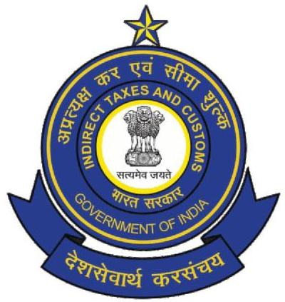
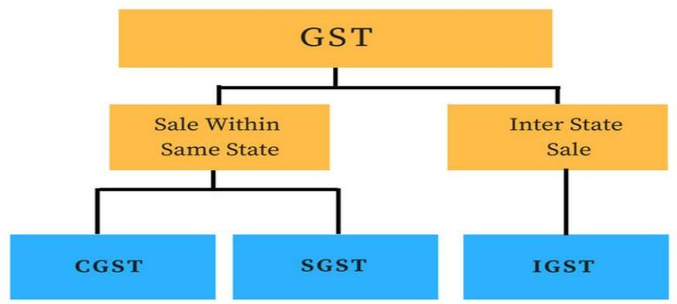
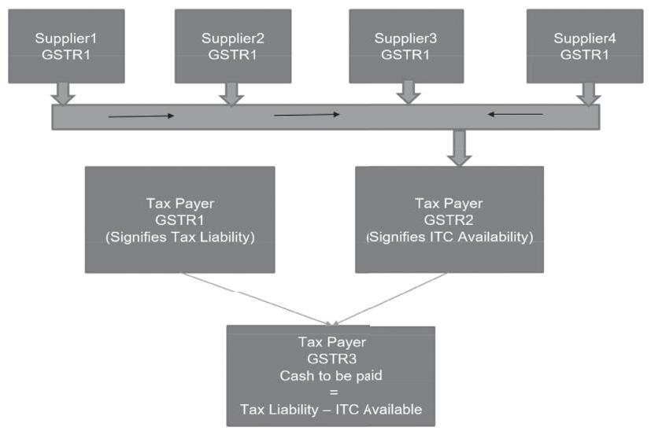

# CENTRAL BOARD OF INDIRECT TAXES \& CUSTOMS

## NEW DELHI

## GST FLYERS

## Updated as on $1^{\text {st }}$ January, 2018 ` ` (As Amended)

# F O R E W O R D

Flyers on important topics of GST are being brought out by the National Academy of Customs, Indirect Taxes, \&Narcotics (NACIN), the apex training institution under the Central Board of Excise \& Customs (CBEC). These Flyers are being issued from time to time and are available on the GST Council website as well as the CBEC website. Till date, 51 Flyers have been issued and more are being issued on an ongoing basis. These flyers have been quite popular as they have been written from the layman's perspective in a simple and lucid language to promote conceptual understanding of GST.

These Flyers have now been updated as on $1^{\text {st }}$ January, 2018, in view of the significant developments since the time they were released. NACIN is now coming out with this compilation containing all the 51 Flyers released till date for ease of reference. I am sure this compilation will continue to spread awareness of GST not only among the Tax officers and taxpayers but also people at large.

I congratulate DG, NACIN and her team for this outreach effort and am sure that it will benefit all concerned.

Vanaja N. Sarna
Chairman, CBEC

# C O N T E N T S

1. Registration under GST Law ..... 1
2. Cancellation of Registration in GST ..... 10
3. The Meaning and Scope of Supply. ..... 17
4. Composite Supply and Mixed Supply. ..... 25
5. Time of Supply in GST ..... 35
6. GST onadvancesreceivedforfuturesupplies ..... 44
7. ConceptofAggregateTurnoverinGST ..... 53
8. Non-resident taxable person in GST. ..... 55
9. Casual taxable person in GST ..... 59
10. Input Service Distributor in GST ..... 68
11. Composition Levy Scheme in GST ..... 74
12. Reverse Charge Mechanism in GST ..... 85
13. TaxInvoice and other such instruments in GST. ..... 97
14. Accounts and Records in GST ..... 114
15. Credit Note in GST ..... 122
16. Debit Note in GST ..... 127
17. Electronic Cash/Credit Ledgers and Liability ..... 131
    Register in GST
18. Electronic Way Bill in GST. ..... 138
19. InputTax Credit Mechanism in GST. ..... 149
20. Transition Provisions under GST. ..... 158
21. Integrated Goods and Services Tax Act. ..... 167
22. Compensation cess in GST. ..... 185
23. Imports in GST Regime ..... 188
24. Zero Rating of Supplies in GST. ..... 200
25. Deemed Exports in GST. ..... 206
26. Pure Agent Concept in GST. ..... 215
27. Job Work under GST. ..... 221
28. Works Contract in GST. ..... 226
29. Valuation in GST. ..... 238
30. Margin Scheme in GST. ..... 250
31. Provisional Assessment in GST. ..... 253
32. Returns in GST. ..... 258
33. Statement of Outward Supplies (GSTR-1) ..... 270
    in GST
34. Refunds under GST. ..... 281
35. Refund of Integrated Tax paid on account of ..... 302
    zero rated supplies
36. Refund of unutilised Input Tax Credit (ITC) ..... 312
37. Advance Ruling Mechanism in GST. ..... 329
38. Goods Transport Agency in GST. ..... 343
39. GST on Charitable and Religious Trusts. ..... 352
40. GST on Education Services ..... 363
41. GST on Co-operative Housing Societies ..... 379
42. Online Information Data Base Access and ..... 388
    Retrieval (OIDAR) Services in GST
43. GST Practitioners ..... 400
44. NationalAnti-ProfiteeringAuthorityin GST ..... 406
45. BenefitsofGoodsandServicesTax(GST) ..... 413
46. Special Audit in GST. ..... 417
47. TDS Mechanism under GST. ..... 421
48. TCS Mechanism under GST. ..... 426
49. Inspection, Search, Seizure and Arrest. ..... 430
50. Appeals and Review Mechanism under GST. ..... 437
51. Recovery of Tax. ..... 449

Flyers Compiled by National Academy of Customs, Indirect Taxes and Narcotics (NACIN), GST Team

Prepared by the following officers:

1. Shri Sanjeev Nair, Examiner (AR), CESTAT, Mumbai (S. No. 4, 17, 24, 25, 26, 28, 34, 35, 36, 37, 38, 39, 40, $41,42,50)$
2. Shri Deepak Mata, Asstt. Director, NACIN, Mumbai (S. No. 6, 10, 12, 13, 14, 18, 23, 30, 43, 45)
3. Shri Girish Vadassery, Asstt. Commr. Abmednagar (S. No. $2,7,8,9,15,16,22,31,33,44,46)$
4. Shri Shirish Gogate, Supdt., DTPS, Mumbai (S. No. 19, $27,47,48)$
5. Shri Rajiv Garg, Joint Director, RMCC, Mumbai (S. No. $5,11,29)$
6. Shri R.S. Maheshwari, Commr. (A), Bhopal (S. No. 20, 21)
7. Shri M.P.S. Sengar, Asstt. Commr., CGST, Mumbai (S. No.49, 51)
8. Shri Gopi Donthireddy, Dy. Director, NACIN, Hyderabad (S. No. 32)
9. Shri Rajesh Ramarao, Dy. Commissioner, CGST, Pune (S. No. 3)
10. Shri Arvind Sinha, Inspector, CGST, Belapur, Navi Mumbai (S. No. 1)

Prepared under the supervision of Shri Samir Bajaj, Additional Director General, NACIN, Mumbai.

Vetted by GST Policy Wing, CBEC
Comments and Suggestions may please be sent to dg.nacen-cbec@nic.in

# Disclaimer:

The Flyers compiled by NACIN and vetted by the GST Policy Wing, CBEC are based on the CGST/SGST/UTGST/IGST Act(s), the CGST Rules, 2017 and the various orders/circulars issued by CBEC. These are for training and academic purposes only.

The information in these flyers is intended only to provide a general overview and is not intended to be treated as legal advice or opinion. For greater details, you are requested to refer to the respective CGST/SGST/UTGST/IGST Acts, Rules, Notifications, Circulars, Orders issued from time to time.

# Chapter One

## Registration under GST Law

## Introduction

In any tax system registration is the most fundamental requirement for identification of tax payers ensuring tax compliance in the economy. Registration of any business entity under the GST Law implies obtaining a unique number from the concerned tax authorities for the purpose of collecting tax on behalf of the government and to avail Input tax credit for the taxes on his inward supplies. Without registration, a person can neither collect tax from his customers nor claim any input tax credit of tax paid by him.

## Need and advantages of registration

Registration will confer the following advantages to a taxpayer:

- He is legally recognized as supplier of goods or services.
- He is legally authorized to collect tax from his customers and pass on the credit of the taxes paid on the goods or services supplied to the purchasers/ recipients.
- He can claim input tax credit of taxes paid and can utilize the same for payment of taxes due on supply of goods or services.
- Seamless flow of Input Tax Credit from suppliers to recipients at the national level.

# Liability to register

GST being a tax on the event of "supply", every supplier needs to get registered. However, small businesses having all India aggregate turnover below Rupees 20 lakh (10 lakh if business is in Assam, Arunachal Pradesh, Himachal Pradesh, Uttarakhand, Manipur, Mizoram, Sikkim, Meghalaya, Nagaland or Tripura) need not register. The small businesses, having turnover below the threshold limit can, however, voluntarily opt to register.

The aggregate turnover includes supplies made by him on behalf of his principals, but excludes the value of job-worked goods if he is a job worker. But persons who are engaged exclusively in the business of supplying goods or services or both that are not liable to tax or wholly exempt from tax or an agriculturist, to the extent of supply of produce out of cultivation of land are not liable to register under GST. Also, if all the supplies being made by a supplier are taxable under reverse charge, there is no requirement for such a supplier to register in light of Notification No. 5/2017-Central Tax dated 19.06.2017.

## Nature of Registration

The registration in GST is PAN based and State specific.

Supplier has to register in each of such State or Union territory from where he effects supply. In GST registration, the supplier is allotted a 15 -digit GST identification number called "GSTIN" and a certificate of registration incorporating therein this GSTIN is made available to the applicant on the GSTN common portal. The first 2 digits of the GSTIN is the State code, next 10 digits are the PAN of the legal entity, the next two digits are for entity code, and the last digit is check sum number. Registration under GST is not tax specific which means that there is single registration for all the taxes i.e. CGST, SGST/UTGST, IGST and cesses.

A given PAN based legal entity would have one GSTIN per State, that means a business entity having its branches in multiple States will have to take separate State wise registration for the branches in different States. But within a State an entity with different branches would have single registration wherein it can declare one place as principal place of business and other branches as additional place of business. However, a business entity having separate business verticals (as defined in section 2 (18) of the CGST Act, 2017) in a state may obtain separate registration for each of its business verticals. Further a unit in SEZ or a SEZ developer needs to necessarily obtain separate registration.

- Generally, the liability to register under GST arises when you are a supplier within the meaning of the term, and also if your aggregate turn over in the financial year is above the exemption threshold of 20 lakh rupees ( 10 lakh rupees in special category states except J \& K). However, the GST law enlists

certain categories of suppliers who are required to get compulsory registration irrespective of their turnover that is to say, the threshold exemption of 20 lakh rupees or 10 lakh rupees as the case may be is not available to them. Some of such suppliers who need to register compulsorily irrespective of the size of their turnover are those who are, -

- Inter-state suppliers; However, persons making inter-state supplies of taxable services and having an aggregate turnover, to be computed on all India basis, not exceeding an amount of twenty lakh rupees (ten lakh rupees for special category States except $\mathrm{J} \& \mathrm{~K}$ ) are exempted from obtaining registration vide Notification No. 10/2017-Integrated Tax dated 13.10.2017.
- A person receiving supplies on which tax is payable by recipient on reverse charge basis
- Casual taxable person who is not having fixed place of business in the State or Union Territory from where he wants to make supply. However casual taxable persons making supplies of specified handicraft goods need not take compulsory registration and are entitled to the threshold exemption of Rs. 20 Lakh. Handicraft goods are specified in Notification no. 33/2017-Central Tax dated 15.09.2017 as amended by Notification no. 38/2017-Central Tax dated 13.10.2017.
- non-resident taxable persons who is not having fixed place of business in India
- A person who supplies on behalf of some other taxable person (i.e. an Agent of some Principal)
- E-commerce operators, who provide platform to the suppliers to make supply through it
- Suppliers of goods who supply through such e-commerce operator who are liable to collect tax at source. Persons supplying services through e-commerce operators need not take compulsory registration and are entitled to avail the threshold exemption of Rs. 20 Lakh as per Notification No. 65/2017-Central tax dated 15.11.2017.
- Those ecommerce operators who are notified as liable for GST payment under Section 9(5) of the CGST Act, 2017
- TDS Deductor
- Input service distributor
- Those supplying online information and data base access or retrieval services from outside India to a non-registered person in India.

A casual taxable person is one who has a registered business in some State in India, but wants to effect supplies from some other State in which he is not having any fixed place of business. Such person needs to register in the State from where he seeks to supply as a casual taxable person. A non-resident taxable person is one who is a foreigner and occasionally wants to effect taxable supplies from any State in India, and for that he needs GST registration. GST

law prescribes special procedure for registration, as also for extension of the operation period of such casual or nonresident taxable persons. They have to apply for registration at least five days in advance before making any supply. Also, registration is granted to them or period of operation is extended only after they make advance deposit of the estimated tax liability.

In respect of supplies to some notified agencies of United Nations organisation, multinational financial institutions and other organisations, a centralised unique identification number (UIN) is issued.

# Standardisation of procedures

A total of 30 forms / formats have been prescribed in the GST registration rules. For every process in the registration chain such as application for registration, acknowledgment, query, rejection, registration certificate, show cause notice for cancellation, reply, cancellation, amendment, field visit report etc., there are standard formats. This will make the process uniform all over the country. The decision making process will also be fast. Strict time lines have been stipulated for completion of different stages of registration process.

An application has to be submitted on line through the common portal (GSTN) within thirty days from the date when liability to register arose. The casual and non-resident taxable persons need to apply at least five days prior to the commencement of the business. For transferee of a business as going concern, the liability to register arises on the date of transfer.

The Proper Officer has to either raise a query or approve the grant of registration within three working days failing which registration would be considered as deemed to have been approved. The applicant would have to respond within seven working days starting from the fourth day of filing the original application. The proper officer would have to grant or reject the application for registration within seven working days thereafter.

# Amendment of Registration

Except for the changes in some core information in the registration application, a taxable person shall be able to make amendments without requiring any specific approval from the tax authority. In case the change is for legal name of the business, or the State of place of business or additional place of business, the taxable person will apply for amendment within 15 days of the event necessitating the change. The proper officer, then, will approve the amendment within next 15 days. For other changes like name of day to day functionaries, e-mail Ids, Mobile numbers etc. no approval of the proper officer is required, and the amendment can be affected by the taxable person on his own on the common portal.

Generally, the amendments take effect from the date of application for amendment. Commissioner, however, has been given powers to permit amendments with retrospective effect.

## Cancellation of Registration

The GST law provides for two scenarios where cancellation

of registration can take place; the one when the taxable person no more requires it (voluntary cancellation), and another when the proper officer considers the registration liable for cancellation in view of certain specified defaults (Suo-motu cancellation) like when the registrant is not doing business from the registered place of business or if he issues tax invoice without making the supply of goods or services. The taxable person desirous of cancellation of Registration will apply on the common portal within 30 days of event warranting cancellation. He will also declare in the application the stock held on the date with effect from which he seeks cancellation. He will also work out and declare the quantum of dues of payments and credit reversal, and the particulars of payments made towards discharge of such liabilities. In case of voluntary registration (taken despite not being liable for obtaining registration), no cancellation is allowed until expiry of one year from the effective date of registration. If satisfied, the proper officer has to cancel the registration within 30 days from the date of application or the date of reply to notice (if issued, when rejection is concluded by the officer).

# Revocation of Cancellation

In case where registration is cancelled suo-motu by the proper officer, the taxable person can apply within 30 days of service of cancellation order, requesting the officer for revoking the cancellation ordered by him. However, before so applying, the person has to make good the defaults (by filing all pending returns, making payment of all dues and so) for which the registration was cancelled by the officer.

If satisfied, the proper officer will revoke the cancellation earlier ordered by him. However, if the officer concludes to reject the request for revocation of cancellation, he will first observe the principle of natural justice by way of issuing notice to the person and hearing him on the issue.

# Physical verification in connection with registration

Physical verification is to be resorted to only where it is found necessary in the subjective satisfaction of the proper officer. If at all, it is felt necessary, it will be undertaken only after granting the registration and the verification report along with the supporting documents and photographs shall have to be uploaded on the common portal within fifteen working days.

# C ancellation of R egistration in GST

## Introduction:

The registration granted under GST can be cancelled for specified reasons. The cancellation can either be initiated by the department on their own motion or the registered person can apply for cancellation of their registration. In case of death of registered person, the legal heirs can apply for cancellation. In case the registration has been cancelled by the department there is a provision for revocation of the cancellation. On cancellation of the registration the person has to file a return which is called the final return.

## Reason for cancellation:

The registration can be cancelled for the following reasons:
a) a person registered under any of the existing laws, but who is not liable to be registered under the GST Act;
a) the business has been discontinued, transferred fully for any reason including death of the proprietor, amalgamated with other legal entity, demerged or otherwise

disposed of;
a) there is any change in the constitution of the business;
a) the taxable person (other than the person who has voluntarily taken registration under sub-section (3) of section 25 of the CGST Act, 2017) is no longer liable to be registered;
a) a registered person has contravened such provisions of the Act or the rules made thereunder;
a) a person paying tax under Composition levy has not furnished returns for three consecutive tax periods;
a) any registered person, other than a person paying tax under Composition levy has not furnished returns for a continuous period of six months;
a) any person who has taken voluntary registration under sub-section (3) of section 25 has not commenced business within six months from the date of registration;
a) registration has been obtained by means of fraud, willful misstatement or suppression of facts

# Procedurefor cancellation:

i. A person already registered under any of the existing laws (Central excise, Service tax, VAT etc.), but who now is not liable to be registered under the GST Act has to submit an application electronically by $31^{\mathrm{ST}}$ December 2017, in FORM GST REG-29 at the common portal for the cancellation of registration granted to him. The Superintendent of Central Tax

shall, after conducting such enquiry as deemed fit, cancel the said registration.
ii. The cancellation of registration under the State Goods and Services Tax Act or the Union Territory Goods and Services Tax Act, as the case may be, shall be deemed to be a cancellation of registration under Central Goods and Services Tax Act.
iii. In the event, the Superintendent of Central Tax has reasons to believe that the registration of a person is liable to be cancelled, a notice to such person in FORM GST REG-17, requiring him to show cause, within a period of seven working days from the date of the service of such notice, as to why his registration shall not be cancelled; will be issued.
iv. The reply to the show cause notice issued has to be furnished by the registered person in FORM REG18 within a period of seven working days.
v. In case the reply to the show cause notice is found to be satisfactory, the Superintendent of Central Tax will drop the proceedings and pass an order in FORM GST REG -20.
vi. However, when the person who has submitted an application for cancellation of his registration is no longer liable to be registered or his registration is liable to be cancelled, the Superintendent of Central Tax will issue an order in FORM GST REG-19, within a period of thirty days from the date of application or, as the case may be, the date of the reply to

the show cause issued, cancel the registration, with effect from a date to be determined by him and notify the taxable person, directing him to pay arrears of any tax, interest or penalty.
vii. The registered person whose registration is cancelled shall pay an amount, by way of debit in the electronic credit ledger or electronic cash ledger, equivalent to the credit of input tax in respect of inputs held in stock and inputs contained in semi-finished or finished goods held in stock or capital goods or plant and machinery on the day immediately preceding the date of such cancellation or the output tax payable on such goods, whichever is higher.
viii. In case of capital goods or plant and machinery, the taxable person shall pay an amount equal to the input tax credit taken on the said capital goods or plant and machinery, reduced by such percentage points as may be prescribed or the tax on the transaction value of such capital goods or plant and machinery under section 15 , whichever is higher.
ix. The cancellation of registration shall not affect the liability of the person to pay tax and other dues for any period prior to the date of cancellation whether or not such tax and other dues are determined before or after the date of cancellation.

# Final Returns:

When the registration of a registered person other than an Input Service Distributor or a non-resident taxable person

or a person paying tax under the composition scheme or TDS/TCS; has been cancelled, the person has to file a final return within three months of the date of cancellation or date of order of cancellation, whichever is later, electronically in FORM GSTR-10 through the common portal either directly or through a Facilitation Centre notified by the Commissioner.

# Revocation of Cancellation:

i. When the registration has been cancelled by the Proper Officer (Superintendent of Central Tax) on his own motion and not on the basis of an application ,then the registered person, whose registration has been cancelled, can submit an application for revocation of cancellation of registration, in FORM GST REG-21, to the Proper Officer (Assistant or Deputy Commissioners of Central Tax), within a period of thirty days from the date of the service of the order of cancellation of registration at the common portal, either directly or through a Facilitation Centre notified by the Commissioner:
ii. However, if the registration has been cancelled for failure to furnish returns, application for revocation shall be filed, only after such returns are furnished and any amount due as tax, in terms of such returns, has been paid along with any amount payable towards interest, penalty and late fee in respect of the said returns.

iii. On examination of the application if the Proper Officer (Assistant or Deputy Commissioners of Central Tax) is satisfied, for reasons to be recorded in writing, that there are sufficient grounds for revocation of cancellation of registration, then he shall revoke the cancellation of registration by an order in FORM GST REG-22 within a period of thirty days from the date of the receipt of the application and communicate the same to the applicant.
iv. However, if on examination of the application for revocation, if the Proper Officer (Assistant or Deputy Commissioners of Central Tax) is not satisfied then he will issue a notice in FORM GST REG-23 requiring the applicant to show cause as to why the application submitted for revocation should not be rejected and the applicant has to furnish the reply within a period of seven working days from the date of the service of the notice in FORM GST REG24.
v. Upon receipt of the information or clarification in FORM GST REG-24, the Proper Officer (Assistant or Deputy Commissioners of Central Tax) shall dispose of the application within a period of thirty days from the date of the receipt of such information or clarification from the applicant. In case the information or clarification provided is satisfactory, the Proper Officer (Assistant or Deputy Commissioners of Central Tax) shall dispose the application as per para (iii) above. In case it is not satisfactory the ap-

plicant will be mandatorily given an opportunity of being heard, after which the Proper Officer (Assistant or Deputy Commissioners of Central Tax) after recording the reasons in writing may by an order in FORM GST REG- 05, reject the application for revocation of cancellation of registration and communicate the same to the applicant.
vi. The revocation of cancellation of registration under the State Goods and Services Tax Act or the Union Territory Goods and Services Tax Act, as the case may be, shall be deemed to be a revocation of cancellation of registration under Central Goods and Services Tax Act

# Chapter Three

## The Meaning and Scope of Supply

The taxable event in GST is supply of goods or services or both. Various taxable events like manufacture, sale, rendering of service, purchase, entry into a territory of State etc. have been done away with in favour of just one event i.e. supply. The constitution defines "goods and services tax" as any tax on supply of goods, or services or both except taxes on the supply of the alcoholic liquor for human consumption.

The Central and State governments will have simultaneous powers to levy the GST on intra-state supply. However, the Parliament alone shall have exclusive power to make laws with respect to levy of goods and services tax on inter-state supply.

The term, "supply" has been inclusively defined in the Act. The meaning and scope of supply under GST can be understood in terms of following six parameters, which can be adopted to characterize a transaction as supply:

1. Supply of goods or services. Supply of anything other than goods or services does not attract GST.
2. Supply should be made for a consideration
3. Supply should be made in the course or furtherance of business
4. Supply should be made by a taxable person
5. Supply should be a taxable supply
6. While these six parameters describe the concept of supply, there are a few exceptions to the requirement of supply being made for a consideration and in the course or furtherance of business. Any transaction involving supply of goods or services without consideration is not a supply, barring few exceptions, in which a transaction is deemed to be a supply even without consideration. Further import of services for a consideration, whether or not in the course or furtherance of business is treated as supply.

# Supply of goods or services or both

Goods as well as services have been defined in the GST Law. The securities are excluded from the definition of goods as well as that of services. Money is also excluded from the definition of goods as well as services, however, activities relating to the use of money or its conversion by cash or by any other mode, from one form, currency or denomination, to another form, currency or denomination for which a separate consideration is charged are included in services.

Schedule II to the CGST Act, 2017 lists a few activities which are to be treated as supply of goods or supply of services. For instance, any transfer of title in goods would

be a supply of goods, whereas any transfer of right in goods without transfer of title would be considered as services.

Further Schedule III to the CGST Act, 2017 spells out activities which shall be treated as neither supply of goods nor supply of services - in other words, outside the scope of GST.A few important ones are: -

1. Services by an employee to the employer in the course of or in relation to his employment.
2. Services of funeral, burial, crematorium or mortuary including transportation of the deceased.
3. Sale of land and, sale of building where the entire consideration has been received after completion certificate is issued or after its first occupation.
   Actionable claims are included in the definition of goods, however, schedule III provides that actionable claims other than lottery, betting and gambling shall be neither goods nor services.

# Supply for consideration

Consideration has specifically been defined in the CGST Act, 2017. It can be in money or kind. Any subsidy given by the Central Government or a State Government is not considered as consideration. It is immaterial whether the payment is made by the recipient or by any other person.

A deposit given in respect of the supply of goods or services or both shall not be considered as payment made for such supply unless the supplier applies such deposit as consideration for the said supply;

Further, when there is barter of goods of services, the same activity constitutes supply as well as a consideration. When a barber cuts hair in exchange for a painting, hair cut is a supply of services by the barber. It is a consideration for the painting received.

However, there are exceptions to the requirement of 'Consideration' as a pre-condition for a supply to be called a supply as per GST. As per schedule to CGST Act, 2017, activities as mentioned below shall be treated as supply even if made without consideration.

1. Permanent transfer or disposal of business assets where input tax credit has been availed on such assets.
2. Supply of goods or services or both between related persons or between distinct persons as specified in section 25 , when made in the course or furtherance of business: Provided that gifts not exceeding fifty thousand rupees in value in a financial year by an employer to an employee shall not be treated as supply of goods or services or both.
3. Supply of goods - (a) by a principal to his agent where the agent undertakes to supply such goods on behalf of the principal; or (b) by an agent to his principal where the agent undertakes to receive such goods on behalf of the principal.
4. Import of services by a taxable person from a related person or from any of his other establishments outside India, in the course or furtherance of business.

# Supply in the Course or Furtherance of Business

GST is essentially tax only on commercial transactions. Hence only those supplies that are in the course or furtherance of business qualify as Supply under GST. Hence any supplies made by an individual in his personal capacity do not come under the ambit of GST unless they fall within the definition of business as defined in the Act. CBEC vide press release dated 13.07.2017 has clarified that sale of old gold jewellery by an individual to a jeweller will not constitute supply as the same cannot be said to be in the course or furtherance of business of the individual. Sale of goods or service even as a vocation is a supply under GST. Therefore, even if a famous politician paints paintings for charity and sells the paintings even as a one-time occurrence, the sale would constitute Supply.

However, there is one exception to this 'Course or Furtherance of Business' rule i.e., import of services for a consideration.

# Supply by a taxable Person

A supply to attract GST should be made by a taxable person. Hence a supply between two non-taxable persons does not constitute supply under GST. A "taxable person" is a person who is registered or liable to be registered under section 22 or section 24 . Hence even an unregistered person who is liable to be registered is a taxable person. Similarly, a person not liable to be registered but has taken voluntary registration and got himself registered is also a taxable person.

It should be noted that GST in India is state-centric. Hence

a person making supplies from different states need to take separate registration in each state. Further the person may take more than one registration within a state if the person has multiple business verticals. A person who has obtained or is required to obtain more than one registration, whether in one State or Union territory or more than one State or Union territory shall, in respect of each such registration, be treated as distinct persons for the purposes of GST. Hence a supply between these entities constitutes supply under GST.

# Taxable supply

For a supply to attract GST the supply must be taxable. Taxable supply has been broadly defined and means any supply of goods or services or both which is leviable to tax under the Act. Exemptions may be provided to the specified goods or services or to a specified category of persons / entities making supply.

## Supply in the taxable territory

For a supply to attract GST the place of supply should be in India except the state of Jammu and Kashmir. The place of supply of any goods or services is determined based on Sections 10, 11, 12 and 13 of IGST Act 2017.

## Inter/Intra State supply

The location of the supplier and the place of supply determines whether a supply is treated as an Intra State supply or an Inter State supply. Determination of the nature

of supply is essential to ascertain whether integrated tax is to be paid or Central plus State tax are to be paid. Inter State supply of goods means a supply of goods where the location of the supplier and place of supply are in different States or Union territories. Intra State supply of goods means supply of goods where the location of the supplier and place of supply are in the same State or Union territory. Imports, Supplies from and to SEZs are treated as deemed inter-State supplies.

# Composite / Mixed supply

A composite supply means a supply made by a taxable person to a recipient comprising two or more supplies of goods or services or any combination thereof, which are naturally bundled and supplied in conjunction with each other in the ordinary course of business, one of which is a principal supply. For instance, a travel ticket from Mumbai to Delhi may include service of food being served on board, free insurance, use of airport lounge. In this case, transport of passenger, constitutes the pre-dominant element of the composite supply, and is treated as the principal supply and all other supplies are ancillary.

The GST Law lays down the tax liability on a composite or mixed supply in the following manner.

- Composite Supply comprising two or more supplies one of which is a principal supply, shall be treated as supply of such principal supply.
- Mixed Supply comprising two or more supplies,

shall be treated as supply of that particular supply which attracts the highest rate of tax.

# Composite Supply and Mixed Supply

## Introduction

The taxable event under GST is supply of goods or services or both. GST will be payable on every supply of goods or services or both unless otherwise exempted. The rates at which GST is payable for individual goods or services or both is also separately -notified. Classification of supply (whether as goods or services, the category of goods and services) is essential to charge applicable rate of GST on the particular supply. The application of rates will pose no problem if the supply is of individual goods or services which is clearly identifiable and the goods or services are subject to a particular rate of tax.

But not all supplies will be such simple and clearly identifiable supplies. Some of the supplies will be a combination of goods or combination of services or combination of goods and services both. Each individual component in a given supply may attract different rate of tax. The rate of tax to be levied on such supplies may pose a problem in respect of classification of such supplies. It is for this reason, that the GST Law identifies composite supplies and mixed supplies

and provides certainty in respect of tax treatment under GST for such supplies.

# Composite Supply under GST

Under GST, a composite supply would mean a supply made by a taxable person to a recipient consisting of two or more taxable supplies of goods or services or both, or any combination thereof, which are naturally bundled and supplied in conjunction with each other in the ordinary course of business, one of which is a principal supply;

Illustration: Where goods are packed and transported with insurance, the supply of goods, packing materials, transport and insurance is a composite supply and supply of goods is a principal supply.

A works contracts and restaurant services are classic examples of composite supplies, however the GST Act identifies both as supply of services and chargeable to specific rate of tax mentioned against such services. (Works contract and restaurant)

In respect of composite supplies (other than the two categories mentioned above), the need to determine the supply as a composite one, will arise, so as to determine the appropriate classification. It will be necessary to determine as to whether a particular supply is naturally bundled in the ordinary course of business and what constitutes principal supply in such composite supplies.

The concept of composite supply under GST is identical to the concept of naturally bundled services prevailing

in the existing service tax regime. This concept has been explained in the Education Guide issued by CBEC in the year 2012 as under -
"Bundled service' means a bundle of provision of various services wherein an element of provision of one service is combined with an element or elements of provision of any other service or services. An example of 'bundled service' would be air transport services provided by airlines wherein an element of transportation of passenger by air is combined with an element of provision of catering service on board. Each service involves differential treatment as a manner of determination of value of two services for the purpose of charging service tax is different.

The rule is - 'If various elements of a bundled service are naturally bundled in the ordinary course of business, it shall be treated as provision of a single service which gives such bundle its essential character'

# Illustrations -

- A hotel provides a $4-\mathrm{D} / 3-\mathrm{N}$ package with the facility of breakfast. This is a natural bundling of services in the ordinary course of business. The service of hotel accommodation gives the bundle the essential character and would, therefore, be treated as service of providing hotel accommodation.
- A 5 star hotel is booked for a conference of 100 delegates on a lump sum package with the following facilities:
- Accommodation for the delegates
- Breakfast for the delegates,
- Tea and coffee during conference
- Access to fitness room for the delegates
- Availability of conference room
- Business centre

As is evident a bouquet of services is being provided, many of them chargeable to different effective rates of tax. None of the individual constituents are able to provide the essential character of the service. However, if the service is described as convention service it is able to capture the entire essence of the package. Thus, the service may be judged as convention service and chargeable to full rate. However, it will be fully justifiable for the hotel to charge individually for the services as long as there is no attempt to offload the value of one service on to another service that is chargeable at a concessional rate.

Whether services are bundled in the ordinary course of business would depend upon the normal or frequent practices followed in the area of business to which services relate. Such normal and frequent practices adopted in a business can be ascertained from several indicators some of which are listed below -

- The perception of the consumer or the service receiver. If large number of service receivers of such bundle of services reasonably expect such services to be provided

as a package, then such a package could be treated as naturally bundled in the ordinary course of business.

- Majority of service providers in a particular area of business provide similar bundle of services. For example, bundle of catering on board and transport by air is a bundle offered by a majority of airlines.
- The nature of the various services in a bundle of services will also help in determining whether the services are bundled in the ordinary course of business. If the nature of services is such that one of the services is the main service and the other services combined with such service are in the nature of incidental or ancillary services which help in better enjoyment of a main service. For example, service of stay in a hotel is often combined with a service or laundering of 3-4 items of clothing free of cost per day. Such service is an ancillary service to the provision of hotel accommodation and the resultant package would be treated as services naturally bundled in the ordinary course of business.
- Other illustrative indicators, not determinative but indicative of bundling of services in ordinary course of business are -
- There is a single price or the customer pays the same amount, no matter how much of the package they actually receive or use.
- The elements are normally advertised as a package.
- The different elements are not available separately.
- The different elements are integral to one overall supply - if one or more is removed, the nature of the supply would be affected.

No straight jacket formula can be laid down to determine whether a service is naturally bundled in the ordinary course of business. Each case has to be individually examined in the backdrop of several factors some of which are outlined above."

The above principles explained in the light of what constitutes a naturally bundled service can be gainfully adopted to determine whether a particular supply constitutes a composite supply under GST and if so what constitutes the principal supply so as to determine the right classification and rate of tax of such composite supply.

# Mixed Supply

Under GST, a mixed supply means two or more individual supplies of goods or services, or any combination thereof, made in conjunction with each other by a taxable person for a single price where such supply does not constitute a composite supply;

Illustration: A supply of a package consisting of canned foods, sweets, chocolates, cakes, dry fruits, aerated drinks and fruit juices when supplied for a single, price is a mixed supply. Each of these items can be supplied separately and is not dependent on any other. It shall not be a mixed supply if these items are supplied separately.

In order to identify if the particular supply is a Mixed Supply, the first requisite is to rule out that the supply is a composite supply. A supply can be a mixed supply only if it is not a composite supply. As a corollary it can be said that if the transaction consists of supplies not naturally bundled in the ordinary course of business then it would be a Mixed Supply. Once the amenability of the transaction as a composite supply is ruled out, it would be a mixed supply, classified in terms of a supply of goods or services attracting highest rate of tax.

The following illustration given in the Education Guide of CBEC referred to above can be a pointer towards a mixed supply of services: -
"A house is given on rent one floor of which is to be used as residence and the other for housing a printing press. Such renting for two different purposes is not naturally bundled in the ordinary course of business. Therefore, if a single rent deed is executed it will be treated as a service comprising entirely of such service which attracts highest liability of service tax. In this case renting for use as residence is a negative list service while renting for non-residence use is chargeable to tax. Since the latter category attracts highest liability of service tax amongst the two services bundled together, the entire bundle would be treated as renting of commercial property."

# Determination of tax liability of tax liability of Composite and Mixed Supplies

The tax liability on a composite or a mixed supply shall be

determined in the following manner, namely: -
a) acomposite supply comprising two or more supplies, one of which is a principal supply, shall be treated as a supply of such principal supply; and
b) amixed supply comprising two or more supplies shall be treated as a supply of that particular supply which attracts the highest rate of tax.

# Time of supply in case of Composite supply

If the composite supply involves supply of services as principal supply, such composite supply would qualify as supply of services and accordingly the provisions relating to time of supply of services would be applicable. Alternatively, if composite supply involves supply of goods as principal supply, such composite supply would qualify as supply of goods and accordingly, the provisions relating to time of supply of goods would be applicable.

## Time of supply in case of mixed supplies

The mixed supply, if involves supply of a service liable to tax at higher rates than any other constituent supplies, such mixed supply would qualify as supply of services and accordingly the provisions relating to time of supply of services would be applicable. Alternatively, the mixed supply, if involves supply of goods liable to tax at higher rates than any other constituent supplies, such mixed supply would qualify as supply of goods and accordingly the provisions relating to time of supply of services would be applicable.

# Certain clarifications on composite and mixed supply given by CBEC

The printing industry in India in particular faces a dilemma in determining whether the nature of supply provided is that of goods or services and whether in case certain contracts involve both supply of goods and services, whether the same would constitute a supply of goods or services or if it would be a composite supply and in case it is, then what would constitute the principal supply. It is to be noted that in case of composite supplies, taxability is determined by the principal supply. To address concerns of the printing industry, CBEC has come out with Circular no.11/11/2017GST dated 20.10.2017, where in it is clarified as under:
"It is clarified that supply of books, pamphlets, brochures, envelopes, annual reports, leaflets, cartons, boxes etc. printed with logo, design, name, address or other contents supplied by the recipient of such printed goods, are composite supplies and the question, whether such supplies constitute supply of goods or services would be determined on the basis of what constitutes the principal supply.

In the case of printing of books, pamphlets, brochures, annual reports, and the like, where only content is supplied by the publisher or the person who owns the usage rights to the intangible inputs while the physical inputs including paper used for printing belong to the printer, supply of printing [of the content supplied by the recipient of supply] is the principal supply and therefore such supplies would constitute supply of service falling under heading 9989 of the scheme of classification of services.

In case of supply of printed envelopes, letter cards, printed boxes, tissues, napkins, wall paper etc. falling under Chapter 48 or 49 , printed with design, logo etc. supplied by the recipient of goods but made using physical inputs including paper belonging to the printer, predominant supply is that of goods and the supply of printing of the content [supplied by the recipient of supply] is ancillary to the principal supply of goods and therefore such supplies would constitute supply of goods falling under respective headings of Chapter 48 or 49 of the Customs Tariff.

# Chapter Five

## Time of Supply in GST

## Time of Supply

In order to calculate and discharge tax liability it is important to know the date when the tax liability arises i.e. the date on which the charging event has occurred. In GST law, it is known as Time of Supply. GST law has provided separate provisions to determine the time of supply of goods and time of supply of services. Sections 12, $13 \& 14$ of the CGST Act, 2017, deals with the provisions related to time of supply and by virtue of section 20 of the IGST Act, 2017, these provisions are also applicable to inter-State supplies leviable to Integrated tax.

## Point of time when supplier receives the payment or date of receipt of payment

The phrase "the date on which supplier receives the payment" or "the date of receipt of payment" means the date on which payment is entered in books of accounts of the supplier or the date on which the payment is credited to his bank account, whichever is earlier.

## Time of issue of invoice for supply

As per section 31 of the CGST Act, 2017 an invoice for supply of goods needs to be issued before or at the time of removal of goods for supply to the recipient where the supply involves movement of goods. However, in other cases, invoice needs to be issued before or at the time of delivery of goods or making available goods to the recipient.

Similarly, an invoice for supply of services needs to be issued before or after the provision of service but not later than thirty days from the date of provision of service.

# Time of supply of goods (Default Rule)

Earliest of the following dates

- Date of issue of invoice by the supplier. If invoice is not issued, then the last date on which supplier is legally bound to issue the invoice with respect to the supply.
- Date on which supplier receives the payment.

Section 148 of the CGST Act, 2017, confers powers on the government (on the recommendation of the GST Council) to notify certain classes of registered persons and the special procedures to be followed by such persons including those with regard to registration, furnishing of return, payment of tax and administration of such persons. In exercise of powers conferred by this section, the government on the recommendations of the GST Council has notified the registered persons (who have not opted for composition levy) as the class of persons who shall pay GST on outward supply of goods

at the time of supply specified in clause (a) of sub-section (2) of Section 12. Thus, in respect of supply of goods by normal registered persons (other than composition dealers), the time of supply will be the issue of invoice (or the last date by which invoice has to be issued in terms of Section 31) Therefore, all taxpayers (except composition taxpayers) are exempted from paying GST at the time of receipt of advance in relation to supply of goods. The entire GST shall be payable only when the invoice is issued for such supply of goods. The special procedure will be applicable to this class of persons (registered persons making supplies of goods other than composition dealers) even in situations governed by Section 14 of the Act (change in rate). Notification no. 66/2017-Central Tax dated 15.11.2017 may be referred to.

# Time of supply of services (Default Rule)

Earliest of the following dates

- If the invoice is issued within the legally prescribed period under section 31(2) of the CGST Act, 2017 read with Rule 47 of CGST Rules, 2017 (which is thirty days from the date of the supply of service), then the date of issue of invoice by the supplier or date of receipt of payment, which ever is earlier.
- If the invoice is not issued within the legally prescribed period under section 31(2) of the CGST Act, 2017 then the date of provision of service or date of receipt of payment, whichever is earlier.
- Date on which recipient shows the receipt of service in his books of account, in a case aforesaid two provisions do not apply.

The supply of services shall deemed to have been made to the extent it is covered by the invoice or by the payment, as the case may be. For example, Firm 'A' receives an advance of Rs. 2500/- on 29.07.2017 for provision ofservices worth Rs. 10000/- to be supplied in the month of September, then it is deemed that firm 'A' has made a supply of Rs. 2500/- on 29.07.2017 and tax liability on Rs. 2500/- is to be discharged by 20.08.2017.

Although tax is payable on any advance received for a supply of services, however for the convenience of trade it is provided that if a supplier of taxable services receives an amount up to Rs. 1000/- in excess of the amount indicated on the tax invoice, then the supplier has an option to take the date of issue of invoice in respect of such supply as time of supply. For example, if a supplier has received an amount of Rs. 1500/- against an invoice of Rs.1100/- on 25.07.2017 and date of invoice of next supply to the said recipient is 14.08.2017, then he has option to treat the time of supply w.r.t Rs. 400/- either as 25.07.2017 or 14.08.2017.

# Time of supply of goods when tax is to be paid on reverse charge basis

Earliest of the following dates

- Date of receipt of goods
- Date on which payment is entered in the books of

accounts of the recipient or the date on which the payment is debited in his bank account, whichever is earlier.

- Date immediately following 30 days from the date of issue of invoice or any other legal document in lieu of invoice by the supplier.

However, if it is not possible to determine the time of supply in aforesaid manner then the time of supply is the date of entry of the transaction in the books of accounts of the recipient of supply.

# Time of supply of services when tax is to be paid on reverse charge basis

Earliest of the following dates

- Date of payment as entered in the books of account of the recipient or the date on which the payment is debited in his bank account, whichever is earlier
- Date immediately following 60 days from the date of issue of invoice or any other legal document in lieu of invoice by the supplier.

However, if it is not possible to determine the time of supply in aforesaid manner then the time of supply is the date of entry of the transaction in the books of accounts of the recipient of supply.

## Time of supply of services in case of supply by Associated Enterprises located outside India

In this case, the time of supply is the date of entry in the books of account of the recipient or the date of payment, whichever is earlier.

# Time of supply in case of supply of vouchers

Voucher has been defined in the CGST Act, 2017 as an instrument where there is an obligation to accept it as consideration or part consideration for a supply of goods or services or both and where the goods or services or both to be supplied or the identities of their potential suppliers are either indicated on the instrument itself or in related documentation, including the terms and conditions of use of such instrument. Vouchers are commonly used for transaction in the Indian economy. A shopkeeper may issue vouchers for specific supply i.e. supply is identifiable at the time of issuance of voucher. In trade parlance, these are known as single purpose vouchers. For example, vouchers for pressure cookers or Television or for spa or haircut. Similarly, a voucher can be general purpose voucher which can be used for multiple purposes. For example, a Rs. 1000/- voucher issued by Shoppers' Stop store can be used for buying any product at any Shoppes' Stop store. Time of supply is different in case of single purpose voucher and in the case of general purpose voucher.

Time of supply in the case of single purpose voucher i.e. case where supply is identifiable at the time of issuance of voucher is date of issue of voucher. However, in all other cases of supply of vouchers, time of supply is date of redemption of voucher.

# Time of supply of goods or services (Residual provisions)

In case it is not possible to determine the time of supply under aforesaid provisions, the time of supply is,-

- Due date of filing of return, in case where periodical return has to be filed
- Date of payment of tax in all other cases.

## Time of supply of goods or services related to an addition in the value of supply by way of interest, late fees or penalty

Time of supply related to an addition in the value of supply by way of interest, late fee or penalty for delayed payment of any consideration shall be the date on which suppliers receives such addition in value. For example a supplier receives consideration in the month of September instead of due date of July and for such delay he is eligible to receive an interest amount of Rs. 1000/- and said amount is received on 15.12.2017. The time of supply of such amount (Rs. 1000/-) will be the 15.12.2017 i.e. the date on which it is received by the supplier and tax liability on this is to be discharged by 20.01.2018.

## Change in Rate of Tax in respect of supply of goods or services

Where there is a change in rate of tax of supply of goods or services, time of supply has to be determined in the following manner:-

Supply is completed before the change in rate of tax

| Invoice ` ` issued ` ` before date ` ` of change ` ` in tax rate | Payment ` ` received ` ` before date ` ` of change ` ` in tax rate | Time of supply                                               | Applicable ` ` rate of tax |
| :----------------------------------------------------------------------------------- | :------------------------------------------------------------------------------------- | :----------------------------------------------------------- | :------------------------------ |
| No                                                                                   | No                                                                                     | earliest of the ` ` date of invoice ` ` or payment | New rate of ` ` tax        |
| Yes                                                                                  | No                                                                                     | Date of issue of ` ` invoice.                           | Old tax rate                    |
| No                                                                                   | Yes                                                                                    | Date of receipt ` ` of payment                          | Old tax rate                    |

Supply is completed after the change in rate of tax

| Invoice ` ` issued before ` ` date of ` ` change in tax ` ` rate | Payment ` ` received ` ` before date ` ` of change in ` ` tax rate | Time of sup-` ` ply                                     | Applicable ` ` rate of tax |
| :----------------------------------------------------------------------------------- | :------------------------------------------------------------------------------------- | :----------------------------------------------------------- | :------------------------------ |
| Yes                                                                                  | Yes                                                                                    | earliest of the ` ` date of invoice ` ` or payment | Old rate of tax                 |
| Yes                                                                                  | No                                                                                     | Date of receipt ` ` of payment                          | New rate of tax                 |
| No                                                                                   | Yes                                                                                    | Date of issue ` ` of invoice                            | New rate of tax                 |

However, the special procedure for payment of tax by

suppliers of goods (other than composition dealers) notified by Government vide notification no. 66/2017-Central Tax dated 15.11.2017 under section 148 of the CGST Act, 2017, will continue to govern even in the above situation. In a nutshell, suppliers of goods other than composition dealers will have to pay tax at the time of issue of invoice only.

# Date of receipt of Payment in case of change in rate of tax

Normally the date of receipt of payment is the date of credit in the bank account of the recipient of payment or the date on which the payment is entered into his books of account, whichever is earlier. Further, the date of credit in the bank account is relevant if such credit is after four working days from the date of change in rate of tax.

# Chapter Six

## GST on advances received for future supplies

Time of supply determines when the taxpayer is required to discharge tax on particular supply. Time of supply provisions are governed by Section 12 to 14 of the CGST Act, 2017. As per the said provisions, the time of supply is determined with reference to the time when the supplier receives payment with respect to the supply as well as a few other references like issue of invoice, receipt of goods etc. In general, the time of supply is earliest of issuance of invoice or receipt of payment. Therefore, in case of advance received for any supply, time of supply is fixed at the point when advance is received, irrespective of the fact whether the supply is made or not. Accordingly, GST needs to be paid with reference to the time at which advance is received, if any, and this requires compliances with a few procedures, documentation and reconciliation of taxes paid on the advances and supply made.

As per the explanation 1 to Section 12 of the CGST Act, 2017 a "supply" shall be deemed to have been made to the extent it is covered by the invoice or, as the case may be, the payment. For instance, an advance of Rs. 10 lacs is received

for a supply worth Rs. 1 crore to be made in future. The time of supply to the extent of advance received i.e. Rs. 10 lacs shall be at the time of receipt of advance and for the balance amount of Rs. 90 lacs, it shall be determined with reference to date of issue of invoice and other parameters.

It happens many a times that supply is cancelled after paying advances. In such cases, depending on agreements, the advances received may be refunded, forfeited, or adjusted for later supplies. All this may require different tax treatments.

Recognizing the fact that small businessmen may be burdened with compliance issues with regard to GST on advances, the Government has come out with Notification no. 66/2017 dated 15.11.2017, whereby all suppliers of goods who have not opted for composition scheme, have been exempted from the burden of paying GST on Advances received. For such categories of taxpayers, time of supply would arise only at the time of issue of invoice and they need to discharge GST liability accordingly. But the supplier of services are required to pay GST at the time of receipt of advances.

Many of the goods which were in the highest tax bracket of $28 \%$ have been brought down to the $5 / 12 / 18 \%$ bracket after the decision of the GST Council in its meeting held on 10.11.2017. Notification no. 41/2017-Central Tax (Rate) dated 14.11.2017 has also been issued giving effect to the revised rates. It may so happen that advances were given when the rate was $28 \%$ and the supplier has paid tax on it. Subsequently the rate has been reduced to say $18 \%$. Now, assuming supply happened after the change in tax rate and

the invoice for the same was also issued after the change in tax rate, the time of supply, according to section 14 of the CGST Act, is the date of issue of invoice. Therefore, $10 \%$ additional tax paid can either be adjusted against the balance payment of tax against that particular supply or claimed back as refund.

For the categories of taxpayers who are required to discharge GST on Advances, the following would be relevant.

# Compliances under GST:

As per Section 31 (3) (d) of the CGST Act, 2017, a registered person shall, on receipt of advance payment with respect to any supply of goods or services or both, issue a receipt voucher or any other document, containing such particulars as may be prescribed, evidencing receipt of such payment;

The receipt voucher shall contain the particulars as contained in Rule 50 of the CGST Rules, 2017 which are as follows:
a) name, address and Goods and Services Tax Identification Number of the supplier;
b) a consecutive serial number not exceeding sixteen characters, in one or multiple series, containing alphabets or numerals or special characters hyphen or dash and slash symbolized as "-" and "/" respectively, and any combination thereof, unique for a financial year;
c) date of its issue;
d) name, address and Goods and Services Tax Identifica-

tion Number or Unique Identity Number, if registered, of the recipient;
e) description of goods or services;
f) amount of advance taken;
g) rate of tax (central tax, State tax, integrated tax, Union territory tax or cess);
h) amount of tax charged in respect of taxable goods or services (central tax, State tax, integrated tax, Union territory tax or cess);
i) place of supply along with the name of State and its code, in case of a supply in the course of inter-State trade or commerce;
j) whether the tax is payable on reverse charge basis; and
k) signature or digital signature of the supplier or his authorised representative.
What if the rate of tax or place of supply is not determinable at the time of receiving advance payment? The proviso to Rule 50 of the Rules ibid provides that where at the time of receipt of advance, if the rate of tax is not determinable, the tax shall be paid at the rate of $18 \%$ and if the nature of supply is not determinable, the same shall be treated as inter-State supply and GST should be paid accordingly.

Once an advance payment has been made and a receipt voucher has also been issued, there may be situations wherein the supply is subsequently not made and the amount of advance is to be refunded back. There could

be multiple situations. One is that no tax invoice is issued till then. In that case, the advance taken can be refunded and a refund voucher need to be issued in such cases. However, if tax invoice has already been issued, credit note will have to be issued in order to square off the transaction. Credit Note can be issued in terms of the provisions contained in Section 34 of the Act ibid read with Rule 54 of the Rules ibid.

As per Section 31 (3) (e) ibid, where, on receipt of advance payment with respect to any supply of goods or services or both the registered person issues a receipt voucher, but subsequently no supply is made and no tax invoice is issued in pursuance thereof, the said registered person may issue to the person who had made the payment, $a$ refund voucher against such payment;

The refund voucher shall be as per Rule 51 of the Rules ibid and shall contain following particulars:
a) name, address and Goods and Services Tax Identification Number of the supplier;
b) a consecutive serial number not exceeding sixteen characters, in one or multiple series, containing alphabets or numerals or special characters' hyphen or dash and slash symbolized as "-" and "/" respectively, and any combination thereof, unique for a financial year;
c) date of its issue;
d) name, address and Goods and Services Tax Identification Number or Unique Identity Number, if registered,

of the recipient;
e) number and date of receipt voucher issued in accordance with the provisions of rule 50;
f) description of goods or services in respect of which refund is made; (g) amount of refund made;
g) rate of tax (central tax, State tax, integrated tax, Union territory tax or cess);
h) amount of tax paid in respect of such goods or services (central tax, State tax, integrated tax, Union territory tax or cess);
i) whether the tax is payable on reverse charge basis; and
j) signature or digital signature of the supplier or his authorised representative.

As per Rule 56(3) of the Rules ibid, every registered person shall keep and maintain a separate account of advances received, paid and adjustments made thereto.

Table 11 of GSTR 1: Consolidated Statement of Advances Received/Advance adjusted in the current tax period/ Amendments of information furnished in earlier tax period: Rate wise and intra/interstate wise

Table 11A of FORM GSTR-1 captures information related to advances received, rate-wise, in the tax period and tax to be paid thereon along with the respective place of supply (POS). Table 11B captures adjustment of tax paid on advance received and reported in earlier tax

periods against invoices issued in the current tax period. The details of information relating to advances would be submitted in Table 11A only if the invoice has not been issued in the same tax period in which the advance was received. Whereas adjustments made in respect of advances received during the earlier tax period, but invoices issued in the current tax period would be reflected in Table 11B.

It may be noted that dates for FORM GSTR-2 and FORM GSTR-3 have not been notified so far.

# GST on advance received by Composition dealer:

A Composition dealer is governed by Section 10 of the Act ibid which states as under:
10. (1) Notwithstanding anything to the contrary contained in this Act but subject to the provisions of sub-sections (3) and (4) of section 9 , a registered person, whose aggregate turnover in the preceding financial year did not exceed one crore rupees, may opt to pay, in lieu of the tax payable by him, an amount calculated at such rate as may be prescribed, but not exceeding, -
(a) one per cent of the turnover in State or turnover in Union territory in case of a manufacturer or trader,
(b) two and a half per cent of the turnover in State or turnover in Union territory in case of persons engaged in making supplies referred to in clause (b) of paragraph 6 of Schedule II, andsubject to such conditions and restrictions as may be prescribed.

The provisions of Section 10 are subject to Section 9(3) $\&$ (4) which would mean that the composition dealer will have make necessary compliances on account of reverse charge supplies (apart from payment of tax $\mathrm{u} / \mathrm{s} 10$ at the prescribed rate on his outward supplies). It may, however, be noted that provisions of Section 9(4) of the Act ibid has been suspended till 31.03.2018 vide Notification no.38/2017-Central Tax (Rate) dated 13.10.2017.Section 10 of the Act ibid also suggests that a composition dealer has to pay, in lieu of tax payable by him, an amount calculated at the prescribed rate. The prescribed rate is applied on the turnover in the state of the composition dealer. Turnover in a state has been defined in Section 2(112) of the Act ibid as "turnover in State" or "turnover in Union territory" means the aggregate value of all taxable supplies (excluding the value of inward supplies on which tax is payable by a person on reverse charge basis) and exempt supplies made within a State or Union territory by a taxable person, exports of goods or services or both and interState supplies of goods or services or both made from the State or Union territory by the said taxable person but excludes central tax, State tax, Union territory.

In Table 6 of the GSTR-4, the return for composition taxpayer, the tax on outward supplies made shall be computed as net of advance and goods returned. Further, in Table 8, consolidated statement of Advances paid/Advance adjusted on account of receipt of supply need to be detailed.

A combined reading of the above provisions would

indicate that a composition dealer will not have to pay any tax on advances received, if such advances pertain to his outward supplies. The advances received and goods returned do not form part of taxable supplies and do not form part of the turnover in a state at the end of the quarter (tax period) for the purpose of computing turnover in a state.

# Chapter Seven

## Concept of Aggregate Turnover in GST

Turnover, in common parlance, is the total volume of a business. The term 'aggregate turnover' has been defined in GST law as under:
"aggregate turnover" means the aggregate value of all taxable supplies (excluding the value of inward supplies on which tax is payable by a person on reverse charge basis), exempt supplies, exports of goods or services or both and inter-State supplies of persons having the same Permanent Account Number, to be computed on all India basis but excludes central tax, State tax, Union territory tax, integrated tax and cess.

The aggregate turnover is a crucial parameter for deciding the eligibility of a supplier to avail the benefit of exemption threshold of Rs. 20 Lakhs [Rs. 10 Lakhs in case of special category States except J \& K] and for determining the threshold limit for composition levy. Let us dissect the definition in small parts to understand the meaning clearly. There are certain terms used in the definition which need a bit of elaboration.

It may be noted that the inward supplies on which the

recipient is required to pay tax under Reverse Charge Mechanism (RCM) does not form part of the 'aggregate turnover'. The law stipulates certain supplies like, Goods Transport Agency services, services received from outside India, to name a few, where the recipient of service is made to pay the tax. The value of such supplies on which tax is paid, would not form part of the 'aggregate turnover' of recipient of such supplies. However, the value of such supplies would continue to be part of the 'aggregate turnover' of the supplier of such supplies.

The second element of value which would not be included in the 'aggregate turnover' is the element of central tax, state tax, union territory tax and integrated tax and compensation cess.

The value of exported goods/services, exempted goods/ services, inter-state supplies between distinct persons having same PAN would be added to 'aggregate turnover'.

Last but not the least, such turnover is to be calculated by taking together the value in respect of the activities carried out on all-India basis.

The aggregate turnover is different from turnover in a State. The former is used for determining the threshold limit for registration as well as eligibility for Composition Scheme. However, the composition levy would be calculated on the basis of turnover in the State.

# Chapter Eight

## Non-resident taxable person in GST

## Introduction

"Non-resident taxable person" means any person who occasionally undertakes transactions involving supply of goods or services or both, whether as principal or agent or in any other capacity, but who has no fixed place of business or residence in India.

A non-resident taxable person making taxable supply in India has to compulsorily take registration. There is no threshold limit for registration. A non-resident taxable person cannot exercise the option to pay tax under composition levy. He has to apply for registration at least five days prior to commencing his business in India using a valid passport (and need not have a PAN number in India). A business entity incorporated or established outside India, has to submit the application for registration along with its tax identification number or unique number on the basis of which the entity is identified by the Government of that country or its Permanent Account Number, if available.

A non-resident taxable person has to make an advance

deposit of tax in an amount equivalent to his estimated tax liability for the period for which the registration is sought.

Registration: A non-resident taxable person is not required to apply in normal application for registration being filed by other taxpayers. A simplified form GST REG-09 is required to be filled. A non-resident taxable person has to electronically submit an application, along with aselfattested copy of his valid passport, for registration, duly signed or verified through EVC, in FORM GST REG-09, at least five days prior to the commencement of business at the Common Portal either directly or through a Facilitation Centre notified by the Commissioner.

In case the non-resident taxable person is a business entity incorporated or established outside India, the application for registration shall be submitted along with its tax identification number or unique number on the basis of which the entity is identified by the Government of that country or its PAN, if available.

The application for registration made by a non-resident taxable person has to be signed by his authorized signatory who shall be a person resident in India having a valid PAN. On successful verification of PAN, mobile number and e-mail address the person applying for registration as a non-resident taxable person will be given a temporary reference number by the Common Portal for making the mandatory advance deposit of tax for an amount equivalent to the estimated tax liability of such person for the period for which the registration is sought. The registration certificate shall be issued electronically only after the said

deposit appears in his electronic cash ledger. The amount deposited shall be credited to the electronic cash ledger of the Non-resident person.

The non-resident taxable person can make taxable supplies only after the issuance of the certificate of registration. The certificate of registration shall be valid for the period specified in the application for registration or ninety days from the effective date of registration, whichever is earlier.

In case the non-resident taxable person intends to extend the period of registration indicated in his application of registration, an application in FORM GST REG-11 shall be submitted electronically through the Common Portal, either directly or through a Facilitation Centre notified by the Commissioner, before the end of the validity of registration granted to him. The validity period of ninety days can be extended by a further period not exceeding ninety days. The extension will be allowed only on payment of the amount of an additional amount of tax equivalent to the estimated tax liability for the period for which the extension.

Input Tax Credit: Input tax credit shall not be available in respect of goods or services or both received by a nonresident taxable person except on goods imported by him. The taxes paid by a non-resident taxable person shall be available as credit to the respective recipients.

Returns: The non-resident taxable person shall furnish a return in FORM GSTR-5 electronically through the Common Portal, either directly or through a Facilitation Centre notified by the Commissioner, including therein

the details of outward supplies and inward supplies and shall pay the tax, interest, penalty, fees or any other amount payable under the Act or these rules within twenty days after the end of a calendar month or within seven days after the last day of the validity period of registration, whichever is earlier.

Refund: The amount of advance tax deposited by a nonresident taxable person at the time of initial registration/ extension of registration, will be refunded only after the person has furnished all the returns required in respect of the entire period for which the certificate of registration granted to him had remained in force. Refund can be applied in the serial no. 13 of the FORM GSTR -5.

# Casual taxable person in GST

## Introduction:

"Casual taxable person" means a person who occasionally undertakes transactions involving supply of goods or services or both in the course or furtherance of business, whether as principal, agent or in any other capacity, in a State or a Union territory where he has no fixed place of business.

A casual taxable person (other than those making supply of specified handicraft goods) making taxable supply in India has to compulsorily take registration. There is no threshold limit for registration. Casual Taxable persons making supply of specified handicraft goods need to register only if their aggregate turnover crosses Rs. 20 Lakh (Rs. 10 lakh for in case of Special Category States, other than the State of Jammu and Kashmir.). A casual taxable person cannot exercise the option to pay tax under composition levy. He has to apply for registration at least five days prior to commencing his business in India. The specified handicraft goods are as under:

| Sr.` ` No |                                         Products                                         |                         HSN Code                         |
| :------------: | :---------------------------------------------------------------------------------------: | :------------------------------------------------------: |
|       1       | Leather articles (including bags,` ` purses, saddlery, harness, gar- ` ` ments) | $\begin{aligned} & 4201,4202, \\ & 4203 \end{aligned}$ |
|       2       |         Carved wood products (including ` ` boxes, inlay work, cases, casks)         |                        4415,4416                        |
|       3       |              Carved wood products (including ` ` table and kitchenware)              |                           4419                           |
|       4       |                                   Carved Wood Products                                   |                           4420                           |
|       5       |                               Wood turning and lacquer ware                               |                           4421                           |
|       6       |                  Bamboo products [decorative and ` ` utility items]                  |                            46                            |
|       7       |         Grass, leaf and reed and fiber ` ` products, mats, pouches, wallets         |                        4601,4602                        |
|       8       |                                   Paper Mache articles                                   |                           4823                           |
|       9       |     Textile (handloom products),` ` Handmade shawls, ` ` stoles and scarves     |          Including 50,` ` $58,61,62,63$          |
|       10       |                                  Textiles hand printing                                  |                       $50,52,54$                       |
|       11       |                                        Zari thread                                        |                           5605                           |
|       12       |                                 Carpet, rugs and durries                                 |                            57                            |
|       13       |                                 Textiles hand embroidery                                 |                            58                            |
|       14       |                                     Theatre costumes                                     |                       $61,62,63$                       |
|       15       |                    Coir products (including mats,` ` mattresses)                    |                        5705,9404                        |

| 16 | Leather footwear                                                                                                                                  | 6403,6405                                                     |
| :- | :------------------------------------------------------------------------------------------------------------------------------------------------ | :------------------------------------------------------------ |
| 17 | Carved stone products (including ` ` statues, statuettes, figures of ani- ` ` mals, writing sets, ashtray, candle ` ` stand)       | 6802                                                          |
| 18 | Stones inlay work                                                                                                                                 | 68                                                            |
| 19 | Pottery and clay products, includ-` ` ing terracotta                                                                                         | $6901,6909$, ` ` $6911,6912$, ` ` $6913,6914$ |
| 20 | Metal table and kitchen ware ` ` (copper, brass ware)                                                                                        | 7418                                                          |
| 21 | Metal statues, images/statues vas-` ` es, urns and crosses of the type ` ` used for decoration of metals of ` ` chapters 73 and 74 | 8306                                                          |
| 22 | Metal bidriware                                                                                                                                   | 8306                                                          |
| 23 | Musical instruments                                                                                                                               | 92                                                            |
| 24 | Horn and bone products                                                                                                                            | 96                                                            |
| 25 | Conch shell crafts                                                                                                                                | 96                                                            |
| 26 | Bamboo furniture, cane/Rattan ` ` furniture                                                                                                  |                                                               |
| 27 | Dolls and toys                                                                                                                                    | 9503                                                          |
| 28 | Folk paintings, madhubani,` ` patchitra, Rajasthani miniature                                                                                | 97                                                            |
| 29 | Chain switch                                                                                                                                      | Any chapter                                                   |
| 30 | Crewel, Namda, Gabba                                                                                                                              | Any chapter                                                   |
| 31 | Wicker willow products                                                                                                                            | Any chapter                                                   |

| 32 | Toran                  | Any chapter |
| :- | :--------------------- | :---------- |
| 33 | Articles made of shoal | Any chapter |

A casual taxable person has to make an advance deposit of tax in an amount equivalent to his estimated tax liability for the period for which the registration is sought.

# Registration:

A casual taxable person has to apply for registration at least five days prior to the commencement of business. There is no special form to register as a casual taxable person. The normal FORM GST REG-01 which is used by other taxable persons can be used for obtaining registration by casual taxable person also. A casual taxable person, before applying for registration, should declare his Permanent Account Number, mobile number, e-mail address, State or Union territory in Part A of FORM GST REG-01on the common portal, either directly or through a Facilitation Centre notified by the Commissioner.

The Permanent Account Number shall be validated online by the common portal from the database maintained by the Central Board of Direct Taxes. The mobile number declared shall be verified through a one-time password sent to the said mobile number; and the e-mail address shall be verified through a separate one-time password sent to the said e-mail address. On successful verification of the Permanent Account Number, mobile number and e-mail address, a temporary reference number shall be generated and communicated to the applicant on the said mobile number and e-mail address.

Using this reference number generated, the applicant shall electronically submit an application in Part B of FORM GST REG-01, duly signed or verified through electronic verification code, along with the documents specified in the said Form at the common portal, either directly or through a Facilitation Centre notified by the Commissioner.

The applicant will be given a temporary reference number by the Common Portal for making the mandatory advance deposit of tax for an amount equivalent to the estimated tax liability of such person for the period for which the registration is sought. The registration certificate shall be issued electronically only after the said deposit appears in his electronic cash ledger. The amount deposited shall be credited to the electronic cash ledger of casual taxable person. On depositing the amount, an acknowledgement shall be issued electronically to the applicant in FORM GST REG-02.

The casual taxable person can make taxable supplies only after the issuance of the certificate of registration. The certificate of registration shall be valid for the period specified in the application for registration or ninety days from the effective date of registration, whichever is earlier.

In case the casual taxable person intends to extend the period of registration indicated in his application of registration, an application in FORM GST REG-11shall be submitted electronically through the Common Portal, either directly or through a Facilitation Centre notified by the Commissioner, before the end of the validity of registration granted to him. The validity period of ninety days can be extended by a

further period not exceeding ninety days. The extension will be allowed only on payment of the amount of an additional amount of tax equivalent to the estimated tax liability for the period for which the extension is sought.

# Returns:

The casual taxable person is required to furnish the following returns electronically through the common portal, either directly or through a Facilitation Centre notified by the Commissioner:
a) FORM GSTR-1 giving the details of outward supplies of goods or services to be filed on or before the tenth day of the following month.
b) FORM GSTR-2, giving the details of inward supplies to be filed after tenth but before the fifteenth day of the following month.
c) FORM GSTR-3 to be filed after fifteenth day but before the twentieth day of the following month.
d) FORM GSTR-3B to be filed but before the twentieth day of the following month.
It may be mentioned that presently only FORM GSTR-1 and FORM GSTR-3B is required to be filed.

Special Returns procedure for registered persons with turnover up to Rs. 1.5 Crore:

The government has notified that the registered persons having aggregate turnover of up to 1.5 crore rupees in the preceding financial year or the current financial year, as

the class of registered persons who shall follow the special procedure as detailed below for furnishing the details of outward supply of goods or services or both.

The said persons shall furnish the details of outward supply of goods or services or both in FORM GSTR-1 effected during the quarter as specified in column (2) of the Table below till the time period as specified in the corresponding entry in column (3) of the said Table, namely

| Sr.` ` No. | Quarter for which the ` ` details in ` ` FORM GSTR-1 are fur- ` ` nished | Time period for fur-` ` nishing the details ` ` in FORM GSTR-1 |
| :-------------- | :-------------------------------------------------------------------------------------- | :----------------------------------------------------------------------- |
| 1               | July - September, 2017                                                                  | 10th January, 2018                                                       |
| 2               | October - December, 2017                                                                | 15th February, 2018                                                      |
| 3               | January - March, 2018                                                                   | 30th April, 2018                                                         |

The special procedure or extension of the time limit for furnishing the details or return, as the case may be, under sub-section (2) of section 38 (GSTR-2) and sub-section (1) of section 39 (GSTR-3) of the Act, for the months of July, 2017 to March, 2018 shall be subsequently notified in the Official Gazette.

# Special Returns procedure for registered persons with turnover exceeding Rs. 1.5 Crore:

The government has notified that the registered persons having aggregate turnover of more than 1.5 crore rupees in the preceding financial year or the current financial year shall furnish the details of outward supply of goods or

services or both in FORM GSTR-1 effected during the quarter as specified in column (2) of the Table below till the time period as specified in the corresponding entry in column (3) of the said Table, namely

| Sr.` ` No. | Month for which the details ` ` in ` ` FORM GSTR-1 are fur- ` ` nished | Time period for ` ` furnishing the ` ` details in FORM ` ` GSTR-1 |
| :-------------- | :------------------------------------------------------------------------------------ | :------------------------------------------------------------------------------- |
| 1               | July - November, 2017                                                                 | 10th January, 2018                                                               |
| 2               | December, 2017                                                                        | 10th February,` ` 2018                                                      |
| 3               | January, 2018                                                                         | 10th March, 2018                                                                 |
| 4               | February, 2018                                                                        | 10th April, 2018                                                                 |
| 5               | March, 2018                                                                           | 10th May, 2018                                                                   |

The special procedure or extension of the time limit for furnishing the details or return, as the case may be, under sub-section (2) of section 38 (GSTR-2) and sub-section (1) of section 39 (GSTR-3) of the Act, for the months of July, 2017 to March, 2018 shall be subsequently notified in the Official Gazette.

However, a casual tax person shall not be required to file any annual return as required by a normal registered taxpayer.

# Refund by Casual taxable person:

The casual taxable person is eligible for the refund of any balance of the advance tax deposited by him after adjusting his tax liability. The balance advance tax deposit can be

refunded only after all the returns have been furnished, in respect of the entire period for which the certificate of registration was granted to him had remained in force. The refund relating to balance in the electronic cash ledger has to be made in serial no. 14 of the last FORM GSTR-3 return required to be furnished by him (instead of FORM GST RFD 01).

# Chapter Ten

## Input Service Distributor in GST

## Introduction

Input Service Distributor (ISD) means an office of the supplier of goods or services or both which receives tax invoices towards receipt of input services and issues a prescribed document for the purposes of distributing the credit of central tax (CGST), State tax (SGST)/ Union territory tax (UTGST) or integrated tax (IGST) paid on the said services to a supplier of taxable goods or services or both having same PAN as that of the ISD.

It is important to note that the ISD mechanism is meant only for distributing the credit on common invoices pertaining to input services only and not goods (inputs or capital goods). Companies may have their head office at one place and units at other places which may be registered separately. The Head Office would be procuring certain services which would be for common utilization of all units across the country. The bills for such expenses would be raised on the Head Office. But the Head Office itself would not be providing any output supply so as to utilize the credit which gets accumulated on account of such input services.

Since the common expenditure is meant for the business of all units, it is but natural that the credit of input services in respect of such common invoices should be apportioned between all the consuming units. ISD mechanism enables such proportionate distribution of credit of input services amongst all the consuming units.

The concept of ISD under GST is a legacy carried over from the Service Tax Regime. An ISD will have to compulsorily take a separate registration as such ISD and apply for the same in form GST REG-1. There is no threshold limit for registration for an ISD. The other locations may be registered separately. Since the services relate to other locations the corresponding credit should be transferred to such locations (having separate registrations) as the output services are being provided there.

For the purposes of distributing the input tax credit, an ISD has to issue an ISD invoice, as prescribed in rule 54(1) of the CGST Rules, 2017, clearly indicating in such invoice that it is issued only for distribution of input tax credit. The input tax credit available for distribution in a month shall be distributed in the same month and details furnished in FORM GSTR-6. Further, an ISD shall separately distribute both the amount of ineligible and eligible input tax credit. The input tax credit on account of central tax and State tax or UT tax in respect of recipient located in the same state shall be distributed as central tax and State tax or UT tax respectively. The input tax credit on account of central tax and State tax or UT tax shall, in respect of a recipient located in a State or Union territory other than that of the ISD, be distributed as integrated tax and the

amount to be so distributed shall be equal to the aggregate of the amount of input tax credit of central tax and State tax or Union territory tax that qualifies for distribution to such recipient. The input tax credit on account of integrated tax shall be distributed as integrated tax.

Let's take an example to understand this concept. The Corporate office of ABC Ltd., is at Bangalore, with its business locations of selling and servicing of goods at Bangalore, Chennai, Mumbai and Kolkata. Software license and maintenance is used at all the locations, but invoice for these services (indicating CGST and SGST) are received at Corporate Office. Since the software is used at all the four locations, the input tax credit of entire services cannot be claimed at Bangalore. The same has to be distributed to all the four locations. For that reason, the Bangalore Corporate office has to act as ISD to distribute the credit.

If the corporate office of ABC Ltd, an ISD situated in Bangalore receives invoices indicating Rs. 4 lakh of Central tax, Rs. 4 lakhs of State tax and Rs. 7 lakh of integrated tax, it can distribute central tax, State tax as well as integrated tax of Rs. 15 lakh as credit of integrated tax amongst its locations at Bangalore, Chennai, Mumbai and Kolkata through an ISD invoice containing the amount of credit distributed.

So in what ratio will the credit be distributed by the ISD?
The credit has to be distributed only to the unit to which the supply is directly attributable to. If input services are attributable to more than one recipient of credit, the distribution shall be in the pro-rata basis of turnover in the

State/Union Territory. For example, if an ISD has 4 units across the country. However, if a particular input service pertains exclusively to only one unit and the bill is raised in the name of ISD, the ISD can distribute the credit only to that unit and not to other units. If the input services are common for all units, then it will be distributed according to the ratio of turnover of all the units. The following illustration will clarify the issue
M/sXYZ Ltd, having its head Office at Mumbai, is registered as ISD. It has three units in different states namely 'Mumbai', 'Jabalpur' and 'Delhi' which are operational in the current year. M/s XYZ Ltd furnishes the following information for the month of July, $2017 \&$ asks for permission to distribute the below input tax credit to various units.
i. CGST paid on services used only for Mumbai Unit: Rs.300000/-
ii. IGST, CGST \& SGST paid on services used for all units: Rs.1200000/-
Total Turnover of the units for the Financial Year 2015-16 are as follows:-

## Unit

Total Turnover of three units
Turnover of Mumbai unit
Turnover of Jabalpur unit
Turnover of Delhi unit

## Turnover (Rs.)

$=$ Rs. 10, 00, 00,000
$=$ Rs. 5, 00, 00,000 (50\%)
$=$ Rs. 3, 00, 00,000 (30\%)
$=$ Rs. 2, 00, 00,000 (20\%)

Computation of Input Tax Credit Distributed to various units is as follows:

|                                                                                                                                                                                                                                                    | Credit distributed to all units          |        |                    |        |
| :------------------------------------------------------------------------------------------------------------------------------------------------------------------------------------------------------------------------------------------------- | :--------------------------------------- | :----- | :----------------- | :----- |
| Particulars                                                                                                                                                                                                                                        | Total ` ` credit ` ` available | Mumbai | Jabal-` ` pur | Delhi  |
| CGST paid on ` ` services used ` ` onlyfor Mum- ` ` bai Unit.                                                                                                                                                                       | 300000                                   | 300000 | 0                  | 0      |
| IGST, CGST ` ` \& SGST paid ` ` on services ` ` used in all ` ` units- ` ` Distribution ` ` on pro rata ` ` basis toall the ` ` units which ` ` are operational ` ` in the current ` ` year | 1200000                                  | 600000 | 360000             | 240000 |
| Total                                                                                                                                                                                                                                              | 1500000                                  | 900000 | 360000             | 240000 |

Note 1: Credit distributed pro rata basis on the basis of the turnover of all the units is as under: -
a) Unit Mumbai: (50000000/100000000) *1200000 =

Rs. 600000
b) Unit Jabalpur: $(30000000 / 100000000) * 1200000=$ Rs. 360000
c) Unit Delhi: $(20000000 / 100000000) * 1200000=$ Rs. 240000

An ISD will have to file monthly returns in GSTR-6 within thirteen days after the end of the month and will have to furnish information of all ISD invoices issued. The details in the returns will be made available to the respective recipients in their GSTR 2A. The recipients may include these in its GSTR-2 and take credit. An ISD shall not be required to file Annual return. An ISD cannot accept any invoices on which tax is to be discharged under reverse charge mechanism. This is because the ISD mechanism is only to facilitate distribution of credit of taxes paid. The ISD itself cannot discharge any tax liability (as person liable to pay tax) and remit tax to government account. If ISD wants to take reverse charge supplies, then in that case ISD has to separately register as Normal taxpayer.

# Conclusion:

Thus the concept of ISD is a facility made available to business having a large share of common expenditure and billing/payment is done from a centralized location. The mechanism is meant to simplify the credit taking process for entities and the facility is meant to strengthen the seamless flow of credit under GST.

# Composition Levy Scheme in GST

1. Composition Levy Scheme under GST law.

Composition levy scheme is a very simple, hassle free compliance scheme for small taxpayers. It is a voluntary and optional scheme.

## Benefits of composition scheme

- Easy compliance as no elaborate accounts and records to be maintained
- Simple Quarterly Return
- Quarterly payment of tax

Provisions related to composition levy have been provided under section 10 of the Central GST Act, 2017 and Chapter 2 of the CGST Rules, 2017. Under this scheme, a registered taxable person, whose aggregate turnover does not exceed Rs. One crores (Rs. 75 lakh for special category States except J \& K and Uttrakhand) in the financial year 2016-17 may opt for this scheme.

A taxpayer registered under composition levy scheme

has to pay an amount equal to certain fixed percentage of his annual turnover as tax to the government. This tax has to be paid on quarterly basis. Such taxpayer does not have to maintain elaborate accounts and records and instead of two monthly statements and a return (which a normal taxpayer has to file under GST), he has to file a simple quarterly return in FORM GSTR-04. The time Limit for GSTR-4 for the quarter July to September, 2017 has been extended to $24^{\text {th }}$ December, 2017 vide Notification No. 59/2017CGST.

However, upon opting for this scheme, he cannot issue taxable invoice under GST law and can neither collect GST from his customers nor can claim Input Tax credit on his purchases.

# 2. Method to calculate Aggregate Turnover

Aggregate turnover is computed on all India basis for a person having same Permanent Account Number (PAN). It is sum of value of all outward supplies falling in the following four categories:

- Taxable supplies
- Exempt supplies
- Exports of goods or services or both
- Inter-state supplies.

## but excludes

- the value of inward supplies on which tax is payable by a person on reverse charge basis \&
- taxes including cess paid under GST law.
- CBEC vide Order No. 01/2017-Central Tax dated $13^{\text {th }}$ October, 2017 has clarified that a person supplying any exempt services including services by way of extending deposits, loans or advances in so far as the consideration is represented by way of interest or discount, shall not be ineligible for the composition scheme. In computing his aggregate turnover in order to determine his eligibility for composition scheme, value of supply of the exempt services including services by way of extending deposits, loans or advances shall not be taken into account.

# 3. Registration and intimation under the scheme.

Registration under GST law is compulsory for opting for the Composition scheme. A person who is registered under existing laws and has obtained a provisional registration under GST has to file an electronic intimation in the FORM GST CMP-01 on the common portal (www. gstn.gov.in). He can file this intimation either before the appointed day (i.e. day on which GST came into force 01/07/2017) or within 30 days (or as extended by the commissioner) of the appointed day (01/07/2017), (which was later extended up to 16/08/2017). If he intimates after the appointed day, he shall not collect GST and issue bill of supply from the appointed day. Further such person has to furnish a statement containing details of stock including the inward supply of goods received from unregistered persons, held by him on the day preceding the date from which he

opts for the scheme, in FORM GST CMP-03, within 60 days (or as extended by the commissioner) of the date from which the option for composition levy is exercised. As per Order No. 11/2017-GST dated 21.12.2017, the period for intimation of details of stock in FORM GST CMP-03 is extended till $31^{\text {st }}$ January, 2018

A person who is not registered under existing law but applies for fresh registration under Rule 8 of the CGST Rules, 2017 may opt for the scheme by providing necessary information under part B of FORM GST REG-01.

Any registered person who wants to opt for composition levy has to file an electronic intimation in the FORM GST CMP-02 prior to the commencement of financial year for which the option to pay tax under composition levy is exercised and also has to a furnish a statement in FORM GST ITC-03 in accordance with the sub rule (4) of Rule 44 of CGST Rules, 2017, within 90 days from the commencement of the relevant financial year.

A person having a single PAN and registered in more than one State under GST can opt for the scheme, provided he meets all the conditions of the scheme, only if all such registered persons opt for the Composition scheme. A registered person cannot choose to opt for the Composition scheme in one state and not in other states. Further, an intimation for withdrawal from the scheme; or denial of the scheme with respect to any one registered person under the same PAN will be applicable for all such registered persons.

# 4. Effective Date for composition levy

Effective date for the taxpayers who are already registered under the existing laws and obtained provisional registration under GST law and intimates about opting for the scheme either before the appointed day (01/07/2017) or within 30 days (or as extended) of the appointed day, shall be the appointed date.

Effective date for registered taxpayer who intimates about opting for the scheme under FORM GST CMP-02, shall be the beginning of the financial year

Effective date for a person who applies for fresh registration under Rule 8 of the CGST Rules, 2017 by providing necessary information under part B of FORM GST REG01, shall be the effective date of registration as per sub rule 2 or 3 of Rule 10 of CGST Rules, 2017.

# 5. Persons who are not eligible for the scheme.

Barring few exceptions, all registered taxable persons whose aggregate turnover has not exceeded Rs. One crore (Rs. 75 lakhs for special category states except J \& K and Uttrakhand) in the financial year 2016-17 are eligible to opt for this scheme. List of taxable persons who are not eligible for the scheme is as below:
i. A casual taxable person i.e. a person who occasionally undertakes supplies in a State or Union Territory where he has no fixed place of business.
ii. A non-resident Taxable person i.e. a person who occasionally undertakes supplies but has no fixed place

of business or residence in India.
iii. A supplier of services except a person engaged in supply of restaurant service.
iv. A person engaged in providing inter-state supply of goods.
v. A person engaged in supply of non-taxable goods i.e. goods which are not taxable under GST law
vi. A person engaged in supply of goods through an Electronic Commerce Operator (ECO) who is required to collect Tax at source under section 52 of the CGST Act.
vii. The goods held in stock by him on the appointed day have not been purchasedin the course of inter-State trade or commerce or imported from a place outside Indiaor received from his branch situated outside the State or from his agent or principaloutside the State where registration under the Composition Scheme has been taken.
viii. the goods held in stock by him have not been purchased from an unregistered supplier and where purchased, he pays the tax under the reverse charge mechanism.
ix. A person engaged in manufacturing of goods notified under sec 10 (2) (e) of the CGST Act either in the year 2016-17 or later. Following goods have been notified for which composition scheme is not available.

| S.` ` No. | Classification ` ` (Tariffitem/ ` ` Chapter) | Description                                                              |
| :------------- | :----------------------------------------------------- | :----------------------------------------------------------------------- |
| 1              | 21050000                                               | Ice cream and other edible ice, whether or not ` ` containing cocoa |
| 2              | 21069020                                               | Pan masala                                                               |
| 3              | 24                                                     | Tobacco and manufactured tobacco substi-` ` tutes                   |

# 6. Rate of Tax under the scheme

There are three rates prescribed for three different categories of suppliers.

- An eligible Manufacturer has to pay 1\% (0.5\% CGST and $0.5 \%$ SGST/UTGST) of turnover in a state or Union Territory, as the case may be.
- An eligible person engaged in making supplies mentioned in clause (b) of para 6 of Schedule II of the CGST Act (supplier of restaurant Service) has to pay 5\% (2.5\% CGST and 2.5\% SGST/ UTGST) of turnover in a state or Union Territory, as the case may be.
- An eligible person engaged in any other supply has to pay $1 \%$ ( $0.5 \%$ CGST and $0.5 \%$ SGST/ UTGST) of turnover of taxable supplies of goods in a state or Union Territory, as the case may be.

## 7. Bill of Supply

A taxable person opting for the scheme has to issue bill of

supply as he is not eligible to issue taxable invoice under GST. He has to mention the words "composition taxable person, not eligible to collect tax on supplies" at the top of every bill of supply issued by him.

# 8. Conditions \& Restrictions under the scheme

A person opting for the scheme has to adhere to the following conditions

- Issue bill of supply in the prescribed manner
- Pay all taxes on purchases including taxes to be paid on reverse charge basis
- Don't claim input tax credit of purchases
- Mention the words "composition taxable person" on every notice board or signboard displayed at the prominent place at his every place of business.
- Where ever a person, registered under any of the existing laws, and who has been given provisional registration, gives an intimation for the composition scheme, he shall not be allowed the composition scheme in case the goods held in stock by him on the appointed day have been purchased in the course of inter-State trade or commerce or imported from a place outside India or received from his branch situated outside the State or from his agent or principal outside the State.
- Withdraw from the scheme if not eligible

# 9. Validity of the composition levy scheme

A person opting for the composition levy scheme can continue to pay tax under the said scheme as long as he satisfies the eligibility criteria and conditions related to the scheme and do not require to file a fresh application every year. But, such a person shall be liable to pay tax under subsection (1) of section 9 of the CGST Act, 2017 from the day he ceases to satisfy any of the conditions and shall issue tax invoice for every taxable supply made thereafter and he shall also file an intimation for withdrawal from the scheme.
10. Conditions which may render a person in-eligible for the scheme

A person is in-eligible for the scheme, if

- he wrongly opts for the scheme.
- his turnover exceeds Rs. One crore (In the case of 9 North East and special category states, namely Arunachal Pradesh, Assam, Manipur, Meghalaya, Mizoram, Nagaland, Sikkim, Tripura and Himachal Pradesh, the limit of turnover is Rs. 75 Lakhs in the preceding financial year)
- he contravenes eligibility criteria or any of the conditions of the scheme

11. Withdrawal from the composition levy scheme and procedure thereafter.

A registered person who intends to withdraw from the scheme has to file an intimation for withdrawal from the

scheme in the FORM GST CMP-04, before the date of such withdrawal. A registered person who ceases to satisfy any provision of the scheme has to file an intimation for withdrawal from the scheme in the FORM GST CMP04 , within 7 days of occurrence of such event. After opting out of the scheme, he has to pay tax as normal tax payer and issue tax invoice for every taxable supply made thereafter

Subsequently he has to forward a statement in FORM GST ITC-01 containing details of the stock of the inputs and inputs contained in semi-finished or finished goods held in stock by him on the date on which the option is withdrawn. The said statement has to be submitted on the common portal within 30 days from the date of withdrawal. He shall be entitled to take credit of input tax in respect of inputs held in stock, inputs contained in semi-finished or finished goods held in stock and on capital goods on the day immediately preceding the date from which he becomes liable to pay tax as normal taxpayer under section 9 of the CGST Act, 2017.
12. Action for wrongly opting the scheme or for contravention of any provision of the scheme
In the scenario, when the proper officer has reason to believe that the registered person has wrongly opted for the scheme or he has contravened the provisions of the scheme, then he will seek a reply by issuing a show cause notice to such person in the FORM GST CMP-05. This notice is to be replied within 15 days of receipt of the same. Thereafter within 30 days of receipt of reply, officer has to issue an order in FORM GST CMP-07, either accepting the reply or denying the option to pay tax under the scheme.

Subsequently the registered person who has been denied the option to pay tax under the scheme has to forward a statement in FORM GST ITC-01 containing details of the stock of the inputs and inputs contained in semifinished or finished goods held in stock by him on the date on which the option is denied. The said statement has to be submitted on the common portal within 30 days from the date of denial order passed in the FORM GST CMP-07.

The delinquent taxpayer will be liable to pay the due tax and penalty. However, no adverse action will be taken without following the principles of natural justice.

# Chapter Twelve

## Reverse Charge Mechanism in GST

Generally, the supplier of goods or services is liable to pay GST. However, in specified cases like imports and other notified supplies, the liability may be cast on the recipient under the reverse charge mechanism. Reverse Charge means the liability to pay tax is on the recipient of supply of goods or services instead of the supplier of such goods or services in respect of notified categories of supply.

There are two type of reverse charge scenarios provided in law. First is dependent on the nature of supply and/or nature of supplier. This scenario is covered by section 9 (3) of the CGST/SGST (UTGST) Act and section 5 (3) of the IGST Act. Second scenario is covered by section 9 (4) of the CGST/SGST (UTGST) Act and section 5 (4) of the IGST Act where taxable supplies by any unregistered person to a registered person is covered.

As per the provisions of section 9(3) of CGST / SGST (UTGST) Act, 2017 / section 5(3)of IGST Act, 2017, the Government may, on the recommendations of the Council, by notification, specify categories of supply of goods or services or both, the tax on which shall be paid on reverse

charge basis by the recipient of such goods or services or both and all the provisions of this Act shall apply to such recipient as if he is the person liable for paying the tax in relation to the supply of such goods or services or both.

Similarly, section 9(4) of CGST / SGST (UTGST) Act, 2017 / section 5(4) of IGST Act, 2017 provides that the tax in respect of the supply of taxable goods or services or both by a supplier, who is not registered, to a registered person shall be paid by such person on reverse charge basis as the recipient and all the provisions of this Act shall apply to such recipient as if he is the person liable for paying the tax in relation to the supply of such goods or services or both. Accordingly, wherever a registered person procures supplies from an unregistered supplier, he need to pay GST on reverse charge basis. However, supplies where the aggregate value of such supplies of goods or service or both received by a registered person from any or all the unregistered suppliers is less than five thousand rupees in a day are exempted. ( Notification 8/2017-Central Tax (Rate) dated 28.06.2017). However, vide notification no.38/2017-Central Tax (Rate) dated 13.10.2017, (corresponding IGST notification no.32/2017-Integrated Tax (Rate) dated 13.10.2017) all categories of registered persons are exempted from the provisions of reverse charge under 9(4) of CGST / SGST (UTGST) Act, 2017 / section 5(4) of IGST Act, 2017, till 31.03.2018. This exemption is available only till 31.03.2018.

The provisions of section 9(4) of the CGST Act, 2017, will not be applicable to supplies made to a TDS deductor in terms of notification no.9/2017-Central Tax (Rate) dated 28.06.2017. Thus, Government entities

who are TDS Deductors under Section 51 of CGST Act, 2015, need not pay GST under reverse charge in case of procurements from unregistered suppliers.

Registration: A person who is required to pay tax under reverse charge has to compulsorily register under GST and the threshold limit of Rs. 20 lakh (Rs. 10 lakh for special category states except $\mathrm{J} \& \mathrm{~K}$ ) is not applicable to them.

# ITC:

A supplier cannot take ITC of GST paid on goods or services used to make supplies on which recipient is liable to pay tax.

## Time of Supply

The Time of supply is the point when the supply is liable to GST. One of the factor relevant for determining time of supply is the person who is liable to pay tax. In reverse charge, recipient is liable to pay GST. Thus time of supply for supplies under reverse charge is different from the supplies which are under forward charge.

In case of supply of goods, time of supply is earliest of -
a) date of receipt of goods; or
b) date of payment as per books of account or date of debit in bank account, whichever is earlier; or
c) the date immediately following thirty days from the date of issue of invoice or similar other document.

In case of supply of services, time of supply is earliest of -
a) date of payment as per books of account or date of debit in bank account, whichever is earlier; or
b) the date immediately following sixty days from the date of issue of invoice or similar other document.
Where it is not possible to determine time of supply using above methods, time of supply would be date of entry in the books of account of the recipient.

# Compliances in respect of supplies under reverse charge mechanism:

1. As per section 31 of the CGST Act, 2017 read with Rule 46 of the CGST Rules, 2017, every tax invoice has to mention whether the tax in respect of supply in the invoice is payable on reverse charge. Similarly, this also needs to be mentioned in receipt voucher as well as refund voucher, if tax is payable on reverse charge.
2. Maintenance of accounts by registered persons: Every registered person is required to keep and maintain records of all supplies attracting payment of tax on reverse charge
3. Any amount payable under reverse charge shall be paid by debiting the electronic cash ledger. In other words, reverse charge liability cannot be discharged by using input tax credit. However, after discharging reverse charge liability, credit of the same can be taken by the recipient, if he is otherwise eligible.
4. Invoice level information in respect of all supplies attracting reverse charge, rate wise, are to be furnished separately in the table 4B of GSTR-1.
5. Advance paid for reverse charge supplies is also leviable to GST. The person making advance payment has to pay tax on reverse charge basis.

# Supplies of goods under reverse charge mechanism:

| $\begin{gathered} \text { S/ } \\ \text { No. } \end{gathered}$ |                          Description of supply of Goods                          |                                        Supplier of goods                                        |          Recipient of Goods          |
| :---------------------------------------------------------------: | :------------------------------------------------------------------------------: | :----------------------------------------------------------------------------------------------: | :----------------------------------: |
|                                 1                                 |                        Cashew nuts, not shelled or peeled                        |                                          Agriculturist                                          |        Any registered person        |
|                                 2                                 |                           Bidi wrapper leaves (tendu)                           |                                          Agriculturist                                          |        Any registered person        |
|                                 3                                 |                                  Tobacco leaves                                  |                                          Agriculturist                                          |        Any registered person        |
|                                 4                                 |                                    Silk yarn                                    | Any person who manufactures silk yarn from raw silk or silk worm cocoons for supply of silk yarn |        Any registered person        |
|                                4A                                |                                    Raw cotton                                    |                                          Agriculturist                                          |        Any registered person.        |
|                                 5                                 |                                Supply of lottery                                |                     State Government, Union Territory or any local authority                     | Lottery distributor or selling agent |
|                                 6                                 | Used vehicles, seized and confiscated goods, old and used goods, waste and scrap |        Central Government,` ` State Government, Union territory or a local authority        |        Any registered person        |

# Supplies of services under reverse charge mechanism:

| **S/No.** | **Description of supply of Service**                                                                                                                                                                                                                                                                                                                                                                                                                                                                                                                                                         | **Supplier of service**                                                                                                  | **Recipient of service**                                                                                                                          |
| --------------- | -------------------------------------------------------------------------------------------------------------------------------------------------------------------------------------------------------------------------------------------------------------------------------------------------------------------------------------------------------------------------------------------------------------------------------------------------------------------------------------------------------------------------------------------------------------------------------------------------- | ------------------------------------------------------------------------------------------------------------------------------ | ------------------------------------------------------------------------------------------------------------------------------------------------------- |
| 1               | Any service supplied by any person who is located in a non-taxable territory to any person other than nontaxable online recipient.                                                                                                                                                                                                                                                                                                                                                                                                                                                                 | Any person located in a non-taxable territory                                                                                  | Any person located in the taxable territory other than nontaxable online recipient.                                                                     |
| 2               | GTA Services                                                                                                                                                                                                                                                                                                                                                                                                                                                                                                                                                                                       | Goods ` ` Transport ` ` Agency (GTA) who has not paid integrated tax at the rate of $12\%$                         | Any factory, society, cooperative society, registered person, body corporate, partnership firm, casual taxable person; located in the taxable territory |
| 3               | Legal Services by advocate                                                                                                                                                                                                                                                                                                                                                                                                                                                                                                                                                                         | An individual advocate including a senior advocate or firm of advocates                                                        | Any business entity located in the taxable territory                                                                                                    |
| 4               | Services supplied by an arbitral tribunal to a business entity                                                                                                                                                                                                                                                                                                                                                                                                                                                                                                                                     | An arbitral tribunal                                                                                                           | Any business entity located in the taxable territory                                                                                                    |
| 5               | Services provided by way of sponsorship to any body corporate or partnership firm                                                                                                                                                                                                                                                                                                                                                                                                                                                                                                                  | Any person                                                                                                                     | Any body corporate or partnership firm located in the taxable territory                                                                                 |
| 6               | Services supplied by the Central Government, State Government, Union territory or local authority to a business entity excluding, - (1) renting of immovable property, and (2) services specified below- (i) services by the Department of Posts by way of speed post, express parcel post, life insurance, and agency services provided to a person other than Central Government, State Government or Union territory or local authority; (ii) services in relation to an aircraft or a vessel, inside or outside the precincts of a port or an airport; (iii) transport of goods or passengers. | Central ` ` Government, ` ` State ` ` Government, ` ` Union territory ` ` or local ` ` authority | Any business entity located in the taxable territory                                                                                                    |
| 7               | Services supplied by a director of a company or a body corporate to the said company or the body corporate                                                                                                                                                                                                                                                                                                                                                                                                                                                                                         | A director of a company or a body corporate                                                                                    | The company or a body corporate located in the taxable territory                                                                                        |
| 8               | Services supplied by an insurance agent to any person carrying on insurance business                                                                                                                                                                                                                                                                                                                                                                                                                                                                                                               | An insurance agent                                                                                                             | Any person carrying on insurance business, located in the taxable territory                                                                             |
| 9               | Services supplied by a recovery agent to a banking company or a financial institution or a non-banking financial company                                                                                                                                                                                                                                                                                                                                                                                                                                                                           | A recovery agent                                                                                                               | A banking company or a financial institution or a non-banking financial company, located in the taxable territory                                       |
| 10              | Services supplied by a person located in non- taxable territory by way of transportation of goods by a vessel from a place outside India up to the customs station of clearance in India                                                                                                                                                                                                                                                                                                                                                                                                           | A person located in non-taxable territory                                                                                      | Importer, as defined in clause (26) of section 2 of the Customs Act, 1962(52 of 1962), located in the taxable territory                                 |
| 11              | Supply of services by an author, music composer, photographer, artist or the like by way of transfer or permitting the use or enjoyment of a copyright covered under section 13(1)`  ` (a) of the ` ` Copyright Act, ` ` 1957 relating to ` ` original literary, ` ` dramatic, ` ` musical or ` ` artistic works ` ` to a publisher, ` ` music company, ` ` producer or the ` ` like                                                                                                                                                     | Author or music composer, photograph her, artist, or the like                                                                  | Publisher, music company, producer or the like, located in the taxable territory                                                                        |
| 12              | Supply of ` ` services by the ` ` members of ` ` Overseeing ` ` Committee to ` ` Reserve Bank ` ` of India                                                                                                                                                                                                                                                                                                                                                                                                                                                           | Members of ` ` Overseeing ` ` Committee ` ` constituted by ` ` the Reserve ` ` Bank of India          | Reserve Bank ` ` of ` ` India.                                                                                                                |

# Chapter Thirteen

## Tax Invoice and other such instruments in GST

## Introduction

Generally speaking, an invoice is a commercial instrument issued by a seller to a buyer. It identifies both the trading parties and lists, describes, and quantifies the items sold, shows the date of shipment and mode of transport, prices and discounts, if any, and delivery and payment terms.

In certain cases, (especially when it is signed by the seller or seller's agent), an invoice serves as a demand for payment and becomes a document of title when paid in full. Types of invoice include commercial invoice, consular invoice, customs invoice, and proforma invoice. It is also called a bill of sale or contract of sale.

## Invoice under GST

Under the GST regime, an "invoice" or "tax invoice" means the tax invoice referred to in section 31 of the CGST Act, 2017. This section mandates issuance of invoice or a bill of supply for every supply of goods or services. It is not necessary that only a person supplying goods or

services need to issue invoice. The GST law mandates that any registered person buying goods or services from an unregistered person needs to issue a payment voucher as well as a tax invoice. The type of invoice to be issued depends upon the category of registered person making the supply. For example, if a registered person is making or receiving supplies (from unregistered persons), then a tax invoice needs to be issued by such registered person. However, if a registered person is dealing only in exempted supplies or is availing of composition scheme (composition dealer), then such a registered person needs to issue a bill of supply in lieu of invoice. The invoice should contain description, quantity and value \& such other prescribed particulars (in case of supply of goods) and the description and value \& such other prescribed particulars (in case of supply of services). An invoice or a bill of supply need not be issued if the value of the supply is less than Rs. 200/subject to specified conditions.

# Importance of tax invoice under GST

Under GST a tax invoice is an important document. It not only evidences supply of goods or services, but is also an essential document for the recipient to avail Input Tax Credit (ITC). A registered person cannot avail input tax credit unless he is in possession of a tax invoice or a debit note.

GST is chargeable at the time of supply. Invoice is an important indicator of the time of supply. Broadly speaking, the time of supply of goods or services is the date of issuance of invoice or receipt of payment whichever is

earlier. However, a special procedure for payment of tax has been prescribed for registered persons (other than composition dealers) supplying goods. Such category of persons (suppliers of goods other than composition dealers) need to pay GST only at the time of issue of invoice irrespective of when they receive payment.

Thus the importance of invoice under GST cannot be overemphasised. Suffice it to say, the tax invoice is the primary document evidencing the supply and vital for availing input tax credit.

# When a tax invoice or a bill of supply should be issued by a registered person

## Goods

The time for issuing invoice would depend on the nature of supply viz whether it is a supply of goods or services. A registered person supplying taxable goods shall, before or at the time of removal of goods (where supply involves movement of goods) or delivery or making available thereof to the recipient, issue a tax invoice showing the description, quantity and value of goods, the tax charged thereon and such other particulars has been prescribed in the Invoice Rules.

The Government may, on the recommendations of the Council, by notification, specify the categories of goods or supplies in respect of which a tax invoice shall be issued, within such time and in such manner as may be prescribed.

# Contents of invoice

There is no format prescribed for an invoice, however, Invoice rules makes it mandatory for an invoice to have following fields (only applicable field are to be filled):
a) name, address and GSTIN of the supplier;
b) a consecutive serial number, in one or multiple series, containing alphabets or numerals or special characters hyphen or dash and slash symbolised as "-" and "/" respectively, and any combination thereof, unique for a financial year;
c) date of its issue;
d) name, address and GSTIN or UIN, if registered, of the recipient;
e) name and address of the recipient and the address of delivery, along with the name of State and its code, if such recipient is un-registered and where the value of taxable supply is fifty thousand rupees or more;
f) HSN code of goods or Accounting Code of services;
g) description of goods or services;
h) quantity in case of goods and unit or Unique Quantity Code thereof;
i) total value of supply of goods or services or both;
j) taxable value of supply of goods or services or both taking into account discount or abatement, if any;
k) rate of tax (central tax, State tax, integrated tax, Union

territory tax or cess);

1) amount of tax charged in respect of taxable goods or services (central tax, State tax, integrated tax, Union territory tax or cess);
   m) place of supply along with the name of State, in case of a supply in the course of inter-State trade or commerce;
   n) address of delivery where the same is different from the place of supply;
   o) whether the tax is payable on reverse charge basis; and
   p) signature or digital signature of the supplier or his authorized representative

# Contents of Bill of Supply

A bill of supply shall be issued by the supplier containing the following details:-
a) name, address and GSTIN of the supplier;
b) a consecutive serial number, in one or multiple series, containing alphabets or numerals or special characters -hyphen or dash and slash symbolised as "-" and "/"respectively, and any combination thereof, unique for a financial year;
c) date of its issue
d) name, address and GSTIN or UIN, if registered, of the recipient;
e) HSN Code of goods or Accounting Code for services;
f) description of goods or services or both;

g) value of supply of goods or services or both taking into account discount or abatement, if any; and
h) signature or digital signature of the supplier or his authorized representative

# Services

A registered person supplying taxable services shall, before or after the provision of service but within a prescribed period, issue a tax invoice, showing the description, value, tax charged thereon and such other particulars as has been prescribed in the Invoice Rules.

The Government may, on the recommendations of the Council, by notification and subject to such conditions as may be mentioned therein, specify the categories of services in respect of which-
a) any other document issued in relation to the supply shall be deemed to be a tax invoice; or
b) tax invoice may not be issued.

Thus it can be seen that in case of goods, an invoice has to be issued before or at the time of supply. In case of services, however, invoice has to be issued before or after provision of services. If the invoice is issued after provision of service, it has to be done within the specified period of 30 days from the date of supply of service, as per invoice rules.

## Revised Invoice

A registered person may, within one month from the date

of issuance of certificate of registration and in such manner as has been prescribed in the Invoice Rules, issue a revised invoice against the invoice already issued during the period beginning with the effective date of registration till the date of issuance of certificate of registration to him. This provision is necessary as a person who becomes liable for registration has to apply for registration within 30 days of becoming liable for registration. When such an application is made within the time period and registration is granted, the effective date of registration is the date on which the person became liable for registration. Thus there would be a time lag between the date of grant of certificate of registration and the effective date of registration. For supplies made by such person during this intervening period, the law enables issuance of a revised invoice, so that ITC can be availed by the recipient on such supplies.

# Receipt Voucher/ Refund voucher on receipt of advance payment

Whenever a registered person receives an advance payment with respect to any supply of goods or services or both, he has to issue a receipt voucher or any other document, containing such particulars as has been prescribed in the Invoice Rules, evidencing receipt of such payment.

Where any such receipt voucher is issued, but subsequently no supply is made and no tax invoice issued, the registered person who has received the advance payment can issue a refund voucher against such payment.

A receipt voucher needs to contain the following particulars:

a) name, address and GSTIN of the supplier;
b) a consecutive serial number containing alphabets or numerals or special characters -hyphen or dash and slash symbolised as "-" and "/" respectively, and any combination thereof, unique for a financial year;
c) date of its issue;
d) name, address and GSTIN or UIN, if registered, of the recipient;
e) description of goods or services;
f) amount of advance taken;
g) rate of tax (central tax, State tax, integrated tax, Union territory tax or cess);
h) amount of tax charged in respect of taxable goods or services (central tax, State tax, integrated tax, Union territory tax or cess);
i) place of supply along with the name of State and its code, in case of a supply in the course of inter-State trade or commerce;
j) whether the tax is payable on reverse charge basis; and
k) signature or digital signature of the supplier or his authorized representative.

It has also been provided in the Invoice Rules that if at the time of receipt of advance,
i. the rate of tax is not determinable; the tax may be paid @18\%;

ii. the nature of supply is not determinable, the same shall be treated as inter-State supply.

# Invoice and payment voucher by a person liable to pay tax under reverse charge

A registered person liable to pay tax under reverse charge (both for supplies on which tax is payable under reverse charge mechanism and supplies received from unregistered persons) has to issue an invoice in respect of goods or service or both received by him. Such a registered person in respect of such supplies also has to issue a payment voucher at the time of making payment to the supplier.

## Invoice in case of continuous supply of goods

In case of continuous supply of goods, where successive statements of accounts or successive payments are involved, the invoice shall be issued before or at the time each such statement is issued or, as the case may be, each such payment is received.

## Invoice in case of continuous supply of services

In case of continuous supply of services, where,
a) the due date of payment is ascertainable from the contract; the invoice shall be issued on or before the due date of payment;
b) the due date of payment is not ascertainable from the contract; the invoice shall be issued before or at the time when the supplier of service receives the payment;

c) the payment is linked to the completion of an event; the invoice shall be issued on or before the date of completion of that event.

# Issue of invoice in case, where supply of service ceases under a contract before completion of supply

In a case where the supply of services ceases under a contract before the completion of the supply, the invoice shall be issued at the time when the supply ceases and such invoice shall be issued to the extent of the supply made before such cessation.

## Sale on approval basis

Where the goods being sent or taken on approval for sale or return are removed before the supply takes place, the invoice shall be issued before or at the time of supply or six months from the date of removal, whichever is earlier.

## Amount of tax to be indicated in invoice

Where any supply is made for a consideration, every person who is liable to pay tax for such supply has to prominently indicate in all documents relating to assessment, tax invoice and other like documents, the amount of tax which shall form part of the price at which such supply is made.

## Credit and Debit Notes

In cases where tax invoice has been issued for a supply and subsequently it is found that the value or tax charged in that invoice is more than what is actually payable/chargeable or

where the recipient has returned the goods, the supplier can issue a credit note to the recipient. A registered person who issues such a credit note has to declare details of such credit note in the return for the month during which such credit note has been issued but not later than September following the end of the financial year in which such supply was made or date of furnishing of the relevant annual return whichever is earlier. The tax liability of the registered person will be adjusted in accordance with the credit note issued, however no reduction in output tax liability of the supplier shall be permitted, if the incidence of tax and interest on such supply has been passed on to any other person.

In cases where tax invoice has been issued for a supply and subsequently it is found that the value or tax charged in that invoice is less than what is actually payable/chargeable, the supplier can issue a debit note to the recipient.

Any registered person who issues a debit note in relation to a supply of goods or services or both shall declare the details of such debit note in the return for the month during which such debit note has been issued and the tax liability shall be adjusted in such manner as may be prescribed.

A revised tax invoice and credit or debit note has to contain the following particulars -
a) the word "Revised Invoice", wherever applicable, indicated prominently;
b) name, address and GSTIN of the supplier;
c) nature of the document;

d) a consecutive serial number containing alphabets or numerals or special characters -hyphen or dash and slash symbolised as "-" and "/" respectively, and any combination thereof, unique for a financial year;
e) date of issue of the document;
f) name, address and GSTIN or UIN, if registered, of the recipient;
g) name and address of the recipient and the address of delivery, along with the name of State and its code, if such recipient is un-registered;
h) serial number and date of the corresponding tax invoice or, as the case may be, bill of supply;
i) value of taxable supply of goods or services, rate of tax and the amount of the tax credited or, as the case may be, debited to the recipient; and
j) signature or digital signature of the supplier or his authorized representative.

# Manner of issuing invoice

The invoice shall be prepared in triplicate, in case of supply of goods, in the following manner:-
a) the original copy being marked as ORIGINAL FOR RECIPIENT;
b) the duplicate copy being marked as DUPLICATE FOR TRANSPORTER; and
c) the triplicate copy being marked as TRIPLICATE

# FOR SUPPLIER.

The invoice shall be prepared in duplicate, in case of supply of services, in the following manner: -
a) the original copy being marked as ORIGINAL FOR RECIPIENT; and
b) the duplicate copy being marked as DUPLICATE FOR SUPPLIER.

The serial number of invoices issued during a tax period shall be furnished electronically through the Common Portal in FORM GSTR-1.

## Tax invoice in Special Cases

An ISD invoice or, as the case may be, an ISD credit note issued by an Input Service Distributor shall contain the following details:
a) name, address and GSTIN of the Input Service Distributor;
b) a consecutive serial number containing alphabets or numerals or special characters hyphen or dash and slash symbolised as , "-", "/", respectively, and any combination thereof, unique for a financial year;
c) date of its issue;
d) name, address and GSTIN of the recipient to whom the credit is distributed;
e) amount of the credit distributed; and

# f) signature or digital signature of the Input Service Distributor or his authorized representative.

## Tax Invoice in special cases

Where the Input Service Distributor is an office of a banking company or a financial institution, including a nonbanking financial company, a tax invoice shall include any document in lieu thereof, by whatever name called, whether or not serially numbered but containing the prescribed information.

Where the supplier of taxable service is an insurer or a banking company or a financial institution, including a non-banking financial company, the said supplier shall issue a tax invoice or any other document in lieu thereof, by whatever name called, whether or not serially numbered, and whether or not containing the address of the recipient of taxable service but containing other information as prescribed under rule 1 of Invoice Rules.

Where the supplier of taxable service is a goods transport agency supplying services in relation to transportation of goods by road in a goods carriage, the said supplier shall issue a tax invoice or any other document in lieu thereof, by whatever name called, containing the gross weight of the consignment, name of the consignor and the consignee, registration number of goods carriage in which the goods are transported, details of goods transported, details of place of origin and destination, GSTIN of the person liable for paying tax whether as consignor, consignee or goods transport agency, and also containing other information as prescribed under rule 1 of Invoice Rules.

Where the supplier of taxable service is supplying passenger transportation service, a tax invoice shall include ticket in any form, by whatever name called, whether or not serially numbered, and whether or not containing the address of the recipient of service but containing other information as prescribed under rule 1 of Invoice Rules.

# Transportation of goods without an invoice

In the following cases it is permissible for the consignor to issue a delivery challan in lieu of invoice at the time of removal of goods:
a) supply of liquid gas where the quantity at the time of removal from the place of business of the supplier is not known,
b) transportation of goods for job work,
c) transportation of goods for reasons other than by way of supply, or
d) such other supplies as may be notified by the Board.

The delivery challan, serially numbered not exceeding 16 characters, in one or multiple series, shall contain the following details:
i. date and number of the delivery challan,
ii. name, address and GSTIN of the consigner, if registered,
iii. name, address and GSTIN or UIN of the consignee, if registered,

iv. HSN code and description of goods,
v. quantity (provisional, where the exact quantity being supplied is not known),
vi. taxable value,
vii. tax rate and tax amount - central tax, State tax, integrated tax, Union territory tax or cess, where the transportation is for supply to the consignee,
viii. place of supply, in case of inter-State movement, and
ix. signature.

The delivery challan shall be prepared in triplicate, in case of supply of goods, in the following manner:-
a) the original copy being marked as ORIGINAL FOR CONSIGNEE;
b) the duplicate copy being marked as DUPLICATE FOR TRANSPORTER; and
c) the triplicate copy being marked as TRIPLICATE FOR CONSIGNER.

Where goods are being transported on a delivery challan in lieu of invoice, the same shall be declared in FORM [WAYBILL].

Where the goods being transported are for the purpose of supply to the recipient but the tax invoice could not be issued at the time of removal of goods for the purpose of supply, the supplier shall issue a tax invoice after delivery of goods.

Where the goods are being transported in a semi knocked down or completely knocked down condition,
a) the supplier shall issue the complete invoice before dispatch of the first consignment;
b) the supplier shall issue a delivery challan for each of the subsequent consignments, giving reference of the invoice;
c) each consignment shall be accompanied by copies of the corresponding delivery challan along with a duly certified copy of the invoice; and
d) the original copy of the invoice shall be sent along with the last consignment.

# Chapter Fourteen

## Accounts and Records in GST

Assessment in GST is mainly focused on self-assessment by the taxpayers themselves. Every taxpayer is required to selfassess the taxes payable and furnish a return for specified tax periods i.e. the period for which return is required to be filed. The compliance verification is done by the department through scrutiny of returns, audit and/or investigation. Thus, the compliance verification is to be done through documentary checks rather than physical controls. This requires certain obligations to be cast on the taxpayer for keeping and maintaining accounts and records.
2. Section 35 of the CGST Act, 2017 and Chapter VIII of the CGST Rules, 2017 (hereinafter referred to as rules) provide that every registered person shall keep and maintain all records at his principal place of business. It also cast, responsibility on owner or operator of warehouse or godown or any other place used for storage of goods and on every transporter, irrespective of whether he is a registered person or not, to maintain specified records. The section also empowers the Commissioner to notify a class

of taxable persons to maintain additional accounts or documents for specified purpose or to maintain accounts in other prescribed manner. It also provides that every registered person whose turnover during a financial year exceeds the prescribed limit shall get his accounts audited by a chartered accountant or a cost accountant.
3. Section 35 of the CGST Act, 2017 provides that every registered person shall keep and maintain, at his principal place of business, as mentioned in the certificate of registration, a true and correct account of-
a) production or manufacture of goods;
b) inward and outward supply of goods or services or both;
c) stock of goods;
d) input tax credit availed;
e) output tax payable and paid; and
f) such other particulars as may be prescribed.

In addition, the rules also provide that the registered person shall keep and maintain records of-
a) goods or services imported or exported; or
b) supplies attracting payment of tax on reverse charge along with relevant documents, including invoices, bills of supply, delivery challans, credit notes, debit notes, receipt vouchers, payment vouchers, refund vouchers and e-way bills.

4. In case, more than one place of business is specified in the certificate of registration, the accounts relating to each place of business shall be kept at such places of business. A registered person may keep and maintain such accounts and other particulars in electronic form in such manner as may be prescribed.
5. Following accounts and records will have to be maintained by every registered person:
   a) accounts of stock in respect of goods received and supplied; and such account shall contain particulars of the opening balance, receipt, supply, goods lost, stolen, destroyed, written off or disposed of by way of gift or free samples and balance of stock including raw materials, finished goods, scrap and wastage thereof;
   b) a separate account of advances received, paid and adjustments made thereto;
   c) an account, containing the details of tax payable, tax collected and paid, input tax, input tax credit claimed, together with a register of tax invoice, credit note, debit note, delivery challan issued or received during any tax period [not required for person paying tax under section 10];
   d) names and complete addresses of suppliers from whom goods or services, chargeable to tax under the Act, have been received;
   e) names and complete addresses of the persons to whom supplies have been made;
   f) the complete addresses of the premises where the goods

are stored including goods stored during transit along with the particulars of the stock stored therein;
g) monthly production accounts, showing the quantitative details of raw materials or services used in the manufacture and quantitative details of the goods so manufactured including the waste and by products thereof;
h) accounts showing the quantitative details of goods used in the provision of services, details of input services utilised and the services supplied;
i) separate accounts for works contract showing -

- the names and addresses of the persons on whose behalf the works contract is executed;
- description, value and quantity (wherever applicable) of goods or services received for the execution of works contract;
- description, value and quantity (wherever applicable) of goods or services utilized in the execution of works contract;
- the details of payment received in respect of each works contract; and
- the names and addresses of suppliers from whom he has received goods or services.

6. The books of account shall be kept at the principal place of business and at every related place(s) of business mentioned in the certificate of registration and such books of account shall include any

electronic form of data stored on any electronic devices. The data so stored shall be authenticated by way of digital signature. Unless proved otherwise, if any documents, registers, or any books of account belonging to a registered person are found at any premises other than those mentioned in the certificate of registration, they shall be presumed to be maintained by the said registered person. If any taxable goods are found to be stored at any place(s) other than those declared without the cover of any valid documents, the proper officer shall determine the amount of tax payable on such goods as if such goods have been supplied by the registered person.
7. Attention is invited to Circular No. 23/23/2017GST dated 21.12.2017 which provides relaxation from maintenance of books of accounts relating to additional place of business by a principal or an auctioneer for the purpose of auction of tea, coffee, rubber etc. subject to prescribed conditions.
8. Any entry in registers, accounts and documents shall not be erased, effaced or overwritten, and all incorrect entries, otherwise than those of clerical nature, shall be scored out under attestation and thereafter correct entry shall be recorded, and where the registers and other documents are maintained electronically, a log of every entry edited or deleted shall be maintained. Further each volume of books of account maintained manually by the registered person shall be serially numbered.

# 9. Period for preservation of accounts:

- All accounts maintained together with all invoices, bills of supply, credit and debit notes, and delivery challans relating to stocks, deliveries, inward supply and outward supply shall be preserved for seventytwo months (six years) from the due date of furnishing of annual return for the year pertaining to such accounts and records and shall be kept at every related place of business mentioned in the certificate of registration.
- A registered person, who is a party to an appeal or revision or any other proceedings whether filed by him or by the Commissioner, or is under investigation for an offence, has to retain the records pertaining to the subject matter of such appeal or revision or proceedings or investigation for a period of one year after final disposal of such appeal or revision or proceedings or investigation, or for the period specified above (seventy-two months), whichever is later.

10. Electronic Records: The following requirements have been prescribed for maintenance of records in electronic form.

- Proper electronic back-up of records in such manner that, in the event of destruction of such records due to accidents or natural causes, the information can be restored within a reasonable period of time.
- produce, on demand, the relevant records or documents, duly authenticated, in hard copy or in any electronically readable format.
- Where the accounts and records are stored electronically by any registered person, he shall, on demand, provide the details of such files, passwords of such files and explanation for codes used, where necessary, for access and any other information which is required for such access along with a sample copy in print form of the information stored in such files.

# 11. Recordstobe maintained by owner or operator of godown or warehouse and transporters:

The transporters, owners or operators of godowns, if not already registered under the GST Act(s), shall submit the details regarding their business electronically on the Common Portal in FORM GST ENR-01. A unique enrolment number shall be generated and communicated to them. A person enrolled in any other State or Union territory shall be deemed to be enrolled in the State or Union Territory.
12. Every person engaged in the business of transporting goods shall maintain records of goods transported, delivered and goods stored in transit by him and for each of his branches. Every owner or operator of a warehouse or godown shall maintain books of accounts, with respect to the period for which particular goods remain in the warehouse, including

the particulars relating to dispatch, movement, receipt, and disposal of such goods. The goods shall be stored in such manner that they can be identified item wise and owner wise and shall facilitate any physical verification or inspection, if required at any time.

# Chapter Fifteen

## Credit Note in GST

## Introduction:

A supplier of goods or services or both is mandatorily required to issue a tax invoice. However, during the course of trade or commerce, after the invoice has been issued there could be situations like:

- The supplier has erroneously declared a value which is more than the actual value of the goods or services provided.
- The supplier has erroneously declared a higher tax rate than what is applicable for the kind of the goods or services or both supplied.
- The quantity received by the recipient is less than what has been declared in the tax invoice.
- The quality of the goods or services or both supplied is not to the satisfaction of the recipient thereby necessitating a partial or total reimbursement on the invoice value
- Any other similar reasons.

In order to regularize these kinds of situations the supplier is

allowed to issue what is called as credit note to the recipient. Once the credit note has been issued, the tax liability of the supplier will reduce.

# Meaning

Where a tax invoice has been issued for supply of any goods or services or both and the taxable value or tax charged in that tax invoice is found to exceed the taxable value or tax payable in respect of such supply, or where the goods supplied are returned by the recipient, or where goods or services or both supplied are found to be deficient, the registered person, who has supplied such goods or services or both, may issue to the recipient what is called as a credit note containing the prescribed particulars.

## Format

There is no prescribed format but credit note issued by a supplier must contain the following particulars, namely: -
a) name, address and Goods and Services Tax Identification Number of the supplier;
b) nature of the document;
c) a consecutive serial number not exceeding sixteen characters, in one or multiple series, containing alphabets or numerals or special characters hyphen or dash and slash symbolised as "-" and "/" respectively, and any combination thereof, unique for a financial year;
d) date of issue;

e) name, address and Goods and Services Tax Identification Number or Unique Identity Number, if registered, of the recipient;
f) name and address of the recipient and the address of delivery, along with the name of State and its code, if such recipient is un-registered;
g) serial number and date of the corresponding tax invoice or, as the case may be, bill of supply;
h) value of taxable supply of goods or services, rate of tax and the amount of the tax credited to the recipient; and
i) signature or digital signature of the supplier or his authorised representative.

# Adjustment of tax liability

The person who issues a credit note in relation to a supply of goods or services or both must declare the details of such credit note in the return for the month during which such credit note has been issued but not later than September following the end of the financial year in which such supply was made, or the date of furnishing of the relevant annual return, whichever is earlier. In other words, the output tax liability cannot be reduced in cases where credit note has been issued after September.

The output tax liability of the supplier gets reduced once the credit note is issued and it is matched. The details of the credit note relating to outward supply furnished by the supplier for a tax period shall, be matched-
a) with the corresponding reduction in the claim for

input tax credit by the recipient in his valid return for the same tax period or any subsequent tax period; and
b) for duplication of claims for reduction in output tax liability.

The claim for reduction in output tax liability by the supplier that matches with the corresponding reduction in the claim for input tax credit by the recipient shall be finally accepted and communicated to the supplier. The reduction in output tax liability of the supplier shall not be permitted, if the incidence of tax and interest on such supply has been passed on to any other person.

Where the reduction of output tax liability in respect of outward supplies exceeds the corresponding reduction in the claim for input tax credit or the corresponding credit note is not declared by the recipient in his valid returns, the discrepancy shall be communicated to both such persons. Whereas, the duplication of claims for reduction in output tax liability shall be communicated to the supplier.

The amount in respect of which any discrepancy is communicated and which is not rectified by the recipient in his valid return for the month in which discrepancy is communicated shall be added to the output tax liability of the supplier in his return for the month succeeding the month in which the discrepancy is communicated.

The amount in respect of any reduction in output tax liability that is found to be on account of duplication of claims shall be added to the output tax liability of the supplier

in his return for the month in which such duplication is communicated.

# Records

The records of the credit notes have to be retained until the expiry of seventy-two months from the due date of furnishing of annual return for the year pertaining to such accounts and records. Where such accounts and documents are maintained manually, it should be kept at every related place of business mentioned in the certificate of registration and shall be accessible at every related place of business where such accounts and documents are maintained digitally.

## Conclusion

The credit note is therefore a convenient and legal method by which the value of the goods or services in the original tax invoice can be amended or revised. The issuance of the credit note will easily allow the supplier to decrease his tax liability in his returns without requiring him to undertake any tedious process of refunds.

# Chapter Sixteen

## Debit Note in GST

## Introduction:

A supplier of goods or services or both is mandatorily required to issue a tax invoice. However, during the course of trade or commerce, after the invoice has been issued there could be situations like:

- The supplier has erroneously declared a value which is less than the actual value of the goods or services or both provided.
- The supplier has erroneously declared a lower tax rate than what is applicable for the kind of the goods or services or both supplied.
- The quantity received by the recipient is more than what has been declared in the tax invoice.
- Any other similar reasons.

In order to regularize these kinds of situations the supplier is allowed to issue what is called as debit note to the recipient. The debit note also includes supplementary invoice.

## Meaning:

When a tax invoice has been issued for supply of any goods or services or both and the taxable value or tax charged in that tax invoice is found to be less than the taxable value or tax payable in respect of such supply, the registered person, who has supplied such goods or services or both, shall issue to the recipient a debit note containing the prescribed particulars.

# Format:

There is no prescribed format but debit note issued by a supplier must contain the following particulars, namely: -
a) name, address and Goods and Services Tax Identification Number of the supplier;
b) nature of the document;
c) a consecutive serial number not exceeding sixteen characters, in one or multiple series, containing alphabets or numerals or special characters hyphen or dash and slash symbolised as "-" and "/" respectively, and any combination thereof, unique for a financial year;
d) date of issue;
e) name, address and Goods and Services Tax Identification Number or Unique Identity Number, if registered, of the recipient;
f) name and address of the recipient and the address of delivery, along with the name of State and its code, if such recipient is un-registered;
g) serial number and date of the corresponding tax invoice

or, as the case may be, bill of supply;
h) value of taxable supply of goods or services, rate of tax and the amount of the tax debited to the recipient; and
i) signature or digital signature of the supplier or his authorized representative.

# Tax liability:

The issuance of a debit note or a supplementary invoice creates additional tax liability. The treatment of a debit note or a supplementary invoice would be identical to the treatment of a tax invoice as far as returns and payment are concerned.

## Records:

The records of the debit note or a supplementary invoice have to be retained until the expiry of seventy-two months from the due date of furnishing of annual return for the year pertaining to such accounts and records. Where such accounts and documents are maintained manually, it should be kept at every related place of business mentioned in the certificate of registration and shall be accessible at every related place of business where such accounts and documents are maintained digitally.

## Conclusion:

The debit note or a supplementary invoice is therefore a convenient and legal method by which the value of the goods or services in the original tax invoice can be enhanced. The issuance of the debit note will easily allow the supplier

to pay his enhanced tax liability in his returns without requiring him to undertake any other tedious process.

# Chapter Seventeen

## Electronic Cash/Credit Ledgers and Liability Register in GST

## Introduction:

On the common portal each registered taxpayer will have one electronic register called the Electronic liability register and two electronic ledgers namely Electronic Cash Ledger and Electronic Credit Ledger. These register and ledgers will reflect the amount of tax payable, the amount available to settle the tax liability online, and input credit balance. This is a handy tool provided in the GST system wherein the registered taxpayer can have information about his liabilities and credits at a single location which can be viewed from any place by simply logging into the common portal.Electronic liability register, electronic cash ledger and electronic credit ledger of taxpayer will be updated on generation of GSTR-3 by the taxpayer. A unique identification number shall be generated at the common portal for each debit or credit to the electronic cash or credit ledger. The unique identification number relating to discharge of any liability shall be indicated in the corresponding entry in the electronic

liability register. In case of any discrepancy in his electronic liability ledger, electronic cash ledger or electronic credit ledger the registered person has to communicate the same to the officer exercising jurisdiction in the matter, through the common portal in FORM GST PMT-04.

# Electronic liability register:

The electronic liability register is maintained in FORM GST PMT-01 for each person liable to pay tax, interest, penalty, late fee or any other amount on the common portal and all amounts payable by him shall be debited to the said register. The electronic liability register will be maintained in two parts at the common portal.

Part I will be for maintaining the return related liabilities. All liabilities accruing due to return and payments made against the same will be recorded in this part of the register. Liabilities due to opting for composition and cancellation of registration will also be covered in this part. Such liabilities shall be populated in the liability register of the tax period in which the date of application or order falls, as the case may be.

Part II will be for maintaining the complete description of the transactions of all liabilities accruing, other than return related liabilities. Such other liabilities may include the following:

- Liabilities due to reduction or enhancement in the amount payable due to decision of appeal, rectification, revision, review etc.;
- Refund of pre-deposit that can be claimed for a particular demand if appeal is allowed;
- Payment made against the show cause notice or any other payment made voluntarily;
- Reduction in amount of penalty (which would be automatically shown) based on payment made after show cause notice or within the time specified in the Act or the rules.

The electronic liability register of the person shall indicate the following-

- the amount payable towards tax, interest, late fee or any other amount payable as per the return furnished by the said person;
- the amount of tax, interest, penalty or any other amount payable as determined by a proper officer in pursuance of any proceedings under the Act or as ascertained by the said person;
- the amount of tax and interest payable as a result of mismatch of input tax credit
- or any amount of interest that may accrue from time to time;
- the amount deducted by the Government authorities from the payment made or credited to the supplier of taxable goods or services or both, where the total value of such supply, under a contract, exceeds two lakhs and fifty thousand

rupees;

- the amount required to be collected by every electronic commerce operator on the net value of taxable supplies made through it by other suppliers where the consideration with respect to such supplies is to be collected by the operator;
- the amount payable on reverse charge basis;
- the amount payable under the Composition levy scheme;
- amount payable towards interest, penalty, fee;
- Any other amount under the GST Act.

Any amount of demand debited in the electronic liability register shall stand reduced to the extent of relief given by the appellate authority or Appellate Tribunal or court and the electronic liability register shall be credited accordingly.

The amount of penalty imposed or liable to be imposed shall stand reduced partly or fully, as the case may be, if the taxable person makes the payment of tax, interest and penalty specified in the show cause notice or demand order and the electronic liability register shall be credited accordingly.

# Electronic cash ledger:

Every deposit made by a person by internet banking or by using credit or debit cards or National Electronic Fund Transfer (NEFT) or Real Time Gross Settlement (RTGS)

or by over the counter deposit will be credited to the electronic cash ledger. The amount available in the electronic cash ledger may be used for making any payment towards tax, interest, penalty, fees or any other amount payable.

The electronic cash ledger shall be maintained in FORM GST PMT-05 for each person, liable to pay tax, interest, penalty, late fee or any other amount, on the common portal for crediting the amount deposited and debiting the payment therefrom towards tax, interest, penalty, fee or any other amount. The payment required to be made by an unregistered person, can be made on the basis of a temporary identification number generated through the common portal.

A challan in FORM GST PMT-06 can be generated on the common portal in which the details of the amount to be deposited towards tax, interest, penalty, fees or any other amount is to be entered. This challan will be valid for a period of fifteen days.

The deposit can be made through any of the following modes, namely:-
i. Internet Banking through authorised banks;
ii. Credit card or Debit card through the authorised bank;
iii. NEFT or RTGS from any bank; or
iv. Over the Counter payment through authorised banks for deposits up to Rs 10,000/- per challan per tax period, by cash, cheque or demand draft.

When the payment is made by way of NEFT or RTGS mode from any bank, the mandate form shall be generated along with the challan on the common portal and the same shall be submitted to the bank from where the payment is to be made. The mandate form shall be valid for a period of fifteen days from the date of generation of challan.

On successful credit of the amount to the concerned government account maintained in the authorised bank, a Challan Identification Number (CIN) shall be generated by the collecting bank and the same shall be indicated in the challan.

On receipt of the CIN from the collecting bank, the said amount shall be credited to the electronic cash ledger of the person on whose behalf the deposit has been made and the common portal shall make available a receipt to this effect.

In case the bank account is debited but CIN has not been generated or generated but not communicated to the common portal, then the person has to represent electronically in FORM GST PMT-07 through the common portal to the bank or electronic gateway through which the deposit was initiated.

The amount deducted under section 51 or collected under section 52 and claimed in FORM GSTR-2 by the registered person from whom the said amount was deducted or, as the case may be, collected will be credited to his electronic cash ledger.

Refund from cash ledger can only be claimed only when all the return related liabilities for that tax period have been

discharged. A registered person, claiming refund of any balance in the electronic cash ledger can claim such refund in Part B of the return in FORM GSTR-3 and such return shall be deemed to be an application filed under section 54 of the CGST Act, 2017.

# Electronic credit ledger:

The electronic credit ledger shall be maintained in FORM GST PMT-02 for each registered person eligible for input tax credit on the common portal and every claim of input tax credit will be credited to this ledger. The amount available in the electronic credit ledger can be used for making any payment towards output tax.

In case a registered person has claimed refund of any unutilized amount from the electronic credit ledger in accordance with the provisions of section 54 , the amount to the extent of the claim shall be debited in the said ledger.

If the refund so filed is rejected, either fully or partly, the amount debited to the extent of rejection, shall be recredited to the electronic credit ledger by the proper officer by an order made in FORM GST PMT-03.

Unless otherwise allowed, entries will not be allowed to be made directly in the electronic credit ledger under any circumstance.

# Chapter Eighteen

## Electronic Way Bill in GST

## Introduction

A waybill is a receipt or a document issued by a carrier giving details and instructions relating to the shipment of a consignment of goods and the details include name of consignor, consignee, the point of origin of the consignment, its destination, and route.

Electronic Way Bill (E-Way Bill) is basically a compliance mechanism wherein by way of a digital interface the person causing the movement of goods uploads the relevant information prior to the commencement of movement of goods and generates e-way bill on the GST portal.

Rule 138 of the CGST Rules, 2017 provides for the e-way bill mechanism and in this context it is important to note that "information is to be furnished prior to the commencement of movement of goods" and "is to be issued whether the movement is in relation to a supply or for reasons other than supply".

## E-Way Bill under GST

E-way bill is an electronic document generated on the GST portal evidencing movement of goods. It has two

Components - Part A comprising of details of GSTIN of recipient, place of delivery (PIN Code), invoice or challan number and date, value of goods, HSN code, transport document number (Goods Receipt Number or Railway Receipt Number or Airway Bill Number or Bill of Lading Number) and reasons for transportation; and Part B comprising of transporter details (Vehicle number).

As per Rule 138 of the CGST Rules, 2017, every registered person who causes movement of goods (which may not necessarily be on account of supply) of consignment value more than Rs. 50000/- is required to furnish above mentioned information in part A of e-way bill. The part B containing transport details helps in generation of e-way bill.

# Who should generate the e-way bill and Why?

E-way bill is to be generated by the consignor or consignee himself if the transportation is being done in own/hired conveyance or by railways, by air or by Vessel. If the goods are handed over to a transporter for transportation by road, E-way bill is to be generated by the Transporter. Where neither the consignor nor consignee generates the e-way bill and the value of goods is more than Rs.50,000/- it shall be the responsibility of the transporter to generate it.

Further, it has been provided that where goods are sent by a principal located in one State to a job-worker located in any other State, the e-way bill shall be generated by the principal irrespective of the value of the consignment.

Also, where handicraft goods are transported from one State to another by a person who has been exempted from the

requirement of obtaining registration, the e-way bill shall be generated by the said person irrespective of the value of the consignment.

# How is it generated?

An e-way bill contains two parts-Part A to be furnished by the person who is causing movement of goods of consignment value exceeding Rs. 50,000/- and part B (transport details) to be furnished by the person who is transporting the goods. Where the goods are transported by a registered personwhether as consignor or recipient, the said person shall have to generate the e-way bill by furnishing information in part B on the GST common portal. Where the e-way bill is not generated by registered person and the goods are handed over to the transporter for transportation by road, the registered person shall furnish the information relating to the transporter in Part B of FORM GST EWB-01 on the common portal and the e-way bill shall be generated by the transporter on the said portal on the basis of the information furnished by the registered person in Part A of FORM GST EWB-01.

A registered person may obtain an Invoice Reference Number from the common portal by uploading, on the said portal, a tax invoice issued by him in FORM GST INV-1 and produce the same for verification by the proper officer in lieu of the tax invoice and such number shall be valid for a period of thirty days from the date of uploading.

In the above case, the registered person will not have to upload the information in Part A of FORM GST EWB-

# 01 for generation of e-way bill and the same shall be auto-populated by the common portal on the basis of the information furnished in FORM GST INV-1.

Upon generation of the e-way bill on the common portal, a unique e-way bill number (EBN) generated by the common portal, shall be made available to the supplier, the recipient and the transporter on the common portal.

The details of e-way bill generated shall be made available to the recipient, if registered, on the common portal, who shall communicate his acceptance or rejection of the consignment covered by the e-way bill. In case, the recipient does not communicate his acceptance or rejection within seventy-two hours of the details being made available to him on the common portal, it shall be deemed that he has accepted the said details.

## Purpose of E-Way Bill

E-way bill is a mechanism to ensure that goods being transported comply with the GST Law and is an effective tool to track movement of goods and check tax evasion.

## Validity of E-Way Bill

The validity of e-way bill depends on the distance to be travelled by the goods. For a distance of less than 100 Km the e-way bill will be valid for a day from the relevant date. For every 100 Km thereafter, the validity will be additional one day from the relevant date. The "relevant date" shall mean the date on which the e-way bill has been generated and the period of validity shall be counted from the time

at which the e-way bill has been generated and each day shall be counted as twenty-four hours. In general, the validity of the e-way bill cannot be extended. However, Commissioner may extend the validity period only by way of issue of notification for certain categories of goods which shall be specified later.

Further, if under circumstances of an exceptional nature, the goods cannot be transported within the validity period of the e-way bill, the transporter may generate another e-way bill after updating the details in Part B of FORM GST EWB-01.

# Cancellation of E-Way Bill

Where an e-way bill has been generated under this rule, but goods are either not transported or are not transported as per the details furnished in the e-way bill, the e-way bill may be cancelled electronically on the common portal, either directly or through a Facilitation Centre notified by the Commissioner, within 24 hours of generation of the e-way bill. However, an e-way bill cannot be cancelled if it has been verified in transit in accordance with the provisions of rule 138B of the CGST Rules, 2017 .

The facility of generation and cancellation of e-way bill will also be made available through SMS.

## Finer Points

An e-way bill has to be prepared for every consignment where the value of the consignment exceeds Rs. 50,000/-. Where multiple consignments of varying values (per consignment)

are carried in a single vehicle, e-way bill needs to be mandatorily generated only for those consignments whose value exceeds Rs. 50,000/-. This does not however preclude the consignor/consignee/transporter to generate e-way bills even for individual consignments whose value is less than Rs. 50000/- per consignment. For multiple consignments being carried in the same vehicle, the transporter to prepare a consolidated e-way bill by indicating serial number of each e-way bill, on the common prior to commencement of transport of goods.

There is always a possibility that multiple vehicles are used for carrying the same consignment to its destination or unforeseen exigencies may require the consignments to be carried in a different conveyance than the original one. For such situations, the rules provide that any transporter transferring goods from one conveyance to another in the course of transit shall, before such transfer and further movement of goods, update the details of the conveyance in the e-way bill on the common portal in FORM GST EWB-01.

The person in charge of a conveyance has to carry the invoice or bill of supply or delivery challan, as the case may be; and a copy of the e-way bill or the e-way bill number, either physically or mapped to a Radio Frequency Identification Device embedded on to the conveyance in such manner as may be notified by the Commissioner. However, where circumstances so warrant, the Commissioner may, by notification, require the person-in-charge of the conveyance to carry the following documents instead of the e-way bill-

a) tax invoice or bill of supply or bill of entry; or
b) a delivery challan, where the goods are transported for reasons other than by way of supply.
It is also be noted that the Commissioner may, by notification, require a class of transporters to obtain a unique Radio Frequency Identification Device and get the said device embedded on to the conveyance and map the e-way bill to the Radio Frequency Identification Device prior to the movement of goods.

# E-Way bill to be issued whether for supply or otherwise

E-way bill is to be issued irrespective of whether the movement of goods is caused by reasons of supply or otherwise. In respect of transportation for reasons other than supply, movement could be in view of export/import, job-work, SKD or CKD, recipient not known, line sales, sales returns, exhibition or fairs, for own use, sale on approval basis etc.

Exceptions to e-way bill requirement
No e-way bill is required to be generated in the following cases
a) Transport of goods as specified in Annexure to Rule 138 of the CGST Rules, 2017
b) goods being transported by a non-motorised conveyance;
c) goods being transported from the port, airport, air cargo complex and land customs station to an inland con-

tainer depot or a container freight station for clearance by Customs;
d) in respect of movement of goods within such areas as are notified under rule 138(14) (d) of the SGST Rules, 2017 of the concerned State; and
e) Consignment value less than Rs. 50,000/-

# Consequences of non-conformance to E-way bill rules

If e-way bills, wherever required, are not issued in accordance with the provisions contained in Rule 138 of the CGST Rules, 2017, the same will be considered as contravention of rules. As per Section 122 of the CGST Act, 2017, a taxable person who transports any taxable goods without the cover of specified documents (e-way bill is one of the specified documents) shall be liable to a penalty of Rs. 10,000/- or tax sought to be evaded (wherever applicable) whichever is greater. As per Section 129 of CGST Act, 2017, where any person transports any goods or stores any goods while they are in transit in contravention of the provisions of this Act or the rules made thereunder, all such goods and conveyance used as a means of transport for carrying the said goods and documents relating to such goods and conveyance shall be liable to detention or seizure.

## Enforcement

The Commissioner or an officer empowered by him in this behalf may authorise the proper officer to intercept any conveyance to verify the e-way bill or the e-way bill number in physical form for all inter-State and intra-State

movement of goods.
The physical verification of conveyances may also be carried out by the proper officer as authorised by the Commissioner or an officer empowered by him in this behalf. Physical verification of a specific conveyance can also be carried out by any officer, on receipt of specific information on evasion of tax, after obtaining necessary approval of the Commissioner or an officer authorised by him in this behalf.

A summary report of every inspection of goods in transit shall be recorded online by the proper officer in Part A of FORM GST EWB-03 within twenty-four hours of inspection and the final report in Part B of FORM GST EWB-03 shall be recorded within three days of such inspection.

Once physical verification of goods being transported on any conveyance has been done during transit at one place within the State or in any other State, no further physical verification of the said conveyance shall be carried out again in the State, unless a specific information relating to evasion of tax is made available subsequently.

Where a vehicle has been intercepted and detained for a period exceeding thirty minutes, the transporter may upload the said information in FORM GST EWB-04 on the common portal.

Recent Developments in respect of the E-Way Bill mechanism under GST.

Decision of GST Council : Inter-State e-way Bill to be

# made compulsory from 1 st of February, 2018; system to be ready by 16th of January, 2018.

The 24th meeting of the GST Council held on 16.12.2017 discussed about the implementation of e-way Bill system in the country. Till such time as National e-way Bill is ready, the States were authorized to continue their own separate e-way Bill systems. However, it was represented by the trade and transporters that this is causing undue hardship in interState movement of goods and therefore, bringing in an early all India system of e-way Bill has become a necessity. The GST Council reviewed the progress of readiness of hardware and software required for the introduction of nationwide e-way Bill system. After discussions with all the states, the following decisions are taken :-
i. The nationwide e-way Bill system will be ready to be rolled out on a trial basis latest by $16^{\text {th }}$ January, 2018. Trade and transporters can start using this system on a voluntary basis from $16^{\text {th }}$ January, 2018.
ii. The rules for implementation of nationwide e-way Bill system for inter-State movement of goods on a compulsory basis will be notified with effect from 1st February, 2018. This will bring uniformity across the States for seamless inter-State movement of goods. Notification no. 74/2017-Central Tax dated 29.12.2017 has been issued which notifies $1^{\text {st }}$ February, 2018 from which E-Way Bill Rules will come into force.
iii. While the system for both inter-State and in-

tra-State e-way Bill generation will be ready by $16^{\text {th }}$ January, 2018, the States may choose their own timings for implementation of e-way Bill for intra-State movement of goods on any date before 1st June, 2018. There are certain States which are already having system of e-way Bill for intra-State as well as inter-State movement and some of those States can be early adopters of national e-way Bill system for intra-State movement also. But in any case uniform system of e-way Bill for inter-State as well as in-tra-State movement will be implemented across the country by 1st June, 2018.

# Conclusion

The e-way bill provisions aim to remove the ills of the erstwhile way bill system prevailing under VAT in different states, which was a major contributor to the bottlenecks at the check posts. Moreover, different states prescribed different e-way bill rules which made compliance difficult. The e-way bill provisions under GST will bring in a uniform e-way bill rule which will be applicable throughout the country. The physical interface will pave way for digital interface which will facilitate faster movement of goods. It is bound to improve the turnaround time of vehicles and help the logistics industry by increasing the average distances travelled, reducing the travel time as well as costs.

# Chapter Ninteen

## Input Tax Credit Mechanism in GST

Uninterrupted and seamless chain of input tax credit (hereinafter referred to as, "ITC") is one of the key features of Goods and Services Tax. ITC is a mechanism to avoid cascading of taxes. Cascading of taxes, in simple language, is 'tax on tax'. Under the present system of taxation, credit of taxes being levied by Central Government is not available as set-off for payment of taxes levied by State Governments, and vice versa. One of the most important features of the GST system is that the entire supply chain would be subject to GST to be levied by Central and State Government concurrently. As the tax charged by the Central or the State Governments would be part of the same tax regime, credit of tax paid at every stage would be available as set-off for payment of tax at every subsequent stage.

Let us understand how 'cascading' of taxes takes place in the present regime. Central excise duty charged on inputs used for manufacture of final product can be availed as credit for payment of Central Excise Duty on the final product. For example, to manufacture a pen, the manufacturer requires, plastic granules, refill tube, metal clip, etc. All

these 'inputs' are chargeable to central excise duty. Once a 'pen' is manufactured by using these inputs, the pen is also chargeable to central excise duty. Let us assume that the cost of all the above mentioned inputs is say, Rs.10/- on which central excise duty @10\% is paid, means Re.1. The cost of the manufactured pen is say Rs.20/-, the central excise duty payable on the pen @10\% will be Rs.2/-. Now the manufacturer of the pen can use the duty paid on inputs, i.e. Re.1/- for payment of duty on the pen. So he will use Re. 1 paid on inputs and he will pay Re.1/- through cash $(1+1=2)$, the price of the pen becomes Rs. $22 /-$. In effect he actually pays duty on the 'value added' over and above the cost of the inputs. This mechanism eliminates cascading of taxes. However, when the pen is sold by the manufacturer to a trader he is required to levy VAT on such sale. But under the present system, the manufacturer cannot use the credit of central excise duty paid on the pen for payment of VAT, as the two levies are being levied by Central and State government respectively with no statutory linkage between the two. Hence he is required to pay VAT on the entire value of the pen, i.e. Rs.22/-, which actually includes the central excise duty to the tune of Rs.2/-. This is cascading of taxes or tax on tax as now VAT is not only paid on the value of pen i.e. Rs.20/- but also on tax i.e. Rs.2/-.

Goods and Services Tax (GST) would mitigate such cascading of taxes. Under this new system most of the indirect taxes levied by Central and the State Governments on supply of goods or services or both would be combined together under a single levy. The major taxes/levies which are going to be clubbed together or subsumed in the GST

regime are as under:

|                        Central Taxes                        |                                                                                                                                        State Taxes                                                                                                                                        |
| :----------------------------------------------------------: | :----------------------------------------------------------------------------------------------------------------------------------------------------------------------------------------------------------------------------------------------------------------------------------------: |
| - Central Excise duty ` ` - Additional duties of excise | - State VAT / Sales Tax ` ` - Central Sales Tax ` ` - Purchase Tax ` ` - Entertainment Tax (other than those levied by local bodies) ` ` - Luxury Tax ` ` - Entry Tax (All forms) ` ` - Taxes on lottery, betting \& gambling ` ` - Surcharges \&Cesses |

GST comprises of the following levies:
a) Central Goods and Services Tax (CGST)[also known as Central Tax] on intra-state or intra-union territory without legislature supply of goods or services or both.
b) State Goods and Services Tax (SGST) [also known as State Tax]on intra-state supply of goods or services or both.
c) Union Territory Goods and Services Tax (UTGST)

[also known as Union territory Tax] on intra-union territory supply of goods or services or both.
d) Integrated Goods and Services Tax (IGST)[also known as Integrated Tax] on inter-state supply of goods or services or both. In case of import of goods also the present levy of Countervailing Duty (CVD) and Special Additional Duty (SAD) would be replaced by Integrated tax.
The protocol to avail and utilise the credit of these taxes is as follows:

| Credit of | To be utilised first ` ` for payment of | May be utilised fur-` ` ther for payment of |
| :--------: | :------------------------------------------: | :----------------------------------------------: |
|    CGST    |                     CGST                     |                       IGST                       |
| SGST/UTGST |                  SGST/UTGST                  |                       IGST                       |
|    IGST    |                     IGST                     |          CGST, then SGST/` ` UTGST          |

# Credit of CGST cannot be used for payment of SGST/ UTGST and credit of SGST / UTGST cannot be utilised for payment of CGST.

Some of the technical aspects of the scheme of Input Tax Credit are as under:
a) Any registered person can avail credit of tax paid on the inward supply of goods or services or both which is used or intended to be used in the course or furtherance of business.
b) The pre-requisites for availing credit by registered person are:

a) He is in possession of tax invoice or any other specified tax paying document.
b) He has received the goods or services. "Bill to ship" scenarios also included.
c) Tax is actually paid by the supplier.
d) He has furnished the return.
e) If the inputs are received in lots, he will be eligible to avail the credit only when the last lot of the inputs is received.
f) He should pay the supplier the value of the goods or services along with the tax within 180 days from the date of issue of invoice, failing which the amount of credit availed by the recipient would be added to his output tax liability, with interest [rule 2(1) \& (2) of ITC Rules]. However, once the amount is paid, the recipient will be entitled to avail the credit again. In case part payment has been made, proportionate credit would be allowed.
a) Documents on the basis of which credit can be availed are:
a) Invoice issued by a supplier of goods or services or both
b) Invoice issued by recipient alongwith proof of payment of tax
c) A debit note issued by supplier
d) Bill of entry or similar document prescribed under

# Customs Act

e) Revised invoice
f) Document issued by Input Service Distributor
a) No ITC beyond September of the following FY to which invoice pertains or date of filing of annual return, whichever is earlier
b) The Input Service Distributor (ISD) may distribute the credit available for distribution in the same month in which it is availed. The credit of CGST, SGST, UTGST and IGST shall be distributed as per the provisions of Rule 4(1)(d) of ITC Rules. ISD shall issue invoice in accordance with the provisions made under Rule 9(1) of Invoice Rules.
c) ITC is not available in some cases as mentioned in section 17(5) of CGST Act, 2017. Some of them are as follows:
a) motor vehicles and other conveyances except under specified circumstances.
b) goods and / or services provided in relation to
i. food and beverages, outdoor catering, beauty treatment, health services, cosmetic and plastic surgery, except under specified circumstances;
ii. membership of a club, health and fitness center;
iii. Rent-a-cab, life insurance, health insur-

ance except where it is obligatory for an employer under any law;
iv. travel benefits extended to employees on vacation such as leave or home travel concession;
a) Works contract services when supplied for construction of immovable property, other than plant \&machinery, except where it is an input service for further supply of works contract;
b) Goods or services received by a taxable person for construction of immovable property on his own account, other than plant \& machinery, even when used in course or furtherance of business;
c) goods and/or services on which tax has been paid under composition scheme;
d) goods and/or services used for private or personal consumption, to the extent they are so consumed;
e) Goods lost, stolen, destroyed, written off, gifted, or free samples;
f) Any tax paid due to short payment on account of fraud, suppression, mis-declaration, seizure, detention.
a) Special circumstances under which ITC is available:
a) A person who has applied for registration within 30 days of becoming liable for registration is entitled to ITC of input tax in respect of goods held in stock (inputs as such and inputs contained in

semi-finished or finished goods) on the day immediately preceding the date from which he becomes liable to pay tax.
b) A person who has taken voluntary registration under section 23(3) of the CGST Act, 2017 is entitled to ITC of input tax in respect of goods held in stock(inputs as such and inputs contained in semi-finished or finished goods) on the day immediately preceding the date of registration.
c) A person switching over to normal scheme from composition scheme under section10 is entitled to ITC in respect of goods held in stock(inputs as such and inputs contained in semi-finished or finished goods) and capital goods on the day immediately preceding the date from which he becomes liable to pay tax as normal taxpayer.
d) Where an exempt supply of goods or services or both become taxable, the person making such supplies shall be entitled to take ITC in respect of goods held in stock (inputs as such and inputs contained in semi-finished or finished goods) relatable to exempt supplies. He shall also be entitled to take credit on capital goods used exclusively for such exempt supply subject to reductions for the earlier usage as prescribed in the rules.
e) ITC, in all the above cases, is to be availed within 1 year from the date of issue of invoice by the supplier

f) In case of change of constitution of a registered person on account of sale, merger, demerger etc, the unutilised ITC shall be allowed to be transferred to the transferee.
g) A person switching over from composition scheme under section 10 to normal scheme or where a taxable supply become exempt, the ITC availed in respect of goods held in stock (inputs as such and inputs contained in semi-finished or finished goods) as well as capital goods will have to be paid.
h) In case of supply of capital goods or plant and machinery, on which ITC is taken, an amount equivalent to ITC availed minus the reduction as prescribed in rules ( $5 \%$ for every quarter or part thereof) shall have to be paid. In case the tax on transaction value of the supply is more, the same would have to be paid.

# Chapter Twenty

## Transition Provisions under GST

GST is a significant reform in the field of indirect taxes in our country. Multiple taxes levied and collected by the Centre and States have been replaced by one tax called Goods and Services Tax (GST). GST is a multi-stage value added tax on consumption of goods or services or both.

As GST sought to consolidate multiple taxes into one it was very essential to have transitional provisions to ensure that the transition to the GST regime is very smooth and hassle free and no ITC (input tax credit) / benefits earned in the existing regime are lost. The transition provisions can be categorized under three heads:
a) relating to input tax credit
b) Continuance of existing procedures such as job work for a reasonable period without any adverse consequence under GST law.
c) All claims (pending as well as future) pertaining to existing laws filed before, on or after the appointed day.
a) A. Transitional arrangements for ITC

Elaborate provisions have been made to carry forward the ITC earned under the existing law. Such credit should be permissible under GST law. However, the taxable person opting for composition scheme would not be eligible for carry forward of existing ITC. ITC of various taxes under the existing laws (CENVAT credit, VAT etc.) would be carried forward as under:

# a) Closing balance of the credit in the last returns:

The closing balance of the CENVAT credit /VAT in the last returns filed under the existing law can be taken as credit in electronic credit ledger. Such credit would be available only when returns for the previous last six months have been filed under the existing law. In order to claim this credit, declaration in form GST TRAN 1 is required to be furnished on the common portal within ninety days from the appointed day i.e. $1^{\text {st }}$ July, 2017 or within such extended time.

## b) Un-availed credit on capital goods:

The balance instalment of un-availed credit on capital goods credit can also be taken by filing the requisite declaration in the GST TRAN 1.

## c) Credit on duty paid stock:

A registered taxable person, other than manufacturer or service provider, may have a duty paid goods in his stock on $1^{\text {st }}$ July, 2017. GST would be payable on all supplies of goods or services made after the appointed day. It is not the intention of the Government to collect tax twice on the

same goods. Hence, in such cases, it has been provided that the credit of the duty/tax paid earlier would be admissible as credit. Such credit can be taken as under:
i. credit shall be taken on the basis of invoice evidencing payment of duty of excise or VAT.
ii. such invoices should be less than one-year old.
iii. declare the stock of duty paid goods within prescribed time on the common portal.
d) credit on duty paid stock when registered person does not possess the document evidencing payment of excise duty/VAT.

For such traders who do not have excise or VAT Invoice, there is a scheme to allow credit to them on the duty paid stock. The features of this scheme are as under:
i. The scheme is operative only for six months from $1^{\text {st }}$ July, 2017. It is not available to manufacturer or supplier of service. It is available to traders only.
ii. Credit @ $60 \%$ on such goods which attract central tax @ $9 \%$ or more and @ $40 \%$ for other goods of GST paid on such stock cleared after $1^{\text {st }}$ July, 2017 would be allowed. However, such goods should not be unconditionally exempted goods or taxed at nil rate under the existing law. It has also been provided that where integrated tax is paid on such goods, the amount of credit shall be allowed at @ $30 \%$ and $20 \%$ respectively of the said tax.

iii. Credit would be allowed after the GST is paid on such goods subject to the condition that the benefit of such credit is passed on to the customer by way of reduced prices.
iv. A statement of supply of such goods in each of six tax period has to be submitted
v. Stocks stored should be easily identifiable.
e) Credit relating to exempted goods under the existing law which are now taxable.

Input Tax Credit of CENVAT / VAT in respect of input, semi-finished and finished goods in stock attributable to such exempted goods or services which are now taxable can also be taken in the same manner.

# f) Input/input services in transit:

There might be a scenario where input or input services are received on or after the appointed day but the duty or tax on the same was paid by the supplier under the existing law. Registered person (RP) may take credit of eligible duties and taxes, provided the invoice has been recorded in the books within 30 days from $1^{\text {st }}$ July, 2017. The period can be extended by the Commissioner GST by another 30 days. A statement of such invoices have to be furnished. ISD can also distribute such credit.

## g) Tax paid under existing law under composition scheme:

Those taxpayers who paid tax at fixed rate or fixed amount

in lieu of tax payable under the existing law but are working under normal scheme under GST can claim credit on his input stock, semi-finished and finished stock on the appointed date subject to the following conditions: -
i. Such Input stock used for taxable supply under this Act.
ii. Registered person is not covered under section 10 (composition scheme) of this Act.
iii. Registered person is eligible for ITC under this Act.
iv. Registered person is in possession of such Invoice or other duty payment documents.
v. Such Invoices are not more than twelve months old on appointed day.

# h) ITC in case of Centralized Registration under service tax:

Such registered person can take credit of the amount of CENVAT carry forwarded in return furnished under the existing law, if the original / revised return under the existing law has been filed within three months. Such credit may be transferred to any of the registered persons having the same PAN for which the centralized registration was obtained.

## i) Reclaim the reversed Input Service credit:

CENVAT credit reversed on account of non-payment of consideration within three months can be reclaimed if payment is made to the supplier of service within 3 months

from $1^{\text {st }}$ July, 2017

# j) Where any goods or capital goods belonging to the principal are lying at the premises of the agent on the Appointed Day:

This provision is specific to SGST law. In such cases, agent shall be entitled to take credit subject to the following conditions:
i. the agent is a registered taxable person
ii. both the principal and the agent declare the details of stock
iii. the invoices are not earlier than twelve months
iv. the principal has either reversed or not availed of the input tax credit.
b) Transition provisions relating to job work, goods returned/ sent on approval etc.:

## a) Job work:-

Inputs, semi-finished goods or finished goods were sent to the job worker or any other premises without payment of duty/VAT under the existing law. No GST is payable by the job worker when such goods are returned by him within six months after $1^{\text {st }}$ July, 2017. The period can be extended by the Commissioner, GST by another two months.

If not returned within the prescribed period, then ITC shall be liable to be recovered from the principal as per second

proviso to section 141(1) of the Act. In addition, the job worker will have to pay the GST on such supplies. In case of semi-finished goods, the manufacturer may transfer the goods to premises of a registered person without payment of tax within the prescribed period. In case of finished goods, the manufacturer may transfer the goods on payment of tax or clear for export within the prescribed period.
b) Goods removed before 6 months of the appointed day i.e. $1^{\text {st }}$ July, 2017 but returned within 6 months from $1^{\text {st }}$ July, 2017:

If such goods are returned by an unregistered person, then refund of the duty/VAT paid under existing law can be claimed

If returned by a registered person, then return of goods shall be treated as supply of goods (ITC can be claimed)
c) Goods sent on approval basis before 6 months of the appointed day i.e. $1^{\text {st }}$ July, 2017 but returned within 6 months from $1^{\text {st }}$ July, 2017:

No tax is payable by the person returning the goods. Commissioner may extend the period by 2 months. If returned after that, tax is payable if the supply is taxable under GST (by the recipient. If not returned, tax is payable by the person who sent the goods on approval basis.

# d) TDS deducted in VAT

Where a supplier has made any sale of goods and tax was

required to be deducted under VAT Act and Invoice was issued before the appointed day, however, the payment was made on or after appointed day. In such cases no TDS under GST is to be deducted.

# e) Price revision in respect of existing contracts

In case of upward price revision, a registered person will issue a supplementary invoice or debit notes within 30 days from the date of revision and such revision shall be treated as supply under GST and tax is payable under this Act.

In case of downward revision, registered person may issue credit note within 30 days from such revision and credit note shall be deemed to have been issued in respect of outward supply made under this Act. A registered person will reduce his tax liability for such credit note subject to reversal of credit by the recipient.

## f) Proceedings under the existing laws:

GST law has become operational w.e.f. $1^{\text {st }}$ July, 2017 and existing laws have been repealed. Elaborate provisions have been made to save the pending as well future claims relating to existing law made before, on or after the appointed day i.e. $1^{\text {st }}$ July, 2017. Such proceedings may pertain to refund claims of CENVAT credit/VAT or export related rebate or service tax, such proceedings may either result in recovery of tax or refund.

All such cases would be disposed of under the existing law. If any claim for refund of CENVAT credit is fully or partially rejected, the amount so rejected shall lapse. Refund of CENVAT credit shall be paid in cash. There will be

no refund of CENVAT if already carry forwarded. If any amount becomes recoverable, the same shall be recovered as arrear of tax under GST Act.

Statutory provisions relating to transition are contained in chapter XX (section 139 to 142) of the CGST Act, 2017, SGST Act(s), 2017 and Rule 117 to 121 of the CGST Rules, 2017.

# Chapter Twenty One

## Integrated Goods and Services Tax Act

The introduction of Goods and Services Tax (GST) is a significant reform in the field of indirect taxes in our country. Multiple taxes levied and collected by the Centre and states would be replaced by one tax called Goods and Services Tax (GST). GST is a multi-stage value added tax on consumption of goods or services or both.
2. A "dual GST" model has been adopted in view of the federal structure of our country. Centre and States will simultaneously levy GST on every supply of goods or services or both which takes place within a State or Union territory. Thus, there shall be two components of GST as under: -
i. Central tax (CGST):
(levied \& collected under the authority of CGST Act, 2017 passed by the Parliament)
ii. State tax (SGST)
(levied $\mathcal{G}$ collected under the authority of SGST Act, 2017 passed by respective State)

# Why the third tax in the name of IGST?

3. Before discussing the IGST Model and its features it is important to understand how inter-state trade or commerce is being regulated in the present indirect tax system. It is significant to note that presently the Central Sales Tax Act, 1956 regulates the inter-state trade or commerce (hereinafter referred to as "CST") the authority for which is constitutionally derived from Article 269 of the Constitution. Further as per article 286 of the Constitution of India, no State can levy sales tax on any sales or purchase of goods that takes place outside the State or in the course of the import of the goods into, or export of the goods out of, the territory of India Only Parliament can levy tax on such transaction. The Central Sales Tax Act was enacted in 1956 to formulate principles for determining when a sale or purchase of goods takes place in the course of interstate trade or commerce. The Act also provides for the levy and collection of taxes on sale of goods in the course of interstate trade
4. The CST suffers from following shortcomings:
   i. CST is collected and retained by the origin state, which is an aberration. Any indirect tax, by definition is a consumption tax, the incidence of which is borne by the consumer. Logically, the tax should accrue to the destination state having jurisdiction over such consumer.
   ii. Input Tax Credit (ITC) of CST is not allowed to the

buyer which results in cascading of tax (tax on tax) in the supply chain.
iii. Various accountal forms are required to be filed in CST viz., C Form, E1, E2, F, I, J Forms etc. which adds to the compliance cost of the business and impedes the free flow of trade.
iv. Another negative feature of CST is the opportunity it provides for "arbitrage" because of the huge difference between tax rates under VAT and CST being levied on intra-State sales and inter-State sales respectively
5. The IGST model would remove all these deficiencies. IGST is a mechanism to monitor the inter-state trade of Goods and services and further to ensure that the SGST component accrues to the consumer state. It would maintain the integrity of Input Tax Credit (hereinafter referred to as "ITC") chain in inter-state supplies. The IGST rate would broadly be equal to CGST rate plus SGST rate. I G S T would be levied by the Central Government on all inter-State transactions of taxable goods or services.

IGST rate $=$ CGST rate + SGST rate ( more or less)

6. Cross-utilization of credit requires transfer of funds between respective accounts. The utilization of credit of CGST \& SGST for payment of IGST by "B" would require transfer of funds to IGST accounts. Similarly, the utilization of IGST credit for payment of CGST \& SGST by "C" would necessitate transfer of funds from IGST account. As a result, CGST account and SGST (Rajasthan) would have Rs 1300/- each, whereas, there will not be any amount left in IGST and SGST (Maharashtra) after transfer of ITC.
7. Prescribed order of utilization of IGST/CGST/ SGST credit:

The IGST payment can be done by utilizing ITC. The amount of ITC on account of IGST is allowed to be utilized towards payment of IGST, CGST and SGST in that order.

# 8. Nature of Supply

It is very important to determine the nature of supply whether it is inter-state or intra state, as the kind of tax to be paid (IGST or CGST+SGST) depends on that.

# i. Inter-state Supply:

Subject to place of supply provisions, where the location of the supplier and the place of supply are in-
a) two different States;
a) two different Union territories; or
a) a State and a Union territory,

Such supplies shall be treated as a supply of goods or services in the course of inter-State trade or commerce.

Any supply of goods or services in the taxable territory, not being an intra-State supply shall be deemed to be a supply of goods or services in the course of inter-State trade or commerce. Supplies to or by SEZ are defined as inter-State supply. Further supply of goods imported into territory of India till they cross the customs frontiers of India or supply of services imported into the territory of India shall be treated as supplies in the course of inter-State trade or commerce. Even supplies to international tourists are to be treated as inter-state supplies.

## ii. Intra-State supply:

It has been defined as any supply where the location of the supplier and the place of supply are in the same State or Union territory.

|                                                     Intra state supply                                                     |                                                                                                                                                                                                                                                      Interstate supply                                                                                                                                                                                                                                                      |
| :------------------------------------------------------------------------------------------------------------------------: | :--------------------------------------------------------------------------------------------------------------------------------------------------------------------------------------------------------------------------------------------------------------------------------------------------------------------------------------------------------------------------------------------------------------------------------------------------------------------------------------------------------------------------: |
| $>$ Supply of goods within the state or union territory. ` ` Supply of services within the state or union territory | $>$ Supply of goods from one state or union territory to other state or union territory. ` ` $>$ Supply of service from one state or union territory to other state or union territory. ` ` $>$ Import of goods till they cross customs frontier ` ` $>$ Import of service. ` ` $>$ Export of goods or service. Supply of goods/services to/by SEZ. ` ` $>$ Supplies to international tourists ` ` $>$ Any other supply in the taxable territory which is not intra state supply |

Thus, the nature of the supply depends on the location of the supplier and the place of supply. Both these terms have been defined in the IGST Act.
9. Location of Supplier broadly is the registered place of business or the fixed establishment of the supplier from where the supply is made. Sometime, a service provider has to go to client location for providing service. However, such place would not be considered as the location of supplier. It has to be either regular place of business or fixed establishment which is having sufficient degree of permanence and suitable structure in terms of human and technical resources.

# 10. Place of supply

10.1 Place of supply provisions have been framed for goods \& services keeping in mind the destination/consumption principle. In other words, place of supply is based on the place of consumption of goods or services. As goods are tangible, the determination of their place of supply based on the consumption principle is not difficult. Generally the place of delivery of goods becomes the place of supply. However, the services being intangible in nature, it is not easy to determine the exact place where services are acquired, enjoyed and consumed. In respect of certain categories of services, the place of supply is determined with reference to a proxy.
10.2 A distinction has been made between B2B (Business to Business) \& B2C(Business to Consumer) transactions as B2B transactions are wash transactions as ITC is availed by such registered person (recipient) and no real revenue accrues to the Govt.
10.3 Separate provisions for supply of goods and services have been made for determination of their place of supply. Separate provisions for determination of place of supply in respect of domestic supplies and cross border supplies have been framed.

## A. Place of Supply of Goods other than import and export [Section-10]

| **S.No.** | **Nature of supply**                                                                                                                                                                       | **Place of Supply**                                                                                  |
| :-------------: | :----------------------------------------------------------------------------------------------------------------------------------------------------------------------------------------------- | :--------------------------------------------------------------------------------------------------------- |
|        1        | Where the supply involves movement of goods, whether by the supplier or the recipient or by any other person.                                                                                    | Location of the goods at the time at which the movement of goods terminates for delivery to the recipient. |
|        2        | Where the goods are delivered to recipient or any person on the direction of third person by way of transfer of title or otherwise, it shall be deemed that third person has received the goods. | The principal place of business of such person.                                                            |
|        3        | Where there is no movement of goods either by supplier or recipient.                                                                                                                             | Location of such goods at the time of delivery to recipient.                                               |
|        4        | Where goods are assembled or installed at site.                                                                                                                                                  | The place where the goods are assembled or installed.                                                      |
|        5        | Where the goods are ` ` supplied on board ` ` a conveyance, like ` ` vessel, aircraft, train, or ` ` motor vehicle.                                                          | The place where such ` ` goods are taken on ` ` board the conveyance.                            |
|        6        | Where the place ` ` of supply of goods ` ` cannot be determined ` ` in terms of sub- ` ` section (2), (3), (4), ` ` and (5).                                            | It shall be determined ` ` in such manner as may ` ` be prescribed.                              |

## B. Place of supply of goods in case of import \&Export [ Section -11]

| S.No. | Nature of supply of ` ` goods | Place of Supply                 |
| :---- | :--------------------------------- | :------------------------------ |
| 1     | Import                             | location of importer            |
| 2     | Export                             | location outside ` ` India |

## C. Place of supply of services in case of domestic supplies: (section12)

(Where the location of supplier of services and the location of the recipient of services is in India.)
i. In respect of following 12category of services, the

place of supply is determined with reference to a proxy. Rest of services are governed by a default provision.

| **S.No** | **Nature of service**                                                                     | **Place of supply**                                                                                                                                                                                                                                                                                                                                                                                 |
| :------------: | :---------------------------------------------------------------------------------------------- | :-------------------------------------------------------------------------------------------------------------------------------------------------------------------------------------------------------------------------------------------------------------------------------------------------------------------------------------------------------------------------------------------------------- |
|       1       | Immovable property related services including hotel accommodation.                              | Location at which the immovable property or boat or vessel is located or intended to be located.` ` If located outside India: Location of the recipient.                                                                                                                                                                                                                                             |
|       2       | Restaurant and catering services, personal grooming, fitness, beauty treatment, health service. | Location where the services are actually performed.                                                                                                                                                                                                                                                                                                                                                       |
|       3       | Training and performance appraisal.                                                             | B2B: Location of such registered person;` ` B2C: Location where the services are actually performed.                                                                                                                                                                                                                                                                                                 |
|       4       | Admission to an event or amusement park.                                                        | Place where the event is actually held or where the park or such other place is located.                                                                                                                                                                                                                                                                                                                  |
|       5       | Organization of an event.                                                                       | B2B: Location of such registered person;` ` B2C: Location where the event is actually held. ` ` If the event is held outside India: Location of the recipient.                                                                                                                                                                                                                                  |
|       6       | Transportation of goods including mails.                                                        | B2B: Location of such registered person;` ` B2C: Location at which such goods are handed over for their transportation.                                                                                                                                                                                                                                                                              |
|       7       | Passenger transportation.                                                                       | B2B: Location of such registered person;` ` B2C: Place where the passenger embarks on the conveyance for a continuous journey.                                                                                                                                                                                                                                                                       |
|       8       | Services on board a conveyance.                                                                 | Location of the first scheduled point of departure of that conveyance for the journey.                                                                                                                                                                                                                                                                                                                    |
|       9       | Telecommunication services.                                                                     | Services involving fixed line, circuits, dish, etc., place of supply is the location of such fixed equipment.` ` In case of mobile/internet post-paid services, it is the location of the billing address of the recipient. ` ` In case of sale of pre-paid vouchers, the place of supply is the place of sale of such vouchers. In other cases, it is the address of the recipient in records. |
|       10       | Banking and other financial services.                                                           | Location of the recipient of services on the records of the supplier.                                                                                                                                                                                                                                                                                                                                     |
|       11       | Insurance services.                                                                             | Location of the supplier of services if the location of the recipient of services is not available.` ` B2B: Location of such registered person.                                                                                                                                                                                                                                                      |
|       12       | Advertisement services to the Government.                                                       | The place of supply shall be taken as located in each of such States.` ` Proportionate value in case of multiple states.                                                                                                                                                                                                                                                                             |

i. For the rest of the services other than those specified above, a default provision has been prescribed as under.

| **Default Rule for the Services other than twelve Specified Services** |                                 |                                                                                                                                              |
| :--------------------------------------------------------------------------- | :------------------------------ | :------------------------------------------------------------------------------------------------------------------------------------------- |
| **S.No.**                                                              | **Description of supply** | **Place of supply**                                                                                                                    |
| 1                                                                            | B2B                             | Location of such registered person                                                                                                           |
| 2                                                                            | B2C                             | (i) Location of the recipient where the address on record exists, and ` ` (ii) the location of the supplier of services in other cases. |

# D. Place of supply of services in case of cross-border supplies :( Section 13)

(Where the location of the supplier of services or the location of the recipient of services is outside India)
i. In respect of following category of services, the place of supply is determined with reference to a proxy.

Rest of the services are governed by a default provision.

| S.No |                                                                                                                         Nature of service                                                                                                                         |                                                       Place of supply                                                       |
| :--: | :---------------------------------------------------------------------------------------------------------------------------------------------------------------------------------------------------------------------------------------------------------------: | :--------------------------------------------------------------------------------------------------------------------------: |
|  1  | Services supplied in respect of goods that are required to be made physically available ` ` from a remote location by way of electronic means, ` ` (Not Applicable in case of goods that are temporarily imported into India for repairs and exported.) |            the location where the services are actually performed,` ` the location where goods are situated            |
|  2  |                                                                                      services supplied to an individual which require the physical presence of the receiver                                                                                      |                                   the location where the services are actually performed.                                   |
|  3  |                                                                                                Immovable property related services including hotel accommodation.                                                                                                |                                     Location at which the immovable property is located.                                     |
|  4  |                                                                                                             Admission to or organisation of an event.                                                                                                             |                                         The place where the event is actually held.                                         |
|  5  |                                                            If the said three services supplied at more than one location i.e.(i) goods\& individual (ii) immovable property related(iii) event related                                                            |                                                                                                                              |
| 5.1 |                                                                                             at more than one location including a location in the taxable territory,                                                                                             | Its place of supply shall be the location in the taxable territory where the greatest proportion of the service is provided. |
| 5.2 |                                                                                                                      in more than one State                                                                                                                      |        its place of supply shall be each such state in proportion to the value of services so provided in each State        |
|  6  |                                                                                   Banking, financial institutions, NBFC Intermediary services, hiring of vehicles services etc.                                                                                   |                                             Location of the supplier of service                                             |
|  7  |                                                                                                                     Transportation of goods.                                                                                                                     |                                            The place of destination of the goods                                            |
|  8  |                                                                                                                     Passenger transportation.                                                                                                                     |                         Place where the passenger embarks on the conveyance for a continuous journey                         |
|  9  |                                                                                                             Services on board a con-` ` veyance.                                                                                                             |            The first scheduled ` ` point of departure of ` ` that conveyance for the ` ` journey.            |
|  10  |                                                                                          online information ` ` and database access ` ` or retrieval services"                                                                                          |                                       The location of recipi-` ` ent of service.                                       |

ii. For the rest of the services other than those specified above, a default provision has been prescribed as under.

Default Rule for the cross border supply of Services other than nine Specified Services

| S.No. | Description ` ` of supply | Place of supply                                                                                                                                               |
| :---- | :----------------------------- | :------------------------------------------------------------------------------------------------------------------------------------------------------------ |
| 1     | Any                            | Location of the Recipient of Service ` ` If not available in the ordinary course of ` ` business: The location of the supplier of ` ` service. |

# 11. Supplies in territorial waters:

Where the location of the supplier is in the territorial waters, the location of such supplier; or where the place of supply is in the territorial waters, the place of supply is be deemed to be in the coastal State or Union territory where the nearest point of the appropriate baseline is located.
12. Export/Import of services: a supply would be treated as

Import or export if certain conditions are satisfied. These conditions are as under: -

| Export of Services                                                                                                                                      |                  Import of Services                  |
| :------------------------------------------------------------------------------------------------------------------------------------------------------ | :---------------------------------------------------: |
| means the supply of any service where                                                                                                                   |        means the supply of any service, where        |
| (a) the supplier of service is located in India,                                                                                                        | (a) the supplier of service is located outside India, |
| (b) the recipient of service is located outside India,                                                                                                  | (b) the recipient of service is located in India, and |
| (c) the place of supply of service is outside India,                                                                                                    |    (c) the place of supply of service is in India;    |
| (d) the payment for such service has been received by the supplier of service in convertible foreign exchange, and                                      |                                                      |
| (e) the supplier of service and recipient of service are not merely establishments of a distinct person in accordance with explanation 1 of section 8 ; |                                                      |

13. Zero rated supply: Exports and supplies to SEZ are considered as 'zero rated supply' on which no tax is payable.

However, ITC is allowed subject to such conditions, safeguards and procedure as may be prescribed, refund in respect of such supplies may be claimed by following either of these options:
i. supply made without payment of IGST under Bond and claim refund of unutilised ITC or
ii. supply made on payment of IGST and claim refund of the same.
14. Refund of integrated tax paid on supply of goods to tourist leaving India:
Section 15 of the IGST Act provides for refund of IGST paid to an international tourist leaving India on goods being taken outside India subject to such conditions and safeguards as may be prescribed. An international tourist has been defined as a non-resident of India who enters India for a stay of less than 6 months. IGST would be charged on such supplies as the same is in the course of export.

This Section was not made applicable from $1^{\text {st }}$ July, 2017 and will be notified at a later date once the ecosystem for the same is ready.

# Compensation cess in GST

## Introduction:

Goods and Services Tax (Compensation to States) Act, 2017 was enacted to levy Compensation cess for providing compensation to the States for the loss of revenue arising on account of implementation of the goods and services tax with effect from the date from which the provisions of the Central Goods and Services Tax Act is brought into force (01/07/2017), for a period of five years or for such period as may be prescribed on the recommendations of the GST Council.

The compensation cess on goods imported into India shall be levied and collected in accordance with the provisions of section 3 of the Customs Tariff Act, 1975, at the point when duties of customs are levied on the said goods under section 12 of the Customs Act, 1962, on a value determined under the Customs Tariff Act, 1975.

Compensation Cess will not be charged on goods exported by an exporter under bond and the exporter will be eligible for refund of input tax credit of Compensation Cess relating to goods exported. In case goods have been exported on the payment of Compensation Cess the exporter will be

eligible for refund of Compensation Cess paid on goods exported by him. Compensation cess shall not be leviable on supplies made by a taxable person who has decided to opt for composition levy.

# Input Tax Credit:

The input tax credit in respect of compensation cess on supply of goods or services can be utilised only towards payment of the compensation cess on supply of goods or services.

## Valuation if Cess to be levied on value:

In case the compensation cess is chargeable on any supply of goods or services or both with reference to their value, then for each such supply, the value has to be determined under section 15 of the Central Goods and Services Tax Act, 2017.

## Laws and Rules applicable:

The provisions of the Central Goods and Services Tax Act, 2017 and the rules made thereunder, including those relating to assessment, input tax credit, non-levy, short-levy, interest, appeals, offences and penalties, shall apply in relation to the levy and collection of the cess on the intra-State supply of goods and services. Similarly, in case of inter-State supplies the provisions of the Integrated Goods and Services Tax Act, and the rules made thereunder will apply.

## Conclusion:

The compensation cess is a cess that will be collected on the

supply of select goods and or services or both till $1^{\text {st }}$ July 2022. The cess will compensate the states for any revenue loss on account of implementation of GST. This cess will not be payable by exporters and those persons who have opted for compensation levy. The input tax credit of this cess can be only used to pay compensation cess and not the other taxes like CGST, SGCT or IGST.

# Chapter Twenty Three

## Imports in GST Regime

## Introduction

Under the GST regime, Article 269A constitutionally mandates that supply of goods, or of services, or both in the course of import into the territory of India shall be deemed to be supply of goods, or of services, or both in the course of inter-State trade or commerce. So import of goods or services will be treated as deemed inter-State supplies and would be subject to Integrated tax. While IGST on import of services would be leviable under the IGST Act, the levy of the IGST on import of goods would be levied under the Customs Act, 1962 read with the Custom Tariff Act, 1975. The importer of services will have to pay tax on reverse charge basis. However, in respect of import of online information and database access or retrieval services (OIDAR) by unregistered, non-taxable recipients, the supplier located outside India shall be responsible for payment of taxes (IGST). Either the supplier will have to take registration or will have to appoint a person in India for payment of taxes.

Supply of goods or services or both to a Special Economic Zone developer or a unit shall be treated as inter-State supply and shall be subject to levy of integrated tax.

Importer Exporter Code (IEC): As per DGFT's Trade Notice No. 09 dated 12.06.2017, the PAN of an entity would be used as the Import Export code (IEC). Wherever an applicant applies for IEC, the PAN of the applicant will be authorized as an IEC. The importer would only be required to declare only GSTIN (where registered under GST).

# Import of Goods

The import of goods has been defined in the IGST Act, 2017 as bringing goods into India from a place outside India. All imports shall be deemed as inter-State supplies and accordingly Integrated tax shall be levied in addition to the applicable Custom duties. The IGST Act, 2017 provides that the integrated tax on goods imported into India shall be levied and collected in accordance with the provisions of the Customs Tariff Act, 1975 on the value as determined under the said Act at the point when duties of customs are levied on the said goods under the Customs Act, 1962. The integrated tax on goods shall be in addition to the applicable Basic Customs Duty (BCD) which is levied as per the Customs Tariff Act. In addition, GST compensation cess, may also be leviable on certain luxury and de-merit goods under the Goods and Services Tax (Compensation to States) Cess Act, 2017.

The Customs Tariff Act, 1975 has accordingly been amended to provide for levy of integrated tax and the compensation cess on imported goods. Accordingly, any goods which are imported into India shall, in addition to the Basic Customs duty, be liable to integrated tax at such rate as is leviable

GST FLYERS

| $\begin{aligned} & \text { St. } \\ & \text { No. } \end{aligned}$ | Date of prior in timation given for | Details of registered person | Jurisdictional GST officer details of registered person | Invoice no. and date of registered person | Details of supplies received |                                                        Amount of GST paid by supplier                                                        | Date of sending endorsed copy of tax in voice by EOU |      |                      |      |                                                                      |                                                                    |    |
| :------------------------------------------------------------------: | :---------------------------------: | :--------------------------: | :-----------------------------------------------------: | :---------------------------------------: | :--------------------------: | :------------------------------------------------------------------------------------------------------------------------------------------: | :--------------------------------------------------: | :--: | :-------------------: | :---: | :-------------------------------------------------------------------: | :----------------------------------------------------------------: | :-: |
|                                                                      |                                    |             Name             |                        Ad dress                        |                   GSTIN                   |    Desig-` ` nation    | Juris-` ` dic- ` ` tional ` ` Iden- ` ` tifier ` ` such as ` ` Divi- ` ` sion ` ` name/ ` ` No. |                    No. of invoice                    | Date | De-` ` scription | Value | Quantity ` ` Tax/ ` ` Union ` ` territory ` ` Tax | State ` ` Tax/ ` ` Union ` ` territory ` ` Tax |    |
|                                  1                                  |                  2                  |              3              |                            4                            |                     5                     |              6              |                                                                      7                                                                      |                          8                          |  9  |          10          |  11  |                                  12                                  |                                 13                                 | 14 |

|    Removal for pro-` ` cessing    |          |      |  | Remarks ` ` (The goods removed for processing shall be accounted in a manner that enables the verification of input-output norms, extent of waste, scrap generated etc.) |                    | Other removals/Returns |          |      |  |          |      |    | Balance in stock |  |
| :------------------------------------: | :------: | :---: | :-: | :---------------------------------------------------------------------------------------------------------------------------------------------------------------------------: | :----------------: | :--------------------: | :------: | :---: | :-: | :------: | :---: | :-: | :--------------: | :-: |
| Date\& time of $\mathrm{Re}-$ mov-al | Quantity | Value |  |                                                                                                                                                                              | Purpose of removal |      Date\& time      | Quantity | value |  | Quantity | value |    |                  |  |
|                   18                   |    19    |  20  |  |                                                                                      21                                                                                      |         22         |           23           |    24    |  25  |  |    26    |      | 27 |                  |  |

under the IGST Act, 2017 on a like article on its supply in India. Further, the value of the goods for the purpose of levying Integrated tax shall be assessable value plus Customs Duty levied under the Act, and any other duty chargeable on the said goods under any law for the time being in force as an addition to, and in the same manner as, a duty of customs.

The value of the imported article for the purpose of levying cess shall be assessable value plus Basic Customs Duty levied under the Act, and any sum chargeable on that goods under any law for the time being in force as an addition to, and in the same manner as, a duty of customs. The integrated tax paid shall not be added to the value for the purpose of calculating cess.

# Let's take an example:

Suppose the assessable value of an article imported into India is Rs. 100/-. Basic Customs Duty is 10\% ad-valorem. Education Cess is 3\%; Integrated tax rate is $18 \%$ and Compensation Cess is $15 \%$

The taxes will be calculated as under:

| Particulars      | Duty                                                        |          |
| :--------------- | :---------------------------------------------------------- | :-------: |
| (A)              | Assessable Value                                            | Rs. 100/- |
| (B)              | Basic Customs Duty@10\%                                    |  Rs.10/-  |
| (C)              | Education Cess @3\%                                         |  Rs.0.30  |
| (D)              | Value for Integrated Tax                                    | Rs.110.30 |
| (E)              | Integrated Tax @18\%                                        | Rs.19.85 |
| (F)` ` Cess | Value for Compensation                                      | Rs.110.30 |
| (F)` ` Cess | Value for Compensation                                      | Rs.110.30 |
| (F)` ` Cess | Total Duty$(\mathrm{B}+\mathrm{C}+\mathrm{E}+\mathrm{G})$ | Rs.46.70 |

Wherever the goods are also leviable to cess under the Goods and Services Tax (Compensation to States) Cess Act, 2017, the same will be collected on the value taken for levying integrated tax. Thus, in the above example, in case, cess is leviable, the same would be levied on Rs. 110.30/-.

In cases where imported goods are liable to Anti-Dumping Duty or Safeguard Duty, value for calculation of IGST as well as Compensation Cess shall also include AntiDumping Duty amount and Safeguard duty amount.

# Import as Baggage:

Passenger Baggage are exempted from IGST as well as compensation cess. The basic customs duty at the rate of $35 \%$ and the applicable education cess shall be leviable on the value which is in excess of the duty free allowances provided under the Baggage Rules, 2016.

Tax Treatment of Goods imported into India and deposited in a warehouse and sold while in warehouse before clearance from Customs (Circular No. 46/2017 dated $24^{\text {th }}$ November, 2017):

The Customs Act, 1962 provides for removal of goods from

a customs station to a warehouse without payment of duty. The said Act has been amended to include 'warehouse' in the definition of "customs area" in order to ensure that an importer would not be required to pay the Integrated tax at the time of removal of goods from a customs station to a warehouse.

However, the transaction of sale / transfer etc. of the warehoused goods between the importer and any other person may be at a price higher than the assessable value of such goods. Such a transaction squarely falls within the definition of "supply" and shall be taxable under the IGST Act, 2017. It may be noted that as per sub-section (2) of section 7 of the IGST Act, any supply of imported goods which takes place before they cross the customs frontiers of India, shall be treated as an inter-State supply. Thus, such a transaction of sale/transfer will be subject to IGST under the IGST Act, 2017. The value of such supply shall be determined in terms of section 15 of the CGST Act, 2017 read with section 20 of the IGST Act, 2017 and the rules made thereunder, without prejudice to the fact that customs duty (which includes BCD and applicable IGST payable under the Customs Tariff Act) will be levied and collected at the ex-bond stage.

# Leviability of Integrated Tax on High Seas Sales Transactions (Circular No. 33/2017-Customs dated $1^{\text {st }}$ August, 2017):

'High Sea Sales' is a common trade practice whereby the original importer sells the goods to a third person before the goods are entered for customs clearance. After the High

sea sale of the goods, the Customs declarations i.e. Bill of Entry etc. is filed by the person who buys the goods from the original importer during the said sale. IGST on high sea sale (s) transactions of imported goods, whether one or multiple, shall be levied and collected only at the time of importation i.e. when the import declarations are filed before the Customs authorities for the customs clearance purposes for the first time. Further, value addition accruing in each such high sea sale shall form part of the value on which IGST is collected at the time of clearance.

# Import of goods by 100\% EOU's and SEZs:

Import of goods by 100\% EOU's would be governed by Notification no. 52/2003-Customs as amended by Notification no. 78/2017-Customs dated 13.10.2017. EOUs are allowed duty free import of goods (exempt from Customs duties, IGST \& Compensation Cess) under the said notifications. However, exemption from IGST is only available till 31.03.2018.

Goods imported by a unit or a developer in the Special Economic Zone for authorised operations are exempted from the whole of integrated tax under section 3 (7) of the Customs Tariff Act, 1975 vide Notification No. 64/2017-Customs dated 05.07.2017.

## Input tax credit of integrated tax:

The definition of "input tax" in relation to a registered person also includes the integrated tax and compensation cess charged on import of goods. Thus, input tax credit of

the integrated tax and the compensation cess, if any, paid at the time of import shall be available to the importer and the same can be utilized by him as Input Tax credit for payment of taxes on his outward supplies. The integrated tax and compensation cess paid at the time of import shall in essence be a pass through to that extent. The input tax credit of compensation cess, however, can only be used for payment of compensation cess. Furthermore, the Basic Customs Duty (BCD) and education cess, shall, not be available as input tax credit.

HSN (Harmonised System of Nomenclature) code would be used for the purpose of classification of goods under the GST regime.

As per section 11 of the IGST Act, 2017 the place of supply of goods, imported into India shall be the location of the importer. Thus, if an importer say is located in Rajasthan, the state tax component of the integrated tax shall accrue to the State of Rajasthan.

# Import of services

Import of services has specifically been defined under IGST Act, 2017 and refers to supply of any service where the supplier is located outside India, the recipient is located in India and the place of supply of service is in India.

As per the provisions contained in Section 7(1) (b) of the CGST Act, 2017, import of services for a consideration whether or not in the course or furtherance of business shall be considered as a supply. Thus, in general, import of services without consideration shall not be considered as

supply. However, business test is not required to be fulfilled for import of service to be considered as supply.

Furthermore, in view of the provisions contained in Schedule I of the CGST Act, 2017, the import of services by a taxable person from a related person or from a distinct person as defined in Section 25 of the CGST Act, 2017, in the course or furtherance of business shall be treated as supply even if it is made without any consideration.

In view of the provisions contained in Section 14 of the IGST Act, 2017, import of free services from Google and Facebook by individuals without any consideration are not considered as supply. Import (Downloading) of a song for consideration for personal use would be a service, even though the same are not in the course or furtherance of business. Import of some services by an Indian branch from their parent company, in the course or furtherance of business, even if without consideration will be a supply.

Thus, import of services can be considered as supply based on whether there is consideration or not and whether the service is supplied in the course or furtherance of business. The same has been explained in the table below:

| Nature of Service  |         Consideration         | Business Test |
| :----------------- | :---------------------------: | :-----------: |
| Import of services | Necessarily ` ` Required | Not required |

| Import of services ` ` by a taxable person ` ` from a related ` ` person or from a ` ` distinct person | Not required | Necessarily ` ` Required |
| :------------------------------------------------------------------------------------------------------------------------- | :----------- | :---------------------------- |

As per the provisions contained in Section 21 of the IGST Act, 2017, all import of services made on or after the appointed day i.e $1^{\text {st }}$ July, 2017 will be liable to integrated tax regardless of whether the transactions for such import of services had been initiated before the appointed day. However, if the tax on such import of services had been paid in full under the existing law, no tax shall be payable on such import under the IGST Act. In case the tax on such import of services had been paid in part under the existing law, the balance amount of tax shall be payable on such import under the IGST Act, 2017. For instance, suppose a supply of service for Rs. One crore was initiated prior to the introduction of GST, a payment of Rs. 20 lacs has already been made to the supplier and service tax has also been paid on the same, the integrated tax shall have to be paid on the balance Rs. 80 lacs.

Section 13 of the IGST Act, 2017 provides for determination of place of supply in cases wherein the location of the supplier of services or the recipient of services is outside India. Thus, this section provides the place of supply in relation to international or cross-border supply of services. Place of supply of a service shall determine as to whether a service can be termed as import or export of service. The specific provisions relating to place of supply for international

supply of services are as below:

| $\begin{aligned} & \text { S } \\ & \text { No. } \end{aligned}$ | Situation                                                                                                                                                                                    |                                            Place of Supply                                            |
| :----------------------------------------------------------------: | :------------------------------------------------------------------------------------------------------------------------------------------------------------------------------------------- | :----------------------------------------------------------------------------------------------------: |
|                                 1                                 | Default Rule other than specific situations mentioned below                                                                                                                                  | Location of the recipient of services;` ` If not available, location of the supplier of services. |
|                                 2                                 | Services supplied in respect of goods which are required to be made physically available                                                                                                     |                           Location where the services are actually performed                           |
|                                                                    | Services which require the physical presence of the recipient or the person acting on his behalf with the supplier of services                                                               |                                                                                                        |
|                                2.1                                | Services are provided on goods but from a remote location by way of electronic means                                                                                                         |                  Location where goods are situated at the time of supply of services                  |
|                                2.2                                | Above provisions is not applicable in respect of goods which are temporarily imported into India for repairs and are exported after repairs                                                  |                                                                                                        |
|                                 3                                 | Services supplied directly in relation to an immovable property                                                                                                                              |                Place where the immovable property is located or intended to be located                |
|                                 4                                 | Admission to, or organisation of an event                                                                                                                                                    |                                 Place where the event is actually held                                 |
|                                4.1                                | Above Services pro-` ` vided in more than ` ` one country includ- ` ` ing India                                                                                               |                                                 India                                                 |
|                                4.2                                | Above Services pro-` ` vided in more than ` ` one state                                                                                                                            |                                          Proportionate Basis                                          |
|                                 5                                 | Services supplied by a ` ` banking company, or ` ` a financial institution, ` ` or a non-banking fi- ` ` nancial company, to ` ` account holders                    |                             Location of the supplier of ` ` services                             |
|                                5.1                                | Intermediary services                                                                                                                                                                        |                                                                                                        |
|                                5.2                                | Services consisting ` ` of hiring of means of ` ` transport, including ` ` yachts but excluding ` ` aircrafts and vessels, ` ` up to a period of one ` ` month |                              Place of destination of such ` ` goods                              |
|                                 6                                 | Transportation of ` ` goods, other than by ` ` way of mail or courier                                                                                                              |     Place where the passenger ` ` embarks on the conveyance ` ` for a continuous journey     |
|                                 7                                 | Passenger transportation services                                                                                                                                                            |        First scheduled point of de-` ` parture of that conveyance ` ` for the journey        |
|                                 8                                 | Services provided on ` ` board a conveyance                                                                                                                                             |                             Location of the recipient of ` ` services                             |
|                                 9                                 | Online information ` ` and database access ` ` or retrieval (OI- ` ` DAR) services                                                                                            |                                                                                                        |

# Zero Rating of Supplies in GST

## Introduction

What is the need for Zero Rating?
As per section 2(47) of the CGST Act, 2017, a supply is said to be exempt, when it attracts nil rate of duty or is specifically exempted by a notification or kept out of the purview of tax (i.e. a non-GST supply). But if a good or service is exempted from payment of tax, it cannot be said that it is zero rated. The reason is not hard to find. The inputs and input services which go into the making of the good or provision of service has already suffered tax and only the final product is exempted. Moreover, when the output is exempted, tax laws do not allow availment/utilisation of credit on the inputs and input services used for supply of the exempted output. Thus, in a true sense the entire supply is not zero rated. Though the output suffers no tax, the inputs and input services have suffered tax and since availment of tax credit on input side is not permitted, it becomes a cost for the supplier. The concept of zero rating of supplies aims to correct this anomaly.

# What is Zero Rating?

By zero rating it is meant that the entire value chain of the supply is exempt from tax. This means that in case of zero rating, not only is the output exempt from payment of tax, there is no bar on taking/availing credit of taxes paid on the input side for making/providing the output supply. Such an approach would in true sense make the goods or services zero rated.

All supplies need not be zero-rated. As per the GST Law exports are meant to be zero rated the zero rating principle is applied in letter and spirit for exports and supplies to SEZ. The relevant provisions are contained in Section 16(1) of the IGST Act, 2017, which states that "zero rated supply" means any of the following supplies of goods or services or both, namely: -
a) export of goods or services or both; or
b) supply of goods or services or both to a Special Economic Zone developer or a Special Economic Zone unit.

As already seen, the concept of zero rating of supplies requires the supplies as well as the inputs or input services used in supplying the supplies to be free of GST. This is done by employing the following means:
a) The taxes paid on the supplies which are zero rated are refunded;
b) The credit of inputs/ input services is allowed;
c) Wherever the supplies are exempted, or the supplies

are made without payment of tax, the taxes paid on the inputs or input services i.e. the unutilised input tax credit is refunded.

The provisions for the refund of unutilised input credit are contained in the explanation to Section 54 of the CGST Act, 2017, which defines refund as below:
"refund" includes refund of tax paid on zero-rated supplies of goods or services or both or on inputs or input services used in making such zero-rated supplies, or refund of tax on the supply of goods regarded as deemed exports, or refund of unutilised input tax credit as provided under sub-section (3).

Thus, even if a supply is exempted, the credit of input tax may be availed for making zero-rated supplies. A registered person making zero rated supply can claim refund under either of the following options, namely: -
a) he may supply goods or services or both under bond or Letter of Undertaking, subject to such conditions, safeguards and procedure as may be prescribed, without payment of integrated tax and claim refund of unutilised input tax credit; or
b) he may supply goods or services or both, subject to such conditions, safeguards and procedure as may be prescribed, on payment of integrated tax and claim refund of such tax paid on goods or services or both supplied, in accordance with the provisions of section 54 of the CGST Act, 2017 or the rules made thereunder.
As per Section 54(3) of the CGST Act, 2017, any unutilised

input tax credit in zero rated supplies can be refunded, wherever such supplies are made by using the option of Bond/ LUT. The difference between zero rated supplies and exempted supplies is tabulated as below:

| Exempted Supplies                                                                                                                                                                                                                    | Zero rated Supplies                                                                                                                                   |
| :----------------------------------------------------------------------------------------------------------------------------------------------------------------------------------------------------------------------------------- | :---------------------------------------------------------------------------------------------------------------------------------------------------- |
| "exempt supply" means supply of any goods or services or both which attracts nil rate of tax or which may be wholly exempt from tax under section 11 of CGST Act or under section 6 of the IGST Act, and includes non-taxable supply | "zero-rated supply" shall bave the meaning assigned to it in section 16                                                                               |
| No tax on the outward exempted supplies, however, the input supplies used for making exempt supplies to be taxed                                                                                                                     | No tax on the outward supplies; Input supplies also to be tax free                                                                                    |
| Credit of input tax needs to be reversed, if taken;` ` No ITC on the exempted supplies                                                                                                                                          | Credit of input tax may be availed for making zero-rated supplies, even if such supply is an exempt supply ` ` ITC allowed on zerorated supplies |

| Value of exempt supplies, for ` ` apportionment of ITC, shall ` ` include supplies on which the ` ` recipient is liable to pay tax on ` ` reverse charge basis, transactions ` ` in securities, sale of land and, ` ` subject to clause (b) of paragraph 5 ` ` of Schedule II, sale of building. | Value ofzeroratedsupplies ` ` shall be added along with ` ` the taxable supplies for ` ` apportionment of ITC                                                                            |
| :---------------------------------------------------------------------------------------------------------------------------------------------------------------------------------------------------------------------------------------------------------------------------------------------------------------------------------- | :------------------------------------------------------------------------------------------------------------------------------------------------------------------------------------------------------ |
| Any person engaged exclusively in ` ` the business of supplying goods or ` ` services or both that are not liable ` ` to tax or wholly exempt from tax ` ` under the CGST or IGST Act shall ` ` not be liable to registration                                                                              | A person exclusively ` ` making zero rated ` ` supplies may have ` ` to register as refunds ` ` of unutilised ITC or ` ` integrated tax paid shall ` ` have to be claimed |
| A registered person supplying ` ` exempted goods or services or both ` ` shall issue, instead of a tax invoice, ` ` a bill of supply                                                                                                                                                                                 | Normal tax invoice shall ` ` be issued                                                                                                                                                             |

Provisional refund: As per section 54(6) of the CGST Act, 2017, ninety per cent of the total amount of refund claimed, on account of zero-rated supply of goods or services or both made by registered persons, may be sanctioned on a provisional basis. The remaining ten percent can be refunded later after due verification of documents furnished by the applicant.

Non-applicability of Principle of Unjust Enrichment: The principle of unjust enrichment shall not be applicable

in case of refund of taxes paid wherever such refund is on accounts of zero rated supplies. As per section 54 (8) of the CGST Act, 2017, the refundable amount, if such amount is relatable to refund of tax paid on zero-rated supplies of goods or services or both or on inputs or input services used in making such zero-rated supplies, shall instead of being credited to the Fund, be paid to the applicant.

# Deemed Exports in GST

## Introduction

"Deemed Exports" refers to supplies of goods manufactured in India (and not services) which are notified as deemed exports under Section 147 of the CGST/SGST Act, 2017. The supplies do not leave India. The payment for such supplies is received either in Indian rupees or in convertible foreign exchange.

Deemed exports are not zero rated supplies by default, unlike the regular exports. Hence all supplies notified as supply for deemed export will be subject to levy of taxes i.e. such supplies can be made on payment of tax and cannot be supplied under a Bond/LUT. However, the refund of tax paid on the supply regarded as Deemed export is admissible to either the supplier or the recipient. The application for refund has to be filed by the supplier or recipient (subject to certain conditions) of deemed export supplies, as the case may be.

## Categories of supply of goods notified as Deemed Exports

In exercise of powers conferred under Section 147 of the

CGST Act, the Central Government has issued Notification no. 48/2017-Central Tax dated 18.10.2017 wherein the following categories of supply of goods has been declared as Deemed Exports: -

| Sr.No | Description of Supply                                                                                                                                                                                    |
| :---- | :------------------------------------------------------------------------------------------------------------------------------------------------------------------------------------------------------- |
| 1     | Supply of goods by a registered person against Advance ` ` Authorisation                                                                                                                            |
| 2     | Supply of capital goods by a registered person against ` ` Export Promotion Capital Goods Authorisation                                                                                             |
| 3.    | Supply of goods by a registered person to Export Oriented ` ` Unit                                                                                                                                  |
| 4.    | Supply of gold by a bank or Public Sector Undertaking ` ` specified in the notification No. 50/2017-Customs, ` ` dated the 30th June, 2017 (as amended) against Advance ` ` Authorisation |

For the purposes of the above notification, -

1. "Advance Authorisation" means an authorisation issued by the Director General of Foreign Trade under Chapter 4 of the Foreign Trade Policy 201520 for import or domestic procurement of inputs on pre-import basis for physical exports.
2. Export Promotion Capital Goods Authorisation means an authorisation issued by the Director General of Foreign Trade under Chapter 5 of the Foreign Trade Policy 2015-20 for import of capital goods for physical exports.
3. "Export Oriented Unit" means an Export Oriented

Unit or Electronic Hardware Technology Park Unit or Software Technology Park Unit or BioTechnology Park Unit approved in accordance with the provisions of Chapter 6 of the Foreign Trade Policy 2015-20.
It may be noted that Notification no. 49/2017-Central tax dated 18.10.2017 also lays down the list of evidences which are required to be produced by the supplier of deemed export supplies for claiming refund.

# Procedure to be followed in case of Deemed Export supplies

Rule 89 of the CGST Rules, 2017 as amended vide Notification No. 47/2017- Central Tax dated 18.10.2017 allows either the recipient or supplier of such supplies to claim refund of tax paid thereon.

As mentioned earlier, certain supplies of goods have been notified as deemed export supplies vide Notification No. 48/2017-Central Tax dated 18.10.2017. Circular no. 14/14/2017-GST dated 06.11.2017 provides for the following procedure and safeguards in respect of supplies to EOU / EHTP / STP / BTP units-
i. The recipient EOU / EHTP / STP / BTP unit shall give prior intimation in a prescribed
proforma in "Form-A" (appended herewith) bearing a running serial number containing the goods to be procured, as pre-approved by the Development Commissioner and the details of the supplier before such deemed export

supplies are made. The said intimation shall be given to -
a) the registered supplier;
b) the jurisdictional GST officer in charge of such registered supplier; and
c) its jurisdictional GST officer.
i. The registered supplier thereafter will supply goods under tax invoice to the recipient EOU / EHTP / STP / BTP unit.
ii. On receipt of such supplies, the EOU / EHTP / STP / BTP unit shall endorse the tax invoice and send a copy of the endorsed tax invoice to -
a) the registered supplier;
b) the jurisdictional GST officer in charge of such registered supplier; and
c) its jurisdictional GST officer.
iv. The endorsed tax invoice will be considered as proof of deemed export supplies by the registered person to EOU / EHTP / STP / BTP unit.
v. The recipient EOU / EHTP / STP / BTP unit shall maintain records of such deemed export supplies in digital form, based upon data elements contained in "Form-B" (appended herewith). The software for maintenance of digital records shall incorporate the feature of audit trail. While the data elements contained in the Form-B are mandatory, the recipient units will be free to add or continue with any addi-

tional data fields, as per their commercial requirements. All recipient units are required to enter data accurately and immediately upon the goods being received in, utilized by or removed from the said unit. The digital records should be kept updated, accurate, complete and available at the said unit at all times for verification by the proper officer, whenever required. A digital copy of Form - B containing transactions for the month, shall be provided to the jurisdictional GST officer, each month (by the 10th of month) in a CD or Pen drive, as convenient to the said unit.
3. The above procedure and safeguards are in addition to the terms and conditions to be adhered to by a EOU / EHTP / STP / BTP unit in terms of the Foreign Trade Policy, 2015-20 and the duty exemption notification being availed by such unit.

# Form - A

(Intimation for procurement of supplies from the registered person by Export Oriented Unit (EOU)/Electronic Hardware Technology Park (EHTP) Unit/ Software Technology Park (STP) unit/ Bio-Technology Parks (BTP) Unit under deemed export benefits under section 147 of CGST Act,2017 read with Notification No.48/2017Central Tax dated 18.10.2017)
(as per Circular ------- dated ----------)
Running Sr. No. of intimation and Date

LOP No. ---------- and valid up to ------.
GSTIN
We the, M/s ...............(Name of EOU/EHTP/ STP/BTP unit and address) wish to procure the Goods namely(Tariff description, Quantity and value) --------- ----------------, as allowed under Foreign Trade Policy and Handbook of Procedures 2015-2020, and approved by Development Commissioner from M/s -------.---- (Name of supplier, address and Goods \& Services Tax Identification Number(GSTIN)). Such supplies on receipt would be used in manufacturing of goods or rendering services by us. We would also abide by procedure set out in Circular no. ------ dated ----

Signatures of the owner of
EOU/EHTP/STP/BTP unit or
His Authorised officer

To:

1. The GST officer having Jurisdiction over the EOU/ EHTP/STP/BTP unit.
2. The GST officer having Jurisdiction over the registered person intending to supply the goods.
3. The registered person intending to supply goods to EOU/EHTP/STP/BTP unit.

# FORM - B

Form to be maintained by EOU/EHTP/STP/BTP unit for the receipt, use and removal of goods received under deemed export benefit under section 147 of CGST Act, 2017 read with Notification No. 48/2017-Central Tax dated 18.10.2017

Name of EOU/EHTP/STP/BTP unit and address
GSTIN No.

## Address of Jurisdiction GST Officer

## Who can file refund application in case of Deemed Exports supplies

As per $3^{\text {rd }}$ proviso to Rule 89(1) of CGST Rules, 2017, application for refund in case of deemed exports can either be filed by the recipient of deemed export supplies. Alternatively, the supplier of such deemed exports supplies can also file the refund application, in cases where the recipient does not avail of input tax credit on such supplies and furnishes an undertaking to the effect that the supplier may claim the refund.

It may be noted that rule 89(4A) of the CGST Rules, 2017 as amended vide Notification no. 75/2017-Central Tax dated 29.12.2017 (w.e.f 23.10.2017), the recipient of deemed export supplies can claim refund of input tax credit availed in respect of other inputs or input services used in making zero-rated supply of goods or services or both, in

case of deemed export supplies on which the supplier has availed the benefit of notification No. 48/2017-Central Tax dated 18.10.2017.

Further Rule 96(9) of the CGST Rules, 2017 as amended vide Notification no. 75/2017-Central Tax dated 29.12.2017 (w.e.f 23.10.2017) also provides that the recipient of deemed export supplies on which the supplier has availed the benefit of notification No. 48/2017-Central Tax dated 18.10.2017 cannot export on payment of integrated tax.

# Time Limit for filing refund claim

For obtaining refund the recipient or supplier of deemed export supplies has to file an application in FORM GST RFD-01 through the Common Portal, either directly or through a Facilitation Centre notified by the Commissioner before the expiry of two years from, the date on which the return relating to such deemed export supplies is to be furnished electronically. The application has to be accompanied by a statement containing the number and date of invoices along with such other evidences as may be notified in this behalf.

## Manual filing and processing of refund claims on account of deemed export supplies

Due to the non-availability of the refund module on the common portal, it has been decided by the competent authority, that the applications/documents/forms pertaining to refund claims on account of deemed export supplies shall be filed and processed manually till further orders. Circular

No. 17/17/2017-GST dated 15.11.2017 and Circular no. 24/24/2017-GST dated 21.12.2017 prescribing the detailed procedure have been issued in this regard.

# Chapter Twenty Six

## Pure Agent Concept in GST

## Introduction

The GST Act defines an Agent as a person including a factor, broker, commission agent, arhatia, del credere agent, an auctioneer or any other mercantile agent, by whatever name called, who carries on the business of supply or receipt of goods or services or both on behalf of another.

So, who is a pure agent and why is a pure agent relevant under GST? Broadly, speaking a pure agent is one who while making a supply to the recipient, also receives and incurs expenditure on some other supply on behalf of the recipient and claims reimbursement (as actual, without adding it to the value of his own supply) for such supplies from the recipient of the main supply. While the relationship between them (provider of service and recipient of service) in respect of the main service is on a principal to principal basis, the relationship between them in respect of other ancillary services is that of a pure agent.

Let's understand the concept by taking an example. A is an importer and B is a Custom Broker. A approaches B for customs clearance work in respect of an import consignment. The clearance of import consignment and delivery of the

consignment to A would also require taking service of a transporter. So A, also authorises B, to incur expenditure on his behalf for procuring the services of a transporter and agrees to reimburse B for the transportation cost at actuals. In the given illustration, B is providing Customs Brokers service to A , which would be on a principal to principal basis. The ancillary service of transportation is procured by $B$ on behalf of $A$ as a pure agent and expenses incurred by B on transportation should not form part of value of Customs Broker service provided by B to A. This, in sum and substance is the relevance of the pure agent concept in GST.

# RELEVANCE OF PURE AGENT UNDER GST

The concept is borrowed from the erstwhile Service Tax Determination of Value Rules, 2006 and carried forward under GST. Under the GST Valuation Rules 2017 pure agent is given the following meaning.
"pure agent" means a person who -
a) enters into a contractual agreement with the recipient of supply to act as his pure agent to incur expenditure or costs in the course of supply of goods or services or both;
b) neither intends to hold nor holds any title to the goods or services or both, so procured or provided as pure agent of the recipient of supply;
c) does not use for his own interest such goods or services so procured; and

d) receives only the actual amount incurred to procure such goods or services in addition to the amount received for supply he provides on his own account.
The important thing to note is that a pure agent does not use the goods or services so procured for his own interest and this fact has to be determined from the terms of the contract. In the illustration of importer and Customs Broker given above, assuming that the contract was for clearance of goods and delivery to the importer at the price agreed upon in the contract. In such case, the Customs Broker would be using the transport service for his own interest (as the agreement requires him to deliver the goods at the importers place) and thus would not be considered as a pure agent for the services of transport procured.

Another important fact is that, the person who provides any service as a pure agent receives only the actual amount for the services provided. Coming back to our example of Importer and Customs Broker, the agreement provides reimbursement of transport services utilised at actuals. In this case, let's say the value of transport service was Rs.10, 000/-. If the Customs Broker charges any amount more than Rs.10,000/-, then he will not be considered as a pure agent for the services of transport and the value of transport service will be included in the value of his Customs Broker service.

# EXCLUSION FROM VALUE

Expenditure incurred as pure agent becomes relevant, when it comes to determining the value of a supply for levy of

GST. The preceding para explains who will be considered as a pure agent. The valuation rules provide that expenditure incurred as pure agent, will be excluded from the value of supply, and thus also from aggregate turnover. However, such exclusion of expenditure incurred as pure agent is possible only and only if all the conditions required to be considered as a pure agent and further conditions stipulated in the rules are satisfied by the supplier in each case.

The supplier would have to satisfy the following conditions (in addition to the condition required to be satisfied to be considered as a pure agent) for exclusion from value as under:-
i. the supplier acts as a pure agent of the recipient of the supply, when he makes payment to the third party on authorization by such recipient;
ii. the payment made by the pure agent on behalf of the recipient of supply has been separately indicated in the invoice issued by the pure agent to the recipient of service; and
iii. the supplies procured by the pure agent from the third party as a pure agent of the recipient of supply are in addition to the services he supplies on his own account.

In case the conditions are not satisfied, such expenditure incurred shall be included in the value of supply under GST.

The following illustration will make the concept clearer.

$>$ Corporate services firm A is engaged to handle the legal work pertaining to the incorporation of Company B.
$>$ Other than its service fees, A also recovers from B, registration fee and approval fee for the name of the company paid to Registrar of the Companies.
$>$ The fees charged by the Registrar of the companies, registration and approval of the name are compulsorily levied on B.
$>A$ is merely acting as a pure agent in the payment of those fees.
$>$ Therefore, A's recovery of such expenses is a reimbursement and not part of the value of supply made by A to B.

# Some examples of pure agent are:

1. Port fees, Port charges, Custom duty, dock dues, transport charges etc. paid by Customs Broker on behalf of owner of goods.
2. Expenses incurred by C\& F agent and reimbursed by principal such as freight, godown charges.

## Illustration:

Suppose a Customs Broker issues an invoice for reimbursement of a few expenses and for consideration towards agency service rendered to an importer. The amounts charged by the Customs Broker are as below:

| S/No. | Component charged in in-` ` voice        | Amount        |
| :---- | :-------------------------------------------- | :------------ |
| 1     | Agency Income                                 | Rs. 10, 000/- |
| 2     | Traveling expenses ; Hotel ex-` ` penses | Rs. 15,000/-  |
| 3     | Customs Duty                                  | Rs. 55,000/-  |
| 4     | Docks Dues                                    | Rs. 5000/-    |

In the above situation, agency income and travelling/ hotel expenses shall be added for determining the value of supply by the Customs Broker whereas Docks dues and the Customs Duty shall not be added to the value provided the conditions of pure agent are satisfied.

# CONCLUSION

A pure agent concept is an important one for businesses as it has direct implications on the value of taxable service. It has direct bearing on the amount of GST charged on a particular supply. It also has bearing on the aggregate turnover of the supplier and therefore on calculating the threshold limit for registration. Whenever the intention is to act as a pure agent, care should be taken to ensure that the conditions specified for such pure agents and further conditions given in the valuation rules are also met so that only the real value of the service provided is subjected to GST.

# Chapter Twenty Seven

## Job Work under GST

## Introduction

Job-work sector constitutes a significant industry in Indian economy. It includes outsourced activities that may or may not culminate into manufacture. The term Job-work itself explains the meaning. It is processing of goods supplied by the principal. The concept of job work already exists in Central Excise, wherein a principal manufacturer can send inputs or semi-finished goods to a job worker for further processing. Many facilities, procedural concessions have been given to the job workers as well as the principal supplier who sends goods for job work. The whole idea is to make principal responsible for meeting compliances on behalf of the job-worker on the goods processed by him (job-worker), considering the fact that typically the jobworkers are small persons who are unable to comply with the discrete provisions of the law.

The GST Act makes special provisions with regard to removal of goods for job-work and receiving back the goods after processing from the job-worker without payment of GST. The benefit of these provisions shall be available both to the principal and the job-worker.

# What is Job work?

Section 2(68) of the CGST Act, 2017 defines job work as 'any treatment or process undertaken by a person on goods belonging to another registered person'. The one who does the said job would be termed as 'job worker'. The ownership of the goods does not transferto the job-worker but it rests with the principal. The job-worker is required to carry out the process specified by the principal, on the goods.

## Job work Procedural aspects:

Certain facilities with certain conditions are offered in relation to job work, some of which are as under:
a) A registered person (Principal) can send inputs/ capital goods under intimation and subject to certain conditions without payment of tax to a job worker and from there to another job worker and after completion of job work bring back such goods without payment of tax. The principal is not required to reverse the ITC availed on inputs or capital goodsdispatched to job-worker.
b) Principal can send inputsor capital goods directly to the job worker without bringing them to his premises, still the principal can avail the credit of tax paid on such inputs or capital goods.
c) However, inputs and/or capital goods sent to a job worker are required to be returned to the principal within 1 year and 3 years, respectively, from the date of sending such goods to the job worker.

d) After processing of goods, the job-worker may clear the goods to-
(i) Another job-worker for further processing;
(ii) Dispatch the goods to any of the place of business of the principal without payment of tax;
(iii) Remove the goods on payment of tax within India or without payment of tax for export outside India on fulfilment of conditions.
The facility of supply of goods by principal to the third party directly from the premises of the job-worker on payment of tax in India likewise with or without payment of tax for export may be availed by the principal on declaring premise of the job-worker as his additional place of business in registration. In case the job-worker is a registered person under GST, even declaring the premises of the job worker as additional place of business is not required.

Before supply of goods to job-worker, principal would be required to intimate the Jurisdictional Officer containing the details of description of inputs intended to be sent by the principal and the nature of processing to be carried out by the job-worker. The said intimation shall also contain the details of another job-worker, if any.

The inputs or capital goods shall be sent to the job worker under the cover of a challan issued by the principal. The challan shall be issued even for the inputs or capital goods sent directly to the job worker. The challan shall contain the details specified in rule 10of the Invoice Rules.

The responsibility for keeping proper accounts for the inputs or capital goods shall lie with the principal.

# Input Tax credit on goods supplied to jobworker

Section 19 of the CGST Act, 2017 provides that the principal (a person supplying taxable goods to the jobworker) shall be entitled to take the credit of input tax paid on inputs sent to the job- worker for the job work. Further, the proviso also provides that the principal can take the credit even when the goods have been directly supplied to the job-worker without bringing into the premise of the principal. The principal need not wait till the inputs are first brought to his place of business.

## Time Limits for return of processed goods

As per section 19 of the CGST Act, 2017, inputs and capital goods after processing shall be returned back to principal within one year or three years respectively of their being sent out. Further, the provision of return of goods is not applicable in case of moulds and dies, jigs and fixtures or tools supplied by the principal to job-worker.

## Extended meaning of input

As per the explanation provided in section 143 of the CGST Act, 2017, where certain process is carried out on the input before removal of the same to the job worker, such product after carrying out the process to be referred as the intermediate product. Such intermediate product can also be removed without the payment of tax. Therefore,

both input and intermediate product can be cleared without payment of duty to job-worker.

# Waste clearing provisions

Pursuant to section 143 (5) of the CGST Act, 2017, waste generated at the premises of the job-worker may be supplied directly by the registered jobworker fromhis place of business on payment of tax or s such waste may be cleared by the principal, in case the job-worker is not registered.

Transitional provisions: Inputs as such or partially processed inputs which are sent to a job worker prior to introduction of GST under the provisions of existing law [Central Excise] and if such goods are returned within 6 months from the appointed day i.e. $1^{\text {st }}$ July, 2017 no tax would be payable. If such goods are not returned within prescribed time, the input tax credit availed on such goods will be liable to be recovered.
If manufactured goods are removed, prior to the appointed day, without payment of duty for testing or any other process which does not amount to manufacture, and such goods are returned within 6 months from the appointed day, then no tax will be payable. For the purpose of these provisions during the transitional period, the manufacturer and the job worker are required to declare the details of such goods sent/received for job work in prescribed format GST TRAN-1, within 90 days of the introduction of GST.

# Chapter Twenty Eight

## Works Contract in GST

## Introduction:

## What is a works contract?

Simply put, a works contract is essentially a contract of service which may also involve supply of goods in the execution of the contract. It is basically a composite supply of both services and goods, with the service element being dominant in the contract between parties.

In a general sense, a contract of works, may relate to both immovable and immovable property. E.g. if a sub-contractor, undertakes a sub-contract for the building work, it would be a works contract in relation to immovable property. Similarly, if a composite supply in relation to movable property such as fabrication/painting/annual maintenance contracts etc. is undertaken, the same would come within the ambit of the broad definition of a works contract.

## Works Contract - the position in VAT \& Service Tax

A works contract has elements of both provision of services and sale of goods, and was therefore taxable under both laws.

# VAT

In the case of Gannon Dunkerly, the Hon'ble Apex Court had held that in case of a works contract, the dominant intention of the contract is the execution of works, which is a service and there is no element of sale of goods (as per Sale of Goods Act). The contract being one indivisible contract, it cannot be broken up to levy VAT on sale of goods involved in the execution of works contract. This decision led the Government to amend the Constitution of India and insert Article 366(29A) (b) which enabled the State Governments to levy tax (VAT) on transfer of property in goods (whether as goods or in some other form) involved in the execution of a works contract.

## SERVICE TAX

Works contract has been defined in section 65B of the Finance Act, 1994 as a contract wherein transfer of property in goods involved in the execution of such contract is leviable to tax as sale of goods and such contract is for the purpose of carrying out construction, erection, commissioning, installation, completion, fitting out, repair, maintenance, renovation, alteration of any moveable or immoveable property or for carrying out any other similar activity or a part thereof in relation to such property.

By virtue of Section 66E of Finance Act, 1994, the service portion involved in the execution of works contract was a declared service. Hence Service Tax could be levied only on the service element of the works contract. The principles of segregation of the value of goods were provided in Rule 2A

of the Service Tax (Determination of Value) Rules, 2006.

# Position under GST

Under GST laws, the definition of "Works Contract" has been restricted to any work undertaken for an "Immovable Property" unlike the existing VAT and Service Tax provisions where works contracts for movable properties were also considered.

The Works Contracts has been defined in Section 2(119) of the CGST Act, 2017 as
"works contract" means a contract for building, construction, fabrication, completion, erection, installation, fitting out, improvement, modification, repair, maintenance, renovation, alteration or commissioning of any immovable property wherein transfer of property in goods (whether as goods or in some other form) is involved in the execution of such contract."

Thus, from the above it can be seen that the term works contract has been restricted to contract for building construction, fabrication etc of any immovable property only. Any such composite supply undertaken on goods say for example a fabrication or paint job done in automotive body shop will not fall within the definition of term works contract per se under GST. Such contracts would continue to remain composite supplies, but will not be treated as a Works Contract for the purposes of GST.

As per Para 6 (a) of Schedule II to the CGST Act, 2017, works contracts as defined in section 2(119) of the CGST Act, 2017 shall be treated as a supply of services. Thus, there

is a clear demarcation of a works contract as a supply of service under GST.

As per section 17(5) (c) of the CGST Act, 2017, input tax credit shall not be available in respect of the works contract services when supplied for construction of an immovable property (other than plant and machinery) except where it is an input service for further supply of works contract service.

Thus, ITC for works contract can be availed only by one who is in the same line of business and is using such services received for further supply of works contract service. For example a building developer may engage services of a subcontractor for certain portion of the whole work. The subcontractor will charge GST in the tax invoice raised on the main contractor. The main contractor will be entitled to take ITC on the tax invoice raised by his sub-contractor as his output is works contract service. However if the main contractor provides works contract service (other than for plant and machinery) to a company say in the IT business, the ITC of GST paid on the invoice raised by the works contractor will not be available to the IT Company.

Plant and Machinery in certain cases when affixed permanently to the earth would constitute immovable property. When a works contract is for the construction of plant and machinery, the ITC of the tax paid to the works contractor would be available to the recipient, whatever is the business of the recipient. This is because works contract in respect of plant and machinery comes within the exclusion clause of the negative list and ITC would be available when

used in the course or furtherance of business.

# Maintenance of records:

As per Rule 56 (14) of the CGST Rules, 2017, every registered person executing works contract shall keep separate accounts for works contract showing - (a) the names and addresses of the persons on whose behalf the works contract is executed; (b) description, value and quantity (wherever applicable) of goods or services received for the execution of works contract; (c) description, value and quantity (wherever applicable) of goods or services utilized in the execution of works contract; (d) the details of payment received in respect of each works contract; and (e) the names and addresses of suppliers from whom he received goods or services.

## Rate of GST

The rate of GST for Works Contract service has been prescribed in serial number 3 of Notification No. 11/2017-Central Tax (Rate) dated 28.06.2017 as amended by Notification No. 20/2017-Central Tax (Rate) dated 22.08.2017 \& notification no.24/2017-Central Tax (Rate) dated 21.09.2017 and is as under:

|  (i)  | Construction ofacomplex,building, civil structure or a part thereof, including a complex or building intended for sale to a buyer, wholly or partly, except where the entire consideration has been received after issuance of completion certificate, where required, by the competent authority or after its first occupation, whichever is earlier. (Provisions of paragraph 2 of this notification shall apply for valuation of this service) |                                9\% CGST + 9\% SGST                                |
| :---: | :-----------------------------------------------------------------------------------------------------------------------------------------------------------------------------------------------------------------------------------------------------------------------------------------------------------------------------------------------------------------------------------------------------------------------------------------------: | :-------------------------------------------------------------------------------: |
| (ii) |                                                                                                                                                               composite supply of works contract as defined in clause 119 of section 2 of Central Goods and Services Tax Act, 2017                                                                                                                                                               | $\begin{aligned} & 9 \% \text { CGST }+ \\ & 9 \% \text { SGST } \end{aligned}$ |
| (iii) |                                                Composite supply of works contract as defined in clause (119) of section 2 of the Central Goods and Services Tax Act, 2017, supplied to the Government, a local authority or a Governmental authority by way of construction, erection, commissioning, installation, completion, fitting out, repair, maintenance, renovation, or alteration of, -                                                | $\begin{aligned} & 6 \% \text { CGST }+ \\ & 6 \% \text { SGST } \end{aligned}$ |

(a) a historical monument, archaeological site or remains of national importance, archaeological excavation, or antiquity specified under the Ancient Monuments and Archaeological Sites and Remains Act, 1958 (24 of 1958);
(b) canal, dam or other irrigation works;
(c) pipeline, conduit or plant for (i) water supply (ii) water treatment, or (iii) sewerage treatment or disposal
(iv) Composite supply of works contract as defined in clause (119) of section 2 of the Central Goods and Services Tax Act, 2017, supplied by way of construction, erection, commissioning, installation, completion, fitting out, repair, maintenance, renovation, or alteration of,-
(a) a road, bridge, tunnel, or terminal for road transportation for use by general public;
(b) a civil structure or any other original works pertaining to a scheme under Jawaharlal Nehru National Urban Renewal Mission or Rajiv Awaas Yojana;
$6 \%$ CGST + $6 \%$ SGST

(c) a civil structure or any other original works pertaining to the "In-situ rehabilitation of existing slum dwellers using land as a resource through private participation" under the Housing for All (Urban) Mission/Pradhan Mantri Awas Yojana, only for existing slum dwellers;
(d) a civil structure or any other original works pertaining to the "Beneficiary led individual house construction / enhancement" under the Housing for All (Urban) Mission/Pradhan Mantri Awas Yojana;
(e) a pollution control or effluent treatment plant, except located as a part of a factory; or
(f) a structure meant for funeral, burial or cremation of deceased
(v) Composite supply of works contract as defined in clause (119) of section 2 of the Central Goods and Services Tax Act, 2017, supplied by way of construction, erection, commissioning, or installation of original works pertaining to,-

(a) railways, excluding monorail and metro;
(b) a single residential unit otherwise than as a part of a residential complex;
(c) low-cost houses up to a carpet area of 60 square metres per house in a housing project approved by competent authority empowered under the 'Scheme of Affordable Housing in Partnership' framed by the Ministry of Housing and

Urban Poverty Alleviation, Government of India;
(d) low cost houses up to a carpet area of 60 square metres per house in a housing project approved by the competent authority under(1) the "Affordable Housing in Partnership" component of the Housing for All (Urban) Mission/ Pradhan Mantri Awas Yojana; (2) any housing scheme of a State Government;
(e) post-harvest storage infrastructure for agricultural produce including a cold storage for such purposes; or
(f) mechanised food grain handling system, machinery or equipment for units processing agricultural produce as food stuff excluding alcoholic beverages

| (vi)  | Services provided to the Central ` ` Government, State Government, ` ` Union Territory, a local authority ` ` or a governmental authority by ` ` way of construction, erection, ` ` commissioning, installation, ` ` completion, fitting out, repair, ` ` maintenance, renovation, or ` ` alteration of - (a) a civil structure ` ` or any other original works meant ` ` predominantly for use other than ` ` for commerce, industry, or any ` ` other business or profession; (b) ` ` a structure meant predominantly ` ` for use as (i) an educational, (ii) ` ` a clinical, or(iii) an art or cultural ` ` establishment; or (c) a residential ` ` complex predominantly meant ` ` for self-use or the use of their ` ` employees or other persons ` ` specified in paragraph 3 of the ` ` Schedule III of the Central Goods ` ` and Services Tax Act, 2017. | $6 \%$ CGST + ` ` $6 \%$ SGST |
| :---- | :----------------------------------------------------------------------------------------------------------------------------------------------------------------------------------------------------------------------------------------------------------------------------------------------------------------------------------------------------------------------------------------------------------------------------------------------------------------------------------------------------------------------------------------------------------------------------------------------------------------------------------------------------------------------------------------------------------------------------------------------------------------------------------------------------------------------------------------------------------------------------------------------------------------------------------------------------------------------------- | :------------------------------------- |
| (vii) | Construction services other than ` ` (i), (ii), (iii), (iv), (v) \& (vi) above                                                                                                                                                                                                                                                                                                                                                                                                                                                                                                                                                                                                                                                                                                                                                                                                                                                                                            | $9 \%$ CGST + ` ` $9 \%$ SGST |

# Valuation

Valuation of a works contract service is dependent upon whether the contract includes transfer of property in land as a part of the works contract.

In case of supply of service, involving transfer of property in land or undivided share of land, as the case may be, the value of supply of service and goods portion in such supply

shall be equivalent to the total amount charged for such supply less the value of land or undivided share of land, as the case may be, and the value of land or undivided share of land, as the case may be, in such supply shall be deemed to be one third of the total amount charged for such supply.

Explanation. - For the above purpose, "total amount" means the sum total of,-
(a) consideration charged for aforesaid service; and
(b) amount charged for transfer of land or undivided share of land, as the case may be

# Place of Supply in respect of Works Contract

Works Contract under GST would necessarily involve immovable property. In view of the same the place of supply would be governed by Section 12(3) of the IGST Act, 2017, where both the supplier and recipient are located in India. The place of supply would be where the immovable property is located.

In case the immovable property is located outside India, and the supplier as well as recipient both are located in India, the place of supply would be the location of recipient as per proviso to Section 12(3) of the IGST Act, 2017.

As per Section 13(4) of the IGST Act, 2017, in cases where either the Supplier or the Recipient are located outside India, the place of supply shall be the place where the immovable property is located or intended to be located.

## Conclusion

A works contract is treated as supply of services under GST. Under the previous indirect taxes dispensation, there were issues in tax treatment of works contract. Both the Central Government (on the services component of a works contract) \& the State Governments (on the sale of goods portion involved in the execution of a works contract) used to levy tax. Thus the same contract was subject to taxation by both Central and State Government. GST aims to put at rest the controversy by defining what will constitute a works contract (applicable for immovable property only), by stating that a works contract will constitute a supply of service and specifying a uniform rate of tax applicable on same value across India. Thus, under GST, taxation of works contract will be simpler and easier to administer.

# Chapter Twenty Nine

## Valuation in GST

## Value of Supply

Every fiscal statue makes provision for determination of value as tax is normally payable on ad-valorem basis. In GST also, tax is payable on ad-valorem basis i.e. percentage of value of the supply of goods or services. Section 15 of the CGST Act and Rule 27 to Rule 35 of CGST Rules, 2017 ( Chapter IV - Determination of Value of Supply), containprovisions related to valuation of supply of goods or services made in different circumstances and to different persons.

## Transaction Value

Under GST law, taxable value is the transaction value i.e. price actually paid or payable, provided the supplier \& the recipient are not related and price is the sole consideration. In most of the cases of regular normal trade, invoice value will be the taxable value. However, to determine value of certain specific transactions, Determination of Value of Supply rules have been prescribed in CGST Rules, 2017.

## Compulsory Inclusions

Any taxes, fees, charges levied under any law other than

GST law, expenses incurred by the recipient on behalf of the supplier, incidental expenses like commission \& packing incurred by the supplier, interest or late fees or penalty for delayed payment and direct subsidies (except government subsidies) are required to be added to the price (if not already added) to arrive at the taxable value.

# Exclusion of discounts

Discounts like trade discount, quantity discount etc. are part of the normal trade and commerce, therefore pre-supply discounts i.e. discounts recorded in the invoice have been allowed to be excluded while determining the taxable value.

Discounts provided after the supply can also be excluded while determining the taxable value provided two conditions are met, namely - (a) discount is established in terms of a pre supply agreement between the supplier \& the recipient and such discount is linked to relevant invoices and (b) input tax credit attributable to the discounts is reversed by the recipient.

## Taxable value when consideration is not solely in money

In some cases, where consideration for a supply is not solely in money, taxable value has to be determined as - prescribed in the rules. In such cases following values have to be taken sequentially to determine the taxable value: -
i. Open Market Value of such supply.
ii. Total money value of the supply i.e. monetary consideration plus money value of the non-monetary consideration.

iii. Value of supply of like kind and quality.
iv. Value of supply based on cost i.e. cost of supply plus $10 \%$ mark-up.
v. Value of supply determined by using reasonable means consistent with principles \& general provisions of GST law. (Best Judgement method)

Open Market Value means the full value in money excluding taxes under GST laws, payable by a person to obtain such supply at the time when supply being valued is made, provided such supply is between unrelated persons and price is the sole consideration for such supply.

Supply of like kind \& quality means any other supply made under similar circumstances that is same or closely resembles in respect of characteristics, quality, quantity, functionality, reputation to the supply being valued.

# Illustration:

(1) Where a new phone is supplied for Rs. 20000/- along with the exchange of an old phone and if the price of the new phone without exchange is Rs.24000/-, the open market value of the new phone is Rs 24000/-.
(2) Where a laptop is supplied for Rs. 40000/- along with a barter of printer that is manufactured by the recipient and the value of the printer known at the time of supply is Rs. 4000/- but the open market value of the laptop is not known, the value of the supply of laptop is Rs. $44000 /-$

# Value of supply between distinct and related persons (excluding Agents).

A person who is under influence of another person is called a related person like members of the same family or subsidiaries of a group company etc. Under GST law various categories of related persons have been specified and as relation may influence the price between two related persons therefore special valuation rule has been framed to arrive at the taxable value of transactions between related persons. In such cases following values have to be taken sequentially to determine the taxable value: -
i. Open Market Value
ii. Value of supply of like kind and quality.
iii. Value of supply based on cost i.e. cost of supply plus $10 \%$ mark-up.
iv. Value of supply determined by using reasonable means consistent with principles \& general provisions of GST law. (Best Judgement method)

However if the recipient is eligible for full input tax credit, the invoice value will be deemed to be the open market value. It has also been provided that where the goods being supplied are intended for further supply as such by the recipient, the value shall, at the option of the supplier, be an amount equivalent to $90 \%$ of the price charged for the supply of goods of like kind and quality by the recipient to his unrelated customer.

# Value of supply of goods made or received through an agent

a) Open market value of goods being supplied, or, at the option of the supplier, $90 \%$ of the price charged for the supply of goods of like kind and quality by the recipient to his unrelated customer.

## Illustration:

Where a principal supplies groundnut to his agent and the agent is supplying groundnuts of like kind and quality in subsequent supplies at a price of Rs. 5000/- per quintal on the day of supply. Another independent supplier is supplying groundnuts of like kind and quality to the said agent at the price of Rs. 4550/- per quintal. The value of the supply made by the principal shall be Rs. 4550/- per quintal or where he exercises the option the value shall be $90 \%$ of the Rs. 5000/- i.e. is Rs. 4500/- per quintal.
a) In case value cannot be determined under (a) then following values have to be taken sequentially to determine the taxable value:-
i. Value of supply based on cost i.e. cost of supply plus $10 \%$ mark-up.
i. Value of supply determined by using reasonable means consistent with principles \& general provisions of GST law. (Best Judgement method)

## Value of supply of services in case of a Pure Agent

Subject to fulfilment of certain conditions, the expenditure

and costs incurred by the supplier as a pure agent of the recipient of supply of service has to be excluded from the value of supply.

# Illustration

Corporate services firm A is engaged to handle the legal work pertaining to the incorporation of Company B. Other than its service fees, A also recovers from B, registration fee and approval fee for the name of the company paid to Registrar of the Companies. The fees charged by the Registrar of the companies registration and approval of the name are compulsorily levied on B. A is merely acting as a pure agent in the payment of those fees. Therefore, A's recovery of such expenses is a disbursement and not part of the value of supply made by A to B .

## Determination of value in respect of few specific supplies

Methods to determine Taxable value of following five specific supplies have also been prescribed under valuation Rules. These can be used by the supplier if he so desires.
a) Purchase or sale of foreign currency including money changing
b) Booking of tickets for air travel by an air travel agent
c) Life insurance business
d) Value of supply of Second hand goods
e) Value of redeemable vouchers/Stamps/Coupons/tokens

The special provisions related to determination of these supplies are as below: -

# Special provision related to determination of value of service of purchase or sale of foreign currency including money changing

Option-1
Case 1: Transaction where one of the currencies exchanged is Indian Rupees

Taxable value is difference between buying rate or selling rate of currency and RBI reference rate for that currency at the time of exchange multiplied by total units of foreign currency. However if RBI reference rate for a currency is not available then taxable value is $1 \%$ of the gross amount of Indian Rupees provided/received by the person changing the money.

Case 2: Transaction where neither of the currencies exchanged is Indian Rupees

Taxable value will be $1 \%$ of the lesser of the two amounts the person changing the money would have received by converting (at RBI reference rate) any of the two currencies in Indian Rupees.

Option-2
The person supplying the service may also exercise the following option to ascertain the taxable value, however once opted then he cannot withdraw the during the remaining part of the financial year: -

- One percent of the gross amount of currency exchanged for an amount up to one lakh rupees, subject to minimum amount of two hundred and fifty rupees.
- One thousand rupees and half of a percent of the gross amount of currency exchanged for an amount exceeding one lakh rupees and up to ten lakh rupees.
- Five thousand rupees and one tenth of a percent of the gross amount of currency exchanged for an amount exceeding ten lakhs rupees subject to a maximum amount of sixty thousand rupees.

# Special provision related to determination of value of service of booking of tickets for air travel by an air travel agent

Taxable value is $5 \%$ of basic fare in case of domestic travel and $10 \%$ of basic fare in case of international travel. Basic fare means that part of the air fare on which commission is normally paid to the air travel agent by the airline.

The expression 'basic fare' means that part of the air fare on which commission is normally paid to the air travel agent by the airlines.

## Special provision related to determination of value of service in relation to life insurance business

Taxable value varies with nature of insurance policy. The details are as follows:-

- Where policy has dual benefits of risk coverage and investment - Taxable value is gross premium charged less amount allocated for investments or savings if such allocation is intimated to the policy holder at the time of collection of premium.
- Single premium annuity policy where allocation for investments and savings is not intimated to the policy holder - taxable value is ten percent of the single premium charged from the policy holder.
- Other cases- Twenty five percent of premium charged from the policy holder in the first year and twelve and a half percent of premium charged for subsequent years.

However, where insurance policy has benefit of risk coverage only, then taxable value is entire premium charged from the policy holder.

# Special provision related to determination of value of second hand goods

The taxable value of supply of second hand goods i.e. used goods as such or after such minor processing which does not change the nature of goods shall be the difference between the purchase price and the selling price, provided no input tax credit has been availed on purchase of such goods. However, if the selling price is less than purchase price, that negative value will be ignored.

Persons who purchase second hand goods after payment of tax to supplier of such goods will be governed by this

valuation rule only when they do not avail input tax credit on such input supply. If input tax credit is availed, then such supply will be governed by normal GST valuation.

# Value of supply of goods repossessed from a defaulting borrower.

If the defaulting borrower is not a registered person, the purchase value will be purchase price in the hands of such borrower reduced by five percentage points for every quarter or part thereof, between the date of purchase and date of disposal by the person making such repossession.

However, if the defaulting borrower is registered, the repossessing lender agency will discharge GST at the supply value without any reduction from actual/notional purchase value.

## Special provisions related to determination of value of redeemable vouchers/stamps/coupons/tokens

The value of a token, or a voucher, or a coupon, or a stamp (other than postage stamp) which is redeemable against a supply of goods or services or both shall be equal to the money value of the goods or services or both redeemable against such token, voucher, coupon, or stamp.

Value of taxable services provided by a notified class of service providers as referred to in para 2 of schedule 1 between the distinct persons

The taxable value is deemed to be Nil wherever input tax credit is available.

# Valuation of certain works contract services

(i) Construction of a complex, building, civil structure or a part thereof, including a complex or building intended for sale to a buyer, wholly or partly, except where the entire consideration has been received after issuance of completion certificate, where required, by the competent authority or after its first occupation, whichever is earlier.

In case of supply of service mentioned above, involving transfer of property in land or undivided share of land, as the case may be, the value of supply of service and goods portion in such supply shall be equivalent to the total amount charged for such supply less the value of land or undivided share of land, as the case may be, and the value of land or undivided share of land, as the case may be, in such supply shall be deemed to be one third of the total amount charged for such supply.
"Total amount" means the sum total of,-
(a) consideration charged for aforesaid service; and
(b) amount charged for transfer of land or undivided share of land, as the case may be.

## Valuation in the case of supply of lottery

Value of supply of lottery shall be 100/112 of the face value or the price notified in the Official Gazette by the organising State, whichever is higher, in case of lottery run by State Government and 100/128 of the face value or the price notified in the Official Gazette by the organising State, whichever is higher, in case of lottery authorised by

State Government.

# Rate of exchange of currency, other than Indian rupees, for determination of value

The rate of exchange for determination of value of taxable goods or services or both shall be the applicable RBI reference rate for that currency on the date of time of supply as determined in terms of section 12 or section 13 of the CGST Act.

## Value of supply inclusive of integrated tax, central tax, State tax, Union territory tax

Where the value of supply is inclusive of GST, the tax amount shall be determined in the following manner,

Tax amount $=($ Value inclusive of taxes X GST tax rate in $\%$ $) /(100+$ sum of GST tax rates in $\%)$

For example -
If the value inclusive of tax is Rs. 100/- and applicable GST tax rate is $18 \%$ then

Tax amount $=(100 \times 18) /(100+18)=1800 / 118=$ Rs. 15.25

# Chapter Thirty

## Margin Scheme in GST

Normally GST is charged on the transaction value of the goods. However, in respect of second hand goods, a person dealing is such goods may be allowed to pay tax on the margin i.e. the difference between the value at which the goods are supplied and the price at which the goods are purchased. If there is no margin, no GST is charged for such supply. The purpose of the scheme is to avoid double taxation as the goods, having once borne the incidence of tax, re-enter the supply and the economic supply chain.

Valuation of Second Hand Goods: As per Rule 32(5) of the CGST Rules, 2017, where a taxable supply is provided by a person dealing in buying and selling of second hand goods i.e., used goods as such or after such minor processing which does not change the nature of the goods and where no input tax credit has been availed on the purchase of such goods, the value of supply shall be the difference between the selling price and the purchase price and where the value of such supply is negative, it shall be ignored.

The proviso to the above rule further provides that in case of the purchase value of goods repossessed from an unregistered defaulting borrower, for the purpose of recovery of a loan or debt shall be deemed to be the purchase price

of such goods by the defaulting borrower reduced by five percentage points for every quarter or part thereof, between the date of purchase and the date of disposal by the person making such repossession.

In this regard, Notification No.10/2017-Central Tax (Rate) New Delhi, dated 28th June, 2017 exempts intra-State supplies of second hand goods received by a registered person, dealing in buying and selling of second hand goods and who pays the central tax on the value of outward supply of such second hand goods as determined under sub-rule (5) of rule 32 of the CGST Rules, 2017, from any unregistered supplier, from the whole of the central tax levied under the CGST Act, 2017. Similar exemptions are also there in respective SGST Acts.

Illustration: For instance, a company say M/s First Source Ltd, which deals in buying and selling of second hand cars, purchases a second hand Maruti Celerio Car of March, 2014 make (Original price Rs. 5 lakh) for Rs. 3 lakhs from an unregistered person and sells the same after minor furbishing in July, 2017 for Rs. 3,50,000/-. The supply of the car to the company for Rs. 3 lakh shall be exempted and the supply of the same by the company to its customer for Rs. 3.5 lakh shall be taxed and GST shall be levied. The value for GST purpose shall be Rs. 50000/-, i.e. the difference between the selling and the purchase price of the company.

In case any other value is added by way of repair, refurbishing, reconditioning etc., the same shall also be added to the value of goods and be part of the margin.

If margin scheme is opted for a transaction of second hand goods, the person selling the car to the company shall not issue any taxable invoice and the company purchasing the car shall not claim any ITC.

# Chapter Thirty One

## Provisional Assessment in GST

## Introduction:

A supplier will come to know the extent of his tax liability which has to be discharged on a continuous and regular basis only after assessment. Assessment means determination of tax liability and includes self-assessment, re-assessment, provisional assessment, summary assessment and best judgment assessment. The major determinants of the tax liability are generally the applicable tax rate and the value. There might be situations when these determinants might not be readily ascertainable and may be subject to the outcome of a process that requires deliberation and time. Hence like under the previous laws, when due to various circumstances it might not be always possible, at that point of time, to carry out an assessment and determine the exact duty liability, the GST law also provides for provisional assessment.

The Asst. Commissioner/Dy. Commissioner of Central Tax provisionally determines the amount of tax payable by the supplier and is subject to final determination. On provisional assessment, the supplier can pay tax on provisional basis but

only after he executes a bond with security, binding them for payment of the difference between the amounts of tax as may be finally assessed and the amount of tax provisionally assessed. On finalization of the provisional assessment, any amount that has been paid on the basis of such assessment is to be adjusted against the amount that has been finally determined as payable. In case of short payment, the same has to be paid with interest and in case of excess payment, the same will be refunded with interest.

# Procedure:

In case a supplier is unable to determine the value of goods or services or both or to determine the rate of tax applicable thereto, he can request the Asst. Commissioner/Dy. Commissioner of Central Tax in writing, giving reasons for payment of tax on provisional basis. The supplier requesting for payment of tax on a provisional basis has to furnish an application along with the documents in support of his request, electronically in FORM GST ASMT-01 on the common portal, either directly or through a Facilitation Centre notified by the Commissioner.

The Asst. Commissioner/Dy. Commissioner of Central Tax will scrutinize the application in FORM GST ASMT-01. In case, additional information or documents in support is required by the Asst. Commissioner/Dy. Commissioner of Central Tax to decide the case, notice in FORM GST ASMT-02 will be issued to the supplier requesting for submission of the same.

The supplier has to file a reply to the notice in FORM GST

ASMT - 03, and if he desires can also appear in person before the Asst. Commissioner/Dy. Commissioner of Central Tax to explain his case.

The Asst. Commissioner/Dy. Commissioner of Central Tax will then issue an order in FORM GST ASMT-04 within a period not later than ninety days from the date of receipt of the request, allowing the payment of tax on a provisional basis. The order will indicate the value or the rate or both on the basis of which the assessment is to be allowed on a provisional basisand the amount (this amount shall include the amount of integrated tax, central tax, State tax or Union territory tax and cess payable in respect of the transaction) for which the bond is tobe executed along with the security to be furnished. The security will not exceedtwenty-five per centof the amountcovered under the bond.

The supplier has to execute the bond in FORM GST ASMT-05 along with a security in the form of a bank guarantee for an amount as mentionedin FORM GST ASMT-04.A bond furnished to the proper officer under the State Goods and Services Tax Act or Integrated Goods and Services Tax Act shall be deemed to be a bond furnished under Central Goods and Services Tax Act.

On executing the bond the process of the provisional assessment is complete and the supplier can supply the goods or services or both and pay the tax at the rate or on the value that has been indicated in the order in FORM GST ASMT-04.

# Finalization of provisional assessment:

The provisional assessment will be finalized, within a period not exceeding six months from the date of issuance of FORM GST ASMT-04.The Asst. Commissioner/Dy. Commissioner of Central Tax will issue a notice in FORM GST ASMT-06, calling for information and records required for finalization of assessment and shall issue a final assessment order, specifying the amount payable by the registered person or the amount refundable, if any, in FORM GST ASMT-07.

On sufficient cause beingshown and for reasons to be recorded in writing, the time limit for finalization of provisional assessment can be, extended by the Joint Commissioner orAdditional Commissioner for a further period not exceeding six months and by theCommissioner for such further period not exceeding four years.

# Interest liability:

In case any tax amount becomes payable subsequent to finalization of the provisional assessment, then interest at the specified rate will also be payable by the supplier from the first day after the due date of payment of the tax till the date of actual payment, whether such amount is paid before or after the issuance of order for final assessment.

In case any tax amount becomes refundable subsequent to finalization of the provisional assessment, then interest (subject to the eligibility of refund and absence of unjust enrichment) at the specified rate will be payable to the supplier.

# Release of Security consequent to Finalization:

Once the order in FORM GST ASMT-07 is issued, the supplier has to file an application in FORM GST ASMT08 for the release of the security furnished. On receipt of this application the Asst. Commissioner/Dy. Commissioner of Central Taxwill issue an order in FORM GST ASMT-09 within a period of seven working days from the date of the receipt of the application,releasing the security after the amount payable if any as specified in FORM GST ASMT07 has been paid.

## Conclusion:

Provisional assessment provides a method for determining the tax liability in case the correct tax liability cannot be determined at the time of supply. The payment of provisional tax is allowed only against a bond and security. The provisional assessment has to be finalized within six months unless extended. On finalization, the tax liability can either be more or less as compared to the provisionally paid tax.In case of increase in the tax liability, the difference is payable along with interest and in case of decrease in the tax liability the amount will be refunded with interest.

# Chapter Thirty Two

## Returns in GST

The basic features of the return mechanism in GST includes electronic filing of returns, uploading of invoice level information, auto-population of information relating to input tax credit from returns of supplier to that of recipient, invoice level information matching and autoreversal of input tax credit in case of mismatch. The returns mechanism is designed to assist the taxpayer to file returns and avail ITC.

Under GST, a regular taxpayer needs to furnish monthly returns and one annual return. There are separate returns for a taxpayer registered under the composition scheme, non-resident taxpayer, taxpayer registered as an Input Service Distributor, a person liable to deduct or collect the tax (TDS/TCS), a person granted Unique Identification Number. It is important to note that a taxpayer is NOT required to file all the types of returns. In fact, taxpayers are required to file returns depending on the activities they undertake. The GST Council has however recommended to ease the compliance requirements for small tax payers by allowing taxpayers with annual aggregate turnover up to Rs. 1.5 Crore to file details of outward supplies in FORM GSTR-1 on a quarterly basis and on monthly basis by taxpayers with annual aggregate turnover greater than

Rs. 1.5 Crore. Further, GST Council has recommended to postpone the date of filing of Forms GSTR-2 and GSTR-3 for all normal tax payers, irrespective of turnover, till further announcements are made in this regard.

All the returns are to be filed online. Returns can be filed using any of the following methods:

1. GSTN portal (www.gst.gov.in )
2. Offline utilities provided by GSTN
3. GST Suvidha Providers (GSPs). If a tax payer is already using the services of an ERP providers such as Tally, SAP, Oracle etc, there is a high likelihood that these ERP providers would provide inbuilt solutions in the existing ERP systems.
   Following table lists the various types of returns under GST Law.

| Return                  | Description                                                                     | Who Files?                         | S t a n d a r d ` ` Date for fil- ` ` ing |
| :---------------------- | :------------------------------------------------------------------------------ | :--------------------------------- | :-------------------------------------------------- |
| GSTR-` ` $1^{*}$ | Statement of ` ` Outward sup- ` ` plies of Goods ` ` or Services | Normal Reg-` ` istered Person | $10^{\text {th }}$ of the ` ` next month     |
| GSTR-` ` $2^{*}$ | Statement of ` ` Inward sup- ` ` plies of Goods ` ` or services  | Normal Reg-` ` istered person | $15^{\text {th }}$ of the ` ` next month     |

|     $\begin{aligned} & \text { G STR- } \\ & 3^{* \end{aligned}$     |                          Return for a normal taxpayer                          |          Normal Registered Person          |                        $20^{\text {th }}$ of the next month                        |
| :---------------------------------------------------------------------: | :-----------------------------------------------------------------------------: | :----------------------------------------: | :----------------------------------------------------------------------------------: |
| $\begin{aligned} & \text { G STR- } \\ & 3 \mathrm{~B} \end{aligned}$ | S i m p 1 e ` ` M o n t h 1 y Return for the period Jul 2017 to March 2018 |          Normal Registered Person          |                                20th of the next month                                |
|                                 GSTR-4                                 |                                Quarterly Return                                | Taxable Person opting for Composition Levy |               $18^{\text {th }}$ of the month succeeding the quarter               |
|                                 GSTR-5                                 |                   Monthly return for a non-resident taxpayer                   |           Non-resident taxpayer           | 20th of the month succeeding tax period\& within 7 days after expiry of registration |

| $\begin{aligned} & \text { G STR- } \\ & 5 \mathrm{~A} \end{aligned}$ | Monthly return for a person supplying OIDAR services from a place outside India to a non-taxable online recipient | Supplier of OIDAR Services | $20^{\text {th }}$ of the next month |
| :---------------------------------------------------------------------: | :---------------------------------------------------------------------------------------------------------------: | :------------------------: | :------------------------------------: |
|                                 GSTR-6                                 |                               Monthly return for an Input Service Distributor (ISD)                               | Input Service Distributor | $13^{\text {th }}$ of the next month |
|                                 GSTR-7                                 |                              Monthly return for authorities deducting tax at source                              |        Tax Deductor        | $10^{\text {th }}$ of the next month |
|                                 GSTR-8                                 |                Monthly statement for E-Commerce Operator depicting supplies effecting through it.                |    E-Commerce Operator    | $10^{\text {th }}$ of the next month |

|                                 GSTR-9                                 |                   Annual Return                   | Registered Person other than an ISD, T D S / T C S Taxpayer, casual taxable person and Non-resident taxpayer. |                         $31^{\text {st }}$ December of next Financial Year                         |
| :---------------------------------------------------------------------: | :-----------------------------------------------: | :-----------------------------------------------------------------------------------------------------------: | :---------------------------------------------------------------------------------------------------: |
| $\begin{aligned} & \text { G STR- } \\ & 9 \mathrm{~A} \end{aligned}$ | Simplified Annual Return under Composition Scheme |                                  Taxable Person opting for Composition Levy                                  |                         $31^{\text {st }}$ December of next Financial Year                         |
|     $\begin{aligned} & \text { G S T R- } \\ & 10 \end{aligned}$     |                   Final Return                   |                     Taxable person whose registration has been surrendered or cancelled.                     | Within three months of the date of cancellation or date of order of cancellation, whichever is later. |

| $\begin{aligned} & \text { G S T R- } \\ & 11 \end{aligned}$ | Details of inward supplies to be furnished by a person having UIN | Persons who have been issued a Unique Identity Num$\operatorname{ber}(\mathrm{UIN})$ | $28^{\text {th }}$ of the next month |
| :------------------------------------------------------------: | :---------------------------------------------------------------: | :------------------------------------------------------------------------------------: | :------------------------------------: |

* Registered persons having aggregate turnover of up to 1.5 Crore rupees in the preceding financial year or the current financial year shall furnish GSTR-1on a quarterly basis. Other Registered persons having aggregate turnover of more than 1.5 Crore rupees shall furnish these returns on a monthly basis. Filing of GSTR-2 and GSTR-3 has been postponed till a further announcement in this regard is made.

# Calendar for Return filing

The due dates for filing various GST returns may vary from the Standard dates mentioned in the table above. Various notifications are issued from time to time in this regard and as per the notifications issued till 29/12/2017.

| Return               | Category of ` ` Taxpayer                                     | Time Period                                   | Due Date                                                       |
| :------------------- | :---------------------------------------------------------------- | :-------------------------------------------- | :------------------------------------------------------------- |
| G S T R -` ` 3B | All taxpayers to ` ` file along with ` ` payment of tax | Every month ` ` till March ` ` 2018 | $20^{\text {th }}$ of the ` ` succeeding ` ` month |

| GSTR-1 |   Taxpayers with annual aggregate turnover up to Rs 1.5 Crore to file on Quarterly basis   | $\begin{aligned} & \text { July-S e p } \\ & 2017 \end{aligned}$ | $\begin{aligned} & 10^{\text {th }} \\ & 2018 \end{aligned}$ |  Jan  |
| :----: | :-----------------------------------------------------------------------------------------: | :-----------------------------------------------------------------: | :------------------------------------------------------------: | :---: |
|        |                                                                                            |  $\begin{aligned} & \text { Oct-D e c } \\ & 2017 \end{aligned}$  | $\begin{aligned} & 15^{\text {th }} \\ & 2018 \end{aligned}$ |  Feb  |
|        |                                                                                            | $\begin{aligned} & \text { Jan - M a r } \\ & 2018 \end{aligned}$ | $\begin{aligned} & 30^{\text {th }} \\ & 2018 \end{aligned}$ | April |
|        | Taxpayers with annual aggregate turnover of more than Rs 1.5 Crore to file on Monthly basis | $\begin{aligned} & \text { July-O c t } \\ & 2017 \end{aligned}$ | $\begin{aligned} & 10^{\text {th }} \\ & 2018 \end{aligned}$ |  Jan  |
|        |                                                                                            |                              Nov 2017                              | $\begin{aligned} & 10^{\text {th }} \\ & 2018 \end{aligned}$ |  Jan  |
|        |                                                                                            |                              Dec 2017                              | $\begin{aligned} & 10^{\text {th }} \\ & 2018 \end{aligned}$ |  Feb  |
|        |                                                                                            |                              Jan 2018                              | $\begin{aligned} & 10^{\text {th }} \\ & 2018 \end{aligned}$ |  Mar  |
|        |                                                                                            |                              Feb 2018                              | $\begin{aligned} & 10^{\text {th }} \\ & 2018 \end{aligned}$ | April |
|        |                                                                                            |                              Mar 2018                              | $\begin{aligned} & 10^{\text {th }} \\ & 2018 \end{aligned}$ |  May  |
| GSTR-4 |            Taxpayers who have opted for Composition scheme to file every quarter            |                            Jul-Sep 2017                            | $\begin{aligned} & 24^{\text {th }} \\ & 2017 \end{aligned}$ |  Dec  |

| GSTR-5               | Non Resident ` ` Taxable ` ` Person to file every ` ` month                                                                               | Jul-Dec 2017 | $31^{\text {st }}$ Jan 2018                |
| :------------------- | :------------------------------------------------------------------------------------------------------------------------------------------------------- | :----------- | :------------------------------------------- |
| G S T R -` ` 5A | Taxpayers sup-` ` plying OIDAR ` ` services from ` ` a place out- ` ` side India to ` ` a non-taxable ` ` online recipient | Jul-Dec 2017 | $31^{\text {st }}$ Jan 2018                |
| GSTR-6               | Input Service ` ` Distributor                                                                                                                       | Jul 2017     | $31^{\text {st }} \quad$ Dec ` ` 2017 |

Note: Due dates have not been notified for GSTR-2 and GSTR-3 for any of the months. That is, a taxpayer need not file GSTR-2 and GSTR-3 for any of the months from July 2017 until a notification is issued in this regard mentioning the due dates. Till such time, Form GSTR-3B is required to be filed by tax payers instead of Form GSTR-3.

# Revision of Returns:

The mechanism of filing of revised returns for any correction of errors/omissions has been done away with. The rectification of errors/omissions is allowed in the return for subsequent month(s). However, no rectification is allowed after furnishing of the return for the month of

September following the end of the financial year to which such details pertain, or furnishing of the relevant annual return, whichever is earlier.

# Interest on Late GST Payment

An interest of 18 percent is levied on the late payment of taxes under the GST regime. The interest would be levied for the days for which tax was not paid after the due date.

## Penalty for non-filing of GST Returns

In case a taxpayer does not file his/her return within the due dates, he/she shall have to pay a late fee of Rs. 200/- i.e. Rs.100/- for CGST and Rs.100/- for SGST per day (up to a maximum of Rs. 5,000/-) from the due date to the date when the returns are actually filed.

## Note: In case of GSTR-3B,

- For the months July to September, 2017, the late fee payable for failure to furnish the return has been waived completely.
- From the month of October 2017 onwards, the GST Council has recommended that the amount of late fee payable by a taxpayer whose tax liability for that month is 'NIL' is Rs. 20/- per day (Rs. 10/- per day each under CGST \& SGST Acts). However, if the tax liability for that month is not 'NIL', the amount of late fee is Rs 50/- per day (Rs. 25/- per day each under CGST \& SGST Acts)

# An overview of GSTR-1, GSTR-2 and GSTR-3

The population of these returns is explained by the following graphic:

NOTE:

1. Taxpayer's GSTR2 is auto-populated from the Suppliers' GSTR-1s
2. Taxpayer's GSTR3 is significantly auto-populated from his/her's GSTR1 and GSTR2

## ReturnFilingMilestones:

## ITC Matching and Auto-Reversal:

1. It is a mechanism to prevent revenue leakage and to facilitate availment of eligible and rightful ITC by taxpayers .
2. The process of ITC Matching begins after the due date for filing of the return $\left(20^{\text {th }}\right)$. This is carried out by GSTN.
3. The details of every inward supply furnished by the taxable person (i.e. the "recipient" of goods and/or services) in form GSTR-2 shall be matched with the corresponding details of outward supply furnished by the corresponding taxable person (i.e. the "supplier" of goods and / or services) in his valid return. A return may be considered to be a valid return only when the appropriate GST has been paid in full by the taxable person as shown in such return for a given tax period.
4. In case the details match, then the ITC claimed by the recipient in his valid returns shall be considered as finally accepted and such acceptance shall be communicated to the recipient. Failure to file valid return by the supplier may lead to denial of ITC in the hands of the recipient.
5. In case the ITC claimed by the recipient is in excess of the tax declared by the supplier or where the details of outward supply are not declared by the supplier in his valid returns, the discrepancy shall be communicated to both the supplier and the recipient. Similarly, in case, there is duplication of claim of ITC, the same shall be communicated to the recipient.
6. The recipient will be asked to rectify the discrepancy of excess claim of ITC and in case the Supplier has not rectified the discrepancy communicated in his valid returns for the month in which discrepancy is

communicated then such excess ITC as claimed by the recipient shall be added to the output tax liability of the recipient in the succeeding month.
7. Similarly, duplication of ITC claimed by the recipient shall be added to the output tax liability of the recipient in the month in which such duplication is communicated.
8. The recipient shall be liable to pay interest on the excess or duplicate ITC added back to the output tax liability of the recipient from the date of availing of ITC till the corresponding additions are made in their returns.
9. Re-claim of ITC refers to taking back the ITC reversed in the Electronic Credit Ledger of the recipient by way of reducing the output tax liability. Such re-claim can be made by the recipient only in case the supplier declares the details of invoice and/or Debit Notes in his valid return within the prescribed timeframe. In such case, the interest paid by the recipient shall be refunded to him by way of crediting the amount to his Electronic Cash Ledger.

Note: It may be noted that the return process is being examined by a Committee of officers and has not been finalised so far.

# Chapter Thirty Three

## Statement of Outward Supplies (GSTR-1) in GST

## Introduction:

FORM GSTR-1 is a statement of the details of outward supplies (i.e. sales of goods or provision of services) of goods or services or both. The details filed in table of this statement are to be communicated to the respective recipients of the said supplies. The details of outward supplies shall include details of invoices, debit notes, credit notes, advances received, advances adjusted and revised invoices issued in relation to outward supplies made during any tax period.

## Persons liable to file:

GSTR- 1 has to be filed electronically by every registered person other than Suppliers of online information and database access or retrieval (OIDAR) services or an Input Service Distributor or a non-resident taxable person or a person paying tax under composition levy or persons liable to collect TCS or persons liable to deduct TDS. Casual taxable person also has to file GSTR-1.

This return can be filed by the taxpayer directly through the

common portal www.gst.gov.in ; or through a Facilitation Centre notified by the Commissioner.

# Timelines for filing:

The GSTR-1 return is meant to be filed for every tax period whether or not any supplies of goods or services or both have been made during such tax period. However, as a measure of easing the compliance requirement for small tax payers, GSTR-1 has been allowed to be filed quarterly by small tax payers with aggregate annual turnover up to Rs. 1.5 crore (as per Notification No. 71/2017 - Central Tax). Tax payers with annual aggregate turnover above Rs. 1.5 crore will however continue to file the return GSTR- 1 on a monthly basis. The return has to be filed on or before the tenth day of the following month. The Commissioner may, for reasons to be recorded in writing, by notification, extend this time limit for furnishing the returns for a specified class of registered persons. These dates have been extended for the financial year 2017-18 as per Notification No. 71/2017 - Central Tax and 72/2017 - Central Tax dated 29/12/2017.

## Rectification process:

GSTR 1 once filed cannot be revised. Any mistake made in the return can be revised in the next month's return.

## Information to be provided:

The details of outward supplies of goods or services or both furnished in FORM GSTR-1 shall include the -
(a) invoice wise details of all -

(i) inter-State and intra-State supplies made to the registered persons; and
(ii) inter-State supplies with invoice value more than two and a halflakh rupees made to the unregistered persons;
(b) consolidated details of all -
(i) intra-State supplies made to unregistered persons for each rate of tax; and
(ii) State wise inter-State supplies with invoice value up to two and a half lakh rupees made to unregistered persons for each rate of tax;
(c) debit and credit notes, if any, issued during the month for invoices issued previously.

The details of outward supplies furnished by the supplier in GSTR 1 shall be made available electronically to the concerned registered persons (recipients) in Part A of FORM GSTR-2A, in FORM GSTR-4A and in FORM GSTR-6A through the common portal after the due date of filing of FORM GSTR-1.

# About the return

GSTR-1 has a total of 13 Tables. Tables 1 and 2 pertain to GSTIN and Legal name/Trade name

Table 3: Aggregate turnover of the taxpayer for the immediate preceding financial year
and first quarter of the current financial year has to be reported

in the preliminary information in Table 3. This information would be required to be submitted by the taxpayers only in the first year. Quarterly turnover information shall not be captured in subsequent returns. Aggregate turnover shall be auto-populated in subsequent years.

Table 4: Taxable outward supplies made to registered persons (including UIN-holders) other than supplies covered by Table 6. In this Table the Invoice-level information pertaining to B (Business) to B (Business) supplies for the tax period has to be filled. In this table the specific details like the GSTIN/ UIN (of the recipient), Invoice No \& date, invoice value, rate of tax, taxable value, the amount of Central tax, State tax / Union territory tax, Integrated tax and Cess, the place of Supply has to be entered by the taxpayer. Place of Supply (PoS) has to be entered only if the same is different from the location of the recipient.

Sub Table 4A is meant for invoice details of all supplies (rate wise) other than reverse charge/ made through e-commerce operator.

Sub Table 4B is meant for invoice details of registered supplies (rate wise) attracting reverse charge under subsection (3) of section 9. Any supply made by SEZ to DTA, is required to be reported by SEZ unit in this table.

Sub Table 4C is meant for invoice details of supplies (operator wise and rate-wise) effected through e-commerce operator attracting collection of tax at source under section 52 of the CGST Act, 2017.

Table 5: Taxable outward inter-State supplies to un-registered

persons where the invoice value is more than Rs 2.5 lakb- In this Table the Invoice-level information pertaining B (Business) to C (Consumers) supplies where the invoice value is more than Rs 2.5 lakh in the tax period has to be filled. In this table the specific details like the Invoice No \& date, invoice value, rate of tax, taxable value, the amount of Integrated tax and Cess, the place of Supply has to be entered by the taxpayer. The Place of Supply (PoS) column is mandatory in this table as it captures inter-state supplies.

Sub Table 5A is meant for invoice details of all supplies (rate wise) other than those made through e-commerce operator, rate-wise

Sub Table 5B is meant for invoice details of supplies (operator wise and rate-wise) effected through e-commerce operator attracting collection of tax at source under section 52 of the CGST Act, 2017.

Table 6: Zero rated supplies and Deemed Exports:
In this Table the Invoice-level information pertaining to the following has to be entered:

Sub Table 6A Exports out of India
Sub Table 6B Supplies to SEZ unit/ and SEZ developer
Sub Table 6C Deemed Exports
In this table the specific details like the GSTIN (of the recipient) Invoice No \& date, invoice value, Shipping bill/ Bill of export number and date, rate of tax, taxable value and the amount of Integrated tax.

This Table needs to capture information about shipping bill and its date. However, if the shipping bill details are not available, Table 6 will still accept the information. The same can be updated through submission of information in relation to amendment Table 9 in the tax period in which the details are available but before claiming any refund / rebate related to the said invoice. The detail of Shipping Bill shall be furnished in 13 digits capturing port code (six digits) followed by number of shipping bill.

Since in case of export transactions, GSTIN of recipient will not be there, it will remain blank. Zero-rated supplies effected without payment of Integrated tax (under Bond/ Letter of Undertaking (LUT)) needs to be reported under " 0 " tax amount heading in Table 6 A and 6B.

Table 7: Taxable supplies (Net of debit notes and credit notes) to unregistered persons other than the supplies covered in Table 5: In this Table the information pertaining B (Business) to C (Consumers) supplies (for both inter-State or intraState) where the invoice value is up to Rs 2.5 lakh for the tax period has to be entered by the tax payer. In this table the consolidated details like the total taxable value, the amount of Central tax, State tax / Union territory tax, Integrated tax and Cess has to be filled. There is no need for details like the Invoice No \& date, invoice value, rate of tax, taxable value. Negative value can be mentioned in this table, if required. The following details has to be provided against the sub table number mentioned.
7A. Intra-State supplies
7A (1). Consolidated rate wise outward supplies [including

supplies made through e-commerce operator attracting TCS]. Here gross intra-State supplies, rate-wise, includingsupplies made through e-commerce operator attracting collection of tax atsource

7A (2). Out of supplies mentioned at 7A (1), value of supplies made through e-Commerce Operators attracting TCS (operator wise, rate wise).Here details of supplies (operator wise, rate wise) made through e-commerce operator attracting collection of tax at source out of gross supplies reported in Table 7A (1) has to be entered. The GSTIN of e-commerce operator will also have to be entered.

7B. Inter-State Supplies where invoice value is up to Rs 2.5 Lakh. The information has to be captured state wise and rate wise.

7B (1). Place of Supply (Name of State)- Here details of supplies (rate wise) of the gross inter-State supplies including supplies made through e-commerce operator attracting collection of tax at source has to entered.

7B (2). Out of the supplies mentioned in 7B (1), the supplies made through e-Commerce Operators (operator wise, rate wise). - Here details of supplies (operator wise, rate wise) made through e-commerce operator attracting collection of tax at source out of gross supplies reported in Table 7B (1) has to be entered. The GSTIN of e-commerce operator will also have to be entered.

Table 8;Nil rated, exempted and non GST outward SuppliesHere the value of Nil Rated

Supplies, exempted (Other than Nil rated/non-GST supply) and Non-GST supplies have to be declared. The details are required for the following kind of supplies.
8A. Inter-State supplies to registered persons
8B. Intra- State supplies to registered persons
8C. Inter-State supplies to unregistered persons
8D. Intra-State supplies to unregistered persons
Table 9.Amendments to taxable outward supply details furnished in returns for earlier tax periods in Table 4, 5 and 6 [including debit notes, credit notes, refund vouchers issued during current period and amendments thereof]

This table is meant for entering the amendments of B to B supplies (reported in Table 4), B to C Large supplies (reported in Table 5) and Supplies involving exports / SEZ unit or SEZ developer / deemed exports (reported in Table 6)

- The information is to be entered rate-wise;
- The original information of debit / credit note issued and amendment to it reported in earlier tax periods; While furnishing information the original debit note / credit note, the details of invoice shall be mentioned in the first three columns, while furnishing revision of a debit note/credit note, the details of original debit note/credit note shall be mentioned in the first three columns of this Table;
- Place of Supply (PoS) only if it is different from

the location of the recipient;

- Any debit/ credit note pertaining to invoices issued before $1^{\text {st }}$ July, 2017 under the existing law also to be reported in this table; and
- Shipping bill to be provided only in case of exports transactions amendment.

Table 10:Amendments to taxable outward supplies to unregistered persons furnished in

Returns for earlier tax periods in Table 7
This details required in this Table is similar to Table 9 and pertains to information related to B to C supplies as reported in Table 7 in the earlier returns.

Table 11: Consolidated Statement of Advances Received or adjusted in the current tax period, plus amendments from earlier tax periods.

Part I of Table 11
Table 11A captures information related to advances received in the current tax period, rate-wise, for both interstate and intra-state supplies and for which invoice has not been issued. The information regarding the tax amount to be paid on account of the advances being added to the tax liability has to be also entered. The Place of Supply has to be mentioned. The details of information relating to advances would be submitted only if the invoice has not been issued in the same tax period in which the advance was received. It may however be noted that vide Notification no.

66/2017-Central Tax dated 15.11.2017, tax is not required to be paid on advances received in relation to supply of goods only (tax would be payable on advances received in respect of services).

Table 11B is for the advance amount received in earlier tax period but the invoices have been received in the current tax period and adjusted against the supplies being shown in this tax period in Table Nos. 4, 5, 6 and 7. The information is to be separately shown for both interstate and intra state supplies. The information regarding the tax amount to be paid on account of the advances being added to the tax liability has to be also entered. The Place of Supply has to be mentioned.

Part II of Table 11
Amendment of information furnished in Table No. 11[1] in GSTR-1 statement for earlier tax periods can be done here by furnishing revised information

Table 12: $H S N$-wise summary of outward supplies
Summary of supplies effected against a particular HSN code to be reported only in summary table. Mentioning of HSN will be optional for taxpayers having annual turnover up to Rs. 1.50 Cr but they need to provide information about description of goods. It will be mandatory to report HSN code at two digits' level for taxpayers having annual turnover in the preceding year above Rs. 1.50 Cr but up to Rs. 5.00 Cr and at four digits' level for taxpayers having annual turnover above Rs. 5.00 Cr

Table 13: Documents issued during the tax period
Details of the documents like invoices, Debit note, Credit Note, Receipt Voucher, Payment Voucher, Refund Voucher and Deliver Challan issued and/or cancelled during the Tax period has to be entered here. The number of invoices reported in table 4,5 and 6 should be matched with the information provided in table 13.

# GSTR 1A

The details of inward supplies added, corrected or deleted by the recipient in his FORM GSTR-2 under section 38 or FORM GSTR-4 or FORM GSTR-6 under section 39 shall be made available to the supplier electronically in FORM GSTR-1A through the common portal and such supplier may either accept or reject the modifications made by the recipient and FORM GSTR-1 furnished earlier by the supplier shall stand amended to the extent of modifications accepted by him.

# Chapter Thirty Four

## Refunds under GST

## INTRODUCTION

Timely refund mechanism is essential in tax administration, as it facilitates trade through release of blocked funds for working capital, expansion and modernization of existing business.

The provisions pertaining to refund contained in the GST law aim to streamline and standardise the refund procedures under GST regime. Thus, under the GST regime there will be a standardised form for making any claim for refunds. The claim and sanctioning procedure will be completely online and time bound which is a marked departure from the existing time consuming and cumbersome procedure. It has been decided, however, that since the online refund module is not available immediately, the refund process would be handled manually and Circular No. 17/17/2017GST dated 15.11.2017 and Circular no. 24/24/2017-GST dated 21.12.2017 prescribing the detailed procedure have been issued.

## SITUATIONS LEADING TO REFUND CLAIMS

The relevant date provision embodied in Section 54 of the

CGST Act, 2017, provision contained in Section 77 of the CGST Act, 2017 and the requirement of submission of relevant documents as listed in Rule 89(2) of CGST Rules, 2017 is an indicator of the various situations that may necessitate a refund claim. A claim for refund may arise on account of-

1. Export of Goods or services
2. Supplies to SEZs units and developers
3. Deemed Export supplies
4. Refund of taxes on purchase made by UN or embassies etc
5. Refund arising on account of judgment, decree, order or direction of the Appellate Authority, Appellate Tribunal or any court
6. Refund of accumulated Input Tax Credit on account of inverted duty structure
7. Finalisation of provisional assessment
8. Refund of pre-deposit
9. Excess payment due to mistake
10. Refunds to International tourists of GST paid on goods in India and carried abroad at the time of their departure from India
11. Refund on account of issuance of refund vouchers for taxes paid on advances against which goods or services have not been supplied
12. Refund of CGST \& SGST paid by treating the

supply as intra-State supply which is subsequently held as inter-State supply and vice versa.
Thus practically every situation is covered. The GST law requires that every claim for refund is to be filed within 2 years from the relevant date.

# CREDIT NOTES

Further, Section 34 of the CGST Act, 2017 provides for issuance of credit notes for post supply discounts or if goods are returned back within a stipulated time. When such credit notes are issued, obviously it would call for reduction in output liability of the supplier. Hence, the taxes paid initially on the supply would be higher than what is actually payable. In such a scenario the excess tax paid by the supplier needs to be refunded. However, instead of refunding it outright, it is sought to be adjusted after verifying the corresponding reduction in the input tax credit availed by the recipient. Section 43 of the CGST Act, 2017 provides for procedure for reduction in output liability on account of issuance of such credit notes. This is another form of refund by adjustments in the output tax liability. Such refund is not governed under the general refund provisions contained in Section 54 of the CGST Act, 2017.

## TREATMENT FOR ZERO RATED SUPPLIES

One of the major categories under which claim for refund may arise would be, on account of exports. All exports (whether of goods or services) as well as supplies to SEZs have been categorised as Zero Rated Supplies in the IGST

Act, 2017. "Zero rated supply" under Section 16 of the IGST Act, 2017 means any of the following supplies of goods or services or both, namely:
(a) export of goods or services or both; or
(b) supply of goods or services or both to a Special Economic Zone developer or a Special Economic Zone unit.

On account of zero rating of supplies, the supplier will be entitled to claim input tax credit in respect of goods or services or both used for such supplies even though they might be non-taxable or even exempt supplies. Every person making claim of refund on account of zero rated supplies has two options. Either he can export under Bond/ LUT and claim refund of accumulated Input Tax Credit or he may export on payment of integrated tax and claim refund thereof as per the provisions of Section 54 of CGST Act, 2017. Thus, the GST law allows the flexibility to the exporter (which will include the supplier making supplies to SEZ) to claim refund upfront as integrated tax (by making supplies on payment of tax using ITC) or export without payment of tax by executing a Bond/LUT and claim refund of related ITC of taxes paid on inputs and input services used in making zero rated supplies.

# GRANT OF PROVISIONAL REFUND IN CASE OF ZERO RATED SUPPLIES

GST law also provides for grant of provisional refund of $90 \%$ of the total refund claim, in case the claim relates for refund arising on account of zero rated supplies. The provisional refund would be paid within 7 days after giving

the acknowledgement. The acknowledgement of refund application is normally issued within a period of 15 days. The provisional refund would not be granted to such supplier who was, during any period of five years immediately preceding the refund period, was prosecuted.

# PAYMENT OF WRONG TAX

Under GST it might happen that the taxable person may pay integrated tax instead of central tax plus state tax and vice versa because of incorrect application of the place of supply provisions. In such cases, while making the appropriate payment of tax, interest will not be charged and the refund claim of the wrong tax paid earlier will be entertained without subjecting it to the provision of unjust enrichment.

## CLAIM BY A PERSON WHO HAS BORNE THE INCIDENCE OF TAX

Any tax collected by the taxable person more than the tax due on such supplies must be credited to the Government account. The law makes explicit provision for the person who has borne the incidence of tax to file refund claim in accordance with the provisions of Section 54 of the CGST Act, 2017.

## REFUNDS TO CASUAL/NON-RESIDENT TAXABLE PERSONS

A casual/Non-resident taxable person has to pay tax in advance at the time of registration. Refund may become

due to such persons at the end of the registration period because the tax paid in advance may be more than the actual tax liability on the supplies made by them during the period of validity of registration period. The law envisages refund to such categories of taxable persons also. But the amount of excess advance tax shall not be refunded unless such person has filed all the returns due during the time their registration was effective. It is only after such compliance that refund will be granted.

# REFUND TO UN BODIES AND OTHER NOTIFIED AGENCIES

Supplies made to UN bodies and embassies may be exempted from payment of GST as per international obligations. However, this exemption is being operationalized by way of a refund mechanism. So a taxable person making supplies to such bodies would charge the tax due and remit the same to government account. However, the UN bodies and other entities notified under Section 55 of the CGST Act, 2017 can claim refund of the taxes paid by them on their purchases. The claim has to be made before the expiry of six months from the last day of the quarter in which such supply was received. It may be noted that refund would be granted by Central Government as facility of a single UIN has been made available to such agencies.

## REFUND TO INTERNATIONAL TOURIST

An enabling mechanism has been introduced in Section 15 of the IGST Act, 2017 whereby an international tourist procuring goods in India, may while leaving the country seek

refund of integrated tax paid by them. The term, "tourist" has been defined and refers to any person who is not normally resident in India and who enters India for a stay of not more than 6 months for legitimate non-immigrant purposes.

# UNJUST ENRICHMENT

Talking about unjust enrichment, a presumption is always drawn that the businessman will shift the incidence of tax to the final consumer. This is because GST is an indirect tax whose incidence is to be borne by the consumer. It is for this reason that every claim of refund (barring specified exceptions) need to pass the test of unjust enrichment. And every such claim if sanctioned is first transferred to the Consumer Welfare Fund. The GST law makes this test inapplicable in case of refund of accumulated ITC, refund on account of exports, refund of payment of wrong tax (integrated tax instead of central tax plus state tax and vice versa), refund of tax paid on a supply which is not provided or which refund voucher is issued or if the applicant shows that he has not passed on the incidence of tax to any other person. In all other cases the test of unjust enrichment needs to be satisfied for the claim to be paid to the applicant. For crossing the bar of unjust enrichment, if the refund claim is less than Rs. 2 Lakhs, then a self-declaration of the applicant to the effect that the incidence of tax has not been passed to any other person will suffice to process the refund claim. For refund claims exceeding Rs. 2 Lakhs, a certificate from a Chartered Accountant/Cost Accountant will have to be given.

# STANDARDISATION OF PROCEDURE

The GST laws makes standardised provisions for making a refund claim. Every claim has to be filed online in a standardised form. The applicationshall be forwarded to the proper officer who shall, within a period of fifteen days of filing of the said application, scrutinize the application for its completeness and where the application is found to be complete in all terms, an acknowledgement shall be made available to the applicant through the common portal electronically. However, till the time the refund module on the GSTN portal is operationalised, facility for manual filing of refund claims has been provided. The claim for refund of amount lying in the credit balance of the cash ledger can be made in the monthly returns also. The proper officer has to convey deficiencies if any in the refund claimed in such cases the claim will be sent back to the applicant along with the notified deficiencies and the applicant can file the refund claim again after making goods the deficiencies. The claim, if in order, has to be sanctioned within a period of 60 days from the date of receipt of the application of claim complete in all respect. If this mandatory period is exceeded, interest at the rate of $6 \%$ ( $9 \%$ in case of refund made on order passed by an adjudicating authority or Appellate Tribunal or court which has attained finality) will become payable along with refund from the expiry of 60 days till the date of payment of refund. However, if the refund claim is on account of pre-deposit made before any appellate authority, the interest becomes payable from the date of making such payment.

# DOCUMENTATION

The applicant need not file elaborate documents along with the refund claim. Standardised and easy to understand documents have been prescribed. Thus, for every claim the main document prescribed is a statement of relevant invoices (NOT THE INVOICES ITSELF) pertaining to the claim. In case refund is on account of export of services, apart from the statement of invoices, the relevant bank realisation certificates or FIRC evidencing receipt of payment in foreign currency is also required to be submitted. If it is a claim made by the supplier to the SEZ unit, an endorsement from the proper officer evidencing receipt of such goods/services in the SEZ also needs to be submitted. Further a declaration is also required from the SEZ unit to the effect that they have not availed input tax credit of the tax paid by the supplier. If the claim is for refund of accumulated ITC, only a statement containing invoice details as prescribed in the refund chapter of the CGST Rules, 2017 need to be given. In case of claim of refund on account of any order or judgment of appellate authority or court, the reference number of the order giving rise to refund should also be given. For crossing the bar of unjust enrichment, if the refund claim is less than Rs. 2 Lakhs, then a self-declaration by the applicant to the effect that the incidence of tax has not been passed to any other person will suffice to process the refund claim. For refund claims exceeding Rs. 2 Lakhs, a certificate from a Chartered Accountant/Cost Accountant will have to be given.

# COMPLIANCE WITH NATURAL JUSTICE

In case the claim is sought to be rejected by the proper officer, a notice has to be given online to the applicant stating the ground on which the refund is sought to be rejected. The applicant needs to respond online within 15 days from the receipt of such notice. Thus no claim can be rejected without putting the applicant to notice.

## PAYMENT TO BE CREDITED ONLINE

The refund claim, wherever due, will be directly credited to the bank account of the applicant. The applicant need not come to the authorities to collect the cheques or for any other issues relating to the refund claim.

## PROCEDURE FOR CLAIMING REFUND OF IGST PAID ON EXPORT OF GOODS

The shipping bill filed by an exporter shall be deemed to be an application for refund of integrated tax paid on the goods exported out of India and such application shall be deemed to have been filed only when:-
(a) the person in charge of the conveyance carrying the export goods duly files an export manifest or an export report covering the number and the date of shipping bills or bills of export; and
(b) the applicant has furnished a valid return in FORM GSTR-3 or FORM GSTR-3B, as the case may be.

Since the system of filing of return in FORM GSTR-3 has not started so far, the refund of integrated tax on export of

goods would be granted based on FORM GSTR-1 and FORM GSTR-3B for the time being. The details of the relevant export invoices contained in FORM GSTR-1 (or Table 6A thereof) shall be transmitted electronically by the common portal to the system designated by the Customs and the said system shall electronically transmit to the common portal, a confirmation that the goods covered by the said invoices have been exported out of India.

Upon receipt of the information regarding the furnishing of a valid return in FORM GSTR-3 or FORM GSTR-3B, as the case may be and FORM GSTR-1 from the common portal, the system designated by the Customs shall process the claim for refund and an amount equal to the integrated tax paid in respect of each shipping bill or bill of export shall be electronically credited to the bank account of the applicant mentioned in his registration particulars and as intimated to the Customs authorities.

As per Rule 96, the refund of IGST paid on export of goods is processed and disbursed by Customs. For processing such refund, GST system transmits invoice level data of Table 6 A in GSTR 1 subject to the following validations"

1. GSTR-3B is filed for the corresponding period, with admitted tax liability under Table 3.1(b);
2. Export invoices are submitted in GSTR-1/Table 6 A thereof and have correct shipping bill number, shipping bill date and port code;
3. The admitted tax liability of IGST under table 3.1(b) of GSTR-3B, is equal to, or greater than, the IGST

amount claimed to have been paid under Table 6A of GSTR-1 of the corresponding period.
It may be noted that Rule 96(9) has been inserted, w.e.f 23.10.2017, in CGST Rules, 2017 vide Notification no. 75/2017-Central Tax dated 29.12.2017 so as to provide that the refund of integrated tax paid on export of goods or services is not permitted to such persons who have received supplies on which the supplier has availed the benefit of Notification no. 48/2017-Central Tax dated 18.10.2017 or Notification no. 40/2017- Central Tax (Rate) dated 23.10.2017 or notification No. 41/2017-Integrated Tax (Rate) dated 23.10.2017.

# Manual filing of Refund Claims

Rule 97A has been inserted in the CGST Rules, 2017 vide Notification no. 55/2017-Central Tax dated 15.11.2017 to enable manual processing of refund claims. The said rule provides that any reference to electronic filing of an application, intimation, reply, declaration, statement or electronic issuance of a notice, order or certificate on the common portal shall, in respect of that process or procedure, include manual filing of the said application, intimation, reply, declaration, statement or issuance of the said notice, order or certificate in such Forms as appended to CGST Rules, 2017.

Circular no. 17/17/2017-GST dated 15.11.2017 and Circular no. 24/24/2017-GST dated 21.12.2017 has been issued clarifying the procedure for filing of manual refund claims. The circular mandates that due to the non-availability of the refund module on the common portal, it has been

decided that the applications/documents/forms pertaining to refund claims on account of zero-rated supplies shall be filed and processed manually till further orders.

Procedure for filing refund claims (other than refund under Rule 96 on account of export of goods and refund of unutilised ITC on account of zero rated supply)
The application for refund of integrated tax paid on zerorated supply of goods to a Special Economic Zone developer or a Special Economic Zone unit or in case of zero-rated supply of services is required to be filed in FORM GST RFD-01A (as notified in the CGST Rules, 2017 vide Notification no. 55/2017 - Central Tax dated 15.11.2017) by the supplier on the common portal and a print out of the said form shall be submitted before the jurisdictional proper officer along with all necessary documentary evidences as applicable (as per the details in statement 2 or 4 of Annexure to FORM GST RFD - 01), within the time stipulated for filing of such refund under the CGST Act, 2017.

# Procedure for filing refund claims of unutilised ITC on account of zero rated supply

The application for refund of unutilized input tax credit on inputs or input services used in making such zero-rated supplies shall be filed in FORM GST RFD-01A on the common portal and the amount claimed as refund shall get debited in accordance with sub-rule (3) of rule 86 of the CGST Rules, 2017 from the amount in the electronic credit ledger to the extent of the claim. The common portal shall generate a proof of debit (ARN- Acknowledgement Receipt

Number) which would be mentioned in the FORM GST RFD-01A submitted manually, along with the print out of FORM GST RFD-01A to the jurisdictional proper officer, and with all necessary documentary evidences as applicable (as per details in statement 3 or 5 of Annexure to FORM GST RFD-01), within the time stipulated for filing of such refund under the CGST Act, 2017.

# Where to file the refund claims

The registered person needs to file the refund claim with the jurisdictional tax authority to which the taxpayer has been assigned as per the administrative order issued in this regard by the Chief Commissioner of Central Tax and the Commissioner of State Tax. In case such an order has not been issued in the State, the registered person is at liberty to apply for refund before the Central Tax Authority or State Tax Authority till the administrative mechanism for assigning of taxpayers to respective authority is implemented. However, in the latter case, an undertaking is required to be submitted stating that the claim for sanction of refund has been made to only one of the authorities. It is reiterated that the Central Tax officers shall facilitate the processing of the refund claims of all registered persons whether or not such person was registered with the Central Government in the earlier regime.

## Modalities/Records in respect of manual refund claims

The Circular no.17/17/2017-GST dated 15.11.2017 read with Circular no. 24/24/2017-GST dated 21.12.2017 lays down the modalities for maintenance of records in respect

of such manual refund claims, which needs to be adhered to scrupulously. The time limits laid down in the Act need to be followed and the prescribed forms need to be generated manually for processing of such refund claims

# Manual filing and processing of refund claims on account of inverted duty structure, deemed exports and excess balance in electronic cash ledger

Due to the non-availability of the refund module on the common portal, it has been decided by the competent authority that the applications/documents/forms pertaining to refund claims on account of inverted duty structure (including supplies in terms of notification Nos. 40/2017-Central Tax (Rate) and 41/2017-Integrated Tax (Rate) both dated 23.10.2017), deemed exports and excess balance in electronic cash ledger shall be filed and processed manually till further orders. The procedure to be followed for manual filing of following type of refund claims and processing thereof shall be in accordance with Circular no. 24/24/2017-GST dated 21.12.2017 read with Circular no. 17/17/2017-GST dated 15.11.2017 :-
(i) refund of unutilized input tax credit where the credit has accumulated on account of rate of tax on inputs being higher than the rate of tax on output supplies (other than nil rated or fully exempt supplies) of goods or services or both except those supplies which are notified by the Government on the recommendations of the Council (section 54(3) of the CGST Act, 2017 refers);

(ii) refund of tax on the supply of goods regarded as deemed exports; and
(iii) refund of balance in the electronic cash ledger.

# Manual claims in respect of inverted duty structure

Refund claims on account of inverted duty structure shall be filed for a tax period on a monthly basis in FORM GST RFD-01A. However, the registered persons having aggregate turnover of up to Rs. 1.5 crore in the preceding financial year or the current financial year and opting to file FORM GSTR-1 on quarterly basis (Notification no. 71/2017-Central Tax dated 29.12.2017 refers) shall apply for refund on a quarterly basis. Further, it is stated that the refund claim for a tax period may be filed only after filing the details in FORM GSTR-1 for the said tax period. It is also to be ensured that a valid return in FORM GSTR3B has been filed for the last tax period before the one in which the refund application is being filed. Since the date of furnishing of FORM GSTR 1 from July, 2017 onwards has been extended while the dates of furnishing of FORM GSTR 2 and FORM GSTR 3 for such period are yet to be notified, it has been decided by the competent authority to sanction refund of provisionally accepted input tax credit at this juncture. However, the registered persons applying for refund is required to give an undertaking to the effect that the amount of refund sanctioned would be paid back to the Government with interest in case it is found subsequently that the requirements of clause (c) of sub-section (2) of section 16 read with sub-section (2) of sections 42 of the CGST Act, 2017 have not been complied with in respect

of the amount refunded. This undertaking should be submitted manually along with the refund claim till the same is available in FORM RFD-01A on the common portal. Further the prescribed statements - Statement 1 and Statement 1A of FORM GST RFD-01A are also required to be filled.

It may be noted that Rule 89(4B) has been inserted, i.e. 23.10.2017, in CGST Rules, 2017 vide Notification no. 75/2017-Central Tax dated 29.12.2017 so as to provide that refund of input tax credit, availed only in respect of inputs availed in respect of inputs received under Notification no. 40/2017-Central Tax (Rate) dated 23.10.2017 or Notification no. 41/2017-Integrated Tax (Rate) dated 23.10.2017, or both or other inputs or input services used in making such exports shall be granted.

# Manual Claims in respect of Deemed Exports

TheGovernmenthasissuednotificationNo.48/2017-Central Tax dated 18.10.2017 under section 147 of the CGST Act, 2017 wherein certain supplies of goods have been notified as deemed export. Further, the third proviso to rule 89(1) of the CGST Rules, 2017 allows the recipient or the supplier to apply for refund of tax paid on such deemed export supplies. In case such refund is sought by the supplier of deemed export supplies, the documentary evidences as specified in notification No. 49/2017-Central Tax dated 18.10.2017 are also required to be furnished which includes an undertaking by the recipient of deemed export supplies that he shall not claim the refund in respect of such supplies and that no input tax credit on such supplies has been availed of by him.

The undertaking from the recipient should be submitted manually by the supplier along with his application for refund claim. Similarly, in case the refund is filed by the recipient of deemed export supplies, an undertaking by the supplier of deemed export supplies that he shall not claim the refund in respect of such supplies is also required to be furnished manually. The procedure regarding procurement of supplies of goods from DTA by Export Oriented Unit (EOU) / Electronic Hardware Technology Park (EHTP) Unit / Software Technology Park (STP) Unit / BioTechnology Parks (BTP) Unit under deemed export as laid down in Circular no. 14/14/2017-GST dated 06.11.2017 needs to be complied with.

Further, as per the provisions of rule 89(2)(g) of the CGST Rules, 2017, the statement 5B of FORM GST RFD-01A is required to be furnished for claiming refund on supplies declared as deemed exports.

It may be noted that Rule 89(4A) has been inserted, w.e.f 23.10.2017, in CGST Rules, 2017 vide Notification no. 75/2017-Central Tax dated 29.12.2017 so as to provide that refund of input tax credit, availed in respect of only other inputs or input services used in making zero-rated supply of goods or services or both, shall be granted in case of supplies received on which the supplier has availed the benefit of Notification no. 48/2017-Central Tax dated 18.10.2017.

# Refund amount to be sanctioned by respective authorities

Para 2.5 of Circular No. 17/17/2017-GST dated 15.11.2017

may be referred to in order to ascertain the jurisdictional proper officer to whom the manual application for refund is to be submitted. Where any amount claimed as refund is rejected under rule 92 of the CGST Rules, 2017, either fully or partly, the amount debited, to the extent of rejection, shall be re-credited to the electronic credit ledger by an order made in FORM GST RFD-1B until the FORM GST PMT-03 is available on the common portal. Further, the payment of the sanctioned refund amount shall be made only by the respective tax authority of the Central or State Government. Thus, the refund order issued either by the Central tax authority or the State tax/UT tax authority shall be communicated to the concerned counter-part tax authority within seven working days for the purpose of payment of the relevant sanctioned refund amount of tax or cess, as the case may be. This time limit of seven working days is also applicable to refund claims in respect of zero-rated supplies being processed as per Circular No. 17/17/2017-GST dated 15.11.2017. It must be ensured that the timelines specified under section 54(7) and rule 91(2) of the CGST Rules, 2017 for the sanction of refund are adhered to.

# Special Procedure to facilitate smooth refund of Central Tax and State Tax

In order to facilitate sanction of refund amount of Central tax and State tax by the respective tax authorities, it has been decided that both the Central and State Tax authority shall nominate nodal officer(s) for the purpose of liasioning through a dedicated e-mail id. Where the amount of

Central tax and State tax refund is ordered to be sanctioned provisionally by the Central tax authority and a sanction order is passed in accordance with the provisions of rule 91(2) of the CGST Rules, 2017 the Central tax authority shall communicate the same, through the nodal officer, to the State tax authority for making payment of the sanctioned refund amount in relation to State tax and vice versa. The aforesaid communication shall primarily be made through e-mail attaching the scanned copies of the sanction order [FORM GST RFD-04 and FORM GST RFD-06], the application for refund in FORM GST RFD-01A and the Acknowledgement Receipt Number (ARN). Accordingly, the jurisdictional proper officer of Central or State Tax, as the case may be, shall issue FORM GST RFD-05 and send it to the DDO for onward transmission for release of payment. After release of payment by the respective PAO to the applicant's bank account, the nodal officer of Central tax and State tax authority shall inform each other. The manner of communication as referred earlier shall be followed at the time of final sanctioning of the refund also.

In case of refund claim for the balance amount in the electronic cash ledger, upon filing of FORM GST RFD01A, the amount of refund claimed shall get debited in the electronic cash ledger.

Drawback of all taxes under GST (Central Tax, Integrated Tax, State/Union Territory Tax) should not have been availed while claiming refund of accumulated ITC under section 54(3)(ii) of the CGST Act, 2017. A declaration to this effect forms part of FORM GST RFD-01A as well.

# POWER WITH THE COMMISSIONER TO WITHHOLD REFUND IN CERTAIN CASES

GST law provides that where an order giving rise to a refund is the subject matter of an appeal or further proceedings or where any other proceedings under this Act is pending and the Commissioner is of the opinion that grant of such refund is likely to adversely affect the revenue in the said appeal or other proceedings on account of malfeasance or fraud committed, he may, after giving the taxable person an opportunity of being heard, withhold the refund till such time as he may determine.

## CONCLUSION

In sum, the law envisages a simplified, time bound and technology driven refund procedure with minimal human interface between the taxpayer and tax authorities.

# Chapter Thirty Five

## Refund of Integrated Tax paid on account of zero rated supplies

Under GST, Exports and supplies to SEZ are zero rated as per section 16 of the IGST Act, 2017. By zero rating it is meant that the entire supply chain of a particular zero rated supply is tax free i.e. there is no burden of tax either on the input side or on output side. This is in contrast with exempted supplies, where only output is exempted from tax but tax is levied on the input side. The essence of zero rating is to make Indian goods and services competitive in the international market by ensuring that taxes do not get added to the cost of exports.

The objective of zero rating of exports and supplies to SEZ is sought to be achieved through the provision contained in Section 16(3) of the IGST Act, 2017, which mandates that a registered person making a zero rated supply is eligible to claim refund in accordance with the provisions of section 54 of the CGST Act, 2017, under either of the following options, namely:-

- he may supply goods or services or both under

bond or Letter of Undertaking, subject to such conditions, safeguards and procedure as may be prescribed, without payment of integrated tax (IGST) and claim refund of unutilised input tax credit of Central tax (CGST), State tax (SGST) / Union territory tax (UTGST) and integrated tax (IGST); or

- he may supply goods or services or both, subject to such conditions, safeguards and procedure as may be prescribed, on payment of integrated tax and claim refund of such tax paid on goods or services or both supplied.

The second category pertains to refund of integrated tax paid for the zero-rated supplies made by suppliers who opt for the route of export on payment of integrated tax and claim refund of such tax paid. There can be two subcategories of such suppliers namely, -

1. Exporter of goods
2. Service exporters and persons making supplies to SEZ.

# Export of Goods

The normal refund application in GST RFD-01 is not applicable in this case. There is no need for filing a separate refund claim as the shipping bill filed by the exporter is itself treated as a refund claim. As per rule 96 of the CGST Rules, 2017, the shipping bill filed by an exporter shall be deemed to be an application for refund of integrated tax paid on the goods exported out of India and such application shall be

deemed to have been filed only when:-
(a) the person in charge of the conveyance carrying the export goods duly files an export manifest or an export report covering the number and the date of shipping bills or bills of export; and
(b) the applicant has furnished a valid return in FORM GSTR-3 or FORM GSTR3B, as the case may be.

Thus, once the shipping bill and export general manifest (EGM) is filed and a valid return is filed, the application for refund shall be considered to have been filed and refund shall be processed by the department.

Since the system of filing of return in FORM GSTR3 has not started so far, the refund of integrated tax on export of goods would be granted based on FORM GSTR-1 and FORM GSTR-3B for the time being. The details of the relevant export invoices contained in FORM GSTR-1 (or Table 6A thereof) shall be transmitted electronically by the common portal to the system designated by the Customs and the said system shall electronically transmit to the common portal, a confirmation that the goods covered by the said invoices have been exported out of India.

Upon receipt of the information regarding the furnishing of a valid return in FORM GSTR-3 or FORM GSTR3B, as the case may be and FORM GSTR-1 from the common portal, the system designated by the Customs shall process the claim for refund and an amount equal to the integrated tax paid in respect of each shipping bill or

bill of export shall be electronically credited to the bank account of the applicant mentioned in his registration particulars and as intimated to the Customs authorities.

As per Rule 96, the refund of IGST paid on export of goods is processed and disbursed by Customs. For processing such refund, GST system transmits invoice level data of Table 6A in GSTR 1 subject to the following validations: -

1. GSTR-3B is filed for the corresponding period, with admitted tax liability under Table 3.1(b);
2. Export invoices are submitted in GSTR-1/Table 6A and have correct shipping bill number, shipping bill date and port code;
3. The admitted tax liability of IGST under table 3.1(b) of GSTR-3B, is equal to, or greater than, the IGST amount claimed to have been paid under Table 6A of GSTR-1 of the corresponding period.

It may be noted that Rule 96(9) has been inserted, w.e.f 23.10.2017, in CGST Rules, 2017 vide Notification no. 75/2017-Central Tax dated 29.12.2017 so as to provide that the refund of integrated tax paid on export of goods or services is not permitted to such persons who have received supplies on which the supplier has availed the benefit of Notification no. 48/2017-Central Tax dated 18.10.2017 or Notification no. 40/2017- Central Tax (Rate) dated 23.10.2017 or notification No. 41/2017-Integrated Tax (Rate) dated 23.10.2017.

# Service Exporters and Persons making supplies to SEZ

Under this category also, the supplier may choose to first pay IGST and then claim refund of the IGST so paid. In these cases, the suppliers will have to file refund claim in FORM GST RFD - 01 on the common portal, as per Rule 89(1) of the CGST Rules, 2017. Service Exporters need to file a statement containing the number and date of invoices and the relevant Bank Realisation Certificates or Foreign Inward Remittance Certificates, as the case may be, along with the refund claim.

In so far as refund is on account of supplies made to SEZ, the DTA supplier will have to file the refund claim in such cases. The second proviso to Rule 89(1) stipulates that in respect of supplies to a Special Economic Zone unit or a Special Economic Zone developer, the application for refund shall be filed by the -
(a) supplier of goods after such goods have been admitted in full in the Special Economic Zone for authorised operations, as endorsed by the specified officer of the Zone;
(b) supplier of services along with such evidence regarding receipt of services for authorised operations as endorsed by the specified officer of the Zone.

Thus, proof of receipt of goods or services as evidenced by the specified officer of the zone is a pre-requisite for filing of refund claim by the DTA supplier.

The claim for refund when made for supplies made to SEZ

unit/Developer has to be filed along with the following documents:

1. a statement containing the number and date of invoices as provided in rule 46 along with the evidence regarding the endorsement specified in the second proviso to rule 89(1) in the case of the supply of goods made to a Special Economic Zone unit or a Special Economic Zone developer;
2. a statement containing the number and date of invoices, the evidence regarding the endorsement specified in the second proviso to rule 89(1) and the details of payment, along with the proof thereof, made by the recipient to the supplier for authorised operations as defined under the Special Economic Zone Act, 2005, in a case where the refund is on account of supply of services made to a Special Economic Zone unit or a Special Economic Zone developer;
3. a declaration to the effect that the Special Economic Zone unit or the Special Economic Zone developer has not availed the input tax credit of the tax paid by the supplier of goods or services or both, in a case where the refund is on account of supply of goods or services made to a Special Economic Zone unit or a Special Economic Zone developer.

# Manual filing of claims

Tillsuch time as full-fledgedrefund moduleisoperationalised by GSTN, manual filing of claims has been prescribed vide Circular no.17/17/2017-GST dated 15.11.2017 \& Circular

no. 24/24/2017-GST dated 21.12.2017. The application for refund of IGST paid on zero-rated supply of goods to a Special Economic Zone developer or a Special Economic Zone unit or in case of zero-rated supply of services is required to be filed in FORM GST RFD-01A (as notified in the CGST Rules, 2017 vide Notification no. 55/2017 - Central Tax dated 15.11.2017) by the supplier on the common portal and a print out of the said form shall be submitted before the jurisdictional proper officer along with all necessary documentary evidences as applicable (as per the details in statement 2 or 4 of Annexure to FORM GST RFD - 01), within the time stipulated for filing of such refund under the CGST Act, 2017.

# Refund amount to be sanctioned by respective authorities

Para 2.5 of Circular no. 17/17/2017-GST dated 15.11.2017 may be referred to in order to ascertain the jurisdictional proper officer to whom the manual application for refund is to be submitted. Where any amount claimed as refund is rejected under rule 92 of the CGST Rules, 2017, either fully or partly, the amount debited, to the extent of rejection, shall be re-credited to the electronic credit ledger by an order made in FORM GST RFD-1B until the FORM GST PMT-03 is available on the common portal. Further, the payment of the sanctioned refund amount shall be made only by the respective tax authority of the Central or State Government. Thus, the refund order issued either by the Central tax authority or the State tax/UT tax authority shall be communicated to the concerned counter- part tax authority within seven working days for the purpose of

payment of the relevant sanctioned refund amount of tax or cess, as the case may be. This time limit of seven working days is also applicable to refund claims in respect of zero-rated supplies being processed as per Circular no. 17/17/2017GST dated 15.11.2017 as against the time limit of three days prescribed in para 4 of the said Circular. It must be ensured that the timelines specified under section 54(7) of the CGST Act, 2017 and rule 91(2) of the CGST Rules, 2017 for the sanction of refund are adhered to.

# Special Procedure to facilitate smooth refund of Central Tax and State Tax

In order to facilitate sanction of refund amount of central tax and State tax by the respective tax authorities, it has been decided that both the Central and State Tax authority shall nominate nodal officer(s) for the purpose of liasioning through a dedicated e-mail id. Where the amount of central tax and State tax refund is ordered to be sanctioned provisionally by the Central tax authority and a sanction order is passed in accordance with the provisions of rule 91(2) of the CGST Rules, 2017, the Central tax authority shall communicate the same, through the nodal officer, to the State tax authority for making payment of the sanctioned refund amount in relation to State tax and vice versa. The aforesaid communication shall primarily be made through e-mail attaching the scanned copies of the sanction order [FORM GST RFD-04 and FORM GST RFD-06], the application for refund in FORM GST RFD-01A and the Acknowledgement Receipt Number (ARN). Accordingly, the jurisdictional proper officer of Central or State Tax,

as the case may be, shall issue FORM GST RFD-05 and send it to the DDO for onward transmission for release of payment. After release of payment by the respective PAO to the applicant's bank account, the nodal officer of Central tax and State tax authority shall inform each other. The manner of communication as referred earlier shall be followed at the time of final sanctioning of the refund also.

# Where to file the refund claims

The registered person needs to file the refund claim with the jurisdictional tax authority to which the taxpayer has been assigned as per the administrative order issued in this regard by the Chief Commissioner of Central Tax and the Commissioner of State Tax. In case such an order has not been issued in the State, the registered person is at liberty to apply for refund before the Central Tax Authority or State Tax Authority till the administrative mechanism for assigning of taxpayers to respective authority is implemented. However, in the latter case, an undertaking is required to be submitted stating that the claim for sanction of refund has been made to only one of the authorities. It is reiterated that the Central Tax officers shall facilitate the processing of the refund claims of all registered persons whether or not such person was registered with the Central Government in the earlier regime

## Modalities/Records in respect of manual refund claims

The Circular No.17/17/2017-GST dated 15.11.2017 and circular no.24/24/2017-GST dated 21.12.2017 lays down the modalities for maintenance of records in respect of

such manual refund claims, which needs to be adhered to scrupulously. The time limits laid down in the Act need to be followed and the prescribed forms need to be generated manually for processing of such refund claims.

# Grant of Provisional Refund

The above category of persons making zero rated supplies will be entitled to provisional refund of $90 \%$ of the claim in terms of Section 54(6) of CGST Act, 2017.

Rule 91 of CGST Rules, 2017 provide that the provisional refund is to be granted within 7 days from the date of acknowledgement of the refund claim. An order for provisional refund is to be issued in Form GST RFD 04 along with payment advice in the name of the claimant in Form GST RFD 05. The amount will be electronically credited to the claimant's bank account. Rule 91 also prescribe that the provisional refund will not be granted if the person claiming refund has, during any period of five years immediately preceding the tax period to which the claim for refund relates, been prosecuted for any offence under the Act or under an earlier law where the amount of tax evaded exceeds two hundred and fifty lakh rupees.

# Refund of unutilised Input Tax Credit (ITC)

Accumulation of Input Tax Credit happens when the tax paid on inputs is more than the output tax liability. Such accumulation will have to be carried over to the next financial year till such time as it can be utilised by the registered person for payment of output tax liability. However, the GST Law permits refund of unutilised ITC in two scenarios, namely if such credit accumulation is on account of zero rated supplies or on account of inverted duty structure, subject to certain exceptions.

As per Section 54(3) of the CGST Act, 2017, a registered person may claim refund of unutilised input tax credit at the end of any tax period. A tax period is the period for which return is required to be furnished.

Refund of unutilised input tax credit is allowed only in following two cases:
a) Zero rated supplies made without payment of tax: As per Section 16(3) of the IGST Act, 2017, a registered person making zero rated supply is eligible to claim refund under either of the following options, namely:-

- Supply of goods or services or both under bond or Letter of Undertaking, subject to such conditions, safeguards and procedure as may be prescribed, without payment of integrated tax and claim refund of unutilised input tax credit; or
- Supply of goods or services or both, subject to such conditions, safeguards and procedure as may be prescribed, on payment of integrated tax and claim refund of such tax paid on goods or services or both supplied.

The first category pertains to refund of unutilised ITC for which the registered person has to supply under Bond/LUT (as prescribed in Rule 96A of CGST Rules, 2017) and in the second category supply has been made after payment of Tax (IGST). In both the cases, refund can be applied under Section 54 of the CGST Act, 2017 read with Rule 89 or Rule 96, as the case may be, of the CGST Rules, 2017.
b) Inverted duty structure: Where the credit has accumulated on account of rate of tax on inputs being higher than the rate of tax on output supplies (other than nil rated or fully exempt supplies), except supplies of goods or services or both as may be notified by the Government on the recommendations of the Council. This would include even those cases where supply has been made to merchant exporters under Notification no. 40/2017- Central Tax (Rate) dated 23.10.2017 or notification No. 41/2017-Integrated Tax (Rate) dated 23.10.2017 or both.

In such cases also, refund can be applied under Section 54 of the CGST Act, 2017 read with Rule 89 of the CGST Rules, 2017.

It should be noted that no refund of unutilised input tax credit is allowed in cases where the goods exported out of India are subjected to export duty. Further, no refund of input tax credit is allowed, if the supplier of goods or services or both avails of drawback in respect of central tax orclaims refund of the integrated tax paid on such supplies.

# Refund of ITC on account of zero-rated supplies

The application filed for refund of unutilized ITC on account of zero-rated supplies (without payment of tax under Bond/LUT) has to be accompanied by documentary evidence as may be prescribed to establish that a refund is due to the applicant; and such documentary or other evidence (including the documents referred to in section 33 of the CGST Act, 2017) as the applicant may furnish to establish that the amount of tax and interest, if any, paid on such tax or any other amount paid in relation to which such refund is claimed was collected from, or paid by, him and the incidence of such tax and interest had not been passed on to any other person.

Rule 89(2) of the CGST Rules, 2017, specifies documents to be attached with the refund application in case of different types of Refund applicants.

However, it has been provided under section 54(4) of the

CGST Act, 2017, that where the amount claimed as refund is less than two lakh rupees, then, for certifying that the incidence of such tax and interest had not been passed on to any other person, it shall not be necessary for the applicant to furnish any documentary and other evidences but he may file a declaration, based on the documentary or other evidences available with him.

It has also been provided under section 54(6) of the CGST Act, 2017, that in cases where the claim for refund on account of zero-rated supply of goods or services or both made by registered persons, other than such category of registered persons as may be notified by the Government on the recommendations of the Council, refund on a provisional basis, ninety per cent of the total amount so claimed, excluding the amount of input tax credit provisionally accepted; and the final order shall be issued within sixty days from the date of receipt of application complete in all respects (section 54(7) of the CGST Act, 2017 refers).

Rule 91 of CGST Rules, 2017 provide that the provisional refund is to be granted within 7 days from the date of acknowledgement of the refund claim. An order for provisional refund is to be issued in Form GST RFD 04 along with payment advice in the name of the claimant in Form GST RFD 05. The amount will be electronically credited to the claimant's bank account. The rules also prescribe the provisional refund will not be granted to if the person claiming refund has, during any period of five years immediately preceding the tax period to which the claim for re-

fund relates, been prosecuted for any offence under the Act or under an earlier law where the amount of tax evaded exceeds two hundred and fifty lakh rupees;

It may also be noted that by default, the refund is to be credited to the Consumer Welfare Fund, except in the cases below:-
(a) refund of tax paid on zero-rated supplies of goods or services or both or on inputs or input services used in making such zero-rated supplies;
(b) refund of unutilised input tax credit under section 54(3) of the CGST Act, 2017.
(c) refund of tax paid on a supply which is not provided, either wholly or partially, and for which invoice has not been issued, or where a refund voucher has been issued;
(d) refund of tax in pursuance of section 77 ;
(e) the tax and interest, if any, or any other amount paid by the applicant, if he had not passed on the incidence of such tax and interest to any other person; or
(f) the tax or interest borne by such other class of applicants as the Government may, on the recommendations of the Council, by notification, specify.

Formula for grant of refund in cases where the refund of accumulated Input Tax Credit is on account of zero rated supply is based on the following:

Refund Amount $=$ (Turnover of zero-rated supply of goods

+ Turnover of zero-rated supply of services) x Net ITC $\div$ Adjusted Total Turnover

Where, -
(A) "Refund amount" means the maximum refund that is admissible;
(B) "Net ITC" means input tax credit availed on inputs and input services during the relevant period other than the input tax credit availed for which refund is claimed under rule $89(4 \mathrm{~A})$ or $89(4 \mathrm{~B})$ or both;
(C) "Turnover of zero-rated supply of goods" means the value of zero-rated supply of goods made during the relevant period without payment of tax under bond or letter of undertaking, other than the turnover of supplies in respect of which refund is claimed under rule $89(4 \mathrm{~A})$ or rule $89(4 \mathrm{~B})$ or both;
(D) "Turnover of zero-rated supply of services" means the value of zero-rated supply of services made without payment of tax under bond or letter of undertaking, calculated in the following manner, namely:-

Zero-rated supply of services is the aggregate of the payments received during the relevant period for zerorated supply of services and zero-rated supply of services where supply has been completed for which payment had been received in advance in any period prior to the relevant period reduced by advances received for zerorated supply of services for which the supply of services has not been completed during the relevant period;

(E) "Adjusted Total turnover" means the turnover in a State or a Union territory, as defined under clause (112) of section 2, excluding -
(a) the value of exempt supplies other than ze-ro-rated supplies and
(b) the turnover of supplies in respect of which refund is claimed under rule 89(4A) or 89(4B) or both, if any,
during the relevant period;
(F) "Relevant period" means the period for which the claim has been filed.

It may be noted that Rule 89(4B) has been inserted, w.e.f 23.10.2017, in CGST Rules, 2017 vide Notification no. 75/2017-Central Tax dated 29.12.2017 so as to provide that refund of input tax credit, availed only in respect of inputs availed in respect of inputs received under Notification no. 40/2017-Central Tax (Rate) dated 23.10.2017 or Notification no. 41/2017-Integrated Tax (Rate) dated 23.10.2017, or both or other inputs or input services used in making such exports shall be granted.

# Refund of ITC on account of inverted duty structure.

As per Section 54(3) of CGST Act, 2017, refund of accumulated ITC will be granted where the credit accumulation has taken place on account of inverted duty structure. It may be noted that this would include even those cases where supply has been made to merchant exporters

under Notification no. 40/2017- Central Tax (Rate) dated 23.10.2017 or notification No. 41/2017-Integrated Tax (Rate) dated 23.10.2017 or both. However, the Government also has the power to notify supplies where refund of ITC will not be admissible even if such credit accumulation is on account of an inverted duty structure. In exercise of the powers conferred by this section, the government has issued Notification no. 15/2017-Central Tax (Rate) dated 28.06.2017 wherein it has been notified that refund of unutilised input tax credit shall not be allowed under subsection (3) of section 54 of the said CGST Act, 2017, in case of supply of services specified in sub-item (b) of item 5 of Schedule II of the CGST Act, 2017. The supplies specified under item 5(b) of Schedule II are construction services.

In respect of goods, the central government has issued Notification no. 5/2017- Central Tax (Rate) dated 28.06.2017 as amended by Notification no. 44/2017-Central Tax (Rate) dated 14.11.2017. The government has notified the following goods in respect of which unutilized ITC will not be admissible as refund: -

| Sr.No | Tariff item,` ` heading, ` ` sub-heading or ` ` Chapter | Description of Goods                             |
| :---- | :--------------------------------------------------------------------- | :----------------------------------------------- |
| 1     | 5007                                                                   | Woven fabrics of silk or of silk ` ` waste  |
| 2     | 5111 to 5113                                                           | Woven fabrics of wool or of ` ` animal hair |

| 3   | 5208 to 5212 | Woven fabrics of cotton                                                                                                                                                                            |
| :-- | :----------- | :------------------------------------------------------------------------------------------------------------------------------------------------------------------------------------------------- |
| 4   | 5309 to 5311 | Woven fabrics of other vege-` ` table textile fibres, paper yarn                                                                                                                              |
| 5   | 5407,5408    | Woven fabrics of manmade ` ` textile materials                                                                                                                                                |
| 6   | 5512 to 5516 | Woven fabrics of manmade ` ` staple fibres                                                                                                                                                    |
| 6 A | 5608         | Knotted netting of twine,` ` cordage or rope; made up fish- ` ` ing nets and other made up ` ` nets, of textile materials                                                           |
| 6 B | 5801         | Corduroy fabrics                                                                                                                                                                                   |
| 6 C | 5806         | Narrow woven fabrics, other ` ` than goods of heading 5807; ` ` narrow fabrics consisting of ` ` warp without weft assem- ` ` bled by means of an adhesive ` ` (bolducs)" |
| 7   | 60           | Knitted or crocheted fabrics ` ` [All goods]                                                                                                                                                  |
| 8   | 8601         | Rail locomotives powered ` ` from an external source of ` ` electricity or by electric accu- ` ` mulators                                                                           |
| 9   | 8602         | Other rail locomotives; lo-` ` comotive tenders; such as ` ` Diesel-electric locomotives, ` ` Steam locomotives and ten- ` ` ders thereof                                      |

| 10 | 8603 | Self-propelled railway or ` ` tramway coaches, vans and ` ` trucks, other than those of ` ` heading 8604                                                                                                                                                    |
| :- | :--- | :------------------------------------------------------------------------------------------------------------------------------------------------------------------------------------------------------------------------------------------------------------------------- |
| 11 | 8604 | Railway or tramway main-` ` tenance or service vehicles, ` ` whether or not self-propelled ` ` (for example, workshops, ` ` cranes, ballast tampers, track ` ` liners, testing coaches and ` ` track inspection vehicles)                    |
| 12 | 8605 | Railway or tramway passen-` ` ger coaches, not self-pro- ` ` pelled; luggage vans, post of- ` ` fice coaches and other special ` ` purpose railway or tramway ` ` coaches, not self-propelled ` ` (excluding those of heading ` ` 8604) |
| 13 | 8606 | Railway or tramway goods ` ` vans and wagons, not self-pro- ` ` pelled                                                                                                                                                                                           |
| 14 | 8607 | Parts of railway or tramway ` ` locomotives or rolling-stock; ` ` such as Bogies, bissel-bogies, ` ` axles and wheels, and parts ` ` thereof                                                                                                           |

| 15 | 8608 | Railway or tramway track fixtures and fittings; mechanical (including electro-mechanical) signalling, safety or traffic control equipment for railways, tramways, roads, inland waterways, parking facilities, port installations or airfields; parts of the foregoing |
| :-: | :--: | :--------------------------------------------------------------------------------------------------------------------------------------------------------------------------------------------------------------------------------------------------------------------: |

It has been clarified by the Government vide Circular no. 18/18/2017-GST dated 16.11.2017, that the aforesaid notification having been issued under clause (ii) of the proviso to sub-section (3) of Section 54 of the CGST Act, 2017, restriction on refund of unutilised input tax credit of GST paid on inputs will not be applicable to zero rated supplies, that is (a) export of goods or services or both; or (b) supply of goods or services or both to a Special Economic Zone Developer of special Economic Zone Unit. Accordingly, as regards export of fabrics, it has been clarified that subject to provisions of Section 54(10) of the CGST Act, 2017, a manufacturer of such fabrics will be eligible for refund of unutilised input tax credit of GST paid on inputs (other than input tax credit of GST paid on capital goods) in respect of fabrics manufactured and exported by him.

Further, Rule 89(2) (h) of CGST Rules, 2017 stipulate that refund claim on account of accumulated ITC (where such accumulation is on account of inverted duty structure) has to be accompanied by a statement containing the number

and date of invoices received and issued during a tax period. Rule 89(3) of CGST Rules, 2017 also provide that where the application relates to refund of input tax credit, the electronic credit ledger shall be debited by the applicant in an amount equal to the refund so claimed.

Provisions similar for refund of accumulated ITC for both types of Refund Applicants (suppliers making zerorated / inverted duty supplies)
Where the application relates to refund of input tax credit, the electronic credit ledger shall be debited by the applicant by an amount equal to the refund so claimed as per Rule 89(3) of CGST Rules, 2017.

Also, interest will be paid for any delay in sanctioning of Refund beyond the mandated period of 60 days (as per Rule 94 of CGST Rules, 2017).

The refund and/or interest sanctioned, if any, will be directly credited to the bank account of the applicant.

# Manual filing of refund claims

Circular no. 17/17/2017-GST dated 15.11.2017 clarifies that till such time as full-fledged refund module is operationalised by GSTN, manual filing of claims has been prescribed. The application for refund of unutilized input tax credit on inputs or input services used in making such zero-rated supplies shall be filed in FORM GST RFD01A on the common portal and the amount claimed as refund shall get debited in accordance with sub-rule (3) of rule 86 of the CGST Rules, 2017 from the amount in the electronic

credit ledger to the extent of the claim. The common portal shall generate a proof of debit (ARN- Acknowledgement Receipt Number) which would be mentioned in the FORM GST RFD-01A submitted manually, along with the print out of FORM GST RFD-01A to the jurisdictional proper officer, and with all necessary documentary evidences as applicable (as per details in statement 3 or 5 of Annexure to FORM GST RFD-01), within the time stipulated for filing of such refund under the CGST Act, 2017. It has been further clarified vide Circular no. 24/24/2017-GST dated 21.12.2017, that the same procedure as prescribed in Circular no. 17/17/2017-GST dated 15.11.2017 shall be applicable to the refund of unutilized input tax credit where the credit has accumulated on account of rate of tax on inputs being higher than the rate of tax on output supplies (other than nil rated or fully exempt supplies) of goods or services or both except those supplies which are notified by the Government on the recommendations of the Council, in as much as they pertain to the method of filing of the refund claim and its processing which is consistent with the relevant provisions of the CGST Act, 2017

# Manual claims in respect of inverted duty structure

Refund claims on account of inverted duty structure shall be filed for a tax period on a monthly basis in FORM GST RFD-01A. However, the registered persons having aggregate turnover of up to Rs.1.5 crore in the preceding financial year or the current financial year and who have opted to file FORM GSTR-1 on a quarterly basis (Notification No. 71/2017-Central Tax dated 29.12.2017 refers) shall apply

for refund on a quarterly basis. Further, it is stated that the refund claim for a tax period may be filed only after filing the details in FORM GSTR-1 for the said tax period. It is also to be ensured that a valid return in FORM GSTR3B has been filed for the last tax period before the one in which the refund application is being filed. Since the date of furnishing of FORM GSTR 1 from July, 2017 onwards has been extended while the dates of furnishing of FORM GSTR 2 and FORM GSTR 3 for such period are yet to be notified, it has been decided by the competent authority to sanction refund of provisionally accepted input tax credit at this juncture. However, the registered persons applying for refund must give an undertaking to the effect that the amount of refund sanctioned would be paid back to the Government with interest in case it is found subsequently that the requirements of clause (c) of sub-section (2) of section 16 read with sub-section (2) of sections 42 of the CGST Act, 2017 have not been complied with in respect of the amount refunded. This undertaking should be submitted manually along with the refund claim till the same is available in FORM RFD-01A on the common portal.

In case of refund claim arising due to inverted duty structure, the prescribed statements - Statement 1 and Statement 1A of FORM GST RFD-01A have to be filled.

Drawback of all taxes under GST (Central Tax, Integrated Tax, State/Union Territory Tax) should not have been availed while claiming refund of accumulated ITC under section 54(3)(ii) of the CGST Act, 2017. A declaration to this effect forms part of FORM GST RFD-01A as well.

# Where to file the refund claims

The registered person needs to file the refund claim with the jurisdictional tax authority to which the taxpayer has been assigned as per the administrative order issued in this regard by the Chief Commissioner of Central Tax and the Commissioner of State Tax. In case such an order has not been issued in the State, the registered person is at liberty to apply for refund before the Central Tax Authority or State Tax Authority till the administrative mechanism for assigning of taxpayers to respective authority is implemented. However, in the latter case, an undertaking is required to be submitted stating that the claim for sanction of refund has been made to only one of the authorities. It is reiterated that the Central Tax officers shall facilitate the processing of the refund claims of all registered persons whether or not such person was registered with the Central Government in the earlier regime.

## Modalities/Records in respect of manual refund claims

The Circular no.17/17/2017-GST dated 15.11.2017 \& Circular no. 24/24/2017-GST dated 21.12.2017 lays down the modalities for maintenance of records in respect of such manual refund claims, which needs to be adhered to scrupulously. The time limits laid down in the Act need to be followed and the prescribed forms need to be generated manually for processing of such refund claims.

## Refund amount to be sanctioned by respective authorities

Para 2.5 of Circular No. 17/17/2017-GST dated 15.11.2017

may be referred to in order to ascertain the jurisdictional proper officer to whom the manual application for refund is to be submitted. Where any amount claimed as refund is rejected under rule 92 of the CGST Rules, 2017, either fully or partly, the amount debited, to the extent of rejection, shall be re-credited to the electronic credit ledger by an order made in FORM GST RFD-1B until the FORM GST PMT-03 is available on the common portal. Further, the payment of the sanctioned refund amount shall be made only by the respective tax authority of the Central or State Government. Thus, the refund order issued either by the Central tax authority or the State tax/UT tax authority shall be communicated to the concerned counter- part tax authority within seven working days for the purpose of payment of the relevant sanctioned refund amount of tax or cess, as the case may be. It must be ensured that the timelines specified under section 54(7) of the CGST Act, 2017and rule 91(2) of the CGST Rules, 2017 for the sanction of refund are adhered to.

# Conclusion

The GST Law provides for multiple options to the suppliers of zero rated supplies to claim refund of taxes paid on the input side. One of the options is export under bond or LUT and claim refund of unutilised ITC. The law also provides for refund of unutilised ITC where credit accumulation is on account of inverted duty structure, subject to certain riders. It also includes cases where supply has been made to merchant exporters under Notification no. 40/2017Central Tax (Rate) dated 23.10.2017 or notification No.

41/2017-Integrated Tax (Rate) dated 23.10.2017 or both. Time lines have been set for processing of refund claims and claims not settled within 60 days will be paid with interest @6\%. Moreover, 90\% of the claim would be paid within 7 days of acknowledgement of claim on provisional basis in case of claims on account of zero rated supplies. Claims are to be filed with minimum documentation and the refund amount will be credited directly to the claimant's bank account. The process is online and hassle free and with minimum interface with tax authorities.

# Chapter Thirty Seven

## Advance Ruling Mechanism in GST

## Introduction

An advance ruling helps the applicant in planning his activities, which are liable for payment of GST, well in advance. It also brings certainty in determining the tax liability, as the ruling given by the Authority for Advance Ruling is binding on the applicant as well as Government authorities. Further, it helps in avoiding long drawn and expensive litigation at a later date. Seeking an advance ruling is inexpensive and the procedure is simple and expeditious. It thus provides certainty and transparency to a taxpayer with respect to an issue which may potentially cause a dispute with the tax administration. A legally constituted body called Authority for Advance Ruling (AAR) can give a binding ruling to an applicant who is a registered person or is desirous of obtaining registration. The advance ruling given by the Authority can be appealed before an Appellate authority for Advance Ruling (AAAR). There are time lines prescribed for passing an order by AAR and by AAAR.

## Objectives of Advance Ruling

The broad objectives for setting up a mechanism of Advance Ruling include:
i. provide certainty in tax liability in advance, in relation to an activity proposed to be undertaken by the applicant;
ii. attract Foreign Direct Investment (FDI);
iii. reduce litigation;
iv. pronounce ruling expeditiously in transparent and inexpensive manner;

# What is an Advance Ruling?

"Advance ruling" means a decision provided by the Authority or the Appellate Authority to an applicant on matters or on questions specified in sub-section (2) of section 97 or sub-section (1) of section 100 of the CGST Act, 2017, in relation to the supply of goods or services or both being undertaken or proposed to be undertaken by the applicant.

The definition of Advance ruling given under the Act is a broad one and an improvement over the existing systems of advance rulings under Customs and Central Excise Laws. Under the present dispensation, advance rulings can be given only for a proposed transaction, whereas under GST, Advance ruling can be obtained for a proposed transaction as well as a transaction already undertaken by the appellant.

What are the matters/questions specified in Section 97(2) \& Section 100(1) of the CGST Act, 2017

(a) classification of any goods or services or both;
(b) applicability of a notification issued under the provisions of CGST Act;
(c) determination of time and value of supply of goods or services or both;
(d) admissibility of input tax credit of tax paid or deemed to have been paid;
(e) determination of the liability to pay tax on any goods or services or both;
(f) whether applicant is required to be registered;
(g) whether any particular thing done by the applicant with respect to any goods or services or both amounts to or results in a supply of goods or services or both, within the meaning of that term.

Section 100(1) of the CGST Act, 2017 provides that concerned officer, the jurisdictional officer or an applicant aggrieved by any advance ruling pronounced by the Authority for Advance Ruling, may appeal to the Appellate Authority.

Thus it can be seen that a decision of the Appellate authority is also treated as an advance ruling.

# 'Authority for advance ruling' (AAR) and 'Appellate authority for advance ruling' (AAAR)

The Authority for Advance Ruling (AAR) and the Appellate Authority for Advance Ruling (AAAR) constituted under

the provisions of a State Goods and Services Tax Act or Union Territory Goods and Services Tax Act shall be deemed to be the Authority for advance ruling (AAR) and Appellate Authority for Advance Ruling (AAAR) in respect of that State or Union territory under the CGST Act, 2017 also.

Thus it can be seen that both the Authority for Advance Ruling (AAR) \& the Appellate Authority for Advance Ruling (AAAR) is constituted under the respective State / Union Territory Act and not the Central Act. This would mean that the ruling given by the AAR \& AAAR will be applicable only within the jurisdiction of the concerned state or union territory. It is also for this reason that questions on determination of place of supply cannot be raised with the AAR or AAAR.

# To whom the Advance Ruling is applicable

An advance ruling pronounced by AAR or AAAR shall be binding only on the applicant who has sought the advance ruling and on the concerned officer or the jurisdictional officer in respect of the applicant. This clearly means that an advance ruling is not applicable to similarly placed other taxable persons in the State. It is only limited to the person who has applied for an advance ruling.

## Time period for applicability of Advance Ruling

The law does not provide for a fixed time period for which the ruling shall apply. Instead, it has been provided that advance ruling shall be binding till the period when the

law, facts or circumstances supporting the original advance ruling have not changed.

However, an advance ruling shall, by an order passed by the AAR/AAAR, be declared to be ab initio void if the AAR or AAAR finds that the advance ruling was obtained by the applicant by fraud or suppression of material facts or misrepresentation of facts. In such a situation, all the provisions of the CGST/SGST Act shall apply to the applicant as if such advance ruling had never been made (but excluding the period when advance ruling was given and up to the period when the order declaring it to be void is issued). An order declaring advance ruling to be void can be passed only after providing an opportunity of hearing to the applicant.

# Procedure for obtaining Advance Ruling

The applicant desirous of obtaining advance ruling should make application to AAR in a prescribed form and manner. The format of the form and the detailed procedure for making application have been prescribed in Rule 104 of the CGST Rules, 2017.An application for obtaining an advance ruling under sub-section (1) of section 97 shall be made on the common portal in FORM GST ARA-01 and shall be accompanied by a fee of five thousand rupees, to be deposited in the manner specified in section 49 (Section 49 deals with procedure of payment of tax/interest/penalty and the mechanism to make payment through Electronic Cash and Credit Ledgers). The application, the verification contained therein and all the relevant documents accompanying such application shall be signed in the manner specified in rule

26 of the CGST Rules, 2017. Rule 26 provides for the manner of authenticating documents through Digital Signature Certificate (DSC) or e-signature as specified in the Information Technology Act.

Upon receipt of an application, the AAR shall send a copy of application to the officer in whose jurisdiction the applicant falls and call for all relevant records. The AAR may then examine the application along with the records and may also hear the applicant. Thereafter the AAR will pass an order either admitting or rejecting the application.

Application for advance ruling shall not be admitted in cases where the question raised in the application is already pending or decided in any proceedings in the case of an applicant under any of the provisions of CGST Act.

If the application is rejected, it should be only after an opportunity of being heard is provided to the applicant and by way of a speaking order giving the reasons for rejection.

If the application is admitted, the AAR shall pronounce its ruling within ninety days of receipt of application. Before giving its ruling, it shall examine the application and any further material furnished by the applicant or by the concerned departmental officer.

Before giving the ruling, AAR must hear the applicant or his authorized representative as well as the jurisdictional officers of CGST/SGST.

If there is difference of opinion between the two members of AAR, they shall refer the point or points on which they

differ to the AAAR for hearing the issue. If the members of AAAR are also unable to come to a common conclusion in regard to the point(s) referred to them by AAR, then it shall be deemed that no advance ruling can be given in respect of the question on which difference persists at the level of AAAR.

# Appeals against order of AAR

If the applicant is aggrieved with the finding of the AAR, he can file an appeal with AAAR. The form and manner of filing appeal with AAAR is given in Rule 106 of the CGST Rules, 2017. An appeal against the advance ruling shall be made by an applicant on the common portal in FORM GST ARA-02 and shall be accompanied by a fee of ten thousand rupees to be deposited in the manner specified in section 49. Similarly, if the prescribed or jurisdictional officer of CGST/SGST does not agree with the finding of AAR, he can also file an appeal with AAAR. The word prescribed officer of CGST/SGST means an officer who has been designated by the CGST/SGST administration in regard to an application for advance ruling. In normal circumstances, the concerned officer will be the officer in whose jurisdiction the applicant is located. An appeal against the advance ruling shall be made by the concerned officer or the jurisdictional officer referred to in section 100 on the common portal in FORM GST ARA-03 and no fee shall be payable by the said officer for filing the appeal. The appeal (by the applicant or jurisdictional officer), the verification contained therein and all the relevant documents accompanying such appeal shall be signed, -

(a) in the case of the concerned officer or jurisdictional officer, by an officer authorised in writing by such officer; and
(b) in the case of an applicant, in the manner specified in rule 26 (DSC/e-signature).

Any appeal must be filed within thirty days from the date on which the advance ruling is communicated to the concerned officer, the jurisdictional officer and applicant.

The Appellate Authority must pass an order after hearing the parties to the appeal within a period of ninety days of the filing of an appeal. If members of AAAR differ on any point referred to in appeal, it shall be deemed that no advance ruling is issued in respect of the question under appeal.

# Manual Filing of applications before AAR \& AAAR

As per rules 104 and 106 of the CGST Rules, 2017 the application for obtaining an advance ruling and filing an appeal against an advance ruling shall be made by the applicant on the common portal. However, due to the unavailability of the requisite forms on the common portal, a new rule 107A has been inserted vide notification No. 55/2017-Central Tax, dated 15.11.2017, which states that in respect of any process or procedure prescribed in Chapter XII, any reference to electronic filing of an application, intimation, reply, declaration, statement or electronic issuance of a notice, order or certificate on the common portal shall, in respect of that process or procedure, include the manual filing of the said application, intimation, reply,

declaration, statement or issuance of the said notice, order or certificate in such Forms as appended to the CGST Rules. Circular no. 25/25/2017-GST dated 21.12.2017 prescribing the detailed procedure for manual filing of applications for Advance Ruling and appeals before Appellate Authority for Advance Ruling has been issued.

Therefore, till the advance ruling module is made available on the common portal, the following conditions and procedure have been prescribed for the manual filing and processing of the applications.

# Form and Manner of Application to the Authority for Advance Ruling

An application for obtaining an advance ruling under sub-section (1) of section 97 of the CGST Act and the rules made thereunder, shall be made in quadruplicate, in FORM GST ARA-01. The application shall clearly state the question on which the advance ruling is sought. The application shall be accompanied by a fee of five thousand rupees which is to be deposited online by the applicant, in the manner specified under section 49 of the CGST Act. It is reiterated that though the application shall be filed manually till the advance ruling module is made available on the common portal, the fee is required to be deposited online in terms of section 49 of the CGST Act.

In order to make the payment of fee for filing an application for Advance Ruling on the common portal, the applicant has to fill his details using "Generate User ID for Advance Ruling" under "User Services". After entering the email id

and mobile number, a One Time Password (OTP) shall be sent to the email id. Upon submission of OTP, Systems shall generate a temporary ID and send it to the declared email and mobile number of the applicant.

On the basis of this ID, the applicant can make the payment of the fee of Rs. 5,000/- each under the CGST and the respective SGST Act. The applicant is then required to download and take a print of the challan and file the application with the Authority for Advance Ruling.

The application, the verification contained therein and all the relevant documents accompanying such application shall be signed-
(a) in the case of an individual, by the individual himself or where he is absent from India, by some other person duly authorised by him in this behalf, and where the individual is mentally incapacitated from attending to his affairs, by his guardian or by any other person competent to act on his behalf;
(b) in the case of a Hindu Undivided Family, by a Karta and where the Karta is absent from India or is mentally incapacitated from attending to his affairs, by any other adult member of such family or by the authorised signatory of such Karta;
(c) in the case of a company, by the Chief Executive Officer or the authorized signatory thereof;
(d) in the case of a Government or any Governmental agency or local authority, by an officer authorised in

this behalf;
(e) in the case of a firm, by any partner thereof, not being a minor or the authorized signatory thereof;
(f) in the case of any other association, by any member of the association or persons or the authorised signatory thereof;
(g) in the case of a trust, by the trustee or any trustee or the authorised signatory thereof; or
(h) in the case of any other person, by some person competent to act on his behalf, or by a person authorised in accordance with the provisions of section 48 of the CGST Act.

# Form and Manner of Appeal to the Appellate Authority for Advance Ruling

An appeal against the advance ruling issued under subsection (6) of section 98 of the CGST Act and the rules made thereunder shall be made by an applicant in quadruplicate, in FORM GST ARA-02 and shall be accompanied by a fee of ten thousand rupees to be deposited online, in the manner specified in section 49 of the CGST Act. It may be noted that though the application shall be filed manually till the advance ruling module is made available on the common portal, the fee is required to be deposited online in terms of section 49 of the CGST Act. The payment of fee shall be made as per the procedure detailed earlier.

An appeal made by the concerned officer or the jurisdictional

officer referred to in section 100 of the CGST Act and the rules made thereunder shall be filed in quadruplicate, in FORM GST ARA-03 and no fee shall be payable by the said officer for filing the appeal. As per section 100 (2) of the CGST Act, the appeal shall be filed within a period of thirty days from the date on which the ruling sought to be appealed against is communicated to the applicant or the concerned officer or the jurisdictional officer, as the case maybe.

The appeal, the verification contained therein and all the relevant documents accompanying such appeal shall be signed-
a) in the case of the concerned officer or jurisdictional officer, by an officer authorised in writing by such officer; and
b) in the case of an applicant, in the manner specified above
The application for advance ruling or the appeal before the Appellate Authority shall be filed in the jurisdictional office of the respective State Authority for Advance Ruling or the State Appellate Authority for Advance Ruling respectively.

If the space provided for answering any item in the Forms is found to be insufficient, separate sheets may be used. Further, the application, the verification appended thereto, the Annexures to the application and the statements and documents accompanying the Annexures must be self-attested.

The contact details of all the AARs for all States are available at http://www.gstcouncil.gov.in/sites/default/files/Detailso-of-AAR-as-on 22-11-2017.pdf

# Rectification of Mistakes

The law gives power to AAR and AAAR to amend their order to rectify any mistake apparent from the record within a period of six months from the date of the order. Such mistake may be noticed by the authority on its own accord or may be brought to its notice by the applicant or the prescribed or the jurisdictional CGST/SGST officer. If a rectification has the effect of enhancing the tax liability or reducing the quantum of input tax credit, the applicant must be heard before the order is passed.

## Powers and procedure of AAR and AAAR

Both the AAR and AAAR are vested with the powers of a civil court under Code of Civil Procedure, 1908, for discovery and inspection, enforcing the attendance of a person and examining him on oath, and compelling production of books of account and other records. Both the authorities are deemed to be a civil court for the purposes of section 195 of the Code of Criminal Procedure, 1973. Any proceeding before the authority shall be deemed to be judicial proceeding under section 193 and 228 and for the purpose of section 196, of the Indian Penal Code, 1860. The AAR and AAAR also have the power to regulate their own procedure.

## Conclusion

To conclude it can be stated that the law makes a comprehensive provision for advance rulings to ensure that disputes are minimal. Timelines are also given within which the ruling is to be given by the concerned authority.

The aim is to provide certainty to the taxpayer with respect to his obligations under the GST Act and an expeditious ruling, so that the relationship between the taxpayer and administration is smooth and transparent and helps to avoid unnecessary litigation.

# Chapter Thirty Eight

## Goods Transport Agency in GST

## Background of levying tax on the services of Goods Transport Agency

The levy of Service Tax on Road Transportation Service has always been a contentious issue. The Finance Act, 1997 had levied Service Tax on Goods Transport Operators w.e.f. 16-11-1997 which was subsequently withdrawn after nationwide strike. Thereafter by the Finance (No. 2) Act, 2004 Service Tax was imposed on Transport of Goods by Road service rendered by a goods transport agency with effect from 10-09-2004. However, the levy was deferred until further notice again in view of transporters' strike. The Government thereafter constituted a Committee to deal with the issue and after taking into account the recommendations of the Committee, Notification Nos. 32 to 35/2004 - ST all dated 03-12-2004 were issued, levying tax on Transport of Goods by Road with effect from 01-01-2005.

The legal position prevailing under Service Tax is being continued under the GST regime. The services of transportation of goods by road (except services of GTA) continue to be exempt even under the GST regime. In

so far as the services of GTA is concerned, if the services (of Goods Transportation) are provided (by the GTA) to specified classes of persons, the tax liability falls on such recipients under the reverse charge mechanism. The following discussion will clarifythe position.

# Transportation of Goods by Road

In terms of Notification no. 12/2017-Central Tax (Rate) dated 28.06.2017 (sr.no.18), the following services are exempt from GST

Services by way of transportation of goods (Heading 9965)-
(a) by road except the services of-
(i) a goods transportation agency;
(ii) a courier agency;
(b) by inland waterways.

Thus, it is to be seen that mere transportation of goods by road, unless it is a service rendered by a goods transportation agency, is exempt from GST.

Who is a GTA - Goods Transport Agency? As per Section 65B (26) of the Finance Act, 1994; "Goods Transport Agency means any person who provides service in relation to transport of goods by road and issues consignment note, by whatever name called". Therefore, in the Service Tax regime, issuance of Consignment Note (C/N) was integral and mandatory requirement before any road transporter could be brought within the ambit of GTA.

# Position under GST

Under GST laws, the definition of Goods Transport Agency is provided in clause (ze) of notification no.12/2017-Central Tax (Rate) dated 28.06.2017.
(ze) "goods transport agency" means any person who provides service in relation to transport of goods by road and issues consignment note, by whatever name called;

Thus, it can be seen that issuance of a consignment note is the sine-qua-non for a supplierof service to be considered as a Goods Transport Agency. If such a consignment note is not issued by the transporter, the service provider will not come within the ambit of goods transport agency. If a consignment note is issued, it indicates that the lien on the goods has been transferred (to the transporter) and the transporter becomes responsible for the goods till its safe delivery to the consignee. It is only the services of such GTA, who assumes agency functions, that is being brought into the GST net. Individual truck/tempo operators who do not issue any consignment note are not covered within the meaning of the term GTA. As a corollary, the services provided by such individual transporters who do not issue a consignment note will be covered by the entry at s.no. 18 of notification no.12/2017-Central Tax (Rate), which is exempt from GST.

## What is a consignment note?

Consignment Note is neither defined in the Act nor in the notification no.12/2017-Central Tax (Rate). Guidance can be taken from the meaning ascribed to the term under the

Explanation to Rule 4B of Service Tax Rules, 1994. In terms of the said rule, consignment note means a document, issued by a goods transport agency against the receipt of goods for the purpose of transport of goods by road in a goods carriage, which is serially numbered, and contains the name of the consignor and consignee, registration number of the goods carriage in which the goods are transported, details of the goods transported, details of the place of origin and destination, person liable for paying service tax whether consignor, consignee or the goods transport agency.

# Charge of GST on services provided by GTA

In terms of notification no. 11/2017-Central Tax (Rate) dated 28.06.2017 as amended by notification no. 20/2017Central tax (Rate) dated 22.08.2017 , sr.no. 9 and sr. no. 11, (i) Services of goods transport agency (GTA) in relation to transportation of goods (including used household goods for personal use) (Heading $9965 \& 9967$ respectively) attracts GST @2.5\% or 6\% CGST. Identical rate would be applicable for SGST also, taking the effective rate to $5 \%$ or $12 \%$. However, the rate of $5 \%$ is subject to the condition that credit of input tax charged on goods or services used in supplying the service has not been taken. The Explanation to the notification further clarifies that it shall mean that,(a) credit of input tax charged on goods or services used exclusively in supplying such service has not been taken; and (b) credit of input tax charged on goods or services used partly for supplying such service and partly for effecting other supplies eligible for input tax credits, is reversed as if supply of such service is an exempt supply and attracts

provisions of sub-section (2) of section 17 of the Central Goods and Services Tax Act, 2017 and the rules made thereunder.

GST @ 6\% CGST (12\% cumulative) is subject to the condition that the goods transport agency opting to pay central tax @ 6\% under this entry shall, thenceforth, be liable to pay central tax @ 6\% on all the services of GTA supplied by it. Further, there is no restriction on the GTA from taking ITC if this option is availed.

Thus, where the GTA is not eligible to take ITC for the supplies effected by it and the liability under GST is discharged under reverse charge basis, the recipient of GTA service discharging the tax liability is entitled to take Input Tax Credit (ITC) of the amount of tax paid under reverse charge, provided it is used in the course or furtherance of business at his end. Further the recipient would be eligible for ITC of the GST paid by GTA on forward charge basis.

Notification no. 11/2017-Central Tax (Rate), sr.no.11, (ii) also provides that supporting services in transport other than those mentioned in (i) (Heading 9967) would attractGST @9\% CGST. Identical rate would be applicable for SGST also, taking the effective rate to $18 \%$. Similar rate has been prescribed for services falling under heading 9965 in terms of notification no. 11/2017-Central Tax (Rate), sr.no. 9 (v).

# Person Liable to Pay GST on GTA services

The liability to pay GST devolves on the recipientsfor supply of services by a goods transport agency (GTA) who has not paid central tax at the rate of $6 \%$, in respect of

transportation of goods by road (in terms of notification no. 13/2017-Central Tax (Rate) dated 28.06.2017 (sr.no.1) as amended by notification no. 22/2017-Central Tax (Rate) dated 22.08.2017, if the recipients (located in the taxable territory) belong to the following category:
(a) Any factory registered under or governed by the Factories Act, 1948(63 of 1948); or
(b) any society registered under the Societies Registration Act, 1860 (21 of 1860) or under any other law for the time being in force in any part of India; or
(c) any co-operative society established by or under any law; or
(d) any person registered under the Central Goods and Services Tax Act or the Integrated Goods and Services Tax Act or the State Goods and Services Tax Act or theUnion Territory Goods and Services Tax Act; or
(e) any body corporate established, by or under any law; or
(f) any partnership firm whether registered or not under any law including association of persons; or
(g) any casual taxable person.

Thus in cases where services of GTA are availed by the above categories of persons in the taxable territory the GTA supplier has the option to pay tax (and avail ITC) @12\% (6\% CGST + 6\% SGST);and if the GTA does not avail this option, the liability to pay GST will fall on the recipients. In all other cases where the recipients do not fall

in the categories mentioned above, the liability will be on the supplierof GTA services.

# GTA services specifically exempt

In terms of notification no.12/2017-Central Tax (Rate) dated 28.06.2017 (sr.no.21), the following services provided by a GTA (Heading 9965 or 9967 ) is exempt from payment of tax:

Services provided by a goods transport agency, by way of transport in a goods carriage of -
(a) agricultural produce;
(b) goods, where consideration charged for the transportation of goods on a consignment transported in a single carriage does not exceed one thousand five hundred rupees;
(c) goods, where consideration charged for transportation of all such goods for a single consignee does not exceed rupees seven hundred and fifty;
(d) milk, salt and food grain including flour, pulses and rice;
(e) organic manure;
(f) newspaper or magazines registered with the Registrar of Newspapers;
(g) relief materials meant for victims of natural or manmade disasters, calamities, accidents or mishap; or

(h) defense or military equipments.

Similarly, the following services received by the GTA (Heading 9966 or 9973 ) is also exempt in terms of notification no.12/2017-Central Tax (Rate) dated 28.06.2017 (sr.no.22)

Services by way of giving on hire -
(b) to a goods transport agency, a means of transportation of goods.

Thus, if the GTA hires a means of transportation of goods, no GST is payable on such transactions.

# Significance of the term 'in relation to' in the definition of GTA

The use of the phrase 'in relation to' has extended the scope of the definition of GTA. It includes not only the actual transportation of goods, but any intermediate/ancillary service provided in relation to such transportation, like loading/unloading, packing/unpacking, trans-shipment, temporary warehousing, etc. If these services are not provided as independent activities but are the means for successful provision of GTA Service, then they are also covered under GTA.

## Conclusion

The above discussion shows that not all transport of goods

by road is by a GTA. To qualify as services of GTA, the GTA should be necessarilyissuing a consignment note. Only services provided by a GTA are taxable under GST. Services of transportation of goods by a person other than GTA are exempt. Moreover, in cases where the service of GTA is availed by the specified categories of persons in the taxable territory, the recipients who avail such services are the ones liable to pay GST and not the supplier of services unless the GTA opts for collecting and paying taxes @ $12 \%$ ( $6 \%$ CGST +6 \% SGST). In all other cases where GTA service is availed by persons other than those specified, the GTA service supplieris the person liable to pay GST. The GTA service supplieris not entitled to take ITC on input services availed by him if tax is being charged @ $5 \%$ ( $2.5 \%$ CGST $+2.5 \%$ SGST). In case the GTA service supplierhires any means of transport to provide his output service, no GST is payable on such inputs.

In a nutshell, the GST law continues the provisions prevailing under the Service Tax regime. The law recognises that pure transportation of goods services are mostly provided by persons in the unorganised sector and hence has specifically excluded such operators from the tax net. In respect of those who provide agency services in transport, the liability is cast on the recipients in most of the cases or unless option to pay under forward charge has been exercised by the GTA.

# Chapter Thirty Nine

## GST on Charitable and Religious Trusts

The provisions relating to taxation of activities of charitable institutions and religious trusts have been borrowed and carried over from the erstwhile service tax provisions. All services provided by such entities are not exempt. In fact, there are many services that are provided by such entities which would be within the ambit of GST.

GST exemptions for specified services supplied by charitable and religious trusts have been provided in notification No.12/2017-Central Tax (Rate) dated 28th June, 2017 S.Nos.1, 13 and 80.

Notification No.12/2017-Central Tax (Rate) dated 28th June 2017, S.No. 1

This notification exempts services provided by entity registered under Section 12AA of the Income-tax Act, 1961 by way of charitable activities from whole of GST vide entry No. 1 of the notification, which specifies that "services by an entity registered under Section 12AA of Income-tax Act, 1961 by way of charitable activities" are exempt from whole of the GST. "charitable activities' has been defined in the notification as under:

"charitable activities" means activities relating to:
(i) public health by way of:
(A) care or counseling of
(I) terminally ill persons or persons with severe physical or mental disability;
(II) persons afflicted with HIV or AIDS;
(III) persons addicted to a dependenceforming substance such as narcotics drugs or alcohol; or
(B) public awareness of preventive health, family planning or prevention of HIV infection;
(ii) advancement of religion, spirituality or yoga;
(iii) advancement of educational programmes or skill development relating to:
(A) abandoned, orphaned or homeless children;
(B) physically or mentally abused and traumatized persons;
(C) prisoners; or
(D) persons over the age of 65 years residing in a rural area;
(iv) preservation of environment including watershed, forests and wildlife.

Thus, services supplied by charitable trusts are exempt from GST only if following conditions are satisfied.

(a) Entities are registered under Section 12AA of the Income-tax Act, and
(b) Services or activities by the entity are by way of charitable activities as listed in the notification.

There could be many services provided by charitable and religious trusts which are not covered by the definition of charitable activities as given in the notification. Such services would attract GST. For instance, services of transportation of passengers for a pilgrimage or grant of advertising rights to a person on the premises of the charitable or religious trust or on publications of the trust or granting admission to events, functions, celebrations, shows against admission fee or ticket etc. would be leviable to GST.

Notification no.12/2017-Central Tax (Rate) dated 28th June, 2017, S.No. 13

This notification exempts services supplied by a person by way of:
(a) conduct of any religious ceremony;
(b) renting of precincts of a religious place meant for general public, owned or managed by an entity registered as a charitable or religious trust under section 12AA of the Income-tax Act, 1961 (hereinafter referred to as the Income-tax Act) or a trust or an institution registered under sub clause (v) of clause (23C) of section 10 of the Income-tax Act or a body or an authority covered under clause (23BBA) of section 10 of the said Income-tax Act:

Provided that nothing contained in entry (b) of this exemption shall apply to:
(i) renting of rooms where charges are one thousand rupees or more per day;
(ii) renting of premises, community halls, kalyanmandapam or open area, and the like where charges are ten thousand rupees or more per day;
(iii) renting of shops or other spaces for business or commerce where charges are ten thousand rupees or more per month.

Thus the amount charged, by whatever name called, for the conduct of any religious ceremony is exempt from GST. The exemption is applicable to conduct of religious ceremonies of all religions. Services other than by way of conduct of any religious ceremony such as granting rights to collect parking fee in the parking lot of the trust or granting photography rights in the premises against a fee or allowing advertisements on the premises of the religious place or in the publications of the trust shall be leviable to GST.

The notification also exempts renting of precincts of a religious place meant for general public owned by an entity registered under specified sections of the Income Tax Act subject to the consideration charged for such renting not exceeding the prescribed ceilings as given above.

The term "religious place", as defined in clause (zy) of the said notification, means "a place which is primarily meant

for conduct of prayers or worship pertaining to a religion, meditation, or spirituality".

It has been clarified vide Circular No. 200/10/2016-Service Tax dated 6th September, 2016 issued in the context of identical exemption given from service tax that field formations may not take a restricted view of the word 'precincts' and consider all immovable property of the religious place located within the outer boundary walls of the complex (of buildings and facilities) in which the religious place is located, as being located in the precincts of the religious place. The immovable property located in the immediate vicinity and surrounding of the religious place and owned by the religious place or under the same management as the religious place, may be considered as being located in the precincts of the religious place and extended the benefit of exemption under Notification No. 25/2012-Service Tax, Sl. No. 5(a) dated 20.6.2012. Exemption given under GST is identical to the exemption that was given under service tax law. This being the case, the said clarification is applicable for the purpose of the GST exemption also.

The exemption is applicable to renting of precincts of religious places of all religions.

Activities other than conduct of religious ceremony and renting of precincts will be taxable irrespective of the manner or the name in which the consideration is received. For example, if donation is received with specific instructions or mutual understanding between the donor and the receiver that religious place will host an advertisement promoting

business of the donor, such donation will be subject to GST. But if donation is received without such instructions or without a quid pro quo in the form of supply of any goods or services by the trust to the donor, it shall not be subject to GST.

Notification No.12/2017-Central Tax (Rate) dated 28th June 2017, S.No. 80

This notification entry exempts services by way of training or coaching in recreational activities relating to:
(a) arts or culture, or
(b) sports by charitable entities registered under section 12AA of the Income-tax Act.

Thus, services provided by way of training or coaching in recreational activities relating to arts or culture or sports such as dance, music, painting, literary activities, drama etc. of any school, tradition or language or any of the sports, by a charitable entity will be exempt from GST.

GST on management of educational institutions by charitable trusts : Activities of schools, colleges or any other educational institutions run by charitable trusts by way of education or skill development of abandoned, orphans, homeless children, physically or mentally abused persons, prisoners or persons over age of 65 years or above residing in a rural area, shall be considered as charitable activities exempt from GST.
"Rural area" has been defined in the notification as the area comprised in a village as defined in land revenue

records excluding the area under any municipal committee, municipal corporation, town area committee, cantonment board or notified area committee or any area that may be notified as an urban area by the Central Government or a State Government.

Import of Services : Any services received by charitable trusts registered under Section 12AA of Income-tax Act from a provider of services located outside India, for purpose of providing charitable activities are exempt from GST entry no. 10 of Notification no.9/2017-Integrated Tax (Rate) dated 28.06.2017 and the trust is not liable to pay GST on import of such services under reverse charge mechanism. However, this exemption shall not apply to online information and database access or retrieval (OIDAR) services received by charitable trusts. OIDAR services have been defined in section 2(17) of the IGST Act, 2017 and include services such as advertising on the internet, provision of e-books, music, movie, software, online gaming etc. However, compliance is not on the charitable trust under reverse charge.

Services by and to Educational Institutions (including institutions run by charitable trusts) : Activities of a school, college or an institution run by a trust which do not come within the ambit of charitable activities as defined in the notification, will not be exempt under S. No. 1 of notification No. 12/2017-Central Tax (Rate). However, such activities may be exempt under S. No. 66 of the said notification provided the school, college or institution is an 'educational institution' as defined in clause (y) of paragraph 2 (Definitions) of the notification. S. No. 66 of

the notification exempts services provided by an educational institution to its students, faculty and staff. It also exempts services supplied to an educational institution providing pre-school education and education up to higher secondary school or equivalent, by way of :
(1) transportation of students, faculty and staff of the eligible educational institution;
(2) catering service including any mid-day meals scheme sponsored by the Government;
(3) security or cleaning or house-keeping services in such educational institution;
(4) services relating to admission to such institution or conduct of examination.

Educational institution has been defined as an institution providing services by way of,-
(i) pre-school education and education up to higher secondary school or equivalent;
(ii) education as a part of a curriculum for obtaining a qualification recognised by any law for the time being in force;
(iii) education as a part of an approved vocational educational course;
"Approved vocational educational course" has been defined in clause (h) of paragraph 2 (Definitions) of the notification.
However, it may be noted that only such services as provided by an educational institution to its students, faculty and staff

are exempt. Services provided to others such as renting of property (renting of book shops, canteen premises in school, renting of premises for holding a competitive examination) will be leviable to GST.

GST on arranging yoga and meditation camp by charitable trusts : As discussed above, services provided by entity registered under Section 12AA of the Income-tax Act, 1961 by way of advancement of religion, spirituality or yoga are exempt. Fee or consideration charged in any other form from the participants for participating in a religious, Yoga or meditation programme or camp meant for advancement of religion, spirituality or yoga shall be exempt. Residential programmes or camps where the fee charged includes cost of lodging and boarding shall also be exempt as long as the primary and predominant activity, objective and purpose of such residential programmes or camps is advancement of religion, spirituality or yoga. However, if charitable or religious trusts merely or primarily provide accommodation or serve food and drinks against consideration in any form including donation, such activities will be taxable. Similarly, activities such as holding of fitness camps or classes such as those in aerobics, dance, music etc. will be taxable.

GST on arranging Yatras to different places by charitable trusts : Only such services of religious pilgrimage as are provided by Kumaon Mandal Vikas Nigam Ltd. or Haj Committee of India or a State Haj Committee constituted under the Haj Committee Act, 2002 in respect of a religious pilgrimage facilitated by the the Government of India, under bilateral arrangement, are exempt from GST. [Entry 60 of Notification No. 12/2017- Central Tax (Rate) dated

28th June, 2017] . Religious Yatras or pilgrimage organised by any charitable or religious trust are not exempt.

GST on running of public libraries by charitable trusts : No GST is applicable on activities of public libraries (including those run by charitable or religious trusts) by way of lending of books, other publications or knowledge-enhancing content/material. This activity has been specifically exempted by entry No. 50 of Notification No. 12/2017Central Tax Rate dated 28th June, 2017.

GST on hospital managed by charitable trusts : Entry 74 of Notification No. 12/2017-Central Tax Rate exempts (a) healthcare services by a clinical establishment, an authorised medical professional or paramedics and (b) services provided by way of transportation of a patient in an ambulance.

As per clause (zg) of para 2 of the notification, "health care services" means any service by way of diagnosis or treatment or care for illness, injury, deformity, abnormality or pregnancy in any recognised system of medicines in India and includes services by way of transportation of the patient to and from a clinical establishment, but does not include hair transplant or cosmetic or plastic surgery, except when undertaken to restore or to reconstruct anatomy or functions of body affected due to congenital defects, developmental abnormalities, injury or trauma.
"Clinical establishment", as per clause (s), means a hospital, nursing home, clinic, sanatorium or any other institution by, whatever name called, that offers services or facilities requiring diagnosis or treatment or care for illness, injury, deformity, abnormality or pregnancy in any recognised

system of medicines in India, or a place established as an independent entity or a part of an establishment to carry out diagnostic or investigative services of diseases.

This exemption is applicable to the services provided by a clinical establishment, an authorised medical professional or paramedics of a religious or charitable trust also.

Supply of food and beverages to the indoor patients as advised by the doctor/nutritionists is a part of composite supply of healthcare services and not separately taxable. Other supplies of food or drinks by a hospital to patients or their attendants or visitors would be taxable

Similarly, supply of services other than healthcare services such as renting of shops, auditoriums in the premises of the clinical establishment, display of advertisements etc. will be leviable to GST.

GST on services provided to charitable trusts : Services provided to charitable or religious trusts are not outside the ambit of GST. Unless specifically exempted, all goods and services supplied to charitable or religious trusts are leviable to GST.

GST on supply of goods by Charitable Trusts : All goods, other than those specifically exempt, supplied by any charitable or religious trust against consideration in any form including donation are liable to GST.

# Chapter Forty

## GST on Education Services

"Education" is not defined in the CGST Act but as per Apex Court decision in "Loka Shikshana Trust v/s CIT", education is process of training and developing knowledge, skill and character of students by normal schooling.

Taxing the Education Sector has always been a sensitive issue, as education is seen more as a social activity than a business one. The government has a constitutional obligation to provide free and compulsory elementary education to every child. Thus, to promote education, it would be beneficial if educational services are exempted from tax. However, commercialisation of education is also a reality. The distinction between core and ancillary education is blurring and education is now an organised industry with huge revenues. The GST Act tries to maintain a fine balancewhereby core educational services provided and received by educational institutions are exempt and other services are sought to be taxed at the standard rate of $18 \%$.

Classification of Education Services: Education Services are classified in heading 9992 (as per Notification No. 11/2017-Central Tax (Rate)) and are further sub-divided into six groups (as per the Annexure to the same notification) comprising of Pre-primary, primary, secondary, higher,

specialised and other educational \& support services as below:

| Heading and Group | Service ` ` Code ` ` (Tariff) |                  Service Description                  |
| :---------------: | :-------------------------------------: | :----------------------------------------------------: |
| Heading no. 9992 |                                        |                   Education services                   |
|    Group 99921    |                                        |             Pre-primary education services             |
|                  |                 999210                 |             Pre-primary education services             |
|    Group 99922    |                                        |               Primary education services               |
|                  |                 999220                 |               Primary education services               |
|    Group 99923    |                                        |              Secondary Education Services              |
|                  |                 999231                 |         Secondary education services, general         |
|                  |                 999232                 | Secondary education services, technical and vocational |
|    Group 99924    |                                        |               Higher education services               |
|                  |                 999241                 |           Higher education services, general           |
|                  |                 999242                 |          Higher education services, technical          |

|                      | 999243 | Higher education services, voca-` ` tional                                                       |
| :------------------- | :----- | :---------------------------------------------------------------------------------------------------- |
|                      | 999249 | Other higher education services                                                                       |
| Group ` ` 99925 |        | Specialised education services                                                                        |
|                      | 999259 | Specialised education services                                                                        |
| Group ` ` 99929 |        | Other education\& training ` ` services and educational support ` ` services                |
|                      | 999291 | Cultural education services                                                                           |
|                      | 999292 | Sports and recreation education ` ` services                                                     |
|                      | 999293 | Commercial training and coach-` ` ing services                                                   |
|                      | 999294 | Other education and training ` ` services n.e.c.                                                 |
|                      | 999295 | services involving conduct of ` ` examination for admission to ` ` educational institutions |
|                      | 999299 | Other Educational support ` ` services                                                           |

# Rate of GST:

The rates of GST on education services (as per
Notification No. 11/2017-Central Tax (Rate), Notification No. 11/2017-Central Tax (Rate) and Notification No. 12/2017-Central Tax (Rate) all dated 28.06.2017 as amended) are as below:

| Chapter/` ` Section/ ` ` Heading |                                                                                                                                                                                                                  Description of Service                                                                                                                                                                                                                  |                                                              Rate / Notification                                                              |
| :----------------------------------------: | :------------------------------------------------------------------------------------------------------------------------------------------------------------------------------------------------------------------------------------------------------------------------------------------------------------------------------------------------------------------------------------------------------------------------------------------------------: | :-------------------------------------------------------------------------------------------------------------------------------------------: |
|                    9992                    |                                                                                                                                                                                                                    Education Services                                                                                                                                                                                                                    | 18\% ( 9\% Central Tax + 9\% State Tax)/ Serial No. 30 of Notification No. 11/2017-Central Tax (Rate) dated 28 $8^{\text {th }}$ June, 2017 |
|                    9992                    | Services provided -` ` (a) by an educational institution to its students, faculty and staff; ` ` (b) to an educational institution, by way of, (i) transportation of students, faculty and staff; ` ` (ii) catering, including any mid-day meals scheme sponsored by the Central Government, State Government or Union territory; ` ` (iii) security or cleaning or housekeeping services performed in such educational institution; |                   NIL / Serial No. 66 of Notification No. 12/2017- Central Tax (Rate) dated$28^{\text {th }}$ June, 2017                   |

|      | (iv) services relating to admission to, or conduct of examination by, such institution; up to higher secondary: Provided that nothing contained in entry (b) shall apply to an educational institution other than an institution providing services by way of pre-school education and education up to higher secondary school or equivalent |                                                                                                          |
| :--: | :------------------------------------------------------------------------------------------------------------------------------------------------------------------------------------------------------------------------------------------------------------------------------------------------------------------------------------------: | :------------------------------------------------------------------------------------------------------: |
| 9992 |                        Services provided by the Indian Institutes of Management, as per the guidelines of the Central Government, to their students, by way of the following educational programmes, except Executive Development Programme: - (a) two year full time Post Graduate Programmes in Management for the                        | NIL / Serial No. 67 of Notification No. 12/2017- Central Tax (Rate) dated$28^{\text {th }}$ June, 2017 |

|                  |                       Post Graduate Diploma in Management, to which admissions are made on the basis of Common Admission Test (CAT) conducted by the Indian Institute of Management; (b) fellow programme in Management; (c) five year integrated programme in Management.                       |                                                                                                                          |
| :---------------: | :----------------------------------------------------------------------------------------------------------------------------------------------------------------------------------------------------------------------------------------------------------------------------------------------: | :----------------------------------------------------------------------------------------------------------------------: |
| 90 or any chapter | Technical aids for education, rehabilitation, vocational training and employment of the blind such as Braille typewriters, braille watches, teaching and learning aids, games and other instruments and vocational aids specifically adapted for use of the blindBraille instruments, paper etc. | 5\%/ Serial No. 257 of Schedule I of the Notification No.1/2017-Central Tax (Rate) dated $28^{\text {th }}$ June, 2017 |

| 9023 | Instruments, apparatus and models, designed for demonstrational purposes (for example, in education or exhibitions), unsuitable for other uses | 28\%/ Serial No. 191 of Schedule IV of the Notification No.1/2017-Central Tax (Rate) dated 28 th June, 2017 |
| :--: | :--------------------------------------------------------------------------------------------------------------------------------------------: | :---------------------------------------------------------------------------------------------------------: |

Thus, services provided by an educational institution to students, faculty and staff are exempt. Educational Institution means an institution providing services by way of:
i. pre-school education and education up to higher secondary school or equivalent;
ii. education as a part of a curriculum for obtaining a qualification recognised by any law for the time being in force;
iii. education as a part of an approved vocational education course.
Within the term "educational institution", sub-clause (ii) covers institutions providing services by way of education as a part of curriculum for obtaining a qualification recognised by any law for the time being in force. This is an area where doubts have persisted as to what would be

the meaning of "education as part of curriculum for obtaining qualification recognised by law". GST on services being a legacy carried forward from the Service Tax regime, the explanation given in the Education guide of 2012 can be gainfully referred to understand the meaning of the term which reads as under;

What is the meaning of 'education as a part of curriculum for obtaining a qualification recognized by law'?

It means that only such educational services are in the negative list as are related to delivery of education as 'a part' of the curriculum that has been prescribed for obtaining a qualification prescribed by law. It is important to understand that to be in the negative list the service should be delivered as part of curriculum. Conduct of degree courses by colleges, universities or institutions which lead grant of qualifications recognized by law would be covered. Training given by private coaching institutes would not be covered as such training does not lead to grant of a recognized qualification.

Are services provided by way of education as a part of a prescribed curriculum for obtaining a qualification recognized by a law of a foreign country covered in the negative list entry?

No. To be covered in the negative list a course should be recognized by an Indian law.

Within the term "educational institution", sub-clause (iii) covers institutions providing services by way of education

as a part of approved vocational course, and institutions providing the above courses will come within the ambit of the term educational institution. Notification No. 12/2017Central Tax (Rate) dated 28 ${ }^{\text {th }}$ June, 2017, defines approved vocational education course as under:

An "approved vocational education course" means, -
(i) a course run by an industrial training institute or an industrial training centre affiliated to theNational Council for Vocational Training or State Council for Vocational Training offeringcourses in designated trades notified under the Apprentices Act, 1961 (52 of 1961); or
(ii) a Modular Employable Skill Course, approved by the National Council of VocationalTraining, run by a person registered with the Directorate General of Training, Ministry of SkillDevelopment and Entrepreneurship.

It is to be noted that only those institutions whose operations conform to the specifics given in the definition of the term "Educational Institution", would be treated as one and entitled to avail exemptions provided by the law. This would mean that private coaching centres or other unrecognized institutions, though self-styled as educational institutions, would not be treated as educational institutions under GST and thus cannot avail exemptions available to an educational institution.

Thus, educational institutions up to Higher Secondary School level do not suffer GST on output services and also on most of the important input services. Some of the input services like canteen, repairs and maintenance etc. provided by private players to educational institutions were subject to service tax in pre-GST era and the same tax treatment has been continued in GST regime.

Thusoutput services of lodging/boarding in hostels provided by such educational institutions which are providing preschool education and education up to higher secondary school or equivalent or education leading to a qualification recognised by law, are fully exempt from GST. Annual subscription/fees charged as lodging/boarding charges by such educational institutions from its students for hostel accommodation shall therefore, not attract GST.

Similarly, output services related to the specified courses provided by IIM's would be exempt. Executive Development Programs run by the IIM's are specifically excluded, hence such courses would be subject to GST.

Regarding, input services, it may be noted that where output services are exempted, the Educational institutions may not be able to avail credit of tax paid on the input side. The four categories of services known as Auxiliary Education services, which educational institutions ordinarily carry out themselves but may obtain as outsourced services from any other person, have been exempted (as per Notification

No. 12/2017- Central Tax (Rate)). Auxiliary education services other than what is specified above would not be entitled to any exemption. The exemption also comes with a rider. Such services are exempt only for educational institutions providing services by way of education up to higher secondary or equivalent. (from pre-school to HSC). Thus if such auxiliary education services are provided to educational institutions providing degree or higher education, the same would not be exempt. For instance, the services of conducting admission tests for admission to colleges in case of educational institutions are providing qualification recognized by law for the time being in force shall not be liable to GST.

# Who will pay GST?

Education Services are under forward charge. Therefore, GST shall be paid by the supplier of services.

## What will be the Place of Supply of Educational Services where the location of supplier of services and the location of the recipient of services is in India?

As per section 12(6) of the IGST Act, 2017, the place of supply of services provided by way of admission to an educationalor any other place and services ancillary thereto, shall be the place where the event is actually heldor such other place is located.

As per section 12(7) of the IGST Act, 2017, the place of supply of services provided by way of, - (a) organisation of a cultural, artistic, sporting, scientific, educational or entertainment event including supply of services in relation to a conference, fair, exhibition, celebration or similar events; or (b) services ancillary to organisation of any of the events or services referred to in clause (a), or assigning of sponsorship to such events, -
i. to a registered person, shall be the location of such person;
ii. to a person other than a registered person, shall be the place where the event is actually held
and if the event is held outside India, the place of supply shall be the location of the recipient.

# What will be the Place of supply of Educational Services where the location of the supplier of services or the location of the recipient of services is outside India?

As per section 13(5) of the IGST Act, 2017, the place of supply of services supplied by way of admission to, or organisation of a cultural, artistic, sporting, scientific, educational or entertainment event, or a celebration, conference, fair, exhibition or similar events, and of services ancillary to such admission or organisation, shall be the place where the event is actually held.

# Educational Institution run by charitable organizations.

Charitable Trusts running institutions conforming to the definition of Educational Institution as specified in the notification would be entitled to the exemptions discussed above. Apart from the general exemption available to all educational institutions, charitable activities of entities registered under Section 12AA of the Income Tax Act is also exempt. The term charitable activities are also defined in the notification. Thus, if trusts are running schools, colleges or any other educational institutions or performing activities related to advancement of educational programmes specifically for abandoned, orphans, homeless children, physically or mentally abused persons, prisoners or persons over age of 65 years residing in a rural area, activities will be considered as charitable and income from such services will be wholly exempt from GST in terms of Notification No.12/2017- Central Tax (Rate) dated 28 ${ }^{\text {th }}$ June, 2017.

## Composite and Mixed Supply in so far as Education is concerned.

Boarding schools provide service of education coupled with other services like providing dwelling units for residence and food. This may be a case of bundled services if the charges for education and lodging and boarding are inseparable. Their taxability will be determined in terms of the principles laid down in section 2(30) read with section 8 of the CGST Act, 2017. Such services in the case of boarding schools are

naturally bundled and supplied in the ordinary course of business. Therefore, the bundle of services will be treated as consisting entirely of the principal supply, which means theservice which formsthe predominant element of such a bundle. In this case since the predominant nature is determined by the service of education, the other service of providing residential dwelling will not be considered for the purpose of determining the tax liability and in this case the entire consideration for the supply will be exempt.

Let's take another example where a course in a college leads to dual qualification only one of which is recognized by law. Would service provided by the college by way of such education be covered by the exemption notification? Provision of dual qualifications is in the nature of two separate services as the curriculum and fees for each of such qualifications are prescribed separately. Service in respect of each qualification would, therefore, be assessed separately.

If an artificial bundle of service is created by clubbing two courses together, only one of which leads to a qualification recognized by law, then by application of the rule of determination of taxability of a supply which is not bundled in the ordinary course of business, it shall be treated as a mixed supply as per provisions contained in section 2(74) read with section 8 of the CGST Act, 2017. The taxability will be determined by the supply which attracts highest rate of GST.

However incidental auxiliary courses provided by way of hobby classes or extra-curricular activities in furtherance of overall well-being will be an example of naturally bundled course, and therefore treated as composite supply. One relevant consideration in such cases will be the amount of extra billing being done for the unrecognized component viz-a-viz the recognized course. If extra billing is being done, it may be a case of artificial bundling of two different supplies, not supplied together in the ordinary course of business, and therefore will be treated as a mixed supply, attracting the rate of the higher taxed component for the entire consideration.

The Education guide of 2012 for the purpose of service tax has given the following important clarifications in respect of educational services. The same can be gainfully referred to, for the purpose of clarity under the GST regime:
"The supply of placement services provided to educational institutions for securing job placements for the students shall be liable to service tax. Similarly, educational institutes such as IITs, IIMs charge a fee from prospective employers like corporate bouses/ MNCs, who come to the institutes for recruiting candidates through campus interviews in relation to campus recruitments. Such services shall also be liable to service tax."

# Conclusion.

Education is fundamental to the nation building process.

Right to Education is now a fundamental right of every child in India. GST Law recognises this and provides exemption to educational institutions, providing education up to higher secondary school or equivalent,from the levy of GST. Auxiliary services received by such educational institutions for the purpose of education up to Higher Secondary level is also exempt from GST. Other services related to education, not covered by the exemption, would be taxed at a standard rate of $18 \%$ with full admissibility of ITC for such taxable services in cases where the output service is not exempt. In a nutshell, every attempt is made to ensure that the core educational services are fully exempt from GST.

# Chapter Forty One

## GST on Co-operative Housing Societies

## INTRODUCTION

Co-operative Housing Societies are entities registered under the co-operative laws of the respective States.

According to Section 2(16) of the Maharashtra Cooperative Society Act, 1960, "housing society" means a society, the object of which is to provide its members with open plots for housing, dwelling houses or flats; or if open plots, the dwelling houses or flats are already acquired, to provide its members common amenities and services.

Simply put these are a collective body of persons, who stay in a residential society. As a collective body, they would be supplying certain services to its members, be it collecting statutory dues from its members and remitting to statutory authorities, maintenance of the building, security etc.

## Co-operative Housing Societies - whether amenable to levy of GST

A Society is akin to a club, which is composed of its members. So, can a service provided by a Housing Society

to its members be treated as service provided by one person to another. The answer is yes. The following extracts of the GST law will make the position clear.

As per Section 9 of CGST Act, 2017, levy of GST is on supply of goods and services. As per Section 7 expression "supply" includes-
(a) all forms of supply of goods or services or both such as sale, transfer, barter, exchange, licence, rental, lease or disposal made or agreed to be made for a consideration by a person in the course or furtherance of business;

The definition of "person" in Section 2(84) (i) of the CGST Act, 2017 specifically includes a co-operative society registered under any law relating to co-operative societies. Thus a registered co-operative society is a person within the meaning of the term in the CGST Act.

The next question which arises is whether the activity of the society can be said to be in the course or furtherance of business. The definition of business as per section 2(17) of the CGST Act, 2017 is as under
"business" includes-
(a) any trade, commerce, manufacture, profession, vocation, adventure, wager or any other similar activity, whether or not it is for a pecuniary benefit;
(b) any activity or transaction in connection with or incidental or ancillary to sub-clause (a);

(c) any activity or transaction in the nature of sub-clause (a), whether or not there is volume, frequency, continuity or regularity of such transaction;
(d) supply or acquisition of goods including capital goods and services in connection with commencement or closure of business;
(e) provision by a club, association, society, or any such body (for a subscription or any other consideration) of the facilities or benefits to its members;
(f) admission, for a consideration, of persons to any premises;
(g) services supplied by a person as the holder of an office which has been accepted by him in the course or furtherance of his trade, profession or vocation;
(h) services provided by a race club by way of totalisator or a licence to book maker in such club ; and
(i) any activity or transaction undertaken by the Central Government, a State Government or any local authority in which they are engaged as public authorities.

Thus, as per section 2(17)(e) of the CGST Act, 2017 provision by a club, association, society, or any such body (for a subscription or any other consideration) of the facilities or benefits to its members is deemed to be a business. The activities of the housing society would thus attract the levy of GST and the housing society would be required to register and comply with the GST Law.

# Compliance requirements for housing societies under GST

If the turnover of housing society is above 20 lakhs, it needs to take registration under GST in terms of Section 22 of the CGST Act, 2017. However, taking registration does not mean that the housing society has to compulsorily charge GST in the monthly maintenance bills raised on its members. Notification No.12/2017 -Central Tax (Rate) dated 28.06.2017 at sr.no. 77 provides for the following exemption to housing societies:

Service by an unincorporated body or a non- profit entity registered under any law for the time being in force, to its own members by way of reimbursement of charges or share of contribution -
(a) as a trade union;
(b) for the provision of carrying out any activity which is exempt from the levy of Goods and service Tax; or
(c) up to an amount of seven thousand five hundred rupees per month per member for sourcing of goods or services from a third person for the common use of its members in a housing society or a residential complex

In view of the provision contained at (c) above, a society may be registered under GST, however if the monthly contribution received from members is less than Rs. 7,500/- (and the amount is for the purpose of sourcing of goods and services from a third person for the common use of its members), no

GST is to be charged by the housing society on the monthly bill raised by the society. However, GST would be applicable if the monthly contribution exceeds Rs.7,500/-.

Certain statutory dues such as property tax, electricity charges etc. form part of the monthly maintenance bill raised by the society on its members. The question would arise whether such charges should be included while computing the monthly limit of Rs.7,500/- in terms of clause (c) of sr.no. 77 of notification 12/2017 -Central Tax (Rate) dated 28.06.2017 as amended vide noificaion no. 2/2018- Cenral Tax (Rate), dated 25.01.2018. As per clause (b) of the above exemption, exemption is available to housing societies for provision of carrying out any activity which is exempt from the levy of Goods and Services Tax assuming that a housing society is a non-profit registered entity; and property tax and electricity is exempt from the levy of GST. Thus, charges, collected by the society on account of property tax, electricity charges and other statutory levies would be excluded while calculating the limit of Rs.7,500/-.
Further, the question would then arise that if the monthly bill is say Rs. 9,000/- (and the same is on account of services for common use of its members), will GST be applicable on Rs. 9,000/- or Rs. 1,500/- which is in excess of Rs. 7500/-. In such cases, exemption is available up to an amount of Rs. 7,500/- and GST would be applicable on the entire amount of Rs, 9000/- and not on [Rs. 9000 - Rs. 7500] = Rs. 1500/-.

TRU videF.No.332/04/2017-TRU released FAQs on levy of GST on supply of services to the Co-operative society and has clarified as under.

| S.No |                                                                                                                                                                                                                                   Question                                                                                                                                                                                                                                   |                                                                                                                                                                                                                                                                                                                        Answer                                                                                                                                                                                                                                                                                                                        |
| :--: | :--------------------------------------------------------------------------------------------------------------------------------------------------------------------------------------------------------------------------------------------------------------------------------------------------------------------------------------------------------------------------------------------------------------------------------------------------------------------------: | :---------------------------------------------------------------------------------------------------------------------------------------------------------------------------------------------------------------------------------------------------------------------------------------------------------------------------------------------------------------------------------------------------------------------------------------------------------------------------------------------------------------------------------------------------------------------------------------------------------------------------------------------------: |
|  1  | The society collects the following charges from the members on quarterly basis as follows:` ` 1.Property Tax-actual as per Municipal Corporation of Greater Mumbai (MCGM) ` ` 2.Water Tax- Municipal Corporation of Greater Mumbai (MCGM) ` ` 3.Non- Agricultural Tax- Maharashtra State Government ` ` 4.Electricity charges ` ` 5.Sinking Fund- mandatory under the Bye-laws of the Co-operative Societies ` ` 6.Repairs \& maintenance fund | 1. Services provided by the Central Government, State Government, Union territory or local authority to a person other than business entity, is exempted from GST. So, Property Tax, Water Tax, if collected by the RWA/ Co-operative Society on behalf of the MCGM from individual flat owners, then GST is not leviable.` ` 2. Similarly, GST is not leviable on Non-Agricultural Tax, Electricity Charges etc, which are collected under other statutes from individual flat owners. However, if these charges are collected by the Society for generation of electricity by Society's generator or to provide drinking water facility or any |

|  | 7.Car parking ` ` Charges ` ` 8.Non Occupancy ` ` Charges ` ` 9. Simple interest for ` ` late payment. ` ` From the tax/ charge ` ` as listed above, on ` ` which GST is not ` ` applicable. | other service, then such ` ` charges collected by the ` ` society are liable to GST. ` ` 3. Sinking fund, repairs ` ` \& maintenance fund, car ` ` parking charges, Non- ` ` occupancy charges or ` ` simple interest for late ` ` payment, attract GST, ` ` as these charges are ` ` collected by the RWA/ ` ` Co-operative Society ` ` for supply of services ` ` meant for its members. |
| :-: | :---------------------------------------------------------------------------------------------------------------------------------------------------------------------------------------------------------------------------------------: | :---------------------------------------------------------------------------------------------------------------------------------------------------------------------------------------------------------------------------------------------------------------------------------------------------------------------------------------------------------------------------------------------------------------------------------------------------------: |

As per Section 23 (1) of the CGST Act, 2017, the following persons shall not be liable to registration, namely:-
(a) any person engaged exclusively in the business of supplying goods or services or both that are not liable to tax or wholly exempt from tax under this Act or under the Integrated Goods and Services Tax Act;
(b) an agriculturist, to the extent of supply of produce out of cultivation of land.

Thus, if the turnover of the society is less than Rs. 20 Lakh or even if the turnover is beyond Rs. 20 lakhs but the monthly contribution of individual members towards maintenance is less than Rs.7,500/- (such services being exempt) and the society is providing no other taxable

service to its members or outsiders, then the society (essentially exclusively providing wholly exempt services) need not take registration under GST.

# Whether activities of Housing Societies would become more expensive under GST

No. In the press release dated 13.07.2017, it has been clarified as under

There are some press reports that services provided by a Housing Society [Resident Welfare Association (RWA)] will become expensive under GST. These are completely unsubstantiated.

It may be mentioned that supply of service by RWA (unincorporated body or a registered non-profit entity) to its own members by way of reimbursement of charges or share of contribution up to an amount of seven thousand five hundred rupees per month per member for providing services and goods for the common use of its members in a housing society or a residential complex are exempt from GST.

Further, if the aggregate turnover of such RWA is up to Rs. 20 Lakh in a financial year, then such supplies would be exempted from GST even if charges per member are more than Rs. seven thousand five hundred.

RWA shall be required to pay GST on monthly subscription/ contribution charged from its members if such subscription is more than Rs. 7,500 per member and the annual turnover of RWA by way of supplying of services and goods is also Rs. 20 lakhs or more. Under GST, the tax burden on RWAs will be

lower for the reason that they would now be entitled to ITC in respect of taxes paid by them on capital goods (generators, water pumps, lawn furniture etc.), goods (taps, pipes, other sanitary/ hardware fillings etc.) and input services such as repair and maintenance services. ITC of Central Excise and VAT paid on goods and capital goods was not available in the pre-GST period and these were a cost to the RWA.

Thus, there is no change made to services provided by the Housing Society (RWA) to its members in the GST era.

# Conclusion

In so far as tax implications on housing societies are concerned, the position prevailing under Service Tax is sought to be continued under GST. The tax burden under GST will be lower as the society would be entitled to take ITC which was hitherto not allowed under service tax. Moreover, the exemptions given ensure that there would be no tax burden on smaller societies where the monthly contribution of the individual members does not exceed Rs.7,500/-. In a nutshell GST will be a favourable tax regime for housing societies vis a vis service tax.

# Chapter Forty Two

## Online Information Data Base Access and Retrieval (OIDAR) Services in GST

## WHAT IS OIDAR?

Online Information Database Access and Retrieval services (hereinafter referred to as OIDAR) is a category of services provided through the medium of internet and received by the recipient online without having any physical interface with the supplier of such services. E.g. downloading of an e-book online for a payment would amount to receipt of OIDAR services by the consumer downloading the e-book and making payment.

The IGST Act defines OIDAR to mean services whose delivery is mediated by information technology over the internet or an electronic network and the nature of which renders their supply essentially automated and involving minimal human intervention and impossible to ensure in the absence of information technology and includes electronic services such as, -

(i) advertising on the internet;
(ii) providing cloud services;
(iii) provision of e-books, movie, music, software and other intangibles through telecommunication networks or internet;
(iv) providing data or information, retrievable or otherwise, to any person in electronic form through a computer network;
(v) online supplies of digital content (movies, television shows, music and the like);
(vi) digital data storage; and
(vii) online gaming;

# WHY OIDAR ISREQUIRES A TREATMENT DIFFERENT FROM OTHER SERVICES?

The nature of OIDAR services are such that it can be provided online from a remote location outside the taxable territory. A similar service provided by an Indian Service Provider, from within the taxable territory, to recipients in India would be taxable. Further, such services received by a registered entity in India would also be taxable under reverse charge. The overseas suppliers of such services would have an unfair tax advantage should the services provided by them be left out of the tax net. At the same time, since the service provider is located overseas and may not be having a presence in India, the compliance

verification mechanism become difficult. It is in such circumstances, that the government has plans to come out with a simplified scheme of registration for such service providers located outside.

# HOW WOULD OIDARSERVICES BE TAXABLE UNDER GST?

For any supply to be taxable under GST, the place of supply in respect of the subject supply should be in India. In case, both the supplier of OIDAR Service and the recipient of such service is in India, the place of supply would be the location of the recipient of service i.e. it would be governed by the default place of supply rules.

What happens in cases where the supplier of service is located outside India and the recipient is located in India. In such cases also the place of supply would be India and the transaction would be amenable to tax.

## WHO WILL BE RESPONSIBLE FOR PAYING THE TAX?

In cases where the supplier of such service is located outside India and the recipient is a business entity (registered person) located in India, the reverse charge mechanism would get triggered and the recipient in India who is a registered entity under GST will be liable to pay GST under reverse charge and undertake necessary compliances.

So far so good. Now what happens if the supplier is located outside India and the recipient in India is an

individual consumer. In such cases also the place of supply would be India and the transaction is amenable to levy of GST, but the problem would be, how such tax would be collected. It would be impractical to ask the individual in India to register and undertake the necessary compliances under GST for a one off purchase on the internet.

For such cases the IGST Act provides that on supply of online information and database access or retrieval services by any person located in a non-taxable territory and received by a non-taxable online recipient, the supplier of services located in a non-taxable territory shall be the person liable for paying integrated tax on such supply of services.

Now if an intermediary located outside India arranges or facilitates supply of such service to a non-taxable online recipient in India, the intermediary would be treated as the supplier of the said service, except when the intermediary satisfies the following conditions.
(a) the invoice or customer's bill or receipt issued or made available by such intermediary taking part in the supply clearly identifies the service in question and its supplier in non-taxable territory;
(b) the intermediary involved in the supply does not authorise the charge to the customer or take part in its charge which is that the intermediary neither collects or processes payment in any manner nor

is responsible for the payment between the nontaxable online recipient and the supplier of such services;
(c) the intermediary involved in the supply does not authorise delivery; and
(d) the general terms and conditions of the supply are not set by the intermediary involved in the supply but by the supplier of services.

# HOWWOULDTHEENTITYLOCATEDOUTSIDE INDIA COMPLY WITH THE RESPONSIBILITIES ENTRUSTED UNDER GST?

The supplier (or intermediary) of online information and database access or retrieval services shall, for payment of integrated tax, take a single registration under the Simplified Registration Scheme in Form GST REG-10. The supplier shall take registration at Principal Commissioner of Central Tax, Bengaluru West who has been the designated for grant registration in such cases.

In case there is a person in the taxable territory (India) representing such overseas supplier in the taxable territory for any purpose, such person (representative in India) shall get registered and pay integrated tax on behalf of the supplier:

In case the overseas supplier does not have a physical presence or does not have a representative for any purpose in the taxable territory, he may appoint a person in the taxable

territory for the purpose of paying integrated tax and such person shall be liable for payment of such tax.

# Who is a Non-Taxable Online Recipient?

"non-taxable online recipient" means any Government, local authority, governmental authority, an individual or any other person not registered and receiving online information and database access or retrieval services in relation to any purpose other than commerce, industry or any other business or profession, located in taxable territory.

The expression "governmental authority" means an authority or a board or any other body, -
i) set up by an Act of Parliament or a State Legislature; or
ii) established by any Government,
with ninety per cent or more participation by way of equity or control, to carry out any function entrusted to a municipality under article 243 W of the Constitution

## Examples of what could be or could not be OIDAR services

The inclusive part of the definition of OIDAR services are only indicative and not exhaustive. To determine if a particular service is an OIDAR service, the following test can be applied.

| Service                                                                                     | Whether ` ` Provision ` ` of service ` ` mediated by ` ` information ` ` technology ` ` over the ` ` internet or ` ` an electronic ` ` network | Whether ` ` it is ` ` Automated ` ` and ` ` impossible ` ` to ` ` ensure in the ` ` absence of ` ` information ` ` technology | OIDAR ` ` Service |
| :------------------------------------------------------------------------------------------ | :------------------------------------------------------------------------------------------------------------------------------------------------------------------------------------------ | :------------------------------------------------------------------------------------------------------------------------------------------------------------------------- | :--------------------- |
| Pdf document ` ` manually ` ` emailed by ` ` provider                        | Yes                                                                                                                                                                                         | No                                                                                                                                                                         | No                     |
| Pdf document ` ` automatically ` ` emailed by ` ` provider's ` ` system | Yes                                                                                                                                                                                         | Yes                                                                                                                                                                        | Yes                    |
| Pdf document ` ` automatically ` ` downloaded ` ` from site                  | Yes                                                                                                                                                                                         | Yes                                                                                                                                                                        | Yes                    |
| Stock ` ` photographs ` ` available for ` ` automatic ` ` download      | Yes                                                                                                                                                                                         | Yes                                                                                                                                                                        | Yes                    |

| Online course ` ` consisting of ` ` pre-recorded ` ` videos and ` ` downloadable ` ` pdfs                                                  | Yes | Yes | Yes |
| :------------------------------------------------------------------------------------------------------------------------------------------------------------------ | :-- | :-- | :-- |
| Online course ` ` consisting of ` ` pre-recorded ` ` videos and ` ` downloadable ` ` pdfs plus ` ` support from a ` ` live tutor | Yes | No  | No  |
| Individually ` ` commissioned ` ` content sent in ` ` digital form ` ` e.g., ` ` photographs, ` ` reports, ` ` medical results   | Yes | No  | No  |

# Indicative List of OIDAR Services

1. Website supply, web-hosting, distance maintenance of programmes and equipment;
   (a) Website hosting and webpage hosting;
   (b) automated, online and distance maintenance of programmes;

(c) remote systems administration;
(d) online data warehousing where specific data is stored and retrieved electronically;
(e) online supply of on-demand disc space.

# 2. Supply of software and updating thereof;

(a) Accessing or downloading software (including procurement/accountancy programmes and antivirus software) plus updates;
(b) software to block banner adverts showing, otherwise known as Banner blockers;
(c) download drivers, such as software that interfaces computers with peripheral equipment (such as printers);
(d) online automated installation of filters on websites;
(e) online automated installation of firewalls.
3. Supply of images, text and information and making available of databases;
(a) Accessing or downloading desktop themes;
(b) accessing or downloading photographic or pictorial images or screensavers;
(c) the digitised content of books and other electronic publications;
(d) subscription to online newspapers and journals;

(e) weblogs and website statistics;
(f) online news, traffic information and weather reports;
(g) online information generated automatically by software from specific data input by the customer, such as legal and financial data, (in particular such data as continually updated stock market data, in real time);
(h) the provision of advertising space including banner ads on a website/web page;
(i) use of search engines and Internet directories.
4. Supply of music, films and games, including games of chance and gambling games, and of political, cultural, artistic, sporting, scientific and entertainment broadcasts and events;
(a) Accessing or downloading of music on to computers and mobile phones;
(b) accessing or downloading of jingles, excerpts, ringtones, or other sounds;
(c) accessing or downloading of films;
(d) downloading of games on to computers and mobile phones;
(e) accessing automated online games which are dependent on the Internet, orothersimilarelectronic

networks, where players are geographically remote from one another.

# (5) Supply of distance teaching.

(a) Automated distance teaching dependent on the Internet or similar electronic network to function and the supply of which requires limited or no human intervention, including virtual classrooms, except where the Internet or similar electronic network is used as a tool simply for communication between the teacher and student;
(b) workbooks completed by pupils online and marked automatically, without human intervention,

The place of supply of online information and database access or retrieval services shall be the location of the recipient of services.

## Filing of Returns by a person providing OIDAR service to a non-taxable online recipient in India.

In terms of Rule 64 of CGST Rules, 2017, every registered person providing online information and data base access or retrieval services from a place outside India to a person in India other than a registered person shall file return in FORM GSTR-5A on or before the twentieth day of the month succeeding the calendar month or part thereof.

The Central Government vide notification no.69/2017Central Tax dated 21.12.2017 has extended the time limit for furnishing the return in FORM GSTR-5A for

the months of July, 2017, August, 2017, September, 2017, October, 2017, November, 2017 and December, 2017 by a person supplying online information and database access or retrieval services from a place outside India to a nontaxable online recipient referred to in section 14 of the Integrated Goods and Services Tax Act, 2017 and rule 64 of the Central Goods and Services Tax Rules, 2017, till the 31st day of January, 2018.

It is to be noted that GSTR-5A is required to be filed only by the service provider (or his representative) providing OIDAR services from outside India to a non-taxable online recipient in India. Other categories of OIDAR service providers (like those supplying OIDAR services from India) will have to file regular returns (GSTR 1, 2, 3/3B) prescribed for general categories of registered persons.

# Chapter Forty Three

## GST Practitioners

Section 48 of the CGST Act provides for authorisation of an eligible person to act as approved GST practitioners. A registered person may authorise an approved GST practitioner to furnish information, on his behalf, to the government. The manner of approval of goods and services tax practitioners, their eligibility conditions, duties and obligations, manner of removal and other conditions relevant for their functioning have been prescribed in rule 24 and 25 of the Return Rules. Standardised formats from GST PCT- 1 to GST PCT-5 have been prescribed for making application for enrolment as GST practitioner, certificate of enrolment, show cause notice for disqualification, order of rejection of application of enrolment, list of approved GST practitioners, authorisation letter and withdrawal of authorisation. A goods and services tax practitioner enrolled in any other State or Union Territory shall be treated as enrolled in the State/Union territory

## Eligibility Criteria for becoming GST practitioner:

Rule 24 of the Return rules, provides the eligibility conditions to get enrolled as GST Practitioner for any person who

(i) is a citizen of India;
(ii) is a person of sound mind;
(iii) is not adjudged as insolvent;
(iv) has not been convicted by a competent court for an offence with imprisonment not less than two years, -

In addition, the person should also satisfy any of the following conditions: -
(a) He is a retired officer of the Commercial Tax Department of any State Government or of the CBEC and had worked in a post not lower in rank than that of a Group-B gazetted officer for minimum period of two years; or
(b) he has been enrolled as a sales tax practitioner or tax return preparer under the existing law for a period of not less than five years;
(c) he has passed:
(i) a graduate or postgraduate degree or its equivalent examination having a degree in Commerce, Law, Banking including Higher Auditing, or Business Administration or Business Management from any Indian University established by any law for the time being in force; or
(ii) a degree examination of any Foreign University recognized by any Indian University as equivalent to the degree examination mentioned in sub clause

(i); or
(iii) any other examination notified by the Government, on the recommendation of the Council, for this purpose; or
(iv) any degree examination of an Indian University or of any Foreign University recognized by any Indian University as equivalent of the degree examination or
(v) has passed any of the following examinations, namely. -
(a) final examination of the Institute of Chartered Accountants of India; or
(b) final examination of the Institute of Cost Accountants of India; or
(c) final examination of the Institute of Company Secretaries of India.

A person desirous of becoming GST Practitioner has to submit an application in the form GST PCT-1. The application shall be scrutinised and GST practitioner certificate shall be granted in the form GST PCT-2. In case, the application is rejected, proper reasons shall have to be mentioned in the form GST PCT-4.The enrolment once done remains valid till it is cancelled. But no person enrolled as a goods and services tax practitioner shall be eligible to remain enrolled unless he passes such examination conducted at such periods and by such

authority as may be notified by the Commissioner on the recommendations of the Council.Any person who has been enrolled as goods and services tax practitioner by virtue of he being enrolled as a sales tax practitioner or tax return preparer under the existing law shall remain enrolled only for a period of one year from the appointed date i.e. $1^{\text {st }}$ July, 2017 unless he passes the said examination within the said period of one year.

# Activities by GST practitioner:

A goods and services tax practitioner can undertake any or all of the following activities on behalf of a registered person:
(a) furnish details of outward and inward supplies;
(b) furnish monthly, quarterly, annual or final return;
(c) make deposit for credit into the electronic cash ledger;
(d) file a claim for refund; and
(e) file an application for amendment or cancellation of registration.

But it has been provided that a confirmation form registered person shall be sought where an application relating to a claim for refund or an application for amendment or cancellation of registration has been submitted by the goods and services tax practitioner. In addition, a GST practitioner shall also be allowed to appear as authorised representative before any officer of department, Appellate

Authority or Appellate Tribunal, on behalf of such registered person who has authorised him to be his GST practitioner.

# Conditions for GST Practitioner

Any registered person may give consent and authorise a GST practitioner in the form GST PCT -5 by listing the authorised activities in which he intends to authorise the GST practitioner. The registered person authorising a GST Practitioner shall have to authorise in standard form Part A of form GST PCT-5 and the GST practitioner will have to accept the authorisation in Part B of the form GST PCT5. The GST practitioner shall be allowed to undertake only such tasks as indicated in the authorisation form GST PCT -5 . The registered person may, at any time, withdraw such authorisation in the prescribed form GST PCT -5 .

Responsibility for correctness of particulars: The responsibility for correctness of any particulars furnished in the return or other details filed by the GST practitioners shall continue to rest with the registered person on whose behalf such return and details are furnished.

Any statement furnished by the GST practitioner shall be made available to the registered person on the GST Common Portal. For every statement furnished by the GST practitioner, a confirmation shall be sought from the registered person over email or SMS. The registered person before confirming, should ensure that the facts mentioned in the return are true and correct before signature. However, failure to respond to request for confirmation shall be treated as deemed confirmation.

The GST practitioner shall prepare all statements with due diligence and affix his digital signature on the statements prepared by him or electronically verify using his credentials. If the GST practitioner is found guilty of misconduct, his enrolment will be liable to be cancelled. A show cause notice would be issued to him in the form GST PCT-3.

# List of Formats (GST Practitioner)

| Sr.` ` No. | Form No.    | Description                                                                                                                                         |
| :-------------: | :---------- | :-------------------------------------------------------------------------------------------------------------------------------------------------- |
|       1.       | GST PCT - 1 | Application for Enrolment ` ` as Goods and Services Tax ` ` Practitioner                                                                  |
|       2.       | GST PCT-02  | Enrolment Certificate for Goods ` ` and Services Tax Practitioner                                                                              |
|       3.       | GST PCT-03  | Show Cause Notice for ` ` disqualification                                                                                                     |
|       4.       | GST PCT-04  | Order of Rejection of Application ` ` for enrolment as GST Practitioner/ ` ` Or Disqualification to function as ` ` GST Practitioner |
|       5.       | GST PCT-05  | Authorization/withdrawal of ` ` authorization of Goods and ` ` Service Tax Practitioner                                                   |

# Chapter Forty Four

## National Anti-Profiteering Authority in GST

## Introduction:

Any reduction in rate of tax on any supply of goods or services or the benefit of input tax credit should have been passed on to the recipient by way of commensurate reduction in prices. However it has been the experience of many countries that when GST was introduced there has been a marked increase in inflation and the prices of the commodities. This happened in spite of the availability of the tax credit right from the production stage to the final consumption stage which should have actually reduced the final prices. This was obviously happening because the supplier was not passing on the benefit to the consumer and thereby indulging in illegal profiteering. National Antiprofiteering Authority is therefore being constituted by the central Government to examine whether input tax credits availed by any registered person or the reduction in the tax rate have actually resulted in a commensurate reduction in the price of the goods or services or both supplied by him, this is to ensure that the consumer is protected from arbitrary price increase in the name of GST.

# Constitution of the Authority:

The National Anti-Profiteering Authority shall be a fivemember committee consisting of a Chairman who holds or has held a post equivalent in rank to a Secretary to the Government of India; and four Technical Members who are or have been Commissioners of State tax or central tax or have held an equivalent post under existing laws.

The Additional Director General of Safeguards under the CBEC (Board) shall be the Secretary to the Authority.

The Authority shall cease to exist after the expiry of two years from the date on which the Chairman enters upon his office unless the Council recommends otherwise

## Power to determine the methodology and procedure:

The Authority can determine the methodology and procedure for determination as to whether the reduction in the rate of tax on the supply of goods or services or the benefit of input tax credit has been passed on by the registered person to the recipient by way of commensurate reduction in prices.

## Duties of the Authority:

The Authority would have the following duties:
(i) to determine whether any reduction in the rate of tax on any supply of goods or services or the benefit of input tax credit has been passed on to the recipient by way of commensurate reduction in prices;

(ii) to identify the registered person who has not passed on the benefit of reduction in the rate of tax on supply of goods or services or the benefit of input tax credit to the recipient by way of commensurate reduction in prices;
(iii) to order,
(a) reduction in prices;
(b) return to the recipient, an amount equivalent to the amount not passed on by way of commensurate reduction in prices along with interest at the rate of eighteen per cent. from the date of collection of the higher amount till the date of the return of such amount or recovery of the amount not returned, as the case may be, in case the eligible person does not claim return of the amount or is not identifiable, and depositing the same in the Consumer Welfare Fund;
(c) imposition of penalty; and
(d) cancellation of registration.

# Application to the Authority:

All applications from interested parties on issues of local nature shall first be examined by the State level Screening Committee constituted in each State by the State Governments consisting of an officer of the State Government, to be nominated by the Commissioner, and an officer of the Central Government, to be nominated by

the Chief Commissioner.
The Screening Committee on being satisfied that the supplier has not passed on the reduction in rate of tax on any supply of goods or services or the benefit of input tax credit on to the recipient by way of commensurate reduction in prices, will forward the application with its recommendations to the Standing Committee on Anti-profiteering, which shall consist of such officers of the State Government and Central Government as may be nominated by the GST council, for further action.

If the Standing Committee is satisfied that there is a primafacie evidence to show that the supplier has not passed on the benefit of reduction in the rate of tax on the supply of goods or services or the benefit of input tax credit to the recipient by way of commensurate reduction in prices, it shall refer the matter to the Director General of Safeguards for a detailed investigation.

# Investigation:

The Director General of Safeguards shall conduct investigation and collect evidence necessary to determine undue profiteering and before initiation of the investigation, issue a notice to the interested parties (and to such other persons as deemed fit for a fair enquiry into the matter) containing, inter alia, information on the following, namely: -
(a) the description of the goods or services in respect of which the proceedings have been initiated;

(b) summary of the statement of facts on which the allegations are based; and
(c) the time limit allowed to the interested parties and other persons who may have information related to the proceedings for furnishing their reply.

The evidence or information presented to the Director General of Safeguards by one interested party can be made available to the other interested parties, participating in the proceedings. The evidence provided will be kept confidential and the provisions of section 11 of the Right to Information Act, 2005 (22 of 2005), shall apply mutatis mutandis to the disclosure of any information which is provided on a confidential basis.

The Director General of Safeguards can seek opinion of any other agency or statutory authorities in the discharge of his duties. The Director General of Safeguards, or an officer authorised by him will have the power to summon any person necessary either to give evidence or to produce a document or any other thing. He will also have same powers as that of a civil court and every such inquiry will be deemed to be a judicial proceeding.

The Director General of Safeguards will complete the investigation within a period of three months or within such extended period not exceeding a further period of three months for reasons to be recorded in writing as allowed by the Standing Committee and, upon completion of the investigation, furnish to the Authority, a report of its findings along with the relevant records.

# Order of the Authority:

The Authority shall (after granting an opportunity of hearing to the interested parties if so requested) within a period of three months from the date of the receipt of the report from the Director General of Safeguards determine whether a registered person has passed on the benefit of the reduction in the rate of tax on the supply of goods or services or the benefit of input tax credit to the recipient by way of commensurate reduction in prices.

If the Members of the Authority differ in opinion on any point, the point shall be decided according to the opinion of the majority.

Where the Authority determines that a registered person has not passed on the benefit of the reduction in the rate of tax on the supply of goods or services or the benefit of input tax credit to the recipient by way of commensurate reduction in prices, the Authority may order-
(a) reduction in prices;
(b) return to the recipient, an amount equivalent to the amount not passed on by way of commensurate reduction in prices along with interest;
(c) imposition of penalty as specified under the Act; and
(d) cancellation of registration under the Act.

Any order passed by the Authority shall be immediately complied with by the registered person failing which action

shall be initiated to recover the amount in accordance with the provisions of the Integrated Goods and Services Tax Act or the Central Goods and Services Tax Act or the Union territory Goods and Services Tax Act or the State Goods and Services Tax Act of the respective States, as the case may be.

The Authority can direct any authority of central tax, State tax or Union territory tax to monitor the implementation of the order passed by it.

# Conclusion:

National Anti-Profiteering Authority is a mechanism devised to ensure that prices remain under check and to ensure that businesses do not pocket all the gains from GST because profit is fine, but undue profiteering at the expense of the common man is not.

# Chapter Forty Five

## Benefits of Goods and Services Tax (GST)

GST stands for Goods and Services Tax which is levied on the supply of goods or services or both in India. GST subsumes a number of existing indirect taxes which were earlier levied by the Centre and State Governments including Central Excise duty, Service Tax, VAT, Purchase Tax, Central Sales Tax, Entry Tax, Local Body Taxes, Octroi, Luxury Tax, etc.

It brings benefits to all the stakeholders' viz. industry, government and the citizens. It is expected to lower the cost of goods and services, boost the economy and make our products and services globally competitive. GST will make India a common national market with uniform tax rates and procedures and removes the economic barriers, thereby paving the way for an integrated economy at the national level. By subsuming most of the Central and State indirect taxes into a single tax and by allowing a set-off of prior-stage taxes for the transactions across the entire value chain, GST would mitigate the ill effects of cascading and thereby improve competitiveness of Indian Industry.

GST is a destination based consumption tax. It has been designed in a manner so that tax is collected at every stage and the credit of tax paid at the previous stage is available to set off the tax to be paid at the next stage of transaction thereby eliminating cascading of taxes. This eradicates "tax on tax" and allows cross utilization of input tax credits which benefit the industry by making the entire supply chain tax neutral.

GST will give a major boost to the 'Make in India' initiative of the Government by making goods or services produced or provided in India competitive in the national and international markets. Further, all imported goods will be charged with integrated tax (IGST) which will be more or less equivalent to Central GST + State GST. This brings parity in taxation on local and imported products.

Under the GST regime, exports are zero rated in entirety unlike the earlier system where refund of some taxes was not allowed due to fragmented nature of indirect taxes between the Centre and the States. All taxes paid on the goods or services exported or on the inputs or input services used in the supply of such export goods or services shall be refunded. The principle of exporting only the cost of goods or services and not taxes would be followed. This will boost Indian exports thereby improving the balance of payments position. Exporters are being facilitated by grant of provisional refund of $90 \%$ of their claims within seven days of issue of acknowledgement of their application, thereby resulting in the easing of position with respect to cash flows.

GST is expected to bring buoyancy to the Government Revenue by widening the tax base and improving the taxpayer compliance. GST is likely to improve India's ranking in the Ease of Doing Business Index and is estimated to increase the GDP by $1.5 \%$ to $2 \%$.

GST prevents cascading of taxes by providing a comprehensive input tax credit mechanism across the entire supply chain. Such a seamless availability of Input Tax Credit across goods or services at every stage of supply will enable streamlining of business operations.

Uniform GST rates will reduce the incentive for evasion by eliminating rate arbitrage between neighbouring States and that between intra and inter-State sales.

Harmonization of laws, procedures and rates of tax makes compliance easier and simple. There are common definitions, common forms/ formats, common interface through GST portal resulting in efficiencies and synergies across the board. This will also remove multiple taxation of same transactions and inter-State disputes like the ones on entry tax and e-commerce taxation existing today. All this will also help in reduction in compliance costs, alleviate the need for multiple record keeping for a variety of taxes leading to lesser investment of resources and manpower in maintaining records.

Common procedures for registration of taxpayers, refund of taxes, uniform formats of tax return, common tax base, common system of classification of goods or services along

with timelines for every activity will lend greater certainty to taxation system.

GST is largely technology driven. The interface of the taxpayer with the tax authorities is through the common portal (GSTN). There are simplified and automated procedures for various processes such as registration, returns, refunds, tax payments, etc. All processes, be it of applying for registration, filing of returns, payment of taxes, filing of refund claims etc., is done online through GSTN. The input tax credit will be verified online. Electronic matching of input tax credit all - across India will make the process more transparent and accountable. This will encourage a culture of compliance. This will greatly reduce the human interface between the taxpayer and the tax administration leading to speedy decisions.

Average tax burden on trade and industry is likely to come down, which is expected to reduce prices resulting in more consumption, which in turn means more production and thereby boosting the growth of the industries. The removal of cascading of taxes and increased transparency will make the citizens more informed about the taxes they pay while purchasing goods or services. GST will boost domestic demand, create more opportunities for domestic business and drive job creation. GST might not be the panacea for all the ills of indirect tax system but is also not far from that.

# One Nation, One Market, One Tax

# Chapter Forty Six

## Special Audit in GST

## Introduction:

GST is a trust based taxation regime wherein the assessee is required to self-assess his returns and determine tax liability without any intervention by the tax official. Therefore, a tax regime that relies on self-assessment has to put in place a robust audit mechanism to measure and ensure compliance of the provisions of law by the taxable person.
"Audit" has been defined in section 2(13) of the CGST Act, 2017 and it means the examination of records, returns and other documents maintained or furnished by the registered person under the GST Acts or the rules made thereunder or under any other law for the time being in force to verify the correctness of turnover declared, taxes paid, refund claimed and input tax credit availed, and to assess his compliance with the provisions of the GST Acts or the rules made thereunder.

## Types of Audit:

GST envisages three types of Audit. The first audit is by a chartered accountant or a cost accountant. Every registered person whose aggregate turnover during a financial year

exceeds two crore rupees has to get his accounts audited by a chartered accountant or a cost accountant and furnish a copy of audited annual accounts and a reconciliation statement, duly certified, in FORM GSTR-9C.

In the second type which is the normal audit, the Commissioner or any officer authorised by him, can undertake audit of any registered person for such period, at such frequency and in such manner as may be prescribed.

The third type of audit is called the Special Audit. In Special Audit the registered person can be directed to get his records including books of account examined and audited by a chartered accountant or a cost accountant during any stage of scrutiny, inquiry, investigation or any other proceedings; depending upon the complexity of the case.

# Procedure:

- During the scrutiny, inquiry, investigation or any other proceedings of a registered person, the Assistant Commissioner or any officer senior to him, having regard to the nature and complexity of the case and the interest of revenue, might be of the opinion that the value has not been correctly declared or the credit availed is not within the normal limits.
- In such cases, with the prior approval of the Commissioner, the Assistant Commissioner or any officer senior to him can direct the registered person in FORM GST ADT-03 to get his records including books of account examined and audited by

a specified chartered accountant or a cost accountant .The chartered accountant or a cost accountant will be nominated by the Commissioner.

- The chartered accountant or cost accountant so nominated has to submit a report of such audit within the period of ninety days, duly signed and certified by him to the Assistant Commissioner.
- On an application made by the registered person or the chartered accountant or cost accountant or for any material and sufficient reason, the Assistant Commissioner can extend the said period by a further period of ninety days.
- The provisions of special audit shall have effect even if the accounts of the registered person have been audited under any other provisions of the GST Act or any other law for the time being in force.
- The registered person shall be given an opportunity of being heard in respect of any material gathered on the basis of special audit and which is proposed to be used in any proceedings against him under this Act or the rules made thereunder.
- The expenses of the examination and audit of records, including the remuneration of such chartered accountant or cost accountant, shall be determined and paid by the Commissioner.
- On conclusion of the special audit, the registered person shall be informed of the findings of the

special audit in FORM GST ADT-04.

- Where the special audit results in detection of tax not paid or short paid or erroneously refunded, or input tax credit wrongly availed or utilised, the process of demand and recovery will be initiated against the registered person.

# Conclusion:

Special audit provides a lawful and legal way for the GST officers to take the assistance of a chartered accountant or cost accountant to determine tax liabilities in complex cases. The professional expertise of a chartered accountant or cost accountant will be of great significance in ensuring that the interest of revenue is safeguarded at all times.

# Chapter Forty Seven

## TDS Mechanism under GST

Under the GST regime, section 51 of the CGST Act, 2017 prescribes the authority and procedure for 'Tax Deduction at Source'. The Government may order the following persons (the deductor) to deduct tax at source:
(a) a department or establishment of the Central Government or State Government; or
(b) local authority; or
(c) Governmental agencies; or
(d) such persons or category of persons as may be notified by the Government on the recommendations of the Council.

The tax would be deducted $@ 1 \%$ of the payment made to the supplier (the deductee) of taxable goods or services or both, where the total value of such supply, under a contract, exceeds two lakh and fifty thousand rupees (excluding the amount of central tax, State tax, Union territory tax, integrated tax and cess indicated in the invoice). Thus, individual supplies may be less than Rs. 2, 50,000/-, but if contract value is more than Rs. 2, 50,000/-, TDS will have

to be deducted. However, no deduction shall be made if the location of the supplier and the place of supply is in a State or Union territory which is different from the State, or as the case may be, Union territory of registration of the recipient. This can be explained in the following situations.
a) Supplier, place of supply and recipient are in the same state. It would be intra-state supply and TDS (Central plus State tax) shall be deducted. It would be possible for the supplier (i.e. the deductee) to take credit of TDS in his electronic cash ledger.
b) Supplier as well as place of supply are in different states. In such cases, integrated tax would be levied. TDS to be deducted would be TDS (Integrated tax) and it would be possible for the supplier (i.e. the deductee) to take credit of TDS in his electronic cash ledger.
c) Supplier as well as place of supply are in State A and recipient is located in State B. The supply would be intra-State supply and Central tax and State tax would be levied. In such case, transfer of TDS (Central tax + State tax State B) to the cash ledger of the supplier (Central tax + State tax of State A) would be difficult. So in such cases, TDS would not be deducted.

Thus, when both the supplier as well as place of supply are different from that of recipient, no tax deduction at source would be made.

Registration of TDS deductors: A TDS deductor has to compulsorily register without any threshold limit. The deductor has a privilege of obtaining registration under GST without having required to obtain PAN. He can obtain registration using his Tax Deduction and Collection Account Number (TAN) issued under the Income Tax Act, 1961.

Deposit of TDS with the government: The amount of tax deducted at source should be deposited to the Government account by the deductor by $10^{\text {th }}$ of the succeeding month. The deductor would be liable to pay interest if the tax deducted is not deposited within the prescribed time limit.

TDS Certificate: A TDS certificate is required to be issued by deductor (the person who is deducting tax) in Form GSTR-7A to the deductee (the supplier from whose payment TDS is deducted), within 5 days of crediting the amount to the Government, failing which the deductor would be liable to pay a late fee of Rs. 100/- per day from the expiry of the $5^{\text {th }}$ day till the certificate is issued. This late fee would not be more than Rs. 5000/-. For the purpose of deduction of tax specified above, the value of supply shall be taken as the amount excluding the central tax, State tax, Union territory tax, integrated tax and cess indicated in the invoice.

For instance, suppose a supplier makes a supply worth Rs. 1000/- to a recipient and the GST @ rate of $18 \%$ is required to be paid. The recipient, while making the payment of Rs. 1000/- to the supplier, shall deduct $1 \%$ viz Rs. 10/- as TDS.

The value for TDS purpose shall not include 18\% GST. The TDS, so deducted, shall be deposited in the account of government by $10^{\text {th }}$ of the succeeding month. The TDS so deposited in the government account shall be reflected in the electronic cash ledger of the supplier (i.e. deductee) who would be able to use the same for payment of tax or any other amount. The purpose of TDS is just to enable the government to have a trail of transactions and to monitor and verify the compliances.

TDS Return: The deductor is also required to file a return in Form GSTR-7 within 10 days from the end of the month. If the supplier is unregistered, name of the supplier rather than GSTIN shall be mentioned in the return. The details of tax deducted at source furnished by the deductor in FORM GSTR-7 shall be made available to each of the suppliers in Part C of FORM GSTR-2A electronically through the Common Portal and the said supplier may include the same in FORM GSTR-2. The amounts deducted by the deductor get reflected in the GSTR-2 of the supplier (deductee). The supplier can take this amount as credit in his electronic cash register and use the same for payment of tax or any other liability.

# Consequences of not complying with TDS provisions:

| $\begin{gathered} \text { S/ } \\ \text { No. } \end{gathered}$ |      Event      |                                  Consequence                                  |
| :---------------------------------------------------------------: | :--------------: | :---------------------------------------------------------------------------: |
|                                 1                                 | TDS not deducted | Interest to be paid along with the TDS amount; else the amount shall be deter |

|   |                                                                                                                                     | mined and recovered as per ` ` the law.                                                                                                                      |
| :- | :---------------------------------------------------------------------------------------------------------------------------------- | :---------------------------------------------------------------------------------------------------------------------------------------------------------------- |
| 2 | TDS certificate not ` ` issued or delayed ` ` beyond the pre- ` ` scribed period of ` ` five days               | Late fee of Rs. 100/- per ` ` day subject to a maximum ` ` of Rs. 5000/-                                                                                |
| 3 | TDS deducted but ` ` not paid to the gov- ` ` ernment or paid lat- ` ` er than 10th of the ` ` succeeding month | Interest to be paid along ` ` with the TDS amount; else ` ` the amount shall be deter- ` ` mined and recovered as per ` ` the law.            |
| 4 | Late filing of TDS ` ` returns                                                                                                 | Late fee of Rs. 100/- for ev-` ` ery day during which such ` ` failure continues subject to ` ` a maximum amount of five ` ` thousand rupees. |

Any excess or erroneous amount deducted and paid to the government account shall be dealt for refund under section 54 of the CGST Act, 2017. However, if the deducted amount is already credited to the electronic cash ledger of the supplier, the same shall not be refunded.

The GST Council in their $22^{\text {nd }}$ meeting held on $6^{\text {th }}$ October, 2017 at New Delhi decided that operationalization of TDS/ TCS provisions shall be postponed till 31.03.2018.

# Chapter Forty Eight

## TCS Mechanism under GST

Tax Collection at Source (TCS) has similarities with TDS, as well as has distinctive features also. TDS refers to tax which is deducted when recipient of goods or services makes some payments under a contract etc. while TCS refers to tax which is collected by the electronic commerce operator when a supplier supplies some goods or services through its portal and the payment for that supply is collected by the electronic commerce operator. We will discuss the exact nature of TCS with an example. There are many e-Commerce operators [hereinafter referred to as an Operator], like Amazon, Flipkart, Jabong, etc. operating in India. These operators displays / lists on their portal products as well as services which are actually supplied by some other person to the consumer. The goods or services belonging to other suppliers are displayed on the portals of the operators and consumers buy such goods/services through these portals. On placing the order for a particular product/ services the actual supplier supplies the selected product/services to the consumer. The price/consideration for the product/services is collected by the Operator from the consumer and passed on to the actual supplier after deducting his commission by the Operator. The Government

has placed the responsibility on the Operator to collect the 'tax' at a rate of $1 \%$ from the supplier. This shall be done by the Operator by paying the supplier the price of the product /services, less the tax, calculated at the rate of $1 \%$. The said amount will be calculated on the net value of the goods/ services supplied through the portal of the operator.

Suppose a certain product is sold at Rs. 1000/- through an Operator by a seller. The Operator would deduct tax @ $1 \%$ of the net value of Rs. 1000/- i.e. Rs. 100/-.

Let us have a look at the statutory provisions relating to TCS.

Registration: The ecommerce operator as well as the supplier supplying goods or services through an operator need to compulsorily register under GST. The threshold limit of Rs. 20 lakhs ( 10 lakhs for special category states) is not applicable to them. Section 24(x) of the CGST Act, 2017 makes it mandatory for every e-Commerce Operator to get registered under GST. Similarly, section 24(ix) of the CGST Act, 2017 makes it mandatory for every person who supplies goods/services through an Operator to get registered under GST.

Power to collect tax: Section 52 of the CGST Act, 2017 provides for Tax Collection at source, by e-Commerce operator in respect of the taxable supplies made through it by other suppliers, where the consideration in respect of such supplies is collected by him.

TCS Statement: The amount of tax so collected by the

operator is required to be deposited by the $10^{\text {th }}$ of the following month, during which such collection is made. The operator is also required to furnish a monthly statement in Form GSTR-8 by the $10^{\text {th }}$ of the following month. The Operator is also required to file an Annual statement in prescribed form by the $31^{\text {st }}$ of December following the end of every financial year. The Operator can rectify errors in statements filed, if any, latest by the return to be filed for the month of September, following the end of every financial year.

The details furnished by the operator in GSTR-8 shall be made available electronically to each of the suppliers in Part C of FORM GSTR-2A on the Common Portal after the due date of filing of FORM GSTR-8.

Credit of tax collected: The tax collected by the operator shall be credited to the cash ledger of the supplier who has supplied the goods/services through the Operator. The supplier can claim credit of tax collected and reflected in the return by the Operator in his [supplier's] electronic cash ledger.

Matching of details of supplies: The details of the supplies, including the value of supplies, submitted by every operator in the statements will be matched with the details of supplies submitted by all such suppliers in their returns. If there is any discrepancy in the value of supplies, the same would be communicated to both of them. If such discrepancy in value is not rectified within the given time, then such amount would be added to the output tax liability of such simpler.

The supplier will have to pay the differential amount of output tax along with interest.

Notice to the Operator: An officer not below the rank of Deputy Commissioner can issue notice to an Operator asking him to furnish details relating to volume of goods/ services supplied, stock of goods lying in warehouses/ godowns, etc. The Operator is required to furnish such details within 15 working days. In case an Operator fails to furnish the information, besides being liable for penal action under section 122 shall also be liable for penalty up to Rs. 25,000/-

The GST Council in their $22^{\text {nd }}$ meeting held on $6^{\text {th }}$ October, 2017 at New Delhi decided that operationalization of TDS/ TCS provisions shall be postponed till 31.03.2018.

# Chapter Forty Nine

## Inspection, Search, Seizure and Arrest

In any tax administration the provisions for Inspection, Search, Seizure and Arrest are provided to protect the interest of genuine tax payers (as the Tax evaders, by evading the tax, get an unfair advantage over the genuine tax payers) and as a deterrent for tax evasion. These provisions are also required to safeguard Government's legitimate dues. Thus, these provisions acts as a deterrent and by checking evasion provide a level playing field to genuine tax payers.
2. It may be mentioned that the options of Inspection, Search, Seizure and Arrest are exercised, only in exceptional circumstances and as a last resort, to protect the Government Revenue. Therefore, to ensure that these provisions are used properly, effectively and the rights of tax payers are also protected, it is stipulated that Inspection, Search or Seizure can only be carried out when an officer, of the rank of Joint Commissioner or above, has reason to believe the existence of such exceptional circumstances. In such cases the Joint Commissioner may authorise, in writing, any other officer to cause inspection, search and seizure.

However, in case of arrests the same can be carried out only where the person is accused of offences specified for this purpose and the tax amount involved is more than specified limit. Further, the arrests under GST Act can be made only under authorisation from the Commissioner.
3. The circumstances which may warrant exercise of these options are as follows: -

# (i) Inspection

'Inspection' is a softer provision than search which enables officers to access any place of business or of a person engaged in transporting goods or who is an owner or an operator of a warehouse or godown. As discussed above the inspection can be carried out by an officer of CGST/SGST only upon a written authorization given by an officer of the rank of Joint Commissioner or above a Joint Commissioner or an officer higher in rank can give such authorization only if he has reasons to believe that the person concerned has done one of the following actions:
(a) Suppression of any transaction relating to supply of goods or services or stock in hand;
(b) Claimed excess input tax credit;
(c) Contravention of any provisions of the Act or the Rules to evade tax;
(d) Transporting or keeping goods which escaped

payment of tax or manipulating accounts or stocks which may cause evasion of tax;

Inspection can also be done of the conveyance, carrying a consignment of value exceeding specified limit. The person in charge of the conveyance has to produce documents / devices for verification and allow inspection. Inspection during transit can be done even without authorisation of Joint Commissioner.

# (ii) Inspection in movement

(a) Any consignment, value of which is exceeding Rs. 50,000/-, may be stopped at any place for verification of the documents /devices prescribed for movement of such consignments.
(b) If on verification of the consignment, during transit, it is found that the goods were removed without prescribed document or the same are being supplied in contravention of any provisions of the Act then the same can be detained or seized and may be subjected to penalties as prescribed.
(c) To ensure transparency and minimise hardships to the trade the law provides that if during verification, in transit, a consignment is held up beyond 30 minutes the transporter can feed details on the portal. This will ensure accountability and transparency for all such

verifications. Moreover, for verification during movement of consignment will also be done through Digital interface and therefore the physical intervention will be minimum and as has already been mentioned that in case of a delay beyond 30 minutes the transporter can feed the details on the portal.

# (iii) Search\& Seizure

The provisions of search and seizure also provides enough safeguards and the GST Law stipulates that search of any place of business etc. can be carried out only under authorisation from an officer of the rank of Joint Commissioner and if he has a reason to believe that the person concerned has done at least one of the following:-
(a) Goods liable to confiscation or any documents /books/record/things, which may be useful for or relevant to any proceedings, are secreted in any place then all such places can be searched;
(b) All such goods/documents/books/record/ things may be seized, however, if it is not practicable to seize any such goods then the same may be detained. The person from whom these are seized shall be entitled to take copies/ extracts of seized records;
(c) The seized documents/books/things shall be retained only till the time the same are required

for examination /enquiry/proceedings and if these are not relied on for the case then the same shall be returned within 30 days from the issuance of show cause notice;
(d) The seized goods shall be provisionally released on execution of bond and furnishing a security or on payment of applicable tax, interest and penalty;
(e) In case of seizure of goods, a notice has to be issued within six months, if no notice is issued within a period of six months then all such goods shall be returned. However, this period of six months can be extended by Commissioner for another six months on sufficient cause;
(f) An inventory of the seized goods/documents/ records is required to be made by the officer and the person, from whom the same are seized, shall be given a copy of the same.
(g) To ensure that the provisions for search and seizure are implemented in a proper and transparent manner, the Act stipulates that the searches and seizures shall be carried out in accordance with the provisions of Criminal Procedure Code, 1973. It ensures that any search or seizure should be made in the presence of two or more independent witnesses, a record of entire proceedings is

made and forwarded to the Commissioner forthwith.

# (iv) Arrests

In the administration of taxation the provisions for arrests are created to tackle the situations created by some unscrupulous tax evaders. To some these may appear very harsh but these are necessary for efficient tax administration and also act as a deterrent and instil a sense of discipline. The provisions for arrests under GST Law have sufficient inbuilt safeguards to ensure that these are used only under authorisation from the Commissioner. Besides this, the GST Law also stipulates that arrests can be made only in those cases where the person is involved in offences specified for the purposes of arrest and the tax amount involved in such offence is more than the specified limit. The salient points of these provisions are:-
(a) Provisions for arrests are used in exceptional circumstance and only with prior authorisation from the Commissioner.
(b) The law lays down a stringent criteria and procedure to be followed for arresting a person. A person can be arrested only if the criteria stipulated under the law for this purpose is satisfied i.e. if he has committed specified offences (not any offence) and the tax amount is exceeding rupees 200 lakhs. However, the

monetary limit shall not be applicable if the offences are committed again even after being convicted earlier i.e. repeat offender of the specified offence scan be arrested irrespective of the tax amount involved in the case.
(c) Further, even though a person can be arrested for specified offences involving tax amount exceeding Rs. 200 lakhs, however, where the tax involved is less than Rs. 500 lakhs, the offences are classified as non-cognizable and bailable and all such arrested persons shall be released on Bail by Deputy/Assistant Commissioner. But in case of arrests for specified offences where the tax amount involved is more than Rs. 500 lakhs, the offence is classified as cognizable and non-bailable and in such cases the bail can be considered by a Magistrate only.

# Appeals and Review Mechanism under GST

## Introduction

Tax laws (or any laws, for that matter) impose obligations. Such obligations are broadly of two kinds: tax-related and procedure-related. The taxpayer's compliance with these obligations is verified by the tax officer (by various instruments such as scrutiny, audit, anti-evasion, etc.), as a result of which sometimes there are situations of actual or perceived non-compliance. If the difference in views persists, it results into a dispute, which is then required to be resolved.

Tax law recognizes that on any given set of facts and laws, there can be different opinions or viewpoints. Hence, it is likely that the taxpayer may not agree with the "adjudication order" so passed by the tax officer. It is equally possible that the Department may itself not be in agreement with the adjudication order in some cases. It is for this reason that the statute provides further channels of appeal, to both sides.

However, since the right to appeal is a statutory right, the statute also places reasonable fetters on the exercise of that

right. The time limits prescribed by the statute for filing of appeals and the requirement of pre-deposit of a certain sum before the appeal can be heard by the competent authority are examples of such fetters on the statutory right.

GST being implemented in our country is a dual GST i.e. to say every supply attracting the levy will be leviable to both central tax and state tax. So does this mean that if a taxpayer is aggrieved by any such transaction, he will have to approach both the authorities for exercising his right of appeal? The answer is a plain NO. The Act makes provisions for cross empowerment between CGST and SGST/ UTGST officers so as to ensure that if a proper officer of one Act (say CGST) passes an order with respect to a transaction, he will also act as the proper officer of SGST for the same transaction and issue the order with respect to the CGST as well as the SGST/UTGST component of the same transaction. The Act also provides that where a proper officer under one Act(say CGST) has passed an order, any appeal/review/revision/rectification against the said order will lie only with the proper officers of that Act only (CGST Act)So also if any order is passed by the proper officer of SGST, any appeal/review/revision/rectification will lie with the proper officer of SGST only.

# Appellate Mechanism

A person who is aggrieved by a decision or order passed against him by an adjudicating authority, can file an appeal to the Appellate Authority (AA, for short). It is important to note that it is only the aggrieved person who can file

the appeal. Also, the appeal must be against a decision or order passed under the Act. It is to be noted that no appeals whatsoever can be filed against the following orders:-
(a) an order of the Commissioner or other authority empowered to direct transfer of proceedings from one officer to another officer;
(b) an order pertaining to the seizure or retention of books of account, register and other documents; or
(c) an order sanctioning prosecution under the Act; or
(d) an order passed under section 80 (payment of tax in instalments).

The time limit for the party to file an appeal before the AA is 3 months from the date of communication of the impugned order. But the AA may condone a delay of up to one month, if he is satisfied that there was sufficient cause for such delay.

The AA has to follow the principles of natural justice - such as hearing the appellant, allowing reasonable adjournments (not more than 3), permitting additional grounds (if found reasonable), etc. The AA can also make such further inquiry as may be necessary.

On conclusion of the appeal process, the AA will pass his order (Order-in-Appeal) which may confirm, modify or annul the decision or order appealed against but shall not refer the case back to the authority that passed the said decision or order. The AA can also increase the "rigour"

of the order appealed against by enhancing any fee or penalty or fine in lieu of confiscation or confiscating goods of greater value or reducing the amount of refund or input tax credit, but this can only be done after the AA has given to the appellant a reasonable opportunity of showing cause against the proposed order. Further, if the AA is of the opinion that any tax has not been paid or short-paid or erroneously refunded, or where input tax credit has been wrongly availed or utilized, no order requiring the appellant to pay such tax or input tax credit shall be passed unless the appellant is given notice to show cause against the proposed order and the order is passed within the time limit specified under section 73 or Section 74 of the CGST Act, 2017.

The Order-in-appeal has to be a "speaking order" i.e. it should state the points for determination, the decision thereon and the reasons for the decision. The law provides an advisory time limit of 1 year from date of filing of appeal for the AA to decide the appeal.

# Appeals before Tribunal

The Tribunal is the second level of appeal, where appeals can be filed against the orders-in-appeal passed by the AA or order in revision passed by revisional authority, by any person aggrieved by such an order-in-appeal/Order in revision.

The law envisages constitution of a two tier Tribunal i.e. National Bench/Regional Benches and the State Bench/ Area Benches. Jurisdiction of the two constituents of the GST Tribunal is also defined. If place of supply is

one of the issues in dispute, then the National Bench/ Regional benches of the Tribunal will have jurisdiction to hear the appeal. If the dispute relates to issues other than the place of supply, then the State/Area Benches will have the jurisdiction to hear the appeal. An appeal from the decision of the National Bench will lie directly to the Supreme Court and an appeal from the decision of the State Bench will lie to the jurisdictional High Court on substantial questions of law.

Appeal to the Tribunal by the aggrieved person is to be filed within 3 months from the communication of the order under appeal. Further, Tribunal has the power to condone delay (of up to 3 months in case of appeals or 45 days in case of cross objections, beyond the mandatory period) on being satisfied that there is sufficient cause for the delay. The Tribunal has the discretion not to admit any appeal involving an amount of Rs. Fifty Thousand or less.

The law also provides for filing of cross-objections by the respondent against such part of the order against which the respondent may initially not have chosen to file an appeal. It is provided that on receipt of notice that an appeal has been filed (by the appellant), the party against whom the appeal has been preferred (i.e. the respondent) may, notwithstanding that he may not have appealed against such order or any part thereof, file within 45 days a memorandum of cross-objections against any part of the order appealed against and such memorandum shall be disposed of by the Appellate Tribunal as if it were an appeal presented within the time specified for the initial appeal.

Condonation of delay (on sufficient cause) applies here also, but only to the extent of further 45 days from the date of expiry of the period for filing cross objections. The form, fees, etc. for the appeals to Tribunal shall be as prescribed by Rules.

The Tribunal after hearing both sides may pass such orders thereon as it thinks fit, confirming, modifying or annulling the decision or order appealed against or may refer the case back to the AA or to the revisional authority, or to the original adjudicating authority, with such directions as it may think fit, for a fresh adjudication or decision, as the case may be, after taking additional evidence, if necessary. For reasons of natural justice (reasonable opportunity) it is also provided that the Tribunal may, if sufficient cause is shown, grant up to 3 adjournments to either side.

# Concept of pre-deposit

As mentioned earlier, the right to appeal is a statutory right which operates within the limitations placed on it by the law. One such limitation flows from the principle that an appellant must first deposit the adjudged dues before his further appeal can be heard. However, often an appellant may succeed in his appeal, and hence it would (in retrospect) be unfair to saddle him with this financial burden. To balance these factors, tax laws mandate some "pre-deposit" so as to discourage frivolous appeals and also safeguard the bonafide interests of both the taxpayers and the revenue.

The CGST Act, 2017 require an appellant before AA to pre-deposit full amount of tax, interest, fine, fee and

# penalty, as is admitted by him, arising from the impugned order and a sum equal to $10 \%$ of the remaining amount of tax in dispute arising from the impugned order.

In so far as appeals to the Tribunal is concerned, no appeal can be filed before the Tribunal unless the appellant has deposited in full, such part of the amount of tax, interest, fine, fee and penalty arising from the impugned order, as is admitted by him, and a sum equal to $20 \%$ of the remaining amount of tax in dispute, in addition to the amount deposited before the AA, arising from the said order, in relation to which appeal has been filed.

If the pre-deposit made by the appellant before the AA or Tribunal is required to be refunded consequent to any order of the AA or of the Tribunal, as the case may be, interest at the rate specified in Section 56 shall be payable from the date of payment of the amount (and not from the date of order of AA or of the Tribunal) till the date of refund of such amount.

Appeals by the Department (CGST/SGST) before the AA/Tribunal

At times, the Department itself is not in agreement with the decision or order passed by the (initial) adjudicating authority or the appellate authority. The GST Law provides that in such cases, the Department can file what is commonly known as a "review application/appeal".

The GST Law gives powers to the Commissioner to review any order passed by his subordinates acting either

as an adjudicating authority, or the appellate authority or revisional authority. If the Commissioner is of the view that any order passed by such authorities are not legal and proper, he can direct any officer subordinate to him to apply to the competent authority. For example, if the order of adjudicating authority is reviewed, he can order his subordinate to file an appeal before the appellate authority. If the order of the appellate authority or the revisional authority is reviewed, he can direct his subordinate to file an appeal before the Tribunal. The grounds for appeal will be mentioned in his order. The review of the order and the consequent filing of appeal by the subordinate has to be done within a period of six months from the date of communication of the order. The resultant review application is required to be dealt with by the AA or the Tribunal as if it were an appeal made against the decision or order of the adjudicating authority and the statutory provisions relating to appeals shall, so far as may be, apply to such application.

# Revision by Commissioner (CGST/SGST)

The GST Act also provides for the mechanism of revision, by the Revisional Authority, of the orders passed by his subordinate officers. If the Revisional Authority on examination of the case records is of the view that the decision or order passed by any officer subordinate to him is erroneous in so far as it is prejudicial to the interest of the revenue, and is illegal or improper or has not taken into account material facts, he may, if necessary, stay the operation of such decision or order for such period as he deems fit and after giving the person concerned an opportunity of being heard

and after making such further inquiry as may be necessary, pass such order, as he thinks just and proper, including enhancing or modifying or annulling the said decision or order.

The above power is subject to the condition that nonappealable orders and decision cannot be revised. Further the power of revision cannot be exercised if: -
(a) the order has been subject to an appeal before AA or Tribunal or High Court or Supreme Court; or
(b) the period of six months (from the date of communication of order) has not yet expired or more than three years have expired after the passing of the decision or order sought to be revised; or
(c) the order has already been taken for revision at an earlier stage; or
(d) the order sought to be revised is a revisional order in the first place:

If the said decision or order involves an issue on which the Appellate Tribunal or the High Court has given its decision in some other proceedings and an appeal to the High Court or the Supreme Court against such decision of the Appellate Tribunal or the High Court is pending, the period spent between the date of the decision of the Appellate Tribunal and the date of the decision of the High Court or the date of the decision

of the High Court and the date of the decision of the Supreme Court shall be excluded in computing the period of limitation of 3 years where proceedings for revision have been initiated by way of issue of a notice under section 108 of the CGST Act, 2017.

However, the Revisional Authority may pass an order on any point which has not been raised and decided in an appeal before AA/Tribunal/HC/SC, before the expiry of a period of one year from the date of the order in such appeal or before the expiry of a period of three years from the date of initial order, whichever is later.

# Concept of authorised representative

Any person who is entitled or required to appear before a GST Officer or the AA or the Tribunal in connection with any proceedings under the Act, may appear through an authorised representative (except when he is required under the Act to appear personally for examination on oath or affirmation).

For this purpose, "authorised representative" has been defined in the Act itself. Broadly, it includes a relative, a regular employee, an advocate, a chartered accountant, a cost accountant, a company secretary, or any person with prescribed qualifications. It is also provided that indirect tax gazetted officers can appear as authorised representative after one year from retirement.

The GST law also provides for some disqualifications for an authorised representative such as dismissal from

government service, conviction under some specified Acts, insolvency, misconduct, etc. Such orders of disqualification are, however, required to be passed after following the principles of natural justice.

# Appeal to the High Court

The law provides that either side (department or party) if aggrieved by any order passed by the State Bench or Area Bench of the Tribunal may file an appeal to the High Court and the High Court may admit such appeal if it is satisfied that the case involves a substantial question of law. It is to be noted that on facts, the tribunal is the final authority.

Appeals to the High Court are to be filed within 180 days, but the HC has the power to condone delay on being satisfied of sufficient cause for the same.

On being satisfied that a substantial question of law is involved, the High Court shall formulate that question, and the appeal shall be heard only on the question so formulated. However, the High Court has the power to hear the appeal on any other substantial question of law if it is satisfied that the case involves such question. The High Court shall decide the questions of law so formulated and deliver such judgment thereon containing the grounds on which such decision is founded and may award such cost as it deems fit. The High Court may determine any issue which has not been determined by the Tribunal or has been wrongly determined by the Tribunal, by reason of a decision on such questions of law.

# Appeal to the Supreme Court

The law provides for appeals to the Supreme Court from any judgment or order passed by the High Court, in any case which, on its own motion or on an oral application made by or on behalf of the party aggrieved, immediately after passing of the judgment or order, the High Court certifies to be a fit one for appeal to the Supreme Court.

A (direct) appeal shall also lie to the Supreme Court from any orders passed by the National/Regional Bench of the Tribunal. It may be noted that the National/Regional Bench of the Tribunal has jurisdiction to entertain appeal if the dispute or one of the issues in dispute involves place of supply.

# Chapter Fifty One

## Recovery of Tax

1. All tax administration occasionally comes across a situation where the tax dues are not paid correctly by the tax payers, most of the times inadvertently and sometimes deliberately. To minimise the inadvertent short payment of taxes the concept of 'Matching' of details of 'Outward supplies' of supplier with the details of 'Inward supplies' of recipient has been introduced in the GST Act. Moreover, the self-assessed tax has to be paid by due date prescribed under the GST Act and in case of any failure to pay the same by due date the Input Tax Credit will not be available to his customers and also the tax payer will not be able to file any return for further period. Effectually these provisions works as a Self-Policing system and takes care of any mis-match in the payment of taxes. However, despite these provisions there may arise some instances where the tax was not paid correctly. To deal with all such situations the provisions for Recovery are incorporated in any tax law. Accordingly, the GST Act contains elaborate provisions for recovery of tax under various situations, which can be broadly classified into following two categories: -
   i. Tax short paid or erroneously refunded or input tax

credit wrongly availed; and
ii. Non-payment of self-assessed tax or amount collected as representing the Tax.
2. The incidence of the short payment of tax or erroneous refund or wrong availment of input tax credit may be because of an inadvertent bonafide mistake (Normal Cases) or it may be a deliberate attempt (Fraud Cases) to evade the tax. Since the nature of offence is totally different in both type of incidences, hence separate provisions for recovery of the tax and amount of penalty have been made to deal with any of such type of cases. Besides these there are provisions to encourage voluntary compliance such as no penalty or lesser penalty if the tax dues along with interest, are paid within specified time limit/incidence. The Table below gives a comprehensive chart of provisions for voluntary compliance:-

| Sr.` ` No. | Action by Tax ` ` Payer                                                                        | Amount ` ` of Penalty ` ` payable- ` ` Normal ` ` Cases | Amount ` ` of Penalty ` ` payable- ` ` Fraud ` ` Cases                | Re-` ` marks                                                   |
| :-------------- | :-------------------------------------------------------------------------------------------------- | :-------------------------------------------------------------------------- | :---------------------------------------------------------------------------------------- | :------------------------------------------------------------------ |
| 1.              | Tax amount,` ` along with ` ` interest, paid ` ` before issuance ` ` of Notice. | No Penalty ` ` and no ` ` Notice shall ` ` be issued.        | 15\% of the ` ` Tax amount ` ` and no ` ` Notice shall ` ` be issued. | The penalty ` ` shall also ` ` be not ` ` chargeable |

| 2. |   Tax amount, along with interest, paid within 30 days of issuance of Notice.   |   No ` ` Penalty. All proceedings deemed to be concluded.   | $25 \%$ of the Tax amount. All proceedings deemed to be concluded. |         in cases where the selfassessed tax or any amount collected         |
| :-: | :-----------------------------------------------------------------------------: | :--------------------------------------------------------------: | :------------------------------------------------------------------: | :-------------------------------------------------------------------------: |
| 3. | Tax amount, along with interest, paid within 30 days of communication of Order. | $10 \%$ of the Tax amount or Rs. 10,000/-, whichever is higher | $50 \%$ of the Tax amount. All proceedings deemed to be concluded. | as tax is paid (with interest) within 30 days from the due date of payment. |
| 4. | Tax amount, along with interest, paid after 30 days of communication of Order. | $10 \%$ of the Tax amount or Rs. 10,000/-, whichever is higher |                    $100 \%$ of the Tax amount.                    |                                                                            |

3. As can be seen from the foregoing para that for all types of incidences of short payment or erroneous refund or wrong availment of Input Tax credit, there are incentive for the person who accepts his tax liability and readily discharge the same. The law provides an opportunity for payment of tax, interest and a Nil or nominal penalty (depending on nature of offence) before issuance of Notice and emphatically stipulates that in all such cases no Notice shall be issued and consequently there shall be no other consequences for

any of the default. However, this is not the end of the road and there is another chance to discharge tax and interest liability with Nil or nominal penalty (depending on nature of offence) within 30 days of issuance of the Notice and the law provides that all proceedings in respect of the said Notice shall be deemed to be concluded. If it becomes inevitable to issue a show cause notice and thereafter pass an Order, the GST Act ensures a timely completion of all these procedures by providing a fixed timeline for issuance of notice and order-as follows:-

| Sr. No. | Nature of ` ` Case | Time for issuance of ` ` Notice                                                                                                                                                                                          | Time for ` ` issuance of ` ` Order                                                                                                                                                                                                         |
| :------ | :---------------------- | :---------------------------------------------------------------------------------------------------------------------------------------------------------------------------------------------------------------------------- | :--------------------------------------------------------------------------------------------------------------------------------------------------------------------------------------------------------------------------------------------------- |
| 1.      | Normal ` ` Cases   | Within 2 years and ` ` 9 months from the ` ` due date of filing of ` ` Annual Return for ` ` the Financial Year to ` ` which the demand ` ` pertains or from date ` ` of erroneous refund. | Within 3 years ` ` from the due ` ` date of filing ` ` of Annual ` ` Return for ` ` the Financial ` ` Year to which ` ` the demand ` ` pertains or ` ` from date of ` ` erroneous ` ` refund. |

| 2. | Fraud ` ` Cases                                                         | Within 4 years and ` ` 6 months from the ` ` due date of filing of ` ` Annual Return for ` ` the Financial Year ` ` to which the demand ` ` pertains or from date ` ` of erroneous refund.                                                                                            | Within 5 years ` ` from the due ` ` date of filing ` ` of Annual ` ` Return for ` ` the Financial ` ` Year to which ` ` the demand ` ` pertains or ` ` from date of ` ` erroneous ` ` refund. |
| :- | :--------------------------------------------------------------------------- | :----------------------------------------------------------------------------------------------------------------------------------------------------------------------------------------------------------------------------------------------------------------------------------------------------------------------- | :--------------------------------------------------------------------------------------------------------------------------------------------------------------------------------------------------------------------------------------------------- |
| 3. | Any ` ` amount ` ` collected ` ` as tax but ` ` not paid | No time limit.                                                                                                                                                                                                                                                                                                           | Within one ` ` year from the ` ` date of issue of ` ` notice.                                                                                                                                                                         |
| 4. | Non-` ` payment ` ` of self- ` ` assessed ` ` tax        | No need to issue a show cause notice.` ` Recovery proceedings can be started ` ` directly. Penalty, @ 10\% of the Tax ` ` amount or Rs. 10,000/-, whichever ` ` is higher, shall also be payable if the ` ` period of non-payment exceeds 30 days ` ` from the due date of payment of tax. |                                                                                                                                                                                                                                                      |

The GST Act also ensures timely disposal of cases by further providing that if the Order is not issued within the stipulated time limit of three years or five years, as the case may be, the adjudication proceedings shall be deemed to be concluded. From all these provisions it is clear that the non-payment of self-assessed tax or the amount collected

as representing the tax has been treated differently than the other short payments and in case of these two the only opportunity for paying the same without incurring any penalty is if it is paid, with interest, within 30 days from the due date of payment.
4. All these provisions make it clear that there are sufficient opportunities to make amend and discharge the tax liability with nil or nominal penalties. However, there are disincentives also for the person who fails to utilise these beneficial provisions. Besides that, the law also provides that the Board may fix certain monetary limits for not filing an Appeal against any order. It means if any order is passed in favour of the assessee the department will not pursue the case further by filing Appeals if the amount involved is less than the specified limit. At present, under the existing laws, the monetary limits for not filing an appeal to various judicial forums are follows: -
i. Tribunal- Rs. 10 Lakhs
ii. High Courts- Rs. 20 Lakhs and
iii. Supreme Court- Rs. 25 Lakhs
5. The recovery proceedings are final step towards realisation of any tax or amount, which has been confirmed as payable after following the due process of adjudication by the proper officer. Therefore, if the tax dues and other amounts remain unpaid, despite all these beneficial provisions, and the tax payer fails to pay the dues after the orders are passed and statutory limit of 3 months is over then the proper

officer may initiate recovery proceedings. These recovery provisions under the CGST Act, 2017 lays down a welldefined procedure which is as follows:-
i. Any amount payable, in pursuance to any order passed in this matter, is required to be paid within 3 months from the date of receipt of order and the tax payer should pay the same within this time limit. However, it may be mentioned that in certain cases, considering the interest of revenue, this period of 3 months may be reduced.
ii. If the payable amount is not paid within the specified time limit of 3 months then recovery proceedings shall be initiated and various actions may be taken by the recovery officer, for realisation of Government dues. These options for recovery of government dues includes deduction of money from any amount payable to such tax payer, by detaining and selling any goods, by directing any other person from whom the money is due to such person, attaching any moveable (Including Negotiable Instruments and Shares) and/or immovable property belonging to the defaulter etc.
iii. However, considering various business aspects the provisions for payment of all such amounts, other than self-assessed tax, in instalments have also been made in the Act. A person can avail this benefit of payment in instalments, by making application to the Commissioner by specifying reasons for

such request. On receipt of such application the Commissioner may allow payment of amount in instalments, subject to maximum 24 monthly instalments and on payment of applicable interest. Here it may be noted that if there is default in payment of any one instalment then the whole outstanding balance shall become due and payable immediately.
