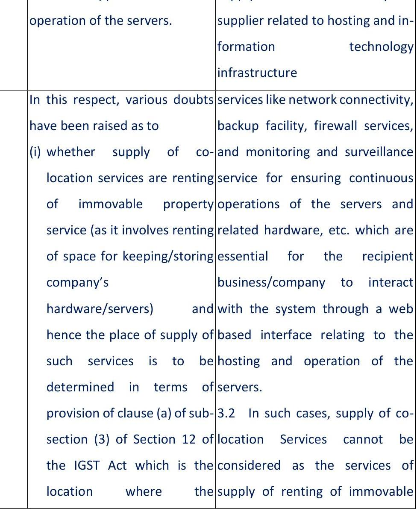

# Part 1 (from GST - All Circulars in one place - 2017 to 2024 - PMA[1]_part1.pdf)


## Page 1


# GST - Circulars 

From 2017 to 2024

## Page 2

# Index 

## Contents

2024 - Circulars ..... 10
222/16/2024-GST- Spectrum Usage and similar services ..... 10
221/15/2024-GST- Construction and Maintenance of Road ..... 16
220/14/2024-GST - Custodial Services ..... 21
219/13/2024-GST- Input Tax Credit on Ducts and Manholes ..... 27
218/12/2024-GST- Providing loan by an overseas affiliate to its Indian affiliate. ..... 31
217/11/2024-GST- ITC by the insurance companies ..... 38
216/10/2024-GST- Warranty/ Extended Warranty ..... 44
215/9/2024-GST- Assessment of the damage caused to the motor vehicle. ..... 49
214/8/2024-GST - Life insurance policies ..... 54
213/07/2024-GST- ESOP/ESPP/RSU ..... 62
212/6/2024-GST- Conditions of Section 15(3)(b)(ii) ..... 66
211/5/2024-GST - Time limit under Section 16(4) ..... 70
210/4/2024-GST- Import of services by a related person ..... 74
209/3/2024-GST- Place of supply of goods to unregistered persons. ..... 78
208/2/2024-GST- Manufacturers of the specified commodities ..... 82
207/1/2024- Fixing monetary limits for filing appeals ..... 87
2023 - Circulars ..... 92
206/18/2023-GST - Clarification on job work, electricity charges etc. ..... 92
205/17/2023-GST - Imitation zari thread or yarn ..... 96
204/16/2023-GST - Personal guarantees and Corporate guarantees ..... 98
203/15/2023-GST - PoS for transportation, advertising etc. ..... 107
202/14/2023-GST - Export of Services and VOSTRO account. ..... 116
201/13/2023-GST - Director and restaurant services. ..... 120
200/12/2023-GST - Classification of goods (pellets, fish paste etc) ..... 123
199/11/2023-GST - HO and BO clarification ..... 127
198/10/2023-GST - E-invoicing ..... 132
197/09/2023-GST - Refund related issues ..... 134
196/08/2023-GST - Shares held in subsidiary ..... 140
195/07/2023-GST - Warranty ..... 142
194/06/2023-GST - TCS ..... 149

## Page 3

193/05/2023-GST - 3B vs 2A (till 31.12.2021) ..... 152
192/04/2023-GST - Interest. ..... 157
191/03/2023-GST - Rab (dense sugarcane juice) ..... 161
190/02/2023-GST - Incentives / subsidy and accommodation ..... 162
189/01/2023-GST - Rab, milling, carbonated drinks etc. ..... 164
2022 - Circulars ..... 168
188/20/2022-GST - URD refunds ..... 168
187/19/2022-GST - IBC ..... 173
186/18/2022-GST - No claim bonus and E-invoicing ..... 176
185/17/2022-GST - Section 75 (2) ..... 180
184/16/2022-GST - POS for transportation ..... 189
183/15/2022-GST - 3B vs 2A ..... 194
182/14/2022-GST - TRAN-1 and TRAN-2 (Filco Trade judgment) ..... 199
181/13/2022-GST - Inverted duty refund ..... 216
180/12/2022-GST - TRAN-1 and TRAN-2 (Filco Trade judgment) ..... 219
179/11/2022-GST - EV, mango pulp, treated sewage water, chika etc. ..... 226
178/10/2022-GST - Damages, compensation and penalties ..... 233
177/09/2022-TRU - Ice crème parlours, admission/ migration certificates etc ..... 246
176/08/2022-GST - Withdrawal of Circular on refund at departure area ..... 261
175/07/2022-GST - Export of electricity and refund ..... 262
174/06/2022-GST - PMT-03A ..... 267
173/05/2022-GST - Inverted duty refund (multiple tax rates) ..... 271
172/04/2022-GST - Deemed export, perquisite, blocked credit ..... 274
171/03/2022-GST - Fake invoicing, credit and penalties ..... 282
170/02/2022-GST - Furnishing of details in GSTR-3B and GSTR-1 ..... 287
169/01/2022-GST - Proper Officer for adjudication of DGGI notices ..... 297
2021 - Circulars ..... 300
168/24/2021-GST - Procedure for Daman and Diu ..... 300
167/23/2021-GST - Restaurant service through e-comm. operators ..... 303
166/22/2021 - Refund (relevant date) ..... 310
165/21/2021-GST - Dynamic QR Code ..... 314
164/20/2021-GST - Cloud kitchens, amusement park, overloading charges etc ..... 316

## Page 4

163/19/2021-GST - Dry fruits, copra, illaichi, batteries etc ..... 323
162/18/2021-GST - Refund of wrongfully paid tax u/s 77 and 19 ..... 333
161/17/2021-GST - Merely establishment of distinct persons ..... 338
160/16/2021-GST - Debit note, e-invoicing and export duty refund ..... 342
159/15/2021-GST - Intermediary services ..... 348
158/14/2021-GST - Revocation of cancellation of registration ..... 354
157/13/2021-GST - Extension of time limit in terms of Apex Court Order ..... 357
156/12/2021-GST - Dynamic QR Code ..... 362
155/11/2021-GST- Sprinklers and drip irrigation ..... 366
154/10/2021-GST - Loan guarantee by Government ..... 367
153/09/2021-GST - Milling of wheat or paddy for PDS ..... 369
152/08/2021-GST - Ropeway ..... 371
151/07/2021-GST - Services by board of examination (NBE etc) ..... 373
150/06/2021-GST - Construction of road on deferred payment annuity ..... 375
149/05/2021-GST - Mid-day meals. ..... 376
148/04/2021-GST - SOP for revocation of registration ..... 378
147/03/2021-GST - Refund related issues ..... 381
146/02/2021-GST - Dynamic QR Code ..... 388
145/01/2021-GST - SoP for suspension of registration ..... 394
2020 - Circulars ..... 397
144/14/2020-GST - Waiver of UIN ..... 397
143/13/2020-GST - QRMP ..... 398
142/12/2020-GST - Rule 36 (4) ..... 407
141/11/2020-GST - COVID measures related clarification ..... 411
140/10/2020-GST - Director remuneration (Independent, whole-time etc) ..... 416
139/09/2020-GST - Refund (GSTR-2A) ..... 419
138/08/2020-GST - COVID related clarification ..... 421
137/07/2020-GST - Credit Note, refund, LUT ..... 427
136/06/2020-GST - COVID measures ..... 432
135/05/2020-GST - Clarification on refund ..... 442
134/04/2020-GST - IBC ..... 449
133/03/2020-GST - Transfer of ITC in merger etc (ITC-02) ..... 454

## Page 5

132/2/2020-GST - Appeal before Tribunal ..... 462
2019-Circulars ..... 470
130/49/2019-GST - RCM on renting of motor vehicles ..... 470
129/48/2019-GST - SoP for non-filers of returns. ..... 473
128/47/2019-GST - Quoting of DIN ..... 476
127/46/2019-GST - Withdrwal of ITES Circular ..... 490
126/45/2019-GST - Job work clarification ..... 491
125/44/2019-GST - Refund process ..... 493
124/43/2019-GST - Optional filing of annual return ..... 535
123/42/2019-GST - Rule 36 (4) ..... 537
122/41/2019-GST - Quoting of DIN ..... 544
121/40/2019-GST - Liquor license fees ..... 549
120/39/2019-GST - Effective date of explanation ..... 551
119/38/2019-GST - Security lending scheme ..... 553
118/37/2019-GST - POS for software design services ..... 556
117/36/2019-GST - DG Shipping maritime courses ..... 558
116/35/2019-GST - Donation ..... 560
115/34/2019-GST - UDF/ PSF (Airport levies) ..... 562
114/33/2019-GST - Support services related to petroleum ..... 566
113/32/2019-GST - GST rate on almond milk, lease, parts suitable for use etc. ..... 569
112/31/2019-GST - Withdrawal of circular of post-sale discount ..... 575
111/30/2019-GST - Refund subsequent to favorable order ..... 576
110/29/2019-GST - Refund filing if NIL refund filed ..... 579
109/28/2019-GST - RWA ..... 582
108/27/2019-GST - Goods taken out of India for Exhibition ..... 586
107/26/2019-GST - ITeS ..... 594
106/25/2019-GST - Departure area refund ..... 599
105/24/2019-GST - Post-supply discounts ..... 606
104/23/2019-GST - Refund wrongly mapped ..... 609
103/22/2019-GST - PoS for port and Dimond polishing ..... 611
102/21/2019-GST - Penal interest ..... 614
101/20/2019-GST - Long term lease of plots ..... 618

## Page 6

100/19/2019-GST - Seed certification ..... 620
99/18/2019-GST - RoD for cancellation of registration ..... 624
98/17/2019-GST - Section 49A/ 49B and Rule 88A ..... 628
97/16/2019-GST - CMP -02 ..... 631
96/15/2019-GST - Death of sole proprietor ..... 634
95/14/2019-GST - Grant of new registrations ..... 637
94/13/2019-GST - Refund related ..... 640
93/12/2019-GST - PSLC. ..... 649
92/11/2019-GST - Sales promotion schemes ..... 650
91/10/2019-GST - Supply of warehoused goods ..... 654
90/09/2019-GST - PoS for inter-State supply ..... 656
89/08/2019-GST - Inter-State supply to URD ..... 657
88/07/2019-GST - Changes in earlier Circulars ..... 659
87/06/2019-GST - Regarding section 140 (1) ..... 668
86/05/2019-GST - Services of business facilitator or correspondent ..... 670
85/04/2019-GST - Supply of food in school/ colleges ..... 672
84/03/2019-GST - Printing of pictures ..... 674
83/02/2019-GST - GST on APB and IFC ..... 676
82/01/2019-GST - Services by IIM ..... 678
2018 - Circulars ..... 683
81/55/2018-GST - Sprinkler and drip irrigation ..... 683
80/54/2018-GST - Sattu, fishmeal, lady suits, tools etc ..... 685
79/53/2018-GST - Refund related issues ..... 691
78/52/2018-GST - Export and import of services ..... 698
77/51/2018-GST - Composition ..... 702
76/50/2018-GST - TCS, rate of tax etc ..... 704
75/49/2018-GST - Seva Bhoj Yojna ..... 709
74/48/2018-GST - TCS by Tea Board ..... 722
73/47/2018-GST - Principal and agent ..... 724
72/46/2018-GST - Expired drugs or medicines ..... 727
71/45/2018-GST - ISD and Casual Taxable Person ..... 730
70/44/2018-GST - Refund related issues ..... 733

## Page 7

69/43/2018-GST - Cancellation of registration ..... 735
68/42/2018-GST - Refund to UN and other diplomatic missions ..... 739
67/41/2018-DOR - Deduction of TDS by DDO ..... 741
66/40/2018-GST - Camps for meditation/ spirituality ..... 742
65/39/2018-DOR - Deduction of TDS by DDO ..... 743
64/38/2018-GST - Inspection of goods in movement ..... 748
63/37/2018-GST - Refund to UIN entities ..... 750
62/36/2018-GST - GST on PSLC. ..... 757
61/35/2018-GST - E-way bill for goods in transporter godown ..... 758
60/34/2018-GST - Refund by CSD ..... 760
59/33/2018-GST - Refund ..... 764
58/32/2018-GST - CENVAT and invalid transitional credit ..... 769
57/31/2018-GST - Principal and agent ..... 770
56/30/2018-GST - Refund on Fabric ..... 776
55/29/2018-GST - Services by ITI ..... 781
54/28/2018-GST - Fertilisers ..... 783
53/27/2018-GST - Retained petroleum gases ..... 784
52/26/2018-GST - Milk, water, disc brake pad etc ..... 785
51/25/2018-GST - GST ambulance services ..... 791
50/24/2018-GST - Withdrawal of circular ..... 794
49/23/2018-GST - Interception of conveyance ..... 795
48/22/2018-GST - Services to SEZ and other ..... 797
47/21/2018-GST - Car servicing, moulds etc ..... 800
46/20/2018-GST - PSLC. ..... 805
45/19/2018-GST - Refunds of different types ..... 807
44/18/2018-CGST - Tenancy rights ..... 811
43/17/2018-GST - Refund to UIN agencies ..... 813
42/16/2018-GST - Recovery of arrears, reversal of ITC ..... 815
41/15/2018-GST - Inspection of goods in movement ..... 818
40/14/2018-GST - LUT ..... 844
39/13/2018-GST - IT grievance redressal ..... 845
38/12/2018 - Job work. ..... 848

## Page 8

37/11/2018-GST - Export refund ..... 855
36/10/2018-GST - Refund of UIN entities ..... 862
35/9/2018-GST - Joint venture ..... 867
34/8/2018-GST - Bus body building, retreading of tyre ..... 869
33/07/2018-GST - CENVAT related directions ..... 872
32/06/2018-GST - Hostel, health care services ..... 874
31/05/2018-GST - Proper officer for Sec. 73/ 74 ..... 880
30/4/2018-GST - Supplies to Indian railways. ..... 883
29/3/2018-GST - GST on retained product ..... 884
28/02/2018-GST - College Hostel mess fees ..... 885
27/01/2018-GST - Declared tariff, homestays etc ..... 886
2017 - Circulars ..... 891
26/26/2017-GST- Returns under GST ..... 891
25/25/2017-GST- Advance Ruling ..... 894
24/24/2017-GST- Refund claims on account of inverted duty structure ..... 898
23/23/2017-GST- Additional place of business ..... 904
22/22/2017-GST- Supply by an artist ..... 906
21/21/2017-GST- Inter-state movement of rigs, tools and spares ..... 908
20/20/2017-GST- classification and GST rate ..... 910
19/19/2017-GST- Taxability of custom milling of paddy ..... 911
18/18/2017-GST- Refund of unutilized input tax credit ..... 913
17/17/2017 - GST- Refund claims in respect of zero-rated supplies ..... 915
16/16/2017-GST- GST and availability of ITC. ..... 928
15 /15/2017-GST- GSTR-2A and FORM GSTR-1A ..... 932
14/14/2017-GST- Export Oriented Unit (EOU) / Electronic Hardware Technology Park (EHTP) Unit / Software Technology Park (STP) Unit / Bio-Technology Parks (BTP) ..... 934
13/13/2017-GST- Unstitched Salwar Suits ..... 940
12/12/2017-GST- GST on the superior kerosene oil ..... 941
11/11/2017-GST- Taxability of printing contracts ..... 943
10/10/2017- GST- Supply on approval basis ..... 945
9/9/2017- GST- Goods and Services Tax Practitioner ..... 947
7/7/2017-GST- LUT/ Bond ..... 949

## Page 9

06/06/2017-CGST- Classification and GST rate on lottery tickets ..... 953
5/5/2017-GST- Bond/Letter of Undertaking ..... 954
4/4/2017-GST- Bond/Letter of Undertaking ..... 960
3/3/2017-GST- Registration and Composition ..... 963
2/2/2017-GST- Bond/ Letter of Undertaking ..... 967
1/1/2017- Registration and Composition levy ..... 969
Instructions ..... 972
1/2023-24 - Investigation — Ease of doing business ..... 972
1/2024 - Recovery proceedings ..... 978
280/26/2018-CX - NAPA and CCI ..... 982
5/2023-GST - Northern Operating Systems (NOS) judgment of Apex Court ..... 985
4/2023-GST - DRC-01 and DRC-07 ..... 988
3/2023-GST - Registration ..... 991
2/2023-GST - SOP for Scrutiny for FY 2019-20 onwards ..... 997
1/2023-GST -All India drive against fake registrations ..... 1005
2023-24 - Provisional Attachment Advisory ..... 1013
04/2022-23 - Prosecution guidelines ..... 1020
3/2022-GST - Procedure for refund claims ..... 1032
3/2022-23 - Guidelines for summons ..... 1039
2/2022-GST - SOP For Scrutiny for FY 2017-18 and FY 2018-19 ..... 1042
2/2022-23 - Guidelines for arrest and bail ..... 1058
1/2022-GST - Recovery guidelines ..... 1066
1/2022-23 - Deposit during search/ investigation ..... 1069
2/2021-22 - Issuance of timely SCNs ..... 1071
01/2020-21/GST - SoP for search ..... 1074
CBEC-20/16/05/2021-GST/359- Provisional Attachment ..... 1078
CBEC-20/16/05/2021-GST/1552 - Blocking of credit (Rule 86A) ..... 1084
116/22/2020- - Referring procedural issued in ST and Excise ..... 1090
4/3/2020-GST - SOP For deemed registration ..... 1092
3/2/2020-GST - Real estate developer ( $80 \%$ criteria) ..... 1097
2/1/2020-GST - Expediting refund claims ..... 1098
CBEC-20/10/07/2019-GST - Cross empowerment ..... 1100

## Page 10

CBEC-20/06/11/2020-GST - Registration ..... 1102
354/52/2018-TRU - Low cost housing, CLSS and others. ..... 1104
280/05/2018-CX - Transfer of authorisations ..... 1108
267/8/2018-CX.8 - Verification of transitional credit ..... 1110

## Page 11

# 2024 - Circulars 

## 222/16/2024-GST- Spectrum Usage and similar services

## To,

The Principal Chief Commissioners/ Chief Commissioners/ Principal Commissioners/ Commissioners of Central Tax (All)

The Principal Directors General/ Directors General (All)
Subject: Clarification on time of supply of services of spectrum usage and other similar services under GST -reg.

Representations have been received from the trade and the field formations seeking clarification regarding the time of supply for payment of GST in respect of supply of spectrum allocation services in cases where the successful bidder for spectrum allocation (i.e. the telecom operator) opts for making payments in instalments under deferred payment option as per Frequency Assignment Letter (FAL) issued by Department of Telecommunication (DoT), Government of India.
2. In order to clarify the issue and to ensure uniformity in the implementation of the provisions of law across the field formations, the Board, in exercise of its powers conferred by section 168 (1) of the Central Goods and Services Tax Act, 2017 (hereinafter referred to As "CGST Act"), hereby clarifies the issues as under:

| S.No. | Issue | Clarification |
| :--: | :--: | :--: |
| 1. | In cases of spectrum allocation where the successful bidder (i.e. the 'telecom operator') opts for making payments in instalments as mentioned in the Notice Inviting Application (NIA) and Frequency Assignment Letter (FAL) issued by Department of Telecommunications (DoT), Government of India, what will be | Under the spectrum allocation model followed by DoT, bidder (the telecom operator) bids for securing the right to use spectrum offered by the government. Here, service provider is the Government of India (through DoT) and service recipient is the bidder/ telecom operator. The GST is |

## Page 12

the time of supply for the purpose of payment of GST on the said supply of spectrum allocation services.
to be discharged on the supply of spectrum allocation services by the recipient of services (the telecom operator) on reverse charge basis [Notification No. 13/2017-

Central Tax (Rate) dated 28th June, 2017 referred].
2.1 In respect of the said supply of spectrum allocation services, if the telecom operator chooses the option to make payment in installments, the payment has to be made spread over the contract period in installments and payment for each installment is to be made after specified periods, as specified in the Frequency

Assignment Letter of DoT, which is in the nature of contract. The same is a 'continuous supply of services' as defined under section 2(33) of the CGST Act, since the supply of services (spectrum usage) is agreed to be provided by the supplier (DoT) to the recipient (telecom operator) continuously for a period which is exceeding three months with periodic payment obligations.
2.2 As per section 13(1) of CGST Act, the liability to pay tax on supply of

## Page 13

services shall arise at the time of supply. In case of forward charge supplies, the time of supply of services is governed by section 13(2) of CGST Act, which is the earlier of date of issue of invoice by the supplier or date of provision of service or the date of payment, as the case maybe.
2.3 However, in respect of supply of services, on which tax is paid or liable to be paid on reverse charge basis, as per Section 13(3) of CGST Act, 2017, the time of supply of services shall be the earlier of the following dates, namely:-
(a) the date of payment as entered in the books of account of the recipient or the date on which the payment is debited in his bank account, whichever is earlier; or
(b) the date immediately following sixty days from the date of issue of invoice or any other document, by whatever name called, in lieu thereof by the supplier.
2.3.1 Some of the field formations are considering the Frequency Assignment Letter issued by DoT as

## Page 14

|  |  | akin to any other document, by whatever name called, in lieu of an invoice mentioned in clause (b) of section 13(3) of CGST Act and are demanding interest on instalments paid after 60 days from the date of issue of the same. <br> 2.3.2 It is observed that Frequency Assignment Letter is in the nature of a bid acceptance document intimating the telecom operator that the result of the auction has been accepted by the competent authority and the details of blocks and spectrum allotted to the telecom operator. The Frequency Allotment Letter also mentions the options and the amounts to be paid by the telecom operator in each of the two options. <br> 2.4 Further, as per section 31(5)(a) of CGST Act, in cases of continuous supply of services, where the due date of payment is ascertainable from the contract, the invoice shall be issued on or before such due date of payment. In the instant case, the date of payment to be made by the telecom operator to DoT is clearly ascertainable from the Notice Inviting |
| :--: | :--: | :--: |

## Page 15

|  | Applications read with the Frequency |
| :-- | :-- |
|  | Assignment Letter. Accordingly, tax |
|  | invoice will be required to be issued |
|  | in respect of the said supply of |
|  | services, on or before such due date |
|  | of payment as per the option |
|  | exercised by the telecom operator. |
|  | 3. In the light of above, it is clarified |
|  | that in case where full upfront |
|  | payment is made by the telecom |
|  | operator, GST would be payable |
|  | when the payment of the said upfront |
|  | amount is made or is due, whichever |
|  | is earlier, whereas in case where |
|  | deferred payment is made by the |
|  | telecom operator in specified |
|  | installments, GST would be payable |
|  | as and when the payments are due or |
|  | made, whichever is earlier. |
|  | 4. It is also clarified that the similar |
|  | treatment regarding the time of |
|  | supply, as is discussed in the above |
|  | paras, may apply in other cases also |
|  | where any natural resources are |
|  | being allocated by the government to |
|  | the successful bidder/ purchaser for |
|  | right to use the said natural resource |
|  | over a period of time, constituting |
|  | continuous supply of services as per |

## Page 16

|  | the definition under section 2(33) of the CGST Act, with the option of payments for the said services either through an upfront payment or in deferred periodic installments over the period of time. |
| :--: | :--: |

3. It is requested that suitable trade notices may be issued to publicize the contents of this Circular.
4. Difficulty, if any, in implementation of this Circular may please be brought to the notice of the Board. Hindi version would follow.
[F.No. CBIC-20001/4/2024-GST]
(Sanjay Mangal)
Principal Commissioner (GST)

## Page 17

# 221/15/2024-GST- Construction and Maintenance of Road 

## GOVERNMENT OF INDIA

## MINISTRY OF FINANCE

## DEPARTMENT OF REVENUE

## CENTRAL BOARD OF INDIRECT TAXES AND CUSTOMS

## GST POLICY WING

## NEW DELHI

## To,

The Principal Chief Commissioners/ Chief Commissioners/ Principal Commissioners/ Commissioners of Central Tax (All)

The Principal Directors General/ Directors General (All)
Subject: Clarification on time of supply in respect of supply of services of construction of road and maintenance thereof of National Highway Projects of National Highways Authority of India (NHAI) in Hybrid Annuity Mode (HAM) model -reg.

Representations have been received from the trade and the field formations seeking clarification regarding the time of supply in respect of supply of services of construction of road and maintenance thereof of National Highway Projects in Hybrid Annuity Mode (HAM) model, where certain portion of Bid Project Cost is received during construction period and remaining payment is received through deferred payment (annuity) spread over years.

## Page 18

2. In order to clarify the issue and to ensure uniformity in the implementation of the provisions of law across the field formations, the Board, in exercise of its powers conferred by section 168 (1) of the Central Goods and Services Tax Act, 2017 (hereinafter referred to as "CGST Act"), hereby clarifies the issues as under:

| S.No. | Issue | Clarification |
| :--: | :--: | :--: |
| 1. | Under HAM model of National Highways Authority of India (NHAI), the concessionaire has to construct the new road and provide Operation \& Maintenance of the same which is generally over a period of 15-17 years and the payment of the same is spread over the years. What is the time of supply for the purpose of payment of tax on the said service under the HAM model? | Under the Hybrid Annuity Model (HAM) of concession agreements, the highway development projects are under Design, Build, Operate and Transfer model (DBOT), wherein the concessionaire is required to undertake new construction of Highway, as well as the Operation and Maintenance (O\&M) of Highways. The payment terms for the construction portion as well as the O\&M portion of the contract are provided in the agreement between National Highways Authority of India (NHAI) and the concessionaire. <br> 2.1 A HAM contract is a single contract for construction as well as operation and maintenance of the highway. The payment terms are so staggered that the concessionaire is held accountable for the repair and maintenance of the highway as well. The contract needs to be looked at holistically based on the services to be performed by the concessionaire and cannot be artificially split into two separate contracts for construction and |

## Page 19

operation and maintenance, based on the payment terms. The concessionaire is bound contractually to complete not only the construction of the highway but also to operate and maintain the same.
2.2 In HAM contract, the payment is made spread over the contract period in installments and payment for each installment is to be made after specified periods, or on completion of an event, as specified in the contract. The same appears to be covered under the 'Continuous supply of services' as defined under section 2(33) of the CGST Act.
2.3 As per clause (a) of Section 13(2) of CGST Act, the time of supply in respect of a supply of services shall be the date of issue of Invoice, or date of receipt of payment, whichever is earlier, in cases where invoice is issued within the period prescribed under section 31 of CGST Act. Further, as per clause (b) of Section 13(2) of CGST Act, in cases where invoice is not issued within the period prescribed under section 31, the time of supply of service shall be date of provision of the service or date of receipt of payment, whichever is earlier. However, as per section 31(5) of CGST Act, in cases of continuous supply of

## Page 20

services, where the payment is made periodically, either due on a specified date or is linked to the completion of an event, the invoice is required to be issued on or before the specified date or the date of completion of that event.
2.4 Accordingly, as per section 13(2) of CGST Act, read with section 31(5) of CGST Act, time of supply of services under HAM contract, including construction and O\&M portion, should be the date of issuance of such invoice, or date of receipt of payment, whichever is earlier, if the invoice is issued on or before the specified date or the date of completion of the event specified in the contract, as applicable. However, in cases, where the invoice is not issued on or before the specified date or the date of completion of the event specified in the contract, as per clause (b) of section 13(2), time of supply should be the date of provision of the service, or date of receipt of payment, whichever is earlier. In case of continuous supply of services, the date of provision of service may be deemed as the due date of payment as per the contract, as the invoice is required to be issued on or before the due date of payment as per

## Page 21

the provisions of Section 31(5) of CGST Act.
3. In the light of above, it is clarified that the tax liability on the concessionaire under the HAM contract, including on the construction portion, would arise at the time of issuance of invoice, or receipt of payments, whichever is earlier, if the invoice is issued on or before the specified date or the date of completion of the event specified in the contract, as applicable. If invoices are not issued on or before the specified date or the date of completion of the event specified in the contract, tax liability would arise on the date of provision of the said service (i.e., the due date of payment as per the contract), or the date of receipt of the payment, whichever is earlier.
4. It is also clarified that as the installments/annuity payable by NHAI to the concessionaire also includes some interest component, the amount of such interest shall also be includible in the taxable value for the purpose of payment of tax on the said annuity/installment in view of the provisions of section 15(2)(d) of the CGST Act.

## Page 22

3. It is requested that suitable trade notices may be issued to publicize the contents of this Circular.
4. Difficulty, if any, in implementation of this Circular may please be brought to the notice of the Board. Hindi version would follow.
[F.No. CBIC-20001/4/2024-GST]
(Sanjay Mangal)
Principal Commissioner (GST)

220/14/2024-GST - Custodial Services

GOVERNMENT OF INDIA
MINISTRY OF FINANCE
DEPARTMENT OF REVENUE
CENTRAL BOARD OF INDIRECT TAXES AND CUSTOMS
GST POLICY WING
NEW DELHI
To,
The Principal Chief Commissioners/ Chief Commissioners/ Principal Commissioners/ Commissioners of Central Tax (All)

The Principal Directors General/ Directors General (All)
Subject: Clarification on place of supply applicable for custodial services provided by banks to Foreign Portfolio Investors-reg

## Page 23

Representations have been received seeking clarification on the Place of Supply in cases of Custodial Services provided by Banks to Foreign Portfolio Investors (hereinafter referred to as "FPIs"), as a view is being taken by some field formations that the Place of Supply in case of 'custodial service' would be determined as per Section 13(8)(a) of the Integrated Goods and Services Tax Act, 2017 (hereinafter referred to as "IGST Act"), i.e. the location of the service provider (banks or financial institutions).
2. In order to clarify the issue and to ensure uniformity in the implementation of the provisions of law across the field formations, the Board, in exercise of its powers conferred by section 168(1) of the Central Goods and Services Tax Act, 2017 (hereinafter referred to as "CGST Act"), hereby clarifies the issue as under:

| Issue | Clarification |
| :--: | :--: |
| Whether the activity of providing Custodial Services by banks or financial institutions to FPIs will be treated as services provided to 'account holder' under Section 13(8)(a) of the IGST Act, 2017? <br> Further, how the place of supply of the said services shall be determined? | According to the Securities and Exchange Board of India (Custodian of Securities) Regulations 1996, 'Custodial Services' in relation to securities means safekeeping of securities of a client and providing services incidental thereto, and includes- maintaining accounts of securities of a client; - collecting the benefits or rights accruing to the client in respect of securities; <br> - keeping the client informed of the actions taken or to be taken by the issuer of securities, having a bearing on the benefits or rights accruing to the client; and <br> - maintaining and reconciling records of the services referred above. <br> As per Regulation 20(1) of the Securities and Exchange Board of India (Foreign Portfolio Investors) Regulations, 2019, an FPI is allowed to invest only in the following securities, namely- |

## Page 24

(a) shares, debentures and warrants issued by a body corporate; listed or to be listed on a recognized stock exchange in India;
(b) units of schemes launched by mutual funds under Chapter V, VI-A and VI-B of the Securities and Exchange Board of India (Mutual Fund) Regulations, 1996;
(c) units of schemes floated by a Collective Investment Scheme in accordance with the Securities and Exchange Board of India (Collective Investment Schemes) Regulations, 1999;
(d) derivatives traded on a recognized stock exchange;
(e) units of real estate investment trusts, infrastructure investment trusts and units of Category III Alternative Investment Funds registered with the Board;
(f) Indian Depository Receipts;
(g) any debt securities or other instruments as permitted by the Reserve Bank of India for foreign portfolio investors to invest in from time to time; and
(h) such other instruments as specified by the Board from time to time.

Various banks enter into custodial agreements with the Foreign Portfolio Investors (FPIs) for the provision of such custodial services. The main activity carried out by banks as a custodian in

## Page 25

relation to custodial services is maintaining account of the securities held by the FPIs. As per clause (a) of sub-section (8) of section 13 of IGST Act, Place of Supply of services supplied by banking company or a financial institution or a non-banking company to account holders shall be the location of the supplier of services.

As per Explanation (a) of Section 13(8) of IGST Act, 'account' means an account bearing interest to the depositor, and includes a non-resident external account and a non-resident ordinary account.

It is mentioned that the provisions similar to above provisions under IGST Act existed during the Service Tax regime. The place of provision of service under Service Tax was governed by the Service Tax Place of Provision of Supply Rules, 2012. Provisions of Rule 9(a) of the Service Tax Place of Provision of Supply Rules, 2012 were identical to that of section 13(8)(a) of the IGST Act. The Education Guide under the Service Tax Law clarified the scope of the term "account holder" and the services provided by banks to account holders as well as the services which are not provided to account holders, as below:
"Question: 5.9.2 What is the meaning of "account holder"? Which accounts are not covered by this rule?

## Page 26

Answer: "Account" has been defined in the rules to mean an account which bears an interest to the depositor. Services provided to holders of demand deposits, term deposits, NRE (non-resident external) accounts and NRO (non-resident ordinary) accounts will be covered under this rule. Question:5.9.3 What are the services that are provided by a banking company to an account holder (holder of an account bearing interest to the depositor)?

Answer: Following are examples of services that are provided by a banking company or financial institution to an "account holder", in the ordinary course of business :-
i) services linked to or requiring opening and operation of bank accounts such as lending, deposits, safe deposit locker etc;
ii) transfer of money including telegraphic transfer, mail transfer, electronic transfer etc.

Question: 5.9.4 What are the services that are not provided by a banking company or financial institution to an account holder, in the ordinary course of business, and will consequently be covered under another Rule?

Answer: Following are examples of services that are generally NOT provided by a banking company or financial institution to an account holder (holder of a deposit account bearing interest), in the ordinary course of business:-

## Page 27

i) financial leasing services including equipment leasing and hire purchase;
ii) merchant banking services;
iii) Securities and foreign exchange (forex) broking, and purchase or sale of foreign currency, including money changing;
iv) asset management including portfolio management, all forms of fund management, pension fund management, custodial, depository and trust services

In the case of any service which does not qualify as a service provided to an account holder, the place of provision will be determined under the default rule i.e. the Main Rule 3. Thus, it will be the location of the service receiver where it is known (ascertainable in the ordinary course of business), and the location of the service provider otherwise." Accordingly, as per clarification given in Education Guide under Service Tax Regime, the custodial services are not considered to be covered under the services provided by bank to account holders, but have been considered to be covered under the services which are not provided to account holder. As the provisions of section 13(8)(a) of the IGST Act are similar to the provisions of Rule 9(a) of the Service Tax Place of Provision of Supply Rules, 2012, the clarification given in the Education Guide under Service Tax Regime is equally applicable under GST Regime.

## Page 28

|  | Accordingly, it is clarified that the custodial services provided by banks or financial institutions to FPIs are not to be treated as services provided to 'account holder' and therefore, the said services are not covered under Section 13(8)(a) of the IGST Act. Therefore, the place of supply of such services is not to be determined under Section 13(8)(a) of the IGST Act but has to be determined under the default provision i.e., sub-section (2) of section 13 of the IGST Act. |
| :--: | :--: |

2. It is requested that suitable trade notices may be issued to publicize the contents of this Circular.
3. Difficulty, if any, in implementation of the above instructions may please be brought to the notice of the Board. Hindi version would follow.
[F. No. CBIC-20001/4/2024-GST]
(Sanjay Mangal)
Principal Commissioner (GST)

219/13/2024-GST- Input Tax Credit on Ducts and Manholes

GOVERNMENT OF INDIA
MINISTRY OF FINANCE
DEPARTMENT OF REVENUE
CENTRAL BOARD OF INDIRECT TAXES AND CUSTOMS

## Page 29

# GST POLICY WING 

## NEW DELHI

## To,

The Principal Chief Commissioners/ Chief Commissioners/ Principal Commissioners/ Commissioners of Central Tax (All)

The Principal Directors General/ Directors General (All)
Subject: Clarification on availability of input tax credit on ducts and manholes used in network of optical fiber cables (OFCs) in terms of section 17(5) of the CGST Act, 2017 - reg. Representations have been received from Cellular Operators Association of India (COAI) submitting that input tax credit (ITC) is being denied by some tax authorities on ducts and manholes used in network of optical fiber cables (OFCs)on the ground that the same is blocked as per section 17(5) of the Central Goods \&Services Tax Act, 2017 (herein after referred to as the "CGST Act"), being in nature of immovable property (other than Plant and Machinery). It has been requested to issue clarification in respect of availability of ITC on ducts and manholes used in network of optical fiber cables (OFCs), so as to prevent unwarranted litigation in the telecommunication sector across the country.
2. In order to ensure uniformity in the implementation of the provisions of law across the field formations, the Board, in exercise of its powers conferred by section 168 (1) of the CGST Act, hereby clarifies the issue as below.

| Issue | Clarification |
| :--: | :--: |
| Whether the input tax credit on the ducts and manholes used in network of optical fiber cables (OFCs) for providing telecommunication services is barred in terms of clauses (c) and (d) of subsection (5) of section 17 of the CGST Act, read with Explanation to section 17 of CGST Act ? | 1. Sub-section (5) to Section 17 of the CGST <br> Act provides that input tax credit shall not be available, inter alia, in respect of the following: <br> i. works contract services when supplied for construction of an immovable property (other than plant and machinery) except |

## Page 30

where it is an input service for further supply of works contract service; or ii. goods or services or both received by a taxable person for construction of an immovable property (other than plant or machinery) on his own account including when such goods or services or both are used in the course or furtherance of business.
2. Explanation in section 17 of CGST Act provides that the expression "plant and machinery" means apparatus, equipment, and machinery fixed to earth by foundation or structural support that are used for making outward supply of goods or services or both and includes such foundation and structural supports but excludes land, building or any other civil structures; telecommunication towers; and pipelines laid outside the factory premises.
3. Ducts and manholes are basic components for the optical fiber cable (OFC) network used in providing telecommunication services. The OFC network is generally laid with the use of PVC ducts/sheaths in which OFCs are housed and service/connectivity manholes, which serve as nodes of the network, and are necessary for not only laying of optical fiber

## Page 31

cable but also their upkeep and maintenance. In view of the Explanation in section 17 of the CGST Act, it appears that ducts and manholes are covered under the definition of "plant and machinery" as they are used as part of the OFC network for making outward supply of transmission of telecommunication signals from one point to another. Moreover, ducts and manholes used in network of optical fiber cables (OFCs) have not been specifically excluded from the definition of "plant and machinery" in the Explanation to section 17 of CGST Act, as they are neither in nature of land, building or civil structures nor are in nature of telecommunication towers or pipelines laid outside the factory premises.
4. Accordingly, it is clarified that availment of input tax credit is not restricted in respect of such ducts and manhole used in network of optical fiber cables (OFCs), either under clause (c) or under clause (d) of sub-section (5) of section 17 of CGST Act.
3. It is requested that suitable trade notices may be issued to publicize the contents of this Circular.
4. Difficulty, if any, in the implementation of this Circular may be brought to the notice of the Board. Hindi version would follow.
[F. No. CBIC-20001/4/2024-GST]

## Page 32

(Sanjay Mangal)
Pr. Commissioner (GST)

218/12/2024-GST- Providing loan by an overseas affiliate to its Indian affiliate GOVERNMENT OF INDIA

MINISTRY OF FINANCE
DEPARTMENT OF REVENUE
CENTRAL BOARD OF INDIRECT TAXES AND CUSTOMS
GST POLICY WING
NEW DELHI
To,
The Principal Chief Commissioners/ Chief Commissioners/ Principal Commissioners/ Commissioners of Central Tax (All)

The Principal Directors General/ Directors General (All)
Subject: Clarification regarding taxability of the transaction of providing loan by an overseas affiliate to its Indian affiliate or by a person to a related person-reg.

## Page 33

Representations have been received from trade and industry seeking clarity on whether there is any supply involved in the transaction of granting of loan by a person to a related person or by an overseas affiliate to its Indian entity, where the consideration being paid is only by way of interest or discount, and whether any GST is applicable on the same.
2. In order to clarify the issue and to ensure uniformity in the implementation of the provisions of law across the field formations, the Board, in exercise of its powers conferred by section 168 (1) of the Central Goods and Services Tax Act, 2017 (hereinafter referred to as "CGST Act"), hereby clarifies the issues as under:

| S.No. | Issue | Clarification |
| :--: | :--: | :--: |
| Clarification regarding taxability of the transaction of providing loan by an overseas entity to its Indian related entity or by a person in India to a related person |  |  |
| 1. | Whether the activity of providing loans by an overseas affiliate to its Indian affiliate or by a person to a related person, where there is no consideration in the nature of processing fee/ administrative charges/ loan granting charges etc., and the consideration is represented only by way of interest or discount, will be treated as a taxable supply of service under GST or not. | 1. As per clause (c) of sub-section (1) of section 7 of the CGST Act, read with S. No. 2 and S. No. 4 of Schedule I of CGST Act, supply of goods or services or both between related persons, when made in the course or furtherance of business, shall be treated as supply, even if made without consideration. Therefore, it is evident that the service of granting loan/ credit/ advances by an entity to its related entity is a supply under GST. <br> 2. Services by way of extending deposits, loans or advances in so far as the consideration is represented by way of interest or discount (other than |

## Page 34

interest involved in credit card services) are exempted under sub entry (a) of entry 27 of Notification No. 12/2017-Central Tax (Rate). Therefore, it is clear that the supply of services of granting loans/ credit/ advances, in so far as the consideration is represented by way of interest or discount, is fully exempt under GST.
3. It is mentioned that overseas affiliates or domestic related persons are generally charging no consideration in the form of processing fee/ service fee, other than the consideration by way of interest or discount on the loan amount. Doubts are being raised regarding the taxability of the services of processing/ administering/ facilitating the loan in such cases, by deeming the same as supply as per clause (c) of sub-section (1) of section 7 of the CGST Act, read with S. No. 2 and S. No. 4 of Schedule I of CGST Act. The processing fee/ service fee is generally a one-time charge that lenders levy on applicants when they apply for a loan. This fee is generally non-refundable and is used to cover the administrative cost of processing the loan application.

## Page 35

Charges of any other nature in respect of loan, other than by way of interest or discount, would represent taxable consideration for providing the facilitation/ processing/ administration services for the loan and hence would be liable to GST. This has been clarified at serial number 42 in the Sectoral FAQ on Banking, Insurance and Stock Brokers Sector issued by CBIC.
4. It is significant to note that the processing/ service fee is generally charged by the bank/ financial institution from the recipient of the loan in order to cover the administrative cost of processing the loan application. An independent lender may carry out a thorough credit assessment of the potential borrower to identify and evaluate the risks involved and to consider methods of monitoring and managing these risks. Such credit assessment may include understanding the business of the applicant, as well as the purpose of the loan, financial standing and credibility of the applicant, how it is to be structured and the source of its repayment which may include analysis

## Page 36

of the borrower's cash flow forecasts, the strength of the borrower's balance sheet, and where any collateral is offered, due diligence on the collateral offered may also be required to be carried out. To cover such costs, the independent lender generally collects a fee that is in the nature of processing fee/ administrative charges/ service fee/ loan granting charges, which is leviable to GST.
5. However, when an entity is extending a loan to a related entity, it may not require to follow such processes as are followed by an independent lender. For example, it may not need to go through the same process of information gathering about the borrower's business, his financial standing and credibility and other details, as the required information may already be readily available within the group, or between related persons. The lender may not also take any collateral from the borrower. Accordingly, in case of loans provided between related parties, there may not be the activity of 'processing' the loan, and no administrative cost may be

## Page 37

involved in granting such a loan.
Therefore, it may not be desirable to place the services being provided for processing the loans by banks or independent lenders vis-a-vis the loans provided by a related party, on equal footing.
6. Even in case of loans provided between unrelated parties, there may not be any processing fee/ administrative charges/ loan granting charges etc., based on the relationship between the bank/ independent lender and the person taking the loan. The lender might waive off the administrative charges in full, based on the nature and amount of loan granted, as well as based on the relationship between the lender and the concerned person taking the loan. 7. Accordingly, in the cases, where no consideration is charged by the person from the related person, or by an overseas affiliate from its Indian party, for extending loan or credit, other than by way of interest or discount, it cannot be said that any supply of service is being provided between the said related persons in the form of

## Page 38


3. It is requested that suitable trade notices may be issued to publicize the contents of this Circular.
4. Difficulties, if any, in implementing this Circular may please be brought to the notice of the Board. Hindi version would follow. [F. No. CBIC-20001/4/2024-GST]

## Page 39

(Sanjay Mangal)
Principal Commissioner (GST)

217/11/2024-GST- ITC by the insurance companies

GOVERNMENT OF INDIA
MINISTRY OF FINANCE
DEPARTMENT OF REVENUE
CENTRAL BOARD OF INDIRECT TAXES AND CUSTOMS
GST POLICY WING
NEW DELHI
To,
The Principal Chief Commissioners / Chief Commissioners / Principal Commissioners / Commissioners of Central Tax (All)

The Principal Directors General / Directors General (All)
Subject: Entitlement of ITC by the insurance companies on the expenses incurred for repair of motor vehicles in case of reimbursement mode of insurance claim settlement-reg.

The insurance companies, which are engaged in providing general insurance services in respect of insurance of motor vehicles, insure the cost of repairs/ damages of motor vehicles incurred by the policy holders and settle the claims in two modes i.e., Cashless or Reimbursement. 1.2 Under both modes of settlement, the insurance company accounts for repair liability (as assessed by the Surveyor/ Loss Assessor) as claim cost and is liable to make payment of approved repair charges to the garage. In both the cases, the invoices are generally issued by the garages in the name of Insurance companies. While in case of Cashless Mode, the insurance

## Page 40

companies directly make the payment of approved repair charge to the Network Garage, in case of Reimbursement mode, the payment is first made by the Insured to the Non-Network Garage, which is subsequently reimbursed by the insurance company to the Insured, to the extent of approved repair/ claim cost. Accordingly, the insurance companies may be availing input tax credit (ITC) on the tax paid in respect of such repair services provided by the garages in Cashless Mode of claim settlement as well as in Reimbursement Mode of claim settlement on the basis of the invoices issued by the garages in their name.
1.3 It has been represented by the insurance companies that in case of reimbursement mode of claim settlement, some field formations are raising objections on availment of ITC by insurance companies in respect of repair invoices issued by the non-network garages on insurance companies. It is being claimed by the said field formations that in case of reimbursement mode of claim settlement, there is no credit facility offered by the garages to the Insurance Companies and therefore, the supply of repair service is made by the garage to the insured and not to the insurer. Accordingly, it is being claimed that ITC of repair invoices, in such cases, should not be available to the insurance companies.
1.4 Request has been received seeking clarity on availability of ITC in respect of repair expenses incurred in case of reimbursement mode of claim settlement.
2. In order to ensure uniformity in the implementation of the provisions of the law across field formations, the Board, in exercise of its powers conferred by section 168(1) of the Central Goods and Services Tax Act, 2017 (hereinafter referred to as the "CGST Act"), hereby clarifies the following:

| S. <br> No. | Issue | Clarification |
| :--: | :--: | :--: |
| 1. | The insurance companies, which are engaged in providing general insurance services in respect of insurance of motor vehicles, insure the cost of repairs/ damages of motor vehicles incurred by the policyholders and settle the claims | Under reimbursement mode of claim settlement, the insured avails repair services from non-network garages with which the insurance companies do not have routine business relationship. The said garages issue the invoice in |

## Page 41

in two modes i.e., Cashless or Reimbursement. Whether ITC is available to insurance companies in respect of repair expenses reimbursed by the insurance company in case of reimbursement mode of claim settlement.
the name of the insurance company while not extending credit facility for the repair costs. Accordingly, the policy holder/ insured makes payment of such repair services, and subsequently, the insurance company reimburses the approved claim cost to the insured. Section 17(5) of the CGST Act provides that ITC in respect of services of repair of motor vehicles shall be available where received by a taxable person engaged in the supply of general insurance services in respect of motor vehicles insured by him.

Section 16 of CGST Act provides that every registered person shall, subject to such conditions and restrictions as may be prescribed and in the manner specified in section 49 of the said Act, be entitled to take credit of input tax charged on any supply of goods or services or both to him which are used or intended to be used in the course or furtherance of his business and the said amount shall be credited to the electronic credit ledger of such person. Further, section 2(93) of CGST Act defines "recipient" of supply of goods or services or both, as the person who

## Page 42

is liable to pay the consideration, where such consideration is payable for the said supply of goods or services or both.

Moreover, as per section 2(31) of CGST
Act, "consideration" includes any payment made or to be made in relation to supply of the goods or services or both, whether by the recipient or by any other person. In reimbursement mode of claim settlement, the payment is made by the insurance company for the approved cost of repair services through reimbursement to the insured. Further, irrespective of the fact that the payment of the repair services to the garage is first made by the insured, which is then reimbursed by the insurance company to the insured to the extent of the approved claim cost, the liability to pay for the repair service for the approved claim cost lies with the insurance company, and thus, the insurance company is covered in the definition of "recipient" in respect of the said supply of services of vehicle repair provided by the garage under section 2(93) of CGST Act, to the extent

## Page 43

|  |  | of approved repair liability. Moreover, <br> availment of credit in respect of input <br> tax paid on motor vehicle repair <br> services received by the insurance <br> company for outward supply of <br> insurance services for such motor <br> vehicles is not barred under section <br> 17(5) of CGST Act. <br> Accordingly, it is clarified that ITC is <br> available to Insurance Companies in <br> respect of motor vehicle repair <br> expenses incurred by them in case of <br> reimbursement mode of claim <br> settlement. |
| :--: | :--: | :--: |
| 2. | Where the invoice raised by the garage <br> also includes an amount in excess of the <br> approved claim cost, the insurance <br> company only reimburses the approved <br> claim cost to the garage after <br> considering the standard deductions viz. <br> the compulsory deductibles to be borne <br> by the insured, depreciation, <br> improvements outside the coverage, <br> value of salvage of the damaged parts of <br> the motor vehicles, etc. The remaining <br> amount is to be paid by the insured to <br> the garage. What is the extent of ITC <br> available to the insurer in such cases? | In cases where the garage issues two <br> separate invoices in respect of the <br> repair services, one to the insurance <br> company in respect of approved claim <br> cost and second to the customer for <br> the amount of repair service in excess <br> of the approved claim cost, input tax <br> credit may be available to the <br> insurance company on the said invoice <br> issued to the insurance company <br> subject to reimbursement of said <br> amount by insurance company to the <br> customer. <br> However, if the invoice for full amount <br> for repair services is issued to the |

## Page 44

|  |  | insurance company while the insurance company makes reimbursement to the insured only for the approved claim cost, then, the input tax credit may be available to the insurance company only to the extent of reimbursement of the approved claim cost to the insured, and not on the full invoice value. |
| :--: | :--: | :--: |
| 3. | Whether ITC is available to the insurer where the invoice for the repair of the vehicle is not in name of the insurance company. | In such a case, condition of clause (a) and (aa) of section 16(2) of CGST Act is not satisfied and accordingly, input tax credit will not be available to the insurance company in respect of such an invoice. |

3. It is requested that suitable trade notices may be issued to publicize the contents of this Circular.
4. Difficulty, if any, in the implementation of this Circular may be brought to the notice of the Board. Hindi version would follow.
[F. No. CBIC-20001/4/2024-GST]
(Sanjay Mangal)
Principal Commissioner (GST)

## Page 45

216/10/2024-GST- Warranty/ Extended Warranty

GOVERNMENT OF INDIA
MINISTRY OF FINANCE
DEPARTMENT OF REVENUE
CENTRAL BOARD OF INDIRECT TAXES AND CUSTOMS
GST POLICY WING
NEW DELHI
To,

## Page 46

The Principal Chief Commissioners/ Chief Commissioners/ Principal Commissioners/ Commissioners of Central Tax (All)

The Principal Directors General/ Directors General (All)
Subject: Clarification in respect of GST liability and input tax credit (ITC) availability in cases involving Warranty/ Extended Warranty, in furtherance to Circular No. 195/07/2023-GST dated 17.07.2023-reg.

Reference is invited to Circular No. 195/07/2023-GST dated 17.07.2023 (herein after referred to as "the said circular") clarifying certain issues regarding GST liability and availability of input tax credit (ITC) in respect of warranty replacement of parts and repair services during warranty period. Representations have been received from trade and industry requesting for some further clarifications in related matters.
2. In order to ensure uniformity in the implementation of the provisions of law across the field formations, the Board, in exercise of its powers conferred by section 168 (1) of the Central Goods \& Services Tax Act, 2017 (herein after referred to as the "CGST Act"), hereby clarifies the following issues as below.
3. Clarification regarding GST liability as well as liability to reverse input tax credit in respect of cases where goods as such or the parts are replaced under warranty:
3.1 Table in Para 2 of Circular No. 195/07/2023-GST dated 17.07.2023 clarifies regarding GST liability as well as liability to reverse ITC, only in cases involving replacement of 'parts' and not if goods as such are replaced under warranty. Request has been made to also issue a clarification in respect of cases where the goods as such are replaced under warranty.
3.2 In cases where warranty is provided by the manufacturer/ suppliers to the customers in respect of any goods, and if any defect is detected in the said goods during the warranty period, the manufacturer may be required to replace either one or more parts or the goods as such, depending upon the extent of damage/ defect noticed in the said goods. However, Table in Para 2 of the said circular only clarifies in respect of the situations involving replacement of part/ parts and does not specifically refer to the situation involving replacement of goods as such. It is clarified that the clarification provided in Para 2 of the said circular is also applicable in case where the goods as such are replaced under warranty.

## Page 47

3.3 Accordingly, wherever, 'any part,' 'parts' and 'part(s)' has been mentioned in Para 2 of Circular No. 195/07/2023-GST dated 17.07.2023, the same may be read as 'goods or its parts, as the case may be'.
4. Clarification in respect of cases where the distributor replaces the parts/ goods to the customer as part of warranty out of his own stock on behalf of the manufacturer and subsequently gets replenishment of the said parts/ goods from the manufacturer:
4.1 Sr. No. 4 of Para 2 of the said Circular clarifies about the GST liability as well as liability to reverse ITC in cases where the distributor provides replacement of parts to the customer as part of warranty on behalf of the manufacturer. However, it does not cover the scenario where the distributor replaces the goods to the customer as part of warranty out of his own stock on behalf of the manufacturer to provide prompt service to the customer, and then raises a requisition to the manufacturer for the goods replaced by him under warranty. The manufacturer, thereafter, provides the said goods to the distributor vide a delivery challan, as replenishment for the goods provided as replacement to the customer by the distributor. Request has been made to issue clarification in respect of such a scenario also.
4.2 In cases where the distributor replaces the parts/ goods to the customer as part of warranty out of his own stock on behalf of the manufacturer and subsequently gets replenishment of the said parts/ goods from the manufacturer, the key aspects, viz.(i) distributor providing replacement out of his own stock; (ii) manufacturer replenishing the distributor for the said replacement; and (iii) the replacement being made at no additional cost on the distributor, are all covered in the scenario specified in point (b) of Sr. No. 4 of Para 2 of the said Circular. Therefore, GST liability as well as liability to reverse ITC in cases covered by the said scenario should be similar to that in respect of the scenario covered in point (b) of S. No. 4 of Para 2 of the above circular.
4.3 Accordingly, to specifically clarify in respect of such a scenario, in column 3 of the table in Para 2 of the said circular, against S. No. 4, after point (c), point (d)shall be inserted as below: "(d) There may be cases where the distributor replaces the goods or its parts to the customer under warranty by using his stock and then raises a requisition to the manufacturer for the goods or the parts, as the case may be. The manufacturer then provides the said goods or the

## Page 48

parts, as the case may be, to the distributor through a delivery challan, without separately charging any consideration at the time of such replenishment. In such a case, no GST is payable on such replenishment of goods or the parts, as the case may be. Further, no reversal of ITC is required to be made by the manufacturer in respect of the goods or the parts, as the case may be, so replenished to the distributor."
5. (i) Nature of supply of extended warranty, at the time of original supply of goods, as a separate supply from supply of goods, if the supply of extended warranty is made by a person different from the supplier of the goods;
(ii) Nature of supply of extended warranty, made after original supply of goods:
5.1 It has been represented that in respect of cases, where agreement for extended warranty is made at the time of original supply of goods, and the supplier of extended warranty is different from the supplier of goods, the extended warranty should be treated as a separate and independent transaction from the supply of goods, whereas Sr. No. 6 of Para 2 of the said Circular has treated it to be in the nature of composite supplies, the principal supply being the supply of goods. Request has been made to issue a suitable clarification in the matter.
5.1.1 There may be cases where the supplier of the goods may be the dealer while the supplier of extended warranty may be the OEM or third party. In such cases, the supplies being made by different suppliers cannot be treated as part of the composite supply. It is, therefore, clarified that in cases, where agreement for extended warranty is made at the time of original supply of goods, and the supplier of extended warranty is different from the supplier of goods, the supply of extended warranty and supply of goods cannot be treated as the composite supply. In such cases, supply of extended warranty will be treated as a separate supply from the original supply of goods.
5.2 It has also been represented that in cases where extended warranty is sold subsequent to the original supply of goods, the same should be considered as supply of services only whereas the said Circular clarifies that GST on the same would be payable depending on the nature of the contract (i.e. whether the extended warranty is only for goods or for services or for composite supply involving goods and services). Request has been made to issue a revised clarification in respect of the same.

## Page 49

5.2.1 Supply of extended warranty is an assurance to the customers by the manufacturer/ third party that the goods will operate free of defects during the extended warranty coverage period, and in case of any defect attributable to faulty material or workmanship at the time of manufacture, the same will be repaired/ replaced by the said manufacturer/ third party. Further, whether the goods will later on require replacement of parts or just repair service or neither during the said extended warranty period, is also not known at the time of sale/ supply of extended warranty. Thus, extended warranty is in the nature of conveying of an "assurance" and not an actual replacement of part or repairs.
5.3 Accordingly, it is clarified that in cases, where supply of extended warranty is made subsequent to the original supply of goods, or where supply of extended warranty is to be treated as a separate supply from the original supply of goods in cases referred in Para 5.1.1 above, the supply of extended warranty shall be treated as a supply of services distinct from the original supply of goods, and the supplier of the said extended warranty shall be liable to discharge GST liability applicable on such supply of services.
5.4 Accordingly, in Sr. No. 6 of Table in para 2 of the said Circular, in column No. 3 of the table, the following shall be substituted:
"(a) If a customer enters into an agreement of extended warranty with the supplier of the goods at the time of original supply, then the consideration for such extended warranty becomes part of the value of the composite supply, the principal supply being the supply of goods, and GST would be payable accordingly. However, if the supply of extended warranty is made by a person different from the supplier of the goods, then supply of extended warranty will be treated as a separate supply from the original supply of goods and will be taxable as supply of services. (b) In case where a consumer enters into an agreement of extended warranty at any time after the original supply, then the same shall be treated as a supply of services distinct from the original supply of goods and the supplier of the said extended warranty shall be liable to discharge GST liability applicable on such supply of services."
6. It is requested that suitable trade notices may be issued to publicize the contents of this Circular.

## Page 50

7. Difficulty, if any, in the implementation of this Circular may be brought to the notice of the Board. Hindi version would follow.
[F. No. CBIC-20001/4/2024-GST]
(Sanjay Mangal)
Principal Commissioner (GST)
$215 / 9 / 2024$-GST- Assessment of the damage caused to the motor vehicle

GOVERNMENT OF INDIA
MINISTRY OF FINANCE
DEPARTMENT OF REVENUE

## Page 51

# CENTRAL BOARD OF INDIRECT TAXES AND CUSTOMS 

## GST POLICY WING

## NEW DELHI

## To,

The Principal Chief Commissioners/ Chief Commissioners/ Principal Commissioners/ Commissioners of Central Tax (All)

The Principal Directors General/ Directors General (All)
Subject: Clarification on taxability of salvage/ wreck value earmarked in the claim assessment of the damage caused to the motor vehicle -reg.

The insurance companies, which are engaged in providing general insurance services in respect of insurance of motor vehicles, insure the cost of repairs/ damages of motor vehicles incurred by the policyholders. Such damages to the insured vehicle are classified in two categories:
i. Total Loss/ Constructive Total Loss or Cash Loss; and
ii. Partial Loss Situation
1.1 Representations have been received from the trade and field formations seeking clarification as to whether in case of motor vehicle insurance, GST is payable by the insurance company on salvage/ wreckage value earmarked in the claim assessment of the damage caused to the motor vehicle.
2. In order to clarify the issue and to ensure uniformity in the implementation of the provisions of law across the field formations, the Board, in exercise of its powers conferred by section 168 (1) of the Central Goods and Services Tax Act, 2017 (hereinafter referred to as "CGST Act"), hereby clarifies the issues as under:

| S.No. | Issue | Clarification |
| :-- | :-- | :-- |
| 1. | Whether the insurance <br> company is liable to pay <br> GST on the salvage/ <br> wreckage value earmarked <br> in the claim assessment of | Under GST law, supply is the relevant taxable event <br> for levying tax. For an activity/transaction to be <br> liable to GST, existence of 'supply' as defined under <br> section 7 of CGST Act should be there. |

## Page 52

| the damage caused to the motor vehicle? | 2.1 Section 7 of CGST Act defines supply to mean 'all forms of supply of goods or services or both made or agreed to be made for a consideration by a person in the course or furtherance of business.' In the instant case, insurance companies are providing service of insuring the vehicle/ automobile for any damages and in return, charging consideration in the form of premium charged from the owner of the vehicle. It is also noted that in respect of insurance services being provided by the insurance companies, it is the responsibility of the insurance company to get the damaged vehicle repaired or to compensate the insured person against the damage caused to the vehicle, to the extent covered under the terms of the insurance. <br> 2.2 Any Deduction made by the insurance company from the final claim amount paid to the insured is in the form of deductibles which is predecided and mutually agreed by the insured and the insurer while signing the insurance contract. In cases where as per the policy contract, the insurance company's liability to pay the insured is limited to Insured's Declared Value (IDV) of the vehicle less the value of salvage/ wreck in cases of total loss to the vehicle, if the insurance claim is settled by the insurance company as per the terms of the insurance contract by deducting value of salvage/ wreckage from the claim settlement |
| :--: | :--: |

## Page 53

amount, the salvage/ wreckage does not become property of insurance company, and the ownership for such wreckage/ salvage remains with the insured. However, in some cases, the insurance company may support sourcing of competitive quotes from various salvage/ wreckage buyers and the insured may select the best available offer for sale of wreckage or damaged car. The insured may also source quotes from open markets and dispose the wreckage or damaged car to such a buyer. In any case, the ownership of the wreckage vests with the insured and not with the insurance company. The same can be disposed by the insured either directly, or through the garage, or may not be disposed at all, as per his wish and choice. The deduction of the value of salvage from the insurance settlement amount, is as per the terms of the insurance contract, and cannot be said to be consideration for any supply being made by insurance company. Accordingly, in such cases, there does not appear to be any supply of salvage by insurance company and as such, there does not appear to be any liability under GST on the part of insurance company in respect of this salvage value. 2.3 However, in situations where the insurance contract provides for settlement of claim on full IDV, without deduction of value of salvage/ wreck, the insured will be paid for full claim amount without any deductions on account of salvage

## Page 54

|  | value. In such a situation, the salvage becomes the <br> property of Insurance Company after settling the <br> claim for the full amount and the insurance <br> company is obligated to deal with the same or <br> dispose of the same. In such cases, the outward <br> GST liability on disposal/sale of the salvage is to be <br> discharged by the insurance companies. <br> 3. Therefore, in cases where due to the conditions <br> mentioned in the contract itself, general insurance <br> companies are deducting the value of salvage as <br> deductibles from the claim amount, the salvage <br> remains the property of insured and insurance <br> companies are not liable to discharge GST liability <br> on the same. However, in cases, where the <br> insurance claim is settled on full claim amount, <br> without deduction of value of salvage/ wreckage <br> (as per the terms of the contract), the salvage <br> becomes the property of the insurance company <br> and the insurance company will be obligated to <br> discharge GST on supply of salvage to the salvage <br> buyer. |
| :--: | :--: |

3. It is requested that suitable trade notices may be issued to publicize the contents of this Circular.
4. Difficulty, if any, in implementation of this Circular may please be brought to the notice of the Board. Hindi version would follow.
[F.No. CBIC-20001/4/2024-GST]
(Sanjay Mangal)
Principal Commissioner (GST)

## Page 55

214/8/2024-GST - Life insurance policies

GOVERNMENT OF INDIA
MINISTRY OF FINANCE
DEPARTMENT OF REVENUE

## Page 56

# CENTRAL BOARD OF INDIRECT TAXES AND CUSTOMS 

## GST POLICY WING

## NEW DELHI

## To,

The Principal Chief Commissioners/ Chief Commissioners/ Principal Commissioners/ Commissioners of Central Tax (All)

The Principal Directors General/ Directors General (All)
Subject: Clarification on the requirement of reversal of input tax credit in respect of the portion of the premium for life insurance policies which is not included in taxable value-reg. Representations have been received from the trade and field formations seeking clarification on the issue as to whether the amount of insurance premium, which is not included in the taxable value as per Rule 32(4) of Central Goods and Services Tax Rules, 2017 (hereinafter referred to as the "CGST Rules") applicable for life insurance business, will be treated as pertaining to an exempt supply/ non-taxable supply and whether the input tax credit availed in respect of such amount shall be required to be reversed or not.
2. In order to clarify the issue and to ensure uniformity in the implementation of the provisions of law across the field formations, the Board, in exercise of its powers conferred by section 168 (1) of the Central Goods and Services Tax Act, 2017 (hereinafter referred to as the "CGST Act"), hereby clarifies the issues as under:

| S.No. | Issue | Clarification |
| :--: | :--: | :--: |
| 1. | Whether the amount of insurance premium, which is not included in the taxable value as per Rule 32(4) of CGST Rules applicable for life insurance business, shall be treated as pertaining to a nontaxable supply/ exempt supply for the purpose of reversal of Input | 'Life insurance business' has been defined in Section 2(11) of the Insurance Act, 1938 as below: <br> "2(11) life insurance business means the business of effecting contracts of insurance upon human life, including any contract whereby the payment of money is assured on death (except death by accident only) or |

## Page 57

tax credit as per section 17(1) of
CGST Act read with Rule 42 \& 43 of CGST Rules.
the happening of any contingency dependent on human life, and any contract which is subject to payment of premiums for a term dependent on human life and shall be deemed to include--
(a) the granting of disability and double or triple indemnity accident benefits, if so provided in the contract of insurance, (b) the granting of annuities upon human life ; and
(c) the granting of superannuation allowances and benefit payable out of any fund applicable solely to the relief and maintenance of persons engaged or who have been engaged in any particular profession, trade or employment or of the dependents of such persons ;

Explanation. -- For the removal of doubts, it is hereby declared that life insurance business shall include any unit linked insurance policy or scrips or any such instrument or unit, by whatever name called, which provides a component of investment and a component of insurance issued by an insurer referred to in clause (9) of this section.
2. Life insurance companies are providing service of insuring the life of the insured and in return, are charging consideration in

## Page 58

the form of premium from the insured. A number of life insurance companies are providing policies which may consist of a component of investment in addition to the component for the risk cover of the life insurance and accordingly, in such cases, the premium charged also includes the component which is allocated for investment or saving on behalf of the policy holder. As per definition of 'Life insurance business' provided in Section 2(11) of the Insurance Act, 1938, life insurance business includes any unit linked insurance policy or scrips or any such instrument or unit, by whatever name called, which provides a component of investment and a component of insurance issued by an insurer. Accordingly, such life insurance policies, which also include a component of investment along with the component of risk cover for life insurance, are also covered under life insurance business.
2.1 It is mentioned that value of supply of services in relation to life insurance business is to be determined as per provisions of sub-rule (4) of rule 32 of CGST Rules. The said sub-rule provides that the value of supply of services in respect of life

## Page 59

insurance business is primarily to be determined by deducting the amount of premium allocated for investment/savings on behalf of the policy holder from the gross premium charged from the policy holder. The said sub-rule also provides for determination of value of supply of such services based on certain percentage of the gross premium in other situations. However, where the entire premium is only towards the risk cover in life insurance, the value of supply is not required to be determined under the said sub-rule as in such cases whole of the consideration i.e. gross premium is towards life insurance services.
2.2 As per section 2(47) of the CGST Act, exempt supply means supply of any goods or services or both which attracts nil rate of tax or which may be wholly exempt from tax under section 11, or under section 6 of the Integrated Goods and Services Tax Act, 2017 (hereinafter referred to as the "IGST Act"), and includes non-taxable supply. The said definition of exempt supply has the following three limbs: -
(a) Supply of service which is nil rated;

## Page 60

(b) Supply of service which is wholly exempted from tax under section 11 of CGST Act or under Section 6 of IGST Act; or (c) Supply of service which is non-taxable supply.
2.2.1. Further, as per section 2(78) of CGST Act, non-taxable supply means a supply of goods or services or both which is not leviable to tax under the CGST Act or under the IGST Act.
2.2.2 It is mentioned that there is no doubt about taxability of supply of service of providing life insurance services by the insurance company to the insured/ policy holder but the only issue is regarding the treatment of the amount of premium which is not included in the taxable value of supply, as determined under the provisions of Rule 32(4) of CGST Rules. The service of providing life insurance cover is neither nil rated, nor there is any notification issued under section 11 of CGST Act by virtue of which the said service or any portion of the said service has been exempted from GST.
2.2.3 It is also mentioned that the supply can be considered as a non-taxable supply only when it is not leviable to tax under the CGST Act or under the IGST Act. It is not a

## Page 61

case where the tax is not leviable on the supply of life insurance services provided by life insurance companies to the insured/policy holder. The value of the said supply of service in respect of life insurance business as determined under Rule 32(4) of CGST Rules, 2017 may not include some portion of gross premium as per methodology provided in the said rule. This portion of premium which is not includible in taxable value as per provisions of Rule 32(4) of CGST Rules is neither nil rated, nor wholly exempted from tax under section 11 of CGST Act and also not a non-taxable supply. Therefore, just because some amount of consideration is not included in value of taxable supply as per the provisions of the statute, it cannot be said that the said portion of consideration becomes attributable to a non-taxable or exempt supply.
2.2.4 Further, Rule 42 of the CGST Rules provides for reversal of input tax credit in certain scenarios. As per the said rule, only that input tax credit which attract the provisions of sub-section (1) and subsection (2) of Section 17 of the CGST Act needs to be determined and reversed there of. Further, sub-section (1) and sub-section

## Page 62


3. It is requested that suitable trade notices may be issued to publicize the contents of this Circular.
4. Difficulty, if any, in implementation of this Circular may please be brought to the notice of the Board. Hindi version would follow.
[F.No. CBIC-20001/4/2024-GST]

## Page 63

(Sanjay Mangal)
Principal Commissioner (GST)

213/07/2024-GST- ESOP/ESPP/RSU

GOVERNMENT OF INDIA
MINISTRY OF FINANCE
DEPARTMENT OF REVENUE
CENTRAL BOARD OF INDIRECT TAXES AND CUSTOMS
GST POLICY WING
NEW DELHI

## Page 64

To,
The Principal Chief Commissioners/ Chief Commissioners/ Principal Commissioners/ Commissioners of Central Tax (All)

The Principal Directors General/ Directors General (All)
Subject: Clarification on the taxability of ESOP/ESPP/RSU provided by a company to its employees through its overseas holding company - reg.

Representations have been received from the trade and field formations seeking clarification regarding the taxability of Employee Stock Option (ESOP)/Employee Stock Purchase Plan (ESPP)/ Restricted Stock Unit (RSU) provided by a company to its employees.
2.1 It has been represented that some of the Indian companies provide the option to their employees for allotment of securities/shares of their foreign holding company as part of the compensation package as per terms of contract of employment. In such cases, on exercising the option by the employees of Indian subsidiary company, the securities/shares of foreign holding company are allotted directly by the holding company to the concerned employees of Indian subsidiary company, and the cost of such securities/shares is generally reimbursed by the subsidiary company to the holding company.
2.2 Doubts are being raised regarding taxability of such a transaction under GST, i.e. whether such transfer of shares/ securities by the foreign holding company directly to the employees of the Indian subsidiary company and subsequent re-imbursement of the cost of such shares/ securities by the Indian subsidiary company to the foreign holding company can be considered as import of financial services by the Indian subsidiary company from the foreign holding company and whether the same can be considered as liable to GST in the hands of Indian subsidiary company on reverse charge basis.
3. In order to clarify the issue and to ensure uniformity in the implementation of the provisions of law across the field formations, the Board, in exercise of its powers conferred by section 168 (1) of the Central Goods and Services Tax Act, 2017 (hereinafter referred to as "CGST Act"), hereby clarifies the issues as under.
4. The companies are providing option of allotment of securities/shares to their employees as a means of incentivization and the same is commonly referred to as an Employee Stock Purchase

## Page 65

Plan (ESPP) or Employee Stock Option Plan (ESOP) or Restricted Stock Unit (RSU). Such specific terminology usage depends on the agreed-upon compensation terms between the employer and the employee. ESPPs and ESOPs are typically presented as 'options' granted to employees, whereas RSUs take the form of awards or rewards contingent upon the employee meeting specific performance standards. Regardless of the terminology used, the fundamental essence of the transaction remains the same i.e. the allocation of securities or shares from the employer to employee as part of compensation package with the aim of motivating enhanced performance.
4.1 A transaction involving transfer of ESOP/ESPP/RSU to the employees of domestic subsidiary by the foreign holding company appears to involve the following steps:

- The domestic subsidiary company gives option/ facility of ESOP/ESPP/RSU to its employees as part of compensation package as per terms of employment.
- The employees exercise their stock options, either by purchasing shares at the grant price or by holding the options until they vest.
- The foreign holding company of the domestic subsidiary company issues ESOP/ESPP/RSU, which are securities/shares listed on the foreign stock exchange, to the employees of the domestic subsidiary company.
- The foreign holding company transfers the shares directly to the employees of the subsidiary company.
- The domestic subsidiary company generally reimburses the cost of such shares to the foreign holding company on cost-to cost basis either through an actual remittance or through an equity transfer as prescribed by the relevant Indian Accounting Standard.
- The employees hold the shares and may sell them at a later date, if they so choose.
4.2 The foreign holding company issues securities/shares as ESOP/SPP/RSU to the employees of the domestic subsidiary company on the request of the said domestic subsidiary company. However, Securities under GST Law are considered neither goods nor services in terms of definition of "goods" under clause (52) of section 2 of CGST Act and in terms of definition of "services" under clause (102) of the said section. Further, securities include 'shares' as per definition of "securities" under clause (h) of section 2 of Securities Contracts (Regulation) Act,

## Page 66

1956. Accordingly, purchase or sale of securities/shares, in itself, is neither a supply of goods nor a supply of services. Therefore, in the absence of such transaction, falling under the supply of 'goods' or 'services' as per GST Act, GST is not leviable on said transaction of sale/purchase/transfer of securities/shares.
4.3 Further, the companies offer ESOP/ESPP/RSU to their employees to motivate them to perform better, and to retain the employees, by aligning the interest of employees with that of company. The ESOP/ESPP/RSU is a part of remuneration of the employee by the employer as per terms of employment. As per Entry 1 of Schedule III of the CGST Act, the services by an employee to the employer in the course of or in relation to his employment are treated neither as supply of goods nor as supply of services. Therefore, GST is not leviable on the compensation paid to the employee by the employer as per the terms of employment contract which involve transfer of securities/shares of the foreign holding company to the employees of domestic subsidiary company.
4.4 The foreign holding company directly transfers the shares/securities to the employees of the domestic subsidiary company on the request of the said domestic subsidiary company. Reimbursement of such securities/ shares is generally done by domestic subsidiary company to foreign holding company on cost-to-cost basis i.e. equal to the market value of securities without any element of additional fee, markup or commission. Since the said reimbursement by the domestic subsidiary company to the foreign holding company is for transfer of securities/shares, which is neither in nature of goods nor services, the same cannot be treated as import of services by the domestic subsidiary company from the foreign holding company and hence, is not liable to GST under CGST Act.
4.5 However, if the foreign holding company charges any additional fee, markup, or commission from the domestic subsidiary company for issuing ESOP/ESPP/RSU to the employees of the domestic subsidiary company, then the same shall be considered to be in nature of consideration for the supply of services of facilitating/ arranging the transaction in securities/ shares by the foreign holding company to the domestic subsidiary company. In this case, GST will be leviable on such amount of the additional fee, markup, or commission, charged by the foreign holding company from the domestic subsidiary for issuance of its

## Page 67

securities/shares to the employees of the latter. The GST shall be payable by the domestic holding company on reverse charge basis on such import of services from the foreign holding company.
4.6 Accordingly, it is clarified that no supply of service appears to be taking place between the foreign holding company and the domestic subsidiary company where the foreign holding company issues ESOP/ESPP/RSU to the employees of domestic subsidiary company, and the domestic subsidiary company reimburses the cost of such securities/shares to the foreign holding company on cost-to-cost basis. However, in cases where an additional amount over and above the cost of securities/shares is charged by the foreign holding company from the domestic subsidiary company, by whatever name called, GST would be leviable on such additional amount charged as consideration for the supply of services of facilitating/ arranging the transaction in securities/ shares by the foreign holding company to the domestic subsidiary company. The GST shall be payable by the domestic subsidiary company on reverse charge basis in such a case on the said import of services.
5. It is requested that suitable trade notices may be issued to publicize the contents of this Circular.
6. Difficulty, if any, in implementation of this Circular may please be brought to the notice of the Board. Hindi version would follow.
[F. No. CBIC-20001/4/2024-GST]
(Sanjay Mangal)
Principal Commissioner (GST)

212/6/2024-GST- Conditions of Section 15(3)(b)(ii)

GOVERNMENT OF INDIA
MINISTRY OF FINANCE
DEPARTMENT OF REVENUE
CENTRAL BOARD OF INDIRECT TAXES AND CUSTOMS

## Page 68

# GST POLICY WING 

## NEW DELHI

## To,

The Principal Chief Commissioners/ Chief Commissioners/ Principal Commissioners/ Commissioners of Central Tax (All)

The Principal Directors General/ Directors General (All)
Subject: Mechanism for providing evidence of compliance of conditions of Section 15(3)(b)(ii) of the CGST Act, 2017 by the suppliers -reg.

In cases where the discounts are offered by the suppliers through tax credit notes, after the supply has been effected, the said discount is not to be included in the taxable value only if the condition of clause (b)(ii) of sub-section (3) of section 15 of the Central Goods and Services Tax Act, 2017 (hereinafter referred to as "CGST Act"), for reversal of the input tax credit attributable to the said discount by the recipient, is satisfied. Representations have been received from the trade and the field formations mentioning that there is presently no facility available to the supplier as well as the tax officers on the common portal to verify whether the input tax credit attributable to the said discount has been reversed by the recipient or not. Request has been made to provide a suitable mechanism for enabling the suppliers as well as tax officers to verify fulfilment of the condition of section 15(3)(b)(ii) of the CGST Act regarding proportionate reversal of input tax credit by the recipients in respect of such discounts given by the supplier by issuing tax credit notes after the supply has been effected.
2. In order to clarify the issue and to ensure uniformity in the implementation of the provisions of law across the field formations, the Board, in exercise of its powers conferred by section 168 (1) of the CGST Act, hereby clarifies the issues as under:
2.1 Section 15 of the CGST Act provides for value of taxable supply of goods or services or both. Sub-section (3) of the said section provides that the value of supply shall not include discount given by the supplier, subject to certain conditions. As per clause (b) of the said sub-section, any discount which is given after the supply has been effected shall not be included in the value of the supply, only if it satisfies the following conditions:

## Page 69

i. Such discount is established in terms of an agreement entered into at or before the time of such supply;
ii. Such discount must be specifically linked to the relevant invoices
iii. Input Tax Credit attributable to such discount on the basis of document issued by the supplier has been duly reversed by the recipient.
2.2 Accordingly, wherever any discount is offered by the supplier to the recipient, by issuance of a tax credit note as per section 34 of the CGST Act, after the supply has been effected, the said discount can be excluded from the value of taxable supply only if the conditions of clause (b) of sub-section (3) of section 15 of the CGST Act are fulfilled. Such conditions inter alia includes the requirement of reversal of input tax credit by the recipient attributable to the said discount.
2.3 However, there is no system functionality/ facility presently available on the common portal to enable the supplier or the tax officer to verify the compliance of the said condition of proportionate reversal of input tax credit by the recipient.
2.4 In view of the above, till the time a functionality/ facility is made available on the common portal to enable the suppliers as well as the tax officers to verify whether the input tax credit attributable to such discounts offered through tax credit notes has been reversed by the recipient or not, the supplier may procure a certificate from the recipient of supply, issued by the Chartered Accountant (CA) or the Cost Accountant (CMA), certifying that the recipient has made the required proportionate reversal of input tax credit at his end in respect of such credit note issued by the supplier.
2.5 The said CA/CMA certificate may include details such as the details of the credit notes, the details of the relevant invoice number against which the said credit note has been issued, the amount of ITC reversal in respect of each of the said credit notes along with the details of the FORM GST DRC-03/ return / any other relevant document through which such reversal of ITC has been made by the recipient.
2.6 Such certificate issued by CA or CMA shall contain UDIN (Unique Document Identification Number). UDIN of the certificate issued by CAs can be verified from ICAI

## Page 70

website https://udin.icai.org/search-udin and that issued by CMAs can be verified from ICMAI website https://eicmai.in/udin/VerifyUDIN.aspx.
2.7 In cases, where the amount of tax (CGST+SGST+IGST and including compensation cess, if any) involved in the discount given by the supplier to a recipient through tax credit notes in a Financial Year is not exceeding Rs 5,00,000 (rupees five lakhs only), then instead of CA/CMA certificate, the said supplier may procure an undertaking/ certificate from the said recipient that the said input tax credit attributable to such discount has been reversed by him, along with the details mentioned in Para 2.5 above.
2.8 Such certificates issued by the CA/CMA or the undertakings/ certificates issued by the recipient of supply, as the case may be, shall be treated as a suitable and admissible evidence for the purpose of section 15(3)(b)(ii) of the CGST Act, 2017. The supplier shall produce such certificates/ undertakings before the tax officers, if required, during any proceedings such as scrutiny, audit, investigations, etc. Even for the past period, where ever any such evidence as per section 15(3)(b)(ii) of CGST Act in respect of credit note issued by the supplier for post-sale discounts is required to be produced by him to the tax authorities, the concerned taxpayer may procure and provide such certificates issued by CA/CMA or the undertakings/ certificates issued by the recipients of supply, as the case may be, to the concerned investigating/ audit/ adjudicating authority as evidence of requisite reversal of input tax credit by his recipients.
3. It is requested that suitable trade notices may be issued to publicize the contents of this Circular.
4. Difficulty, if any, in implementation of this Circular may please be brought to the notice of the Board. Hindi version would follow. [F.No. CBIC-20001/4/2024-GST]
(Sanjay Mangal)
Principal Commissioner (GST)

## Page 71

211/5/2024-GST - Time limit under Section 16(4)

GOVERNMENT OF INDIA
MINISTRY OF FINANCE
DEPARTMENT OF REVENUE
CENTRAL BOARD OF INDIRECT TAXES AND CUSTOMS
GST POLICY WING
NEW DELHI
To,
The Principal Chief Commissioners/ Chief Commissioners/ Principal Commissioners/ Commissioners of Central Tax (All)

The Principal Directors General/ Directors General (All)

## Page 72

Subject: Clarification on time limit under Section 16(4) of CGST Act, 2017 in respect of RCM supplies received from unregistered persons - reg.

Representations have been received from trade and industry seeking clarity on the applicability of time limit specified under section 16(4) of Central Goods \& Services Tax Act, 2017 (hereinafter referred to as the "CGST Act") for the purpose of availment of input tax credit (ITC) by the recipient on the tax paid by him under reverse charge mechanism (RCM) in respect of supplies received from unregistered persons. It has been represented that in some cases, where tax is payable on reverse charge basis by the recipient, such as, where an activity is performed by the overseas related person for the entity located in India and no consideration is involved, such an activity may not be considered as supply of services by the concerned recipient in India and accordingly, no invoice is issued as well as no tax is paid by the said recipient under RCM in respect of the same. However, later on, either on their own on the basis of some clarification issued by the department or on the basis of some court judgement or on being pointed out by the tax authorities during scrutiny or audit or otherwise, the said recipient issues the invoice and pays the tax under RCM, along with interest, and claims input tax credit on such tax paid.
1.2 It has been represented that some of the field formations are taking the view that in such cases, the relevant year of the invoice for the purpose of section 16(4) of CGST Act is the year in which the said supply was received and accordingly, the time limit for availment of ITC under section 16(4) of CGST Act is only upto the September/ November of the following financial year, i.e. the financial year following the financial year in which the said services was received. On the other hand, industry has represented that as the invoice in respect of such supplies received from unregistered supplier, where tax has to be paid by the recipient on RCM basis, is to be issued by the recipient as per section 31(3)(f) of CGST Act, the relevant year of invoice for the purpose of section 16(4) of CGST Act is the financial year in which such invoice has been issued and accordingly, ITC should be available on the said invoice under section 16(4) of CGST Act till the September/ November of the financial year following the financial year in which such invoice has been issued. Request has been made to issue clarification in the matter to avoid litigation.

## Page 73

2. The matter has been examined. In order to ensure uniformity in the implementation of the provisions of the law across the field formations, the Board, in exercise of its powers conferred under section 168(1) of the CGST Act, hereby clarifies the issue as follows.
2.1 As per section 16(2)(a) of CGST Act, no registered person shall be entitled to the credit of any input tax in respect of any supply of goods or services or both to him unless he is in possession of a tax invoice or debit note issued by a supplier registered under this Act, or such other tax paying documents as may be prescribed.
2.2 Rule 36(1)(b) of Central Goods and Services Tax Rules, 2017 (hereinafter referred to as the CGST Rules) prescribes that input tax credit shall be availed by a registered person inter alia on the basis of an invoice issued in accordance with the provisions of clause (f) of sub-section (3) of section 31 of CGST Act, subject to the payment of tax.
2.3 Further, clause (f) of sub-section (3) of section 31 of CGST Act provides that a registered person, who is liable to pay tax under sub-section (3) or sub-section (4) of section 9, shall issue an invoice in respect of goods or services or both received by him from the supplier who is not registered on the date of receipt of goods or services or both. Accordingly, where the supplier is unregistered and recipient is registered, and the recipient is liable to pay tax on the said supply on RCM basis, the recipient is required to issue invoice as per section 31(3)(f) of CGST Act and pay the tax in cash on the same under RCM.
2.4 Section 16(4) of CGST Act, as amended vide the Finance Act, 2022, deals with time limit to avail ITC, and is reproduced below-
"A registered person shall not be entitled to take input tax credit in respect of any invoice or debit note for supply of goods or services or both after the thirtieth day of November following the end of financial year to which such invoice or debit note pertains or furnishing of the relevant annual return, whichever is earlier."

Section 16(4)of CGST Act, before the said amendment vide the Finance Act, 2022, provided as follows:
"A registered person shall not be entitled to take input tax credit in respect of any invoice or debit note for supply of goods or services or both after the due date of furnishing of the return

## Page 74

under section 39 for the month of September following the end of financial year to which such invoice or debit note pertains or furnishing of the relevant annual return, whichever is earlier." 2.5 It can be seen that section 16(4) of CGST Act links the time limit for ITC availment with the financial year to which the invoice or debit note pertains. As discussed in Para 2.3 above, in case of supplies where the supplier is unregistered and recipient is registered and the tax has to be paid by the recipient on RCM basis, the recipient is required to issue invoice in terms of the provisions of section 31(3)(f) of CGST Act and pay the tax on the same in cash under RCM. Further, as discussed in Para 2.1 above, ITC cannot be availed by a registered person in respect of any supply of goods or services or both received by him, as per the provisions of section 16(2)(a) of CGST Act, unless he is in possession of a tax invoice or debit note or such other tax paying documents as may be prescribed.
2.6 A combined reading of the above provisions leads to a conclusion that as ITC can be availed by the recipient only on the basis of invoice or debit note or other duty paying document, and as in case of RCM supplies received by the recipient from unregistered supplier, invoice has to be issued by the recipient himself, the relevant financial year, to which invoice pertains, for the purpose of time limit for availment of ITC under section 16(4) of CGST Act in such cases shall be the financial year of issuance of such invoice only. In cases, where the recipient issues the said invoice after the time of supply of the said supply and pays tax accordingly, he will be required to pay interest on such delayed payment of tax.
2.7 Accordingly, it is clarified that in cases of supplies received from unregistered suppliers, where tax has to be paid by the recipient under reverse charge mechanism (RCM) and where invoice is to be issued by the recipient of the supplies in accordance with section 31(3)(f) of CGST Act, the relevant financial year for calculation of time limit for availment of input tax credit under the provisions of section 16(4) of CGST Act will be the financial year in which the invoice has been issued by the recipient under section 31(3)(f) of CGST Act, subject to payment of tax on the said supply by the recipient and fulfilment of other conditions and restrictions of section 16 and 17 of CGST Act. In case, the recipient issues the invoice after the time of supply of the said supply and pays tax accordingly, he will be required to pay interest on such delayed

## Page 75

payment of tax. Further, in cases of such delayed issuance of invoice by the recipient, he may also be liable to penal action under the provisions of Section 122 of CGST Act.
3. It is requested that suitable trade notices may be issued to publicize the contents of this Circular.
4. Difficulty, if any, in implementation of this Circular may please be brought to the notice of the Board. Hindi version would follow.
[F. No. CBIC-20001/4/2024-GST]
(Sanjay Mangal)
Principal Commissioner (GST)

210/4/2024-GST- Import of services by a related person

GOVERNMENT OF INDIA
MINISTRY OF FINANCE
DEPARTMENT OF REVENUE
CENTRAL BOARD OF INDIRECT TAXES AND CUSTOMS
GST POLICY WING
NEW DELHI

To,
The Principal Chief Commissioners/Chief Commissioners/Principal Commissioners/ Commissioners of Central Tax (All)

The Principal Directors General/ Directors General (All)

## Page 76

Subject: Clarification on valuation of supply of import of services by a related person where recipient is eligible to full input tax credit - Reg.

As per S.No. 4 of Schedule I of the Central Goods and Services Tax Act, 2017 (hereinafter referred to as the 'CGST Act'), import of services by a person from a related person or from any of his other establishments outside India, in the course or furtherance of business, is to be treated as supply even if made without consideration.
2. Representations have been received from trade and industry stating that demands are being raised by some of the field formations against the registered persons seeking tax on reverse charge basis in respect of certain activities undertaken by their related persons based outside India, by considering the said activities as import of services by the registered person in India, based on an expansive interpretation of the deeming fiction in S.No. 4 of Schedule I of CGST Act, though no consideration is involved in the said activities and the same are not considered as supplies by the said related person in India. It has been represented that the same treatment, which is being given to domestic related parties/ distinct persons as per clarification provided by Circular No. 199/11/2023-GST dated 17.07.2023, may also be provided in cases where a foreign entity is providing service to its related party located in India, in cases where full ITC is available to the said recipient located in India.
3.1 In order to clarify the issue and to ensure uniformity in the implementation of the provisions of law across the field formations, the Board, in exercise of its powers conferred by section 168 (1) of the CGST Act, hereby clarifies the issues as under:
3.2 Rule 28 of Central Goods and Services Tax Rules, 2017 (hereinafter referred to as the 'CGST Rules') is reproduced as below:
"Rule 28.Value of supply of goods or services or both between distinct or related persons, other than through an agent. -
(1) The value of the supply of goods or services or both between distinct persons as specified in sub-section (4) and (5) of section 25 or where the supplier and recipient are related, other than where the supply is made through an agent, shall-
(a) be the open market value of such supply;

## Page 77

(b) if the open market value is not available, be the value of supply of goods or services of like kind and quality;
(c) if the value is not determinable under clause (a) or (b), be the value as determined by the application of rule 30 or rule 31, in that order:

Provided that where the goods are intended for further supply as such by the recipient, the value shall, at the option of the supplier, be an amount equivalent to ninety percent of the price charged for the supply of goods of like kind and quality by the recipient to his customer not being a related person:

Provided further that where the recipient is eligible for full input tax credit, the value declared in the invoice shall be deemed to be the open market value of the goods or services. ..."
3.3 As per second proviso to rule 28(1) of CGST Rules, in cases involving supply of goods or services or both between the distinct or related persons where the recipient is eligible for full input tax credit, the value declared in the invoice shall be deemed to be the open market value of the said goods or services.
3.4 It may be noted that vide Circular No. 199/11/2023-GST dated 17.07.2023, clarification has been issued regarding taxability of services provided by an office of an organisation in one State to the office of that organisation in another State, both being distinct persons. It has been clarified in the said circular that as per the second proviso to rule 28(1) of CGST Rules, in respect of supply of services by Head Office(HO) to Branch Offices(BO) of an organisation, the value of the said supply of services declared in the invoice by HO shall be deemed to be open market value of such services, if the recipient BO is eligible for full input tax credit. It has also been clarified vide the said circular that in cases where full input tax credit is available to the recipient, if HO has not issued a tax invoice to the BO in respect of any particular services being rendered by HO to the said BO, the value of such services may be deemed to be declared as Nil by HO to BO, and may be deemed as open market value in terms of second proviso to rule 28(1) of CGST Rules.
3.5 The second proviso to Rule 28 (1) of CGST Rules, is applicable in all the cases involving supply of goods or services or both between the distinct persons as well as the related persons, in cases where full ITC is available to the recipient. Accordingly, it is evident that the

## Page 78

clarification which has been issued vide Circular No. 199/11/2023-GST dated 17.07.2023 in respect of supplies of services between distinct persons in cases where full ITC is available to the recipient, is equally applicable in respect of import of services between related persons. 3.6 In case of import of services by a registered person in India from a related person located outside India, the tax is required to be paid by the registered person in India under reverse charge mechanism. In such cases, the registered person in India is required to issue self-invoice under Section 31(3)(f) of CGST Act and pay tax on reverse charge basis.
3.7 In view of the above, it is clarified that in cases where the foreign affiliate is providing certain services to the related domestic entity, and where full input tax credit is available to the said related domestic entity, the value of such supply of services declared in the invoice by the said related domestic entity may be deemed as open market value in terms of second proviso to rule 28(1) of CGST Rules. Further, in cases where full input tax credit is available to the recipient, if the invoice is not issued by the related domestic entity with respect to any service provided by the foreign affiliate to it, the value of such services may be deemed to be declared as Nil, and may be deemed as open market value in terms of second proviso to rule 28(1) of CGST Rules.
4. It is requested that suitable trade notices may be issued to publicize the contents of this Circular.
5. Difficulty, if any, in the implementation of the above instructions may please be brought to the notice of the Board. Hindi version would follow.
[F. No. CBIC- 20001/4/2024-GST]
(Sanjay Mangal)
Principal Commissioner (GST)

## Page 79

209/3/2024-GST- Place of supply of goods to unregistered persons

GOVERNMENT OF INDIA
MINISTRY OF FINANCE
DEPARTMENT OF REVENUE
CENTRAL BOARD OF INDIRECT TAXES AND CUSTOMS
GST POLICY WING
NEW DELHI
To,
The Principal Chief Commissioners/Chief Commissioners/Principal Commissioners/ Commissioners of Central Tax (All)

The Principal Directors General/ Directors General (All)
Subject: Clarification on the provisions of clause (ca) of Section 10(1) of the Integrated Goods and Service Tax Act, 2017 relating to place of supply of goods to unregistered persons- Reg. Vide Notification 02/2023-Integrated Tax, dated 29th September, 2023, the provisions of the Integrated Goods and Services Tax (Amendment) Act, 2023 (31 of 2023) came into force with effect from 01.10.2023.
2. Clause (ca) has been inserted in Section 10(1) of the Integrated Goods and Services Tax Act, 2017 (hereinafter referred to as the "IGST Act") with effect from 01.10.2023. The same is reproduced as under:

## Page 80

"(ca) where the supply of goods is made to a person other than a registered person, the place of supply shall, notwithstanding anything contrary contained in clause (a) or clause (c), be the location as per the address of the said person recorded in the invoice issued in respect of the said supply and the location of the supplier where the address of the said person is not recorded in the invoice.

Explanation.- For the purposes of this clause, recording of the name of the State of the said person in the invoice shall be deemed to be the recording of the address of the said person;" 2.1 The said provision has been inserted as a non-obstante provision overriding the provisions under Section 10(1)(a) or 10(1)(c) of IGST Act. The clause (ca) provides that where the supply of goods is made to an unregistered person, the place of supply would be the location as per the address of the said person recorded in the invoice and the location of the supplier where the address of the said person is not recorded in the invoice. An explanation has also been added to the said clause to clarify that recording the name of the State of the said person shall be deemed to be the recording of the address of the said person.
3. Reference has been received from trade and industry seeking clarification regarding the place of supply in terms of newly added clause (ca) of section 10(1) of the IGST Act, in case of supply of goods made to an unregistered person where billing address is different from the address of delivery of goods, especially in the context of supply being made through ecommerce platforms.
4. In order to clarify the issue and to ensure uniformity in the implementation of the provisions of law across the field formations, the Board, in exercise of its powers conferred by section 168 (1) of the Central Goods and Services Tax Act, 2017 hereby clarifies the issues as under:

| S.No. | Issue | Clarification |
| :-- | :-- | :-- |
| Place of supply of goods (particularly being supplied through e-commerce platform) <br> to unregistered persons where billing address is different from the address of <br> delivery of goods. |  |  |
| 1. | Mr. A (unregistered person) located in <br> X State places an order on an e- | As per the provisions of clause (ca) of <br> sub-section (1) of section 10 of IGST |

## Page 81

commerce platform for supply of a mobile phone, which is to be delivered at an address located in Y State. Mr. A, while placing the order on the ecommerce platform, provides the billing address located in $X$ state. In such a scenario, what would be the place of supply of the said supply of mobile phone, whether the State pertaining to the billing address i.e. State $X$ or the State pertaining to the delivery address i.e. State Y?

Act, where the supply of goods is made to an unregistered person, the place of supply would be the location as per the address of the said person recorded in the invoice and the location of the supplier where the address of the said person is not recorded in the invoice. Further, as per Explanation to the said clause, recording the name of the State of the said unregistered person on the invoice shall be deemed to be the recording of the address of the said person.

Accordingly, it is clarified that in such cases involving supply of goods to an unregistered person, where the address of delivery of goods recorded on the invoice is different from the billing address of the said unregistered person on the invoice, the place of supply of goods in accordance with the provisions of clause (ca) of sub-section (1) of section 10 of IGST Act, shall be the address of delivery of goods recorded on the invoice i.e. State $Y$ in the present case where the delivery address is located.

Also, in such cases involving supply of goods to an unregistered person,

## Page 82

|  | where the billing address and delivery <br> address are different, the supplier may <br> record the delivery address as the <br> address of the recipient on the invoice <br> for the purpose of determination of <br> place of supply of the said supply of <br> goods. |
| :-- | :-- |

5. It is requested that suitable trade notices may be issued to publicize the contents of this Circular. Difficulty, if any, in the implementation of the above instructions may please be brought to the notice of the Board. Hindi version would follow. [F.No. CBIC-20001/4/2024-

GST]
(Sanjay Mangal)
Principal Commissioner (GST)

## Page 83

# 208/2/2024-GST- Manufacturers of the specified commodities GOVERNMENT OF INDIA <br> MINISTRY OF FINANCE <br> DEPARTMENT OF REVENUE <br> CENTRAL BOARD OF INDIRECT TAXES AND CUSTOMS <br> GST POLICY WING <br> NEW DELHI 

To,
The Principal Chief Commissioners/ Chief Commissioners/ Principal Commissioners/ Commissioners of Central Tax (All)

The Principal Directors General/ Directors General (All)
Subject: Clarifications on various issues pertaining to special procedure for the manufacturers of the specified commodities as per Notification No. 04/2024 - Central Tax dated 05.01.2024reg.

Based on the recommendation of 50th GST Council meeting, a special procedure was notified vide Notification No. 30/2023-Central Tax dated 31.07.2023 to be followed by the registered persons engaged in manufacturing of goods mentioned in the schedule to the said notification. The said notification has been rescinded vide Notification No. 03/2024-Central Tax dated 05.01.2024 and a revised special procedure has been notified vide Notification No. 04/2024Central Tax dated 05.01.2024.
2. Representations have been received from various trade associations seeking clarity on some issues pertaining to the said special procedure. To ensure uniformity in the implementation of the provisions of law across the field formations, the Board, in exercise of its powers conferred by section 168 (1) of the Central Goods \& Services Tax Act, 2017 (herein after referred to as the "CGST Act"), hereby clarifies various issues as under:

| S.No. | Issued Raised by Trade | Clarification on the issue |
| :-- | :-- | :-- |
| 1. | Non availability of make, model <br> number and machine number - | It is clarified that in Table 6 of FORM GST <br> SRM-I as notified vide Notification No. <br> 04/2024-CT dated 05.01.2024, make and |

## Page 84

|  | The trade bodies have raised the issue that some of the manufacturers of the said goods are using very old packing machines since decades including second hand machines. Therefore, the details of make, model number and machine number of these machines are not readily available. | model number are optional. However, where make of the machine is not available, the year of purchase of the machine may be declared as the make number. It is also clarified that the machine number is a mandatory field in Table 6 of FORM GST SRM-I to be filled up by the manufacturer. If the machine number is not available either on the machine or as per the available documents/ records, then the manufacturer may assign any numeric number to the said machine and provide the details of the same in Table 6 of FORM GST SRM-I. |
| :--: | :--: | :--: |
| 2. | In cases where the electricity consumption rating of the packing machine is not available in the specifications of the said machine or in the documents/record of the same, then how to declare the electricity consumption rating of the said machine in Table 6 of FORM GST SRM-I? | It is clarified that electricity consumption rating of the packing machine is to be declared in Table 6 of FORM GST SRM-I on the basis of details of the same as available either on the machine or in the documents/record of the said machine. However, if the same is not available either on the machine or in the documents/records, then the manufacturer may get such electricity consumption per hour of the said machine calculated through a Chartered Engineer and get the same certified by the said Chartered Engineer in the |

## Page 85

|  |  | format prescribed in FORM GST SRM-III, as notified vide Notification No. 04/2024CT dated 05.01.2024. The said electricity consumption rating can be declared in Table 6 of FORM GST SRM-I accordingly. <br> The copy of such certificate of the Chartered Engineer needs to be uploaded along with FORM GST SRM-I. <br> The details of the documents so uploaded needs to be provided in Table 10 of the said form. It is also clarified that in cases where there are certificates of Chartered Engineer for more than one machine, then all such certificates may be uploaded in a single PDF file. |
| :--: | :--: | :--: |
| 3. | Which value has to be reported in Column 8 of Table 9 of FORM GST SRM-II in case of goods having no MRP, for example, goods manufactured for export market? | In cases where there is no MRP of the package, then the sale price of the goods so manufactured shall be entered in Column 8 of Table 9 of FORM GST SRM-II as notified vide Notification No. 04/2024CT dated 05.01.2024. |
| 4. | What should be the qualification and eligibility of the Chartered Engineer for providing Chartered Engineer certificate under the special procedure notified vide Notification No. 04/2024-CT dated 05.01.2024? | It is clarified that a Practicing Chartered Engineer having a certificate of practice from the Institute of Engineers India (IEI) is qualified to provide Chartered Engineer certificate under the special procedure notified vide Notification No. 04/2024-CT dated 05.01.2024. |

## Page 86

| 5. | Whether the special procedure <br> notified vide Notification No. <br> 04/2024-CT dated 05.01.2024 is <br> applicable to the manufacturing <br> units located in Special Economic <br> Zone (SEZ)? | It is clarified that the special procedure <br> as notified vide Notification No. 04/2024- <br> CT dated 05.01.2024 is not applicable to <br> the manufacturing units located in <br> Special Economic Zone. |
| :--: | :--: | :--: |
| 6. | Whether the special procedure <br> notified vide Notification No. <br> 04/2024-CT dated 05.01.2024 is <br> applicable to the manual processes <br> using electric operated heat sealer <br> and seamer? | It is clarified that the said special <br> procedure notified vide Notification No. <br> 04/2024-CT dated 05.01.2024 is not <br> applicable in respect of manual seamer/ <br> sealer being used for packing operations. <br> Further, it is also clarified that the said <br> special procedure is not applicable in <br> respect of manual packing operations <br> such as those in cases of post-harvest <br> packing of tobacco leaves. |
| 7. | In cases where multiple machines <br> are required for filling, capping and <br> packing of containers, the serial <br> number of which machine is <br> required to be declared in Table 6 of <br> FORM GST SRM-I? | It is clarified that in a manufacturing <br> process there may be different machines <br> being used such as one for filling of <br> packages, another for putting seal on the <br> packages and another for final packing. <br> The detail of that machine is required to <br> be reported in Table 6 of FORM GST <br> SRM-I which is being used for final <br> packing of the packages of the specified <br> goods. |
| 8. | In case of job work or contract <br> manufacturing, which person shall | It is clarified that the special procedure <br> notified vide Notification No. 04/2024-CT |

## Page 87

| be required to comply with the special procedure as notified vide Notification No. 04/2024-CT dated 05.01.2024? | dated 05.01.2024 shall be applicable to all persons involved in manufacturing process including a job worker / contract manufacturer. However, if the job worker/ contract manufacturer is unregistered, then the liability to comply with the said special procedure will be of the concerned principal manufacturer. |
| :--: | :--: |

3. It is requested that suitable trade notices may be issued to publicize the contents of this Circular.
4. Difficulty, if any, in implementation of this Circular may please be brought to the notice of the Board. Hindi version would follow.
[F.No. CBIC-20001/4/2024-GST]
(Sanjay Mangal)
Pr. Commissioner (GST)

## Page 88

207/1/2024- Fixing monetary limits for filing appeals

GOVERNMENT OF INDIA
MINISTRY OF FINANCE
DEPARTMENT OF REVENUE
CENTRAL BOARD OF INDIRECT TAXES AND CUSTOMS
GST POLICY WING
NEW DELHI
To,
The Principal Chief Commissioners / Chief Commissioners / Principal Commissioners /Commissioners of Central Tax (All)

The Principal Directors General/ Directors General of Central Tax (All)
Subject: Reduction of Government Litigation - fixing monetary limits for filing appeals or applications by the Department before GSTAT, High Courts and Supreme Court -reg. Reference is invited to the National Litigation Policy which was conceived with the aim of optimizing the utilization of judicial resources and expediting the resolution of pending cases. It underscores the importance of prudent litigation practices by establishing thresholds for filing appeals in Revenue matters. Specifically, the Policy mandates that appeals should not be pursued when the amount involved is below a specified monetary limit set by Revenue authorities. Furthermore, it discourages filing appeals in cases where established precedents from Tribunals and High Courts have settled the matter and have not been contested in the Supreme Court.

## Page 89

1.1 Section 120 of the Central Goods and Services Tax Act, 2017 (hereinafter referred as "the CGST Act") provides for power to the the Central Board of Indirect Taxes \& Customs (hereinafter referred to as "the Board") for fixing the monetary limits for filing of appeal or application by the tax authorities as below:
"120. Appeal not to be filed in certain cases. -
(1) The Board may, on the recommendations of the Council, from time to time, issue orders or instructions or directions fixing such monetary limits, as it may deem fit, for the purposes of regulating the filing of appeal or application by the officer of the central tax under the provisions of this Chapter.
(2) Where, in pursuance of the orders or instructions or directions issued under sub-section (1), the officer of the central tax has not filed an appeal or application against any decision or order passed under the provisions of this Act, it shall not preclude such officer of the central tax from filing appeal or application in any other case involving the same or similar issues or questions of law.
(3) Notwithstanding the fact that no appeal or application has been filed by the officer of the central tax pursuant to the orders or instructions or directions issued under sub-section (1), no person, being a party in appeal or application shall contend that the officer of the central tax has acquiesced in the decision on the disputed issue by not filing an appeal or application.
(4) The Appellate Tribunal or court hearing such appeal or application shall have regard to the circumstances under which appeal or application was not filed by the officer of the central tax in pursuance of the orders or instructions or directions issued under sub-section (1)."
2. Accordingly, in exercise of the powers conferred by Section 120 of the CGST Act read with section 168 of the CGST Act, the Board, on the recommendations of the GST Council, fixes the following monetary limits below which appeal or application or Special Leave Petition, as the case may be, shall not be filed by the Central Tax officers before Goods and Service Tax Appellate Tribunal (GSTAT), High Court and Supreme Court under the provisions of CGST Act, subject to the exclusions mentioned in para 4 below:

| Appellate Forum | Monetary Limit (amount involved in Rs.) |
| :-- | :-- |
| GSTAT | $20,00,000 /-$ |

## Page 90

| High Court | $1,00,00,000 /-$ |
| :-- | :-- |
| Supreme Court | $2,00,00,000 /-$ |

3. While determining whether a case falls within the above monetary limits or not, the following principles are to be considered:
i. Where the dispute pertains to demand of tax (with or without penalty and/or interest), the aggregate of the amount of tax in dispute (including CGST, SGST/UTGST, IGST and Compensation Cess) only shall be considered while applying the monetary limit for filing appeal. ii. Where the dispute pertains to demand of interest only, the amount of interest shall be considered for applying the monetary limit for filing appeal.
iii. Where the dispute pertains to imposition of penalty only, the amount of penalty shall be considered for applying the monetary limit for filing appeal.
iv. Where the dispute pertains to imposition of late fee only, the amount of late fee shall be considered for applying the monetary limit for filing appeal.
v. Where the dispute pertains to demand of interest, penalty and/or late fee (without involving any disputed tax amount), the aggregate of amount of interest, penalty and late fee shall be considered for applying the monetary limit for filing appeal.
vi. Where the dispute pertains to erroneous refund, the amount of refund in dispute (including CGST, SGST/UTGST, IGST and Compensation Cess) shall be considered for deciding whether appeal needs to be filed or not.
vii. Monetary limit shall be applied on the disputed amount of tax/interest/penalty/late fee, as the case may be, in respect of which appeal or application is contemplated to be filed in a case. viii. In a composite order which disposes more than one appeal/demand notice, the monetary limits shall be applicable on the total amount of tax/interest/penalty/late fee, as the case may be, and not on the amount involved in individual appeal or demand notice.

# 4. EXCLUSIONS 

Monetary limits specified above for filing appeal or application by the department before GSTAT or High Court and for filing Special Leave Petition or appeal before the Supreme Court shall be applicable in all cases, except in the following circumstances where the decision to file appeal shall be taken on merits irrespective of the said monetary limits:

## Page 91

i. Where any provision of the CGST Act or SGST/UTGST Act or IGST Act or GST (Compensation to States) Act has been held to be ultra vires to the Constitution of India; or
ii. Where any Rules or regulations made under CGST Act or SGST/UTGST Act or IGST Act or GST (Compensation to States) Act have been held to be ultra vires the parent Act; or iii. Where any order, notification, instruction, or circular issued by the Government or the Board has been held to be ultra vires of the CGST Act or SGST/UTGST Act or IGST Act or GST (Compensation to States) Actor the Rules made thereunder; or iv. Where the matter is related to -
a. Valuation of goods or services; or
b. Classification of goods or services; or
c. Refunds; or
d. Place of Supply; or
e. Any other issue,
which is recurring in nature and/or involves interpretation of the provisions of the Act / the Rules/ notification/circular/order/instruction etc; or
v. Where strictures/adverse comments have been passed and/or cost has been imposed against the Government/Department or their officers; or
vi. Any other case or class of cases, where in the opinion of the Board, it is necessary to contest in the interest of justice or revenue.
5. It is pertinent to mention that an appeal should not be filed merely because the disputed tax amount involved in a case exceeds the monetary limits fixed above. Filing of appeal in such cases is to be decided on merits of the case. The officers concerned shall keep in mind the overall objective of reducing unnecessary litigation and providing certainty to taxpayers on their tax assessment while taking a decision regarding filing an appeal.
6. Attention is drawn to sub-sections (2), (3) \& (4) of section 120 of the CGST Act, which provide that in cases where it is decided not to file appeal in pursuance of these instructions, such cases shall not have any precedent value. In such cases, the Reviewing Authorities shall specifically record that "even though the decision is not acceptable, appeal is not being filed as the amount involved is less than the monetary limit fixed by the Board."

## Page 92

6.1 Non-filing of appeal based on the above monetary limits, shall not preclude the tax officer from filing appeal or application in any other case involving the same or similar issues in which the tax in dispute exceeds the monetary limit or case involving the questions of law.
6.2 Further, it is re-iterated that in such cases where appeal is not filed solely on the basis of the above monetary limits, there will be no presumption that the Department has acquiesced in the decision on the disputed issues in the case of same taxpayers or in case of any other taxpayers. Accordingly, in case any prior order is being cited or relied upon by the taxpayer, claiming that the same has been accepted by the Department, it must be checked as to whether such order was accepted only on account of the monetary limit before following them in the name of judicial discipline.
6.3 Also, in respect of such cases where no appeal is filed based on the monetary limit, the Departmental representatives/counsels must make every effort to bring to the notice of the GSTAT or the Court, as the case may be, that the appeal in such cases was not filed only for the reason of the amount of the tax in dispute being less than the specified monetary limit and, therefore, no inference shall be drawn that the decisions rendered therein were acceptable to the Department. Accordingly, they should draw the attention of the GSTAT or the Court towards the provisions of sub-section (4) of section 120 of the CGST Act, 2017 as reproduced in para 1.1 above.
7. The above may be brought to the notice of all concerned.
8. Difficulties, if any, in implementation of this circular may be informed to the Board (gstcbec@gov.in).
9. Hindi version will follow.
[F. No. CBIC-20001/4/2024-GST]
(Sanjay Mangal)
Principal Commissioner (GST)

## Page 93

# 2023 - Circulars 

206/18/2023-GST - Clarification on job work, electricity charges etc
C.B.I. \& C. Circular No. 206/18/2023-GST, dated 31-10-2023
F. No. CBIC-190354/195/2023-TO (TRU-II)-CBEC

Government of India
Ministry of Finance (Department of Revenue)
Central Board of Indirect Taxes \& Customs, New Delhi
Subject : Clarifications regarding applicability of GST on certain services - Regarding. Based on the recommendations of the GST Council in its 52nd meeting held on 7th October, 2023, at New Delhi, clarification, with reference to GST levy, related to the following issues are being issued through this circular.
(i) Whether 'same line of business' in case of passenger transport service and renting of motor vehicles includes leasing of motor vehicles without operators.
(ii) Whether GST is applicable on reimbursement of electricity charges received by real estate companies, malls, airport operators etc. from their lessees/occupants.
(iii) Whether job work for processing of "Barley" into "Malted Barley" attracts GST @ 5\% as applicable to "job work in relation to food and food products" or 18\% as applicable on "job work in relation to manufacture of alcoholic liquor for human consumption".
(iv) Whether District Mineral Foundations Trusts (DMFTs) set up by the State Governments are Governmental Authorities and thus eligible for the same exemptions from GST as available to any other Governmental Authority.
(v) Whether supply of pure services and composite supplies by way of horticulture/horticulture works (where the value of goods constitutes not more than 25 per cent of the total value of supply) made to CPWD are eligible for exemption from GST under Sr. No. 3 and 3A of Notification No. 12/2017-C.T. (Rate), dated 28-6-2017.
2. Whether 'same line of business' in case of passenger transport service and renting of motor vehicles includes leasing of motor vehicles without operators.
2.1 Services of transport of passengers by any motor vehicle (SAC 9964) and renting of motor vehicle designed to carry passengers with operator (SAC 9966), where the cost of fuel is

## Page 94

included in the consideration charged from the service recipient attract GST at the rate of $5 \%$ with input tax credit of services in the same line of business.
2.2 Same line of business as stated in the Notification No. 11/2017- Central Tax (Rate) means "service procured from another service provider of transporting passengers in a motor vehicle or renting of a motor vehicle".
2.3 It is hereby clarified that input services in the same line of business include transport of passengers (SAC 9964) or renting of motor vehicle with operator (SAC 9966) and not leasing of motor vehicles without operator (SAC 9973) which attracts GST and/or Compensation Cess at the same rate as supply of motor vehicles by way of sale.
3. Whether GST is applicable on reimbursement of electricity charges received by real estate companies, malls, airport operators etc. from their lessees/occupants.
3.1 Doubts were raised on the applicability of GST on supply of electricity by the real estate companies, malls, airport operators etc., to their lessees or occupants.
3.2 It is clarified that whenever electricity is being supplied bundled with renting of immovable property and/or maintenance of premises, as the case may be, it forms a part of composite supply and shall be taxed accordingly. The principal supply is renting of immovable property and/or maintenance of premise, as the case may be, and the supply of electricity is an ancillary supply as the case may be. Even if electricity is billed separately, the supplies will constitute a composite supply and therefore, the rate of the principal supply i.e., GST rate on renting of immovable property and/or maintenance of premise, as the case may be, would be applicable.
3.3 However, where the electricity is supplied by the Real Estate Owners, Resident Welfare Associations (RWAs), Real Estate Developers etc., as a pure agent, it will not form part of value of their supply. Further, where they charge for electricity on actual basis that is, they charge the same amount for electricity from their lessees or occupants as charged by the State Electricity Boards or DISCOMs from them, they will be deemed to be acting as pure agent for this supply. 4. Whether job work for processing of "Barley" into "Malted Barley" attracts GST @ 5\% as applicable to "job work in relation to food and food products" or 18\% as applicable on "job work in relation to manufacture of alcoholic liquor for human consumption".

## Page 95

4.1 References have been received to clarify whether services by way of job work for conversion of barley into malt attracts GST at 5\% prescribed for "job work in relation to all food and food products falling under Chapters 1 to 22 of the customs tariff" or at the rate of $18 \%$ prescribed for "services by way of job work in relation to manufacture of alcoholic liquor for human consumption".
4.2 Malt is a food product. It can be directly consumed as part of food preparations or can be used as an ingredient in food products and also used for manufacture of beer and alcoholic liquor for human consumption. However, irrespective of end-use, conversion of barley into malt amounts to job work in relation to food products.
4.3 It is hereby clarified that job work services in relation to manufacture of malt are covered by the entry at Sl. No. 26(i)(f) which covers "job work in relation to all food and food products falling under chapters 1 to 22 of the customs tariff" irrespective of the end use of that malt and attracts 5\% GST.
5. Whether District Mineral Foundations Trusts (DMFTs) set up by the State Governments are Governmental Authorities and thus eligible for the same exemptions from GST as available to any other Governmental Authority.
5.1 DMFTs work for the interest and benefit of persons and areas affected by mining related operations by regulating receipt and expenditure from the respective Mineral Development Funds created in the concerned district. They provide services related to drinking water supply, environment protection, health care facilities, education, welfare of women and children, supply of medical equipment etc.
5.2 These activities are similar to activities that are enlisted in Eleventh Schedule and Twelfth Schedule of the Constitution. The ultimate users of the various schemes under DMF are individuals, families, women and children, farmers/producer groups, SHGs of the mining affected areas etc. The services/supplies out of DMF fund are provided free of charge and no consideration is realized from the beneficiaries by DMF against such services.
5.3 Accordingly, it is clarified that DMFT set up by the State Governments are Governmental Authorities and thus eligible for the same exemptions from GST as available to any other Governmental Authority.

## Page 96

6. Whether supply of pure services and composite supplies by way of horticulture/horticulture works (where the value of goods constitutes not more than 25 per cent of the total value of supply) made to CPWD are eligible for exemption from GST under Sr. No. 3 and 3A of Notification No. 12/2017-C.T. (Rate), dated 28-6-2017.
6.1 Public parks in government residential colonies, government offices and other public areas are developed and maintained by CPWD.
6.2 Maintenance of community assets, urban forestry, protection of the environment and promotion of ecological aspects are functions entrusted to Panchayats and Municipalities under Articles 243G and 243W read with Sr. No. 29 of 11th Schedule and Sr. No. 8 of 12th Schedule of the constitution.
6.3 Sr. No. 3 and 3A of Notification No. 12/2017-C.T. (Rate) exempt pure services and composite supply of goods and services in which value of goods does not constitute more than $25 \%$, that are provided to the Central Government, State Government or Union territory or local authority by way of any activity in relation to any function entrusted to a Panchayat under Article 243G of the Constitution or in relation to any function entrusted to a Municipality under Article 243W of the Constitution.
6.4 Accordingly, it is clarified that supply of pure services and composite supplies by way of horticulture/horticulture works (where the value of goods constitutes not more than 25 per cent of the total value of supply) made to CPWD are eligible for exemption from GST under Sr. No. 3 and 3A of Notification No. 12/2017-C.T. (Rate), dated 28-6-2017.
7. Difficulties, if any, in implementation of this circular may be brought to the notice of the Board.

## Page 97

205/17/2023-GST - Imitation zari thread or yarn
C.B.I. \& C. Circular No. 205/17/2023-GST, dated 31-10-2023
F. No. CBIC-190354/195/2023-TO(TRU-II)

Government of India
Ministry of Finance (Department of Revenue)
Central Board of Indirect Taxes \& Customs, New Delhi
Subject: Clarification regarding GST rate on imitation zari thread or yarn based on the recommendation of the GST Council in its 52nd meeting held on 7th October, 2023 - Regarding. The GST Council in its 50th meeting had recommended reduction of GST rate to 5\% on imitation zari thread or yarn known by any name in trade parlance, following which SI. No. 218AA had been inserted in Schedule I of Notification No. 1/2017-Central Tax (Rate), dated 28-6-2017.
2. Doubts have been raised whether metal coated plastic film converted to metallised yarn and twisted with nylon, cotton, polyester or any other yarn to make imitation zari thread is covered under Sl. No. 218AA of Schedule I covering imitation zari thread or yarn, and attracting 5\% GST, or under Sl. No. 137 of Schedule III covering other metallised yarn attracting 12\% GST. As per HS Explanatory Notes, the Heading 5605 covers - (1) yarn consisting of any textile material (including monofilament, strip and the like and paper yarn) combined with metal thread or strip, whether obtained by a process of twisting, cabling or by gimping, whatever the proportion of the metal present (2) yarn of any textile material (including monofilament, strip and the like and paper yarn) covered with metal by any other process including yarn covered with metal by electro-deposition. The heading also covers products consisting of a core of metal foil (generally of aluminum) or of a core of plastic film coated with metal dust, sandwiched by means of an adhesive between two layers of plastic film.
3. In light of the above, the GST Council has recommended to clarify that imitation zari thread or yarn made from metallised polyester film/plastic film falling under HS 5605 are covered by Sl. No. 218AA of Schedule I attracting 5\% GST. The GST Council has also recommended that no refund will be permitted on polyester film (metallised)/plastic film on account of inversion of tax rate. Requisite changes have been made in Notification No. 5/2017-Central Tax (Rate) vide Notification No. 20/2023-Central Tax (Rate), dated 19-10-2023.

## Page 98

4. Difficulty if any, in the implementation of this circular may be brought to the notice of the Board.

## Page 99

204/16/2023-GST - Personal guarantees and Corporate guarantees
C.B.I. \& C. Circular No. 204/16/2023-GST, dated 27-10-2023
F. No. 20/06/22/2023-GST-CBEC

Government of India
Ministry of Finance (Department of Revenue)
Central Board of Indirect Taxes \& Customs, New Delhi
Subject: Clarification on issues pertaining to taxability of personal guarantee and corporate guarantee in GST - Regarding.

Representations have been received from the trade and field formations seeking clarification on certain issues with respect to taxability of activity of providing personal bank guarantee by Directors to banks for securing credit facilities for the company. Similarly, clarifications are being sought with respect to taxability and valuation of the activity of providing corporate guarantee by a related person to banks/financial institutions for another related person, as well as by a holding company in order to secure credit facilities for its subsidiary company.
2. In order to ensure uniformity in the implementation of the provisions of law across the field formations, the Board, in exercise of its powers conferred by Section 168 (1) of the Central Goods and Services Tax Act, 2017 (hereinafter referred to as "CGST Act"), hereby clarifies the issues as under :

| S. <br> No. | Issue | Clarification |
| :--: | :--: | :--: |
| 1. | Whether the activity of providing personal guarantee by the Director of a company to the bank/ financial institutions for sanctioning of credit facilities to the said company without any consideration will be treated as a supply of service or not | As per Explanation (a) to section 15 of <br> CGST Act, the director and the company are to be treated as related persons. As per clause (c) of sub-section (1) of Section 7 of the CGST Act, 2017, read with S. No. 2 of Schedule I of CGST Act, supply of goods or services or both between |

## Page 100

and whether the same will attract GST or not.
related persons, when made in the course or furtherance of business, shall be treated as supply even if made without consideration. Accordingly, the activity of providing personal guarantee by the Director to the banks/ financial institutions for securing credit facilities for their companies is to be treated as a supply of service, even when made without consideration.

Rule 28 of Central Goods and Services Tax Rules, 2017 (hereinafter referred to as "CGST Rules") prescribes the method for determining the value of the supply of goods or services or both between related parties, other than where the supply is made through an agent. In terms of Rule 28 of CGST Rules, the taxable value of such supply of service shall be the open market value of such supply. RBI has provided guidelines for obtaining personal guarantee of promoters, directors and other managerial personnel of the borrowing concerns vide Para 2.2.9 of its Circular No. RBI/2021-22/121

## Page 101

|  | dated 9th November, 2021, which is reproduced below : <br> "2.2.9 Guidelines relating to obtaining of personal guarantees of promoters, directors, other managerial personnel, and shareholders of borrowing concerns Banks should take personal guarantees of promoters, directors, other managerial personnel or major shareholders for the credit facilities granted to corporates, public or private, only when absolutely warranted after a careful examination of the circumstances of the case and not as a matter of course. In order to identify the circumstances under which the guarantee may or may not be considered necessary, banks should be guided by the following broad considerations : $\qquad$ |
| :--: | :--: |
|  | C. Worth of the guarantors, payment of guarantee commission, etc. |
|  | Where personal guarantees of directors are warranted, they should |

## Page 102

|  |  | bear reasonable proportion to the estimated worth of the person. The system of obtaining guarantees should not be used by the directors and other managerial personnel as a source of income from the company. Banks should obtain an undertaking from the borrowing company as well as the guarantors that no consideration whether by |
| :--: | :--: | :--: |
|  |  | way of commission, brokerage fees or any other form, would be paid by the former or received by the latter, directly or indirectly. This requirement should be incorporated in the bank's terms and conditions for sanctioning of credit limits. <br> During the periodic inspections, the bank's inspectors should verify that this stipulation has been complied with. There may, however, be exceptional cases where payment of remuneration may be permitted e.g. where assisted concerns are not doing well and the existing guarantors are no longer connected with the management but continuance of their guarantees is considered essential because the |

## Page 103

|  | new management's guarantee is either not available or is found inadequate. <br> ........................................" <br> Accordingly, as per mandate provided by RBI in terms of Para 2.2.9 (C) of RBI's <br> Circular No. RBI/2021-22/121, dated 9th November, 2021, no consideration by way of commission, brokerage fees or any other form, can be paid to the director by the company, directly or indirectly, in lieu of providing personal guarantee to the bank for borrowing credit limits. As such, when no consideration can be paid for the said transaction by the company to the director in any form, directly or indirectly, as per RBI mandate, there is no question of such supply/ transaction having any open market value. Accordingly, the open market value of the said transaction/ supply may be treated as zero and therefore, taxable value of such supply may be treated as zero. In such a scenario, no tax is payable on |
| :--: | :--: |

## Page 104

|  |  | such supply of service by the director to the company. <br> There may, however, be cases where the director, who had provided the guarantee, is no longer connected with the management but continuance of his guarantee is considered essential be-cause the new management's guarantee |
| :--: | :--: | :--: |
| 2. | Whether the activity of providing corporate guarantee by a person on behalf of another related person, or by the holding company for | is either not available or is found inadequate, or there may be other exceptional cases where the promoters, existing directors, other managerial personnel, and shareholders of borrowing concerns are paid remuneration/consideration in any manner, directly or indirectly. In all these cases, the taxable value of such supply of service shall be the remuneration/consideration provided to such a person/guarantor by the company, directly or indirectly. <br> Where the corporate guarantee is provided by a company to the bank/financial institutions for providing credit facilities to the other company, where both the |

## Page 105

sanction of credit facilities to its subsidiary company, to the bank/ financial institutions, even when made without any consideration will be treated as a taxable supply of service or not, and if taxable, what would be the valuation of such supply of services.
companies are related, the activity is to be treated as a supply of service between related parties as per provisions of Schedule I of CGST Act, even when made without any consideration.

Similarly, where the corporate guarantee is provided by a holding company, for its subsidiary company, those two entities also fall under the category of 'related persons'. Hence the activity of providing corporate guarantee by a holding company to the bank/financial institutions for securing credit facilities for its subsidiary company, even when made without any consideration, is also to be treated as a supply of service by holding company to the subsidiary company, being a related person, as per provisions of Schedule I of CGST Act.

In respect of such supply of services by a person to another related person or by a holding company to a subsidiary company, in form of providing corporate guarantee on their behalf to a bank/ financial

## Page 106

|  | institution, the taxable value will be determined as per rule 28 of CGST Rules. |
| :--: | :--: |
|  | Considering different practices being followed by the field formations and taxpayers in determining such taxable value, in order to provide uniformity in practices and ease of implementation, sub-rule (2) has been inserted in rule 28 of CGST Rules vide Notification No. 52/2023, dated 26-10-2023, for determining the taxable value of such supply of services between related persons in respect of providing corporate guarantee. Accordingly, consequent to insertion of the said sub-rule in rule 28 of CGST Rules, in all such cases of supply of services by a related person to another person, or by a holding company to a subsidiary company, in the form of providing corporate guarantee on their behalf to a bank/ financial institution, the taxable value of such supply of services, will henceforth be determined as per the provisions of the sub-rule (2) of Rule 28 of CGST Rules, irrespective of whether full |

## Page 107

|  | ITC is available to the recipient of services or not. <br> It is clarified that the sub-rule (2) of Rule 28 shall not apply in respect of the activity of providing personal guarantee by the Director to the banks/ financial institutions for securing credit facilities for their companies and the same shall be valued in the manner provided in S . No. (1) above. |
| :--: | :--: |

3. It is requested that suitable trade notices may be issued to publicize the contents of this Circular.
4. Difficulties, if any, in implementation of this Circular may please be brought to the notice of the Board. Hindi version would follow.

## Page 108

# 203/15/2023-GST - PoS for transportation, advertising etc 

## C.B.I. \& C. Circular No. 203/15/2023-GST, dated 27-10-2023

F. No. 20/06/22/2023-GST-CBEC

Government of India
Ministry of Finance (Department of Revenue)
Central Board of Indirect Taxes \& Customs, New Delhi
Subject :Clarification regarding determination of place of supply in various cases - Reg.
Representations have been received from the trade and field formations seeking clarification on certain issues with respect to determination of place of supply in case of -
(i) supply of service of transportation of goods, including through mail and courier;
(ii) supply of services in respect of advertising sector; and
(iii) supply of the "co-location services".
2. In order to clarify the issue and to ensure uniformity in the implementation of the provisions of law across the field formations, the Board, in exercise of its powers conferred by Section 168(1) of the Central Goods and Services Tax Act, 2017 (hereinafter referred to as "CGST Act"), hereby clarifies the issues as under :

| S. No. | Issue | Clarification |
| :--: | :--: | :--: |
| A. Place of supply in case of supply of service of transportation of goods, including through mail and courier |  |  |
| 1. | Sub-section (9) of section 13 of Integrated Goods and Services Tax Act, 2017 (hereinafter referred to as "IGST Act") has been omitted vide section 162 of Finance Act, 2023 which will come into effect from 1-102023. After the <br> amendment, doubts <br> been | 1.1 Place of supply of services where location of supplier or location of recipient is outside India is determined as per section 13 of the IGST Act. Sub-section (9) of section 13 of IGST Act provided that where one of the supplier of the services or the recipient of services is located |

## Page 109

raised as to whether the place outside India, the place of supply of supply in case of service of of services of transportation of transportation of goods, including through mail and courier, in cases where location of supplier of services or location of recipient of services is outside India, will be determined as per sub-section (2) of section 13 of IGST Act or will be determined as per subsection (3) of section 13 of IGST Act.
goods, other than by way of mail or courier, shall be the place of destination of such goods. The said sub-section has been omitted vide section 162 of Finance Act, 2023 which will come into effect from 1-10-2023. It is hereby clarified that after the said amendment comes into effect, the place of supply of services of transportation of goods, other than through mail and courier, in cases where location of supplier of services or location of recipient of services is outside India, will be determined by the default rule under section 13(2) of IGST Act and not as performance based services under sub-section (3) of section 13 of IGST Act. Accordingly, in cases where location of recipient of services is available, the place of supply of such services shall be the location of recipient of services and in cases where location of recipient of services is not available in the

## Page 110

ordinary course of business, the place of supply shall be the location of supplier of services.
1.2 Further, it is also mentioned that the place of supply in case of service of transportation of goods by mail or courier was not covered under the provisions of subsection (9) of section 13 before the said sub-section was amended/ omitted. Therefore, on the same principles as mentioned above, the place of supply in case of service of transportation of goods by mail or courier will continue to be determined by the default rule under section 13(2) of IGST Act i.e. in cases where location of recipient of services is available, the place of supply of such services shall be the location of recipient of
services and in cases where
location of recipient of services is not available in the ordinary course of business, the place of supply shall be the location of supplier of services.
B. Place of supply in case of supply of services in respect of

## Page 111

advertising sector
2. Advertising companies are 2.1 It is clarified that the place of often involved in procuring supply in the case supply of space on hoardings/ bill boards services in respect of advertising erected and mounted on sector, in the cases referred in (i) buildings/land, in different and (ii), shall be determined as States, from various suppliers below:
("vendors") for providing 2.2 Place of supply in Case (i) : advertisement services to its The corporate clients. There may be hoarding/structure erected on the variety of arrangements land should be considered as between the advertising immovable structure or fixture as company and its vendors as it has been embedded in earth. below:
Further, place of supply of any
(i) There may be a case service provided by way of supply wherein there is supply (sale) of (sale) of space on an immovable space or supply (sale) of rights property or grant of rights to use to use the space on the an immovable property shall be hoarding/ structure (immovable governing by the provisions of property) belonging to vendor section 12(3)(a) of IGST Act. As per to the client/advertising section 12(3)(a) of IGST Act, the company for display of their place of supply of services directly advertisement on the said in relation to an immovable hoarding/ structure. What will property, including services be the place of supply of provided by architects, interior services providers, surveyors, engineers services provided by the vendor and other related experts or such case? estate agents,
(ii) There may be another case any service provided by way of

## Page 112

where the advertising company want of rights to use immovable wants to display its property or for carrying out or coadvertisement on hoardings/ ordination of construction work bill boards at a specific location shall be the location at which the available property is located. available property is located. vendor. The responsibility of which is the place of supply of arranging the hoardings/ bill service provided by way of supply boards lies with the vendor who of sale of space on hoarding/ may himself own such structure structure for advertising or for or may be taking it on rent or grant of rights to use the rights to use basis from another hoarding/ structure for person. The vendor is advertising in this case would be responsible for display of the the location where such hoarding/ advertisement of the structure is located. advertisement company at the 2.3 Place of supply in Case (ii) : said location. During this entire In this case, as the service is being time of display of the provided by the vendor to the advertising in possession of the advertising company and there is in possession of the no

| hoarding/structure at the said | supply (sale) of space/ supply |
| :-- | :-- |
| location on which | (sale) of rights to use the space on |
| advertisement is displayed and | hoarding/structure (immovable |
| the advertising company is not | property) by the vendor to the |
| occupying the space or the | advertising company for display of |
| structure. | their advertisement on the said |
| In this case, what will be the | display board/structure, the said |
| place of supply of such services | service does not amount to sale of |
| provided by the vendor to the | advertising space or supply by way |
| advertising company? | of grant of rights to use |

## Page 113

|  |  | immovable property. Accordingly, the place of supply of the same shall not be covered under section 12(3)(a) of IGST Act. Vendor is in fact providing advertisement services by providing visibility to an advertising company's advertisement for a specific period of time on his structure possessed/taken on rent by him at the specified location. Therefore, such services provided by the Vendor to advertising company are purely in the nature of advertisement services in respect of which Place of Supply shall be determined in terms of Section 12(2) of IGST Act. |
| :--: | :--: | :--: |
| C. | Place of supply in case of supply of the "co-location services" |  |
| 3. | Co-location is a data center facility in which a business/company can rent space for its own servers and other computing hardware along with various other bundled services related to Hosting and information technology (IT) infrastructure. A business/company who avails | 3.1 It is clarified that the Colocation services are in the nature of "Hosting and information technology (IT) infrastructure provisioning services" (S. No. 3 of Explanatory notes of SAC998315). Such services do not appear to be limited to the passive activity of making |

## Page 114

the co-location services $\mid$ immovable property available to a primarily seek security and customer as the arrangement of upkeep of its server/s, storage the supply of co-location services and network hardware; not only involves providing of a operating systems, system physical space for server/network software and may require to hardware along with air interact with the system conditioning, security service, fire through a web- based interface protection system and power for the hosting of its websites or supply but it also involves the other applications and supply of various services by the operation of the servers. supplier related to hosting and information technology infrastructure


## Page 115

| immovable property is located; or | property. Therefore, the place of supply of the co-location services |
| :--: | :--: |
| (ii) whether the place of supply of such services is to be determined by the default place of supply provision under sub-section (2) of section 12 of the IGST Act as the supply of service is Hosting and Information Technology | shall not be determined by the provisions of clause (a) of subsection (3) of Section 12 of the IGST Act but the same shall be determined by the default place of supply provision under subsection (2) of Section 12 of the IGST Act i.e. location of recipient of co-location service. <br> 3.3 However, in cases where the agreement between the supplier and the recipient is restricted to providing physical space on rent along with basic infrastructure, without components of Hosting and Information Technology (IT) |
| Infrastructure Provisioning services involving providing services of hosting the servers and related hardware, security of the said hardware, air conditioning, uninterrupted power supply, fire protection system, | Infrastructure Provisioning services and the further responsibility of upkeep, running, monitoring and surveillance, etc. of the servers and related hardware is of recipient of services only, then the said supply of services shall be considered as the supply of the service of renting of immovable property. Accordingly, the place of supply of |

## Page 116

|  | these services shall be determined by the provisions of clause (a) of sub-section (3) of Section 12 of the IGST Act which is the location where the immovable property is located. |
| :--: | :--: |

3. Difficulty, if any, in implementation of the above instructions may please be brought to the notice of the Board. Hindi version would follow.

## Page 117

# 202/14/2023-GST - Export of Services and VOSTRO account 

## C.B.I. \& C. Circular No. 202/14/2023-GST, dated 27-10-2023

F. No. 20/06/22/2023-GST-CBEC

Government of India
Ministry of Finance (Department of Revenue)
Central Board of Indirect Taxes \& Customs, New Delhi
Subject :Clarification relating to export of services - Sub-clause (iv) of the Section 2(6) of the IGST Act, 2017 - Regarding.

Various representations have been received requesting for clarification regarding admissibility of export remittances received in Special INR Vostro account, as permitted by RBI, for the purpose of consideration of supply of services to qualify as export of services as per the provisions of clause (6) of Section 2 of the Integrated Goods \& Services Tax Act, 2017 (hereinafter referred to as the 'IGST Act').
2. The issue has been examined and to ensure uniformity in the implementation of the provisions of law across the field formations, the Board, in exercise of its powers conferred by Section 168(1) of the Central Goods \& Services Tax Act, 2017 (herein after referred to as the 'CGST Act'), hereby clarifies the issue as under :

## 3. Relevant legal provisions :

3.1 Export of services has been defined under clause (6) of Section 2 of IGST Act. As per the said definition, any supply of services needs to fulfil five conditions for it to qualify as export of services. Clause (6) of Section 2 of the IGST Act is reproduced below for reference :
"(6) "export of services" means the supply of any service when, -
(i) the supplier of service is located in India;
(ii) the recipient of service is located outside India;
(iii) the place of supply of service is outside India;
(iv) the payment for such service has been received by the supplier of service in convertible foreign exchange or in Indian rupees wherever permitted by the Reserve Bank of India; and
(v) the supplier of service and the recipient of service are not merely establishments

## Page 118

of a distinct person in accordance with Explanation 1 in section 8;"
3.2 One of the conditions mentioned in sub-clause (iv) of Section 2(6) of the IGST Act is that the payment for such service has been received by the supplier of service in convertible foreign exchange or in Indian rupees wherever permitted by the Reserve Bank of India.
3.3 Reference is invited to RBI's A.P. (DIR Series) Circular No. 10, dated 11th July, 2022 regarding International Trade Settlement in Indian Rupees (INR), vide which it has been clarified that to promote growth of global trade with emphasis on exports from India and to support the increasing interest of global trading community in INR, it has been decided to put in place an additional arrangement for invoicing, payment, and settlement of exports/imports in INR. Before putting in place this mechanism, AD banks shall require prior approval from the Foreign Exchange Department of Reserve Bank of India, Central Office at Mumbai. Para 3 of the Circular is reproduced below :
"3. In terms of Regulation 7(1) of Foreign Exchange Management (Deposit) Regulations, 2016, AD banks in India have been permitted to open Rupee Vostro Accounts. Accordingly, for settlement of trade transactions with any country, AD bank in India may open Special Rupee Vostro Accounts of correspondent bank/s of the partner trading country. In order to allow settlement of international trade transactions through this arrangement, it has been decided that :
(a) Indian importers undertaking imports through this mechanism shall make payment in INR which shall be credited into the Special Vostro account of the correspondent bank of the partner country, against the invoices for the supply of goods or services from the overseas seller /supplier.
(b) Indian exporters, undertaking exports of goods and services through this mechanism, shall be paid the export proceeds in INR from the balances in the designated Special Vostro account of the correspondent bank of the partner country."
3.4 Reference is also invited to Para 2.52(d) of chapter related to General Provisions Regarding Imports and Exports of the Foreign Trade Policy (FTP) 2023, which has come into force from 1-4-2023, which specifies that :

## Page 119

Para 2.52(d) Invoicing, payment and settlement of exports and imports is also permissible in INR subject to compliances as under RBI's A.P. (DIR Series) Circular No. 10 dated 11th July, 2022. Accordingly, settlement of trade transactions in INR shall take place through the Special Rupee Vostro Accounts opened by AD banks in India as permitted under Regulation 7(1) of Foreign Exchange Management (Deposit) Regulations, 2016, in accordance to the following procedures :
(i) Indian importers undertaking imports through this mechanism shall make payment in INR which shall be credited into the Special Vostro account of the correspondent bank of the partner country, against the invoices for the supply of goods or services from the overseas seller / supplier
(ii) Indian exporters, undertaking exports of goods and services through this mechanism, shall be paid the export proceeds in INR from the balances in the designated Special Vostro account of the correspondent bank of the partner country.
3.5 On perusal of the above, it can be stated that the condition(s) of sub-clause (iv) of Section 2(6) of the IGST Act, 2017, can be considered to be fulfilled when the Indian exporters, undertaking exports of services, are paid the export proceeds in INR from the balances in the designated Special Vostro Account of the correspondent bank of the partner trading country in terms of Regulation 7(1) of Foreign Exchange Management (Deposit) Regulations, 2016, as mandated by RBI's A.P. (DIR Series) Circular No. 10 dated 11th July, 2022 and reiterated further in Foreign Trade Policy, 2023.
4. Therefore, it is clarified that when the Indian exporters, undertaking export of services, are paid the export proceeds in INR from the Special Rupee Vostro Accounts of correspondent bank(s) of the partner trading country, opened by AD banks, the same shall be considered to be fulfilling the conditions of sub-clause (iv) of clause (6) of Section 2 of IGST Act, 2017, subject to the conditions/ restrictions mentioned in Foreign Trade Policy, 2023 \& extant RBI Circulars and without prejudice to the permissions/approvals, if any, required under any other law.
5. It is requested that suitable trade notices may be issued to publicize the contents of this Circular. Difficulty, if any, in the implementation of this Circular may be brought to the notice of the Board. Hindi version will follow.

## Page 120

Index

## Page 121

201/13/2023-GST - Director and restaurant services
C.B.I. \& C. Circular No. 201/13/2023-GST, dated 1-8-2023
F. No. 190354/133/2023-TRU

Government of India
Ministry of Finance (Department of Revenue)
Central Board of Indirect Taxes \& Customs, New Delhi
Subject: Clarifications regarding applicability of GST on certain services - Regarding. Representations have been received seeking clarifications on the following issues
(1) Whether services supplied by director of a company in his personal capacity such as renting of immovable property to the company or body corporate are subject to Reverse Charge mechanism;
(2) Whether supply of food or beverages in cinema hall is taxable as restaurant service. The above issues have been examined by GST Council in the 50th meeting held on 11th July, 2023. The issue -wise clarifications as recommended by the Council are given below :

Whether services supplied by director of a company in his personal capacity such as renting of immovable property to the company or body corporate are subject to Reverse Charge mechanism :
2. Reference has been received requesting for clarification whether services supplied by a director of a company or body corporate in personal or private capacity, such as renting of immovable property to the company, are taxable under Reverse Charge Mechanism (RCM) or not.
2.1 Entry No. 6 of Notification No. 13/2017-C.T. (R), dated 28-6-2017 provides that tax on services supplied by director of a company or a body corporate to the said company or the body corporate shall be paid by the company or the body corporate under Reverse Charge Mechanism.
2.2 It is hereby clarified that services supplied by a director of a company or body corporate to the company or body corporate in his private or personal capacity such as services supplied by way of renting of immovable property to the company or body corporate are not taxable under RCM. Only those services supplied by director of company or body corporate, which are

## Page 122

supplied by him as or in the capacity of director of that company or body corporate shall be taxable under RCM in the hands of the company or body corporate under Notification No. 13/2017-C.T. (R) (Sl. No. 6), dated 28-6-2017.

Whether supply of food or beverages in cinema hall is taxable as restaurant service :
3. References have been received requesting for clarification whether supply of food and beverages at cinema halls is taxable as restaurant service which attract GST at the rate of $5 \%$ or not.
3.1 As per Explanation at Para 4 (xxxii) to Notification No. 11/2017-C.T. (R), dated 28-6-2017, "Restaurant Service' means supply, by way of or as part of any service, of goods, being food or any other article for human consumption or any drink, provided by a restaurant, eating joint including mess, canteen, whether for consumption on or away from the premises where such food or any other article for human consumption or drink is supplied."
3.2 Eating joint is a wide term which includes refreshment or eating stalls/kiosks/counters or restaurant at a cinema also.
3.3 The cinema operator may run these refreshment or eating stalls/ kiosks/counters or restaurant themselves or they may give it on contract to a third party. The customer may like to avail the services supplied by these refreshment/snack counters or choose not to avail these services. Further, the cinema operator can also install vending machines, or supply any other recreational service such as through coin-operated machines etc. which a customer may or may not avail.
3.4 It is hereby clarified that supply of food or beverages in a cinema hall is taxable as 'restaurant service' as long as :
(a) the food or beverages are supplied by way of or as part of a service, and
(b) supplied independent of the cinema exhibition service.
3.5 It is further clarified that where the sale of cinema ticket and supply of food and beverages are clubbed together, and such bundled supply satisfies the test of composite supply, the entire supply will attract GST at the rate applicable to service of exhibition of cinema, the principal supply.

## Page 123

4. Difficulties, if any, in implementation of this circular may be brought to the notice of the Board.

## Page 124

200/12/2023-GST - Classification of goods (pellets, fish paste etc)
C.B.I. \& C. Circular No. 200/12/2023-GST, dated 1-8-2023
F. No. 190354/140/2023-TRU

Government of India
Ministry of Finance (Department of Revenue)
Central Board of Indirect Taxes \& Customs, New Delhi
Subject: Clarification regarding GST rates and classification of certain goods based on the recommendations of the GST Council in its 50th meeting held on 11th July, 2023 - Regarding. Based on the recommendations of the GST Council in its 50th meeting held on 11th July, 2023, clarifications with reference to GST levy related to the following items are being issued through this circular :
(i) Un-fried or un-cooked snack pellets, by whatever name called, manufactured through process of extrusion;
(ii) Fish Soluble Paste;
(iii) Desiccated coconut;
(iv) Biomass briquettes;
(v) Imitation zari thread or yarn known by any name in trade parlance;
(vi) Supply of raw cotton by agriculturist to cooperatives;
(vii) Plates, cups made from areca leaves;
(viii) Goods falling under HSN heading 9021;

# 2. Applicability of GST on un-fried or un-cooked snack pellets, by whatever name called, manufactured through process of extrusion : 

2.1 In the 48th meeting of the GST Council, it was clarified that the snack pellets (such as 'fryums'), which are manufactured through the process of extrusion, are appropriately classifiable under Tariff Item 190590 30, which covers goods with description 'Extruded or expanded products, savoury or salted', and thereby attract GST at the rate of $18 \%$ vide S. No. 16 of Schedule-III of Notification No. 1/2017-Central Tax (Rate), dated the 28th June, 2017.
2.2 In view of the recommendation of the GST Council in the 50th meeting, supply of uncooked/un-fried extruded snack pellets, by whatever name called, falling under CTH 1905 will

## Page 125

attract GST rate of 5\% vide S. No. 99B of Schedule I of Notification No. 1/2017-Central Tax (Rate), dated the 28th June, 2017 with effect from 27th July, 2023. Extruded snack pellets in ready-to-eat form will continue to attract 18\% GST under S. No. 16 of Schedule III of Notification No. 1/2017-Central Tax (Rate), dated the 28th June, 2017.
2.3 Further, in view of the prevailing genuine doubts regarding the applicability of GST rate on the un-fried or un-cooked snack pellets, by whatever name called, manufactured through process of extrusion, the issue for past period upto 27-7-2023 is hereby regularized on "as is" basis.

# 3. Applicability of GST on Fish Soluble Paste : 

3.1 Fish soluble paste attracted $18 \%$ under the residual entry SI. No. 453 of Schedule III of Notification No. 1/2017-Central Tax (Rate), dated the 28th June, 2017. As per recommendation of the GST Council, GST on fish soluble paste, falling under CTH 2309, has been reduced to 5\%. Accordingly, the rate has been notified vide SI. No. 108A with effect from 27th July, 2023.
3.2 Further, in view of the prevailing genuine doubts regarding the applicability of GST rate on fish soluble paste, the issue for past period upto 27-7-2023 is hereby regularized on "as is" basis.
4. Desiccated coconut-Regularisation of the issue for past period from 1-7-2017 up to and inclusive of 27-7-2017 :

As per recommendation of the GST Council, in view of the prevailing genuine interpretational issues regarding the applicability of GST rate on the desiccated coconut, falling under CTH 0801, the issue for past period from 1-7-2017 up to and inclusive of 27-7-2017 is hereby regularized on "as is" basis.
5. Biomass briquettes-Regularisation of the issue for past period from 1-7-2017 up to and inclusive of 12-10-2017 :

As per recommendation of the GST Council, in view of the prevailing genuine interpretational issues regarding the applicability of GST rate on the Biomass briquettes, falling under any chapter, the issue for past period from 1-7-2017 up to and inclusive of 12-10-2017 is hereby regularized on "as is" basis.
6. Supply of raw cotton by agriculturist to cooperatives :

## Page 126

6.1 As per recommendation of the GST Council, it is hereby clarified that supply of raw cotton, including kala cotton, from agriculturists to cooperatives is a taxable supply and such supply of raw cotton by agriculturist to the cooperatives (being a registered person) attracts 5\% GST on reverse charge basis under Notification No. 43/2017-Central Tax (Rate), dated 14th November, 2017.
6.2 In view of prevailing genuine doubts, the issue for the past periods prior to issue of this clarification is hereby regularized on "as is basis".

# 7. GST rate on Imitation Zari thread or yarn known by any name in trade parlance : 

7.1 In the 15th Council meeting, the Council agreed to tax embroidery or zari articles i.e., imi, zari, kasab, saima, dabka, chumki, gota, sitara, naqsi, kora, glass beads, badla, gizai at the rate of 5\%. Based on the recommendation of the 28th GST Council, it was clarified that imitation zari thread or yarn known as "Kasab" or by any other name in trade parlance, would attract a uniform GST rate of $12 \%$ under tariff heading 5605.
7.2 As per the recommendation of the GST Council in its 50th meeting, GST on imitation zari thread or yarn known by any name in trade parlance has been reduced from 12\% to 5\%. Accordingly, the rate has been notified vide S. No. 218AA with effect from 27th July, 2023.
7.3 In view of the confusion in the trade regarding the applicability of GST rate on these products, the issue for past period upto 27-7-2023 is hereby regularized on "as is" basis.

## 8. Plates, cups made from areca leaves

As per the recommendation of the GST Council, issues relating to GST on plates and cups made from areca leaves are hereby regularized on "as is basis" for the period prior to 1-10-2019.

## 9. GST rate on goods falling under HSN 9021

9.1 Representations have been received seeking clarification regarding the GST rates applicable on trauma, spine and arthroplasty implants falling under HSN Heading 9021 for the period before 18-7-2022 stating that there are interpretational issues due to the duality of rates on similar items leading to ambiguity. The issue has arisen as prior to 18-7-2022 there existed two rates on the goods falling under HSN Heading 9021 as per S. No. 257 of Schedule I and S. No. 221 of schedule II of Notification No. 1/2017-C.T. (Rate), dated 28-6-2017.

## Page 127

9.2 The issue was examined by GST Council in its 47th meeting and as per its recommendations, a single uniform rate of $5 \%$ was prescribed for such goods (except hearing aid, which continued to attract Nil under S.N. 142 of 2/2017-C.T. (Rate)) falling under HSN Heading 9021 with effect from 18-7-2022.
9.3 As per recommendations of the GST council in its 50th Meeting, it is hereby clarified that the GST rate on all such goods falling under heading 9021 would attract a GST rate of $5 \%$ and in view of prevailing genuine doubts, the issue for the past periods is hereby regularized on "as is basis". However, it is clarified that no refunds will be granted in cases where GST has already been paid at higher rate of $12 \%$.
10. It is further clarified that no refunds will be granted where GST has already been paid in any of the above cases.
11. Difficulty if any, in the implementation of this circular may be brought to the notice of the Board.

## Page 128

199/11/2023-GST - HO and BO clarification
C.B.I. \& C. Circular No. 199/11/2023-GST, dated 17-7-2023
F. No. CBIC-20001/5/2023-GST

Government of India
Ministry of Finance (Department of Revenue)
Central Board of Indirect Taxes \& Customs, New Delhi
Subject: Clarification regarding taxability of services provided by an office of an organisation in one State to the office of that organisation in another State, both being distinct persons.

Various representations have been received seeking clarification on the taxability of activities performed by an office of an organisation in one State to the office of that organisation in another State, which are regarded as distinct persons under section 25 of Central Goods and Services Tax Act, 2017 (hereinafter referred to as 'the CGST Act'). The issues raised in the said representations have been examined and to ensure uniformity in the implementation of the law across the field formations, the Board, in exercise of its powers conferred under section 168(1) of the CGST Act hereby clarifies the issue in succeeding paras.
2. Let us consider a business entity which has Head Office (HO) located in State-1 and a branch offices (BOs) located in other States. The HO procures some input services e.g. security service for the entire organisation from a security agency (third party). HO also provides some other services on their own to branch offices (internally generated services).
3. The issues that may arise with regard to taxability of supply of services between distinct persons in terms of sub-section (4) of section 25 of the CGST Act are being clarified in the Table below :-

| Sl. No | Issues | Clarification |
| :--: | :-- | :-- |
| 1. | Whether HO can avail the <br> input tax credit (hereinafter <br> referred to as 'ITC') in <br> respect of common input <br> services procured from a | It is clarified that in respect of <br> common input services procured by <br> the HO from a third party but <br> attributable to both HO and BOs or <br> exclusively to one or more BOs, HO |

## Page 129

|  | third party but attributable to both HO and BOs or exclusively to one or more BOs, issue tax invoices under section 31 to the said BOs for the said input services and the BOs can then avail the ITC for the same or whether is it mandatory for the HO to follow the Input Service Distributor (hereinafter referred to as 'ISD') mechanism for distribution of ITC in | has an option to distribute ITC in respect of such common input services by following ISD mechanism laid down in Section 20 of CGST Act read with rule 39 of the Central Goods and Services Tax Rules, 2017 (hereinafter referred to as 'the CGST Rules'). However, as per the present provisions of the CGST Act and CGST Rules, it is not mandatory for the HO to distribute such input tax credit by ISD mechanism. HO can also issue tax invoices under section 31 of CGST |
| :--: | :--: | :--: |
|  | respect of common input services procured by them from a third party but attributable to both HO and BOs or exclusively to one or more BOs ? | Act to the concerned BOs in respect of common input services procured from a third party by HO but attributable to the said BOs and the BOs can then avail ITC on the same subject to the provisions of sections 16 and 17 of CGST Act. <br> In case, the HO distributes or wishes to distribute ITC to BOs in respect of such common input services through the ISD mechanism as per the provisions of section 20 of CGST Act read with rule 39 of the CGST Rules, HO is required to get itself |

## Page 130

|  |  | registered mandatorily as an ISD in accordance with Section 24(viii) of the CGST Act. <br> Further, such distribution of the ITC in respect a common input services procured from a third party can be made by the HO to a BO through ISD mechanism only if the said input services are attributable to the said BO or have actually been provided to the said BO. Similarly, the HO can issue tax invoices under section 31 of CGST Act to the concerned BOs, in respect of any input services, procured by HO from a third party for on or behalf of a BO, only if the said services have actually been provided to the concerned BOs. |
| :--: | :--: | :--: |
| 2. | In respect of internally generated services, there may be cases where HO is providing certain services to the BOs for which full input tax credit is available to the concerned BOs. However, HO may not be issuing tax invoice to the concerned BOs with respect to such services, or the HO may not | The value of supply of services made by a registered person to a distinct person needs to be determined as per rule 28 of CGST Rules, read with sub-section (4) of section 15 of CGST Act. As per clause (a) of rule 28, the value of supply of goods or services or both between distinct persons shall be the open market value of such supply. The second proviso to rule |

## Page 131

be including the cost of a particular component such as salary cost of employees involved in providing said services while issuing tax invoice to BOs for the services provided by HO to BOs. Whether the HO is mandatorily required to issue invoice to BOs under section 31 of CGST Act for such internally generated services, and/or whether the cost of all components including salary cost of HO employees involved in providing the said services has to be included in the computation of value of services provided by HO to BOs when full input tax credit is available to the concerned BOs.
28 of CGST Rules provides that where the recipient is eligible for full input tax credit, the value declared in the invoice shall be deemed to be the open market value of the goods or services. Accordingly, in respect of supply of services by HO to BOs, the value of the said supply of services declared in the invoice by HO shall be deemed to be open market value of such services, if the recipient BO is eligible for full input tax credit. Accordingly, in cases where full input tax credit is available to a BO, the value declared on the invoice by HO to the said BO in respect of a supply of services shall be deemed to be the open market value of such services, irrespective of the fact whether cost of any particular component of such services, like employee cost etc., has been included or not in the value of the services in the invoice.

Further, in such cases where full input tax credit is available to the recipient, if HO has not issued a tax invoice to the BO in respect of any

## Page 132

|  |  | particular services being rendered by HO to the said BO, the value of such services may be deemed to be declared as Nil by HO to BO, and may be deemed as open market value in terms of second proviso to rule 28 of CGST Rules. |
| :--: | :--: | :--: |
| 3. | In respect of internally generated services provided by the HO to BOs, in cases where full input tax credit is not available to the concerned BOs, whether the cost of salary of employees of the HO involved in providing said services to the BOs, is mandatorily required to be included while computing the taxable value of the said supply of services provided by HO to BOs. | In respect of internally generated services provided by the HO to BOs, the cost of salary of employees of the HO, involved in providing the said services to the BOs, is not mandatorily required to be included while computing the taxable value of the supply of such services, even in cases where full input tax credit is not available to the concerned BO. |

4. It is requested that suitable trade notices may be issued to publicize the contents of this circular.
5. Difficulty if any, in the implementation of this circular may be brought to the notice of the Board. Hindi version would follow.

## Page 133

198/10/2023-GST - E-invoicing
C.B.I. \& C. Circular No. 198/10/2023-GST, dated 17-7-2023
F. No. CBIC-20001/5/2023-GST

Government of India
Ministry of Finance (Department of Revenue)
Central Board of Indirect Taxes \& Customs, New Delhi
Subject: Clarification on issue pertaining to e-invoice.
Representations have been received seeking clarification with respect to applicability of einvoice under rule 48(4) of Central Goods and Services Tax Rules, 2017 (hereinafter referred to as "CGST Rules") w.r.t. supplies made by a registered person, whose turnover exceeds the prescribed threshold for generation of e-invoicing, to Government Departments or establishments/ Government agencies/local authorities/PSUs registered solely for the purpose of deduction of tax at source as per provisions of section 51 of the Central Goods and Services Tax Act, 2017 (hereinafter referred to as "CGST Act").
2. In order to clarify the issue and to ensure uniformity in the implementation of the provisions of law across the field formations, the Board, in exercise of its powers conferred by section 168(1) of the CGST Act, hereby clarifies the issue as under :

| Sl. <br> No. | Issue | Clarification |
| :--: | :--: | :--: |
| 1. | Whether e-invoicing is applicable for supplies made by a registered person, whose turnover exceeds the prescribed threshold for generation of e-invoicing, to Government Departments or establish- | Government Departments or establish-ments/Government agencies/local authorities/PSUs, which are required to deduct tax at source as per provisions of section 51 of the CGST/SGST Act, are liable for compulsory registration in accordance with section 24(vi) of the CGST Act. <br> Therefore, Government Departments or establishments/ Government |

## Page 134

|  | ments/Government <br> agen-cies/local <br> authorities/PSUs which <br> are registered solely for <br> the purpose of deduction <br> of tax at source as per <br> provisions of section 51 <br> of the CGST Act? | agencies/local authorities/ PSUs, <br> registered solely for the purpose of <br> deduction of tax at source as per <br> provisions of section 51 of the CGST <br> Act, are to be treated as registered <br> persons under the GST law as per <br> provisions of clause (94) of section 2 <br> of CGST Act. Accordingly, the <br> registered person, whose turnover <br> exceeds the prescribed threshold for <br> generation of e-invoicing, is required <br> to issue e-invoices for the supplies <br> made to such Government <br> Departments or <br> establishments/Government <br> agencies/ local authorities/PSUs, etc. <br> under rule 48(4) of CGST Rules. |
| :--: | :--: | :--: |

3. It is requested that suitable trade notices may be issued to publicize the contents of this Circular.
4. Difficulty, if any, in implementation of this Circular may please be brought to the notice of the Board. Hindi version would follow.

## Page 135

197/09/2023-GST - Refund related issues
C.B.I. \& C. Circular No. 197/09/2023-GST, dated 17-7-2023
F. No. CBIC-20001/5/2023-GST

Government of India
Ministry of Finance (Department of Revenue)
Central Board of Indirect Taxes \& Customs, New Delhi
Subject: Clarification on refund related issues.
References have been received from the field formations seeking clarification on various issues relating to GST refunds. In order to clarify these issues and to ensure uniformity in the implementation of the provisions of law in this regard across the field formations, the Board, in exercise of its powers conferred by section 168(1) of the Central Goods and Services Tax Act, 2017 (hereinafter referred to as "CGST Act"), hereby clarifies the issues detailed hereunder :

1. Refund of accumulated input tax credit under Section 54(3) on the basis of that available as per FORM GSTR 2B :-
1.1 In terms of Para 5 of Circular No. 135/05/2020-GST, dated 31-3-2020 [2020 (35) G.S.T.L. C11], refund of accumulated Input Tax Credit (ITC) is restricted to the input tax credit as per those invoices, the details of which are uploaded by the supplier in FORM GSTR-1 and are reflected in the FORM GSTR-2A of the applicant. Para 5 of the said circular is reproduced below :
"5. Guidelines for refunds of Input Tax Credit under Section 54(3) :
5.1 In terms of para 36 of circular No. 125/44/2019-GST, dated 18-11-2019, the refund of ITC availed in respect of invoices not reflected in FORM GSTR-2A was also admissible and copies of such invoices were required to be uploaded. However, in wake of insertion of sub-rule (4) to rule 36 of the CGST Rules, 2017 vide Notification No. 49/2019-GST, dated 9-10-2019, various references have been received from the field formations regarding admissibility of refund of the ITC availed on the invoices which are not reflecting in the FORM GSTR-2A of the applicant.
5.2 The matter has been examined and it has been decided that the refund of accumulated ITC shall be restricted to the ITC as per those invoices, the details of which are uploaded by the supplier in FORM GSTR-1 and are reflected in the FORM GSTR-2A of the applicant. Accordingly,

## Page 136

para 36 of the circular No. 125/44/2019-GST, dated 18-11-2019 stands modified to that extent."
1.2 However, in view of the insertion of clause (aa) in sub-section (2) of section 16 of the CGST Act, 2017 w.e.f. 1st January, 2022 vide Notification No. 39/2021-Central Tax, dated 21-12-2021, and the amendment in Rule 36(4) of the Central Goods and Services Tax Rules, 2017 (hereinafter referred to as "CGST Rules") w.e.f. 1st January, 2022 vide Notification No. 40/2021Central Tax, dated 29-12-2021, doubts are being raised as to whether the refund of the accumulated input tax credit under section 54(3) of CGST Act shall be admissible on the basis of the input tax credit as reflected in FORM GSTR-2A or on the basis of that available as per FORM GSTR-2B of the applicant.
1.3 The matter has been examined and it has been decided that since availment of Input Tax Credit has been linked with FORM GSTR-2B w.e.f. 1-1-2022, availability of refund of the accumulated Input Tax Credit under section 54(3) of CGST Act for a tax period shall be restricted to input tax credit as per those invoices, the details of which are reflected in FORM GSTR-2B of the applicant for the said tax period or for any of the previous tax periods and on which the input tax credit is available to the applicant. Accordingly, para 36 of Circular No. 125/44/2019-GST, dated 18-11-2019, which was earlier modified vide Para 5 of Circular No. 135/05/2020-GST, dated 31-3-2020, stands modified to this extent. Consequently, Circular No. 139/09/2020-GST, dated 10-6-2020 [2019 (37) G.S.T.L. C9], which provides for restriction on refund of accumulated input tax credit on those invoices, the details of which are uploaded by the supplier in FORM GSTR-1 and are reflected in the FORM GSTR-2A of the applicant, also stands modified accordingly.
1.4 It is further clarified that as the said amendments in section 16(2) (aa) of CGST Act and Rule 36(4) of CGST Rules have been brought into effect from 1-1-2022, therefore, the said restriction on availability of refund of accumulated input tax credit for a tax period on the basis of the credit available as per FORM GSTR-2B for the said tax period or for any of the previous tax periods, shall be applicable for the refund claims for the tax period of January 2022 onwards. However, in cases where refund claims for a tax period from January 2022 onwards has already been disposed of by the proper officer before the issuance of this circular, in

## Page 137

accordance with the extant guidelines in force, the same shall not be reopened because of the clarification being issued by this circular.

# 2. Requirement of the undertaking in FORM RFD 01 inserted vide Circular No. 125/44/2019GST, dated 18-11-2019. 

2.1 Para 7 of Circular No. 125/44/2019-GST, dated 18-11-2019 [2019 (30) G.S.T.L. C44] provides for an undertaking to be provided by the applicant electronically along with the refund claim in FORM RFD-01 in accordance with the Rule 89(1) of CGST Rules. Para 7 of Circular No. 125/44/2019-GST, dated 18-11-2019 is reproduced below :
"7. Since the functionality of furnishing of FORM GSTR-2 and FORM GSTR-3 remains unimplemented, it has been decided by the GST Council to sanction refund of provisionally accepted input tax credit. However, the applicants applying for refund must give an undertaking to the effect that the amount of refund sanctioned would be paid back to the Government with interest in case it is found subsequently that the requirements of clause (c) of sub-section (2) of section 16 read with sub-section (2) of section 42 of the CGST Act have not been complied with in respect of the amount refunded. This undertaking should be submitted electronically along with the refund claim."
2.2 In accordance with the same, the following undertaking was inserted in FORM GST RFD-01 :
"I hereby undertake to pay back to the Government the amount of refund sanctioned along with interest in case it is found subsequently that the requirements of clause (c) of sub-section (2) of section 16 read with sub-section (2) of section 42 of the CGST/SGST Act have not been complied with in respect of the amount refunded."
2.3 However, Section 42 of CGST Act has been omitted w.e.f. 1st October, 2022 vide Notification No. 18/2022-C.T., dated 28-9-2022. Further, an amendment has also been made in Section 41 of the CGST Act, wherein the concept of provisionally accepted input tax credit has been done away with. Besides, FORM GSTR-2 and FORM GSTR-3 have also been omitted from CGST Rules. In view of this, reference to section 42, FORM GSTR-2 and FORM GSTR-3 is being deleted from the said para in the Circular as well as from the said undertaking. Para 7 of

## Page 138

Circular No. 125/44/2019-GST, dated 18-11-2019 \& the undertaking in FORM GST RFD-01 may, therefore, be read as follows :

Para 7 : "The applicants applying for refund must give an undertaking to the effect that the amount of refund sanctioned would be paid back to the Government with interest in case it is found subsequently that the requirements of clause (c) of sub-section (2) of section 16 of the CGST Act have not been complied with in respect of the amount refunded. This undertaking should be submitted electronically along with the refund claim."

Undertaking in FORM GST RFD 01:- "I hereby undertake to pay back to the Government the amount of refund sanctioned along with interest in case it is found subsequently that the requirements of clause (c) of sub-section (2) of section 16 of the CGST/SGST Act have not been complied with in respect of the amount refunded."
2.4 Consequentially, Annexure-A to the Circular No. 125/44/2019-GST, dated 18-11-2019 also stands amended to the following extent :
(i) "Undertaking in relation to section 16(2)(c) and section 42(2)" wherever mentioned in the column "Declaration/Statement/ Undertaking/Certificates to be filled online" may be read as "Undertaking in relation to section 16(2)(c)".
(ii) "Copy of GSTR-2A of the relevant period" wherever required as supporting documents to be additionally uploaded stands removed/deleted.
(iii) "Self-certified copies of invoices entered in Annexure-B whose details are not found in GSTR-2A of the relevant period" wherever required as supporting documents to be additionally uploaded stands removed/deleted.
3. Manner of calculation of Adjusted Total Turnover under sub-rule (4) of Rule 89 of CGST Rules consequent to Explanation inserted in sub-rule (4) of Rule 89 vide Notification No. 14/2022-C.T., dated 5-7-2022.
3.1 Doubts have been raised as regarding calculation of "adjusted total turnover" under subrule (4) of rule 89 of CGST Rules, in view of insertion of Explanation in sub-rule (4) of rule 89 of CGST Rules vide Notification No. 14/2022-Central Tax, dated 5-7-2022. Clarification is being sought as to whether value of goods exported out of India has to be considered as per

## Page 139

Explanation under sub-rule (4) of rule 89 of CGST Rules for the purpose of calculation of "adjusted total turnover" in the formula under the said sub-rule.
3.2 In this regard, it is mentioned that consequent to amendment in definition of the "Turnover of zero-rated supply of goods" vide Notification No. 16/2020-Central Tax, dated 23-32020, Circular No. 147/03/2021-GST, dated 12-3-2021 [2021 (46) G.S.T.L. C27] was issued which inter alia clarified that the same value of zero-rated/export supply of goods, as calculated as per amended definition of "Turnover of zero-rated supply of goods", needs to be taken into consideration while calculating "turnover in a State or a Union Territory", and accordingly, in "adjusted total turnover" for the purpose of sub-rule (4) of Rule 89.
3.3 On similar lines, it is clarified that consequent to Explanation having been inserted in subrule (4) of rule 89 of CGST Rules vide Notification No. 14/2022-C.T., dated 5-7-2022, the value of goods exported out of India to be included while calculating "adjusted total turnover" will be same as being determined as per the Explanation inserted in the said sub-rule.
4. Clarification in respect of admissibility of refund where an exporter applies for refund subsequent to compliance of the provisions of sub-rule (1) of rule 96A :
4.1 References have been received citing the instances where exporters have voluntarily made payment of due integrated tax, along with applicable interest, in cases where goods could not be exported or payment for export of services could not be received within time frame as prescribed in clause (a) or (b), as the case may be, of sub-rule (1) of rule 96A of CGST Rules. Clarification is being sought as to whether subsequent to export of the said goods or as the case may be, realization of payment in case of export of services, the said exporters are entitled to claim not only refund of unutilized input tax credit on account of export but also refund of the integrated tax and interest so paid in compliance of the provisions of sub-rule (1) of rule 96A of CGST Rules.
4.2 It is mentioned that in terms of sub-rule (1) of rule 96A of the CGST Rules, a registered person availing of the option to export without payment of integrated tax is required to furnish a bond or a Letter of Undertaking (LUT), prior to export, binding himself to pay the tax due along with applicable interest within a period of -

## Page 140

(a) fifteen days after the expiry of three months, or such further period as may be allowed by the Commissioner, from the date of issue of the invoice for export, if the goods are not exported out of India; or
(b) fifteen days after the expiry of one year, or such further period as may be allowed by the Commissioner, from the date of issue of the invoice for export, if the payment of such services is not received by the exporter in convertible foreign exchange or in Indian rupees, wherever permitted by the Reserve Bank of India.
4.3 In this context, it has been clarified inter alia in para 45 of Circular No. 125/44/2019-GST, dated 18-11-2019 that :
" $\qquad$ exports have been zero rated under the IGST Act and as long as goods have actually been exported even after a period of three months, payment of Integrated tax first and claiming refund at a subsequent date should not be insisted upon. In such cases, the jurisdictional Commissioner may consider granting extension of time limit for export as provided in the said sub-rule on post facto basis keeping in view the facts and circumstances of each case. The same principle should be followed in case of export of services"
4.4 Further, in Para 44 of the aforesaid Circular, it has been emphasized that the substantive benefits of zero rating may not be denied where it has been established that exports in terms of the relevant provisions have been made.
4.5 The above clarifications imply that as long as goods are actually exported or as the case may be, payment is realized in case of export of services, even if it is beyond the time frames as prescribed in sub-rule (1) of rule 96A, the benefit of zero-rated supplies cannot be denied to the concerned exporters. Accordingly, it is clarified that in such cases, on actual export of the goods or as the case may be, on realization of payment in case of export of services, the said exporters would be entitled to refund of unutilized input tax credit in terms of sub-section (3) of section 54 of the CGST Act, if otherwise admissible.
4.6 It is also clarified that in such cases subsequent to export of the goods or realization of payment in case of export of services, as the case may be, the said exporters would be entitled to claim refund of the integrated tax so paid earlier on account of goods not being exported, or as the case be, the payment not being realized for export of services, within the time frame

## Page 141

prescribed in clause (a) or (b), as the case may be, of sub-rule (1) of rule 96A. It is further being clarified that no refund of the interest paid in compliance of sub-rule (1) of rule 96A shall be admissible.
4.7 It may further be noted that the refund application in the said scenario may be made under the category "Excess payment of tax". However, till the time the refund application cannot be filed under the category "Excess payment of tax" due to non-availability of the facility on the portal to file refund of IGST paid in compliance with the provisions of sub-rule (1) of rule 96A of CGST Rules as "Excess payment of tax", the applicant may file the refund application under the category "Any Other" on the portal.
5. It is requested that suitable trade notices may be issued to publicize the contents of this circular.
6. Difficulty, if any, in implementation of this Circular may please be brought to the notice of the Board. Hindi version would follow.

# 196/08/2023-GST - Shares held in subsidiary 

## C.B.I. \& C. Circular No. 196/08/2023-GST, dated 17-7-2023

F. No. CBIC-20001/5/2023-GST

Government of India
Ministry of Finance (Department of Revenue)
Central Board of Indirect Taxes \& Customs, New Delhi
Subject :Clarification on taxability of shares held in a subsidiary company by the holding company.

Representations have been received from the trade and field formations seeking clarification on certain issues whether the holding of shares in a subsidiary company by the holding company will be treated as 'supply of service' under GST and will be taxed accordingly or whether such transaction is not a supply.
2. In order to clarify the issue and to ensure uniformity in the implementation of the provisions of law across the field formations, the Board, in exercise of its powers conferred by

## Page 142

section 168(1) of the Central Goods and Services Tax Act, 2017 (hereinafter referred to as "CGST Act"), hereby clarifies the issues as under :

| S. <br> No | Issue | Clarification |
| :--: | :--: | :--: |
|  |  |  |
| Taxability of share capital held in subsidiary company by the parent company |  |  |
| 1. | Whether the activity of holding shares by a holding company of the subsidiary company will be treated as a supply of service or not and whether the same will attract GST or not. | Securities are considered neither goods nor services in terms of definition of goods under clause (52) of section 2 of CGST Act and the definition of services under clause (102) of the said section. Further, securities include 'shares' as per definition of securities under clause (h) of section 2 of Securities Contracts (Regulation) Act, 1956. <br> This implies that the securities held by the holding company in the subsidiary company are neither goods nor services. Further, purchase or sale of shares or securities, in itself is neither a supply of goods nor a supply of services. For a transaction/activity to be treated as supply of services, there must be a supply as defined under section 7 of CGST Act. It cannot be said that a service is being provided by the holding company to the subsidiary company, solely on the basis that there is a SAC Entry '997171' in the scheme of classification of services mentioning; "the services provided by holding companies, i.e. |

## Page 143

|  |  | holding securities of (or other equity interests in) companies and enterprises for the purpose of owning a controlling interest.", unless there is a supply of services by the holding company to the subsidiary company in accordance with section 7 of CGST Act. |
| :--: | :--: | :--: |
|  |  | Therefore, the activity of holding of shares of subsidiary company by the holding company per se cannot be treated as a supply of services by a holding company to the said subsidiary company and cannot be taxed under GST. |

3. It is requested that suitable trade notices may be issued to publicize the contents of this Circular.
4. Difficulty, if any, in implementation of this Circular may please be brought to the notice of the Board. Hindi version would follow.

# 195/07/2023-GST - Warranty 

## C.B.I. \& C. Circular No. 195/07/2023-GST, dated 17-7-2023

F. No. CBIC-20001/5/2023-GST

Government of India
Ministry of Finance (Department of Revenue)
Central Board of Indirect Taxes \& Customs, New Delhi
Subject :Clarification on availability of ITC in respect of warranty replacement of parts and repair services during warranty period.

Representations have been received from trade and industry that as a common trade practice, the original equipment manufacturers/suppliers offer warranty for the goods/services supplied by them. During the warranty period, replacement goods/services are supplied to customers free of charge and as such no separate consideration is charged and received at the

## Page 144

time of replacement. It has been represented that suitable clarification may be issued in the matter as unnecessary litigation is being caused due to contrary interpretations by the investigation wings and field formations in respect of GST liability as well as liability to reverse ITC against such supplies of replacement of parts and repair services during the warranty period without any consideration from the customers.
2. The matter has been examined. In order to ensure uniformity in the implementation of the provisions of the law across the field formations, the Board, in exercise of its powers conferred under section 168(1) of the Central Goods and Services Tax Act, 2017 (hereinafter referred to as the CGST Act), hereby clarifies as follows :

| Sl. <br> No. | Issue | Clarification |
| :--: | :--: | :--: |
| 1. | There are cases where the original equipment manufacturer offers warranty for the goods supplied by him to the customer and provides replacement of parts and/or repair services to the customer during the warranty period, without separately charging any consideration at the time of such replacement/repair services. <br> Whether GST would be payable on such | The value of original supply of goods (provided along with warranty) by the manufacturer to the customer includes the likely cost of replacement of parts and/or repair services to be incurred during the warranty period, on which tax would have already been paid at the time of original supply of goods. <br> As such, where the manufacturer provides replacement of parts and/or repair services to the customer during the warranty period, without separately charging any consideration at the time of such replacement/repair services, no further GST is chargeable on such replacement of parts and/or repair service during warranty period. <br> However, if any additional consideration |

## Page 145

|  | replacement of parts or supply of repair services, without any consideration from the customer, as part of warranty? | is charged by the manufacturer from the customer, either for replacement of any part or for any service, then GST will be payable on such supply with respect to such additional consideration. |
| :--: | :--: | :--: |
| 2. | Whether in such cases, the manufacturer is required to reverse the input tax credit in respect of such replacement of parts or supply of repair services as part of warranty, in respect of which no additional consideration is charged from the customer? | In such cases, the value of original supply of goods (provided along with warranty) by the manufacturer to the customer includes the likely cost of replacement of parts and/or repair services to be incurred during the warranty period. Therefore, these supplies cannot be considered as exempt supply and accordingly, the manufacturer, who provides replacement of parts and/or repair services to the customer during the warranty period, is not required to reverse the input tax credit in respect of the said replacement parts or on the repair services provided. |
| 3. | Whether GST would be payable on replacement of parts and/or repair services provided by a distributor without any consideration from the customer, as part of warranty on behalf of | There may be instances where a distributor of a company provides replacement of parts and/or repair services to the customer as part of warranty on behalf of the manufacturer and no separate consideration is charged by such distributor in respect of the said replacement and/or repair services from |

## Page 146

|  | the manufacturer? | the customer. <br> In such cases, as no consideration is being charged by the distributor from the customer, no GST would be payable by the distributor on the said activity of providing replacement of parts and/or repair services to the customer. <br> However, if any additional consideration is charged by the distributor from the customer, either for replacement of any part or for any service, then GST will be payable on such supply with respect to such additional consideration. |
| :--: | :--: | :--: |
| 4. | In the above scenario where the distributor provides replacement of parts to the customer as part of warranty on behalf of the manufacturer, whether any supply is involved between the distributor and the manufacturer and whether the distributor would be required to reverse the input tax credit in respect of such replacement of parts? | (a) There may be cases where the distributor replaces the part(s) to the customer under warranty either by using his stock or by purchasing from a third party and charges the consideration for the part(s) so replaced from the manufacturer, by issuance of a tax invoice, for the said supply made by him to the manufacturer. In such a case, GST would be payable by the distributor on the said supply by him to the manufacturer and the manufacturer would be entitled to avail the input tax credit of the same, subject to other conditions of CGST Act. In such case, no reversal of input tax credit by the |

## Page 147

|  | distributor is required in respect of the same. <br> (b) There may be cases where the distributor raises a requisition to the manufacturer for the part(s) to be replaced by him under warranty and the manufacturer then provides the said part(s) to the distributor for the purpose of such replacement to the customer as part of warranty. <br> In such a case, where the manufacturer is providing such part(s) to the distributor for replacement to the customer during the warranty period, without separately charging any consideration at the time of such replacement, no GST is payable on such replacement of parts by the manufacturer. Further, no reversal of ITC is required to be made by the manufacturer in respect of the parts so replaced by the distributor under warranty. <br> (c) There may be cases where the distributor replaces the part(s) to the customer under warranty out of the supply already received by him from the manufacturer and the manufacturer issues a credit note in respect of the parts so replaced subject to provisions of sub- |
| :--: | :--: |

## Page 148

section (2) of section 34 of the CGST Act. Accordingly, the tax liability may be adjusted by the manufacturer, subject to the condition that the said distributor has reversed the ITC availed against the parts so replaced.
5. Where the distributor provides repair service, in addition to replacement of parts or otherwise, to the customer without any consideration, as part of warranty, on behalf of the manufacturer but charges the manufacturer for such repair services either by way of issue of tax invoice or a debit note, whether GST would be payable on such activity by the distributor?
6. Sometimes companies provide offers of Extended warranty to the customers which can be availed at the time of original supply or just

In such scenario, there is a supply of service by the distributor and the manufacturer is the recipient of such supply of repair services in accordance with the provisions of sub-clause (a) of clause (93) to section 2 of the CGST Act, 2017.

Hence, GST would be payable on such provision of service by the distributor to the manufacturer and the manufacturer would be entitled to avail the input tax credit of the same, subject to other conditions of CGST Act.
(a) If a customer enters into an agreement of extended warranty with the manufacturer at the time of original supply, then the consideration for such extended warranty becomes part of the value of the composite supply, the

## Page 149

| before the expiry of the standard warranty period. Whether GST would be payable in both the cases? | principal supply being the supply of goods, and GST would be payable accordingly. <br> (b) However, in case where a consumer enters into an agreement of extended warranty at any time after the original supply, then the same is a separate contract and GST would be payable by the service provider, whether manufacturer or the distributor or any third party, depending on the nature of the contract (i.e. whether the extended warranty is only for goods or for services or for composite supply involving goods and services) |
| :--: | :--: |

3. It is requested that suitable trade notices may be issued to publicize the contents of this Circular.
4. Difficulty, if any, in implementation of this Circular may please be brought to the notice of the Board. Hindi version would follow.

## Page 150

194/06/2023-GST - TCS
C.B.I. \& C. Circular No. 194/06/2023-GST, dated 17-7-2023
F. No. CBIC-20001/5/2023-GST

Government of India
Ministry of Finance (Department of Revenue)
Central Board of Indirect Taxes \& Customs, New Delhi
Subject: Clarification on TCS liability under Section 52 of the CGST Act, 2017 in case of multiple E-commerce Operators in one transaction.

Reference has been received seeking clarification regarding TCS liability under section 52 of the Central Goods and Services Tax Act, 2017 (hereinafter referred to as "CGST Act"), in case of multiple E-commerce Operators (ECOs) in one transaction, in the context of Open Network for Digital Commerce (ONDC).
2.1 In the current platform-centric model of e-commerce, the buyer interface and seller interface are operated by the same ECO. This ECO collects the consideration from the buyer, deducts the TCS under Section 52 of the CGST Act, credits the deducted TCS amount to the GST cash ledger of the seller and passes on the balance of the consideration to the seller after deducting their service charges.
2.2 In the case of the ONDC Network or similar other arrangements, there can be multiple ECOs in a single transaction - one providing an interface to the buyer and the other providing an interface to the seller. In this setup, buyer-side ECO could collect consideration, deduct their commission and pass on the consideration to the seller-side ECO. In this context, clarity has been sought as to which ECO should deduct TCS and make other compliances under section 52 of CGST Act in such situations, as in such models having multiple ECOs in a single transaction, both the Buyer-side ECO and the Seller-side ECO qualify as ECOs as per Section 2(45) of the CGST Act.
3. In order to clarify the issue and to ensure uniformity in the implementation of the provisions of law across the field formations, the Board, in exercise of its powers conferred by section 168(1) of the CGST Act, hereby clarifies the issues as under :

## Page 151

Issue 1 : In a situation where multiple ECOs are involved in a single transaction of supply of goods or services or both through ECO platform and where the supplier-side ECO himself is not the supplier in the said supply, who is liable for compliances under section 52 including collection of TCS?

Clarification: In such a situation where multiple ECOs are involved in a single transaction of supply of goods or services or both through ECO platform and where the supplier-side ECO himself is not the supplier of the said goods or services, the compliances under section 52 of CGST Act, including collection of TCS, is to be done by the supplier-side ECO who finally releases the payment to the supplier for a particular supply made by the said supplier through him. e.g. : Buyer-side ECO collects payment from the buyer, deducts its fees/commissions and remits the balance to Seller-side ECO. Here, the Seller-side ECO will release the payment to the supplier after deduction of his fees/commissions and therefore will also be required to collect TCS, as applicable and pay the same to the Government in accordance with section 52 of CGST Act and also make other compliances under section 52 of CGST Act.

In this case, the Buyer-side ECO will neither be required to collect TCS nor will be required to make other compliances in accordance with section 52 of CGST Act with respect to this particular supply.

Issue 2 : In a situation where multiple ECOs are involved in a single transaction of supply of goods or services or both through ECO platform and the Supplier-side ECO is himself the supplier of the said supply, who is liable for compliances under section 52 including collection of TCS?

| Buyer | $\begin{gathered} \text { Buyer-side } \\ \text { ECO } \end{gathered}$ | Supplier (also an ECO) |
| :--: | :--: | :--: |

## Page 152

Clarification: In such a situation, TCS is to be collected by the Buyer-side ECO while making payment to the supplier for the particular supply being made through it.
e.g. Buyer-side ECO collects payment from the buyer, deducts its fees and remits the balance to the supplier (who is itself an ECO as per the definition in Section 2(45) of the CGST Act). In this scenario, the Buyer-side ECO will also be required to collect TCS, as applicable, pay the same to the Government in accordance with section 52 of CGST Act and also make other compliances under section 52 of CGST Act.
4. It is requested that suitable trade notices may be issued to publicize the contents of this Circular.
5. Difficulty, if any, in implementation of this Circular may please be brought to the notice of the Board. Hindi version would follow.

## Page 153

193/05/2023-GST - 3B vs 2A (till 31.12.2021)
C.B.I. \& C. Circular No. 193/05/2023-GST, dated 17-7-2023
F. No. CBIC-20001/5/2023-GST

Government of India
Ministry of Finance (Department of Revenue)
Central Board of Indirect Taxes \& Customs, New Delhi
Subject : Clarification to deal with difference in Input Tax Credit (ITC) availed in FORM GSTR-3B as compared to that detailed in FORM GSTR-2A for the period 1-4-2019 to 31-12-2021. Attention is invited to Circular No. 183/15/2022-GST, dated 27th December, 2022 [2023 (68) G.S.T.L. C3], vide which clarification was issued for dealing with the difference in Input Tax Credit (ITC) availed in FORM GSTR-3B as compared to that detailed in FORM GSTR-2A for FYs. 2017-18 and 2018-19, subject to certain terms and conditions.
2. Even though the availability of ITC was subjected to restrictions and conditions specified in Section 16 of Central Goods and Services Tax Act, 2017 (hereinafter referred to as "CGST Act") from 1st July, 2017 itself, restrictions regarding availment of ITC by the registered persons up to certain specified limit beyond the ITC available as per FORM GSTR-2A were provided under rule 36(4) of Central Goods and Services Tax Rules, 2017 (hereinafter referred to as "CGST Rules") only with effect from 9th October 2019. W.e.f. 9-10-2019, the said rule allowed availment of Input tax credit by a registered person in respect of invoices or debit notes, the details of which have not been furnished by the suppliers under sub-section (1) of section 37, in FORM GSTR-1 or using the invoice furnishing facility (IFF), to the extent not exceeding 20 per cent of the eligible credit available in respect of invoices or debit notes the details of which have been furnished by the suppliers under sub-section (1) of section 37 of CGST Act in FORM GSTR-1 or using the IFF. The said limit was brought down to 10\% w.e.f. 1-1-2020 and further reduced to 5\% w.e.f. 1-1-2021. The said rule was intended to allow availment of due credit in cases where the suppliers may have delayed in furnishing the details of outward supplies. Further, w.e.f. 1-12022, consequent to insertion of clause (aa) to sub-section (2) of section 16 of the CGST Act, ITC can be availed only up to the extent communicated in FORM GSTR-2B.

## Page 154

3.1 As discussed above, rule 36(4) of CGST Rules allowed additional credit to the tune of 20\%, $10 \%$ and $5 \%$, as the case may be, during the period from 9-10-2019 to 31-12-2019, 1-1-2020 to 31-12-2020 and 1-1-2021 to 31-12-2021 respectively, subject to certain terms and conditions, in respect of invoices/supplies that were not reported by the concerned suppliers in their FORM GSTR-1 or IFF, leading to discrepancies between the amount of ITC availed by the registered persons in their returns in FORM GSTR-3B and the amount as available in their FORM GSTR-2A. It may, however, be noted that such availment of input tax credit was subject to the provisions of clause (c) of sub-section (2) of section 16 of the CGST Act which provides that ITC cannot be availed unless tax on the said supply has been paid by the supplier. In this context, it is mentioned that rule 36(4) of CGST Rules was a facilitative measure and availment of ITC in accordance with rule 36(4) was subject to fulfilment of conditions of section 16 of CGST Act including those of clause (c) of sub-section (2) thereof regarding payment of tax by the supplier on the said supply.
3.2 Though the matter of dealing with difference in Input Tax Credit (ITC) availed in FORM GSTR-3B as compared to that detailed in FORM GSTR-2A has been clarified for FYs 2017-18 and 2018-19 vide Circular No. 183/15/2022-GST, dated 27th December, 2022, various representations have been received seeking clarification regarding the manner of dealing with such discrepancies between the amount of ITC availed by the registered persons in their FORM GSTR-3B and the amount as available in their FORM GSTR-2A during the period from 1-4-2019 to 31-12-2021.
4. In order to ensure uniformity in the implementation of the provisions of the law across the field formations, the Board, in exercise of its powers conferred under section 168(1) of the CGST Act, hereby clarifies as follows :
(i) Since rule 36(4) came into effect from 9-10-2019 only, the guidelines provided by Circular No. 183/15/2022-GST, dated 27th December, 2022 shall be applicable, in toto, for the period from 1-4-2019 to 8-10-2019.
(ii) In respect of period from 9-10-2019 to 31-12-2019, rule 36(4) of CGST Rules permitted availment of Input tax credit by a registered person in respect of invoices or debit notes, the details of which have not been furnished by the suppliers under sub-section (1) of section 37, in

## Page 155

FORM GSTR-1 or using IFF to the extent not exceeding 20 per cent of the eligible credit available in respect of invoices or debit notes, the details of which have been furnished by the suppliers under sub-section (1) of section 37 in FORM GSTR-1 or using IFF. Accordingly, the guidelines provided by Circular No. 183/15/2022-GST, dated 27th December, 2022 shall be applicable for verification of the condition of clause (c) of sub-section (2) of Section 16 of CGST Act for the said period, subject to the condition that availment of Input tax credit by the registered person in respect of invoices or debit notes, the details of which have not been furnished by the suppliers under sub-section (1) of section 37, in FORM GSTR-1 or using IFF shall not exceed 20 per cent of the eligible credit available in respect of invoices or debit notes the details of which have been furnished by the suppliers under sub-section (1) of section 37 in FORM GSTR-1 or using IFF. This is clarified through an illustration below :

# Illustration : 

Consider a case where the total amount of ITC available as per FORM GSTR-2A of the registered person was Rs. 3,00,000, whereas, the amount of ITC availed in FORM GSTR 3B by the said registered person during the corresponding tax period was Rs. 5,00,000.

However, as per rule 36(4) of CGST Rules as applicable during the said period, the said registered person was not allowed to avail ITC in excess of an amount of Rs 3,00,000×1.2 = Rs.3,60,000.

In the above case, the ITC of Rs 1,40,000 which has been availed in excess of Rs. 3,60,000 shall not be admissible as per rule 36(4) of CGST Rules as applicable during the said period even if the requisite certificate as prescribed in Circular No. 183/15/2022-GST, dated 27-12-2022 is submitted by the registered person. Therefore, ITC availed in FORM GSTR-3B in excess of that available in FORM GSTR-2A up to an amount of Rs. 60,000 only (i.e. 3,60,000$3,00,000$ ) can be allowed subject to production of the requisite certificates as per Circular No. 183/15/2022-GST, dated 27-12-2022.
(iii) Similarly, for the period from 1-1-2020 to 31-12-2020, when rule 36(4) of CGST Rules allowed additional credit to the tune of $10 \%$ in excess of the that reported by the suppliers in their FORM GSTR-1 or IFF, the guidelines provided by Circular No. 183/15/2022-GST, dated 27th December, 2022 shall be applicable, for verification of the condition of clause (c) of sub-

## Page 156

section (2) of Section 16 of CGST Act for the said period, subject to the condition that availment of Input Tax Credit by the registered person in respect of invoices or debit notes, the details of which have not been furnished by the suppliers under sub-section (1) of section 37, in FORM GSTR-1 or using the IFF shall not exceed 10 per cent of the eligible credit available in respect of invoices or debit notes the details of which have been furnished by the suppliers under subsection (1) of section 37 in FORM GSTR-1 or using the IFF.
(iv) Further, for the period from 1-1-2021 to 31-12-2021, when rule 36(4) of CGST Rules allowed additional credit to the tune of $5 \%$ in excess of that reported by the suppliers in their FORM GSTR-1 or IFF, the guidelines provided by Circular No. 183/15/2022-GST, dated 27th December, 2022 shall be applicable, for verification of the condition of clause (c) of sub-section (2) of Section 16 of CGST Act for the said period, subject to the condition that availment of Input tax credit by the registered person in respect of invoices or debit notes, the details of which have not been furnished by the suppliers under sub-section (1) of section 37, in FORM GSTR-1 or using the IFF shall not exceed 5 per cent of the eligible credit available in respect of invoices or debit notes the details of which have been furnished by the suppliers under subsection (1) of section 37 in FORM GSTR-1 or using the IFF.
5. It is further clarified that consequent to insertion of clause (aa) to sub-section (2) of section 16 of the CGST Act and amendment of rule 36(4) of CGST Rules w.e.f. 1-1-2022, no ITC shall be allowed for the period 1-1-2022 onwards in respect of a supply unless the same is reported by his suppliers in their FORM GSTR-1 or using IFF and is communicated to the said registered person in FORM GSTR-2B.
6. Further, it may be noted that proviso to rule 36(4) of CGST Rules was inserted vide Notification No. 30/2020-C.T., dated 3-4-2020 to provide that the condition of rule 36(4) shall be applicable cumulatively for the period February to August, 2020 and ITC shall be adjusted on cumulative basis for the said months in the return for the tax period of September 2020. Similarly, second proviso to rule 36(4) of CGST Rules was substituted vide Notification No. 27/2021-C.T., dated 1-6-2021 to provide that the condition of rule 36(4) shall be applicable cumulatively for the period April to June, 2021 and ITC shall be adjusted on cumulative basis for

## Page 157

the said months in the return for the tax period of June 2021. The same may be taken into consideration while determining the amount of ITC eligibility for the said tax periods.
7. It may also be noted that these guidelines are clarificatory in nature and may be applied as per the actual facts and circumstances of each case and shall not be used in the interpretation of the provisions of law.
8. These instructions will apply only to the ongoing proceedings in scrutiny/audit/investigation, etc. for the period 1-4-2019 to 31-12-2021 and not to the completed proceedings. However, these instructions will apply in those cases during the period 1-4-2019 to 31-12-2021 where any adjudication or appeal proceedings are still pending.
9. Difficulty, if any, in the implementation of the above instructions may please be brought to the notice of the Board. Hindi version would follow.

## Page 158

192/04/2023-GST - Interest
C.B.I. \& C. Circular No. 192/04/2023-GST, dated 17-7-2023
F. No. CBIC-20001/5/2023-GST

Government of India
Ministry of Finance (Department of Revenue)
Central Board of Indirect Taxes \& Customs, New Delhi
Subject: Clarification on charging of interest under section 50(3) of the CGST Act, 2017, in cases of wrong availment of IGST credit and reversal thereof.

References have been received from trade requesting for clarification regarding charging of interest under sub-section (3) of section 50 of the Central Goods and Services Tax Act, 2017 (hereinafter referred to as the "CGST Act") in the cases where IGST credit has been wrongly availed by a registered person. Clarification is being sought as to whether such wrongly availed IGST credit would be considered to have been utilized for the purpose of charging of interest under sub-section (3) of section 50 of CGST Act, read with rule 88B of Central Goods and Services Tax Rules, 2017 (hereinafter referred to as the "CGST Rules"), in cases where though the available balance of IGST credit in the electronic credit ledger of the said registered person falls below the amount of such wrongly availed IGST credit, the total balance of input tax credit in the electronic credit ledger of the registered person under the heads of IGST, CGST and SGST taken together remains more than such wrongly availed IGST credit, at all times, till the time of reversal of the said wrongly availed IGST credit.
2. Issue has been examined and to ensure uniformity in the implementation of the provisions of law across the field formations, the Board, in exercise of its powers conferred by section 168(1) of the CGST Act, hereby clarifies the issues as under :

| S. No. | Issue | Clarification |
| :--: | :-- | :-- |
| 1. | In the cases of wrong <br> availment of IGST credit by a <br> registered person and <br> reversal thereof, for the <br> calculation of interest under | Since the amount of input tax <br> credit available in electronic credit <br> ledger, under any of the heads of <br> IGST, CGST or SGST, can be utilized <br> for payment of liability of IGST, it is |

## Page 159

|  | rule 88B of CGST Rules, whether the balance of input tax credit available in electronic credit ledger under the head of IGST | the total input tax credit available in electronic credit ledger, under the heads of IGST, CGST and SGST taken together, that |
| :--: | :--: | :--: |
|  | only needs to be considered or total input tax credit available in electronic credit ledger, under the heads of IGST, CGST and SGST taken together, has to be considered. | has to be considered for calculation of interest under rule 88B of CGST Rules and for determining as to whether the balance in the electronic credit ledger has fallen below the amount of wrongly availed input tax credit of IGST, and to what extent the balance in electronic credit ledger has fallen below the said amount of wrongly availed credit. <br> Thus, in the cases where IGST credit has been wrongly availed and subsequently reversed on a certain date, there will not be any interest liability under sub-section (3) of section 50 of CGST Act if, during the time period starting from such availment and up to such reversal, the balance of input tax credit (ITC) in the electronic credit ledger, under the heads of IGST, CGST and SGST taken together, has never fallen below |

## Page 160

the amount of such wrongly availed ITC, even if available balance of IGST credit in electronic credit ledger individually falls below the amount of such wrongly availed IGST credit. However, when the balance of ITC, under the heads of IGST, CGST and SGST of electronic credit ledger taken together, falls below such wrongly availed amount of IGST credit, then it will amount to the utilization of such wrongly availed IGST credit and the extent of utilization will be the extent to which the total balance in electronic credit ledger under heads of IGST, CGST and SGST taken together falls below such amount of wrongly availed IGST credit, and will attract interest as per sub-section (3) of section 50 of CGST Act, read with section 20 of Integrated Goods and Services Tax Act, 2017 and sub-rule (3) of rule 88B of CGST Rules.
2. Whether the credit of compensation cess available in electronic credit ledger

As per proviso to section 11 of Goods and Services Tax (Compensation to States) Act,

## Page 161

shall be taken into account while considering the balance of electronic credit ledger for the purpose of calculation of interest under sub-rule (3) of rule 88B of CGST Rules in respect of wrongly availed and utilized IGST, CGST or SGST credit.
2017, input tax credit in respect of compensation cess on supply of goods and services leviable under section 8 of the said Act can be utilised only towards payment of compensation cess leviable on supply of goods and services. Thus, credit of compensation cess cannot be utilized for payment of any tax under CGST or SGST or IGST heads and/or reversals of credit under the said heads.

Accordingly, credit of compensation cess available in electronic credit ledger cannot be taken into account while considering the balance of electronic credit ledger for the purpose of calculation of interest under sub-rule (3) of rule 88B of CGST Rules in respect of wrongly availed and utilized IGST, CGST or SGST credit.
3. It is requested that suitable trade notices may be issued to publicize the contents of this Circular.
4. Difficulty, if any, in implementation of this Circular may please be brought to the notice of the Board. Hindi version would follow.

## Page 162

# 191/03/2023-GST - Rab (dense sugarcane juice) 

## C.B.I. \& C. Circular No. 191/03/2023-GST, dated 27-3-2023

## F. No. CBIC-190354/21/2023-TO(TRU-II)-CBEC

Government of India
Ministry of Finance (Department of Revenue)
Central Board of Indirect Taxes \& Customs, New Delhi
Subject: Clarification regarding GST rate and classification of 'Rab' based on the recommendation of the GST Council in its 49th meeting held on 18th February, 2023 Regarding.

Based on the recommendation of the GST council in its 49th meeting, held on 18th February, 2023, with effect from the 1st March, 2023, 5\% GST rate has been notified on Rab, when sold in pre-packaged and labelled, and Nil GST, when sold in other than pre- packaged and labelled.
2. Further, as per the recommendation of the GST Council in the above-said meeting, in view of the prevailing divergent interpretations and genuine doubts regarding the applicability of GST rate on Rab, the issue for past period is hereby regularized on "as is" basis.
3. Difficulty if any, in the implementation of this circular may be brought to the notice of the Board.

## Page 163

190/02/2023-GST - Incentives / subsidy and accommodation
F. No. CBIC-190354/316/2022-TRU Section-CBEC

Government of India
Ministry of Finance (Department of Revenue)
Central Board of Indirect Taxes \& Customs, New Delhi
Subject : Clarifications regarding applicability of GST on certain services - Regarding.
Representations have been received seeking clarifications on the following issues :

1. Applicability of GST on accommodation services supplied by Air Force Mess to its personnel;
2. Applicability of GST on incentive paid by Ministry of Electronics and Information Technology (MeitY) to acquiring banks under Incentive scheme for promotion of RuPay Debit Cards and low value BHIM-UPI transactions.

The above issues have been examined by GST Council in the 48th meeting held on 17th December, 2022. The issue-wise clarifications are given below :
2. Applicability of GST on accommodation services supplied by Air Force Mess to its personnel :
2.1 Reference has been received requesting for clarification on whether GST is payable on accommodation services supplied by Air Force Mess to its personnel.
2.2 All services supplied by Central Government, State Government, Union Territory or local authority to any person other than business entities (barring a few specified services such as services of postal department, transportation of goods and passengers etc.) are exempt from GST vide Sl. No. 6 of Notification No. 12/2017-Central Tax (Rate), dated 28-6-2017. Therefore, as recommended by the GST Council, it is hereby clarified that accommodation services provided by Air Force Mess and other similar messes, such as, Army mess, Navy mess, Paramilitary and Police forces mess to their personnel or any person other than a business entity are covered by Sl. No. 6 of Notification No. 12/2017-Central Tax (Rate), dated 28-6-2017 provided the services supplied by such messes qualify to be considered as services supplied by Central Government, State Government, Union Territory or local authority.

## Page 164

3. Applicability of GST on incentive paid by MeitY to acquiring banks under Incentive scheme for promotion of RuPay Debit Cards and low value BHIM-UPI transactions :
3.1 Representations have been received requesting for clarification on whether GST is applicable on the incentive paid by MeitY to acquiring banks under the Incentive scheme for promotion of RuPay Debit Cards and low value BHIM-UPI transactions
3.2 Under the Incentive scheme for promotion of RuPay Debit Cards and low value BHIM[1]UPI transactions, the Government pays the acquiring banks an incentive as a percentage of value of RuPay Debit card transactions and low value BHIM-UPI transactions up to Rs. 2000.
3.3 The Payments and Settlements Systems Act, 2007 prohibits banks and system providers from charging any amount from a person making or receiving a payment through RuPay Debit cards or BHIM-UPI.
3.4 The service supplied by the acquiring banks in the digital payment system in case of transactions through RuPay/BHIM UPI is the same as the service that they provide in case of transactions through any other card or mode of digital payment. The only difference is that the consideration for such services, instead of being paid by the merchant or the user of the card, is paid by the Central Government in the form of incentive. However, it is not a consideration paid by the Central Government for any service supplied by the acquiring bank to the Central Government. The incentive is in the nature of a subsidy directly linked to the price of the service and the same does not form part of the taxable value of the transaction in view of the provisions of Section 2(31) and Section 15 of the CGST Act, 2017.
3.5 As recommended by the Council, it is hereby clarified that incentives paid by MeitY to acquiring banks under the Incentive scheme for promotion of RuPay Debit Cards and low value BHIM-UPI transactions are in the nature of subsidy and thus not taxable.
4. Difficulties, if any, in implementation of this circular may be brought to the notice of the Board.

## Page 165

189/01/2023-GST - Rab, milling, carbonated drinks etc
F. No. CBIC-190354/316/2022-TRU Section-CBEC

Government of India
Ministry of Finance (Department of Revenue)
Central Board of Indirect Taxes \& Customs, New Delhi
Subject : Clarification regarding GST rates and classification of certain goods based on the recommendations of the GST Council in its 48th meeting held on 17th December, 2022 Regarding.

Based on the recommendations of the GST Council in its 48th meeting held on 17th December, 2022, clarifications, with reference to GST levy, related to the following are being issued through this circular :
2. Rab-classifiable under Tariff Heading 1702 :
2.1 Representation has been received seeking clarification regarding the classification of "Rab". It has been stated that under the U.P. Rab (Movement Control Order), 1967, "Rab" means 'massecuite prepared by concentrating sugarcane juice on open pan furnaces, and includes Rab Galawat and Rab Salawat, but does not include khandsari molasses or lauta gur.' Although, a product of sugarcane, Rab exists in semi-solid/liquid form, and is thus not covered under heading 1701. The Hon'ble Supreme Court in its order in Krishi Utpadan Mandi Samiti v. Shankar Industries and Others [1993 SCR (1) 1037] has distinguished Rab from Molasses. Thus, Rab being distinguishable from molasses is not classifiable under heading 1703.
2.2 Accordingly, it is hereby clarified that Rab is appropriately classifiable under Heading 1702 attracting GST rate of 18\% (S. No. 11 in Schedule III of Notification No. 1/2017-Central Tax (Rate), dated the 28th June, 2017).
3. Applicability of GST on by-products of milling of Dal/Pulses such as Chilka, Khanda and Churi/Chuni :
3.1 Representations have been received seeking clarification regarding the applicable GST rate on by-products of milling of Dal/Pulses such as Chilka, Khanda and Churi/Chuni.
3.2 The GST council in its 48th meeting has recommended to fully exempt the supply of subject goods, irrespective of its end use. Hence, with effect from the 1st January, 2023, the

## Page 166

said goods shall be exempt under GST vide S. No. 102C of Schedule of Notification No. 2/2017Central Tax (Rate), dated 28-6-2017.
3.3 Further, as per recommendation of the GST Council, in view of genuine doubts regarding the applicability of GST on subject goods, matters that arose during the intervening period are hereby regularized on "as is" basis from the date of issuance of Circular No. 179/11/2022-GST, dated the 3rd August, 2022 (2022 (63) G.S.T.L. C39], till the date of coming into force of the abovesaid S. No. 102C and the entries relating thereto. This is in addition to the matter regularized on as is basis vide para 8.6 of the said Circular.
4. Clarification regarding 'Carbonated Beverages of Fruit Drink' or 'Carbonated Beverages with Fruit Juice' :
4.1 Representations have been received seeking clarification regarding the applicable six[1]digit HS code for 'Carbonated Beverages of Fruit Drink' or 'Carbonated Beverages with Fruit Juice'.
4.2 On the basis of the recommendation of the GST council in its 45th meeting, a specific entry has been created in notification No. 1/2017-Central Tax (Rate), dated the 28th June, 2017 and notification No. 1/2017-Compensation Cess (Rate), dated the 28th June, 2017, vide S. No. 12B in Schedule IV and S. No. 4B in Schedule respectively, with effect from the 1st October, 2021, for goods with description 'Carbonated Beverages of Fruit Drink' or 'Carbonated Beverages with Fruit Juice'.
4.3 It is hereby clarified that the applicable six-digit HS code for the aforesaid goods with description 'Carbonated Beverages of Fruit Drink' or 'Carbonated Beverages with Fruit Juice' is HS 2202 99. The said goods attract GST at the rate of $28 \%$ and Compensation Cess at the rate of 12\%. The S. Nos. 12B and 4B mentioned in Para 4.2 cover all such carbonated beverages that contain carbon dioxide, irrespective of whether the carbon dioxide is added as a preservative, additive, etc.
4.4 In order to bring absolute clarity, an exclusion for the abovesaid goods has been provided in the entry at S. No. 48 of Schedule-II of Notification No. 1/2017-Central Tax (Rate), dated 28th June, 2017, vide Notification No. 12/2022-Central Tax (Rate), dated the 30th December, 2022.

## Page 167

5. Applicability of GST on Snack pellets manufactured through extrusion process (such as 'fryums') :
5.1 Representations have been received seeking clarification regarding classification and applicable GST rate on snack pellets manufactured through the process of extrusion (such as 'fryums').
5.2 It is hereby clarified that the snack pellets (such as 'fryums'), which are manufactured through the process of extrusion, are appropriately classifiable under Tariff Item 190590 30, which covers goods with description 'Extruded or expanded products, savoury or salted', and thereby attract GST at the rate of $18 \%$ vide S. No. 16 of Schedule-III of Notification No. 1/2017Central Tax (Rate), dated the 28th June, 2017.
6. Applicability of Compensation Cess on Sports Utility Vehicles (SUVs) :
6.1 Representations have been received seeking clarification about the specifications of motor vehicles, which attract compensation cess at the rate of $22 \%$ vide entry at S. No. 52B of Notification No. 01/2017-Compensation Cess (Rate), dated 28th June, 2017.
6.2 In this regard, it is clarified that Compensation Cess at the rate of $22 \%$ is applicable on Motor vehicles, falling under Heading 8703, which satisfy all four specifications, namely : these are popularly known as SUVs; the engine capacity exceeds $1,500 \mathrm{cc}$; the length exceeds $4,000 \mathrm{~mm}$; and the ground clearance is 170 mm and above.
6.3 This clarification is confined to and is applicable only to Sports Utility Vehicles (SUVs).
7. Applicability of IGST rate on goods specified under notification No. 3/2017- Integrated Tax (Rate) :
7.1 Representations have been received expressing doubts regarding the applicable IGST rate on goods specified in the list annexed to Notification No. 3/2017-Integrated Tax (Rate), dated the 28th June, 2017.
7.2 On the basis of the recommendation of the GST Council in its 47th Meeting, held in June 2022, the IGST rate has been increased from $5 \%$ to $12 \%$ on goods, falling under any Chapter, specified in the list annexed to the Notification No. 3/2017-Integrated Tax (Rate), dated the 28th June, 2017, when imported for the specified purpose (like Petroleum operations/Coal bed methane operations) and subject to the relevant conditions prescribed in the said notification.

## Page 168

However, some goods specified in the list annexed to Notification No. 3/2017-Integrated Tax (Rate), dated the 28th June, 2017, are also eligible for a lower Schedule rate of 5\% by virtue of their entry in Schedule I of Notification No. 1/2017-Integrated Tax (Rate), dated the 28th June, 2017.
7.3 Accordingly, it is hereby clarified that on goods specified in the list annexed to the Notification No. 3/2017-Integrated Tax (Rate), dated the 28th June, 2017, which are eligible for IGST rate of $12 \%$ under the said notification and are also eligible for the benefit of lower rate under Schedule I of the Notification No. 1/2017-Integrated Tax (Rate), dated the 28th June, 2017 or any other IGST rate notification, the importer can claim the benefit of the lower rate. 8. Difficulty, if any, in the implementation of this circular may be brought to the notice of the Board.

## Page 169

# 2022 - Circulars 

## 188/20/2022-GST - URD refunds

C.B.I. \& C. Circular No. 188/20/2022-GST, dated 27-12-2022

## F. No. CBIC-20001/2/2022-GST

Government of India
Ministry of Finance (Department of Revenue)
Central Board of Indirect Taxes \& Customs, New Delhi
Subject : Prescribing manner of filing an application for refund by unregistered persons Regarding.

Instances have been brought to the notice where the unregistered buyers, who had entered into an agreement/contract with a builder for supply of services of construction of flats/building, etc. and had paid the amount towards consideration for such service, either fully or partially, along with applicable tax, had to get the said contract/agreement cancelled subsequently due to non-completion or delay in construction activity in time or any other reasons. In a number of such cases, the period for issuance of credit note on account of such cancellation of service under the provisions of section 34 of the Central Goods and Services Tax Act, 2017 (hereinafter referred to as 'CGST Act') may already have got expired by that time. In such cases, the supplier may refund the amount to the buyer, after deducting the amount of tax collected by him from the buyer.
1.2 Similar situation may arise in cases of long-term insurance policies where premium for the entire period of term of policy is paid upfront along with applicable GST and the policy is subsequently required to be terminated prematurely due to some reasons. In some cases, the time period for issuing credit note under the provisions of section 34 of the CGST Act may have already expired and therefore, the insurance companies may refund only the proportionate premium net off GST.
1.3 Representations have been received requesting for providing a facility to such unregistered buyers/recipients for claiming refund of amount of tax borne by them in the event of cancellation of the contract/agreement for supply of services of construction of flat/building or on termination of long-term insurance policy.

## Page 170

2. It would be pertinent to mention that sub-section (1) of section 54 of the CGST Act already provides that any person can claim refund of any tax and interest, if any, paid on such tax or any other amount paid by him, by making an application before the expiry of two years from the relevant date in such form and manner as may be prescribed. Further, in terms of clause (e) of sub-section (8) of section 54 of the CGST Act, in cases where the unregistered person has borne the incidence of tax and not passed on the same to any other person, the said refund shall be paid to him instead of being credited to Consumer Welfare Fund (CWF).
2.1 In order to enable such unregistered person to file application for refund under subsection (1) of section 54, in cases where the contract/agreement for supply of services of construction of flat/building has been cancelled or where long-term insurance policy has been terminated, a new functionality has been made available on the common portal which allows unregistered persons to take a temporary registration and apply for refund under the category 'Refund for Unregistered person'. Further, sub-rule (2) of rule 89 of Central Goods and Services Tax Rules, 2017 (hereinafter referred to as 'CGST Rules') has been amended and statement 8 has been inserted in FORM GST RFD-01 vide Notification No. 26/2022-Central Tax, dated 26-122022 to provide for the documents required to be furnished along with the application of refund by the unregistered persons and the statement to be uploaded along with the said refund application.
3. In order to ensure uniformity in the implementation of the above provisions of the law across field formations, the Board, in exercise of its powers conferred by section 168(1) of the CGST Act, hereby clarifies the following:

# 4. Filing of refund application 

4.1 The unregistered person, who wants to file an application for refund under sub-section (1) of section 54 of CGST Act, in cases where the contract/agreement for supply of services of construction of flat/building has been cancelled or where long-term insurance policy has been terminated, shall obtain a temporary registration on the common portal using his Permanent Account Number (PAN). While doing so, the unregistered person shall select the same state/UT where his/her supplier, in respect of whose invoice refund is to be claimed, is registered. Thereafter, the unregistered person would be required to undergo Aadhaar authentication in

## Page 171

terms of provisions of rule 10B of the CGST Rules. Further, the unregistered person would be required to enter his bank account details in which he seeks to obtain the refund of the amount claimed. The applicant shall provide the details of the bank account which is in his name and has been obtained on his PAN.
4.2 The application for refund shall be filed in FORM GST RFD-01 on the common portal under the category 'Refund for unregistered person'. The applicant shall upload statement 8 (in pdf format) and all the requisite documents as per the provisions of sub-rule (2) of rule 89 of the CGST Rules. The refund amount claimed shall not exceed the total amount of tax declared on the invoices in respect of which refund is being claimed. Further, the applicant shall also upload the certificate issued by the supplier in terms of clause (kb) of sub-rule (2) of rule 89 of the CGST Rules alongwith the refund application. The applicant shall also upload any other document(s) to support his claim that he has paid and borne the incidence of tax and that the said amount is refundable to him.
4.3 Separate applications for refund have to be filed in respect of invoices issued by different suppliers. Further, where the suppliers, in respect of whose invoices refund is to be claimed, are registered in different States/UTs, the applicant shall obtain temporary registration in the each of the concerned States/UTs where the said supplier are registered.
4.4 Where the time period for issuance of credit note under section 34 of the CGST Act has not expired at the time of cancellation/termination of agreement/contract for supply of services, the concerned suppliers can issue credit note to the unregistered person. In such cases, the supplier would be in a position to also pay back the amount of tax collected by him from the unregistered person and therefore, there will be no need for filing refund claim by the unregistered persons in these cases. Accordingly, the refund claim can be filed by the unregistered persons only in those cases where at the time of cancellation/termination of agreement/contract for supply of services, the time period for issuance of credit note under section 34 of the CGST Act has already expired.

# 5. Relevant date for filing of refund : 

As per sub-section (1) of section 54 of the CGST Act, time period of two years from the relevant date has been specified for filing an application of refund. Further, the relevant date in respect

## Page 172

of cases of refund by a person other than supplier is the date of receipt of goods or services or both by such person in terms of provisions of clause (g) in Explanation (2) under section 54 of the CGST Act. However, in respect of cases where the supplier and the unregistered person (recipient) have entered into a long-term contract/agreement for the supply, with the provision of making payment in advance or in instalments, for example-construction of flats or long-term insurance policies, if the contract is cancelled/terminated before completion of service for any reason, there may be no date of receipt of service, to the extent supply has not been made/rendered. Therefore, in such type of cases, it has been decided that for the purpose of determining relevant date in terms of clause (g) of Explanation (2) under section 54 of the CGST Act, date of issuance of letter of cancellation of the contract/agreement for supply by the supplier will be considered as the date of receipt of the services by the applicant.

# 6. Minimum refund amount 

Sub-section (14) of section 54 of the CGST Act provides that no refund under sub-section (5) or sub-section (6) shall be paid to an applicant, if amount is less than one thousand rupees. Therefore, no refund shall be claimed if the amount is less than one thousand rupees.
7. The proper officer shall process the refund claim filed by the unregistered person in a manner similar to other RFD-01 claims. The proper officer shall scrutinize the application with respect to completeness and eligibility of the refund claim to his satisfaction and issue the refund sanction order in FORM GST RFD-06 accordingly. The proper officer shall also upload a detailed speaking order along with the refund sanction order in FORM GST RFD-06.
7.1 In cases where the amount paid back by the supplier to the unregistered person on cancellation/termination of agreement/contract for supply of services is less than amount paid by such unregistered person to the supplier, only the proportionate amount of tax involved in such amount paid back shall be refunded to the unregistered person.
8. It is requested that suitable trade notices may be issued to publicize the contents of this Circular.
9. Difficulty, if any, in the implementation of this Circular may be brought to the notice of the Board. Hindi version will follow.

## Page 173

Index

## Page 174

# 187/19/2022-GST - IBC 

F. No. CBIC-20001/2/2022-GST

Government of India
Ministry of Finance (Department of Revenue)
Central Board of Indirect Taxes \& Customs, New Delhi
Subject: Clarification regarding the treatment of statutory dues under GST law in respect of the taxpayers for whom the proceedings have been finalised under Insolvency and Bankruptcy Code, 2016 - Regarding.

Attention is invited to Circular No. 134/04/2020-GST, dated 23rd March, 2020 (2020 (35) G.S.T.L. C8], wherein it was clarified that no coercive action can be taken against the corporate debtor with respect to the dues of the period prior to the commencement of Corporate Insolvency Resolution Process (CIRP). Such dues will be treated as 'operational debt' and the claims may be filed by the proper officer before the NCLT in accordance with the provisions of the IBC.
2. Representations have been received from the trade as well as tax authorities, seeking clarification regarding the modalities for implementation of the order of the adjudicating authority under Insolvency and Bankruptcy Code, 2016 (hereinafter referred to as the "IBC") with respect to demand for recovery against such corporate debtor under Central Goods and Services Tax Act, 2017 (hereinafter referred to as "CGST Act") as well under the existing laws and the treatment of such statutory dues under CGST Act and existing laws, after finalization of the proceedings under IBC.
3. In order to ensure uniformity in the implementation of the provisions of the law across the field formations, the Board, in exercise of its powers conferred under section 168(1) of the CGST Act, hereby clarifies as follows.
4.1 Section 84 of CGST Act reads as follows :
"Section 84 - Continuation and validation of certain recovery proceedings. -
Where any notice of demand in respect of any tax, penalty, interest or any other amount payable under this Act, (hereafter in this section referred to as "Government dues"), is served

## Page 175

upon any taxable person or any other person and any appeal or revision application is filed or any other proceedings is initiated in respect of such Government dues, then -
(b) where such Government dues are reduced in such appeal, revision or in other proceedings -
(i) it shall not be necessary for the Commissioner to serve upon the taxable person a fresh notice of demand;
(ii) the Commissioner shall give intimation of such reduction to him and to the appropriate authority with whom recovery proceedings is pending;
(iii) any recovery proceedings initiated on the basis of the demand served upon him prior to the disposal of such appeal, revision or other proceedings may be continued in relation to the amount so reduced from the stage at which such proceedings stood immediately before such disposal."
4.2 As per Section 84 of CGST Act, if the government dues against any person under CGST Act are reduced as a result of any appeal, revision or other proceedings in respect of such government dues, then an intimation for such reduction of government dues has to be given by the Commissioner to such person and to the appropriate authority with whom the recovery proceedings are pending. Further, recovery proceedings can be continued in relation to such reduced amount of government dues.
4.3 The word 'other proceedings' is not defined in CGST Act. It is to be mentioned that the adjudicating authorities and appellate authorities under IBC are quasi-judicial authorities constituted to deal with civil disputes pertaining to insolvency and bankruptcy. For instance, under IBC, NCLT serves as an adjudicating authority for insolvency proceedings which are initiated on application from any stakeholder of the entity like the firm, creditors, debtors, employees etc. and passes an order approving the resolution plan. As the proceedings conducted under IBC also adjudicate the government dues pending under the CGST Act or under existing laws against the corporate debtor, the same appear to be covered under the term 'other proceedings' in Section 84 of CGST Act.

## Page 176

5. Rule 161 of Central Goods and Services Tax Rules, 2017 prescribes FORM GST DRC-25 for issuing intimation for such reduction of demand specified under section 84 of CGST Act. Accordingly, in cases where a confirmed demand for recovery has been issued by the tax authorities for which a summary has been issued in FORM GST DRC-07/DRC-07A against the corporate debtor, and where the proceedings have been finalised against the corporate debtor under IBC reducing the amount of statutory dues payable by the corporate debtor to the government under CGST Act or under existing laws, the jurisdictional Commissioner shall issue an intimation in FORM GST DRC-25 reducing such demand, to the taxable person or any other person as well as the appropriate authority with whom recovery proceedings are pending.
6. It is requested that suitable trade notices may be issued to publicize the contents of this circular.
7. Difficulty, if any, in the implementation of the above instructions may please be brought to the notice of the Board. Hindi version would follow.

## Page 177

186/18/2022-GST - No claim bonus and E-invoicing
C.B.I. \& C. Circular No. 186/18/2022-GST, dated 27-12-2022
F. No. CBIC-20001/2/2022-GST

Government of India
Ministry of Finance (Department of Revenue)
Central Board of Indirect Taxes \& Customs, New Delhi
Subject: Clarification on various issue pertaining to GST - Regarding.
Representations have been received from the field formations seeking clarification on certain issues with respect to -
(i) taxability of No Claim Bonus offered by Insurance companies;
(ii) applicability of e-invoicing w.r.t an entity.
2. In order to clarify the issue and to ensure uniformity in the implementation of the provisions of law across the field formations, the Board, in exercise of its powers conferred by section 168(1) of the Central Goods and Services Tax Act, 2017 (hereinafter referred to as "CGST Act"), hereby clarifies the issues as under :

| SI. <br> No. | Issue | Clarification |
| :--: | :--: | :--: |
| Taxability of No Claim Bonus offered by Insurance companies |  |  |
| 1. | Whether the deduction on account of No Claim Bonus allowed by the insurance company from the insurance premium payable by the insured, can be considered as consideration for the supply provided by the insured to the insurance company, for agreeing to | As per practice prevailing in the insurance sector, the insurance companies deduct No Claim Bonus from the gross insurance premium amount, when no claim is made by the insured person during the previous insurance period(s). The customer/insured procures insurance policy to indemnify himself from any loss/injury as per the terms of the |

## Page 178

|  | the obligation to refrain from the act of lodging insurance claim during the previous year(s)? | policy, and is not under any contractual obligation not to claim insurance claim during any period covered under the policy, in lieu of No Claim Bonus. <br> It is, therefore, clarified that there is no supply provided by the insured to the insurance company in form of agreeing to the obligation to refrain from the act of lodging insurance claim during the previous year(s) and No Claim Bonus cannot be considered as a consideration for any supply provided by the insured to the insurance company. |
| :--: | :--: | :--: |
| 2. | Whether No Claim Bonus provided by the insurance company to the insured can be considered as an admissible discount for the purpose of determination of value of supply of insurance service provided by the insurance company to the insured? | As per clause (a) of sub-section (3) of section 15 of the CGST Act, value of supply shall not include any discount which is given before or at the time of supply if such discount has been duly recorded in the invoice issued in respect of such supply. <br> The insurance companies make the disclosure of the fact of availability of discount in form of No Claim Bonus, subject to certain conditions, to the insured in the insurance policy document itself and also provide the details of the No Claim Bonus in the |

## Page 179

|  |  | invoices also. The pre-disclosure of NCB amount in the policy documents and specific mention of the discount in form of No Claim Bonus in the invoice is in consonance with the conditions laid down for deduction of discount from the value of supply under clause (a) of sub-section (3) of section 15 of the CGST Act. <br> It is, therefore, clarified that No Claim Bonus (NCB) is a permissible deduction under clause (a) of subsection (3) of section 15 of the CGST Act for the purpose of calculation of value of supply of the insurance services provided by the insurance company to the insured. Accordingly, where the deduction on account of No claim bonus is provided in the invoice issued by the insurer to the insured, GST shall be leviable on actual insurance premium amount, payable by the policyholders to the insurer, after deduction of No Claim Bonus mentioned on the invoice. |
| :--: | :--: | :--: |
| Clarification on applicability of e-invoicing w.r.t. an entity |  |  |
| 3. | Whether the exemption from mandatory generation of e-invoices in terms of | In terms of Notification No. 13/2020- <br> Central Tax, dated 21st March, 2020, as amended, certain entities/sectors |

## Page 180

| Notification No. 13/2020- <br> Central Tax, dated 21st <br> March, 2020, as amended, <br> is available for the entity as <br> whole, or whether the same <br> is available only in respect <br> of certain supplies made by <br> the said entity? | have been exempted from mandatory <br> generation of e-invoices as per sub- <br> rule (4) of rule 48 of Central Goods <br> and Services Tax Rules, 2017. It is <br> hereby clarified that the said <br> exemption from generation of e- <br> invoices is for the entity as a whole <br> and is not restricted by the nature of <br> supply being made by the said entity. <br> Illustration : A Banking Company <br> providing banking services, may also <br> be involved in making supply of some <br> goods, including bullion. The said <br> banking company is exempted from <br> mandatory issuance of e-invoice in <br> terms of Notification No. 13/2020- <br> Central Tax, dated 21st March, 2020, <br> as amended, for all supplies of goods <br> and services and thus, will not be <br> required to issue e-invoice with <br> respect to any supply made by it. |
| :--: | :--: |

3. It is requested that suitable trade notices may be issued to publicize the contents of this Circular.
4. Difficulty, if any, in implementation of this Circular may please be brought to the notice of the Board. Hindi version would follow.

## Page 181

185/17/2022-GST - Section 75 (2)
C.B.I. \& C. Circular No. 185/17/2022-GST, dated 27-12-2022
F. No. CBIC-20001/2/2022-GST

Government of India
Ministry of Finance (Department of Revenue)
Central Board of Indirect Taxes \& Customs, New Delhi
Subject: Clarification with regard to applicability of provisions of section 75(2) of Central Goods and Services Tax Act, 2017 and its effect on limitation - Regarding.

Attention is invited to sub-section (2) of section 75 of Central Goods and Services Tax Act, 2017 (hereinafter referred to as "CGST Act") which provides that in cases where the appellate authority or appellate tribunal or court concludes that the notice issued by proper officer under sub-section (1) of section 74 is not sustainable for reason that the charges of fraud or any willful-misstatement or suppression of facts to evade tax have not been established against the person to whom such notice was issued (hereinafter called as "noticee"), then the proper officer shall determine the tax payable by the noticee, deeming as if the notice was issued under sub-section (1) of section 73.
2. Doubts have been raised by the field formations seeking clarification regarding the time limit within which the proper officer is required to re-determine the amount of tax payable considering notice to be issued under sub-section (1) of section 73, specially in cases where time limit for issuance of order as per sub-section (10) of section 73 has already been over. Further, doubts have also been expressed regarding the methodology for computation of such amount payable by the noticee, deeming the notice to be issued under sub-section (1) of section 73 .
3. In order to clarify the issue and to ensure uniformity in the implementation of the provisions of law across the field formations, the Board, in exercise of its powers conferred by section 168(1) of the CGST Act, hereby clarifies the issues as under :

| Sl. <br> No. | Issue | Clarification |
| :-- | :-- | :-- |

## Page 182

1. In some of the cases where the show cause notice has been issued by the proper officer to a noticee under sub-section (1) of section 74 of CGST Act for demand of tax not paid/short paid or erroneous refund or input tax credit wrongly availed or utilized, the appellate authority or appellate tribunal or the court concludes that the said notice is not sustainable under sub-section (1) of section 74 of CGST Act for the reason that the charges of fraud or any willfulmisstatement or suppression of facts to evade tax have not been established against the noticee and directs the proper officer to re-
determine the amount of tax payable by the noticee, deeming the notice to have been issued under subsection (1) of section 73 of CGST Act, in accordance with

- Sub-section (3) of section 75 of CGST Act provides that an order, required to be issued in pursuance of the directions of the appellate authority or appellate tribunal or the court, has to be issued within two years from the date of communication of the said direction.
- Accordingly, in cases where any direction is issued by the appellate authority or appellate tribunal or the court to re-
determine the amount of tax payable by the noticee by deeming the notice to have been issued under sub-section (1) of section 73 of CGST Act in accordance with the provisions of sub-section (2) of section 75 of the said Act, the proper officer is required to issue the order of redetermination of tax, interest and penalty payable within the time limit as specified in under sub-section (3) of section 75 of the said Act, i.e. within a period of two years from the date of communication of the said

## Page 183

|  | the provisions of sub-section (2) of section 75 of CGST Act. What would be the time period for re-determination of the tax, interest and penalty payable by the noticee in such cases? | direction by appellate authority or appellate tribunal or the court, as the case may be. |
| :--: | :--: | :--: |
| 2. | How the amount payable by the noticee, deeming the notice to have been issued under sub-section (1) of section 73, shall be recomputed/re-determined by the proper officer as per provisions of sub-section (2) of section 75 ? | - In cases where the amount of tax, interest and penalty payable by the noticee is required to be redetermined by the proper officer in terms of sub-section (2) of section 75 of CGST Act, the demand would have to be redetermined keeping in consideration the provisions of sub-section (2) of section 73, read with sub-section (10) of section 73 of CGST Act. <br> - Sub-section (1) of section 73 of CGST Act provides for issuance of a show cause notice by the proper officer for tax not paid or short paid or erroneously refunded, or where input tax credit has been wrongly availed or utilized, in cases which do not involve fraud or wilful misstatement or suppression of facts to evade tax. |

## Page 184

|  | Sub-section (2) of section 73 of CGST Act provides that such show cause notice shall be issued at least 3 months prior to the time limit specified in sub-section 10 of section 73 for issuance of order. As per sub-section (9) of section 73 of CGST Act, the proper officer is required to determine the tax, interest and penalty due from the noticee and issue an order. As per sub-section (10) of section 73 of CGST Act, an order under subsection (9) of section 73 has to be issued by the proper officer within three years from the due date for furnishing of annual return for the financial year in respect of which tax has not been paid or short paid or input tax credit has been wrongly availed or utilized or from the date of erroneous refund. <br> - It transpires from a combined reading of these provisions that in cases which do not involve fraud or willful-misstatement or suppression of facts to evade payment of tax, the show cause notice in terms of sub-section (1) |
| :--: | :--: |

## Page 185

of section 73 of CGST Act has to be issued within 2 years and 9 months from the due date of furnishing of annual return for the financial year to which such tax not paid or short paid or input tax credit wrongly availed or utilized relates, or within 2 years and 9 months from the date of erroneous refund.

- Therefore, in cases where the proper officer has to re-determine the amount of tax, interest and penalty payable deeming the notice to have been issued under sub-section (1) of section 73 of CGST Act in terms of sub-section (2) of section 75 of the said Act, the same can be re-determined for so much amount of tax short paid or not paid, or input tax credit wrongly availed or utilized or that of erroneous refund, in respect of which show cause notice was issued within the time limit as specified under subsection (2) of section 73 read with sub-section (10) of section 73 of CGST Act. Thus, only the amount

## Page 186

of tax short paid or not paid, or input tax credit wrongly availed or utilized, along with interest and penalty payable, in terms of section 73 of CGST Act relating to such financial years can be re-
determined, where show cause notice was issued within 2 years and 9 months from the due date of furnishing of annual return for the respective financial year. Similarly, the amount of tax payable on account of erroneous refund along with interest and penalty payable can be re-
determined only where show cause notice was issued within 2 years and 9 months from the date of erroneous refund.

- In case, where the show cause notice under sub-section (1) of section 74 was issued for tax short paid or tax not paid or wrongly availed or utilized input tax credit beyond a period of 2 years and 9 months from the due date of furnishing of the annual return for the financial year to which such demand relates to, and the

## Page 187

appellate authority concludes that the notice is not sustainable under sub-section (1) of section 74 of CGST Act thereby deeming the notice to have been issued under sub-section (1) of section 73, the entire proceeding shall have to be dropped, being hit by the limitation of time as specified in section 73. Similarly, where show cause notice under subsection (1) of section 74 of CGST Act was issued for erroneous refund beyond a period of 2 years and 9 months from the date of erroneous refund, the entire proceeding shall have to be dropped.

- In cases, where the show cause in terms of sub-section (1) of section 74 of CGST Act was issued for tax short paid or not paid tax or wrongly availed or utilized input tax credit or on account of erroneous refund within 2 years and 9 months from the due date of furnishing of the annual return for the said financial year, to which such demand relates to, or

## Page 188

|  | from the date of erroneous <br> refund, as the case may be, the <br> entire amount of the said demand <br> in the show cause notice would be <br> covered under re-determined <br> amount. <br> - Where the show cause notice <br> under sub-section (1) of section <br> 74 was issued for multiple <br> financial years, and where notice <br> had been issued before the expiry <br> of the time period as per sub- <br> section (2) of section 73 for one <br> financial year but after the expiry <br> of the said due date for the other <br> financial years, then the amount <br> payable in terms of section 73 <br> shall be re-determined only in <br> respect of that financial year for <br> which show cause notice was <br> issued before the expiry of the <br> time period as specified in sub- <br> section (2) of section 73. |
| :--: | :--: |

4. It is requested that suitable trade notices may be issued to publicize the contents of this Circular.
5. Difficulty, if any, in implementation of this Circular may please be brought to the notice of the Board. Hindi version would follow.

## Page 189

Index

## Page 190

184/16/2022-GST - POS for transportation
C.B.I. \& C. Circular No. 184/16/2022-GST, dated 27-12-2022
F. No. CBIC-20001/2/2022-GST

Government of India
Ministry of Finance (Department of Revenue)
Central Board of Indirect Taxes \& Customs, New Delhi
Subject: Clarification on the entitlement of input tax credit where the place of supply is determined in terms of the proviso to sub-section (8) of section 12 of the Integrated Goods and Services Tax Act, 2017 - Regarding.

Attention is invited to sub-section (8) of section 12 of Integrated Goods and Services Tax Act, 2017 (hereinafter referred to as "IGST Act") which provides for the place of supply of services by way of transportation of goods, including by mail or courier, where location of the supplier as well as the recipient of services is in India. As per clause (a) of the aforesaid sub-section, the place of supply of services by way of transportation of goods, including by mail or courier, to a registered person shall be the location of such registered person. However, the proviso to the aforesaid sub-section which was inserted vide the Integrated Goods and Services Tax (Amendment) Act, 2018 w.e.f. 1-2-2019 provides that where the transportation of goods is to a place outside India, the place of supply of the said service shall be the place of destination of such goods. In such cases, as the place of supply of services, as per the proviso to sub-section (8) of section 12 of IGST Act, is the concerned foreign destination and not the State where the recipient is registered under GST, doubts are being raised regarding the availability of input tax credit of the said services to the recipient located in India.
2. In order to clarify this issue and to ensure uniformity in the implementation of the provisions of law across the field formations, the Board, in exercise of its powers conferred by section 168(1) of the Central Goods and Services Tax Act, 2017 (hereinafter referred to as "CGST Act"), hereby clarifies the issues as under :

## Page 191

| SI. <br> No | Issue | Clarification |
| :--: | :--: | :--: |
| 1. | In case of supply of services by way of transportation of goods, including by mail or courier, where the transportation of goods is to a place outside India, and where the supplier and recipient of the said supply of services are located in India, what would be the place of supply of the said services? | The place of supply of services by way of transportation of goods, including by mail or courier, where both the supplier and the recipient are located in India, is determined in terms of subsection (8) of section 12 of the IGST Act which reads as follows : <br> "(8) The place of supply of services by way of transportation of goods, including by mail or courier to, (a) a registered person, shall be the location of such person; <br> (b) a person other than a registered person, shall be the location at which such goods are handed over for their transportation : <br> Provided that where the transportation of goods is to a place outside India, the place of supply shall be the place of destination of such goods" <br> Hence, in case of supply of services by way of transportation of goods, including by mail or courier, where the transportation of goods is to a place outside India, and where the supplier |

## Page 192

and recipient of the said supply of services are located in India, the place of supply is the concerned foreign destination where the goods are being transported, in accordance with the proviso to the sub-section (8) of section 12 of IGST Act, which was inserted vide the Integrated Goods and Services Tax (Amendment) Act, 2018 w.e.f. 1-2-2019.

Illustration :
$X$ is a person registered under GST in the state of West Bengal who intends to export goods to a person $Y$ located in Singapore. $X$ avails the services for transportation of goods by air to Singapore from an air cargo operator Z, who is also registered under GST in the state of West Bengal.

In this case, the place of supply of the services provided by $Z$ to $X$ is the place of destination of goods i.e., Singapore, in terms of the proviso to sub-section (8) of section 12 of IGST Act.
2. In the case given in SI. No. 1 , whether the supply of services will be treated as

The aforesaid supply of services would be considered as inter-State supply in terms of sub-section (5) of section 7 of

## Page 193

|  | inter-State supply or intraState supply? | the IGST Act since the location of the supplier is in India and the place of supply is outside India. Therefore, integrated tax (IGST) would be chargeable on the said supply of services. <br> In respect of the illustration given in SI. No. 1. above, Z would charge IGST from $X$ in terms of sub-section (5) of section 7 of the IGST Act, for supply of services by way of transportation of goods. |
| :--: | :--: | :--: |
| 3. | In the case given in SI. No. 1, whether the recipient of service of transportation of goods would be eligible to avail input tax credit in respect of the said input service of transportation of goods? | Section 16 of the CGST Act lays down the eligibility and conditions for taking input tax credit whereas, section 17 of the CGST Act provides for apportionment of credit and blocked credits under circumstances specified therein. The said provisions of law do not restrict availment of input tax credit by the recipient located in India if the place of supply of the said input service is outside India. Thus, the recipient of service of transportation of goods shall be eligible to avail input tax credit in respect of the IGST so charged by the supplier, subject to the fulfilment of other conditions laid |

## Page 194

|  |  | down in sections 16 and 17 of the CGST <br> Act. <br> In the illustration given in SI. No. 1 <br> above, $X$ would be eligible to take <br> input tax credit of IGST in respect of <br> supply of services received by him <br> from Z, subject to the fulfilment of <br> other conditions laid down in sections <br> 16 and 17 of the CGST Act. |
| :-- | :-- | :-- |
| 4. | In the case mentioned at SI. <br> No. 1, what state code has <br> to be mentioned by the <br> supplier of the said service <br> of transportation of goods, <br> where the transportation of <br> goods is to a place outside <br> India, while reporting the <br> said supply in FORM GSTR- <br> 1? | The supplier of service shall report <br> place of supply of such service by <br> selecting State code as '96-Foreign <br> Country' from the list of codes in the <br> dropdown menu available on the <br> portal in FORM GSTR-1. |

3. It is requested that suitable trade notices may be issued to publicize the contents of this Circular.
4. Difficulty, if any, in implementation of the above instructions may please be brought to the notice of the Board. Hindi version would follow.

## Page 195

183/15/2022-GST - 3B vs 2A
[Refer also Circular No. 193/05/2023]
C.B.I. \& C. Circular No. 183/15/2022-GST, dated 27-12-2022
F. No. CBIC-20001/2/2022-GST

Government of India
Ministry of Finance (Department of Revenue)
Central Board of Indirect Taxes \& Customs, New Delhi
Subject : Clarification to deal with difference in Input Tax Credit (ITC) availed in FORM GSTR-3B as compared to that detailed in FORM GSTR-2A for FYs 2017-18 and 2018-19 Regarding.

Section 16 of the Central Goods and Services Tax Act, 2017 (hereinafter referred to as "CGST Act") provides for eligibility and conditions for availing Input Tax Credit (ITC). During the initial period of implementation of GST, during the financial years 2017-18 and 2018-19, in many cases, the suppliers have failed to furnish the correct details of outward supplies in their FORM GSTR-1, which has led to certain deficiencies or discrepancies in FORM GSTR-2A of their recipients. However, the concerned recipients may have availed input tax credit on the said supplies in their returns in FORM GSTR-3B. The discrepancies between the amount of ITC availed by the registered persons in their returns in FORM GSTR-3B and the amount as available in their FORM GSTR-2A are being noticed by the tax officers during proceedings such as scrutiny/audit/ investigation etc. due to such credit not flowing to FORM GSTR-2A of the said registered persons. Such discrepancies are considered by the tax officers as representing ineligible ITC availed by the registered persons, and are being flagged seeking explanation from the registered persons for such discrepancies and/or for reversal of such ineligible ITC.
2. It is mentioned that FORM GSTR-2A could not be made available to the taxpayers on the common portal during the initial stages of implementation of GST. Further, restrictions regarding availment of ITC by the registered persons upto certain specified limit beyond the ITC available as per FORM GSTR-2A were provided under rule 36(4) of Central Goods and Services Tax Rules, 2017 (hereinafter referred to as "CGST Rules") only with effect from 9th October, 2019. However, the availability of ITC was subjected to restrictions and conditions specified in

## Page 196

Section 16 of CGST Act from 1st July, 2017 itself. In view of this, various representations have been received from the trade as well as the tax authorities, seeking clarification regarding the manner of dealing with such discrepancies between the amount of ITC availed by the registered persons in their FORM GSTR-3B and the amount as available in their FORM GSTR-2A during FY 2017-18 and FY 2018-19.
3. In order to ensure uniformity in the implementation of the provisions of the law across the field formations, the Board, in exercise of its powers conferred under section 168(1) of the CGST Act, hereby clarifies as follows :

| S. <br> No. | Scenario | Clarification |
| :--: | :--: | :--: |
| a. | Where the supplier has failed to file FORM GSTR-1 for a tax period but has filed the return in FORM GSTR-3B for said tax period, due to which the supplies made in the said tax period do not get reflected in FORM GSTR-2A of the recipients. | In such cases, the difference in ITC claimed by the registered person in his return in FORM GSTR-3B and that available in FORM GSTR-2A may be handled by following the procedure provided in para 4 below. |
| b. | Where the supplier has filed FORM GSTR-1 as well as return in FORM GSTR-3B for a tax period, but has failed to report a particular supply in FORM GSTR-1, due to which the said supply does not get reflected in FORM GSTR-2A of the recipient. | In such cases, the difference in ITC claimed by the registered person in his return in FORM GSTR-3B and that available in FORM GSTR-2A may be handled by following the procedure provided in para 4 below. |

## Page 197

| c. | Where supplies were made to a registered person and invoice is issued as per Rule 46 of CGST Rules containing GSTIN of the recipient, but supplier has wrongly reported the said supply as B2C supply, instead of B2B supply, in his FORM GSTR-1, due to which the said supply does not get reflected in FORM GSTR-2A of the said registered person. | In such cases, the difference in ITC claimed by the registered person in his return in FORM GSTR-3B and that available in FORM GSTR-2A may be handled by following the procedure provided in para 4 below. |
| :--: | :--: | :--: |
| d. | Where the supplier has filed FORM GSTR-1 as well as return in FORM GSTR-3B for a tax period, but he has declared the supply with wrong GSTIN of the recipient in FORM GSTR-1. | In such cases, the difference in ITC claimed by the registered person in his return in FORM GSTR-3B and that available in FORM GSTR-2A may be handled by following the procedure provided in para 4 below. In addition, the proper officer of the actual recipient shall intimate the concerned jurisdictional tax authority of the registered person, whose GSTIN has been mentioned wrongly, that ITC on those transactions is required to be disallowed, if claimed by such recipients in their FORM GSTR-3B. However, allowance of ITC to the actual recipient shall not depend on |

## Page 198


4. The proper officer shall first seek the details from the registered person regarding all the invoices on which ITC has been availed by the registered person in his FORM GSTR 3B but which are not reflecting in his FORM GSTR 2A. He shall then ascertain fulfilment of the following conditions of Section 16 of CGST Act in respect of the input tax credit availed on such invoices by the said registered person :
(i) that he is in possession of a tax invoice or debit note issued by the supplier or such other tax paying documents;
(ii) that he has received the goods or services or both;
(iii) that he has made payment for the amount towards the value of supply, along with tax payable thereon, to the supplier.

Besides, the proper officer shall also check whether any reversal of input tax credit is required to be made in accordance with section 17 or section 18 of CGST Act and also whether the said input tax credit has been availed within the time period specified under sub-section (4) of section 16 of CGST Act.
4.1 In order to verify the condition of clause (c) of sub-section (2) of Section 16 of CGST Act that tax on the said supply has been paid by the supplier, the following action may be taken by the proper officer :
4.1.1 In case, where difference between the ITC claimed in FORM GSTR-3B and that available in FORM GSTR-2A of the registered person in respect of a supplier for the said financial year exceeds Rs. 5 lakh, the proper officer shall ask the registered person to produce a certificate for the concerned supplier from the Chartered Accountant (CA) or the Cost Accountant (CMA), certifying that supplies in respect of the said invoices of supplier have actually been made by the supplier to the said registered person and the tax on such supplies has been paid by the

## Page 199

said supplier in his return in FORM GSTR-3B. Certificate issued by CA or CMA shall contain UDIN. UDIN of the certificate issued by CAs can be verified from ICAI website https://udin.icai.org/search-udin and that issued by CMAs can be verified from ICMAI website https://eicmai.in/udin/VerifyUDIN.aspx.
4.1.2 In cases, where difference between the ITC claimed in FORM GSTR-3B and that available in FORM GSTR-2A of the registered person in respect of a supplier for the said financial year is upto Rs. 5 lakh, the proper officer shall ask the claimant to produce a certificate from the concerned supplier to the effect that said supplies have actually been made by him to the said registered person and the tax on said supplies has been paid by the said supplier in his return in FORM GSTR-3B.
4.2 However, it may be noted that for the period FY 2017-18, as per proviso to section 16(4) of CGST Act, the aforesaid relaxations shall not be applicable to the claim of ITC made in the FORM GSTR-3B return filed after the due date of furnishing return for the month of September, 2018 till the due date of furnishing return for March, 2019, if supplier had not furnished details of the said supply in his FORM GSTR-1 till the due date of furnishing FORM GSTR-1 for the month of March, 2019.
5. It may also be noted that the clarifications given hereunder are case specific and are applicable to the bona fide errors committed in reporting during FYs 2017-18 and 2018-19. Further, these guidelines are clarificatory in nature and may be applied as per the actual facts and circumstances of each case and shall not be used in the interpretation of the provisions of law.
6. These instructions will apply only to the ongoing proceedings in scrutiny/audit/investigation, etc. for FYs 2017-18 and 2018-19 and not to the completed proceedings. However, these instructions will apply in those cases for FYs 2017-18 and 2018-19 where any adjudication or appeal proceedings are still pending.
7. Difficulty, if any, in the implementation of the above instructions may please be brought to the notice of the Board. Hindi version would follow.

## Page 200

182/14/2022-GST - TRAN-1 and TRAN-2 (Filco Trade judgment)
C.B.I. \& C. Circular No. 182/14/2022-GST, dated 10-11-2022
F. No. CBIC-20021/04/2021-GST

Government of India
Ministry of Finance (Department of Revenue)
Central Board of Indirect Taxes \& Customs, New Delhi
Subject: Guidelines for verifying the Transitional Credit in light of the order of the Hon'ble Supreme Court in the Union of India v. Filco Trade Centre Pvt. Ltd., SLP (C) Nos. 3270932710/2018, order dated 22-7-2022 \& 2-9-2022 - Regarding.

Attention is invited to the directions issued by the Hon'ble Supreme Court vide order dated 22-7-2022 in the matter of Union of India v. Filco Trade Centre Pvt. Ltd., SLP (C) Nos. 3270932710/2018 [2022 (63) G.S.T.L. 162 (S.C.)]. The operative portion of the judgment is as follows :
"1. Goods and Service Tax Network (GSTN) is directed to open common portal for filing concerned forms for availing Transitional Credit through TRAN-1 and TRAN-2 for two months i.e. w.e.f. 1-9-2022 to 31-10-2022.
2. Considering the judgments of the High Courts on the then prevailing peculiar circumstances, any aggrieved registered assessee is directed to file the relevant form or revise the already filed form irrespective of whether the taxpayer has filed writ petition before the High Court or whether the case of the taxpayer has been decided by Information Technology Grievance Redressal Committee (ITGRC).
3. GSTN has to ensure that there are no technical glitch during the said time.
4. The concerned officers are given 90 days thereafter to verify the veracity of the claim/transitional credit and pass appropriate orders thereon on merits after granting appropriate reasonable opportunity to the parties concerned.
5. Thereafter, the allowed Transitional credit is to be reflected in the Electronic Credit Ledger.
6. If required GST Council may also issue appropriate guidelines to the field formations in scrutinizing the claims. The Special Leave Petitions are disposed of accordingly. Pending applications, if any, also stand disposed of."

## Page 201

1.2 Subsequently in Miscellaneous Application Nos. 1545-1546/2022 in SLP (C) Nos. 3270932710/2018, Hon'ble Supreme Court vide order dated 2nd September, 2022 [2022 (64) G.S.T.L. 385 (S.C.)] has inter alia ordered as follows :
"The time for opening the GST Common Portal is extended for a further period of four weeks from today.

It is clarified that all questions of law decided by the respective High Courts concerning Section 140 of the Central Goods and Services Tax Act, 2017 read with the corresponding Rule/Notification or direction are kept open."
2. As is clear from the above, the Hon'ble Court has directed that the common portal be opened for filing prescribed forms for availing Transitional Credit through TRAN-1 and TRAN-2 for two months from 1-10-2022 to 30-11-2022 for the aggrieved registered assessee (henceforth, referred as 'applicant'). The Transitional Credit claimed by the applicant shall be credited in his electronic credit ledger to the extent allowed by the jurisdictional tax officer through an order after carrying out necessary verifications. As per the Hon'ble Court's order, the said verification has to be carried out within 90 days after completion of the above window of two months, i.e. within 90 days from 1-12-2022 i.e. up to 28-2-2023.
2.1 It is to be noted that while allowing the applicant to file/revise TRAN-1/TRAN-2 during this window of 2 months, Hon'ble Supreme Court has kept all questions of law open.
2.2 It may be mentioned that Hon'ble Supreme Court has only allowed filing of TRAN-1/TRAN2 or revising the TRAN-1/TRAN-2 already filed by the applicant and has not allowed the applicant to file revised returns under the existing laws.
3. Reference is also invited to the Board's Circular No. 180/12/2022, dated 9-9-2022 [2022 (64) G.S.T.L. C23] vide which guidelines have been issued for the applicants for filing new TRAN1/TRAN-2 or revising the already filed TRAN-1/TRAN-2 on the common portal.
4. To ensure uniformity in the implementation of the directions of the Hon'ble Supreme Court across field formations, the Board, in exercise of its powers conferred by section 168(1) of the Central Goods and Services Tax Act, 2017 (hereinafter referred to as "CGST Act"), hereby issues the following guidelines for verifying the Transitional Credit :

# 5. Verification of the Transitional Credit

## Page 202

5.1 The jurisdictional tax officers can access the TRAN-1/TRAN-2 filed/revised by the applicant on their back office systems (which is the CBIC-AIO portal for the central tax officers, the respective State portal for MODEL-1 States and BO portal for MODEL 2 States). Further, a selfcertified downloaded copy of TRAN-1/TRAN-2 filed/revised by the applicant shall also be made available to the jurisdictional tax officer by the said applicant as mentioned in Para 4.5 of Circular 180/12/2022, dated 9-9-2022.
5.2 The verification of the transitional credit shall be conducted by the jurisdictional tax officer who will pass an appropriate order regarding the veracity of the claim filed by the applicant, based on all the facts and the provisions of the law. In respect of TRAN-1/TRAN-2 filed/revised by the applicant under the administrative control of the central tax authorities, such verification and issuance of order shall be done by the jurisdictional officer of central tax, whereas in respect of TRAN-1/TRAN-2 filed/revised by the applicant under the administrative control of the state tax authorities, the same shall be done by the jurisdictional officer of state tax. The jurisdictional tax officer shall start the verification process immediately on availability of TRAN-1/TRAN-2 filed/revised by the applicant on the back office system or on receipt of selfcertified downloaded copy of the same from the applicant, whichever is earlier. It is needless to mention that principles of natural justice shall be followed in the process of passing the order relating to allowance or disallowance of the Transitional Credit.
5.3 The jurisdictional tax officer shall, on the basis of declaration made by the applicant in the format specified in Annexure A to Circular no. 180/12/2022, dated 9-9-2022, and on the basis of data available on the back office system, shall check whether the applicant had earlier filed TRAN-1/TRAN-2 or not. In cases where TRAN-1/TRAN-2 had already been filed by the applicant earlier, the tax officer shall check whether there is any change from the earlier filed TRAN-1/TRAN-2 or not. In case, there is no change from the earlier filed TRAN-1/TRAN-2, then such claim of transitional credit is liable for rejection by the tax officer, through a reasoned order, after providing due reasonable opportunity to the applicant.
5.3.1 In other cases, the jurisdictional tax officer shall proceed for verification of claim of transitional credit made by the applicant in FORM TRAN-1/TRAN-2. In this regard, in respect of transitional credit pertaining to central tax, he may refer to the guidelines detailed in Annexure-

## Page 203

I to this circular. In respect of verification of transitional credit pertaining to the State Tax/Union territory Tax, the tax officer may refer to the guidelines issued by the relevant state/UT, if any.
5.3.2 There may be cases where the transitional credit claim filed/revised by the applicant may have components of both central tax and state/UT tax. In such cases, where the applicant is under the jurisdiction of central tax officer and where the transitional credit claimed has component of state/Union Territory tax also, the jurisdictional central tax officer shall refer the said claim for verification of component of state/UT tax to his counterpart state/UT tax officer. For this purpose, he shall share the list of GSTINs/ARNs with the counterpart officer, in respect of which verification report is needed from him, on a weekly basis, along with an intimation of the same to the nodal officer of central tax as well as state/UT tax referred in Para 6.1 below through his official email ID or physically. Similar action, as above, shall also be taken by the jurisdictional state/UT tax officers in cases where the applicant is under the jurisdiction of state/UT tax officer and where the transitional credit claimed has component of central tax also.
5.3.3 The jurisdictional tax officer shall, in parallel, continue the verification of the remaining portion of the transitional credit at his end.
5.3.4 The jurisdictional tax officer and the counterpart tax officer shall verify the transitional credit claimed under the CGST or the SGST head, as the case may be, by referring to the guidelines detailed in Annexure I to this circular for transitional credit pertaining to central tax and the guidelines issued by the relevant state/UT for verification of transitional credit pertaining to the State Tax/Union territory Tax, as applicable. While conducting the verification, the officer must also check whether any adjudication or appeal proceedings in TRAN-1/TRAN-2 related matter are pending/concluded against the applicant. In such cases, where any adjudication or appellate proceedings have been initiated against the applicant in respect of TRAN-1/TRAN-2, the officer should take a note of the relevant facts in the notice/order, and the grounds/reasons for inadmissibility of transitional credit, if any, in the said notice/order.
5.3.5 In respect of verification done by the counterpart officer, after verification, he will prepare a verification report, in the format detailed in Annexure-II of this circular, specifying the

## Page 204

amount of transitional credit which may be allowed to be credited to the electronic credit ledger of the applicant and the amount which is liable for rejection, along with detailed reasons/grounds on which the said amount is liable to be rejected. Such duly signed verification report shall be sent by the counterpart officer to the jurisdictional tax officer at the earliest, though generally not later than ten days from the date of receipt of the request from the jurisdictional officer. In case, where the adjudication or appeal proceedings in respect of TRAN-1/TRAN-2 related matter are pending/concluded against the applicant, the counterpart officer shall categorically bring out the relevant facts in his/her verification report along with his detailed findings, admissibility/inadmissibility, reasons of inadmissibility thereof and the copy of the relevant notice and/or orders.
5.3.6 For the purpose of verification of the claim of the transitional credit, the jurisdictional tax officer as well as the counterpart tax officer, if required, may call for relevant records including requisite documents/returns/ invoices, as the case may be, from the applicant.
5.3.7 After receiving the verification report from the counterpart officer, the jurisdictional tax officer shall decide upon the admissibility of the credit claimed by the applicant. In case the jurisdictional tax officer finds that the transitional credit claimed by the applicant is partly or wholly inadmissible as per the provisions of the Act and the rules thereof, then a notice shall be issued by the jurisdictional tax officer to the applicant preferably within a period of seven days from the receipt of report from the counterpart officer, seeking explanation of the applicant as to why the said credit claimed by him should not be denied wholly/partly, as the case may be. The applicant shall also be provided an opportunity of personal hearing by the jurisdictional tax officer in such cases. If required, the jurisdictional tax officer may seek comments of the counterpart officer on the submissions made by the applicant in so far as the said submission relates to the tax (central or State) being administered by such counterpart officer.
5.3.8 After considering the facts of the case, including verification report received from the counterpart officer, submissions made by the applicant and the comments, if any, of the counterpart officer on the same, the jurisdictional tax officer shall proceed to pass a reasoned order, preferably within a period of fifteen days from the date of personal hearing, specifying the amount of transitional credit allowed to be transferred to the electronic credit ledger of the

## Page 205

applicant and upload a pdf copy of the said order, on the common portal for crediting the amount of allowed transitional credit to the electronic credit ledger of the applicant. In any case, such order shall be passed within a period of 90 days from 1-12-2022 i.e. up to 28-2-2023. 5.3.9 Where the amount credited to the electronic credit ledger pursuant to the originally filed TRAN-1/TRAN-2 exceeds the amount of credit admissible in terms of the revised TRAN1/TRAN-2 filed by the applicant, such excess credit is liable to be demanded and recovered from the applicant, along with interest and penalty, in accordance with the provisions of Chapter XV of the Act and the rules made thereunder.
5.3.10 GSTN will also issue a separate advisory for entering the details on the portal by the tax officers.
5.3.11 It may be noted that consequent to reorganization of the state of Jammu \& Kashmir and merger of the Union territories of Dadra and Nagar Haveli \& Daman and Diu, the taxpayers of UT of Ladakh and the earlier UT of Daman and Diu have been allotted new GSTINs. Accordingly, the taxpayers of Ladakh and Daman and Diu can file/revise TRAN-1/TRAN-2 only through their newly allotted GSTINs. It is, therefore, advised that the concerned jurisdictional tax officers should take into consideration transitional credit, if any, claimed by such taxpayers under their previous GSTINs.

# 6. Modalities of coordination between central tax authorities and state tax authorities 

6.1 It is to be noted that all the Zonal Principal Chief Commissioner/Chief Commissioners (PCCs/CCs) of Central Tax and Chief Commissioners/Commissioners of Commercial Taxes (CCCTs/CCTs) of various states/UTs shall appoint nodal officer(s) in their respective formations immediately for proper co-ordination between central and state/UT authorities for verification of transitional credit claims and shall make available the details of the said nodal officers, along with their phone numbers and email IDs, to the counterpart tax authority. The nodal officers shall ensure that the verification reports/comments sought by the jurisdictional tax officers are being sent in a timely manner by the counterpart officers in their formations.
6.2 It is the responsibility of the Zonal Principal Chief Commissioner/Chief Commissioners (PCCs/CCs) of Central Tax and Chief Commissioners/Commissioners of Commercial Taxes (CCCTs/CCTs) of various states/UTs to regularly monitor the progress made in this regard so

## Page 206

that the timelines mentioned in the Hon'ble Supreme Court's order dated 22-7-2022 and 2-92022 are strictly adhered to by the field formations.
7. Where any communication is required to be made by the central tax officer with the applicant for the purpose of verification of TRAN-1/TRAN-2, through a mode other than through the portal, the same should be made with the use of DIN, as per the guidelines mentioned in the C.B.I. \& C. Circular No. 122/41/2019-GST, dated 5th November, 2019 [2019 (30) G.S.T.L. C17].
8. Difficulties, if any, in implementation of these instructions may be informed to the Board (gst-cbec@gov.in). Hindi version shall follow.

ANNEXURE-I
Guidance note for verification of CGST transitional credit claimed by the applicant in TRAN$1 /$ TRAN-2

1. Description of Entries in TRAN-1 Table

In the Form TRAN-1 there are only six entries which decide all the CGST credit which is posted in the electronic credit ledger. These entries are briefly described below. It is advised that the full text of law be referred for better understanding of the issue.

| S. <br> No. | Table No. in TRAN-1 | Provision in CGST Act | Indicative list of nature of Credit |
| :--: | :--: | :--: | :--: |
| 1. | Col. 6 in table $S(a)$ | $\begin{aligned} & 140(1), \\ & 140(4)(a) \\ & \text { and } \\ & 140(9) \end{aligned}$ | This table captures detail of the CENVAT credit carried forward in the return (ER-1/2/3 or ST-3) relating to the period ending with 30-6-2017, subject to conditions specified in Section 140(1) of CGST Act, by the manufacturers/service providers. |

## Page 207

| 2. | Column 11 of table 6(a) | $140(2)$ | This table captures details of unavailed credit of capital goods in the pre-GST era. Capital Goods credit was allowed to be availed in two instalments of 50\% each. This table is meant to be used by the taxpayers who have availed a portion of CENVAT credit on capital goods through ER or ST return and now intend to avail remaining credit in respect of capital goods which has not been availed through the ER or ST return. The said amount of credit should have been admissible as input tax credit under GST law as well as under existing law. |
| :--: | :--: | :--: | :--: |
| 3. | Table <br> 7(a) | Column <br> (6) in <br> Entry 7A <br> in Table <br> 7(a) | $\begin{aligned} & 140(3) \\ & 140(4)(b) \\ & 140(6) \text { and } \\ & 140(7) \end{aligned}$ | This table pertains to credit claim by new taxpayers or taxpayers who were either not registered or were not part of CENVAT Credit chain earlier. Here, Credit can be claimed in TRAN-1 in respect of inputs held in stock and inputs contained in semi-finished or finished goods held in stock on the appointed day based on invoice/document evidencing payment of duty (including CTD), subject to fulfilment of other conditions specified in |

## Page 208

|  |  |  |  | section 140(3), 140(4)(b), 140(6) and 140(7) as the case may be. |
| :--: | :--: | :--: | :--: | :--: |
|  |  | Column <br> (6) in <br> Entry 7B <br> in Table <br> 7(a) | Proviso to <br> Section <br> 140(3) and <br> Rule 117(4) <br> of CGST <br> Rules | This table pertains to credit claim by new taxpayers (e.g. traders) who were not manufacturers or service providers. Deemed credit @ 60\% of Central Tax applicable where CGST is $9 \%$ or more, and $40 \%$ where CGST is less than $9 \%$ can be availed. The provision applies where the assessee is not in possession of an invoice or any other documents evidencing payment of duty in respect of inputs only. [In this case the Electronic Credit Ledger gets populated through TRAN-2 and not through TRAN-1]. |
| 4. | Column (8) in <br> Table 7(b) |  | 140(5), <br> 140(7) | This table captures transitional credit taken on such inputs or input services which were received after 1st of July, 2017 but taxes on which were paid under the existing law (Goods/Services in Transit). It does not apply to capital goods. This table also captures credit distributed by the Input Service Distributor. |
| 5. | Column 9 in <br> Table 8 |  | 140(8) | This table pertains to Centrally Registered unit, the CENVAT credit carried forward in their last return is |

## Page 209

|  |  |  | captured in table 5(a) and a part or <br> full of such credit can be distributed <br> through table 8. The credit <br> distributed through column 9 gets <br> credited in the electronic credit <br> ledger of the receivers and a <br> corresponding debit entry in made <br> in the ledger of the Centrally <br> registered unit. |
| :--: | :--: | :--: | :--: |
| 6. | Column (7) in <br> Table 11 | Section <br> 142(11)(c) <br> read with <br> Rule 118 of <br> CGST Rules | Transition of credit in respect of <br> supplies which attracted both VAT <br> and Service Tax in pre-GST era and <br> where VAT and Service Tax both <br> were paid, before 1st July, 2017, on <br> any supply but the supply is made <br> after 1st July, 2017. The taxable <br> person is entitled to take as CGST <br> credit, the service tax paid under the <br> existing law to the extent of supplies <br> made after 1st July, 2017 as he <br> would be liable to pay CGST in <br> respect of such supplies. (VAT credit <br> cannot be taken as Service tax credit <br> and vice versa). |

2. Checks for verification of entries in TRAN-1 table :

As a matter of assistance, following checks are suggested in relation to the entries provided in various tables of TRAN-1. The list of checks is not exhaustive but is indicative only based on provisions of law, the likely error and the inputs received from the field formations.

## Page 210

Checks for Table 5(a) :
3.1.1 Check 1: Verify that the credit has been taken against closing balance of CENVAT credit in ER-1/2/3 or ST-3. Credit can be taken only where the last return was filed and credit taken in Table 5(a) should not be more than closing balance of credit in ER-1/2/3 or ST-3 minus the education/secondary education cess/KKC/SBC.
3.1.2 Check 2: Credit of taxes not covered in the definition of eligible duties in section 140 cannot be availed. Example : Krishi Kalyan Cess, Education Cess, clean energy cess etc. Credit of VAT and PLA balance is not allowed as transitional credit.
3.1.3 Check 3: Check that returns have been filed for last 6 months. An assessee filing TRAN-1 and taking credit in table 5(a) should have -
(a) Filed ER-1 or ER-2 regularly between Jan., 2017 and June, 2017 or
(b) Filed ER-3 for period ending March, 2017 and June, 2017 or
(c) Filed ST-3 for period ending March, 2017 and June, 2017.

This check should be performed liberally where many units have merged into one registration or a single unit has been split into many (Centralized registration cases/LUT units) in GST. Compliance by any of the merging unit which was filing the returns in the pre-GST would entitle the new unit to avail credit in relation to that merging unit.

Checks for Table 6(a) :
4.1 Check 4: Check that in table 6 only credit on capital goods not availed in any return is taken. If second instalment of any capital goods credit is taken through return in table 5(a) and again the details are filled in table 6, it would lead to double credit getting taken. For example, the second instalment of capital goods credit where first instalment credit was availed in 201617 and second instalment can be availed in the financial year 2017-18, provided the second instalment was not availed in any of the returns filed in the first quarter of 2017-18 under Central Excise or Service Tax. If no credit was availed earlier, credit of entire amount cannot be availed through this Table. In respect of invoices involving large credit, due verification as deemed fit may be done.

Checks for Table 7(a), Entry 7A :

## Page 211

5.1 Check 5 : In cases where the credit is being shown by an assessee who was registered in Central Excise or Service on account of inputs relating to exempted goods, carefully check whether the assessee has followed the provisions of rule 6 of CENVAT Credit Rules in the period prior to GST.

Case I : Only exempted goods/services were being manufactured or provided : Rule 6(2) of CENVAT Credit Rules did not allow any credit in the CENVAT register if only exempted goods were being manufactured. No credit can flow from return in relation to inputs in such cases. The entry in table 5(a) therefore should be NIL. The apportionment of credit on inputs and complete reversal thereof under rule 6 of CENVAT Credit Rules took place at the time of removal of goods. Therefore, in such cases only credit of inputs and inputs contained in semifinished which existed in stock on the day of the transition and for which conditions prescribed in cls. (i) to (v) of section 140(3) are satisfied would be available. Where the stock shown is very high, verification using VAT return or any other collateral document where stocks are declared can be done.

Case II : Exempted and non-exempted goods/services were being manufactured or provided : Rule 6(3) of the CENVAT Credit Rules provided the procedure for apportionment of credit relating to taxable goods/services and reversal of credit relating to exempted goods/services. Credit in table 5(a) would flow from the return in such cases. It should be checked that the return reflects credit after application of rule 6(3) of CENVAT Credit Rules. The reversal in terms of rule 6(3) was required to be done at the time of removal of finished goods. Therefore some credit in Table 7A can arise for such inputs which were in stock and which not attributed till the date of the transition to either exempted goods or non-exempted goods. To avail credit on such inputs, other conditions prescribed in cls. (i) to (v) of section 140(3) are required to be satisfied. Where the stock shown is very high, verification using VAT return or any other collateral document, where stocks were declared, can be done.
5.2 Check 6: In cases where a new taxpayer has availed credit using Credit Transfer Document, check that CTD issued by the manufacturer exists and CTD has been issued in terms of rule 15(2) of CCR, 2017 read with Notification No. 21/2017-C.E. (N.T.), dated 30-6-2017

## Page 212

(Capital Goods having value more than Rs. 25,000, goods to be identifiable by a distinct number etc.) e.g. : Dealers of new car.

Checks for Table 7(a), Entry 7B :
6.1 Check 7: Check that credits on stock declared on which credit can be claimed in terms of rule 117(4) of the CGST Rules, 2017 are reasonable. Where the stock declared in very high, stock declared in VAT return or any other collateral document, where stocks were declared, may be cross-checked. It may be noted that credit of this stock would be available on sale being made and TRAN-2 return being filed. It is reiterated that electronic credit ledger would get populated through TRAN-2 and not through TRAN-1.
6.2 Check 8: Check that the assessee has not declared this stock in any other table or has not availed this credit from any other table, say table 5(a). Where the person availing credit through TRAN 2, for which stock is declared in this table, is a trader, no credit can exist in any other table which pertains to credit to taxpayers who were registered earlier [e.g. Table 5(a)]. Checks for Table 7(b) :
8.1 Check 9: Check that the duty paying document exist and take confirmation from the taxpayer that the duty or the tax paying document were recorded in the books of account of such person as per the conditions prescribed in law. Where goods under movement are shown in exorbitant quantity, transport verification may be considered. It should also be checked that the conditions for availing ISD credit as prescribed in law are satisfied.

Checks for Table 8 :
9.1 Check 10 : Centralized registered units have distributed their credit through table 8. The units receiving the credit were not required to file TRAN-1 to receive this credit. The receiving units have got credit on the basis of credit distributed by the centrally registered unit. Check that receiving units have not filed TRAN-1 to avail this credit as this would lead to double credit to receiving unit. Also take confirmation from the centrally registered unit that resultant credit in the ledger of the distributing centrally registered unit was reduced by the amount of credit distributed through Table 8.
10. Check for Table 11 :

## Page 213

10.1 Check 11: Check that the service tax claimed as credit was indeed paid under the existing law and supplies were indeed made after 1st July, 2017. Credit of VAT cannot be taken as CGST credit and vice versa.
11. General check :
11.1 Check 12 : Check that credit which is being claimed through TRAN-1/TRAN-2 is not taken through return in FORM GSTR-3B. This can lead to double credit being taken.
11.2 Clarifications issued vide Circular No. 33/07/2018-GST, dated 23-2-2018 [2018 (10)
G.S.T.L. C7] regarding disputed credit and blocked credit may be followed during the verification process of the transitional credit.

ANNEXURE-II

# Verification report for TRAN-1/TRAN-2 to be submitted by the counterpart officer to the jurisdictional tax officer 

1. Basic information :

| (a) | Name |  |
| :-- | :-- | :-- |
| (b) | GSTIN |  |
| (c) | Whether transition credit claimed earlier | Yes/No |

2. (a) Whether SCN/Adjudication order issued in respect of credit availed through TRAN-1/TRAN-2 filed earlier; if "Yes", provide reference number and date :
(b) If answer to (a) above is "Yes", then amount of transitional credit disallowed/proposed to be disallowed out of total claim filed by the applicant earlier :

|  | *Table of <br> TRAN-1/ <br> TRAN-2 | \# Amount of <br> credit disallowed/ <br> proposed to be <br> disallowed | @Grounds on which <br> credit is disallowed/ <br> proposed to be <br> disallowed | \$ Whether <br> recovered |
| :-- | :-- | :-- | :-- | :-- |
| (a) |  |  |  |  |
| (b) |  |  |  |  |

## Page 214

| (c) |  |  |  |  |
| :-- | :-- | :-- | :-- | :-- |

Notes :
(1) Add additional rows if required
(2) *Specify the serial number of the Table (of earlier filed TRAN-1/TRAN-2), the credit in respect of which has either been disallowed through an order or is proposed to be disallowed through an SCN
(3) \#Specify the amount which has been disallowed/proposed to be disallowed
*(4) @Specify the grounds for disallowance of the said credit
(5) \$Specify whether amount has been recovered, either in cash or debit to credit ledger
*(6) Attach copies of the relevant notice/adjudication order
3. (a) Whether appeal has been filed against the adjudication order, if any, specified in serial number 2 above; if "Yes", provide appeal number and date of filing appeal.
(b) If appeal has been disposed of, then provide order number and date :
(c) Details relating to Appellate Order :

|  | *Table of TRAN- <br> 1/TRAN-2 | Findings of Appellate <br> Authority | \$ Whether <br> recovered |
| :-- | :-- | :-- | :-- |
| (a) |  |  |  |
| (b) |  |  |  |
| (c) |  |  |  |

Notes :
(1) Add additional rows if required
(2) *Specify the serial number of the Table (as mentioned in Table at serial number 2 above) and the amount of tax the claim in respect of which has been adjudicated and the appeal has been decided.
(3) \$Specify whether amount has been recovered, either in cash or debit to credit ledger
(4) Attach copies of the order of the appellate authority

## Page 215

4. Amount of credit claimed afresh/revised (as per TRAN-1/TRAN-2 filed/revised during the present window of two months) by the applicant, the amount admissible, the amount inadmissible, if any, along with the grounds/ reasons for non-admissibility thereof :


## Page 216

| (j) | 10(a) of <br> TRAN-1 |  |  |  |  |  |  |  |
| :-- | :-- | :-- | :-- | :-- | :-- | :-- | :-- | :-- |
| (k) | 10(b) of <br> TRAN-1 |  |  |  |  |  |  |  |
| (l) | 11 of <br> TRAN-1 |  |  |  |  |  |  |  |
| (m) | Aggregate <br> of Table 4 <br> of TRAN-2 |  |  |  |  |  |  |  |
| (n) | Aggregate <br> of Table 5 <br> of TRAN-2 |  |  |  |  |  |  |  |

5. Other relevant information, if any (Please give details) :

Place :
Date :
Signature of counterpart officer
(Name and designation of counterpart
officer)

## Page 217

181/13/2022-GST - Inverted duty refund
C.B.I. \& C. Circular No. 181/13/2022-GST, dated 10-11-2022
F. No. CBIC-20021/4/2022

Government of India
Ministry of Finance (Department of Revenue)
Central Board of Indirect Taxes \& Customs, New Delhi
Subject: Clarification on refund related issues - Regarding.
Attention is invited to sub-section (3) of section 54 of CGST Act, 2017, which provides for the refund of unutilized input tax credit in cases where credit is accumulated on account of rate of tax of inputs being higher than the rate of tax on output supplies i.e. on account of inverted duty structure. Sub-rule (5) of rule 89 of CGST Rules, 2017 prescribes the formula for grant of refund in cases of inverted duty structure. Vide Notification No. 14/2022-Central Tax, dated 5-72022, amendment has been made in the formula prescribed under sub-rule (5) of rule 89 of the CGST Rules, 2017. Further, vide Notification No. 9/2022-Central Tax (Rate), dated 13-7-2022, which has been made effective from 18-7-2022, the restriction has been placed on refund of unutilised input tax credit on account of inverted duty structure in case of supply of certain goods falling under Chapters 15 and 27.
2. Representations have been received from the trade and the field formations seeking clarification on various issues pertaining to the implementation of the above notifications. In order to clarify the issues and to ensure uniformity in the implementation of the provisions of law across the field formations, the Board, in exercise of its powers conferred by section 168(1) of the Central Goods and Services Tax Act, 2017 (hereinafter referred to as "CGST Act"), hereby clarifies the issues as under :

| S. <br> No. | Issue | Clarification |
| :--: | :--: | :--: |
| 1. | Whether the formula prescribed under sub-rule (5) of rule 89 of the CGST Rules, 2017 for calculation of refund of | Vide Notification No. 14/2022Central Tax, dated 5-7-2022, amendment has been made in sub-rule (5) of rule 89 of CGST |

## Page 218

|  | unutilised input tax credit on account of inverted duty structure, as amended vide Notification No. 14/2022Central Tax, dated 5-7-2022, will apply only to the refund applications filed on or after 5-7-2022, or whether the same will also apply in respect of the refund applications filed before 5-7-2022 and pending with the proper officer as on 5-7-2022? | Rules, 2017, modifying the formula prescribed therein. The said amendment is not clarificatory in nature and is applicable prospectively with effect from 5-72022. Accordingly, it is clarified that the said amended formula under sub-rule (5) of rule 89 of the CGST Rules, 2017 for calculation of refund of input tax credit on account of inverted duty structure would be applicable in respect of refund applications filed on or after 5-7-2022. The refund applications filed before 5-7-2022 will be dealt as per the formula as it existed before the amendment made vide Notification No. 14/2022-Central Tax, dated 5-72022. |
| :--: | :--: | :--: |
| 2. | Whether the restriction placed on refund of unutilised input tax credit on account of inverted duty structure in case of certain goods falling under Chapters 15 and 27 vide Notification No. 9/2022-Central Tax (Rate), dated 13-7-2022, which has been made effective | Vide Notification No. 9/2022Central Tax (Rate), dated 13-72022, under the powers conferred by clause (ii) of the first proviso to sub-section (3) of section 54 of the CGST Act, 2017, certain goods falling under Chapters 15 and 27 have been specified in respect of which no refund of unutilised |

## Page 219

from 18-7-2022, would apply to the refund applications pending as on 18-7-2022 also or whether the same will apply only to the refund applications filed on or after 18-7-2022 or whether the same will be applicable only to refunds pertaining to prospective tax periods?
input tax credit shall be allowed, where the credit has accumulated on account of rate of tax on inputs being higher than the rate of tax on the output supplies of such specified goods (other than nil rated or fully exempt supplies). The said notification has come into force with effect from 18-7-2022. The restriction imposed vide Notification No. 9/2022-Central Tax (Rate), dated 13-7-2022 on refund of unutilised input tax credit on account of inverted duty structure in case of specified goods falling under Chapters 15 and 27 would apply prospectively only. Accordingly, it is clarified that the restriction imposed by the said notification would be applicable in respect of all refund applications filed on or after 18-7-2022, and would not apply to the refund applications filed before 18-72022.
3. It is requested that suitable trade notices may be issued to publicize the contents of this Circular.
4. Difficulty, if any, in implementation of this

## Page 220

180/12/2022-GST - TRAN-1 and TRAN-2 (Filco Trade judgment)
[Also refer Circular No. 180/12/2022-GST]
C.B.I. \& C. Circular No. 180/12/2022-GST, dated 9-9-2022
F. No. CBEC-20010/3/2022-GST

Government of India
Ministry of Finance (Department of Revenue)
Central Board of Indirect Taxes \& Customs, New Delhi
Subject: Guidelines for filing/revising TRAN-1/TRAN-2 in terms of order dated 22-7-2022 \& 2-9-2022 of Hon'ble Supreme Court in the case of Union of India v. Filco Trade Centre Pvt. Ltd. - Regarding.

Attention is invited to the directions issued by Hon'ble Supreme Court vide order dated 22-72022 in the matter of Union of India v. Filco Trade Centre Pvt. Ltd., SLP(C) No. 3270932710/2018 [2022 (63) G.S.T.L. 162 (S.C.)]. The operative portion of the order reads as follows :
"(1) Goods and Service Tax Network (GSTN) is directed to open common portal for filing concerned forms for availing Transitional Credit through TRAN-1 and TRAN-2 for two months i.e. w.e.f. 1-9-2022 to 31-10-2022.
(2) Considering the judgments of the High Courts on the then prevailing peculiar circumstances, any aggrieved registered assessee is directed to file the relevant form or revise the already filed form irrespective of whether the taxpayer has filed writ petition before the High Court or whether the case of the taxpayer has been decided by Information Technology Grievance Redressal Committee (ITGRC).
(3) GSTN has to ensure that there are no technical glitch during the said time.
(4) The concerned officers are given 90 days thereafter to verify the veracity of the claim/transitional credit and pass appropriate orders thereon on merits after granting appropriate reasonable opportunity to the parties concerned.
(5) Thereafter, the allowed Transitional credit is to be reflected in the Electronic Credit Ledger.

## Page 221

(6) If required GST Council may also issue appropriate guidelines to the field formations in scrutinizing the claims. The Special Leave Petitions are disposed of accordingly. Pending applications, if any, also stand disposed of."
2. Subsequently, in Miscellaneous Application No. 1545-1546/2022 in SLP(C) No. 3270932710/2018, Hon'ble Supreme Court vide order dated 2nd September, 2022 [2022 (64) G.S.T.L. 385 (S.C.)] has inter alia ordered as follows :
"The time for opening the GST Common Portal is extended for a further period of four weeks from today."
3. In accordance with the directions of Hon'ble Supreme Court, the facility for filing TRAN1/TRAN-2 or revising the earlier filed TRAN-1/TRAN-2 on the common portal by an aggrieved registered assessee (hereinafter referred to as the 'applicant') will be made available by GSTN during the period from 1-10-2022 to 30-11-2022. In order to ensure uniformity in implementation of the directions of Hon'ble Supreme Court, the Board in exercise of powers conferred under section 168(1) of the CGST Act, 2017 hereby clarifies the following :
4. Guidelines for the applicant for filing TRAN-1/TRAN-2 or revising earlier filed TRAN-1/TRAN-2 :
4.1 The applicant may file declaration in FORM GST TRAN-1/TRAN-2 or revise earlier filed TRAN-1/TRAN-2 duly signed or verified through electronic verification code on the common portal. In cases where the applicant is filing a revised TRAN-1/TRAN-2, a facility for downloading the TRAN-1/TRAN-2 furnished earlier by him will be made available on the common portal. 4.2 The applicant shall at the time of filing or revising the declaration in FORM GST TRAN1/TRAN-2, also upload on the common portal the pdf copy of a declaration in the format as given in Annexure 'A' of this circular. The applicant claiming credit in table 7A of FORM GST TRAN-1 on the basis of Credit Transfer Document (CTD) shall also upload on the common portal the pdf copy of TRANS-3, containing the details in terms of the Notification No. 21/2017-C.E. (N.T.), dated 30-6-2017.
4.3 No claim for transitional credit shall be filed in table 5(b) \& 5(c) of FORM GST TRAN-1 in respect of such C-Forms, F-Forms and H/I-Forms which have been issued after the due date prescribed for submitting the declaration in FORM GST TRAN-1 i.e. after 27-12-2017.

## Page 222

4.4 Where the applicant files a claim in FORM GST TRAN-2, he shall file the entire claim in one consolidated FORM GST TRAN-2, instead of filing the claim tax period wise as referred to in subclause (iii) of clause (b) of sub-rule (4) of rule 117 of the Central Goods and Services Tax Rules, 2017. In such cases, in the column 'Tax Period' in FORM GST TRAN-2, the applicant shall mention the last month of the consolidated period for which the claim is being made.
4.5 The applicant shall download a copy of the TRAN-1/TRAN-2 filed on the common portal and submit a self-certified copy of the same, along with declaration in Annexure ' $A$ ' and copy of TRANS-3, where ever applicable, to the jurisdictional tax officer within 7 days of filing of declaration in FORM TRAN-1/TRAN-2 on the common portal. The applicant shall keep all the requisite documents/records/returns/invoices, in support of his claim of transitional credit, ready for making the same available to the concerned tax officers for verification.
4.6 It is pertinent to mention that the option of filing or revising TRAN-1/TRAN-2 on the common portal during the period from 1-10-2022 to 30-11-2022 is a one-time opportunity for the applicant to either file the said forms, if not filed earlier, or to revise the forms earlier filed. The applicant is required to take utmost care and precaution while filing or revising TRAN1/TRAN-2 and thoroughly check the details before filing his claim on the common portal.
4.6.1 In this regard, it is clarified that the applicant can edit the details in FORM TRAN1/TRAN-2 on the common portal only before clicking the "Submit" button on the portal. The applicant is allowed to modify/edit, add or delete any record in any of the table of the said forms before clicking the 'Submit' button. Once "Submit" button is clicked, the form gets frozen, and no further editing of details is allowed. This frozen form would then be required to be filed on the portal using "File" button, with Digital signature certificate (DSC) or an EVC. The applicant shall, therefore, ensure the correctness of all the details in FORM TRAN-1/TRAN-2 before clicking the "Submit" button. GSTN will issue a detailed advisory in this regard and the applicant may keep the same in consideration while filing the said forms on the portal.
4.6.2 It is further clarified that pursuant to the order of the Hon'ble Apex Court, once the applicant files TRAN-1/TRAN-2 or revises the said forms filed earlier on the common portal, no further opportunity to again file or revise TRAN-1/TRAN-2, either during this period or subsequently, will be available to him.

## Page 223

4.7 It is clarified that those registered persons, who had successfully filed TRAN-1/TRAN-2 earlier, and who do not require to make any revision in the same, are not required to file/ revise TRAN-1/TRAN-2 during this period from 1-10-2022 to 30-11-2022. In this context, it may further be noted that in such cases where the credit availed by the registered person on the basis of FORM GST TRAN-1/TRAN-2 filed earlier, has either wholly or partly been rejected by the proper officer, the appropriate remedy in such cases is to prefer an appeal against the said order or to pursue alternative remedies available as per law. Where the adjudication/appeal proceeding in such cases is pending, the appropriate course would be to pursue the said adjudication/appeal. In such cases, filing a fresh declaration in FORM GST TRAN-1/TRAN-2, pursuant to the special dispensation being provided vide this circular, is not the appropriate course of action.
5. The declaration in FORM GST TRAN-1/TRAN-2 filed/revised by the applicant will be subjected to necessary verification by the concerned tax officers. The applicant may be required to produce the requisite documents/records/returns/invoices in support of their claim of transitional credit before the concerned tax officers for verification of their claim. After the verification of the claim, the jurisdictional tax officer will pass an appropriate order thereon on merits after granting appropriate reasonable opportunity of being heard to the applicant. The transitional credit allowed as per the order passed by the jurisdictional tax officer will be reflected in the Electronic Credit Ledger of the applicant on the common portal.
6. It is requested that suitable trade notices may be issued to publicize the contents of this circular.
7. Difficulty, if any, in implementation of the above instructions may please be brought to the notice of the Board. Hindi version would follow.

Annexure-A to Circular 180/12/2022-GST
Declaration to be uploaded by the Applicant on the common portal along with TRAN-1/TRAN-2 (in accordance with para 4.2 of the Circular)

PART A

## Page 224

1. Name and Style of Business :
2. GSTIN :
3. Registration effective (specify Date) from :
4. Whether TRAN-1/TRAN-2 furnished earlier : YES NO If reply to point 4 is 'Yes', then fill 4.1 to 4.9 , else proceed to point 5 below :
4.1 Details of TRAN-1/TRAN-2 furnished earlier :
5. Date of furnishing TRAN-1 :
6. Date(s) of furnishing TRAN-2 :
4.2 Amount of credit claimed earlier through

TRAN-1 :
CGST-
SGST/UTGST-
4.3 Amount of credit claimed earlier through

TRAN-2 :
CGST-
SGST/UTGST-
4.4 Whether notice or order u/s 73/74 of CGST Act, 2017 issued in respect of the credit availed through TRAN-1/TRAN-2 filed earlier : YES NO
4.5 If reply to point 4.4 is 'Yes', then mention the reference number and date of notice/order referred to in 4.4 above :
4.6 Amount of credit determined as in-eligible, if any, vide order referred to in 4.5 above :

CGST-
SGST/UTGST-

## Page 225

4.7 Whether Appeal preferred u/s 107 of CGST Act/petition before Hon'ble High Court against order referred to in point 4.5 above----YES NO
4.8 If reply to 4.7 is 'Yes', then whether Appeal/Petition referred to in point 4.7 above disposed off : YES NO
4.9 If reply to point 4.8 above is 'Yes', then amount of credit determined as in-eligible :

CGST-
SGST/UTGST-
5. Amount of credit claimed through TRAN-1/TRAN-2 being filed now :

CGST-
SGST/UTGST-
5.1 Whether any notice issued or order passed under existing law with regard to admissibility of the credit claimed as transitional credit : YES NO
5.2 If reply to point 5.1 above is 'Yes', then date of issuance of notice/passing the order :
5.2. Amount of credit claimed in TRAN-1/TRAN-2 disputed/held as in-

1 admissible under existing law vide notice/order referred to in 5.2 above : ..... (provide details under each of the existing law)

# PART B 

I, ---------- (name and designation of person making this declaration on behalf of the registered person) on behalf of ............ (Name of registered person) bearing GSTIN ---------, do hereby solemnly declare and affirm that :
(1) I/We have submitted all returns for the period January, 2017 to June, 2017 required under the existing law;

## Page 226

(2) I/We are in possession of all documents, evidences, invoices, accounts, statutory declarations and other records necessary for substantiation of claim of transitional credit being made in FORM GST TRAN-1/TRAN-2;
(3) (a) *I/We have not claimed any credit, within the meaning of sections 140, 141 and 142 of the Central/State/UT Goods and Services Tax Act, 2017, in any return in FORM GSTR-3B filed by me/us; OR
(4) (b) *I/We have claimed credit, within the meaning of sections 140, 141 and 142 of the Central/State/UT Goods and Services Tax Act, 2017, amounting to Rs. ------ on account of central tax and Rs. ------- on account of State/union territory tax in my/our return in FORM GSTR-3B filed by me/us for the period ------- and I/we have reversed an amount of Rs. ------- on account of central tax and Rs. ------- on account of State/union territory tax, along with an interest of Rs. ............. vide <<details of such debit/payment to be provided>>**/have not** reversed the said amount, along with applicable interest. I/We have neither been refunded nor have claimed refund or would claim refund of the credit of tax carried forward in accordance with sub-section (1) of Section 140 of the Central/State/UT Goods and Services Tax Act, 2017, in the return relating to the period ending with the day immediately preceding the appointed day, furnished by me/us under the existing law, in respect of which this claim of transitional credit is made.
(5) I/We have not utilized or adjusted any amount of credit under the existing law, in response to any demand/liability arising out of self-determination or assessment or audit or investigation, out of the amount being claimed as transitional credit in FORM GST TRAN-1/TRAN-2;
(6) The information furnished in Part A hereinabove is based on the accounts, information, records, documents and other necessary evidences in my possession and is true and correct to the best of my knowledge and belief, and nothing has been concealed therefrom.

| Place | Signature |
| :-- | :-- |
| Date | Name |
|  | Designation in relation to registered |
|  | person |

## Page 227

* Only (a) or (b) of Paragraph 3 of Part B to be filled up, as applicable
** Strike off, whichever is not applicable
179/11/2022-GST - EV, mango pulp, treated sewage water, chika etc
[Also refer Circular No. 189/01/2023]
C.B.I. \& C. Circular No. 179/11/2022-GST, dated 3-8-2022
F. No. CBIC-190354/172/2022-TRU

Government of India
Ministry of Finance (Department of Revenue)
Central Board of Indirect Taxes \& Customs, New Delhi
Subject: Clarification regarding GST rates \& classification (goods) based on the recommendations of the GST Council in its 47th meeting held on 28th - 29th June, 2022 at Chandigarh - Reg.

Based on the recommendations of the GST Council in its 47th meeting held on 28th- 29th June at Chandigarh, clarifications, with reference to GST levy, related to the following are being issued through this circular :
2. Electric vehicles whether or not fitted with a battery pack, attract GST rate of $5 \%$ :
2.1 Representations have been received seeking clarification regarding the applicable rate of GST on electrically operated vehicle without any battery fitted to it.
2.2 The explanation of 'Electrically operated vehicles' in Entry 242A of Schedule I of Notification No. 1/2017-Central Tax (Rate) reads as : 'Electrically operated vehicles which run solely on electrical energy derived from an external source or from one or more electrical batteries fitted to such road vehicles and shall include E-bicycles.'
2.3 As is evident from the explanation above, electrically operated vehicle including three wheeled electric vehicle means vehicle that runs solely on electrical energy derived from an external source or from electrical batteries. Therefore, the fitting of batteries cannot be considered as a concomitant factor for defining a vehicle as an electrically operated electric vehicle.

## Page 228

2.4 It is also pertinent to state that the WCO's HSN Explanatory notes have also not considered batteries to be a component, whose absence changes the essential character of an incomplete, unfinished or unassembled vehicle.
2.5 Also, the HSN explanatory notes for Chapter 87 have clearly stated that Motor Chassis fitted with cabs i.e. the chassis fitted with cabin body falls under 87.02 to 87.04 and not in Heading 87.06.
2.6 In view of the above, it is clarified that electrically operated vehicle is to be classified under HSN 8703 even if the battery is not fitted to such vehicle at the time of supply and thereby attract GST at the rate of $5 \%$ in terms of entry 242A of Schedule I of Notification No. 1/2017-Central Tax (Rate).
3. Stones otherwise covered in S. No. 123 of Schedule-I (such as Napa stones), which are not mirror polished, are eligible for concessional rate under said entry :
3.1 Representations have been received seeking clarification regarding the applicable GST rates on building stones, in particular Napa Stones, which are ready to use and polished in ways other than mirror-polished.
3.2 Napa Stone is a variety of dimensional limestone, which is a brittle stone and cannot be subject to extensive mirror polishing. Currently, S. No. 123 of Schedule-I prescribes GST rate of 5\% for 'Ecaussine and other calcareous monumental or building stone; alabaster [other than marble and travertine], other than mirror polished stone which is ready to use.' However, being brittle in nature, stones like Napa Stone, even though ready for use, are not subject to extensive polishing. Therefore, such minor polished stones do not qualify as mirror polished stones.
3.3 Therefore, it is clarified that S. No. 123 in Schedule-I to the Notification No. 1/2017Central Tax (Rate), dated 28-6-2017 covers minor polished stones.
4. Mangoes under CTH 0804 including mango pulp, but other than fresh mangoes and sliced, dried mangoes, attract GST at 12\% rate :
4.1 Representations have been received seeking clarification regarding the applicable GST rate on different forms of Mangoes including Mango Pulp.

## Page 229

4.2 On the basis of the recommendation of the GST Council in its 22nd Meeting, the GST rate on 'Mangoes sliced, dried', falling under Heading 0804, was reduced from 12\% to 5\% [S. No. 30A of Schedule I of Notification No. 1/2017-Central Tax (Rate) dated the 28th June, 2017]. However, the GST rate on all forms of dried mangoes (other than sliced and dried mangoes), falling under Heading 0804, including mango pulp, was always meant to be at the rate of $12 \%$. 4.3 Accordingly, it is hereby clarified that mangoes, fresh falling under Heading 0804 are exempt; Mangoes, sliced and dried, falling under 0804 are chargeable to a concessional rate of 5\%; while all other forms of dried mango, including Mango pulp, attract GST at the rate of 12\%. To bring absolute clarity, the relevant Entry at S. No. 16 of Schedule-II of Notification No. 1/2017-Central Tax (Rate), dated 28th June, 2017, has been amended vide Notification No. 6/2022-Central Tax (Rate), dated the 13th July, 2022.
4.4 Fresh mangoes, falling under heading 0804, continue to remain exempt from GST [S. No. 51 of Notification No. 2/2017-Central Tax (Rate), dated the 28th June, 2017].

# 5. Treated sewage water attracts Nil rate of GST : 

5.1 Representations have been received seeking clarification regarding the applicable GST rate on treated sewage water. Treated sewage water was not meant to be construed as falling under "purified" water for the purpose of levy of GST.
5.2 In general, Water, falling under Heading 2201, with certain specified exclusions, is exempt from GST vide entry at S. No. 99 of Notification No. 2/2017-Central Tax (Rate), dated the 28th June, 2017.
5.3 Accordingly, it is hereby clarified that supply of treated sewage water, falling under heading 2201, is exempt under GST. Further, to clarify the issue, the word 'purified' is being omitted from the abovementioned Entry vide Notification No. 7/2022-Central Tax (Rate), dated the 13th July, 2022.

## 6. Nicotine Polacrilex Gum attracts a GST rate of $18 \%$ :

6.1 Representations have been received seeking clarification regarding the classification and applicable GST rate on Nicotine Polacrilex gum.
6.2 The WCO 2022 HS Codes has inter alia introduced a new Entry 24049100 comprising of products for oral application containing nicotine and intended to assist tobacco use cessation

## Page 230

with effect from 1-1-2022. Accordingly, a technical change, without any consequential rate change, has been made vide Notification No. 18/2021-Central Tax (Rate), dated the 28th December, 2021, wherein S. No. 26B in Schedule III of Notification No. 1/2017-Central Tax (Rate), dated the 28th June, 2017, has been inserted to include products for oral application containing nicotine and intended to assist in cessation of use of tobacco, and falling under Tariff Item 24049100 . The same is supplemented by the HS Explanatory notes 2022 which states that Heading 2404 includes nicotine containing products for recreational use, as well as nicotine replacement therapy (NRT) products intended to assist tobacco use cessation, which are taken as part of a nicotine intake reduction programme in order to lessen the human body's dependence on this substance.
6.3 Accordingly, it is hereby clarified that the Nicotine Polacrilex gum which is commonly applied orally and is intended to assist tobacco use cessation is appropriately classifiable under Tariff Item No. 24049100 with applicable GST rate of 18\% [SI. No. 26B in Schedule III of Notification No. 1/2017-Central Tax (Rate), dated the 28th June, 2017].
7. Fly ash bricks and aggregate - condition of $90 \%$ fly ash content applied only to fly ash aggregate, and not fly ash bricks :
7.1 Representations have been received seeking clarification regarding the applicable rate on the fly ash bricks and fly ash aggregates.
7.2 Hitherto, as per entry at S. No. 176B of the Schedule II the items of description "Fly ash bricks or fly ash aggregate with 90 per cent. or more fly ash content; Fly ash blocks" attracts a GST rate of $12 \%$. Confusion has arisen about the applicability of 90 per cent. condition on fly ash aggregates and fly ash bricks. As per the recommendations of the GST Council in the 23rd Meeting, the condition of $90 \%$ or more fly ash content was applicable only for fly ash aggregate. 7.3 Therefore, it is clarified that the condition of 90 per cent or more fly ash content applied only to Fly ash Aggregates and not to fly ash bricks and fly ash blocks. Further, with effect from 18th July, 2022 the condition is omitted from the description.

# 8. Applicability of GST on by-products of milling of Dal/Pulses such as Chilka, Khanda and Churi :

## Page 231

8.1 Representations have been received seeking clarification regarding the applicable GST rate on by-products of milling of Dal/Pulses such as Chilka, Khanda and Churi.
8.2 The by-products of milling of pulses/dal such as Chilka, Khanda and Churi are appropriately classifiable under Heading 2302 that consists of goods having description as bran, sharps and other residues, whether or not in the form of pellets, derived from the sifting, milling or other working of cereals or of leguminous plants.
8.3 The applicable GST rate on goods falling under Heading 2302 is detailed in the Table below :

| Entry and Notification <br> No. | Description | GST Rate |
| :--: | :--: | :--: |
| S. No. 102 of <br> Notification No. 2/2017- <br> Central Tax (Rate), <br> dated the 28th June, <br> 2017 | Aquatic feed including shrimp feed <br> and prawn feed, poultry feed \& <br> cattle feed, including grass, hay \& <br> straw, supplement \& husk of <br> pulses, concentrates \& additives, <br> wheat bran \& de-oiled cake[other <br> than rice bran] | Nil |
| S. No. 103A of <br> Schedule-I of <br> notification No. 1/2017- <br> Central Tax (Rate), <br> dated 28th June, 2017 | Bran, sharps and other residues, <br> whether or not in the form of <br> pellets, derived from the sifting, <br> milling or other working of cereals <br> or of leguminous plants [other than <br> aquatic feed including shrimp feed <br> and prawn feed, poultry feed and <br> cattle feed, including grass, hay and <br> straw, supplement and husk of <br> pulses, concentrates and additives, <br> wheat bran and de-oiled cake] | $5 \%$ |

## Page 232

| S. No. 103B of Schedule- <br> I of Notification No. <br> 1/2017-Central Tax <br> (Rate), dated 28th June, <br> 2017 | Rice bran (other than de-oiled rice <br> bran) | $5 \%$ |
| :-- | :-- | :-- |
|  |  |  |

8.4 The dispute in applicable GST rate revolves around the central argument as to whether the abovementioned by-products are meant for direct consumption as cattle feed and therefore attract exemption under S. No. 102 of Notification No. 2/2017-Central Tax (Rate), dated 28th June, 2017 or are otherwise not meant for direct consumption and thus covered under S. No. 103A of Notification No. 1/2017-Central Tax (Rate), dated 28th June, 2017 attracting a GST rate of $5 \%$.
8.5 While milling of pulses/dal, a wide range of by-products such as chilka, khanda, churi, among others, are obtained which are preferred as cattle feed by dairy industry for better palatability and higher nutritive value. The mentioned by-products are required to go through varying degrees of processing in order to customize the color, size, aroma, nutrition, purity, etc., of the cattle feed so produced, depending upon the dietary and nutritional requirement of the cattle and the budget availability of the customer(s). Further, as per the Indian Standards 2052 : 2009 -Compounded Feeds for Cattle - Specification, issued by the Bureau of Indian Standards, Ministry of Consumer Affairs, Food \& Public Distribution, Government of India, grain by-products have been categorized as one of the ingredients of the compounded cattle feed.
8.6 The GST Council examined the issue and recommended that a clarification be issued in this regard. It also recommended that in view of the prevailing multiple interpretations and genuine doubts regarding the applicability of GST, the issue for past periods may be regularized on as is basis.
8.7 Accordingly, it is hereby clarified that the subject goods which inter alia is used as cattle feed ingredient are appropriately classifiable under heading 2302 and attract GST at the rate of 5\% vide S. No. 103A of Schedule-I of Notification No. 1/2017-Central Tax (Rate), dated the 28th June, 2017 and that for the past, the matter would be regularized on as is basis as mentioned in para 8.6.

## Page 233

# Index 

9. Difficulty if any, in the implementation of this circular may be brought to the notice of the Board.

## Page 234

178/10/2022-GST - Damages, compensation and penalties
C.B.I. \& C. Circular No. 178/10/2022-GST, dated 3-8-2022
F. No. 190354/176/2022-TRU

Government of India
Ministry of Finance (Department of Revenue)
Central Board of Indirect Taxes \& Customs, New Delhi
Subject: GST applicability on liquidated damages, compensation and penalty arising out of breach of contract or other provisions of law - Reg.

In certain cases/instances, questions have been raised regarding taxability of an activity or transaction as the supply of service of agreeing to the obligation to refrain from an act or to tolerate an act or a situation, or to do an act. Applicability of GST on payments in the nature of liquidated damage, compensation, penalty, cancellation charges, late payment surcharge etc. arising out of breach of contract or otherwise and scope of the entry at para 5(e) of Schedule II of Central Goods and Services Tax Act, 2017 (hereinafter referred to as, "CGST Act") in this context has been examined in the following paragraphs.
2. "Agreeing to the obligation to refrain from an act or to tolerate an act or a situation, or to do an act" has been specifically declared to be a supply of service in para 5 (e) of Schedule II of CGST Act if the same constitutes a "supply" within the meaning of the Act. The said expression has following three limbs :-
(a) Agreeing to the obligation to refrain from an act-

Example of activities that would be covered by this part of the expression would include non-compete agreements, where one party agrees not to compete with the other party in a product, service or geographical area against a consideration paid by the other party.

Another example of such activities would be a builder refraining from constructing more than a certain number of floors, even though permitted to do so by the municipal authorities, against a compensation paid by the neighbouring housing project, which wants to protect its sunlight, or an industrial unit refraining from manufacturing activity during certain hours against an agreed compensation paid by a neighbouring school, which wants to avoid noise during those hours.

## Page 235

(b) Agreeing to the obligation to tolerate an act or a situation-

This would include activities such a shopkeeper allowing a hawker to operate from the common pavement in front of his shop against a monthly payment by the hawker, or an RWA tolerating the use of loud speakers for early morning prayers by a school located in the colony subject to the school paying an agreed sum to the RWA as compensation.
(c) Agreeing to the obligation to do an act-

This would include the case where an industrial unit agrees to install equipment for zero emission/discharge at the behest of the RWA of a neighbouring residential complex against a consideration paid by such RWA, even though the emission/discharge from the industrial unit was within permissible limits and there was no legal obligation upon the individual unit to do so.
3. The description "agreeing to the obligation to refrain from an act or to tolerate an act or a situation, or to do an act" was intended to cover services such as described above. However, over the years doubts have persisted regarding various transactions being classified under the said description.
3.1 Some of the important examples of such cases are Service Tax/GST demands on -
(i) Liquidated damages paid for breach of contract;
(ii) Compensation given to previous allottees of coal blocks for cancellation of their licenses pursuant to Supreme Court Order;
(iii) Cheque dishonour fine/penalty charged by a power distribution company from the customers;
(iv) Penalty paid by a mining company to State Government for unaccounted stock of river bed material;
(v) Bond amount recovered from an employee leaving the employment before the agreed period;
(vi) Late payment charges collected by any service provider for late payment of bills;
(vii) Fixed charges collected by a power generating company from State Electricity Boards (SEBs) or by SEBs/DISCOMs from individual customer for supply of electricity;
(viii) Cancellation charges recovered by railways for cancellation of tickets, etc.

## Page 236

In some of these cases, tax authorities have initiated investigation and in some advance ruling authorities have upheld taxability.
4. In Service Tax law, 'Service' was defined as any activity carried out by a person for another for consideration. As discussed in service tax education guide, the concept 'activity for a consideration' involves an element of contractual relationship wherein the person doing an activity does so at the desire of the person for whom the activity is done in exchange for a consideration. An activity done without such a relationship i.e., without the express or implied contractual reciprocity of a consideration would not be an 'activity for consideration'. The element of contractual relationship, where one supplies goods or services at the desire or another, is an essential element of supply.
5. The description of the declared service in question, namely, agreeing to the obligation to refrain from an act or to tolerate an act or a situation, or to do an act in para 5(e) of Schedule II of CGST Act is strikingly similar to the definition of contract in the Contract Act, 1872. The Contract Act defines 'Contract' as a set of promises, forming consideration for each other. 'Promise' has been defined as willingness of the 'promisor' to do or to abstain from doing anything. 'Consideration' has been defined in the Contract Act as what the 'promisee' does or abstains from doing for the promises made to him.
6. This goes to show that the service of agreeing to the obligation to refrain from an act or to tolerate an act or a situation, or to do an act is nothing but a contractual agreement. A contract to do something or to abstain from doing something cannot be said to have taken place unless there are two parties, one of which expressly or impliedly agrees to do or abstain from doing something and the other agrees to pay consideration to the first party for doing or abstaining from such an act. There must be a necessary and sufficient nexus between the supply (i.e. agreement to do or to abstain from doing something) and the consideration.
6.1 A perusal of the entry at serial 5(e) of Schedule II would reveal that it comprises the aforementioned three different sets of activities viz. (a) the obligation to refrain from an act, (b) obligation to tolerate an act or a situation and (c) obligation to do an act. All the three activities must be under an "agreement" or a "contract" (whether express or implied) to fall within the ambit of the said entry. In other words, one of the parties to such agreement/contract (the first

## Page 237

party) must be under a contractual obligation to either (a) refrain from an act, or (b) to tolerate an act or a situation or (c) to do an act. Further some "consideration" must flow in return from the other party to this contract/agreement (the second party) to the first party for such (a) refraining or (b) tolerating or (c) doing. Such contractual arrangement must be an independent arrangement in its own right. Such arrangement or agreement can take the form of an independent stand-alone contract or may form part of another contract. Thus, a person (the first person) can be said to be making a supply by way of refraining from doing something or tolerating some act or situation to another person (the second person) if the first person was under an obligation to do so and then performed accordingly.

Agreement to do or refrain from an act should not be presumed to exist
7. There has to be an express or implied agreement; oral or written, to do or abstain from doing something against payment of consideration for doing or abstaining from such act, for a taxable supply to exist. An agreement to do an act or abstain from doing an act or to tolerate an act or a situation cannot be imagined or presumed to exist just because there is a flow of money from one party to another. Unless there is an express or implied promise by the recipient of money to agree to do or abstain from doing something in return for the money paid to him, it cannot be assumed that such payment was for doing an act or for refraining from an act or for tolerating an act or situation. Payments such as liquidated damages for breach of contract, penalties under the mining act for excess stock found with the mining company, forfeiture of salary or payment of amount as per the employment bond for leaving the employment before the minimum agreed period, penalty for cheque dishonour etc. are not a consideration for tolerating an act or situation. They are rather amounts recovered for not tolerating an act or situation and to deter such acts; such amounts are for preventing breach of contract or non-performance and are thus mere 'events' in a contract. Further, such amounts do not constitute payment (or consideration) for tolerating an act, because there cannot be any contract: (a) for breach thereof, or (b) for holding more stock than permitted under the mining contract, or (c) for leaving the employment before the agreed minimum period or (d) for doing something leading to the dishonour of a cheque. As has already been stated, unless payment has been made for an independent activity of tolerating an act under an independent

## Page 238

arrangement entered into for such activity of tolerating an act, such payments will not constitute 'consideration' and hence such activities will not constitute "supply" within the meaning of the Act. Taxability of these transactions is discussed in greater detail in the following paragraphs.

# Liquidated Damages 

7.1 Breach or non-performance of contract by one party results in loss and damages to the other party. Therefore, the law provides in Section 73 of the Contract Act, 1972 that when a contract has been broken, the party which suffers by such breach is entitled to receive from the other party compensation for any loss or damage caused to him by such breach. The compensation is not by way of consideration for any other independent activity; it is just an event in the course of performance of that contract.
7.1.1 It is common for the parties entering into a contract, to specify in the contract itself, the compensation that would be payable in the event of the breach of the contract. Such compensation specified in a written contract for breach of non-performance of the contract or parties of the contract is referred to as liquidated damages. Black's Law Dictionary defines 'Liquidated Damages' as cash compensation agreed to by a signed, written contract for breach of contract, payable to the aggrieved party.
7.1.2 Section 74 of the Contract Act, 1972 provides that when a contract is broken, if a sum has been named or a penalty stipulated in the contract as the amount or penalty to be paid in case of breach, the aggrieved party shall be entitled to receive reasonable compensation not exceeding the amount so named or the penalty so stipulated.
7.1.3 It is argued that performance is the essence of a contract. Liquidated damages cannot be said to be a consideration received for tolerating the breach or non-performance of contract. They are rather payments for not tolerating the breach of contract. Payment of liquidated damages is stipulated in a contract to ensure performance and to deter nonperformance, unsatisfactory performance or delayed performance. Liquidated damages are a measure of loss and damage that the parties agree would arise due to breach of contract. They do not act as a remedy for the breach of contract. They do not restitute the aggrieved person. It is further argued that a contract is entered into for execution and not for its breach. The

## Page 239

liquidated damages or penalty are not the desired outcome of the contract. By accepting the liquidated damages, the party aggrieved by breach of contract cannot be said to have permitted or tolerated the deviation or non-fulfilment of the promise by the other party.
7.1.4 In this background a reasonable view that can be taken with regard to taxability of liquidated damages is that where the amount paid as 'liquidated damages' is an amount paid only to compensate for injury, loss or damage suffered by the aggrieved party due to breach of the contract and there is no agreement, express or implied, by the aggrieved party receiving the liquidated damages, to refrain from or tolerate an act or to do anything for the party paying the liquidated damages, in such cases liquidated damages are mere a flow of money from the party who causes breach of the contract to the party who suffers loss or damage due to such breach. Such payments do not constitute consideration for a supply and are not taxable.
7.1.5 Examples of such cases are damages resulting from damage to property, negligence, piracy, unauthorized use of trade name, copyright, etc. Other examples that may be covered here are the penalty stipulated in a contract for delayed construction of houses. It is a penalty paid by the builder to the buyers to compensate them for the loss that they suffer due to such delayed construction and not for getting anything in return from the buyers. Similarly, forfeiture of earnest money by a seller in case of breach of 'an agreement to sell' an immovable property by the buyer or by Government or local authority in the event of a successful bidder failing to act after winning the bid, for allotment of natural resources, is a mere flow of money, as the buyer or the successful bidder does not get anything in return for such forfeiture of earnest money. Forfeiture of Earnest money is stipulated in such cases not as a consideration for tolerating the breach of contract but as a compensation for the losses suffered and as a penalty for discouraging the non-serious buyers or bidders. Such payments being merely flow of money are not a consideration for any supply and are not taxable. The key in such cases is to consider whether the impugned payments constitute consideration for another independent contract envisaging tolerating an act or situation or refraining from doing any act or situation or simply doing an act. If the answer is yes, then it constitutes a 'supply' within the meaning of the Act, otherwise it is not a "supply".

## Page 240

7.1.6 If a payment constitutes a consideration for a supply, then it is taxable irrespective of by what name it is called; it must be remembered that a "consideration" cannot be considered de hors an agreement/contract between two persons wherein one person does something for another and that other pays the first in return. If the payment is merely an event in the course of the performance of the agreement and it does not represent the 'object', as such, of the contract then it cannot be considered 'consideration'. For example, a contract may provide that payment by the recipient of goods or services shall be made before a certain date and failure to make payment by the due date shall attract late fee or penalty. A contract for transport of passengers may stipulate that the ticket amount shall be partly or wholly forfeited if the passenger does not show up. A contract for package tour may stipulate forfeiture of security deposit in the event of cancellation of tour by the customer. Similarly, a contract for lease of movable or immovable property may stipulate that the lessee shall not terminate the lease before a certain period and if he does so he will have to pay certain amount as early termination fee or penalty. Some banks similarly charge pre- payment penalty if the borrower wishes to repay the loan before the maturity of the loan period. Such amounts paid for acceptance of late payment, early termination of lease or for pre-payment of loan or the amounts forfeited on cancellation of service by the customer as contemplated by the contract as part of commercial terms agreed to by the parties, constitute consideration for the supply of a facility, namely, of acceptance of late payment, early termination of a lease agreement, of prepayment of loan and of making arrangements for the intended supply by the tour operator respectively. Therefore, such payments, even though they may be referred to as fine or penalty, are actually payments that amount to consideration for supply, and are subject to GST, in cases where such supply is taxable. Since these supplies are ancillary to the principal supply for which the contract is signed, they shall be eligible to be assessed as the principal supply, as discussed in detail in the later paragraphs. Naturally, such payments will not be taxable if the principal supply is exempt.

Compensation for cancellation of coal blocks
7.2 In the year 2014, coal block/mine allocations were cancelled by the Hon'ble Supreme Court vide order dated 24-9-2014. Subsequently, Coal Mines (Special Provisions) Act, 2015 was

## Page 241

enacted to provide for allocation of coal mines and vesting of rights, title and interest in and over the land and mines infrastructure together with mining leases to successful bidders and allottees. In accordance with Section 16 of the said Act, prior (old) allottee of mines were given compensation in the year 2016 towards the transfer of their rights/ titles in the land, mine infrastructure, geological reports, consents, approvals etc. to the new entity (successful bidder) as per the directions of Hon'ble Supreme Court.
7.2.1 There was no agreement between the prior allottees of coal blocks and the Government that the previous allottees shall agree to or tolerate cancellation of the coal blocks allocated to them if the Government pays compensation to them. No such promise or offer was made by the prior allottees to the Government. The allottees had no option but to accept the cancellation. The compensation was given to them for such cancellation, not under a contract between the allottees and the Government, but under the provisions of the statute and in pursuance of the Supreme Court Order. Therefore, it would be incorrect to say that the prior allottees of the coal blocks supplied a service to the Government by way of agreeing to tolerate the cancellation of the allocations made to them by the Government or that the compensation paid by the Government for such cancellation in pursuance to the order of the Supreme Court was a consideration for such service. Therefore, the compensation paid for cancellation of coal blocks pursuant to the order of the Supreme Court in the above case was not taxable. Cheque dishonor fine/penalty
7.3 No supplier wants a cheque given to him to be dishonoured. It entails extra administrative cost to him and disruption of his routine activities and cash flow. The promise made by any supplier of goods or services is to make supply against payment within an agreed time (including the agreed permissible time with late payment) through a valid instrument. There is never an implied or express offer or willingness on part of the supplier that he would tolerate deposit of an invalid, fake or unworthy instrument of payment against consideration in the form of cheque dishonour fine or penalty. The fine or penalty that the supplier or a banker imposes, for dishonour of a cheque, is a penalty imposed not for tolerating the act or situation but a fine, or penalty imposed for not tolerating, penalizing and thereby deterring and

## Page 242

discouraging such an act or situation. Therefore, cheque dishonor fine or penalty is not a consideration for any service and not taxable.

Penalty imposed for violation of laws
7.4 Penalty imposed for violation of laws such as traffic violations, or for violation of pollution norms or other laws are also not consideration for any supply received and are not taxable, which are also not taxable. Same is the case with fines, penalties imposed by the mining Department of a Central or State Government or a local authority on discovering mining of excess mineral beyond the permissible limit or of mining activities in violation of the mining permit. Such penalties imposed for violation of laws cannot be regarded as consideration charged by Government or a Local Authority for tolerating violation of laws. Laws are not framed for tolerating their violation. They stipulate penalty not for tolerating violation but for not tolerating, penalizing and deterring such violations. There is no agreement between the Government and the violator specifying that violation would be allowed or permitted against payment of fine or penalty. There cannot be such an agreement as violation of law is never a lawful object or consideration. The service tax education guide issued in 2012 on advent of negative list regime of services explained that fines and penalties paid for violation of provisions of law are not considerations as no service is received in lieu of payment of such fines and penalties.
7.4.1 It was also clarified vide Circular No. 192/02/2016-Service Tax, dated 13-4-2016 [2016 (42) S.T.R. C5] that fines and penalty chargeable by Government or a local authority imposed for violation of a statute, bye-laws, rules or regulations are not leviable to Service Tax. The same holds true for GST also.

Forfeiture of salary or payment of bond amount in the event of the employee leaving the employment before the minimum agreed period
7.5 An employer carries out an elaborate selection process and incurs expenditure in recruiting an employee, invests in his training and makes him a part of the organization, privy to its processes and business secrets in the expectation that the recruited employee would work for the organization for a certain minimum period. Premature leaving of the employment results in disruption of work and an undesirable situation. The provisions for forfeiture of salary

## Page 243

or recovery of bond amount in the event of the employee leaving the employment before the minimum agreed period are incorporated in the employment contract to discourage nonserious candidates from taking up employment. The said amounts are recovered by the employer not as a consideration for tolerating the act of such premature quitting of employment but as penalties for dissuading the non-serious employees from taking up employment and to discourage and deter such a situation. Further, the employee does not get anything in return from the employer against payment of such amounts. Therefore, such amounts recovered by the employer are not taxable as consideration for the service of agreeing to tolerate an act or a situation.

Compensation for not collecting toll charges
8. In the wake of demonetization, NHAI directed the concessionaires (toll operators) to allow free access of toll roads to the users from 8-11-2016 to 1-12-2016 for which the loss of toll charge was paid as compensation by NHAI as per the instructions of Ministry of Road Transportation and Highways. The toll reimbursements were calculated based on the average monthly collection of toll. A question arose whether the compensation paid to the concessionaire by project authorities (NHAI) in lieu of suspension of toll collection during the demonetization period (from 8-11-2016 to 1-12-2016) was taxable as a service by way of agreeing to refrain from collection of toll from users.
8.1 It has been clarified vide Circular No. 212/2/2019-ST, dated 21-5-2019 [2019 (24) G.S.T.L. C53] that the service that is provided by toll operators is that of access to a road or bridge, toll charges being merely a consideration for that service. During the period from 8-11-2016 to 1-12-2016, the service of access to a road or bridge continued to be provided without collection of toll from users. Consideration came from the project authority. The fact that for this period, for the same service, consideration came from a person other than the actual user of service does not mean that the service has changed.

Late payment surcharge or fee
9. The facility of accepting late payments with interest or late payment fee, fine or penalty is a facility granted by supplier naturally bundled with the main supply. It is not uncommon or unnatural for customers to sometimes miss the last date of payment of electricity, water,

## Page 244

telecommunication services etc. Almost all service providers across the world provide the facility of accepting late payments with late fine or penalty. Even if this service is described as a service of tolerating the act of late payment, it is an ancillary supply naturally bundled and supplied in conjunction with the principal supply, and therefore should be assessed as the principal supply. Since it is ancillary to and naturally bundled with the principal supply such as of electricity, water, telecommunication, cooking gas, insurance etc. it should be assessed at the same rate as the principal supply. However, the same cannot be said of cheque dishonor fine or penalty as discussed in the preceding paragraphs.

Fixed Capacity charges for Power
10. The price charged for electricity by the power generating companies from the State Electricity Boards (SEBs)/DISCOMS or by SEBs/DISCOMs from individual customers has two components, namely, a minimum fixed charge (or capacity charge) and variable per unit charge. The minimum fixed charges have to be paid by the SEBs/DISCOMS/individual customers irrespective of the quantity of electricity scheduled or purchased by them during a month. They take care of the fixed cost of generating/supplying electricity. The variable charges are charged per unit of electricity purchased and increase or decrease every month depending on the quantity of electricity consumed.
10.1 The fact that the minimum fixed charges remain the same whether electricity is consumed or not or it is scheduled/consumed below the contracted or available capacity or a minimum threshold, does not mean that minimum fixed charge or part of it is a charge for tolerating the act of not scheduling or consuming the minimum the contracted or available capacity or a minimum threshold.
10.2 Both the components of the price, the minimum fixed charges/capacity charges and the variable/energy charges are charged for sale of electricity and are thus not taxable as electricity is exempt from GST. Power purchase agreements may have provisions that the power producer shall not supply electricity to a third party without approval of buyer. Such agreements which ensure assured supply of power to State Electricity Boards/DISCOMS are ancillary arrangements; the contract is essentially for supply of electricity.

Cancellation charges

## Page 245

11. A supply contracted for, such as booking of hotel accommodation, an entertainment event or a journey, may be cancelled by a customer or may not proceed as intended due to his failure to show up for availing the same at the designated place and time. The supplier may allow cancelation of supply by the customer within a certain specified time period on payment of cancellation fee as per commercial terms of the contract. In case the customer does not show up for availing the service, the supplier may retain or forfeit part of the consideration or security deposit or earnest money paid by the customer for the intended supply.
11.1 It is a common business practice for suppliers of services such as hotel accommodation, tour and travel, transportation etc. to provide the facility of cancellation of the intended supplies within a certain time period on payment of cancellation fee. Cancellation fee can be considered as the charges for the costs involved in making arrangements for the intended supply and the costs involved in cancellation of the supply, such as in cancellation of reserved tickets by the Indian Railways.
11.2 Services such as transportation travel and tour constitute a bundle of services. The transportation service, for instance, starts with booking of the ticket for travel and lasts at least till exit of the passenger from the destination terminal. All services such as making available an online portal or convenient booking counters with basic facilities at the transportation terminal or in the city, to reserve the seats and issue tickets for reserved seats much in advance of the travel, giving preferred seats with or without extra cost, lounge and waiting room facilities at airports, railway stations and bus terminals, provision of basic necessities such as soap and other toiletries in the wash rooms, clean drinking water in the waiting area etc. form part and parcel of the transportation service; they constitute the various elements of passenger transportation service, a composite supply.. The facilitation service of allowing cancellation against payment of cancellation charges is also a natural part of this bundle. It is invariably supplied by all suppliers of passenger transportation service as naturally bundled and in conjunction with the principal supply of transportation in the ordinary course of business.
11.3 Therefore, facilitation supply of allowing cancellation of an intended supply against payment of cancellation fee or retention or forfeiture of a part or whole of the consideration or security deposit in such cases should be assessed as the principal supply. For example,

## Page 246

cancellation charges of railway tickets for a class would attract GST at the same rate as applicable to the class of travel (i.e., 5\% GST on first class or air-conditioned coach ticket and nil for other classes such as second sleeper class). Same is the case for air travel.
11.4 Accordingly, the amount forfeited in the case of non-refundable ticket for air travel or security deposit or earnest money forfeited in case of the customer failing to avail the travel, tour operator or hotel accommodation service or such other intended supplies should be assessed at the same rate as applicable to the service contract, say air transport or tour operator service, or other such services.
11.5 However, as discussed above, forfeiture of earnest money by a seller in case of breach of 'an agreement to sell' an immovable property by the buyer or such forfeiture by Government or local authority in the event of a successful bidder failing to act after winning the bid for allotment of natural resources, is a mere flow of money, as the buyer or the successful bidder does not get anything in return for such forfeiture of earnest money. Forfeiture of earnest money is stipulated in such cases not as a consideration for tolerating the breach of contract but as a compensation for the losses suffered and as a penalty for discouraging the non-serious buyers or bidders. Such payments being merely flow of money are not a consideration for any supply and are not taxable.
12. Field formations are advised that while the taxability in each case shall depend on facts of that case, the above guidelines may be followed in determining whether tax on an activity or transaction needs to be paid treating the same as service by way of agreeing to the obligation to refrain from an act or to tolerate an act or a situation, or to do an act.
13. Any difficulty in implementation of the circular may be brought to the notice of the Board.

## Page 247

177/09/2022-TRU - Ice crème parlours, admission/ migration certificates etc C.B.I. \& C. Circular No. 177/09/2022-TRU, dated 3-8-2022
F. No. CBIC-190354/176/2022-TRU

Government of India
Ministry of Finance (Department of Revenue)
Central Board of Indirect Taxes \& Customs, New Delhi
Subject: Clarifications regarding applicable GST rates \& exemptions on certain services Regarding.

Representations have been received seeking clarification on the following issues :

1. Rate of GST applicable on supply of ice-cream by ice-cream parlors during the period from 1-7-2017 to 5-10-2021;
2. Applicability of GST on application fee charged for entrance or the fee charged for issuance of eligibility certificate for admission or for issuance of migration certificate by educational institutions;
3. Whether storage or warehousing of cotton in baled or ginned form is covered under Entry 24B of Notification No. 12/2017-Central Tax (Rate) which exempted services by way of storage and warehousing of raw vegetable fibres such as cotton before 18-7-2022;
4. Whether exemption under Sl. No. 9B of Notification No. 12/2017- Central Tax (Rate), dated 28-6-2017 covers services associated with transit cargo both to and from Nepal and Bhutan;
5. Applicability of GST on sanitation and conservancy services supplied to Army and other Central and State Government departments;
6. Whether the activity of selling of space for advertisement in souvenirs is eligible for concessional rate of $5 \%$;
7. Taxability and applicable rate of GST on transport of minerals from mining pit head to railway siding, beneficiation plant etc., by vehicles deployed with driver for a specific duration of time;

## Page 248

8. Whether location charges or preferential location charges (PLC) collected in addition to the lease premium for long term lease of land constitute part of the lease premium or upfront amount charged for long term lease of land and are eligible for the same tax treatment;
9. Applicability of GST on payment of honorarium to the Guest Anchors;
10. Whether the additional toll fees collected in the form of higher toll charges from vehicles not having fastag is exempt from GST;
11. Applicability of GST on services in the form of Assisted Reproductive Technology (ART)/In Vitro Fertilization (IVF);
12. Whether sale of land after levelling, laying down of drainage lines etc., is taxable under GST;
13. Situations in which corporate recipients are liable to pay GST on renting of motor vehicles designed to carry passengers;
14. Whether hiring of vehicles by firms for transportation of their employees to and from work is exempt under Sr. No. 15(b) of Notification No. 12/2017-Central Tax (Rate) transport of passengers by non-air conditioned contract carriage;
15. Whether supply of service of construction, supply, installation and commissioning of dairy plant on turn-key basis constitutes a composite supply of works contract service and is eligible for concessional rate of GST prior to 18-7-2022;
16. Applicability of GST on tickets of private ferry used for passenger transportation.
17. The issues have been examined by GST Council in the 47th meeting held on 28th and 29th June, 2022. The issue-wise clarifications as recommended by the GST Council are below :
18. Rate of GST applicable on supply of ice-cream by ice-cream parlors during the period from 1-7-2017 to 5-10-2021.
3.1 On the recommendation of the GST Council in its 45th meeting, it was clarified vide Circular No. 164/20/2021-GST, dated 6-10-2021 [2021 (53) G.S.T.L. C15] that ice-cream parlours sell already manufactured ice-cream and they do not have a character of a restaurant and hence, ice cream sold by a parlour or any similar outlet attracts standard rate of GST @ 18\% with ITC.

## Page 249

3.2 Representations have been received requesting that GST at $18 \%$ may be levied on supply of ice-cream by ice-cream parlors with effect from 6-10-2021.
3.3 It has been represented that ice cream parlors which paid GST @ 5\% without ITC in view of prevailing doubt before the issuance of the Circular dated 6-10-2021 did not avail ITC and paid 5\% in cash. Such ice-cream parlors have thus foregone significant ITC benefit.
3.4 Considering the overall circumstances of the case, it is clarified that past cases of payment of GST on supply of ice-cream by ice-cream parlors @ 5\% without ITC shall be treated as fully GST paid to avoid unnecessary litigation. Since the decision is only to regularize the past practice, no refund of GST shall be allowed, if already paid at 18\%. With effect from 6-10-2021, the ice Cream parlors are required to pay GST on supply of ice-cream at the rate of $18 \%$ with ITC.
4. Applicability of GST on application fee charged for entrance or the fee charged for issuance of eligibility certificate for admission or for issuance of migration certificate by educational institutions
4.1 Representations have been received regarding applicability of GST on application fee charged for entrance or the fee charged for issuance of eligibility certificate for admission or for issuance of migration certificate by educational institutions.
4.2 In this regard, it is stated that educational services supplied by educational institutions to its students are exempt from GST vide Entry 66 of the Notification No. 12/2017 Central Tax (Rate), dated 28-6-2017 relevant portion of which reads as under, -
"Services provided -
(a) by an educational institution to its students, faculty and staff;
[(aa) by an educational institution by way of conduct of entrance examination against consideration in the form of entrance fee;]..."
4.3 Therefore, it can be seen that all services supplied by an 'educational institution' to its students are exempt from GST. Consideration charged by the educational institutes by way of entrance fee for conduct of entrance examination is also exempt. The exemption is wide enough to cover the amount or fee charged for admission or entrance, or amount charged for application fee for entrance, or the fee charged from prospective students for issuance of

## Page 250

eligibility certificate to them in the process of their entrance/ admission to the educational institution. Services supplied by an educational institution by way of issuance of migration certificate to the leaving or ex-students are also covered by the exemption. Accordingly, such activities of educational institution are also exempt.
4.4 Accordingly, it is clarified that the amount or fee charged from prospective students for entrance or admission, or for issuance of eligibility certificate to them in the process of their entrance/admission as well as the fee charged for issuance of migration certificates by educational institutions to the leaving or ex-students is covered by exemption under SI. No. 66 of Notification No. 12/2017-Central Tax (Rate), dated 28-6-2017.
5. Whether storage or warehousing of cotton in baled or ginned form is covered under Entry 24B of Notification No. 12/2017-Central Tax (Rate) which exempted services by way of storage and warehousing of raw vegetable fibres such as cotton before 18-7-2022.
5.1 Representations have been received regarding applicability of GST exemption on the service of storage or warehousing of cotton in baled or ginned form.
5.2 Prior to 18-7-2022, Entry 24B of Notification No. 12/2017-Central Tax (Rate), dated 28-62017 exempted services by way of storage and warehousing of, inter alia, raw vegetable fibers such as cotton, flax, jute etc. Cotton Fiber glossary by barnhardtcotton.net defines 'cotton staple, virgin cotton or raw cotton' as cotton fibers that are removed from the cotton seed by the gin. Further, CESTAT Chandigarh in the case of R.K. \& Sons v. CCE, Rohtak dated 14th July 2016 has observed as under :
"Cotton (with seeds) as plucked from cotton plants can hardly be called cotton fibre in which case cotton fibre would come into existence only after the seeds are ginned away from cotton plucked from cotton plants. Cotton fibre obtained by ginning cotton plucked cotton plants is nothing but raw cotton fibre because there cannot be rawer form of cotton fibre obtained from cotton-with-seeds plucked from cotton plants."
5.3 Accordingly, it is clarified that service by way of storage or warehousing of cotton in ginned and or baled form was covered under Entry 24B of Notification No. 12/2017-Central Tax (Rate), dated 28-6-2017 in the category of raw vegetable fibres such as cotton. It may however be noted that this exemption has been withdrawn w.e.f 18-7-2022

## Page 251

# 6. Whether exemption under Sl. No. 9B of Notification No. 12/2017- Central Tax (Rate), dated 28-6-2017 covers services associated with transit cargo both to and from Nepal and Bhutan 

6.1 Representations have been received regarding applicability of GST on transportation of empty containers returning from Nepal and Bhutan after delivery of transit cargo, to India. 6.2 GST on supply of services associated with transit cargo to Nepal and Bhutan was exempted w.e.f. 29-9-2017 based on recommendations of the 20th GST Council Meeting. The opening sentence of the Agenda Item 7(ix) placed before the GST Council on this issue, makes it clear that the proposal was to exempt supply of services associated with transit cargo both to and from Nepal and Bhutan.
6.3 Accordingly, as recommended by the GST Council, it is clarified that exemption under Sl . No. 9B of Notification No. 12/2017-Central Tax (Rate) covers services associated with transit cargo both to and from Nepal and Bhutan.
6.4 It is also clarified that movement of empty containers from Nepal and Bhutan, after delivery of goods there, is a service associated with the transit cargo to Nepal and Bhutan and is therefore covered by the exemption.
6.5 Needless to say that the cargo has to be transshipped / transited to Nepal and Bhutan, as per Regulations under the Customs Act read with the Treaties for Trade \& Transit with Nepal \& Bhutan. Under the regulations/procedures, the container number, which is a unique alpha numeric identifier for the container, is declared. Further, the Customs broker/shipping line/carrier is responsible for making available a track and trace facility for locating goods brought for transhipment.
6.6 With respect to transit or transhipment of cargo to Nepal, specific regulations namely Transhipment of Cargo to Nepal under Electronic Cargo Tracking System Regulations, 2019 have been notified. It is relevant to mention here that as per these regulations also, the authorized carrier has to execute a general bond for an amount as directed by the proper officer. The authorized carrier also has to procure ECTS (Electronic Cargo Tracking System) from a bilaterally appointed managed service provider. In order to discharge the bond, the proper officer of customs has to extract trip reports from the ECTS web application as proof of completion of

## Page 252

transhipment. The reconciliation of transhipment of consignments shall be carried out on the basis of trip report, by the proper officer at the Ports of Kolkata, Haldia or Vishakhapatnam, as the case may be, and then only the general bond submitted by the authorised carrier will be recredited or discharged.
6.7 As can be seen from the above, the regulations governing transit / transhipment have to be followed in addition to the ensuring that an electronic track and trace facility is in place. This facility uses container numbers to locate the cargo. Thus, it is verifiable that the empty container returning from Nepal or Bhutan is the same container which was used to deliver goods to Nepal or Bhutan.

# 7. Applicability of GST on sanitation and conservancy services supplied to Army and other Central and State Government departments 

7.1 Representations have been received regarding taxability of sanitation and conservancy services supplied to Army and other Central and State Government Departments.
7.2 Municipalities and Panchayats and other local authorities such as Cantonment Boards listed in Section 2(69) of the Central Goods and Services Tax Act, 2017 carry out functions entrusted to them under Articles 243W \& 243G of the Constitution respectively. Functions that may be entrusted to panchayats and municipalities are listed in Schedules 11 \& 12 of the Constitution. Central Government, State Governments \& Union Territories also perform functions listed in Schedules 11 \& 12 such as irrigation, public health etc.
7.3 Services by Central Government, State Government, Union Territory or any local authority by way of any activity in relation to a function entrusted to a Panchayat under Article 243G of the Constitution or to a municipality under Article 243W of the Constitution have been declared as 'neither a supply of goods nor a supply of service' vide Notification No. 14/2017- Central Tax (Rate), dated 28-6-2017.
7.4 The exemption under Entries 3 \& 3A of Notification No. 12/2017-Central Tax (Rate), dated 28-6-2017 has been given on pure services \& composite supplies procured by Central Government, State Governments, Union Territories or local authorities for performing functions listed in the 11th and 12th schedule of the constitution.

## Page 253

7.5 It is clarified that if such services are procured by Indian Army or any other Government Ministry/Department which does not perform any functions listed in the 11th and 12th Schedule, in the manner as a local authority does for the general public, the same are not eligible for exemption under Sl. Nos. 3 and 3A of Notification No. 12/2017-Central Tax (Rate).
8. Whether the activity of selling of space for advertisement in souvenirs is eligible for concessional rate of $5 \%$.
8.1 Representation has been received regarding the GST rate applicable on selling of space for advertisement in souvenirs published in the form of books by different institutions/organizations like educational institutions, social, cultural and religious organizations including clubs etc.
8.2 As per serial number (i) of Entry 21 of Notification No. 11/2017-Central Tax (Rate), dated 28-6-2017 selling of space for advertisement in print media attracts GST @ 5\%. The term 'print media' has been defined in clause (zt) of Notification No. 12/2017-Central Tax (Rate), dated 28-6-2017 as under :
"print media" means, -
(i) 'book' as defined in sub-section (1) of Section 1 of the Press and Registration of Books Act, 1867 (25 of 1867), but does not include business directories, yellow pages and trade catalogues which are primarily meant for commercial purposes;
(ii) xx xx xx

8.3 Further, sub-section (1) of Section 1 of the Press and Registration of Books Act, 1867 defines 'book' as follows :
"Book" includes every volume, part or division of a volume, and pamphlet, in any language and every sheet of music, map, chart or plan separately printed.
8.4 It therefore appears that 'book' has been defined in the Press and Registration of Books Act, 1867 in an inclusive manner with a wide ambit which would cover souvenir book also.
8.5 Accordingly, as recommended by the GST Council, it is clarified sale of space for advertisement in souvenir book is covered under serial number (i) of entry 21 of Notification No. 11/2017-Central Tax (Rate) and attracts GST @ 5\%.

## Page 254

# 9. Taxability and applicable rate of GST on transport of minerals from mining pit head to railway siding, beneficiation plant etc., by vehicles deployed with driver for a specific duration of time. 

9.1 Representations have been received to clarify the taxability of transport of minerals within a mining area, say from mining pit head to railway siding, beneficiation plant etc., by vehicles deployed with driver for a specific duration of time and whether the same would be covered under Sr. No. 18 of Notification No. 12/2017-Central Tax (Rate), dated 28-6-2017 which exempts transport of goods by road except by a GTA.
9.2 Usually in such cases the vehicles such as tippers, dumpers, loader, trucks etc., are given on hire to the mining lease operator. Expenses for fuel are generally borne by the recipient of service. The vehicles with driver are at the disposal of the mining lease operator for transport of minerals within the mine area (mining pit to railway siding, beneficiation plant etc.) as per his requirement during the period of contract.
9.3 Such services are nothing but "rental services of transport vehicles with operator" which fall under Heading 9966 and attract GST @ 18\% under Sr. No. 10 part (iii) of Notification No. 11/2017-Central Tax (Rate), dated 28-6-2017. The person who takes the vehicle on rent defines how and when the vehicles will be operated, determines schedules, routes and other operational considerations. The person who gives the vehicles on rent with operator cannot be said to be supplying the service by way of transport of goods.
9.4 Accordingly, as recommended by the GST Council, it is clarified that such renting of trucks and other freight vehicles with driver for a period of time is a service of renting of transport vehicles with operator falling under Heading 9966 and not service of transportation of goods by road. This being so, it is not eligible for exemption under SI. No. 18 of Notification No. 12/2017Central Tax (Rate), dated 28-6-2017. On such rental services of goods carriages where the cost of fuel is in included in the consideration charged from the recipient of service, GST rate has been reduced from $18 \%$ to $12 \%$ with effect from 18-7-2022. Prior to 18-7-2022, it attracted GST at the rate of $18 \%$.
10. Whether location charges or preferential location charges (PLC) collected in addition to the lease premium for long term lease of land constitute part of the lease premium or of

## Page 255

upfront amount charged for long term lease of land and are eligible for the same tax treatment;
10.1 Representation has been received seeking clarification whether location charges or preferential location charges (PLC) collected in addition to the lease premium for long term lease of land constitute part of the lease premium or upfront amount charged for long term lease of land and are eligible for the same tax treatment.
10.2 As per entry 41 of the Notification No. 12/2017-Central Tax (Rate), dated 28-6-2017 upfront amount, which is defined as "upfront amount (called as premium, salami, cost, price, development charges or by any other name) payable in respect of service by way of granting of long term lease (of thirty years, or more) of industrial plots or plots for development of infrastructure for financial business, provided by the State Government Industrial Development Corporations or Undertakings or by any other entity having 20 per cent or more ownership of Central Government, State Government, Union territory to the industrial units or the developers in any industrial or financial business area", is exempt from GST.
10.3 Allowing choice of location of plot is integral part of supply of long-term lease of plot and therefore, location charge is nothing but part of consideration charged for long term lease of plot. Being charged upfront along with the upfront amount for the lease, the same is exempt. 10.4 Accordingly, as per recommendation of the GST Council, it is clarified that location charges or Preferential Location Charges (PLC) paid upfront in addition to the lease premium for long term lease of land constitute part of upfront amount charged for long term lease of land and are eligible for the same tax treatment, and thus eligible for exemption under SI. No. 41 of Notification No. 12/2017-Central Tax (Rate), dated 28-6-2017.

# 11. Applicability of GST on payment of honorarium to the Guest Anchors 

11.1 Representation has been received regarding applicability of GST on honorarium paid to Guest Anchors. Sansad TV and other TV channels invite guest anchors for participating in their shows and pays remuneration to them in the form of honorarium. Some of the guest anchors have requested payment of GST @ $18 \%$ on the honorarium paid to them for such appearances. 11.2 It is clarified that supply of all goods \& services are taxable unless exempt or declared as 'neither a supply of goods nor a supply of services'. Services provided by the guest anchors in

## Page 256

lieu of honorarium attract GST liability. However, guest anchors whose aggregate turnover in a financial year does not exceed Rs. 20 lakhs (Rs. 10 lakhs in case of special category states) shall not be liable to take registration and pay GST.
12. Whether the additional toll fees collected in the form of higher toll charges from vehicles not having fastag is exempt from GST
12.1 Representation has been received regarding taxability of additional toll fees collected by the Concessionaires from the vehicles which is not having Fastag.
12.2 Entry 23 of Notification No. 12/2017-Central Tax (Rate) dated 28th June, 2017 exempts service by way of access to a road or a bridge on payment of toll charges.
12.3 Ministry of Road Transport \& Highways (MORTH) vide Circular dated 16.02.2021 has directed to collect additional amount from the users of the road to the extent of two times of the fees applicable to that category of vehicle which is not having a valid functional Fastag. 12.4 Essentially, the additional amount collected from the users of the road not having a functional Fastag, is in the nature of Toll Charges and should be treated as additional toll charges.
12.5 On a similar issue of collection of overloading charges in the form of a higher toll (2/4/6/7 times of the base rate of toll), it has already been clarified vide Circular No. 164/20/2021-GST, dated 6-10-2021, which was issued on the basis of recommendation of GST Council that overloading charges at toll plazas would get the same treatment as given to toll charges.
12.6 Therefore, it is clarified that additional fee collected in the form of higher toll charges from vehicles not having Fastag is essentially payment of toll for allowing access to roads or bridges to such vehicles and may be given the same treatment as given to toll charges.
13. Applicability of GST on services in form of Assisted Reproductive Technology (ART)/ In vitro fertilization (IVF)
13.1 Representations have been received to clarify whether GST is applicable on services by way of Assisted Reproductive Technology (ART) procedures such as In Vitro Fertilization (IVF).

## Page 257

13.2 Health care services provided by a clinical establishment, an authorized medical practitioner or para-medics are exempt. [Sl. No. 74 of Notification No. 12/2017-Central Tax (Rate), dated 28-6-2017].
13.3 Health care services is defined vide $2(\mathrm{zg})$ of the notification No. 12/2017-Central Tax (Rate), dated 28-6-2017 as -
"health care services" means any service by way of diagnosis or treatment or care for illness, injury, deformity, abnormality or pregnancy in any recognised system of medicines in India and includes services by way of transportation of the patient to and from a clinical establishment, but does not include hair transplant or cosmetic or plastic surgery, except when undertaken to restore or to reconstruct anatomy or functions of body affected due to congenital defects, developmental abnormalities, injury or trauma."
13.4 The abnormality/disease/ailment of infertility is treated using ART procedure such as IVF. It is clarified that services by way of IVF are also covered under the definition of health care services for the purpose of above exemption notification.
14. Whether sale of land after levelling, laying down of drainage lines etc., is taxable under GST.
14.1 Representation has been received requesting for clarification regarding applicability of GST on sale of land after levelling, laying down of drainage lines etc.
14.2 As per Sl. No. 5 of Schedule III of the Central Goods and Services Tax Act, 2017, 'sale of land' is neither a supply of goods nor a supply of services, therefore, sale of land does not attract GST.
14.3 Land may be sold either as it is or after some development such as levelling, laying down of drainage lines, water lines, electricity lines, etc. It is clarified that sale of such developed land is also sale of land and is covered by Sr. No. 5 of Schedule III of the Central Goods and Services Tax Act, 2017 and accordingly does not attract GST.
14.4 However, it may be noted that any service provided for development of land, like levelling, laying of drainage lines (as may be received by developers) shall attract GST at applicable rate for such services.

## Page 258

# 15. Situations in which corporate recipients are liable to pay GST on renting of motor vehicles designed to carry passengers 

15.1 In case of services provided by a non-body corporate to a body corporate by way of renting of any motor vehicle for transport of passengers, tax is required to be paid by the body corporate under RCM.
15.2 Representations have been received to clarify whether RCM is applicable on service of transportation of passengers (Heading 9964) or on renting of motor vehicle designed to carry passengers (Heading 9966).
15.3 Renting of motor vehicle with operator for transport of passengers falls under Heading 9966. According to the explanatory notes to heading 9966, the service covered here is renting of motor vehicle for transport of passengers for a period of time where the renter defines how and when the vehicles will be operated, determining schedules, routes and other operational considerations.
15.4 'Passenger transport services' on the other hand fall under Heading 9964. According to the explanatory notes Heading 9964 covers passenger transport services over pre-determined routes on pre-determined schedules.
15.5 Therefore, a clear distinction exists in service of transport of passengers and renting of a vehicle that is used for transport.
15.6 Accordingly, as recommended by the GST Council, it is clarified that where the body corporate hires the motor vehicle (for transport of employees etc.) for a period of time, during which the motor vehicle shall be at the disposal of the body corporate, the service would fall under Heading 9966, and the body corporate shall be liable to pay GST on the same under RCM. It may be seen that reverse charge thus would apply on act of renting of vehicles by body corporate and in such a case, it is for the body corporate to use in the manner as it likes subject to agreement with the person providing vehicle on rent.
15.7 However, where the body corporate avails the passenger transport service for specific journeys or voyages and does not take vehicle on rent for any particular period of time, the service would fall under Heading 9964 and the body corporate shall not be liable to pay GST on the same under RCM.

## Page 259

16. Whether hiring of vehicles by firms for transportation of their employees to and from work is exempt under Sr. No. 15(b) of Notification No. 12/2017-Central Tax (Rate) transport of passengers by non-air conditioned contract carriage.
16.1 Representations have been received to clarify whether the engagement of non-air conditioned contract carriages by firms for transportation of their employees to and from work is exempt under entry at Sr. No. 15(b) of Notification No. 12/2017-Central Tax (Rate), dated 28-6-2017.
16.2 Sr. No. 15(b) of Notification No. 12/2017-Central Tax (Rate), dated 28-6-2017 exempts "transport of passengers, with or without accompanied belongings, by non-air conditioned contract carriage, other than radio taxi, for transport of passengers, excluding tourism, conducted tour, charter or hire."
16.3 It is clarified that 'charter or hire' excluded from the above exemption entry is charter or hire of a motor vehicle for a period of time, where the renter defines how and when the vehicles will be operated, determining schedules, routes and other operational considerations. 16.4 In other words, the said exemption would apply to passenger transportation services by non-air conditioned contract carriages falling under Heading 9964 where according to explanatory notes, transportation takes place over pre-determined route on a pre-determined schedule. The exemption shall not be applicable where contract carriage is hired for a period of time, during which the contract carriage is at the disposal of the service recipient and the recipient is thus free to decide the manner of usage (route and schedule) subject to conditions of agreement entered into with the service provider.
17. Whether supply of service of construction, supply, installation and commissioning of dairy plant on turn-key basis constitutes a composite supply of works contract service and is eligible for concessional rate of GST prior to 18-7-2022.
17.1 Representation has been received seeking clarification regarding the applicable GST rate on service of construction, supply, installation and commissioning of a 2.00 LLPD dairy plant on turn-key basis.
17.2 In case of a turn-key project for construction, supply, installation and commissioning of a 2.00 LLPD dairy plant, it has been held by Advance Ruling Authorities of Bihar and Gujarat that

## Page 260

the same does not result into an immovable property and is therefore not a supply of works contract. This being so, such supply is not eligible for concessional rate of $12 \%$ applicable on works contract supplied by way of construction, erection, commissioning, or installation of original works pertaining to mechanized food grain handling system, machinery or equipment for units processing agricultural produce as food stuff excluding alcoholic beverages.
17.3 In this regard, it may be seen that prior to 18-7-2022. Serial Number 3(v)(f) of Notification No. 11/2017-Central Tax (Rate), dated 28-6-2017 prescribes GST rate of 12\% on the composite supply of works contract by way of construction, erection, commissioning, or installation of original works pertaining to mechanized food grain handling system, machinery or equipment for units processing agricultural produce as food stuff excluding alcoholic beverages.
17.4 It is clarified that a contract of the nature described here for construction, installation and commissioning of a dairy plant constitutes supply of works contract. There is no doubt that dairy plant which comes into existence as a result of such contracts is an immovable property. 17.5 It is also clarified that such works contract services were eligible for concessional rate of 12\% GST under Serial Number 3(v)(f) of Notification No. 11/2017-Central Tax (Rate), dated 28-6-2017 prior to 18-7-2022. With effect from 18-7-2022, such works contract services would attract GST at the rate of $18 \%$ in view of amendment carried out in Notification No. 11/2017Central Tax (Rate) vide Notification No. 3/2022-Central Tax (Rate).
18. Applicability of GST on tickets of private ferry used for passenger transportation.
18.1 Representations have been received seeking clarification on applicability of GST on private ferry tickets. It has been stated that these private ferries are used as means of transport from one island to another in Andaman and Nicobar Islands.
18.2 As per Sl. No. 17(d) of Notification No. 12/2017-Central Tax (Rate), dated 28-6-2017 "transportation of passengers by public transport, other than predominantly for tourism purpose, in a vessel between places located in India" is exempted.
18.3 It is clarified that this exemption would apply to tickets purchased for transportation from one point to another irrespective of whether the ferry is owned or operated by a private sector enterprise or by a PSU/Government.

## Page 261

18.4 It is further clarified that, the expression 'public transport' used in the exemption notification only means that the transport should be open to public. It can be privately or publicly owned. Only exclusion is on transportation which is predominantly for tourism, such as services which may combine with transportation, sightseeing, food and beverages, music, accommodation such as in shikara, cruise etc.
19. Difficulties, if any, in implementation of this circular may be brought to the notice of the Board.

## Page 262

176/08/2022-GST - Withdrawal of Circular on refund at departure area
C.B.I. \& C. Circular No. 176/08/2022-GST, dated 6-7-2022
F. No. CBIC-20001/2/2022-GST

Government of India
Ministry of Finance (Department of Revenue)
Central Board of Indirect Taxes \& Customs, New Delhi
Subject: Withdrawal of Circular No. 106/25/2019-GST, dated 29-6-2019 - Regarding.
Kind attention is invited to Circular No. 106/25/2019-GST, dated 29-6-2019 [2019 (26) G.S.T.L. C19] wherein certain clarifications were given in relation to rule 95A, inserted in the Central Goods and Services Tax Rules, 2017 w.e.f. 1-7-2019, for refund of taxes paid on inward supply of indigenous goods by retail outlets established at departure area of the international airport beyond immigration counters when supplied to outgoing international tourist against foreign exchange.
2. The said rule 95A has been omitted, retrospectively w.e.f. 1-7-2019, vide notification No. 14/2022-Central Tax, dated 5-7-2022. Accordingly, the Board, in exercise of its powers conferred by section 168(1) of the Central Goods and Services Tax Act, 2017, hereby withdraws, ab initio, Circular No. 106/25/2019-GST, dated 29th June, 2019.
3. It is requested that suitable trade notices may be issued to publicize the contents of this circular. Hindi version would follow.

## Page 263

175/07/2022-GST - Export of electricity and refund
C.B.I. \& C. Circular No. 175/07/2022-GST, dated 6-7-2022
F. No. CBIC-20001/2/2022-GST

Government of India
Ministry of Finance (Department of Revenue)
Central Board of Indirect Taxes \& Customs, New Delhi
Subject: Manner of filing refund of unutilized ITC on account of export of electricity Regarding.

Reference has been received from Ministry of Power regarding the problem being faced by power generating units in filing of refund of unutilised Input Tax Credit (ITC) on account of export of electricity. It has been represented that though electricity is classified as "goods" in GST, there is no requirement for filing of Shipping Bill/Bill of Export in respect of export of electricity. However, the extant provisions under Rule 89 of CGST Rules, 2017 provided for requirement of furnishing the details of shipping bill/bill of export in respect of such refund of unutilised ITC in respect of export of goods. Accordingly, a clause (ba) has been inserted in subrule (2) of rule 89 and a Statement 3B has been inserted in FORM GST RFD-01 of the CGST Rules, 2017 vide notification No. 14/2022-C.T., dated 5th July, 2022. In order to clarify various issues and procedure for filing of refund claim pertaining to export of electricity, the Board, in exercise of its powers conferred by section 168(1) of the CGST Act, hereby prescribes the following procedure for filing and processing of refund of unutilised ITC on account of export of electricity :

# 2. Filing of refund claim : 

2.1 Till the time necessary changes are carried out on the portal, the applicant would be required to file the application for refund under "Any Other" category electronically in FORM GST RFD-01, on the portal. In remark column of the application, the taxpayer would enter "Export of electricity-without payment of tax (accumulated ITC)". At this stage, the applicant is not required to make any debit from the electronic credit ledger.
2.2 The applicant would be required to furnish/upload the details contained in Statement 3B (and not in statement 3) of FORM GST RFD-01 (in pdf format), containing the number and date

## Page 264

of the export invoices, details of energy exported, tariff per unit for export of electricity as per agreement.
2.3 The applicant will also be required to upload the copy of statement of scheduled energy for electricity exported by the Generation Plants (in format attached as Annexure-I) issued as part of Regional Energy Account by Regional Power Committee Secretariat ("RPC") under regulation 2(1)(nnn) of the CERC (Indian Electricity Grid Code) Regulations, 2010, for the period for which refund has been claimed and the copy of the relevant agreement(s) detailing the tariff per unit for the electricity exported. The applicant will also give details of calculation of the refund amount in Statement-3A of FORM GST RFD-01 by uploading the same in pdf format along with refund application in FORM GST RFD-01.

# 3. Relevant date for filing of refund : 

As per sub-section (1) of section 54 of the CGST Act, 2017, time period of two years from the relevant date has been specified for filing an application of refund. Electrical energy is in nature of "goods" under GST and is exported on a continuous basis through the transmission lines attached to the land. Therefore, it is not possible to determine the specific date on which a specific unit of electricity passes through the frontier. However, a statement of scheduled energy for export of electricity by a Generation Plant is issued by Regional Power Committee RPC Secretariat, as a part of Regional Energy Account (hereinafter referred to as "REA") under Regulation 2(1)(nnn) of the Central Electricity Regulatory Commission (Indian Electricity Grid Code) Regulations, 2010. Accordingly, it is hereby clarified that in case of export of electricity, the relevant date shall be the last date of the month, in which the electricity has been exported as per monthly Regional Energy Account (REA) issued by the Regional Power Committee Secretariat under regulation 2(1)(nnn) of the CERC (Indian Electricity Grid Code) Regulations, 2010.

## 4. Processing of refund claim by proper officer

4.1 Rule 89(4) provides for the formula for calculation of refund of unutilised ITC on account of zero-rated supplies which is reproduced as under :

Refund Amount = (Turnover of zero-rated supply of goods + Turnover of zero rated supply of services) x Net ITC $\div$ Adjusted Total Turnover

## Page 265

Export of electricity being zero-rated supply, refund of unutilised ITC on account of export of electricity would also be calculated using the same formula.
4.2 The turnover of export of electricity would be calculated by multiplying the energy exported during the period of refund with the tariff per unit of electricity, specified in the agreement. It is clarified that quantum of Scheduled Energy exported, as reflected in the Regional Energy Account (REA) issued by Regional Power Committee (RPC) Secretariat for a particular month, will be deemed to be the quantity of electricity exported during the said month and will be used for calculating the value of zero-rated supply in case of export of electricity. Such monthly Regional Energy Account (REA) issued by Regional Power Committee (RPC) Secretariat, as uploaded on the websites of RPC Secretariat, can be downloaded by GST officers as well as the concerned electricity generator for the purpose of refund under Rule 89(4) of CGST Rules, 2019.The calculation of the value of the exports of electricity during the month, can be done based on the quantity of scheduled electricity exported during the month by the exporter (as detailed in the REA for the month) and the tariff rate per unit (details of which will have to be provided by the concerned exporter based on agreed contracted rates). 4.3 It is also mentioned that usually, the quantum of electricity exported as specified in the statement of scheduled energy exported and on invoice should be same. However, in certain cases, it might happen that the quantum of electricity exported as mentioned on invoice is different from the quantum of electricity exported mentioned on the statement of scheduled energy uploaded with REA on Regional Power Committee website. In such cases, turnover of export of electricity shall be calculated using the lower of the quantum of electricity exported mentioned on the statement of scheduled energy exported and that mentioned on the invoice issued on account of export of electricity.
4.4 Adjusted Total Turnover shall be calculated as per the clause (E) of sub-rule (4) of rule 89. However, as electricity has been wholly exempted from the levy of GST, therefore, as per the definition of adjusted total turnover provided at clause (E) of the sub-rule (4) of rule 89, the turnover of electricity supplied domestically would be excluded while calculating the adjusted total turnover. The proper officer shall invariably verify that no ITC has been availed on the inputs and inputs services utilised in making domestic supply of electricity.

## Page 266

4.5 The proper officer shall calculate the admissible refund amount as per the formula provided under rule 89(4) and as per the clarification furnished above. Further, upon scrutiny of the application for completeness and eligibility, if the proper officer is satisfied that the whole or any part of the amount claimed is payable as refund, he shall request the applicant, in writing, if required, to debit the said amount from the electronic credit ledger through FORM GST DRC-03. Once the proof of such debit is received by the proper officer, he shall proceed to issue the refund order in FORM GST RFD-06 and the payment order in FORM GST RFD-05.
5. Difficulties, if any, in implementation of these instructions may be informed to the Board (gst-cbec@gov.in).

# Annexure-I 

## Statement of Scheduled Energy for exported electricity by Generation Plants (Using Fuel except nuclear, gas, domestic linkage coal, mix fuel) for claiming Input Tax Credit

1. Month in which electricity : (mmm/yyyy)
was exported
2. Name of Generating Station : (insert name of Generating and Location station, District, State)
3. Name of Company : (insert name of Company)
4. GSTIN of Company : (insert GSTIN of Company)
5. Installed capacity of : (insert Installed capacity in Generation) MW)
6. Connection point, State and : (specify "STU/ISTS" - insert region name of sub-station), state, region
7. Details of the Scheduled Energy during the month :

| Domestic |  |
| :-- | :-- |
| Name of Domestic Entity | Scheduled Energy in (MU) |
| (buyer entity 1) | de1 |

## Page 267

| (buyer entity 2) | de2 |
| :-- | :-- |
| (PX) | de3 |
| -- | -- |
| (buyerentityN) | deN |
| Subtotal Domestic Sale (A) | Sum of (de1+de2+.......+deN) |
| Cross Border |  |
| Country 1_entity1 | ee1 |
| Country 2_entity2 | ee2 |
| -- | -- |
| CountryN_entity3 | eeN |
| Subtotal Export (B) | Sum of (ee1+ee2+....+eeN) |
| Total Scheduled Energy of <br> Generating Station (C=A+B) | (insert sum of subtotal-A and <br> subtotal-B) |

Note : As per Complementary Commercial Mechanism under Section 6.1(d) of CERC (Indian Electricity Grid Code) Regulations, 2010; beneficiaries shall pay energy charges for the scheduled dispatch, in accordance with the relevant contracts/orders of CERC.

## Page 268

174/06/2022-GST - PMT-03A
C.B.I. \& C. Circular No. 174/06/2022-GST, dated 6-7-2022
F. No. CBIC-20001/2/2022-GST

Government of India
Ministry of Finance (Department of Revenue)
Central Board of Indirect Taxes \& Customs, New Delhi
Subject: Prescribing manner of re-credit in electronic credit ledger using FORM GST PMT03A - Regarding.

Difficulties were being faced by the taxpayers in taking re-credit of the amount in the electronic credit ledger in cases where any excess or erroneous refund sanctioned to them had been paid back by them either on their own or on being pointed by the tax officer. In order to resolve this issue, GSTN has recently developed a new functionality of FORM GST PMT-03A which allows proper officer to re-credit the amount in the electronic credit ledger of the taxpayer. Further, sub-rule (4B) in rule 86 of the Central Goods and Services Tax Rules, 2017 (hereinafter referred to as "CGST Rules") has been inserted vide Notification No. 14/2022-C.T., dated 5-7-2022 to provide for re-credit in the electronic credit ledger where the taxpayer deposits the erroneous refund sanctioned to him.
2. In order to ensure uniformity in the implementation of the above provisions of the law across field formations, the Board, in exercise of its powers conferred by section 168(1) of the Central Goods and Services Tax Act, 2017 (hereinafter referred to as "CGST Act"), hereby clarifies the following :
3. Categories of refunds where re-credit can be done using FORM GST PMT-03A :
3.1 Reference is invited to sub-rule (4B) of rule 86 of the CGST Rules, which is reproduced as under :
(4B) Where a registered person deposits the amount of erroneous refund sanctioned to him -
(a) under sub-section (3) of section 54 of the Act, or
(b) under sub-rule (3) of rule 96, in contravention of sub-rule (10) of rule 96, along with interest and penalty, wherever applicable, through FORM GST DRC-03, in cash, on his own or on being pointed out, an amount equivalent to the amount of erroneous refund deposited by

## Page 269

the registered person shall be re-credited to the electronic credit ledger by the proper officer by an order made in FORM GST PMT-03A.
3.2 From the above, it can be stated that in respect of the following categories of refund sanctioned erroneously, re-credit of amount in the electronic credit ledger can be done through FORM GST PMT-03A, on deposit of such erroneous refund along with interest and penalty, wherever applicable, by the taxpayer :
(a) Refund of IGST obtained in contravention of sub-rule (10) of rule 96.
(b) Refund of unutilised ITC on account of export of goods/services without payment of tax.
(c) Refund of unutilised ITC on account of zero-rated supply of goods/services to SEZ developer/Unit without payment of tax.
(d) Refund of unutilised ITC due to inverted tax structure.

# 4. Procedure for re-credit of amount in electronic credit ledger : 

4.1 The taxpayer shall deposit the amount of erroneous refund along with applicable interest and penalty, wherever applicable, through FORM GST DRC-03 by debit of amount from electronic cash ledger. While making the payment through FORM GST DRC-03, the taxpayer shall clearly mention the reason for making payment in the text box as the deposit of erroneous refund of unutilised ITC, or the deposit of erroneous refund of IGST obtained in contravention of sub-rule (10) of rule 96 of the CGST Rules.
4.2 Till the time an automated functionality for handling such cases is developed on the portal, the taxpayer shall make a written request, in format enclosed as Annexure-A, to jurisdictional proper officer to re-credit the amount equivalent to the amount of refund thus paid back through FORM GST DRC-03, to electronic credit ledger.
4.3 The proper officer, on being satisfied that the full amount of erroneous refund along with applicable interest, as per the provisions of section 50 of the CGST Act, and penalty, wherever applicable, has been paid by the said registered person in FORM GST DRC-03 by way of debit in electronic cash ledger, he shall re-credit an amount in electronic credit ledger, equivalent to the amount of erroneous refund so deposited by the registered person, by passing an order in FORM GST PMT-03A, preferably within a period of 30 days from the date of receipt of request for re-credit of erroneous refund amount so deposited or from the date of payment of full

## Page 270

amount of erroneous refund along with applicable interest, and penalty, wherever applicable, whichever is later.
5. It is requested that suitable trade notices may be issued to publicize the contents of this Circular.
6. Difficulty, if any, in the implementation of this Circular may be brought to the notice of the Board. Hindi version will follow.

# Annexure-A 

From,
GSTIN -
Legal Name -
Trade Name -
To,
Jurisdictional Proper officer,
Address
Subject : Request for re-credit of amount in Electronic Credit Ledger
I/We have been granted refund under the following category (please tick the relevant category) :
(a) Refund of IGST, obtained in contravention of sub-rule (10) of rule 96 of the CGST Rules, 2017.
(b) Refund of unutilised ITC on account of export of goods/services without payment of tax.
(c) Refund of unutilised ITC on account of zero-rated supply of goods/services to SEZ developer/Unit without payment of tax.
(d) Refund of unutilised ITC due to inverted tax structure.
2. The details of refund sanction order are as under :
(a) In case of refund of IGST, obtained in contravention of sub-rule (10) of rule 96 of the CGST Rules, 2017 :
(1) Shipping Bill/Bill of Export No. \& Date $\qquad$
(2) Amount of IGST paid on export of goods $\qquad$

## Page 271

(3) Details of Exemption/Concessional Rate Notification used for procuring inputs
(4) Amount of refund sanctioned $\qquad$
(5) Date of credit of refund in Bank Account $\qquad$
(b) In other cases of refund :
(1) Category of refund \& relevant period of refund $\qquad$
2. GST RFD-01/01A ARN \& Date $\qquad$
3. GST RFD-06 Order No. \& Date $\qquad$
4. Amount of refund claimed $\qquad$
5. Amount of refund sanctioned $\qquad$
6. Date of credit of refund in Bank Account $\qquad$
7. I/We have deposited the erroneous refund amount of Rs. $\qquad$ along with interest of Rs. $\qquad$ and penalty of Rs. $\qquad$ (wherever applicable) vide FORM GST DRC-03 Ref/ARN $\qquad$ dated $\qquad$ voluntarily on my own ascertainment/against a notice/order/letter No. $\qquad$ dated $\qquad$ issued by (details of the tax authority). It is now requested to recredit an amount equivalent to the amount of erroneous refund, so deposited, in the Electronic Credit Ledger.
8. I hereby solemnly affirm and declare that the information given hereinabove is true and correct to the best of my knowledge and belief and nothing has been concealed therefrom. Date :

Signature of Authorized
Signatory
Name
Designation/Status

## Page 272

173/05/2022-GST - Inverted duty refund (multiple tax rates)
C.B.I. \& C. Circular No. 173/05/2022-GST, dated 6-7-2022
F. No. CBIC-20001/2/2022-GST

Government of India
Ministry of Finance (Department of Revenue)
Central Board of Indirect Taxes \& Customs, New Delhi
Subject: Clarification on issue of claiming refund under inverted duty structure where the supplier is supplying goods under some concessional notification - Regarding.

Various representations have been received seeking clarification with regard to applicability of para 3.2 of the Circular No. 135/05/2020-GST, dated 31-3-2020 [2020 (35) G.S.T.L. C11] in cases where the supplier is required to supply goods at a lower rate under Concessional Notification issued by the Government. In order to clarify the issue and to ensure uniformity in the implementation of the provisions of law in this regard across the field formations, the Board, in exercise of its powers conferred by section 168 (1) of the Central Goods and Services Tax Act, 2017 (hereinafter referred to as "CGST Act"), hereby clarifies the issue as under :
2. Vide para 3.2 of Circular No. 135/05/2020-GST, dated 31-3-2020, it was clarified that refund on account of inverted duty structure would not be admissible in cases where the input and output supply are same. Para 3.2 of Circular No. 135/05/2020-GST, dated 31-3-2020 is reproduced, as under :
"Refund of accumulated ITC in terms clause (ii) of sub-section (3) of section 54 of the CGST Act is available where the credit has accumulated on account of rate of tax on inputs being higher than the rate of tax on output supplies. It is noteworthy that, the input and output being the same in such cases, though attracting different tax rates at different points in time, do not get covered under the provisions of clause (ii) of sub-section (3) of section 54 of the CGST Act. It is hereby clarified that refund of accumulated ITC under clause (ii) of sub-section (3) of section 54 of the CGST Act would not be applicable in cases where the input and the output supplies are the same."
3. The matter has been examined. The intent of para 3.2 of Circular No. 135/05/2020-GST, dated 31-3-2020 was not to cover those cases where the supplier is making supply of goods

## Page 273

under a concessional notification and the rate of tax of output supply is less than the rate of tax on input supply (of the same goods) at the same point of time due to supply of goods by the supplier under such concessional notification.
4. Therefore, it is clarified that in such cases, refund of accumulated input tax credit on account of inverted structure as per clause (ii) of sub-section (3) of section 54 of the CGST Act, 2017 would be allowed in cases where accumulation of input tax credit is on account of rate of tax on outward supply being less than the rate of tax on inputs (same goods) at the same point of time, as per some concessional notification issued by the Government providing for lower rate of tax for some specified supplies subject to fulfilment of other conditions. Accordingly, para 3.2 of the Circular No. 135/05/2020-GST, dated 31-3-2020 stands substituted as under : "3.2 It may be noted that refund of accumulated ITC in terms of clause (ii) of first proviso to sub-section (3) of section 54 of the CGST Act is available where the credit has accumulated on account of rate of tax on inputs being higher than the rate of tax on output supplies. It is noteworthy that, the input and output being the same in such cases, though attracting different tax rates at different points in time, do not get covered under the provisions of clause (ii) of the first proviso to sub-section (3) of section 54 of the CGST Act.
3.3 There may however, be cases where though inputs and output goods are same but the output supplies are made under a concessional notification due to which the rate of tax on output supplies is less than the rate of tax on inputs. In such cases, as the rate of tax of output supply is less than the rate of tax on inputs at the same point of time due to supply of goods by the supplier under such concessional notification, the credit accumulated on account of the same is admissible for refund under the provisions of clause (ii) of the first proviso to subsection (3) of section 54 of the CGST Act, other than the cases where output supply is either Nil rated or fully exempted, and also provided that supply of such goods or services are not notified by the Government for their exclusion from refund of accumulated ITC under the said clause."
5. It is requested that suitable trade notices may be issued to publicize the contents of this Circular.

## Page 274

6. Difficulty, if any, in implementation of this Circular may please be brought to the notice of the Board. Hindi version would follow.

## Page 275

172/04/2022-GST - Deemed export, perquisite, blocked credit
C.B.I. \& C. Circular No. 172/04/2022-GST, dated 6-7-2022
F. No. CBIC-20001/2/2022-GST

Government of India
Ministry of Finance (Department of Revenue)
Central Board of Indirect Taxes \& Customs, New Delhi
Subject: Clarification on various issue pertaining to GST - Regarding.
Various representations have been received from the field formations seeking clarification on certain issues with respect to -
(i) refund claimed by the recipients of supplies regarded as deemed export;
(ii) interpretation of section 17(5) of the CGST Act;
(iii) perquisites provided by employer to the employees as per contractual agreement; and
(iv) utilisation of the amounts available in the electronic credit ledger and the electronic cash ledger for payment of tax and other liabilities.
2. In order to clarify the issue and to ensure uniformity in the implementation of the provisions of law across the field formations, the Board, in exercise of its powers conferred by section 168(1) of the Central Goods and Services Tax Act, 2017 (hereinafter referred to as "CGST Act"), hereby clarify the issues as under :

| S. <br> No. | Issue | Clarification |
| :--: | :--: | :--: |
| Refund claimed by the recipients of supplies regarded as deemed export |  |  |
| 1. | Whether the Input <br> Tax Credit (ITC) <br> availed by the <br> recipient of deemed <br> export supply for <br> claiming refund of <br> tax paid on supplies | The refund in respect of deemed export supplies is the refund of tax paid on such supplies. However, the recipients of deemed export supplies were facing difficulties on the portal to claim refund of tax paid due to requirement of the portal to debit the amount so claimed from their electronic |

## Page 276

| regarded as deemed exports would be subjected to provisions of Section 17 of the CGST Act, 2017. | credit ledger. Considering this difficulty, the tax paid on such supplies, has been made available as ITC to the recipients vide Circular No. 147/03/2021-GST, dated 12-3-2021 [2021 (46) G.S.T.L. C27] only for enabling them to claim such refunds on the portal. The ITC of tax paid on deemed export supplies, allowed to the recipients for claiming refund of such tax paid, is not ITC in terms of the provisions of Chapter V of the CGST Act, 2017. <br> Therefore, the ITC so availed by the recipient of deemed export supplies would not be subjected to provisions of Section 17 of the CGST Act, 2017. |
| :--: | :--: |
| 2. Whether the ITC availed by the recipient of deemed export supply for claiming refund of tax paid on supplies regarded as deemed exports is to be included in the "Net ITC" for computation of refund of unutilised ITC under rule 89(4) \& rule 89(5) of the CGST Rules, 2017. | The ITC of tax paid on deemed export supplies, allowed to the recipients for claiming refund of such tax paid, is not ITC in terms of the provisions of Chapter V of the CGST Act, 2017. Therefore, such ITC availed by the recipient of deemed export supply for claiming refund of tax paid on supplies regarded as deemed exports is not to be included in the "Net ITC" for computation of refund of unutilised ITC on account of zero rated supplies under rule 89(4) or on account of inverted rated structure under rule 89(5) of the CGST Rules, 2017. |

## Page 277

| Clarification on various issues of section 17(5) of the CGST Act |  |  |
| :--: | :--: | :--: |
| 3. | Whether the proviso at the end of clause (b) of sub-section (5) of section 17 of the CGST Act is applicable to the entire clause (b) or the said proviso is applicable only to sub-clause (iii) of clause (b)? | 1. Vide the Central Goods and Services Tax (Amendment Act), 2018, clause (b) of subsection (5) of section 17 of the CGST Act was substituted with effect from 1-22019. After the said substitution, the proviso after sub-clause (iii) of clause (b) of sub-section (5) of section 17 of the CGST Act provides as under : <br> "Provided that the input tax credit in respect of such goods or services or both shall be available, where it is obligatory for an employer to provide the same to its employees under any law for the time being in force." <br> 2. The said amendment in sub-section (5) of section 17 of the CGST Act was made based on the recommendations of GST Council in its 28th meeting. The intent of the said amendment in sub-section (5) of section 17, as recommended by the GST Council in its 28th meeting, was made known to the trade and industry through the Press Note on Recommendations made during the 28th meeting of the GST Council, dated 21-7-2018. It had been clarified "that scope of input tax credit is being widened, and it would now be made available in respect of Goods or services |

## Page 278

|  |  | which are obligatory for an employer to provide to its employees, under any law for the time being in force." <br> 3. Accordingly, it is clarified that the proviso after sub-clause (iii) of clause (b) of subsection (5) of section 17 of the CGST Act is applicable to the whole of clause (b) of sub-section (5) of section 17 of the CGST Act. |
| :--: | :--: | :--: |
| 4. | Whether the provisions of subclause (i) of clause (b) of sub-section (5) of section 17 of the CGST Act bar | 1. Sub-clause (i) of clause (b) of sub-section <br> (5) of section 17 of the CGST Act provides that ITC shall not be available in respect of following supply of goods or services or both - <br> "(i) food and beverages, outdoor catering, beauty treatment, health services, cosmetic and plastic surgery, <br> leasing, renting or hiring of motor |
|  | and of the said provisions? | vehicles, vessels or aircraft referred to in clause (a) or clause (aa) except when used for the purposes specified therein, life insurance and health insurance : <br> Provided that the input tax credit in respect of such goods or services or both shall be available where an inward supply of such goods or services or both is used by a registered person for making an outward taxable supply of the same category of goods or services or both or |

## Page 279

|  |  | as an element of a taxable composite or mixed supply" <br> 2. It is clarified that "leasing" referred in sub-clause (i) of clause (b) of sub-section (5) of section 17 refers to leasing of motor vehicles, vessels and aircrafts only and not to leasing of any other items. Accordingly, availment of ITC is not barred under subclause (i) of clause (b) of sub-section (5) of section 17 of the CGST Act in case of leasing, other than leasing of motor vehicles, vessels and aircrafts. |
| :--: | :--: | :--: |
| Perquisites provided by employer to the employees as per contractual agreement |  |  |
| 5. | Whether various perquisites provided by the employer to its employees in terms of contractual agreement entered into between the employer and the employee are liable for GST? | 1. Schedule III to the CGST Act provides that "services by employee to the employer in the course of or in relation to his employment" will not be considered as supply of goods or services and hence GST is not applicable on services rendered by employee to employer provided they are in the course of or in relation to employment. <br> 2. Any perquisites provided by the employer to its employees in terms of contractual agreement entered into between the employer and the employee are in lieu of the services provided by employee to the employer in relation to his employment. It |

## Page 280

follows therefrom that perquisites provided by the employer to the employee in terms of contractual agreement entered into between the employer and the employee, will not be subjected to GST when the same are provided in terms of the contract between the employer and employee.

Utilisation of the amounts available in the electronic credit ledger and the electronic cash ledger for payment of tax and other liabilities

| 6. | Whether the amount available in the electronic credit ledger can be used for making payment of any tax under the GST Laws? | 1. In terms of sub-section (4) of section 49 of CGST Act, the amount available in the electronic credit ledger may be used for making any payment towards output tax under the CGST Act or the Integrated Goods and Services Tax Act, 2017 (hereinafter referred to as "IGST Act"), subject to the provisions relating to the order of utilisation of input tax credit as laid down in section 49B of the CGST Act read with rule 88A of the CGST Rules. <br> 2. Sub-rule (2) of rule 86 of the CGST Rules provides for debiting of the electronic credit ledger to the extent of discharge of any liability in accordance with the provisions of section 49 or section 49A or section 49B of the CGST Act. <br> 3. Further, output tax in relation to a taxable person (i.e. a person who is registered or |
| :--: | :--: | :--: |

## Page 281

|  |  | liable to be registered under section 22 or section 24 of the CGST Act) is defined in clause (82) of section 2 of the CGST Act as the tax chargeable on taxable supply of goods or services or both but excludes tax payable on reverse charge mechanism. <br> 4. Accordingly, it is clarified that any payment towards output tax, whether self-assessed in the return or payable as a consequence of any proceeding instituted under the provisions of GST Laws, can be made by utilization of the amount available in the electronic credit ledger of a registered person. <br> 5. It is further reiterated that as output tax does not include tax payable under reverse charge mechanism, implying thereby that the electronic credit ledger cannot be used for making payment of any tax which is payable under reverse charge mechanism. |
| :--: | :--: | :--: |
| 7. | Whether the amount available in the electronic credit ledger can be used for making payment of any liability other than tax under the GST Laws? | As per sub-section (4) of section 49, the electronic credit ledger can be used for making payment of output tax only under the CGST Act or the IGST Act. It cannot be used for making payment of any interest, penalty, fees or any other amount payable under the said acts. Similarly, electronic credit ledger cannot be used for payment of erroneous |

## Page 282

|  |  | refund sanctioned to the taxpayer, where such refund was sanctioned in cash. |
| :--: | :--: | :--: |
| 8. | Whether the amount available in the electronic cash ledger can be used for making payment of any liability under the GST Laws? | As per sub-section (3) of section 49 of the CGST Act, the amount available in the electronic cash ledger may be used for making any payment towards tax, interest, penalty, fees or any other amount payable under the provisions of the GST Laws. |

3. It is requested that suitable trade notices may be issued to publicize the contents of this Circular.
4. Difficulty, if any, in implementation of this Circular may please be brought to the notice of the Board. Hindi version would follow.

## Page 283

171/03/2022-GST - Fake invoicing, credit and penalties
C.B.I. \& C. Circular No. 171/03/2022-GST, dated 6-7-2022
F. No. CBIC-20001/2/2022-GST

Government of India
Ministry of Finance (Department of Revenue)
Central Board of Indirect Taxes \& Customs, New Delhi
Subject: Clarification on various issues relating to applicability of demand and penalty provisions under the Central Goods and Services Tax Act, 2017 in respect of transactions involving fake invoices - Regarding.

A number of cases have come to notice where the registered persons are found to be involved in issuing tax invoice, without actual supply of goods or services or both (hereinafter referred to as "fake invoices"), in order to enable the recipients of such invoices to avail and utilize input tax credit (hereinafter referred to as "ITC") fraudulently. Representations are being received from the trade as well as the field formations seeking clarification on the issues relating to applicability of demand and penalty provisions under the Central Goods and Services Tax Act, 2017 (hereinafter referred to as "CGST Act"), in respect of such transactions involving fake invoices. In order to clarify these issues and to ensure uniformity in the implementation of the provisions of law across the field formations, the Board, in exercise of its powers conferred by section 168(1) of the CGST Act, hereby clarifies the issues detailed hereunder.

| SI. <br> No. | Issues | Clarification |
| :--: | :--: | :--: |
| 1. | In case where a registered person "A" has issued tax invoice to another registered person "B" without any underlying supply of goods or services or both, whether such transaction | Since there is only been an issuance of tax invoice by the registered person ' $A$ ' to registered person 'B' without the underlying supply of goods or services or both, therefore, such an activity does not satisfy the criteria of "supply", as defined under section 7 of the CGST Act. As there is no supply by ' $A$ ' to ' $B$ ' in respect of |

## Page 284

will be covered as
"supply" under section 7 of CGST Act and whether any demand and recovery can be made from ' $A$ ' in respect of the said transaction under the provisions of section 73 or section 74 of CGST Act.

Also, whether any penal action can be taken against registered person ' $A$ ' in such cases.
such tax invoice in terms of the provisions of section 7 of CGST Act, no tax liability arises against ' $A$ ' for the said transaction, and accordingly, no demand and recovery is required to be made against ' $A$ ' under the provisions of section 73 or section 74 of CGST Act in respect of the same. Besides, no penal action under the provisions of section 73 or section 74 is required to be taken against ' $A$ ' in respect of the said transaction.

The registered person ' $A$ ' shall, however, be liable for penal action under section 122(1)(ii) of the CGST Act for issuing tax invoices without actual supply of goods or services or both.
2. A registered person "A" has issued tax invoice to another registered person "B" without any underlying supply of goods or services or both. 'B' avails input tax credit on the basis of the said tax invoice. B further issues invoice along with underlying supply of goods or services or both

Since the registered person 'B' has availed and utilized fraudulent ITC on the basis of the said tax invoice, without receiving the goods or services or both, in contravention of the provisions of section 16(2)(b) of CGST Act, he shall be liable for the demand and recovery of the said ITC, along with penal action, under the provisions of section 74 of the CGST Act, along with applicable interest under provisions of section 50 of the said Act.

## Page 285

|  | to his buyers and utilizes ITC availed on the basis of the above mentioned invoices issued by ' $A$ ', for payment of his tax liability in respect of his said outward supplies. Whether 'B' will be liable for the demand and recovery of the said ITC, along with penal action, under the provisions of section 73 or section 74 or any other provisions of the CGST Act. | Further, as per provisions of section 75(13) of CGST Act, if penal action for fraudulent availment or utilization of ITC is taken against ' $B$ ' under section 74 of CGST Act, no penalty for the same act, i.e. for the said fraudulent availment or utilization of ITC, can be imposed on 'B' under any other provisions of CGST Act, including under section 122. |
| :--: | :--: | :--: |
| 3. | A registered person 'A' has issued tax invoice to another registered person 'B' without any underlying supply of goods or services or both. 'B' avails input tax credit on the basis of the said tax invoice and further passes on the said input tax credit to another registered person ' $C$ ' by issuing invoices without underlying supply of | In this case, the input tax credit availed by 'B' in his electronic credit ledger on the basis of tax invoice issued by ' $A$ ', without actual receipt of goods or services or both, has been utilized by ' $B$ ' for passing on of input tax credit by issuing tax invoice to ' $C$ ' without any underlying supply of goods or services or both. As there was no supply of goods or services or both by ' $B$ ' to ' $C$ ' in respect of the said transaction, no tax was required to be paid by ' $B$ ' in respect of the same. The input tax credit availed by ' $B$ ' in his electronic credit ledger on the basis of |

## Page 286

goods or services or both. Whether 'B' will be liable for the demand and recovery and penal action, under the provisions of section 73 or section 74 or any other provisions of the CGST Act.
tax invoice issued by 'A', without actual receipt of goods or services or both, is ineligible in terms of section 16(2)(b) of the CGST Act. In this case, there was no supply of goods or services or both by 'B' to 'C' in respect of the said transaction and also no tax was required to be paid in respect of the said transaction. Therefore, in these specific cases, no demand and recovery of either input tax credit wrongly/fraudulently availed by ' $B$ ' in such case or tax liability in respect of the said outward transaction by ' $B$ ' to ' $C$ ' is required to be made from ' $B$ ' under the provisions of section 73 or section 74 of CGST Act.

However, in such cases, 'B' shall be liable for penal action both under section 122(1)(iii) and section 122(1)(vii) of the CGST Act, for issuing invoices without any actual supply of goods and/or services as also for taking/utilizing input tax credit without actual receipt of goods and/or services.
2. The fundamental principles that have been delineated in the above scenarios may be adopted to decide the nature of demand and penal action to be taken against a person for such unscrupulous activity. Actual action to be taken against a person will depend upon the specific facts and circumstances of the case which may involve complex mixture of above scenarios or even may not be covered by any of the above scenarios. Any person who has retained the

## Page 287

benefit of transactions specified under sub-section (1A) of section 122 of CGST Act, and at whose instance such transactions are conducted, shall also be liable for penal action under the provisions of the said sub-section. It may also be noted that in such cases of wrongful/fraudulent availment or utilization of input tax credit, or in cases of issuance of invoices without supply of goods or services or both, leading to wrongful availment or utilization of input tax credit or refund of tax, provisions of section 132 of the CGST Act may also be invokable, subject to conditions specified therein, based on facts and circumstances of each case.
3. It is requested that suitable trade notices may be issued to publicize the contents of this Circular.
4. Difficulty, if any, in implementation of the above instructions may please be brought to the notice of the Board. Hindi version would follow.

## Page 288

170/02/2022-GST - Furnishing of details in GSTR-3B and GSTR-1
C.B.I. \& C. Circular No. 170/02/2022-GST, dated 6-7-2022
F. No. CBIC-20001/2/2022-GST

Government of India
Ministry of Finance (Department of Revenue)
Central Board of Indirect Taxes \& Customs, New Delhi
Subject : Mandatory furnishing of correct and proper information of inter-State supplies and amount of ineligible/blocked Input Tax Credit and reversal thereof in return in FORM GSTR3B and statement in FORM GSTR-1 -reg.

The process of return filing has been simplified over a period of time. With effect from December, 2020, FORM GSTR-3B is getting auto-generated on the portal by way of autopopulation of input tax credit (ITC) from FORM GSTR-2B (auto-generated inward supply statement) and auto-population of liabilities from FORM GSTR-1 (Outward supply statement), with an editing facility to the registered person. However, it has been observed that there still are some infirmities in information being furnished by the registered person in relation to interState supplies effected to unregistered person, registered person paying tax under section 10 of the Central Goods and Services Tax Act, 2017 (composition taxable persons) and UIN holders. Also, there appears to be lack of clarity regarding reporting of information about reversal of Input Tax Credit (hereinafter referred to as the "ITC") as well as ineligible ITC in Table 4 of FORM GSTR-3B.
2. It is desirable that correct reporting of information is done by the registered person in FORM GSTR-3B and FORM GSTR-1 so as to ensure correct accountal and accurate settlement of funds between the Central and State Governments. Accordingly, in order to ensure uniformity in return filing, the Board, in exercise of its powers conferred under sub-section (1) of section 168 of the Central Goods and Services Tax Act, 2017 (hereinafter referred to as the "CGST Act"), hereby clarifies various issues in succeeding paragraphs.
3. Furnishing of information regarding inter-State supplies made to unregistered persons, composition taxable persons and UIN holders :

## Page 289

3.1 It has been noticed that a number of registered persons are not reporting the correct details of inter-State supplies made to unregistered persons, to registered person paying tax under section 10 of the CGST Act (composition taxable persons) and to UIN holders, as required to be declared in Table 3.2 of FORM GSTR-3B, under the notion that the taxable value of the same along with tax payable has already been reported in Table 3.1 of the said FORM. In certain cases, it has also been noticed that the address of unregistered person are captured incorrectly by the supplier, especially those belonging to banking, insurance, finance, stock broking, telecom, digital payment facilitators, OTT platform services providers and E-commerce operators, leading to wrong declaration of Place of Supply (PoS) in both the invoices issued under section 31 of the CGST Act, as well as in Table 3.2 of FORM GSTR- 3B.
3.2 In this context, it may be noted that the information sought in Table 3.2 of FORM GSTR-3B is required to be furnished, place of supply-wise, even though the details of said supplies are already part of the supplies declared in Table 3.1 of the said FORM. For assisting the registered persons, Table 3.2 of FORM GSTR-3B is being auto-populated on the portal based on the details furnished by them in their FORM GSTR-1.
3.3 Accordingly, it is hereby advised that the registered persons making inter-State supplies -
(i) to the unregistered persons, shall also report the details of such supplies, place of supply-wise, in Table 3.2 of FORM GSTR-3B and Table 7B or Table 5 or Table 9/10 of FORM GSTR-1, as the case may be;
(ii) to the registered persons paying tax under section 10 of the SGST/CGST Act (composition taxable persons) and to UIN holders, shall also report the details of such supplies, place of supply-wise, in Table 3.2 of FORM GSTR-3B and Table 4A or 4C or 9 of FORM GSTR-1, as the case may be, as mandated by the law.
(iii) shall update their customer database properly with correct State name and ensure that correct PoS is declared in the tax invoice and in Table 3.2 of FORM GSTR-3B while filing their return, so that tax reaches the Consumption State as per the principles of destination-based taxation system.

## Page 290

3.4 It is further advised that any amendment carried out in Table 9 or Table 10 of FORM GSTR-1 or any entry in Table 11 of FORM GSTR-1 relating to such supplies should also be given effect to while reporting the figures in Table 3.2 of FORM GSTR-3B.
4. Furnishing of information regarding ITC availed, reversal thereof and ineligible ITC in Table 4 of GSTR-3B
4.1 Table 4(A) of the FORM GSTR-3B is getting auto-populated from various entries of FORM GSTR-2B. However, various reversals of ITC on account of rule 42 and 43 of the CGST Rules or for any other reasons are required to be made by the registered person, on his own ascertainment, in Table 4(B) of the said FORM. It has been observed that different practices are being followed to report ineligible ITC as well as various reversals of ITC in FORM GSTR-3B.
4.2 It may be noted that the amount of Net ITC Available as per Table 4(C) of FORM GSTR-3B gets credited into the electronic credit ledger (ECL) of the registered person. Therefore, it is important that any reversal of ITC or any ITC which is ineligible under any provision of the CGST Act should not be part of Net ITC Available in Table 4(C) and accordingly, should not get credited into the ECL of the registered person.
4.3 In this context, it is pertinent to mention that the facility of static month-wise autodrafted statement in FORM GSTR-2B for all registered persons has been introduced from August, 2020. The statement provides invoice-wise total details of ITC available to the registered person including the details of the ITC on account of import of goods. Further, details of the said statement are auto-populated in Table 4 of return in FORM GSTR-3B which are editable in the hands of registered person. It may be noted that the entire set of data that is available in FORM GSTR-2B is carried to the table 4 in FORM GSTR-3B, except for the details regarding ITC that is not available to the registered person either on account of limitation of time period as delineated in sub-section (4) of section 16 of the CGST Act or where the recipient of an intra-State supply is located in a different State/UT than that of place of supply. It is pertinent to mention that the ineligible ITC, which was earlier not part of calculation of eligible/available ITC, is now part of calculation of eligible/available ITC in view of autopopulation of Table 4(A) of FORM GTSR-3B from various tables of FORM GTSR-2B. Thereafter, the registered person is required to identify ineligible ITC as well as the reversal of ITC to arrive

## Page 291

at the Net ITC available, which is to be credited to the ECL. In light of the above, the procedure to be followed by registered person is being detailed hereunder for correct reporting of information in the return:
(A) Total ITC (eligible as well as ineligible) is being auto-populated from statement in FORM GSTR-2B in different fields of Table 4A of FORM GSTR-3B (except for the ineligible ITC on account of limitation of time period as delineated in sub-section (4) of section 16 of the CGST Act or where the recipient of an intra-State supply is located in a different State/UT than that of place of supply).
(B) Registered person will report reversal of ITC, which are absolute in nature and are not reclaimable, such as on account of rule 38 (reversal of credit by a banking company or a financial institution), rule 42 (reversal on input and input services on account of supply of exempted goods or services), rule 43 (reversal on capital goods on account of supply of exempted goods or services) of the CGST Rules and for reporting ineligible ITC under section 17(5) of the CGST Act in Table 4 (B)(1).
(C) Registered person will report reversal of ITC, which are not permanent in nature and can be reclaimed in future subject to fulfilment of specific conditions, such as on account of rule 37 of CGST Rules (non-payment of consideration to supplier within 180 days), section 16(2)(b) and section 16(2)(c) of the CGST Act in Table 4(B)(2). Such ITC may be reclaimed in Table 4(A)(5) on fulfilment of necessary conditions. Further, all such reclaimed ITC shall also be shown in Table 4(D)(1). Table 4(B)(2) may also be used by registered person for reversal of any ITC availed in Table 4(A) in previous tax periods because of some inadvertent mistake.
(D) Therefore, the net ITC Available will be calculated in Table 4(C) which is as per the formula (4A - [4B (1) + 4B (2)]) and same will be credited to the ECL of the registered person.
(E) As the details of ineligible ITC under section 17(5) are being provided in Table 4(B), no further details of such ineligible ITC will be required to be provided in Table 4(D)(1).
(F) ITC not available, on account of limitation of time period as delineated in sub-section (4) of section 16 of the CGST Act or where the recipient of an intra-State supply is located in a different State/UT than that of place of supply, may be reported by the registered person in Table 4D(2). Such details are available in Table 4 of FORM GSTR-2B.

## Page 292

4.4 Accordingly, it is clarified that the reversal of ITC of ineligible credit under section 17(5) or any other provisions of the CGST Act and rules thereunder is required to be made under Table 4(B) and not under Table 4(D) of FORM GSTR-3B.
4.5 For ease of understanding, the manner of reversals is being elucidated in the illustrations enclosed as Annexure to this Circular.
5. It is requested that suitable trade notices may be issued to publicize the contents of this Circular.
6. Difficulty if any, in the implementation of this Circular may be brought to the notice of the Board. Hindi version will follow.

# Annexure 

## Illustration :

(1) A Registered person M/s. ABC is a manufacturer (supplier) of goods. He supplies both taxable as well as exempted goods. In a specific month, say April, 2022, he has received input and input services as detailed in Table 1 below. The details of auto-population of Input Tax Credit on all Inward Supplies in various rows of Table 4(A) of FORM GSTR-3B are shown in column (7) of the Table 1 below :

Table 1

| S. <br> No. | Details | IGST | CGST | SGST | Total | Remarks |
| :--: | :--: | :--: | :--: | :--: | :--: | :--: |
| (1) | (2) | (3) | (4) | (5) | (6) | (7) |
| 1 | ITC on Import of goods | $\begin{aligned} & 1,00,0 \\ & 00 \end{aligned}$ | - | - | $\begin{aligned} & 1,00,0 \\ & 00 \end{aligned}$ | Auto- <br> populated <br> in Table <br> 4(A)(1) |
| 2 | ITC on Import of Services | $\begin{aligned} & 50,00 \\ & 0 \end{aligned}$ | - | - | $\begin{aligned} & 50,00 \\ & 0 \end{aligned}$ |  |

## Page 293

| 3 | ITC on Inward Supplies under RCM | - | $\begin{aligned} & 25,00 \\ & 0 \end{aligned}$ | $\begin{aligned} & 25,00 \\ & 0 \end{aligned}$ | $\begin{aligned} & 50,00 \\ & 0 \end{aligned}$ | Autopopulated in Table 4(A)(3) |
| :--: | :--: | :--: | :--: | :--: | :--: | :--: |
| 4 | ITC on Inward <br> Supplies from <br> ISD | $\begin{aligned} & 50,00 \\ & 0 \end{aligned}$ | - | - | $\begin{aligned} & 50,00 \\ & 0 \end{aligned}$ | Autopopulated in Table 4(A)(4) |
| 5 | ITC on other inward supplies | $\begin{aligned} & 2,00,0 \\ & 00 \end{aligned}$ | $\begin{aligned} & 1,50,0 \\ & 00 \end{aligned}$ | $\begin{aligned} & 1,50,0 \\ & 00 \end{aligned}$ | $\begin{aligned} & 5,00,0 \\ & 00 \end{aligned}$ | Autopopulated in Table 4(A)(5) |
| 6 | Total | $\begin{aligned} & 4,00,0 \\ & 00 \end{aligned}$ | $\begin{aligned} & 1,75,0 \\ & 00 \end{aligned}$ | $\begin{aligned} & 1,75,0 \\ & 00 \end{aligned}$ | $\begin{aligned} & 7,50,0 \\ & 00 \end{aligned}$ |  |

# Other relevant facts : 

Note 1 : Of the other inward supplies mentioned in row (5), $\mathrm{M} / \mathrm{s}$. ABC has received goods on which ITC is barred under section 17(5) of the CGST Act having integrated tax of Rs. 50,000/-

Note 2 : In terms of rule 42 and 43 of the CGST Rules, M/s. ABC is required to reverse ITC of Rs. 75,500/- integrated tax, Rs. 52,000/- central tax and Rs. 52,000/- state tax.

Note 3 : M/s. ABC had not received the supply during April, 2022 in respect of an invoice for an inwards supply autopopulated in row (5) having integrated tax of Rs. 10,000/-. Note 4 : M/s. ABC has reversed ITC of Rs. 500/- central tax and Rs. 500/- state tax on account of Rule 37 i.e. where consideration was not paid to the supplier within 180 days.

## Page 294

Note 5 : An amount of ITC of Rs. 10,000/ central Tax and Rs. 10,000/- state tax, ineligible on account of limitation of time period as delineated in sub-section (4) of section 16 of the CGST Act, has not been auto-populated in Table 4(A) of FORM GSTR-3B from GSTR-2B.
(2) Based on the facts mentioned in Table 1 above, M/s. ABC is required to avail ITC after making necessary reversals in Table 4 of FORM GSTR-3B as detailed in Table 2 below :

Table 2

| 4. Eligible ITC |  |  |  |  |
| :--: | :--: | :--: | :--: | :--: |
| Details | IGST | CGST | SGST/ <br> UTGST | Explanation |
| 1 | 2 | 3 | 4 |  |
| (A) ITC <br> Available <br> (whether in full <br> or part) | --- | --- | --- |  |
| 1. Import of Goods | $\begin{array}{r} 1,00,0 \\ 00 \end{array}$ | --- | --- |  |
| 2. Import of Services | $\begin{array}{r} 50,00 \\ 0 \end{array}$ | --- | --- |  |
| 3. Inward Supplies liable to Reverse Charge (other than 1 \& 2 above) | --- | $\begin{array}{r} 25,00 \\ 0 \end{array}$ | $\begin{array}{r} 25,000 \\ 0 \end{array}$ |  |

## Page 295

| 4. Inward Supplies from ISD | $\begin{gathered} 50,00 \\ 0 \end{gathered}$ | ---- | ---- |  |
| :--: | :--: | :--: | :--: | :--: |
| 5. All other <br> ITC | $\begin{gathered} 2,00,0 \\ 00 \end{gathered}$ | $\begin{gathered} 1,50,0 \\ 00 \end{gathered}$ | $\begin{gathered} 1,50,0 \\ 00 \end{gathered}$ |  |
| (B) ITC <br> Reversed/ <br> Reduced | ---- | ---- | ---- |  |
| 1. Reversal of ITC as per rule 42 and 43 of CGST Rules | $\begin{gathered} 125,5 \\ 00 \end{gathered}$ | $\begin{gathered} 52,00 \\ 0 \end{gathered}$ | 52,000 | 1. Refer para <br> 4.3(B) of circular <br> 2. Reversal of Rs. <br> 75,500/- integrated <br> tax, Rs. 52,000/- <br> central tax and Rs. <br> 52,000/- state tax <br> under rule 42 and 43 <br> [Note 2] <br> 3. Ineligible ITC of <br> Integrated tax of Rs. <br> 50,000/- under <br> section 17(5) [Note <br> 1] |
| 2. Others | $\begin{gathered} 10,00 \\ 0 \end{gathered}$ | 500 | 500 | 1. Refer para <br> 4.3(C) of circular <br> 2. Reversal of integrated tax of Rs. <br> 10,000/-, where <br> supply is not <br> received [Note 3] |

## Page 296

|  |  |  |  | 3. Reversal of ITC of Rs. 500/- central tax and Rs. 500/state tax on account of Rule 37 [Note 4] |
| :--: | :--: | :--: | :--: | :--: |
| (C) Net ITC <br> Available (A)- <br> (B) | $\begin{gathered} 2,64,5 \\ 00 \end{gathered}$ | $\begin{gathered} 12250 \\ 0 \end{gathered}$ | $\begin{gathered} 12250 \\ 0 \end{gathered}$ | $\mathrm{C}=\mathrm{A} 1+\mathrm{A} 2+\mathrm{A} 3+\mathrm{A} 4+\mathrm{A} 5$ <br> -B1-B2 |
| (D) Ineligible ITC |  |  |  |  |
| 1. As per section $17(5)$ | - | - | - | 1. Refer para 4.3(E) of circular <br> 2. Reversals under section 17(5) are not required to be shown in this row. <br> The same are to be shown under 4(B)(1) |
| 2. Others |  | $\begin{gathered} 10,00 \\ 0 \end{gathered}$ | 10,000 | 1. Refer para 4.3(F) of circular <br> 2. Ineligible ITC on account of limitation of time period as delineated in subsection (4) of section 16 of the CGST Act, which has not been auto-populated in |

## Page 297

Index

|  |  |  |  |  | Table 4(A) of GSTR- |
| :-- | :-- | :-- | :-- | :-- | :-- |
|  |  |  |  | 3B |  |

## Page 298

169/01/2022-GST - Proper Officer for adjudication of DGGI notices
C.B.I. \& C. Circular No. 169/01/2022-GST, dated 12-3-2022
F. No. CBIC-20016/2/2022-GST

Government of India
Ministry of Finance (Department of Revenue)
Central Board of Indirect Taxes \& Customs, New Delhi
Subject : Amendment to Circular No. 31/05/2018-GST, dated 9th February, 2018 on
'Proper officer under sections 73 and 74 of the Central Goods and Services Tax Act, 2017 and under the Integrated Goods and Services Tax Act, 2017' - Regarding.

Vide Notification No. 2/2022-Central Tax, dated 11th March, 2022, para 3A has been inserted in the Notification No. 2/2017-Central Tax, dated 19th June, 2017, to empower Additional Commissioners of Central Tax/Joint Commissioners of Central Tax of some of the specified Central Tax Commissionerates, with All India Jurisdiction for the purpose of adjudication of the show cause notices issued by the officers of the Directorate General of Goods and Services Tax Intelligence. Consequently, paras 6 and 7 of the Circular No. 31/05/2018-GST, dated 9th February, 2018 [2018 (9) G.S.T.L. C21] are hereby amended as below :
"6. The Central Tax officers of Audit Commissionerates and Directorate General of Goods and Services Tax Intelligence (hereinafter referred to as "DGGI") shall exercise the powers only to issue show cause notices. A show cause notice issued by them shall be adjudicated by the competent Central Tax officer of the executive Commissionerate in whose jurisdiction the noticee is registered when such cases pertain to jurisdiction of one executive Commissionerate of Central Tax only.
7.1 In respect of show cause notices issued by officers of DGGI, there may be cases where the principal place of business of noticees fall under the jurisdiction of multiple Central Tax Commissionerates or where multiple show cause notices are issued on the same issue to different noticees, including the persons having the same PAN but different GSTINs, having principal place of business falling under jurisdiction of multiple Central Tax Commissionerates. For the purpose of adjudication of such show cause notices, Additional/Joint Commissioners of Central Tax of specified Commissionerates have been empowered with All India jurisdiction vide

## Page 299

Notification No. 2/2022-Central Tax, dated 11th March, 2022. Such show cause notices may be adjudicated, irrespective of the amount involved in the show cause notice(s), by one of the Additional/Joint Commissioners of Central Tax empowered with All India jurisdiction vide Notification No. 2/2022-Central Tax, dated 11th March, 2022. Principal Commissioners/Commissioners of the Central Tax Commissionerates specified in the said notification will allocate charge of Adjudication (DGGI cases) to one of the Additional Commissioners/Joint Commissioners posted in their Commissionerates. Where the location of principal place of business of the noticee, having the highest amount of demand of tax in the said show cause notice(s), falls under the jurisdiction of a Central Tax Zone mentioned in column 2 of the table below, the show cause notice(s) may be adjudicated by the Additional Commissioner/Joint Commissioner of Central Tax, holding the charge of Adjudication (DGGI cases), of the Central Tax Commissionerate mentioned in column 3 of the said table corresponding to the said Central Tax Zone. Such show cause notice(s) may, accordingly, be made answerable by the officers of DGGI to the concerned Additional/Joint Commissioners of Central Tax.

TABLE

| SI. <br> No. | Central Tax Zone in whose jurisdiction the location of the principal place of business of the noticee having highest amount of demand of tax involved falls | Central Tax Commissionerate whose Additional Commissioner or Joint Commissioner shall adjudicate show cause notices issued by officers of DGGI |
| :--: | :--: | :--: |
| (1) | (2) | (3) |
| 1. | Ahmedabad | Ahmedabad South |
| 2. | Vadodara |  |
| 3. | Bhopal | Bhopal |
| 4. | Nagpur |  |

## Page 300

| (1) | (2) | (3) |
| :--: | :--: | :--: |
| 5. | Chandigarh | Chandigarh |
| 6. | Panchkula |  |
| 7. | Chennai | Chennai South |
| 8. | Bengaluru |  |
| 9. | Thiruvananthapuram |  |
| 10. | Delhi | Delhi North |
| 11. | Jaipur |  |
| 12. | Guwahati | Guwahati |
| 13. | Hyderabad | Rangareddy |
| 14. | Visakhapatnam <br> (Amaravathi) |  |
| 15. | Bhubaneshwar |  |
| 16. | Kolkata | Kolkata North |
| 17. | Ranchi | Lucknow |
| 18. | Lucknow |  |
| 19. | Meerut |  |
| 20. | Mumbai | Thane |
| 21. | Pune |  |

# 7.2 In respect of a show cause notice issued by the Central Tax officers of Audit 

Commissionerate, where the principal place of business of noticees fall under the jurisdiction of multiple Central Tax Commissionerates, a proposal for appointment of common adjudicating authority may be sent to the Board.
7.3 In respect of show cause notices issued by the officers of DGGI prior to issuance of Notification No. 2/2022-Central Tax, dated 11th March, 2022, involving cases mentioned in para 7.1 above and where no adjudication order has been issued till date, the same may be made answerable to the Additional/Joint Commissioners of Central Tax, having All India jurisdiction, in accordance with the criteria mentioned in para 7.1 above, by issuing corrigendum to such show cause notices."

## Page 301

2. It is requested that suitable trade notices may be issued to publicize the contents of this circular.
3. Difficulty, if any, in implementation of the above instructions may please be brought to the notice of the Board. Hindi version would follow.

# 2021 - Circulars 

168/24/2021-GST - Procedure for Daman and Diu
C.B.I. \& C. Circular No. 168/24/2021-GST, dated 30-12-2021
F. No. CBIC-20021/04/2021-GST

Government of India
Ministry of Finance (Department of Revenue)
Central Board of Indirect Taxes \& Customs, New Delhi
Subject: Mechanism for filing of refund claim by the taxpayers registered in erstwhile Union Territory of Daman \& Diu for period prior to merger with U.T. of Dadra \& Nagar Haveli.

## Page 302

New GSTINs with UT Code 26 were created for the taxpayers of erstwhile UT of Daman and Diu w.e.f. 1st August, 2020 on merger of the UT of Dadra \& Nagar Haveli and UT of Daman \& Diu. During the transition, the taxpayers have transferred their ITC balance from their electronic credit ledger of the old GSTIN (by reversing the balance amount available in electronic credit ledger through the last return in FORM GSTR-3B filed for the old GSTIN prior to merger) to the new GSTIN (by availing the ITC for the said amount in the first return in FORM GSTR-3B filed for the new GSTIN) as per procedure specified under Notification No. 10/2020-C.T., dated 21-32020.
2. Representations have now been received from the field formations and trade/industry that due to transfer of ITC from old GSTIN to new GSTIN, the taxpayers are unable to apply for refund on account of zero-rated supplies and inverted rated structure for the period prior to merger in respect of old GSTIN as they have no ITC available in the electronic credit ledger of the old GSTIN for debiting the amount from electronic credit ledger for claiming refund of unutilised ITC. Such taxpayers are also unable to apply for such refund claim from the new GSTIN because all the invoices bear the old GSTIN and the system has certain validations which do not allow the refund application to be filed from the new GSTIN for the period prior to the merger.
3. The matter has been examined and to ensure uniformity in the implementation of the provisions of law across the field formations, the Board, in exercise of its powers conferred by section 168(1) of the Central Goods and Services Tax Act, 2017, hereby prescribes the following procedure in respect of the taxpayers, registered in the erstwhile UT of Daman \& Diu and who are unable to file refund claim, due to merger of UT of Dadra \& Nagar Haveli and UT of Daman \& Diu, to enable such taxpayers to file refund claim for the period prior to merger :
(i) The application for refund shall be filed under 'Any other' category on the GST portal using their new GSTIN. In the Remarks column of the application, the applicant needs to enter the category in which the refund application otherwise would have been filed. For example, if the applicant wants to claim refund of unutilised ITC on account of export of goods/services, in remarks column, he shall enter 'Refund of unutilised ITC on account of export of goods/services without payment of tax for the period prior to merger of Daman \& Diu with Dadra \& Nagar

## Page 303

Haveli'. The application shall be accompanied by all the supporting documents which otherwise are required to be submitted with the refund claim.
(ii) At this stage, the applicant is not required to make any debit from the electronic credit ledger.
(iii) On receipt of the claim, the proper officer shall calculate the admissible refund amount as per law. Further, upon scrutiny of the application for completeness and eligibility, if the proper officer is satisfied that the whole or any part of the amount claimed is payable as refund, he shall request the applicant, in writing, if required, to debit the said amount from the electronic credit ledger through FORM GST DRC-03. Once the proof of such debit is received by the proper officer, he shall proceed to issue the refund order in FORM GST RFD-06 and the payment order in FORM GST RFD-05.
(iv) For the categories of refund where debit of ITC is not required, the applicant may apply for refund under the category "Any other" mentioning the reasons in the Remarks column. Such application shall also be accompanied by all the supporting documents which are otherwise required to be submitted along with the refund claim.
4. No refund claim, requiring debit from the electronic credit ledger or where the refund would result in re-credit of the amount sanctioned in the electronic credit ledger, shall be filed using old GSTIN.
5. It is requested that suitable trade notices may be issued to publicize the contents of this circular. Difficulty, if any, in implementation of the above instructions may please be brought to the notice of the Board. Hindi version would follow.

## Page 304

167/23/2021-GST - Restaurant service through e-comm. operators
F. No. CBIC-190354/207/2021-TRU Section-CBEC

Government of India
Ministry of Finance (Department of Revenue)
Central Board of Indirect Taxes \& Customs, New Delhi
Subject: GST on service supplied by restaurants through e-commerce operators Regarding.

The GST Council in its 45th meeting held on 17th September, 2021 recommended to notify "Restaurant Service" under Section 9(5) of the CGST Act, 2017. Accordingly, the tax on supplies of restaurant service supplied through E-Commerce Operators shall be paid by the e-commerce operator. In this regard Notification No. 17/2021-C.T., dated 18-11-2021 has been issued.
2. Certain representations have been received requesting for clarification regarding modalities of compliance to the GST laws in respect of supply of restaurant service through ECommerce Operators (ECO). Clarifica-tions are as follows :

| Sl. <br> No. | Issue | Clarification |
| :--: | :--: | :--: |
| 1. | Would ECOs have to still collect TCS in compliance with section 52 of the CGST Act, 2017? | As 'restaurant service' has been notified under section 9(5) of the CGST Act, 2017, the ECO shall be liable to pay GST on restaurant services provided, with effect from the 1st January, 2022, through ECO. Accordingly, the ECOs will no longer be required to collect TCS and file GSTR-8 in respect of restaurant services on which it pays tax in terms of section 9(5). |
|  |  | On other goods or services supplied through ECO, which are not notified u/s |

## Page 305

| Sl. <br> No. | Issue | Clarification |
| :--: | :--: | :--: |
|  |  | 9(5), ECOs will continue to pay TCS in terms of section 52 of CGST Act, 2017 in the same manner at present. |
| 2. | Would ECOs have to mandatorily take a separate registration w.r.t. supply of restaurant service [notified under 9(5)] through them even though they are registered to pay GST on services on their own account? | As ECOs are already registered in accordance with rule 8 (in Form GSTREG 01) of the CGST Rules, 2017 (as a supplier of their own goods or services), there would be no mandatory requirement of taking separate registration by ECOs for payment of tax on restaurant service under section 9(5) of the CGST Act, 2017. |
| 3. | Would the ECOs be liable to pay tax on supply of restaurant service made by unregistered business entities? | Yes. ECOs will be liable to pay GST on any restaurant service supplied through them including by an unregistered person. |
| 4. | What would be the aggregate turnover of person supplying 'restaurant service' through ECOs? | It is clarified that the aggregate turnover of person supplying restaurant service through ECOs shall be computed as defined in section 2(6) of the CGST Act, 2017 and shall include the aggregate value of supplies made by the restaurant through ECOs. Accordingly, for threshold consideration or any other |

## Page 306

| Sl. <br> No. | Issue | Clarification |
| :--: | :--: | :--: |
|  |  | purpose in the Act, the person providing restaurant service through ECO shall account such services in his aggregate turnover. |
| 5. | Can the supplies of restaurant service made through ECOs be recorded as inward supply of ECOs (liable to reverse charge) in GSTR$3 B$ ? | No. ECOs are not the recipient of restaurant service supplied through them. Since these are not input services to ECO, these are not to be reported as inward supply (liable to reverse charge). |
| 6. | Would ECOs be liable to reverse proportional input tax credit on his input goods and services for the reason that input tax credit is not admissible on 'restaurant service'? | ECOs provide their own services as an electronic platform and an intermediary for which it would acquire inputs/input service on which ECOs avail Input Tax Credit (ITC). The ECO charges commission/fee etc. for the services it provides. The ITC is utilised by ECO for payment of GST on services provided by ECO on its own account (say, to a restaurant). The situation in this regard remains unchanged even after ECO is made liable to pay tax on restaurant service. ECO would be eligible to ITC as before. Accordingly, it is clarified that ECO shall not be required to reverse ITC on account of restaurant services on |

## Page 307

| Sl. <br> No. | Issue | Clarification |
| :--: | :--: | :--: |
|  |  | which it pays GST in terms of section 9(5) of the Act. <br> It may also be noted that on restaurant service, ECO shall pay the entire GST liability in cash (No ITC could be utilised for payment of GST on restaurant service supplied through ECO) |
| 7. | Can ECO utilize its Input <br> Tax Credit to pay tax <br> w.r.t. 'restaurant service' <br> supplied through the <br> ECO? | No. As stated above, the liability of payment of tax by ECO as per section 9(5) shall be discharged in cash. |
| 8. | Would supply of goods or services other than 'restaurant service' through ECOs be taxed at $5 \%$ without ITC? | ECO is required to pay GST on services notified under section 9(5), besides the services/other supplies made on his own account. <br> On any supply that is not notified under section 9(5), that is supplied by a person through ECO, the liability to pay GST continues on such supplier and ECO shall continue to pay TCS on such supplies. <br> Thus, present dispensation continues for ECO, on supplies other than restaurant services. On such supplies (other than restaurant services made through ECO) GST will continue to be |

## Page 308

| Sl. <br> No. | Issue | Clarification |
| :--: | :--: | :--: |
|  |  | billed, collected and deposited in the same manner as is being done at present. ECO will deposit TCS on such supplies. |
| 9. | Would 'restaurant service' and goods or services other than restaurant service sold by a restaurant to a customer under the same order be billed differently? Who shall be liable for raising invoices in such cases? | Considering that liability to pay GST on supplies other than 'restaurant service' through the ECO, and other compliances under the Act, including issuance of invoice to customer, continues to lie with the respective suppliers (and ECOs being liable only to collect tax at source (TCS) on such supplies), it is advisable that ECO raises separate bill on restaurant service in such cases where ECO provides other supplies to a customer under the same order. |
| 10. | Who will issue invoice in respect of restaurant service supplied through ECO - whether by the | The invoice in respect of restaurant service supplied through ECO under section 9(5) will be issued by ECO. |

## Page 309

| Sl. <br> No. | Issue | Clarification |
| :--: | :--: | :--: |
|  | restaurant or by the ECO? |  |
| 11. | Clarification may be issued as regard reporting of restaurant services, value and tax liability etc. in the GST return. | A number of other services are already notified under section 9(5). In respect of such services, ECO operators are presently paying GST by furnishing details in GSTR-3B. |
|  |  | The ECO may, on services notified under section 9(5) of the CGST Act, 2017, including on restaurant service provided through ECO, may continue to pay GST by furnishing the details in GSTR-3B, reporting them as outward taxable supplies for the time being. <br> Besides, ECO may also, for the time being, furnish the details of such supplies of restaurant services under section 9(5) in Table 7A(1) or Table 4A of GSTR-1, as the case maybe, for accounting purpose. <br> Registered persons supplying restaurant services through ECOs under section 9(5) will report such supplies of restaurant services made through ECOs in Table of |

## Page 310

| Sl. <br> No. | Issue | Clarification |
| :-- | :-- | :-- |
|  |  | GSTR-1 and Table 3.1 (c) of GSTR-3B, for <br> the time being. |

3. Difficulty, if any, in the implementation of this circular may be brought to the notice of the Board.

## Page 311

166/22/2021 - Refund (relevant date)
Circular No. 166/22/2021-GST, dated 17-11-2021
F. No. CBIC-20021/4/2021-GST

Government of India
Ministry of Finance (Department of Revenue)
Central Board of Indirect Taxes \& Customs, New Delhi
Subject: Clarification on certain refund related issues - Regarding.
Various representations have been received from taxpayers and other stakeholders seeking clarification in respect of certain issues relating to refund. The issues have been examined. In order to ensure uniformity in the implementation of the provisions of the law across field formations, the Board, in exercise of its powers conferred by Section 168(1) of the Central Goods and Services Tax Act, 2017 (hereinafter referred to as "CGST Act"), hereby clarifies each of these issues as under :

| S. <br> No. | Issue | Clarification |
| :--: | :--: | :--: |
| 1. | Whether the provisions of sub-section (1) of section 54 of the CGST Act regarding time period, within which an application for refund can be filed, would be applicable in cases of refund of excess balance in electronic cash ledger? | No, the provisions of sub-section (1) of section 54 of the CGST Act regarding time period, within which an application for refund can be filed, would not be applicable in cases of refund of excess balance in electronic cash ledger. |
| 2. | Whether <br> certification/decla-ration <br> under Rule 89(2)(I) or <br> 89(2)(m) of CGST Rules, | No, furnishing of <br> certification/declaration under Rule <br> 89(2)(I) or 89(2)(m) of the CGST Rules, <br> 2017 for not passing the incidence of |

## Page 312

|  | 2017 is required to be furnished along with the application for refund of excess balance in electronic cash ledger? | tax to any other person is not required in cases of refund of excess balance in electronic cash ledger as unjust enrichment clause is not applicable in such cases. |
| :--: | :--: | :--: |
| 3. | Whether refund of TDS/TCS deposited in electronic cash ledger under the provisions of Section 51/52 of the CGST <br> Act can be refunded as excess balance in cash ledger? | The amount deducted/collected as TDS/TCS by TDS/TCS deductors under the provisions of Section 51/52 of the CGST Act, as the case may be, and credited to electronic cash ledger of the registered person, is equivalent to cash deposited in electronic cash ledger. It is not mandatory for the registered person to utilise the TDS/TCS amount credited to his electronic cash ledger only for the purpose for discharging tax liability. The registered person is at full liberty to discharge his tax liability in respect of the supplies made by him during a tax period, either through debit in electronic credit ledger or through debit in electronic cash ledger, as per his choice and availability of balance in the said ledgers. <br> Any amount, which remains unutilized in electronic cash ledger, after discharge of tax dues and other dues payable under CGST Act and rules |

## Page 313

|  |  | made thereunder, can be refunded to the registered person as excess balance in electronic cash ledger in accordance with the proviso to sub-section (1) of Section 54, read with sub-section (6) of Section 49 of CGST Act. |
| :--: | :--: | :--: |
| 4. | Whether relevant date for the refund of tax paid on supplies regarded as deemed export by recipient is to be determined as per clause (b) of Explanation (2) under Section 54 of CGST Act and if so, whether the date of return filed by the supplier or date of return filed by the recipient will be relevant for the purpose of determining relevant date for such refunds? | Clause (b) of Explanation (2) under Section 54 of CGST Act reads as under : "(b) in the case of supply of goods regarded as deemed exports where a refund of tax paid is available in respect of the goods, the date on which the return relating to such deemed exports is furnished;" <br> On perusal of the above, it is clear that clause (b) of Explanation (2) under Section 54 of the CGST Act is applicable for determining relevant date in respect of refund of amount of tax paid on the supply of goods regarded as deemed exports, irrespective of the fact whether the refund claim is filed by the supplier or by the recipient. <br> Further, as the tax on the supply of goods, regarded as deemed export, would be paid by the supplier in his return, therefore, the relevant date for purpose of filing of refund claim for refund of tax paid on such supplies |

## Page 314

|  | would be the date of filing of return, <br> related to such supplies, by the <br> supplier. |
| :-- | :-- |

2. It is requested that suitable trade notices may be issued to publicize the contents of this Circular.
3. Difficulty, if any, in the implementation of this Circular may be brought to the notice of the Board. Hindi version will follow.

## Page 315

165/21/2021-GST - Dynamic QR Code
Circular No. 165/21/2021-GST, dated 17-11-2021
F. No. CBEC-20/16/38/2020-GST

Government of India
Ministry of Finance (Department of Revenue)
Central Board of Indirect Taxes \& Customs, New Delhi
Subject : Clarification in respect of applicability of Dynamic Quick Response (QR) Code on B2C invoices and compliance of Notification No. 14/2020-Central Tax, dated 21st March, 2020 Regarding.

Various references have been received from trade and industry seeking further clarification on applicability of Dynamic Quick Response (QR) Code on B2C (Registered person to Customer) invoices for compliance of Notification No. 14/2020-Central Tax, dated 21st March, 2020 as amended. It has been represented that in some cases where, though the service recipient is located outside India and place of supply of the service is in India as per IGST Act, 2017, the payment is received by the service provider located in India not in foreign exchange, but through other modes approved by RBI. In such cases, the supplier will not be fulfilling the condition specified in S. No. 4 of the Circular No. 156/12/2021, dated 21st June, 2021 [2021 (50) G.S.T.L. C9], and accordingly, will be required to have dynamic QR code on the invoice. It has been also represented that relaxation from dynamic QR code on the invoices in such cases should be available if the payment is received through any RBI approved mode of payment, and not necessarily in foreign exchange.
2. The issues have been examined and in order to ensure uniformity in the implementation of the provisions of the law across the field formations, the Board, in exercise of its powers conferred under Section 168(1) of the CGST Act, 2017, hereby clarifies the issues hereafter.
3. It is observed that from the present wording of S. No. 4 of Circular No. 156/12/2021, dated 21st June, 2021, doubt arises whether the relaxation from the requirement of dynamic QR code on the invoices would be available to such supplier, who receives payments from the recipient located outside India through RBI approved modes of payment, but not in foreign exchange. It is mentioned that the intention of clarification as per S. No. 4 in the said circular was not to

## Page 316

deny relaxation in those cases, where the payment is received by the supplier as per any RBI approved mode, other than foreign exchange.
4. Accordingly, to clarify the matter further, the Entry at S. No. 4 of the Circular No. 156/12/2021-GST, dated 21st June, 2021 is substituted as below :

5. Circular No. 156/12/2021-GST, dated 21-6-2021 stands modified to this extent.
6. It is requested that suitable trade notices may be issued to publicize the contents of this circular.
7. Difficulty, if any, in the implementation of the above instructions may please be brought to the notice of the Board. Hindi version would follow.

## Page 317

164/20/2021-GST - Cloud kitchens, amusement park, overloading charges etc
Circular No. 164/20/2021-GST, dated 6-10-2021
F. No. CBIC-190354/207/2021-TO (TRU-II)-CBEC

Government of India
Ministry of Finance (Department of Revenue)
Central Board of Indirect Taxes \& Customs, New Delhi
Subject: Clarifications regarding applicable GST rates \& exemptions on certain services Regarding.

Representations have been received seeking clarification in respect of applicable GST rates on the following activities :
(1) Services by cloud kitchens/central kitchens,
(2) Supply of ice cream by ice cream parlours,
(3) Coaching services to students provided by coaching institutions and NGOs under the central sector scheme of 'Scholarships for students with Disabilities',
(4) Satellite launch services provided by NSIL.
(5) Overloading charges at toll plaza,
(6) Renting of vehicles by State Transport Undertakings and Local Authorities,
(7) Services by way of grant of mineral exploration and mining rights attracted GST,
(8) Admission to amusement parks having rides etc.,
(9) Services supplied by contract manufacture to brand owners or others for manufacture of alcoholic liquor for human consumption.
2. The issues have been examined by GST Council in the 45th meeting of the Council held on 17th September, 2021. The issue-wise clarifications are given below :

# 3. Services by cloud kitchens/central kitchens : 

3.1 Representations have been received requesting for clarification regarding the classification and rate of GST on services rendered by cloud kitchen or central Kitchen.
3.2 The word 'restaurant service' is defined in Notification No. 11/2017-CTR as below :'Restaurant service' means supply, by way of or as part of any service, of goods, being food or any other article for human consumption or any drink, provided by a restaurant, eating joint

## Page 318

including mess, canteen, whether for consumption on or away from the premises where such food or any other article for human consumption or drink is supplied.
3.3 The explanatory notes to the classification of service state that 'restaurant service' includes services provided by Restaurants, Cafes and similar eating facilities including takeaway services, room services and door delivery of food. Therefore, it is clear that takeaway services and door delivery services for consumption of food are also considered as restaurant service and, accordingly, service by an entity, by way of cooking and supply of food, even if it is exclusively by way of takeaway or door delivery or through or from any restaurant would be covered by restaurant service. This would thus cover services provided by cloud kitchens/central kitchens.
3.4 Accordingly, as recommended by the Council, it is clarified that service provided by way of cooking and supply of food, by cloud kitchens/central kitchens are covered under 'restaurant service', as defined in notification No. 11/2017-Central Tax (Rate) and attract 5\% GST [without ITC].

# 4. Supply of ice cream by ice cream parlours 

4.1 Representations have been received requesting for clarification regarding the supplies provided in an ice cream outlet.
4.2 Ice cream parlours sell already manufactured ice-cream and they do not have a character of a restaurant. Ice-cream parlours do not engage in any form of cooking at any stage, whereas, restaurant service involves the aspect of cooking/preparing during the course of providing service. Thus, supply of ice-cream parlour stands on a different footing than restaurant service. Their activity entails supply of ice cream as goods (a manufactured item) and not as a service, even if certain ingredients of service are present.
4.3 Accordingly, as recommended by the Council, it is clarified that where ice cream parlours sell already manufactured ice-cream and do not cook/prepare ice-cream for consumption like a restaurant, it is supply of ice cream as goods and not as a service, even if the supply has certain ingredients of service. Accordingly, it is clarified that ice cream sold by a parlor or any similar outlet would attract GST at the rate of $18 \%$.

## Page 319

# 5. Coaching services supplied by coaching institutions and NGOs under the central sector scheme of 'Scholarships for students with Disabilities' 

5.1 Representations have been received seeking clarification regarding applicability of GST on free coaching services provided by coaching institutions and NGOs under the central scheme of "Scholarships for students with Disabilities" where entire expenditure is provided by Government to coaching institutions by way of grant in aid.
5.2 In this regard, it is to mention that entry 72 of notification No. 12/2017-Central Tax (Rate), dated 28th June, 2017, exempts services provided to the Central Government, State Government, Union territory administration under any training programme for which total expenditure is borne by the Central Government, State Government, Union territory administration.
5.3 The scope of this entry is wide enough to cover coaching services provided by coaching institutions and NGOs under the central scheme of 'Scholarships for students with Disabilities where total expenditure is borne by the Government by way of funding to institute providing such coaching.
5.4 Accordingly, as recommended by the GST Council, it is clarified that services provided by any institutions/NGOs under the central scheme of 'Scholarships for students with Disabilities where total expenditure is borne by the Government is covered under entry 72 of notification No. 12/2017-Central Tax (Rate), dated 28th June, 2017 and hence exempt from GST.

## 6. Satellite launch services provided by NSIL.

6.1 Representation has been received for issuance of a clarification recognizing Satellite Launch Services supplied by M/s. New Space India Limited (NSIL), a wholly-owned Government of India Company under the administrative control of Department of Space (DoS), to international customers as 'Export of Service'.
6.2 It has been clarified vide Circular No. 2/1/2017-IGST, dated 27-9-2017 [2017 (5) G.S.T.L. C37] that Place of Supply (PoS) of satellite launch services supplied by ANTRIX Corporation Ltd. to customers located outside India is outside India and such supply which meets the requirements of section 2(6) of IGST Act, constitutes export of service and shall be zero rated. If the service recipient is located in India, the satellite launch services would be taxable.

## Page 320

6.3 As recommended by the Council, it is clarified that as the satellite launch services supplied by NSIL are similar to those supplied by ANTRIX Corporation Ltd., the said Circular No. 2/1/2017-IGST, dated 27-9-2017, is applicable to them.

# 7. GST on overloading charges at toll plaza. 

7.1 Representations have been received seeking clarification regarding applicability of GST on Overloading charges collected at Toll Plazas.
7.2 Entry 23 of notification No. 12/2017-Central Tax (Rate), dated 28th June, 2017, exempts Service by way of access to a road or a bridge on payment of toll charges.
7.3 Vide notification dated 25th Sep., 2018, issued by Ministry of Road Transport And Highways, overloaded vehicles were allowed to ply on the national highways after payment of fees with multiplying factor of $2 / 4 / 6 / 8 / 10$ times the base rate of toll. Therefore, it essence overloading fees are effectively higher toll charges.
7.4 As recommended by the GST Council, it is clarified that overloading charges at toll plazas would get the same treatment as given to toll charges.

## 8. Renting of vehicles to State Transport Undertakings and Local Authorities

8.1 Representations have been received seeking clarification regarding eligibility of the service of renting of vehicles to State Transport Undertakings (STUs) and Local Authorities for exemption from GST under notification No. 12/2017-Central Tax (Rate), dated 28-6-2017. Sl. No. 22 of this notification exempts "services by way of giving on hire (a) to a state transport undertaking, a motor vehicle meant to carry more than twelve passengers; or (aa) to a local authority, an Electrically Operate vehicle meant to carry more than twelve passengers".
8.2 This issue has arisen in the wake of ruling issued by an Authority for Advance Ruling that the entry at Sl. No. 22 of notification No. 12/2017-Central Tax (Rate) exempts services by way of giving on hire vehicles to a State Transport Undertaking or a local authority and not renting of vehicles to them. The ruling referred to certain case laws pertaining to erstwhile positive list based service tax regime.
8.3 It is relevant to note in this context that Schedule II of CGST Act, 2017 declares supply of any goods without transfer of title as supply of service even if right to use is transferred. Transfer of right to use has been declared as a supply of service. [Schedule II, Entry 5(f) refers]

## Page 321

8.4 The issue was placed before the 45th GST Council Meeting held on 17-9-2021. As recommended by the GST Council, it is clarified that the expression "giving on hire" in Sl. No. 22 of the Notification No. 12/2017-C.T. (Rate) includes renting of vehicles. Accordingly, services where the said vehicles are rented or given on hire to State Transport Undertakings or Local Authorities are eligible for the said exemption irrespective of whether such vehicles are run on routes, timings as decided by the State Transport Undertakings or Local Authorities and under effective control of State Transport Undertakings or Local Authorities which determines the rules of operation or plying of vehicles.

# 9. Services by way of grant of mineral exploration and mining rights 

9.1 Representations have been received requesting for clarification as to the rate of GST applicable on supply of services by way of granting mineral exploration and mining rights during the period from 1-7-2017 to 31-12-2018. With effect from 1-1-2019, the rate schedule has been specifically amended and it is undisputed since then that such service attracts GST at the rate of $18 \%$.
9.2 For the disputed period [1-7-2017 to 31-12-2018], divergent rulings have been issued by Authorities for Advance Ruling (AAR) and Appellate Authorities for Advance Ruling (AAAR) of various States on the GST rate applicable on the same. AAR, Haryana in case of M/s. Pioneer Partners [2018 (18) G.S.T.L. 58 (A.A.R. - GST)] and AAR, Chhattisgarh in case of M/s. NMDC have ruled that the service of grant of mining leases is classifiable under Service Code 997337 (licensing services for the right to use minerals including its exploration and evaluation) and attracted, prior to 1-1-2019, the same rate of GST as applicable to minerals, that is, $5 \%$ as prescribed against Sl. No. 17, item (viii) of Notification No. 11/2017-Central Tax (Rate). The rate prescribed against this entry prior to 1-1-2019 was "the same rate as applicable on supply of like goods involving transfer of title in goods". In certain other advance rulings, a view has been taken that grant of rights for mineral exploration and mining would be covered under heading 9991 and would attract GST at the rate of $18 \%$.
9.2.1 AAAR, Odisha, on the other hand has ruled vide Order dated 5-11-2019 in the case of M/s. Penguin Trading and Agencies Limited [2020 (32) G.S.T.L. 228 (App. A.A.R. - GST - Odisha)] that grant of mining lease was taxable @ 18\% prior to 1-1-2019. The Appellate Authority in this

## Page 322

case observed that GST rate applicable against SI. No. 17 item (viii) of Notification No. 11/2017Central Tax (Rate) prior to 1-1-2019 was not implementable. Unlike leasing or renting of goods, there are no underlying goods in case of leasing of mining area. The rate prescribed for goods cannot be made applicable to leasing of mining area, which confers the right to extract and appropriate minerals. The mining lease by Government, not being a lease of any goods, cannot attract the rate applicable to sale of like goods. Appellate Authority for Advance Ruling, Odisha has further held that the amendment carried out vide Notification No. 27/2018-Central Tax (Rate), dated 31-12-2018, which restricted the "same rate as applicable to supply of goods involving transfer of title in goods" only to leasing or renting of goods was to clarify the legislative intent as well as to resolve the unintended interpretation. It is a settled law that interpretation which defeats the intention of legislature cannot be adopted. It accordingly upheld that "licensing services for the right to use minerals including its exploration and evaluation" falling under service code 997337 were taxable @ 18\% during 1-7-2017 to 31-122018.
9.2.2 It may be noted that the expression "same rate of tax as applicable on supply of like goods involving transfer of title in goods" applies in case of leasing or renting of goods. In case of grant of mining rights, there is no leasing or renting of goods. Hence, the said entry does not extend to grant of mining rights which is an entirely different activity.
9.3 The issue was place before the GST Council in its 45th meeting held on 17-9-2021.
9.3.1 As regards classification of service, it was recommended by the Council that service by way of grant of mineral exploration and mining rights most appropriately fall under service code 997337, i.e. "licensing services for the right to use minerals including its exploration and evaluation".
9.3.2 As regards the applicable rate for the period from 1-7-2017 to 31-12-2018, the council took note of the following facts, namely, -
(i) GST Council in its 4th meeting held on 3rd \& 4th November, 2016 had decided that supply of services shall be generally taxed at the rate of $18 \%$.

## Page 323

(ii) More importantly, the GST Council in its 14th meeting held on 18th \& 19th May, 2019, while recommending the rate schedules of services ( $5 \%, 12 \%, 18 \%$ and $28 \%$ ), specifically recommended that all the residuary services would attract GST at the rate of $18 \%$.
(iii) The rate applicable on the service of grant of mineral exploration license and mining lease under Service Tax was also the standard rate of $15.5 \%$. Services under this category have been standard rated in GST at $18 \%$.
(iv) Therefore, the intention has always been to tax this activity/supply at standard rate of $18 \%$.
9.3.3 Accordingly, as recommended by the Council, it is clarified that even if the rate schedule did not specifically mention the service by way of grant of mining rights, during the period 1-72017 to 31-12-2018, it was taxable at $18 \%$ in view of principle laid down in the 14th meeting of the Council for residuary GST rate. Post, 1st January, 2019 no dispute remains as stated above.

# 10. Admission to indoor amusement parks having rides etc. 

10.1 Representations have been received requesting for clarification regarding applicable rate of GST on services provided by Indoor Amusement Parks/Family Entertainment Centers, and scope of the word 'amusement park' under entry 34(iii) of Notification No. 11/2017-CTR. 10.2 Entry 34(iii) notification No. 11/2017-CTR, prior to 1-10-2021, prescribed 18\% GST on the services by way of admission to amusement parks including theme parks, water parks, joy rides, merry-go rounds, go-carting and ballet. On the other hand, Entry No. 34(iiia) in Notification No. 11/2017-C.T. (R), dated 28-6-2017 prescribed GST rate of $28 \%$ on the services by way of admission to entertainment events or access to amusement facilities including casinos, race club, any sporting event such as Indian Premier League and the like.
10.3 On the recommendations of the Council, it is clarified that 28\% rate [entry 34(iiia)] applies on admission to a place having casino or race club [even if it provides certain other activities] or admission to a sporting event like IPL. On the other hand, Entry 34(iii), having a rate of $18 \%$, covers all other cases of admission to amusement parks, or theme park etc. or any place having joy rides, merry-go rounds, go-carting etc., whether indoor or outdoor, so long as no access is provided to a casino or race club. This clarification will also apply to Entries 34(iii) and 34(iiia) as they existed prior to their amendment w.e.f. 1-10-2021.

## Page 324

10.4 The entries in question have been suitably amended vide notification No. 6/2021-Central Tax (Rate), dated 30-9-2021 to make them clearer.
11. Services supplied by contract manufacturers to brand owners for manufacture of alcoholic liquor for human consumption
11.1 Representations have been received requesting for issuing a clarification that the job work services supplied by contract manufacturers to brand owners for manufacture of alcoholic liquor for human consumption attract GST @ 5\% prescribed for job work services in relation to food and food products, in terms of SI. No. 26 [Item 1(i)f] of notification No. 11/2017-Central Tax (R), dated 28-6-2017. This entry prescribes GST rate of $5 \%$ on services by way of job work in relation to food and food products falling under chapters 1 to 22 in the first Schedule to the Customs Tariff Act, 1975.
11.2 The issue was placed before the GST Council in its 45th meeting held on 17th September, 2021. The Council had also deliberated upon this issue in its 39th and 40th meeting.
11.3 As recommended by GST Council, it is clarified that the expression "food and food products" in the said entry excludes alcoholic beverages for human consumption. As such, in common parlance also alcoholic liquor is not considered as food. Accordingly, services by way of job work in relation to manufacture of alcoholic liquor for human consumption are not eligible for the GST rate of $5 \%$ prescribed under the said entry. GST Council recommended that such job work would attract GST at the rate of $18 \%$.
12. Difficulties, if any, in implementation of this circular may be brought to the notice of the Board.

163/19/2021-GST - Dry fruits, copra, illaichi, batteries etc
Circular No. 163/19/2021-GST, dated 6-10-2021
F. No. 190354/206/2021-TRU

Government of India
Ministry of Finance (Department of Revenue)
Central Board of Indirect Taxes \& Customs, New Delhi

## Page 325

Subject: Clarification regarding GST rates \& classification (goods) based on the recommendations of the GST Council in its 45th meeting held on 17th September, 2021 at Lucknow - Regarding.

Based on the recommendations of the GST Council in its 45th meeting held on 17th September, 2021, at Lucknow, clarification, with reference to GST levy, related to the following are being issued through this circular :
(i) Fresh v. dried fruits and nuts;
(ii) Classification and applicable GST rates on Tamarind seeds;
(iii) Coconut v. Copra;
(iv) Classification and applicable GST rate on Pure henna powder and leaves, having no additives;
(v) Scented sweet supari and flavoured and coated illaichi;
(vi) Classification of Brewers' Spent Grain (BSG), Dried Distillers' Grains with Soluble [DDGS] and other such residues and applicable GST rate;
(vii) GST rates on goods [miscellaneous pharmaceutical products] falling under heading 3006;
(viii) Applicability of GST rate of $12 \%$ on all laboratory reagents and other goods falling under heading 3822;
(ix) Requirement of Original/import Essentiality certificate, issued by the Directorate General of Hydrocarbons (DGH) on each inter-State stock transfer of goods imported at concessional GST rate for petroleum operations;
(x) External batteries sold along with UPS Systems/Inverter;
(xi) Specified Renewable Energy Projects;
(xii) Fiber Drums, whether corrugated or non-corrugated.
2. The issue-wise clarifications are discussed in detail below.

# 3. Applicability of GST on fresh and dried fruits and nuts : 

3.1 Representations have been received seeking clarification regarding the distinction between fresh and dried fruits and nuts and applicable GST rates.

## Page 326

3.2 At present, fresh nuts (almond, walnut, hazelnut, pistachio etc.) falling under headings 0801 and 0802 are exempt from GST, while dried nuts under these headings attract GST at the rate of $5 \% / 12 \%$. The general Explanatory Notes to chapter 08 mentions that this chapter covers fruit, nuts intended for human consumption. They may be fresh (including chilled), frozen (whether or not previously cooked by steaming or boiling in water or containing added sweetening matter) or dried (including dehydrated, evaporated or freeze-dried).Thus, HS chapter differentiates between fresh, frozen and dried fruits and nuts. Fresh fruit and nuts would thus cover fruit and nuts which are meant to be supplied in the state as plucked. They continue to be fresh even if chilled. However, fruit and nuts do not qualify as fresh, once frozen (cooked or otherwise), or intentionally dried to dehydrate including through sun drying, evaporation or freezing, for supply as dried fruits or nuts. It may be noted that in terms of note 3 to Chapter 8, dried fruits, even if partially re-hydrated, or subject to preservation say by moderate heat treatment, retain the character of dried fruits or dried nuts.
3.3 Therefore, exemption from GST to fresh fruits and nuts covers only such products which are not frozen or dried in any manner as stated above or otherwise processed. Supply of dried fruits and nuts, falling under headings 0801 and 0802 attract GST at the rate of $5 \% / 12 \%$ as specified in the respective rate Schedules.

# 4. Applicability of GST on tamarind seeds : 

4.1 Representations have been received seeking clarification regarding classification and applicable GST rates on tamarind seeds. The dispute is in classification of tamarind seeds between tariff headings 1207 and 1209.
4.2 As per general Explanatory Notes to HS 2017, heading 1209, covering seeds, fruit and spores, of a kind used for sowing, covers tamarind seeds. As per Chapter note 3 to Chapter 12, for the purposes of heading 1209, beet seeds, grass and other herbage seeds, seeds of ornamental flowers, vegetable seeds, seeds of forest trees, seeds of fruit trees, seeds of vetches (other than those of the species Vicia faba) or of lupines are to be regarded as "seeds of a kind used for sowing". Thus, tamarind seeds, even if used for any purpose other than sowing, is liable to be classified under heading 1209 and hitherto attracted nil GST rate, irrespective of its use (for the period 1-7-2017 to 30-9-2021).

## Page 327

4.3 The GST council in its 45th meeting recommended GST rate on seeds, falling under heading 1209, meant for any use other than sowing to 5\% (S. No. 71A of schedule I of notification No. 1/2017-Central Tax (Rate), dated 28-6-2017) and Nil rate would apply only to seeds for this heading if used for sowing purposes (S. No. 86 of schedule of notification No. 2/2017-Central Tax (Rate), dated 28-6-2017). Hence, with effect from 1-10-2021, tamarind and other seeds falling under heading 1209, (i.e. including tamarind seeds), if not supplied as seed for sowing, would attract GST at the rate of $5 \%$.

# 5. Clarification of definition of Copra : 

5.1 Representations have been received seeking clarification regarding the definition of Copra and applicable GST rates.
5.2 As per Explanatory Notes to HS (2017 edition) to heading 1203, Copra is dried flesh of coconut generally used for the extraction of coconut oil. Coconut kernel turns into copra, when it separates from the shell skin, while still being inside the shell. The whole unbroken kernel could be taken out of shell only when it converts to copra. Once taken out of shell, copra could be supplied either whole or broken.
5.3 As per the Explanatory Notes to HS, the heading 0801 covers coconut fresh or dried but excludes Copra. Thus, exemption available to Coconut, fresh or dried, whether or not shelled or peeled, vide entry at S. No. 47 of notification No. 2/2017-Central Tax (Rate), dated 28-6-2017, is not available to Copra. Accordingly, Copra, classified under heading 1203, attracts GST rate of 5\% vide entry at S. No. 66 of Schedule I of 1/2017-Central Taxes (Rate), dated 28-6-2017, irrespective of use.

## 6. Applicability of GST on pure henna powder and leaves :

6.1 Representations have been received seeking clarification regarding classification and applicable GST rates on henna powder and henna leaves.
6.2 As per the Explanatory Notes to HS 2017, heading 1404 is vegetable products not elsewhere specified or included. Further, as per the said Explanatory Notes, heading 1404 includes raw vegetable materials of a kind used primarily in dyeing or tanning. Such products are used primarily in dyeing or tanning either directly or in preparation of dyeing or tanning

## Page 328

extracts. The material may be untreated, cleaned, dried, ground or powdered (whether or not compressed).
6.3 Accordingly, it is clarified that pure henna powder and henna leaves, having no additives, is classifiable under tariff item 14049090 and shall attract GST rate of 5\% (S. No. 78 of schedule I of notification No. 1/2017-Central Tax (Rate), dated 28-6-2017).
6.4 Further, the GST rate on mehndi paste in cones falling under headings 1404 and 3305 shall be 5\% (S. No. 78A of schedule I of notification No. 1/2017-Central Tax (Rate), dated 28-6-2017).

# 7. Applicability of GST on scented sweet supari \& flavoured and coated illaichi : 

7.1 Representations have been received seeking clarification regarding classification and applicable GST rates on flavoured and coated illaichi, and scented sweet supari.
7.2 Scented sweet supari falls under tariff item 21069030 as "Betel nut product" known as "Supari" and attracts GST rate of $18 \%$ vide entry at S. No. 23 of Schedule III of notification No. 1/2017-Central Tax (Rate), dated 28-6-2017.
7.3 Flavoured and coated illaichi generally consists of Cardamom Seeds, Aromatic Spices, Silver Leaf, Saffron, Artificial Sweeteners. It is distinct from illaichi or cardamom (which falls under heading 0908). It is clarified that flavored and coated illaichi is a value added product and falls under sub-heading 2106. It accordingly attract GST at the rate of 18\% (S. No. 23 of schedule III of notification No. 1/2017-Central Tax (Rate), dated 28-6-2017).

## 8. Applicability of GST on Brewers' Spent Grain (BSG), Dried Distillers' Grains with Soluble [DDGS] and other such residues :

8.1 Representations have been received seeking clarification regarding classification and applicable GST rates on Brewers' Spent Grain (BSG), Dried Distillers' Grains with Soluble [DDGS] and other such residues of starch manufacture and similar residues, beet-pulp, bagasse and other waste of sugar manufacture, brewing or distilling dregs and waste, whether or not in the form of pellets.
8.2 As per the Explanatory Notes to the HSN, heading 2303 includes residues of starch manufacture and similar residues (from maize (corn), rice, potatoes, etc.); beet-pulp; bagasse; other waste products of sugar manufacture; brewing or distilling dregs and waste, which comprises in particular - dregs of cereals obtained in the manufacture of beer and consisting of

## Page 329

exhausted grains remaining after the wort has been drawn off; malts sprouts separated from the malted grain during the kilning process; spent hops; Dregs resulting from the distillation of spirits from grain, seeds, potatoes, etc.; beet pulp wash (residues from the distillation of beet molasses). All these products remain classified in the heading whether presented in wet or dry. 8.3 Thus, Brewers' Spent Grain (BSG), Dried Distillers' Grains with Soluble [DDGS] and other such residues are classifiable under heading 2303, attracting GST at the rate of 5\% (S. No. 104 of schedule I of notification No. 1/2017-Central Tax (Rate), dated 28-6-2017).

# 9. Scope of GST rate on all pharmaceutical goods falling under heading 3006. 

9.1 Entry at S. No. 65 of Schedule II of notification No. 1/2017-Central Tax (Rate), dated 28-62017, reads as "Pharmaceutical goods specified in Note 4 to this Chapter [i.e. Sterile surgical catgut, similar sterile suture materials (including sterile absorbable surgical or dental yarns) and sterile tissue adhesives for surgical wound closure; sterile laminaria and sterile laminaria tents; sterile absorbable surgical or dental haemostatics; sterile surgical or dental adhesion barriers, whether or not absorbable; Waste pharmaceuticals] [other than contraceptives]"
9.2 S. No. 65 of Second Schedule of Notification 1/2017-Central Tax (Rate), dated 28-6-2017 refers to the note 4 to Chapter 30 of the First schedule of the Customs Tariff Act, 1975 while mentioning an illustrative list. Certain representations were received seeking clarification on the applicable rate of goods falling under heading 3006 that are not specifically mentioned in the Entry at S. No. 65 of Schedule II of notification No. 1/2017-Central Tax (Rate), dated 28-62017.
9.3 Note 4 to Chapter 30 of the First schedule of the Custom Tariff Act, 1975 reads as follows :
"(a) sterile surgical catgut, similar sterile suture materials (including sterile absorbable surgical or dental yarns) and sterile tissue adhesives for surgical wound closure;
(b) sterile laminaria and sterile laminaria tents;
(c) sterile absorbable surgical or dental haemostatics sterile surgical or dental adhesion barriers, whether or not absorbable;
(d) opacifying preparations for X-ray examinations and diagnostic reagents designed to be administered to the patient, being unmixed products put up in measured doses or products consisting of two or more ingredients which have been mixed together for such uses;

## Page 330

(e) blood-grouping reagents;
(f) dental cements and other dental fillings; bone reconstruction cements;
(g) first-aid boxes and kits;
(h) chemical contraceptive preparations based on hormones, on other products of heading 2937 or on spermicides;
(i) gel preparations designed to be used in human or veterinary medicine as a lubricant for parts of the body for surgical operations or physical examinations or as a coupling agent between the body and medical instruments; and
(j) waste pharmaceuticals, that is, pharmaceutical products which are unfit for their original intended purpose due to, for example, expiry of shelf-life.
(k) appliances identifiable for ostomy use, that is colostomy, ileostomy and urostomy pouches cut to shape and their adhesive wafers or faceplates."
9.4 Thus, it is clarified that said entry 65 covers all goods as specified in Chapter Note 4 and Chapter Note 4 in turn covers all goods covered under Heading 3006. Therefore, said entry 65 covers all goods falling under heading 3006, irrespective of the fact that such goods are specifically mentioned in said entry. Therefore, all goods falling under heading 3006 attract GST rate of $12 \%$ under entry 65 in the $12 \%$ rate schedule.
10. All laboratory reagents and other goods falling under heading 3822 :
10.1 Entry at S. No. 80 of Schedule II of notification No. 1/2017-Integrated Tax (Rate), dated 28-6-2017 prescribes GST rate of 12\% for "All diagnostic kits and reagents".
10.2 Representations have been received whether the benefit of concessional rate of $12 \%$ would be available to laboratory agents and other goods falling under heading 3822.
10.3 Heading 3822 covers "Diagnostic or Laboratory Reagents, Certified Reference Materials etc.".
10.4 The issue was placed before the GST Council and on its recommendations, it is clarified that the intention of this entry was to prescribe GST rate of $12 \%$ to all goods, whether diagnostic or laboratory regents, falling under heading 3822.

## Page 331

10.5 It is accordingly clarified that concessional GST rate of $12 \%$ is applicable on all goods falling under heading 3822, vide Entry at S. No. 80 of Schedule II of notification No. 1/2017Integrated Tax (Rate), dated 28-6-2017.
11. Requirement of Original/import Essentiality certificate, issued by the Directorate General of Hydrocarbons (DGH) on each inter-State stock transfer of goods imported at concessional GST rate for petroleum operations
11.1 Notification No. 3/2017-Central Tax (Rate) prescribes concessional rate of 5\% for specified goods which are used in connection with specified petroleum operations. Condition 1(d) in notification No. 3/2017-Central Tax, dated 28-6-2017 prescribes that "whenever goods so supplied are transferred to other licensee or sub-contractor a certificate from Directorate General of Hydrocarbons (DGH) is to be produced that the goods may be transferred to the transferee".
11.2 As per Section 7 read with Schedule I of the CGST Act 2017, inter-state stock transfer between distinct persons (establishment of same person located in two different states) is considered as 'supply' of goods.
11.3 Representations have been received seeking clarification whether the original/import Essentiality certificate can be used for such inter-State stock transfers or a fresh Essentiality certificate would be required for each inter-State stock transfer as it is being treated as supply subject to IGST.
11.4 GST Council deliberated upon this issue and a decision was taken that the original/import Essentiality certificate, issued by the Directorate General of Hydrocarbons (DGH) is sufficient and there is no need for taking a certificate every time on inter-State movement of goods within the same company/stock transfer so long as the goods are the same as those imported by the company at concessional rate.
11.5 The importer is required to maintain records and should be able to establish nexus between the stock transfer of goods and the description in the essentiality certificate.
12. GST rates applicable on External batteries sold along with UPS Systems/Inverter

## Page 332

12.1 References have been received seeking clarification about whether, 'UPS Systems/inverter sold along with batteries as integral part' are classified under heading 8507 at 28\% GST or under heading 8504 at 18\% GST.
12.2 The matter has been examined and it is observed that even if the UPS/inverter and external battery are sold on the same invoice, their price are separately known, and they are two separately identifiable items. Thus, this constitutes supply of two distinctly identifiable items on one invoice. Therefore, it is clarified that in such supplies, UPS/inverter would attract GST rate of $18 \%$ under heading 8504, while external batteries would attract the GST rate as applicable to it under heading 8507 (28\% for all batteries except lithium-ion battery).

# 13. Applicability of GST rates on Solar PV Power Projects 

13.1 Representations have been received seeking clarification regarding the GST rates applicable on Solar PV Power Projects on or before 1st January, 2019. The issue seems to have arisen in the context of Notification No. 24/2018-Central Tax (Rate), dated 31st December, 2018. An explanation was inserted vide the said notification that GST on specified Renewable Energy Projects can be paid in terms of the 70:30 ratio for goods and services, respectively, with effect from 1st January, 2019. The request has been that same ratio (for deemed value) may be applied in respect of supplies made before 1-1-2019.
13.2 As per this explanation, if the goods specified in this entry are supplied, by a supplier, along with supplies of other goods and services, one of which being a taxable service specified in the entry at S. No. 38 of the Table mentioned in the notification No. 11/2017-Central Tax (Rate), dated 28th June, 2017, the value of supply of goods for the purposes of this entry shall be deemed as seventy per cent of the gross consideration charged for all such supplies, and the remaining thirty per cent of the gross consideration charged shall be deemed as value of the said taxable service. This mechanism for valuation of supply was recommended by the Council considering that it adequately represented the value of goods and services involved in the supply.
13.3 The GST Council has now decided to clarify that GST on such specified Renewable Energy Projects can be paid in terms of the 70:30 ratio for goods and services, respectively, for the period of 1st July, 2017 to 31st December, 2018, in the same manner as has been prescribed for

## Page 333

the period on or after 1st January, 2019, as per the explanation in the Notification No. 24/2018, dated 31st December, 2018. However, it is specified that, no refunds will be granted if GST already paid is more than the amount determined using this mechanism.
14. Applicability of GST rates on Fibre Drums, whether corrugated or non-corrugated
14.1 Hitherto, corrugated boxes and cartons, falling under heading 4819 attracted GST at the rate of $12 \%$ (entry 122 of $12 \%$ rate schedule), while other cartons falling under this heading attracted GST at the rate of $18 \%$. Disputes have arisen as regards applicable GST on fibre drums, which is partially corrugated (as to whether it is be treated as corrugated or otherwise). This dispute gets resolved on account of the recommendation of the GST Council, in its 45th meeting, to prescribe a uniform GST rate of $18 \%$ on all goods classifiable under heading 4819 (with effect from 1st October, 2021 under S. No. 153A of Schedule III of notification No. 1/2017Central Tax (Rate), dated 28-6-2017).
14.2 For the period prior to 1-10-2021, the Council upon taking note of the fact that there was an ambiguity regarding the GST rates applicable on a Fibre Drums, because of its peculiar construction (partially corrugated), has decided that supplies of such Fibre Drums even if made at 12\% GST (during the period from 1-7-2017 to 30-9-2021), would be treated as fully GST-paid. Therefore, no action for recovery of differential tax (over and above 12\% already paid) would arise. However, as this decision has only been taken to regularize the past practice in view of certain ambiguity, as detailed in para 14.1, no refund of GST already paid shall be allowed if already paid at $18 \%$.
15. Difficulty if any, in the implementation of this circular may be brought to the notice of the Board. Hindi version shall follow.

## Page 334

162/18/2021-GST - Refund of wrongfully paid tax u/s 77 and 19
Circular No. 162/18/2021-GST, dated 25-9-2021
F. No. CBIC-20001/8/2021-GST

Government of India
Ministry of Finance (Department of Revenue)
Central Board of Indirect Taxes \& Customs, New Delhi
Subject: Clarification in respect of refund of tax specified in section 77(1) of the CGST Act and section 19(1) of the IGST Act - Regarding.

Representations have been received seeking clarification on the issues in respect of refund of tax wrongfully paid as specified in section 77(1) of the Central Goods and Services Tax Act, 2017 (hereinafter referred to as "CGST Act") and section 19(1) of the Integrated Goods and Services Tax Act, 2017 (hereinafter referred to as "IGST Act"). In order to clarify these issues and to ensure uniformity in the implementation of the provisions of law across the field formations, the Board, in exercise of its powers conferred by section 168(1) of the CGST Act, hereby clarifies the issues detailed hereunder :
2.1 Section 77 of the CGST Act, 2017 reads as follows :
"77. Tax wrongfully collected and paid to Central Government or State Government. - (1) A registered person who has paid the Central tax and State tax or, as the case may be, the Central tax and the Union territory tax on a transaction considered by him to be an intra-State supply, but which is subsequently held to be an inter-State supply, shall be refunded the amount of taxes so paid in such manner and subject to such conditions as may be prescribed.
(2) A registered person who has paid integrated tax on a transaction considered by him to be an inter-State supply, but which is subsequently held to be an intra-State supply, shall not be required to pay any interest on the amount of central tax and State tax or, as the case may be, the Central tax and the Union territory tax payable."

Section 19 of the IGST Act, 2017 reads as follows :
"19. Tax wrongfully collected and paid to Central Government or State Government. - (1) A registered person who has paid integrated tax on a supply considered by him to be an interState supply, but which is subsequently held to be an intra-State supply, shall be granted refund

## Page 335

of the amount of integrated tax so paid in such manner and subject to such conditions as may be prescribed.
(2) A registered person who has paid central tax and State tax or Union territory tax, as the case may be, on a transaction considered by him to be an intra-State supply, but which is subsequently held to be an inter-State supply, shall not be required to pay any interest on the amount of integrated tax payable."

# 3. Interpretation of the term "subsequently held" 

3.1 Doubts have been raised regarding the interpretation of the term "subsequently held" in the aforementioned sections, and whether refund claim under the said sections is available only if supply made by a taxpayer as inter-State or intra-State, is subsequently held by tax officers as intra-State and inter-State respectively, either on scrutiny/assessment/audit/investigation, or as a result of any adjudication, appellate or any other proceeding or whether the refund under the said sections is also available when the inter-State or intra-State supply made by a taxpayer, is subsequently found by taxpayer himself as intra-State and inter-State respectively.
3.2 In this regard, it is clarified that the term "subsequently held" in section 77 of CGST Act, 2017 or under section 19 of IGST Act, 2017 covers both the cases where the inter-State or intraState supply made by a taxpayer, is either subsequently found by taxpayer himself as intraState or inter-State respectively or where the inter-State or intra-State supply made by a taxpayer is subsequently found/held as intra-State or inter-State respectively by the tax officer in any proceeding. Accordingly, refund claim under the said sections can be claimed by the taxpayer in both the above-mentioned situations, provided the taxpayer pays the required amount of tax in the correct head.

## 4. The relevant date for claiming refund under section 77 of the CGST Act/Section 19 of the

IGST Act, 2017
4.1 Section 77 of the CGST Act and Section 19 of the IGST Act, 2017 provide that in case a supply earlier considered by a taxpayer as intra-State or inter-State, is subsequently held as inter-State or intra-State respectively, the amount of central and state tax paid or integrated tax paid, as the case may be, on such supply shall be refunded in such manner and subject to

## Page 336

such conditions as may be prescribed. In order to prescribe the manner and conditions for refund under section 77 of the CGST Act and section 19 of the IGST Act, sub-rule (1A) has been inserted after sub-rule (1) of rule 89 of the Central Goods and Services Tax Rules, 2017 (hereinafter referred to as "CGST Rules") vide notification No. 35/2021-Central Tax, dated 24-92021. The said sub-rule (1A) of rule 89 of CGST Rules, 2017 reads as follows :
"(1A) Any person, claiming refund under section 77 of the Act of any tax paid by him, in respect of a transaction considered by him to be an intra-State supply, which is subsequently held to be an inter-State supply, may, before the expiry of a period of two years from the date of payment of the tax on the inter-State supply, file an application electronically in FORM GST RFD-01 through the common portal, either directly or through a Facilitation Centre notified by the Commissioner :

Provided that the said application may, as regard to any payment of tax on inter-State supply before coming into force of this sub-rule, be filed before the expiry of a period of two years from the date on which this sub-rule comes into force."
4.2 The aforementioned amendment in the rule 89 of CGST Rules, 2017 clarifies that the refund under section 77 of CGST Act/Section 19 of IGST Act, 2017 can be claimed before the expiry of two years from the date of payment of tax under the correct head, i.e. integrated tax paid in respect of subsequently held inter-State supply, or central and state tax in respect of subsequently held intra-State supply, as the case may be. However, in cases, where the taxpayer has made the payment in the correct head before the date of issuance of notification No. 35/2021-Central Tax, dated 24-9-2021, the refund application under section 77 of the CGST Act/section 19 of the IGST Act can be filed before the expiry of two years from the date of issuance of the said notification i.e. from 24-9-2021.
4.3 Application of sub-rule (1A) of rule 89 read with section 77 of the CGST Act/section 19 of the IGST Act is explained through following illustrations.

A taxpayer " $A$ " has issued the invoice dated 10-3-2018 charging CGST and SGST on a transaction and accordingly paid the applicable tax (CGST and SGST) in the return for March, 2018 tax period. The following scenarios are explained hereunder :

## Page 337

| SI. <br> No. | Scenario | Last date for filing the refund claim |
| :--: | :--: | :--: |
| 1 | Having realized on his own that the said transaction is an inter-State supply, "A" paid IGST in respect of the said transaction on 10-52021. | Since "A" has paid the tax in the correct head before issuance of notification No. 35/2021-Central Tax, dated 24-9-2021, the last date for filing refund application in FORM GST RFD-01 would be 23-9-2023 (two years from date of noti-fication) |
| 2 | Having realized on his own that the said transaction is an inter-State supply, "A" paid IGST in respect of the said transaction on 10-112021 i.e. after issuance of notification No. 35/2021Central Tax, dated 24-92021. | Since "A" has paid the correct tax on 10-11-2021, in terms of rule 89(1A) of the CGST Rules, the last date for filing refund application in FORM GST RFD-01 would be 9-11-2023 (two years from the date of payment of tax under the correct head, i.e. integrated tax) |
| 3 | Proper officer or adjudication authority or appellate authority of "A" has held the transaction as an inter-State supply and accordingly, "A" has paid the IGST in respect of the said transaction on 10-5-2019. | Since "A" has paid the tax in the correct head before issuance of notification No. 35/2021-Central Tax, dated 24-9-2021, the last date for filing refund application in FORM GST RFD-01 would be 23-9-2023 (two years from date of notification) |

## Page 338

| 4 | Proper officer or <br> adjudication authority or <br> appellate authority of "A" <br> has held the transaction <br> as an inter-State supply <br> and accordingly, "A" has <br> paid the IGST in respect of <br> the said transaction on 10- <br> 11-2022 i.e. after issuance <br> of notification No. <br> 35/2021-Central Tax, <br> dated 24-9-2021. | Since "A" has paid the correct <br> tax on 10-11-2022, in terms of <br> rule 89(1A) of the CGST Rules, <br> the last date for filing refund <br> application in FORM GST RFD-01 <br> would be 9-11-2024 (two years <br> from the date of payment of tax <br> under the correct head, i.e. <br> integrated tax) |
| :--: | :--: | :--: |

The examples above are only indicative one and not an exhaustive list. Rule 89(1A) of the CGST Rules would be applicable for section 19 of the IGST Act also, where the taxpayer has initially paid IGST on a specific transaction which later on is held as intra-State supply and the taxpayer accordingly pays CGST and SGST on the said transaction. It is also clarified that any refund applications filed, whether pending or disposed off, before issuance of notification No. 35/2021-Central Tax, dated 24-9-2021, would also be dealt in accordance with the provisions of rule 89(1A) of the CGST Rules, 2017.
4.4 Refund under section 77 of the CGST Act/section 19 of the IGST Act would not be available where the taxpayer has made tax adjustment through issuance of credit note under section 34 of the CGST Act in respect of the said transaction.
5. It is requested that suitable trade notices may be issued to publicize the contents of this circular.
6. Difficulty, if any, in implementation of this Circular may please be brought to the notice of the Board. Hindi version would follow.

## Page 339

161/17/2021-GST - Merely establishment of distinct persons
Circular No. 161/17/2021-GST, dated 20-9-2021
F. No. CBIC-20001/8/2021-GST

Government of India
Ministry of Finance (Department of Revenue)
Central Board of Indirect Taxes \& Customs, New Delhi
Subject: Clarification relating to export of services condition (v) of section 2(6) of the IGST Act, 2017 - Reg.

Various representations have been received citing ambiguity caused in interpretation of the Explanation 1 under section 8 of the IGST Act, 2017 in relation to condition (v) of export of services as mentioned in sub-section (6) of the section 2 of the IGST Act, 2017. Doubts have been raised whether the supply of service by a subsidiary/sister concern/group concern, etc. of a foreign company in India, which is incorporated under the laws in India, to the foreign company incorporated under laws of a country outside India, will hit by condition (v) of subsection (6) of section 2 of IGST Act.
2. The matter has been examined. In view of the difficulties being faced by the trade and industry and to ensure uniformity in the implementation of the provisions of the law across field formations, the Board, in exercise of its powers conferred by section 168(1) of the Central Goods and Services Tax Act, 2017 (hereinafter referred to as "CGST Act"), hereby clarifies the issue in succeeding paragraphs.

Relevant legal provisions :
3.1 The export of services has been defined in sub-section (6) of the section 2 of the IGST Act, 2017 as under :
(6) "export of services " means the supply of any service when, -
(i) the supplier of service is located in India;
(ii) the recipient of service is located outside India;
(iii) the place of supply of service is outside India;
(iv) the payment for such service has been received by the supplier of service in convertible foreign exchange; and

## Page 340

(v) the supplier of service and the recipient of service are not merely establishments of a distinct person in accordance with Explanation 1 in section 8;
3.2 Explanation 1 of the Section 8 of the IGST Act provides for the conditions wherein establishments of a person would be treated as establishments of distinct persons, which is reproduced as under :

Explanation 1. - For the purposes of this Act, where a person has, -
(i) an establishment in India and any other establishment outside India;
(ii) an establishment in a State or Union territory and any other establishment outside that State or Union territory; or
(iii) an establishment in a State or Union territory and any other establishment being a business vertical registered within that State or Union territory, then such establishments shall be treated as establishments of distinct persons.

As per the above Explanation, an establishment of a person in India and another establishment of the said person outside India are considered as establishments of distinct persons.
3.3 Reference is also invited to the Explanation 2 of Section 8 of IGST Act, which is reproduced below :
"Explanation 2. - A person carrying on a business through a branch or an agency or a representational office in any territory shall be treated as having an establishment in that territory."
3.4 Reference is also invited to the definition of "person" as provided under CGST Act, 2017, made applicable to IGST Act vide section 2(24) of IGST Act, 2017. "Person" has been defined under sub-section (84) of the section 2 of the CGST Act, 2017, as under :
(84) "person" includes -
(a) an individual;
(b) a Hindu Undivided Family;
(c) a company;
(d) a firm;
(e) a Limited Liability Partnership;

## Page 341

(f) an association of persons or a body of individuals, whether incorporated or not, in India or outside India;
(g) any corporation established by or under any Central Act, State Act or Provincial Act or a Government company as defined in clause (45) of section 2 of the Companies Act, 2013;
(h) any body corporate incorporated by or under the laws of a country outside India;
(i) a co-operative society registered under any law relating to co-operative societies;
(j) a local authority;
(k) Central Government or a State Government;
(I) society as defined under the Societies Registration Act, 1860;
(m) trust; and
(n) every artificial juridical person, not falling within any of the above;
3.5 The definitions of company and foreign company have been provided under section 2 of Companies Act, 2013, as under :
(20) "company" means a company incorporated under this Act or under any previous company law;
(42) "foreign company" means any company or body corporate incorporated outside India which -
(a) has a place of business in India whether by itself or through an agent, physically or through electronic mode; and
(b) conducts any business activity in India in any other manner.

Analysis of the issue :
4.1 Clause (v) of sub-section (6) of section 2 of IGST Act, which defines "export of services", places a condition that the services provided by one establishment of a person to another establishment of the same person, considered as establishments of distinct persons as per Explanation 1 of section 8 of IGST Act, cannot be treated as export. In other words, any supply of services by an establishment of a foreign company in India to any other establishment of the said foreign company outside India will not be covered under definition of export of services. 4.2 Further, perusal of the Explanation 2 to section 8 of the IGST Act suggests that if a foreign company is conducting business in India through a branch or an agency or a representational

## Page 342

office, then the said branch or agency or representational office of the foreign company, located in India, shall be treated as establishment of the said foreign company in India. Similarly, if any company incorporated in India, is operating through a branch or an agency or a representational office in any country outside India, then that branch or agency or representational office shall be treated as the establishment of the said company in the said country.
4.3 In view of the above, it can be stated that supply of services made by a branch or an agency or representational office of a foreign company, not incorporated in India, to any establishment of the said foreign company outside India, shall be treated as supply between establishments of distinct persons and shall not be considered as "export of services" in view of condition (v) of sub-section (6) of section 2 of IGST Act. Similarly, any supply of service by a company incorporated in India to its branch or agency or representational office, located in any other country and not incorporated under the laws of the said country, shall also be considered as supply between establishments of distinct persons and cannot be treated as export of services.
4.4 From the perusal of the definition of "person" under sub-section (84) of section 2 of the CGST Act, 2017 and the definitions of "company" and "foreign company" under Section 2 of the Companies Act, 2013, it is observed that a company incorporated in India and a foreign company incorporated outside India, are separate "person" under the provisions of CGST Act and accordingly, are separate legal entities. Thus, a subsidiary/sister concern/group concern of any foreign company which is incorporated in India, then the said company incorporated in India will be considered as a separate "person" under the provisions of CGST Act and accordingly, would be considered as a separate legal entity than the foreign company. Clarification :
5.1 In view of the above, it is clarified that a company incorporated in India and a body corporate incorporated by or under the laws of a country outside India, which is also referred to as foreign company under Companies Act, are separate persons under CGST Act, and thus are separate legal entities. Accordingly, these two separate persons would not be considered as "merely establishments of a distinct person in accordance with Explanation 1 in section 8".

## Page 343

5.2 Therefore, supply of services by a subsidiary/sister concern/group concern, etc. of a foreign company, which is incorporated in India under the Companies Act, 2013 (and thus qualifies as a 'company' in India as per Companies Act), to the establishments of the said foreign company located outside India (incorporated outside India), would not be barred by the condition (v) of the sub-section (6) of the section 2 of the IGST Act, 2017 for being considered as export of services, as it would not be treated as supply between merely establishments of distinct persons under Explanation 1 of section 8 of IGST Act, 2017. Similarly, the supply from a company incorporated in India to its related establishments outside India, which are incorporated under the laws outside India, would not be treated as supply to merely establishments of distinct person under Explanation 1 of section 8 of IGST Act, 2017. Such supplies, therefore, would qualify as 'export of services', subject to fulfilment of other conditions as provided under sub-section (6) of section 2 of IGST Act.
6. It is requested that suitable trade notices may be issued to publicize the contents of this Circular.
7. Difficulty, if any, in the implementation of this Circular may be brought to the notice of the Board. Hindi version will follow.

160/16/2021-GST - Debit note, e-invoicing and export duty refund
Circular No. 160/16/2021-GST, dated 20-9-2021
F. No. CBIC-20001/8/2021-GST

Government of India
Ministry of Finance (Department of Revenue)
Central Board of Indirect Taxes \& Customs, New Delhi
Subject: Clarification in respect of certain GST related issues - Regarding.
Various representations have been received from taxpayers and other stakeholders seeking clarification in respect of certain issues pertaining to GST laws. The issues have been examined. In order to ensure uniformity in the implementation of the provisions of the law across field formations, the Board, in exercise of its powers conferred by section 168(1) of the Central

## Page 344

Goods and Services Tax Act, 2017 (hereinafter referred to as "CGST Act"), hereby clarifies each of these issues as under :

| SI. <br> No. | Issue | Clarification |
| :--: | :--: | :--: |
| 1. | Section 16(4), as amended with effect from 1-1-2021, provides that a registered person shall not be entitled to take input tax credit in respect of any invoice or debit note for supply of goods or services or both after the due date of furnishing of the return under section 39 for the month of September following the end of financial year to which such invoice or debit note pertains or furnishing of the relevant annual return, whichever is earlier. | 1. With effect from 1-1-2021, section 16(4) of the CGST Act, 2017 was amended vide the Finance Act, 2020, so as to delink the date of issuance of debit note from the date of issuance of the underlying invoice for purposes of availing input tax credit. The amendment made is shown as below : <br> "A registered person shall not be entitled to take input tax credit in respect of any invoice or debit note for supply of goods or services or both after the due date of furnishing of the return under section 39 for the month of September following the end of financial year to which such invoice or invoice-relating-to-such debit note pertains or furnishing of the relevant annual return, whichever is earlier." <br> As can be seen, the words "invoice relating to such" were omitted w.e.f. 1-1-2021. <br> 2. The intent of law as specified in the Memorandum explaining the Finance Bill, 2020 states that "Clause 118 of the Bill seeks to amend sub-section (4) of section 16 of the Central Goods and Services Tax |

## Page 345

| Doubts have been raised seeking following clarification : <br> 1. Which of the following dates are relevant to determine the 'financial year' for the purpose of section 16(4) : <br> (a) date of issuance of debit note, or <br> (b) date of issuance of underlying invoice. <br> 2. Whether any availment of input tax credit, on or after 1-12021, in respect of debit notes issued either prior to or after 1-1-2021, 2021, will be governed by the provisions of the | Act so as to delink the date of issuance of debit note from the date of issuance of the underlying invoice for purposes of availing input tax credit. <br> 3. Accordingly, it is clarified that : <br> (a) w.e.f. 1-1-2021, in case of debit notes, the date of issuance of debit note (not the date of underlying invoice) shall determine the relevant financial year for the purpose of section 16(4) of the CGST Act. <br> (b) The availment of ITC on debit notes in respect of amended provision shall be applicable from 1-1-2021. Accordingly, for availment of ITC on or after 1-12021, in respect of debit notes issued either prior to or after 1-1-2021, the eligibility for availment of ITC will be governed by the amended provision of section 16(4), whereas any ITC availed prior to 1-1-2021, in respect of debit notes, shall be governed under the provisions of section 16(4), as it existed before the said amendment on 1-12021. <br> Illustration 1. A debit note dated 7-7-2021 is issued in respect of the original invoice dated 16-3-2021. As the invoice pertains to F.Y. 2020-21, the relevant financial year for |
| :--: | :--: | :--: |

## Page 346

amended section 16(4), or the amended provision will be applicable only in respect of the debit notes issued after 1-1-2021?
availment of ITC in respect of the said invoice in terms of section 16(4) of the CGST shall be 2020-21. However, as the debit note has been issued in FY 2021-22, the relevant financial year for availment of ITC in respect of the said debit note shall be FY 2021-22 in terms of amended provision of section 16(4) of the CGST Act.

Illustration 2. A debit note has been issued on 10-11-2020 in respect an invoice dated 15-7-2019. As per amended provision of section 16(4), the relevant financial year for availment of input tax credit on the said debit note, on or after 1-1-2021, will be FY 2020-21 and accordingly, the registered person can avail ITC on the same till due date of furnishing of FORM GSTR-3B for the month of September, 2021 or furnishing of the annual return for FY 2020-21, whichever is earlier.
1. Rule 138A(1) of the CGST Rules, 2017 inter alia, provides that the person in charge of a conveyance shall carry - (a) the invoice or bill of supply or delivery challan, as the case may be; and (b) a copy of the e-way bill or the e-way bill number, either physically or mapped to a Radio Frequency Identification Device embedded on to the conveyance in such

## Page 347

the CGST Rules, 2017 (i.e. in cases of einvoice).
manner as may be notified by the Commissioner.
2. Further, rule 138A(2) of CGST Rules, after being amended vide notification No. 72/2020-Central Tax, dated 30-9-2020, states that "In case, invoice is issued in the manner prescribed under sub-rule (4) of rule 48, the Quick Reference (QR) code having an embedded Invoice Reference Number (IRN) in it, may be produced electronically, for verification by the proper officer in lieu of the physical copy of such tax invoice"
3. A conjoint reading of rules 138A(1) and 138A(2) of CGST Rules, 2017 clearly indicates that there is no requirement to carry the physical copy of tax invoice in cases where e-invoice has been generated by the supplier. After amendment, the revised rule 138A(2) states in unambiguous words that whenever einvoice has been generated, the Quick Reference (QR) code, having an embedded Invoice Reference Number (IRN) in it, may be produced electronically for verification by the proper officer in lieu of the physical copy of such tax invoice.
4. Accordingly, it is clarified that there is no need to carry the physical copy of tax

## Page 348

|  |  | invoice in cases where invoice has been generated by the supplier in the manner prescribed under rule 48(4) of the CGST Rules and production of the Quick Response (QR) code having an embedded Invoice Reference Number (IRN) electronically, for verification by the proper officer, would suffice. |
| :--: | :--: | :--: |
| 3. | Whether the first proviso to section 54(3) of CGST/SGST Act, prohibiting refund of unutilized ITC is applicable in case of exports of goods which are having NIL rate of export duty. | 1. The term 'subjected to export duty' used in first proviso to section 54(3) of the CGST Act, 2017 means where the goods are actually leviable to export duty and suffering export duty at the time of export. Therefore, goods in respect of which either NIL rate is specified in Second Schedule to the Customs Tariff Act, 1975 or which are fully exempted from payment of export duty by virtue of any customs notification or which are not covered under Second Schedule to the Customs Tariff Act, 1975, cannot be considered to be subjected to any export duty under Customs Tariff Act, 1975. <br> 2. Accordingly, it is clarified that only those goods which are actually subjected to export duty i.e., on which some export duty has to be paid at the time of export, will be covered under the restriction imposed under section 54(3) from |

## Page 349


2. It is requested that suitable trade notices may be issued to publicize the contents of this Circular.
3. Difficulty, if any, in the implementation of this Circular may be brought to the notice of the Board. Hindi version will follow.

159/15/2021-GST - Intermediary services
Circular No. 159/15/2021-GST, dated 20-9-2021
F. No. CBIC-20001/8/2021-GST

Government of India
Ministry of Finance (Department of Revenue)
Central Board of Indirect Taxes \& Customs, New Delhi
Subject: Clarification on doubts related to scope of "Intermediary" - Reg.
Representations have been received citing ambiguity caused in interpretation of the scope of "Intermediary services" in the GST Law. The matter has been examined. In view of the difficulties being faced by the trade and industry and to ensure uniformity in the implementation of the provisions of the law across field formations, the Board, in exercise of its

## Page 350

powers conferred by section 168(1) of the Central Goods and Services Tax Act, 2017 (hereinafter referred to as "CGST Act"), hereby clarifies the issues in succeeding paragraphs.

# 2. Scope of Intermediary services 

2.1 'Intermediary' has been defined in the sub-section (13) of section 2 of the Integrated Goods and Services Tax Act, 2017 (hereinafter referred to as "IGST" Act) as under "Intermediary means a broker, an agent or any other person, by whatever name called, who arranges or facilitates the supply of goods or services or both, or securities, between two or more persons, but does not include a person who supplies such goods or services or both or securities on his own account."
2.2 The concept of 'intermediary' was borrowed in GST from the Service Tax Regime. The definition of 'intermediary' in the Service Tax law as given in Rule 2(f) of Place of Provision of Services Rules, 2012 issued vide Notification No. 28/2012-S.T., dated 20-6-2012 was as follows : "intermediary" means a broker, an agent or any other person, by whatever name called, who arranges or facilitates a provision of a service (hereinafter called the 'main' service) or a supply of goods, between two or more persons, but does not include a person who provides the main service or supplies the goods on his account;"
2.3 From the perusal of the definition of "intermediary" under IGST Act as well as under Service Tax law, it is evident that there is broadly no change in the scope of intermediary services in the GST regime vis-a-vis the Service Tax regime, except addition of supply of securities in the definition of intermediary in the GST Law.

## 3. Primary Requirements for intermediary services

The concept of intermediary services, as defined above, requires some basic prerequisites, which are discussed below :
3.1 Minimum of Three Parties : By definition, an intermediary is someone who arranges or facilitates the supplies of goods or services or securities between two or more persons. It is thus a natural corollary that the arrangement requires a minimum of three parties, two of them transacting in the supply of goods or services or securities (the main supply) and one arranging or facilitating (the ancillary supply) the said main supply. An activity between only two parties can, therefore, NOT be considered as an intermediary service. An intermediary essentially

## Page 351

"arranges or facilitates" another supply (the "main supply") between two or more other persons and, does not himself provide the main supply.
3.2 Two distinct supplies : As discussed above, there are two distinct supplies in case of provision of intermediary services;
(1) Main supply, between the two principals, which can be a supply of goods or services or securities;
(2) Ancillary supply, which is the service of facilitating or arranging the main supply between the two principals. This ancillary supply is supply of intermediary service and is clearly identifiable and distinguished from the main supply.

A person involved in supply of main supply on principal to principal basis to another person cannot be considered as supplier of intermediary service.
3.3 Intermediary service provider to have the character of an agent, broker or any other similar person: The definition of "intermediary" itself provides that intermediary service provider-means a broker, an agent or any other person, by whatever name called...". This part of the definition is not inclusive but uses the expression "means" and does not expand the definition by any known expression of expansion such as "and includes". The use of the expression "arranges or facilitates" in the definition of "intermediary" suggests a subsidiary role for the intermediary. It must arrange or facilitate some other supply, which is the main supply, and does not himself provides the main supply. Thus, the role of intermediary is only supportive.
3.4 Does not include a person who supplies such goods or services or both or securities on his own account : The definition of intermediary services specifically mentions that intermediary "does not include a person who supplies such goods or services or both or securities on his own account". Use of word "such" in the definition with reference to supply of goods or services refers to the main supply of goods or services or both, or securities, between two or more persons, which are arranged or facilitated by the intermediary. It implies that in cases wherein the person supplies the main supply, either fully or partly, on principal to principal basis, the said supply cannot be covered under the scope of "intermediary".

## Page 352

3.5 Sub-contracting for a service is not an intermediary service : An important exclusion from intermediary is sub-contracting. The supplier of main service may decide to outsource the supply of the main service, either fully or partly, to one or more sub-contractors. Such subcontractor provides the main supply, either fully or a part thereof, and does not merely arrange or facilitate the main supply between the principal supplier and his customers, and therefore, clearly is not an intermediary. For instance, 'A' and 'B' have entered into a contract as per which 'A' needs to provide a service of, say, Annual Maintenance of tools and machinery to 'B'. 'A' sub-contracts a part or whole of it to 'C'. Accordingly, 'C' provides the service of annual maintenance to 'A' as part of such sub-contract, by providing annual maintenance of tools and machinery to the customer of ' $A$ ', i.e. to ' $B$ ' on behalf of ' $A$ '. Though ' $C$ ' is dealing with the customer of 'A', but 'C' is providing main supply of Annual Maintenance Service to 'A' on his own account, i.e. on principal to principal basis. In this case, 'A' is providing supply of Annual Maintenance Service to 'B', whereas 'C' is supplying the same service to 'A'. Thus, supply of service by ' $C$ ' in this case will not be considered as an intermediary.
3.6 The specific provision of place of supply of 'intermediary services' under section 13 of the IGST Act shall be invoked only when either the location of supplier of intermediary services or location of the recipient of intermediary services is outside India.
4. Applying the abovementioned guiding principles, the issue of intermediary services is clarified through the following illustrations :

Illustration 1
'A' is a manufacturer and supplier of a machine. 'C' helps 'A' in selling the machine by identifying client 'B' who wants to purchase this machine and helps in finalizing the contract of supply of machine by 'A' to 'B'. 'C' charges 'A' for his services of locating 'B' and helping in finalizing the sale of machine between ' $A$ ' and ' $B$ ', for which ' $C$ ' invoices ' $A$ ' and is paid by ' $A$ ' for the same. While ' $A$ ' and ' $B$ ' are involved in the main supply of the machinery, ' $C$ ', is facilitating the supply of machine between ' $A$ ' and ' $B$ '. In this arrangement, ' $C$ ' is providing the ancillary supply of arranging or facilitating the 'main supply' of machinery between ' $A$ ' and ' $B$ ' and therefore, ' $C$ ' is an intermediary and is providing intermediary service to ' $A$ '.

Illustration 2

## Page 353

'A' is a software company which develops software for the clients as per their requirement. 'A' has a contract with 'B' for providing some customized software for its business operations. 'A' outsources the task of design and development of a particular module of the software to ' $C$ ', for which ' $C$ ' may have to interact with ' $B$ ', to know their specific requirements. In this case, ' $C$ ' is providing main supply of service of design and development of software to ' $A$ ', and thus, ' $C$ ' is not an intermediary in this case.

# Illustration 3 

An insurance company ' P ', located outside India, requires to process insurance claims of its clients in respect of the insurance service being provided by ' P ' to the clients. For processing insurance claims, ' P ' decides to outsource this work to some other firm. For this purpose, he approaches ' $Q$ ', located in India, for arranging insurance claims processing service from other service providers in India. ' $Q$ ' contacts ' $R$ ', who is in business of providing such insurance claims processing service, and arranges supply of insurance claims processing service by ' $R$ ' to ' $P$ '. ' $Q$ ' charges $P$ a commission or service charge of $1 \%$ of the contract value of insurance claims processing service provided by ' $R$ ' to ' $P$ '. In such a case, main supply of insurance claims processing service is between ' P ' and ' R ', while ' Q ' is merely arranging or facilitating the supply of services between ' P ' and ' R ', and not himself providing the main supply of services. Accordingly, in this case, ' $Q$ ' acts as an intermediary as per definition of sub-section (13) of section 2 of the IGST Act.

## Illustration 4

'A' is a manufacturer and supplier of computers based in USA and supplies its goods all over the world. As a part of this supply, ' $A$ ' is also required to provide customer care service to its customers to address their queries and complains related to the said supply of computers. ' $A$ ' decides to outsource the task of providing customer care services to a BPO firm, 'B'. 'B' provides customer care service to ' $A$ ' by interacting with the customers of ' $A$ ' and addressing / processing their queries/complains. ' B ' charges ' A ' for this service. ' B ' is involved in supply of main service 'customer care service' to ' $A$ ', and therefore, ' $B$ ' is not an intermediary.
5. The illustrations given in para 4 above are only indicative and not exhaustive. The illustrations are also generic in nature and should not be interpreted to mean that the service

## Page 354

categories mentioned therein are inherently either intermediary services or otherwise. Whether or not, a specific service would fall under intermediary services within the meaning of sub-section (13) of section 2 of the IGST Act, would depend upon the facts of the specific case. While examining the facts of the case and the terms of contract, the basic characteristics of intermediary services, as discussed in para 3 above, should be kept in consideration.
6. It is requested that suitable trade notices may be issued to publicize the contents of this Circular.
7. Difficulty, if any, in the implementation of this Circular may be brought to the notice of the Board. Hindi version will follow.

## Page 355

158/14/2021-GST - Revocation of cancellation of registration
C.B.I. \& C. Circular No. 158/14/2021-GST, dated 6-9-2021
F. No. CBIC-20006/17/2021-GST

Subject : Clarification regarding extension of time limit to apply for revocation of cancellation of registration in view of Notification No. 34/2021-Central Tax dated 29th August, 2021 - Reg.

Vide Circular No. 148/04/2021-GST, dated 18th May, 2021 [2021 (49) G.S.T.L. C3], detailed guidelines for implementation of the provision of extension of time limit to apply for revocation of cancellation of registration under section 30 of the Central Goods and Services Tax Act, 2017 (hereinafter referred to as "the CGST Act/said Act") and rule 23 of the Central Goods and Services Tax Rules, 2017 (hereinafter referred to as "the CGST Rules") have been specified, till the time an independent functionality for extension of time limit for applying in FORM GST REG-21 is developed on the GSTN portal. It may be noted that notification No. 14/2021-Central Tax, dated 1st May, 2021, as amended, had, inter-alia, extended the date of filing of application for revocation of cancellation of registration till 30th June, 2021, where the due date of filing of application was falling between 15th April, 2021 to 29th June, 2021. Government has now issued notification No. 34/2021-Central Tax dated 29th August, 2021 (hereinafter referred to as "the said notification") under section 168A of the said Act to extend the timelines for filing of application for revocation of cancellation of registration to 30th September, 2021, where the due date of filing of application for revocation of cancellation of registration falls between 1st March, 2020 to 31st August, 2021. This extension is applicable for those cases where registrations have been cancelled under clause (b) or clause (c) of sub-section (2) of section 29 of the said Act.
2. In order to ensure uniformity in the implementation of the said notification across field formations, the Board, in exercise of its powers conferred by section 168(1) of the said Act, hereby clarifies the issues relating to the extension of timelines for application for revocation of cancellation of registration as under :

# 3. Applications covered under the scope of the said notification

## Page 356

3.1 The said notification specifies that where the due date of filing of application for revocation of cancellation of registration falls between 1st March, 2020 to 31st August, 2021, the time limit for filing of application for revocation of cancellation of registration is extended to 30th September, 2021. Accordingly, it is clarified that the benefit of said notification is extended to all the cases where cancellation of registration has been done under clause (b) or clause (c) of sub-section (2) of section 29 of the CGST Act, 2017 and where the due date of filing of application for revocation of cancellation of registration falls between 1st March, 2020 to 31st August, 2021. It is further clarified that the benefit of notification would be applicable in those cases also where the application for revocation of cancellation of registration is either pending with the proper officer or has already been rejected by the proper officer. It is further clarified that the benefit of notification would also be available in those cases which are pending with the appellate authority or which have been rejected by the appellate authority. In other words, the date for filing application for revocation of cancellation of registration in all cases, where registration has been cancelled under clause (b) or clause (c) of sub-section (2) of section 29 of CGST Act, 2017 and where the due date of filing of application for revocation of cancellation of registration falls between 1st March, 2020 to 31st August, 2021, is extended to 30th September, 2021, irrespective of the status of such applications. As explained in this para, the said notification would be applicable in the following manner :
(i) application for revocation of cancellation of registration has not been filed by the taxpayer -

In such cases, the applications for revocation can be filed upto the extended timelines as provided vide the said notification. Such cases also cover those instances where an appeal was filed against order of cancellation of registration and the appeal had been rejected.
(ii) application for revocation of cancellation of registration has already been filed and which are pending with the proper officer -

In such cases, the officer shall process the application for revocation considering the extended timelines as provided vide the said notification.
(iii) application for revocation of cancellation of registration was filed, but was rejected by the proper officer and taxpayer has not filed any appeal against the rejection -

## Page 357

In such cases, taxpayer may file a fresh application for revocation and the officer shall process the application for revocation considering the extended timelines as provided vide the said notification.
(iv) application for revocation of cancellation of registration was filed, the proper officer rejected the application and appeal against the rejection order is pending before appellate authority -

In such cases, appellate authorities shall take the cognizance of the said notification for extension of timelines while deciding the appeal.
(v) application for revocation of cancellation of registration was filed, the proper officer rejected the application and the appeal has been decided against the taxpayer -

In such cases, taxpayer may file a fresh application for revocation and the officer shall process the application for revocation considering the extended timelines as provided vide the said notification.
4. It may be recalled that, with effect from 1-1-2021, proviso to sub-section (1) of section 30 of the CGST Act has been inserted which provides for extension of time for filing application for revocation of cancellation of registration by 30 days by Additional/Joint Commissioner and by another 30 days by the Commissioner. Doubts have been raised whether the said notification has extended the due date in respect of initial period of 30 days for filing the application (in cases where registration has been cancelled under clause (b) or clause (c) of sub-section (2) of section 29 of CGST Act, 2017) under sub-section (1) of section 30 of the CGST Act or whether the due date of filing applications for revocation of registration can be extended further for the period of 60 days $(30+30)$ by the Joint Commissioner/Additional Commissioner/ Commissioner, as the case may be, beyond the extended date of 30-9-2021. It is clarified that : (i) where the thirty days' time limit falls between 1st March, 2020 to 31st December, 2020, there is no provision available to extend the said time period of 30 days under section 30 of the CGST Act. For such cases, pursuant to the said notification, the time limit to apply for revocation of cancellation of registration stands extended up to 30th September, 2021 only; and

## Page 358

(ii) where the time period of thirty days since cancellation of registration has not lapsed as on 1st January, 2021 or where the registration has been cancelled on or after 1st January, 2021, the time limit for applying for revocation of cancellation of registration shall stand extended as follows :
(a) Where the time period of 90 days (initial 30 days and extension of $30+30$ days) since cancellation of registration has elapsed by 31-8-2021, the time limit to apply for revocation of cancellation of registration stands extended upto 30th September 2021, without any further extension of time by Joint Commissioner/Additional Commissioner/ Commissioner.
(b) Where the time period of 60 days (and not 90 days) since cancellation of registration has elapsed by 31-8-2021, the time limit to apply for revocation of cancellation of registration stands extended upto 30th September 2021, with the extension of timelines by another 30 days beyond 30-9-2021 by the Commissioner, on being satisfied, as per proviso to sub-section (1) of section 30 of the CGST Act.
(c) Where the time period of 30 days (and not 60 days or 90 days) since cancellation of registration has elapsed by 31-8-2021, the time limit to apply for revocation of cancellation of registration stands extended upto 30th September 2021, with the extension of timelines by another 30 days beyond 30-9-2021 by the Joint/Additional Commissioner and another 30 days by the Commissioner, on being satisfied, as per proviso to sub-section (1) of section 30 of the CGST Act.
5. It is requested that suitable trade notices may be issued to publicize the contents of this circular.
6. Difficulty, if any, in the implementation of the above circular may please be brought to the notice of the Board (gst-cbec@gov.in). Hindi version would follow.

157/13/2021-GST - Extension of time limit in terms of Apex Court Order
Circular No. 157/13/2021-GST, dated 20-7-2021

## Page 359

# F. No. CBIC-20006/10/2021 

## Government of India

Ministry of Finance (Department of Revenue)
Central Board of Indirect Taxes \& Customs, New Delhi
Subject: Clarification regarding extension of limitation under GST Law in terms of Hon'ble Supreme Court's Order dated 27-4-2021.

The Government has issued notifications under Section 168A of the CGST Act, 2017, wherein the time limit for completion of various actions, by any authority or by any person, under the CGST Act, which falls during the specified period, has been extended up to a specific date, subject to some exceptions as specified in the said notifications. In this context, various representations have been received seeking clarification regarding the cognizance for extension of limitation in terms of Hon'ble Supreme Court Order dated 27-4-2021 in Miscellaneous Application No. 665/2021 in SMW(C) No. 3/2020 under the GST law [2021 (48) G.S.T.L. 225 (S.C.) = 2021 (376) E.L.T. (376) E.L.T. 401 (S.C.)]. The issues have been examined and to ensure uniformity in the implementation of the provisions of law across the field formations, the Board, in exercise of its powers conferred by section 168(1) of the Central Goods and Services Tax Act, 2017 (hereinafter referred to as "CGST Act"), hereby clarifies the issues detailed hereunder :
2.1 The extract of the Hon'ble Supreme order dated 27th April, 2021 is reproduced below for reference :
"We, therefore, restore the order dated 23rd March, 2020 and in continuation of the order dated 8th March, 2021 direct that the period(s) of limitation, as prescribed under any general or special laws in respect of all judicial or quasi judicial proceedings, whether condonable or not, shall stand extended till further orders. It is further clarified that the period from 14th March, 2021 till further orders shall also stand excluded in computing the periods prescribed under Sections 23(4) and 29A of the Arbitration and Conciliation Act, 1996, Section 12A of the Commercial Courts Act, 2015 and provisos (b) and (c) of Section 138 of the Negotiable Instruments Act, 1881 and any other laws, which prescribe period(s) of limitation for instituting

## Page 360

proceedings, outer limits (within which the court or tribunal can condone delay) and termination of proceedings.

We have passed this order in exercise of our powers under Article 142 read with Article 141 of the Constitution of India. Hence it shall be a binding order within the meaning of Article 141 on all Courts/Tribunals and Authorities."
2.2 The matter of extension of period of limitation under Section 168A of the CGST Act, 2017 was deliberated in the 43rd Meeting of GST Council. Council, while providing various relaxations in the compliances for taxpayers, also recommended that wherever the timelines for actions have been extended by the Hon'ble Supreme Court, the same would apply.
3. Accordingly, legal opinion was solicited regarding applicability of the order of the Hon'ble Supreme Court to the limitations of time lines under GST Law. The matter has been examined on the basis of the legal opinion received in the matter. The following is observed as per the legal opinion :-
(i) The extension granted by Hon'ble Supreme Court order applies only to quasi judicial and judicial matters relating to petitions/ applications/suits/appeals/all other proceedings. All other pro-ceedings should be understood in the nature of the earlier used expressions but can be quasi judicial proceedings. Hon'ble Supreme Court has stepped into to grant extensions only with reference to judicial and quasi judicial proceedings in the nature of appeals/ suits/petitions etc. and has not extended it to every action or proceeding under the CGST Act.
(ii) For the purpose of counting the period(s) of limitation for filing of appeals before any appellate authority under the GST Law, the limitation stands extended till further orders as ordered by the Hon'ble Supreme Court in Suo Motu Writ Petition (Civil) 3 of 2020 vide order dated 27th April, 2021. Thus, as on date, the Orders of the Hon'ble Supreme Court apply to appeals, reviews, revisions etc., and not to original adjudication.
(iii) Various Orders and extensions passed by the Hon'ble Supreme Court would apply only to acts and actions which are in nature of judicial, including quasi judicial exercise of power and discretion. Even under this category, Hon'ble Supreme Court Order, applies only to a lis which needs to be pursued within a time frame fixed by the respective statutes.

## Page 361

(iv) Wherever proceedings are pending, judicial or quasi judicial which requires to be heard and disposed off, cannot come to a standstill by virtue of these extension orders. Those cases need to be adjudicated or disposed off either physically or through the virtual mode based on the prevailing policies and practices besides instructions if any.
(v) The following actions such as scrutiny of returns, issuance of summons, search, enquiry or investigations and even consequential arrest in accordance with GST law would not be covered by the judgment of the Hon'ble Supreme Court.
(vi) As regards issuance of show cause notice, granting time for replies and passing orders, the present Orders of the Hon'ble Supreme Court may not cover them even though they are quasi judicial proceedings as the same has only been made applicable to matters relating to petitions/applications/suits, etc.
4. On the basis of the legal opinion, it is hereby clarified that various actions/compliances under GST can be broadly categorised as follows :-
(a) Proceedings that need to be initiated or compliances that need to be done by the taxpayers :- These actions would continue to be governed only by the statutory mechanism and time limit provided/ extensions granted under the statute itself. Various Orders of the Hon'ble Supreme Court would not apply to the said proceedings/ compliances on part of the taxpayers.
(b) Quasi Judicial proceedings by tax authorities :-

The tax authorities can continue to hear and dispose off proceedings where they are performing the functions as quasi judicial authority. This may inter alia include disposal of application for refund, application for revocation of cancellation of registration, adjudication proceedings of demand notices, etc.

Similarly, appeals which are filed and are pending, can continue to be heard and disposed off and the same will be governed by those extensions of time granted by the statutes or notifications, if any.
(c) Appeals by taxpayers/tax authorities against any quasi judicial order :- Wherever any appeal is required to filed before Joint/ Additional Commissioner (Appeals), Commissioner (Appeals), Appellate Authority for Advance Ruling, Tribunal and various courts against any quasi

## Page 362

judicial order or where a proceeding for revision or rectification of any order is required to be undertaken, the time line for the same would stand extended as per the Hon'ble Supreme Court's order.
5. In other words, the extension of timelines granted by Hon'ble Supreme Court vide its Order dated 27-4-2021 is applicable in respect of any appeal which is required to be filed before Joint/Additional Commissioner (Appeals), Commissioner (Appeals), Appellate Authority for Advance Ruling, Tribunal and various courts against any quasi-judicial order or where proceeding for revision or rectification of any order is required to be undertaken, and is not applicable to any other proceedings under GST Laws.
6. It is requested that suitable trade notices may be issued to publicize the contents of this Circular.
7. Difficulty, if any, in implementation of this Circular may please be brought to the notice of the Board. Hindi version would follow.

## Page 363

156/12/2021-GST - Dynamic QR Code
Circular No. 156/12/2021-GST, dated 21-6-2021
F. No. CBEC-20/16/38/2020-GST

Government of India
Ministry of Finance (Department of Revenue)
Central Board of Indirect Taxes \& Customs, New Delhi
Subject: Clarification in respect of applicability of Dynamic Quick Response (QR) Code on B2C invoices and compliance of notification 14/2020- Central Tax dated 21st March, 2020 Regarding.

Notification No. 14/2020-Central Tax, dated 21st March 2020 had been issued which requires Dynamic QR Code on B2C invoice issued by taxpayers having aggregate turnover more than 500 crore rupees, w.e.f. 1-12-2020. Further, vide notification No. 6/2021-Central Tax, dated 30th March 2021, penalty has been waived for non-compliance of the provisions of notification No. 14/2020-Central Tax for the period from 1st December, 2020 to 30th June, 2021, subject to the condition that the said person complies with the provisions of the said notification from 1st July, 2021. Further, various issues on Dynamic QR Code have been clarified vide Circular No. 146/2/2021-GST, dated 23-2-2021 [2021 (46) G.S.T.L. C3].
2. Various references have been received from trade and industry seeking clarification on applicability of Dynamic Quick Response (QR) Code on B2C (Registered person to Customer) invoices and compliance of notification 14/2020-Central Tax, dated 21st March, 2020 as amended. The issues have been examined and in order to ensure uniformity in the implementation of the provisions of the law across the field formations, the Board, in exercise of its powers conferred under section 168(1) of the CGST Act, 2017, hereby clarifies the issues in the table below :

| 1. | Whether Dynamic QR Code is to <br> be provided on an invoice, issued <br> to a person, who has obtained a <br> Unique Identity Number as per | Any person, who has obtained a <br> Unique Identity Number (UIN) as <br> per the provisions of Sub-Section <br> (9) of Section 25 of CGST Act, <br> 2017, is not a "registered |
| :--: | :--: | :--: |

## Page 364

|  | the provisions of Sub-Section (9) of Section 25 of CGST Act, 2017? | person" as per the definition of registered person provided in section 2(94) of the CGST Act 2017. Therefore, any invoice, issued to such person having a UIN, shall be considered as invoice issued for a B2C supply and shall be required to comply with the requirement of Dynamic QR Code. |
| :--: | :--: | :--: |
| 2. | UPI ID is linked to the bank account of the payee/person collecting money. Whether bank account and IFSC details also need to be provided separately in the Dynamic QR Code along with UPI ID? | Given that UPI ID is linked to a specific bank account of the payee/ person collecting money, separate details of bank account and IFSC may not be provided in the Dynamic QR Code. |
| 3. | In cases where the payment is collected by some person other than the supplier (ECO or any other person authorized by the supplier on his/her behalf), whether in such cases, in place of UPI ID of the supplier, the UPI ID of such person, who is authorized to collect the payment on behalf of the supplier, may be provided? | Yes. In such cases where the payment is collected by some person, authorized by the supplier on his/her behalf, the UPI ID of such person may be provided in the Dynamic QR Code, instead of UPI ID of the supplier. |

## Page 365

| 4. | In cases, where receiver of services is located outside India, and payment is being received by the supplier of services in foreign exchange, through RBI approved modes of payment, but as per provisions of the IGST Act, 2017, the place of supply of such services is in India, then such supply of services is not considered as export of services as per the IGST Act 2017; whether in such cases, the Dynamic QR Code is required on the invoice issued, for such supply of services, to such recipient located outside India? | No. Wherever an invoice is issued to a recipient located outside India, for supply of services, for which the place of supply is in India, as per the provisions of IGST Act, 2017, and the payment is received by the supplier in foreign currency, through RBI approved mediums, such invoice may be issued without having a Dynamic QR Code, as such dynamic QR code cannot be used by the recipient located outside India for making payment to the supplier. |
| :--: | :--: | :--: |
| 5. | In some instances of retail sales over the counter, the payment from the customer in received on the payment counter by displaying dynamic QR code on digital display, whereas the invoice, along with invoice number, is generated on the processing system being used by supplier/ merchant after receiving the payment. In such cases, it may not be possible for | In such cases, where the invoice number is not available at the time of digital display of dynamic QR code in case of over the counter sales and the invoice number and invoices are generated after receipt of payment, the unique order ID/unique sales reference number, which is uniquely linked to the invoice issued for the said transaction, may be provided in |

## Page 366

the merchant/supplier to provide details of invoice number in the dynamic QR code displayed to the customer on payment counter. However, each transaction i.e. receipt of payment from a customer is having a unique Order ID/sales reference number, which is linked with the invoice for the said transaction. Whether in such cases, the order ID/reference number of such transaction can be provided in the dynamic QR code displayed digitally, instead of invoice number.
the Dynamic QR Code for digital display, as long as the details of such unique order ID/sales reference number linkage with the invoice are available on the processing system of the merchant/supplier and the cross reference of such payment along with unique order ID/sales reference number are also provided on the invoice.
6. When part-payment has already been received by the merchant/supplier, either in advance or by adjustment (e.g. using a voucher, discount coupon etc.), before the dynamic QR Code is generated, what amount should be provided in the Dynamic QR Code for "invoice value"?

## Page 367

|  | remaining amount payable by <br> the customer/recipient against <br> "invoice value". The details of <br> total invoice value, along with <br> details/ cross reference of the <br> part-pay- <br> ment/advance/adjustment <br> done, and the remaining amount <br> to be paid, should be provided <br> on the invoice. |
| :-- | :-- |

3. Circular No. 146/2/2021-GST, dated 23-2-2021 stands modified to this extent.
4. It is requested that suitable trade notices may be issued to publicize the contents of this circular.
5. Difficulty, if any, in the implementation of the above instructions may please be brought to the notice of the Board. Hindi version would follow.

155/11/2021-GST- Sprinklers and drip irrigation
Circular No. 155/11/2021-GST, dated 17-6-2021
F. No. CBIC-190354/36/2021-TRU Section-CBEC

Government of India
Ministry of Finance (Department of Revenue)
Central Board of Indirect Taxes \& Customs, New Delhi
Subject: Clarification regarding GST rate on laterals/parts of Sprinklers or Drip Irrigation System - Regarding.

Representations have been received seeking clarification regarding GST rate on parts of Sprinklers or Drip Irrigation System, when they are supplied separately (i.e. not along with entire sprinklers or drip irrigation system). This issue was examined in the 43rd meeting of GST Council held on the 28th May, 2021.

## Page 368

2. The GST rate on Sprinklers or Drip Irrigation System along with their laterals/parts are governed by S. No. '195B' under Schedule II of notification No. 1/2017-Central Tax (Rate), dated 28th June, 2017 which has been inserted vide notification No. 6/2018-Central Tax (Rate), dated 25th January, 2018 and reads as below :

| S. <br> No. | Chapter <br> Heading/Sub- <br> heading/Tariff Item | Description of Goods | CGST <br> rate |
| :--: | :--: | :-- | :--: |
| 195B | 8424 | Sprinklers; drip irrigation systems <br> including laterals; mechanical <br> sprayer | $6 \%$ |

3. The matter is examined. The intention of this entry has been to cover laterals (pipes to be used solely with sprinklers/drip irrigation system) and such parts that are suitable for use solely or principally with 'sprinklers or drip irrigation system', as classifiable under heading 8424 as per Note 2(b) to Section XVI to the HSN. Hence, laterals/parts to be used solely or principally with sprinklers or drip irrigation system, which are classifiable under heading 8424, would attract a GST of $12 \%$, even if supplied separately. However, any part of general use, which gets classified in a heading other than 8424, in terms of Section Note and Chapter Notes to HSN, shall attract GST as applicable to the respective heading.
4. Difficulty, if any, may be brought to the notice of the Board immediately. Hindi version shall follow.

154/10/2021-GST - Loan guarantee by Government
Circular No. 154/10/2021-GST, dated 17-6-2021
F. No. CBIC-190354/36/2021-TRU Section-CBEC

Government of India
Ministry of Finance (Department of Revenue)
Central Board of Indirect Taxes \& Customs, New Delhi
Subject: GST on service supplied by State Govt. to their undertakings or PSUs by way of guaranteeing loans taken by them - Regarding.

## Page 369

Certain representations have been received requesting for clarification regarding applicability of GST on supply of service by State Govt. to their undertakings or PSUs by way of guaranteeing loans. The issue was examined by GST Council in its 43rd meeting held on 28th May, 2021.
2. Entry No. 34A of Notification No. 12/2017-Central Tax (Rate), dated 28-6-2017 exempts "Services supplied by Central Government, State Government, Union territory to their undertakings or Public Sector Undertakings (PSUs) by way of guaranteeing the loans taken by such undertakings or PSUs from the banking companies and financial institutions."
3. Accordingly, as recommended by the Council, it is reiterated that guaranteeing of loans by Central or State Government for their undertaking or PSU is specifically exempt under said entry No. 34A.
4. Difficulty, if any, in the implementation of this circular may be brought to the notice of the Board.

## Page 370

153/09/2021-GST - Milling of wheat or paddy for PDS
Circular No. 153/09/2021-GST, dated 17-6-2021
F. No. CBIC-190354/36/2021-TRU Section-CBEC

Government of India
Ministry of Finance (Department of Revenue)
Central Board of Indirect Taxes \& Customs, New Delhi
Subject: GST on milling of wheat into flour or paddy into rice for distribution by State Governments under PDS - Regarding.

Certain representations have been received seeking clarification whether composite supply of service by way of milling of wheat into wheat flour, alongwith fortification, by any person to a State Government for distribution of such wheat flour under Public Distribution System is eligible for exemption under entry No. 3A of Notification No. 12/2017-Central Tax (Rate), dated 28-6-2017, and also as regards the rate of GST on such milling, if it does not fall in said entry No. 3A. The issue has been examined by GST Council in its 43rd meeting held on 28th May, 2021.
2. Entry at Sl. No. 3A of Notification No. 12/2017-Central Tax (Rate), dated 28-6-2017 exempts "composite supply of goods and services in which the value of supply of goods constitutes not more than 25 per cent of the value of the said composite supply provided to the Central Government, State Government or Union territory or local authority or a Governmental authority or a Government Entity by way of any activity in relation to any function entrusted to a Panchayat under article 243G of the Constitution or in relation to any function entrusted to a Municipality under article 243W of the Constitution".
3. As per the recommendation of the GST Council the issue is clarified as below.
3.1 Public Distribution specifically figures at entry 28 of the 11th Schedule to the constitution, which lists the activities that may be entrusted to a Panchayat under Article 243G of the Constitution. Hence, said entry No. 3A would apply to composite supply of milling of wheat and fortification thereof by miller, or of paddy into rice, provided that value of goods supplied in such composite supply (goods used for fortification, packing material etc.) does not exceed 25\% of the value of composite supply. It is a matter of fact as to whether the value of goods in such composite supply is up to $25 \%$ and requires ascertainment on case-to-case basis.

## Page 371

3.2 In case the supply of service by way of milling of wheat into flour or of paddy into rice, is not eligible for exemption under Sl. No. 3A of Notification No. 12/2017-Central Tax (Rate), dated 28-6-2017 for the reason that value of goods supply in such a composite supply exceeds $25 \%$, then the applicable GST rate would be $5 \%$ if such composite supply is provided to a registered person, being a job work service (entry No. 26 of notification No. 11/2017-Central Tax (Rate) dated 28-6-2017). Combined reading of the definition of job-work [sections 2(68), 2(94), 22, 24, 25 and section 51] makes it clear that a person registered only for the purpose of deduction of tax under section 51 of the CGST Act is also a registered person for the purposes of the said entry No. 26, and thus said supply to such person is also entitled for 5\% rate.
4. Difficulty if any, in the implementation of this circular may be brought to the notice of the Board.

## Page 372

152/08/2021-GST - Ropeway
Circular No. 152/08/2021-GST, dated 17-6-2021
F. No. CBIC-190354/36/2021-TRU Section-CBEC

Government of India
Ministry of Finance (Department of Revenue)
Central Board of Indirect Taxes \& Customs, New Delhi
Subject: Clarification regarding rate of tax applicable on construction services provided to a Government Entity, in relation to construction such as of a Ropeway on turnkey basis Regarding.

Reference has been received by the Board for a clarification whether services supplied to a Government Entity by way of construction such as of "a ropeway" are eligible for concessional rate of 12\% GST under entry No. 3(vi) of Notification No. 11/2017-C.T. (R), dated 28-6-2017. On the recommendation of the GST Council, this issue is clarified as below.
2. According to entry No. 3(vi) of notification No. 11/2017-C.T. (R), dated 28-6-2017, GST rate of $12 \%$ is applicable, inter alia, on -
"(vi) Composite supply of works contract as defined in clause (119) of section 2 of the Central Goods and Services Tax Act, 2017, (other than that covered by items (i), (ia), (ib), (ic), (id), (ie) and (if) above) provided to the Central Government, State Government, Union Territory, a local authority, a Governmental Authority or a Government Entity, by way of construction, erection, commissioning, installation, completion, fitting out, repair, maintenance, renovation, or alteration of -
(a) a civil structure or any other original works meant predominantly for use other than for commerce, industry, or any other business or profession;"
2.1 Thus, said entry No. 3(vi) does not apply to any works contract that is meant for the purposes of commerce, industry, business of profession, even if such service is provided to the Central Government, State Government, Union Territory, a local authority a Governmental Authority or a Government Entity. The doubt seems to have arisen in the instant cases as Explanation to the said entry states, the term 'business' shall not include any activity or transaction undertaken by the Central Government, a State Government or any local authority

## Page 373

in which they are engaged as public authorities. However, this explanation does not apply to Governmental Authority or Government Entity, as defined in clauses (ix) and (x) of the explanation to said notification. Further, civil constructions, such as rope way for tourism development shall not be covered by said entry 3(vi) not being a structure that is meant predominantly for purposes other than business. While road, bridge, terminal, or railways are covered by entry No. 3(iv) and 3(v) of said notification, structures like ropeway are not covered by these entries too. Therefore, works contract service provided by way of construction such as of ropeway shall fall under entry at sl. No. 3(xii) of notification 11/2017-C.T. (R) and attract GST at the rate of $18 \%$.

## Page 374

151/07/2021-GST - Services by board of examination (NBE etc)
Circular No. 151/07/2021-GST, dated 17-6-2021
F. No. CBIC-190354/36/2021-TRU Section-CBEC

Government of India
Ministry of Finance (Department of Revenue)
Central Board of Indirect Taxes \& Customs, New Delhi
Subject: Clarification regarding GST on supply of various services by Central and State Board (such as National Board of Examination) - Regarding.

Certain representations have been received seeking clarification in respect of taxability of various services supplied by Centre and State Boards such as National Board of Examination (NBE). These services include entrance examination (on charging a fee) for admission to educational institution, input services for conducting such entrance examination for students, accreditation of educational institutions or professional so as to authorise them to provide their respective services. The issue was examined by GST Council in its 43rd meeting held on 28th May, 2021.
2. Illustratively, NBE provides services of conducting entrance examinations for admission to courses including Diplomat National Board (DNB) and Fellow of National Board (FNB), prescribes courses and curricula for PG medical studies, holds examinations and grant degrees, diplomas and other academic distinctions. It carries out all functions as are normally carried out by central or state educational boards and is thus a central educational board.
3. According to explanation 3(iv) of the notification No. 12/2017-C.T. (R), "Central and State Educational Boards" are treated as Educational Institution for the limited purpose of providing services by way of conduct of examination to the students. Therefore, NBE is an 'Educational Institution' in so far as it provides services by way of conduct of examination, including any entrance examination, to the students.
3.1 Following services supplied by an educational institution are exempt from GST vide sl. No. 66 of the notification No. 12/2017-Central Tax (Rate), dated 28-6-2017, Services provided -
(a) by an educational institution to its students, faculty and staff;

## Page 375

(aa) by an educational institution by way of conduct of entrance examination against consideration in the form of entrance fee;
3.2 Similarly, services provided to an educational institution, relating to admission to, or conduct of examination is also exempt from GST [sl. No. 66 (b)(iv) - 12/2017-C.T. (R)].
3.3 Educational institutions are defined at $2(\mathrm{y})$ of the said notification as follows -
"(y) "educational institution" means an institution providing services by way of, -
(i) pre-school education and education up to higher secondary school or equivalent;
(ii) education as a part of a curriculum for obtaining a qualification recognized by any law for the time being in force;
(iii) education as a part of an approved vocational education course;";

Further, clause (iv) of Explanation of said notification reads as below :
"(iv) For removal of doubts, it is clarified that the Central and State Educational Boards shall be treated as Educational Institution for the limited purpose of providing services by way of conduct of examination to the students".
4. Taking into account the above, the GST Council has recommended, to clarify as below :
(i) GST is exempt on services provided by Central or State Boards (including the boards such as NBE) by way of conduct of examination for the students, including conduct of entrance examination for admission to educational institution [under S. No. 66 (aa) of Notification No. 12/2017-C.T. (R)]. Therefore, GST shall not apply to any fee or any amount charged by such Boards for conduct of such examinations including entrance examinations.
(ii) GST is also exempt on input services relating to admission to, or conduct of examination, such as online testing service, result publication, printing of notification for examination, admit card and questions papers etc., when provided to such Boards [under S. No. 66 (b)(iv) of Notification No. 12/2017-C.T. (R)].
(iii) GST at the rate of $18 \%$ applies to other services provided by such Boards, namely of providing accreditation to an institution or to a professional (accreditation fee or registration fee such as fee for FMGE screening test) so as to authorise them to provide their respective services.

## Page 376

5. Difficulty if any, in the implementation of this circular may be brought to the notice of the Board.
150/06/2021-GST - Construction of road on deferred payment annuity
Circular No. 150/06/2021-GST, dated 17-6-2021
F. No. CBIC-190354/36/2021-TRU Section-CBEC

Government of India
Ministry of Finance (Department of Revenue)
Central Board of Indirect Taxes \& Customs, New Delhi
Subject: Clarification regarding applicability of GST on the activity of construction of road where considerations are received in deferred payment (annuity) - Regarding.

Certain representations have been received requesting for a clarification regarding applicability of GST on annuities paid for construction of road where certain portion of consideration is received upfront while remaining payment is made through deferred payment (annuity) spread over years.
2. This issue has been examined by the GST Council in its 43rd meeting held on 28th May, 2021.
2.1 GST is exempt on service, falling under heading 9967 (service code), by way of access to a road or a bridge on payment of annuity [entry 23A of notification No. 12/2017-Central Tax]. Heading 9967 covers "supporting services in transport" under which code 996742 covers "operation services of National Highways, State Highways, Expressways, Roads \& streets; bridges and tunnel operation services". Entry 23 of said notification exempts "service by way of access to a road or a bridge on payment of toll". Together the entries 23 and 23A exempt access to road or bridge, whether the consideration are in the form of toll or annuity [heading 9967].
2.2 Services by way of construction of road fall under heading 9954. This heading inter alia covers general construction services of highways, streets, roads, railways, airfield runways,

## Page 377

bridges and tunnels. Consideration for construction of road service may be paid partially upfront and partially in deferred annual payments (and may be called annuities). Said entry 23A does not apply to services falling under heading 9954 (it specifically covers heading 9967 only). Therefore, plain reading of entry 23A makes it clear that it does not cover construction of road services (falling under heading 9954), even if deferred payment is made by way of instalments (annuities).
3. Accordingly, as recommended by the GST Council, it is hereby clarified that Entry 23A of notification No. 12/2017-C.T. (R) does not exempt GST on the annuity (deferred payments) paid for construction of roads.
4. Difficulty if any, in the implementation of this circular may be brought to the notice of the Board.

149/05/2021-GST - Mid-day meals
Circular No. 149/05/2021-GST, dated 17-6-2021
F. No. CBIC-190354/36/2021-TRU Section-CBEC

Government of India
Ministry of Finance (Department of Revenue)
Central Board of Indirect Taxes \& Customs, New Delhi
Subject: Clarification regarding applicability of GST on supply of food in Anganwadis and Schools - Regarding.

Representations have been received seeking clarification regarding applicability of GST on the issues as to whether serving of food in schools under Mid-Day Meals Scheme would be exempt if such supplies are funded by government grants and/or corporate donations. The issue was examined by GST Council in its 43rd meeting held on 28th May, 2021.
2. Entry 66 clause (b)(ii) of notification No. 12/2017-Central Tax (Rate) dated 28th June, 2017, exempts Services provided to an educational institution, by way of catering, including any midday meals scheme sponsored by the Central Government, State Government or Union territory. This entry applies to pre-school and schools.
3. Accordingly, as per said entry 66, any catering service provided to an educational institution is exempt from GST. The entry further mention that such exempt service includes mid-day meal

## Page 378

service as specified in the entry. The scope of this entry is thus wide enough to cover any serving of any food to a school, including pre-school. Further, an Anganwadi inter alia provides pre-school non-formal education. Hence, anganwadi is covered by the definition of educational institution (as pre-school).
4. Accordingly, as per recommendation of the GST Council, it is clarified that services provided to an educational institution by way of serving of food (catering including mid-day meals) is exempt from levy of GST irrespective of its funding from government grants or corporate donations [under said entry 66(b)(ii)]. Educational institutions as defined in the notification include anganwadi. Hence, serving of food to anganwadi shall also be covered by said exemption, whether sponsored by government or through donation from corporates.
5. Difficulty if any, in the implementation of this circular may be brought to the notice of the Board.

## Page 379

148/04/2021-GST - SOP for revocation of registration
[Also refer Circular No. 158/14/2021]
Circular No. 148/04/2021-GST, dated 18-5-2021
F. No. CBEC-20/06/04/2020-GST

Government of India
Ministry of Finance (Department of Revenue)
Central Board of Indirect Taxes \& Customs, New Delhi
Subject : Standard Operating Procedure (SOP) for implementation of the provision of extension of time limit to apply for revocation of cancellation of registration under section 30 of the CGST Act, 2017 and rule 23 of the CGST Rules, 2017 - Regarding

As you are aware vide Finance Act, 2020, Section 30 of the Central Goods and Services Tax Act, 2017 (hereinafter referred to as "CGST Act") was amended and the same has been notified with effect from 1-1-2021 vide Notification No. 92/2020-Central Tax, dated 22-12-2020. The amended provision provides for extension of time limit for applying for revocation of cancellation of registration on sufficient cause being shown and for reasons to be recorded in writing, by :
(a) the Additional or Joint Commissioner, as the case may be, for a period not exceeding thirty days;
(b) the Commissioner, for a further period not exceeding thirty days, beyond the period specified in clause (a) above

Consequently, changes have also been made in Rule 23 and FORM GST REG-21 of the Central Goods and Services Tax Rules, 2017 (hereinafter referred to as the "CGST Rules") vide Notification No. 15/2021-Central Tax, dated 18.-5-2021.
2. In order to ensure uniformity in the implementation of the provisions of above rule across the field formations, till the time an independent functionality for extension of time limit for applying in FORM GST REG-21 is developed on the GSTN portal, the Board, in exercise of its powers conferred by Section 168(1) of the CGST Act, hereby provides the following guidelines for implementation of the provision for extension of time limit for applying for revocation of cancellation of registration under the said section and rule.

## Page 380

3. As has been provided in Section 30 of the CGST Act, any registered person whose registration is cancelled by the proper officer on his own motion, may apply to such officer in FORM GST REG-21, for revocation of cancellation of registration within 30 days from the date of service of the cancellation order. In case the registered person applies for revocation of cancellation beyond 30 days, but within 90 days from the date of service of the cancellation order, the following procedure is specified for handling such cases :
4.1 Where a person applies for revocation of cancellation of registration beyond a period of 30 days from the date of service of the order of cancellation of registration but within 60 days of such date, the said person may request, through letter or e-mail, for extension of time limit to apply for revocation of cancellation of registration to the proper officer by providing the grounds on which such extension is sought. The proper officer shall forward the request to the jurisdictional Joint/Additional Commissioner for decision on the request for extension of time limit.
4.2 The Joint/Additional Commissioner, on examination of the request filed for extension of time limit for revocation of cancellation of registration and on sufficient cause being shown and for reasons to be recorded in writing, may extend the time limit to apply for revocation of cancellation of registration. In case the request is accepted, the extension of the time limit shall be communicated to the proper officer. However, in case the concerned Joint/Additional Commissioner, is not satisfied with the grounds on which such extension is sought, an opportunity of personal hearing may be granted to the person before taking decision in the matter. In case of rejection of the request for the extension of time limit, the grounds for such rejection may be communicated to the person concerned, through the proper officer.
4.3 On receipt of the decision of the Joint/Additional Commissioner on request for extension of time limit for applying for revocation of cancellation of registration, the proper officer shall process the application for revocation of cancellation of registration according to the law and procedure laid down in this regard.
5. Procedure similar to that explained in paragraphs 4.1 to 4.3 above, shall be followed mutatis mutandis in case a person applies for revocation of cancellation of registration beyond

## Page 381

a period of 60 days from the date of service of the order of cancellation of registration but within 90 days of such date.
6. The circular shall cease to have effect once the independent functionality for extension of time limit for applying in FORM GST REG-21 is developed on the GSTN portal.
7. Difficulties, if any, in implementation of these instructions may be informed to the Board (gst-cbec@gov.in).

Hindi version follows.

## Page 382

147/03/2021-GST - Refund related issues
[Also refer Circular 197/09/2023 and Circular 172/04/2022]
C.B.I. \& C. Circular No. 147/03/2021-GST, dated 12-3-2021
F. No. CBEC-20/23/03/2020-GST

Subject: Clarification on refund related issues - Regarding.
Various representations have been received seeking clarification on some of the issues relating to GST refunds. The issues have been examined and to ensure uniformity in the implementation of the provisions of law across the field formations, the Board, in exercise of its powers conferred by section 168(1) of the Central Goods and Services Tax Act, 2017 (hereinafter referred to as "CGST Act"), hereby clarifies the issues detailed hereunder:

# 2. Clarification in respect of refund claim by recipient of Deemed Export Supply 

2.1 Representations have been received in respect of difficulties being faced by the recipients of the deemed export supplies in claiming refund of tax paid in respect of such supplies since the system is not allowing them to file refund claim under the aforesaid category unless the claimed amount is debited in the electronic credit ledger.
2.2 Para 41 of Circular No. 125/44/2019-GST, dated 18-11-2019 [2019 (30) G.S.T.L. C44] has placed a condition that the recipient of deemed export supplies for obtaining the refund of tax paid on such supplies shall submit an undertaking that he has not availed ITC on invoices for which refund has been claimed. Thus, in terms of the above circular, the recipient of deemed export supplies cannot avail ITC on such supplies but when they proceed to file refund on the portal, the system requires them to debit the amount so claimed from their electronic credit ledger.
2.3 The 3rd proviso to Rule 89(1) of CGST Rules, 2017 allows for refund of tax paid in case of a deemed export supply to the recipient or the supplier of deemed export supplies. The said proviso is reproduced as under :
"Provided also that in respect of supplies regarded as deemed exports, the application may be filed by, -
(a) the recipient of deemed export supplies; or

## Page 383

(b) the supplier of deemed export supplies in cases where the recipient does not avail of input tax credit on such supplies and furnishes an undertaking to the effect that the supplier may claim the refund"

From the above, it can be seen that there is no restriction on recipient of deemed export supplies in availing ITC of the tax paid on such supplies when the recipient files for refund claim. The said restriction has been placed by the Circular No. 125/44/2019-GST, dated 18-11-2019.
2.4 In this regard, it is submitted that in order to ensure that there is no dual benefit to the claimant, the portal allows refund of only Input Tax Credit (ITC) to the recipients which is required to be debited by the claimant while filing application for refund claim. Therefore, whenever the recipient of deemed export supplies files an application for refund, the portal requires debit of the equivalent amount from the electronic credit ledger of the claimant.
2.5 As stated above, there is no restriction under 3rd proviso to Rule 89(1) of CGST Rules, 2017 on recipient of deemed export supply, claiming refund of tax paid on such deemed export supply, on availment of ITC on the tax paid on such supply. Therefore, the para 41 of Circular No. 125/44/2019-GST, dated 18-11-2019 is modified to remove the restriction of non-availment of ITC by the recipient of deemed export supplies on the invoices, for which refund has been claimed by such recipient. The amended para 41 of Circular No. 125/44/2019-GST, dated 18-112019 would read as under :
"41. Certain supplies of goods have been notified as deemed exports vide Notification No. 48/2017-Central Tax, dated 18-10-2017 under section 147 of the CGST Act. Further, the third proviso to rule 89(1) of the CGST Rules allows either the recipient or the supplier to apply for refund of tax paid on such deemed export supplies. In case such refund is sought by the supplier of deemed export supplies, the documentary evidences as specified in Notification No. 49/2017-Central Tax, dated 18-10-2017 are also required to be furnished which includes an undertaking that the recipient of deemed export supplies shall not claim the refund in respect of such supplies and shall not avail any input tax credit on such supplies. Similarly, in case the refund is filed by the recipient of deemed export supplies, an undertaking shall have to be furnished by him stating that refund has been claimed only for those invoices which have been detailed in statement 5B for the tax period for which refund is being claimed and the amount

## Page 384

does not exceed the amount of input tax credit availed in the valid return filed for the said tax period. The recipient shall also be required to declare that the supplier has not claimed refund with respect to the said supplies. The procedure regarding procurement of supplies of goods from DTA by Export Oriented Unit (EOU)/Electronic Hardware Technology Park (EHTP) Unit/Software Technology Park (STP) Unit/Bio-Technology Parks (BTP) Unit under deemed export as laid down in Circular No. 14/14/2017-GST, dated 6-11-2017 needs to be complied with."

# 3. Extension of relaxation for filing refund claim in cases where zero-rated supplies has been wrongly declared in Table 3.1(a) 

3.1 Para 26 of Circular No. 125/44/2019-GST, dated 18th November 2019 gave a clarification in relation to cases where taxpayers had inadvertently entered the details of export of services or zero-rated supplies to a Special Economic Zone Unit/Developer in table 3.1(a) instead of table 3.1(b) of FORM GSTR-3B of the relevant period and were unable to claim refund of the integrated tax paid on the same through FORM GST RFD-01A. This was because of a validation check placed on the common portal which prevented the value of refund of integrated tax/cess in FORM GST RFD-01A from being more than the amount of integrated tax/cess declared in table 3.1(b) of FORM GSTR-3B. The said Circular clarified that for the tax periods from 1-7-2017 to 30-6-2019, such registered persons shall be allowed to file the refund application in FORM GST RFD-01A on the common portal subject to the condition that the amount of refund of integrated tax/cess claimed shall not be more than the aggregate amount of integrated tax/cess mentioned in the tables 3.1(a), 3.1(b) and 3.1(c) of FORM GSTR-3B filed for the corresponding tax period.
3.2 Since the clarification issued vide the above Circular was valid only from 1-7-2017 to 30-62019, taxpayers who committed these errors in subsequent periods were not able to file the refund applications in FORM GST RFD-01A/ FORM GST RFD-01.
3.3 The issue has been examined and it has been decided to extend the relaxation provided for filing refund claims where the taxpayer inadvertently entered the details of export of services or zero-rated supplies to a Special Economic Zone Unit/Developer in table 3.1(a)

## Page 385

instead of table 3.1(b) of FORM GSTR-3B till 31-3-2021. Accordingly, para 26 of Circular No. 125/44/2019-GST, dated 18-11-2019 stands modified as under :
"26. In this regard, it is clarified that for the tax periods commencing from 1-7-2017 to 31-32021, such registered persons shall be allowed to file the refund application in FORM GST RFD01 on the common portal subject to the condition that the amount of refund of integrated tax/cess claimed shall not be more than the aggregate amount of integrated tax/cess mentioned in the Table under columns 3.1(a), 3.1(b) and 3.1(c) of FORM GSTR-3B filed for the corresponding tax period."

# 4. The manner of calculation of Adjusted Total Turnover under sub-rule (4) of Rule 89 of CGST Rules, 2017 

4.1 Doubts have been raised as to whether the restriction on turnover of zero-rated supply of goods to 1.5 times the value of like goods domestically supplied by the same or, similarly placed, supplier, as declared by the supplier, imposed by amendment in definition of the "Turnover of zero-rated supply of goods" vide Notification No. 16/2020-Central Tax, dated 23-3-2020, would also apply for computation of "Adjusted Total Turnover" in the formula given under Rule 89(4) of CGST Rules, 2017 for calculation of admissible refund amount.
4.2 Sub-rule (4) of Rule 89 prescribes the formula for computing the refund of unutilised ITC payable on account of zero-rated supplies made without payment of tax. The formula prescribed under Rule 89(4) is reproduced below, as under :
"Refund Amount = (Turnover of zero-rated supply of goods + Turnover of zero-rated supply of services) x Net ITC $\div$ Adjusted Total Turnover"
4.3 Adjusted Total Turnover has been defined in clause (E) of sub-rule (4) of Rule 89 as under : "Adjusted Total Turnover" means the sum total of the value of -
(a) the turnover in a State or a Union territory, as defined under clause (112) of section 2, excluding the turnover of services; and
(b) the turnover of zero-rated supply of services determined in terms of clause (D) above and non-zero-rated supply of services, excluding -
(i) the value of exempt supplies other than zero-rated supplies; and

## Page 386

(ii) the turnover of supplies in respect of which refund is claimed under sub-rule (4A) or sub-rule (4B) or both, if any, during the relevant period.'
4.4 "Turnover in state or turnover in Union territory" as referred to in the definition of "Adjusted Total Turnover" in Rule 89(4) has been defined under sub-section (112) of Section 2 of CGST Act, 2017, as :
"Turnover in State or turnover in Union territory" means the aggregate value of all taxable supplies (excluding the value of inward supplies on which tax is payable by a person on reverse charge basis) and exempt supplies made within a State or Union territory by a taxable person, exports of goods or services or both and inter State supplies of goods or services or both made from the State or Union territory by the said taxable person but excludes central tax, State tax, Union territory tax, integrated tax and cess".
4.5 From the examination of the above provisions, it is noticed that "Adjusted Total Turnover" includes "Turnover in a State or Union Territory", as defined in Section 2(112) of CGST Act. As per Section 2(112), "Turnover in a State or Union Territory" includes turnover/value of export/zero-rated supplies of goods. The definition of "Turnover of zero-rated supply of goods" has been amended vide Notification No. 16/2020-Central Tax, dated 23-3-2020, as detailed above. In view of the above, it can be stated that the same value of zero-rated/ export supply of goods, as calculated as per amended definition of "Turnover of zero-rated supply of goods", need to be taken into consideration while calculating "turnover in a state or a union territory", and accordingly, in "adjusted total turnover" for the purpose of sub-rule (4) of Rule 89. Thus, the restriction of $150 \%$ of the value of like goods domestically supplied, as applied in "turnover of zero-rated supply of goods", would also apply to the value of "Adjusted Total Turnover" in Rule 89(4) of the CGST Rules, 2017.
4.6 Accordingly, it is clarified that for the purpose of Rule 89(4), the value of export/ zerorated supply of goods to be included while calculating "adjusted total turnover" will be same as being determined as per the amended definition of "Turnover of zero-rated supply of goods" in the said sub-rule. The same can explained by the following illustration where actual value per

## Page 387

unit of goods exported is more than 1.5 times the value of same/similar goods in domestic market, as declared by the supplier :

Illustration : Suppose a supplier is manufacturing only one type of goods and is supplying the same goods in both domestic market and overseas. During the relevant period of refund, the details of his inward supply and outward supply details are shown in the table below : Net admissible ITC = Rs. 270

All values in Rs.

| Outward <br> Supply | Value per <br> unit | No of units <br> supplied | Turnover | Turnover as per <br> amended definition |
| :-- | :--: | :--: | :--: | :--: |
| Local <br> (Quantity 5) | 200 | 5 | 1000 | 1000 |
| Export <br> (Quantity 5) | 350 | 5 | 1750 | $1500(1.5 * 5 * 200)$ |
| Total |  |  | $\mathbf{2 7 5 0}$ | $\mathbf{2 5 0 0}$ |

The formula for calculation of refund as per Rule 89(4) is :
Refund Amount $=$ (Turnover of zero-rated supply of goods + Turnover of zero-rated supply of services) x Net ITC $\div$ Adjusted Total Turnover

Turnover of Zero-rated supply of goods (as per amended definition) = Rs. 1500
Adjusted Total Turnover= Rs. 1000 + Rs. 1500 = Rs. 2500 [and not Rs. 1000 + Rs. 1750] Net ITC = Rs. 270

$$
\text { Refund Amount }=\frac{1500 * 270}{2500}=\text { Rs. } 162
$$

Thus, the admissible refund amount in the instant case is Rs. 162.
5. It is requested that suitable trade notices may be issued to publicize the contents of this Circular.
6. Difficulty, if any, in implementation of this Circular may please be brought to the notice of the Board. Hindi version would follow.

## Page 388

Index

## Page 389

146/02/2021-GST - Dynamic QR Code
C.B.I. \& C. Circular No. 146/02/2021-GST, dated 23-2-2021
F. No. CBEC-20/16/38/2020-GST

Government of India
Ministry of Finance (Department of Revenue)
Central Board of Indirect Taxes \& Customs, New Delhi
Subject: Clarification in respect of applicability of Dynamic Quick Response (QR) Code on B2C invoices and compliance of notification No. 14/2020- Central Tax dated 21st March, 2020 Reg.

Notification No. 14/2020-Central Tax, dated 21st March, 2020 had been issued which requires Dynamic QR Code on B2C invoice issued by taxpayers having aggregate turnover more than 500 crore rupees, w.e.f. 1-12-2020. Further, vide Notification No. 89/2020-Central Tax, dated 29th November, 2020, penalty has been waived for non-compliance of the provisions of Notification No. 14/2020-Central Tax for the period from 1st December, 2020 to 31st March, 2021, subject to the condition that the said person complies with the provisions of the said Notification from 1st April, 2021.
2. Various references have been received from trade and industry seeking clarification on applicability of Dynamic Quick Response (QR) Code on B2C (Registered person to Customer) invoices and compliance of Notification No. 14/2020-Central Tax, dated 21st March, 2020 as amended. The issues have been examined and in order to ensure uniformity in the implementation of the provisions of the law across the field formations, the Board, in exercise of its powers conferred under section 168(1) of the CGST Act, 2017, hereby clarifies the issues in the table below :

| Sl. <br> No. | Issues | Clarification |
| :--: | :--: | :--: |
| 1. | To which invoice is <br> Notification No. <br> 14/2020- Central Tax | This notification is applicable to a tax invoice issued to an unregistered person by a registered person (B2C invoice) whose |

## Page 390

| dated 21st March, 2020 applicable? <br> Would this <br> requirement be <br> applicable on invoices <br> issued for supplies <br> made for Exports? |
| :--: |
|  | ```annual aggregate turnover exceeds 500 Cr. rupees in any of the financial years from 2017-18 onwards. However, the said notification is not applicable to an invoice issued in following cases : i. Where the supplier of taxable service is : (a) an insurer or a banking company or a financial institution, including a non-banking financial company; (b) a goods transport agency supplying services in relation to transportation of goods by road in a goods carriage; (c) supplying passenger transportation service; (d) supplying services by way of admission to exhibition of cinematograph in films in multiplex screens ii. OIDAR supplies made by any registered person, who has obtained registration under section 14 of the IGST Act, 2017, to an unregistered person. As regards the supplies made for exports, though such supplies are made by a``` |
|  |  |

## Page 391

|  |  | registered person to an unregistered person, however, as e-invoices are required to be issued in respect of supplies for exports, in terms of Notification No. 13/2020-Central Tax, dated 21st March, 2020 treating them as Business to Business (B2B) supplies, Notification No. 14/2020Central Tax, dated 21st March, 2020 will not be applicable to them. |
| :--: | :--: | :--: |
| 2. | What <br> parameters/details are required to be captured in the Quick Response (QR) Code? | Dynamic QR Code, in terms of Notification No. 14/2020-Central Tax, dated 21st March, 2020 is required, inter alia, to contain the following information :i. Supplier GSTIN numberii. Supplier UPI IDiii. Payee's Bank A/C number and IFSCiv. Invoice number \& invoice date,v. Total Invoice Value andvi. GST amount along with breakup i.e. CGST, SGST, IGST, CESS, etc. <br> Further, Dynamic QR Code should be such that it can be scanned to make a digital payment. |
| 3. | If a supplier provides/ displays Dynamic QR Code, but the customer opts to make payment | If the supplier has issued invoice having Dynamic QR Code for payment, the said invoice shall be deemed to have complied with Dynamic QR Code requirements. |

## Page 392

| without using <br> Dynamic QR Code, then will the cross reference of such payment, made without use of <br> Dynamic QR Code, on the invoice, be considered as compliance of <br> Dynamic QR Code on the invoice? | In cases where the supplier, has digitally displayed the Dynamic QR Code and the customer pays for the invoice : <br> i. Using any mode like UPI, credit/ debit card or online banking or cash or combination of various modes of payment, with or without using Dynamic QR Code, and the supplier provides a cross reference of the payment (transaction id along with date, time and amount of payment, mode of payment like UPI, Credit card, Debit card, online banking etc.) on the invoice ; or <br> ii. In cash, without using Dynamic QR Code and the supplier provides a cross reference of the amount paid in cash, along with date of such payment on the invoice; <br> The said invoice shall be deemed to have complied with the requirement of having Dynamic QR Code. |
| :--: | :--: |
| 4. If the supplier makes available to customers an electronic mode of payment like UPI <br> Collect, UPI Intent or similar other modes of payment, through | In such cases, if the cross reference of the payment made using such electronic modes of payment is made on the invoice, the invoice shall be deemed to comply with the requirement of Dynamic QR Code. However, if payment is made after generation/issuance of invoice, the |

## Page 393

|  | mobile applications or computer based applications, where though Dynamic QR Code is not displayed, but the details of merchant as well as transaction are displayed/captured otherwise, how can the requirement of Dynamic QR Code as per this notification be complied with? | supplier shall provide Dynamic QR Code on the invoice. |
| :--: | :--: | :--: |
| 5. | Is generation/printing of Dynamic QR Code on B2C invoices mandatory for prepaid invoices i.e. where payment has been made before issuance of the invoice? | If cross reference of the payment received either through electronic mode or through cash or combination thereof is made on the invoice, then the invoice would be deemed to have complied with the requirement of Dynamic QR Code. <br> In cases other than pre-paid supply i.e. where payment is made after generation/issuance of invoice, the supplier shall provide Dynamic QR Code on the invoice. |
| 6. | Once the E-commerce operator (ECO) or the online application has complied with the | The provisions of the notification shall apply to each supplier/registered person separately, if such person is liable to issue invoices with Dynamic QR Code for B2C |

## Page 394

|  | Dynamic QR Code <br> requirements, will the <br> suppliers using such e- <br> commerce portal or <br> application for <br> supplies still be <br> required to comply <br> with the requirement <br> of Dynamic QR Code? | supplies as per the said notification. In <br> case, the supplier is making supply through <br> the E-commerce portal or application, and <br> the said supplier gives cross references of <br> the payment received in respect of the <br> said supply on the invoice, then such <br> invoices would be deemed to have <br> complied with the requirements of <br> Dynamic QR Code. In cases other than pre- <br> paid supply i.e. where payment is made <br> after generation/issuance of invoice, the <br> supplier shall provide Dynamic QR Code on <br> the invoice. |
| :-- | :-- | :-- |

3. It is requested that suitable trade notices may be issued to publicize the contents of this circular.
4. Difficulty, if any, in the implementation of the above instructions may please be brought to the notice of the Board. Hindi version would follow.

## Page 395

145/01/2021-GST - SoP for suspension of registration
C.B.I. \& C. Circular No. 145/01/2021-GST, dated 11-2-2021
F. No. CBEC-20/06/01/2021-GST

Government of India
Ministry of Finance (Department of Revenue)
Central Board of Indirect Taxes \& Customs, New Delhi
Subject : Standard Operating Procedure (SOP) for implementation of the provision of suspension of registrations under sub-rule (2A) of rule 21A of CGST Rules, 2017 - Regarding As you are aware that vide Notification No. 94/2020-Central Tax, dated 22-12-2020, sub-rule (2A) has been inserted to rule 21A of the Central Goods and Services Tax Rules, 2017 (hereinafter referred to as the CGST Rules). The said provision provides for immediate suspension of registration of a person, as a measure to safeguard the interest of revenue, on observance of such discrepancies/anomalies which indicate violation of the provisions of Act and rules made thereunder; and that continuation of such registration poses immediate threat to revenue.
2.1 Sub-rule (2A) of rule 21A is reproduced hereunder :
"(2A) Where, a comparison of the returns furnished by a registered person under section 39 with
(a) the details of outward supplies furnished in FORM GSTR-1; or
(b) the details of inward supplies derived based on the details of outward supplies furnished by his suppliers in their FORM GSTR-1,
or such other analysis, as may be carried out on the recommendations of the Council, show that there are significant differences or anomalies indicating contravention of the provisions of the Act or the rules made thereunder, leading to cancellation of registration of the said person, his registration shall be suspended and the said person shall be intimated in FORM GST REG-31, electronically, on the common portal, or by sending a communication to his e-mail address provided at the time of registration or as amended from time to time, highlighting the said differences and anomalies and asking him to explain, within a period of thirty days, as to why his registration shall not be cancelled.";

## Page 396

2.2 Till the time an independent functionality for FORM REG-31 is developed on the portal, in order to ensure uniformity in the implementation of the provisions of above rule across the field formations, the Board, in exercise of its powers conferred by section 168(1) of the Central Goods and Services Tax Act, 2017 (hereinafter referred to as "CGST Act"), hereby provides the following guidelines for implementation of the provision of suspension of registrations under the said rule.
3. On the recommendation of the Council, the registration of specified taxpayers shall be suspended and system generated intimation for suspension and notice for cancellation of registration in FORM GST REG-31, containing the reasons of suspension, shall be sent to such taxpayers on their registered e-mail address. Till the time functionality for FORM REG-31 is made available on portal, such notice/intimation shall be made available to the taxpayer on their dashboard on common portal in FORM GST REG-17. The taxpayers will be able to view the notice in the "View/Notice and Order" tab post login.
4. The taxpayers, whose registrations are suspended (hereinafter referred to as "the said person") under the above provisions, would be required to furnish reply to the jurisdictional tax officer within thirty days from the receipt of such notice/intimation, explaining the discrepancies/anomalies, if any, and shall furnish the details of compliances made or/and the reasons as to why their registration shouldn't be cancelled :
(a) The said person would be required to reply to the jurisdictional officer against the notice for cancellation of registration sent to them, in FORM GST REG-18 online through Common Portal within the time limit of thirty days from the receipt of notice/intimation.
(b) In case the intimation for suspension and notice for cancellation of registration is issued on ground of non-filing of returns, the said person may file all the due returns and submit the response. Similarly, in other scenarios as specified under FORM GST REG-31, they may meet the requirements and submit the reply.
5.1 Post issuance of FORM GST REG-31 via email, the list of such taxpayers would be sent to the concerned Nodal officers of the CBIC/States. Also, the system generated notice can be viewed by the jurisdictional proper officers on their Dashboard for suitable actions. Upon receipt of reply from the said person or on expiry of thirty days (reply period), a task would be

## Page 397

created in the dashboard of the concerned proper officer under "Suo motu cancellation proceeding".
5.2 Proper officer, post examination of the response received from the said person, may pass an order either for dropping the proceedings for suspension/cancellation of registration in FORM GST REG-20 or for cancellation of registration in FORM GST REG-19. Based on the action taken by the proper officer, the GSTIN status would be changed to "Active" or "Cancelled Suo motu" as the case maybe.
5.3 Till the time independent functionality for FORM GST REG-31 is fully ready, it is advised that if the proper officer considers it appropriate to drop a proceeding any time after the issuance of FORM GST REG-31, he may advise the said person to furnish his reply on the common portal in FORM GST REG-18.
5.4 It is advised that in case the proper officer is prima facie satisfied with the reply of the said person, he may revoke the suspension by passing an order in FORM GST REG-20. Post such revocation, if need be, the proper officer can continue with the detailed verification of the documents and recovery of short payment of tax, if any. Further, in such cases, after detailed verification or otherwise, if the proper officer finds that the registration of the said person is liable for cancellation, he can again initiate the proceeding of cancellation of registration by issuing notice in FORM GST REG-17.
6. Difficulties, if any, in implementation of these instructions may be informed to the board (gst-cbec@gov.in). Hindi version follows.

## Page 398

# 2020 - Circulars 

## 144/14/2020-GST - Waiver of UIN

C.B.I. \& C. Circular No. 144/14/2020-GST, dated 15-12-2020
F. No. CBEC-349/48/2017-GST (Part I)

Government of India
Ministry of Finance (Department of Revenue)
Central Board of Indirect Taxes \& Customs, New Delhi
Subject: Waiver from recording of UIN on the invoices for the months of April, 2020 to March, 2021 - Regarding.

Vide Circular No. 63/37/2018-GST, dated 14th September, 2018 [2018 (16) G.S.T.L. C47] \& corrigendum to the said circular dated 6th September, 2019 [2019 (28) G.S.T.L. C29], waiver from recording of UIN on the invoices issued by retailers/other suppliers were given to UIN entities till March, 2020.
2. It has been bought to the notice of the Board that the issue of non-recording of UINs has continued even after 31st March, 2020. Therefore, it has been decided to give waiver from recording of UIN on the invoices issued by the retailers/suppliers, pertaining to the refund claims from April, 2020 to March, 2021, subject to the condition that the copies of such invoices are attested by the authorized representative of the UIN entity and the same is submitted to the jurisdictional officer.
3. It is requested that suitable trade notices may be issued to publicize the contents of this Circular.
4. Difficulty, if any, in implementation of this Circular may please be brought to the notice of the Board. Hindi version would follow.

## Page 399

# 143/13/2020-GST - QRMP 

## C.B.I. \& C. Circular No. 143/13/2020-GST, dated 10-11-2020

F. No. CBIC-20/01/08/2020-GST

Government of India
Ministry of Finance (Department of Revenue)
Central Board of Indirect Taxes \& Customs, New Delhi
Subject :Quarterly Return Monthly Payment Scheme - Regarding.
As a trade facilitation measure and in order to further ease the process of doing business, the GST Council in its 42nd meeting held on 5-10-2020, had recommended that registered person having aggregate turnover up to five (5) crore rupees may be allowed to furnish return on quarterly basis along with monthly payment of tax, with effect from 1-1-2021. Government has issued following notifications to implement the Scheme of quarterly return filing along with monthly payment of taxes (hereinafter referred to as "QRMP Scheme/Scheme") :

| SI. <br> No. | Notification | Remarks |
| :--: | :--: | :--: |
| 1. | Notification No. 81/2020- <br> Central Tax, dated 10-11- <br> 2020. | Notifies amendment carried out in sub- <br> section (1), (2) and (7) of section 39 of <br> the CGST Act vide Finance (No. 2) Act, <br> 2019. |
| 2. | Notification No. 82/2020- <br> Central Tax, dated 10-11- <br> 2020. | Makes the Thirteenth amendment <br> (2020) to the CGST Rules, 2017. |
| 4. | Notification No. 84/2020- <br> Central Tax, dated 10-11- <br> 2020. | Notifies class of persons under proviso <br> to section 39(1) of the CGST Act. |
| 5. | Notification No. 85/2020- <br> Central Tax, dated 10-11- <br> 2020. | Notifies special procedure for making <br> payment of tax liability in the first two <br> months of a quarter |

2. Various issues related to notifications issued to implement the QRMP Scheme have

## Page 400

been examined. In order to explain the Scheme in simple terms and in order to ensure uniformity in implementation across field formations, the Board, in exercise of its powers conferred under section 168(1) of the Central Goods and Services Tax Act, 2017 (hereinafter referred to as the CGST Act), hereby clarifies various issues in succeeding paragraphs.

# 3. Eligibility for the Scheme 

In terms of Notification No. 84/2020-Central Tax, dated 10-11-2020, a registered person who is required to furnish a return in FORM GSTR-3B, and who has an aggregate turnover of up to 5 crore rupees in the preceding financial year, is eligible for the QRMP Scheme. It is clarified that the aggregate annual turnover for the preceding financial year shall be calculated in the common portal taking into account the details furnished in the returns by the taxpayer for the tax periods in the preceding financial year. This new Scheme will be effective from 1-1-2021. Further, in case the aggregate turnover exceeds 5 crore rupees during any quarter in the current financial year, the registered person shall not be eligible for the Scheme from the next quarter.

## 4. Exercising option for QRMP Scheme

4.1 Facility to avail the Scheme on the common portal would be available throughout the year. In terms of rule 61A of the Central Goods and Services Tax Rules, 2017 (hereinafter referred as CGST Rules), a registered person can opt in for any quarter from first day of second month of preceding quarter to the last day of the first month of the quarter. In order to exercise this option, the registered person must have furnished the last return, as due on the date of exercising such option.

For example : A registered person intending to avail of the Scheme for the quarter 'July to September' can exercise his option during 1st of May to 31st of July.

If he is exercising his option on 27th July for the quarter (July to September), in such case, he must have furnished the return for the month of June which was due on 22/24th July.
4.2 Registered persons are not required to exercise the option every quarter. Where such option has been exercised once, they shall continue to furnish the return as per the selected option for future tax periods, unless they revise the said option.
4.3 For the first quarter of the Scheme i.e. for the quarter January, 2021 to March, 2021, in order to facilitate the taxpayers, it has been decided that all the registered persons, whose

## Page 401

aggregate turnover for the FY 2019-20 is up to 5 crore rupees and who have furnished the return in FORM GSTR-3B for the month of October, 2020 by 30th November, 2020, shall be migrated on the common portal as below. Therefore, taxpayers are advised to furnish the return of October, 2020 in time so as to be eligible for default migration. The taxpayers who have not filed their return for October, 2020 on or before 30th November, 2020 will not be migrated to the Scheme. They will be able to opt for the Scheme once the FORM GSTR-3B as due on the date of exercising option has been filed.

| SI. <br> No. | Class of registered person | Default <br> Option |
| :--: | :--: | :--: |
| 1 | Registered persons having aggregate turnover of up to 1.5 crore rupees who have furnished FORM GSTR-1 on quarterly basis in the current financial year | Quarterl <br> y return |
| 2 | Registered persons having aggregate turnover of up to 1.5 crore rupees who have furnished FORM GSTR-1 on monthly basis in the current financial year | Monthly <br> Return |
| 3 | Registered persons having aggregate turnover more than 1.5 crore rupees and up to 5 crore rupees in the preceding financial year | Quarterl <br> y return |

Above default option has been provided for the convenience of registered persons based on their anticipated behaviour. However, such registered persons are free to change the option as above, if they so desire, from 5th of December, 2020 to 31st of January, 2021. It is re-iterated that any taxpayer whose aggregate turnover has exceeded 5 crore rupees in the financial year 2020-21, shall opt out of the Scheme.
4.4 Similarly, the facility for opting out of the Scheme for a quarter will be available from first day of second month of preceding quarter to the last day of the first month of the quarter.
4.5 All persons who have obtained registration during any quarter or the registered persons opting out from paying tax under Section 10 of the CGST Act during any quarter shall be able to opt for the Scheme for the quarter for which the opting facility is available on the date of exercising option as in para 4.1.

## Page 402

4.6 It is also clarified that such registered person, whose aggregate turnover crosses 5 crore rupees during a quarter in current financial year, shall opt for furnishing of return on a monthly basis, electronically, on the common portal, from the succeeding quarter. In other words, in case the aggregate turnover exceeds 5 crore rupees during any quarter in the current financial year, the registered person shall not be eligible for the Scheme from the next quarter.
4.7 It is further clarified that the option to avail the QRMP Scheme is GSTIN wise and therefore, distinct persons as defined in Section 25 of the CGST Act (different GSTINs on same PAN) have the option to avail the QRMP Scheme for one or more GSTINs. In other words, some GSTINs for that PAN can opt for the QRMP Scheme and remaining GSTINs may not opt for the Scheme.

# 5. Furnishing of details of outward supplies under section 37 of the CGST Act. 

5.1 The registered persons opting for the Scheme would be required to furnish the details of outward supply in FORM GSTR-1 quarterly as per the rule 59 of the CGST Rule.
5.2 For each of the first and second months of a quarter, such a registered person will have the facility (Invoiceurnishing Facility - IFF) to furnish the details of such outward supplies to a registered person, as he may consider necessary, between the 1st day of the succeeding month till the 13th day of the succeeding month. The said details of outward supplies shall, however, not exceed the value of fifty lakh rupees in each month. It may be noted that after 13th of the month, this facility for furnishing IFF for previous month would not be available. As a facilitation measure, continuous upload of invoices would also be provided for the registered persons wherein they can save the invoices in IFF from the 1st day of the month till 13th day of the succeeding month. The facility of furnishing details of invoices in IFF has been provided so as to allow details of such supplies to be duly reflected in the FORM GSTR-2A and FORM GSTR-2B of the concerned recipient.

For example, a registered person who has availed the Scheme wants to declare two invoices out of the total ten invoices issued in the first month of quarter since the recipient of supplies covered by those two invoices desires to avail ITC in that month itself. Details of these two invoices may be furnished using IFF. The details of the remaining 8 invoices shall be furnished in FORM GSTR-1 of the said quarter. The two invoices furnished in IFF shall be reflected in FORM GSTR-2B

## Page 403

of the concerned recipient of the first month of the quarter and remaining eight invoices furnished in FORM GSTR-1 shall be reflected in FORM GSTR-2B of the concerned recipient of the last month of the quarter. The said facility would however be available, say for the month of July, from 1st August till 13th August. Similarly, for the month of August, the said facility will be available from 1st September till 13th September.

It is re-iterated that said facility is not mandatory and is only an optional facility made available to the registered persons under the QRMP Scheme.
5.3 The details of invoices furnished using the said facility in the first two months are not required to be furnished again in FORM GSTR-1. Accordingly, the details of outward supplies made by such a registered person during a quarter shall consist of details of invoices furnished using IFF for each of the first two months and the details of invoices furnished in FORM GSTR-1 for the quarter. At his option, a registered person may choose to furnish the details of outward supplies made during a quarter in FORM GSTR-1 only, without using the IFF.

# 6. Monthly Payment of Tax 

6.1 The registered person under the QRMP Scheme would be required to pay the tax due in each of the first two months of the quarter by depositing the due amount in FORM GST PMT06, by the twenty fifth day of the month succeeding such month. While generating the challan, taxpayers should select "Monthly payment for quarterly taxpayer" as reason for generating the challan. The said person can use any of the following two options provided below for monthly payment of tax during the first two months -
(a) Fixed Sum Method : A facility is being made available on the portal for generating a pre-filled challan in FORM GST PMT-06 for an amount equal to thirty five per cent. of the tax paid in cash in the preceding quarter where the return was furnished quarterly; or equal to the tax paid in cash in the last month of the immediately preceding quarter where the return was furnished monthly.

For easy understanding, the same is explained by way of illustration in table below :
(i) In case the last return filed was on quarterly basis for Quarter Ending March, 2021

| Tax paid in Cash in | Tax required to be paid in |
| :-- | :-- |

## Page 404

| Quarter (January - March, <br> $\mathbf{2 0 2 1})$ |  | each of the months - April <br> and May, 2021 |  |
| :-- | :--: | :-- | :--: |
| CGST | 100 | CGST | 35 |
| SGST | 100 | SGST | 35 |
| IGST | 500 | IGST | 175 |
| Cess | 50 | Cess | 17.5 |

(ii) In case the last return filed was monthly for tax period March, 2021 :

| Tax paid in Cash in <br> March, 2021 |  | Tax required to be paid in <br> each of the months - April <br> and May, 2021 |  |
| :-- | :--: | :-- | :--: |
| CGST | 50 | CGST | 50 |
| SGST | 50 | SGST | 50 |
| IGST | 80 | IGST | 80 |
| Cess | - | Cess | - |

Monthly tax payment through this method would not be available to those registered persons who have not furnished the return for a complete tax period preceding such month. A complete tax period means a tax period in which the person is registered from the first day of the tax period till the last day of the tax period.
(b) Self-Assessment Method : The said persons, in any case, can pay the tax due by considering the tax liability on inward and outward supplies and the input tax credit available, in FORM GST PMT-06. In order to facilitate ascertainment of the ITC available for the month, an auto-drafted input tax credit statement has been made available in FORM GSTR-2B, for every month.
6.2 The said registered person is free to avail either of the two tax payment method above in any of the two months of the quarter.
6.3 It is clarified that in case the balance in the electronic cash ledger and/or electronic credit ledger is adequate for the tax due for the first month of the quarter or where there is nil tax liability, the registered person may not deposit any amount for the said month. Similarly, for

## Page 405

the second month of the quarter, in case the balance in the electronic cash ledger and/or electronic credit ledger is adequate for the cumulative tax due for the first and the second month of the quarter or where there is nil tax liability, the registered person may not deposit any amount.
6.4 Any claim of refund in respect of the amount deposited for the first two months of a quarter for payment of tax shall be permitted only after the return in FORM GSTR-3B for the said quarter has been furnished. Further, this deposit cannot be used by the taxpayer for any other purpose till the filing of return for the quarter.

# 7. Quarterly filing of FORM GSTR-3B 

Such registered persons would be required to furnish FORM GSTR-3B, for each quarter, on or before 22nd or 24th day of the month succeeding such quarter. In FORM GSTR-3B, they shall declare the supplies made during the quarter, ITC availed during the quarter and all other details required to be furnished therein. The amount deposited by the registered person in the first two months shall be debited solely for the purposes of offsetting the liability furnished in that quarter's FORM GSTR-3B. However, any amount left after filing of that quarter's FORM GSTR-3B may either be claimed as refund or may be used for any other purpose in subsequent quarters. In case of cancellation of registration of such person during any of the first two months of the quarter, he is still required to furnish return in FORM GSTR-3B for the relevant tax period.

## 8. Applicability of Interest

### 8.1. For registered person making payment of tax by opting Fixed Sum Method

(i) No interest would be payable in case the tax due is paid in the first two months of the quarter by way of depositing auto-calculated fixed sum amount as detailed in para 6.1(a) above by the due date. In other words, if while furnishing return in FORM GSTR3B, it is found that in any or both of the first two months of the quarter, the tax liability net of available credit on the supplies made/received was higher than the amount paid in challan, then, no interest would be charged provided they deposit system calculated amount for each of the first two months and discharge their entire liability for the quarter in the FORM GSTR-3B of the quarter by the due date.
(ii) In case such payment of tax by depositing the system calculated amount in FORM GST

## Page 406

PMT-06 is not done by due date, interest would be payable at the applicable rate, from the due date of furnishing FORM GST PMT-06 till the date of making such payment.
(iii) Further, in case FORM GSTR-3B for the quarter is furnished beyond the due date, interest would be payable as per the provisions of Section 50 of the CGST Act for the tax liability net of ITC.

Illustration 1 -
A registered person, who has opted for the Scheme, had paid a total amount of Rs. 100/- in cash as tax liability in the previous quarter of October to December. He opts to pay tax under fixed sum method. He therefore pays Rs. 35/- each on 25th February and 25th March for discharging tax liability for the first two months of quarter viz. January and February. In his return for the quarter, it is found that liability, based on the outward and inward supplies, for January was Rs. 40/- and for February it was Rs. 42/-. No interest would be payable for the lesser amount of tax (i.e. Rs. 5 and Rs. 7 respectively) discharged in these two months provided that he discharges his entire liability for the quarter in the FORM GSTR-3B of the quarter by the due date.

Illustration 2 -
A registered person, who has opted for the Scheme, had paid a total amount of Rs. 100/- in cash as tax liability in the previous quarter of October to December. He opts to pay tax under fixed sum method. He therefore pays Rs. 35/- each on 25th February and 25th March for discharging tax liability for the first two months of quarter viz. January and February. In his return for the quarter, it is found that total liability for the quarter net of available credit was Rs. 125 but he files the return on 30th April. Interest would be payable at applicable rate on Rs. 55 [Rs. 125 - Rs. 70 (deposit made in cash ledger in M1 and M2)] for the period between due date of quarterly GSTR-3B and 30th April.
8.2 For registered person making payment of tax by opting Self-Assessment Method

Interest amount would be payable as per the provision of Section 50 of the CGST Act for tax or any part thereof (net of ITC) which remains unpaid/paid beyond the due date for the first two

## Page 407

months of the quarter.
8.3 Interest payable, if any, shall be paid through FORM GSTR-3B.
9. Applicability of Late Fee - Late fee is applicable for delay in furnishing of return/details of outward supply as per the provision of Section 47 of the CGST Act. As per the Scheme, the requirement to furnish the return under the proviso to sub-section (1) of Section 39 of the CGST Act is quarterly. Accordingly, late fee would be the applicable for delay in furnishing of the said quarterly return/details of outward supply. It is clarified that no late fee is applicable for delay in payment of tax in first two months of the quarter.
10. It is requested that suitable trade notices may be issued to publicize the contents of this Circular. Hindi version will follow.
11. Difficulty, if any, in the implementation of the above instructions may please be brought to the notice of the Board.

## Page 408

142/12/2020-GST - Rule 36 (4)
Circular No. 142/12/2020-GST, dated 9-10-2020
F. No. CBIC-20/06/14-2020-GST

Government of India
Ministry of Finance (Department of Revenue)
Central Board of Indirect Taxes \& Customs, New Delhi
Subject: Clarification relating to application of sub-rule (4) of rule 36 of the CGST Rules, 2017 for the months of February, 2020 to August, 2020 - Regarding.

Vide Circular No. 123/42/2019-GST, dated 11th November, 2019 [2019 (30) G.S.T.L. C25], various issues relating to implementation of sub-rule (4) of rule 36 of the Central Goods and Services Tax Rules, 2017 (hereinafter referred to as the CGST Rules) relating to availment of input tax credit (ITC) in respect of invoices or debit notes, the details of which have not been uploaded by the suppliers under sub-section (1) of section 37 of the Central Goods and Services Tax Act, 2017 (hereinafter referred to as the CGST Act) were clarified.
2. Keeping the situation prevailing in view of measures taken to contain the spread of COVID19 pandemic, vide notification No. 30/2020-CT, dated 3-4-2020, it had been prescribed that the condition made under sub-rule (4) of rule 36 of the CGST Rules shall apply cumulatively for the tax period February, March, April, May, June, July and August, 2020 and that the return in FORM GSTR-3B for the tax period September, 2020 shall be furnished with the cumulative adjustment of input tax credit for the said months.
3. To ensure uniformity in the implementation of the said provisions across the field formations, the Board, in exercise of its powers conferred under section 168(1) of the CGST Act hereby clarifies certain issues in succeeding paragraphs.
3.1 It is re-iterated that the clarifications issued earlier vide Circular No. 123/42/2019-GST, dated 11-11-2019 shall still remain applicable, except for the cumulative application as prescribed in proviso to sub-rule (4) of rule 36 of the CGST Rules. Accordingly, all the taxpayers are advised to ascertain the details of invoices uploaded by their suppliers under sub-section (1) of section 37 of the CGST Act for the periods of February, March, April, May, June, July and

## Page 409

August, 2020, till the due date of furnishing of the statement in FORM GSTR-1 for the month of September, 2020 as reflected in GSTR-2As.
3.2 Taxpayers shall reconcile the ITC availed in their FORM GSTR-3Bs for the period February, 2020 to August, 2020 with the details of invoices uploaded by their suppliers of the said months, till the due date of furnishing FORM GSTR-1 for the month of September, 2020. The cumulative amount of ITC availed for the said months in FORM GSTR-3B should not exceed $110 \%$ of the cumulative value of the eligible credit available in respect of invoices or debit notes the details of which have been uploaded by the suppliers under sub-section (1) of section 37 of the CGST Act, till the due date of furnishing of the statements in FORM GSTR-1 for the month of September, 2020.
3.3 It may be noted that availability of $110 \%$ of the cumulative value of the eligible credit available in respect of invoices or debit notes the details of which have been uploaded by the suppliers under sub-section (1) of section 37 of the CGST Act does not mean that the total credit can exceed the tax amount as reflected in the total invoices for the supplies received by the taxpayer i.e. the maximum credit available in terms of provisions of section 16 of the CGST Act.
3.4 The excess ITC availed arising out of reconciliation during this period, if any, shall be required to be reversed in Table 4(B)(2) of FORM GSTR-3B, for the month of September, 2020. Failure to reverse such excess availed ITC on account of cumulative application of sub-rule (4) of rule 36 of the CGST Rules would be treated as availment of ineligible ITC during the month of September, 2020.
4. The manner of cumulative reconciliation for the said months in terms of proviso to sub-rule (4) of rule 36 of the CGST Rules is explained by way of illustration, in a tabulated form, below. TABLE I

| Tax period | Eligible ITC <br> as per the <br> provisions <br> of Chapter <br> V of the | ITC <br> availed <br> by the <br> taxpayer <br> (recipient | Invoices on <br> which ITC is <br> eligible and <br> uploaded by <br> the suppliers | Effect of <br> cumulative <br> application of rule <br> 36(4) on <br> availability of ITC |
| :--: | :--: | :--: | :--: | :--: |

## Page 410

|  | CGST Act <br> and the <br> rules <br> made <br> thereunde <br> r, except <br> rule 36(4) | ) in <br> GSTR-3B <br> of the <br> respectiv <br> e months | till due date <br> of FORM <br> GSTR-1 for <br> the tax <br> period of <br> September, <br> 2020 |  |
| :--: | :--: | :--: | :--: | :--: |
| Feb, 2020 | 300 | 300 | 270 | Maximum eligible |
| March, 2020 | 400 | 400 | 380 | ITC in terms of rule |
| April, 2020 | 500 | 500 | 450 | 36 (4) is $2450+$ |
| May, 2020 | 350 | 350 | 320 | $[10 \%$ of 2450] = |
| June, 2020 | 450 | 450 | 400 | 2695. Taxpayer |
| July, 2020 | 550 | 550 | 480 | had availed ITC of |
| August, 2020 | 200 | 200 | 150 | 2750. Therefore, |
| TOTAL | 2750 | 2750 | 2450 | ITC of 55 [2750- |
|  |  |  |  | 2695] would be |
|  |  |  |  | required to be |
|  |  |  |  | reversed as |
|  |  |  |  | mentioned in para |
|  |  |  |  | 3.4. above. |
| ITC Reversal required to the extent of 55 |  |  |  |  |
| September, | 500 | 385 | 350 | 10\% Rule shall |
| 2020 |  |  |  | apply |
|  |  |  |  | independently for |
|  |  |  |  | September, 2020 |
| In the FORM GSTR-3B for the month of September, 2020, the tax payer |  |  |  |  |
| shall avail ITC of 385 under Table 4(A) and would reverse ITC of 55 |  |  |  |  |
| under Table 4(B)(2) |  |  |  |  |

## Page 411

5. It is requested that suitable trade notices may be issued to publicize the contents of this Circular. Hindi version will follow.
6. Difficulty, if any, in implementation of this circular may please be brought to the notice of the Board.

## Page 412

141/11/2020-GST - COVID measures related clarification
Circular No. 141/11/2020-GST, dated 24-6-2020
F. No. CBEC-20/06/04-2020-GST

Government of India
Ministry of Finance (Department of Revenue)
Central Board of Indirect Taxes \& Customs, New Delhi
Subject: Clarification in respect of various measures announced by the Government for providing relief to the taxpayers in view of spread of Novel Corona Virus (COVID-19) Regarding.

Circular No. 136/06/2020-GST, dated 3-4-2020 [2020 (35) G.S.T.L. C15] was issued by the Board on the subject issue clarifying various issues relating to the measures announced by the Government providing relief to the taxpayers. The GST Council, in its 40th meeting held on 12-6-2020, recommended further relief to the taxpayers and accordingly, following notifications have been issued :

| S. <br> No. | Notification No. | Remarks |
| :--: | :--: | :--: |
| 1. | Notification No. <br> 51/2020-Central <br> Tax, dated 24-6- <br> 2020. | Seeks to provide relief to taxpayers by <br> reducing the rate of interest from $18 \%$ per <br> annum to $9 \%$ per annum for specified period. |
| 2. | Notification No. <br> 52/2020-Central <br> Tax, dated 24-6- <br> 2020. | Seeks to provide relief to taxpayers by <br> conditional waiver of late fee for delay in <br> furnishing FORM GSTR-3B for specified <br> period. |
| 3. | Notification No. <br> 53/2020-Central <br> Tax, dated 24-6- <br> 2020. | Seeks to provide relief to taxpayers by <br> conditional waiver of late fee for delay in <br> furnishing FORM GSTR-1 for specified period. |

## Page 413

2. The above referred notifications have amended the parent notifications through which the relief from interest for late payment of GST and late fee for delay in furnishing of FORM GSTR3B/FORM GSTR-1 was provided for the tax periods of February, March and April, 2020. Accordingly, the clarifications issued vide Circular No. 136/06/2020-GST, dated 3-4-2020 stand modified to the extent as detailed in the succeeding paragraphs to incorporate the decisions of the 40th meeting of the GST Council. In order to ensure uniformity in the implementation of the provisions of the law across the field formations, the Board, in exercise of its powers conferred under section 168(1) of the Central Goods and Services Tax Act, 2017 (hereinafter referred to as the "CGST Act") clarifies the issues detailed below :

Manner of calculation of interest for taxpayers having aggregate turnover above Rs. 5 Cr.
3.1 Vide notification No. 31/2020-Central Tax, dated 3-4-2020, a conditional lower rate of interest was provided for various class of registered persons for the tax period of February, March and April, 2020. The same was clarified through Circular No. 136/06/2020-GST, dated 3-4-2020 (para 3, sl. No. 3, 4 and 5). It was clarified that in case the return for the said months are not furnished on or before the date mentioned in the notification No. 31/2020-Central Tax, dated 3-4-2020, interest at $18 \%$ per annum shall be charged from the due date of return, till the date on which the return is filed.
3.2 The Government, vide notification no. 51/2020-Central Tax, dated 24-6-2020 has removed the said condition. Accordingly, a lower rate of interest of NIL for first 15 days after the due date of filing return in FORM GSTR-3B and @ 9\% thereafter till 24-6-2020 is notified. After the specified date, normal rate of interest i.e. 18\% per annum shall be charged for any further period of delay in furnishing of the returns.
3.3 The calculation of interest in respect of this class of registered persons for delayed filing of return for the month of March, 2020 (due date of filing being 20-4-2020) is as illustrated in the Table below :

TABLE

| Sl. <br> No. | Date of filing <br> GSTR-3B | No. of days <br> of delay | Interest |
| :--: | :--: | :--: | :-- |
| 1 | $2-5-2020$ | 12 | Zero interest |

## Page 414

| 2 | $20-5-2020$ | 30 | Zero interest for 15 days, thereafter <br> interest rate @ 9\% p.a. for 15 days |
| :--: | :--: | :--: | :-- |
| 3 | $20-6-2020$ | 61 | Zero interest for 15 days, thereafter <br> interest rate @ 9\% p.a. for 46 days |
| 4 | $24-6-2020$ | 65 | Zero interest for 15 days, thereafter <br> interest rate @ 9\% p.a. for 50 days |
| 5 | $30-6-2020$ | 71 | Zero interest for 15 days, thereafter <br> interest rate @ 9\% p.a. for 50 days <br> and interest rate @ 18\% p.a. for 6 <br> days |

Manner of calculation of interest for taxpayers having aggregate turnover below Rs. 5 Cr.
4.1 For the taxpayers having aggregate turnover below Rs. 5 Crore, notification No. 31/2020Central Tax, dated 3-4-2020 provided a conditional NIL rate of interest for the tax period of February, March and April, 2020. The Government, vide notification no. 52/2020-Central Tax, dated 24-6-2020 provided the NIL rate of interest till specified dates in the said notification and 9\% per annum thereafter till 30th September, 2020. Similar relaxation of reduced rate of interest has been provided for the tax period of May, June and July, 2020 also for the said class of registered persons having aggregate turnover below Rs. 5 Crore in the preceding financial year. The notification, thus, provides NIL rate of interest till specified dates and after the specified dates lower rate of 9\% would apply till 30th September, 2020. After 30th September, 2020, normal rate of interest i.e. 18\% per annum shall be charged for any further period of delay in furnishing of the returns.
4.2 The calculation of interest in respect of this class of registered persons for delayed filing of return for the month of March, 2020 (for registered persons for whom the due date of filing was 22-4-2020) and June, 2020 (for registered persons for whom the due date of filing is 22-72020) is as illustrated in the Table below :

TABLE

## Page 415

| S. <br> No. | Tax period | Applicable rate of interest | Date of <br> filing <br> GSTR-3B | No. of days of delay | Interest |
| :--: | :--: | :--: | :--: | :--: | :--: |
| 1 | March, 2020 | Nil till the 3rd day of July, 2020, and 9 per cent thereafter till the 30th day of September, 2020 | $\begin{aligned} & 22-6- \\ & 2020 \end{aligned}$ | 61 | Zero interest |
| 2 |  |  | $\begin{aligned} & 22-9- \\ & 2020 \end{aligned}$ | 153 | Zero interest for 72 days, thereafter interest rate @ $9 \%$ p.a. for 81 days |
| 3 |  |  | $\begin{aligned} & 22-10- \\ & 2020 \end{aligned}$ | 183 | Zero interest for 72 days, thereafter interest rate @ 9\% p.a. for 89 days and interest rate @ $18 \%$ p.a. for 22 days |
| 4 | June, 2020 | Nil till the 23rd day of | $\begin{aligned} & 28-8- \\ & 2020 \end{aligned}$ | 37 | Zero interest |
| 5 |  | September, 2020, and 9 per cent thereafter till the 30th day | $\begin{aligned} & 28-9- \\ & 2020 \end{aligned}$ | 68 | Zero interest for 63 days, thereafter interest rate @ $9 \%$ p.a. for 5 days |

## Page 416

| 6 |  | of September, <br> 2020 | $28-10-$ <br> 2020 | 98 | Zero interest for <br> 63 days, <br> thereafter interest <br> rate @ 9\% p.a. for <br> 7 days and <br> interest rate @ <br> 18\% p.a. for 28 <br> days |
| :-- | :-- | :-- | :-- | :-- | :-- |

# Manner of calculation of late fee 

5.1 Vide notification No. 32/2020-Central Tax, dated 3-4-2020, a conditional waiver of late fee was provided for the tax period of February, March and April, 2020, if the return in FORM GSTR-3B was filed by the date specified in the said notification. The same was clarified through Circular No. 136/06/2020-GST, dated 3-4-2020.
5.2 The Government, vide notification No. 52/2020-Central Tax, dated 24-6-2020 has provided the revised dates for conditional waiver of late fee for the months of February, March and April, 2020 and extended the same for the months of May, June and July, 2020 for the small taxpayers.
5.3 It is clarified that the waiver of late fee is conditional to filing the return of the said tax period by the dates specified in the said notification. In case the returns in FORM GSTR-3B for the said months are not furnished on or before the dates specified in the said notification, then late fee shall be payable from the due date of return, till the date on which the return is filed.
6. The contents of the Circular 136/06/20-GST, dated 3-4-2020 are modified to this extent. It is requested that suitable trade notices may be issued to publicize the contents of this circular.
7. Difficulty, if any, in the implementation of the above instructions may please be brought to the notice of the Board. Hindi version would follow.

## Page 417

140/10/2020-GST - Director remuneration (Independent, whole-time etc)
Circular No. 140/10/2020-GST, dated 10-6-2020
F. No. CBEC-20/10/05-2020-GST

Government of India
Ministry of Finance (Department of Revenue)
Central Board of Indirect Taxes \& Customs, New Delhi
Subject: Clarification in respect of levy of GST on Director's remuneration - Regarding. Various references have been received from trade and industry seeking clarification whether the GST is leviable on Director's remuneration paid by companies to their directors. Doubts have been raised as to whether the remuneration paid by companies to their directors falls under the ambit of entry in Schedule III of the Central Goods and Services Tax Act, 2017 (hereinafter referred to as the CGST Act) i.e. "services by an employee to the employer in the course of or in relation to his employment" or whether the same are liable to be taxed in terms of notification No. 13/2017-Central Tax (Rate), dated 28-6-2017 (entry no. 6).
2. The issue of remuneration to directors has been examined under following two different categories :
(i) leviability of GST on remuneration paid by companies to the independent directors defined in terms of section 149(6) of the Companies Act, 2013 or those directors who are not the employees of the said company; and
(ii) leviability of GST on remuneration paid by companies to the whole-time directors including managing director who are employees of the said company.
3. In order to ensure uniformity in the implementation of the provisions of the law across the field formations, the Board, in exercise of its powers conferred under section 168(1) of the CGST Act hereby clarifies the issue as below :

Leviability of GST on remuneration paid by companies to the independent directors or those directors who are not the employee of the said company
4.1 The primary issue to be decided is whether or not a 'Director' is an employee of the company. In this regard, from the perusal of the relevant provisions of the Companies Act, 2013, it can be inferred that :

## Page 418

(a) the definition of a whole time-director under section 2(94) of the Companies Act, 2013 is an inclusive definition, and thus he may be a person who is not an employee of the company. (b) the definition of 'independent directors' under section 149(6) of the Companies Act, 2013, read with Rule 12 of Companies (Share Capital and Debentures) Rules, 2014 makes it amply clear that such director should not have been an employee or proprietor or a partner of the said company, in any of the three financial years immediately preceding the financial year in which he is proposed to be appointed in the said company.
4.2 Therefore, in respect of such directors who are not the employees of the said company, the services provided by them to the Company, in lieu of remuneration as the consideration for the said services, are clearly outside the scope of Schedule III of the CGST Act and are therefore taxable. In terms of entry at Sl. No. 6 of the Table annexed to notification No. 13/2017-Central Tax (Rate), dated 28-6-2017, the recipient of the said services i.e. the Company, is liable to discharge the applicable GST on it on reverse charge basis.
4.3 Accordingly, it is hereby clarified that the remuneration paid to such independent directors, or those directors, by whatever name called, who are not employees of the said company, is taxable in hands of the company, on reverse charge basis.

# Leviability of GST on remuneration paid by companies to the directors, who are also an employee of the said company 

5.1 Once, it has been ascertained whether a director, irrespective of name and designation, is an employee, it would be pertinent to examine whether all the activities performed by the director are in the course of employer-employee relation (i.e. a "contract of service") or is there any element of "contract for service". The issue has been deliberated by various courts and it has been held that a director who has also taken an employment in the company may be functioning in dual capacities, namely, one as a director of the company and the other on the basis of the contractual relationship of master and servant with the company, i.e. under a contract of service (employment) entered into with the company.
5.2 It is also pertinent to note that similar identification (to that in Para 5.1 above) and treatment of the Director's remuneration is also present in the Income Tax Act, 1961 wherein the salaries paid to directors are subject to Tax Deducted at Source ('TDS') under Section 192 of

## Page 419

the Income Tax Act, 1961 ('IT Act'). However, in cases where the remuneration is in the nature of professional fees and not salary, the same is liable for deduction under Section 194J of the IT Act.
5.3 Accordingly, it is clarified that the part of Director's remuneration which are declared as 'Salaries' in the books of a company and subjected to TDS under Section 192 of the IT Act, are not taxable being consideration for services by an employee to the employer in the course of or in relation to his employment in terms of Schedule III of the CGST Act, 2017.
5.4 It is further clarified that the part of employee Director's remuneration which is declared separately other than 'salaries' in the Company's accounts and subjected to TDS under Section 194J of the IT Act as Fees for professional or Technical Services shall be treated as consideration for providing services which are outside the scope of Schedule III of the CGST Act, and is therefore, taxable. Further, in terms of notification No. 13/2017-Central Tax (Rate), dated 28-62017, the recipient of the said services i.e. the Company, is liable to discharge the applicable GST on it on reverse charge basis.
6. It is requested that suitable trade notices may be issued to publicize the contents of this circular.

## Page 420

139/09/2020-GST - Refund (GSTR-2A)
[Also refer Circular No. 197/09/2023-GST dated 17-07-2023]
Circular No. 139/09/2020-GST, dated 10-6-2020
F. No. CBEC-20/06/03-2020-GST

Government of India
Ministry of Finance (Department of Revenue)
Central Board of Indirect Taxes \& Customs, New Delhi
Subject: Clarification on refund related issues - Regarding.
Various representations have been received seeking clarification on the issue relating to refund of accumulated ITC in respect of invoices whose details are not reflected in the FORM GSTR-2A of the applicant. In order to clarify these issues and to ensure uniformity in the implementation of the provisions of law in this regard across the field formations, the Board, in exercise of its powers conferred by section 168(1) of the Central Goods and Services Tax Act, 2017 (hereinafter referred to as "CGST Act"), hereby clarifies the issues detailed hereunder :
2. Circular No. 135/05/2020-GST, dated the 31st March, 2020 [2020 (35) G.S.T.L. C11] states that :
"5. Guidelines for refunds of Input Tax Credit under Section 54(3)
5.1 In terms of para 36 of circular No. 125/44/2019-GST, dated 18-11-2019 [2019 (30) G.S.T.L. C44], the refund of ITC availed in respect of invoices not reflected in FORM GSTR-2A was also admissible and copies of such invoices were required to be uploaded. However, in wake of insertion of sub-rule (4) to rule 36 of the CGST Rules, 2017 vide notification No. 49/2019-GST, dated 9-10-2019, various references have been received from the field formations regarding admissibility of refund of the ITC availed on the invoices which are not reflecting in the FORM GSTR-2A of the applicant.
5.2 The matter has been examined and it has been decided that the refund of accumulated ITC shall be restricted to the ITC as per those invoices, the details of which are uploaded by the supplier in FORM GSTR-1 and are reflected in the FORM GSTR-2A of the applicant. Accordingly, para 36 of the circular No. 125/44/2019-GST, dated 18-11-2019 stands modified to that extent."

## Page 421

3.1 Representations have been received that in some cases, refund sanctioning authorities have rejected the refund of accumulated ITC is respect of ITC availed on Imports, ISD invoices, RCM etc. citing the above-mentioned Circular on the basis that the details of the said invoices/documents are not reflected in FORM GSTR-2A of the applicant.
3.2 In this context it is noteworthy that before the issuance of Circular No. 135/05/2020-GST, dated 31st March, 2020, refund was being granted even in respect of credit availed on the strength of missing invoices (not reflected in FORM GSTR-2A) which were uploaded by the applicant along with the refund application on the common portal. However, vide Circular No. 135/05/2020-GST, dated the 31st March, 2020, the refund related to these missing invoices has been restricted. Now, the refund of accumulated ITC shall be restricted to the ITC available on those invoices, the details of which are uploaded by the supplier in FORM GSTR-1 and are reflected in the FORM GSTR-2A of the applicant.
4. The aforesaid circular does not in any way impact the refund of ITC availed on the invoices/documents relating to imports, ISD invoices and the inward supplies liable to Reverse Charge (RCM supplies) etc. It is hereby clarified that the treatment of refund of such ITC relating to imports, ISD invoices and the inward supplies liable to Reverse Charge (RCM supplies) will continue to be same as it was before the issuance of Circular No. 135/05/2020-GST, dated 31st March, 2020.
5. It is requested that suitable trade notices may be issued to publicize the contents of this circular.
6. Difficulty, if any, in implementation of this Circular may please be brought to the notice of the Board. Hindi version would follow.

## Page 422

# 138/08/2020-GST - COVID related clarification 

C.B.I. \& C. Circular No. 138/08/2020-GST, dated 6-5-2020
F. No. CBEC-20/06/04-2020-GST

Government of India
Ministry of Finance (Department of Revenue)
Central Board of Indirect Taxes \& Customs, New Delhi
Subject: Clarification in respect of certain challenges faced by the registered persons in implementation of provisions of GST Laws - Regarding.

Circular No. 136/06/2020-GST, dated 3-4-2020 [2020 (35) G.S.T.L. C15] and Circular No. 137/07/2020-GST, dated 13-4-2020 [2020 (35) G.S.T.L. C21] had been issued to clarify doubts regarding relief measures taken by the Government for facilitating taxpayers in meeting the compliance requirements under various provisions of the Central Goods and Services Tax Act, 2017 (hereinafter referred to as the "CGST Act") on account of the measures taken to prevent the spread of Novel Corona Virus (COVID-19). Post issuance of the said clarifications, certain challenges being faced by taxpayers in adhering to the compliance requirements under various other provisions of the CGST Act were brought to the notice of the Board, and need to be clarified.
2. The issues raised have been examined and in order to ensure uniformity in the implementation of the provisions of the law across the field formations, the Board, in exercise of its powers conferred under section 168(1) of the CGST Act hereby clarifies as under :

| SI. <br> No. | Issue | Clarification |
| :--: | :--: | :--: |
| Issues related to Insolvency and Bankruptcy Code, 2016 |  |  |
| 1. | Notification No. 11/2020- <br> Central Tax, dated 21-3-2020, <br> issued under section 148 of the <br> CGST Act provided that an <br> IRP/CIRP is required to take a <br> separate registration within 30 | Vide notification No. 39/2020- <br> Central Tax, dated 5-5-2020, the <br> time limit required for obtaining <br> registration by the IRP/RP in <br> terms of special procedure <br> prescribed vide notification No. |

## Page 423

|  | days of the issuance of the <br> notification. It has been <br> represented that the IRP/RP <br> are facing difficulty in <br> obtaining registrations during <br> the period of the lockdown and <br> have requested to increase the <br> time for obtaining registration <br> from the present 30 days limit. | 11/2020-Central Tax, dated 21-3- <br> 2020 has been extended. <br> Accordingly, IRP/RP shall now be <br> required to obtain registration <br> within thirty days of the <br> appointment of the IRP/RP or by <br> 30th June, 2020, whichever is <br> later. |
| :--: | :--: | :--: |
| 2. | The notification No. 11/2020- <br> Central Tax, dated 21-3-2020 <br> specifies that the IRP/RP, in <br> respect of a corporate debtor, <br> has to take a new registration <br> with effect from the date of <br> appointment. Clarification has <br> been sought whether IRP <br> would be required to take a <br> fresh registration even when <br> they are complying with all the <br> provisions of the GST Law <br> under the registration of <br> Corporate Debtor (earlier <br> GSTIN) i.e. all the GSTR-3Bs <br> have been filed by the <br> Corporate debtor/IRP prior to <br> the period of appointment of <br> IRPs and they have not been <br> defaulted in return filing. | i. The notification No. 11/2020- <br> Central Tax, dated 21-3-2020 was <br> issued to devise a special <br> procedure to overcome the <br> requirement of sequential filing of <br> FORM GSTR-3B under GST and to <br> align it with the provisions of the <br> IBC Act, 2016. The said <br> notification has been amended <br> vide notification No. 39/2020- <br> Central Tax, dated 5-5-2020 so as <br> to specifically provide that <br> corporate debtors who have not <br> defaulted in furnishing the return <br> under GST would not be required <br> to obtain a separate registration <br> with effect from the date of <br> appointment of IRP/RP. <br> ii. Accordingly, it is clarified that <br> IRP/RP would not be required to |

## Page 424

|  |  | take a fresh registration in those cases where statements in FORM GSTR-1 under section 37 and returns in FORM GSTR-3B under section 39 of the CGST Act, for all the tax periods prior to the appointment of IRP/RP, have been furnished under the registration of Corporate Debtor (earlier GSTIN). |
| :--: | :--: | :--: |
| 3. | Another doubt has been raised that the present notification has used the terms IRP and RP interchangeably, and in cases where an appointed IRP is not ratified and a separate RP is appointed, whether the same new GSTIN shall be transferred from the IRP to RP, or both will need to take fresh registration. | i. In cases where the RP is not the same as IRP, or in cases where a different IRP/RP is appointed midway during the insolvency process, the change in the GST system may be carried out by an amendment in the registration form. Changing the authorized signatory is a non-core amendment and does not require approval of tax officer. However, if the previous authorized signatory does not share the credentials with his successor, then the newly appointed person can get his details added through the Jurisdictional authority as Primary authorized signatory. |

## Page 425

|  |  | ii. The new registration by IRP/RP shall be required only once, and in case of any change in IRP/RP after initial appointment under IBC, it would be deemed to be change of authorized signatory and it would not be considered as a distinct person on every such change after initial appointment. Accordingly, it is clarified that such a change would need only change of authorized signatory which can be done by the authorized signatory of the Company who can add IRP/RP as new authorized signatory or failing that it can be added by the concerned jurisdictional officer on request by IRP/RP. |
| :--: | :--: | :--: |
| Other COVID-19 related representations. |  |  |
| 4. | As per notification no. 40/2017- <br> Central Tax (Rate), dated 23-10- <br> 2017, a registered supplier is allowed to supply the goods to a registered recipient (merchant exporter) at $0.1 \%$ provided, inter alia, that the merchant exporter exports the goods within a period of ninety | i. Vide notification No. 35/2020- <br> Central Tax, dated 3-4-2020, time limit for compliance of any action by any person which falls during the period from 20-3-2020 to 29-6-2020 has been extended up to 30-6-2020, where completion or compliance of such action has not been made within such time. |

## Page 426

|  | days from the date of issue of a tax invoice by the registered supplier. Request has been made to clarify the provision vis-à-vis the exemption provided vide notification no. 35/2020-Central Tax, dated 3-42020. | ii. Notification no. 40/2017Central Tax (Rate), dated 23-102017 was issued under powers conferred by section 11 of the CGST Act, 2017. The exemption provided in notification No. 35/2020-Central Tax, dated 3-42020 is applicable for section 11 as well. <br> iii. Accordingly, it is clarified that the said requirement of exporting the goods by the merchant exporter within 90 days from the date of issue of tax invoice by the registered supplier gets extended to 30th June, 2020, provided the completion of such 90 days period falls within 20-3-2020 to 29-62020. |
| :--: | :--: | :--: |
| 5. | Sub-rule (3) of that rule 45 of CGST Rules requires furnishing of FORM GST ITC-04 in respect of goods dispatched to a job worker or received from a job worker during a quarter on or before the 25th day of the month succeeding that quarter. Accordingly, the due date of filing of FORM GST ITC-04 for | Time limit for compliance of any action by any person which falls during the period from 20-3-2020 to 29-6-2020 has been extended up to 30-6-2020 where completion or compliance of such action has not been made within such time. Accordingly, it is clarified that the due date of furnishing of FORM GST ITC-04 for |

## Page 427

| the quarter ending March, 2020 |
| :-- |
| falls on 25-4-2020. Clarification |
| has been sought as to whether |
| the extension of time limit as |
| provided in terms of |
| notification No. 35/2020- |
| Central Tax, dated 3-4-2020 |
| also covers furnishing of FORM |
| GST ITC-04 for quarter ending |
| March, 2020 |

the quarter ending March, 2020 stands extended up to 30-6-2020.
4. It is requested that suitable trade notices may be issued to publicize the contents of this circular.
5. Difficulty, if any, in the implementation of the above instructions may please be brought to the notice of the Board. Hindi version would follow.

## Page 428

137/07/2020-GST - Credit Note, refund, LUT
C.B.I. \& C. Circular No. 137/07/2020-GST, dated 13-4-2020
F. No. CBEC-20/06/04-2020-GST

Government of India
Ministry of Finance (Department of Revenue)
Central Board of Indirect Taxes \& Customs, New Delhi
Subject: Clarification in respect of certain challenges faced by the registered persons in implementation of provisions of GST Laws - Regarding.

Circular No. 136/06/2020-GST, dated 3-4-2020 [2020 (35) G.S.T.L. C15] had been issued to clarify doubts regarding relief measures taken by the Government for facilitating taxpayers in meeting the compliance requirements under various provisions of the Central Goods and Services Tax Act, 2017 (hereinafter referred to as the "CGST Act") on account of the measures taken to prevent the spread of Novel Corona Virus (COVID-19). It has been brought to the notice of the Board that certain challenges are being faced by taxpayers in adhering to the compliance requirements under various other provisions of the CGST Act which also need to be clarified.
2. The issues raised have been examined and in order to ensure uniformity in the implementation of the provisions of the law across the field formations, the Board, in exercise of its powers conferred under section 168(1) of the CGST Act hereby clarifies as under :

| S. <br> No. | Issue | Clarification |
| :--: | :--: | :--: |
| 1. | An advance is received by <br> a supplier for a Service <br> contract which <br> subsequently got <br> cancelled. The supplier <br> has issued the invoice <br> before supply of service <br> and paid the GST thereon. | In case GST is paid by the supplier on <br> advances received for a future event <br> which got cancelled subsequently and <br> for which invoice is issued before supply <br> of service, the supplier is required to <br> issue a "credit note" in terms of section <br> 34 of the CGST Act. He shall declare the <br> details of such credit notes in the |

## Page 429

|  | Whether he can claim <br> refund of tax paid or is he <br> required to adjust his tax <br> liability in his returns? | return for the month during which such <br> credit note has been issued. The tax <br> liability shall be adjusted in the return <br> subject to conditions of section 34 of <br> the CGST Act. There is no need to file a <br> separate refund claim. <br> However, in cases where there is no <br> output liability against which a credit <br> note can be adjusted, registered <br> persons may proceed to file a claim <br> under "Excess payment of tax, if any" <br> through FORM GST RFD-01. |
| :--: | :--: | :--: |
| 2. | An advance is received by <br> a supplier for a Service <br> contract which got <br> cancelled subsequently. <br> The supplier has issued <br> receipt voucher and paid <br> the GST on such advance <br> received. Whether he can <br> claim refund of tax paid <br> on advance or he is <br> required to adjust his tax <br> liability in his returns? | In case GST is paid by the supplier on <br> advances received for an event which <br> got cancelled subsequently and for <br> which no invoice has been issued in <br> terms of section 31(2) of the CGST Act, <br> he is required to issue a "refund <br> voucher" in terms of section 31(3)(e) of <br> the CGST Act read with rule 51 of the <br> CGST Rules. <br> The taxpayer can apply for refund of <br> GST paid on such advances by filing <br> FORM GST RFD-01 under the category <br> "Refund of excess payment of tax". |
| 3. | Goods supplied by a <br> supplier under cover of a <br> tax invoice are returned <br> by the recipient. Whether | In such a case where the goods <br> supplied by a supplier are returned by <br> the recipient and where tax invoice had <br> been issued, the supplier is required to |

## Page 430

|  | he can claim refund of tax paid or is he required to adjust his tax liability in his returns? | issue a "credit note" in terms of section 34 of the CGST Act. He shall declare the details of such credit notes in the return for the month during which such credit note has been issued. The tax liability shall be adjusted in the return subject to conditions of section 34 of the CGST Act. There is no need to file a separate refund claim in such a case. However, in cases where there is no output liability against which a credit note can be adjusted, registered persons may proceed to file a claim under "Excess payment of tax, if any" through FORM GST RFD-01. |
| :--: | :--: | :--: |
| 4. | Letter of Undertaking (LUT) furnished for the purposes of zero-rated supplies as per provisions of section 16 of the Integrated Goods and Services Tax Act, 2017 read with rule 96A of the CGST Rules has expired on 31-3-2020. Whether a registered person can still make a zero-rated supply on such LUT and claim refund accordingly or | Notification No. 37/2017-Central Tax, dated 4-10-2017, requires LUT to be furnished for a financial year. However, in terms of notification No. 35/2020Central Tax, dated 3-4-2020, where the requirement under the GST Law for furnishing of any report, document, return, statement or such other record falls during between the period from 20-3-2020 to 29-6-2020, has been extended till 30-6-2020. <br> Therefore, in terms of Notification No. 35/2020-Central Tax, time limit for filing of LUT for the year 2020-21 shall |

## Page 431

|  | does he have to make such supplies on payment of IGST and claim refund of such IGST? | stand extended to 30-6-2020 and the taxpayer can continue to make the supply without payment of tax under LUT provided that the FORM GST RFD11 for 2020-21 is furnished on or before 30-6-2020. Taxpayers may quote the reference no. of the LUT for the year 2019-20 in the relevant documents. |
| :--: | :--: | :--: |
| 5. | While making the payment to recipient, amount equivalent to one per cent was deducted as per the provisions of section 51 of Central Goods and Services Tax Act, 2017 i.e. Tax Deducted at Source (TDS). Whether the date of deposit of such payment has also been extended vide notification N . 35/2020-Central Tax, dated 3-4-2020? | As per notification No. 35/2020-Central Tax, dated 3-4-2020, where the timeline for any compliance required as per sub-section (3) of section 39 and section 51 of the Central Goods and Services Tax Act, 2017 falls during the period from 20-3-2020 to 29-6-2020, the same has been extended till 30-62020. Accordingly, the due date for furnishing of return in FORM GSTR-7 along with deposit of tax deducted for the said period has also been extended till 30-6-2020 and no interest under section 50 shall be leviable if tax deducted is deposited by 30-6-2020. |
| 6. | As per section 54(1), a person is required to make an application before expiry of two years from the relevant date. If | As per notification No. 35/2020-Central Tax, dated 3-4-2020, where the timeline for any compliance required as per sub-section (1) of section 54 of the Central Goods and Services Tax Act, |

## Page 432

| in a particular case, date | 2017 falls during the period from 20-3- |
| :-- | :-- |
| for making an application | 2020 to 29-6-2020, the same has been |
| for refund expires on 31- | extended till 30-6-2020. Accordingly, |
| 3-2020, can such person | the due date for filing an application |
| make an application for | for refund falling during the said period |
| refund before 29-7-2020? | has also been extended till 30-6-2020. |

4. It is requested that suitable trade notices may be issued to publicize the contents of this circular.
5. Difficulty, if any, in the implementation of the above instructions may please be brought to the notice of the Board. Hindi version would follow.

## Page 433

136/06/2020-GST - COVID measures
C.B.I. \& C. Circular No. 136/06/2020-GST, dated 3-4-2020
F. No. CBEC-20/06/04-2020-GST

Government of India
Ministry of Finance (Department of Revenue)
Central Board of Indirect Taxes \& Customs, New Delhi
Subject: Clarification in respect of various measures announced by the Government for providing relief to the taxpayers in view of spread of Novel Corona Virus (COVID-19) Regarding.

The spread of Novel Corona Virus (COVID-19) across many countries of the world, including India, has caused immense loss to the lives of people and resultantly impacted the trade and industry. In view of the emergent situation and challenges faced by taxpayers in meeting the compliance requirements under various provisions of the Central Goods and Services Tax Act, 2017 (hereinafter referred to as the "CGST Act"), Government has announced various relief measures relating to statutory and regulatory compliance matters across sectors.
2. Government has issued following notifications in order to provide relief to the taxpayers :

| S. <br> No. | Notification | Remarks |
| :--: | :--: | :--: |
| 1. | Notification No. 30/2020-Central Tax, dated 3-42020 | Amendment in the CGST Rules so as to allow taxpayers opting for the Composition Scheme for the financial year 2020-21 to file their option in FORM CMP-02 till 30th June, 2020 and to allow cumulative application of the condition in rule 36(4) for the months of February, 2020 to August, 2020 in the return for tax period of September, 2020. |
| 2. | Notification No. 31/2020-Central | A lower rate of interest of NIL for first 15 days after the due date of filing return in FORM GSTR3B and @ 9\% thereafter is notified for those |

## Page 434

|  | Tax, dated 3-4- <br> 2020 | registered persons having aggregate turnover <br> above Rs. 5 Crore and NIL rate of interest is <br> notified for those registered persons having <br> aggregate turnover below Rs. 5 Crore in the <br> preceding financial year, for the tax periods of <br> February, 2020 to April, 2020. This lower rate of <br> interest shall be subject to condition that due tax <br> is paid by filing return in FORM GSTR-3B by the <br> date(s) as specified in the Notification. |
| :-- | :-- | :-- |
| 3. | Notification No. <br> 32/2020-Central <br> Tax, dated 3-4- <br> 2020 | Notification under section 128 of CGST Act for <br> waiver of late fee for delay in furnishing returns <br> in FORM GSTR-3B for the tax periods of <br> February, 2020 to April, 2020 provided the <br> return in FORM GSTR-3B by the date as specified <br> in the Notification. |
| 4. | Notification No. <br> 33/2020-Central <br> Tax, dated 3-4- <br> 2020 | Notification under section 128 of CGST Act for <br> waiver of late fee for delay in furnishing the <br> statement of outward supplies in FORM GSTR-1 <br> for taxpayers for the tax periods March, 2020 to <br> May, 2020 and for quarter ending 31st March <br> 2020 if the same are furnished on or before 30th <br> day of June, 2020. |
| 5. | Notification No. <br> 34/2020-Central <br> Tax, dated 3-4- <br> 2020 | Extension of due date of furnishing statement, <br> containing the details of payment of self- <br> assessed tax in FORM GST CMP-08 for the <br> quarter ending 31st March, 2020 till the 7th day <br> of July, 2020 and filing FORM GSTR-4 for the |

## Page 435

|  |  | financial year ending 31st March, 2020 till the <br> 15th day of July, 2020. |
| :-- | :-- | :-- |
| 6. | Notification No. <br> 35/2020-Central <br> Tax, dated 3-4- <br> 2020 | Notification under section 168A of CGST Act for <br> extending due date of compliance which falls <br> during the period from the 20th day of March, <br> 2020 to the 29th day of June, to 30th day of <br> June, 2020. |

3. Various issues relating to above mentioned notifications have been examined. In order to ensure uniformity in the implementation of the provisions of the law across the field formations, the Board, in exercise of its powers conferred under section 168(1) of the CGST Act hereby clarifies each of these issues as under :-

| 5. | Issue | Clarification |
| :--: | :--: | :--: |
| No. |  |  |
| 1. | What are the measures that have been specifically taken for taxpayers who have opted to pay tax under section 10 the CGST Act or those availing the option to pay tax under the notification No. 2/2019- | 1. The said class of taxpayers, as per the notification No. 34/2020-Central Tax, dated 3-42020, have been allowed, to, -(i) furnish the statement of details of payment of self-assessed tax in FORM GST CMP-08 for the quarter January to March, 2020 by 7-7-2020; and (ii) furnish the return in FORM GSTR-4 for the financial year 2019-20 by 15-7-2020. <br> 2. In addition to the above, taxpayers opting for the composition scheme for the financial year 2020- <br> 21, have been allowed, as per the notification No. 30/2020-Central Tax, dated 3-4-2020, to,-(i) file an intimation in FORM GST CMP-02 by 30-62020; and <br> (ii) furnish the statement in FORM GST ITC-03 till 31-7-2020. |

## Page 436

| Central Tax <br> (Rate), dated <br> the 7th March, <br> 2019? |  |
| :--: | :--: |
| 2. Whether due <br> date of <br> furnishing <br> FORM GSTR- <br> 3B for the <br> months of <br> February, <br> March and <br> April, 2020 has <br> been <br> extended ? | 1. The due dates for furnishing FORM GSTR-3B for <br> the months of February, March and April, 2020 has <br> not been extended through any of the notifications <br> referred in para 2 above. <br> 2. However, as per notification No. 31/2020- <br> Central Tax, dated 3-4-2020, NIL rate of interest for <br> first 15 days after the due date of filing return in <br> FORM GSTR-3B and reduced rate of interest @ 9\% <br> thereafter has been notified for those registered <br> persons whose aggregate turnover in the preceding <br> financial year is above Rs. 5 Crore. For those <br> registered persons having turnover up to Rs. 5 Crore <br> in the preceding financial year, NIL rate of interest <br> has also been notified. <br> 3. Further, vide notification as per the notification <br> No. 32/2020-Central Tax, dated 3-4-2020, <br> Government has waived the late fees for delay in <br> furnishing the return in FORM GSTR-3B for the <br> months of February, March and April, 2020. <br> 4. The lower rate of interest and waiver of late fee <br> would be available only if due tax is paid by filing <br> return in FORM GSTR-3B by the date(s) as specified <br> in the Notification. |
| 3. What are the <br> conditions | 1. As clarified at Sl. No. (2) above, the due date for <br> furnishing the return remains unchanged; i.e. 20th |

## Page 437

attached for
availing the
reduced rate
of interest for
the months of
February,
March and
April, 2020, for
a registered
person whose
aggregate
turnover in
the preceding
financial year
is above Rs. 5
Crore?
day of the month succeeding such month. The rate of interest has been notified as Nil for first 15 days from the due date, and 9 per cent per annum thereafter, for the said months.
2. The reduced rate of interest is subject to the condition that the registered person must furnish the returns in FORM GSTR-3B on or before 24th day of June, 2020.
3. In case the returns in FORM GSTR-3B for the said months are not furnished on or before 24th day of June, 2020 then interest at $18 \%$ per annum shall be payable from the due date of return, till the date on which the return is filed. In addition, regular late fee shall also be leviable for such delay along with liability for penalty.
4. How to calculate the interest for late payment of tax for the months of February, March and April, 2020 for a registered person whose aggregate turnover in

1. As explained above, the rate of interest has been notified as Nil for first 15 days from the due date, and 9 per cent per annum thereafter, for the said months. The same can be explained through an illustration.

Illustration :- Calculation of interest for delayed filing of return for the month of March, 2020 (due date of filing being 20-4-2020) may be illustrated as per the below Table :

| S. <br> No. | Date of <br> filing <br> GSTR-3B | No. of <br> days <br> of <br> delay | Whether <br> condition <br> for reduced | Interest |
| :-- | :-- | :-- | :-- | :-- |

## Page 438

| preceding financial year is above Rs. 5 Crore? |  |  |  | interest is fulfilled? |  |
| :--: | :--: | :--: | :--: | :--: | :--: |
|  | 1 | 2-5-2020 | 11 | Yes | Zero interest |
|  | 2 | $\begin{gathered} 20-5- \\ 2020 \end{gathered}$ | 30 | Yes | $\begin{aligned} & \text { Zero interest } \\ & \text { for } 15 \text { days }+ \\ & \text { interest rate } \\ & @ 9 \% \text { p.a. for } \\ & 15 \text { days } \end{aligned}$ |
|  | 3 | $\begin{gathered} 20-6- \\ 2020 \end{gathered}$ | 61 | Yes | $\begin{aligned} & \text { Zero interest } \\ & \text { for } 15 \text { days }+ \\ & \text { interest rate } \\ & @ 9 \% \text { p.a. for } \\ & 46 \text { days } \end{aligned}$ |
|  | 4 | $\begin{gathered} 24-6- \\ 2020 \end{gathered}$ | 65 | Yes | $\begin{aligned} & \text { Zero interest } \\ & \text { for } 15 \text { days }+ \\ & \text { interest rate } \\ & @ 9 \% \text { p.a. for } \\ & 50 \text { days } \end{aligned}$ |
|  | 5 | $\begin{gathered} 30-6- \\ 2020 \end{gathered}$ | 71 | NO | Interest rate <br> @ 18\% p.a. for <br> 71 days (i.e. <br> no benefit of <br> reduced <br> interest) |
| 5. What are the conditions attached for availing the NIL rate of |  | 1. As clarified at sl. no. (2) above, the due date for furnishing thex return remains unchanged. The rate of interest has been notified as Nil for the said months. |  |  |  |

## Page 439

| interest for the months of February, March and April, 2020, for a registered person whose aggregate turnover in preceding financial year is up to Rs. 5 Crore? | 2. The conditions for availing the NIL rate of interest is that the registered person must furnish the returns in FORM GSTR-3B on or before the date as mentioned in the notification No. 31/2020-Central Tax, dated 3-4-2020. <br> 3. In case the return for the said months are not furnished on or before the date mentioned in the notification then interest at $18 \%$ per annum shall be charged from the due date of return, till the date on which the return is filed as explained in the illustration at sl. no (4) above, against entry. <br> 5. In addition, regular late fee shall also be leviable for such delay along with liability for penalty. |
| :--: | :--: |
| 6. Whether the due date of furnishing the statement of outward supplies in FORM GSTR-1 under section 37 has been extended for the months of February, March and April 2020? | Under the provisions of section 128 of the CGST Act, in terms of notification No. 33/2020-Central Tax, dated 3-4-2020, late fee leviable under section 47 has been waived for delay in furnishing the statement of outward supplies in FORM GSTR-1 under Section 37, for the tax periods March, 2020, April 2020, May, 2020 and quarter ending 31st March 2020 if the same are furnished on or before the 30th day of June, 2020. |
| 7. Whether restriction | Vide notification No. 30/2020-Central Tax, dated 3-4-2020, a proviso has been inserted in CGST Rules |

## Page 440

| under rule <br> 36(4) of the <br> CGST Rules <br> would apply <br> during the <br> lockdown <br> period? | 2017 to provide that the said condition shall not apply to input tax credit availed by the registered persons in the returns in FORM GSTR-3B for the months of February, March, April, May, June, July and August, 2020, but that the said condition shall apply cumulatively for the said period and that the return in FORM GSTR-3B for the tax period of September, 2020 shall be furnished with cumulative adjustment of input tax credit for the said months in accordance with the condition under rule 36(4). |
| :--: | :--: |
| 8. What will be the status of e-way bills which have expired during the lockdown period? | In terms of notification No. 35/2020-Central Tax, dated 3-4-2020, issued under the provisions of 168A of the CGST Act, where the validity of an e-way bill generated under rule 138 of the CGST Rules expires during the period 20th day of March, 2020 to 15th day of April, 2020, the validity period of such e-way bill has been extended till the 30th day of April, 2020. |
| 9. What are the measures that have been specifically taken for taxpayers who are required to deduct tax at source under section | Under the provisions of section 168A of the CGST Act, in terms of notification No. 35/2020-Central Tax, dated 3-4-2020, the said class of taxpayers have been allowed to furnish the respective returns specified in sub-sections (3), (4) and (5) of section 39 of the said Act, for the months of March, 2020 to May, 2020 on or before the 30th day of June, 2020. |

## Page 441

|  | 51, Input <br> Service <br> Distributors <br> and Nonresident <br> Taxable persons? |  |
| :--: | :--: | :--: |
| 10. | What are the measures that have been specifically taken for taxpayers who are required to collect tax at source under section 52 ? | Under the provisions of section 168A of the CGST Act, in terms of notification No. 35/2020-Central Tax, dated 3-4-2020, the said class of taxpayers have been allowed to furnish the statement specified in section 52, for the months of March, 2020 to May, 2020 on or before the 30th day of June, 2020. |
| 11. | The time limit for compliance of some of the provisions of the CGST Act is falling during the lock-down period announced by the Government. | Vide notification No. 35/2020-Central Tax, dated 3-4-2020, issued under the provisions of 168A of the CGST Act, except for few provisions covered in exclusion clause, any time limit for completion or compliance of any action which falls during the period from the 20th day of March, 2020 to the 29th day of June, 2020, and where completion or compliance of such action has not been made within such time, has been extended to 30th day of June, 2020. |

## Page 442

| What should |
| :-- |
| the taxpayer |
| do? |

4. It is requested that suitable trade notices may be issued to publicize the contents of this circular.
5. Difficulty, if any, in the implementation of the above instructions may please be brought to the notice of the Board. Hindi version would follow.

## Page 443

135/05/2020-GST - Clarification on refund
C.B.I. \& C. Circular No. 135/05/2020-GST, dated 31-3-2020
[Also refer Circular No. 197/09/2023-GST dated 17-07-2023. 173/05/2022-GST, 139/09/2020GST]
F. No. CBEC-20/01/06/2019-GST

Government of India
Ministry of Finance (Department of Revenue)
Central Board of Indirect Taxes \& Customs, New Delhi
Subject: Clarification on refund related issues - Regarding.
Various representations have been received seeking clarification on some of the issues relating to GST refunds. In order to clarify these issues and to ensure uniformity in the implementation of the provisions of law in this regard across the field formations, the Board, in exercise of its powers conferred by section 168(1) of the Central Goods and Services Tax Act, 2017 (hereinafter referred to as "CGST Act"), hereby clarifies the issues detailed hereunder :

# 2. Bunching of refund claims across Financial Years 

2.1 It may be recalled that the restriction on clubbing of tax periods across different financial years was put in vide para 11.2 of the Circular No. 37/11/2018-GST, dated 15-3-2018 [2018 (10) G.S.T.L. C50]. The said circular was rescinded being subsumed in the Master Circular on Refunds No. 125/44/2019-GST, dated 18-11-2019 [2019 (30) G.S.T.L. C44] and the said restriction on the clubbing of tax periods across financial years for claiming refund thus has been continued vide Paragraph 8 of the Circular No. 125/44/2019-GST, dated 18-11-2019, which is reproduced as under :
"8. The applicant, at his option, may file a refund claim for a tax period or by clubbing successive tax periods. The period for which refund claim has been filed, however, cannot spread across different financial years. Registered persons having aggregate turnover of up to Rs. 1.5 crore in the preceding financial year or the current financial year opting to file FORM GSTR-1 on quarterly basis, can only apply for refund on a quarterly basis or clubbing successive quarters as aforesaid. However, refund claims under categories listed at (a), (c) and (e) in para 3 above must be filed by the applicant chronologically. This means that an applicant, after

## Page 444

submitting a refund application under any of these categories for a certain period, shall not be subsequently allowed to file a refund claim under the same category for any previous period. This principle/limitation, however, shall not apply in cases where a fresh application is being filed pursuant to a deficiency memo having been issued earlier."
2.2 Hon'ble Delhi High Court in Order dated 21-1-2020, in the case of M/s. Pitambra Books Pvt. Ltd., vide para 13 of the said order has stayed the rigour of paragraph 8 of Circular No. 125/44/2019-GST, dated 18-11-2019 and has also directed the Government to either open the online portal so as to enable the petitioner to file the tax refund electronically, or to accept the same manually within 4 weeks from the Order. Hon'ble Delhi High Court vide para 12 of the aforesaid Order has observed that the Circulars can supplant but not supplement the law. Circulars might mitigate rigours of law by granting administrative relief beyond relevant provisions of the statute, however, Central Government is not empowered to withdraw benefits or impose stricter conditions than postulated by the law.
2.3 Further, same issue has been raised in various other representations also, especially those received from the merchant-exporters wherein merchant-exporters have received the supplies of goods in the last quarter of a Financial Year and have made exports in the next Financial Year i.e. from April onwards. The restriction imposed vide para 8 of the master refund circular prohibits the refund of ITC accrued in such cases as well.
2.4 On perusal of the provisions under sub-section (3) of section 16 of the Integrated Goods and Services Tax Act, 2017 and sub-section (3) of section 54 of the CGST Act, there appears no bar in claiming refund by clubbing different months across successive Financial Years.
2.5 The issue has been examined and it has been decided to remove the restriction on clubbing of tax periods across Financial Years. Accordingly, circular No. 125/44/2019-GST, dated 18-11-2019 stands modified to that extent i.e. the restriction on bunching of refund claims across financial years shall not apply.

# 3. Refund of accumulated input tax credit (ITC) on account of reduction in GST Rate 

3.1 It has been brought to the notice of the Board that some of the applicants are seeking refund of unutilized ITC on account of inverted duty structure where the inversion is due to change in the GST rate on the same goods. This can be explained through an illustration. An

## Page 445

applicant trading in goods has purchased, say goods " $X$ " attracting 18\% GST. However, subsequently, the rate of GST on " $X$ " has been reduced to, say $12 \%$. It is being claimed that accumulation of ITC in such a case is also covered as accumulation on account of inverted duty structure and such applicants have sought refund of accumulated ITC under clause (ii) of subsection (3) of section 54 of the CGST Act.
3.2 It may be noted that refund of accumulated ITC in terms clause (ii) of sub-section (3) of section 54 of the CGST Act is available where the credit has accumulated on account of rate of tax on inputs being higher than the rate of tax on output supplies. It is noteworthy that, the input and output being the same in such cases, though attracting different tax rates at different points in time, do not get covered under the provisions of clause (ii) of sub-section (3) of section 54 of the CGST Act. It is hereby clarified that refund of accumulated ITC under clause (ii) of sub-section (3) of section 54 of the CGST Act would not be applicable in cases where the input and the output supplies are the same.

# 4. Change in manner of refund of tax paid on supplies other than zero-rated supplies 

4.1 Circular No. 125/44/2019-GST, dated 18-11-2019, in para 3, categorizes the refund applications to be filed in FORM GST RFD-01 as under :
(a) Refund of unutilized input tax credit (ITC) on account of exports without payment of tax;
(b) Refund of tax paid on export of services with payment of tax;
(c) Refund of unutilized ITC on account of supplies made to SEZ Unit/SEZ Developer without payment of tax;
(d) Refund of tax paid on supplies made to SEZ Unit/SEZ Developer with payment of tax;
(e) Refund of unutilized ITC on account of accumulation due to inverted tax structure;
(f) Refund to supplier of tax paid on deemed export supplies;
(g) Refund to recipient of tax paid on deemed export supplies;
(h) Refund of excess balance in the electronic cash ledger;
(i) Refund of excess payment of tax;
(j) Refund of tax paid on intra-State supply which is subsequently held to be inter-State supply and vice versa;
(k) Refund on account of assessment/provisional assessment/appeal/any other order;

## Page 446

(I) Refund on account of "any other" ground or reason.
4.2 For the refund of tax paid falling in categories specified at S. No. (i) to (I) above i.e. refund claims on supplies other than zero-rated supplies, no separate debit of ITC from electronic credit ledger is required to be made by the applicant at the time of filing refund claim, being claim of tax already paid. However, the total tax would have been normally paid by the applicant by debiting tax amount from both electronic credit ledger and electronic cash ledger. At present, in these cases, the amount of admissible refund, is paid in cash even when such payment of tax or any part thereof, has been made through ITC.
4.3.1 As this could lead to allowing unintended encashment of credit balances, this issue has been engaging attention of the Government. Accordingly, vide notification No. 16/2020-Central Tax, dated 23-3-2020, sub-rule (4A) has been inserted in rule 86 of the CGST Rules, 2017 which reads as under :
"(4A) Where a registered person has claimed refund of any amount paid as tax wrongly paid or paid in excess for which debit has been made from the electronic credit ledger, the said amount, if found admissible, shall be re-credited to the electronic credit ledger by the proper officer by an order made in FORM GST PMT-03."
4.3.2 Further, vide the same notification, sub-rule (1A) has also been inserted in rule 92 of the CGST Rules, 2017. The same is reproduced hereunder :
"(1A) Where, upon examination of the application of refund of any amount paid as tax other than the refund of tax paid on zero-rated supplies or deemed export, the proper officer is satisfied that a refund under sub-section (5) of section 54 of the Act is due and payable to the applicant, he shall make an order in FORM RFD-06 sanctioning the amount of refund to be paid, in cash, proportionate to the amount debited in cash against the total amount paid for discharging tax liability for the relevant period, mentioning therein the amount adjusted against any outstanding demand under the Act or under any existing law and the balance amount refundable and for the remaining amount which has been debited from the electronic credit ledger for making payment of such tax, the proper officer shall issue FORM GST PMT-03 recrediting the said amount as Input Tax Credit in electronic credit ledger."

## Page 447

4.4 The combined effect the abovementioned changes is that any such refund of tax paid on supplies other than zero-rated supplies will now be admissible proportionately in the respective original mode of payment i.e. in cases of refund, where the tax to be refunded has been paid by debiting both electronic cash and credit ledgers (other than the refund of tax paid on zero-rated supplies or deemed export), the refund to be paid in cash and credit shall be calculated in the same proportion in which the cash and credit ledger has been debited for discharging the total tax liability for the relevant period for which application for refund has been filed. Such amount, shall be accordingly paid by issuance of order in FORM GST RFD-06 for amount refundable in cash and FORM GST PMT-03 to re-credit the amount attributable to credit as ITC in the electronic credit ledger.

# 5. Guidelines for refunds of Input Tax Credit under Section 54(3) 

5.1 In terms of para 36 of circular No. 125/44/2019-GST, dated 18-11-2019, the refund of ITC availed in respect of invoices not reflected in FORM GSTR-2A was also admissible and copies of such invoices were required to be uploaded. However, in wake of insertion of sub-rule (4) to rule 36 of the CGST Rules, 2017 vide notification No. 49/2019-GST, dated 9-10-2019, various references have been received from the field formations regarding admissibility of refund of the ITC availed on the invoices which are not reflecting in the FORM GSTR-2A of the applicant. 5.2 The matter has been examined and it has been decided that the refund of accumulated ITC shall be restricted to the ITC as per those invoices, the details of which are uploaded by the supplier in FORM GSTR-1 and are reflected in the FORM GSTR-2A of the applicant. Accordingly, para 36 of the circular No. 125/44/2019-GST, dated 18-11-2019 stands modified to that extent.

## 6. New Requirement to mention HSN/SAC in Annexure 'B'

6.1 References have also been received from the field formations that HSN wise details of goods and services are not available in FORM GSTR-2A and therefore it becomes very difficult to distinguish ITC on capital goods and/or input services out of total ITC for a relevant tax period. It has been recommended that a column relating to HSN/SAC Code should be added in the statement of invoices relating to inward supply as provided in Annexure-B of the circular No. 125/44/2019-GST, dated 18-11-2019 so as to easily identify between the supplies of goods and services.

## Page 448

6.2 The issue has been examined and considering that such a distinction is important in view of the provisions relating to refund where refund of credit on Capital goods and/or services is not permissible in certain cases, it has been decided to amend the said statement. Accordingly, Annexure-B of the circular No. 125/44/2019-GST, dated 18-11-2019 stands modified to that extent.
6.3 A suitably modified statement format is attached for applicants to upload the details of invoices reflecting in their FORM GSTR-2A. The applicant is, in addition to details already prescribed, now required to mention HSN/SAC code which is mentioned on the inward invoices. In cases where supplier is not mandated to mention HSN/SAC code on invoice, the applicant need not mention HSN/SAC code in respect of such an inward supply.
7. It is requested that suitable trade notices may be issued to publicize the contents of this circular.
8. Difficulty, if any, in implementation of this Circular may please be brought to the notice of the Board. Hindi version would follow.

# Annexure-B 

Statement of invoices to be submitted with application for refund of unutilized ITC

| Sr. <br> No <br> ・ | GSTIN <br> of the <br> Supplie <br> r | Name <br> of the <br> Supplie <br> r | Invoice Details | Category of input supplies | Cent <br> -ral <br> Tax | State <br> Tax/ <br> Unio <br> n <br> Terri- <br> tory <br> Tax | $\begin{aligned} & \text { Inte } \\ & \text { - } \\ & \text { gra- } \\ & \text { ted } \\ & \text { Tax } \end{aligned}$ | $\begin{aligned} & \text { Ces } \\ & \text { s } \end{aligned}$ | El- <br> gible <br> for ITC | Amo <br> -unt <br> of <br> eligi- <br> ble <br> ITC |
| :--: | :--: | :--: | :--: | :--: | :--: | :--: | :--: | :--: | :--: | :--: | :--: |
|  |  |  | Invoi <br> -ce <br> No. | Dat <br> e | Valu <br> e | Inputs/ <br> Input <br> Services <br> / capital <br> goods | $\begin{gathered} \text { HSN } \\ / \\ \text { SAC } \end{gathered}$ |  |  |  | Yes/No <br> / Parti- <br> ally |  |
| 1 | 2 | 3 | 4 | 5 | 6 | 7 | 8 | 9 | 10 | 11 | 12 | 13 | 14 |

## Page 449

Index

## Page 450

134/04/2020-GST - IBC
[Also refer Circular No. 187/19/2022]
C.B.I. \& C. Circular No. 134/04/2020-GST, dated 23-3-2020
F. No. CBEC-20/16/12/2020-GST

Government of India
Ministry of Finance (Department of Revenue)
Central Board of Indirect Taxes \& Customs, New Delhi
Subject : Clarification in respect of issues under GST law for companies under Insolvency and Bankruptcy Code, 2016 - Regarding.

Various representations have been received from the trade and industry seeking clarification on issues being faced by entities covered under Insolvency and Bankruptcy Code, 2016 (hereinafter referred to as the "IBC").
2. As per IBC, once an entity defaults certain threshold amount, Corporate Insolvency Resolution Process (hereafter referred to as "CIRP") gets triggered and the management of such entity (Corporate Debtor) and its assets vest with an interim resolution professional (hereafter referred to as "IRP") or resolution professional (hereafter referred to as "RP"). It continues to run the business and operations of the said entity as a going concern till the insolvency proceeding is over and an order is passed by the National Company Law Tribunal (hereinafter referred to as the "NCLT").
3. To address the aforementioned problems, notification No. 11/2020-Central Tax, dated 21-3-2020 has been issued by the Government prescribing special procedure under section 148 of the Central Goods and Services Tax Act, 2017 (hereinafter referred to as the "CGST Act") for the corporate debtors who are undergoing CIRP under the provisions of IBC and the management of whose affairs are being undertaken by IRP/RP. In order to ensure uniformity in the implementation of the provisions of the law across the field formations, the Board, in exercise of its powers conferred under section 168(1) of the CGST Act hereby clarifies various issues in the table below :-

| S. <br> No. | Issue | Clarification |
| :-- | :-- | :-- |

## Page 451

| 1. | How are dues under GST for preCIRP period be dealt? | In accordance with the provisions of the IBC and various legal pronouncements on the issue, no coercive action can be taken against the corporate debtor with respect to the dues for period prior to insolvency commencement date. The dues of the period prior to the commencement of CIRP will be treated as 'operational debt' and claims may be filed by the proper officer before the NCLT in accordance with the provisions of the IBC. The tax officers shall seek the details of supplies made/received and total tax dues pending from the corporate debtor to file the claim before the NCLT. <br> Moreover, section 14 of the IBC mandates the imposition of a moratorium period, wherein the institution of suits or continuation of pending suits or proceedings against the corporate debtor is prohibited. |
| :--: | :--: | :--: |
| 2. | Should the GST registration of corporate debtor be cancelled? | It is clarified that the GST registration of an entity for which CIRP has been initiated should not be cancelled under the provisions of section 29 of the CGST Act, 2017. The proper officer may, if need be, suspend the registration. In case the registration of an entity undergoing CIRP has already been cancelled and it is within the period of revocation of cancellation of registration, it is |

## Page 452

|  |  | advised that such cancellation may be revoked by taking appropriate steps in this regard. |
| :--: | :--: | :--: |
| 3. | Is IRP/RP liable to <br> file returns of pre- <br> CIRP period? | No. In accordance with the provisions of IBC, 2016, the IRP/RP is under obligation to comply with all legal requirements for period after the Insolvency Commencement Date. <br> Accordingly, it is clarified that IRP/RP are not under an obligation to file returns of pre-CIRP period. |
| During CIRP period |  |  |
| 4. | Should a new registration be taken by the corporate debtor during the CIRP period? | The corporate debtor who is undergoing CIRP is to be treated as a distinct person of the corporate debtor and shall be liable to take a new registration in each State or Union territory where the corporate debtor was registered earlier, within thirty days of the appointment of the IRP/RP. Further, in cases where the IRP/RP has been appointed prior to the issuance of notification No. 11/2020Central Tax, dated 21-3-2020, he shall take registration within thirty days of issuance of the said notification, with effect from date of his appointment as IRP/RP. |
| 5. | How to file First <br> Return after obtaining new registration? | The IRP/RP will be liable to furnish returns, make payment of tax and comply with all the provisions of the GST law during CIRP period. The IRP/RP is required to ensure that the first return is filed under section 40 of the CGST Act, for the period beginning the date on |

## Page 453

|  |  | which it became liable to take registration till the date on which registration has been granted. |
| :--: | :--: | :--: |
| 6. | How to avail ITC for invoices issued to the erstwhile registered person in case the IRP/RP has been appointed before issuance of notification No. 11/2020-Central Tax, dated 21-32020 and no return has been filed by the IRP during the CIRP? | The special procedure issued under section 148 of the CGST Act has provided the manner of availment of ITC while furnishing the first return under section 40. <br> The said class of persons shall, in his first return, be eligible to avail input tax credit on invoices covering the supplies of goods or services or both, received since appointment as IRP/RP and during the CIRP period but bearing the GSTIN of the erstwhile registered person, subject to the conditions of Chapter V of the CGST Act and rule made thereunder, except the provisions of sub-section (4) of section 16 of the CGST Act and sub-rule (4) of rule 36 of the CGST Rules. In terms of the special procedure under section 148 of the CGST Act issued vide notification No. 11/2020Central Tax, dated 21-3-2020. This exception is made only for the first return filed under section 40 of the CGST Act. |
| 7. | How to avail ITC for invoices by persons who are availing supplies from the corporate debtors undergoing CIRP, in | Registered persons who are receiving supplies from the said class of persons shall, for the period from the date of appointment of IRP/RP till the date of registration as required in this notification or 30 days from the date of this notification, whichever is earlier, be |

## Page 454

|  | cases where the <br> IRP/ RP was <br> appointed before <br> the issuance of the <br> notification No. <br> 11/2020-Central <br> Tax, dated 21-3- <br> 2020? | eligible to avail input tax credit on invoices <br> issued using the GSTIN of the erstwhile <br> registered person, subject to the conditions of <br> Chapter V of the CGST Act and rule made <br> thereunder, except the provisions of sub-rule <br> (4) of rule 36 of the CGST Rules. |
| :--: | :--: | :--: |
| 8. | Some of the <br> IRP/RPs have made <br> deposit in the cash <br> ledger of erstwhile <br> registration of the <br> corporate debtor. <br> How to claim <br> refund for amount <br> deposited in the <br> cash ledger by the <br> IRP/RP? | Any amount deposited in the cash ledger by <br> the IRP/RP, in the existing registration, from <br> the date of appointment of IRP/RP to the date <br> of notification specifying the special procedure <br> for corporate debtors undergoing CIRP, shall <br> be available for refund to the erstwhile <br> registration under the head refund of cash <br> ledger, even though the relevant FORM GSTR- <br> 3B/GSTR-1 are not filed for the said period. <br> The instructions contained in Circular No. <br> 125/44/2019-GST, dated 18-11-2019 stands <br> modified to this extent. |

4. It is requested that suitable trade notices may be issued to publicize the contents of this circular.
5. Difficulty, if any, in the implementation of the above instructions may please be brought to the notice of the Board. Hindi version would follow.

## Page 455

133/03/2020-GST - Transfer of ITC in merger etc (ITC-02)
C.B.I. \& C. Circular No. 133/03/2020-GST, dated 23-3-2020
F. No. CBEC-20/06/13/2019-GST

Government of India
Ministry of Finance (Department of Revenue)
Central Board of Indirect Taxes \& Customs, New Delhi
Subject: Clarification in respect of apportionment of input tax credit (ITC) in cases of business reorganization under section 18(3) of CGST Act read with rule 41(1) of CGST Rules Regarding.

Representations have been received from various taxpayers seeking clarification in respect of apportionment and transfer of ITC in the event of merger, demerger, amalgamation or change in the constitution/ownership of business. Certain doubts have been raised regarding the interpretation of sub-section (3) of section 18 of the Central Goods and Services Tax Act, 2017 (hereinafter referred to as the CGST Act) and sub-rule (1) of rule 41 of the Central Goods and Services Tax Rules, 2017 (hereinafter referred to as the CGST Rules) in the context of business reorganization.
2. According to sub-section (3) of section 18 of the CGST Act,
"Where there is a change in the constitution of a registered person on account of sale, merger, demerger, amalgamation, lease or transfer of the business with the specific provisions for transfer of liabilities, the said registered person shall be allowed to transfer the input tax credit which remains unutilized in his electronic credit ledger to such sold, merged, demerged, amalgamated, leased or transferred business in such manner as may be prescribed." Further, according to sub-rule (1) of rule 41 of the CGST Rules :
"A registered person shall, in the event of sale, merger, demerger, amalgamation, lease or transfer or change in the ownership of business for any reason, furnish the details of sale, merger, demerger, amalgamation, lease or transfer of business, in FORM GST ITC-02, electronically on the common portal along with a request for transfer of unutilized input tax credit lying in his electronic credit ledger to the transferee :

## Page 456

Provided that in the case of demerger, the input tax credit shall be apportioned in the ratio of the value of assets of the new units as specified in the demerger scheme.

Explanation :- For the purpose of this sub-rule, it is hereby clarified that the "value of assets" means the value of the entire assets of the business, whether or not input tax credit has been availed thereon.
3. The issues raised in various representations have been analyzed in the light of various legal provisions under GST. In order to ensure uniformity in the implementation of the provisions of the law, the Board, in exercise of its powers conferred by sub-section (1) of section 168 of the CGST Act clarifies the issues involved in the Table below.

| S. <br> No. | Issue/Question | Clarification |
| :--: | :--: | :--: |
| a. | (i) In case of demerger, proviso to rule 41(1) of the CGST Rules provides that the input tax credit shall be apportioned in the ratio of the value of assets of the new units as specified in the demerger scheme. | Proviso to sub-rule (1) of rule 41 of the CGST Rules provides for apportionment of the input tax credit in the ratio of the value of assets of the new units as specified in the demerger scheme. Further, the explanation to sub-rule (1) of rule 41 of the CGST Rules states that "value of assets" means the value of the entire assets of the business, whether or not input tax credit has been availed thereon. Under the provisions of the CGST Act, a person/company (having same PAN) is required to obtain separate registration in different States and each such registration is considered a distinct person for the purpose of the Act. Accordingly, for the purpose of apportionment of ITC pursuant to a demerger under sub-rule (1) of rule 41 of the CGST Rules, the value of assets of the new units is to be taken at the State level (at the level of distinct person) and not at the all-India level. |

## Page 457

| whether the value of assets of the new units is to be considered at State level or at all-India level. | Illustration : A company XYZ is registered in two States of M.P. and U.P. Its total value of assets is worth Rs. 100 crore, while its assets in State of M.P. and U.P. are Rs. 60 crore and Rs. 40 crore respectively. It demerges a part of its business to company ABC. As a part of such demerger, assets of XYZ amounting to Rs. 30 Crore are transferred to company ABC in State of M.P., while assets amounting to Rs. 10 crore only are transferred to ABC in State of U.P. (Total assets amounting to Rs. 40 crore at all-India level are transferred from XYZ to ABC). The unutilized ITC of XYZ in State of M.P. shall be transferred to ABC on the basis of ratio of value of assets in State of M.P., i.e. $30 / 60=0.5$ and not on the basis of all-India ratio of value of assets, i.e. $40 / 100=0.4$. Similarly, unutilized ITC of XYZ in State of U.P. will be transferred to ABC in ratio of value of assets in State of U.P., i.e. 10/40 = 0.25 . |
| :--: | :--: | :--: |
| (ii) Is the trans-feror required to file FORM GST ITC02 in all States where it is registered? | No. The transferor is required to file FORM GST ITC-02 only in those States where both transferor and transferee are registered. |
| b. The proviso to rule 41(1) of the CGST Rules explicitly men- | Yes, the formula for apportionment of ITC, as prescribed under proviso to sub-rule (1) of rule 41 of the CGST Rules, shall be applicable for all forms of |

## Page 458

| tions <br> 'demerger'. <br> Other forms of <br> business <br> reorga-nization <br> where part of <br> business is <br> hived off or <br> business in <br> trans-ferred as <br> a going <br> concern etc. <br> have not been <br> covered in the <br> said rule. <br> Wherever busi- <br> ness reorgani- <br> zation results <br> in partial <br> transfer of <br> business assets <br> along with lia- <br> bilities, <br> whether the <br> proviso to rule <br> 41(1) of the <br> CGST Rules, <br> 2017 shall be <br> applicable to | business re-organization that results in partial transfer <br> of business assets along with liabilities. |
| :--: | :--: |

## Page 459

|  | calculate the amount of trans-ferable ITC? |  |
| :--: | :--: | :--: |
| c. | (i) Whether the ratio of value of assets, as prescribed under proviso to sub-rule (1) of rule 41 of the CGST Rules, shall be applied to the total amount of unutilized input tax credit (ITC) of the transferor i.e. sum of CGST, SGST/UTGST and IGST credit. The said formula need not be applied separately in respect of each heads of ITC (CGST/SGST/IGST). Further, the said formula shall also be applicable for apportionment of Cess between the transferor and transferee. <br> Illustration A : The ITC balances of transferor $X$ in the State of Maharashtra under CGST, SGST and IGST heads are 5 lakh, 5 lakh and 10 lakh respectively. Pursuant to a scheme of demerger, $X$ transfers $60 \%$ of its assets to transferee B. Accordingly, the amount of ITC to be transferred from A to B shall be 60\% of 20 lakh (total sum of CGST, SGST and IGST credit) i.e. 12 lakh. |  |
|  | (ii) How to determine the amount of ITC that is to be transferred to the transferee under each tax | The total amount of ITC to be transferred to the transferee (i.e. sum of CGST, SGST/UTGST and IGST credit) should not exceed the amount of ITC to be transferred, as determined under sub-rule (1) of rule 41 of the CGST Rules [refer 3(c)(i) above]. However, the transferor shall be at liberty to determine the amount to be transferred under each tax head (IGST, |

## Page 460

| head <br> (IGST/CGST/ <br> SGST) while <br> filing of FORM <br> GST ITC-02 by <br> the transferor? | CGST, SGST/UTGST) within this total amount, subject <br> to the ITC balance available with the transferor under <br> the concerned tax head. This is shown in the <br> illustration below : |  |  |  |  |
| :--: | :--: | :--: | :--: | :--: | :--: |
|  | (1) | (2) | (3) | (4) | (5) |
|  | State | Asset <br> Ratio <br> of <br> Trans- <br> feree | Tax <br> Heads | ITC <br> balance <br> of Trans- <br> feror <br> (pre- <br> appor- <br> tionment) <br> as on the <br> date of <br> filing <br> FORM <br> GST ITC- <br> 02) | Total amount of ITC transferred to the Transferee under FORM GST ITC02 | ITC <br> balance <br> of Trans- <br> feror <br> (post- <br> appor- <br> tionment) <br> after <br> filing of <br> FORM <br> GST ITC- <br> 02) [Col <br> (4)-Col <br> (5)] |
|  | Delhi | $70 \%$ | CGST | 10,00,000 | 10,00,000 | 0 |
|  |  |  | SGST | 10,00,000 | 10,00,000 | 0 |
|  |  |  | IGST | 30,00,000 | 15,00,000 | 15,00,000 |
|  |  |  | Total | 50,00,000 | 35,00,000 | 15,00,000 |
|  | Hary- <br> ana | $40 \%$ | CGST | 25,00,000 | 3,00,000 | 22,00,000 |
|  |  |  | SGST | 25,00,000 | 5,00,000 | 20,00,000 |
|  |  |  | IGST | 20,00,000 | 20,00,000 | 0 |
|  |  |  | Total | 70,00,000 | 28,00,000 | 42,00,000 |

## Page 461

| d. | (i) In order to calculate the amount of trans-ferable ITC, the apportionment formula under proviso to rule 41(1) of the CGST Rules has to be applied to the unutilized ITC balance of the transferor. However, it is not clear as to which date shall be relevant to calculate the amount of unutilized ITC balance of transferor. | According to sub-section (3) of section 18 of the CGST Act, "Where there is a change in the constitution of a registered person on account of sale, merger, demerger, amalgamation, lease or transfer of the business with the specific provisions for transfer of liabilities, the said registered person shall be allowed to transfer the input tax credit which remains unutilized in his electronic credit ledger to such sold, merged, demerged, amalgamated, leased or transferred business in such manner as may be prescribed." <br> Further, sub-rule (1) of rule 41 of the CGST Rules prescribes that the registered person shall file the details in FORM GST ITC-02 for transfer of unutilized input tax credit lying in his electronic credit ledger to the transferee. <br> A conjoint reading of sub-section (3) of section 18 of the CGST Act along with sub-rule (1) of rule 41 of the CGST Rules would imply that the apportionment formula shall be applied on the ITC balance of the transferor as available in electronic credit ledger on the date of filing of FORM GST ITC-02 by the transferor. |
| :--: | :--: | :--: |
| (ii) Which date shall be relevant to calculate the | According to section 232(6) of the Companies Act, 2013, <br> "The scheme under this section shall clearly indicate an appointed date from which it shall be effective and the |

## Page 462

| ratio of value | scheme shall be deemed to be effective from such date |
| :-- | :-- |
| of assets, as | and not at a date subsequent to the appointed date". |
| prescribed in | The said legal provision appears to indicate that the |
| the proviso to | "appointed date of demerger" is the date from which |
| rule 41(1) of | the scheme for demerger comes into force and it is |
| the CGST | specified in the respective scheme of demerger. |
| Rules, 2017? | Therefore, for the purpose of apportionment of ITC |
|  | under rule sub-rule (1) of rule 41 of the CGST Rules, |
|  | the ratio of the value of assets should be taken as on |
|  | the "appointed date of demerger". |
|  | In other words, for the purpose of apportionment of |
|  | ITC under sub-rule (1) of rule 41 of the CGST Rules, |
|  | while the ratio of the value of assets should be taken |
|  | as on the "appointed date of demerger", the said ratio |
|  | is to be applied on the ITC balance of the transferor on |
|  | the date of filing FORM GST ITC-02 to calculate the |
|  | amount to transferable ITC. |

4. Difficulty, if any, in implementation of the Circular may be brought to the notice of the Board. Hindi version would follow.

## Page 463

132/2/2020-GST - Appeal before Tribunal
C.B.I. \& C. Circular No. 132/2/2020-GST, dated 18-3-2020
F. No. CBEC-20/16/15/2018-GST

Government of India
Ministry of Finance (Department of Revenue)
Central Board of Indirect Taxes \& Customs, New Delhi
Subject: Clarification in respect of appeal in regard to non-constitution of Appellate Tribunal - Regarding.

Various representations have been received wherein the issue has been decided against the registered person by the adjudicating authority or refund application has been rejected by the appropriate authority and appeal against the said order is pending before the appellate authority. It has been gathered that the appellate process is being kept pending by several appellate authorities on the grounds that the appellate tribunal has been not constituted and that till such time no remedy is available against their Order-in-Appeal, such appeals cannot be disposed. Doubts have been raised across the field formations in respect of the appropriate procedure to be followed in absence of appellate tribunal for appeal to be made under section 112 of the Central Goods and Services Tax Act, 2017 (hereinafter referred to as the "CGST Act").
2. The matter has been examined in detail. In order to clarify the issue and to ensure uniformity in the implementation of the provisions of the law across field formations, the Board, in exercise of its powers conferred by section 168(1) of the CGST Act, hereby issues the following clarifications and guidelines.
3.1 Appeal against an adjudicating authority is to be made as per the provisions of Section 107 of the CGST Act. The sub-section (1) of the section reads as follows :-
"107. (1) Any person aggrieved by any decision or order passed under this Act or the State Goods and Services Tax Act or the Union Territory Goods and Services Tax Act by an adjudicating authority may appeal to such Appellate Authority as may be prescribed within three months from the date on which the said decision or order is communicated to such person."

## Page 464

3.2 Relevant rules have been prescribed for implementation of the above Section. The relevant rule for the same is rule 109A of Central Goods and Services Tax Rules, 2017 which reads as follows
"109A. Appointment of Appellate Authority. - (1) Any person aggrieved by any decision or order passed under this Act or the State Goods and Services Tax Act or the Union Territory Goods and Services Tax Act may appeal to -
(a) the Commissioner (Appeals) where such decision or order is passed by the Additional or Joint Commissioner;
(b) any officer not below the rank of Joint Commissioner (Appeals) where such decision or order is passed by the Deputy or Assistant Commissioner or Superintendent, within three months from the date on which the said decision or order is communicated to such person."
3.3 Hence, if the order has been passed by Deputy or Assistant Commissioner or Superintendent, appeal has to be made to the appellate authority appointed who would not be an officer below the rank of Joint Commissioner. Further, if the order has been passed by Additional or Joint Commissioner, appeal has to be made to the Commissioner (Appeals) appointed for the same.
4.1 The appeal against the order passed by appellate authority under Section 107 of the CGST Act lies with appellate tribunal. Relevant provisions for the same is mentioned in the Section 112 of the CGST Act which reads as follows :-
"112 (1) Any person aggrieved by an order passed against him under section 107 or section 108 of this Act or the State Goods and Services Tax Act or the Union Territory Goods and Services Tax Act may appeal to the Appellate Tribunal against such order within three months from the date on which the order sought to be appealed against is communicated to the person preferring the appeal."
4.2 The appellate tribunal has not been constituted in view of the order by Madras High Court in case of Revenue Bar Assn. v. Union of India and therefore the appeal cannot be filed within three months from the date on which the order sought to be appealed against is communicated. In order to remove difficulty arising in giving effect to the above provision of

## Page 465

the Act, the Government, on the recommendations of the Council, has issued the Central Goods and Services Tax (Ninth Removal of Difficulties) Order, 2019, dated 3-12-2019. It has been provided through the said Order that the appeal to tribunal can be made within three months (six months in case of appeals by the Government) from the date of communication of order or date on which the President or the State President, as the case may be, of the Appellate Tribunal enters office, whichever is later.
4.3 Hence, as of now, the prescribed time-limit to make application to appellate tribunal will be counted from the date on which President or the State President enters office. The appellate authority while passing order may mention in the preamble that appeal may be made to the appellate tribunal whenever it is constituted within three months from the President or the State President enters office. Accordingly, it is advised that the appellate authorities may dispose all pending appeals expeditiously without waiting for the constitution of the appellate tribunal.
5. It is requested that suitable trade notices may be issued to publicize the contents of this Circular.
6. Difficulty, if any, in implementation of the above instructions may please be brought to the notice of the Board. Hindi version would follow.

## Page 466

131/1/2020-GST - SOP for refunds
Circular No. 131/1/2020-GST, dated 23-1-2020
F. No. CBEC-20/16/07/2020-GST

Government of India
Ministry of Finance (Department of Revenue)
Central Board of Indirect Taxes \& Customs, New Delhi
Subject: Standard Operating Procedure (SOP) to be followed by exporters - regarding. As you are aware, several cases of monetisation of credit fraudulently obtained or ineligible credit through refund of Integrated Goods \& Services Tax (IGST) on exports of goods have been detected in past few months. On verification, several such exporters were found to be nonexistent in a number of cases. In all these cases it has been found that the Input Tax Credit (ITC) was taken by the exporters on the basis of fake invoices and IGST on exports was paid using such ITC.
2. To mitigate the risk, the Board has taken measures to apply stringent risk parametersbased checks driven by rigorous data analytics and Artificial Intelligence tools based on which certain exporters are taken up for further verification. Overall, in a broader time frame the percentage of such exporters selected for verification is a small fraction of the total number of exporters claiming refunds. The refund scrolls in such cases are kept in abeyance till the verification report in respect of such cases is received from the field formations. Further, the export consignments/shipments of concerned exporters are subjected to 100\% examination at the customs port.
3. While the verifications are caused to mitigate risk, it is necessary that genuine exporters do not face any hardship. In this context it is advised that exporters whose scrolls have been kept in abeyance for verification would be informed at the earliest possible either by the jurisdictional CGST or by Customs. To expedite the verification, the exporters on being informed in this regard or on their own volition should fill in information in the format attached as Annexure 'A' to this Circular and submit the same to their jurisdictional CGST authorities for verification by them. If required, the jurisdictional authority may seek further additional

## Page 467

information for verification. However, the jurisdictional authorities must adhere to timelines prescribed for verification.
3.1 Verification shall be completed by jurisdiction CGST office within 14 working days of furnishing of information in proforma by the exporter. If the verification is not completed within this period, the jurisdiction officer will bring it to the notice of a nodal cell to be constituted in the jurisdictional Pr. Chief Commissioner/Chief Commissioner Office.
3.2 After a period of 14 working days from the date of submission of details in the prescribed format, the exporter may also escalate the matter to the Jurisdictional Pr. Chief Commissioner/Chief Commissioner of Central Tax by sending an email to the Chief Commissioner concerned (email IDs of jurisdictional Chief Commissioners are in Annexure B).
3.3 The Jurisdictional Pr. Chief Commissioner/Chief Commissioner of Central Tax should take appropriate action to get the verification completed within next 7 working days.
4. In case, any refund remains pending for more than one month, the exporter may register his grievance at www.cbic.gov.in/issue by giving all relevant details like GSTIN, IEC, Shipping Bill No., Port of Export \& CGST formation where the details in prescribed format had been submitted etc.. All such grievances shall be examined by a Committee headed by Member GST, CBIC for resolution of the issue.
5. It is requested that suitable trade notices may be issued to publicize the contents of this circular. Difficulty, if any, in implementation of this Circular may please be brought to the notice of the Board. Hindi version would follow.

# Annexure A 

The details to be provided by the exporter for verification :
I. GST related data :

1. GSTIN -
2. Please provide the following details if the proprietor/ director/partner of this entity is also associated with other entities.

## Page 468

| 5. <br> No. | Name of <br> Director/ <br> Partner/ <br> Proprietor | Name of <br> the other <br> Entity <br> Associated <br> with | PAN <br> (DIN if <br> Director) | GSTIN | Registration <br> status <br> (Active/ <br> Inactive) |
| :--: | :--: | :--: | :--: | :--: | :--: |
| 1 |  |  |  |  |  |
| 2 |  |  |  |  |  |
| 3 |  |  |  |  |  |

3. Turnover of previous Financial Year -
(For New Entity till date Current Financial Year Turnover, if any)
4. Details of GST liability -

| 5. <br> No. | Return <br> Type | Declared aggregate <br> liability for <br> Previous Financial <br> Year | Declared aggregate <br> liability for Current <br> Financial Year |
| :--: | :-- | :-- | :-- |
| 1 | GSTR 3B |  |  |
| 2 | GSTR 1 |  |  |

5. Details of ITC :

| FY | ITC <br> available <br> in GSTR- <br> 2A | ITC <br> availed in <br> GSTR-3B | Mis- <br> match | Details of <br> payment or <br> reversal of <br> mismatched ITC |
| :-- | :-- | :-- | :-- | :-- |
| $2017-$ <br> 18 |  |  |  |  |
| $2018-$ <br> 19 |  |  |  |  |
| $2019-$ <br> 20 |  |  |  |  |

6. Details of refund claimed in previous Financial Year and current Financial Year -

## Page 469

| S. <br> No. | GSTIN | Type <br> of <br> Refund | ARN <br> No. <br> and <br> Date | Amount |  | Authority <br> from <br> which <br> refund <br> claimed |
| :-- | :-- | :-- | :-- | :-- | :-- | :-- |
|  |  |  |  |  |  |  |

7. Summary of E way Bills generated for relevant period.

| S. <br> No. | Supplies | No. of E way Bill <br> generated | HSNs | Taxable <br> Amount |
| :--: | :--: | :--: | :--: | :--: |
| 1 | Inward |  |  |  |
| 2 | Outward |  |  |  |

II. Financial Data

1. Bank Account details including the bank accounts of proprietor/partner/directors -

| S. <br> No. | Account <br> Number | IFSC <br> Code | Account <br> Type | Name <br> of <br> Account <br> Holder | PAN of <br> Account <br> Holder | Date of <br> opening <br> of Bank <br> Account |
| :-- | :-- | :-- | :-- | :-- | :-- | :-- |
|  |  |  |  |  |  |  |
|  |  |  |  |  |  |  |

2. Bank Account statement of past 6 months in respect of the bank accounts provided above.
3. BRCs/FIRCs evidencing receipt of foreign remittances against the exports made in past 1 year.
4. Bank letter for up to date KYC of all bank accounts provided above.
5. Top 5 creditors and Debtors (with GSTIN) from account(s) where refunds are proposed to be received and from which major business transactions (payments for supplies and receipts) are carried out.
III. Additional Data
6. Copy of PAN.

## Page 470

2. Copy of IEC
3. Certificate of Incorporation or partnership deed
4. Rent agreement of all premises along with geo-tagged photos
5. Telephone Bill of past 3 months for all premises
6. Electricity Bill of past 3 months for all premises
7. Number of employees and the statement of PF evidencing employees
8. Copy of the following schedules of the latest Income Tax Return :
(i) Computation of depreciation on plant and machinery under the Income-tax Act
(ii) Computation of depreciation on other assets under the Income-tax Act
(iii) Summary of depreciation on all the assets under the Income-tax Act

## Page 471

2019-Circulars
130/49/2019-GST - RCM on renting of motor vehicles
Circular No. 130/49/2019-GST, dated 31-12-2019
F. No. 354/189/2019-TRU

Government of India
Ministry of Finance (Department of Revenue)
Central Board of Indirect Taxes \& Customs, New Delhi
Subject : Reverse Charge Mechanism (RCM) on renting of motor vehicles - Regarding.
Suppliers of service by way of renting of any motor vehicle designed to carry passengers where the cost of fuel is included in the consideration charged from the service recipient have an option to pay GST either at $5 \%$ with limited ITC (of input services in the same line of business) or $12 \%$ with full ITC.
2. The GST Council in its 37th meeting dated 20-9-2019 examined the request to place the supply of renting of motor vehicles under RCM and recommended that the said supply when provided by suppliers paying GST @ 5\% to corporate entities may be placed under RCM. RCM was not recommended for suppliers paying GST @ $12 \%$ with full ITC, so that they may have the option to continue to avail ITC. RCM otherwise would have blocked the ITC chain for them. Accordingly, the following entry was inserted in the RCM notification with effect from 1-102019 :

| SI. <br> No. | Category of Supply <br> of Services | Supplier of service | Recipient <br> of Service |
| :--: | :--: | :--: | :--: |
| (1) | (2) | (3) | (4) |
| 15 | Services provided <br> by way of renting <br> of a motor vehicle <br> provided to a body <br> corporate. | Any person other than a body <br> corporate, paying central tax at <br> the rate of $2.5 \%$ on renting of <br> motor vehicles with input tax <br> credit only of input service in the <br> same line of business | Any body <br> corporate <br> located in <br> the taxable <br> territory. |

## Page 472

3. Post issuance of the notification, references have been received stating that when a service is covered by RCM, GST would be paid by the service recipient and not by the supplier. Therefore, the wording of the notification that "any person other than a body corporate, paying central tax at the rate of $2.5 \%$ " is not free from doubt and needs amendment/clarification from the perspective of drafting.
4. The matter has been examined. When any service is placed under RCM, the supplier shall not charge any tax from the service recipient as this is the settled procedure in law under RCM. There are only two rates applicable on the service of renting of vehicles, $5 \%$ with limited ITC and $12 \%$ with full ITC. The only interpretation of the notification entry in question which is not absurd would be that -
(i) where the supplier of the service charges GST @ $12 \%$ from the service recipient, the service recipient shall not be liable to pay GST under RCM; and,
(ii) where the supplier of the service doesn't charge GST @ $12 \%$ from the service recipient, the service recipient shall be liable to pay GST under RCM.
5. Though a supplier providing the service to a body corporate under RCM may still be paying GST @ 5\% on the services supplied to other non-body corporate clients, to bring in greater clarity, serial No. 15 of the notification No. 13/2017-C.T. (R), dated 28-6-2019 has been amended vide notification No. 29/2019-C.T. (R), dated 31-12-2019 to state that RCM shall be applicable on the service by way of renting of any motor vehicle designed to carry passengers where the cost of fuel is included in the consideration charged from the service recipient only if the supplier fulfils all the following conditions :-
(a) is other than a body-corporate;
(b) does not issue an invoice charging GST @ 12\% (6\% CGST + 6\% SGST) from the service recipient; and
(c) supplies the service to a body corporate.
6. It may be noted that the present amendment of the notification is merely clarificatory in nature and therefore for the period 1-10-2019 to 30-12-2019 also, clarification given at para 5 above shall apply, as any other interpretation shall render the RCM notification for the said service unworkable for that period which is not permissible in law.

## Page 473

7. Difficulty if any, in the implementation of this Circular may be brought to the notice of the Board.

## Page 474

129/48/2019-GST - SoP for non-filers of returns
Circular No. 129/48/2019-GST, dated 24-12-2019
F. No. CBEC-20/06/04/2019-GST

Government of India
Ministry of Finance (Department of Revenue)
Central Board of Indirect Taxes \& Customs, New Delhi
Subject : Standard Operating Procedure to be followed in case of non-filers of returns Regarding

Doubts have been raised across the field formations in respect of the appropriate procedure to be followed in case of non-furnishing of return under section 39 or section 44 or section 45 of the Central Goods and Services Tax Act, 2017 (hereinafter referred to as the "CGST Act"). It has further been brought to the notice that divergent practices are being followed in case of nonfurnishing of the said returns.
2. The matter has been examined. In order to clarify the issue and to ensure uniformity in the implementation of the provisions of the law across field formations, the Board, in exercise of its powers conferred by section 168(1) of the CGST Act, hereby issues the following clarifications and guidelines.
3. Section 46 of the CGST Act read with rule 68 of the Central Goods and Services Tax Rules, 2017 (hereinafter referred to as the "CGST Rules") requires issuance of a notice in FORM GSTR3A to a registered person who fails to furnish return under section 39 or section 44 or section 45 (hereinafter referred to as the "defaulter") requiring him to furnish such return within fifteen days. Further section 62 provides for assessment of non-filers of return of registered persons who fails to furnish return under section 39 or section 45 even after service of notice under section 46. FORM GSTR-3A provides as under :

# "Notice to return defaulter u/s 46 for not filing return 

Tax Period -
Type of Return -
Being a registered taxpayer, you are required to furnish return for the supplies made or received and to discharge resultant tax liability for the aforesaid tax period by due date. It has been noticed that you have not filed the said return till date.

## Page 475

1. You are, therefore, requested to furnish the said return within 15 days failing which the tax liability may be assessed u/s 62 of the Act, based on the relevant material available with this office. Please note that in addition to tax so assessed, you will also be liable to pay interest and penalty as per provisions of the Act.
2. Please note that no further communication will be issued for assessing the liability.
3. The notice shall be deemed to have been withdrawn in case the return referred above, is filed by you before issue of the assessment order."

As such, no separate notice is required to be issued for best judgment assessment under section 62 and in case of failure to file return within 15 days of issuance of FORM GSTR-3A, the best judgment assessment in FORM ASMT-13 can be issued without any further communication.
4. Following guidelines are hereby prescribed to ensure uniformity in the implementation of the provisions of law across the field formations:
(i) Preferably, a system generated message would be sent to all the registered persons 3 days before the due date to nudge them about filing of the return for the tax period by the due date.
(ii) Once the due date for furnishing the return under section 39 is over, a system generated mail / message would be sent to all the defaulters immediately after the due date to the effect that the said registered person has not furnished his return for the said tax period; the said mail/message is to be sent to the authorized signatory as well as the proprietor/partner/director/karta, etc.
(iii) Five days after the due date of furnishing the return, a notice in FORM GSTR-3A (under section 46 of the CGST Act read with rule 68 of the CGST Rules) shall be issued electronically to such registered person who fails to furnish return under section 39, requiring him to furnish such return within fifteen days;
(iv) In case the said return is still not filed by the defaulter within 15 days of the said notice, the proper officer may proceed to assess the tax liability of the said person under section 62 of the CGST Act, to the best of his judgement taking into account all the relevant material which is available or which he has gathered and would issue order under rule 100 of the CGST Rules in

## Page 476

FORM GST ASMT-13. The proper officer would then be required to upload the summary thereof in FORM GST DRC-07;
(v) For the purpose of assessment of tax liability under section 62 of the CGST Act, the proper officer may take into account the details of outward supplies available in the statement furnished under section 37 (FORM GSTR-1), details of supplies auto populated in FORM GSTR2A, information available from e-way bills, or any other information available from any other source, including from inspection under section 71;
(vi) In case the defaulter furnishes a valid return within thirty days of the service of assessment order in FORM GST ASMT-13, the said assessment order shall be deemed to have been withdrawn in terms of provision of sub-section (2) of section 62 of the CGST Act. However, if the said return remains unfurnished within the statutory period of 30 days from issuance of order in FORM ASMT-13, then proper officer may initiate proceedings under section 78 and recovery under section 79 of the CGST Act;
5. Above general guidelines may be followed by the proper officer in case of non-furnishing of return. In deserving cases, based on the facts of the case, the Commissioner may resort to provisional attachment to protect revenue under section 83 of the CGST Act before issuance of FORM GST ASMT-13.
6. Further, the proper officer would initiate action under sub-section (2) of section 29 of the CGST Act for cancellation of registration in cases where the return has not been furnished for the period specified in section 29.
7. It is requested that suitable trade notices may be issued to publicize the contents of this Circular.
8. Difficulty, if any, in implementation of the above instructions may please be brought to the notice of the Board. Hindi version would follow.

## Page 477

128/47/2019-GST - Quoting of DIN
[Also refer Instruction 3/2022-23 (GST-Investigation) and 2/2022-23 (GST-Investigation)]
C.B.I. \& C. Circular No. 128/47/2019-GST, dated 23-12-2019
F. No. GST/INV/DIN/O1/19-20

Subject: Generation and quoting of Document Identification Number (DIN) on any communication issued by the officers of the Central Board of Indirect Taxes and Customs (CBIC) to taxpayers and other concerned persons - Regarding.

Attention is invited to Board's Circular No. 122/41/2019-GST, dated 5th November, 2019 [2019 (30) G.S.T.L. C17] that was issued to implement the decision for Generation and Quoting of Document Identification Number (DIN) on specified documents. This was done with a view to leverage technology for greater accountability and transparency in communications with the trade/ taxpayers/other concerned persons.
2. Vide the aforementioned Circular, the Board had specified that the DIN monitoring system would be used for incorporating a DIN on search authorisations, summons, arrest memos, inspection notices etc. to begin with. Further, a facility was provided to enable the recipient of these documents/ communications to easily verify their genuineness by confirming the DIN online at cbic.gov.in. In continuation of the same, the Board has now directed that electronic generation and quoting of Document Identification Number (DIN) shall be done in respect of all communications (including e-mails) sent to taxpayers and other concerned persons by any office of the Central Board of Indirect Taxes and Customs (CBIC) across the country. Instructions contained in this Para would come into effect from 24-12-2019.
3. Accordingly, the online digital platform/facility already available on the DDM's online portal "cbicddm.gov.in" for electronic generation of DIN has been suitably enhanced to enable electronic generation of DIN in respect of all forms of communication (including e-mails) sent to taxpayers and other concerned persons. On the one hand electronic generation of DIN's would create a digital directory for maintaining a proper audit trail of communications sent to taxpayers and other concerned persons and on the other hand, it would provide the recipient of such communication a digital facility to ascertain the genuineness of the communication.

## Page 478

4. In this context, the Board also felt it necessary to harmonize and standardize the formats of search authorisations, summons, arrest memos, inspection notices etc. issued by the GST/Central Excise/Service Tax formations across the country. Accordingly, the Board had constituted a committee of officers to examine and suggest modifications in the formats of these documents. The committee has submitted its recommendations. The standardized documents have since been uploaded by DDM and are ready to be used. When downloaded and printed, these standardized documents would bear a pre-populated DIN thereon. Accordingly, the Board directs that all field formations shall use the standardized authorisation for search, summons, inspection notice, arrest memo and provisional release order (the formats are attached). These formats shall be used by all the formations w.e.f. 1-1-2020.
5. The Board once again directs that any specified communication which does not bear the electronically generated DIN and is not covered by the exceptions mentioned in paragraph 3 of Circular No. 122/41/2019-GST, dated 5-11-2019, shall be treated as invalid and shall be deemed to have never been issued.
6. The Chief Commissioner(s)/Director General(s) are requested to circulate these instructions to all the formations under their charge for strict compliance. Difficulties faced, if any, in implementation of these instructions may be immediately brought to the notice of the Board. Hindi version to follow.

# Enclosure 

## SUMMONS

[under Section 70 of the Central Goods and Services Tax Act, 2017]
To
$\qquad$
$\qquad$
(Name and address)
WHEREAS, I, $\qquad$ am making inquiry in connection with $\qquad$ under the Central Goods and Services Tax Act, 2017.

AND WHEREAS, I consider your attendance necessary to
(a) give evidence and/or

## Page 479

(b) produce documents or things of the following description in your possession or under your control :

1 .
2.
3.

NOW, THEREFORE, in exercise of powers vested in me under Section 70 of the Central Goods and Services Tax Act, 2017, I do hereby summon you to appear before me in person on (date) at $\qquad$ (time) at the office of $\qquad$ (office address).

Inquiry as aforesaid is deemed to be a judicial proceeding within the meaning of section 193 and section 228 of the Indian Penal Code, 1860 (45 of 1860) and non-compliance of this summon is an offence punishable under Section 174 \& 175 of the Indian Penal Code, 1860. Given under my hand and seal of office to-day the. $\qquad$ day of $\qquad$ (month), 20...(year) at $\qquad$ (place of issue).

Name $\qquad$
Signatur $\qquad$
e
Designation $\qquad$

Seal of Office.

# ARREST MEMO 

[Under Section 69 of the Central Goods and Services Tax, 2017]
Whereas, the Principal Commissioner/Commissioner. $\qquad$ (Office Address) has reasons to believe that you, $\qquad$ (Name of the person to be arrested and his designation), age about $\qquad$ years, son/daughter of Shri $\qquad$ and address $\qquad$ (address of the premises) have committed an offence specified in clause (a) or clause (b) or clause (c) or clause (d) of sub-section (1) of section 132 of the Central Goods and Services Tax, 2017 which is punishable under clause (i) or (ii) of sub-section (1) or sub-section (2) of the said section. I, $\qquad$ (name), $\qquad$ (designation), Office of the Principal Commissioner/Commissioner, CGST $\qquad$ (office Address), being duly authorized, hereby

## Page 480

arrest you today at $\qquad$ (time) on $\qquad$ (date) at $\qquad$ (Place of arrest) under Section 69 of the said Act.

Accordingly, Shri $\qquad$ S/o $\qquad$ has been placed under arrest and he has been explained the grounds of his arrest. He was also informed about his right to have someone informed about his arrest and Sh./Ms $\qquad$ has been informed about his arrest.

Signature $\qquad$
Name $\qquad$
Designation $\qquad$

4. I have been explained the grounds of my arrest. The fact of my arrest has been witnessed by Shri $\qquad$ (name and designation of witness), son/daughter of $\qquad$ (name of father/mother), resident of $\qquad$ (address of witness).

Received copy of arrest Memo.
Signature of the Arrestee $\qquad$
Counter Signature of Witness

# JAMA TALASHI 

On the arrest of Shri $\qquad$ (name and designation), son/daughter of $\qquad$ (name of father/mother), resident of $\qquad$ (address), his 'Jama Talashi' was conducted in the presence of two witnesses and the following items have been recovered from his possession :
i.
ii.
iii.
iv.
Aforesaid items have been sealed in the presence of witness(s).

Signature

## Page 481

Name and designation of Officer

Witness No. (1) Signature
:

Name
Address
Witness No. (2) Signature
:

Name
Address
Signature of the Arrestee

# AUTHORISATION FOR SEARCH 

[Section 12F of Central Excise Act, 1944 read with Section 174(2) of Central Goods and Services Tax Act, 2017]

To
$\qquad$
$\qquad$
(name, designation, office)
Whereas, I have reason to believe that goods liable to confiscation or documents or things relevant to the proceedings under the Central Excise Act, 1944 read with Section 174(2) of Central Goods and Services Tax Act, 2017 are secreted in the following place -

Now, therefore, in exercise of the powers conferred upon me under Section 12F of Central Excise Act, 1944 read with Section 174(2) of Central Goods and Services Tax Act, 2017, I authorize and require you to conduct search of the above mentioned place with such assistance as may be necessary and the said goods or documents and/or any other things relevant to the

## Page 482

proceedings, under the said Act, found in the said place be seized forthwith for further action under the Central Excise Act, 1944 and rules made thereunder.

Given under my hand \& seal this day of $\qquad$ month $\qquad$ 20 $\qquad$

Signature, Name and
designation of issuing authority
Seal of issuing Authority

# SUMMONS 

[under Section 14 of the Central Excise Act, 1944 read with Section 174(2) of Central Goods and Services Tax Act, 2017]

To
$\qquad$
$\qquad$
(Name and address)
WHEREAS, I, $\qquad$ am making inquiry in connection with $\qquad$ under the Central Excise Act, 1944 read with Section 174(2) of Central Goods and Services Tax Act, 2017.

AND WHEREAS, I consider your attendance necessary to
(a) give evidence and/or
(b) produce documents or things of the following description in your possession or under your control :

1. $\qquad$
2. $\qquad$
3. $\qquad$
NOW, THEREFORE, in exercise of powers vested in me under Section 14 of the Central Excise Act, 1944 read with Section 174(2) of Central Goods and Services Tax Act, 2017, I do hereby summon you to appear before me in person on $\qquad$ (date) at $\qquad$ (time) at the office of (office address).

## Page 483

Inquiry as aforesaid is deemed to be a judicial proceeding within the meaning of section 193 and section 228 of the Indian Penal Code, 1860 (45 of 1860) and non-compliance of this summon is an offence punishable under Section 174 \& 175 of the Indian Penal Code, 1860. Given under my hand and seal of office to-day the. $\qquad$ day of $\qquad$ (month), 20...(year) at $\qquad$ (place of issue).

Name
Signatur
e
Designation

Seal of Office.

# ARREST MEMO 

[Under Section 13 of Central Excise Act, 1944 read with Section 174(2) of Central Goods and Services Tax Act, 2017]

Whereas, I have reason to believe that you, $\qquad$ (Name of the person to be arrested and his designation), age about $\qquad$ years, son/daughter of Shri $\qquad$ and address $\qquad$ (address of the premises) has committed an offence punishable under section 9 of the Central Excise Act, 1944 read with Section 174(2) of Central Goods and Services Tax Act, 2017.
2. Therefore, with the due approval of the Principal Commissioner/ Commissioner (Office Address) $\qquad$ I, $\qquad$ (name), $\qquad$ (designation), Office of the Commissioner, Central Excise $\qquad$ (office Address), hereby arrest you today at $\qquad$ (time) on $\qquad$ (date) at $\qquad$ (Place of arrest) under the powers vested in me under Section 13 of the said Act read with Section 174(2) of Central Goods and Services Tax, 2017.
3. Accordingly, Shri. $\qquad$ S/o $\qquad$ has been placed under and he has been explained the grounds of his arrest. He was also informed about his right to have someone informed about his arrest and $\qquad$ has been informed about his arrest.

Signature. $\qquad$

## Page 484

Name $\qquad$
Designation $\qquad$

4. I have been explained the grounds of my arrest. The fact of my arrest has been witnessed by Shri $\qquad$ (name and designation of witness), son/daughter of $\qquad$ (name of father/mother), resident of $\qquad$ (address of witness).

Received copy of arrest Memo.
Signature of the Arrestee $\qquad$
Counter Signature of Witness

# JAMA TALASHI 

On the arrest of Shri $\qquad$ (name and designation), son/daughter of $\qquad$ (name of father/mother), resident of $\qquad$ (address), his 'Jama Talashi' was conducted in the presence of two witnesses and the following items have been recovered from his possession :
i.
ii.
iii.
Aforesaid items have been sealed in the presence of witness(s).

Signature $\qquad$
Name and designation of Officer

Witness No. (1) Signature
:

Name
Address

## Page 485

Witness No. (2) Signature
:
Name
Address
Signature of the Arrestee

PROVISIONAL RELEASE ORDER (in the form of letter)
To
$\qquad$
$\qquad$
Subject : Provisional release of seized goods, documents and things under Central Excise Act, 1944 read with Section 174(2) of the Central Goods and Services Tax Act, 2017 in the case of M/s. $\qquad$ \& others.

Please refer to your letter F. No. $\qquad$ seeking provisional release of seized goods, documents and things (seized on $\qquad$ under Central Excise Act, 1944 read with Section 174(2) of the Central Goods and Services Tax Act, 2017.
2. Adjudicating authority hereby allow provisional release of seized goods, documents and things (as per details given below) subject to compliance of following conditions/requirements :
i. Details of goods/documents/things allowed provisional release :
(Description, quantity, estimated value)
ii. Conditions for provisional release :
i. Execution of Bond for the full value/estimated value of the seized goods i.e. Rs. ------;
ii. Furnishing Bank Guarantee or Security Deposit of Rs. -----/-;.
iii $\qquad$ (any other conditions, as prescribed by adjudicating authority)
3. Bond referred to in Para above should contain an undertaking that the you will pay the duty, fine and/or penalty as may be adjudged by the Adjudicating Authority, subject to appellate provisions under the Act. Further, where security is furnished by way of Bank Guarantee, the Bank Guarantee should contain a clause binding the issuing bank to keep it renewed and valid till adjudication of the case, or in the event of non-renewal of Bank

## Page 486

Guarantee as above, the guaranteed amount shall be credited to the Government account by the bank on its own.

Name
Signatur
e
Designation

Seal of Office.

# AUTHORISATION FOR SEARCH 

[Section 82 of the Finance Act, 1994 read with Section 174(2) of the Central Goods and Services Tax Act, 2017]

To
$\qquad$
$\qquad$
(name, designation, office)
Whereas, I have reason to believe that goods liable to confiscation or documents or things relevant to the proceedings under the Finance Act, 1994 read with Section 174(2) of the Central Goods and Services Tax Act, 2017 are secreted in the following place -
$\qquad$
$\qquad$
Now, therefore, in exercise of the powers conferred upon me under Section 82 of the Finance Act, 1994 read with Section 174(2) of the Central Goods and Services Tax Act, 2017, I authorize and require you to conduct search of the above mentioned place with such assistance as may be necessary and the said goods or documents and/or any other things relevant to the proceedings, under the said Act, found in the said place be seized forthwith for further action under the Finance Act, 1994 and rules made thereunder.

Given under my hand \& seal this $\qquad$ day of $\qquad$ month $\qquad$

## Page 487

Signature, Name and designation
of issuing authority
Seal of issuing Authority

# SUMMONS 

[under Section 14 of the Central Excise Act, 1944 read with Section 83 of the Finance Act, 1994 and further read with Section 174(2) of Central Goods and Services Tax Act, 2017] To
$\qquad$
$\qquad$
(Name and address)
WHEREAS, I, $\qquad$ am making inquiry in connection with $\qquad$ under the Finance Act, 1994 read with Section 174(2) of the Central Goods and Services Tax Act, 2017.

AND WHEREAS, I consider your attendance necessary to
(a) give evidence and/or
(b) produce documents or things of the following description in your possession or under your control :

1. $\qquad$
2. $\qquad$
3. $\qquad$
NOW, THEREFORE, in exercise of powers vested in me under Section 14 of the Central Excise Act, 1944 read with Section 83 of the Finance Act, 1994 and further read with Section 174(2) of the Central Goods and Services Tax Act, 2017, I do hereby summon you to appear before me in person on $\qquad$ (date) at $\qquad$ (time) at the office of $\qquad$ (office address).

Inquiry as aforesaid is deemed to be a judicial proceeding within the meaning of section 193 and section 228 of the Indian Penal Code, 1860 (45 of 1860) and non-compliance of this summon is an offence punishable under Section 174 \& 175 of the Indian Penal Code, 1860. Given under my hand and seal of office today the.........day of ......(month), 20...(year) at $\qquad$ (place of issue).

## Page 488

Name
Signature
e
Designation

Seal of Office.

# ARREST MEMO 

[Under Section 91 of Finance Act, 1994 read with Section 174(2) of Central Goods and Services Tax Act, 2017]

Whereas, the Principal Commissioner/Commissioner............... (Office Address) has reasons to believe that you, (Name of the person to be arrested and his designation), age about ......... years, son/daughter of Shri .........., and address (address of the premises) have committed an offence specified in sub-section (1) of Section 89 of the Finance Act, 1994 read with Section 174(2) of the Central Goods and Services Tax Act, 2017.
2. I, ................. (name), .................., (designation), Office of the Principal Commissioner/Commissioner, ................ (office Address), being duly authorized, hereby arrest you today at ........... (time) on ......... (date) at ............... (Place of arrest) under Section 91 of the said Finance Act read with Section 174(2) of the Central Goods and Services Tax Act, 2017.
3. Accordingly, Shri............... S/o .............. has been placed under arrest and he has been explained the grounds of his arrest. He was also informed about his right to have someone informed about his arrest and Sh./Ms. ................. has been informed about his arrest.

Signature.
Name.
Designation.

## Page 489

4. I have been explained the grounds of my arrest. The fact of my arrest has been witnessed by Shri $\qquad$ (name and designation of witness), son/daughter of $\qquad$ (name of father/mother), resident of $\qquad$ (address of witness).

Received copy of arrest Memo.
Signature of the Arrestee $\qquad$
Counter Signature of Witness

# JAMA TALASHI 

On the arrest of Shri $\qquad$ (name and designation), son/daughter of $\qquad$ (name of father/mother), resident of $\qquad$ (address), his 'Jama Talashi' was conducted in the presence of two witnesses and the following items have been recovered from his possession :
i.
ii.
iii.
iv.
Aforesaid items have been sealed in the presence of witness(s).

Signature $\qquad$
Name and designation of Officer

Witness No. (1) Signature
:

Name
Address
Witness No. (2) Signature
:

Name
Address

## Page 490

Signature of the Arrestee

## Page 491

127/46/2019-GST - Withdrwal of ITES Circular
Circular No. 127/46/2019-GST, dated 4-12-2019
F. No. CBEC-20/06/03/2019-GST

Government of India
Ministry of Finance (Department of Revenue)
Central Board of Indirect Taxes \& Customs, New Delhi
Subject: Withdrawal of Circular No. 107/26/2019-GST, dated 18-7-2019 - Regarding.
Kind attention is invited to Circular No. 107/26/2019-GST, dated 18-7-2019 [2019 (26) G.S.T.L. C61] wherein certain clarifications were given in relation to various doubts related to supply of Information Technology enabled Services (ITeS services) under GST.
2. Thereafter, numerous representations were received expressing apprehensions on the implications of the said Circular. In view of these apprehensions and to ensure uniformity in the implementation of the provisions of the law across field formations, the Board, in exercise of its powers conferred by section 168(1) of the Central Goods and Services Tax Act, 2017, hereby withdraws, ab initio, Circular No. 107/26/2019-GST, dated 18-7-2019.
3. It is requested that suitable trade notices may be issued to publicize the contents of this Circular. Hindi version will follow.

## Page 492

126/45/2019-GST - Job work clarification
Circular No. 126/45/2019-GST, dated 22-11-2019
F. No. 354/150/2019-TRU

Government of India
Ministry of Finance (Department of Revenue)
Central Board of Indirect Taxes \& Customs, New Delhi
Subject - Clarification on scope of the notification entry at item (id), related to job work, under heading 9988 of Notification No. 11/2017-Central Tax (Rate), dated 28-6-2017 - Regarding. I am directed to say that doubts have been raised with regard to scope of the notification entry at item (id) under heading 9988 of Notification No. 11/2017-Central Tax (Rate), dated 28-62017 inserted with effect from 1-10-2019 to implement the recommendation of the GST Council to reduce rate of GST on all job work services, which earlier attracted 18\% rate, to 12\%. It has been stated that the entry at item (id) under heading 9988 of Notification No. 11/2017Central Tax (Rate), dated 28-6-2017 inserted with effect from 1-10-2019, prescribes 12\% GST rate for all services by way of job work. This makes the entry at item (iv) which covers "manufacturing services on physical inputs owned by others" with GST rate of 18\%, redundant.
2. The matter has been examined. The entries at items (id) and (iv) under heading 9988 read as under :

| (3) | (4) | (5) |
| :-- | :-- | :-- |
| (id) Services by way of job work other than (i), (ia), (ib) and (ic) <br> above; | 6 | - |
| (iv) Manufacturing services on physical inputs (goods) owned <br> by others, other than (i), (ia), (ib), (ic), (id), (ii), (iia) and (iii) <br> above. | 9 | - |

3. Job work has been defined in CGST Act as under.
"Job work means any treatment or processing undertaken by a person on goods belonging to another registered person and the expression 'job worker' shall be construed accordingly."
4. In view of the above, it may be seen that there is a clear demarcation between scope of the entries at item (id) and item (iv) under heading 9988 of Notification No. 11/2017-Central Tax

## Page 493

(Rate), dated 28-6-2017. Entry at item (id) covers only job work services as defined in section 2(68) of CGST Act, 2017, that is, services by way of treatment or processing undertaken by a person on goods belonging to another registered person. On the other hand, the entry at item (iv) specifically excludes the services covered by entry at item (id), and therefore, covers only such services which are carried out on physical inputs (goods) which are owned by persons other than those registered under the CGST Act.
5. Difficulty if any, in the implementation of this Circular may be brought to the notice of the Board.

## Page 494

125/44/2019-GST - Refund process
Circular No. 125/44/2019-GST, dated 18-11-2019
[Also refer Circular No. 197/09/2023-GST dated 17-07-2023 , 3/2022-GST (Instruction), 147/03/2021-GST , 135/05/2020-GST, 134/04/2020-GST]

# F. No. CBEC-20/16/04/18-GST 

Government of India
Ministry of Finance (Department of Revenue)
Central Board of Indirect Taxes \& Customs, New Delhi
Subject: Fully electronic refund process through FORM GST RFD-01 and single disbursement - Regarding.

After roll out of GST w.e.f. 1-7-2017, on account of the unavailability of electronic refund module on the common portal, a temporary mechanism had to be devised and implemented wherein applicants were required to file the refund application in FORM GST RFD-01A on the common portal, take a print out of the same and submit it physically to the jurisdictional tax office along with all supporting documents. Further processing of these refund applications, i.e. issuance of acknowledgement of the refund application, issuance of deficiency memo, passing of provisional/final order, payment advice etc. was also being done manually. In order to make the process of submission of the refund application electronic, Circular No. 79/53/2018-GST, dated 31-12-2018 [2019 (20) G.S.T.L. C33] was issued wherein it was specified that the refund application in FORM GST RFD-01A, along with all supporting documents, shall be submitted electronically. However, various post submission stages of processing of the refund application continued to be manual.
2. The necessary capabilities for making the refund procedure fully electronic, in which all steps of submission and processing shall be undertaken electronically, have been deployed on the common portal with effect from 26-9-2019, Accordingly, the Circulars issued earlier laying down the guidelines for manual submission and processing of refund claims need to be suitably modified and a fresh set of guidelines needs to be issued for electronic submission and processing of refund claims. With this objective and in order to ensure uniformity in the implementation of the provisions of law across field formations, the Board, in exercise of its

## Page 495

powers conferred by section 168(1) of the Central Goods and Services Tax Act, 2017 (hereinafter referred to as "CGST Act"), hereby lays down the procedure for electronic submission and processing of refund applications in supersession of earlier Circulars viz. Circular No. 17/17/2017-GST, dated 15-11-2017 [2017 (6) G.S.T.L. C61], 24/24/2017-GST, dated 21-122017 [2017 (7) G.S.T.L. C27], 37/11/2018-GST, dated 15-3-2018 [2018 (10) G.S.T.L. C50], 45/19/2018-GST, dated 30-5-2018 [2018 (13) G.S.T.L. C3] (including corrigendum dated 18-72019), 59/33/2018-GST, dated 4-9-2018 [2018 (16) G.S.T.L. C13], 70/44/2018-GST, dated 26-102018 [2018 (18) G.S.T.L. C12], 79/53/2018-GST, dated 31-12-2018 [2019 (20) G.S.T.L. C33] and 94/13/2019-GST, dated 28-3-2019 [2019 (23) G.S.T.L. C3]. However, the provisions of the said Circulars shall continue to apply for all refund applications filed on the common portal before 26-9-2019 and the said applications shall continue to be processed manually as prior to deployment of new system.

# Filing of refund applications in FORM GST RFD-01 

3. With effect from 26-9-2019, the applications for the following types of refunds shall be filed in FORM GST RFD 01 on the common portal and the same shall be processed electronically :
(a) Refund of unutilized input tax credit (ITC) on account of exports without payment of tax;
(b) Refund of tax paid on export of services with payment of tax;
(c) Refund of unutilized ITC on account of supplies made to SEZ Unit/SEZ Developer without payment of tax;
(d) Refund of tax paid on supplies made to SEZ Unit/SEZ Developer with payment of tax;
(e) Refund of unutilized ITC on account of accumulation due to inverted tax structure;
(f) Refund to supplier of tax paid on deemed export supplies;
(g) Refund to recipient of tax paid on deemed export supplies;
(h) Refund of excess balance in the electronic cash ledger;
(i) Refund of excess payment of tax;
(j) Refund of tax paid on intra-State supply which is subsequently held to be inter-State supply and vice versa;
(k) Refund on account of assessment/provisional assessment/appeal/ any other order;
(l) Refund on account of "any other" ground or reason.

## Page 496

4. The following modalities shall be followed for all refund applications filed in FORM GST RFD-01 on the common portal with effect from 26-9-2019 :
(a) FORM GST RFD-01 shall be filled on the common portal by an applicant seeking refund under any of the categories mentioned above. This shall entail filing of statements/declarations/ undertakings which are part of FORM GST RFD-01 itself, and also uploading of other documents/invoices which shall be required to be provided by the applicant for processing of the refund claim. A comprehensive list of such documents is provided at Annexure-A and it is clarified that no other document needs to be provided by the applicant at the stage of filing of the refund application. The facility of uploading these other documents/invoices shall be available on the common portal where four documents, each of maximum 5MB, may be uploaded along with the refund application. Neither the refund application in FORM GST RFD-01 nor any of the supporting documents shall be required to be physically submitted to the office of the jurisdictional proper officer.
(b) The Application Reference Number (ARN) will be generated only after the applicant has completed the process of filing the refund application in FORM GST RFD-01, and has completed uploading of all the supporting documents/undertaking/statements/invoices and, where required, the amount has been debited from the electronic credit/cash ledger.
(c) As soon as the ARN is generated, the refund application along with all the supporting documents shall be transferred electronically to the jurisdictional proper officer who shall be able to view it on the system. The application shall be deemed to have been filed under subrule (2) of rule 90 of the CGST Rules on the date of generation of the said ARN and the time limit of 15 days to issue an acknowledgement or a deficiency memo, as the case may be, shall be counted from the said date. This will obviate the need for an applicant to visit the jurisdictional tax office for the submission of the refund application and/or any of the supporting documents. Accordingly, the acknowledgement for the complete application (FORM GST RFD-02) or deficiency memo (FORM GST RFD-03), as the case may be, would be issued electronically by the jurisdictional tax officer based on the documents so received from the common portal.

## Page 497

(d) If a refund application is electronically transmitted to the wrong jurisdictional officer, he/she shall reassign it to the correct jurisdictional officer electronically as soon as possible, but not later than three working days, from the date of generation of the ARN. Deficiency memos shall not be issued in such cases merely on the ground that the applications were received electronically in the wrong jurisdiction.
(e) It may be noted that the facility to reassign such refund applications is already available with the Commissioner or the officer(s) authorized by him.
5. The refund application in FORM GST RFD-01 filed by all taxpayers, who have already been assigned to the Centre or the State tax authorities, shall be automatically forwarded by the common portal to the concerned authority. At the same time, there might be some migrated taxpayers, who have remained unassigned so far. The refund application in FORM GST RFD-01 filed by such unassigned taxpayers shall be forwarded, for processing, by the common portal to the jurisdictional proper officer of the tax authority from which the taxpayer has originally migrated. Such officers will continue to process these applications up to the stage of issuance of final order in FORM GST RFD-06 and the related payment order in FORM GST RFD-05 even if the applicant is assigned to the counterpart tax authority while the refund claim is under processing. However, if such an applicant gets assigned to one of the tax authorities after generation of the ARN and a deficiency memo gets issued for the refund application submitted by him, then the re-submitted refund application, after correction of deficiencies, shall be treated as a fresh refund application and shall be forwarded to the jurisdictional proper officer of the tax authority to which the taxpayer has now been assigned, irrespective of which authority handled the initial refund claim and issued the deficiency memo.
6. Any refund claim for a tax period may be filed only after furnishing all the returns in FORM GSTR-1 and FORM GSTR-3B which were due to be furnished on or before the date on which the refund application is being filed. However, in case of a claim for refund filed by a composition taxpayer, a non-resident taxable person, or an Input Service Distributor (ISD) furnishing of returns in FORM GSTR-1 and FORM GSTR-3B is not required. Instead, the applicant should have furnished returns in FORM GSTR-4 (along with FORM GST CMP-08), FORM GSTR-5 or FORM

## Page 498

GSTR-6, as the case may be, which were due to be furnished on or before the date on which the refund application is being filed.
7. Since the functionality of furnishing of FORM GSTR-2 and FORM GSTR-3 remains unimplemented, it has been decided by the GST Council to sanction refund of provisionally accepted input tax credit. However, the applicants applying for refund must give an undertaking to the effect that the amount of refund sanctioned would be paid back to the Government with interest in case it is found subsequently that the requirements of clause (c) of sub-section (2) of section 16 read with sub-section (2) of section 42 of the CGST Act have not been complied with in respect of the amount refunded. This undertaking should be submitted electronically along with the refund claim.
8. The applicant, at his option, may file a refund claim for a tax period or by clubbing successive tax periods. The period for which refund claim has been filed, however, cannot spread across different financial years. Registered persons having aggregate turnover of up to Rs. 1.5 crore in the preceding financial year or the current financial year opting to file FORM GSTR-1 on quarterly basis, can only apply for refund on a quarterly basis or clubbing successive quarters as aforesaid. However, refund claims under categories listed at (a), (c) and (e) in para 3 above must be filed by the applicant chronologically. This means that an applicant, after submitting a refund application under any of these categories for a certain period, shall not be subsequently allowed to file a refund claim under the same category for any previous period. This principle/limitation, however, shall not apply in cases where a fresh application is being filed pursuant to a deficiency memo having been issued earlier.

# Deficiency Memos 

9. It may be noted that if the application for refund is complete in terms of sub-rule (2), (3) and (4) of rule 89 of the CGST Rules, an acknowledgement in FORM GST RFD-02 should be issued within 15 days of the filing of the refund application. The date of generation of ARN for FORM GST RFD-01 is to be considered as the date of filing of the refund application. Sub-rule (3) of rule 90 of the CGST Rules provides for communication of deficiencies in FORM GST RFD03 where deficiencies are noticed within the aforesaid period of 15 days. It is clarified that either an acknowledgement or a deficiency memo should be issued within the aforesaid period

## Page 499

of 15 days starting from the date of generation of ARN. Once an acknowledgement has been issued in relation to a refund application, no deficiency memo, on any grounds, may be subsequently issued for the said application.
10. After a deficiency memo has been issued, the refund application would not be further processed and a fresh application would have to be filed. Any amount of input tax credit/cash debited from electronic credit/cash ledger would be re-credited automatically once the deficiency memo has been issued. It may be noted that the re-credit would take place automatically and no order in FORM GST PMT-03 is required to be issued. The applicant is required to rectify the deficiencies highlighted in deficiency memo and file fresh refund application electronically in FORM GST RFD-01 again for the same period and this application would have a new and distinct ARN.
11. It is further clarified that once an application has been submitted afresh, pursuant to a deficiency memo, the proper officer will not serve another deficiency memo with respect to the application for the same period, unless the deficiencies pointed out in the original deficiency memo remain un-rectified, either wholly or partly, or any other substantive deficiency is noticed subsequently.
12. It is also clarified that since a refund application filed after correction of deficiency is treated as a fresh refund application, such a rectified refund application, submitted after correction of deficiencies, shall also have to be submitted within 2 years of the relevant date, as defined in the explanation after sub-section (14) of section 54 of the CGST Act.

# Provisional Refund 

13. Doubts get raised as to whether provisional refund would be given even in those cases where the proper officer prima facie has sufficient reasons to believe that there are irregularities in the refund application which would result in rejection of whole or part of the refund amount so claimed. It is clarified that in such cases, the proper officer shall refund on a provisional basis ninety percent of the refundable amount of the claim (amount of refund claim less the inadmissible portion of refund so found) in accordance with the provisions of rule 91 of the CGST Rules. Final sanction of refund shall be made in accordance with the provisions of rule 92 of the CGST Rules.

## Page 500

14. It is further clarified that there is no prohibition under the law preventing a proper officer from sanctioning the entire amount within 7 days of the issuance of acknowledgement through issuance of FORM GST RFD-06, instead of grant of provisional refund of 90 per cent of the amount claimed through FORM GST RFD-04. If the proper officer is fully satisfied about the eligibility of a refund claim on account of zero-rated supplies, and is of the opinion that no further scrutiny is required, the proper officer may issue final order in FORM GST RFD-06 within 7 days of the issuance of acknowledgement. In such cases, the issuance of a provisional refund order in FORM GST RFD-04 will not be necessary.
15. Further, there are doubts on the procedure to be followed in situations where the final refund amount to be sanctioned in FORM GST RFD-06 is less than the amount of refund sanctioned provisionally through FORM GST RFD-04. For example, consider a situation where an applicant files a refund claim of Rs. 100/- on account of zero-rated supplies. The proper officer, after prima facie examination of the application, sanctions Rs. 90 as provisional refund through FORM GST RFD-04 and the same is electronically credited to his bank account. However, on detailed examination, it appears to the proper officer that only an amount of Rs. 70 is admissible as refund to the applicant. In such cases, the proper officer shall have to issue a show cause notice to the applicant, in FORM GST RFD-08, under section 54 of the CGST Act, read with section 73 or 74 of the CGST Act, requiring the applicant to show cause as to why :
(a) the amount claimed of Rs. 30/- should not be rejected as per the relevant provisions of the law; and
(b) the amount of Rs. 20/- erroneously refunded should not be recovered under section 73 or section 74 of the CGST Act, as the case may be, along with interest and penalty, if any.
16. The proper officer for adjudicating the above case shall be the same as the proper officer for sanctioning refund under section 54 of the CGST Act. The above notice shall be adjudicated following the principles of natural justice and an order shall be issued, in FORM GST RFD-06, under section 54 of the CGST Act, read with section 73 or section 74 of the CGST Act, as the case may be. If the adjudicating authority decides against the applicant in respect of both points (a) and (b) above, then an amount of Rs. 70/- will have to be sanctioned in FORM GST RFD-06, and an amount of Rs. 20/-, along with interest and penalty, if any, shall be entered by the officer in

## Page 501

the electronic liability register of the applicant through issuance of FORM GST DRC-07. Further, if the application pertains to refund of unutilized/accumulated ITC, then Rs. 30/-, i.e. the amount rejected, shall have to be re-credited to the electronic credit ledger of the applicant through FORM GST PMT-03. However, this re-credit shall be done only after the receipt of an undertaking from the applicant to the effect that he shall not file an appeal or in case he files an appeal, the same has been finally decided against the applicant. In such cases, it may be noted that FORM GST RFD-08 and FORM GST RFD-06, are to be considered as show cause notice and adjudication order respectively, under both section 54 (for rejection of refund) and section 73/74 of the CGST Act as the case may be (for recovery of erroneous refund).
17. It is further clarified that no adjustment or withholding of refund, as provided under subsections (10) and (11) of section 54 of the CGST Act, shall be allowed in respect of the amount of refund which has been provisionally sanctioned. In cases where there is an outstanding recoverable amount due from the applicant, the proper officer, instead of granting refund on provisional basis, may process and sanction refund on final basis at the earliest and recover the amount from the amount so sanctioned.

# Scrutiny of Application 

18. In case of refund claim on account of export of goods without payment of tax, the Shipping bill details shall be checked by the proper officer through ICEGATE SITE (www.icegate.gov.in) wherein the officer would be able to check details of EGM and shipping bill by keying in port name, Shipping bill number and date. It is advised that while processing refund claims, information contained in Table 9 of FORM GSTR-1 of the relevant tax period as well as that of the subsequent tax periods should also be taken into cognizance, wherever applicable. In this regard, Circular No. 26/26/2017-GST, dated 29-12-2017 [2018 (8) G.S.T.L. C3] may be referred, wherein the procedure for rectification of errors made while filing the returns in FORM GSTR-3B has been provided. Therefore, in case of discrepancies between the data furnished by the taxpayer in FORM GSTR-3B and FORM GSTR-1, the proper officer shall refer to the said Circular and process the refund application accordingly.

## Page 502

19. Detailed guidelines laid down in subsequent paragraphs of this Circular covering various types of refund claims may also be followed while scrutinizing refund claims for completeness and eligibility.

# Re-crediting of electronic credit ledger on account of rejection of refund claim 

20. In case of rejection of refund claim of unutilized/accumulated ITC due to ineligibility of the input tax credit under any provisions of the CGST Act and rules made thereunder, the proper officer shall have to issue a show cause notice in FORM GST RFD-08, under section 54 of the CGST Act, read with section 73 or 74 of the CGST Act, requiring the applicant to show cause as to why :
(a) the refund amount corresponding to the ineligible ITC should not be rejected as per the relevant provisions of the law; and
(b) the amount of ineligible ITC should not be recovered as wrongly availed ITC under section 73 or section 74 of the CGST Act, as the case may be, along with interest and penalty, if any.
21. The above notice shall be adjudicated following the principles of natural justice and an order shall be issued, in FORM GST RFD-06, under section 54 of the CGST Act, read with section 73 or section 74 of the CGST Act, as the case may be. If the adjudicating authority decides against the applicant in respect of both points (a) and (b) above, then FORM GST RFD-06 shall have to be issued accordingly, and the amount of ineligible ITC, along with interest and penalty, if any, shall be entered by the officer in the electronic liability register of the applicant through issuance of FORM GST DRC-07. Alternatively, the applicant can voluntarily pay this amount, along with interest and penalty, as applicable, before service of the demand notice, and intimate the same to the proper officer in FORM GST DRC-03 in accordance with sub-section (5) of section 73 or sub-section (5) of section 74 of the CGST Act, as the case may be, read with sub-rule (2) of rule 142 of the CGST Rules. In such cases, the need for serving a demand notice for recovery of ineligible ITC will be obviated. In any case, the proper officer shall order for the rejected amount to be re-credited to the electronic credit ledger of the applicant using FORM GST PMT-03, only after the receipt of an undertaking from the applicant to the effect that he

## Page 503

shall not file an appeal or in case he files an appeal, the same is finally decided against the applicant.
22. In case of rejection of a claim for refund, on account of any reason other than the ineligibility of credit, the process described in paras 20 and 21 above shall be followed with the only difference that there shall be no proceedings for recovery of ineligible ITC under section 73 or section 74 , as the case may be.
23. Consider an example where against a refund claim of unutilized/accumulated ITC of Rs. 100/-, only Rs. 80/- is sanctioned (Rs. 15/- is rejected on account of ineligible ITC and Rs. 5/- is rejected on account of any other reason). As stated above, a show cause notice, in FORM GST RFD-08 shall have to be issued to the applicant, requiring him to show cause as to why the refund claim amounting to Rs. 20/-should not be rejected under the relevant provisions of the law and why the ineligible ITC of Rs. 15/- should not be recovered under section 73 or section 74, as the case may be, with interest and penalty, if any. If the said notice is decided against the applicant, Rs. 15/-, along with interest and penalty, if any, shall be entered by the officer in the electronic liability register of the applicant through issuance of FORM GST DRC-07. Further, Rs. 20/- would be re-credited through FORM GST PMT-03 only after the receipt of an undertaking from the applicant to the effect that he shall not file an appeal or in case he files an appeal, the same is finally decided against the applicant.
24. Continuing with the above example, further assume that the applicant files an appeal against this order and the appellate authority decides wholly in the applicant's favour. It is hereby clarified in such a case the petitioner would file a fresh refund claim for the said amount of Rs. 20/- under the option of claiming refund "On Account of Assessment/Provisional Assessment/ Appeal/Any other order".

Application for refund of integrated tax paid on export of services and supplies made to a Special Economic Zone developer or a Special Economic Zone unit
25. It has been represented that while filing the return in FORM GSTR-3B for a given tax period, certain registered persons committed errors in declaring the export of services on payment of integrated tax or zero-rated supplies made to a Special Economic Zone developer or a Special Economic Zone unit on payment of integrated tax. They have shown such supplies in

## Page 504

the Table under column 3.1(a) instead of showing them in column 3.1(b) of FORM GSTR-3B whilst they have shown the correct details in Table 6A or 6B of FORM GSTR-1 for the relevant tax period and duly discharged their tax liabilities. Such registered persons were earlier unable to file the refund application in FORM GST RFD-01A for refund of integrated tax paid on the export of services or on supplies made to a SEZ developer or a SEZ unit on the GST common portal because of an in-built validation check in the system which restricted the refund amount claimed (integrated tax/cess) to the amount of integrated tax/cess mentioned under column 3.1(b) of FORM GSTR-3B (zero-rated supplies) filed for the corresponding tax period.
26. In this regard, it is clarified that for the tax periods commencing from 1-7-2017 to 30-62019, such registered persons shall be allowed to file the refund application in FORM GST RFD01 on the common portal subject to the condition that the amount of refund of integrated tax/cess claimed shall not be more than the aggregate amount of integrated tax/cess mentioned in the Table under columns 3.1(a), 3.1(b) and 3.1(c) of FORM GSTR-3B filed for the corresponding tax period.

# Disbursal of refunds 

27. Separate disbursement of refund amounts under different tax heads by different tax authorities, i.e. disbursement of Central tax, Integrated tax and Compensation Cess by Central tax officers and disbursement of State tax by State tax officers, was causing undue hardship to the refund applicants. In order to facilitate refund applicants on this account, it has now been decided that for a refund application assigned to a Central tax officer, both the sanction order (FORM GST RFD-04/06) and the corresponding payment order (FORM GST RFD-05) for the sanctioned refund amount, under all tax heads, shall be issued by the Central tax officer only. Similarly, for refund applications assigned to a State/UT tax officer, both the sanction order (FORM GST RFD-04/06) and the corresponding payment order (FORM GST RFD-05) for the sanctioned refund amount, under all tax heads, shall be issued by the State/UT tax officer only. 28. The sanctioned refund amounts, as entered in the payment orders issued by the Central and State/UT tax officers, shall be disbursed through the Public Financial Management System (PFMS) of the Controller General of Accounts (CGA), Ministry of Finance, Government of India. On filing of a refund application in FORM GST RFD-01, the common portal shall generate a

## Page 505

master file for the applicant containing the relevant details like name, GSTIN, bank account details etc. This master file shall be shared with PFMS for validation of the bank account details provided by the applicant in the refund application. Once the bank account is validated, PFMS will create a unique assessee code (combination of GSTIN + validated bank account number) for the applicant. This unique assessee code will be used by PFMS for all refund payments made to the applicant in the said bank account. Therefore, in order to avoid repeat validations and generation of multiple unique assessee codes for the same GSTIN, it shall be advisable for the applicants to enter the same bank account details in successive refund applications submitted in FORM GST RFD-01. In cases where an applicant wishes to avail the refund in a different bank account, which has not yet been validated, a new unique assessee code (comprising of GSTIN + new bank account) will be generated by PFMS after validation of the said bank account.
29. If the bank account details mentioned by an applicant in the refund application submitted in FORM GST RFD-01 are invalidated, an error message shall be transmitted by PFMS to the common portal electronically and the common portal shall make the error message available to the applicant and the refund officers on their dashboards. On receiving such an error message, an applicant can :
(a) rectify the invalidated bank account details by filing a non-core amendment in FORM GST REG-14; or
(b) add a new bank account by filing a non-core amendment in FORM GST REG-14
30. The updated bank account details will be reflected in a drop-down menu on the dashboard. From this drop-down menu, the applicant can choose any bank account, including the ones rectified (option (a)) or newly added (option (b)), from the list of bank accounts available in his registration database. The chosen bank account details will again be sent to PFMS for validation. The proper officer will be able to issue the payment order in FORM GST RFD-05 only after the selected bank account has been validated.
31. By following the above process, validation errors, if any, will generally be corrected before the issuance of payment order in FORM GST RFD-05. Therefore, there should generally not be any validation errors after issuance of a payment order in FORM GST RFD-05. However, in certain exceptional cases, it is possible that a validation error occurs after issuance of the

## Page 506

payment order. In such cases, the said payment order will be invalidated by the common portal and a new payment order will have to be issued by the proper officer after following the rectification process described in paras 29 and 30 above. The re-issued payment order will have a new reference number and shall contain the newly selected bank account details. However, there will be no change in either the original ARN or the sanction order number or the amount for which the payment order was originally issued.
32. It may be noted that the applicant, at the time of filing of refund application in FORM GST RFD-01, can select a bank account only from the list of bank accounts provided by him at the time of registration in FORM GST REG-01, or subsequently through filing a non-core amendment in FORM GST REG-14. The same account details will be auto-populated in the payment order issued in FORM GST RFD-05. Any change in these auto-populated bank account details shall not be allowed unless there is a validation error in relation to the same.
33. The disbursement status of the refund amount would be communicated by PFMS to the common portal. The common portal shall notify the same to the taxpayer by email/SMS. Such details shall also be available on the status tracking facility on the dashboard.
34. Section 56 of the CGST Act clearly states that if any tax ordered to be refunded is not refunded within 60 days of the date of receipt of application, interest at the rate of 6 per cent (notified vide notification No. 13/2017-Central Tax, dated 28-6-2017) on the refund amount starting from the date immediately after the expiry of sixty days from the date of receipt of application (ARN) till the date of refund of such tax shall have to be paid to the applicant. It may be noted that any tax shall be considered to have been refunded only when the amount has been credited to the bank account of the applicant. Therefore, interest will be calculated starting from the date immediately after the expiry of sixty days from the date of receipt of the application till the date on which the amount is credited to the bank account of the applicant. Accordingly, all tax authorities are advised to issue the final sanction order in FORM GST RFD-06 and the payment order in FORM GST RFD-05 within 45 days of the date of generation of ARN, so that the disbursement is completed within 60 days.
35. The provisions relating to refund provide for partial as well as complete adjustment of refund against any outstanding demand under GST or under any existing law. It is hereby

## Page 507

clarified that both partial or complete adjustment of sanctioned amount of refund against any outstanding demand under GST or under any existing law would be made in FORM GST RFD-06. Furthermore, sub-clause (b) of sub-section (6), sub-clause (a) of sub-section (7), sub-clause (a) of sub-section (8) and sub-clause (a) of sub-section (9) of Section 142 of the CGST Act provides for recovery of any tax, interest, fine, penalty or any other amount recoverable under the existing law as an arrear of tax under GST unless such amount is recovered under the existing law. It is hereby clarified that adjustment of refund amount against any outstanding demand under the existing law can be done.

# Guidelines for refunds of unutilized Input Tax Credit 

36. Applicants of refunds of unutilized ITC, i.e. refunds pertaining to items listed at (a), (c) and (e) in para 3 above, shall have to upload a copy of FORM GSTR-2A for the relevant period (or any prior or subsequent period(s) in which the relevant invoices have been auto-populated) for which the refund is claimed. The proper officer shall rely upon FORM GSTR-2A as an evidence of the accountal of the supply by the corresponding supplier(s) in relation to which the input tax credit has been availed by the applicant. Such applicants shall also upload the details of all the invoices on the basis of which input tax credit has been availed during the relevant period for which the refund is being claimed, in the format enclosed as Annexure-B along with the application for refund claim. Such availment of ITC will be subject to restriction imposed under sub-rule (4) in rule 36 of the CGST rules inserted vide Notification No. 49/2019-C.T., dated 9-102019. The applicant shall also declare the eligibility or otherwise of the input tax credit availed against the invoices related to the claim period in the said format for enabling the proper officer to determine the same. Self-certified copies of invoices in relation to which the refund of ITC is being claimed and which are declared as eligible for ITC in Annexure-B, but which are not populated in FORM GSTR-2A, shall be uploaded by the applicant along with the application in FORM GST RFD 01. It is emphasized that the proper officer shall not insist on the submission of an invoice (either original or duplicate) the details of which are available in FORM GSTR-2A of the relevant period uploaded by the applicant.
37. In case of refunds pertaining to items listed at (a), (c) and (e) in para 3 above, the common portal calculates the refundable amount as the least of the following amounts :

## Page 508

(a) The maximum refund amount as per the formula in rule 89(4) or rule 89(5) of the CGST Rules [formula is applied on the consolidated amount of ITC, i.e. Central tax + State tax/Union Territory tax + Integrated tax];
(b) The balance in the electronic credit ledger of the applicant at the end of the tax period for which the refund claim is being filed after the return in FORM GSTR-3B for the said period has been filed; and
(c) The balance in the electronic credit ledger of the applicant at the time of filing the refund application.

After calculating the least of the three amounts, as detailed above, the equivalent amount is to be debited from the electronic credit ledger of the applicant in the following order :
(a) Integrated tax, to the extent of balance available;
(b) Central tax and State tax/Union Territory tax, equally to the extent of balance available and in the event of a shortfall in the balance available in a particular electronic credit ledger (say, Central tax), the differential amount is to be debited from the other electronic credit ledger (i.e., State tax/Union Territory tax, in this case).
38. The order of debit described above, however, is not presently available on the common portal. Till the time such facility is made available on the common portal, the taxpayers are advised to follow the order as explained above for all refund applications. However, for applications where this order is not adhered to by the applicant, no adverse view may be taken by the tax authorities. The above system validations are being clarified so that there is no ambiguity in relation to the process through which an application in FORM GST RFD-01 is generated.
39. For all refund applications where refund of unutilized ITC of compensation cess is being claimed, the calculation of the refundable amount of compensation cess shall be done separately and the amount so calculated will be entirely debited from the balance of compensation cess available in the electronic credit ledger.
40. The third proviso to sub-section (3) of section 54 of the CGST Act states that no refund of input tax credit shall be allowed in cases where the supplier of goods or services or both avails of drawback in respect of Central tax. It is clarified that if a supplier avails of drawback in

## Page 509

respect of duties rebated under the Customs and Central Excise Duties Drawback Rules, 2017, he shall be eligible for refund of unutilized input tax credit of Central tax/State tax/Union Territory tax/Integrated tax/Compensation cess. It is also clarified that refund of eligible credit on account of State tax shall be available if the supplier of goods or services or both has availed of drawback in respect of Central tax.

# Guidelines for refund of tax paid on deemed exports 

41. Certain supplies of goods have been notified as deemed exports vide notification No. 48/2017-Central Tax, dated 18-10-2017 under section 147 of the CGST Act. Further, the third proviso to rule 89(1) of the CGST Rules allows either the recipient or the supplier to apply for refund of tax paid on such deemed export supplies. In case such refund is sought by the supplier of deemed export supplies, the documentary evidences as specified in notification No. 49/2017-Central Tax, dated 18-10-2017 are also required to be furnished which includes an undertaking that the recipient of deemed export supplies shall not claim the refund in respect of such supplies and shall not avail any input tax credit on such supplies. Similarly, in case the refund is filed by the recipient of deemed export supplies, an undertaking shall have to be furnished by him stating that refund has been claimed only for those invoices which have been detailed in statement 5B for the tax period for which refund is being claimed and that he has not availed input tax credit on such invoices. The recipient shall also be required to declare that the supplier has not claimed refund with respect to the said supplies. The procedure regarding procurement of supplies of goods from DTA by Export Oriented Unit (EOU)/Electronic Hardware Technology Park (EHTP) Unit/Software Technology Park (STP) Unit/Bio-Technology Parks (BTP) Unit under deemed export as laid down in Circular No. 14/14/2017-GST, dated 6-11-2017 [2017 (6) G.S.T.L. C13] needs to be complied with.

## Guidelines for claims of refund of Compensation Cess

42. Doubts have been raised whether a registered person is eligible to claim refund of unutilized input tax credit of compensation cess paid on inputs, where the zero-rated final product is not leviable to compensation cess. For instance, cess is levied on coal, which is an input for the manufacture of aluminium products, whereas cess is not levied on aluminium products. In this context, attention is invited to section 16(2) of the Integrated Goods and

## Page 510

Services Tax Act, 2017 (hereafter referred to as the "IGST Act") which states that, subject to the provisions of section 17(5) of the CGST Act, credit of input tax may be availed for making zerorated supplies. Further, section 16 of the IGST Act has been mutatis mutandis made applicable to inter-State supplies under the Cess Act vide section 11(2) of the Cess Act. Thus, it implies that input tax credit of Compensation Cess may be availed for making zero-rated supplies. Further, by virtue of section 54(3) of the CGST Act, the refund of such unutilized ITC shall be available. Accordingly, it is clarified that a registered person making zero rated supply of aluminium products under bond or LUT may claim refund of unutilized credit including that of compensation cess paid on coal. Such registered persons may also make zero-rated supply of aluminium products on payment of Integrated tax but they cannot utilize the credit of the compensation cess paid on coal for payment of Integrated tax in view of the proviso to section 11(2) of the Cess Act, which allows the utilization of the input tax credit of cess, only for the payment of cess on the outward supplies.
43. As regards the certain issues related to refund of accumulated input tax credit of compensation cess on account of zero-rated supplies made under Bond/Letter of Undertaking on which clarifications have been sought since GST roll out, the same have been examined and are clarified as below :
(a) Issue : A registered person uses inputs on which compensation cess is leviable (e.g. coal) to export goods on which there is no levy of compensation cess (e.g. aluminium). For the period July, 2017 to May, 2018, no ITC is availed of the compensation cess paid on the inputs received during this period. ITC is only availed of the Central tax, State tax/Union Territory tax or Integrated tax charged on the invoices for these inputs. This ITC is utilized for payment of Integrated tax on export of goods. Vide Circular No. 45/19/2018-GST, dated 30-5-2018 [2018 (13) G.S.T.L. C3], it was clarified that refund of accumulated ITC of compensation cess on account of zero-rated supplies made under Bond/Letter of Undertaking is available even if the exported product is not subject to levy of cess. After the issuance of this Circular, the registered person decides to start exporting under bond/LUT without payment of tax. He also decides to avail (through the return in FORM GSTR-3B) the ITC of compensation cess, paid on the inputs used in the months of July, 2017 to May, 2018, in the month of July, 2018. The registered

## Page 511

person then goes on to file a refund claim for ITC accumulated on account of exports for the month of July, 2018 and includes the said accumulated ITC for the month of July, 2018. How should the amount of compensation cess to be refunded be calculated?

Clarification : In the instant case, refund on account of compensation cess is to be recomputed as if the same was available in the respective months in which the refund of unutilized credit of Central tax/State tax/Union Territory tax/Integrated tax was claimed on account of exports made under LUT/Bond. If the aggregate of these recomputed amounts of refund of compensation cess is less than or equal to the eligible refund of compensation cess calculated in respect of the month in which the same has actually been claimed, then the aggregate of the recomputed refund of compensation cess of the respective months would be admissible. However, the recomputed amount of eligible refund (of compensation cess) in respect of past periods, as aforesaid, would not be admissible in respect of consignments exported on payment of Integrated tax. This process would be applicable for application(s) for refund of compensation cess (not claimed earlier) in respect of the past period.
(b) Issue : A registered person uses coal for the captive generation of electricity which is further used for the manufacture of goods (say aluminium) which are exported under Bond/Letter of Undertaking without payment of duty. Refund claim is filed for accumulated Input Tax Credit of compensation cess paid on coal. Can the said refund claim be rejected on the ground that coal is used for the generation of electricity which is an intermediate product and not the final product which is exported and since electricity is exempt from GST, the ITC of the tax paid on coal for generation of electricity is not available?

Clarification : There is no distinction between intermediate goods or services and final goods or services under GST. Inputs have been clearly defined to include any goods other than capital goods used or intended to be used by a supplier in the course or furtherance of business. Since coal is an input used in the production of aluminium, albeit indirectly through the captive generation of electricity, which is directly connected with the business of the registered person, input tax credit in relation to the same cannot be denied.
(c) Issue : A registered person avails ITC of compensation cess (say, of Rs. 100/-) paid on purchases of coal every month. At the same time, he reverses a certain proportion (say, half i.e.

## Page 512

Rs. 50/-) of the ITC of compensation cess so availed on purchases of coal which are used in making zero-rated outward supplies. Both these details are entered in the FORM GSTR-3B filed for the month as a result of which an amount of Rs. 50/- only is credited in the electronic credit ledger. The reversed amount (Rs. 50/-) is then shown as a 'cost' in the books of accounts of the registered person. However, the registered person declares Rs. 100/- as 'Net ITC' and uses the same in calculating the maximum refund amount which works out to be Rs. 50/- (assuming that export turnover is half of total turnover). Since both the balance in the electronic credit ledger at the end of the tax period for which the claim of refund is being filed and the balance in the electronic credit ledger at the time of filing the refund claim is Rs. 50/- (assuming that no other debits/credits have happened), the common portal will proceed to debit Rs. 50/- from the ledger as the claimed refund amount. The question is whether the proper officer should sanction Rs. 50/- as the refund amount or Rs. 25/- (i.e. half of the ITC availed after adjusting for reversals)?

Clarification : ITC which is reversed cannot be held to have been 'availed' in the relevant period. Therefore, the same cannot be part of refund of unutilized ITC on account of zero-rated supplies. Moreover, the reversed ITC has been accounted as a cost which would have reduced the income tax liability of the applicant. Therefore, the same amount cannot, at the same time, be refunded to him/her in the ratio of export turnover to total turnover. However, if the said reversed amount is again availed in a later tax period, subject to the restriction under section 16(4) of the CGST Act, it can be refunded in the ratio of export turnover to total turnover in that tax period in the same manner as detailed in para 37 above. This is subject to the restriction that the accounting entry showing the said ITC as cost is also reversed.

# Clarifications on issues related to making zero-rated supplies 

44. Export of goods or services can be made without payment of Integrated tax under the provisions of rule 96A of the CGST Rules. Under the said provisions, an exporter is required to furnish a bond or Letter of Undertaking (LUT) to the jurisdictional Commissioner before effecting zero-rated supplies. A detailed procedure for filing of LUT has been specified vide Circular No. 8/8/2017-GST, dated 4-10-2017 [2017 (5) G.S.T.L. C24]. It has been brought to the notice of the Board that in some cases, such zero-rated supplies were made before filing the

## Page 513

LUT and refund claims for unutilized input tax credit got filed. In this regard, it is emphasized that the substantive benefits of zero rating may not be denied where it has been established that exports in terms of the relevant provisions have been made. The delay in furnishing of LUT in such cases may be condoned and the facility for export under LUT may be allowed on ex post facto basis taking into account the facts and circumstances of each case.
45. Rule 96A(1) of the CGST Rules provides that any registered person may export goods or services without payment of Integrated tax after furnishing a LUT/bond and that he would be liable to pay the tax due along with the interest as applicable within a period of fifteen days after the expiry of three months or such further period as may be allowed by the Commissioner from the date of issue of the invoice for export, if the goods are not exported out of India. The time period in case of services is fifteen days after the expiry of one year or such further period as may be allowed by the Commissioner from the date of issue of the invoice for export, if the payment of such services is not received by the exporter in convertible foreign exchange. It has been reported that the exporters have been asked to pay Integrated tax where the goods have been exported but not within three months from the date of the issue of the invoice for export. In this regard, it is emphasized that exports have been zero-rated under the IGST Act and as long as goods have actually been exported even after a period of three months, payment of Integrated tax first and claiming refund at a subsequent date should not be insisted upon. In such cases, the jurisdictional Commissioner may consider granting extension of time limit for export as provided in the said sub-rule on post facto basis keeping in view the facts and circumstances of each case. The same principle should be followed in case of export of services. 46. It is learnt that some field formations are asking for a self-declaration with every refund claim to the effect that the applicant has not been prosecuted. The facility of export under LUT is available to all exporters in terms of notification No. 37/2017-Central Tax, dated 4-10-2017, except to those who have been prosecuted for any offence under the CGST Act or the IGST Act or any of the existing laws in force in a case where the amount of tax evaded exceeds two hundred and fifty lakh rupees. Para 2(d) of the Circular No. 8/8/2017-GST, dated 4-10-2017, mentions that a person intending to export under LUT is required to give a self-declaration at the time of submission of LUT that he has not been prosecuted. Persons who are not eligible to

## Page 514

export under LUT are required to export under bond. It is clarified that this requirement is already satisfied in case of exports under LUT and asking for self-declaration with every refund claim where the exports have been made under LUT is not warranted.
47. It has also been brought to the notice of the Board that in certain cases, where the refund of unutilized input tax credit on account of export of goods is claimed and the value declared in the tax invoice is different from the export value declared in the corresponding shipping bill under the Customs Act, refund claims are not being processed. The matter has been examined and it is clarified that the zero-rated supply of goods is effected under the provisions of the GST laws. An exporter, at the time of supply of goods declares that the goods are meant for export and the same is done under an invoice issued under rule 46 of the CGST Rules. The value recorded in the GST invoice should normally be the transaction value as determined under section 15 of the CGST Act read with the rules made thereunder. The same transaction value should normally be recorded in the corresponding shipping bill/bill of export. During the processing of the refund claim, the value of the goods declared in the GST invoice and the value in the corresponding shipping bill/bill of export should be examined and the lower of the two values should be taken into account while calculating the eligible amount of refund.
48. It is clarified that the realization of consideration in convertible foreign exchange, or in Indian rupees wherever permitted by Reserve Bank of India, is one of the conditions for export of services. In case of export of goods, realization of consideration is not a pre-condition. In rule 89(2) of the CGST Rules, a statement containing the number and date of invoices and the relevant Bank Realization Certificates (BRC) or Foreign Inward Remittance Certificates (FIRC) is required in case of export of services whereas, in case of export of goods, a statement containing the number and date of shipping bills or bills of export and the number and the date of the relevant export invoices is required to be submitted along with the claim for refund. It is therefore clarified that insistence on proof of realization of export proceeds for processing of refund claims related to export of goods has not been envisaged in the law and should not be insisted upon.
49. As per section 16(2) of the IGST Act, credit of input tax may be availed for making zerorated supplies, notwithstanding that such supply is an exempt supply. In terms of section 2(47)

## Page 515

of the CGST Act, exempt supply includes non-taxable supply. Further, as per section 16(3) of the IGST Act, a registered person making zero-rated supply shall be eligible to claim refund when he either makes supply of goods or services or both under bond or letter of undertaking (LUT) or makes such supply on payment of Integrated tax. However, in case of zero-rated supply of exempted or non-GST goods, the requirement for furnishing a bond or LUT cannot be insisted upon. It is thus, clarified that in respect of refund claims on account of export of non-GST and exempted goods without payment of Integrated tax; LUT/bond is not required. Such registered persons exporting non-GST goods shall comply with the requirements prescribed under the existing law (i.e. Central Excise Act, 1944 or the VAT law of the respective State) or under the Customs Act, 1962, if any. Further, the exporter would be eligible for refund of unutilized input tax credit of Central tax, State tax, Union Territory tax, Integrated tax and compensation cess in such cases.

# Refund of transitional credit 

50. Refund of unutilized input tax credit is allowed in two scenarios mentioned in sub-section (3) of section 54 of the CGST Act. These two scenarios are zero-rated supplies made without payment of tax and inverted tax structure. In sub-rule (4) and (5) of rule 89 of the CGST Rules, the amount of refund under these scenarios is to be calculated using the formulae given in the said sub-rules. The formulae use the phrase 'Net ITC' and defines the same as "input tax credit availed on inputs and input services during the relevant period other than the input tax credit availed for which refund is claimed under sub-rules (4A) or (4B) or both". It is clarified that as the transitional credit pertains to duties and taxes paid under the existing laws viz., under Central Excise Act, 1944 and Chapter V of the Finance Act, 1994, the same cannot be said to have been availed during the relevant period and thus, cannot be treated as part of 'Net ITC' and thus no refund of such unutilized transitional credit is admissible.

## Restrictions imposed by sub-rule (10) of rule 96 of the CGST Rules

51. Sub-rule (10) of rule 96 of the CGST Rules, restricted exporters from availing the facility of claiming refund of Integrated tax paid on exports in certain scenarios. It was intended that exporters availing benefit of certain notifications would not be eligible to avail the facility of such refund. However, representations were received requesting that exporters who have

## Page 516

received capital goods under the Export Promotion Capital Goods Scheme (hereinafter referred to as "EPCG Scheme"), should be allowed to avail the facility of claiming refund of the Integrated tax paid on exports. GST Council, in its 30th meeting held in New Delhi on 28th September, 2018, accorded approval to the proposal of suitably amending the said sub-rule along with sub-rule (4B) of rule 89 of the CGST Rules prospectively in order to enable such exporters to avail the said facility. Notification No. 54/2018-Central Tax, dated the 9th October, 2018 was issued to carry out the changes recommended by the GST Council. In addition, notification No. 39/2018-Central Tax, dated 4th September, 2018 was rescinded vide notification No. 53/2018-Central Tax, dated the 9th October, 2018.
52. The net effect of these changes is that any exporter who himself/herself imported any inputs/capital goods in terms of notification Nos. 78/2017-Customs and 79/2017-Customs, both dated 13-10-2017, before the issuance of the notification No. 54/2018-Central Tax, dated 9-102018, shall be eligible to claim refund of the Integrated tax paid on exports. Further, exporters who have imported inputs in terms of notification Nos. 78/2017-Customs, dated 13-10-2017, after the issuance of notification No. 54/2018- Central Tax, dated 9-10-2018, would not be eligible to claim refund of Integrated tax paid on exports. However, exporters who are receiving capital goods under the EPCG scheme, either through import in terms of notification No. 79/2017-Customs, dated 13-10-2017 or through domestic procurement in terms of notification No. 48/2017-Central Tax, dated 18-10-2017, shall continue to be eligible to claim refund of Integrated tax paid on exports and would not be hit by the restrictions provided in sub-rule (10) of rule 96 of the CGST Rules.

# Clarification on calculation of refund amount for claims of refund of accumulated ITC on account of inverted tax structure 

53. Sub-section (3) of section 54 of the CGST Act provides that refund of any unutilized ITC may be claimed where the credit has accumulated on account of rate of tax on inputs being higher than the rate of tax on output supplies (other than nil rated or fully exempt supplies). Further, sub-section (59) of section 2 of the CGST Act defines inputs as any goods other than capital goods used or intended to be used by a supplier in the course or furtherance of business. Thus, inputs do not include services or capital goods. Therefore, clearly, the intent of

## Page 517

the law is not to allow refund of tax paid on input services or capital goods as part of refund of unutilized input tax credit. It is clarified that both the law and the related rules clearly prevent the refund of tax paid on input services and capital goods as part of refund of input tax credit accumulated on account of inverted tax structure.
54. There have been instances where while processing the refund of unutilized ITC on account of inverted tax structure, some of the tax authorities denied the refund of ITC of GST paid on those inputs which are procured at equal or lower rate of GST than the rate of GST on outward supply, by not including the amount of such ITC while calculating the maximum refund amount as specified in rule 89(5) of the CGST Rules. The matter has been examined and the following issues are clarified :
(a) Refund of unutilized ITC in case of inverted tax structure, as provided in section 54(3) of the CGST Act, is available where ITC remains unutilized even after setting off of available ITC for the payment of output tax liability. Where there are multiple inputs attracting different rates of tax, in the formula provided in rule 89(5) of the CGST Rules, the term "Net ITC" covers the ITC availed on all inputs in the relevant period, irrespective of their rate of tax.
(b) The calculation of refund of accumulated ITC on account of inverted tax structure, in cases where several inputs are used in supplying the final product/output, can be clearly understood with the help of following example :
(i) Suppose a manufacturing process involves the use of an input A (attracting 5 per cent GST) and input B (attracting 18 per cent GST) to manufacture output Y (attracting 12 per cent GST).
(ii) The refund of accumulated ITC in the situation at (i) above, will be available under section 54(3) of the CGST Act read with rule 89(5) of the CGST Rules, which prescribes the formula for the maximum refund amount permissible in such situations.
(iii) Further assume that the applicant supplies the output $Y$ having value of Rs. 3,000/during the relevant period for which the refund is being claimed. Therefore, the turnover of inverted rated supply of goods and services will be Rs. 3,000/-. Since the applicant has no other outward supplies, his adjusted total turnover will also be Rs. 3,000/-.

## Page 518

(iv) If we assume that Input A, having value of Rs. 500/- and Input B, having value of Rs. 2,000/-, have been purchased in the relevant period for the manufacture of Y, then Net ITC shall be equal to Rs. 385/- (Rs. 25/- and Rs. 360/- on Input A and Input B respectively).
(v) Therefore, multiplying Net ITC by the ratio of turnover of inverted rated supply of goods and services to the adjusted total turnover will give the figure of Rs. 385/-.
(vi) From this, if we deduct the tax payable on such inverted rated supply of goods or services, which is Rs. 360/-, we get the maximum refund amount, as per rule 89(5) of the CGST Rules which is Rs. 25/-.

# Refund of TDS/TCS deposited in excess 

55. Tax deducted in accordance with the provisions of section 51 of the CGST Act or tax collected in accordance with the provisions of section 52 of the CGST Act is required to be paid while discharging the liability in FORM GSTR-7 or FORM GSTR-8, as the case may be, by the deductor or the collector, as the case may be.
56. It has been reported that, there are instances where taxes so deducted or collected is deposited under the wrong head (e.g. an amount deducted as Central tax is deposited as Integrated tax/State tax), thereby creating excess balance in the cash ledger of the deductor or the collector as the case may be. Doubts have been raised on the fate of this excess balance of TDS/TCS in the cash ledger of the deductor or the collector. It is clarified that such excess balance may be claimed by the tax deductor or the collector as the excess balance in electronic cash ledger. In this case, the common portal would debit the amount so claimed as refund. However, in case where tax deducted or collected in excess is also paid while discharging the liability in FORM GSTR-7 or FORM GSTR-8, as the case may be, and the said amount has been credited to the electronic cash ledger of the deductee, the deductee can adjust the same while discharging his output liability or he can claim refund of the same under the category "refund of excess balance in the electronic cash ledger".

## Debit of electronic credit ledger using FORM GST DRC-03

57. Various representations have been received seeking clarifications on certain refund related issues, the solutions to which involve debiting the electronic credit ledger using FORM GST DRC-03. These issues are clarified as under :

## Page 519

| Sl. <br> No. | Issue | Clarification |
| :--: | :--: | :--: |
| 1 | Certain registered persons have reversed, through return in FORM GSTR-3B filed for the month of August, 2018 or for a subsequent month, the accumulated input tax credit (ITC) required to be lapsed in terms of notification No. 20/2018-Central Tax (Rate), dated 26-7-2018 read with circular No. 56/30/2018-GST, dated 24-8-2018 [2018 (16) G.S.T.L. C3] (hereinafter referred to as the "said notification"). <br> Some of these registered persons, who have attempted to claim refund of accumulated ITC on account of inverted tax structure for the same period in which the ITC required to be lapsed in terms of the said notification has been reversed, are not able to claim refund of accumulated ITC to the extent to which they are so eligible. This is because of a validation check on the common portal which | (a) As a one-time measure to resolve this issue, refund of accumulated ITC on account of inverted tax structure, for the period(s) in which there is reversal of the ITC required to be lapsed in terms of the said notification, is to be claimed under the category "any other" instead of under the category "refund of unutilized ITC on account of accumulation due to inverted tax structure" in FORM GST <br> RFD-01A. It is emphasized that this application for refund should relate to the same tax period in which such reversal has been made. <br> (b) The application shall be accompanied by all statements, declarations, undertakings and other documents which are statutorily required to be submitted with a "refund claim of unutilized ITC on |

## Page 520

prevents the value of input tax credit in Statement 1A of FORM GST RFD-01A from being higher than the amount of ITC availed in FORM GSTR-3B of the relevant period minus the value of ITC reversed in the same period. This results in registered persons being unable to claim the full amount of refund of accumulated ITC on account of inverted tax structure to which they might be otherwise eligible. What is the solution to this problem?
account of accumulation due to inverted tax structure". On receiving the said application, the proper officer shall himself calculate the refund amount admissible as per rule 89(5) of Central Goods and Services Tax Rules, 2017 (hereinafter referred to as "CGST Rules"), in the manner detailed in para 37 above. After calculating the admissible refund amount, as described above, and scrutinizing the application for completeness and eligibility, if the proper officer is satisfied that the whole or any part of the amount claimed is payable as refund, he shall request the taxpayer, in writing, to debit the said amount from his electronic credit ledger through FORM GST DRC-03. Once the proof of such debit is received by the proper officer, he shall proceed to issue the refund order in FORM GST RFD-06

## Page 521

|  |  | and the payment order in <br> FORM GST RFD-05 <br> (c) All refund applications for unutilized ITC on account of accumulation due to inverted tax structure for subsequent tax period(s) shall be filed in FORM GST RFD-01 under the category "refund of unutilized ITC on account of accumulation due to inverted tax structure". |
| :--: | :--: | :--: |
| 2 | The clarification at SI. No. 1 above applies to registered persons who have already reversed the ITC required to be lapsed in terms of the said notification through return in FORM GSTR-3B. What about those registered persons who are yet to perform this reversal? | It is hereby clarified that all those registered persons required to make the reversal in terms of the said notification and who have not yet done so, may reverse the said amount through FORM GST DRC-03 instead of through FORM GSTR-3B. |
| 3 | What shall be the consequence if any registered person reverses the amount of credit to be lapsed, in terms the said notification, through the return in FORM GSTR-3B for any month subsequent to August, 2018 or through FORM GST DRC-03 | (a) As the registered person has reversed the amount of credit to be lapsed in the return in FORM GSTR-3B for a month subsequent to the month of August, 2018 or through FORM GST DRC-03 subsequent to the due date of |

## Page 522

| subsequent to the due date of filing of the return in FORM | filing of the return in FORM <br> GSTR-3B for the month of <br> August, 2018, he shall be <br> liable to pay interest under <br> sub-section (1) of section 50 <br> of the CGST Act on the <br> amount which has been <br> reversed belatedly. Such <br> interest shall be calculated <br> starting from the due date of <br> filing of return in FORM GSTR- <br> 3B for the month of August, <br> 2018 till the date of reversal <br> of said amount through FORM <br> GSTR-3B or through FORM <br> GST DRC-03, as the case may <br> be. |
| :--: | :--: |
| (b) The registered person who has reversed the amount of credit to be lapsed in the return in FORM GSTR-3B for any month subsequent to August, 2018 or through |  |
| FORM GST DRC-03 |  |
| subsequent to the due date of filing of the return in FORM |  |
| GSTR-3B for the month of |  |
| August, 2018 would remain eligible to claim refund of |  |

## Page 523

|  |  | unutilized ITC on account of accumulation due to inverted tax structure w.e.f. 1-8-2018. However, such refund shall be granted only after the reversal of the amount of credit to be lapsed, either through FORM GSTR-3B or FORM GST DRC03, along with payment of interest, as applicable. |
| :--: | :--: | :--: |
| 4 | How should a merchant exporter claim refund of input tax credit availed on supplies received on which the supplier has availed the benefit of the Government of India, Ministry of Finance, notification No. 40/2017-Central Tax (Rate), dated the 23rd October, 2017, published in the Gazette of India, Extraordinary, Part II, Section 3, Sub-section (i), vide number G.S.R. 1320(E), dated the 23rd October, 2017 or notification No. 41/2017Integrated Tax (Rate), dated the 23rd October, 2017, published in the Gazette of India, <br> Extraordinary, Part II, Section 3, Sub-section (i), vide number | (a) Rule 89(4B) of the CGST Rules provides that where the person claiming refund of unutilized input tax credit on account of zero-rated supplies without payment of tax has received supplies on which the supplier has availed the benefit of the said notifications, the refund of input tax credit, availed in respect of such inputs received under the said notifications for export of goods, shall be granted. <br> (b) This refund of accumulated ITC under rule 89(4B) of the CGST Rules shall be applied under the category "any |

## Page 524

| G.S.R. 1321(E), dated the 23rd <br> October, 2017 (hereinafter <br> referred to as the "said <br> notifications")? | other" instead of under the <br> category "refund of unutilized <br> ITC on account of exports <br> without payment of tax" in <br> FORM GST RFD-01 and shall <br> be accompanied by all <br> supporting documents <br> required for substantiating <br> the refund claim under the <br> category "refund of unutilized <br> ITC on account of exports <br> without payment of tax". <br> After scrutinizing the <br> application for completeness <br> and eligibility, if the proper <br> officer is satisfied that the <br> whole or any part of the <br> amount claimed is payable as <br> refund, he shall request the <br> taxpayer, in writing, to debit <br> the said amount from his <br> electronic credit ledger <br> through FORM GST DRC-03. <br> Once the proof of such debit <br> is received by the proper <br> officer, he shall proceed to <br> issue the refund order in <br> FORM GST RFD-06 and the |
| :--: | :--: |

## Page 525

|  |  | payment order in FORM GST |
| :-- | :-- | :-- |
|  |  | RFD-05 |

# Refund of Integrated Tax paid on Exports 

58. The refund of Integrated tax paid on goods exported out of India is governed by rule 96 of the CGST Rules. The shipping bill filed by an exporter is deemed to be an application for refund in such cases, but the same is deemed to have been filed only when the export manifest or export report is filed and the applicant has filed the return in FORM GSTR-3B for the relevant period duly indicating the integrated tax paid on goods exported in Table 3.1(b) of FORM-GSTR3B. In addition, the exporter is expected to furnish the details of the exported goods in Table 6A of FORM GSTR-1 of the relevant period. Only where the common portal is able to validate the consistency of the details so entered by the applicant, the relevant information regarding the refund claim is forwarded to Customs Systems. Upon receipt of the information from the common portal regarding furnishing of these details, the Customs Systems processes the claim for refund and an amount equal to the Integrated tax paid in respect of such export is electronically credited to the bank account of the applicant.

## Clarifications on other issues

59. Notification No. 40/2017-Central Tax (Rate) and notification No. 41/2017-Integrated Tax (Rate), both dated 23-10-2017 provide for supplies for exports at a concessional rate of $0.05 \%$ and $0.1 \%$ respectively, subject to certain conditions specified in the said notifications. It is clarified that the benefit of supplies at concessional rate is subject to certain conditions and the said benefit is optional. The option may or may not be availed by the supplier and/or the recipient and the goods may be procured at the normal applicable tax rate. It is also clarified that the exporter will be eligible to take credit of the tax @ 0.05\%/0.1\% paid by him. The supplier who supplies goods at the concessional rate is also eligible for refund on account of inverted tax structure as per the provisions of clause (ii) of the first proviso to sub-section (3) of section 54 of the CGST Act. It may also be noted that the exporter of such goods can export the goods only under LUT/bond and cannot export on payment of Integrated tax.

## Page 526

60. Sub-section (14) of section 54 of the CGST Act provides that no refund under sub-section (5) or sub-section (6) of section 54 of the CGST Act shall be paid to an applicant, if the amount is less than one thousand rupees. In this regard, it is clarified that the limit of rupees one thousand shall be applied for each tax head separately and not cumulatively.
61. Presently, ITC is reflected in the electronic credit ledger on the basis of the amount of the ITC availed on self-declaration basis in FORM GSTR-3B for a particular tax period. It may happen that the goods purchased against a particular tax invoice issued in a particular month, say August, 2018, may be declared in the FORM GSTR-3B filed for a subsequent month, say September, 2018. This is inevitable in cases where the supplier raises an invoice, say in August, 2018, and the goods reach the recipient's premises in September, 2018. Since GST law mandates that ITC can be availed only after the goods have been received, the recipient can only avail the ITC on such goods in the FORM GSTR-3B filed for the month of September, 2018. However, it has been reported that tax authorities are excluding such invoices from the calculation of refund of unutilized ITC filed for the month of September, 2018. In this regard, it is clarified that "Net ITC" as defined in rule 89(4) of the CGST Rules means input tax credit availed on inputs and input services during the relevant period. Relevant period means the period for which the refund claim has been filed. Input tax credit can be said to have been "availed" when it is entered into the electronic credit ledger of the registered person. Under the current dispensation, this happens when the said taxable person files his/her monthly return in FORM GSTR-3B. Further, section 16(4) of the CGST Act stipulates that ITC may be claimed on or before the due date of filing of the return for the month of September following the financial year to which the invoice pertains or the date of filing of annual return, whichever is earlier. Therefore, the input tax credit of invoices issued in August, 2019, "availed" in September, 2019 cannot be excluded from the calculation of the refund amount for the month of September, 2019.
62. It has been represented that on certain occasions, departmental officers do not consider ITC on stores and spares, packing materials, materials purchased for machinery repairs, printing and stationery items, as part of Net ITC on the grounds that these are not directly consumed in the manufacturing process and therefore, do not qualify as input. There are also instances

## Page 527

where stores and spares charged to revenue are considered as capital goods and therefore the ITC availed on them is not included in Net ITC, even though the value of these goods has not been capitalized in his books of account by the applicant. It is clarified that the ITC of the GST paid on inputs, including inward supplies of stores and spares, packing materials etc., shall be available as ITC as long as these inputs are used for the purpose of the business and/or for effecting taxable supplies, including zero-rated supplies, and the ITC for such inputs is not restricted under section 17(5) of the CGST Act. Further, capital goods have been clearly defined in section 2(19) of the CGST Act as goods whose value has been capitalized in the books of account and which are used or intended to be used in the course or furtherance of business. Stores and spares, the expenditure on which has been charged as a revenue expense in the books of account, cannot be held to be capital goods.
63. It is requested that suitable trade notices may be issued to publicize the contents of this circular. Difficulty, if any, in implementation of this Circular may please be brought to the notice of the Board. Hindi version would follow.

# Annexure-A 

List of all statements/declarations/undertakings/certificates and other supporting documents to be provided along with the refund application

| SI. <br> No <br> . | Type of <br> Refund | Declaration/Statement/ <br> Undertaking/Certificates to be <br> filled online | Supporting documents to <br> be additionally uploaded |
| :-- | :-- | :-- | :-- |
| 1 | Refund of <br> unutilized | Declaration under second and <br> third proviso to section 54(3) | Copy of GSTR-2A of the <br> relevant period |
|  | ITC on <br> account <br> of <br> exports <br> without | Undertaking in relation to <br> section 16(2)(c) and section <br> 42(2) | Statement of invoices <br> (Annexure-B) |
|  | Statement 3 under rule <br> 89(2)(b) and rule 89(2)(c) | Self-certified copies of <br> invoices entered in |  |

## Page 528

| SI. <br> No <br> Refund |  | Declaration/Statement/ <br> Undertaking/Certificates to be <br> filled online | Supporting documents to <br> be additionally uploaded |
| :--: | :--: | :--: | :--: |
|  | payment <br> of tax |  | Annexure-B whose details <br> are not found in GSTR-2A <br> of the relevant period |
|  |  | Statement 3A under rule 89(4) | BRC/FIRC in case of <br> export of services and <br> shipping bill (only in case <br> of exports made through <br> non-EDI ports) in case of <br> goods |
| 2 | Refund of <br> tax paid <br> on export <br> of <br> services <br> made <br> with <br> payment <br> of tax | Declaration under second and <br> third proviso to section 54(3) | BRC/FIRC/any other <br> document indicating the <br> receipt of sale proceeds <br> of services |
|  |  | Undertaking in relation to <br> section 16(2)(c) and section <br> 42(2) | Copy of GSTR-2A of the <br> relevant period |
|  |  | Statement 2 under rule 89(2)(c) | Statement of invoices <br> (Annexure-B) |
|  |  |  | Self-certified copies of <br> invoices entered in <br> Annexure-A whose <br> details are not found in <br> GSTR-2A of the relevant <br> period |
|  |  |  | Self-declaration regarding <br> non-prosecution under |

## Page 529

| SI. <br> No <br> Refund | Type of <br> Refund | Declaration/Statement/ <br> Undertaking/Certificates to be <br> filled online | Supporting documents to <br> be additionally uploaded |
| :--: | :--: | :--: | :--: |
|  |  |  | sub-rule (1) of rule 91 of <br> the CGST Rules for <br> availing provisional <br> refund |
| 3 | Refund of <br> unutilized <br> ITC on <br> account <br> of <br> Supplies <br> made to <br> SEZ units/ <br> developer <br> without <br> payment <br> of tax | Declaration under third proviso <br> to section 54(3) | Copy of GSTR-2A of the <br> relevant period |
|  |  | Statement 5 under rule <br> 89(2)(d) and rule 89(2)(e) | Statement of invoices <br> (Annexure-B) |
|  |  | Statement 5A under rule 89(4) | Self-certified copies of <br> invoices entered in <br> Annexure-B whose details <br> are not found in GSTR-2A <br> of the relevant period |
|  |  | Declaration under rule 89(2)(f) | Endorsement(s) from the <br> specified officer of the <br> SEZ regarding receipt of <br> goods/ services for <br> authorized operations <br> under second proviso to <br> rule 89(1) |
|  |  | Undertaking in relation to <br> section 16(2)(c) and section <br> 42(2) |  |
|  |  | Self-declaration under rule <br> 89(2)(I) if amount claimed does <br> not exceed two lakh rupees, |  |

## Page 530

| SI. <br> No <br> Refund |  | Declaration/Statement/ <br> Undertaking/Certificates to be <br> filled online | Supporting documents to <br> be additionally uploaded |
| :--: | :--: | :--: | :--: |
|  |  | certification under rule <br> 89(2)(m) otherwise |  |
| 4 | Refund of <br> tax paid <br> on <br> supplies <br> made to <br> SEZ units/ <br> developer <br> with <br> payment <br> of tax | Declaration under second and <br> third proviso to section 54(3) | Endorsement(s) from the <br> specified officer of the <br> SEZ regarding receipt of <br> goods/ services for <br> authorized operations <br> under second proviso to <br> rule 89(1) |
|  |  | Declaration under rule 89(2)(f) | Self-certified copies of <br> invoices entered in <br> Annexure-A whose <br> details are not found in <br> GSTR-2A of the relevant <br> period |
|  |  | Statement 4 under rule <br> 89(2)(d) and rule 89(2)(e) | Self-declaration regarding <br> non-prosecution under <br> sub-rule (1) of rule 91 of <br> the CGST Rules for <br> availing provisional <br> refund |
|  |  | Undertaking in relation to <br> section 16(2)(c) and section <br> 42(2) |  |
|  |  | Self-declaration under rule <br> 89(2)(I) if amount claimed does |  |

## Page 531

| SI. <br> No <br> Refund |  | Declaration/Statement/ <br> Undertaking/Certificates to be <br> filled online | Supporting documents to <br> be additionally uploaded |
| :--: | :--: | :--: | :--: |
|  |  | not exceed two lakh rupees, <br> certification under rule <br> 89(2)(m) otherwise |  |
| 5 | Refund of <br> ITC <br> unutilized <br> on <br> account <br> of <br> accumula <br> -tion due <br> to <br> inverted <br> tax <br> structure | Declaration under second and <br> third proviso to section 54(3) | Copy of GSTR-2A of the <br> relevant period |
|  |  | Declaration under section <br> 54(3)(ii) | Statement of invoices <br> (Annexure-B) |
|  |  | Undertaking in relation to <br> section 16(2)(c) and section <br> 42(2) | Self-certified copies of <br> invoices entered in <br> Annexure-B whose details <br> are not found in GSTR-2A <br> of the relevant period |
|  |  | Statement 1 under rule 89(5) |  |
|  |  | Statement 1A under rule <br> 89(2)(h) |  |
|  |  | Self-declaration under rule <br> 89(2)(I) if amount claimed does <br> not exceed two lakh rupees, <br> certification under rule <br> 89(2)(m) otherwise |  |
| 6 | Refund to <br> supplier <br> of tax <br> paid on <br> deemed | Statement 5(B) under rule <br> 89(2)(g) | Documents required <br> under Notification No. <br> 49/2017-Central Tax, <br> dated 18-10-2017 and <br> Circular No. 14/14/2017- <br> GST, dated 6-11-2017 |

## Page 532

| Sl. <br> No <br> Refund | Type of <br> Refund | Declaration/Statement/ <br> Undertaking/Certificates to be <br> filled online | Supporting documents to <br> be additionally uploaded |
| :--: | :--: | :--: | :--: |
|  | export <br> supplies | Declaration under rule 89(2)(g) |  |
|  |  | Undertaking in relation to <br> section 16(2)(c) and section <br> 42(2) |  |
|  |  | Self-declaration under rule <br> 89(2)(I) if amount claimed does <br> not exceed two lakh rupees, <br> certification under rule <br> 89(2)(m) otherwise |  |
| 7 | Refund to <br> recipient <br> of tax <br> paid on <br> deemed <br> export <br> supplies | Statement 5(B) under rule <br> 89(2)(g) | Documents required <br> under Circular No. <br> 14/14/2017-GST, dated 6- <br> 11-2017 |
|  |  | Declaration under rule 89(2)(g) |  |
|  |  | Undertaking in relation to <br> section 16(2)(c) and section <br> 42(2) |  |
|  |  | Self-declaration under rule <br> 89(2)(I) if amount claimed does <br> not exceed two lakh rupees, <br> certification under rule <br> 89(2)(m) otherwise |  |
| 8 | Refund of <br> excess | Statement 7 under rule <br> 89(2)(k) |  |

## Page 533

| SI. <br> No <br> $\cdot$ | Type of <br> Refund | Declaration/Statement/ <br> Undertaking/Certificates to be <br> filled online | Supporting documents to <br> be additionally uploaded |
| :--: | :--: | :--: | :--: |
|  | payment <br> of tax | Undertaking in relation to <br> section 16(2)(c) and section <br> 42(2) |  |
|  |  | Self-declaration under rule <br> 89(2)(I) if amount claimed does <br> not exceed two lakh rupees, <br> certification under rule <br> 89(2)(m) otherwise |  |
| 9 | Refund of <br> tax paid <br> on intra- <br> state <br> supply <br> which is <br> sub- <br> sequently <br> held to <br> be an <br> inter- <br> state <br> supply <br> and vice <br> versa | Statement 6 under rule 89(2)(j) <br> Undertaking in relation to <br> section 16(2)(c) and section <br> 42(2) |  |

## Page 534

| SI. <br> No <br> - | Type of <br> Refund | Declaration/Statement/ <br> Undertaking/Certificates to be <br> filled online | Supporting documents to <br> be additionally uploaded |
| :-- | :-- | :-- | :-- |
| 10 | Refund <br> on <br> account <br> of assess- <br> ment/pro | Undertaking in relation to <br> section 16(2)(c) and section <br> 42(2) | Reference number of the <br> order and a copy of the <br> Assessment/Provisional <br> Assessment/Appeal/Any <br> Other Order |
| -visional <br> assess- <br> ment/ <br> appeal/ <br> any other <br> order | Self-declaration under rule <br> 89(2)(I) if amount claimed does <br> not exceed two lakh rupees, <br> certification under rule <br> 89(2)(m) otherwise | Reference number/proof <br> of payment of pre- <br> deposit made earlier for <br> which refund is being <br> claimed |
| 11 | Refund <br> on <br> account <br> of any <br> other <br> ground or <br> reason | Undertaking in relation to <br> section 16(2)(c) and section <br> 42(2) | Documents in support of <br> the claim |
|  | Self-declaration under rule <br> 89(2)(I) if amount claimed does <br> not exceed two lakh rupees, <br> certification under rule <br> 89(2)(m) otherwise |  |

# Annexure-B 

Statement of invoices to be submitted with application for refund of unutilized ITC

| Sr | GSTI | Na | Invoice | Type | Cen | Stat | Inte | Ce | Eligib | Amo | Whe |
| :--: | :--: | :--: | :--: | :--: | :--: | :--: | :--: | :--: | :--: | :--: | :--: |
| - | N of | me | Details |  | t- | e | g- | ss | un | -ther |
| the | of | of |  |  |  | rate |  |  |  |  |

## Page 535

| $\begin{aligned} & \text { N } \\ & \text { o. } \end{aligned}$ | Sup <br> lier | the <br> Sup <br> p- <br> lier |  |  |  |  | $\begin{gathered} \text { ral } \\ \text { Tax } \end{gathered}$ | Unio <br> n <br> Terri <br> - <br> tory <br> Tax | d <br> Tax |  |  |  | eligib le ITC | ces <br> inclu <br> -ded <br> in <br> GSTR <br> -2A <br> Y/N |
| :--: | :--: | :--: | :--: | :--: | :--: | :--: | :--: | :--: | :--: | :--: | :--: | :--: | :--: | :--: |
|  |  |  | Invoi ce No. | Da te | $\begin{aligned} & \text { Val } \\ & \text { ue } \end{aligned}$ | Inputs <br> / <br> Input <br> Servic <br> es/ <br> capital <br> goods |  |  |  |  |  | Yes/N <br> o/ <br> Partia <br> lly |  |  |
| 1 | 2 | 3 | 4 | 5 | 6 | 7 | 8 | 9 | 10 | 11 | 12 | 13 | 14 |

## Page 536

124/43/2019-GST - Optional filing of annual return
Circular No. 124/43/2019-GST, dated 18-11-2019
F. No. CBEC-20/16/04/18-GST

Government of India
Ministry of Finance (Department of Revenue)
Central Board of Indirect Taxes \& Customs, New Delhi
Sub : Clarification regarding optional filing of annual return under notification No. 47/2019Central Tax, dated 9th October, 2019 - Regarding.

Attention is invited to notification No. 47/2019-Central Tax, dated 9th October, 2019 (hereinafter referred to as "the said notification") issued under section 148 of the Central Goods and Services Tax Act, 2017 (hereinafter referred to as "the said Act") providing for special procedure for those registered persons whose aggregate turnover in a financial year does not exceed two crore rupees and who have not furnished the annual return under subsection (1) of section 44 of the said Act read with sub-rule (1) of rule 80 of the Central Goods and Services Tax Rules, 2017 (hereinafter referred to as "the CGST Rules").
2. Vide the said notification it is provided that the annual return shall be deemed to be furnished on the due date if it has not been furnished before the due date for the financial year 2017-18 and 2018-19, in respect of those registered persons. In order to clarify the issue and to ensure uniformity in the implementation of the provisions of the law across field formations, the Board, in exercise of its powers conferred by section 168(1) of the said Act, hereby clarifies the issues raised as below :-
(a) As per proviso to sub-rule (1) of rule 80 of the CGST Rules, a person paying tax under section 10 is required to furnish the annual return in FORM GSTR-9A. Since the said notification has made it optional to furnish the annual return for FY 2017-18 and 2018-19 for those registered persons whose aggregate turnover in a financial year does not exceed two crore rupees, it is clarified that the tax payers under composition scheme, may, at their own option file FORM GSTR-9A for the said financial years before the due date. After the due date of furnishing the annual return for the year 2017-18 and 2018-19, the common portal shall not permit furnishing of FORM GSTR-9A for the said period.

## Page 537

(b) As per sub-rule (1) of rule 80 of the CGST Rules, every registered person other than an Input Service Distributor, a person paying tax under section 51 or section 52, a casual taxable person and a non-resident taxable person, shall furnish an annual return as specified under subsection (1) of section 44 electronically in FORM GSTR-9. Further, the said notification has made it optional to furnish the annual return for FY 2017-18 and 2018-19 for those registered persons whose aggregate turnover in a financial year does not exceed two crore rupees. Accordingly, it is clarified that the tax payers, may, at their own option file FORM GSTR-9 for the said financial years before the due date. After the due date of furnishing the annual return for the year 201718 and 2018-19, the common portal shall not permit furnishing of FORM GSTR-9 for the said period.
3. Section 73 of the said Act provides for voluntary payment of tax dues by the taxpayers at any point in time. Therefore, irrespective of the time and quantum of tax which has not been paid or short paid, the taxpayer has the liberty to self-ascertain such tax amount and pay it through FORM GST DRC-03. Accordingly, it is clarified that if any registered tax payer, during course of reconciliation of his accounts, notices any short payment of tax or ineligible availment of input tax credit, he may pay the same through FORM GST DRC-03.
4. Difficulty if any, in the implementation of this circular may be brought to the notice of the Board. Hindi version would follow.

## Page 538

123/42/2019-GST - Rule 36 (4)
Circular No. 123/42/2019-GST, dated 11-11-2019
F. No. CBEC-20/06/14/2019-GST

Government of India
Ministry of Finance (Department of Revenue)
Central Board of Indirect Taxes \& Customs, New Delhi
Subject: Restriction in availment of input tax credit in terms of sub-rule (4) of rule 36 of CGST Rules, 2017 - Regarding.

Sub-rule (4) to rule 36 of the Central Goods and Services Tax Rules, 2017 (hereinafter referred to as the CGST Rules) has been inserted vide notification No. 49/2019-Central Tax, dated 9-102019. The said sub-rule provides restriction in availment of input tax credit (ITC) in respect of invoices or debit notes, the details of which have not been uploaded by the suppliers under sub-section (1) of section 37of the Central Goods and Services Tax Act, 2017 (hereinafter referred to as the CGST Act).
2. To ensure uniformity in the implementation of the provisions of the law across the field formations, the Board, in exercise of its powers conferred under section 168(1) of the CGST Act hereby clarifies various issues in succeeding paragraphs.
3. The conditions and eligibility for the ITC that may be availed by the recipient shall continue to be governed as per the provisions of Chapter V of the CGST Act and the rules made thereunder. This being a new provision, the restriction is not imposed through the common portal and it is the responsibility of the taxpayer that credit is availed in terms of the said rule and therefore, the availment of restricted credit in terms of sub-rule (4) of rule 36 of CGST Rules shall be done on self-assessment basis by the taxpayers. Various issues relating to implementation of the said sub-rule have been examined and the clarification on each of these points is as under :-

| Sl. <br> No | Issue | Clarification |
| :--: | :--: | :--: |
| ・ |  |  |

## Page 539

| 1. | What are the invoices/debit notes on which the restriction under rule 36(4) of the CGST Rules shall apply? | The restriction of availment of ITC is imposed only in respect of those invoices/debit notes, details of which are required to be uploaded by the suppliers under sub-section (1) of section 37 and which have not been uploaded. Therefore, taxpayers may avail full ITC in respect of IGST paid on import, documents issued under RCM, credit received from ISD etc. which are outside the ambit of sub-section (1) of section 37, provided that eligibility conditions for availment of ITC are met in respect of the same. The restriction of 36(4) will be applicable only on the invoices/debit notes on which credit is availed after 9-10-2019. |
| :--: | :--: | :--: |
| 2. | Whether the said restriction is to be calculated supplier wise or on consolidated basis? | The restriction imposed is not supplier wise. The credit available under sub-rule (4) of rule 36 is linked to total eligible credit from all suppliers against all supplies whose details have been uploaded by the suppliers. Further, the calculation would be based on only those invoices which are otherwise eligible for ITC. Accordingly, those invoices on which ITC is not available under any of the provision (say under sub-section (5) of section 17) would not be considered for calculating 20 per cent. of the eligible credit available. |
| 3. | FORM GSTR- <br> 2A being a dynamic document, what would | The amount of input tax credit in respect of the invoices/debit notes whose details have not been uploaded by the suppliers shall not exceed 20\% of the eligible input tax credit available to the recipient in respect of invoices or debit notes the details of |

## Page 540

|  | be the amount of input tax credit that is admissible to the taxpayers for a particular tax period in respect of invoices/debit notes whose details have not been uploaded by the suppliers? | which have been uploaded by the suppliers under sub-section (1) of section 37 as on the due date of filing of the returns in FORM GSTR-1 of the suppliers for the said tax period. The taxpayer may have to ascertain the same from his auto populated FORM GSTR 2A as available on the due date of filing of FORM GSTR-1 under sub-section (1) of section 37. |
| :--: | :--: | :--: |
| 4. | How much ITC a registered tax payer can avail in his FORM GSTR3B in a month in case the details of some of the invoices have not been uploaded by the suppliers | Sub-rule (4) of rule 36 prescribes that the ITC to be availed by a registered person in respect of invoices or debit notes, the details of which have not been uploaded by the suppliers under sub-section (1) of section 37, shall not exceed 20 per cent. of the eligible credit available in respect of invoices or debit notes the details of which have been uploaded by the suppliers under sub-section (1) of section 37. The eligible ITC that can be availed is explained by way of illustrations, in a tabulated form, below. <br> In the illustrations, say a taxpayer "R" receives 100 invoices (for inward supply of goods or services) |

## Page 541

under sub-
section (1) of section 37.
involving ITC of Rs. 10 lakhs, from various suppliers during the month of Oct., 2019 and has to claim ITC in his FORM GSTR-3B of October, to be filed by 20th Nov., 2019.

|  | Details of <br> suppliers' <br> invoices for <br> which <br> recipient is <br> eligible to <br> take ITC | 20\% of <br> eligible <br> credit <br> where <br> invoices are <br> uploaded | Eligible ITC to <br> be taken in <br> GSTR-3B to be <br> filed by 20th <br> Nov. |
| :--: | :--: | :--: | :--: |
| Case <br> 1 | Suppliers <br> have <br> furnished in <br> FORM <br> GSTR-1 80 <br> invoices <br> involving ITC <br> of Rs. 6 <br> lakhs as on <br> the due date <br> of furnishing <br> of the <br> details of <br> outward <br> supplies by <br> the <br> suppliers. | Rs. <br> $1,20,000 /-$ | Rs. 6,00,000 <br> (i.e. amount of <br> eligible ITC <br> available, as <br> per details <br> uploaded by <br> the suppliers) <br> + Rs. 1,20,000 <br> (i.e. 20\% of <br> amount of <br> eligible ITC <br> available, as <br> per details <br> uploaded by <br> the suppliers) <br> = <br> Rs. 7,20,000/- |

## Page 542

| Case <br> 2 | Suppliers <br> have <br> furnished in <br> FORM <br> GSTR-1 80 <br> invoices <br> involving ITC <br> of Rs. 7 <br> lakhs as on <br> the due date <br> of furnishing <br> of the <br> details of <br> outward <br> supplies by <br> the <br> suppliers. | Rs. <br> 1,40,000/- | Rs. 7,00,000 + <br> Rs. 1,40,000 = <br> Rs. 8,40,000/- |
| :--: | :--: | :--: | :--: |
| Case <br> 3 | Suppliers <br> have <br> furnished in <br> FORM <br> GSTR-1 75 <br> invoices <br> having ITC of <br> Rs. 8.5 <br> lakhs | Rs. <br> 1,70,000/- | Rs. 8,50,000/- <br> + Rs. <br> 1,50,000/-* = <br> Rs. 10,00,000 <br> * The <br> additional <br> amount of ITC <br> availed shall <br> be limited |
|  |  | as on the <br> due date of <br> furnishing of | to ensure that <br> the total ITC <br> availed does |

## Page 543

|  |  | the details of outward supplies by the suppliers. | not exceed the total eligible ITC. |
| :--: | :--: | :--: | :--: |
| 5. | When can balance ITC be claimed in case | The balance ITC may be claimed by the taxpayer in any of the succeeding months provided details of requisite invoices are uploaded by the suppliers. He can claim proportionate ITC as and when details of some invoices are uploaded by the suppliers provided that credit on invoices, the details of which are not uploaded (under sub-section (1) of section 37) remains under 20 per cent of the eligible input tax credit, the details of which are uploaded by the suppliers. Full ITC of balance amount may be availed, in present illustration by "R", in case total ITC pertaining to invoices the details of which have been uploaded reaches Rs. 8.3 lakhs (Rs. 10 lakhs/1.20). In other words, taxpayer may avail full ITC in respect of a tax period, as and when the invoices are uploaded by the suppliers to the extent Eligible ITC/1.2. The same is explained for Case No. 1 and 2 of the illustrations provided at SI. No. 3 above as under : |  |
|  |  | Case <br> 1 | "R" may avail balance ITC of Rs. 2.8 lakhs in case suppliers upload details of some of the invoices for the tax period involving ITC of Rs. 2.3 lakhs out of invoices involving ITC of Rs. 4 lakhs details of which |

## Page 544

|  | had not been uploaded by the suppliers. |
| :-- | :-- |
|  | [Rs. 6 lakhs + Rs. 2.3 lakhs = Rs. 8.3 lakhs] |
| Case | "R" may avail balance ITC of Rs. 1.6 lakhs |
| 2 | in case suppliers upload details of some of |
|  | the invoices involving ITC of Rs. 1.3 lakhs |
|  | out of outstanding invoices involving Rs. 3 |
|  | lakhs. [Rs. 7 lakhs + Rs. 1.3 lakhs = Rs. 8.3 |
|  | lakhs] |

4. It is requested that suitable trade notices may be issued to publicize the contents of this

# Circular. Hindi version will follow

## Page 545

122/41/2019-GST - Quoting of DIN
[Also refer 3/2022-23 (GST-Investigation), 2/2022-23 (GST-Investigation), 1/2022-GST (Instruction), 128/47/2019-GST]

Circular No. 122/41/2019-GST, dated 5-11-2019
F. No. GST/INV/DIN/01/2019-20

Government of India
Ministry of Finance (Department of Revenue)
Central Board of Indirect Taxes \& Customs, New Delhi
Subject: Generation and quoting of Document Identification Number (DIN) on any communication issued by the officers of the Central Board of Indirect Taxes and Customs (CBIC) to taxpayers and other concerned persons - Regarding.

In keeping with the Government's objectives of transparency and accountability in indirect tax administration through widespread use of information technology, the CBIC is implementing a system for electronic (digital) generation of a Document Identification Number (DIN) for all communications sent by its offices to taxpayers and other concerned persons. To begin with, the DIN would be used for search authorization, summons, arrest memo, inspection notices and letters issued in the course of any enquiry. This measure would create a digital directory for maintaining a proper audit trail of such communication. Importantly, it would provide the recipients of such communication a digital facility to ascertain their genuineness. Subsequently, the DIN would be extended to other communications. Also, there is a plan to have the communication itself bearing the DIN generated from the system.
2. The Board in exercise of its power under section 168(1) of the CGST Act, 2017/Section 378 of the Central Excise Act, 1944 directs that no search authorization, summons, arrest memo, inspection notices and letters issued in the course of any enquiry shall be issued by any officer under the Board to a taxpayer or any other person, on or after the 8th day of November, 2019 without a computergenerated Document Identification Number (DIN) being duly quoted prominently in the body of such communication. The digital platform for generation of DIN is hosted on the Directorate of Data Management (DDM)'s online portal "cbicddm.gov.in"

## Page 546

3. Whereas DIN is a mandatory requirement, in exceptional circumstances communications may be issued without an auto generated DIN. However, this exception is to be made only after recording the reasons in writing in the concerned file. Also, such communication shall expressly state that it has been issued without a DIN. The exigent situations in which a communication may be issued without the electronically generated DIN are as follows :-
(i) when there are technical difficulties in generating the electronic DIN, or
(ii) when communication regarding investigation/enquiry, verification etc. is required to issued at short notice or in urgent situations and the authorized officer is outside the office in the discharge of his official duties.
4. The Board also directs that any specified communication which does not bear the electronically generated DIN and is not covered by the exceptions mentioned in para 3 above, shall be treated as invalid and shall be deemed to have never been issued.
5. Any communication issued without an electronically generated DIN in the exigencies mentioned in para 3 above shall be regularized within 15 working days of its issuance, by :
(i) obtaining the post facto approval of the immediate superior officer as regards the justification of issuing the communication without the electronically generated DIN;
(ii) mandatorily electronically generating the DIN after post facto approval; and
(iii) printing the electronically generated proforma bearing the DIN and filing it in the concerned file.
6. In order to implement this new facility of electronically generating the DIN, all Principal Chief Commissioners/Principal Director Generals/Chief Commissioners/Director Generals shall ensure that all their authorized officers who have to electronically generate the DIN are immediately mapped as users in the System and are conversant with the process for autogenerating a DIN. In order to successfully add users for the DIN utility and enable them to electronically generate DINs, the following steps shall be followed :
(i) The details of officers to be added as users of the DIN Utility such as name, designation/Branch and official e-mail Id shall be fed into the System (the office of the officer being added will be auto populated);

## Page 547

(ii) The dashboard (Manage User) is provided with add/activate/inactivate/delete and edit options which can be availed for namely adding, activating, inactivating, editing and deleting the users as follows :
(a) Add :- Officers name/designation and branch can be added by selecting appropriate designation and branch from the drop down menu provided against the respective column.
(b) Activate :- Once the user activates the URL and provides the user name and password and OTP, the authorization will be processed by the system and shall be reflected as Green Radio button.
(c) Inactivate :- Any already added user who may be diverted on temporary basis to attend to some other assignment in the case of administrative exigency, can be deactivated for time being by dragging the Green Radio button to the left by which it will become red in color showing the user's position as inactive. A confirmation e-mail will also be sent to the respective user.
(d) Edit :- This icon will always appear with Red Radio button (indicating the inactive position of the user) and is provided for modifying/editing the name/designation/branch/e-mail Id of the officer to be authorized.
(e) Delete :- This icon can be used for deleting the already added user profile if the officer is permanently transferred out from that office.
7. Officers who have been added as users in the DIN utility shall electronically generate DINs, as follows :
(i) Every authorized user shall receive an e-mail on his official e-mail Id after he/she is mapped into the DIN utility. This e-mail shall provide the user of his/her user name and password. The same e-mail shall also provide an URL online link.
(ii) After clicking on the said URL link, the user shall be guided to the DIN utility within CBICSanchar on the DDM's online portal "cbicddm.gov.in".
(iii) The user shall be required to submit his/her mobile number on the screen page for purposes of verification and then click "Get OTP" button for receiving a One Time Password (OTP) on the mobile.
(iv) The user shall login to the DIN utility by entering the OTP received.

## Page 548

(v) After successfully logging in, the user shall see the Dashboard displaying different categories, for total number of summons, search authorizations, inspection notices and arrest memos issued by the user. Initially, the figures under each category shall be 'zero'.
(vi) The user shall click "Generate DIN" on the Menu Bar located at the left hand side of the screen and enter the details of the communication to be issued by choosing its category and selecting the appropriate title of the communication from the dropdown menu "Choose Document"
(vii) After filling in all the required information, and clicking on the "View \& Save DIN" button, the user shall see a preview page. By clicking the "Back bottom", mistakes or typographical errors, if any, can be rectified. Also, the user has the option of partially entering details in the System at a time and coming back later to retrieve the partially entered document (automatically saved in the System), fill in the remaining details, and generate a DIN on a later occasion.
(viii) The last step is to click on the "Generate DIN" button and a DIN shall be generated for that particular communication by the System. The generated DIN cannot be edited.
(ix) A new DIN shall be generated each time a request for generating it is submitted to the System.
(x) After the DIN is generated, the user shall print the page bearing the DIN and file it in the concerned file while also quoting the DIN on the communication.


## Page 549

8. The genuineness of the communication can be ascertained by recipient (public) by entering the CBIC-DIN for that communication in a window VERIFY CBIC-DIN on CBIC's website www.cbic.gov.in. Only in those cases where the DIN entered is valid, information about the office that issued that communication and the date of generation of its DIN would be displayed on the screen.
9. As aforementioned, in the first phase beginning on 8th day of November, 2019, the "Generate DIN" option shall be used for Search Authorizations, Summons, Inspection Notices, Arrest Memos, and letters issued in the course of any enquiry. The format of the DIN shall be CBIC-YYYY MM ZCDR NNNNNN where,
(a) YYYY denotes the calendar year in which the DIN is generated,
(b) MM denotes the calendar month in which the DIN is generated,
(c) ZCDR denotes the Zone-Commissionerate-Division-Range Code of the field formation/Directorate of the authorized user generating the DIN,
(d) NNNNNN denotes 6 digit alpha-numeric system generated random number.
10. The electronic generation of DIN and its use in official communications to taxpayers and other concerned persons is a transformative initiative. Principal Chief Commissioners/Principal Director Generals/Chief Commissioners/Director Generals must become fully familiar with the process involved. They are also urged to ensure that adequate and proper training is provided to all concerned officers under their charge to ensure its successful implementation. It is reiterated that any specified document that is issued without the electronically generated PIN shall be treated as invalid and shall be deemed to have never been issued. Therefore, it is incumbent upon all officers concerned to strictly adhere to these instructions.
11. Hindi version to follow.

## Page 550

121/40/2019-GST - Liquor license fees
Circular No. 121/40/2019-GST, dated 11-10-2019]
F. No. 354/136/2019-TRU

Government of India
Ministry of Finance (Department of Revenue)
Central Board of Indirect Taxes \& Customs, New Delhi
Subject: GST on license fee charged by the States for grant of Liquor licences to vendors Regarding.

Services proved by the Government to business entities including by way of grant of privileges, licences, mining rights, natural resources such as spectrum etc. against payment of consideration in the form of fee, royalty etc. are taxable under GST. Same was the position under Service Tax regime also with effect from 1st April, 2016. Tax is required to be paid by the business entities on such services under reverse charge.
2. GST Council in its 26th meeting held on 10-3-2018, recommended that GST was not leviable on license fee and application fee, by whatever name it is called, payable for alcoholic liquor for human consumption and that this would apply mutatis mutandis to the demand raised by Service Tax/Excise authorities on license fee for alcoholic liquor for human consumption in the pre-GST era, i.e. for the period from 1-4-2016 to 30-6-2017.
3. Grant of liquor licences by State Government against payment of consideration in the form of licence fee, application fee etc. was a taxable service under Service Tax, therefore to implement GST Council's recommendation, Central Government decided to exempt service provided or agreed to be provided by way of grant of liquor licence by the State Government, against consideration in the form of licence fee or application fee, by whatever name called, during the period from 1-4-2016 to 30-6-2017. Clause No. 117 of Finance (No. 2) Act, 2019 may be referred in this regard.
4. GST Council in its 37th meeting held on 20-9-2019 further recommended that the decision of the 26th GST Council meeting be implemented by notifying service by way of grant of alcoholic liquor licence, against consideration in the form of licence fee or application fee or by whatever name it is called, by State Government as neither a supply of goods nor a supply of

## Page 551

service. Therefore, in exercise of powers conferred under sub-section 2(b) of section 7 of CGST Act, 2017, Notification No. 25/2019-Central Tax (Rate), dated 30th September, 2019 has been issued.
5. GST Council further decided in the 37th meeting held on 20-9-2019, to clarify that this special dispensation applies only to supply of service by way of grant of liquor licenses by the State Governments as an agreement between the Centre and States and has no applicability or precedence value in relation to grant of other licenses and privileges for a fee in other situations, where GST is payable.
6. Difficulty if any, in the implementation of this Circular may be brought to the notice of the Board.

## Page 552

120/39/2019-GST - Effective date of explanation
Circular No. 120/39/2019-GST, dated 11-10-2019
F. No. 354/136/2019-TRU

Government of India
Ministry of Finance (Department of Revenue)
Central Board of Indirect Taxes \& Customs, New Delhi
Subject: Clarification on the effective date of explanation inserted in notification No. 11/2017-CTR, dated 28-6-2017, Sr. No. 3(vi) - Regarding.

Representations have been received to amend the effective date of notification No. 17/2018CTR, dated 26-7-2018 whereby explanation was inserted in notification No. 11/2017-CTR, dated 28-6-2017, Sr. No. 3(vi) to the effect that for the purpose of the said entry, the activities or transactions under taken by Government and Local Authority are excluded from the term 'business'.
2. The matter has been examined. Section 11(3) of CGST Act provides that the Government may insert an explanation in any notification issued under section 11, for the purpose of clarifying its scope or applicability, at any time within one year of issue of the notification and every such explanation shall have effect as if it had always been the part of the first such notification.
3. As recommended by GST Council, the explanation in question was inserted vide notification No. 17/2018-CTR, dated 26-7-2018 in exercise of powers under section 11(3) within one year of the insertion of the original entry prescribing concessional rate, so that it would have effect from the date of inception of the entry i.e. 21-9-2017. However, like other notifications issued on 26-7-2018 to give effect to other recommendations of the GST Council, the said notification also contained a line in the last paragraph that the notification shall come into effect from 27-72018.
4. It is hereby clarified that the explanation having been inserted under section 11(3) of the CGST Act, is effective from the inception of the entry at SI. No. 3(vi) of the notification No. 11/2017-CTR, dated 28-6-2017, that is 21-9-2017. The line in notification No. 17/2018-CTR, dated 26-7-2018 which states that the notification shall come into effect from 27-7-2017 does

## Page 553

not alter the operation of the notification in terms of Section 11(3) as explained in para 3 above.
5. Difficulty, if any, in implementation of this circular may be brought to the notice of the Board.

## Page 554

119/38/2019-GST - Security lending scheme
Circular No. 119/38/2019-GST, dated 11-10-2019
F. No. 354/136/2019-TRU

Government of India
Ministry of Finance (Department of Revenue)
Central Board of Indirect Taxes \& Customs, New Delhi
Subject: Clarification regarding taxability of supply of securities under Securities Lending Scheme, 1997 - Regarding.

Trade has requested clarification on whether the supply of securities under Securities Lending Scheme, 1997 ("Scheme") by the lender is taxable under GST.
2. Securities and Exchange Board of India (SEBI) has prescribed the Securities Lending Scheme, 1997 for the purpose of facilitating lending and borrowing of securities. Under the Scheme, lender of securities lends to a borrower through an approved intermediary to a borrower under an agreement for a specified period with the condition that the borrower will return equivalent securities of the same type or class at the end of the specified period along with the corporate benefits accruing on the securities borrowed. The transaction takes place through an electronic screen-based order matching mechanism provided by the recognised stock exchange in India. There is anonymity between the lender and borrower since there is no direct agreement between them.
2.1 The lenders earn lending fee for lending their securities to the borrowers. The security lending mechanism is depicted in the diagram below :-

2.2 In the above chart :

## Page 555

(i) Lender is a person who deposits the securities registered in his name or in the name of any other person duly authorised on his behalf with an approved intermediary for the purpose of lending under the scheme.
(ii) Borrower is a person who borrows the securities under the scheme through an approved intermediary.
(iii) Approved intermediary is a person duly registered by the SEBI under the guidelines/scheme through whom the lender will deposit the securities for lending and the borrower will borrow the securities;
3. It may be noted for the purpose of GST Act, "securities" shall have the same meaning as assigned to it in clause (h) of section 2 of the Securities Contracts (Regulation) Act, 1956 [Section 2(101) of CGST Act]. The definition of services as per Section 2(102) of the CGST Act, is extracted as below :-
"services" means anything other than goods, money and securities but includes activities relating to the use of money or its conversion by cash or by any other mode, from one form, currency or denomination, to another form, currency or denomination for which a separate consideration is charged;

Explanation. - For the removal of doubts, it is hereby clarified that the expression "services" includes facilitating or arranging transactions in securities;
4. Securities as defined in clause (h) of section 2 of the Securities Contracts (Regulation) Act, 1956 are not covered in the definition of goods under section 2(52) and services under section 2(102) of the CGST Act. Therefore, a transaction in securities which involves disposal of securities is not a supply in GST and hence not taxable.
4.1 The explanation added to the definition of services w.e.f. 1-2-2019 i.e. "includes facilitating or arranging transactions in securities" is only clarificatory in nature and does not have any bearing on the taxability of the services under discussion (lending of securities) in past since 1-7-2017 but relates to facilitating or arranging transactions in securities.
4.2 The activity of lending of securities is not a transaction in securities as it does not involve disposal of securities. The clause 4 of para 4 relating to the Scheme under the Securities

## Page 556

Lending Scheme, 1997 doesn't treat lending of securities as disposal of securities and therefore is not excluded from the definition of services.
4.3 The lender temporarily lends the securities held by him to a borrower and charges lending fee for the same from the borrower. The borrower of securities can further sell or buy these securities and is required to return the lended securities after stipulated period of time. The lending fee charged from the borrowers of securities has the character of consideration and this activity is taxable in GST since 1-7-2017.
4.4 Apart from above, the activities of the intermediaries facilitating lending and borrowing of securities for commission or fee are also taxable separately.
5. The supply of lending of securities under the scheme is classifiable under heading 997119 and is leviable to GST @ 18\% under Sl. No. 15(vii) of Notification No. 11/2017-Central Tax (Rate), dated 28-6-2017 as amended from time to time.
5.1 For the past period i.e. from 1-7-2017 to 30-9-2019, GST is payable under forward charge by the lender and request may be made by the lender (supplier) to SEBI to disclose the information about borrower for discharging GST under forward charge. The nature of tax payable shall be IGST. However, if the service provider has already paid CGST/SGST/UTGST treating the supply as an intra-state supply, such lenders shall not be required to pay IGST again in lieu of such GST payments already made.
5.2 With effect from 1st October, 2019, the borrower of securities shall be liable to discharge GST as per Sl. No. 16 of Notification No. 22/2019-Central Tax (Rate), dated 30-9-2019 under reverse charge mechanism (RCM). The nature of GST to be paid shall be IGST under RCM.
6. Difficulty if any, in the implementation of this circular may be brought to the notice of the Board.

## Page 557

118/37/2019-GST - POS for software design services
Circular No. 118/37/2019-GST, dated 11-10-2019
F. No. 354/136/2019-TRU

Government of India
Ministry of Finance (Department of Revenue)
Central Board of Indirect Taxes \& Customs, New Delhi
Subject: Clarification regarding determination of place of supply in case of software/design services related to Electronics Semi-conductor and Design Manufacturing (ESDM) industry - Regarding.

Various representations have been received from trade and industry seeking clarification on determination of place of supply in case of supply of software/design services by a supplier located in taxable territory to a service recipient located in nontaxable territory by using the sample hardware kits provided by the service recipient.
2. It is stated that a number of companies that are part of the growing Electronics Semiconductor and Design Manufacturing (ESDM) industry in India are engaged in the process of developing software and designing integrated circuits electronically for customers located overseas. The client/customer electronically provides Indian development and design companies with design requirements and Intellectual Property blocks ("IP blocks", reusable units of software logic and design layouts that can be combined to form newer designs). Based on these, the Indian company digitally integrates the various IP blocks to develop the software and the silicon or hardware design. These designs are communicated abroad (in industry standard electronic formats) either to the customer or (on behest of the customer) a manufacturing facility for the manufacture of hardware based on such designs.
2.1 In addition, the software developed is also integrated upon or customized to this hardware. On some occasions, samples of such prototype hardware are then provided back to the Indian development and design companies to test and validate the software and design that has been developed to ensure that it is error free.

## Page 558

2.2 The trade has requested clarification on whether provision of hardware prototypes and samples and testing thereon lends these services the character of performance-based services in respect of "goods required to be made physically available by the recipient to the provider". 3. The provisions relating to determination of place of supply as contained in the Integrated Goods \& Services Tax Act, 2017 (hereinafter referred to as "the IGST Act") have been examined. In order to ensure uniformity in the implementation of the provisions of the law, the Board, in exercise of its powers conferred by sub-section (1) of section 168 of the Central Goods \& Services Tax Act, 2017 (hereinafter referred to as "the CGST Act") clarifies the same as below. 4. In contracts where service provider is involved in a composite supply of software development and design for integrated circuits electronically, testing of software on sample prototype hardware is often an ancillary supply, whereas, chip design/software development is the principal supply of the service provider. The service provider is not involved in software testing alone as a separate service. The testing of software/design is aimed at improving the quality of software/design and is an ancillary activity. The entire activity needs to be viewed as one supply and accordingly treated for the purposes of taxation. Artificial vivisection of the contract of a composite supply is not provided in law. These cases are fact based and each case should be examined for the nature of supply contracted.
4.1 Therefore, it is clarified that the place of supply of software/design by supplier located in taxable territory to service recipient located in non-taxable territory by using sample prototype hardware/test kits in a composite supply, where such testing is an ancillary supply, is the location of the service recipient as per Section 13(2) of the IGST Act. Provisions of Section 13(3)(a) of IGST Act do not apply separately for determining the place of supply for ancillary supply in such cases.
5. Difficulty if any, in the implementation of this circular may be brought to the notice of the Board.

## Page 559

117/36/2019-GST - DG Shipping maritime courses
Circular No. 117/36/2019-GST, dated 11-10-2019
F. No. 354/136/2019-TRU

Government of India
Ministry of Finance (Department of Revenue)
Central Board of Indirect Taxes \& Customs, New Delhi
Subject: Clarification on applicability of GST exemption to the DG Shipping approved maritime courses conducted by Maritime Training Institutes of India - Regarding.

A representation has been received regarding applicability of GST exemption to the Directorate General of Shipping approved maritime courses conducted by the Maritime Training Institutes of India. The same has been examined and following is clarified.
2. Under GST Law, vide Sl. No. 66 of the notification No. 12/2017-Central Tax (Rate), dated 28-6-2017, services provided by educational institutions to its students, faculty and staff are exempt from levy of GST. In the above notification, "educational institution" has been defined to mean an institution providing services by way of education as a part of a curriculum for obtaining a qualification recognised by any law for the time being in force.
3. GST exemption on services supplied by an educational institution would be available, if it fulfils the criteria that the education is provided as part of a curriculum for obtaining a qualification/degree recognized by law.
4. Section 76 of the Merchant Shipping Act, 1958 (44 of 1958) provides for the certificates of competency to be held by the officers of ships. It states that every Indian ship, when going to sea from any port or place, shall be provided with officers duly certificated under this Act in accordance with such manning scales as may be prescribed. Section 78 of the Act provides for several Grades of certificates of competency. Further, Section 79 provides that the Central Government or a person duly authorised by it shall appoint persons for the purpose of examining the qualifications of persons desirous of obtaining certificate of competency under section 78 of the Act.
5. In order to streamline and monitor the maritime education and trainings by maritime institutes and to administer the assessment agencies, the Merchant Shipping (standards of

## Page 560

training, certification and watch-keeping for Seafarers) Rules, 2014 has been notified. Under Rule 9 of the said Rules, the Director General of Shipping is empowered to designate assessment centres. Further the provisions of sub-rules (6), (7) and (8) of the Rule 4 of the said Rules, empowers the Director General of Shipping, to approve (i) the training course, (ii) training, examination and assessment programme, and (iii) approved training institute etc. 6. From the above discussion, it is seen that the Maritime Training Institutes and their training courses are approved by the Director General of Shipping which are duly recognised under the provisions of the Merchant Shipping Act, 1958 read with the Merchant Shipping (standards of training, certification and watch-keeping for Seafarers) Rules, 2014. Therefore, the Maritime Institutes are educational institutions under GST Law and the courses conducted by them are exempt from levy of GST. The exemption is subject to meeting the conditions specified at SI. No. 66 of the notification No. 12/ 2017-Central Tax (Rate), dated 28-6-2017.
7. This clarification applies, mutatis mutandis, to corresponding entries of respective IGST, UTGST, SGST exemption notifications. Difficulty if any, in the implementation of this circular may be brought to the notice of the Board.

## Page 561

116/35/2019-GST - Donation
Circular No. 116/35/2019-GST, dated 11-10-2019
F. No. 354/136/2019-TRU

Government of India
Ministry of Finance (Department of Revenue)
Central Board of Indirect Taxes \& Customs, New Delhi
Subject: Levy of GST on the service of display of name or placing of name plates of the donor in the premises of charitable organisations receiving donation or gifts from individual donors - Regarding.

Representations have been received seeking clarification whether GST is applicable on donations or gifts received from individual donors by charitable organisations involved in advancement of religion, spirituality or yoga which is acknowledged by them by placing name plates in the name of the individual donor.
2. The issue has been examined. Individual donors provide financial help or any other support in the form of donation or gift to institutions such as religious institutions, charitable organisations, schools, hospitals, orphanages, old age homes etc. The recipient institutions place a name plate or similar such acknowledgement in their premises to express the gratitude. When the name of the donor is displayed in recipient institution premises, in such a manner, which can be said to be an expression of gratitude and public recognition of donor's act of philanthropy and is not aimed at giving publicity to the donor in such manner that it would be an advertising or promotion of his business, then it can be said that there is no supply of service for a consideration (in the form of donation). There is no obligation (quid pro quo) on part of recipient of the donation or gift to do anything (supply a service). Therefore, there is no GST liability on such consideration.
2.1 Some examples of cases where there would be no taxable supply are as follows :-
(a) "Good wishes from Mr. Rajesh" printed underneath a digital blackboard donated by Mr. Rajesh to a charitable Yoga institution.
(b) "Donated by Smt. Malati Devi in the memory of her father" written on the door or floor of a room or any part of a temple complex which was constructed from such donation.

## Page 562

2.2 In each of these examples, it may be noticed that there is no reference or mention of any business activity of the donor which otherwise would have got advertised. Thus where all the three conditions are satisfied namely the gift or donation is made to a charitable organization, the payment has the character of gift or donation and the purpose is philanthropic (i.e. it leads to no commercial gain) and not advertisement, GST is not leviable.
3. Difficulty if any, in the implementation of this circular may be brought to the notice of the Board.

## Page 563

115/34/2019-GST - UDF/ PSF (Airport levies)
Circular No. 115/34/2019-GST, dated 11-10-2019
F. No. 354/136/2019-TRU

Government of India
Ministry of Finance (Department of Revenue)
Central Board of Indirect Taxes \& Customs, New Delhi
Subject: Clarification on issue of GST on Airport levies - Regarding.
Various representations have been received seeking clarification on issues relating to GST on airport levies and to clarify that airport levies do not form part of the value of services provided by the airlines and consequently no GST should be charged by airlines on airport levies. In order to ensure uniformity in the implementation of the provisions of law across the field formations, the Board, in exercise of its powers conferred by section 168(1) of the Central Goods and Services Tax Act, 2017 (hereinafter referred to as "CGST Act"), hereby clarifies the issues in the succeeding paras.
2. Passenger Service Fee (PSF) is charged under rule 88 of Aircraft Rules, 1937 according to which the airport licensee may collect PSF from embarking passengers at such rates as specified by the Central Government. According to the rule the airport license shall utilize the said fee for infrastructure and facilitation of the passengers. User Development Fee (UDF) is levied under rule 89 of the Aircraft rules, 1937 which provides that the licensee may levy and collect, at a major airport, the User Development Fee at such rate as may be determined under clause (b) of sub-section (1) of section 13 of the Airports Economic Regulatory Authority of India Act, 2008. 2.1 Though the rule does not prescribe the specific purpose of levy and whether it is to be charged from the airlines or the passengers. However, it is seen from section 2(n) of Airports Economic Regulatory Authority of India Act, 2008, that the authority which manages the airport is eligible to levy and charge UDF from the embarking passengers at any airport.
2.2 Further, Director General of Civil Aviation has clarified vide order No. AIC SI. No. 5/2010, dated 13-9-2010 that in order to avoid inconvenience to passengers and for smooth and orderly air transport/airport operations, the User Development Fees (UDF) shall be collected from the passengers by the airlines at the time of issue of air ticket and the same shall be remitted to

## Page 564

Airports Authority of India in the line system/procedure in vogue. For this, collection charges of Rs. 5/- shall be receivable by the airlines from AAI, which shall not to be passed on to the passengers in any manner.
2.3 The above facts clearly indicate that PSF and UDF are charged by airport operators for providing the services to passengers.
2.4 Section 2(31) of the CGST Act states that "consideration" in relation to the supply of goods or services or both includes any payment made or to be made, whether in money or otherwise, in respect of, in response to, or for the inducement of, the supply of goods or services or both, whether by the recipient or by any other person. Thus, PSF and UDF charged by airport operators are consideration for providing services to passengers.
2.5 Thus, services provided by an airport operator to passengers against consideration in the form of UDF and PSF are liable to GST. UDF was also liable to service tax. It is also clear from notification of Director General of Civil Aviation AIC SI. No. 5/2010, dated 13-9-2010, which states that UDF approved by MoCA, GoI is inclusive of service tax. It is also seen from the Air India website that the UDF is inclusive of service tax. Further in order No. AIC S. Nos. 3/2018 and 4/2018, both dated 27-2-2018, it has been laid down that GST is applicable on the charges of UDF and PSF.
2.6 PSF and UDF being charges levied by airport operator for services provided to passengers, are collected by the airlines as an agent and is not a consideration for any service provided by the airlines. Thus, airline is not responsible for payment of ST/GST on UDF or PSF provided the airline satisfies the conditions prescribed for a pure agent under Rule 33 of the CGST Rules. It is the licensee, that is the airport operator (AAI, DIAL, MIAL etc.) which is liable to pay ST/GST on UDF and PSF.
2.7 Airlines may act as a pure agent for the supply of airport services in accordance with rule 33 of the CGST rules. Rule 33 of the CGST rules provides that the expenditure or costs incurred by a supplier as a pure agent of the recipient of supply shall be excluded from the value of supply, if all the following conditions are satisfied, namely, -
(i) the supplier acts as a pure agent of the recipient of the supply, when he makes the payment to the third party on authorisation by such recipient;

## Page 565

(ii) the payment made by the pure agent on behalf of the recipient of supply has been separately indicated in the invoice issued by the pure agent to the recipient of service; and (iii) the supplies procured by the pure agent from the third party as a pure agent of the recipient of supply are in addition to the services he supplies on his own account. "Pure agent" has been defined to mean a person who -
(a) enters into a contractual agreement with the recipient of supply to act as his pure agent to incur expenditure or costs in the course of supply of goods or services or both; (b) neither intends to hold nor holds any title to the goods or services or both so procured or supplied as pure agent of the recipient of supply; (c) does not use for his own interest such goods or services so procured; and (d) receives only the actual amount incurred to procure such goods or services in addition to the amount received for supply he provides on his own account.
2.8 Accordingly, the airline acting as pure agent of the passenger should separately indicate actual amount of PSF and UDF and GST payable on such PSF and UDF by the airport licensee, in the invoice issued by airlines to its passengers. The airline shall not take ITC of GST payable or paid on PSF and UDF. The airline would only recover the actual PSF and UDF and GST payable on such PSF and UDF by the airline operator. The amount so recovered will be excluded from the value of supplies made by the airline to its passengers. In other words, the airline shall not be liable to pay GST on the PSF and UDF (for airport services provided by airport licensee), provided the airline satisfies the conditions prescribed for a pure agent under Rule 33 of the CGST Rules. The registered passengers, who are the ultimate recipient of the airport services, may take ITC of GST paid on PSF and UDF on the basis of pure agent's invoice issued by the airline to them.
2.9 The airport operators shall pay GST on the PSF and UDF collected by them from the passengers through the airlines. Since, the airport operators are collecting PSF and UDF inclusive of ST/GST, there is no question of their not paying ST/GST collected by them to the Government.
2.10 The collection charges paid by airport operator to airlines are a consideration for the services provided by the airlines to the airport operator (AAI, DAIL, MAIL etc.) and airlines shall

## Page 566

be liable to pay GST on the same under forward charge. ITC of the same will be available with the airport operator.
3. Difficulty if any, in the implementation of this circular may be brought to the notice of the Board.

## Page 567

114/33/2019-GST - Support services related to petroleum
Circular No. 114/33/2019-GST, dated 11-10-2019
F. No. 354/136/2019-TRU

Government of India
Ministry of Finance (Department of Revenue)
Central Board of Indirect Taxes \& Customs, New Delhi
Subject: Clarification on scope of support services to exploration, mining or drilling of petroleum crude or natural gas or both - Regarding.

Representations have been received from trade seeking clarification on the scope of the entry "services of exploration, mining or drilling of petroleum crude or natural gas or both" at Sr. No. 24(ii) of heading 9986 in Notification No. 11/2017-Central Tax (Rate), dated 28-6-2017.
2. The matter has been examined. Most of the activities associated with exploration, mining or drilling of petroleum crude or natural gas fall under heading 9986. A few services particularly technical and consulting services relating to exploration also fall under heading 9983.

Therefore, following entry has been inserted under heading 9983 with effect from 1st October, 2019 vide Notification No. 20/2019-Central Tax (Rate), dated 30-9-2019; -
"(ia) Other professional, technical and business services relating to exploration, mining or drilling of petroleum crude or natural gas or both"
3. Explanatory Notes to the Scheme of Classification of Services adopted for the purposes of GST, which is based on the United Nations Central Product Classification describe succinctly the activities associated with exploration, mining or drilling of petroleum crude or natural gas under heading 9983 and 9986.
3.1 The relevant Explanatory Notes for Heading 9983 are as follows :

# 998341 Geological and geophysical consulting services 

This service code includes provision of advice, guidance and operational assistance concerning the location of mineral deposits, oil and gas fields and groundwater by studying the properties of the earth and rock formations and structures; provision of advice with regard to exploration and development of mineral, oil and natural gas properties, including pre-feasibility and feasibility studies; project evaluation services; evaluation of geological, geophysical and

## Page 568

geochemical anomalies; surface geological mapping or surveying; providing information on subsurface earth formations by different methods such as seismographic, gravimetric, magnetometric methods \& other subsurface surveying methods.

This service code does not include

- $\quad$ test drilling and boring work, cf. 995432


# 998343 Mineral exploration and evaluation 

This service code includes mineral exploration and evaluation information, obtained on own account basis

Note : This intellectual property product may be produced with the intent to sell or license the information to others.
3.2 The relevant Explanatory Notes for Heading 9986 are as follows :

## 998621 Support services to oil and gas extraction

This service code includes derrick erection, repair and dismantling services; well casing, cementing, pumping, plugging and abandoning of wells; test drilling and exploration services in connection with petroleum and gas extraction; specialized fire extinguishing services; operation of oil or gas extraction unit on a fee or contract basis

This service code does not include :
$+\quad-$ geological, geophysical and related prospecting and consulting services, cf. 998341

## 998622 Support services to other mining n.e.c.

This service code includes draining and pumping of mines; overburden removal and other development and preparation services of mineral properties and sites, including tunneling, except for oil and gas extraction; test drilling services in connection with mining operations, except for oil and gas extraction; operation of other mining units on a fee or contract basis This service code does not include :

+     - mineral exploration and evaluation services, cf. 998343
+     - geophysical services, cf. 998341
4. It is hereby clarified that the scope of the entry at Sr. 24(ii) under heading 9986 of Notification No. 11/2017-Central Tax (Rate), dated 28-6-2017 shall be governed by the

## Page 569

explanatory notes to service codes 998621 and 998622 of the Scheme of Classification of Services.
4.1 It is further clarified that the scope of the entry at Sr. No. 21(ia) under heading 9983 of Notification No. 11/2017-Central Tax (Rate), dated 28-6-2017 inserted with effect from 1st October, 2019 vide Notification No. 20/2019-C.T. (R), dated 30-9-2019 shall be governed by the explanatory notes to service codes 998341 and 998343 of the Scheme of Classification of Services.
4.2 The services which do not fall under the said entries under heading 9983 and 9986 of the said notification shall be classified in their respective headings and taxed accordingly.
5. Difficulty, if any, in implementation of this circular may be brought to the notice of the Board.

## Page 570

113/32/2019-GST - GST rate on almond milk, lease, parts suitable for use etc
Circular No. 113/32/2019-GST, dated 11-10-2019
F.No. 354/131/2019-TRU

Government of India
Ministry of Finance (Department of Revenue)
Central Board of Indirect Taxes \& Customs, New Delhi
Subject: Clarification regarding GST rates \& classification (goods) - Regarding.
Representations have been received seeking clarification in respect of applicable GST rates on the following items :
(i) Classification of leguminous vegetables such as grams when subjected to mild heat treatment
(ii) Almond Milk
(iii) Applicable GST rate on Mechanical Sprayer
(iv) Taxability of imported stores by the Indian Navy
(v) Taxability of goods imported under lease
(vi) Applicable GST rate on parts for the manufacture solar water heater and system
(vii) Applicable GST on parts and accessories suitable for use solely or principally with a medical device
2. The issue wise clarifications are discussed below :
3. Classification of leguminous vegetables when subject to mild heat treatment (parching) :
3.1 Doubts have been raised whether mild heat treatment of leguminous vegetables (such as gram) would lead to change in classification.
3.2 Dried leguminous vegetables are classified under HS code 0713. As per the explanatory memorandum to the HS 2017, the heading 0713 covers leguminous vegetables of heading 0708 which have been dried, and shelled, of a kind used for human or animal consumption (e.g., peas, chickpeas etc.). They may have undergone moderate heat treatment designed mainly to ensure better preservation by inactivating the enzymes (the peroxidases in particular) and eliminating part of the moisture.

## Page 571

3.3 Thus, it is clarified that such leguminous vegetables which are subjected to mere heat treatment for removing moisture, or for softening and puffing or removing the skin, and not subjecting to any other processing or addition of any other ingredients such as salt and oil, would be classified under HS code 0713. Such goods if branded and packed in a unit container would attract GST at the rate of 5\% [S. No. 25 of notification No. 1/2017-Central Tax (Rate), dated 28-6-2017]. In all other cases such goods would be exempted from GST [S. No. 45 of notification No. 2/2017-Central Tax (Rate), dated 28-6-2017].
3.4 However, if the above dried leguminous vegetable is mixed with other ingredients (such as oil, salt etc.) or sold as namkeens then the same would be classified under Sub-heading 210690 as namkeens, bhujia, chabena and similar edible preparations and attract applicable GST rate.

# 4. Classification and applicable GST rate on Almond Milk : 

4.1 References have been received as to whether "almond milk" would be classified as "Fruit Pulp or fruit juice-based drinks" and attract 12\% GST under tariff item 22029920.
4.2 Almond Milk is made by pulverizing almonds in a blender with water and is then strained. As such almond milk neither constitutes any fruit pulp or fruit juice. Therefore, it is not classifiable under tariff item 22029920.
4.3 Almond milk is classified under the residual entry in the tariff item 22029990 and attract GST rate of $18 \%$.

## 5. Applicable GST rate on Mechanical Sprayer :

5.1 Representations have been received seeking clarification on the scope and applicable GST rate on "mechanical sprayers" of entry No. 195B of the Schedule II to notification No. 1/2017Central Tax (Rate), dated 28-6-2017. The entry No. 195B was inserted vide notification No. 6/2018-Central Tax (Rate), dated 25th January, 2018.
5.2 All goods of heading 8424 i.e. [Mechanical appliances (whether or not hand-operated) for projecting, dispersing or spraying liquids or powders; spray guns and similar appliances; steam or sand blasting machines and similar jet projecting machines (other than fire extinguishers, whether or not charged)] attracted GST @18\% [S. No. 325 of Schedule III] till 25th January, 2018. Subsequently, keeping in view various requests/representations, the GST Council in its 25th meeting recommended 12\% GST on mechanical sprayers. Accordingly, vide amending

## Page 572

notification No. 6/2018-Central Tax (Rate), dated 25th January, 2018, GST at the rate of 12\% was prescribed (entry No. 195B-I Schedule II of notification No. 1/2017-Central Tax (Rate), dated 28-6-2017) Simultaneously, mechanical sprayers were excluded from the ambit of the said S. No. 325 of Schedule III.
5.3 Accordingly, it is clarified that the S. No. 195B of the Schedule II to notification No. 1/2017-Central Tax (Rate), dated 28-6-2017 covers "mechanical sprayers" of all types whether or not hand operated (like hand operated sprayer, power operated sprayers, battery operated sprayers, foot sprayer, rocker etc.).

# 6. Clarification regarding taxability of imported stores by the Indian Navy : 

6.1 Representation has been received from the Indian Navy seeking clarification on the taxability of imported stores for use of a ship of Indian Navy.
6.2 Briefly stated, in accordance with letter No. 21/31/63-Cus.-IV, dated 17 Aug., 1966 of the then Department of Revenue and Insurance, the Indian Naval ships were treated as "foreign going vessels" for the purposes of Customs Act, 1962, and the naval personnel serving on board these naval ships were entitled to duty-free supplies of imported stores even when the ships were in Indian harbour. However, in the GST era, no such circular has been issued regarding exemption from IGST on purchase of imported stores by Indian Naval ships. The doubt has arisen as there is a no specific exemption, while there is a specific exemption for the Coast Guard (vide S. No. 4 of notification No. 37/2017-Customs, dated 30-6-2017). Similar exemption has not been specifically provided for Navy.
6.3 Indian Naval ship stores are exempted from import duty in terms of section 90(1) of the Customs Act, 1962. Further, as per section 90(2), goods "taken on board a ship of the Indian Navy" shall be construed as exported to any place outside India. Also, section 90(1) and 90(3) of the Customs Act, 1962 provides that imported stores for the use of a ship of the Indian Navy and stores supplied free by the Government for the use of the crew of a ship of the Indian Navy in accordance with their conditions of service will be exempted from duty.
6.4 Accordingly, it is clarified that imported stores for use in navy ships are entitled to exemption from GST.
7. Clarification regarding taxability of goods imported under lease :

## Page 573

7.1 Representations have been received seeking clarification on the taxability of goods imported under lease.
7.2 In respect of goods imported on temporary basis, aircrafts, aircraft engines and other aircraft parts imported into India under a transaction covered by item 1(b) or 5(f) of Schedule II of the Central Goods and Service Tax Act, 2017 are exempted from IGST vide S. No. 547A of notification No. 50/2017-Customs, dated 30-6-2017, subject to condition No. 102, which reads as under :-

The importer, by the execution of bond, in such form and for such sum as may be specified by the Commissioner of Customs, binds himself, -
(i) to pay integrated tax leviable under section 5(1) of the IGST Act, 2017 on supply of service covered by item 1(b) or 5(f) of Schedule II of the Central Goods and Services Act, 2017;
(ii) not to sell or part with the goods, without the prior permission of the Commissioner of Customs of the port of importation;
(iii) to re-export the goods within three months of the expiry of the period for which they were supplied under a transaction covered by item 1(b) or 5(f) of Schedule II of the Central Goods and Services Act, 2017;
(iv) to pay on demand an amount equal to the integrated tax payable on the said goods but for the exemption under this notification in the event of violation of any of the above conditions.
7.3 Similarly, rigs and ancillary items imported for oil or gas exploration and production taken on lease by the importer for use after import have also been exempted from IGST vide S. No. 557A of the said notification. Subsequently, all goods, vessels, ships (other than motor vehicles) imported under lease, by the importer for use after import, were also exempted from IGST vide S. No. 557B of the said notification. Both these entries are subject to the same condition No. 102 of the said notification.
7.4 The intention of S. No. 557A and 557B is to exempt from IGST the imports of goods under an arrangement of supply of service covered by item 1(b) or 5(f) of Schedule II of the CGST Act, 2017 so as to avoid double taxation.

## Page 574

7.5 Accordingly, it is hereby clarified that the expression "taken on lease/imported under lease" (in S. No. 557A and 557B respectively of notification No. 50/2017-Customs, dated 30-62017) covers imports under an arrangement so as to supply services covered by item 1(b) or 5(f) of Schedule II of the CGST Act, 2017 to avoid double taxation. The above clarification holds for such transactions in the past.
7.6 Further, wordings of S. No. 557A and 557B of notification No. 50/2017-Customs, dated 30-6-2017, have been aligned with Condition No. 102 of the said notification [vide notification No. 34/2019-Customs, dated 30-9-2019 w.e.f. 1-10-2019] to address the concerns raised.
8. Applicability of GST rate on parts for the manufacture solar water heater and system :
8.1 Representations have been received seeking clarification on applicable GST rate on Solar Evacuated Tubes used in manufacture of solar water heater. While 5\% GST rate applies to parts used in manufacture of Solar Power based devices (S. No. 234 of Notification No. 1/2017Central tax (Rate), dated 28-6-2017), doubts have been raised in respect of parts of Solar water heaters on the ground that Solar Based Devices are being considered only as devices which run on Solar Electricity.
8.2 As per entry No. 232, solar water heater and system attracts 5\% GST. Further, as per S. No. 234 of the notification No. 1/2017-Central Tax (Rate), dated 28-6-2017, solar power-based devices and parts for their manufacture falling under chapter 84, 85 and 94 attract 5\% concessional GST. Solar Power based devices function on the energy derived from Sun (in form of electricity or heat). Thus, solar water heater and system would also be covered under S. No. 234 as solar power device. Thus, Solar Evacuated Tubes which falls under Chapter 84 and other parts falling under chapter 84,85 and 94 , used in manufacture of solar water heater and system would be eligible for 5\% GST under S. No. 234.
8.3 Accordingly, it is clarified that parts including Solar Evacuated Tube falling under chapter 84,85 and 94 for the manufacture of solar water heater and system will attract 5\% GST.
9. Applicability of GST on the parts and accessories suitable for use solely or principally with a medical device :

## Page 575

9.1 Representations have been received seeking clarification on applicability of GST on the parts of ophthalmic equipment suitable for use solely or principally with an ophthalmic equipment.
9.2 Briefly stated, medical equipment falling under HS 9018, 9019, 9021 and 9022 attract $12 \%$ GST. The imports of parts of ophthalmic equipment suitable for use solely or principally with an ophthalmic equipment, were being assessed at 12\% GST by classifying it under heading 9018. However, objection has been raised by Comptroller and Auditor General of India (CAG) on the said practice, suggesting that since such goods were not specifically mentioned in the GST rate notification, they fall under tariff item 90330000 [residual entry] and should be assessed at 18\% IGST. In this background, representations have been received from trade and industry, seeking clarification in this matter.
9.3 The matter has been examined. As per chapter note 2(b) of the Chapter 90, parts and accessories of the instruments used mainly and principally for the medical instrument of chapter 90 shall be classified with the machine only. Chapter note 2(b) (of Chapter 90) reads as below :-
"2(b) : other parts and accessories, if suitable for use solely or principally with a particular kind of machine, instruments or apparatus, or with a number of machines, instruments or apparatus of the same heading (including a machine, instrument or apparatus of heading 9010, 9013 or 9031) are to be classified with the machines, instruments or apparatus of that kind;"
9.4 Thus, as per chapter note 2(b), parts of ophthalmic equipment suitable for use solely or principally with an ophthalmic equipment should be classified with the ophthalmic equipment only and shall attract $12 \%$.
9.5 In view of the above, it is clarified that 12\% IGST would be applicable on the parts and accessories suitable for use solely or principally with a medical device falling under heading 9018, 9019, 9021 or 9022 in terms of chapter note 2(b).
10. Difficulty, if any, may be brought to the notice of the Board immediately. Hindi version shall follow.

## Page 576

112/31/2019-GST - Withdrawal of circular of post-sale discount
Circular No. 112/31/2019-GST, dated 3-10-2019
F.No. CBEC-20/06/03/2019-GST

Government of India
Ministry of Finance (Department of Revenue)
Central Board of Indirect Taxes \& Customs, New Delhi
Subject: Withdrawal of Circular No. 105/24/2019-GST, dated 28-6-2019 - Regarding.
Kind attention is invited to Circular No. 105/24/2019-GST, dated 28-6-2019 [2019 (26) G.S.T.L.
C8] wherein certain clarifications were given in relation to various doubts related to treatment of secondary or post-sales discounts under GST.
2. Numerous representations were received expressing apprehensions on the implications of the said Circular. In view of these apprehensions and to ensure uniformity in the implementation of the provisions of the law across field formations, the Board, in exercise of its powers conferred by section 168(1) of the Central Goods and Services Tax Act, 2017, hereby withdraws, ab initio, Circular No. 105/24/2019-GST, dated 28-6-2019.
3. It is requested that suitable trade notices may be issued to publicize the contents of this Circular. Hindi version will follow.

## Page 577

111/30/2019-GST - Refund subsequent to favorable order
Circular No. 111/30/2019-GST, dated 3-10-2019
F. No. CBEC-20/06/03/2019-GST

Government of India
Ministry of Finance (Department of Revenue)
Central Board of Indirect Taxes \& Customs, New Delhi
Subject: Procedure to claim refund in FORM GST RFD-01 subsequent to favourable order in appeal or any other forum - Regarding.

Doubts have been raised on the procedure to be followed by a registered person to claim refund subsequent to a favourable order in appeal or any other forum against rejection of a refund claim in FORM GST RFD-06. The matter has been examined and in order to clarify this issue and to ensure uniformity in the implementation of the provisions of the law across field formations, the Board, in exercise of its powers conferred by section 168(1) of the Central Goods and Services Tax Act, 2017 (hereinafter referred to as "CGST Act"), hereby clarifies the issues raised as below :
2. Appeals against rejection of refund claims are being disposed offline as the electronic module for the same is yet to be made operational. As per rule 93 of the Central Goods and Services Tax Rules, 2017 (hereinafter referred to as "CGST Rules"), where an appeal is filed against the rejection of a refund claim, re-crediting of the amount debited from the electronic credit ledger, if any, is not done till the appeal is finally rejected. Therefore, such rejected amount remains debited in respect of the particular refund claim filed in FORM GST RFD-01.
3. In case a favourable order is received by a registered person in appeal or in any other forum in respect of a refund claim rejected through issuance of an order in FORM GST RFD-06, the registered person would file a fresh refund application under the category "Refund on account of assessment/provisional assessment/appeal/any other order" claiming refund of the amount allowed in appeal or any other forum. Since the amount debited, if any, at the time of filing of the refund application was not re-credited, the registered person shall not be required to debit the said amount again from his electronic credit ledger at the time of filing of the fresh refund application under the category "Refund on account of assessment/provisional

## Page 578

assessment/appeal/ any other order". The registered person shall be required to give details of the type of the Order (appeal/any other order), Order No., Order date and the Order Issuing Authority. The registered person would also be required to upload a copy of the order of the Appellate or other authority, copy of the refund rejection order in FORM GST RFD-06 issued by the proper officer or such other order against which appeal has been preferred and other related documents.
4. Upon receipt of the application for refund under the category "Refund on account of assessment/provisional assessment/appeal/any other order" the proper officer would sanction the amount of refund as allowed in appeal or in subsequent forum which was originally rejected and shall make an order in FORM GST RFD-06 and issue payment order in FORM GST RFD-05 accordingly. The proper officer disposing the application for refund under the category "Refund on account of assessment/provisional assessment/appeal/any other order" shall also ensure re-credit of any amount which remains rejected in the order of the appellate (or any other authority). However, such re-credit shall be made following the guideline as laid down in para 4.2 of Circular no. 59/33/2018-GST, dated 4-9-2018 [2018 (16) G.S.T.L. C13].
5. The above clarifications can be illustrated with the help of an example. Consider a registered person who makes an application for refund of unutilized ITC on account of export to the extent of Rs. 100/- and debits the said amount from his electronic credit ledger. The proper officer disposes the application by allowing refund of Rs. 70/- and rejecting the refund of Rs. 30/-. However, he does not re-credit Rs. 30/- since appeal is preferred by the claimant and accordingly FORM GST RFD-01B is not uploaded. Assume that the appellate authority allows refund of only Rs. 10/- out of the Rs. 30/- for which the registered person went in appeal. This Rs. 10/- shall be claimed afresh under the category "Refund on account of assessment/provisional assessment/appeal/ any other order" and processed accordingly. However, subsequent to processing of this claim of Rs. 10/- the proper officer shall re-credit Rs. 20/- to the electronic credit ledger of the claimant, provided that the registered person is not challenging the order in a higher forum. For this purpose, FORM GST RFD-01B under the original ARN which has so far not been uploaded will be uploaded with refund sanctioned amount as Rs. 80/- and the amount to be re-credited as Rs. 20/-. In case, the proper officer who

## Page 579

rejected the refund claim is not the one who is disposing the application under the category "Refund on account of assessment/provisional assessment/appeal/any other order", the latter shall communicate to the proper officer who rejected the refund claim to close the ARN as above only after obtaining the undertaking as referred in para 4.2 of Circular no. 59/33/2018GST, dated 4-9-2018.
6. It is requested that suitable trade notices may be issued to publicize the contents of this circular.
7. Difficulty, if any, in implementation of the above instructions may please be brought to the notice of the Board. Hindi version would follow.

## Page 580

110/29/2019-GST - Refund filing if NIL refund filed
Circular No. 110/29/2019-GST, dated 3-10-2019
F.No. CBEC-20/06/03/2019-GST

Government of India
Ministry of Finance (Department of Revenue)
Central Board of Indirect Taxes \& Customs, New Delhi
Subject: Eligibility to file a refund application in FORM GST RFD-01 for a period and category under which a NIL refund application has already been filed - Regarding.

Several registered persons have inadvertently filed a NIL refund claim for a certain period under a particular category on the common portal in FORM GST RFD-01A/RFD-01 in spite of the fact that they had a genuine claim for refund for that period under the said category. Once a NIL refund claim is filed, the common portal does not allow the registered person to re-file the refund claim for that period under the said category. Representations have been received requesting that registered persons may be allowed to re-file the refund claim for the period and the category under which the NIL claim has inadvertently been filed. The matter has been examined and in order to clarify this issue and to ensure uniformity in the implementation of the provisions of the law across field formations, the Board, in exercise of its powers conferred by section 168(1) of the Central Goods and Services Tax Act, 2017 (hereinafter referred to as "CGST Act"), hereby clarifies the issues raised as below :
2. Whenever a registered person proceeds to claim refund in FORM GST RFD-01A/RFD-01 under a category for a particular period on the common portal, the system pops up a message box asking whether he wants to apply for 'NIL' refund for the selected period. This is to ensure that all refund applications under a particular category are filed chronologically. However, certain registered persons may have inadvertently opted for filing of 'NIL' refund. Once a 'NIL' refund claim has been filed for a period under a particular category, the common portal does not allow the registered person to re-file the refund claim for that period under the said category.

## Page 581

3. It is now clarified that a registered person who has filed a NIL refund claim in FORM GST RFD-01A/RFD-01 for a given period under a particular category, may again apply for refund for the said period under the same category only if he satisfies the following two conditions :
(a) The registered person must have filed a NIL refund claim in FORM GST RFD-01A/RFD-01 for a certain period under a particular category; and
(b) No refund claims in FORM GST RFD-01A/RFD-01 must have been filed by the registered person under the same category for any subsequent period.

It may be noted that condition (b) shall apply only for refund claims falling under the following categories :
(i) Refund of unutilized input tax credit (ITC) on account of exports without payment of tax;
(ii) Refund of unutilized ITC on account of supplies made to SEZ Unit/SEZ Developer without payment of tax;
(iii) Refund of unutilized ITC on account of accumulation due to inverted tax structure; In all other cases, registered persons shall be allowed to re-apply even if the condition (b) is not satisfied
4. Registered persons satisfying the above conditions may file the refund claim under "Any Other" category instead of the category under which the NIL refund claim has already been filed. However, the refund claim should pertain to the same period for which the NIL application was filed. The application under the "Any Other" category shall also be accompanied by all the supporting documents which would be required to be otherwise submitted with the refund claim.
5. On receipt of the claim, the proper officer shall calculate the admissible refund amount as per the applicable rules and in the manner detailed in para 3 of Circular No. 59/33/2018-GST, dated 4-9-2018 [2018 (16) G.S.T.L. C13], wherever applicable. Further, upon scrutiny of the application for completeness and eligibility, if the proper officer is satisfied that the whole or any part of the amount claimed is payable as refund, he shall request the taxpayer in writing, if required, to debit the said amount from his electronic credit ledger through FORM GST DRC-03. Once the proof of such debit is received by the proper officer, he shall proceed to issue the refund order in FORM GST RFD-06 and the payment order in FORM GST RFD-05.

## Page 582

6. It is requested that suitable trade notices may be issued to publicize the contents of this circular.
7. Difficulty, if any, in implementation of the above instructions may please be brought to the notice of the Board. Hindi version would follow.

## Page 583

109/28/2019-GST - RWA
C.B.I. \& C. Circular No. 109/28/2019-GST, dated 22-7-2019
F. No. 332/04/2017-TRU

Government of India
Ministry of Finance (Department of Revenue)
Central Board of Indirect Taxes \& Customs, New Delhi
Subject: Issues related to GST on monthly subscription/contribution charged by a Residential Welfare Association from its members - Regarding.

A number of issues have been raised regarding the GST payable on the amount charged by a Residential Welfare Association for providing services and goods for the common use of its members in a housing society or a residential complex. The same have been examined and are being clarified below.

| SI. <br> No. | Issue | Clarification |
| :--: | :--: | :--: |
| 1. | Are the maintenance charges paid by residents to the Resident Welfare Association (RWA) in a housing society exempt from GST and if yes, is there an upper limit on the amount of such charges for the exemption to be available? | Supply of service by RWA <br> (unincorporated body or a non-profit entity registered under any law) to its own members by way of reimbursement of charges or share of contribution up to an amount of Rs. 7500 per month per member for providing services and goods for the common use of its members in a housing society or a residential complex are exempt from GST. <br> Prior to 25th January, 2018, the exemption was available if the charges or share of contribution did not exceed |

## Page 584

|  |  | Rs. 5000/- per month per member. The limit was increased to Rs. 7500/- per month per member with effect from 25th January, 2018. [Refer clause (c) of SI. No. 77 to the notification No. 12/2018-Central Tax (Rate), dated 28-62019] |
| :--: | :--: | :--: |
| 2. | A RWA has aggregate turnover of Rs. 20 lakh or less in a financial year. Is it required to take registration and pay GST on maintenance charges if the amount of such charges is more than Rs. 7500/- per month per member? | No. If aggregate turnover of an RWA does not exceed Rs. 20 Lakh in a financial year, it shall not be required to take registration and pay GST even if the amount of maintenance charges exceeds Rs. 7500/- per month per member. <br> RWA shall be required to pay GST on monthly subscription/contribution charged from its members, only if such subscription is more than Rs. 7500/- per month per member and the annual aggregate turnover of RWA by way of supplying of services and goods is also Rs. 20 lakhs or more. |
|  | Annual turnover of RWA | Monthly maintenance charge | ```Whether r exempt ?``` |

## Page 585

|  |  | More than <br> Rs. 20 <br> lakhs | More than Rs. <br> 7500/- | No |
| :--: | :--: | :--: | :--: | :--: |
|  |  |  | Rs. 7500/- or <br> less | Yes |
|  |  | Rs. 20 <br> lakhs or <br> less | More than Rs. <br> 7500/- | Yes |
|  |  |  | Rs. 7500/- or <br> less | Yes |
| 3. | Is the RWA entitled to take input tax credit of GST paid on input and services used by it for making supplies to its members and use such ITC for discharge of GST liability on such supplies where the amount charged for such supplies is more than Rs. 7,500/per month per member? | RWAs are entitled to take ITC of GST paid by them on capital goods (generators, water pumps, lawn furniture etc.), goods (taps, pipes, other sanitary/hardware fillings etc.) and input services such as repair and maintenance services. |  |  |
| 4. | Where a person owns two or more flats in the housing society or residential complex, whether the ceiling of Rs. 7500/- per month per member on the maintenance for the exemption to be available | As per general business sense, a person who owns two or more residential apartments in a housing society or a residential complex shall normally be a member of the RWA for each residential apartment owned by him separately. The ceiling of Rs. 7500/- per month per member shall be applied separately for |  |  |

## Page 586

| shall be applied per residential apartment or per person? |  | each residential apartment owned by him. <br> For example, if a person owns two residential apartments in a residential complex and pays Rs. 15000/- per month as maintenance charges towards maintenance of each apartment to the RWA (Rs. 7500/- per month in respect of each residential apartment), the exemption from GST shall be available to each apartment. |
| :--: | :--: | :--: |
| 5. | How should the RWA calculate GST payable where the maintenance charges exceed Rs. 7500/per month per member? Is the GST payable only on the amount exceeding Rs. 7500/- or on the entire amount of maintenance charges? | The exemption from GST on maintenance charges charged by a RWA from residents is available only if such charges do not exceed Rs. 7500/- per month per member. In case the charges exceed Rs. 7500/- per month per member, the entire amount is taxable. For example, if the maintenance charges are Rs. 9000/- per month per member, GST @ 18\% shall be payable on the entire amount of Rs. 9000/- and not on [Rs. 9000 - Rs. 7500] = Rs. 1500/- |

2. Difficulty, if any, in implementation of the Circular may be brought to the notice of the Board.

## Page 587

108/27/2019-GST - Goods taken out of India for Exhibition
[Also refer Circular 21/2019-Cus. dated 24-07-2019]
C.B.I. \& C. Circular No. 108/27/2019-GST, dated 18-7-2019
F. No. CBEC-20/06/03/2019-GST

Government of India
Ministry of Finance (Department of Revenue)
Central Board of Indirect Taxes \& Customs, New Delhi
Subject: Clarification in respect of goods sent/taken out of India for exhibition or on consignment basis for export promotion - Regarding.

Various representations have been received from the trade and industry regarding procedure to be followed in respect of goods sent/taken out of India for exhibition or on consignment basis for export promotion. Such goods sent/taken out of India crystallise into exports, wholly or partly, only after a gap of certain period from the date they were physically sent/taken out of India.
2. The matter has been examined and in view of the difficulties being faced by the trade and industry and to ensure uniformity in the implementation of the provisions of the law across the field formations, the Board, in exercise of its powers conferred under section 168(1) of the Central Goods and Services Tax Act, 2017 (hereinafter referred to as the "CGST Act") hereby clarifies various issues in succeeding paragraphs.
3. As per section 7 of the CGST Act, for any activity or transaction to be considered a supply, it must satisfy twin tests namely -
(i) it should be for a consideration by a person; and
(ii) it should be in the course or furtherance of business.
4. The exceptions to the above are the activities enumerated in Schedule I of the CGST Act which are treated as supply even if made without consideration. Further, sub-section (21) of section 2 of the Integrated Goods and Services Tax Act, 2017 (hereinafter referred to as the "IGST Act") defines "supply", wherein it is clearly stated that it shall have the same meaning as assigned to it in section 7 of the CGST Act.

## Page 588

5. Section 16 of the IGST Act deals with "Zero rated supply". The provisions contained in the said section read as under :
6. (1) "zero rated supply" means any of the following supplies of goods or services or both, namely :-
(a) export of goods or services or both; or
(b) supply of goods or services or both to a Special Economic Zone developer or a Special Economic Zone unit.

Therefore, it can be concluded that only such 'supplies' which are either 'export' or are 'supply to SEZ unit/developer' would qualify as zero-rated supply.
6. It is, accordingly, clarified that the activity of sending/taking the goods out of India for exhibition or on consignment basis for export promotion, except when such activity satisfy the tests laid down in Schedule I of the CGST Act (hereinafter referred to as the "specified goods"), do not constitute supply as the said activity does not fall within the scope of section 7 of the CGST Act as there is no consideration at that point in time. Since such activity is not a supply, the same cannot be considered as 'Zero rated supply' as per the provisions contained in section 16 of the IGST Act.
7. Since the activity of sending/taking specified goods out of India is not a supply, doubts have been raised by the trade and industry on issues relating to maintenance of records, issuance of delivery challan/tax invoice etc. These issues have been examined and the clarification on each of these points is as under :-

| SI. <br> No. | Issue | Clarification |
| :--: | :--: | :--: |
| 1. | Whether any records are required to be maintained by registered person for sending/taking specified goods out of India? | The registered person dealing in specified goods shall maintain a record of such goods as per the format at Annexure to this Circular. |

## Page 589

| 2. What is the documentation required for sending/taking the specified goods out of India? | (a) As clarified above, the activity of sending/taking specified goods out of India is not a supply. <br> (b) The said activity is in the nature of "sale on approval basis" wherein the goods are sent/taken outside India for the approval of the person located abroad and it is only when the said goods are approved that the actual supply from the exporter located in India to the importer located abroad takes place. The activity of sending/ taking specified goods is covered under the provisions of sub-section (7) of section 31 of the CGST Act read with rule 55 of Central Goods \& Services Tax Rules, 2017 (hereinafter referred to as the "CGST Rules"). <br> (c) The specified goods shall be accompanied with a delivery challan issued in accordance with the provisions contained in rule 55 of the CGST Rules. <br> (d) As clarified in paragraph 6 above, the activity of sending/taking specified goods out of India is not a zero-rated supply. That being the |
| --- | --- |
|  |  |

## Page 590

|  |  | case, execution of a bond or LUT, as required under section 16 of the IGST Act, is not required. |
| :--: | :--: | :--: |
| 3. | When is the supply of specified goods sent/taken out of India said to take place? | (a) The specified goods sent/taken out of India are required to be either sold or brought back within the stipulated period of six months from the date of removal as per the provisions contained in sub-section (7) of section 31 of the CGST Act. |
|  |  | (b) The supply would be deemed to have taken place, on the expiry of six months from the date of removal, if the specified goods are neither sold abroad nor brought back within the said period. <br> (c) If the specified goods are sold abroad, fully or partially, within the specified period of six months, the supply is effected, in respect of quantity so sold, on the date of such sale. |
| 4. | Whether invoice is required to be issued when the specified goods sent/taken out of India are not brought back, either fully or partially, within the stipulated period? | (a) When the specified goods sent/taken out of India have been sold fully or partially, within the stipulated period of six months, as laid down in sub-section (7) of section 31 of the CGST Act, the sender shall issue a tax invoice in |

## Page 591

respect of such quantity of specified goods which has been sold abroad, in accordance with the provisions contained in section 12 and section 31 of the CGST Act read with rule 46 of the CGST Rules.
(b) When the specified goods sent/taken out of India have neither been sold nor brought back, either fully or partially, within the stipulated period of six months, as laid down in sub-section (7) of section 31 of the CGST Act, the sender shall issue a tax invoice on the date of expiry of six months from the date of removal, in respect of such quantity of specified goods which have neither been sold nor brought back, in accordance with the provisions contained in section 12 and section 31 of the CGST Act read with rule 46 of the CGST Rules.
5. Whether the refund claims can be preferred in respect of specified goods sent/taken out of India but not brought back?
(a) As clarified in para 5 above, the activity of sending/taking specified goods out of India is not a zerorated supply. That being the case, the sender of goods cannot prefer any refund claim when the

## Page 592

|  |  | specified goods are sent/taken out of India. |
| :--: | :--: | :--: |
|  |  | (b) It has further been clarified in answer to question no. 3 above that the supply would be deemed to have taken place: <br> (i) on the date of expiry of six months from the date of removal, if the specified goods are neither sold nor brought back within the said period; or <br> (ii) on the date of sale, in respect of such quantity of specified goods which have been sold abroad within the specified period of six months. <br> (c) It is clarified accordingly that the sender can prefer refund claim even when the specified goods were sent/taken out of India without execution of a bond or LUT, if he is otherwise eligible for refund as per the provisions contained in sub-section (3) of section 54 the CGST Act read with sub-rule (4) of rule 89 of the CGST Rules, in respect of zero rated supply of goods after he has issued the tax invoice on the dates as has been |

## Page 593


8. The above position is explained by way of illustrations below :

# Illustrations : 

(i) $\mathrm{M} / \mathrm{s}$. ABC sends 100 units of specified goods out of India. The activity of merely sending/taking such specified goods out of India is not a supply. No tax invoice is required to be issued in this case but the specified goods shall be accompanied with a delivery challan issued in accordance with the provisions contained in rule 55 of the CGST Rules. In case the entire quantity of specified goods is brought back within the stipulated period of six months from the date of removal, no tax invoice is required to be issued as no supply has taken place in such a case. In case, however, the entire quantity of specified goods is neither sold nor brought back within six months from the date of removal, a tax invoice would be required to be issued for entire 100 units of specified goods in accordance with the provisions contained in section 12 and section 31 of the CGST Act read with rule 46 of the CGST Rules within the time period stipulated under sub-section (7) of section 31 of the CGST Act.
(ii) $\mathrm{M} / \mathrm{s}$. ABC sends 100 units of specified goods out of India. The activity of sending/taking such specified goods out of India is not a supply. No tax invoice is required to be issued in this case but the specified goods shall be accompanied with a delivery challan issued in accordance with the provisions contained in rule 55 of the CGST Rules. If 10 units of specified goods are sold abroad say after one month of sending/taking out and another 50 units are sold say after two months of sending/taking out, a tax invoice would be required to be issued for 10 units and 50 units, as the case may be, at the time of each of such sale in accordance with the provisions contained in section 12 and section 31 of the CGST Act read with rule 46 of the CGST Rules. If

## Page 594

the remaining 40 units are not brought back within the stipulated period of six months from the date of removal, a tax invoice would be required to be issued for 40 units in accordance with the provisions contained in section 12 and section 31 of the CGST Act read with rule 46 of the CGST Rules. Further, M/s. ABC may claim refund of accumulated input tax credit in accordance with the provisions contained in subsection (3) of section 54 of the CGST Act read with sub-rule (4) of rule 89 of the CGST Rules in respect of zero-rated supply of 60 units.
9. It is requested that suitable trade notices may be issued to publicize the contents of this circular.
10. Difficulty, if any, in the implementation of the above instructions may please be brought to the notice of the Board. Hindi version would follow.

# ANNEXURE 

RECORD OF SPECIFIED GOODS SENT/TAKEN OUT OF INDIA AND BROUGHT BACK/SOLD ABROAD

| Folio <br> No./ <br> Referenc <br> e No. | Descriptio <br> n of <br> specified <br> goods | Quantity <br> unit <br> (Nos./ <br> grams/ <br> piece <br> etc.) | Valu <br> e per <br> unit | Total <br> value of <br> the <br> specifie <br> d goods | Date of <br> removal <br> from <br> place of <br> business | Delivery <br> Challan No. \& <br> date |
| :--: | :--: | :--: | :--: | :--: | :--: | :--: |
|  |  |  |  |  |  | No. Date |
| (1) | (2) | (3) | (4) | (5) | (6) | (8) |
|  |  |  |  |  |  |  |
|  |  |  |  |  |  |  |
|  |  |  |  |  |  |  |
|  |  |  |  |  |  |  |

## Page 595

| Shipping Bill <br> no. \& Date | Details of specified goods supplied (i.e. specified goods not brought back) |  | Invoiceno. \& date |  | Details of specified goods brought back |  | Bill of Entry <br> No. \& Date |  |
| :--: | :--: | :--: | :--: | :--: | :--: | :--: | :--: | :--: |
| No. | Date | Quantit <br> y | Value | No. | Date | Quantit <br> y | Valu <br> e | No. | Date |
| (9) | (10) | (11) | (12) | (13) | (14) | (15) | (16) | (17) | (18) |
|  |  |  |  |  |  |  |  |  |  |
|  |  |  |  |  |  |  |  |  |  |
|  |  |  |  |  |  |  |  |  |  |
|  |  |  |  |  |  |  |  |  |  |

$107 / 26 / 2019-G S T$ - ITeS
[This Circular was withdrawn vide Circular No. 127/46/2019]
C.B.I. \& C. Circular No. 107/26/2019-GST, dated 18-7-2019
F. No. CBEC-20/06/03/2019-GST

Government of India
Ministry of Finance (Department of Revenue)
Central Board of Indirect Taxes \& Customs, New Delhi
Subject: Clarification on doubts related to supply of Information Technology enabled Services (ITeS services) - Regarding.

Various representations have been received seeking clarification on issues related to supply of Information Technology enabled Services (hereinafter referred to as "ITeS services") such as call center, business process outsourcing services, etc. and "Intermediaries" to overseas entities under GST law and whether they qualify to be "export of services" or otherwise.

## Page 596

2. The matter has been examined. In view of the difficulties being faced by the trade and industry and to ensure uniformity in the implementation of the provisions of the law across field formations, the Board, in exercise of its powers conferred by section 168(1) of the Central Goods and Services Tax Act, 2017 (hereinafter referred to as "CGST Act"), hereby clarifies the issues in succeeding paragraphs.
3. Intermediary has been defined in the sub-section (13) of section 2 of the Integrated Goods and Services Tax Act, 2017 (hereinafter referred to as "IGST" Act) as under -
"Intermediary means a broker, an agent or any other person, by whatever name called, who arranges or facilitates the supply of goods or services or both, or securities, between two or more persons, but does not include a person who supplies such goods or services or both or securities on his own account."
3.1 The definition of intermediary inter alia provides specific exclusion of a person i.e. that of a person who supplies such goods or services or both or securities on his own account. Therefore, the supplier of services would not be treated as 'intermediary' even where the supplier of services qualifies to be 'an agent/broker or any other person' if he is involved in the supply of services on his own account.
4. Information Technology enabled Services (ITeS services), though not defined under the GST law, have been defined under the sub-rule (e) of rule 10TA of the Income-tax Rules, 1962 which pertains to Safe Harbour Rules for international transactions. It defines ITeS services as -
"information technology enabled services" means the following business process outsourcing services provided mainly with the assistance or use of information technology, namely :-
(i) back office operations;
(ii) call centres or contact centre services;
(iii) data processing and data mining;
(iv) insurance claim processing;
(v) legal databases;
(vi) creation and maintenance of medical transcription excluding medical advice;
(vii) translation services;
(viii) payroll;

## Page 597

(ix) remote maintenance;
(x) revenue accounting;
(xi) support centres;
(xii) website services;
(xiii) data search integration and analysis;
(xiv) remote education excluding education content development; or
(xv) clinical database management services excluding clinical trials, but does not include any research and development services whether or not in the nature of contract research and development services ".
5. There may be various possible scenarios when a supplier of ITeS services located in India supplies services for and on behalf of a client located abroad. These scenarios have been examined and are being discussed in detail hereunder :

# 5.1 Scenario-I: 

The supplier of ITeS services supplies back end services as listed in para 4 above. In such a scenario, the supplier will not fall under the ambit of intermediary under sub-section (13) of section 2 of the IGST Act where these services are provided on his own account by such supplier. Even where a supplier supplies ITeS services to customers of his clients on clients' behalf, but actually supplies these services on his own account, the supplier will not be categorized as intermediary. In other words, a supplier "A" supplying services, listed in para 4 above, on his own account to his client "B" or to the customer "C" of his client would not be intermediary in terms of sub-section (13) of section 2 of the IGST Act.

### 5.2 Scenario-II :

The supplier of backend services located in India arranges or facilitates the supply of goods or services or both by the client located abroad to the customers of client. Such backend services may include support services, during pre-delivery, delivery and post-delivery of supply (such as order placement and delivery and logistical support, obtaining relevant Government clearances, transportation of goods, post-sales support and other services, etc.). The supplier of such services will fall under the ambit of intermediary under sub-section (13) of section 2 of the IGST Act as these services are merely for arranging or facilitating the supply of goods or services or

## Page 598

both between two or more persons. In other words, a supplier "A" supplying backend services as mentioned in this scenario to the customer "C" of his client "B" would be intermediary in terms of sub-section (13) of section 2 of the IGST Act.

# 5.3 Scenario-III : 

The supplier of ITeS services supplies back end services, as listed in para 4 above, on his own account along with arranging or facilitating the supply of various support services during predelivery, delivery and post-delivery of supply for and on behalf of the client located abroad. In this case, the supplier is supplying two set of services, namely ITeS services and various support services to his client or to the customer of the client. Whether the supplier of such services would fall under the ambit of intermediary under sub-section (13) of section 2 of the IGST Act will depend on the facts and circumstances of each case. In other words, whether a supplier "A" supplying services listed in para 4 above as well as support services listed in Scenario-II above to his client "B" and/or to the customer "C" of his client is intermediary or not in terms of subsection (13) of section 2 of the IGST Act would have to be determined in facts and circumstances of each case and would be determined keeping in view which set of services is the principal/main supply.
6. It is also clarified that supplier of ITeS services, who is not an intermediary in terms of subsection (13) of section 2 of the IGST Act, can avail benefits of export of services if he satisfies the criteria mentioned in sub-section (6) of section 2 of the IGST Act, which reads as under "export of services" means the supply of any service when, -
(i) the supplier of service is located in India;
(ii) the recipient of service is located outside India;
(iii) the place of supply of service is outside India;
(iv) the payment for such service has been received by the supplier of service in convertible foreign exchange; and
(v) the supplier of service and the recipient of service are not merely establishments of a distinct person in accordance with Explanation 1 in section 8".
7. It is requested that suitable trade notices may be issued to publicize the contents of this Circular.

## Page 599

8. Difficulty, if any, in the implementation of this Circular may be brought to the notice of the Board. Hindi version will follow.

## Page 600

106/25/2019-GST - Departure area refund
[Also refer Circular 176/08/2022-GST dated 06-07-2022]
C.B.I. \& C. Circular No. 106/25/2019-GST, dated 29-6-2019
F. No. CBEC-20/16/04/2018-GST

Government of India
Ministry of Finance (Department of Revenue)
Central Board of Indirect Taxes \& Customs, New Delhi
Subject : - Refund of taxes paid on inward supply of indigenous goods by retail outlets established at departure area of the international airport beyond immigration counters when supplied to outgoing international tourist against foreign exchange - Regarding.

The Government vide notification no. 11/2019-Central Tax (Rate), 10/2019-Integrated Tax (Rate) and 11/2019-Union territory Tax (Rate) all dated 29-6-2019 issued in exercise of powers under section 55 of the Central Goods and Services Tax Act, 2017 (hereinafter referred to as the 'CGST Act') has notified that the retail outlets established at departure area of the international airport beyond immigration counters shall be entitled to claim refund of all applicable Central tax, Integrated tax, Union territory tax and Compensation cess paid by them on inward supplies of indigenous goods received by them for the purposes of subsequent supply of goods to outgoing international tourists i.e. to a person not normally resident in India, who enters India for a stay of not more than six months for legitimate non-immigrant purposes against foreign exchange (hereinafter referred to as the "eligible passengers"). Identical notifications have been issued by the State or Union territory Governments under the respective State Goods and Services Tax Acts (hereinafter referred to as the "SGST Act") or Union Territory Goods and Services Tax Acts (hereinafter referred to as the "UTGST Act") also to provide for refund of applicable State or Union territory tax.
2. With a view to ensuring expeditious processing of refund claims, the Board, in exercise of its powers conferred under section 168(1) of the CGST Act, hereby specifies the conditions, manner and procedure for filing and processing of such refund claims in succeeding paras.
3. Duty Free Shops and Duty Paid Shops : - It has been recognized that international airports, house retail shops of two types - 'Duty Free Shops' (hereinafter referred to as "DFS") which are

## Page 601

point of sale for goods sourced from a warehoused licensed under Section 58A of the Customs Act, 1962 (hereinafter referred to as the "Customs Act") and duty paid indigenous goods and 'Duty Paid Shops' (hereinafter referred to as "DPS") retailing duty paid indigenous goods.
4. Procurement and supply of imported/warehoused goods : - The procedure for procurement of imported/warehoused goods is governed by the provisions contained in Customs Act. The procedure and applicable rules as specified under the Customs Act are required to be followed for procurement and supply of such goods.
5. Procurement of indigenous goods : - Under GST regime there is no special procedure for procurement of indigenous goods for sale by DFS or DPS. Therefore, all indigenous goods would have to be procured by DFS or DPS on payment of applicable tax when procured from the domestic market.
6. Supply of indigenous goods by DFS or DPS established at departure area of the international airport beyond immigration counters (hereinafter referred to as "the retail outlets") to eligible passengers : The sale of indigenous goods procured from domestic market by retail outlets to an eligible passenger is a "supply" under GST law and is subject to levy of Integrated tax but the same has been exempted vide notification No. 11/2019-Integrated Tax (Rate) and 1/2019-Compensation Cess (Rate), both dated 29-6-2019. Therefore, retail outlets will supply such indigenous goods without collecting any taxes from the eligible passenger and may apply for refund as per procedure explained in succeeding paragraphs.

# 7. Who is eligible for refund : 

7.1 Registration under CGST Act : The retail outlets applying for refund shall be registered under the provisions of section 22 of the CGST Act read with the rules made thereunder and shall have a valid GSTIN.
7.2 Location of retail outlets : Such retail outlets shall be established at departure area of the international airport beyond immigration counters and shall be entitled to claim a refund of all applicable Central tax, State tax, Integrated tax, Union territory tax and Compensation cess paid by them on all inward supplies of indigenous goods received for the purposes of subsequent supply of such goods to the eligible passengers.

## 8. Procedure for applying for refunds :

## Page 602

8.1 Maintenance of Records : The records with respect to duty paid indigenous goods being brought to the retail outlets and their supplies to eligible passengers shall be maintained as per Annexure A in electronic form. The data shall be kept updated, accurate and complete at all times by such retail outlets and shall be available for inspection/verification of the proper officer of central tax at any time. The electronic records must incorporate the feature of an audit trail, which means a secure, computer generated, time stamped record that allows for reconstruction of the course of events relating to the creation, modification or deletion of an electronic record and includes actions at the record or system level, such as, attempts to access the system or delete or modify a record.
8.2 Invoice-based refund : It is clarified that the refund to be granted to retail outlets is not on account of the accumulated input tax credit but is refund based on the invoices of the inward supplies of indigenous goods received by them. As stated in para 6 above, the supply made by such retail outlets to eligible passengers has been exempted vide notification No. 11/2019-Integrated Tax (Rate) and 1/2019-Compensation Cess (Rate), both dated 29-6-2019 and therefore such retail outlets will not be eligible for input tax credit of taxes paid on such inward supplies and the same will have to be reversed in accordance the provisions of the CGST Act read with the rules made thereunder. It is also clarified that no refund of tax paid on input services, if any, will be granted to the retail outlets.
8.3 Any supply made to an eligible passenger by the retail outlets without payment of taxes by such retail outlets shall require the following documents/declarations :
(a) Details of the Passport (via Passport Reading Machine);
(b) Details of the Boarding Pass (via a barcode scanning reading device);
(c) A passenger declaration as per Annexure B;
(d) A copy of the invoice clearly evidencing that no tax was charged from the eligible passenger by the retail outlet.
8.4 The retail outlets will be required to prominently display a notice that international tourists are eligible for purchase of goods without payment of domestic taxes.
8.5 Manual filing of refund claims : In terms of rule 95A of the Central Goods and Services Tax Rules, 2017 (hereinafter referred to as the 'CGST Rules') as inserted vide notification No.

## Page 603

31/2019-Central Tax, dated 28-6-2019, the retail outlets are required to apply for refund on a monthly or quarterly basis depending upon the frequency of furnishing of return in FORM GSTR-3B. Till the time the online utility for filing the refund claim is made available on the common portal, these retail outlets shall apply for refund by filing an application in FORM GST RFD-10B, as inserted vide notification No. 31/2019-Central Tax, dated 28-6-2019 manually to the jurisdictional proper officer. The said refund application shall be accompanied with the following documents :
(i) An undertaking by the retail outlets stating that the indigenous goods on which refund is being claimed have been received by such retail outlets;
(ii) An undertaking by the retail outlets stating that the indigenous goods on which refund is being claimed have been sold to eligible passengers;
(iii) Copies of the valid return furnished in FORM GSTR-3B by the retail outlets for the period covered in the refund claim;
(iv) Copies of FORM GSTR-2A for the period covered in the refund claim; and
(v) Copies of the attested hard copies of the invoices on which refund is claimed but which are not reflected in FORM GSTR-2A.

# 9. Processing and sanction of the refund claim : 

9.1 Upon receipt of the complete application in FORM GST RFD-10B, an acknowledgement shall be issued manually by the proper officer within 15 days of the receipt of application in FORM GST RFD-02. In case of any deficiencies or any additional information is required, the same shall be communicated to the retail outlets by issuing a deficiency memo manually in FORM GST RFD-03 by the proper officer within 15 days of the receipt of the refund application. Only one deficiency memo should be issued against one refund application which is complete in all respects.
9.2 The proper officer shall validate the GSTIN details on the common portal to ascertain whether the return in FORM GSTR-3B has been filed by the retail outlets. The proper officer may scrutinize the details contained in FORM RFD-10B, FORM GSTR-3B and FORM GSTR-2A. The proper officer may rely upon FORM GSTR-2A as an evidence of the accountal of the supply received by them in relation to which the refund has been claimed by the retail outlets.

## Page 604

Normally, officers are advised not to call for hard copies of invoices or details contained in Annexure A. As clarified in clause (v) of Para 8.5 above, it is reiterated that the retail outlets would be required to submit hard copies of only those invoices of inward supplies that have not been reflected in FORM GSTR-2A.
9.3 The proper officer shall issue the refund order manually in FORM GST RFD-06 along with the manual payment advice in FORM GST RFD-05 for each head i.e., Central tax/State tax/Union territory tax/Integrated tax/Compensation Cess. The amount of sanctioned refund along with the bank account details of the retail outlets shall be manually submitted in the PFMS system by the jurisdictional Division's DDO and a signed copy of the sanction order shall be sent to the PAO for disbursal of the said amount.
9.4 Where any refund has been made in respect of an invoice without the tax having been paid to the Government or where the supply of such goods was not made to an eligible passenger, such amount refunded shall be recovered along with interest as per the provisions contained in the section 73 or section 74 of the CGST Act, as the case may be.
9.5 It is clarified that the retail outlets will apply for refund with the jurisdictional Central tax/State tax authority only, however, the payment of the sanctioned refund amount in relation to Central tax/Integrated tax/Compensation Cess shall be made by the Central tax authority while payment of the sanctioned refund amount in relation to State Tax/Union Territory Tax shall be made by the State tax/Union Territory tax authority. It therefore becomes necessary that the refund order issued by the proper officer of Central Tax is duly communicated to the concerned counter-part tax authority within seven days for the purpose of disbursal of the remaining sanctioned refund amount. The procedure outlined in para 6.0 of Circular No. 24/24/2017-GST, dated 21st December, 2017 should be followed in this regard.
10. The scheme shall be effective from 1-7-2019 and would be applicable in respect of all supplies made to eligible passengers after the said date. In other words, retail outlets would be eligible to claim refund of taxes paid on inward supplies of indigenous goods received by them even prior to 1-7-2019 as long as all the conditions laid down in Rule 95A of the CGST Rules and this circular are fulfilled.

## Page 605

11. It is requested that suitable trade notices may be issued to publicize the contents of this circular.
12. Difficulty, if any, in implementation of the above instructions may please be brought to the notice of the Board. Hindi version would follow.

# For m to be maintained by a R etail Outlet 

(as per Circular No. 106/25/2019-GST, dated 29-6-2019)

Airport :
GSTIN Number :

| Inward Supplies |  |  |  |  |  |  |  |  |  |  |  |  |
| :--: | :--: | :--: | :--: | :--: | :--: | :--: | :--: | :--: | :--: | :--: | :--: | :--: |
| Nam <br> e of <br> the <br> Supp <br> -lier | GSTIN <br> of <br> supp- <br> lier | Invoic <br> e No. | Dat <br> e | HSN <br> Cod <br> e | Quan <br> -tity | Taxabl <br> e <br> value | Integr <br> a-ted <br> Tax | Centr <br> al Tax | State/ <br> UT <br> Tax | Cess |  |  |
|  |  |  |  |  |  |  |  |  |  |  |  |  |
| Corresponding Outward Supplies (Not charged to tax) |  |  |  |  |  |  |  |  |  |  |  |  |
| Nam <br> e of <br> Passe <br> -nger | $\begin{aligned} & \text { Fligh } \\ & \text { t } \\ & \text { No./ } \\ & \text { date } \end{aligned}$ | Pass <br> - <br> port <br> No. | Date <br> of <br> Issu <br> e | Arri- <br> val <br> flight <br> / <br> date | Tax <br> invo <br> -ice <br> No./ <br> date | HSN <br> code | Qua- <br> ntity | Taxa- <br> ble <br> value | Inte <br> g- <br> rate <br> d <br> Tax | Cen <br> - <br> tral <br> Tax | State <br> / UT <br> Tax | Ces <br> s |  |
|  |  |  |  |  |  |  |  |  |  |  |  |  |

## Page 606

# Declaration for purchase of Tax free Goods by a eligible passenger 

I (Name $\qquad$ ), holder of the passport No. : $\qquad$ issued in (country name) declare that I am presently resident of $\qquad$ , $\qquad$ (City/Country) and arrived in India on Flight $\qquad$ on $\qquad$ (date). I further declare that I have purchased tax free goods from M/s. $\qquad$ (Name of Retail outlet) vide Invoice No. $\qquad$ dated $\qquad$ .

## (Signature)

$\qquad$
$\qquad$
$\qquad$
$\qquad$
$\qquad$

E-mail
Date:
Place:

## Page 607

105/24/2019-GST - Post-supply discounts
[This Circular was withdrawn vide Circular No. 112/31/2019]
C.B.I. \& C. Circular No. 105/24/2019-GST, dated 28-6-2019
F. No. CBEC-20/16/04/2018-GST

Government of India
Ministry of Finance (Department of Revenue)
Central Board of Indirect Taxes \& Customs, New Delhi
Subject : Clarification on various doubts related to treatment of secondary or post-sale discounts under GST - Regarding.

Circular No. 92/11/2019-GST, dated 7th March, 2019 [2019 (22) G.S.T.L. C3] was issued providing clarification on various doubts related to treatment of sales promotion schemes under GST. Post issuance of the said Circular various representations have been received from the trade and industry seeking clarifications in respect of tax treatment in cases of secondary discounts or post sales discount. The matter has been examined in order to ensure uniformity in the implementation of the law across the field formations, the Board, in exercise of its powers conferred under section 168(1) of the Central Goods and Services Tax Act, 2017 (hereinafter referred to as "the CGST Act") clarifies the issues in succeeding paragraphs. 2. For the purpose of value of supply, post sales discounts are governed by the provisions of clause (b) of sub-section (3) of section 15 of the CGST Act. It is crucial to examine the true nature of discount given by the manufacturer or wholesaler, etc. (hereinafter referred to as "the supplier of goods") to the dealer. It would be important to examine whether the additional discount is given by the supplier of goods in lieu of consideration for any additional activity/promotional campaign to be undertaken by the dealer.
3. It is clarified that if the post-sale discount is given by the supplier of goods to the dealer without any further obligation or action required at the dealer's end, then the post sales discount given by the said supplier will be related to the original supply of goods and it would not be included in the value of supply, in the hands of supplier of goods, subject to the fulfilment of provisions of sub-section (3) of section 15 of the CGST Act. However, if the additional discount given by the supplier of goods to the dealer is the post-sale incentive

## Page 608

requiring the dealer to do some act like undertaking special sales drive, advertisement campaign, exhibition etc., then such transaction would be a separate transaction and the additional discount will be the consideration for undertaking such activity and therefore would be in relation to supply of service by dealer to the supplier of goods. The dealer, being supplier of services, would be required to charge applicable GST on the value of such additional discount and the supplier of goods, being recipient of services, will be eligible to claim input tax credit (hereinafter referred to as the "ITC") of the GST so charged by the dealer.
4. It is further clarified that if the additional discount is given by the supplier of goods to the dealer to offer a special reduced price by the dealer to the customer to augment the sales volume, then such additional discount would represent the consideration flowing from the supplier of goods to the dealer for the supply made by dealer to the customer. This additional discount as consideration, payable by any person (supplier of goods in this case) would be liable to be added to the consideration payable by the customer, for the purpose of arriving value of supply, in the hands of the dealer, under section 15 of the CGST Act. The customer, if registered, would be eligible to claim ITC of the tax charged by the dealer only to the extent of the tax paid by the said customer to the dealer in view of second proviso to sub-section (2) of section 16 of the CGST Act.
5. There may be cases where post-sales discount granted by the supplier of goods is not permitted to be excluded from the value of supply in the hands of the said supplier not being in accordance with the provisions contained in sub-section (3) of section 15 of CGST Act. It has already been clarified vide Circular No. 92/11/2019-GST, dated 7th March, 2019 that the supplier of goods can issue financial/commercial credit notes in such cases but he will not be eligible to reduce his original tax liability. Doubts have been raised as to whether the dealer will be eligible to take ITC of the original amount of tax paid by the supplier of goods or only to the extent of tax payable on value net of amount for which such financial/commercial credit notes have been received by him. It is clarified that the dealer will not be required to reverse ITC attributable to the tax already paid on such post-sale discount received by him through issuance of financial/commercial credit notes by the supplier of goods in view of the provisions contained in second proviso to sub-rule (1) of rule 37 of the CGST Rules read with second

## Page 609

proviso to sub-section (2) of section 16 of the CGST Act as long as the dealer pays the value of the supply as reduced after adjusting the amount of post-sale discount in terms of financial/commercial credit notes received by him from the supplier of goods plus the amount of original tax charged by the supplier.
6. It is requested that suitable trade notices may be issued to publicize the contents of this circular.
7. Difficulty if any, in the implementation of this Circular may be brought to the notice of the Board. Hindi version will follow.

## Page 610

104/23/2019-GST - Refund wrongly mapped
C.B.I. \& C. Circular No. 104/23/2019-GST, dated 28-6-2019
F. No. CBEC-20/16/04/2018-GST

Government of India
Ministry of Finance (Department of Revenue)
Central Board of Indirect Taxes \& Customs, New Delhi
Subject : Processing of refund applications in FORM GST RFD-01A submitted by taxpayers wrongly mapped on the common portal - Regarding.

Doubts have been raised in respect of processing of a refund application by a jurisdictional tax authority (either Centre or State) to whom the application has been electronically transferred by the common portal in cases where the said tax authority is not the one to which the taxpayer has been administratively assigned. The matter has been examined. In order to ensure uniformity in the implementation of the provisions of the law across field formations, the Board, in exercise of its powers conferred by section 168(1) of the Central Goods and Services Tax Act, 2017 (hereinafter referred to as "CGST Act"), hereby clarifies the issues in succeeding paras.
2. It has been reported by the field formations that administrative assignment of some of the taxpayers to the Central or the State tax authority has not been updated on the common portal in accordance with the decision taken by the respective tax authorities, in pursuance of the guidelines issued by the GST Council Secretariat, vide Circular No. 1/2017, dated 20-9-2017 [2017 (7) G.S.T.L. C21], regarding division of taxpayer base between the Centre and States to ensure Single Interface under GST. For example, a taxpayer M/s. XYZ Ltd. was administratively assigned to the Central tax authority but was mapped to the State tax authority on the common portal.
3. Prior to 31-12-2018, refund applications were being processed only after submission of printed copies of FORM GST RFD-01A in the respective jurisdictional tax offices. Subsequent to the issuance of Circular No. 79/53/2018-GST, dated 31-12-2018 [2019 (20) G.S.T.L. C33], copies of refund applications are no longer required to be submitted physically in the jurisdictional tax office. Now, the common portal forwards the refund applications submitted on the said portal

## Page 611

to the jurisdictional proper officer of the tax authority to whom the taxpayer has been administratively assigned. In case of the example cited in para 2 above, as the applicant was wrongly mapped with the State tax authority on the common portal, the application was transferred by the common portal to the proper officer of the State tax authority despite M/s. XYZ Ltd. being administratively assigned to the Central tax authority. As per para 2(e) of Circular No. 79/53/2018-GST, dated 31-12-2018, the proper officer of the State tax authority should electronically reassign the said application to the designated jurisdictional proper officer. It has, however, been reported that the said re-assignment facility is not yet available on the common portal.
4. Doubts have been raised as to whether, in such cases, application for refund can at all be processed by the proper officer of the State tax authority or the Central tax authority to whom the refund application has been wrongly transferred by the common portal.
5. The matter has been examined and it is clarified that in such cases, where reassignment of refund applications to the correct jurisdictional tax authority is not possible on the common portal, the processing of the refund claim should not be held up and it should be processed by the tax authority to whom the refund application has been electronically transferred by the common portal. After the processing of the refund application is complete, the refund processing authority may inform the common portal about the incorrect mapping with a request to update it suitably on the common portal so that all subsequent refund applications are transferred to the correct jurisdictional tax authority.
6. It is requested that suitable trade notices may be issued to publicize the contents of this Circular.
7. Difficulty, if any, in implementation of this Circular may please be brought to the notice of the Board. Hindi version would follow.

## Page 612

103/22/2019-GST - PoS for port and Dimond polishing
C.B.I. \& C. Circular No. 103/22/2019-GST, dated 28-6-2019
F. No. CBEC-20/16/04//2018-GST

Government of India
Ministry of Finance (Department of Revenue)
Central Board of Indirect Taxes \& Customs, New Delhi
Subject: Clarification regarding determination of place of supply in certain cases Regarding.

Various representations have been received from trade and industry seeking clarification in respect of determination of place of supply in following cases :-
(I) Services provided by Ports - place of supply in respect of various cargo handling services provided by ports to clients;
(II) Services rendered on goods temporarily imported in India - place of supply in case of services rendered on unpolished diamonds received from abroad, which are exported after cutting, polishing etc.
2. The provisions relating to determination of place of supply as contained in the Integrated Goods \& Services Tax Act, 2017 (hereinafter referred to as "the IGST Act") have been examined. In order to ensure uniformity in the implementation of the provisions of the law, the Board, in exercise of its powers conferred by sub-section (1) of section 168 of the Central Goods \& Services Tax Act, 2017 (hereinafter referred to as "the CGST Act") clarifies the same as below : -

| S. <br> No. | Issue | Clarification |
| :--: | :--: | :--: |
| 1 | Various services are being provided by the port authorities to its clients in relation to cargo handling. Some of such services are in respect of arrival of wagons at port, haulage of wagons inside port area up-to place of unloading, | It is hereby clarified that such services are ancillary to or related to cargo handling services and are not related to immovable property. Accordingly, the place of supply of such services will be |

## Page 613

|  | siding of wagons inside the port, unloading of wagons, movement of unloaded cargo to plot and staking hereof, movement of unloaded cargo to berth, shipment/loading on vessel etc. <br> Doubts have been raised about determination of place of supply for such services i.e. whether the same would be determined in terms of the provisions contained in sub-section (2) of Section 12 or sub-section (2) of Section 13 of the IGST Act, as the case may be or the same shall be determined in terms of the provisions contained in subsection (3) of Section 12 of the IGST Act. | determined as per the provisions contained in subsection (2) of Section 12 or subsection (2) of Section 13 of the IGST Act, as the case may be, depending upon the terms of the contract between the supplier and recipient of such services. |
| :--: | :--: | :--: |
| 2 | Doubts have been raised about the place of supply in case of supply of various services on unpolished diamonds such as cutting and polishing activity which have been temporarily imported into India and are not put to any use in India? | Place of supply in case of performance based services is to be determined as per the provisions contained in clause (a) of sub-section (3) of Section 13 of the IGST Act and generally the place of services is where the services are actually performed. But an exception has been carved out in case of |

## Page 614

|  | services supplied in respect of goods which are temporarily imported into India for repairs or for any other treatment or process and are exported after such repairs or treatment or process without being put to any use in India, other than that which is required for such repairs or treatment or process. In case of cutting and polishing activity on unpolished diamonds which are temporarily imported into India are not put to any use in India, the place of supply would be determined as per the provisions contained in subsection (2) of Section 13 of the IGST Act. |
| :--: | :--: |

3. It is requested that suitable trade notices may be issued to publicize the contents of this circular.
4. Difficulty, if any, in the implementation of this circular may be brought to the notice of the Board immediately. Hindi version follows.

## Page 615

102/21/2019-GST - Penal interest
[Refer corrigendum CBEC/20/16/4/2018-GST]
C.B.I. \& C. Circular No. 102/21/2019-GST, dated 28-6-2019
F. No. CBEC-20/16/04//2018-GST

Government of India
Ministry of Finance (Department of Revenue)
Central Board of Indirect Taxes \& Customs, New Delhi
Subject : Clarification regarding applicability of GST on additional/penal interest Regarding.

Various representations have been received from the trade and industry regarding applicability of GST on delayed payment charges in case of late payment of Equated Monthly Instalments (EMI). An EMI is a fixed amount paid by a borrower to a lender at a specified date every calendar month. EMIs are used to pay off both interest and principal every month, so that over a specified period, the loan is fully paid off along with interest. In cases where the EMI is not paid at the scheduled time, there is a levy of additional/penal interest on account of delay in payment of EMI.
2. Doubts have been raised regarding the applicability of GST on additional/penal interest on the overdue loan i.e. whether it would be exempt from GST in terms of SI. No. 27 of notification No. 12/2017-Central Tax (Rate), dated 28th June, 2017 or such penal interest would be treated as consideration for liquidated damages [amounting to a separate taxable supply of services under GST covered under entry 5(e) of Schedule II of the Central Goods and Services Tax Act, 2017 (hereinafter referred to as the CGST Act) i.e. "agreeing to the obligation to refrain from an act, or to tolerate an act or a situation, or to do an act"]. In order to ensure uniformity in the implementation of the provisions of the law, the Board, in exercise of its powers conferred by section 168(1) of the CGST Act, hereby issues the following clarification.
3. Generally, following two transaction options involving EMI are prevalent in the trade :-

- Case - 1 : X sells a mobile phone to Y. The cost of mobile phone is Rs. 40,000/-. However, X gives Y an option to pay in installments, Rs. 11,000/- every month before 10th day of the following month, over next four months (Rs. 11,000/- *4 = Rs. 44,000/- ). Further, as per the

## Page 616

contract, if there is any delay in payment by $Y$ beyond the scheduled date, $Y$ would be liable to pay additional/penal interest amounting to Rs. 500/- per month for the delay. In some instances, $X$ is charging $Y$ Rs. 40,000/- for the mobile and is separately issuing another invoice for providing the services of extending loans to $Y$, the consideration for which is the interest of $2.5 \%$ per month and an additional/penal interest amounting to Rs. 500/- per month for each delay in payment.

- Case - 2 : X sells a mobile phone to Y. The cost of mobile phone is Rs. 40,000/-. Y has the option to avail a loan at interest of $2.5 \%$ per month for purchasing the mobile from M/s. ABC Ltd. The terms of the loan from M/s. ABC Ltd. allows Y a period of four months to repay the loan and an additional/penal interest @ 1.25\% per month for any delay in payment.

4. As per the provisions of sub-clause (d) of sub-section (2) of section 15 of the CGST Act, the value of supply shall include "interest or late fee or penalty for delayed payment of any consideration for any supply". Further in terms of Sl. No. 27 of notification No. 12/2017-Central Tax (Rate), dated the 28-6-2017 "services by way of (a) extending deposits, loans or advances in so far as the consideration is represented by way of interest or discount (other than interest involved in credit card services)" is exempted. Further, as per clause 2(zk) of the notification No. 12/2017-Central Tax (Rate), dated the 28th June, 2017, "'interest' means interest payable in any manner in respect of any moneys borrowed or debt incurred (including a deposit, claim or other similar right or obligation) but does not include any service fee or other charge in respect of the moneys borrowed or debt incurred or in respect of any credit facility which has not been utilised;".
5. Accordingly, based on the above provisions, the applicability of GST in both cases listed in para 3 above would be as follows :

- Case 1: As per the provisions of sub-clause (d) of sub-section (2) of section 15 of the CGST Act, the amount of penal interest is to be included in the value of supply. The transaction between $X$ and $Y$ is for supply of taxable goods i.e. mobile phone. Accordingly, the penal interest would be taxable as it would be included in the value of the mobile, irrespective of the manner of invoicing.

## Page 617

- Case 2 : The additional/penal interest is charged for a transaction between Y and M/s. ABC Ltd., and the same is getting covered under Sl. No. 27 of notification No. 12/2017-Central Tax (Rate), dated 28-6-2017. Accordingly, in this case the 'penal interest' charged thereon on a transaction between Y and M/s. ABC Ltd. would not be subject to GST, as the same would not be covered under notification No. 12/2017-Central Tax (Rate), dated 28-6-2017. The value of supply of mobile by X to Y would be Rs. 40,000/- for the purpose of levy of GST.

6. It is further clarified that the transaction of levy of additional/penal interest does not fall within the ambit of entry 5(e) of Schedule II of the CGST Act i.e. "agreeing to the obligation to refrain from an act, or to tolerate an act or a situation, or to do an act", as this levy of additional/penal interest satisfies the definition of "interest" as contained in notification No. 12/2017-Central Tax (Rate), dated 28-6-2017. It is further clarified that any service fee/charge or any other charges that are levied by M/s. ABC Ltd. in respect of the transaction related to extending deposits, loans or advances does not qualify to be interest as defined in notification No. 12/2017-Central Tax (Rate), dated 28-6-2017, and accordingly will not be exempt.
7. It is requested that suitable trade notices may be issued to publicize the contents of this circular.
8. Difficulty, if any, in the implementation of this circular may be brought to the notice of the Board immediately. Hindi version follows.

# C.B.I. \& C. Corrigendum F. No. CBEC/20/16/4/2018-GST, dated 15-7-2019 

Government of India
Ministry of Finance (Department of Revenue)
Central Board of Indirect Taxes \& Customs, New Delhi
Subject: Corrigendum to Circular No. 102/21/2019-GST, dated 28th June, 2019 issued vide F. No. CBEC/20/16/4/2018-GST - Regarding.

In para 6 of the Circular No. 102/21/2019-GST, dated 28th June, 2019 [2019 (26) G.S.T.L. C3], for
"Case 2 : The additional/penal interest is charged for a transaction between Y and M/s. ABC Ltd., and the same is getting covered under Sl. No. 27 of notification No. 12/2017-Central Tax

## Page 618

(Rate), dated 28-6-2017. Accordingly, in this case the 'penal interest' charged thereon on a transaction between Y and M/s. ABC Ltd. would not be subject to GST, as the same would not be covered under notification No. 12/2017-Central Tax (Rate), dated 28-6-2017. The value of supply of mobile by X to Y would be Rs. 40,000/- for the purpose of levy of GST." read,
"Case 2 : The additional/penal interest is charged for a transaction between Y and M/s. ABC Ltd., and the same is getting covered under Sl. No. 27 of notification No. 12/2017-Central Tax (Rate), dated 28-6-2017. Accordingly, in this case the 'penal interest' charged thereon on a transaction between Y and M/s. ABC Ltd. would not be subject to GST, as the same would be covered under notification No. 12/2017-Central Tax (Rate), dated 28-6-2017. The value of supply of mobile by X to Y would be Rs. 40,000/- for the purpose of levy of GST."
2. It is requested that suitable trade notices may be issued to publicize the contents of this Circular.
3. Difficulty, if any, in implementation of this Circular may please be brought to the notice of the Board. Hindi version would follow.

## Page 619

101/20/2019-GST - Long term lease of plots
Circular No. 101/20/2019-GST, dated 30-4-2019
F. No. 354/27/2019-TRU

Government of India
Ministry of Finance (Department of Revenue)
Central Board of Indirect Taxes \& Customs, New Delhi
Subject: GST exemption on the upfront amount payable in installments for long-term lease of plots, under Notification No. 12/2017-Central Tax (R) S. No. 41, dated 28-6-2017 Regarding.

Representations have been received by the Board seeking clarification regarding admissibility of GST exemption on the upfront amount which is determined upfront but is paid or payable in installments for long term (thirty years, or more) lease of industrial plots or plots for development of financial infrastructure under Notification 12/2017-Central Tax (R) S. No. 41, dated 28-6-2017.
2. The matter has been examined. The entry at S. No. 41 of Notification 12/2017-Central Tax (R), dated 28-6-2017 reads as under :

| SI. <br> No. | Chapter, <br> Section, <br> Heading, Group <br> or Service Code <br> (Tariff) | Description of Services | Rate <br> (per <br> cent.) | Condi- <br> tion |
| :--: | :--: | :--: | :--: | :--: |
| (1) | (2) | (3) | (4) | (5) |
| 41 | Heading 9972 | "Upfront amount (called as <br> premium, salami, cost, price, <br> development charges or by any <br> other name) payable in respect of <br> service by way of granting of long- <br> term lease (of thirty years, or <br> more) of industrial plots or plots | NIL | NIL |

## Page 620

|  | for development of infrastructure for financial business, provided by the State Government Industrial Development Corporations or Undertakings or by any other entity having 50 per cent. or more ownership of Central Government, State Government, Union territory to the industrial units or the developers in any industrial or financial business area." |  |
| :--: | :--: | :--: |
|  |  |  |
|  |  |  |

3. It is hereby clarified that GST exemption on the upfront amount (called as premium, salami, cost, price, development charges or by any other name) payable for long-term lease (of thirty years, or more) of industrial plots or plots for development of infrastructure for financial business under Entry No. 41 of Exemption Notification 12/2017-Central Tax (R), dated 28-62017 is admissible irrespective of whether such upfront amount is payable or paid in one or more instalments, provided the amount is determined upfront.
4. Difficulty if any, in implementation of this Circular may be brought to notice of the Board.

## Page 621

100/19/2019-GST - Seed certification
Circular No. 100/19/2019-GST, dated 30-4-2019
F. No. 354/27/2019-TRU

Government of India
Ministry of Finance (Department of Revenue)
Central Board of Indirect Taxes \& Customs, New Delhi
Subject: GST applicability on Seed Certification Tags - Regarding.
Representations have been received by the Board seeking clarification regarding applicability of GST on supply of Seed Certification Tags. Reference in this regard has also been received from the State of Tamil Nadu.
2. The matter has been examined. It is seen that the process of seed testing and certification followed in the state of Tamil Nadu, as prescribed in the Seeds Act, 1966 and elaborated in the Manual on Seed Production and Certification, published by Centre for Indian Knowledge Systems, Chennai, involves the following steps :
a. Application for seed production
b. Registration of sowing report
c. Field inspection
d. Seed processing
e. Seed sample and seed analysis
f. Tagging and sealing

# i. Application for seed production 

Any person who wants to take up certified seed production should submit a sowing report in triplicate to the Assistant Director of Seed Certification to register the crop and season with a registration fee of Rs. 25/- (Rupees twenty-five only) and prescribed certification charges. The fee is for a single crop variety for an area up to 25 acres and for a single season.

## ii. Registration of sowing report

After receiving the application of the sowing report, the Assistant Director of Seed Certification scrutinizes and registers the seed farm and duly assigns a Seed certification number for each sowing report.

## Page 622

# iii. Field inspection 

Field inspections to check for the factors that may affect the genetic purity and physical health of the seeds are conducted by the Seed Certification Officer (SCO) to whom the specific seed farm has been allocated. Number of field inspections differ from crop to crop. Generally field inspections are carried out during the following growth stages of the crop.

- Pre-flowering stage
- Flowering stage
- Post flowering and Pre harvest stage
- Harvest time
iv. Seed processing

Once the seeds are harvested from the seed farm by following the required field standards, it is taken to the approved seed processing units. Each seed lot should accompany the processing report and each seed lot in the unit is verified with this report. Processing includes cleaning, drying, grading, treating and other operations to improve the seed quality. Seed Certification Officer inspects the processing plant to check the possibility of mechanical mixtures.

## v. Seed sampling and analysis

Seed sample should be sent to the seed testing laboratory for analysis through the Assistant Director of Seed Certification. The fee of Rs. 30/- (Rupees thirty only) for seed analysis should be paid during the registration of the seed farm. To analyse the genetic purity of the seed sample, the producer should pay a fee of Rs. 200/- (Rupees two hundred only) to the Assistant Director of Seed Certification. Seed lots which meet the prescribed seed standards like purity, free of inert matter, moisture percentage and germination capacity alone will be allotted the certification label. White colour label for foundation seeds and blue colour label for certified seeds should be bought from the Assistant Director of Seed Certification by paying Rs. 3/- and Rs. 2/- respectively.

## vi. Tagging and sealing

Approved seed lots should be tagged with certification tag within two months from the date of the receipt of seed analysis report or within 30 days from the date of genetic purity test

## Page 623

performed. On receipt of the seed tags, it is verified by the Seed Certification Officer. All the prescribed details are entered in the tag without any omission. The green colour ( $10-15 \mathrm{~cm}$ size) producer tag should also be attached to the seed lot along with the certification tag. Avoid stitching more than once on the tags. All the tagging operations should be done in the presence of the Seed Certification Officer. If tagging has not been done within the specific time limit, confirmation samples can be taken with prior permission from the Assistant Director of Seed Certification. In such cases the validity of the seed lot will be fixed from the initial date of seed analysis and tagged. The fee for the delayed tagging is Rs. 50/- (Rupees fifty only) and seed analysis fee of Rs. 30/- (Rupees thirty only) has to be paid in such cases.
3. Similarly, in the state of Uttarakhand, the process of seed testing and certification as prescribed in the Seeds Act, 1966 and the rules made thereunder is that a seed producing company/organization which wants to produce certified seeds applies to the Seed Certification Agency of the State Government (Uttarakhand State Seed and Organic Production Certification Agency) for certification of the seeds produced by it in collaboration with seed farmers as certified seeds. The Seed Certification Agency carries out field inspections of the seed farms at various stages : planting, pre harvest and harvest stage to see that the seed is being produced as per the prescribed standards. At the harvest stage, Seed Certification Agency estimates the quantity of seed that will be produced at the seed farm. Depending on the number of packets into which the seed shall be packed for marketing, the seed certification agency issues to the seed company signed seed certificates/tags to be attached to each packet of certified seed. The fee for such testing and certification is charged at three stages :
(i) At field inspection level : On per hectare basis, (Rs. 300/ha by Uttarakhand State Seed Certification Agency)
(ii) At the post processing stage at the seed processing plant : inspection and shift charges
(iii) Issue of seed certificates : After the seed samples pass all the tests, seed certification agency issues the required number of seed certificates to be attached to each packet : amount is charged according to number of tags issued (Rs. 3 to Rs. 8/tag)
4. It may be seen from the above that seed testing and certification is a multi-stage process, the charges for which are collected from the seed producers at different stages. Supply of seed

## Page 624

tags to the seed producer is nothing but an element of the one integrated supply of seed testing and certification. All the above charges, including those for issue of seed certificates/tags by the Seed Certification Agency of Tamil Nadu and Uttarakhand to the seed producing organization/companies are collected for the composite supply of seed testing and certification, which is exempt under Notification No. 12/2017-Central Tax (Rate) Sl. No. 47 (services by Central/State Governments by way of testing/certification relating to safety of consumers and public at large, required under any law). This clarification would apply to supply of seed tags by seed testing and certification agencies of other states also following similar seed testing and certification procedure.
5. However, the State Governments/Seed Certification Agencies may get the tags used in seed certification printed from other departments/manufacturers outside. Supply of seed tags by the other departments/manufacturers to the State Government/Seed Certification Agencies is a supply of goods liable to tax. Whether such tags would be classified under Chapter 49 as tags made of paper or in Textile chapters as tags made of textile would depend upon the predominant material used in the tags.
6. Difficulty if any, in implementation of this Circular may be brought to notice of the Board.

## Page 625

99/18/2019-GST - RoD for cancellation of registration
Circular No. 99/18/2019-GST, dated 23-4-2019
F. No. CBEC-20/16/04/2018-GST

Government of India
Ministry of Finance (Department of Revenue)
Central Board of Indirect Taxes \& Customs, New Delhi
Subject: Clarification regarding filing of application for revocation of cancellation of registration in terms of Removal of Difficulty Order (RoD) number 05/2019-Central Tax, dated 23-4-2019 - Regarding.

Registration of several persons was cancelled under sub-section (2) of section 29 of the Central Goods and Services Tax Act, 2017 (hereinafter referred to as "the said Act") due to nonfurnishing of returns in FORM GSTR-3B or FORM GSTR-4. Sub-section (2) of section 29 of the said Act empowers the proper officer to cancel the registration, including from a retrospective date. Thus registration have been cancelled either from the date of order of cancellation of registration or from a retrospective date.
2. Representations have been received that large number of persons whose registration were cancelled could not apply for revocation of the said cancellation of registration within the period of 30 days as provided in sub-section (1) of section 30 of the said Act. Accordingly, a Removal of Difficulty Order (RoD) number 05/2019-Central Tax, dated the 23rd April, 2019 has been issued wherein persons whose registrations have been cancelled under sub-section (2) of section 29 of the said Act after they were served notice in the manner provided in section clause (c) and clause (d) of sub-section (1) of section 169 of the said Act and who could not reply to the said notice and for whom cancellation order has been passed up to 31st March, 2019, have been given one time opportunity to apply for revocation of cancellation of registration on or before the 22nd July, 2019. Further, vide notification No. 20/2019-Central Tax, dated the 23rd April, 2019, two provisos have been inserted in sub-rule (1) of rule 23 of the Central Goods and Services Tax Rules, 2017 (hereinafter referred to as "the said Rules"). In the light of these changes and in order to ensure uniformity in the implementation of the provisions of the law, the Board, in exercise of its powers conferred by section 168(1) of the

## Page 626

said Act, hereby clarifies the issues relating to the procedure for filing of application for revocation of cancellation of registration.
3. First proviso to sub-rule (1) of rule 23 of the said Rules provides that if the registration has been cancelled on account of failure of the registered person to furnish returns, no application for revocation of cancellation of registration shall be filed, unless such returns are furnished and any amount in terms of such returns is paid. Thus, where the registration has been cancelled with effect from the date of order of cancellation of registration, all returns due till the date of such cancellation are required to be furnished before the application for revocation can be filed. Further, in such cases, in terms of the second proviso to sub-rule (1) of rule 23 of the said Rules, all returns required to be furnished in respect of the period from the date of order of cancellation till the date of order of revocation of cancellation of registration have to be furnished within a period of thirty days from the date of the order of revocation.
4. Where the registration has been cancelled with retrospective effect, the common portal does not allow furnishing of returns after the effective date of cancellation. In such cases it was not possible to file the application for revocation of cancellation of registration. Therefore, a third proviso was added to sub-rule (1) of rule 23 of the said Rules enabling filing of application for revocation of cancellation of registration, subject to the condition that all returns relating to the period from the effective date of cancellation of registration till the date of order of revocation of cancellation of registration shall be filed within a period of thirty days from the date of order of such revocation of cancellation of registration.
5. The above provisions are explained, by way of an Illustration in Annexure, for better clarity.
6. It is requested that suitable trade notices may be issued to publicize the contents of this circular.
7. Difficulty, if any, in the implementation of this circular may be brought to the notice of the Board immediately. Hindi version follows.

# Annexure 

| Return <br> not <br> furni- | Date of order of cancella- | Cancella- <br> tion of <br> registra- | Date of filing of application | Returns to be furnished | Date of order of revocation | Date of furnishing returns for | Returns to be furnished |
| :--: | :--: | :--: | :--: | :--: | :--: | :--: | :--: |

## Page 627

| shed from | tion of <br> registra- <br> tion | tion effective from | for <br> revocation <br> of <br> cancella- <br> tion of <br> registra- <br> tion as per <br> RoD (to be <br> filed on or <br> before the <br> 22nd July, <br> 2019) | before <br> filing the <br> application <br> for <br> revocation <br> of <br> cancellation <br> of <br> registration | of <br> cancella- <br> tion of <br> registra- <br> tion | period b/w <br> date of <br> order of <br> cancellation <br> of <br> registration <br> and date of <br> revocation <br> of <br> cancellation <br> of <br> registration <br> (to be filed <br> within <br> thirty days <br> from the <br> date of <br> order of <br> revocation <br> of <br> cancellation <br> of <br> registration) | within <br> thirty days <br> from date <br> of order of <br> revocation <br> of <br> cancellation <br> of <br> registration |
| :--: | :--: | :--: | :--: | :--: | :--: | :--: | :--: | :--: |
| July, <br> 18 | 1st <br> March, <br> 19 | 1st <br> March, <br> 19 | 30th May, <br> 19 | Returns <br> due till 1st <br> March, 19 <br> (i.e. July, 18 <br> to January, <br> 19) | 1st June, <br> 19 | 1st July, 19 | Returns <br> due till 1st <br> June, 19 <br> (i.e. <br> February, |

## Page 628

|  |  |  |  |  |  | 19 to April, <br> 19) |
| :--: | :--: | :--: | :--: | :--: | :--: | :--: |
| July, <br> 18 | 22nd <br> March, <br> 19 | 22nd <br> March, <br> 19 | 20th June, <br> 19 | Returns <br> due till <br> 22nd <br> March, 19 <br> (i.e. July, 18 <br> to February, <br> 19) | 22nd June, <br> 19 | 22nd July, <br> 19 | Returns <br> due till 21st <br> June, 19 <br> (i.e. March, <br> 19 to May, <br> 19) |
| July, <br> 18 | 1st <br> March, <br> 19 | 1st July, <br> 18 | 30th May, <br> 19 | NA | 1st June, <br> 19 | 1st July, 19 | Returns <br> due till 1st <br> June, 19 <br> (i.e. July, 18 <br> to April, 19) |

## Page 629

98/17/2019-GST - Section 49A/ 49B and Rule 88A
Circular No. 98/17/2019-GST, dated 23-4-2019
F. No. CBEC-20/16/04/2018-GST

Government of India
Ministry of Finance (Department of Revenue)
Central Board of Indirect Taxes \& Customs, New Delhi
Subject: Clarification in respect of utilization of input tax credit under GST - Regarding. Section 49 was amended and Section 49A and Section 49B were inserted vide Central Goods and Services Tax (Amendment) Act, 2018 [hereinafter referred to as the CGST (Amendment) Act]. The amended provisions came into effect from 1st February, 2019.
2. Various representations have been received from the trade and industry regarding challenges being faced by taxpayers due to bringing into force of section 49A of the Central Goods and Services Tax Act, 2017 (hereinafter referred to as the CGST Act). The issue has arisen on account of order of utilization of input tax credit of integrated tax in a particular order, resulting in accumulation of input tax credit for one kind of tax (say State tax) in electronic credit ledger and discharge of liability for the other kind of tax (say Central tax) through electronic cash ledger in certain scenarios. Accordingly, rule 88A was inserted in the Central Goods and Services Tax Rules, 2017 (hereinafter referred to as the CGST Rules) in exercise of the powers under Section 49B of the CGST Act vide notification No. 16/2019-Central Tax, dated 29th March, 2019. In order to ensure uniformity in the implementation of the provisions of the law, the Board, in exercise of its powers conferred by section 168(1) of the CGST Act, hereby clarifies the issues raised as below.
3. The newly inserted Section 49A of the CGST Act provides that the input tax credit of Integrated tax has to be utilized completely before input tax credit of Central tax/State tax can be utilized for discharge of any tax liability. Further, as per the provisions of section 49 of the CGST Act, credit of Integrated tax has to be utilized first for payment of Integrated tax, then Central tax and then State tax in that order mandatorily. This led to a situation, in certain cases, where a taxpayer has to discharge his tax liability on account of one type of tax (say State tax)

## Page 630

through electronic cash ledger, while the input tax credit on account of other type of tax (say Central tax) remains unutilized in electronic credit ledger.
4. The newly inserted rule 88A in the CGST Rules allows utilization of input tax credit of Integrated tax towards the payment of Central tax and State tax, or as the case may be, Union territory tax, in any order subject to the condition that the entire input tax credit on account of Integrated tax is completely exhausted first before the input tax credit on account of Central tax or State/Union territory tax can be utilized. It is clarified that after the insertion of the said rule, the order of utilization of input tax credit will be as per the order (of numerals) given below :

| Input tax <br> Credit on <br> account of | Output liability <br> on account of <br> Integrated tax | Output <br> liability on <br> account of <br> Central tax | Output liability on <br> account of State tax/ <br> Union Territory tax |
| :-- | :--: | :--: | :--: |
| Integrated tax | (I) | (II) - In any order and in any proportion |  |
| (III) Input tax Credit on account of Integrated tax to be completely <br> exhausted mandatorily |  |  |  |
| Central tax | (V) | (IV) | Not permitted |
| State <br> tax/Union <br> Territory tax | (VII) | Not permitted | (VI) |

5. The following illustration would further amplify the impact of newly inserted rule 88A of the CGST Rules :

# Illustration : 

Amount of Input tax Credit available and output liability under different tax heads

| Head | Output Liability | Input tax Credit |
| :-- | :--: | :--: |
| Integrated tax | 1000 | 1300 |

## Page 631

| Central tax | 300 | 200 |
| :-- | :--: | :--: |
| State tax/Union Territory <br> tax | 300 | 200 |
| Total | 1600 | 1700 |

Option 1 :

| Input tax <br> Credit on <br> account of | Discharge of <br> output <br> liability on <br> account of <br> Integrated tax | Discharge of <br> output <br> liability on <br> account of <br> Central tax | Discharge of <br> output liability <br> on account of <br> State <br> tax/Union <br> Territory tax | Balance <br> of Input <br> Tax <br> Credit |
| :-- | :--: | :--: | :--: | :--: |
| Integrated tax | 1000 | 200 | 100 | 0 |
| Input tax Credit on account of Integrated tax has been completely <br> exhausted |  |  |  |  |
| Central tax | 0 | 100 | - | 100 |
| State <br> tax/Union <br> territory tax | 0 | - | 200 | 0 |
| Total | 1000 | 300 | 300 | 100 |

Option 2 :

| Input tax <br> Credit on <br> account of | Discharge of <br> output <br> liability on <br> account of <br> Integrated tax | Discharge of <br> output <br> liability on <br> account of <br> Central tax | Discharge of <br> output liability <br> on account of <br> State | Balance <br> of Input <br> Tax <br> Credit |
| :-- | :--: | :--: | :--: | :--: |

## Page 632

|  |  |  | tax/Union <br> Territory tax |  |
| :-- | :--: | :--: | :--: | :--: |
| Integrated tax | 1000 | 100 | 200 | 0 |
| Input tax Credit on account of Integrated tax has been completely <br> exhausted |  |  |  |  |
| Central tax | 0 | 200 | - | 0 |
| State <br> tax/Union <br> territory tax | 0 | - | 100 | 100 |
| Total | 1000 | 300 | 300 | 100 |

6. Presently, the common portal supports the order of utilization of input tax credit in accordance with the provisions before implementation of the provisions of the CGST (Amendment) Act i.e. pre-insertion of Section 49A and Section 49B of the CGST Act. Therefore, till the new order of utilization as per newly inserted Rule 88A of the CGST Rules is implemented on the common portal, taxpayers may continue to utilize their input tax credit as per the functionality available on the common portal.
7. It is requested that suitable trade notices may be issued to publicize the contents of this circular.
8. Difficulty, if any, in the implementation of this Circular may be brought to the notice of the Board. Hindi version would follow.

# 97/16/2019-GST - CMP -02 

[Also refer CBEC/20/16/4/2018-GST (Pt. I) dated 29-07-2019 and CBEC/20/16/4/2018-GST (Pt. I) dated 01-07-2019 ]
C.B.I. \& C. Circular No. 97/16/2019-GST, dated 5-4-2019
F. No. CBEC-20/16/04/2018-GST (Pt. I)

Government of India
Ministry of Finance (Department of Revenue)

## Page 633

Central Board of Indirect Taxes \& Customs, New Delhi
Subject: Clarification regarding exercise of option to pay tax under notification No. 2/2019-C.T. (R), dated 7-3-2019 - Regarding.

Attention is invited to notification No. 2/2019-Central Tax (Rate), dated 7-3-2019 (hereinafter referred to as "the said notification") which prescribes rate of central tax of $3 \%$ on first supplies of goods or services or both upto an aggregate turnover of fifty lakh rupees made on or after the 1st day of April in any financial year, by a registered person whose aggregate annual turnover in the preceding financial year was fifty lakh rupees or below. The said notification, as amended by notification No. 9/2019-Central Tax (Rate), dated 29-3-2019, provides that Central Goods and Services Tax Rules, 2017 (hereinafter referred to as "the said rules"), as applicable to a person paying tax under section 10 of the Central Goods and Services Tax Act, 2017 (hereinafter referred to as "the said Act") shall, mutatis mutandis, apply to a person paying tax under the said notification.
2. In order to clarify the issue and to ensure uniformity in the implementation of the provisions of the law across field formations, the Board, in exercise of its powers conferred by section 168(1) of the said Act, hereby clarifies the issues raised as below :-
(i) a registered person who wants to opt for payment of central tax @ $3 \%$ by availing the benefit of the said notification, may do so by filing intimation in the manner specified in subrule (3) of rule 3 of the said rules in FORM GST CMP-02 by selecting the category of registered person as "Any other supplier eligible for composition levy" as listed at SI. No. 5(iii) of the said form, latest by 30th April, 2019. Such person shall also furnish a statement in FORM GST ITC-03 in accordance with the provisions of sub-rule (3) of rule 3 of the said rules.
(ii) any person who applies for registration and who wants to opt for payment of central tax @ $3 \%$ by availing the benefit of the said notification, if eligible, may do so by indicating the option at serial no. 5 and 6.1(iii) of FORM GST REG-01 at the time of filing of application for registration.
(iii) the option of payment of tax by availing the benefit of the said notification in respect of any place of business in any State or Union territory shall be deemed to be applicable in respect of all other places of business registered on the same Permanent Account Number.

## Page 634

(iv) the option to pay tax by availing the benefit of the said notification would be effective from the beginning of the financial year or from the date of registration in cases where new registration has been obtained during the financial year.
3. It may be noted that the provisions contained in Chapter II of the said Rules shall mutatis mutandis apply to persons paying tax by availing the benefit of the said notification, Except to the extent specified in pars 2 above.
4. Difficulty if any, in the implementation of this circular may be brought to the notice of the Board. Hindi version would follow.

## Page 635

96/15/2019-GST - Death of sole proprietor
Circular No. 96/15/2019-GST, dated 28-3-2019
F. No. CBEC-20/16/04/2018-GST

Government of India
Ministry of Finance (Department of Revenue)
Central Board of Indirect Taxes \& Customs, New Delhi
Subject: Clarification in respect of transfer of input tax credit in case of death of sole proprietor - Regarding.

Doubts have been raised whether sub-section (3) of section 18 of the Central Goods and Services Tax Act, 2017 (hereinafter referred to as 'CGST Act') provides for transfer of input tax credit which remains unutilized to the transferee in case of death of the sole proprietor. As per sub-rule (1) of rule 41 of the Central Goods and Services Tax Rules, 2017 (hereinafter referred to as 'CGST Rules'), the registered person (transferor of business) can file FORM GST ITC-02 electronically on the common portal along with a request for transfer of unutilized input tax credit lying in his electronic credit ledger to the transferee. Further, clarification has also been sought regarding procedure of filing of FORM GST ITC-02 in case of death of the sole proprietor. In order to clarify these issues and to ensure uniformity in the implementation of the provisions of the law, the Board, in exercise of its powers conferred by section 168(1) of the CGST Act, hereby clarifies the issues raised as below.
2. Clause (a) of sub-section (1) of section 29 of the CGST Act provides that reason of transfer of business includes "death of the proprietor". Similarly, for uniformity and for the purpose of sub-section (3) of section 18, sub-section (3) of section 22, sub-section (1) of section 85 of the CGST Act and sub-rule (1) of rule 41 of the CGST Rules, it is clarified that transfer or change in the ownership of business will include transfer or change in the ownership of business due to death of the sole proprietor.
3. In case of death of sole proprietor if the business is continued by any person being transferee or successor, the input tax credit which remains un-utilized in the electronic credit ledger is allowed to be transferred to the transferee as per provisions and in the manner stated below -

## Page 636

a. Registration liability of the transferee/successor : As per provisions of sub-section (3) of section 22 of the CGST Act, the transferee or the successor, as the case may be, shall be liable to be registered with effect from the date of such transfer or succession, where a business is transferred to another person for any reasons including death of the proprietor. While filing application in FORM GST REG-01 electronically in the common portal the applicant is required to mention the reason to obtain registration as "death of the proprietor".
b. Cancellation of registration on account of death of the proprietor : Clause (a) of subsection (1) of section 29 of the CGST Act, allows the legal heirs in case of death of sole proprietor of a business, to file application for cancellation of registration in FORM GST REG-16 electronically on common portal on account of transfer of business for any reason including death of the proprietor. In FORM GST REG-16, reason for cancellation is required to be mentioned as "death of sole proprietor". The GSTIN of transferee to whom the business has been transferred is also required to be mentioned to link the GSTIN of the transferor with the GSTIN of transferee.
c. Transfer of input tax credit and liability : In case of death of sole proprietor, if the business is continued by any person being transferee or successor of business, it shall be construed as transfer of business. Sub-section (3) of section 18 of the CGST Act, allows the registered person to transfer the unutilized input tax credit lying in his electronic credit ledger to the transferee in the manner prescribed in rule 41 of the CGST Rules, where there is specific provision for transfer of liabilities. As per sub-section (1) of section 85 of the CGST Act, the transferor and the transferee/successor shall jointly and severally be liable to pay any tax, interest or any penalty due from the transferor in cases of transfer of business "in whole or in part, by sale, gift, lease, leave and license, hire or in any other manner whatsoever". Furthermore, sub-section (1) of section 93 of the CGST Act provides that where a person, liable to pay tax, interest or penalty under the CGST Act, dies, then the person who continues business after his death, shall be liable to pay tax, interest or penalty due from such person under this Act. It is therefore clarified that the transferee/successor shall be liable to pay any tax, interest or any penalty due from the transferor in cases of transfer of business due to death of sole proprietor.

## Page 637

d. Manner of transfer of credit : As per sub-rule (1) of rule 41 of the CGST Rules, a registered person shall file FORM GST ITC-02 electronically on the common portal with a request for transfer of unutilized input tax credit lying in his electronic credit ledger to the transferee, in the event of sale, merger, de-merger, amalgamation, lease or transfer or change in the ownership of business for any reason. In case of transfer of business on account of death of sole proprietor, the transferee/successor shall file FORM GST ITC-02 in respect of the registration which is required to be cancelled on account of death of the sole proprietor. FORM GST ITC-02 is required to be filed by the transferee/successor before filing the application for cancellation of such registration. Upon acceptance by the transferee/successor, the un-utilized input tax credit specified in FORM GST ITC-02 shall be credited to his electronic credit ledger.
4. It is requested that suitable trade notices may be issued to publicize the contents of this circular.
5. Difficulty if any, in the implementation of this Circular may be brought to the notice of the Board. Hindi version would follow.

## Page 638

# 95/14/2019-GST - Grant of new registrations 

## Circular No. 95/14/2019-GST, dated 28-3-2019

F. No. CBEC-20/16/04/2018-GST

Government of India
Ministry of Finance (Department of Revenue)
Central Board of Indirect Taxes \& Customs, New Delhi
Subject: Verification of applications for grant of new registration - Regarding.
Recently, a large number of registrations have been cancelled by the proper officer under the provisions of sub-section (2) of section 29 of the Central Goods and Services Tax Act, 2017 (hereinafter referred to as 'CGST Act') read with rule 21 of the Central Goods and Services Tax Rules, 2017 (hereinafter referred to as 'CGST Rules') on account of non-compliance of the said statutory provisions. In this regard, instances have come to notice that such persons, who continue to carry on business and therefore are required to have registration under GST, are not applying for revocation of cancellation of registration as specified in section 30 of the CGST Act read with rule 23 of the CGST Rules. Instead, such persons are applying for fresh registration. Such new applications might have been made as such person may not have furnished requisite returns and not paid tax for the tax periods covered under the old/cancelled registration. Further, such persons would be required to pay all liabilities due from them for the relevant period in case they apply for revocation of cancellation of registration. Hence, to avoid payment of the tax liabilities, such persons may be using the route of applying for fresh registration. It is pertinent to mention that as per the provisions contained in proviso to subsection (2) of section 25 of the CGST Act, a person may take separate registration on same PAN in the same State.
2. In order to ensure uniformity in the implementation of the provisions of law across the field formations, the Board, in exercise of its powers conferred by section 168(1) of the CGST Act, hereby issues the following instructions.
3. Sub-section (10) of section 25 of the CGST Act read with rule 9 of the CGST Rules provide for rejection of application for registration if the information or documents submitted by the applicant are found to be deficient. It is possible that the applicant may suppress some material

## Page 639

information in relation to earlier registration. Some of the information that may be concealed in the application for registration in FORM GST REG-01 are S. No. 7 'Date of Commencement of Business', S. No. 8 'Date on which liability to register arises', S. No. 14 'Reason to obtain registration' etc. Such persons may also not furnish the details of earlier registrations, if any, obtained under GST on the same PAN.
4. It is hereby instructed that the proper officer may exercise due caution while processing the application for registration submitted by the taxpayers, where the taxpayer is seeking another registration within the State although he has an existing registration within the said State or his earlier registration has been cancelled. It is clarified that not applying for revocation of cancellation of registration along with the continuance of the conditions specified in clauses (b) and (c) of sub-section (2) of section 29 of the CGST Act shall be deemed to be a "deficiency" within the meaning of sub-rule (2) of rule 9 of the CGST Rules. The proper officer may compare the information pertaining to earlier registrations with the information contained in the present application, the grounds on which the earlier registration(s) were cancelled and the current status of the statutory violations for which the earlier registration(s) were cancelled. The data may be verified on common portal by fetching the details of registration taken on the PAN mentioned in the new application vis-a-vis cancellation of registration obtained on same PAN. The information regarding the status of other registrations granted on the same PAN is displayed on the common portal to both the applicant and the proper officer. Further, if required, information submitted by applicant in S. No. 21 of FORM GST REG-01 regarding details of proprietor, all partner/Karta/Managing Directors and whole time Director/Members of Managing Committee of Associations/Board of Trustees etc. may be analysed vis-à-vis any cancelled registration having same details.
5. While considering the application for registration, the proper officer shall ascertain if the earlier registration was cancelled on account of violation of the provisions of clauses (b) and (c) of sub-section (2) of section 29 of the CGST Act and whether the applicant has applied for revocation of cancellation of registration. If proper officer finds that application for revocation of cancellation of registration has not been filed and the conditions specified in clauses (b) and (c) of sub-section (2) of section 29 of the CGST Act are still continuing, then, the same may be

## Page 640

considered as a ground for rejection of application for registration in terms of sub-rule (2) read with sub-rule (4) of rule 9 of CGST Rules. Therefore, it is advised that where the applicant fails to furnish sufficient convincing justification or the proper officer is not satisfied with the clarification, information or documents furnished, then, his application for fresh registration may be considered for rejection.
6. It is requested that suitable trade notices may be issued to publicise the contents of these instructions.
7. Difficulty, if any, in the implementation of these instructions may be brought to the notice of the Board. Hindi version will follow.

## Page 641

# 94/13/2019-GST - Refund related 

[Also refer Circular 125/44/2019]
Circular No. 94/13/2019-GST, dated 28-3-2019
F. No. CBEC-20/16/04/2018-GST

Government of India
Ministry of Finance (Department of Revenue)
Central Board of Indirect Taxes \& Customs, New Delhi
Subject: Clarifications on refund related issues under GST - Regarding.
Various representations have been received seeking clarifications on certain issues relating to refund. In order to clarify these issues and to ensure uniformity in the implementation of the provisions of law across the field formations, the Board, in exercise of its powers conferred by section 168(1) of the Central Goods and Services Tax Act, 2017 (hereinafter referred to as "CGST Act"), hereby clarifies the issues as detailed hereunder :

| SI. <br> No. | Issue | Clarification |
| :--: | :--: | :--: |
| 1. | Certain registered persons have reversed, through return in FORM GSTR-3B filed for the month of August, 2018 or for a subsequent month, the accumulated input tax credit (ITC) required to be lapsed in terms of notification No. 20/2018-Central Tax (Rate), dated 26-7-2018 read with circular No. 56/30/2018-GST, dated 24-8-2018 [2018 (16) G.S.T.L. C3] (hereinafter referred to as the "said notification"). Some of these registered persons, who have | (a) As a one-time measure to resolve this issue, refund of accumulated ITC on account of inverted tax structure, for the period(s) in which there is reversal of the ITC required to be lapsed in terms of the said notification, is to be claimed under the category "any other" instead of under the category "refund of unutilized ITC on account of accumulation due to inverted tax structure" in FORM GST |

## Page 642

attempted to claim refund of accumulated ITC on account of inverted tax structure for the same period in which the ITC required to be lapsed in terms of the said notification has been reversed, are not able to claim refund of accumulated ITC to the extent to which they are so eligible. This is because of a validation check on the common portal which prevents the value of input tax credit in Statement 1A of FORM GST RFD-01A from being higher than the amount of ITC availed in FORM GSTR-3B of the relevant period minus the value of ITC reversed in the same period. This results in registered persons being unable to claim the full amount of refund of accumulated ITC on account of inverted tax structure to which they might be otherwise eligible. What is the solution to this problem?

RFD-01A. It is emphasized that this application for refund should relate to the same tax period in which such reversal has been made.
(b) The application shall be accompanied by all statements, declarations, undertakings and other documents which are statutorily required to be submitted with a "refund claim of unutilized ITC on account of accumulation due to inverted tax structure". On receiving the said application, the proper officer shall himself calculate the refund amount admissible as per rule 89(5) of Central Goods and Services Tax Rules, 2017 (hereinafter referred to as "CGST Rules"), in the manner detailed in para 3 of Circular No. 59/33/2018-GST, dated 4-9-2018 [2018 (16) G.S.T.L. C13]. After calculating the admissible refund amount, as described above, and

## Page 643

scrutinizing the application for completeness and eligibility, if the proper officer is satisfied that the whole or any part of the amount claimed is payable as refund, he shall request the taxpayer, in writing, to debit the said amount from his electronic credit ledger through FORM GST DRC-03. Once the proof of such debit is received by the proper officer, he shall proceed to issue the refund order in FORM GST RFD-06 and the payment advice in FORM GST RFD-05.
(c) All refund applications for unutilized ITC on account of accumulation due to inverted tax structure for subsequent tax period(s) shall be filed in FORM GST RFD-01A under the category "refund of unutilized ITC on account of accumulation due to inverted tax structure".
2. The clarification at SI. No. 1 above applies to registered persons who
It is hereby clarified that all those registered persons

## Page 644

|  | have already reversed the ITC required to be lapsed in terms of the said notification through return in FORM GSTR-3B. What about those registered persons who are yet to perform this reversal? | required to make the reversal in terms of the said notification and who have not yet done so, may reverse the said amount through FORM GST DRC-03 instead of through FORM GSTR3B. |
| :--: | :--: | :--: |
| 3. | What shall be the consequence if any registered person reverses the amount of credit to be lapsed, in terms the said notification, through the return in FORM GSTR-3B for any month subsequent to August, 2018 or through FORM GST DRC-03 subsequent to the due date of filing of the return in FORM GSTR3B for the month of August, 2018? | (a) As the registered person has reversed the amount of credit to be lapsed in the return in FORM GSTR-3B for a month subsequent to the month of August, 2018 or through FORM GST DRC-03 subsequent to the due date of filing of the return in FORM GSTR-3B for the month of August, 2018, he shall be liable to pay interest under sub-section (1) of section 50 of the CGST Act on the amount which has been reversed belatedly. Such interest shall be calculated starting from the due date of filing of return in FORM GSTR-3B for the month of August, 2018 till the date of reversal of said amount |

## Page 645

|  |  | through FORM GSTR-3B or through FORM GST DRC-03, as the case may be. <br> (b) The registered person who has reversed the amount of credit to be lapsed in the return in FORM GSTR-3B for any month subsequent to August, 2018 or through <br> FORM GST DRC-03 <br> subsequent to the due date of filing of the return in <br> FORM GSTR-3B for the month of August, 2018 would remain eligible to claim refund of unutilized ITC on account of accumulation due to inverted tax structure w.e.f. 1-8-2018. However, such refund shall be granted only after the reversal of the amount of credit to be lapsed, either through FORM GSTR-3B or FORM GST DRC03, along with payment of interest, as applicable. |
| :--: | :--: | :--: |
| 4. | How should a merchant exporter claim refund of input tax credit availed on supplies received on | (a) Rule 89(4B) of the CGST Rules provides that where the person claiming refund of |

## Page 646

| which the supplier has availed the benefit of the Government of India, Ministry of Finance, notification No. 40/2017-Central Tax (Rate), dated the 23rd October, 2017, published in the Gazette of India, Extraordinary, Part II, Section 3, Sub-section (i), vide number G.S.R. 1320(E), dated the 23rd October, 2017 or notification No. 41/2017Integrated Tax (Rate), dated the 23rd October, 2017, published in the Gazette of India, Extraordinary, Part II, Section 3, Sub-section (i), vide number G.S.R. 1321(E), dated the 23rd October, 2017 (hereinafter referred to as the "said notifications")? | unutilized input tax credit on account of zero-rated supplies without payment of tax has received supplies on which the supplier has availed the benefit of the said notifications, the refund of input tax credit, availed in respect of such inputs received under the said notifications for export of goods, shall be granted. (b) This refund of accumulated ITC under rule 89(4B) of the CGST Rules shall be applied under the category "any other" instead of under the category "refund of unutilized ITC on account of exports without payment of tax" in FORM GST RFD-01A and shall be accompanied by all supporting documents required for substantiating the refund claim under the category "refund of unutilized ITC on account of exports without payment of tax". After scrutinizing the |
| --- | --- |

## Page 647

|  |  | application for completeness and eligibility, if the proper officer is satisfied that the whole or any part of the amount claimed is payable as refund, he shall request the taxpayer, in writing, to debit the said amount from his electronic credit ledger through FORM GST DRC-03. Once the proof of such debit is received by the proper officer, he shall proceed to issue the refund order in FORM GST RFD-06 and the payment advice in FORM GST RFD-05. |
| :--: | :--: | :--: |
| 5. | Vide Circular No. 59/33/2018-GST, dated 4-9-2018, it was clarified that after issuance of a deficiency memo, the input tax credit is required to be re-credited through FORM GST RFD-01B and the taxpayer is expected to file a fresh application for refund. <br> Accordingly, in several cases, the ITC amounts were re-credited after issuance of deficiency | In such cases, the claimant may resubmit the refund application manually in FORM GST RFD-01A after correction of deficiencies pointed out in the deficiency memo, using the same ARN. The proper officer shall then proceed to process the refund application as per the existing guidelines. After scrutinizing the application for completeness |

## Page 648

memo. However, it was later represented that the common portal does not allow a taxpayer to file a fresh application for the same period after issuance of a deficiency memo. Therefore, the matter was re-examined and it was subsequently clarified, vide Circular No. 70/44/2018-GST, dated 26-10-2018 [2018 (18) G.S.T.L. C12] that no re-credit should be carried out in such cases and taxpayers should file the rectified application, after issuance of the deficiency memo, under the earlier ARN only. It was also further clarified that a suitable clarification would be issued separately for cases in which such re-credit has already been carried out. However, no such clarification has yet been issued and several refund claims are pending on this account.
and eligibility, if the proper officer is satisfied that the whole or any part of the amount claimed is payable as refund, he shall request the taxpayer, in writing, to debit the said amount from his electronic credit ledger through FORM GST DRC-03. Once the proof of such debit is received by the officer, he shall proceed to issue the refund order in FORM GST RFD06 and the payment advice in FORM GST RFD-05.
2. It is requested that suitable trade notices may be issued to publicize the contents of this Circular.
3. Difficulty, if any, in implementation of this Circular may please be brought to the notice of the Board. Hindi version would follow.

## Page 649

Index

## Page 650

93/12/2019-GST - PSLC
C.B.I. \& C. Circular No. 93/12/2019-GST, dated 8-3-2019
F. No. 354/124/2018-TRU

Government of India
Ministry of Finance (Department of Revenue)
Central Board of Indirect Taxes \& Customs, New Delhi
Subject: Nature of Supply of Priority Sector Lending Certificates (PSLC) - Regarding. Representations have been received requesting to clarify whether IGST or CGST/SGST is payable for trading of PSLC by the banks on e-Kuber portal of RBI.
2. In this regard, it is stated that Circular No. 62/36/2018-GST, dated 12-9-2018 [2018 (16) G.S.T.L. C47] was issued clarifying that GST on PSLCs for the period 1-7-2017 to 27-5-2018 will be paid by the seller bank on forward charge basis and GST rate of $12 \%$ will be applicable on the supply. Further, Notification No. 11/2018-Central Tax (Rate), dated 28-5-2018 was issued levying GST on PSLC trading on reverse charge basis from 28-5-2018 onwards to be paid by the buyer bank.
3. It is further clarified that nature of supply of PSLC between banks may be treated as a supply of goods in the course of inter-State trade or commerce. Accordingly, IGST shall be payable on the supply of PSLC traded over e-Kuber portal of RBI for both periods i.e. 1-7-2017 to 27-5-2018 and from 28-5-2018 onwards. However, where the bank liable to pay GST has already paid CGST/SGST or CGST/UTGST as the case may be, such banks for payment already made, shall not be required to pay IGST towards such supply.
4. Difficulty, if any, in the implementation of this circular may be brought to the notice of the Board immediately.

## Page 651

92/11/2019-GST - Sales promotion schemes
[Also refer Circular 105/24/2019]
C.B.I. \& C. Circular No. 92/11/2019-GST, dated 7-3-2019
F. No. CBEC-20/16/04/2018-GST

Government of India
Ministry of Finance (Department of Revenue)
Central Board of Indirect Taxes \& Customs, New Delhi
Subject : Clarification on various doubts related to treatment of sales promotion schemes under GST - Regarding.

Various representations have been received seeking clarification on issues raised with respect to tax treatment of sales promotion schemes under GST. To ensure uniformity in the implementation of the law across the field formations, the Board, in exercise of its powers conferred under section 168(1) of the Central Goods and Services Tax Act, 2017 (hereinafter referred to as "the said Act") hereby clarifies the issues in succeeding paragraphs.
2. It has been noticed that there are several promotional schemes which are offered by taxable persons to increase sales volume and to attract new customers for their products. Some of these schemes have been examined and clarification on the aspects of taxability, valuation, availability or otherwise of Input Tax Credit in the hands of the supplier (hereinafter referred to as the "ITC") in relation to the said schemes are detailed hereunder :

# A. Free samples and gifts : 

i. It is a common practice among certain sections of trade and industry, such as, pharmaceutical companies which often provide drug samples to their stockists, dealers, medical practitioners, etc. without charging any consideration. As per sub-clause (a) of subsection (1) of section 7 of the said Act, the expression "supply" includes all forms of supply of goods or services or both such as sale, transfer, barter, exchange, licence, rental, lease or disposal made or agreed to be made for a consideration by a person in the course or furtherance of business. Therefore, the goods or services or both which are supplied free of cost (without any consideration) shall not be treated as 'supply' under GST (except in case of activities mentioned in Schedule I of the said Act). Accordingly, it is clarified that samples which

## Page 652

are supplied free of cost, without any consideration, do not qualify as 'supply' under GST, except where the activity falls within the ambit of Schedule I of the said Act.
ii. Further, clause (h) of sub-section (5) of section 17 of the said Act provides that ITC shall not be available in respect of goods lost, stolen, destroyed, written off or disposed of by way of gift or free samples. Thus, it is clarified that input tax credit shall not be available to the supplier on the inputs, input services and capital goods to the extent they are used in relation to the gifts or free samples distributed without any consideration. However, where the activity of distribution of gifts or free samples falls within the scope of 'supply' on account of the provisions contained in Schedule I of the said Act, the supplier would be eligible to avail of the ITC.

# B. Buy one get one free offer : 

i. Sometimes, companies announce offers like 'Buy One, Get One free' For example, 'buy one soap and get one soap free' or 'Get one tooth brush free along with the purchase of tooth paste'. As per sub-clause (a) of sub-section (1) of section 7 of the said Act, the goods or services which are supplied free of cost (without any consideration) shall not be treated as 'supply' under GST (except in case of activities mentioned in Schedule I of the said Act). It may appear at first glance that in case of offers like 'Buy One, Get One Free', one item is being 'supplied free of cost' without any consideration. In fact, it is not an individual supply of free goods but a case of two or more individual supplies where a single price is being charged for the entire supply. It can at best be treated as supplying two goods for the price of one.
ii. Taxability of such supply will be dependent upon as to whether the supply is a composite supply or a mixed supply and the rate of tax shall be determined as per the provisions of section 8 of the said Act.
iii. It is also clarified that ITC shall be available to the supplier for the inputs, input services and capital goods used in relation to supply of goods or services or both as part of such offers.

## C. Discounts including 'Buy more, save more' offers :

i. Sometimes, the supplier offers staggered discount to his customers (increase in discount rate with increase in purchase volume). For example - Get 10\% discount for purchases above

## Page 653

Rs. 5000/-, 20\% discount for purchases above Rs. 10,000/- and 30\% discount for purchases above Rs. 20,000/-. Such discounts are shown on the invoice itself.
ii. Some suppliers also offer periodic/year ending discounts to their stockists, etc. For example - Get additional discount of $1 \%$ if you purchase 10000 pieces in a year, get additional discount of $2 \%$ if you purchase 15000 pieces in a year. Such discounts are established in terms of an agreement entered into at or before the time of supply though not shown on the invoice as the actual quantum of such discounts gets determined after the supply has been effected and generally at the year end. In commercial parlance, such discounts are colloquially referred to as "volume discounts". Such discounts are passed on by the supplier through credit notes.
iii. It is clarified that discounts offered by the suppliers to customers (including staggered discount under 'Buy more, save more' scheme and post-supply/volume discounts established before or at the time of supply) shall be occluded to determine the value of supply provided they satisfy the parameters laid down in sub-section (3) of section 15 of the said Act, including the reversal of ITC by the recipient of the supply as is attributable to the discount on the basis of document(s) issued by the supplier.
iv. It is further clarified that the supplier shall be entitled to avail the ITC for such inputs, input services and capital goods used in relation to the supply of goods or services or both on such discounts.

# D. Secondary Discounts 

i. These are the discounts which are not known at the time of supply or are offered after the supply is already over. For example, M/s. A supplies 10000 packets of biscuits to M/s. B at Rs. 10/- per packet. Afterwards M/s. A re-values it at Rs. 9/- per packet. Subsequently, M /s. A issues credit note to M/s. B for Rs. 1/- per packet.
ii. The provisions of sub-section (1) of section 34 of the said Act provides as under :
"Where one or more tax invoices have been issued for supply of any goods or services or both and the taxable value or tax charged in that tax invoice is found to exceed the taxable value or tax payable in respect of such supply, or where the goods supplied are returned by the recipient, or where goods or services or both supplied are found to be deficient, the registered person, who has supplied such goods or services or both, may issue to the recipient one or more

## Page 654

credit notes for supplies made in a financial year containing such particulars as may be prescribed."
iii. Representations have been received from the trade and industry that whether credit notes(s) under sub-section (1) of section 34 of the said Act can be issued in such cases even if the conditions laid down in clause (b) of sub-section (3) of section 15 of the said Act are not satisfied. It is hereby clarified that financial/commercial credit note(s) can be issued by the supplier even if the conditions mentioned in clause (b) of sub-section (3) of section 15 of the said Act are not satisfied. In other words, credit note(s) can be issued as a commercial transaction between the two contracting parties.
iv. It is further clarified that such secondary discounts shall not be excluded while determining the value of supply as such discounts are not known at the time of supply and the conditions laid down in clause (b) of sub-section (3) of section 15 of the said Act are not satisfied.
v. In other words, value of supply shall not include any discount by way of issuance of credit note(s) as explained above in para 2(D)(iii) or by any other means, except in cases where the provisions contained in clause (b) of sub-section (3) of section 15 of the said Act are satisfied.
vi. There is no impact on availability or otherwise of ITC in the hands of supplier in this case.
3. It is requested that suitable trade notices may be issued to publicize the contents of this Circular.
4. Difficulty if any, in the implementation of this Circular may be brought to the notice of the Board. Hindi version will follow.

## Page 655

91/10/2019-GST - Supply of warehoused goods
C.B.I. \& C. Circular No. 91/10/2019-GST, dated 18-2-2019
F. No. CBEC-20/16/04/2018-GST

Government of India
Ministry of Finance (Department of Revenue)
Central Board of Indirect Taxes \& Customs, New Delhi
Subject: Clarification regarding tax payment made for supply of warehoused goods while being deposited in a customs bonded warehouse for the period July, 2017 to March, 2018 Regarding.

Attention is invited to Circular No. 3/1/2018-IGST, dated 25-5-2018 [2018 (13) G.S.T.L. C6] whereby applicability of integrated tax on goods transferred/sold while being deposited in a warehouse (hereinafter referred to as the "warehoused goods") was clarified. In the said circular, it was enunciated that from 1st of April, 2018 the supply of warehoused goods before their clearance from the warehouse would not be subject to the levy of integrated tax.
2. It has been brought to notice of the Board that during the period from 1st of July, 2017 to 31st of March, 2018 (hereinafter referred to as the "said period"), the common portal did not have the facility to enable the taxpayer to report payment of integrated tax, in the details required to be submitted in FORM GSTR-1, for such supplies especially where the supplier and the recipient were located in the same State or Union territory. Hence taxpayers making such supplies have reported such supplies as intra-State supplies and discharged central tax and state tax instead of integrated tax accordingly. Now, representations have been received from trade to clarify the same.
3. In order to ensure uniformity in the implementation of the provisions of law across the field formations, the Board, in exercise of its powers conferred by section 168(1) of the Central Goods and Services Tax Act, 2017, hereby issues the following instructions.
4. Supply of warehoused goods while deposited in custom bonded warehouses had the character of inter-State supply as per the provisions of Integrated Goods and Services Tax Act, 2017. But, due to non-availability of the facility on the common portal, suppliers have reported such supplies as intra-State supplies and discharged central tax and state tax on such supplies

## Page 656

instead of integrated tax. In view of revenue neutral position of such tax payment and that facility to correctly report the nature of transaction in FORM GSTR-1 furnished on the common portal was not available during the period July, 2017 to March, 2018, it has been decided that, as a one-time exception, suppliers who have paid central tax and state tax on such supplies, during the said period, would be deemed to have complied with the provisions of law as far as payment of tax on such supplies is concerned as long as the amount of tax paid as central tax and state lax is equal to the due amount of integrated tax on such supplies.
5. It is requested that suitable trade notices may be issued to publicize the contents of this Circular.
6. Difficulty, if any, in the implementation of this Circular may be brought to the notice of the Board. Hindi version will follow.

## Page 657

90/09/2019-GST - PoS for inter-State supply
C.B.I. \& C. Circular No. 90/09/2019-GST, dated 18-2-2019
F. No. CBEC-20/16/04/2018-GST

Government of India
Ministry of Finance (Department of Revenue)
Central Board of Indirect Taxes \& Customs, New Delhi
Subject: Compliance of rule 46(n) of the CGST Rules, 2017 while issuing invoices in case of inter-State supply - Regarding.

A registered person supplying taxable goods or services or both is required to issue a tax invoice as per the provisions contained in section 31 of the Central Goods and Services Tax Act, 2017 (CGST Act for short). Rule 46 of the Central Goods and Services Tax Rules, 2017 (CGST Rules for short) specifies the particulars which are required to be mentioned in a tax invoice.
2. It has been brought to the notice of the Board that a number of registered persons (especially in the banking, insurance and telecom sectors, etc.) are not mentioning the place of supply along with the name of the State in case of a supply made in the course of inter-State trade or commerce in contravention of rule 46(n) of the CGST Rules which mandates that the said details must be mentioned in a tax invoice. In order to ensure uniformity in the implementation of the provisions of law across the field formations, the Board, in exercise of its powers conferred by section 168(1) of the Central Goods and Services Tax Act, 2017, hereby issues the following instructions.
3. After introduction of GST, which is a destination-based consumption tax, it is essential to ensure that the tax paid by a registered person accrues to the State in which the consumption of goods or services or both takes place. In case of inter-State supply of goods or services or both, this is ensured by capturing the details of the place of supply along with the name of the State in the tax invoice.
4. It is therefore, instructed that all registered persons making supply of goods or services or both in the course of inter-State trade or commerce shall specify the place of supply along with the name of the State in the tax invoice. The provisions of sections 10 and 12 of the Integrated Goods and Services Tax Act, 2017 may be referred to in order to determine the place of supply

## Page 658

in case of supply of goods and services respectively. Contravention of any of the provisions of the Act or the rules made there under attracts penal action under the provisions of sections 122 or 125 of the CGST Act.
5. It is requested that suitable trade notices may be issued to publicize the contents of this Circular.
6. Difficulty, if any, in the implementation of this Circular may be brought to the notice of the Board. Hindi version would follow.

89/08/2019-GST - Inter-State supply to URD
C.B.I. \& C. Circular No. 89/08/2019-GST, dated 18-2-2019
F. No. CBEC-20/16/04/2018-GST

Government of India
Ministry of Finance (Department of Revenue)
Central Board of Indirect Taxes \& Customs, New Delhi
Subject: Mentioning details of inter-State supplies made to unregistered persons in Table 3.2 of FORM GSTR-3B and Table 7B of FORM GSTR-1 - Regarding.

A registered supplier is required to mention the details of inter-State supplies made to unregistered persons, composition taxable persons and UIN holders in Table 3.2 of FORM GSTR-3B. Further, the details of all inter-State supplies made to unregistered persons where the invoice value is up to Rs. 2.5 lakhs (rate-wise) are required to be reported in Table 7B of FORM GSTR-1.
2. It has been brought to the notice of the Board that a number of registered persons have not reported the details of inter-State supplies made to unregistered persons in Table 3.2 of FORM GSTR-3B. However, the said details have been mentioned in Table 7B of FORM GSTR-1. In order to ensure uniformity in the implementation of the provisions of law across the field formations, the Board, in exercise of its powers conferred by section 168(1) of the Central Goods and Services Tax Act, 2017 (CGST Act for short), hereby issues the following instructions. 3. It is pertinent to mention that apportionment of IGST collected on inter-State supplies made to unregistered persons in the State where such supply takes place is based on the

## Page 659

information reported in Table 3.2 of FORM GSTR-3B by the registered person. As such, nonmentioning of the said information results in -
(i) non-apportionment of the due amount of IGST to the State where such supply takes place; and
(ii) a mis-match in the quantum of goods or services or both actually supplied in a State and the amount of integrated tax apportioned between the Centre and that State, and consequent non-compliance of sub-section (2) of section 17 of the Integrated Goods and Services Tax Act, 2017.
4. Accordingly, it is instructed that the registered persons making inter-State supplies to unregistered persons shall report the details of such supplies along with the place of supply in Table 3.2 of FORM GSTR-3B and Table 7B of FORM GSTR-1 as mandated by the law. Contravention of any of the provisions of the Act or the rules made there under attracts penal action under the provisions of section 125 of the CGST Act.
5. It is requested that suitable trade notices may be issued to publicize the contents of this Circular.
6. Difficulty, if any, in the implementation of this Circular may be brought to the notice of the Board. Hindi version will follow.

## Page 660

88/07/2019-GST - Changes in earlier Circulars
C.B.I. \& C. Circular No. 88/07/2019-GST, dated 1-2-2019
F. No. CBEC-20/16/04/2018-GST

Government of India
Ministry of Finance (Department of Revenue)
Central Board of Indirect Taxes \& Customs, New Delhi
Subject: Changes in Circulars issued earlier under the CGST Act, 2017 - Regarding.
The CGST (Amendment) Act, 2018, SGST Amendment Acts of the respective States, IGST
(Amendment) Act, 2018, UTGST (Amendment) Act, 2018 and the GST (Compensation to States) (Amendment) Act, 2018 (hereafter referred to as the GST Amendment Acts) have been brought in force with effect from 1-2-2019.
2. Consequent to the GST Amendment Acts, the following circulars issued earlier under the CGST Act, 2017 are hereby amended with effect from 1-2-2019, to the extent detailed in the succeeding paragraphs.

# 3. Circular No. 8/8/2017, dated 4-10-2017 

The circular is revised in view of the amendment carried out in section 2(6) of the IGST Act 2017 vide section 2 of the IGST (Amendment) Act, 2018 allowing realization of export proceeds in INR, wherever allowed by the RBI. Accordingly, the original and the amended relevant para of the circular are detailed hereunder.

### 3.1 Original Para 2(k)

Realization of export proceeds in Indian Rupee : Attention is invited to para A(v) Part-I of RBI Master Circular No. 14/2015-16, dated 1st July, 2015 (updated as on 5th November, 2015), which states that "there is no restriction on invoicing of export contracts in Indian Rupees in terms of the Rules, Regulations, Notifications and Directions framed under the Foreign Exchange Management Act, 1999. Further, in terms of Para 2.52 of the Foreign Trade Policy (2015-2020), all export contracts and invoices shall be denominated either in freely convertible currency or Indian rupees but export proceeds shall be realized in freely convertible currency. However, export proceeds against specific exports may also be realized in rupees, provided it is through a

## Page 661

freely convertible Vostro account of a non-resident bank situated in any country other than a member country of Asian Clearing Union (ACU) or Nepal or Bhutan".

Accordingly, it is clarified that the acceptance of LUT for supplies of goods to countries outside India Nepal or Bhutan or SEZ developer or SEZ unit will be permissible irrespective of whether the payments are made in Indian currency or convertible foreign exchange as long as they are in accordance with the applicable RBI guidelines. It may also be noted that the supply of services to SEZ developer or SEZ unit under LUT will also be permissible on the same lines. The supply of services, however, to Nepal or Bhutan will be deemed to be export of services only if the payment for such services is received by the supplier in convertible foreign exchange.

# 3.2 Amended Para 2(k) 

Realization of export proceeds in Indian Rupee : Attention is invited to para A(v) Part-I of RBI Master Circular No. 14/2015-16, dated 1st July, 2015 (updated as on 5th November, 2015), which states that "there is no restriction on invoicing of export contracts in Indian Rupees in terms of the Rules, Regulations, Notifications and Directions framed under the Foreign Exchange Management Act, 1999. Further, in terms of Para 2.52 of the Foreign Trade Policy (2015-2020), all export contracts and invoices shall be denominated either in freely convertible currency or Indian rupees but export proceeds shall be realized in freely convertible currency. However, export proceeds against specific exports may also be realized in rupees, provided it is through a freely convertible Vostro account of a non-resident bank situated in any country other than a member country of Asian Clearing Union (ACU) or Nepal or Bhutan". Further, attention is invited to the amendment to section 2(6) of the IGST Act, 2017 which allows realization of export proceeds of services in INR, wherever allowed by the RBI.

Accordingly, it is clarified that the acceptance of LUT for supplies of goods or services to countries outside India or SEZ developer or SEZ unit will be permissible irrespective of whether the payments are made in Indian currency or convertible foreign exchange as long as they are in accordance with the applicable RBI guidelines.

## 4. Circular No. 38/12/2018, dated 26-3-2018

This circular is revised in view of the amendment carried out in section 143 of the CGST Act, 2017 vide section 29 of the CGST (Amendment) Act, 2018 empowering the Commissioner to

## Page 662

extend the period for return of inputs and capital goods from the job worker. Further on account of amendment carried out in section 9(4) of the CGST Act, 2017 vide section 4 of the CGST (Amendment) Act, 2018 done in relation to reverse charge, certain amendments to the Circular are required. Accordingly, the original and the amended relevant para of the circular are detailed hereunder.

# 4.1 Original Para 2. 

As per clause (68) of section 2 of the CGST Act, 2017 Subsequently, on completion of the job work (by the last job worker), the principal shall either bring back the goods to his place of business or supply (including export) the same directly from the place of business/premises of the job worker within one year in case of inputs or within three years in case of capital goods (except moulds and dies, jigs and fixtures or tools).

### 4.2 Amended Para 2.

As per clause (68) of section 2 of the CGST Act, 2017, "job work" means any treatment or process undertaken by a person on goods belonging to another registered person and the expression "job worker" shall be construed accordingly. The registered person on whose goods (inputs or capital goods) job work is performed is called the "Principal" for the purposes of section 143 of the CGST Act. The said section which encapsulates the provisions related to job work, provides that the registered principal may, without payment of tax, send inputs or capital goods to a job worker for job work and, if required, from there subsequently to another job worker and so on. Subsequently, on completion of the job work (by the last job worker), the principal shall either bring back the goods to his place of business or supply (including export) the same directly from the place of business/premises of the job worker within the time specified under section 143.

### 4.3 Original Para 3.

It may be noted $\qquad$ Moreover, if the time frame of one year/three years for bringing back or further supplying the inputs/capital goods is not adhered to, the activity of sending the goods for job work shall be deemed to be a supply by the principal on the day when the said inputs/capital goods were sent out by him. Thus, essentially, sending goods for job work is not a supply as such, but it acquires the character of supply only when the inputs/capital goods sent

## Page 663

for job work are neither received back by the principal nor supplied further by the principal from the place of business/premises of the job worker within one/three years of being sent out. $\qquad$ cast on the principal.

# 4.4 Amended Para 3. 

It may be noted that the responsibility of keeping proper accounts of the inputs and capital goods sent for job work lies with the principal. Moreover, if the time frame specified under section 143 for bringing back or further supplying the inputs/capital goods is not adhered to, the activity of sending the goods for job work shall be deemed to be a supply by the principal on the day when the said inputs/capital goods were sent out by him. Thus, essentially, sending goods for job work is not a supply as such, but it acquires the character of supply only when the inputs/capital goods sent for job work are neither received back by the principal nor supplied further by the principal from the place of business/premises of the job worker within the specified time period (under section 143) of being sent out. It may be noted that the responsibility for sending the goods for job work as well as bringing them back or supplying them has been cast on the principal.

### 4.5 Original Para 6.1

Doubts have been raised ............ It may be noted that the job worker is required to obtain registration only if his aggregate turnover, to be computed on all India basis, in a financial year exceeds the specified threshold limit (i.e. Rs. 20 lakhs or Rs. 10 lakhs in case of special category States Except Jammu \& Kashmir) in case both the principal and the job worker are located in the same State. $\qquad$ However, exemption from registration has been granted in case the aggregate turnover of the inter-State supply of taxable services does not exceed Rs. 20 lakhs or Rs. 10 lakhs in case of special category States Except Jammu \& Kashmir in a financial year vide notification No. 10/2017-Integrated Tax, dated 13-10-2017. Therefore, $\qquad$ States.

### 4.6 Amended Para 6.1

Doubts have been raised about the requirement of obtaining registration by job workers when they are located in the same State where the principal is located or when they are located in a State different from that of the principal. It may be noted that the job worker is required to obtain registration only if his aggregate turnover, to be computed on all India basis, in a

## Page 664

financial year exceeds the specified threshold limit as specified in sub-section (1) of section 22 of the said Act, read with clause (iii) of the Explanation to the said section in case both the principal and the job worker are located in the same State. Where the principal and the job worker are located in different States, the requirement for registration flows from clause (i) of section 24 of the CGST Act which provides for compulsory registration of suppliers making any inter-State supply of services. However, exemption from registration has been granted in case the aggregate turnover of the inter-State supply of taxable services does not exceed the specified threshold limit as specified in sub-section (1) of section 22 of the said Act, read with clause (iii) of the Explanation to the said section in a financial year vide notification No. 10/2017-Integrated Tax, dated 13-10-2017 as amended vide notification No 3/2019-Integrated Tax, dated 29-1-2019. Therefore, it is clarified that a job worker is required to obtain registration only in cases where his aggregate turnover, to be computed on all India basis, in a financial year exceeds the threshold limit regardless of whether the principal and the job worker are located in the same State or in different States.

# 4.7 Original Para 9.4.(i.) 

(i) Supply of job work services : The job worker, $\qquad$ not been included in the price for such supply. Accordingly, it is clarified that the value of such moulds and dies, jigs and fixtures or tools may not be included in the value of job work services provided its value has been factored in the price for the supply of such services by the job worker. It may be noted that if the job worker is not registered, GST would be payable by the principal on reverse charge basis in terms of the provisions contained in section 9(4) of the CGST Act. However, the said provision has been kept in abeyance for the time being.

### 4.8 Amended Para : 9.4.(i)

(i.) Supply of job work services : The job worker, as a supplier of services, is liable to pay GST if he is liable to be registered. He shall issue an invoice at the time of supply of the services as determined in terms of section 13 read with section 31 of the CGST Act. The value of services would be determined in terms of section 15 of the CGST Act and would include not only the service charges but also the value of any goods or services used by him for supplying the job work services, if recovered from the principal. Doubts have been raised whether the value of

## Page 665

moulds and dies, jigs and fixtures or tools which have been provided by the principal to the job worker and have been used by the latter for providing job work services would be included in the value of job work services. In this regard, attention is invited to section 15 of the CGST Act which lays down the principles for determining the value of any supply under GST. Importantly, clause (b) of sub-section (2) of section 15 of the CGST Act provides that any amount that the supplier is liable to pay in relation to the supply but which has been incurred by the recipient will form part of the valuation for that particular supply, provided it has not been included in the price for such supply. Accordingly, it is clarified that the value of such moulds and dies, jigs and fixtures or tools may not be included in the value of job work services provided its value has been factored in the price for the supply of such services by the job worker.

# 4.9 Original Para 9.6 

Thus, if the $\qquad$ If such goods are returned by the job worker after the stipulated time period, the same would be treated as a supply by the job worker to the principal and the job worker would be liable to pay GST if he is liable for registration in accordance with the provisions contained in the CGST Act read with the rules made thereunder. It may be noted that if the job worker is not registered, GST would be payable by the principal on reverse charge basis in terms of the provisions contained in section 9(4) of the CGST Act. However, the said provision has been kept in abeyance for the time being. Further, there is no requirement of either returning back or supplying the goods from the job worker's place of business/premises as far as moulds and dies, jigs and fixtures, or tools are concerned.

### 4.10 Amended Para 9.6

Thus, if the inputs or capital goods are neither returned nor supplied from the job worker's place of business/premises within the specified time period, the principal would issue an invoice for the same and declare such supplies in his return for that particular month in which the time period of one year/three years has expired. The date of supply shall be the date on which such inputs or capital goods were initially sent to the job worker and interest for the intervening period shall also be payable on the tax. If such goods are returned by the job worker after the stipulated time period, the same would be treated as a supply by the job worker to the principal and the job worker would be liable to pay GST if he is liable for

## Page 666

registration in accordance with the provisions contained in the CGST Act read with the rules made thereunder. Further, there is no requirement of either returning back or supplying the goods from the job worker's place of business/premises as far as moulds and dies, jigs and fixtures, or tools are concerned.

# 5. Circular No. 41/15/2018, dated 13-4-2018 

This circular is revised in view of the amendment carried out in section 129 of the CGST Act, 2017 vide section 27 of the CGST (Amendment) Act, 2018 allowing 14 days for owner/transporter to pay tax/penalty for seized goods. Accordingly, the original and the amended relevant para of the circular are detailed hereunder.

### 5.1 Original Para 2(k)

In case the proposed tax and penalty are not paid within seven days from the date of the issue of the order of detention in FORM GST MOV-06, the action under section 130 of the CGST Act shall be initiated by serving a notice in FORM GST MOV-10, proposing confiscation of the goods and conveyance and imposition of penalty.

### 5.2 Amended Para 2(k)

In case the proposed tax and penalty are not paid within fourteen days from the date of the issue of the order of detention in FORM GST MOV-06, the action under section 130 of the CGST Act shall be initiated by serving a notice in FORM GST MOV-10, proposing confiscation of the goods and conveyance and imposition of penalty.
5.3 Further, FORM GST MOV-08 and FORM GST MOV-09, annexed to the circular are revised as below :

FORM GST MOV-08 (para 4)
And if all taxes, interest, penalty, fine and other lawful charges demanded by the proper officer are duly paid within fourteen days of the date of detention being made in writing by the said proper officer, this obligation shall be void.

## FORM GST MOV-09 (para 10)

You are hereby directed to make the payment forthwith/not later than fourteen days from the date of the issue of the order of detention in FORM GST MOV-06, failing which action under section 130 of the Central/State Goods and Services Tax Act/section 21 of the Union Territory

## Page 667

Goods and Services Tax Act or section 20 of the Integrated Goods and Services Act shall be initiated

# 6. Circular No. 58/32/2018, dated 4-9-2018 

This circular is revised in order to streamline the modes of recovery. Accordingly, the original and the amended relevant para of the circular are detailed hereunder.

### 6.1 Original Para 3.

Currently, the functionality to record this liability in the electronic liability register is not available on the common portal. Therefore, it is clarified that as an alternative method, taxpayers may reverse the wrongly availed CENVAT credit under the existing law and inadmissible transitional credit through Table 4(B)(2) of FORM GSTR-3B. The applicable interest and penalty shall apply on all such reversals which shall be paid through entry in column 9 of Table 6.1 of FORM GST-3B.

### 6.2 Amended Para 3.

It may be noted that all such liabilities may be discharged by the taxpayers, either voluntarily in FORM GST DRC-03 or may be recovered vide order uploaded in FORM GST DRC-07, and payment against the said order shall be made in FORM GST DRC-03. It is further clarified that the alternative method of reversing the wrongly availed CENVAT credit under the existing law and inadmissible transitional credit through Table 4(B)(2) of FORM GSTR-3B would no longer be available to taxpayers. The applicable interest and penalty shall apply in respect of all such amounts, which shall also be paid in FORM GST DRC-03.

## 7. Circular No. 69/43/2018, dated 26-10-2018

The circular is revised in view of the amendment carried out in section 29 of the CGST Act, 2017 vide section 14 of the CGST (Amendment) Act, 2018 allowing suspension of registration. Accordingly, the original and the amended relevant para of the circular are detailed hereunder.

### 7.1 Original Para 11.

It is pertinent to mention here that section 29 of the CGST Act has been amended by the CGST (Amendment) Act, 2018 to provide for "Suspension" of registration. The intent of the said amendment is to ensure that a taxpayer is freed from the routine compliances, including filing returns, under GST Act during the pendency of the proceedings related to cancellation.

## Page 668

Although the provisions of CGST (Amendment) Act, 2018 have not yet been brought into force, it will be prudent for the field formations may not to issue notices for non-filing of return for taxpayers who have already filed an application for cancellation of registration under section 29 of the CGST Act. However, the requirement of filing a final return, as under section 45 of the CGST Act, remains unchanged.

# 7.2 Amended Para 11. 

It is pertinent to mention here that section 29 of the CGST Act has been amended by the CGST (Amendment) Act, 2018 to provide for "Suspension" of registration. The intent of the said amendment is to ensure that a taxpayer is freed from the routine compliances, including filing returns, under GST Act during the pendency of the proceedings related to cancellation. Accordingly, the field formations may not issue notices for non-filing of return for taxpayers who have already filed an application for cancellation of registration under section 29 of the CGST Act. Further, the requirement of filing a final return, as under section 45 of the CGST Act, remains unchanged.
8. It is requested that suitable trade notices may be issued to publicize the contents of this circular.
9. Difficulty, if any, in implementation of this Circular may please be brought to the notice of the Board. Hindi version would follow.

## Page 669

87/06/2019-GST - Regarding section 140 (1)
C.B.I. \& C. Circular No. 87/06/2019-GST, dated 2-1-2019
F. No. 267/80/2018-CX. 8

Government of India
Ministry of Finance (Department of Revenue)
Central Board of Indirect Taxes \& Customs, New Delhi
Subject: Central Goods and Services Tax (Amendment) Act, 2018 - Clarification regarding section 140(1) of the CGST Act, 2017 - Regarding.

Attention is invited to sub-section (a) of section 28 of the CGST (Amendment) Act, 2018 (No. 31 of 2018) which provides that section 140(1) of the CGST Act, 2017 be amended with retrospective effect to allow transition of CENVAT credit under the existing law viz. Central Excise and Service Tax law, only in respect of "eligible duties". In this regard, doubts have been expressed as to whether the expression "eligible duties" would include CENVAT credit of Service Tax within its scope or not.
2. Therefore, in exercise of powers conferred under section 168 of the Central Goods and Services Act (hereinafter referred to as "Act"), for the purposes of uniformity in the implementation of the Act, the Central Board of Indirect Taxes and Customs hereby directs the following :
3.1 The CENVAT credit of service tax paid under section 66B of the Finance Act, 1994 was available as transitional credit under section 140(1) of the CGST Act and that legal position has not changed due to amendment of section 140(1) on account of following reasons :
(i) The amendment in provisions of section 140(1) and the explanations to section 140 need to be read harmoniously such that neither any provision of the amendment becomes otiose nor does the legislative intent of the amendment get defeated.
(ii) The intention behind the amendment of section 140(1) to include the expression "eligible duties" has been indicated in the "Rationale/Remarks" column (at Sl. No. 37) of the draft proposals for amending the GST law which was uploaded in the public domain for comments. It is clear that the transition of credit of taxes paid under section 66B of the Finance

## Page 670

Act, 1994 was never intended to be disallowed under section 140(1) and therefore no such remark was present in the document.
(iii) Under tax statutes, the word "duties" is used interchangeably with the word "taxes" and in the present context, the two words should not be read in a disharmonious manner.
3.2 Thus, expression "eligible duties" in section 140(1) which are allowed to be transitioned would cover within its fold the duties which are listed as "eligible duties" at sl. no. (i) to (vii) of explanation 1, and "eligible duties and taxes" at sl. no. (i) to (viii) of explanation 2 to section 140, since the expression "eligible duties and taxes" has not been used elsewhere in the Act.
3.3 The expression "eligible duties" under section 140(1) does not in any way refer to the condition regarding goods in stock as referred to in Explanation 1 to section 140 or to the condition regarding inputs and input services in transit, as referred to in Explanation 2 to section 140 .
4. Further, it has been decided not to notify the clause (i) of sub-section (b) of section 28 and clause (i) of sub-section (c) of section 28 of CGST (Amendment) Act, 2018 which link Explanation 1 and Explanation 2 of section 140 to section 140(1). This would ensure that the credit allowed to be transitioned under section 140(1) is not linked to credit of goods in stock, as provided under Explanation 1, and credit of goods and services in transit, as provided under Explanation 2. However, the duties and taxes for which transition is allowed shall be governed by para 3.2 above.
5. No transition of credit of cesses, including cess which is collected as additional duty of customs under sub-section (1) of section 3 of the Customs Tariff Act, 1975, would be allowed in terms of Explanation 3 to section 140, inserted vide sub-section (d) of section 28 of CGST Amendment Act, 2018 which shall become effective from the date the same is notified giving it retrospective effect.
6. Trade may be suitably informed and difficulty, if any, in the implementation of this circular may be brought to the notice of the Board

## Page 671

86/05/2019-GST - Services of business facilitator or correspondent
C.B.I. \& C. Circular No. 86/05/2019-GST, dated 1-1-2019
F. No. 354/428/2018-TRU

Government of India
Ministry of Finance (Department of Revenue)
Central Board of Indirect Taxes \& Customs, New Delhi
Subject: GST on Services of Business Facilitator (BF) or a Business Correspondent (BC) to Banking Company - Regarding.

Representations have been received seeking clarification on following two issues :
(i) What is the value to be adopted for the purpose of computing GST on services provided by BF/BC to a banking company?
(ii) What is the scope of services provided by BF/BC to a banking company with respect to accounts in its rural area branch that are eligible for existing GST exemption?
2. The matter has been examined. The issues involved are clarified as follows :
2.1 Issue 1 : Clarification on value of services by BF/BC to a banking company : As per RBI's Circular No. DBOD. No. BL.BC. 58/22.01.001/2005-2006, dated 25-1-2006 and subsequent instructions on the issue (referred to as 'guidelines' hereinafter), banks may pay reasonable commission/fee to the BC, the rate and quantum of which may be reviewed periodically. The agreement of banks with the BC specifically prohibits them from directly charging any fee to the customers for services rendered by them on behalf of the bank. On the other hand, banks (and not BCs) are permitted to collect reasonable service charges from the customers for such service in a transparent manner. The arrangements of banks with the Business Correspondents specify the requirement that the transactions are accounted for and reflected in the bank's books by end of the day or the next working day, and all agreements/contracts with the customer shall clearly specify that the bank is responsible to the customer for acts of omission and commission of the Business Facilitator/Correspondent.
2.3 Hence, banking company is the service provider in the business facilitator model or the business correspondent model operated by a banking company as per RBI guidelines. The

## Page 672

banking company is liable to pay GST on the entire value of service charge or fee charged to customers whether or not received via business facilitator or the business correspondent.
3. Issue 2 : Clarification on the scope of services by BF/BC to a banking company with respect to accounts in rural areas : It has also been requested that the scope of exemption to services provided in relation to "accounts in its rural area branch" vide SI. No. 39 of Notification No. 12/2017-Central Tax (Rate), dated 28-6-2017 be clarified. This clarification has been requested as the exemption from tax on services provided by $\mathrm{BF} / \mathrm{BC}$ is dependent on the meaning of the expression "accounts in its rural area branch".
3.1 It is clarified that for the purpose of availing exemption from GST under SI. No. 39 of said notification, the conditions flowing from the language of the notification should be satisfied. These conditions are that the services provided by a BF/BC to a banking company in their respective individual capacities should fall under the Heading 9971 and that such services should be with respect to accounts in a branch located in the rural area of the banking company. The procedure for classification of branch of a bank as located in rural area and the services which can be provided by $\mathrm{BF} / \mathrm{BC}$, is governed by the RBI guidelines. Therefore, classification adopted by the bank in terms of RBI guidelines in this regard should be accepted.
4. Difficulty if any, in the implementation of this Circular may be brought to the notice of the Board.

## Page 673

85/04/2019-GST - Supply of food in school/ colleges
.B.I. \& C. Circular No. 85/04/2019-GST, dated 1-1-2019
F. No. 354/428/2018-TRU

Government of India
Ministry of Finance (Department of Revenue)
Central Board of Indirect Taxes \& Customs, New Delhi
Subject: Clarification on GST rate applicable on supply of food and beverage services by educational institution - Regarding.

Representations have been received seeking clarification as to the rate of GST applicable on supply of food and beverages services by educational institution to its students. It has been stated that the words "school, college" appearing in Explanation 1 to Entry 7(i) of Notification No. 11/2017-Central Tax (Rate), dated 28-6-2017 give rise to doubt whether supply of food and drinks by an educational institution to its students is eligible for exemption under Notification No. 12/2017-Central Tax (Rate), dated 28-6-2017 Sl. No. 66, which exempts services provided by an educational institution to its students, faculty and staff.
2. The matter has been examined. Notification No. 11/2017-Central Tax (Rate), dated 28-62017, Sl. No. 7(i) prescribes GST rate of 5\% on supply of food and beverages services. Explanation 1 to the said entry states that such supply can take place at canteen, mess, cafeteria of an institution such as school, college, hospitals etc. On the other hand, Notification No. 12/2017-Central Tax (Rate), Sl. No. 66(a) exempts services provided by an educational institution to its students, faculty and staff. There is no conflict between the two entries. Entries in Notification No. 11/2017-Central Tax (Rate) prescribing GST rates on service have to be read together with entries in exemption Notification No. 12/2017-Central Tax (Rate), dated 28-62017. A supply which is specifically covered by any entry of Notification No. 12/2017-Central Tax (Rate), dated 28-6-2017 is exempt from GST notwithstanding the fact that GST rate has been prescribed for the same under Notification No. 11/2017-Central Tax (Rate), dated 28-62017.
2.1 Supply of all services by an educational institution to its students, faculty and staff is exempt under Notification No. 12/2017-Central Tax (Rate), dated 28-6-2017, Sl. No. 66. Such

## Page 674

services include supply of food and beverages by an educational institution to its students, faculty and staff. As stated in explanation 3(ii) to Notification No. 12/2017-Central Tax (Rate), dated 28-6-2017 Chapter, Section, Heading, Group or Service Codes mentioned in column (2) of the table in Notification No. 12/2017-Central Tax (Rate), dated 28-6-2017 are only indicative. A supply is eligible for exemption under an entry of the said notification where the description given in column (3) of the table leaves no room for any doubt. Accordingly, it is clarified that supply of food and beverages by an educational institution to its students, faculty and staff, where such supply is made by the educational institution itself, is exempt under Notification No. 12/2017-Central Tax (Rate), dated 28-6-2017, vide SI. No. 66 w.e.f. 1-7-2017 itself. However, such supply of food and beverages by any person other than the educational institutions based on a contractual arrangement with such institution is leviable to GST@ 5\%.
3. In order to remove any doubts on the issue, Explanation 1 to Entry 7(i) of Notification No. 11/2017-Central Tax (Rate), dated 28-6-2017 has been amended vide Notification No. 27/2018Central Tax (Rate), dated 31-12-2018 to omit from it the words "school, college". Further, heading 9963 has been added in Column (2) against entry at Sl. No. 66 of Notification No. 12/2017-Central Tax (Rate), dated 28-6-2017, vide Notification No. 28/2018-Central Tax (Rate), dated 31-12-2018.
4. Difficulty, if any, in implementation of this Circular may be brought to the notice of the Board.

## Page 675

84/03/2019-GST - Printing of pictures
C.B.I. \& C. Circular No. 84/03/2019-GST, dated 1-1-2019
F. No. 354/428/2018-TRU

Government of India
Ministry of Finance (Department of Revenue)
Central Board of Indirect Taxes \& Customs, New Delhi
Subject: Clarification on issue of classification of service of printing of pictures covered under 998386- Regarding.

It has been brought to the notice of the Board that the service of "printing of pictures" correctly covered under service code 998386 - "Photographic and videographic processing services" is being classified by trade under service code 998912 - "Printing and reproduction services of recorded media, on a fee or contract basis". The two service codes attract different GST rate of $18 \%$ and $12 \%$ respectively and therefore wrong classification may lead to short payment of GST.
2. The matter has been examined. According to Explanatory Notes to the scheme of classification of services, the service code "998386 Photographic and videographic processing services, includes, -
developing of negatives and the printing of pictures for others according to customer specifications such as enlargement of negatives or slides, black and white processing; colour printing of images from film or digital media; slide and negative duplicates, reprints, etc.; developing of film for both amateur photographers and commercial clients; preparing of photographic slides; copying of films; converting of photographs and films to other media"
3. Further, according to explanatory notes, the service code 998912 "Printing and reproduction services of recorded media, on a fee or contract basis" clearly excludes, -

- colour printing of images from film or digital media, cf. 998386,
- $\quad$ audio and video production services, cf. 999613"

4. In view of the above, it is clarified that service of "printing of pictures" falls under service code "998386 : Photographic and videographic processing services" and not under "998912 : Printing and reproduction services of recorded media, on a fee or contract basis" of the scheme of classification of service annexed to notification No. 11/2017-Central Tax (Rate), dated 28-6-

## Page 676

2018. The service of printing of pictures attracts GST @ 18\% falling under item (ii), against serial number 21 of the Table in notification No. 11/2017-Central Tax (Rate), dated 28-6-2018.
2. Difficulty if any, in the implementation of this circular may be brought to the notice of the Board.

## Page 677

83/02/2019-GST - GST on APB and IFC
C.B.I. \& C. Circular No. 83/02/2019-GST, dated 1-1-2019
F. No. 354/428/2018-TRU

Government of India
Ministry of Finance (Department of Revenue)
Central Board of Indirect Taxes \& Customs, New Delhi
Subject : Applicability of GST on Asian Development Bank (APB) and International Finance Corporation (IFC) - Regarding.

Representations have been received seeking clarification regarding applicability of GST on Asian Development Bank (ADB) and International Finance Corporation (IFC). The matter has been examined.
2. The ADB Act, 1966 provides that notwithstanding anything to the contrary contained in any other law, the Bank, its assets, properties, income and its operations and transactions shall be exempt from all the taxation and from all customs duties. The Bank shall also be exempt from any obligation for payment, withholding or collection of any tax or duty [Section 5(1) of the ADB Act, 1966 read with Article 56(1) of the schedule thereto refers], DEA has already conveyed vide letter No. 1/28/2002-ADB, dated 22-1-2004 addressed to ADB that taxable services provided by ADB are exempted from service tax.
2.1 Similarly, IFC Act, 1958 also provides that notwithstanding anything to the contrary contained in any other law, the Corporation, its assets, properties, income and its operations and transactions authorised by the Agreement, shall be immune from all taxation and from all customs duties. The Corporation shall also be immune from liability for the collection or payment of any tax or duty [Section 3(1) of IFC Act, 1958 read with Article VI, Section 9(a) of the Schedule thereto refers].
3. CESTAT Mumbai vide final order dated 17-10-2016 in the case of M/s. Coastal Gujarat Power Ltd. has held that when the enactments that honour international agreements specifically immunize the operations of the service provider from taxability, a law contrary to that in the form of Section 66A of Finance Act, 1994 will not prevail. With the provider being not only immune from taxation but also absolved of any obligation to collect and deposit any

## Page 678

tax, there is no scope for subjecting the recipient to tax. There is no need for a separate exemption and existing laws enacted by the sovereign legislature of the Union suffice for the purpose of giving effect to Agreements.
4. Accordingly, it is clarified that the services provided by IFC and ADB are exempt from GST in terms of provisions of IFC Act, 1958 and ADB Act. The exemption will be available only to the services provided by ADB and IFC and not to any entity appointed by or working on behalf of ADB or IFC.
5. Difficulty if any, in the implementation of this Circular may be brought to the notice of the Board.

## Page 679

82/01/2019-GST - Services by IIM
C.B.I. \& C. Circular No. 82/01/2019-GST, dated 1-1-2019
F. No. 354/428/2018-TRU

Government of India
Ministry of Finance (Department of Revenue)
Central Board of Indirect Taxes \& Customs, New Delhi
Subject : Applicability of GST on various programmes conducted by the Indian Institutes of Managements (IIMs) - Regarding.

I am directed to invite your attention to the Indian Institutes of Management Act, 2018 which came into force on 31st January, 2018. According to provisions of the IIM Act, all the IIMs listed in the schedule to the IIM Act are "institutions of national importance". They are empowered to (i) grant degrees, diplomas, and other academic distinctions or titles, (ii) specify the criteria and process for admission to courses or programmes of study, and (iii) specify the academic content of programmes. Therefore, with effect from 31st January, 2018, all the IIMs are "educational institutions" as defined under notification No. 12/2017-Central Tax (Rate), dated 28-6-2017 as they provide education as a part of a curriculum for obtaining a qualification recognised by law for the time being in force.
2. At present, Indian Institutes of Managements are providing various long duration programs (one year or more) for which they award diploma/degree certificate duly recommended by Board of Governors as per the power vested in them under the IIM Act, 2017. Therefore, it is clarified that services provided by Indian Institutes of Managements to their students-in all such long duration programs (one year or more) are exempt from levy of GST. As per information received from IIM Ahmedabad, annexure 1 to this circular provides a sample list of programmes which are of long duration (one year or more), recognized by law and are exempt from GST.
3. For the period from 1st July, 2017 to 30th January, 2018, IIMs were not covered by the definition of educational institutions as given in notification No. 12/2017-Central Tax (Rate), dated 28-6-2017. Thus, they were not entitled to exemption under Sl. No. 66 of the said notification. However, there was specific exemption to following three programs of IIMs under Sl. No. 67 of notification No. 12/2017-Central Tax (Rate) :-

## Page 680

(i) two-year full time Post Graduate Programmes in Management for the Post Graduate Diploma in Management, to which admissions are made on the basis of Common Admission Test (CAT) conducted by the Indian Institute of Management,
(ii) fellow programme in Management,
(iii) five years integrated programme in Management.

Therefore, for the period from 1st July, 2017 to 30th January, 2018, GST exemption would be available only to three long duration programs specified above.
4. It is further, clarified that with effect from 31st January, 2018, all IIMs have become eligible for exemption benefit under Sl. No. 66 of notification No. 12/2017-Central Tax (Rate), dated 28-6-2017. As such, specific exemption granted to IIMs vide Sl. No. 67 has become redundant. The same has been deleted vide notification No. 28/2018-Central Tax (Rate), dated, 31st December, 2019 w.e.f. 1st January, 2019.
5. For the period from 31st January, 2018 to 31st December, 2018, two exemptions, i.e. under Sl. No. 66 and under Sl. No. 67 of notification No. 12/2017-Central Tax (Rate), dated 28-6-2017 are available to the IIMs. The legal position in such situation has been clarified by Hon'ble Supreme Court in many cases that if there are two or more exemption notifications available to an assessee, the assessee can claim the one that is more beneficial to him. Therefore, from 31st January, 2018 to 31st December, 2018, IIMs can avail exemption either under Sl. No. 66 or Sl. No. 67 of the said notification for the eligible programmes. In this regard following case laws may be referred -
i. H.C.L. Limited v. Collector of Customs [2001 (130) E.L.T. 405 (S.C.)]
ii. Collector of Central Excise, Baroda v. Indian Petro Chemicals [1997 (92) E.L.T. 13 (S.C.)]
iii. Share Medical Care v. Union of India reported at 2007 (209) E.L.T. 321 (S.C.)
iv. CCE v. Maruthi Foam (P) Ltd. [1996 (85) E.L.T. 157 (Tri.) as affirmed by Hon'ble Supreme Court vide 2004 (164) E.L.T. 394 (S.C.)
6. Indian Institutes of Managements also provide various short duration/short term programs for which they award participation certificate to the executives/professionals as they are considered as "participants" of the said programmes. These participation certificates are not any qualification recognized by law. Such participants are also not considered as students of

## Page 681

Indian Institutes of Management. Services provided by IIMs as an educational institution to such participants is not exempt from GST. Such short duration executive programs attract standard rate of GST @ 18\% (CGST 9\% + SGST 9\%). As per information received from IIM Ahmedabad, annexure 2 to this circular provides a sample list of programmes which are short duration executive development programs, available for participants other than students and are not exempt from GST.
7. Following summary table may be referred to while determining eligibility of various programs conducted by Indian Institutes of Managements for exemption from GST.

| Sl. <br> No. | Periods | Programmes offered by Indian <br> Institutes of Management | Whether <br> exempt <br> from GST |
| :--: | :--: | :--: | :--: |
| (1) | (2) | (3) | (4) |
| 1 | 1st July, 2017 <br> to 30th <br> January, 2018 | i. two-year full time Post Graduate <br> Programmes in Management for <br> the Post Graduate Diploma in <br> Management, to which admissions <br> are made on the basis of Common <br> Admission Test (CAT) conducted by <br> the Indian Institute of <br> Management, <br> ii. fellow programme in Management, <br> iii. five years integrated programme in <br> Management. | Exempt <br> from GST |
|  |  | i. One-year Post Graduate Programs <br> for Executives, <br> ii. Any programs other than those <br> mentioned at Sl. No. 67 of <br> notification No. 12/2017-Central <br> Tax (Rate), dated 28-6-2017. | Not exempt <br> from GST |

## Page 682

|  |  | iii. All short duration executive development programs or need based specially designed programs (less than one year). |  |
| :--: | :--: | :--: | :--: |
| 2 | 31st January, 2018 onwards | All long duration programs (one year or more) conferring degree/diploma as recommended by Board of Governors as per the power vested in them under the IIM Act, 2017 including one-year Post Graduate Programs for Executives. | Exempt from GST |
|  |  | All short duration executive development programs or need based specially designed programs (less than one year) which are not a qualification recognized by law. | Not exempt from GST |

8. This clarification applies, mutatis mutandis, to corresponding entries of respective IGST, UTGST, SGST exemption notifications. Difficulty if any, in the implementation of this circular may be brought to the notice of the Board.

Annexure 1 :

# Programmes exempt under GST Law 

The IIM-Ahmedabad refers such persons as their students who attend long duration programmes offered by the Institute for which diplomas/degrees are awarded by the Institute. These programmes are awarded based on the recommendation by the Board of Governors as per the power vested in them under the IIM Act, 2017. Such programmes are :

1. Post-Graduate Programme (PGP) - 2-year program
2. Post-Graduate Programme in Food and Agri-Business Management (PGP-FABM) - 2-year program
3. Fellow Programme in Management (FPM) - 4 to 5-year program

## Page 683

4. Post-Graduate Programme in Management for Executives (PGPX) - 12 months (1 year) full time program
5. ePost-Graduate Programme (ePGP) - 2-year online program.

This list is an example of long duration programs recognised under IIM Act, 2017 offered by IIM Ahmedabad. Similar programs offered by other IIMs of India may kindly be referred by IIMs and tax authorities during assessment.

Annexure 2 :

# Programmes not exempt under GST Law 

The executives/professionals doing short term courses (less than one year) are considered as "participants" of the programmes of the IIM Ahmedabad :

1. Armed Forces Programme
2. Faculty Development Programme
3. Executive Education
a. Customized Executive Programmes
b. Open Enrolment Programme

This list is an example of short duration executive development programs offered by IIM Ahmedabad which are available to participants. Similar programs offered by other IIMs of India may kindly be referred by IIMs and tax authorities during assessment.

## Page 684

# 2018 - Circulars 

## 81/55/2018-GST - Sprinkler and drip irrigation

C.B.I. \& C. Circular No. 81/55/2018-GST, dated 31-12-2018
F. No. 354/408/2018-TRU

Government of India
Ministry of Finance (Department of Revenue)
Central Board of Indirect Taxes \& Customs, New Delhi
Subject: Clarification regarding GST tax rate for Sprinkler and Drip Irrigation System including laterals - Regarding.

Representations have been received seeking clarification as regards the scope and coverage of entry No. 195B of the Schedule II to notification No. 1/2017-Central Tax (Rate), dated 28-62017. The entry No. 195B was inserted vide notification No. 6/2018-Central Tax (Rate), dated 25th January, 2018 and reads as below :

| S. <br> No. | Chapter <br> Heading/ Sub- <br> heading/ Tariff <br> Item | Description of Goods | CGST <br> rate |
| :--: | :--: | :-- | :--: |
| 195B | 8424 | Sprinklers; drip irrigation system <br> including laterals; | $6 \%$ |

2. Doubts have arisen as in certain cases a view has been taken in the field that this entry would not cover "laterals of sprinklers" and "sprinklers irrigation system", while laterals of drip irrigations are covered by this entry.
3. The matter has been examined. Initially, with effect from 1-7-2017, all goods falling under HS 8424, namely, Mechanical appliances (whether or not hand-operated) for projecting, dispersing or spraying liquids or powders; spray guns and similar appliances; steam or sand blasting machines and similar jet projecting machines (other than fire extinguishers, whether or not charged), were placed under $18 \%$ slab. Subsequently, on the recommendation of the GST Council, the item namely, 'Nozzles for drip irrigation equipment or nozzles for sprinkler was placed under 12\% GST slab (Entry No. '195A' with effect from 22-9-2017). Upon revisiting the issue of GST rate on micro irrigation including drip irrigation system, including laterals the GST Council recommended $12 \%$ GST rate on micro irrigation system, namely, sprinklers, drip irrigation system, including laterals. Accordingly, the said entry 195B was inserted in the notification No. 1/2017-Central Tax (Rate).
3.1 The micro irrigation, sometimes called 'localised irrigation', low volume irrigation', or 'trickle irrigation' is a system where water is distributed under low pressure through piped network, in a pre-determined pattern, and applied as a small discharge to each plant or adjacent to it. The traditional drip irrigation using individual emmitters, subsurfaces drip irrigations (SDI),

## Page 685

micro-spray or micro-sprinkler irrigation, and mini bubbler irrigation all belong to the catgeory of micro irrigation method.
4. Therefore, the term "sprinklers", in the said entry 195B, covers sprinkler irrigation system. Accordingly, sprinkler system consisting of nozzles, lateral and other components would attract $12 \%$ GST rate.
5. Difficulty, if any, may be brought to the notice of the Board immediately. Hindi version shall follow.

## Page 686

80/54/2018-GST - Sattu, fishmeal, lady suits, tools etc
C.B.I. \& C. Circular No. 80/54/2018-GST, dated 31-12-2018
F. No. 354/432/2018-TRU

Government of India
Ministry of Finance (Department of Revenue)
Central Board of Indirect Taxes \& Customs, New Delhi
Subject : Clarification regarding GST rates \& classification (goods) - Regarding.
Representations have been received seeking clarification in respect of applicable GST rates on the following items :
(i) Chhatua or Sattu
(ii) Fish meal and other raw materials used for making cattle/poultry/ aquatic feed
(iii) Animal Feed Supplements/feed additives from drugs
(iv) Liquefied Petroleum Gas for Domestic Use
(v) Polypropylene Woven and Non-Woven Bags and PP Woven and Non-Woven Bags laminated with BOPP
(vi) Wood logs for pulping
(vii) Bagasse based laminated particle board
(viii) Embroidered fabric sold in three pieces cloth for lady suits
(ix) Waste to Energy Plant-scope of entry No. 234 of Schedule I of notification No. 1/2017Central Tax (Rate), dated 28-6-2017
(x) Turbo Charger for railways
(xi) Rigs, tools \& Spares moving inter-state for provision of service
2. The matter has been examined. The issue-wise clarifications are discussed below :

# 3. Applicability of GST on Chhatua or Sattu : 

3.1 Doubts have been raised regarding applicability of GST on Chhatua (Known as "Sattu" in Hindi Belt).
3.2 Chhatua or Sattu is a mixture of flour of ground pulses and cereals. HSN code 1106 includes the flour, meal and powder made from peas, beans or lentils (dried leguminous

## Page 687

vegetables falling under 0713). Such flour improved by the addition of very small amounts of additives continues to be classified under HSN code 1106. If unbranded, it attracts Nil GST [S. No. 78 of notification No. 2/2017-Central Tax (Rate), dated 28-6-2017] and if branded and packed it attracts 5\% GST [S. No. 59 of schedule I of notification No. 1/2017-Central Taxes (Rate), dated 28-6-2017].

# 4. Applicable GST rate on Fish meal and other raw materials used for making cattle/poultry/aquatic feed : 

4.1 Representations have been received seeking clarification regarding GST rate applicable on the other raw materials/inputs used for making cattle/poultry/aquatic feed. The classification dispute here is between the following two entries in the two notifications. The details are as under :

| Notification | Tariff <br> Line | Description | Rate |
| :--: | :--: | :--: | :--: |
| S. No. 102 of notification No. 2/2017-Central Tax (Rate), dated 28-62017 | $\begin{aligned} & 2301, \\ & 2302, \\ & 2308, \\ & 2309 \end{aligned}$ | Aquatic feed including shrimp feed and prawn feed, poultry feed \& cattle feed, including grass, hay \& straw, supplement \& husk of pulses, concentrates \& additives, wheat bran \& de-oiled cake | NIL |
| S. No. 103 of notification No. 1/2017-Central Tax (Rate), dated 28-62017 | 2301 | Flours, meals and pellets, of meat or meat offal, of fish or of crustaceans, molluscs or other aquatic invertebrates, unfit for human consumption; greaves | $5 \%$ |

4.2 A number of raw materials such as fish meal falling under heading 2301, meat and bone meal also falling under heading 2301, oil cakes of various oil seeds, soya seeds, bran, sharps, residue of starch and all other goods falling under headings 2302, 2303, 2304, etc. are used to manufacture/formulation of, aquatic feed, animal feed, cattle feed, poultry feed etc. These raw materials/inputs cannot be directly used for feeding animal and cattle. The Larger Bench of the Hon'ble Supreme Court in the Commissioner of Customs (Import), Mumbai v. Dilip Kumar [2018 (361) E.L.T. 577] has laid down that inputs for animal feed are different from the animal feed. Said S. No. 102 covers the prepared aquatic/poultry/cattle feed falling under headings 2309 and 2301. This entry does not apply to raw material/inputs like fish meals or meat cum bone meal (MBM) falling under heading 2301.
4.3 It is accordingly clarified that fish meals, meat cum bone meal (MBM) etc., attract 5\% GST under S. No. 103 in notification No. 1/2017-Central Tax (Rate), dated 28-6-2017

## 5. Applicable GST rate on Animal Feed Supplements/feed additives from drugs :

5.1 Representations have been received seeking clarification regarding GST rate applicable on Animal Feed Supplements/feed additives from drugs. The dispute is in classification of Animal Feed Supplements/feed additives from drugs between tariff heading 2309 and 2936.
5.2 As per the HSN, 2309 inter alia covers reading vitamins and provitamins which improve digestion and, more generally, ensure that the animal makes good use of the feeds and safeguard its health. On the other hand, HS code 2936 coves vitamins and provitamins which are medicinal in nature and have much higher concentration of active substance.

## Page 688

5.4 Thus while deciding the classification of the products claimed to be animal feed supplements, it may be necessary to ensure that the said animal feed supplements are ordinarily or commonly known to the trade as products for a specific use in animal feeding.
5.5 A product deserves classification chapter 29 (equally applicable to heading 2936), if it is an item of general use, e.g., if a product is of specific use, say dietary supplement for human being product particularly suitable for a specific use rather than for general use. Vitamins and provitamins are normally covered under code heading 2936, but if they're prepared as food supplements in the form of tablets, etc. they would not be classifiable under this heading as the way they are presented, they are suitable for a specific use. Heading 2309 would cover items like feed supplements for animals that contain vitamins and other ingredients - such as cereals and proteins. These are covered in chapter 23 under heading code 2309, or antibiotic preparations used in animal feeding - for example a dried antibiotic mass on a carrier like cereal middling. The antibiotic content in these items is usually between $8 \%$ and $16 \%$. Thus, HS code 2309 would cover only such product, which in the form supplied, are capable of specific use as food supplement for animals and not capable of any general use. If the vitamins, provitamins are supplied in a form in which they are capable of general use, i.e. in the form in which it could be used as inputs or raw materials for further processing, instead of being ready to use, then these would be classifiable under heading 2936.

# 6. Applicability of GST on supply of Liquefied Petroleum Gas for Domestic Use : 

6.1 Representations have been received seeking clarification regarding applicability of GST rate at 5\% on LPG supplied by refiners/fractionators (like GAIL/ONGC) to Oil Marketing Companies (OMC) for ultimate supply to household domestic consumers in terms of Ministry of Petroleum and Natural Gas (MoPNG) letter No. P 20023/2/2011-PP, dated 23-7-2013. The references point to the fact that refiners/fractionators like GAIL and ONGC are supplying LPG for domestic use to OMCs and this supply is not being treated as a supply for domestic use by field formations.
6.2 The issue seems to have arisen in the context of addition of S. No. 165A to notification No. 1/2017-Central Tax (Rate), dated 28-6-2017, vide notification No. 6/2018, dated 25-1-2018. This entry was added on the recommendations of the GST Council in its 25th meeting, extending 5\% GST rate for supply of LPG to household domestic consumers.
6.3 It is observed that the LPG stream for domestic LPG is differentially priced and packed differently from commercial LPG. The usage of LPG for domestic supply is known at the time of supply being made by refiner/ fractionators to OMCs.
6.4 Therefore, it is being clarified that LPG supplied in bulk, whether by a refiner/fractionator to an OMC or by one OMC to another for bottling and further supply for domestic use will fall under the S. No. 165A of the notification No. 1/2017-Central Tax (Rate), dated 28-6-2017 and shall, accordingly, attract a GST rate of $5 \%$, with effect from 25-1-2018.

## 7. Applicability of GST on supply of Polypropylene Woven and Non-Woven Bags and PP Woven and Non-Woven Bags laminated with BOPP :

7.1 Representations have been received seeking the classification and GST rates on Polypropylene Woven and Non-Woven Bags and Polypropylene Woven and Non-Woven Bags laminated with BOPP
7.2 As per the explanatory notes to the HSN to HS code 39.23, the heading covers all articles of plastics commonly used for the packing or conveyance of all kinds of products and includes boxes, crates, cases, sacks and bags.

## Page 689

7.3 Further as per the Chapter note to Chapter 39, the expression "plastics" means those materials of headings 39.01 to 39.14 which are or have been capable, either at the moment of polymerization or at some subsequent stage, of being formed under external influence (usually heat and pressure, if necessary with a solvent or plasticizer) by moulding, casting, extruding, rolling or other process into shapes which are retained on the removal of the external influence.
7.4 Thus it is clarified that Polypropylene Woven and Non-Woven Bags and PP Woven and Non-Woven Bags laminated with BOPP would be classified as plastic bags under HS code 3923 and would attract $18 \%$ GST.
7.5 Non-laminated woven bags would be classified as per their constituting materials.

# 8. Applicability of GST on supply of wood logs for pulping : 

8.1 Representation has been received seeking clarification on applicability of GST rate on wood $\log$ for pulping. Wood in the rough (whether or not stripped of bark or sapwood, or roughly squared) is classified under heading 4403 and attracts $18 \%$ GST.
8.2 As per HSN, heading 4403 also covers.
"timber for sawing; poles for telephone, telegraph or electrical power transmission lines; unpointed and unsplit piles, pickets, stakes, poles and props; round pit-props; logs, whether or not quarter-split, for pulping; round logs for the manufacture of veneer sheets, etc.; logs for the manufacture of match sticks, wood ware, etc.".
8.3 Thus, it is clarified that wood logs or any kind of wood in the rough/timber, including the wood in rough/log/timber used for pulping falls under heading 4403 and attract GST at the rate of $18 \%$.

## 9. Applicability of GST on supply of Bagasse based laminated particle board :

9.1 Representation has been received seeking clarification on applicability of GST rate on Bagasse based laminated particle board. In this context, it is sated that the Bagasse Board has specific entry at S. No. 92 in Schedule II to the Notification 1/2017-Central Tax (Rate). Accordingly, the said entry covers Bagasse boards falling under 44 or any other chapter and $12 \%$ GST. Further, it is also stated the description "Bagasse board" in the said entry also covers Bagasse board [whether plain or laminated].
9.2 Thus, it is clarified Bagasse board [whether plain or laminated] falling under chapter 44 will attract concessional GST rate of $12 \%$.

## 10. Applicability of GST on supply of embroidered fabric sold in three piece for lady suits :

10.1 Representations have been received seeking clarification regarding GST rate applicable on supply of embroidered fabric sold in three pieces fabric pack/set for lady suits (fabric for suit, salwar and dupatta). It has been informed that before becoming readymade articles or an apparel, the fabric is cut from bundles or thans and sold in that unstitched state with certain embellishment like gota etc. The consumers buy these sets or pieces and get it tailored which entails cutting of fabric in shape and stitching thereof. Doubts have arisen as regards applicable rates on such three fabric pieces in sets/packs.
10.2 Fabrics are classifiable under chapters 50 to 55 and 60 of the First Schedule to the Customs Tariff Act, 1975 on the basis of their constituent materials and attract a uniform GST rate of $5 \%$. Garments and made up articles of textiles under chapters 61, 62 and 63 attract GST at

## Page 690

the rate of $5 \%$ when value is upto Rs. 1000 per piece and $12 \%$ when the value exceeds Rs. 1000 per piece.
10.3 Earlier, vide Circular No. 13/13/2017-CGST, dated 27th October, 2017 [2017 (6) G.S.T.L. C6], it has been clarified that mere packing of fabrics into pieces of different lengths will not change the nature of these goods and such pieces of fabrics would continue to be classifiable under the respective heading as the fabric and attract the 5\% GST rate. This clarification would equally apply to three pieces of fabrics sold in a pack as ladies salwar suit. Any embroidery on a fabric piece or certain embellishment thereon does not change the basic nature of their being a fabric. The chapter 63 covers garment, including the unstitched garments which may or may not be sufficiently completed to be identifiable as garments or parts of garments. However, heading 6307 would not cover a fabric pieces or a set of pre-packed fabric pieces, even if embroidered or embellished. Such set of fabric pieces would attract GST at the rate of $5 \%$.

# 11. Applicability of GST on supply of Waste to Energy Plant : 

11.1 Representations have been received regarding applicable GST rate on the goods used in the setting up of Waste to Energy plants (WTEP) in term of Sr. No. 234 of Schedule I of Notification No. 1/2017-Central Tax (Rates), dated 28th June, 2018. The said entry 234 prescribes $5 \%$ rate on the following renewable energy devices \& parts for their manufacture :
(a) Bio-gas plant
(b) Solar power based devices
(c) Solar power generating system
(d) Wind mills, Wind Operated Electricity Generator (WOEG)
(e) Waste to energy plants/devices
(f) Solar lantern/solar lamp
(g) Ocean waves/tidal waves energy devices/plant
(h) Photo voltaic cells, whether or not assembled in modules or made up into panels
11.2 The notification specifically applies only the goods falling under chapters 84,85 and 94 of the Tariff. Therefore, this concession would be available only to such machinery, equipment etc., which fall under Chapter 84,85 and 94 and used in the initial setting up of renewable energy plants and devices including WTEP. This entry does not cover goods falling under other chapters, say a transport vehicle falling under Chapter 87 that may be used for movement of waste to WTEP.
11.3 Another related doubt raised is as to how would a supplier satisfy himself that goods falling under Chapter 84,85 and 94 , say a turbine or a boiler, required in a WTEP, would be used in the WTEP. In this context it is clarified that GST is to be self-assessed by a taxpayer. Therefore, he needs to satisfy himself with the requisite document from a buyer such as supply contracts/order for WTEP from the concerned authorities before supplying goods claiming concession under said entry 234.

## 12. Applicability of GST on supply of Turbo Charger for railways :

## Page 691

12.1 Representations have been received seeking clarification regarding classification and applicable GST rate on Turbo Chargers supplied to railways. It is stated that some of the supplier are classifying turbo charges supplied to Railways under Chapter 86 and paying GST at the rate of $5 \%$
12.2 The turbocharger is a turbine-driven forced induction device that increases an internal combustion engine's efficiency and power output by forcing extra compressed air into the combustion chamber. It has the compressor powered by a turbine. The turbine is driven by the exhaust gas from the engine.
12.3 Turbo charger is specifically classified under chapter HS code 841480 30. It continues to remain classified under this code irrespective of its use by Railways. Therefore, it is clarified that the turbo charger is classified under heading 8414 and attracts $18 \%$ GST.
13. Applicability of GST on supply of cranes, rigs, tools \& Spares and other machinery when moved from one state to another by a person on his account for there use for supply of service :
13.1 As per Circular No. 21/21/2017-GST, dated 22-11-2017 [2017 (6) G.S.T.L. C74], it was clarified that no IGST would be applicable on such inter-state movements of rigs, tools \& spares and all goods on wheels. Doubts have been raised regarding applicability of GST on inter-state movement of machinery like tower cranes, rigs, batching plants, concrete pumps and mixers which are not mounted on wheels, but require regular means of conveyance (used by companies in Infrastructure business).
13.2 Any inter-state movement of goods for provision of service on own account by a service provider, where no transfer of title in such goods or transfer of goods to the distinct person by way of stock transfer is not involved, does not constitute a supply of such goods. Hence, it is clarified that any such movement on own account (not involving distinct person in terms of section 25), where such movement is not intended for further supply of such goods does not constitute a supply and would not be liable to GST.
14. Difficulty, if any, may be brought to the notice of the Board immediately. Hindi version shall follow.

## Page 692

# 79/53/2018-GST - Refund related issues 

[Also refer Circular 125/ 44/2019, 125/ 44/2019, 104/23/2019]
I. \& C. Circular No. 79/53/2018-GST, dated 31-12-2018
F. No. CBEC-20/16/04/2018-GST

Government of India
Ministry of Finance (Department of Revenue)
Central Board of Indirect Taxes \& Customs, New Delhi
Subject : Clarification on refund related issues - Regarding.
Various representations have been received seeking clarification on various issues relating to refund. In order to clarify these issues and to ensure uniformity in the implementation of the provisions of law across field formations, the Board, in exercise of its powers conferred by section 168(1) of the Central Goods and Services Tax Act, 2017 (hereinafter referred to as "CGST Act"), hereby clarifies the issues detailed hereunder :

## Physical submission of refund claims with jurisdictional proper officer :

2. Due to the non-availability of the complete electronic refund module, a work around was prescribed vide Circular No. 17/17/2017-GST, dated 15-11-2017 [2017 (6) G.S.T.L. C61] and Circular No. 24/24/2017-GST, dated 21-12-2017 [2017 (7) G.S.T.L. C27], wherein a taxpayer was required to file FORM GST RFD-01A on the common portal, generate the Application Reference Number (ARN), take print-outs of the same, and submit it physically in the office of the jurisdictional proper officer, along with all the supporting documents. It has been learnt that this requirement of physical submission of documents in the jurisdictional tax office is causing undue hardship to the taxpayers. Therefore, in order to further simplify the refund process, the following instructions, in partial modification of the aforesaid circulars, are issued :
(a) All documents/undertaking/statements to be submitted along with the claim for refund in FORM GST RFD-01A shall be uploaded on the common portal at the time of filing of the refund application. Circular No. 59/33/2018-GST, dated 4-9-2018 [2018 (16) G.S.T.L. C13] specified that instead of providing copies of all invoices, a statement of invoices needs to be submitted in a prescribed format and copies of only those invoices need to be submitted the details of which are not found in FORM GSTR-2A for the relevant period. It is now clarified that the said statement and these invoices, instead of being submitted physically, shall be electronically uploaded on the common portal at the time of filing the claim of refund in FORM GST RFD-01A. Neither the application in FORM GST RFD-01A, nor any of the supporting documents, shall be required to be submitted physically in the office of the jurisdictional proper officer.
(b) However, the taxpayer will still have the option to physically submit the refund application to the jurisdictional proper officer in FORM GST RFD-01A, along with supporting

## Page 693

documents, if he so chooses. A taxpayer who still remains unallocated to the Central or State Tax Authority will necessarily have to submit the refund application physically. They can choose to do so before the jurisdictional proper officer of either the State or the Central tax authority, as was earlier clarified vide Circular No. 17/17/2017-GST, dated 15-11-2017.
(c) The ARN will be generated only after the claimant has completed the process of filing the refund application in FORM GST RFD-01A, and has completed uploading of all the supporting documents/under-taking/statements/invoices and, where required, the amount has been debited from the electronic credit/cash ledger.
(d) As soon as the ARN is generated, the refund application along with all the supporting documents shall be transferred electronically to the jurisdictional proper officer who shall be able to view it on the system. The application shall be deemed to have been filed under rule 90(2) of the Central Goods and Services Tax Rules, 2017 (hereinafter referred to as "CGST Rules") on the date of generation of the said ARN and the time limit of 15 days to issue an acknowledgement shall be counted from that date. This will obviate the need for a claimant to visit the jurisdictional tax office for the submission of the refund application. Accordingly, the acknowledgement for the complete application or deficiency memo, as the case may be, would be issued by the jurisdictional tax officer based on the documents so received electronically from the common portal. However, the said acknowledgement or deficiency memo shall continue to be issued manually for the time being.
(e) If a refund application is electronically transferred to the wrong jurisdictional officer, he/she shall reassign it to the correct jurisdictional officer electronically within a period of three days. In such cases, the application shall be deemed to have been filed under rule 90(2) of the CGST Rules only after it has been so reassigned. Deficiency memos shall not be issued in such cases merely on the ground that the applications were received electronically in the wrong jurisdiction. Where the facility of electronic re-assignment is not available, the present arrangement shall continue.
(f) It has already been clarified vide Circular No. 70/44/2018-GST, dated 26-10-2018 [2018 (18) G.S.T.L. C12] that after the issuance of a deficiency memo, taxpayers would be required to submit the rectified refund application under the earlier Application Reference Number (ARN) only. It is further clarified that the rectified application, which is to be treated as a fresh refund application, will be submitted manually in the office of the jurisdictional proper officer.
3. It may be noted that the documents/statements/under-takings/ invoices to be submitted along with the refund application in FORM GST RFD-01A are the same as have been prescribed under the CGST Rules and various Circulars issued on the subject from time to time. Only the method of submission of these documents/statements/undertakings/invoices is being changed from the physical mode to the electronic mode. It may also be noted that the other stages of processing of a refund claim submitted in FORM GST RFD-01A by the jurisdictional tax officer shall continue to be carried out manually for the time being, as is being presently done.

# Calculation of refund amount for claims of refund of accumulated Input Tax Credit (ITC) on account of inverted duty structure : 

4. Representations have been received stating that while processing the refund of unutilized ITC on account of inverted tax structure, the departmental officers are denying the refund of ITC of GST paid on those inputs which are procured at equal or lower rate of GST than the rate of GST on outward supply, by not including the amount of such ITC while calculating the maximum refund amount as specified in rule 89(5) of the CGST Rules. The matter has been examined and the following issues are clarified :

## Page 694

(a) Refund of unutilized ITC in case of inverted tax structure, as provided in section 54(3) of the CGST Act, is available where ITC remains unutilized even after setting off of available ITC for the payment of output tax liability. Where there are multiple inputs attracting different rates of tax, in the formula provided in rule 89(5) of the CGST Rules, the term 'Net ITC' covers the ITC availed on all inputs in the relevant period, irrespective of their rate of tax.
(b) The calculation of refund of accumulated ITC on account of inverted tax structure, in cases where several inputs are used in supplying the final product/output, can be clearly understood with help of the following example :
i. Suppose a manufacturing process involves the use of an input A (attracting 5 per cent GST) and input B (attracting 18 per cent GST) to manufacture output Y (attracting 12 per cent GST).
ii. The refund of accumulated ITC in the situation at (i) above, will be available under section 54(3) of the CGST Act read with rule 89(5) of the CGST Rules, which prescribes the formula for the maximum refund amount permissible in such situations.
iii. Further assume that the claimant supplies the output Y having value of Rs. 3,000/- during the relevant period for which the refund is being claimed. Therefore, the turnover of inverted rated supply of goods and services will be Rs. 3,000/-. Since the claimant has no other outward supplies, his adjusted total turnover will also be Rs. 3,000/-.
iv. If we assume that Input A, having value of Rs. 500/- and Input B, having value of Rs. 2,000/-, have been purchased in the relevant period for the manufacture of Y, then Net ITC shall be equal to Rs. 385/- (Rs. 25/- and Rs. 360/- on Input A and Input B respectively).
v. Therefore, multiplying Net ITC by the ratio of turnover of inverted rated supply of goods and services to the adjusted total turnover will give the figure of Rs. 385/-.
vi. From this, if we deduct the tax payable on such inverted rated supply of goods or services, which is Rs. 360/-, we get the maximum refund amount, as per rule 89(5) of the CGST Rules which is Rs. 25/-.

# Disbursal of refund amounts after sanction : 

5. Section 56 of the CGST Act clearly states that if any tax ordered to be refunded is not refunded within 60 days of the date of receipt of application, interest at the rate of 6 per cent (notified vide notification No. 13/2017-Central Tax, dated 28-6-2017) on the refund amount starting from the date immediately after the expiry of sixty days from the date of receipt of application (ARN) till the date of refund of such tax shall have to be paid to the claimant. It may be noted that any tax shall be considered to have been refunded only when the amount has been credited to the bank account of the claimant. Therefore, interest will be calculated starting from the date immediately after the expiry of sixty days from the date of receipt of the application till the date on which the amount is credited to the bank account of the claimant. Accordingly, all tax authorities are advised to issue the final sanction orders in FORM GST RFD-06 within 45 days of the date of generation of ARN, so that the disbursement is completed within 60 days by both Central and State Tax Authorities for CGST/IGST/UTGST/ Compensation Cess and SGST respectively.

## Page 695

# Refund applications that have been generated on the portal but not physically received in the jurisdictional tax offices : 

6. There are a large number of applications for refund in FORM GST RFD-01A which have been generated on the common portal but have not yet been physically received in the jurisdictional tax offices. With the implementation of electronic submission of refund application, as detailed in para 2 above, this problem is expected to reduce. However, for the applications (except those relating to refund of excess balance in the electronic cash ledger) which have been generated on the common portal before the issuance of this Circular and which have not yet been physically received in the jurisdictional offices (list of all applications pertaining to a particular jurisdictional office which have been generated on the common portal, if not already available, may be obtained from DG-Systems), the following guidelines are laid down :
(a) All refund applications in which the amount claimed is less than the statutory limit of Rs. 1,000/- should be rejected and the amount re-credited to the electronic credit ledger of the applicant through the issuance of FORM GST RFD-01B.
(b) For all applications wherein an amount greater than Rs. 1,000/- has been claimed, a list of applications which have not been received in the jurisdictional tax office within a period of 60 days starting from the date of generation of ARN may be compiled. A communication may be sent to all such claimants on their registered email ids, informing that the application needs to be physical submitted to the jurisdictional tax office within 15 days of the date of the email. The contact details and the address of the jurisdictional officer may also be provided in the said communication. The claimant may be further informed that if he/she fails to physically submit the application within 15 days of the date of the email, the application shall be summarily rejected and the debited amount, if any, shall be re-credited to the electronic credit ledger.
7. For the applications generated on the common portal before the issuance of this Circular in relation to refund of excess balance from the electronic cash ledger which have not yet been received in the jurisdictional office, the amount debited in the electronic cash ledger in such applications may be re-credited through FORM GST RFD-01B provided that there are no liabilities in the electronic liability register. The said amount shall be re-credited even though the return in FORM GSTR-3B, as the case may be for the relevant period has not been filed.
8. For the refund applications generated on the common portal after the issuance of this Circular, and for the refund applications generated on the common portal before the issuance of this Circular and which have been physically received in the jurisdictional tax offices before the issuance of this Circular, the existing guidelines, as modified by this Circular may be followed.

## Issues related to refund of accumulated Input Tax Credit of Compensation Cess :

9. Several representations have been received requesting clarifications on certain issues related to refund of accumulated input tax credit of compensation cess on account of zero-rated supplies made under Bond/Letter of Undertaking. These issues have been examined and are clarified as below :

## Page 696

(a) Issue : A registered person uses inputs on which compensation cess is leviable (E.g. coal) to export goods on which there is no levy of compensation cess (E.g. aluminum). For the period July, 2017 to May, 2018, no ITC is availed of the compensation cess paid on the inputs received during this period. ITC is only availed of the CGST, SGST/UTGST or IGST charged on the invoices for these inputs. This ITC is utilized for payment of IGST on export of goods. Vide Circular No. 45/19/2018-GST, dated 30-5-2018, it was clarified that refund of accumulated ITC of compensation cess on account of zero-rated supplies made under Bond/Letter of Undertaking is available even if the exported product is not subject to levy of cess. After the issuance of this Circular, the registered person decides to start exporting under bond/LUT without payment of tax. He also decides to avail (through the return in FORM GSTR-3B) the ITC of compensation cess, paid on the inputs used in the months of July, 2017 to May, 2018, in the month of July, 2018. The registered person then goes on to file a refund claim for ITC accumulated on account of exports for the month of July, 2018 and includes the said accumulated ITC for the month of July, 2018. How should the amount of compensation cess to be refunded be calculated?

Clarification : In the instant case, refund on account of compensation cess is to be recomputed as if the same was available in the respective months in which the refund of unutilized credit of CGST/SGST/ UTGST/IGST was claimed on account of exports made under LUT/Bond. If the aggregate of these recomputed amounts of refund of compensation cess is less than or equal to the eligible refund of compensation cess calculated in respect of the month in which the same has actually been claimed, then the aggregate of the recomputed refund of compensation cess of the respective months would be admissible. Further, the recomputed amount of eligible refund (of compensation cess) in respect of past periods, as aforesaid, would not be admissible in respect of consignments exported on payment of IGST. This process would be applicable for application for refund of compensation cess (not claimed earlier) in respect of the past period.
(b) Issue : A registered person uses coal for the captive generation of electricity which is further used for the manufacture of goods (say aluminium) which are exported under Bond/Letter of Undertaking without payment of duty. Refund claim is filed for accumulated Input Tax Credit of compensation cess paid on coal. Can the said refund claim be rejected on the ground that coal is used for the generation of electricity which is an intermediate product and not the final product which is exported and since electricity is exempt from GST, the ITC of the tax paid on coal for generation of electricity is not available?

Clarification : There is no distinction between intermediate goods or services and final goods or services under GST. Inputs have been clearly defined to include any goods other than capital goods used or intended to be used by a supplier in the course or furtherance of business. Since coal is an input used in the production of aluminium, albeit indirectly through the captive generation of electricity, which is directly connected with the business of the registered person, input tax credit in relation to the same cannot be denied.
(c) Issue : A registered person avails ITC of compensation cess (say, of Rs. 100/-) paid on purchases of coal every month. At the same time, he reverses a certain proportion (say, half i.e. Rs. 50/-) of the ITC of compensation cess so availed on purchases of coal which are used in making zero-rated outward supplies. Both these details are entered in the FORM GSTR-3B filed for the month as a result of which an amount of Rs. 50/- only is credited in the electronic credit ledger. The reversed amount (Rs. 50/-) is then shown as a 'cost' in the books of accounts of the registered person. However, the registered person declares Rs. 100/- as 'Net ITC' and uses the same in calculating the maximum refund amount which works out to be Rs. 50/- (assuming that export turnover is half of total turnover). Since both the balance in the electronic credit ledger at the end of the tax period for which the claim of refund is being filed and the balance in the electronic credit ledger at the time of filing the refund claim is Rs. 50/- (assuming that no other debits/credits have happened), the system will proceed to debit Rs. 50/- from the ledger as the claimed refund amount. The question is whether the proper officer should sanction Rs. 50/- as the refund amount or Rs. 25/- (i.e. half of the ITC availed after adjusting for reversals)?

## Page 697

Clarification : ITC which is reversed cannot be held to have been 'availed' in the relevant period. Therefore, the same cannot be part of refund of unutilized ITC on account of zero-rated supplies. Moreover, the reversed ITC has been accounted as a cost which would have reduced the income tax liability of the claimant. Therefore, the same amount cannot, at the same time, be refunded to him/her in the ratio of export turnover to total turnover. However, if the said reversed amount is again availed in a later tax period, subject to the restriction under section 16(4) of the CGST Act, it can be refunded in the ratio of export turnover to total turnover in that tax period in the same manner as detailed in para 9(a) above. This is subject to the restriction that the accounting entry showing the said ITC as cost is also reversed.

# Non-consideration of ITC of GST paid on invoices of earlier tax period availed in subsequent tax period : 

10. Presently, ITC is reflected in the electronic credit ledger on the basis of the amount of the ITC availed on self-declaration basis in FORM GSTR-3B for a particular tax period. It may happen that the goods purchased against a particular tax invoice issued in a particular month, say August, 2017, may be declared in the FORM GSTR-3B filed for a subsequent month, say September, 2017. This is inevitable in cases where the supplier raises an invoice, say in August, 2017, and the goods reach the recipient's premises in September, 2017. Since GST law mandates that ITC can be availed only after the goods are received, the recipient can only avail the ITC on such goods in the FORM GSTR-3B filed for the month of September, 2017. However, it has been observed that field officers are excluding such invoices from the calculation of refund of unutilized ITC filed for the month of September, 2017.
11. In this regard, it is clarified that 'Net ITC' as defined in rule 89(4) of the CGST Rules means input tax credit availed on inputs and input services during the relevant period. Relevant period means the period for which the refund claim has been filed. Input tax credit can be said to have been 'availed' when it is entered into the electronic credit ledger of the registered person. Under the current dispensation, this happens when the said taxable person files his/her monthly return in FORM GSTR-3B. Further, section 16(4) of the CGST Act stipulates that ITC may be claimed on or before the due date of filing of the return for the month of September following the financial year to which the invoice pertains or the date of filing of annual return, whichever is earlier. Therefore, the input tax credit of invoices issued in August, 2017, 'availed' in September, 2017 cannot be excluded from the calculation of the refund amount for the month of September, 2017.

## Misinterpretation of the meaning of the term "inputs":

12. It has been represented that on certain occasions, departmental officers do not consider ITC on stores and spares, packing materials, materials purchased for machinery repairs, printing and stationery items, as part of Net ITC on the grounds that these are not directly consumed in the manufacturing process and therefore, do not qualify as input. There are also instances where stores and spares charged to revenue are considered as capital goods and therefore the ITC availed on them is not included in Net ITC, even though the value of these goods has not been capitalized in his books of account by the claimant.
13. In relation to the above, it is clarified that the input tax credit of the GST paid on inputs shall be available to a registered person as long as he/she uses or intends to use such inputs for the purposes of his/her business and there is no specific restriction on the availment of such ITC anywhere else in the GST Act. The GST paid on inward supplies of stores and spares, packing materials etc. shall be available as ITC as long as these inputs are used for the purpose of the business and/or for effecting taxable supplies, including zero-rated supplies, and the ITC for such inputs is not restricted under section 17(5) of the CGST Act. Further, capital goods have been clearly defined in section 2(19) of the CGST Act as goods whose value has been capitalized in the books of account and which are used or intended to be used in the course or furtherance of

## Page 698

business. Stores and spares, the expenditure on which has been charged as a revenue expense in the books of account, cannot be held to be capital goods.

# Refund of accumulated ITC of input services and capital goods arising on account of inverted duty structure : 

14. Section 54(3) of the CGST Act provides that refund of any unutilized ITC may be claimed where the credit has accumulated on account of rate of tax on inputs being higher than the rate of tax on output supplies (other than nil rated or fully exempt supplies). Further, section 2(59) of the CGST Act defines inputs as any goods other than capital goods used or intended to be used by a supplier in the course or furtherance of business. Thus, inputs do not include services or capital goods. Therefore, clearly, the intent of the law is not to allow refund of tax paid on input services or capital goods as part of refund of unutilized input tax credit. Accordingly, in order to align the CGST Rules with the CGST Act, notification No. 26/2018-Central Tax, dated 13-6-2018 was issued wherein it was stated that the term Net ITC, as used in the formula for calculating the maximum refund amount under rule 89(5) of the CGST Rules, shall mean input tax credit availed on inputs during the relevant period other than the input tax credit availed for which refund is claimed under sub-rules (4A) or (4B) or both. In view of the above, it is clarified that both the law and the related rules clearly prevent the refund of tax paid on input services and capital goods as part of refund of input tax credit accumulated on account of inverted duty structure.
15. All previous Circulars/Instructions issued on the subject stand modified accordingly. It is requested that suitable trade notices may be issued to publicize the contents of this circular.
16. Difficulty, if any, in implementation of this Circular may please be brought to the notice of the Board. Hindi version would follow.

## Page 699

# 78/52/2018-GST - Export and import of services 

C.B.I. \& C. Circular No. 78/52/2018-GST, dated 31-12-2018

## F. No. CBEC-20/16/04/2018-GST

Government of India
Ministry of Finance (Department of Revenue)
Central Board of Indirect Taxes \& Customs, New Delhi
Subject : Clarification on export of services under GST - Regarding.
Representations have been received seeking clarification on certain issues relating to export of services under the GST laws. The same have been examined and the clarifications on the same are as below :

| Sl. <br> No. | Issue | Clarification |
| :--: | :--: | :--: |
| 1. | In case an exporter of services outsources a portion of the services contract to another person located outside India, what would be the tax treatment of the said portion of the contract at the hands of the exporter? There may be instances where the full consideration for the outsourced services is not received by the exporter in India. | 1. Where an exporter of services located in India is supplying certain services to a recipient located outside India, either wholly or partly through any other supplier of services located outside India, the following two supplies are taking place :- <br> (i) Supply of services from the exporter of services located in India to the recipient of services located outside India for the full contract value; <br> (ii) Import of services by the exporter of services located in India from the supplier of services located outside India with respect to the outsourced portion of the contract. <br> Thus, the total value of services as agreed to in the contract between the exporter of services located in India and the recipient of services located outside India will be considered as |

## Page 700

export of services if all the conditions laid down in section 2(6) of the Integrated Goods and Services Tax Act, 2017 (IGST Act for short) read with section 13(2) of the IGST Act are satisfied.
2. It is clarified that the supplier of services located in India would be liable to pay integrated tax on reverse charge basis on the import of services on that portion of services which has been provided by the supplier located outside India to the recipient of services located outside India. Furthermore, the said supplier of services located in India would be eligible for taking input tax credit of the integrated tax so paid.
3. Thus, even if the full consideration for the services as per the contract value is not received in convertible foreign exchange in India due to the fact that the recipient of services located outside India has directly paid to the supplier of services located outside India (for the outsourced part of the services), that portion of the consideration shall also be treated as receipt of consideration for export of services in terms of section 2(6)(iv) of the IGST Act, provided the :
(i) integrated tax has been paid by the supplier located in India for import of services on that portion of the services which has been directly provided by the supplier located outside India to the recipient of services located outside India; and
(ii) RBI by general instruction or by specific approval has allowed

## Page 701

that a part of the consideration for such exports can be retained outside India.

Illustration : ABC Ltd. India has received an order for supply of services amounting to $\$ 5,00,000$ to a US based client. ABC Ltd. India is unable to supply the entire services from India and asks XYZ Ltd. Mexico (who is not merely an establishment of a distinct person viz. ABC Ltd. India, in accordance with the Explanation 1 in Section 8 of the IGST Act) to supply a part of the services (say $40 \%$ of the total contract value). ABC Ltd. India shall be the exporter of services for the entire value if the invoice for the entire amount is raised by ABC Ltd. India. The services provided by XYZ Ltd. Mexico to the US based client shall be import of services by ABC Ltd. India and it would be liable to pay integrated tax on the same under reverse charge and also be eligible to take input tax credit of the integrated tax so paid. Further, if the provisions contained in section 2(6) of the IGST Act are not fulfilled with respect to the realization of convertible foreign exchange, say only $60 \%$ of the consideration is received in India and the remaining amount is directly paid by the US based client to XYZ Ltd. Mexico, even in such a scenario, $100 \%$ of the total contract value shall be taken as consideration for the export of services by ABC Ltd. India provided integrated tax on import of services has been paid on the part of the services provided by XYZ Ltd. Mexico directly to the US based client and RBI (by general instruction or by specific approval) has allowed that a part of the consideration for

## Page 702

|  | such exports can be retained outside India. In other words, in such cases, the export benefit will be available for the total realization of convertible foreign exchange by ABC Ltd. India and XYZ Ltd. Mexico. |
| :--: | :--: |

2. It is requested that suitable trade notices may be issued to publicize the contents of this Circular.
3. Difficulty if any, in the implementation of this Circular may be brought to the notice of the Board. Hindi version will follow.

## Page 703

# 77/51/2018-GST - Composition 

C.B.I. \& C. Circular No. 77/51/2018-GST, dated 31-12-2018

## F. No. CBEC-20/16/04/2018-GST

Government of India
Ministry of Finance (Department of Revenue)
Central Board of Indirect Taxes \& Customs, New Delhi
Subject : Denial of composition option by tax authorities and effective date thereof Regarding.

Rule 6 of the Central Goods and Services Tax Rules, 2017 (hereinafter referred to as the "CGST Rules") deals with the validity of the composition levy. As per the said rule, the option exercised by a registered person to pay tax under the composition scheme shall remain valid so long as he satisfies the conditions mentioned in section 10 of the Central Goods and Services Tax Act, 2017 (hereinafter referred to as the "CGST Act") and the CGST Rules. The rule lays down the procedure for withdrawal from the composition scheme by a taxpayer who intends to withdraw from the said scheme and also the procedure for denial of option to the taxpayer to pay tax under the said scheme where he has contravened the provisions of the CGST Act or the CGST Rules.
2. In this connection, doubts have been raised as to the date from which withdrawal from the composition scheme shall take effect in a case where the composition taxpayer has exercised such option to withdraw. Doubts have also been raised regarding the effective date of denial of the option to pay tax under the composition scheme where action has been initiated by the tax authorities to deny such option to the composition taxpayer. Further, clarification has been sought regarding the follow up action to be taken by the tax authorities when the composition option is denied to the taxpayer retrospectively. In order to clarify these issues and to ensure uniformity in the implementation of the provisions of the law across field formations, the Board, in exercise of its powers conferred by section 168(1) of the CGST Act, hereby clarifies the issues raised as below.
3. Sub-rule (2) of rule 6 of the CGST Rules provides that the composition taxpayer shall pay tax under sub-section (1) of section 9 of the CGST Act as a normal taxpayer from the day he ceases to satisfy any of the conditions of the composition scheme and shall issue tax invoice for every taxable supply made thereafter. Sub-rule (3) of rule 6 of the CGST Rules provides that the registered person who intends to withdraw from the composition scheme shall, before the date of such withdrawal, file an application in FORM GST CMP-04 on the common portal. He shall file intimation for withdrawal from the scheme in FORM GST CMP-04 within seven days of the occurrence of such event.
4. As per sub-rule (4) of rule 6 of the CGST Rules, where the proper officer has reasons to believe that the registered person was not eligible to pay tax under section 10 of the CGST Act or

## Page 704

has contravened the provisions of the CGST Act or the CGST Rules, he may issue a notice to such person in FORM GST CMP-05 to show cause as to why the option to pay tax under section 10 of the CGST Act shall not be denied. Upon receipt of the reply to the show cause notice from the registered person in FORM GST CMP-06, the proper officer shall, in accordance with the provisions of sub-rule (5) of rule 6 of the CGST Rules, issue an order in FORM GST CMP-07 within a period of thirty days of the receipt of such reply, either accepting the reply, or denying the option to pay tax under section 10 of the CGST Act from the date of the option or from the date of the event concerning such contravention, as the case may be.
5. It is clarified that in a case where the taxpayer has sought withdrawal from the composition scheme, the effective date shall be the date indicated by him in his intimation/application filed in FORM GST CMP-04 but such date may not be prior to the commencement of the financial year in which such intimation/application for withdrawal is being filed. If at any stage it is found that he has contravened any of the provisions of the CGST Act or the CGST Rules, action may be initiated for recovery of tax, interest and penalty. In case of denial of option by the tax authorities, the effective date of such denial shall be from a date, including any retrospective date as may be determined by tax authorities, but shall not be prior to the date of contravention of the provisions of the CGST Act or the CGST Rules. In such cases, as provided under sub-section (5) of section 10 of the CGST Act, the proceedings would have to be initiated under the provisions of section 73 or section 74 of the CGST Act for determination of tax, interest and penalty for the period starting from the date of contravention of provisions till the date of issue of order in FORM GST CMP-07. It is also clarified that the registered person shall be liable to pay tax under section 9 of the CGST Act from the date of issue of the order in FORM GST CMP-07. Provisions of section 18(1)(c) of the CGST Act shall apply for claiming credit on inputs held in stock, inputs contained in semi-finished or finished goods held in stock and on capital goods on the date immediately preceding the date of issue of the order.
6. It is requested that suitable trade notices may be issued to publicize the contents of this circular.
7. Difficulties, if any, faced in implementation of the above instructions may be brought to the notice of the Board at an early date. Hindi version would follow.

## Page 705

# 76/50/2018-GST - TCS, rate of tax etc 

C.B.I. \& C. Circular No. 76/50/2018-GST, dated 31-12-2018

## F. No. CBEC-20/16/04/2018-GST

Government of India
Ministry of Finance (Department of Revenue)
Central Board of Indirect Taxes \& Customs, New Delhi
Subject: Clarification on certain issues (sale by government departments to unregistered person; leviability of penalty under section 73(11) of the CGST Act; rate of tax in case of debit notes/credit notes issued under section 142(2) of the CGST Act; applicability of notification No. 50/2018-Central Tax; valuation methodology in case of TCS under Income Tax Act and definition of owner of goods) related to GST - Regarding.

Various representations have been received seeking clarification on certain issues under the GST laws. In order to clarify these issues and to ensure uniformity of implementation across field formations, the Board, in exercise of its powers conferred under section 168(1) of the Central Goods and Services Tax Act, 2017 (hereinafter referred to as the "CGST Act") hereby clarifies the issues as below :

| Sl. <br> No. | Issue | Clarification |
| :--: | :--: | :--: |
| 1. | Whether the supply of used vehicles, seized and confiscated goods, old and used goods, waste and scrap by Government departments are taxable under GST? | 1. It may be noted that intra-State and inter-State supply of used vehicles, seized and confiscated goods, old and used goods, waste and scrap made by the Central Government, State Government, Union territory or a local authority is a taxable supply under GST. <br> 2. Vide notification No. 36/2017Central Tax (Rate) and notification No. 37/2017-Integrated Tax (Rate), both dated 13-10-2017, it has been notified that intra-State and interState supply respectively of used vehicles, seized and confiscated goods, old and used goods, waste and scrap by the Central Government, State Government, Union territory or a local authority |

## Page 706

to any registered person, would be subject to GST on reverse charge basis as per which tax is payable by the recipient of such supplies.
3. A doubt has arisen about taxability of intra-State and inter-State supply of used vehicles, seized and confiscated goods, old and used goods, waste and scrap made by the Central Government, State Government, Union territory or a local authority to an unregistered person.
4. It was noted that such supply to an unregistered person is also a taxable supply under GST but is not covered under notification No. 36/2017Central Tax (Rate) and notification No. 37/2017-Integrated Tax (Rate), both dated 13-10-2017.
5. In this regard, it is clarified that the respective Government departments (i.e. Central Government, State Government, Union territory or a local authority) shall be liable to get registered and pay GST on intraState and inter-State supply of used vehicles, seized and confiscated goods, old and used goods, waste and scrap made by them to an unregistered person subject to the provisions of sections 22 and 24 of the CGST Act.
2. Whether penalty in accordance with section 73(11) of the CGST Act should be levied in cases where the return in FORM GSTR-3B has been filed after the due date of filing such return?

1. As per the provisions of section 73(11) of the CGST Act, penalty is payable in case self-assessed tax or any amount collected as tax has not been paid within a period of thirty days from the due date of payment of such tax.
2. It may be noted that a show cause notice (SCN for short) is required to

## Page 707

|  |  | be issued to a person where it appears to the proper officer that any tax has not been paid or short paid or erroneously refunded or where input tax credit has been wrongly availed or utilised for any reason under the provisions of section 73(1) of the CGST Act. The provisions of section 73(11) of the CGST Act can be invoked only when the provisions of section 73 are invoked. <br> 3. The provisions of section 73 of the CGST Act are generally not invoked in case of delayed filing of the return in FORM GSTR-3B because tax along with applicable interest has already been paid but after the due date for payment of such tax. It is accordingly clarified that penalty under the provisions of section 73(11) of the CGST Act is not payable in such cases. It is further clarified that since the tax has been paid late in contravention of the provisions of the CGST Act, a general penalty under section 125 of the CGST Act may be imposed after following the due process of law. |
| :--: | :--: | :--: |
| 3. | In case a debit note is to be issued under section 142(2)(a) of the CGST Act or a credit note under section 142(2)(b) of the CGST Act, what will be the tax rate applicable - the rate in the pre-GST regime or the rate applicable under GST? | 1. It may be noted that as per the provisions of section 142(2) of the CGST Act, in case of revision of prices of any goods or services or both on or after the appointed day (i.e., 1-7-2017), a supplementary invoice or debit/credit note may be issued which shall be deemed to have been issued in respect of an outward supply made under the CGST Act. <br> 2. It is accordingly clarified that in case of revision of prices, after the appointed date, of any goods or services supplied before the appointed day thereby requiring |

## Page 708

|  |  | issuance of any supplementary invoice, debit note or credit note, the rate as per the provisions of the GST Acts (both CGST and SGST or IGST) would be applicable. |
| :--: | :--: | :--: |
| 4. | Applicability of the provisions of section 51 of the CGST Act (TDS) in the context of notification No. 50/2018-Central Tax dated 13-9-2018. | 1. A doubt has arisen about the applicability of long line mentioned in clause (a) of notification No. 50/2018-Central Tax, dated 13-92018. <br> 2. It is clarified that the long line written in clause (a) in notification No. 50/2018-Central Tax, dated 13-9-2018 is applicable to both the items (i) and (ii) of clause (a) of the said notification. Thus, an authority or a board or any other body whether set up by an Act of Parliament or a State Legislature or established by any Government with fifty-one per cent. or more participation by way of equity or control, to carry out any function would only be liable to deduct tax at source. <br> 3. In other words, the provisions of section 51 of the CGST Act are applicable only to such authority or a board or any other body set up by an Act of parliament or a State legislature or established by any Government in which fifty one per cent. or more participation by way of equity or control is with the Government. |
| 5. | What is the correct valuation methodology for ascertainment of GST on Tax collected at source (TCS) under the provisions of the Income Tax Act, 1961? | 1. Section 15(2) of CGST Act specifies that the value of supply shall include "any taxes, duties cesses, fees and charges levied under any law for the time being in force other than this Act, the SGST Act, the UTGST Act and the GST (Compensation to States) Act, if charged separately by the supplier." |

## Page 709

|  |  | 2. It is clarified that as per the above provisions, taxable value for the purposes of GST shall include the TCS amount collected under the provisions of the Income Tax Act since the value to be paid to the supplier by the buyer is inclusive of the said TCS. |
| :--: | :--: | :--: |
| 6. | Who will be considered as the 'owner of the goods' for the purposes of section 129(1) of the CGST Act? | It is hereby clarified that if the invoice or any other specified document is accompanying the consignment of goods, then either the consignor or the consignee should be deemed to be the owner. If the invoice or any other specified document is not accompanying the consignment of goods, then in such cases, the proper officer should determine who should be declared as the owner of the goods. |

2. It is requested that suitable trade notices may be issued to publicize the contents of this Circular.
3. Difficulty if any, in the implementation of this Circular may be brought to the notice of the Board. Hindi version will follow.

## Page 710

# 75/49/2018-GST - Seva Bhoj Yojna 

C.B.I. \& C. Circular No. 75/49/2018-GST, dated 27-12-2018

## F. No. CBEC-20/16/05/2018-GST

Government of India
Ministry of Finance (Department of Revenue)
Central Board of Indirect Taxes \& Customs, New Delhi
Subject: Guidelines for processing of applications for financial assistance under the Central Sector Scheme named 'Seva Bhoj Yojna' of the Ministry of Culture - Regarding.

## I. Background

1.1 The Ministry of Culture has introduced a Central Sector Scheme called the 'Seva Bhoj Yojna' (hereinafter referred to as "the Scheme") for the reimbursement of central tax and the Central Government's share of integrated tax paid (hereinafter referred to as "the said taxes") on the purchase of certain raw food items namely, ghee, edible oil, sugar/burra/jaggery, rice, atta/maida/rava/flour and pulses (hereinafter referred to as the "specified items") used for distributing free food to general public/devotees (hereinafter referred to as the "specified activity") by charitable/religious institutions like Gurudwaras, temples, Dharmik Ashrams, Mosques, Dargahs, Churches, Math, Monasteries, etc. (hereinafter referred to as the "institutions").
1.2 The Scheme has been made operational with effect from the 1st of August, 2018. The detailed guidelines issued in this regard by the Ministry of Culture vide F. No. 13-1/2018-US (S\&F), dated 1-8-2018 are enclosed as Annexure A. The applications for reimbursement of the said taxes shall be processed by a designated nodal central tax officer of each State or Union territory. The officers who have been designated as nodal officers for the purpose of facilitating the processing of refund applications for UIN entities as per Circular No. 36/10/2018-GST, dated 13th March, 2018 issued vide F. No. 349/48/2017-GST [2018 (10) G.S.T.L. C45] shall act as nodal officers for the purposes of this Scheme as well. The details of the nodal officers is enclosed as Annexure B to this Circular. The Directorate General of Goods and Services Tax (DGGST), 5th Floor, MTNL (Telephone Exchange) Building, 8, Bhikaji Kama Place, New Delhi-110066 shall be the central nodal agency for reporting and monitoring the reimbursement of the said taxes by the nodal officers under the Scheme.

## II. Application for obtaining Seva Bhoj Yojana - Unique Identity Number (SBY-UIN)

2.1 The institutions opting to avail of the Scheme must first register with the Darpan Portal of NITI Aayog to obtain a Unique ID from the portal and thereafter, apply on the CSMS Portal on the Ministry of Culture's website www.indiaculture.nic.in in the prescribed format, and upload

## Page 711

the requisite documents. The details are contained in paragraph 7 of the guidelines issued by the Ministry of Culture (Annexure A).
2.2 After enrolling with the Ministry of Culture, only the eligible institutions (hereinafter referred to as the "claimant") shall be provided with a unique enrolment number by the Ministry of Culture for filing claims for the reimbursement of the said taxes. The details of the institutions enrolled under this scheme can be viewed online at https://indiaculture.nic.in/scheme-financial-assistance-under-seva-bhoj-yojna-new.
2.3 The claimant is then required to submit an application in FORM SBY-01 for obtaining a Seva Bhoj Yojana - Unique Identity Number (hereinafter called as the "SBY-UIN"), to the jurisdictional nodal officer of the State/Union Territory, in which the specified activity is undertaken. The claimant must indicate the details of all the locations/branches in a State/Union territory from where the specified activity is undertaken by them in FORM SBY-01. Since the reimbursement of the said taxes by the nodal officers shall be done State-wise or Union territorywise, the claimant would be required to apply for a separate SBY-UIN for each State or Union territory in which they undertake the specified activity.
2.4 Upon receipt of the application in FORM SBY-01 and the information of allocation of a Unique Enrolment Number by the Ministry of Culture, a unique ten digit SBY-UIN, in the format of $X X / Y Y Y Y / Z Z Z$ (where XX stands for the two digit State Code, YYYYY stands for the five digit Unique Enrolment Number allotted by the Ministry of Culture and ZZZ stands for the three digit running number assigned by the jurisdictional nodal officer) shall be communicated to the applicant in FORM SBY-02 within seven days from the receipt of the complete application in FORM SBY-01 by the nodal officer.

# III. Application for claiming reimbursement of the said taxes in FORM SBY-03 

3.1 All applications for reimbursement of the said taxes by a claimant shall be submitted to the nodal officer of the State/Union territory in whose jurisdiction the claimant undertakes the specified activity, on a quarterly basis in FORM SBY-03, before the expiry of six months from the last day of the quarter in which the purchases of the specified items have been made.
3.2 For the purposes of this Scheme, the term "quarter" refers to the three-month period in a calendar year from January to March, April to June, July to September and October to December. However, the claimant will be eligible for the reimbursement of the said taxes from the date of issue of the Unique Enrolment Number by the Ministry of Culture.
3.3 The application for reimbursement of the said taxes in FORM SBY-03 shall be filed once for each quarter in respect of all the locations within the State/Union territory, which are specified in Column 6 of FORM SBY-02, from where the claimant undertakes the specified activity. In case the claimant undertakes the specified activity from different locations situated in more than one State or Union territory, separate applications would be required to be filed with respect to each SBY-UIN obtained in terms of para 2.3 above, to the jurisdictional nodal officers.

## Page 712

3.4 The application shall be signed by the authorised signatory of the claimant and shall be submitted along with the following documents :
(a) Self-attested copies of the invoices issued by the suppliers for the purchases of the specified items mentioning the unique enrolment number allotted by the Ministry of Culture and SBY-UIN;
(b) A Chartered Accountant's Certificate certifying the following :
(i) quantity, price and amount of central tax, State tax/Union territory tax or integrated tax paid on the purchase of the specified items during the quarter for which the claim is filed;
(ii) the claimant is involved in charitable/religious activities;
(iii) the reimbursement claimed in the current quarter/year is not more than the purchases in the previous corresponding quarter/year plus a maximum of $2.5 \% / 10 \%$ for the current quarter/year, as the case may be;
(iv) the claimant is using the specified items for only distributing free food to the public/devotees etc. during the claim period; and
(v) the claimant fully satisfies the conditions laid down in para 6 of the guidelines issued by the Ministry of Culture (Annexure A).
3.5 The nodal officer shall, within a period of fifteen days from the date of receipt of FORM SBY-03, scrutinize the same for its completeness and where the application is found to be complete in all respects issue an acknowledgement in FORM SBY-04. The same shall be communicated to the claimant clearly indicating the date of receipt of the application in FORM SBY-03. In case of any deficiencies, the same shall be communicated to the claimant requiring him to file a fresh application after rectification of such deficiencies within a period of 15 days from the date of receipt of the said communication.

# IV. Processing of the application filed in FORM SBY-03 

4.1 While processing the application filed in FORM SBY-03, the nodal officer shall verify the following :
(a) Invoices mentioning the unique enrolment number allotted by the Ministry of Culture and the SBY-UIN for the purchase of the specified items have been submitted;
(b) The amount claimed as reimbursement is on account of the said taxes paid on the purchase of the specified items during the claim period;
(c) The amount claimed does not exceed the limit specified in para 3.4(b)(iii) above.
4.2 The nodal officer may call for any document in case he has reason to believe that the information provided in the claim is incorrect or insufficient and further enquiry is required to be carried out before the sanction of the claim.

## Page 713

4.3 Where, upon examination of the application, the nodal officer is satisfied that the claimant is eligible for the reimbursement of the said taxes, he shall issue an order in FORM SBY-05 sanctioning the amount of reimbursement with full details of the Grant No. and the Functional Head (of Ministry of Culture) under which the amount is to be disbursed by the designated PAO. He shall also issue a payment advice in FORM SBY-06 for the eligible amount based on First-cum-First-serve basis with regard to the date of receipt of the complete application in FORM SBY-01. The Nodal Officer, in the capacity of Program Division, shall be able to view the available budget (DDO specific) which would get reduced to the extent of the uploaded sanction order immediately after uploading of the sanction order. He shall enter the details on the PFMS portal under his login access; scan the sanction order (FORM SBY-05) and the payment Advise (FORM SBY-06) and forward the same to the designated DDO. The designated DDO, on the basis of FORM SBY-05 and FORM SBY-06, shall generate the bill on the PFMS portal and forward the same to the concerned PAO under his digital signature. If a sanction order is uploaded exceeding the available budget, the PAO will prepare the Bill but not be able to pass the bill due to lack of funds, and the said sanction will remain as pending. The detailed procedure to be followed by all the stakeholders for disbursal of financial assistance under the Scheme as prepared by the O/o the Pr. Chief Controller of Accounts, CBIC is enclosed as Annexure C.
4.4 Where the nodal officer is satisfied, for reasons to be recorded in writing, that the whole or any part of the amount claimed is not payable to the claimant, he shall issue a notice detailing the reasons thereof and requiring the claimant to furnish a reply within a period of fifteen days from the date of the receipt of such notice.
4.5 After receiving the reply, the nodal officer shall process the application and issue an order in FORM SBY-05 either sanctioning or rejecting the amount of reimbursement claimed.
4.6 No amount shall be rejected without giving the claimant a reasonable opportunity of being heard.
4.7 The order in FORM SBY-05 shall be issued within a period of sixty days from the date of issue of the acknowledgment in FORM SBY-04.

# V. Reporting of the reimbursement claims filed and processed 

5.1 The details of all the applications for obtaining SBY-UIN in FORM SBY-01, and its issuance thereof in FORM SBY-02 shall be recorded in the format given in Table A below, along with its monthly summary in the format given in Table B below :

Table A - Details of applications for SBY-UIN and its grant thereof

| Sl. <br> No. | Claimant's <br> name | Unique ID <br> given by the <br> Ministry of <br> Culture | Date of <br> receipt of <br> application <br> in FORM <br> SBY-01 | SBY-UIN <br> issued in <br> FORM <br> SBY-02 | Date of <br> issue of <br> FORM <br> SBY-02 |
| :--: | :--: | :--: | :--: | :--: | :--: |
| 1 | 2 | 3 | 4 | 5 | 6 |
|  |  |  |  |  |  |

Table B - Monthly Summary of issuance of SBY-UIN

## Page 714

# (For the month of 

| No. of applications <br> received in FORM SBY-01 | No. of SBY-UIN issued in <br> FORM SBY-02 |  |
| :--: | :--: | :--: |
| For the <br> month | Upto the <br> month | For the <br> month | Upto the month |
| 1 | 2 | 3 | 4 |
|  |  |  |  |

5.2 The details of all the applications for reimbursement of the said taxes received in FORM SBY-03 and its processing shall be recorded in the format given in Table $\mathbf{C}$ below along with its monthly summary in the format given in Table D below :

Table C - Details of claims for financial assistance under Seva Bhoj Yojna received and processed
(Rs. in Lakhs)

| $\begin{aligned} & \text { Sl. } \\ & \text { No. } \end{aligned}$ | Claimant's name | SBY- <br> UIN | Date of receipt of application in FORM SBY-03 | Date of issue of acknowledgment in FORM SBY-04 | Date of issue of deficieney memo, if any | Period to which The claim pertains | Amo- <br> unt <br> claim- <br> ed | Date of issue of order in FORM SBY-05 | Amo- <br> unt <br> sanc- <br> tioned | Amo- <br> unt <br> reject- <br> ted | Date of issue of Payment advice in FORM SBY-06 |
| :--: | :--: | :--: | :--: | :--: | :--: | :--: | :--: | :--: | :--: | :--: | :--: |
| 1 | 2 | 3 | 4 | 5 | 6 | 7 | 8 | 9 | 10 | 12 | 13 |
|  |  |  |  |  |  |  |  |  |  |  |  |

Table D - Monthly summary of Financial Assistance under Seva Bhoj Yojna
(For the month of
(Rs. in Lakhs)

| Opening <br> balance | Details of claims received |  |  |  | Details of claims sanctioned |  |  |  | Details of claims rejected |  |  |  | Closing balance |
| :--: | :--: | :--: | :--: | :--: | :--: | :--: | :--: | :--: | :--: | :--: | :--: | :--: | :--: |
|  | Number |  | Amount |  | Number |  | Amount |  | Number |  | Amount |  |  |
| No. | Amt. | For the month | Up to the month | For the month | Up to the month | For the month | Up to the month | For the month | Up to the month | For the month | Up to the month | For the month | No. | Amt. |
| 1 | 2 | 3 | 4 | 5 | 6 | 7 | 8 | 9 | 10 | 11 | 12 | 13 | 14 | 15 | 16 |
|  |  |  |  |  |  |  |  |  |  |  |  |  |  |  |

5.3 The nodal officers shall send a monthly statement in Tables B and D to the Additional Director General, DGGST by the 10th of the following month.
5.4 DGGST shall thereafter compile the information on an all-India basis, and communicate the same to the Under Secretary, S\&F Section, Ministry of Culture, with a copy to the Commissioner (GST) in the Board, by the 15th of the following month.

## Page 715

6. It is requested that suitable trade notices may be issued to publicize the contents of this Circular.
7. Difficulty, if any, in implementation of the above instructions may please be brought to the notice of the Board. Hindi version would follow.

# FORM SBY-01 

## Application for SBY-UIN

| 1. | Name of the charitable/religious institution |  |
| :--: | :--: | :--: |
| 2. | Type of entity (as per para 6(i) of the Guidelines on the Scheme for Financial Assistance under 'Seva Bhoj Yojna' issued by the Ministry of Culture, vide F. No. 13-1/2018-US (S\&F), dated 1-8-2018) |  |
| 3. | Permanent Account Number (PAN) |  |
| 4. | GSTIN (if applicable) |  |
| 5. | Address |  |
| 6. | Details of locations within a State/Union territory where activity of distribution of free food to public is undertaken |  |
| 7. | Unique Enrollment Number allotted by the Ministry of Culture |  |
| 8. | Date of issue of unique enrollment number by the Ministry of Culture |  |
| 9. | Name of the authorized person |  |
| 10. | Email Address of the authorized person |  |
| 11. | Mobile Number of the authorized person |  |
| 12. | Bank Account Details (add more if required) |  |

## Verification :

I hereby solemnly affirm and declare that the information given hereinabove is true and correct to the best of my knowledge and belief and nothing has been concealed therefrom.

Signature of the authorized person

Place :
Date :
Name of authorized person :
Designation/Status

## FORM SBY-02

Seva Bhoj Yojna-Unique Identification Number (SBY-UIN)

## Page 716

| 1. | Name of the charitable/religious institution |  |
| :--: | :--: | :--: |
| 2. | Type of entity (as per para 6(i) of the Guidelines on the Scheme for Financial Assistance under 'Seva Bhoj Yojna' issued by the Ministry of Culture, vide F. No. 13-1/2018US (S\&F), dated 1-8-2018) |  |
| 3. | Permanent Account Number (PAN) |  |
| 4. | GSTIN (if applicable) |  |
| 5. | Address |  |
| 6. | Details of locations within a State/Union territory where activity of distribution of free food to public is undertaken |  |
| 7. | Unique Enrollment Number allotted by the Ministry of Culture |  |
| 8. | Seva Bhoj Yojana Unique Identification Number (SBY-UIN) |  |
| 9. | Date of issue of SBY-UIN |  |
|  | Signature |  |
|  |  |  |
| Name |  |  |
| Designation |  |  |
| Office |  |  |

# FORM-SBY-03 

Application for reimbursement of tax under the Seva Bhoj Yojna Scheme

| 1. | Name of the charitable/ religious institution |  |
| :--: | :--: | :--: |
| 2. | Permanent Account Number (PAN) |  |
| 3. | GSTIN (if applicable) |  |
| 4. | Address |  |
| 5. | Unique Enrollment Number allotted by the Ministry of Culture |  |
| 6. | SBY-UIN |  |
| 7. | Claim period (relevant quarter) | From <Year><Month> to <Year><Month> |
| 8. | Amount Claimed (Rs.) | Central <br> Tax <br> Integrated Tax (50\% of the Integrated Tax paid) | Total |

## Page 717

| 9. Details of invoices : |  |  |  |  |  |  |
| :--: | :--: | :--: | :--: | :--: | :--: | :--: |
| GSTIN <br> of the <br> supplier | Invoice <br> No. | Date | Taxable <br> Value | Central <br> Tax <br> claimed as <br> reimbursement | Integrated Tax claimed as reimbursement (50\% of the Integrated Tax paid) | Total tax claimed as reimburse-ment (5+ 6) |
| 1 | 2 | 3 | 4 | 5 | 6 | 7 |

10. Details of Bank Account :

| Sl. <br> No. | Details |  |
| :-- | :-- | :-- |
| 1. | Bank Account Number |  |
| 2. | Bank Account Type |  |
| 3. | Name of the Bank |  |
| 4. | Name of the Account <br> Holder/Operator |  |
| 5. | Address of Bank Branch |  |
| 6. | IFSC |  |
| 7. | MICR |  |

Verification

11. 

I/we $\qquad$ as an authorized signatory of $<<$ Name of organization $>>$ hereby solemnly affirm and declare that the information given hereinabove is true and correct to the best of my/our knowledge and belief and nothing has been concealed therefrom.

That I/we are eligible to claim financial assistance under the Seva Bhoj Yojna and that I/we satisfy all the conditions as provided in para 6 of the Guidelines on the Scheme for Financial Assistance under 'Seva Bhoj Yojna' issued by the Ministry of Culture, vide F. No. 13-1/2018US (S\&F), dated 1-8-2018.

That the amount of tax claimed as reimbursement has been paid by us/me to the supplier, on the purchase of the items specified under the Seva Bhoj Yojna Scheme of the Ministry of Culture for providing the specified activity.

That no reimbursement on this account for the claim period has been received by me/us earlier.
That in case the amount sanctioned is found to be ineligible, the same shall be paid back to the Government with interest and penalty, as provided in para 14 of the Guidelines on the Scheme for Financial Assistance under 'Seva Bhoj Yojna' issued by the Ministry of Culture, vide F. No. 13-1/2018-US (S\&F), dated 1-8-2018.

Date :
Signature of Authorised
Signatory :

## Page 718

Place :
Name :
Designation/Status

# Enclosures : 

1. Self-attested copies of the invoices issued by the suppliers for the purchases of the specified items mentioning the unique enrolment number allotted by Ministry of Culture and SBY-UIN;
2. A Chartered Accountant's Certificate certifying the following :
(a) Quantity, price and amount of central tax, State tax/Union territory tax or integrated tax paid on the purchase of the specified items during the quarter for which the claim is filed;
(b) The institution is involved in charitable/religious activities and the specified raw food items have been used for only distributing free food to the public/devotees during the claim period.
(c) the reimbursement claimed in the current quarter/year is not more than the purchases in the previous corresponding quarter/year plus a maximum of $2.5 \% / 10 \%$ for the current quarter/year, as the case may be.
(d) The charitable/religious institution is using the specified items only for distributing free food to public/devotees etc. during the claim period.
(e) The claimant fully satisfies the conditions laid down in para 6 of the Guidelines on the Scheme for Financial Assistance under 'Seva Bhoj Yojna' issued by the Ministry of Culture, vide F. No. 13-1/2018-US (S\&F), dated 1-8-2018.

## FORM SBY-04

## Acknowledgment

| Applicant's Name | : |
| :-- | :-- |
| SBY-UIN | : |
| Acknowledgement Number | : |
| Applicant's Name | : |
| Your application for reimbursement is hereby acknowledged against |  |
| <Application Reference Number> |  |
| Reimbursement Claim Details |  |  |
| Claim Period |  |  |
| Date and Time of <br> Filing | Central Tax | Integrated Tax (50\% of the <br> Integrated Tax paid) | Total |
| Amount Claimed |  |  |  |

## Page 719

Date :
Place :
(Signature of nodal officer)
Name of the nodal officer :
Designation of the nodal
officer :

# FORM SBY-05 

Order sanctioning/rejecting claim of reimbursement

$$
\begin{aligned}
& \text { Order No. : Date : } \\
& \text { <DD/MM/YYYY> }
\end{aligned}
$$

To
(SBY-UIN)
(Name of institution)
(Address)
Acknowledgement No. Dated $\qquad$ $<$ DD/MM/YYYY>

## Order for reimbursement/rejection under the Seva Bhoj Yojna Scheme

Sir/Madam,
This has reference to your application for reimbursement of tax under the Seva Bhoj Yojna Scheme.

Upon examination of your application, the amount of reimbursement sanctioned to you is as follows :

| Sl. <br> No. | Description | Central <br> Tax | Integrated Tax (50\% <br> of the Integrated Tax <br> paid) | Total |
| :--: | :-- | :--: | :--: | :--: |
| 1. | Amount claimed |  |  |  |
| 2. | Amount sanctioned |  |  |  |

## Page 720

| 3. | Amount rejected |  |  |  |
| :-- | :-- | :-- | :-- | :-- |
| 4. | Reason(s) for rejection, <br> if any |  |  |  |
| 5. | Net amount to be paid <br> to the claimant |  |  |  |

I hereby sanction an amount of Rs. $\qquad$ to M/s. $\qquad$ having SBY-UIN as the amount of central tax and centre's share of integrated tax to be reimbursed under the Seva Bhoj Yojna Scheme, out of a total amount of Rs. $\qquad$ claimed vide application no. $\qquad$ received in this office on $\qquad$ , for the claim period $\qquad$ The amount payable will be debitable to the Functional Head '************' under Grant No. .... of Ministry of Culture for the Financial Year $\qquad$ under which the budget has been authorized by the Ministry of Culture to the Central Board of Indirect Taxes and Customs, Department of Revenue, Ministry of Finance.

I hereby reject an amount of Rs. $\qquad$ from the said claim amount for reasons elaborated at Sl . No. 4 of the table above.

| Date : | Signature : |
| :-- | :-- |
| Place : | Name : |
|  | Designation : |
|  | Office |
|  | Address : |

# FORM SBY-06 

## Payment Advice

Payment Advice No. :-
Date :
<DD/MM/YYYY>

## To PAO (CGST/Customs)

O/o Pr. Chief controlled of Accounts

## Central Board of Indirect Taxes and Customs

## Page 721

# [Amritsar/Nasik/Tirupati/Kolkata II/Delhi] 

Reimbursement Sanction Order No.

$$
\text { Order Date } \ldots \ldots . .<\mathrm{DD} / \mathrm{MM} / \mathrm{YYYY}>\ldots \ldots
$$

Name :
SBY-UIN :

Amount sanctioned (as per Order) :

| Description | Central Tax | Integrated Tax | Total |
| :-- | :-- | :-- | :-- |
| Amount sanctioned |  |  |  |


|  | Details of the Bank |  |
| :-- | :-- | :-- |
| i. | Bank Account no. as per application |  |
| ii. | Name of the Bank |  |
| iii. | Name and Address of the Bank/branch |  |
| iv. | IFSC |  |
| V. | MICR |  |

The amount payable will be debitable to the Functional head $* * * * * * * * * * *$ under Grant No. ...... of Ministry of Culture for the Financial Year : ...... under which the budget has been authorized by the Ministry of Culture to the Central Board of Indirect Taxes and Customs, Department of Revenue, Ministry of Finance.

$$
\begin{aligned}
& \text { Signature : } \\
& \text { Name : } \\
& \text { Designation : } \\
& \text { Office } \\
& \text { Address : }
\end{aligned}
$$

To
(SBY-UIN)

## Page 722

$\qquad$ (Name)
$\qquad$ (Address)

# Annexure-A 

F. No. 13-1/2018-US (S\&F)

Government of India Ministry of Culture
P. Arts Bureau
$* * * *$

Puratatva Bhawan,
GPO Complex,
INA, New Delhi.
1st August, 2018

## Page 723

# 74/48/2018-GST - TCS by Tea Board 

## Circular No. 74/48/2018-GST, dated 5-11-2018

## F. No. 20/16/04/2018-GST

## Government of India

Ministry of Finance (Department of Revenue)

## Central Board of Indirect Taxes \& Customs, New Delhi

Subject: Collection of tax at source by Tea Board of India - Regarding.
Tea Board of India (hereinafter referred to as the, "Tea Board"), being the operator of the electronic auction system for trading of tea across the country including for collection and settlement of payments, admittedly falls under the category of electronic commerce operator liable to collect Tax at Source (hereinafter referred to as, "TCS") in accordance with the provisions of section 52 of the Central Goods and Services Tax Act, 2017 (hereinafter referred to as, "the CGST Act").
2. The participants in the said auction are the sellers i.e. the tea producers and auctioneers who carry out the auction on behalf of such sellers and buyers.
3. It has been represented that the buyers in the said auction make payment of a consolidated amount to an escrow Account maintained by the Tea Board. The said consolidated amount is towards the value of the tea, the selling and buying brokerages charged by the auctioneers and also the amount charged by the Tea Board from sellers, auctioneers and buyers. Thereafter, Tea Board pays to the sellers (i.e. tea producers), from the said escrow account, for the supply of goods made by them (i.e. tea) and to the auctioneers for the supply of services made by them (i.e. brokerage). Under no circumstances, the payment is made by the Tea Board to the auctioneers on account of supply of goods i.e., tea sold at auction.
4. A representation has been received from Tea Board, seeking clarification whether they should collect TCS under section 52 of the CGST Act from the sellers of tea (i.e. the tea producers), or from the auctioneers of tea or from both.
5. The matter has been examined. In exercise of the powers conferred under sub-section (1) of section 168 of the CGST Act, for the purpose of uniformity in the implementation of the Act, it is hereby clarified, that TCS at the notified rate, in terms of section 52 of the CGST Act, shall be collected by Tea Board respectively from the -
(i) sellers (i.e. tea producers) on the net value of supply of goods i.e. tea; and
(ii) auctioneers on the net value of supply of services (i.e. brokerage).

## Page 724

6. It is requested that suitable trade notices may be issued to publicize the contents of this Circular.
7. Difficulties faced, if any, in implementation of the above instructions may please be brought to the notice of the Board.
8. Hindi version would follow.

## Page 725

# 73/47/2018-GST - Principal and agent 

## Circular No. 73/47/2018-GST, dated 5-11-2018

F. No. 20/16/04/2018-GST

Government of India
Ministry of Finance (Department of Revenue)
Central Board of Indirect Taxes \& Customs, New Delhi
Subject: Scope of principal and agent relationship under Schedule-I of CGST Act, 2017 in the context of del-credere agent - Regarding.

Post issuance of circular No. 57/31/2018-GST, dated 4th September, 2018 from F. No. CBEC/20/16/4/2018-GST [2018 (16) G.S.T.L. C9], various representations have been received from the trade and industry, as well as from the field formations regarding the scope and ambit of principal agent relationship under GST in the context of del-credere agent (hereinafter referred to as "DCA"). In order to clarify these issues and to ensure uniformity of implementation across field formations, the Board, in exercise of its powers conferred under section 168(1) of the Central Goods and Services Tax Act, 2017 (hereinafter referred to as "CGST Act") hereby clarifies the issues in succeeding paras.
2. In commercial trade parlance, a DCA is a selling agent who is engaged by a principal to assist in supply of goods or services by contacting potential buyers on behalf of the principal. The factor that differentiates a DCA from other agents is that the DCA guarantees the payment to the supplier. In such scenarios where the buyer fails to make payment to the principal by the due date, DCA makes the payment to the principal on behalf of the buyer (effectively providing an insurance against default by the buyer), and for this reason the commission paid to the DCA may be relatively higher than that paid to a normal agent. In order to guarantee timely payment to the supplier, the DCA can resort to various methods including extending short-term transactionbased loans to the buyer or paying the supplier himself and recovering the amount from the buyer with some interest at a later date. This loan is to be repaid by the buyer along with an interest to the DCA at a rate mutually agreed between DCA and buyer. Concerns have been expressed regarding the valuation of supplies from Principal to recipient where the payment for such supply is being discharged by the recipient through the loan provided by DCA or by the DCA himself. Issues arising out of such loan arrangement have been Examined and the clarifications on the same are as below :

| Sl. <br> No. | Issue | Clarification |
| :--: | :--: | :--: |
| 1. | Whether a DCA falls under the ambit of agent under Para 3 of Schedule-I of the CGST Act? | As already clarified vide circular No. 57/31/2018-GST, dated 4th September, 2018, whether or not the DCA will fall under the ambit of agent under Para 3 of Schedule-I of the CGST Act depends on the following possible scenarios : |

## Page 726

|  |  | - In case where the invoice for supply of goods is issued by the supplier to the customer, either himself or through DCA, the DCA does not fall under the ambit of agent. <br> - In case where the invoice for supply of goods is issued by the DCA in his own name, the DCA would fall under the ambit of agent. |
| :--: | :--: | :--: |
| 2. | Whether the temporary shortterm transaction based loan extended by the DCA to the recipient (buyer), for which interest is charged by the DCA, is to be included in the value of goods being supplied by the supplier (principal) where DCA is not an agent under Para 3 of Schedule-I of the CGST Act? | In such a scenario following activities are taking place : <br> 1. Supply of goods from supplier (principal) to recipient; <br> 2. Supply of agency services from DCA to the supplier or the recipient or both; <br> 3. Supply of Extension of loan services by the DCA to the recipient. <br> It is clarified that in cases where the DCA is not an agent under Para 3 of Schedule-I of the CGST Act, the temporary short-term transaction based loan being provided by DCA to the buyer is a supply of service by the DCA to the recipient on Principal to Principal basis and is an independent supply. <br> Therefore, the interest being charged by the DCA would not form part of the value of supply of goods supplied (to the buyer) by the supplier. It may be noted that vide notification No. 12/2017-Central Tax (Rate), dated 28th June, 2017 (S. No. 27), services by way of extending deposits, loans or advances in so far as the consideration is represented by way of interest or discount (other than interest involved in credit card services) has been exempted. |

## Page 727

| 3. | Where DCA is an agent under Para 3 of Schedule-I of the CGST Act and makes payment to the principal on behalf of the buyer and charges interest to the buyer for delayed payment along with the value of goods being supplied, whether the interest will form a part of the value of supply of goods also or not? | In such a scenario following activities are taking place : <br> 1. Supply of goods by the supplier (principal) to the DCA; <br> 2. Further supply of goods by the DCA to the recipient; <br> 3. Supply of agency services by the DCA to the supplier or the recipient or both; <br> 4. Extension of credit by the DCA to the recipient. <br> It is clarified that in cases where the DCA is an agent under Para 3 of Schedule-I of the CGST Act, the temporary short-term transaction based credit being provided by DCA to the buyer no longer retains its character of an independent supply and is subsumed in the supply of the goods by the DCA to the recipient. It is emphasised that the activity of extension of credit by the DCA to the recipient would not be considered as a separate supply as it is in the context of the supply of goods made by the DCA to the recipient. <br> It is further clarified that the value of the interest charged for such credit would be required to be included in the value of supply of goods by DCA to the recipient as per clause (d) of sub-section (2) of section 15 of the CGST Act. |
| :--: | :--: | :--: |

3. It is requested that suitable trade notices may be issued to publicize the contents of this Circular.
4. Difficulty, if any, in implementation of the above instructions may please be brought to the notice of the Board. Hindi version would follow.

## Page 728

# 72/46/2018-GST - Expired drugs or medicines 

## Circular No. 72/46/2018-GST, dated 26-10-2018

## F. No. CBEC/20/16/04/2018-GST

Government of India
Ministry of Finance (Department of Revenue)
Central Board of Indirect Taxes \& Customs, New Delhi
Subject: Circular to clarify the procedure in respect of return of time expired drugs or medicines - Regarding.

Various representations have been received seeking clarification on the procedure to be followed in respect of return of time expired drugs or medicines under the GST laws. The issues raised in the said representations have been examined and to ensure uniformity in the implementation of the law across the field formations, the Board, in exercise of its powers conferred under section 168(1) of the Central Goods and Services Tax Act, 2017 (hereinafter referred to as the "CGST Act") hereby clarifies the issue in succeeding paragraphs.
2. The common trade practice in the pharmaceutical sector is that the drugs or medicines (hereinafter referred to as "goods") are sold by the manufacturer to the wholesaler and by the wholesaler to the retailer on the basis of an invoice/bill of supply as case may be. It is significant to mention here that such goods have a defined life term which is normally referred to as the date of expiry. Such goods which have crossed their date of expiry are colloquially referred to as time expired goods and are returned back to the manufacturer, on account of expiry, through the supply chain.
3. It is clarified that the retailer/wholesaler can follow either of the below mentioned procedures for the return of the time expired goods :
(A) Return of time expired goods to be treated as fresh supply :
(a) In case the person returning the time expired goods is a registered person (other than a composition taxpayer), he may, at his option, return the said goods by treating it is as a fresh supply and thereby issuing an invoice for the same (hereinafter referred to as the, "return supply"). The value of the said goods as shown in the invoice on the basis of which the goods were supplied earlier may be taken as the value of such return supply. The wholesaler or manufacturer, as the case may be, who is the recipient of such return supply, shall be eligible to avail Input Tax Credit (hereinafter referred to as "ITC") of the tax levied on the said return supply subject to the fulfilment of the conditions specified in Section 16 of the CGST Act.
(b) In case the person returning the time expired goods is a composition taxpayer, he may return the said goods by issuing a bill of supply and pay tax at the rate applicable to a

## Page 729

composition taxpayer. In this scenario there will not be any availability of ITC to the recipient of return supply.
(c) In case the person returning the time expired goods is an unregistered person, he may return the said goods by issuing any commercial document without charging any tax on the same.
(d) Where the time expired goods which have been returned by the retailer/wholesaler are destroyed by the manufacturer, he/she is required to reverse the ITC availed on the return supply in terms of the provisions of clause (h) of sub-section (5) of section 17 of the CGST Act. It is pertinent to mention here that the ITC which is required to be reversed in such scenario is the ITC availed on the return supply and not the ITC that is attributable to the manufacture of such time expired goods.

Illustration : Supposedly, manufacturer has availed ITC of Rs. 10/- at the time of manufacture of medicines valued at Rs. 100/-. At the time of return of such medicine on the account of expiry, the ITC available to the manufacturer on the basis of fresh invoice issued by wholesaler is Rs. 15/-. So, when the time expired goods are destroyed by the manufacturer he would be required to reverse ITC of Rs. 15/- and not of Rs. 10/-.
(B) Return of time expired goods by issuing Credit Note :
(a) As per sub-section (1) of Section 34 of the CGST Act the supplier can issue a credit note where the goods are returned back by the recipient. Thus, the manufacturer or the wholesaler who has supplied the goods to the wholesaler or retailer, as the case may be, has the option to issue a credit note in relation to the time expired goods returned by the wholesaler or retailer, as the case may be. In such a scenario, the retailer or wholesaler may return the time expired goods by issuing a delivery challan. It may be noted that there is no time limit for the issuance of a credit note in the law except with regard to the adjustment of the tax liability in case of the credit notes issued prior to the month of September following the end of the financial year and those issued after it.
(b) It may further be noted that if the credit note is issued within the time limit specified in sub-section (2) of section 34 of the CGST Act, the tax liability may be adjusted by the supplier, subject to the condition that the person returning the time expired goods has either not availed the ITC or if availed has reversed the ITC so availed against the goods being returned.
(c) However, if the time limit specified in sub-section (2) of section 34 of the CGST Act has lapsed, a credit note may still be issued by the supplier for such return of goods but the tax liability cannot be adjusted by him in his hands. It may further be noted that in case time expired goods are returned beyond the time period specified in the sub-section (2) of section 34 of the CGST Act and a credit note is issued consequently, there is no requirement to declare such credit note on the common portal by the supplier (i.e. by the person who has issued the credit note) as tax liability cannot be adjusted in this case.
(d) Further, where the time expired goods, which have been returned by the retailer/wholesaler, are destroyed by the manufacturer, he/she is required to reverse the ITC

## Page 730

attributable to the manufacture of such goods, in terms of the provisions of clause (h) of subsection (5) of section 17 of the CGST Act. This has been illustrated in table below :

|  | Date of Supply <br> of goods from <br> manufacturer/ <br> wholesaler to <br> wholesaler/ <br> retailer | Date of return of <br> time expired <br> goods from <br> retailer/ <br> wholesaler to <br> wholesaler/ <br> manufacturer | Treatment in terms of tax <br> liability \& credit note |
| :-- | :-- | :-- | :-- |
| Case 1 | 1st July, 2017 | 20th September, <br> 2018 | Credit note will be issued by the <br> supplier (manufacturer/ <br> wholesaler) and the same to be <br> uploaded by him on the common <br> portal. Subsequently, tax liability <br> can be adjusted by such supplier <br> provided the recipient <br> (wholesaler/retailer) has either <br> not availed the ITC or if availed <br> has reversed the ITC. |
| Case 2 | 1st July, 2017 | 20th October, <br> 2018 | Credit note will be issued by the <br> supplier (manufacturer/ <br> wholesaler) but there is no <br> requirement to upload the same <br> on the common portal. <br> Subsequently tax liability cannot <br> be adjusted by such supplier. |

3. It may be noted that though this circular discusses the scenarios in relation to return of goods on account of expiry of the same, it may be applicable to such other scenarios where the goods are returned on account of reasons other than the one detailed above.
4. It is requested that suitable trade notices may be issued to publicize the contents of this Circular.
5. Difficulty if any, in the implementation of this Circular may be brought to the notice of the Board. Hindi version will follow.

## Page 731

# 71/45/2018-GST - ISD and Casual Taxable Person 

## Circular No. 71/45/2018-GST, dated 26-10-2018

F. No. 349/94/2018-GST

Government of India
Ministry of Finance (Department of Revenue)
Central Board of Indirect Taxes \& Customs, New Delhi
Subject: Clarifications of issues under GST related to casual taxable person and recovery of excess Input Tax Credit distributed by an Input Service distributor - Regarding.

Representations have been received seeking clarification on certain issues under the GST laws. The same have been examined and the clarifications on the same are as below :

| S. <br> No. | Issue | Clarification |
| :--: | :--: | :--: |
| 1. | Whether the amount required to be deposited as advance tax while taking registration as a casual taxable person (CTP) should be $100 \%$ of the estimated gross tax liability or the estimated tax liability payable in cash should be calculated after deducting the due eligible ITC which might be available to CTP? | 1. It has been noted that while applying for registration as a casual taxable person, the FORM GST REG-1 (S. No. 11) seeks information regarding the "estimated net tax liability" only and not the gross tax liability. <br> 2. It is accordingly clarified that the amount of advance tax which a casual taxable person is required to deposit while obtaining registration should be calculated after considering the due eligible ITC which might be available to such taxable person. |
| 2. | As per section 27 of the Central Goods and Services Tax Act, 2017 (hereinafter referred to as the said Act), period of operation by causal taxable person is ninety days with provision for extension of same by the proper officer for a further period not exceeding ninety days. Various representations have been | 1. It is clarified that in case of long running Exhibitions (for a period more than 180 days), the taxable person cannot be treated as a CTP and thus such person would be required to obtain registration as a normal taxable person. |

## Page 732

|  | received for further extension of the said period beyond the period of 180 days, as mandated in law. | 2. While applying for normal registration the said person should upload a copy of the allotment letter granting him permission to use the premises for the exhibition and the allotment letter/consent letter shall be treated as the proper document as a proof for his place of business. <br> 3. In such cases he would not be required to pay advance tax for the purpose of registration. <br> 4. He can surrender such registration once the exhibition is over. |
| :--: | :--: | :--: |
| 3. | Representations have been received regarding the manner of recovery of excess credit distributed by an Input Service Distributor (ISD) in contravention of the provisions contained in section 20 of the CGST Act. | 1. According to Section 21 of the CGST Act where the ISD distributes the credit in contravention of the provisions contained in section 20 of the CGST Act resulting in excess distribution of credit to one or more recipients of credit, the excess credit so distributed shall be recovered from such recipients along with interest and penalty if any. <br> 2. The recipient unit(s) who have received excess credit from ISD may deposit the said excess amount voluntarily along with interest if any by using FORM GST DRC-03. <br> 3. If the said recipient unit(s) does not come forward voluntarily, necessary proceedings may be initiated against the said unit(s) under the provisions of section 73 or 74 of the CGST Act as the case may be. FORM GST DRC-07 can |

## Page 733

|  | be used by the tax authorities in such cases. <br> 4. It is further clarified that the ISD would also be liable to a general penalty under the provisions contained in section 122(1)(ix) of the CGST Act. |
| :--: | :--: |

2. It is requested that suitable trade notices may be issued to publicize the contents of this Circular.
3. Difficulty if any, in the implementation of this Circular may be brought to the notice of the Board. Hindi version will follow.

## Page 734

# 70/44/2018-GST - Refund related issues 

## Circular No. 70/44/2018-GST, dated 26-10-2018

## F. No. CBEC/20/16/04/2018-GST

Government of India
Ministry of Finance (Department of Revenue)
Central Board of Indirect Taxes \& Customs, New Delhi
Subject: Clarification on certain issues related to refund - Regarding.
The Board is in receipt of representations seeking clarification on certain issues relating to refund. In order to clarify these issues and to ensure uniformity in the implementation of the provisions of law across the field formations, the Board, in exercise of its powers conferred by section 168(1) of the Central Goods and Services Tax Act, 2017 (hereinafter referred to as the "CGST Act"), hereby clarifies the issues as detailed hereunder :
2. Status of refund claim after issuance of deficiency memo and re-credit of electronic credit ledger :
2.1 Para 7.1 of circular No. 59/33/2018-GST, dated the 4th September, 2018 [2018 (16) G.S.T.L. C13] clarifies the intent of law in cases where a deficiency memo is issued in respect of a refund claim. In para 7.2 of the said circular, the practise being followed in the field formations was elaborated and it was clarified that show cause notices are not required to be issued (and consequently no orders are required to be issued in FORM GST RFD-04/06) in cases where refund application is not re-submitted after the issuance of a deficiency memo (in FORM GST RFD-03). It was also clarified that once a deficiency memo has been issued against an application for refund, the amount of Input Tax Credit debited under sub-rule (3) of rule 89 of the Central Goods and Services Tax Rules, 2017 (hereinafter referred to as the "CGST Rules") is required to be re-credited to the electronic credit ledger of the applicant by using FORM GST RFD-01B and the taxpayer is expected to file a fresh application for refund.
2.2 The issue has been re-examined and it has been observed that presently the common portal does not allow a taxpayer to file a fresh application for refund once a deficiency memo has been issued against an earlier refund application for the same period. Therefore, it is clarified that till the time such facility is developed, taxpayers would be required to submit the rectified refund application under the earlier Application Reference Number (ARN) only. Thus, it is reiterated that when a deficiency memo in FORM GST RFD-03 is issued to taxpayers, re-credit in the electronic credit ledger (using FORM GST RFD-01B) is not required to be carried out and the rectified refund application would be accepted by the jurisdictional tax authorities with the earlier ARN itself. It is further clarified that a suitable clarification would be issued separately for cases in which such re-credit has already been carried out.

## Page 735

3. Allowing exporters who have received capital goods under EPCG to claim refund of IGST paid on exports :
3.1 Sub-rule (10) of Rule 96 of the Central Goods and Services Tax Rules, 2017 (hereinafter referred to as "said sub-rule"), restricts exporters from availing the facility of claiming refund of IGST paid on exports in certain scenarios. It was intended that exporters availing benefit of certain notifications would not be eligible to avail the facility of such refund. However, representations have been received requesting that exporters who have received capital goods under the Export Promotion Capital Goods Scheme (hereinafter referred to as "EPCG Scheme"), should be allowed to avail the facility of claiming refund of the IGST paid on exports. GST Council, in its 30th meeting held in New Delhi on 28th September, 2018, had accorded approval to the proposal of suitably amending the said sub-rule along with sub-rule (4B) of rule 89 of the CGST Rules prospectively in order to enable such exporters to avail the said facility notification No. 54/2018-Central Tax, dated the 9th October, 2018 has been issued to carry out the changes recommended by the GST Council. Alongside the amendment carried out in the said sub-rule through the notification No. 39/2018-Central Tax, dated 4th September, 2018 has been rescinded vide notification No. 53/2018-Central Tax, dated the 9th October, 2018.
3.2 For removal of doubts, it is clarified that the net effect of these changes would be that any exporter who himself/herself imported any inputs/capital goods in terms of notification Nos. 78/2017-Customs and 79/2017-Customs, both dated 13th October, 2017 shall be eligible to claim refund of the IGST paid on exports till the date of the issuance of the notification No. 54/2018Central Tax, dated the 9th October, 2018 referred to above.
3.3 Further, after the issuance of notification No. 54/2018-Central Tax, dated the 9th October, 2018, exporters who are importing goods in terms of notification Nos. 78/2017-Customs and 79/2017-Customs, both dated 13th October, 2017 would not be eligible for refund of IGST paid on exports as provided in the said sub-rule. However, exporters who are receiving capital goods under the EPCG scheme, either through import in terms of notification No. 79/2017-Customs, dated 13th October, 2017 or through domestic procurement in terms of notification No. 48/2017Central Tax, dated 18th October, 2017, shall continue to be eligible to claim refund of IGST paid on exports and would not be hit by the restrictions provided in the said sub-rule. All clarifications issued in this regard vide any Circular issued earlier are hereby superseded.
4. It is requested that suitable trade notices may be issued to publicize the contents of this Circular.
5. Difficulty, if any, in implementation of this Circular may please be brought to the notice of the Board. Hindi version would follow.

## Page 736

# 69/43/2018-GST - Cancellation of registration 

[Also refer Circular 88/07/2019-GST]
Circular No. 69/43/2018-GST, dated 26-10-2018
F. No. CBEC/20/16/04/2018-GST

Government of India
Ministry of Finance (Department of Revenue)
Central Board of Indirect Taxes \& Customs, New Delhi
Subject : Processing of Applications for Cancellation of Registration submitted in FORM GST REG-16 - Regarding.

The Board is in receipt of representations seeking clarifications on various issues in relation to processing of the applications for cancellation of registration filed by taxpayers in FORM GST REG-16. In order to clarify these issues and to ensure uniformity in the implementation of the provisions of law across the field formations, the Board, in exercise of its powers conferred by section 168(1) of the Central Goods and Services Tax Act, 2017 (hereinafter referred to as the "CGST Act"), hereby clarifies the issues as detailed hereunder :
2. Section 29 of the CGST Act, read with rule 20 of the Central Goods and Services Tax Act, 2017 (hereinafter referred to as the "CGST Rules") provides that a taxpayer can apply for cancellation of registration in FORM GST REG-16 in the following circumstances :
(a) Discontinuance of business or closure of business;
(b) Transfer of business on account of amalgamation, merger, de-merger, sale, lease or otherwise;
(c) Change in constitution of business leading to change in PAN;
(d) Taxable person (including those who have taken voluntary registration) is no longer liable to be registered under GST;
(e) Death of sole proprietor;
(f) Any other reason (to be specified in the application).
3. Rule 20 of the CGST Rules provides that the taxpayer applying for cancellation of registration shall submit the application in FORM GST REG-16 on the common portal within a period of 30 days of the 'occurrence of the event warranting the cancellation'. It might be difficult in some cases to exactly identify or pinpoint the day on which such an event occurs. For

## Page 737

instance, a business may be transferred/disposed over a period of time in a piece meal fashion. In such cases, the 30-day deadline may be liberally interpreted and the taxpayers' application for cancellation of registration may not be rejected because of the possible violation of the deadline.
4. While initiating the application for cancellation of registration in FORM GST REG-16, the Common portal captures the following information which has to be mandatorily filled in by the applicant :
(a) Address for future correspondence with mobile number and email address;
(b) Reason for cancellation;
(c) Date from which cancellation is sought;
(d) Details of the value and the input tax/tax payable on the stock of inputs, inputs contained in semi-finished goods, inputs contained in finished goods, stock of capital goods/plant and machinery;
(e) In case of transfer, merger of business, etc., particulars of registration of the entity in which the existing unit has been merged, amalgamated, or transferred (including the copy of the order of the High Court/transfer deed);
(f) Details of the last return filed by the taxpayer along with the ARN of such return filed.

On successful submission of the cancellation application, the same appears on the dashboard of the jurisdictional officer.
5. Since the cancellation of registration has no effect on the liability of the taxpayer for any acts of commission/omission committed before or after the date of cancellation, the proper officer should accept all such applications within a period of 30 days from the date of filing the application, except in the following circumstances :
(a) The application in FORM GST REG-16 is incomplete, i.e. where all the relevant particulars, as detailed in para 4 above, have not been entered;
(b) In case of transfer, merger or amalgamation of business, the new entity in which the applicant proposes to amalgamate or merge has not got registered with the tax authority before submission of the application for cancellation.

In all cases other than those listed at (a) and (b) above, the application for cancellation of registration should be immediately accepted by the proper officer and the order for cancellation should be issued in FORM GST REG-19 with the effective date of cancellation being the same as the date from which the applicant has sought cancellation in FORM GST REG-16. In any case the effective date cannot be a date earlier to the date of application for the same.

## Page 738

6. In situations referred to in (a) or (b) in para 5 above, the proper officer shall inform the applicant in writing about the nature of the discrepancy and give a time period of seven working days to the taxpayer, from the date of receipt of the said letter, to reply. If no reply is received within the specified period of seven working days, the proper officer may reject the application on the system, after giving the applicant an opportunity to be heard, recording reasons for rejection in the dialog box that opens once the 'Reject' button is chosen. If reply to the query is received and the same on examination is found satisfactory, the Proper Officer may approve the application for cancellation and proceed to cancel the registration by issuing an order in FORM GST REG-19. If reply to the query is found to be not satisfactory, the Proper Officer may reject the application for cancellation on the system, after giving the applicant an opportunity to be heard. The Proper Officer must also record his reasons for rejection of the application in the dialog box that opens when the 'Reject' button is chosen.
7. Section 45 of the CGST Act requires every registered person (other than an Input Service Distributor or a non-resident taxable person or a person paying tax under the provisions of section 10 or section 51 or section 52) whose registration has been cancelled, to file a final return in FORM GSTR-10, within three months of the effective date of cancellation or the date of order of cancellation, whichever is later. The purpose of the final return is to ensure that the taxpayer discharges any liability that he/she may have incurred under sub-section (5) of the section 29 of the CGST Act. It may be noted that the last date for furnishing of FORM GSTR10 by those taxpayers whose registration has been cancelled on or before 30-9-2018 has been extended till 31-12-2018 vide notification No. 58/2018-Central Tax, dated the 26th October, 2018.
8. Further, sub-section (5) of section 29 of the CGST Act, read with rule 20 of the CGST Rules states that the taxpayer seeking cancellation of registration shall have to pay, by way of debiting either the electronic credit or cash ledger, the input tax contained in the stock of inputs, semifinished goods, finished goods and capital goods or the output tax payable on such goods, whichever is higher. For the purpose of this calculation, the stock of inputs, semi-finished goods, finished goods and capital goods shall be taken as on the day immediately preceding the date with effect from which the cancellation has been ordered by the proper officer i.e. the date of cancellation of registration. However, it is clarified that this requirement to debit the electronic credit and/or cash ledger by suitable amounts should not be a prerequisite for applying for cancellation of registration. This can also be done at the time of submission of final return in FORM GSTR-10. In any case, once the taxpayer submits the application for cancellation of his/her registration from a specified date, he/she will not be able to utilize any remaining balances in his/her electronic credit/cash ledgers from the said date Except for discharging liabilities under GST Act upto the date of filing of final return in FORM GSTR-10. Therefore, the requirement to reverse the balance in the electronic credit ledger is automatically met. In case it is later determined that the output tax liability of the taxpayer, as determined under sub-section (5) of section 29 of the CGST Act, was greater than the amount of input tax credit available, then the difference shall be paid by him/her in cash. It is reiterated that, as stated in sub-section (3) of section 29 of the CGST Act, the cancellation of registration does not, in any way, affect the liability of the taxpayer to pay any dues under the GST law, irrespective of whether such dues have been determined before or after the date of cancellation.

## Page 739

9. In case the final return in FORM GSTR-10 is not filed within the stipulated date, then notice in FORM GSTR-3A has to be issued to the taxpayer. If the taxpayer still fails to file the final return within 15 days of the receipt of notice in FORM GSTR-3A, then an assessment order in FORM GST ASMT-13 under section 62 of the CGST Act read with rule 100 of the CGST Rules shall have to be issued to determine the liability of the taxpayer under sub-section (5) of section 29 on the basis of information available with the proper officer. If the taxpayer files the final return within 30 days of the date of service of the order in FORM GST ASMT-13, then the said order shall be deemed to have been withdrawn. However, the liability for payment of interest and late fee shall continue.
10. Rule 68 of the CGST Rules requires issuance of notices to registered persons who fail to furnish returns under section 39 (FORM GSTR-1, FORM GSTR-3B and FORM GSTR-4), section 44 (Annual Return - FORM GSTR-9/FORM GSTR-9A/FORM GSTR-9C), section 45 (Final Return - FORM GSTR-10) or section 52 (TCS Return - FORM GSTR-6). It is clarified that issuance of notice would not be required for registered persons who have not made any taxable supplies during the intervening period (i.e. from the date of registration to the date of application for cancellation of registration) and has furnished an undertaking to this effect.
11. It is pertinent to mention here that section 29 of the CGST Act has been amended by the CGST (Amendment) Act, 2018 to provide for "Suspension" of registration. The intent of the said amendment is to ensure that a taxpayer is freed from the routine compliances, including filing returns, under GST Act during the pendency of the proceedings related to cancellation. Although the provisions of CGST (Amendment) Act, 2018 have not yet been brought into force, it will be prudent for the field formations not to issue notices for non-filing of return for taxpayers who have already filed an application for cancellation of registration under section 29 of the CGST Act. However, the requirement of filing a final return, as under section 45 of the CGST Act, remains unchanged.
12. It may be noted that the information in table in FORM GST REG-19 shall be taken from the liability ledger and the difference between the amounts in Table 10 and Table 11 of FORM GST REG-16.
13. It is requested that suitable trade notices may be issued to publicize the contents of this circular.
14. Difficulty, if any, in implementation of the above instructions may please be brought to the notice of the Board. Hindi version would follow.

## Page 740

# 68/42/2018-GST - Refund to UN and other diplomatic missions 

C.B.I. \& C. Circular No. 68/42/2018-GST, dated 5-10-2018

## F. No. 354/360/2018-TRU

Government of India
Ministry of Finance (Department of Revenue)
Central Board of Indirect Taxes \& Customs, New Delhi
Subject : Notifications issued under CGST Act, 2017 applicable to Goods and Services Tax (Compensation to States) Act, 2017

Representations have been received by the Board regarding the entitlement of UN and specified international organizations, foreign diplomatic mission or consular posts, diplomatic agents and consular offices post therein to refund of Compensation Cess payable on intra-State and interState supply of goods or services or both received by them.
2. The issue has been examined. Section 55 of the Central Goods and Services Tax Act, 2017 (hereinafter referred to as 'CGST Act') provides that the Government may, on the recommendation of the council, specify UN agencies and organizations notified under the UNPI Act, 1947, Consulates, Embassies of foreign countries and any other person to be entitled to claim refund of the taxes paid on the notified supplies of goods and services, subject to such conditions and restrictions as may be prescribed. Notification No. 16/2017-Central Tax (Rate), dated 28-6-2017 has been issued specifying UN and specified international organizations, foreign diplomatic missions or consular posts in India, or diplomatic agents or career consular officers posted therein for the purposes of the said section.
3. Section 11 of the Goods and Services Tax (Compensation to States) Act, 2017 (hereinafter referred to as 'the Compensation Cess Act'), provides that provisions of CGST Act and IGST Act apply in relation to levy and collection of Compensation Cess. Further, section 9(2) of the Compensation Cess Act provides that for all the purposes of claiming refunds, except the form to be filed, the provisions of the CGST Act and the rules made thereunder, shall apply in relation to the levy and collection of Compensation Cess. Therefore, notifications issued under the CGST Act except those prescribing rate or granting exemptions, are applicable for the purpose of the Compensation Cess Act.
4. Accordingly, notification No. 16/2017-Central Tax (Rate), dated 28-6-2017 shall be applicable for the purposes of refund of Compensation Cess to UN and specified international organizations, foreign diplomatic missions or consular posts in India, or diplomatic agents or career consular officers posted therein.
5. In view of the above, it is clarified that UN and specified international organizations, foreign diplomatic missions or consular posts in India, or diplomatic agents or career consular officers

## Page 741

posted therein, having being specified under section 55 of the CGST Act, 2017, are entitled to refund of Compensation Cess payable on intra-State and inter-State supply of goods or services or both received by them subject to the same conditions and restrictions, mutatis mutandis, as prescribed in Notification No. 16/2017-Central Tax (Rate), dated 28-6-2017.
6. Difficulty if any, in the implementation of this circular may be brought to the notice of the Board.

## Page 742

# 67/41/2018-DOR - Deduction of TDS by DDO 

C.B.I. \& C. Circular No. 67/41/2018-DOR, dated 28-9-2018
F. No. S.31011/11/2018-ST-I/DOR

Government of India
Ministry of Finance (Department of Revenue)
Central Board of Indirect Taxes \& Customs, New Delhi
Subject: Modification to the Guidelines for Deductions and Deposits of TDS by the DDO under GST as clarified in Circular No. 65/39/2018-DOR, dated 14-9-2018 - Regarding.

Circular No. 65/39/2018-DOR, dated 14-9-2018 [2018 (16) G.S.T.L. C59], vide which Guidelines for Deductions and Deposits of TDS by the DDO under GST had been issued by the Department of Revenue.
2. On the recommendation of the Controller General of Accounts, the Department of Revenue, hereby issues the following modifications to the said Circular :-

Para 9(iv) should read as : To enable the DDOs to account for the TDS bunched together (in terms of Option II), following sub-head related to the GST-TDS below the Head 8658.00.101PAO Suspense has been opened.

| S. <br> No. | Major <br> Head | Sub Head <br> Descriptio <br> n | Major Head Serial Code <br> (8-digit reduced <br> accounting code) | SCC <br> D <br> Code |
| :--: | :--: | :--: | :--: | :--: |
| 1. | $8658-00-$ <br> 101 | 08-GST <br> TDS | 86580344 | 367 |

3. Difficulty, if any, in implementation of this circular may please be brought to the notice of Department of Revenue.

## Page 743

# 66/40/2018-GST - Camps for meditation/ spirituality 

C.B.I. \& C. Circular No. 66/40/2018-GST, dated 26-9-2018
F. No. 354/314/2017-TRU

Government of India
Ministry of Finance (Department of Revenue)
Central Board of Indirect Taxes \& Customs, New Delhi
Subject: GST on Residential programmes or camps meant for advancement of religion, spirituality or yoga by religious and charitable trusts - Regarding.

Certain representations have been received seeking clarification as regards applicability of GST on residential programmes or camps meant for advancement of religion, spirituality or yoga where the fee charged includes the cost of boarding and lodging.
2. The issue has already been clarified in the Chapter 39 "GST on Charitable and Religious Trusts" of Compilation of 51 GST Flyers updated as on 1-1-2018 available on CBIC website at the link https://goo.gl/EgAJtA.
2.1 The relevant portion reads as under :
"The services provided by entity registered under Section 12AA of the Income Tax Act, 1961 by way of advancement of religion, spirituality or yoga are exempt. Fee or consideration charged in any other form from the participants for participating in a religious, Yoga or meditation programme or camp meant for advancement of religion, spirituality or yoga shall be exempt. Residential programmes or camps where the fee charged includes cost of lodging and boarding shall also be exempt as long as the primary and predominant activity, objective and purpose of such residential programmes or camps is advancement of religion, spirituality or yoga. However, if charitable or religious trusts merely or primarily provide accommodation or serve food and drinks against consideration in any form including donation, such activities will be taxable. Similarly, activities such as holding of fitness camps or classes such as those in aerobics, dance, music etc. will be taxable".
3. It is accordingly clarified that taxability of the services of religious and charitable trusts by way of residential programmes or camps meant for advancement of religion, spirituality or yoga may be decided accordingly.
4. Difficulty if any, in the implementation of this Circular may be brought to the notice of the Board.

## Page 744

# 65/39/2018-DOR - Deduction of TDS by DDO 

[Also refer 67/41/2018-DOR]
C.B.I. \& C. Circular No. 65/39/2018-DOR, dated 14-9-2018
F. No. S.31011/11/2018-ST-I-DoR

Government of India
Ministry of Finance (Department of Revenue)
Central Board of Indirect Taxes \& Customs, New Delhi
Subject : Guidelines for Deductions and Deposits of TDS by the DDO under GST.
Section 51 of the CGST Act, 2017 provides for deduction of tax by the Government Agencies (Deductor) or any other person to be notified in this regard, from the payment made or credited to the supplier (Deductee) of taxable goods or services or both, where the total value of such supply, under a contract, exceeds two lakh and fifty thousand rupees. The amount deducted as tax under this section shall be paid to the Government by deductor within ten days after the end of the month in which such deduction is made alongwith a return in FORM GSTR-7 giving the details of deductions and deductees. Further, the deductor has to issue a certificate to the deductee mentioning therein the contract value, rate of deduction, amount deducted etc.
2. As per the Act, every deductor shall deduct the tax amount from the payment made to the supplier of goods or services or both and deposit the tax amount so deducted with the Government account through NEFT to RBI or a cheque to be deposited in one of the authorized banks, using challan on the common portal. In addition, the deductors are entrusted the responsibility of filing return in FORM GSTR-7 on the common portal for every month in which deduction has been made based on which the benefit of deduction shall be made available to the deductee. All the DDOs in the Government, who are performing the role as deductor have to register with the common portal and get the GST Identification Number (GSTIN).
3. The subject section which provides for tax deduction at source was not notified to come into force with effect from 1st July, 2017, the date from which GST was introduced. Government has recently notified that these provisions shall come into force with effect from 1st October, 2018, vide Notification No. 50/2018-Central Tax, dated 13th September, 2018.
4. For payment process of Tax Deduction at Source under GST two options can be followed, which are as under :

Option I : Generation of challan for every payment made during the month :
Option II : Bunching of TDS deducted from the bills on weekly, monthly or any periodic manner.

## Page 745

5. In order to give effect to the above options from 1-10-2018, a process flow of deduction and deposit of TDS by the DDOs has been finalised in consultation with CGA for guidance and implementation by Central and State Government Authorities. The process flow for Option I and Option II are described as under :

Option I - Individual Bill-wise Deduction and its Deposit by the DDO
6. In this option, the DDO will have to deduct as well as deposit the GST TDS for each bill individually by generating a CPIN (Challan) and mentioning it in the Bill itself.
7. Following process shall be followed by the DDO in this regard :
(i) The DDO shall prepare the Bill based on the Expenditure Sanction. The Expenditure Sanction shall contain the (a) Total amount, (b) net amount payable to the Contractor/Supplier/Vendor and (c) the $2 \%$ TDS amount of GST.
(ii) The DDO shall login into the GSTN Portal (using his GSTIN) and generate the CPIN (Challan). In the CPIN he shall have to fill in the desired amount of payment against one/many Major Head(s) (CGST/SGST/UTGST/IGST) and the relevant component (e.g. Tax) under each of the Major Head.
(iii) While generating the CPIN, the DDO will have to select mode of payment as either (a) NEFT/RTGS or (b) OTC. In the OTC mode, the DDO will have to select the Bank where the payment will be deposited through OTC mode.
(iv) The DDO shall prepare the bill on PFMS (in case of Central Civil Ministries of GoI), similar payment portals of other Ministries/Departments of GoI or of State Governments for submission to the respective payment authorities.
(v) In the Bill,
(a) the net amount payable to the Contractor; and
(b) $2 \%$ as TDS
will be specified
(vi) In case of NEFT/RTGS mode, the DDO will have to mention the CPIN Number (as beneficiary's account number), RBI (as beneficiary) and the IFSC Code of RBI with the request to payment authority to make payment in favour of RBI with these credentials.
(vii) In case of the OTC mode, the DDO will have to request the payment authority to issue 'A' Category Government Cheque in favour of one of the 25 authorized Banks. The Cheque may then be deposited along with the CPIN with any of branch of the authorized Bank so selected by the DDO.

## Page 746

(viii) Upon successful payment, a CIN will be generated by the RBI/Authorized Bank and will be shared electronically with the GSTN Portal. This will get credited in the electronic Cash Ledger of the concerned DDO in the GSTN Portal. This can be viewed and the details of CIN can be noted by the DDO anytime on GSTN portal using his Login credentials.
(ix) The DDO should maintain a Register as per proforma given in Annexure 'A' to keep record of all TDS deductions made by him during the month. This Record will be helpful at the time of filing Monthly Return (FORM GSTR-7) by the DDO. The DDO may also make use of the offline utility available on the GSTN Portal for this purpose.
(x) The DDO shall generate TDS Certificate through the GST Portal in FORM GSTR-7A after filing of Monthly Return.

Option II - Bunching of deductions and its deposit by the DDO
8. Option-I may not be suitable for DDOs who make large number of payments in a month as it would require them to make large number of challans during the month. Such DDOs may exercise this option wherein the DDO will have to deduct the TDS from each bill, for keeping it under the Suspense Head. However, deposit of this bunched amount from the Suspense Head can be made on a weekly, monthly or any other periodic basis.
9. Following process shall be followed by the DDO in this regard :
(i) The DDO shall prepare the Bill based on the Expenditure Sanction. The Expenditure Sanction shall contain the (a) Total amount, (b) net amount payable to the Contractor/Supplier/Vendor and (c) the 2\% TDS amount of GST.
(ii) The DDO shall prepare the bill on PFMS (in case of Central Civil Ministries of GoI), similar payment portals of other Ministries/Departments of GoI or of State Governments for submission to the respective payment authorities.
(iii) In the Bill, it will be specified
(a) the net amount payable to the Contractor; and
(b) $2 \%$ as TDS
(iv) The TDS amount shall be mentioned in the Bill for booking in the Suspense Head (8658 Suspense; 00.101 - PAO Suspense; xx - GST TDS).
(v) The DDO will require to maintain the Record of the TDS so being booked under the Suspense Head so that at the time of preparing the CPIN for making payment on weekly/monthly or any other periodic basis, the total amount could be easily worked out.
(vi) At any periodic interval, when DDO needs to deposit the TDS amount, he will prepare the CPIN on the GSTN Portal for the amount (already booked under the Suspense Head).

## Page 747

(vii) While generating the CPIN, the DDO will have to select mode of payment as either (a) NEFT/RTGS or (b) OTC. In the OTC mode, the DDO will have to select the Bank where the payment will be deposited through OTC mode.
(viii) The DDO shall prepare the bill for the bunched TDS amount for payment through the concerned payment authority. In the Bill, the DDO will give reference of all the earlier paid bills from which $2 \%$ TDS was deducted and kept in the suspense head. The DDO may also attach a certified copy of the record maintained by him in this regard.
(ix) The payment authority will pass the bill by clearing the Suspense Head operated against that particular DDO after exercising necessary checks.
(x) In case of NEFT/RTGS mode, the DDO will have to mention the CPIN Number (as beneficiary's account number), RBI (as beneficiary) and the IFSC Code of RBI with the request to payment authority to make payment in favour of RBI with these credentials.
(xi) In case of the OTC mode, the DDO will have to request the payment authority to issue 'A' Category Government Cheque in favour of one of the 25 authorized Banks. The Cheque may then be deposited along with the CPIN with any of branch of the authorized Bank so selected by the DDO.
(xii) Upon successful payment, a CIN will be generated by the RBI/Authorized Bank and will be shared electronically with the GSTN Portal. This will get credited in the electronic Cash Ledger of the concerned DDO in the GSTN Portal. This can be viewed and the details of CIN can be noted by the DDO anytime on GSTN portal using his Login credentials.
(xiii) The DDO should maintain a Register as per proforma given in Annexure 'A' to keep record of all TDS deductions made by him during the month. This Record will be helpful at the time of filing Monthly Return (FORM GSTR-7) by the DDO. The DDO may also make use of the offline utility available on the GSTN Portal for this purpose.
(xiv) The DDO shall file the Return in FORM GSTR-7 by 10th of the following month.
(xv) The DDO shall generate TDS Certificate through the GSTN Portal in FORM GSTR-7A.
10. Departments in Central Government should instruct all its DDOs under them to follow the above procedure for payment of GST TDS amount deducted from payments to be made to suppliers.
11. Difficulty, if any, in implementation of this circular may please be brought to the notice of Department of Revenue.

# Annexure-A 

Record to be maintained by the DDO for filing of GSTR-7

## Page 748

| Sl. <br> No. | GSTIN <br> of the <br> Deductee | Trade <br> Name | Amount paid <br> to the <br> Deductee on <br> which tax is <br> deducted | Integrate <br> d Tax | Centra <br> 1 Tax | State/U <br> T Tax | Tota <br> 1 |
| :-- | :-- | :-- | :-- | :-- | :-- | :-- | :-- |
|  |  |  |  |  |  |  |  |

## Page 749

# 64/38/2018-GST - Inspection of goods in movement 

C.B.I. \& C. Circular No. 64/38/2018-GST, dated 14-9-2018

F. No. CBEC/20/16/03/2017-GST

Government of India

Ministry of Finance (Department of Revenue)

Central Board of Indirect Taxes \& Customs, New Delhi

Subject: Modification of the procedure for interception of conveyances for inspection of goods in movement, and detention, release and confiscation of such goods and conveyances, as clarified in Circular Nos. 41/15/2018-GST, dated 13-4-2018 and 49/23/2018-GST, dated 21-62018 - Regarding.

Kind attention is invited to Circular No. 41/15/2018-GST, dated 13th April, 2018 [2011 (11) G.S.T.L. C41] as amended by Circular No. 49/23/2018-GST, dated 21st June, 2018 [2018 (13) G.S.T.L. C63] vide which the procedure for interception of conveyances for inspection of goods in movement, and detention, release and confiscation of such goods and conveyances was specified.
2. Various representations have been received regarding imposition of penalty in case of minor discrepancies in the details mentioned in the e-way bill although there are no major lapses in the invoices accompanying the goods in movement. The matter has been examined. In order to clarify this issue and to ensure uniformity in the implementation of the provisions of the law across the field formations, the Board, in exercise of its powers conferred under Section 168 of the Central Goods and Services Tax Act, 2017 (hereinafter referred to as 'the CGST Act') hereby clarifies the said issue hereunder.
3. Section 68 of the CGST Act read with Rule 138A of the Central Goods and Services Tax Rules, 2017 (hereinafter referred to as 'the CGST Rules') requires that the person in charge of a conveyance carrying any consignment of goods of value exceeding Rs. 50,000/- should carry a copy of documents viz., invoice/bill of supply/delivery challan/bill of entry and a valid e-way bill in physical or electronic form for verification. In case such person does not carry the mentioned documents, there is no doubt that a contravention of the provisions of the law takes place and the provisions of Section 129 and Section 130 of the CGST Act are invocable. Further, it may be noted that the non-furnishing of information in Part B of FORM GST EWB-01 amounts to the e-way bill becoming not a valid document for the movement of goods by road as per Explanation (2) to Rule 138(3) of the CGST Rules, except in the case where the goods are transported for a distance of upto fifty kilometres within the State or Union territory to or from the place of business of the transporter to the place of business of the consignor or the consignee, as the case may be.
4. Whereas, Section 129 of the CGST Act provides for detention and seizure of goods and conveyances and their release on the payment of requisite tax and penalty in cases where such goods are transported in contravention of the provisions of the CGST Act or the rules made thereunder. It has been informed that proceedings under Section 129 of the CGST Act are being initiated for every mistake in the documents mentioned in para 3 above. It is clarified that in case a consignment of goods is accompanied by an invoice or any other specified document and not an e-way bill, proceedings under Section 129 of the CGST Act may be initiated.

## Page 750

5. Further, in case a consignment of goods is accompanied with an invoice or any other specified document and also an e-way bill, proceedings under Section 129 of the CGST Act may not be initiated, inter alia, in the following situations :
(a) Spelling mistakes in the name of the consignor or the consignee but the GSTIN, wherever applicable, is correct;
(b) Error in the pin-code but the address of the consignor and the consignee mentioned is correct, subject to the condition that the error in the PIN code should not have the effect of increasing the validity period of the e-way bill;
(c) Error in the address of the consignee to the extent that the locality and other details of the consignee are correct;
(d) Error in one or two digits of the document number mentioned in the e-way bill;
(e) Error in 4 or 6 digit level of HSN where the first 2 digits of HSN are correct and the rate of tax mentioned is correct;
(f) Error in one or two digits/characters of the vehicle number.
6. In case of the above situations, penalty to the tune of Rs. 500/- each under Section 125 of the CGST Act and the respective State GST Act should be imposed (Rs. 1000/- under the IGST Act) in FORM GST DRC-07 for every consignment. A record of all such consignments where proceedings under section 129 of the CGST Act have not been invoked in view of the situations listed in paragraph 5 above shall be sent by the proper officer to his controlling officer on a weekly basis.
7. Difficulty, if any, in implementation of this Circular may please be brought to the notice of the Board. Hindi version would follow.

## Page 751

# 63/37/2018-GST - Refund to UIN entities 

[Also refer 144/14/2020-GST and 20/16/04/2018-GST]
C.B.I. \& C. Circular No. 63/37/2018-GST, dated 14-9-2018
F. No. 349/48/2017-GST

Government of India
Ministry of Finance (Department of Revenue)
Central Board of Indirect Taxes \& Customs, New Delhi
Subject : Clarification regarding processing of refund claims filed by UIN entities Regarding.

The Board vide Circulars No. 36/10/2018-GST, dated 13th March, 2018 [2018 (10) G.S.T.L. C45] and No. 43/17/2018-GST, dated 13th April, 2018 [2018 (11) G.S.T.L. C68] has specified the detailed procedure for filing and processing of refund applications by UIN entities (Embassy/Mission/Consulate/United Nations Organizations/Specified International Organizations). Various representations have been received on certain issues pertaining to the processing of such refund claims. In order to clarify these issues and to ensure uniformity in the implementation of the provisions of the law across the field formations, the Board, in exercise of its powers conferred under section 168 of the Central Goods and Services Tax Act, 2017 (hereinafter referred to as CGST Act) hereby clarifies the said issues as below :
2. Non-compliance with letter of reciprocity : Notifications No. 13/2017-Integrated Tax (Rate), 16/2017-Central Tax (Rate) and No. 16/2017-Union Territory tax (Rate), all dated 28th June, 2017 and corresponding notifications under the respective State Goods and Services Tax Acts provide for examination of the refund claims in accordance with the letter of reciprocity issued by the Ministry of External Affairs (hereinafter referred to as MEA). Generally, these letters of reciprocity have certain conditions specified on the basis of which refunds have to be processed and sanctioned. For example, letters may specify the minimum value of goods or services or the end use of such goods or services (official or personal purposes).
2.1 It has been observed that many UIN entities are claiming the refund on all invoices irrespective of whether or not they are eligible for the same as per the reciprocity letter issued by MEA. It is observed that such claims are attested/signed by Diplomats/Consulars and authorized signatories of the Consulates or Embassies of the foreign countries.
3. UIN entities have been advised to submit a statement of invoices and hard copies of only those invoices wherein the UIN is not mentioned vide Circular No. 43/17/2018-GST, dated 13th Apri1, 2018. Further, refund processing officers have been advised not to request for original or hard copy of the invoices unless necessary. However, it is observed that the delay in processing of the UIN refunds is primarily due to the non-furnishing of the hard copy of the invoices by the

## Page 752

UIN entities and the statement of invoices as specified in paragraph 2.1 of Circular No. 43/17/2018-GST, dated 13-4-2018. It may be noted that the same are needed in order to determine the eligibility for grant of refund in accordance with the reciprocity letter issued by MEA. Further, it has been observed that in some cases, the Certificate and Undertaking submitted by the UIN entities is not in accordance with Notifications No. 13/2017-Integrated Tax (Rate), 16/2017-Central Tax (Rate) and No. 16/2017-Union Territory tax (Rate), all dated 28th June, 2017 and corresponding notifications under the respective State Goods and Services Tax Acts.
4. In order to expedite the processing of the refund applications filed by the UIN entities, the following formats/documents are hereby specified :
4.1 Refund Checklist : In order to bring in uniformity in the processing of the refund claims, a checklist has been specified in Annexure-A. All UIN entities may refer to this checklist while filing the refund claims.
4.2 Certificate : A sample certificate to be submitted by Embassy/Mission/Consulate is enclosed as Annexure-B and that to be submitted by United Nations Organizations/Specified International Organizations is enclosed as Annexure-B-1.
4.3 Undertaking : A sample undertaking to be submitted by Embassy/Mission/Consulate is enclosed as Annexure-C and that to be submitted by United Nations Organizations/Specified International Organizations is enclosed as Annexure-C-1.
4.4 Statement of Invoices : The detailed statement of invoices shall be submitted in the format specified in Annexure-D.
5. Prior Permission letter for GST refund for purchase of vehicles : MEA vide letter F. No. D_II/451/12(5)/2017, dated 21-6-2018 has informed that it is mandatory to enclose the copy of 'Prior Permission Letter' issued by the Protocol Special Section of MEA at the time of submission of GST refund for purchase of vehicle by the foreign representatives. Accordingly, it is advised that UIN entities must submit the copy of the 'Prior Permission letter' and mention the same in the covering letter while applying for GST refund on purchase of vehicles to avoid delay in processing of refunds.
6. Non-availability of refunds to personnel and officials of United Nations and other International organizations : It is hereby clarified that the personnel and officials of United Nations and other International organizations are not eligible to claim refund under Notifications No. 13/2017-Integrated Tax (Rate), 16/2017-Central Tax (Rate) and No. 16/2017-Union Territory tax (Rate), all dated 28th June, 2017 and corresponding notifications under the respective State Goods and Services Tax Acts. However, the eligibility of refund for the personnel and officials posted in the Embassy/Mission/Consulate shall be determined based on the principle of reciprocity.
7. Waiver from recording UIN in the invoices for the months of April, 2018 to March, 2019 : A one-time waiver is hereby given from recording the UIN on the invoices issued by the

## Page 753

suppliers pertaining to the refund claims filed for the quarters from April, 2018 to March, 2019, subject to the condition that the copies of such invoices which are attested by the authorized representative of the UIN entity shall be submitted to the jurisdictional officer.
8. Format of Monthly report : Circular No. 36/10/2018-GST, dated 13th March, 2018 provides for a monthly report to be furnished to the Principal Director General of Goods and Services Tax by the 30th of the succeeding month. The report shall now be furnished in a new format as specified in Annexure-E.
9. It is requested that suitable trade notices may be issued to publicize the contents of this Circular.
10. Difficulty, if any, in implementation of the above instructions may please be brought to the notice of the Board. Hindi version would follow.

# Annexure A : Checklist for processing UIN refunds 

(a) Covering letter for each quarterly refund
(b) Final copy of FORM GST RFD-10 with Application Reference Number (ARN)
(c) Final copy of FORM GSTR-11
(d) Statement of invoices as per Annexure D
(e) Certificate in case of goods that the goods have been used according to Notifications No. 13/2017-Integrated Tax (Rate), 16/2017-Central Tax (Rate) and No. 16/2017-Union Territory tax (Rate), all dated 28th June, 2017 and corresponding notifications under the respective State Goods and Services Tax Acts
(f) Undertaking in case of services that the services have been used according to Notifications No. 13/2017-Integrated Tax (Rate), 16/2017-Central Tax (Rate) and No. 16/2017Union Territory tax (Rate), all dated 28th June, 2017 and corresponding notifications under the respective State Goods and Services Tax Acts
(g) Copy of letter issued by the Protocol Division of the Ministry of External Affairs based on the principle of reciprocity
(h) Photocopies of only those invoices where UIN has not been recorded on the invoices by the supplier.
(i) A cancelled cheque of the bank account as mentioned in FORM GST RFD-10 (to be submitted with only the first refund claim filed)

## Annexure B : Certificate to be submitted by Mission/Embassy/Consulate

## Page 754

Date :

# CERTIFICATE 

(as per CBIC's (a) notifications No. 13/2017-Integrated Tax (Rate), 16/2017-Central Tax (Rate) and No. 16/2017-Union Territory tax (Rate), all dated 28th June, 2017 and corresponding notifications under the respective State Goods and Services Tax Acts)

The Mission/Embassy/Consulate of the $\qquad$ , <Name of the State> hereby confirms that :
I. The goods mentioned in the invoices for the period $\qquad$ to $\qquad$ have been put to official use/are in the official use of the Embassy/Consulate or for personal use of the members of his/her family.
II. The goods will not be supplied further or otherwise disposed of before the expiry of three years from the date of receipt of the goods and
III. In the event of non-compliance of clause (I) and (II), the Mission/ Embassy/Consulate will pay back the refund amount paid to the Mission/Embassy/Consulate.
IV. The refund claimed by us is as per the terms and conditions stipulated in the Certificate issued by the Protocol Division of the Ministry of External Affairs, based on the principle of reciprocity.

I, $\qquad$ , declare that I have read and understood all the conditions mentioned above and hereby agree to abide by them.
(Signature)
Name
Head of the Mission/Consulate/Embassy/Any other
Authorized Signatory
Note : Please take print on letterhead of the Embassy \& sign with stamp Delete/ strike which are not applicable.

## Annexure B-I : Format for certificate for United Nations Organizations/Specified International Organizations

Date :

## CERTIFICATE

(as per CBIC's notifications No. 13/2017-Integrated Tax (Rate), 16/2017-Central Tax (Rate) and No. 16/2017-Union Territory tax (Rate), all dated 28th June, 2017 and corresponding notifications under the respective State Goods and Services Tax Acts)

## Page 755

The $<$ Name of the Organization>, <Name of the State> hereby confirms that :
The goods mentioned in the invoices for the period $\qquad$ to $\qquad$ have been used or are intended to be used for official purpose of the <Name of the Organization>, New Delhi.
I, $\qquad$ , declare that I have read and understood all the conditions mentioned above and hereby agree to abide by them.
(Signature)
Name
Head of the Organisation/Authorized
Signatory

Note : Please take print on letterhead of the organization and sign with stamp.

# Annexure C : Format for undertaking for Mission/Embassy/Consulate 

Date :

## UNDERTAKING

(as per CBIC's notifications No. 13/2017-Integrated Tax (Rate), 16/2017-Central Tax (Rate) and No. 16/2017-Union Territory tax (Rate), all dated 28th June, 2017 and corresponding notifications under the respective State Goods and Services Tax Acts)

The Embassy/Mission/Consulate of the $\qquad$ , <Name of the State> hereby state that the services received as mentioned in the invoices for the period $\qquad$ to $\qquad$ are for official purposes of the Embassy/Mission/Consulate of the $\qquad$ in <Name of the State> or for personal use of the said diplomatic agent or career consular officer or members of his/her family.

The refund claimed by us on the above mentioned services is as per the terms and conditions stipulated in the Certificate issued by the Protocol Division of the Ministry of External Affairs, based on the principle of reciprocity.
(Signature)
Name
Head of the Mission/Consulate/Embassy/Authorized
Signatory
Note : Please take print on letterhead of the Embassy \& sign with stamp Delete/ strike which are not applicable.

## Page 756

# Annexure C-I : Format for undertaking for United Nation Organizations/Specified International Organizations 

Date :

## UNDERTAKING

(as per CBIC's notifications No. 13/2017-Integrated Tax (Rate), 16/2017-Central Tax (Rate) and No. 16/2017-Union Territory tax (Rate), all dated 28th June, 2017 and corresponding notifications under the respective State Goods and Services Tax Acts)

The <Name of the Organisation>, <Name of the State> hereby state that the services received as mentioned in the invoices for the period $\qquad$ to $\qquad$ are for official purpose of the <Name of the Organisation>, <Name of the State>.

I, $\qquad$ , declare that I have read and understood all the conditions mentioned above and hereby agree to abide by them.

Name
Authorized
Signatory

Note : Please take print on letterhead of the organization and signed with stamp.

## Annexure D : Format for statement of invoices

| $\begin{aligned} & \text { Sl. } \\ & \text { No. } \end{aligned}$ | GSTIN <br> of sup- <br> lier | Invoice <br> No. | Invoice <br> Date | Invoice <br> Value | Taxa- <br> ble <br> Value | Cen- <br> tral <br> Tax | State <br> Tax/ <br> UT <br> Tax | Integ- <br> rated <br> Tax | Place <br> of <br> Supp- <br> ly | Goods/ <br> Services | Description of goods/ services | For Official use/ Personal use | Whether the said invoice is covered under the principle of reciprocity? <br> (Y/N) |
| :--: | :--: | :--: | :--: | :--: | :--: | :--: | :--: | :--: | :--: | :--: | :--: | :--: | :--: |
|  |  |  |  |  |  |  |  |  |  |  |  |  |  |
|  |  |  |  |  |  |  |  |  |  |  |  |  |  |

## Verification

I/We <Name of the Authorized representative/Diplomat/Consular>> hereby solemnly affirm and declare that the information given herein above is true and correct to the best of my/our knowledge and belief and nothing has been concealed therefrom.

I also affirm that the invoices declared in the table above are eligible for refund under Notifications No. 13/2017-Integrated Tax (Rate), 16/2017-Central Tax (Rate) 16/2017-Union Territory tax (Rate), all dated 28th June, 2017 and the corresponding notifications issued under the respective State Goods and Services Tax Act, 2017.

## Page 757

I/We declare that no refund on this account has been received by me/us earlier.

| Place : | Signature of Authorized |
| :-- | :-- |
| Date : | Signature <br> Designation/Status |

# Annexure E : Format for monthly report 

## Office of the Commissioner

Report for the month of

| Name <br> of the <br> State | Details of the <br> UIN entity |  | Time <br> Period |  | Status of Refund <br> application <br> (Sanctioned/ <br> Deficiency Memo <br> issued/under <br> process/Rejected) |  | Name of the <br> State for <br> which <br> refund has <br> been <br> sanctioned |  | Central <br> Tax | State Tax/ <br> Union <br> Territory <br> Tax | Integrated <br> Tax | Cess |
| :--: | :--: | :--: | :--: | :--: | :--: | :--: | :--: | :--: | :--: | :--: | :--: | :--: |
|  | Name | UIN | From | To |  |  |  |  |  |  |  |  |
| (1) | (2) | (3) | (4) | (5) | (6) |  | (7) | (8) | (9) | (10) | (11) |  |

## Page 758

# 62/36/2018-GST - GST on PSLC 

C.B.I. \& C. Circular No. 62/36/2018-GST, dated 12-9-2018
F. No. 354/124/2018-TRU

Government of India
Ministry of Finance (Department of Revenue)
Central Board of Indirect Taxes \& Customs, New Delhi
Subject : Levy of GST on Priority Sector Lending Certificates (PSLC) -Regarding.
Representations have been received requesting to clarify the following :
(i) Mechanism for discharge of tax liability on trading of Priority Sector Lending Certificate (PSLC) for the period 1-7-2017 to 27-5-2018.
(ii) GST rate applicable on trading of PSLCs.
2. The representations have been examined. With the approval of the GST Implementation Committee of the GST Council, it is clarified that GST on PSLCs for the period 1-7-2017 to 27-5-2018 will be paid by the seller bank on forward charge basis and GST rate of $12 \%$ will be applicable on the supply.
3. Difficulty, if any, in the implementation of this circular may be brought to the notice of the Board immediately.

## Page 759

# 61/35/2018-GST - E-way bill for goods in transporter godown 

C.B.I. \& C. Circular No. 61/35/2018-GST, dated 4-9-2018

## F. No. CBEC-20/13/01/2018-GST

Government of India
Ministry of Finance (Department of Revenue)
Central Board of Indirect Taxes \& Customs, New Delhi
Subject: E-way bill in case of storing of goods in godown of transporter - Regarding.
Various representations have been received on the matter pertaining to the textile sector and problems being faced by weavers \& artisans regarding storage of their goods in the warehouse of the transporter. It has been stated that textile traders use transporters' godown for storage of their goods due to their weak financial conditions. The transporters providing such warehousing facility will have to get themselves registered under GST and maintain detailed records in cases where the transporter takes delivery of the goods and temporarily stores them in his warehouse for further transportation of the goods till the consignee/recipient taxpayer's premises. The transport industry is facing difficulties due to the same and a request has been made to treat these godowns as transit godowns.
2. In view of the difficulties being faced by the transporters and the consignee/recipient taxpayer and to ensure uniformity in the procedure across the sectors and the country, the Board in exercise of its power conferred under section 168(1) of the Central Goods and Services Tax Act, 2017 (hereafter referred to as the CGST Act) hereby clarifies the issues in the succeeding paragraphs.
3. As per rule 138 of the Central Goods and Services Tax Rules, 2017 (hereinafter referred to as the CGST Rules) e-way bill is a document which is required for the movement of goods from the supplier's place of business to the recipient taxpayer's place of business. Therefore, the goods in movement including when they are stored in the transporter's godown (even if the godown is located in the recipient taxpayer's city/town) prior to delivery shall always be accompanied by a valid e-way bill.
4. Further, section 2(85) of the CGST Act defines the "place of business" to include "a place from where the business is ordinarily carried out, and includes a warehouse, a godown or any other place where a taxable person stores his goods, supplies or receives goods or services or both". An additional place of business is the place of business from where taxpayer carries out business related activities within the State, in addition to the principal place of business.
5. Thus, in case the consignee/recipient taxpayer stores his goods in the godown of the transporter, then the transporter's godown has to be declared as an additional place of business by the recipient taxpayer. In such cases, mere declaration by the recipient taxpayer to this effect

## Page 760

with the concurrence of the transporter in the said declaration will suffice. Where the transporter's godown has been declared as the additional place of business by the recipient taxpayer, the transportation under the e-way bill shall be deemed to be concluded once the goods have reached the transporter's godown (recipient taxpayer' additional place of business). Hence, e-way bill validity in such cases will not be required to be extended.
6. Further, whenever the goods are transported from the transporters' godown, which has been declared as the additional place of business of the recipient taxpayer, to any other premises of the recipient taxpayer then, the relevant provisions of the e-way bill rules shall apply. Hence, whenever the goods move from the transporter's godown (i.e., recipient taxpayer's additional place of business) to the recipient taxpayer's any other place of business, a valid e-way bill shall be required, as per the extant State-specific e-way bill rules.
7. Further, the obligation of the transporter to maintain accounts and records as specified in section 35 of the CGST Act read with rule 58 of the CGST Rules shall continue as a warehousekeeper. Furthermore, the recipient taxpayer shall also maintain accounts and records as required under rules 56 and 57 of the CGST Rules. Furthermore, as per rule 56(7) of the CGST Rules, books of accounts in relation to goods stored at the transporter's godown (i.e., the recipient taxpayer's additional place of business) by the recipient taxpayer may be maintained by him at his principal place of business. It may be noted that the facility of declaring additional place of business by the recipient taxpayer is in no way putting any additional compliance requirement on the transporters.
8. It is requested that suitable trade notices may be issued to publicize the contents of this Circular.
9. Difficulty, if any, in implementation of this Circular may please be brought to the notice of the Board. Hindi version would follow.

## Page 761

# 60/34/2018-GST - Refund by CSD 

C.B.I. \& C. Circular No. 60/34/2018-GST, dated 4-9-2018]
F. No. CBEC-20/16/10/2018-GST (CBEC)

Government of India
Ministry of Finance (Department of Revenue)
Central Board of Indirect Taxes \& Customs, New Delhi
Subject : Processing of refund applications filed by Canteen Stores Department (CSD) Regarding.

Vide notifications No. 6/2017-Central Tax (Rate), No. 6/2017-Integrated Tax (Rate) and No. 6/2017-Union territory Tax (Rate), all dated 28th June 2017, the Central Government has specified the Canteen Stores Department (CSD for short), under the Ministry of Defence, as a person who shall be entitled to claim a refund of fifty per cent. of the applicable central tax, integrated tax and Union territory tax paid by the CSD on all inward supplies of goods received by the CSD for the purposes of subsequent supply of such goods to the Unit Run Canteens of the CSD or to the authorized customers of the CSD. Identical notifications have been issued by the State Governments allowing refund of fifty per cent of the State tax paid by the CSD on the inward supply of goods received by it and supplied subsequently as stated above.
2. With a view to ensuring expeditious processing of refund claims, the Board, in exercise of its powers conferred under section 168(1) of the Central Goods and Services Tax Act, 2017 (hereafter referred to as the 'CGST Act'), hereby specifies the manner and procedure for filing and processing of such refund claims as below :-

## 3. Filing Application for Refund :

3.1 Invoice-based refund : It is clarified that the instant refund to be granted to the CSD is not for the accumulated input tax credit but refund based on the invoices of the inward supplies of goods received by them.
3.2 Manual filing of claims on a quarterly basis : In terms of rule 95 of the Central Goods and Services Tax Rules, 2017 (hereinafter referred to as the 'CGST Rules'), the CSD are required to apply for refund on a quarterly basis. Till the time the online utility for filing the refund claim is made available on the common portal, the CSD shall apply for refund by filing an application in FORM GST RFD-10A (Annexure-A to this Circular) manually to the jurisdictional tax office. The said form shall be accompanied with the following documents :
(i) An undertaking stating that the goods on which refund is being claimed have been received by the CSD;

## Page 762

(ii) A declaration stating that no refund has been claimed earlier against the invoices on which the refund is being claimed;
(iii) Copies of the valid return filed in FORM GSTR-3B by the CSD for the period covered in the refund claim;
(iv) Copies of FORM GSTR-2A of the CSD for the period covered in the refund claim along with the attested hard copies of the invoices on which refund is claimed but which are not reflected in FORM GSTR-2A;
(v) Details of the bank account in which the refund amount is to be credited.

# 4. Processing and sanction of the refund claim 

4.1 Upon receipt of the complete application in FORM GST RFD-10A, an acknowledgement shall be issued manually within 15 days of the receipt of the application in FORM GST RFD-02 by the proper officer. In case of any deficiencies in the requisite documentary evidences to be submitted as detailed in para 3.2 above, the same shall be communicated to the CSD by issuing a deficiency memo manually in FORM GST RFD-03 by the proper officer within 15 days of the receipt of the refund application. Only one deficiency memo should be issued which should be complete in all respects.
4.2 The proper officer shall validate the GSTIN details on the common portal to ascertain whether the return in FORM GSTR-3B has been filed by the CSD. The proper officer may scrutinize the details contained in FORM RFD-10A, FORM GSTR-3B and FORM GSTR-2A. The proper officer may rely upon FORM GSTR-2A as an evidence of the accountal of the supply made by the corresponding suppliers to the CSD in relation to which the refund has been claimed by the CSD.
4.3 The proper officer should ensure that the amount of refund sanctioned is $50 \%$ of the Central tax, State tax, Union territory tax and integrated tax paid on the supplies received by CSD. The proper officer shall issue the refund sanction/rejection order manually in FORM GST RFD-06 along with the payment advice manually in FORM GST RFD-05 for each tax head separately. The amount of sanctioned refund in respect of central tax/integrated tax along with the bank account details of the CSD shall be manually submitted in the PFMS system by the jurisdictional Division's DDO and a signed copy of the sanction order shall be sent to the PAO for release of the said amount.
5. It is clarified that the CSD will apply for refund with the jurisdictional Central tax/State tax authority to whom the CSD has been assigned. However, the payment of the sanctioned refund amount in relation to central tax/integrated tax shall be made by the Central tax authority while payment of the sanctioned refund amount in relation to State Tax/Union Territory Tax shall be made by the State tax/Union Territory tax authority. It therefore, becomes necessary that the refund order issued by the proper officer of any tax authority is duly communicated to the concerned counter-part tax authority within seven days for the purpose of payment of the remaining sanctioned refund amount. The procedure outlined in para 6.0 of Circular No.

## Page 763

24/24/2017-GST, dated 21st December 2017 [2017 (7) G.S.T.L. C27] should be followed in this regard.
6. It is requested that suitable trade notices may be issued to publicize the contents of this Circular.
7. Difficulty, if any, in implementation of this Circular may please be brought to the notice of the Board. Hindi version would follow.

# Annexure A 

## FORM GST RFD-10A

(See Rule 95)
Application for refund by Canteen Stores Department (CSD)

1. GSTIN
2. Name
3. Address
4. Tax Period (Quarter) : From <DD/MM/YY>To <DD/MM/YY>
5. Amount of Refund : <INR><In Words>

Claim
6. Details of inward supplies of goods received :

| GSTIN <br> of <br> supplier | Invoice/Debit <br> Note/Credit Note <br> details | Rate | Taxabl <br> e <br> value | Amount of tax |  |  |  |  |
| :--: | :--: | :--: | :--: | :--: | :--: | :--: | :--: | :--: |
|  | No. | Date | Value |  |  | Integ- <br> rated <br> tax | Cen- <br> tral <br> Tax | State/Unio <br> n territory <br> Tax |
| 1 | 2 | 3 | 4 | 5 | 6 | 7 | 8 | 9 |
| 6A. Invoices received |  |  |  |  |  |  |  |  |
| To |  |  |  |  |  |  |  |  |
| 6B. Debit/Credit Note received |  |  |  |  |  |  |  |  |
| a1 |  |  |  |  |  |  |  |  |
| refund applied for : |  |  |  |  |  |  |  |  |
| Central Tax | State/Union territory Tax | Integrated Tax | Total |  |  |  |  |  |
|  |  |  |  |  |  |  |  |  |
| <Total> | <Total> | <Total> | <Total> | <Total> |  |  |  |  |

## Page 764

8. Details of Bank Account :
a. Bank Account Number
b. Bank Account Type
c. Name of the Bank
d. Name of the Account Holder
e. Address of Bank Branch
f. IFSC
g. MICR
9. Attachment of the following documents with the refund application :
a. Copy of FORM GSTR-3B for the period for which application has been filed
b. Copy of FORM GSTR-2A for the period for which application has been filed
10. Verification

I $\qquad$ as an authorised representative of $<<$ Name of Canteen Store Department>> hereby solemnly affirm and declare that the information given herein above is true and correct to the best of my knowledge and belief and nothing has been concealed therefrom. I further declare that all the goods, in respect of which the refund is being claimed, have been received by us and that no refund has been claimed earlier against any of the invoices against which refund has been claimed in this application.

Date :
Place :

Signature of Authorised
Signatory :
Name :
Designation/Status

Instructions :

1. Application for refund shall be filed on quarterly basis.
2. Applicant should ensure that all the invoices declared by them have the GSTIN of the supplier and the GSTIN of the respective CSD clearly marked on them.

## Page 765

# 59/33/2018-GST - Refund 

[Also refer Circular 125/ 44/2019, 111/ 30/2019, 94/13/2019, 79/53/2018, 70/44/2018]
C.B.I. \& C. Circular No. 59/33/2018-GST, dated 4-9-2018
F. No. 349/21/2016-GST

Government of India
Ministry of Finance (Department of Revenue)
Central Board of Indirect Taxes \& Customs, New Delhi
Subject : Clarification on refund related issues - Regarding.
Various representations have been received seeking clarification on issues relating to refund. In order to clarify these issues and to ensure uniformity in the implementation of the provisions of law across the field formations, the Board, in exercise of its powers conferred by section 168(1) of the Central Goods and Services Tax Act, 2017 (hereinafter referred to as "CGST Act"), hereby clarifies the issues as detailed hereunder :

## 2. Submission of invoices for processing of claims of refund :

2.1 It was clarified vide Circular No. 37/11/2018-GST, dated 15th March, 2018 [2018 (10) G.S.T.L. C50] that since the refund claims were being filed in a semi-electronic environment and the processing was completely based on the information provided by the claimants, it becomes necessary that invoices are scrutinized. Accordingly, it was clarified that the invoices relating to inputs, input services and capital goods were to be submitted for processing of claims for refund of integrated tax where services are exported with payment of integrated tax; and invoices relating to inputs and input services were to be submitted for processing of claims for refund of input tax credit where goods or services are exported without payment of integrated tax.
2.2 In this regard, trade and industry have represented that such requirement is cumbersome and increases their compliance cost, especially where the number of invoices is large.
2.3 In view of the difficulties being faced by the claimants of refund, it has been decided that the refund claim shall be accompanied by a print-out of FORM GSTR-2A of the claimant for the relevant period for which the refund is claimed. The proper officer shall rely upon FORM GSTR-2A as an evidence of the accountal of the supply by the corresponding supplier in relation to which the input tax credit has been availed by the claimant. It may be noted that there may be situations in which FORM GSTR-2A may not contain the details of all the invoices relating to the input tax credit availed, possibly because the supplier's FORM GSTR-1 was delayed or not filed. In such situations, the proper officer may call for the hard copies of such invoices if he deems it necessary for the examination of the claim for refund. It is emphasized that the proper officer shall not insist on the submission of an invoice (either original or duplicate)

## Page 766

# the details of which are present in FORM GSTR-2A of the relevant period submitted by the claimant. 

2.4 The claimant shall also submit the details of the invoices on the basis of which input tax credit had been availed during the relevant period for which the refund is being claimed, in the format enclosed as Annexure-A manually along with the application for refund claim in FORM GST RFD-01A and the Application Reference Number (ARN). The claimant shall also declare the eligibility or otherwise of the input tax credit availed against the invoices related to the claim period in the said Annexure for enabling the proper officer to determine the same.

## 3. System validations in calculating refund amount

3.1 Currently, in case of refund of unutilized input tax credit (ITC for short), the common portal calculates the refundable amount as the least of the following amounts :
(a) The maximum refund amount as per the formula in rule 89(4) or rule 89(5) of the Central Goods and Services Tax Rules, 2017 (hereinafter referred to as the "CGST Rules") [formula is applied on the consolidated amount of ITC, i.e. Central tax + State tax/Union Territory tax + Integrated tax + Cess (wherever applicable)];
(b) The balance in the electronic credit ledger of the claimant at the end of the tax period for which the refund claim is being filed after the return for the said period has been filed; and
(c) The balance in the electronic credit ledger of the claimant at the time of filing the refund application.
3.2 After calculating the least of the three amounts, as detailed above, the equivalent amount is to be debited from the electronic credit ledger of the claimant in the following order :
(a) Integrated tax, to the extent of balance available;
(b) Central tax and State tax/Union Territory tax, equally to the extent of balance available and in the event of a shortfall in the balance available in a particular electronic credit ledger (say, Central tax), the differential amount is to be debited from the other electronic credit ledger (i.e., State tax/Union Territory tax, in this case).
3.3 The procedure described in para 3.2 above, however, is not presently available on the common portal. Till the time such facility is made available on the common portal, the taxpayers are advised to follow the order as explained above for all refund applications filed after the date of issue of this Circular. However, for applications already filed and pending with the tax authorities, where this order is not adhered to by the claimant, no adverse view may be taken by the tax authorities.
3.4 The above system validations are being clarified so that there is no ambiguity in relation to the process through which an application in FORM GST RFD-01A is generated.

## Page 767

3.5 Further, it may be noted that the refund application can be filed only after the electronic credit ledger has been debited in the manner specified in para 3.2 (read with para 3.3) above, and the ARN is generated on the common portal.

# 4. Re-credit of electronic credit ledger in case of rejection of refund claim : 

4.1 In case of rejection of claim for refund of unutilized input tax credit on account of ineligibility of the said credit under sub-sections (1), (2) or (5) of section 17 of the CGST Act, or under any other provision of the Act and rules made thereunder the proper officer shall order for the rejected amount to be re-credited to the electronic credit ledger of the claimant using FORM GST RFD-01B. For recovery of this amount, a demand notice shall have to be simultaneously issued to the claimant under section 73 or 74 of the CGST Act, as the case may be. In case the demand is confirmed by an order issued under sub-section (9) of section 73, or sub-section (9) of section 74 of the CGST Act, as the case may be, the said amount shall be added to the electronic liability register of the claimant through FORM GST DRC-07. Alternatively, the claimant can voluntarily pay this amount, along with interest and penalty, if applicable, before service of the demand notice, and intimate the same to the proper officer in FORM GST DRC-03 in accordance with sub-section (5) of section 73 or sub-section (5) of section 74 of the CGST Act, as the case may be, read with sub-rule (2) of rule 142 of the CGST Rules. In such cases, the need for serving a demand notice will be obviated.
4.2 In case of rejection of claim for refund of unutilized input tax credit, on account of any reason other than the eligibility of credit, the rejected amount shall be re-credited to the electronic credit ledger of the claimant using FORM GST RFD-01B only after the receipt of an undertaking from the claimant to the effect that he shall not file an appeal against the said rejection or in case he files an appeal, the same is finally decided against the claimant, as has been laid down in rule 93 of the CGST Rules.
4.3 Consider an example where against a refund claim of Rs. 100, only Rs. 80 is sanctioned (Rs. 15 is rejected on account of ineligible ITC and Rs. 5 is rejected on account of any other reason). As described above, Rs. 15 would be re-credited with simultaneous issue of notice under section 73 or 74 of the CGST Act for recovery of ineligible ITC. Rs. 5 would be re-credited (through FORM GST RFD-01B) only after the receipt of an undertaking from the claimant to the effect that he shall not file an appeal or in case he files an appeal, the same is finally decided against the claimant.

## 5. Scope of rule 96(10) of the CGST Rules :

5.1 Rule 96(10) of the CGST Rules, as amended retrospectively by notification No. 39/2018Central Tax, dated 4-9-2018 provides that registered persons, including importers, who are directly purchasing/importing supplies on which the benefit of reduced tax incidence or no tax incidence under certain specified notifications has been availed, shall not be eligible for refund of integrated tax paid on export of goods or services. For example, an importer (X) who is importing goods under the benefit of Advance Authorization/EPCG, is directly purchasing/importing supplies on which the benefit of reduced/Nil incidence of tax under the specified notifications has been availed. In this case, the restriction under rule 96(10) of the

## Page 768

CGST Rules is applicable to X. However, if X supplies the said goods, after importation, to a domestic buyer (Y), on payment of full tax, then Y can rightfully export these goods under payment of integrated tax and claim refund of the integrated tax so paid. However, in the said example if Y purchases these goods from X after availing the benefit of specified notifications, then Y also will not be eligible to claim refund of integrated tax paid on export of goods or services.
5.2 Overall, it is clarified that the restriction under rule 96(10) of the CGST Rules, as amended retrospectively by notification No. 39/2018-Central Tax, dated 4-9-2018, applies only to those purchasers/importers who are directly purchasing/importing supplies on which the benefit of certain notifications, as specified in the said sub-rule, has been availed.

# 6. Disbursal of refund amount after sanctioning by the proper officer : 

6.1 A few cases have come to notice where a tax authority, after receiving a sanction order from the counterpart tax authority (Centre or State), has refused to disburse the relevant sanctioned amount calling into question the validity of the sanction order on certain grounds. E.g. a tax officer of one administration has sanctioned, on a provisional basis, 90 per cent, of the amount claimed in a refund application for unutilized ITC on account of exports. On receipt of the provisional sanction order, the tax officer of the counterpart administration has observed that the provisional refund of input tax credit has been incorrectly sanctioned for ineligible input tax credit and has therefore, refused to disburse the tax amount pertaining to the same.
6.2 It is clarified that the remedy for correction of an incorrect or erroneous sanction order lies in filing an appeal against such order and not in withholding of the disbursement of the sanctioned amount. If any discrepancy is noticed by the disbursing authority, the same should be brought to the notice of the counterpart refund sanctioning authority, the concerned counterpart reviewing authority and the nodal officer, but the disbursal of the refund should not be withheld. It is hereby clarified that neither the State nor the Central tax authorities shall refuse to disburse the amount sanctioned by the counterpart tax authority on any grounds whatsoever, except under sub-section (11) of section 54 of the CGST Act. It is further clarified that any adjustment of the amount sanctioned as refund against any outstanding demand against the claimant can be carried out by the refund disbursing authority if not already done by the refund sanctioning authority.

## 7. Status of refund claim after issuance of deficiency memo :

7.1 Rule 90(3) of the CGST Rules provides that where any deficiencies in the application for refund are noticed, the proper officer shall communicate the deficiencies to the claimant in FORM GST RFD-03, requiring him to file a fresh refund application after rectification of such deficiencies. Further, rule 93(1) of the CGST Rules provides that where any deficiencies have been communicated under rule 90(3), the amount debited under rule 89(3) shall be re-credited to the electronic credit ledger. Therefore, the intent of the law is very clear that in case a deficiency memo in FORM GST RFD-03 has been issued, the refund claim will have to be filed afresh.
7.2 It has been learnt that certain field formations are issuing show cause notices to the claimants in cases where the refund application is not re-submitted after the issuance of a

## Page 769

deficiency memo. These show cause-notices are being subsequently adjudicated and orders are being passed in FORM GST RFD-04/06. It is clarified that show cause notices are not required to be issued where deficiency memos have been issued. A refund application which is resubmitted after the issuance of a deficiency memo shall have to be treated as a fresh application. No order in FORM GST RFD-04/06 can be issued in respect of an application against which a deficiency memo has been issued and which has not been resubmitted subsequently.

# 8. Treatment of refund applications where the amount claimed is less than rupees one thousand : 

8.1 Sub-section (14) of section 54 of the CGST Act provides that no refund under sub-section (5) or sub-section (6) of section 54 shall be paid to an applicant, if the amount is less than one thousand rupees.
8.2 In this regard, it is clarified that the limit of rupees one thousand shall be applied for each tax head separately and not cumulatively. The limit would not apply in cases of refund of excess balance in the electronic cash ledger. All field formations are requested to reject claims of refund from the electronic credit ledger for less than one thousand rupees and re-credit such amount by issuing an order in FORM GST RFD-01B.
9. It is requested that suitable trade notices may be issued to publicize the contents of this Circular.
10. Difficulty, if any, in implementation of this Circular may please be brought to the notice of the Board. Hindi version would follow.

## Annexure-A

## Format for Statement of Invoices to be submitted with application for refund in FORM GST RFD-01A

| S. <br> No. | GSTIN of the supp-lier | Name of the Supplier | Invoice Details |  |  | Type | Cen- <br> tral <br> tax | State <br> tax/Union <br> Terri-tory <br> tax | Integra- <br> ted tax | Cess | Eligible <br> for ITC | Amo- <br> unt of <br> eligi- <br> ble <br> ITC |
| :--: | :--: | :--: | :--: | :--: | :--: | :--: | :--: | :--: | :--: | :--: | :--: | :--: |
|  |  |  | Invoice <br> No. | Date | Value | Inputs/input services/capital goods |  |  |  |  | Yes/No./ <br> Partially |  |
| 1 | 2 | 3 | 4 | 5 | 6 | 7 | 8 | 9 | 10 | 11 | 12 | 13 |
|  |  |  |  |  |  |  |  |  |  |  |  |  |

## Page 770

# 58/32/2018-GST - CENVAT and invalid transitional credit 

[Also refer 88/07/2019-GST]
C.B.I. \& C. Circular No. 58/32/2018-GST, dated 4-9-2018
F. No. CBEC-20/16/4/2018-GST

Government of India
Ministry of Finance (Department of Revenue)
Central Board of Indirect Taxes \& Customs, New Delhi
Subject : Recovery of arrears of wrongly availed CENVAT credit under the existing law and inadmissible transitional credit - Regarding.

Various representations have been received seeking clarification on the process of recovery of arrears of wrongly availed CENVAT credit under the existing law and CENVAT credit wrongly carried forward as transitional credit in the GST regime. In order to ensure uniformity in the implementation of the provisions of the law across the field formations, the Board, in exercise of its powers conferred under section 168(1) of the Central Goods and Services Tax Act, 2017 (hereinafter referred to as the 'CGST Act'), hereby specifies the process of recovery of the said arrears and inadmissible transitional credit in the succeeding paragraphs.
2. The Board vide Circular No. 42/16/2018-GST, dated 13th April, 2018 [2018 (11) G.S.T.L. C65], has clarified that the recovery of arrears arising under the existing law shall be made as central tax liability to be paid through the utilization of the amount available in the electronic credit ledger or electronic cash ledger of the registered person, and the same shall be recorded in Part II of the Electronic Liability Register (FORM GST PMT-01).
3. Currently, the functionality to record this liability in the electronic liability register is not available on the common portal. Therefore, it is clarified that as an alternative method, taxpayers may reverse the wrongly availed CENVAT credit under the existing law and inadmissible transitional credit through Table 4(B)(2) of FORM GSTR-3B. The applicable interest and penalty shall apply on all such reversals which shall be paid through entry in column 9 of Table 6.1 of FORM GSTR-3B.
4. It is requested that suitable trade notices may be issued to publicize the contents of this Circular.
5. Difficulty, if any, in implementation of this Circular may please be brought to the notice of the Board. Hindi version would follow.

## Page 771

# 57/31/2018-GST - Principal and agent 

C.B.I. \& C. Circular No. 57/31/2018-GST, dated 4-9-2018
F. No. CBEC-20/16/4/2018-GST

Government of India
Ministry of Finance (Department of Revenue)
Central Board of Indirect Taxes \& Customs, New Delhi
Subject: Scope of Principal-agent relationship in the context of Schedule-I of the CGST Act - Regarding.

In terms of Schedule-I of the Central Goods and Services Tax Act, 2017 (hereinafter referred to as the "CGST Act"), the supply of goods by an agent on behalf of the principal without consideration has been deemed to be a supply. In this connection, various representations have been received regarding the scope and ambit of the principal-agent relationship under GST. In order to clarify some of the issues and to ensure uniformity in the implementation of the provisions of the law across the field formations, the Board, in exercise of its powers conferred under section 168(1) of the CGST Act hereby clarifies the issues in the succeeding paras.
2. As per section 182 of the Indian Contract Act, 1872, an "agent" is a person employed to do any act for another, or to represent another in dealings with third person. The person for whom such act is done, or who is so represented, is called the "principal". As delineated in the definition, an agent can be appointed for performing any act on behalf of the principal which may or may not have the potential for representation on behalf of the principal. So, the crucial element here is the representative character of the agent which enables him to carry out activities on behalf of the principal.
3. The term "agent" has been defined under sub-section (5) of section 2 of the CGST Act as follows :
"agent" means a person, including a factor, broker, commission agent, arhatia, del credere agent, an auctioneer or any other mercantile agent, by whatever name called, who carries on the business of supply or receipt of goods or services or both on behalf of another.
4. The following two key elements emerge from the above definition of agent :
(a) the term 'agent' is defined in terms of the various activities being carried out by the person concerned in the principal-agent relationship; and
(b) the supply or receipt of goods or services has to be undertaken by the agent on behalf of the principal.

## Page 772

From this, it can be deduced that the crucial component for covering a person within the ambit of the term "agent" under the CGST Act is corresponding to the representative character identified in the definition of "agent" under the Indian Contract Act, 1872.
5. Further, the two limbs of any supply under GST are "consideration" and "in the course or furtherance of business". Where the consideration is not extant in a transaction, such a transaction does not fall within the ambit of supply. But, in certain scenarios, as elucidated in Schedule I of the CGST Act, the key element of consideration is not required to be present for treating certain activities as supply. One such activity which has been detailed in para 3 of Schedule I (hereinafter referred to as "the said entry") is reproduced hereunder :
3. Supply of goods -
(a) by a principal to his agent where the agent undertakes to supply such goods on behalf of the principal; or
(b) by an agent to his principal where the agent undertakes to receive such goods on behalf of the principal.
6. Here also, it is worth noticing that all the activities between the principal and the agent and vice versa do not fall within the scope of the said entry. Firstly, the supply of services between the principal and the agent and vice versa is outside the ambit of the said entry, and would therefore require "consideration" to consider it as supply and thus, be liable to GST. Secondly, the element identified in the definition of "agent", i.e., "supply or receipt of goods on behalf of the principal" has been retained in this entry.
7. It may be noted that the crucial factor is how to determine whether the agent is wearing the representative hat and is supplying or receiving goods on behalf of the principal. Since in the commercial world, there are various factors that might influence this relationship, it would be more prudent that an objective criteria is used to determine whether a particular principal-agent relationship falls within the ambit of the said entry or not. Thus, the key ingredient for determining relationship under GST would be whether the invoice for the further supply of goods on behalf of the principal is being issued by the agent or not. Where the invoice for further supply is being issued by the agent in his name then, any provision of goods from the principal to the agent would fall within the fold of the said entry. However, it may be noted that in cases where the invoice is issued by the agent to the customer in the name of the principal, such agent shall not fall within the ambit of Schedule-I of the CGST Act. Similarly, where the goods being procured by the agent on behalf of the principal are invoiced in the name of the agent then further provision of the said goods by the agent to the principal would be covered by the said entry. In other words, the crucial point is whether or not the agent has the authority to pass or receive the title of the goods on behalf of the principal.
8. Looking at the convergence point between the character of the agent under both the CGST Act and the Indian Contract Act, 1872, the following scenarios are discussed :

# Scenario 1

## Page 773

Mr. A appoints Mr. B to procure certain goods from the market. Mr. B identifies various suppliers who can provide the goods as desired by Mr. A, and asks the supplier (Mr. C) to send the goods and issue the invoice directly to Mr. A. In this scenario, Mr. B is only acting as the procurement agent, and has in no way involved himself in the supply or receipt of the goods. Hence, in accordance with the provisions of this Act, Mr. B is not an agent of Mr. A for supply of goods in terms of Schedule-I.

# Scenario 2 

M/s. XYZ, a banking company, appoints Mr. B (auctioneer) to auction certain goods. The auctioneer arranges for the auction and identifies the potential bidders. The highest bid is accepted and the goods are sold to the highest bidder by M/s. XYZ. The invoice for the supply of the goods is issued by M/s. XYZ to the successful bidder. In this scenario, the auctioneer is merely providing the auctioneering services with no role played in the supply of the goods. Even in this scenario, Mr. B is not an agent of M/s. XYZ for the supply of goods in terms of ScheduleI.

## Scenario 3

Mr. A, an artist, appoints M/s. B (auctioneer) to auction his painting. M/s. B arranges for the auction and identifies the potential bidders. The highest bid is accepted and the painting is sold to the highest bidder. The invoice for the supply of the painting is issued by M/s. B on the behalf of Mr. A but in his own name and the painting is delivered to the successful bidder. In this scenario, $\mathrm{M} / \mathrm{s}$. B is not merely providing auctioneering services, but is also supplying the painting on behalf of Mr. A to the bidder, and has the authority to transfer the title of the painting on behalf of Mr. A. This scenario is covered under Schedule-I.

A similar situation can exist in case of supply of goods as well where the C\&F agent or commission agent takes possession of the goods from the principal and issues the invoice in his own name. In such cases, the C\&F/commission agent is an agent of the principal for the supply of goods in terms of Schedule I. The disclosure or non-disclosure of the name of the principal is immaterial in such situations.

## Scenario 4

Mr. A sells agricultural produce by utilizing the services of Mr. B who is a commission agent as per the Agricultural Produce Marketing Committee Act (APMC Act) of the State. Mr. B identifies the buyers and sells the agricultural produce on behalf of Mr. A for which he charges a commission from Mr. A. As per the APMC Act, the commission agent is a person who buys or sells the agricultural produce on behalf of his principal, or facilitates buying and selling of agricultural produce on behalf of his principal and receives, by way of remuneration, a commission or percentage upon the amount involved in such transaction.

In cases where the invoice is issued by Mr. B to the buyer, the former is an agent covered under Schedule I. However, in cases where the invoice is issued directly by Mr. A to the buyer, the commission agent (Mr. B) doesn't fall under the category of agent covered under Schedule-I.

## Page 774

9. In scenario 1 and scenario 2, Mr. B shall not be liable to obtain registration in terms of clause (vii) of section 24 of the CGST Act. He, however, would be liable for registration if his aggregate turnover of supply of taxable services exceeds the threshold specified in sub-section (1) of section 22 of the CGST Act. In scenario 3, M/s. B shall be liable for compulsory registration in terms of the clause (vii) of section 24 of the CGST Act. In respect of commission agents in Scenario 4, notification No. 12/2017 Central Tax (Rate), dated 24-6-2017 has exempted "services by any APMC or board or services provided by the commission agents for sale or purchase of agricultural produce" from GST. Thus, the 'services' provided by the commission agent for sale or purchase of agricultural produce is exempted. Such commission agents (even when they qualify as agent under Schedule-I) are not liable to be registered according to subclause (a) of sub-section (1) of section 23 of the CGST Act, if the supply of the agricultural produce, and/or other goods or services supplied by them are not liable to tax or wholly exempt under GST. *[Further, according to clause (vii) of section 24 of the CGST Act, a person is liable for mandatory registration if he makes taxable supply of goods or services or both on behalf of other taxable persons. Accordingly, the requirement of compulsory registration for commission agent, under the said clause shall arise when both the following conditions are satisfied, namely $:-
(a) the principal should be a taxable person; and
(b) the supplies made by the commission agent should be taxable.

Generally, a commission agent under APMC Act makes supplies on behalf of an agriculturist. Further, as per provisions of clause (b) of sub-section (1) of section 23 of the CGST Act an agriculturist who supplies produce out of cultivation of land is not liable for registration and therefore does not fall within the ambit of the term 'taxable person'. Thus a commission agent who is making supplies on behalf of such an agriculturist, who is not a taxable person, is not liable for compulsory registration under clause (vii) of section 24 of the CGST Act. However, where a commission agent is liable to pay tax under reverse charge, such an agent will be required to get registered compulsorily under section 24(iii) of the CGST Act.]
10. It is requested that suitable trade notices may be issued to publicize the contents of this Circular.
11. Difficulty, if any, in implementation of this Circular may please be brought to the notice of the Board. Hindi version would follow.
*Note. - Corrected vide C.B.I. \& C. Corrigendum F. No. CBEC/20/16/04/2018-GST, dated 5-11-2018
C.B.I. \& C. Corrigendum F. No. CBEC/20/16/04/2018-GST, dated 5-11-2018

Government of India

## Page 775

Ministry of Finance (Department of Revenue)
Central Board of Indirect Taxes \& Customs, New Delhi
Subject : Corrigendum to Circular No. 57/31/2018-GST dated 4th September, 2018 issued vide F. No. CBEC/20/16/4/2018-GST - Regarding.

In para 9 of the Circular No. 57/31/2018-GST dated 4th September, 2018 [2018 (16) G.S.T.L. C9],
for
"However, in cases where the supply of agricultural produce is not exempted and liable to tax, such commission agent shall be liable for compulsory registration under sub-section (vii) of section 24 of the CGST Act."
read,
"Further, according to clause (vii) of section 24 of the CGST Act, a person is liable for mandatory registration if he makes taxable supply of goods or services or both on behalf of other taxable persons. Accordingly, the requirement of compulsory registration for commission agent, under the said clause shall arise when both the following conditions are satisfied, namely :-
(a) the principal should be a taxable person; and
(b) the supplies made by the commission agent should be taxable.

Generally, a commission agent under APMC Act makes supplies on behalf of an agriculturist. Further, as per provisions of clause (b) of sub-section (1) of section 23 of the CGST Act an agriculturist who supplies produce out of cultivation of land is not liable for registration and therefore does not fall within the ambit of the term 'taxable person'. Thus a commission agent who is making supplies on behalf of such an agriculturist, who is not a taxable person, is not liable for compulsory registration under clause (vii) of section 24 of the CGST Act. However, where a commission agent is liable to pay tax under reverse charge, such an agent will be required to get registered compulsorily under section 24(iii) of the CGST Act."
2. It is requested that suitable trade notices may be issued to publicize the contents of this Circular.
3. Difficulty, if any, in implementation of this Circular may please be brought to the notice of the Board. Hindi version would follow.

## Page 776

Index

## Page 777

# 56/30/2018-GST - Refund on Fabric 

[Also refer 94/13/2019-GST]
C.B.I. \& C. Circular No. 56/30/2018-GST, dated 24-8-2018
F. No. 354/290/2018-TRU

Government of India
Ministry of Finance (Department of Revenue)
Central Board of Indirect Taxes \& Customs, New Delhi
Subject : Clarification regarding removal of restriction of refund of accumulated ITC on fabrics - Regarding.

Certain doubts have been raised regarding the applicability and intent of Notification No. 20/2018-Central Tax (Rate) dated 26th July, 2018 (which seeks to amend notification No. 5/2017-Central Tax (Rate), dated 28-6-2017) relating to the provision for lapsing of input tax credit accumulated on account of inverted duty structure on fabrics for the period upto the 31st July, 2018.
2. The said Notification No. 5/2017-Central Tax (Rate) was issued in exercise of powers vested under section 54 of the Central Goods and Services Tax Act, 2017 (CGST Act, 2017). It notifies the items on which refund of accumulated input tax credit on account of inverted duty structure is not allowed. Some of the items notified under this notification are fabrics. A total 10 categories of fabrics covered in the notification are as follows :

| S. <br> No. | Tariff <br> item, <br> heading, <br> sub- <br> heading or <br> Chapter | Description of Goods |
| :--: | :--: | :-- |
| (1) | (2) | (3) |
| 1. | 5007 | Woven fabrics of silk or of silk waste |
| 2. | 5111 to <br> 5113 | Woven fabrics of wool or of animal hair |
| 3. | 5208 to <br> 5212 | Woven fabrics of cotton |
| 4. | 5309 to <br> 5311 | Woven fabrics of other vegetable textile fibres, paper <br> yarn |
| 5. | 5407, 5408 | Woven fabrics of manmade textile materials |
| 6. | 5512 to <br> 5516 | Woven fabrics of manmade staple fibres |

## Page 778

| $6 \mathrm{~A}^{\#}$ | 5608 | Knotted netting of twine, cordage or rope; made up <br> fishing nets and other made up nets, of textile <br> materials |
| :-- | :--: | :-- |
| $6 \mathrm{~B}^{*}$ | 5801 | Corduroy fabrics |
| $6 \mathrm{C}^{\#}$ | 5806 | Narrow woven fabrics, other than goods of heading <br> 5807; narrow fabrics consisting of warp without weft <br> assembled by means of an adhesive |
| 7. | 60 | Knitted or crocheted fabrics [All goods] |

* Inserted in the month of Sep., 17, \# Inserted in the month of Nov., 17.

3. In the 28th GST Council meeting, it was decided to remove the restriction of not allowing refund of ITC accumulated on account of inverted duty structure on fabrics with prospective effect on the input supplies received after the date of issue of notification. It was also decided to simultaneously lapse the accumulated ITC, lying unutilised, for the past period, after the payment of GST for the month of July, 2018. Accordingly, to give effect to this decision, the notification No. 20/2018-Central Tax (Rate) has been issued amending notification No. 5/2017Central Tax (Rate). To keep the accounting simple, it was decided to make these changes effective from the 1st day of August, 2018.
4. Vide the said notification No. 20/2018-Central Tax (Rate), the following proviso has been inserted in notification No. 5/2017-Central Tax (Rate).
"Provided that,-
(i) nothing contained in this notification shall apply to the input tax credit accumulated on supplies received on or after the 1st day of August, 2018, in respect of goods mentioned at serial numbers $1,2,3,4,5,6,6 \mathrm{~A}, 6 \mathrm{~B}, 6 \mathrm{C}$ and 7 of the Table below; and
(ii) in respect of said goods, the accumulated input tax credit lying unutilised in balance, after payment of tax for and upto the month of July, 2018, on the inward supplies received up to the 31st day of July, 2018, shall lapse.".
5. The doubts raised, with reference to changes made vide notification No. 20/2018-Central Tax (Rate) are as follows :
(1) Whether this notification seeks to lapse all the input tax credit lying unutilised after payment of tax upto the month of July, 2018?
(2) Whether unutilised ITC in respect of services and capital goods shall also be disallowed?
(3) Implication to fabrics like cotton and silk where there was no inverted duty structure?
(4) Whether accumulated ITC in respect of exports shall also be made to lapse?

## Page 779

6. The matter has been examined. Section 54 of the CGST Act, 2017 provides for refund of accumulated credit on inputs on account of inverted duty structure, i.e., GST rate on inputs being higher than the GST rates on finished goods. However, proviso (ii) to section 54(3) provides that in respect of notified goods, the refund of such accumulated input tax credit shall not be allowed. Notification No. 5/2017-Central Tax (Rate) has been issued in terms of this provision and it inter alia prescribes that refund of accumulated ITC on account of inverted duty structure shall not be allowed in respect of fabrics as mentioned in para 2. Therefore, the restriction of refund of accumulated ITC under notification No. 5/2017-Central Tax (Rate), dated 28-6-2017 is applicable only in respect of refund of accumulated ITC on inputs. This notification does not put any restriction in relation to the ITC on input services and capital goods.
7. The proviso has to be read with the principal part of the notification. A comprehensive reading of amended notification makes it clear that the proviso seeks to lapse only such input tax credit which is the subject matter of principal notification, i.e. accumulated credit on account of inverted duty structure in respect of stated fabrics. The net effect of clause (ii) in the said proviso is that it provides for lapsing of input tax credit that would have been refundable in terms of section 54 of the Act, for the period prior to the 31st July, 2018, but for the restriction imposed vide said notification No. 5/2017-Central Tax (Rate) and that too to the extent of accumulated ITC lying unutilised after making payment of GST upto the month of July, 2018. In other words, in terms of amended notification, the input tax credit on account of inverted duty structure lying in balance after payment of GST for the month of July (on purchases made on or before the 31st July, 2018) shall lapse.
8. As the notification No. 5/2017-Central Tax (Rate) does not put any restriction in respect of ITC on input services and capital goods, therefore the proviso now inserted in the said notification No. 5/2017-Central Tax (Rate) vide notification No. 20/2018 does not affect the ITC availed on input services and capital goods.
9. As regards, the legislative power of providing for lapsing of input tax credit, the same flows inherently from the power to deny refund of accumulated ITC on account of inverted structure.
10. Doubts have also been raised as regards the manner of calculating the ITC amount accumulated on account of inverted duty structure on the inputs of said fabrics that would lapse on account of above stated change. It is clarified that for determination of such amount, the formula as prescribed in rule 89(5) of the CGST rules shall mutatis mutandis apply as it applies for determination of refundable amount for inverted duty structure. Such amount shall be determined for the months from July, 2017 to July, 2018 [or for the relevant period for such fabrics on which refund was blocked subsequently by inserting entries in notification No. 5/2017-Central Tax (Rate)]. The accumulated input tax credit determined by each supplier using the prescribed formula lying unutilised in balance after making the payment of GST for the month of July, 2018 shall lapse.

# Illustrations : 

(1) A manufacture who produces only manmade fibre fabrics, had a turnover of Rs. 5 crore for the period from July, 2017 to July, 2018 [or for the relevant period for fabrics on which

## Page 780

refund was blocked subsequently by inserting entries in notification No. 5/2017-Central Tax (Rate)]. Tax payable thereon is Rs. 25 lakh (@ 5\%). Assuming the net ITC availed on inputs, during this period, was Rs. 30 lakh. Applying the formula prescribed in rule 89(5), the accumulated ITC on account of inverted duty structure comes to Rs. 5 lakh. In other words, this manufacturer has accumulated Rs. 5 lakh on inputs on account of inverted duty structure during the said period. If ITC balance lying unutilized with him is more than this amount, say Rs. 10 lakh, the ITC equal to Rs. 5 lakh will only lapse. However, if for any reason, the ITC balance lying unutilized is less than Rs. 5 lakh, say Rs. 3 lakh, the ITC equal to Rs. 3 lakh will lapse.
(2) A manufacture who produces, say, grey manmade fibre fabrics and cotton fabrics, had a turnover of Rs. 5 crore and 2 crore respectively for manmade fabrics and cotton fabrics for the months from July, 2017 to July, 2018 [or for the relevant period for fabrics on which refund was blocked subsequently by inserting entries in notification No. 5/2017-Central Tax (Rate)]. Tax payable thereon is Rs. 25 lakh on MMF fabrics and Rs. 10 lakh on cotton fabrics. MMF fabric has inverted duty structure while cotton fabric does not have inverted duty structure. Assuming the net ITC availed on inputs, during this period, was Rs. 35 lakh, i.e.,
$=\{$ (Turnover of inverted rated supply of goods $\div$ Adjusted Total Turnover) $\times$ Net ITC $\}-$ tax payable on such inverted rated supply of goods

The accumulated ITC on account of inverted duty structure shall be equal to nil (5/7*3525). Thus no amount shall lapse. However, assuming that in this case the ITC availed on input is Rs. 42 lakh, the accumulated ITC on accounted on inverted duty structure is Rs. 5 lakh (5/7*4225)

The manner of calculation as provided in rule 89(5) would mutatis mutandis apply.
10.1 As illustrated, the application of formula prescribed in rule 89(5) ensures that ITC relating to capital goods and input services does not lapse.
11. However, a manufacturer may have closing stock of finished goods and inputs as on 31-72018. A doubt has been raised as to whether input tax relating thereto shall also lapse and concern has been expressed that this would amount to double taxation. It is clarified that the proposed amendment seeks to lapse only such credit that has been accumulated on inputs on account of inverted duty structure. Therefore, in case a manufacturer, whose accumulated ITC is liable to lapse in terms of said notification, has certain stock lying in balance as on 31-7-2018, the input tax credit involved in inputs contained in such stock (including inputs lying as such) may be excluded for determination of Net ITC for the purposes of applying the said formula. For this purpose, the ITC relating to inputs contained in stock may be determined in the manner as provided in S. No. 7 of Form GST ITC-01.
12. As regards the applicability of said proviso to cotton, silk and other natural fibre fabrics, which do not suffer inverted duty structure, this is clarified that the said condition of lapsing of ITC would apply only if input tax credit on inputs has been accumulated on account of inverted duty structure. The aforesaid formula takes care of this aspect.

## Page 781

13. As regards accumulated ITC in relation to exports, the refund of such ITC on exports is separately determined under rule 89(4). Application of formula, as prescribed in rule 89(5), ensures that accumulated ITC on exports does not lapse as this formula excludes zero rated supplies. Further notification No. 5/2017-Central Tax (Rate) does not impose any restriction of refunds on zero rated supplies as was also clarified vide CGST circular no. 18/2017-Central Tax, dated 16th November, 2017. Hence the proviso has no applicability to the input tax credit relating to zero rated supplies. Accordingly, accumulated ITC on zero rated supplies shall not lapse. This is ensured by application of formula.
14. The procedure to be followed for lapsing of accumulated input tax credit : A taxable person, whose input tax credit is liable to be lapsed in terms of said notification, shall calculate the amount of such accumulated ITC, in the manner as clarified above. This amount shall, upon self-assessment, be furnished by such person in his GSTR 3B return for the month of August, 2018. The amount shall be furnished in column 4B(2) of the return [ITC amount to be reversed for any reason (others)]. Verification of accumulated ITC amount so lapsed may be done at the time of filing of first refund (on account of inverted duty structure on fabrics) by such person. Therefore, a detailed calculation sheet in respect of accumulated ITC lapsed shall be prepared by the taxable person and furnished at the time of filing of first refund claim on account of inverted duty structure.
15. Difficulty, if any, in the implementation of this circular should be brought to the notice of the Board.

## Page 782

# 55/29/2018-GST - Services by ITI 

C.B.I. \& C. Circular No. 55/29/2018-GST, dated 10-8-2018
F.No. 354/159/2018-TRU

Government of India

Ministry of Finance (Department of Revenue)

Central Board of Indirect Taxes \& Customs, New Delhi

Subject : Taxability of services provided by industrial Training Institutes (ITI) - Regarding.
Representations have been received requesting to clarify the following :
(a) Whether GST is payable on vocational training provided by private ITIs in designated trades and in other than designated trades.
(b) Whether GST is payable on the service, provided by a private Industrial Training Institute for conduct of examination against consideration in the form of entrance fee and also on the services relating to admission to or conduct of examination.
2. With regard to the first issue, [Para 1(a) above], it is clarified that Private ITIs qualify as an educational institution as defined under para 2(y) of notification No. 12/2017-C.T. (Rate) if the education provided by these ITIs is approved as vocational educational course. The approved vocational educational course has been defined in para 2(h) of notification ibid to mean a course run by an ITI or an Industrial Training Centre affiliated to NCVT (National Council for Vocational Training) or SCVT (State Council for Vocational Training) offering courses in designated trade notified under the Apprenticeship Act, 1961; or a Modular employable skill course, approved by NCVT, run by a person registered with DG Training in Ministry of Skill Development. Therefore, services provided by a private ITI in respect of designated trades notified under Apprenticeship Act, 1961 are exempt from GST under Sr. No. 66 of notification No. 12/2017-C.T. (Rate). As corollary, services provided by a private ITI in respect of other than designated trades would be liable to pay GST and are not exempt.
3. With regard to the second issue, [Para 1(b) above], it is clarified that in case of designated trades, services provided by a private ITI by way of conduct of entrance examination against consideration in the form of entrance fee will also be exempt from GST [Entry (aa) under Sr. No. 66 of notification No. 12/2017-C.T. (Rate) refers]. Further, in respect of such designated trades, services provided to an educational institution, by way of, services relating to admission to or conduct of examination by a private ITI will also be exempt [Entry $\{\mathrm{b}(\mathrm{iv})\}$ under Sr. No. 66 of notification No. 12/2017-C.T. (Rate) refers]. It is further clarified that in case of other than designated trades in private ITIs, GST shall be payable on the service of conduct of examination against consideration in the form of entrance fee and also on the services relating to admission to or conduct of examination by such institutions, as these services are not covered by the exemption ibid.
4. As far as Government ITIs are concerned, services provided by a Government ITI to individual trainees/students, is exempt under Sl. No. 6 of 12/2017-C.T. (R) dated 28-6-2017 as these are in the nature of services provided by the Central or State Government to individuals. Such exemption in relation to services provided by Government ITI would cover both vocational training and examinations conducted by these Government ITIs.

## Page 783

5. Difficulty if any, in the implementation of this circular may be brought to the notice of the Board.

## Page 784

# 54/28/2018-GST - Fertilisers 

C.B.I. \& C. Circular No. 54/28/2018-GST, dated 9-8-2018
F.No. 354/255/2018-TRU (Part-2)

Government of India

Ministry of Finance (Department of Revenue)

Central Board of Indirect Taxes \& Customs, New Delhi

Subject: Classification of fertilizers supplied for use in the manufacture of other fertilizers at $5 \%$ GST rate - Regarding.

References have been received regarding a clarification as to whether simple fertilizers, such as MOP (Murate of Potash) classified under Chapter 31, and supplied for use in manufacturing of a complex fertilizer, are entitled to the concessional GST rate of $5 \%$, as applicable in general to fertilizers (i.e. fertilizers which are cleared to be used as fertilizers).
2.1 The matter has been examined. Chapter 31 of the Customs Tariff Act, 1975 covers Fertilizers. The fertilizers are mostly used for increasing soil and land fertility, either directly, or by use in manufacturing of complex fertilizers. However, certain fertilizers and similar goods falling under this Chapter may be used for individual purposes like use of molten urea for manufacture of melamine and urea used in manufacturing of urea-formaldehyde resins or organic synthesis.
2.2 In the pre-GST regime, the concessional duty rate was prescribed for fertilizers falling under Chapter 31 of the Tariff (notification No. 12/2012-Central Excise). This concessional rate was applied to goods falling under Chapter 31 which are clearly to be used directly as fertilizers or in the manufacture of other fertilizers, whether directly or through the stage of an intermediate product.
3. In the GST regime, tax structure on fertilizers has been prescribed on the lines of pre-GST tax incidence. The wording of the GST notification is similar to the central excise notification except certain changes to meet the requirements of GST. These changes were necessitated as GST is applicable on the supply of goods while central excise duty was applicable on manufacture of goods. Accordingly, fertilizers falling under heading 3102, 3103, 3104 and 3105, other than those which are clearly not to be used as fertilizers, attract 5\% GST [S. No. 182A to 182D of the First schedule to the notification No. 1/2017-Central Tax (Rate), dated 28-6-2017]. However, the fertilizers items falling under the above mentioned headings, which are clearly not to be used as fertilizer attract $18 \%$ GST [S. No. 42 to 45 of the III schedule to the notification No. 1/2017-Central Tax (Rate)]. The intention has been to provide concessional rate of GST to the fertilizers which are used directly as fertilizers or which are used in the manufacturing of complex fertilizers which are further used as soil or crop fertilizers. The phrase "other than clearly to be used as fertilizers" would not cover such fertilizers that are used for making complex fertilizers for use as soil or crop fertilizers.
4. Thus, it is clarified that the fertilizers supplied for direct use as fertilizers, or supplied for use in the manufacturing of other complex fertilizers for agricultural use (soil or crop fertilizers), will attract $5 \%$ IGST.

## Page 785

# 53/27/2018-GST - Retained petroleum gases 

C.B.I. \& C. Circular No. 53/27/2018-GST, dated 9-8-2018
F.No. 354/255/2018-TRU (Part-2)

Government of India

Ministry of Finance (Department of Revenue)

Central Board of Indirect Taxes \& Customs, New Delhi

Subject: Clarification regarding applicability of GST on the petroleum gases retained for the manufacture of petrochemical and chemical products - Regarding.

References have been received regarding the applicability of GST on the petroleum gases retained for the manufacture of petrochemical and chemical products during the course of continuous supply, such as Methyl Ethyl Ketone (MEK) feedstock, petroleum gases, etc.
2. In this context, it may be recalled that clarifications on similar issues for specific products have already been issued vide circular Nos. 12/12/2017-GST, dated 26th October, 2017 [2017 (6) G.S.T.L. C5] and 29/3/2018-GST, dated 25th January, 2018 [2018 (9) G.S.T.L. C3]. These circulars apply mutatis mutandis to other cases involving same manner of supply as mentioned in these circulars. However, references have again been received from some of the manufacturers of other petrochemical and chemical products for issue of clarification on applicability of GST on petroleum gases, which are supplied by oil refineries to them on a continuous basis through dedicated pipelines, while a portion of the raw material is retained by these manufacturers (recipient of supply), and the remaining quantity is returned to the oil refineries. In this regard, an issue has arisen as to whether in this transaction GST would be leviable on the whole quantity of the principal raw materials supplied by the oil refinery or on the net quantity retained by the manufacturers of petrochemical and chemical products.
3. The GST Council in its 28th meeting held on 21-7-2018 discussed this issue and recommended for issuance of a general clarification for petroleum sector that in such transactions, GST will be payable by the refinery on the value of net quantity of petroleum gases retained for the manufacture of petrochemical and chemical products.
4. Accordingly, it is hereby clarified that, in the aforesaid cases, GST will be payable by the refinery only on the net quantity of petroleum gases retained by the recipient manufacturer for the manufacture of petrochemical and chemical products. Though, the refinery would be liable to pay GST on such returned quantity of petroleum gases, when the same is supplied by it to any other person. It is reiterated that this clarification would be applicable mutatis mutandis on other cases involving supply of goods, where feed stock is retained by the recipient and remaining residual material is returned back to the supplier. The net billing is done on the amount retained by the recipient.
5. This clarification is issued in the context of the Goods and Services Tax (GST) law only and past issues, if any, will be dealt in accordance with the law prevailing at the material time.

## Page 786

# 52/26/2018-GST - Milk, water, disc brake pad etc 

## Circular No. 52/26/2018-GST, dated 9-8-2018

F.No. 354/255/2018-TRU (Paer-2)

Government of India

Ministry of Finance (Department of Revenue)

Central Board of Indirect Taxes \& Customs, New Delhi

Subject: Clarification regarding applicability of GST on various goods and services Regarding.

Representations have been received seeking clarification in respect of applicable GST rates on the following items :
(i) Fortified Toned Milk
(ii) Refined beet and cane sugar
(iii) Tamarind Kernel Powder (Modified \& Un Modified form)
(iv) Drinking water
(v) Plasma products
(vi) Wipes using spun lace non-woven fabric
(vii) Real Zari Kasab (Thread)
(viii) Marine Engine
(ix) Quilt and comforter
(x) Bus body building as supply of motor vehicle or job work
(xi) Disc Brake Pad
2. The matter has been examined. The issue-wise clarifications are discussed below :
3.1 Applicability of GST on Fortified Toned Milk : Representations have been received seeking clarification regarding applicability of GST on Fortified Toned Milk.
3.2 Milk is classified under heading 0401 and as per S. No. 25 of notification No. 2/2017-

Central Tax (Rate), dated 28-6-2017, fresh milk and pasteurised milk, including separated milk, milk and cream, not concentrated nor containing added sugar or other sweetening matter, excluding Ultra High Temperature (UHT) milk falling under tariff head 0401 attracts NIL rate of GST. Further, as per HSN Explanatory Notes, milk enriched with vitamins and minerals is

## Page 787

classifiable under HSN code 0401. Thus, it is clarified that toned milk fortified (with vitamins 'A' and 'D') attracts NIL rate of GST under HSN Code 0401.
4.1 Applicable GST rate on refined beet and cane sugar: Doubts have been raised regarding GST rate applicable on refined beet and cane sugar. Vide S. No. 91 of schedule-I of notification No. 1/2017-Central Tax (Rate), dated 28-6-2017, 5\% GST rate has been prescribed on all kinds of beet and cane sugar falling under heading 1701 .
4.2 Doubts seem to have arisen in view of S. No. 32A of the Schedule-II of notification No. 1/2017-Central Tax (Rate), dated 28-6-2017, which prescribes 12\% GST rate on "All goods, falling under tariff items 170191 and 170199 including refined sugar containing added flavouring or colouring matter, sugar cubes (other than those which attract 5\% or Nil GST)".
4.3 It is clarified that by virtue of specific exclusion in S. No. 32A, any sugar that falls under 5\% category [at the said S. No. 91 of schedule-I of notification No. 1/2017-Central Tax (Rate), dated 28-6-2017] gets excluded from the S. No. 32A of Schedule-II. As all kinds of beet and cane sugar falling under heading 1701 are covered by the said entry at S. No. 91 of Schedule-I, these would get excluded from S. No. 32A of Schedule II, and thus would attract GST @ 5\%.
4.4 Accordingly, it is clarified that beet and cane sugar, including refined beet and cane sugar, will fall under heading 1701 and attract 5\% GST rate.

# 5.1 Applicable GST rate on treated (modified) tamarind kernel powder and plain (unmodified) tamarind kernel powder: Representation have been received seeking 

clarification regarding GST rate applicable on treated (modified) tamarind kernel powder and plain (unmodified) tamarind kernel powder.
5.2 There are two grades of Tamarind Kernel Powder (TKP) :- Plain (unmodified) form (hot, water soluble) and Chemically treated (modified) form (cold, water soluble).
5.3 As per S. No. 76A of schedule-I of notification No. 1/2017-Central Tax (Rate), dated 28-62017, 5\% GST rate was prescribed on Tamarind Kernel powder falling under chapter 13. However, certain doubts have been expressed regarding GST rate on Tamarind kernel powder, as the said notification does not specifically mention the word "modified'.
5.4 As both plain (unmodified) tamarind kernel powder and treated (modified) tamarind kernel powder fall under chapter 13, it is hereby clarified that both attract $5 \%$ GST in terms of the said notification.

### 6.1 Applicability of GST on supply of safe drinking water for public purpose :

Representations have been received seeking clarification regarding applicability of GST on supply of safe drinking water for public purpose.
6.2 Attention is drawn to the entry at S. No. 99 of notification No. 2/2017-Central Tax (Rate), dated 28-6-2017, by virtue of which water [other than aerated, mineral, purified, distilled, medicinal, ionic, battery, de-mineralized and water sold in sealed container] falling under HS code 2201 attracts NIL rate of GST.
6.3 Accordingly, supply of water, other than those excluded from S. No. 99 of notification No. 2/2017-Central Tax (Rate), dated 28-6-2017, would attract GST at "NIL" rate. Therefore, it is clarified that supply of drinking water for public purposes, if it is not supplied in a sealed container, is exempt from GST.

## Page 788

7.1 GST rate on Human Blood Plasma : References have been received about the varying practices being followed in different parts of the country regarding the GST rates on "human blood plasma".
7.2 Plasma is the clear, straw coloured liquid portion of blood that remains after red blood cells, white blood cells, platelets and other cellular components have been removed. As per the explanatory notes to the Harmonized System of Nomenclature (HSN), plasma would fall under the description antisera and other blood fractions, whether or not modified or obtained by means of biotechnological processes and would fall under HS code 3002.
7.3 Normal human plasma is specifically mentioned at S. No. 186 of List-I under S. No. 180 of Schedule-I of the notification No. 1/2017-Central Tax (Rate), dated 28th June, 2017, and attracts $5 \%$ GST. Other items falling under HS Code 3002 (including plasma products) would attract $12 \%$ GST under S. No. 61 of Schedule-II of the said notification, not specifically covered in the said List I.
7.4 Thus, a harmonious reading of the two entries would mean that normal human plasma would attract $5 \%$ GST rate under List I (S. No. 186), whereas plasma products would attract $12 \%$ GST rate, if otherwise not specifically covered under the said List.

# 8.1 Appropriate classification of baby wipes, facial tissues and other similar products : 

Varied practices are being followed regarding the classification of baby wipes, facial tissues and other similar products, and references have been received requesting for correct classification of these products. As per the references, these products are currently being classified under different HS codes namely 3307, 3401 and 5603 by the industry.
8.2 Commercially, wipes are categorized into various types such as baby wipes, facial wipes, disinfectant wipes, make-up remover wipes etc. These products are generally made by using non-woven fabrics of viscose and polyviscous blend and are sprinkled with demineralized water and various chemicals and fragrances, which impart the essential character to the product. The base raw materials are moisturising and cleansing agents, preservatives, aqua base, cooling agents, perfumes etc. The textile material is present as a carrying medium of these cleaning/wiping components.
8.3 According to the General Rules for Interpretation [GRI-3(b)] of the First Schedule to the Customs Tariff Act (CTA), 1975, "Mixtures, composite goods consisting of different materials or made up of different components, and goods put up in sets for retail sale, which cannot be classified by reference to 3(a), shall be classified as if they consisted of the material or component which gives them their essential character, insofar as this criterion is applicable." Since primary function of the article should be taken into consideration while deciding the classification, it is clear that the essential character of the wipes in the instant case is imparted by the components which are to be mixed with the textile material.
8.4 As per the explanatory notes to the HSN, the HS code 5603 clearly excludes non-woven, impregnated, coated or covered with substances or preparations such as perfumes or cosmetics, soaps or detergents, polishes, creams or similar preparations. The HSN is reproduced as follows : "The heading also excludes :

Nonwoven, impregnated, coated or covered with substances or preparations [i.e. perfumes or cosmetics (Chapter 33), soaps or detergents (heading 3401), polishes, creams, or similar preparations (heading 3405), fabric, softeners (heading 3809)] where the textile material is present merely as a carrying medium. Further, HS code 3307 covers wadding, felt and nonwoven, impregnated, coated or covered with perfumes or cosmetics. The HS code 3401, would cover paper, wadding, felt and non-woven impregnated, coated or covered with soap or detergent whether or not perfumed".

## Page 789

8.5 Further, as per the explanatory notes to the HSN, the heading 3307 includes wadding, felt and nonwovens impregnated, coated or covered with perfume or cosmetics. Similarly, as per explanatory notes to the HSN, the heading 3401 includes wipes made of paper, wadding, felt and nonwovens, impregnated, coated or covered with soap or detergent, whether or not perfumed or put up for retail sale.
8.6 Thus, the wipes of various kinds (as stated above) are classifiable under heading 3307 or 3401 depending upon their constituents as discussed above. Therefore, if the baby wipes are impregnated with perfumes or cosmetics, then the same would fall under HS code 3307 and would attract $18 \%$ GST rate. Similarly, if they are coated with soap or detergent, then it would fall under HS code 3401 and would attract $18 \%$ GST.
9.1 Classification and applicable GST rate on real zari Kasab (thread) : Certain doubts have been raised regarding the classification and applicable GST rate on Kasab thread (a metallised yarn) as yarn falling under heading 5605 attracts $12 \%$ GST, as per entry 137 of the Schedule-II$12 \%$ of the notification No. 01/2017-Central Tax (rate), dated 28-6-2017, while specified embroidery product falling under 5809 and 5810 attracts GST @ $5 \%$, as per entry no. 220 of the Schedule-I-5\% of the above-mentioned notification.
9.2 The heading 5809 and 5810 cover embroidery and zari articles. These heading do not cover yarn of any kinds. Hence, while these headings apply to embroidery articles, embroidery in piece, in strips, or in motifs, they do not apply to yarn, including Kasab yarn.
9.3 Further all types of metallised yarns or threads are classifiable under tariff heading 5605. Kasab (yarn) falls under this heading. Under heading 5605, real zari manufactured with silver wire gimped (vitai) on core yarn namely pure silk and cotton and finally gilted with gold would attract $5 \%$ GST under tariff item 56050010 , as specified at entry no. 218A of Schedule-I-5\% of the GST rate schedule. Other goods falling under this heading attract $12 \%$ GST. Accordingly, kasab (yarn) would attract $12 \%$ GST along with other metallised yarn, whether or not gimped, being textile yarn, combined with metal in the form of thread, strip or powder or covered with metal including imitation zari thread (S. No. 137 of the Schedule-II-12\%). Therefore, it is clarified that imitation zari thread or yarn known as "Kasab" or by any other name in trade parlance, would attract a uniform GST rate of $12 \%$ under tariff heading 5605.
10.1 Applicability of GST on marine engine : Reference has been received seeking clarification regarding GST rates on Marine Engine. The fishing vessels are classifiable under heading 8902, and attract GST @ $5 \%$, as per S. No. 247 of Schedule-I of the notification No. 1/2017-Central Tax (rate), dated 28-6-2017. Further, parts of goods of heading 8902, falling under any chapter also attracts GST rate of $5 \%$, vide S. No. 252 of Schedule I of the said notification. The Marine engine for fishing vessel falling under Tariff item 84081093 of the Customs Tariff Act, 1975 would attract a GST rate of $5 \%$ by virtue of S. No. 252 of Schedule-I of the notification No. 1/2017-Central Tax (Rate), dated 28-6-2017.
10.2 Therefore, it is clarified that the supplies of marine engine for fishing vessel (being a part of the fishing vessel), falling under tariff item 84081093 attracts $5 \%$ GST.

# 11.1 Applicable GST rate on cotton quilts under tariff heading 9404-Scope of the term "Cotton Quilt". 

11.2 Cotton quilts falling under tariff heading 9404 attract a GST rate of $5 \%$ if the sale value of such cotton quilts does not exceed Rs. 1000 per piece [as per S. No. 257A of Schedule I of the notification No. 1/2017-Central Tax (rate), dated 28-6-2017]. However, such cotton quilts, with sale value exceeding Rs. 1000 per piece attract a GST rate of $12 \%$ (as per S. No. 224A of Schedule II of the said notification). Doubts have been raised as to what constitutes cotton quilt, i.e. whether a quilt filled with cotton with cover of cotton, or filled with cotton but cover made of some other material, or filled with material other than cotton.

## Page 790

11.3 The matter has been examined. The essential character of the cotton quilt is imparted by the filling material. Therefore, a quilt filled with cotton constitutes a cotton quilt, irrespective of the material of the cover of the quilt. The GST rate would accordingly apply.
12.1 Applicable GST rate for bus body building activity: Representations have been received seeking clarifications on GST rates on the activity of bus body building. The doubts have arisen on account of the fact that while GST applicable on job work services is $18 \%$, the supply of motor vehicles attracts GST @ $28 \%$.
12.2 Buses [motor vehicles for the transport of ten or more persons, including the driver] fall under headings 8702 and attract $28 \%$ GST. Further, chassis fitted with engines [8705] and whole bodies (including cabs) for buses [8707] also attract $28 \%$ GST. In this context, it is mentioned that the services of bus body fabrication on job work basis attracts $18 \%$ GST on such service. Thus, fabrication of buses may involve the following two situations :
(a) Bus body builder builds a bus, working on the chassis owned by him and supplies the built-up bus to the customer, and charges the customer for the value of the bus.
(b) Bus body builder builds body on chassis provided by the principal for body building, and charges fabrication charges (including certain material that was consumed during the process of job-work).
12.3 In the above context, it is hereby clarified that in case as mentioned at Para 12.2(a) above, the supply made is that of bus, and accordingly supply would attract GST @ $28 \%$. In the case as mentioned at Para 12.2(b) above, fabrication of body on chassis provided by the principal (not on account of body builder), the supply would merit classification as service, and $18 \%$ GST as applicable will be charged accordingly.
13.1 Applicable GST rate on Disc Brake Pad: Representations have been received seeking clarification on disc brake pad for automobiles. It is stated that divergent practices of classifying these products, in Chapter 68 or heading 8708 are being followed. Chapter 68 attracts a GST rate of $18 \%$, while heading 8708 attracts a GST rate of $28 \%$.
13.2 Parts and accessories of motor vehicles of headings 8701 to 8705 are classified under heading 8708 and attract $28 \%$ GST. Further, friction material and articles thereof (for example, sheets, rolls, strips, segments, discs, washers, pads), not mounted, for brakes, for clutches or the like, with a basis of asbestos, of other mineral substances or of cellulose, whether or not combined with textiles or other mineral substances or of cellulose, whether or not combined with textiles or other materials are classifiable under heading 6813 and attract $18 \%$ GST.
13.3 In the above context, it is mentioned that as per HSN Explanatory Notes, heading 8708 covers "Brakes (shoe, segment, disc, etc.) and parts thereof (plates, drums, cylinders, mounted linings, oil reservoirs for hydraulic brakes, etc.); servo-brakes and parts thereof, while Chapter 68 covers articles of Stone, Plaster, Cement, Asbestos, Mica or similar materials. Further, HSN Explanatory Notes to the heading 6813 specifically excludes :
(i) Friction materials not containing mineral materials or cellulose fibre (e.g., those of cork);
(ii) Mounted brake linings (including friction material fixed to a metal plate provided with circular cavities, perforated tongues or similar fittings, for disc brakes) which are classified as parts of the machines or vehicles for which they are designed (e.g. heading 8708).
13.4 Thus, it is clear, in view of the HSN Explanatory Notes that the said goods, namely "Disc Brake pad" for automobiles, are appropriately classifiable under heading 8708 of the Customs Tariff Act, 1975 and would attract $28 \%$ GST.

## Page 791

14. Difficulty, if any, may be brought to the notice of the Board immediately. Hindi version shall follow.

## Page 792

# 51/25/2018-GST - GST ambulance services 

## Circular No. 51/25/2018-GST, dated 31-7-2018

F. No. 354/220/2018-TRU

Government of India
Ministry of Finance (Department of Revenue)
Central Board of Indirect Taxes \& Customs, New Delhi
Subject : Applicability of GST on ambulance services provided to Government by private service providers under the National Health Mission (NHM) - Regarding.

I am directed to invite your attention to the Circular No. 210/2/2018-Service Tax, dated 30th May, 2018 [2018 (13) G.S.T.L. C7]. The said Circular has been issued in the context of service tax exemption contained in notification No. 25/2012-Service Tax, dated 20-6-2012 at Sl. No. 2 and 25(a). The Circular states, inter alia, that the service of transportation in ambulance provided by State Governments and private service providers (PSPs) to patients are exempt under notification No. 25/2012-Service Tax, dated 20-6-2012 and that ambulance service provided by PSPs to State Governments under National Health Mission is a service provided to Government by way of public health and hence exempted under notification No. 25/2012-Service Tax, dated 20-6-2012.
2. The service tax exemption at Sl. No. 2 of notification No. 25/2012, dated 20-6-2012 has been carried forward under GST in the identical form vide Sl. No. 74 of notification No. 12/2017-C.T. (R.), dated 28-6-2017. The service tax exemption at serial No. 25(a) of notification No. 25/2012, dated 20-6-2012 has also been substantially, although not in the same form, continued under GST vide Sl. No. 3 and 3A of the notification No. 12/2017-C.T. (R.), dated 28-6-2017. The said exemption entries under Service Tax and GST notification read as under.

| Service Tax | GST |
| :--: | :--: |
| Sl. No. 2 : <br> (i) Health care services by a clinical establishment, an authorized medical practitioner or para-medics; <br> (ii) Services provided by way of transportation of a patient in an ambulance, other than those specified in (i) above. | Sl. No. 74 : <br> Services by way of - <br> (a) health care services by a clinical establishment, an authorized medical practitioner or para-medics; <br> (b) services provided by way of transportation of a patient in an ambulance, other than those specified in (a) above. |

## Page 793

| Sl. No. 25(a): | Sl. No. 3 : |
| :--: | :--: |
| Services provided to Government, a local authority or a governmental authority by way of water supply, public health, sanitation conservancy, solid waste management or slum improvement and upgradation | Pure services (excluding works contract service or other composite supplies involving supply of any goods) provided to the Central Government, State Government or Union territory or local authority or a Governmental authority or a Government Entity by way of any activity in relation to any function entrusted to a Panchayat under article 243G of the Constitution or in relation to any function entrusted to a Municipality under article 243W of the Constitution. |
|  | Sl. No. 3A : |
|  | Composite supply of goods and services in which the value of supply of goods constitutes not more than 25 per cent. of the value of the said composite supply provided to the Central Government, State Government or Union territory or local authority or a Governmental authority or a Government Entity by way of any activity in relation to any function entrusted to a Panchayat under article 243G of the Constitution or in relation to any function entrusted to a Municipality under article 243W of the Constitution. |

3. Functions of 'Health and sanitation' is entrusted to Panchayats under Article 243G of the Constitution of India read with Eleventh Schedule. Function of 'Public health' is entrusted to Municipalities under Article 243W of the Constitution read with Twelfth schedule to the Constitution. Thus ambulance services are an activity in relation to the functions entrusted to Panchayats and Municipalities under Articles 243G and 243W of the Constitution.
4. In view of the above, it is clarified that the clarification contained in the Circular No. 210/2/2018-Service Tax, dated 30th May, 2018 with regard to the services provided by Government and PSPs by way of transportation of patients in an ambulance is applicable for the purpose of GST also, as the said services are specifically exempt under notification No. 12/2017Central Tax (Rate), dated 28-6-2017 vide S1. No. 74.

## Page 794

5. As regards the service provided by PSPs to the State Governments by way of transportation of patients on behalf of the State Governments against consideration in the form of fee or otherwise charged from the State Government, it is clarified that the same would be exempt under -
a. Sl. No. 3 of notification No. 12/2017-Central Tax (Rate), dated 28-6-2017 if it is a pure service and not a composite supply involving supply of any goods, and
b. Sl. No. 3A of notification No. 12/2017-Central Tax (Rate), dated 28-6-2017 if it is a composite supply of goods and services in which the value of supply of goods constitutes not more than 25 per cent of the value of the said composite supply.
6. Difficulty if any, in the implementation of this circular may be brought to the notice of the Board.

## Page 795

# 50/24/2018-GST - Withdrawal of circular 

## Circular No. 50/24/2018-GST, dated 31-7-2018

F. No. 354/03/2018-TRU

Government of India
Ministry of Finance (Department of Revenue)
Central Board of Indirect Taxes \& Customs, New Delhi
Subject : Withdrawal of Circular No. 28/02/2018-GST, dated 8-1-2018 as amended vide Corrigendum dated 18-1-2018 and Order No. 02/2018-Central Tax, dated 31-3-2018 Regarding.

The Circular No. 28/02/2018-GST, dated 8-1-2018 [2018 (8) G.S.T.L. C25] as amended vide Corrigendum dated 18-1-2018 [2018 (8) G.S.T.L. C49] was issued to clarify GST rate applicable on catering services, i.e., supply of food or drink in a mess or canteen in an educational institute. Also, Order No. 2/2018-Central Tax, dated 31-3-2018, was issued to clarify GST rate on supply of food and/or drinks by the Indian Railways or Indian Railways Catering and Tourism Corporation Ltd. or their licensees, in trains or at platforms (static units).
2. Consequent to the decisions of 28th GST Council Meeting held on 21-7-2018, the contents of the Circular No. 28/02/2018-GST, dated 8-1-2018 as amended vide Corrigendum dated 18-12018 have been incorporated in Sl. No. 7(i) of the Notification No. 13/2018-Central Tax (Rate), dated 26-7-2018 amending the Notification No. 11/2017-Central Tax (Rate), dated 28th June, 2017.
3. Also, the contents of the Order No. 2/2018-Central Tax, dated 31-3-2018 have been incorporated in Sl. No. 7(ia) of the Notification No. 13/2018-Central Tax (Rate), dated 26-72018 amending the Notification No. 11/2017-Central Tax (Rate), dated 28th June, 2017.
4. Hence, Circular No. 28/02/2018-GST, dated 8-1-2018 as amended vide Corrigendum dated 18-1-2018 and Order No. 2/2018-Central Tax, dated 31-3-2018 is withdrawn w.e.f. 27-7-2018. Difficulty if any, in the implementation of this Circular may be brought to the notice of the Board.

## Page 796

# 49/23/2018-GST - Interception of conveyance 

[64/38/2018-GST dated 14-09-2018]
Circular No. 49/23/2018-GST, dated 21-6-2018
F. No. CBEC/20/16/03/2017-GST

Government of India
Ministry of Finance (Department of Revenue)
Central Board of Indirect Taxes \& Customs, New Delhi
Subject : Modifications to the procedure for interception of conveyances for inspection of goods in movement, and detention, release and confiscation of such goods and conveyances, as clarified in Circular No. 41/15/2018-GST, dated 13-4-2018 - Regarding.

Circular No. 41/15/2018-GST, dated 13-4-2018 was issued to clarify the procedure for interception of conveyances for inspection of goods in movement, and detention, release and confiscation of such goods and conveyances.
2. In order to clarify certain issues regarding the specified procedure in this regard and in order to ensure uniform implementation of the provisions of the CGST Act across all the field formations, the Board, in exercise of the powers conferred under section 168(1) of the Central Goods and Services Tax Act, hereby issues the following modifications to the said Circular :-
(i) In para 2(e) of the said Circular, the expression "three working days" may be replaced by the expression "three days";
(ii) The statement after paragraph 3 in FORM GST MOV-05 should read as : "In view of the above, the goods and conveyance(s) are hereby released on (DD/MM/YYYY) at $\qquad$ AM/PM."
3. Further, it is stated that as per rule 138C(2) of the Central Goods and Services Tax Rules, 2017, where the physical verification of goods being transported on any conveyance has been done during transit at one place within a State or Union territory or in any other State or Union territory, no further physical verification of the said conveyance shall be carried out again in the State or Union territory, unless a specific information relating to evasion of tax is made available subsequently. Since the requisite FORMS are not available on the common portal currently, any action initiated by the State tax officers is not being intimated to the central tax officers and vice versa, doubts have been raised as to the procedure to be followed in such situations.
3.1 In this regard, it is clarified that the hard copies of the notices/orders issued in the specified FORMS by a tax authority may be shown as proof of initiation of action by a tax authority by the transporter/registered person to another tax authority as and when required.

## Page 797

3.2 Further, it is clarified that only such goods and/or conveyances should be detained/confiscated in respect of which there is a violation of the provisions of the GST Acts or the rules made thereunder.

Illustration : Where a conveyance carrying twenty-five consignments is intercepted and the person-in-charge of such conveyance produces valid e-way bills and/or other relevant documents in respect of twenty consignments, but is unable to produce the same with respect to the remaining five consignments, detention/confiscation can be made only with respect to the five consignments and the conveyance in respect of which the violation of the Act or the rules made thereunder has been established by the proper officer.
4. It is requested that suitable trade notices may be issued to publicise the contents of this Circular.
5. Difficulties, if any, in implementation of the above instructions may be brought to the notice of the Board at an early date. Hindi version will follow.

## Page 798

# 48/22/2018-GST - Services to SEZ and other 

No. 48/22/2018-GST, dated 14-6-2018
F.No. CBEC/20/16/03/2017-GST

Government of India

Ministry of Finance (Department of Revenue)

Central Board of Indirect Taxes \& Customs, New Delhi

Subject: Clarifications of certain issues under GST - Regarding.
Representations have been received seeking clarification on certain issues under the GST laws. The same have been examined and the clarifications on the same are as below :

| Sl. <br> No. | Issue | Clarification |
| :--: | :--: | :--: |
| 1. | Whether services of short-term accommodation, conferencing, banqueting etc. provided to a Special Economic Zone (SEZ) developer or a SEZ unit should be treated as an interState supply (under section 7(5)(b) of the IGST Act, 2017) or an intra-State supply (under section 12(3)(c) of the IGST Act, 2017)? | 1.1 As per section 7(5)(b) of the Integrated Goods and Services Tax Act, 2017 (IGST Act in short), the supply of goods or services or both to a SEZ developer or a SEZ unit shall be treated to be a supply of goods or services or both in the course of inter-State trade or commerce. Whereas, as per section 12(3)(c) of the IGST Act, the place of supply of services by way of accommodation in any immovable property for organising any functions shall be the location at which the immovable property is located. Thus, in such cases, if the location of the supplier and the place of supply is in the same State/Union territory, it would be treated as an intra-State supply. <br> 1.2 It is an established principle of interpretation of statutes that in case of an apparent conflict between two provisions, the specific provision shall prevail over the general provision. <br> 1.3 In the instant case, section 7(5)(b) of the IGST Act is a specific provision relating to supplies of goods or services or both made to a SEZ developer or a |

## Page 799

|  |  | SEZ unit, which states that such supplies shall be treated as inter-State supplies. <br> 1.4 It is therefore, clarified that services of short term accommodation, conferencing, banqueting etc., provided to a SEZ developer or a SEZ unit shall be treated as an inter-State supply. |
| :--: | :--: | :--: |
| 2. | Whether the benefit of zero rated supply can be allowed to all procurements by a SEZ developer or a SEZ unit such as event manage-ment services, hotel and accommodation services, consumables etc.? | 2.1 As per section 16(1) of the IGST <br> Act, "zero rated supplies" means supplies of goods or services or both to a SEZ developer or a SEZ unit. Whereas, section 16(3) of the IGST Act provides for refund to a registered person making zero rated supplies under bond/ LUT or on payment of integrated tax, subject to such conditions, safeguards and procedure as may be prescribed. Further, as per the second proviso to rule 89(1) of the Central Goods and Services Tax Rules, 2017 (CGST Rules in short), in respect of supplies to a SEZ developer or a SEZ unit, the application for refund shall be filed by the : <br> (a) supplier of goods after such goods have been admitted in full in the SEZ for authorised operations, as endorsed by the specified officer of the Zone; <br> (b) supplier of services along with such evidences regarding receipt of services for authorised operations as endorsed by the specified officer of the Zone. <br> 2.2 A conjoint reading of the above legal provisions reveals that the supplies to a SEZ developer or a SEZ unit shall be zero rated and the supplier shall be eligible for refund of unutilized input tax credit or integrated tax paid, as the case may be, only if such supplies have been received by the SEZ developer or SEZ unit for authorized operations. An endorsement to this effect shall have to be issued by the specified officer of the Zone. <br> 2.3 Therefore, subject to the provisions of section 17(5) of the CGST Act, if |

## Page 800

|  |  | event management services, hotel, accommodation services, consumables etc. are received by a SEZ developer or a SEZ unit for authorised operations, as endorsed by the specified officer of the Zone, the benefit of zero rated supply shall be available in such cases to the supplier. |
| :--: | :--: | :--: |
| 3. | Whether independent fabric processors (job workers) in the textile sector supplying job work services are eligible for refund of unutilized input tax credit on account of inverted duty structure under section 54(3) of the CGST Act, 2017, even if the goods (fabrics) supplied are covered under Notification No. 5/2017Central Tax (Rate), dated 28-6-2017? | 3.1 Notification No. 5/2017-Central Tax (Rate), dated 28-6-2017 specifies the goods in respect of which refund of unutilized input tax credit (ITC) on account of inverted duty structure under section 54(3) of the CGST Act shall not be allowed where the credit has accumulated on account of rate of tax on inputs being higher than the rate of tax on output supplies of such goods. However, in case of fabric processors, the output supply is the supply of job work services and not of goods (fabrics). <br> 3.2 Hence, it is clarified that the fabric processors shall be eligible for refund of unutilized ITC on account of inverted duty structure under section 54(3) of the CGST Act even if the goods (fabrics) supplied to them are covered under Notification No. 5/2017-Central Tax (Rate), dated 28-6-2017. |

2. It is requested that suitable trade notices may be issued to publicize the contents of this Circular.
3. Difficulty if any, in the implementation of this Circular may be brought to the notice of the Board. Hindi version will follow.

## Page 801

# 47/21/2018-GST - Car servicing, moulds etc 

## Circular No. 47/21/2018-GST, dated 8-6-2018

F. No. CBEC/20/16/03/2017-GST

Government of India
Ministry of Finance (Department of Revenue)
Central Board of Indirect Taxes \& Customs, New Delhi
Subject : Clarifications of certain issues under GST - Regarding.
Representations have been received seeking clarification on certain issues under the GST laws. The same have been examined and the clarifications on the same are as below :

| Sl. <br> No. | Issue | Clarification |
| :--: | :--: | :--: |
| 1. | Whether moulds and dies owned by Original Equipment Manufacturers (OEM) that are sent free of cost (FOC) to a component manufacturer is leviable to tax and whether OEMs are required to reverse input tax credit in this case? | 1.1 Moulds and dies owned by the original equipment manufacturer (OEM) which are provided to a component manufacturer (the two not being related persons or distinct persons) on FOC basis does not constitute a supply as there is no consideration involved. Further, since the moulds and dies are provided on FOC basis by the OEM to the component manufacturer in the course or furtherance of his business, there is no requirement for reversal of input tax credit availed on such moulds and dies by the OEM. <br> 1.2 It is further clarified that while calculating the value of the supply made by the component manufacturer, the value of moulds and dies provided by the OEM to the component manufacturer on |

## Page 802

FOC basis shall not be added to the value of such supply because the cost of moulds/dies was not to be incurred by the component manufacturer and thus, does not merit inclusion in the value of supply in terms of section 15(2)(b) of the Central Goods and Services Tax Act, 2017 (CGST Act for short).
1.3 However, if the contract between OEM and component manufacturer was for supply of components made by using the moulds/dies belonging to the component manufacturer, but the same have been supplied by the OEM to the component manufacturer on FOC basis, the amortised cost of such moulds/dies shall be added to the value of the components. In such cases, the OEM will be required to reverse the credit availed on such moulds/dies, as the same will not be considered to be provided by OEM to the component manufacturer in the course or furtherance of the former's business.
2. How is servicing of cars involving both supply of goods (spare parts) and services (labour), where the value of goods and services are shown separately, to be treated under GST?
2.1 The taxability of supply would have to be determined on a case to case basis looking at the facts and circumstances of each case.
2.2 Where a supply involves supply of both goods and services and the value of such goods and services supplied are shown separately, the goods and services would be liable to tax at the rates as

## Page 803

|  |  | applicable to such goods and services separately. |
| :--: | :--: | :--: |
| 3. | In case of auction of tea, coffee, rubber etc., whether the books of accounts are required to be maintained at every place of business by the principal and the auctioneer, and whether they are eligible to avail input tax credit? | 3.1 The requirement of maintaining the books of accounts at the principal place of business and additional place(s) of business is clarified as below : <br> (a) For the purpose of auction of tea, coffee, rubber, etc, the principal and the auctioneer may declare the warehouses, where such goods are stored, as their additional place of business. The buyer is also required to disclose such warehouse as his additional place of business if he wants to store the goods purchased through auction in such warehouses. For the purpose of supply of tea through a private treaty, the principal and an auctioneer may also comply with the said provisions. <br> (b) The principal and the auctioneer for the purpose of auction of tea, coffee, rubber etc., or the principal and the auctioneer for the purpose of supply of tea through a private treaty, are required to maintain the books of accounts relating to each and every place of business in that place itself in terms of the first proviso to subsection (1) of section 35 |

## Page 804

|  |  | of the CGST Act. However, in case difficulties are faced in maintaining the books of accounts, it is clarified that they may maintain the books of accounts relating to the additional place(s) of business at their principal place of business instead of such additional place(s). <br> (c) The principal and the auctioneer for the purpose of auction of tea, coffee, rubber etc., or the principal and the auctioneer for the purpose of supply of tea through a private treaty, shall intimate their jurisdictional officer in writing about the maintenance of books of accounts relating to the additional place(s) of business at their principal place of business. <br> 3.2 It is further clarified that the principal and the auctioneer for the purpose of auction of tea, coffee, rubber etc., or the principal and the auctioneer for the purpose of supply of tea through a private treaty, shall be eligible to avail input tax credit subject to the fulfilment of other provisions of the CGST Act read with the rules made thereunder. |
| :--: | :--: | :--: |
| 4. | In case of transportation of goods by railways, whether goods can be delivered even if the e- | As per proviso to rule 138(2A) of the Central Goods and Services Tax Rules, 2017 (CGST Rules for short), the railways shall not deliver the goods unless the e-way |

## Page 805

|  | way bill is not produced at the time of delivery? | bill is produced at the time of delivery. |
| :--: | :--: | :--: |
| 5. | Whether e-way bill is required in the following cases- <br> (i) Where goods transit through another State while moving from one area in a State to another area in the same State. <br> (ii) Where goods move from a DTA unit to a SEZ unit or vice versa located in the same State. | (i) It may be noted that e-way bill generation is not dependent on whether a supply is inter-State or not, but on whether the movement of goods is inter-State or not. Therefore, if the goods transit through a second State while moving from one place in a State to another place in the same State, an e-way bill is required to be generated. <br> (ii) Where goods move from a DTA unit to a SEZ unit or vice versa located in the same State, there is no requirement to generate an e- way bill, if the same has been exempted under rule 138(14)(d) of the CGST Rules. |

2. It is requested that suitable trade notices may be issued to publicize the contents of this Circular.
3. Difficulty if any, in the implementation of this Circular may be brought to the notice of the Board. Hindi version will follow.

## Page 806

# 46/20/2018-GST - PSLC 

## F. No. 354/149/2017-TRU

Government of India
Ministry of Finance (Department of Revenue)
Central Board of Indirect Taxes \& Customs, New Delhi
Subject : Applicable GST rate on Priority Sector Lending Certificates (PSLCs), Renewable Energy Certificates (RECs) and other similar scrips - Regarding.

Representations have been received seeking clarification regarding the classification and applicable GST rate on the Renewable Energy Certificates (RECs) and Priority Sector Lending Certificates (PSLCs).
2. Earlier, in response to a FAQ, it was clarified (vide advertisement dated 27-7-2017), that MEIS and other scrips like SEIS and IEIS are goods classified under heading 4907 and attract $12 \%$ GST, which is the general GST rate for goods falling under heading 4907. Subsequently, the duty credit scrips classifiable under 4907 were exempted from GST, while stock, share or bond certificates and similar documents of title [other than Duty Credit Scrips], classifiable under heading 4907, attract $12 \%$ GST.
3. Later on, Circular No. 34/8/2018-GST, dated 1-3-2018 (S. No. 3) [2018 (10) G.S.T.L. C29] was issued clarifying that PSLCs are taxable as goods at a standard rate of $18 \%$ under the residual entry S. No. 453 of Schedule III of notification No. 01/2017-Central Tax (Rate).
4. As a result, there is lack of clarity on the applicable rate of GST on various scrips/certificates like RECs, PSLCs etc.
5. The matter has been re-examined. GST rate of $18 \%$ under the residual entry at S. No. 453 of Schedule III of notification No. 01/2017-Central Tax (Rate) applies only to those goods which are not covered under any other entries of Schedule I, II, IV, V, or VI of the notification. In other words, if any goods are covered under any of the entries of Schedule I, II, IV, V, or VI, the GST rate applicable on them will be decided accordingly, without resorting to the residual entry 453 of Schedule III.
6. As such, various certificates like RECs, PSLCs etc. are classified under heading 4907 and will accordingly attract GST @ $12 \%$, though duty paying scrips classifiable under the same heading will attract Nil GST \{under S. No. 122A of Notification No. 2/2017-Central Tax (Rate), dated 28-6-2017, as amended vide Notification No. 35/2017-Central Tax (Rate), dated 13-102017\}.
7. Accordingly, in modification of S. No. 3 of Circular No. 34/8/2018-GST, dated 1-3-2018, it is hereby clarified that Renewable Energy Certificates (RECs) and Priority Sector Lending

## Page 807

Certificates (PSLCs) and other similar documents are classifiable under heading 4907 and attract 12\% GST. The duty credit scrips, however, attract Nil GST under S. No. 122A of Notification No. 2/2017-Central Tax (Rate), dated 28-6-2017.
8. If any difficulty is faced, the same should be brought to the notice of the Board. Hindi version would follow.

## Page 808

# 45/19/2018-GST - Refunds of different types 

[Also refer 125/44/2019-GST, CBEC 20/06/03/2019, 79/53/2018]
Circular No. 45/19/2018-GST, dated 30-5-2018
F. No. CBEC/20/16/4/2018-GST

Government of India
Ministry of Finance (Department of Revenue)
Central Board of Indirect Taxes \& Customs, New Delhi
Subject : Clarifications on refund related issues - Regarding.
The Board vide Circular No. 17/17/2017-GST, dated 15th November, 2017 [2017 (6) G.S.T.L. C61], No. 24/24/2017-GST, dated 21st December, 2017 [2017 (7) G.S.T.L. C27] and No. 37/11/2018-GST, dated 15th March, 2018 [2018 (10) G.S.T.L. C50] has laid down the procedure for manual filing and processing of different types of refund claims under GST and clarified the exports related refund issues.
2. Representations have been received seeking clarification on certain refund related issues. In order to clarify these issues and with a view to ensure uniformity in the implementation of the provisions of the law across the field formations, the Board, in exercise of its powers conferred by section 168(1) of the Central Goods and Services Tax Act, 2017 (CGST Act for short) hereby clarifies the issues raised as below :

## 3. Claim for refund filed by an Input Service Distributor, a person paying tax under section 10 or a non-resident taxable person :

3.1 Doubts have been raised in case of claims for refund filed by an Input Service Distributor (ISD for short), a person paying tax under section 10 of the CGST Act (composition taxpayer for short) or a non-resident taxable person in light of para 2.0 of Circular No. 24/24/2017-GST, dated 21-12-2017 which mandates that the refund claim for a tax period may be filed only after filing the details in FORM GSTR-1 for the said tax period and that it is also to be ensured that a valid return in FORM GSTR-3B has been filed for the last tax period before the one in which the refund application is being filed.
3.2 In this regard, attention is invited to sub-section (1) of section 37 of the CGST Act read with rule 59 of the Central Goods and Services Tax Rules, 2017 (CGST Rules for short) which mandates that every registered person, other than an Input Service Distributor or a non-resident taxable person or a person paying tax under the provisions of section 10 or section 51 or section 52 , shall furnish the details of outward supplies of goods or services or both effected during a tax period in FORM GSTR-1. Further, as per sub-section (2) of section 39 of the CGST Act read with rule 62 of the CGST Rules, a composition taxpayer is required to furnish the return in FORM GSTR-4; as per sub-section (4) of section 39 of the CGST Act read with rule 65 of the CGST Rules, an ISD is required to furnish the return in FORM GSTR-6 and as per sub-section (5) of section 39 of the CGST Act read with rule 63 of the CGST Rules, a non-resident taxable person is required to furnish the return in FORM GSTR-5.

## Page 809

3.3 Thus, it is clarified that in case of a claim for refund of balance in the electronic cash ledger filed by an ISD or a composition taxpayer; and the claim for refund of balance in the electronic cash and/or credit ledger by a non-resident taxable person, the filing of the details in FORM GSTR-1 and the return in FORM GSTR-3B is not mandatory. Instead, the return in FORM GSTR-4 filed by a composition taxpayer, the details in FORM GSTR-6 filed by an ISD and the return in FORM GSTR-5 filed by a non-resident taxable person shall be sufficient for claiming the said refund.

# 4. Application for refund of integrated tax paid on export of services and supplies made to a Special Economic Zone developer or a Special Economic Zone unit : 

4.1 It has been represented that while filing the return in FORM GSTR-3B for a given tax period, certain registered persons committed errors in declaring the export of services on payment of integrated tax or zero rated supplies made to a Special Economic Zone developer or a Special Economic Zone unit on payment of integrated tax. They have shown such supplies in the Table under column 3.1(a) instead of showing them in column 3.1(b) of FORM GSTR-3B whilst they have shown the correct details in Table 6A or 6B of FORM GSTR-1 for the relevant tax period and duly discharged their tax liabilities. Such registered persons are unable to file the refund application in FORM GST RFD-01A for refund of integrated tax paid on the export of services or on supplies made to a SEZ developer or a SEZ unit on the GST common portal because of an in-built validation check in the system which restricts the refund amount claimed (integrated tax/cess) to the amount of integrated tax/cess mentioned under column 3.1(b) of FORM GSTR-3B (zero rated supplies) filed for the corresponding tax period.
4.2 In this regard, it is clarified that for the tax periods commencing from 1-7-2017 to 31-32018, such registered persons shall be allowed to file the refund application in FORM GST RFD-01A on the common portal subject to the condition that the amount of refund of integrated tax/cess claimed shall not be more than the aggregate amount of integrated tax/cess mentioned in the Table under columns 3.1(a), 3.1(b) and 3.1(c) of FORM GSTR-3B filed for the corresponding tax period.

## 5. Refund of unutilized input tax credit of compensation cess availed on inputs in cases where the final product is not subject to the levy of compensation cess :

5.1 Doubts have been raised whether an exporter is eligible to claim refund of unutilized input tax credit of compensation cess paid on inputs, where the final product is not leviable to compensation cess. For instance, cess is levied on coal, which is an input for the manufacture of aluminum products, whereas cess is not levied on aluminum products.
5.2 In this regard, section 16(2) of the Integrated Goods and Services Tax Act, 2017 (IGST Act for short) states that, subject to the provisions of section 17(5) of the CGST Act, credit of input tax may be availed for making zero rated supplies. Further, as per section 8 of the Goods and Services Tax (Compensation to States) Act, 2017, (hereafter referred to as the Cess Act), all goods and services specified in the Schedule to the Cess Act are leviable to cess under the Cess Act; and vide section 11(2) of the Cess Act, section 16 of the IGST Act is mutatis mutandis made applicable to inter-State supplies of all such goods and services. Thus, it implies that all supplies of such goods and services are zero rated under the Cess Act. Moreover, as section 17(5) of the CGST Act does not restrict the availment of input tax credit of compensation cess on coal, it is clarified that a registered person making zero rated supply of aluminum products under bond or LUT may claim refund of unutilized credit including that of compensation cess paid on coal.
5.3 Such registered persons may also make zero-rated supply of aluminum products on payment of integrated tax but they cannot utilize the credit of the compensation cess paid on coal for payment of integrated tax in view of the proviso to section 11(2) of the Cess Act, which allows the utilization of the input tax credit of cess, only for the payment of cess on the outward

## Page 810

supplies. Accordingly, they cannot claim refund of compensation cess in case of zero-rated supply on payment of integrated tax.
6. Whether bond or Letter of Undertaking (LUT) is required in the case of zero rated supply of exempted or non-GST goods and whether refund can be claimed by the exporter of exempted or non-GST goods?
6.1 As per section 16(2) of the IGST Act, credit of input tax may be availed for making zero rated supplies, notwithstanding that such supply is an exempt supply. Whereas, as per section 2(47) of the CGST Act, exempt supply includes non-taxable supply. Further, as per section 16(3) of the IGST Act, a registered person making zero rated supply shall be eligible to claim refund when he either makes supply of goods or services or both under bond or letter of undertaking (LUT) or makes such supply on payment of integrated tax.
6.2 However, in case of zero rated supply of exempted or non-GST goods, the requirement for furnishing a bond or LUT cannot be insisted upon. It is thus, clarified that in respect of refund claims on account of export of non-GST and exempted goods without payment of integrated tax; LUT/bond is not required. Such registered persons exporting non-GST goods shall comply with the requirements prescribed under the existing law (i.e. Central Excise Act, 1944 or the VAT law of the respective State) or under the Customs Act, 1962, if any.
6.3 Further, the exporter would be eligible for refund of unutilized input tax credit of central tax, state tax, union territory tax, integrated tax and compensation cess in such cases.
7. What is the scope of the restriction imposed by rule 96(10) of the CGST Rules, regarding non-availabilityment of the benefit of notification Nos. 48/2017-Central Tax, dated the 18-10-2017, 40/2017-Central Tax (Rate), dated 23-10-2017, 41/2017-Integrated Tax (Rate), dated 23-102017, 78/2017-Customs, dated 13-10-2017 or 79/2017-Customs, dated 13-10-2017?
7.1 Sub-rule (10) of rule 96 of the CGST Rules seeks to prevent an exporter, who is receiving goods from suppliers availing the benefit of certain specified notifications under which they supply goods without payment of tax or at reduced rate of tax, from exporting goods under payment of integrated tax. This is to ensure that the exporter does not utilise the input tax credit availed on other domestic supplies received for making the payment of integrated tax on export of goods.
7.2 However, the said restriction is not applicable to an exporter who has procured goods from suppliers who have not availed the benefits of the specified notifications for making their outward supplies. Further, the said restriction is also not applicable to an exporter who has procured goods from suppliers who have, in turn, received goods from registered persons availing the benefits of these notifications since the exporter did not directly procure these goods without payment of tax or at reduced rate of tax.
7.3 Thus, the restriction under sub-rule (10) of rule 96 of the CGST Rules is only applicable to those exporters who are directly receiving goods from those suppliers who are availing the benefit under notification No. 48/2017-Central Tax, dated the 18th October, 2017, notification No. 40/2017-Central Tax (Rate), dated the 23rd October, 2017, or notification No. 41/2017Integrated Tax (Rate), dated the 23rd October, 2017 or notification No. 78/2017-Customs, dated the 13th October, 2017 or notification No. 79/2017-Customs, dated the 13th October, 2017.
7.4 Further, there might be a scenario where a manufacturer might have imported capital goods by availing the benefit of Notification No. 78/2017-Customs, dated 13-10-2017 or 79/2017Customs, dated 13-10-2017. Thereafter, goods manufactured from such capital goods may be supplied to an exporter. It is hereby clarified that this restriction does not apply to such inward supplies of an exporter.

## Page 811

8. It is requested that suitable trade notices may be issued to publicize the contents of this Circular.
9. Difficulty, if any, in implementation of the above instructions may please be brought to the notice of the Board. Hindi version would follow.

## Page 812

# 44/18/2018-CGST - Tenancy rights 

## Circular No. 44/18/2018-CGST, dated 2-5-2018

## F.No. 341/28/2017-TRU

Government of India
Ministry of Finance (Department of Revenue)
Central Board of Indirect Taxes \& Customs, New Delhi
Subject: Issue related to taxability of 'tenancy rights' under GST - Regarding.
Doubts have been raised as to, -
(i) Whether transfer of tenancy rights to an incoming tenant, consideration for which is in form of tenancy premium, shall attract GST when stamp duty and registration charges is levied on the said premium, if yes what would be the applicable rate?
(ii) Further, in case of transfer of tenancy rights, a part of the consideration for such transfer accrues to the outgoing tenant, whether such supplies will also attract GST?
2. The issue has been examined. The transfer of tenancy rights against tenancy premium which is also known as "pagadi system" is prevalent in some States. In this system the tenant acquires, tenancy rights in the property against payment of tenancy premium (pagadi). The landlord may be owner of the property but the possession of the same lies with the tenant. The tenant pays periodic rent to the landlord as long as he occupies the property. The tenant also usually has the option to sell the tenancy right of the said property and in such a case has to share a percentage of the proceed with owner of land, as laid down in their tenancy agreement. Alternatively, the landlord pays to tenant the prevailing tenancy premium to get the property vacated. Such properties in Maharashtra are governed by Maharashtra Rent Control Act, 1999.
3. As per section 9(1) of the CGST Act there shall be levied central tax on the intra-State supplies of services. The scope of supply includes all forms of supply of goods and services or both such as sale, transfer, barter, exchange, licence, rental, lease or disposal made or agreed to be made for a consideration by a person in the course or furtherance of business and also includes the activities specified in Schedule II. The activity of transfer of tenancy right against consideration in the form of tenancy premium is a supply of service liable to GST. It is a form of lease or renting of property and such activity is specifically declared to be a service in para 2 of Schedule II i.e. any lease, tenancy, easement, licence to occupy land is a supply of services.
4. The contention that stamp duty and registration charges is levied on such transfers of tenancy rights, and such transaction thus should not be subjected to GST, is not relevant. Merely because a transaction or a supply involves execution of documents which may require registration and payment of registration fee and stamp duty, would not preclude them from the

## Page 813

scope of supply of goods and services and from payment of GST. The transfer of tenancy rights cannot be treated as sale of land or building declared as neither a supply of goods nor of services in para 5 of Schedule III to CGST Act, 2017. Thus a consideration for the said activity shall attract levy of GST.
5. To sum up, the activity of transfer of 'tenancy rights' is squarely covered under the scope of supply and taxable per se. Transfer of tenancy rights to a new tenant against consideration in the form of tenancy premium is taxable. However, renting of residential dwelling for use as a residence is exempt [Sl. No. 12 of notification No. 12/2017-Central Tax (Rate)]. Hence, grant of tenancy rights in a residential dwelling for use as residence dwelling against tenancy premium or periodic rent or both is exempt. As regards services provided by outgoing tenant by way of surrendering the tenancy rights against consideration in the form of a portion of tenancy premium is liable to GST.
6. Difficulty if any, in the implementation of this circular may be brought to the notice of the Board.

## Page 814

# 43/17/2018-GST - Refund to UIN agencies 

## Circular No. 43/17/2018-GST, dated 13-4-2018

[Also refer 63/37/2018]
F. No. 349/48/2017-GST

Government of India
Ministry of Finance (Department of Revenue)
Central Board of Indirect Taxes \& Customs, New Delhi
Subject: Queries regarding processing of refund applications for UIN agencies.
The Board vide Circular No. 36/10/2018, dated 13th March, 2018 [2018 (10) G.S.T.L. C45] clarified and specified the detailed procedure for UIN refunds. After issuance of the Circular, a number of queries and representations have been received regarding the processing of refund to agencies which have been allotted UINs. In order to clarify some of the issues and to ensure uniformity in the implementation of the provisions of the law across field formations, the Board, in exercise of its powers conferred under section 168 of the Central Goods and Services Tax Act, 2017 (hereinafter referred to as "CGST Act") hereby clarifies the following issues :

## 2. Providing statement of invoices while submitting the refund application :

2.1 The procedure for filing a refund application has been outlined under rule 95 of the Central Goods and Services Tax Rules, 2017 (hereinafter referred to as 'the CGST Rules') which provides for filing of refund on a quarterly basis in FORM RFD-10 along with a statement of inward invoices in FORM GSTR-11. It has come to the notice of the Board that the print version of FORM GSTR-11 generated by the system does not have invoice-wise details. Therefore, it is clarified that till the system generated FORM GSTR-11 does not have invoicelevel details, UIN agencies are requested to manually furnish a statement containing the details of all the invoices on which refund has been claimed, along with refund application.
2.2 Further, the officers are advised not to request for original or hard copy of the invoices unless necessary.

## 3. No mention of UINs on Invoices :

3.1 It has been represented that many suppliers did not record the UINs on the invoices of supplies of goods or services to UIN agencies. It is hereby clarified that the recording of UIN on the invoice is a necessary condition under rule 46 of the CGST Rules, 2017. If suppliers/vendors are not recording the UINs, action may be initiated against them under the provisions of the CGST Act, 2017.

## Page 815

3.2 Further, in cases where, UIN has not been recorded on the invoices pertaining to refund claim for the quarters of July-September, 2017, October-December, 2017 and January-March, 2018, a one-time waiver is being given by the Government, subject to the condition that copies of such invoices will be submitted to the jurisdictional officers and will be attested by the authorized representative of the UIN agency. Field officers are advised that the terms of Notification No. 16/2017-Central Tax (Rate), dated 28th June, 2017 and corresponding notifications under the Integrated Goods and Services Tax Act, 2017, Union Territory Goods and Services Tax Act, 2017 and respective State Goods and Services Tax Acts should be satisfied while processing such refund claims.
4. It is requested that suitable trade notices may be issued to publicize the contents of this circular.
5. Difficulty, if any, in implementation of the above instructions may please be brought to the notice of the Board. Hindi version would follow.

## Page 816

# 42/16/2018-GST - Recovery of arrears, reversal of ITC 

[Also refer 58/32/2018]
Circular No. 42/16/2018-GST, dated 13-4-2018
F. No. CBEC-20/16/03/2017-GST

Government of India
Ministry of Finance (Department of Revenue)
Central Board of Indirect Taxes \& Customs, New Delhi
Subject: Clarification regarding procedure for recovery of arrears under the existing law and reversal of inadmissible input tax credit - Regarding.

Kind attention is invited to the provisions of the Central Goods and Services Tax Act, 2017 (hereinafter referred to as the CGST Act) relating to the recovery of arrears of central excise duty/service tax and CENVAT credit thereof, CENVAT credit carried forward erroneously and related interest, penalty or late fee payable arising as a result of the proceedings of assessment, adjudication, appeal etc. initiated before, on or after the appointed date under the provisions of the existing law. In this regard, representations have been received seeking clarification on the procedure for recovery of such arrears in the GST regime.
2. The issues have been examined and to ensure uniformity in the implementation of the provisions of the law across the field formations, the Board, in exercise of its powers conferred under section 168(1) of the Central Goods and Services Tax Act, 2017, (hereinafter referred to as the "CGST Act") hereby specifies the procedure to be followed for recovery of arrears arising out of proceedings under the existing law.
3. Legal provisions relating to the recovery of arrears of central excise duty and service tax and CENVAT credit thereof arising out of proceedings under the existing law (Central Excise Act, 1944 and Chapter V of the Finance Act, 1994)

## (i) Recovery of arrears of wrongly availed CENVAT Credit :

In case where any proceeding of appeal, review or reference relating to a claim for CENVAT credit had been initiated, whether before, on or after the appointed day, under the existing law, any amount of such credit becomes recoverable, the same shall, unless recovered under the existing law, be recovered as an arrear of tax under the CGST Act [Section 142(6)(b) of the CGST Act refers].
(ii) Recovery of CENVAT Credit carried forward wrongly :

CENVAT credit of central excise duty/service tax availed under the existing law may be carried forward in terms of transitional provisions as per section 140 of the CGST Act subject to the conditions prescribed therein. Any credit which is not admissible in terms of section 140 of

## Page 817

the CGST Act shall not be allowed to be transitioned or carried forward and the same shall be recovered as an arrear of tax under section 79 of the CGST Act.

# (iii) Recovery of arrears of central excise duty and service tax : 

a. Where in pursuance of an assessment or adjudication proceedings instituted, whether before, on or after the appointed day, under the existing law, any amount of tax, interest, fine or penalty becomes recoverable, the same shall, unless recovered under the existing law, be recovered as an arrear of tax under the CGST Act [Section 142(8)(a)of the CGST Act refers].
b. If due to any proceedings of appeal, review or reference relating to output duty or tax liability initiated, whether before, on or after the appointed day, under the existing law, any amount of output duty or tax becomes recoverable, the same shall, unless recovered under the existing law, be recovered as an arrear of tax under the CGST Act [Section 142(7)(a)of the CGST Act refers].
(iv) Recovery of arrears due to revision of return under the existing law : Where any return, furnished under the existing law, is revised after the appointed day and if, pursuant to such revision, any amount is found to be recoverable or any amount of CENVAT credit is found to be inadmissible, the same shall, unless recovered under the existing law, be recovered as an arrear of tax under the CGST Act [Section 142(9)(a)of the CGST Act refers].
4. In view of the above legal provisions, recovery of central excise duty/service tax and CENVAT credit thereof arising out of the proceedings under the existing law, unless recovered under the existing law, and that of inadmissible transitional credit, is required to be made as an arrear of tax under the CGST Act. The following procedure is hereby prescribed for the recovery of arrears :
4.1 Recovery of central excise duty, service tax or wrongly availed CENVAT credit thereof under the existing law and inadmissible transitional credit :
(a) The CENVAT credit of central excise duty or service tax wrongly carried forward as transitional credit shall be recovered as central tax liability to be paid through the utilization of amounts available in the electronic credit ledger or electronic cash ledger of the registered person, and the same shall be recorded in Part II of the Electronic Liability Register (FORM GST PMT-01).
(b) The arrears of central excise duty, service tax or wrongly availed CENVAT credit thereof under the existing law arising out of any of the situations discussed in para 3 above, shall, unless recovered under the existing law, be recovered as central tax liability to be paid through the utilization of amounts available in the electronic credit ledger or electronic cash ledger of the registered person, and the same shall be recorded in Part II of the Electronic Liability Register (FORM GST PMT-01).

### 4.2 Recovery of interest, penalty and late fee payable :

(a) The arrears of interest, penalty and late fee in relation to CENVAT credit wrongly carried forward, arising out of any of the situations discussed in para 3 above, shall be recovered as interest, penalty and late fee of central tax to be paid through the utilization of the amount

## Page 818

available in electronic cash ledger of the registered person and the same shall be recorded in Part II of the Electronic Liability Register (FORM GST PMT-01).
(b) The arrears of interest, penalty and late fee in relation to arrears of central excise duty, service tax or wrongly availed CENVAT credit thereof under the existing law arising out of any of the situations discussed in para 3 above, shall, unless recovered under the existing law, be recovered as interest, penalty and late fee of central tax to be paid through the utilization of the amount available in the electronic cash ledger of the registered person and the same shall be recorded in Part II of the Electronic Liability Register (FORM GST PMT-01).

# 4.3 Payment of central excise duty \& service tax on account of returns filed for the past period 

The registered person may file Central Excise/Service Tax return for the period prior to 1st July, 2017 by logging onto www.aces.gov.in and make payment relating to the same through EASIEST portal (cbec-easiest.gov.in), as per the practice prevalent for the period prior to the introduction of GST. However, with effect from 1st of April, 2018, the return filing shall continue on www.aces.gov.in but the payment shall be made through the ICEGATE portal. As the registered person shall be automatically taken to the payment portal on filing of the return, the user interface remains the same for him.

### 4.4 Recovery of arrears from assessees under the existing law in cases where such assessees are not registered under the CGST Act, 2017 :

Such arrears shall be recovered in cash, under the provisions of the existing law and the payment of the same shall be made as per the procedure mentioned in para 4.3 supra.
5. It is requested that suitable trade notices may be issued to publicize the contents of this Circular.
6. Difficulty, if any, in implementation of this Circular may please be brought to the notice of the Board. Hindi version would follow.

## Page 819

41/15/2018-GST - Inspection of goods in movement
Circular No. 41/15/2018-GST, dated 13-4-2018
F. No. CBEC-20/16/03/2017-GST

Government of India
Ministry of Finance (Department of Revenue)
Central Board of Indirect Taxes \& Customs, New Delhi
Subject : Procedure for interception of conveyances for inspection of goods in movement, and detention, release and confiscation of such goods and conveyances - Regarding.

Sub-section (1) of section 68 of the Central Goods and Services Tax Act, 2017 (hereinafter referred to as the "CGST Act") stipulates that the person in charge of a conveyance carrying any consignment of goods of value exceeding a specified amount shall carry with him the documents and devices prescribed in this behalf. Sub-section (2) of the said section states that the details of documents required to be carried by the person in charge of the conveyance shall be validated in such manner as may be prescribed. Sub-section (3) of the said section provides that where any conveyance referred to in sub-section (1) of the said section is intercepted by the proper officer at any place, he may require the person in charge of the conveyance to produce the documents for verification, and the said person shall be liable to produce the documents and also allow the inspection of goods.
1.1 Rules 138 to 138D of the Central Goods and Services Tax Rules, 2017 (hereinafter referred to as the "CGST Rules") lay down, in detail, the provisions relating to e-way bills. As per the said provisions, in case of transportation of goods by road, an e-way bill is required to be generated before the commencement of movement of the consignment. Rule 138A of the CGST rules prescribes that the person in charge of a conveyance shall carry the invoice or bill of supply or delivery challan, as the case may be; and in case of transportation of goods by road, he shall also carry a copy of the e-way bill in physical form or the e-way bill number in electronic form or mapped to a Radio Frequency Identification Device embedded on to the conveyance in such manner as may be notified by the Commissioner.
1.2 Section 129 of the CGST Act provides for detention, seizure and release of goods and conveyances in transit while section 130 of the CGST Act provides for the confiscation of goods or conveyances and imposition of penalty.
2. In this regard, various references have been received regarding the procedure to be followed in case of interception of conveyances for inspection of goods in movement and detention, seizure and release and confiscation of such goods and conveyances. In order to ensure uniformity in the implementation of the provisions of the CGST Act across all the field formations, the Board, in exercise of the powers conferred under section 168(1) of the CGST Act, hereby issues the following instructions :

## Page 820

(a) The jurisdictional Commissioner or an officer authorised by him for this purpose shall, by an order, designate an officer/officers as the proper officer/officers to conduct interception and inspection of conveyances and goods in the jurisdictional area specified in such order.
(b) The proper officer, empowered to intercept and inspect a conveyance, may intercept any conveyance for verification of documents and/or inspection of goods. On being intercepted, the person in charge of the conveyance shall produce the documents related to the goods and the conveyance. The proper officer shall verify such documents and where, prima facie, no discrepancies are found, the conveyance shall be allowed to move further. An e-way bill number may be available with the person in charge of the conveyance or in the form of a printout, sms or it may be written on an invoice. All these forms of having an e-way bill are valid. Wherever a facility exists to verify the e-way bill electronically, the same shall be so verified, either by logging on to http://mis.ewaybillgst.gov.in or the Mobile App or through SMS by sending EWBVER $<$ EWB_NO $>$ to the mobile number 7738299899 (For e.g. EWBVER 120100231897).
(c) For the purposes of verification of the e-way bill, interception and inspection of the conveyance and/or goods, the proper officer under rule 138B of the CGST Rules shall be the officer who has been assigned the functions under sub-section (3) of section 68 of the CGST Act vide Circular No. 3/3/2017-GST, dated 5-7-2017.
(d) Where the person in charge of the conveyance fails to produce any prescribed document or where the proper officer intends to undertake an inspection, he shall record a statement of the person in charge of the conveyance in FORM GST MOV-01. In addition, the proper officer shall issue an order for physical verification/inspection of the conveyance, goods and documents in FORM GST MOV-02, requiring the person in charge of the conveyance to station the conveyance at the place mentioned in such order and allow the inspection of the goods. The proper officer shall, within twenty four hours of the aforementioned issuance of FORM GST MOV-02, prepare a report in Part A of FORM GST EWB-03 and upload the same on the common portal.
(e) Within a period of three working days from the date of issue of the order in FORM GST MOV-02, the proper officer shall conclude the inspection proceedings, either by himself or through any other proper officer authorised in this behalf. Where circumstances warrant such time to be extended, he shall obtain a written permission in FORM GST MOV-03 from the Commissioner or an officer authorized by him, for extension of time beyond three working days and a copy of the order of extension shall be served on the person in charge of the conveyance.
(f) On completion of the physical verification/inspection of the conveyance and the goods in movement, the proper officer shall prepare a report of such physical verification in FORM GST MOV-04 and serve a copy of the said report to the person in charge of the goods and conveyance. The proper officer shall also record, on the common portal, the final report of the inspection in Part B of FORM GST EWB-03 within three days of such physical verification/inspection.
(g) Where no discrepancies are found after the inspection of the goods and conveyance, the proper officer shall issue forthwith a release order in FORM GST MOV-05 and allow the

## Page 821

conveyance to move further. Where the proper officer is of the opinion that the goods and conveyance need to be detained under section 129 of the CGST Act, he shall issue an order of detention in FORM GST MOV-06 and a notice in FORM GST MOV-07 in accordance with the provisions of sub-section (3) of section 129 of the CGST Act, specifying the tax and penalty payable. The said notice shall be served on the person in charge of the conveyance.
(h) Where the owner of the goods or any person authorized by him comes forward to make the payment of tax and penalty as applicable under clause (a) of sub-section (1) of section 129 of the CGST Act, or where the owner of the goods does not come forward to make the payment of tax and penalty as applicable under clause (b) of sub-section (1) of the said section, the proper officer shall, after the amount of tax and penalty has been paid in accordance with the provisions of the CGST Act and the CGST Rules, release the goods and conveyance by an order in FORM GST MOV-05. Further, the order in FORM GST MOV-09 shall be uploaded on the common portal and the demand accruing from the proceedings shall be added in the electronic liability register and the payment made shall be credited to such electronic liability register by debiting the electronic cash ledger or the electronic credit ledger of the concerned person in accordance with the provisions of section 49 of the CGST Act.
(i) Where the owner of the goods, or the person authorized by him, or any person other than the owner of the goods comes forward to get the goods and the conveyance released by furnishing a security under clause (c) of sub-section (1) of section 129 of the CGST Act, the goods and the conveyance shall be released, by an order in FORM GST MOV-05, after obtaining a bond in FORM GST MOV-08 along with a security in the form of bank guarantee equal to the amount payable under clause (a) or clause (b) of sub-section (1) of section 129 of the CGST Act. The finalisation of the proceedings under section 129 of the CGST Act shall be taken up on priority by the officer concerned and the security provided may be adjusted against the demand arising from such proceedings.
(j) Where any objections are filed against the proposed amount of tax and penalty payable, the proper officer shall consider such objections and thereafter, pass a speaking order in FORM GST MOV-09, quantifying the tax and penalty payable. On payment of such tax and penalty, the goods and conveyance shall be released forthwith by an order in FORM GST MOV-05. The order in FORM GST MOV-09 shall be uploaded on the common portal and the demand accruing from the order shall be added in the electronic liability register and, upon payment of the demand, such register shall be credited by either debiting the electronic cash ledger or the electronic credit ledger of the concerned person in accordance with the provisions of section 49 of the CGST Act.
(k) In case the proposed tax and penalty are not paid within seven days from the date of the issue of the order of detention in FORM GST MOV-06, action under section 130 of the CGST Act shall be initiated by serving a notice in FORM GST MOV-10, proposing confiscation of the goods and conveyance and imposition of penalty.
(1) Where the proper officer is of the opinion that such movement of goods is being effected to evade payment of tax, he may directly invoke section 130 of the CGST Act by issuing a notice proposing to confiscate the goods and conveyance in FORM GST MOV-10. In the said notice,

## Page 822

the quantum of tax and penalty leviable under section 130 of the CGST Act read with section 122 of the CGST Act, and the fine in lieu of confiscation leviable under sub-section (2) of section 130 of the CGST Act shall be specified. Where the conveyance is used for the carriage of goods or passengers for hire, the owner of the conveyance shall also be issued a notice under the third proviso to sub-section (2) of section 130 of the CGST Act, proposing to impose a fine equal to the tax payable on the goods being transported in lieu of confiscation of the conveyance.
(m) No order for confiscation of goods or conveyance, or for imposition of penalty, shall be issued without giving the person an opportunity of being heard.
(n) An order of confiscation of goods shall be passed in FORM GST MOV-11, after taking into consideration the objections filed by the person in charge of the goods (owner or his representative), and the same shall be served on the person concerned. Once the order of confiscation is passed, the title of such goods shall stand transferred to the Central Government. In the said order, a suitable time not exceeding three months shall be offered to make the payment of tax, penalty and fine imposed in lieu of confiscation and get the goods released. The order in FORM GST MOV-11 shall be uploaded on the common portal and the demand accruing from the order shall be added in the electronic liability register and, upon payment of the demand, such register shall be credited by either debiting the electronic cash ledger or the electronic credit ledger of the concerned person in accordance with the provisions of section 49 of the CGST Act. Once an order of confiscation of goods is passed in FORM GST MOV-11, the order in FORM GST MOV-09 passed earlier with respect to the said goods shall be withdrawn.
(o) An order of confiscation of conveyance shall be passed in FORM GST MOV-11, after taking into consideration the objections filed by the person in charge of the conveyance and the same shall be served on the person concerned. Once the order of confiscation is passed, the title of such conveyance shall stand transferred to the Central Government. In the order passed above, a suitable time not exceeding three months shall be offered to make the payment of penalty and fines imposed in lieu of confiscation and get the conveyance released. The order in FORM GST MOV-11 shall be uploaded on the common portal and the demand accruing from the order shall be added in the electronic liability register and, upon payment of the demand, such register shall be credited by either debiting the electronic cash ledger or the electronic credit ledger of the concerned person in accordance with the provisions of section 49 of the CGST Act.
(p) The order referred to in clauses (n) and (o) above may be passed as a common order in the said FORM GST MOV-11.
(q) In case neither the owner of the goods nor any person other than the owner of the goods comes forward to make the payment of tax, penalty and fine imposed and get the goods or conveyance released within the time specified in FORM GST MOV-11, the proper officer shall auction the goods and/or conveyance by a public auction and remit the sale proceeds to the account of the Central Government.
(r) Suitable modifications in the time allowed for the service of notice or order for auction or disposal shall be done in case of perishable and/or hazardous goods.

## Page 823

(s) Whenever an order or proceedings under the CGST Act is passed by the proper officer, a corresponding order or proceedings shall be passed by him under the respective State or Union Territory GST Act and if applicable, under the Goods and Services Tax (Compensations to States) Act, 2017. Further, sub-sections (3) and (4) of section 79 of the CGST Act/respective State GST Acts may be referred to in case of recovery of arrears of central tax/State tax/Union territory tax.
(t) The procedure narrated above shall be applicable mutatis mutandis for an order or proceeding under the IGST Act, 2017.
(u) Demand of any tax, penalty, fine or other charges shall be added in the electronic liability ledger of the person concerned. Where no electronic liability ledger is available in case of an unregistered person, a temporary ID shall be created by the proper officer on the common portal and the liability shall be created therein. He shall also credit the payments made towards such demands of tax, penalty or fine and other charges by debiting the electronic cash ledger of the concerned person.
(v) A summary of every order in FORM GST MOV-09 and FORM GST MOV-11 shall be uploaded electronically in FORM GST-DRC-07 on the common portal.
3. The format of FORMS GST MOV-01 to GST MOV-11 are annexed to this Circular.
4. It is requested that suitable standing orders and trade notices may be issued to publicise the contents of this Circular.
5. Difficulties, if any, in implementation of the above instructions may be brought to the notice of the Board at an early date. Hindi version will follow.

# GOVERNMENT OF INDIA 

FORM GST MOV-01
STATEMENT OF THE OWNER/DRIVER/PERSON IN CHARGE OF THE GOODS AND CONVEYANCE
Statement of Sri $\qquad$ S/o $\qquad$ age $\qquad$ years, residing at $\qquad$ owner/driver/person-in-charge of the goods and conveyance bearing No. $\qquad$ (Vehicle Number) made before the $\qquad$ (Designation of the proper officer) on DD/MM/YYYY at AM/PM at $\qquad$ (place).

Today, you have intercepted the above mentioned conveyance and after disclosing your identity, you have requested me to produce my credentials and the documents relating to the goods in movement for your verification.

In this regard, I hereby declare the following.

## 1. : Personal Details

## Page 824

| NAME |  |  |  |  |  |  |
| :--: | :--: | :--: | :--: | :--: | :--: | :--: |
| FATHER'S NAME |  |  |  |  |  |  |
| AGE : | Yrs. | DL NO |  | RTO |  |  |
| Conveyance Registration No. |  | Engine <br> No. |  | Chassis <br> No. |  |  |
| Proof of Identity |  |  |  |  |  |  |
| ADDRESS |  |  |  |  |  |  |
| Phone : |  |  | Email, If <br> any |  |  |  |
| 2. Details of the transporter : |  |  |  |  |  |  |
| NAME |  |  |  |  |  |  |
| ADDRESS |  |  |  |  |  |  |
| Phone : |  |  | Email |  |  |  |
| 3. | I am the person-in-charge of the goods conveyance number |  |  | / | / | / |
| 4. | I am transporting the goods from |  |  | To |  |  |
| 5. | I have | (a) not produced any documents relating to the goods under transportation |  |  |  |  |
|  |  | (b) produced the documents, recorded in the Annexure, relating to the goods under transportation, which I have duly certified and signed as correct. |  |  |  |  |

I hereby further declare that, except the documents mentioned in the Annexure to this statement which have been tendered to you, there are no other documents with me or in the conveyance relating to the goods in movement.

The facts recorded in this statement are as per the submissions made by me and the contents of the statement were explained to me once again in the $\qquad$ (language) which is known to me and I declare that the information furnished in this statement is true and correct and I have retained a copy of this statement.
"Before me"
(Owner/Driver/Person in charge)

Signature
Designation

ANNEXURE TO THE DEPONENT STATEMENT IN FORM GST MOV-01

## Page 825

| SL. <br> NO. | LR <br> NO. | LR <br> DATE | INVOICE/ <br> BOS/DC <br> NO | INVOICE/ <br> BOS/DC <br> DATE | CONSI- <br> GNOR | CONSI- <br> GNEE | COMMO- <br> DITY | VALUE | EWB BILL <br> NO, IF ANY |
| :--: | :--: | :--: | :--: | :--: | :--: | :--: | :--: | :--: | :--: |
| 1 | 2 | 3 | 4 | 5 | 6 | 7 | 8 | 9 | 10 |
|  |  |  |  |  |  |  |  |  |  |
|  |  |  |  |  |  |  |  |  |  |
|  |  |  |  |  |  |  |  |  |  |

"Before me"
(Owner/Driver/Person in charge)
Signature
Designation

# GOVERNMENT OF INDIA 

FORM GST MOV-02
ORDER FOR PHYSICAL VERIFICATION/INSPECTION OF THE CONVEYANCE, GOODS AND DOCUMENTS
The goods conveyance bearing No. / / / carrying goods was intercepted by the undersigned $\qquad$ (Designation of the officer), on / / at AM/PM at
$\qquad$ (Place). The owner/driver/person-in-charge of the goods conveyance has :

1. failed to tender any document for the goods in movement, or
2. tendered the documents mentioned in the Annexure to FORM GST MOV-01 for verification.

Upon verification of the documents tendered, the undersigned is of the opinion that the inspection of the goods under movement is required to be done in accordance with the provisions of sub-section (3) of section 68 of the Central Goods and Services Tax Act, 2017 read with State/UT Goods and Services Tax Act, 2017 or under section 20 of the Integrated Goods and Services Tax Act, 2017 for the following reasons.

|  | The owner/driver/person-in charge of the conveyance has not <br> tendered any documents for the goods in movement |
| :-- | :-- |
|  | Prima facie the documents tendered are found to be defective |
|  | The genuineness of the goods in transit (its quantity etc.) and/or <br> tendered documents requires further verification |
|  | E-Way bill not tendered for the goods in movement |
|  | Others (Specify) |
|  |  |
|  |  |
|  |  |

## Page 826

Hence, you are hereby directed, -
(1) to station the conveyance carrying goods at $\qquad$ (place) at your own risk and responsibility,
(2) to allow and assist in physical verification and inspection of the goods in movement and related documents,
(3) not to move the goods and conveyance from the place at which it is stationed until further orders and not to part with the goods in question.

Proper officer
To,
Sri.
Owner/Driver/Person-in-charge
Conveyance No : / /

# GOVERNMENT OF INDIA <br> FORM GST MOV-03 <br> ORDER OF EXTENTION OF TIME FOR INSPECTION BEYONF THREE WORKING DAYS 

Order No.
The conveyance bearing No. $\qquad$ was intercepted by $\qquad$ (Designation of the officer) on $\qquad$ (date \& time) at $\qquad$ (Place) and the same was directed to be stationed at $\qquad$ (place) for inspection by serving an Order in FORM GST MOV-02 on the person in charge of the conveyance.

Now, the proper officer has requested for extension of time for conducting the inspection of the goods and conveyance for the following reasons :
$\qquad$
$\qquad$
$\qquad$

The request of the proper officer has been examined and the same is found to be reasonable. The time period for conduct of inspection is hereby extended for a further period of
$\qquad$ days.
The proper officer is hereby directed to serve a copy of this order on the person in charge of the conveyance.

## Page 827

# GOVERNMENT OF INDIA <br> FORM GST MOV-04 <br> PHYSICAL VERIFICATION REPORT 

## Ref : FORM GST MOV-02 No. Dated

The physical verification of the goods conveyance bearing No. $\qquad$ has been conducted in the presence of Shri $\qquad$ owner/person in charge of the goods vehicle. The details of the physical verification are as under :-

| PHYSICAL VERIFICATION REPORTE |  |  |  |  |  |  |  |  |
| :--: | :--: | :--: | :--: | :--: | :--: | :--: | :--: | :--: |
| Date of Physical Verification |  |  |  |  |  |  |  |  |
| Goods Conveyance number |  |  |  |  |  |  |  |  |
| Name of the Transporter |  |  |  |  |  |  |  |  |
| Sl. <br> No. | Transport <br> Document/ <br> LR No. \& <br> Date | Tendered <br> Invoice/ <br> Documents <br> No. \& Date | Description of goods as per invoice including HSN code | Description of goods in the conveyance | Quantity as per invoice | Quantity as per physical verification | Diff. |  |
| 1 |  |  |  |  |  |  |  |  |
|  | Date : | Date : |  |  |  |  |  |  |
| 2 |  |  |  |  |  |  |  |  |
|  | Date : | Date : |  |  |  |  |  |  |

I hereby declare that the physical verification of the goods and conveyance mentioned above has been conducted in my presence and I accept that the contents recorded in this report are true and correct.

Signature of the
Owner/ Person in
charge
Signature
Designation of the Proper Officer

## ACKNOWLEDGEMENT :

I hereby duly declare that I have received a copy of the above report of physical verification.

## Page 828

Signature of the
Owner/ Person in
charge

# GOVERNMENT OF INDIA <br> FORM GST MOV-05 RELEASE ORDER 

## Ref : FORM GST MOV-02 NO. Dated

$\qquad$

1. The goods conveyance bearing No. $\qquad$ carrying goods was inspected by me (name and designation) on $\qquad$ and on inspection, no discrepancy was noticed either in the documents or in the physical verification of goods.
or
2. The goods conveyance bearing No. $\qquad$ carrying goods was inspected by me (name and designation) on $\qquad$ and after inspection, an order of detention was issued in FORM GST MOV-06 on $\qquad$ and a notice in FORM GST MOV-07 was served on the person in charge of the conveyance on $\qquad$ . The owner or person in charge of the conveyance has -
a. come forward and made the payment of tax and penalty as proposed and proceedings is drawn in this regard.
b. made the payment of tax and penalty as demanded in the order in FORM GST MOV-09.
c. come forward and furnished a bond in FORM GST MOV-08 along with the bank guarantee for the amount equivalent to the tax and penalty proposed.
or
3. The goods conveyance bearing No. $\qquad$ carrying goods was inspected by me (name and designation) on $\qquad$ and after inspection and following the due process, an order of confiscation of goods and conveyance was issued in FORM GST MOV-11 and served on the owner/person in charge of the conveyance on $\qquad$ . The owner/person-in-charge has come forward and made the payment of tax, penalty, fine in lieu of confiscation of goods and conveyance.

## Page 829

In view of the above, the goods and conveyance are hereby released on $\qquad$ at AM/PM in good condition.

Signature
Designation of the Proper Officer,

# ACKNOWLEDGEMENT : 

I hereby duly declare that I have received a copy of the above order.

Signature of the Owner/Person-incharge

* Strike through whichever is not applicable


## GOVERNMENT OF INDIA

FORM GST MOV-06
ORDER OF DETENTION UNDER SECTION 129(1) OF THE CENTRAL GOODS AND SERVICES TAX ACT, 2017 AND THE STATE/UNION TERRITORY GOODS AND SERVICES TAX ACT, 2017/UNDER SECTION 20 OF THE INTEGRATED GOODS AND SERVICES TAX ACT, 2017

The goods conveyance bearing No. $\qquad$ was intercepted and inspected by the undersigned on $\qquad$ at $\qquad$ (place and time) AM/PM. At the time of interception, the owner/driver/person in charge of the goods/conveyance is Shri
$\square$ The genuineness of the goods in transit (its quantity etc.) and/or tendered documents requires further verification
E-Way bill not tendered for the goods in movement
Others (Specify)

For the above said reasons, an order for physical verification/inspection of the conveyance, goods and documents was issued in FORM GST MOV-02 dated $\qquad$ and served on the owner/driver/person in charge of the conveyance. A physical verification and inspection of goods in movement was conducted on $\qquad$ by $\qquad$ (name and designation) in the

## Page 830

presence of the owner/driver/person in charge of the conveyance Shri $\qquad$ and a report was drawn in FORM GST MOV-04. The following discrepancies were noticed.

| Discrepancies noticed after physical verification of goods and conveyance |
| :--: |
| Mismatch between the goods in movement and documents tendered, the details of which are as under - <br> (a) <br> (b) <br> (c) |
| Mismatch between E-Way bill and goods in movement, the details of which are as under - <br> (a) <br> (b) <br> (c) |
| Goods not covered by valid documents, and the details are as under - <br> (a) <br> (b) <br> (c) |
| Others (Specify) <br> (a) <br> (b) <br> (c) |

In view of the above discrepancies, the goods and conveyance are required to be detained for further proceedings. Hence, the goods and above conveyance are detained by the undersigned and the driver/person in charge of the conveyance is hereby directed to station the conveyance at
$\qquad$ (place) at his own risk and responsibility and not to part with any goods, till the issue of release order in FORM GST MOV-05.

Signature
Designation of the Proper Officer

To,
Shri $\qquad$
Driver/Person in charge
Vehicle/Conveyance No :
Address :

GOVERNEMENT OF INDIA
FORM GST MOV-07
NOTICE UNDER SECTION 129(3) OF THE CENTRAL GOODS AND SERVICES TAX ACT, 2017 AND THE STATE/UNION TERRITORY GOODS AND SERVICES TAX ACT, 2017/UNDER SECTION 20 OF THE INTEGRATED GOODS AND SERVICES TAX ACT, 2017

## Page 831

The conveyance bearing No. $\qquad$ was intercepted by $\qquad$ (Name and Designation of the proper officer) on $\qquad$ (date) at $\qquad$ (time) at $\qquad$ (place). The statement of the driver/person in charge of the vehicle was recorded on
$\qquad$ (date).
2. The goods in movement were inspected under the provisions of sub-section (3) of section 68 of the Central Goods and Services Tax Act, 2017 read with sub-section (3) of section 68 of the State/Union Territory Goods and Services Tax Act, 2017 or under section 20 of the Integrated Goods and Services Tax Act, 2017 read with sub-section (3) of section 68 of the Central Goods and Services Tax Act, 2017 on $\qquad$ (date) and the following discrepancies were noticed.
(i)
(ii)
(iii)
3. In view of the above, the goods and the conveyance used for the movement of goods were detained under sub-section (3) of section 68 of the Central Goods and Services Tax Act, 2017 and sub-section (1) of section 129 of the Central Goods and Services Tax Act, 2017 read with sub-section (3) of section 68 of the State/Union Territory Goods and Services Tax Act, 2017 or under section 20 of the Integrated Goods and Services Tax Act, 2017 read with sub-section (3) of section 68 of the Central Goods and Services Tax Act, 2017 by issuing an order of detention in FORM GST MOV 06 and the same was served on the person in charge of the conveyance on
$\qquad$ (date).
4. Sub-section (1) of section 129 of the Central Goods and Services Tax Act, 2017 provides for the release of goods and conveyance detained on the payment of tax and penalty as under :
(i) the applicable tax and penalty equal to one hundred per cent of the tax payable on such goods, where the owner of the goods comes forward to pay such tax and penalty.
(ii) the applicable tax and penalty equal to the fifty per cent of the value of the goods reduced by the tax amount paid thereon under the Central Goods and Services Tax Act, 2017 and State/UT Goods and Services Tax Act calculated separately or the applicable tax and penalty equal to the value of the goods reduced by the tax amount paid thereon under the Integrated Goods and Services Tax Act, where the owner of the goods does not come forward to pay such tax and penalty.
5. Clause (c) of sub-section (1) of section 129 of the Central Goods and Services Tax Act, 2017 provides for the release of goods upon furnishing of a security equivalent to the amount payable under clause (a) or clause (b) of the said sub-section, as indicated supra at (i) and (ii) of para 4 above, in FORM GST MOV-08.
6. The calculation of proposed tax and penalty is as under :

# (1) CALCULATION OF APPLICABLE TAX

## Page 832

|  |  |  |  | RATE OF TAX |  |  |  |  | TAX AMOUNT |  |  |  |
| :--: | :--: | :--: | :--: | :--: | :--: | :--: | :--: | :--: | :--: | :--: | :--: | :--: |
| $\begin{aligned} & \text { S1. } \\ & \text { no. } \end{aligned}$ | Description of goods | $\begin{aligned} & \text { HSN } \\ & \text { code } \end{aligned}$ | Quantity | Total value (Rs.) | Central tax | State tax/ <br> Union territory tax | Integrated tax | Cess | Central tax | State tax/ <br> Union territory tax | Integrated tax | Cess |
| 1 | 2 | 3 | 4 | 5 | 6 | 7 | 8 | 9 | 10 | 11 | 12 | 13 |
|  |  |  |  |  |  |  |  |  |  |  |  |  |

(2) CALCULATION OF APPLICABLE PENALTY UNDER CLAUSE (a) OF SUBSECTION(1) OF SECTION 129

|  |  |  |  |  | RATE OF TAX |  |  |  | PENALTY AMOUNT |  |  |  |
| :--: | :--: | :--: | :--: | :--: | :--: | :--: | :--: | :--: | :--: | :--: | :--: | :--: |
| $\begin{aligned} & \text { S1. } \\ & \text { NO. } \end{aligned}$ | DESCRI- <br> PTION <br> OF <br> GOODS | $\begin{aligned} & \text { HSN } \\ & \text { CODE } \end{aligned}$ | QUAN- <br> TITY | TOTAL VALUE (RS.) | $\begin{aligned} & \text { CENT- } \\ & \text { RAL } \\ & \text { TAX } \end{aligned}$ | STATE <br> TAX/ <br> UNION <br> TERRI- <br> TORY <br> TAX | INTE- <br> GRAT- <br> ED <br> TAX | CESS | CENT- <br> RAL <br> TAX | STATE <br> TAX/ <br> UNION <br> TERRI- <br> TORY <br> TAX | $\begin{aligned} & \text { INTE- } \\ & \text { GRAT- } \\ & \text { ED } \\ & \text { TAX } \end{aligned}$ | CES |
| 1 | 2 | 3 | 4 | 5 | 6 | 7 | 8 | 9 | 10 | 11 | 12 | 13 |
|  |  |  |  |  |  |  |  |  |  |  |  |  |

(3) CALCULATION OF APPLICABLE PENALTY UNDER CLAUSE (b) OF SUBSECTION (1) OF SECTION 129

|  |  |  |  |  | AMOUNT OF TAX |  |  |  | PENALTY AMOUNT |  |  |  |
| :--: | :--: | :--: | :--: | :--: | :--: | :--: | :--: | :--: | :--: | :--: | :--: | :--: |
| $\begin{aligned} & \text { S1. } \\ & \text { NO. } \end{aligned}$ | DESCRI- <br> PTION <br> OF <br> GOODS | $\begin{aligned} & \text { HSN } \\ & \text { CODE } \end{aligned}$ | QUAN- <br> TITY | TOTAL VALUE (Rs.) | CENT <br> -RAL <br> TAX | STATE <br> TAX/ <br> UNION <br> TERRI- <br> TORY <br> TAX | INTE- <br> GRAT- <br> ED <br> TAX | CESS | CENT- <br> RAL <br> TAX | STATE <br> TAX/ <br> UNION <br> TERRI- <br> TORY <br> TAX | $\begin{aligned} & \text { INTE- } \\ & \text { GRAT- } \\ & \text { ED } \\ & \text { TAX } \end{aligned}$ | CES |
| 1 | 2 | 3 | 4 | 5 | 6 | 7 | 8 | 9 | 10 | 11 | 12 | 13 |
|  |  |  |  |  |  |  |  |  |  |  |  |  |

7. You are hereby directed to show cause, within seven days from the receipt of this notice, as to why the proposed tax and penalty mentioned supra should not be payable by you, failing which, further proceedings under the provisions of the Central Goods and Services Tax Act, 2017 State/Union Territory Goods and Services Tax Act, 2017 or the Integrated Goods and Services Tax Act, 2017 and the Goods and Services Tax (Compensation to States) Act, 2017 shall be initiated.
8. You are hereby directed to appear before the undersigned on DD/MM/YYYY at HH/MM.
9. If you fail to furnish a reply within the stipulated date or fail to appear for personal hearing on the appointed date and time, the case will be decided ex parte on the basis of available records and on merits.

Signature
Name and Designation of the Proper Officer

To,
Shri
Driver/Person in charge
Vehicle/Conveyance No :
Address :

## Page 833

# GOVERNMENT OF INDIA <br> FORM GST MOV-08 <br> BOND FOR PROVISIONAL RELEASE OF GOODS AND CONVEYANCE 

I/We S/D/W of. $\qquad$ hereinafter called "obligor(s)" am/are held and firmly bound to the President of India (hereinafter called "the President") and/or the Governor of (State) (hereinafter called "the Governor") for the sum of. rupees to be paid to the President/Governor for which payment will and truly be made. I jointly and severally bind myself and my heirs/executors/administrators/legal representatives/successors and assigns by these presents; dated this day of $\qquad$
WHEREAS, in accordance with the provisions of sub-section (1) of section 129 of the Central Goods and Services Tax Act, 2017, the goods have been detained vide order number dated having value of rupees and involving an amount of tax of rupees. On my request, the goods have been permitted to be released provisionally by the proper officer on execution of the bond of value rupees and a security of rupees against which bank guarantee has been furnished in favour of the President/Governor; and

WHEREAS, I undertake to produce the said goods released provisionally to me as and when required by the proper officer duly authorized under the Act.

And if all taxes, interest, penalty, fine and other lawful charges demanded by the proper officer are duly paid within seven days of the date of detention being made in writing by the said proper officer, this obligation shall be void.

OTHERWISE and on breach or failure in the performance of any part of this condition, the same shall be in full force and virtue :

AND the President/Governor shall, at his option, be competent to make good all the losses and damages from the amount of the bank guarantee or by endorsing his rights under the abovewritten bond or both;

IN THE WITNESS THEREOF these presents have been signed the day hereinbefore written by the obligor(s).

Signature(s) of obligor(s).

Date :
Place :
Witnesses
(1) Name and Address

Occupation
(2) Name and Address Date

Occupation
Place

## Page 834

Accepted by me this day of (month) (year)
(designation of officer) for and on behalf of the President/Governor.
(Signature of the Officer)

# GOVERNMENT OF INDIA <br> FORM GST MOV-09 <br> ORDER OF DEMAND OF TAX AND PENALTY 

Order No.
Order Date

| 1. | Conveyance No. |  |
| :-- | :-- | :-- |
| 2 | Person in charge of the Conveyance |  |
| 3 | Address of the Person in charge of <br> the Conveyance |  |
| 4. | Mobile No. of the Person in charge <br> of the conveyance |  |
| 5. | e-mail ID of the Person in charge of <br> the conveyance |  |
| 6. | Name of the transporter |  |
| 7. | GSTIN of the transporter, if any |  |
| 8. | Date and Time of Inspection |  |
| 9. | Date of Service of Notice |  |
| 10. | Order passed by |  |
| 11. | Date of Service of Order |  |
| 12. | Demand as per Order |  |


| Act | $\begin{gathered} \mathrm{Ta} \\ \mathbf{x} \end{gathered}$ | $\begin{gathered} \text { Interes } \\ \mathbf{t} \end{gathered}$ | Penalt <br> $\mathbf{y}$ | Fine/Other <br> charges | $\begin{gathered} \text { Demand } \\ \text { No. } \end{gathered}$ |
| :--: | :--: | :--: | :--: | :--: | :--: |
| CGST Act |  |  |  |  |  |
| SGST/UTGST <br> Act |  |  |  |  |  |
| IGST Act |  |  |  |  |  |
| Cess |  |  |  |  |  |
| Total |  |  |  |  |  |

DETAILS OF GOODS DETAINED

## Page 835

| Sl. <br> No. | Description of goods | HSN Code | Quantity | Value |
| :-- | :-- | :-- | :-- | :-- |
|  |  |  |  |  |
|  |  |  |  |  |
|  |  |  |  |  |

# DETAILS OF CONVEYANCE DETAINED 

| Sl. <br> No. | Description | Details |
| :--: | :-- | :-- |
| 1 | Conveyance Registration <br> No. |  |
| 2. | Vehicle Description |  |
| 3. | Engine No. |  |
| 4. | Chassis No. |  |
| 5. |  |  |

ORDER ENCLOSED
(Name and designation of Proper
Officer)
ORDER UNDER SECTION 129(3) OF THE CENTRAL GOODS AND SER-VICES TAX ACT, 2017 READ WITH RELEVANT PROVISIONS OF THE STATE/UNION TERRITORY GOODS AND SERVICES TAX ACT, 2017 INTEGRATED GOODS AND SERVICES TAX ACT, 2017 AND GOODS AND SERVICES (COMPENSATION TO STATES) ACT, 2017

The conveyance bearing No. $\qquad$ was intercepted by $\qquad$ (name and designation of the proper officer) on $\qquad$ (date) at $\qquad$ (time) at
$\qquad$ (place). The statement of the driver/person in charge of the vehicle was recorded on $\qquad$ (date).
2. The goods in movement was inspected under the provisions of sub-section (3) of section 68 of the Central Goods and Services Tax Act, 2017 read with sub-section (3) of section 68 of the State/Union Territory Goods and Services Tax Act or under section 20 of the Integrated Goods and Services Tax Act, 2017 read with sub-section (3) of section 68 of the Central Goods and Services Tax Act, 2017 on $\qquad$ (date) and the following discrepancies were noticed.
(i)
(ii)
(iii)
3. In view of the above, the goods and the conveyance used for the movement of goods were detained under sub-section (1) of section 129 of the Central Goods and Services Tax Act, 2017 read with sub-section (3) of section 68 of the State/Union Territory Goods and Services Tax Act or under section 20 of the Integrated Goods and Services Tax Act read with sub-section (3) of section 68 of the Central Goods and Services Tax Act, 2017 by issuing an order of detention in

## Page 836

FORM GST MOV-06 and the same was served on the person in charge of the conveyance on (date).
4. Sub-section (1) of section 129 of the Central Goods and Services Tax Act, 2017 provides for the release of goods and conveyance detained on the payment of tax and penalty as under :
(i) the applicable tax and penalty equal to one hundred per cent of the tax payable on such goods, where the owner of the goods comes forward to pay such tax and penalty.
(ii) the applicable tax and penalty equal to the fifty per cent of the value of the goods reduced by the tax amount paid thereon under the Central Goods and Services Tax Act and State/Union Territory Goods and Services Tax Act calculated separately or the applicable tax and penalty equal to the fifty per cent of the value of the goods reduced by the tax amount paid thereon under the Integrated Goods and Services Tax Act, where the owner of the goods does not come forward to pay such tax and penalty.
4.1 Clause (c) of sub-section (1) of section 129 of the Central Goods and Services Tax Act, 2017 provides for the release of goods upon furnishing of a security equivalent to the amount payable under clause (a) or clause (b) of the said sub-section, as indicated supra at (i) and (ii) of para 4 above, in FORM GST MOV-08.
5. The calculation of proposed tax and penalty is as under :
(1) CALCULATION OF APPLICABLE TAX

|  |  |  |  |  |  | RATE OF TAX |  |  |  | TAX AMOUNT |  |  |  |
| :--: | :--: | :--: | :--: | :--: | :--: | :--: | :--: | :--: | :--: | :--: | :--: | :--: | :--: |
| SL. <br> NO. | DESCRIP- <br> TION OF <br> GOODS | $\begin{aligned} & \text { HSSN } \\ & \text { CODE } \end{aligned}$ | QUAN- <br> TITY | TOTAL VALUE (Rs.) | $\begin{aligned} & \text { CEN- } \\ & \text { TRAL } \\ & \text { TAX } \end{aligned}$ | STATE <br> TAX/ <br> UNION <br> TERRI- <br> TORY <br> TAX | INTE- <br> GRA- <br> TED <br> TAX | CESS <br> TRAI <br> TAX | $\begin{aligned} & \text { CEN- } \\ & \text { TRAL } \\ & \text { TAX/ } \end{aligned}$ | STATE <br> TAX/ <br> UNION <br> TERRI- <br> TORY <br> TAX | $\begin{aligned} & \text { INTE- } \\ & \text { GRA- } \\ & \text { TED } \\ & \text { TAX } \end{aligned}$ | CESS <br> GRA- <br> TED <br> TAX |
| 1 | 2 | 3 | 4 | 5 | 6 | 7 | 8 | 9 | 10 | 11 | 12 | 13 |
|  |  |  |  |  |  |  |  |  |  |  |  |  |

(2) CALCULATION OF APPLICABLE PENALTY UNDER CLAUSE (a) OF SUBSECTION (1) OF SECTION 129

|  |  |  |  |  | RATE OF TAX |  |  |  | PENALTY AMOUNT |  |  |  |
| :--: | :--: | :--: | :--: | :--: | :--: | :--: | :--: | :--: | :--: | :--: | :--: | :--: |
| SL. <br> NO. | DESCRIP- <br> TION OF <br> GOODS | $\begin{aligned} & \text { HSSN } \\ & \text { CODE } \end{aligned}$ | QUAN- <br> TITY | TOTAL VALUE (Rs.) | CEN- <br> TRAL <br> TAX | STATE <br> TAX/ <br> UNION <br> TERRI- <br> TORY <br> TAX | INTE- <br> GRA- <br> TED <br> TAX | CESS <br> TRAI <br> TAX | $\begin{aligned} & \text { CEN- } \\ & \text { TRAL } \\ & \text { TAX/ } \end{aligned}$ | STATE <br> TAX/ <br> UNION <br> TERRI- <br> TORY <br> TAX | CESS <br> GRA- <br> TED <br> TAX |
| 1 | 2 | 3 | 4 | 5 | 6 | 7 | 8 | 9 | 10 | 11 | 12 | 13 |
|  |  |  |  |  |  |  |  |  |  |  |  |  |

(3) CALCULATION OF APPLICABLE PENALTY UNDER CLAUSE (b) OF SUBSECTION (1) OF SECTION 129

|  |  |  |  |  | AMOUNT OF TAX |  |  |  | PENALTY AMOUNT |  |  |  |
| :--: | :--: | :--: | :--: | :--: | :--: | :--: | :--: | :--: | :--: | :--: | :--: | :--: |
| SL. <br> NO. | DESCRIP- <br> TION OF <br> GOODS | $\begin{aligned} & \text { HSSN } \\ & \text { CODE } \end{aligned}$ | QUAN- <br> TITY | TOTAL VALUE (Rs.) | CEN- <br> TRAL <br> TAX | STATE <br> TAX/ <br> UNION | INTE- <br> GRA- | CESS <br> TRAI <br> TAX | $\begin{aligned} & \text { CEN- } \\ & \text { TRAL } \\ & \text { TAX/ } \end{aligned}$ | $\begin{aligned} & \text { INTE- } \\ & \text { GRA- } \\ & \text { UNION } \end{aligned}$ | CESS |

## Page 837

|  |  |  |  |  |  | $\begin{gathered} \text { TERRI- } \\ \text { TORY } \\ \text { TAX } \end{gathered}$ | TED <br> TAX |  |  | $\begin{gathered} \text { TERRI- } \\ \text { TORY } \\ \text { TAX } \end{gathered}$ | TED <br> TAX |  |
| :--: | :--: | :--: | :--: | :--: | :--: | :--: | :--: | :--: | :--: | :--: | :--: | :--: |
| 1 | 2 | 3 | 4 | 5 | 6 | 7 | 8 | 9 | 10 | 11 | 12 | 13 |
|  |  |  |  |  |  |  |  |  |  |  |  |  |

6. Incorporating the above points, a notice in FORM GST MOV-07 was issued and duly served on the person in charge of the conveyance, providing him an opportunity to show cause against the demand of tax and penalty as applicable and make payment of the same and to get the goods and conveyance released.
7. In response to the said notice,
(i) the owner of the goods/person in charge of the conveyance has come forward and made the payment of tax and penalty as proposed. In view of this, the applicable tax and penalty proposed are hereby confirmed.
(ii) the owner of the goods/person in charge of the conveyance has neither made the payment of tax and penalty proposed nor has he filed any objections to the notice issued in FORM GST MOV-07 and hence, the proposed tax and penalty are confirmed.
(iii) the owner of the goods/person in charge of the conveyance has filed objections as under :
a.
b.
c.
c. ...
8. The objections filed by him were perused and found acceptable/not acceptable for the following reasons :
<SPEAKING ORDER Text>
9. In view of the above, the applicable tax and penalty are hereby calculated/recalculated as under :

# $<$ RECALCULATION PART> 

10. You are hereby directed to make the payment forthwith/not later than seven days from the date of the issue of the order of detention in FORM GST MOV-06, failing which action under section 130 of the Central/State Goods and Services Tax Act/section 21 of the Union Territory Goods and Services Tax Act or section 20 of the Integrated Goods and Services Act shall be initiated.

Signature
Name and Designation of the Proper Officer

## Page 838

To,
Shri $\qquad$
Driver/Person in charge
Vehicle/Conveyance No :
Address :

# GOVERNMENT OF INDIA <br> FORM GST MOV-10 

## NOTICE FOR CONFISCATION OF GOODS OR CONVEYANCES AND LEVY OF PENALTY UNDER SECTION 130

OF THE CENTRAL GOODS AND SERVICES TAX ACT, 2017 READ WITH THE RELEVANT PROVI-SIONS OF STATE/UNION TERRITORY GOODS AND SERVICES TAX ACT, 2017/THE INTEGRATED GOODS AND SERVICES TAX ACT, 2017 AND GOODS AND SERVICES TAX (COMPENSATION TO STATES) ACT, 2017

The conveyance bearing No. $\qquad$ was intercepted by $\qquad$ (Designation of the proper officer) on $\qquad$ (date) at $\qquad$ (time) at $\qquad$ (place). The statement of the driver/person in charge of the vehicle was recorded on $\qquad$ (date).
2. The goods in movement was inspected under the provisions of sub-section (3) of section 68 of the Central Goods and Services Tax Act, 2017 read with sub-section (3) of section 68 of the State Goods and Services Tax Act/Section 21 of the Union Territory Goods and Services Tax Act or under section 20 of the Integrated Goods and Services Tax Act read with sub-section (3) of section 68 of the Central Goods and Services Tax Act on $\qquad$ (date) and the following discrepancies were noticed.
(i)
(ii)
(iii)
3. In view of the above, the goods and conveyances used for the movement of goods were detained under sub-section (1) of section 129 of the Central Goods and Services Tax Act, 2017 read with sub-section (3) of section 68 of the State/Union Territory Goods and Services Tax Act or under section 20 of the Integrated Goods and Services Tax Act read with sub-section (3) of section 68 of the Central Goods and Services Tax Act by issuing an order of detention in FORM GST MOV-06 and the same was served on the person in charge of the conveyance on
$\qquad$ (date). Along with the order of detention in FORM GST MOV-06, a notice was issued in FORM GST MOV-07 under the provisions of sub-section (3) of section 129 of the Central Goods and Services Tax Act, 2017, specifying the tax and penalty payable in respect of the goods in question.
4. Subsequently, after observing the principles of natural justice, an order demanding the applicable tax and penalty was issued in FORM GST MOV-09 on $\qquad$ (Date) and the same was served on the person in charge of the conveyance. However, neither the owner of

## Page 839

the goods nor the person in charge of the conveyance came forward to make the payment of applicable tax and penalty within the time allowed in the order passed supra.
5. In view of this, the undersigned proposes to confiscate the above goods and the conveyance used to transport such goods under the provisions of section 130 of the Central Goods and Services Tax Act, 2017 read with State Goods and Services Tax Act/section 21 of the Union Territory Goods and Services Tax Act or section 20 of the Integrated Goods and Services Tax Act, 2017/Goods and Services Tax (Compensation to States) Act, 2017. In addition, you are liable to pay the tax, penalty and other charges payable in respect of such goods and the conveyance.

# OR 

As the goods were transported without any valid documents, it is presumed that the goods were being transported for the purposes of evading the taxes. In view of this, the undersigned proposes to confiscate the above goods and the conveyance used to transport such goods under the provisions of section 130 of the Central Goods and Services Tax Act, 2017 read with the relevant provisions of the State Goods and Services Tax/Union Territory Goods and Services Tax Act, the Integrated Goods and Services Tax Act and the Goods and Services Tax (Compensation to States) Act, 2017. In addition, you are liable to pay the tax, penalty and other charges payable in respect of such goods and the conveyance.
6. The calculation of proposed tax and penalty is as under :
(1) CALCULATION OF TAX

|  |  |  |  |  | RATE OF TAX |  |  |  | TAX AMOUNT |  |  |
| :--: | :--: | :--: | :--: | :--: | :--: | :--: | :--: | :--: | :--: | :--: | :--: |
| SL. <br> NO. | DESCRIP- <br> TION OF <br> GOODS | $\begin{aligned} & \text { HSN } \\ & \text { CODE } \end{aligned}$ | QUAN- <br> TITY | TOTAL VALUE (Rs.) | $\begin{aligned} & \text { CEN- } \\ & \text { TRIAL } \\ & \text { TAX } \end{aligned}$ | STATE TAX/ UNION TERRI- TORY TAX | $\begin{aligned} & \text { CESS } \\ & \text { TED } \\ & \text { TAX } \end{aligned}$ | $\begin{aligned} & \text { CEN- } \\ & \text { TRIAL } \\ & \text { TAX } \end{aligned}$ | STATE TAX/ UNION TERRI- TORY TAX | $\begin{aligned} & \text { INTE- } \\ & \text { GRA- } \\ & \text { TED } \\ & \text { TAX } \end{aligned}$ |
| 1 | 2 | 3 | 4 | 5 | 6 | 7 | 8 | 9 | 10 | 11 | 12 | 13 |
|  |  |  |  |  |  |  |  |  |  |  |  |

## (2) CALCULATION OF PENALTY

|  |  |  |  |  | RATE OF TAX |  |  |  | PENALTY AMOUNT |  |  |
| :--: | :--: | :--: | :--: | :--: | :--: | :--: | :--: | :--: | :--: | :--: | :--: |
| SL. <br> NO. | DESCRIP- <br> TION OF <br> GOODS | $\begin{aligned} & \text { HSN } \\ & \text { CODE } \end{aligned}$ | QUAN- <br> TITY | TOTAL VALUE (Rs.) | CEN- <br> TRIAL <br> TAX | STATE TAX/ UNION TERRI- TORY TAX | $\begin{aligned} & \text { INTE- } \\ & \text { GRA- } \\ & \text { TED } \\ & \text { TAX } \end{aligned}$ | $\begin{aligned} & \text { CESS } \\ & \text { TAX } \end{aligned}$ | $\begin{aligned} & \text { TRE } \\ & \text { TRAL } \\ & \text { TAX } \end{aligned}$ | $\begin{aligned} & \text { INTE- } \\ & \text { GRA- } \\ & \text { TED } \\ & \text { TAX } \end{aligned}$ | CESS |
| 1 | 2 | 3 | 4 | 5 | 6 | 7 | 8 | 9 | 10 | 11 | 12 | 13 |
|  |  |  |  |  |  |  |  |  |  |  |  |

## (3) DETERMINATION OF FINE IN LIEU OF CONFISCATION OF GOODS

|  |  |  |  |  | FINE AMOUNT |  |  |  |
| :--: | :--: | :--: | :--: | :--: | :--: | :--: | :--: | :--: |
| SL. <br> NO. | DESCRIP- <br> TION OF <br> GOODS | $\begin{aligned} & \text { HSN } \\ & \text { CODE } \end{aligned}$ | QUAN- <br> TITY | TOTAL VALUE (Rs.) | CEN- <br> TRIAL TAX | STATE TAX/UNION TERRITORY TAX | $\begin{aligned} & \text { INTE- } \\ & \text { GRA- } \\ & \text { TED } \\ & \text { TAX } \end{aligned}$ | $\begin{aligned} & \text { INTE- } \\ & \text { GRA- } \\ & \text { TED } \\ & \text { TAX } \end{aligned}$ |
| 1 | 2 | 3 | 4 | 5 | 6 | 7 | 8 | 9 |
|  |  |  |  |  |  |  |  |  |

## Page 840

# (4) CALCULATION OF FINE IN LIEU OF CONFISCATION OF CONVEYANCE 


7. You are hereby directed to show cause, within seven days from the receipt of this notice, as to why the goods in question and the conveyance used to transport such goods shall not be confiscated under the provisions of section 130 of the Central Goods and Services Tax Act or the Integrated Goods and Services Tax Act and the Goods and Services Tax (Compensation to States) Act, 2017 and why the tax, penalty and other charges payable in respect of such goods and the conveyance shall not be payable by you.
8. You are hereby directed to appear before the undersigned on DD/MM/YYYY at HH/MM.
9. If you fail to furnish a reply within the stipulated date or fail to appear for personal hearing on the appointed date and time, the case will be decided ex parte on the basis of available records and on merits.

Signature
Name and Designation of the Proper Officer

To,
Shri $\qquad$
Driver/Person in charge
Vehicle/Conveyance No :
Address :

## GOVERNMENT OF INDIA

FORM GST MOV-11
ORDER OF CONFISCATION OF GOODS AND CONVEYANCE AND DEMAND OF TAX, FINE AND PENALTY
Order No.

| 1. | Conveyance No. |  |
| :-- | :-- | :-- |
| 2 | Person in charge of the Conveyance |  |
| 3 | Address of the Person in charge of <br> the Conveyance |  |
| 4. | Mobile No. of the Person in charge <br> of the conveyance |  |
| 5. | e-mail ID of the Person in charge of <br> the conveyance |  |
| 6. | Name of the transporter |  |
| 7. | GSTIN of the transporter, if any |  |

## Page 841

| 8. | Date and Time of Inspection |  |
| :-- | :-- | :-- |
| 9. | Date of Service of Notice of <br> Confiscation |  |
| 10. | Order passed by |  |
| 11. | Date of Service of Order |  |
| 12. | Demand as per Confiscation Order |  |

On the Goods

| Act | Ta <br> $\mathbf{x}$ | Interes <br> $\mathbf{t}$ | Penalt <br> $\mathbf{y}$ | Fine/Other <br> charges | Demand <br> No. |
| :-- | :--: | :--: | :--: | :--: | :--: |
| CGST Act |  |  |  |  |  |
| SGST/UTGST <br> Act |  |  |  |  |  |
| IGST Act |  |  |  |  |  |
| Cess |  |  |  |  |  |
| Total |  |  |  |  |  |

On the Conveyance

| Act | Tax | Interes <br> $\mathbf{t}$ | Penalt <br> $\mathbf{y}$ | Fine/Other <br> charges | Demand <br> No. |
| :-- | :--: | :--: | :--: | :--: | :--: |
| CGST Act |  |  |  |  |  |
| STATE TAX/ <br> UTGST Act |  |  |  |  |  |
| IGST Act |  |  |  |  |  |
| Cess |  |  |  |  |  |
| Total |  |  |  |  |  |

DETAILS OF GOODS CONFISCATED

| Sl. <br> No. | Description of goods | HSN Code | Quantity | Value |
| :-- | :-- | :-- | :-- | :-- |
|  |  |  |  |  |
|  |  |  |  |  |
|  |  |  |  |  |
|  |  |  |  |  |
|  |  |  |  |  |

DETAILS OF CONVEYANCE CONFISCATED

| Sl. <br> No. | Description | Details |
| :--: | :-- | :-- |
| 1 | Conveyance Registration <br> No. |  |

## Page 842

| 2. | Vehicle Description |  |
| :--: | :-- | :-- |
| 3. | Engine No. |  |
| 4. | Chassis No. |  |
| 5. |  |  |

ORDER ENCLOSED
(Name and designation of Proper
Officer)

ORDER OF CONFISCATION UNDER SECTION 130 OF THE CENTRAL GOODS AND SERVICES TAX ACT, 2017 READ WITH THE RELEVANT PROVISIONS OF THE STATE/UNION TERRITORY GOODS AND SERVICES TAX ACT/THE INTEGRATED GOODS AND SERVICES TAX ACT, 2017

The conveyance bearing No. $\qquad$ was intercepted by $\qquad$ (Name and Designation of the proper officer) on $\qquad$ (date) at $\qquad$ (time) at $\qquad$ (place). The statement of the driver/person in charge of the vehicle was recorded on $\qquad$ (date).
2. The goods in movement was inspected under the provisions of sub-section (3) of section 68 of the Central Goods and Services Tax Act, 2017 read with the relevant provisions of the State/Union Territory Goods and Services Tax Act/the Integrated Goods and Services Tax Act, 2017 and Goods and Services Tax (Compensation to States) Act, 2017 on $\qquad$ (date) and the following discrepancies were noticed.
(i)
(iii)
(iii)
3. In view of the above, the goods and conveyances used for the movement of goods were detained under sub-section (1) of section 129 of the Central Goods and Services Tax Act read with sub-section (3) of section 68 of the State/Union Territory Goods and Services Tax Act or under section 20 of the Integrated Goods and Services Tax Act read with sub-section (3) of section 68 of the Central Goods and Services Tax Act by issuing an order of detention in FORM GST MOV-06 and the same was served on the person in charge of the conveyance on
$\qquad$ (date). Along with the order of detention in FORM GST MOV-06, a notice was issued in FORM GST MOV-07 under the provisions of sub-section (3) of section 129 of the Central Goods and Services Tax Act, specifying the tax and penalty payable.
4. Subsequently, after observing the principles of natural justice, an order demanding the applicable tax and penalty was issued in FORM GST MOV-09 on $\qquad$ (Date) and the same was served on the person in charge of the conveyance. However, neither the owner of the goods nor the person in charge of the conveyance came forward to make the payment of applicable tax and penalty within the time allowed in the order passed supra. Hence, a notice in FORM GST MOV-10 was issued on $\qquad$ (Date) proposing to confiscate the goods and the conveyance used for transporting such goods and the same was duly served on the person in charge of the conveyance. In the said notice, the tax, penalty and other charges payable in respect of such goods and the conveyance were also demanded.

## Page 843

As the goods were transported without any valid documents, it was presumed that the goods were transported for the purposes of evading the taxes. Hence, it was proposed to confiscate the above goods and the conveyance used to transport such goods under the provisions of section 130 of the Central Goods and Services Tax Act, 2017 read with State Goods and Services Tax Act/Section 21 of the UT Union Territory Goods and Services Tax Act or section 20 of the Integrated Goods and Services Tax Act, 2017 and the Goods and Services Tax (Compensation to States) Act, 2017 by issue of a notice in FORM GST MOV-10. In the said notice, the tax, penalty and other charges payable in respect of such goods and the conveyance were also demanded.
5. The person in charge has not filed any objections/the objections filed were found to be not acceptable for the reasons stated below :
(a) ...
(b) ...
(c) $\cdots$
6. In view of the above, the following goods and conveyance are confiscated by the undersigned by exercising the powers vested under section 130 of the Central Goods and Services Tax Act and under section 130 of the State Goods and Services Tax Act/Section 21 of the Union Territory Goods and Services Tax Act or under section 20 of the Integrated Goods and Services Tax Act which are listed as under :

| SL. <br> NO. | DESCRIPTIO <br> N OF GOODS | HSN <br> COD <br> E | QUANTIT <br> Y | TOTAL <br> VALUE <br> (Rs.) |
| :--: | :--: | :--: | :--: | :--: |
| 1 | 2 | 3 | 4 | 5 |
|  |  |  |  |  |

7. You are also informed that the above goods and conveyance shall be released on the payment of the following tax, penalty and fines in lieu of confiscation if the same is made within days from the date of this order.
(1) CALCULATION OF TAX

|  |  |  |  | RATE OF TAX |  |  |  | TAX AMOUNT |  |  |  |
| :--: | :--: | :--: | :--: | :--: | :--: | :--: | :--: | :--: | :--: | :--: | :--: |
| SL. <br> NO. | DESCRIP- <br> TION OF <br> GOODS | HSN <br> CODE | QUAN- <br> TITY | TOTAL VALUE (Rs.) | $\begin{aligned} & \text { CEN- } \\ & \text { TRAI } \\ & \text { TAX } \end{aligned}$ | STATE <br> TAX/ <br> UNION <br> TERRI- <br> TORY <br> TAX | CESS | CEN- <br> TRAL <br> TAX | STATE <br> TAX/ <br> UNION <br> TERRI- <br> TORY <br> TAX | $\begin{aligned} & \text { INTE- } \\ & \text { GRA- } \\ & \text { TED } \\ & \text { TAX } \end{aligned}$ | CESS |
| 1 | 2 | 3 | 4 | 5 | 6 | 7 | 8 | 9 | 10 | 11 | 12 | 13 |
|  |  |  |  |  |  |  |  |  |  |  |  |  |

(2) CALCULATION OF PENALTY

|  |  |  |  | RATE OF TAX |  |  |  | PENALTY AMOUNT |  |  |  |

## Page 844

| SL. <br> NO. | $\begin{aligned} & \text { DESCRIPTION OF } \\ & \text { GOODS } \end{aligned}$ | HSS <br> CODE | QUAN- <br> TITY | TOTAL VALUE (Rs.) | $\begin{aligned} & \text { CEN- } \\ & \text { TRAL } \\ & \text { TAX } \end{aligned}$ | STATE <br> TAX/ <br> UNION <br> TERRI- <br> TORY <br> TAX | INTE- <br> GRA- <br> TED <br> TAX | CESS | $\begin{aligned} & \text { CEN- } \\ & \text { TRAL } \\ & \text { TAX } \end{aligned}$ | STATE <br> TAX/ <br> UNION <br> TERRI- <br> TORY <br> TAX | $\begin{aligned} & \text { INTE- } \\ & \text { GRA- } \\ & \text { TED } \\ & \text { TAX } \end{aligned}$ | CES |
| :--: | :--: | :--: | :--: | :--: | :--: | :--: | :--: | :--: | :--: | :--: | :--: | :--: |
| 1 | 2 | 3 | 4 | 5 | 6 | 7 | 8 | 9 | 10 | 11 | 12 | 13 |

(3) DETERMINATION OF FINE IN LIEU OF CONFISCATION OF GOODS

|  |  |  |  |  |  | FINE AMOUNT |  |  |  |  |
| :--: | :--: | :--: | :--: | :--: | :--: | :--: | :--: | :--: | :--: | :--: |
| SL. <br> NO. | $\begin{aligned} & \text { DESCRIPTION OF } \\ & \text { GOODS } \end{aligned}$ | HSS <br> CODE | QUAN- <br> TITY | TOTAL VALUE (Rs.) | $\begin{aligned} & \text { CEN- } \\ & \text { TRAL } \\ & \text { TAX } \end{aligned}$ | STATE <br> TAX/UNION <br> TERRI- <br> TORY <br> TAX | $\begin{aligned} & \text { INTE- } \\ & \text { GRA- } \\ & \text { TED } \\ & \text { TAX } \end{aligned}$ | CES |  |  |
| 1 | 2 | 3 | 4 | 5 | 6 | 7 | 8 | 9 |  |  |
|  |  |  |  |  |  |  |  |  |  |  |

(4) CALCULATION OF FINE IN LIEU OF CONFISCATION OF CONVEYANCE

|  |  |  |  |  | RATE OF TAX |  |  |  | FINE AMOUNT |  |  |  |
| :--: | :--: | :--: | :--: | :--: | :--: | :--: | :--: | :--: | :--: | :--: | :--: | :--: |
| SL. <br> NO. | $\begin{aligned} & \text { DESCRIPTION OF } \\ & \text { GOODS } \end{aligned}$ | HSS <br> CODE | QUAN- <br> TITY | TOTAL VALUE (Rs.) | $\begin{aligned} & \text { CENT- } \\ & \text { RAL } \\ & \text { TAX } \end{aligned}$ | STATE <br> TAX/ <br> UNION <br> TERRI- <br> TORY <br> TAX | INTE- <br> GRA- <br> TED <br> TAX | CESS | CEN- <br> TRAL <br> TAX | STATE <br> TAX/ <br> UNION <br> TERRI- <br> TORY <br> TAX | INTE- <br> GRA- <br> TED <br> TAX | CES |
| 1 | 2 | 3 | 4 | 5 | 6 | 7 | 8 | 9 | 10 | 11 | 12 | 13 |
|  |  |  |  |  |  |  |  |  |  |  |  |  |

Signature
Name and Designation of the Proper Officer

To,
Shri $\qquad$
Driver/Person in charge
Vehicle/Conveyance No :
Address :

## Page 845

# 40/14/2018-GST - LUT 

C.B.I. \& C. Circular No. 40/14/2018-GST, dated 6-4-2018
F. No. 349/82/2017-GST

Government of India
Ministry of Finance (Department of Revenue)
Central Board of Indirect Taxes \& Customs, New Delhi
Subject: Clarification on issues related to furnishing of Bond/Letter of Undertaking for exports - Regarding.

Various communications have been received from the field formations and exporters that the LUTs being submitted online in FORM GST RFD-11 on the common portal are not visible to the jurisdictional officers of Central Board of Indirect Taxes and Customs and of a few States. Therefore, a need was felt for a clarification regarding the acceptance of LUTs being submitted online in FORM GST RFD-11.
2. Accordingly, in partial modification of Circular No. 8/8/2017-GST, dated 4th October, 2017, sub-paras (c), (d) and (e) of para 2 of the said Circular are hereby replaced by the following :
"(c) Form for LUT : The registered person (exporters) shall fill and submit FORM GST RFD-11 on the common portal. An LUT shall be deemed to be accepted as soon as an acknowledgement for the same, bearing the Application Reference Number (ARN), is generated online.
(d) Documents for LUT : No document needs to be physically submitted to the jurisdictional office for acceptance of LUT.
(e) Acceptance of LUT/bond : An LUT shall be deemed to have been accepted as soon as an acknowledgement for the same, bearing the Application Reference Number (ARN), is generated online. If it is discovered that an exporter whose LUT has been so accepted, was ineligible to furnish an LUT in place of bond as per Notification No. 37/2017-Central Tax, then the exporter's LUT will be liable for rejection. In case of rejection, the LUT shall be deemed to have been rejected ab initio."
3. It is requested that suitable trade notices may be issued to publicize the contents of this Circular.
4. Difficulty, if any, in the implementation of the above instructions may please be brought to the notice of the Board. Hindi version would follow.

## Page 846

# 39/13/2018-GST - IT grievance redressal 

Circular No. 39/13/2018-GST, dated 3-4-2018
F. No. 267/7/2018-CX. 8

Government of India
Ministry of Finance (Department of Revenue)
Central Board of Excise \& Customs, New Delhi
Subject : Setting up of an IT Grievance Redressal Mechanism to address the grievances of taxpayers due to technical glitches on GST Portal-reg.

It has been decided to put in place an IT-Grievance Redressal Mechanism to address the difficulties faced by a section of taxpayers owing to technical glitches on the GST portal and the relief that needs to be given to them. The relief could be in the nature of allowing filing of any Form or Return prescribed in law or amending any Form or Return already filed. The details of the said grievance redressal mechanism are provided below:

## 2. Introduction

Where an IT related glitch has been identified as the reason for failure of a class of taxpayer in filing of a return or a form within the time limit prescribed in the law and there are collateral evidences available to establish that the taxpayer has made bona fide attempt to comply with the process of filing of form or return, GST Council has delegated powers to the IT Grievance Redressal Committee to approve and recommend to the GSTN the steps to be taken to redress the grievance and the procedure to be followed for implementation of the decision.

## 3. Scope

Problems which are proposed to be addressed through this mechanism would essentially be those which relate to Common Portal (GST Portal) and affect a large section of taxpayers. Where the problem relates to individual taxpayer, due to localised issues such as non-availability of internet connectivity or failure of power supply, this mechanism shall not be available.

## 4. IT-Grievance Redressal Committee

Any issue which needs to be addressed through this mechanism shall be identified by GSTN and the method of resolution approved by the GST Implementation Committee (GIC) which shall act as the IT Grievance Redressal Committee. In GIC meetings convened to address IT issues or IT glitches, the CEO, GSTN and the DG (Systems), CBEC shall participate in these meetings as special invitees.
5. Nodal officers and identification of issues

## Page 847

5.1 GSTN, Central and State government would appoint nodal officers in requisite number to address the problem a taxpayer faces due to glitches, if any, in the Common Portal. This would be publicized adequately.
5.2 Taxpayers shall make an application to the field officers or the nodal officers where there was a demonstrable glitch on the Common Portal in relation to an identified issue, due to which the due process as envisaged in law could not be completed on the Common Portal.
5.3 Such an application shall enclose evidences as may be needed for an identified issue to establish bona fide attempt on the part of the taxpayer to comply with the due process of law.
5.4 These applications shall be collated by the nodal officer and forwarded to GSTN who would on receipt of application examine the same. GSTN shall after verifying its electronic records and the applications received, identify the issue involved where a large section of taxpayers are affected. GSTN shall forward the same to the IT Grievance Redressal Committee with suggested solutions for resolution of the problem.

# 6. Suggested solutions 

6.1 GST Council Secretariat shall obtain inputs of the Law Committee, where necessary, on the proposal of the GSTN and call meeting of GIC to examine the proposal and take decision thereon.
6.2 The committee shall examine and approve the suggested solution with such modifications as may be necessary.
6.3 IT-Grievance Redressal Committee may give directions as necessary to GSTN and field formations of the tax administrations for implementation of the decision.

## 7. Legal issues

7.1 Where an IT related glitch has been identified as the reason for failure of a taxpayer in filing of a return or form prescribed in the law, the consequential fine and penalty would also be required to be waived. GST Council has delegated the power to the IT Grievance Redressal Committee to recommend waiver of fine or penalty, in case of an emergency, to the Government in terms of section 128 of the CGST Act, 2017 under such mitigating circumstances as are identified by the committee. All such notifications waiving fine or penalty shall be placed before GST Council.
7.2 Where adequate time is available, the issue of waiver of fee and penalty shall be placed before the GST Council with recommendation of the IT-Grievance Redressal Committee.

## 8. Resolution of stuck TRAN-1s and filing of GSTR-3B

8.1 A large number of taxpayers could not complete the process of TRAN-1 filing either at the stage of original or revised filing as they could not digitally authenticate the TRAN-1s due to

## Page 848

IT related glitches. As a result, a large number of such TRAN-1s are stuck in the system. GSTN shall identify such taxpayers who could not file TRAN-1 on the basis of electronic audit trail. It has been decided that all such taxpayers, who tried but were not able to complete TRAN-1 procedure (original or revised) of filing them on or before 27-12-2017 due to IT-glitch, shall be provided the facility to complete TRAN-1 filing. It is clarified that the last date for filing of TRAN 1 is not being extended in general and only these identified taxpayers shall be allowed to complete the process of filing TRAN-1.
8.2 The taxpayer shall not be allowed to amend the amount of credit in TRAN-1 during this process vis-à-vis the amount of credit which was recorded by the taxpayer in the TRAN-1, which could not be filed. If needed, GSTN may request field formations of Centre and State to collect additional document/data etc. or verify the same to identify taxpayers who should be allowed this procedure.
8.3 GSTN shall communicate directly with the taxpayers in this regard and submit a final report to GIC about the number of TRAN-1s filed and submitted through this process.
8.4 The taxpayers shall complete the process of filing of TRAN 1 stuck due to IT glitches, as discussed above, by 30th April 2018 and the process of completing filing of GSTR 3B which could not be filed for such TRAN 1 shall be completed by 31st May 2018.
9. The decisions of the Hon'ble High Courts of Allahabad, Bombay etc., where no case specific decision has been taken, may be implemented in-line with the procedure prescribed above, subject to fulfilment of the conditions prescribed therein. Where these conditions are not satisfied, Hon'ble Courts may be suitably informed and if needed review or appeal may be filed.
10. Trade may be suitably informed and difficulty if any in implementation of the circular may be brought to the notice of the Board.

## Page 849

# 38/12/2018 - Job work 

[Also refer 88/07/2019-GST]
Circular No. 38/12/2018, dated 26-3-2018
F. No. 20/16/03/2017-GST

Government of India
Ministry of Finance (Department of Revenue)
Central Board of Excise \& Customs, New Delhi
Subject : Clarification on issues related to Job Work
Various representations have been received regarding the procedures to be followed for sending goods for job work and the related compliance requirements for the principal and the job worker. In view of the difficulties being faced by the taxpayers and to ensure uniformity in the implementation of the provisions of the law across the field formations, the Board, in exercise of its powers conferred under section 168(1) of the Central Goods and Services Tax Act, 2017, (hereinafter referred to as the "CGST Act") hereby clarifies the various issues raised as below :
2. As per clause (68) of section 2 of the CGST Act, 2017, "job work" means any treatment or process undertaken by a person on goods belonging to another registered person and the expression "job worker" shall be construed accordingly. The registered person on whose goods (inputs or capital goods) job work is performed is called the "Principal" for the purposes of section 143 of the CGST Act. The said section which encapsulates the provisions related to job work, provides that the registered principal may, without payment of tax, send inputs or capital goods to a job worker for job work and, if required, from there subsequently to another job worker and so on. Subsequently, on completion of the job work (by the last job worker), the principal shall either bring back the goods to his place of business or supply (including export) the same directly from the place of business/premises of the job worker within one year in case of inputs or within three years in case of capital goods (except moulds and dies, jigs and fixtures or tools).
3. It may be noted that the responsibility of keeping proper accounts of the inputs and capital goods sent for job work lies with the principal. Moreover, if the time frame of one year/three years for bringing back or further supplying the inputs/capital goods is not adhered to, the activity of sending the goods for job work shall be deemed to be a supply by the principal on the day when the said inputs/capital goods were sent out by him. Thus, essentially, sending goods for job work is not a supply as such, but it acquires the character of supply only when the inputs/capital goods sent for job work are neither received back by the principal nor supplied further by the principal from the place of business/premises of the job worker within one/three years of being sent out. It may be noted that the responsibility for sending the goods for job work as well as bringing them back or supplying them has been cast on the principal.

## Page 850

4. With respect to the above legal requirements, various issues have been raised on the following aspects :
a. Scope/ambit of job work;
b. Requirement of registration for a principal/job worker;
c. Supply of goods by the principal from the job worker's place of business/premises;
d. Movement of goods from the principal to the job worker and the documents and intimation required therefor;
e. Liability to issue invoice, determination of place of supply and payment of GST; and
f. Availability of input tax credit to the principal and the job worker.
5. Scope/ambit of job work : Doubts have been raised on the scope of job work and whether any inputs, other than the goods provided by the principal, can be used by the job worker for providing the services of job work. It may be noted that the definition of job work, as contained in clause (68) of section 2 of the CGST Act, entails that the job work is a treatment or process undertaken by a person on goods belonging to another registered person. Thus, the job worker is expected to work on the goods sent by the principal and whether the activity is covered within the scope of job work or not would have to be determined on the basis of facts and circumstances of each case. Further, it is clarified that the job worker, in addition to the goods received from the principal, can use his own goods for providing the services of job work.
6. Requirement of registration for the principal/job worker : It is important to note that the provisions of section 143 of the CGST Act are applicable to a registered person. Thus, it is only a registered person who can send the goods for job work under the said provisions. It may also be noted that the registered person (principal) is not obligated to follow the said provisions. It is his choice whether or not to avail of the benefit of these special provisions.
6.1 Doubts have been raised about the requirement of obtaining registration by job workers when they are located in the same State where the principal is located or when they are located in a State different from that of the principal. It may be noted that the job worker is required to obtain registration only if his aggregate turnover, to be computed on all India basis, in a financial year exceeds the specified threshold limit (i.e. Rs. 20 lakhs or Rs. 10 lakhs in case of special category States except Jammu \& Kashmir) in case both the principal and the job worker are located in the same State. Where the principal and the job worker are located in different States, the requirement for registration flows from clause (i) of section 24 of the CGST Act which provides for compulsory registration of suppliers making any inter-State supply of services. However, exemption from registration has been granted in case the aggregate turnover of the inter-State supply of taxable services does not exceed Rs. 20 lakhs or Rs. 10 lakhs in case of special category States except Jammu \& Kashmir in a financial year vide notification No. 10/2017-Integrated Tax, dated 13-10-2017. Therefore, it is clarified that a job worker is required to obtain registration only in cases where his aggregate turnover, to be computed on all India basis, in a financial year exceeds the threshold limit regardless of whether the principal and the job worker are located in the same State or in different States.
7. Supply of goods by the principal from job worker's place of business/premises :

## Page 851

Doubts have been raised as to whether the principal can supply goods directly from the job worker's place of business/premises to its end customer and if yes, whether the supply will be regarded as having been made by the principal or by the job worker. It is clarified that the supply of goods by the principal from the place of business/premises of the job worker will be regarded as supply by the principal and not by the job worker as specified in section 143(1)(a) of the CGST Act.

# 8. Movement of goods from the principal to the job worker and the documents and intimation required therefor : 

8.1 Issues : Doubts have been raised about the documents required to be issued for sending the goods (i) by the principal to the job worker, (ii) from one job worker to another job worker; and (iii) from the job worker back to the principal.
8.2 Legal provisions : Section 143 of the CGST Act provides that the principal may send and/or bring back inputs/capital goods for job work without payment of tax, under intimation to the proper officer and subject to the prescribed conditions. Rule 45 of the CGST Rules provides that the inputs, semi-finished goods or capital goods being sent for job work (including that being sent from one job worker to another job worker for further job work or those being sent directly to a job worker) shall be sent under the cover of a challan issued by the principal, containing the details specified in rule 55 of the CGST Rules. This rule has been amended vide notification No. 14/2018-Central tax, dated 23-3-2018 to provide that a job worker may endorse the challan issued by the principal. The principal is also required to file FORM GST ITC-04 every quarter stating the said details. Further, as per the provisions contained in rule 138 of the CGST Rules, an e-way bill is required to be generated by every registered person who causes movement of goods of consignment value exceeding fifty thousand rupees even in cases where such movement is for reasons other than for supply (e.g. in case of movement for job work). Further, the third proviso to rule 138(1) of the CGST Rules provides that the e-way bill shall be generated either by the principal or by the registered job worker irrespective of the value of the consignment, where goods are sent by a principal located in one State/Union territory to a job worker located in any other State/Union territory.
8.3 As mentioned above, rule 45 of the CGST Rules provides that inputs, semi-finished goods or capital goods shall be sent to the job worker under the cover of a challan issued by the principal, including in cases where such goods are sent directly to a job worker. Further, rule 55 of the CGST Rules provides that the consignor may issue a delivery challan containing the prescribed particulars in case of transportation of goods for job work. It may be noted that rule 45 provides for the issuance of a challan by the principal whereas rule 55 provides that the consignor may issue the delivery challan. It is also important to note that as per the provisions contained in rule 138 of the CGST Rules, an e-way bill is required to be generated by every registered person who causes movement of goods of consignment value exceeding fifty thousand rupees even in cases where such movement is for reasons other than for supply (e.g. in case of movement for job work). The third proviso to rule 138(1) of the CGST Rules provides that the eway bill shall be generated either by the principal or by the registered job worker irrespective of the value of the consignment, where goods are sent by a principal located in one State/Union territory to a job worker located in any other State/Union territory. It may also be noted that as

## Page 852

per Explanation 1 to rule 138(3) of the CGST Rules, where the goods are supplied by an unregistered supplier to a registered recipient, the movement shall be said to be caused by such recipient if the recipient is known at the time of commencement of the movement of goods. In other words, the e-way bill shall be generated by the principal, wherever required, in case the job worker is unregistered.
8.4 Clarification : On conjoint reading of the relevant legal provisions, the following is clarified with respect to the issuance of challan, furnishing of intimation and other documentary requirements in this regard :
(i) Where goods are sent by principal to only one job worker : The principal shall prepare in triplicate, the challan in terms of rules 45 and 55 of the CGST Rules, for sending the goods to a job worker. Two copies of the challan may be sent to the job worker along with the goods. The job worker should send one copy of the said challan along with the goods, while returning them to the principal. The FORM GST ITC-04 will serve as the intimation as envisaged under section 143 of the CGST Act, 2017.
(ii) Where goods are sent from one job worker to another job worker : In such cases, the goods may move under the cover of a challan issued either by the principal or the job worker. In the alternative, the challan issued by the principal may be endorsed by the job worker sending the goods to another job worker, indicating therein the quantity and description of goods being sent. The same process may be repeated for subsequent movement of the goods to other job workers.
(iii) Where the goods are returned to the principal by the job worker : The job worker should send one copy of the challan received by him from the principal while returning the goods to the principal after carrying out the job work.
(iv) Where the goods are sent directly by the supplier to the job worker : In this case, the goods may move from the place of business of the supplier to the place of business/premises of the job worker with a copy of the invoice issued by the supplier in the name of the buyer (i.e. the principal) wherein the job worker's name and address should also be mentioned as the consignee, in terms of rule 46(o) of the CGST Rules. The buyer (i.e., the principal) shall issue the challan under rule 45 of the CGST Rules and send the same to the job worker directly in terms of para (i) above. In case of import of goods by the principal which are then supplied directly from the customs station of import, the goods may move from the customs station of import to the place of business/premises of the job worker with a copy of the Bill of Entry and the principal shall issue the challan under rule 45 of the CGST Rules and send the same to the job worker directly.
(v) Where goods are returned in piecemeal by the job worker : In case the goods after carrying out the job work, are sent in piecemeal quantities by a job worker to another job worker or to the principal, the challan issued originally by the principal cannot be endorsed and a fresh challan is required to be issued by the job worker.

## Page 853

(vi) Submission of intimation : Rule 45(3) of the CGST Rules provides that the principal is required to furnish the details of challans in respect of goods sent to a job worker or received from a job worker or sent from one job worker to another job worker during a quarter in FORM GST ITC-04 by the 25th day of the month succeeding the quarter or within such period as may be extended by the Commissioner. It is clarified that it is the responsibility of the principal to include the details of all the challans relating to goods sent by him to one or more job worker or from one job worker to another and its return therefrom. The FORM GST ITC-04 will serve as the intimation as envisaged under section 143 of the CGST Act.

# 9. Liability to issue invoice, determination of place of supply and payment of GST : 

9.1 Issues : Doubts have been raised about the time, value and place of supply in the hands of principal or job worker as also about the issuance of invoices by the principal or job worker, as the case may be, with regard to the supply of goods from principal to the recipient from the job worker's place of business/premises and the supply of services by the job worker.
9.2 Legal provisions : As mentioned earlier, section 143 of the CGST Act provides that the inputs/capital goods may be sent for job work without payment of tax and unless they are brought back by the principal, or supplied from the place of business/premises of the job worker within a period of one/three years, as the case may be, it would be deemed that such inputs or capital goods (other than moulds and dies, jigs and fixtures or tools) have been supplied by the principal to the job worker on the day when the said inputs or capital goods were sent out. Further, the job worker is liable to pay GST on the supply of job work services.
9.3 The provisions relating to time of supply are contained in sections 12 and 13 of the CGST Act and that for determining the value of supply are in section 15 of the CGST Act. The provisions relating to place of supply are contained in section 10 of the IGST Act, 2017. Further, the provisions relating to the issuance of an invoice are contained in section 31 of the CGST Act read with rule 46 of the CGST Rules.
9.4 On conjoint reading of all the provisions, the following is clarified with respect to the issuance of an invoice, time of supply and value of supply :
(i) Supply of job work services : The job worker, as a supplier of services, is liable to pay GST if he is liable to be registered. He shall issue an invoice at the time of supply of the services as determined in terms of section 13 read with section 31 of the CGST Act. The value of services would be determined in terms of section 15 of the CGST Act and would include not only the service charges but also the value of any goods or services used by him for supplying the job work services, if recovered from the principal. Doubts have been raised whether the value of moulds and dies, jigs and fixtures or tools which have been provided by the principal to the job worker and have been used by the latter for providing job work services would be included in the value of job work services. In this regard, attention is invited to section 15 of the CGST Act which lays down the principles for determining the value of any supply under GST. Importantly, clause (b) of sub-section (2) of section 15 of the CGST Act provides that any amount that the supplier is liable to pay in relation to the supply but which has been incurred by the recipient will form part of the valuation for that particular supply, provided it has not been included in the price for such supply. Accordingly, it is clarified that the value of such moulds and dies, jigs and fixtures or tools may not be included in the value of job work services provided its value has been factored in the price for the supply of such services by the job worker. It may be noted that

## Page 854

if the job worker is not registered, GST would be payable by the principal on reverse charge basis in terms of the provisions contained in section 9(4) of the CGST Act. However, the said provision has been kept in abeyance for the time being.
(ii) Supply of goods by the principal from the place of business/premises of job worker : Section 143 of the CGST Act provides that the principal may supply, from the place of business/premises of a job worker, inputs after completion of job work or otherwise or capital goods (other than moulds and dies, jigs and fixtures or tools) within one year or three years respectively of their being sent out, on payment of tax within India, or with or without payment of tax for exports, as the case may be. This facility is available to the principal only if he declares the job worker's place of business/premises as his additional place of business or if the job worker is registered.

Since the supply is being made by the principal, it is clarified that the time, value and place of supply would have to be determined in the hands of the principal irrespective of the location of the job worker's place of business/premises. Further, the invoice would have to be issued by the principal. It is also clarified that in case of exports directly from the job worker's place of business/premises, the LUT or bond, as the case may be, shall be executed by the principal.

Illustration : The principal is located in State A, the job worker in State B and the recipient in State C. In case the supply is made from the job worker's place of business/premises, the invoice will be issued by the supplier (principal) located in State A to the recipient located in State C. The said transaction will be an inter-State supply. In case the recipient is also located in State A, it will be an intra-State supply.
(iii) Supply of waste and scrap generated during the job work : Sub-section (5) of Section 143 of the CGST Act provides that the waste and scrap generated during the job work may be supplied by the registered job worker directly from his place of business or by the principal in case the job worker is not registered. The principles enunciated in para (ii) above would apply mutatis mutandis in this case.
9.5 Violation of conditions laid down in section 143 : As per the provisions contained in section 143 of the CGST Act, if the inputs or capital goods (other than moulds and dies, jigs and fixtures or tools) are neither received back by the principal nor supplied from the job worker's place of business within the specified time period, the inputs or capital goods (other than moulds and dies, jigs and fixtures or tools) would be deemed to have been supplied by the principal to the job worker on the day when such inputs or capital goods were sent out to the first job worker.
9.6 Thus, if the inputs or capital goods are neither returned nor supplied from the job worker's place of business/premises within the specified time period, the principal would issue an invoice for the same and declare such supplies in his return for that particular month in which the time period of one year/three years has expired. The date of supply shall be the date on which such inputs or capital goods were initially sent to the job worker and interest for the intervening period shall also be payable on the tax. If such goods are returned by the job worker after the stipulated time period, the same would be treated as a supply by the job worker to the principal and the job worker would be liable to pay GST if he is liable for registration in accordance with the provisions contained in the CGST Act read with the rules made thereunder. It may be noted that if the job worker is not registered, GST would be payable by the principal on reverse charge basis in terms of the provisions contained in section 9(4) of the CGST Act. However, the said

## Page 855

provision has been kept in abeyance for the time being. Further, there is no requirement of either returning back or supplying the goods from the job worker's place of business/premises as far as moulds and dies, jigs and fixtures, or tools are concerned.
10. Availability of input tax credit to the principal and job worker : Doubts have been raised regarding the availability of input tax credit (ITC) to the principal in respect of inputs/capital goods that are directly received by the job worker. Doubts have also been raised whether the job worker is eligible for ITC in respect of inputs, etc. used by him in supplying job work services. It is clarified that, in view of the provisions contained in clause (b) of sub-section (2) of section 16 of the CGST Act, the input tax credit would be available to the principal, irrespective of the fact whether the inputs or capital goods are received by the principal and then sent to the job worker for processing, etc. or whether they are directly received at the job worker's place of business/premises, without being brought to the premises of the principal. It is also clarified that the job worker is also eligible to avail ITC on inputs, etc. used by him in supplying the job work services if he is registered.
11. It is requested that suitable trade notices may be issued to publicize the contents of this circular.
12. Difficulty, if any, in implementation of the above instructions may please be brought to the notice of the Board. Hindi version would follow.

## Page 856

# 37/11/2018-GST - Export refund 

Circular No. 37/11/2018-GST, dated 15-3-2018
F. No. 349/47/2017-GST

Government of India
Ministry of Finance (Department of Revenue)
Central Board of Excise \& Customs, New Delhi
Subject: Clarifications on exports related refund issues- regarding.
Board vide Circular No. 17/17/2017-GST, dated 15th November 2017 [2017 (6) G.S.T.L. C61] and Circular No. 24/24/2017-GST, dated 21st December 2017 [2017 (7) G.S.T.L. C27] clarified various issues in relation to processing of claims for refund. Since then, several representations have been received seeking further clarifications on issues relating to refund. In order to clarify these issues and with a view to ensure uniformity in the implementation of the provisions of the law across field formations, the Board, in exercise of its powers conferred by Section 168(1) of the Central Goods and Services Tax Act, 2017 (CGST Act), hereby clarifies the issues raised as below.
2. Non-auxilment of drawback : The third proviso to sub-section (3) of Section 54 of the CGST Act states that no refund of input tax credit shall be allowed in cases where the supplier of goods or services or both avails of drawback in respect of central tax.
2.1 This has been clarified in paragraph 8.0 of Circular No. 24/24/2017-GST, dated 21st December 2017. In the said paragraph, reference to "section 54(3)(ii) of the CGST Act" is a typographical error and it should read as "section 54(3)(i) of the CGST Act". It may be noted that in the said circular reference has been made only to central tax, integrated tax, State/Union territory tax and not to customs duty leviable under the Customs Act, 1962. Therefore, a supplier availing of drawback only with respect to basic customs duty shall be eligible for refund of unutilized input tax credit of central tax/State tax/Union territory tax/integrated tax/compensation cess under the said provision. It is further clarified that refund of eligible credit on account of State tax shall be available even if the supplier of goods or services or both has availed of drawback in respect of central tax.
3. Amendment through Table 9 of GSTR-1 : It has been reported that refund claims are not being processed on account of mis-matches between data contained in FORM GSTR-1, FORM GSTR-3B and shipping bills/bills of export. In this connection, it may be noted that the facility of filing of Table 9 in FORM GSTR-1, an amendment table which allows for amendments of invoices/ shipping bills details furnished in FORM GSTR-1 for earlier tax period, is already available. If a taxpayer has committed an error while entering the details of an invoice/shipping bill/bill of export in Table 6A or Table 6B of FORM GSTR-1, he can rectify the same in Table 9 of FORM GSTR-1.

## Page 857

3.1. It is advised that while processing refund claims on account of zero rated supplies, information contained in Table 9 of FORM GSTR-1 of the subsequent tax periods should be taken into cognizance, wherever applicable.
3.2. Field formations are also advised to refer to Circular No. 26/26/2017-GST, dated 29th December, 2017 [2018 (8) G.S.T.L. C3], wherein the procedure for rectification of errors made while filing the returns in FORM GSTR-3B has been provided. Therefore, in case of discrepancies between the data furnished by the taxpayer in FORM GSTR-3B and FORM GSTR-1, the officer shall refer to the said Circular and process the refund application accordingly.
4. Exports without LUT : Export of goods or services can be made without payment of integrated tax under the provisions of rule 96A of the Central Goods and Services Tax Rules, 2017 (the CGST Rules). Under the said provisions, an exporter is required to furnish a bond or Letter of Undertaking (LUT) to the jurisdictional Commissioner before effecting zero rated supplies. A detailed procedure for filing of LUT has already been specified vide Circular No. 8/8/2017-GST, dated 4th October, 2017 [2017 (5) G.S.T.L. C24]. It has been brought to the notice of the Board that in some cases, such zero rated supplies have been made before filing the LUT and refund claims for unutilized input tax credit have been filed.
4.1. In this regard, it is emphasised that the substantive benefits of zero rating may not be denied where it has been established that exports in terms of the relevant provisions have been made. The delay in furnishing of LUT in such cases may be condoned and the facility for export under LUT may be allowed on ex post facto basis taking into account the facts and circumstances of each case.
5. Exports after specified period: Rule 96A(1) of the CGST Rules provides that any registered person may export goods or services without payment of integrated tax after furnishing a LUT/bond and that he would be liable to pay the tax due along with the interest as applicable within a period of fifteen days after the expiry of three months or such further period as may be allowed by the Commissioner from the date of issue of the invoice for export, if the goods are not exported out of India. The time period in case of services is fifteen days after the expiry of one year or such further period as may be allowed by the Commissioner from the date of issue of the invoice for export, if the payment of such services is not received by the exporter in convertible foreign exchange.
5.1 It has been reported that the exporters have been asked to pay integrated tax where the goods have been exported but not within three months from the date of the issue of the invoice for export. In this regard, it is emphasised that exports have been zero rated under the Integrated Goods and Services Tax Act, 2017 (IGST Act) and as long as goods have actually been exported even after a period of three months, payment of integrated tax first and claiming refund at a subsequent date should not be insisted upon. In such cases, the jurisdictional Commissioner may consider granting extension of time limit for export as provided in the said sub-rule on post facto basis keeping in view the facts and circumstances of each case. The same principle should be followed in case of export of services.

## Page 858

6. Deficiency memo : It may be noted that if the application for refund is complete in terms of sub-rule (2), (3) and (4) of rule 89 of the CGST Rules, an acknowledgement in FORM GST RFD-02 should be issued. Rule 90(3) of the CGST Rules provides for communication in FORM GST RFD-03 (deficiency memo) where deficiencies are noticed. The said sub-rule also provides that once the deficiency memo has been issued, the claimant is required to file a fresh refund application after the rectification of the deficiencies.
6.1. In this connection, a clarification has been sought whether with respect to a refund claim, deficiency memo can be issued more than once. In this regard rule 90 of the CGST Rules may be referred to, wherein it has been clearly stated that once an applicant has been communicated the deficiencies in respect of a particular application, the applicant shall furnish a fresh refund application after rectification of such deficiencies. It is therefore, clarified that there can be only one deficiency memo for one refund application and once such a memo has been issued, the applicant is required to file a fresh refund application, manually in FORM GST RFD-01A. This fresh application would be accompanied with the original ARN, debit entry number generated originally and a hard copy of the refund application filed online earlier. It is further clarified that once an application has been submitted afresh, pursuant to a deficiency memo, the proper officer will not serve another deficiency memo with respect to the application for the same period, unless the deficiencies pointed out in the original memo remain unrectified, either wholly or partly, or any other substantive deficiency is noticed subsequently.
7. Self-declaration for non-prosecution: It is learnt that some field formations are asking for a self-declaration with every refund claim to the effect that the claimant has not been prosecuted.
7.1 The facility of export under LUT is available to all exporters in terms of notification No. 37/2017-Central Tax, dated 4th October, 2017, except to those who have been prosecuted for any offence under the CGST Act or the IGST Act or any of the existing laws in force in a case where the amount of tax evaded exceeds two hundred and fifty lakh rupees. Para 2(d) of the Circular No. 8/8/2017-GST, dated 4th October, 2017, mentions that a person intending to export under LUT is required to give a self-declaration at the time of submission of LUT that he has not been prosecuted. Persons who are not eligible to export under LUT are required to export under bond.
7.2 It is clarified that this requirement is already satisfied in case of exports under LUT and asking for self-declaration with every refund claim where the exports have been made under LUT is not warranted.
8. Refund of transitional credit : Refund of unutilized input tax credit is allowed in two scenarios mentioned in sub-section (3) of Section 54 of the CGST Act. These two scenarios are zero rated supplies made without payment of tax and inverted tax structure. In sub-rule (4) and (5) of rule 89 of the CGST Rules, the amount of refund under these scenarios is to be calculated using the formulae given in the said sub-rules. The formulae use the phrase 'Net ITC' and defines the same as "input tax credit availed on inputs and input services during the relevant period other than the input tax credit availed for which refund is claimed under sub-rules (4A) or (4B) or both". It is clarified that as the transitional credit pertains to duties and taxes paid under the existing laws viz., under Central Excise Act, 1944 and Chapter V of the Finance Act, 1994,

## Page 859

the same cannot be said to have been availed during the relevant period and thus, cannot be treated as part of 'Net ITC'.
9. Discrepancy between values of GST invoice and shipping bill/bill of export : It has been brought to the notice of the Board that in certain cases, where the refund of unutilized input tax credit on account of export of goods is claimed and the value declared in the tax invoice is different from the export value declared in the corresponding shipping bill under the Customs Act, refund claims are not being processed. The matter has been examined and it is clarified that the zero rated supply of goods is effected under the provisions of the GST laws. An exporter, at the time of supply of goods declares that the goods are for export and the same is done under an invoice issued under rule 46 of the CGST Rules. The value recorded in the GST invoice should normally be the transaction value as determined under Section 15 of the CGST Act read with the rules made thereunder. The same transaction value should normally be recorded in the corresponding shipping bill/bill of export.
9.1 During the processing of the refund claim, the value of the goods declared in the GST invoice and the value in the corresponding shipping bill/bill of export should be examined and the lower of the two values should be sanctioned as refund.
10. Refund of taxes paid under existing laws : Sub-sections (3), (4) and (5) of Section 142 of the CGST Act provide that refunds of tax/duty paid under the existing law shall be disposed of in accordance with the provisions of the existing law. It is observed that certain taxpayers have applied for such refund claims in FORM GST RFD-01A also. In this regard, the field formations are advised to reject such applications and pass a rejection order in FORM GST PMT-03 and communicate the same on the common portal in FORM GST RFD-01B. The procedures laid down under the existing laws viz., Central Excise Act, 1944 and Chapter V of the Finance Act, 1994 read with above referred sub-sections of Section 142 of the CGST Act shall be followed while processing such refund claims.
10.1 Furthermore, it has been brought to the notice of the Board that the field formations are rejecting, withholding or re-crediting CENVAT credit, while processing claims of refund filed under the existing laws. In this regard, attention is invited to sub-section (3) of Section 142 of the CGST Act which provides that the amount of refund arising out of such claims shall be refunded in cash. Further, the first proviso to the said sub-section provides that where any claim for refund of CENVAT credit is fully or partially rejected, the amount so rejected shall lapse and therefore, will not be transitioned into GST. Furthermore, it should be ensured that no refund of the amount of CENVAT credit is granted in case the said amount has been transitioned under GST. The field formations are advised to process such refund applications accordingly.
11. Filing frequency of Refunds : Various representations have been made to the Board regarding the period for which refund applications can be filed. Section 2(107) of the CGST Act defines the term "tax period" as the period for which the return is required to be furnished. The terms 'Net ITC' and 'turnover of zero rated supply of goods/services' are used in the context of the relevant period in rule 89(4) of CGST Rules. The phrase 'relevant period' has been defined in the said sub-rule as 'the period for which the claim has been filed'.

## Page 860

11.1 In many scenarios, exports may not have been made in that period in which the inputs or input services were received and input tax credit has been availed. Similarly, there may be cases where exports may have been made in a period but no input tax credit has been availed in the said period. The above referred rule, taking into account such scenarios, defines relevant period in the context of the refund claim and does not link it to a tax period.
11.2 In this regard, it is hereby clarified that the exporter, at his option, may file refund claim for one calendar month/quarter or by clubbing successive calendar months/quarters. The calendar month(s)/quarter(s) for which refund claim has been filed, however, cannot spread across different financial years.
12. BRC/FIRC for export of goods : It is clarified that the realization of convertible foreign exchange is one of the conditions for export of services. In case of export of goods, realization of consideration is not a pre-condition. In rule 89 (2) of the CGST Rules, a statement containing the number and date of invoices and the relevant Bank Realisation Certificates (BRC) or Foreign Inward Remittance Certificates (FIRC) is required in case of export of services whereas, in case of export of goods, a statement containing the number and date of shipping bills or bills of export and the number and the date of the relevant export invoices is required to be submitted along with the claim for refund. It is therefore clarified that insistence on proof of realization of export proceeds for processing of refund claims related to export of goods has not been envisaged in the law and should not be insisted upon.
13. Supplies to Merchant Exporters : Notification No. 40/2017-Central Tax (Rate), dated 23rd October 2017 and notification No. 41/2017-Integrated Tax, (Rate) dated 23rd October 2017 provide for supplies for exports at a concessional rate of $0.05 \%$ and $0.1 \%$ respectively, subject to certain conditions specified in the said notifications.
13.1 It is clarified that the benefit of supplies at concessional rate is subject to certain conditions and the said benefit is optional. The option may or may not be availed by the supplier and/or the recipient and the goods may be procured at the normal applicable tax rate.
13.2 It is also clarified that the exporter will be eligible to take credit of the tax @ $0.05 \% / 0.1 \%$ paid by him. The supplier who supplies goods at the concessional rate is also eligible for refund on account of inverted tax structure as per the provisions of clause (ii) of the first proviso to subsection (3) of Section 54 of the CGST Act. It may also be noted that the exporter of such goods can export the goods only under LUT/bond and cannot export on payment of integrated tax. In this connection, notification No. 3/2018-Central Tax, dated 23-1-2018 may be referred.
14. Requirement of invoices for processing of claims for refund : It has been brought to the notice of the Board that for processing of refund claims, copies of invoices and other additional information are being insisted upon by many field formations.
14.1 It was envisaged that only the specified statements would be required for processing of refund claims because the details of outward supplies and inward supplies would be available on the common portal which would be matched. Most of the other information like shipping bills details etc. would also be available because of the linkage of the common portal with the

## Page 861

Customs system. However, because of delays in operationalizing the requisite modules on the common portal, in many cases, suppliers' invoices on the basis of which the exporter is claiming refund may not be available on the system. For processing of refund claims of input tax credit, verifying the invoice details is quintessential. In a completely electronic environment, the information of the recipients' invoices would be dependent upon the suppliers' information, thus putting an in-built check-and-balance in the system. However, as the refund claims are being filed by the recipient in a semi-electronic environment and is completely based on the information provided by them, it is necessary that invoices are scrutinized.
14.2 A list of documents required for processing the various categories of refund claims on exports is provided in the Table below. Apart from the documents listed in the Table below, no other documents should be called for from the taxpayers, unless the same are not available with the officers electronically:

Table

| Type of Refund | Documents |  |
| :--: | :--: | :--: |
| Export of Services with payment of tax (Refund of IGST paid on export of services) | $\checkmark$ | Copy of FORM RFD-01A filed on common portal |
|  | $\checkmark$ | Copy of Statement 2 of FORM RFD01A |
|  | $\checkmark$ | Invoices w.r.t. input, input services and capital goods |
|  | $\checkmark$ | BRC/FIRC for export of services |
|  | $\checkmark$ | Undertaking/Declaration in FORM RFD-01A |
| Export (goods or services) without payment of tax (Refund of accumulated |  | Copy of FORM RFD-01A filed on common portal |
|  |  | Copy of Statement 3A of FORM RFD01A generated on common portal |
|  |  | Copy of Statement 3 of FORM RFD01A |
|  | $\checkmark$ | Invoices w.r.t. input and input services |
|  | $\checkmark$ | BRC/FIRC for export of services |
|  | $\checkmark$ | Undertaking/Declaration in FORM RFD-01A |

## Page 862

15. These instructions shall apply to exports made on or after 1st July, 2017. It is also advised that refunds may not be withheld due to minor procedural lapses or non-substantive errors or omission.
16. It is requested that suitable trade notices may be issued to publicize the contents of this circular.
17. Difficulty, if any, in implementation of the above instructions may please be brought to the notice of the Board. Hindi version would follow.

## Page 863

# 36/10/2018-GST - Refund of UIN entities 

## Circular No. 36/10/2018-GST, dated 13-3-2018

F. No. 349/48/2017-GST

Government of India
Ministry of Finance (Department of Revenue)
Central Board of Excise \& Customs, New Delhi
Subject : Processing of refund applications for UIN entities.
The GST Council, in its 23rd meeting held at Guwahati on 10th November, 2017, has decided that the entities having Unique Identity Number (UIN) may be given centralized registration at the option of such entities. Further, it was also decided that the Central Government will be responsible for all administrative compliances in respect of such entities.
2. In order to clarify some of the issues and to ensure uniformity of implementation across field formations, the Board, in exercise of its powers conferred under Section 168(1) of the Central Goods and Services Tax Act, 2017 (hereinafter referred to as "CGST Act") hereby clarifies the following issues :

## 3. Status of registration for UINs :

i. Entities having UINs are given a special status under the CGST Act as these are not covered under the definition of registered person. These entities have been granted UINs to enable them to claim refund of GST paid on inward supply of goods or services or both received by them. Therefore, if any such entity is making supply of goods or services or both in the course or furtherance of business then such entity will need to apply for GSTIN as per the provisions contained in the CGST Act read with the rules made thereunder.
ii. The process for applying for UIN has been outlined under Rule 17 of the Central Goods and Services Tax Rules, 2017 (hereinafter referred to as "CGST Rules"). As stated in the said rule, any person covered under clause (a) of sub-section (9) of Section 25 of the CGST Act may submit an application electronically in FORM GST REG-13 on the common portal. Therefore, Specialised agency of the United Nations Organisation or any Multilateral Financial Institution and Organisation notified under the United Nations (Privileges and Immunities) Act, 1947, Consulate or Embassy of foreign countries shall apply for grant of UIN electronically by filling FORM GST REG-13.
iii. Due to delays in making available FORM GST REG-13 on the common portal, an alternative mechanism has been developed. Entities covered under clause (a) of sub-section (9) of Section 25 of the CGST Act may approach the Protocol Division, Ministry of External Affairs

## Page 864

in this regard, who will facilitate grant of UINs in coordination with the Central Board of Excise and Customs (CBEC) and GSTN.
iv. It is clarified that the facility of single UIN is optional and an entity may seek more than one UIN.

# 4. Filing of return by UIN agencies : 

i. The procedure for filing returns by UIN entities is specified under sub-rule (1) of Rule 82 of the CGST Rules. The UIN entity is required to file details of inward supplies in FORM GSTR-11.
ii. It may be noted that return in FORM GSTR-11 is required to be filed only for those tax periods for which refund is being claimed. In other words, if an UIN entity is not claiming refund for a particular period, it need not file return in FORM GSTR-11 for that period.

## 5. Applying for refund by UIN agencies :

i. All the entities who have been issued UINs and are notified under Section 55 of the CGST Act will be eligible for refund of inward supply of goods or services in terms of notification No. 16/2017-Central Tax (Rate), dated 28th June, 2017 as amended.
ii. It may be noted that the conditions specified under the said notification need to be complied with while applying for refund claims. Further, field officers are hereby instructed to ensure that all the certificates/undertaking etc. as stipulated in the said notification be duly checked while processing the refund claims.
iii. The procedure for filing a refund application has been outlined under Rule 95 of the CGST Rules which provides for filing of refund on quarterly basis in FORM RFD-10 along with a statement of inward invoices in FORM GSTR-11. It is hereby clarified that FORM GSTR-11 along with FORM GST RFD-10 has to be filed separately for each of those quarters for which refund claim is being filed.
iv. Agencies which have been allotted UINs may visit User Manual/FAQ Section on the common portal (www.gst.gov.in) for step by step instructions on how to file FORM GSTR-11 and FORM RFD-10.
v. It is hereby clarified that all the entities claiming refund shall submit the duly filled in print out of FORM RFD-10 to the jurisdictional Central Tax Commissionerate. All refund claims shall be processed and sanctioned by respective Central Tax offices. In order to facilitate processing of refund claims of UIN entities, a nodal officer has been designated in each State details of whom are given in Annexure A. Application for refund claim may be submitted before the designated Central Tax nodal officers in the State in which the UIN has been obtained.
vi. There may be cases where multiple UINs existed for the same entity but were later merged into one single UIN. In such cases, field formations are requested to process refund

## Page 865

claims for earlier unmerged UINs also. Hence, the refund application will be made with the single UIN only but invoices of old UINs may be declared in the refund claim, which may be accepted and taken into account while processing the refund claim.

# 6. Passing of refund order and settlement of funds : 

i. The facility of centralized UIN ensures that irrespective of the type of tax (CGST, SGST, IGST or Cess) and the State where such inward supply of goods or services have been procured, all refunds would be processed by Central authorities only. Therefore, field formations are advised that all refunds are to be processed on merits irrespective of where and which type of tax is paid on inward supply of goods or services or both by such entities.
ii. A monthly report as prescribed in Annexure B is required to be furnished to the Director General of Goods and Services Tax by the 30th of the succeeding month.
iii. Field officers shall send a copy of the order passed for such refunds to their State counterparts for information purposes only.
7. It is requested that suitable trade notices may be issued to publicize the contents of this circular.
8. Difficulty, if any, in implementation of the above instructions may please be brought to the notice of the Board. Hindi version would follow.

| Annexure A |  |  |  |  |  |
| :--: | :--: | :--: | :--: | :--: | :--: |
| S. No. | State/UT | Nodal Commissionerate | Contact Address of the Commissionerate | Nodal Officer | Phone number and E-mail id of Nodal Officer |
| 1 | Andhra Pradesh | Guntur CGST | GST Bhavan, Kannavarithota, Guntur522004 | Mr. K. Mahipal Chandra, Assistant Commissioner | 0863-2234713, mahipal.chandra@gov.in |
| 2 | Andaman \& Nicobar Islands | Haldia | Assistant Commissioner of Central Tax. A \& N Division, Kandahar Marg (VIP Road), Port Blair 744103 | Mr. T. Inigo, Assistant Commissioner, Andaman \& Nicobar | Inigo.timothy@gov.in |
| 3 | Arunachal Pradesh | Itanagar | CGST \&CX Commissionerate, Itanagar791110 | Mr. N.K. Nandi, Assistant Commissioner | 0360-2351213, <br> nknandi2014@gmail.com |
| 4 | Assam | Dibrugarh | CGST \& CX Commissionerate, Dibrugarh-786003 | Mr. B.B. Baruah, Assistant Commissioner | 0373-2314082, <br> Bbhusan.baruah@gov.in |
| 5 | Assam | Guwahati | CGST \& CX Commissionerate, Guwahati-781005 | Mr. Sanjeet Kumar, Assistant Commissioner | 0361-2465197, sanjeet.kumar@icegate.gov.in |
| 6 | Bihar | Patna-II | 4th Floor, C.R. Building (Amcse), Bir Chand Patel Path, Patna-800001 | Mr. Subrit Mukherjee, Assistant Commissioner | 0612-2504814, <br> subrit9933@gmail.com |
| 7 | Chandigarh | Chandigarh | Plot No. 19 Sector 17-C, C.R. Building Chandigarh | Ms. Mamta Saini, Depary Commissioner | 0172-2704196, mamtasaini.india@ gmail.com |
| 8 | Chhattisgarh | Raipur | Division-II, CGST Bhawan Civil Lines, Raipur | Mr. Sumit Kumar Agrawal, Assistant Commissioner | 0771-2425636 <br> sumitk.agrawal @ gov.in |
| 9 | Dadra and Nagar Haveli | Daman | 2nd Floor, Hani's Landmark, Vapi-Daman Road, Chala, Vapi, Gujarat | Mr. B.P. Singh, Additional Commissioner, Daman | 0260-2460502, binay.singh@icegate.gov.in |
| 10 | Daman and Diu | Daman | 2nd Floor, Hani's Landmark, Vapi-Daman Road, Chala, Vapi, Gujarat | Mr. B.P. Singh, Additional Commissioner, Daman | 0260-2460502, <br> binay.singh@icegate.gov.in |

## Page 866

| 11 | Goa | Goa | GST Bhavan, EDC <br> Complex, Patto, Panaji- <br> 403001 | Mr. S.K. Sinha, <br> Additional <br> Commissioner | 0832-2437190, <br> sanjay1.sinha@icegate.gov.in |
| :--: | :--: | :--: | :--: | :--: | :--: |
| 12 | Gujarat | Gandhinagar | O/o the Commissioner, <br> CGST, Gandhinagar <br> Custom House, Near All <br> India Radio, Navrangpura, <br> Ahmedabad-380009. | Dr. Amit Singal, <br> Joint Commissioner | 079-27540424, <br> singalamit@rediffmail.com |
| 13 | Haryana |  |  |  |  |
| 14 | Himachal <br> Pradesh |  | Shinda | Camp at Plot No. 19 Sector <br> 17-C, C.R. Building <br> Chandigarh | Mr. Nikhil Kumar <br> Singh, Assistant <br> Commissioner | 0172-2704196, <br> nikhil.singh@icegate.gov.in |
| 15 | Jammu and <br> Kashmir | Jammu | OB-32, Rail Head <br> Complex, Jammu | Mr. Prakash <br> Choudhary, <br> Assistant <br> Commissioner | 0191-2475320, <br> prakash.online1984@ <br> gmail.com |
| 16 | Jharkhand |  |  |  |  |
| 17 | Karnataka | Bengaluru (South) | Bengaluru South <br> Commissionerate, C.R. <br> Building, Queen's Road, <br> Bengaluru-560001 | Mrs. Gayathri <br> Chandra Menon, <br> Assistant <br> Commissioner | 0651-2330218, <br> debabrata.chaterjee@ gmail.co <br> in |
| 18 | Kerala |  |  | Central Revenue Building, <br> I.S. Press Road, Kochi- <br> 682018 | Mr. Ashwin John <br> George, Assistant <br> Commissioner | 0484-2533169 <br> ashwinjohngeorge@ gmail.co <br> in |
| 19 | Laksha-dweep | Kochi | Central Revenue Building, <br> I.S. Press Road, Kochi- <br> 682018 | Mr. Ashwin John <br> George, Assistant <br> Commissioner | 0484-2533169 <br> ashwinjohngeorge@ gmail.co <br> in |
| 20 | Madhya <br> Pradesh | Bhopal | Division-I Bhopal, Jail <br> Road Paryawas Bhawan, <br> Bhopal | Mr. Piyush Thorat, <br> Assistant <br> Commissioner | 0755-2761620, <br> piyushthorat19@ gmail. com |
| 21 | Maharashtra | Mumbai Central | 4th Floor, GST Bhavan, <br> 115, M.K. Road, Opp. <br> Churchgate Station, <br> Mumbai-400020 | Mr. Manpreet Arya, <br> Additional <br> Commissioner | 022-26210384, <br> manpreetarya@yahoo.co.in |
| 22 | Manipur | Imphal | CGST \&CX <br> Commissionerate, Imphal- <br> 795001 | Mr. R.K. <br> Shurchandra Singh, <br> Assistant <br> Commissioner | 0385-2460735, <br> shurchandra.rk@ gov.in |
| 23 | Meghalaya | Shillong | CGST \&CX <br> Commissionerate, <br> Shillong-793001 | Mr. Om Prakash <br> Tiwary, Assistant <br> Commissioner | 0364-2506758, <br> tiwary.op@gov.in |
| 24 | Mizoram | Aizawl | CGST \& CX <br> Commissionerate, Aizawl- <br> 796001 | Mr. L. Rahe, Deputy <br> Commissioner | 0389-2346515, <br> lal.rahe@icegate.gov.in |
| 25 | Nagaland | Dimapur | CGST \&CX <br> Commissionerate, <br> Dimapur-797112 | Mr. Gopeswar <br> Chandra Paul, <br> Assistant <br> Commissioner | 0386-2351772, <br> paul.gopeswar3@ gmail.com |
| 26 | NCT of Delhi | Delhi (South) | 2nd \& 3rd Floor, EIL <br> Annexe Building, Bhikaji <br> Cama Place, New Delhi, <br> Delhi 110066 | Mr. Shikhar Pant, <br> Assistant <br> Commissioner | 011-40785842 <br> shikhar.pant@ gov.in |
| 27 | Odisha | Bhubaneshwar | C.R. Building, rGST <br> Bhawan),Rajuwa Vihar, <br> Bhubaneshwar-751007 | Mr. Sateesh <br> Chandar, Joint <br> Commissioner | 0674-2589694 <br> sateesh.chandar@nic.in |
| 28 | Puducherry | Puducherry | I, Goubert Avenue (Beach <br> Road), Puducherry-605001. | Joint Commissioner | 0413-2224062, 0413- <br> 2331244, <br> pondycex.got@ gov.in |
| 29 | Punjab | Ludhiana | Central Excise House, F- <br> Block, Rishi Nagar, <br> Ludhiana | Mr.Nerraj Soi, <br> Deputy <br> Commissioner | 0161-2679452, <br> soineeraj@gmail.com |
| 30 | Rajasthan | Jaipur | N.C.R. Building, Statue <br> Circle, Jaipur | Mrs. Ruchita Vij, <br> Additional <br> Commissioner | 0141-2385342 <br> ruchitavij@gmail.com |
| 31 | Sikkim | Siliguri | Gangtok CGST Division, <br> Indira Byepass Road, <br> Sichey Near District Court, <br> Gangtok - 737101 | Mr. Paran Lama, <br> Assistant <br> Commissioner, <br> Sikkim (Gangtok) | 03592-284182, <br> Gtk_div@rediffmail.com |
| 32 | Tamil Nadu | Chennai (North) | GST Bhawan, 26/1, <br> Mahatma Gandhi Road, <br> Nungambakkam, Chennai <br> 600034 | Additional <br> Commissioner | 044-28331177, 044- <br> 28331188, commr- <br> cexchn1@nic.in |
| 33 | Telangana | Hyderabad | O/o the Principal <br> Commissioner of Central <br> Tax, Hyderabad GST | Mr. P. Anand <br> Kumar, Additional <br> Commissioner | 040-23240725, <br> ak.pulapaka@ gov.in |

## Page 867

|  |  |  | Commissionerate, GST <br> Bhawan, L.B. Stadium <br> Road, Basheerbagh, <br> Hyderabad - 500004. |  |  |
| :--: | :--: | :--: | :--: | :--: | :--: |
| 34 | Tripura | Agartala | $\begin{gathered} \text { CGST \&CX } \\ \text { Commissionerate, } \\ \text { Agartala-799001 } \end{gathered}$ | Mr. S.K. Mazumdar, Assistant Commissioner | 0381-2304099, sanjoymaz85@gmail.com |
| 35 | Uttar Pradesh | Lucknow | 7-A, Ashok Marg, Lucknow-226001 | Mr. Avijit Pegu, Assistant Commissioner | 0522-2233001, avijit.pegu@icegate.gov.in |
| 36 | Uttarakhand | Dehradun | Office of the Commissioner, Central Goods \& Services Tax, EBlock, Nehru Colony, Dehradun | Mr. Sanjay Kumar Shukla | 0135-2668668, sanjay2.shukla@icegate. gov.in |
| 37 | West Bengal | Kolkata (North) | 180, Shunti Pally, Rajganda Main Road, Kolkata | Mr. Shobhit Sinha, Assistant Commissioner | 033-24416813, <br> Shobhitsinhajsr@gov.in |

# Annexure B 

## Office of the Commissioner -----

## Report for the month of ------

| Name of the State | Details of the Entity |  | Time <br> Period |  | Name of the State for which refund has been sanctioned | Central <br> Tax | State <br> Tax/UT <br> Tax | Integrated <br> tax | Cess |
| :--: | :--: | :--: | :--: | :--: | :--: | :--: | :--: | :--: | :--: |
|  | Name | UIN | From | To |  |  |  |  |  |
|  |  |  |  |  |  |  |  |  |  |
|  |  |  |  |  |  |  |  |  |  |

## Page 868

# 35/9/2018-GST - Joint venture 

## Circular No. 35/9/2018-GST, dated 5-3-2018

## F. No. B-1/20/2016-TRU

## Government of India

Ministry of Finance (Department of Revenue)

## Central Board of Excise \& Customs, New Delhi

Subject: Joint Venture - taxable services provided by the members of the Joint Venture (JV) to the JV and vice versa and inter se between the members of the JV - Regarding.

I am directed to say that in the Service Tax regime, CBEC vide Circular No. 179/5/2014-S.T. issued from F.No. 179/5/2014-S.T., dated 24 September, 2014 [2014 (36) S.T.R. C9] had clarified that if cash calls are merely transaction in money, then they are excluded from the definition of service provided in Section 65B(44) of the Finance Act, 1994. Whether a cash call is merely a transaction in money and hence not in the nature of consideration for taxable service, would depend on the terms of the Joint Venture Agreement, which may vary from case to case. The Circular clarified that cash calls, sometimes, could be in the nature of advance payments made by members towards taxable services received from joint venture (JV); and that payments made out of cash calls pooled by a JV towards taxable services received from a member or a third party is in the nature of consideration and hence attracts Service Tax. The Circular further stated that JV being an unincorporated temporary association constituted for the limited purpose of carrying out a specified project within a time frame, a comprehensive examination of the various JV agreements (at times, there could be number of inter se agreements between members of the JV) holds the key to understanding of the taxation of transactions involving taxable services between the JV and its members or inter se between the members of a JV. Therefore, officers in the field formations were advised to carefully examine the leviability of service tax with reference to the specific terms/clauses of each JV agreement.
2. In the Service Tax Law, service was defined as an activity carried out by a person for another for consideration [Section 65B(44) of the Finance Act, 1994]. Explanation 3 to the said definition stated than an unincorporated association or a body of persons as the case may be, and a member thereof shall be treated as distinct persons.
3. GST is levied on intra-State and inter-State supply of goods and services. According to Section 7 of CGST Act, 2017, the expression "supply" includes all forms of supply of goods or services or both such as sale, transfer, barter, exchange, licence, rental, lease or disposal made or agreed to be made for a consideration by a person in the course or furtherance of business, and includes activities specified in Schedule II to the CGST Act, 2017. The definition of "business" in Section 2(17) of CGST Act states that "business" includes provision by a club, association, society, or any such body (for a subscription or any other consideration) of the facilities or benefits to its members. The term person is defined in Section 2(84) of the CGST Act, 2017 to

## Page 869

include an association of persons or a body of individuals, whether incorporated or not, in India or outside India. Further, Schedule II of CGST Act, 2017 enumerates activities which are to be treated as supply of goods or as supply of services. It states in para 7 that supply of goods by any unincorporated association or body of persons to a member thereof for cash, deferred payment or other valuable consideration shall be treated as supply of goods. A conjoint reading of the above provisions of the law implies that supply of services by an unincorporated association or body of persons (AOP) to a member thereof for cash, deferred payment or other valuable consideration shall be treated as supply of services. The above entry in Schedule II is analogous to and draws strength from the provision in Article 366(29A)(e) of the Constitution according to which a tax on the sale or purchase of goods includes a tax on the supply of goods by any unincorporated association or body of persons to a member thereof for cash, deferred payment or other valuable consideration.
4. Therefore, the law with regard to levy of GST on service supplied by member of an unincorporated joint venture (JV) to the JV or to other members of the JV, or by JV to the members, essentially remains the same as it was under service tax law. Thus, it is clarified that the clarification given vide Board Circular No. 179/5/2014-S.T., dated 24-9-2014 ibid in the context of service tax is applicable for the purpose of levy of GST also. It is reiterated that the question whether cash calls are taxable or not will entirely depend on the facts and circumstances of each case. 'Cash calls' are raised by an operating member of the joint venture on other members in proportion to their participating interests in the joint venture (unincorporated) to meet the expenditure on the operations to be carried out as per the approved work programme and budget. Taxability of cash calls can be further explained by the following illustrations :

Illustration $A$ : There are 4 members in the JV including the operating member and each one contributes Rs. 100 as part of their share. A total amount of Rs. 400 is collected. The operating member purchases machinery for Rs. 400 for the JV to be used in oil production.

Illustration $B$ : There are 4 members in the JV including the operating member and each one contributes Rs. 100 as part of their share. A total amount of Rs. 400 is collected. The operating member thereafter uses its own machine and performs exploration and production activities on behalf of the JV.
4.1 Illustration A will not be the subject matter of 'ST/GST' for the reason that the operating member is not carrying out an activity for another for consideration. In Illustration A, the money paid for purchase of machinery is merely in the nature of capital contribution and is therefore a transaction in money.
4.2 On the other hand, in Illustration B, the operating member uses its own machinery and is therefore providing 'service' within the scope of supply of CGST Act, 2017. This is because in this scenario, the operating member is recovering the cost appropriated towards machinery and services from the other JV members in their participating interest ratio.
5. Difficulty if any, in the implementation of this circular may be brought to the notice of the Board.

## Page 870

# 34/8/2018-GST - Bus body building, retreading of tyre 

## Circular No. 34/8/2018-GST, dated 1-3-2018

F. No. 354/17/2018-TRU

Government of India
Ministry of Finance (Department of Revenue)
Central Board of Excise \& Customs, New Delhi
Subject : Clarifications regarding GST in respect of certain services
I am directed to issue clarification with regard to the following issues as approved by the Fitment Committee to the GST Council in its meeting held on 9th, 10th and 13th January, 2018 :-

| S. <br> No. | Issue | Clarification |
| :--: | :--: | :--: |
| 1. | Whether activity of bus body building, is a supply of goods or services? | In the case of bus body building there is supply of goods and services. Thus, classification of this composite supply, as goods or service would depend on which supply is the principal supply which may be determined on the basis of facts and circumstances of each case. |
| 2. | Whether retreading of tyres is a supply of goods or services? | In retreading of tyres, which is a composite supply, the pre-dominant element is the process of retreading which is a supply of service. Rubber used for retreading is an ancillary supply. Which part of a composite supply is the principal supply, must be determined keeping in view the nature of the supply involved. Value may be one of the guiding factors in this determination, but not the sole factor. The primary question that should be asked is what is the essential nature of the composite supply and which element of the supply imparts that essential nature to the composite supply. <br> Supply of retreaded tyres, where the old tyres belong to the supplier of retreaded tyres, is a supply of goods (retreaded tyres |

## Page 871

|  |  | under heading 4012 of the Customs Tariff attracting GST @ 28\%) |
| :--: | :--: | :--: |
| 3. | Whether Priority Sector Lending Certificates (PSLCs) are outside the purview of GST and therefore not taxable? | In Reserve Bank of India FAQ on PSLC, it has been mentioned that PSLC may be construed to be in the nature of goods, dealing in which has been notified as a permissible activity under Section 6(1) of the Banking Regulation Act, 1949 vide Government of India notification dated 4th February, 2016. PSLC are not securities. PSLC are akin to freely tradeable duty scrips, Renewable Energy Certificates, REP license or replenishment license, which attracted VAT. <br> In GST there is no exemption to trading in PSLCs. Thus, PSLCs are taxable as goods at standard rate of $18 \%$ under the residuary S. No. 453 of Schedule III of notification No. 1/2017-Central Tax (Rate). GST payable on the certificates would be available as ITC to the bank buying the certificates. |
| 4. | (1) Whether the activities carried by DISCOMS against recovery of charges from consumers under State Electricity Act are exempt from GST? <br> (2) Whether the guarantee provided by State Government to state owned companies against guarantee commission, is taxable under GST? | (1) Service by way of transmission or distribution of electricity by an electricity transmission or distribution utility is exempt from GST under notification No. 12/2017-C.T. (R), Sl. No. 25. The other services such as, - <br> i. Application fee for releasing connection of electricity; <br> ii. Rental Charges against metering equipment; <br> iii. Testing fee for meters/transformers, capacitors etc.; <br> iv. Labour charges from customers for shifting of meters or shifting of service lines; <br> v. charges for duplicate bill; |

## Page 872

|  | provided by DISCOMS to consumer are <br> taxable. <br> (2) The service provided by Central <br> Government/State Government to any <br> business entity including PSUs by way of <br> guaranteeing the loans taken by them from <br> financial institutions against consideration <br> in any form including Guarantee <br> Commission is taxable. |
| :-- | :-- |

2. Difficulty if any, in the implementation of this circular may be brought to the notice of the Board.

## Page 873

# 33/07/2018-GST - CENVAT related directions 

Circular No. 33/07/2018-GST, dated 23-2-2018
[Also refer 267/8/2018]
F. No. 267/67/2017-CX. 8

Government of India
Ministry of Finance (Department of Revenue)
Central Board of Excise \& Customs, New Delhi
Subject: Directions under Section 168 of the CGST Act regarding non-transition of CENVAT credit under Section 140 of CGST Act or non-utilization thereof in certain cases Regarding.

In exercise of the powers conferred under Section 168 of the Central Goods and Services Tax Act, 2017 (hereinafter referred to as "Act"), for the purposes of uniformity in implementation of the Act, the Central Board of Excise and Customs hereby directs the following.

## 2. Non-utilization of Disputed Credit carried forward

2.1 Where in relation to a certain CENVAT credit pertaining to which a show cause notice was issued under rule 14 of the CENVAT Credit Rules, 2004, which has been adjudicated and where in the last adjudication order or the last order-in-appeal, as it existed on 1st July, 2017, it was held that such CENVAT credit is not admissible, then such CENVAT credit (herein and after referred to as "disputed credit"), credited to the electronic credit ledger in terms of sub-section (1), (2), (3), (4), (5), (6) or (8) of Section 140 of the Act, shall not be utilized by a registered taxable person to discharge his tax liability under this Act or under the IGST Act, 2017, till the order-in-original or the last order-in-appeal, as the case may be, holding that disputed credit as inadmissible is in existence.
2.2 During the period, when the last order-in-original or the last order-in-appeal, as the case may be, holding that disputed credit as inadmissible is in operation, if the said disputed credit is utilised, it shall be recovered from the tax payer, with interest and penalty as per the provisions of the Act.

## 3. Non-transition of Blocked Credit

3.1 In terms of clause (i) of sub-section (1) of Section 140 of the Act, a registered person shall not take in his electronic credit ledger, amount of CENVAT credit as is carried forward in the return relating to the period ending with the day immediately preceding the appointed day which is not eligible under the Act in terms of sub-section (5) of Section 17 (hereinafter referred to as

## Page 874

'blocked credit'), such as, telecommunication towers and pipelines laid outside the factory premises.
3.2 If the said blocked credit is carried forward and credited to the electronic credit ledger in contravention of Section 140 of the Act, it shall not be utilized by a registered taxable person to discharge his tax liability under this Act or under the IGST Act, 2017, and shall be recovered from the taxpayer with interest and penalty as per the provisions of the Act.
4. In all cases where the disputed credit as defined in terms of para 2.1 or blocked credit under para 3.1 is higher than Rs. ten lakhs, the taxpayers shall submit an undertaking to the jurisdictional officer of the Central Government that such credit shall not be utilized or has not been availed as transitional credit, as the case may be. In other cases of transitional credit of an amount lesser than Rs. ten lakhs, the directions as above shall apply but the need to submit the undertaking shall not apply.
5. Trade may be suitably informed and difficulty if any in implementation of the circular may be brought to the notice of the Board.

## Page 875

# 32/06/2018-GST - Hostel, health care services 

## Circular No. 32/06/2018-GST, dated 12-2-2018

F. No. 354/17/2018-TRU

Government of India
Ministry of Finance (Department of Revenue)
Central Board of Excise \& Customs, New Delhi
Subject : Clarifications regarding GST in respect of certain services.
I am directed to issue clarification with regard to the following issues approved by the GST Council in its 25th meeting held on 18th January, 2018 :-

| S. <br> No. | Issue | Clarification |
| :--: | :--: | :--: |
| 1. | Is hostel accommodation provided by Trusts to students covered within the definition of Charitable Activities and thus, exempt under Sl. No. 1 of notification No. 12/2017-C.T. (Rate)? | Hostel accommodation services do not fall within the ambit of charitable activities as defined in para 2(r) of notification No. 12/2017-C.T. (Rate). However, services by a hotel, inn, guest house, club or campsite, by whatever name called, for residential or lodging purposes, having declared tariff of a unit of accommodation below one thousand rupees per day or equivalent are exempt. Thus, accommodation service in hostels including by Trusts having declared tariff below one thousand rupees per day is exempt. [Sl. No. 14 of notification No. 12/2017-C.T. (Rate) refers] |
| 2. | Is GST leviable on the fee/amount charged in the following situations/cases? <br> (1)A customer pays fees while registering complaints to Consumer Disputes Redressal | Services by any court or Tribunal established under any law for the time being in force is neither a supply of goods nor services. Consumer Disputes Redressal Commissions <br> (National/State/District) may not |

## Page 876

Commission office and its subordinate offices. These fees are credited into State Customer Welfare Fund's bank account.
(2)Consumer Disputes Redressal Commission office and its subordinate offices charge penalty in cash when it is required.
(3)When a person files an appeal to Consumers Disputes Redressal Commission against order of District Forum, amount equal to $50 \%$ of total amount imposed by the District Forum or Rs. 25000/ whichever is less, is required to be paid.
be tribunals literally as they may not have been set up directly under Article 323B of the Constitution. However, they are clothed with the characteristics of a tribunal on account of the following :-
(1)Statement of objects and reasons as mentioned in the Consumer Protection Bill state that one of its objects is to provide speedy and simple redressal to consumer disputes, for which a quasi-judicial machinery is sought to be set up at District, State and Central levels.
(2)The President of the District/ State/National Disputes Redressal Commissions is a person who has been or is qualified to be a District Judge, High Court Judge and Supreme Court Judge respectively.
(3)These Commissions have been vested with the powers of a civil court under CPC for issuing summons, enforcing attendance of defendants/witnesses, reception of evidence, discovery/production of documents, examination of witnesses, etc.
(4)Every proceeding in these Commissions is deemed to be judicial proceedings as per sections 193/228 of IPC.

## Page 877

|  |  | (5)The Commissions have been deemed to be a civil court under CrPC. <br> (6)Appeals against District Commissions lie to State Commission while appeals against the State Commissions lie to the National Commission. Appeals against National Commission lie to the Supreme Court. <br> In view of the aforesaid, it is hereby clarified that fee paid by litigants in the Consumer Disputes Redressal Commissions are not leviable to GST. Any penalty imposed by or amount paid to these Commissions will also not attract GST. |
| :--: | :--: | :--: |
| 3. | Whether the services of elephant or camel ride, rickshaw ride and boat ride should be classified under heading 9964 (as passenger transport service) in which case, the rate of tax on such services will be $18 \%$ or under the heading 9996 (recreational, cultural and sporting services) treating them as joy rides, leviable to GST @ $28 \%$ ? | Elephant/camel joy rides cannot be classified as transportation services. These services will attract GST @ $18 \%$ with threshold exemption being available to small service providers. [Sl. No 34(iii) of notification No. 11/2017-C.T. (Rate), dated 28-6-2017 as amended by notification No. 1/2018-C.T. (Rate), dated 25-12018 refers] |
| 4. | What is the GST rate applicable on rental services of selfpropelled access equipment (Boom Scissors/ Telehandlers)? The equipment is imported at GST rate of $28 \%$ and leased further in India where operator is supplied by the leasing company, diesel for working of machine is supplied by customer and transportation cost including loading and unloading is also paid by the customer. | Leasing or rental services, with or without operator, for any purpose are taxed at the same rate of GST as applicable on supply of like goods involving transfer of title in goods. Thus, the GST rate for the rental services in the given case shall be $28 \%$, provided the said goods attract GST of $28 \%$. IGST paid at the time of import of these goods would be available for discharging IGST on rental services. Thus, only the value |

## Page 878

|  |  | added gets taxed. [Sl. No 17(vii) of notification No. 11/2017-C.T. (Rate), dated 28-6-2017 as amended refers]. |
| :--: | :--: | :--: |
| 5. | Is GST leviable in following cases : <br> (1)Hospitals hire senior doctors/consultants/technicians independently, without any contract of such persons with the patient; and pay them consultancy charges, without there being any employeremployee relationship. Will such consultancy charges be exempt from GST? Will revenue take a stand that they are providing services to hospitals and not to patients and hence must pay GST? <br> (2)Retention money : Hospitals charge the patients, say, Rs. 10000/- and pay to the consultants/technicians only Rs. 7500/- and keep the balance for providing ancillary services which include nursing care, infrastructure facilities, paramedic care, emergency services, checking of temperature, weight, blood pressure, etc. Will GST be applicable on such money retained by the hospitals? <br> (3)Food supplied to the patients : Health care services provided by the clinical establishments will include food supplied to the patients; but such food may be prepared by the canteens run by the hospitals or may be outsourced by the Hospitals from outdoor | Health care services provided by a clinical establishment, an authorised medical practitioner or paramedics are exempt. [Sl. No. 74 of notification No. 12/2017C.T. (Rate), dated 28-6-2017 as amended refers]. <br> (1)Services provided by senior doctors/consultants/technicians hired by the hospitals, whether employees or not, are healthcare services which are exempt. <br> (2)Healthcare services have been defined to mean any service by way of diagnosis or treatment or care for illness, injury, deformity, abnormality or pregnancy in any recognised system of medicines in India [para 2(zg) of notification No. 12/2017-C.T. (Rate)]. Therefore, hospitals also provide healthcare services. The entire amount charged by them from the patients including the retention money and the fee/payments made to the doctors etc., is towards the healthcare services provided by the hospitals to the patients and is exempt. <br> (3)Food supplied to the inpatients as advised by the doctor/nutritionists is a part of composite supply of healthcare and not separately taxable. Other supplies of food by a hospital to patients (not |

## Page 879

caterers. When outsourced, there should be no ambiguity that the suppliers shall charge tax as applicable and hospital will get no ITC. If hospitals have their own canteens and prepare their own food; then no ITC will be available on inputs including capital goods and in turn if they supply food to the doctors and their staff; such supplies, even when not charged, may be subjected to GST.
admitted) or their attendants or visitors are taxable.
6. Appropriate clarification may be issued regarding taxability of Cost Petroleum.

As per the Production Sharing Contract (PSC) between the Government and the oil exploration \& production contractors, in case of a commercial discovery of petroleum, the contractors are entitled to recover from the sale proceeds all expenses incurred in exploration, development, production and payment of royalty. Portion of the value of petroleum which the contractor is entitled to take in a year for recovery of these contract costs is called "Cost Petroleum".

The relationship of the oil exploration and production contractors with the Government is not that of partners but that of licensor/lessor and licensee/lessee in terms of the Petroleum and Natural Gas Rules, 1959. Having acquired the right to explore, exploit and sell petroleum in lieu of royalty and a share in profit petroleum, contractors carry out the exploration and production of petroleum for themselves and not as a service to the Government. Para 8.1 of the Model Production

## Page 880


2. Difficulty if any, in the implementation of this circular may be brought to the notice of the Board. Hindi version would follow.

## Page 881

# 31/05/2018-GST - Proper officer for Sec. 73/ 74 

[Also refer 169/01/2022, 2/2022 (GST-Instr.)]
Circular No. 31/05/2018-GST, dated 9-2-2018
F. No. 349/75/2017-GST

Government of India
Ministry of Finance (Department of Revenue)
Central Board of Excise \& Customs, New Delhi
Subject: Proper officer under sections 73 and 74 of the Central Goods and Services Tax Act, 2017 and under the Integrated Goods and Services Tax Act, 2017 - Regarding.

The Board, vide Circular No. 1/1/2017-GST, dated 26th June, 2017 [2017 (2) G.S.T.L. 45], assigned proper officers for provisions relating to registration and composition levy under the Central Goods and Services Tax Act, 2017 (hereinafter referred to as the "CGST Act") and the rules made thereunder. Further, vide Circular No. 3/3/2017-GST, dated 5th July, 2017 [2017 (2) G.S.T.L. 314], the proper officers for provisions other than registration and composition under the CGST Act were assigned. In the latter Circular, the Deputy or Assistant Commissioner of Central Tax was assigned as the proper officer under sub-sections (1), (2), (3), (5), (6), (7), (9) and (10) of Section 74 while the Superintendent of Central Tax was assigned as the proper officer under sub-sections (1), (2), (3), (5), (6), (7), (9) and (10) of Section 73 of the CGST Act.
2. It has now been decided by the Board that Superintendents of Central Tax shall also be empowered to issue show cause notices and orders under Section 74 of the CGST Act. Accordingly, the following entry is hereby being added to the item at Sl. No. 4 of the Table on page number 3 of Circular No. 3/3/2017-GST, dated 5th July, 2017, namely :-

| Sl. No. | Designation of the officer | Functions under Section of the Central Goods and Services Tax <br> Act, 2017 or the rules made thereunder |  |
| :--: | :--: | :--: | :--: |
| (1) | (2) | (3) |  |
| 4. | Superintendent of Central <br> Tax | viii(a). | Sub-sections (1), (2), (3), (5), (6), (7), (9) and (10) of <br> Section 74 |

3. Further, in light of sub-section (2) of Section 5 of the CGST Act, whereby an officer of central tax may exercise the powers and discharge the duties conferred or imposed under the CGST Act on any other officer of central tax who is subordinate to him, the following entry is hereby removed from the Table on page number 2 of Circular No. 3/3/2017-GST, dated 5th July, 2017 :-

| SLNo. | Designation of the officer | Functions under Section of the Central Goods and Services <br> Tax Act, 2017 or the rules made thereunder |
| :--: | :--: | :--: |
| (1) | (2) | (3) |
| 3. | Deputy or Assistant Commissioner <br> of Central Tax | vi. Sub-sections (1), (2), (3), (5), (6), (7), (9) and (10) of <br> Section 74 |

## Page 882

4. In other words, all officers up to the rank of Additional/Joint Commissioner of Central Tax are assigned as the proper officer for issuance of show cause notices and orders under subsections (1), (2), (3), (5), (6), (7), (9) and (10) of sections 73 and 74 of the CGST Act. Further, they are so assigned under the Integrated Goods and Services Tax Act, 2017 (hereinafter referred to as the "IGST Act") as well, as per Section 3 read with Section 20 of the said Act.
5. Whereas, for optimal distribution of work relating to the issuance of show cause notices and orders under sections 73 and 74 of the CGST Act and also under the IGST Act, monetary limits for different levels of officers of central tax need to be prescribed. Therefore, in pursuance of clause (91) of Section 2 of the CGST Act read with Section 20 of the IGST Act, the Board hereby assigns the officers mentioned in Column (2) of the Table below, the functions as the proper officers in relation to issue of show cause notices and orders under sections 73 and 74 of the CGST Act and Section 20 of the IGST Act (read with sections 73 and 74 of the CGST Act), up to the monetary limits as mentioned in columns (3), (4) and (5) respectively of the Table below :-

TABLE

| Sl. <br> No. | Officer of Central Tax | Monetary <br> limit of the amount of central tax (including cess) not paid or short paid or erroneously refunded or input tax credit of central tax wrongly availed or utilized for issuance of show cause notices and passing of orders under sections 73 and 74 of CGST Act | Monetary limit of the amount of integrated tax (including cess) not paid or short paid or erroneously refunded or input tax credit of integrated tax wrongly availed or utilized for issuance of show cause notices and passing of orders under sections 73 and 74 of CGST Act made applicable to matters in relation to integrated tax vide Section 20 of the IGST Act | Monetary limit of the amount of central tax and integrated tax (in-cluding cess) not paid or short paid or erroneously refunded or input tax credit of central tax and integrated tax wrongly availed or utilized for issuance of show cause notices and passing of orders under sections 73 and 74 of CGST Act made applicable to integrated tax vide Section 20 of the IGST Act |
| :--: | :--: | :--: | :--: | :--: |
| (1) | (2) | (3) | (4) | (5) |

## Page 883

| 1. | Superintendent of Central Tax | Not exceeding <br> Rupees 10 <br> lakhs | Not exceeding <br> Rupees 20 lakhs | Not exceeding <br> Rupees 20 lakhs |
| :--: | :--: | :--: | :--: | :--: |
| 2. | Deputy or <br> Assistant <br> Commissioner <br> of Central Tax | Above Rupees <br> 10 lakhs and not exceeding <br> Rupees 1 crore | Above Rupees <br> 20 lakhs and not exceeding <br> Rupees 2 crores | Above Rupees <br> 20 lakhs and not exceeding <br> Rupees 2 crores |
| 3. | Additional or Joint Commissioner of Central Tax | Above Rupees <br> 1 crore without any limit | Above Rupees 2 crores without any limit | Above Rupees 2 crores without any limit |

6. The central tax officers of Audit Commissionerates and Directorate General of Goods and Services Tax Intelligence (hereinafter referred to as "DGGSTI") shall exercise the powers only to issue show cause notices. A show cause notice issued by them shall be adjudicated by the competent central tax officer of the Executive Commissionerate in whose jurisdiction the noticee is registered. In case there are more than one noticees mentioned in the show cause notice having their principal places of business falling in multiple Commissionerates, the show cause notice shall be adjudicated by the competent central tax officer in whose jurisdiction, the principal place of business of the noticee from whom the highest demand of central tax and/or integrated tax (including cess) has been made falls.
7. Notwithstanding anything contained in para 6 above, a show cause notice issued by DGGSTI in which the principal places of business of the noticees fall in multiple Commissionerates and where the central tax and/or integrated tax (including cess) involved is more than Rs. 5 crores shall be adjudicated by an officer of the rank of Additional Director/Additional Commissioner (as assigned by the Board), who shall not be on the strength of DGGSTI and working there at the time of adjudication. Cases of similar nature may also be assigned to such an officer.
8. In case show cause notices have been issued on similar issues to a noticee(s) and made answerable to different levels of adjudicating authorities within a Commissionerate, such show cause notices should be adjudicated by the adjudicating authority competent to decide the case involving the highest amount of central tax and/or integrated tax (including cess).
9. It is requested that suitable trade notices may be issued to publicize the contents of this circular.
10. Difficulty, if any, in implementation of the above instructions may please be brought to the notice of the Board. Hindi version would follow.

## Page 884

# 30/4/2018-GST - Supplies to Indian railways 

C.B.E. \& C. Circular No. 30/4/2018-GST, dated 25-1-2018
F. No. 354/1/2018-TRU

Government of India
Ministry of Finance (Department of Revenue)
Central Board of Excise \& Customs, New Delhi
Subject : Clarification on supplies made to the Indian Railways classifiable under any chapter, other than Chapter 86 - Regarding.

Representations have been received that certain suppliers are making supplies to the railways of items classifiable under any chapter other than chapter 86, charging the GST rate of $5 \%$.
2. The matter has been examined. Vide notification No. 1/2017-Central Tax (Rate), dated 28th June, 2017, read with notification No. 5/2017-Central Tax (Rate), dated 28th June, 2017, goods classifiable under Chapter 86 are subjected to $5 \%$ GST rate with no refund of unutilised input tax credit (ITC). Goods classifiable in any other chapter attract the applicable GST, as specified under notification No. 1/2017-Central Tax (Rate), dated 28th June, 2017 or notification No. 2/2017-Central Tax (Rate), dated 28th June, 2017.
3. The GST Council during its 25th meeting held on 18th January, 2018, discussed this issue and recorded that a clarification regarding applicable GST rates on various supplies made to the Indian Railways may be issued.
4. Accordingly, it is hereby clarified that

- only the goods classified under Chapter 86, supplied to the railways attract 5\% GST rate with no refund of unutilised input tax credit and
- other goods [falling in any other chapter], would attract the general applicable GST rates to such goods, under the aforesaid notifications, even if supplied to the railways.

## Page 885

# 29/3/2018-GST - GST on retained product 

## Circular No. 29/3/2018-GST, dated 25-1-2018

## F.No.354/1/2018-TRU

## Government of India

Ministry of Finance (Department of Revenue)

## Central Board of Excise \& Customs, New Delhi

Subject: Clarification regarding applicability of GST on Polybutylene feedstock and Liquefied Petroleum Gas retained for the manufacture of Poly Iso Butylene and Propylene or Dibutyl para Cresol - Regarding.

References have been received related to the applicability of GST on the Polybutylene feedstock and Liquefied Petroleum Gas retained for the manufacture of Poly Iso Butylene and Propylene or Di-butyl para Cresol.
2. In this context, manufacturers of Propylene or Di-butyl para Cresol and Poly Iso Butylene have stated that the principal raw materials for manufacture of such goods are Liquefied Petroleum Gas and Poly butylene feed-stock respectively, which are supplied by oil refineries to them on a continuous basis through dedicated pipelines while a portion of the raw material is retained by these manufacturers, the remaining quantity is returned to the oil refineries. In this regard an issue has arisen as to whether in this transaction GST would be leviable on the whole quantity of the principal raw materials supplied by the oil refinery or on the net quantity retained by the manufacturers of Propylene or Di-butyl para Cresol and Poly Iso Butylene.
3. The GST Council in its 25th meeting held on 18-1-2018 discussed this issue and recommended for issuance of a clarification stating that in such transactions, GST will be payable by the refinery on the value of net quantity of polybutylene feedstock and liquefied petroleum gas retained for the manufacture of Poly Iso Butylene and Propylene or Di-butyl Para Cresol.
4. Accordingly, it is hereby clarified that, in the aforesaid cases, GST will be payable by the refinery only on the net quantity of Polybutylene feedstock and Liquefied Petroleum Gas retained by the manufacturer for the manufacture of Poly Iso Butylene and Propylene or Di-butyl para Cresol. Though, the refinery would be liable to pay GST on such returned quantity of Polybutylene feedstock and Liquefied Petroleum Gas, when the same is supplied by it to any other person.
5. This clarification is issued in the context of the Goods and Service Tax (GST) law only and past issues, if any, will be dealt in accordance with the law prevailing at the material time.

## Page 886

# 28/02/2018-GST - College Hostel mess fees 

C.B.E. \& C. Circular No. 28/02/2018-GST, dated 8-1-2018
F.No. 354/03/2018-TRU

Government of India

Ministry of Finance (Department of Revenue)

Central Board of Excise \& Customs, New Delhi

Subject : Clarifications regarding GST on College Hostel Mess Fees - Regarding
Queries have been received seeking clarification regarding the taxability and rate of GST on services by a college hostel mess. The clarification is as given below :
2. The educational institutions have mess facility for providing food to their students and staff. Such facility is either run by the institution/ students themselves or is outsourced to a third person. Supply of food or drink provided by a mess or canteen is taxable at $5 \%$ without Input Tax Credit [Serial No. 7(i) of notification No. 11/2017-C.T. (Rate) as amended vide notification No. 46/2017-C.T. (Rate), dated 14-11-2017 refers]. It is immaterial whether the service is provided by the educational institution itself or the institution outsources the activity to an outside contractor.
3. Difficulty if any, in the implementation of this Circular may be brought to the notice of the Board.

## Page 887

# 27/01/2018-GST - Declared tariff, homestays etc 

C.B.E. \& C. Circular No. 27/01/2018-GST, dated 4-1-2018
F.No. 354/107/2017-TRU

Government of India
Ministry of Finance (Department of Revenue)
Central Board of Excise \& Customs, New Delhi
Subject : Clarifications regarding levy of GST on accommodation services, betting and gambling in casinos, horse racing, admission to cinema, homestays, printing, legal services etc. Regarding.

Representations were received from trade and industry for clarification on certain issues regarding levy of GST on supply of services.
2. In this context, it is stated that the following clarifications, inter alia, were published as FAQ at http://www.cbec.gov.in/resources//htdocs-cbec/gst/om-clarification.pdf.

| S. <br> No. | Questions/Clarifications sought | Clarifications |
| :--: | :--: | :--: |
| 1. | 1. Will GST be charged on actual tariff or declared tariff for accommodation services? <br> 2. What will be GST rate if cost goes up (more than declared tariff) owing to additional bed. <br> 3. Where will the declared tariff be published? <br> 4. Same room may have different tariff at different times depending on season or flow of tourists as per dynamic pricing. Which rate to be used then? <br> 5. If tariff changes between booking and actual usage, which rate will be used? | 1. Declared or published tariff is relevant only for determination of the tax rate slab. GST will be payable on the actual amount charged (transaction value). <br> 2. GST rate would be determined according to declared tariff for the room, and GST at the rate so determined would be levied on the entire amount charged from the customer. For example, if the declared tariff is Rs. 7000 per unit per day but the amount charged from the customer on account of extra bed is Rs. 8000, GST shall be charged at $18 \%$ on Rs. 8000 . <br> 3. Tariff declared anywhere, say on the websites through which |

## Page 888

|  | 6. GST at what rate would be levied if an upgrade is provided to the customer at a lower rate? | business is being procured or printed on tariff card or displayed at the reception will be the declared tariff. In case different tariff is declared at different places, highest of such declared tariffs shall be the declared tariff for the purpose of levy of GST. <br> 4. In case different tariff is declared for different seasons or periods of the year, the tariff declared for the season in which the service of accommodation is provided shall apply. <br> 5. Declared tariff at the time of supply would apply. <br> 6. If declared tariff of the accommodation provided by way of upgrade is Rs. 10000, but amount charged is Rs. 7000, then GST would be levied @ $28 \%$ on Rs. 7000/-. |
| :--: | :--: | :--: |
| 2. | Vide notification No. 11/2017Central Tax (Rate), dated the 28th June, 2017 entry 34, GST on the service of admission into casino under Heading 9996 (Recreational, cultural and sporting services) has been levied @ $28 \%$. Since the Value of supply rule has not specified the method of determining taxable amount in casino, Casino Operators have been informed to collect 28\% GST on gross amount collected as admission charge or entry fee. The method of levy adopted needs to be clarified. | Relevant part of entry 34 of the said CGST notification reads as under : <br> "Heading 9996 (Recreational, cultural and sporting services) ... <br> (iii) Services by way of admission to entertainment events or access to amusement facilities including exhibition of cinematograph films, theme parks, water parks, joy rides, merry-go rounds, go-carting, casinos race-course, ballet, any sporting event such as Indian Premier League and the like. $14 \%$ |

## Page 889

|  |  | (iv) ... <br> (v) Gambling. - 14\%" <br> As is evident from the notification, "entry to casinos" and "gambling" are two different services, and GST is leviable at $28 \%$ on both these services ( $14 \%$ CGST and $14 \%$ SGST) on the value determined as per section 15 of the CGST Act. Thus, GST @ $28 \%$ would apply on entry to casinos as well as on betting/gambling services being provided by casinos on the transaction value of betting, i.e. the total bet value, in addition to GST levy on any other services being provided by the casinos (such as services by way of supply of food/drinks etc. at the casinos). Betting, in pre-GST regime, was subjected to betting tax on full bet value. |
| :--: | :--: | :--: |
| 3. | The provision in rate schedule notification No. 11/2017Central Tax (Rate), dated the 28th June, 2017 does not clearly state the tax base to levy GST on horse racing. This may be clarified. | GST would be leviable on the entire bet value i.e. total of face value of any or all bets paid into the totalisator or placed with licensed book makers, as the case may be. <br> Illustration : If entire bet value is Rs. 100, GST leviable will be Rs. 28/-. |
| 4. | 1. Whether for the purpose of entries at Sl. Nos. 34(ii) [admission to cinema] and 7(ii)(vi)(viii) [Accommodation in hotels, inns, etc.], of notification 11/2017-C.T. (Rate), dated 28th June, 2017, price/declared tariff includes the tax component or not? | 1. Price/declared tariff does not include taxes. <br> 2. Room rent in hospitals is exempt. <br> 3. Any service by way of serving of food or drinks including by a bakery qualifies under section 10(1)(b) of CGST Act and hence GST rate of |

## Page 890

|  | 2. Whether rent on rooms provided to in-patients is exempted? If liable to tax, please mention the entry of CGST Notification 11/2017C.T. (Rate) <br> 3. What will be the rate of tax for bakery items supplied where eating place is attached manufacturer for the purpose of composition levy? | composition levy for the same would be $5 \%$. |
| :--: | :--: | :--: |
| 5. | Whether homestays providing accommodation through an Electronic Commerce Operator, below threshold limit are exempt from taking registration? | Notification No. 17/2017-Central Tax (Rate), has been issued making ECOs liable for payment of GST in case of accommodation services provided in hotels, inns guest houses or other commercial places meant for residential or lodging purposes provided by a person having turnover below Rs. 20 lakhs (Rs. 10 lakhs in special category states) per annum and thus not required to take registration under section 22(1) of CGST Act. Such persons, Even though they provide services through ECO, are not required to take registration in view of section 24(ix) of CGST Act, 2017. |
| 6 . | To clarify whether supply in the situations listed below shall be treated as a supply of goods or supply of service :- <br> 1. The books are printed/ published/sold on procuring copyright from the author or his legal heir. [e.g. White Tiger Procures copyright from Ruskin Bond] <br> 2. The books are printed/ published/sold against a | The supply of books shall be treated as supply of goods as long as the supplier owns the books and has the legal rights to sell those books on his own account. |

## Page 891

|  | specific brand name. [e.g. <br> Manorama Year Book] <br> 3. The books are printed/ published/sold on paying copyright fees to a foreign publisher for publishing Indian edition (same language) of foreign books. [e.g. Penguin (India) Ltd. pays fees to Routledge (London)] The books are printed/ published/sold on paying copyright fees to a foreign publisher for publishing Indian language edition (translated). [e.g. Ananda Publishers Ltd. pays fees to Penguin (NY)] |  |
| :--: | :--: | :--: |
| 7. | Whether legal services other than representational services provided by an individual advocate or a senior advocate to a business entity are liable for GST under reverse charge mechanism? | Yes. In case of legal services including representational services provided by an advocate including a senior advocate to a business entity, GST is required to be paid by the recipient of the service under reverse charge mechanism, i.e. the business entity. |

3. The above clarifications are reiterated for the purpose of levy of GST on supply of services.
4. Difficulty if any, in the implementation of the circular should be brought to the notice of the Board. Hindi version would follow.

## Page 892

# 2017 

## 26/26/2017-GST- Returns under GST

## GOVERNMENT OF INDIA <br> MINISTRY OF FINANCE <br> DEPARTMENT OF REVENUE <br> CENTRAL BOARD OF EXCISE AND CUSTOMS <br> GST POLICY WING <br> NEW DELHI

## To,

The Principal Chief Commissioners/Chief Commissioners/Principal Commissioners/ Commissioners of Central Tax (All)
The Principal Director Generals/ Director Generals (All)
Subject: Filing of Returns under GST- regarding.
The GST Council, in its 23rd meeting held at Guwahati on 10th November 2017, has taken certain decisions in regard to filing of returns by taxpayers. Subsequently, various representations have been received seeking clarifications on various aspects of return filing such as return filing dates, applicability and quantum of late fee, amendment of errors in submitting / filing of FORM GSTR-3B and other related queries. In order to consolidate the information in various notifications and circulars regarding return filing and to ensure uniformity in implementation across field formations, the Board, in exercise of its powers conferred under section 168 (1) of the Central Goods and Services Tax Act, 2017 hereby clarifies the following issues:

## 1. Return Filing Calendar:

1.1 Dates for filing of FORM GSTR-1 and FORM GSTR-3B have been put in a calendar format for ease of understanding as under:

1.2 It may be noted that all registered persons are required to file their FORM GSTR-3B on a monthly basis in terms of Notification No. 35/2017-Central Tax (referred to as "CT' hereinafter) dated 15th September, 2017 and 56/2017-CT dated 15th November 2017. Further, Notification No. 71/2017-CT and Notification No. 72/2017-CT both dated 29th December 2017 (superseding Notification No. 57/2017-CT and 58/2017-CT both dated 15th November 2017) have been issued to notify the due dates for filing of outward supply statement in FORM GSTR1 for various months / quarters (as depicted in the calendar above) by registered persons having aggregate turnover in the previous financial year or current financial year of upto1.5 Crores rupees and above 1.5 Crores rupees respectively. Since, the option of quarterly filing was not available earlier, many taxpayers have already filed their FORM GSTR-1 for the month of July, such taxpayers shall not file these details again and shall only file details for the month of

## Page 893

August and September, 2017. For those, who have not filed their FORM GSTR-1 for the month of July, they shall also file their FORM GSTR-1 for the month of July separately and then file their FORM GSTR-1 on quarterly basis for the month of August and September, 2017.
1.3 It has been further decided that the time period of filing of FORM GSTR-2 and FORM GSTR 3 for the months of July 2017 to March 2018 would be worked out by a Committee of officers and communicated later.
1.4 Registered persons opting for Composition scheme are required to file their returns quarterly in FORM GSTR-4. The due date for filing of FORM GSTR-4 for the quarter ending September 2017 has been extended to 24th December 2017 vide Notification No. 59/2017CT dated 15th November 2017. For the remaining quarters, the last date for filing of FORM GSTR-4 is within eighteen days after the end of such quarter.
1.5 It is also clarified that the registered person will self-assess his aggregate turnover in terms of Section 2(6) of the CGST Act, 2017 for the previous financial year or the current financial year (in case of new registrants). Based on this self-assessed turnover, the registered person with turnover up to Rs. 1.5 Crore will be required to file FORM GSTR-1 on quarterly basis instead of on monthly basis. It is also clarified that the registered person may opt to file FORM GSTR-1 on monthly basis if he so wishes even though his aggregate turnover is up to Rs. 1.5 Crore. Once he falls in this bracket or if he chooses to file return on monthly basis, the registered person will not have the option to change the return filing periodicity for the entire financial year. In cases, where the registered person wrongly reports his aggregate turnover and opts to file FORM GSTR-1 on quarterly basis, he may be liable for punitive action under the CGST Act, 2017. 2. Applicability and quantum of late fee:
2.1 The late fee for the months of July, August and September for late filing of FORM GSTR - 3B has already been waived off vide Notification No. 28/2017-CT dated 1st September 2017 and 50/2017-CT dated 24th October 2017.
2.2 It has been decided that for subsequent months, i.e. October 2017 onwards, the amount of late fee payable, by a taxpayer whose tax liability for that month was 'NIL', will be Rs. 20/- per day (Rs. 10/- per day each under CGST \& SGST Acts) instead of Rs. 200/- per day (Rs. 100/- per day each under CGST \& SGST Acts). For other taxpayers, whose tax liability for that month was not 'NIL', late fee payable will be Rs. 50/- per day (Rs. 25/- per day each under CGST \& SGST Acts) instead of Rs. 200/- per day (Rs. 100/- per day each under CGST \& SGST Acts). Notification No. 64/2017-CT dated 15th November 2017 has already been issued in this regard.
3. Amendment / corrections / rectification of errors:
3.1 Various representations have been received wherein registered persons have requested for clarification on the procedure for rectification of errors made while filing their FORM GSTR-3B. In this regard, Circular No. 7/7/2017-GST dated 1st September 2017 was issued which clarified that errors committed while filing FORM GSTR - 3B may be rectified while filing FORM GSTR-1 and FORM GSTR-2 of the same month. Further, in the said circular, it was clarified that the system will automatically reconcile the data submitted in FORM GSTR-3B with FORM GSTR-1 and FORM GSTR-2, and the variations if any will either be offset against output tax liability or added to the output tax liability of the subsequent months of the registered person.
3.2 Since, the GST Council has decided that the time period of filing of FORM GSTR-2 and FORM GSTR -3 for the month of July 2017 to March 2018 would be worked out by a Committee of officers, the system based reconciliation prescribed under Circular No. 7/7/2017-GST dated 1st

## Page 894

September 2017 can only be operationalized after the relevant notification is issued. The said circular is therefore kept in abeyance till such time.
3.3 The common errors while submitting FORM GSTR-3B and the steps needed to be taken to rectify the same are provided in the table annexed herewith. The registered person needs to decide at which stage of filing of FORM GSTR-3B he is currently at and also the error committed by him. The corresponding column in the table provides the steps to be followed by him to rectify such error.
4. It is clarified that as return in FORM GSTR-3B do not contain provisions for reporting of differential figures for past month(s), the said figures may be reported on net basis alongwith the values for current month itself in appropriate tables i.e. Table No. 3.1, 3.2, 4 and 5, as the case may be. It may be noted that while making adjustment in the output tax liability or input tax credit, there can be no negative entries in the FORM GSTR-3B. The amount remaining for adjustment, if any, may be adjusted in the return(s) in FORM GSTR-3B of subsequent month(s) and, in cases where such adjustment is not feasible, refund may be claimed. Where adjustments have been made in FORM GSTR-3B of multiple months, corresponding adjustments in FORM GSTR-1 should also preferably be made in the corresponding months. 5. Where the taxpayer has committed an error in submitting (before offsetting and filing) the information in FORM GSTR-3B, a provision for editing the same has been provided. The facility to edit the information can be used only before offsetting the liability and editing will not be permitted after offsetting the liability. Hence, every care should be taken to ensure the accuracy of the figures before proceeding to offset the liabilities.
6. It is further clarified that the information furnished by the registered person in the return in FORM GSTR-3B would be reconciled by the department's system with the information furnished in FORM GSTR-1 and discrepancies, if any, shall be dealt with in accordance with the relevant provisions of the CGST Act, 2017 and rules made thereunder. Detailed instructions regarding reconciliation of information furnished in FORM GSTR-3B with that contained in FORM GSTR-2 and FORM GSTR-3 will be issued in due course of time.
7. It is requested that suitable trade notices may be issued to publicize the contents of this circular.
8. Difficulty, if any, in implementation of the above instructions may please be brought to the notice of the Board. Hindi version would follow.
F. No. 349/164/2017/-GST
(Upender Gupta)
Commissioner (GST)

## Page 895

# 25/25/2017-GST- Advance Ruling 

## GOVERNMENT OF INDIA <br> MINISTRY OF FINANCE <br> DEPARTMENT OF REVENUE <br> CENTRAL BOARD OF EXCISE AND CUSTOMS <br> GST POLICY WING, NEW DELHI

To,
Principal Chief Commissioners/Chief Commissioners/Principal
Commissioners/Commissioner of Central Tax (All)
Principal Director Generals/Director Generals (All)
Sub: Manual filing of applications for Advance Ruling and appeals before Appellate Authority for Advance Ruling - reg

As per rules 104 and 106 of the CGST Rules, 2017 (hereinafter referred to as "the CGST Rules") the application for obtaining an advance ruling and filing an appeal against anadvance ruling shall be made by the applicant on the common portal. However, due to the unavailability of the requisite forms on the common portal, a new rule 107A has been inserted vide notification No. 55/2017-Central Tax, dated 15.11.2017, which states that in respect of any process or procedure prescribed in Chapter XII, any reference to electronic filing of an application, intimation, reply, declaration, statement or electronic issuance of a notice, order or certificate on the common portal shall, in respect of that process or procedure, include the manual filing of the said application, intimation, reply, declaration, statement or issuance of the said notice, order or certificate in such Forms as appended to the CGST Rules.
2. Therefore, in exercise of the powers conferred by sub-section (1) of section 168 of the Central Goods and Services Tax Act, 2017 (hereinafter referred to as 'the CGST Act') on the recommendations of the Council and for the purpose of ensuring uniformity in the processing of such manual applications till the advance ruling module is made available on the common

## Page 896

portal, the following conditions and procedure are prescribed for the manual filing and processing of the applications.

# Form and Manner of Application to the Authority for Advance Ruling 

3. An application for obtaining an advance ruling under sub-section (1) of section 97 of the CGST Act and the rules made thereunder, shall be made in quadruplicate, in FORM GST ARA-01. The application shall clearly state the question on which the advance ruling is sought. The application shall be accompanied by a fee of five thousand rupees which is to be deposited online by the applicant, in the manner specified under section 49 of the CGST Act. It is reiterated that though the application shall be filed manually till the advance ruling module is made available on the common portal, the fee is required to be deposited online in terms of section 49 of the CGST Act.
4. In order to make the payment of fee for filing an application for Advance Ruling on the common portal, the applicant has to fill his details using "Generate User ID for Advance Ruling" under "User Services". After entering the email id and mobile number, a One Time Password (OTP) shall be sent to the email id. Upon submission of OTP, Systems shall generate a temporary ID and send it to the declared email and mobile number of the applicant. On the basis of this ID, the applicant can make the payment of the fee of Rs. 5,000/- each under the CGST and the respective SGST Act. The applicant is then required to download and take a print of the challan and file the application with the Authority for Advance Ruling.
5. The application, the verification contained therein and all the relevant documents accompanying such application shall be signed-
(a) in the case of an individual, by the individual himself or where he is absent from India, by some other person duly authorised by him in this behalf, and where the individual is mentally incapacitated from attending to his affairs, by his guardian or by any other person competent to act on his behalf;
(b) in the case of a Hindu Undivided Family, by a Karta and where the Karta is absent from India or is mentally incapacitated from attending to his affairs, by any other adult member of such family or by the authorised signatory of such Karta;
(c) in the case of a company, by the Chief Executive Officer or the authorised signatory thereof;

## Page 897

(d) in the case of a Government or any Governmental agency or local authority, by an officer authorised in this behalf;
(e) in the case of a firm, by any partner thereof, not being a minor or the authorised signatory thereof;
(f) in the case of any other association, by any member of the association or persons or the authorised signatory thereof;
(g) in the case of a trust, by the trustee or any trustee or the authorised signatory thereof; or (h) in the case of any other person, by some person competent to act on his behalf, or by a person authorised in accordance with the provisions of section 48 of the CGST Act.

# Form and Manner of Appeal to the Appellate Authority for Advance Ruling 

6. An appeal against the advance ruling issued under sub-section (6) of section 98 of the CGST Act and the rules made thereunder shall be made by an applicant in quadruplicate, in FORM GST ARA-02 and shall be accompanied by a fee of ten thousand rupees to be deposited online, in the manner specified in section 49 of the CGST Act. It is reiterated that though the application shall be filed manually till the advance ruling module is made available on the common portal, the fee is required to be deposited online in terms of section 49 of the CGST Act. The payment of fee shall be made as detailed in para 4 above.
7. An appeal made by the concerned officer or the jurisdictional officer referred to in section 100 of the CGST Act and the rules made thereunder shall be filed in quadruplicate, in FORM GST ARA-03 and no fee shall be payable by the said officer for filing the appeal. As per section 100 (2) of the CGST Act, the appeal shall be filed within a period of thirty days from the date on which the ruling sought to be appealed against is communicated to the applicant or the concerned officer or the jurisdictional officer, as the case maybe.
8. The appeal, the verification contained therein and all the relevant documents accompanying such appeal shall be signed-
(a) in the case of the concerned officer or jurisdictional officer, by an officer authorised in writing by such officer; and
(b) in the case of an applicant, in the manner specified in Para 5 above.

## Page 898

9. The application for advance ruling or the appeal before the Appellate Authority shall be filed in the jurisdictional office of the respective State Authority for Advance Ruling or the State Appellate Authority for Advance Ruling respectively.
10. If the space provided for answering any item in the Forms is found to be insufficient, separate sheets may be used. Further, the application, the verification appended thereto, the Annexures to the application and the statements and documents accompanying the Annexures must be self-attested.
11. It is requested that suitable trade notices may be issued to publicize the contents of this circular.
12. Difficulty, if any, in implementation of this Circular may please be brought to the notice of the Board.
13. Hindi version would follow.
F. No. 275/22/2017-CX.8A
(Upender Gupta)
Commissioner (GST)

## Page 899

24/24/2017-GST- Refund claims on account of inverted duty structure

GOVERNMENT OF INDIA
MINISTRY OF FINANCE
DEPARTMENT OF REVENUE
CENTRAL BOARD OF EXCISE AND CUSTOMS
GST POLICY WING, NEW DELHI

To,
The Principal Chief Commissioners / Chief Commissioners / Principal Commissioners / Commissioners of Central Tax (All)

The Principal Director Generals / Director Generals (All)
Sub - Manual filing and processing of refund claims on account of inverted duty structure, deemed exports and excess balance in electronic cash ledger- Reg.

Due to the non-availability of the refund module on the common portal, it has been decided by the competent authority, on the recommendations of the Council, that the applications/documents/forms pertaining to refund claims on account of inverted duty structure (including supplies in terms of notification Nos. 40/2017-Central Tax
(Rate) and 41/2017-Integrated Tax (Rate) both dated 23.10.2017), deemed exports and excess balance in electronic cash ledger shall be filed and processed manually till further orders. In this regard, the Board, in exercise of its powers conferred under section 168 (1) of the Central

## Page 900

Goods and Services Tax Act, 2017 hereby clarifies that the provisions of Circular No. 17/17/2017-GST dated 15.11.2017 shall also be applicable to the following types of refund inasmuch as they pertain to the method of filing of the refund claim and its processing which is consistent with the relevant provisions of the CGST Act, 2017 (hereafter referred to as 'the CGST Act') and the CGST Rules, 2017 (hereafter referred to as 'the CGST Rules'):-
(i) refund of unutilized input tax credit where the credit has accumulated on account of rate of tax on inputs being higher than the rate of tax on output supplies (other than nil rated or fully exempt supplies) of goods or services or both except those supplies which are notified by the Government on the recommendations of the Council (section 54(3) of the CGST Act refers); (ii) refund of tax on the supply of goods regarded as deemed exports; and
(iii) refund of balance in the electronic cash ledger.
2.0 It is clarified that refund claims in respect of zero-rated supplies and on account of inverted duty structure, deemed exports and excess balance in electronic cash ledger shall be filed for a tax period on a monthly basis in FORM GST RFD-01A.However, in case registered persons having aggregate turnover of up to Rs1.5 crorein the preceding financial year or the current financial year are opting to file FORM GSTR-1 quarterly (notification No. 57/2017-Central Tax dated 15.11.2017 refers), such persons shall apply for refund on a quarterly basis. Further, it is stated that the refund claim for a tax period may be filed only after filing the details in FORM GSTR-1 for the said tax period. It is also to be ensured that a valid return in FORM GSTR3B has been filed for the last tax period before the one in which the refund application is being filed. Since the date of furnishing of FORM GSTR 1 from July, 2017 onwards has been extended while the dates of furnishing of FORM GSTR 2 and FORM GSTR 3 for such period are yet to be notified, it has been decided by the competent authority to sanction refund of provisionally accepted input tax credit at this juncture. However, the registered persons applying for refund must give an undertaking to the effect that the amount of refund sanctioned would be paid back to the Government with interest in case it is found subsequently that the requirements of clause (c) of sub-section (2) of section 16 read with sub-section (2) of sections 42 of the CGST Act have not been complied with in respect of the amount refunded. This undertaking should

## Page 901

be submitted manually along with the refund claim till the same is available in FORM RFD01Aon the common portal.
3.0 In case of refund claim arising due to inverted duty structure, the following statements Statement 1 and Statement 1Aof FORM GST RFD-01A have to be filled:-

Statement -1 [rule 89(5)]
Refund Type: ITC accumulated due to inverted tax structure [clause (ii) of first proviso to section 54(3)]

| Turnover of <br> inverted rated <br> supply of goods | Tax payable on <br> such inverted rated <br> supply of goods | Adjusted <br> total <br> turnover | Net <br> input tax <br> credit | Maximum refund <br> amount to be <br> claimed [(1×4 3]-2] |
| :-- | :-- | :-- | :-- | :-- |
| 1 | 2 | 3 | 4 | 5 |
|  |  |  |  |  |

Statement 1A [rule 89(2)(h)]
Refund type: ITC accumulated due to inverted tax structure [clause (ii) of first proviso to section 54(3)]

| Sl. <br> No <br> $\cdot$ | Details of invoices of inward supplies received | Tax paid on inward supplies | Details of <br> invoices of <br> outward <br> supplies issued | Tax paid on outward supplies |
| :--: | :--: | :--: | :--: | :--: |
|  | No <br> $\cdot$ | Dat <br> e | Taxabl <br> e <br> Value | Integrate <br> d Tax | Centr <br> al Tax | State/Unio <br> n territory <br> Tax | No <br> $\cdot$ | Dat <br> e | Taxabl <br> e <br> Value | Integrate <br> d Tax | Centr <br> al Tax | State/Unio <br> n territory <br> Tax |
| 1 | 2 | 3 | 4 | 5 | 6 | 7 | 8 | 9 | 10 | 11 | 12 | 13 |
|  |  |  |  |  |  |  |  |  |  |  |  |  |

4.0 Whereas, the Government has issued notification No. 48/2017-Central Tax dated 18.10.2017 under section 147 of the CGST Act wherein certain supplies of goods have been notified as deemed export. Further, the third proviso to rule 89(1) of the CGST Rules allows the

## Page 902

recipient or the supplier to apply for refund of tax paid on such deemed export supplies. In case such refund is sought by the supplier of deemed export supplies, the documentary evidences as specified in notification No. 49/2017-Central Tax dated 18.10.2017 are also required to be furnished which includes an undertaking by the recipient of deemed export supplies that he shall not claim the refund in respect of such supplies and that no input tax credit on such supplies has been availed of by him. The undertaking should be submitted manually along with the refund claim. Similarly, in case the refund is filed by the recipient of deemed export supplies, an undertaking by the supplier of deemed export supplies that he shall not claim the refund in respect of such supplies is also required to be furnished manually. The procedure regarding procurement of supplies of goods from DTA by Export Oriented Unit (EOU) / Electronic Hardware Technology Park (EHTP) Unit / Software Technology Park (STP) Unit / BioTechnology Parks (BTP) Unit under deemed export as laid down in Circular No. 14/14/2017GST dated 06.11.2017 needs to be complied with.
4.1 Further, as per the provisions of rule 89(2)(g) of the CGST Rules, the following statement 5B of FORM GST RFD-01A is required to be furnished for claiming refund on supplies declared as deemed exports:-

Statement 5B [rule 89(2)(g)]
Refund type: On account of deemed exports
(Amount in Rs)

| Sl. <br> No. | Details of invoices of outward supplies in case refund is claimed by supplier/ Details of invoices of inward supplies in case refund is claimed by recipient | Tax paid |  |  |  |  |
| :--: | :--: | :--: | :--: | :--: | :--: | :--: |
|  | No. | Date | Taxable <br> Value | Integrated <br> Tax | Central <br> Tax | State <br> /Union | Cess |

## Page 903

|  |  |  |  |  |  | Territory <br> Tax |  |
| :-- | :-- | :-- | :-- | :-- | :-- | :-- | :-- |
| $\mathbf{1}$ | $\mathbf{2}$ | $\mathbf{3}$ | $\mathbf{4}$ | $\mathbf{5}$ | $\mathbf{6}$ | $\mathbf{7}$ | $\mathbf{8}$ |
|  |  |  |  |  |  |  |  |

5.0 It is reiterated that para 2.5 of Circular No. 17/17/2017-GST dated 15.11.2017 may be referred to in order to ascertain the jurisdictional proper officer to whom the manual application for refund is to be submitted. Where any amount claimed as refund is rejected under rule 92 of the CGST Rules, either fully or partly, the amount debited, to the extent of rejection, shall be re-credited to the electronic credit ledger by an order made in FORM GST RFD-1B until the FORM GST PMT-03 is available on the common portal. Further, the payment of the sanctioned refund amount shall be made only by the respective tax authority of the Central or State Government. Thus, the refund order issued either by the Central tax authority or the State tax/UT tax authority shall be communicated to the concerned counter4 part tax authority within seven working days for the purpose of payment of the relevant sanctioned refund amount of tax or cess, as the case may be. This time limit of seven working days is also applicable to refund claims in respect of zero-rated supplies being processed as per Circular No. 17/17/2017-GST dated 15.11.2017 as against the time limit of three days prescribed in para 4 of the said Circular. It must be ensured that the timelines specified under section 54(7) and rule 91(2) of the CGST Rules for the sanction of refund are adhered to.
6.0 In order to facilitate sanction of refund amount of central tax and State tax by the respective tax authorities, it has been decided that both the Central and State Tax authority shall nominate nodal officer(s) for the purpose of liasioning through a dedicated e-mail id. Where the amount of central tax and State tax refund is ordered to be sanctioned provisionally by the Central tax authority and a sanction order is passed in accordance with the provisions of rule 91(2) of the CGST Rules, the Central tax authority shall communicate the same, through the nodal officer, to the State tax authority for making payment of the sanctioned refund amount in relation to State tax and vice versa. The aforesaid communication shall primarily be made through e-mail attaching the scanned copies of the sanction order [FORM GST RFD-04 and FORM GST RFD-06], the application for refund in FORM GST RFD-01A and the

## Page 904

Acknowledgement Receipt Number (ARN). Accordingly, the jurisdictional proper officer of Central or State Tax, as the case may be, shall issue FORM GST RFD-05 and send it to the DDO for onward transmission for release of payment. After release of payment by the respective PAO to the applicant's bank account, the nodal officer of Central tax and State tax authority shall inform each other. The manner of communication as referred earlier shall be followed at the time of final sanctioning of the refund also.
7.0 In case of refund claim for the balance amount in the electronic cash ledger, upon filing of FORM GST RFD-01A as per the procedure laid down in para 2.4 of Circular No. 17/17/2017GST dated 15.11.2017, the amount of refund claimed shall get debited in the electronic cash ledger.
8.0 It is also clarified that the drawback of all taxes under GST (Central Tax, Integrated Tax, State/Union Territory Tax) should not have been availed while claiming refund of accumulated ITC under section 54(3)(ii) of the CGST Act. A declaration to this effect forms part of FORM GST RFD-01A as well.
9.0 It is requested that suitable trade notices may be issued to publicize the contents of this circular.
10.0 Difficulty, if any, in implementation of the above instructions may please be brought to the notice of the Board.
11.0 Hindi version would follow.
F. No. 349/58/2017-GST
(Upender Gupta)
Commissioner (GST)

## Page 905

# 23/23/2017-GST- Additional place of business 

## GOVERNMENT OF INDIA

## MINISTRY OF FINANCE

## DEPARTMENT OF REVENUE

## CENTRAL BOARD OF EXCISE AND CUSTOMS

## GST POLICY WING, NEW DELHI

## To,

The Principal Chief Commissioners / Chief Commissioners / Principal Commissioners / Commissioners of Central Tax (All)

The Principal Director Generals / Director Generals (All)
Subject: Issues in respect of maintenance of books of accounts relating to additional place of business by a principal or an auctioneer for the purpose of auction of tea, coffee, rubber etc.regarding.

Various communications have been received regarding the difficulties being faced by a principal and an auctioneer in relation to maintaining books of accounts at each and every additional place of business related to stock of goods like tea, coffee, rubber, etc. meant for supply through an auction. Therefore, in exercise of the powers conferred under section 168 (1) of the Central Goods and Services Tax Act, 2017, for the purpose of uniformity in the implementation of the Act, it has been decided to clarify this matter.

## Page 906

2. As per the first proviso of section 35(1) of the Central Goods and Services Tax Act, 2017 (hereinafter referred to as 'the CGST Act') both the principal and the auctioneer are required to maintain the books of accounts relating to their additional place(s) of business in such places. It has been represented that both the principal as well as the auctioneer may be allowed to maintain the books of accounts relating to the additional place(s) of business at their principal place of business itself.
3. The issue has been examined. In exercise of the powers conferred under section 168 (1) of the CGST Act, for the purpose of uniformity in the implementation of the Act, it is hereby clarified that -
(a) The principal and the auctioneer of tea, coffee, rubber etc. are required to declare warehouses where such goods are stored as their additional place of business. The buyer is also required to disclose such warehouse as his additional place of business if he wants to store the goods purchased through auction in such warehouses.
(b) Both the principal and the auctioneer are required to maintain the books of accounts relating to each and every place of business in that place itself as per the first proviso to subsection (1) of section 35 of the CGST Act. However, in case difficulties are faced in maintaining the books of accounts, it is clarified that they may maintain the books of accounts relating to the additional place(s) of business at their principal place of business instead of such additional place(s).
(c) Such principal or auctioneer shall intimate their jurisdictional proper officer in writing about the maintenance of books of accounts relating to additional place(s) of business at their principal place of business.
(d) Further, the principal or the auctioneer shall be eligible to avail input tax credit (ITC) subject to the fulfilment of other provisions of the Act and the rules made thereunder.
4. It is further clarified that this Circular is applicable to the supply of tea, coffee, rubber, etc. where the auctioneer claims ITC in respect of the supply made to him by the principal before the auction of such goods and the said goods are supplied only through auction.
5. It is requested that suitable trade notices may be issued to publicize the contents of this Circular.

## Page 907

6. Difficulty, if any, in implementation of the above instructions may please be brought to the notice of the Board.
7. Hindi version would follow.
F. No. 349/58/2017-GST
(Upender Gupta)
Commissioner (GST)

22/22/2017-GST- Supply by an artist

GOVERNMENT OF INDIA
MINISTRY OF FINANCE
DEPARTMENT OF REVENUE
CENTRAL BOARD OF EXCISE AND CUSTOMS
GST POLICY WING, NEW DELHI
To,
The Principal Chief Commissioners/Chief Commissioners/Principal Commissioners/ Commissioners of Central Tax (All)

The Principal Director Generals/ Director Generals (All)
Subject: Clarification on issues regarding treatment of supply by an artist in various States and supply of goods by artists from galleries - Reg.

Various representations have been received regarding taxation of the supply of art works by artists in different States other than the State in which they are registered as a taxable person. In such cases, if the art work is selected by the buyer, then the supplier issues a tax invoice only at the time of supply. It has been represented that the artists give their work of art to galleries where it is exhibited for supply. There seems to be confusion regarding the treatment of this

## Page 908

activity whether it is taxable in the hands of the artist when the same is given to the art gallery or at the time of actual supply by the gallery. Therefore, in exercise of the powers conferred under section 168 (1) of the Central Goods and Services Tax Act, 2017, for the purpose of uniformity in the implementation of the Act, it has been decided to clarify this matter.
2. It is seen that clause (c) of sub-rule (1) of rule 55 of the Central Goods and Services Tax Rules, 2017 (hereafter referred as "the said Rules") provides that the supplier shall issue a delivery challan for the initial transportation of goods where such transportation is for reasons other than by way of supply. Further, sub-rule (3) of the said rule provides that the said delivery challan shall be declared as specified in rule 138 of the said Rules. It is also seen that sub-rule (4) of rule 55 of the said Rules provides that where the goods being transported are for the purpose of supply to the recipient but the tax invoice could not be issued at the time of removal of goods for the purpose of supply, the supplier shall issue a tax invoice after delivery of goods. 3. A combined reading of the above provisions indicates that the art work for supply on approval basis can be moved from the place of business of the registered person (artist) to another place within the same State or to a place outside the State on a delivery challan along with the eway bill wherever applicable and the invoice may be issued at the time of actual supply of art work.
4. It is also clarified that the supplies of the art workfrom one State to another State will be inter-State supplies and attract integrated tax in terms of section 5 of the Integrated Goods and Services Tax Act, 2017.
5. It is further clarified that in case of supply by artists through galleries, there is no consideration flowing from the gallery to the artist when the art works are sent to the gallery for exhibition and therefore, the same is not a supply. It is only when the buyer selects a particular art work displayed at the gallery, that the actual supply takes place and applicable GST would be payable at the time of such supply.
6. It is requested that suitable trade notices may be issued to publicize the contents of this circular.
7. Difficulty, if any, in the implementation of the above instructions may please be brought to the notice of the Board.

## Page 909

8. Hindi version would follow.
F. No. 349/58/2017-GST
(Upender Gupta)
Commissioner (GST)
21/21/2017-GST- Inter-state movement of rigs, tools and spares

GOVERNMENT OF INDIA
MINISTRY OF FINANCE
DEPARTMENT OF REVENUE
TAX RESEARCH UNIT
NEW DELHI
To
The Principal Chief Commissioner/Chief Commissioners/ Principal Commissioner/ Commissioner of Central Tax (All) / Director General of Systems

Subject: Clarification on Inter-state movement of rigs, tools and spares, and all goods on wheels [like cranes]- regarding.

The issue of IGST exemption on inter-state movement of various modes of conveyance, between distinct persons as specified in section 25(4) of the Central Goods and Services Tax Act, 2017, carrying goods or passengers or both; or for repairs and maintenance, [except in cases where such movement is for further supply of the same conveyance] was examined and a circular 1/1/2017-IGST dated 7.7.2017, was issued clarifying that such inter-state movement shall be treated "neither as a supply of goods nor supply of service" and therefore would not be leviable to IGST.
2. The issue pertaining to inter-state movement of rigs, tools and spares, and all goods on wheels [like cranes] was discussed in GST Council's meeting held on 10th November, 2017 and the Council recommended that the circular 1/1/2017-IGST shall mutatis mutandis apply to

## Page 910

inter-state movement of such goods, and except in cases where movement of such goods is for further supply of the same goods, such inter-state movement shall be treated 'neither as a supply of goods or supply of service,' and consequently no IGST would be applicable on such movements.
3. In this context, it is also reiterated that applicable CGST/SGST/IGST, as the case maybe, is leviable on repairs and maintenance done for such goods.
4. Difficulty if any, in the implementation of the circular should be brought to the notice of the Board. Hindi version would follow.
[F. No. 354/320/2017 -TRU (Pt)]
(Ruchi Bisht)
Under Secretary (TRU)

## Page 911

20/20/2017-GST- classification and GST rate

GOVERNMENT OF INDIA
MINISTRY OF FINANCE
DEPARTMENT OF REVENUE
TAX RESEARCH UNIT
NORTH BLOCK, NEW DELHI

To
The Principal Chief Commissioner/Chief Commissioners/ Principal Commissioner/ Commissioner of Central Tax (All) / Director General of Systems.

Subject: Issue related to classification and GST rate on Terracotta idols - regarding The GST rate on Idols made of clay is nil. (S.No. 135A of Schedule notification 2/2017 dated 28.06.2017).
2. In this connection, references have been received as to whether this entry would cover idols made of terracotta.
3. The matter has been examined. As terracotta is clay based, terracotta idols will be eligible for Nil rate under Sl. No.135A of notification 2/2017 dated 28.06.2017. maybe, is leviable on repairs and maintenance done for such goods.
4. Difficulty if any, in the implementation of the circular should be brought to the notice of the Board. Hindi version would follow.
F. No. 354/320/2017 -TRU (Pt)

## Page 912

(Ruchi Bisht)
Under Secretary (TRU)

19/19/2017-GST- Taxability of custom milling of paddy

GOVERNMENT OF INDIA
MINISTRY OF FINANCE
DEPARTMENT OF REVENUE
TAX RESEARCH UNIT
NEW DELHI

To,
The Principal Chief Commissioners/Chief Commissioners/ Principal Commissioners/ Commissioner of Central Tax (All) /

The Principal Director Generals/ Director Generals (All)
Subject: Clarification on taxability of custom milling of paddy - regarding.
Representations have been received seeking clarification on whether custom milling of paddy by Rice millers for Civil Supplies Corporation is liable to GST or is exempted under S. No 55 of Notification 12/2017 - Central Tax (Rate) dated 28th June 2017.
2. The matter has been examined. S. No 55 of Notification 12/2017- Central Tax (Rate) exempts carrying out an intermediate production process as job work in relation to cultivation of plants and rearing of all life forms of animals, except the rearing of horses, for food, fibre, fuel, raw material or other similar products or agricultural produce. Agricultural produce has been defined in the notification to mean, any produce out of cultivation of plants and rearing of all

## Page 913

life forms of animals, except the rearing of horses, for food, fibre, fuel, raw material or other similar products, on which either no further processing is done or such processing is done as is usually done by a cultivator or producer which does not alter its essential characteristics but makes it marketable for primary market. Job work has been defined under section 2 (68) of the CGST Act to mean any treatment or process undertaken by a person on goods belonging to another registered person. Further, under Schedule II (para 3) of the CGST Act, any treatment or process which is applied to another person's goods is a supply of service.
3. Milling of paddy is not an intermediate production process in relation to cultivation of plants. It is a process carried out after the process of cultivation is over and paddy has been harvested. Further, processing of paddy into rice is not usually carried out by cultivators but by rice millers. Milling of paddy into rice also changes its essential characteristics. Therefore, milling of paddy into rice cannot be considered as an intermediate production process in relation to cultivation of plants for food, fibre or other similar products or agricultural produce.
4. In view of the above, it is clarified that milling of paddy into rice is not eligible for exemption under S. No 55 of Notification 12/2017 - Central Tax (Rate) dated 28th June 2017 and corresponding notifications issued under IGST and UTGST Acts.
5. GST rate on services by way of job work in relation to all food and food products falling under Chapters 1 to 22 has been reduced from 18\% to5\% vide notification No. 31/2017-CT(R) [notification No. 11/2017-CT (Rate) dated 28.6.17, S.No. 26 refers]. Therefore, it is hereby clarified that milling of paddy into rice on job work basis, is liable to GST at the rate of $5 \%$, on the processing charges (and not on the entire value of rice).
6. Difficulty if any, in the implementation of the circular should be brought to the notice of the Board. Hindi version would follow.
[F. No. 354/263/2017-TRU]
(Susanta Mishra)
Technical Officer (TRU)

## Page 914

# 18/18/2017-GST- Refund of unutilized input tax credit 

## GOVERNMENT OF INDIA

## MINISTRY OF FINANCE

## DEPARTMENT OF REVENUE

## TAX RESEARCH UNIT

## NEW DELHI

To,
The Principal Chief Commissioners/Chief Commissioners/ Principal Commissioners/ Commissioner of Central Tax (All)/

The Principal Director Generals/ Director Generals (All)
Subject: Clarification on refund of unutilized input tax credit of GST paid on inputs in respect of exporters of fabrics - regarding.

Doubts have been raised regarding the restrictions of refund of unutilized input tax credit of GST paid on inputs to manufacturer exporters of fabrics [falling under chapters 50 to 55 and 60 and headings 5608, 5801, 5806] under GST.
2.1 The matter has been examined. In this context, subsection 3 of section 54 of the CGST Act, 2017 provides as under:
"(3) Subject to the provisions of sub-section (10), a registered person may claim refund of any unutilised input tax credit at the end of any tax period:

Provided that no refund of unutilised input tax credit shall be allowed in cases other than(i) zero rated supplies made without payment of tax;
(ii) where the credit has accumulated on account of rate of tax on inputs being higher than the rate of tax on output supplies (other than nil rated or fully exempt supplies), except supplies of goods or services or both as may be notified by the Government on the recommendations of the Council.
2.2 Based on the recommendations of the GST Council, Notification No. 5/2017-Central Tax(Rate) dated 28.06.2017 [as amended from time to time] has been issued under clause (ii) of the proviso to sub-section (3) of section 54 of the CGST Act, 2017 restricting refund of

## Page 915

unutilised input tax credit of GST paid on inputs in respect of certain specified goods, including input tax credit of GST paid on inputs.
2.3 However, the aforesaid notification having been issued under clause (ii) of the proviso to sub-section (3) of section 54 of the CGST Act, 2017, restriction on refund of unutilised input tax credit of GST paid on inputs will not be applicable to zero rated supplies, that is (a) exports of goods or services or both; or (b) supply of goods or services or both to a Special Economic Zone developer or a Special Economic Zone unit.
2.4 Accordingly, as regards export of fabrics it is clarified that, subject to the provisions of subsection (10) of the section 54 of the CGST Act, 2017, a manufacturer of such fabrics will be eligible for refund of unutilized input tax credit of GST paid on inputs [other than the input tax credit of GST paid on capital goods] in respect of fabrics manufactured and exported by him. 3. Difficulty, if any, in the implementation of this circular should be brought to the notice of the Board.
[F. No. 354/320/2017-TRU-Pt.1]
(Rahil Gupta)
Technical Officer (TRU)

## Page 916

# 17/17/2017 - GST- Refund claims in respect of zero-rated supplies 

## GOVERNMENT OF INDIA <br> MINISTRY OF FINANCE <br> DEPARTMENT OF REVENUE <br> CENTRAL BOARD OF EXCISE AND CUSTOMS <br> GST POLICY WING

## NEW DELHI

To,
The Principal Chief Commissioners / Chief Commissioners / Principal Commissioners / Commissioners of Central Tax (All)

The Principal Director Generals / Director Generals (All)
Sub - Manual filing and processing of refund claims in respect of zero-rated supplies - reg. Due to the non-availability of the refund module on the common portal, it has been decided by the competent authority, on the recommendations of the Council, that the applications/documents/forms pertaining to refund claims on account of zero-rated supplies shall be filed and processed manually till further orders. Therefore, in exercise of the powers conferred by sub-section (1) of section 168 of the Central Goods and Services Tax Act. 2017 (hereinafter referred to as 'the CGST Act') and for the purpose of ensuring uniformity, the following conditions and procedure are laid down for the manual filing and processing of the refund claims:
2.1 As per sub-section (3) of section 16 of the Integrated Goods and Services Tax Act, 2017 (hereinafter referred to as 'the IGST Act') read with clause (i) of sub-section (3) and subsection (6) of section 54 of the CGST Act and rules 89 to 96A of the Central Goods and Services Tax Rules, 2017 (hereinafter referred to as 'the CGST Rules'), a registered person may make zero-rated supplies of goods or services or both on payment of integrated tax and claim refund of the tax so paid, or make zero-rated supplies of goods or services or both under bond or Letter of Undertaking without payment of integrated tax and claim refund of unutilized input tax credit in relation to such zero rated supplies.

## Page 917

2.2 The refund of integrated tax paid on goods exported out of India is governed by rule 96 of the CGST Rules. The shipping bill filed by an exporter shall be deemed to be an application for refund in such cases. The application shall be deemed to have been filed only when export manifest or export report is filed and the applicant has furnished a valid return in FORM GSTR-3 or FORM GSTR-3B, as the case may be. Upon receipt of the information regarding furnishing of a valid return in FORM GSTR-3 or FORM GSTR-3B, as the case may be, from the common portal, the system designated by the Customs shall process the claim for refund and an amount equal to the integrated tax paid in respect of such export shall be electronically credited to the bank account of the applicant. Any order regarding withholding of such refund or its further sanction respectively in PART-B of FORM GST RFD-07 or FORM GST RFD-06 shall be done manually till the refund module is operational on the common portal.
2.3 The application for refund of integrated tax paid on zero-rated supply of goods to a Special Economic Zone developer or a Special Economic Zone unit or in case of zero-rated supply of services (that is, except the cases covered in paragraph 2.2 above and para 2.4 below) is required to be filed in FORM GST RFD-01A (as notified in the CGST Rules vide notification No. 55/2017 - Central Tax dated 15.11.2017) by the supplier on the common portal and a print out of the said form shall be submitted before the jurisdictional proper officer along with all necessary documentary evidences as applicable (as per the details in statement 2 or 4 of Annexure to FORM GST RFD - 01), within the time stipulated for filing of such refund under the CGST Act.
2.4 The application for refund of unutilized input tax credit on inputs or input services used in making such zero-rated supplies shall be filed in FORM GST RFD-01A on the common portal and the amount claimed as refund shall get debited in accordance with sub-rule (3) of rule 86 of the CGST Rules from the amount in the electronic credit ledger to the extent of the claim. The common portal shall generate a proof of debit (ARN- Acknowledgement Receipt Number) which would be mentioned in the FORM GST RFD-01A submitted manually, along with the print out of FORM GST RFD-01A to the jurisdictional proper officer, and with all necessary documentary evidences as applicable (as per details in statement 3 or 5 of Annexure to FORM GST RFD-01), within the time stipulated for filing of such refund under the CGST Act.

## Page 918

2.5 The registered person needs to file the refund claim with the jurisdictional tax authority to which the taxpayer has been assigned as per the administrative order issued in this regard by the Chief Commissioner of Central Tax and the Commissioner of State Tax. In case such an order has not been issued in the State, the registered person is at liberty to apply for refund before the Central Tax Authority or State Tax Authority till the administrative mechanism for assigning of taxpayers to respective authority is implemented. However, in the latter case, an undertaking is required to be submitted stating that the claim for sanction of refund has been made to only one of the authorities. It is reiterated that the Central Tax officers shall facilitate the processing of the refund claims of all registered persons whether or not such person was registered with the Central Government in the earlier regime.
2.6 Once such a refund application in FORM GST RFD-01A is received in the office of the jurisdictional proper officer, an entry shall be made in a refund register to be maintained for this purpose with the following details-

Table 1

| Sl. <br> No | Applicant' <br> s name | GSTI <br> N | Date of <br> receipt of <br> applicatio <br> n | Period <br> to <br> which <br> the <br> claim <br> pertain <br> s | Nature of <br> refund - <br> Refund of <br> integrated <br> tax <br> paid/Refun <br> d of <br> unutilized <br> ITC | Amoun <br> t of <br> refund <br> claimed | Date of issue of <br> acknowledgmen <br> t in FORM GST <br> RFD-02 | Date of <br> receipt of <br> complete <br> applicatio <br> n (as <br> mentioned <br> in FORM <br> GST RFD- <br> 02) |
| :-- | :-- | :-- | :-- | :-- | :-- | :-- | :-- | :-- |
| 1 | 2 | 3 | 4 | 5 | 6 | 7 | 8 | 9 |

2.7 Further, all communication in regard to the FORMS mentioned below shall be done manually, within the timelines as specified in the relevant rules, till the module is operational on the common portal, and all such communications shall also be recorded appropriately in the refund register as discussed in the succeeding paragraphs -

## Page 919

| Sl.No. | FORM | Details | Relevant provision of the CGST Rules, 2017 |
| :--: | :--: | :--: | :--: |
| 1. | FORM GST <br> RFD-02 | Acknowledgement | Rules 90(1) and 90(2) |
| 2. | FORM GST <br> RFD-03 | Deficiency memo | Rule 90(3) |
| 3. | FORM GST <br> RFD-04 | Provisional refund order | Rule 91(2) |
| 4. | FORM GST <br> RFD-05 | Payment advice | Rules 91(3), 92(4), 92(5) and 94 |
| 5. | FORM GST <br> RFD-06 | Refund sanction/Rejection order | Rules 92(1), 92(3), 92(4), 92(5) and 96(7) |
| 6. | FORM GST <br> RFD-07 | Order for complete adjustment/withholding of sanctioned refund | Rules 92(1), 92(2) and 96(6) |
| 7. | FORM GST <br> RFD-08 | Notice for rejection of application for refund | Rule 92(3) |
| 8. | FORM GST <br> RFD-09 | Reply to show cause notice | Rule 92(3) |

2.8 The processing of the claim till the provisional sanction of refund shall be recorded in the refund register as in the table indicated below -

Table 2

| Date of issue <br> of Deficiency <br> Memo in <br> FORM GST <br> RFD-03 | Date of <br> receipt of <br> reply from <br> the <br> applicant | Date of issue <br> of provisional <br> refund order <br> in FORM GST- <br> RFD-04 | Amount <br> of refund <br> claimed | Amount of <br> provisional refund <br> sanctioned | Date of <br> issue of <br> Payment <br> Advice in |
| :-- | :-- | :-- | :-- | :-- | :-- |

## Page 920

|  |  |  |  |  |  |  |  |  |  |  |  |  |  |  |  |  |
| :-- | :-- | :-- | :-- | :-- | :-- | :-- | :-- | :-- | :-- | :-- | :-- | :-- | :-- | :-- | :-- | :-- | :-- |
|  |  |  |  |  |  |  |  |  |  |  |  |  |  |  |  |  |  |  |  |
|  |  |  |  |  |  | CT | ST/UTT | IT | Cess |  |  |  |  |  |  |  |  |  |  |
| 1 | 2 | 3 | 4 | 5 | 6 | 7 | 8 | 9 |  |  |  |  |  |  |  |  |  |  |

2.9 After the sanction of provisional refund, the claim shall be processed and the final order issued within sixty days of the date of receipt of the complete application form. The process shall be recorded in the refund register as in the table indicated below -

Table 3

| Date of issue of notice, if any for rejectio n of refund in FORM GST RFD-08 | Date of <br> receipt of <br> reply, if any to SCN in FORM GST RFD-09 | Date of issue of <br> Refund sanction/rejectio n order in FORM GST RFD-06 | Total amount of refund sanctioned | Date of issue of Paymen t Advice in FORM GST RFD-05 | Amount of refund rejected | Date of issue of order for adjustment of sanctioned refund/ withholdin g refund in FORM GST RFD-07 |
| :--: | :--: | :--: | :--: | :--: | :--: | :--: |
|  |  |  | $\begin{aligned} & C \\ & T \end{aligned}$ | $\begin{aligned} & \text { ST/UT } \\ & \text { T } \end{aligned}$ | $\begin{aligned} & \text { I } \\ & \text { T } \end{aligned}$ | $\begin{aligned} & \text { Ces } \\ & \text { s } \end{aligned}$ |  | $\begin{aligned} & \text { C } \\ & \text { T } \end{aligned}$ | ST/UT <br> T | IT | $\begin{aligned} & \text { Ces } \\ & \text { s } \end{aligned}$ |  |
| 1 | 2 | 3 | 4 | 5 | 6 | 7 | 8 | 9 | 10 | 1 | 12 | 13 |

2.10 After the refund claim is processed in accordance with the provisions of the CGST Act and the rules made thereunder and where any amount claimed as refund is rejected under rule 92 of the CGST Rules, either fully or partly, the amount debited, to the extent of rejection, shall be re-credited to the electronic credit ledger by an order made in FORM GST PMT-03. The amount

## Page 921

would be credited by the proper officer using FORM GST RFD-01B (as notified in the CGST Rules vide notification No. 55/2017 - Central Tax dated 15.11.2017) subject to the provisions of rule 93 of the CGST Rules.
3. For the sake of clarity and uniformity, the entire process of filing and processing of refunds manually is tabulated as below:

# 3.1 Filing of Refund Claims: 

| Sl. <br> No. | Category of Refund | Process of Filing |
| :--: | :--: | :--: |
| 1. | Refund of IGST paid on export of goods | No separate application is required as shipping bill itself will be treated as application for refund. |
| 2. | Refund of IGST paid on export of services / zero rated supplies to SEZ units or SEZ developers | Printout of FORM GST RFD-01A needs to be filed manually with the jurisdictional GST officer (only at one place - Centre or State) along with relevant documentary evidences, wherever applicable. |
| 3. | Refund of unutilized input tax credit due to the accumulation of credit of tax paid on inputs or input services used in making zero-rated supplies of goods or services or both | FORM GST RFD-01A needs to be filed on the common portal. The amount of credit claimed as refund would be debited in the electronic credit ledger and proof of debit needs to be generated on the common portal. Printout of the FORM GST RFD- 01A needs to be submitted before the jurisdictional GST officer along with necessary documentary evidences, wherever applicable. |

3.2 Steps to be followed for processing of Refund Claims:

Three different refund registers are to be maintained for record keeping of the manually sanctioned refunds - for receipts, sanction of provisional refunds and sanction of final refunds. The steps are as follows:

## Page 922

| Step <br> No. | Action to be Taken |
| :--: | :--: |
| Step- <br> 1 | Entry to be made in the Refund register for receipt of refund applications |
| Step- <br> 2 | Check for completeness of application as well as availability of the supporting documents in totality. Once completeness in all respects is ascertained, acknowledgement in FORM GST RFD-02 shall be issued within 15 days from the date of filing of the application and entry shall be made in the Refund register for receipt of refund applications |
| Step- <br> 3 | - All communications (issuance of deficiency memo, issuance of provisional and final refund orders, payment advice etc.) shall be done in the format prescribed in the Forms appended to the CGST Rules, and shall be done manually (i.e. not on the common portal) within the timelines prescribed in the rules; <br> - Processing for grant of provisional refund shall be completed within 7 days as per the CGST Rules and details to be maintained in the register for provisional refunds. Bifurcation of the taxes to be refunded under CGST (CT) /SGST (ST) /UTGST (UT) /IGST (IT) /Cess shall be maintained in the register mandatorily; <br> - After the sanction of the provisional refund, final order is to be issued within sixty days (after due verification of the documentary evidences) of the date of receipt of the complete application form. The details of the finally sanctioned refund and rejected portion of the refund along with the breakup (CT / ST / UT / IT/ Cess) to be maintained in the final refund register; <br> - The amount not sanctioned and eligible for re-credit is to be re-credited to the electronic credit ledger by an order made in FORM GST PMT-03. The actual credit of this amount will be done by the proper officer in FORM GST RFD-01B. |

3.3 Detailed procedure for manual processing of refund claims:

The detailed procedure for disposal of Refund claims filed manually is as under:

## Page 923

| MANUAL PROCESSING OF REFUND |  |  |
| :--: | :--: | :--: |
| STEPS | REMARKS | LEGAL PROVISIONS |
| Filing of refund application in FORM GST RFD- 01A online on the common portal (only when refund of unutilized ITC is claimed) | - The corresponding electronic credit ledger of CT / ST / UT / IT/ Cess would get debited and an ARN number would get generated. | Rule 89 |
| Filing of printout of FORMGST RFD-01A | - The printout of the ARN along with application of refund shall be submitted manually in the appropriate jurisdiction. <br> - This form needs to be accompanied with the requisite documentary evidences. This Form shall contain the debit entry in the electronic credit ledger of the amount claimed as refund in FORM GST RFD-01A . | Rule 89(1) - <br> Application <br> Rule 89(2) - Requisite <br> Documents <br> Rule 89(3) - Debiting <br> of electronic credit ledger |
| Initial scrutiny of the Documents by the proper officer | - The proper officer shall validate the GSTIN details on the portal to validate whether return in FORM GSTR-3 or FORM GSTR- 3B, as the case may be, has been filed. A declaration is required to be submitted by the claimant that no refund has been claimed against the relevant invoices. | Rule 90(2) - 15 day time for scrutiny <br> Rule 90(3) - Issuance of Deficiency memo Rule 90(3) - Fresh refund application requirement |

## Page 924

|  | - Deficiencies, if any, in documentary evidences are to be ascertained and communicated in FORM GST RFD-03 within 15 days of filing of the refund application. <br> - Deficiency Memo should be complete in all respects and only one <br> Deficiency Memo shall be given. <br> - Submission of application after <br> Deficiency Memo shall be treated as a fresh application. <br> - Resubmission of the application, after rectifying the deficiencies pointed out in the Deficiency memo, shall be made by using the ARN and debit entry number generated originally. <br> - If the application is not filed afresh within thirty days of the communication of the deficiency memo, the proper officer shall pass an order in FORM GST PMT-03 and re-credit the amount claimed as refund through FORM GST RFD-01B. | Rule 93(1) - re-credit of refund amount applied for |
| :--: | :--: | :--: |
| Issue acknowledgement manually within 15 days in FORM GST RFD-02 <br> Grant of provisional refund within seven | - The date of submission of application for which acknowledgement has been given will be considered as the date for ensuring whether the refund | Rule 90(2) - <br> Acknowledgement <br> Rule 91(1) - <br> Requirement of no |

## Page 925

| days of issue of acknowledgement | application has been sanctioned within the stipulated time period. <br> - The amount of provisional refund shall be calculated taking into account the total input tax credit, without making any reduction for credit being provisionally accepted. <br> - Provisional refund shall be granted separately for each head CT / ST / UT / IT/ Cess within 7 days of acknowledgement in FORM GST RFD04. <br> - Before sanction of the refund a declaration shall be obtained that the applicant has not contravened rule 91(1). <br> - Payment advice to be issued in FORM GST RFD-05. <br> - Refund would be made directly in the bank account mentioned in the registration. | prosecution for last 5 years <br> Rule 91(2) - Prima facie satisfaction, seven day requirement <br> Rule 91(3) - Payment advice, electronic credit to bank account |
| :--: | :--: | :--: |
| Detailed scrutiny of the refund application along with submitted documents | - The officer shall validate refund statement details with details in FORM GSTR 1 (or Table 6A of FORM GSTR-1) available on the common portal. <br> - The Shipping bill details shall be checked by officer through ICEGATE SITE (www.icegate.gov.in) wherein | Rule 89(4) - Refund <br> Amount Calculation <br> Rule 92(1) - Any <br> adjustments made in the amount against existing demands |

## Page 926

|  | the officer would be able to check details of EGM and shipping bill by keying in port name, Shipping bill number and date. <br> - Further, details of IGST paid also needs to be verified from FORM GSTR- 3 or FORM GSTR- 3B, as the case may be, filed by the applicant and it needs to be verified that the refund amount claimed shall be less than the tax paid on account of zero rated supplies as per FORM GSTR-3 or FORM GSTR- 3B, as the case may be. <br> - Ascertain what amount may be sanctioned finally and see whether any adjustments against any outstanding liability is required (FORM GST RFD-07 - Part A). <br> - Ascertain what amount of the input tax credit is sanction-able, and amount of refund, if any, liable to be withheld. <br> - Order needs to be passed in FORM GST RFD-07 - Part B. | Rule 92(2) - reasons for withholding of refunds |
| :--: | :--: | :--: |
| If the sanction-able amount is less than the applied amount | - Notice has to be issued to the applicant in FORM GST RFD-08. | Rule 92(3) - Notice for refund not admissible / payable |

## Page 927

|  | - The applicant has to reply within 15 <br> days of receipt of the notice in FORM GST RFD-09. <br> - Principles of natural justice to be followed before making the final decision. <br> - Final order to be made in FORM GST RFD-06. | Rule 92(3)- <br> Requirement of reply to the notice within 15 days <br> Rule 92(3), 92(4), 92(5) - Sanction of Refund order |
| :--: | :--: | :--: |
| Pre-Audit | - Pre-audit of the manually processed refund applications is not required to be carried out, irrespective of the amount involved, till separate detailed guidelines are issued. <br> - Post-audit of the orders may however continue on the basis of extant guidelines. |  |
| Final sanction of refund | - The proper officer shall issue the refund order manually for each head i.e. CT / ST / UT / IT/ Cess. <br> - Amount paid provisionally needs to be adjusted accordingly. <br> - Payment advice is to be made in FORM GST RFD-05. <br> - The amount of credit rejected has to be re-credited to the credit ledger by an order in FORM GST PMT- 03 and shall be intimated to the common portal in FORM GST RFD- 01B. | Rule 92(3), 92(4), 92(5) - Sanction of Refund order <br> Rule 92(4), 92(5) Payment advice issue |

## Page 928

|  | - Refund, if any, will be paid by an <br> order with payment advice in FORM <br> GST RFD-05. <br> - The details of the refund along with <br> taxpayer bank account details shall <br> be manually submitted in <br> PFMS/[States'] system by the <br> jurisdictional Division's DDO and a <br> signed copy of the sanction order <br> shall be sent to PAO office for release <br> of payment. |  |
| :-- | :-- | :-- |
| Payment of interest if <br> any | - Amount, if any, will be paid by an <br> order with payment advice in FORM <br> GST RFD-05. | Rule 94 |

4. The refund application for various taxes i.e. CT / ST / UT / IT/ Cess can be filed with any one of the tax authorities and shall be processed by the said authority, however the payment of the sanctioned refund amount shall be made only by the respective tax authority of the Centre or State government. In other words, the payment of the sanctioned refund amount in relation to CT / IT / Cess shall be made by the Central tax authority while payment of the sanctioned refund amount in relation to ST / UT would be made by the State tax/Union territory tax authority. It therefore becomes necessary that the refund order issued either by the Central tax authority or the State tax/UT tax authority is communicated to the concerned counter-part tax authority within three days for the purpose of payment of the relevant sanctioned refund amount of tax or cess, as the case may be.
5. It is requested that suitable trade notices may be issued to publicize the contents of this Circular.
6. Difficulty, if any, in implementation of the above instructions may please be brought to the notice of the Board. Hindi version would follow.
[F. No. 349/169/2017-GST]

## Page 929

(Upender Gupta)
Commissioner (GST)

16/16/2017-GST- GST and availability of ITC

GOVERNMENT OF INDIA
MINISTRY OF FINANCE
DEPARTMENT OF REVENUE
CENTRAL BOARD OF EXCISE AND CUSTOMS
NEW DELHI

To
The Principal Chief Commissioners/ Chief Commissioners/ Principal Commissioners/ Commissioner of Central Tax (All) /

The Principal Director Generals/ Director Generals (All)
Subject: Clarifications regarding applicability of GST and availability of ITC in respect of certain services

I am directed to issue clarification with regard to certain issues brought to the notice of Board as under:

| S. <br> No. | Issue | Comment |
| :-- | :-- | :-- |
| 1. | Is GST applicable on <br> warehousing of agricultural <br> produce such as tea (i.e. black <br> tea, white tea etc.), processed <br> coffee beans or powder, pulses | 1. As per GST notification No. 11/2017-Central <br> Tax (Rate), S.No. 24 and notification <br> No. 12/2017-Central Tax (Rate), S.No. 54, dated <br> 28th June 2017, the GST rate on loading, |

## Page 930

| (de-husked or split), jaggery, processed spices, processed dry fruits, processed cashew nuts etc.? | unloading packing, storage or warehousing of agricultural produce is Nil. <br> 2. Agricultural produce in the notification has been defined to mean "any produce out of cultivation of plants and rearing of all life forms of animals, except the rearing of horses, for food, fibre, fuel, raw material or other similar products, on which either no further processing is done or such processing is done as is usually done by a cultivator or producer which does not alter its essential characteristics but makes it marketable for primary market" <br> 3. Tea used for making the beverage, such as black tea, green tea, white tea is a processed product made in tea factories after carrying out several processes, such as drying, rolling, shaping, refining, oxidation, packing etc. on green leaf and is the processed output of the same. <br> 4. Thus, green tea leaves and not tea is the "agricultural produce" eligible for exemption available for loading, unloading, packing, storage or warehousing of agricultural produce. Same is the case with coffee obtained after processing of coffee beans. <br> 5. Similarly, processing of sugarcane into jaggery changes its essential characteristics. <br> Thus, jaggery is also not an agricultural produce. |
| :--: | :--: |

## Page 931

|  |  | 6. Pulses commonly known as dal are obtained after dehusking or splitting or both. The process of dehusking or splitting is usually not carried out by farmers or at farm level but by the pulse millers. Therefore pulses (dehusked or split) are also not agricultural produce. However whole pulse grains such as whole gram, rajma etc. are covered in the definition of agricultural produce. <br> 7. In view of the above, it is hereby clarified that processed products such as tea (i.e. black tea, white tea etc.), processed coffee beans or powder, pulses (dehusked or split), jaggery, processed spices, processed dry fruits, processed cashew nuts etc. fall outside the definition of agricultural produce given in notification No. 11/2017-CT(Rate) and 12/2017CT(Rate) and corresponding notifications issued under IGST and UGST Acts and therefore the exemption from GST is not available to their loading, packing, warehousing etc. and that any clarification issued in the past to the contrary in the context of Service Tax or VAT/ Sales Tax is no more relevant. |
| :--: | :--: | :--: |
| 2. | Is GST leviable on inter-state transfer of aircraft engines, parts and accessories for use by their own airlines? | 1. Under Schedule I of the CGST Act, supply of goods or services or both between related persons or between distinct persons as specified in Section 25, when made in the |

## Page 932

|  |  | course or furtherance of business, even if, without consideration, attracts GST. <br> 2. It is hereby clarified that credit of GST paid on aircraft engines, parts \& accessories will be available for discharging GST on inter-state supply of such aircraft engines, parts \& accessories by way of inter-state stock transfers between distinct persons as specified in section 25 of the CGST Act, notwithstanding that credit of input tax charged on consumption of such goods is not allowed for supply of service of transport of passengers by air in economy class at GST rate of $5 \%$. |
| :--: | :--: | :--: |
| 3. | Is GST leviable on General <br> Insurance policies provided by a <br> State Government to <br> employees of the State <br> government/ Police personnel, <br> employees of Electricity <br> Department or students of <br> colleges/ private schools etc. <br> (a) where premium is paid by <br> State Government and <br> (b) where premium is paid by <br> employees, students etc.? | It is hereby clarified that services provided to the Central Government, State Government, Union territory under any insurance scheme for which total premium is paid by the Central Government, State Government, Union territory are exempt from GST under SI. No. 40 of notification No. 12/2017-Central Tax (Rate). <br> Further, services provided by State Government by way of general insurance (managed by government) to employees of the State government/ Police personnel, employees of Electricity Department or students are exempt vide entry 6 of notification No. 12/2017- <br> CT(R) which exempts Services by Central <br> Government, State Government, Union territory <br> or local authority to individuals. |

## Page 933

2. Difficulty if any, in the implementation of this circular may be brought to the notice of the Board.
[F. No. 354/173/2017-TRU]
(Rachna)
Technical Officer (TRU)

15 /15/2017-GST- GSTR-2A and FORM GSTR-1A

GOVERNMENT OF INDIA
MINISTRY OF FINANCE
DEPARTMENT OF REVENUE
CENTRAL BOARD OF EXCISE AND CUSTOMS
GST POLICY WING
NEW DELHI
To,
The Principal Chief Commissioners / Chief Commissioners / Principal Commissioners / Commissioners of Central Tax (All)

The Principal Director Generals / Director Generals (All)
Sub-Due date for generation of FORM GSTR-2A and FORM GSTR-1A in accordance with the extension of due date for filing FORM GSTR-1 and GSTR-2 respectively - reg.

Please refer to Notification No. 30/2017-Central Tax dated 11th September 2017, and Notification 54/2017-Central Tax, dated 30th October, 2017 whereby the dates for filing FORM GSTR-1, FORM GSTR-2 and FORM GSTR-3 for the month of July, 2017 were extended. Queries have been received regarding the due dates for the generation of FORM GSTR-2A and FORM GSTR-1A in light of the said extension of dates. Therefore, in exercise of the powers conferred

## Page 934

by sub-section (1) of section 168 of the Central Goods and Services Tax Act, 2017 (hereinafter referred to as 'the Act'), for the purpose of uniformity in the implementation of the Act, the following is clarified:

1. Sub-section (1) of section 37 of the Act read with sub-rule (3) of rule 59 of the CGST Rules, 2017 (hereinafter referred to as 'the Rules') provides that the details furnished in FORM GSTR-1 by the supplier shall be made available electronically to the registered person (hereinafter referred to as 'the recipient') in FORM GSTR-2A after the due date for filing of FORM GSTR-1. Sub-section (2) of Section 38 read with sub-rule (1) of rule 60 of the said Rules provides for furnishing of details in FORM- GSTR-2 after the 10th but before the 15th of the month succeeding the tax period. Further, sub-section (1) of section 38 read with sub-rule (1) of rule 60 provides that on the basis of the details contained in FORM GSTR-2A, the recipient shall prepare and furnish the details of inward supply in FORM GSTR-2 after verifying, validating, modifying or deleting, the details, if required. Since the due dates for furnishing the details in FORM GSTR-1 and FORM GSTR-2 have been extended, it is hereby clarified that the due date of FORM GSTR-2A is also extended. The details furnished in FORM GSTR-1 are available to the recipient in FORM GSTR-2A from 11th of October, 2017. These details are also available in FORM GSTR-2 and can be verified,validated, modified or deleted to prepare details in FORM GSTR-2 which is required to be furnished not later than the 30th November, 2017. It is further clarified that the details in FORM GSTR-2A are also available in his FORM GSTR-2 and the recipient may take necessary action on the same, prior to furnishing the details in his FORM GSTR-2. FORM GSTR-2A is a read-only document made available to the recipient electronically so that he has a record of all the invoices received from various suppliers during a given tax period.
2. Sub-section (3) of section 38 of the Act read with sub-rule (4) of rule 59 of the Rules provides that the details of inward supplies added, corrected or deleted by the recipient in FORM GSTR-2 shall be made available to the concerned supplier electronically in FORM GSTR-1A. Further, sub-section (2) of section 37 of the Act read with sub-rule (4) of rule 59 of the Rules provides that once these details are made available electronically through the common portal to the supplier in FORM GSTR-1A, the supplier shall either accept or reject the modifications made by

## Page 935

the recipient on or before the 17th day of the month succeeding the tax period but not before the 15th day, and accordingly, FORM GSTR-1 shall stand amended to the extent of modifications accepted by the supplier. In this regard, it is hereby clarified that as the dates for furnishing the details in FORM GSTR-1 and FORM GSTR-2 have been extended, the due date for furnishing of FORM GSTR-1A for July 2017 is also extended. Therefore,the details in FORM GSTR- 1A shall be made available to the supplier from the 1st of December to the 6th of December, 2017 for the month of July 2017.
3. It is requested that suitable trade notices may be issued to publicize the contents of this circular.
4. Difficulty, if any, in implementation of the above instructions may please be brought to the notice of the Board. Hindi version would follow.
[F.No. 349/164/2017-GST]
Upender Gupta
Commissioner (GST)

14/14/2017-GST- Export Oriented Unit (EOU) / Electronic Hardware Technology Park (EHTP) Unit / Software Technology Park (STP) Unit / Bio-Technology Parks (BTP)

GOVERNMENT OF INDIA
MINISTRY OF FINANCE
DEPARTMENT OF REVENUE
CENTRAL BOARD OF EXCISE AND CUSTOMS
GST POLICY WING
NEW DELHI
To
The Principal Chief Commissioners / Chief Commissioners / Principal Commissioners / Commissioners of Central Tax (All)

The Principal Director Generals / Director Generals (All)

## Page 936

Sub - Procedure regarding procurement of supplies of goods from DTA by Export Oriented Unit (EOU) / Electronic Hardware Technology Park (EHTP) Unit / Software Technology Park (STP) Unit / Bio-Technology Parks (BTP) Unit under deemed export benefits under section 147 of CGST Act, 2017 - reg.

In accordance with the decisions taken by the GST Council in its 22nd meeting held on 06.10.2017 at New Delhi to resolve certain difficulties being faced by exporters post-GST, it has been decided that supplies of goods by a registered person to EOUs etc. would be treated as deemed exports under Section 147 of the CGST Act, 2017 (hereinafter referred to as 'the Act') and refund of tax paid on such supplies can be claimed either by the recipient or supplier of such supplies. Accordingly, Notification No. 48/2017-Central Tax dated 18.10.2017 has been issued to treat such supplies to EOU / EHTP / STP / BTP units as deemed exports. Further, rule 89 of the CGST Rules, 2017 (hereinafter referred to as 'the Rules') has been amended vide Notification No. 47/2017-Central Tax dated 18.10.2017 to allow either the recipient or supplier of such supplies to claim refund of tax paid thereon.
2. For supplies to EOU / EHTP / STP / BTP units in terms of Notification No. 48/2017-Central Tax dated 18.10.2017, the following procedure and safeguards are prescribed -
(i) The recipient EOU / EHTP / STP / BTP unit shall give prior intimation in a prescribed proforma in "Form-A" (appended herewith) bearing a running serial number containing the goods to be procured, as pre-approved by the Development Commissioner and the details of the supplier before such deemed export supplies are made. The said intimation shall be given to -
(a) the registered supplier;
(b) the jurisdictional GST officer in charge of such registered supplier; and
(c) its jurisdictional GST officer.
(ii) The registered supplier thereafter will supply goods under tax invoice to the recipient EOU / EHTP / STP / BTP unit.
(iii) On receipt of such supplies, the EOU / EHTP / STP / BTP unit shall endorse the tax invoice and send a copy of the endorsed tax invoice to -
(a) the registered supplier;
(b) the jurisdictional GST officer in charge of such registered supplier; and

## Page 937

(c) its jurisdictional GST officer.
(iv) The endorsed tax invoice will be considered as proof of deemed export supplies by the registered person to EOU / EHTP / STP / BTP unit.
(v) The recipient EOU / EHTP / STP / BTP unit shall maintain records of such deemed export supplies in digital form, based upon data elements contained in "Form-B" (appended herewith). The software for maintenance of digital records shall incorporate the feature of audit trail. While the data elements contained in the Form-B are mandatory, the recipient units will be free to add or continue with any additional data fields, as per their commercial requirements. All recipient units are required to enter data accurately and immediately upon the goods being received in, utilized by or removed from the said unit. The digital records should be kept updated, accurate, complete and available at the said unit at all times for verification by the proper officer, whenever required. A digital copy of Form - B containing transactions for the month, shall be provided to the jurisdictional GST officer, each month (by the 10th of month) in a CD or Pen drive, as convenient to the said unit.
3. The above procedure and safeguards are in addition to the terms and conditions to be adhered to by a EOU / EHTP / STP / BTP unit in terms of the Foreign Trade Policy, 2015-20 and the duty exemption notification being availed by such unit.
4. It is requested that suitable trade notices may be issued to publicize the contents of this circular.
5. Difficulty, if any, in implementation of the above instructions may please be brought to the notice of the Board. Hindi version would follow.
[F. No. 349/21/2016 GST (Policy Wing)]

# (Upender Gupta) 

## Commissioner (GST)

## Form - A

(Intimation for procurement of supplies from the registered person by Export Oriented Unit (EOU)/Electronic Hardware Technology Park (EHTP) Unit/ Software Technology Park (STP) unit/

## Page 938

Bio-Technology Parks (BTP) Unit under deemed export benefits under section 147 of CGST Act, 2017 read with Notification No. 48/2017-Central Tax dated 18.10.2017) (as per Circular ------- dated ----------) Running Sr. No. of intimation and Date-----------------
LOP No. ---------- and valid upto ------ .
GSTIN

We the, M/s (Name of EOU/EHTP/STP/BTP unit and address) wish to procure the Goods namely(Tariff description, Quantity and value) --------------- ---------, as allowed under Foreign Trade Policy and Handbook of Procedures 2015-2020, and approved by Development Commissioner from M/s ---------------- ------ (Name of supplier, address and Goods \& Services Tax Identification Number(GSTIN)). Such supplies on receipt would be used in manufacturing of goods or rendering services by us. We would also abide by procedure set out in Circular no. ----- - dated -----.

Signatures of the owner of
EOU/EHTP/STP/BTP unit or
his
Authorised officer
To:

1. The GST officer having Jurisdiction over the EOU/EHTP/STP/BTP unit.
2. The GST officer having Jurisdiction over the registered person intending to supply the goods.
3. The registered person intending to supply goods to EOU/EHTP/STP/BTP unit.

For the month of
FORM- B
Form to be maintained by EOU/EHTP/STP/BTP unit for the receipt, use and removal of goods received under deemed export benefit under section 147 of CGST Act, 2017 read with Notification No. 48/2017-Central Tax dated 18.10.2017.
(as per Circular------ dated--------)
Name of EOU/EHTP/STP/BTP unit and address
GSTIN No.

## Page 939

Address of Jurisdiction GST Officer

| $\begin{aligned} & S \\ & r \\ & \text { N } \\ & \text { O } \end{aligned}$ | Date of prior intim ation given for proc uring dee med expo rt suppl ies | Details of registered person | Jurisdictional GST officer details of registered person | Invoice no. and date of register | Details of supplies received |  |  |  | Amount of GST paid by supplier |  |  | Date of send ing endo rsed copy of tax invoi ce by EOU |  |
| :--: | :--: | :--: | :--: | :--: | :--: | :--: | :--: | :--: | :--: | :--: | :--: | :--: | :--: |
|  |  |  |  |  |  |  |  |  |  |  |  |  |  |
|  |  | Na me | Add <br> ress | $\begin{aligned} & \text { GS } \\ & \text { TI } \\ & \text { N } \end{aligned}$ | Desig nation | Jurisdi <br> ctional <br> Identifi <br> er <br> such <br> as <br> Divisio <br> n <br> name/ <br> No. | No. <br> of <br> Inv <br> oic <br> e | D at <br> e | Descri ption | Va lue | Qua ntily | Cen tral <br> tax | Stat <br> e <br> Tax <br> / <br> Uni <br> on <br> terri <br> tory <br> Tax | Integ rated tax | $\begin{aligned} & \text { C } \\ & \text { es } \\ & \text { s } \end{aligned}$ | rsed copy of tax invoi ce by EOU |
| 1 | 2 | 3 | 4 | 5 | 6 | 7 | 8 | 9 | 10 | 11 | 12 | 13 | 14 | 15 | $\begin{aligned} & 1 \\ & 6 \end{aligned}$ | 17 |


| Removal for processing | Remarks <br> (The goods <br> removed <br> for <br> processing <br> shall be <br> accounted <br> in a <br> manner | Other removals/Returns | Balance in stock |
| :--: | :--: | :--: | :--: | :--: |

## Page 940

|  |  | that <br> enables <br> the <br> verification <br> of input- <br> output <br> norms, <br> extent of <br> waste, <br> scrap <br> generated <br> etc) |  |  |  |  |  |
| :-- | :-- | :-- | :-- | :-- | :-- | :-- | :-- | :-- | :-- | :-- |
| Date \& <br> time of <br> Removal | Quantity | value |  | Purpose <br> of <br> removal | Date <br> \& <br> time | Quantity | value | Quantity | Value |
| 18 | 19 | 20 | 21 | 22 | 23 | 24 | 25 | 26 | 27 |

## Page 941

# 13/13/2017-GST- Unstitched Salwar Suits 

## GOVERNMENT OF INDIA <br> MINISTRY OF FINANCE <br> DEPARTMENT OF REVENUE

TAX RESEARCH UNIT
NEW DELHI
To,
The Principal Chief Commissioners/Chief Commissioners/ Principal Commissioners/ Commissioner of Central Tax (All) /

The Principal Director Generals/ Director Generals (All)
Subject: Clarification on Unstitched Salwar Suits - regarding.
Doubts have been raised regarding the classification of Cut pieces of Fabrics under GST.
2. It has been represented that before becoming readymade articles or an apparel, the fabric is cut from bundles or thans and sold in that unstitched state. The consumers buy these sets or pieces and get it stitched to their shape and size.
3. Fabrics are classifiable under chapters 50 to 55 of the First Schedule to the Customs Tariff Act, 1975 on the basis of their constituent materials and attract a uniform GST rate of 5\% with no refund of the unutilized input tax credit.
4. Mere cutting and packing of fabrics into pieces of different lengths from bundles or thans, will not change the nature of these goods and such pieces of fabrics would continue to be classifiable under the respective heading as the fabric and attract the 5\% GST rate.
5. It is requested that suitable trade notices may be issued to publicize the contents of this circular.
6. Difficulty if any, in the implementation of the circular should be brought to the notice of the Board. Hindi version would follow.
[F. No. 354/129/2017-TRU]
(Rahil Gupta)
Technical Officer (TRU)

## Page 942

# 12/12/2017-GST- GST on the superior kerosene oil 

## GOVERNMENT OF INDIA <br> MINISTRY OF FINANCE <br> DEPARTMENT OF REVENUE (TAX RESEARCH UNIT) <br> NEW DELHI

To
Principal Chief Commissioners/Principal Directors General, Chief Commissioners/Directors General, Principal Commissioners/Commissioners, All under CBEC.

Subject: Clarification regarding applicability of GST on the superior kerosene oil [SKO] retained for the manufacture of Linear Alkyl Benzene [LAB]-Regarding.

Briefly stated, references have been received related to applicability of GST on the superior kerosene oil [SKO] retained for the manufacture of Linear Alkyl Benzene [LAB].
2. In this context, LAB manufacturers have stated that they receive superior Kerosene oil (SKO) from, a refinery, say, Indian Oil Corporation (IOC). They extract n-Paraffin (C9-C13 hydrocarbons) from SKO and return back the remaining of SKO to the refinery. In this context, the issue has arisen as to whether in this transaction GST would be levied on SKO sent by IOC for extracting n-paraffin or only on the n-paraffin quantity extracted by the LAB manufactures. Further, doubt have also been raised as to whether the return of remaining Kerosene by LAB manufactures would separately attract GST in such transaction.
3. The matter was examined. LAB manufacturers generally receive superior kerosene oil [SKO] from a refinery through a dedicated pipeline; on an average about 15 to $17 \%$ of the total

## Page 943

quantity of SKO received from refinery is retained and balance quantity ranging from $83 \%-85 \%$ is returned back to refinery. The retained SKO is towards extraction of Normal Paraffin, which is used in the manufacturing of LAB. In this transaction consideration is paid by LAB manufactures only on the quantity of retained SKO (n-paraffin).
4. In this context, the GST Council in its 22nd meeting held on 06.10.2017 discussed the issue and recommended for issuance of a clarification that in this transaction GST will be payable by the refinery on the value of net quantity of superior kerosene oil (SKO) retained for the manufacture of Linear Alkyl Benzene (LAB).
5. Accordingly, it is here by clarified that, in aforesaid case, GST will be payable by the refinery only on the net quantity of superior kerosene oil (SKO) retained for the manufacture of Linear Alkyl Benzene (LAB). Though, refinery would be liable to pay GST on such returned quantity of SKO, when the same is supplied by it to any other person.
6. This clarification is issued in the context of Goods \& Service Tax (GST) law only and past issues, if any, will be dealt in accordance with the law prevailing at the material time.
[F.No.354/117/2017-TRU (Pt-III)]
(Amit Kumar Singh)
Technical Officer (TRU)

## Page 944

# 11/11/2017-GST- Taxability of printing contracts 

## GOVERNMENT OF INDIA

## MINISTRY OF FINANCE

## DEPARTMENT OF REVENUE

## TAX RESEARCH UNIT

## NEW DELHI

To,
The Principal Chief Commissioners/Chief Commissioners/ Principal Commissioners/ Commissioner of Central Tax (All) /

The Principal Director Generals/ Director Generals (All)
Subject: Clarification on taxability of printing contracts
Requests have been received to clarify whether supply of books, pamphlets, brochures, envelopes, annual reports, leaflets, cartons, boxes etc., printed with design, logo, name, address or other contents supplied by the recipient of such supplies, would constitute supply of goods falling under Chapter 48 or 49 of the First Schedule to the Customs Tariff Act, 1975 (51 of 1975) or supply of services falling under heading 9989 of the scheme of classification of services annexed to notification No. 11/2017-CT(R).
2. In the above context, it is clarified that supply of books, pamphlets, brochures, envelopes, annual reports, leaflets, cartons, boxes etc. printed with logo, design, name, address or other contents supplied by the recipient of such printed goods, are composite supplies and the

## Page 945

question, whether such supplies constitute supply of goods or services would be determined on the basis of what constitutes the principal supply.
3. Principal supply has been defined in Section 2(90) of the Central Goods and Services Tax Act as supply of goods or services which constitutes the predominant element of a composite supply and to which any other supply forming part of that composite supply is ancillary. 4. In the case of printing of books, pamphlets, brochures, annual reports, and the like, where only content is supplied by the publisher or the person who owns the usage rights to the intangible inputs while the physical inputs including paper used for printing belong to the printer, supply of printing [of the content supplied by the recipient of supply] is the principal supply and therefore such supplies would constitute supply of service falling under heading 9989 of the scheme of classification of services.
5. In case of supply of printed envelopes, letter cards, printed boxes, tissues, napkins, wall paper etc. falling under Chapter 48 or 49, printed with design, logo etc. supplied by the recipient of goods but made using physical inputs including paper belonging to the printer, predominant supply is that of goods and the supply of printing of the content [supplied by the recipient of supply] is ancillary to the principal supply of goods and therefore such supplies would constitute supply of goods falling under respective headings of Chapter 48 or 49 of the Customs Tariff.
4. Difficulty if any, in the implementation of the circular should be brought to the notice of the Board. Hindi version would follow.
[F. No. 354/263/2017-TRU]

Rachna
Technical Officer (TRU)

## Page 946

# 10/10/2017- GST- Supply on approval basis 

## GOVERNMENT OF INDIA

## MINISTRY OF FINANCE

## DEPARTMENT OF REVENUE

## CENTRAL BOARD OF EXCISE AND CUSTOMS

(GST POLICY WING)

## NEW DELHI

## ; Dated: October 18, 2017

To,
The Principal Chief Commissioners/Chief Commissioners/Principal Commissioners/
Commissioners of Central Tax (All)
The Principal Director Generals/ Director Generals (All)
Subject: Clarification on issues wherein the goods are moved within the State or from the State of registration to another State for supply on approval basis -Reg.

Various communications have been received particularly from the suppliers of jewellery etc. who are registered in one State but may have to visit other States (other than their State of registration) and need to carry the goods (such as jewellery) along for approval. In such cases if jewellery etc. is approved by the buyer, then the supplier issues a tax invoice only at the time of

## Page 947

supply. Since the suppliers are not able to ascertain their actual supplies beforehand and while ascertainment of tax liability in advance is a mandatory requirement for registration as a casual taxable person, the supplier is not able to register as a casual taxable person. It has also been represented that such goods are also carried within the same State for the purposes of supply. Therefore, in exercise of the powers conferred under section 168 (1) of the Central Goods and Services Tax Act, 2017, for the purpose of uniformity in the implementation of the Act, it has been decided to clarify this matter as follows -
2. It is seen that clause (c) of sub-rule (1) of rule 55 of the Central Goods and Service Tax Rules, 2017 (hereafter referred as "the said Rules") provides that the supplier shall issue a delivery challan for the initial transportation of goods where such transportation is for reasons other than by way of supply. Further, sub-rule (3) of the said rule also provides that the said delivery challan shall be declared as specified in rule 138 of the said Rules. It is also seen that sub-rule (4) of rule 55 of the said Rules provides that "Where the goods being transported are for the purpose of supply to the recipient but the tax invoice could not be issued at the time of removal of goods for the purpose of supply, the supplier shall issue a tax invoice after delivery of goods". 3. A combined reading of the above provisions indicates that the goods which are taken for supply on approval basis can be moved from the place of business of the registered supplier to another place within the same State or to a place outside the State on a delivery challan along with the e-way bill wherever applicable and the invoice may be issued at the time of delivery of goods. For this purpose, the person carrying the goods for such supply can carry the invoice book with him so that he can issue the invoice once the supply is fructified.
4. It is further clarified that all such supplies, where the supplier carries goods from one State to another and supplies them in a different State, will be inter-state supplies and attract integrated tax in terms of Section 5 of the Integrated Goods and Services Tax Act, 2017.
5. It is also clarified that this clarification would be applicable to all goods supplied under similar situations.
6. It is requested that suitable trade notices may be issued to publicize the contents of this circular.

## Page 948

7. Difficulty, if any, in the implementation of the above instructions may please be brought to the notice of the Board. Hindi version would follow.
[CBEC - 20/16/03/2017-GST]
(Upender Gupta)
Commissioner (GST)

9/9/2017- GST- Goods and Services Tax Practitioner GOVERNMENT OF INDIA

MINISTRY OF FINANCE
DEPARTMENT OF REVENUE
CENTRAL BOARD OF EXCISE AND CUSTOMS
(GST POLICY WING)

# NEW DELHI 

To,
The Principal Chief Commissioners/Chief Commissioners/Principal Commissioners/ Commissioners of Central tax (All)/ Commissioners of Central tax (Audit)/ Principal Director General of Goods and Services Tax Investigation/ Director General of Systems

Subject: Officer authorized for enrolling or rejecting application for Goods and Services Tax
Practitioner-Reg.
In pursuance of clause (91) of section 2 of the Central Goods and Services Tax Act, 2017 (12 of 2017) read with section 20 of the Integrated Goods and Services Tax Act, 2017 (13 of 2017) and subject to sub-section (2) of section 5 of the Central Goods and Services Tax Act, 2017, the Board, hereby specifies the Assistant Commissioner/Deputy Commissioner, having jurisdiction over the place declared as address in the application for enrolment as Goods and Service Tax Practitioner in FORM GST PCT-1 submitted in terms of sub-section (1) of section 48 of

## Page 949

the Central Goods and Services Tax Act, 2017 read with sub-rule (2) of rule 83 of the Central Goods and Service Tax Rules, 2017 as the officer authorized to approve or reject the said application.
2. It is also clarified than the applicant shall be at liberty to choose either the Centre or the State as the enrolling authority. The choice will have to be specified by the applicant in Item 1 of Part B of FORM GST PCT-1.
3. It is requested that suitable trade notices may be issued to publicize the contents of this circular.
4. Difficulty, if any, in implementation of the above instructions may please be brought to the notice of the Board. Hindi version would follow.
[F. No. 349/75/2017-GST] (Upender Gupta)
Commissioner (GST)

## Page 950

# 7/7/2017-GST- LUT/ Bond GOVERNMENT OF INDIA <br> MINISTRY OF FINANCE <br> DEPARTMENT OF REVENUE <br> CENTRAL BOARD OF EXCISE AND CUSTOMS <br> GST POLICY WING 

## NEW DELHI

To,
The Principal Chief Commissioners/Chief Commissioners/Principal Commissioners/ Commissioners of Central Tax (All)

The Principal Director Generals/Director Generals (All)
Subject: Clarification on issues related to furnishing of Bond/Letter of Undertaking for exports In view of the difficulties being faced by the exporters in submission of bonds/Letter of Undertaking (LUT for short) for exporting goods or services or both without payment of integrated tax, Notification No. 37/2017 - Central Tax dated 4th October, 2017 has been issued which extends the facility of LUT to all exporters under rule 96A of the Central Goods and Services Tax Rules, 2017 (hereafter referred to as "the CGST Rules") subject to certain conditions and safeguards. This notification has been issued in supersession of Notification No. 16/2017 - Central Tax dated 7th July, 2017 except as respects things done or omitted to be done before such supersession.
2. In the light of the new notification, three circulars in this matter, namely Circular No. 2/2/2017 - GST dated 5th July, 2017, Circular No. 4/4/2017 - GST dated 7th July, 2017 and Circular No. 5/5/2017 - GST dated 11th August, 2017, which were issued for providing clarity on the procedure to be followed for export under bond/LUT, now require revision and a consolidated circular on this matter is warranted. Accordingly, to ensure uniformity in the procedure in this regard, the Board, in exercise of its powers conferred under section 168 (1) of the Central Goods and Services Tax Act, 2017 clarifies the following issues:
a) Eligibility to export under LUT: The facility of export under LUT has been now extended to all registered persons who intend to supply goods or services for export without payment of

## Page 951

integrated tax except those who have been prosecuted for any offence under the CGST Act or the Integrated Goods and Services Tax Act, 2017 or any of the existing laws and the amount of tax evaded in such cases exceeds two hundred and fifty lakh rupees unlike Notification No. 16/2017-Central Tax dated 7th July, 2017 which extended the facility of export under LUT to status holder as specified in paragraph 5 of the Foreign Trade Policy 2015-2020 and to persons receiving a minimum foreign inward remittance of $10 \%$ of the export turnover in the preceding financial year which was not less than Rs. one crore.
b) Validity of LUT: The LUT shall be valid for the whole financial year in which it is tendered. However, in case the goods are not exported within the time specified in sub-rule (1) of rule 96A of the CGST Rules and the registered person fails to pay the amount mentioned in the said sub-rule, the facility of export under LUT will be deemed to have been withdrawn. If the amount mentioned in the said sub-rule is paid subsequently, the facility of export under LUT shall be restored. As a result, exports, during the period from when the facility to export under LUT is withdrawn till the time the same is restored, shall be either on payment of the applicable integrated tax or under bond with bank guarantee.
c) Form for bond/LUT: Till the time FORM GST RFD-11 is available on the common portal, the registered person (exporters) may download the FORM GST RFD-11 from the website of the Central Board of Excise and Customs (www.cbec.gov.in) and furnish the duly filled form to the jurisdictional Deputy/Assistant Commissioner having jurisdiction over their principal place of business. The LUT shall be furnished on the letter head of the registered person, in duplicate, and it shall be executed by the working partner, the Managing Director or the Company Secretary or the proprietor or by a person duly authorised by such working partner or Board of Directors of such company or proprietor. The bond, wherever required, shall be furnished on non-judicial stamp paper of the value as applicable in the State in which the bond is being furnished.
d) Documents for LUT: Self-declaration to the effect that the conditions of LUT have been fulfilled shall be accepted unless there is specific information otherwise. That is, self-declaration by the exporter to the effect that he has not been prosecuted should suffice for the purposes

## Page 952

of Notification No. 37/2017- Central Tax dated 4th October, 2017. Verification, if any, may be done on post-facto basis.
e) Time for acceptance of LUT/Bond: As LUT/Bond is a priori requirement for export, including exports to a SEZ developer or a SEZ unit, the LUT/bond should be processed on top most priority. It is clarified that LUT/bond should be accepted within a period of three working days of its receipt along with the self-declaration as stated in para 2(d) above by the exporter. If the LUT / bond is not accepted within a period of three working days from the date of submission, it shall deemed to be accepted.
f) Bank guarantee: Since the facility of export under LUT has been extended to all registered persons, bond will be required to be furnished by those persons who have been prosecuted for cases involving an amount exceeding Rupees two hundred and fifty lakhs. A bond, in all cases, shall be accompanied by a bank guarantee of $15 \%$ of the bond amount.
g) Clarification regarding running bond: The exporters shall furnish a running bond where the bond amount would cover the amount of self-assessed estimated tax liability on the export. The exporter shall ensure that the outstanding integrated tax liability on exports is within the bond amount. In case the bond amount is insufficient to cover the said liability in yet to be completed exports, the exporter shall furnish a fresh bond to cover such liability. The onus of maintaining the debit / credit entries of integrated tax in the running bond will lie with the exporter. The record of such entries shall be furnished to the Central tax officer as and when required.
h) Sealing by officers: Till mandatory self-sealing is operationalized, sealing of containers, wherever required to be carried out under the supervision of the officer, shall be done under the supervision of the central excise officer having jurisdiction over the place of business where the sealing is required to be done. A copy of the sealing report would be forwarded to the Deputy/Assistant Commissioner having jurisdiction over the principal place of business.
i) Purchases from manufacturer and Form CT-1: It is clarified that there is no provision for issuance of CT-1 form which enables merchant exporters to purchase goods from a manufacturer without payment of tax under the GST regime. The transaction between a

## Page 953

manufacturer and a merchant exporter is in the nature of supply and the same would be subject to GST.
j) Transactions with EOUs: Zero rating is not applicable to supplies to EOUs and there is no special dispensation for them under GST regime. Therefore, supplies to EOUs are taxable like any other taxable supplies. EOUs, to the extent of exports, are eligible for zero rating like any other exporter.
k) Realization of export proceeds in Indian Rupee: Attention is invited to para A (v) Part-I of RBI Master Circular No. 14/2015-16 dated 01st July, 2015 (updated as on 05th November, 2015), which states that "there is no restriction on invoicing of export contracts in Indian Rupees in terms of the Rules, Regulations, Notifications and Directions framed under the Foreign Exchange Management Act, 1999. Further, in terms of Para 2.52 of the Foreign Trade Policy (2015-2020), all export contracts and invoices shall be denominated either in freely convertible currency or Indian rupees but export proceeds shall be realized in freely convertible currency. However, export proceeds against specific exports may also be realized in rupees, provided it is through a freely convertible Vostro account of a non-resident bank situated in any country other than a member country of Asian Clearing Union (ACU) or Nepal or Bhutan".

Accordingly, it is clarified that the acceptance of LUT for supplies of goods to Nepal or Bhutan or SEZ developer or SEZ unit will be permissible irrespective of whether the payments are made in Indian currency or convertible foreign exchange as long as they are in accordance with the applicable RBI guidelines. It may also be noted that the supply of services to SEZ developer or SEZ unit under LUT will also be permissible on the same lines. The supply of services, however, to Nepal or Bhutan will be deemed to be export of services only if the payment for such services is received by the supplier in convertible foreign exchange.
I) Jurisdictional officer: In exercise of the powers conferred by sub-section (3) of section 5 of the CGST Act, it is hereby stated that the LUT/Bond shall be accepted by the jurisdictional Deputy/Assistant Commissioner having jurisdiction over the principal place of business of the exporter. The exporter is at liberty to furnish the LUT/bond before either the Central Tax Authority or the State Tax Authority till the administrative mechanism for assigning of taxpayers to the respective authority is implemented.

## Page 954

3. Circular No. 2/2/2017 - GST dated 5th July, 2017, Circular No. 4/4/2017 - GST dated 7th July, 2017 and Circular No. 5/5/2017 - GST dated 11th August, 2017 are hereby rescinded except as respects things already done or omitted to be done.
4. It is requested that suitable trade notices may be issued to publicize the contents of this circular.
5. Difficulty, if any, in implementation of the above instructions may please be brought to the notice of the Board. Hindi version would follow.
F. No. 349/164/2017/-GST
(Upender Gupta)
Commissioner (GST)

06/06/2017-CGST- Classification and GST rate on lottery tickets
GOVERNMENT OF INDIA
MINISTRY OF FINANCE
DEPARTMENT OF REVENUE
TAX RESEARCH UNIT
NEW DELHI
To
The Principal Chief Commissioner/Chief Commissioners/ Principal Commissioner/ Commissioner of Central Tax (All) / Director General of Systems

Madam/Sir,
Subject: - Issue related to classification and GST rate on lottery tickets - regarding Supply of lottery has been treated as supply of goods under the Central Goods and Services Tax (CGST) Act, 2017.
2. Accordingly, based on the recommendation of the GST Council, the GST rate for supply of lottery has been notified under relevant GST rate notification relating to CGST/IGST/UTGST/SGST. However, entries in the respective notifications mention classification for lottery as "-".

## Page 955

3. In this connection, references have been received, inter-alia, stating that due to discrepancy in code allotted, i.e., lottery is defined as goods but code allotted for lottery is under services, the assessees are not able to upload return or deposit tax in time.
4. The matter has been examined. It should be noted that the process of filing return is linked with rate of tax specified for supply. Further, there is complete clarity about rate of tax on lotteries. As mentioned above, in GST, lottery is goods and the classification indicated in relevant notification for lottery is "-", which means any chapter.
5. That being so, it is clarified that the classification for lottery in respective CGST, IGST, UTGST and SGST notifications shall be 'Any Chapter' of the First Schedule to the Customs Tariff Act, 1975 (51 of 1975) and tax on lottery should be paid accordingly at prescribed rates, $12 \%$ or $28 \%$, as the case may be.
F.No. 354/149/2017-TRU
(Ruchi Bisht)
Under Secretary (TRU)

5/5/2017-GST- Bond/Letter of Undertaking

GOVERNMENT OF INDIA
MINISTRY OF FINANCE
DEPARTMENT OF REVENUE
CENTRAL BOARD OF EXCISE AND CUSTOMS
GST POLICY WING
NEW DELHI
To,
The Principal Chief Commissioners/Chief Commissioners/Principal Commissioners/ Commissioners of Central Tax (All)

The Principal Director Generals/ Director Generals (All)

Madam/Sir,

## Page 956

Subject: Clarification on issues related to furnishing of Bond/Letter of Undertaking for ExportsReg.

Please refer to Notification No. 16/2017 - GST dated 7th July, 2017 and Circular No. 2/2/2017 GST dated 5th July, 2017 and Circular No. 4/4/2017 - GST dated 7th July, 2017. A large number of communications have been received from the field formations and exporters citing variation in the interpretation of above referred notification and circulars.
2. Therefore, in exercise of powers conferred under section 168 (1) of the Central Goods and Services Tax Act, 2017, for the purpose of uniformity in the implementation of the Act, following issues are being clarified hereunder:
a. Eligibility to export under LUT: Notification No. 16/2017 - Central Tax dated 7th July, 2017 specifies conditions to be fulfilled for export under Letter of Undertaking (LUT) in place of bond. In the extant Central Excise provisions, LUTs were limited to manufacturer exporters only. The intent of the said notification is to liberalize the facility of LUT and extend it to all kind of suppliers. It is hereby clarified that any registered person who has received a minimum foreign inward remittance of $10 \%$ of export turnover in the preceding financial year is eligible for availing the facility of LUT provided that the amount received as foreign inward remittance is not less than Rs. one crore. This means that only such exporters are eligible to LUT facilities who have received a remittance of Rs. one crore or $10 \%$ of export turnover, whichever is a higher amount, in the previous financial year. A few illustrations are as follows:
i. An exporter had a turnover of Rs. 15 crore in the previous financial year. He would be eligible for LUT facility if remittance received against this export is Rs. 1.5 crore or more ( $10 \%$ of export turnover is more than Rs. 1 crore)
ii. An exporter had a turnover of Rs. 5 crore in the previous financial year. He would be eligible for LUT facility if remittance received against this export is Rs. 1.0 crore or more ( $10 \%$ of export turnover is less than Rs. 1 crore)

## Page 957

iii. An exporter has an export turnover of Rs. 2 crore. He has received Rs. 80 lacs as foreign inward remittances in FY 2016-17 which is $40 \%$ of the export turnover. He will not be eligible for LUT facility as remittance received is less than Rs. 1 crore.
iv. An exporter has export turnover of Rs. 40crore. He has received Rs. 2 Crores as foreign inward remittances in FY 2016-17 which is 5\% of the export turnover. He will not be eligible for LUT facility as remittance received is less than $10 \%$ of export turnover, even though it is in excess of Rs. 1 crore.
v. An exporter has received Rs. 1 Crore 10 lacs as foreign inward remittances in FY 2016-17 which is $20 \%$ of the export turnover. In this scenario, he will be eligible for LUT facility.

It may however be noted that a status holder as specified in paragraphs 3.20 and 3.21 of the Foreign Trade Policy 2015-2020 is eligible for LUT facility regardless of whether he satisfies the above conditions.
b. Form for LUT: Bonds are furnished on non-judicial stamp paper, while LUTs are generally submitted on the letterhead containing signature and seal of the person or the person authorized in this behalf as provided in said Notification.
c. Time for acceptance of LUT/Bond: As LUT/bond is a priori requirement for export, including supplies to a SEZ developer or a SEZ unit, the LUT/bond should be processed on top most priority and should be accepted within a period of three working days from the date of submission of LUT/bond along with complete documents by the exporter.
d. Purchases from manufacturer and form CT-1: It is learnt that there is lack of clarity about treatment of CT-1 form which was earlier used for purchase of goods by a merchant exporter from a manufacturer without payment of central excise duty. The scheme holds no relevance under GST since transaction between a manufacturer and a merchant exporter is in the nature of supply and the same has not been exempted under GST even on submission of LUT/bond. Therefore, such supplies would be subject to GST. The zero rating of exports, including supplies to SEZ, is allowed only with respect to supply by the actual exporter under LUT/bond or payment of IGST.

## Page 958

e. Transactions with EOUs: Zero rating is not applicable to supplies to EOUs and there is no special dispensation for them. Therefore, supplies to EOUs are taxable under GST just like any other taxable supplies. The EOUs, to the extent of exports, are eligible for zero rating like any other exporter.
f. Forward inward remittance in Indian Rupee: Various representations have been received with respect to receipts of proceeds of supplies in Indian Rupee especially with respect to exports to Nepal, Bhutan and SEZ developer/SEZ unit. Attention is invited to Para A (v) Part-I of RBI Master Circular no. 14/2015-16 dated July 1, 2015 (updated as on November 5, 2015), which states "there is no restriction on invoicing of export contracts in Indian Rupees in terms of the Rules, Regulations, Notifications and Directions framed under the Foreign Exchange Management Act 1999. Further, in terms of Para 2.52 of the Foreign Trade Policy (2015-2020), all export contracts and invoices shall be denominated either in freely convertible currency or Indian rupees but export proceeds shall be realized in freely convertible currency. However, export proceeds against specific exports may also be realized in rupees, provided it is through a freely convertible Vostro account of a non-resident bank situated in any country other than a member country of Asian Clearing Union (ACU) or Nepal or Bhutan".

Accordingly, it is clarified that acceptance of LUT instead of a bond for supplies of goods to Nepal or Bhutan or SEZ developer or SEZ unit will be permissible irrespective of whether the payments are made in Indian currency or convertible foreign exchange as long as they are in accordance with applicable RBI guidelines. It may also be noted that supply of services to SEZ developer or SEZ unit will also be permissible on the same lines. The supply of services, however, to Nepal or Bhutan will be deemed to be export of services only if the payment for such services is received by the supplier in convertible foreign exchange.
g. Bank guarantee: Circular No. 4/4/2017 dated 7th July, 2017 provides that bank guarantee should normally not exceed $15 \%$ of the bond amount. However, the Commissioner may waive off the requirement to furnish bank guarantee taking into account the facts and circumstances

## Page 959

of each case. It is expected that this provision would be implemented liberally. Some of the instances of liberal interpretation are as follows:
i. an exporter registered with recognized Export Promotion Council can be allowed to submit bond without bank guarantee on submission of a self-attested copy of the proof of registration with a recognized Export Promotion Council
ii. In the GST regime, registration is State-wise which means that the expression 'registered person' used in the said notification may mean different registered persons (distinct persons in terms of sub-section (1) of section 25 of the Act) if a person having one Permanent Account Number is registered in more than one State. It may so happen that a registered person may not satisfy the condition regarding foreign inward remittances in respect of one particular registration, because of splitting and accountal of receipts and turnover across different registered person with the same PAN. But the total amount of inward foreign remittances received by all the registered persons, having one Permanent Account Number, maybe Rs. 1 crore or more and it also maybe $10 \%$ or more of total export turnover. In such cases, the registered person can be allowed to submit bond without bank guarantee.
h. Jurisdictional officer: It has been clarified in Circular Nos. 2/2/2017 - GST dated 4th July, 2017 and 4/4/2017 - GST dated 7th July, 2017 that Bond/LUT shall be accepted by the jurisdictional Deputy/Assistant Commissioner having jurisdiction over the principal place of business of the exporter. The exporter is at liberty to furnish the bond/LUT before Central Tax Authority or State Tax Authority till the administrative mechanism for assigning of taxpayers to respective authority is implemented. It is reiterated that the Central Tax officers shall facilitate all exporters whether or not the exporter was registered with the Central Government in the earlier regime.
i. Documents for LUT: Documents submitted as proof of fulfilling the conditions of LUT shall be accepted unless there is any evidence to the contrary. Self-declaration shall be accepted unless

## Page 960

there is specific information otherwise. For example, a self-declaration by the exporter to the effect that he has not been prosecuted should suffice for the purposes of notification No. 16/2017 - Central tax dated 7th July, 2017. Verification, if any, may be done on post facto basis. Similarly, Status holder exporters have been given the facility of LUT under the said notification and a self-attested copy of the proof of Status should be sufficient.
j. Applicability of circulars on Bond/LUTs: It is learnt that some field officers have inferred that the instructions given by the said circulars are effective in respect of exports made only from the date of its issue despite the fact that it has been categorically clarified specifically in the said circular (dated 7th July, 2017) that the instructions shall be applicable for exports on or after 1st July, 2017. It is reiterated that the instructions issued vide said circular and this circular are applicable to any export made on or after the 1st July 2017.
3. It is requested that suitable trade notices may be issued to publicize the contents of this circular.
4. Difficulty, if any, in implementation of the above instructions may please be brought to the notice of the Board. Hindi version would follow.
(Upender Gupta) Commissioner (GST)
[F. No. 349/82/2017-GST]
(Upender Gupta)
Commissioner (GST)

## Page 961

# 4/4/2017-GST- Bond/Letter of Undertaking 

## GOVERNMENT OF INDIA <br> MINISTRY OF FINANCE <br> DEPARTMENT OF REVENUE <br> CENTRAL BOARD OF EXCISE AND CUSTOMS (GST POLICY WING) <br> NEW DELHI

To,
The Principal Chief Commissioners / Chief Commissioners / Principal Commissioners/ Commissioners of Central Tax (All)

Subject: Issues related to Bond/Letter of Undertaking for exports without payment of integrated tax - Reg.

Various communications have been received from the field formations and exporters that difficulties are being faced in complying with the procedure prescribed for making exports of goods and services without payment of integrated tax with respect to furnishing of bonds/Letter of Undertaking. Therefore, in exercise of powers conferred under section 168 (1) of the Central Goods and Services Tax Act, 2017, for the purpose of uniformity in the implementation of the Act, these issues are being clarified hereunder.
2. As per rule 96A of the Central Goods and Services Tax Rules, 2017 ( The CGST Rules), any registered person exporting goods or services without payment of integrated tax is required to furnisha bond or a Letter of Undertaking (LUT) in FORM GST RFD-11.
3. Attention is invited to notification No. 16/2017-Central Tax dated 01-07-2017 vide which the category of exporters who are eligible to export under LUT has been specified along with the conditions and safeguards. All exporters, not covered by the said notification, would submit bond. The procedure for submission and acceptance of bond has already been prescribed vide circular No. 2/2/2017-GST dated 4th July, 2017.The bond shall be furnished on non-judicial stamp paper of the value as applicable in the State in which bond is being furnished.

## Page 962

4. A clarification has been soughtas to whether bond to be furnished for exports is a running bond (with debit / credit facility) or a one-time bond (separate bond for each consignment / export). It is observed consignment wise bond would be a significant compliance burden on the exporters. It is directedthat the exporters shall furnish a running bond, in case he is required to furnish a bond, in FORM GST RFD -11. The bond would cover the amount of tax involved in the export based on estimated tax liability as assessed by the exporter himself. The exporter shall ensure that the outstanding tax liability on exports is within the bond amount. In case the bond amount is insufficient to cover the tax liability in yet to be completed exports, the exporter shall furnish a fresh bond to cover such liability.
5. FORM RFD -11 under rule 96A of the CGST Rules requires furnishing a bank guarantee with bond. Field formations have requested for clarity on the amount of bank guarantee as a security for the bond. In this regard it is directed that the jurisdictional Commissioner may decide about the amount of bank guarantee depending upon the track record of the exporter. If Commissioner is satisfied with the track record of an exporter then furnishing of bond without bank guarantee would suffice. In any case the bank guarantee should normally not exceed $15 \%$ of the bond amount.
6. As regards LUT, it is clarified that it shall be valid for twelve months. If the exporter fails to comply with the conditions of the LUT he may be asked to furnish a bond.Exports may be allowed under existing LUTs/Bonds till 31st July 2017. Exporters shall submit the LUTs/bond in the revised format latest by 31st July, 2017.
7. It is further stated that the Bond/LUTshall be accepted by the jurisdictional Deputy/Assistant Commissioner having jurisdiction over the principal place of business of the exporter. The exporter is at liberty to furnish the bond/LUT before Central Tax Authority or State Tax Authority till the administrative mechanism forassigning of taxpayersto respective authority is implemented.However, if in a State, the Commissioner of State Tax so directs, by general instruction, to exporter, the Bond/LUT in all cases be accepted by Central tax officer till such time the said administrative mechanism is implemented. Central Tax officers are directed to take every step to facilitate the exporters.

## Page 963

8. Attention is further invited to circular No. 26/2017 - Customs dated 1st July 2017, vide which it has been clarified that the existing practice of sealing the container with a bottle seal under Central Excise supervision or otherwise would continue till 01st September, 2017. Such sealing shall be done under the supervision of the officer having physical jurisdiction over the place of business where the sealing is being done. A copy of the sealing report would be forwarded to the Deputy/Assistant Commissioner having jurisdiction over the principal place of business.
9. These instructions shall apply to exports on or after 1st July, 2017. It is requested that suitable trade notices may be issued to publicize the contents of this circular.Difficulty, if any, in the implementation of the above instructions may please be brought to the notice of the Board. Hindi version would follow.
[F. No. 349/82/2017-GST]
(Upender Gupta)
Commissioner (GST)

## Page 964

# 3/3/2017-GST- Registration and Composition 

## GOVERNMENT OF INDIA

MINISTRY OF FINANCE
DEPARTMENT OF REVENUE
CENTRAL BOARD OF EXCISE AND CUSTOMS
(GST POLICY WING)

## NEW DELHI

To,

The Principal Chief Commissioners/Chief Commissioners/Principal Commissioners/ Commissioners of Central Tax (All)/ Director General of Systems

Madam/Sir,
Subject: Proper officer relating to provisions other than Registration and Composition under the Central Goods and Services Tax Act, 2017-Reg.

In exercise of the powers conferred by clause (91) of section 2 of the Central Goods and Services Tax Act, 2017 (12 of 2017) read with Section 20 of the Integrated Goods and Services Tax Act (13 of 2017) and subject to sub-section (2) of section 5 of the Central Goods and Services Tax Act, 2017, the Board, hereby assigns the officers mentioned in Column (2) of the Table below, the functions as the proper officers in relation to the various sections of the Central Goods and Services Tax Act, 2017 or the rules made thereunder given in the corresponding entry in Column (3) of the said Table:-

## Page 965

Table

| S. <br> No. | Designation of the officer | Functions under Section of the Central Goods and Services Tax Act, 2017 or the rules made thereunder |
| :--: | :--: | :--: |
| (1) | (2) | (3) |
| 1. | Principal Commissioner/ <br> Commissioner of Central Tax | i. Sub- section (7) of Section 67 <br> ii. Proviso to Section 78 |
| 2. | Additional or Joint <br> Commissioner of Central Tax | i. Sub- sections (1), (2), (5) and (9) of Section 67 <br> ii. Sub-section (1) and (2) of Section 71 <br> iii. Proviso to section 81 <br> iv. Proviso to sub-section (6) of Section 129 <br> v. Sub-rules (1),(2),(3) and (4) of Rule 139 <br> vi. Sub-rule (2) of Rule 140 |
| 3. | Deputy or Assistant <br> Commissionerof Central Tax | i. Sub-sections (5), (6), (7) and (10) of Section 54 <br> ii. Sub-sections (1), (2) and (3) of Section 60 <br> iii. Section 63 <br> iv. Sub-section (1) of Section 64 <br> v. Sub-section (6) of Section 65 <br> vi. Sub-sections (1), (2), (3), (5), (6), (7), (9), (10) <br> of Section 74 <br> vii. Sub-sections (2), (3), (6) and (8) of Section 76 <br> viii. Sub-section (1) of Section 79 <br> ix. Section 123 <br> x. Section 127 <br> xi. Sub-section (3) of Section 129 <br> xii. Sub- sections (6) and (7) of Section 130 <br> xiii. Sub- section (1) of Section 142 <br> xiv. Sub-rule (2) of Rule 82 |

## Page 966

|  |  | xv. Sub-rule (4) of Rule 86 <br> xvi. Explanation to Rule 86 <br> xvii. Sub-rule (11) of Rule 87 <br> xviii. Explanation 2 to Rule 87 <br> xix. Sub-rules (2) and (3) of Rule 90 <br> xx. Sub-rules (2) and (3) of Rule 91 <br> xxi. Sub-rules(1), (2), (3), (4) and (5) of Rule 92 <br> xxii. Explanation to Rule 93 <br> xxiii. Rule 94 <br> xxiv. Sub-rule (6) of Rule 96 <br> xxv. Sub-rule (2) of Rule 97 <br> xxvi. Sub-rule (2), (3), (4), (5) and (7) of Rule 98 <br> xxvii. Sub-rule (2) of Rule 100 <br> xxviii. Sub-rules (2), (3), (4) and (5) of Rule 101 <br> xxix. Rule 143 <br> xxx. Sub-rules (1), (3), (4), (5), (6) and (7) of Rule <br> 144 <br> xxxi. Sub-rules (1) and (2) of Rule 145 <br> xxxii. Rule 146 <br> xxxiii. Sub-rules (1), (2), (3), (5), (6), (7), (8), <br> (10),(11), (12), (14) and (15) of Rule 147 <br> xxxiv. Sub-rules(1),(2) and (3) of Rule 151 <br> xxxv. Rule 152 <br> xxxvi. Rule 153 <br> xxxvii. Rule 155 <br> xxxviii. Rule 156 |
| :--: | :--: | :--: |
| 4. | Superintendent of Central Tax | i. Sub- section (6) of Section 35 <br> ii. Sub-sections (1) and (3) of Section 61 <br> iii. Sub-section (1) of Section 62 |

## Page 967

|  |  | iv. Sub-section (7) of Section 65 <br> v. Sub-section (6) of Section 66 <br> vi. Sub-section (11) of Section 67 <br> vii. Sub-section (1) of Section 70 <br> viii. Sub-sections (1), (2), (3), (5), (6), (7), (9) and <br> (10) of Section 73 <br> ix. Sub-rule (6) of Rule 56 <br> x. Sub-rules (1), (2) and (3) of Rule 99 <br> xi. Sub-rule (1) of Rule 132 <br> xii. Sub-rule (1), (2), (3) and (7) of Rule 142 <br> xiii. Rule 150 |
| :-- | :-- | :-- |
| 5. | Inspector of Central Tax | i. Sub-section (3) of Section 68 <br> ii. Sub- rule (17) of Rule 56 <br> iii. Sub- rule (5) of Rule 58 |

2. It is requested that suitable trade notices may be issued to publicize the contents of this circular.
3. Difficulty, if any, in implementation of the above instructions may please be brought to the notice of the Board. Hindi version would follow.
[F. No. 349/75/2017-GST]
(Upender Gupta)
Commissioner (GST)

## Page 968

# 2/2/2017-GST- Bond/ Letter of Undertaking 

## GOVERNMENT OF INDIA

## MINISTRY OF FINANCE

## DEPARTMENT OF REVENUE

## CENTRAL BOARD OF EXCISE AND CUSTOMS

## GST POLICY WING

## NEW DELHI

To,
The Principal Chief Commissioners/Chief Commissioners/Principal Commissioners/ Commissioners of Central Tax (All)

Subject: Issues related to furnishing of Bond/ Letter of Undertaking for Exports-Reg. Various communications have been received from the field formations and exporters on the issue of difficulties being faced while supplying the goods or services for export without payment of integrated tax and filing the FORM GST RFD -11 on the common portal (www.gst.gov.in), because of which exports are being held up.
2. Whereas, as per rule 96A of the Central Goods and Services Tax Rules, 2017, any registered person availing the option to supply goods or services for export without payment of integrated tax shall furnish, prior to export, a bond or a Letter of Undertaking. This bond or Letter of

## Page 969

Undertaking is required to be furnished in FORM GST RFD-11 on the common portal. Further, Circular No. 26/2017- Customs dated 1st July, 2017 has clarified that the procedure as prescribed under rule 96A of the said rules requires to be followed for the export of goods from 1st July, 2017.
3. Another issue being raised by various stakeholders is that the Bond/Letter of Undertaking is required to be given through the proper officer which is to be furnished to the jurisdictional Commissioner as per sub-rule (1) of rule 96A of the said rules. Taking cognizance of the fact that a large number of such Bonds/Letter of Undertakings would be required to be filed by the registered exporters who would be located at a distance from the office of the jurisdictional Commissioner, it is understood that the furnishing of such bonds/undertakings before the jurisdictional Commissioner may cause hardship to the exporters.
4. Thus, in exercise of the powers conferred by sub-section (3) of section 5 of the CGST Act, 2017, it is hereby stated that the acceptance of the Bond/Letter of Undertaking required to be furnished by the exporter under rule 96A of the said rules shall be done by the jurisdictional Deputy/Assistant Commissioner.
5. Further, in exercise of the powers conferred by section 168 of the said Act, for the purpose of uniformity in the implementation of the said Act, the Bond/Letter of Undertaking required to be furnished under rule 96A of the said rules may be furnished manually to the jurisdictional Deputy/Assistant Commissioner in the format specified in FORM RFD-11 till the module for furnishing of FORM RFD-11 is available on the common portal. The exporters may download the FORM GST RFD-11 from the website of the Central Board of Excise and Customs (www.cbec.gov.in) and furnish the duly filled form to the jurisdictional Deputy/Assistant Commissioner.
6. The above specified provisions shall be applicable to all applications which have been filed on or after 1st July, 2017. It is requested that suitable trade notices may be issued to publicize the contents of this circular.
7. Difficulty, if any, in the implementation of the above instructions may please be brought to the notice of the Board. Hindi version would follow.
[F. No. 349/82/2017-GST]

## Page 970

(Upender Gupta)
Commissioner (GST)

1/1/2017- Registration and Composition levy

GOVERNMENT OF INDIA
MINISTRY OF FINANCE
DEPARTMENT OF REVENUE
CENTRAL BOARD OF EXCISE AND CUSTOMS
NEW DELHI
To
The Principal Chief Commissioner/Chief Commissioners/ Principal Commissioner/ Commissioner of Central Tax (All) / Director General of Systems

Subject: Proper officer for provisions relating to Registration and Composition levy under the Central Goods and Services Tax Act, 2017 or the rules made thereunder - Reg.

In exercise of the powers conferred by Clause (91) of section 2 of the Central Goods and Services Tax Act, 2017 (12 of 2017) (hereinafter referred to as the Act) read with Section 20 of the Integrated Goods and Services Tax Act (13 of 2017) and subject to sub-section (2) of section 5 of the said Act, the Board, hereby assigns the officers mentioned in Column (2) of the Table below, the functions as the proper officers in relation to the various sections of the of the said

## Page 971

Act or the rules made thereunder mentioned in the corresponding entry in Column (3) of the said Table:-

Table

| Serial <br> Number | Designation of the Officer | Functions under Section of the <br> Central Goods and Services Tax Act, <br> 2017 or the rules made thereunder |
| :-- | :-- | :-- |
| (1) | (2) | (3) |
| 1. | Assistant or Deputy Commissioners <br> of Central Tax and Assistant or <br> Deputy Directors of Central Tax | i. Sub-Section (5) of Section 10 <br> ii. Proviso to Sub-Section (1) of <br> Section 27 <br> iii. Section 30 <br> iv. Rule 6 <br> v. Rule 23 <br> vi. Rule 25 |
| 2. | Superintendent of Central Tax | i. Sub-section (8) of Section 25 <br> ii. Section 28 <br> iii. Section 29 <br> iv. Rule 9 <br> v. Rule 10 <br> vi. Rule 12 <br> vii. Rule 16 <br> viii. Rule 17 <br> ix. Rule 19 <br> x. Rule 22 <br> xi. Rule 24 |

2. It is requested that suitable trade notices may be issued to publicize the contents of this circular.
3. Difficulty, if any, in the implementation of the above instructions may please be brought to the notice of the Board. Hindi version would follow.

## Page 972

[F.No.349/75/2017-GST]
(Upender Gupta)
Commissioner (GST)

## Page 973

# Instructions 

1/2023-24 - Investigation - Ease of doing business

## C.B.I. \& C. Instruction No. 1/2023-24-GST (Inv.), dated 30-3-2024

## F. No. GST/INV/Instructions/2023-24

Government of India
Ministry of Finance (Department of Revenue)
Central Board of Indirect Taxes \& Customs, New Delhi
Subject :Guidelines for CGST field formations in maintaining ease of doing business while engaging in investigation with regular taxpayers - Regarding.

The undersigned is directed to say that the matter of CGST field formations following a uniform procedure in undertaking enforcement activities, with or involving regular taxpayers, which incorporates aspects related to the ease of doing business, was considered by Board.
2. Keeping relevant aspects in view, the Board has desired that the following guidelines, henceforth, should be followed in the CGST Zones while engaging in investigation, subject to legal provisions or instructions issued on this behalf :
(a) Within the allocated jurisdiction of Commissionerate under Notification No. 2/2017Central Tax, dated 19-6-2017, the (Pr.) Commissioner shall be responsible for developing and approving any intelligence, conducting search, and completing investigation in a case and the relevant subsequent action, including in the divisional formations, etc.

Any information or intelligence which pertains to another CGST field formation, that may have been generated/collected/received/ recorded by such field formation (or even developed in the course of an investigation, including with respect to endavailer(s) of ITC), shall be forwarded by the (Pr.) Commissioner to the concerned CGST field formation or DGGI, as the case may be.
(b) Each investigation must be initiated only after the approval of the (Pr.) Commissioner, except in the following situations where the prior written approval of the zonal (Pr.)

## Page 974

Chief Commissioner shall be required if investigation is to be initiated and action to be taken in a case falling under any of the following four categories, namely case involving -
(i) matters of interpretation seeking to levy tax/ duty on any sector/commodity/service for the first time, whether in Central Excise or GST; or
(ii) big industrial house and major multinational corporations; or
(iii) sensitive matters or matters with national implications; or
(iv) matters which are already before GST Council.

In all of above four categories of cases, the concerned CGST field formation should also collect details regarding the prevalent trade practices and nature of transactions carried out from the stakeholders. The implications/impact of such matter should be studied so as to have adequate justification for initiating investigation and taking action.
(c) The fact of initiation of inquiry, if any, already on same subject matter with respect to the same taxpayer/GSTIN by another investigating office or tax administration must be ascertained for purposes of obtaining approval to initiate investigation. The position must be placed before the authority who is to approve initiation of investigation.
(d) There may be a situation where it comes to the Commissionerate's notice that either the DGGI or the State GST department is also simultaneously undertaking recordbased investigation of the same taxpayer on different subject matters. The (Pr.) Commissioner must engage in dialogue with the other investigating office(s) to consider the feasibility of only one of the offices pursuing all these subject matters with respect to the taxpayer, and the other offices consolidating their material with that office. If this outcome is not feasible, the reasons therefor should be confirmed on file by such (Pr.) Commissioner.
(e) There may be the situation where the (Pr.) Commissioner has initiated an investigation with respect to a GSTIN in its jurisdiction, and the issue is relevant to some or all of that taxpayers' GSTINs registered (under the same PAN) in multiple

## Page 975

jurisdictions. If the matter also falls in the charter of DGGI and is not such that DGGI avoids taking up (as it is more appropriately in the purview of return scrutiny or audit etc.), then the (Pr.) Commissioner shall expeditiously make a self-contained reference to its zonal (Pr.) Chief Commissioner who shall request the Pr. DG, DGGI to take up the matter in accordance with DGGI guidelines.
(f) There may be the situation where the (Pr.) Commissioner has initiated an investigation with respect to a GSTIN in its jurisdiction, and the issue is relevant to other taxpayers' GSTINs registered (under multiple PANs) across various CGST jurisdictions. In this scenario, the (Pr.) Commissioner shall within 30 days of initiation of investigation take either of the following two actions with the approval of zonal (Pr.) Chief Commissioner -
(i) If description of GSTINs or similar entity types involved (or likely to be involved) across various jurisdictions related to the issue or topic is available, the selfcontained reference be shared with each concerned Zone or all the Zones.
(ii) In other situations, Pr. DG DGGI shall be requested to issue suitable alert.
(g) The scenario may arise in a CGST Zone where an issue investigated by one of the (Pr.) Commissioners is based on an interpretation of CGST Act/Rules, notifications, circulars etc., and it is in the direction of proposing non-payment or short payment of tax, however, the background is that the taxpayer(s) is/are following, or have followed, a prevalent trade practice based on particular interpretation on that issue in the sector/industry. This scenario results in more than one interpretation and likelihood of litigation, change in practice etc.

In such cases, it is desirable that the zonal (Pr.) Chief Commissioner make a selfcontained reference to the relevant policy wing of the Board i.e. the GST Policy or TRU. The endeavour, to make such reference before concluding investigation, and as much in advance, as is feasible, of the earliest due date for issuing of show cause notice, may be useful in promoting uniformity or avoiding litigation if the matter, after being processed, is amongst those that also gets placed before the GST Council.
(h) In initiating investigation with respect to a listed company or PSU or Corporation or

## Page 976

Govt. Deptt./agency or an Authority established by law, or seeking details (that are record-based and/or are reflected in statutory books of account or filings) from them, the practice to be adopted by the CGST field formation should be of initially addressing official letters (instead of summons) to the designated officer of such entity (detailing the reasons for investigation, and the legal provisions therefor) and requesting the submission of the relevant specified details in a reasonable time period which should be mentioned in the letter. Divergence from this practice at the initial stage must be backed by written reasons.
(i) In such a letter issued for seeking information/documents from regular taxpayer, the reference can be to inquiry "with respect to" or "in connection with" that entity. Further, the letter/summons should disclose the specific nature of the inquiry being initiated/undertaken. The vague (or general) expressions such as that the officer is making inquiry in connection with "GST enquiry" or "evasion of GST" or "GST evasion" etc. must not be mentioned.
(j) Information available digitally/online on GST portal should not be called for under letter/summons from a regular taxpayer. Further, a letter or summons should not be used as a means to seek information filled in formats or proforma (specified by investigation).
(k) The summons in conduct of investigation must not convey requests outside the scope defined for a summons. In the case of GST, the scope of summons is in the wording of Section 70 of CGST Act, 2017. Addressing letter/summons with context or content akin to a fishing inquiry is not acceptable.
(I) If a taxpayer has utilized ITC towards payment of GST on its outward supplies, it is not acceptable to seek via summons/letter aspects such as - 'please clarify whether ITC availed and utilized was proper."
(m) In issuing summons, the norm shall be of prior reasoned approval (of officer not below Dy./Asstt. Commissioner level) of the content of the summons to be printed by the summoning officer, including in terms of what is being sought and the time frame to be provided being reasonable for its compliance.

## Page 977

(n) Where, for strictly operational reasons, it is not possible to obtain such prior written permission, the approval by such an officer can be verbal, however this all must be confirmed in writing at the earliest opportunity.
(o) Before summoning any information or documents from a regular taxpayer, the relevancy and propriety of what is being sought must be recorded (on e-file), ensuring that it is holistic and result of preparation, and also so as not to have repeated issuance of summons or seeking piecemeal information.
(p) Scanned copy of a statement (recorded under summons) be uploaded in the same eoffice file in which approval was obtained to issue summons. Outcome of search/inspection conducted, including panchnama (if any), be also so uploaded. The e-file should be submitted for information to Addl./Jt. Commissioner in not more than 4 working days from date of statement, completion of search/inspection.
(q1) An investigation initiated must reach the earliest conclusion which is not more than one year. It is not necessary to keep investigation pending till limitation in law approaches. Show cause notice should not be delayed after conclusion of investigation. The closure report consequent to the appropriate payment of government dues by the person concerned should also not be delayed and should have a brief self-explanatory narration of the issue and the period involved. Expeditious actions without delay at these stages are part of preventive vigilance ensuring that no room remains for malpractices.
(q2) Conclusion of investigation may also take the form of recording that investigation is not being pursued further as nothing objectionable was found in terms of matter investigated.

# Grievance redressal 

3. The (Pr.) Commissioner is to be proactive in a manner that prevents complaints from arising in respect of the investigation and related work being undertaken within the jurisdiction.

The Addl./Jt. Commissioner in-charge of investigation is the Grievance Officer whom taxpayers may approach (through letter, email or by appointment) with grievance, if any, related to an ongoing investigation, for appropriate redress. In case the reasonable grievance persists,

## Page 978

the (Pr.) Commissioner may consider meeting, by appointment, the taxpayer.

## Page 979

# 1/2024 - Recovery proceedings 

## To

All the Principal Chief Commissioners/Chief Commissioners/Principal
Commissioners/Commissioners of Central Tax
All the Principal Directors General/Directors General of Central Tax
Subject: Guidelines for initiation of recovery proceedings before three months from the date of service of demand order- regarding

Attention is invited to sub-section (1) of section 79 of the Central Goods and Services Tax Act, 2017 (hereinafter referred to as the 'CGST Act'), which provides that where any amount payable by a person to the Government under any of the provisions of CGST Act or Rules made thereunder is not paid, the proper officer shall proceed to recover the amount by one or more of the modes specified in the said sub-section. Attention is further invited to Section 78 of the CGST Act, which provides for the time for initiation of such recovery proceeding. These sections are reproduced below for ease of reference:

## 'Section 78: Initiation of recovery proceedings.-

Any amount payable by a taxable person in pursuance of an order passed under this Act shall be paid by such person within a period of three months from the date of service of such order failing which recovery proceedings shall be initiated:

Provided that where the proper officer considers it expedient in the interest of revenue, he may, for reasons to be recorded in writing, require the said taxable person to make such payment within such period less than a period of three months as may be specified by him. "

## 'Section 79: Recovery of tax.-

"1. Where any amount payable by a person to the Government under any of the provisions of this Act or the rules made thereunder is not paid, the proper officer shall proceed to recover the amount by one or more of the following modes, namely:-
...".
1.2 On reading the above sections, it becomes clear that the general rule for initiating recovery proceedings is that, where any amount payable by a taxable person in pursuance of an order passed under the CGST Act is not paid within a period of three months from the date of service

## Page 980

of such order, recovery proceedings shall be initiated by the proper officer only after the expiry of the said period of three months.
1.3 Only in exceptional cases, where it is necessary in the interest of revenue, the proper officer may require the said taxable person to pay the said amount within a period less than the period of three months from the date of service of the order, as may be specified by him, after recording the reasons for doing so in writing. If the said amount is not paid by the said taxable person within the period specified by the proper officer under the proviso to section 78 of CGST Act or even after the expiry of three months from the date of the service of the order, the same can then be recovered by the proper officer as per provisions of sub-section (1) of section 79 of CGST Act.
2. It has been brought to the notice of the Board that some of the field formations are initiating recovery before the specified period of three months from the date of service of the order, even in the cases where the taxable person has not been specifically required by the proper officer, for reasons to be recorded in writing, for payment of such amount within a period less than the period of three months from the date of service of the order. Therefore, in order to ensure uniformity in the implementation of the provisions of law across the field formations, the Board, in exercise of its powers conferred by section 168 of the CGST Act, hereby issues the following instructions to be followed in cases where it is necessary, in the interest of revenue, to initiate recovery before the period of three months from the date of service of the order. 3.1 As per Circular No. 3/3/2017-GST dated the 5th July 2017, the proper officer for recovery under Section 79 of the CGST Act is the jurisdictional Deputy or Assistant Commissioner of Central Tax. It is also mentioned that the proper officer under proviso to Section 78 is the jurisdictional Principal Commissioner/ Commissioner of Central Tax.
3.2 Therefore, while recovery proceedings under sub-section (1) of section 79 of CGST Act are required to be undertaken by the jurisdictional Deputy or Assistant Commissioner of Central Tax, however, in the cases, where it is felt that recovery proceedings in respect of an amount payable by a taxable person in pursuance of an order need to be initiated in the interest of revenue before completion of three months from the date of service of the order, the matter needs to be placed by the jurisdictional Deputy or Assistant Commissioner of Central Tax before

## Page 981

the jurisdictional Principal Commissioner/ Commissioner of Central Tax, along with the reasons/ justification for such an action. The jurisdictional Principal Commissioner/ Commissioner of Central Tax shall examine the reasons/justification given by the jurisdictional Deputy or Assistant Commissioner at the earliest and if he is satisfied that it is expedient in the interest of revenue to ask the said taxable person to pay the said amount before completion of three months from the date of service of the order, he must record in writing, the reasons as to why the concerned taxable person is required to make payment of such amount within such period, less than a period of three months, as may be specified by him. After recording such reasons in writing, he may issue directions to the concerned taxable person to pay the said amount within the period specified by him in the said directions. Copy of such directions must also be sent to the jurisdictional Deputy or Assistant Commissioner of Central Tax for information.
3.3 It is further mentioned that jurisdictional Principal Commissioner/ Commissioner of Central Tax should provide the specific reason(s) for asking the taxable person for early payment of the said amount, clearly outlining the circumstances prompting such early action. Such reasons could include high risk to revenue involved in waiting till the completion of the three month period due to apprehension that the concerned taxable person may close the business operations in near future, or due to possibility of default by the taxable person due to his declining financial conditions or impending insolvency, or likely initiation of proceedings under Insolvency and Bankruptcy Act, etc. Reasons to believe for the apprehension of risk to revenue should be based on credible evidence, which may be kept on record to the extent possible. While issuing any such directions, the proper officer must duly consider the financial health, status of business operations, infrastructure, and credibility of the taxable person, and strike a balance between the interest of the revenue and ease of doing business. It is implicit that such directions for early payment of the confirmed demand should not be issued in a mechanical manner, and must be issued only in cases where interest of revenue is required to be safeguarded due to specific apprehension/ circumstances in the said case.
3.4 Wherever such directions are issued by the jurisdictional Principal Commissioner/ Commissioner of Central Tax as per powers conferred under proviso to section 78 of CGST Act, and where the taxable person fails to make payment of the said amount within the period

## Page 982

specified in the said directions, the jurisdictional Deputy or Assistant Commissioner of Central Tax shall proceed to recover the said amount as per the procedure specified in subsection (1) of section 79 of CGST Act.
4. Difficulties, if any, in implementation of these instructions may be informed to the Board (gst-cbec@gov.in).
[F.No.CBIC-20016/9/2024-GST/583]
(Sanjay Mangal)
Principal Commissioner, GST

## Page 983

# 280/26/2018-CX - NAPA and CCI 

C.B.I. \& C. Letter F. No. 280/26/2018-CX. 8A, dated 10-2-2023

Government of India
Ministry of Finance (Department of Revenue)
Central Board of Indirect Taxes \& Customs, New Delhi
Subject :Issuance of Authorizations on behalf of Competition Commission of India (CCI), New Delhi in place of National Anti-profiteering Authority, New Delhi in GST related cases filed before Hon'ble High Courts - Regarding.

The undersigned is directed to refer to Board's Instruction F. No. 280/26/2018-CX.8A, dated 23-10-2018 (copy available on CBIC website), read with letter dated 23-12-2018 (copy enclosed) wherein it was directed that the field formations shall defend the cases on behalf of National Anti-Profiteering Authority (NAA) and DG Anti-Profiteering (DGAP) and Government Standing Counsels shall also accept the notice on behalf of NAA and DGAP.
2. In this regard, the undersigned is directed to refer to Notification No. 23/2022-Central Tax, dated 23-11-2022 wherein Competition Commission of India (CCI) has now been empowered to examine the cases earlier dealt by NAA, in terms of Section 171(2) of CGST Act, 2017.
3. Accordingly, field formations shall, henceforth, also defend the cases on behalf of Competition Commission of India (CCI) in addition to the erstwhile NAA (wherever impleaded as a party) pending before the Hon'ble Courts. It is also requested that the Government Counsels may be directed to accept notices on behalf of CCI, in addition to the erstwhile NAA, if impleaded as respondent in any petition. The Authorized Commissionerate may seek the policy comments, if required, directly from the Nodal Officer in CCI under intimation to Legal Cell, CBIC. The details of the Officer are as under :

Additional Commissioner
Anti-Profiteering Office,
6th floor, Tower-I, Jeevan Bharti Building,
Connaught Place, New Delhi-110001.
Phone No. 011-21400650, E-mail-secretary.naa@gov.in
4. The contents of this instruction may be brought to the notice of field formations under

## Page 984

your jurisdiction.

Annexure
F. No. 280/26/2018-CX.8A

Government of India
Ministry of Finance
Department of Revenue
(Central Board of Indirect taxes \& Customs)
Legal Cell
$* * * * *$
Wing 5 'C' HUDCO-VISHALA Building
Bhikaji Cama Place, R.K. Puram
New Delhi, the 23rd December, 2018
To,
The Director General
Director General of Anti-profiteering
2nd Floor, Bhai Vir Singh Sahitya Sadan
Bhai Vir Singh Marg, Gole Market
New Delhi - 110001
Sir,
Subject :Authorising filed formations to defend DGAP, CBIC and NAA \& GSTC in the Writ Petitions against the Orders of NAA - Regarding.

The undersigned is directed to refer to your D.O. vide F.No. D-22011/AP/58/2018/5919, dated 13-12-2018 on the above subject.
2. In this regard, the undersigned is directed to inform that Legal Cell, CBIC shall, henceforth, authorize the field formations on behalf of DG, Anti-profiteering also. The copy of such authorization shall also be marked to your office. You are also requested to furnish comments directly to the authorized Commissionerates, under intimation to Legal Cell, CBIC.

Sd/-

## Page 985

(Anish Gupta)
OSD (Legal)
011-26177514

## Page 986

# 5/2023-GST - Northern Operating Systems (NOS) judgment of Apex Court 

C.B.I. \& C. Instruction No. 5/2023-GST, dated 13-12-2023

## F. No. CBIC-20004/3/2023-GST

Government of India
Ministry of Finance (Department of Revenue)
Central Board of Indirect Taxes \& Customs, New Delhi
Subject : Judgment of the Hon'ble Supreme Court in the case of Northern Operating Systems Private Limited (NOS).

Attention is invited to the Hon'ble Supreme Court's judgment dated 19-5-2022 in the case of CC, CE \& ST, Bangalore (Adj.) etc. v. Northern Operating Systems Private Limited (NOS) in Civil Appeal Nos. 2289-2293 of 2021 [2022 (61) G.S.T.L. 129 (S.C.)] on the issue of nature of secondment of employees by overseas entities to Indian firms and its Service Tax implications. Representations have been received in the Board that, subsequent to the aforesaid judgment, many field formations have initiated proceedings for the alleged evasion of GST on the issue of secondment under Section 74(1) of the Central Goods and Services Tax Act, 2017 (hereinafter referred to as the 'CGST Act').
2.1 The matter has been examined by the Board. It appears that the Hon'ble Supreme Court in its judgment inter-alia took note of the various facts of the case like the agreement between NOS and overseas group companies, and held that the secondment of employees by the overseas group company to NOS was a taxable service of 'manpower supply' and Service Tax was applicable on the same. It is noted that secondment as a practice is not restricted to Service Tax and issue of taxability on secondment shall arise in GST also. A careful reading of the NOS judgment indicates that Hon'ble Supreme Court's emphasis is on a nuanced examination based on the unique characteristics of each specific arrangement, rather than relying on any singular test.
2.2 Hon'ble Supreme Court in the case of Commissioner of Central Excise, Mumbai v. M/s. Fiat India (P.) Ltd. in Civil Appeal Nos. 1648-49 of 2004 [2012 (283) E.L.T. 161 (S.C.)] has given the following observation -

## Page 987

"66......... Each case depends on its own facts and a close similarity between one case and another is not enough because either a single significant detail may alter the entire aspect. In deciding such cases, one should avoid the temptation to decide cases (as said by Cardozo) by matching the colour of one case against the colour of another. To decide, therefore, on which side of the line a case falls, the broad resemblance to another case is not at all decisive."
2.3 It may be relevant to note that there may be multiple types of arrangements in relation to secondment of employees of overseas group company in the Indian entity. In each arrangement, the tax implications may be different, depending upon the specific nature of the contract and other terms and conditions attached to it. Therefore, the decision of the Hon'ble Supreme Court in the NOS judgment should not be applied mechanically in all the cases. Investigation in each case requires a careful consideration of its distinct factual matrix, including the terms of contract between overseas company and Indian entity, to determine taxability or its extent under GST and applicability of the principles laid down by the Hon'ble Supreme Court's judgment in NOS case.
3.1 It has also been represented by the industry that in many cases involving secondment, the field formations are mechanically invoking extended period of limitation under Section 74(1) of the CGST Act.
3.2 In this regard, Section 74(1) of CGST Act reads as follows :
"(1) Where it appears to the proper officer that any tax has not been paid or short paid or erroneously refunded or where input tax credit has been wrongly availed or utilized by reason of fraud, or any wilful-misstatement or suppression of facts to evade tax,"
3.3 From the perusal of wording of Section 74(1) of CGST Act, it is evident that Section 74(1) can be invoked only in cases where there is a fraud or wilful misstatement or suppression of facts to evade tax on the part of the said taxpayer. Section 74(1) cannot be invoked merely on account of non-payment of GST, without specific element of fraud or wilful misstatement or suppression of facts to evade tax. Therefore, only in the cases where the investigation indicates that there is material evidence of fraud or wilful misstatement or suppression of fact to evade tax on the part of the taxpayer, provisions of Section 74(1) of CGST Act may be invoked for

## Page 988

issuance of show cause notice, and such evidence should also be made a part of the show cause notice.
4. The above aspects may be kept in consideration while investigating such cases and issuing show cause notices.
5. Difficulties, if any, in implementation of these instructions may be informed to the Board (qst-cbec@qov.in).

## Page 989

4/2023-GST - DRC-01 and DRC-07
C.B.I. \& C. Instruction No. 4/2023-GST, dated 23-11-2023
F. No. 20016/41/2023-CBIC

Government of India
Ministry of Finance (Department of Revenue)
Central Board of Indirect Taxes \& Customs, New Delhi
Subject: Serving of the summary of notice in FORM GST DRC-01 and uploading of summary of order in FORM GST DRC-07 electronically on the portal by the proper officer Regarding.

Reference is invited to the provisions of Section 52, Section 73, Section 74, Section 122, Section 123, Section 124, Section 125, Section 127, Section 129 and Section 130 of Central Goods and Services Tax Act, 2017 (hereinafter referred to as the CGST Act), as per which a notice is required to be issued by the proper officer to a person for demand and recovery of any amount of tax not paid or short paid/amount of input tax credit wrongly availed/amount of refund erroneously made, for recovery of interest and/or for imposition of any penalty or fine on the said person. Attention is also invited to sub-rule (1) of Rule 142 of Central Goods and Services Tax Rules, 2017 (hereinafter referred to as the CGST Rules) as per which, along with the notices issued under Section 52 or Section 73 or Section 74 or Section 122 or Section 123 or Section 124 or Section 125 or Section 127 or Section 129 or Section 130 of CGST Act, a summary of such notice is also required to be served by the proper officer electronically on the portal in FORM GST DRC-01.
2. It is also mentioned that as per sub-rule (5) of Rule 142 of CGST Rules, where any order is issued by the proper officer under Section 52 or Section 62 or Section 63 or Section 64 or Section 73 or Section 74 or Section 75 or Section 76 or Section 122 or Section 123 or Section 124 or Section 125 or Section 127 or Section 129 or Section 130 of CGST Act, summary of such order is also required to be uploaded electronically on the portal by the proper officer in FORM GST DRC-07, specifying the amount of tax, interest and penalty, as the case may be, payable by the person concerned.

## Page 990

3. It has been brought to the notice of the Board that some of the field formations are serving such notices and orders manually only and are not serving the summary of the notices issued under Section 52 or Section 73 or Section 74 or Section 122 or Section 123 or Section 124 or Section 125 or Section 127 or Section 129 or Section 130 of CGST Act, electronically on the portal in FORM GST DRC-01, or are not uploading the summary of the order issued under Section 52 or Section 62 or Section 63 or Section 64 or Section 73 or Section 74 or Section 75 or Section 76 or Section 122 or Section 123 or Section 124 or Section 125 or Section 127 or Section 129 or Section 130 of CGST Act electronically on the portal in FORM GST DRC-07.
4. It is highlighted that non-issuance of the summary of such notices/ orders electronically on the portal is in clear violation of the explicit provisions of CGST Rules. Besides, serving/uploading the summary of notices/orders electronically on the portal not only makes the said notices/orders available electronically to the taxpayers on the portal, but also helps in keeping a track of such proceedings and consequential action in respect of recovery, appeal etc., subsequent to issuance of such notices/orders. Accordingly, any deviation from this requirement under CGST Rules may adversely impact record keeping under GST. Further, such an action may also impact further proceedings of appeal and/ or recovery to be done seamlessly on the portal.
5. The proper officers are accordingly directed to ensure that summary of the notices issued under Section 52 or Section 73 or Section 74 or Section 122 or Section 123 or Section 124 or Section 125 or Section 127 or Section 129 or Section 130 of CGST Act are served, electronically on the portal in FORM GST DRC-01. Also, they should ensure that summary of the order issued under Section 52 or Section 62 or Section 63 or Section 64 or Section 73 or Section 74 or Section 75 or Section 76 or Section 122 or Section 123 or Section 124 or Section 125 or Section 127 or Section 129 or Section 130 of CGST Act is uploaded electronically on the portal in FORM GST DRC-07.
6. The Principal Chief Commissioners/Chief Commissioners of the CGST Zones and Principal Director General of DGGI may closely supervise the officers under their Zones/Directorate to ensure strict compliance of the above provisions of Rule 142 of CGST Rules by the officers within their Zones/ Directorate.

## Page 991

7. Difficulties, if any, in implementation of these instructions may be brought to the notice of the Board (gst-cbec@gov.in).

## Page 992

3/2023-GST - Registration
C.B.I. \& C. Instruction No. 3/2023-GST, dated 14-6-2023
F. No. CBIC-20006/15/2023-GST

Government of India
Ministry of Finance (Department of Revenue)
Central Board of Indirect Taxes \& Customs, New Delhi
Subject: Guidelines for processing of applications for registration - Regarding. Instances have come to notice regarding unscrupulous elements obtaining fake/bogus registration under GST and defrauding the Government exchequer. Such fake/non-genuine registrations are being used to fraudulently pass on input tax credit to unscrupulous recipients by issuing invoices without any underlying supply of goods or services or both. This menace of fake registrations and issuance of bogus invoices for passing of fake ITC has become a serious problem, wherein fraudulent people engage in dubious and complex transactions, causing revenue loss to the government.
2. Various modus operandi of obtaining such fake registrations have been detected by Central and State Tax administrations. In some cases, identities of other persons like PAN, Aadhaar, etc. have been misused without their knowledge to obtain GST registration. Forged documents, such as forged electricity bills, property tax receipts, rent agreements, etc. are also being used as proof of principal place of business to obtain GST registration. In some cases, forged identities have been created by using same photo of a person on different Aadhaar cards under different names. In one of the cases detected recently, it has been found that a few fraudsters have obtained fake GST registrations on the basis of PAN and Aadhaar number of persons from economically weaker sections by fraudulently modifying the phone number on the Aadhaar cards of these persons by taking these persons to the Aadhaar Seva Kendra by giving a nominal cash amount under guise of a government scheme and getting their Aadhaar Cards linked to dummy mobile numbers by using their thumb impression.
3. To address this problem of fake registration and fake Input Tax Credit, Instruction No. 1/2023-GST, dated 4-5-2023 [2023 (72) G.S.T.L. C7] has been issued for concerted and co-

## Page 993

ordinated action on a mission mode by Central and State tax authorities in the form of a Special All-India Drive against fake registrations.
4. In this context, it is further felt that verification of applications for registration by the proper officers is one of the most crucial steps in the direction of preventing the menace of fake or bogus registrations. While numerous initiatives have been/are being undertaken on the policy and systems level, it is pertinent to strengthen the process of scrutiny and verification of such applications for registration at the end of tax officers.
5. Accordingly, the following guidelines are issued for strengthening the process of verification of applications for registration at the end of tax officers in a uniform manner :
5.1 Immediately on receipt of the application for the registration in the Task List of the concerned officer on ACES-GST application, the officer shall initiate the process of scrutiny and verification of the details filled by the applicant in the application for registration in FORM GST REG-01 and the documents uploaded by the applicant along with the said application.
5.2 FORM GST REG-01 prescribes a list of documents to be uploaded by the applicant in respect of photograph, constitution of business, principal place of business, bank account, etc. The proper officer shall carefully scrutinize the said documents to ensure that the documents are legible, complete and relevant. Further, the details or information furnished by the applicant in the application should also be carefully examined by the proper officer to check completeness of the same, to correlate and cross-verify the same with the uploaded documents and to check the authenticity of the applicant. The details of the address of principal and additional places of business and the corresponding documents uploaded with the application as proof of address may be closely scrutinised to verify completeness and correctness of address of such places of business. Further, to the extent possible, the authenticity of the documents furnished as proof of address may be cross-verified from the publicly available sources, such as websites of the concerned authorities such as land registry, electricity distribution companies, municipalities, and local bodies, etc.
5.3 In order to facilitate targeted approach in verification and processing of registration applications, the Directorate General of Analytics and Risk Management (DGARM), in coordination with GSTN, is conducting risk rating of the applications for registration in form of

## Page 994

High, Medium and Low risk rating for each application for registration (ARN), based on data analytics and risk parameters, and making the same available to the CGST field formations in the form of Report Series 400 on DDM portal on regular basis. Accordingly, the proper officer shall check the said risk rating made available by the DGARM in respect of the concerned ARN and take the same into consideration while verifying and processing the said application. Special attention needs to be paid to the cases where "High" risk rating has been assigned to an ARN.
5.4 The proper officer may also check as to whether the registration(s) has been obtained on the same PAN earlier, either within the same State or other State(s). In such cases, the status of the said PAN as well as the compliance record of the said GSTINs may also be checked from the portal. The proper officer may also give due consideration and special attention to the cases involving inter alia the following circumstances :
(i) where any registration obtained on the PAN of the applicant has been cancelled previously;
(ii) where any registration obtained on the PAN of the applicant is suspended at the time of verification of a new application of registration;
(iii) whether any application for registration on the PAN of the applicant has been rejected previously;
(iv) whether the place of business of the applicant appears to be risky based on local risk parameters;
(v) whether the proof of address of place(s) of business prima facie appear to be suspicious/doubtful on the basis of scrutiny of the application and the documents.
5.5 Where the application is found to be deficient, either in terms of any information or any requisite document or where the proper officer requires any clarification with regard to any information provided in the application or documents furnished therewith or in respect of any other fact, he shall issue a notice to the applicant electronically in FORM GST REG-03 within the prescribed time limit.
5.6 Without prejudice to the facts of the case, the proper officer may seek clarification or information or document(s) inter alia in the following cases :

## Page 995

(i) where any document is incomplete or not legible, the proper officer may seek complete or legible copy of the same.
(ii) where the address of place of business does not match with the document uploaded by the applicant, or where such uploaded document does not appear to be a valid proof of the address of the said place of business, the proper officer may seek additional documents to confirm the address details.
(iii) where the address of place of business is incomplete or vague, the proper officer may seek complete and unambiguous details of the address along with the corresponding documentary proof.
(iv) where any GSTIN linked to the PAN of the applicant is found cancelled or suspended, the proper officer may seek clarification or reasons for the same from the applicant, if required. 5.7 The proper officer shall carefully examine the clarification, information or documents furnished by the applicant in FORM GST REG-04 in response to the notice issued in FORM GST REG-03. Where the proper officer is satisfied with the reply furnished by the applicant in FORM GST REG-04, he may approve the grant of registration to the applicant within the prescribed time period. However, where the proper officer is not satisfied with the clarification, information or documents furnished, he may, for reasons to be recorded in writing, reject such application and inform the applicant electronically in FORM GST REG-05 within the prescribed time period. Besides, where no reply is furnished by the applicant in response to the notice issued under in FORM GST REG-03, within the prescribed time period, the proper officer may, for reasons to be recorded in writing, reject such application and inform the applicant electronically in FORM GST REG-05.
5.8 The proper officer must ensure that the said notice in FORM GST REG-03, wherever required, is issued electronically within a period of seven working days from the date of submission of the application in cases where the applicant has undergone authentication of Aadhaar number and within a period of thirty days in cases specified in proviso to sub-rule (1) of Rule 9 of CGST Rules, 2017.
5.9 Where the applicant has either failed to undergo authentication of Aadhaar number or has not opted for authentication of Aadhaar number, the proper officer shall immediately

## Page 996

initiate the process for physical verification of the place of business in accordance with provisions of Rule 9 of CGST Rules read with Rule 25 thereof.
5.10 In this regard, the concerned officer must also ensure that the physical verification report along with the other documents, including photographs, is uploaded on the system in FORM GST REG-30 sufficiently in advance of the prescribed time limit.
5.11 Further, even in cases where the applicant has undergone authentication of Aadhaar number, if the proper officer, based on the scrutiny of the application for registration and the uploaded documents, is of the opinion that physical verification of the place of business is essential to check the authenticity of the applicant, the proper officer may get such physical verification conducted in a time bound manner. Till the time a functionality for marking an application of registration for physical verification in Aadhaar authenticated cases is made available on the portal/ACES-GST application, the concerned Centralized Processing Centre (CPC) officer may, wherever considered essential, get physical verification of the place of business conducted through the jurisdictional officers of the concerned Division/Commissionerate. For this purpose, till the time a functionality is available on the portal/ACES-GST application, the concerned zones may devise a suitable mechanism at the local level so as to ensure that physical verification is conducted in a timely manner in respect of such essential cases and the concerned applications for registration are disposed of within the time limit prescribed in Rule 9 of CGST Rules, 2017.
6. While processing the applications for registration, including in those cases where physical verification is to be conducted, it will be ensured by the proper officer that the application is either rejected or accepted or relevant query is raised within the prescribed time limit and no application for grant of registration is approved on deemed basis for want of timely action on the part of tax officers. Strict view may be taken where any gross negligence is observed on part of the concerned officer(s).
7. Further, wherever the registration is granted on deemed approval basis or where registration is granted by the proper officer in cases covered under the parameters referred in para 5.4 as well in cases where "High" risk rating has been assigned to an application for registration (ARN) in DGARM Report Series 400, and where physical verification of the place of

## Page 997

business was not conducted before grant of such registration, the CPC officer shall communicate the details of such cases to the concerned jurisdictional Commissionerate immediately after registration and physical verification of the place of business shall be got conducted by the concerned Commissionerate within 15 days of such registration, in the manner prescribed in Rule 25 of CGST Rules, 2017. Besides, the concerned Commissionerate may get such physical verification of the place of business got conducted in other cases also, wherever required, based inter alia on various risk parameters and risk ratings as per tools available in ADVAIT/BIFA or as per reports provided by DGARM, so as to verify authenticity of such registrations. Wherever the registered person is found to be non-existent or fictitious, subsequent remedial action(s) may be taken without any delay.
8. The Principal Chief Commissioner/Chief Commissioner of the CGST Zones may closely supervise the status of processing of the applications of registration, including physical verifications, within their zones. Wherever it is noticed that the application for registration has been granted deemed approval, the reasons for the same may be got examined by the Principal Chief Commissioner/Chief Commissioner for taking subsequent remedial action, if any, in a time bound manner.
9. Difficulties, if any, in implementation of these instructions may be informed to the Board (qst-cbec@gov.in).

## Page 998

2/2023-GST - SOP for Scrutiny for FY 2019-20 onwards
F. No. CBIC-20006/04/2022-GST

Government of India
Ministry of Finance (Department of Revenue)
Central Board of Indirect Taxes \& Customs, New Delhi
Subject: Standard Operating Procedure for Scrutiny of Returns for FY 2019-20 onwards Regarding.

Attention is invited to the Instruction No. 2/2022-GST, dated 22nd March, 2022 [2022 (58) G.S.T.L. C29], wherein a Standard Operating Procedure (SOP) was provided for scrutiny of returns under section 61 of Central Goods and Services Tax Act, 2017 (hereinafter referred to as "the CGST Act) read with rule 99 of Central Goods and Services Tax Rules, 2017 (hereinafter referred to as "the CGST Rules") for FYs 2017-18 and 2018-19. It was mentioned in the said instruction that the said SOP was issued as an interim measure till the time a Scrutiny Module for online scrutiny of returns is made available on the ACES-GST application.
1.2 In this regard, it is to inform that DG Systems has developed functionality "Scrutiny of Returns", containing the online workflow for scrutiny of returns in the CBIC ACES-GST application. Advisory No. 22/2023-Returns, dated 16-5-2023 has also been issued by DG Systems in this regard, along with a User Manual providing for the detailed workflow of the said functionality. The GSTINs selected for scrutiny for the Financial Year 2019-20 have also been made available on the scrutiny dashboard of the proper officers on ACES-GST application.
1.3 The functionality provides for the detailed workflow for communication of discrepancies noticed, in relation to the details furnished in the returns, by the proper officer in FORM GST ASMT-10 to the registered person, receipt of reply from the registered person in FORM GST ASMT-11, issuance of order in FORM GST ASMT-12 or taking further action for issuance of show cause notice under Section 73 or 74 of CGST Act, 2017 or for referring the matter for Audit or investigation, as the case may be.
2. In view of this, the SOP for scrutiny of returns provided in the Instruction No. 2/2022-GST, dated 22nd March, 2022 stands modified to the following extent in respect of scrutiny of returns for financial years 2019-20 onwards :

## Page 999

3. Selection of returns for scrutiny and communication of the same to the field formations :
3.1 Selection of returns for scrutiny will be done by the Directorate General of Analytics and Risk Management (DGARM) based on various risk parameters identified by them. DGARM will select the GSTINs registered with the Central Tax authorities, whose returns are to be scrutinized for a financial year, based on identified risk parameters. The details of GSTINs selected for scrutiny for a financial year will be made available by DGARM through DG Systems on the scrutiny dashboard of the concerned proper officer of Central Tax on ACES-GST application.
3.2 The details of the risk parameters, in respect of which risk has been identified for a particular GSTIN, and the amount of tax/ discrepancy involved in respect of the concerned risk parameters (i.e. likely revenue implication), will also be shown on the scrutiny dashboard of the proper officer for their convenience. It is re-emphasized that as the data made available on the dashboard has been generated at a particular point of time for calculation of risk parameters, this data may undergo change at the time of scrutiny of returns, due to subsequent compliances carried out by the taxpayer or by the suppliers of the taxpayer. The proper officer shall, therefore, rely upon the latest available data.

# 4. Scrutiny Schedule : 

4.1 Once the details of GSTINs selected for scrutiny for a financial year are made available on the scrutiny dashboard of the concerned proper officer of Central Tax on ACES-GST application, the proper officer, with the approval of the divisional Assistant/Deputy Commissioner, shall finalize a scrutiny schedule in the format specified in Annexure A of Instruction 2/2022-GST, dated 22nd March, 2022. Such scrutiny schedule will specify month-wise schedule for scrutiny in respect of all the GSTINs selected for scrutiny. While preparing the scrutiny schedule, the scrutiny of the GSTINs, which appear to be riskier based on the likely higher revenue implication indicated on the dashboard, may be prioritized. The Principal Commissioner/Commissioner of the concerned Commissionerate will monitor and ensure that the schedule identified in Scrutiny Schedule is adhered to by the officers under his jurisdiction.

## Page 1000

4.2 The proper officer shall conduct scrutiny of returns pertaining to minimum of 4 GSTINs per month. Scrutiny of returns of one GSTIN shall mean scrutiny of all returns pertaining to a financial year for which the said GSTIN has been selected for scrutiny.

# 5. Process of scrutiny by the Proper Officer : 

5.1 The Proper Officer shall scrutinize the returns and related particulars furnished by the registered persons to verify the correctness of the returns. Information available with the proper officer on the system in the form of various returns and statements furnished by the registered person and the data/details made available through various sources like DGARM, ADVAIT, GSTN, E-Way Bill Portal etc. may be relied upon for this purpose.
5.2 As mentioned in Para 3.2 above, for the convenience of proper officers, details of the risk parameters involving risk/discrepancies in respect of the GSTIN, along with the amount of tax/discrepancy involved in respect of the concerned risk parameters (i.e. likely revenue implication), will be made available in the scrutiny dashboard of the proper officer. Besides, DGARM will also make available to the field formations the details of all the risk parameters taken into consideration by them for the selection of GSTINs for scrutiny of returns for the particular financial year. In addition to these parameters, proper officer may also consider any other relevant parameter, as he may deem fit, for the purpose of scrutiny.
5.3 It may be noted that at this stage, the proper officer is expected to rely upon the information available with him on records. As far as possible, scrutiny of return should have minimal interface between the proper officer and the registered person and, there should normally not be any need for seeking documents/records from the registered persons before issuance of FORM GST ASMT-10.
5.4 The proper officer shall issue a notice to the registered person in FORM GST ASMT-10 through the scrutiny functionality on ACES-GST application, informing him of the discrepancies noticed and seeking his explanation thereto. There may be cases where the registered person may already have made additional payment of tax, cess, interest, etc. after filing of the returns for the relevant tax period, through FORM DRC-03. The payments thus made through FORM DRC-03 may also be taken into consideration while communicating discrepancies to the taxpayer in FORM GST ASMT-10. The notice in FORM GST ASMT-10, issued by the proper

# Part 2 (from GST - All Circulars in one place - 2017 to 2024 - PMA[1]_part2.pdf)


## Page 1001

officer through scrutiny functionality on ACES-GST application, shall be communicated by the system to the concerned registered person on the common portal and therefore, there will be no need for sending any manual communication of notice in FORM GST ASMT-10 by the proper officer to the registered person separately. While issuing such notice, the proper officer may, as far as possible, quantify the amount of tax, interest and any other amount payable in relation to such discrepancies. It may also be ensured that the discrepancies so communicated should, as far as possible, be specific in nature and not vague or general. In this regard, the user manual issued by DG Systems may be referred to regarding the detailed procedure for issuance of FORM GST ASMT-10 on scrutiny functionality on ACES-GST application. The proper officer shall mention the parameter-wise details of the discrepancies noticed by him in FORM GST ASMT-10 and shall also upload the worksheets and supporting document(s)/annexures, if any.
5.5 For each GSTIN identified for scrutiny, the proper officer is required to scrutinize all the returns pertaining to the corresponding Financial Year under consideration and a single compiled notice in FORM GST ASMT-10 may be issued to the registered person for that financial year.
5.6 On receipt of such notice in FORM GST ASMT-10 on common portal, the registered person may accept the discrepancy mentioned in the said notice, and pay the tax, interest and any other amount arising from such discrepancy and inform the same or may furnish an explanation for the discrepancy in FORM GST ASMT-11, through the common portal, to the proper officer within the time period prescribed under rule 99 of CGST Rules.
5.7 The reply furnished by the registered person in FORM GST ASMT-11 on the common portal shall be made available to the concerned proper officer in the scrutiny dashboard on ACES-GST application. Where the explanation furnished by the registered person or the information submitted in respect of acceptance of discrepancy and payment of dues is found to be acceptable by the proper officer, he shall conclude the proceedings by informing the registered person in FORM GST ASMT-12 through the scrutiny functionality on ACES-GST application.

## Page 1002

5.8 In case no satisfactory explanation is furnished by the registered person in FORM GST ASMT-11 within a period of thirty days of being informed by the proper officer or such further period as may be permitted by him or where the registered person, after accepting the discrepancies, fails to pay the tax, interest and any other amount arising from such discrepancies, the proper officer, may proceed to determine the tax and other dues under section 73 or section 74 of CGST Act. Needless to mention, for proceedings under section 73 or section 74 of CGST Act, monetary limits as specified in Circular No. 31/05/2018-GST, dated 9th February, 2018 shall be adhered to. The user manual issued by DG Systems may be referred to for the procedure for initiating proceedings under section 73 or 74 of the CGST Act on the scrutiny functionality on ACES-GST application.
5.9 However, if the proper officer is of the opinion that the matter needs to be pursued further through audit or investigation to determine the correct liability of the said registered person, then he may take the approval of the jurisdictional Principal Commissioner/Commissioner through the divisional Assistant/Deputy Commissioner, through e-file or other suitable mode, for referring the matter to the Audit Commissionerate or antievasion wing of the Commissionerate, as the case may be. The copy of the said approval needs to be uploaded while referring the matter to the concerned formation through the scrutiny functionality, as per the procedure detailed in the user manual issued by DG Systems.

# 6. Timelines for scrutiny of returns : 

6.1 Scrutiny of returns is to be conducted in a time bound manner, so that the cases may be taken to their logical conclusion and that too expeditiously. In this regard, the following timelines may be observed by all concerned :

| S. <br> No. | Process/Event | Timeline/ Frequency |
| :--: | :--: | :--: |
| (i) | Communication of GSTINs selected for scrutiny by DGARM on ACES GST Application for a financial year | From time to time. |

## Page 1003

| (ii) | Finalization of scrutiny schedule with the approval of the concerned Assistant/Deputy Commissioner | Within seven working days of receipt of the details of the concerned GSTINs on ACES-GST application |
| :--: | :--: | :--: |
| (iii) | Issuance of notice by the proper officer for intimating discrepancies in FORM GST ASMT-10, where required | Within the month, as mentioned in scrutiny schedule for scrutiny for the said GSTIN. |
| (iv) | Reply by the registered person in FORM GST ASMT-11 | Within a period of thirty days of being informed by the proper officer in FORM GST ASMT-10 or such further period as may be permitted by the proper officer |
| (v) | Issuance of order in FORM GST <br> ASMT-12 for acceptance of <br> reply furnished by the <br> registered person, where <br> applicable | Within thirty days from receipt of reply from the registered person in FORM GST ASMT-11 |
| (vi) | Initiation of appropriate action for determination of the tax and other dues under section 73 or section 74, in cases where no reply is furnished by the registered person | Within a period of fifteen days after completion of the period of thirty days of issuance of notice in FORM GST ASMT-10 or such further period as permitted by the proper officer |
| (vii) | Initiation of appropriate action for determination of the tax and other dues under section 73 or section 74, in cases | Within thirty days from receipt of reply from the registered person in FORM GST ASMT-11 |

## Page 1004

|  | where reply is furnished by the registered person, but the same is not found acceptable by the proper officer |  |
| :--: | :--: | :--: |
| (viii) | Reference, if any, to the Audit Commissionerate or the antievasion wing of the Commissionerate for action, under section 65 or section 66 or section 67, as the case may be. | Within thirty days from receipt of reply from the registered person in FORM GST ASMT-11 or within a period of forty-five days of issuance of FORM GST ASMT-10, in case no explanation is furnished by the registered person. |

6.2 It may also be ensured that the requisite actions must be initiated well ahead of the time limits as specified in section 73 or section 74 of the CGST Act, as the case may be, in respect of a return identified for scrutiny for a financial year.

# 7. Reporting and Monitoring : 

7.1 The details of action taken by the proper officer in respect of GSTINs allocated to him for scrutiny will be available in the form of two MIS reports in the scrutiny dashboard on the ACESGST application. MIS report 'Monthly Scrutiny Progress Report' (in the format specified in Annexure-D of Instruction No. 2/2022, dated 22-3-2022) displays summary information of the status of scrutiny of returns for the selected month of a financial year for the selected formation. Besides, the GSTIN-wise details of action taken in respect of scrutiny of returns in respect of allotted GSTINs is made available in the MIS report 'Scrutiny Register' (in the format specified in Annexure-C of Instruction No. 2/2022, dated 22-3-2022) on the scrutiny dashboard. 7.2 In view of this, the requirement of compiling and sending the Monthly Scrutiny Progress Report by the CGST zones to DGGST is hereby dispensed with for the Financial Year 2019-20 onwards. However, the CGST zones will continue to send Monthly Scrutiny Progress Reports to DGGST in respect of the Financial Years 2017-18 and FY 2018-19 till the completion of scrutiny of returns for these financial years, as per the timelines mentioned in Instruction No. 2/2022GST, dated 22nd March, 2022.

## Page 1005

7.3 It is also added that the progress of the scrutiny exercise as per the scrutiny schedule shall be monitored by the jurisdictional Principal Commissioner/ Commissioner on regular basis.
8. It is clarified that since the scrutiny functionality has been provided on ACES-GST application only for the Financial Year 2019-20 onwards, the procedure specified in Instruction No. 2/2022, dated 22-3-2022 shall continue to be followed for the scrutiny of returns for the financial years 2017-18 and 2018-19.
9. The online scrutiny functionality on ACES-GST application will further boost the efforts of the department to leverage technology and risk-based tools to encourage self-compliance and to conduct scrutiny of returns with minimal interaction with the registered person. All Principal Chief Commissioners (PCCs)/Chief Commissioners (CCs) of CGST Zones are requested to closely monitor timely scrutiny of returns of the selected GSTINs within their jurisdictions.
10. Difficulties, if any, in implementation of these instructions may be informed to the Board (gst-cbec@gov.in).

## Page 1006

1/2023-GST -All India drive against fake registrations
C.B.I. \& C. Instruction No. 1/2023-GST, dated 4-5-2023
F. No. CBIC- 20/16/05/2023-GST

Government of India
Ministry of Finance (Department of Revenue)
Central Board of Indirect Taxes \& Customs, New Delhi
Subject: Guidelines for Special All-India Drive against fake registrations - regarding. During the National Co-ordination Meeting of the State and Central GST officers held at New Delhi on 24th April, 2023, the issue of unscrupulous elements misusing the identity of other persons to obtain fake/bogus registration under GST, with an intention to defraud the Government exchequer, was deliberated. Such fake/non-genuine registrations are being used to fraudulently pass on input tax credit to unscrupulous recipients by issuing invoices without any underlying supply of goods or services or both. This menace of fake registrations and issuance of bogus invoices for passing of fake ITC has become a serious problem, wherein fraudulent people engage in dubious and complex transactions, causing revenue loss to the government.
2. Various modus operandi of obtaining such fake registrations have been detected by Central and State Tax administrations. In some cases, forged documents, such as forged electricity bills, property tax receipts, rent agreements, etc. are being used as proof of principal place of business to obtain GST registration. In one of such recent cases detected by Gujarat State Tax authorities, it has been found that a few fraudsters have obtained fake GST registrations on the basis of PAN and Aadhaar number of persons from economically weaker sections without their knowledge. It was revealed that phone number on the Aadhaar cards of these persons were got fraudulently modified at the nearest Aadhaar Seva Centre, by taking these persons to the said Aadhaar Seva Centre by giving a nominal cash amount under guise of a government scheme and getting their Aadhaar Cards linked to a dummy mobile number by using their thumb impression.
3. In the National Co-ordination Meeting on 24th April, 2023, it was discussed that while various system based and policy measures are being taken to address this problem of fake

## Page 1007

registration and fake input tax credit, there is a need of concerted and coordinated action on a mission mode by Central and State tax authorities to tackle this menace in a more systematic manner. It was agreed that a nation-wide effort in the form of a Special Drive should be launched on All-India basis to detect such suspicious/fake registrations and to conduct requisite verification for timely remedial action to prevent any further revenue loss to the Government. It was decided that common guidelines may be issued to ensure uniformity in the action by the field formations and for effective coordination and monitoring of the action taken during this Special Drive. Accordingly, the following guidelines are issued for such concerted action on fake dealers/fake billers in a mission mode :
(i) Period of Special Drive : A Special All-India Drive may be launched by all Central and State Tax administrations during the period 16th May, 2023 to 15th July, 2023 to detect suspicious/fake GSTINs and to conduct requisite verification and further remedial action to weed out these fake billers from the GST eco-system and to safeguard Government revenue.
(ii) Identification of fraudulent GSTINs : Based on detailed data analytics and risk parameters, GSTN will identify such fraudulent GSTINs for State and Central Tax authorities. GSTN will share the details of such identified suspicious GSTINs, jurisdiction wise, with the concerned State/Central Tax administration (through DGARM in case of Central Tax authorities) for initiating verification drive and conducting necessary action subsequently.

Besides, field formations may also supplement this list by data analysis at their own end using various available analytical tools like BIFA, ADVAIT, NIC Prime, E-Way analytics, etc., as well as through human intelligence, Aadhaar database, other local learnings and the experience gained through the past detections and modus operandi alerts. GSTN may separately provide a note to the field formations, regarding the tools available in BIFA which may be useful during this drive.
(iii) Information Sharing Mechanism : Successful implementation of the Special Drive would require close coordination amongst the State Tax administrations, and between State and Central tax administrations. For this purpose, a nodal officer shall be appointed immediately by each of the Zonal CGST Zone and State to ensure seamless flow of data and for coordination with GSTN/DGARM and other Tax administrations. The name, designation, phone

## Page 1008

number/mobile number and E-mail Id of such Nodal officer(s) appointed by CGST Zones and States must be shared by the concerned tax authority with GST Council Secretariat within three days of issuance of this letter. GST Council Secretariat will compile the list of the Nodal officers after procuring the details from all the tax administrations and will make the compiled list available to all the tax administrations, as well as GSTN and DGARM immediately.

The Nodal officer of the State/CGST Zone will ensure that the data received from GSTN/DGARM/other tax administrations is made available to the concerned jurisdictional formation within two days positively. The Nodal officer shall also ensure that any cooperation required by other jurisdictions under his control is promptly provided.
(iv) Action to be taken by field formations : On receipt of data from GSTN/DGARM through the Nodal Officer, a time bound exercise of verification of the suspicious GSTINs shall be undertaken by the concerned jurisdictional tax officer(s). If, after detailed verification, it is found that the taxpayer is non-existent and fictitious, then the tax officer may immediately initiate action for suspension and cancellation of the registration of the said taxpayer in accordance with the provisions of section 29 of CGST Act, read with the rules thereof.

Further, the matter may also be examined for blocking of input tax credit in Electronic Credit Ledger as per the provisions of Rule 86A of CGST Rules without any delay. Additionally, the details of the recipients to whom the input tax credit has been passed by such non-existing taxpayer may be identified through the details furnished in FORM GSTR-1 by the said taxpayer. Where the recipient GSTIN pertains to the jurisdiction of the said tax authority itself, suitable action may be initiated for demand and recovery of the input tax credit wrongly availed by such recipient on the basis of invoice issued by the said non-existing supplier, without underlying supply of goods or services or both. In cases, where the recipient GSTIN pertains to a different tax jurisdiction, the details of the case along with the relevant documents/evidences, may be sent to the concerned tax authority, as early as possible, in the format enclosed as Annexure-B, through the Nodal Officer referred in para (ii) above.

Action may also be taken to identify the masterminds/beneficiaries behind such fake GSTIN for further action, where ever required, and also for recovery of Government dues and/or provisional attachment of property/bank accounts, etc. as per provisions of section 83

## Page 1009

of CGST Act. Further, during the investigation/verification, if any linked suspicious GSTIN is detected, similar action may be taken/initiated in respect of the same.
(v) Feedback and Reporting Mechanism : An action taken report will be provided by each of the State as well as CGST Zones to GST Council Secretariat on weekly basis on the first working day after completion of the week in the format enclosed as Annexure-A. If any novel modus operandi is detected during the verification/investigation, the same may also be indicated in the said action taken report. On conclusion of the drive, GSTIN-wise feedback on the result of verification of the shared suspicious GSTINs, will be provided by the field formations to GSTN/ DGARM, as per the format enclosed in Annexure-C.
(vi) National Coordination Committee : A National Coordination Committee headed by Member [GST], CBIC and including Principal Chief Commissioners/Chief Commissioners Delhi and Bhopal CGST Zones and Chief Commissioners/Commissioners of State Tax of Gujarat, West Bengal and Telangana shall monitor the progress of this special drive. National Coordination Committee will meet periodically for this purpose. GST Council Secretariat will act as the secretariat of this National Coordination Committee. The Committee will also be assisted by GSTN and Principal Commissioner, GST Policy Wing, CBIC.
4. GST Council Secretariat will compile the reports received from various formations and make it available to the National Coordination Committee immediately. The unique modus operandi found during this special drive will be compiled by GST Council Secretariat and presented before National Coordination Committee, which will be subsequently shared with Central and State Tax administrations across the country.
5. These guidelines are being issued as per the decision of the National Coordination Committee.
6. Difficulties, if any, in implementation of these instructions may be informed to the Board (gst-cbec@gov.in).

# Annexure-A 

Weekly Report on Action taken in Special All-India Drive against Fake Registrations
Name of the State/CGST Zone :

## Page 1010

Week ending :
(Amount in Rs. Lakhs)

| S. <br> No <br> - | No. of <br> GSTINs <br> shared by <br> GSTN/ <br> DGARM | No. of GSTINs identified locally | Total no. of GSTINs to be verified | No. of GSTINs for whom verification conducted | No. of Non- <br> existing <br> GSTINs <br> found |
| :--: | :--: | :--: | :--: | :--: | :--: |
| 1 | 2 | 3 | $4(2+3)$ | 5 | 6 |
|  |  |  |  |  |  |


| Action taken |  |  |  |  |
| :--: | :--: | :--: | :--: | :--: |
| No. of GSTINs suspende d | No of GSTIN cancelled | ITC blocked under Rule 86A |  | No. of GSTINs where <br> Provisional attachment made under section 83 of CGST Act |
|  |  | Total no. of GSTINs | Total amount of ITC blocked |  |
| 7 a | 7 b | 7 c | 7 d | 7 e |


| Total <br> Amount <br> of <br> evasion <br> of <br> tax/ITC <br> detected | Total <br> Amount <br> recovered <br> from <br> GSTINs in <br> the <br> jurisdictio <br> n of tax <br> authority | No. of recipients <br> (GSTINs) of such non- <br> existing GSTINs to whom <br> credit has been passed <br> on | Number of <br> recipients <br> GSTINs <br> located <br> outside <br> jurisdiction, <br> details of <br> which have <br> been shared | Remarks |

## Page 1011

|  |  |  |  | with the concerned jurisdictiona I tax authority |  |
| :--: | :--: | :--: | :--: | :--: | :--: |
|  |  | Within <br> jurisdictio <br> n | Outside <br> Jurisdiction |  |  |
| 8 | 9 | 10a | 10b | 11 | 12 |

Note :

1. The report is to be given for action taken up to week, i.e. for the period from start of the drive up to the end of the week, for which report is being sent.
2. A separate note may be enclosed in respect of any special modus operandi noticed during the week.

# Annexure-B 

Intimation about details of the recipients of the non-existent suppliers detected during the special All-India drive against fake registrations
A. Tax administration of the non-existent supplier :
B. Tax administration of the recipient :
C. Details of the supplier, recipients and the tax amount involved :

| GSTIN of the <br> non-existent <br> supplier, <br> along with <br> Name \& <br> Address | GSTIN <br> of the <br> recipien <br> t | Name <br> \& <br> Address <br> of the <br> recipien <br> t(s) | Tax amount/ ITC involved (in Rs. <br> Lakhs) |  |  |  |  |
| :--: | :--: | :--: | :--: | :--: | :--: | :--: | :--: |
|  |  |  | CGST | SGST | IGST | Cess | Total |
| 1 | 2 | 3 | 4 | 5 | 6 | 7 | 8 |

## Page 1012

|  |  |  |  |  |  | $(4+5+6+$ <br> 7) |
| :-- | :-- | :-- | :-- | :-- | :-- | :-- |
|  |  |  |  |  |  |  |
|  |  |  |  |  |  |  |
|  |  |  |  |  |  |  |
|  |  |  |  |  |  |  |

D. Other relevant details, if any :
E. Details of enclosures (Panchnama/Inspection report/PV report/Other relevant documents or evidences) :

Place :
Date :
(Signature)
Name :
Designation :
Email address :

Enclosures : As above

# Annexure-C 

GSTIN-wise feedback regarding the outcome of the action
against the suspicious GSTINs
Name of the State/CGST Zone :
Date of submission :


## Page 1013

|  |  |  | ax <br> administr <br> a-tion <br> (Rs. In <br> Lakhs) | $\begin{gathered} (\mathrm{Y} / \\ \mathrm{N}) \end{gathered}$ | $\begin{gathered} \text { a/b/c/d } \\ \text { \# } \end{gathered}$ | / No <br> Action) | Lakhs <br> ) | date <br> (Rs.) |  |
| :--: | :--: | :--: | :--: | :--: | :--: | :--: | :--: | :--: | :--: |
| 1 | 2 | 3 | 4 | 5 | 6 | 7 | 8 | 9 | 10 |
|  |  |  |  |  |  |  |  |  |  |

Note - Details are to be provided for each GSTIN covered in the drive, whether in the initial list or added subsequently
\# For Column 6 - Reason for lead not correct - Please choose one of the following -
a. Data incorrect
b. Data correct but taxpayer had reasonable explanation
c. Data correct but taxpayer had complied before enforcement action
d. Case already investigated before enforcement action

## Page 1014

# 2023-24 - Provisional Attachment Advisory <br> PA/Advisory/2023-24 - Provisional Attachment Advisory <br> CB.I. \& C. GST-Investigation Wing Letter F.No. GST/INV/Provisional Attachment/Advisory/2023-24, dated 2-9-2023 <br> Government of India <br> Ministry of Finance (Department of Revenue) <br> Central Board of Indirect Taxes \& Customs, New Delhi 

Subject :Procedure to be followed with respect to sub-section (2) of Section 83 of CGST Act, 2017 when provisional attachment of property ceases to have effect - Regarding.

Attention is invited to Section 83 of the CGST Act, 2017. It has the provisions to issue order for provisional attachment of property, including bank account, to protect interests of revenue in appropriate cases. At present, the procedure for provisional attachment and release/restoration of such property is prescribed in Rule 159 of CGST Rules, 2017. In this regard, GST Policy Wing has also issued instructions vide CBEC-20/16/05/2021-GST, dated 23-2-2021 [2021 (46) G.S.T.L. C21].
2. The section 83(2) of CGST Act, 2017 states - "Every such provisional attachment shall cease to have effect after the expiry of a period of one year from the date of the order made under sub-section (1)." Where such provisions apply, say in the provisional attachment of bank account, there are instances noticed where person concerned filed writ petition seeking that Commissioner should also follow up by issuing intimation of release of such provisional attachment because Banks/relevant authority ask for such communication. Such matters have come up before the Hon'ble High Court of Delhi.
3.1 The matter has been examined in consultation with the policy wing. It is noted that in terms of the legal position of said Section 83(2) of the Act, read with said Rule 159, in effect, the property is no longer liable to provisional attachment, however, it requires further consultation and actions to incorporate a prescribed language for such type of release/restoration of provisional attachment in a specified Form (like GST DRC-23).
3.2 Therefore, for the present, and keeping in view the convenience of taxpayers, the Board prescribes the procedure that in such types of situations, the Commissioner shall issue

## Page 1015

communication/an intimation to the concerned authority/bank, drawing attention to the particulars of the Order/Form DRC-22 (which made the provisional attachment) and the provisions of Section 83(2) of the CGST Act, 2017, and further indicating the release/restoration of the relevant property/account, in terms of those provisions. This intimation shall be copied to the person concerned. This procedure be implemented immediately, including for dealing with similar pending cases.

## Page 1016

4/2022-GST - IGST refunds on export
F. No. CBEC-20/08/02/2020-GST/1377-78

Government of India
Ministry of Finance (Department of Revenue)
Central Board of Indirect Taxes \& Customs, New Delhi
Subject: Manner of processing and sanction of IGST refunds, withheld in terms of clause (c) of sub-rule (4) of Rule 96, transmitted to the jurisdictional GST authorities under sub-rule (5A) of Rule 96 of the CGSI Rules, 2017 - Regarding

Attention is invited to Standard Operating Procedures (SOPs) for verification of risky exporters and their suppliers dated 23-1-2020 issued to CGST and Customs formations as well as Directorate General of Analytics and Risk Management (DGARM) and SOP, dated 20-5-2020 issued to CGST formations and DGARM vide F. No. CBEC-20/16/07/2020-GST which provided for the procedure to be followed for verification of the risky exporters and their suppliers. The said SOPs provided that DGARM would identify the exporters and their suppliers on the basis of risk parameters, approved by the Competent Authority and would forward the list of such exporters to the Risk Management Centre for Customs (RMCC) for putting alert in the system. In such cases, the Customs field formations were required to conduct the detailed examination of the export goods of such identified exporters. Further, the jurisdictional CGST formations were required to conduct detailed verification of such identified exporters and their suppliers and forward the verification report to DGARM. On receipt of verification report from CGST formations, DGARM was required to take a decision for issuance of NOC or otherwise. In cases where NOC has been issued by DGARM, the same was communicated to the Customs authorities at the port of export for release of withheld IGST refunds of such exporter. Further, DGARM was also required to review whether the exporters can be removed from the list of identified exporters.
2. However, Rule 96 of the Central Goods and Services Tax Rules, 2017 (hereinafter referred to as 'CGST Rules') has been amended retrospectively w.e.f. 1-7-2017 to provide for withholding of IGST refund in cases where the verification of credentials of the exporter, identified on the basis of data analytic including the availment of ITC by the exporter is

## Page 1017

considered essential before grant of refund. Clause (c) of sub-rule (4) of Rule 96 is reproduced below :
(c) the Commissioner in the Board or an officer authorised by the Board, on the basis of data analysis and risk parameters, is of the opinion that verification of credentials of the exporter, including the availment of ITC by the exporter, is considered essential before grant of refund, in order to safeguard the interest of revenue.
2.1 Accordingly, Principal Director General/Director General of Directorate General of Analytics and Risk Management (DGARM), CBIC, New Delhi has been authorised by the Board to exercise the functions under clause (c) of sub-rule (4) of Rule 96 of the CGST Rules vide Order No. 1/2022-GST, dated 21-7-2022 issued vide CBIC-20023/04/2021-GST [2022 (63) G.S.T.L. S3].
2.2 Further, sub-rule (5A) has been inserted in Rule 96 to provide for transmission of IGST refunds, withheld in terms of provisions of clause (c) of sub-rule (4) of Rule 96 of the CGST Rules, as system generated refund in Form GST RFD-01 and to provide that the said system generated form shall be deemed to be the application for refund in such cases and such application for refund shall be deemed to have been filed on the date of such transmission on the portal. In addition, sub-rule (5C) has also been inserted in Rule 96 to provide that such system generated refund in FORM GST RFD-01 have to be dealt with in accordance with Rule 89 i.e. in a manner similar to other GST RFD-01 refund claims.
3. In view of the aforesaid amendments, certain changes have been made in the alert module on ICES for which an Advisory No. 14, dated 29-9-2022 has been issued by DG Systems to all the system managers. In the said advisory, it has been inter alia informed that a new role for putting an all-India suspension, either on IEC or GSTIN of the exporter as the case may be, to withhold IGST refunds has been developed for officers of DGARM. An option to revoke the said alert has also been made available to DGARM officers. Further, instructions have also been issued by DG Systems vide F. No. DGSYS/APP/ICES/GEN/41/2022 dated 29-9-2022 to the Customs field formations regarding the procedure to be followed by them in respect of IGST refunds withheld due to DGARM alerts on risky exporters.
4. DGARM on the basis of data analysis and risk parameters, would identify the exporters where verification of credentials of the exporter, including the availment of ITC by the exporter,

## Page 1018

is considered essential before grant of refund. DGARM would then place an all-India alert on such exporter on Indian Customs EDI system along with the reasons for putting the said alert. Once an alert is placed on an exporter, the IGST refunds of such exporters would be withheld and the data in respect of Shipping Bills filed by such exporter, for which IGST Scroll could not be generated due to DGARM alert, along with the reasons thereof would be transmitted to GSTN through ICEGATE for generation of refund claims in FORM GST RFD-01 in terms of provisions of sub-rule (5A) of Rule 96. Besides, the past cases where the exporter was identified as risky, which could not be processed due to pending verification or due to receipt of negative report, would also be transmitted to GSTN through ICEGATE : for generation of refund claims in FORM GST RFD-01 in terms of provisions of sub-rule (5A) of Rule 96.
5. Such refund claims will be made available to the jurisdictional proper officer on back-office system under the category "Any other (GST paid on export of goods)" with the remarks "Refund of IGST paid on export of goods (Refund not processed by ICEGATE)". Further, the risk parameters, on basis of which the exporter has been identified as risky by DGARM, would be shared with the jurisdictional tax officers along with the system generated refund claim in FORM GST RFD-01. In cases where the verification report in respect of the exporter has already been submitted to DGARM by the jurisdictional CGST authorities, the details of the same would also be shared with the jurisdictional proper officer, along with the said system generated refund claim in FORM GST RFD-01. Transmission of such IGST refunds to the jurisdictional proper officers, withheld on account of identification of exporter as risky by DGARM, is being initiated on the portal.
6. On receipt of such refunds, the jurisdictional proper officer shall immediately process such refund claims in a manner similar to other RFD-01 refunds of filed under the provisions of Rule 89 of the CGST Rules, 2017.
7. However, it may be noted that as these refund claims have been generated by the system on the basis of Shipping Bills/Bills of Export filed by the exporter, these claims would be autoacknowledged by the system and no Deficiency Memo in Form GST RFD-03 can be issued against such system generated Form GST RFD-01 refund claims.

## Page 1019

8. The proper officer shall ascertain the genuineness of the exporter \& verify the correctness of availment and utilisation of ITC by the exporter and exercise due diligence in processing the said refund claims to safeguard interest of revenue. The proper officer may conduct the physical verification of places of business of the exporter, if required, to ensure that the exporter is existing at his declared place of business and is functional/active.
9. The proper officer shall pass a detailed speaking order in respect of the refund claim and shall duly upload the same along with the refund sanction order in Form GST RFD-06 on the portal in terms of Instruction No. 03/2022-GST, dated 14-6-2022 [2022 (61) G.S.T.L. C17]. The officer will also follow the timelines for processing of the refund claim in terms of provisions of sub-section (7) of Section 54 of the CGST Act. It is needless to mention that the procedure of review and post-audit as prescribed in para 2.2 of Instruction No. 03/2022-GST, dated 14-62022 will also be applicable to such refund claims.
10. In cases where the detailed investigation of the exporter or his suppliers is required to be conducted to verify the genuineness and correctness of ITC availed by the exporter, the matter may be examined, if required, for resorting to provisions of sub-section (11) of Section 54 of the CGST Act, 2017 for withholding of the refund.
11. Further, the proper officer would also be required to provide feedback on the common portal while issuing refund sanction order in FORM GST RFD-06 as with recommendation as to whether the alert against the said taxpayer need to be continued or whether the same can be removed. The functionality for the same would be available on the system in due course.
12. GSTN shall transmit the data regarding the outcome of processing of refund by the proper officer, along with the feedback received from the proper officer on the requirement of removal or continuation of alert, to DGARM for necessary action for removal or continuation of alert.
13. The Zonal Principal Chief Commissioners/Chief Commissioners are requested to closely monitor the progress of disposal of such transmitted refund claims to ensure that due verification has been conducted before sanction and the refunds have been processed in a timely manner.

## Page 1020

14. In view of the above, the SOPs dated 23-1-2020 and 20-5-2020 prescribing the procedure to be followed for verification of the risky exporters and their suppliers, are hereby superseded.
15. Difficulty, if any, in implementation of these instructions may please be brought to the notice of the Board.

## Page 1021

04/2022-23 - Prosecution guidelines
C.B.I. \& C. Instruction No. 04/2022-23 [GST-Investigation], dated 1-9-2022
F. No. GST/INV/Instructions/2021-22

Government of India
Ministry of Finance (Department of Revenue)
Central Board of Indirect Taxes \& Customs, New Delhi
Subject: Guidelines for Launching of Prosecution under the Central Goods \& Services Tax Act, 2017 - Regarding.

Prosecution is the institution or commencement of legal proceeding; the process of exhibiting formal charges against the offender.
2. Section 132 of the Central Goods and Services Tax Act, 2017 (CGST Act, 2017) codifies the offences under the Act which warrant institution of criminal proceedings and prosecution. Whoever commits any of the offences specified under sub-section (1) and sub-section (2) of Section 132 of the CGST Act, 2017, can be prosecuted.

# 3. Sanction of prosecution : 

3.1 Sanction of prosecution has serious repercussions for the person involved, therefore, the nature of evidence collected during the investigation should be carefully assessed. One of the important considerations for deciding whether prosecution should be launched is the availability of adequate evidence. The standard of proof required in a criminal prosecution is higher than adjudication proceeding as the case has to be established beyond reasonable doubt. Therefore, even cases where demand is confirmed in adjudication proceedings, evidence collected should be weighed so as to likely meet the above criteria for recommending prosecution. Decision should be taken on case-to-case basis considering various factors, such as, nature and gravity of offence, quantum of tax evaded, or ITC wrongly availed, or refund wrongly taken and the nature as well as quality of evidence collected.
3.2 Prosecution should not be filed merely because a demand has been confirmed in the adjudication proceedings. Prosecution should not be launched in cases of technical nature, or where additional claim of tax is based on a difference of opinion regarding interpretation of law. Further, the evidence collected should be adequate to establish beyond reasonable doubt

## Page 1022

that the person had guilty mind, knowledge of the offence, or had fraudulent intention or in any manner possessed mens rea for committing the offence. It follows, therefore, that in the case of public limited companies, prosecution should not be launched indiscriminately against all the Directors of the company but should be restricted to only persons who oversaw day-today operations of the company and have taken active part in committing the tax evasion etc. or had connived at it.
4. Decision on prosecution should normally be taken immediately on completion of the adjudication proceedings, except in cases of arrest where prosecution should be filed as early as possible. Hon'ble Supreme Court of India in the case of Radheshyam Kejriwal (2011 (266) E.L.T. 294 (S.C.)) has, inter alia, observed the following :
(i) Adjudication proceedings and criminal proceedings can be launched simultaneously;
(ii) Decision in adjudication proceedings is not necessary before initiating criminal prosecution;
(iii) Adjudication proceedings and criminal proceedings are independent in nature to each other;
(iv) The findings against the person facing prosecution in the adjudication proceedings is not binding on the proceeding for criminal prosecution;
(v) The finding in the adjudication proceedings in favour of the person facing trial for identical violation will depend upon the nature of finding. If the exoneration in adjudication proceedings is on technical ground and not on merit, prosecution may continue; and
(vi) In case of exoneration, however, on merits where the allegation is found to be not sustainable at all and the person held innocent, criminal prosecution on the same set of facts and circumstances cannot be allowed to continue, the underlying principle being the higher standard of proof in criminal cases.

In view of the above observations of Hon'ble Supreme Court, prosecution complaint may even be filed before adjudication of the case, especially where offence involved is grave, or qualitative evidences are available, or it is apprehended that the concerned person may delay completion of adjudication proceedings. In cases where any offender is arrested under Section

## Page 1023

69 of the CGST Act, 2017, prosecution complaint may be filed even before issuance of the Show Cause Notice.

# 5. Monetary limits : 

5.1 Monetary Limit : Prosecution should normally be launched where amount of tax evasion, or misuse of ITC, or fraudulently obtained refund in relation to offences specified under sub-section (1) of Section 132 of the CGST Act, 2017 is more than Five Hundred Lakh rupees. However, in following cases, the said monetary limit shall not be applicable :
(i) Habitual evaders : Prosecution can be launched in the case of a company/taxpayer habitually involved in tax evasion or misusing Input Tax Credit (ITC) facility or fraudulently obtained refund. A company/taxpayer would be treated as habitual evader, if it has been involved in two or more cases of confirmed demand (at the first adjudication level or above) of tax evasion/fraudulent refund or misuse of ITC involving fraud, suppression of facts etc. in past two years such that the total tax evaded and/or total ITC misused and/or fraudulently obtained refund exceeds Five Hundred Lakh rupees. DIGIT database may be used to identify such habitual evaders.
(ii) Arrest Cases : Cases where during the course of investigation, arrests have been made under Section 69 of the CGST Act.

## 6. Authority to sanction prosecution :

6.1 The prosecution complaint for prosecuting a person should be filed only after obtaining the sanction of the Pr. Commissioner/Commissioner of CGST in terms of sub-section (6) of Section 132 of CGST Act, 2017.
6.2 In respect of cases investigated by DGGI, the prosecution complaint for prosecuting a person should be filed only after obtaining the sanction of Pr. Additional Director General/Additional Director General, Directorate General of GST Intelligence (DGGI) of the concerned zonal unit/Hqrs.

## 7. Procedure for sanction of prosecution :

### 7.1 In cases of arrest(s) made under Section 69 of the CGST Act, 2017 :

7.1.1 Where during the course of investigation, arrest(s) have been made and no bail has been granted, all efforts should be made to file prosecution complaint in the Court within sixty

## Page 1024

(60) days of arrest. In all other cases of arrest, prosecution complaint should also be filed within a definite time frame. The proposal of filing complaint in the format of investigation report prescribed in Annexure-I, should be forwarded to the Pr. Commissioner/Commissioner, within fifty (50) days of arrest. The Pr. Commissioner/Commissioner shall examine the proposal and take decision as per Section 132 of CGST Act, 2017. If prosecution sanction is accorded, he shall issue a sanction order along with an order authorizing the investigating officer (at the level of Superintendent) of the case to file the prosecution complaint in the competent court.
7.1.2 In cases investigated by DGGI wherever an arrest has been made, procedure as detailed in para 7.1.1 should be followed by officers of equivalent rank of DGGI.
7.1.3 The Additional/Joint Commissioner or Additional/Joint Director in the case of DGGI, must ensure that all the documents/evidence and list of witnesses are kept ready before forwarding the proposal of filing complaint to Pr. Commissioner/Commissioner or Pr. ADG/ADG of DGGI.

# 7.2 In case of filing of prosecution against legal person, including natural person : 

7.2.1 Section 137(1) of the Act provides that where an offence under this Act has been committed by a company, every person who, at the time offence was committed was in-charge of, and was responsible to, the company for the conduct of the business of the company, as well as the company, shall be deemed to be guilty of the offence and shall be liable to be proceeded against and punished accordingly. Section 137(2) of the Act provides that where an offence under this Act has been committed by a company and it is proved that the offence has been committed with the consent or connivance of, or is attributable to any neglect on the part of, any director, manager, secretary or other officer of the company, such director, manager, secretary or other officer shall be deemed to be guilty of that offence and shall be liable to be proceeded against and punished accordingly. Thus, in the case of Companies, both the legal person as well as natural person are liable for prosecution under section 132 of the CGST Act. Similarly, under sub-section (3) of Section 137, the provisions have been made for partnership firm or a Limited Liability Partnership or a Hindu Undivided Family or a Trust.
7.2.2 Where it is deemed fit to launch prosecution before adjudication of the case, the Additional/Joint Commissioner or Additional/Joint Director, DGGI, as the case may be,

## Page 1025

supervising the investigation, shall record the reason for the same and forward the proposal to the sanctioning authority. The decision of the sanctioning authority shall be informed to the concerned adjudicating authority so that there is no need for him to examine the case again from the perspective of prosecution.
7.2.3 In all cases (other than those mentioned at para 7.2.2 and arrests where prosecution complaint has already been filed before adjudication), the adjudicating authority should invariably indicate at the time of passing the order itself whether it considers the case fit for prosecution, so that it can be further processed and sent to the Pr.

Commissioner/Commissioner for obtaining his sanction of prosecution.
7.2.4 In cases, where Show Cause Notice has been issued by DGGI, the recommendation of adjudicating authority for filing of prosecution shall be sent to the Pr. Additional Director General/Additional Director General, DGGI of the concerned zonal unit/Hqrs.
7.2.5 Where at the time of passing of adjudication order, no view has been taken on prosecution by the Adjudicating Authority, the adjudication branch shall re-submit the file within 15 days from the date of issue of adjudication order to the Adjudicating Authority to take view on prosecution.
7.2.6 Pr. Commissioner/Commissioner or Pr. Additional Director General/Additional Director General of DGGI may on his own motion also, taking into consideration inter alia, the seriousness of the offence, examine whether the case is fit for sanction of prosecution irrespective of whether the adjudicating authority has recommended prosecution or not.
7.2.7 An investigation report for the purpose of launching prosecution should be carefully prepared in the format given in Annexure-I, within one month of the date of receipt of the adjudication order or receipt of recommendation of Adjudicating Authority, as the case may be. Investigation report should be signed by an Deputy/Assistant Commissioner, endorsed by the jurisdictional Additional/Joint Commissioner, and sent to the Pr. Commissioner/Commissioner for taking a decision on sanction for launching prosecution. In respect of cases booked by DGGI, the said report shall be prepared by the officers of DGGI, signed by the Deputy/Assistant Director, endorsed by the supervising Additional/Joint Director and sent to the Pr. Additional Director General/Additional Director General of DGGI for taking a decision on sanction for

## Page 1026

launching prosecution. Thereafter, the competent authority shall follow the procedure as mentioned in para 7.1.1.
7.2.8 Once the sanction for prosecution has been obtained, prosecution in the court of law should be filed as early as possible, but not beyond a period of sixty days by the duly authorized officer (of the level of Superintendent). In case of delay in filing complaint beyond 60 days, the reason for the same shall be brought to the notice of the sanctioning authority i.e., Pr. Commissioner/ Commissioner or Pr. Additional Director General/Additional Director General, by the officer authorised for filing of the complaint.
7.2.9 In the cases investigated by DGGI, except for cases pertaining to single/multiple taxpayer(s) under Central Tax administration in one Commissionerate where arrests have not been made and the prosecution is not proposed prior to issuance of show cause notice, prosecution complaints shall be filed and followed up by DGGI. In other cases, the complaint shall be filed by the officer at level of Superintendent of the jurisdictional Commissionerate, authorized by Pr. Commissioner/Commissioner of CGST. However, in all cases investigated by DGGI, the prosecution shall continue to be sanctioned by appropriate officer of DGGI.

# 8. Appeal against Court order in case of inadequate punishment/ acquittal : 

8.1 The Prosecution Cell in the Commissionerate shall examine the judgment of the Court and submit their recommendations to the Pr. Commissioner/Commissioner.

Where Pr. Commissioner/Commissioner is of the view that the accused person has been let off with lighter punishment than what is envisaged in the Act or has been acquitted despite the evidence being strong, filing of appeal should be considered against the order within the stipulated time. Before filing of appeal in such cases, concurrence of Pr. CC/CC should be obtained. Sanction for appeal in such cases shall, however, be accorded by Pr. Commissioner/Commissioner.
8.2 In respect of cases booked by DGGI, the Prosecution Cell in the Directorate shall examine the judgment of the court and submit their recommendations to the Pr. Additional Director General/Additional Director General who shall take a view regarding acceptance of the order or filing of appeal. However, before filing of appeal, concurrence of DG or Pr. DG (for cases booked by HQ Unit) should be obtained.

## Page 1027

# 9. Procedure for withdrawal of prosecution : 

### 9.1 Procedure for withdrawal of sanction-order of prosecution :

9.1.1 In cases where prosecution has been sanctioned but complaint has not been filed and new facts or evidence have come to light necessitating review of the sanction for prosecution, the Commissionerate should immediately bring the same to the notice of the sanctioning authority. After considering the new facts and evidence, the sanctioning authority, if satisfied, may recommend to the jurisdictional Pr. Chief Commissioner/Chief Commissioner that the sanction for prosecution be withdrawn who shall then take a decision.
9.1.2 In the cases investigated by DGGI, such withdrawal of sanction order may be made with the approval of Director General of DGGI of concerned sub-national unit. In the cases booked by DGGI, Hqrs., Pr. Director General shall be competent to approve the withdrawal of sanction order.

### 9.2 Procedure for withdrawal of complaint already filed for prosecution :

9.2.1 Attention is invited to judgment of Hon'ble Supreme Court on the issue of relation between adjudication proceedings and prosecution in the case of Radheshyam Kejriwal, (supra). Hon'ble Supreme Court in para 43 have observed as below :
"In our opinion, therefore, the yardstick would be to judge as to whether allegation in the adjudication proceeding as well as proceeding for prosecution is identical and the exoneration of the person concerned in the adjudication proceeding is on merits. In case it is found on merit that there is no contravention of the provisions of the Act in the adjudication proceeding, the trial of the person concerned shall be in abuse of the process of the court."

The said ratio is equally applicable to GST Law. Therefore, where it is found on merit that there is no contravention of the provisions of the Act in the adjudication proceedings and such order has attained finality, Pr. Commissioner/Commissioner or Pr. Additional Director General/Additional Director General after taking approval of Pr. Chief Commissioner/Chief Commissioner or Pr. Director General/ Director General, as the case may be, would ensure filing of an application through Public Prosecutor in the court to allow withdrawal of prosecution in accordance with law. The withdrawal can only be affected with the approval of the Court.
10. General guidelines :

## Page 1028

10.1 It has been reported that delay in the Court proceedings is often due to non-availability of the records required to be produced before the Court or due to delay in drafting of the complaint, listing of the exhibits etc. It shall be the responsibility of the officer who has been authorized to file complaint, to take charge of all documents, statements and other exhibits that would be required to be produced before a Court. The list of exhibits etc. should be finalized in consultation with the Public Prosecutor at the time of drafting of the complaint. No time should be lost in ensuring that all exhibits are kept in safe custody. Where a complaint has not been filed even after a lapse of 60 days from the receipt of sanction for prosecution, the reason for delay shall be brought to the notice of the Pr. Commissioner/Commissioner or the Pr. Additional Director General/Additional Director General of DGGI by the Additional/Joint Commissioner in-charge of the Commissionerate or Additional/Joint Director of DGGI, responsible for filing of the complaint.
10.2 Filing of prosecution need not be kept in abeyance on the ground that the taxpayer has gone in appeal/revision. However, to ensure that the proceeding in appeal/revision are not unduly delayed because the case records are required for the purpose of prosecution, a parallel file containing copies of essential documents relating to adjudication should be maintained. 10.3 The Superintendent in-charge of adjudication section should endorse copy of all adjudication orders to the prosecution section. The Superintendent in-charge of prosecution section should monitor receipt of all serially numbered adjudication orders and obtain copies of adjudication orders of missing serial numbers from the adjudication section every month. In respect of adjudication orders related to DGGI cases, Superintendent in-charge of adjudication section should ensure endorsing a copy of adjudication order to DGGI. Concerned Zonal Units/Hqrs. of DGGI shall also follow up the status of adjudication of the case from the concerned Commissionerate or adjudicating authority.

# 11. Publication of names of persons convicted : 

11.1 Section 159 of the CGST Act, 2017 grants power to the Pr. Commissioner/Commissioner or any other officer authorised by him on his behalf to publish name and other particulars of the person convicted under the Act. It is directed that in deserving cases, the department should invoke this section in respect of all persons who are convicted under the Act.

## Page 1029

# 12. Monitoring of prosecution : 

12.1 Prosecution, once launched, should be vigorously followed. The Pr.

Commissioner/Commissioner of CGST or Pr. Additional Director General/ Additional Director General of DGGI should monitor cases of prosecution at monthly intervals and take the corrective action wherever necessary to ensure that the progress of prosecution is satisfactory. In DGGI, an Additional/Joint Director in each zonal unit and DGGI (Hqrs.) shall supervise the prosecution related work and take stock of the pending prosecution cases. For keeping a track of prosecution cases, entries of all prosecution cases should promptly be made in DIGIT/Investigation Module, within 48 hours of sanction of prosecution and the entries must be updated from time to time. Additional/Joint Commissioner or Additional/Joint Director, incharge of supervising prosecution cases shall ensure making timely entries in the database.

## 13. Compounding of offence :

13.1 Section 138 of the CGST Act, 2017 provides for compounding of offences by the Pr. Commissioner/Commissioner on payment of compounding amount. The provisions regarding compounding of offence should be brought to the notice of person being prosecuted and such person be given an offer of compounding by Pr. Commissioner/Commissioner or Pr. Additional Director General/Additional Director General of DGGI, as the case may be.

## 14. Transitional Provisions :

14.1 All cases where sanction for prosecution is accorded after the issue of these instructions shall be dealt in accordance with the provisions of these instructions irrespective of the date of the offence. Cases where prosecution has been sanctioned but no complaint has been filed before the magistrate shall also be reviewed by the prosecution sanctioning authority considering the provisions of these instructions.
15. Inspection of prosecution work by the Directorate General of Performance Management :
15.1 Director General, Directorate General of Performance Management and Pr. Chief Commissioners/Chief Commissioners, who are required to inspect the Commissionerates, should specifically check whether instructions in this regard are being followed scrupulously

## Page 1030

and make a mention of the implementation of the guidelines in their inspection report apart from recording of statistical data. Similarly exercise should also be carried out in DGGI.
16. Where a case is considered suitable for launching prosecution and where adequate evidence is forthcoming, securing conviction largely depends on the quality of investigation. It is, therefore, necessary for senior officers to take personal interest in the investigation of important cases of GST evasion and in respect of cases having money laundering angle and to provide guidance and support to the investigating officers.
17. To ensure proper training to the officers posted for prosecution work, the Pr. Director General, National Academy of Customs, Indirect Taxes and Narcotics (NACIN), Faridabad, should organize separate training courses on prosecution/arrests etc. from time to time and should incorporate a series of lectures on this issue in the courses organized for investigation. The Pr. Commissioner/Commissioner or Pr. ADG/ADG of DGGI should judiciously sponsor officers for such courses.
18. These instructions/guidelines may be circulated to all the formations under your charge for strict compliance. Difficulties, if any, in implementation of the aforesaid instructions/guidelines may be brought to the notice of the Board.
19. Receipt of this Instruction may please be acknowledged. Hindi version will follow.

Annexure-I
F. No.

INVESTIGATION REPORT FOR THE PURPOSE OF LAUNCHING PROSECUTION AGAINST

COMMISSIONERATE/DGGI $\qquad$ DIVISION/ZONAL UNIT/Hqrs. DGGI $\qquad$

1. Name \& address of the person(s), including legal person(s) :
2. GSTIN (If any) :
3. Nature of offence including commodity/Service :
4. Charges :
5. Period of offence :

## Page 1031

6. Amount involved :
7. Particular of persons proposed to be prosecuted :
a. Name :
b. Father's Name :
c. Age :

Sex :
d. Address :
e. Occupation :
f. Position held in the Company/Firm :
g. Role played in the offence :
h. Material evidence available against the accused (please indicate separately documentary and oral evidence) :
i. Action ordered against the accused in adjudication :
8. Brief note why prosecution is recommended :
(Deputy/Assistant Commissioner, CGST $\qquad$
(Deputy/Assistant Director, DGGI $\qquad$ )

Place :
Date :
9. I have carefully examined the Investigation Report and find it in order for filling criminal complaint under section 132 of the CGST Act, 2017.
(Additional/Joint Commissioner, CGST $\qquad$ )/
(Additional/Joint Director, DGGI $\qquad$ )

Place :
Date :

1. The proposal should be made in the above form in conformity with the guidelines issued by the Board. Regarding SI. No. 4 above, all the charging sections in the CGST Act, 2017 and other allied Acts should be mentioned. Regarding SI. No. 7, information should be filled separately for each person sought to be prosecuted.
2. A copy of the Show Cause Notice as well as the Order of Adjudication (wherever SCN or adjudication order has been issued) should be enclosed with this report.

## Page 1032

3. If any appeal has been filed, then this fact should be specifically stated.

## Page 1033

3/2022-GST - Procedure for refund claims
[Also refer Instruction 4/2022]
C.B.E. \& C. Instruction No. 3/2022-GST, dated 14-6-2022
F. No. CBEC-20/16/35/2019-GST

Government of India
Ministry of Finance (Department of Revenue)
Central Board of Indirect Taxes \& Customs, New Delhi
Subject: Procedure relating to sanction, post-audit and review of refund claims Regarding.

Attention is invited to sub-section (2) of Section 107 of the Central Goods and Services Tax Act, 2017 (hereinafter referred to as "CGST Act") which provides that the Commissioner may review any decision or order, including an order of refund, with respect to its legality or propriety and he may direct any officer subordinate to him to file an appeal against the said decision or order within 6 months of the date of communication of the said decision or order. Reference is further drawn to entry against the subject pre-audit in table under para 3.3 of the Circular No. 17/17/2017-GST, dated 15-11-2017 [2017 (6) G.S.T.L. C61] wherein it has been stated that preaudit of refund orders is not required to be carried out but the post-audit of the refund orders may, however, continue on the basis of extant guidelines.
2. Subsequently, Board has been receiving reports of different practices being followed by the field formations regarding sanction, review and post-audit of refund claims. In certain Commissionerates, speaking order is being issued in respect of all refund claims, whereas in others, speaking orders are not being issued if the refund is sanctioned in full. Similarly, in case of review and post-audit, different practices are being followed by the field formations. The matter has been examined with the twin purpose of ensuring uniformity in procedure and enabling effective monitoring of sanction of refund claims in order to safeguard interest of revenue. Accordingly, the Board hereby issues the following instructions/guidelines for sanction, post-audit and review of refunds :

# 2.1 Sanction of Refund

## Page 1034

2.1.1 Detailed guidelines for processing of refund claims in GST have been issued by the Board vide Circular No. 17/17/2017-GST, dated 15-11-2017 (for manual processing of refunds) and Circular No. 125/44/2019-GST, dated 18-11-2019 (for electronic filing and online processing of refunds) [2019 (30) G.S.T.L. C44] to ensure uniformity in processing of refund claims. In both of these Circulars, it has been mentioned that the proper officer shall follow the principle of natural justice before taking the final decision with regard to refund claim. Principle of natural justice inter alia provides that a detailed speaking order needs to be issued providing a basis for sanction/rejection of refund. Therefore, while passing the refund sanction order in FORM GST RFD-06, the proper officer should also upload a detailed speaking order along with refund sanction order in FORM GST RFD-06. In order to ensure uniformity in issuance of such speaking order, it is clarified that such speaking order should inter alia contain the following details:

# A. Details for all category of refund claims : 

(a) The period for which refund claim has been filed, date of filing \& the category in which refund has been claimed.
(b) Whether it has been checked that refund claim for the same period has not been filed in the same category including any claim filed under 'Any Other' Category.
(c) Details of Deficiency Memo, if any, in FORM GST RFD-03 issued in respect of the said refund claim previously.
(d) Whether the refund claim has been filed within limitation of time, as provided under CGST Act and Rules thereof, including in the cases, where Deficiency Memo in FORM GST RFD03 had been issued previously.
(e) Details of the documents/statements uploaded along with the refund claim. Whether all the necessary documents have been uploaded with the refund claim in terms of Rule 89(2) of the CGST Rules. Details of document furnished by the applicant via e-mail/in soft copy/in hard copy, if any, may also be provided.
(f) Whether all the due returns have been filed by the applicant or not, whether any dues are pending recovery from the applicant, and whether refund is required to be withheld/ any amount is required to be deducted as per provisions of Section 54(10) of CGST Act on account of non-filing of returns or dues being pending for recovery from the applicant.

## Page 1035

(g) Whether any SCN was issued to the applicant. Details of reply of the applicant and PH details.
(h) Discussion and findings in respect of applicant submission. Details of case laws relied upon in deciding the matter, if any.
(i) Whether provisions of unjust enrichment are applicable or not in terms of the provisions of Section 54(8) of the CGST Act. If unjust enrichment is applicable in the refund, whether the applicant has furnished due documents/certificates, in terms of clause (b) of Section 54(4) of CGST Act, certifying/ establishing not passing burden of tax, in respect of which refund is being claimed, on any other person.
B. Additional details in case of the refund of accumulated ITC (on account of zero- rated supplies/inverted rated structure) and refund of IGST paid on account of zero-rated supplies :
(a) Whether the refund amount claimed has been debited from the electronic credit ledger, in terms of sub-rule (3) of Rule 89 of CGST Rules.
(b) In case of refund of IGST paid on account of zero-rated supplies, whether the amount of IGST has been paid through GSTR-3B return.
(c) Whether the calculation given by the applicant of export/ zero-rated turnover, adjusted aggregate turnover, turnover of inverted duty supplies, as applicable, is correct as per the relevant provisions.
(d) Whether calculation of Net ITC, where ever applicable, is correct as per the relevant provisions. Also, whether the verification of admissibility of ITC as per the provisions of GST Law has been done or not and the findings thereof.
(e) Whether it has been verified that ITC on capital goods has not been included in calculation of Net ITC for refund of ITC in zero rated supplies.
(f) Whether it has been verified that ITC in respect of input services as well as capital goods is not included in calculation of Net ITC in case of inverted tax structure refund.
(g) Whether refund has been restricted to the ITC as per those invoices, details of which are uploaded by the supplier in FORM GSTR-1 and are reflected in FORM GSTR-2A of the applicant in terms of Circular No. 135/05/2020-GST, dated 31-3-2020 [2020 (35) G.S.T.L. C11].

## Page 1036

(h) Whether the refund is barred under the provisions of 2nd and 3rd proviso to Section 54(3) of the CGST Act, 2017.
(i) Details of computation of refund claim amount as per the relevant provisions/prescribed formula in the Act/Rules and verification whether the refund amount claimed is correct or not.
(j) In case of refund on account of inversion, whether the supply qualifies for refund of unutilised ITC under clause (ii) of 1st proviso to Section 54(3) of the CGST Act, 2017.
(k) In case of refund on account of export of goods, whether the details of shipping bill/bill of exports, where ever applicable, have been verified from the ICEGATE portal.
(I) In case of refund on account of export of services, whether the claimant has furnished the BRC/FIRC/other relevant documents evidencing receipt of export remittances in respect of zero-rated services for which refund is being claimed.
(m) In case of refund on account of zero-rated supply by DTA to SEZ, whether the said supply is meant for authorized operations on the basis of Letter of Authorisation (LoA). Further, whether the details of supply by the applicant to the SEZ have been cross checked from the SEZ Online portal.
(n) Whether the documents pertaining to zero-rated supply to SEZ have been endorsed by the specified/authorized officer of the zone.
(o) Whether the DTA supplier has received the payment from the SEZ recipient in case of supply of services to SEZ.
C. Additional details in case of refund of tax paid on supplies regarded as deemed export ;
(a) Whether necessary procedure was followed while making procurement/supplying of goods regarded as deemed exports.
(b) Whether the ITC claimed against the tax paid on such deemed export supplies has been debited from the electronic credit ledger by the recipient for filing application of refund.
(c) Whether it has been verified that no ITC has been claimed by the recipient when refund is claimed by supplier.
D. Additional details in case of refund of excess balance in cash ledger :

## Page 1037

(a) Whether the amount claimed has been debited from the electronic cash ledger.
(b) Whether the amount to be refunded has been calculated in accordance with the provisions of Section 49(6) of CGST Act.
E. Additional details in case of refund filed under the other categories of refund except those mentioned above :
(a) Whether the documents furnished/uploaded along with the refund claim have been verified for their correctness from the source like FORM GSTR-1, FORM GSTR-3B, ICEGATE portal etc., where ever required.
(b) Details of the verification conducted and reasoning for grant/rejection of refund.
(c) In case of refund ITC filed under "Any Other" category, whether the amount claimed has been debited from the electronic credit ledger, wherever required.
2.1.2 It is mentioned that ACES-GST portal provides the facility for uploading a document in pdf format along with the FORM GST RFD-06 order. The same may be utilized by proper officer for uploading the speaking order along with refund sanction order in FORM GST RFD-06 so that the same is made available to the refund applicant as well as Post-audit/Reviewing Authority online.

# 2.2 Post-Audit and Review : 

2.2.1 Sub-section (2) of Section 107 of the CGST Act provides that the Commissioner may examine any decision or order, including an order of refund, with respect to its legality or propriety and he may direct any officer subordinate to him to file an appeal against the said decision or order within 6 months of the date of communication of the said decision or order. The said sub-section is reproduced below :
(2) The Commissioner may, on his own motion, or upon request from the Commissioner of State tax or the Commissioner of Union territory tax, call for and examine the record of any proceedings in which an adjudicating authority has passed any decision or order under this Act or the State Goods and Services Tax Act or the Union Territory Goods and Services Tax Act, for the purpose of satisfying himself as to the legality or propriety of the said decision or order and may, by order, direct any officer subordinate to him to apply to the Appellate Authority within six months from the date of communication of the said decision or order for the determination

## Page 1038

of such points arising out of the said decision or order as may be specified by the Commissioner in his order.
2.2.2 Accordingly, as per extant practice, all refund orders are required to be reviewed for examination of legality and propriety of the refund order and for taking a view whether an appeal to the appellate authority under provisions of sub-section (2) of Section 107 of the CGST Act is required to be filed against the said refund order.
2.2.3 As already mentioned in Circular No. 17/17/2017-GST, dated 15-11-2017, refund claims shall not be subjected to pre-audit. However, the post-audit of refund claims may continue. Considering the large number of refund claims filed in GST, it has been decided that post-audit may henceforth be conducted only for refund claims amounting to Rs. 1 Lakh or more till further instructions.
2.2.4 The post-audit and review of the refund claims shall be conducted as per the following guidelines :
(a) All the refund orders passed should be immediately transmitted online to the review module after issuance of refund order in FORM GST RFD-06. The review and post-audit officers shall have access to all documents/statements on ACES-GST portal pertaining to the said refund claims.
(b) For the purpose of post-audit of refund order, a Post-Audit Cell under a Deputy/Assistant Commissioner along with one/two Superintendents and Inspectors as required, may be created in Commissionerate Headquarters.
(c) The post-audit should be concluded within 3 months from the date of issue of FORM GST RFD-06 order. The findings of the post-audit shall be communicated to the review branch within the said time period of 3 months.
(d) The review of refund order shall be completed at least 30 days before the expiry of the time period allowed for filing appeal under Section 107(2) of the CGST Act.
2.2.5 Till the time the functionality for conducting post-audit online is developed on ACES-GST portal, post-audit of refund orders may be conducted in offline mode. For the said purpose, the refund orders covered under para 2.2.3 above and the relevant documents may be provided to the post-audit cell by the concerned Division through e-Office within 7 days of issuance of

## Page 1039

refund sanction order in FORM GST RFD-06. The report of the post audit may be furnished by the Post-Audit Cell to the Review Cell through e-Office as per the time-limit specified in para 2.2.4(c) above.
3. Difficulty, if any, in the implementation of these instructions/ guidelines may be brought to the notice of the Board.

## Page 1040

3/2022-23 - Guidelines for summons
C.B.I. \& C. Instruction No. 3/2022-23 (GST-Investigation), dated 17-8-2022
F. No. GST/INV/Instructions/2021-22

Government of India
Ministry of Finance (Department of Revenue)
Central Board of Indirect Taxes \& Customs, New Delhi
Subject: Guidelines on issuance of Summons under Section 70 of the Central Goods \& Services Tax Act, 2017 - Regarding.

It has been brought to the notice of the Board that in certain instances, summons under Section 70 of the Central Goods and Services Tax Act, 2017 ('the CGST Act') have been issued by the field formations to the top senior officials of the companies in a routine manner to call for material evidence/documents. Besides, summons have also been issued to call for statutory records viz. GSTR-3B, GSTR-1 etc., which are available online in the GST portal.
2. As per Section 70(1) of the CGST Act, summons can be issued by the proper officer to any person whose attendance is considered necessary either for giving evidence or producing a document or any other thing in an inquiry in the same manner, as provided in the case of a civil court under the provisions of Code of Civil Procedure, 1908 (5 of 1908). As per sub-section (2) of Section 70, securing such documentary and oral evidence under the said legal provision shall be deemed to be a "judicial proceedings" within the meaning of Section 193 and Section 228 of the Indian Penal Code (45 of 1860). While issuing of summons is one of the instruments with the Department to get/obtain information or documents or statement from any person to find out the evasion of the tax etc., however, it needs to be ensured that exercise of such power is done judiciously and with due consideration. Officers are also advised to explore instances when instead of resorting to summons, a letter for requisition of information may suffice. Previously in respect of legacy laws, the Board has sensitized the officers regarding use of power of issuance of summons diligently. However, Board finds it necessary to issue fresh guidelines under CGST.
3. Accordingly, Board desires that the following guidelines must be followed in matters related to investigation under CGST :

## Page 1041

(i) Power to issue summons are generally exercised by Superintendents, though higher officers may also issue summons. Summons by Superintendents should be issued after obtaining prior written permission from an officer not below the rank of Deputy/Assistant Commissioner with the reasons for issuance of summons to be recorded in writing.
(ii) Where for operational reasons it is not possible to obtain such prior written permission, oral/telephonic permission from such officer must be obtained and the same should be reduced to writing and intimated to the officer according such permission at the earliest opportunity.
(iii) In all cases, where summons are issued, the officer issuing summons should record in file about appearance/non-appearance of the summoned person and place a copy of statement recorded in file.
(iv) Summons should normally indicate the name of the offender(s) against whom the case is being investigated unless revelation of the name of the offender is detrimental to the cause of investigation, so that the recipient of summons has prima facie understanding as whether he has been summoned as an accused, co-accused or as witness.
(v) Issuance of summons may be avoided to call upon statutory documents which are digitally/online available in the GST portal.
(vi) Senior management officials such as CMD/MD/CEO/CFO/similar officers of any company or a PSU should not generally be issued summons in the first instance. They should be summoned when there are clear indications in the investigation of their involvement in the decision making process which led to loss of revenue.
(vii) Attention is also invited to Board's Circular No. 122/41/2019-GST, dated 5th November, 2019 [2019 (30) G.S.T.L. C17] which makes generation and quoting of Document Identification Number (DIN) mandatory on communication issued by officers of CBIC to taxpayers and other concerned persons for the purpose of investigation. Format of summons has been prescribed under Board's Circular No. 128/47/2019-GST, dated 23rd December, 2019 [2020 (32) G.S.T.L. C3].

## Page 1042

(viii) The summoning officer must be present at the time and date for which summons is issued. In case of any exigency, the summoned person must be informed in advance in writing or orally.
(ix) All persons summoned are bound to appear before the officers concerned, the only exception being women who do not by tradition appear in public or privileged persons. The exemption so available to these persons under Sections 132 and 133 of CPC, may be kept in consideration while investigating the case.
(x) Issuance of repeated summons without ensuring service of the summons must be avoided. Sometimes it may so happen that summoned person does not join investigations even after being repeatedly summoned. In such cases, after giving reasonable opportunity, generally three summons at reasonable intervals, a complaint should be filed with the jurisdictional magistrate alleging that the accused has committed offence under Section 172 of Indian Penal Code (absconding to avoid service of summons or other proceedings) and/or 174 of Indian Penal Code (non-attendance in obedience to an order from public servant), as inquiry under Section 70 of CGST Act has been deemed to be a "judicial proceedings" within the meaning of Section 193 and Section 228 of the Indian Penal Code. Before filing such complaints, it must be ensured that summons have adequately been served upon the intended person in accordance with Section 169 of the CGST Act. However, this does not bar to issue further summons to the said person under Section 70 of the Act.
4. These instructions may be brought to the notice of all the field offices/formations under your charge for strict compliance. Non-observance of the instructions will be viewed seriously. Difficulties, if any, in implementation of the aforesaid instructions may be brought to the notice of the Board.
5. Receipt of this Instruction may please be acknowledged. Hindi version will follow.

## Page 1043

2/2022-GST - SOP For Scrutiny for FY 2017-18 and FY 2018-19
[Also refer Instruction No. 2/2023]
C.B.I. \& C. Instruction No. 2/2022-GST, dated 22-3-2022
F. No. CBIC-20006/4/2022-GST

Government of India
Ministry of Finance (Department of Revenue)
Central Board of Indirect Taxes \& Customs, New Delhi
Subject : Standard Operating Procedure (SOP) for Scrutiny of returns for FYs 2017-18 and 2018-19 - Regarding.

Section 61 of the Central Goods and Services Tax Act, 2017 (hereinafter referred to as "the CGST Act") read with rule 99 of Central Goods and Services Tax Rules, 2017 (hereinafter referred to as "the CGST Rules") provides for scrutiny of returns and related particulars furnished by the registered person. Till the time a Scrutiny Module for online scrutiny of returns is made available on the CBIC-GST application, as an interim measure, the following Standard Operating Procedure (SOP) is being issued by the Board in order to ensure uniformity in selection/identification of returns for scrutiny, methodology of scrutiny of such returns and other related procedures.

# 2. Relevant statutory provisions 

2.1 Section 61 of the CGST Act, read with rule 99 of the CGST Rules, provides for scrutiny of returns. The same are reproduced below for reference :

## Section 61. Scrutiny of returns. -

"(1) The proper officer may scrutinize the return and related particulars furnished by the registered person to verify the correctness of the return and inform him of the discrepancies noticed, if any, in such manner as may be prescribed and seek his explanation thereto.
(2) In case the explanation is found acceptable, the registered person shall be informed accordingly and no further action shall be taken in this regard.
(3) In case no satisfactory explanation is furnished within a period of thirty days of being informed by the proper officer or such further period as may be permitted by him or where the registered person, after accepting the discrepancies, fails to take the corrective measure in his

## Page 1044

return for the month in which the discrepancy is accepted, the proper officer may initiate appropriate action including those under section 65 or section 66 or section 67, or proceed to determine the tax and other dues under section 73 or section 74."

# Rule 99. Scrutiny of returns. - 

"(1) Where any return furnished by a registered person is selected for scrutiny, the proper officer shall scrutinize the same in accordance with the provisions of section 61 with reference to the information available with him, and in case of any discrepancy, he shall issue a notice to the said person in FORM GST ASMT-10, informing him of such discrepancy and seeking his explanation thereto within such time, not exceeding thirty days from the date of service of the notice or such further period as may be permitted by him and also, where possible, quantifying the amount of tax, interest and any other amount payable in relation to such discrepancy.
(2) The registered person may accept the discrepancy mentioned in the notice issued under sub-rule (1), and pay the tax, interest and any other amount arising from such discrepancy and inform the same or furnish an explanation for the discrepancy in FORM GST ASMT-11 to the proper officer.
(3) Where the explanation furnished by the registered person or the information submitted under sub-rule (2) is found to be acceptable, the proper officer shall inform him accordingly in FORM GST ASMT-12."
2.2 The aforementioned provisions suggest that scrutiny of returns, inter alia, entails the following :
(a) Selection of returns furnished by a registered person for scrutiny, preferably based on robust risk parameters.
(b) Scrutiny of the returns and related particulars furnished by the registered person to verify the correctness of the return. Information available with the proper officer in various returns and statements furnished by the registered person and the data/details made available through various sources like DGARM, ADVAIT, GSTN, E-Way Bill Portal, etc. may be relied upon for this purpose.

## Page 1045

(c) Informing the registered person of the discrepancies noticed, if any, along with quantification of the amount of tax, interest and any other amount payable in relation to such discrepancy and seeking his explanation thereto.
(d) Where the registered person accepts the discrepancy and pays the tax, interest and any other amount arising from such discrepancy or where the explanation furnished by the registered person is found acceptable, conclude the proceedings after informing the registered person.
(e) Where no satisfactory explanation is furnished by the registered person or where the registered person, after accepting the discrepancy, fails to pay the tax, interest and any other amount arising from such discrepancy, initiate appropriate action including those under section 65 or section 66 or section 67, or determination of tax and other dues under section 73 or section 74 of the CGST Act.

# 3. Selection of returns for scrutiny 

3.1 Selection of returns for scrutiny is to be based on specific risk parameters. For this purpose, the Directorate General of Analytics and Risk Management (DGARM) has been assigned the task to select the GSTINs registered with Central tax authorities, whose returns are to be scrutinized, and to communicate the same to the field formations from time to time through the DDM portal (to the nodal officer of the Commissionerate concerned) for further action.
3.2 For convenience of field officers, DGARM would also provide some relevant data (along with likely revenue implication) pertaining to the returns to be scrutinized through the DDM portal. It may be noted that the data provided by the DGARM is generated at a particular point of time which may undergo change at the time of scrutiny of returns by the proper officer due to subsequent compliances carried out by the taxpayer or by the suppliers of the taxpayer. The proper officer shall, therefore, rely upon the latest available data.

## 4. Proper officer for scrutiny of returns

Vide Circular No. 3/3/2017-GST, dated 5-7-2017 [2017 (2) G.S.T.L. 314], "Superintendent of Central Tax" has been assigned the functions as the proper officer in relation to sub-section (1) and sub-section (3) of section 61 of the CGST Act. Accordingly, scrutiny of returns of a taxpayer

## Page 1046

may be conducted by Superintendent of Central Tax in-charge of the jurisdictional range of the said taxpayer.

# 5. Scrutiny Schedule 

5.1 Once the list of GSTINs, whose returns have been selected for scrutiny, is communicated to the field formations, the proper officer, with the approval of the divisional Assistant/Deputy Commissioner, shall finalize a scrutiny schedule. Such scrutiny schedule will specify month-wise schedule for scrutiny in respect of all the GSTINs selected for scrutiny. While preparing the scrutiny schedule, the scrutiny of the GSTINs, which appear to be riskier based on the likely revenue implication indicated by DGARM, may be prioritized. Such scrutiny schedules in respect of all the ranges within the CGST Zone shall be reported to the Directorate General of Goods and Services Tax (DGGST) by the concerned Zone, in the format enclosed as Annexure A.
5.2 The proper officer shall conduct scrutiny of returns pertaining to minimum of 3 GSTINs per month. Scrutiny of returns of one GSTIN shall mean scrutiny of all returns pertaining to a financial year for which the said GSTIN has been identified for scrutiny.

## 6. Process of scrutiny by the Proper Officer

6.1 The Proper Officer shall scrutinize the returns and related particulars furnished by the registered person to verify the correctness of the returns. Information available with the proper officer on the system in the form of various returns and statements furnished by the registered person and the data/details made available through various sources like DGARM, ADVAIT, GSTN, E-Way Bill Portal, etc. may be relied upon for this purpose.
6.2 For convenience of proper officers, an indicative list of parameters to be verified is enclosed as Annexure B. It may be noted that the said list is only indicative, and not exhaustive. The proper officer may also consider any other parameter, as he may deem fit, for the purpose of scrutiny.
6.3 It may be noted that at this stage, the proper officer is expected to rely upon the information available with him or with the department. As far as possible, scrutiny of returns should have minimal interface between the proper officer and the registered person and, there should normally not be any need for seeking documents/records from the taxpayers before issuance of FORM GST ASMT-10.

## Page 1047

6.4 The proper officer shall issue a notice to the registered person in FORM GST ASMT-10 informing him of the discrepancies noticed and seeking his explanation thereto. While issuing such notice, the Proper Officer may, as far as possible, quantify the amount of tax, interest and any other amount payable in relation to such discrepancies. It may also be ensured that the discrepancies so communicated may, as far as possible, be specific in nature and not vague or general. There may be cases where the registered person may already have made additional payment of tax, cess, etc., after filing of the returns for the relevant tax period, through FORM GST DRC-03. The payments thus made through FORM GST DRC-03 may also be taken into consideration while communicating discrepancies to the taxpayer in FORM GST ASMT-10.
6.5 For each GSTIN identified for scrutiny for a financial year, the proper officer is required to scrutinize all the returns pertaining to the corresponding Financial Year under consideration and a single compiled notice in FORM GST ASMT-10 may be issued to the taxpayer for that financial year.
6.6 The registered person may accept the discrepancy mentioned in the notice issued in FORM GST ASMT-10, and pay the tax, interest and any other amount arising from such discrepancy through FORM GST DRC-03 and inform the same or may furnish an explanation for the discrepancy in FORM GST ASMT-11 to the proper officer within the time period prescribed under rule 99 of CGST Rules.
6.7 Where the explanation furnished by the registered person or the information submitted in respect of acceptance of discrepancy and payment of dues is found to be acceptable by the Proper Officer, he shall conclude the proceedings by informing the registered person in FORM GST ASMT-12.
6.8 In case no satisfactory explanation is furnished by the registered person in FORM GST ASMT-11 within a period of thirty days of being informed by the proper officer or such further period as may be permitted by him or where the registered person, after accepting the discrepancies, fails to pay the tax, interest and any other amount arising from such discrepancies, the proper officer, may proceed to determine the tax and other dues under section 73 or section 74 . Needless to mention, for proceeding under section 73 or section 74 , monetary limits as specified in Circular No. 31/05/2018-GST, dated 9th February, 2018 (2018 (9)

## Page 1048

G.S.T.L. C21] shall be adhered to. However, if the proper officer is of the opinion that the matter needs to be pursued further through audit or investigation to determine the correct liability of the said registered person, then he may refer the matter to the jurisdictional Principal Commissioner/Commissioner through the divisional Assistant/Deputy Commissioner, for the decision whether the matter needs to be referred to Audit Commissionerate or Antievasion Wing of the Commissionerate, as the case may be.

# 7. Timelines for scrutiny of returns 

7.1 Scrutiny of returns is to be conducted in a time bound manner, so that necessary action to safeguard revenue may be taken up expeditiously. In this regard, the following timelines may be observed by all concerned :

| S. <br> No. | Process/Event | Timeline/Frequency |
| :--: | :--: | :--: |
| (i) | Communication of list of GSTINs selected for scrutiny (by DGARM to the nodal officer of the Commissionerate concerned) | From time to time. |
| (ii) | Distribution of the list of GSTINs selected for scrutiny by the nodal officer to the proper officers concerned. | Within three working days of receipt of the list from DGARM. |
| (iii) | Finalization of scrutiny schedule with the approval of the concerned Assistant/Deputy Commissioner | Within seven working days of receipt of the details of the concerned GSTINs from the nodal officer. |
| (iv) | Sharing the scrutiny schedule by the zone with DGGST | Within thirty days of receipt of the details of the concerned GSTINs from DGARM. |

## Page 1049

| (v) | Issuance of notice by the proper <br> officer for intimating <br> discrepancies in FORM GST <br> ASMT-10, where required | Within the month, as mentioned <br> in scrutiny schedule for scrutiny <br> of the returns of the said GSTIN. |
| :-- | :-- | :-- |
| (vi) | Reply by the registered person <br> in FORM GST ASMT-11 | Within a period of thirty days of <br> being informed by the proper <br> officer in FORM GST ASMT-10 or <br> such further period as may be <br> permitted by the proper officer |
| (vii) | Issuance of order in FORM GST <br> ASMT-12 for acceptance of <br> reply furnished by the <br> registered person, where <br> applicable | Within thirty days from receipt of <br> reply from the registered person <br> in FORM GST ASMT-11 |
| (viii) | Initiation of appropriate action <br> for determination of the tax and <br> other dues under section 73 or <br> section 74, in cases where no <br> reply is furnished by the <br> registered person | Within a period of fifteen days <br> after completion of the period of <br> thirty days of issuance of notice in <br> FORM GST ASMT-10 or such <br> further period as permitted by <br> the proper officer |
| (ix) | Initiation of appropriate action <br> for determination of the tax and <br> other dues under section 73 or <br> section 74, in cases where reply <br> is furnished by the registered <br> person, but the same is not <br> found acceptable by the proper <br> officer | Within thirty days from receipt of <br> reply from the registered person <br> in FORM GST ASMT-11 |

## Page 1050

| (x) | Reference, if any, to the <br> Commissioner for decision <br> regarding appropriate action <br> under section 65 or section 66 <br> or section 67 | Within thirty days from receipt of <br> reply from the registered person <br> in FORM GST ASMT-11 or within <br> a period of forty-five days of <br> issuance of FORM GST ASMT-10, <br> in case no explanation is <br> furnished by the registered <br> person. |
| :-- | :-- | :-- |

7.2 It may also be ensured while conducting scrutiny that the requisite action for issuing notices/orders is taken well ahead of the time limits as prescribed in section 73 or section 74 of the CGST Act, as the case may be, in respect of a return identified for scrutiny for a financial year.

# 8. Reporting and Monitoring 

A Scrutiny Register shall be maintained by the proper officer in respect of the GSTINs allotted for scrutiny, in the format detailed in Annexure C. The progress of the scrutiny exercise as per the scrutiny schedule shall be monitored by the jurisdictional Principal Commissioner/Commissioner on monthly basis. Further, a Scrutiny Progress Report, in the format detailed in Annexure D, shall be prepared by the proper officer at the end of every month. The monthly Scrutiny Progress Report for each Commissionerate of the CGST Zone shall be compiled for each month and forwarded to the Director General of Goods and Services Tax (DGGST) by the Principal Chief Commissioner/Chief Commissioner of the concerned Zone by 10th day of the succeeding month. The DGGST, in turn, would present the progress report to the Board, through the GST Policy Wing, by the 20th day of the corresponding month.
9. Till the time scrutiny module is made available on the CBIC-GST application/AIO for CBIC officers, the aforesaid interim procedure for scrutiny of returns may be conducted on manual basis. Any communication with the taxpayer for the purpose of scrutiny shall be made with the use of DIN as per the guidelines mentioned in the Circular No. 122/41/2019-GST, dated 5th November, 2019 [2019 (30) G.S.T.L. C17].

## Page 1051

10. This SOP is envisaged to enable the department to leverage technology and risk-based tools to encourage self-compliance and to conduct scrutiny of returns with minimal interaction with the registered persons. All Principal Chief Commissioners (PCCs)/Chief Commissioners (CCs) are requested to closely monitor timely scrutiny of returns of the identified GSTINs within their jurisdictions.
11. Difficulties, if any, in implementation of these instructions may be informed to the Board (gst-cbec@gov.in).

# Annexure A 

## Scrutiny Schedule

(Refer Para 5.1)

| ZCDR <br> Code | Financial <br> Year | GSTIN | Month in which ASMT-10 is proposed to be <br> issued |
| :-- | :-- | :-- | :-- |
|  |  |  |  |
|  |  |  |  |
|  |  |  |  |
|  |  |  |  |
|  |  |  |  |
|  |  |  |  |

Annexure B
Indicative List of Parameters for Scrutiny
(Refer Para 6.2)

1. Tax liability on account of "Outward taxable supplies (other than zero rated, nil rated and exempted)" and "Outward taxable supplies (zero rated)" as declared in table 3.1(a) and table 3.1(b) respectively of FORM GSTR-3B may be verified with corresponding tax liability in respect of outward taxable supplies declared in table 4 (other than table 4B), table 5, table 6, table 7A(1), table 7B(1), table 11A and table 11B (along with the net effect of amendments thereof in Tables 9, 10 and 11(II)) of FORM GSTR-1.

Where the tax liability in respect of supplies declared in the aforementioned tables of FORM GSTR-1 exceeds the liability declared in table 3.1(a) and table 3.1(b) of FORM GSTR-3B, it may indicate short payment of tax.

## Page 1052

It may be noted that table 11B of FORM GSTR-1 captures details of advance amount received in earlier tax periods and adjusted against the supplies shown in the current tax period in tables 4, 5,6 and 7 of FORM GSTR-1. As such, the impact of such details in table 11B is reduction in liability for the tax period under consideration, as the tax should have already been paid upon receipt of such advance amount.
2. Tax liability on account of "Inward supplies (liable to reverse charge)" as declared in Table 3.1(d) of FORM GSTR-3B may be verified with the following :
(i) ITC availed in Table 4(A)(2) and Table 4(A)(3) of FORM GSTR-3B.

Availment of ITC in excess of the liability discharged on account of reverse charge supplies may indicate either short payment of tax liability on account of RCM supplies or excess availment of input tax credit in respect of RCM supplies.
(ii) ITC in respect of inward supplies attracting reverse charge as available in Table 3 and Table 5 (along with the net effect of amendments thereof in Table 4 and Table 6 respectively) of FORM GSTR-2A.

In respect of inward supplies attracting reverse charge received from a registered person, the details of corresponding invoices and debit/credit notes are communicated in table 3 and table 5 of FORM GSTR-2A. Further, in case of amendment of such details by the corresponding supplies in their FORM GSTR-1, the details of such amendments are communicated in table 4 and table 5 respectively.

However, the details of such inward supplies from unregistered persons are not communicated in FORM GSTR-2A, as only registered persons furnish FORM GSTR-1. Moreover, details of ITC on account of import of services also are not communicated in FORM GSTR-2A. As such, the reverse charge supplies declared in table 3.1(d) of FORM GSTR-3B cannot be less than the inward supplies attracting reverse charge as available in the abovementioned tables of FORM GSTR-2A.

Where the RCM supplies declared in table 3.1(d) of FORM GSTR-3B are less than the inward supplies attracting reverse charge as per details available in FORM GSTR-2A, it may indicate short payment of tax liability on account of RCM supplies.

## Page 1053

It may be noted that the said tables in FORM GSTR-2A contain details of supplies attracting forward as well as reverse charge. Therefore, only the supplies against which there is "Yes" or "Y" in column 14 of Table 3, column 16 of Table 4, column 15 of Table 5 and column 18 of Table 6 may be considered.
(iii) Tax/Cess paid in cash as per column 8 of Table 6.1 of FORM GSTR-3B.

In respect of inward supplies liable to reverse charge, tax/cess is to be paid in cash. Besides such RCM payments in cash, there may also be other payments in cash by the registered person. In any case, tax liability off-set in cash should not be less than the liability arising on account of reverse charge as per table 3.1(d) of FORM GSTR-3B. Where the tax liability off-set in cash is less than the liability arising on account of reverse charge, it may indicate short payment of tax.
3. ITC availed in respect of "Inward supplies from ISD" in Table 4(A)(4) of FORM GSTR-3B may be verified with Table 7 (along with the net effect of amendments thereof in Table 8) of FORM GSTR-2A.
4. ITC availed in respect of "All other ITC" in Table 4(A)(5) of FORM GSTR-3B may be verified with Table 3 and Table 5 (along with the net effect of amendments thereof in Table 4 and Table 6 respectively) of FORM GSTR-2A.

It may be noted that the said tables in FORM GSTR-2A contain details of supplies attracting forward as well as reverse charge. Therefore, only the supplies against which there is "No" or "N" in column 14 of Table 3, column 16 of Table 4, column 15 of Table 5 and column 18 of Table 6 may be considered.
5. It may be verified that the taxable value declared on account of "Outward taxable supplies (other than zero rated, nil rated and exempted)" in Table 3.1(a) of FORM GSTR-3B is not less than the net amount liable for TCS and TDS credit as per Column 6 of Table 9 of FORM GSTR-2A.

Section 51 of the CGST Act mandates deduction of tax at source in respect of supplies made to TDS deductors. Similarly, section 52 of the CGST Act requires electronic commerce operators to collect tax at source in respect of supplies made through them. The details of such TDS and TCS are furnished by the corresponding deductors and operators in their FORM GSTR-7 and FORM

## Page 1054

GSTR-8 respectively and communicated to the registered person in table 9 of FORM GSTR-2A. Besides such supplies, the registered person may have other supplies also. However, the taxable value declared on account of "Outward taxable supplies (other than zero rated, nil rated and exempted)" in Table 3.1(a) of FORM GSTR-3B cannot be less than the net amount liable for TCS and TDS credit as per Column 6 of Table 9 of FORM GSTR-2A. A discrepancy on the aforementioned count may indicate short payment of tax.
6. Liability on account of outward supplies in Table 3.1(a) and 3.1(b) of FORM GSTR-3B should be verified with the Tax liability as declared in E-Way Bills.

Rule 138 of the CGST Rules mandates generation of E-Way Bill before commencement of movement of goods of consignment value exceeding fifty thousand rupees (in relation to supply, or for reasons other than supply, or due to inward supply from unregistered person). Besides such supplies, the registered person may also have such other supplies which do not require generation of e-way bills, such as supply of services or supplies as specified in sub-rule (14) of rule 138, etc. Therefore, e-way bills capture a part of supplies made by the registered person. However, in table 3.1 of FORM GSTR-3B, the registered person is required to declare details of all outward supplies. Accordingly, liability declared in table 3.1(a) and (b) of FORM GSTR-3B should not be less than tax liability as declared in the e-way bills.
7. Claim of ITC in respect of supplies from taxpayers whose registrations have been cancelled retrospectively.

In case of retrospective cancellation of registration of a supplier, the recipient is not entitled to claim ITC in respect of invoices or debit notes issued after the effective date of cancellation of the registration. Effective date of cancellation of registrations of the suppliers, if any, is made available in relevant tables of FORM GSTR-2A. Accordingly, it may be verified whether the registered person has availed ITC in respect of such invoices or debit notes issued by the suppliers after the effective date of cancellation of their registrations.
8. Ineligible ITC availed in respect of invoices/debit notes issued by the suppliers who have not filed their GSTR-3B returns for the relevant tax period.

FORM GSTR-2A of the registered person contains the details of "GSTR-3B filing status" of the supplier in respect of each invoice/debit note received by the registered person. Where the said

## Page 1055

status is "No", it indicates the supplier has furnished invoice details in his FORM GSTR-1, but has not furnished the return in FORM GSTR-3B for the corresponding tax period. The availment of ITC in respect of such invoices/debit notes may be checked.
9. Whether GSTR-3B of a tax period is filed after the last date of availment of ITC in respect of any invoice/debit note as per section 16(4). In such cases, no ITC shall be availed in the return.

Sub-section (4) of section 16 of CGST Act provides for availment of ITC only till the due date of furnishing of FORM GSTR-3B for the month of September following the end of FY to which such ITC pertains or furnishing of relevant Annual Return, whichever is earlier. Accordingly, if any return in FORM GSTR-3B is furnished after such time by the registered person under scrutiny, any ITC availed therein is inadmissible.

It may also be noted that vide proviso to sub-section (4) of section 16, for FY 2017-18, availment of ITC was allowed beyond the due date of furnishing of return for the month of September, 2018 till the due date of furnishing of the return in FORM GSTR-3B for the month of March, 2019 subject to the condition that the details of the said invoices/debit notes should have been furnished by the suppliers in their FORM GSTR-1 till the due date of furnishing of FORM GSTR-1 for the month of March, 2019.
10. ITC availed in respect of "Import of goods" in Table 4(A)(1) of FORM GSTR-3B may be verified with corresponding details in Table 10 and Table 11 of FORM GSTR-2A.

Wherever required, the details of such imports may also be cross-verified from ICEGATE portal. 11. Whether the registered person has made reversals of ITC in accordance with provisions of rule 42 and rule 43 of the CGST Rules.

Rule 42 of the CGST Rules provides for manner of determination of input tax credit in respect of inputs or input services and reversal thereof. Rule 43 provides for manner of determination of input tax credit in respect of capital goods and reversal thereof in certain cases. The registered person avails ITC in table 4(A) of FORM GSTR-3B and reverses in Table 4(B). It may be verified whether requisite reversals have actually been made by the said registered person.
12. Whether the registered person has paid interest liability in terms of section 50.

## Page 1056

As per section 50 of the CGST Act a registered person is required to pay interest on delayed payment of tax. It may be verified whether interest payable as per the provisions of section 50 of the CGST Act has actually been paid by the registered person.
13. Whether the registered person has paid late fee in terms of section 47 in respect of returns/statements.

As per section 47 of the CGST Act a registered person is required to pay late fee for delayed filing of returns/statements under the Act. It may be verified whether late fee payable as per the provisions of section 47 of the CGST Act has actually been paid by the registered person.

# Annexure C 

Scrutiny Register to be Maintained by the Proper Officer
(Refer Para 8)

| S. <br> No. | GSTIN | Nam <br> e | FY <br> under <br> scrutin <br> y | DGARM list <br> details |  | FORM GST ASMT-10 <br> details |  |
| :--: | :--: | :--: | :--: | :--: | :--: | :--: | :--: |
|  |  |  |  | $\begin{gathered} \text { DGAR } \\ \text { M list } \\ \text { No., if } \\ \text { any } \end{gathered}$ | Likely <br> revenue <br> implicatio <br> n as per <br> DGARM | ```Whether ASMT- 10 issued or not?``` | Date of <br> issuanc <br> e of <br> ASMT- <br> 10 | Amount <br> of <br> discrep <br> a-ncy as <br> per <br> ASMT- <br> 10 |
| 1 | 2 | 3 | 4 | 5 | 6 | 7 | 8 | 9 |
|  |  |  |  |  |  |  |  |  |


| FORM GST ASMT-11 <br> details |  | Payment details |  |  |  | FORM GST ASMT-12 |  |
| :-- | :-- | :-- | :-- | :-- | :-- | :-- | :-- |
| Whether <br> reply in | Date of <br> receipt of | Amount of <br> discrepanc <br> y accepted | Amount <br> paid in <br> DRC-03 | ARN <br> and | Whether <br> ASMT-12 | Date of <br> issuance |  |

## Page 1057

| ASMT-11 <br> received | reply in <br> ASMT-11 | by <br> registered <br> person |  | date of <br> DRC-03 | has been <br> issued | of ASMT- <br> 12 |
| :--: | :--: | :--: | :--: | :--: | :--: | :--: |
| 10 | 11 | 12 | 13 | 14 | 15 | 16 |
|  |  |  |  |  |  |  |


| Action under section 73 or 74 |  |  | Action under section 65 or 66 or <br> 67 |  |  |
| :--: | :--: | :--: | :--: | :--: | :--: |
| Whether action <br> for <br> determination of <br> the tax and other <br> dues under <br> section 73 or <br> section 74 has <br> been initiated | Date of <br> issuance <br> of SCN <br> under <br> section <br> 73 or 74 | Amount <br> of <br> demand <br> as per <br> SCN | Date of reference, if <br> any, to the <br> Commissioner for <br> decision regarding <br> action under section 65 <br> or section 66 or section <br> 67 | Date of <br> acceptance <br> e of such <br> reference <br> , if any |  |
| 17 | 18 | 19 | 20 | 21 |  |

# Annexure D 

## Monthly Scrutiny Progress Report

(Refer Para 8)
Zone :
Commissionerate :
Financial Year :
Report for the Month :

## Page 1058

| 5. <br> No <br> Balance | New returns allocated for scrutiny |  |  |  |  |  |  |  |
| :--: | :--: | :--: | :--: | :--: | :--: | :--: | :--: | :--: |
|  |  | During the month | Up to the month |  | During the month | Up to the month |  |  |
| 1 | 2 | 3 | 4 |  | 5 | 6 |  |  |
|  |  |  |  |  |  |  |  |  |


| Returns whose scrutiny has been culminated |  |  |  |  |  |  |  |  | Closing <br> Balanc |
| :--: | :--: | :--: | :--: | :--: | :--: | :--: | :--: | :--: | :--: |
| During the month |  |  |  | Up to the month |  |  |  |  |  |
| No <br> discrep <br> ancy <br> found | ASMT- <br> 12 <br> issued | Action <br> u/s 65 <br> or 66 <br> or 67 | Action <br> u/s 73 <br> or 74 | No <br> discrep <br> ancy <br> found | ASMT- <br> 12 <br> issued | Action <br> u/s 65 <br> or 66 <br> or 67 | Actio <br> n u/s <br> 73 or <br> 74 | Actio <br> n u/s <br> 73 or <br> 74 | $\begin{gathered} \text { e }(2+3- \\ 7-8-9- \\ 10) \end{gathered}$ |
| 7 | 8 | 9 | 10 | 11 | 12 | 13 | 14 | 15 |  |
|  |  |  |  |  |  |  |  |  |  |


| Tax liability <br> detected |  | Recovery during the <br> month |  |  |  | Recovery up to the <br> month |  |  |  |
| :--: | :--: | :--: | :--: | :--: | :--: | :--: | :--: | :--: | :--: |
| During <br> the <br> month | Up to <br> the <br> month | Tax | Intere <br> st | Late <br> Fee/ <br> Penalty | Tota <br> I | Tax | Intere <br> st | Late <br> Fee/ <br> Penalty | Tota <br> I |
| 16 | 17 | 18 | 19 | 20 | 21 | 22 | 23 | 24 | 25 |
|  |  |  |  |  |  |  |  |  |  |

## Page 1059

2/2022-23 - Guidelines for arrest and bail
C.B.I. \& C. Instruction No. 2/2022-23 (GST-Investigation), dated 17-8-2022
F. No. GST/INV/Instructions/2021-22

Government of India
Ministry of Finance (Department of Revenue)
Central Board of Indirect Taxes \& Customs, New Delhi
Subject : Guidelines for Arrest and Bail in relation to offences punishable under the CGST Act, 2017 - Regarding.

Hon'ble Supreme Court of India in its judgment dated 16th August, 2021 in Criminal Appeal No. 838 of 2021, arising out of SLP (Crl.) No. 5442/2021 [2022 (64) G.S.T.L. 34 (S.C.)], has observed as follows :
"We may note that personal liberty is an important aspect of our constitutional mandate. The occasion to arrest an accused during investigation arises when custodial investigation becomes necessary or it is a heinous crime or where there is a possibility of influencing the witnesses or accused may abscond. Merely because an arrest can be made because it is lawful does not mandate that arrest must be made. A distinction must be made between the existence of the power to arrest and the justification for exercise of it. If arrest is made routine, it can cause incalculable harm to the reputation and self-esteem of a person. If the Investigating Officer has no reason to believe that the accused will abscond or disobey summons and has, in fact, throughout co-operated with the investigation we fail to appreciate why there should be a compulsion on the officer to arrest the accused."
2. Board has examined the above-mentioned judgment and has felt the need to issue guidelines with respect to arrest under CGST Act, 2017. Even, under legacy laws i.e. Central Excise Act, 1944 (1 of 1944) and Chapter V of the Finance Act, 1994 (32 of 1994), the instructions regarding exercise of power to arrest had been issued.

# 3. Conditions precedent to arrest : 

3.1 Sub-section (1) of Section 132 of CGST Act, 2017 deals with the punishment for offences specified therein. Sub-section (1) of Section 69 gives the power to the Commissioner to arrest a person where he has reason to believe that the alleged offender has committed any offence

## Page 1060

specified in clause (a) or clause (b) or clause (c) or clause (d) of sub-section (1) of Section 132 which is punishable under clause (i) or clause (ii) of sub-section (1), or sub-section (2) of the Section 132 of CGST Act, 2017. Therefore, before placing a person under arrest, the legal requirements must be fulfilled. The reasons to believe to arrive at a decision to place an alleged offender under arrest must be unambiguous and amply clear. The reasons to believe must be based on credible material.
3.2 Since arrest impinges on the personal liberty of an individual, the power to arrest must be exercised carefully. The arrest should not be made in routine and mechanical manner. Even if all the legal conditions precedent to arrest mentioned in Section 132 of the CGST Act, 2017 are fulfilled, that will not, ipso facto, mean that an arrest must be made. Once the legal ingredients of the offence are made out, the Commissioner or the competent authority must then determine if the answer to any or some of the following questions is in the affirmative:
3.2.1 Whether the person was concerned in the non-bailable offence or credible information has been received, or a reasonable suspicion exists, of his having been so concerned?
3.2.2 Whether arrest is necessary to ensure proper investigation of the offence?
3.2.3 Whether the person, if not restricted, is likely to tamper the course of further investigation or is likely to tamper with evidence or intimidate or influence witnesses?
3.2.4 Whether person is mastermind or key operator effecting proxy/benami transaction in the name of dummy GSTIN or non-existent persons, etc. for passing fraudulent input tax credit etc.?
3.2.5 As unless such person is arrested, his presence before investigating officer cannot be ensured.
3.3 Approval to arrest should be granted only where the intent to evade tax or commit acts leading to availment or utilization of wrongful Input Tax Credit or fraudulent refund of tax or failure to pay amount collected as tax as specified in sub-section (1) of Section 132 of the CGST Act, 2017, is evident and element of mens rea/guilty mind is palpable.
3.4 Thus, the relevant factors before deciding to arrest a person, apart from fulfilment of the legal requirements, must be that the need to ensure proper investigation and prevent the possibility of tampering with evidence or intimidating or influencing witnesses exists.

## Page 1061

3.5 Arrest should, however, not be resorted to in cases of technical nature i.e. where the demand of tax is based on a difference of opinion regarding interpretation of Law. The prevalent practice of assessment could also be one of the determining factors while ascribing intention to evade tax to the alleged offender. Other factors influencing the decision to arrest could be if the alleged offender is co-operating in the investigation, viz. compliance to summons, furnishing of documents called for, not giving evasive replies, voluntary payment of tax etc.

# 4. Procedure for arrest 

4.1 Pr. Commissioner/Commissioner shall record on file that after considering the nature of offence, the role of person involved and evidence available, he has reason to believe that the person has committed an offence as mentioned in Section 132 and may authorize an officer of central tax to arrest the concerned person(s). The provisions of the Code of Criminal Procedure, 1973 (2 of 1974) read with section 69(3) of CGST Act relating to arrest and the procedure thereof, must be adhered to. It is, therefore, advised that the Pr. Commissioner/Commissioner should ensure that all officers are fully familiar with the provisions of the Code of Criminal Procedure, 1973 (2 of 1974).
4.2 The arrest memo must be in compliance with the directions of Hon'ble Supreme Court in the case of D.K. Basu v. State of West Bengal reported in 1997 (1) SCC 416 (see paragraph 35). Format of arrest memo has been prescribed under Board's Circular No. 128/47/2019-GST, dated 23rd December, 2019 [2020 (32) G.S.T.L. C3]. The arrest memo should indicate relevant section(s) of the CGST Act, 2017 or other laws attracted to the case and to the arrested person and inapplicable provisions should be struck off. In addition,
4.2.1 The grounds of arrest must be explained to the arrested person and this fact must be noted in the arrest memo;
4.2.2 A nominated or authorized person (as per the details provided by arrested person) of the arrested person should be informed immediately and this fact shall be mentioned in the arrest memo;
4.2.3 The date and time of arrest shall be mentioned in the arrest memo and the arrest memo should be given to the person arrested under proper acknowledgement.

## Page 1062

4.3 A separate arrest memo has to be made and provided to each individual/arrested person. This should particularly be kept in mind in the event when there are several arrests in a single case.
4.4 Attention is also invited to Board's Circular No. 122/41/2019-GST, dated 5th November, 2019 [2019 (30) G.S.T.L. C17] which makes generation and quoting of Document Identification Number (DIN) mandatory on communication issued by officers of CBIC to taxpayers and other concerned persons for the purpose of investigation. Any lapse in this regard will be viewed seriously.
4.5 Further there are certain modalities which should be complied with at the time of arrest and pursuant to an arrest, which include the following :
4.5.1 A woman should be arrested only by a woman officer in accordance with section 46 of Code of Criminal Procedure, 1973.
4.5.2 Medical examination of an arrested person should be conducted by a medical officer in the service of Central or State Government and in case the medical officer is not available, by a registered medical practitioner, soon after the arrest is made. If an arrested person is a female, then such an examination shall be made only by or under supervision of a female medical officer, and in case the female medical officer is not available, by a female registered medical practitioner.
4.5.3 It shall be the duty of the person having the custody of an arrested person to take reasonable care of the health and safety of the arrested person.
4.5.4 Arrest should be made with minimal use of force and publicity, and without violence. The person arrested should be subjected to reasonable restraint to prevent escape.

# 5. Post-arrest formalities 

5.1 The procedure is separately outlined for the different categories of offences, as listed in sub-sections (4) and (5) of Section 132 of the CGST Act, 2017, as amended :
5.1.1.1 In cases, where a person is arrested under sub-section (1) of Section 69 of the CGST Act, 2017, for an offence specified under sub-section (4) of Section 132 of the CGST Act, 2017, the Assistant Commissioner or Deputy Commissioner is bound to release a person on bail against a bail bond. The bail conditions should be informed in writing to the arrested person

## Page 1063

and also on telephone to the nominated person of the person(s) arrested. The arrested person should also be allowed to talk to the nominated person.
5.1.1.2 The conditions will relate to, inter alia, execution of a personal bail bond and one surety of like amount given by a local person of repute, appearance before the investigating officer when required and not leaving the country without informing the officer. The amount to be indicated in the personal bail bond and surety will depend upon the facts and circumstances of each case, inter alia, on the amount of tax involved. It has to be ensured that the amount of Bail bond/Surety should not be excessive and should be commensurate with the financial status of the arrested person.
5.1.1.3 If the conditions of the bail are fulfilled by the arrested person, he shall be released by the officer concerned on bail forthwith. However, only in cases where the conditions for granting bail are not fulfilled, the arrested person shall be produced before the appropriate Magistrate without unnecessary delay and within twenty-four hours of arrest. If necessary, the arrested person may be handed over to the nearest police station for his safe custody, during the night under a challan, before he is produced before the Court.
5.1.2 In cases, where a person is arrested under sub-section (1) of Section 69 of the CGST Act, 2017, for an offence specified under sub-section (5) of Section 132 of the CGST Act, 2017, the officer authorized to arrest the person shall inform such person of the grounds of arrest and produce him before a Magistrate within twenty-four hours. However, in the event of circumstances preventing the production of the arrested person before a Magistrate, if necessary, the arrested person may be handed over to nearest Police Station for his safe custody under a proper challan and produced before the Magistrate on the next day, and the nominated person of the arrested person may also be informed accordingly. In any case, it must be ensured that the arrested person should be produced before the appropriate Magistrate within twenty four hours of arrest, exclusive of the time necessary for the journey from the place of arrest to the Magistrate's Court.
5.2 Formats of the relevant documentation i.e. Bail Bond in the Code of Criminal Procedure, 1973 (2 of 1974) and the Challan for handing over to the police should be followed.

## Page 1064

5.3 After arrest of the accused, efforts should be made to file prosecution complaint under Section 132 of the Act, before the competent Court at the earliest, preferably within sixty days of arrest, where no bail is granted. In all other cases of arrest also, prosecution complaint should be filed within a definite time frame.
5.4 Every Commissionerate/Directorate should maintain a Bail Register containing the details of the case, arrested person, bail amount, surety amount etc. The money/instruments/documents received as surety should be kept in safe custody of a single nominated officer who shall ensure that these instruments/documents received as surety are kept valid till the bail is discharged.

# 6. Reports to be sent 

6.1 Pr. Director-General (DGGI)/Pr. Chief Commissioner(s)/Chief Commissioner(s) shall send a report on every arrest to Member (Compliance Management) as well as to the Zonal Member within 24 hours of the arrest giving details as has been prescribed in Annexure-I. To maintain an all India record of arrests made in CGST, from September, 2022 onwards, a monthly report of all persons arrested in the Zone shall be sent by the Principal Chief Commissioner(s)/Chief Commissioner(s) to the Directorate General of GST Intelligence, Headquarters, New Delhi in the format, hereby prescribed in Annexure-II, by the 5th of the succeeding month. The monthly reports received from the formations shall be compiled by DGGI, Hqrs. and a compiled Zonewise report shall be sent to Commissioner (GST-Investigation), CBIC by 10th of every month.
6.2 Further, all such reports shall be sent only by e-mail and the practice of sending hard copies to the Board should be stopped with immediate effect.
7. The field formations are hereby directed to circulate these guidelines/instructions to all the formations under their charge for strict compliance. Difficulties, if any, in implementation of the aforesaid guidelines/instructions may be brought to the notice of the Board.
8. Receipt of this Instruction may please be acknowledged. Hindi version will follow.

## ANNEXURE-I

(To Board's Instruction No. 2/2022-23)

## Page 1065

F. No.

# Date 

From: The Principal Chief Commissioner/Chief Commissioner, CGST Zone $\qquad$ /Pr. Director General, DGGI

To,
The Member (Compliance Management)
CBIC

## Intimation of Arrest

(In terms of Para 6 of Board's Instruction No. 2/2022-23, dated 17-8-2022)

1. Date of Arrest
2. Time of arrest
3. Place of arrest with address :
4. Name of the person :
5. Date of birth
6. S/o, D/o, W/o :
7. Identification document : type
8. Identification document No. :
9. Nationality
: Indian/Others (if others, specify)
10. Offence committed :
11. Details of offence
: (not more than 50 words)
12. Whether any seizure made : Yes/No
13. If yes, specify

Signature
Name of the Pr. Director General/

## Page 1066

# Pr. Chief Commissioner/Chief 

Commissioner
Copy to :
Member (In-charge of the Zone)

## ANNEXURE-II

(To Board's Instruction No. 2/2022-23)
Monthly Report on Person(s) Arrested in the Zone

| Sr. <br> No. | CGST <br> Zone | Name of the Arrested person | Age | Date of <br> Arrest | Status of Person <br> [Proprietor, Partner, <br> Director, Professional <br> (Lawyer/Chartered <br> Accountant/Company <br> Secretary, etc.)] | Amount of tax evaded (Rs. <br> Crore) | Name of the entity involved | GSTIN of the entity involved | Brief description of role played by the Arrested Person |
| :--: | :--: | :--: | :--: | :--: | :--: | :--: | :--: | :--: | :--: |
|  |  |  |  |  |  |  |  |  |  |
|  |  |  |  |  |  |  |  |  |  |
|  |  |  |  |  |  |  |  |  |  |

## Page 1067

1/2022-GST - Recovery guidelines
C.B.I. \& C. Instruction No. 1/2022-GST, dated 7-1-2022
F. No. CBEC-20/16/05/2021 -GST

Government of India
Ministry of Finance (Department of Revenue)
Central Board of Indirect Taxes \& Customs, New Delhi
Subject: Guidelines for recovery proceedings under the provisions of Section 79 of the CGST Act, 2017 in cases covered under explanation to sub-section (12) of Section 75 of the CGST Act, 2017 - Regarding.

Sub-section (12) of section 75 of the CGST Act, 2017 (hereinafter referred to as "the Act") provides that notwithstanding anything contained in section 73 or section 74 of the Act, where any amount of self-assessed tax in accordance with the return furnished under section 39 remains unpaid, either wholly or partly, or any amount of interest payable on such tax remains unpaid, the same shall be recovered under the provisions of section 79. An explanation has been added to sub-section (12) of section 75 vide section 114 of the Finance Act, 2021 with effect from 1-1-2022 to clarity' that "self-assessed tax" shall include the tax payable in respect of outward supplies, the details of which have been furnished under section 37, but not included in the return furnished under section 39.
2. Doubts are being raised by the trade and the field formations regarding modalities for initiation of the recovery proceedings under section 79 of the Act in the cases covered under the explanation to sub-section (12) of section 75 of the Act. In view of the above, the following guidelines are hereby issued with respect to the recovery proceedings under section 79 of the Act in such cases.
3.1 Sub-section (12) of section 75 of the Act is reproduced hereunder for reference :
"(12) Notwithstanding anything contained in section 73 or section 74, where any amount of self-assessed tax in accordance with a return furnished under section 39 remains unpaid, either wholly or partly, or any amount of interest payable on such tax remains unpaid, the same shall be recovered under the provisions of section 79,

## Page 1068

Explanation - For the purposes of this sub-section, the expression "self-assessed tax" shall include the tax payable in respect of details of outward supplies furnished under section 37, but not included in the return furnished under section 39."

From the perusal of the above provision, it is clear that where the tax payable in respect of details of outward supplies furnished by the registered person in GSTR-1, has not been paid through GSTR-3B Return, either wholly or partly, or any amount of interest payable on such tax remains unpaid, then in such cases, the tax short paid on such self-assessed and thus selfadmitted liability, and the interest thereon, are liable to be recovered under the provisions of section 79 .
3.2 There may, however, be some cases where there may be a genuine reason for difference between the details of outward supplies declared in GSTR-1 and those declared in GSTR-3B. For example, the person may have made a typographical error or may have wrongly reported any detail in GSTR-1 or GSTR-3B. Such errors or omissions can be rectified by the said person in a subsequent GSTR-1/GSTR-3B as per the provisions of sub-section (3) of section 37 or the provisions of sub-section (9) of section 39, as the case may be. There may also be cases, where a supply could not be declared by the registered person in GSTR-1 of an earlier tax period, though the tax on the same was paid by correctly reporting the said supply in GSTR-3B. The details of such supply may now be reported by the registered person in the GSTR-1 of the current tax period. In such cases, there could be a mis-match between GSTR-1 and GSTR-3B (liability reported in GSTR-1> tax paid in GSTR-3B) in the current tax period. Therefore, in all such cases, an opportunity needs to be provided to the concerned registered person to explain the differences between GSTR-1 and GSTR-3B, if any, and for short payment or non-payment of the amount of self-assessed tax liability, and interest thereon, before any action under section 79 of the Act is taken for recovery of the said amount.
3.3 Accordingly, where ever any such amount of tax, self-assessed by the registered person in his outward supply statement GSTR-1 is found to be short paid or not paid by the said person through his GSTR-3B Return in terms of the provisions of sub-section (12) of section 75 of the Act, the proper officer may send a communication [with DIN, in terms of guidelines issued vide Circular No. 122/41/2019-GST, dated 5th November, 2019 - 2019 (30) G.S.T.L. C17] to the

## Page 1069

registered person to pay the amount short paid or not paid, or to explain the reasons for such short payment or non-payment of self-assessed tax. within a reasonable time, as prescribed in the communication, if, the concerned person is able to justify the differences between GSTR-1 and GSTR-3B, or is able to explain the reasons of such short-payment or non-payment of tax, to the satisfaction of the proper officer, or pays the amount such short paid or not paid, then there may not be any requirement to initiate proceedings for recovery under section 79.
3.4 However, if the said registered person either fails to reply to the proper officer, or fails to make the payment of such amount short paid or not paid, within the time prescribed in the communication or such further period as may be permitted by the proper officer, then the proceedings for recovery of the said amount as per provisions of section 79 may be initiated by the proper officer. Further, where the said registered person fails to explain the reasons for such difference/ short payment of tax to the satisfaction of the proper officer, then the proper officer may proceed for recovery of the said amount as per provisions of section 79.
4. Difficulty, if any, in implementation of the above guidelines may please be brought to the notice of the Board. Hindi version would follow.

## Page 1070

1/2022-23 - Deposit during search/ investigation
C.B.I. \& C. Instruction No. 1/2022-23 (GST-Investigation), dated 25-5-2022
F. No. GST/INV/Instructions/2022-23

Government of India
Ministry of Finance (Department of Revenue)
Central Board of Indirect Taxes \& Customs, New Delhi
Subject: Deposit of tax during the course of search, inspection or investigation Regarding.

During the course of search, inspection or investigation, sometimes the taxpayers opt for deposit of their partial or full GST liability arising out of the issue pointed out by the department during the course of such search, inspection or investigation by furnishing DRC-03. Instances have been noticed where some of the taxpayers after voluntarily depositing GST liability through DRC-03 have alleged use of force and coercion by the officers for making 'recovery' during the course of search or inspection or investigation. Some of the taxpayers have also approached Hon'ble High Courts in this regard.
2. The matter has been examined. Board has felt the necessity to clarify the legal position of voluntary payment of taxes for ensuring correct application of law and to protect the interest of the taxpayers. It is observed that under CGST Act, 2017 a taxpayer has an option to deposit the tax voluntarily by way of submitting DRC-03 on GST portal. Such voluntary payments are initiated only by the taxpayer by logging into the GST portal using its login id and password. Voluntary payment of tax before issuance of show cause notice is permissible in terms of provisions of Section 73(5) and Section 74(5) of the CGST Act, 2017. This helps the taxpayers in discharging their admitted liability, self-ascertained or as ascertained by the tax officer, without having to bear the burden of interest under Section 50 of CGST Act, 2017 for delayed payment of tax and may also save him from higher penalty imposable on him subsequent to issuance of show cause notice under Section 73 or Section 74, as the case may be.
3. It is further observed that recovery of taxes not paid or short paid, can be made under the provisions of Section 79 of CGST Act, 2017 only after following due legal process of issuance of notice and subsequent confirmation of demand by issuance of adjudication order. No recovery

## Page 1071

can be made unless the amount becomes payable in pursuance of an order passed by the adjudicating authority or otherwise becomes payable under the provisions of CGST Act and rules made therein. Therefore, there may not arise any situation where "recovery" of the tax dues has to be made by the tax officer from the taxpayer during the course of search, inspection or investigation, on account of any issue detected during such proceedings. However, the law does not bar the taxpayer from voluntarily making payment of any tax liability ascertained by him or the tax officer in respect of such issues, either during the course of such proceedings or subsequently.
4. Therefore, it is clarified that there may not be any circumstance necessitating 'recovery' of tax dues during the course of search or inspection or investigation proceedings. However, there is also no bar on the taxpayers for voluntarily making the payments on the basis of ascertainment of their liability on non-payment/short payment of taxes before or at any stage of such proceedings. The tax officer should however, inform the taxpayers regarding the provisions of voluntary tax payments through DRC-03.
5. Pr. Chief Commissioners/Chief Commissioners, CGST Zones and Pr. Director General, DGGI are advised that in case, any complaint is received from a taxpayer regarding use of force or coercion by any of their officers for getting the amount deposited during search or inspection or investigation, the same may be enquired at the earliest and in case of any wrongdoing on the part of any tax officer, strict disciplinary action as per law may be taken against the defaulting officers.

## Page 1072

2/2021-22 - Issuance of timely SCNs
Instruction No. 2/2021-22/GST-Investigation, dated 22-9-2021
F. No. GST/Inv/Dispute Resolution/03/21-22

Government of India
Ministry of Finance (Department of Revenue)
Central Board of Indirect Taxes \& Customs, New Delhi
Subject: Issuance of SCNs in time bound manner - Regarding.
A detailed analysis to pursue trends in cases of GST evasion \& fraudulent ITC availment booked viz-a-viz number of SCNs issued against for the FY 2017-18 [w.e.f. July, 2017], 2018-19 \& 201920, have been made and it is observed that in GST evasion cases booked and in the Fraudulent ITC cases booked, during the above mentioned period, SCNs have been issued only in few cases.
2.1 Apparently, cases of ITC frauds or GST evasion are covered under the provisions of Section 74 of CGST Act, 2017 [the extended period clause], However, there may be certain other situations where issuance of a notice under Section 73 of the CGST Act, 2017, is intended.
2.2 Kind attention is invited to sub-section (2) \& sub-section (10) of the Section 73 of the CGST Act, 2017, which read as under :
(2) The proper officer shall issue the notice under sub-section (1) at least three months prior to the time limit specified in sub-section (10) for issuance of order.

* $*$ * *

(10) The proper officer shall issue the order under sub-section (9) within three years from the due date for furnishing of annual return for the financial year to which the tax not paid or short paid or input tax credit wrongly availed or utilised relates to or within three years from the date of erroneous refund.
2.3 Attention is also invited to sub-section (2) \& sub-section (10) of the Section 74 of the CGST Act, 2017, which read as under :
(2) The proper officer shall issue the notice under sub-section (1) at least six months prior to the time limit specified in sub-section (10) for issuance of order.

## Page 1073

* $*$ * * * *
(10) The proper officer shall issue the order under sub-section (9) within a period of five years from the due date for furnishing of annual return for the financial year to which the tax not paid or short paid or input tax credit wrongly availed or utilised relates to or within five years from the date of erroneous refund.

3. Further, the last dates of filing of the "Annual Return" under Section 44 of the CGST Act, 2017, for the Financial Years 2017-18, 2018-19 \& 2019-20 are as below :

| Sr. <br> No. | Period | Last date to file Annual Return |
| :--: | :--: | :--: |
| 1. | $\begin{gathered} 2017- \\ 18 \end{gathered}$ | 05th \& 7th February, 2020 (Notification No. 06/2020Central Tax), dated 3-2-2020 |
| 2. | $\begin{gathered} 2018- \\ 19 \end{gathered}$ | 31st December, 2020 (Notification No. 80/2020-Central Tax), dated 28-10-2020 |
| 3. | $\begin{gathered} 2019- \\ 20 \end{gathered}$ | 31st March, 2021 (Notification No. 04/2021-Central Tax), dated 28-2-2021 |

4. Board has examined the matter in the background of issuance of SCNs in meagre number of cases booked/detected as mentioned above. It may be seen that the last date for filing the Annual Returns for the FYs of 2017-18, 2018-19 \& 2019-20 is already over. As a result, the time limit of three years/five years for issuance of orders under Section 73 \& Section 74 of the CGST Act, 2017 has already kicked in. If the issuance of SCNs is pushed to close proximity of the end dates/last dates, it may leave very little time with the adjudicating authority to pass orders within stipulated period mentioned in sub-section (10) of Section 73/Section 74. This might result in a situation where either the adjudicating authority is not able to pass orders within prescribed time period or quality of adjudication suffers. It is felt that the present situation warrants for extra efforts on the part of field formations and strict monitoring at supervisory level.
5. Accordingly, Board desires that Principal Director General/Director General(s)/Principal Chief Commissioner(s)/Chief Commissioner(s) within their jurisdiction may take stock of the

## Page 1074

pending investigation cases/other cases which warrant issuance of show cause notices and take appropriate action to ensure timely completion of investigation(s) and issuance of SCNs well before the last date. The respective Pr. Chief Commissioners/Chief Commissioners may draw an action plan so that no case is pending investigation beyond one year. Needless to mention that once SCN is issued, timely adjudication must follow.

## Page 1075

01/2020-21/GST - SoP for search
C.B.I. \& C. GST Investigation Wing Instructions No. 01/2020-21/GST-Investigation, dated 2-22021

Government of India
Ministry of Finance (Department of Revenue)
Central Board of Indirect Taxes \& Customs, New Delhi
Subject: Instructions/Guidelines regarding procedures to be followed during Search Operation - regarding.

Specific instances have come to the notice of the Board and Central Vigilance Commission wherein proper procedures have apparently not been followed during search proceedings and/or the Panchnamas/statements have not been recorded as per extant guidelines \& instructions. Such discrepancies weaken the judicial scrutiny of the case at later stage. Accordingly, the instructions contained in the Central Excise Intelligence and Investigation Manual (2004), which hold good even in GST regime, are hereby, reiterated for compliance by DGGI/filed formations.
2. Section 67 of the Central Goods and Services Tax Act, 2017 contains the provisions for search. Similar provisions are contained in Section 18 of the Central Excise Act, 1944. These provisions prescribe that all the searches be carried out in accordance with the provisions of Code of Criminal Procedure, 1973. Thus, the following guidelines must be adhered to while carrying out search proceedings :
(i) The officer issuing authorization for search should have valid and justifiable reasons for authorizing a search which shall be duly recorded in the file. Search should be carried out only with a proper search authorization issued by the Competent Authority.
(ii) The instructions related to generation of DIN for each search authorization shall be scrupulously followed by the officer authorising search.
(iii) The premises of a person cannot be searched on the authority of a search warrant issued for the premises of some other person. Where a search warrant, through oversight, has been issued in the name of a person who is already dead, the authorised officer should report to the Competent Authority and get a fresh warrant issued in the names of the legal heirs.

## Page 1076

(iv) In case of search of a residence, a lady officer shall necessarily be part of the search team.
(v) The search shall he made in the presence of two or more independent witnesses who would preferably be respectable inhabitants of the locality, and if no such inhabitants are available or willing, the inhabitants of any other locality should be asked to be witness to the search. PSU employees, Bank employees etc. may be included as witnesses during sensitive search operations to maintain transparency and credibility. The witnesses should be informed about the purpose of the search and their duties.
(vi) The officers conducting the search shall first identify themselves by showing their identity cards to the person in-charge of the premises. Also, before the start of the search, the officers as well as the independent witnesses shall offer their personal search. After the conclusion of the search all the officers and the witnesses should again offer themselves for their personal search.
(vii) The search authorization shall be executed before the start of the search and the same shall be shown to the person in charge of the premises to be searched and his/her signature with date and time shall be obtained on the body of the search authorization. The signatures of the witnesses with date and time should also be obtained on the body of the search authorization.
(viii) A Panchnama containing truthful account of the proceedings of the search shall necessarily be made and a list of documents/ goods/things recovered should be prepared. It should be ensured that time and date of start of search and conclusion of search must be mentioned in the Panchnama. The fact of offering personal search of the officers and witnesses before initiation and after conclusion of search must be recorded in the Panchnama.
(ix) In the sensitive premises videography of the search proceedings may also be considered and the same may be recorded in Panchnama.
(x) While conducting search, the officers must be sensitive towards the assessee/party. Social and religious sentiments of the person(s) under search and of all the person(s) present, shall be respected at all times. Special care/attention should be given to elderly, women and children present in the premises under search. Children should be allowed to go to school, after

## Page 1077

examining of their bags. A woman occupying any premises, to be searched, has the right to withdraw before the search party enters, if according to the customs she does not appear in public. If a person in the premises is not well a medical practitioner may be called.
(xi) The person from whose custody any documents are seized may be allowed to make copies thereof or take extracts therefrom for which he/she may be provided a suitable time and place to take such copies or extract therefrom. However, if it is felt that providing such copies or extracts therefrom prejudicially affect the investigation, the officer may not provide such copies. If such request for taking copies is made during the course of search, the same may be incorporated in Panchnama, intimating place and time to take such copies.
(xii) The officer authorized to search the premises must sign each page of the Panchnama and annexures. A copy of the Panchnama along with all its annexures should be given to the person in-charge of the premises being searched and acknowledgement in this regard may be taken. If the person in-charge refuses to sign the Panchnama, the same may be pasted in a conspicuous place of the premises, in presence of the witnesses. Photograph of the Panchnama pasted on the premises may be kept on record.
(xiii) in case any statement is recorded during the search, each page of the statement must be signed by the person whose statement is being recorded. Each page of the statement must also be signed by the officer recording the statement as 'before me'.
(xiv) After the search is over, the search authorization duly executed should be returned to the officer who had issued the said search authorization with a report regarding the outcome of the search. The names of the officers who had participated in the search should be written on the reverse of the search authorization. If search authorization could not be executed due to any reason, the same should be mentioned in the reverse of the search authorization and a copy of the same may be kept in the case file before returning the same to the officer who had issued the said search authorization.
(xv) The officers should leave the premises immediately after completion of Panchnama proceedings.
(xvi) During the prevalent COVID-19 pandemic situation, it is imperative to take precautionary measures such as maintaining proper social distancing norms, use of masks and

## Page 1078

hand sanitizers etc. The search team should take all measures as contained in the guidelines of Ministry of Home Affairs, and Ministry of Health \& Family Welfare, and also the guidelines issued by the State Government from time to time.
4. Specific instructions regarding search of premises/persons are contained in the Central Excise Intelligence and Investigation Manual issued by the DGCEI, New Delhi. Subsequent instructions have also been issued from time to time as per the need of the hour, latest being DGGI Instruction dated 14-8-2020. The instructions as elaborated in the preceding para(s) are to be followed in continuation to the earlier instructions.
5. This issues with the approval of Member (Investigation), CBIC, New Delhi.

## Page 1079

CBEC-20/16/05/2021-GST/359- Provisional Attachment
[Also refer Provisional Advisory/2023-24, dated 2-9-2023]
C.B.I. \& C. Letter F. No. CBEC-20/16/05/2021-GST/359, dated 23-2-2021

Subject: Guidelines for provisional attachment of property under section 83 of the CGST Act, 2017 - Regarding.

I am directed to refer to the section 83 of the Central Goods and Services Tax Act, 2017 (hereinafter referred to as "the Act"). This section provides for provisional attachment of property for the purpose of protecting the interest of revenue during the pendency of any proceeding under section 62 or section 63 or section 64 or section 67 or section 73 or section 74 of the Act.
2. Doubts have been raised by the field formations on various issues pertaining to provisional attachment of property under the provisions of section 83 of the Act read with rule 159 of Central Goods and Services Tax Rules, 2017 (hereinafter referred to as the "CGST Rules"). Besides in a number of cases, Hon'ble Courts have also made observations on the modalities of implementation of provisions of section 83 of the Act by the tax officers. In view of the same, the following guidelines are hereby issued with respect to the exercise of power under section 83 of the Act.

# 3.1 Grounds for provisional attachment of property. 

3.1.1 Section 83 of the Act is reproduced hereunder :
"83. Provisional attachment to protect revenue in certain cases. -
(1) Where during the pendency of any proceedings under section 62 or section 63 or section 64 or section 67 or section 73 or section 74, the Commissioner is of the opinion that for the purpose of protecting the interest of the Government revenue, it is necessary so to do, he may, by order in writing attach provisionally any property, including bank account, belonging to the taxable person in such manner as may be prescribed.
(2) Every such provisional attachment shall cease to have effect after the expiry of a period of one year from the date of the order made under sub-section (1)."

## Page 1080

3.1.2 Perusal of the above provision of the law suggests that the followings grounds must exist for resorting to provisional attachment of property under the provisions of section 83 of the Act :
(i) There must be pendency of a proceeding against a taxable person under the sections mentioned in section 83 of the Act.
(ii) The Commissioner must have formed the opinion that provisional attachment of the property belonging to the taxable person is necessary for the purpose of protecting the interest of the Government revenue.
3.1.3 For forming an opinion under section 83, it is important that Commissioner must exercise due diligence and duly consider as well as carefully examine all the facts of the case, including the nature of offence, amount of revenue involved, established nature of business and extent of investment in capital assets and reasons to believe that the taxable person, against whom the proceedings referred in section 83 are pending, may dispose of or remove the property, if not attached provisionally.
3.1.4 The basis, on which, Commissioner has formed such an opinion, should be duly recorded on file.
3.1.5 It is reiterated that the power of provisional attachment must not be exercised in a routine/mechanical manner and careful examination of all the facts of the case is important to determine whether the case(s) is fit for exercising power under section 83. The collective evidence, based on the proceedings/enquiry conducted in the case, must indicate that prima facie a case has been made out against the taxpayer, before going ahead with any provisional attachment. The remedy of attachment being, by its very nature, extraordinary, has to be resorted to with utmost circumspection and with maximum care and caution.

# 3.2 Procedure for provisional attachment of property 

3.2.1 In case, the Commissioner forms an opinion to attach any property, including bank account, of the taxable person in terms of section 83, he should duly record on file the basis, on which he has formed such an opinion. He should, thereafter, pass an order in FORM GST DRC22 with proper Document Identification Number (DIN) mentioning therein the details of property being attached.

## Page 1081

3.2.2 A copy of the order of attachment should be sent to the concerned Revenue Authority or Transport Authority or Bank or the relevant Authority to place encumbrance on the said movable or immovable property. The property, thus attached, shall be removed only on the written instructions from the Commissioner.
3.2.3 A copy of such attachment order shall be provided to the said taxable person as early as possible so that objections, if any, to the said attachment can be made by the taxable person within the time period prescribed under rule 159 of the CGST Rules. If such objection is filed by the taxable person, Commissioner should provide an opportunity of being heard to the person filing the objection. After considering the facts presented by the person in his written objection as well as during the personal hearing, if any, the Commissioner should form a reasoned view whether the property is still required to be continued to be attached or not, and pass an order in writing to this effect. In case, the Commissioner is satisfied that the property was or is no longer liable for attachment, he may release such property by issuing an order in FORM GST DRC-23.
3.2.4 Even in cases where objection is not filed within the time prescribed under rule 159(5) of CGST Rules, the Commissioner may take the grounds mentioned in the said objection/representation on record and pass a reasoned order. Where the Commissioner is satisfied that the property was or is no longer liable for attachment, he may release such property by issuing an order in FORM GST DRC-23.
3.2.5 Each such provisional attachment shall cease to have effect after the expiry of a period of one year from the date of the order of attachment.
3.2.6 If the provisionally attached property is of perishable/hazardous nature, then such property shall be released to the taxable person by issuing order in FORM GST DRC-23, after taxable person pays an amount equivalent to the market price of such property or the amount that is or may become payable by the taxable person, whichever is lower, and submits proof of payment. In case the taxable person fails to pay the said amount, then the said property of perishable/hazardous nature may be disposed of and the amount recovered from such disposal of property shall be adjustable against the tax, interest, penalty, fee or any other amount payable by the taxable person. Further, the sale proceeds thus obtained must be deposited in

## Page 1082

the nearest Government Treasury or branch of any nationalised bank in fixed deposit and the receipt thereof must be retained for record, so that the same can be adjusted against the amount determined to be recoverable from the said taxable person.

# 3.3 Cases fit for provisional attachment of property 

3.3.1 As mentioned above, the remedy of attachment being, by its very nature, extraordinary, needs to be resorted to with utmost circumspection and with maximum care and caution. It normally should not be invoked in cases of technical nature and should be resorted to mainly in cases where there is an evasion of tax or where wrongful input tax credit is availed or utilized or wrongfully passed on. While the specific facts of the case need to be examined in detail before forming an opinion in the matter, the following are some of type of cases, where provisional attachment can be considered to be resorted to subject to specific facts of the case : Where taxable person has :
(a) supplied any goods or services or both without issue of any invoice, in violation of the provisions of the Act or the rules made there under, with an intention to evade tax; or
(b) issued any invoice or bill without supply of goods or services or both in violation of the provisions of the Act, or the rules made there under; or
(c) availed input tax credit using the invoice or bill referred to in clause (b) or fraudulently availed input tax credit without any invoice or bill; or
(d) collected any amount as tax but has failed to pay the same to the Government beyond a period of three months from the date on which such payment becomes due; or
(e) fraudulently obtained refund; or
(f) passed on input tax credit fraudulently to the recipients but has not paid the commensurate tax
3.3.2 The above list is illustrative only and not exhaustive. The Commissioner, may examine the specific facts of the case and take a reasoned view in the matter.

### 3.4 Types of property that can be attached

3.4.1 It should be ensured that the value of property attached provisionally is not excessive. The provisional attachment of property shall be to the extent it is required to protect the

## Page 1083

interest of revenue, that is to say, the value of attached property should be as near as possible to the estimated amount of pending revenue against such person.
3.4.2 More than one property may be attached in case value of one property is not sufficient to cover the estimated amount of pending revenue against such person. Further, different properties of the taxpayer can be attached at different points of time subject to the conditions specified in section 83 of the Act.
3.4.3 It may be noted that the provisional attachment can be made only of the property belonging to the taxable person, against whom the proceedings mentioned under section 83 of the Act are pending.
3.4.4 Movable property should normally be attached only if the immovable property, available for attachment, is not sufficient to protect the interests of revenue.
3.4.5 As far as possible, it should also be ensured that such attachment does not hamper normal business activities of the taxable person. This would mean that raw materials and inputs required for production or finished goods should not normally be attached by the Department. 3.4.6 In cases where the movable property, including bank account, belonging to taxable person has been attached, such movable property may be released if taxable person offers, in lieu of movable property, any other immovable property which is sufficient to protect the interest of revenue. Such immovable property should be of value not less than the tax amount in dispute. It should also be free from any subsisting charge, liens, mortgages or encumbrances, property tax fully paid up to date and not involved in any legal dispute. The taxable person must produce the original title deeds and other necessary information relating to the property, for the satisfaction of the concerned officer.

# 3.5 Attachment Period 

3.5.1 Every provisional attachment shall cease to have effect after the expiry of a period of one year from the date of the provisional attachment order.
3.5.2 Besides, the provisional attachment order shall also cease to have effect if an order in FORM GST DRC-23 for release of such property is made by the Commissioner.

### 3.6 Investigation and Adjudication

## Page 1084

As the provisional attachment of property is resorted to protect the interests of the revenue and may also affect the working capital of the taxable person, it may be endeavoured that in all such cases, the investigation and adjudication are completed at the earliest, well within the period of attachment, so that the due liability of tax as well as interest, penalty etc. arising upon adjudication can be recovered from the said taxable person and the purpose of attachment is achieved.

# 3.7 Share in property 

Where the property to be provisionally attached consists of the share or interest of the concerned taxable person in property belonging to him and another as co-owners, the provisional attachment shall be made by order to the concerned person prohibiting him from transferring the share or interest or charging it in any way.

### 3.8 Property exempt from attachment

All such property as is by the Code of Civil Procedure, 1908 (5 of 1908), exempted from attachment and sale for execution of a Decree of a Civil Court shall be exempt from provisional attachment.
4. It may be noted that an amendment to section 83 has been proposed in Finance Bill, 2021. However, such proposed amendment shall come into effect only from a date to be notified in future. The present guidelines, which are based on the existing provisions of section 83 of the Act, shall stand modified according to the amended provisions of section 83, once the said amendment comes into effect.
5. Difficulty, if any, in the implementation of the above guidelines may please be brought to the notice of the Board.

## Page 1085

CBEC-20/16/05/2021-GST/1552 - Blocking of credit (Rule 86A)
Instruction F. No. CBEC-20/16/05/2021-GST/1552, dated 2-11-2021
Government of India
Ministry of Finance (Department of Revenue)
Central Board of Indirect Taxes \& Customs, New Delhi
Subject: Guidelines for disallowing debit of electronic credit ledger under Rule 86A of the CGST Rules, 2017 - Reg.

Rule 86A of the Central Goods and Services Tax Rules, 2017 (hereinafter referred to as "the Rules") provides that in certain circumstances, Commissioner or an officer authorised by him, on the basis of reasonable belief that credit of input tax available in the electronic credit ledger has been fraudulently availed or is ineligible, may not allow debit of an amount equivalent to such credit in electronic credit ledger.
2. Doubts have been raised by the field formations on various issues pertaining to disallowing debit of input tax credit from electronic credit ledger, under rule 86A of the Rules. Further, Hon'ble High Courts in some cases have emphasized the need for laying down guidelines for the purpose of invoking rule 86A. In view of the above, the following guidelines are hereby issued with respect to exercise of power under rule 86A of the Rules :
3.1 Grounds for disallowing debit of an amount from electronic credit ledger :

# 3.1.1 Rule 86A of the Rules is reproduced hereunder for reference : 

"86A. Conditions of use of amount available in electronic credit ledger. -
(1) The Commissioner or an officer authorised by him in this behalf not below the rank of an Assistant Commissioner, having reasons to believe that credit of input tax available in the electronic credit ledger has been fraudulently availed or is ineligible in as much as -
(a) the credit of input tax has been availed on the strength of tax invoices or debit notes or any other document prescribed under rule 36 -
(i) (i) issued by a registered person who has been found non-existent or not to be conducting any business from any place for which registration has been obtained; or
(ii) (ii) without receipt of goods or services or both; or

## Page 1086

(b) the credit of input tax has been availed on the strength of tax invoices or debit notes or any other document prescribed under rule 36 in respect of any supply, the tax charged in respect of which has not been paid to the Government; or
(c) the registered person availing the credit of input tax has been found non-existent or not to be conducting any business from any place for which registration has been obtained; or
(d) the registered person availing any credit of input tax is not in possession of a tax invoice or debit note or any other document prescribed under rule 36, may, for reasons to be recorded in writing, not allow debit of an amount equivalent to such credit in electronic credit ledger for discharge of any liability under section 49 or for claim of any refund of any unutilised amount.
(2) The Commissioner, or the officer authorised by him under sub-rule (1) may, upon being satisfied that conditions for disallowing debit of electronic credit ledger as above, no longer exist, allow such debit.
(3) Such restriction shall cease to have effect after the expiry of a period of one year from the date of imposing such restriction."
3.1.2 Perusal of the rule makes it clear that the Commissioner, or an officer authorised by him, not below the rank of Assistant Commissioner, must have "reasons to believe" that credit of input tax available in the electronic credit ledger is either ineligible or has been fraudulently availed by the registered person, before disallowing the debit of amount from electronic credit ledger of the said registered person under rule 86A. The reasons for such belief must be based only on one or more of the following grounds :
(a) The credit is availed by the registered person on the invoices or debit notes issued by a supplier, who is found to be non-existent or is found not to be conducting any business from the place declared in registration.
(b) The credit is availed by the registered person on invoices or debit notes, without actually receiving any goods or services or both.
(c) The credit is availed by the registered person on invoices or debit notes, the tax in respect of which has not been paid to the government.

## Page 1087

(d) The registered person claiming the credit is found to be non-existent or is found not to be conducting any business from the place declared in registration.
(e) The credit is availed by the registered person without having any invoice or debit note or any other valid document for it.
3.1.3 The Commissioner, or an officer authorised by him, not below the rank of Assistant Commissioner, must form an opinion for disallowing debit of an amount from electronic credit ledger in respect of a registered person, only after proper application of mind considering all the facts of the case, including the nature of prima facie fraudulently availed or ineligible input tax credit and whether the same is covered under the grounds mentioned in sub-rule (1) of rule 86A, as discussed in para 3.1.2 above; the amount of input tax credit involved; and whether disallowing such debit of electronic credit ledger of a person is necessary for restricting him from utilizing/passing on fraudulently availed or ineligible input tax credit to protect the interests of revenue.
3.1.4 It is reiterated that the power of disallowing debit of amount from electronic credit ledger must not be exercised in a mechanical manner and careful examination of all the facts of the case is important to determine case(s) fit for exercising power under rule 86A. The remedy of disallowing debit of amount from electronic credit ledger being, by its very nature, extraordinary, has to be resorted to with utmost circumspection and with maximum care and caution. It contemplates an objective determination based on intelligent care and evaluation as distinguished from a purely subjective consideration of suspicion. The reasons are to be on the basis of material evidence available or gathered in relation to fraudulent availment of input tax credit or ineligible input tax credit availed as per the conditions/grounds under sub-rule (1) of rule 86A.

# 3.2 Proper authority for the purpose of Rule 86A : 

3.2.1 The Commissioner (including Principal Commissioner) is the proper officer for the purpose of exercising powers for disallowing the debit of amount from electronic credit ledger of a registered person under rule 86A. However, Commissioner/ Principal Commissioner can also authorize any officer subordinate to him, not below the rank of Assistant Commissioner, to be the proper officer for exercising such power under rule 86A. It is advised that

## Page 1088

Commissioner/Principal Commissioner may authorize exercise of powers under rule 86A based on the following monetary limits as mentioned below :

| Total amount of ineligible or <br> fraudulently availed input tax <br> credit | Officer to disallow debit of amount <br> from electronic credit ledger under <br> rule 86A |
| :-- | :-- |
| Not exceeding Rupees 1 crore | Deputy Commissioner/Assistant <br> Commissioner |
| Above Rupees 1 crore but not <br> exceeding Rs. 5 crore | Additional Commissioner/Joint <br> Commissioner |
| Above Rs. 5 crore | Principal Commissioner/Commissioner |

3.2.2 The Additional Director General/Principal Additional Director General of DGGI can also exercise the powers assigned to the Commissioner under rule 86A. The monetary limits for authorization for exercise of powers under rule 86A to the officers of the rank of Assistant Director and above of DGGI by the Additional Director General/Principal Additional Director General may be same as mentioned for equivalent rank of officers in the table in para 3.2.1 above.
3.2.3 Where during the course of Audit under section 65 or 66 of CGST Act, 2017 it is noticed that any input tax credit has been fraudulently availed or is ineligible as per the grounds mentioned in sub-rule (1) of rule 86A, which may require disallowing debit of electronic credit ledger under rule 86A, the concerned Commissioner/Principal Commissioner of CGST Audit Commissionerate may refer the same to the jurisdictional CGST Commissioner for examination of the matter for exercise of power under rule 86A.

# 3.3 Procedure for disallowing debit of electronic credit ledger/blocking credit under Rule 

86(A) :
3.3.1 The amount of fraudulently availed or ineligible input tax credit availed by the registered person, as per the grounds mentioned in sub-rule (1) of rule 86A, shall be prima facie ascertained based on material evidence available or gathered on record. It is advised that the powers under rule 86A to disallow debit of the amount from electronic credit ledger of the registered person may be exercised by the Commissioner or the officer authorized by him, as

## Page 1089

per the monetary limits detailed in Para 3.2.1 above. The officer should apply his mind as to whether there are reasons to believe that the input tax credit availed by the registered person has either been fraudulently availed or is ineligible, as per conditions/grounds mentioned in sub-rule (1) of rule 86A and whether disallowing such debit of electronic credit ledger of the said person is necessary for restricting him from utilizing/passing on fraudulently availed or ineligible input tax credit to protect the interests of revenue. Such "Reasons to believe" shall be duly recorded by the concerned officer in writing on file, before he proceeds to disallow debit of amount from electronic credit ledger of the said person.
3.3.2 The amount disallowed for debit from electronic credit ledger should not be more than the amount of input tax credit which is believed to have been fraudulently availed or is ineligible, as per the conditions/grounds mentioned in sub-rule (1) of rule 86A.
3.3.3 The action by the Commissioner or the authorized officer, as the case may be, to disallow debit from electronic credit ledger of a registered person, is informed on the portal to the concerned registered person, along with the details of the officer who has disallowed such debit.

# 3.4 Allowing debit of disallowed/restricted credit under sub-rule (2) of Rule 86A : 

3.4.1 The Commissioner or the authorized officer, as the case may be, either on his own or based on the submissions made by the taxpayer with material evidence thereof, may examine the matter afresh and on being satisfied that the input tax credit, initially considered to be fraudulently availed or ineligible as per conditions of sub-rule (1) of rule 86A, is no more ineligible or wrongly availed, either partially or fully, may allow the use of the credit, so disallowed/restricted, up to the extent of eligibility, as per powers granted under sub-rule (2) of rule 86A. Reasons for allowing the debit of electronic credit ledger, which had been earlier disallowed, shall be duly recorded on file in writing, before allowing such debit of electronic credit ledger.
3.4.2 The restriction imposed as per sub-rule (1) of rule 86A shall cease to have effect after the expiry of a period of one year from the date of imposing such restriction. In other words, upon expiry of one year from the date of restriction, the registered person would be able to

## Page 1090

debit input tax credit so disallowed, subject to any other action that may be taken against the registered person.
3.4.3 As the restriction on debit of electronic credit ledger under sub-rule (1) of rule 86A is resorted to protect the interests of the revenue and the said action also has bearing on the working capital of the registered person, it should be endeavoured that in all such cases, the investigation and adjudication are completed at the earliest, well within the period of restriction, so that the due liability arising out of the same can be recovered from the said taxable person and the purpose of disallowing debit from electronic credit ledger is achieved.
4. Difficulty, if any, in implementation of the above guidelines may please be brought to the notice of the Board. Hindi version would follow.

## Page 1091

116/22/2020- - Referring procedural issued in ST and Excise
C.B.I. \& C. Instruction F. No. 116/22/2020-CX-3, dated 19-10-2020

Government of India
Ministry of Finance (Department of Revenue)
Central Board of Indirect Taxes \& Customs, New Delhi
Subject: Procedure for referring Technical/Legal issues under the Central Excise \& Service Tax for clarification/comments - Regarding.

It has been observed that routine matters, involving interpretation of statutory or policy provisions in specific circumstances or even issues of fact, involving no question of policy, are being referred by the field formations for clarifications to the Board. Moreover, such references are being addressed directly to the Board without the approval of the concerned Principal Chief Commissioner/Chief Commissioner or the Principal Director General/Director General.
2. In this regard, it is advised that, henceforth, while referring matters to the Board, the field formations shall duly adhere to the following guidelines :
(a) References on the technical issues seeking clarification from the Board shall be made only after due vetting and under the signature of the jurisdictional Principal Chief Commissioner/Chief Commissioner or Principal Director General/Director General, in the prescribed proforma enclosed herewith, as Annexure A.
(b) Further, specific question(s) of policy challenged in a Writ Petition(s)/Petition(s) filed by aggrieved taxpayer before the Hon'ble High Court shall only be referred for comments from the Board and not the entire Writ Petition(s)/Petition(s) for para wise comments.
3. The above instructions shall apply to all matters concerning the Central Excise and the Service Tax Wings of the Board.

# Annexure A 

Matters to be referred to CX \& ST wing, C.B.I. \& C. for policy Comments

1. Issue in Brief :
2. Policy issue involved :
3. Position in Law :

## Page 1092

4. Copy of Board's instructions, rulings of CESTAT/High Court/Supreme Court, if any, on the Policy issue involved :
5. Options available :
6. Point(s) of doubt :
7. Recommendation of the field formation :
(Signature)
Name \&
Designation.

## Page 1093

4/3/2020-GST - SOP For deemed registration
C.B.I. \& C. Instruction No. 4/3/2020-GST, dated 27-11-2020
F. No. CBIC-20/13/06/2020-GST

Government of India
Ministry of Finance (Department of Revenue)
Central Board of Indirect Taxes \& Customs, New Delhi
Subject : Standard Operating Procedure (SOP) for verification of taxpayers granted deemed registration - Regarding.

With effect from 21-8-2020, rule 9 of the Central Goods and Services Tax Rules, 2017 (hereinafter referred to as the CGST Rules) provide that in cases where Aadhaar authentication has either not been opted for by the applicant or where such authentication has failed, the proper officer has to mandatorily initiate physical verification of the premises, or in cases where the physical verification is difficult, certain additional documents may be called for by the proper officer (upon approval of an officer not below the rank of Joint Commissioner) for verification before deciding upon grant of registration. Further, the present provisions allow for deemed registration upon completion of 21 days of application in such cases if the proper officer has not issued any notice within the said 21 days.
2. Data suggests that during the period from 21st August, 2020 to 16th November, 2020 deemed registration has been granted in many cases where Aadhaar authentication has not been opted for or has failed. These registrations granted on deemed basis require verifications to ascertain that they have genuine business or intends to carry out so. In order to complete the verification of such registrants, following instructions are issued for immediate compliance : 3.1 The list of registrations granted on deemed approval basis, zone wise, during the period from 21st August, 2020 to 16th November, 2020 have been circulated to the field formations by the DG, Systems.
3.2 Rule 25 of the CGST Rules provide for physical verification of business premises in certain cases and include such verification after grant of registration. All such deemed registrations would be subjected to compulsory post registration verification. On completion of verification,

## Page 1094

if the proper officer has reasons to believe that the registration is liable for cancellation, he shall initiate the proceedings under rule 22 of the CGST Rules.
3.3 Pending physical verification, notice in FORM REG-17 may be issued in specific cases based on following risk parameters seeking explanation from the registered person regarding the differences and anomalies noticed :
i. Where FORM GSTR-1 is filed and FORM GSTR-3B is not filed either for August or September, 2020 tax period;
ii. The difference in tax amount, as reported in FORM GSTR-1 and FORM GSTR-3B is more than Rs. 1 lakh (R1>R3B)

On receipt of the reply to the notice, the proper officer would complete the proceedings under rule 22 of the CGST Rules.
3.4 All the verifications must be completed in a time bound manner, within 3 weeks of these instructions. Zonal Chief commissioners already have the freedom to divert the staff from one formation to another within the Zone to complete the task. A weekly status report to be submitted to the Board in the format enclosed to this instruction.
4.1 The Standard Operating Procedure (SOP) to be followed by the proper officer for carrying out the physical verification of the persons who have been granted a deemed GST registration is outlined below.
4.2 The proper officer shall conduct physical verification of the principal place of business and wherever possible, additional place of business, indicated in GST registration FORM REG-01 of the concerned registrant. During the physical verification, the officer, among other things, would also verify the following details :
a. In case the applicant intends to carry out manufacturing activity, whether capital goods, if required for the said manufacturing activity, have been installed.
b. Electricity connection, bills paid in the relevant period.
c. Size of the premises - whether it is commensurate with the activity to be carried out by the applicant.

## Page 1095

d. Whether premises is self-owned or is rented and documents relating ownership/registered lease of the said property. In case of doubt, enquiry may also be made from the landlord/owner of the property in case of rented/leased premises.
e. No of employees already employed and record of their employment
f. Aadhaar and PAN of the applicant and its proprietor, partners, Karta, Directors as the case may be and the authorised signatories.
g. Bank's letter for up to date KYC.
4.3 In addition to the physical verification conducted, the proper officer, in the interest of revenue, would carry out the preliminary financial verification of the registrants by seeking the following documents and carrying out its scrutiny :
a. ITRs of the company/LLP from the date of incorporation or for last three financial years, whichever is less. ITRs of proprietor, partners, Karta, etc. may be taken in other cases.
b. The status of activity from the date of registration of all the bank account(s) linked to registration; the same may be taken through a letter/undertaking from the applicant. Phone number declared/linked to each of the bank accounts may also be obtained.
c. Quantum of capital employed/proposed to be employed.
d. Out of the amount mentioned at (c) above :
(i) Own Funds :
(ii) Loan Funds : (indicate the names, complete address, PAN and amount borrowed from each such lender separately) :
e. In case of own funds, also check the audited balance sheet for previous financial year, where available, in addition to the Income Tax Returns mentioned in (a) above.
f. In case of loan funds check the proposal submitted to the Bank/FI for approval of the loan and the maximum permissible bank finance as per such proposal, where the amount is proposed to be borrowed from a Bank and/or FI.
5. Field formations are advised that in cases where the applicant has not opted for Aadhaar authentication or where such authentication has failed, there should not be any case where registration is granted on deemed approval basis. Suitable instructions may kindly be issued to the field formations under your charge.

## Page 1096

6. Difficulties, if any, in implementation of these instructions may be informed to the board (gst-cbec@gov.in).
7. This issues with the approval of the Chairman, C.B.I. \& C.

# Weekly status report 

## Report on verification of taxpayers granted deemed registration

Report as on : $\qquad$


## Page 1097

Index

|  |  |  |  |  |  |  |  | $\begin{gathered} {[(\text { 4)-(7)- } \\ (8)]} \end{gathered}$ |
| :--: | :--: | :--: | :--: | :--: | :--: | :--: | :--: | :--: |
|  |  |  |  |  |  |  |  |  |

## Page 1098

3/2/2020-GST - Real estate developer (80\% criteria)
Instruction No. 3/2/2020-GST, dated 24-6-2020
Government of India
Ministry of Finance (Department of Revenue)
Central Board of Indirect Taxes \& Customs, New Delhi
Subject: Payment of GST by real estate promoter/developer supplying construction of residential apartment etc, on the shortfall value of inward supplies from registered supplier at the end of the financial year - Regarding.

A revised GST rate has been prescribed, w.e.f. the 1st April, 2019 on the supply of service by way of construction of residential apartment. Under this, construction of affordable residential apartments attract GST at the rate of $1 \%$ [without ITC] and other residential apartments attract GST at the rate of 5\% [without ITC]. [These rates have been prescribed vide Notification no. 11/2017-Central Tax (Rate), dated 28-6-2017 as amended by Notification no. 3/2019-Central Tax (Rate), dated 29-3-2019].
2. One of the condition prescribed vide said notification is that atleast eighty per cent. of value of input and input services, [other than services by way of grant of development rights, long term lease of land or FSI, electricity, high speed diesel, motor spirit, natural gas], used in supplying the construction service, shall be received by the promoter/developer from registered supplier only. In case of shortfall from the said threshold of 80 per cent., the promoter/developer shall pay the tax on the value of input and input services comprising such shortfall in the manner as has been prescribed vide said notification. This tax shall be paid through a prescribed form electronically on the common portal by end of the quarter following the financial year. Accordingly for FY 2019-20, tax on such shortfall is to be paid by the 30th June, 2020.
3. In the above context, requests have been received seeking details of prescribed form on which the said tax amount has to be reported.
4. The issue referred by the trade has been examined. It has been decided that FORM GST DRC-03, as already prescribed, shall be used for making the payment of such tax by promoter/developer. Accordingly, person required to pay tax in accordance with the said

## Page 1099

notification on the shortfall from threshold requirement of procuring input and input services (below 80\%) from registered person shall use the form DRC-03 to pay the tax electronically on the common portal within the prescribed period.
5. It is requested that suitable instructions may be issued by the States/field formations of CBIC to advise the trade accordingly.

2/1/2020-GST - Expediting refund claims
C.B.I. \& C. Instruction No. 2/1/2020-GST, dated 9-4-2020

Government of India
Ministry of Finance (Department of Revenue)
Central Board of Indirect Taxes \& Customs, New Delhi
Sub : Implementation of decision to expedite pending refund claims - Regarding.
Kind attention is drawn to the Press Note dated 8th April, 2020 of Department of Revenue, Ministry of Finance with regards to refunds. It has been inter alia decided that all pending GST refunds including IGST refunds shall be expeditiously processed. Many doubts and concerns raised by the field officers in the social media groups have since come to notice of the Board.
2. In this regard, it may be noted that the decision to process pending refund claims has been taken with a view to provide immediate relief to the taxpayers in these difficult times even though the GST Law provides 15 days for issuing acknowledgement or deficiency memo and total 60 days for disposing off refund claims without any liability to pay interest, all pending refund applications must be taken up for processing immediately. Due diligence, however, may be done before granting the refunds on merits, considering all the relevant legal provisions and circulars.
3. For facilitation of taxpayers, all communication must be done using official email IDs. It may please be noted that the prescribed process doesn't warrant any physical submission of documents and any such practice must be avoided.
4. So far as the IGST Refunds of the exporters in whose case the/scrolls have been suspended based on instructions from DGARM, extant procedure prescribed vide letter dated 23-1-2020 shall continue to be followed.

## Page 1100

5. It is requested that daily monitoring of disposal of pending refund claims should be done by the Zonal Pr. Chief Commissioner/Chief Commissioners and efforts should be made to dispose off all the pending refund claims by 30th April, 2020.

## Page 1101

CBEC-20/10/07/2019-GST - Cross empowerment
C.B.I. \& C. Letter F. No. CBEC-20/10/07/2019-GST, dated 22-6-2020

Government of India
Ministry of Finance (Department of Revenue)
Central Board of Indirect Taxes \& Customs, New Delhi
Subject: Reference form DGGI on Cross empowerment under GST Reg.
I am directed to refer to DGGI letter F.No. 574/CE/66/2020/Inv./15308, dated 26-5-2020 on the issues related to cross empowerment of officers in terms of provisions of section 6 of the Central Goods and Services Tax Act, 2017 (hereinafter referred to as "the CGST Act")
2. Issue raised in the reference is whether intelligence based enforcement actions initiated by the Central Tax officers against those taxpayers which are assigned to the State Tax administration gets covered under Section 6(1) of the CGST Act and the corresponding provisions of the SGST/UTGST Acts or whether a specific notification is required to be issued for cross empowerment on the same lines as notification No. 39/2017-C.T., dated 13-10-2017 authorizing the State GST Officers for the purpose of refunds under sections 54 and 55 of the CGST Act.
3.1 The issue has been examined in the light of relevant legal provisions under the CGST Act, 2017. It is observed that Section 6 of the CGST Act provides for cross empowerment of State Tax officers and Central Tax officers and reads as :-
"6. (1) Without prejudice to the provisions of this Act, the officers appointed under the State Goods and Services Tax Act or the Union Territory Goods and Services Tax Act are authorised to be the proper officers for the purposes of this Act, subject to such conditions as the Government shall, on the recommendations of the Council, by notification, specify.
3.2 Thus in terms of sub-section (1) of section 6 of the CGST Act and sub-section (1) of section 6 of the respective State GST Acts respective State Tax officers and the Central Tax officers respectively are authorised to be the proper officers for the purposes of respective Acts and no separate notification is required for exercising the said powers in this case by the Central Tax Officers under the provisions of the State GST Act. It is noteworthy in this context that the

## Page 1102

registered person in GST are registered under both the CGST Act and the respective SGST/UTGST Act.
3.3 The confusion seems to be arising from the fact that, the said sub-section provides for notification by the Government if such cross empowerment is to be subjected to conditions. It means that notification would be required only if any conditions are to be imposed. For example, Notification No. 39/2017-C.T., dated 13-10-2017 restricts powers of the State Tax officers for the purposes of refund and they have been specified as the proper officers only under Sections 54 and 55 of the CGST Act and not under rule 96 of the CGST Rules, 2017 (IGST Refund on exports). If no notification is issued to impose any condition, it means that the officers of State and Centre have been appointed as proper officer for all the purposes of the CGST Act and SGST Acts.
4. Further, it may kindly be noted that a notification under section 6(1) of the CGST Act would be part of subordinate legislation which instead of empowering the officer under the Act, can only be used to impose conditions on the powers given to the officers by the section. In the absence of any such conditions, the power of Cross-empowerment under section 6(1) of the CGST Act is absolute and not conditional.

## Page 1103

CBEC-20/06/11/2020-GST - Registration
Instruction F. No. CBEC-20/06/11/2020-GST, dated 17-7-2020
Government of India
Ministry of Finance (Department of Revenue)
Central Board of Indirect Taxes \& Customs, New Delhi
Subject: Removal of pendency of registration application filed during COVID period Regarding.

Sub-section (10) of section 25 of the CGST Act, 2017 read with rule 9 of CGST Rules, 2017, provides for deemed approval of application of registration after a period of three working days, if the proper officer fails to take any action on the said application within the said period of three working days.
2. Strong apprehensions had been raised on possible mis-use of the deeming provision during the COVID lockdown period, where either the central/state tax offices are closed or are functioning with skeletal staff. Since the lockdown applied across all establishments including those belonging to the Government (Central and State), during the lockdown period there being no 'working days', it had been decided that the deemed approval of application of registration would not be granted on the portal with effect from 25th March, 2020. Accordingly, deemed approvals had been held up. However, since the lockdown is over in most of the areas and offices are open since 1st June, 2020, as informed in the video conference by Member GST on 26th June, 2020, deemed approvals have been granted for all those applications pending as on 30-6-2020, which had not been processed till 15th July, 2020.
3. It has been further decided that the applications received thereafter which remain pending as on 28-7-2020 shall be deemed approved on 31-7-2020 and the 3 days deemed approval of application of registration would be resumed from 1st August, 2020. Accordingly, it is requested that all the pending applications of registration be disposed of, on or before 30th July, 2020 as a special drive. In this regard, necessary administrative instructions may please be issued to all the proper officers under your jurisdiction to liquidate the pending applications before the deemed approval of registration gets resumed. You may also monitor them on a daily basis till 28-7-2020, so that the pendency is liquidated.

## Page 1104

4. It is also noticed that during the lockdown period also, a few registration applications have been deemed approved on the portal because of technical glitches. GSTN has been requested to forward the list of such GSTINs who got deemed approval during the lockdown to the jurisdictional officers. In such cases, where ever required, proper officers may get the physical verification of business premises done.

## Page 1105

# 354/52/2018-TRU - Low cost housing, CLSS and others 

C.B.I. \& C. Instruction F. No. 354/52/2018-TRU, dated 7-5-2018

Government of India
Ministry of Finance (Department of Revenue)
Central Board of Indirect Taxes \& Customs, New Delhi
Subject : Request for clarification to enable availing 8\% GST on Affordable Housing Regarding.

I am directed to refer to your letter No. CREDAI/MoF/2018/14, dated 19th March, 2018 on above subject and to give our comments on the issues raised therein as under,

| Sl. <br> No. | Issues | TRU Comments |
| :--: | :--: | :--: |
| 1. | Authenticated document to be relied upon by the developer to charge concessional rate of GST on CLSS housing. | A civil structure or any other original works pertaining to the "houses constructed or acquired under the Credit Linked Subsidy Scheme for Economically Weaker Section (EWS)/Lower Income Group (LIG)/Middle Income Group-1 (MIG1)/Middle Income Group-2 (MIG-2)" under the Housing for All (Urban) Mission/Pradhan Mantri Awas Yojana (Urban) attracts concessional GST of 8\% (provided value of land is included in the price of the house). <br> As per the detailed Operational Guidelines available on Ministry of Housing and Urban Affairs website to avail the CLSS benefit, the interest subsidy will be credited to the loan account of beneficiaries through Primary Lending Institutions (PLIs), such as, banks, etc. resulting in reduced effective housing loan and Equated Monthly Installments (EMI). According to the said guidelines, PLIs such as banks, housing finance corporations, NBFCs etc. are required to register with Central Nodal Agencies (CNAs). The CNAs are |

## Page 1106

|  | required to release subsidy under the scheme to the PLIs in respect of loans sanctioned by them to borrower/ beneficiaries. The PLIs are required to provide each borrower/beneficiary a statement, which will make him/her understand the amount given as subsidy, how the subsidy has been adjusted and the impact of the subsidy on his/her monthly installments (EMI). PLIs will also provide the utilization/end use certificate and also a certificate in relation to the physical progress of the construction of the housing unit financed under the scheme to the CNAs on a quarterly basis. Thus PLIs are closely involved in the implementation of the CLSS Scheme. MHUA may prescribe a certificate by PLIs on the basis of which the builder may charge reduced rate of GST on houses constructed/acquired under CLSS. The certificate may be addressed to the beneficiary with a copy to the builder, certifying that the borrower is a beneficiary of the CLSS. The certificate may contain relevant details such as the name, address, account number of the borrower, complete address and other details of the housing unit for which the CLSS benefit has been granted, Aadhar number. The details of CLSS beneficiaries and the housing units for which CLSS benefit has been sanctioned are published quarterly/monthly on the websites of MHUA/CNAs and the builders charge concessional rate of GST based on the same. |
| :--: | :--: |
|  | The administrative Ministry may be requested to prescribe a certificate by PLIs (which will be based on the interest subsidy they credit to the beneficiaries' account) to the beneficiary \& |

## Page 1107

|  |  | Builder/developer based on which the builder would be eligible to pay concessional GST of $8 \%$ for CLSS housing [S. No 3(iv)(db) of notification No. 11/2017-CTR]. |
| :--: | :--: | :--: |
| 2. | Requirement of specific approval/certificate for residential projects to qualify as 'Infrastructure status' | Low cost houses up to a carpet area of 60 square metres per house in an affordable housing project, which has been given infrastructure status under notification F . No. 13/6/2009-INF, dated the 30th March, 2017 of MOF (DEA), attract concessional GST of $8 \%$ (the value of the undivided share of land is included in the price of the house). Whether the housing project qualifies as affordable housing project or not, shall be determined by the builder/developer as per the definition of affordable housing given in the above mentioned notification (i.e., affordable housing has been defined as a housing project using at least $50 \%$ of FAR/FSI for dwelling units with carpet area of not more than 60 SQM). No certificate from any authority is required. <br> It is also pertinent to point out here that low cost houses up to a carpet area of 60 square metres per house in a housing project approved under the affordable housing in partnership framed by MHUA or any housing scheme of a State Government, also attract concessional GST of $8 \%$ (the value of the undivided share of land is included in the price of the house). |
| 3. | Mechanism for reversal of already charged GST to a customer who at a later date becomes eligible for CLSS benefit. | The view taken by CREDAI in their letter dated 19-3-2018 is found to be correct. <br> Construction of houses is normally a continuous supply of service [Section 2(33) of CGST Act, 2017]. In case of |

## Page 1108

CREDAI has stated that customers initially book flats from their own fund and later on apply for loan. So, the Developer will initially apply regular rate to the customer and then once customer becomes eligible for CLSS benefit, concessional rate of GST would apply. Therefore, it may be clarified that concessional rate of GST can be given to the customer from the date of booking/25th January, 2018 whichever is later irrespective of GST having been already being charged at regular rate.
continuous supply of service, invoice shall be issued on or before the due date of payment or the date of receipt of payment by the supplier or completion of an event to which payment is linked. [Section 31(5) of CGST Act, 2017]. The time of supply of the service shall be determined accordingly under Section 13 of the CGST Act. Portion of continuous supply of service, time of supply of which is on 25th January, 2018 (the date of issue of notification prescribing concessional GST for CLSS) or later shall be eligible for the concessional rate of GST applicable to houses acquired under CLSS irrespective of when the house is booked or approval for CLSS benefit is obtained.

Where the builder has collected higher GST from the buyer in earlier months, the excess can be adjusted by the builder against his future GST liability (by issue of credit notes). It is pertinent to point out here that the definition of taxable supply given in GSTR-3B, excludes value of credit notes. This means that the GST liability on the date of filing of return by the builder gets proportionate reduced on account of credit note issued. [Credit notes can be issued by the builder/developer, inter alia, when the tax charged in a tax invoice is found to exceed the tax payable in respect of such supply, under Section 34 of CGST Act. The same shall contain the particulars prescribed under Rule 53 of CGST Rules including name and address of the recipient of the flat.]
2. This issues with approval of Finance Secretary.

## Page 1109

# 280/05/2018-CX - Transfer of authorisations 

Instruction F.No. 280/05/2018-CX. 8A, dated 23-5-2018
Government of India
Ministry of Finance (Department of Revenue)
Central Board of Indirect Taxes \& Customs, New Delhi
Subject: Suo motu transfer of Authorizations on behalf of Union of India by the Authorized Commissioners - Regarding.

Instances have been brought to the notice of the Board wherein the Authorizations issued to the Field Commissioners for representing Union of India \& Others, before the Hon'ble High Courts, have been suo motu amended/transferred by the authorized Commissioners to other Commissioners. Such suo motu amendment/transfer of authorization may critically impact the interests of Revenue before the Hon'ble High Courts, specifically if the Petitions are related to GST, and the decisions may have all India ramifications.
2. In this regard, Para 1(c) of the Instruction vide F. No. 275/65/2013-CX.8A, dated 19-6-2015 [2015 (321) E.L.T. (T3)] is reiterated wherein it is stated that "In case where in the petition filed before the High Court, no jurisdictional Commissioner/Officer is made respondent, the authorization is issued in the name of the nodal Commissioner in whose jurisdiction the bench of the High Court where petition is filed, is located." The same has been repeated in Para 2(iii) of the Instruction vide F.No. 276/65/2013-CX.8A, dated 8-12-2015 [2015 (326) E.L.T. (T68)]. On the same lines, Para 3(b) of the Master Instruction on Defence against Writ Petitions/PILs relating to GST, vide F. No. S-29012/ 12/2017-ST-1-DoR, dated 27-11-2017 [2018 (12) G.S.T.L. C17], issued by the Department of Revenue clearly states that "it is the prerogative of the CBEC to authorize any Principal Commissioner/Commissioner to defend the UoI and others before the High Court(s). No transfer of Authorization should be done on unilateral basis and a reference should be made to Commissioner (Legal) clearly pointing out the reasons for change in the Authorization. The decision of the CBEC in this regard would be final."
3. Some field Commissioners, are suo motu transferring the Authorizations on the pretext that the Petitioner is falling under the jurisdiction of some other Commissionerate or is registered with the respective State tax authorities, as the case may be. In this regard, it is stated that when these Petitions are filed on certain policy issues, wherein the jurisdiction of the Petitioner is irrelevant, the change in Authorization on the pretext of jurisdiction is unwarranted.
4. In any case, the reference should be made to the Board for any change in authorization, pointing out cogent reasons for the said change. Nevertheless, original authorized Commissioner will continue to defend the interests of Revenue, till the amended authorization is not received by the concerned field formation. The decision of the Board in this regard would be final.

## Page 1110

5. Accordingly, you are requested to direct the Principal Commissioners/Commissioners under your jurisdiction to not transfer/amend the authorization without the express approval of the Board. It is reiterated that all Petitions, specifically GST related petitions, should be efficaciously defended by the authorized Commissioners. The contents of this Instruction may also be bought to the notice of concerned field formations under your jurisdiction.

## Page 1111

# 267/8/2018-CX. 8 - Verification of transitional credit 

Transitional Credit — Guidance Note
C.B.I. \& C. Letter D.O.F. No. 267/8/2018-CX.8, dated 14-3-2018

Government of India
Ministry of Finance (Department of Revenue)
Central Board of Indirect Taxes \& Customs, New Delhi
Your attention is invited to the issue of verification of Transitional Credit. You have been sensitized vide various D.O. letters from the Board regarding verification of transitional credit claimed in form TRAN-I. The field formations have done well to verify the same on a preliminary scrutiny basis. However, further steps have to be taken to verify the correctness of the Transitional credit taken, in a more focused and concerted manner. To facilitate the same, a detailed guidance note (enclosed as Annexure-A) is being issued to aid and assist the field formations in verification of transitional credit.
2. In the guidance note, various checks have been prescribed in relation to the various entries provided in various tables of TRAN. The verification in terms of the above mentioned Guidance Note has to be conducted in respect of the list of top 50,000 GSTINs in the order of transitional credit availed. Five sets of data have been generated in this regard (as detailed in Annexure-B) and have been uploaded on Antarang for ease of reference.
3. For taxpayers who have been verified in terms of past instructions, further verification shall be conducted in terms of checks listed above in the Guidance Note and past checks already applied need not he duplicated.
4. It may be reiterated that credit verification shall remain one of the focus areas in the year 2018-19. It would be desirable to plan the activity of verification for the entire year. Verification may be divided in four phases, as outlined in para 16.1 of the guidance note and completed no later than the time lines suggested. Record of results obtained shall be maintained in the Commissionerate concerned and reported to the Board, on or before the 10th of the month following the quarter in which verification is completed, in the format prescribed in the Guidance Note. Chief Commissioners may divide the work between Executive and Audit Commissionerate to achieve the best possible results. I am sure that the Guidance Note shall act as an effective aid for verification of transitional credit to achieve optimum results.

## Annexure A

Introduction : Provision for transition of pre-GST era credit of Central Excise and Service Tax are contained in section 140 of the Central Goods and Services Act, 2017 (hereinafter referred to as the "CGST Act"). It may be noted that taxpayer base of both Centre and State have undergone change due to implementation of GST. Further many taxes have got subsumed under GST. Thus,

## Page 1112

there would be various situations where transition of credit would need to be verified. Preliminary verification process is already over in most zones and now a more detailed exercise may be needed in some cases.
1.2 Two fundamental principles should be kept in sight while the transition credit is verified. Firstly, only such CENVAT credit can be taken as credit of CGST in the electronic credit ledger by filing TRAN-1 for which explicit legal authority exists in section 140 of CGST Act. How much credit should be transitioned is a matter of policy and has been appropriately legislated. There can be no transition of any kind of credit by reading policy intention into the law.

Secondly, same CENVAT credit cannot be availed as transitional credit twice. This can happen in situations such as, availing CENVAT credit as transitional credit through TRAN-1 and also through return in FORM GSTR-3B or availing same credit twice through two different tables of Form TRAN-1.
1.3 One more factor which needs to be verified is the growth of CENVAT credit in the period September, 2016 to June, 2017. During this period steep increase in credit claim has been noticed for some taxpayers. Accordingly, it has been decided to collect information from this small category of taxpayers, and verify the correctness of credit availed by them by checking the tax payment by their suppliers. Appropriate legal sanction for collection of such information is being examined so that such taxpayers are bound by law to provide the requisite information. Details on this follows in the subsequent paragraphs of the guidance note.

# 2. Description of Entries in TRAN-1 Table 

In the Form TRAN-1 there are only six entries which decide all the CGST credit which is posted in the electronic credit ledger. These entries are briefly described below. It is advised that the full text of law be referred for better understanding of the issue.

| S. <br> No. | Table <br> No. in <br> TRAN- <br> 1 | Provision in <br> CGST Act | Indicative list of nature of Credit |
| :--: | :--: | :--: | :--: |
| 1. | Col. 6 <br> in table <br> 5(a) | 140(1), 140(4)(a) <br> and 140(9) | This table captures detail of the <br> CENVAT credit carried forward in <br> the return (ER-1/2/3 or ST-3) relating <br> to the period ending with 30-6-2017, <br> subject to conditions specified in section <br> 140(1) of CGST Act, by the <br> manufacturers/service providers. |
| 2. | Column <br> 11 of <br> table <br> 6(a) | 140(2) | This table captures details of unavailed <br> credit of capital goods in the pre-GST <br> era Capital Goods credit was allowed to <br> be availed in two installments of 50\% <br> each. This table is meant to be used by <br> the taxpayers who have availed a portion |

## Page 1113

|  |  |  |  | of CENVAT credit on capital goods through ER or ST return and now intend to avail remaining credit in respect of capital goods which has not been availed through the ER or ST return. |
| :--: | :--: | :--: | :--: | :--: |
| 3. | Table <br> 7(a) | Column (6) in <br> Entry <br> 7A in <br> Table <br> 7(a) | $\begin{aligned} & \text { 140(3), } \\ & \text { 140(4)(b } \\ & \text { ), 140(6) } \\ & \text { and } \\ & \text { 140(7) } \end{aligned}$ | This table pertains to credit claim by new taxpayers or taxpayers who were either not registered or were not part of CENVAT Credit chain earlier. <br> Here, Credit can be claimed in TRAN-1 in respect of inputs held in stock and inputs contained in semi-finished or finished goods held in stock on the appointed day based on invoice/document evidencing payment of duty (including CTD), subject to fulfilment of other conditions specified in section 140(3), 140(4)(b), 140(6) and 140(7) as the case may be. |
|  |  | Column (6) in <br> Entry <br> 7B in <br> Table <br> 7(a) | Proviso <br> to <br> Section <br> 140(3) <br> and Rule <br> 117(4) of <br> CGST <br> Rules | This table pertains to credit claim by new taxpayers (e.g. traders) who were not manufacturers or service providers. Deemed credit @ 60\% of Central Tax applicable where CGST is $9 \%$ or more, and $40 \%$ where CGST is less than $9 \%$ can be availed. The provision applies where the assessee is not in possession of an invoice or any other documents evidencing payment of duty in respect of inputs only. [In this case the Electronic Credit Ledger gets populated through TRAN-2 and not through TRAN-1]. |
| 4. | Column <br> (8) in <br> Table <br> 7(b) | 140(5), 140(7) |  | This table captures transitional credit taken on such inputs or input services which were received after 1st of July, 2017 but taxes on which were paid under the existing law (Goods/Services in Transit). It does not apply to capital goods. This table also captures credit distributed by the Input Service Distributor. |
| 5. | Column <br> 9 in <br> Table 8 | 140(8) |  | This table pertains to Centrally Registered unit, the Cenvat credit carried forward in their last return is captured in table 5(a) and a part or full of such credit |

## Page 1114

|  |  |  | can be distributed through table 8. The credit distributed through column 9 gets credited in the electronic credit ledger of the receivers and a corresponding debit entry in made in the ledger of the Centrally registered unit. |
| :--: | :--: | :--: | :--: |
| 6. | Column <br> (7) in <br> Table <br> 11 | Section <br> 142(11)(c) read <br> with Rule 118 of <br> CGST Rules | Transition of credit in respect of supplies which attracted both VAT and Service Tax in pre-GST era and where VAT and Service Tax both were paid, before 1st July, 2017, on any supply but the supply is made after 1st July, 2017. The taxable person is entitled to take as CGST credit, the service tax paid under the existing law to the extent of supplies made after 1st July, 2017 as he would be liable to pay CGST in respect of such supplies. (VAT credit cannot be taken as Service tax credit and vice versa). |

# 3. CHECKS FOR VERIFICATION OF ENTRIES IN TRAN-1 TABLE : 

As a matter of assistance, following checks are suggested in relation to the entries provided in various tables of TRAN-1. The list of checks is not exhaustive but is indicative only based on provisions of law, the likely error and the inputs received from the field formations on the preliminary verification of the Transitional credit.

## 4. Checks for Table 5(a) :

4.1.1 Check 1 : Verify that the credit has been taken against closing balance of CENVAT credit in ER-1/2/3 or ST-3. Credit can be taken only where the last return was filed and credit taken in Table 5(a) should not be more than closing balance of credit in ER-1/2/3 or ST-3 minus the education/secondary education uess/KKC/SBC.
4.1.2 There are large numbers of taxpayers who have taken Credit only in Table 5(a) and the credit is correct as per the check done at the backend. Such taxpayers should not be disturbed as the entire verification is possible as the backend. However, for those taxpayers having growth higher than $25 \%$ and credit availed higher than Rs. 25 Lakhs, procedure as at para 11.2 shall be followed.
4.2 : Check 2 : Credit of taxes not covered in the definition of eligible duties in section 140 cannot be availed. Example : Krishi Kalyan Cess, Education Cess, etc. Instances have also come to notice where credit of VAT and PLA balance has been availed as transitional credit. This is not allowed in law.

## Page 1115

4.3 : Check 3 : Check that returns have been filed for last 6 months. An assewee filing TRAN-1 and taking credit in table 5(a) should have -
(a) Filed ER-1 or ER-2 regularly between Jan., 2017 and June, 2017 or
(b) Filed ER-3 for period ending March, 2017 and June, 2017 or
(c) Filed ST-3 for period ending March, 2017 and June, 2017.

This check should be performed liberally where many units have merged into one registration or a single unit has been split into many (Centralised registration cases/LUT units) in GST.
Compliance by any of the merging unit which was filing the returns in the pre-GST would entitle the new unit to avail credit in relation to that merging unit.

# 5. Checks for Table 6(a) : 

5.1 Check 4 : Check that in table 6 only credit on capital goods not availed in any return is taken. If second installment of any capital goods credit is taken through return in table 5(a) and again the details are filled in table 6, it would lead to double credit getting taken. For example, the second installment of capital goods credit where first installment credit was availed in 201617 and second installment can be availed in the financial year 2017-18, provided the second installment was not availed in any of the returns filed in the first quarter of 2017-18 under Central Excise or Service Tax. If no credit was availed earlier, credit of entire amount cannot be availed through this Table.
5.2 Check 5 : For some of the invoices involving large credit, if the invoice date is very old, please take confirmation from assessee that the capital goods are in existence in the place of business.

## 6. Checks for Table 7(a), Entry 7A :

6.1 Check 6 : In cases where the credit is being shown by an assessee who was registered in Central Excise or Service on account of inputs relating to exempted goods, carefully check whether the assessee has followed the provisions of rule 6 in the period prior to GST.

Case I : Only exempted goods/services were being manufactured or provided : Rule 6(2) of CENVAT credit rules did not allow any credit in the CENVAT register if only exempted goods were being manufactured. No credit can flow from return in relation to inputs in such cases. The entry in table 5(a) therefore should be NIL. The apportionment of credit on inputs and complete reversal thereof under rule 6 took place at the time of removal of goods. Therefore, in such cases only credit of inputs and inputs contained in semi-finished which existed in stock on the day of the transition and for which conditions prescribed in cl (i) to (v) of section 140(3) are satisfied would be available. Where the stock shown is very high, verification using VAT return or any other collateral document where stocks are declared can be done.

## Page 1116

Case II : Exempted and non-exempted goods/services were being manufactured or provided : Rule 6(3) of the CENVAT credit rules provided the procedure for apportionment of credit relating to taxable goods/services and reversal of credit relating to exempted goods/services. Credit in table 5(a) would flow from the return in such cases. It should be checked that the return reflects credit after application of rule 6(3). The reversal in terms of rule $6(3)$ was required to be done at the time of removal of finished goods. Therefore some credit in Table 7A can arise for such inputs which were in stock and which not attributed till the date of the transition to either exempted goods or non-exempted goods. To avail credit on such inputs, other conditions prescribed in cl (i) to (v) of section 140(3) are required to be satisfied. Where the stock shown is very high, verification using VAT return or any other col lateral document, where stocks were declared, can be done.
6.2 : Check 7 : In cases where a new taxpayer has availed credit using Credit Transfer Document, check that CTD issued by the manufacturer exists and CTD has been issued in terms of rule 15(2) of CCR, 2017 read with notification no. 21/2017-C.E. (N.T.), dated 30-6-2017 (Capital Goods having value more than Rs. 25,000, goods to be identifiable by a distinct number etc.). Eg. : Dealers of new car.

# 7. Checks for Table 7(a), Entry 7B : 

7.1 Check 8 : Check that credit on stock declared on which credit can be claimed in terms of rule 117(4) of the CGST Rules, 2017 are reasonable. Where the stock declared in very high, stock declared in VAT return or any other collateral document, where stocks were declared, may be cross-checked. It may be noted that credit of this stock would be available on sale being made and TRAN-2 return being filed. It is reiterated that electronic credit ledger would get populated through TRAN-2 and not through TRAN-1.
7.2 Check 9 : Check that assessee has not declared this stock in any other table or has not availed this credit from any other table, say table 5(a). Where the person availing credit through TRAN-2, for which stock is declared in this table, is a trader, no credit can exist in any other table which pertains to credit to taxpayers who were registered earlier [e.g. Table 5(a)].

## 8. Checks for Table 7(b) :

8.1 Check 10 : Check that the duty paying document exist and take confirmation from the taxpayer that the duty or the tax paying document were recorded in the books of account of such person as per the conditions prescribed in law. Where goods under movement are shown in exorbitant quantity, transport verification may be considered. It should also be checked that the condition for availing ISD credit as prescribed in law are satisfied.

## 9. Checks for Table 8 :

9.1 Check 11 : Centralised registered units have distributed their credit through table 8. The units receiving the credit were not required to file TRAN-1 to receive this credit. The receiving units have got credit on the basis of credit distributed by the Centrally registered unit. Check that receiving units have not filed TRAN-1 to avail this credit as this would lead to double credit to

## Page 1117

receiving unit. Also take confirmation from the Centrally registered unit that resultant credit in the ledger of the distributing Centrally registered unit was reduced by the amount of credit distributed through Table 8.

# 10. Check for Table 11 : 

10.1 Check 12 : Check that the service tax claimed as credit was indeed paid under the existing law and supplies were indeed made after 1st July, 2017. Credit of VAT cannot be taken as CGST credit and vice versa

## 11. General check :

11.1 Check 13 : Check that credit which can be taken legally through TRAN-1 is not taken through return in FORM GSTR-3B. This can lead to double credit being taken. If there is no double credit and only procedural irregularity that credit was taken through GSTR-3B which should have been taken through TRAN-1, before the closing date of filing of TRAN-1, i.e. by 27-12-2017, the taxpayers may be directed to submit a statement of reconciliation of credits and credit regularised where otherwise admissible as per the law.
11.2 Check 14 : Taxpayers who have availed transitional credit greater than Rs. 25 lakh and where the closing balance of CENVAT credit during the period of 1st of October, 2016 to 30th of June, 2017 has grown by $25 \%$ or more may be directed to prepare a statement of purchases during this period in the format as below. This verification return would be required to be filed by a date to be notified. IT facility for filing this growth return would be shortly provided. A list of taxpayers where such verification return would be required to be filed is uploaded on Antarang. The taxpayers in this list need special attention and verification as the credit growth is quite unreasonable. At present it would be adequate to keep the taxpayer sensitised that such a return would be required to be filed in the following format so that he gets adequate time to prepare the same.

| Name of the registered person. |  |  |  |
| :--: | :--: | :--: | :--: |
| Registration Number in Central Excise or Service Tax who has claimed TRAN Credit. |  |  |  |
| Period of return : 1-10-2016 to 30-6-2017 |  |  |  |
| Name of the supplier under Central Excise or Service Tax | Registration number of the supplier under Central Excise or Service Tax | No. of invoices on which credit was taken | Central Excise duty or Service tax shown as having been paid in their invoices |

In relation to taxpayers whose credit growth would be verified as above, they may be advised to confirm from the suppliers of goods and services on whose invoice credit has been taken, that the said supplier had declared the goods and services in their respective returns and had paid tax thereon.

## Page 1118

12. Jurisdiction : CGST officer of the Central Government shall have the jurisdiction for verification of Transitional Credit of CGST irrespective of whether the taxpayer is allotted to the Central Government or the State Government for the purposes of GST. This is because, TRAN Credit verification process can only be done by the tax authority which had legal jurisdiction under the erstwhile law and also has the requisite past record of the taxpayer.

# 13. Procedure for Verification 

13.1 The foremost effort should be to verify the TRAN Credit on the basis of data already available with the department without contacting the taxpayer. Where such verification needs contact with the taxpayer, a letter may be written giving adequate lead time and calling for specific information which would assist in verification as per the fourteen checkpoints listed above. Most verification can be carried out on the basis of records and should be carried out in the Commissionerate itself, after obtaining the information without visiting the taxpayer.
13.2 Summon should be issued only where the taxpayer is not sharing information even after repeated requests and lapse of an unreasonable period of time.
13.3 Enforcement action can be initiated only where the transitional credit is very high and not congruent with the economic activity of the taxpayer, the said taxpayer is not cooperating with the verification even after giving adequate opportunity, there are other collateral evidence of wrong availment of TRAN Credit and there are chances of his disappearing after utilising the credit.
14. Method of reversal of credit/recovery : Circular is being issued by the GST Policy Wing prescribing inter alia the procedure for the reversal and recovery of credit. The same may be followed during the verification process of the transitional credit.

## 15. Data availability :

15.1 TRAN and Return data should be available on A10. However, as an additional facilitation measure, five sets of data have been uploaded on Antarang at the address, https://antarang.icegate.gov.in/communities/community/ home\#fullpageWidgetId=We69ech13d927_4bce_bed5_7f8a03972fd6\&folder=\%257B4A0B14E2 -41FD-4499-8E88-054143751D76\%257D namely -
(i) TRAN-1 data in respect of top 50,000 taxpayers in terms of availing TRAN Credit Data entered in individual tables and the total CGST credit posted in their ledger has been provided in this data table.
(ii) Past data pertaining to closing balance of CENVAT credit, as per ER-1/ST-3 returns, is also uploaded for the same PAN as they appear in the 50,000 GSTINs relating to data above (i), has also been uploaded.
(iii) Many times one registration of pre-GST era can get converted into many and vice versa and therefore PAN wise summary of the closing balance of credit has also been uploaded vis-avis TRAN credit availed.

## Page 1119

(iv) Taxpayers who have shown steep growth in credit over $25 \%$ and have availed credit of more than Rs. 25 lath amongst this list of 50,000 top TRAN credit takers has also been Reason for this excessive growth may be ascertained and informed in due course to the Board.
(v) List of taxpayers who have taken registration between 1st October, 2016 and 30th June, 2017 and are entities other than limited companies (i.e. these taxpayers lie in the category of proprietors, L L Ps, H U Fs etc.)
15.2 A brief write up on the nature of the data uploaded is enclosed as Annexure-B.
16.1 Timeline and manpower : It is proposed to keep credit verification both transitional and regular as a focus area in the year 2018-19.

Therefore, it would be desirable to plan the activity of verification for the entire year. Accordingly the verification may be divided in four groups and in four phases the verification completed. It is expected that the verification would be completed not later than the timelines suggested below :

| S. <br> No. | Phas <br> e | Quarter | Priority Area |
| :--: | :--: | :--: | :-- |
| 1. | I | March- <br> June, <br> 2018 | Taxpayers who have taken registration between <br> 1st October, 2016 and 30th June, 2017 and <br> taxpayers who have shown steep growth in credit <br> over 25\% and have availed credit of more than Rs. <br> 25 lakh amongst the list of 50,000 top TRAN <br> credit takers [clause (iv) and (v) of para 15.1] |
| 2. | II | July- <br> Septembe <br> r, 2018 | Top 1/3rd in terms of quantum of TRAN Credit <br> availed |
| 3. | III | October- <br> December <br> , 2018 | Next 1/3rd in terms of quantum of TRAN Credit <br> availed |
| 4. | IV | January- <br> March, <br> 2019 | Bottom 1/3rd in terms of quantum of TRAN <br> Credit availed |

16.2 Chief Commissioners may divide the work between Executive and Audit

Commissionerate to achieve the best possible results. Record of results obtained may be maintained in the Commissionerate and reported to the Board in the format enclosed for each of the four phases conducted. Record of results obtained may be maintained in the Commissionerate and the compiled report from the zone reported to the Board the following format :

| Name of the <br> Zone/Commissionerate | No. of <br> verification <br> carried out | TRAN <br> Credit | TRAN credit <br> irregularity <br> reversed |
| :-- | :--: | :--: | :-- |

## Page 1120

|  |  | irregularity <br> detected |  |
| :-- | :-- | :-- | :-- |
| Zone |  |  |  |
| Breakup Commissionerate <br> wise |  |  |  |
| Commissionerate |  |  |  |

17. Self-assessment and correction : Taxpayers can be informed about the precise checks the department intends to carryout either through a communication or trade notice as felt convenient. The checks in the Guidance Note can thus be shared with taxpayer. Taxpayers should be encouraged to take corrective action on the excess TRAN Credit taken in terms of the law.
18.1.1 Decisions of the GST Council : Following important decisions were taken in relation to CGST transitional credit :
18.1.2 It should be clarified that -
(i) Taxpayer shall not avail of credit in cases under dispute (disputed credit) under the transition provisions
(ii) Taxpayers shall not avail of any credit which has been blocked under sub-section (5) of section 17 of the CGST Act.
18.1.3 Accordingly a circular no. 33/07/2018-GST, dated 23-2-2018 on the above issue has been issued. The same may be followed during the verification process of the transitional credit.
18.2.1 Section 140 of the CGST Act may be amended to specifically provide that transition of credit of 'cesses' under section 140 shall not be allowed.
18.2.2 Appropriate action in this direction would be taken whenever the CGST Act is amended next. You may keep this direction in view while verifying transitional credit.
18. All past instructions staid withdrawn on the subject and future verification shall be done in terms of this guidance note. For taxpayers who have been verified in terms of past letters of the Board, further verification shall be conducted only to the extent that such verification has not been conducted earlier. No verification should be duplicated on any taxpayer.

# Annexure B 

Five sets of data have been uploaded on Antarang. A brief description of the data sets is given below :

1. Data 1 : This annexure contains the TRAN-1 data (GSTIN wise) in respect of top 50,000 taxpayers in the order of TRAN Credit availed and as populated in individual tables of form TRAN-1. It also contains the total CGST credit posted in the electronic credit ledger. A comparison of the table-wise entries with the total CGST credit posted in the credit ledger, for a

## Page 1121

given GSTIN, will give an idea of the mismatch between the credit claimed through various entries and the total credit entered in the ledger. This data will also help in conducting the tablewise checks prescribed in the guidance note.
2. Data 2 : This annexure contains the past data, pertaining to closing balance of CENVAT credit as per ER-1/ST-3 returns (as on 30-6-2017), for the same PAN as they appear in the 50,000 GSTINs in Data 1. This will facilitate the comparison between pre-GST closing balance of credit and the CENVAT credit transitioned using TRAN-1 post-GST.
3. Data 3 : This sheet contains PAN-wise summary of the closing balance of CENVAT credit, as per ER-1/ST-3 returns (as on 30-6-2017 and 30-9-2016) vis-a-vis TRAN credit availed. It may be noted that many times one registration of pre-GST era can get converted into many registrations post-GST and vice versa, therefore for a given PAN, there may not be one to one correlation between the TRAN Credit transferred by individual GSTIN and closing balance of CENVAT credit pertaining to registration number(s) in pre-GST period. This data will facilitate the comparison of overall credit growth PAN wise.
4. Data 4 : This list contains details of taxpayers who have availed transitional credit greater than 25 lakh and where the closing balance of CENVAT credit during the period of 1st of October, 2016 to 30th of June, 2017 has grown by $25 \%$. This data shall be used to identify taxpayers who would be required to file a verification return, in the format provided in the Guidance Note.
5. Data 5 : This list contains the details of taxpayers who have taken registration between 1st October, 2016 and 30th June, 2017 and are entities other than limited companies (i.e. these taxpayers lie in the category of proprietors, LLPs, HUFs etc.). This data can be used to verify frivolous and fraudulent TRAN Credit claimed by such taxpayers who might have taken registration in the last 2-3 quarters pre-GST just to avail the TRAN Credit benefits.

