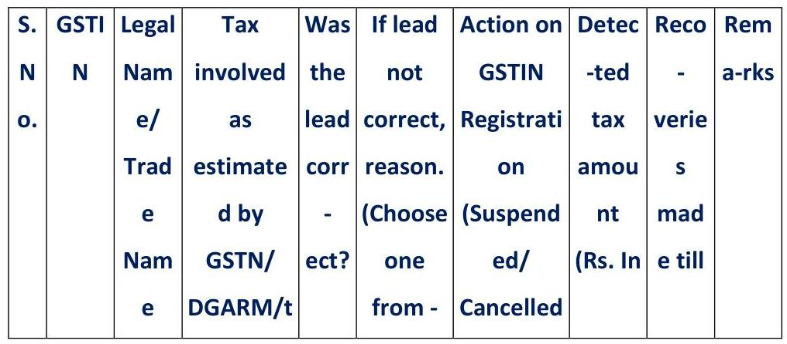
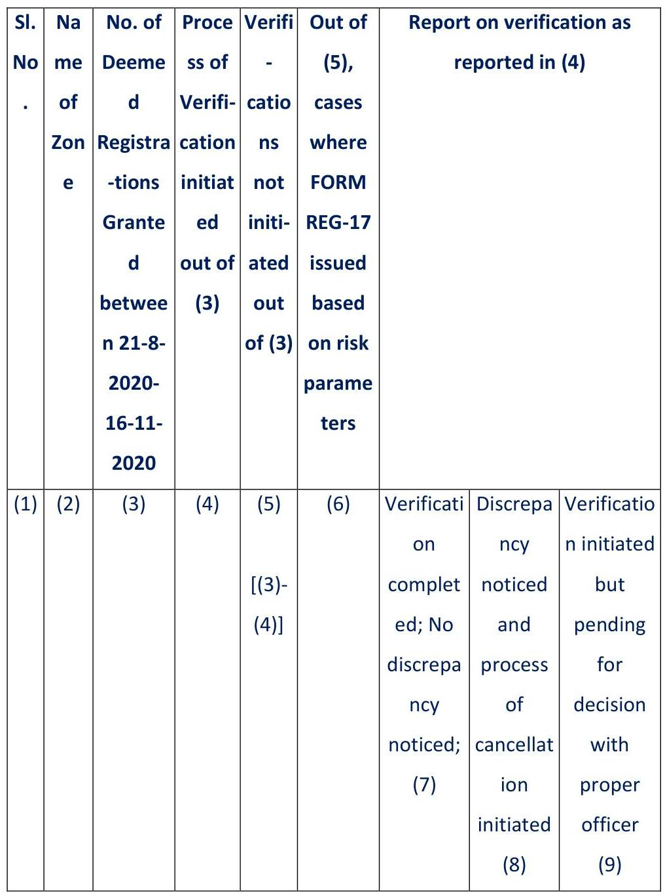

# Part 2 (from GST - All Circulars in one place - 2017 to 2024 - PMA[1]_part2.pdf)


## Page 1001

officer through scrutiny functionality on ACES-GST application, shall be communicated by the system to the concerned registered person on the common portal and therefore, there will be no need for sending any manual communication of notice in FORM GST ASMT-10 by the proper officer to the registered person separately. While issuing such notice, the proper officer may, as far as possible, quantify the amount of tax, interest and any other amount payable in relation to such discrepancies. It may also be ensured that the discrepancies so communicated should, as far as possible, be specific in nature and not vague or general. In this regard, the user manual issued by DG Systems may be referred to regarding the detailed procedure for issuance of FORM GST ASMT-10 on scrutiny functionality on ACES-GST application. The proper officer shall mention the parameter-wise details of the discrepancies noticed by him in FORM GST ASMT-10 and shall also upload the worksheets and supporting document(s)/annexures, if any.
5.5 For each GSTIN identified for scrutiny, the proper officer is required to scrutinize all the returns pertaining to the corresponding Financial Year under consideration and a single compiled notice in FORM GST ASMT-10 may be issued to the registered person for that financial year.
5.6 On receipt of such notice in FORM GST ASMT-10 on common portal, the registered person may accept the discrepancy mentioned in the said notice, and pay the tax, interest and any other amount arising from such discrepancy and inform the same or may furnish an explanation for the discrepancy in FORM GST ASMT-11, through the common portal, to the proper officer within the time period prescribed under rule 99 of CGST Rules.
5.7 The reply furnished by the registered person in FORM GST ASMT-11 on the common portal shall be made available to the concerned proper officer in the scrutiny dashboard on ACES-GST application. Where the explanation furnished by the registered person or the information submitted in respect of acceptance of discrepancy and payment of dues is found to be acceptable by the proper officer, he shall conclude the proceedings by informing the registered person in FORM GST ASMT-12 through the scrutiny functionality on ACES-GST application.

## Page 1002

5.8 In case no satisfactory explanation is furnished by the registered person in FORM GST ASMT-11 within a period of thirty days of being informed by the proper officer or such further period as may be permitted by him or where the registered person, after accepting the discrepancies, fails to pay the tax, interest and any other amount arising from such discrepancies, the proper officer, may proceed to determine the tax and other dues under section 73 or section 74 of CGST Act. Needless to mention, for proceedings under section 73 or section 74 of CGST Act, monetary limits as specified in Circular No. 31/05/2018-GST, dated 9th February, 2018 shall be adhered to. The user manual issued by DG Systems may be referred to for the procedure for initiating proceedings under section 73 or 74 of the CGST Act on the scrutiny functionality on ACES-GST application.
5.9 However, if the proper officer is of the opinion that the matter needs to be pursued further through audit or investigation to determine the correct liability of the said registered person, then he may take the approval of the jurisdictional Principal Commissioner/Commissioner through the divisional Assistant/Deputy Commissioner, through e-file or other suitable mode, for referring the matter to the Audit Commissionerate or antievasion wing of the Commissionerate, as the case may be. The copy of the said approval needs to be uploaded while referring the matter to the concerned formation through the scrutiny functionality, as per the procedure detailed in the user manual issued by DG Systems.

# 6. Timelines for scrutiny of returns : 

6.1 Scrutiny of returns is to be conducted in a time bound manner, so that the cases may be taken to their logical conclusion and that too expeditiously. In this regard, the following timelines may be observed by all concerned :

| S. <br> No. | Process/Event | Timeline/ Frequency |
| :--: | :--: | :--: |
| (i) | Communication of GSTINs selected for scrutiny by DGARM on ACES GST Application for a financial year | From time to time. |

## Page 1003

| (ii) | Finalization of scrutiny schedule with the approval of the concerned Assistant/Deputy Commissioner | Within seven working days of receipt of the details of the concerned GSTINs on ACES-GST application |
| :--: | :--: | :--: |
| (iii) | Issuance of notice by the proper officer for intimating discrepancies in FORM GST ASMT-10, where required | Within the month, as mentioned in scrutiny schedule for scrutiny for the said GSTIN. |
| (iv) | Reply by the registered person in FORM GST ASMT-11 | Within a period of thirty days of being informed by the proper officer in FORM GST ASMT-10 or such further period as may be permitted by the proper officer |
| (v) | Issuance of order in FORM GST <br> ASMT-12 for acceptance of <br> reply furnished by the <br> registered person, where <br> applicable | Within thirty days from receipt of reply from the registered person in FORM GST ASMT-11 |
| (vi) | Initiation of appropriate action for determination of the tax and other dues under section 73 or section 74, in cases where no reply is furnished by the registered person | Within a period of fifteen days after completion of the period of thirty days of issuance of notice in FORM GST ASMT-10 or such further period as permitted by the proper officer |
| (vii) | Initiation of appropriate action for determination of the tax and other dues under section 73 or section 74, in cases | Within thirty days from receipt of reply from the registered person in FORM GST ASMT-11 |

## Page 1004

|  | where reply is furnished by the registered person, but the same is not found acceptable by the proper officer |  |
| :--: | :--: | :--: |
| (viii) | Reference, if any, to the Audit Commissionerate or the antievasion wing of the Commissionerate for action, under section 65 or section 66 or section 67, as the case may be. | Within thirty days from receipt of reply from the registered person in FORM GST ASMT-11 or within a period of forty-five days of issuance of FORM GST ASMT-10, in case no explanation is furnished by the registered person. |

6.2 It may also be ensured that the requisite actions must be initiated well ahead of the time limits as specified in section 73 or section 74 of the CGST Act, as the case may be, in respect of a return identified for scrutiny for a financial year.

# 7. Reporting and Monitoring : 

7.1 The details of action taken by the proper officer in respect of GSTINs allocated to him for scrutiny will be available in the form of two MIS reports in the scrutiny dashboard on the ACESGST application. MIS report 'Monthly Scrutiny Progress Report' (in the format specified in Annexure-D of Instruction No. 2/2022, dated 22-3-2022) displays summary information of the status of scrutiny of returns for the selected month of a financial year for the selected formation. Besides, the GSTIN-wise details of action taken in respect of scrutiny of returns in respect of allotted GSTINs is made available in the MIS report 'Scrutiny Register' (in the format specified in Annexure-C of Instruction No. 2/2022, dated 22-3-2022) on the scrutiny dashboard. 7.2 In view of this, the requirement of compiling and sending the Monthly Scrutiny Progress Report by the CGST zones to DGGST is hereby dispensed with for the Financial Year 2019-20 onwards. However, the CGST zones will continue to send Monthly Scrutiny Progress Reports to DGGST in respect of the Financial Years 2017-18 and FY 2018-19 till the completion of scrutiny of returns for these financial years, as per the timelines mentioned in Instruction No. 2/2022GST, dated 22nd March, 2022.

## Page 1005

7.3 It is also added that the progress of the scrutiny exercise as per the scrutiny schedule shall be monitored by the jurisdictional Principal Commissioner/ Commissioner on regular basis.
8. It is clarified that since the scrutiny functionality has been provided on ACES-GST application only for the Financial Year 2019-20 onwards, the procedure specified in Instruction No. 2/2022, dated 22-3-2022 shall continue to be followed for the scrutiny of returns for the financial years 2017-18 and 2018-19.
9. The online scrutiny functionality on ACES-GST application will further boost the efforts of the department to leverage technology and risk-based tools to encourage self-compliance and to conduct scrutiny of returns with minimal interaction with the registered person. All Principal Chief Commissioners (PCCs)/Chief Commissioners (CCs) of CGST Zones are requested to closely monitor timely scrutiny of returns of the selected GSTINs within their jurisdictions.
10. Difficulties, if any, in implementation of these instructions may be informed to the Board (gst-cbec@gov.in).

## Page 1006

1/2023-GST -All India drive against fake registrations
C.B.I. \& C. Instruction No. 1/2023-GST, dated 4-5-2023
F. No. CBIC- 20/16/05/2023-GST

Government of India
Ministry of Finance (Department of Revenue)
Central Board of Indirect Taxes \& Customs, New Delhi
Subject: Guidelines for Special All-India Drive against fake registrations - regarding. During the National Co-ordination Meeting of the State and Central GST officers held at New Delhi on 24th April, 2023, the issue of unscrupulous elements misusing the identity of other persons to obtain fake/bogus registration under GST, with an intention to defraud the Government exchequer, was deliberated. Such fake/non-genuine registrations are being used to fraudulently pass on input tax credit to unscrupulous recipients by issuing invoices without any underlying supply of goods or services or both. This menace of fake registrations and issuance of bogus invoices for passing of fake ITC has become a serious problem, wherein fraudulent people engage in dubious and complex transactions, causing revenue loss to the government.
2. Various modus operandi of obtaining such fake registrations have been detected by Central and State Tax administrations. In some cases, forged documents, such as forged electricity bills, property tax receipts, rent agreements, etc. are being used as proof of principal place of business to obtain GST registration. In one of such recent cases detected by Gujarat State Tax authorities, it has been found that a few fraudsters have obtained fake GST registrations on the basis of PAN and Aadhaar number of persons from economically weaker sections without their knowledge. It was revealed that phone number on the Aadhaar cards of these persons were got fraudulently modified at the nearest Aadhaar Seva Centre, by taking these persons to the said Aadhaar Seva Centre by giving a nominal cash amount under guise of a government scheme and getting their Aadhaar Cards linked to a dummy mobile number by using their thumb impression.
3. In the National Co-ordination Meeting on 24th April, 2023, it was discussed that while various system based and policy measures are being taken to address this problem of fake

## Page 1007

registration and fake input tax credit, there is a need of concerted and coordinated action on a mission mode by Central and State tax authorities to tackle this menace in a more systematic manner. It was agreed that a nation-wide effort in the form of a Special Drive should be launched on All-India basis to detect such suspicious/fake registrations and to conduct requisite verification for timely remedial action to prevent any further revenue loss to the Government. It was decided that common guidelines may be issued to ensure uniformity in the action by the field formations and for effective coordination and monitoring of the action taken during this Special Drive. Accordingly, the following guidelines are issued for such concerted action on fake dealers/fake billers in a mission mode :
(i) Period of Special Drive : A Special All-India Drive may be launched by all Central and State Tax administrations during the period 16th May, 2023 to 15th July, 2023 to detect suspicious/fake GSTINs and to conduct requisite verification and further remedial action to weed out these fake billers from the GST eco-system and to safeguard Government revenue.
(ii) Identification of fraudulent GSTINs : Based on detailed data analytics and risk parameters, GSTN will identify such fraudulent GSTINs for State and Central Tax authorities. GSTN will share the details of such identified suspicious GSTINs, jurisdiction wise, with the concerned State/Central Tax administration (through DGARM in case of Central Tax authorities) for initiating verification drive and conducting necessary action subsequently.

Besides, field formations may also supplement this list by data analysis at their own end using various available analytical tools like BIFA, ADVAIT, NIC Prime, E-Way analytics, etc., as well as through human intelligence, Aadhaar database, other local learnings and the experience gained through the past detections and modus operandi alerts. GSTN may separately provide a note to the field formations, regarding the tools available in BIFA which may be useful during this drive.
(iii) Information Sharing Mechanism : Successful implementation of the Special Drive would require close coordination amongst the State Tax administrations, and between State and Central tax administrations. For this purpose, a nodal officer shall be appointed immediately by each of the Zonal CGST Zone and State to ensure seamless flow of data and for coordination with GSTN/DGARM and other Tax administrations. The name, designation, phone

## Page 1008

number/mobile number and E-mail Id of such Nodal officer(s) appointed by CGST Zones and States must be shared by the concerned tax authority with GST Council Secretariat within three days of issuance of this letter. GST Council Secretariat will compile the list of the Nodal officers after procuring the details from all the tax administrations and will make the compiled list available to all the tax administrations, as well as GSTN and DGARM immediately.

The Nodal officer of the State/CGST Zone will ensure that the data received from GSTN/DGARM/other tax administrations is made available to the concerned jurisdictional formation within two days positively. The Nodal officer shall also ensure that any cooperation required by other jurisdictions under his control is promptly provided.
(iv) Action to be taken by field formations : On receipt of data from GSTN/DGARM through the Nodal Officer, a time bound exercise of verification of the suspicious GSTINs shall be undertaken by the concerned jurisdictional tax officer(s). If, after detailed verification, it is found that the taxpayer is non-existent and fictitious, then the tax officer may immediately initiate action for suspension and cancellation of the registration of the said taxpayer in accordance with the provisions of section 29 of CGST Act, read with the rules thereof.

Further, the matter may also be examined for blocking of input tax credit in Electronic Credit Ledger as per the provisions of Rule 86A of CGST Rules without any delay. Additionally, the details of the recipients to whom the input tax credit has been passed by such non-existing taxpayer may be identified through the details furnished in FORM GSTR-1 by the said taxpayer. Where the recipient GSTIN pertains to the jurisdiction of the said tax authority itself, suitable action may be initiated for demand and recovery of the input tax credit wrongly availed by such recipient on the basis of invoice issued by the said non-existing supplier, without underlying supply of goods or services or both. In cases, where the recipient GSTIN pertains to a different tax jurisdiction, the details of the case along with the relevant documents/evidences, may be sent to the concerned tax authority, as early as possible, in the format enclosed as Annexure-B, through the Nodal Officer referred in para (ii) above.

Action may also be taken to identify the masterminds/beneficiaries behind such fake GSTIN for further action, where ever required, and also for recovery of Government dues and/or provisional attachment of property/bank accounts, etc. as per provisions of section 83

## Page 1009

of CGST Act. Further, during the investigation/verification, if any linked suspicious GSTIN is detected, similar action may be taken/initiated in respect of the same.
(v) Feedback and Reporting Mechanism : An action taken report will be provided by each of the State as well as CGST Zones to GST Council Secretariat on weekly basis on the first working day after completion of the week in the format enclosed as Annexure-A. If any novel modus operandi is detected during the verification/investigation, the same may also be indicated in the said action taken report. On conclusion of the drive, GSTIN-wise feedback on the result of verification of the shared suspicious GSTINs, will be provided by the field formations to GSTN/ DGARM, as per the format enclosed in Annexure-C.
(vi) National Coordination Committee : A National Coordination Committee headed by Member [GST], CBIC and including Principal Chief Commissioners/Chief Commissioners Delhi and Bhopal CGST Zones and Chief Commissioners/Commissioners of State Tax of Gujarat, West Bengal and Telangana shall monitor the progress of this special drive. National Coordination Committee will meet periodically for this purpose. GST Council Secretariat will act as the secretariat of this National Coordination Committee. The Committee will also be assisted by GSTN and Principal Commissioner, GST Policy Wing, CBIC.
4. GST Council Secretariat will compile the reports received from various formations and make it available to the National Coordination Committee immediately. The unique modus operandi found during this special drive will be compiled by GST Council Secretariat and presented before National Coordination Committee, which will be subsequently shared with Central and State Tax administrations across the country.
5. These guidelines are being issued as per the decision of the National Coordination Committee.
6. Difficulties, if any, in implementation of these instructions may be informed to the Board (gst-cbec@gov.in).

# Annexure-A 

Weekly Report on Action taken in Special All-India Drive against Fake Registrations
Name of the State/CGST Zone :

## Page 1010

Week ending :
(Amount in Rs. Lakhs)

| S. <br> No <br> - | No. of <br> GSTINs <br> shared by <br> GSTN/ <br> DGARM | No. of GSTINs identified locally | Total no. of GSTINs to be verified | No. of GSTINs for whom verification conducted | No. of Non- <br> existing <br> GSTINs <br> found |
| :--: | :--: | :--: | :--: | :--: | :--: |
| 1 | 2 | 3 | $4(2+3)$ | 5 | 6 |
|  |  |  |  |  |  |


| Action taken |  |  |  |  |
| :--: | :--: | :--: | :--: | :--: |
| No. of GSTINs suspende d | No of GSTIN cancelled | ITC blocked under Rule 86A |  | No. of GSTINs where <br> Provisional attachment made under section 83 of CGST Act |
|  |  | Total no. of GSTINs | Total amount of ITC blocked |  |
| 7 a | 7 b | 7 c | 7 d | 7 e |


| Total <br> Amount <br> of <br> evasion <br> of <br> tax/ITC <br> detected | Total <br> Amount <br> recovered <br> from <br> GSTINs in <br> the <br> jurisdictio <br> n of tax <br> authority | No. of recipients <br> (GSTINs) of such non- <br> existing GSTINs to whom <br> credit has been passed <br> on | Number of <br> recipients <br> GSTINs <br> located <br> outside <br> jurisdiction, <br> details of <br> which have <br> been shared | Remarks |

## Page 1011

|  |  |  |  | with the concerned jurisdictiona I tax authority |  |
| :--: | :--: | :--: | :--: | :--: | :--: |
|  |  | Within <br> jurisdictio <br> n | Outside <br> Jurisdiction |  |  |
| 8 | 9 | 10a | 10b | 11 | 12 |

Note :

1. The report is to be given for action taken up to week, i.e. for the period from start of the drive up to the end of the week, for which report is being sent.
2. A separate note may be enclosed in respect of any special modus operandi noticed during the week.

# Annexure-B 

Intimation about details of the recipients of the non-existent suppliers detected during the special All-India drive against fake registrations
A. Tax administration of the non-existent supplier :
B. Tax administration of the recipient :
C. Details of the supplier, recipients and the tax amount involved :

| GSTIN of the <br> non-existent <br> supplier, <br> along with <br> Name \& <br> Address | GSTIN <br> of the <br> recipien <br> t | Name <br> \& <br> Address <br> of the <br> recipien <br> t(s) | Tax amount/ ITC involved (in Rs. <br> Lakhs) |  |  |  |  |
| :--: | :--: | :--: | :--: | :--: | :--: | :--: | :--: |
|  |  |  | CGST | SGST | IGST | Cess | Total |
| 1 | 2 | 3 | 4 | 5 | 6 | 7 | 8 |

## Page 1012

|  |  |  |  |  |  | $(4+5+6+$ <br> 7) |
| :-- | :-- | :-- | :-- | :-- | :-- | :-- |
|  |  |  |  |  |  |  |
|  |  |  |  |  |  |  |
|  |  |  |  |  |  |  |
|  |  |  |  |  |  |  |

D. Other relevant details, if any :
E. Details of enclosures (Panchnama/Inspection report/PV report/Other relevant documents or evidences) :

Place :
Date :
(Signature)
Name :
Designation :
Email address :

Enclosures : As above

# Annexure-C 

GSTIN-wise feedback regarding the outcome of the action
against the suspicious GSTINs
Name of the State/CGST Zone :
Date of submission :


## Page 1013

|  |  |  | ax <br> administr <br> a-tion <br> (Rs. In <br> Lakhs) | $\begin{gathered} (\mathrm{Y} / \\ \mathrm{N}) \end{gathered}$ | $\begin{gathered} \text { a/b/c/d } \\ \text { \# } \end{gathered}$ | / No <br> Action) | Lakhs <br> ) | date <br> (Rs.) |  |
| :--: | :--: | :--: | :--: | :--: | :--: | :--: | :--: | :--: | :--: |
| 1 | 2 | 3 | 4 | 5 | 6 | 7 | 8 | 9 | 10 |
|  |  |  |  |  |  |  |  |  |  |

Note - Details are to be provided for each GSTIN covered in the drive, whether in the initial list or added subsequently
\# For Column 6 - Reason for lead not correct - Please choose one of the following -
a. Data incorrect
b. Data correct but taxpayer had reasonable explanation
c. Data correct but taxpayer had complied before enforcement action
d. Case already investigated before enforcement action

## Page 1014

# 2023-24 - Provisional Attachment Advisory <br> PA/Advisory/2023-24 - Provisional Attachment Advisory <br> CB.I. \& C. GST-Investigation Wing Letter F.No. GST/INV/Provisional Attachment/Advisory/2023-24, dated 2-9-2023 <br> Government of India <br> Ministry of Finance (Department of Revenue) <br> Central Board of Indirect Taxes \& Customs, New Delhi 

Subject :Procedure to be followed with respect to sub-section (2) of Section 83 of CGST Act, 2017 when provisional attachment of property ceases to have effect - Regarding.

Attention is invited to Section 83 of the CGST Act, 2017. It has the provisions to issue order for provisional attachment of property, including bank account, to protect interests of revenue in appropriate cases. At present, the procedure for provisional attachment and release/restoration of such property is prescribed in Rule 159 of CGST Rules, 2017. In this regard, GST Policy Wing has also issued instructions vide CBEC-20/16/05/2021-GST, dated 23-2-2021 [2021 (46) G.S.T.L. C21].
2. The section 83(2) of CGST Act, 2017 states - "Every such provisional attachment shall cease to have effect after the expiry of a period of one year from the date of the order made under sub-section (1)." Where such provisions apply, say in the provisional attachment of bank account, there are instances noticed where person concerned filed writ petition seeking that Commissioner should also follow up by issuing intimation of release of such provisional attachment because Banks/relevant authority ask for such communication. Such matters have come up before the Hon'ble High Court of Delhi.
3.1 The matter has been examined in consultation with the policy wing. It is noted that in terms of the legal position of said Section 83(2) of the Act, read with said Rule 159, in effect, the property is no longer liable to provisional attachment, however, it requires further consultation and actions to incorporate a prescribed language for such type of release/restoration of provisional attachment in a specified Form (like GST DRC-23).
3.2 Therefore, for the present, and keeping in view the convenience of taxpayers, the Board prescribes the procedure that in such types of situations, the Commissioner shall issue

## Page 1015

communication/an intimation to the concerned authority/bank, drawing attention to the particulars of the Order/Form DRC-22 (which made the provisional attachment) and the provisions of Section 83(2) of the CGST Act, 2017, and further indicating the release/restoration of the relevant property/account, in terms of those provisions. This intimation shall be copied to the person concerned. This procedure be implemented immediately, including for dealing with similar pending cases.

## Page 1016

4/2022-GST - IGST refunds on export
F. No. CBEC-20/08/02/2020-GST/1377-78

Government of India
Ministry of Finance (Department of Revenue)
Central Board of Indirect Taxes \& Customs, New Delhi
Subject: Manner of processing and sanction of IGST refunds, withheld in terms of clause (c) of sub-rule (4) of Rule 96, transmitted to the jurisdictional GST authorities under sub-rule (5A) of Rule 96 of the CGSI Rules, 2017 - Regarding

Attention is invited to Standard Operating Procedures (SOPs) for verification of risky exporters and their suppliers dated 23-1-2020 issued to CGST and Customs formations as well as Directorate General of Analytics and Risk Management (DGARM) and SOP, dated 20-5-2020 issued to CGST formations and DGARM vide F. No. CBEC-20/16/07/2020-GST which provided for the procedure to be followed for verification of the risky exporters and their suppliers. The said SOPs provided that DGARM would identify the exporters and their suppliers on the basis of risk parameters, approved by the Competent Authority and would forward the list of such exporters to the Risk Management Centre for Customs (RMCC) for putting alert in the system. In such cases, the Customs field formations were required to conduct the detailed examination of the export goods of such identified exporters. Further, the jurisdictional CGST formations were required to conduct detailed verification of such identified exporters and their suppliers and forward the verification report to DGARM. On receipt of verification report from CGST formations, DGARM was required to take a decision for issuance of NOC or otherwise. In cases where NOC has been issued by DGARM, the same was communicated to the Customs authorities at the port of export for release of withheld IGST refunds of such exporter. Further, DGARM was also required to review whether the exporters can be removed from the list of identified exporters.
2. However, Rule 96 of the Central Goods and Services Tax Rules, 2017 (hereinafter referred to as 'CGST Rules') has been amended retrospectively w.e.f. 1-7-2017 to provide for withholding of IGST refund in cases where the verification of credentials of the exporter, identified on the basis of data analytic including the availment of ITC by the exporter is

## Page 1017

considered essential before grant of refund. Clause (c) of sub-rule (4) of Rule 96 is reproduced below :
(c) the Commissioner in the Board or an officer authorised by the Board, on the basis of data analysis and risk parameters, is of the opinion that verification of credentials of the exporter, including the availment of ITC by the exporter, is considered essential before grant of refund, in order to safeguard the interest of revenue.
2.1 Accordingly, Principal Director General/Director General of Directorate General of Analytics and Risk Management (DGARM), CBIC, New Delhi has been authorised by the Board to exercise the functions under clause (c) of sub-rule (4) of Rule 96 of the CGST Rules vide Order No. 1/2022-GST, dated 21-7-2022 issued vide CBIC-20023/04/2021-GST [2022 (63) G.S.T.L. S3].
2.2 Further, sub-rule (5A) has been inserted in Rule 96 to provide for transmission of IGST refunds, withheld in terms of provisions of clause (c) of sub-rule (4) of Rule 96 of the CGST Rules, as system generated refund in Form GST RFD-01 and to provide that the said system generated form shall be deemed to be the application for refund in such cases and such application for refund shall be deemed to have been filed on the date of such transmission on the portal. In addition, sub-rule (5C) has also been inserted in Rule 96 to provide that such system generated refund in FORM GST RFD-01 have to be dealt with in accordance with Rule 89 i.e. in a manner similar to other GST RFD-01 refund claims.
3. In view of the aforesaid amendments, certain changes have been made in the alert module on ICES for which an Advisory No. 14, dated 29-9-2022 has been issued by DG Systems to all the system managers. In the said advisory, it has been inter alia informed that a new role for putting an all-India suspension, either on IEC or GSTIN of the exporter as the case may be, to withhold IGST refunds has been developed for officers of DGARM. An option to revoke the said alert has also been made available to DGARM officers. Further, instructions have also been issued by DG Systems vide F. No. DGSYS/APP/ICES/GEN/41/2022 dated 29-9-2022 to the Customs field formations regarding the procedure to be followed by them in respect of IGST refunds withheld due to DGARM alerts on risky exporters.
4. DGARM on the basis of data analysis and risk parameters, would identify the exporters where verification of credentials of the exporter, including the availment of ITC by the exporter,

## Page 1018

is considered essential before grant of refund. DGARM would then place an all-India alert on such exporter on Indian Customs EDI system along with the reasons for putting the said alert. Once an alert is placed on an exporter, the IGST refunds of such exporters would be withheld and the data in respect of Shipping Bills filed by such exporter, for which IGST Scroll could not be generated due to DGARM alert, along with the reasons thereof would be transmitted to GSTN through ICEGATE for generation of refund claims in FORM GST RFD-01 in terms of provisions of sub-rule (5A) of Rule 96. Besides, the past cases where the exporter was identified as risky, which could not be processed due to pending verification or due to receipt of negative report, would also be transmitted to GSTN through ICEGATE : for generation of refund claims in FORM GST RFD-01 in terms of provisions of sub-rule (5A) of Rule 96.
5. Such refund claims will be made available to the jurisdictional proper officer on back-office system under the category "Any other (GST paid on export of goods)" with the remarks "Refund of IGST paid on export of goods (Refund not processed by ICEGATE)". Further, the risk parameters, on basis of which the exporter has been identified as risky by DGARM, would be shared with the jurisdictional tax officers along with the system generated refund claim in FORM GST RFD-01. In cases where the verification report in respect of the exporter has already been submitted to DGARM by the jurisdictional CGST authorities, the details of the same would also be shared with the jurisdictional proper officer, along with the said system generated refund claim in FORM GST RFD-01. Transmission of such IGST refunds to the jurisdictional proper officers, withheld on account of identification of exporter as risky by DGARM, is being initiated on the portal.
6. On receipt of such refunds, the jurisdictional proper officer shall immediately process such refund claims in a manner similar to other RFD-01 refunds of filed under the provisions of Rule 89 of the CGST Rules, 2017.
7. However, it may be noted that as these refund claims have been generated by the system on the basis of Shipping Bills/Bills of Export filed by the exporter, these claims would be autoacknowledged by the system and no Deficiency Memo in Form GST RFD-03 can be issued against such system generated Form GST RFD-01 refund claims.

## Page 1019

8. The proper officer shall ascertain the genuineness of the exporter \& verify the correctness of availment and utilisation of ITC by the exporter and exercise due diligence in processing the said refund claims to safeguard interest of revenue. The proper officer may conduct the physical verification of places of business of the exporter, if required, to ensure that the exporter is existing at his declared place of business and is functional/active.
9. The proper officer shall pass a detailed speaking order in respect of the refund claim and shall duly upload the same along with the refund sanction order in Form GST RFD-06 on the portal in terms of Instruction No. 03/2022-GST, dated 14-6-2022 [2022 (61) G.S.T.L. C17]. The officer will also follow the timelines for processing of the refund claim in terms of provisions of sub-section (7) of Section 54 of the CGST Act. It is needless to mention that the procedure of review and post-audit as prescribed in para 2.2 of Instruction No. 03/2022-GST, dated 14-62022 will also be applicable to such refund claims.
10. In cases where the detailed investigation of the exporter or his suppliers is required to be conducted to verify the genuineness and correctness of ITC availed by the exporter, the matter may be examined, if required, for resorting to provisions of sub-section (11) of Section 54 of the CGST Act, 2017 for withholding of the refund.
11. Further, the proper officer would also be required to provide feedback on the common portal while issuing refund sanction order in FORM GST RFD-06 as with recommendation as to whether the alert against the said taxpayer need to be continued or whether the same can be removed. The functionality for the same would be available on the system in due course.
12. GSTN shall transmit the data regarding the outcome of processing of refund by the proper officer, along with the feedback received from the proper officer on the requirement of removal or continuation of alert, to DGARM for necessary action for removal or continuation of alert.
13. The Zonal Principal Chief Commissioners/Chief Commissioners are requested to closely monitor the progress of disposal of such transmitted refund claims to ensure that due verification has been conducted before sanction and the refunds have been processed in a timely manner.

## Page 1020

14. In view of the above, the SOPs dated 23-1-2020 and 20-5-2020 prescribing the procedure to be followed for verification of the risky exporters and their suppliers, are hereby superseded.
15. Difficulty, if any, in implementation of these instructions may please be brought to the notice of the Board.

## Page 1021

04/2022-23 - Prosecution guidelines
C.B.I. \& C. Instruction No. 04/2022-23 [GST-Investigation], dated 1-9-2022
F. No. GST/INV/Instructions/2021-22

Government of India
Ministry of Finance (Department of Revenue)
Central Board of Indirect Taxes \& Customs, New Delhi
Subject: Guidelines for Launching of Prosecution under the Central Goods \& Services Tax Act, 2017 - Regarding.

Prosecution is the institution or commencement of legal proceeding; the process of exhibiting formal charges against the offender.
2. Section 132 of the Central Goods and Services Tax Act, 2017 (CGST Act, 2017) codifies the offences under the Act which warrant institution of criminal proceedings and prosecution. Whoever commits any of the offences specified under sub-section (1) and sub-section (2) of Section 132 of the CGST Act, 2017, can be prosecuted.

# 3. Sanction of prosecution : 

3.1 Sanction of prosecution has serious repercussions for the person involved, therefore, the nature of evidence collected during the investigation should be carefully assessed. One of the important considerations for deciding whether prosecution should be launched is the availability of adequate evidence. The standard of proof required in a criminal prosecution is higher than adjudication proceeding as the case has to be established beyond reasonable doubt. Therefore, even cases where demand is confirmed in adjudication proceedings, evidence collected should be weighed so as to likely meet the above criteria for recommending prosecution. Decision should be taken on case-to-case basis considering various factors, such as, nature and gravity of offence, quantum of tax evaded, or ITC wrongly availed, or refund wrongly taken and the nature as well as quality of evidence collected.
3.2 Prosecution should not be filed merely because a demand has been confirmed in the adjudication proceedings. Prosecution should not be launched in cases of technical nature, or where additional claim of tax is based on a difference of opinion regarding interpretation of law. Further, the evidence collected should be adequate to establish beyond reasonable doubt

## Page 1022

that the person had guilty mind, knowledge of the offence, or had fraudulent intention or in any manner possessed mens rea for committing the offence. It follows, therefore, that in the case of public limited companies, prosecution should not be launched indiscriminately against all the Directors of the company but should be restricted to only persons who oversaw day-today operations of the company and have taken active part in committing the tax evasion etc. or had connived at it.
4. Decision on prosecution should normally be taken immediately on completion of the adjudication proceedings, except in cases of arrest where prosecution should be filed as early as possible. Hon'ble Supreme Court of India in the case of Radheshyam Kejriwal (2011 (266) E.L.T. 294 (S.C.)) has, inter alia, observed the following :
(i) Adjudication proceedings and criminal proceedings can be launched simultaneously;
(ii) Decision in adjudication proceedings is not necessary before initiating criminal prosecution;
(iii) Adjudication proceedings and criminal proceedings are independent in nature to each other;
(iv) The findings against the person facing prosecution in the adjudication proceedings is not binding on the proceeding for criminal prosecution;
(v) The finding in the adjudication proceedings in favour of the person facing trial for identical violation will depend upon the nature of finding. If the exoneration in adjudication proceedings is on technical ground and not on merit, prosecution may continue; and
(vi) In case of exoneration, however, on merits where the allegation is found to be not sustainable at all and the person held innocent, criminal prosecution on the same set of facts and circumstances cannot be allowed to continue, the underlying principle being the higher standard of proof in criminal cases.

In view of the above observations of Hon'ble Supreme Court, prosecution complaint may even be filed before adjudication of the case, especially where offence involved is grave, or qualitative evidences are available, or it is apprehended that the concerned person may delay completion of adjudication proceedings. In cases where any offender is arrested under Section

## Page 1023

69 of the CGST Act, 2017, prosecution complaint may be filed even before issuance of the Show Cause Notice.

# 5. Monetary limits : 

5.1 Monetary Limit : Prosecution should normally be launched where amount of tax evasion, or misuse of ITC, or fraudulently obtained refund in relation to offences specified under sub-section (1) of Section 132 of the CGST Act, 2017 is more than Five Hundred Lakh rupees. However, in following cases, the said monetary limit shall not be applicable :
(i) Habitual evaders : Prosecution can be launched in the case of a company/taxpayer habitually involved in tax evasion or misusing Input Tax Credit (ITC) facility or fraudulently obtained refund. A company/taxpayer would be treated as habitual evader, if it has been involved in two or more cases of confirmed demand (at the first adjudication level or above) of tax evasion/fraudulent refund or misuse of ITC involving fraud, suppression of facts etc. in past two years such that the total tax evaded and/or total ITC misused and/or fraudulently obtained refund exceeds Five Hundred Lakh rupees. DIGIT database may be used to identify such habitual evaders.
(ii) Arrest Cases : Cases where during the course of investigation, arrests have been made under Section 69 of the CGST Act.

## 6. Authority to sanction prosecution :

6.1 The prosecution complaint for prosecuting a person should be filed only after obtaining the sanction of the Pr. Commissioner/Commissioner of CGST in terms of sub-section (6) of Section 132 of CGST Act, 2017.
6.2 In respect of cases investigated by DGGI, the prosecution complaint for prosecuting a person should be filed only after obtaining the sanction of Pr. Additional Director General/Additional Director General, Directorate General of GST Intelligence (DGGI) of the concerned zonal unit/Hqrs.

## 7. Procedure for sanction of prosecution :

### 7.1 In cases of arrest(s) made under Section 69 of the CGST Act, 2017 :

7.1.1 Where during the course of investigation, arrest(s) have been made and no bail has been granted, all efforts should be made to file prosecution complaint in the Court within sixty

## Page 1024

(60) days of arrest. In all other cases of arrest, prosecution complaint should also be filed within a definite time frame. The proposal of filing complaint in the format of investigation report prescribed in Annexure-I, should be forwarded to the Pr. Commissioner/Commissioner, within fifty (50) days of arrest. The Pr. Commissioner/Commissioner shall examine the proposal and take decision as per Section 132 of CGST Act, 2017. If prosecution sanction is accorded, he shall issue a sanction order along with an order authorizing the investigating officer (at the level of Superintendent) of the case to file the prosecution complaint in the competent court.
7.1.2 In cases investigated by DGGI wherever an arrest has been made, procedure as detailed in para 7.1.1 should be followed by officers of equivalent rank of DGGI.
7.1.3 The Additional/Joint Commissioner or Additional/Joint Director in the case of DGGI, must ensure that all the documents/evidence and list of witnesses are kept ready before forwarding the proposal of filing complaint to Pr. Commissioner/Commissioner or Pr. ADG/ADG of DGGI.

# 7.2 In case of filing of prosecution against legal person, including natural person : 

7.2.1 Section 137(1) of the Act provides that where an offence under this Act has been committed by a company, every person who, at the time offence was committed was in-charge of, and was responsible to, the company for the conduct of the business of the company, as well as the company, shall be deemed to be guilty of the offence and shall be liable to be proceeded against and punished accordingly. Section 137(2) of the Act provides that where an offence under this Act has been committed by a company and it is proved that the offence has been committed with the consent or connivance of, or is attributable to any neglect on the part of, any director, manager, secretary or other officer of the company, such director, manager, secretary or other officer shall be deemed to be guilty of that offence and shall be liable to be proceeded against and punished accordingly. Thus, in the case of Companies, both the legal person as well as natural person are liable for prosecution under section 132 of the CGST Act. Similarly, under sub-section (3) of Section 137, the provisions have been made for partnership firm or a Limited Liability Partnership or a Hindu Undivided Family or a Trust.
7.2.2 Where it is deemed fit to launch prosecution before adjudication of the case, the Additional/Joint Commissioner or Additional/Joint Director, DGGI, as the case may be,

## Page 1025

supervising the investigation, shall record the reason for the same and forward the proposal to the sanctioning authority. The decision of the sanctioning authority shall be informed to the concerned adjudicating authority so that there is no need for him to examine the case again from the perspective of prosecution.
7.2.3 In all cases (other than those mentioned at para 7.2.2 and arrests where prosecution complaint has already been filed before adjudication), the adjudicating authority should invariably indicate at the time of passing the order itself whether it considers the case fit for prosecution, so that it can be further processed and sent to the Pr.

Commissioner/Commissioner for obtaining his sanction of prosecution.
7.2.4 In cases, where Show Cause Notice has been issued by DGGI, the recommendation of adjudicating authority for filing of prosecution shall be sent to the Pr. Additional Director General/Additional Director General, DGGI of the concerned zonal unit/Hqrs.
7.2.5 Where at the time of passing of adjudication order, no view has been taken on prosecution by the Adjudicating Authority, the adjudication branch shall re-submit the file within 15 days from the date of issue of adjudication order to the Adjudicating Authority to take view on prosecution.
7.2.6 Pr. Commissioner/Commissioner or Pr. Additional Director General/Additional Director General of DGGI may on his own motion also, taking into consideration inter alia, the seriousness of the offence, examine whether the case is fit for sanction of prosecution irrespective of whether the adjudicating authority has recommended prosecution or not.
7.2.7 An investigation report for the purpose of launching prosecution should be carefully prepared in the format given in Annexure-I, within one month of the date of receipt of the adjudication order or receipt of recommendation of Adjudicating Authority, as the case may be. Investigation report should be signed by an Deputy/Assistant Commissioner, endorsed by the jurisdictional Additional/Joint Commissioner, and sent to the Pr. Commissioner/Commissioner for taking a decision on sanction for launching prosecution. In respect of cases booked by DGGI, the said report shall be prepared by the officers of DGGI, signed by the Deputy/Assistant Director, endorsed by the supervising Additional/Joint Director and sent to the Pr. Additional Director General/Additional Director General of DGGI for taking a decision on sanction for

## Page 1026

launching prosecution. Thereafter, the competent authority shall follow the procedure as mentioned in para 7.1.1.
7.2.8 Once the sanction for prosecution has been obtained, prosecution in the court of law should be filed as early as possible, but not beyond a period of sixty days by the duly authorized officer (of the level of Superintendent). In case of delay in filing complaint beyond 60 days, the reason for the same shall be brought to the notice of the sanctioning authority i.e., Pr. Commissioner/ Commissioner or Pr. Additional Director General/Additional Director General, by the officer authorised for filing of the complaint.
7.2.9 In the cases investigated by DGGI, except for cases pertaining to single/multiple taxpayer(s) under Central Tax administration in one Commissionerate where arrests have not been made and the prosecution is not proposed prior to issuance of show cause notice, prosecution complaints shall be filed and followed up by DGGI. In other cases, the complaint shall be filed by the officer at level of Superintendent of the jurisdictional Commissionerate, authorized by Pr. Commissioner/Commissioner of CGST. However, in all cases investigated by DGGI, the prosecution shall continue to be sanctioned by appropriate officer of DGGI.

# 8. Appeal against Court order in case of inadequate punishment/ acquittal : 

8.1 The Prosecution Cell in the Commissionerate shall examine the judgment of the Court and submit their recommendations to the Pr. Commissioner/Commissioner.

Where Pr. Commissioner/Commissioner is of the view that the accused person has been let off with lighter punishment than what is envisaged in the Act or has been acquitted despite the evidence being strong, filing of appeal should be considered against the order within the stipulated time. Before filing of appeal in such cases, concurrence of Pr. CC/CC should be obtained. Sanction for appeal in such cases shall, however, be accorded by Pr. Commissioner/Commissioner.
8.2 In respect of cases booked by DGGI, the Prosecution Cell in the Directorate shall examine the judgment of the court and submit their recommendations to the Pr. Additional Director General/Additional Director General who shall take a view regarding acceptance of the order or filing of appeal. However, before filing of appeal, concurrence of DG or Pr. DG (for cases booked by HQ Unit) should be obtained.

## Page 1027

# 9. Procedure for withdrawal of prosecution : 

### 9.1 Procedure for withdrawal of sanction-order of prosecution :

9.1.1 In cases where prosecution has been sanctioned but complaint has not been filed and new facts or evidence have come to light necessitating review of the sanction for prosecution, the Commissionerate should immediately bring the same to the notice of the sanctioning authority. After considering the new facts and evidence, the sanctioning authority, if satisfied, may recommend to the jurisdictional Pr. Chief Commissioner/Chief Commissioner that the sanction for prosecution be withdrawn who shall then take a decision.
9.1.2 In the cases investigated by DGGI, such withdrawal of sanction order may be made with the approval of Director General of DGGI of concerned sub-national unit. In the cases booked by DGGI, Hqrs., Pr. Director General shall be competent to approve the withdrawal of sanction order.

### 9.2 Procedure for withdrawal of complaint already filed for prosecution :

9.2.1 Attention is invited to judgment of Hon'ble Supreme Court on the issue of relation between adjudication proceedings and prosecution in the case of Radheshyam Kejriwal, (supra). Hon'ble Supreme Court in para 43 have observed as below :
"In our opinion, therefore, the yardstick would be to judge as to whether allegation in the adjudication proceeding as well as proceeding for prosecution is identical and the exoneration of the person concerned in the adjudication proceeding is on merits. In case it is found on merit that there is no contravention of the provisions of the Act in the adjudication proceeding, the trial of the person concerned shall be in abuse of the process of the court."

The said ratio is equally applicable to GST Law. Therefore, where it is found on merit that there is no contravention of the provisions of the Act in the adjudication proceedings and such order has attained finality, Pr. Commissioner/Commissioner or Pr. Additional Director General/Additional Director General after taking approval of Pr. Chief Commissioner/Chief Commissioner or Pr. Director General/ Director General, as the case may be, would ensure filing of an application through Public Prosecutor in the court to allow withdrawal of prosecution in accordance with law. The withdrawal can only be affected with the approval of the Court.
10. General guidelines :

## Page 1028

10.1 It has been reported that delay in the Court proceedings is often due to non-availability of the records required to be produced before the Court or due to delay in drafting of the complaint, listing of the exhibits etc. It shall be the responsibility of the officer who has been authorized to file complaint, to take charge of all documents, statements and other exhibits that would be required to be produced before a Court. The list of exhibits etc. should be finalized in consultation with the Public Prosecutor at the time of drafting of the complaint. No time should be lost in ensuring that all exhibits are kept in safe custody. Where a complaint has not been filed even after a lapse of 60 days from the receipt of sanction for prosecution, the reason for delay shall be brought to the notice of the Pr. Commissioner/Commissioner or the Pr. Additional Director General/Additional Director General of DGGI by the Additional/Joint Commissioner in-charge of the Commissionerate or Additional/Joint Director of DGGI, responsible for filing of the complaint.
10.2 Filing of prosecution need not be kept in abeyance on the ground that the taxpayer has gone in appeal/revision. However, to ensure that the proceeding in appeal/revision are not unduly delayed because the case records are required for the purpose of prosecution, a parallel file containing copies of essential documents relating to adjudication should be maintained. 10.3 The Superintendent in-charge of adjudication section should endorse copy of all adjudication orders to the prosecution section. The Superintendent in-charge of prosecution section should monitor receipt of all serially numbered adjudication orders and obtain copies of adjudication orders of missing serial numbers from the adjudication section every month. In respect of adjudication orders related to DGGI cases, Superintendent in-charge of adjudication section should ensure endorsing a copy of adjudication order to DGGI. Concerned Zonal Units/Hqrs. of DGGI shall also follow up the status of adjudication of the case from the concerned Commissionerate or adjudicating authority.

# 11. Publication of names of persons convicted : 

11.1 Section 159 of the CGST Act, 2017 grants power to the Pr. Commissioner/Commissioner or any other officer authorised by him on his behalf to publish name and other particulars of the person convicted under the Act. It is directed that in deserving cases, the department should invoke this section in respect of all persons who are convicted under the Act.

## Page 1029

# 12. Monitoring of prosecution : 

12.1 Prosecution, once launched, should be vigorously followed. The Pr.

Commissioner/Commissioner of CGST or Pr. Additional Director General/ Additional Director General of DGGI should monitor cases of prosecution at monthly intervals and take the corrective action wherever necessary to ensure that the progress of prosecution is satisfactory. In DGGI, an Additional/Joint Director in each zonal unit and DGGI (Hqrs.) shall supervise the prosecution related work and take stock of the pending prosecution cases. For keeping a track of prosecution cases, entries of all prosecution cases should promptly be made in DIGIT/Investigation Module, within 48 hours of sanction of prosecution and the entries must be updated from time to time. Additional/Joint Commissioner or Additional/Joint Director, incharge of supervising prosecution cases shall ensure making timely entries in the database.

## 13. Compounding of offence :

13.1 Section 138 of the CGST Act, 2017 provides for compounding of offences by the Pr. Commissioner/Commissioner on payment of compounding amount. The provisions regarding compounding of offence should be brought to the notice of person being prosecuted and such person be given an offer of compounding by Pr. Commissioner/Commissioner or Pr. Additional Director General/Additional Director General of DGGI, as the case may be.

## 14. Transitional Provisions :

14.1 All cases where sanction for prosecution is accorded after the issue of these instructions shall be dealt in accordance with the provisions of these instructions irrespective of the date of the offence. Cases where prosecution has been sanctioned but no complaint has been filed before the magistrate shall also be reviewed by the prosecution sanctioning authority considering the provisions of these instructions.
15. Inspection of prosecution work by the Directorate General of Performance Management :
15.1 Director General, Directorate General of Performance Management and Pr. Chief Commissioners/Chief Commissioners, who are required to inspect the Commissionerates, should specifically check whether instructions in this regard are being followed scrupulously

## Page 1030

and make a mention of the implementation of the guidelines in their inspection report apart from recording of statistical data. Similarly exercise should also be carried out in DGGI.
16. Where a case is considered suitable for launching prosecution and where adequate evidence is forthcoming, securing conviction largely depends on the quality of investigation. It is, therefore, necessary for senior officers to take personal interest in the investigation of important cases of GST evasion and in respect of cases having money laundering angle and to provide guidance and support to the investigating officers.
17. To ensure proper training to the officers posted for prosecution work, the Pr. Director General, National Academy of Customs, Indirect Taxes and Narcotics (NACIN), Faridabad, should organize separate training courses on prosecution/arrests etc. from time to time and should incorporate a series of lectures on this issue in the courses organized for investigation. The Pr. Commissioner/Commissioner or Pr. ADG/ADG of DGGI should judiciously sponsor officers for such courses.
18. These instructions/guidelines may be circulated to all the formations under your charge for strict compliance. Difficulties, if any, in implementation of the aforesaid instructions/guidelines may be brought to the notice of the Board.
19. Receipt of this Instruction may please be acknowledged. Hindi version will follow.

Annexure-I
F. No.

INVESTIGATION REPORT FOR THE PURPOSE OF LAUNCHING PROSECUTION AGAINST

COMMISSIONERATE/DGGI $\qquad$ DIVISION/ZONAL UNIT/Hqrs. DGGI $\qquad$

1. Name \& address of the person(s), including legal person(s) :
2. GSTIN (If any) :
3. Nature of offence including commodity/Service :
4. Charges :
5. Period of offence :

## Page 1031

6. Amount involved :
7. Particular of persons proposed to be prosecuted :
a. Name :
b. Father's Name :
c. Age :

Sex :
d. Address :
e. Occupation :
f. Position held in the Company/Firm :
g. Role played in the offence :
h. Material evidence available against the accused (please indicate separately documentary and oral evidence) :
i. Action ordered against the accused in adjudication :
8. Brief note why prosecution is recommended :
(Deputy/Assistant Commissioner, CGST $\qquad$
(Deputy/Assistant Director, DGGI $\qquad$ )

Place :
Date :
9. I have carefully examined the Investigation Report and find it in order for filling criminal complaint under section 132 of the CGST Act, 2017.
(Additional/Joint Commissioner, CGST $\qquad$ )/
(Additional/Joint Director, DGGI $\qquad$ )

Place :
Date :

1. The proposal should be made in the above form in conformity with the guidelines issued by the Board. Regarding SI. No. 4 above, all the charging sections in the CGST Act, 2017 and other allied Acts should be mentioned. Regarding SI. No. 7, information should be filled separately for each person sought to be prosecuted.
2. A copy of the Show Cause Notice as well as the Order of Adjudication (wherever SCN or adjudication order has been issued) should be enclosed with this report.

## Page 1032

3. If any appeal has been filed, then this fact should be specifically stated.

## Page 1033

3/2022-GST - Procedure for refund claims
[Also refer Instruction 4/2022]
C.B.E. \& C. Instruction No. 3/2022-GST, dated 14-6-2022
F. No. CBEC-20/16/35/2019-GST

Government of India
Ministry of Finance (Department of Revenue)
Central Board of Indirect Taxes \& Customs, New Delhi
Subject: Procedure relating to sanction, post-audit and review of refund claims Regarding.

Attention is invited to sub-section (2) of Section 107 of the Central Goods and Services Tax Act, 2017 (hereinafter referred to as "CGST Act") which provides that the Commissioner may review any decision or order, including an order of refund, with respect to its legality or propriety and he may direct any officer subordinate to him to file an appeal against the said decision or order within 6 months of the date of communication of the said decision or order. Reference is further drawn to entry against the subject pre-audit in table under para 3.3 of the Circular No. 17/17/2017-GST, dated 15-11-2017 [2017 (6) G.S.T.L. C61] wherein it has been stated that preaudit of refund orders is not required to be carried out but the post-audit of the refund orders may, however, continue on the basis of extant guidelines.
2. Subsequently, Board has been receiving reports of different practices being followed by the field formations regarding sanction, review and post-audit of refund claims. In certain Commissionerates, speaking order is being issued in respect of all refund claims, whereas in others, speaking orders are not being issued if the refund is sanctioned in full. Similarly, in case of review and post-audit, different practices are being followed by the field formations. The matter has been examined with the twin purpose of ensuring uniformity in procedure and enabling effective monitoring of sanction of refund claims in order to safeguard interest of revenue. Accordingly, the Board hereby issues the following instructions/guidelines for sanction, post-audit and review of refunds :

# 2.1 Sanction of Refund

## Page 1034

2.1.1 Detailed guidelines for processing of refund claims in GST have been issued by the Board vide Circular No. 17/17/2017-GST, dated 15-11-2017 (for manual processing of refunds) and Circular No. 125/44/2019-GST, dated 18-11-2019 (for electronic filing and online processing of refunds) [2019 (30) G.S.T.L. C44] to ensure uniformity in processing of refund claims. In both of these Circulars, it has been mentioned that the proper officer shall follow the principle of natural justice before taking the final decision with regard to refund claim. Principle of natural justice inter alia provides that a detailed speaking order needs to be issued providing a basis for sanction/rejection of refund. Therefore, while passing the refund sanction order in FORM GST RFD-06, the proper officer should also upload a detailed speaking order along with refund sanction order in FORM GST RFD-06. In order to ensure uniformity in issuance of such speaking order, it is clarified that such speaking order should inter alia contain the following details:

# A. Details for all category of refund claims : 

(a) The period for which refund claim has been filed, date of filing \& the category in which refund has been claimed.
(b) Whether it has been checked that refund claim for the same period has not been filed in the same category including any claim filed under 'Any Other' Category.
(c) Details of Deficiency Memo, if any, in FORM GST RFD-03 issued in respect of the said refund claim previously.
(d) Whether the refund claim has been filed within limitation of time, as provided under CGST Act and Rules thereof, including in the cases, where Deficiency Memo in FORM GST RFD03 had been issued previously.
(e) Details of the documents/statements uploaded along with the refund claim. Whether all the necessary documents have been uploaded with the refund claim in terms of Rule 89(2) of the CGST Rules. Details of document furnished by the applicant via e-mail/in soft copy/in hard copy, if any, may also be provided.
(f) Whether all the due returns have been filed by the applicant or not, whether any dues are pending recovery from the applicant, and whether refund is required to be withheld/ any amount is required to be deducted as per provisions of Section 54(10) of CGST Act on account of non-filing of returns or dues being pending for recovery from the applicant.

## Page 1035

(g) Whether any SCN was issued to the applicant. Details of reply of the applicant and PH details.
(h) Discussion and findings in respect of applicant submission. Details of case laws relied upon in deciding the matter, if any.
(i) Whether provisions of unjust enrichment are applicable or not in terms of the provisions of Section 54(8) of the CGST Act. If unjust enrichment is applicable in the refund, whether the applicant has furnished due documents/certificates, in terms of clause (b) of Section 54(4) of CGST Act, certifying/ establishing not passing burden of tax, in respect of which refund is being claimed, on any other person.
B. Additional details in case of the refund of accumulated ITC (on account of zero- rated supplies/inverted rated structure) and refund of IGST paid on account of zero-rated supplies :
(a) Whether the refund amount claimed has been debited from the electronic credit ledger, in terms of sub-rule (3) of Rule 89 of CGST Rules.
(b) In case of refund of IGST paid on account of zero-rated supplies, whether the amount of IGST has been paid through GSTR-3B return.
(c) Whether the calculation given by the applicant of export/ zero-rated turnover, adjusted aggregate turnover, turnover of inverted duty supplies, as applicable, is correct as per the relevant provisions.
(d) Whether calculation of Net ITC, where ever applicable, is correct as per the relevant provisions. Also, whether the verification of admissibility of ITC as per the provisions of GST Law has been done or not and the findings thereof.
(e) Whether it has been verified that ITC on capital goods has not been included in calculation of Net ITC for refund of ITC in zero rated supplies.
(f) Whether it has been verified that ITC in respect of input services as well as capital goods is not included in calculation of Net ITC in case of inverted tax structure refund.
(g) Whether refund has been restricted to the ITC as per those invoices, details of which are uploaded by the supplier in FORM GSTR-1 and are reflected in FORM GSTR-2A of the applicant in terms of Circular No. 135/05/2020-GST, dated 31-3-2020 [2020 (35) G.S.T.L. C11].

## Page 1036

(h) Whether the refund is barred under the provisions of 2nd and 3rd proviso to Section 54(3) of the CGST Act, 2017.
(i) Details of computation of refund claim amount as per the relevant provisions/prescribed formula in the Act/Rules and verification whether the refund amount claimed is correct or not.
(j) In case of refund on account of inversion, whether the supply qualifies for refund of unutilised ITC under clause (ii) of 1st proviso to Section 54(3) of the CGST Act, 2017.
(k) In case of refund on account of export of goods, whether the details of shipping bill/bill of exports, where ever applicable, have been verified from the ICEGATE portal.
(I) In case of refund on account of export of services, whether the claimant has furnished the BRC/FIRC/other relevant documents evidencing receipt of export remittances in respect of zero-rated services for which refund is being claimed.
(m) In case of refund on account of zero-rated supply by DTA to SEZ, whether the said supply is meant for authorized operations on the basis of Letter of Authorisation (LoA). Further, whether the details of supply by the applicant to the SEZ have been cross checked from the SEZ Online portal.
(n) Whether the documents pertaining to zero-rated supply to SEZ have been endorsed by the specified/authorized officer of the zone.
(o) Whether the DTA supplier has received the payment from the SEZ recipient in case of supply of services to SEZ.
C. Additional details in case of refund of tax paid on supplies regarded as deemed export ;
(a) Whether necessary procedure was followed while making procurement/supplying of goods regarded as deemed exports.
(b) Whether the ITC claimed against the tax paid on such deemed export supplies has been debited from the electronic credit ledger by the recipient for filing application of refund.
(c) Whether it has been verified that no ITC has been claimed by the recipient when refund is claimed by supplier.
D. Additional details in case of refund of excess balance in cash ledger :

## Page 1037

(a) Whether the amount claimed has been debited from the electronic cash ledger.
(b) Whether the amount to be refunded has been calculated in accordance with the provisions of Section 49(6) of CGST Act.
E. Additional details in case of refund filed under the other categories of refund except those mentioned above :
(a) Whether the documents furnished/uploaded along with the refund claim have been verified for their correctness from the source like FORM GSTR-1, FORM GSTR-3B, ICEGATE portal etc., where ever required.
(b) Details of the verification conducted and reasoning for grant/rejection of refund.
(c) In case of refund ITC filed under "Any Other" category, whether the amount claimed has been debited from the electronic credit ledger, wherever required.
2.1.2 It is mentioned that ACES-GST portal provides the facility for uploading a document in pdf format along with the FORM GST RFD-06 order. The same may be utilized by proper officer for uploading the speaking order along with refund sanction order in FORM GST RFD-06 so that the same is made available to the refund applicant as well as Post-audit/Reviewing Authority online.

# 2.2 Post-Audit and Review : 

2.2.1 Sub-section (2) of Section 107 of the CGST Act provides that the Commissioner may examine any decision or order, including an order of refund, with respect to its legality or propriety and he may direct any officer subordinate to him to file an appeal against the said decision or order within 6 months of the date of communication of the said decision or order. The said sub-section is reproduced below :
(2) The Commissioner may, on his own motion, or upon request from the Commissioner of State tax or the Commissioner of Union territory tax, call for and examine the record of any proceedings in which an adjudicating authority has passed any decision or order under this Act or the State Goods and Services Tax Act or the Union Territory Goods and Services Tax Act, for the purpose of satisfying himself as to the legality or propriety of the said decision or order and may, by order, direct any officer subordinate to him to apply to the Appellate Authority within six months from the date of communication of the said decision or order for the determination

## Page 1038

of such points arising out of the said decision or order as may be specified by the Commissioner in his order.
2.2.2 Accordingly, as per extant practice, all refund orders are required to be reviewed for examination of legality and propriety of the refund order and for taking a view whether an appeal to the appellate authority under provisions of sub-section (2) of Section 107 of the CGST Act is required to be filed against the said refund order.
2.2.3 As already mentioned in Circular No. 17/17/2017-GST, dated 15-11-2017, refund claims shall not be subjected to pre-audit. However, the post-audit of refund claims may continue. Considering the large number of refund claims filed in GST, it has been decided that post-audit may henceforth be conducted only for refund claims amounting to Rs. 1 Lakh or more till further instructions.
2.2.4 The post-audit and review of the refund claims shall be conducted as per the following guidelines :
(a) All the refund orders passed should be immediately transmitted online to the review module after issuance of refund order in FORM GST RFD-06. The review and post-audit officers shall have access to all documents/statements on ACES-GST portal pertaining to the said refund claims.
(b) For the purpose of post-audit of refund order, a Post-Audit Cell under a Deputy/Assistant Commissioner along with one/two Superintendents and Inspectors as required, may be created in Commissionerate Headquarters.
(c) The post-audit should be concluded within 3 months from the date of issue of FORM GST RFD-06 order. The findings of the post-audit shall be communicated to the review branch within the said time period of 3 months.
(d) The review of refund order shall be completed at least 30 days before the expiry of the time period allowed for filing appeal under Section 107(2) of the CGST Act.
2.2.5 Till the time the functionality for conducting post-audit online is developed on ACES-GST portal, post-audit of refund orders may be conducted in offline mode. For the said purpose, the refund orders covered under para 2.2.3 above and the relevant documents may be provided to the post-audit cell by the concerned Division through e-Office within 7 days of issuance of

## Page 1039

refund sanction order in FORM GST RFD-06. The report of the post audit may be furnished by the Post-Audit Cell to the Review Cell through e-Office as per the time-limit specified in para 2.2.4(c) above.
3. Difficulty, if any, in the implementation of these instructions/ guidelines may be brought to the notice of the Board.

## Page 1040

3/2022-23 - Guidelines for summons
C.B.I. \& C. Instruction No. 3/2022-23 (GST-Investigation), dated 17-8-2022
F. No. GST/INV/Instructions/2021-22

Government of India
Ministry of Finance (Department of Revenue)
Central Board of Indirect Taxes \& Customs, New Delhi
Subject: Guidelines on issuance of Summons under Section 70 of the Central Goods \& Services Tax Act, 2017 - Regarding.

It has been brought to the notice of the Board that in certain instances, summons under Section 70 of the Central Goods and Services Tax Act, 2017 ('the CGST Act') have been issued by the field formations to the top senior officials of the companies in a routine manner to call for material evidence/documents. Besides, summons have also been issued to call for statutory records viz. GSTR-3B, GSTR-1 etc., which are available online in the GST portal.
2. As per Section 70(1) of the CGST Act, summons can be issued by the proper officer to any person whose attendance is considered necessary either for giving evidence or producing a document or any other thing in an inquiry in the same manner, as provided in the case of a civil court under the provisions of Code of Civil Procedure, 1908 (5 of 1908). As per sub-section (2) of Section 70, securing such documentary and oral evidence under the said legal provision shall be deemed to be a "judicial proceedings" within the meaning of Section 193 and Section 228 of the Indian Penal Code (45 of 1860). While issuing of summons is one of the instruments with the Department to get/obtain information or documents or statement from any person to find out the evasion of the tax etc., however, it needs to be ensured that exercise of such power is done judiciously and with due consideration. Officers are also advised to explore instances when instead of resorting to summons, a letter for requisition of information may suffice. Previously in respect of legacy laws, the Board has sensitized the officers regarding use of power of issuance of summons diligently. However, Board finds it necessary to issue fresh guidelines under CGST.
3. Accordingly, Board desires that the following guidelines must be followed in matters related to investigation under CGST :

## Page 1041

(i) Power to issue summons are generally exercised by Superintendents, though higher officers may also issue summons. Summons by Superintendents should be issued after obtaining prior written permission from an officer not below the rank of Deputy/Assistant Commissioner with the reasons for issuance of summons to be recorded in writing.
(ii) Where for operational reasons it is not possible to obtain such prior written permission, oral/telephonic permission from such officer must be obtained and the same should be reduced to writing and intimated to the officer according such permission at the earliest opportunity.
(iii) In all cases, where summons are issued, the officer issuing summons should record in file about appearance/non-appearance of the summoned person and place a copy of statement recorded in file.
(iv) Summons should normally indicate the name of the offender(s) against whom the case is being investigated unless revelation of the name of the offender is detrimental to the cause of investigation, so that the recipient of summons has prima facie understanding as whether he has been summoned as an accused, co-accused or as witness.
(v) Issuance of summons may be avoided to call upon statutory documents which are digitally/online available in the GST portal.
(vi) Senior management officials such as CMD/MD/CEO/CFO/similar officers of any company or a PSU should not generally be issued summons in the first instance. They should be summoned when there are clear indications in the investigation of their involvement in the decision making process which led to loss of revenue.
(vii) Attention is also invited to Board's Circular No. 122/41/2019-GST, dated 5th November, 2019 [2019 (30) G.S.T.L. C17] which makes generation and quoting of Document Identification Number (DIN) mandatory on communication issued by officers of CBIC to taxpayers and other concerned persons for the purpose of investigation. Format of summons has been prescribed under Board's Circular No. 128/47/2019-GST, dated 23rd December, 2019 [2020 (32) G.S.T.L. C3].

## Page 1042

(viii) The summoning officer must be present at the time and date for which summons is issued. In case of any exigency, the summoned person must be informed in advance in writing or orally.
(ix) All persons summoned are bound to appear before the officers concerned, the only exception being women who do not by tradition appear in public or privileged persons. The exemption so available to these persons under Sections 132 and 133 of CPC, may be kept in consideration while investigating the case.
(x) Issuance of repeated summons without ensuring service of the summons must be avoided. Sometimes it may so happen that summoned person does not join investigations even after being repeatedly summoned. In such cases, after giving reasonable opportunity, generally three summons at reasonable intervals, a complaint should be filed with the jurisdictional magistrate alleging that the accused has committed offence under Section 172 of Indian Penal Code (absconding to avoid service of summons or other proceedings) and/or 174 of Indian Penal Code (non-attendance in obedience to an order from public servant), as inquiry under Section 70 of CGST Act has been deemed to be a "judicial proceedings" within the meaning of Section 193 and Section 228 of the Indian Penal Code. Before filing such complaints, it must be ensured that summons have adequately been served upon the intended person in accordance with Section 169 of the CGST Act. However, this does not bar to issue further summons to the said person under Section 70 of the Act.
4. These instructions may be brought to the notice of all the field offices/formations under your charge for strict compliance. Non-observance of the instructions will be viewed seriously. Difficulties, if any, in implementation of the aforesaid instructions may be brought to the notice of the Board.
5. Receipt of this Instruction may please be acknowledged. Hindi version will follow.

## Page 1043

2/2022-GST - SOP For Scrutiny for FY 2017-18 and FY 2018-19
[Also refer Instruction No. 2/2023]
C.B.I. \& C. Instruction No. 2/2022-GST, dated 22-3-2022
F. No. CBIC-20006/4/2022-GST

Government of India
Ministry of Finance (Department of Revenue)
Central Board of Indirect Taxes \& Customs, New Delhi
Subject : Standard Operating Procedure (SOP) for Scrutiny of returns for FYs 2017-18 and 2018-19 - Regarding.

Section 61 of the Central Goods and Services Tax Act, 2017 (hereinafter referred to as "the CGST Act") read with rule 99 of Central Goods and Services Tax Rules, 2017 (hereinafter referred to as "the CGST Rules") provides for scrutiny of returns and related particulars furnished by the registered person. Till the time a Scrutiny Module for online scrutiny of returns is made available on the CBIC-GST application, as an interim measure, the following Standard Operating Procedure (SOP) is being issued by the Board in order to ensure uniformity in selection/identification of returns for scrutiny, methodology of scrutiny of such returns and other related procedures.

# 2. Relevant statutory provisions 

2.1 Section 61 of the CGST Act, read with rule 99 of the CGST Rules, provides for scrutiny of returns. The same are reproduced below for reference :

## Section 61. Scrutiny of returns. -

"(1) The proper officer may scrutinize the return and related particulars furnished by the registered person to verify the correctness of the return and inform him of the discrepancies noticed, if any, in such manner as may be prescribed and seek his explanation thereto.
(2) In case the explanation is found acceptable, the registered person shall be informed accordingly and no further action shall be taken in this regard.
(3) In case no satisfactory explanation is furnished within a period of thirty days of being informed by the proper officer or such further period as may be permitted by him or where the registered person, after accepting the discrepancies, fails to take the corrective measure in his

## Page 1044

return for the month in which the discrepancy is accepted, the proper officer may initiate appropriate action including those under section 65 or section 66 or section 67, or proceed to determine the tax and other dues under section 73 or section 74."

# Rule 99. Scrutiny of returns. - 

"(1) Where any return furnished by a registered person is selected for scrutiny, the proper officer shall scrutinize the same in accordance with the provisions of section 61 with reference to the information available with him, and in case of any discrepancy, he shall issue a notice to the said person in FORM GST ASMT-10, informing him of such discrepancy and seeking his explanation thereto within such time, not exceeding thirty days from the date of service of the notice or such further period as may be permitted by him and also, where possible, quantifying the amount of tax, interest and any other amount payable in relation to such discrepancy.
(2) The registered person may accept the discrepancy mentioned in the notice issued under sub-rule (1), and pay the tax, interest and any other amount arising from such discrepancy and inform the same or furnish an explanation for the discrepancy in FORM GST ASMT-11 to the proper officer.
(3) Where the explanation furnished by the registered person or the information submitted under sub-rule (2) is found to be acceptable, the proper officer shall inform him accordingly in FORM GST ASMT-12."
2.2 The aforementioned provisions suggest that scrutiny of returns, inter alia, entails the following :
(a) Selection of returns furnished by a registered person for scrutiny, preferably based on robust risk parameters.
(b) Scrutiny of the returns and related particulars furnished by the registered person to verify the correctness of the return. Information available with the proper officer in various returns and statements furnished by the registered person and the data/details made available through various sources like DGARM, ADVAIT, GSTN, E-Way Bill Portal, etc. may be relied upon for this purpose.

## Page 1045

(c) Informing the registered person of the discrepancies noticed, if any, along with quantification of the amount of tax, interest and any other amount payable in relation to such discrepancy and seeking his explanation thereto.
(d) Where the registered person accepts the discrepancy and pays the tax, interest and any other amount arising from such discrepancy or where the explanation furnished by the registered person is found acceptable, conclude the proceedings after informing the registered person.
(e) Where no satisfactory explanation is furnished by the registered person or where the registered person, after accepting the discrepancy, fails to pay the tax, interest and any other amount arising from such discrepancy, initiate appropriate action including those under section 65 or section 66 or section 67, or determination of tax and other dues under section 73 or section 74 of the CGST Act.

# 3. Selection of returns for scrutiny 

3.1 Selection of returns for scrutiny is to be based on specific risk parameters. For this purpose, the Directorate General of Analytics and Risk Management (DGARM) has been assigned the task to select the GSTINs registered with Central tax authorities, whose returns are to be scrutinized, and to communicate the same to the field formations from time to time through the DDM portal (to the nodal officer of the Commissionerate concerned) for further action.
3.2 For convenience of field officers, DGARM would also provide some relevant data (along with likely revenue implication) pertaining to the returns to be scrutinized through the DDM portal. It may be noted that the data provided by the DGARM is generated at a particular point of time which may undergo change at the time of scrutiny of returns by the proper officer due to subsequent compliances carried out by the taxpayer or by the suppliers of the taxpayer. The proper officer shall, therefore, rely upon the latest available data.

## 4. Proper officer for scrutiny of returns

Vide Circular No. 3/3/2017-GST, dated 5-7-2017 [2017 (2) G.S.T.L. 314], "Superintendent of Central Tax" has been assigned the functions as the proper officer in relation to sub-section (1) and sub-section (3) of section 61 of the CGST Act. Accordingly, scrutiny of returns of a taxpayer

## Page 1046

may be conducted by Superintendent of Central Tax in-charge of the jurisdictional range of the said taxpayer.

# 5. Scrutiny Schedule 

5.1 Once the list of GSTINs, whose returns have been selected for scrutiny, is communicated to the field formations, the proper officer, with the approval of the divisional Assistant/Deputy Commissioner, shall finalize a scrutiny schedule. Such scrutiny schedule will specify month-wise schedule for scrutiny in respect of all the GSTINs selected for scrutiny. While preparing the scrutiny schedule, the scrutiny of the GSTINs, which appear to be riskier based on the likely revenue implication indicated by DGARM, may be prioritized. Such scrutiny schedules in respect of all the ranges within the CGST Zone shall be reported to the Directorate General of Goods and Services Tax (DGGST) by the concerned Zone, in the format enclosed as Annexure A.
5.2 The proper officer shall conduct scrutiny of returns pertaining to minimum of 3 GSTINs per month. Scrutiny of returns of one GSTIN shall mean scrutiny of all returns pertaining to a financial year for which the said GSTIN has been identified for scrutiny.

## 6. Process of scrutiny by the Proper Officer

6.1 The Proper Officer shall scrutinize the returns and related particulars furnished by the registered person to verify the correctness of the returns. Information available with the proper officer on the system in the form of various returns and statements furnished by the registered person and the data/details made available through various sources like DGARM, ADVAIT, GSTN, E-Way Bill Portal, etc. may be relied upon for this purpose.
6.2 For convenience of proper officers, an indicative list of parameters to be verified is enclosed as Annexure B. It may be noted that the said list is only indicative, and not exhaustive. The proper officer may also consider any other parameter, as he may deem fit, for the purpose of scrutiny.
6.3 It may be noted that at this stage, the proper officer is expected to rely upon the information available with him or with the department. As far as possible, scrutiny of returns should have minimal interface between the proper officer and the registered person and, there should normally not be any need for seeking documents/records from the taxpayers before issuance of FORM GST ASMT-10.

## Page 1047

6.4 The proper officer shall issue a notice to the registered person in FORM GST ASMT-10 informing him of the discrepancies noticed and seeking his explanation thereto. While issuing such notice, the Proper Officer may, as far as possible, quantify the amount of tax, interest and any other amount payable in relation to such discrepancies. It may also be ensured that the discrepancies so communicated may, as far as possible, be specific in nature and not vague or general. There may be cases where the registered person may already have made additional payment of tax, cess, etc., after filing of the returns for the relevant tax period, through FORM GST DRC-03. The payments thus made through FORM GST DRC-03 may also be taken into consideration while communicating discrepancies to the taxpayer in FORM GST ASMT-10.
6.5 For each GSTIN identified for scrutiny for a financial year, the proper officer is required to scrutinize all the returns pertaining to the corresponding Financial Year under consideration and a single compiled notice in FORM GST ASMT-10 may be issued to the taxpayer for that financial year.
6.6 The registered person may accept the discrepancy mentioned in the notice issued in FORM GST ASMT-10, and pay the tax, interest and any other amount arising from such discrepancy through FORM GST DRC-03 and inform the same or may furnish an explanation for the discrepancy in FORM GST ASMT-11 to the proper officer within the time period prescribed under rule 99 of CGST Rules.
6.7 Where the explanation furnished by the registered person or the information submitted in respect of acceptance of discrepancy and payment of dues is found to be acceptable by the Proper Officer, he shall conclude the proceedings by informing the registered person in FORM GST ASMT-12.
6.8 In case no satisfactory explanation is furnished by the registered person in FORM GST ASMT-11 within a period of thirty days of being informed by the proper officer or such further period as may be permitted by him or where the registered person, after accepting the discrepancies, fails to pay the tax, interest and any other amount arising from such discrepancies, the proper officer, may proceed to determine the tax and other dues under section 73 or section 74 . Needless to mention, for proceeding under section 73 or section 74 , monetary limits as specified in Circular No. 31/05/2018-GST, dated 9th February, 2018 (2018 (9)

## Page 1048

G.S.T.L. C21] shall be adhered to. However, if the proper officer is of the opinion that the matter needs to be pursued further through audit or investigation to determine the correct liability of the said registered person, then he may refer the matter to the jurisdictional Principal Commissioner/Commissioner through the divisional Assistant/Deputy Commissioner, for the decision whether the matter needs to be referred to Audit Commissionerate or Antievasion Wing of the Commissionerate, as the case may be.

# 7. Timelines for scrutiny of returns 

7.1 Scrutiny of returns is to be conducted in a time bound manner, so that necessary action to safeguard revenue may be taken up expeditiously. In this regard, the following timelines may be observed by all concerned :

| S. <br> No. | Process/Event | Timeline/Frequency |
| :--: | :--: | :--: |
| (i) | Communication of list of GSTINs selected for scrutiny (by DGARM to the nodal officer of the Commissionerate concerned) | From time to time. |
| (ii) | Distribution of the list of GSTINs selected for scrutiny by the nodal officer to the proper officers concerned. | Within three working days of receipt of the list from DGARM. |
| (iii) | Finalization of scrutiny schedule with the approval of the concerned Assistant/Deputy Commissioner | Within seven working days of receipt of the details of the concerned GSTINs from the nodal officer. |
| (iv) | Sharing the scrutiny schedule by the zone with DGGST | Within thirty days of receipt of the details of the concerned GSTINs from DGARM. |

## Page 1049

| (v) | Issuance of notice by the proper <br> officer for intimating <br> discrepancies in FORM GST <br> ASMT-10, where required | Within the month, as mentioned <br> in scrutiny schedule for scrutiny <br> of the returns of the said GSTIN. |
| :-- | :-- | :-- |
| (vi) | Reply by the registered person <br> in FORM GST ASMT-11 | Within a period of thirty days of <br> being informed by the proper <br> officer in FORM GST ASMT-10 or <br> such further period as may be <br> permitted by the proper officer |
| (vii) | Issuance of order in FORM GST <br> ASMT-12 for acceptance of <br> reply furnished by the <br> registered person, where <br> applicable | Within thirty days from receipt of <br> reply from the registered person <br> in FORM GST ASMT-11 |
| (viii) | Initiation of appropriate action <br> for determination of the tax and <br> other dues under section 73 or <br> section 74, in cases where no <br> reply is furnished by the <br> registered person | Within a period of fifteen days <br> after completion of the period of <br> thirty days of issuance of notice in <br> FORM GST ASMT-10 or such <br> further period as permitted by <br> the proper officer |
| (ix) | Initiation of appropriate action <br> for determination of the tax and <br> other dues under section 73 or <br> section 74, in cases where reply <br> is furnished by the registered <br> person, but the same is not <br> found acceptable by the proper <br> officer | Within thirty days from receipt of <br> reply from the registered person <br> in FORM GST ASMT-11 |

## Page 1050

| (x) | Reference, if any, to the <br> Commissioner for decision <br> regarding appropriate action <br> under section 65 or section 66 <br> or section 67 | Within thirty days from receipt of <br> reply from the registered person <br> in FORM GST ASMT-11 or within <br> a period of forty-five days of <br> issuance of FORM GST ASMT-10, <br> in case no explanation is <br> furnished by the registered <br> person. |
| :-- | :-- | :-- |

7.2 It may also be ensured while conducting scrutiny that the requisite action for issuing notices/orders is taken well ahead of the time limits as prescribed in section 73 or section 74 of the CGST Act, as the case may be, in respect of a return identified for scrutiny for a financial year.

# 8. Reporting and Monitoring 

A Scrutiny Register shall be maintained by the proper officer in respect of the GSTINs allotted for scrutiny, in the format detailed in Annexure C. The progress of the scrutiny exercise as per the scrutiny schedule shall be monitored by the jurisdictional Principal Commissioner/Commissioner on monthly basis. Further, a Scrutiny Progress Report, in the format detailed in Annexure D, shall be prepared by the proper officer at the end of every month. The monthly Scrutiny Progress Report for each Commissionerate of the CGST Zone shall be compiled for each month and forwarded to the Director General of Goods and Services Tax (DGGST) by the Principal Chief Commissioner/Chief Commissioner of the concerned Zone by 10th day of the succeeding month. The DGGST, in turn, would present the progress report to the Board, through the GST Policy Wing, by the 20th day of the corresponding month.
9. Till the time scrutiny module is made available on the CBIC-GST application/AIO for CBIC officers, the aforesaid interim procedure for scrutiny of returns may be conducted on manual basis. Any communication with the taxpayer for the purpose of scrutiny shall be made with the use of DIN as per the guidelines mentioned in the Circular No. 122/41/2019-GST, dated 5th November, 2019 [2019 (30) G.S.T.L. C17].

## Page 1051

10. This SOP is envisaged to enable the department to leverage technology and risk-based tools to encourage self-compliance and to conduct scrutiny of returns with minimal interaction with the registered persons. All Principal Chief Commissioners (PCCs)/Chief Commissioners (CCs) are requested to closely monitor timely scrutiny of returns of the identified GSTINs within their jurisdictions.
11. Difficulties, if any, in implementation of these instructions may be informed to the Board (gst-cbec@gov.in).

# Annexure A 

## Scrutiny Schedule

(Refer Para 5.1)

| ZCDR <br> Code | Financial <br> Year | GSTIN | Month in which ASMT-10 is proposed to be <br> issued |
| :-- | :-- | :-- | :-- |
|  |  |  |  |
|  |  |  |  |
|  |  |  |  |
|  |  |  |  |
|  |  |  |  |
|  |  |  |  |

Annexure B
Indicative List of Parameters for Scrutiny
(Refer Para 6.2)

1. Tax liability on account of "Outward taxable supplies (other than zero rated, nil rated and exempted)" and "Outward taxable supplies (zero rated)" as declared in table 3.1(a) and table 3.1(b) respectively of FORM GSTR-3B may be verified with corresponding tax liability in respect of outward taxable supplies declared in table 4 (other than table 4B), table 5, table 6, table 7A(1), table 7B(1), table 11A and table 11B (along with the net effect of amendments thereof in Tables 9, 10 and 11(II)) of FORM GSTR-1.

Where the tax liability in respect of supplies declared in the aforementioned tables of FORM GSTR-1 exceeds the liability declared in table 3.1(a) and table 3.1(b) of FORM GSTR-3B, it may indicate short payment of tax.

## Page 1052

It may be noted that table 11B of FORM GSTR-1 captures details of advance amount received in earlier tax periods and adjusted against the supplies shown in the current tax period in tables 4, 5,6 and 7 of FORM GSTR-1. As such, the impact of such details in table 11B is reduction in liability for the tax period under consideration, as the tax should have already been paid upon receipt of such advance amount.
2. Tax liability on account of "Inward supplies (liable to reverse charge)" as declared in Table 3.1(d) of FORM GSTR-3B may be verified with the following :
(i) ITC availed in Table 4(A)(2) and Table 4(A)(3) of FORM GSTR-3B.

Availment of ITC in excess of the liability discharged on account of reverse charge supplies may indicate either short payment of tax liability on account of RCM supplies or excess availment of input tax credit in respect of RCM supplies.
(ii) ITC in respect of inward supplies attracting reverse charge as available in Table 3 and Table 5 (along with the net effect of amendments thereof in Table 4 and Table 6 respectively) of FORM GSTR-2A.

In respect of inward supplies attracting reverse charge received from a registered person, the details of corresponding invoices and debit/credit notes are communicated in table 3 and table 5 of FORM GSTR-2A. Further, in case of amendment of such details by the corresponding supplies in their FORM GSTR-1, the details of such amendments are communicated in table 4 and table 5 respectively.

However, the details of such inward supplies from unregistered persons are not communicated in FORM GSTR-2A, as only registered persons furnish FORM GSTR-1. Moreover, details of ITC on account of import of services also are not communicated in FORM GSTR-2A. As such, the reverse charge supplies declared in table 3.1(d) of FORM GSTR-3B cannot be less than the inward supplies attracting reverse charge as available in the abovementioned tables of FORM GSTR-2A.

Where the RCM supplies declared in table 3.1(d) of FORM GSTR-3B are less than the inward supplies attracting reverse charge as per details available in FORM GSTR-2A, it may indicate short payment of tax liability on account of RCM supplies.

## Page 1053

It may be noted that the said tables in FORM GSTR-2A contain details of supplies attracting forward as well as reverse charge. Therefore, only the supplies against which there is "Yes" or "Y" in column 14 of Table 3, column 16 of Table 4, column 15 of Table 5 and column 18 of Table 6 may be considered.
(iii) Tax/Cess paid in cash as per column 8 of Table 6.1 of FORM GSTR-3B.

In respect of inward supplies liable to reverse charge, tax/cess is to be paid in cash. Besides such RCM payments in cash, there may also be other payments in cash by the registered person. In any case, tax liability off-set in cash should not be less than the liability arising on account of reverse charge as per table 3.1(d) of FORM GSTR-3B. Where the tax liability off-set in cash is less than the liability arising on account of reverse charge, it may indicate short payment of tax.
3. ITC availed in respect of "Inward supplies from ISD" in Table 4(A)(4) of FORM GSTR-3B may be verified with Table 7 (along with the net effect of amendments thereof in Table 8) of FORM GSTR-2A.
4. ITC availed in respect of "All other ITC" in Table 4(A)(5) of FORM GSTR-3B may be verified with Table 3 and Table 5 (along with the net effect of amendments thereof in Table 4 and Table 6 respectively) of FORM GSTR-2A.

It may be noted that the said tables in FORM GSTR-2A contain details of supplies attracting forward as well as reverse charge. Therefore, only the supplies against which there is "No" or "N" in column 14 of Table 3, column 16 of Table 4, column 15 of Table 5 and column 18 of Table 6 may be considered.
5. It may be verified that the taxable value declared on account of "Outward taxable supplies (other than zero rated, nil rated and exempted)" in Table 3.1(a) of FORM GSTR-3B is not less than the net amount liable for TCS and TDS credit as per Column 6 of Table 9 of FORM GSTR-2A.

Section 51 of the CGST Act mandates deduction of tax at source in respect of supplies made to TDS deductors. Similarly, section 52 of the CGST Act requires electronic commerce operators to collect tax at source in respect of supplies made through them. The details of such TDS and TCS are furnished by the corresponding deductors and operators in their FORM GSTR-7 and FORM

## Page 1054

GSTR-8 respectively and communicated to the registered person in table 9 of FORM GSTR-2A. Besides such supplies, the registered person may have other supplies also. However, the taxable value declared on account of "Outward taxable supplies (other than zero rated, nil rated and exempted)" in Table 3.1(a) of FORM GSTR-3B cannot be less than the net amount liable for TCS and TDS credit as per Column 6 of Table 9 of FORM GSTR-2A. A discrepancy on the aforementioned count may indicate short payment of tax.
6. Liability on account of outward supplies in Table 3.1(a) and 3.1(b) of FORM GSTR-3B should be verified with the Tax liability as declared in E-Way Bills.

Rule 138 of the CGST Rules mandates generation of E-Way Bill before commencement of movement of goods of consignment value exceeding fifty thousand rupees (in relation to supply, or for reasons other than supply, or due to inward supply from unregistered person). Besides such supplies, the registered person may also have such other supplies which do not require generation of e-way bills, such as supply of services or supplies as specified in sub-rule (14) of rule 138, etc. Therefore, e-way bills capture a part of supplies made by the registered person. However, in table 3.1 of FORM GSTR-3B, the registered person is required to declare details of all outward supplies. Accordingly, liability declared in table 3.1(a) and (b) of FORM GSTR-3B should not be less than tax liability as declared in the e-way bills.
7. Claim of ITC in respect of supplies from taxpayers whose registrations have been cancelled retrospectively.

In case of retrospective cancellation of registration of a supplier, the recipient is not entitled to claim ITC in respect of invoices or debit notes issued after the effective date of cancellation of the registration. Effective date of cancellation of registrations of the suppliers, if any, is made available in relevant tables of FORM GSTR-2A. Accordingly, it may be verified whether the registered person has availed ITC in respect of such invoices or debit notes issued by the suppliers after the effective date of cancellation of their registrations.
8. Ineligible ITC availed in respect of invoices/debit notes issued by the suppliers who have not filed their GSTR-3B returns for the relevant tax period.

FORM GSTR-2A of the registered person contains the details of "GSTR-3B filing status" of the supplier in respect of each invoice/debit note received by the registered person. Where the said

## Page 1055

status is "No", it indicates the supplier has furnished invoice details in his FORM GSTR-1, but has not furnished the return in FORM GSTR-3B for the corresponding tax period. The availment of ITC in respect of such invoices/debit notes may be checked.
9. Whether GSTR-3B of a tax period is filed after the last date of availment of ITC in respect of any invoice/debit note as per section 16(4). In such cases, no ITC shall be availed in the return.

Sub-section (4) of section 16 of CGST Act provides for availment of ITC only till the due date of furnishing of FORM GSTR-3B for the month of September following the end of FY to which such ITC pertains or furnishing of relevant Annual Return, whichever is earlier. Accordingly, if any return in FORM GSTR-3B is furnished after such time by the registered person under scrutiny, any ITC availed therein is inadmissible.

It may also be noted that vide proviso to sub-section (4) of section 16, for FY 2017-18, availment of ITC was allowed beyond the due date of furnishing of return for the month of September, 2018 till the due date of furnishing of the return in FORM GSTR-3B for the month of March, 2019 subject to the condition that the details of the said invoices/debit notes should have been furnished by the suppliers in their FORM GSTR-1 till the due date of furnishing of FORM GSTR-1 for the month of March, 2019.
10. ITC availed in respect of "Import of goods" in Table 4(A)(1) of FORM GSTR-3B may be verified with corresponding details in Table 10 and Table 11 of FORM GSTR-2A.

Wherever required, the details of such imports may also be cross-verified from ICEGATE portal. 11. Whether the registered person has made reversals of ITC in accordance with provisions of rule 42 and rule 43 of the CGST Rules.

Rule 42 of the CGST Rules provides for manner of determination of input tax credit in respect of inputs or input services and reversal thereof. Rule 43 provides for manner of determination of input tax credit in respect of capital goods and reversal thereof in certain cases. The registered person avails ITC in table 4(A) of FORM GSTR-3B and reverses in Table 4(B). It may be verified whether requisite reversals have actually been made by the said registered person.
12. Whether the registered person has paid interest liability in terms of section 50.

## Page 1056

As per section 50 of the CGST Act a registered person is required to pay interest on delayed payment of tax. It may be verified whether interest payable as per the provisions of section 50 of the CGST Act has actually been paid by the registered person.
13. Whether the registered person has paid late fee in terms of section 47 in respect of returns/statements.

As per section 47 of the CGST Act a registered person is required to pay late fee for delayed filing of returns/statements under the Act. It may be verified whether late fee payable as per the provisions of section 47 of the CGST Act has actually been paid by the registered person.

# Annexure C 

Scrutiny Register to be Maintained by the Proper Officer
(Refer Para 8)

| S. <br> No. | GSTIN | Nam <br> e | FY <br> under <br> scrutin <br> y | DGARM list <br> details |  | FORM GST ASMT-10 <br> details |  |
| :--: | :--: | :--: | :--: | :--: | :--: | :--: | :--: |
|  |  |  |  | $\begin{gathered} \text { DGAR } \\ \text { M list } \\ \text { No., if } \\ \text { any } \end{gathered}$ | Likely <br> revenue <br> implicatio <br> n as per <br> DGARM | ```Whether ASMT- 10 issued or not?``` | Date of <br> issuanc <br> e of <br> ASMT- <br> 10 | Amount <br> of <br> discrep <br> a-ncy as <br> per <br> ASMT- <br> 10 |
| 1 | 2 | 3 | 4 | 5 | 6 | 7 | 8 | 9 |
|  |  |  |  |  |  |  |  |  |


| FORM GST ASMT-11 <br> details |  | Payment details |  |  |  | FORM GST ASMT-12 |  |
| :-- | :-- | :-- | :-- | :-- | :-- | :-- | :-- |
| Whether <br> reply in | Date of <br> receipt of | Amount of <br> discrepanc <br> y accepted | Amount <br> paid in <br> DRC-03 | ARN <br> and | Whether <br> ASMT-12 | Date of <br> issuance |  |

## Page 1057

| ASMT-11 <br> received | reply in <br> ASMT-11 | by <br> registered <br> person |  | date of <br> DRC-03 | has been <br> issued | of ASMT- <br> 12 |
| :--: | :--: | :--: | :--: | :--: | :--: | :--: |
| 10 | 11 | 12 | 13 | 14 | 15 | 16 |
|  |  |  |  |  |  |  |


| Action under section 73 or 74 |  |  | Action under section 65 or 66 or <br> 67 |  |  |
| :--: | :--: | :--: | :--: | :--: | :--: |
| Whether action <br> for <br> determination of <br> the tax and other <br> dues under <br> section 73 or <br> section 74 has <br> been initiated | Date of <br> issuance <br> of SCN <br> under <br> section <br> 73 or 74 | Amount <br> of <br> demand <br> as per <br> SCN | Date of reference, if <br> any, to the <br> Commissioner for <br> decision regarding <br> action under section 65 <br> or section 66 or section <br> 67 | Date of <br> acceptance <br> e of such <br> reference <br> , if any |  |
| 17 | 18 | 19 | 20 | 21 |  |

# Annexure D 

## Monthly Scrutiny Progress Report

(Refer Para 8)
Zone :
Commissionerate :
Financial Year :
Report for the Month :

## Page 1058

| 5. <br> No <br> Balance | New returns allocated for scrutiny |  |  |  |  |  |  |  |
| :--: | :--: | :--: | :--: | :--: | :--: | :--: | :--: | :--: |
|  |  | During the month | Up to the month |  | During the month | Up to the month |  |  |
| 1 | 2 | 3 | 4 |  | 5 | 6 |  |  |
|  |  |  |  |  |  |  |  |  |


| Returns whose scrutiny has been culminated |  |  |  |  |  |  |  |  | Closing <br> Balanc |
| :--: | :--: | :--: | :--: | :--: | :--: | :--: | :--: | :--: | :--: |
| During the month |  |  |  | Up to the month |  |  |  |  |  |
| No <br> discrep <br> ancy <br> found | ASMT- <br> 12 <br> issued | Action <br> u/s 65 <br> or 66 <br> or 67 | Action <br> u/s 73 <br> or 74 | No <br> discrep <br> ancy <br> found | ASMT- <br> 12 <br> issued | Action <br> u/s 65 <br> or 66 <br> or 67 | Actio <br> n u/s <br> 73 or <br> 74 | Actio <br> n u/s <br> 73 or <br> 74 | $\begin{gathered} \text { e }(2+3- \\ 7-8-9- \\ 10) \end{gathered}$ |
| 7 | 8 | 9 | 10 | 11 | 12 | 13 | 14 | 15 |  |
|  |  |  |  |  |  |  |  |  |  |


| Tax liability <br> detected |  | Recovery during the <br> month |  |  |  | Recovery up to the <br> month |  |  |  |
| :--: | :--: | :--: | :--: | :--: | :--: | :--: | :--: | :--: | :--: |
| During <br> the <br> month | Up to <br> the <br> month | Tax | Intere <br> st | Late <br> Fee/ <br> Penalty | Tota <br> I | Tax | Intere <br> st | Late <br> Fee/ <br> Penalty | Tota <br> I |
| 16 | 17 | 18 | 19 | 20 | 21 | 22 | 23 | 24 | 25 |
|  |  |  |  |  |  |  |  |  |  |

## Page 1059

2/2022-23 - Guidelines for arrest and bail
C.B.I. \& C. Instruction No. 2/2022-23 (GST-Investigation), dated 17-8-2022
F. No. GST/INV/Instructions/2021-22

Government of India
Ministry of Finance (Department of Revenue)
Central Board of Indirect Taxes \& Customs, New Delhi
Subject : Guidelines for Arrest and Bail in relation to offences punishable under the CGST Act, 2017 - Regarding.

Hon'ble Supreme Court of India in its judgment dated 16th August, 2021 in Criminal Appeal No. 838 of 2021, arising out of SLP (Crl.) No. 5442/2021 [2022 (64) G.S.T.L. 34 (S.C.)], has observed as follows :
"We may note that personal liberty is an important aspect of our constitutional mandate. The occasion to arrest an accused during investigation arises when custodial investigation becomes necessary or it is a heinous crime or where there is a possibility of influencing the witnesses or accused may abscond. Merely because an arrest can be made because it is lawful does not mandate that arrest must be made. A distinction must be made between the existence of the power to arrest and the justification for exercise of it. If arrest is made routine, it can cause incalculable harm to the reputation and self-esteem of a person. If the Investigating Officer has no reason to believe that the accused will abscond or disobey summons and has, in fact, throughout co-operated with the investigation we fail to appreciate why there should be a compulsion on the officer to arrest the accused."
2. Board has examined the above-mentioned judgment and has felt the need to issue guidelines with respect to arrest under CGST Act, 2017. Even, under legacy laws i.e. Central Excise Act, 1944 (1 of 1944) and Chapter V of the Finance Act, 1994 (32 of 1994), the instructions regarding exercise of power to arrest had been issued.

# 3. Conditions precedent to arrest : 

3.1 Sub-section (1) of Section 132 of CGST Act, 2017 deals with the punishment for offences specified therein. Sub-section (1) of Section 69 gives the power to the Commissioner to arrest a person where he has reason to believe that the alleged offender has committed any offence

## Page 1060

specified in clause (a) or clause (b) or clause (c) or clause (d) of sub-section (1) of Section 132 which is punishable under clause (i) or clause (ii) of sub-section (1), or sub-section (2) of the Section 132 of CGST Act, 2017. Therefore, before placing a person under arrest, the legal requirements must be fulfilled. The reasons to believe to arrive at a decision to place an alleged offender under arrest must be unambiguous and amply clear. The reasons to believe must be based on credible material.
3.2 Since arrest impinges on the personal liberty of an individual, the power to arrest must be exercised carefully. The arrest should not be made in routine and mechanical manner. Even if all the legal conditions precedent to arrest mentioned in Section 132 of the CGST Act, 2017 are fulfilled, that will not, ipso facto, mean that an arrest must be made. Once the legal ingredients of the offence are made out, the Commissioner or the competent authority must then determine if the answer to any or some of the following questions is in the affirmative:
3.2.1 Whether the person was concerned in the non-bailable offence or credible information has been received, or a reasonable suspicion exists, of his having been so concerned?
3.2.2 Whether arrest is necessary to ensure proper investigation of the offence?
3.2.3 Whether the person, if not restricted, is likely to tamper the course of further investigation or is likely to tamper with evidence or intimidate or influence witnesses?
3.2.4 Whether person is mastermind or key operator effecting proxy/benami transaction in the name of dummy GSTIN or non-existent persons, etc. for passing fraudulent input tax credit etc.?
3.2.5 As unless such person is arrested, his presence before investigating officer cannot be ensured.
3.3 Approval to arrest should be granted only where the intent to evade tax or commit acts leading to availment or utilization of wrongful Input Tax Credit or fraudulent refund of tax or failure to pay amount collected as tax as specified in sub-section (1) of Section 132 of the CGST Act, 2017, is evident and element of mens rea/guilty mind is palpable.
3.4 Thus, the relevant factors before deciding to arrest a person, apart from fulfilment of the legal requirements, must be that the need to ensure proper investigation and prevent the possibility of tampering with evidence or intimidating or influencing witnesses exists.

## Page 1061

3.5 Arrest should, however, not be resorted to in cases of technical nature i.e. where the demand of tax is based on a difference of opinion regarding interpretation of Law. The prevalent practice of assessment could also be one of the determining factors while ascribing intention to evade tax to the alleged offender. Other factors influencing the decision to arrest could be if the alleged offender is co-operating in the investigation, viz. compliance to summons, furnishing of documents called for, not giving evasive replies, voluntary payment of tax etc.

# 4. Procedure for arrest 

4.1 Pr. Commissioner/Commissioner shall record on file that after considering the nature of offence, the role of person involved and evidence available, he has reason to believe that the person has committed an offence as mentioned in Section 132 and may authorize an officer of central tax to arrest the concerned person(s). The provisions of the Code of Criminal Procedure, 1973 (2 of 1974) read with section 69(3) of CGST Act relating to arrest and the procedure thereof, must be adhered to. It is, therefore, advised that the Pr. Commissioner/Commissioner should ensure that all officers are fully familiar with the provisions of the Code of Criminal Procedure, 1973 (2 of 1974).
4.2 The arrest memo must be in compliance with the directions of Hon'ble Supreme Court in the case of D.K. Basu v. State of West Bengal reported in 1997 (1) SCC 416 (see paragraph 35). Format of arrest memo has been prescribed under Board's Circular No. 128/47/2019-GST, dated 23rd December, 2019 [2020 (32) G.S.T.L. C3]. The arrest memo should indicate relevant section(s) of the CGST Act, 2017 or other laws attracted to the case and to the arrested person and inapplicable provisions should be struck off. In addition,
4.2.1 The grounds of arrest must be explained to the arrested person and this fact must be noted in the arrest memo;
4.2.2 A nominated or authorized person (as per the details provided by arrested person) of the arrested person should be informed immediately and this fact shall be mentioned in the arrest memo;
4.2.3 The date and time of arrest shall be mentioned in the arrest memo and the arrest memo should be given to the person arrested under proper acknowledgement.

## Page 1062

4.3 A separate arrest memo has to be made and provided to each individual/arrested person. This should particularly be kept in mind in the event when there are several arrests in a single case.
4.4 Attention is also invited to Board's Circular No. 122/41/2019-GST, dated 5th November, 2019 [2019 (30) G.S.T.L. C17] which makes generation and quoting of Document Identification Number (DIN) mandatory on communication issued by officers of CBIC to taxpayers and other concerned persons for the purpose of investigation. Any lapse in this regard will be viewed seriously.
4.5 Further there are certain modalities which should be complied with at the time of arrest and pursuant to an arrest, which include the following :
4.5.1 A woman should be arrested only by a woman officer in accordance with section 46 of Code of Criminal Procedure, 1973.
4.5.2 Medical examination of an arrested person should be conducted by a medical officer in the service of Central or State Government and in case the medical officer is not available, by a registered medical practitioner, soon after the arrest is made. If an arrested person is a female, then such an examination shall be made only by or under supervision of a female medical officer, and in case the female medical officer is not available, by a female registered medical practitioner.
4.5.3 It shall be the duty of the person having the custody of an arrested person to take reasonable care of the health and safety of the arrested person.
4.5.4 Arrest should be made with minimal use of force and publicity, and without violence. The person arrested should be subjected to reasonable restraint to prevent escape.

# 5. Post-arrest formalities 

5.1 The procedure is separately outlined for the different categories of offences, as listed in sub-sections (4) and (5) of Section 132 of the CGST Act, 2017, as amended :
5.1.1.1 In cases, where a person is arrested under sub-section (1) of Section 69 of the CGST Act, 2017, for an offence specified under sub-section (4) of Section 132 of the CGST Act, 2017, the Assistant Commissioner or Deputy Commissioner is bound to release a person on bail against a bail bond. The bail conditions should be informed in writing to the arrested person

## Page 1063

and also on telephone to the nominated person of the person(s) arrested. The arrested person should also be allowed to talk to the nominated person.
5.1.1.2 The conditions will relate to, inter alia, execution of a personal bail bond and one surety of like amount given by a local person of repute, appearance before the investigating officer when required and not leaving the country without informing the officer. The amount to be indicated in the personal bail bond and surety will depend upon the facts and circumstances of each case, inter alia, on the amount of tax involved. It has to be ensured that the amount of Bail bond/Surety should not be excessive and should be commensurate with the financial status of the arrested person.
5.1.1.3 If the conditions of the bail are fulfilled by the arrested person, he shall be released by the officer concerned on bail forthwith. However, only in cases where the conditions for granting bail are not fulfilled, the arrested person shall be produced before the appropriate Magistrate without unnecessary delay and within twenty-four hours of arrest. If necessary, the arrested person may be handed over to the nearest police station for his safe custody, during the night under a challan, before he is produced before the Court.
5.1.2 In cases, where a person is arrested under sub-section (1) of Section 69 of the CGST Act, 2017, for an offence specified under sub-section (5) of Section 132 of the CGST Act, 2017, the officer authorized to arrest the person shall inform such person of the grounds of arrest and produce him before a Magistrate within twenty-four hours. However, in the event of circumstances preventing the production of the arrested person before a Magistrate, if necessary, the arrested person may be handed over to nearest Police Station for his safe custody under a proper challan and produced before the Magistrate on the next day, and the nominated person of the arrested person may also be informed accordingly. In any case, it must be ensured that the arrested person should be produced before the appropriate Magistrate within twenty four hours of arrest, exclusive of the time necessary for the journey from the place of arrest to the Magistrate's Court.
5.2 Formats of the relevant documentation i.e. Bail Bond in the Code of Criminal Procedure, 1973 (2 of 1974) and the Challan for handing over to the police should be followed.

## Page 1064

5.3 After arrest of the accused, efforts should be made to file prosecution complaint under Section 132 of the Act, before the competent Court at the earliest, preferably within sixty days of arrest, where no bail is granted. In all other cases of arrest also, prosecution complaint should be filed within a definite time frame.
5.4 Every Commissionerate/Directorate should maintain a Bail Register containing the details of the case, arrested person, bail amount, surety amount etc. The money/instruments/documents received as surety should be kept in safe custody of a single nominated officer who shall ensure that these instruments/documents received as surety are kept valid till the bail is discharged.

# 6. Reports to be sent 

6.1 Pr. Director-General (DGGI)/Pr. Chief Commissioner(s)/Chief Commissioner(s) shall send a report on every arrest to Member (Compliance Management) as well as to the Zonal Member within 24 hours of the arrest giving details as has been prescribed in Annexure-I. To maintain an all India record of arrests made in CGST, from September, 2022 onwards, a monthly report of all persons arrested in the Zone shall be sent by the Principal Chief Commissioner(s)/Chief Commissioner(s) to the Directorate General of GST Intelligence, Headquarters, New Delhi in the format, hereby prescribed in Annexure-II, by the 5th of the succeeding month. The monthly reports received from the formations shall be compiled by DGGI, Hqrs. and a compiled Zonewise report shall be sent to Commissioner (GST-Investigation), CBIC by 10th of every month.
6.2 Further, all such reports shall be sent only by e-mail and the practice of sending hard copies to the Board should be stopped with immediate effect.
7. The field formations are hereby directed to circulate these guidelines/instructions to all the formations under their charge for strict compliance. Difficulties, if any, in implementation of the aforesaid guidelines/instructions may be brought to the notice of the Board.
8. Receipt of this Instruction may please be acknowledged. Hindi version will follow.

## ANNEXURE-I

(To Board's Instruction No. 2/2022-23)

## Page 1065

F. No.

# Date 

From: The Principal Chief Commissioner/Chief Commissioner, CGST Zone $\qquad$ /Pr. Director General, DGGI

To,
The Member (Compliance Management)
CBIC

## Intimation of Arrest

(In terms of Para 6 of Board's Instruction No. 2/2022-23, dated 17-8-2022)

1. Date of Arrest
2. Time of arrest
3. Place of arrest with address :
4. Name of the person :
5. Date of birth
6. S/o, D/o, W/o :
7. Identification document : type
8. Identification document No. :
9. Nationality
: Indian/Others (if others, specify)
10. Offence committed :
11. Details of offence
: (not more than 50 words)
12. Whether any seizure made : Yes/No
13. If yes, specify

Signature
Name of the Pr. Director General/

## Page 1066

# Pr. Chief Commissioner/Chief 

Commissioner
Copy to :
Member (In-charge of the Zone)

## ANNEXURE-II

(To Board's Instruction No. 2/2022-23)
Monthly Report on Person(s) Arrested in the Zone

| Sr. <br> No. | CGST <br> Zone | Name of the Arrested person | Age | Date of <br> Arrest | Status of Person <br> [Proprietor, Partner, <br> Director, Professional <br> (Lawyer/Chartered <br> Accountant/Company <br> Secretary, etc.)] | Amount of tax evaded (Rs. <br> Crore) | Name of the entity involved | GSTIN of the entity involved | Brief description of role played by the Arrested Person |
| :--: | :--: | :--: | :--: | :--: | :--: | :--: | :--: | :--: | :--: |
|  |  |  |  |  |  |  |  |  |  |
|  |  |  |  |  |  |  |  |  |  |
|  |  |  |  |  |  |  |  |  |  |

## Page 1067

1/2022-GST - Recovery guidelines
C.B.I. \& C. Instruction No. 1/2022-GST, dated 7-1-2022
F. No. CBEC-20/16/05/2021 -GST

Government of India
Ministry of Finance (Department of Revenue)
Central Board of Indirect Taxes \& Customs, New Delhi
Subject: Guidelines for recovery proceedings under the provisions of Section 79 of the CGST Act, 2017 in cases covered under explanation to sub-section (12) of Section 75 of the CGST Act, 2017 - Regarding.

Sub-section (12) of section 75 of the CGST Act, 2017 (hereinafter referred to as "the Act") provides that notwithstanding anything contained in section 73 or section 74 of the Act, where any amount of self-assessed tax in accordance with the return furnished under section 39 remains unpaid, either wholly or partly, or any amount of interest payable on such tax remains unpaid, the same shall be recovered under the provisions of section 79. An explanation has been added to sub-section (12) of section 75 vide section 114 of the Finance Act, 2021 with effect from 1-1-2022 to clarity' that "self-assessed tax" shall include the tax payable in respect of outward supplies, the details of which have been furnished under section 37, but not included in the return furnished under section 39.
2. Doubts are being raised by the trade and the field formations regarding modalities for initiation of the recovery proceedings under section 79 of the Act in the cases covered under the explanation to sub-section (12) of section 75 of the Act. In view of the above, the following guidelines are hereby issued with respect to the recovery proceedings under section 79 of the Act in such cases.
3.1 Sub-section (12) of section 75 of the Act is reproduced hereunder for reference :
"(12) Notwithstanding anything contained in section 73 or section 74, where any amount of self-assessed tax in accordance with a return furnished under section 39 remains unpaid, either wholly or partly, or any amount of interest payable on such tax remains unpaid, the same shall be recovered under the provisions of section 79,

## Page 1068

Explanation - For the purposes of this sub-section, the expression "self-assessed tax" shall include the tax payable in respect of details of outward supplies furnished under section 37, but not included in the return furnished under section 39."

From the perusal of the above provision, it is clear that where the tax payable in respect of details of outward supplies furnished by the registered person in GSTR-1, has not been paid through GSTR-3B Return, either wholly or partly, or any amount of interest payable on such tax remains unpaid, then in such cases, the tax short paid on such self-assessed and thus selfadmitted liability, and the interest thereon, are liable to be recovered under the provisions of section 79 .
3.2 There may, however, be some cases where there may be a genuine reason for difference between the details of outward supplies declared in GSTR-1 and those declared in GSTR-3B. For example, the person may have made a typographical error or may have wrongly reported any detail in GSTR-1 or GSTR-3B. Such errors or omissions can be rectified by the said person in a subsequent GSTR-1/GSTR-3B as per the provisions of sub-section (3) of section 37 or the provisions of sub-section (9) of section 39, as the case may be. There may also be cases, where a supply could not be declared by the registered person in GSTR-1 of an earlier tax period, though the tax on the same was paid by correctly reporting the said supply in GSTR-3B. The details of such supply may now be reported by the registered person in the GSTR-1 of the current tax period. In such cases, there could be a mis-match between GSTR-1 and GSTR-3B (liability reported in GSTR-1> tax paid in GSTR-3B) in the current tax period. Therefore, in all such cases, an opportunity needs to be provided to the concerned registered person to explain the differences between GSTR-1 and GSTR-3B, if any, and for short payment or non-payment of the amount of self-assessed tax liability, and interest thereon, before any action under section 79 of the Act is taken for recovery of the said amount.
3.3 Accordingly, where ever any such amount of tax, self-assessed by the registered person in his outward supply statement GSTR-1 is found to be short paid or not paid by the said person through his GSTR-3B Return in terms of the provisions of sub-section (12) of section 75 of the Act, the proper officer may send a communication [with DIN, in terms of guidelines issued vide Circular No. 122/41/2019-GST, dated 5th November, 2019 - 2019 (30) G.S.T.L. C17] to the

## Page 1069

registered person to pay the amount short paid or not paid, or to explain the reasons for such short payment or non-payment of self-assessed tax. within a reasonable time, as prescribed in the communication, if, the concerned person is able to justify the differences between GSTR-1 and GSTR-3B, or is able to explain the reasons of such short-payment or non-payment of tax, to the satisfaction of the proper officer, or pays the amount such short paid or not paid, then there may not be any requirement to initiate proceedings for recovery under section 79.
3.4 However, if the said registered person either fails to reply to the proper officer, or fails to make the payment of such amount short paid or not paid, within the time prescribed in the communication or such further period as may be permitted by the proper officer, then the proceedings for recovery of the said amount as per provisions of section 79 may be initiated by the proper officer. Further, where the said registered person fails to explain the reasons for such difference/ short payment of tax to the satisfaction of the proper officer, then the proper officer may proceed for recovery of the said amount as per provisions of section 79.
4. Difficulty, if any, in implementation of the above guidelines may please be brought to the notice of the Board. Hindi version would follow.

## Page 1070

1/2022-23 - Deposit during search/ investigation
C.B.I. \& C. Instruction No. 1/2022-23 (GST-Investigation), dated 25-5-2022
F. No. GST/INV/Instructions/2022-23

Government of India
Ministry of Finance (Department of Revenue)
Central Board of Indirect Taxes \& Customs, New Delhi
Subject: Deposit of tax during the course of search, inspection or investigation Regarding.

During the course of search, inspection or investigation, sometimes the taxpayers opt for deposit of their partial or full GST liability arising out of the issue pointed out by the department during the course of such search, inspection or investigation by furnishing DRC-03. Instances have been noticed where some of the taxpayers after voluntarily depositing GST liability through DRC-03 have alleged use of force and coercion by the officers for making 'recovery' during the course of search or inspection or investigation. Some of the taxpayers have also approached Hon'ble High Courts in this regard.
2. The matter has been examined. Board has felt the necessity to clarify the legal position of voluntary payment of taxes for ensuring correct application of law and to protect the interest of the taxpayers. It is observed that under CGST Act, 2017 a taxpayer has an option to deposit the tax voluntarily by way of submitting DRC-03 on GST portal. Such voluntary payments are initiated only by the taxpayer by logging into the GST portal using its login id and password. Voluntary payment of tax before issuance of show cause notice is permissible in terms of provisions of Section 73(5) and Section 74(5) of the CGST Act, 2017. This helps the taxpayers in discharging their admitted liability, self-ascertained or as ascertained by the tax officer, without having to bear the burden of interest under Section 50 of CGST Act, 2017 for delayed payment of tax and may also save him from higher penalty imposable on him subsequent to issuance of show cause notice under Section 73 or Section 74, as the case may be.
3. It is further observed that recovery of taxes not paid or short paid, can be made under the provisions of Section 79 of CGST Act, 2017 only after following due legal process of issuance of notice and subsequent confirmation of demand by issuance of adjudication order. No recovery

## Page 1071

can be made unless the amount becomes payable in pursuance of an order passed by the adjudicating authority or otherwise becomes payable under the provisions of CGST Act and rules made therein. Therefore, there may not arise any situation where "recovery" of the tax dues has to be made by the tax officer from the taxpayer during the course of search, inspection or investigation, on account of any issue detected during such proceedings. However, the law does not bar the taxpayer from voluntarily making payment of any tax liability ascertained by him or the tax officer in respect of such issues, either during the course of such proceedings or subsequently.
4. Therefore, it is clarified that there may not be any circumstance necessitating 'recovery' of tax dues during the course of search or inspection or investigation proceedings. However, there is also no bar on the taxpayers for voluntarily making the payments on the basis of ascertainment of their liability on non-payment/short payment of taxes before or at any stage of such proceedings. The tax officer should however, inform the taxpayers regarding the provisions of voluntary tax payments through DRC-03.
5. Pr. Chief Commissioners/Chief Commissioners, CGST Zones and Pr. Director General, DGGI are advised that in case, any complaint is received from a taxpayer regarding use of force or coercion by any of their officers for getting the amount deposited during search or inspection or investigation, the same may be enquired at the earliest and in case of any wrongdoing on the part of any tax officer, strict disciplinary action as per law may be taken against the defaulting officers.

## Page 1072

2/2021-22 - Issuance of timely SCNs
Instruction No. 2/2021-22/GST-Investigation, dated 22-9-2021
F. No. GST/Inv/Dispute Resolution/03/21-22

Government of India
Ministry of Finance (Department of Revenue)
Central Board of Indirect Taxes \& Customs, New Delhi
Subject: Issuance of SCNs in time bound manner - Regarding.
A detailed analysis to pursue trends in cases of GST evasion \& fraudulent ITC availment booked viz-a-viz number of SCNs issued against for the FY 2017-18 [w.e.f. July, 2017], 2018-19 \& 201920, have been made and it is observed that in GST evasion cases booked and in the Fraudulent ITC cases booked, during the above mentioned period, SCNs have been issued only in few cases.
2.1 Apparently, cases of ITC frauds or GST evasion are covered under the provisions of Section 74 of CGST Act, 2017 [the extended period clause], However, there may be certain other situations where issuance of a notice under Section 73 of the CGST Act, 2017, is intended.
2.2 Kind attention is invited to sub-section (2) \& sub-section (10) of the Section 73 of the CGST Act, 2017, which read as under :
(2) The proper officer shall issue the notice under sub-section (1) at least three months prior to the time limit specified in sub-section (10) for issuance of order.

* $*$ * *

(10) The proper officer shall issue the order under sub-section (9) within three years from the due date for furnishing of annual return for the financial year to which the tax not paid or short paid or input tax credit wrongly availed or utilised relates to or within three years from the date of erroneous refund.
2.3 Attention is also invited to sub-section (2) \& sub-section (10) of the Section 74 of the CGST Act, 2017, which read as under :
(2) The proper officer shall issue the notice under sub-section (1) at least six months prior to the time limit specified in sub-section (10) for issuance of order.

## Page 1073

* $*$ * * * *
(10) The proper officer shall issue the order under sub-section (9) within a period of five years from the due date for furnishing of annual return for the financial year to which the tax not paid or short paid or input tax credit wrongly availed or utilised relates to or within five years from the date of erroneous refund.

3. Further, the last dates of filing of the "Annual Return" under Section 44 of the CGST Act, 2017, for the Financial Years 2017-18, 2018-19 \& 2019-20 are as below :

| Sr. <br> No. | Period | Last date to file Annual Return |
| :--: | :--: | :--: |
| 1. | $\begin{gathered} 2017- \\ 18 \end{gathered}$ | 05th \& 7th February, 2020 (Notification No. 06/2020Central Tax), dated 3-2-2020 |
| 2. | $\begin{gathered} 2018- \\ 19 \end{gathered}$ | 31st December, 2020 (Notification No. 80/2020-Central Tax), dated 28-10-2020 |
| 3. | $\begin{gathered} 2019- \\ 20 \end{gathered}$ | 31st March, 2021 (Notification No. 04/2021-Central Tax), dated 28-2-2021 |

4. Board has examined the matter in the background of issuance of SCNs in meagre number of cases booked/detected as mentioned above. It may be seen that the last date for filing the Annual Returns for the FYs of 2017-18, 2018-19 \& 2019-20 is already over. As a result, the time limit of three years/five years for issuance of orders under Section 73 \& Section 74 of the CGST Act, 2017 has already kicked in. If the issuance of SCNs is pushed to close proximity of the end dates/last dates, it may leave very little time with the adjudicating authority to pass orders within stipulated period mentioned in sub-section (10) of Section 73/Section 74. This might result in a situation where either the adjudicating authority is not able to pass orders within prescribed time period or quality of adjudication suffers. It is felt that the present situation warrants for extra efforts on the part of field formations and strict monitoring at supervisory level.
5. Accordingly, Board desires that Principal Director General/Director General(s)/Principal Chief Commissioner(s)/Chief Commissioner(s) within their jurisdiction may take stock of the

## Page 1074

pending investigation cases/other cases which warrant issuance of show cause notices and take appropriate action to ensure timely completion of investigation(s) and issuance of SCNs well before the last date. The respective Pr. Chief Commissioners/Chief Commissioners may draw an action plan so that no case is pending investigation beyond one year. Needless to mention that once SCN is issued, timely adjudication must follow.

## Page 1075

01/2020-21/GST - SoP for search
C.B.I. \& C. GST Investigation Wing Instructions No. 01/2020-21/GST-Investigation, dated 2-22021

Government of India
Ministry of Finance (Department of Revenue)
Central Board of Indirect Taxes \& Customs, New Delhi
Subject: Instructions/Guidelines regarding procedures to be followed during Search Operation - regarding.

Specific instances have come to the notice of the Board and Central Vigilance Commission wherein proper procedures have apparently not been followed during search proceedings and/or the Panchnamas/statements have not been recorded as per extant guidelines \& instructions. Such discrepancies weaken the judicial scrutiny of the case at later stage. Accordingly, the instructions contained in the Central Excise Intelligence and Investigation Manual (2004), which hold good even in GST regime, are hereby, reiterated for compliance by DGGI/filed formations.
2. Section 67 of the Central Goods and Services Tax Act, 2017 contains the provisions for search. Similar provisions are contained in Section 18 of the Central Excise Act, 1944. These provisions prescribe that all the searches be carried out in accordance with the provisions of Code of Criminal Procedure, 1973. Thus, the following guidelines must be adhered to while carrying out search proceedings :
(i) The officer issuing authorization for search should have valid and justifiable reasons for authorizing a search which shall be duly recorded in the file. Search should be carried out only with a proper search authorization issued by the Competent Authority.
(ii) The instructions related to generation of DIN for each search authorization shall be scrupulously followed by the officer authorising search.
(iii) The premises of a person cannot be searched on the authority of a search warrant issued for the premises of some other person. Where a search warrant, through oversight, has been issued in the name of a person who is already dead, the authorised officer should report to the Competent Authority and get a fresh warrant issued in the names of the legal heirs.

## Page 1076

(iv) In case of search of a residence, a lady officer shall necessarily be part of the search team.
(v) The search shall he made in the presence of two or more independent witnesses who would preferably be respectable inhabitants of the locality, and if no such inhabitants are available or willing, the inhabitants of any other locality should be asked to be witness to the search. PSU employees, Bank employees etc. may be included as witnesses during sensitive search operations to maintain transparency and credibility. The witnesses should be informed about the purpose of the search and their duties.
(vi) The officers conducting the search shall first identify themselves by showing their identity cards to the person in-charge of the premises. Also, before the start of the search, the officers as well as the independent witnesses shall offer their personal search. After the conclusion of the search all the officers and the witnesses should again offer themselves for their personal search.
(vii) The search authorization shall be executed before the start of the search and the same shall be shown to the person in charge of the premises to be searched and his/her signature with date and time shall be obtained on the body of the search authorization. The signatures of the witnesses with date and time should also be obtained on the body of the search authorization.
(viii) A Panchnama containing truthful account of the proceedings of the search shall necessarily be made and a list of documents/ goods/things recovered should be prepared. It should be ensured that time and date of start of search and conclusion of search must be mentioned in the Panchnama. The fact of offering personal search of the officers and witnesses before initiation and after conclusion of search must be recorded in the Panchnama.
(ix) In the sensitive premises videography of the search proceedings may also be considered and the same may be recorded in Panchnama.
(x) While conducting search, the officers must be sensitive towards the assessee/party. Social and religious sentiments of the person(s) under search and of all the person(s) present, shall be respected at all times. Special care/attention should be given to elderly, women and children present in the premises under search. Children should be allowed to go to school, after

## Page 1077

examining of their bags. A woman occupying any premises, to be searched, has the right to withdraw before the search party enters, if according to the customs she does not appear in public. If a person in the premises is not well a medical practitioner may be called.
(xi) The person from whose custody any documents are seized may be allowed to make copies thereof or take extracts therefrom for which he/she may be provided a suitable time and place to take such copies or extract therefrom. However, if it is felt that providing such copies or extracts therefrom prejudicially affect the investigation, the officer may not provide such copies. If such request for taking copies is made during the course of search, the same may be incorporated in Panchnama, intimating place and time to take such copies.
(xii) The officer authorized to search the premises must sign each page of the Panchnama and annexures. A copy of the Panchnama along with all its annexures should be given to the person in-charge of the premises being searched and acknowledgement in this regard may be taken. If the person in-charge refuses to sign the Panchnama, the same may be pasted in a conspicuous place of the premises, in presence of the witnesses. Photograph of the Panchnama pasted on the premises may be kept on record.
(xiii) in case any statement is recorded during the search, each page of the statement must be signed by the person whose statement is being recorded. Each page of the statement must also be signed by the officer recording the statement as 'before me'.
(xiv) After the search is over, the search authorization duly executed should be returned to the officer who had issued the said search authorization with a report regarding the outcome of the search. The names of the officers who had participated in the search should be written on the reverse of the search authorization. If search authorization could not be executed due to any reason, the same should be mentioned in the reverse of the search authorization and a copy of the same may be kept in the case file before returning the same to the officer who had issued the said search authorization.
(xv) The officers should leave the premises immediately after completion of Panchnama proceedings.
(xvi) During the prevalent COVID-19 pandemic situation, it is imperative to take precautionary measures such as maintaining proper social distancing norms, use of masks and

## Page 1078

hand sanitizers etc. The search team should take all measures as contained in the guidelines of Ministry of Home Affairs, and Ministry of Health \& Family Welfare, and also the guidelines issued by the State Government from time to time.
4. Specific instructions regarding search of premises/persons are contained in the Central Excise Intelligence and Investigation Manual issued by the DGCEI, New Delhi. Subsequent instructions have also been issued from time to time as per the need of the hour, latest being DGGI Instruction dated 14-8-2020. The instructions as elaborated in the preceding para(s) are to be followed in continuation to the earlier instructions.
5. This issues with the approval of Member (Investigation), CBIC, New Delhi.

## Page 1079

CBEC-20/16/05/2021-GST/359- Provisional Attachment
[Also refer Provisional Advisory/2023-24, dated 2-9-2023]
C.B.I. \& C. Letter F. No. CBEC-20/16/05/2021-GST/359, dated 23-2-2021

Subject: Guidelines for provisional attachment of property under section 83 of the CGST Act, 2017 - Regarding.

I am directed to refer to the section 83 of the Central Goods and Services Tax Act, 2017 (hereinafter referred to as "the Act"). This section provides for provisional attachment of property for the purpose of protecting the interest of revenue during the pendency of any proceeding under section 62 or section 63 or section 64 or section 67 or section 73 or section 74 of the Act.
2. Doubts have been raised by the field formations on various issues pertaining to provisional attachment of property under the provisions of section 83 of the Act read with rule 159 of Central Goods and Services Tax Rules, 2017 (hereinafter referred to as the "CGST Rules"). Besides in a number of cases, Hon'ble Courts have also made observations on the modalities of implementation of provisions of section 83 of the Act by the tax officers. In view of the same, the following guidelines are hereby issued with respect to the exercise of power under section 83 of the Act.

# 3.1 Grounds for provisional attachment of property. 

3.1.1 Section 83 of the Act is reproduced hereunder :
"83. Provisional attachment to protect revenue in certain cases. -
(1) Where during the pendency of any proceedings under section 62 or section 63 or section 64 or section 67 or section 73 or section 74, the Commissioner is of the opinion that for the purpose of protecting the interest of the Government revenue, it is necessary so to do, he may, by order in writing attach provisionally any property, including bank account, belonging to the taxable person in such manner as may be prescribed.
(2) Every such provisional attachment shall cease to have effect after the expiry of a period of one year from the date of the order made under sub-section (1)."

## Page 1080

3.1.2 Perusal of the above provision of the law suggests that the followings grounds must exist for resorting to provisional attachment of property under the provisions of section 83 of the Act :
(i) There must be pendency of a proceeding against a taxable person under the sections mentioned in section 83 of the Act.
(ii) The Commissioner must have formed the opinion that provisional attachment of the property belonging to the taxable person is necessary for the purpose of protecting the interest of the Government revenue.
3.1.3 For forming an opinion under section 83, it is important that Commissioner must exercise due diligence and duly consider as well as carefully examine all the facts of the case, including the nature of offence, amount of revenue involved, established nature of business and extent of investment in capital assets and reasons to believe that the taxable person, against whom the proceedings referred in section 83 are pending, may dispose of or remove the property, if not attached provisionally.
3.1.4 The basis, on which, Commissioner has formed such an opinion, should be duly recorded on file.
3.1.5 It is reiterated that the power of provisional attachment must not be exercised in a routine/mechanical manner and careful examination of all the facts of the case is important to determine whether the case(s) is fit for exercising power under section 83. The collective evidence, based on the proceedings/enquiry conducted in the case, must indicate that prima facie a case has been made out against the taxpayer, before going ahead with any provisional attachment. The remedy of attachment being, by its very nature, extraordinary, has to be resorted to with utmost circumspection and with maximum care and caution.

# 3.2 Procedure for provisional attachment of property 

3.2.1 In case, the Commissioner forms an opinion to attach any property, including bank account, of the taxable person in terms of section 83, he should duly record on file the basis, on which he has formed such an opinion. He should, thereafter, pass an order in FORM GST DRC22 with proper Document Identification Number (DIN) mentioning therein the details of property being attached.

## Page 1081

3.2.2 A copy of the order of attachment should be sent to the concerned Revenue Authority or Transport Authority or Bank or the relevant Authority to place encumbrance on the said movable or immovable property. The property, thus attached, shall be removed only on the written instructions from the Commissioner.
3.2.3 A copy of such attachment order shall be provided to the said taxable person as early as possible so that objections, if any, to the said attachment can be made by the taxable person within the time period prescribed under rule 159 of the CGST Rules. If such objection is filed by the taxable person, Commissioner should provide an opportunity of being heard to the person filing the objection. After considering the facts presented by the person in his written objection as well as during the personal hearing, if any, the Commissioner should form a reasoned view whether the property is still required to be continued to be attached or not, and pass an order in writing to this effect. In case, the Commissioner is satisfied that the property was or is no longer liable for attachment, he may release such property by issuing an order in FORM GST DRC-23.
3.2.4 Even in cases where objection is not filed within the time prescribed under rule 159(5) of CGST Rules, the Commissioner may take the grounds mentioned in the said objection/representation on record and pass a reasoned order. Where the Commissioner is satisfied that the property was or is no longer liable for attachment, he may release such property by issuing an order in FORM GST DRC-23.
3.2.5 Each such provisional attachment shall cease to have effect after the expiry of a period of one year from the date of the order of attachment.
3.2.6 If the provisionally attached property is of perishable/hazardous nature, then such property shall be released to the taxable person by issuing order in FORM GST DRC-23, after taxable person pays an amount equivalent to the market price of such property or the amount that is or may become payable by the taxable person, whichever is lower, and submits proof of payment. In case the taxable person fails to pay the said amount, then the said property of perishable/hazardous nature may be disposed of and the amount recovered from such disposal of property shall be adjustable against the tax, interest, penalty, fee or any other amount payable by the taxable person. Further, the sale proceeds thus obtained must be deposited in

## Page 1082

the nearest Government Treasury or branch of any nationalised bank in fixed deposit and the receipt thereof must be retained for record, so that the same can be adjusted against the amount determined to be recoverable from the said taxable person.

# 3.3 Cases fit for provisional attachment of property 

3.3.1 As mentioned above, the remedy of attachment being, by its very nature, extraordinary, needs to be resorted to with utmost circumspection and with maximum care and caution. It normally should not be invoked in cases of technical nature and should be resorted to mainly in cases where there is an evasion of tax or where wrongful input tax credit is availed or utilized or wrongfully passed on. While the specific facts of the case need to be examined in detail before forming an opinion in the matter, the following are some of type of cases, where provisional attachment can be considered to be resorted to subject to specific facts of the case : Where taxable person has :
(a) supplied any goods or services or both without issue of any invoice, in violation of the provisions of the Act or the rules made there under, with an intention to evade tax; or
(b) issued any invoice or bill without supply of goods or services or both in violation of the provisions of the Act, or the rules made there under; or
(c) availed input tax credit using the invoice or bill referred to in clause (b) or fraudulently availed input tax credit without any invoice or bill; or
(d) collected any amount as tax but has failed to pay the same to the Government beyond a period of three months from the date on which such payment becomes due; or
(e) fraudulently obtained refund; or
(f) passed on input tax credit fraudulently to the recipients but has not paid the commensurate tax
3.3.2 The above list is illustrative only and not exhaustive. The Commissioner, may examine the specific facts of the case and take a reasoned view in the matter.

### 3.4 Types of property that can be attached

3.4.1 It should be ensured that the value of property attached provisionally is not excessive. The provisional attachment of property shall be to the extent it is required to protect the

## Page 1083

interest of revenue, that is to say, the value of attached property should be as near as possible to the estimated amount of pending revenue against such person.
3.4.2 More than one property may be attached in case value of one property is not sufficient to cover the estimated amount of pending revenue against such person. Further, different properties of the taxpayer can be attached at different points of time subject to the conditions specified in section 83 of the Act.
3.4.3 It may be noted that the provisional attachment can be made only of the property belonging to the taxable person, against whom the proceedings mentioned under section 83 of the Act are pending.
3.4.4 Movable property should normally be attached only if the immovable property, available for attachment, is not sufficient to protect the interests of revenue.
3.4.5 As far as possible, it should also be ensured that such attachment does not hamper normal business activities of the taxable person. This would mean that raw materials and inputs required for production or finished goods should not normally be attached by the Department. 3.4.6 In cases where the movable property, including bank account, belonging to taxable person has been attached, such movable property may be released if taxable person offers, in lieu of movable property, any other immovable property which is sufficient to protect the interest of revenue. Such immovable property should be of value not less than the tax amount in dispute. It should also be free from any subsisting charge, liens, mortgages or encumbrances, property tax fully paid up to date and not involved in any legal dispute. The taxable person must produce the original title deeds and other necessary information relating to the property, for the satisfaction of the concerned officer.

# 3.5 Attachment Period 

3.5.1 Every provisional attachment shall cease to have effect after the expiry of a period of one year from the date of the provisional attachment order.
3.5.2 Besides, the provisional attachment order shall also cease to have effect if an order in FORM GST DRC-23 for release of such property is made by the Commissioner.

### 3.6 Investigation and Adjudication

## Page 1084

As the provisional attachment of property is resorted to protect the interests of the revenue and may also affect the working capital of the taxable person, it may be endeavoured that in all such cases, the investigation and adjudication are completed at the earliest, well within the period of attachment, so that the due liability of tax as well as interest, penalty etc. arising upon adjudication can be recovered from the said taxable person and the purpose of attachment is achieved.

# 3.7 Share in property 

Where the property to be provisionally attached consists of the share or interest of the concerned taxable person in property belonging to him and another as co-owners, the provisional attachment shall be made by order to the concerned person prohibiting him from transferring the share or interest or charging it in any way.

### 3.8 Property exempt from attachment

All such property as is by the Code of Civil Procedure, 1908 (5 of 1908), exempted from attachment and sale for execution of a Decree of a Civil Court shall be exempt from provisional attachment.
4. It may be noted that an amendment to section 83 has been proposed in Finance Bill, 2021. However, such proposed amendment shall come into effect only from a date to be notified in future. The present guidelines, which are based on the existing provisions of section 83 of the Act, shall stand modified according to the amended provisions of section 83, once the said amendment comes into effect.
5. Difficulty, if any, in the implementation of the above guidelines may please be brought to the notice of the Board.

## Page 1085

CBEC-20/16/05/2021-GST/1552 - Blocking of credit (Rule 86A)
Instruction F. No. CBEC-20/16/05/2021-GST/1552, dated 2-11-2021
Government of India
Ministry of Finance (Department of Revenue)
Central Board of Indirect Taxes \& Customs, New Delhi
Subject: Guidelines for disallowing debit of electronic credit ledger under Rule 86A of the CGST Rules, 2017 - Reg.

Rule 86A of the Central Goods and Services Tax Rules, 2017 (hereinafter referred to as "the Rules") provides that in certain circumstances, Commissioner or an officer authorised by him, on the basis of reasonable belief that credit of input tax available in the electronic credit ledger has been fraudulently availed or is ineligible, may not allow debit of an amount equivalent to such credit in electronic credit ledger.
2. Doubts have been raised by the field formations on various issues pertaining to disallowing debit of input tax credit from electronic credit ledger, under rule 86A of the Rules. Further, Hon'ble High Courts in some cases have emphasized the need for laying down guidelines for the purpose of invoking rule 86A. In view of the above, the following guidelines are hereby issued with respect to exercise of power under rule 86A of the Rules :
3.1 Grounds for disallowing debit of an amount from electronic credit ledger :

# 3.1.1 Rule 86A of the Rules is reproduced hereunder for reference : 

"86A. Conditions of use of amount available in electronic credit ledger. -
(1) The Commissioner or an officer authorised by him in this behalf not below the rank of an Assistant Commissioner, having reasons to believe that credit of input tax available in the electronic credit ledger has been fraudulently availed or is ineligible in as much as -
(a) the credit of input tax has been availed on the strength of tax invoices or debit notes or any other document prescribed under rule 36 -
(i) (i) issued by a registered person who has been found non-existent or not to be conducting any business from any place for which registration has been obtained; or
(ii) (ii) without receipt of goods or services or both; or

## Page 1086

(b) the credit of input tax has been availed on the strength of tax invoices or debit notes or any other document prescribed under rule 36 in respect of any supply, the tax charged in respect of which has not been paid to the Government; or
(c) the registered person availing the credit of input tax has been found non-existent or not to be conducting any business from any place for which registration has been obtained; or
(d) the registered person availing any credit of input tax is not in possession of a tax invoice or debit note or any other document prescribed under rule 36, may, for reasons to be recorded in writing, not allow debit of an amount equivalent to such credit in electronic credit ledger for discharge of any liability under section 49 or for claim of any refund of any unutilised amount.
(2) The Commissioner, or the officer authorised by him under sub-rule (1) may, upon being satisfied that conditions for disallowing debit of electronic credit ledger as above, no longer exist, allow such debit.
(3) Such restriction shall cease to have effect after the expiry of a period of one year from the date of imposing such restriction."
3.1.2 Perusal of the rule makes it clear that the Commissioner, or an officer authorised by him, not below the rank of Assistant Commissioner, must have "reasons to believe" that credit of input tax available in the electronic credit ledger is either ineligible or has been fraudulently availed by the registered person, before disallowing the debit of amount from electronic credit ledger of the said registered person under rule 86A. The reasons for such belief must be based only on one or more of the following grounds :
(a) The credit is availed by the registered person on the invoices or debit notes issued by a supplier, who is found to be non-existent or is found not to be conducting any business from the place declared in registration.
(b) The credit is availed by the registered person on invoices or debit notes, without actually receiving any goods or services or both.
(c) The credit is availed by the registered person on invoices or debit notes, the tax in respect of which has not been paid to the government.

## Page 1087

(d) The registered person claiming the credit is found to be non-existent or is found not to be conducting any business from the place declared in registration.
(e) The credit is availed by the registered person without having any invoice or debit note or any other valid document for it.
3.1.3 The Commissioner, or an officer authorised by him, not below the rank of Assistant Commissioner, must form an opinion for disallowing debit of an amount from electronic credit ledger in respect of a registered person, only after proper application of mind considering all the facts of the case, including the nature of prima facie fraudulently availed or ineligible input tax credit and whether the same is covered under the grounds mentioned in sub-rule (1) of rule 86A, as discussed in para 3.1.2 above; the amount of input tax credit involved; and whether disallowing such debit of electronic credit ledger of a person is necessary for restricting him from utilizing/passing on fraudulently availed or ineligible input tax credit to protect the interests of revenue.
3.1.4 It is reiterated that the power of disallowing debit of amount from electronic credit ledger must not be exercised in a mechanical manner and careful examination of all the facts of the case is important to determine case(s) fit for exercising power under rule 86A. The remedy of disallowing debit of amount from electronic credit ledger being, by its very nature, extraordinary, has to be resorted to with utmost circumspection and with maximum care and caution. It contemplates an objective determination based on intelligent care and evaluation as distinguished from a purely subjective consideration of suspicion. The reasons are to be on the basis of material evidence available or gathered in relation to fraudulent availment of input tax credit or ineligible input tax credit availed as per the conditions/grounds under sub-rule (1) of rule 86A.

# 3.2 Proper authority for the purpose of Rule 86A : 

3.2.1 The Commissioner (including Principal Commissioner) is the proper officer for the purpose of exercising powers for disallowing the debit of amount from electronic credit ledger of a registered person under rule 86A. However, Commissioner/ Principal Commissioner can also authorize any officer subordinate to him, not below the rank of Assistant Commissioner, to be the proper officer for exercising such power under rule 86A. It is advised that

## Page 1088

Commissioner/Principal Commissioner may authorize exercise of powers under rule 86A based on the following monetary limits as mentioned below :

| Total amount of ineligible or <br> fraudulently availed input tax <br> credit | Officer to disallow debit of amount <br> from electronic credit ledger under <br> rule 86A |
| :-- | :-- |
| Not exceeding Rupees 1 crore | Deputy Commissioner/Assistant <br> Commissioner |
| Above Rupees 1 crore but not <br> exceeding Rs. 5 crore | Additional Commissioner/Joint <br> Commissioner |
| Above Rs. 5 crore | Principal Commissioner/Commissioner |

3.2.2 The Additional Director General/Principal Additional Director General of DGGI can also exercise the powers assigned to the Commissioner under rule 86A. The monetary limits for authorization for exercise of powers under rule 86A to the officers of the rank of Assistant Director and above of DGGI by the Additional Director General/Principal Additional Director General may be same as mentioned for equivalent rank of officers in the table in para 3.2.1 above.
3.2.3 Where during the course of Audit under section 65 or 66 of CGST Act, 2017 it is noticed that any input tax credit has been fraudulently availed or is ineligible as per the grounds mentioned in sub-rule (1) of rule 86A, which may require disallowing debit of electronic credit ledger under rule 86A, the concerned Commissioner/Principal Commissioner of CGST Audit Commissionerate may refer the same to the jurisdictional CGST Commissioner for examination of the matter for exercise of power under rule 86A.

# 3.3 Procedure for disallowing debit of electronic credit ledger/blocking credit under Rule 

86(A) :
3.3.1 The amount of fraudulently availed or ineligible input tax credit availed by the registered person, as per the grounds mentioned in sub-rule (1) of rule 86A, shall be prima facie ascertained based on material evidence available or gathered on record. It is advised that the powers under rule 86A to disallow debit of the amount from electronic credit ledger of the registered person may be exercised by the Commissioner or the officer authorized by him, as

## Page 1089

per the monetary limits detailed in Para 3.2.1 above. The officer should apply his mind as to whether there are reasons to believe that the input tax credit availed by the registered person has either been fraudulently availed or is ineligible, as per conditions/grounds mentioned in sub-rule (1) of rule 86A and whether disallowing such debit of electronic credit ledger of the said person is necessary for restricting him from utilizing/passing on fraudulently availed or ineligible input tax credit to protect the interests of revenue. Such "Reasons to believe" shall be duly recorded by the concerned officer in writing on file, before he proceeds to disallow debit of amount from electronic credit ledger of the said person.
3.3.2 The amount disallowed for debit from electronic credit ledger should not be more than the amount of input tax credit which is believed to have been fraudulently availed or is ineligible, as per the conditions/grounds mentioned in sub-rule (1) of rule 86A.
3.3.3 The action by the Commissioner or the authorized officer, as the case may be, to disallow debit from electronic credit ledger of a registered person, is informed on the portal to the concerned registered person, along with the details of the officer who has disallowed such debit.

# 3.4 Allowing debit of disallowed/restricted credit under sub-rule (2) of Rule 86A : 

3.4.1 The Commissioner or the authorized officer, as the case may be, either on his own or based on the submissions made by the taxpayer with material evidence thereof, may examine the matter afresh and on being satisfied that the input tax credit, initially considered to be fraudulently availed or ineligible as per conditions of sub-rule (1) of rule 86A, is no more ineligible or wrongly availed, either partially or fully, may allow the use of the credit, so disallowed/restricted, up to the extent of eligibility, as per powers granted under sub-rule (2) of rule 86A. Reasons for allowing the debit of electronic credit ledger, which had been earlier disallowed, shall be duly recorded on file in writing, before allowing such debit of electronic credit ledger.
3.4.2 The restriction imposed as per sub-rule (1) of rule 86A shall cease to have effect after the expiry of a period of one year from the date of imposing such restriction. In other words, upon expiry of one year from the date of restriction, the registered person would be able to

## Page 1090

debit input tax credit so disallowed, subject to any other action that may be taken against the registered person.
3.4.3 As the restriction on debit of electronic credit ledger under sub-rule (1) of rule 86A is resorted to protect the interests of the revenue and the said action also has bearing on the working capital of the registered person, it should be endeavoured that in all such cases, the investigation and adjudication are completed at the earliest, well within the period of restriction, so that the due liability arising out of the same can be recovered from the said taxable person and the purpose of disallowing debit from electronic credit ledger is achieved.
4. Difficulty, if any, in implementation of the above guidelines may please be brought to the notice of the Board. Hindi version would follow.

## Page 1091

116/22/2020- - Referring procedural issued in ST and Excise
C.B.I. \& C. Instruction F. No. 116/22/2020-CX-3, dated 19-10-2020

Government of India
Ministry of Finance (Department of Revenue)
Central Board of Indirect Taxes \& Customs, New Delhi
Subject: Procedure for referring Technical/Legal issues under the Central Excise \& Service Tax for clarification/comments - Regarding.

It has been observed that routine matters, involving interpretation of statutory or policy provisions in specific circumstances or even issues of fact, involving no question of policy, are being referred by the field formations for clarifications to the Board. Moreover, such references are being addressed directly to the Board without the approval of the concerned Principal Chief Commissioner/Chief Commissioner or the Principal Director General/Director General.
2. In this regard, it is advised that, henceforth, while referring matters to the Board, the field formations shall duly adhere to the following guidelines :
(a) References on the technical issues seeking clarification from the Board shall be made only after due vetting and under the signature of the jurisdictional Principal Chief Commissioner/Chief Commissioner or Principal Director General/Director General, in the prescribed proforma enclosed herewith, as Annexure A.
(b) Further, specific question(s) of policy challenged in a Writ Petition(s)/Petition(s) filed by aggrieved taxpayer before the Hon'ble High Court shall only be referred for comments from the Board and not the entire Writ Petition(s)/Petition(s) for para wise comments.
3. The above instructions shall apply to all matters concerning the Central Excise and the Service Tax Wings of the Board.

# Annexure A 

Matters to be referred to CX \& ST wing, C.B.I. \& C. for policy Comments

1. Issue in Brief :
2. Policy issue involved :
3. Position in Law :

## Page 1092

4. Copy of Board's instructions, rulings of CESTAT/High Court/Supreme Court, if any, on the Policy issue involved :
5. Options available :
6. Point(s) of doubt :
7. Recommendation of the field formation :
(Signature)
Name \&
Designation.

## Page 1093

4/3/2020-GST - SOP For deemed registration
C.B.I. \& C. Instruction No. 4/3/2020-GST, dated 27-11-2020
F. No. CBIC-20/13/06/2020-GST

Government of India
Ministry of Finance (Department of Revenue)
Central Board of Indirect Taxes \& Customs, New Delhi
Subject : Standard Operating Procedure (SOP) for verification of taxpayers granted deemed registration - Regarding.

With effect from 21-8-2020, rule 9 of the Central Goods and Services Tax Rules, 2017 (hereinafter referred to as the CGST Rules) provide that in cases where Aadhaar authentication has either not been opted for by the applicant or where such authentication has failed, the proper officer has to mandatorily initiate physical verification of the premises, or in cases where the physical verification is difficult, certain additional documents may be called for by the proper officer (upon approval of an officer not below the rank of Joint Commissioner) for verification before deciding upon grant of registration. Further, the present provisions allow for deemed registration upon completion of 21 days of application in such cases if the proper officer has not issued any notice within the said 21 days.
2. Data suggests that during the period from 21st August, 2020 to 16th November, 2020 deemed registration has been granted in many cases where Aadhaar authentication has not been opted for or has failed. These registrations granted on deemed basis require verifications to ascertain that they have genuine business or intends to carry out so. In order to complete the verification of such registrants, following instructions are issued for immediate compliance : 3.1 The list of registrations granted on deemed approval basis, zone wise, during the period from 21st August, 2020 to 16th November, 2020 have been circulated to the field formations by the DG, Systems.
3.2 Rule 25 of the CGST Rules provide for physical verification of business premises in certain cases and include such verification after grant of registration. All such deemed registrations would be subjected to compulsory post registration verification. On completion of verification,

## Page 1094

if the proper officer has reasons to believe that the registration is liable for cancellation, he shall initiate the proceedings under rule 22 of the CGST Rules.
3.3 Pending physical verification, notice in FORM REG-17 may be issued in specific cases based on following risk parameters seeking explanation from the registered person regarding the differences and anomalies noticed :
i. Where FORM GSTR-1 is filed and FORM GSTR-3B is not filed either for August or September, 2020 tax period;
ii. The difference in tax amount, as reported in FORM GSTR-1 and FORM GSTR-3B is more than Rs. 1 lakh (R1>R3B)

On receipt of the reply to the notice, the proper officer would complete the proceedings under rule 22 of the CGST Rules.
3.4 All the verifications must be completed in a time bound manner, within 3 weeks of these instructions. Zonal Chief commissioners already have the freedom to divert the staff from one formation to another within the Zone to complete the task. A weekly status report to be submitted to the Board in the format enclosed to this instruction.
4.1 The Standard Operating Procedure (SOP) to be followed by the proper officer for carrying out the physical verification of the persons who have been granted a deemed GST registration is outlined below.
4.2 The proper officer shall conduct physical verification of the principal place of business and wherever possible, additional place of business, indicated in GST registration FORM REG-01 of the concerned registrant. During the physical verification, the officer, among other things, would also verify the following details :
a. In case the applicant intends to carry out manufacturing activity, whether capital goods, if required for the said manufacturing activity, have been installed.
b. Electricity connection, bills paid in the relevant period.
c. Size of the premises - whether it is commensurate with the activity to be carried out by the applicant.

## Page 1095

d. Whether premises is self-owned or is rented and documents relating ownership/registered lease of the said property. In case of doubt, enquiry may also be made from the landlord/owner of the property in case of rented/leased premises.
e. No of employees already employed and record of their employment
f. Aadhaar and PAN of the applicant and its proprietor, partners, Karta, Directors as the case may be and the authorised signatories.
g. Bank's letter for up to date KYC.
4.3 In addition to the physical verification conducted, the proper officer, in the interest of revenue, would carry out the preliminary financial verification of the registrants by seeking the following documents and carrying out its scrutiny :
a. ITRs of the company/LLP from the date of incorporation or for last three financial years, whichever is less. ITRs of proprietor, partners, Karta, etc. may be taken in other cases.
b. The status of activity from the date of registration of all the bank account(s) linked to registration; the same may be taken through a letter/undertaking from the applicant. Phone number declared/linked to each of the bank accounts may also be obtained.
c. Quantum of capital employed/proposed to be employed.
d. Out of the amount mentioned at (c) above :
(i) Own Funds :
(ii) Loan Funds : (indicate the names, complete address, PAN and amount borrowed from each such lender separately) :
e. In case of own funds, also check the audited balance sheet for previous financial year, where available, in addition to the Income Tax Returns mentioned in (a) above.
f. In case of loan funds check the proposal submitted to the Bank/FI for approval of the loan and the maximum permissible bank finance as per such proposal, where the amount is proposed to be borrowed from a Bank and/or FI.
5. Field formations are advised that in cases where the applicant has not opted for Aadhaar authentication or where such authentication has failed, there should not be any case where registration is granted on deemed approval basis. Suitable instructions may kindly be issued to the field formations under your charge.

## Page 1096

6. Difficulties, if any, in implementation of these instructions may be informed to the board (gst-cbec@gov.in).
7. This issues with the approval of the Chairman, C.B.I. \& C.

# Weekly status report 

## Report on verification of taxpayers granted deemed registration

Report as on : $\qquad$


## Page 1097

Index

|  |  |  |  |  |  |  |  | $\begin{gathered} {[(\text { 4)-(7)- } \\ (8)]} \end{gathered}$ |
| :--: | :--: | :--: | :--: | :--: | :--: | :--: | :--: | :--: |
|  |  |  |  |  |  |  |  |  |

## Page 1098

3/2/2020-GST - Real estate developer (80\% criteria)
Instruction No. 3/2/2020-GST, dated 24-6-2020
Government of India
Ministry of Finance (Department of Revenue)
Central Board of Indirect Taxes \& Customs, New Delhi
Subject: Payment of GST by real estate promoter/developer supplying construction of residential apartment etc, on the shortfall value of inward supplies from registered supplier at the end of the financial year - Regarding.

A revised GST rate has been prescribed, w.e.f. the 1st April, 2019 on the supply of service by way of construction of residential apartment. Under this, construction of affordable residential apartments attract GST at the rate of $1 \%$ [without ITC] and other residential apartments attract GST at the rate of 5\% [without ITC]. [These rates have been prescribed vide Notification no. 11/2017-Central Tax (Rate), dated 28-6-2017 as amended by Notification no. 3/2019-Central Tax (Rate), dated 29-3-2019].
2. One of the condition prescribed vide said notification is that atleast eighty per cent. of value of input and input services, [other than services by way of grant of development rights, long term lease of land or FSI, electricity, high speed diesel, motor spirit, natural gas], used in supplying the construction service, shall be received by the promoter/developer from registered supplier only. In case of shortfall from the said threshold of 80 per cent., the promoter/developer shall pay the tax on the value of input and input services comprising such shortfall in the manner as has been prescribed vide said notification. This tax shall be paid through a prescribed form electronically on the common portal by end of the quarter following the financial year. Accordingly for FY 2019-20, tax on such shortfall is to be paid by the 30th June, 2020.
3. In the above context, requests have been received seeking details of prescribed form on which the said tax amount has to be reported.
4. The issue referred by the trade has been examined. It has been decided that FORM GST DRC-03, as already prescribed, shall be used for making the payment of such tax by promoter/developer. Accordingly, person required to pay tax in accordance with the said

## Page 1099

notification on the shortfall from threshold requirement of procuring input and input services (below 80\%) from registered person shall use the form DRC-03 to pay the tax electronically on the common portal within the prescribed period.
5. It is requested that suitable instructions may be issued by the States/field formations of CBIC to advise the trade accordingly.

2/1/2020-GST - Expediting refund claims
C.B.I. \& C. Instruction No. 2/1/2020-GST, dated 9-4-2020

Government of India
Ministry of Finance (Department of Revenue)
Central Board of Indirect Taxes \& Customs, New Delhi
Sub : Implementation of decision to expedite pending refund claims - Regarding.
Kind attention is drawn to the Press Note dated 8th April, 2020 of Department of Revenue, Ministry of Finance with regards to refunds. It has been inter alia decided that all pending GST refunds including IGST refunds shall be expeditiously processed. Many doubts and concerns raised by the field officers in the social media groups have since come to notice of the Board.
2. In this regard, it may be noted that the decision to process pending refund claims has been taken with a view to provide immediate relief to the taxpayers in these difficult times even though the GST Law provides 15 days for issuing acknowledgement or deficiency memo and total 60 days for disposing off refund claims without any liability to pay interest, all pending refund applications must be taken up for processing immediately. Due diligence, however, may be done before granting the refunds on merits, considering all the relevant legal provisions and circulars.
3. For facilitation of taxpayers, all communication must be done using official email IDs. It may please be noted that the prescribed process doesn't warrant any physical submission of documents and any such practice must be avoided.
4. So far as the IGST Refunds of the exporters in whose case the/scrolls have been suspended based on instructions from DGARM, extant procedure prescribed vide letter dated 23-1-2020 shall continue to be followed.

## Page 1100

5. It is requested that daily monitoring of disposal of pending refund claims should be done by the Zonal Pr. Chief Commissioner/Chief Commissioners and efforts should be made to dispose off all the pending refund claims by 30th April, 2020.

## Page 1101

CBEC-20/10/07/2019-GST - Cross empowerment
C.B.I. \& C. Letter F. No. CBEC-20/10/07/2019-GST, dated 22-6-2020

Government of India
Ministry of Finance (Department of Revenue)
Central Board of Indirect Taxes \& Customs, New Delhi
Subject: Reference form DGGI on Cross empowerment under GST Reg.
I am directed to refer to DGGI letter F.No. 574/CE/66/2020/Inv./15308, dated 26-5-2020 on the issues related to cross empowerment of officers in terms of provisions of section 6 of the Central Goods and Services Tax Act, 2017 (hereinafter referred to as "the CGST Act")
2. Issue raised in the reference is whether intelligence based enforcement actions initiated by the Central Tax officers against those taxpayers which are assigned to the State Tax administration gets covered under Section 6(1) of the CGST Act and the corresponding provisions of the SGST/UTGST Acts or whether a specific notification is required to be issued for cross empowerment on the same lines as notification No. 39/2017-C.T., dated 13-10-2017 authorizing the State GST Officers for the purpose of refunds under sections 54 and 55 of the CGST Act.
3.1 The issue has been examined in the light of relevant legal provisions under the CGST Act, 2017. It is observed that Section 6 of the CGST Act provides for cross empowerment of State Tax officers and Central Tax officers and reads as :-
"6. (1) Without prejudice to the provisions of this Act, the officers appointed under the State Goods and Services Tax Act or the Union Territory Goods and Services Tax Act are authorised to be the proper officers for the purposes of this Act, subject to such conditions as the Government shall, on the recommendations of the Council, by notification, specify.
3.2 Thus in terms of sub-section (1) of section 6 of the CGST Act and sub-section (1) of section 6 of the respective State GST Acts respective State Tax officers and the Central Tax officers respectively are authorised to be the proper officers for the purposes of respective Acts and no separate notification is required for exercising the said powers in this case by the Central Tax Officers under the provisions of the State GST Act. It is noteworthy in this context that the

## Page 1102

registered person in GST are registered under both the CGST Act and the respective SGST/UTGST Act.
3.3 The confusion seems to be arising from the fact that, the said sub-section provides for notification by the Government if such cross empowerment is to be subjected to conditions. It means that notification would be required only if any conditions are to be imposed. For example, Notification No. 39/2017-C.T., dated 13-10-2017 restricts powers of the State Tax officers for the purposes of refund and they have been specified as the proper officers only under Sections 54 and 55 of the CGST Act and not under rule 96 of the CGST Rules, 2017 (IGST Refund on exports). If no notification is issued to impose any condition, it means that the officers of State and Centre have been appointed as proper officer for all the purposes of the CGST Act and SGST Acts.
4. Further, it may kindly be noted that a notification under section 6(1) of the CGST Act would be part of subordinate legislation which instead of empowering the officer under the Act, can only be used to impose conditions on the powers given to the officers by the section. In the absence of any such conditions, the power of Cross-empowerment under section 6(1) of the CGST Act is absolute and not conditional.

## Page 1103

CBEC-20/06/11/2020-GST - Registration
Instruction F. No. CBEC-20/06/11/2020-GST, dated 17-7-2020
Government of India
Ministry of Finance (Department of Revenue)
Central Board of Indirect Taxes \& Customs, New Delhi
Subject: Removal of pendency of registration application filed during COVID period Regarding.

Sub-section (10) of section 25 of the CGST Act, 2017 read with rule 9 of CGST Rules, 2017, provides for deemed approval of application of registration after a period of three working days, if the proper officer fails to take any action on the said application within the said period of three working days.
2. Strong apprehensions had been raised on possible mis-use of the deeming provision during the COVID lockdown period, where either the central/state tax offices are closed or are functioning with skeletal staff. Since the lockdown applied across all establishments including those belonging to the Government (Central and State), during the lockdown period there being no 'working days', it had been decided that the deemed approval of application of registration would not be granted on the portal with effect from 25th March, 2020. Accordingly, deemed approvals had been held up. However, since the lockdown is over in most of the areas and offices are open since 1st June, 2020, as informed in the video conference by Member GST on 26th June, 2020, deemed approvals have been granted for all those applications pending as on 30-6-2020, which had not been processed till 15th July, 2020.
3. It has been further decided that the applications received thereafter which remain pending as on 28-7-2020 shall be deemed approved on 31-7-2020 and the 3 days deemed approval of application of registration would be resumed from 1st August, 2020. Accordingly, it is requested that all the pending applications of registration be disposed of, on or before 30th July, 2020 as a special drive. In this regard, necessary administrative instructions may please be issued to all the proper officers under your jurisdiction to liquidate the pending applications before the deemed approval of registration gets resumed. You may also monitor them on a daily basis till 28-7-2020, so that the pendency is liquidated.

## Page 1104

4. It is also noticed that during the lockdown period also, a few registration applications have been deemed approved on the portal because of technical glitches. GSTN has been requested to forward the list of such GSTINs who got deemed approval during the lockdown to the jurisdictional officers. In such cases, where ever required, proper officers may get the physical verification of business premises done.

## Page 1105

# 354/52/2018-TRU - Low cost housing, CLSS and others 

C.B.I. \& C. Instruction F. No. 354/52/2018-TRU, dated 7-5-2018

Government of India
Ministry of Finance (Department of Revenue)
Central Board of Indirect Taxes \& Customs, New Delhi
Subject : Request for clarification to enable availing 8\% GST on Affordable Housing Regarding.

I am directed to refer to your letter No. CREDAI/MoF/2018/14, dated 19th March, 2018 on above subject and to give our comments on the issues raised therein as under,

| Sl. <br> No. | Issues | TRU Comments |
| :--: | :--: | :--: |
| 1. | Authenticated document to be relied upon by the developer to charge concessional rate of GST on CLSS housing. | A civil structure or any other original works pertaining to the "houses constructed or acquired under the Credit Linked Subsidy Scheme for Economically Weaker Section (EWS)/Lower Income Group (LIG)/Middle Income Group-1 (MIG1)/Middle Income Group-2 (MIG-2)" under the Housing for All (Urban) Mission/Pradhan Mantri Awas Yojana (Urban) attracts concessional GST of 8\% (provided value of land is included in the price of the house). <br> As per the detailed Operational Guidelines available on Ministry of Housing and Urban Affairs website to avail the CLSS benefit, the interest subsidy will be credited to the loan account of beneficiaries through Primary Lending Institutions (PLIs), such as, banks, etc. resulting in reduced effective housing loan and Equated Monthly Installments (EMI). According to the said guidelines, PLIs such as banks, housing finance corporations, NBFCs etc. are required to register with Central Nodal Agencies (CNAs). The CNAs are |

## Page 1106

|  | required to release subsidy under the scheme to the PLIs in respect of loans sanctioned by them to borrower/ beneficiaries. The PLIs are required to provide each borrower/beneficiary a statement, which will make him/her understand the amount given as subsidy, how the subsidy has been adjusted and the impact of the subsidy on his/her monthly installments (EMI). PLIs will also provide the utilization/end use certificate and also a certificate in relation to the physical progress of the construction of the housing unit financed under the scheme to the CNAs on a quarterly basis. Thus PLIs are closely involved in the implementation of the CLSS Scheme. MHUA may prescribe a certificate by PLIs on the basis of which the builder may charge reduced rate of GST on houses constructed/acquired under CLSS. The certificate may be addressed to the beneficiary with a copy to the builder, certifying that the borrower is a beneficiary of the CLSS. The certificate may contain relevant details such as the name, address, account number of the borrower, complete address and other details of the housing unit for which the CLSS benefit has been granted, Aadhar number. The details of CLSS beneficiaries and the housing units for which CLSS benefit has been sanctioned are published quarterly/monthly on the websites of MHUA/CNAs and the builders charge concessional rate of GST based on the same. |
| :--: | :--: |
|  | The administrative Ministry may be requested to prescribe a certificate by PLIs (which will be based on the interest subsidy they credit to the beneficiaries' account) to the beneficiary \& |

## Page 1107

|  |  | Builder/developer based on which the builder would be eligible to pay concessional GST of $8 \%$ for CLSS housing [S. No 3(iv)(db) of notification No. 11/2017-CTR]. |
| :--: | :--: | :--: |
| 2. | Requirement of specific approval/certificate for residential projects to qualify as 'Infrastructure status' | Low cost houses up to a carpet area of 60 square metres per house in an affordable housing project, which has been given infrastructure status under notification F . No. 13/6/2009-INF, dated the 30th March, 2017 of MOF (DEA), attract concessional GST of $8 \%$ (the value of the undivided share of land is included in the price of the house). Whether the housing project qualifies as affordable housing project or not, shall be determined by the builder/developer as per the definition of affordable housing given in the above mentioned notification (i.e., affordable housing has been defined as a housing project using at least $50 \%$ of FAR/FSI for dwelling units with carpet area of not more than 60 SQM). No certificate from any authority is required. <br> It is also pertinent to point out here that low cost houses up to a carpet area of 60 square metres per house in a housing project approved under the affordable housing in partnership framed by MHUA or any housing scheme of a State Government, also attract concessional GST of $8 \%$ (the value of the undivided share of land is included in the price of the house). |
| 3. | Mechanism for reversal of already charged GST to a customer who at a later date becomes eligible for CLSS benefit. | The view taken by CREDAI in their letter dated 19-3-2018 is found to be correct. <br> Construction of houses is normally a continuous supply of service [Section 2(33) of CGST Act, 2017]. In case of |

## Page 1108

CREDAI has stated that customers initially book flats from their own fund and later on apply for loan. So, the Developer will initially apply regular rate to the customer and then once customer becomes eligible for CLSS benefit, concessional rate of GST would apply. Therefore, it may be clarified that concessional rate of GST can be given to the customer from the date of booking/25th January, 2018 whichever is later irrespective of GST having been already being charged at regular rate.
continuous supply of service, invoice shall be issued on or before the due date of payment or the date of receipt of payment by the supplier or completion of an event to which payment is linked. [Section 31(5) of CGST Act, 2017]. The time of supply of the service shall be determined accordingly under Section 13 of the CGST Act. Portion of continuous supply of service, time of supply of which is on 25th January, 2018 (the date of issue of notification prescribing concessional GST for CLSS) or later shall be eligible for the concessional rate of GST applicable to houses acquired under CLSS irrespective of when the house is booked or approval for CLSS benefit is obtained.

Where the builder has collected higher GST from the buyer in earlier months, the excess can be adjusted by the builder against his future GST liability (by issue of credit notes). It is pertinent to point out here that the definition of taxable supply given in GSTR-3B, excludes value of credit notes. This means that the GST liability on the date of filing of return by the builder gets proportionate reduced on account of credit note issued. [Credit notes can be issued by the builder/developer, inter alia, when the tax charged in a tax invoice is found to exceed the tax payable in respect of such supply, under Section 34 of CGST Act. The same shall contain the particulars prescribed under Rule 53 of CGST Rules including name and address of the recipient of the flat.]
2. This issues with approval of Finance Secretary.

## Page 1109

# 280/05/2018-CX - Transfer of authorisations 

Instruction F.No. 280/05/2018-CX. 8A, dated 23-5-2018
Government of India
Ministry of Finance (Department of Revenue)
Central Board of Indirect Taxes \& Customs, New Delhi
Subject: Suo motu transfer of Authorizations on behalf of Union of India by the Authorized Commissioners - Regarding.

Instances have been brought to the notice of the Board wherein the Authorizations issued to the Field Commissioners for representing Union of India \& Others, before the Hon'ble High Courts, have been suo motu amended/transferred by the authorized Commissioners to other Commissioners. Such suo motu amendment/transfer of authorization may critically impact the interests of Revenue before the Hon'ble High Courts, specifically if the Petitions are related to GST, and the decisions may have all India ramifications.
2. In this regard, Para 1(c) of the Instruction vide F. No. 275/65/2013-CX.8A, dated 19-6-2015 [2015 (321) E.L.T. (T3)] is reiterated wherein it is stated that "In case where in the petition filed before the High Court, no jurisdictional Commissioner/Officer is made respondent, the authorization is issued in the name of the nodal Commissioner in whose jurisdiction the bench of the High Court where petition is filed, is located." The same has been repeated in Para 2(iii) of the Instruction vide F.No. 276/65/2013-CX.8A, dated 8-12-2015 [2015 (326) E.L.T. (T68)]. On the same lines, Para 3(b) of the Master Instruction on Defence against Writ Petitions/PILs relating to GST, vide F. No. S-29012/ 12/2017-ST-1-DoR, dated 27-11-2017 [2018 (12) G.S.T.L. C17], issued by the Department of Revenue clearly states that "it is the prerogative of the CBEC to authorize any Principal Commissioner/Commissioner to defend the UoI and others before the High Court(s). No transfer of Authorization should be done on unilateral basis and a reference should be made to Commissioner (Legal) clearly pointing out the reasons for change in the Authorization. The decision of the CBEC in this regard would be final."
3. Some field Commissioners, are suo motu transferring the Authorizations on the pretext that the Petitioner is falling under the jurisdiction of some other Commissionerate or is registered with the respective State tax authorities, as the case may be. In this regard, it is stated that when these Petitions are filed on certain policy issues, wherein the jurisdiction of the Petitioner is irrelevant, the change in Authorization on the pretext of jurisdiction is unwarranted.
4. In any case, the reference should be made to the Board for any change in authorization, pointing out cogent reasons for the said change. Nevertheless, original authorized Commissioner will continue to defend the interests of Revenue, till the amended authorization is not received by the concerned field formation. The decision of the Board in this regard would be final.

## Page 1110

5. Accordingly, you are requested to direct the Principal Commissioners/Commissioners under your jurisdiction to not transfer/amend the authorization without the express approval of the Board. It is reiterated that all Petitions, specifically GST related petitions, should be efficaciously defended by the authorized Commissioners. The contents of this Instruction may also be bought to the notice of concerned field formations under your jurisdiction.

## Page 1111

# 267/8/2018-CX. 8 - Verification of transitional credit 

Transitional Credit  Guidance Note
C.B.I. \& C. Letter D.O.F. No. 267/8/2018-CX.8, dated 14-3-2018

Government of India
Ministry of Finance (Department of Revenue)
Central Board of Indirect Taxes \& Customs, New Delhi
Your attention is invited to the issue of verification of Transitional Credit. You have been sensitized vide various D.O. letters from the Board regarding verification of transitional credit claimed in form TRAN-I. The field formations have done well to verify the same on a preliminary scrutiny basis. However, further steps have to be taken to verify the correctness of the Transitional credit taken, in a more focused and concerted manner. To facilitate the same, a detailed guidance note (enclosed as Annexure-A) is being issued to aid and assist the field formations in verification of transitional credit.
2. In the guidance note, various checks have been prescribed in relation to the various entries provided in various tables of TRAN. The verification in terms of the above mentioned Guidance Note has to be conducted in respect of the list of top 50,000 GSTINs in the order of transitional credit availed. Five sets of data have been generated in this regard (as detailed in Annexure-B) and have been uploaded on Antarang for ease of reference.
3. For taxpayers who have been verified in terms of past instructions, further verification shall be conducted in terms of checks listed above in the Guidance Note and past checks already applied need not he duplicated.
4. It may be reiterated that credit verification shall remain one of the focus areas in the year 2018-19. It would be desirable to plan the activity of verification for the entire year. Verification may be divided in four phases, as outlined in para 16.1 of the guidance note and completed no later than the time lines suggested. Record of results obtained shall be maintained in the Commissionerate concerned and reported to the Board, on or before the 10th of the month following the quarter in which verification is completed, in the format prescribed in the Guidance Note. Chief Commissioners may divide the work between Executive and Audit Commissionerate to achieve the best possible results. I am sure that the Guidance Note shall act as an effective aid for verification of transitional credit to achieve optimum results.

## Annexure A

Introduction : Provision for transition of pre-GST era credit of Central Excise and Service Tax are contained in section 140 of the Central Goods and Services Act, 2017 (hereinafter referred to as the "CGST Act"). It may be noted that taxpayer base of both Centre and State have undergone change due to implementation of GST. Further many taxes have got subsumed under GST. Thus,

## Page 1112

there would be various situations where transition of credit would need to be verified. Preliminary verification process is already over in most zones and now a more detailed exercise may be needed in some cases.
1.2 Two fundamental principles should be kept in sight while the transition credit is verified. Firstly, only such CENVAT credit can be taken as credit of CGST in the electronic credit ledger by filing TRAN-1 for which explicit legal authority exists in section 140 of CGST Act. How much credit should be transitioned is a matter of policy and has been appropriately legislated. There can be no transition of any kind of credit by reading policy intention into the law.

Secondly, same CENVAT credit cannot be availed as transitional credit twice. This can happen in situations such as, availing CENVAT credit as transitional credit through TRAN-1 and also through return in FORM GSTR-3B or availing same credit twice through two different tables of Form TRAN-1.
1.3 One more factor which needs to be verified is the growth of CENVAT credit in the period September, 2016 to June, 2017. During this period steep increase in credit claim has been noticed for some taxpayers. Accordingly, it has been decided to collect information from this small category of taxpayers, and verify the correctness of credit availed by them by checking the tax payment by their suppliers. Appropriate legal sanction for collection of such information is being examined so that such taxpayers are bound by law to provide the requisite information. Details on this follows in the subsequent paragraphs of the guidance note.

# 2. Description of Entries in TRAN-1 Table 

In the Form TRAN-1 there are only six entries which decide all the CGST credit which is posted in the electronic credit ledger. These entries are briefly described below. It is advised that the full text of law be referred for better understanding of the issue.

| S. <br> No. | Table <br> No. in <br> TRAN- <br> 1 | Provision in <br> CGST Act | Indicative list of nature of Credit |
| :--: | :--: | :--: | :--: |
| 1. | Col. 6 <br> in table <br> 5(a) | 140(1), 140(4)(a) <br> and 140(9) | This table captures detail of the <br> CENVAT credit carried forward in <br> the return (ER-1/2/3 or ST-3) relating <br> to the period ending with 30-6-2017, <br> subject to conditions specified in section <br> 140(1) of CGST Act, by the <br> manufacturers/service providers. |
| 2. | Column <br> 11 of <br> table <br> 6(a) | 140(2) | This table captures details of unavailed <br> credit of capital goods in the pre-GST <br> era Capital Goods credit was allowed to <br> be availed in two installments of 50\% <br> each. This table is meant to be used by <br> the taxpayers who have availed a portion |

## Page 1113

|  |  |  |  | of CENVAT credit on capital goods through ER or ST return and now intend to avail remaining credit in respect of capital goods which has not been availed through the ER or ST return. |
| :--: | :--: | :--: | :--: | :--: |
| 3. | Table <br> 7(a) | Column (6) in <br> Entry <br> 7A in <br> Table <br> 7(a) | $\begin{aligned} & \text { 140(3), } \\ & \text { 140(4)(b } \\ & \text { ), 140(6) } \\ & \text { and } \\ & \text { 140(7) } \end{aligned}$ | This table pertains to credit claim by new taxpayers or taxpayers who were either not registered or were not part of CENVAT Credit chain earlier. <br> Here, Credit can be claimed in TRAN-1 in respect of inputs held in stock and inputs contained in semi-finished or finished goods held in stock on the appointed day based on invoice/document evidencing payment of duty (including CTD), subject to fulfilment of other conditions specified in section 140(3), 140(4)(b), 140(6) and 140(7) as the case may be. |
|  |  | Column (6) in <br> Entry <br> 7B in <br> Table <br> 7(a) | Proviso <br> to <br> Section <br> 140(3) <br> and Rule <br> 117(4) of <br> CGST <br> Rules | This table pertains to credit claim by new taxpayers (e.g. traders) who were not manufacturers or service providers. Deemed credit @ 60\% of Central Tax applicable where CGST is $9 \%$ or more, and $40 \%$ where CGST is less than $9 \%$ can be availed. The provision applies where the assessee is not in possession of an invoice or any other documents evidencing payment of duty in respect of inputs only. [In this case the Electronic Credit Ledger gets populated through TRAN-2 and not through TRAN-1]. |
| 4. | Column <br> (8) in <br> Table <br> 7(b) | 140(5), 140(7) |  | This table captures transitional credit taken on such inputs or input services which were received after 1st of July, 2017 but taxes on which were paid under the existing law (Goods/Services in Transit). It does not apply to capital goods. This table also captures credit distributed by the Input Service Distributor. |
| 5. | Column <br> 9 in <br> Table 8 | 140(8) |  | This table pertains to Centrally Registered unit, the Cenvat credit carried forward in their last return is captured in table 5(a) and a part or full of such credit |

## Page 1114

|  |  |  | can be distributed through table 8. The credit distributed through column 9 gets credited in the electronic credit ledger of the receivers and a corresponding debit entry in made in the ledger of the Centrally registered unit. |
| :--: | :--: | :--: | :--: |
| 6. | Column <br> (7) in <br> Table <br> 11 | Section <br> 142(11)(c) read <br> with Rule 118 of <br> CGST Rules | Transition of credit in respect of supplies which attracted both VAT and Service Tax in pre-GST era and where VAT and Service Tax both were paid, before 1st July, 2017, on any supply but the supply is made after 1st July, 2017. The taxable person is entitled to take as CGST credit, the service tax paid under the existing law to the extent of supplies made after 1st July, 2017 as he would be liable to pay CGST in respect of such supplies. (VAT credit cannot be taken as Service tax credit and vice versa). |

# 3. CHECKS FOR VERIFICATION OF ENTRIES IN TRAN-1 TABLE : 

As a matter of assistance, following checks are suggested in relation to the entries provided in various tables of TRAN-1. The list of checks is not exhaustive but is indicative only based on provisions of law, the likely error and the inputs received from the field formations on the preliminary verification of the Transitional credit.

## 4. Checks for Table 5(a) :

4.1.1 Check 1 : Verify that the credit has been taken against closing balance of CENVAT credit in ER-1/2/3 or ST-3. Credit can be taken only where the last return was filed and credit taken in Table 5(a) should not be more than closing balance of credit in ER-1/2/3 or ST-3 minus the education/secondary education uess/KKC/SBC.
4.1.2 There are large numbers of taxpayers who have taken Credit only in Table 5(a) and the credit is correct as per the check done at the backend. Such taxpayers should not be disturbed as the entire verification is possible as the backend. However, for those taxpayers having growth higher than $25 \%$ and credit availed higher than Rs. 25 Lakhs, procedure as at para 11.2 shall be followed.
4.2 : Check 2 : Credit of taxes not covered in the definition of eligible duties in section 140 cannot be availed. Example : Krishi Kalyan Cess, Education Cess, etc. Instances have also come to notice where credit of VAT and PLA balance has been availed as transitional credit. This is not allowed in law.

## Page 1115

4.3 : Check 3 : Check that returns have been filed for last 6 months. An assewee filing TRAN-1 and taking credit in table 5(a) should have -
(a) Filed ER-1 or ER-2 regularly between Jan., 2017 and June, 2017 or
(b) Filed ER-3 for period ending March, 2017 and June, 2017 or
(c) Filed ST-3 for period ending March, 2017 and June, 2017.

This check should be performed liberally where many units have merged into one registration or a single unit has been split into many (Centralised registration cases/LUT units) in GST.
Compliance by any of the merging unit which was filing the returns in the pre-GST would entitle the new unit to avail credit in relation to that merging unit.

# 5. Checks for Table 6(a) : 

5.1 Check 4 : Check that in table 6 only credit on capital goods not availed in any return is taken. If second installment of any capital goods credit is taken through return in table 5(a) and again the details are filled in table 6, it would lead to double credit getting taken. For example, the second installment of capital goods credit where first installment credit was availed in 201617 and second installment can be availed in the financial year 2017-18, provided the second installment was not availed in any of the returns filed in the first quarter of 2017-18 under Central Excise or Service Tax. If no credit was availed earlier, credit of entire amount cannot be availed through this Table.
5.2 Check 5 : For some of the invoices involving large credit, if the invoice date is very old, please take confirmation from assessee that the capital goods are in existence in the place of business.

## 6. Checks for Table 7(a), Entry 7A :

6.1 Check 6 : In cases where the credit is being shown by an assessee who was registered in Central Excise or Service on account of inputs relating to exempted goods, carefully check whether the assessee has followed the provisions of rule 6 in the period prior to GST.

Case I : Only exempted goods/services were being manufactured or provided : Rule 6(2) of CENVAT credit rules did not allow any credit in the CENVAT register if only exempted goods were being manufactured. No credit can flow from return in relation to inputs in such cases. The entry in table 5(a) therefore should be NIL. The apportionment of credit on inputs and complete reversal thereof under rule 6 took place at the time of removal of goods. Therefore, in such cases only credit of inputs and inputs contained in semi-finished which existed in stock on the day of the transition and for which conditions prescribed in cl (i) to (v) of section 140(3) are satisfied would be available. Where the stock shown is very high, verification using VAT return or any other collateral document where stocks are declared can be done.

## Page 1116

Case II : Exempted and non-exempted goods/services were being manufactured or provided : Rule 6(3) of the CENVAT credit rules provided the procedure for apportionment of credit relating to taxable goods/services and reversal of credit relating to exempted goods/services. Credit in table 5(a) would flow from the return in such cases. It should be checked that the return reflects credit after application of rule 6(3). The reversal in terms of rule $6(3)$ was required to be done at the time of removal of finished goods. Therefore some credit in Table 7A can arise for such inputs which were in stock and which not attributed till the date of the transition to either exempted goods or non-exempted goods. To avail credit on such inputs, other conditions prescribed in cl (i) to (v) of section 140(3) are required to be satisfied. Where the stock shown is very high, verification using VAT return or any other col lateral document, where stocks were declared, can be done.
6.2 : Check 7 : In cases where a new taxpayer has availed credit using Credit Transfer Document, check that CTD issued by the manufacturer exists and CTD has been issued in terms of rule 15(2) of CCR, 2017 read with notification no. 21/2017-C.E. (N.T.), dated 30-6-2017 (Capital Goods having value more than Rs. 25,000, goods to be identifiable by a distinct number etc.). Eg. : Dealers of new car.

# 7. Checks for Table 7(a), Entry 7B : 

7.1 Check 8 : Check that credit on stock declared on which credit can be claimed in terms of rule 117(4) of the CGST Rules, 2017 are reasonable. Where the stock declared in very high, stock declared in VAT return or any other collateral document, where stocks were declared, may be cross-checked. It may be noted that credit of this stock would be available on sale being made and TRAN-2 return being filed. It is reiterated that electronic credit ledger would get populated through TRAN-2 and not through TRAN-1.
7.2 Check 9 : Check that assessee has not declared this stock in any other table or has not availed this credit from any other table, say table 5(a). Where the person availing credit through TRAN-2, for which stock is declared in this table, is a trader, no credit can exist in any other table which pertains to credit to taxpayers who were registered earlier [e.g. Table 5(a)].

## 8. Checks for Table 7(b) :

8.1 Check 10 : Check that the duty paying document exist and take confirmation from the taxpayer that the duty or the tax paying document were recorded in the books of account of such person as per the conditions prescribed in law. Where goods under movement are shown in exorbitant quantity, transport verification may be considered. It should also be checked that the condition for availing ISD credit as prescribed in law are satisfied.

## 9. Checks for Table 8 :

9.1 Check 11 : Centralised registered units have distributed their credit through table 8. The units receiving the credit were not required to file TRAN-1 to receive this credit. The receiving units have got credit on the basis of credit distributed by the Centrally registered unit. Check that receiving units have not filed TRAN-1 to avail this credit as this would lead to double credit to

## Page 1117

receiving unit. Also take confirmation from the Centrally registered unit that resultant credit in the ledger of the distributing Centrally registered unit was reduced by the amount of credit distributed through Table 8.

# 10. Check for Table 11 : 

10.1 Check 12 : Check that the service tax claimed as credit was indeed paid under the existing law and supplies were indeed made after 1st July, 2017. Credit of VAT cannot be taken as CGST credit and vice versa

## 11. General check :

11.1 Check 13 : Check that credit which can be taken legally through TRAN-1 is not taken through return in FORM GSTR-3B. This can lead to double credit being taken. If there is no double credit and only procedural irregularity that credit was taken through GSTR-3B which should have been taken through TRAN-1, before the closing date of filing of TRAN-1, i.e. by 27-12-2017, the taxpayers may be directed to submit a statement of reconciliation of credits and credit regularised where otherwise admissible as per the law.
11.2 Check 14 : Taxpayers who have availed transitional credit greater than Rs. 25 lakh and where the closing balance of CENVAT credit during the period of 1st of October, 2016 to 30th of June, 2017 has grown by $25 \%$ or more may be directed to prepare a statement of purchases during this period in the format as below. This verification return would be required to be filed by a date to be notified. IT facility for filing this growth return would be shortly provided. A list of taxpayers where such verification return would be required to be filed is uploaded on Antarang. The taxpayers in this list need special attention and verification as the credit growth is quite unreasonable. At present it would be adequate to keep the taxpayer sensitised that such a return would be required to be filed in the following format so that he gets adequate time to prepare the same.

| Name of the registered person. |  |  |  |
| :--: | :--: | :--: | :--: |
| Registration Number in Central Excise or Service Tax who has claimed TRAN Credit. |  |  |  |
| Period of return : 1-10-2016 to 30-6-2017 |  |  |  |
| Name of the supplier under Central Excise or Service Tax | Registration number of the supplier under Central Excise or Service Tax | No. of invoices on which credit was taken | Central Excise duty or Service tax shown as having been paid in their invoices |

In relation to taxpayers whose credit growth would be verified as above, they may be advised to confirm from the suppliers of goods and services on whose invoice credit has been taken, that the said supplier had declared the goods and services in their respective returns and had paid tax thereon.

## Page 1118

12. Jurisdiction : CGST officer of the Central Government shall have the jurisdiction for verification of Transitional Credit of CGST irrespective of whether the taxpayer is allotted to the Central Government or the State Government for the purposes of GST. This is because, TRAN Credit verification process can only be done by the tax authority which had legal jurisdiction under the erstwhile law and also has the requisite past record of the taxpayer.

# 13. Procedure for Verification 

13.1 The foremost effort should be to verify the TRAN Credit on the basis of data already available with the department without contacting the taxpayer. Where such verification needs contact with the taxpayer, a letter may be written giving adequate lead time and calling for specific information which would assist in verification as per the fourteen checkpoints listed above. Most verification can be carried out on the basis of records and should be carried out in the Commissionerate itself, after obtaining the information without visiting the taxpayer.
13.2 Summon should be issued only where the taxpayer is not sharing information even after repeated requests and lapse of an unreasonable period of time.
13.3 Enforcement action can be initiated only where the transitional credit is very high and not congruent with the economic activity of the taxpayer, the said taxpayer is not cooperating with the verification even after giving adequate opportunity, there are other collateral evidence of wrong availment of TRAN Credit and there are chances of his disappearing after utilising the credit.
14. Method of reversal of credit/recovery : Circular is being issued by the GST Policy Wing prescribing inter alia the procedure for the reversal and recovery of credit. The same may be followed during the verification process of the transitional credit.

## 15. Data availability :

15.1 TRAN and Return data should be available on A10. However, as an additional facilitation measure, five sets of data have been uploaded on Antarang at the address, https://antarang.icegate.gov.in/communities/community/ home\#fullpageWidgetId=We69ech13d927_4bce_bed5_7f8a03972fd6\&folder=\%257B4A0B14E2 -41FD-4499-8E88-054143751D76\%257D namely -
(i) TRAN-1 data in respect of top 50,000 taxpayers in terms of availing TRAN Credit Data entered in individual tables and the total CGST credit posted in their ledger has been provided in this data table.
(ii) Past data pertaining to closing balance of CENVAT credit, as per ER-1/ST-3 returns, is also uploaded for the same PAN as they appear in the 50,000 GSTINs relating to data above (i), has also been uploaded.
(iii) Many times one registration of pre-GST era can get converted into many and vice versa and therefore PAN wise summary of the closing balance of credit has also been uploaded vis-avis TRAN credit availed.

## Page 1119

(iv) Taxpayers who have shown steep growth in credit over $25 \%$ and have availed credit of more than Rs. 25 lath amongst this list of 50,000 top TRAN credit takers has also been Reason for this excessive growth may be ascertained and informed in due course to the Board.
(v) List of taxpayers who have taken registration between 1st October, 2016 and 30th June, 2017 and are entities other than limited companies (i.e. these taxpayers lie in the category of proprietors, L L Ps, H U Fs etc.)
15.2 A brief write up on the nature of the data uploaded is enclosed as Annexure-B.
16.1 Timeline and manpower : It is proposed to keep credit verification both transitional and regular as a focus area in the year 2018-19.

Therefore, it would be desirable to plan the activity of verification for the entire year. Accordingly the verification may be divided in four groups and in four phases the verification completed. It is expected that the verification would be completed not later than the timelines suggested below :

| S. <br> No. | Phas <br> e | Quarter | Priority Area |
| :--: | :--: | :--: | :-- |
| 1. | I | March- <br> June, <br> 2018 | Taxpayers who have taken registration between <br> 1st October, 2016 and 30th June, 2017 and <br> taxpayers who have shown steep growth in credit <br> over 25\% and have availed credit of more than Rs. <br> 25 lakh amongst the list of 50,000 top TRAN <br> credit takers [clause (iv) and (v) of para 15.1] |
| 2. | II | July- <br> Septembe <br> r, 2018 | Top 1/3rd in terms of quantum of TRAN Credit <br> availed |
| 3. | III | October- <br> December <br> , 2018 | Next 1/3rd in terms of quantum of TRAN Credit <br> availed |
| 4. | IV | January- <br> March, <br> 2019 | Bottom 1/3rd in terms of quantum of TRAN <br> Credit availed |

16.2 Chief Commissioners may divide the work between Executive and Audit

Commissionerate to achieve the best possible results. Record of results obtained may be maintained in the Commissionerate and reported to the Board in the format enclosed for each of the four phases conducted. Record of results obtained may be maintained in the Commissionerate and the compiled report from the zone reported to the Board the following format :

| Name of the <br> Zone/Commissionerate | No. of <br> verification <br> carried out | TRAN <br> Credit | TRAN credit <br> irregularity <br> reversed |
| :-- | :--: | :--: | :-- |

## Page 1120

|  |  | irregularity <br> detected |  |
| :-- | :-- | :-- | :-- |
| Zone |  |  |  |
| Breakup Commissionerate <br> wise |  |  |  |
| Commissionerate |  |  |  |

17. Self-assessment and correction : Taxpayers can be informed about the precise checks the department intends to carryout either through a communication or trade notice as felt convenient. The checks in the Guidance Note can thus be shared with taxpayer. Taxpayers should be encouraged to take corrective action on the excess TRAN Credit taken in terms of the law.
18.1.1 Decisions of the GST Council : Following important decisions were taken in relation to CGST transitional credit :
18.1.2 It should be clarified that -
(i) Taxpayer shall not avail of credit in cases under dispute (disputed credit) under the transition provisions
(ii) Taxpayers shall not avail of any credit which has been blocked under sub-section (5) of section 17 of the CGST Act.
18.1.3 Accordingly a circular no. 33/07/2018-GST, dated 23-2-2018 on the above issue has been issued. The same may be followed during the verification process of the transitional credit.
18.2.1 Section 140 of the CGST Act may be amended to specifically provide that transition of credit of 'cesses' under section 140 shall not be allowed.
18.2.2 Appropriate action in this direction would be taken whenever the CGST Act is amended next. You may keep this direction in view while verifying transitional credit.
18. All past instructions staid withdrawn on the subject and future verification shall be done in terms of this guidance note. For taxpayers who have been verified in terms of past letters of the Board, further verification shall be conducted only to the extent that such verification has not been conducted earlier. No verification should be duplicated on any taxpayer.

# Annexure B 

Five sets of data have been uploaded on Antarang. A brief description of the data sets is given below :

1. Data 1 : This annexure contains the TRAN-1 data (GSTIN wise) in respect of top 50,000 taxpayers in the order of TRAN Credit availed and as populated in individual tables of form TRAN-1. It also contains the total CGST credit posted in the electronic credit ledger. A comparison of the table-wise entries with the total CGST credit posted in the credit ledger, for a

## Page 1121

given GSTIN, will give an idea of the mismatch between the credit claimed through various entries and the total credit entered in the ledger. This data will also help in conducting the tablewise checks prescribed in the guidance note.
2. Data 2 : This annexure contains the past data, pertaining to closing balance of CENVAT credit as per ER-1/ST-3 returns (as on 30-6-2017), for the same PAN as they appear in the 50,000 GSTINs in Data 1. This will facilitate the comparison between pre-GST closing balance of credit and the CENVAT credit transitioned using TRAN-1 post-GST.
3. Data 3 : This sheet contains PAN-wise summary of the closing balance of CENVAT credit, as per ER-1/ST-3 returns (as on 30-6-2017 and 30-9-2016) vis-a-vis TRAN credit availed. It may be noted that many times one registration of pre-GST era can get converted into many registrations post-GST and vice versa, therefore for a given PAN, there may not be one to one correlation between the TRAN Credit transferred by individual GSTIN and closing balance of CENVAT credit pertaining to registration number(s) in pre-GST period. This data will facilitate the comparison of overall credit growth PAN wise.
4. Data 4 : This list contains details of taxpayers who have availed transitional credit greater than 25 lakh and where the closing balance of CENVAT credit during the period of 1st of October, 2016 to 30th of June, 2017 has grown by $25 \%$. This data shall be used to identify taxpayers who would be required to file a verification return, in the format provided in the Guidance Note.
5. Data 5 : This list contains the details of taxpayers who have taken registration between 1st October, 2016 and 30th June, 2017 and are entities other than limited companies (i.e. these taxpayers lie in the category of proprietors, LLPs, HUFs etc.). This data can be used to verify frivolous and fraudulent TRAN Credit claimed by such taxpayers who might have taken registration in the last 2-3 quarters pre-GST just to avail the TRAN Credit benefits.