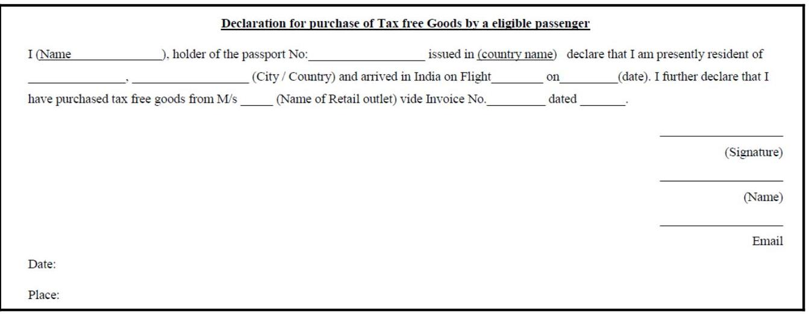
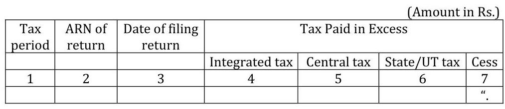
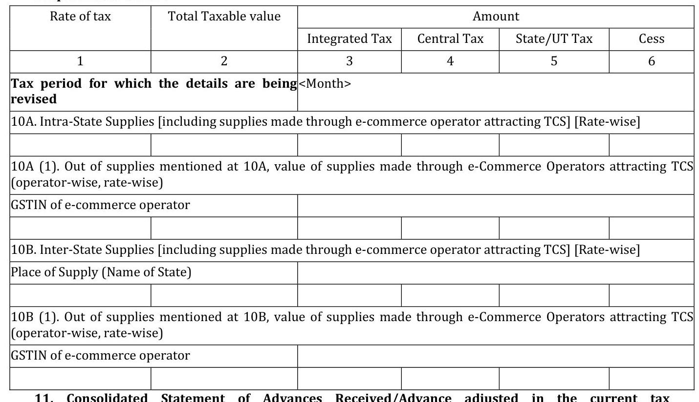
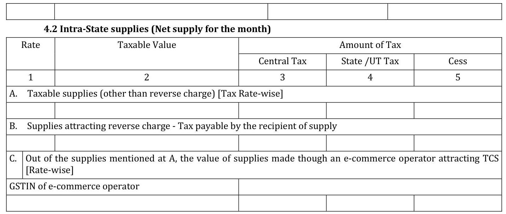

# All about GST Refunds 

A Reference Manual

Version 2.0
$1^{\text {st }}$ July 2020

DgTS - Cbic, Bengaluru \& CGST (GST) Bengaluru Zone

# A Manual For the GST HelpCentres 

The information in this Reference Manual is intended only to provide a general overview and is not intended to be treated as legal advice or opinion. For greater details, you are requested to refer to the respective CGST/SGST/UTGST/IGST Acts, Rules, Notifications, Circulars \& Orders issued from time to time.

# All about GST Refunds A Reference Manual Version 2.0 

Sabrina Cano, Superintendent Principal Chief Commissioner's Office Central Tax (GST), Bengaluru Zone

Amitesh Bharat Singh
Additional Director General
Directorate General of Taxpayer Services - CBIC
Bengaluru

# Table of Contents 

Message from the Principal Chief Commissioner (Central Tax), Bengaluru Zone, Karnataka ..... 10
Message from the Director General, DGTS- CBIC, New Delhi ..... 11
Message from the Chief Commissioner, Bengaluru Zone ..... 12
Prologue ..... 13
Introduction ..... 15
'Supply' in GST ..... 19
Input Tax Credits in GST ..... 21
Exports in GST ..... 24
Zero-rated supplies under GST ..... 25
Refund in GST ..... 27
Statutory provisions relating to refunds in GST ..... 27
GST Council Resolution on permitting refunds without matching and without excluding the amount of provisionally accepted input tax credit ..... 27
Types of refund in GST ..... 30
Time limits to claim a refund in GST ..... 31
The Refund Mechanism in GST ..... 33
Refund of IGST paid on Export of Goods ..... 36
The Error Codes explained ..... 38
Issues connected with the Non Transmission of Returns Data from GSTN ..... 42
Issues related to Scroll Generation ..... 43
The Role of the Exporter in Resolution of issues ..... 44
Errors in PFMS Validation and their Rectification ..... 45
Other Common EGM errors and their Rectification ..... 48
Alternate Mechanism with Officer Interface for SBs with Invoice Mismatch Error (SB005) ..... 52
Alternate Mechanism with Officer Interface for SBs with Certain Other Errors ..... 54
Restrictions on the claim of refund of IGST paid on export of goods and services ..... 55
Applying for a refund on the GST Portal ..... 58
Submitting Refund Pre-Application Form ..... 59
Documents/Statements/Undertakings/Declarations to be made along with the refund application being filed on the GST Portal ..... 61
The procedure for claiming a refund on the GST Portal ..... 68
Processing Refund Applications which are filed on the GST Portal ..... 71

Processing of Refund applications in FORM GST RFD-01A wrongly mapped on common portal when submitted by taxpayers ..... 73
C.B.I. \& C. Circular No. 104/23/2019-GST, dated 28-6-2019 ..... 73
Export promotion - Goods sent/taken out of India for Exhibition or on Consignment basis for export promotion - Clarification ..... 76
C.B.I. \& C. Circular No. 108/27/2019-GST, dated 18-7-2019 ..... 76
The time limit for processing refund claims ..... 85
Interest on delayed refunds ..... 85
Deficiency Memo ..... 86
Grant of Provisional refund ..... 87
Refund of unutilized ITC on account of zero-rated supplies made without payment of tax ..... 91
Steps for filing the application on the GST Portal for a refund of unutilized ITC on account of zero- rated supplies without payment of Tax ..... 92
Scrutiny of Refund application in respect of zero-rated supplies without payment of tax ..... 94
The formula for a refund of unutilized ITC on exports and supplies to SEZ/Developer without payment of tax - Rule 89(4) ..... 94
Calculation of the refundable amount on the GST Portal ..... 96
Recovery of refund of unutilised input tax credit or of integrated tax paid on export of goods where export proceeds not realized ..... 97
Letter of Undertaking (LUT) ..... 99
Clarifications on issues related to refund of unutilised ITC on account of zero-rated supplies ..... 101
Refund of IGST on the export of Service on payment of Tax ..... 103
Refund on account of supplies made to SEZ Unit/Developer on payment of Tax ..... 105
Procedure to track the status of refund for IGST and/or Cess paid on account of Export of Goods after logging in to the GST Portal ..... 106
Accessing the Export Ledger on the GST Portal ..... 107
Refund of tax paid on deemed exports ..... 108
Refund of Compensation Cess ..... 110
Refund of transitional credit ..... 113
Refund of accumulated ITC on account of inverted tax structure ..... 114
Formula for refund of unutilized ITC on account of inverted duty structure - Rule 89(5) ..... 115
Calculation of the refundable amount on the GST Portal ..... 116
Scrutiny of refund application for unutilised ITC on account of inverted duty structure ..... 116
Re-crediting of electronic credit ledger on account of rejection of refund claim ..... 119
Debit of electronic credit ledger using FORM GST DRC-03 ..... 120

Disbursal of refunds ..... 124
Disbursal of refund when no debit is made in the Electronic Credit Ledger ..... 126
Clarifications on other refund related issues ..... 128
Merchant Exporter ..... 128
Monetary Limit for Claiming Refund ..... 128
Interpretation of "Net ITC" ..... 128
Eligibility of ITC on stores, spares and packing material as Net ITC ..... 129
Refund of Excess Amount from the Electronic Cash Ledger ..... 130
Issues relating to refunds by taxpayers in the new UTs ..... 132
Refund of TDS/TCS deposited in excess ..... 133
Refund of Tax paid under the wrong head ..... 134
Refund under the "Others" category ..... 136
Refunds claimed by UIN entities ..... 139
International Tourist Refunds ..... 141
Refund of taxes to the retail outlets established in the departure area of an international Airport beyond immigration counters making tax free supply to an outgoing international tourist. ..... 141
Seva Bhoj Yojna - Guidelines for processing of applications for Financial Assistance - C.B.I. \& C. Circular No. 75/49/2018-GST, dated 27-12-2018 ..... 146
Refund for Bhandara, Langar, Prasadam \& Seva Bhoj - List of Nodal Offices for the processing of Refund related to UIN Entities and Seva Bhoj Yojana ..... 177
Refund applications by Canteen Stores Department (CSD) — Processing of - ..... 179
C.B.I. \& C. Circular No. 60/34/2018-GST, dated 4-9-2018] ..... 179
Area based exemption to Hill areas \& Northeast - Scheme of budgetary support under Goods and Services Tax Regime to the units located in States of Jammu \& Kashmir, Uttarakhand, Himachal Pradesh and North East including Sikkim - Ministry of Commerce \& Industry, Dept. of Industrial Policy \& Promotion, Notification F. No. 10(1)/2017-DBA- II/NER, dated 5-10-2017 ..... 184
Area Based exemption - Manual disbursal of budgetary support under GST Regime to the units located in States of Jammu \& Kashmir, Uttarakhand, Himachal Pradesh and North East including Sikkim — Procedure - Circular No. 1060/9/2017-CX., dated 27-11-2017 ..... 197
Manual disbursal of budgetary support under Goods and Services Tax (GST) regime to the units located in States of Jammu \& Kashmir, Uttarakhand, Himachal Pradesh and North East including Sikkim — Procedure - Circular No. 1061/10/2017-CX, dated 30-11-2017 ..... 207
Online registration and online filing of the claims, by the eligible units for disbursal of budgetary support under Goods and Services Tax Regime, located in States of Jammu \& Kashmir, Uttarakhand, Himachal Pradesh and North East including Sikkim - Clarification - C.B.I. \& C. Circular No. 1067/6/2018-CX, dated 5-10-2018 ..... 212

Exports - Refund of IGST on Export - Extension in SB005 alternate mechanism and revised processing in certain cases including disbursal of Compensation Cess - Circular No. 26/2019-Cus., dated 27-8-2019 ..... 217
Refunds - IGST Refunds - Mechanism to verify payments for goods exported out of India in certain cases - Circular No. 25/2019-Cus., dated 27-8-2019 ..... 218
Clarifications regarding refunds of IGST paid on import in case of specialized agencies - M.F. (D.R.) Circular No. 23/2019-Cus., dated 1-8-2019 ..... 219
Refunds of IGST paid on import in case or risky exporters - Clarification - M.F. (D.R.) Circular No. 22/2019-Cus., dated 24-7-2019 ..... 220
Refunds - IGST refunds-mechanism to verify the IGST payments for goods exported out of India in certain cases - M.F. (D.R.) Circular No. 16/2019-Cus., dated 17-6-2019 ..... 221
Refunds - IGST Export Refunds - Resolution of Errors - M.F. (D.R.) Circular No. 1/2019- Cus., dated 2-1-2019 ..... 224
IGST Export Refunds - Extension in SB005 alternate mechanism and revised processing in certain cases including disbursal of compensation cess - C.B.I. \& C. Circular No. 40/2018- Cus., dated 24-10-2018 ..... 229
IGST Refunds - Cases where IGST refunds have not been granted due to claiming higher rate of drawback or where higher rate and lower rate were identical - C.B.I. \& C. Circular No. 37/2018-Cus., dated 9-10-2018 ..... 233
IGST Refund - Sanction of pending IGST refund claims where the records have not been transmitted from the GSTN to DG Systems - M.F. (D.R.) Circular No. 33/2018-Cus., dated 19- 9-2018 ..... 235
IGST - Refund of IGST on export of goods on payment of duty - SB003 errors and extension of date in SB005 \& other cases using officer interface for rectification of errors - Clarification - M.F. (D.R.) Circular No. 22/2018-Cus., dated 18-7-2018 ..... 236
IGST - Setting up of Help Desks for refund of IGST on export of goods on payment of duty - M.F. (D.R.) Circular No. 21/2018-Cus., dated 18-7-2018 ..... 238
Exports of goods - Refund of IGST paid on exports of goods done from Non-EDI sites - M.F. (D.R.) Instruction No. 20/2018-Cus., dated 26-11-2018 ..... 240
GST - Refund of IGST on export of Goods - Extension of date in SB005 alternate mechanism cases and Clarification in other cases - Circular No. 15/2018-Cus., dated 6-6- 2018 ..... 241
E-commerce exports through Post and clarification on personal imports - Procedure - Circular No. 14/2018-Cus., dated 4-6-2018 ..... 242
E-commerce exports through Post and clarification on personal import - Procedure simplified - M.F. (D.R.) Circular No. 18/2018-Cus., dated 13-6-2018 ..... 254
Refund claim - Procedure for sanction of pending IGST refund claims where the records have not been transmitted from the GSTN to DG Systems - Circular No. 12/2018-Cus., dated 29-5-2018 ..... 255

IGST - Refund of IGST on Export-Extension of date in SB005 alternate mechanism cases \& clarifications in other cases - Circular No. 8/2018-Cus., dated 23-3-2018. ..... 259
Exports - Refund of IGST on Export - EGM Error related cases - Procedure - M.F. (D.R.) Circular No. 6/2018-Cus., dated 16-3-2018 ..... 260
Exports - Refund of IGST on Export - Invoice mis-match Cases - Alternative Mechanism with Officer Interface - Procedure - M.F. (D.R.) Circular No. 5/2018-Cus., dated 23-2-2018 ..... 263
Refunds of IGST paid on export of goods under Rule 96 of CGST Rules, 2017 - Circular No. 42/2017-Cus., dated 7-11-2017 ..... 269
Export procedure and sealing of containerized cargo under GST - Circular No. 26/2017- Cus., dated 1-7-2017 ..... 272
Export of goods - Refund of IGST paid on export of goods under Rule 96 of CGST Rules, 2017 - Instructions - Instruction No. 16/2017-Cus., dated 9-10-2017 ..... 284
Export of Goods - Refund of IGST paid on export of goods under Rule 96 of CGST Rules, 2017 - Instructions - Instruction No. 15/2017-Cus., dated 9-10-2017 ..... 285
Exemption to re-import of goods exported under duty drawback, rebate of duty or under bond on or after the 1st July, 2017 - Notification No. 45/2017-Cus., dated 30-6-2017. ..... 289
Corrigendum to Notification No. 45/2017-Cus. - M.F. (D.R.) Notification No. GSR 942(E), dated 22-7-2017 ..... 295
Exemption from Social Welfare Surcharge leviable on Integrated tax and GST Compensation Cess on imported goods - Notification No. 13/2018-Cus., dated 2-2-2018 ..... 295
Annexures ..... 297
Refund Related Forms prescribed under the GST Law ..... 298
Relevant Provisions in Laws \& Rules ..... 299
THE CENTRAL GOODS AND SERVICES TAX ACT, 2017 [Act No. 12 of 2017] - [12th April, 2017] ..... 299
THE INTEGRATED GOODS AND SERVICES TAX ACT, 2017 - [Act No. 13 of 2017] - [12th April, 2017] ..... 316
CENTRAL GOODS \& SERVICES TAX RULES, 2017 - [Notification No. 3/2017-Central Tax, dated 19-6- 2017 as amended] ..... 318
CBIC Circulars/ Orders relating to Refunds ..... 334
e-version GST Flyers ..... 338
GSTN ..... 339
REFUND USER MANUAL ..... 339
REFUND FAQ ..... 339
FORMS ..... 340
Track your refund Application on GSTN ..... 441
GSTN>Home > Help>Manuals and Videos> Refund and Letter of Undertaking ..... 441

GSTN Advisories ..... 442

डी. पी. नागेन्द्र कुमार, भा.रा.से. प्रधान मुख्य आयुक्त
(D.P. Nagendra Kumar, I.R.S.

Principal Chief Commissioner

केंद्रीय कर प्रधान मुख्य आयुक्त का कार्यालय बेंगलूरू अंयल, सी.आर. भवन, क्रीन्स रोड, बेंगलूरू-560 001

Office of the Principal Chief Commissioner of Central Tax Bengaluru Zone, C.R. Building Queen's Road, Bengaluru - 560001

Tel. : +91 8022867093, Fax : +91 8022860354
E-mail : dp.nkumar@gov.in

# MESSAGE 

As we mark the $3^{\text {rd }}$ Anniversary of GST on this $1^{\text {st }}$ of July 2020, in these somber times when the country and most of the world is battling with the COVID-19 crisis that has disrupted and unsettled normal activity all across, it is imperative that we remain alive to the important matter of bringing the economic activity back on track as soon as can be. It is going to take some effort, but is something that can be achieved and has to be done.

As an organisation, the CBIC is always willing to stand in support all taxpayers in matters relating to tax compliance. Making refund payments in time is one of the ways in which we as a Department can help to some extent in ameliorating the pains that the pandemic has brought on- and we remain proactive in that direction in this Zone. We also operate very active Help Desks on GST running across the State which have remained functioning even during the times of the lockdown. In these times of social distancing and work from home, the reply to queries through the New "Whatsapp Seva" (on +919480258909) appears to have got even more traction with the taxpayers in Karnataka. The GST Help Centre at the Headquarters at the CR Building in Bengaluru was certified as an ISO: 9000 compliant centre and remains fully committed to meet the standards laid down.

As one more step towards taxpayer facilitation, I am happy to note that the Directorate General of Taxpayer Services, Bengaluru and the CGST Bengaluru Zone together have brought out a manual on refund processes titled "All about Refunds". This is a comprehensive guide on all matters relating to GST refunds and should be a useful reference for our officers at the GST Helpdesks, the Taxpayers, the Tax Practitioners, and other tax professionals across the board.

We wish all of you to Stay Safe and Stay Healthy and that we should see the end of this crisis sooner than later.

Principal Chief Commissioner Bengaluru CGST Zone, Karnataka Bengaluru

## अलीज कृष्ण भा रा से   महानिदेशक

MANOJ KRISHNA I.R.S
DIRECTOR GENERAL

करदाता रोधा महाणिद्देश ग़लय Directorate General of Taxpayer Services सीमा शुल्क एवं जी एस टी Customs \& GST राजस्व विभाग, वित्त मशलय
Department of Revenue, Ministry of Finance प्रथम तल, फ्रेन्द्रीय राजस्व भवन्
1st Floor, Central Revenue Building, आई. पी. एस्टेट, नई दिल्ली-110109
I.P. Estate, New Delhi -110 109

दूरगाभ : 23705809 फॅपस : 23370744
Phone : 23705809 Fax : 23370744

# Message 

On this $3^{\text {rd }}$ Anniversary of GST, I am happy to note that the Directorate General of Taxpayer Services, Bengaluru and the CGST Bengaluru Zone together have brought out a manual on refund processes titled "All about Refunds". This, I hope would be useful as a reference to our officers at the GST Helpdesks, the Taxpayers, the Tax Practitioners, and other tax professionals across the board. I take this opportunity to commend and compliment ADG, DGTS, Bengaluru and all his officers involved in the preparation of this Refund Manual.

These are different and difficult times for our country and its citizens as it is for many other countries affected by the COVID-19 pandemic. No sector or segment of economy has remained unaffected by the pandemic which had an impact all across at every level of economic activity in the country. We, at the CBIC remain committed to support our taxpayers and the businesses in every possible way to deal with the present crisis. Over the past three months or so, there have been slew of steps and measures announced by the Government to help ease the situation for trade and industry as also to help tackle the pandemic. The measures have ranged across reductions in rate of tax in Customs on equipments needed to fight the crisis as also advancing the timelines for GST compliances. Technology has been leveraged by the Department to enable our officers' work from home to deal with important issues like the refund claims and also to conduct personal hearings online. We remain committed to be responsive to the taxpayers concerns and their needs. I would like to wish you all to stay safe \& healthy.

Manoj Krishna, IRS
Director General
$1^{\text {st }}$ July, 2020

M. SRI:NTVAS IRs, CHIEF COMMISSIONER

Office of the Chief Commissioner, Bengaluru Customs Zone, Central Revenue Building, P.B.No: 5400, Queens Road, Bengaluru - 560001. Karnataka State. India.

Tel (Off) : +91-80-2286 5109 Tel (Fax): +91-80-2286 2419 Email : ecu-cusblr@nic.in

# MESSAGE 

I am extremely happy to see a very detailed and comprehensive compilation of the provisions, procedures, Board's Circulars \& instructions, on GST refunds, brought out together, as single reference source, aptly titled as "Alf About GST Refunds".

The replies to the 'Frequently Asked Questions' have been very well presented. The manual is of immense use for the departmental officers as well as the stakeholders as a real source of reference.

My best complements to Shri Amitesh Bharath Singh Additional Director General Taxpayer Services, Bengaluru and Ms. Sabrina Cano Superintendent, Central Tax \& C. Ex., Bengaluru Zone for their outstanding work in preparing this excellent manual.

Date: 01.07.2020.

(M. Srinivas)

# Prologue 

July 1st, 2020, will mark the third anniversary of the Goods and Services Tax in India. There was an air of great anticipation with the ushering in of what was widely accepted to be an important achievement for the whole country. The GST came into force at midnight amid a historic midnight session in the Central Hall of Parliament. President Shri Pranab Mukherjee, Prime Minister Shri Narendra Modi, and the Finance Minister Shri Arun Jaitley addressed the joint gathering of the Parliamentarians from both houses, before the President and the Prime Minister pressed a button to mark the launch of GST. A midnight joint parliamentary session is rare - the only two times that the event took place before was to mark the occasion of the $50^{\text {th }}$ anniversary of the Quit India movement in 1992, and then to mark the $50^{\text {th }}$ anniversary of Independence Day.

With GST, India moved on to a new framework that subsumed 17 earlier taxes and surcharges - 8 from the Centre and 9 from the States - and in combining them in on a single tax base. The levy that happens now in GST is on a transaction of 'supply' is either in the form of a [Central Goods and Service Tax, CGST+ State Goods and Service Tax, SGST] combination for intrastate transactions or as an Integrated Goods and Service Tax, [IGST] for interstate transactions.

Though the COVID- 19 pandemic has been an event of unprecedented disruption and difficulty all through and led to many changes in the way we live and work. Social distancing, masks, frequent hand washes are now a way of life and important enough as instruments in protecting self and fellow citizens. In GST, the areas of taxpayer refunds and registration have been areas of focus and now even more. This is an attempt to collate and put together a compilation on all matters relating to refunds that we hope would be useful to the GST HelpDesks, to taxpayers, tax professionals, and indeed for any person who has an interest in gaining an in-depth look at the matters concerned. Capacity building and enablement at the Help Centres remain a central theme in our focus to bring better taxpayer services and putting this manual/ reference together is our way to record our appreciation for the

efforts put in by the taxpayers to generate the revenue needed for the Country's growth, development and to keep it safe. This is also our humble contribution to mark the efforts of all the officers at the HelpDesks who engage with the taxpayers often as the first point of contact through phone, messages, and emails and who would be working today to mark the completion of three years of the GST in our country.

I would also like to gratefully acknowledge the suggestions and inputs received from Shri D.P. Nagendra Kumar, Principal Chief Commissioner (GST), Bengaluru and Shri Upender Gupta, Principal Commissioner, Air Cargo (Import), Delhi Customs in the making of this compilation.

A special note of acknowledgement and recognition to the contribution of Ms. Sabrina Cano, Superintendent working with the Principal Chief Commissioner's Office (Central Tax- Bengaluru), who has in her usual quiet way, shared the responsibility and exerted a substantial effort in putting together this Manual.

Please do write to us to point out any errors or omissions that you may notice in this "All About GST Refunds" reference manual - mail us at dgtsbangalore@gov.in or to ccbz-excise@gov.in with the subject line "All about GST Refunds". You are also welcome to mail your suggestions for changes to the same e-mail ids as given above.

Amitesh Bharat Singh, IRS
Additional Director General
DGTS-CBIC, Bengaluru

# Introduction 

Goods and Services Tax (GST) in India, is a form of a Value-Added Tax (VAT). The overarching purpose of GST was to impose a broad-based tax on Consumption. It is a destination-based consumption tax.

The existing taxes before GST operated under the origin principle - the jurisdiction where the taxable activity took place levied and collected the tax. Origin based taxation created a scope at the sub-national level for a State to either export taxes onto other states or to undermine the companion State's tax base by undercutting the tax rates charged elsewhere. Levying VAT on an origin basis, as it was happening in VAT before GST meant that taxes were being charged on the value that was added to a product in a different jurisdiction, at the rates charged by those jurisdictions which could well have been different from the rates in the destination states. The Firms producing in multiple jurisdictions then had an incentive to transfer price value-added into low tax jurisdictions, for instance by charging high internal prices for intrafirm sales out of them.

The change in GST to the destination principle places all firms competing in a given jurisdiction on an even footing. Thus, the tax paid on any taxable supply made under GST is determined by a set of rules to decide where this tax revenue will be destined to. These ground rules are contained in Sections 8 through 14 of the Integrated Goods and Services Tax (IGST) Act, 2017 that determine the nature and the place of consumption for every transaction of 'supply'. All revenues in GST accrue to the jurisdiction where the supply is said to be consumed. There is a widespread consensus now that the destination principle, with revenue accruing to the country (and at a sub-national level to the State/UT) where the final consumption occurs, is preferable to the origin principle from both a theoretical and practical standpoint.

The GST has unified the tax base at the Federal and the sub-national level in the Indian context. This has happened through uniformity of laws, tax rates, and the adoption of a single taxable event across both national and subnational levels. The taxable event in Indian GST is that of 'supply' which is

more broad-based than any single taxable event like manufacture or sale, in the taxes that it replaced. In GST, we have managed to achieve compliance symmetry (Identical compliance requirement for inter- and intra-provincial traders) - it was desirable to have such a compliance symmetry to have significant cost savings and efficiency at the firm level and thereby, at an aggregate level for the nation.

In general, the GST is imposed at every stage of the economic process and a deduction of taxes on purchases is allowed by all but the final consumer. The mechanism of input tax credits through the supply chain, except by the final consumer, ensures the neutrality of the tax, whatever the nature of the product, the structure of the distribution chain, and the means used for its delivery (e.g. retail stores, physical delivery, Internet downloads). There is a clear mechanism in place that allows for a credit of the tax levied on transactions between businesses. The system is based on tax collection in a staged process, with successive businesses entitled to deduct input tax on "capital goods", "inputs" or "input services" and account for a tax on "outward supplies". As a result of the staged payment system, GST thereby "flows through the businesses" to tax supplies made to final consumers. Following the destination principle, in GST exports are not subject to tax with a refund of input taxes (that is "zero-rated") being made available, but imports are taxed (through the impost of an Integrated Goods and Services Tax -IGST) on the same basis and at the same rates as domestic supplies. These features give GST one of its main characteristics, that of neutrality.

This destination principle is sanctioned by the World Trade Organization (WTO) rules. In the predecessor GATT System that existed before the WTO, addenda to Article XVI of the 1947 General Agreement on Trade and Tariffs (GATT) excluded explicitly that such an exemption could be considered a subsidy: The exemption of an exported product from duties or taxes borne by the like product when destined for domestic consumption or the remission of such duties or taxes in amounts not over those which have accrued were not deemed to be a subsidy. Consequently, Article 6.4 of the 1947 General Agreement stipulated that: No product of the territory of any contracting party imported into the territory of any other contracting party shall be

subject to ... countervailing duty by reason of [such exemptions or refunds]. This principle was not changed within the framework of the WTO system, since Article I of the Uruguay Round Subsidies Agreement, which defines a subsidy, stipulates once again in footnote 1 that: the exemption of an exported product from duties or taxes borne by the like product when destined for domestic consumption or the remission of such duties or taxes in amounts not in excess of those which have accrued, shall not be deemed to be a subsidy1.

In GST law, the Integrated Goods and Service Tax (IGST) Act, 2017, in Chapter VII deals with the ZERO RATED SUPPLY. Section 16 of the IGST Act defines a "zero-rated supply" to mean any of the following supplies of goods or services or both, namely:-
(a) Export of goods or services or both; or
(b) Supply of goods or services or both to a Special Economic Zone developer or a Special Economic Zone unit.

The credit of input tax can also be availed for making zero-rated supplies subject to the provisions of sub-section (5) of section 17 of the Central Goods and Services Tax Act, 2017 (CGST Act). Under the provisions of section 54 of the Central Goods and Services Tax Act any person registered under GST and making zero-rated supply is eligible to claim a refund under either of the following options: -
(a) He may supply goods or services or both under bond or Letter of Undertaking, without payment of integrated tax and claim refund of the unutilised input tax credit; or
(b) He may supply goods or services or both, on payment of integrated tax and claim a refund of such tax paid on goods or services or both supplied.

More generally, the following kinds of Refunds are available to eligible taxpayers under GST:
i. A refund of tax paid on zero-rated supplies of goods or services or both or on inputs or input services used in making such zero-rated supplies,

[^0]
[^0]:    ${ }^{1}$ AGREEMENT ON SUBSIDIES AND COUNTERVAILING MEASURES| https://www.wto.org/english/docs_e/legal_e/24-scm.pdf

ii. A Refund of tax on the supply of goods regarded as deemed exports,
iii. A refund of the unutilized input tax credit.

# 'Supply' in GST 

In GST, the taxable event is the event of a "Supply". In ordinary language, supply means make (something needed or wanted) available to someone; to provide. Supply could be an interstate supply or an intrastate one.

The GST is levied in the form of a Central Goods and Services Tax (CGST) and a State or Union Territory Goods and Services Tax (SGST or UTGST) on all intra-State supplies of goods or services or both, except on the supply of alcoholic liquor for human consumption. The value taken for the charge of the tax is determined under Section 15 of the CGST Act and the tax is calculated at such rates, not exceeding twenty percent, as may be notified by the Government on the recommendations of the Council. An Integrated Goods and Services Tax (IGST) is levied instead of a Central Goods and Services Tax and a State or Union Territory Goods and Services Tax whenever the supply happens to be an interstate one.

In terms of Section 7 of the CGST Act that deals with the "Scope of Supply", "supply" includes all forms of supply of goods or services or both such as sale, transfer, barter, exchange, licence, rental, lease or disposal made or agreed to be made for a consideration by a person in the course or furtherance of business. Thus, the general tests for a transaction to be reckoned as a supply or not are two - the first being the Business Test (whether the supply is made in the course or furtherance of business) AND the Second is the Test of the Consideration for the particular supply concerned in the transaction that may have been made or agreed to be made. However, in GST law, the Business Test mentioned above does not apply to the situation of import of services for a consideration. Any Import of Services thus become liable to tax whether or not made in the course or furtherance of business. Besides, there is a set of activities specified in Schedule I to the CGST Act, made or agreed to be made without any consideration, that if engaged in have to be construed as being an instance of a 'supply'.

Schedule II to the CGST Act contains a listing of activities or transactions that constitute a supply in the sense of the meaning assigned to the expression but

are to be treated either as a supply of goods or supply of services to ease the matters relating to the determination of the place of supply and matters relating to the rate of tax attracted on the particular transactions.

Furthermore, Activities or transactions specified in Schedule III to the CGST Act; or such activities or transactions undertaken by the Central Government, a State Government or any local authority in which they are engaged as public authorities, as may be notified by the Government on the recommendations of the Council are to be treated neither as a supply of goods nor a supply of services.

# Input Tax Credits in GST 

Chapter V of the CGST Act deals with Input Tax Credit (ITC).
Section 16 of the CGST Act entitles every registered person to take credit of input tax charged on any supply (of goods or services or both) to him which are used or intended to be used in the course or furtherance of his business.

Credit is permitted to be taken on 'capital goods', 'inputs', and on 'input services'. The entitlement to credit is subject to certain prescribed conditions and restrictions. The ITC is made available to the registered person as a credit in his electronic credit ledger. To take credit, the registered person should have a tax invoice or debit note (or any other prescribed taxpaying documents) issued by a GST registered supplier and he should also have received the goods or services or both on which the ITC is sought to be taken. Section 49 of the CGST Act deals with how the input tax credit is credited to the electronic credit ledger of the registered taxpayer.

The CGST law - Section 16 (2) (c) \& (d) also entails that before the ITC is taken by the Recipient of either goods or services or both, the tax charged in respect of such input supplies should have been actually paid to the Government, either in cash or through utilization of input tax credit admissible in respect of the such a supply; and that the supplier making the input supplies furnish the return under section 39 .

In terms of the $1^{\text {st }}$, and $2^{\text {nd }}$ Provisos to Section 16(2)(c) of the CGST Act, where the goods against an invoice are received in lots or installments, the registered person is entitled to take credit upon receipt of the last lot or installment. Besides, it is also stipulated that the recipient of input supplies (either goods or services or both) should pay the amount towards the value of supply along with tax payable thereon within a period of one hundred and eighty days from the date of issue of invoice by the supplier of goods or services or both, other than the supplies on which tax is payable on reverse charge basis- in case, the stipulated payments are not made in this time of 180 days an amount equal to

the input tax credit availed by the recipient would be added to his output tax liability of the recipient, along with interest thereon.
The $3^{\text {rd }}$ Proviso to Section 16(2) (c) of the CGST Act deals with the reverse charge situations and provides that the recipient of goods and services or both, is entitled to avail of the credit of input tax on payment made by him of the amount towards the value of supply of goods or services or both along with tax payable thereon.

Section 16 (3) of the CGST Act disallows the registered person from claiming input tax credit on the tax component of the cost of capital goods and plant and machinery that has been claimed as depreciation on under the provisions of the Income-tax Act, 1961 (43 of 1961). Section 16 (4) permits input tax credit in respect of any invoice or debit note for the supply of goods or services or both but puts a timeline within which such a credit can be taken.

The amount of input tax credit is restricted to so much of the input tax as is attributable to the purposes of his business - in cases where the goods or services or both are used by the registered person partly for any business and partly for other purposes [Section 17(1) of the CGST Act] - this is a practice consistent with the laws and practices in many other tax jurisdictions outside India which follow GST/ VAT models. In cases where the goods or services or both are used by the registered person partly for effecting taxable supplies including zero-rated supplies and partly for effecting exempt supplies under the said Acts, the amount of credit is restricted to the input tax as can be attributed to the said taxable supplies including zero-rated supplies [Section 17(2) of the CGST Act]. The value of exempt supply can be worked out using [Section 17(3) of the CGST Act]. Section 17(4) of the CGST Act gives two options on the manner of taking ITC, either one of which may be exercised, to a banking company or a financial institution including a non-banking financial company, engaged in supplying services by way of accepting deposits, extending loans or advances.

Section 17 (5) restricts the input tax credit from being available in respect of certain input supplies - like on certain classes of motor vehicles, vessels, and aircraft, on food and beverages, outdoor catering, beauty treatment, health

services, cosmetic and plastic surgery, life insurance, etc. However, some of these exclusions are not absolute and there are specific situations in which ITC can be taken on some such supplies.

Section 18 of the CGST Act makes input tax credit available in respect of inputs and capital goods sent for a job-work, subject to observance of stipulated conditions.

Section 20 of the CGST Act deals with the manner of distribution of credit by an "Input Service Distributor".

The framework of the input tax credit mechanism outlined above applies to all three taxes in GST - the central tax, the integrated tax, and the State Tax.

# Exports in GST 

In terms of Section 2 (5) of the IGST Act, "export of goods" with its grammatical variations and cognate expressions, means taking goods out of India to a place outside India. An "export of services" in terms of Section 2(6) of the IGST Act means the supply of any service when, -
(i) The supplier of service is located in India;
(ii) The recipient of service is located outside India
(iii) The place of supply of service is outside India
(iv) The payment for such service has been received by the supplier of service in convertible foreign exchange [or in Indian rupees wherever permitted by the Reserve Bank of India]; and
(v) The supplier of service and the recipient of service are not merely establishments of a distinct person

In GST certain establishments are treated as establishments of distinct persons where a person has -
(i) An establishment in India and any other establishment outside India;
(ii) An establishment in a State or Union territory and any other establishment outside that State or Union territory; or
(iii) An establishment in a State or Union territory and any other establishment registered within that State or Union territory.

The location of the supplier of service, the location of the recipient of service, and the place of supply of service are determinable in terms of Sections 2(15) and Section 2(14) of the IGST Act. In cases where the location of the supplier or location of the recipient is outside India, the place of supply of the concerned service can be determined with reference to provisions of Section 13 of the IGST Act.

# Zero-rated supplies under GST 

Export of goods or services or both, and the supply of goods or services or both, to a Special Economic Zone developer or a Special Economic Zone unit are zero-rated as per Section 16(1)(a) \& (b) respectively of the IGST Act, 2017.

By zero-rating it is meant that the tax impact on the entire supply chain leading up to the particular transaction that is being "Zero Rated" is made tax free i.e. there is no burden of tax to be borne either on the inputs leading up to the particular outward supply or on the outward supply itself. [In terms of Section 2 (83) of the CGST Act 2017, "outward supply" in relation to a taxable person, means a supply of goods or services or both, whether by sale, transfer, barter, exchange, licence, rental, lease or disposal or any other mode, made or agreed to be made by such person in the course or furtherance of business.]

Zero- rating in GST implies the following: -
i. The credit of input tax may be availed for making zero-rated supplies; notwithstanding that such supply may be an exempt supply (note: credit eligibility still needs to be checked with reference to terms of provisions of Chapter V of the CGST Act, 2017).
ii. A registered person making zero rated supply shall be eligible to claim refund in accordance with the provisions of section 54 of the CGST Act under either of the following options, namely :-
(a) he may supply goods or services or both under bond or Letter of Undertaking, without payment of integrated tax and claim refund of unutilised input tax credit; or
(b) he may supply goods or services or both, on payment of integrated tax and claim refund of such tax paid on goods or services or both supplied.

The Zero- Rated situations can be contrasted with the other situation where a particular supply under the GST has been exempted from the charge of the tax - in the latter situation, it is only that the outward supply or the output that is

exempted from tax, but the tax borne on all the inputs that may have gone into making this outward supply is not refunded. The essence of zero-rating is thus, to make Indian goods and services competitive in the international market by ensuring that domestic taxes do not get added as a cost in exports.

The objective of zero-rating of exports and supplies to SEZ/SEZ Developer is achieved through the provision contained in Section 16(3) of the IGST Act, 2017.

# Refund in GST 

When tax, interest, or any other amount is paid to the Government more than the liability incurred or accrued, then a refund situation arises. In terms of the explanation to Section 54 of the CGST Act, "refund" includes a refund of tax paid on zero-rated supplies of goods or services or both or on inputs or input services used in making such zero-rated supplies, or refund of tax on the supply of goods regarded as deemed exports, or refund of the unutilized input tax credit.

## Statutory provisions relating to refunds in GST

Chapter XI of the CGST Act, 2017, in Sections 54 to 56 deal with refunds under GST. The procedure for claiming refunds is contained in Chapter X of the CGST Rules, 2017 under Rules 89 to 97A.

## GST Council Resolution on permitting refunds without matching and without excluding the amount of provisionally accepted input tax credit

Since the functionality of furnishing of FORM GSTR-2 and FORM GSTR-3 remains unimplemented, it has been decided by the GST Council to sanction refund of provisionally accepted input tax credit. However, the applicants applying for refund must give an undertaking to the effect that the amount of refund sanctioned would be paid back to the Government with interest in case it is found subsequently that the requirements of clause (c) of sub-section (2) of section 16 read with sub-section (2) of section 42 of the CGST Act have not been complied with in respect of the amount refunded. This undertaking should be submitted electronically along with the refund claim

The concerned portion of the Minutes of 24th GST Council Meeting held on 16 December 2017 is reproduced below:

# Agenda item 3: 

Any other agenda item with the permission of the Chairperson

## (i) Refund of provisionally accepted input tax credit

8. Introducing this agenda item, the Secretary stated that as no automated refund system had been operationalised as yet, the refund applications were being filed online and then the applicants would take a hard copy of the same to the jurisdictional officer for processing the refund claim manually, after which a single order would be passed. He stated that some officers in the field had raised a doubt that as per the law, refund could be given only if the inward and outward supplies were matched and tax was paid on the supply. He stated that as presently no matching was possible, it was proposed to take an undertaking as part of refund application itself that the amount of refund would be paid back to the Government in case it was subsequently found that the tax had not been paid on the supply as required under Section 16(2)(c) of the CGST Act/SGST Act or the inward and the outward supply involving the refund claim did not match (requirements under Sections 41 and 42 of CGST/SGST Act). He stated that it was proposed to allow following refunds (both provisional and final) without matching and without excluding the amount of provisionally accepted input tax credit: (i) Unutilised input tax credit in case of zero rated supplies (exports and supplies to SEZs) of goods or services or both; (ii) Unutilised input tax credit in case of inverted duty structure in case of goods (including supply of goods to merchant exporters); (iii) IGST paid on zero rated supplies (exports and supplies to SEZs) of goods or services or both; (iv) IGST or CGST/SGST/UTGST paid on deemed export of goods subject to furnishing an undertaking as part of refund application itself that the amount of refund would be paid back to the Government in case it is found subsequently that the requirement of Section 16(2)(c) read with Section 42 (2) of the CGST/SGST Act have not been complied with. He stated that this relaxation was proposed by exercising the power conferred under Section 148 of the CGST/SGST Act regarding special procedure for certain processes.

8.1. The Hon'ble Minister from West Bengal strongly supported the proposal. He stated that since GSTR-2 stood suspended, no matching of inward .and outward supply was possible, and therefore, it was a very good proposal to permit refund without matching. The Hon'ble Minister from Tamil Nadu had circulated a written speech in which it was mentioned that Section 148 of the CGST/SGST Act had no non-obstante ("notwithstanding clause") and hence, it needed to be examined whether the special process prescribed under Section 148 would over-ride the substantive provision of Section 54(6) of the CGST/SGST Act which required that any claim for refund on account of zero rated supply of goods or services or both made by registered persons be refunded on a provisional basis to the extent of $90 \%$ of the total amount so claimed, excluding the amount of input tax credit provisionally accepted. In the written speech, he also pointed out that refund based on GSTR-3B returns might lead to bogus claim of input tax credit by unscrupulous taxpayers taking advantage of non-matching of input tax credit. He suggested to stipulate sufficient safeguards for the revenue as well as for the Departmental officers. In view of this, he recommended that the matter be examined in further detail as it involved substantial question of law. However, the Hon'ble Minister from Tamil Nadu did not express these apprehensions during the Council Meeting. No other Member expressed any reservation on the proposal. The Hon'ble Chairperson suggested that the proposal made by the Secretary could be approved. The Council approved the same.
9. for agenda item 3(i), the Council approved the following:
a. to allow following refunds (both provisional and final) without matching and without excluding the amount of provisionally accepted input tax credit: (i) Unutilised input tax credit in case of zero rated supplies (exports and supplies to SEZs) of goods or services or both; (ii) Unutilised input tax credit in case of inverted duty structure in case of goods (including supply of goods to merchant exporters); (iii) IGST paid on zero rated supplies (exports and supplies to SEZs) of goods or services or both; (iv) IGST or CGST/SGST/UTGST paid on deemed export of goods.
b. Such refund shall be given subject to furnishing an undertaking as part of refund application itself that the amount of refund would be paid back

to the Government in case it is found subsequently that the requirement of Section 16(2)(c) read with Section 42 (2) of the CGST/SGST Act have not been complied with in respect of the amount refunded

# Types of refund in GST 

Refunds under GST are broadly categorized as follows:
(a) Refund of tax paid on supplies of goods or services or both
a. Refund of tax paid on export of good with payment of tax
b. Refund of tax paid on export of services with payment of tax
c. Refund of tax paid on supplies made to SEZ Unit/SEZ Developer with payment of tax
d. Refund to the supplier of tax paid on deemed export supplies.
e. Refund to the recipient of tax paid on deemed export supplies.
(b) Refund of unutilized ITC
a. Refund of unutilized input tax credit (ITC) on account of exports without payment of tax.
b. Refund of unutilized ITC on account of supplies made to SEZ Unit/SEZ Developer without payment of tax.
c. Refund of unutilized ITC on account of accumulation due to an inverted tax structure.
(c) Refund of balance in electronic cash ledger
(d) Refund of advance tax deposited by Casual Taxpayer or Non-resident Taxpayer
(e) Refund of tax paid on supplies received by Embassies, Consulates, Agencies of UNO, etc.
(f) Others
a. Refund of excess payment of tax.
b. Refund of tax paid on an intra-State supply which is subsequently held to be inter-State supply and vice versa.
c. Refund on account of assessment/provisional assessment/appeal/any other order.
d. Refund on account of "any other" ground or reason.

# Time limits to claim a refund in GST 

The time limit for claiming a refund is two years from the relevant date. However, in terms of the Explanation to Section 54, the 'relevant date' or the reference date is different for different situations as indicated in the following table: -

Table 1

|  |  | refund arises |
| :-- | :-- | :-- |
| $\mathbf{6}$ | Refund of tax paid provisionally | Date of adjustment of tax   after the final assessment |
| $\mathbf{7}$ | Refund claimed by a person other than the supplier | Date of receipt of goods or   services or both by such   person |
| $\mathbf{8}$ | In any other case | Date of payment of tax |

A refund application filed after correction of deficiency is treated as a fresh refund application, and such a rectified refund application, submitted after correction of deficiencies, will also have to be submitted within 2 years of the relevant date as defined in the explanation after sub-section (14) of section 54 of the CGST Act.

In wake of COVID pandemic, date further extended till 31.08.2020 for certain compliance under GST laws and till 30.09.2020 for certain compliance Customs, Central Excise and Service Tax Laws - https://www.cbic.gov.in/htdocs-cbec/home_links/tickers as of 30.6.2020 at 19:30 hours

# The Refund Mechanism in GST 

After the rollout of GST w.e.f. 1-7-2017, on account of the unavailability of electronic refund module on the common portal, a temporary mechanism had to be devised and implemented wherein applicants were required to file the refund application in FORM GST RFD-01A on the common portal, take a print out of the same and submit it physically to the jurisdictional tax office along ith all supporting documents. Further processing of these refund applications, i.e. issuance of acknowledgment of the refund application, issuance of deficiency memo, the passing of provisional/final order, payment advice, etc., was also being done manually.

RULE 97A of the CGST Rules had enabled the Manual filing and processing of refund claims- It states that notwithstanding anything contained in CHAPTER X of the CGST Rules 2017, dealing with REFUND and with respect to any process or procedure prescribed for refunds, any reference to electronic filing of an application, intimation, reply, declaration, statement or electronic issuance of a notice, order or certificate on the common portal shall, in respect of that process or procedure, include manual filing of the said application, intimation, reply, declaration, statement or issuance of the said notice, order or certificate in the concerned Forms as appended were appended to the CGST rules.

To make the process of submission of the refund application electronic, Circular No. 79/53/2018-GST, dated 31-12-2018 was issued wherein it was specified that the refund application in FORM GST RFD-01A, along with all supporting documents, is to be made electronically on the GST portal. However, various post submission stages of processing of the refund application continued to be manual.

The necessary capabilities for making the refund procedure fully electronic, in which all steps of submission and processing were undertaken electronically, was deployed on the common portal with effect from 26-9-2019 - the refund from this date on is processed by a single tax authority, in contrast to the earlier treatment where the claim was processed for the State or the Central

part by the concerned tax agency and processed by the disbursement was processed by the accounting departments of state and central individually.

The refund mechanism under GST is now fully automated. Barring the refund of IGST paid on the export of goods, the following types of refunds are dealt with under the provisions of Rule 89 of the CGST Rules.

With effect from 26-9-2019, the claim in respect of the following types of refund is now to be filed online on the GST Portal in Form GST RFD 01 and is processed electronically:
(a) Refund of unutilized input tax credit (ITC) on account of exports without payment of tax.
(b) Refund of tax paid on export of services with payment of tax.
(c) Refund of unutilized ITC on account of supplies made to SEZ Unit/SEZ Developer without payment of tax.
(d) Refund of tax paid on supplies made to SEZ Unit/SEZ Developer with payment of tax.
(e) Refund of unutilized ITC on account of accumulation due to an inverted tax structure.
(f) Refund to a supplier of tax paid on deemed export supplies.
(g) Refund to a recipient of tax paid on deemed export supplies.
(h) Refund of excess balance in the electronic cash ledger.
(i) Refund of excess payment of tax.
(j) Refund of tax paid on an intra-State supply which is subsequently held to be inter-State supply and vice versa.
(k) Refund on account of assessment / provisional assessment/appeal/any other order.
(l) Refund on account of "any other" ground or reason.

In case an exporter makes supplies of goods out of India on payment of integrated tax, the refund process is governed by Rule 96 of the GST Rules. The refund in such cases shall be processed by the system

designated by the Customs Department. This does not apply to the export of services out of India.

In all other cases, the refund application shall be processed by the proper officers under GST from the Centre or the State Tax Administration.

# Refund of IGST paid on Export of Goods 

The case of a refund of the IGST paid on exports of goods is dealt with under Rule 96 of the CGST Rules, 2017. The most important point here is that there is no specific form that needs to be filled out for claiming refund of IGST paid on export of goods- As per Rule 96(1) of the CGST Rules, 2017, the shipping bill filed by an exporter of goods shall be deemed to be an application for refund of IGST paid on the goods exported out of India.

Such an application is deemed to have been filed only when:
i. The person in charge of the conveyance carrying the export goods duly files an export manifest or an export report covering the number and the date of shipping bills or bills of export; and
ii. The applicant has furnished a valid return in FORM GSTR-3 or FORM GSTR-3B, as the case may be. The term valid return means a return furnished under section 39(1) of the GST Act, 2017 on which self-assessed tax has been paid in full.

Filing of a correct EGM is a must for treating the shipping bill or bill of export as a refund claim. The details of the relevant export invoices contained in FORM GSTR-1 are transmitted electronically by the GST portal to the Customs system and the said system, in turn, transmits back to the GST portal a confirmation that the goods covered by the said invoices have been exported out of India.

Filing of a valid return in GSTR 3B is another pre-condition for considering the shipping bill/bill of export as the claim for refund. Upon receipt of information regarding furnishing of a valid return in FORM GSTR-3B from the common portal the Customs System, processes the claim for refund and an amount equal to the integrated tax paid in respect of each shipping bill or bill of export is electronically credited to the bank account of the applicant mentioned in the taxpayer exporter's registration particulars. Shipping Bill formats (both manual/ electronic) have been modified to make them congruent with the requirements of the IGST law.

In cases where the exporter has filed the GSTR 3B and the information furnished by the exporter in the returns GSTR 1 and GSTR 3B matches with the details filed by them in the Shipping Bills, the refunds are disbursed to the bank account of the exporter.

Remember to file your GSTR 3B and the GSTR 1 details in time; ensure that the details entered in these returns concerning what has been claimed as Exports matches with the details declared in the Shipping Bills- this will ensure that there are no unnecessary hitches in the clearance of your claims for refunds by the Customs Authority concerned.

IGST Refund module for exports is operational in ICES since 10.10.2017. The procedure for refund of IGST paid on export of goods under Rule 96 of CGST Rules, 2017 for all EDI locations, was provided vide instruction 15/2017Customs, dated 9-10-2017 issued from F. No. 450/119/2017-Cus IV. The IGST refund module has been designed in line with the Rule 96 of the CGST Rules and has an in built mechanism to automatically grant refund after validating the Shipping Bill data with available in ICES against the GST Returns data transmitted by GSTN. The matching between the two data sources is done at Invoice level and any mis-match of the laid down parameters returns following error/response codes:

| Code | Meaning |
| :-- | :-- |
| SB000 | Invoice successfully validated |
| SBV00 | SB already validated successfully |
| SB001 | Invalid SB details |
| SB002 | EGM not filed |
| SB003 | GSTIN mismatch |
| SB004 | Invoice already received and validated |
| SB005 | Invalid Invoice Number |
| SB006 | Gateway EGM not available |

If the necessary matching is successful, ICES shall process the claim for refund and the relevant amount of IGST paid with respect to each Shipping Bill or Bill of export shall be electronically credited to the exporter's bank account as mentioned with the Customs authorities
M.F. (D.R.) Instruction No. 20/2018-Cus., dated 26-11-2018 issued from F. No. 450/119/2017-Cus. IV (Pt-I) deals with the Refund of IGST paid on exports of goods done from Non-EDI sites. The facility to disburse IGST refund of goods exported from Non-EDI locations is provided by DG (Systems). The procedure for processing IGST refund claims for exports made from Non-EDI sites, indicated in this Instruction, are:
(i) Firstly, the export data is to be captured using offline utilities and transmitted by the field formations to DG (Systems) by email.
(ii) The data is then uploaded for verification and final submission by the Customs officer in ICES at the nearest EDI site.
(iii) The refund scroll is then generated for the verified SBs after these are matched with the GST Returns data received from GSTN;
(iv) A public inquiry has been made available on ICEGATE website for checking the details and IGST status of manual SBs verified in ICES.
(v) Specific IGST related errors or mismatches can also be checked by an importer/Customs Broker for his SBs using his ICEGATE login.
(vi) It is only when a SB is verified by the Customs officer in ICES does it become ready for the IGST validation procedure.

# The Error Codes explained 

## (i) SB000: Successfully Validated

This response code comes when all the decided parameters like GSTIN, SB number, Invoice Number etc. match between GSTN and Customs databases. This code implies that the SB is ripe for inclusion in the IGST refund scroll.

However, it might happen that even with SB000, the SB does not appear in the refund scroll. This could be due to:
a) The exports might have been made under bond or LUT, hence not liable for refund.
b) If a shipping bill covers multiple invoices, few of the invoices might have been successfully validated with code SB000 whereas other invoices might be stuck with any of the other errors.
c) Higher rate of Drawback has been claimed for that SB, thus making the SB ineligible for IGST refund.
d) Where the IGST claim amount is less than Rs. 1000/-.

In all the above cases, the scroll amount (check SB Wise IGST Claimed Status Report) shall automatically become zero and the SBs shall not be included in the refund scroll. There are two more reasons where the SBs will figure in the Temporary IGST Scroll but not in the Final Scroll. This could happen if there is an alert/suspension on the IEC in ICES or if the account of the IEC is not validated by PFMS. These cases have been elaborated below.

In respect of (a) above, there may be cases that the exporter has erroneously declared exports under LUT or zero IGST amount paid in the Shipping Bill while actually having declared and paid it in the GST Returns. Such cases can be dealt with through the officer interface.

# (ii) SB001: Invalid Shipping Bill Number 

This may occur due to a mismatch between the SB No. furnished in GSTR$1 / 6 \mathrm{~A}$ and the SB No. with customs. The possible reason for such mismatch could be a clerical error made by the exporter at the time of filing of GSTR$1 / 6 \mathrm{~A}$, which can be rectified by making amendments in GSTR-1 by using Form 9A. Form 9A has been made available by GSTN w.e.f 15.12.2017 in exporter's login at the GST Common Portal.

# (iii) SB002: EGM not filed 

Exporter may approach the Shipping Lines to file the EGM immediately. If EGM is already filed by shipping Line correctly, "Revalidate EGM" option may be used by EGM Officer.

## (iv) SB003: GSTIN mismatch

This error occurs when GSTIN declared in the SB does not match with the GSTIN used to file the corresponding GST Returns. In this case too, the Exporter may be asked to make necessary adjustments in GSTR-1 by use of amendment Form 9A. If, however, the exporter has declared PAN instead of GSTIN in the Shipping Bill, the option to sanction the refund through officer interface shall be available, provided that the PAN given in the SB matches with the PAN of the GSTIN used to file the returns. Even in cases where the exporter has used one GSTIN to file the returns and another GSTIN issued on the same PAN to file the SB, officer interface can be used to sanction the refund. Detailed procedure is given in Annexure D.

## (v) SB004: Record already received

This error code occurs due to duplicate/repeat transmission of SB-Invoice record from GSTN. The previous transmission would have already been validated with SB000 by ICES. Since these invoices are already validated, this response code may not be treated as an error. The scroll status of such SBs can be checked. If, however, the corresponding SBs are not getting scrolled out despite having SB004 response code, the reasons could be any of those listed above for SB000 cases.

## (vi) SB005: Invalid Invoice Number

This is the most common error faced by the exporters, which occurs due to mismatch of invoice number as declared in the Invoice Table in the SB and that declared in the GSTR 1 for the same supply. This can happen due to:
a) Typographical mistake while entering data in GSTR 1 or the SB.
b) The exporter uses two sets of invoices, one invoice for GST and another invoice for exports resulting in mismatch of invoice numbers.

After the implementation of GST, it was explained that the details an exporter is required to enter in the "invoice" column while filing the SB pertains to the invoice issued by him compliant to GST Invoice Rules. The invoice number shall be matched with GSTN to validate exports and IGST payment. It was understood that there would not be any difference between Commercial Invoice and GST Invoice after GST since as per the GST Laws, the IGST is to be paid on the actual transaction value of the supply between the exporter and the consignee, which should be the same as the one declared on the commercial invoice. However, cases have been noticed on the continuing use of separate commercial invoice leading to mismatch. If SB005 is due to a data entry mistake in GSTR 1, it can be amended now in Form 9A. But any mistake in the SB cannot be amended once EGM is filed. Also, if the exporter has indeed used a separate invoice in the SB, he cannot include that in his GSTR 1 in lieu of his GST Invoice. Thus SB005 error, largely, cannot be corrected by any amendment either in GSTR 1 or in the Shipping Bill. It is advised that the exporters not repeat this mistake and ensure that the same GST compliant export invoice is declared at both ends.

# (vii) SB006: Gateway EGM not available 

In case of ICDs, if the Gateway EGM is not filed electronically or is stuck in some error, response code SB006 shall appear. The EGM shall have to be filed in ICES at the gateway port. Gateway EGM pendency and error reports can be viewed in New MIS role. The Gateway EGM details can also be checked by the exporters on ICEGATE website. In case of pending Gateway EGMs, Shipping Lines may be approached at gateway ports to file supplementary EGMs. The essential steps to file the gateway EGM successfully are:
a) File Train/Truck Summary immediately after cargo leaves the ICD.
b) Ensure that shipping Line mentions the ICD SB in his EGM filed at gateway port along with the transference copy received from gateway port.
c) Errors may be rectified through an amendment in Service Centre and approved by the proper officer. Some of the common EGM errors and their corrective action have been elaborated in Annexure B.

# (viii) SBV00 - SB already validated 

This response code comes in cases of SBs which had certain mismatch error(s) but was validated and sanctioned through the officer interface utility as detailed in Annexure C and D. Even for those single invoice SBs with invoice mismatch where the refund was sanctioned as per the interim procedure mentioned under para (vi) above, SBV00 shall appear. Since these SBs are already validated, this response code may not be treated as an error. The scroll status of these SBs shall also be "Ready" in the IGST Claimed Status Report.

## Issues connected with the Non Transmission of Returns Data from GSTN

The above error codes can be seen by the field officer in the GSTN Integration Status Report in NewMIS. But this report includes only those SBs on which the IGST validation procedure is run. This view is also available to exporters in their ICEGATE login. As mentioned above, the validation procedure for IGST refund is run only for those SBs where EGM has been filed and for which the GSTN has transmitted the GSTR 1 returns data to Customs.

There are primarily two conditions for GSTN to transmit the data:
a) Both, GSTR1/6A and GSTR3B should have been filed for that supply
b) Invoice details (Invoice no, Invoice date or Port Code) are missing or are incorrect for that supply in GSTR 1
c) The cumulative IGST paid on exports declared in GSTR 3B (table 3.1 b) upto the month should not be less than that declared in GSTR1/6A

In respect of (a) and (b) above, the exporter can file or amend the returns accordingly. In case of (c), if the exporter has paid lesser amount in Table 3.1b of GSTR 3B, he can pay the remaining amount in the next GSTR 3B. Since GSTN compares the cumulative amounts, once the difference is paid and the cumulative of GSTR 3.1b becomes greater or equal to the cumulative of GSTR

1-Table 6A, GSTN would start transmitting the data to ICEGATE. However, in cases where the IGST on exports in GSTR 3B has been paid in the column for domestic interstate supplies (Table 3.1a) instead of Zero Rated Supplies, procedure as detailed in Board's Circular 12/2018 dated 29.05.2018 may be followed. If the exporter finds that even after the correct filing of returns as above, their SBs do not reflect in this report, they may be advised to write to GSTN helpdesk.

# Issues related to Scroll Generation 

The refund of IGST on exports shall be given by generating a scroll of eligible Shipping Bills. The temporary IGST refund scroll shall be generated by the authorized officer in the CLK role in ICES. Consequently, a permanent scroll shall be generated by the authorized officer in the AC_DBK role. Only those SBs for which Temporary Scroll has been generated shall be considered for the final scroll. Once the final scroll is generated, there is no further action required from the sanctioning officer. The scroll will automatically be transmitted to PFMS and there is no further need to send the scroll to the bank separately. If a Shipping Bill is appearing in Temporary IGST refund scroll but not in Permanent IGST scroll, there could be two reasons for this:
a) Account details of the exporter have not been validated by PFMS and these scrolls may appear with the "\#" tag. A report consisting of account details which are not validated by PFMS is available both in New MIS role and COM role in ICES. The exporter may be advised to furnish correct bank account details to the proper officer in order to update the same in ICES through CLK role. List of possible PFMS errors reflected in the report and their solution is enclosed as Annexure A.
b) IEC of the exporter might have been suspended by the customs house for want of arrears and e-BRC etc. The SBs shall be available in the final scroll once the suspension is revoked.

There may be cases where the money does not get credited to the exporter's account despite the SB having scrolled out successfully. Primarily, the two possible scenarios are:
i. The entire scroll gets rejected by PFMS. This happens in cases where the account details available with PFMS at the time of receipt of scroll is different than that in the scroll for one or more IECs. In such cases, the jurisdictional System Manager, after having confirmed that the money was indeed not credited to any of the exporters' accounts from that scroll, can write to ICEGATE helpdesk at once 6 giving the scroll details. The reconciliation and scroll cancellation process may take 2-3 weeks. Once the scroll is cancelled, the SBs shall again be available for the next scroll.
ii. The scroll gets accepted by PFMS but the accounts of some exporters get failed by the respective banks due to inactive or invalid account. In such cases, only the exporters with failed accounts shall not have the credit of the refund. These are referred to by PFMS as "Failed after Success" cases for which ICES Advisory 21/2018 dated 17.05.2018 may be seen for the interim procedure to be followed.

# The Role of the Exporter in Resolution of issues 

(a) The exporter has the option to check the GST validation Status for his SBs in his ICEGATE website login. This report shows the exporter the response/error codes for each of his SBs wherever data has been received from GSTN. The reasons for non-receipt of data from GSTN have already been elaborated above.
(b) The exporter also has the option to view the SB details relevant for IGST validation on the ICEGATE website. The exporter can view this while filing the GST Returns and ensure that the details are entered accurately in the Returns as well so that no mismatch occurs.
(c) In case, the exporter's account is not validated by PFMS, he may approach jurisdictional Customs Commissionerate with correct account

details and get it updated in ICES. iv. If the exporter is not getting the refund due to suspension/alert on his IEC, he may clear his dues or submit e-BRC and have the suspension revoked.

# Errors in PFMS Validation and their Rectification 

| S. No. | Error   Code | Error Description | Rectification |
| :--: | :--: | :--: | :--: |
| 1 | TBE0001 | Error in reading file, File is malformed or Failed during schema validation. | Not Applicable |
| 2 | TBE0002 | Mandatory Tags values are missing in the Header Part. | Not Applicable |
| 3 | TBE0003 | Invalid Batch Format | Not Applicable |
| 4 | TBE0004 | Duplicate Batch ID/Message ID not allowed. | Not Applicable |
| 5 | TBE0005 | Invalid Assessee Type | Not Applicable |
| 6 | TBE0006 | Same [Assessee Code, Location Code, Assessee Type, Source] already exists in PFMS. This validation will be not be applied for Update and Delete type requests. | Submit again |
| 7 | TBE0007 | [Assessee Code, Location Code, Assessee Type, Source] not exists in PFMS. This validation will be applied for Update and Delete type requests. | Submit Again |
| 8 | TBE0008 | Rejected by Bank, As per Bank Account Number is Invalid. | Check the Account Number for correctness Submit correct details: Ensure that details are |

| S. No. | Error   Code | Error Description | Rectification |
| :--: | :--: | :--: | :--: |
|  |  |  | submitted only once during the day |
| 9 | TBE0009 | Bank Name is not as per PFMS Bank Master. | Not applicable May occur only with other errors |
| 10 | TBE0010 | Bank Account details have not been provided | Check the Account Number for correctness Submit correct details |
| 11 | TBE0011 | Mobile Number should be of 10 digits only. | Not Applicable |
| 12 | TBE0012 | Invalid Value for Location Code | Inform DG systems for rectification |
| 13 | TBE0013 | Invalid Value for Division Code | Inform DG systems for rectification |
| 14 | TBE0014 | Invalid value for Purpose, It should be A/U/D. | Not Applicable |
| 15 | TBE0015 | Invalid IFSC Code. | Check the IFSC Code for correctness Submit correct details |
| 16 | TBE0016 | Rejected by Bank, Account No does not exist in Bank | Check the Account Number |

| S. No. | Error   Code | Error Description | Rectification |
| :--: | :--: | :--: | :--: |
|  |  |  | for correctness Submit correct details |
| 17 | TBE0017 | Rejected by Bank, Account status is closed. | Check the Account Number for validity Submit correct details |
| 18 | TBE0018 | Duplicate Assessee Details [Assessee Code, Location Code, Assessee Type, Source] Found In The File. - Applied for ICEGATE. Can be modified for ACES | Submit Again |
| 19 | TBE0019 | Blocked Account | Submit another valid Account details |
| 20 | TBE0020 | One or more mandatory tags values are missing in the detail section. | Not Applicable |
| 21 | TBE0021 | IFSC Code does not exists in PFMS. | Inform DG System for Rectification |
| 22 | TBE0022 | Actual records count and No. of records in details, it should be same. | Not Applicable |
| 23 | TBE0023 | Assessee already exists. | Submit Again |
| 24 | TBE0024 | Assessee code does not exist during update. | Submit Again |
| 25 | TBE0025 | More than one record found during update data. | Submit Again |

" Not applicable" means that these are Structural errors which shall not appear in this report.

# Other Common EGM errors and their Rectification 

## (a) Errors at Gateway Port - SB002 error Container No. Mismatch (Error Code: C)

If the Container Number mentioned in the Shipping Bill(S/B) differs from the Container Number mentioned in the EGM against that S/B, EGM will be submitted with error flag 'C' and the S/B will move to the EGM Error Queue with this error code.
(i) If the mistake is in the EGM, request for EGM Amendment - Update has to be submitted at the service centre. This EGM Amendment has to be approved by proper officer.
(ii) If the mistake is in the S/B, Container Number has to be amended in the S/B.

## (b) Number of Container Mismatch (Error Code: N)

If the Total Number of Containers mentioned in the S/B differs from the Total Number of Containers mentioned in the EGM against that S/B, EGM will be submitted with error flag ' $N$ ' and the S/B will move to the EGM Error Queue with this error code.
(i) If the mistake is in the EGM, request for EGM Amendment Delete has to be submitted at the service centre for deleting the concerned SB from EGM. This EGM Amendment has to be approved by the proper officer. After deletion, Amendment Add has to be submitted at the service centre for adding SB with correct details. This too shall then be approved by the proper officer.

(ii) If the mistake is in the S/B, post stuffing stage, direct amendment is not possible in the S/B. In those cases, a procedure as detailed separately below has to be followed.

# (c) LEO date greater than Sailing Date (Error Code: L) 

If LEO granted for a S/B is cancelled in the System for amendments, the same would be granted again after carrying out the amendments in the System. If Sailing Report for the vessel (EGM), under which the said S/B is covered, is entered in the System before granting the subsequent LEO, then EGM will be submitted with error flag ' $L$ '

At times, while entering the Sailing Report, the Preventive Officer posted at Harbour Main Gate may enter the sailing date wrongly.

There is no option to rectify this error. In such cases, officers posted in EDC have to be contacted for exercising the option "Forceful Removal of SBs from EGM-ERROR", which will remove the concerned S/B from the EGM Error queue.
(d) Nature of Cargo Mismatch (Error Code: T), Number of Packets Mismatch (Error Code: P)
(i) If the mistake is in the EGM, request for EGM Amendment - Update has to be submitted at the service centre. This EGM Amendment has to be approved by the officers posted in EDC.
(ii) If the mistake is in the S/B, post stuffing stage, direct amendment is not possible in the S/B. In those cases, a procedure as detailed separately below has to be followed.
(e) Procedure for correcting errors in Shipping Bill filed at Gateway Port (for SB002 error):

(i) Annexure has to be submitted at the Service Centre for EGM Amendment Delete for deleting the concerned SB from the EGM. This EGM Amendment has to be approved by proper officer.
(ii) After the approval of deletion, LEO granted for the concerned S/B has to be cancelled.
(iii) After the cancellation of LEO, amendments have to be carried out at the Service Centre, as per the procedure. These SB Amendments have also to be approved.
(iv) After the approval, Goods Registration and LEO has to be granted again in the System.
(v) After granting of LEO, Stuffing Report, if required, has to be entered in the System.
(vi) After LEO and/or Stuffing, Annexure has to be submitted at the Service Centre for EGM Amendment- Add for including that SB in the concerned EGM and have it approved by the proper officer.

NOTE: In some cases, after cancellation of LEO, entering correct details at the time of Re-registration, LEO and/or Stuffing alone will solve the problem.

# (f) EGM related errors at ICD (SB006) - Mismatches between the Truck/Train Summary and Gateway EGM 

## Step 1: Check the Gateway EGM Status in ICES/ICEGATE

A view has been given both in ICES (in View SB) as well as ICEGATE public enquiry giving Gateway EGM details. The filing status and EGM error, if any, can be ascertained here. Gateway EGM error and success reports are also available in New MIS. Following are the main errors noticed in Gateway EGM filing:
M - Gateway Port code given in truck summary different from actual gateway port.
N - No. of Container Mismatch
C - Container No. Mismatch
T - Nature of Cargo Mismatch

# Step 2: Gateway EGM details are Blank: 

2a. If the gateway EGM detail is blank in the SB View, kindly ascertain whether the Gateway EGM has indeed been filed and the Gateway EGM No. in which the particular cargo was exported.
2b. Enquire with the Shipping Line, if the EGM filed has the correct details of SB/AWB as the case may be.
2c. If the EGM is already filed, option "Revalidate EGM" in seaports or "Revalidate AWB" in air cargo may be used. The option is available in the EGM role
2d. If the EGM is not filed/ filed incorrectly, supplementary EGM needs to be filed by Shipping Line and approved by Gateway Port Officer.

## Step 3: The Gateway EGM is in Error:

For errors M and L, ICES Advisory 04/2018 dt. 19.02.2018 may be seen. An option has been made available in the role of AC (Exports) of ICDs to rectify Gateway EGM errors M and L resulting in SB006 mismatch. In case of error M, the officer can fill in the actual gateway port of export, and in case of error L, the officer can give the actual sailing date as the LEO date after doing necessary verifications of actual exports as suggested in the advisory.

For errors N and C, an option has been made available in the Preventive Officer role (PREV_OFF) at the Gateway Port to rectify container details. (ICES Advisory 08/18 dt. 09.03.2018). The preventive officer can amend container details in the Gateway EGM CTR Amendment Option to remove the mismatch after verifying the package and quantity details and satisfying himself that there is no short shipment.

For Error A in Gateway EGM, the option of "Revalidate EGM" may be used.

Once the above corrections are made, the gateway port has been given the option to Revalidate EGM in the EGM role to validate the gateway EGM with the corrected values. Even in cases where the local EGM/truck summary is submitted after the filing of the Gateway EGM for some reason, the option to Revalidate EGM should be used first.

With the above options, solution is available with the customs officer for rectifying all the major EGM errors.

# Alternate Mechanism with Officer Interface for SBs with Invoice Mismatch Error (SB005) 

Board has issued Circular 05/2018 dt. 23.02.2018 in this regard, consequently, the officer interface module has been designed and made available in ICES (ICES Advisory 05/2018 dt. 26.02.2018).

The advisory lists the steps to be followed while using the officer interface.
(i) It may be noted that this utility is available only for those SBs where:
a) The error is SB005 only. The SB wise error can be seen from the IGST Integration Status Report in New MIS. Since this report is at invoice level, it may be verified that there is no error other than SB005 for any of the SBs. Only those SBs where there SB005 error exists for at least one invoice and the remaining invoices are validated with SB000 shall be available for rectification in this module. On entering any ineligible SB number, the system shall not allow further processing.
b) If all the invoices of that SB are already validated with SB000, that SB shall not be available for any modification in this utility. Similarly, those single invoice SBs filed before 31.10.2017 where the SB level validation was run despite the SB005 error shall also be not available in this module. For each of these invoices, the system will throw up an error stating that there is no invoice for this SB pending validation.

c) The SBs whose data have not been transmitted by GSTN will also not appear in this module. These SBs shall not be available in the IGST Integration Report either. For such SBs, system will throw up an error that "There is no information received from GSTN for this SB". The exporter may be advised to correct the inconsistencies in GST Returns as detailed in Para 5 first before submitting the concordance table.
(ii) As discussed in the advisory, after entering the eligible SB number, the first screen shown on the system shall be the details as declared by the exporter in his GSTR 1 and as transmitted by GSTN. The next screen shall show the officer the details available in the SB. Here, the officer can accept/change the IGST refund amount basing on the concordance table as also discussed elaborately in the Illustration given in the advisory. The officer shall have to verify each invoice and enter the IGST Refund amount for the system to allow to continue to the next screen. The option to rectify the approved IGST amount has been given to the officer for him to correct any mistakes made by the exporter in declaring the same in SB. The officer can also change the amount if the exporter had inadvertently entered zero value in the SB although he has declared and paid the IGST in the GST Returns for that SB. While the officer shall do the verification basing on the concordance table submitted by the exporter, he can calculate the IGST amount against each invoice himself (ref ICES Advisory 011/2017 dt. 26.07.2017) in case he finds the concordance table to be inaccurate.
(iii) Once the verified IGST amount is entered for all the invoices, the officer can move to the next screen and confirm the invoice mapping as per the concordance table. Once completed, the system shall calculate the IGST scroll amount for that SB. It may be noted here that notwithstanding the amount entered by the officer, the IGST Scroll amount shall be reduced appropriately for the invoices where composite rate of drawback has been claimed for some items. In case, all the items in an invoice are composite drawback rate availed, the IGST scroll amount shall consequently be calculated as zero.
(iv) The verified SBs shall be available for the next scroll even if the error code in the IGST Integration status report does not change immediately. As

also discussed above, once all the invoices of a SB are verified, it shall not be available again for any further rectification in this module.

With this module, solution is available with the customs officer for all the pending SB005 SBs.

Alternate Mechanism with Officer Interface for SBs with Certain Other Errors

In consonance with Para 2(ii) of Board's Circular 08/2018 dt. 23.03.2018 and subsequent instructions from Board, the officer interface facility has been extended to sanction refund in the following two cases, in addition to invoice mismatch cases:
a) Cases where the exporter has erroneously declared that the shipment is without payment of IGST, although they have declared and paid the IGST in GST Returns.
b) SBs with error code SB003, where the exporter has either declared a different GSTIN in the SB or has only declared PAN, and the corresponding returns have been filed through another GSTIN with the same PAN
2. Such cases may now be handled through officer interface the same way as the Invoice Mismatch (SB005) cases, the procedure of which is detailed in Annexure C. In case of (a) above The officer may verify the actual IGST payment in GST Returns for each invoice which is displayed to the officer in the officer interface and basing that, may enter the admissible IGST refund amount in the next screen where data as declared in Shipping Bill is displayed. It is re-iterated that only those SBs where no other mismatch exists shall be available for rectification.
3. In case of (b), an undertaking may be obtained from the GST registered unit which has filed the returns that they have no objection to the refund being granted to the exporter who has filed the Shipping Bill and that they will not claim any IGST Refund for exports under that SB separately. Once satisfied, the Officer may sanction the applicable IGST Refund through the Officer interface.

# Restrictions on the claim of refund of IGST paid on export of goods and services 

In certain situations, the Exporters having already availed of specified benefits may not be eligible to claim a refund of the IGST relating to exports - these are dealt with in Sub-rule (10) of rule 96 of the CGST Rules.

As such, the refund of IGST paid on exported goods and services is not allowed if the goods are procured from a supplier who has availed the benefit of the following notifications: -
(i) Notification no. 40/2017-Central Tax (Rate) or Notification No 41/2017-Integrated Tax (Rate) both dated 23rd October 2017: - This notification prescribes a CGST rate of $0.05 \%$ / IGST $0.1 \%$ if goods are supplied by a registered supplier to a registered recipient for export (merchant exporter) subject to certain conditions.
(ii) Notification no. 48/2017-Central Tax dated 18th October 2017:- This notification notifies supplies to be considered as deemed exports.

However, exporters who have used the EPCG scheme to bring in Capital Goods, either through import in terms of notification No. 79/2017-Customs dated 13.10. 2017 or through domestic procurement in terms of notification No. 48/2017-Central Tax, dated 18.10.2017, continue to be eligible to claim a refund of Integrated tax paid on exports and would not be hit by the restrictions provided in sub-rule (10) of rule 96 of the CGST Rules.

Further, the refund of IGST paid on exported goods and services is also not allowed if the exporter has availed the benefit of the following Notifications:
a) Notification no. 78/2017-Customs dated 13th October 2017:- This notification provides an exemption to IGST and compensation cess levied on goods imported by EOU.
b) Notification no. 79/2017-Customs dated 13th October 2017:- This notification provides IGST exemption and Compensation Cess exemption to goods imported against advance authorization.

The exporter of goods and services in such cases can still export the goods and services only under LUT/ bond but cannot make such export on payment of the integrated tax (IGST).

The explanation to Rule 96(10) clarifies that, the benefit of the notifications mentioned above shall not be considered to have been availed only where the registered person has paid Integrated Goods and Services Tax and Compensation Cess on inputs and has availed exemption of only Basic Customs Duty (BCD) under the said notifications. This makes it clear that the exporter can import goods by availing the Basic Customs Duty exemption under the above notifications but on payment of IGST. In such a case, the provisions of Rule 96(10) will not be attracted, and the exporter can export on payment of IGST.

In any other case, the exporter of goods and services can export the goods and services only under LUT/ bond and cannot export on payment of the integrated tax (IGST).

The tabulation below explains the restrictions made under Rule 96(10) of the CGST Rules, 2017:

The persons claiming refund of integrated tax paid on exports of goods or services should not have received supplies on which the following benefits have been availed: -

1. Notification No. 48/2017Central Tax, dated the 18th October, 2017, except so far it relates to receipt of capital goods by such person against Export Promotion Capital Goods Scheme

| Supply of goods by a registered   person against Advance   Authorisation |
| :-- |
| Supply of capital goods by a registered   person against Export Promotion   Capital Goods Authorisation |
| Supply of goods by a registered person   to Export Oriented Unit |
| Supply of gold by a bank or Public   Sector Undertaking specified in the |

|  |  | notification No. 50/2017-Customs, dated the 30th June, 2017 (as amended) against Advance Authorisation. |
| :--: | :--: | :--: |
|  |  | Notification 48/2017- CT. - Seeks to notify the above supplies as deemed exports under section 147 of the CGST Act, 2017. |
| 2. | Notification No. 41/2017Integrated Tax (Rate), dated the 23rd October, 2017 | Notification 41/2017-Integrated Tax (Rate), dt. 23-10-2017 - Seeks to prescribe Integrated Tax rate of $0.1 \%$ on inter-State supply of taxable goods by a registered supplier to a registered recipient for export subject to specified conditions. |
| 3. | Notification No. 40/2017Central Tax (Rate), dated the 23rd October, 2017, | Notification 40/2017-Central Tax (Rate) ,dt. 23-102017 - Seeks to prescribe Central Tax rate of $0.05 \%$ on intra-State supply of taxable goods by a registered supplier to a registered recipient for export subject to specified conditions. |

The persons claiming refund of integrated tax paid on exports of goods or services should not have availed the benefit under the following: -

| 1. | Notification No. 78/2017-   Customs, dated the 13th   October, 2017 | Seeks to exempt goods imported by EOUs from   integrated tax and compensation cess by amending   Notification No. 52/2003-Customs, dated 31st March,   2003 |
| :-- | :-- | :-- |
| 2. | Notification No. 79/2017-   Customs, dated the 13th   October, 2017, except so far it   relates to receipt of capital   goods by such person against   Export Promotion Capital   Goods Scheme. | Notification No. 79/2017-Customs, dated the 13th   October, 2017 - Seek to amend various Customs   exemption notifications to exempt Integrated   Tax/Cess on import of goods under AA/EPCG   schemes - the notification amended by this are the   following: 16/2015-Customs, dated 1st April, 2015;   18/2015-Customs, dated 1st April, 2015; 20/2015-   Customs, dated 1st April, 2015; 21/2015-Customs,   dated 1st April 2015; 22/2015-Customs, dated 1st   April, 2015 \& 45/2016-Customs, dated 13th August,   2016 |

# Applying for a refund on the GST Portal 

A refund application in FORM GST RFD-01 shall be filled on the common portal by an applicant seeking refund under any of the following categories:
(a) Refund of unutilized input tax credit (ITC) on account of exports without payment of tax.
(b) Refund of tax paid on export of services with payment of tax.
(c) Refund of unutilized ITC on account of supplies made to SEZ Unit/SEZ Developer without payment of tax.
(d) Refund of tax paid on supplies made to SEZ Unit/SEZ Developer with payment of tax.
(e) Refund of unutilized ITC on account of accumulation due to inverted tax structure.
(f) Refund to supplier of tax paid on deemed export supplies.
(g) Refund to recipient of tax paid on deemed export supplies.
(h) Refund of excess balance in the electronic cash ledger.
(i) Refund of excess payment of tax.
(j) Refund of tax paid on intra-State supply which is subsequently held to be inter-State supply and vice versa.
(k) Refund on account of assessment/provisional assessment/appeal/any other order.
(1) Refund on account of "any other" ground or reason.

The statements/declarations/undertakings which are part of FORM GST RFD-01 itself, and also other documents/invoices which are to be uploaded as indicated in Table 2 above shall be required to be provided by the applicant for processing of the refund claim.

No other document needs to be provided by the applicant at the stage of filing of the refund application

# Submitting Refund Pre-Application Form 

Refund Pre-Application is a form, which needs to be submitted by the taxpayers to provide certain information related to nature of business, Aadhaar Number, Income Tax details, export data, expenditure and investment etc. To submit Refund Pre-Application Form, perform following steps:

1. Login to the GST Portal. Navigate to Services $>$ Refunds $>$ Refund preapplication Form option.

| Dashboard Services $~$ | GST Law | Downloads $\cdot$ Search Taxpayer $\cdot$ Help $\cdot$ e-Way Bill System | New Return (Irial) $\cdot$ |
| :--: | :--: | :--: | :--: |
| Registration Ledgers Returns Payments User Services Refunds |  |  |  |
| Application for Refund |  |  | Refund pre-application form |
| My Saved/Filed Applications |  |  | Track Application Status |
| Track status of invoice data to be shared with ECEGATE |  |  | Intimation on account of Refund not received |

## Note:

4. Taxpayer is not required to sign the Refund Pre-Application form.
Once the form is submitted, you cannot edit or re-submit the form.
5. Refund pre-application Form page is displayed.
6. Select the Nature of Business from the options given.

## 4. Select the Date of Issue of IEC (Only for Exporters).

5. Enter the Aadhaar Number of Primary Authorized Signatory.

6. Enter the Value of Exports made in the Financial Year 2019-2020 (till date) (Only for Exporter), Income tax paid in Financial Year 2018-2019, Advance tax paid in Financial Year 2019-2020 (till date) and Capital Expenditure and investment made in Financial Year 2018-2019.
7. Select the declaration checkbox and click SUBMIT.

Dashboard
Refined Pre-Application Form
GSTIN-29DAACD1191F5ZO Legal Name - Adequare
Nexx Info Pvt Ltd
Filing Date - 04/02/2020

Nature of Business : *

1. Manufacturer $\square$
2. Merchant Exporter $\square$
3. Service Provider $\square$
4. Trader $\square$

Date of Issue of IEC (Only for Exporter)
dd/mm/yyyy
Value of Exports made in the Financial Year 2019-2020 (till date) (Only for Exporter):

Advance tax paid in Financial Year 20192020 (till date)*

AADHAAR Number* 0
Income tax paid in Financial Year 20182019*

Capital Expenditure and investment made in Financial Year 2018-2019*

2019\% hereby solemnly affirm and declare that the information given herein above is true and correct to the best of my/our knowledge and belief and nothing has been concealed therefrom.1/We hereby also agree that 1/We won't be allowed to modify or resubmit this information once submitted.

No signature required, on clicking this button form will be submitted, with no option to edit or re-submit
8. A confirmation message about the submission of the form is displayed.

Dashboard

Thank you, The information submitted by you will be shared with the proper officer.

Note: On submitting the refund pre-application form, an acknowledgement message will be shown to you on the screen. No separate e-mail or SMS will be sent to you for the same.

# Documents/Statements/Undertakings/Declarations to be made along with the refund application being filed on the GST Portal 

| S.   No. | Type of Refund | Declaration/Statement/Undertaking/ Certificates to be filled online | Supporting documents to be additionally uploaded |
| :--: | :--: | :--: | :--: |
| 1. | Refund of unutilized ITC on account of exports without payment of tax | a) Declaration under the second and third proviso to section 54(3)   b) Undertaking in relation to sections 16(2)(c) and section 42(2)   c) Statement 3 under rule 89(2)(b) and rule 89(2)(c)   d) Statement 3A under rule 89(4)   2 | a) Copy of GSTR-2A of the relevant period   b) Statement of invoices in prescribed format Annexure B   c) Self-certified copies of invoices entered in Annexure-B whose details are not found in GSTR-2A of the relevant period   d) BRC/FIRC in case of export of services and shipping bill (only in case of exports made through non-EDI ports) in case of goods |
| 2. | Refund of tax paid on export of services made with payment of tax | a) Declaration under second and third proviso to section 54(3)   b) Undertaking in relation to sections 16(2)(c) and section 42(2)   c) Statement 2 under rule 89(2)(c) | a) BRC/FIRC /any other document indicating the receipt of sale proceeds of services   b) Copy of GSTR-2A of the relevant period |

| S.   No. | Type of Refund | Declaration/Statement/Undertaking/ Certificates to be filled online | Supporting documents to be additionally uploaded |
| :--: | :--: | :--: | :--: |
|  |  |  | Statement of invoices (Annexure-B)   c) Self-certified copies of invoices entered in Annexure-A whose details are not found in GSTR-2A of the relevant period   d) Self-declaration regarding nonprosecution under subrule (1) of rule 91 of the CGST Rules for availing provisional refund |
| 3. | Refund of unutilized ITC on account of Supplies made to SEZ units/developer without payment of tax | a) Declaration under third proviso to section 54(3)   b) Statement 5 under rule 89(2)(d) and rule 89(2)(e)   c) Statement 5A under rule 89(4)   d) Declaration under rule 89(2)(f)   e) Undertaking in relation to sections 16(2)(c) and section 42(2)   f) Self-declaration under rule 89(2)(1) if amount claimed does not exceed two lakh rupees, certification under rule 89(2)(m) otherwise | a) Copy of GSTR-2A of the relevant period   b) Statement of invoices (Annexure-B)   c) Self-certified copies of invoices entered in Annexure-B whose details are not found in GSTR-2A of the relevant period   d) Endorsement(s) from the specified officer of the SEZ regarding receipt of goods/services for authorized operations under second proviso to rule 89(1) |

| S.   No. | Type of Refund | Declaration/Statement/Undertaking/ Certificates to be filled online | Supporting documents to be additionally uploaded |
| :--: | :--: | :--: | :--: |
| 4. | Refund of tax paid on supplies made to SEZ units/develop er with payment of ta | a) Declaration under second and third proviso to section 54(3)   b) Declaration under rule 89(2)(f)   c) Statement 4 under rule 89(2)(d) and rule 89(2)(e)   d) Undertaking in relation to sections 16(2)(c) and section 42(2)   e) Self-declaration under rule 89(2)(1) if amount claimed does not exceed two lakh rupees, certification under rule 89(2)(m) otherwise | a) Endorsement(s) from the specified officer of the SEZ regarding receipt of goods/services for authorized operations under second proviso to rule 89(1)   b) Self-certified copies of invoices entered in Annexure-A whose details are not found in GSTR-2A of the relevant period   c) Self-declaration regarding nonprosecution under subrule (1) of rule 91 of the CGST Rules for availing provisional refund |
| 5. | Refund of ITC unutilized on account of accumulation due to inverted tax structure | a) Declaration under second and third proviso to section 54(3)   b) Declaration under section 54(3)(ii)   c) Undertaking in relation to sections 16(2)(c) and section 42(2)   d) Statement 1 under rule 89(5) | a) Copy of GSTR-2A of the relevant period   b) Statement of invoices (Annexure-B)   c) Self-certified copies of invoices entered in Annexure-B whose details are not found in GSTR-2A of the relevant period |

| S.   No. | Type of Refund | Declaration/Statement/Undertaking/ Certificates to be filled online | Supporting documents to be additionally uploaded |
| :--: | :--: | :--: | :--: |
|  |  | e) Statement 1A under rule 89(2)(h)   f) Self-declaration under rule 89(2)(1) if amount claimed does not exceed two lakh rupees, certification under rule 89(2)(m) that the amount claimed as refund has not been passed on to any other person. |  |
| 6. | Refund to supplier of tax paid on deemed export supplies | a) Statement 5(B) under rule 89(2)(g)   b) Declaration under rule 89(2)(g)   c) Undertaking in relation to sections 16(2)(c) and section 42(2)   d) Self-declaration under rule 89(2)(1) if amount claimed does not exceed two lakh rupees, certification under rule 89(2)(m) that the amount claimed as refund has not been passed on to any other person. | Documents required under Notification No. 49/2017-Central Tax dated 18.10.2017 and Circular No. 14/14/2017-GST dated 06.11.2017 |
| 7. | Refund to recipient of tax paid on deemed export supplies | a) Statement 5(B) under rule 89(2)(g)   b) Declaration under rule 89(2)(g)   c) Undertaking in relation to sections 16(2)(c) and section 42(2) | Documents required under Circular No. 14/14/2017-GST dated 06.11.2017 |

| S.   No. | Type of Refund | Declaration/Statement/Undertaking/ Certificates to be filled online | Supporting documents to be additionally uploaded |
| :--: | :--: | :--: | :--: |
|  |  | d) Self-declaration under rule 89(2)(1) if amount claimed does not exceed two lakh rupees, certification under rule 89(2)(m) that the amount claimed as refund has not been passed on to any other person. |  |
| 8. | Refund of excess payment of tax | a) Statement 7 under rule 89(2)(k)   b) Undertaking in relation to sections 16(2)(c) and section 42(2)   c) Self-declaration under rule 89(2)(1) if amount claimed does not exceed two lakh rupees, certification under rule 89(2)(m) that the amount claimed as refund has not been passed on to any other person. |  |
| 9. | Refund of tax paid on intrastate supply which is subsequently held to be an inter-state supply and vice versa | a) Statement 6 under rule 89(2)(j)   b) Undertaking in relation to sections 16(2)(c) and section 42(2) |  |
| 10. | Refund on account of assessment provisional assessment appeal / any other order | a) Undertaking in relation to sections 16(2)(c) and section 42(2)   b) Self-declaration under rule 89(2)(1) if amount claimed does not exceed two lakh rupees, certification under rule 89(2)(m) that the amount claimed as refund has not been | a) Reference number of the order and a copy of the Assessment / Provisional Assessment / Appeal / Any Other Order   b)   Reference |

| S.   No. | Type of Refund | Declaration/Statement/Undertaking/ Certificates to be filled online | Supporting documents to be additionally uploaded |
| :--: | :--: | :--: | :--: |
|  |  | passed on to any other person. | number/proof of payment of pre deposit made earlier for which refund is being claimed |
| 11. | Refund on account of any other ground or reason | a) Undertaking in relation to sections 16(2)(c) and section 42(2)
b) Self-declaration under rule 89(2)(1) if amount claimed does not exceed two lakh rupees, certification under rule 89(2)(m) that the amount claimed as refund has not been passed on to any other person. | Documents in support of the claim |

# Annexure-B 

Statement of invoices to be submitted with application for refund of unutilized ITC

Four documents, each of maximum 5MB, may be uploaded along with the refund application. Neither the refund application in FORM GST RFD-01 nor any of the supporting documents shall be

required to be physically submitted to the office of the jurisdictional proper officer.

# The procedure for claiming a refund on the GST Portal 

A refund application in FORM GST RFD-01 is to be filed on the common portal by an applicant seeking refund under any of the following categories:
(m) Refund of unutilized input tax credit (ITC) on account of exports without payment of tax.
(n) Refund of tax paid on export of services with payment of tax.
(o) Refund of unutilized ITC on account of supplies made to SEZ Unit/SEZ Developer without payment of tax.
(p) Refund of tax paid on supplies made to SEZ Unit/SEZ Developer with payment of tax.
(q) Refund of unutilized ITC on account of accumulation due to inverted tax structure.
(r) Refund to supplier of tax paid on deemed export supplies.
(s) Refund to recipient of tax paid on deemed export supplies.
(t) Refund of excess balance in the electronic cash ledger.
(u) Refund of excess payment of tax.
(v) Refund of tax paid on intra-State supply which is subsequently held to be inter-State supply and vice versa.
(w) Refund on account of assessment/ provisional assessment/ appeal/ any other order.
(x) Refund on account of "any other" ground or reason.

Refund claims under categories listed at (a), (c) and (e) above must be filed by the applicant chronologically. This means that an applicant, after submitting a refund application under any of these categories for a certain period, shall not be subsequently allowed to file a refund claim under the same category for any previous period. This principle/ limitation, however, shall not apply in cases where a fresh application is being filed in a situation where a deficiency memo had been issued earlier.

The statements/declarations/undertakings which are part of FORM GST RFD-01 itself, and also other documents/invoices which are to be uploaded as
IMPORTANT indicated in Table 3 above are required to be provided by the applicant for processing of the refund claim. No other document needs to be provided by the applicant at the stage of filing of the refund application.

The applicant, at his option, may file a refund claim for a tax period or by clubbing successive tax periods. Sub-section (3) of section 16 of the Integrated Goods and Services Tax Act, 2017and sub-section (3) of section 54 of the CGST Act, there appears no bar in claiming refund by clubbing different months across successive Financial Years (Paragraph 2 of Circular No.135/05/2020-GST, dated $31^{\text {st }}$ March 2020 refers)

Registered persons who are filing quarterly returns for having aggregate turnover less than 1.5 Crore and opting to file FORM GSTR-1 every quarter, can file for Refunds of inverted duty structure for a tax period on a quarterly basis.

# FJAG 

1. Can I file nil refund for multiple tax period in one refund application?

Yes, you can file for nil refund for multiple tax periods in one refund application.
2. Can the nil period of refund be combined with the period in which there is a refund in one application?

Yes, the nil period of refund can be combined with the period in which there is a refund in one application. Let us suppose you want to file a tax refund from

Apr-Sep month, and you also want to file a nil refund for May-Jun month. There are two ways in which you can file your refund application.
a. You can select the Tax Period as Apr-Apr and file a normal refund application. You can then select May-Jun and file a Nil refund application. And, select Jul-Sep and file a normal refund application.
b. You can select the Tax Period as Apr-Sep and file a normal refund application.

The Application Reference Number (ARN) will be generated only after the applicant has completed the process of filing the refund application in FORM GST RFD-01, and has completed the uploading of all the supporting documents/ undertaking/ statements/invoices and, where required, the amount has been debited from the electronic credit/cash ledger.

Any refund claim for a tax period may be filed only after furnishing all the returns in FORM GSTR-1 and FORM GSTR-3B which were due to be furnished on or before the date on which the refund application is being filed.

In case of a claim for refund filed by a composition taxpayer, a non-resident taxable person, or an Input Service Distributor (ISD) the applicant should have furnished returns in FORM GSTR-4(along with FORM GST CMP-08), FORM GSTR-5 or FORM GSTR-6, as the case may be, which were due to be furnished on or before the date on which the refund application is being filed.

If the application for refund is complete in terms of sub-rule (2), (3) and (4) of rule 89 of the CGST Rules, an acknowledgment in FORM GST RFD-02 will be issued within 15 days of the filing of the refund application. (Refer Rule 90 (1) of the CGST Rules)

# Processing Refund Applications which are filed on the GST Portal 

Listed below are the steps involved in the processing of the refund application:

1. Applicant files the refund application on the GST Portal in Form GST RFD01. Such an application will be available at the Dashboard of Tax Official as a pending work item.
2. The refund application filed by the applicant has to be processed by the Refund Processing Officer.
3. Refund Processing Officer will scrutinize the application and attachments filed by the applicant.

Based on scrutiny of the refund application filed by the applicant, if the refund application is found to be complete in all aspects, Acknowledgement in Form GST RFD-02 will be issued by the Refund Processing Officer, within 15 days from the date of filing of the refund application.

Based on scrutiny of the refund application and attachments filed by the applicant, in case, any deficiencies are noticed in refund application, the Deficiency Memo will be issued in Form GST RFD-03 on the refund application by the Refund Processing Officer. In case of issuance of Deficiency Memo in Form GST RFD-03, there would be auto re-credit of refund claimed amount in Electronic Cash/ Credit Ledger, if the ledger has been debited at the time of filing refund application. In this case, the applicant needs to file a fresh refund application for the same period again, if needed, after rectification of the deficiencies mentioned in the deficiency memo.
4. Refund Processing Officer can issue an online notice for rejection of application for refund or recovery of erroneously granted refund for seeking any clarification in Form GST RFD-08 if required.
5. The applicant is required to furnish a reply to the notice (issued in Form GST RFD-08) in Form GST RFD-09 online on GST Portal, within 15 days of issuance of notice.

6. Tax Official may issue Provisional Refund Order in Form GST RFD-04 within 7 days from the date of acknowledgment up to $90 \%$ of the refund claimed amount, if the applicant is eligible to get a provisional refund. Refund Processing Officer can issue Provisional Order in Form GST RFD-04 in following cases:
$>$ Refund in case of export of services with payment of tax
$>$ Refund of accumulated ITC on account of export of goods/services under Bond/LUT without payment of integrated tax.
$>$ Supplies made to SEZ Unit/SEZ Developer with payment of Tax
$>$ Supplies made to SEZ Unit /SEZ Developer without payment of Tax
7. Refund Processing Officer will issue a Refund Sanction/ Rejection Order in Form GST RFD-06.

# Note: 

In case of refund applications, in which provisional refund order has been issued in Form GST RFD-04, the final order Form GST RFD-06 will quantify the total sanctioned amount out of the claimed amount and the net balance amount will be sanctioned by issuing Form GST RFD-06, after further verification and examination of the application by the Tax Official.

In case of complete adjustment of refund towards any demand, Refund Processing Officer may adjust it through Form GST RFD-06.
8. Payment Order needs to be issued in Form GST RFD-05 after issuance of Form GST RFD-04 or Form GST RFD-06 in case of sanction of refund.
9. The sanctioned refund amount may be withheld by the Refund Processing Officer by issuing Form GST RFD-07 (Part B). In such cases, Tax Official will not issue Form GST RFD-05, till the withholding order is in operation.
10. Order for re-credit of the amount to Electronic Cash or Credit ledger on rejection of refund claim (Form GST PMT-03) is required to be issued in case if :
the ledger has been debited at the time of filing refund application for such amount and

$\downarrow$ any amount of refund is marked as inadmissible/rejected by refund processing officer by the issue of an Order in Form GST RFD-06.

# Processing of Refund applications in FORM GST RFD-01A wrongly mapped on common portal when submitted by taxpayers 

C.B.I. \& C. Circular No. 104/23/2019-GST, dated 28-6-2019
F. No. CBEC-20/16/04/2018-GST

Government of India
Ministry of Finance (Department of Revenue)
Central Board of Indirect Taxes \& Customs, New Delhi

Subject: Processing of refund applications in FORM GST RFD-01A submitted by taxpayers wrongly mapped on the common portal - Regarding.

Doubts have been raised in respect of processing of a refund application by a jurisdictional tax authority (either Centre or State) to whom the application has been electronically transferred by the common portal in cases where the said tax authority is not the one to which the taxpayer has been administratively assigned. The matter has been examined. In order to ensure uniformity in the implementation of the provisions of the law across field formations, the Board, in exercise of its powers conferred by section 168(1) of the Central Goods and Services Tax Act, 2017 (hereinafter referred to as "CGST Act"), hereby clarifies the issues in succeeding paras.
2. It has been reported by the field formations that administrative assignment of some of the taxpayers to the Central or the State tax authority has not been updated on the common portal in accordance with the decision taken by the respective tax authorities, in pursuance of the guidelines issued by the GST Council Secretariat, vide Circular No. 1/2017, dated 20-9-2017

[2017 (7) G.S.T.L. C21], regarding division of taxpayer base between the Centre and States to ensure Single Interface under GST. For example, a taxpayer M/s. XYZ Ltd. was administratively assigned to the Central tax authority but was mapped to the State tax authority on the common portal.
3. Prior to 31-12-2018, refund applications were being processed only after submission of printed copies of FORM GST RFD-01A in the respective jurisdictional tax offices. Subsequent to the issuance of Circular No. 79/53/2018-GST, dated 31-12-2018 [2019 (20) G.S.T.L. C33], copies of refund applications are no longer required to be submitted physically in the jurisdictional tax office. Now, the common portal forwards the refund applications submitted on the said portal to the jurisdictional proper officer of the tax authority to whom the taxpayer has been administratively assigned. In case of the example cited in para 2 above, as the applicant was wrongly mapped with the State tax authority on the common portal, the application was transferred by the common portal to the proper officer of the State tax authority despite M/s. XYZ Ltd. being administratively assigned to the Central tax authority. As per para 2(e) of Circular No. 79/53/2018-GST, dated 31-122018, the proper officer of the State tax authority should electronically reassign the said application to the designated jurisdictional proper officer. It has, however, been reported that the said re-assignment facility is not yet available on the common portal.
4. Doubts have been raised as to whether, in such cases, application for refund can at all be processed by the proper officer of the State tax authority or the Central tax authority to whom the refund application has been wrongly transferred by the common portal.
5. The matter has been examined and it is clarified that in such cases, where reassignment of refund applications to the correct jurisdictional tax authority is not possible on the common portal, the processing of the refund claim should not be held up and it should be processed by the tax authority to whom the refund application has been electronically transferred by the common portal. After the processing of the refund application is complete, the refund processing authority may inform the common portal about the incorrect

mapping with a request to update it suitably on the common portal so that all subsequent refund applications are transferred to the correct jurisdictional tax authority.
6. It is requested that suitable trade notices may be issued to publicize the contents of this Circular.
7. Difficulty, if any, in implementation of this Circular may please be brought to the notice of the Board. Hindi version would follow.

# Export promotion - Goods sent/taken out of India for Exhibition or on Consignment basis for export promotion - Clarification 

C.B.I. \& C. Circular No. 108/27/2019-GST, dated 18-7-2019

F. No. CBEC-20/06/03/2019-GST Government of India Ministry of Finance (Department of Revenue) Central Board of Indirect Taxes \& Customs, New Delhi

Subject: Clarification in respect of goods sent/taken out of India for exhibition or on consignment basis for export promotion - Regarding.

Various representations have been received from the trade and industry regarding procedure to be followed in respect of goods sent/taken out of India for exhibition or on consignment basis for export promotion. Such goods sent/taken out of India crystallise into exports, wholly or partly, only after a gap of certain period from the date they were physically sent/taken out of India.
2. The matter has been examined and in view of the difficulties being faced by the trade and industry and to ensure uniformity in the implementation of the provisions of the law across the field formations, the Board, in exercise of its powers conferred under section 168(1) of the Central Goods and Services Tax Act, 2017 (hereinafter referred to as the "CGST Act") hereby clarifies various issues in succeeding paragraphs.
3. As per section 7 of the CGST Act, for any activity or transaction to be considered a supply, it must satisfy twin tests namely -
(i) it should be for a consideration by a person; and
(ii) it should be in the course or furtherance of business.

4. The exceptions to the above are the activities enumerated in Schedule I of the CGST Act which are treated as supply even if made without consideration. Further, sub-section (21) of section 2 of the Integrated Goods and Services Tax Act, 2017 (hereinafter referred to as the "IGST Act") defines "supply", wherein it is clearly stated that it shall have the same meaning as assigned to it in section 7 of the CGST Act.
5. Section 16 of the IGST Act deals with "Zero rated supply". The provisions contained in the said section read as under :
6. (1) "zero rated supply" means any of the following supplies of goods or services or both, namely :-
(a) export of goods or services or both; or
(b) supply of goods or services or both to a Special Economic Zone developer or a Special Economic Zone unit.

Therefore, it can be concluded that only such 'supplies' which are either 'export' or are 'supply to SEZ unit/developer' would qualify as zero-rated supply.
6. It is, accordingly, clarified that the activity of sending/taking the goods out of India for exhibition or on consignment basis for export promotion, except when such activity satisfy the tests laid down in Schedule I of the CGST Act (hereinafter referred to as the "specified goods"), do not constitute supply as the said activity does not fall within the scope of section 7 of the CGST Act as there is no consideration at that point in time. Since such activity is not a supply, the same cannot be considered as 'Zero rated supply' as per the provisions contained in section 16 of the IGST Act.
7. Since the activity of sending/taking specified goods out of India is not a supply, doubts have been raised by the trade and industry on issues relating to maintenance of records, issuance of delivery challan/tax invoice etc. These issues have been examined and the clarification on each of these points is as under:-

| Sl.   No. | Issue | Clarification |
| :--: | :--: | :--: |
| 1. | Whether any records are required to be maintained by registered person for sending/taking specified goods out of India? | The registered person dealing in specified goods shall maintain a record of such goods as per the format at Annexure to this Circular. |
| 2. | What is the documentation required for sending/taking the specified goods out of India? | (a) As clarified above, the activity of sending/taking specified goods out of India is not a supply.   (b) The said activity is in the nature of "sale on approval basis" wherein the goods are sent/taken outside India for the approval of the person located abroad and it is only when the said goods are approved that the actual supply from the exporter located in India to the importer located abroad takes place. The activity of sending/ taking specified goods is covered under the provisions of sub-section (7) of section 31 of the CGST Act read with rule 55 of Central Goods \& Services Tax Rules, 2017 (hereinafter referred to as the "CGST Rules").   (c) The specified goods shall be accompanied with a delivery challan issued in accordance with the provisions contained in rule 55 of the CGST Rules.   (d) As clarified in paragraph 6 above, the activity of sending/taking specified goods out of India is not a zero-rated |

|  |  | supply. That being the case, execution of a bond or LUT, as required under section 16 of the IGST Act, is not required. |
| :--: | :--: | :--: |
| 3. | When is the supply of specified goods sent/taken out of India said to take place? | (a) The specified goods sent/taken out of India are required to be either sold or brought back within the stipulated period of six months from the date of removal as per the provisions contained in subsection (7) of section 31 of the CGST Act. |
|  |  | (b) The supply would be deemed to have taken place, on the expiry of six months from the date of removal, if the specified goods are neither sold abroad nor brought back within the said period.   (c) If the specified goods are sold abroad, fully or partially, within the specified period of six months, the supply is effected, in respect of quantity so sold, on the date of such sale. |
| 4. | Whether invoice is required to be issued when the specified goods sent/taken out of India are not brought back, either fully or partially, within the stipulated period? | (a) When the specified goods sent/taken out of India have been sold fully or partially, within the stipulated period of six months, as laid down in subsection (7) of section 31 of the CGST Act, the sender shall issue a tax invoice in respect of such quantity of specified goods which has been sold abroad, in accordance with the provisions contained in section 12 and section 31 of the CGST Act read with rule 46 of the CGST Rules.   (b) When the specified goods |

sent/taken out of India have neither been sold nor brought back, either fully or partially, within the stipulated period of six months, as laid down in sub-section (7) of section 31 of the CGST Act, the sender shall issue a tax invoice on the date of expiry of six months from the date of removal, in respect of such quantity of specified goods which have neither been sold nor brought back, in accordance with the provisions contained in section 12 and section 31 of the CGST Act read with rule 46 of the CGST Rules.
5. Whether the refund claims can be preferred in respect of specified goods sent/taken out of India but not brought back?
(a) As clarified in para 5 above, the activity of sending/taking specified goods out of India is not a zero-rated supply. That being the case, the sender of goods cannot prefer any refund claim when the specified goods are sent/taken out of India.
(b) It has further been clarified in answer to question no. 3 above that the supply would be deemed to have taken place:
(i) on the date of expiry of six months from the date of removal, if the specified goods are neither sold nor brought back within the said period; or
(ii) on the date of sale, in respect of such quantity of specified goods which have been sold abroad within the specified period of six months.

8. The above position is explained by way of illustrations below :

# Illustrations: 

(i) M/s. ABC sends 100 units of specified goods out of India. The activity of merely sending/taking such specified goods out of India is not a supply. No tax invoice is required to be issued in this case but the specified goods shall be accompanied with a delivery challan issued in accordance with the provisions contained in rule 55 of the CGST Rules. In case the entire quantity of specified goods is brought back within the stipulated period of six months from the date of removal, no tax invoice is required to be issued as no supply has taken place in such a case. In case, however, the entire quantity of specified goods is neither sold nor brought back within six months from the date of removal, a tax invoice would be required to be issued for entire 100 units of specified goods in accordance with the provisions contained in section 12 and section

31 of the CGST Act read with rule 46 of the CGST Rules within the time period stipulated under sub-section (7) of section 31 of the CGST Act.
(ii) M/s. ABC sends 100 units of specified goods out of India. The activity of sending/taking such specified goods out of India is not a supply. No tax invoice is required to be issued in this case but the specified goods shall be accompanied with a delivery challan issued in accordance with the provisions contained in rule 55 of the CGST Rules. If 10 units of specified goods are sold abroad say after one month of sending/taking out and another 50 units are sold say after two months of sending/taking out, a tax invoice would be required to be issued for 10 units and 50 units, as the case may be, at the time of each of such sale in accordance with the provisions contained in section 12 and section 31 of the CGST Act read with rule 46 of the CGST Rules. If the remaining 40 units are not brought back within the stipulated period of six months from the date of removal, a tax invoice would be required to be issued for 40 units in accordance with the provisions contained in section 12 and section 31 of the CGST Act read with rule 46 of the CGST Rules. Further, M/s. ABC may claim refund of accumulated input tax credit in accordance with the provisions contained in subsection (3) of section 54 of the CGST Act read with sub-rule (4) of rule 89 of the CGST Rules in respect of zero-rated supply of 60 units.
9. It is requested that suitable trade notices may be issued to publicize the contents of this circular.
10. Difficulty, if any, in the implementation of the above instructions may please be brought to the notice of the Board. Hindi version would follow.

# ANNEXURE

# RECORD OF SPECIFIED GOODS SENT/TAKEN OUT OF INDIA AND BROUGHT BACK/SOLD ABROAD 

| Folio   No./   Reference   No. | Description of specified goods | Quantity   unit   (Nos./   grams/   piece   etc.) | Value per unit | Total value of the specified goods | Date of removal from place of business | Delivery   Challan No. \& date |
| :--: | :--: | :--: | :--: | :--: | :--: | :--: |
|  |  |  |  |  |  | No. Date |
| (1) | (2) | (3) | (4) | (5) | (6) | (8) |
|  |  |  |  |  |  |  |
|  |  |  |  |  |  |  |
|  |  |  |  |  |  |  |
|  |  |  |  |  |  |  |

| Shipping Bill no. \& Date | Details of specified goods supplied (i.e. specified goods not brought back) |  | Invoice no. \& date |  | Details of specified goods brought back |  | Bill of Entry No. \& Date |  |
| :--: | :--: | :--: | :--: | :--: | :--: | :--: | :--: | :--: |
| No. | Date | Quantity | Value | No. | Date | Quantity | Value | No. | Date |
| (9) | (10) | (11) | (12) | (13) | (14) | (15) | (16) | (17) | (18) |
|  |  |  |  |  |  |  |  |  |  |
|  |  |  |  |  |  |  |  |  |  |
|  |  |  |  |  |  |  |  |  |  |
|  |  |  |  |  |  |  |  |  |  |

# The time limit for processing refund claims 

The time limit for sanction of a refund is sixty days from the date of receipt of application which is complete in all respects. (Section 54(7) of the CGST Act, 2017 refers)

## Interest on delayed refunds

In terms of Section 56 of the CGST Act, if any tax ordered to be refunded is not refunded within 60 days of the date of receipt of the application, interest at the rate of 6 percent (notified vide notification No. 13/2017-Central Tax dated 28.06.2017) on the refund amount starting from the date immediately after the expiry of sixty days from the date of receipt of application (ARN) till the date of refund of such tax shall have to be paid to the applicant.

On the point of interest on delayed refunds, any tax shall be considered to have been refunded only when the amount has been credited to the bank account of the applicant. Therefore, interest will be calculated starting from the date immediately after the expiry of sixty days from the date of receipt of the application till the date on which the amount is credited to the bank account of the applicant.

Where any claim of refund arises from an order passed by an adjudicating authority or Appellate Authority or Appellate Tribunal or court which has attained finality and the same is not refunded within sixty days from the date of receipt of an application filed consequent to such order, interest at such rate not exceeding $9 \%$ shall be payable in respect of such refund from the date immediately after the expiry of sixty days from the date of receipt of application till the date of refund.

Where any order of refund is made by an Appellate Authority, Appellate Tribunal or any court against an order of the proper officer in Form GST RFD 06 passed under Section 54(5), the order passed by the Appellate Authority, Appellate Tribunal or

by the court shall be deemed to be an order passed under the said Section 54(5)

# Deficiency Memo 

Where deficiencies are noticed in the application for the refund, a deficiency memo in Form GST RFD-03 will be issued within 15 days starting from the date of generation of ARN (Refer Rule 90(3) of the CGST Rules)

Once an acknowledgment has been issued in relation to a refund application, no deficiency memo, on any grounds, maybe subsequently issued for the said application.

After a deficiency memo has been issued, the refund application would not be further processed and a fresh application would have to be filed.

The applicant is required to rectify the deficiencies highlighted in deficiency memo and file fresh refund application electronically in FORM GST RFD-01 again for the same period and this application would have a new and distinct ARN.

Any amount of input tax credit/cash debited from electronic credit/ cash ledger would be re-credited automatically once the deficiency memo has been issued.

Once an application has been submitted afresh, pursuant to a deficiency memo, the proper officer will not serve another deficiency memo with respect to the application for the same period, unless the deficiencies pointed out in the original deficiency memo remain un-rectified, either wholly or partly, or any other substantive deficiency is noticed subsequently.

# Grant of Provisional refund 

To ameliorate any short-term hardships to the exporters, the refunds are released on a provisional basis to the extent of $90 \%$ even before complete scrutiny of application and related records. Provisional refund is granted in terms of Section 54 (6) of the CGST Act.

Provisional refund is applicable only in respect of refund claims on account of zero-rate supply of goods and services made by registered persons.

Zero-rated supplies include:
(a) Export of Goods or Services
(b) Supplies made to Special Economic Zone (SEZ) units and Developers

The proper officer, after scrutiny of the refund claim and the evidence submitted and on being satisfied that the amount claimed as a refund on zerorated supplies is due to the applicant, is to make an order in FORM GST RFD04, sanctioning the amount of refund due to the said applicant on a provisional basis within a period of seven days from the date of the acknowledgment issued in Form GST RFD-02.

The proper officer issues a payment order in FORM GST RFD-05 for the amount sanctioned as provisional refund and the same is electronically credited to any of the bank accounts of the applicant mentioned in his registration particulars and as specified in the application for a refund based on the consolidated payment advice.

Where the refund has not been disbursed within the same financial year in which the said payment order was issued, the FORM GST RFD-05 shall be required to be revalidated. However, the order issued in FORM GST RFD-04 shall not be required to be revalidated by the proper officer.

No adjustment or withholding of refund is permitted in respect of the amount of refund which has been provisionally sanctioned. In cases where there is an outstanding recoverable amount due from the applicant, the proper officer,

instead of granting a refund on a provisional basis, may process and sanction refund on the final basis at the earliest and recover the amount from the amount so sanctioned.

Q-1: Whether a provisional refund would be given even in those cases where the proper officer prima-facie has sufficient reasons to believe that there are irregularities in the refund application which would result in rejection of whole or part of the refund amount so claimed?

Reply: Where the proper officer prima-facie has sufficient reasons to believe that there are irregularities in the refund application which would result in rejection of whole or part of the refund amount so claimed, then in such cases, the proper officer shall refund on a provisional basis ninety percent of the refundable amount of the claim (amount of refund claim less the inadmissible portion of the refund.

Q-2: Is there a prohibition under the law preventing a proper officer from sanctioning the entire amount within 7 days of the issuance of acknowledgment through the issuance of FORM GST RFD-06, instead of a grant of provisional refund of 90 percent of the amount claimed through FORM GST RFD-04?

Reply: If the proper officer is fully satisfied with the eligibility of a refund claim on account of zero-rated supplies, and believes that no further scrutiny is required, the proper officer may issue a final order in FORM GST RFD-06 within 7 days of the issuance of acknowledgment. In such cases, the issuance of a provisional refund order in FORM GST RFD-04 will not be necessary.

Q-3: What is the procedure to be followed in situations where the final refund amount to be sanctioned in FORM GST RFD-06 is less than the amount of refund sanctioned provisionally through FORM GST RFD-04?

Reply: In such cases, the proper officer shall have to issue a show-cause notice to the applicant, in FORM GST RFD-08, under section 54 of the CGST Act, read with section 73 or 74 of the CGST Act. For example, where an applicant files a refund claim of Rs.100/- on account of zero-rated supplies.

The proper officer, after prima-facie examination of the application, sanctions Rs. 90 as a provisional refund through FORM GST RFD-04 and the same is electronically credited to his bank account. However, on detailed examination, it appears to the proper officer that only an amount of Rs. 70 is admissible as a refund to the applicant, then an SCN is required to be issued requiring the applicant to show cause as to why:
\& The amount claimed of Rs. 30/- should not be rejected as per the relevant provisions of the law; and
\& The amount of Rs. 20/- erroneously refunded should not be recovered under section 73 or section 74 of the CGST Act, as the case may be, along with interest and penalty, if any.

Q-4: Who is the proper officer for adjudicating the SCN in the case above?
Reply: The proper officer for adjudicating the above case shall be the same as the proper officer for sanctioning refund under section 54 of the CGST Act. The above notice shall be adjudicated following the principles of natural justice and an order shall be issued, in FORM GST RFD-06, under section 54 of the CGST Act, read with section 73 or section 74 of the CGST Act, as the case may be.

Q-5: What is the procedure to be followed after an adjudication order is passed against the applicant?

Reply: If the adjudicating authority decides against the applicant in respect of both points (a) and (b) as per the above example, then an amount of Rs. 70/ will have to be sanctioned in FORM GST RFD-06, and an amount of Rs. 20/-, along with interest and penalty, if any, shall be entered by the officer in the electronic liability register of the applicant through the issuance of FORM GST DRC-07.

Further, if the application pertains to a refund of unutilized/accumulated ITC, then Rs. 30/-, i.e. the amount rejected, shall have to be re-credited to the electronic credit ledger of the applicant through FORM GST PMT-03. This recredit shall be done only after the receipt of an undertaking from the applicant

to the effect that he shall not file an appeal or in case he files an appeal, the same has been finally decided against the applicant.

# Refund of unutilized ITC on account of zero-rated supplies made without payment of tax 

Applicants of refunds of unutilized ITC, i.e. refunds pertaining to:
(i) Refund of unutilized input tax credit (ITC) on account of exports without payment of tax;
(ii) Refund of unutilized ITC on account of supplies made to SEZ Unit/SEZ Developer without payment of tax

Must upload a copy of FORM GSTR-2A for the relevant period (or any prior or subsequent period(s) in which the relevant invoices have been autopopulated) for which the refund is claimed. The proper officer would rely upon FORM GSTR-2A as an evidence that the concerned suppliers have properly accounted for their corresponding supplies in relation to which the input tax credit has been availed of by the applicant.

Such applicants shall also upload the details of all the invoices on the basis of which input tax credit has been availed during the relevant period for which the refund is being claimed, in the format specified as Annexure-B in Circular No 125/2019 along with the application for refund claim. Such an availment of ITC will be subject to the restriction imposed under sub-rule (4) in rule 36 of the CGST rules inserted vide Notification No. 49/2019-CT dated 09.10.2019. Refund of accumulated ITC shall be restricted to the ITC as per those invoices, the details of which are uploaded by the supplier in Form GSTR-1 and are reflected in the Form GSTR-2A of the applicant.

Should the refund of accumulated ITC on import documents, ISD invoices and RCM invoices be rejected as they are not reflected in the Form GSTR-2A of the applicant?

Ans: Before the issuance of Circular No. 135/05/2020GST dated 31st March, 2020, refund was being granted even in respect of credit availed on the strength of missing invoices (not reflected in FORM GSTR-2A) which were uploaded by the applicant along with the refund application on the

common portal. However, vide Circular No.135/05/2020 - GST dated the 31st March, 2020, the refund related to these missing invoices has been restricted. Now, the refund of accumulated ITC shall be restricted to the ITC available on those invoices, the details of which are uploaded by the supplier in FORM GSTR-1 and are reflected in the FORM GSTR-2A of the applicant. The treatment of refund of such ITC relating to imports, ISD invoices and the inward supplies liable to Reverse Charge (RCM supplies) will continue to be same as it was before the issuance of Circular No. 135/05/2020GST dated 31st March, 2020.

The applicant shall also declare the eligibility or otherwise of the input tax credit availed against the invoices related to the claim period in the said format for enabling the proper officer to determine the same. Self-certified copies of invoices in relation to which the refund of ITC is being claimed and which are declared as eligible for ITC in Annexure - B, but which are not populated in FORM GSTR-2A, shall be uploaded by the applicant along with the application in FORM GST RFD 01. The proper officer shall not insist on the submission of an invoice (either original or duplicate) the details of which are available in FORM GSTR-2A of the relevant period uploaded by the applicant.

# Steps for filing the application on the GST Portal for a refund of unutilized ITC on account of zero-rated supplies without payment of Tax 

The applicant has to file a refund application in Form RFD-01 at GST Portal.

* The applicant has to provide a turnover of Zero-Related supplies and Adjusted Total Turnover for the period refund is sought for.
* The Net ITC auto-populated can be edited downwards. The Net ITC in the table "Computation of Refund to be claimed" is auto-populated by the system and can be edited downwards considering net ITC availed for the heads of CGST/SGST/IGST together and Cess in the return for the respective tax period for which refund is claimed excluding any ITC related to Capital Goods, transition ITC that may have been posted in the

ledger on account of transition ITC claims in the said period as well as refund claimed under Rule 89(4A) (deemed export) and/ or (4B) (merchant exporter or export).
4 The system will auto calculate the eligible refund amount and post in the last column of the table "Maximum refund amount to be claimed.
4 The system also indicates balances in each head of the taxpayer's Electronic Credit ledger on the day of filing of the return of the tax period and the balance when he is filing the refund application
4 The taxpayer has to enter the amount of refund claimed in such a manner that the amount in each head is equal to or lower than the lowest balance in each head of Electronic credit ledger indicated above and the total refund should not exceed the "Maximum Refund that can be claimed".
4 The applicant has to be careful while furnishing values in Form RFD-01, as no rectification in the application is allowed after its filling.
4 The applicant has to ensure that he has filed the return GSTR-1 and GSTR- 3B for the all the tax periods pertaining to which Refund is claimed.
4 Balance in ITC ledger should be sufficient in each head (IGST/CGST/SGST/UTGST/CESS).
4 He should have exported goods/services on account of which he is claiming an ITC refund. In the case of Export of Goods, the taxpayer shall provide Shipping Bill and EGM details.
4 In case of export of services, he should have obtained FIRC/BRC from the concerned bank for receipt of foreign exchange.
4 Once Application Reference Number (ARN) is generated, the refund application filed shall be assigned to Jurisdictional Refund Processing Officer for processing. A refund applicant can track the status of the refund application filed using the "Track Application status" functionality on the portal.

Note: Form RFD 01 for a period can be filed only after filing of valid Form GSTR-1 and Form GSTR-3B for that particular Return Period.

The Invoice details as given under Form GSTR - 1/ Table 6A of Form GSTR- 1 and that given under refund statement should be the same.

# Scrutiny of Refund application in respect of zero-rated supplies without payment of tax 

In case of refund claim on account of export of goods without payment of tax, the Shipping bill details shall be checked by the proper officer through ICEGATE SITE (www.icegate.gov.in) wherein the officer would be able to check details of EGM and shipping bill by keying in port name, Shipping bill number, and date. It is advised that while processing refund claims, the information contained in Table 9 of FORM GSTR-1 of the relevant tax period, as well as that of the subsequent tax periods, should also be taken into cognizance, wherever applicable. In this regard, Circular No. 26/26/2017-GST dated 29.12.2017 may be referred, wherein the procedure for rectification of errors made while filing the returns in FORM GSTR-3B has been provided. Therefore, in case of discrepancies between the data furnished by the taxpayer in FORM GSTR-3B and Form GSTR-1, the proper officer shall refer to the said Circular and process the refund application accordingly.

## The formula for a refund of unutilized ITC on exports and supplies to SEZ/Developer without payment of tax - Rule 89(4)

In case of refunds of unutilized ITC on account of zero-rated supplies, the refund is calculated as per the following formula:

Refund Amount $=$ (Turnover of zero-rated supply of goods + Turnover of zerorated supply of services) x Net ITC $\div$ Adjusted Total Turnover

Where, -
(A) "Refund amount" means the maximum refund that is admissible;

(B) "Net ITC" means input tax credit availed on inputs and input services during the relevant period other than the input tax credit availed for which refund is claimed under sub-rules (4A) or (4B) or both;
(C) " Turnover of zero-rated supply of goods" means the value of zero-rated supply of goods made during the relevant period without payment of tax under bond or letter of undertaking or the value which is 1.5 times the value of like goods domestically supplied by the same or, similarly placed, supplier, as declared by the supplier, whichever is less, other than the turnover of supplies in respect of which refund is claimed under sub-rules (4A) or (4B) or both;
(D) "Turnover of zero-rated supply of services" means the value of zero-rated supply of services made without payment of tax under bond or letter of undertaking, calculated in the following manner, namely:-

Zero-rated supply of services is the aggregate of the payments received during the relevant period for zero-rated supply of services and zero-rated supply of services where supply has been completed for which payment had been received in advance in any period before the relevant period reduced by advances received for zero-rated supply of services for which the supply of services has not been completed during the relevant period;
(E) "Adjusted Total Turnover" means the sum total of the value of-
(a) the turnover in a State or a Union territory, as defined under clause (112) of section 2, excluding the turnover of services; and (b) the turnover of zerorated supply of services determined in terms of clause (D) above and non-zero-rated supply of services, excluding- (i) the value of exempt supplies other than zero-rated supplies; and (ii) the turnover of supplies in respect of which refund is claimed under sub-rule (4A) or sub-rule (4B) or both, if any, during the relevant period.
(F) "Relevant period" means the period for which the claim has been filed.

# Calculation of the refundable amount on the GST Portal 

The common portal calculates the refundable amount as the least of the following amounts:
(i) The maximum refund amount as per the formula in rule 89(4) of the CGST Rules [formula is applied on the consolidated amount of ITC, i.e. Central tax + State tax/Union Territory tax +Integrated tax];
(ii) The balance in the electronic credit ledger of the applicant at the end of the tax period for which the refund claim is being filed after the return in FORM GSTR-3B for the said period has been filed; and
(iii) The balance in the electronic credit ledger of the applicant at the time of filing the refund application.

After calculating the least of the three amounts, as detailed above, the equivalent amount is to be debited from the electronic credit ledger of the applicant in the following order:
a) Integrated tax, to the extent of balance available;
b) Central tax and State tax/Union Territory tax, equally to the extent of balance available and in the event of a shortfall in the balance available in a particular electronic credit ledger (say, Central tax), the differential amount is to be debited from the other electronic credit ledger (i.e., State tax/Union Territory tax, in this case).

The order of debit described above, however, is not presently available on the common portal. Till the time such a facility is made available on the common portal, the taxpayers are to follow the order as explained above for all refund applications. However, for applications where this order is not adhered to by the applicant, no adverse view may be taken by the tax authorities.

For all refund applications where a refund of unutilized ITC of compensation cess is being claimed, the calculation of the refundable amount of compensation cess shall be done separately and the amount so calculated will be entirely debited from the balance of compensation cess available in the electronic credit ledger.

The third proviso to sub-section (3) of section 54 of the CGST Act states that no refund of the input tax credit shall be allowed in cases where the supplier of goods or services or both avails of drawback in respect of Central tax. However, if a supplier avails of drawback in respect of duties rebated under the Customs and Central Excise Duties Drawback Rules, 2017, he shall be eligible for a refund of unutilized input tax credit of Central tax/ State tax/ Union Territory tax / Integrated tax/ Compensation cess. It is also clarified that refund of eligible credit on account of State tax shall be available if the supplier of goods or services or both has availed of drawback in respect of Central tax.

No refund of unutilized input tax credit shall be allowed in cases where the goods exported out of India are subjected to export duty.

Recovery of refund of unutilised input tax credit or of integrated tax paid on export of goods where export proceeds not realized

Rule 96B of the CGST Rules (inserted with effect from 23.03.2020 vide Notification No 16/2020 CT dt 23.03.2020) provides that where any refund of unutilised input tax credit on account of export of goods or of integrated tax paid on export of goods has been paid to an applicant but the sale proceeds in respect of such export goods have not been realised, in full or in part, in India within the period allowed under the Foreign Exchange Management Act, 1999 (42 of 1999), including any extension of such period, the person to whom the refund has been made shall deposit the amount so refunded, to the extent of non-realisation of sale proceeds, along with applicable interest within thirty days of the expiry of the said period or, as the case may be, the extended period, failing which the amount refunded shall be recovered in accordance with the provisions of section 73 or 74 of the Act, as the case may be, as is

applicable for recovery of erroneous refund, along with interest under section 50 .

However, where sale proceeds, or any part thereof, in respect of such export goods are not realised by the applicant within the period allowed under the Foreign Exchange Management Act, 1999 (42 of 1999), but the Reserve Bank of India writes off the requirement of realisation of sale proceeds on merits, the refund paid to the applicant shall not be recovered.

Where the sale proceeds are realised by the applicant, in full or part, after the amount of refund has been recovered from him under sub-rule (1) and the applicant produces evidence about such realisation within a period of three months from the date of realisation of sale proceeds, the amount so recovered shall be refunded by the proper officer, to the applicant to the extent of realisation of sale proceeds, provided the sale proceeds have been realised within such extended period as permitted by the Reserve Bank of India.

An undertaking to the above effect has been inserted in the Form GST RFD-01.

# Letter of Undertaking (LUT) 

Export of goods or services can be made without payment of Integrated tax under the provisions of rule 96A of the CGST Rules. Under the said provisions, an exporter is required to furnish a bond or Letter of Undertaking (LUT) to the jurisdictional Commissioner before effecting zero-rated supplies. Notification No 37/2017 CT dated 04.10.2017 requires a LUT to be furnished for a financial year.

The LUT is filed electronically in Form RFD-11 on the GST Portal A detailed procedure for filing of LUT was specified vide Circular No. 8/8/2017 -GST dated 4.10.2017. In some cases, such zero-rated supplies were made before filing the LUT, and refund claims for unutilized input tax credit got filed. In this regard, it is emphasized that the substantive benefits of zero-rating may not be denied where it has been established that exports in terms of the relevant provisions have been made. The delay in furnishing of LUT in such cases may be condoned and the facility for export under LUT may be allowed on ex post facto basis considering the facts and circumstances of each case.

Rule 96A (1) of the CGST Rules provides that any registered person may export goods or services without payment of Integrated tax after furnishing a LUT / bond and that he would be liable to pay the tax due along with the interest as applicable within a period of fifteen days after the expiry of three months or such further period as may be allowed by the Commissioner from the date of issue of the invoice for export if the goods are not exported out of India. The time period in case of services is - fifteen days after the expiry of one year or such further period as may be allowed by the Commissioner from the date of issue of the invoice for export, if the payment of such services is not received by the exporter in convertible foreign exchange.

It is emphasized that exports have been zero rated under the IGST Act and as long as goods have actually been exported even after a period of three months, payment of Integrated tax first and claiming refund at a subsequent date should not be insisted upon. In such cases, the jurisdictional Commissioner may consider granting extension of time limit for export as

provided in the said sub-rule on post facto basis keeping in view the facts and circumstances of each case. The same principle should be followed in case of export of services.

The facility of export under LUT is available to all exporters in terms of notification No. 37/2017- Central Tax dated 04.10.2017, except to those who have been prosecuted for any offence under the CGST Act or the IGST Act or any of the existing laws in force in a case where the amount of tax evaded exceeds two hundred and fifty lakh rupees. Para 2(d) of the Circular No. 8/8/2017-GST dated 04.10.2017, mentions that a person intending to export under LUT is required to give a self-declaration at the time of submission of LUT that he has not been prosecuted. Persons who are not eligible to export under LUT are required to export under bond. It is clarified that this requirement is already satisfied in case of exports under LUT and asking for self-declaration with every refund claim where the exports have been made under LUT is not warranted.

# Relaxations during COVID-19 

In terms of Notification No 35/2020 CT dated 03.04.2020, where LUTs have expired on 31.03.2020, the time limit for filing the LUT for the year 2020-21 shall stand extended up to 30.06.2020 and the taxpayer can continue to make the supply without payment of tax under LUT provided that the Form RFD-11 for 2020-21 is furnished on or before 30.06.2020. Taxpayers may quote the reference number of the LUT for the year 2019-20 in the relevant documents.

In wake of COVID pandemic, date further extended till 31.08.2020 for certain compliance under GST laws and till 30.09.2020 for certain compliance Customs, Central Excise and Service Tax Laws - https://www.cbic.gov.in/htdocs-cbec/home_links/tickers as of 30.6.2020 at 19:30 hours

# Clarifications on issues related to refund of unutilised ITC on account of zero-rated supplies 

While filing the return in FORM GSTR-3B for a given tax period, certain registered persons committed errors in declaring the export of services on payment of integrated tax or zero-rated supplies made to a Special Economic Zone developer or a Special Economic Zone unit on payment of integrated tax. They have shown such supplies in the Table under column 3.1(a) instead of showing them in column 3.1(b) of FORM GSTR-3B whilst they have shown the correct details in Table 6A or 6B of FORM GSTR-1 for the relevant tax period and duly discharged their tax liabilities. Such registered persons were earlier unable to file the refund application in FORM GST RFD-01A for refund of integrated tax paid on the export of services or on supplies made to a SEZ developer or a SEZ unit on the GST common portal because of an in-built validation check in the system which restricted the refund amount claimed (integrated tax/cess) to the amount of integrated tax/cess mentioned under column 3.1(b) of FORM GSTR3B (zero-rated supplies) filed for the corresponding tax period.

For the tax periods commencing from 01.07.2017 to 30.06.2019, such registered persons shall be allowed to file the refund application in FORM GST RFD-01 on the common portal subject to the condition that the amount of refund of integrated tax/cess claimed shall not be more than the aggregate amount of integrated tax/cess mentioned in the Table under columns 3.1(a), 3.1(b) and 3.1(c) of FORM GSTR-3B filed for the corresponding tax period.

In certain cases, the refund of unutilized input tax credit on account of export of goods is claimed and the value declared in the tax invoice is different from the export value declared in the corresponding shipping bill under the Customs Act. The value recorded in the GST invoice should normally be the transaction value as determined under section 15 of the CGST Act read with the rules made thereunder. The same transaction value should normally be recorded in the corresponding shipping bill/bill of export. During the processing of the refund claim, the value of the goods declared in the GST

invoice and the value in the corresponding shipping bill/bill of export should be examined and the lower of the two values should be taken into account while calculating the eligible amount of refund.

The realization of consideration in convertible foreign exchange, or in Indian rupees wherever permitted by Reserve Bank of India, is one of the conditions for export of services. In case of export of goods, realization of consideration is not a pre-condition. In rule 89 (2) of the CGST Rules, a statement containing the number and date of invoices and the relevant Bank Realization Certificates (BRC) or Foreign Inward Remittance Certificates (FIRC) is required in case of export of services whereas, in case of export of goods, a statement containing the number and date of shipping bills or bills of export and the number and the date of the relevant export invoices is required to be submitted along with the claim for refund. It is therefore clarified that insistence on proof of realization of export proceeds for processing of refund claims related to the export of goods has not been envisaged in the law and should not be insisted upon.

As per section 16(2) of the IGST Act, credit of input tax may be availed for making zero-rated supplies; notwithstanding that such supply is an exempt supply. In terms of section 2 (47) of the CGST Act, exempt supply includes the non-taxable supply. Further, as per section 16(3) of the IGST Act, a registered person making zero rated supply shall be eligible to claim a refund when he either makes a supply of goods or services or both under bond or letter of undertaking (LUT) or makes such supply on payment of Integrated tax. However, in case of a zero-rated supply of exempted or non-GST goods, the requirement for furnishing a bond or LUT cannot be insisted upon. It is thus, clarified that in respect of refund claims on account of export of non-GST and exempted goods without payment of Integrated tax; LUT/bond is not required. Such registered persons exporting non-GST goods shall comply with the requirements prescribed under the existing law (i.e. Central Excise Act, 1944 or the VAT law of the respective State) or under the Customs Act, 1962, if any. Further, the exporter would be eligible for a refund of unutilized input tax credit of Central tax, State tax, Union Territory tax, Integrated tax and compensation cess in such cases.

# Refund of IGST on the export of Service on payment of Tax 

The taxpayer will file the refund application in Form RFD-01 on the GST portal. The taxpayer shall choose ground of refund as "Exports of services with payment of tax" for claiming the refund.

The following conditions must be met, for being eligible to file Form RFD-01, to claim refund on account of Export of Services (with payment of tax):
$\leftarrow$ The taxpayer is registered with GST Portal and holds an active GSTIN during the period for which refund is being applied for.
$\leftarrow$ Form GSTR-1 and a valid GSTR-3B Return must have been filed for the relevant tax period.
$\leftarrow$ Taxpayer has paid taxes on the services exported, for which tax payer wants to claim refund.
$\leftarrow$ Tax payer has BRC/FIRC number details for the export invoice, which is to be mentioned while claiming refund.
$\leftarrow$ Any other criteria as prescribed
The taxpayer has to upload documents as are required to be filed along with Form RFD-01, as notified under CGST Rules or Circulars issued in the matter and other such documents as the refund sanctioning authority may require. Statement 2 shall be uploaded mandatorily with the invoice details of export of services with Integrated Tax. Taxpayers have an option to upload 10 documents with the refund application, of size up to 5MB each. The statement uploaded by taxpayer would be validated with the data already declared by the taxpayer while filing return Form GSTR-1. Only after this data is validated, the taxpayer would be able to file the refund application.

A single invoice can have multiple BRC/ FIRC numbers. While providing the details in the refund statement, taxpayer can add multiple BRC/FIRC against a single invoice. Taxpayer needs to select the number (count) of BRC/FIRC from the drop-down available in the statement. On selecting the number, rows

would be added in the statement to provide BRC/FIRC details. In this way, the taxpayer can provide multiple BRC/FIRC details for a single invoice.

He Taxpayer can file refund applications for those period for which they have incorrectly mentioned the tax amount in Table 3.1(a or c) instead of Table 3.1(b) of Form GSTR-3B, till March, 2018 period. The taxpayer is advised to mention the tax amount on zero-rated supplies correctly in Form GSTR-3B, else they would face issues while filing refund application.

# Refund on account of supplies made to SEZ Unit/Developer on payment of Tax 

The taxpayer must choose ground of refund as "Refund on account of Supplies to SEZ unit/ SEZ Developer (with payment of tax)" for claiming a refund.

The following conditions must be met for being eligible to file form RFD-01 to claim a refund on account of supplies made to SEZ unit / SEZ developer (with payment of tax):

1. The taxpayer is registered with GST Portal and holds an active GSTIN during the period for which a refund is being applied for.
2. Form GSTR-1 and a Valid Form GSTR-3B must have been filed for the relevant tax period.
3. In Table 6B of the Form GSTR-1 filed for the relevant period, the details of supplies made to SEZ units or the SEZ developer must have been mentioned by the taxpayer.
4. The taxpayer has paid taxes at the time of supply to SEZ unit/developer, for which the taxpayer wants to claim a refund.
5. It is to be declared by the refund claimant that the SEZ Unit /Developer has not availed input tax credit of the tax paid, which has been claimed as refund.
6. It is to be declared by refund claimant that such goods have been admitted in full in the SEZ for authorized operations/services have been received by SEZ for authorized operations.
7. The Taxpayer has to upload documents as are required to be filed along with Form RFD-01, as notified under CGST Rules or Circulars issued in the matter and other such documents the refund sanctioning authority may require. Statement 4 need to be uploaded mandatorily, to give details of supplies made to SEZ unit/ SEZ Developer with Integrated Tax. The statement can be uploaded as many times until the refund is filed on the GST Portal. Taxpayers have an option to upload upto 10 documents with the refund application, of size up to 5 MB each.

# Procedure to track the status of refund for IGST and/or Cess paid on account of Export of Goods after logging in to the GST Portal 

To track the status of refund for IGST and/ or Cess paid on account of Export of Goods after logging in to the GST Portal, perform following steps.
$>$ Navigate to Services $>$ Refunds $>$ Track status of invoice data to be shared with ICEGATE command.
$>$ Select the Financial Year and Month from the drop-down list.
Note: For taxpayers filing Form GSTR-1 quarterly, they need to select last month of the respective quarter for which status is to be tracked and the result displayed would be for the whole quarter
$\stackrel{\text { t }}{ }$ Click the SEARCH button.
$\stackrel{+}{\text { The }}$ search results are displayed.
$\stackrel{+}{\text { You }}$ can click the hyperlink in the Count column to view the invoice level details.
$\stackrel{+}{\text { On }}$ clicking the hyperlink, you will get the details of validation error against each invoice, to enable you to take necessary corrective action against those invoices details of which are not transmitted to ICEGATE.
$\stackrel{+}{\text { Click }}$ the DOWNLOAD FAILED INVOICES button.
$\stackrel{+}{\text { Failed invoices }}$ details are displayed.

# Accessing the Export Ledger on the GST Portal 

The GST Portal uses ledger based approach to cumulate the IGST/CESS from export/SEZ invoices (Table 6A/9A/6B of GSTR 1), and compare with IGST/CESS paid under Table 3.1(b) of GSTR 3B across all periods.

The eligible invoices are transmitted by GST Portal to ICEGATE only if the IGST/CESS paid under Table 3.1(b) >= IGST/CESS from invoices of Tables 6A/6B/9A. The difference between IGST/CESS from Table 3.1(b) and Tables 6A/6B/9A is recorded as export ledger balance in the GST Portal. In case of negative balance, GST Portal will not transmit any eligible invoice to ICEGATE.

To view and download the Export Ledger for return period wise transactional breakup of R1 and R3B as has been accounted in the export ledger in CSV format, perform following steps:

1. Login to the GST Portal using valid credentials.
2. Navigate to Services $>$ Refunds $>$ Track status of invoice data to be shared with ICEGATE command.
3. The Track status of invoice data shared/to be shared with ICEGATE page is displayed. Click the View Export Ledger link
4. A pop-up is displayed showing the Export Ledger details.
5. The Taxpayer can click the DOWNLOAD AS CSV button to download the Export Ledger in CSV format.

Note: When you click DOWNLOAD AS CSV button, only the export ledger will be downloaded with R1 and R3 entries. However, when you click DOWNLOAD TRANSACTION AS CSV button, each transaction wise breakup of export ledger entries will be downloaded, which means that the different table amounts considered while posting entries to Export ledger from R1 and R3B will also be shown.

# Refund of tax paid on deemed exports 

Certain supplies of goods have been notified as deemed exports vide notification No. 48/2017-Central Tax dated 18.10.2017 under section 147 of the CGST Act. Further, the third proviso to rule 89(1) of the CGST Rules allows either the recipient or the supplier to apply for refund of tax paid on such deemed export supplies.

In case such refund is sought by the supplier of deemed export supplies, the documentary evidences as specified in notification No. 49/2017Central Tax dated 18.10.2017 are also required to be furnished which includes the following:
a) Acknowledgment by the jurisdictional Tax officer of the Advance Authorisation holder or Export Promotion Capital Goods Authorisation holder, as the case may be, that the said deemed export supplies have been received by the said Advance Authorisation or Export Promotion Capital Goods Authorisation holder, or a copy of the tax invoice under which such supplies have been made by the supplier, duly signed by the recipient Export Oriented Unit that said deemed export supplies have been received by it.
b) An undertaking that the recipient of deemed export supplies shall not claim the refund in respect of such supplies and
c) An undertaking that the recipient of deemed export shall not avail any input tax credit on such supplies.

Similarly, in case the refund is filed by the recipient of deemed export supplies, an undertaking shall have to be furnished by him stating that refund has been claimed only for those invoices which have been detailed in statement 5B for the tax period for which refund is being claimed and that he has not availed input tax credit on such invoices. The recipient shall also be required to declare that the supplier has not claimed a refund with respect to the said supplies.

# Refund - Deemed Exports 

## Deemed Exports as notified under Central Tax Notification 48/2017

## Relevant provisions:

$\checkmark$ Section 54, 147 of CGST Act, 2017 read with Rule 89 and 91 of CGST Rules, 2017;
$\checkmark$ Notification No. 48/2017 - Central Tax dated 18.10.2017 (as amended from time to time) r/w Notification No. 49/2019 - Central Tax dated 18.10.2017

## List of deemed exports:

* Supply of goods by a registered person against Advance Authorisation;
* Supply of capital goods against EPCG;
* Supply of goods to EOU;
* Supply of gold by bank/PSU against advance authorisation

## Refund claimed by: "Recipient" of deemed exports:

## Checklist:

$\checkmark$ Intimation in - "Form A", containing the details of the supplier shall be pre-approved by the Development Commissioner under the Foreign Trade Policy should be given by recipient EOU / EHTP / STP / BHTP registered supplier to:
$\checkmark$ Registered supplier;
$\checkmark$ Jurisdictional GST office of registered supplier; and
$\checkmark$ Jurisdictional GST office of such EOU / EHTP / STP / BHTP
$\checkmark$ Maintain details of use and removal of goods received in "Form B";
$\checkmark$ "Form B" - should be approved by the proper officer;
$\checkmark$ Accounting of export invoices in the books of account;
$\checkmark$ Accounting of IGST paid;
$\checkmark$ List of invoice wise details of exports along with corresponding IGST paid;
$\checkmark$ Ensure that there are no outstanding demands
$\checkmark$ Bank account details will be verified by PFMS System
Ref: Circular No. 14/2017 - GST dated 06.11.2017

Refund claimed by:
"Supplier" of deemed exports:

## Checklist:

$\checkmark$ Obtain endorsed tax invoice from the recipient;
$\checkmark$ Declaration from the recipient (No ITC is availed);
$\checkmark$ Accounting of deemed export invoices in the books of account;
$\checkmark$ Accounting of IGST paid through returns in books;
$\checkmark$ List of invoice wise details of exports along with corresponding IGST paid;
$\checkmark$ Ensure that there are no outstanding demands
$\checkmark$ Bank account details will be verified by PFMS System

# Refund of Compensation Cess 

A registered person is eligible to claim refund of unutilized input tax credit of compensation cess paid on inputs, where the zero-rated final product is not leviable to compensation cess. For instance, cess is levied on coal, which is an input for the manufacture of aluminium products, whereas cess is not levied on aluminium products. However, a registered person making zero rated supply of aluminium products under bond or LUT may claim refund of unutilized credit including that of compensation cess paid on coal. Such registered persons may also make zero-rated supply of aluminium products on payment of Integrated tax but they cannot utilize the credit of the compensation cess paid on coal for payment of Integrated tax in view of the proviso to section 11(2) of the Cess Act, which allows the utilization of the input tax credit of cess, only for the payment of cess on the outward supplies.

## FJ A $\odot$

Q-1: A registered person uses inputs on which compensation cess is leviable (e.g. coal) to export goods on which there is no levy of compensation cess (e.g. aluminium). For the period July, 2017 to May, 2018, no ITC is availed of the compensation cess paid on the inputs received during this period. ITC is only availed of the Central tax, State tax/Union Territory tax or Integrated tax charged on the invoices for these inputs. This ITC is utilized for payment of Integrated tax on export of goods. Vide Circular No. 45/19/2018-GST dated 30.05.2018, it was clarified that refund of accumulated ITC of compensation cess on account of zero-rated supplies made under Bond/Letter of Undertaking is available even if the exported product is not subject to levy of cess. After the issuance of this Circular, the registered person decides to start exporting under bond/LUT without payment of tax. He also decides to avail (through the return in FORM GSTR-3B) the ITC of compensation cess, paid on the inputs used in the months of July, 2017 to May, 2018, in the month of July, 2018. The registered person then goes on to file a refund claim for ITC accumulated on account of exports for the month of July, 2018 and includes the said accumulated ITC for

the month of July, 2018. How should the amount of compensation cess to be refunded be calculated?

Reply: In the instant case, refund on account of compensation cess is to be recomputed as if the same was available in the respective months in which the refund of unutilized credit of Central tax/State tax/Union Territory tax/Integrated tax was claimed on account of exports made under LUT/Bond. If the aggregate of these recomputed amounts of refund of compensation cess is less than or equal to the eligible refund of compensation cess calculated in respect of the month in which the same has actually been claimed, then the aggregate of the recomputed refund of compensation cess of the respective months would be admissible. However, the recomputed amount of eligible refund (of compensation cess) in respect of past periods, as aforesaid, would not be admissible in respect of consignments exported on payment of Integrated tax. This process would be applicable for application(s) for a refund of compensation cess (not claimed earlier) in respect of the past period.

Q-2: A registered person uses coal for the captive generation of electricity which is further us ed for the manufacture of goods (say aluminium) which are exported under Bond/Letter of Undertaking without payment of duty. A refund claim is filed for accumulated Input Tax Credit of compensation cess paid on coal. Can the said refund claim be rejected on the ground that coal is used for the generation of electricity which is an intermediate product and not the final product which is exported and since electricity is exempt from GST, the ITC of the tax paid on coal for the generation of electricity is not available?

Reply: There is no distinction between intermediate goods or services and final goods or services under GST. Inputs have been clearly defined to include any goods other than capital goods used or intended to be used by a supplier in the course or furtherance of business. Since coal is an input used in the production of aluminium, albeit indirectly through the captive generation of electricity, which is directly connected with the business of the registered person, input tax credit in relation to the same cannot be denied.

Q-3: A registered person avails ITC of compensation cess (say, of Rs. 100/-) paid on purchases of coal every month. At the same time, he reverses a certain proportion (say, half i.e. Rs. 50/-) of the ITC of compensation cess so availed on purchases of coal which are used in making zero rated outward supplies. Both these details are entered in the FORM GSTR-3B filed for the month as a result of which an amount of Rs. 50/- only is credited in the electronic credit ledger. The reversed amount (Rs. 50/-) is then shown as a 'cost' in the books of accounts of the registered person. However, the registered person declares Rs. 100/- as 'Net ITC' and uses the same in calculating the maximum refund amount which works out to be Rs. 50/- (assuming that export turnover is half of total turnover). Since both the balance in the electronic credit ledger at the end of the tax period for which the claim of refund is being filed and the balance in the electronic credit ledger at the time of filing the refund claim is Rs. 50/- (assuming that no other debits/credits have happened), the common portal will proceed to debit Rs. 50/from the ledger as the claimed refund amount. The question is whether the proper officer should sanction Rs. 50/- as the refund amount or Rs. 25/- (i.e. half of the ITC availed after adjusting for reversals)?

Reply: ITC which is reversed cannot be held to have been 'availed' in the relevant period. Therefore, the same cannot be part of refund of unutilized ITC on account of zero-rated supplies. Moreover, the reversed ITC has been accounted as a cost which would have reduced the income tax liability of the applicant. Therefore, the same amount cannot, at the same time, be refunded to him/her in the ratio of export turnover to total turnover. However, if the said reversed amount is again availed in a later tax period, subject to the restriction under section 16(4) of the CGST Act, it can be refunded in the ratio of export turnover to total turnover in that tax period in the same manner as detailed in the section on refunds of unutilized ITC above. This is subject to the restriction that the accounting entry showing the said ITC as cost is also reversed.

# Refund of transitional credit 

Refund of unutilized input tax credit is allowed in two scenarios mentioned in sub-section (3) of section 54 of the CGST Act. These two scenarios are zero rated supplies made without payment of tax and inverted tax structure. In sub-rule (4) and (5) of rule 89 of the CGST Rules, the amount of refund under these scenarios is to be calculated using the formulae given in the said subrules. The formulae use the phrase 'Net ITC' and defines the same as "input tax credit availed on inputs and input services during the relevant period other than the input tax credit availed for which refund is claimed under sub-rules (4A) or (4B) or both". It is clarified that as the transitional credit pertains to duties and taxes paid under the existing laws viz., under Central Excise Act, 1944 and Chapter V of the Finance Act, 1994, the same cannot be said to have been availed during the relevant period and thus, cannot be treated as part of 'Net ITC' and thus no refund of such unutilized transitional credit is admissible.

# Refund of accumulated ITC on account of inverted tax structure 

Sub-section (3) of section 54 of the CGST Act provides that refund of any unutilized ITC may be claimed where the credit has accumulated on account of rate of tax on inputs being higher than the rate of tax on output supplies (other than nil rated or fully exempt supplies). Further, subsection (59) of section 2 of the CGST Act defines inputs as any goods other than capital goods used or intended to be used by a supplier in the course or furtherance of business. Thus, on a conjoint reading of the above provisions of the Act, it is clear that refund of unutilised input tax credit due to inverted duty structure is allowed only where such accumulation takes place on account of rate of tax on inputs (excluding input services or capital goods) being higher than the rate of tax on output supplies. Therefore, clearly, the intent of the law is not to allow refund of tax paid on input services or capital goods as part of refund of unutilized input tax credit.

# Formula for refund of unutilized ITC on account of inverted duty structure - Rule 89(5) 

Rule 89(5) prescribes a formula to calculate "maximum refund amount" in cases of refund on account of inverted duty structure. The said Rule 89(5) was amended vide Notification No 21/2018 CT dated 18.04.2018 so as to align the rule with the Act by specifically excluding input services from the definition of Net ITC.

In case of refund of unutilized ITC on account of inverted duty structure, the refund is calculated as per the following formula:

Maximum Refund Amount $=\{$ (Turnover of inverted rated supply of goods and services $\} x$ Net ITC $\div$ Adjusted Total Turnover $\}$ - tax payable on such inverted rated supply of goods and services.

Explanation: - For the purposes of this sub-rule, the expressions -
(a) "Net ITC" shall mean input tax credit availed on inputs during the relevant period other than the input tax credit availed for which refund is claimed under sub-rules (4A) or (4B) or both; and
(b) "Adjusted Total Turnover" means the sum total of the value of-
(a) the turnover in a State or a Union territory, as defined under clause (112) of section 2, excluding the turnover of services; and (b) the turnover of zerorated supply of services determined in terms of clause (D) above and non-zero-rated supply of services, excluding- (i) the value of exempt supplies other than zero-rated supplies; and (ii) the turnover of supplies in respect of which refund is claimed under sub-rule (4A) or sub-rule (4B) or both, if any, during the relevant period.
(F) "Relevant period" means the period for which the claim has been filed.

# Calculation of the refundable amount on the GST Portal 

The common portal calculates the refundable amount as the least of the following amounts:
(i) The maximum refund amount as per the formula in rule Rule 89(5) of the CGST Rules [formula is applied on the consolidated amount of ITC, i.e. Central tax + State tax/Union Territory tax +Integrated tax];
(ii) The balance in the electronic credit ledger of the applicant at the end of the tax period for which the refund claim is being filed after the return in FORM GSTR-3B for the said period has been filed; and
(iii) The balance in the electronic credit ledger of the applicant at the time of filing the refund application.

After calculating the least of the three amounts, as detailed above, the equivalent amount is to be debited from the electronic credit ledger of the applicant in the following order:
a) Integrated tax, to the extent of balance available;
b) Central tax and State tax/Union Territory tax, equally to the extent of balance available and in the event of a shortfall in the balance available in a particular electronic credit ledger (say, Central tax), the differential amount is to be debited from the other electronic credit ledger (i.e., State tax/Union Territory tax, in this case).

## Scrutiny of refund application for unutilised ITC on account of inverted duty structure

There have been instances where, while processing the refund of unutilized ITC on account of inverted tax structure, some of the tax authorities denied the refund of ITC of GST paid on those inputs which are procured at equal or lower rate of GST than the rate of GST on outward supply, by not including the amount of such ITC while calculating the maximum refund amount as specified in rule 89(5) of the CGST Rules. The following issues are clarified:

a) Refund of unutilized ITC in case of inverted tax structure, as provided in section 54(3) of the CGST is available where ITC remains unutilized even after setting off of available ITC for the payment of output tax liability. Where there are multiple inputs attracting different rates of tax, in the formula provided in rule 89(5) of the CGST Rules, the term "Net ITC" covers the ITC availed on all inputs in the relevant period, irrespective of their rate of tax.
b) The calculation of refund of accumulated ITC on account of inverted tax structure, in cases where several inputs are used in supplying the final product/output, can be clearly understood with the help of following example:

Suppose a manufacturing process involves the use of an input A (attracting 5 per cent GST) and input B (attracting 18 per cent GST) to manufacture output Y (attracting 12 per cent GST). The refund of accumulated ITC in the situation above, will be available under section 54(3) of the CGST Act read with rule 89(5) of the CGST Rules, which prescribes the formula for the maximum refund amount permissible in such situations.

Further assume that the applicant supplies the output Y having value of Rs. 3,000/- during the relevant period for which the refund is being claimed. Therefore, the turnover of inverted rated supply of goods and services will be Rs. 3,000/-. Since the applicant has no other outward supplies, his adjusted total turnover will also be Rs. 3,000/-.

If we assume that Input A, having value of Rs. 500/- and Input B, having value of Rs. 2,000/-, have been purchased in the relevant period for the manufacture of Y, then Net ITC shall be equal to Rs. 385/- (Rs. 25/- and Rs. 360/- on Input A and Input B respectively).

Therefore, multiplying Net ITC by the ratio of turnover of inverted rated supply of goods and services to the adjusted total turnover will give the figure of Rs. 385/-.

From this, if we deduct the tax payable on such an inverted rated supply of goods or services, which is Rs. 360/-, we get the maximum refund amount, as per rule 89(5) of the CGST Rules which is Rs. 25/-.

The refund of unutilized ITC on account of inverted duty structure is not applicable in cases where the inversion is due to change in the GST rate on the same goods. A refund of accumulated ITC under clause (ii) of sub-section (3) of section 54 of the CGST Act would not be applicable in cases where the input and the output supplies are the same.

# Re-crediting of electronic credit ledger on account of rejection of refund claim 

In case of rejection of refund claim of unutilized/accumulated ITC due to ineligibility of the input tax credit under any provisions of the CGST Act and rules made thereunder, the proper officer shall have to issue a show cause notice in FORM GST RFD-08, under section 54 of the CGST Act, read with section 73 or 74 of the CGST Act, requiring the applicant to show cause as to why: (a) the refund amount corresponding to the ineligible ITC should not be rejected as per the relevant provisions of the law; and (b) the amount of ineligible ITC should not be recovered as wrongly availed ITC under section 73 or section 74 of the CGST Act, as the case may be, along with interest and penalty, if any.

The above notice shall be adjudicated following the principles of natural justice and an order shall be issued, in FORM GST RFD-06, under section 54 of the CGST Act, read with section 73 or section 74 of the CGST Act, as the case may be. If the adjudicating authority decides against the applicant in respect of both points (a) and (b) above, then FORM GST RFD-06 shall have to be issued accordingly, and the amount of ineligible ITC, along with interest and penalty, if any, shall be entered by the officer in the electronic liability register of the applicant through issuance of FORM GST DRC-07. Alternatively, the applicant can voluntarily pay this amount, along with interest and penalty, as applicable, before service of the demand notice, and intimate the same to the proper officer in FORM GST DRC-03 in accordance with sub-section (5) of section 73 or sub-section (5) of section 74 of the CGST Act, as the case may be, read with sub rule (2) of rule 142 of the CGST Rules. In such cases, the need for serving a demand notice for recovery of ineligible ITC will be obviated. In any case, the proper officer shall order for the rejected amount to be recredited to the electronic credit ledger of the applicant using FORM GST PMT03, only after the receipt of an undertaking from the applicant to the effect that he shall not file an appeal or in case he files an appeal, the same is finally decided against the applicant.

In case of rejection of a claim for refund, on account of any reason other than the ineligibility of credit, the process described above shall be followed with the only difference that there shall be no proceedings for recovery of ineligible ITC under section 73 or section 74 , as the case may be.

Example: Against a refund claim of unutilized/accumulated ITC of Rs.100/-, only Rs.80/- is sanctioned (Rs.15/- is rejected on account of ineligible ITC and Rs.5/- is rejected on account of any other reason). As stated above, a show cause notice, in FORM GST RFD-08 shall have to be issued to the applicant, requiring him to show cause as to why the refund claim amounting to Rs.20/should not be rejected under the relevant provisions of the law and why the ineligible ITC of Rs. 15/- should not be recovered under section 73 or section 74 , as the case may be, with interest and penalty, if any. If the said notice is decided against the applicant, Rs. 15/-, along with interest and penalty, if any, shall be entered by the officer in the electronic liability register of the applicant through issuance of FORM GST DRC-07. Further, Rs. 20/- would be re-credited through FORM GST PMT-03 only after the receipt of an undertaking from the applicant to the effect that he shall not file an appeal or in case he files an appeal, the same is finally decided against the applicant.

# Debit of electronic credit ledger using FORM GST DRC-03 

Q-1: Certain registered persons have reversed, through return in FORM GSTR-3B filed for the month of August, 2018 or for a subsequent month, the accumulated input tax credit (ITC) required to be lapsed in terms of notification No. 20/2018Central Tax (Rate) dated 26.07.2018 read with circular No. 56/30/2018-GST dated 24.08.2018 (hereinafter referred to as the "said notification"). Some of these registered persons, who have attempted to claim refund of accumulated ITC on account of inverted tax structure for the same period in which the ITC required to be lapsed in terms of the said notification has been reversed, are not able to claim refund of accumulated ITC to the extent to which they are so eligible. This is because of a validation check on the common portal which prevents the value of input tax credit in Statement 1A of

FORM GST RFD-01A from being higher than the amount of ITC availed in FORM GSTR-3B of the relevant period minus the value of ITC reversed in the same period. This results in registered persons being unable to claim the full amount of refund of accumulated ITC on account of inverted tax structure to which they might be otherwise eligible. What is the solution to this problem?

Reply: - As a one-time measure to resolve this issue, refund of accumulated ITC on account of inverted tax structure, for the period(s) in which there is reversal of the ITC required to be lapsed in terms of the said notification, is to be claimed under the category "any other" instead of under the category "refund of unutilized ITC on account of accumulation due to inverted tax structure" in FORM GST RFD-01A. This application for refund should relate to the same tax period in which such reversal has been made.

The application shall be accompanied by all statements, declarations, undertakings and other documents which are statutorily required to be submitted with a "refund claim of unutilized ITC on account of accumulation due to inverted tax structure". On receiving the said application, the proper officer shall himself calculate the refund amount admissible as per rule 89(5) of Central Goods and Services Tax Rules, 2017 (hereinafter referred to as "CGST Rules"), in the manner prescribed. After calculating the admissible refund amount and scrutinizing the application for completeness and eligibility, if the proper officer is satisfied that the whole or any part of the amount claimed is payable as refund, he shall request the taxpayer, in writing, to debit the said amount from his electronic credit ledger through FORM GST DRC-03. Once the proof of such debit is received by the proper officer, he shall proceed to issue the refund order in FORM GST RFD 06 and the payment order in FORM GST RFD-05.

All refund applications for unutilized ITC on account of accumulation due to inverted tax structure for subsequent tax period(s) shall be filed in FORM GST RFD-01 under the category "refund of unutilized ITC on account of accumulation due to inverted tax structure".

Q-2: The clarification given for Q-1 above applies to registered persons who have already reversed the ITC required to be lapsed in terms of the said

notification through return in FORM GSTR-3B. What about those registered persons who are yet to perform this reversal?

Reply: All those registered persons required to make the reversal in terms of the said notification and who have not yet done so, may reverse the said amount through FORM GST DRC-03 instead of through FORM GSTR-3B.

Q-3: What shall be the consequence if any registered person reverses the amount of credit to be lapsed, in terms the said notification, through the return in FORM GSTR-3B for any month subsequent to August, 2018 or through FORM GST DRC-03 subsequent to the due date of filing of the return in FORM GSTR-3B for the month of August, 2018?

Reply: As the registered person has reversed the amount of credit to be lapsed in the return in FORM GSTR-3B for a month subsequent to the month of August, 2018 or through FORM GST DRC-03 subsequent to the due date of filing of the return in FORM GSTR-3B for the month of August, 2018, he shall be liable to pay interest under sub-section (1) of section 50 of the CGST Act on the amount which has been reversed belatedly. Such interest shall be calculated starting from the due date of filing of return in FORM GSTR-3B for the month of August, 2018 till the date of reversal of said amount through FORM GSTR-3B or through FORM GST DRC03, as the case may be.

The registered person who has reversed the amount of credit to be lapsed in the return in FORM GSTR-3B for any month subsequent to August, 2018 or through FORM GST DRC-03 subsequent to the due date of filing of the return in FORM GSTR-3B for the month of August, 2018 would remain eligible to claim refund of unutilized ITC on account of accumulation due to inverted tax structure w.e.f. 01.08.2018. However, such refund shall be granted only after the reversal of the amount of credit to be lapsed, either through FORM GSTR3B or FORM GST DRC-03, along with payment of interest, as applicable.

Q-4: How should a merchant exporter claim refund of input tax credit availed on supplies received on which the supplier has availed the benefit of the Government of India, Ministry of Finance, notification No. 40/2017-Central Tax (Rate), dated the 23rd October, 2017, or notification No. 41/2017-Integrated

Tax (Rate), dated the 23rd October, 2017 (hereinafter referred to as the "said notifications")?

Reply: Rule 89(4B) of the CGST Rules provides that where the person claiming refund of unutilized input tax credit on account of zero-rated supplies without payment of tax has received supplies on which the supplier has availed the benefit of the said notifications, the refund of input tax credit, availed in respect of such inputs received under the said notifications for export of goods, shall be granted.

This refund of accumulated ITC under rule 89(4B) of the CGST Rules shall be applied under the category "any other" instead of under the category "refund of unutilized ITC on account of exports without payment of tax" in FORM GST RFD-01 and shall be accompanied by all supporting documents required for substantiating the refund claim under the category "refund of unutilized ITC on account of exports without payment of tax". After scrutinizing the application for completeness and eligibility, if the proper officer is satisfied that the whole or any part of the amount claimed is payable as refund, he shall request the taxpayer, in writing, to debit the said amount from his electronic credit ledger through FORM GST DRC-03. Once the proof of such debit is received by the proper officer, he shall proceed to issue the refund order in FORM GST RFD-06 and the payment order in FORM GST RFD-05.

# Disbursal of refunds 

For a refund application assigned to a Central tax officer, both the sanction order (FORM GST RFD-04/06) and the corresponding payment order (FORM GST RFD-05) for the sanctioned refund amount, under all tax heads (CGST/SGST/IGST/Cess), shall be issued by the Central tax officer only. Similarly, for refund applications assigned to a State/UT tax officer, both the sanction order (FORM GST RFD04/06) and the corresponding payment order (FORM GST RFD-05) for the sanctioned refund amount, under all tax heads (CGST/SGST/IGST/Cess), shall be issued by the State/UT tax officer only.

The sanctioned refund amounts, as entered in the payment orders issued by the Central and State/UT tax officers, shall be disbursed through the Public Financial Management System (PFMS) of the Controller General of Accounts (CGA), Ministry of Finance, Government of India.

On filing of a refund application in FORM GST RFD-01, the common portal shall generate a master file for the applicant containing the relevant details like name, GSTIN, bank account details etc. This master file shall be shared with PFMS for validation of the bank account details provided by the applicant in the refund application. Once the bank account is validated, PFMS will create a unique assessee code (combination of GSTIN + validated bank account number) for the applicant. This unique assessee code will be used by PFMS for all refund payments made to the applicant in the said bank account. Therefore, in order to avoid repeat validations and generation of multiple unique assessee codes for the same GSTIN, it shall be advisable for the applicants to enter the same bank account details in successive refund applications submitted in FORM GST RFD-01.

In cases where an applicant wishes to avail the refund in a different bank account, which has not yet been validated, a new unique assessee code (comprising of GSTIN + new bank account) will be generated by PFMS after validation of the said bank account. If the bank account details mentioned by an applicant in the refund application submitted in FORM GST RFD-01 are invalidated, an error message shall be transmitted by PFMS to the common

portal electronically and the common portal shall make the error message available to the applicant and the refund officers on their dashboards. On receiving such an error message, an applicant can:
(i) rectify the invalidated bank account details by filing a non-core amendment in FORM GST REG-14; or
(ii) add a new bank account by filing a non-core amendment in FORM GST REG-14

The updated bank account details will be reflected in a drop-down menu on the dashboard. From this drop-down menu, the applicant can choose any bank account, including the ones rectified (option (a)) or newly added (option (b)), from the list of bank accounts available in his registration database. The chosen bank account details will again be sent to PFMS for validation. The proper officer will be able to issue the payment order in FORM GST RFD-05 only after the selected bank account has been validated.

By following the above process, validation errors, if any, will generally be corrected before the issuance of payment order in FORM GST RFD-05. Therefore, there should generally not be any validation errors after issuance of a payment order in FORM GST RFD-05. However, in certain exceptional cases, it is possible that a validation error occurs after issuance of the payment order. In such cases, the said payment order will be invalidated by the common portal and a new payment order will have to be issued by the proper officer after following the rectification process described above. The re-issued payment order will have a new reference number and shall contain the newly selected bank account details. However, there will be no change in either the original ARN or the sanction order number or the amount for which the payment order was originally issued.

It may be noted that the applicant, at the time of filing of refund application in FORM GST RFD-01, can select a bank account only from the list of bank accounts provided by him at the time of registration in FORM GST REG-01, or subsequently through filing a non-core amendment in FORM GST REG-14. The same account details will be auto-populated in the payment order issued in

FORM GST RFD-05. Any change in these auto-populated bank account details shall not be allowed unless there is a validation error in relation to the same.

The disbursement status of the refund amount would be communicated by PFMS to the common portal. The common portal shall notify the same to the taxpayer by email/SMS. Such details shall also be available on the status tracking facility on the dashboard.

# Disbursal of refund when no debit is made in the Electronic Credit Ledger 

For the refund of tax paid falling under the following categories, no separate debit of ITC from electronic credit ledger is required to be made by the applicant at the time of filing refund claim, being claim of tax already paid.
(i) Refund of excess payment of tax;
(ii) Refund of tax paid on intra-State supply which is subsequently held to be inter-State supply and vice versa;
(iii) Refund on account of assessment/provisional assessment/appeal/any other order;
(iv) Refund on account of "any other" ground or reason

The total tax would have been normally paid by the applicant by debiting tax amount from both electronic credit ledger and electronic cash ledger. By default, in these cases, the amount of admissible refund, is paid in cash even when such payment of tax or any part thereof, has been made through ITC. In order to avoid unintended encashment of credit balances, Notification No.16/2020-Central Tax dated 23.03.2020, has inserted sub-rule (4A) in rule 86 of the CGST Rules, 2017 which reads as under:
"(4A) Where a registered person has claimed refund of any amount paid as tax wrongly paid or paid in excess for which debit has been made from the electronic credit ledger, the said amount, if found admissible, shall be re-credited to the electronic credit ledger by the proper officer by an order made in FORM GST PMT-03."

Further, vide the same notification, sub-rule (1A) has also been inserted in rule 92 of the CGST Rules, 2017 which reads as follows:
"(1A)Where, upon examination of the application of refund of any amount paid as tax other than the refund of tax paid on zero-rated supplies or deemed export, the proper officer is satisfied that a refund under sub-section (5) of section 54 of the Act is due and payable to the applicant, he shall make an order in FORM RFD-06 sanctioning the amount of refund to be paid, in cash, proportionate to the amount debited in cash against the total amount paid for discharging tax liability for the relevant period, mentioning therein the amount adjusted against any outstanding demand under the Act or under any existing law and the balance amount refundable and for the remaining amount which has been debited from the electronic credit ledger for making payment of such tax, the proper officer shall issue FORM GST PMT-03 recrediting the said amount as Input Tax Credit in electronic credit ledger."

The combined effect the abovementioned changes is that any such refund of tax paid on supplies other than zero rated supplies will now be admissible proportionately in the respective original mode of payment i.e. in cases of refund, where the tax to be refunded has been paid by debiting both electronic cash and credit ledgers (other than the refund of tax paid on zero-rated supplies or deemed export), the refund to be paid in cash and credit shall be calculated in the same proportion in which the cash and credit ledger has been debited for discharging the total tax liability for the relevant period for which application for refund has been filed. Such amount, shall be accordingly paid by issuance of order in FORM GST RFD-06 for amount refundable in cash and FORM GST PMT-03 to re-credit the amount attributable to credit as ITC in the electronic credit ledger.

# Clarifications on other refund related issues 

Merchant Exporter

Notification No. 40/2017 - Central Tax (Rate) and notification No. 41/2017 Integrated Tax (Rate) both dated 23.10.2017 provide for supplies for exports at a concessional rate of $0.05 \%$ and $0.1 \%$ respectively, subject to certain conditions specified in the said notifications. It is clarified that the benefit of supplies at concessional rate is subject to certain conditions and the said benefit is optional. The option may or may not be availed by the supplier and / or the recipient and the goods may be procured at the normal applicable tax rate. It is also clarified that the exporter will be eligible to take credit of the tax @ $0.05 \% / 0.1 \%$ paid by him. The supplier who supplies goods at the concessional rate is also eligible for refund on account of inverted tax structure as per the provisions of clause (ii) of the first proviso to sub-section (3) of section 54 of the CGST Act. It may also be noted that the exporter of such goods can export the goods only under LUT / bond and cannot export on payment of Integrated tax.

## Monetary Limit for Claiming Refund

Sub-section (14) of section 54 of the CGST Act provides that no refund under subsection (5) or sub-section (6) of section 54 of the CGST Act shall be paid to an applicant, if the amount is less than one thousand rupees. In this regard, it is clarified that the limit of rupees one thousand shall be applied for each tax head separately and not cumulatively.

## Interpretation of "Net ITC"

Presently, ITC is reflected in the electronic credit ledger on the basis of the amount of the ITC availed on self-declaration basis in FORM GSTR-3B for a

particular tax period. It may happen that the goods purchased against a particular tax invoice issued in a particular month, say August 2018, may be declared in the FORM GSTR-3B filed for a subsequent month, say September 2018. This is inevitable in cases where the supplier raises an invoice, say in August, 2018, and the goods reach the recipient's premises in September, 2018. Since GST law mandates that ITC can be availed only after the goods have been received, the recipient can only avail the ITC on such goods in the FORM GSTR-3B filed for the month of September, 2018. In this regard, it is clarified that "Net ITC" as defined in rule 89(4) of the CGST Rules means input tax credit availed on inputs and input services during the relevant period. Relevant period means the period for which the refund claim has been filed. Input tax credit can be said to have been "availed" when it is entered into the electronic credit ledger of the registered person. Under the current dispensation, this happens when the said taxable person files his/her monthly return in FORM GSTR-3B. Further, section 16(4) of the CGST Act stipulates that ITC may be claimed on or before the due date of filing of the return for the month of September following the financial year to which the invoice pertains or the date of filing of annual return, whichever is earlier. Therefore, the input tax credit of invoices issued in August, 2019, "availed" in September, 2019 cannot be excluded from the calculation of the refund amount for the month of September, 2019.62.

# Eligibility of ITC on stores, spares and packing material as Net ITC 

It has been represented that on certain occasions, departmental officers do not consider ITC on stores and spares, packing materials, materials purchased for machinery repairs, printing and stationery items, as part of Net ITC on the grounds that these are not directly consumed in the manufacturing process and therefore, do not qualify as input. There are also instances where stores and spares charged to revenue are considered as capital goods and therefore the ITC availed on them is not included in Net ITC, even though the value of these goods has not been capitalized in his books of account by the applicant.

It is clarified that the ITC of the GST paid on inputs, including inward supplies of stores and spares, packing materials etc., shall be available as ITC as long as these inputs are used for the purpose of the business and/or for effecting taxable supplies, including zero-rated supplies, and the ITC for such inputs is not restricted under section 17(5) of the CGST Act. Further, capital goods have been clearly defined in section 2(19) of the CGST Act as goods whose value has been capitalized in the books of account and which are used or intended to be used in the course or furtherance of business. Stores and spares, the expenditure on which has been charged as a revenue expense in the books of account, cannot be held to be capital goods.

# Refund of Excess Amount from the Electronic Cash Ledger 

The taxpayer shall file the refund application in Form GST RFD-01 on GST portal. Taxpayer shall choose ground of refund as "Refund of excess balance in Electronic Cash Ledger" for claiming refund.

Steps to claim refund of excess amount available in Electronic Cash ledger?
$\stackrel{\rightharpoonup}{4}$ Login to GST portal for filing refund application under refunds section.
$\stackrel{\rightharpoonup}{4}$ Navigate to Services $>$ Refunds $>$ Application for Refund option.
$\stackrel{\rightharpoonup}{4}$ Select the reason of Refund as 'Refund on account of excess balance in cash ledger'. File refund application in GST RFD-01.

Note: To view your saved application, navigate to Services $>$ Refunds $>$ My Saved/Filed Applications option.
$\stackrel{\rightharpoonup}{4}$ The amount available in Electronic Cash Ledger would be autopopulated in the refund application in a matrix.
$\stackrel{\rightharpoonup}{4}$ Enter the amount of Refund to be claimed for Integrated Tax, Central Tax, State/ UT Tax and Cess in table "Refund Claimed".
$\stackrel{\rightharpoonup}{4}$ However, the amount of refund to be claimed cannot be more than the balance amount available in Electronic Cash Ledger.
$\stackrel{\rightharpoonup}{4}$ Mention the amount of refund to be claimed in GST RFD-01 in refund claimed table and file the form.

# FACTURE 

1. What is the amount limit for claim of refund in case of "Refund of excess amount from the cash ledger"?

There is no minimum limit restriction for refund of excess amount in Electronic Cash Ledger.
2. What are the relied upon documents which have to be uploaded with refund application on account of excess payment of tax?

You have to upload documents as are required to be filed along with Form RFD-01, as notified under CGST Rules or Circulars issued in the matter and other such documents the refund sanctioning authority may require.

Taxpayers have an option to upload 10 documents with the refund application, of size up to 5 MB each. Any supporting document can be uploaded by the taxpayer, if required.
3. What happens when refund application in case of "Refund of excess balance from Electronic Cash Ledger" is filed?

GST Portal generates an ARN and displays it in a confirmation message, indicating that the refund application has been successfully filed.
GST Portal sends the ARN to e-mail and SMS of the registered taxpayer.
GST Portal also makes a Debit entry in the Electronic Cash Ledger for the amount claimed as refund.
4. Whether there is any ledger entry on filing refund application?

Yes, there is a debit entry in Electronic Cash Ledger for the amount claimed as refund. The ledger entry would be posted to Electronic Cash Ledger only after filing of refund application.

# Issues relating to refunds by taxpayers in the new UTs 

1. I have received an intimation that a new GSTIN has been assigned to me for UT of Ladakh. I have already filed a refund application with my old GSTIN. What will happen to that refund application?

All refund applications filed under old GSTIN, will be processed by designated Tax officials of the old GSTIN and amounts will be credited to your Bank detail as provided in old GSTIN. You do not need to file a fresh refund application, in these cases, using your new GSTIN.
2. I have received an intimation that a new GSTIN has been assigned to me for UT of Ladakh. Where do I need to file my refund application?

You need to file all your refund applications, for the refund due under new GSTIN, in the new jurisdiction assigned to you, for the period effective from 1st January 2020.

# Refund of TDS/TCS deposited in excess 

Tax deducted in accordance with the provisions of section 51 of the CGST Act or tax collected in accordance with the provisions of section 52 of the CGST Act is required to be paid while discharging the liability in FORM GSTR 7 or FORM GSTR 8, as the case may be, by the deductor or the collector, as the case may be.

There are instances where taxes so deducted or collected is deposited under the wrong head (e.g. an amount deducted as Central tax is deposited as Integrated tax/State tax), thereby creating excess balance in the cash ledger of the deductor or the collector as the case may be.

Such excess balance may be claimed by the tax deductor or the collector as the excess balance in electronic cash ledger. In this case, the common portal would debit the amount so claimed as refund. However, in case where tax deducted or collected in excess is also paid while discharging the liability in FORM GSTR 7 or FORM GSTR 8, as the case may be, and the said amount has been credited to the electronic cash ledger of the deductee, the deductee can adjust the same while discharging his output liability or he can claim refund of the same under the category "refund of excess balance in the electronic cash ledger".

# Refund of Tax paid under the wrong head 

The provisions of CGST/SGST Act, enables a taxpayer to claim for a refund of the tax paid for the intra-state supply which is consequently held to be interstate supply and vice versa. Refund can be claimed on the GST Portal using refund option as "Refund on tax paid on an Intra state supply which is subsequently held to be inter-state supply and vice versa", if an order is issued by the tax officer against which the refund is arising due to change in PoS (place of supply) of a particular transaction.

The applicant need not make any debit from the Electronic Credit Ledger at the time of filing refund claim since tax is already paid. However, the total tax would have been normally paid by the applicant by debiting tax amount from both electronic credit ledger and electronic cash ledger. In these cases, the amount of admissible refund, was paid in cash even when such payment of tax or any part thereof, has been made through ITC.

With the intention of preventing unintended encashment of credit balances, Notification No.16/2020-Central Tax dated 23.03.2020 inserted sub-rule (4A) in rule 86 of the CGST Rules, 2017 which reads as under:
"Where a registered person has claimed refund of any amount paid as tax wrongly paid or paid in excess for which debit has been made from the electronic credit ledger, the said amount, if found admissible, shall be re-credited to the electronic credit ledger by the proper officer by an order made in FORM GST PMT-03."

Further, vide the same notification, sub-rule (1A) has also been inserted in rule 92 of the CGST Rules, 2017.

As per GST Rule 92[1A] of the CGST Rules, 2017 - Where, upon examination of the application of refund of any amount paid as tax other than the refund of tax paid on zero-rated supplies or deemed export, the proper officer is satisfied that a refund under sub-section (5) of section 54 of the Act is due and payable to the applicant, he shall make an order in FORM RFD-06 sanctioning the amount of refund to be paid, in cash, proportionate to the amount debited

in cash against the total amount paid for discharging tax liability for the relevant period, mentioning therein the amount adjusted against any outstanding demand under the Act or under any existing law and the balance amount refundable and for the remaining amount which has been debited from the electronic credit ledger for making payment of such tax, the proper officer shall issue FORM GST PMT-03 re-crediting the said amount as Input Tax Credit in electronic credit ledger.

The combined effect of the Rule 86 (4A) and 92 (1A) is that refund of tax paid on supplies (other than zero rated supplies ) will now be admissible proportionately in the respective original mode of payment.

Where the tax to be refunded has been paid by debiting both electronic cash and credit ledgers (other than the refund of tax paid on zero-rated supplies or deemed export), the refund shall be calculated in the same proportion in which the cash and credit ledger has been debited for discharging the total tax.

Refund amount shall be accordingly paid by issuance of order in FORM GST PMT-03 for re-crediting the said amount as Input Tax Credit in electronic credit ledger and "Form GST RFD -06 for amount refundable in Cash .

# Refund under the "Others" category 

A refund application under the category of "Others" can be filed on the GST Portal in the following circumstances:

A: Certain registered persons have reversed, through return in FORM GSTR-3B filed for the month of August, 2018 or for a subsequent month, the accumulated input tax credit (ITC) required to be lapsed in terms of notification No. 20/2018-Central Tax (Rate) dated 26.07.2018 read with circular No. 56/30/2018-GST dated 24.08.2018. Some of these registered persons, who have attempted to claim refund of accumulated ITC on account of inverted tax structure for the same period in which the ITC required to be lapsed in terms of the said notification has been reversed, are not able to claim refund of accumulated ITC to the extent to which they are so eligible. This is because of a validation check on the common portal which prevents the value of input tax credit in Statement 1A of FORM GST RFD-01Afrom being higher than the amount of ITC availed in FORM GSTR-3B of the relevant period minus the value of ITC reversed in the same period. This results in registered persons being unable to claim the full amount of refund of accumulated ITC on account of inverted tax structure to which they might be otherwise eligible.

As a one-time measure to resolve this issue, a refund of accumulated ITC on account of inverted tax structure, for the period (s) in which there is reversal of the ITC required to be lapsed in terms of the said notification, is to be claimed under the category "any other" instead of under the category "refund of unutilized ITC on account of accumulation due to inverted tax structure" in FORM GST RFD-01A. It is emphasized that this application for refund should relate to the same tax period in which such reversal has been made.

The application shall be accompanied by all statements, declarations, undertakings, and other documents that are statutorily required to be submitted with a "refund claim of unutilizedITC on account of

accumulation due to inverted tax structure". On receiving the said application, the proper officer shall himself calculate the refund amount admissible as per rule 89(5) of Central Goods and Services Tax Rules, 2017 (hereinafter referred to as "CGST Rules"), in the manner detailed in para 3 of Circular No. 59/33/2018-GST dated 04.09.2018. After calculating the admissible refund amount, as described above, and scrutinizing the application for completeness and eligibility, if the proper officer is satisfied that the whole or any part of the amount claimed is payable as a refund, he shall request the taxpayer, in writing, to debit the said amount from his electronic credit ledger through FORM GST DRC-03. Once the proof of such debit is received by the proper officer, he shall proceed to issue the refund order in FORM GST RFD06and the payment advice in FORM GST RFD-05. c)All refund applications for unutilized ITC on account of accumulation due to inverted tax structure for subsequent tax period(s)shall be filed in FORM GST RFD-01A under the category "refund of unutilized ITC on account of accumulation due to inverted tax structure.

B: How should a merchant exporter claim refund of input tax credit availed on supplies received on which the supplier has availed the benefit of the Government of India, Ministry of Finance, notification No. 40/2017-Central Tax (Rate), dated the 23rd October, 2017, or notification No. 41/2017-Integrated Tax (Rate), dated the 23rd October, 2017 ?
a) Rule 89(4B) of the CGST Rules provides that where the person claiming refund of unutilized input tax credit on account of zero-rated supplies without payment of tax has received supplies on which the supplier has availed the benefit of the said notifications, the refund of input tax credit, availed in respect of such inputs received under the said notifications for export of goods, shall be granted.
b) This refund of accumulated ITC under rule 89(4B) of the CGST Rules shall be applied under the category "any other" instead of under the category "refund of unutilized ITC on account of exports without

payment of tax" in FORM GST RFD-01 and shall be accompanied by all supporting documents required for substantiating the refund claim under the category "refund of unutilized ITC on account of exports without payment of tax". After scrutinizing the application for completeness and eligibility, if the proper officer is satisfied that the whole or any part of the amount claimed is payable as refund, he shall request the taxpayer, in writing, to debit the said amount from his electronic credit ledger through FORM GST DRC-03. Once the proof of such debit is received by the proper officer, he shall proceed to issue the refund order in FORM GST RFD-06 and the payment order in FORM GST RFD-05.

# Refunds claimed by UIN entities 

Unique Identification Number (UIN) is a special class of GST registration for foreign diplomatic missions and embassies which are not liable to taxes in the Indian Territory. Any amount of tax (direct or indirect) collected from such bodies is refunded back to them. The following organizations can apply for a UIN:
(i) A specialized agency of the United Nations Organization
(ii) A Multilateral Financial Institution and Organization notified under the United Nations (Privileges and Immunities) Act, 1947,
(iii) Consulate or Embassy of foreign countries
(iv) Any other person or class of persons as notified by the Commissioner

All the entities mentioned above who have been issued UINs are notified under Section 55 of the CGST Act and will be eligible for a refund of inward supply of goods or services in terms of Notification No. 16/2017-Central Tax (Rate) dated $28^{\text {th }}$ June 2017 as amended.

The time limit for filing refunds by the UIN entities is before the expiry of six months from the last day of the quarter in which such supply was received.

Every UIN holder must file returns in Form GST GSTR-11 by the 28th of next month in order to claim a refund of the taxes paid on his inward supplies. The Form GST GSTR-11 will contain details of such supplies of taxable goods and/or services. A UIN holder will not be allowed to add or modify any details in Form GST GSTR-11. The information will be auto-populated information from the seller's GSTR-1. It may be noted that return in FORM GSTR-11 is required to be filed only for those tax periods for which refund is being claimed. In other words, if a UIN entity is not claiming a refund for a particular period, it need not file return in FORM GSTR-11 for that period.

The procedure for filing a refund application has been outlined under Rule 95 of the CGST Rules which provides for filing of refund on a quarterly basis in FORM GST RFD-10 along with a statement of inward invoices in FORM GSTR-11. It is hereby clarified that FORM GSTR-11 along with FORM GST

RFD-10 has to be filed separately for each of those quarters for which refund claim is being filed.

An acknowledgement for receipt of the application for refund shall be issued in Form GST RFD 02.

All the entities claiming refund shall submit the duly filled in the print out of FORM RFD-10 to the jurisdictional Central Tax Commissionerate. All refund claims shall be processed and sanctioned by respective Central Tax offices. In order to facilitate the processing of refund claims of UIN entities, a nodal officer has been designated in each State. Application for refund claim may be submitted before the designated Central Tax nodal officers in the State in which the UIN has been obtained.

The facility of centralised UIN ensures that irrespective of the type of tax (CGST, SGST, IGST, or Cess) and the State where such an inward supply of goods or services have been procured, all refunds would be processed by Central authorities only.

Where an express provision in a treaty or other international agreement, to which the President or the Government of India is party, is inconsistent with the provisions of this Chapter, such treaty or international agreement shall prevail.

# International Tourist Refunds 

Refund of taxes to the retail outlets established in the departure area of an international Airport beyond immigration counters making tax free supply to an outgoing international tourist.

The Central Government vide Notification No. 11 /2019 - Integrated Tax (Rate) dated 29th June 2019 exempted the supply of goods by a retail outlet established in the departure area of an international airport, beyond the immigration counters, to an outgoing international tourist, from the whole of the integrated tax leviable thereon under Section 5 of the Integrated Goods and Services Tax Act, 2017. The broad idea of bringing this notification into the picture was to exempt the output tax liability of these Duty-Free Shops located at the departure area of an international airport.

However, the corresponding implications of this notification resulted in mandatory reversals of Input Tax Credit under Rule 42 \& 43 of CGST Rules 2017, and accumulated taxes on inward supplies of 'indigenous goods'.

Hence, a series of notifications were issued by Central Government to allow refund under Section 55 of the taxes paid on the inward supplies of 'indigenous goods' received by the Duty-Free shops for the purposes of subsequent supply to outgoing international tourists i.e. to a person not normally resident in India, who enters India for a stay of not more than six months for legitimate non-immigrant purposes against foreign exchange (hereinafter referred to as the "eligible passengers").

The Central Government vide Notification No. 31 /2019 - Central Tax dated 28th June 2019 made amendment in Central Goods and Services Tax Rules, 2019 and inserted Rule 95A to allow refund of taxes to the retail outlets established in the departure area of an international Airport beyond immigration counters, making tax free supply to an outgoing international tourist.

The conditions, manner and procedure for filing and processing of such refund claims by the Duty-Free Shops established in the departure area of an

international airport, beyond the immigration counters, is outlined in Circular No 106/25/2019 GST dated 29.06.2019 as follows:
(i) Registration under CGST Act: The retail outlets applying for refund shall be registered under the provisions of section 22 of the CGST Act read with the rules made thereunder and shall have a valid GSTIN.
(ii) Location of retail outlets: Such retail outlets shall be established at departure area of the international airport beyond immigration counters and shall be entitled to claim a refund of all applicable Central tax, State tax, Integrated tax, Union territory tax and Compensation cess paid by them on all inward supplies of indigenous goods received for the purposes of the subsequent supply of such goods to the eligible passengers.
(iii) Maintenance of Records: The records with respect to duty paid indigenous goods being brought to the retail outlets and their supplies to eligible passengers shall be maintained as per Annexure A in electronic form. The data shall be kept updated, accurate and complete at all times by such retail outlets and shall be available for inspection/verification of the proper officer of central tax at any time. The electronic records must incorporate the feature of an audit trail, which means a secure, computer-generated, timestamped record that allows for the reconstruction of the course of events relating to the creation, modification or deletion of an electronic record and includes actions at the record or system level, such as, attempts to access the system or delete or modify a record.
(iv) Invoice-based refund: The refund to be granted to retail outlets is not on account of the accumulated input tax credit but is refund based on the invoices of the inward supplies of indigenous goods received by them. The supply made by such retail outlets to eligible passengers has been exempted vide notification No. 11/2019-Integrated Tax (Rate) and 01/2019Compensation Cess (Rate) both dated 29.06.2019 and therefore such retail outlets will not be eligible for input tax credit of taxes paid on such inward supplies and the same will have to be reversed in accordance the provisions of

the CGST Act read with the rules made thereunder. It is also clarified that no refund of tax paid on input services, if any, will be granted to the retail outlets.
(v) Documents required for supply to eligible passenger: Any supply made to an eligible passenger by the retail outlets without payment of taxes by such retail outlets shall require the following documents / declarations:
(a) Details of the Passport (via Passport Reading Machine);
(b) Details of the Boarding Pass (via a barcode scanning reading device);
(c) A passenger declaration as per Annexure B;
(d) A copy of the invoice clearly evidencing that no tax was charged from the eligible passenger by the retail outlet.
(vi) Display notice: The retail outlets will be required to prominently display a notice that international tourists are eligible for purchase of goods without payment of domestic taxes.
(vii) Manual filing of refund claims: In terms of rule 95A of the CGST Rules, the retail outlets are required to apply for refund on a monthly or quarterly basis depending upon the frequency of furnishing of return in FORM GSTR-3B. Till the time the online utility for filing the refund claim is made available on the common portal, these retail outlets shall apply for refund by filing an application in FORM GST RFD-10B, manually to the jurisdictional proper officer.
(viii) Supporting documents with refund application: The refund application in Form GST RFD 10B shall be accompanied with the following documents:
a) An undertaking by the retail outlets stating that the indigenous goods on which refund is being claimed have been received by such retail outlets;
b) An undertaking by the retail outlets stating that the indigenous goods on which refund is being claimed have been sold to eligible passengers;

c) Copies of the valid return furnished in FORM GSTR - 3B by the retail outlets for the period covered in the refund claim;
d) Copies of FORM GSTR-2A for the period covered in the refund claim; and
e) Copies of the attested hard copies of the invoices on which refund is claimed but which are not reflected in FORM GSTR-2A
(ix) Processing and sanction of the refund claim: Upon receipt of the complete application in FORM GST RFD-10B, an acknowledgement shall be issued manually by the proper officer within 15 days of the receipt of application in FORM GST RFD-02. In case of any deficiencies or any additional information is required, the same shall be communicated to the retail outlets by issuing a deficiency memo manually in FORM GST RFD-03 by the proper officer within 15 days of the receipt of the refund application. Only one deficiency memo should be issued against one refund application which is complete in all respects. The proper officer shall validate the GSTIN details on the common portal to ascertain whether the return in FORM GSTR- 3B has been filed by the retail outlets. The proper officer may scrutinize the details contained in FORM RFD-10B, FORM GSTR-3B and FORM GSTR-2A. The proper officer may rely upon FORM GSTR-2A as an evidence to account for the supply received by them in relation to which the refund has been claimed by the retail outlets. The retail outlets would be required to submit hard copies of only those invoices of inward supplies that have not been reflected in FORM GSTR-2A. The proper officer shall issue the refund order manually in FORM GST RFD-06 along with the manual payment advice in FORM GST RFD-05 for each head i.e., Central tax/State tax/Union territory tax/Integrated tax/Compensation Cess. The amount of sanctioned refund along with the bank account details of the retail outlets shall be manually submitted in the PFMS system by the jurisdictional Division DDO and a signed copy of the sanction order shall be sent to the PAO for disbursal of the said amount. Where any refund has been made in respect of an invoice without the tax having been paid to the Government or where the supply of such goods was not made to an eligible passenger, such amount refunded shall be recovered along with

interest as per the provisions contained in section 73 or section 74 of the CGST Act, as the case may be.

# Annexure-A 

Form to be maintained by a Retail Outlet (Circular No. 106/25/2019- GST dated 29.06.2019 refers)

## Airport:

GSTIN Number:

## Annexure-B

[Authority: C.B.I. \& C. Circular No. 106/25/2019-GST, dated 29-6-2019 issued from F. No. CBEC-20/16/04/2018-GST]

Seva Bhoj Yojna - Guidelines for processing of applications for Financial Assistance - C.B.I. \& C. Circular No. 75/49/2018-GST, dated 27-12-2018

# F. No. CBEC-20/16/05/2018-GST 

Government of India
Ministry of Finance (Department of Revenue)
Central Board of Indirect Taxes \& Customs, New Delhi

Subject: Guidelines for processing of applications for financial assistance under the Central Sector Scheme named 'Seva Bhoj Yojna' of the Ministry of Culture - Regarding.

## I. Background

1.1 The Ministry of Culture has introduced a Central Sector Scheme called the 'Seva Bhoj Yojna' (hereinafter referred to as "the Scheme") for the reimbursement of central tax and the Central Government's share of integrated tax paid (hereinafter referred to as "the said taxes") on the purchase of certain raw food items namely, ghee, edible oil, sugar/burra/jaggery, rice, atta/maida/rava/flour and pulses (hereinafter referred to as the "specified items") used for distributing free food to general public/devotees (hereinafter referred to as the "specified activity") by charitable/religious institutions like Gurudwaras, temples, Dharmik Ashrams, Mosques, Dargahs, Churches, Math, Monasteries, etc. (hereinafter referred to as the "institutions").
1.2 The Scheme has been made operational with effect from the 1st of August, 2018. The detailed guidelines issued in this regard by the Ministry of Culture vide F. No. 13-1/2018-US (S\&F), dated 1-8-2018 are enclosed as Annexure A. The applications for reimbursement of the said taxes shall be processed by a designated nodal central tax officer of each State or Union territory. The officers who have been designated as nodal officers for the purpose of facilitating the processing of refund applications for UIN entities as

per Circular No. 36/10/2018-GST, dated 13th March, 2018 issued vide F. No. 349/48/2017-GST [2018 (10) G.S.T.L. C45] shall act as nodal officers for the purposes of this Scheme as well. The details of the nodal officers is enclosed as Annexure B to this Circular. The Directorate General of Goods and Services Tax (DGGST), 5th Floor, MTNL (Telephone Exchange) Building, 8, Bhikaji Kama Place, New Delhi-110066 shall be the central nodal agency for reporting and monitoring the reimbursement of the said taxes by the nodal officers under the Scheme.

# II. Application for obtaining Seva Bhoj Yojana - Unique Identity Number (SBY-UIN) 

2.1 The institutions opting to avail of the Scheme must first register with the Darpan Portal of NITI Aayog to obtain a Unique ID from the portal and thereafter, apply on the CSMS Portal on the Ministry of Culture's website www.indiaculture.nic.in in the prescribed format, and upload the requisite documents. The details are contained in paragraph 7 of the guidelines issued by the Ministry of Culture (Annexure A).
2.2 After enrolling with the Ministry of Culture, only the eligible institutions (hereinafter referred to as the "claimant") shall be provided with a unique enrolment number by the Ministry of Culture for filing claims for the reimbursement of the said taxes. The details of the institutions enrolled under this scheme can be viewed online at https://indiaculture.nic.in/scheme-financial-assistance-under-seva-bhoj-yojna-new.
2.3 The claimant is then required to submit an application in FORM SBY-01 for obtaining a Seva Bhoj Yojana - Unique Identity Number (hereinafter called as the "SBY-UIN"), to the jurisdictional nodal officer of the State/Union Territory, in which the specified activity is undertaken. The claimant must indicate the details of all the locations/branches in a State/Union territory from where the specified activity is undertaken by them in FORM SBY-01. Since the reimbursement of the said taxes by the nodal officers shall be done State-wise or Union territory-wise, the claimant would be required to apply for a separate SBY-UIN for each State or Union territory in which they undertake the specified activity.
2.4 Upon receipt of the application in FORM SBY-01 and the

information of allocation of a Unique Enrolment Number by the Ministry of Culture, a unique ten digit SBY-UIN, in the format of $X X / Y Y Y Y Y / Z Z Z$ (where XX stands for the two digit State Code, YYYYY stands for the five digit Unique Enrolment Number allotted by the Ministry of Culture and ZZZ stands for the three digit running number assigned by the jurisdictional nodal officer) shall be communicated to the applicant in FORM SBY-02 within seven days from the receipt of the complete application in FORM SBY-01 by the nodal officer.

# III. Application for claiming reimbursement of the said taxes in FORM SBY-03 

3.1 All applications for reimbursement of the said taxes by a claimant shall be submitted to the nodal officer of the State/Union territory in whose jurisdiction the claimant undertakes the specified activity, on a quarterly basis in FORM SBY-03, before the expiry of six months from the last day of the quarter in which the purchases of the specified items have been made.
3.2 For the purposes of this Scheme, the term "quarter" refers to the three-month period in a calendar year from January to March, April to June, July to September and October to December. However, the claimant will be eligible for the reimbursement of the said taxes from the date of issue of the Unique Enrolment Number by the Ministry of Culture.
3.3 The application for reimbursement of the said taxes in FORM SBY03 shall be filed once for each quarter in respect of all the locations within the State/Union territory, which are specified in Column 6 of FORM SBY-02, from where the claimant undertakes the specified activity. In case the claimant undertakes the specified activity from different locations situated in more than one State or Union territory, separate applications would be required to be filed with respect to each SBY-UIN obtained in terms of para 2.3 above, to the jurisdictional nodal officers.
3.4 The application shall be signed by the authorised signatory of the claimant and shall be submitted along with the following documents :
(a) Self-attested copies of the invoices issued by the suppliers for the purchases of the specified items mentioning the unique enrolment number allotted by the Ministry of Culture and SBY-UIN;
(b) A Chartered Accountant's Certificate certifying the following :

(i) quantity, price and amount of central tax, State tax/Union territory tax or integrated tax paid on the purchase of the specified items during the quarter for which the claim is filed;
(ii) the claimant is involved in charitable/religious activities;
(iii) the reimbursement claimed in the current quarter/year is not more than the purchases in the previous corresponding quarter/year plus a maximum of $2.5 \% / 10 \%$ for the current quarter/year, as the case may be;
(iv) the claimant is using the specified items for only distributing free food to the public/devotees etc. during the claim period; and
(v) the claimant fully satisfies the conditions laid down in para 6 of the guidelines issued by the Ministry of Culture (Annexure A).
3.5 The nodal officer shall, within a period of fifteen days from the date of receipt of FORM SBY-03, scrutinize the same for its completeness and where the application is found to be complete in all respects issue an acknowledgement in FORM SBY-04. The same shall be communicated to the claimant clearly indicating the date of receipt of the application in FORM SBY03. In case of any deficiencies, the same shall be communicated to the claimant requiring him to file a fresh application after rectification of such deficiencies within a period of 15 days from the date of receipt of the said communication.

# IV. Processing of the application filed in FORM SBY-03 

4.1 While processing the application filed in FORM SBY-03, the nodal officer shall verify the following :
(a) Invoices mentioning the unique enrolment number allotted by the Ministry of Culture and the SBY-UIN for the purchase of the specified items have been submitted;
(b) The amount claimed as reimbursement is on account of the said taxes paid on the purchase of the specified items during the claim period;
(c) The amount claimed does not exceed the limit specified in para 3.4(b)(iii) above.

4.2 The nodal officer may call for any document in case he has reason to believe that the information provided in the claim is incorrect or insufficient and further enquiry is required to be carried out before the sanction of the claim.
4.3 Where, upon examination of the application, the nodal officer is satisfied that the claimant is eligible for the reimbursement of the said taxes, he shall issue an order in FORM SBY-05 sanctioning the amount of reimbursement with full details of the Grant No. and the Functional Head (of Ministry of Culture) under which the amount is to be disbursed by the designated PAO. He shall also issue a payment advice in FORM SBY-06 for the eligible amount based on First-cum-First-serve basis with regard to the date of receipt of the complete application in FORM SBY-01. The Nodal Officer, in the capacity of Program Division, shall be able to view the available budget (DDO specific) which would get reduced to the extent of the uploaded sanction order immediately after uploading of the sanction order. He shall enter the details on the PFMS portal under his login access; scan the sanction order (FORM SBY-05) and the payment Advise (FORM SBY-06) and forward the same to the designated DDO. The designated DDO, on the basis of FORM SBY-05 and FORM SBY-06, shall generate the bill on the PFMS portal and forward the same to the concerned PAO under his digital signature. If a sanction order is uploaded exceeding the available budget, the PAO will prepare the Bill but not be able to pass the bill due to lack of funds, and the said sanction will remain as pending. The detailed procedure to be followed by all the stakeholders for disbursal of financial assistance under the Scheme as prepared by the O/o the Pr. Chief Controller of Accounts, CBIC is enclosed as Annexure C.
4.4 Where the nodal officer is satisfied, for reasons to be recorded in writing, that the whole or any part of the amount claimed is not payable to the claimant, he shall issue a notice detailing the reasons thereof and requiring the claimant to furnish a reply within a period of fifteen days from the date of the receipt of such notice.
4.5 After receiving the reply, the nodal officer shall process the application and issue an order in FORM SBY-05 either sanctioning or

rejecting the amount of reimbursement claimed.
4.6 No amount shall be rejected without giving the claimant a reasonable opportunity of being heard.
4.7 The order in FORM SBY-05 shall be issued within a period of sixty days from the date of issue of the acknowledgment in FORM SBY-04.

# V. Reporting of the reimbursement claims filed and processed 

5.1 The details of all the applications for obtaining SBY-UIN in FORM SBY-01, and its issuance thereof in FORM SBY-02 shall be recorded in the format given in Table A below, along with its monthly summary in the format given in Table B below :
Table A - Details of applications for SBY-UIN and its grant thereof

| Sl.   No. | Claimant's   name | Unique ID given   by the Ministry   of Culture | Date of receipt of   application in   FORM SBY-01 | SBY-UIN   issued in   FORM SBY-   02 | Date of   issue of   FORM SBY-   02 |
| :-- | :-- | :-- | :-- | :-- | :-- |
| 1 | 2 | 3 | 4 | 5 | 6 |
|  |  |  |  |  |  |

Table B - Monthly Summary of issuance of SBY-UIN

|  |  | (For the month of __) |
| :-- | :-- | :-- | :-- |
| No. of applications received in FORM   SBY-01 | No. of SBY-UIN issued in FORM SBY-02 |  |
| For the month | Upto the month | For the month |
| 1 | 2 | 3 |
|  |  |  |

5.2 The details of all the applications for reimbursement of the said taxes received in FORM SBY-03 and its processing shall be recorded in the

format given in Table C below along with its monthly summary in the format given in Table D below :
Table C - Details of claims for financial assistance under Seva Bhoj Yojna received and processed

|  |  |  |  |  |  |  |  |  | (Rs. in Lakhs) |  |  |  |
| :--: | :--: | :--: | :--: | :--: | :--: | :--: | :--: | :--: | :--: | :--: | :--: | :--: |
| $\begin{aligned} & \text { Sl. } \\ & \text { No } \\ & \text {, } \end{aligned}$ | Claim   -ant's   name | $\begin{aligned} & \text { SBY } \\ & \text { UIN } \end{aligned}$ | Date of receipt of applica -tion in FORM SBY-03 | Date of issue of acknowl edgmen t in FORM SBY-04 | Date of issue of deficie -ncy memo, if any | Perio d to which The claim pertains | Amo-   unt   claim   -ed | Date of issue of order in FOR M SBY05 | Amo-   unt   sanc-   tione   d | Amo-   unt   reject   -ted | Date of issue of Paymen t advice in FORM SBY-06 |
| 1 | 2 | 3 | 4 | 5 | 6 | 7 | 8 | 9 | 10 | 12 | 13 |
|  |  |  |  |  |  |  |  |  |  |  |  |

Table D - Monthly summary of Financial Assistance under Seva Bhoj Yojna

|  |  |  |  |  |  |  |  |  | (For the month of ___ (Rs. in Lakhs) |  |  |  |  |
| :--: | :--: | :--: | :--: | :--: | :--: | :--: | :--: | :--: | :--: | :--: | :--: | :--: | :--: |
|  | Details of claims received |  |  |  | Details of claims |  |  |  | Details of   rejected |  |  |  | Closing balance |
|  |  |  | Number | Amount |  | Number | Amount |  | Number | Amount |  |  |  |
| $\begin{aligned} & N \\ & \text { o. } \end{aligned}$ | $\begin{aligned} & A m \\ & t . \end{aligned}$ | For the mon th | $\begin{aligned} & \text { Up } \\ & \text { to } \\ & \text { the } \\ & \text { mon } \\ & \text { th } \end{aligned}$ | For the mon th | $\begin{aligned} & \text { Up } \\ & \text { to } \\ & \text { the } \\ & \text { mon } \\ & \text { th } \end{aligned}$ | $\begin{aligned} & \text { Up } \\ & \text { to } \\ & \text { the } \\ & \text { mon } \\ & \text { th } \end{aligned}$ | $\begin{aligned} & \text { For } \\ & \text { the } \\ & \text { mon } \\ & \text { th } \end{aligned}$ | $\begin{aligned} & \text { Up } \\ & \text { to } \\ & \text { the } \\ & \text { mon } \\ & \text { th } \end{aligned}$ | $\begin{aligned} & \text { For } \\ & \text { the } \\ & \text { mont } \\ & h \end{aligned}$ | $\begin{aligned} & \text { Up } \\ & \text { to } \\ & \text { the } \\ & \text { mon } \\ & \text { th } \end{aligned}$ | $\begin{aligned} & \text { For } \\ & \text { the } \\ & \text { mon } \\ & \text { th } \end{aligned}$ | $\begin{aligned} & \text { Up } \\ & \text { to } \\ & \text { the } \\ & \text { mon } \\ & \text { th } \end{aligned}$ | No. | Am   t. |
| 1 | 2 | 3 | 4 | 5 | 6 | 7 | 8 | 9 | 10 | 11 | 12 | 13 | 14 | 15 | 16 |
|  |  |  |  |  |  |  |  |  |  |  |  |  |  |  |  |

5.3 The nodal officers shall send a monthly statement in Tables B and D to the Additional Director General, DGGST by the 10th of the following month.
5.4 DGGST shall thereafter compile the information on an all-India basis, and communicate the same to the Under Secretary, S\&F Section,

Ministry of Culture, with a copy to the Commissioner (GST) in the Board, by the 15 th of the following month.
6. It is requested that suitable trade notices may be issued to publicize the contents of this Circular.
7. Difficulty, if any, in implementation of the above instructions may please be brought to the notice of the Board. Hindi version would follow.

# FORM SBY-01 

## Application for SBY-UIN

| 1. | Name of the charitable/religious institution |  |
| :--: | :--: | :--: |
| 2. | Type of entity (as per para 6(i) of the Guidelines on the Scheme for Financial Assistance under 'Seva Bhoj Yojna' issued by the Ministry of Culture, vide F. No. 13-1/2018-US (S\&F), dated 1-8-2018) |  |
| 3. | Permanent Account Number (PAN) |  |
| 4. | GSTIN (if applicable) |  |
| 5. | Address |  |
| 6. | Details of locations within a State/Union territory where activity of distribution of free food to public is undertaken |  |
| 7. | Unique Enrollment Number allotted by the Ministry of Culture |  |
| 8. | Date of issue of unique enrollment number by the Ministry of Culture |  |
| 9. | Name of the authorized person |  |
| 10. | Email Address of the authorized person |  |
| 11. | Mobile Number of the authorized person |  |
| 12. | Bank Account Details (add more if required) |  |

## Verification :

I hereby solemnly affirm and declare that the information given hereinabove is

true and correct to the best of my knowledge and belief and nothing has been concealed therefrom.

Signature of the authorized person

Place :
Date :
Name of authorized person:
Designation/Status

# FORM SBY-02 

## Seva Bhoj Yojna-Unique Identification Number (SBY-UIN)

| 1. | Name of the charitable/religious institution |  |
| :--: | :--: | :--: |
| 2. | Type of entity (as per para 6(i) of the Guidelines on the Scheme for Financial Assistance under 'Seva Bhoj Yojna' issued by the Ministry of Culture, vide F. No. 13-1/2018-US (S\&F), dated 1-8-2018) |  |
| 3. | Permanent Account Number (PAN) |  |
| 4. | GSTIN (if applicable) |  |
| 5. | Address |  |
| 6. | Details of locations within a State/Union territory where activity of distribution of free food to public is undertaken |  |
| 7. | Unique Enrollment Number allotted by the Ministry of Culture |  |
| 8. | Seva Bhoj Yojana Unique Identification Number (SBY-UIN) |  |
| 9. | Date of issue of SBY-UIN |  |
| Signature |  |  |
| Date |  |  |

| Name |  |
| :-- | :-- |
| Designation |  |
| Office |  |

FORM-SBY-03
Application for reimbursement of tax under the Seva Bhoj Yojna Scheme

| 1. | Name of the charitable/ religious institution |  |
| :--: | :--: | :--: |
| 2. | Permanent Account Number (PAN) |  |
| 3. | GSTIN (if applicable) |  |
| 4. | Address |  |
| 5. | Unique Enrollment Number allotted by the Ministry of Culture |  |
| 6. | SBY-UIN |  |
| 7. | Claim period (relevant quarter) | From <Year><Month> to   <Year><Month> |  |
| 8. | Amount Claimed (Rs.) | Central   Tax | Integrated Tax   (50\% of the   Integrated Tax   paid) | Total |
|  |  |  |  |  |

9. Details of invoices:

| GSTIN   of the   supplier | Invoice | Date | Taxable   Value | Central   Tax   claimed as   reimbursement | Integrated Tax claimed as reimbursement (50\% of the Integrated Tax paid) | Total tax   claimed as   reimbursement   (5+   6) |
| :--: | :--: | :--: | :--: | :--: | :--: | :--: |
| 1 | 2 | 3 | 4 | 5 | 6 | 7 |

10. Details of Bank Account
: $\square$

| Sl.   No. | Details |  |
| :-- | :-- | :-- |
| 1. | Bank Account Number |  |
| 2. | Bank Account Type |  |
| 3. | Name of the Bank |  |
| 4. | Name of the Account   Holder/Operator |  |
| 5. | Address of Bank Branch |  |
| 6. | IFSC |  |
| 7. | MICR |  |
|  | Verification |  |

11. 

I/we $\qquad$ as an authorized signatory of << Name of organization>> hereby solemnly affirm and declare that the information given hereinabove is true and correct to the best of my/our knowledge and belief and nothing has been concealed therefrom.

That I/we are eligible to claim financial assistance under the Seva Bhoj Yojna and that I/we satisfy all the conditions as provided in para 6 of the Guidelines on the Scheme for Financial Assistance under 'Seva Bhoj Yojna' issued by the Ministry of Culture, vide F. No. 13-1/2018-US (S\&F), dated 1-82018.

That the amount of tax claimed as reimbursement has been paid by us/me to the supplier, on the purchase of the items specified under the Seva Bhoj Yojna Scheme of the Ministry of Culture for providing the specified activity.

That no reimbursement on this account for the claim period has been received by me/us earlier.

That in case the amount sanctioned is found to be ineligible, the same shall be paid back to the Government with interest and penalty, as provided in para 14 of the Guidelines on the Scheme for Financial Assistance under 'Seva

Bhoj Yojna' issued by the Ministry of Culture, vide F. No. 13-1/2018-US (S\&F), dated 1-8-2018.

Date :
Signature of Authorised
Signatory :
Place :
Name :
Designation/Status

# Enclosures : 

1. Self-attested copies of the invoices issued by the suppliers for the purchases of the specified items mentioning the unique enrolment number allotted by Ministry of Culture and SBY-UIN;
2. A Chartered Accountant's Certificate certifying the following :
(a) Quantity, price and amount of central tax, State tax/Union territory tax or integrated tax paid on the purchase of the specified items during the quarter for which the claim is filed;
(b) The institution is involved in charitable/religious activities and the specified raw food items have been used for only distributing free food to the public/devotees during the claim period.
(c) the reimbursement claimed in the current quarter/year is not more than the purchases in the previous corresponding quarter/year plus a maximum of $2.5 \% / 10 \%$ for the current quarter/year, as the case may be.
(d) The charitable/religious institution is using the specified items only for distributing free food to public/devotees etc. during the claim period.
(e) The claimant fully satisfies the conditions laid down in para 6 of the Guidelines on the Scheme for Financial Assistance under 'Seva Bhoj Yojna' issued by the Ministry of Culture, vide F. No. 13-1/2018-US (S\&F), dated 1-8-2018.

FORM SBY-04

## Acknowledgment

Applicant's Name :
SBY-UIN
Acknowledgement Number :
Applicant's Name :
Your application for reimbursement is hereby acknowledged against <Application Reference Number>

| Reimbursement Claim Details |  |  |  |
| :-- | :-- | :-- | :-- |
| Claim Period |  |  |  |
| Date and Time of   Filing |  |  |  |
| Amount Claimed | Central   Tax | Integrated Tax (50\% of   the Integrated Tax   paid) | Total |
|  |  |  |  |

Date :
Place :
(Signature of nodal officer)
Name of the nodal officer:
Designation of the nodal officer:

# FORM SBY-05 

Order sanctioning/rejecting claim of reimbursement

Order No. :
Date :

To
(SBY-UIN)
$\qquad$ (Name of institution)
$\qquad$ (Address)
Acknowledgement No. Dated $\qquad$ <DD/MM/YYYY>

# Order for reimbursement/rejection under the Seva Bhoj Yojna Scheme 

Sir/Madam,
This has reference to your application for reimbursement of tax under the Seva Bhoj Yojna Scheme.

Upon examination of your application, the amount of reimbursement sanctioned to you is as follows :

| SI.   No. | Description | Central   Tax | Integrated Tax (50\%   of the Integrated Tax   paid) | Total |
| :-- | :-- | :-- | :-- | :-- |
| 1. | Amount claimed |  |  |  |
| 2. | Amount sanctioned |  |  |  |
| 3. | Amount rejected |  |  |  |
| 4. | Reason(s) for   rejection, if any |  |  |  |
| 5. | Net amount to be paid   to the claimant |  |  |  |

I hereby sanction an amount of Rs. $\qquad$ to M/s. $\qquad$ having SBYUIN as the amount of central tax and centre's share of integrated tax to be reimbursed under the Seva Bhoj Yojna Scheme, out of a total amount of Rs. claimed vide application no. $\qquad$ received in this office on
$\qquad$ , for the claim period $\qquad$ The amount payable will be debitable to the Functional Head '************' under Grant No. .... of Ministry

of Culture for the Financial Year $\qquad$ under which the budget has been authorized by the Ministry of Culture to the Central Board of Indirect Taxes and Customs, Department of Revenue, Ministry of Finance.

I hereby reject an amount of Rs. $\qquad$ from the said claim amount for reasons elaborated at Sl. No. 4 of the table above.

Signature :
Name :
Designation
:
Office
Address :

# FORM SBY-06 

## Payment Advice

| Payment Advice No. :- | Date |  |
| :-- | :-- | :-- |
|  | $<$ DD/MM/YYYY> |  |

## To PAO (CGST/Customs)

O/o Pr. Chief controlled of Accounts
Central Board of Indirect Taxes and Customs
[Amritsar/Nasik/Tirupati/Kolkata II/Delhi]
Reimbursement Sanction Order No.
Order Date $\qquad$ $<$ DD/MM/YYYY> $\qquad$
Name :
SBY-UIN :

Amount sanctioned (as per
Order) :

| Description | Central Tax | Integrated | Total |
| :-- | :-- | :-- | :-- |

|  |  | Tax |  |
| :-- | :-- | :-- | :-- |
| Amount   sanctioned |  |  |  |

|  | Details of the Bank |  |
| :-- | :-- | :-- |
| i. | Bank Account no. as per application |  |
| ii. | Name of the Bank |  |
| iii. | Name and Address of the   Bank/branch |  |
| iv. | IFSC |  |
| V. | MICR |  |

The amount payable will be debitable to the Functional head $* * * * * * * * * * * *$ under Grant No. ...... of Ministry of Culture for the Financial Year : ....... under which the budget has been authorized by the Ministry of Culture to the Central Board of Indirect Taxes and Customs, Department of Revenue, Ministry of Finance.

Signature :
Date :
Place :

Name :
Designation
:
Office
Address :

To
(SBY-UIN)
$\qquad$ (Name)
$\qquad$ (Address)

# Annexure-A 

F. No. 13-1/2018-US (S\&F)

Government of India Ministry of Culture
P. Arts Bureau

Puratatva
Bhawan,
GPO Complex,
INA, New Delhi.
1st August, 2018

## GUIDELINES ON SCHEME FOR FINANCIAL ASSISTANCE UNDER 'SEVA BHOJ YOJNA'

## 1. Title

The scheme shall be known as 'SEVA BHOJ YOJNA'. The Scheme shall be applicable within the territorial jurisdiction of India. The Scheme will remain open from 1st to 15th of every month. Thereafter, the scrutiny of the applications received will be carried out by duly constituted committee on monthly basis.

## 2. Objective

Under the Scheme of 'Seva Bhoj Yojna' Central Goods and Services Tax (CGST) and Central Government's share of Integrated Goods and Services Tax (IGST) paid on purchase of specific raw food items by Charitable/Religious Institutions for distributing free food to public shall be reimbursed as Financial Assistance by the Government of India.

## 3. Scope

This is a Central Sector Scheme for providing reimbursement of CGST and Central Government's share of IGST paid by charitable/religious institutions on purchase of specific raw food items for serving free food to public/devotees. The scheme shall be applicable only to such institutions which are eligible under the Scheme.

# 4. Type of Activities Supported under the Scheme : 

Free 'prasad' or free food or free 'langar'/'bhandara' (community kitchen) offered by charitable/religious institutions like Gurudwara, Temples, Dharmik Ashram, Mosques, Dargah, Church, Math, Monasteries etc. Financial Assistance will be provided on First-cum-First Serve basis of registration linked to fund available for the purpose in a Financial Year.

## 5. Quantum of Assistance :

Financial Assistance in the form of reimbursement shall be provided where the institution has already paid GST on all or any of the raw food items listed below :
(i) Ghee
(ii) Edible oil
(iii) Sugar/Burra/Jaggery
(iv) Rice
(v) Atta/Maida/Rava/Flour
(vi) Pulses

The total amount of CGST and Central Government's share of IGST that would be reimbursed on purchases in the Financial Year 2019-20 will be capped at a maximum of $10 \%$ of the current financial year i.e. 2018-19.

## 6. Criteria for Financial Assistance

(i) A Public Trust or society or body corporate, or organisation or institution covered under the provisions of Section 10 (23BBA) of the Income Tax Act, 1961 (as amended from time to time) or registered under the provisions of Section 12AA of the Income Tax Act, 1961, for charitable/religious purposes, or a company formed and registered under the provisions of Section 8 of the Companies Act, 2013 or Section 25 of the Companies Act, 1956, as the case may be, for charitable/religious purposes, or a Public Trust registered as such for charitable/religious purposes under any Law for the time being in force, or a society registered under the Societies Registration Act, 1860, for charitable/religious purposes.
(ii) The applicant Public Trust or society or body corporate, or

organisation or institution, as the case may be, must be involved in charitable/religious activities by way of free and philanthropic distribution of food/prasad/langar (Community Kitchen)/bhandara free of cost and without discrimination through the modus of public, charitable/religious trusts or endowments including maths, temples, gurdwaras, wakfs, churches, synagogues, agiaries or other places of public religious worship.
(iii) The institutions/organizations should have been in existence for preceding three years before applying for assistance.
(iv) Only those institutions would be eligible for financial assistance which have been distributing free food, langar and prasad to public for at-least past three years on the day of application. For this purpose, entities shall furnish a self-certificate.
(v) Financial Assistance under the scheme shall be given only to those institutions which are not in receipt of any Financial Assistance from the Central/State Government for the purpose of distributing free food : self-certificate.
(vi) The institutions shall serve free food to at least 5000 people in a calendar month.
(vii) The Institution/Organization blacklisted under the provisions of Foreign Contribution Regulation Act (FCRA) or under the provisions of any Act/Rules of the Central/State Government shall not be eligible for Financial Assistance under the Scheme.

# 7. Procedure for Enrolment 

There shall be one time enrolment for eligible Charitable/Religious Institutions who apply under 'Seva Bhoj Yojna Scheme'. The Ministry of Culture will enrol eligible Charitable/Religious Institutions for a time period ending with Finance Commission period i.e. till 31-3-2020 and subsequently the enrolment may be reviewed/renewed by the Ministry, subject to the performance evaluation of the institutions.

Charitable/Religious Institution shall first register with Darpan Portal of NITI Aayog and get Unique ID generated by Darpan Portal (if not already obtained). Thereafter, the institution shall enrol itself in CSMS Portal on the

Ministry of Culture's website www.indiaculture.nic.in in a prescribed format. Thereafter, the Charitable/Religious Institution shall apply "online" in the prescribed application form and upload required documents as listed below in CSMS Portal of Ministry of Culture's website www.indiaculture.nic.in :-
(i) Copy of the valid Registration Certificate as per the provision contained in Para 6(i) and (ii).
(ii) Copy of Memorandum of Association/Article of Association/ Charter of Activities of the organisation.
(iii) Copies of Audited Accounts for the last three years.
(iv) Copies of Annual Report, if any, for last three years.
(v) List of Office bearers/Governing Body of the institution.
(vi) Name of the authorized signatory who will sign all documents with contact details and E-mail ID.
(vii) Self-certificate indicating that the institution is distributing free food for at-least past three years on the day of application and providing free food to at least 5000 people in a month.
(viii) Certificate from District Magistrate indicating that the institution is involved in charitable/religious activities and is distributing free food to public/devotees etc. since last three years atleast on daily/monthly basis.
(ix) PAN/TAN Number of the institution/organization.
(x) List of locations where free food is being distributed by the institution.
(xi) Number of persons being served free food by the Institution in previous year - self-declaration.
(xii) Bank Authorization Letter as per prescribed format.

All applications along with supporting documents received online from the institutions in the Ministry shall be examined by a Committee constituted for the purpose. Incomplete applications not supported by required documents will be summarily rejected and only eligible charitable/religious institutions will be permitted to claim Financial Assistance as reimbursement of CGST and Central Government's share of IGST paid on raw food items

mentioned at Para 5 above.

# 8. Maintenance of Accounts by the Charitable/Religious Institutions 

(i) The Charitable/Religious Institution shall maintain a separate account of the grant received from the Central Government under the said scheme. A separate account maintained by the Institution for distribution of Free Food shall be distinct from accounts maintained for the purpose of Food/Prasad sold to public/devotees.
(ii) The bills produced by the Institution for re-imbursement shall be mandatorily in the name of registered charitable/religious Institution.
(iii) The Institution shall provide total number of people/persons provided free food every calendar month and shall maintain monthly purchase bills in this regard.

## 9. Procedure for Claiming Reimbursement of CGST

(i) Single Authority: There will be a one (nodal) Central Tax officer in every State/Union Territory (UT) for all purposes of the scheme.
(ii) Registration with the Central Tax officer: After enrolling with the Ministry of Culture, the applicant shall submit an application in a specified form along with a copy of the registration certificate issued by the Ministry of Culture to the nodal Central Tax officer in the State/UT. The nodal Central Tax officer on receipt of the application and registration certificate, shall generate a Unique Identity Number (UIN) and communicate the same to the applicant.
(iii) Timelines for refunds : All applications for reimbursements shall be submitted on a quarterly basis in a specified form and manner before the expiry of six months from the last day of the quarter in which the purchases have been made.
(iv) Documents to be submitted : The following documents shall be submitted along with the application form :

- Invoices issued by the suppliers for the purchases of specified items in Para No. 5 above.
- The Unique enrolment number allotted by Ministry of Culture and UIN allotted by the Central Tax authority should be

mentioned on these invoices.

- Chartered Accountant's Certificate certifying the following :
(a) Quantity, price and CGST, SGST/UTGST and IGST paid on purchase of the specified items during the claim period.
(b) The Charitable/Religious institution is involved in charitable/religious activities and specified items have been used for only distributing free food to public/devotees etc. during the claim period.
(c) The reimbursements claimed in the current quarter/ year is not more than the previous year's purchases in the corresponding quarter/year plus a maximum of $10 \%$ for the current year.
(d) The charitable/religious institution is using the raw food items as mentioned in Para 5 above only for distributing free food to public/devotees etc. during the claim period.
(e) The institution fully satisfies the conditions laid down in para 6 of the guidelines.

# 10. Outcome of the Scheme 

A Performance-cum-Achievement Report on the activity undertaken will be submitted in triplicate by the beneficiary institutions, at the beginning of next financial year, to the Ministry as per the following format :

- Location of Free Food Services :
- Cost of the Food items excluding GST :
- GST levied : Total GST paid (CGST, SGST/UTGST, IGST and amount of Financial Assistance released by ministry :
- No. of days Free food was provided in a calendar month (monthwise)
- No. of persons who were provided Free Food in a calendar month (month-wise)
- At least 12 photographs (taken on monthly basis) of Free Food Services :

11. Incomplete Applications

Incomplete applications not supported by the required documents and applications received without recommendation of the prescribed authority will be summarily rejected.

# 12. Release of Funds under the Scheme 

The funds will be released to the institutions as per the claims verified and passed by the GST authorities. The Refund Sanction Order will be issued by the GST Authority.

## 13. Inspection and Monitoring

Inspection would be carried out by Ministry officials or its authorized representatives every year at least in $5 \%$ of the cases. The concerned State Govt./UTs Administration, District Collector/Dy Commissioner and State GST authorities will also monitor the scheme. The Institutions /Organizations shall maintain separate account for the assistance received from the Ministry of Culture and these will be subject to inspection/audit by the officers of the Ministry or any other agency designated by the Ministry.

At the end of the Financial Year 2018-19, the Physical and Financial progress of the Scheme will be measured by the Ministry of Culture.

## 14. Penalties in case of misuse of Assistance/Grant

The members of the executive body of the entity/institution would be liable for recovery of misused grants. The organization/institution will also be blacklisted for misuse of funds, fake registration certificate, fake documents etc. All immovable and movable assets created from the Government grants would be taken over by local administration prescribed by the Ministry. The assistance provided by the Ministry of Culture shall be recovered with penal interest, apart from taking criminal action as per law.
Annexure-B

| List of Nodal Officers |  |  |  |  |  |
| :--: | :--: | :--: | :--: | :--: | :--: |
| S.   No. | State/UT | Nodal   Commissi-   onerate | Contact Address   of the   Commissionerate | Nodal Officer | Phone number and   E-mail id of Nodal   Officer |
| 1. | Andhra   Pradesh | Guntur CGST | $\begin{array}{ll} \text { GST } & \text { Bhavan, } \\ \text { Kannavarithota, } \end{array}$ | Mr. K. Mahipal   Chandra,   Assistant | 0863-2234713,   mahipal.chandra- |

|  |  |  | Guntur-522004 | Commissioner | @gov.in |
| :--: | :--: | :--: | :--: | :--: | :--: |
| 2. | Andaman \& Nicobar Islands | Haldia | Assistant Commissioner of Central Tax. A \& N Division, Kandahar Marg (VIP Road), Port Blair 744103 | Mr. T. Inigo, Assistant Commissioner, Andaman \& Nicobar | Inigo.timothy@gov.in |
| 3. | Arunachal Pradesh | Itanagar | CGST \&CX   Commissionerate, Itanagar-791110 | Mr. N.K. Nandi, Assistant Commissioner | 0360-2351213, nknandi2014@ gmail.com |
| 4. | Assam | Dibrugarh | CGST \& CX   Commissionerate, Dibrugarh-786003 | Mr. B.B. Baruah, Assistant Commissioner | 0373-2314082,   Bbhusan.baruah-   @gov.in |
| 5. | Assam | Guwahati | CGST \& CX   Commissionerate, Guwahati-781005 | Mr. Sanjeet Kumar, Assistant Commissioner | 0361-2465197, sanjeet.kumar@icegate.gov.in |
| 6. | Bihar | Patna-II | 4th Floor, C.R. Building (Annexe), Bir Chand Patel Path, Patna800001 | Mr. Suhrit Mukherjee, Assistant Commissioner | 0612-2504814,   suhrit9933@ gmail.com |
| 7. | Chandigarh | Chandigarh | Plot No. 19 Sector 17-C, C.R Building Chandigarh | Ms. Mamta Saini, Deputy Commissioner | 0172-2704196,   mamtasaini.   india@gmail.com |
| 8. | Chhattisgarh | Raipur | Division-II, CGST   Bhawan Civil   Lines, Raipur | Mr. Sumit Kumar Agrawal, Assistant Commissioner | 0771-2425636   sumitk.agrawal-   @gov.in |
| 9. | Dadra and Nagar Haveli | Daman | 2nd Floor, Hani's Landmark, VapiDaman Road, Chala, Vapi, | Mr. B.P. Singh,   Additional Commissioner, Daman | 0260-2460502, binay.singh@icegate.gov.in |

|  |  |  | Gujarat |  |  |
| :--: | :--: | :--: | :--: | :--: | :--: |
| 10. | Daman and Diu | Daman | 2nd Floor, Hani's Landmark, VapiDaman Road, Chala, Vapi, Gujarat | Mr. B.P. Singh, Additional Commissioner, Daman | 0260-2460502,   binay.singh@-   icegate.gov.in |
| 11. | Goa | Goa | GST Bhavan, EDC Complex, Patto, Panaji-403001 | Mr. S.K. Sinha, Additional Commissioner | 0832-2437190, sanjayl.sinha@icegate.gov.in |
| 12. | Gujarat | Gandhinagar |  | Dr. Amit Singal, Joint Commissioner | 079-27540424, singalamit@rediffmail. com |
| 13. | Haryana | Gurugram | Plot No. 36-37, Sector-32, Gurugram | Mr. Raj Karan Aggarwal, Assistant Comissioner | 0124-2380269, Aggarwalrajkaran@gmail.com |
| 14. | Himachal Pradesh | Shimla | Camp at Plot No. 19 Sector 17-C, C.R. Building Chandigarh | Mr. Nikhil Kumar Singh, Assistant Commissioner | 0172-2704196,   nikhil.singh@-   icegate.gov.in |
| 15. | Jammu and Kashmir | Jammu | OB-32, Rail Head Complex, Jammu | Mr. Jaypal J., Assistant Commissioner | 0191-2475320,   prakash.online-   1984@gmail.com |
| 16. | Jharkhand | Ranchi | 5th Floor, C.R. Building, 5-A, Main Road, Ranchi834001 | Mr. Debabrata Chatterjee, Assistant Commissioner | 0651-2330218, debabrata.chaterjee@gmail.com |
| 17. | Karnataka | Bengaluru (South) | Bengaluru South Commissionerate, C.R. Building, | Mrs. Gayathri Chandra Menon, Assistant | 080-25522370   sd07.gst@gov.in |

|  |  |  | Queen's Road,   Bengaluru-560001 | Commissioner |  |
| :--: | :--: | :--: | :--: | :--: | :--: |
| 18. | Kerala | Kochi | Central Revenue   Building, I.S. Press   Road, Kochi-   682018   682018   682018    | Mr. Ashwin   John George,   Assistant   Commissioner | 0484-2533169   ashwinjohngeo-rge@gmail.com |
| 19. | Lakshadweep | Kochi | Central Revenue   Building, I.S. Press   Road, Kochi-   682018   682018   682018 | Mr. Ashwin   John George,   Assistant   Commissioner | 0484-2533169   ashwinjohnge-   orge@gmail.com |
| 20. | Madhya   Pradesh | Bhopal | Division - I Bhopal, Jail Road Paryawas Bhawan, Bhopal | Mr. Piyush   Thorat,   Assistant   Commissioner | 0755-2761620,   piyushthorat19-   @gmail.com |
| 21. | Maharashtra | Mumbai   Central | 4th Floor, GST   Bhavan, 115, M.K.   Road, Opp.   Churchgate   Station, Mumbai-   400020 | Ms. Manpreet Arya,   Additional Commissioner | 022-26210384,   manpreetarya@-   yahoo.co.in |
| 22. | Manipur | Imphal | CGST \&CX   Commissionerate, Imphal-795001 | Mr. R.K.   Shurchandra   Singh,   Assistant   Commissioner | 0385-2460735,   shurchandra.rk-   @gov.in |
| 23. | Meghalaya | Shillong | CGST \&CX   Commissionerate, Shillong- 793001 | Mr. Om Prakash Tiwary, Assistant Commissioner | 0364-2506758,   tiwary.op@gov.in |
| 24. | Mizoram | Aizawl | CGST \& CX   Commissionerate, Aizawl- 796001 | Mr. L. Ralte, Deputy Commissioner | 0389-2346515,   lal.ralte@icegate.gov.in |
| 25. | Nagaland | Dimapur | CGST \&CX   Commissionerate, Dimapur-797112 | Mr. Gopeswar Chandra Paul, Assistant | 0386-2351772,   paul.gopeswar3-   @gmail.com |

|  |  |  |  | Commissioner |  |
| :--: | :--: | :--: | :--: | :--: | :--: |
| 26. | NCT of Delhi | Delhi (South) | 2nd \& 3rd Floor, EIL Annexe Building, BhikajiCama Place, New Delhi, Delhi 110066 | Ms. Priyanka Gulati, Assistant Commissioner | 011-40785842 shikhar.pant@-gov.in |
| 27. | Odisha | Bhubaneshwar | C.R. Building, (GST Bhawan), Rajaswa Vihar, Bhubaneshwar751007 | Mr. Sateesh Chandar, Joint Commissioner | 0674-2589694 sateesh.chandar@nic.in |
| 28. | Puducherry | Puducherry | I, Goubert Avenue (Beach Road), Puducherry 605001. | A.   Syamsundar,   Joint   Commissioner | 0413-2224062, 0413-2331244, pondycex.gst@-gov.in |
| 29. | Punjab | Ludhiana | Central Excise House, F-Block, Rishi Nagar, Ludhiana. | Mr. Neeraj Soi, Deputy Commissioner | 0161-2679452, soineeraj@gmail.com |
| 30. | Rajasthan | Jaipur | N.C.R. Building, Statue Circle, Jaipur | Mrs. Ruchita Vij, Additional Commissioner | 0141-2385342   Ruchitavij@gmail.com |
| 31. | Sikkim | Siliguri | Gangtok CGST Division, Byepass Sichey District Court, Gangtok-737101 | Mr. Puran Lama, Assistant Commissioner, Sikkim (Gangtok) | 03592-284182,   Gtk_div@rediffmail.com |
| 32. | Tamil Nadu | Chennai (North) | GST Bhawan, 26/1, Mahatma Gandhi Road, Nungambakkam, Chennai - 600034 | Mr. Subha Chandran, Assistant Commissioner | 044-28331177, 04428331188, commr-cexchn1@nic.in |
| 33. | Telangana | Hyderabad | O/o the Principal Commissioner of Central Tax, | Mr. P. Anand Kumar, Additional | 040-23240725, ak.pulapaka@-gov.in |

|  |  |  | Hyderabad GST Commissionerate, GST Bhawan, L B Stadium Road, Basheerbagh, Hyderabad 500004. | Commissioner |  |
| :--: | :--: | :--: | :--: | :--: | :--: |
| 34. | Tripura | Agartala | CGST \&CX   Commissionerate,   Agartala- 799001 | Mr.   Mazumdar, Assistant Commissioner | 0381-2304099   sanjoymaz85@-   gmail.com |
| 35. | Uttar Pradesh | Lucknow | 7-A, Ashok   Marg, Lucknow226001 | Mr. Avijit Pegu, Assistant Commissioner | 0522-2233001, avijit.pegu@icegate.gov.in |
| 36. | Uttarakhand | Dehradun | Office of the Commissioner, Central Goods \& Services Tax, EBlock, Nehru Colony, Dehradun | Mr. A.S. Rawat, Assistant Commissioner | 0135-2668668, sanjay2.shukla@icegate.gov.in |
| 37. | West Bengal | Kolkata (North) | 180, Shanti Pally, Rajganda Main Road, Kolkata | Mr. Shobhit Sinha, Assistant Commissioner | 033-24416813,   Shobhitsinha.jsr@gov.in |

# Annexure-C 

## 1. Background :

The Scheme of Financial Assistance under 'Seva Bhoj Yojna' (SBY) has been launched by the Ministry of Culture from the financial year 2018-19 vide Order No. 13-I/2018-US (S\&F) dated 31st May 2018. Under this Scheme, the Government of India shall reimburse the CGST and Central government's share of IGST paid on the purchase of specific items by charitable institutions for distributing free food to the public. The Guidelines have been issued in this regard by Ministry of Culture vide F.No. 13-1/2016-US (S\&F) dated 1st August 2018.

# 2. Authorization of Budget by Ministry of Culture : 

(i) The budget under the Central Scheme of SBY will be authorized by the Ministry of Culture to CBIC in accordance with the LOA Module of PFMS.
(ii) The 15 digit accounting codes under the Charter of Accounts will be as follows.
Grant No. : (Will change
year to year)
Major Head: (Ministry of Culture
Submajor/Minor Head: will provide)
Subhead :
Detailed/Object Head :
(iii) As per the LOA module of PFMS the budget will be authorized DDO wise Location wise by the Pr. Accounts office of Ministry of Culture to Pr. Accounts office of CBIC, Department of Revenue.

## 3. PAOs designated for disbursal of payments under the Scheme :

Following five PAOs have been designated for making payment \& accounting under the scheme :

| Zone | PAO |
| :-- | :-- |
| North | PAO, Customs, Amritsar (Code   050240) |
| East | PAO, GST, Kolkata II (Code   052679) |
| West | PAO, Nasik (Code 054975) |
| South | PAO, Tirupati (Code 055240) |
| Central | PAO, GST, Delhi (Code 051493) |

The zone-wise grouping of States \& 8 UTs against the designated zonal PAOs is attached at Annexure 'A'

## 4. Creation of DDOs for processing of claims under the Scheme :

(i) State/UT-wise new DDOs (36 in nos.) will be created which will be

duly mapped with the 5 PAOs (as per Point 3 above). Existing DDOs authorized for payment to the UIN entities may operate as DDOs for processing of payments under the SBY scheme also but with new DDO Codes.
(ii) Request for opening of new DDO Code will be forwarded to the Accounts Officer (Revenue Coordination), O/o Pr. Chief Controller of Accounts, Central Board of Indirect Taxes, 1st Floor, DGACR Building, I.P. Estate, New Delhi 110002 in the Format as given in Annexure 'B' under the signatures of the competent authority of the concerned Commissionerate.
(iii) The request for allotment of DDO code shall be forwarded by the O/o Pr. CCA, CBIC to O/o CGA. Once allotted, the same shall be conveyed by the O/o Pr. CCA to the concerned DDO, Nodal offices and Commissionerate.

# 5. Issuance of sanction by the Nodal Officers 

(i) The Scheme envisages reimbursement of only Central GST and Central Government's share of Integrated Tax (IGST). The applications for reimbursements of such taxes shall be processed by the nodal officer in each State/UT. [The officers who have been designated as nodal officers for the purpose of facilitating the processing of refund claims for UIN entities as Circular No. 36/10/2018-GST, dated 13th March, 2018 shall act as nodal officers for the purpose of this scheme also.] (As per para 1.2 of Circular no. dated issued by CBIC)
(ii) Existing Nodal Officer(s) appointed for UIN entities will process the applications under the SBY Scheme and they shall, in their capacity as Sanctioning Authority, act as Program Division (PD) on PFMS platform
(iii)Where upon examination of the application of refund by the charitable institutions, the nodal officer is satisfied in respect of the correctness of the claim and that the reimbursement is due and payable to the applicant, he shall issue a sanction order in FORM SBY-05 rejecting; or otherwise sanctioning the amount of

reimbursement with full details of the Grant No. and the functional head (of Ministry of Culture) under which the amount is to be disbursed by the PAO. The Nodal Officer shall also issue the Payment Advice addressed to the concerned PAO in FORM SBY-06.

# 6. Preparation of Bill by DDO \& Payment by PAO under the Scheme : 

(i) The Nodal Officer, in the capacity of Sanctioning Authority (recognized on PFMS as Program Division), shall ensure the availability of budget on PFMS, and thereafter enter the Sanction details (SBY05) and the details of Payment Advice (SBY06) as required in PFMS under his login access. He will also upload the scanned copy of the Sanction Order and Payment Advice and forward the same to the designated DDO. The DDO shall also first check the availability of budget and then generate a bill and forward it to the concerned PAO under his digital signatures. No physical document (SBY05/SBY06 etc.) will be sent by the DDO as the same are forwarded with digital signatures of the DDO.
(ii) The designated PAO shall pass/reject the bill for payment as per the existing payment protocols being followed for payments through PFMS portal after exercising due diligence. The PAO shall take a print out of the Sanction Order (SBY05) and Payment Advice (SBY06) so uploaded on PFMS by the Nodal Officer (Sanctioning Authority) for audit trail.
(iii) The Bill will be returned to the DDO by PAO if the sufficient budget is not available.
(iv) The unspent portion of the budget, if any, authorized by Ministry of Culture at the end of each financial year will lapse as per the Accounting Rules and fresh authorization from the budget of subsequent financial year would be required to pass the bills received in the new financial year.
(v) The bills pending with the PAO at the end of a financial year for want of budget shall be returned by the PAO and the bills with revalidated Sanction Order (SBY05) shall be forwarded to the concerned PAO after the Letter of Authorization for allocation of budget to CBIC is

provided in the next financial year.
(vi) No manual payment will be allowed in the system.

# 7. Responsibilities of the PAOs under the Scheme : 

(i) Periodical Reports (Monthly/Quarterly) will be generated by the designated PAOs and shared with the Pr. A.O, CBIC. The Pr. Accounts Office shall further share the report with the Pr. Accounts Office, Ministry of Culture for reconciliation purposes.
(ii) In the case of authorized budget is exhausted, the payments will not be made by the PAO till the budget is augmented by Ministry of Culture.
(iii) At the end of financial year, the Bills which are kept in abeyance for want of sufficient budget provisions will be returned to the concerned Divisions for revalidation and resubmission in next financial year with new e-Bill Number.

## 8. Recovery provisions in case of excess/wrongful payment :

In case of any excess/wrongful payment is made on the basis if the double sanction or for any other reason, the same will be recovered by the sanctioning authority from the beneficiary. The recovered amount will be received in the form of Banks' DD and will be deposited in the Government Accounts by the concerned DDO through Challans in the scheme Head of Seva Bhoj Yojana. The accounting of such recovery amount will be done by the PAO with whom the concerned DDO is mapped.

Refund for Bhandara, Langar, Prasadam \& Seva Bhoj - List of Nodal Offices for the processing of Refund related to UIN Entities and Seva Bhoj Yojana

Source : C.B.I. \& C. website

| S.   No. | Name of the Zone | Name of the State/ | Nodal   Commi-   ssione- | Contact Address of Commissio-   nerate | Nodal Division (with address and contact details) | Nodal Range (with address and contact details) |
| :--: | :--: | :--: | :--: | :--: | :--: | :--: |

|  |  | UT | rate |  |  |  |
| :--: | :--: | :--: | :--: | :--: | :--: | :--: |
| 2 | BANGA-   LORE | KARNA-   TAKA | BANGA-   LORE   SOUTH | 0/o Commissioner of Central Tax, Bangalore South, C.R. Building, Annexe, II Floor, Queens Road, PB No. 5400,   Bangalore 560001 | 0/o The Assistant Commissioner of Central Tax, 'F' Wing, 6th Floor, Kendriya Sadan, Koramangala, Bangalore-560034 080-25522370 sd07.gst@gov.in | 0/o The   Superintendent of Central Tax, Range -   AND7, 'F' Wing, 6th Floor, Kendriya Sadan, Koramangala, Bangalore -560034 080-25522370   sd07.gst@gov.in |

Refund applications by Canteen Stores Department (CSD) — Processing of C.B.I. \& C. Circular No. 60/34/2018-GST, dated 4-9-2018]

# F. No. CBEC-20/16/10/2018-GST (CBEC) 

Government of India
Ministry of Finance (Department of Revenue)
Central Board of Indirect Taxes \& Customs, New Delhi

Subject : Processing of refund applications filed by Canteen Stores Department (CSD) - Regarding.

Vide notifications No. 6/2017-Central Tax (Rate), No. 6/2017-Integrated Tax (Rate) and No. 6/2017-Union territory Tax (Rate), all dated 28th June 2017, the Central Government has specified the Canteen Stores Department (CSD for short), under the Ministry of Defence, as a person who shall be entitled to claim a refund of fifty per cent. of the applicable central tax, integrated tax and Union territory tax paid by the CSD on all inward supplies of goods received by the CSD for the purposes of subsequent supply of such goods to the Unit Run Canteens of the CSD or to the authorized customers of the CSD. Identical notifications have been issued by the State Governments allowing refund of fifty per cent of the State tax paid by the CSD on the inward supply of goods received by it and supplied subsequently as stated above.
2. With a view to ensuring expeditious processing of refund claims, the Board, in exercise of its powers conferred under section 168(1) of the Central Goods and Services Tax Act, 2017 (hereafter referred to as the 'CGST Act'), hereby specifies the manner and procedure for filing and processing of such refund claims as below :-

## 3. Filing Application for Refund :

3.1 Invoice-based refund : It is clarified that the instant refund to be granted to the CSD is not for the accumulated input tax credit but refund based on the invoices of the inward supplies of goods received by them.
3.2 Manual filing of claims on a quarterly basis : In terms of rule

95 of the Central Goods and Services Tax Rules, 2017 (hereinafter referred to as the 'CGST Rules'), the CSD are required to apply for refund on a quarterly basis. Till the time the online utility for filing the refund claim is made available on the common portal, the CSD shall apply for refund by filing an application in FORM GST RFD-10A (Annexure-A to this Circular) manually to the jurisdictional tax office. The said form shall be accompanied with the following documents :
(i) An undertaking stating that the goods on which refund is being claimed have been received by the CSD;
(ii) A declaration stating that no refund has been claimed earlier against the invoices on which the refund is being claimed;
(iii) Copies of the valid return filed in FORM GSTR-3B by the CSD for the period covered in the refund claim;
(iv) Copies of FORM GSTR-2A of the CSD for the period covered in the refund claim along with the attested hard copies of the invoices on which refund is claimed but which are not reflected in FORM GSTR2A;
(v) Details of the bank account in which the refund amount is to be credited.

# 4. Processing and sanction of the refund claim 

4.1 Upon receipt of the complete application in FORM GST RFD-10A, an acknowledgement shall be issued manually within 15 days of the receipt of the application in FORM GST RFD-02 by the proper officer. In case of any deficiencies in the requisite documentary evidences to be submitted as detailed in para 3.2 above, the same shall be communicated to the CSD by issuing a deficiency memo manually in FORM GST RFD-03 by the proper officer within 15 days of the receipt of the refund application. Only one deficiency memo should be issued which should be complete in all respects.
4.2 The proper officer shall validate the GSTIN details on the common portal to ascertain whether the return in FORM GSTR-3B has been filed by the CSD. The proper officer may scrutinize the details contained in FORM RFD-10A, FORM GSTR-3B and FORM GSTR-2A. The proper officer may rely upon FORM GSTR-2A as an evidence of the accountal of the supply made by

the corresponding suppliers to the CSD in relation to which the refund has been claimed by the CSD.
4.3 The proper officer should ensure that the amount of refund sanctioned is $50 \%$ of the Central tax, State tax, Union territory tax and integrated tax paid on the supplies received by CSD. The proper officer shall issue the refund sanction/rejection order manually in FORM GST RFD-06 along with the payment advice manually in FORM GST RFD-05 for each tax head separately. The amount of sanctioned refund in respect of central tax/integrated tax along with the bank account details of the CSD shall be manually submitted in the PFMS system by the jurisdictional Division's DDO and a signed copy of the sanction order shall be sent to the PAO for release of the said amount.
5. It is clarified that the CSD will apply for refund with the jurisdictional Central tax/State tax authority to whom the CSD has been assigned. However, the payment of the sanctioned refund amount in relation to central tax/integrated tax shall be made by the Central tax authority while payment of the sanctioned refund amount in relation to State Tax/Union Territory Tax shall be made by the State tax/Union Territory tax authority. It therefore, becomes necessary that the refund order issued by the proper officer of any tax authority is duly communicated to the concerned counter-part tax authority within seven days for the purpose of payment of the remaining sanctioned refund amount. The procedure outlined in para 6.0 of Circular No. 24/24/2017-GST, dated 21st December 2017 [2017 (7) G.S.T.L. C27] should be followed in this regard.
6. It is requested that suitable trade notices may be issued to publicize the contents of this Circular.
7. Difficulty, if any, in implementation of this Circular may please be brought to the notice of the Board. Hindi version would follow.

# Annexure A 

FORM GST RFD-10A
(See Rule 95)
Application for refund by Canteen Stores Department (CSD)

1. GSTIN
2. Name
3. Address
4. Tax Period (Quarter)
: From <DD/MM/YY>To
$<$ DD/MM/YY>
5. Amount of Refund Claim
: <INR><In Words>
6. Details of inward supplies of goods received
:

|  | GSTIN of supplier | Invoice/Debit Note/Credit details |  | Note | Rate | Taxable value | Amount of tax |  |  |  |
| :--: | :--: | :--: | :--: | :--: | :--: | :--: | :--: | :--: | :--: | :--: |
|  |  | No. | Date | Value |  |  | Integ-   rated   tax | Cen-   tral   Tax | State/Union territory Tax |
|  | 1 | 2 | 3 | 4 | 5 | 6 | 7 | 8 | 9 |
|  | 6A. Invoices received |  |  |  |  |  |  |  |  |  |
| 7. | To |  |  |  |  |  |  |  |  |  |
|  | 6B. Debit/Credit Note received |  |  |  |  |  |  |  |  |  |
|  | a1 |  |  |  |  |  |  |  |  |  |
|  | refund applied for : |  |  |  |  |  |  |  |  |  |
| Central Tax |  | State/Union territory Tax |  |  | Integrated Tax |  | Total |  |  |  |
|  |  |  |  |  |  |  |  |  |  |  |
|  |  |  |  |  |  |  |  |  |  |  |
| <Total> |  | <Total> |  |  | <Total> |  | <Total> |  |  |  |

8. Details of Bank Account :
a. Bank Account Number
b. Bank Account Type
c. Name of the Bank
d. Name of the Account Holder
e. Address of Bank Branch
f. IFSC
g. MICR
9. Attachment of the following documents with the refund application :
a. Copy of FORM GSTR-3B for the period for which application has been filed

b. Copy of FORM GSTR-2A for the period for which application has been filed 10.

Verification

I $\qquad$ as an authorised representative of << Name of Canteen Store Department>> hereby solemnly affirm and declare that the information given herein above is true and correct to the best of my knowledge and belief and nothing has been concealed therefrom. I further declare that all the goods, in respect of which the refund is being claimed, have been received by us and that no refund has been claimed earlier against any of the invoices against which refund has been claimed in this application.

Date : Signature of Authorised
Place : $\quad$ Name :
Designation/Status

Instructions :

1. Application for refund shall be filed on quarterly basis.
2. Applicant should ensure that all the invoices declared by them have the GSTIN of the supplier and the GSTIN of the respective CSD clearly marked on them.

Area based exemption to Hill areas \& Northeast - Scheme of budgetary support under Goods and Services Tax Regime to the units located in States of Jammu \& Kashmir, Uttarakhand, Himachal Pradesh and North East including Sikkim - Ministry of Commerce \& Industry, Dept. of Industrial Policy \& Promotion, Notification F. No. 10(1)/2017-DBAII/NER, dated 5-10-2017

Subject: Scheme of budgetary support under Goods and Services Tax Regime to the units located in States of Jammu \& Kashmir, Uttarakhand, Himachal Pradesh and North East including Sikkim.

In pursuance of the decision of the Government of India to provide budgetary support to the existing eligible manufacturing units operating in the States of Jammu \& Kashmir, Uttarakhand, Himachal Pradesh and North Eastern States including Sikkim under different Industrial Promotion Schemes of the Government of India, for a residual period for which each of the units is eligible, a new scheme is being introduced. The new scheme is offered, as a measure of goodwill, only to the units which were eligible for drawing benefits under the earlier excise duty exemption/refund schemes but has otherwise no relation to the erstwhile schemes.
1.2 Units which were eligible under the erstwhile Schemes and were in operation through exemption notifications issued by the Department of Revenue in the Ministry of Finance, as listed under para 2 below would be considered eligible under this scheme. All such notifications have ceased to apply w.e.f. 1-7-2017 and stands rescinded on 18-7-2017 vide notification no. 21/2017, dated 18-7-2017. The scheme shall be limited to the tax which accrues to the Central Government under Central Goods and Services Tax Act, 2017 and Integrated Goods and Services Tax Act, 2017, after devolution of the Central tax or the Integrated tax to the States, in terms of Article 270 of the Constitution.
2. The erstwhile Schemes which were in operation on 18-7-2017 were as follows :

2.1 Jammu \& Kashmir - Notification nos. 56/2002-C.E., dated 14-11-2002, 57/2002-C.E., dated 14-11-2002 and 01/2010-C.E., dated 6-2-2010 as amended from time to time;
2.2 Himachal Pradesh \& Uttarakhand - Notification nos. 49/2003-C.E., dated 10-6-2003 and 50/2003-C.E., dated 10-6-2003 as amended from time to time;
2.3 North East States including Sikkim - Notification no. 20/2007-C.E., dated 25-4-2007 as amended from time to time.

# 3. SHORT TITLE AND COMMENCEMENT 

3.1 The scheme shall be called Scheme of Budgetary Support under Goods and Services Tax (GST) Regime to the units located in State of Jammu \& Kashmir, Uttarakhand, Himachal Pradesh and North Eastern States including Sikkim. The said Scheme shall come into operation w.e.f. 1-7-2017 for an eligible unit (as defined in para 4.1) and shall remain in operation for residual period (as defined in para 4.3) for each of the eligible unit in respect of specified goods (as defined in para 4.2). The overall scheme shall be valid upto 30-6-2027.

### 3.2 OBJECTIVE:

The GST Council in its meeting held on 30-9-2016 had noted that exemption from payment of indirect tax under any existing tax incentive scheme of Central or State Governments shall not continue under the GST regime and the concerned units shall be required to pay tax in the GST regime. The Council left it to the discretion of Central and State Governments to notify schemes of budgetary support to such units. Accordingly, the Central Government in recognition of the hardships arising due to withdrawal of above exemption notifications has decided that it would provide budgetary support to the eligible units for the residual period by way of part reimbursement of the Goods and Services Tax, paid by the unit limited to the Central Government's share of CGST and/or IGST retained after devolution of a part of these taxes to the States.

# 4. DEFINITIONS 

4.1 'Eligible unit' means a unit which was eligible before 1st day of July, 2017 to avail the benefit of $a b$ initio exemption or exemption by way of refund from payment of central excise duty under notifications, as the case may be, issued in this regard, listed in para 2 above and was availing the said exemption immediately before 1st day of July, 2017. The eligibility of the unit shall be on the basis of application filed for budgetary support under this scheme with reference to :
(a) Central Excise registration number, for the premises of the eligible manufacturing unit, as it existed prior to migration to GST; or
(b) GST registration for the premises as a place of business, where manufacturing activity under exemption notification no. 49/2003-C.E., dated 10-6-2003 and 50/2003-C.E., dated 10-6-2003 were being carried prior to 1-7-2017 and the unit was not registered under Central Excise.
4.2 'Specified goods' means the goods specified under exemption notifications, listed in paragraph 2, which were eligible for exemption under the said notifications, and which were being manufactured and cleared by the eligible unit by availing the benefit of excise duty exemption, from :
(a) The premises under Central Excise with a registration number, as it existed prior to migration to GST; or
(b) The manufacturing premises registered in GST as a place of business from where the said goods under exemption notification no. 49/2003-C.E., dated 10-6-2003 and 50/2003-C.E., dated 10-6-2003 were being cleared.
4.3 'Residual period' means the remaining period out of the total period not exceeding ten years, from the date of commencement of commercial production, as specified under the relevant notification listed in paragraph 2, during which the eligible unit would have been eligible to avail exemption for the specified goods. The documentary evidence regarding date of commercial production shall be submitted in terms of para 5.7.

# 5. DETERMINATION OF THE AMOUNT OF BUDGETARY SUPPORT 

5.1 The amount of budgetary support under the scheme for specified goods manufactured by the eligible unit shall be sum total of -
(i) $58 \%$ of the Central tax paid through debit in the cash ledger account maintained by the unit in terms of sub-section (1) of section 49 the Central Goods and Services Tax Act, 2017 after utilization of the Input tax credit of the Central Tax and Integrated Tax.
(ii) $29 \%$ of the integrated tax paid through debit in the cash ledger account maintained by the unit in terms of section 20 of the Integrated Goods and Services Tax Act, 2017 after utilization of the Input tax credit Tax of the Central Tax and Integrated Tax.

Provided where inputs are procured from a registered person operating under the Composition Scheme under Section 10 of the Central Goods and Services Tax Act, 2017 the amount i.e. sum total of (i) \& (ii) above shall be reduced by the same percentage as is the percentage value of inputs procured under Composition scheme out of total value of inputs procured.

## Explanation:-

Explanation-I
a Sum total worked out under clause (i) \& (ii) Rs. 200
b Percentage value of inputs procured under $20 \%$
Composition Scheme out of total value of inputs procured
c Admissible amount out of (a) above Rs. (200-20\% of 200) = Rs. 160

Explanation-II
(a) Calculation of (ii) shall be followed by calculation of (i)

(b) To avail benefit of this scheme, eligible unit shall first utilize input tax credit of Central tax and Integrated tax and balance of liability, if any, shall be paid in cash and where this condition is not fulfilled, the reimbursement sanctioning officer shall reduce the amount of budgetary support payable to the extent credit of Central tax and integrated tax, is not utilized for payment of tax.
5.2 The above $58 \%$ has been fixed taking into consideration that at present Central Government devolves $42 \%$ of the taxes on goods and services to the States as per the recommendation of the 14th Finance Commission.
5.3 Notwithstanding, the rescinding of the exemption notifications listed under para 2 above, the limitations, conditions and prohibitions under the respective notifications issued by Department of Revenue as they existed immediately before 1-7-2017 would continue to be applicable under this scheme. However, the provisions relating to facility of determination of special rate under the respective exemption notifications would not apply under this scheme.
5.4 Budgetary support under this scheme shall be worked out on quarterly basis for which claims shall be filed on a quarterly basis namely for January to March, April to June, July to September \& October to December.
5.5 Any unit which is found on investigation to over-state its production or make any misdeclaration to claim budgetary support would be made ineligible for the residual period and be liable to recovery of excess budgetary support paid. Activity relating to concealment of input tax credit, purchase of inputs from unregistered suppliers (unless specifically exempt from GST registration) or routing of third party production or other activities aimed at enhancing the amount of budgetary support by misdeclaration would be treated as fraudulent activity and, without prejudice to any other action under law may invite denial of benefit under the scheme ab initio. The units will have to declare total procurement of inputs from unregistered suppliers and from suppliers working under Composition Scheme under CGST Act, 2017.

5.6 The grant of budgetary support under the scheme shall be subject to compliance of provisions relating to any other law in force.
5.7 The manufacturer applying for benefit under this scheme for the first time shall also file the following documents :
(a) the copy of the option filed by the manufacturer with the jurisdictional Deputy Commissioner/Assistant Commissioner of Central Excise officer at the relevant point of time, for availing the exemption notification issued by the Department of Revenue;
(b) document issued by the concerned Director of Industries evidencing the commencement of commercial production;
(c) the copy of last monthly/quarterly return for production and removal of goods under exemption notification of the Department of Revenue;
(d) An Affidavit-cum-indemnity bond, as per Annexure A, to be submitted on one time basis, binding itself to pay the amount repayable under para 9 below.

Any other document evidencing the details required in clause (a) to (c) may be accepted with the approval of the Commissioner.
5.8 For the purpose of this Scheme, "manufacture" means any change(s) in the physical object resulting in transformation of the object into a distinct article with a different name or bringing a new object into existence with a different chemical composition or integral structure. Where the Central Tax or Integrated Tax paid on value addition is higher than the Central Tax or Integrated Tax worked out on the value addition shown in column (4) of the table below, the unit may be taken up for verification of the value addition :

TABLE

| Serial   No. | Chapter | Description of goods | Rate   (\%) | Description of inputs for manufacture of goods in column (3) |
| :--: | :--: | :--: | :--: | :--: |
| (1) | (2) | (3) | (4) | (5) |
| 1. | 17 or 35 | Modified starch or glucose | 75 | Maize, maize starch or tapioca starch |
| 2. | 18 | Cocoa butter or powder | 75 | Cocoa beans |
| 3. | 25 | Cement | 75 | Lime stone and gypsum |
| 4. | 25 | Cement clinker | 75 | Lime stone |
| 5. | 29 | All goods | 29 | Any goods |
| 6. | 29 or 38 | Fatty acids or glycerine | 75 | Crude palm kernel, coconut, mustard or rapeseed oil |
| 7. | 30 | All goods | 56 | Any goods |
| 8. | 33 | All goods | 56 | Any goods |
| 9. | 34 | All goods | 38 | Any goods |
| 10. | 38 | All goods | 34 | Any goods |
| 11. | 39 | All goods | 26 | Any goods |
| 12. | 40 | Tyres, tubes and flaps | 41 | Any goods |
| 13. | 72 | Ferro alloys, namely, ferro chrome, ferro manganese or silico manganese | 75 | Chrome ore or manganese ore |
| 14. | 72 or 73 | All goods | 39 | Any goods, other than iron ore |
| 15. | 72 or 73 | Iron and steel products | 75 | Iron ore |
| 16. | 74 | All goods | 15 | Any goods |
| 17. | 76 | All goods | 36 | Any goods |
| 18. | 85 | Electric motors and generators, electric generating sets and parts thereof | 31 | Any goods |
| 19. | Any chapter | Goods other than those mentioned above in S. Nos. 1 to 18 | 36 | Any goods |

Explanation: For calculation of the value addition the procedure specified in Notification No. 1/2010-C.E., dated 6-2-2010 of the Department of Revenue as amended from time to time shall apply mutatis mutandis.

5.9.1 In cases where an entity is carrying out its operations in a State from multiple business premises, in addition to manufacture of specified goods by the eligible unit, under the same GST Identification Number (GSTIN) as that of the eligible unit, the eligible unit shall submit application for reimbursement of budgetary support alongwith additional information, duly certified by a Chartered Accountant, relating to receipt of inputs, input tax credit involved on the inputs or capital goods received by the eligible unit and quantity of specified goods manufactured by the eligible unit vis-a-vis the inputs, input tax credit availed by the registrant under the given GSTIN.
5.9.2 Under GST, one business entity having multiple business premises would generally have one registration in a State and it may so happen that only one of them (eligible unit) was operating under Area Based Exemption Scheme. In such situations where inputs are received from another business premises of (supplying unit) of the same registrant (GSTIN) by, the details of input tax credit of Central Tax or Integrated Tax availed by the supplying unit for supplies to the eligible unit shall also be submitted duly certified by the Chartered Accountant. The jurisdictional Deputy/Assistant Commissioner in such cases shall sanction the reimbursement of the budgetary support after reducing input tax credit relatable to inputs used by the supplying unit.

# 6. INSPECTION OF THE ELIGIBLE UNIT 

6.1 The Budgetary Support under the Scheme shall be allowed to an eligible unit subject to an inspection by a team constituted by DIPP for every State to scrutinize in detail the implementation of the previous schemes. The inspection report shall be uploaded by the inspection team on ACES-GST portal of the Central Board of Excise \& Customs (CBEC) and shall be made available to the jurisdictional Deputy/Assistant Commissioner of the Central Tax on the portal before sanction of the budgetary support. Budgetary support will be released only after the findings to these teams are available. Provided that where delay is expected in such findings of the inspection, the Deputy/Assistant Commissioner of Central Taxes may sanction provisional reimbursement to the eligible unit. Such provisional reimbursement shall not continue beyond a period of six months.

# 7. MANNER OF BUDGETARY SUPPORT 

7.1 The manufacturer shall file an application for payment of budgetary support for the Tax paid in cash, other than the amount of Tax paid by utilization of Input Tax credit under the Input Tax Credit Rules, 2017, to the Assistant Commissioner or Deputy Commissioner of Central Taxes, as the case may be, by the 15th day of the succeeding month after end of quarter after payment of tax relating to the quarter to which the claim relates.
7.2 The Assistant Commissioner or Deputy Commissioner of Central Taxes, as the case may be, after such examination of the application as may be necessary, shall sanction reimbursement of the budgetary support. The sanctioned amount shall be conveyed to the applicant electronically. The PAO, CBEC will sanction and disburse the recommended reimbursement of budgetary support.

## 8. BUDGETARY PROVISION AND PAYMENT OF AMOUNT OF BUDGETARY SUPPORT

8.1 The budgetary support shall be disbursed from budgetary allocation of Department of Industrial Policy \& Promotion (DIPP), Ministry of Commerce \& Industry. DIPP shall keep such budgetary allocation on the disposal of PAO, CBEC. The eligible units shall obtain one time registration on the ACES-GST portal and obtain a unique ID which is to be used for all processing of claims under the scheme. The application by the eligible unit for reimbursement of budgetary support shall be filed on the ACES-GST portal with reference to unique ID obtained and shall be processed by the Deputy Commissioner or Assistant Commissioner of the Central Tax for sanction of the admissible amount of budgetary support.
8.2 The application for imbursement of budgetary support shall be made by the eligible unit after the payment of CGST/IGST has been made for the quarter to which the claim relates, in cash in respect of specified goods after utilization of Input Tax credit, if any.

8.3 The sanctioning authority (AC/DC) with the approval of the Commissioner may call for additional information (inclusive but not limited to past data on trends of production and removal of goods) to verify the correctness of various factors of production such as consumption of principal inputs, consumption of electricity and decide on the basis of the same, if the quantum of supply have been correctly declared.
8.4 Special audit by the Chartered Accountant/Cost Accountant may be undertaken for units selected based on the risk parameters identified by CBEC in order to verify correctness of declared production capacity and production or overvaluation of supplies. Such special audit shall be undertaken only with the approval of the Commissioner, CGST.
8.5 The list of sanctions for payment, on the basis of amount sanctioned by the jurisdictional Deputy Commissioner or Assistant Commissioner of the Central Tax shall be forwarded by the authorised officer of the jurisdictional Commissionerate of the Central Tax through the ACES-GST portal to e-PAO, CBEC for disbursal directly into the bank accounts of the eligible units.

# 9. REPAYMENT BY CLAIMANT/RECOVERY AND DISPUTE RESOLUTION 

9.1 The budgetary support allowed is subject to the conditions specified under the scheme and in case of contravention of any provision of the scheme/notification, the budgetary support shall be deemed to have never been allowed and any inadmissible budgetary support reimbursed including the budgetary support paid for the past period under this scheme shall be recovered alongwith an interest @ $15 \%$ per annum thereon. In case of recovery or voluntary adjustment of excess payment, repayment, recovery or return, interest shall also be paid by unit at the rate of fifteen per cent per annum calculated from the date of payment of refund till the date of repayment, recovery or return.
9.2 When any amount under the scheme is availed by wrong declaration of particulars regarding meeting the eligibility conditions in this scheme or as specified under respective exemption notification issued by the Department of

Revenue, necessary action would be initiated and concluded in the individual case by the Office of concerned Assistant Commissioner or Deputy Commissioner of Central Taxes, as the case may be.
9.3 The procedure for recovery : Where any amount is recoverable from a unit, the Assistant Commissioner or Deputy Commissioner of Central Tax, as the case may be, shall issue a demand note to the unit (i) intimating the amount recoverable from the unit and the date from which interest thereon is due and (ii) directing the manufacturer to deposit the full sum within 30 days of the issue of the demand note in the account head of DIPP and submit proof of deposit to him/her.
9.4 Where the amount is not paid by the beneficiary within the time specified as above, action for recovery shall be taken in terms of the affidavit-cum-indemnity bond submitted by the applicant at the time of submission of the application, in addition to other modes of recovery.
9.5 Where any amount of budgetary support and/or interest remains due from the unit, based on the report sent by the Assistant Commissioner or Deputy Commissioner of Central Tax as the case may be, the authorized officer of DIPP shall, after the lapse of 60 days from the date of issue of the said demand note take required legal action and send a certificate specifying the amount due from the unit to the concerned District Magistrate/Deputy Commissioner of the district to recover that amount, as if it were arrears of land revenue.
10. Residual issues related to the Scheme arising subsequently shall be considered by DIPP, Ministry of Commerce \& Industry whose decision shall be final and binding.

# 11. SAVING CLAUSE 

11.1 Upon cessation of the Scheme, the unpaid claims shall be settled in accordance with the provisions of the Scheme while the recovery and dispute resolution mechanisms shall continue to be in force.

# Annexure A 

## AFFIDAVIT-CUM-INDEMNITY BOND

I/We Shri $\qquad$ s/o $\qquad$ (add names) in my/our capacity of (designation) of $\qquad$ (Company/Unit Name) hereby solemnly affirm and declare for and on behalf of $\qquad$ (company/unit name) that an application for registration for reimbursement of budgetary support has been filed on $\qquad$ under the Scheme of Budgetary Support notified by Department of Industrial Policy and Promotion (DIPP).

I/We confirm that the eligible unit is manufacturing and supplying specified goods on payment of Central GST/Integrated GST and the claim will not include any other activity being carried out under the same GSTIN.

I/We further affirm and declare, as stated above, goods other than specified goods manufactured by the eligible unit will not be taken into account while filing the application under the scheme. The input tax credit on the goods availed by the eligible manufacturing unit or the supplying unit under the same GSTIN will be taken into account while calculating the input tax credit of the eligible manufacturing unit. No amount of budgetary support which is not due as per the conditions of the scheme notified by DIPP shall be claimed by the eligible unit and where any misdeclaration is detected, the amount paid by the Government shall be paid back by me/us with interest as prescribed in the scheme.

I/We solemnly affirm and declare that whatever is stated above is true to the best of my/our knowledge and record. I/We further indemnify the Government of India to recover the amount, if any for any revenue loss which may occur (might have occurred) due to the above submission made by me/us.

DATE : $\quad$ NAME : PLACE: SIGNATURE :
DESIGNATION :

# ADDRESS 

## Note:

1. This indemnity bond should be submitted on Rs. 150/Stamp Paper.
2. The bond is required to notorised.
3. Proprietors/Partners/Directors/Authorised Signatory has to sign the bond alongwith their name and residential address. In case the bond is signed by authorized signatory, copy of power of attorney in favour of authorized signatory needs to be enclosed.

## Copy for information and necessary action to:

(i) All Ministries/Departments of the Government of India and the NITI Aayog.
(ii) Department of Revenue, (Central Board OF Excise and Customs, North Block, New Delhi.
(iii) Chief Secretaries of the States of Arunachal Pradesh, Assam, Himachal Pradesh, Jammu \& Kashmir, Manipur, Meghalaya, Mizoram, Nagaland, Tripura, Sikkim \& Uttararakhand.
(iv) Secretary (Industries) of the States of Arunachal Pradesh, Assam, Himachal Pradesh, Jammu \& Kashmir, Manipur, Meghalaya, Mizoram, Nagaland, Tripura, Sikkim \& Uttararakhand.

## Copy also to:

(i) Cabinet Secretariat
(ii) PMO

Area Based exemption - Manual disbursal of budgetary support under GST Regime to the units located in States of Jammu \& Kashmir, Uttarakhand, Himachal Pradesh and North East including Sikkim Procedure - Circular No. 1060/9/2017-CX., dated 27-11-2017
F.No: 116/15/2017-CX 3

Government of India
Ministry of Finance (Department of Revenue)
Central Board of Excise \& Customs, New Delhi

Subject: Procedure for manual disbursal of budgetary support under Goods and Services Tax Regime to the units located in States of Jammu \& Kashmir, Uttarakhand, Himachal Pradesh and North East including Sikkim Regarding.

As you are aware, under the Central Excise regime as its existed prior to 1-72017, the units located in the states of Jammu \& Kashmir, Uttarakhand, Himachal Pradesh and North East including Sikkim were eligible to avail exempt ion from payment of Central Excise duty in terms of area based exemption notifications. While $a b$ initio exemption was available to the units located in the States of Uttarakhand and Himachal Pradesh, the units located in other aforesaid areas were required to pay Central Excise duty and avail exemption by way of refund of cash component of such duty paid.
2. Under GST regime there is no such exemption and the existing units which were availing exemption from payment of Central Excise duty prior to 1-7-2017 are required to pay CGST \& SGST/IGST like a normal unit. Thus, presently no exemption is available to these units by way of either $a b$ initio exemption or by way of refund.
3. In order to obviate the hardships faced by such units, Central Government has decided to provide budgetary support to the eligible units which were operating under erstwhile Area Based Exemption Schemes, for the residual period for which the units would have operated under the schemes, by way of refund of the Goods and Services tax, limited to its share of

CGST and/or IGST retained after devolution of taxes to the states. In this regard Department of Industrial Policy and Promotion (DIPP), Ministry of Commerce \& Industry which is the administrative department for the scheme, has issued a notification dated 5-10-2017 regarding "Scheme of budgetary support under Goods and Service Tax Regime to the units located in States of Jammu \& Kashmir, Uttrakhand, Himachal Pradesh and North East including Sikkim." The gazette copy of the scheme, issued on 11-10-2017, can be accessed from website www.e-gazette.nic.in under Ministry of Commerce and Industry. The new scheme is introduced as a measure of goodwill, only to the units which were eligible for availing benefits under the earlier excise duty exemption/refund schemes but has otherwise no relation to the erstwhile schemes. The scheme of budgetary support has come into operation w.e.f. 1-72017 for an eligible unit (as defined under para 4.1 of the scheme) and shall remain in operation for residual period (as defined in para 4.3 of the scheme) in respect of specified goods (as defined in para 4.2 of the scheme). Budgetary support under the scheme shall be worked out on quarterly basis and claims for the same shall also be filed on a quarterly basis viz. April to June, July to September, October to December and January to March. The manner and method for determination of amount of Budgetary Support, recovery procedure thereof, etc. has been enumerated in the scheme.
4. The amount of such budgetary support under the scheme for specified goods manufactured by the eligible units shall be determined in terms of para 5 of the scheme and shall be the sum total of (i) $58 \%$ of the Central tax paid through debit in the cash ledger account maintained by the units in terms of sub-section (1) of section 49 of the Central Goods and Services Tax Act, 2017 and (ii) $29 \%$ of the integrated tax paid through debit in the cash ledger account maintained by the units in terms of section 20 of the Integrated Goods and Services Act, 2017. However, where inputs are procured from a registered person operating under Composition Scheme under Section 10 of the Central Goods and Services Act, 2017 the amount, i.e. sum total of (i) \& (ii) above shall be reduced by the same percentage as is the percentage value of inputs procured under Composition scheme out of the total value of inputs.
5. The budgetary support shall be disbursed from the budgetary

allocation of DIPP, which shall further allocate to PAO, C.B.E. \& C. for its disposal. The eligible unit is required to obtain one time registration and file an application for payment of budgetary support. The application shall be processed by the Deputy/Assistant Commissioner of the Central Taxes for sanction of the admissible amount. The sanctioned amount shall be credited into bank accounts of the beneficiaries through PFMS platform of the Central Government.
6. The claim for the quarter ending September, 2017 has already become due. In order to mitigate the difficulties of the eligible units, it has been decided that units would be registered on the basis of application filed by them manually and application for claim of budgetary support for the said quarter would also be filed and processed manually. The approval of the registration for the scheme and processing of the application for budgetary support for the quarter shall also be undertaken manually by the jurisdictional Deputy Commissioner/Assistant Commissioner of the Central Tax. The sanctioned amount shall be credited into the bank accounts of the beneficiaries through the PFMS platform in a manner fully compliant with the direct transfer of the benefit to the account of the assessee.
7. The standard operating procedure for the claims relating to the first quarter ending September, 2017 shall be as per para 8 to para 9 below.

# 8. Registration of the eligible units under the scheme 

(i) The application for registration under the scheme by the eligible units shall be submitted in triplicate in the format attached to this circular. The application shall be signed by the proprietor/partner/managing director of the eligible unit or by the person authorized by him in this behalf and supported by the selfauthenticated copies of the documents in support of information as per the application. The registration under GST is a necessary prerequisite for the scheme.
(ii) In case more than one eligible unit is operating under the same GSTIN, separate registration is required to be obtained for each of the eligible units.
(iii) The jurisdictional Deputy Commissioner/Assistant Commissioner of

the Central Taxes would examine the application in terms of the scheme as notified on the basis of documents submitted along with the application for registration.
(iv) A unique ID for each of the eligible units shall be allotted after registration and ID shall be indicated in the following manner :- sl. no./name of Central Tax Division/name of Commissionerate/ GSTIN. The ID shall be endorsed on all the three copies of the application.
(v) It shall be ensured by the jurisdictional Divisional Officer that record of registration is maintained against the sl. no. which is part of the unique ID.
(vi) The second copy of the application after registration of the eligible unit under an official communication shall be forwarded to the DDO of the Division for registration of the unit under PFMS. This would ensure validation of the Bank Account details of the beneficiary. This exercise should be completed within 3 days of receipt of the copy of application by the DDO.
(vii) The third copy of the application after registration shall be forwarded to the ADG, DG Audit, Delhi who in turn would be providing the details to programme division (PD) of DIPP in a compiled manner. The DIPP on the basis of these details shall draw a programme for inspection of the eligible unit by a team constituted by them. Jurisdictional Commissionerate of CGST shall provide necessary assistance in carrying out the inspection. Immediately after completion of inspection a copy of Inspection report would be forwarded to the Assistant/Deputy Commissioner having jurisdiction over the eligible unit.
9. Submission of application for budgetary support by the eligible unit for quarter ending September, 2017 and its sanction
(i) An eligible unit after allotment of the Unique ID may file an application for claiming budgetary support under the provisions of para 5.7 of the scheme in the format attached to this circular. The application shall be filed by the eligible unit only after return for the quarter has been filed and tax as per return is paid.

(ii) Once application is filed, duly supported by the prescribed document, the same shall be processed for sanction. The claim shall be sanctioned after verification of the tax paid by the eligible unit. The details relating to tax payment in cash and input tax credit availed, utilized including purchases made from a composition dealer during the quarter shall be available in the GST returns of the taxpayer, which are available on the CBEC GST Application for verification of the application for the budgetary support filed by the unit. The closing balance of the credit after end of the quarter shall also be provided for verification by the Assistant/Deputy Commissioner.
(iii) In cases where an entity is carrying out its operations in a State from multiple business premises, in addition to manufacture of specified goods by the eligible unit, under the same GSTIN as that of the eligible unit, the application for budgetary support shall be supported by additional information duly certified by a Chartered Accountant, relating to receipt of inputs (receipt from composition dealer to be indicated separately), input tax credit involved on the inputs or capital goods received by the eligible unit and the quantity of specified goods manufactured by the eligible unit vis-à-vis the inputs, input tax credit availed and specified goods supplied by the registrant under the given GSTIN.
In such case, on the basis of additional information and the refund application the jurisdictional Deputy Commissioner/Assistant Commissioner shall ensure that budgetary support is limited to the tax paid in cash after utilization of the input tax credit on the specified goods manufactured by the eligible unit. The return filed by the unit may be covering the entire transactions taking place outside the eligible unit in the same GSTIN.
(iv) Further, in cases where the other unit operating under same GSTIN, is supplying the inputs to the eligible unit as such or after manufacture, the credit availed by supplying unit on the inputs would have to be factored for determining the input tax credit of the eligible unit. The information in terms of para 5.9.2 of the scheme is required to be submitted by the eligible unit duly certified by a

Chartered Accountant. The jurisdictional Deputy/Assistant Commissioner in such cases shall sanction the budgetary support after reducing input tax credit relatable to inputs used by the supplying unit under same GSTIN without payment of tax as certified by a Chartered Accountant.
(v) Para 5.8 of the scheme defines the scope of manufacture by the eligible unit. The eligible unit shall also indicate the value addition achieved by it in respect of each category of specified goods and where the value addition is higher than the limit provided in the table under the said para, the sanction of the claim shall be after verification of the value addition.
(vi) Para 6 of the scheme provides for inspection of the eligible unit by a team constituted by DIPP and the findings of the team shall be provided to the Deputy/Assistant Commissioner before sanction of the claim of budgetary support. However, in cases where inspection cannot be conducted the budgetary support amount may be sanctioned provisionally for a period of six months.
10. A separate circular on the manner of allocation of the budget by DIPP and direct transfer of the sanctioned amount into bank accounts of the beneficiaries through PFMS would be issued shortly. In the interim, trade facility may be issued to initiate the process of registration and receipt of application for payment of budgetary support for the quarter July, 2017 to September, 2017.
11. Difficulty faced, if any, in the implementation of the Circular should be brought to the notice of the Board. Hindi version will follow.

# Enclosure 

Form for Registration of eligible units for budgetary support

| 1. | GSTIN No. |  |
| :-- | :-- | :-- |
| 2. | Legal Name |  |
| 3. | Trade Name, if any |  |
| 4. | Central Excise Registration No. |  |
| 5. | Name of the unit |  |

| 6. | Address of the unit |  |
| :--: | :--: | :--: |
| 7. | State where the unit is located |  |
| 8. | Date of commencement of commercial production specified goods-wise | $\begin{aligned} & 1 . \\ & 2 . \\ & 3 \ldots \ldots . \end{aligned}$ |
| 9. | Authorisation issued by the State Government, if any. |  |
| 10. | Erstwhile Central Excise Notification under which exemption was being availed up to 30-6-2017 |  |
| 11. | Residual Period of exemption beyond 30-6-2017 which the unit was entitled for under the erstwhile exemption notification | $\begin{aligned} & 1 . \\ & 2 . \\ & 3 \ldots . \end{aligned}$ |
| 12. | Period of budgetary support beyond 30-6-2017 which the unit would be entitled for |  |
| 13. | Details of specified good(s) for which exemption availed under erstwhile exemption notification | $\begin{aligned} & 1 . \\ & 2 . \\ & 3 \ldots . \end{aligned}$ |
| 14. | Bank Account Details for credit of budgetary support |  |
|  | a. Name of the Bank |  |
|  | b. Branch Details |  |
|  | c. Account No. |  |
|  | d. IFSC no. of Branch |  |
| 15. | Value of clearance and Central Excise duty paid during 2016-17 for each of the specified good(s) | $\begin{aligned} & 1 . \\ & 2 . \\ & 3 \ldots . \end{aligned}$ |
| 16. | Value of clearance and Central Excise duty paid during 2017-18 (up to 30-6-2017) for each of the specified good(s) | $\begin{aligned} & 1 . \\ & 2 . \\ & 3 \ldots . \end{aligned}$ |
| 17. | Any other activity undertaken in the State under the same GSTIN |  |
| 18. | No. of persons employed in the manufacturing unit |  |
| 19. | EPF no. of the eligible unit/establishment of which the eligible unit is part of |  |
| 20. | ESIC no. of the eligible unit/establishment of which the eligible unit is part of |  |

| 21. | Consumption of electricity in units (kwh) during   financial year 2016-17 and 2017-18 (up to 30th June,   2017). |
| :-- | :-- |

# Date   Signature   (Proprietor/MD/Partner/   Place :   Authorised Director/Authorised   Signatory) 

Seal of the registered entity under GST

## Application for Budgetary Support

1. Unique ID No.
2. Legal Name
3. Trade Name, if any
4. Address of the eligible unit
5. Tax Period

From $<\mathrm{DD} / \mathrm{MM} / \mathrm{YY}>\mathrm{To}<\mathrm{DD} / \mathrm{MM} / \mathrm{YY}>$
6. Amount of Total Tax Paid during the quarter in respect of GSTIN as per the return

| Name of the Tax | Cash | Credit | Balance of Taxable inputs received | Total value of Taxable inputs of | Total receipts from composition dealers |
| :--: | :--: | :--: | :--: | :--: | :--: |
| (A) | (B) | (C) | (D) | (E) | (F) | (G) |
| Central Tax |  |  |  |  |  |  |
| State/UT Tax |  |  |  |  |  |  |
| Integrated Tax |  |  |  |  |  |  |
| Cess |  |  |  |  |  |  |
| Total |  |  |  |  |  |  |

Information under this column includes all the business activities of the eligible unit viz. (i) Specified goods manufactured (ii) non-specified goods manufactured (iii) Trading of goods (iv) any other activity under the same GSTIN
7. Amount of Tax Paid out of 6 above (During the quarter in respect of manufacture by the eligible unit in respect of specified goods under the same GSTIN) which are eligible for budgetary support

| Name of the Tax | Tax | Cash | Credit | Balance of Credit, iny | Total value of Taxable inputs received | Total receipts from composition dealers |
| :--: | :--: | :--: | :--: | :--: | :--: | :--: |
| (A) |  | (C) | (D) | (E) | (F) | (G) |
| Central Tax |  |  |  |  |  |  |
| State/UT Tax |  |  |  |  |  |  |
| Integrated Tax |  |  |  |  |  |  |
| Cess |  |  |  |  |  |  |
| Total |  |  |  |  |  |  |

(i) This column includes information in respect of all the Specified Goods manufactured in the premises of eligible unit;
(ii) The information under this column should be duly verified by the Chartered Accountant in terms of Para 5.9.1 and 5.9.2 of the scheme of budgetary support notified vide notification dated 5-10-2017 issued by Department of Industrial Policy and Promotion.
(iii) However, in case information under column 6 and 7 above is identical and relates only to the specified goods manufactured by the eligible unit, there is no need for submission of Chartered Accountants certificate.
8. Claim of Budgetary Support based on S. No. 7 above to be calculated

in following order
(a) Budgetary support in respect of intra-state supplies
$=\{$ CGST in cash-Balance (1-Value under of (ITC of CGST+ITC of * (G)\}
IGST $\}) * 58 \% \quad$ Value under (F)
(b) Budgetary support in respect of inter-state supplies
$=\{$ (IGST in cash-Balance\# (1-Value under of (ITC of IGST+ ITC of * (G)\}
CGST $\}) * 29 \% \quad$ Value under (F)
\# Balance to be taken under (b) after excluding amount considered under (a) above
(c) Total Budgetary Support $=(\mathrm{a})+(\mathrm{b}):-$
9. Value addition achieved :-
(refer para 5.8 of notification dated 5-10-2017)
10. Details of Bank Account (As indicated in Registration form by the eligible unit)
i. Account Number
ii. Name of the Bank
iii. Bank Account Type
iv. Name of Account Holder
v. Address of Bank Branch
vi. IFSC
vii. MICR

# Declaration : 

(i) I hereby declare that the good(s) under the claim of budgetary support have been manufactured by the eligible unit namely, M/s. ........................ operating at the address ........................... in the State of $\qquad$ The goods fall in the category of specified goods defined under the scheme of budgetary support notified by DIPP.
(ii) I hereby declare that the claim of budgetary support in the application does not include any CGST or IGST paid on any goods

supplied without activity of manufacture by the eligible unit.

| Date | Signature |
| :-- | :-- |
|  | (Proprietor/MD/Partner/ |
| Place : | Authorised Director/Authorised |
|  | Signatory) |

Seal of the eligible unit

Manual disbursal of budgetary support under Goods and Services Tax (GST) regime to the units located in States of Jammu \& Kashmir, Uttarakhand, Himachal Pradesh and North East including Sikkim Procedure - Circular No. 1061/10/2017-CX, dated 30-11-2017
F. No. 116/15/2017-CX. 3

Subject: Procedure for manual disbursal of budgetary support under Goods and Services Tax Regime to the units located in States of Jammu \& Kashmir, Uttarakhand, Himachal Pradesh and North East including Sikkim Regarding.

Attention is invited to the Circular No. 1060/9/2017-CX, dated 27-11-2017 issued by the Board on the above subject [2017 (356) E.L.T. (T7)]. In terms of para 10 of the aforesaid circular a separate circular on the manner of allocation of the budget by DIPP and direct transfer of the sanctioned amount into bank accounts of the beneficiaries through PFMS was also required to be issued by the Board. The issue was consulted with the Principal C.C.A., CBEC. Accordingly, it has been decided to substitute sub-para (vi) of para 8 of the circular dated 27-11-2017 as under :-
"(vi) After registration of the eligible unit, based on the details mentioned by the applicant on the Registration Form, the bank account of the applicant shall

be validated by the Asstt./Dy. Commissioner (in the capacity of Program Division of CBEC) and a Unique Vendor Id will be created. This exercise should be completed within 3 days of registration of the eligible unit and the unique vendor Id shall be on endorsed on all the copies of the application. The second copy of the application shall be kept in record by the DDO."
2. The manner of transfer of the budget by DIPP to DDOs and manner of sanction and payment shall be as per paras $3 \& 4$ below :-
3. Transfer of budget by DIPP to DDOs
(i) The Assistant/Deputy Commissioner of CGST Division after receipt of the application for budgetary support shall determine the tentative amount of budget allocation required for disposal of all the pending applications. The budget requirement shall be forwarded by the CGST Commissionerates in respect of all the Divisions in their jurisdiction to ADG, DG Audit, New Delhi who has been nominated as the nodal officer for the scheme by the Board. The DDO Code and PAO Code of the concerned Division \& Commissionerate and amount required by each of the Division shall also be indicated in the requirement. The ADG, DG Audit would compile the requirement and forward it to the concerned Scheme Division of the DIPP with a copy endorsed to the Pr. CCA, CBEC.
(ii) Scheme Division of the DIPP on the basis of requirement received from ADG, DG Audit would issue a Letter of Budget Authorization through the Pr. Accounts Office, DIPP in favour of the Pr. Accounts Office, CBEC on PFMS portal allocating/authorizing the budget in favour of each of the DDO duly mapped to a specific PAO, CBEC. The Pr. Accounts Office, CBEC shall forward the authorized budget to the respective PAOs and the budget shall get reflected against the concerned DDO on PFMS.
(iii) Once the budget so authorized is exhausted after disbursement, further assessment of the budget requirement shall be made and a communication for further requisition of budget authorization shall be sent by the Commissionerate to the ADG, DG (Audit). The Scheme Division of the DIPP

shall get the fresh Letter of Authorization issued through Pr. Accounts Office, DIPP in favour of Pr. Accounts Office, CBEC per para 3(ii) above.
(iv) DDO of each of the Division of CGST Commissionerates must ensure availability of sufficient budget so authorized by DIPP before sending the bill to the concerned PAO. The PAO shall pass the bill on First-In-First-Out basis subject to availability of budget and return the bill if sufficient budget is not available against the respective DDO.
(v) The entire process of Budget authorization and the payments against such authorization will be dealt by the provision of IGAA Module of PFMS. For further details with regard to the authorization of budget through PFMS, the User Manual as available at http://cga.nic.in//writereaddata/file/FinalMODIFIEDLO AUSERMANUAL25092017.pdf may be referred.
4. Sanction and payment of budgetary support :
(i) After the sanction of the budgetary support, a sanction order addressed to concerned Pay and Accounts Officer shall be issued by the jurisdictional Assistant/Deputy Commissioner of CGST Division in duplicate, a copy of which shall be endorsed to DDO for preparation of the bill. The sanction order should, inter alia contain the detailed Account Head and the beneficiary details along with the amount to be paid.
(ii) The Assistant/Deputy Commissioner shall also act as Programme Division (PD) on PFMS portal and prepare the sanction on PFMS and forward it online to concerned DDO. It should be ensured by the Programme Division that the sufficient budget is available.
(iii) DDO on the basis of physical copy of the sanction order received from Programme Division (PD) shall prepare the bill and forward the same to the mapped Pay and Account Office. Bank account details of the beneficiaries duly certified by DDO shall be attached with the bill along with the ink signed Sanction Order.

(iv) The standard operating procedure as applicable for payment through PFMS shall be applicable and funds shall be transferred into the account of beneficiaries by the PAO.
5. Zone-wise list of Commissionerates containing details of the mapped PAOs and DDOs along with the Codes is enclosed for reference.
6. Difficulty faced, if any, in the implementation of the Circular should be brought to the notice of the Board. Hindi version will follow.

| S.   N. | Zone | Name of Commissionerate | Name of mapped PAO | DDO   Code | DDO   Des-cription |
| :--: | :--: | :--: | :--: | :--: | :--: |
| 1. | Guwahati | Guwahati (Assam) | PAO, CGST \& Customs, Shillong (Code-052512) | 152532 | HQ   Guwahati |
|  |  |  | PAO, CGST \& Customs, Shillong (Code-052512) | 152514 | Bongai-gaon   Div. |
|  |  |  | PAO, CGST \& Customs, Shillong (Code-052512) | 152517 | Silchar Div. |
|  |  | Dibrugarh (Assam) | PAO, CGST, Dibrugarh (Code-050205) | 150208 | Jorhat Div. |
|  |  |  | PAO, CGST, Dibrugarh (Code-050205) | 150209 | Tinsukia   Div. |
|  |  |  | PAO, CGST, Dibrugarh (Code-050205) | 250206 | HQ   Dibrugarh |
|  |  |  | PAO, CGST \& Customs, Shillong (Code-052512) | 100889 | Tejpur Div. |
|  |  | Itanagar   (Arunachal   Pradesh) | PAO, CGST \& Customs, Shillong (Code-052512) | 307257 | HQ   Itanagar |
|  |  | Imphal   (Manipur) | PAO, CGST \& Customs, Shillong (Code-052512) | 307253 | HQ   Imphal |
|  |  | Shillong   (Meghalaya) | PAO, CGST \& Customs, Shillong (Code-052512) | 252513 | HQ   Shillong |

|  |  | Aizawl   (Mizoram) | PAO, CGST \& Customs, Shillong (Code-052512) | 307255 | HQ   Aizawl |
| :--: | :--: | :--: | :--: | :--: | :--: |
|  |  | Dimapur   (Nagaland) | PAO, CGST \& Customs, Shillong (Code-052512) | 307256 | HQ   Dimapur |
|  |  | Agartala   (Tripura) | PAO, CGST \& Customs, Shillong (Code-052512) | 100888 | HQ   Agartala |
| 2. | Kolkata | Siliguri   (for   Sikkim) | PAO, CGST, Siliguri (Code055185) | 255187 | Gangtok Div. |
| 3. | Meerut | Dehradun   (Uttarakhand) | PAO, CGST \& Customs, Meerut (Code - 053844) | 292065 | HQ   Dehradun |
|  |  |  | PAO, CGST \& Customs, Meerut (Code - 053844) | 207066 | Kashipur   Div. |
|  |  |  | PAO, CGST \& Customs, Meerut (Code - 053844) | 292067 | Haridwar   Div. |
|  |  |  | PAO, CGST \& Customs, Meerut (Code - 053844) | 292068 | Roorkee Div. |
|  |  |  | PAO, CGST \& Customs, Meerut (Code - 053844) | 353859 | Haldwani   Div. |
|  |  |  | PAO, CGST \& Customs, Meerut (Code - 053844) | 153851 | Rudrapur |
| 4. | Chandigarh | Jammu (J\&K) | PAO, CGST, Chandigarh-   (J) (Code - 055005) | 207859 | HQ   Jammu |
|  |  |  | PAO, CGST, Chandigarh-   (J) (Code - 055005) | 207860 | Div.I   Jammu |
|  |  |  | PAO, CGST, Chandigarh-   (J) (Code - 055005) | 207861 | Div.   Srinagar |
|  |  |  | PAO, CGST, Chandigarh-   (J) (Code - 055005) | 207244 | Samba Div. |
|  |  |  | PAO, CGST, Chandigarh- | 207236 | Div.II |

|  | (J) (Code - 055005) |  | Jammu |
| :--: | :--: | :--: | :--: |
| Shimla   (Himachal   Pradesh) | PAO, CGST \& Customs, Chandigarh-I (Code 051323) | 207248 | HQ   Shimla |
|  | PAO, CGST \& Customs, Chandigarh-I (Code 051323) | 206218 | Baddi Div. |
|  | PAO, CGST \& Customs, Chandigarh-I (Code 051323) | 207251 | Dharam-   shala Div. |
|  | PAO, CGST \& Customs, Chandigarh-I (Code 051323) | 207249 | Mandi Div. |
|  | PAO, CGST \& Customs, Chandigarh-I (Code 051323) | 207250 | Parwanoo   Div. |
|  | PAO, CGST \& Customs, Chandigarh-I (Code 051323) | 251335 | Shimla Div. |

Online registration and online filing of the claims, by the eligible units for disbursal of budgetary support under Goods and Services Tax Regime, located in States of Jammu \& Kashmir, Uttarakhand, Himachal Pradesh and North East including Sikkim - Clarification - C.B.I. \& C. Circular No. 1067/6/2018-CX, dated 5-10-2018
F. No. 116/15/2017-CX. 3

Government of India
Ministry of Finance (Department of Revenue)
Central Board of Indirect Taxes \& Customs, New Delhi

Subject: Online registration and online filing of the claims, by the eligible units for disbursal of budgetary support under Goods and Services Tax Regime, located in States of Jammu \& Kashmir, Uttarakhand, Himachal Pradesh and North East including Sikkim. - Regarding.

Department of Industrial Policy and Promotion (DIPP), Ministry of Commerce \& Industry issued notification dated 5-10-2017 implementing "Scheme of budgetary support under Goods and Services tax Regime to the units located in States of Jammu \& Kashmir, Uttrakhand, Himachal Pradesh and North East including Sikkim." The scheme was introduced as a measure of goodwill, only to the units which were eligible for availing benefits under the earlier excise duty exemption/refund schemes but the scheme had otherwise no relation to the erstwhile schemes. The scheme of budgetary support came into operation w.e.f. 1-7-2017 for an eligible unit (as defined under para 4.1 of the scheme) and shall remain in operation for residual period (as defined in para 4.3 of the scheme) in respect of specified goods (as defined in para 4.2 of the scheme). Budgetary support under the scheme is worked out on quarterly basis and claims for the same are also filed on a quarterly basis viz. April to June, July to September, October to December and January to March. The manner and method for determination of amount of Budgetary Support, recovery procedure thereof etc. has been enumerated in the scheme.
ACES-GST portal for the scheme
2.1 In terms of para 8.1 of the scheme eligible units are required to obtain one time registration on the ACES-GST portal and obtain a unique ID which shall be used for filing application by the eligible units for reimbursement of budgetary support on the ACES-GST portal. The application filed is required to be processed and sanctioned by the Deputy Commissioner or Assistant Commissioner of the Central Tax.
2.2 In order to implement the scheme Board has issued Circular Nos. 1060/9/2017-CX, dated 27-11-2017 [2017 (356) E.L.T. (T7)] and 1061/10/2017-CX, dated 30-11-2017 [2017 (356) E.L.T. (T14)]. It was decided that units may be registered for the scheme on the basis of manual application and claim for quarter ending September, 2017 was also directed to be filed and processed manually. The same stands replicated and

accordingly registration of the units and filing of the claims up to quarter ending June, 2018 is taking place manually.
Online registration and online filing \& processing of claims
3.1 The scheme was essentially conceptualised and approved to operate in an automated environment. This would bring about better supervision, monitoring of pendency and utilisation of allocated funds and generation of reports. DG, Systems, CBIC is looking after the work relating to automation of the scheme. The development of IT System has been taken up in 3 phases namely :-
(i) Registration of the units online under the scheme;
(ii) Online filing of applications by registered units for budgetary support;
(iii) Upload of inspection report \& Integration with PFMS System for electronic disbursement of sanctioned budgetary support to the bank account of the assessees.
IT facility for Phase (i) relating to online registration and phase (ii) relating to online filing of the application including online processing and sanction by the jurisdictional Central Tax officer already stands completed. Phase (iii) which seeks to integrate the portal with PFMS is under development and likely to be ready by November, 2018. With this total automation of the scheme as per the notification would be implemented. Taxpayers are requested to ensure that they complete their processes related to phase one expeditiously as per the procedure detailed in para 4 below. Now it is proposed to implement phase (i) and (ii) without any exceptions.
3.2 It has been decided by the Board that no claim for the quarter ending September, 2018, onwards shall be allowed to be filed manually. Further, all claims after 15th October, 2018 shall be required to filed and processed in terms of para 8.1 of the scheme. In other words claims will have to be necessarily filed and processed online. After sanction of the claims online the amount sanctioned would be credited into accounts of the beneficiaries through PFMS platform as per the standard operating procedure being followed in terms of Board's circular dated 27-11-2017 \& 30-11-2017.
3.3 Further, on completion of phase 3-online linking of ACES-GST platform and PFMS platform is at advance stage of development by DG, Systems, CBIC

further procedure in this regard would be laid down by way of issuance of circular.
Online registration of existing manually registered eligible units
4. In order to rollout online filing and processing module w.e.f. 15-10-2018 online registration of the existing manually registered eligible units is a mandatory requirement. The units registered manually would be required to file fresh application for registration online on ACES-GST portal and jurisdictional Deputy Commissioner or Assistant Commissioner of Central Tax for the scheme shall approve the registration without causing any further verification and asking for additional documents and only on the basis of earlier approval of the manual registration. It must be ensured that this transition from manual registration to online registration is smooth and achieved within the time limit. Jurisdictional Commissioners of Central Tax shall monitor this transition by hand holding the eligible units so that $100 \%$ of the manually registered units existing as on 30-9-2018 are registered online by 15-10-2018 and they are in a position to file online claims on or after 15-10-2018. Unique ID generated online would be the registration no. under the scheme and relevant for online filing, processing and sanction and payment of claims. Cross referencing of manual registration with online registration is required to be maintained in the records maintained in the Division.
Steps involved for registration for Scheme of Budgetary Support
5. (i) Registered GST taxpayers in the 11 States (North East including Sikkim, Jammu and Kashmir, Uttrakahand and Himachal Pradesh) can obtain login credentials on the CBEC GST Portal (www.cbec-gst.gov.in) by entering their GSTIN under 'login'.
(ii) A one-time password is sent to the Email-id and mobile number declared in the REG-01/REG-26 form filed at the GST Common portal.
(iii) On logging in with the one-time-password, taxpayer is prompted to change the password.
(iv) With the new password, taxpayer can login to file an application for registration for Scheme of Budgetary Support.
(v) The taxpayer has to enter the mandatory details for all the eligible under the GSTIN, in the fields provided in the application form.

(vi) The taxpayer can also enclose supporting documents (upto 10 in number, each not exceeding 2MB, and uploaded in JPEG/PDF format.
(vii) Once submitted, the application is routed to the jurisdictional Deputy Commissioner or Assistant Commissioner of Central Tax having jurisdiction over the Principal Place of Business of the GST Registration.
(viii) The jurisdictional Deputy Commissioner or Assistant Commissioner of Central Tax may process and approve the registration, following which a unique ID will be generated for each of the units mentioned in the application. (ix) Taxpayers can check the status of their Registration application by logging in to the portal.
6. The application for disbursement of budgetary support for the quarter ending September, 2018 onwards would be filed only online. User Manual for Scheme of Budgetary Support is available on CBEC GST Portal (www.cbecgst.gov.in) under 'What's New' and 'Services'
7. In case of any operational difficulty or IT related glitches in registration the tax payer or the officer would help in case of any IT related glitches faced in registration to be completed by 15-10-2018 may contact the CBEC Mitra Help desk at 18001200232 or email to cbecmitra.helpdesk@icegate.gov.in for necessary assistance.

# Customs - IGST Refund Related Circulars/ Instructions/ Notifications 

Exports - Refund of IGST on Export - Extension in SB005 alternate mechanism and revised processing in certain cases including disbursal of Compensation Cess - Circular No. 26/2019-Cus., dated 27-8-2019
F. No. 450/119/2017-Cus-IV

Government of India
Ministry of Finance (Department of Revenue)
Central Board of Indirect Taxes \& Customs, New Delhi

Subject: IGST Export Refunds - extension in SB005 alternate mechanism and revised processing in certain cases including disbursal of compensation Cess - Regarding.

CBIC has issued circulars 05/2018-Customs, dated 23-2-2018, 08/2018Customs, dated 23-3-2018 , 15/2018-Customs, dated 6-6-2018 and 40/2018Customs, dated 24-10-2018 wherein an alternative mechanism with an officer interface to resolve invoice mismatches (SB005 error) was provided for the shipping bills filed till 15-11-2018.
2. Despite wide publicity and outreach programmes to make exporters aware about the need to have identical details in invoices given in shipping Bills and GST returns, it has been observed that a few exporters continue to commit such errors. Therefore, in view of the recent announcement by Hon'ble Finance Minister, giving high priority to the interests of exporters, it has been decided by the Board to extend the rectification facility for all cases covered under Circular 40/2018-Customs, dated 24-10-2018 to Shipping Bills filed up to 31-7-2019.
3. Field formations shall conduct outreach programmes to make all stakeholders aware about the correct procedure for claiming IGST refunds so that repeated errors are avoided/minimised.
4. Difficulties, if any, shall be brought to the notice of the Board.

Refunds - IGST Refunds - Mechanism to verify payments for goods exported out of India in certain cases - Circular No. 25/2019-Cus., dated 27-8-2019
F. No. 450/119/2017-Cus-IV(Pt.I)

Government of India
Ministry of Finance (Department of Revenue)
Central Board of Indirect Taxes \& Customs, New Delhi

Subject: IGST refunds-mechanism to verify the IGST payments for goods exported out of India in certain cases - Regarding.

Kindly refer to Board's earlier Circular 12/2018-Customs, dated 29-5-2018 wherein an interim solution was provided to tide over the difficulty faced by exporters for the first 9 months after introduction of GST i.e. till 31-3-2018. Although exporters have benefited from the procedure prescribed in the said circular, and the incidence of such errors have greatly reduced, but some exporters have still committed the same error while filing GSTR-3B on account of which their records are yet to be transmitted to Customs System. CBIC has received the representations to extend the interim solution.
2. The matter has been examined. Vide Circular 12/2018-Customs, dated 29-5-2018, CBIC had provided an interim solution in cases where the records could not be transmitted from GSTN to Customs system due to payments mismatch between GSTR-1 and GSTR-3B. The solution covered the period July, 2017 to March, 2018. It appears that the payments mismatch has happened even subsequent to the period covered in the said circular. In order to overcome the problems faced by the exporters, CBIC in consultation with the GST Law Committee, has decided that the solution provided in the circular 12/2018-Customs would be applicable mutatis mutandis for the Shipping Bills filed during FY April, 2018 to March, 2019 also.
3. Therefore, in respect of guidelines provided in Para 3A and 3B of the said circular, the comparison between the cumulative IGST payments in GSTR-1 and GSTR-3B would now be for the period April, 2018 to March, 2019 and the

corresponding CA certificate evidencing that there is no discrepancy between the IGST amount refunded on exports under this circular and the actual IGST amount paid on exports of goods for the period April, 2018 to March, 2019 shall be furnished by 30th October, 2019.
4. The concerned Customs zone shall provide the list of GSTINs who have not submitted the CA certificate to the Board by the 15th November, 2019. All the field formations under your zone and the trade may be suitably sensitized in this regard.

# Clarifications regarding refunds of IGST paid on import in case of specialized agencies - M.F. (D.R.) Circular No. 23/2019-Cus., dated 1-82019 

F. No. 450/35/2018-Cus. IV

Government of India
Ministry of Finance (Department of Revenue)
Central Board of Indirect Taxes \& Customs, New Delhi

Subject: Clarifications regarding Refunds of IGST paid on import in case of specialized agencies - Regarding.

Board has received various representations wherein specialized agencies have raised the matter of refund of IGST paid on imported goods. It has been informed that the specialized agencies are paying IGST on import of goods but the refund of same is not being processed by Customs formations.
2. The matter has been deliberated among various wings of the Board like TRU, GST Policy Wing and Customs Policy Wing. It has been decided to operationalise a refund mechanism of IGST paid on imports by the specialized agencies as under :
(i) Section 55 of the CGST Act provides refund of taxes paid on the notified supplies of goods or services or both received by them. In pursuance of this provision, Notification No. 16/2017-Central Tax (Rate), dated 28-6-2017 has been issued which inter alia provides that United Nations or a specified

international organisation shall be entitled to claim refund of central tax paid on the supplies of goods or services or both received by them subject to a certificate from United Nations or that specified international organisation that the goods and services have been used or are intended to be used for official use of the United Nations or the specified international organisation. A similar refund mechanism has been provided in respect of integrated tax vide notification No. 13/2017-Central Tax (Rate) and Union Territory tax vide Notification No. 16/2017-Union Territory Tax (Rate) respectively.
(ii) Section 3(7) of Customs Tariff Act, 1975 (CTA), provides for a parity between the integrated tax rate attracted on imported goods and the integrated tax applicable on the domestic supplies of goods. In the case of UN and specialised agencies, the above referred to notifications envisage payment and then refund of taxes paid. Therefore, on this principle of parity, specialised agencies ought to get the refund of the IGST paid on imported goods.
3. In view of the above, Board has decided that respective customs field formations shall provide refund of IGST paid on import of goods by the specialized agencies notified by Central Government under Section 55 of CGST, Act, 2017.
4. Difficulties, if any, shall be brought to the knowledge of Board.

Refunds of IGST paid on import in case or risky exporters - Clarification - M.F. (D.R.) Circular No. 22/2019-Cus., dated 24-7-2019
F. No. 450/96/2019-Cus. IV

Government of India
Government of India
Ministry of Finance (Department of Revenue)
Central Board of Indirect Taxes \& Customs, New Delhi

Subject: Clarifications regarding Refunds of IGST paid on import in case of risky exporters - Regarding.

Board has received representations wherein various exporters and organisations have raised the issue of repeated opening of export containers for $100 \%$ examination related to risky exporters, under the new procedure laid down in Circular 16/2019-Cus., dated 17-6-2019. Exporters have taken the plea that their cargo is getting delayed and they have to incur additional costs for carrying out re-packing.
2. The matter has been examined. Board has issued the aforesaid circular as a preventive measure against fraudulent refund of IGST on the basis of ineligible or fraudulently availed input tax credit (ITC). While addressing the aforesaid issue and consequent risk to revenue, Board would not like to dilute the emphasis it laid on reduction in time and cost related with EXIM clearances. It is pertinent to mention that only a miniscule percentage of export consignments are being selected for examination on account of risk associated with fraudulent availment of IGST refunds. However, keeping in view the issues raised by trade, Board has decided that the requirement of $100 \%$ physical examination of each export consignment shall be gradually relaxed provided no irregularity was noticed in earlier examinations of export consignments of export entities in terms of Circular No. 16/2019-Cus., dated 17-6-2019.
3. In order to bring down the level of examination, Board has decided that RMCC shall take into consideration the feedback received from field formations with regard to the $100 \%$ examination conducted on exports of risk based identified entities and wherever the examination has validated the declaration made in the shipping bill, RMCC may review the risk assessment and gradually taper down the percentage of physical examination. Suitable alerts based on re-evaluated risk may accordingly be inserted in the system by RMCC in such cases.
4. Difficulties, if any, shall be brought to the notice of the Board.

Refunds - IGST refunds-mechanism to verify the IGST payments for goods exported out of India in certain cases - M.F. (D.R.) Circular No. 16/2019-Cus., dated 17-6-2019

F. No. 450/119/2017-Cus. IV

Government of India
Ministry of Finance (Department of Revenue)
Central Board of Indirect Taxes \& Customs, New Delhi

Subject: IGST refunds-mechanism to verify the IGST payments for goods exported out of India in certain cases - Regarding.

The procedure for claiming IGST refunds is fully automated as provided under Instruction 15/2017-Cus., dated 9-10-2017. It has come to the notice of the Board that instances of availment of IGST refund using fraudulent ITC claims by some exporters have been observed by various authorities. Exporters have availed ITC on the basis of ineligible documents or fraudulently and utilized that credit for payment of IGST on goods exported out of India. It has also been observed in several cases that there is huge variation between the FOB value declared in the Shipping Bill and the Taxable value declared in GST Return apparently to effect higher IGST pay out leading to encashment of credit.
2. In view of above, it has been decided to verify the IGST payments through the respective GST field formations. The procedure specified in the instruction 15/2017-Cus., dated 9-10-2017 stand modified to the extent as under:
A. Identification of Suspicious cases: DG (Systems) shall work out the suitable criteria to identify risky exporters at the national level and forward the list of said risky exporters to Risk Management Centre for Customs (RMCC) and respective Chief Commissioners of Central Tax. DG (Systems) shall inform the respective Chief Commissioner of Central Tax about the past IGST refunds granted to such risky exporters (along with details of bank accounts in which such refund has been disbursed).
B. Inserting Alert in the System : RMCC shall insert alerts for all such risky exporters and make $100 \%$ examination mandatory of export consignments relating to those risky exporters. Also, alert shall be placed to suspend IGST refunds in such cases.
C. Examination of the export goods : Customs officers shall examine the consignment as per the RMCC alert. In case the outcome of examination tallies

with the declaration in the Shipping Bill subject to no other violation of any of provision of the Customs Act, 1962 or other laws being observed, the consignment may be cleared as per the regular practice.
D. Suspension of IGST refunds : Notwithstanding the clearance of the export consignments as per para C above, such Shipping Bills shall be suspended for IGST refund by the Deputy or Assistant Commissioner of Customs dealing with refund at the port of export.
E. Verification by GST formations :
(i) Chief Commissioner of Central Tax shall get the verification of the IGST refund claims and other related aspects done in accordance with the Standard Operating procedure to be issued by the GST policy wing.
(ii) The GST formation shall furnish a report to the respective Chief Commissioner of Central Tax within 30 days specifying clearly whether the amount of IGST paid and claimed/sanctioned as refund was in accordance with the law or not.
(iii) Chief Commissioner of Central Tax shall compile and forward report of all cases to RMCC and concerned customs port of export within 5 working days thereafter.
F. Action to be taken by customs formations on receipt of verification report from GST formations :
(i) Cases where no malpractices have been reported on verification : On receipt of verification report from Chief Commissioner of Central Tax informing that the ITC availed by the exporter was in accordance with the GST Law and rules made thereunder, the Customs officer at the port of export shall proceed to process the IGST refund to the extent verified by the GST Authorities. The detailed advisory in this regard shall be issued by DG (Systems) for the benefit of customs officers handling refunds.
(ii) Cases where malpractices have been reported on verification : For cases where upon verification, it has been found that the exporter has availed ITC fraudulently or on the basis of ineligible documents and utilized the said ITC for payment of IGST claimed as refund, the customs officer will not process the refund claim.
3. Difficulties in this regard may be brought to the knowledge of the Board.

Refunds - IGST Export Refunds - Resolution of Errors - M.F. (D.R.) Circular No. 1/2019-Cus., dated 2-1-2019
F. No. 450/119/2017-Cus. IV

Government of India
Ministry of Finance (Department of Revenue)
Central Board of Indirect Taxes \& Customs, New Delhi

Subject: IGST Export Refunds-resolution of errors - Regarding.

The processing of IGST refund claims on exports is fully automated. Majority of refunds claims are getting processed and sanctioned within five days of filing of GSTR-1 and GSTR-3B returns. However, in a few cases, particularly for the LCL cargo consignments originating from ICDs, Export General Manifest (EGM) related errors continue to hinder smooth and automatic sanction of IGST refund claims. The nature of these errors has been examined in detail. It has been observed that the main reasons for such EGM errors still hampering the IGST refund processing are as under :
(i) Online filing of both local and Gateway EGM not being done on time by the concerned stakeholders.
(ii) Mismatch in local and gateway EGM details wherever both are filed online.
(iii) Non-filing of stuffing report by the Preventive officers at Gateway Ports for the LCL cargo being consolidated at the Gateway Ports/CFSs in the system.
2. Non-filing/Late filing of Online Local and Gateway EGM :-
(i) The processing of IGST refund gets hampered either because the local EGM has not been filed online or has been filed late. There are instances where the cargo originating from the hinterland ICDs reached the gateway port without the local EGM having been filed online. Earlier vide Circular No. 42/2017-Cus., dated 7-11-2017 it was explained that due to manual filing of EGM in respect of Shipping bills originating from ICDs, system is unable to match the gateway EGM and the local EGM. Therefore, it was instructed that all the custodians/carriers/ shipping lines operating at ICDs/Gateway ports

should file EGM online. It is re-iterated that the first step would be that the concerned stakeholders at the originating ICDs file the local EGMs online.
(ii) Where the export goods are directly moved by truck to the gateway port, in such cases, filing the local EGM timely should not pose any problem. At inland ICDs/CFSs connected by train, the local EGM shall be filed before the goods actually move out of ICD/CFS. In ICDs/CFSs not connected by train but where the movement of export goods begins from the nearest train-based ICD/CFS, it has been observed that local EGM is not being filed as the Train Number is not known to the custodian for the want of Rail receipt. In such cases, it must be ensured that local EGM is filed by the custodian immediately after getting Train details in which containers are moving to Gateway port but in any case, before the train leaves for the Gateway port. Officers at these stations shall constantly monitor to check the pendency and take necessary action.
(iii) Non-filing of EGM clearly hints at non-compliance by the custodian/ person in charge of the conveyance carrying export goods. Section 41 of the Customs Act authorizes the customs officer to take action against such nonfilers. However, more than invoking the penal sections, jurisdictional Commissioners need to constantly monitor the activity of timely filing of the EGM and take necessary steps to ensure the same.
(iv) Board expects its jurisdictional officers to take all necessary steps to ensure that all EGMs of cargo related to past cases are filed before 31st January, 2019. As a measure of facilitation, penal provisions may not be invoked for EGMs filed till 31st January, 2019. However, continued noncompliance beyond 1st February, 2019 may be dealt strictly by taking recourse to penal provisions in accordance with the law.
3. Mismatch in Local EGM and Gateway EGM :
(i) The errors arising out of mismatch of information provided in local and Gateway EGM has been discussed in para 6 of Circular No. 06/2018-Customs where in Board had clearly delineated the roles and responsibilities of the Customs officers at the inland ICDs/CFSs and at the Gateway port or CFSs attached with the gateway ports respectively in so far as the task of integrating the local EGM and the gateway EGM was concerned.

(ii) One of the major hindrances in smooth processing of IGST refunds for the past period is the problem faced by field formations in gathering information with regard to LCL cargo from Shipping lines and Custodians. The matter has been examined. The procedure related to consolidation of cargo at Gateway ports has already been prescribed vide Circular No. 55/2000-Cus., dated 30-6-2000 wherein it is provided inter alia that the custodian of the gateway port or CFS near gateway port is required to maintain a tally sheet container-wise, giving details of the export consignments, the previous Container No., Shipping Bill No., AR-4 No. and the details of new container in which goods have been re-stuffed. It was also mandated that the concerned shipping line would issue the Bill of Lading, a copy of which would be handed over to the custodian. After necessary endorsements regarding inspection, the other transference copy would be returned to the originating ICD/CFS. Thus, the custodian of the CFSs or Gateway port bears the responsibility to maintain all records with regard to LCL cargo consolidated at their premises. Subsequently, vide circular No. 8/2018-Customs, instead of the said transference copy, correlation with final bill of lading or written confirmation from the custodian of the gateway CFS was permitted for purposes of integration of the local and gateway EGM.
(iii) It has also been learnt that in some field formations tally sheet is being maintained in the form of Container Load Plan (CLP) which is prepared by Shipping lines and gives details of packages stuffed in the container. It has been reported that cargo is de-stuffed under customs supervision based on Container De-stuffing Plan (CDP). Preparing CLP/CDP does not absolve the custodian of the responsibility of keeping account of the cargo being handled in the form of a tally sheet. Such local practice of CLP/CDP appears to have been started only for the convenience of shipping lines/custodian. The accounting of previous containers vis-a-vis new container in case of LCL cargo being re-stuffed at CFS or Gateway port is an important event in establishing the linkage between the local EGM and Gateway EGM. Circular 55/2000-Cus., dated 30-6-2000 mandating the procedure to be followed at Gateway Ports or CFS attached to Gateway ports and the originating inland ICDs/CFSs for consolidation of LCL cargo on Gateway ports or CFS attached to such gateway ports is still in vogue and the same has not been dispensed with.

(iv) Agents of Shipping lines/freight forwarders/consolidators operating at the inland ICDs/CFSs play a very critical role in booking of the export cargo for the overseas destination. CBIC has deputed its officers to some of the inland ICDs/CFSs. The feedback obtained has revealed that these entities have all the necessary information regarding the movement of goods from ICDs/CFSs to Gateway port, consolidation at the gateway port and journey beyond. These entities can be easily approached to provide the requisite information/ documents for rectification of EGM related errors in case exporters for some reason do not have the requisite information. Jurisdictional Customs officers at inland ICDs/CFSs are therefore, required to approach these agents to obtain the details of re-worked containers ( C or N related EGM errors). The information gathered from the agents shall be collated and immediately communicated to Gateway port officers so that rectification of errors ( C or N ) could be done.
(v) Customs officers in charge of CFSs shall provide list of Shipping Bills having SB006 error i.e. EGM errors to the concerned CFSs at gateway ports. The custodians shall in turn provide details as mentioned in Tally Sheets or CDP/CLP (containing container details) relating to the said SBs to the Customs officers. Simultaneously, Gateway port officers shall coordinate with the officers of the originating ICDs/CFSs to obtain relevant particulars in accordance with the procedure in para (iv) above. It shall be the responsibility of the officers in charge of CFSs at Gateway ports to obtain necessary details from the stakeholders which establish the linkages between the goods received from inland ICDs/CFSs and those exported out of India except in cases where the local EGM has not been filed in which case the responsibility would be of the officers manning the inland ICD/CFS.
(vi) Once the details are received, the Preventive officer/P.O. at the gateway port CFSs shall use the option in the Preventive Officer role (PREV_OFF) to rectify container details. (Refer ICES Advisory 8/18, dated 9-3-2018). The preventive officer can amend the container details in the Gateway EGM CTR Amendment Option to correct the N and C errors after verifying the relevant details from shipping bill, master BL and House (local) BL. Once the corrections are made, EGM officer at Gateway port can revalidate EGMs for successful integration of the updated details. For those shipping bills in

respect of which no gateway EGM was filed in the first place, the shipping line can file supplementary EGM for successful integration.
(vii) Responsibilities and liabilities of custodians have been provided in detail in the Handling of Cargo in Customs Areas Regulations, 2009. Regulation 6 clearly casts the responsibility of keeping account of export goods on the Customs Cargo Service Provider (CCSP). Further, the procedure for suspension or revocation and imposition of penalty is provided in Regulation 12 which can be resorted to in cases where CCSP fails to comply with the regulations. This must be strictly enforced after following due process in instances of persistent non-compliance.
(viii) Export of goods out of India is an essential condition for grant of IGST refund as provided in Rule 96 of CGST Rules, 2017. It therefore warrants verification whether the goods were indeed exported out of India where the IGST refund claims have been long pending with EGM error (SB006).
4. Stuffing Report by Preventive Officers at Gateway Ports
(i) It appears that in some gateway ports, the Preventive officers are entering stuffing report in ICES application of Customs EDI System pertaining to the shipping bills filed only in gateway port, but not for the shipping bills which have been filed in ICDs. It is important that Preventive officers posted in gateway ports should enter stuffing reports for all shipping bills irrespective of the fact from where they have been filed i.e. in gateway port or ICDs.
(ii) Further, in order to avoid the problem of mismatch in information in local and gateway EGMs, the preventive officers must play a proactive role. Custodian at CFSs/Gateway Ports shall prepare Tally Sheet as mandated in Circular No. 55/2000-Cus. The preventive officer shall supervise de-stuffing and re-stuffing, so as to verify the details like number of package(s), quantity etc. and satisfy himself that there is no short shipment, replacement or diversion of cargo etc. In addition to providing the stuffing report for the local cargo, the gateway port officer should also verify the correctness of package(s) and container details for cargo coming from inland ICDs cargo immediately in ICES, using the Gateway EGM CTR Amendment option. Tally sheet shall be prepared containing all the necessary details simultaneously. Corrections, if required, in the container/ package details shall be rectified at

this stage itself to avoid the occurrence of N and C errors, when the gateway EGM is eventually filed. Once the corrections are made, the EGM officer at the Gateway port can revalidate EGMs for successful integration of the updated details.
5. Board had vide Circular No. 67/2000-Customs extended the procedure prescribed in 55/2000-Customs to agents of shipping lines/MTOs/NVOCCS/freight forwarders/consolidators. This was purely a facilitation measure taking into account the business practice of the shipping lines. Board has allowed these entities a role in the logistics chain only to facilitate the trade. Since these entities have the necessary information, it should not be difficult for them to provide the particulars required to resolve the pending SB006 cases. Therefore, there is a responsibility on these entities to coordinate with the field formations in return. Board would be constrained to review the facility given vide 67/2000-Customs to agents of shipping lines/ MTOs/NVOCCS/freight forwarders/consolidators should there be any report of non-cooperation and non-compliance from their side.
6. Chief Commissioners are requested to strictly implement the guidelines given above. Difficulties, if any, should be brought to the notice of the Board. Hindi version follows.

IGST Export Refunds - Extension in SB005 alternate mechanism and revised processing in certain cases including disbursal of compensation cess - C.B.I. \& C. Circular No. 40/2018-Cus., dated 24-10-2018
F. No. 450/119/2017-Cus. IV

Government of India
Ministry of Finance (Department of Revenue)
Central Board of Indirect Taxes \& Customs, New Delhi

Subject: IGST Export Refunds - extension in SB005 alternate mechanism and revised processing in certain cases including disbursal of compensation Cess - Regarding.

Exporters are availing the refunds of IGST paid on exports regularly for more than a year now. It has been observed that exporters have committed many errors which have hampered sanctioning of IGST refund. CBIC has introduced several options and alternative mechanisms through which various mismatch errors between the Shipping Bill (SB) and GSTR-1 data can be handled in the system.
2. CBIC has issued circulars 05/2018-Customs, dated 23-2-2018, 08/2018Customs, dated 23-3-2018, 15/2018-Customs, dated 6-6-2018 and 22/2018Customs, dated 18-7-2018 respectively wherein an alternative mechanism with an officer interface to resolve invoice mismatches (SB 005 error) was provided for the shipping bills filed till 30-6-2018. Although the cases having SB005 error have gone down, but still representations have been received from exporters/associations that some exporters had, due to lack of familiarity/awareness, committed the same mistake due to which their IGST refunds are stuck and requested for extension of date. Issue has been examined and it has been observed that exporters are committing same mistakes again and again in spite of several sensitisation/outreach programmes. However, giving high priority to the interests of exporters, it has been decided by the Board to extend the rectification facility to Shipping Bills filed up to 15-11-2018. However, it has been reiterated that the exporters shall have to take care to ensure the details of invoice, such as invoice number, IGST paid etc. under GSTR-1 and shipping bill match with each other since the same transaction is being reported under GST laws and Customs Act.
3. It may be noted that SBs which have not been scrolled due to the IGST paid amount erroneously declared as 'NA' are already being handled through officer interface as per Board's Circular 08/2018-Customs, dated 23-3-2018. However, no such provision was hitherto available in respect of those SBs which were successfully scrolled, albeit with a lesser than eligible amount.
4. CBIC has been receiving representations where the refund scroll has been generated for a much lesser IGST amount than what has actually been paid against the exported goods. Broadly, this has happened due to :
a. Error made by the Exporter/CHA in declaring the IGST paid amount in SB or,

b. Cases where Compensation Cess paid amount was not entered by the Exporter in the SB along with the IGST paid amount or the same details were not transmitted by GSTN, and the scroll consequently got generated only for the IGST amount or,
c. Typographical mistake by the customs officer while sanctioning the refund through officer interface.
5. In a bid to provide relief to exporters in respect of categories indicated at Para 4 above, Directorate of Systems has now provided a facility in ICES for the processing and sanctioning of the eligible differential IGST refund. The facility would be officer interface based and is similar to the procedure for processing certain SB005 refund claims refer Circular No. 05/2018-Customs, dated 23-2-2018. This facility would be available only for cases where Shipping Bills have been filed till 15-11-2018. However, exporters need to be cautious while filing details in Shipping Bill as a similar facility may not be available in future for the same mistake for referred shipping bill. Also, Customs Officers while processing claims using officer interface should exercise due diligence so that mistakes are not repeated again.
6. In order to claim the differential amount, the exporter is required to submit a duly filled and signed Revised Refund Request (RRR) annexed to this circular to the designated AC/DC. A scanned copy of the RRR may also be mailed to dedicated email address of Customs locations from where exports took place. The designated/concerned AC/DC will then proceed to sanction the revised amount after due verification through the option provided in ICES, a detailed advisory on which will be communicated by DG Systems to all the System Mangers shortly. Once the revised amount is approved by the designated AC/DC in the system, a fresh scroll will be available for generation for the differential amount only.
7. It may be noted that only those SBs which have already been scrolled shall be available in this facility. Further, this facility can be used only once for each eligible SB to sanction the revised IGST amount. Thus, utmost care may be taken by the exporter while submitting the RRR as well as the sanctioning officer while sanctioning the revised amount as no further provision will be available for revising the refund sanction again.

8. With this facility, it is hoped that the eligible exporters will come forward for rectification of the mistakes to enable sanction of balance refund amount. Field formations are accordingly requested to give wide publicity to this circular including public notice, publication in local dailies, Customs house website, social media etc. and sensitize the trade and organised outreach programmes with major export associations/stakeholders within the stipulated time i.e. 15-11-2018. Customs officers under your charge dealing with IGST refund may also be given suitable instructions to proactively and expeditiously process the revised refund requests.
9. Difficulties, if any, should be brought to the notice of the Board. Hindi version follows.

Annexure: Revised Refund Request (RRR)
SB Number : SB Date :
GSTIN :
IEC :
Exporter Name :

| Sl.   No. | GST   Invoice   Number/   Date | IGST   Amount | Sl.   No. | Corresponding SB Invoice No./ Date | IGST   Amount as declared per SB | Final (corrected) IGST Amount as per actual exports* |
| :--: | :--: | :--: | :--: | :--: | :--: | :--: |
| 1 |  |  | 1 |  |  |  |
| 2 |  |  |  |  |  |  |
| 3 |  |  |  |  |  |  |
| 4 |  |  | 2 |  |  |  |
| 5 |  |  | 3 |  |  |  |
| 6 |  |  |  |  |  |  |
| 7 |  |  | 4 |  |  |  |

* after reducing amount pertaining to Short shipment etc.

IGST Refund already received Total Revised IGST Claim (A) :
(B) :

Differential IGST Refund (B-A) :
I declare that all the details declared given above are true to my knowledge and all the items contained in the above invoices have been exported out of India.

I further declare that all the GST invoices pertaining to this Shipping Bill have been filed as part of GSTR-1/6A in Common portal and is available for verification and refund.

Place:
Date:
Exporter or
his
Authorised
Signatory

IGST Refunds - Cases where IGST refunds have not been granted due to claiming higher rate of drawback or where higher rate and lower rate were identical - C.B.I. \& C. Circular No. 37/2018-Cus., dated 9-10-2018
F. No. 450/119/2017-Cus. IV

Government of India
Ministry of Finance (Department of Revenue)
Central Board of Indirect Taxes \& Customs, New Delhi

Subject: Cases where IGST refunds have not been granted due to claiming higher rate of drawback OR where higher rate and lower rate were identical Regarding.

Numerous representations have been received from exporters/export associations, regarding cases where IGST refunds have not been granted because higher rate of drawback has been claimed or where higher rate and lower rate were identical.
2.0 The issue has been examined extensively in this Ministry. The legal provisions related to Drawback claims are as under:
2.1 Notes and condition (11) of Notf. No. 131/2016-Cus. (N.T.), dated 31-102016 (as amended by Notf. No. 59/2017-Cus. (N.T.), dated 29-6-2017), under which All Industry Rates of Drawback had been notified and which were applicable for availing composite rates during period in question (i.e. 1-72017 to 30-9-2017), prescribed that 'The rates and caps of drawback specified in columns (4) and (5) of the said Schedule shall not be applicable to export of a commodity or product if such commodity or product is -
...
(d) exported claiming refund of the integrated goods and services tax paid on such exports'.
2.2 Notes and Condition (12A) of Notfn. No. 131/2016-Cus. (N.T.), dated 31-10-2016 (as amended by Notfn. No. 59/2017-Cus. (N.T.), dated 29-6-2017 and 73/2017-Cus. (N.T.) dated 26-7-2017) prescribed that 'The rates and caps of drawback specified in columns (4) and (5) of the said Schedule shall be applicable to export of a commodity or product if the exporter satisfies the following conditions, namely :-
... ... ...
(ii) If the goods are exported on payment of integrated goods and services tax, the exporter shall declare that no refund of integrated goods and services tax paid on export product shall be claimed;
2.3 In terms of Rules 12 and 13 of the Customs, Central Excise Duties and Service Tax Drawback Rules, 1995, the shipping bill itself is treated as claim for drawback in terms of the declarations made on the shipping bill.

2.4 The declarations required in terms of above Notes and Conditions and provisions of the Drawback Rules are made electronically in the EDI System. When composite drawback rate was claimed (by declaring suffix A or C with Drawback serial number), exporter was required to tick DBK002 and DBK003 declarations in the shipping bills. In fact, for period 1-7-2017 to 26-7-2017, a manual declaration was also required to be given as the changes made on 26-7-2017 were made applicable for exports made from 1-7-2017 onwards.
2.5 By declaring drawback serial number suffixed with A or C and by making above stated declarations, the exporters consciously relinquished their IGST/ITC claims.
3. It has been noted that exporters had availed the option to take drawback at higher rate in place of IGST refund out of their own volition. Considering the fact that exporters have made aforesaid declaration while claiming the higher rate of drawback, it has been decided that it would not be justified allowing exporters to avail IGST refund after initially claiming the benefit of higher drawback. There is no justification for re-opening the issue at this stage.
4. Field formations may, therefore, take necessary steps to bring these changes to the knowledge of exporters.
5. Difficulties, if any, may be brought to the notice of the Board. Hindi version will follow.

IGST Refund - Sanction of pending IGST refund claims where the records have not been transmitted from the GSTN to DG Systems - M.F. (D.R.) Circular No. 33/2018-Cus., dated 19-9-2018
F. No. 450/119/2017-Cus-IV

Government of India
Ministry of Finance (Department of Revenue)
Central Board of Indirect Taxes \& Customs, New Delhi

Subject: Sanction of pending IGST refund claims where the records have not been transmitted from the GSTN to DG Systems - Regarding.

It may be recalled that vide Circular 12/2018-Customs, dated 29-5-2018, Board had provided interim solution to the problem faced by the exporters whose records were not transmitted from GSTN to Customs due to mismatch in GSTR-1 and GSTR-3B. The interim solution was subject to undertakings/submission of CA certificates by the exporters as given in Circular 12/2018-Customs and post-refund audit scrutiny.
2. Representation has been received from the Cost Accountant Association for authorizing them also to give certificates to the exporters on said subject. The matter has been examined in the Board and it has been observed that under CGST Act, 2017, Cost Accountants have also been recognized for various certifications/representations like in Section 35, Section 66, Section 116 and Section 48 read with Rule 24 of Return rules.
3. Hence, it has been decided that Cost Accountants are also authorized to provide the requisite certificates as envisaged under Circular 12/2018Customs, dated 29-5-2018.
4. Field formations may, therefore, take necessary steps to bring these changes to the knowledge of exporters.
5. Difficulties, if any, may be brought to the notice of the Board. Hindi version will follow.

IGST - Refund of IGST on export of goods on payment of duty - SB003 errors and extension of date in SB005 \& other cases using officer interface for rectification of errors - Clarification - M.F. (D.R.) Circular No. 22/2018-Cus., dated 18-7-2018
F. No. 450/119/2017-Cus. IV

Government of India
Ministry of Finance (Department of Revenue)
Central Board of Indirect Taxes \& Customs, New Delhi

Subject: Refund of IGST on export of goods on payment of duty Clarification in case of SB003 errors and extension of date in SB005 \& other cases using officer Interface for rectification of errors - Regarding.

It may be recalled that in circular 15/2018-Customs, dated 6-6-2018, CBIC has provided for the resolution of SB003 error in certain cases through the utility developed by the Directorate of Systems in a similar manner as SB005 error. It has been brought to the knowledge of the Board that in several cases, the exporters have mentioned PAN instead of GSTIN in the Shipping Bills, even though GSTIN has been correctly mentioned while filing the GST returns. Due to this mismatch, the IGST refund claims are not getting processed.
2. The matter has been examined. As PAN is embedded in the GSTIN, CBIC has decided to accord similar treatment to such cases also as are already covered under Para 2 of Circular 15/2018-Customs. The conditions prescribed in para 2 of the said circular shall apply mutatis mutandis.
3. CBIC has issued circulars 5/2018-Customs, dated 23-2-2018, 8/2018Customs, dated 23-3-2018 and 15/2018-Customs, dated 6-6-2018 wherein an alternative mechanism with an officer interface to resolve invoice mismatches (SB005 error) was provided for the shipping bills filed till 30-4-2018. Despite wide publicity and outreach programmes to make exporters aware about the need to have identical details in invoices given in shipping Bills and GST returns, it has been observed that a few exporters continue to commit such errors. Therefore, in view of the ongoing Refund Fortnight, giving high priority to the interests of exporters, it has been decided by the Board to extend the rectification facility to Shipping Bills filed up to 30-6-2018.
4. Further, the facility of rectification through Officer Interface is also extended in case of other errors mentioned in circulars (8/2018-Customs and 15/2018-Customs) for shipping bills filed up to 30-6-2018. However, at the same time, exporters are advised to henceforth ensure due diligence and discipline to avoid such mismatch errors as such extensions are not likely to be considered in future.
5. Field formations may, therefore, take necessary steps to bring these changes to the knowledge of exporters.
6. Difficulties, if any, may be brought to the notice of the Board. Hindi version follows.

IGST - Setting up of Help Desks for refund of IGST on export of goods on payment of duty - M.F. (D.R.) Circular No. 21/2018-Cus., dated 18-7-2018
F. No. 450/119/2017-Cus. IV

Government of India
Ministry of Finance (Department of Revenue)
Central Board of Indirect Taxes \& Customs, New Delhi

Subject: Refund of IGST on export of Goods on payment of duty - Setting up of Help Desks - Regarding.

Various representations have been received in the Board wherein micro, small and medium enterprise exporters have informed that their IGST refunds are held up and that they are unable to approach Customs port of exports due to factors like distance, lack of information/knowledge etc. As part of the ongoing Refund Fortnight, it has been decided to set up Help Desks at the offices of FIEO and AEPC for expeditious resolution of IGST refund related issues.
2. The Help Desks would be located at the locations mentioned in Annexure A, and would function for a period of 2 weeks till 1st August, 2018. They will be manned by officers of Customs, who shall be nominated by the jurisdictional Customs zone. The necessary infrastructure like Computer, Scanner/Printer, Internet, Cabin Space etc. would be made available to the officers by FIEO/AEPC.
3. The Directorate of Systems shall provide the status of each pending IGST refund claim with specific error due to which it is being held up, on Antarang. The icegate e-mail ID of the officer(s) deputed at the Help Desk may immediately be informed to Team.ICES@icegate.gov.in to enable access to the data. The officers deputed at Help Desks would use this data to inform the exporters about the documents required, if any, and guide them to resolve the errors. The exporters can provide details related to any port of export at the Help Desk near their location. The Help Desk shall act as an extended office of

the Port of export and collect documents/information on behalf of the port of export. The details provided by the exporters to the Help Desk shall be transmitted by ICEGATE e-mail to the nodal officers at the port of export. The ICEGATE e-mail ID of the nodal officer of each port of export shall immediately be informed to Team.ICES@icegate.gov.in. The Customs officers at the port of export shall process the refund claim after all the necessary details/documents submitted at the Help Desks have been forwarded to the nodal officer at the port of export. There shall be no need for the exporters to visit any port of export once all the requisite documents/information have been submitted at the Help Desks.
4. Field formations may, therefore, take necessary steps to bring these changes to the knowledge of exporters.
5. Difficulties, if any, may be brought to the notice of the Board.
6. Hindi version follows.

# Annexure A 

1. FIEO offices in the following locations
(i) Ahmedabad
(ii) Bangalore
(iii) Chennai
(iv) Cochin
(v) Coimbatore
(vi) Delhi
(vii) Hyderabad
(viii) Kolkata
(ix) Ludhiana
(x) Mumbai

2. AEPC office, Tirupur.

Exports of goods - Refund of IGST paid on exports of goods done from Non-EDI sites - M.F. (D.R.) Instruction No. 20/2018-Cus., dated 26-112018
F. No. 450/119/2017-Cus. IV (Pt-I)

Government of India
Ministry of Finance (Department of Revenue)
Central Board of Indirect Taxes \& Customs, New Delhi

Subject: Refund of IGST paid on exports of goods done from Non-EDI sites - Regarding.

The procedure for refund of IGST paid on export of goods under Rule 96 of CGST Rules, 2017 was provided vide instruction 15/2017-Customs, dated 9-10-2017 for all EDI locations. The facility to disburse IGST refund of goods exported from Non-EDI locations has been provided by DG (Systems). Already it has been informed that IGST Refunds for exports made from Non-EDI sites are being disbursed regularly through the EDI System.
2. For the convenience of the field formations, the procedure for processing IGST refund claims for exports made from Non-EDI sites, is as under :
(i) Firstly, the export data is to be captured using offline utilities and transmitted by the field formations to DG (Systems) by email.
(ii) The data is then uploaded for verification and final submission by the Customs officer in ICES at the nearest EDI site.
(iii) The refund scroll is then generated for the verified SBs after these are matched with the GST Returns data received from GSTN;
(iv) Detailed advisories have been issued from time to time on these steps. Further, a public enquiry has been made available on ICEGATE website for checking the details and IGST status of manual SBs verified in ICES.

(v) Specific IGST related errors or mismatches can also be checked by an importer/Customs Broker for his SBs using his ICEGATE login.
(vi) It is only when a SB is verified by the Customs officer in ICES does it become ready for the IGST validation procedure.
(vii) Data has been uploaded in ICES for verification of exports made upto March, 2018. However, some sites have not yet sent the data by email for some months and ADG (ICES) has reminded the respective Commissioners vide letter dated 8-10-2018.
(viii) In other cases where the data is available in ICES, the verification process is in progress.
3. It is, therefore, requested that in order to speed up the refunds, field formations may be suitably instructed to upload the balance data and also complete the verification process on priority.
4. Any difficulties faced by field formations pertaining to above issue may kindly be referred to the Board.

GST - Refund of IGST on export of Goods - Extension of date in SB005 alternate mechanism cases and Clarification in other cases - Circular No. 15/2018-Cus., dated 6-6-2018
F. No. 450/119/2017-Cus. IV

Government of India
Ministry of Finance (Department of Revenue)
Central Board of Indirect Taxes \& Customs, New Delhi

Subject: Refund of IGST on export of Goods - Extension of date in SB005 alternate mechanism cases and Clarification in other cases - Regarding.

CBIC has issued Circular Nos. 05/2018-Customs, dated 23-2-2018 [2018 (10) G.S.T.L. C3] and 08/2018-Customs, dated 23-3-2018 wherein an alternative mechanism with officer interface to resolve invoice mismatches was provided for the shipping bills filed till 28-2-2018. Although the cases having SB005 error have now ebbed due to continuous outreach done by the Board and

increased awareness amongst the trade, however, some exporters nevertheless, continue to make errors in filing invoice details in the shipping bill and the GST returns. Therefore, keeping in view the difficulties faced by the exporters in respect of SB005 errors, Board has decided to extend the facility of officer interface to Shipping bills filed up to 30-4-2018. However, the exporters are advised to align their export invoices submitted to Customs and GST authorities for smooth processing of refund claims.
2. Apart from SB005 errors, IGST refunds are also stuck on account of SB003 error on the customs side. This error occurs when there is a mismatch between GSTIN entity mentioned in the Shipping bill and the one filing GSTR-1/GSTR-3B. Board has examined the issue and it has been decided to provide a correction facility in cases where although GSTIN of both the entities are different but PAN is same. This happens mostly in cases where an entity filing Shipping bill is a registered office and the entity which has paid the IGST is manufacturing unit/other office or vice versa. However, in all such cases, entity claiming refund (one which has filed the Shipping bill) will give an undertaking to the effect that its other office (one which has paid IGST) shall not claim any refund or any benefit of the amount of IGST so paid. The undertaking shall be signed by authorized persons of both the entities. This undertaking has to be submitted to the Customs officer at the port of export. CBIC had some time back requested Directorate of Systems to develop a correction tool, online of one developed for SB005, for sanction of refund in cases where PAN provided in Shipping Bill is same as PAN of GSTR 1. DG Systems have developed this utility now which would facilitate processing of IGST refund claims stuck due to SB003 error in the manner similar to SB005 error.
3. Field formations may, therefore, take necessary steps to bring these changes to the knowledge of exporters.
4. Difficulties, if any, may be brought to the notice of the Board. Hindi version follows.

E-commerce exports through Post and clarification on personal imports - Procedure - Circular No. 14/2018-Cus., dated 4-6-2018

F. No. 476/02/2016-LC

Government of India
Ministry of Finance (Department of Revenue)
Central Board of Indirect Taxes \& Customs, New Delhi

Subject: Procedure for e-commerce exports through Post and clarification on personal imports - Regarding.

In order to facilitate exports and specifically give a fillip to the global outreach of India's exporters via e-commerce (more so to the small \& medium enterprises), all IEC holders have been permitted to export goods through FPOs. Any IEC holder exporting goods through the FPO, will be eligible for zero rating of exports, by way of IGST refund or discharge of LUT. Those who do not wish to avail this facility or fall in the category of Exempted/NonTaxable are also permitted to export under the same procedure. In order to cater to e-commerce exports through post, the Board has prescribed the declaration forms under "Exports by Post Regulations, 2018".
2. In absence of EDI system at FPOs, the Postal Bill of Export (PBE-I) for ecommerce exports will be processed in manual environment for the time being. However, for the purpose of GST, data will be captured and uploaded through an off-line utility (ICAN) provided by DG (Systems). It is clarified that till such time that computers with ICAN facility are installed and operationalised, exporters will be free to follow the procedure contained herein.
3. Vide circular 36/2016-Customs dated 29th July 2016, the Board had in pursuance to para 9.17A of the Foreign Trade Policy 2015-20, prescribed a procedure for e-commerce exports under MEIS. Presently, the facility extends to the Foreign Post Offices at Delhi, Mumbai and Chennai. Exports under MEIS through Post will continue to be governed through the aforesaid circular, except that the declaration form appended to thereto shall now be replaced with PBE-1, which has been prescribed under the new Regulations. It is further provided that exports under e-commerce, not involving MEIS, may be done through any notified Foreign Post Office under the following procedure:

4. Any exporter holding a valid Import-Export Code shall be permitted to export goods by filing a Postal Bill of Export (PBE) in the form prescribed under the "Export by Post Regulations 2018".
4.1 Every PBE-I (for e-commerce exports) shall be filed in duplicate and shall cover only one consignor, though it can be used for any number of consignees. In other words, there will be no limit on the number of postal shipments which can be effected using a single Postal Bill of Export-I. The exporter shall be required to attach the invoice(s) with the PBE. In addition, the exporter shall continue filing of the postal label or declaration as per CN 22/CN 23 (Forms attached). An important ingredient of the revised CN 22/CN 23 forms is that a column for "sale of goods" has been added.
4.2 The PBE along with goods shall be presented to the Customs at the Foreign Post Office. In case of constraints of space or other logistics issues, the jurisdictional commissioner in consultation with the jurisdictional PMG, may also notify any other designated Post Office for presentation of export goods, through a public notice. The PBE shall be processed manually. Upon completion of processing of the PBE by Customs, the goods shall be presented to the Postal department, who will acknowledge receipt of the shipment on the PBE and affix the tracking number of each shipment on the same. Upon affixation of the tracking number by postal authorities, the PBE shall be brought back to the Proper Officer for grant of "Let Export Order". The original PBE will be retained by Customs and the duplicate PBE will be handed over to the exporter or his customs broker.
4.3 In the case of exports, not involving e-commerce, the PBE-II shall be filed in duplicate and shall cover only one consignor and one consignee though multiple packages between a given consignor and a given consignee can be covered in the same PBE. The procedure as above will be followed.
4.4 Commissionerates are advised to make suitable arrangements for noting and processing of PBEs. All extant instructions relating to examination \& assessment applicable to shipping bills will continue to apply. Chief Commissioners/Commissioners are requested to evolve guidance for officers for manual risk management.

4.5 The Postal Authorities will furnish the proof of export of the goods i.e. copy of relevant CN/CP forms, as applicable to different categories of postal mails, to the Customs at the FPO. Essentially, the document must contain the tracking nos. of the parcel along with dispatch identifier. A corresponding entry relating to proof of export will be made in noting register. Only after receipt of such proof of export should details in ICAN be uploaded.
5. During the course of deliberations in the Customs \& India Post Joint Conference on facilitating exports through e-commerce (held on 11th May 2018), the issue of off-line data entry, increase in exports through post and ensuing shortage of staff was discussed. Ways \& means were discussed for providing best possible convenience to exporters w.r.t. logistics requirements of a small parcel environment alongside of following manual customs procedures. After due consideration of the deliberations, the Board has permitted Customs Brokers (CBs) to operate at all FPOs for the ease of operations of exporters. It is also decided that in order to ensure transparency and visibility, CBs will be required to onboard any third-party web-application before commencing operations at the FPO.
5.1 The web-application shall have the following functionalities:
(a) The IEC holders and Customs brokers using FPOs for exports should be registered on the application with KYC documents;
(b) The e-commerce exporter would input data required in the PBE (with multiple consignees) on the web-application;
(c) The application shall provide the facility of printing the Postal Bill of Export (PBE-1) from the web-application, and the Customs Broker shall file the same at the FPO as per manual procedure;
(d) The web-application shall also provide the facility of uploading postal tracking numbers by the Customs Brokers;
(e) The application should provide dashboards to the exporters and customs brokers w.r.t to their shipments;

(f) Customs at the FPO shall have log in facility to view data with respect to a FPO or a Customs Broker or any exporter for the purpose of data analysis and profiling for risk management; and
(g) The application will provide the facility to customs officer to verify the data and download into a locally installed PC;
5.2 It is clarified that Customs will not be on boarding the web-application for conducting any regulatory process. All customs procedures will remain in manual mode, till introduction of EDI at FPOs. The application will be essentially used between the exporter and customs broker to facilitate communication, enable shipment visibility and printing of PBE or any such other value-added services for B2B use.
6. In the case of natural persons (i.e. other than firms \& companies) exporting parcels, there is no change in procedure being followed hitherto. It is clarified that they will not be required to file any PBE.
6.1 In the case of export of jewellery as provided under para 4.48 of the FTP (2015-20), as amended upto 5-12-2017, extant procedures shall continue to be followed.
7. In the budget of 2017, chapter heading 9804 was amended to cover all types of personal imports, whether by post, courier, air or sea. Note 4 to chapter 98 was also amended to exclude from heading 9804, motor vehicles, alcoholic beverages and tobacco products.
8. Also, the Foreign Trade Amendment Order, 2017 dated 25-7-2017 has amended clause 3(1)(i) of the Foreign Trade (Exemption from application of rules in certain cases) Order, 1993, and now reads as under :
3. Exemption from the application of rules. -
(1) Nothing contained in the Rules shall apply to the import of any goods,
(i) by any person through the post or otherwise for his personal use subject to compliance of other Laws/Rules/Orders/Regulations in force.

9. By issue of notification 16/2015-20, dated 12th July 2017, DGFT has removed the value cap of Rs. 2000.00 w.r.t to personal imports, as well as, fully aligned the chapter notes in ITCHS with those enacted under Chapter 98 of the Customs Tariff. Personal imports would be considered as "free", except those items which are appearing in the list of "restricted" items or "prohibited" items or where they are regulated by any other law for the time being in force, subject to a de minimus clause or a clause for personal imports provided in such law. (As regards definitions of the words "restricted" and "prohibited", chapter 9 of the Foreign Trade Policy 2015-20 may be referred)
9.1 The net effect of all the above changes is that any personal import, whether by courier or post or by Air or Sea shall be classified under tariff heading 9804 of the Customs Tariff.
9.2 In this connection, clarification has been sought as to what constitutes personal import? Customs Act, 1962 does not define personal import. However, the Handbook of Procedures carries a definition of personal imports in para 2.07(a)(iii), which is as follows :

Persons importing or exporting goods for personal use not connected with trade or manufacture or agriculture.
9.3 Further, where an IEC code becomes necessary, such as for filing a Bill of Entry, the HBoP provides for using a default code (0100000053) for :

Persons/Institutions/Hospitals importing or exporting goods for personal use, not connected with trade or manufacture or Agriculture.
9.4 Accordingly, field formations are advised to rely upon the above definitions for the purposes of determining whether an import falls within the chapter heading 9804 .
10. In so far as imports by post are concerned, it is recognized that Posts is a unique eco-system of clearance in comparison with other modes of clearance of imported goods. Unlike other eco-systems, imports by post are both trackable as well as non-trackable. Manifests, as available in other ecosystems, containing details of consignor/consignee, their addresses and

value/description of goods are not being captured or exchanged universally between postal authorities. Data exchange between postal authorities, globally, is at very nascent stages/pilot stages. India Post is still in the process of joining data exchange systems, such as UPU-WCO's SECUREX and other systems which are being worked out bi-laterally with some other countries. In other words, the basic prerequisite of release of goods, namely, filing of declaration and deposit of duty, cannot be provided with any consistence in the current postal environment.
11. Keeping the above in view, chapter XI of the Customs Act was amended by deleting section 82, while section 84 was amended to provide for issue of regulations to provide a form and manner for making entry in respect of imports and exports by post. However, compliance to a system for filing of declaration for personal imports requires a robust electronic communication system between an importer and Customs/Post. Such a system requires added functionalities in postal tracking system, which are still underway, and therefore the traditional system of relying upon CN 22 and CN 23 will continue for the time being. It may be noted that under notification 50/2017Cus., dated 1-7-2017 (Sl. No. 608A) bona fide gifts up to a CIF value of Rs. 5000=00 (Rs. Five Thousand only) intended for personal use have been exempted from duty.
12. In view of the amendments carried out to heading 9804, it follows by principle of exclusion, that imports by a legal person (firms, companies, other forms of business entities) or which are for trade, manufacture or agriculture, cannot be regarded as personal imports and shall not fall within CTH 9804. Such imports by post shall be classified as per Customs Tariff and shall require an IEC, except as provided under para 2.07 of the HBoP 2015-20.
13. Since any import other than personal would be in furtherance of business, there is a requirement of filing a declaration, payment of customs duties \& IGST, which is to be available as credit to the importer. Also, compliance of foreign exchange remittance for imported goods requires a customs declaration. All these requirements necessitate filing of a bill of entry, which is not possible in the postal clearance eco-system. Accordingly, imports

by legal persons or imports connected with trade or manufacture or agriculture would require that the importer file a bill of entry at a jurisdictional customs station with EDI facility for payment of duties provided that the CIF value exceeds Rs. 1000 (Rupees One Thousand only) [notification 50/2017 Sl. No: 610 refers]. It may also be noted that import of commercial samples under notification 154/94-Cus., dated 13-7-1994, as amended, warrants filing a Bill of Entry as it is limited to IEC holders and subject to various other conditions including value limits.
14. In order to provide time for the trade to adopt new procedures and Commissionerates to put in place commensurate administrative arrangements, the new Regulations come into effect from 21st June 2018.
15. Difficulties, if any, should be brought to the notice of the Board
16. Hindi version follows.

| Total weight (in   kg.)(6) | Total   value (7) |  |  |
| :-- | :-- | :-- | :-- |
| I, the undersigned, whose name and address are given on the item,   certify that the particulars given in this declaration are correct and that   this item does not contain any dangerous article or articles prohibited   by legislation or by postal or customs regulations Date and sender's   signature (8) |  |  |  |
| Size $74 \times 105 \mathrm{~mm}$, white or green |  |  |  |

| CN 22 (Back) |
| :-- |
| Instructions |
| To accelerate customs clearance, you must complete all |
| applicable fields, and fill in this form in English, French or |
| in a language accepted by the destination country. If the |
| value of the contents is more than 300 SDR, you must use |
| a CN 23 form. You must give the sender's full name and |
| address on the front of the item. |
| For commercial items, it is recommended that you |
| complete the fields marked with an asterisk (*), and |
| attach an invoice to the outside, as it will assist Customs in |
| processing the items. |
| Select a reason for export. ("Gift" is not an acceptable |
| reason for export for commercial items.) |
| (1) Give a detailed description (generic descriptions |
| such as "clothes" are not acceptable), quantity and unit of |
| measure for each article, e.g. two men's cotton shirts. |
| (2), (3) Give the weight and value with currency for each |
| article, e.g. CHF for Swiss francs. |
| (4*) The HS tariff number (6-digits) is based on the |
| Harmonized Commodity Description and Coding System |
| developed by the World Customs Organization. |
| (5*) Country of origin means the country where the |
| goods originated, e.g. were produced, manufactured or |
| assembled. |
| (6), (7) Give the total value and weight of the item. |
| (8) Your signature and the date confirm your liability |
| for the item. |
| Note. - It is recommended that designated operators |

indicate the equivalent of 300 SDR in their national currency.

|  | (Designated operator) |  | CUSTOMS   DECLARATION |  | CN 23 |
| :--: | :--: | :--: | :--: | :--: | :--: |
| From | Name | Sender's customs | No. of item | May be | Important! |
|  | Business | reference (If any) | (barcode, if any) | opened | See   instructions on the back |
|  | Street | Tel. No. |  | officially |  |
|  | Postcode City |  |  |  |  |
|  | Country |  |  |  |  |
| To | Name |  |  |  |  |
|  | Business |  |  |  |  |
|  | Street Tel. No. |  | Importer/addressee reference (if any) (tax code/VAT No./importer code) (optional) |  |  |
|  |  |  | Importer/addressee fax/e-mail (if known) |  |  |
|  | Detailed description of contents (1) | $\begin{aligned} & \text { Quantit } \\ & \text { y (2) } \end{aligned}$ | Net   weigh   t (in   kg.)   (3) | Value (5) | For commercial items only |
|  |  |  |  |  | HS tariff numbe $\mathrm{r}(7)$ | Country of origin of goods (8) |
|  |  |  |  |  |  |
|  |  |  |  |  |  |
|  |  |  |  |  |  |
|  |  |  |  |  |  |
|  |  |  | Total   gross   weigh   $\mathrm{t}(4)$ | Total value (6) | Postal charges/ Fees (9) |
| Category of item (10) |  | Commercial sample |  | Other | Office of origin/ Date of posting |
| Gift |  | Refunded goods |  | (please specify) : |  |

|  | Document   s | Sale of goods | Explanation : |  |
| :--: | :--: | :--: | :--: | :--: |
|  | Comments (11) : (e.g. : goods subject to quarantine, sanitary/phytosanitary inspection or other restrictions) |  |  |  |
|  |  |  |  | I certify that the particulars given in this customs declaration are correct and that this item does not contain any dangerous article or articles prohibited by legislation or by postal or customs regulation |
|  |  |  |  |  |
|  |  | Licence (12) | Certificate (13) No(s). | Invoic e (14) |
|  |  | No(s). of licence(s) | of certificate(s) | No. of invoic e |
|  |  |  |  |  |
|  |  |  |  |  |

| CN 23 (back) |  |
| :--: | :--: |
| Instructions |  |
| You should attach this customs declaration and accompanying documents securely to the outside of the item, preferably in an adhesive transparent envelope. If the declaration is not clearly visible on the outside, or if you prefer to enclose it inside the item, you must fix a label to the outside indicating the presence of a customs declaration. |  |
| To accelerate customs clearance, complete this |  |

declaration in English, French or in a language accepted in the destination country. If available, add importer/addressee telephone number and e-mail address, and sender telephone number.
To clear your item, the Customs in the country of destination need to know exactly what the content are. You must therefore complete your declaration fully and legibly; otherwise, delay and inconvenience may result for the addressee. A false or misleading declaration may lead to a fine or to seizure of the item.
Your goods may be subject to restrictions. It is your responsibility to enquire into import and export regulations (prohibitions, restrictions such as quarantine, pharmaceutical restrictions, etc.) and to find out what documents, if any (commercial invoice, certificate of origin, health certificate, licence, authorization for goods subject to quarantine (plant, animal, food products, etc.) are required in the destination country.
Commercial item means any goods exported/imported in the course of a business transaction, whether or not they are sold for money or exchanged.
(1) Give a detailed description of each article in the item, e.g. "men's cotton shirts". General descriptions, e.g. "spare parts", "samples" or "food products" are not permitted.
(2) Give the quantity of each article and the unit of measurement used.
(3) and (4) Give the net weight of each article (in kg ). Give the total weight of the item (in kg.), including packaging, which corresponds to the weight used to calculate the postage.
(5) and (6) give the value of each article and the total, indicating the currency used (e.g. CHF for Swiss francs).
(7) and (8) The HS tariff number (6-digit) must be based on the Harmonized Commodity Description and Coding System developed by the World Customs Organization. "Country of origin" means the country where the goods originated, e.g. were produced/manufactured or assembled. Senders of commercial items are advised to supply this information as it will assist Customs in

| processing the item. |
| :-- |
| (9) Give the amount of postage paid to the Post for the |
| item. Specify separately any other charges, e.g. insurance. |
| (10) Tick the box or boxes specifying the category of |
| item. |
| (11) Provide details if the contents are subject to |
| quarantine (plant, animal, food products, etc.) or other |
| restrictions. |
| (12), (13) and (14) If your item is accompanied by a |
| licence a certificate, tick the appropriate box and state the |
| number. You should attach an invoice for all commercial |
| items. |
| (15) Your signature and the date confirm your liability |
| for the item. |

E-commerce exports through Post and clarification on personal import - Procedure simplified - M.F. (D.R.) Circular No. 18/2018-Cus., dated 13-6-2018
F.No. 476/02/2016-LC

Government of India
Ministry of Finance (Department of Revenue)
Central Board of Indirect Taxes \& Customs, New Delhi

Subject: Procedure for e-commerce exports through Post and clarification regarding personal imports.

Circular No. 14/2018-Customs, dated 4th June 2018 refers
2. During the course of stake holder consultations held in the Board on 11th June 2018, industry represented that there are large number of cases where low-value-small-shipments, which characterize e-commerce environment, are shipped through post. In such cases, single payments are received by exporters from e-commerce portal companies through normal banking channels. It has been represented that multiple shipments addressed to

multiple consignees should be permitted under Postal Bill of Export-II (Exports by Post Regulations, 2018 refer).
3. The matter has been examined by the Board. In order to facilitate exporters engaged in fulfilling multiple low-value-small-shipment orders, the Board has permitted that PBE-II may be used for this purpose. Para 4.3 of Circular 14/2018-Customs, dated 4th June 2018 stands modified to this extent.

Refund claim - Procedure for sanction of pending IGST refund claims where the records have not been transmitted from the GSTN to DG Systems - Circular No. 12/2018-Cus., dated 29-5-2018
F. No. 450/119/2017-Cus. IV

Government of India
Ministry of Finance (Department of Revenue)
Central Board of Indirect Taxes \& Customs, New Delhi
Subject: Sanction of pending IGST refund claims where the records have not been transmitted from the GSTN to DG Systems - Regarding.

A number of representations have been received from the exporters/trade associations seeking resolution of problems which have hindered sanction of refund of IGST paid on exports. From time to time, Board has provided solutions to a number of issues because of which refunds were held up. However, there is still one major hindrance because of which GSTN could not transmit data to Customs EDI system and consequently refunds could not be sanctioned. A validation has been introduced in the GSTN system to ensure that the IGST paid on the export goods in any particular month [3.1(b)] is not less than the refund claimed by the exporter [Table 6A]. However, data provided by GSTN has revealed that this validation has failed in number of cases.
2. Representations received from trade/exporters coupled with the analysis of data received from GSTN indicates that the exporters have committed mistakes while filing GSTR-1 and GSTR-3B. It has been observed that the

exporters have inadvertently misdeclared IGST paid on export supplies as IGST paid on inter-state domestic outward supplies while filing GSTR-3B. The exporters have also in certain cases short paid IGST vis-à-vis their liability declared in GSTR-1. As a result of these mismatches in the amount of IGST paid on export goods between GSTR-1 and GSTR-3B, the transmission of records from GSTN to Customs EDI system has not happened and consequently IGST refunds could not be processed. The problem is compounded by the fact that the facility to adjust GSTR-3B in subsequent months is not available in all cases.
3. In view of the above following procedure is being prescribed to overcome the problem of refund blockage. This would be an interim solution subject to undertakings/submission of CA certificates by the exporters as given below and post refund audit scrutiny. The proposed procedure is as under :
A. Cases where there is no short payment:
(i) The Customs policy wing would prepare a list of exporters whose cumulative IGST amount paid against exports and inter-state domestic outward supplies, for the period July' 2017 to March' 2018 mentioned in GSTR-3B is greater than or equal to the cumulative IGST amount indicated in GSTR-1 for the same period. Customs policy wing shall send this list to GSTN.
(ii) GSTN shall send a confirmatory e-mail to these exporters regarding the transmission of records to Customs EDI system.
(iii) The exporters whose refunds are processed/sanctioned would be required to submit a certificate from Chartered Accountant before 31st October, 2018 to the Customs office at the port of export to the effect that there is no discrepancy between the IGST amount refunded on exports and the actual IGST amount paid on exports of goods for the period July, 2017 to March, 2018. In case there are exports from multiple ports, the exporter is at liberty to choose any of the ports of export for submission of the said certificate.
(iv) A copy of the certificate shall also be submitted to the jurisdictional GST office (Central/State). The concerned Customs zone shall provide the list of GSTINs who have not submitted the CA certificate to the Board by the 15th November 2018.

(v) Non submission of CA certificate shall affect the future IGST refunds of the exporter.
(vi) The list of exporters whose refunds have been processed as above shall be sent to DG (Audit)/DG (GST) by the Board.
B. Cases where there is short payment :
(i) In cases where there is a short payment of IGST i.e. cumulative IGST amount paid against exports and inter-state domestic outward supplies together, for the period of July, 2017 to March, 2018 mentioned in GSTR-3B is less than the cumulative IGST amount indicated in GSTR-1 for the same period, the Customs policy wing would send the list of such exporters to the GSTN and all the Chief Commissioner of Customs
(ii) e-mails shall be sent by GSTN to each exporter referred in para (i) above so as to inform the exporter that their records are held up due to short payment of IGST. The e-mail shall also advise the exporters to observe the procedure under this circular.
(iii) The exporters would have to make the payment of IGST equal to the short payment in GSTR-3B of subsequent months so as to ensure that the total IGST refund being claimed in the Shipping Bill/GSTR-1(Table 6A) is paid. The proof of payment shall be submitted to Assistant/Deputy Commissioner of Customs in charge of port from where the exports were made. In case there are exports from multiple ports, the exporter is at liberty to choose any of the ports of export.
(iv) Where the aggregate IGST refund amount for the said period is upto Rs. 10 lacs, the exporter shall submit proof of payment (self-certified copy of challans) of IGST payment to the concerned Customs office at the port of export.

However, where the aggregate IGST refund amount for the said period is more than Rs. 10 lacs, the exporter shall submit proof of payment (selfcertified copy of challans) of IGST to the concerned Customs office at the port of export along with a certificate from chartered Account that the shortfall amount has been liquidated.
(v) The exporter would give an undertaking they would return the refund amount in case it is found to be not due to them at a later date.

(vi) The Customs zones shall compile the list of exporters (GSTIN only), who have come forward to claim refund after making requisite payment of IGST towards short paid amount and complied with other prescribed requirements. (vii) The compiled list may be forwarded to Customs policy wing, DG (Audit) and DG (GST). Customs policy wing shall forward the said list of GSTINs to GSTN. On receipt of the list of exporters from Customs policy wing, GSTN shall transmit the records of those exporters to Customs EDI system.
(viii) The exporters whose refunds are processed/sanctioned as above would be required to submit another certificate from Chartered Accountant before 31st October, 2018 to the same Customs office at the port of export to the effect that there is no discrepancy between the IGST amount refunded on exports and the actual IGST amount paid on exports of goods for the period July, 2017 to March, 2018. A copy of the certificate shall also be submitted to the jurisdictional GST office (Central/State). The concerned Customs zone shall provide the list of GSTINs who have not submitted the CA certificate to the Board by the 15th November 2018.
(ix) Non submission of CA certificate shall affect the future IGST refunds of the exporter.
Post refund audit
4. The exporters would be subjected to a post refund audit under the GST law. DG (Audit) shall include the above referred GSTINs for conducting Audit under the GST law. The inclusion of IGST refund aspects in Audit Plan of those units may be ensured by DG (Audit). In case, departmental Audit detects excess refunds to the exporters under this procedure, the details of such detections may be communicated to the concerned GST formations for appropriate action.
5. DG (GST) shall send the list of exporters to jurisdictional GST officers (both Centre/State) informing that these exporters have taken benefit of the procedure prescribed in this circular. The jurisdictional GST formations shall also verify the payment particulars at their end.
6. This Circular deals only with the cases where the records have not been transmitted by GSTN to Customs EDI system. Once the records are transmitted by GSTN to Customs System based upon the above mentioned procedure, the usual procedure adopted in case of sanction of IGST refunds

would have to be followed. In cases where the errors like SB005, SB002, SB006 etc. are encountered with the records so transmitted, the provisions of Circulars issued by Board earlier shall apply to them.
7. Field formations may, therefore, take necessary steps to bring these changes to the knowledge of exporters. Difficulties, if any, may be brought to the notice of the Board. Hindi version follows.

IGST - Refund of IGST on Export-Extension of date in SB005 alternate mechanism cases \& clarifications in other cases - Circular No. 8/2018Cus., dated 23-3-2018
F. No. 450/119/2017-Cus.IV

Government of India
Ministry of Finance (Department of Revenue)
Central Board of Excise \& Customs, New Delhi

Subject: Refund of IGST on Export-Extension of date in SB005 alternate mechanism cases \& clarifications in other cases - Regarding.

CBEC has issued Circular No. 5/2018-Customs dated 23-2-2018 which provided for an alternative mechanism with officer interface to resolve invoice mismatch cases. In the said circular, it was provided that the mechanism would be available for the shipping bills filed till 31-12-2017. Although the cases having SB005 error have now greatly reduced due to continuous outreach done by the Board and increased awareness amongst the trade, but some exporters have nevertheless, have committed errors in filing invoice details in shipping bill and GST returns. Therefore, keeping in view the difficulties likely to be faced by the exporters in case SB005 are allowed to be corrected through officer interface for SBs filed up to 31-12-2017, it has been decided to extend this facility to those shipping bills filed till 28-2-2018.
2. Further, representations have also been received from :
(i) field formations seeking resolution of SB006 errors due to discontinuance of transference copy of shipping bill. It has been proposed by

the field formations that in lieu of transference copy either the final Bill of Lading issued by the shipping lines or written confirmation from the custodian of the gateway port, may be treated as valid document for the purposes of integration with the EGM. The proposal from the field formation has been examined in the Board. The proposal sent from field formation in such EGM error cases has been agreed.
(ii) exporters that by mistake they have mentioned the status of IGST payment as "NA" instead of mentioning "P" in the shipping bill. In other words, the exporter has wrongly declared that the shipment is not under payment of IGST, despite the fact that they have paid the IGST. As a one-time exception, it has been decided to allow refund of IGST through an officer interface wherein the officer can verify and satisfy himself of the actual payment of IGST based on GST return information forwarded by GSTN. DG (Systems) shall open a physical interface for this purpose.
3. Difficulties if any should be brought to the notice of the Board.
4. Hindi version follows.

Exports - Refund of IGST on Export - EGM Error related cases Procedure - M.F. (D.R.) Circular No. 6/2018-Cus., dated 16-3-2018
F.No. 450/119/2017-Cus.IV(Pt)

Government of India
Ministry of Finance (Department of Revenue)
Central Board of Excise \& Customs, New Delhi

Subject: Refund of IGST on Export - EGM Error related cases - reg.

IGST Refund module for exports is operational in ICES from 10-10-2017. The module has an inbuilt procedure to automatically grant refund after validating the Shipping Bill data available with Customs against the GST Returns data available with GSTN. The procedure also returns error/response codes in case there is any discrepancy. A number of representations have been received from the stakeholders seeking resolution of various problems encountered in

sanction of refund of IGST paid on exports of goods. To address the problems related to IGST refund, CBEC has already issued Circular No. 42/2017Customs, dated 7-11-2017 [2017 (355) E.L.T. (T22)] which highlighted the common errors and combination of error that hindered the sanction and disbursal of refund of IGST paid against exports. Vide Circular No. 5/2018Customs, dated 23-2-2018 [2018 (359) E.L.T. (T83)], an officer interface in case of invoice mis-match errors, which accounted for the largest proportion of errors, was introduced. The other main category of errors holding up the refunds in Inland Container Depots (ICDs) is related to either non-filing of Export General Manifest at the gateway port or information mis-match between local and gateway EGMs.
2. As per Rule 96 of the CGST Rules, 2017, the shipping bill filed by an exporter shall be deemed to be an application for refund of intergrated tax paid on the goods exported out of India, once both the Export General Manifest (EGM) and valid return in Form GSTR-3 or Form GSTR-3B, as the case may be, has been filed. In other words, filing of EGM, apart from filing of shipping bill and GSTR 3B is a mandatory requirement for processing refund claim. The Shipping lines/agents have been filing EGM electronically for exports originating from gateway ports. However, for cargo originating from ICDs, the Shipping lines/agents were filing EGM in manual mode. Absence of electronic EGMs and their integration with local EGMs has been the major obstacle in processing of refund claims in the case of exports from ICDs.
3. In Order to overcome this issue, the Shipping lines have been mandated to include the shipping bills originating from ICDs while filing the electronic EGMs at the gateway ports. In cases where the EGMs have not incorporated the shipping bills pertaining to ICDs, the Shipping lines/agents have been asked to file supplementary EGMs. While the Shipping lines have been largely cooperative in filling regular or supplementary EGMs for cargo originating from ICDS, there are still many instances where no EGMs have been filed or EGMs have been filed with errors. This is causing avoidable delay in processing of refund claims. The jurisdictional officers at the gateway port may initiate swift penal action against Shipping lines/agents who fail to file either regular or supplementary EGMs electronically for the cargo originating from ICDs.

4. In order to ensure a hassle free processing of refund claims, the following steps may be ensured by the jurisdictional officers in ICDs: (a) filing of local EGM i.e train or truck summary, as the case may be, immediately after cargo leaves the port, (b) liaising with jurisdictional officers at gateway port for incorporation of Shipping Bills pertaining to the cargo originating in ICDs, in the EGMs filed at gateway port by the Shipping lines/agents (c) rectification of errors in local and gateway EGM, wherever necessary.
5. The jurisdictional officers at the gateway port should strictly monitor the EGM pendency and error reports available in ICES. The officers at the gateway port have to resolve the EGM errors in an expeditious manner by asking the Shipping lines/agents to file requisite amendments and approving those amendments on ICES. In cases, where there are errors either in the shipping bill or in the local EGM (i.e. truck or train summary), the remedial action has to be taken by jurisdictional officer in ICD.
6. It has been observed that mis-match of information provided in local and gateway EGM mainly occurs because of (i) incorrect gateway port code in local EGM (error M), (ii) change in container for LCL cargo or mistakes committed while entering container number (error C), (iii) incorrect count of containers (error N), (iv) mistakes in entering the nature of cargo - LCL or FCL (error T), (v) the let export order is given in ICES after sailing date of the vessel (error L), ICES has provision to correct all aforementioned errors. The procedure to be followed for each type of error has been clearly delineated in the step by step guide issued by the Directorate of Systems for dealing with the errors. In case of specific difficulties, the same may be taken with the errors. In case of specified difficulties, the same may be taken up with Directorate of Systems.
7. There is a shared responsibility between officers working at ICDs and gateway ports in ensuring an error free filing and integration of local and gateway EGMs. The officers at both locations should also ensure swift rectification of errors and effective coordination between the domestic carriers, who file local EGMs, and Shipping lines/agents, who file gateway EGMs. The error free filing and integration of EGMs is a pre-requisite for smooth processing of refunds. Recognizing this necessary outreach may be done to sensitize domestic carriers as well as Shipping lines/agents with

regard to due diligence that is required in filing of EGMs and its critical importance in hassle free processing of IGST refunds.
8. Difficulties if any should be brought to the notice of the Board.
9. Hindi version follows.

Exports - Refund of IGST on Export - Invoice mis-match Cases Alternative Mechanism with Officer Interface - Procedure - M.F. (D.R.) Circular No. 5/2018-Cus., dated 23-2-2018
F.No. 450/119/2017-Cus.IV

Government of India
Ministry of Finance (Department of Revenue)
Central Board of Excise \& Customs, New Delhi

Subject: Refund of IGST on Export - Invoice mis-match Cases - Alternative Mechanism with Officer Interface - Regarding.

1. Numerous representations have been received from exporters/trade associations seeking resolution of various problems which have hindered the sanction of refund of IGST paid on exports. CBEC has issued Circular No. 42/2017-Cus., dated 7-11-2017 which highlighted the common errors that hindered the sanction and disbursal of refund of IGST paid against exports. Subsequent to the said Circular, outreach programmes have been undertaken and advisories, advertisements and FAQs have been issued to create awareness amongst the exporter community regarding the common mistakes and errors which hold up the refund process. Information is being made available to exporters on a real-time basis with regard to the errors status on ICEGATE website for registered users. Details of refund sanctioned is being sent through SMS on registered mobile phones. A positive gain of these efforts has been that errors are steadily decreasing, which has enabled CBEC to sanction more than Rs. 4000 crores of refund, so far. The matter is being closely coordinated with GSTN, which has also been tasked to provide

feedback to the exporter about any failed validations to enable corrective action on their part.
2. The analysis of data post October, 2017 indicates that while the quantum of errors is decreasing significantly, exporters are still committing mistakes in the information furnished to (i) GSTN while filing GSTR-1/Table 6A or GSTR3B and (ii) Customs EDI system while filing Shipping Bill. The pre-requisites and precautions that need to be taken for successful processing of refund claims are as follows :
(i) Exporters have to file GSTR-3B with taxable value for export and IGST paid against exports indicated in appropriate fields.
(ii) Exporters have to file GSTR-1 or Table 6A for the exports made with correct details such as Invoice number, Taxable value, IGST paid, Shipping Bill number, Shipping Date and Port Code. Large number of exporters have filed incomplete GSTR-1 or Table 6A where shipping bill number or date or port code are missing. These records are not processed/forwarded to Customs by GSTN. E-mails have been sent to exporters asking them to correct their records through amendment process of GSTR-1 i.e. through Table 9 of GSTR-1 of the following month.
(iii) The aggregate IGST paid amount claimed in GSTR-1 or Table 6A should not be greater than the IGST paid amount indicated in Table 3.1(b) of GSTR3B of the corresponding month. This check is put in the GSTN system to ensure that the refund claimed is not more than the IGST paid by the exporter. Analysis of GSTN return data indicates that this condition has failed in a large number of cases, consequently, the information filed by exporters is not forwarded to Customs by GSTN. In these cases also, e-mails have been sent to exporters asking them to correct their records through amendment process of GSTR-1 i.e. through Table 9 of GSTR-1 of the following month.
(iv) The analysis of data further indicates that only about $32 \%$ records of GSTR-1/Table 6A have been transmitted from GSTN to Customs. In other words, a majority of refund claims are held up either due to insufficient information or lack of due diligence on the part of exporter while filing GST returns.
(v) Exporters may be advised to use Table 9 of GSTR-1 of the following month to amend the records of previous month so as to take care of issues

mentioned in paras (ii) and (iii) above. In cases where exporters have already filed information through Table 9 of GSTR-1, the said information is being validated by GSTN. The validated information is expected to be forwarded by GSTN to Customs by mid-March, 2018 for further processing.
(vi) The records (i.e. GSTR-1 or Table 6A) which have been forwarded by GSTN to Customs after validations mentioned at (ii) and (iii) above are processed by the Customs EDI system. In cases where the information forwarded by GSTN tallies with the information furnished in Shipping bills, refunds are automatically sanctioned by Customs EDI system. As mentioned earlier, till date about Rs. 4000 Crore has been sanctioned as refund of IGST paid.
(vii) However, there are many instances where refunds are held up on Customs EDI system due to certain errors which have been clearly brought out in the Circular No. 42/2017-Customs. The major errors that are committed by the exporters are (a) incorrect Shipping bill numbers in GSTR-1 (b) GSTIN declared in the shipping bill does not match with the GSTIN used to file the corresponding GST Returns (c) the most common error hampering refund is due to mismatch of invoice number, taxable value and IGST paid in the Shipping Bill vis-à-vis the same details mentioned in GSTR-1/Table 6A which is the most common error hampering refund. Another reason attributable to carriers is the non-filing or incorrect filing of electronic Export General Manifest (EGM).
(viii) Exporters may be advised to track the refund status and errors pertaining to their shipping bills on the ICEGATE website. The registration process demo, advisory and the needed IT configurations are hosted on the ICEGATE website under the following links.

Registration Demo link :
https://www.icegate.gov.in/Download/New_Registration_Demo_Updated_APPROVED.pdf

Registration Advisory link :
https://www.icegate.gov.in/Download/v1.2_Advisory_Registration_AP PROVED.pdf

Java set up for the DSC upload :
https://www.icegate.gov.in/Download/JavaSetupForDSC.pdf

Once the registration is obtained, the exporters can check the status of IGST refunds associated with their exports and the corresponding error message, if any. This enquiry takes GSTIN Number, Port-code and Return Month as inputs and based on the input, Shipping Bill Number, Shipping Bill Date, Return Month, Invoice Number, Invoice Date, Response Code and Processed date is displayed as a result of the enquiry. The records displayed are those that have been received from GSTN and processed by the Customs Automated System.
(ix) The analysis of Customs data indicates that while most of the errors mentioned in para (vi) above are decreasing, the error mentioned at (c) in para (vii) is most prevalent. The error mentioned at (c) in para (vii) is about invoice mis-match. This error is because of the fact that exporters are using two sets of invoices, one invoice for GST and another invoice for Customs which is resulting in mis-match of invoice numbers, including mis-match in taxable value and IGST paid in those invoices. It is once again reiterated that exporters may be advised to take due care to ensure that the details of invoice such as invoice number, taxable value and IGST paid mentioned in GSTR-1 and shipping bill match with each other and the invoice issued is compliant with the GST Invoice Rules, 2017.
3. Recognizing that invoice mis-match has been the major reason why the refunds have been held, it has been decided to provide an alternative mechanism to give exporters an opportunity to rectify such errors committed in the initial stages. This envisages an officer interface on the Customs EDI System through which a Customs officer can verify the information furnished in GSTN and Customs EDI system and sanction refund in those cases where invoice details provided in GSTR-1/Table 6A are correct though the said details provided in the shipping bill were at variance. It is pertinent to note that refund claims would be processed in only those cases where the error code is mentioned as SB005. Further, it may also be noted that all refunds shall continue to be credited electronically through the PFMS system, and no manual payment/cheque should be issued. The procedure for processing of IGST refund claims in these cases would be as follows :
(a) The exporter shall provide a concordance table indicating mapping between GST invoices and corresponding Shipping Bill invoices, as annexed in

support of the refund claim to the designated officer in the Custom House. A scanned copy of concordance table may also be sent to dedicated email address of Customs location from where exports took place.
(b) Customs EDI system shall display list of all the invoices pertaining to such SBs vis-a-vis the invoice data received from GSTN. The officer shall verify the following :
(i) Duly certified concordance table submitted by the exporter as per Annexure A indicating mapping between GST invoice and corresponding Shipping Bill invoice;
(ii) IGST taxable value and IGST amount declared in the Shipping Bill.
(iii) IGST details declared in the Shipping Bill should be in proportion to the goods actually exported.
(c) After determining the correct refund amount, the officer need to enter the same into the Customs EDI system. The officer has the facility to edit the IGST paid details in case of short shipment or incorrect calculation by the exporter. The officer shall complete the verification by accepting or rejecting or amending the same.
(d) Once all the invoices pertaining to Shipping Bill are verified by the officer, the system shall calculate the scroll amount against a shipping bill, after subtracting the drawback amount for each invoice where applicable, and display the refund amount to the officer for approval.
(e) Invoices in any particular GSTR-1 where refund is sanctioned shall be disabled in the system to prevent refund against same invoice in future.
(f). Once refund is sanctioned by the officer, the shipping bills would be available for generating scroll as per normal process.
4. In order to ensure smooth operation of the prescribed procedure, Custom Houses may open a dedicated cell and e-mail address for the purpose of IGST refund and give wide publicity.
5. This procedure is available only for Shipping Bills filed till 31st December, 2017. All Chief Commissioners are requested to issue Public Notice and Standing Orders, in this regard. Difficulties, if any, may be brought to the notice of the Board. It is again emphasized that Board is taking all possible steps to alleviate the difficulties associated with IGST refunds. However,

ultimately it is the responsibility of the exporters to ensure careful and correct filing of returns for hassle free sanction of IGST refunds.
6. Hindi version will follow.

# Annexure A 

The Concordance between GST Invoice and Export Invoice declared in Shipping Bill is as follows :

Name of the Exporter :-
GSTIN :-

| Port   Code : |  | SB No : |  | SB Date : |  |
| :-- | :-- | :-- | :-- | :-- | :-- |

Concordance Table

| Sl.   No. | GST   Invoice   No./Dat   e | Taxabl   e Value   as per   GST | $\begin{aligned} & \text { I GST } \\ & \text { Amoun } \\ & \text { t as per } \\ & \text { GST } \end{aligned}$ | Sl.   No | Correspondin g SB Invoice No./Date | Taxabl   e Value   as per   SB | $\begin{aligned} & \text { I GST } \\ & \text { Amoun } \\ & \text { as } \\ & \text { declare } \\ & \text { d per SB } \end{aligned}$ | Final (corrected ) I GST Amount as per actual exports* |
| :--: | :--: | :--: | :--: | :--: | :--: | :--: | :--: | :--: |
| 1 |  |  |  | 1 |  |  |  |  |
| 2 |  |  |  |  |  |  |  |  |
| 3 |  |  |  |  |  |  |  |  |
| 4 |  |  |  | 2 |  |  |  |  |
| 5 |  |  |  | 3 |  |  |  |  |

* after reducing amount pertaining to Short shipment etc.

I declare that all the details declared here are true to my knowledge and all items contained in the invoices have been exported out of India.

I further declare that all the GST invoices pertaining to this Shipping Bill have been filed as part of GSTR-1/6A in Common portal and is available for verification and refund.

Place :
Date :

Authorised
Signatory

Refunds of IGST paid on export of goods under Rule 96 of CGST Rules, 2017 - Circular No. 42/2017-Cus., dated 7-11-2017
F. No. 450/119/2017-Cus. IV

Government of India
Ministry of Finance (Department of Revenue)
Central Board of Excise \& Customs, New Delhi
Subject: Refunds of IGST paid on export of goods under Rule 96 of CGST Rules, 2017

The GST Council in its 22nd Meeting had approved a major relief package for exporters. The Council was unanimous that it is in the national interest to take all possible measures to support the exporting community, which earns valuable foreign exchange and provides significant employment especially in the small and medium sector. The Council approved that by 10-10-2017 the refund of IGST paid on goods exported in July would begin to be paid and refunds for subsequent months would be handled expeditiously. In line with the government's commitment, CBEC has already issued suitable instructions to expeditiously disburse the refund of IGST paid on goods exported out of India. Also, with effect from 10th October, 2017, the refund is getting disbursed for the export of goods made in July, 2017. In cases where the

exporter has filed GSTR-3B and the information furnished by the exporters in the GSTR-1 and GSTR-3B is matching with the details filed by them in Shipping bills, the refunds have already been disbursed. But there are many cases where the refund of IGST could not be done due to errors in the EGM/GSTR-1 return/Shipping Bill. The analysis of the common errors that are hindering the disbursal of IGST refund, and decisions taken to address such errors are as follows :
A. IGST refunds for the exports of goods in the month of July, 2017 :
(i) Incorrect SB number in GSTR-1

There are cases where the shipping bill number quoted in GSTR-1 either does not exist or it pertains to another exporter. In respect of these claims, the only way out is to amend the GSTR-1 (Amendments to taxable outward supply details furnished in returns for earlier tax periods) and enter the correct shipping bill number. In these cases, the amendments for information furnished in GSTR-1 for July, 2017 need to be filed in Table 9A of GSTR-1 for August, 2017. GSTN has been asked to provide for immediate implementation of this Table so that all such claims can be processed once amendment is filed.
(ii) Invoice number and IGST paid amount mismatch

Analysis of data revealed that exporters have quoted different invoice numbers for GST and Customs purposes. Also, IGST paid amount indicated in GSTR-1 is not tallying with IGST paid amount indicated in shipping bill. As the same transaction is being reported under GST Act and under Customs Act, the exporters may take care to ensure the details of invoice, such as Invoice number, IGST paid etc., under GSTR-1 and shipping bill match with each other. (iii) EGM Error

Due to either mismatch in information furnished in Export General Manifest (EGM) vis-à-vis shipping bill or non-filing of EGM in certain cases, the compliance of 'exported out of India' requirement in Rule 96(2) of Central Goods and Services Tax (CGST) Rules, 2017 remained unfulfilled. It is also noticed that Gateway EGM in case of many ICD's Shipping Bills have been manually filed, due to which the system is unable to match the EGM details. Hence, it is to be ensured that all the shipping lines operating in ICDs/Gateway ports file EGM online. All ICDs and Gateway ports have already been instructed to ensure that shipping lines file supplementary EGM online

for the consignments exported in July, 2017 by 31st October. For subsequent months also, the ICDs must ensure that the shipping lines invariably file the Gateway EGM online. In cases where supplementary EGM have been filed successfully, refunds are already being given.
(iv) Wrong Bank Account given to Customs

In some cases, bank account details available with Customs have been invalidated by PFMS. Reports on such accounts/ IECs have been provided to the Commissionerates by the Directorate of Systems in ICES and by email. Exporters may be advised that if the account has not been validated by PFMS, they must get their details corrected in the EDI system. Exporters are also advised not to change their bank account details frequently so as to avoid delay in refund payment.
B. IGST Refunds for the export of goods in the month of August, 2017 :

GSTN has provided the utility to declare Table 6A in GSTR-1 for exporters to fill in information related to Zero Rated Supplies. Once exporters file Table 6A, it would be possible to sanction refunds for the exports made in August, 2017. Thus Public/Trade notices may be issued emphasizing the need to fill Table 6A online by exporters to claim refunds against exports made in August, 2017. Exporters have already been provided an option to view their Shipping Bill data online on ICEGATE website, so that they can ensure filing of their Table 6A without any error. All necessary steps may be taken to make exporters aware that the common errors that hindered disbursal of IGST refunds in July are not repeated in subsequent months.
2. The GST council in its 22 nd meeting has also approved the GST rate of $0.1 \%$ for supplies to merchant exporters and Notification No. 41/2017Integrated Tax (Rate), Notification No. 40/2017-CGST (Rate) and Notification No. 40/2017-UTGST (Rate), all dated 23rd October, 2017 have been issued to that effect. The said benefit is subject to the conditions mentioned in aforementioned notifications. The merchant exporters are advised to take following precautions to avail the benefit of the scheme :
(i) The Name and GSTIN of the Registered Supplier should be provided against each item in Third Party details column of Shipping Bill. The GST Invoice details of the registered supplier of each item should be declared in the ARE Certificate and Date columns in the Shipping Bill format. Necessary

changes have already been done in ICES application. The third party details would be printed in the shipping bill copies for fulfilment of the notification conditions.
(ii) Further in case of an export consignment containing multiple supplies by registered suppliers, the registered recipient (merchant exporters) need to provide details of all registered suppliers and corresponding invoices against each item in the Shipping bills.
(iii) For the purpose of above mentioned notifications concerning supply to registered recipient at concessional GST, registered principal place of business or registered additional place of business shall be deemed to be a "registered warehouse".
(iv) Registered recipients (Merchant exporters) may, if required, exclude commercially sensitive information while providing copies of Shipping Bills to registered suppliers.
3. Difficulties if any should be brought to the notice of the Board.
4. Hindi version follows.

Export procedure and sealing of containerized cargo under GST Circular No. 26/2017-Cus., dated 1-7-2017
F.No. 450/08/2015-Cus.IV

Government of India
Ministry of Finance (Department of Revenue)
Central Board of Excise \& Customs, New Delhi

Subject: Export procedure and sealing of containerized cargo-regarding.

Goods and Service Tax has become operational from 1-7-2017. In the GST regime, the governing provisions related to exports are contained in section 16 of the Integrated Goods and Service Tax Act, 2017 (IGST Act). Supplies of goods and services for exports have been categorized as 'Zero Rated Supply' implying that goods could be exported under bond or Letter of Undertaking

without payment of integrated tax followed by claim of refund of unutilized input tax credit or on payment of integrated tax with provision for refund of the tax paid.
2. With the onset of GST, extant procedures relating to export of goods viz. claim of rebate/refund, stuffing of containers at the factory, warehouse or any other place from where the goods are intended to be exported etc. would require review of the existing procedures. In this regard, attention is drawn to Notification No's 42/2001-C.E. (N.T.) to 45/2001-C.E. (N.T.) both dated 26-62001 detailing the procedure to be followed for the export of goods on payment of terminal excise duty and 19/2004-C.E. (N.T.) and 20/2004-C.E. (N.T.), both dated 6-9-2004, without payment thereof.
A. Procedure of Export
3. Any person making zero rated supply (i.e. any exporter) shall be eligible to claim refund under either of the following options, namely :-
(a) he may supply goods or services or both under bond or Letter of Undertaking, subject to such conditions, safeguards and procedure as may be prescribed, without payment of integrated tax and claim refund of unutilized input tax credit; or
(b) he may supply goods or services or both, subject to such conditions, safeguards and procedure as may be prescribed, on payment of integrated tax and claim refund of such tax paid on goods or services or both supplied, in accordance with the provisions of section 54 (Refunds) of the Central Goods and Services Tax Act or the rules made there under (i.e. the Central Goods and Service Tax Rules, 2017).
4. For the option (a) above, procedure to file refund has been outlined in the Central Goods and Service Tax Rules, 2017. The exporter claiming refund of unutilized input tax credit will file an application electronically through the Common Portal, either directly or through a Facilitation Centre notified by the GST Commissioner. The application shall be accompanied by documents as prescribed in the said rules. Application for refund shall be filed only after the export manifest or an export report, as the case may be, is delivered under section 41 of the Customs Act, 1962 in respect of such goods. The formats for furnishing bond or LUT for export of goods have been separately notified

under CGST Rules, 2017. The said formats are attached herewith for easy reference.
5. For the option (b), broadly the procedure is that a registered person shall not be required to file any application for refund of integrated goods and services tax paid on supply of goods for exports. The shipping bill, having inter alia GST invoice details, filed by an exporter shall be deemed to be an application for refund of integrated tax paid on the goods exported out of India and such application shall be deemed to have been filed only when the person in charge of the conveyance carrying the export goods duly files an export manifest or an export report covering the number and the date of shipping bills or bills of export and the applicant has furnished a valid return in FORM GSTR-3. The details of the relevant export invoices contained in FORM GSTR-1 shall be transmitted electronically by the common portal to the Customs system and the said system shall in turn electronically transmit back to the common portal a confirmation that the goods covered by the said invoices have been exported out of India. Upon receipt of information regarding furnishing of valid return in FORM GSTR-3 from the common portal, the Customs system shall process the claim for refund and an amount equal to the integrated tax paid in respect of each shipping bill or bill of export shall be electronically credited to the bank account of the applicant mentioned in his registration particulars. Government has allowed a grace period to the registrants to file returns under the new GST Law. Therefore, this refund procedure shall as a consequence come into operation only when the registrants file the above mentioned returns. Further, the exporters are free to avail option (a) or option (b). The refund shall be governed by the provisions of the section 16 of the IGST Act.
6. In order to ensure smooth transition from the earlier export procedure to the procedure being laid down for export of goods under the GST regime, the existing Shipping Bill formats (both manual/electronic) have been modified to make them compliant with the IGST law. New formats of the Shipping Bill have been made applicable already. ARE-1 procedure which was being followed is dispensed with except in respect of commodities to which provisions of Central Excise Act would continue to be applicable.
B. Sealing of Containers

7. Board has in the past issued various circulars both on the Excise and Customs side on the issue of sealing of containers. A gist of these Circulars and the subject matter dealt in them is given in the annexure to this circular. At present, there are three categories of containers which arrive at the port/ICD :
a. Containers stuffed at factory premises or warehouse under self-sealing procedure.
b. Containers stuffed/sealed at factory premises or warehouse under supervision of central excise officer.
c. Containers stuffed and sealed at Container Freight Stations/Inland Container Depot.
8. For the sake of uniformity and ease of doing business, Board has decided to simplify the procedure relating to factory stuffing hitherto carried out under the supervision of the Central Excise officers. It is the endeavor of the Board to create a trust based environment where compliance in accordance with the extant laws is ensured by strengthening Risk Management System and Intelligence setup of the department. Accordingly, Board has decided to lay down a simplified procedure for stuffing and sealing of export goods in containers.
9. It has been decided to do away with the sealing of containers with export goods by CBEC officials. Instead, self-sealing procedure shall be followed subject to the following :
i. The exporter shall be under an obligation to inform the details of the premises whether a factory or warehouse or any other place where container stuffing is to be carried out, to the jurisdictional customs officer.
ii. The exporter should be registered under the GST and should be filing GSTR1 and GSTR2. Where exporter is not a GST registrant, he shall bring the export goods to a Container Freight Station/Inland Container Depot for stuffing and sealing of container. However, in certain situations, an exporter may follow the self-sealing procedure even if he is not required to be registered under GST Laws. Such an exception is available to the Status Holders recognized by DGFT under a valid status holder certificate issued in this regard.
iii. Any exporter desirous of availing this procedure shall inform the jurisdictional Custom Officer of the rank of Superintendent or Appraiser of

Customs, at least 15 days before the first planned movement of a consignment from his/her factory/premises, about the intention to follow self-sealing procedure to export goods from the factory premises or warehouse. The jurisdictional Superintendent or an Appraiser or an Inspector of Customs shall visit the premises from where the export goods will be stuffed \& sealed for export. The jurisdictional Superintendent or Inspector of Customs shall inspect the premises with regard to viability of stuffing of container in the premises and submit a report to the jurisdictional Deputy Commissioner of Customs or as the case may be the Assistant Commissioner of Customs within 48 hours. The jurisdictional Deputy Commissioner of Customs or as the case may be the Assistant Commissioner of Customs shall forward the proposal, in this regard to the Principal Commissioner/ Commissioner of Customs who would grant permission for self-sealing at the approved premises. Once the permission is granted, the exporter shall furnish only intimation to the jurisdictional Superintendent or Customs each time self-sealing is carried out at approved premises. The intimation, in this regard shall clearly mention the place and address of the approved premises, description of export goods and whether or not any incentive is being claimed.
iv. Where the visit report of the Superintendent or an Appraiser or an Inspector of Customs regarding viability of the stuffing at the factory/premises is not favorable, the exporter shall bring the goods to the Container Freight Station/Inland Container Depot/Port for sealing purposes.
v. Self-Sealing permission once given by a Principal Commissioner/ Commissioner of Customs shall be valid for export at all the customs stations. The customs formation granting the self-sealing permission shall circulate the permission along with GSTIN of the exporter to all Custom Houses/Station concerned.
vi. Transport document for movement of self-sealed container by an exporter from factory or warehouse shall be same as the transport document prescribed under the GST Laws. In the case of an exporter who is not a GST registrant, way bill or transport challan or lorry receipt shall be the transport document.
vii. The exporter shall seal the container with the tamper proof electronicseal of standard specification. The electronic seal should have a unique

number which should be declared in the Shipping Bill. Before sealing the container, the exporter shall feed the data such as name of the exporter, IEC code, GSTIN number, description of the goods, tax invoice number, name of the authorized signatory (for affixing the e-seal) and Shipping Bill number in the electronic seal. Thereafter, container shall be sealed with the same electronic seal before leaving the premises.
viii. The exporter intending to clear export goods on self-clearance (without employing a Customs Broker) shall file the Shipping Bill under digital signature.
ix. All consignments in self-sealed containers shall be subject to risk based criteria and intelligence, if any, for examination/inspection at the port of export. At the port/ICD as the case may be, the customs officer would verify the integrity of the electronic seals to check for tampering if any enroute. The Risk Management System (RMS) is being suitably revamped to improvise the interdiction/examination norms. However, random or intelligence based selection of such containers for examination/scanning would continue.
10. Board has decided that the above revised procedure regarding sealing of containers shall be effective from 1-9-2017. A future date has been prescribed since the returns under GST have been permitted to be filed by 10-9-2017 and also with the purpose to give enough time to the stakeholders to adapt to the new procedures. Therefore, as a measure of facilitation, the existing practice of sealing the container with a bottle seal under Central Excise supervision or otherwise would continue. The extant circulars shall stand modified on 1-92017 to the extent the earlier procedure is contrary to the revised instructions given in this circular.
11. Suitable public Notices may be issued in this regard. Difficulty faced, if any, may be brought to the notice of the Board.
12. Hindi version will follow.

# ANNEXURE 

| Sr.   No. | Reference   Number | Date | Subject |
| :-- | :-- | :-- | :-- |

| 1 | 952/13/2011-   CX. | $\begin{aligned} & \hline 08- \\ & 09- \\ & 11 \end{aligned}$ | Stuffing of export containers - Procedure |
| :--: | :--: | :--: | :--: |
| 2 | 892/12/2009-   CX | $\begin{aligned} & \hline 23- \\ & 07- \\ & 09 \end{aligned}$ | Exports - Self-sealing/certification facility extended for export of non-excisable agricultural products |
| 3 | 860/18/2007-   CX | $\begin{aligned} & \hline 22- \\ & 11- \\ & 07 \end{aligned}$ | Exports under Free Shipping Bills - Mandatory selfsealing of containers |
| 4 | 741/57/2003-   CX. | $\begin{aligned} & \hline 2-9- \\ & 2003 \end{aligned}$ | Exports to Nepal and Bhutan - Self-sealing and selfcertification facility not applicable |
| 5 | 736/52/2003-   CX. | $\begin{aligned} & \hline 11-8- \\ & 2003 \end{aligned}$ | Exports - Self-certification and self-sealing facility extended to all categories of Manufacturer-Exporters-Extension of facility of selfsealing to all categories of manufacturer exporters. |
| 6 | 481/47/99-CX | $\begin{aligned} & \hline 23- \\ & 08- \\ & 99 \end{aligned}$ | Containers Sealing of packages/Containers procedure Relaxed-modifies 426/59/98-CX in so far as furnishing tentative date and time of export plan by manufacturer exporter is concerned. |
| 7 | 445/11/99-CX | $\begin{aligned} & \hline 17- \\ & 03- \\ & 99 \end{aligned}$ | Exports Special facility of self-certification and selfsealing to large manufacturer Exporter Further instructions. Para 7 (duty of customs officers at the place of export) of 426/59/98-CX is deleted in view of Circular 6/2002-Cus. [90/98-Cus. was rescinded vide 31/2002-Cus]. |
| 8 | 426/59/98-CX | $\begin{aligned} & \hline 12- \\ & 10- \\ & 98 \end{aligned}$ | Introduction of facility of self-sealing to manufacturers who have paid Central Excise duty exceeding Rs. 10 crores in the preceding financial year in cash or by debit in current account or manufacturer-exporters who have been accorded |

|  |  |  | the status of Super Star Trading House, Star |
| :-- | :-- | :-- | :-- |
|  |  |  | Trading House, Trading House or Export House   under the provisions of the Export - Import Policy   announced by the Government from time to time. |
| 9 | $6 / 2002-$ Cus | $23-1-$   2002 | Export - procedure, as also norms for examination   of self-sealed containers at the port of export. |
| 10 | $83 / 99-$ Cus | $14-$   $12-$   99 | Export Simplification in procedure for movement   of export goods on the basis of. Self-certification   and reduced percentage of physical examination-   Dispensing off with routine examination at   gateway ports. |

FORM GST RFD-11
Furnishing of bond or Letter of Undertaking for export of goods or services

| I. GSTIN |  |  |
| :-- | :-- | :-- |
| 2. Name | Bond Letter of Undertaking |  |
| 3. Indicate the type of document   furnished | Bond |  |
| 4. Details of bond furnished |  |  |
| Sr.   No. | Reference no. of the bank   guarantee | Date | Amount | Name of bank and   branch |
| 1 | 2 | 3 | 4 | 5 |
|  |  |  |  |  |
|  |  |  |  |  |

Note - Hard copy of the bank guarantee and bond shall be furnished to the jurisdictional officer.
5. Declaration -
(i) The above-mentioned bank guarantee is submitted to secure the integrated tax payable on export of goods or services.
(ii) I undertake to renew the bank guarantee well before its expiry. In case I/We fail to do so the department will be at liberty to get the payment from the bank against the bank guarantee.
(iii) The department will be at liberty to invoke the bank guarantee provided by us to cover the amount of integrated tax payable in respect of export of goods or services.

Signature of Authorized
Signatory
Name
Designation/Status
Date

Bond for export of goods or services without payment of integrated tax
(See rule 96)
I/We. of. $\qquad$ hereinafter called "obligor(s)", am/are held and firmly bound to the President of India (hereinafter called "the President") in the sum of. $\qquad$ rupees to be paid to the President for which payment will and truly to be made.

I/We jointly and severally bind myself/ourselves and my/our respective heirs/executors/administrators/legal representatives/successors and assigns by these presents; Dated this. $\qquad$ day of $\qquad$

WHEREAS the above bounden obligor has been permitted from time to time to supply goods or services for export out of India without payment of integrated tax;
and whereas the obligor desires to export goods or services in accordance with the provisions of clause (a) of sub-section (3) of section 16;

AND WHEREAS the Commissioner has required the obligor to furnish bank guarantee for an amount of rupees endorsed in favour of the President and whereas the obligor has furnished such guarantee by depositing with the Commissioner the bank guarantee as afore mentioned;

The condition of this bond is that the obligor and his representative observe all the provisions of the Act in respect of export of goods or services, and rules made thereunder;

AND if the relevant and specific goods or services are duly exported;
AND if all dues of Integrated tax and all other lawful charges, are duly paid to the Government along with interest, if any, within fifteen days of the date of demand thereof being made in writing by the said officer, this obligation shall be void;

OTHERWISE and on breach or failure in the performance of any part of this condition, the same shall be in full force and virtue:

AND the President shall, at his option, be competent to make good all the loss and damages, from the amount of bank guarantee or by endorsing his rights under the above-written bond or both;

I/We further declare that this bond is given under the orders of the Government for the performance of an act in which the public are interested;

IN THE WITNESS THEREOF these presents have been signed the day hereinbefore written by the obligor(s).

Signature(s) of obligor(s).

Date :
Place :

Witnesses
(1) Name and Occupation
Address
(2) Name and Occupation
Address

Accepted by me this day of (month)
(Designation)
for and on behalf of the President of India.".

Letter of Undertaking for export of goods or services without payment of integrated tax
(See rule 96)
To
The President of India (hereinafter called the "President"), acting through the proper officer
I/We of ................... (address of the registered person)

Having Goods \& Services Tax Identification Number No................., hereinafter called "the undertaker(s) including my/our respective heirs, executors/administrators, legal representatives/successors and assigns by these presents, hereby jointly and severally undertake on this. day of to the President
(a) to export the goods or services supplied without payment of integrated tax within time specified in sub-rule (9) of rule 96;
(b) to observes all the provisions of the Goods and Services Tax Act and rules made thereunder, in respect of export of goods or services;
(c) pay the integrated tax, thereon in the event of failure to export the goods or services, along with an amount equal to eighteen per cent interest per annum on the amount of tax not paid, from the date of invoice till the date of payment.

I/We declare that this undertaking is given under the orders of the proper officer for the performance of enacts in which the public are interested.

IN THE WITNESS THEREOF these presents have been signed the day hereinbefore written by the undertaker(s)

Signature(s) of undertaker(s).
Date :
Place :

Witnesses
(1) Name and Address

Occupation
(2) Name and Address

Occupation

Date :
Place :

Accepted by me this day of $\qquad$ (month) $\qquad$ (year)
$\qquad$ of
$\qquad$ (Designation)
for and on behalf of the President of India

Export of goods - Refund of IGST paid on export of goods under Rule 96 of CGST Rules, 2017 - Instructions - Instruction No. 16/2017-Cus., dated $9-10-2017$
F. No. 450/119/2017-Cus IV

Government of India
Ministry of Finance (Department of Revenue)
Central Board of Excise \& Customs, New Delhi

Subject: Refund of IGST paid on export of goods under Rule 96 of CGST Rules, 2017 - Regarding.

Your attention is invited to Instruction No. 15/2017-Customs, dated 9-102017 on the aforementioned subject. In this regard a letter has been received from Chief Controller of Account wherein they have expressed their inability to initiate the process of disbursement of IGST refund through PFMS portal

from 10-10-2017 due to ongoing migration of existing hardware \& software infrastructure of PFMS.
2. In the given circumstances, Chief Controller of Account has proposed to use the existing tax refund payment system for refund payment of IGST on exports. In the existing system the concerned departmental officer (Assistant Commissioner/Deputy Commissioner of the Customs Commissionerate) issues a single cheque to the bank along with a list of exporters containing details of their bank accounts, amount of refund etc. Against the single cheque of consolidated amount of refund, the authorized bank credits the bank account of the exporters mentioned in the list through ECS/NEFT/RTGS. The cheque books for this purpose are provided by the field PAOs to the departmental officers.
3. In view of above it is directed to use the existing system to make immediate payment of refund of IGST on Exports w.e.f. 10th October, 2017 till 14th October, 2017. The payment through PFMS portal would be started from 16th October, 2017. The cheque books presently being used for refund payments may also be used for refund of IGST on exports by the Departmental Officers. In case of requirement of additional cheque books by the Customs formations, the same may be provided by the concerned PAO.
4. This issues with the approval of Member (Customs).

Export of Goods - Refund of IGST paid on export of goods under Rule 96 of CGST Rules, 2017 - Instructions - Instruction No. 15/2017-Cus., dated $9-10-2017$
F. No. 450/119/2017-Cus IV

Government of India
Ministry of Finance (Department of Revenue)
Central Board of Excise \& Customs, New Delhi

Subject: Refund of IGST paid on export of goods under Rule 96 of CGST Rules, 2017.

As you are aware, Rule 96 of the CGST Rules, 2017 deals with refund of Integrated Tax paid on goods exported out of India. It provides that the shipping bill filed by an exporter shall be deemed to be an application for refund of integrated tax paid on the goods exported out of India once export general manifest (EGM) and valid return in Form GSTR-3 or Form GSTR-3B, as the case may be has been filed. Once these conditions are met, the Customs System shall process the claim for refund and an amount equal to the integrated tax paid in respect of each shipping bill or bill of export shall be electronically credited to the bank account of the applicant mentioned in his registration particulars and as intimated to the Customs authorities.
2. The Committee on Exports setup by the GST Council has recommended that IGST refunds for exports made in July, 2017 must start by 10-10-2017. This recommendation has been endorsed by GST Council in its meeting on 6-10-2017. Necessary background work is being done by the Directorate General of Systems, GSTN and Controller General of Accounts (PFMS). In order to ensure that refunds start smoothly, following guidelines are issued for the field formations -

# Export General Manifest 

3. Filing of correct EGM is a must for treating shipping bill or bill of export as a refund claim. Commissioners must ensure that the concerned airlines/shipping lines/carriers file EGM/Export report within prescribed time. Cases which remain in EGM error due to any reason should be followed up to ensure that records are updated at the gateway port, especially for ICDs. Exporters may be advised that they should follow up with their carriers to ensure that correct EGM/export reports are filed in a timely manner.
Details of export supplies in Table 6A of GSTR-1
4. The details of zero rated supplies declared in Table 6A of return in Form GSTR-1 are matched electronically with the corresponding details available in Customs Systems as per details provided in shipping bills/bill of export. Thus exporters must file their GSTR-1 very carefully to ensure that all relevant details match. For their convenience, the details available in the Customs System have been made available for viewing in their ICEGATE login.

4.1 Exporters who have not filed their GSTR-1 for month of July, 2017 may be advised to do so immediately.
4.2 For month of August, 2017 and subsequent months, facility of filing GSTR-1 has not been made available by GSTN at present. In order to facilitate processing of refunds, GSTN is making available a separate utility for filing details in Table 6A of GSTR-1 on the GSTN Web portal. Exporters may be advised to submit the requisite details once GSTN develops the utility.
Valid return in Form GSTR-3 or Form GSTR-3B
5. Filing of valid return in GSTR-3 or GSTR-3B is another pre-condition for considering shipping bill/Bill of export as claim for refund. Exporters may be advised that they must file these returns expeditiously without waiting for the last date, to ensure that their refund is processed in a timely manner.

# Bank account details 

6. As per Rule 96 of CGST Rules, 2017, the refund is to be credited in the bank account of the applicant mentioned in his registration particulars. As a practice, exporters have been declaring details of bank account to Customs for the purpose of drawback etc. There is a possibility that bank account details available with Customs do not match with those declared in the GST registration form. In order to ensure smooth processing and payment of refund of IGST paid on exported goods, it has been decided that said refund amount shall be credited to the bank account of the exporter registered with Customs even if it is different from the bank account of the applicant mentioned in his registration particulars. However, exporters may be advised to either change the bank account declared to Customs to align it with their GST registration particulars or add the account declared with Customs in their GST registration details.
6.1 Further, as the refund payments are being routed through the PFMS portal, the bank account details need to be verified and validated by PFMS. The status of validation of bank account with PFMS is available in ICES. Exporters may be advised that if the account has not been validated by PFMS, they must get their details corrected in the Customs system so that their bank

account gets validated by PFMS. Exporters are also advised not to change their bank account details frequently to avoid delay in refund payment.

# Processing of refund claims 

7. Proper officer of each jurisdiction shall generate a payment scroll of eligible IGST refunds in the same manner as RoSL scrolls are generated. The scroll shall be transmitted electronically to PFMS system for onward payment into their bank accounts. Unlike RoSL where paper scrolls are to be sent by field formations, in this case, electronic verification will be done centrally by a DDO appointed in this regard. Detailed EDI procedure for processing of claims and generation of refund scrolls is being circulated by Directorate of Systems, CBEC. DG-Systems is also laying down the procedure for payment and accounting in consultation with Pr. CCA CBEC and CGA of India. Proper officers may be designated in each Commissionerate, who should be in readiness to start generating refund scrolls from 10-10-2017 onwards.
Handling of cases under Rule 96(4)(a)
8. Sub-rule (4)(a) of aforesaid Rule 96 provides that refund is to be withheld if a request has been received from the jurisdictional Commissioner of central tax, State tax or Union territory tax to withhold the payment of refund in accordance with the provisions of sub-section (10) or sub-section (11) of section 54. In such cases, the proper officer of integrated tax at the Customs station has to intimate withholding of refund to the applicant and the jurisdictional Commissioner of central tax, State tax or Union territory tax, as the case may be, and a copy of such intimation has to be transmitted to the common portal.
8.1 The Commissioners should put in place a mechanism for keeping record of such intimations received from jurisdictional Commissioner of central tax, State tax or Union territory tax and ensuring that refunds are not processed and sanctioned in such cases. Necessary communication to the applicant and the jurisdictional Commissioner of central tax, State tax or Union territory tax, in respect of claims withheld should be promptly sent. Mechanism to communicate the same to Common portal is being worked out and shall be communicated separately.

Exports in violation of the provisions of the Customs Act, 1962
9. In case where proper officer determines that the goods were exported in violation of the provisions of the Customs Act, 1962, IGST refund has to be withheld in terms sub-rule (4)(b) of aforesaid Rule 96. Accordingly, necessary action in such cases to ensure that IGST refund is withheld should be taken.
10. Guidelines and procedures for filing and processing of refunds of IGST paid on export goods for exports made under manual (non-EDI) shipping bills shall be communicated separately.
11. Suitable trade notices and standing orders should be issued for guidance of trade and officers respectively. Difficulties, if any, may be brought to the notice of the Board.

Exemption to re-import of goods exported under duty drawback, rebate of duty or under bond on or after the 1st July, 2017 - Notification No. 45/2017-Cus., dated 30-6-2017

In exercise of the powers conferred by sub-section (1) of section 25 of the Customs Act, 1962 (52 of 1962) the Central Government, on being satisfied that it is necessary in the public interest so to do, hereby exempts the goods falling within any Chapter of the First Schedule to the Customs Tariff Act, 1975 (51 of 1975) and specified in column (2) of the Table below when re-imported into India, from so much of the duty of customs leviable thereon which is specified in the said First Schedule, and the whole of the, integrated tax, compensation cess leviable thereon respectively under sub-section (7) and (9) of section 3 of the said Customs Tariff Act, as is in excess of the amount indicated in the corresponding entry in column (3) of the said Table.

TABLE

| Sl.   No. | Description of goods | Conditions |
| :-- | :-- | :-- |
| (1) | $(2)$ | $(3)$ |
| 1 | Goods exported - | amount of drawback of customs or |

|  | (a) under claim for drawback of any customs or excise duties levied by the Union | excise duties allowed at the time of export; |
| :--: | :--: | :--: |
|  | (b) under claim for drawback of any excise duty levied by a State | amount of excise duty levitable by State at the time and place of importation of the goods. allowed at the time of export; |
|  | (c) under claim for refund of integrated tax paid on export goods | amount of refund of integrated tax, availed at the time of export; |
|  | (d) under bond without payment of integrated tax | amount of integrated tax not paid; |
|  | (e) under duty exemption scheme (DEEC/Advance Authorisation/DFIA) or Export Promotion Capital Goods Scheme (EPCG) | amount of integrated tax and compensation cess leviable at the time and place of importation of goods and subject to the following conditions applicable for such goods -   (i) DEEC book has not been finally closed and export in question is de-logged from DEEC Book; Advance Authorisation/DFIA has not been redeemed and the authorisation holder has not been discharged from the export obligation by DGFT;   (ii) In case of EPCG scheme the period of full export performance has not expired and necessary endorsements regarding reimport have been made; |
|  |  | (iii) The importer had intimated the details of the consignment reimported to the Assistant Commissioner of Customs or Deputy Commissioner of Customs in charge of the factory where the goods were manufactured or the premises from where the goods |

|  |  | were supplied and to the licensing authority regarding the fact of reimportation and produces a dated acknowledgement of such intimation at the time of clearance of goods;   (iv) The manufacturer-exporters may be permitted clearance of such goods without payment of Central Excise duty or integrated tax and compensation cess under transit bond to be executed with the Customs authorities at the port of importation, such bond will be cancelled on the production of certificate issued by the jurisdictional Customs authority about receipt of reimported goods into their factory or the premises from where the goods were supplied. |
| :--: | :--: | :--: |
| 2 | Goods, other than those falling under Sl. No. 1 exported for repairs abroad | Duty of customs which would be leviable if the value of re-imported goods after repairs were made up of the fair cost of repairs carried out including cost of materials used in repairs (whether such costs are actually incurred for not), insurance and freight charges, both ways. |
| 3 | Cut and polished precious and semi-precious stones exported for treatment abroad as referred to in Paragraph 4A.20.1 of the Foreign Trade Policy, other than those falling under Sl. No. 1. | Duty of customs which would be leviable if the value of re-imported precious and semiprecious stones after treatment were made up of the fair cost of treatment carried out including cost of materials used in such treatment, whether such costs are actually incurred for not, insurance and freight charges, both |

|  |  | ways. |
| :--: | :--: | :--: |
| 4 | Parts, components of aircraft replaced or removed during the course of maintenance, repair or overhaul of the aircraft in a Special Economic Zone and brought to any other place in India.   Explanation. - For the purpose of this notification, "Special Economic Zone" has the meaning assigned to it in clause (za) of section 2 of the Special Economic Zones Act, 2005 (28 of 2005) | Nil |
| 5 | Goods other than those falling under Sl. No. 1, 2, 3 and 4 | Nil : |

Provided that the Assistant Commissioner of Customs/Deputy Commissioner of Customs is satisfied that -
(a) in the case of Bhutan, the machinery and equipment other than those exported under Duty Exemption Scheme(DEEC/Advance Authorisation/DFIA) or Export Promotion Capital Goods Scheme(EPCG) or Duty Entitlement Passbook Scheme(DEPB) or any reward scheme of Chapter 3 of Foreign Trade Policy are re-imported within seven years after their exportation or within such extended period, not exceeding three years, as may be allowed by the Principal Commissioner of Customs or Commissioner of Customs, as the case may be, on sufficient cause being shown for the delay;
(b) in all other cases, the goods other than those exported under Duty Exemption Scheme(DEEC/Advance Authorisation/DFIA) or Export Promotion Capital Goods Scheme(EPCG) or Duty Entitlement Passbook Scheme (DEPB) or any reward scheme of Chapter 3 of Foreign Trade Policy are re-imported within three years after their exportation or within such extended period, not exceeding two years, as the Principal Commissioner of Customs or

Commissioner of Customs, as the case may be, on sufficient cause being shown for the delay may be allowed;
(c) in the case of goods exported under the Duty Exemption Scheme(DEEC/Advance Authorisation/DFIA) or Export Promotion Capital Goods Scheme(EPCG) or Duty Entitlement Passbook Scheme (DEPB) or any reward scheme of Chapter 3 of Foreign Trade Policy, re-importation of such goods takes place within one year of exportation or such extended period not exceeding one more year as the Principal Commissioner of Customs or Commissioner of Customs, as the case may be, on sufficient cause being shown for the delay may be allowed;
(d) the goods are the same which were exported;
(e) in the case of goods falling under Sr. No. 2 of the Table there has been no change in ownership of the goods between the time of export of such goods and re-import thererof;
(f) in the case of the goods falling under Serial numbers 1 and 3 of the Table and where the value of exported goods was counted towards fulfillment of export obligation, the amount of customs duties leviable on the duty-free inputs obtained from Nominated Agencies but for the exemption availed under the Ministry of Finance (Department of Revenue) notification No. 56/2000-Customs dated the 5th May, 2000 [vide G.S.R. 399 (E), dated the 5th May, 2000] and notification No. 57/2000-Customs, dated the 8th May, 2000 [vide G.S.R. 413(E), dated the 8th May, 2000] shall also be paid in addition to amount of duty specified in column (3) of the Table;
(g) in the case of goods falling under Sl. No. 4 of the Table, the goods are returned to the owner of the aircraft without any sale;

Provided further that nothing contained in this notification shall apply to reimported goods -
(a) which had been exported by a hundred percent, export-oriented undertaking or a unit in a Free Trade Zone as defined under section 3 of the Central Excise Act, 1944 (1 of 1944);

(b) which had been exported from a public warehouse or a private warehouse appointed or licensed, as the case may be, under section 57 or section 58 of the Customs Act, 1962 (52 of 1962);
(c) which fall under the Fourth Schedule to the Central Excise Act, 1944 (1 of 1944).
2. This Notification will apply to the exports for which order permitting clearance and loading under section 51 of the Customs Act, 1962, has been given on or after 1st day of July, 2017.
3. This notification shall come into force with effect from the 1st day of July, 2017.

Explanation. - For the purposes of this notification, -
(a) the goods shall not be deemed to be the same if these are re-imported after being subjected to re-manufacturing or reprocessing through melting, recycling or recasting abroad.;
(b) 'Foreign Trade Policy' means Foreign Trade Policy, 2015 - 2020 notified by the Government of India in the Ministry of Commerce and Industry published in the Gazette of India, Extraordinary, Part-II, Section 3, Sub-section (ii) vide notification No. 01/2015-2020, dated the 1st April, 2015;
(c) 'Nominated agencies' means,-
(i) Metals and Minerals Trading Corporation Limited (MMTC);
(ii) Handicraft and Handloom Export Corporation (HHEC);
(iii) State Trading Corporation (STC);
(iv) Project and Equipment Corporation of India Ltd. (PEC);
(v) STCL Ltd;
(vi) MSTC Ltd;
(vii) Diamond India Limited (DIL);

(viii) Four Star Export House from Gems \& Jewellery sector and Five Star Export House from any sector as may be recognised as nominated agencies by Regional Authority in terms of the Foreign Trade Policy;
(ix) any bank as authorised by Reserve Bank of India as Nominated Agency.

# Corrigendum to Notification No. 45/2017-Cus. - M.F. (D.R.) Notification No. GSR 942(E), dated 22-7-2017 

In the notification of the Government of India, in the Ministry of Finance, Department of Revenue, No. 45/2017-Customs, dated the 30th June, 2017, published in the Gazette of India, Extraordinary, Part II, Section 3, Sub-section (i), vide number G.S.R. 780(E), dated the 30th June, 2017,—
(i) at page 45 , in line 15 , omit "whole of the,".

Exemption from Social Welfare Surcharge leviable on Integrated tax and GST Compensation Cess on imported goods - Notification No. 13/2018Cus., dated 2-2-2018

In exercise of the powers conferred by sub-section (1) of section 25 of the Customs Act, 1962 (52 of 1962) read with clause 108 of the Finance Bill, 2018 (4 of 2018), which, by virtue of the declaration made in the said Finance Bill under the Provisional Collection of Taxes Act, 1931 (16 of 1931), has the force of law, the Central Government, being satisfied that it is necessary in the public interest so to do, hereby exempts the goods specified in the First Schedule to the Customs Tariff Act, 1975 (51 of 1975), when imported into India, from the whole of the Social Welfare Surcharge leviable on Integrated tax under sub-section (7), and Goods and Services Tax compensation cess under sub-section (9), of section 3 of the said Customs Tariff Act read with the said clause 108 of the Finance Bill.

Annexures

# Refund Related Forms prescribed under the GST Law 

| FORM | PARTICULARS |
| :--: | :--: |
| FORM-GST-RFD-01 | Application for Refund. |
| FORM-GST-RFD-02 | Acknowledgment. |
| FORM-GST-RFD-03 | Deficiency Memo. |
| FORM-GST-RFD-04 | Provisional Refund Order. |
| FORM-GST-RFD-05 | Payment Order. |
| FORM-GST-RFD-06 | Refund Sanction/Rejection Order. |
| FORM-GST-RFD-07 | Order for Complete adjustment of sanctioned Refund. |
| FORM-GST-RFD-08 | Notice for rejection of application for refund. |
| FORM-GST-RFD-09 | Reply to show cause notice. |
| FORM-GST-RFD-10 | Application for Refund by any specialized agency of UN or any Multilateral Financial Institution and Organization, Consulate or Embassy of foreign countries, etc. |
| FORM-GST-RFD-11 | Furnishing of a bond or Letter of Undertaking for export of goods or services. |
| FORM-GST-RFD-01A | Application for Refund (Manual). |
| FORM-GST-RFD-01B | Refund Order Details. |
| FORM-GST-RFD-10B | Application for refund by Duty-Free Shops/Duty Paid Shops (Retail outlets). |

# Relevant Provisions in Laws \& Rules 

THE CENTRAL GOODS AND SERVICES TAX ACT, 2017 [Act No. 12 of 2017] - [12th April, 2017]

SECTION 2. Definitions. - In this Act, unless the context otherwise requires, -
(6) "aggregate turnover" means the aggregate value of all taxable supplies (excluding the value of inward supplies on which tax is payable by a person on reverse charge basis), exempt supplies, reports of goods or services or both and inter-State supplies of persons having the same Permanent Account Number, to be computed on all India basis but excludes central tax, State tax, Union territory tax, integrated tax and cess;
(13) "audit" means the examination of records, returns and other documents maintained or furnished by the registered person under this Act or the rules made thereunder or under any other law for the time being in force to verify the correctness of turnover declared, taxes paid, refund claimed and input tax credit availed, and to assess his compliance with the provisions of this Act or the rules made thereunder;
(39) "deemed reports" means such supplies of goods as may be notified under section 147;
(112) "turnover in State" or "turnover in Union territory" means the aggregate value of all taxable supplies (excluding the value of inward supplies on which tax is payable by a person on reverse charge basis) and exempt supplies made within a State or Union territory by a taxable person, reports of goods or services or both and inter-State supplies of goods or services or both made from the State or Union territory by the said taxable person but excludes central tax, State tax, Union territory tax, integrated tax and cess;

## SECTION 25. Procedure for registration.

(9) Notwithstanding anything contained in sub-section (1), -
(a) any specialised agency of the United Nations Organisation or any Multilateral Financial Institution and Organisation notified under the United Nations (Privileges and Immunities) Act, 1947 (46 of 1947), Consulate or Embassy of foreign countries; and
(b) any other person or class of persons, as may be notified by the Commissioner,
shall be granted a Unique Identity Number in such manner and for such purposes, including refund of taxes on the notified supplies of goods or services or both received by them, as may be prescribed.

## SECTION 49. Payment of tax, interest, penalty and other amounts. -

[(10) A registered person may, on the common portal, transfer any amount of tax, interest, penalty, fee or any other amount available in the electronic cash ledger under this Act, to the electronic cash ledger for integrated tax, central tax, State tax, Union territory tax or cess, in such form and manner and subject to such conditions and restrictions as may be prescribed and such transfer shall be deemed to be a refund from the electronic cash ledger under this Act.

## SECTION 51. Tax deduction at source. -

(8) The refund to the deductor or the deductee arising on account of excess or erroneous deduction shall be dealt with in accordance with the provisions of section 54 :

Provided that no refund to the deductor shall be granted, if the amount deducted has been credited to the electronic cash ledger of the deductee.

SECTION 54. Refund of tax. - (1) Any person claiming refund of any tax and interest, if any, paid on such tax or any other amount paid by him, may make an application before the expiry of two years from the relevant date in such form and manner as may be prescribed :

Provided that a registered person, claiming refund of any balance in the electronic cash ledger in accordance with the provisions of sub-section (6) of section 49, may claim such refund in the return furnished under section 39 in such manner as may be prescribed.
(2) A specialised agency of the United Nations Organisation or any Multilateral Financial Institution and Organisation notified under the United Nations (Privileges and Immunities) Act, 1947 (46 of 1947), Consulate or Embassy of foreign countries or any other person or class of persons, as notified under section 55, entitled to a refund of tax paid by it on inward supplies of goods or services or both, may make an application for such refund, in such form and manner as may be prescribed, before the expiry of six months from the last day of the quarter in which such supply was received.
(3) Subject to the provisions of sub-section (10), a registered person may claim refund of any unutilised input tax credit at the end of any tax period :

Provided that no refund of unutilised input tax credit shall be allowed in cases other than -
(i) zero rated supplies made without payment of tax;
(ii) where the credit has accumulated on account of rate of tax on inputs being higher than the rate of tax on output supplies (other than nil rated or fully exempt supplies), except supplies of goods or services or both as may be notified by the Government on the recommendations of the Council :

Provided further that no refund of unutilised input tax credit shall be allowed in cases where the goods expected out of India are subjected to a pereduty :

Provided also that no refund of input tax credit shall be allowed, if the supplier of goods or services or both avails of drawback in respect of central tax or claims refund of the integrated tax paid on such supplies.
(4) The application shall be accompanied by -
(a) such documentary evidence as may be prescribed to establish that a refund is due to the applicant; and
(b) such documentary or other evidence (including the documents referred to in section 33) as the applicant may furnish to establish that the amount of tax and interest, if any, paid on such tax or any other amount paid in relation to which such refund is claimed was collected from, or paid by, him and the incidence of such tax and interest had not been passed on to any other person :

Provided that where the amount claimed as refund is less than two lakh rupees, it shall not be necessary for the applicant to furnish any documentary and other evidences but he may file a declaration, based on the documentary or other evidences available with him, certifying that the incidence of such tax and interest had not been passed on to any other person.
(5) If, on receipt of any such application, the proper officer is satisfied that the whole or part of the amount claimed as refund is refundable, he may make an order accordingly and the amount so determined shall be credited to the Fund referred to in section 57.
(6) Notwithstanding anything contained in sub-section (5), the proper officer may, in the case of any claim for refund on account of zero-rated supply of goods or services or both made by registered persons, other than such category of registered persons as may be notified by the Government on the recommendations of the Council, refund on a provisional basis, ninety per cent. of the total amount so claimed, excluding the amount of input tax credit provisionally accepted, in such manner and subject to such conditions, limitations and safeguards as may be prescribed and thereafter make an order under sub-section (5) for final settlement of the refund claim after due verification of documents furnished by the applicant.
(7) The proper officer shall issue the order under sub-section (5) within sixty days from the date of receipt of application complete in all respects.
(8) Notwithstanding anything contained in sub-section (5), the refundable amount shall, instead of being credited to the Fund, be paid to the applicant, if such amount is relatable to -

(a) refund of tax paid on [export] of goods or services or both or on inputs or input services used in making such [exports];
(b) refund of unutilised input tax credit under sub-section (3);
(c) refund of tax paid on a supply which is not provided, either wholly or partially, and for which invoice has not been issued, or where a refund voucher has been issued;
(d) refund of tax in pursuance of section 77;
(e) the tax and interest, if any, or any other amount paid by the applicant, if he had not passed on the incidence of such tax and interest to any other person; or
(f) the tax or interest borne by such other class of applicants as the Government may, on the recommendations of the Council, by notification, specify.
[(8A) The Government may disburse the refund of the State tax in such manner as may be prescribed.]
(9) Notwithstanding anything to the contrary contained in any judgment, decree, order or direction of the Appellate Tribunal or any court or in any other provisions of this Act or the rules made thereunder or in any other law for the time being in force, no refund shall be made except in accordance with the provisions of subsection (8).
(10) Where any refund is due under sub-section (3) to a registered person who has defaulted in furnishing any return or who is required to pay any tax, interest or penalty, which has not been stayed by any court, Tribunal or Appellate Authority by the specified date, the proper officer may -
(a) withhold payment of refund due until the said person has furnished the return or paid the tax, interest or penalty, as the case may be;
(b) deduct from the refund due, any tax, interest, penalty, fee or any other amount which the taxable person is liable to pay but which remains unpaid under this Act or under the existing law.

Explanation. - For the purposes of this sub-section, the expression "specified date" shall mean the last date for filing an appeal under this Act.
(11) Where an order giving rise to a refund is the subject matter of an appeal or further proceedings or where any other proceedings under this Act is pending and the Commissioner is of the opinion that grant of such refund is likely to adversely affect the revenue in the said appeal or other proceedings on account of malfeasance or fraud committed, he may, after giving the taxable person an opportunity of being heard, withhold the refund till such time as he may determine.
(12) Where a refund is withheld under sub-section (11), the taxable person shall, notwithstanding anything contained in section 56, be entitled to interest at such rate not exceeding six per cent. as may be notified on the recommendations of the Council, if as a result of the appeal or further proceedings he becomes entitled to refund.
(13) Notwithstanding anything to the contrary contained in this section, the amount of advance tax deposited by a casual taxable person or a non-resident taxable person under sub-section (2) of section 27, shall not be refunded unless such person has, in respect of the entire period for which the certificate of registration granted to him had remained in force, furnished all the returns required under section 39.
(14) Notwithstanding anything contained in this section, no refund under sub-section (5) or sub-section (6) shall be paid to an applicant, if the amount is less than one thousand rupees.

Explanation. - For the purposes of this section, -
(1) "refund" includes refund of tax paid on zero-rated supplies of goods or services or both or on inputs or input services used in making such zero-rated supplies, or refund of tax on the supply of goods regarded as deemed regrids, or refund of unutilised input tax credit as provided under sub-section (3).

(2) "relevant date" means -
(a) in the case of goods reported out of India where a refund of tax paid is available in respect of goods themselves or, as the case may be, the inputs or input services used in such goods, -
(i) if the goods are reported by sea or air, the date on which the ship or the aircraft in which such goods are loaded, leaves India; or
(ii) if the goods are reported by land, the date on which such goods pass the frontier; or
(iii) if the goods are reported by post, the date of despatch of goods by the Post Office concerned to a place outside India;
(b) in the case of supply of goods regarded as deemed to beis where a refund of tax paid is available in respect of the goods, the date on which the return relating to such deemed to beis is furnished;
(c) in the case of services reported out of India where a refund of tax paid is available in respect of services themselves or, as the case may be, the inputs or input services used in such services, the date of -
(i) receipt of payment in convertible foreign exchange [or in Indian rupees wherever permitted by the Reserve Bank of India], where the supply of services had been completed prior to the receipt of such payment; or
(ii) issue of invoice, where payment for the services had been received in advance prior to the date of issue of the invoice;
(d) in case where the tax becomes refundable as a consequence of judgment, decree, order or direction of the Appellate Authority, Appellate Tribunal or any court, the date of communication of such judgment, decree, order or direction;
[(e) in the case of refund of unutilised input tax credit under clause (ii) of the first proviso to sub-section (3), the due date for furnishing of return under section 39 for the period in which such claim for refund arises;]
(f) in the case where tax is paid provisionally under this Act or the rules made thereunder, the date of adjustment of tax after the final assessment thereof;
(g) in the case of a person, other than the supplier, the date of receipt of goods or services or both by such person; and
(h) in any other case, the date of payment of tax.

SECTION 55. Refund in certain cases. - The Government may, on the recommendations of the Council, by notification, specify any specialised agency of the United Nations Organisation or any Multilateral Financial Institution and Organisation notified under the United Nations (Privileges and Immunities) Act, 1947 (46 of 1947), Consulate or Embassy of foreign countries and any other person or class of persons as may be specified in this behalf, who shall, subject to such conditions and restrictions as may be prescribed, be entitled to claim a refund of taxes paid on the notified supplies of goods or services or both received by them.

SECTION 56. Interest on delayed refunds. - If any tax ordered to be refunded under sub-section (5) of section 54 to any applicant is not refunded within sixty days from the date of receipt of application under subsection (1) of that section, interest at such rate not exceeding six per cent. as may be specified in the notification issued by the Government on the recommendations of the Council shall be payable in respect of such refund from the date immediately after the expiry of sixty days from the date of receipt of application under the said subsection till the date of refund of such tax:

Provided that where any claim of refund arises from an order passed by an adjudicating authority or Appellate Authority or Appellate Tribunal or court which has attained finality and the same is not refunded within sixty days from the date of receipt of application filed consequent to such order, interest at such rate not exceeding nine per cent. as may be notified by the Government on the recommendations of the Council shall be payable in respect of such refund from the date immediately after the expiry of sixty days from the date of receipt of application till the date of refund.

Explanation. - For the purposes of this section, where any order of refund is made by an Appellate Authority, Appellate Tribunal or any court against an order of the proper officer under sub-section (5) of section 54, the order passed by the Appellate Authority, Appellate Tribunal or by the court shall be deemed to be an order passed under the said sub-section (5).

SECTION 57. Consumer Welfare Fund. - The Government shall constitute a Fund, to be called the Consumer Welfare Fund and there shall be credited to the Fund, -
(a) the amount referred to in sub-section (5) of section 54;
(b) any income from investment of the amount credited to the Fund; and
(c) such other monies received by it,
in such manner as may be prescribed.
SECTION 58. Utilisation of Fund. - (1) All sums credited to the Fund shall be utilised by the Government for the welfare of the consumers in such manner as may be prescribed.
(2) The Government or the authority specified by it shall maintain proper and separate account and other relevant records in relation to the Fund and prepare an annual statement of accounts in such form as may be prescribed in consultation with the Comptroller and Auditor-General of India.

# SECTION 60. Provisional assessment. 

(5) Where the registered person is entitled to a refund consequent to the order of final assessment under subsection (3), subject to the provisions of sub-section (8) of section 54, interest shall be paid on such refund as provided in section 56.

SECTION 73. Determination of tax not paid or short paid or erroneously refunded or input tax credit wrongly availed or utilised for any reason other than fraud or any willful-misstatement or suppression of facts. - (1) Where it appears to the proper officer that any tax has not been paid or short paid or erroneously refunded, or where input tax credit has been wrongly availed or utilized for any reason, other than the reason of fraud or any wilful misstatement or suppression of facts to evade tax, he shall serve notice on the person chargeable with tax which has not been so paid or which has been so short paid or to whom the refund has erroneously been made, or who has wrongly availed or utilised input tax credit, requiring him to show cause as to why he should not pay the amount specified in the notice along with interest payable thereon under section 50 and a penalty leviable under the provisions of this Act or the rules made thereunder.
(2) The proper officer shall issue the notice under sub-section (1) at least three months prior to the time limit specified in sub-section (10) for issuance of order.
(3) Where a notice has been issued for any period under sub-section (1), the proper officer may serve a statement, containing the details of tax not paid or short paid or erroneously refunded or input tax credit wrongly availed or utilised for such periods other than those covered under sub-section (1), on the person chargeable with tax.
(4) The service of such statement shall be deemed to be service of notice on such person under sub-section (1), subject to the condition that the grounds relied upon for such tax periods other than those covered under subsection (1) are the same as are mentioned in the earlier notice.
(5) The person chargeable with tax may, before service of notice under sub-section (1) or, as the case may be, the statement under sub-section (3), pay the amount of tax along with interest payable thereon under section 50 on the basis of his own ascertainment of such tax or the tax as ascertained by the proper officer and inform the proper officer in writing of such payment.
(6) The proper officer, on receipt of such information, shall not serve any notice under sub-section (1) or, as the case may be, the statement under sub-section (3), in respect of the tax so paid or any penalty payable under the provisions of this Act or the rules made thereunder.

(7) Where the proper officer is of the opinion that the amount paid under sub-section (5) falls short of the amount actually payable, he shall proceed to issue the notice as provided for in sub-section (1) in respect of such amount which falls short of the amount actually payable.
(8) Where any person chargeable with tax under sub-section (1) or sub-section (3) pays the said tax along with interest payable under section 50 within thirty days of issue of show cause notice, no penalty shall be payable and all proceedings in respect of the said notice shall be deemed to be concluded.
(9) The proper officer shall, after considering the representation, if any, made by person chargeable with tax, determine the amount of tax, interest and a penalty equivalent to ten per cent. of tax or ten thousand rupees, whichever is higher, due from such person and issue an order.
(10) The proper officer shall issue the order under sub-section (9) within three years from the due date for furnishing of annual return for the financial year to which the tax not paid or short paid or input tax credit wrongly availed or utilised relates to or within three years from the date of erroneous refund.
(11) Notwithstanding anything contained in sub-section (6) or sub-section (8), penalty under sub-section (9) shall be payable where any amount of self-assessed tax or any amount collected as tax has not been paid within a period of thirty days from the due date of payment of such tax.

SECTION 74. Determination of tax not paid or short paid or erroneously refunded or input tax credit wrongly availed or utilised by reason of fraud or any wilful misstatement or suppression of facts. (1) Where it appears to the proper officer that any tax has not been paid or short paid or erroneously refunded or where input tax credit has been wrongly availed or utilised by reason of fraud, or any wilful misstatement or suppression of facts to evade tax, he shall serve notice on the person chargeable with tax which has not been so paid or which has been so short paid or to whom the refund has erroneously been made, or who has wrongly availed or utilised input tax credit, requiring him to show cause as to why he should not pay the amount specified in the notice along with interest payable thereon under section 50 and a penalty equivalent to the tax specified in the notice.
(2) The proper officer shall issue the notice under sub-section (1) at least six months prior to the time limit specified in sub-section (10) for issuance of order.
(3) Where a notice has been issued for any period under sub-section (1), the proper officer may serve a statement, containing the details of tax not paid or short paid or erroneously refunded or input tax credit wrongly availed or utilised for such periods other than those covered under sub-section (1), on the person chargeable with tax.
(4) The service of statement under sub-section (3) shall be deemed to be service of notice under sub-section (1) of section 73, subject to the condition that the grounds relied upon in the said statement, except the ground of fraud, or any wilful misstatement or suppression of facts to evade tax, for periods other than those covered under sub-section (1) are the same as are mentioned in the earlier notice.
(5) The person chargeable with tax may, before service of notice under sub-section (1), pay the amount of tax along with interest payable under section 50 and a penalty equivalent to fifteen per cent. of such tax on the basis of his own ascertainment of such tax or the tax as ascertained by the proper officer and inform the proper officer in writing of such payment.
(6) The proper officer, on receipt of such information, shall not serve any notice under sub-section (1), in respect of the tax so paid or any penalty payable under the provisions of this Act or the rules made thereunder.
(7) Where the proper officer is of the opinion that the amount paid under sub-section (5) falls short of the amount actually payable, he shall proceed to issue the notice as provided for in sub-section (1) in respect of such amount which falls short of the amount actually payable.
(8) Where any person chargeable with tax under sub-section (1) pays the said tax along with interest payable under section 50 and a penalty equivalent to twenty-five per cent. of such tax within thirty days of issue of the notice, all proceedings in respect of the said notice shall be deemed to be concluded.

(9) The proper officer shall, after considering the representation, if any, made by the person chargeable with tax, determine the amount of tax, interest and penalty due from such person and issue an order.
(10) The proper officer shall issue the order under sub-section (9) within a period of five years from the due date for furnishing of annual return for the financial year to which the tax not paid or short paid or input tax credit wrongly availed or utilised relates to or within five years from the date of erroneous Refund.
(11) Where any person served with an order issued under sub-section (9) pays the tax along with interest payable thereon under section 50 and a penalty equivalent to fifty per cent. of such tax within thirty days of communication of the order, all proceedings in respect of the said notice shall be deemed to be concluded.

Explanation 1. - For the purposes of section 73 and this section, -
(i) the expression "all proceedings in respect of the said notice" shall not include proceedings under section 132;
(ii) where the notice under the same proceedings is issued to the main person liable to pay tax and some other persons, and such proceedings against the main person have been concluded under section 73 or section 74, the proceedings against all the persons liable to pay penalty under sections 122, 125, 129 and 130 are deemed to be concluded.

Explanation 2. - For the purposes of this Act, the expression "suppression" shall mean non-declaration of facts or information which a taxable person is required to declare in the return, statement, report or any other document furnished under this Act or the rules made thereunder, or failure to furnish any information on being asked for, in writing, by the proper officer.

SECTION 76. Tax collected but not paid to Government. - (1) Notwithstanding anything to the contrary contained in any order or direction of any Appellate Authority or Appellate Tribunal or court or in any other provisions of this Act or the rules made thereunder or any other law for the time being in force, every person who has collected from any other person any amount as representing the tax under this Act, and has not paid the said amount to the Government, shall forthwith pay the said amount to the Government, irrespective of whether the supplies in respect of which such amount was collected are taxable or not.
(2) Where any amount is required to be paid to the Government under sub-section (1), and which has not been so paid, the proper officer may serve on the person liable to pay such amount a notice requiring him to show cause as to why the said amount as specified in the notice, should not be paid by him to the Government and why a penalty equivalent to the amount specified in the notice should not be imposed on him under the provisions of this Act.
(3) The proper officer shall, after considering the representation, if any, made by the person on whom the notice is served under sub-section (2), determine the amount due from such person and thereupon such person shall pay the amount so determined.
(4) The person referred to in sub-section (1) shall in addition to paying the amount referred to in sub-section (1) or sub-section (3) also be liable to pay interest thereon at the rate specified under section 50 from the date such amount was collected by him to the date such amount is paid by him to the Government.
(5) An opportunity of hearing shall be granted where a request is received in writing from the person to whom the notice was issued to show cause.
(6) The proper officer shall issue an order within one year from the date of issue of the notice.
(7) Where the issuance of order is stayed by an order of the court or Appellate Tribunal, the period of such stay shall be excluded in computing the period of one year.
(8) The proper officer, in his order, shall set out the relevant facts and the basis of his decision.
(9) The amount paid to the Government under sub-section (1) or sub-section (3) shall be adjusted against the tax payable, if any, by the person in relation to the supplies referred to in sub-section (1).

(10) Where any surplus is left after the adjustment under sub-section (9), the amount of such surplus shall either be credited to the Fund or refunded to the person who has borne the incidence of such amount.
(11) The person who has borne the incidence of the amount, may apply for the refund of the same in accordance with the provisions of section 54.

SECTION 107. Appeals to Appellate Authority. - (1) Any person aggrieved by any decision or order passed under this Act or the State Goods and Services Tax Act or the Union Territory Goods and Services Tax Act by an adjudicating authority may appeal to such Appellate Authority as may be prescribed within three months from the date on which the said decision or order is communicated to such person.
(2) The Commissioner may, on his own motion, or upon request from the Commissioner of State tax or the Commissioner of Union territory tax, call for and examine the record of any proceedings in which an adjudicating authority has passed any decision or order under this Act or the State Goods and Services Tax Act or the Union Territory Goods and Services Tax Act, for the purpose of satisfying himself as to the legality or propriety of the said decision or order and may, by order, direct any officer subordinate to him to apply to the Appellate Authority within six months from the date of communication of the said decision or order for the determination of such points arising out of the said decision or order as may be specified by the Commissioner in his order.
(3) Where, in pursuance of an order under sub-section (2), the authorised officer makes an application to the Appellate Authority, such application shall be dealt with by the Appellate Authority as if it were an appeal made against the decision or order of the adjudicating authority and such authorised officer were an appellant and the provisions of this Act relating to appeals shall apply to such application.
(4) The Appellate Authority may, if he is satisfied that the appellant was prevented by sufficient cause from presenting the appeal within the aforesaid period of three months or six months, as the case may be, allow it to be presented within a further period of one month.
(5) Every appeal under this section shall be in such form and shall be verified in such manner as may be prescribed.
(6) No appeal shall be filed under sub-section (1), unless the appellant has paid -
(a) in full, such part of the amount of tax, interest, fine, fee and penalty arising from the impugned order, as is admitted by him; and
(b) a sum equal to ten per cent. of the remaining amount of tax in dispute arising from the said order, [subject to a maximum of twenty-five crore rupees,] in relation to which the appeal has been filed.
(7) Where the appellant has paid the amount under sub-section (6), the recovery proceedings for the balance amount shall be deemed to be stayed.
(8) The Appellate Authority shall give an opportunity to the appellant of being heard.
(9) The Appellate Authority may, if sufficient cause is shown at any stage of hearing of an appeal, grant time to the parties or any of them and adjourn the hearing of the appeal for reasons to be recorded in writing :

Provided that no such adjournment shall be granted more than three times to a party during hearing of the appeal.
(10) The Appellate Authority may, at the time of hearing of an appeal, allow an appellant to add any ground of appeal not specified in the grounds of appeal, if it is satisfied that the omission of that ground from the grounds of appeal was not wilful or unreasonable.
(11) The Appellate Authority shall, after making such further inquiry as may be necessary, pass such order, as it thinks just and proper, confirming, modifying or annulling the decision or order appealed against but shall not refer the case back to the adjudicating authority that passed the said decision or order :

Provided that an order enhancing any fee or penalty or fine in lieu of confiscation or confiscating goods of greater value or reducing the amount of refund or input tax credit shall not be passed unless the appellant has been given a reasonable opportunity of showing cause against the proposed order :

Provided further that where the Appellate Authority is of the opinion that any tax has not been paid or shortpaid or erroneously refunded, or where input tax credit has been wrongly availed or utilised, no order requiring the appellant to pay such tax or input tax credit shall be passed unless the appellant is given notice to show cause against the proposed order and the order is passed within the time limit specified under section 73 or section 74.
(12) The order of the Appellate Authority disposing of the appeal shall be in writing and shall state the points for determination, the decision thereon and the reasons for such decision.
(13) The Appellate Authority shall, where it is possible to do so, hear and decide every appeal within a period of one year from the date on which it is filed :

Provided that where the issuance of order is stayed by an order of a court or Tribunal, the period of such stay shall be excluded in computing the period of one year.
(14) On disposal of the appeal, the Appellate Authority shall communicate the order passed by it to the appellant, respondent and to the adjudicating authority.
(15) A copy of the order passed by the Appellate Authority shall also be sent to the jurisdictional Commissioner or the authority designated by him in this behalf and the jurisdictional Commissioner of State tax or Commissioner of Union Territory Tax or an authority designated by him in this behalf.
(16) Every order passed under this section shall, subject to the provisions of section 108 or section 113 or section 117 or section 118 be final and binding on the parties.

SECTION 113. Orders of Appellate Tribunal. - (1) The Appellate Tribunal may, after giving the parties to the appeal an opportunity of being heard, pass such orders thereon as it thinks fit, confirming, modifying or annulling the decision or order appealed against or may refer the case back to the Appellate Authority, or the Revisional Authority or to the original adjudicating authority, with such directions as it may think fit, for a fresh adjudication or decision after taking additional evidence, if necessary.
(2) The Appellate Tribunal may, if sufficient cause is shown, at any stage of hearing of an appeal, grant time to the parties or any of them and adjourn the hearing of the appeal for reasons to be recorded in writing :

Provided that no such adjournment shall be granted more than three times to a party during hearing of the appeal.
(3) The Appellate Tribunal may amend any order passed by it under sub-section (1) so as to rectify any error apparent on the face of the record, if such error is noticed by it on its own accord, or is brought to its notice by the Commissioner or the Commissioner of State tax or the Commissioner of the Union territory tax or the other party to the appeal within a period of three months from the date of the order :

Provided that no amendment which has the effect of enhancing an assessment or reducing a refund or input tax credit or otherwise increasing the liability of the other party, shall be made under this sub-section, unless the party has been given an opportunity of being heard.
(4) The Appellate Tribunal shall, as far as possible, hear and decide every appeal within a period of one year from the date on which it is filed.
(5) The Appellate Tribunal shall send a copy of every order passed under this section to the Appellate Authority or the Revisional Authority, or the original adjudicating authority, as the case may be, the appellant and the jurisdictional Commissioner or the Commissioner of State tax or the Union territory tax.
(6) Save as provided in section 117 or section 118, orders passed by the Appellate Tribunal on an appeal shall be final and binding on the parties.

SECTION 115. Interest on refund of amount paid for admission of appeal. - Where an amount paid by the appellant under sub-section (6) of section 107 or sub-section (8) of section 112 is required to be refunded consequent to any order of the Appellate Authority or of the Appellate Tribunal, interest at the rate specified under section 56 shall be payable in respect of such refund from the date of payment of the amount till the date of refund of such amount.

SECTION 122. Penalty for certain offences. - (1) Where a taxable person who -
(i) supplies any goods or services or both without issue of any invoice or issues an incorrect or false invoice with regard to any such supply;
(ii) issues any invoice or bill without supply of goods or services or both in violation of the provisions of this Act or the rules made thereunder;
(iii) collects any amount as tax but fails to pay the same to the Government beyond a period of three months from the date on which such payment becomes due;
(iv) collects any tax in contravention of the provisions of this Act but fails to pay the same to the Government beyond a period of three months from the date on which such payment becomes due;
(v) fails to deduct the tax in accordance with the provisions of sub-section (1) of section 51, or deducts an amount which is less than the amount required to be deducted under the said sub-section, or where he fails to pay to the Government under sub-section (2) thereof, the amount deducted as tax;
(vi) fails to collect tax in accordance with the provisions of sub-section (1) of section 52, or collects an amount which is less than the amount required to be collected under the said sub-section or where he fails to pay to the Government the amount collected as tax under sub-section (3) of section 52;
(vii) takes or utilises input tax credit without actual receipt of goods or services or both either fully or partially, in contravention of the provisions of this Act or the rules made thereunder;
(viii) fraudulently obtains refund of tax under this Act;
(ix) takes or distributes input tax credit in contravention of section 20, or the rules made thereunder;
(x) falsifies or substitutes financial records or produces fake accounts or documents or furnishes any false information or return with an intention to evade payment of tax due under this Act;
(xi) is liable to be registered under this Act but fails to obtain registration;
(xii) furnishes any false information with regard to registration particulars, either at the time of applying for registration, or subsequently;
(xiii) obstructs or prevents any officer in discharge of his duties under this Act;
(xiv) transports any taxable goods without the cover of documents as may be specified in this behalf;
(xv) suppresses his turnover leading to evasion of tax under this Act;
(xvi) fails to keep, maintain or retain books of account and other documents in accordance with the provisions of this Act or the rules made thereunder;
(xvii) fails to furnish information or documents called for by an officer in accordance with the provisions of this Act or the rules made thereunder or furnishes false information or documents during any proceedings under this Act;
(xviii) supplies, transports or stores any goods which he has reasons to believe are liable to confiscation under this Act;
(xix) issues any invoice or document by using the registration number of another registered person;

(xx) tampers with, or destroys any material evidence or document;
(xxi) disposes off or tampers with any goods that have been detained, seized, or attached under this Act,
he shall be liable to pay a penalty of ten thousand rupees or an amount equivalent to the tax evaded or the tax not deducted under section 51 or short deducted or deducted but not paid to the Government or tax not collected under section 52 or short collected or collected but not paid to the Government or input tax credit availed of or passed on or distributed irregularly, or the refund claimed fraudulently, whichever is higher.
(2) Any registered person who supplies any goods or services or both on which any tax has not been paid or short-paid or erroneously refunded, or where the input tax credit has been wrongly availed or utilised, -
(a) for any reason, other than the reason of fraud or any wilful misstatement or suppression of facts to evade tax, shall be liable to a penalty of ten thousand rupees or ten per cent. of the tax due from such person, whichever is higher;
(b) for reason of fraud or any wilful misstatement or suppression of facts to evade tax, shall be liable to a penalty equal to ten thousand rupees or the tax due from such person, whichever is higher.
(3) Any person who --
(a) aids or abets any of the offences specified in clauses (i) to (xxi) of sub-section (1);
(b) acquires possession of, or in any way concerns himself in transporting, removing, depositing, keeping, concealing, supplying, or purchasing or in any other manner deals with any goods which he knows or has reasons to believe are liable to confiscation under this Act or the rules made thereunder;
(c) receives or is in any way concerned with the supply of, or in any other manner deals with any supply of services which he knows or has reasons to believe are in contravention of any provisions of this Act or the rules made thereunder;
(d) fails to appear before the officer of central tax, when issued with a summon for appearance to give evidence or produce a document in an inquiry;
(e) fails to issue invoice in accordance with the provisions of this Act or the rules made thereunder or fails to account for an invoice in his books of account,
shall be liable to a penalty which may extend to twenty-five thousand rupees.
SECTION 132. Punishment for certain offences. - (1) Whoever commits any of the following offences, namely :-
(a) supplies any goods or services or both without issue of any invoice, in violation of the provisions of this Act or the rules made thereunder, with the intention to evade tax;
(b) issues any invoice or bill without supply of goods or services or both in violation of the provisions of this Act, or the rules made thereunder leading to wrongful availment or utilisation of input tax credit or refund of tax;
(c) avails input tax credit using such invoice or bill referred to in clause (b);
(d) collects any amount as tax but fails to pay the same to the Government beyond a period of three months from the date on which such payment becomes due;
(e) evades tax, fraudulently avails input tax credit or fraudulently obtains refund and where such offence is not covered under clauses (a) to (d);
(f) falsifies or substitutes financial records or produces fake accounts or documents or furnishes any false information with an intention to evade payment of tax due under this Act;
(g) obstructs or prevents any officer in the discharge of his duties under this Act;

(h) acquires possession of, or in any way concerns himself in transporting, removing, depositing, keeping, concealing, supplying, or purchasing or in any other manner deals with, any goods which he knows or has reasons to believe are liable to confiscation under this Act or the rules made thereunder;
(i) receives or is in any way concerned with the supply of, or in any other manner deals with any supply of services which he knows or has reasons to believe are in contravention of any provisions of this Act or the rules made thereunder;
(j) tampers with or destroys any material evidence or documents;
(k) fails to supply any information which he is required to supply under this Act or the rules made thereunder or (unless with a reasonable belief, the burden of proving which shall be upon him, that the information supplied by him is true) supplies false information; or
(l) attempts to commit, or abets the commission of any of the offences mentioned in clauses (a) to (k) of this section,
shall be punishable --
(i) in cases where the amount of tax evaded or the amount of input tax credit wrongly availed or utilised or the amount of refund wrongly taken exceeds five hundred lakh rupees, with imprisonment for a term which may extend to five years and with fine;
(ii) in cases where the amount of tax evaded or the amount of input tax credit wrongly availed or utilised or the amount of refund wrongly taken exceeds two hundred lakh rupees but does not exceed five hundred lakh rupees, with imprisonment for a term which may extend to three years and with fine;
(iii) in the case of any other offence where the amount of tax evaded or the amount of input tax credit wrongly availed or utilised or the amount of refund wrongly taken exceeds one hundred lakh rupees but does not exceed two hundred lakh rupees, with imprisonment for a term which may extend to one year and with fine;
(iv) in cases where he commits or abets the commission of an offence specified in clause (f) or clause (g) or clause (j), he shall be punishable with imprisonment for a term which may extend to six months or with fine or with both.
(2) Where any person convicted of an offence under this section is again convicted of an offence under this section, then, he shall be punishable for the second and for every subsequent offence with imprisonment for a term which may extend to five years and with fine.
(3) The imprisonment referred to in clauses (i), (ii) and (iii) of sub-section (1) and sub-section (2) shall, in the absence of special and adequate reasons to the contrary to be recorded in the judgment of the Court, be for a term not less than six months.
(4) Notwithstanding anything contained in the Code of Criminal Procedure, 1973 (2 of 1974), all offences under this Act, except the offences referred to in sub-section (5) shall be non-cognizable and bailable.
(5) The offences specified in clause (a) or clause (b) or clause (c) or clause (d) of sub-section (1) and punishable under clause (i) of that sub-section shall be cognizable and non-bailable.
(6) A person shall not be prosecuted for any offence under this section except with the previous sanction of the Commissioner.

Explanation. - For the purposes of this section, the term "tax" shall include the amount of tax evaded or the amount of input tax credit wrongly availed or utilised or refund wrongly taken under the provisions of this Act, the State Goods and Services Tax Act, the Integrated Goods and Services Tax Act or the Union Territory Goods and Services Tax Act and cess levied under the Goods and Services Tax (Compensation to States) Act.

SECTION 141. Transitional provisions relating to job work. - (1) Where any inputs received at a place of business had been removed as such or removed after being partially processed to a job worker for further processing, testing, repair, reconditioning or any other purpose in accordance with the provisions of existing law

prior to the appointed day and such inputs are returned to the said place on or after the appointed day, no tax shall be payable if such inputs, after completion of the job work or otherwise, are returned to the said place within six months from the appointed day :

Provided that the period of six months may, on sufficient cause being shown, be extended by the Commissioner for a further period not exceeding two months :

Provided further that if such inputs are not returned within the period specified in this sub-section, the input tax credit shall be liable to be recovered in accordance with the provisions of clause (a) of sub-section (8) of section 142 .
(2) Where any semi-finished goods had been removed from the place of business to any other premises for carrying out certain manufacturing processes in accordance with the provisions of existing law prior to the appointed day and such goods (hereafter in this section referred to as "the said goods") are returned to the said place on or after the appointed day, no tax shall be payable, if the said goods, after undergoing manufacturing processes or otherwise, are returned to the said place within six months from the appointed day :

Provided that the period of six months may, on sufficient cause being shown, be extended by the Commissioner for a further period not exceeding two months :

Provided further that if the said goods are not returned within the period specified in this sub-section, the input tax credit shall be liable to be recovered in accordance with the provisions of clause (a) of sub-section (8) of section 142 :

Provided also that the manufacturer may, in accordance with the provisions of the existing law, transfer the said goods to the premises of any registered person for the purpose of supplying therefrom on payment of tax in India or without payment of tax for 142 of is within the period specified in this sub-section.
(3) Where any excisable goods manufactured at a place of business had been removed without payment of duty for carrying out tests or any other process not amounting to manufacture, to any other premises, whether registered or not, in accordance with the provisions of existing law prior to the appointed day and such goods, are returned to the said place on or after the appointed day, no tax shall be payable if the said goods, after undergoing tests or any other process, are returned to the said place within six months from the appointed day :

Provided that the period of six months may, on sufficient cause being shown, be extended by the Commissioner for a further period not exceeding two months :

Provided further that if the said goods are not returned within the period specified in this sub-section, the input tax credit shall be liable to be recovered in accordance with the provisions of clause (a) of sub-section (8) of section 142 :

Provided also that the manufacturer may, in accordance with the provisions of the existing law, transfer the said goods from the said other premises on payment of tax in India or without payment of tax for 142 of is within the period specified in this sub-section.
(4) The tax under sub-sections (1), (2) and (3) shall not be payable, only if the manufacturer and the job worker declare the details of the inputs or goods held in stock by the job worker on behalf of the manufacturer on the appointed day in such form and manner and within such time as may be prescribed.

SECTION 142. Miscellaneous transitional provisions. - (1) Where any goods on which duty, if any, had been paid under the existing law at the time of removal thereof, not being earlier than six months prior to the appointed day, are returned to any place of business on or after the appointed day, the registered person shall be eligible for refund of the duty paid under the existing law where such goods are returned by a person, other than a registered person, to the said place of business within a period of six months from the appointed day and such goods are identifiable to the satisfaction of the proper officer :

Provided that if the said goods are returned by a registered person, the return of such goods shall be deemed to be a supply.

(2)(a) where, in pursuance of a contract entered into prior to the appointed day, the price of any goods or services or both is revised upwards on or after the appointed day, the registered person who had removed or provided such goods or services or both shall issue to the recipient a supplementary invoice or debit note, containing such particulars as may be prescribed, within thirty days of such price revision and for the purposes of this Act such supplementary invoice or debit note shall be deemed to have been issued in respect of an outward supply made under this Act;
(b) where, in pursuance of a contract entered into prior to the appointed day, the price of any goods or services or both is revised downwards on or after the appointed day, the registered person who had removed or provided such goods or services or both may issue to the recipient a credit note, containing such particulars as may be prescribed, within thirty days of such price revision and for the purposes of this Act such credit note shall be deemed to have been issued in respect of an outward supply made under this Act:

Provided that the registered person shall be allowed to reduce his tax liability on account of issue of the credit note only if the recipient of the credit note has reduced his input tax credit corresponding to such reduction of tax liability.
(3) Every claim for refund filed by any person before, on or after the appointed day, for refund of any amount of CENVAT credit, duty, tax, interest or any other amount paid under the existing law, shall be disposed of in accordance with the provisions of existing law and any amount eventually accruing to him shall be paid in cash, notwithstanding anything to the contrary contained under the provisions of existing law other than the provisions of sub-section (2) of section 11B of the Central Excise Act, 1944 (1 of 1944):

Provided that where any claim for refund of CENVAT credit is fully or partially rejected, the amount so rejected shall lapse :

Provided further that no refund shall be allowed of any amount of CENVAT credit where the balance of the said amount as on the appointed day has been carried forward under this Act.
(4) Every claim for refund filed after the appointed day for refund of any duty or tax paid under existing law in respect of the goods or services required before or after the appointed day, shall be disposed of in accordance with the provisions of the existing law:

Provided that where any claim for refund of CENVAT credit is fully or partially rejected, the amount so rejected shall lapse :

Provided further that no refund shall be allowed of any amount of CENVAT credit where the balance of the said amount as on the appointed day has been carried forward under this Act.
(5) Every claim filed by a person after the appointed day for refund of tax paid under the existing law in respect of services not provided shall be disposed of in accordance with the provisions of existing law and any amount eventually accruing to him shall be paid in cash, notwithstanding anything to the contrary contained under the provisions of existing law other than the provisions of sub-section (2) of section 11B of the Central Excise Act, 1944 (1 of 1944).
(6)(a) every proceeding of appeal, review or reference relating to a claim for CENVAT credit initiated whether before, on or after the appointed day under the existing law shall be disposed of in accordance with the provisions of existing law, and any amount of credit found to be admissible to the claimant shall be refunded to him in cash, notwithstanding anything to the contrary contained under the provisions of existing law other than the provisions of sub-section (2) of section 11B of the Central Excise Act, 1944 (1 of 1944) and the amount rejected, if any, shall not be admissible as input tax credit under this Act:

Provided that no refund shall be allowed of any amount of CENVAT credit where the balance of the said amount as on the appointed day has been carried forward under this Act;
(b) every proceeding of appeal, review or reference relating to recovery of CENVAT credit initiated whether before, on or after the appointed day under the existing law shall be disposed of in accordance with the provisions of existing law and if any amount of credit becomes recoverable as a result of such appeal, review or

reference, the same shall, unless recovered under the existing law, be recovered as an arrear of tax under this Act and the amount so recovered shall not be admissible as input tax credit under this Act.
(7)(a) every proceeding of appeal, review or reference relating to any output duty or tax liability initiated whether before, on or after the appointed day under the existing law, shall be disposed of in accordance with the provisions of the existing law, and if any amount becomes recoverable as a result of such appeal, review or reference, the same shall, unless recovered under the existing law, be recovered as an arrear of duty or tax under this Act and the amount so recovered shall not be admissible as input tax credit under this Act;
(b) every proceeding of appeal, review or reference relating to any output duty or tax liability initiated whether before, on or after the appointed day under the existing law, shall be disposed of in accordance with the provisions of the existing law, and any amount found to be admissible to the claimant shall be refunded to him in cash, notwithstanding anything to the contrary contained under the provisions of existing law other than the provisions of sub-section (2) of section 11B of the Central Excise Act, 1944 (1 of 1944) and the amount rejected, if any, shall not be admissible as input tax credit under this Act.
(8)(a) where in pursuance of an assessment or adjudication proceedings instituted, whether before, on or after the appointed day, under the existing law, any amount of tax, interest, fine or penalty becomes recoverable from the person, the same shall, unless recovered under the existing law, be recovered as an arrear of tax under this Act and the amount so recovered shall not be admissible as input tax credit under this Act;
(b) where in pursuance of an assessment or adjudication proceedings instituted, whether before, on or after the appointed day, under the existing law, any amount of tax, interest, fine or penalty becomes refundable to the taxable person, the same shall be refunded to him in cash under the said law, notwithstanding anything to the contrary contained in the said law other than the provisions of sub-section (2) of section 11B of the Central Excise Act, 1944 (1 of 1944) and the amount rejected, if any, shall not be admissible as input tax credit under this Act.
(9)(a) where any return, furnished under the existing law, is revised after the appointed day and if, pursuant to such revision, any amount is found to be recoverable or any amount of CENVAT credit is found to be inadmissible, the same shall, unless recovered under the existing law, be recovered as an arrear of tax under this Act and the amount so recovered shall not be admissible as input tax credit under this Act;
(b) where any return, furnished under the existing law, is revised after the appointed day but within the time limit specified for such revision under the existing law and if, pursuant to such revision, any amount is found to be refundable or CENVAT credit is found to be admissible to any taxable person, the same shall be refunded to him in cash under the existing law, notwithstanding anything to the contrary contained in the said law other than the provisions of sub-section (2) of section 11B of the Central Excise Act, 1944 (1 of 1944) and the amount rejected, if any, shall not be admissible as input tax credit under this Act.
(10) Save as otherwise provided in this Chapter, the goods or services or both supplied on or after the appointed day in pursuance of a contract entered into prior to the appointed day shall be liable to tax under the provisions of this Act.
(11)(a) notwithstanding anything contained in section 12, no tax shall be payable on goods under this Act to the extent the tax was leviable on the said goods under the Value Added Tax Act of the State;
(b) notwithstanding anything contained in section 13, no tax shall be payable on services under this Act to the extent the tax was leviable on the said services under Chapter V of the Finance Act, 1994 (32 of 1994);
(c) where tax was paid on any supply both under the Value Added Tax Act and under Chapter V of the Finance Act, 1994 (32 of 1994), tax shall be leviable under this Act and the taxable person shall be entitled to take credit of value added tax or service tax paid under the existing law to the extent of supplies made after the appointed day and such credit shall be calculated in such manner as may be prescribed.
(12) Where any goods sent on approval basis, not earlier than six months before the appointed day, are rejected or not approved by the buyer and returned to the seller on or after the appointed day, no tax shall be payable thereon if such goods are returned within six months from the appointed day:

Provided that the said period of six months may, on sufficient cause being shown, be extended by the Commissioner for a further period not exceeding two months :

Provided further that the tax shall be payable by the person returning the goods if such goods are liable to tax under this Act, and are returned after a period specified in this sub-section :

Provided also that tax shall be payable by the person who has sent the goods on approval basis if such goods are liable to tax under this Act, and are not returned within a period specified in this sub-section.
(13) Where a supplier has made any sale of goods in respect of which tax was required to be deducted at source under any law of a State or Union territory relating to Value Added Tax and has also issued an invoice for the same before the appointed day, no deduction of tax at source under section 51 shall be made by the deductor under the said section where payment to the said supplier is made on or after the appointed day.

Explanation. -- For the purposes of this Chapter, the expressions "capital goods", "Central Value Added Tax (CENVAT) credit", "first stage dealer", "second stage dealer", or "manufacture" shall have the same meaning as respectively assigned to them in the Central Excise Act, 1944 (1 of 1944) or the rules made thereunder.

SECTION 143. Job work procedure. - (1) A registered person (hereafter in this section referred to as the "principal") may under intimation and subject to such conditions as may be prescribed, send any inputs or capital goods, without payment of tax, to a job worker for job work and from there subsequently send to another job worker and likewise, and shall, --
(a) bring back inputs, after completion of job work or otherwise, or capital goods, other than moulds and dies, jigs and fixtures, or tools, within one year and three years, respectively, of their being sent out, to any of his place of business, without payment of tax;
(b) supply such inputs, after completion of job work or otherwise, or capital goods, other than moulds and dies, jigs and fixtures, or tools, within one year and three years, respectively, of their being sent out from the place of business of a job worker on payment of tax within India, or with or without payment of tax for $\frac{1}{2}$ part $^{2}$, as the case may be :

Provided that the principal shall not supply the goods from the place of business of a job worker in accordance with the provisions of this clause unless the said principal declares the place of business of the job worker as his additional place of business except in a case -
(i) where the job worker is registered under section 25; or
(ii) where the principal is engaged in the supply of such goods as may be notified by the Commissioner.
[Provided further that the period of one year and three years may, on sufficient cause being shown, be extended by the Commissioner for a further period not exceeding one year and two years respectively.]
(2) The responsibility for keeping proper accounts for the inputs or capital goods shall lie with the principal.
(3) Where the inputs sent for job work are not received back by the principal after completion of job work or otherwise in accordance with the provisions of clause (a) of sub-section (1) or are not supplied from the place of business of the job worker in accordance with the provisions of clause (b) of sub-section (1) within a period of one year of their being sent out, it shall be deemed that such inputs had been supplied by the principal to the job worker on the day when the said inputs were sent out.
(4) Where the capital goods, other than moulds and dies, jigs and fixtures, or tools, sent for job work are not received back by the principal in accordance with the provisions of clause (a) of sub-section (1) or are not supplied from the place of business of the job worker in accordance with the provisions of clause (b) of subsection (1) within a period of three years of their being sent out, it shall be deemed that such capital goods had been supplied by the principal to the job worker on the day when the said capital goods were sent out.
(5) Notwithstanding anything contained in sub-sections (1) and (2), any waste and scrap generated during the job work may be supplied by the job worker directly from his place of business on payment of tax, if such job worker is registered, or by the principal, if the job worker is not registered.

Explanation. - For the purposes of job work, input includes intermediate goods arising from any treatment or process carried out on the inputs by the principal or the job worker.

SECTION 147. Deemed eads. - The Government may, on the recommendations of the Council, notify certain supplies of goods as deemed eads, where goods supplied do not leave India, and payment for such supplies is received either in Indian rupees or in convertible foreign exchange, if such goods are manufactured in India.

SECTION 158. Disclosure of information by a public servant. - (1) All particulars contained in any statement made, return furnished or accounts or documents produced in accordance with this Act, or in any record of evidence given in the course of any proceedings under this Act (other than proceedings before a criminal court), or in any record of any proceedings under this Act shall, save as provided in sub-section (3), not be disclosed.
(2) Notwithstanding anything contained in the Indian Evidence Act, 1872 (1 of 1872), no court shall, save as otherwise provided in sub-section (3), require any officer appointed or authorised under this Act to produce before it or to give evidence before it in respect of particulars referred to in sub-section (1).
(3) Nothing contained in this section shall apply to the disclosure of, --
(a) any particulars in respect of any statement, return, accounts, documents, evidence, affidavit or deposition, for the purpose of any prosecution under the Indian Penal Code (45 of 1860) or the Prevention of Corruption Act, 1988 (49 of 1988), or any other law for the time being in force; or
(b) any particulars to the Central Government or the State Government or to any person acting in the implementation of this Act, for the purposes of carrying out the objects of this Act; or
(c) any particulars when such disclosure is occasioned by the lawful exercise under this Act of any process for the service of any notice or recovery of any demand; or
(d) any particulars to a civil court in any suit or proceedings, to which the Government or any authority under this Act is a party, which relates to any matter arising out of any proceedings under this Act or under any other law for the time being in force authorising any such authority to exercise any powers thereunder; or
(e) any particulars to any officer appointed for the purpose of audit of tax receipts or refeuds of the tax imposed by this Act; or
(f) any particulars where such particulars are relevant for the purposes of any inquiry into the conduct of any officer appointed or authorised under this Act, to any person or persons appointed as an inquiry officer under any law for the time being in force; or
(g) any such particulars to an officer of the Central Government or of any State Government, as may be necessary for the purpose of enabling that Government to levy or realise any tax or duty; or
(h) any particulars when such disclosure is occasioned by the lawful exercise by a public servant or any other statutory authority, of his or its powers under any law for the time being in force; or
(i) any particulars relevant to any inquiry into a charge of misconduct in connection with any proceedings under this Act against a practising advocate, a tax practitioner, a practising cost accountant, a practising chartered accountant, a practicing company secretary to the authority empowered to take disciplinary action against the members practising the profession of a legal practitioner, a cost accountant, a chartered accountant or a company secretary, as the case may be; or
(j) any particulars to any agency appointed for the purposes of data entry on any automated system or for the purpose of operating, upgrading or maintaining any automated system where such agency is contractually bound not to use or disclose such particulars except for the aforesaid purposes; or
(k) any particulars to an officer of the Government as may be necessary for the purposes of any other law for the time being in force; or

(l) any information relating to any class of taxable persons or class of transactions for publication, if, in the opinion of the Commissioner, it is desirable in the public interest, to publish such information.

SECTION 170. Rounding off of tax, etc. - The amount of tax, interest, penalty, fine or any other sum payable, and the amount of refund or any other sum due, under the provisions of this Act shall be rounded off to the nearest rupee and, for this purpose, where such amount contains a part of a rupee consisting of paise, then, if such part is fifty paise or more, it shall be increased to one rupee and if such part is less than fifty paise it shall be ignored.

# THE INTEGRATED GOODS AND SERVICES TAX ACT, 2017 - [Act No. 13 of 2017] - [12th April, 2017] 

SECTION 2. Definitions. - In this Act, unless the context otherwise requires, -
(5) April of goods" with its grammatical variations and cognate expressions, means taking goods out of India to a place outside India;
(6) April of services" means the supply of any service when, -
(i) the supplier of service is located in India;
(ii) the recipient of service is located outside India;
(iii) the place of supply of service is outside India;
(iv) the payment for such service has been received by the supplier of service in convertible foreign exchange [or in Indian rupees wherever permitted by the Reserve Bank of India]; and
(v) the supplier of service and the recipient of service are not merely establishments of a distinct person in accordance with Explanation 1 in section 8;
(25) any reference in this Act to a law which is not in force in the State of Jammu and Kashmir, shall, in relation to that State be construed as a reference to the corresponding law, if any, in force in that State.

SECTION 16. Zero rated supply. - (1) "zero rated supply" means any of the following supplies of goods or services or both, namely :-
(a) April of goods or services or both; or
(b) supply of goods or services or both to a Special Economic Zone developer or a Special Economic Zone unit.
(2) Subject to the provisions of sub-section (5) of section 17 of the Central Goods and Services Tax Act, credit of input tax may be availed for making zero-rated supplies, notwithstanding that such supply may be an exempt supply.
(3) A registered person making zero rated supply shall be eligible to claim refund under either of the following options, namely :-

(a) he may supply goods or services or both under bond or Letter of Undertaking, subject to such conditions, safeguards and procedure as may be prescribed, without payment of integrated tax and claim refund of unutilised input tax credit; or
(b) he may supply goods or services or both, subject to such conditions, safeguards and procedure as may be prescribed, on payment of integrated tax and claim refund of such tax paid on goods or services or both supplied,
in accordance with the provisions of section 54 of the Central Goods and Services Tax Act or the rules made thereunder.

SECTION 20. Application of provisions of Central Goods and Services Tax Act. - Subject to the provisions of this Act and the rules made thereunder, the provisions of Central Goods and Services Tax Act relating to, -
(i) scope of supply;
(ii) composite supply and mixed supply;
(iii) time and value of supply;
(iv) input tax credit;
(v) registration;
(vi) tax invoice, credit and debit notes;
(vii) accounts and records;
(viii) returns, other than late fee;
(ix) payment of tax;
(x) tax deduction at source;
(xi) collection of tax at source;
(xii) assessment;
(xiii) refunds;
(xiv) audit;
(xv) inspection, search, seizure and arrest;
(xvi) demands and recovery;
(xvii) liability to pay in certain cases;
(xviii) advance ruling;
(xix) appeals and revision;
(xx) presumption as to documents;
(xxi) offences and penalties;
(xxii) job work;
(xxiii) electronic commerce;
(xxiv) transitional provisions; and
(xxv) miscellaneous provisions including the provisions relating to the imposition of interest and penalty,
shall, mutatis mutandis, apply, so far as may be, in relation to integrated tax as they apply in relation to central tax as if they are enacted under this Act :

Provided that in the case of tax deducted at source, the deductor shall deduct tax at the rate of two per cent. from the payment made or credited to the supplier :

Provided further that in the case of tax collected at source, the operator shall collect tax at such rate not exceeding two per cent. as may be notified on the recommendations of the Council, of the net value of taxable supplies :

Provided also that for the purposes of this Act, the value of a supply shall include any taxes, duties, cesses, fees and charges levied under any law for the time being in force other than this Act, and the Goods and Services Tax (Compensation to States) Act, if charged separately by the supplier :

Provided also that in cases where the penalty is leviable under the Central Goods and Services Tax Act and the State Goods and Services Tax Act or the Union Territory Goods and Services Tax Act, the penalty leviable under this Act shall be the sum total of the said penalties.
[Provided also that where the appeal is to be filed before the Appellate Authority or the Appellate Tribunal, the maximum amount payable shall be fifty crore rupees and one hundred crore rupees respectively.]

# CENTRAL GOODS \& SERVICES TAX RULES, 2017 - [Notification No. 3/2017-Central Tax, dated 19-6-2017 as amended] 

RULE 46 - Tax invoice - Second Proviso - In the case of the of goods or services, the invoice shall carry an endorsement "SUPPLY MEANT FOR EXPORT/SUPPLY TO SEZ UNIT OR SEZ DEVELOPER FOR AUTHORISED OPERATIONS ON PAYMENT OF INTEGRATED TAX" or "SUPPLY MEANT FOR EXPORT/SUPPLY TO SEZ UNIT OR SEZ DEVELOPER FOR AUTHORISED OPERATIONS UNDER BOND OR LETTER OF UNDERTAKING WITHOUT PAYMENT OF INTEGRATED TAX", as the case may be, and shall, in lieu of the details specified in clause (e), contain the following details, namely, -
(i) name and address of the recipient;
(ii) address of delivery; and
(iii) name of the country of destination :]

## RULE 60 - Form and manner of furnishing details of inward supplies.

(4) A registered person, claiming refund of any balance in the electronic cash ledger in accordance with the provisions of sub-section (6) of section 49, may claim such refund in Part B of the return in FORM GSTR-3 and such return shall be deemed to be an application filed under section 54.

RULE 77- Refund of interest paid on reclaim of reversals. - The interest to be refunded under sub-section (9) of section 42 or sub-section (9) of section 43 shall be claimed by the registered person in his return in FORM GSTR-3 and shall be credited to his electronic cash ledger in FORM GST PMT-05 and the amount credited shall be available for payment of any future liability towards interest or the taxable person may claim refund of the amount under section 54.

RULE 82 - Details of inward supplies of persons having Unique Identity Number. - (1) Every person who has been issued a Unique Identity Number and claims refund of the taxes paid on his inward supplies, shall furnish the details of such supplies of taxable goods or services or both electronically in FORM GSTR-11, along with application for such refund claim, through the common portal either directly or through a Facilitation Centre notified by the Commissioner.
(2) Every person who has been issued a Unique Identity Number for purposes other than refund of the taxes paid shall furnish the details of inward supplies of taxable goods or services or both as may be required by the proper officer in FORM GSTR-11.

RULE 86- Electronic Credit Ledger. - (1) The electronic credit ledger shall be maintained in FORM GST PMT-02 for each registered person eligible for input tax credit under the Act on the common portal and every claim of input tax credit under the Act shall be credited to the said ledger.
(2) The electronic credit ledger shall be debited to the extent of discharge of any liability in accordance with the provisions of section 49 [or section 49A or section 49B,].

(3) Where a registered person has claimed refund of any unutilized amount from the electronic credit ledger in accordance with the provisions of section 54, the amount to the extent of the claim shall be debited in the said ledger.
(4) If the refund so filed is rejected, either fully or partly, the amount debited under sub-rule (3), to the extent of rejection, shall be re-credited to the electronic credit ledger by the proper officer by an order made in FORM GST PMT-03.
(5) Save as provided in the provisions of this Chapter, no entry shall be made directly in the electronic credit ledger under any circumstance.
(6) A registered person shall, upon noticing any discrepancy in his electronic credit ledger, communicate the same to the officer exercising jurisdiction in the matter, through the common portal in FORM GST PMT-04.

Explanation. - For the purposes of this rule, it is hereby clarified that a refund shall be deemed to be rejected, if the appeal is finally rejected or if the claimant gives an undertaking to the proper officer that he shall not file an appeal.
[RULE 86A. Conditions of use of amount available in electronic credit ledger. - (1) The Commissioner or an officer authorised by him in this behalf, not below the rank of an Assistant Commissioner, having reasons to believe that credit of input tax available in the electronic credit ledger has been fraudulently availed or is ineligible inasmuch as -
(a) the credit of input tax has been availed on the strength of tax invoices or debit notes or any other document prescribed under rule 36 -
(i) issued by a registered person who has been found non-existent or not to be conducting any business from any place for which registration has been obtained; or
(ii) without receipt of goods or services or both; or
(b) the credit of input tax has been availed on the strength of tax invoices or debit notes or any other document prescribed under rule 36 in respect of any supply, the tax charged in respect of which has not been paid to the Government; or
(c) the registered person availing the credit of input tax has been found non-existent or not to be conducting any business from any place for which registration has been obtained; or
(d) the registered person availing any credit of input tax is not in possession of a tax invoice or debit note or any other document prescribed under rule 36,
may, for reasons to be recorded in writing, not allow debit of an amount equivalent to such credit in electronic credit ledger for discharge of any liability under section 49 or for claim of any refund of any unutilised amount.
(2) The Commissioner, or the officer authorised by him under sub-rule (1) may, upon being satisfied that conditions for disallowing debit of electronic credit ledger as above, no longer exist, allow such debit.
(3) Such restriction shall cease to have effect after the expiry of a period of one year from the date of imposing such restriction.]

RULE 87. Electronic Cash Ledger. - (1) The electronic cash ledger under sub-section (1) of section 49 shall be maintained in FORM GST PMT-05 for each person, liable to pay tax, interest, penalty, late fee or any other amount, on the common portal for crediting the amount deposited and debiting the payment therefrom towards tax, interest, penalty, fee or any other amount.
(2) Any person, or a person on his behalf, shall generate a challan in FORM GST PMT-06 on the common portal and enter the details of the amount to be deposited by him towards tax, interest, penalty, fees or any other amount:

[Provided that the challan in FORM GST PMT-06 generated at the common portal shall be valid for a period of fifteen days :

Provided that the restriction for deposit up to ten thousand rupees per challan in case of an Over the Counter payment shall not apply to deposit to be made by -
(a) Government Departments or any other deposit to be made by persons as may be notified by the Commissioner in this behalf;
(b) Proper officer or any other officer authorised to recover outstanding dues from any person, whether registered or not, including recovery made through attachment or sale of movable or immovable properties;
(c) Proper officer or any other officer authorised for the amounts collected by way of cash, cheque or demand draft during any investigation or enforcement activity or any ad hoc deposit:
[Provided further that a person supplying online information and database access or retrieval services from a place outside India to a non-taxable online recipient referred to in section 14 of the Integrated Goods and Services Tax Act, 2017 (13 of 2017) may also make the deposit under sub-rule (2) through international money transfer through Society for Worldwide Interbank Financial Telecommunication payment network, from the date to be notified by the Board.]

Explanation. - For the purposes of this sub-rule, it is hereby clarified that for making payment of any amount indicated in the challan, the commission, if any, payable in respect of such payment shall be borne by the person making such payment.
(4) Any payment required to be made by a person who is not registered under the Act, shall be made on the basis of a temporary identification number generated through the common portal.
(5) Where the payment is made by way of National Electronic Fund Transfer or Real Time Gross Settlement mode from any bank, the mandate form shall be generated along with the challan on the common portal and the same shall be submitted to the bank from where the payment is to be made :

Provided that the mandate form shall be valid for a period of fifteen days from the date of generation of challan.
(6) On successful credit of the amount to the concerned government account maintained in the authorised bank, a Challan Identification Number shall be generated by the collecting bank and the same shall be indicated in the challan.
(7) On receipt of the Challan Identification Number from the collecting bank, the said amount shall be credited to the electronic cash ledger of the person on whose behalf the deposit has been made and the common portal shall make available a receipt to this effect.
(8) Where the bank account of the person concerned, or the person making the deposit on his behalf, is debited but no Challan Identification Number is generated or generated but not communicated to the common portal, the said person may represent electronically in FORM GST PMT-07 through the common portal to the bank or electronic gateway through which the deposit was initiated.
(9) Any amount deducted under section 51 or collected under section 52 and claimed [ ] by the registered taxable person from whom the said amount was deducted or, as the case may be, collected shall be credited to his electronic cash ledger [ ].
(10) Where a person has claimed refund of any amount from the electronic cash ledger, the said amount shall be debited to the electronic cash ledger.
(11) If the refund so claimed is rejected, either fully or partly, the amount debited under sub-rule (10), to the extent of rejection, shall be credited to the electronic cash ledger by the proper officer by an order made in FORM GST PMT-03.

(12) A registered person shall, upon noticing any discrepancy in his electronic cash ledger, communicate the same to the officer exercising jurisdiction in the matter, through the common portal in FORM GST PMT-04.
[(13) A registered person may, on the common portal, transfer any amount of tax, interest, penalty, fee or any other amount available in the electronic cash ledger under the Act to the electronic cash ledger for Integrated tax, Central tax, State tax or Union territory tax or cess in FORM GST PMT-09.]

Explanation 1. - The refund shall be deemed to be rejected if the appeal is finally rejected.
Explanation 2. - For the purposes of this rule, it is hereby clarified that a refund shall be deemed to be rejected, if the appeal is finally rejected or if the claimant gives an undertaking to the proper officer that he shall not file an appeal.

RULE 89 - Application for refund of tax, interest, penalty, fees or any other amount. - (1) Any person, except the persons covered under notification issued under section 55, claiming refund of any tax, interest, penalty, fees or any other amount paid by him, other than refund of integrated tax paid on goods exported out of India, may file an application electronically in FORM GST RFD-01 through the common portal, either directly or through a Facilitation Centre notified by the Commissioner:

Provided that any claim for refund relating to balance in the electronic cash ledger in accordance with the provisions of sub-section (6) of section 49 may be made through the return furnished for the relevant tax period in FORM GSTR-3 or FORM GSTR-4 or FORM GSTR-7 as the case may be:

Provided further that in respect of supplies to a Special Economic Zone unit or a Special Economic Zone developer, the application for refund shall be filed by the -
(a) supplier of goods after such goods have been admitted in full in the Special Economic Zone for authorised operations, as endorsed by the specified officer of the Zone;
(b) supplier of services along with such evidence regarding receipt of services for authorised operations as endorsed by the specified officer of the Zone :

[Provided also that in respect of supplies regarded as deemed by the application may be filed by, -
(a) the recipient of deemed export supplies; or
(b) the supplier of deemed export supplies in cases where the recipient does not avail of input tax credit on such supplies and furnishes an undertaking to the effect that the supplier may claim the refund] :

Provided also that refund of any amount, after adjusting the tax payable by the applicant out of the advance tax deposited by him under section 27 at the time of registration, shall be claimed in the last return required to be furnished by him.
(2) The application under sub-rule (1) shall be accompanied by any of the following documentary evidences in Annexure 1 in Form GST RFD-01, as applicable, to establish that a refund is due to the applicant, namely :-
(a) the reference number of the order and a copy of the order passed by the proper officer or an appellate authority or Appellate Tribunal or court resulting in such refund or reference number of the payment of the amount specified in sub-section (6) of section 107 and sub-section (8) of section 112 claimed as refund;
(b) a statement containing the number and date of shipping bills or bills of $x$ and the number and the date of the relevant $x$ and invoices, in a case where the refund is on account of the of goods;
(c) a statement containing the number and date of invoices and the relevant Bank Realisation Certificates or Foreign Inward Remittance Certificates, as the case may be, in a case where the refund is on account of the export of services;

(d) a statement containing the number and date of invoices as provided in rule 46 along with the evidence regarding the endorsement specified in the second proviso to sub-rule (1) in the case of the supply of goods made to a Special Economic Zone unit or a Special Economic Zone developer;
(e) a statement containing the number and date of invoices, the evidence regarding the endorsement specified in the second proviso to sub-rule (1) and the details of payment, along with the proof thereof, made by the recipient to the supplier for authorised operations as defined under the Special Economic Zone Act, 2005, in a case where the refund is on account of supply of services made to a Special Economic Zone unit or a Special Economic Zone developer;
[(f) a declaration to the effect that tax has not been collected from the Special Economic Zone unit or the Special Economic Zone developer, in a case where the refund is on account of supply of goods or services or both made to a Special Economic Zone unit or a Special Economic Zone developer;]
(g) a statement containing the number and date of invoices along with such other evidence as may be notified in this behalf, in a case where the refund is on account of deemed exports;
(h) a statement containing the number and the date of the invoices received and issued during a tax period in a case where the claim pertains to refund of any unutilised input tax credit under subsection (3) of section 54 where the credit has accumulated on account of the rate of tax on the inputs being higher than the rate of tax on output supplies, other than nil-rated or fully exempt supplies;
(i) the reference number of the final assessment order and a copy of the said order in a case where the refund arises on account of the finalisation of provisional assessment;
(j) a statement showing the details of transactions considered as intra-State supply but which is subsequently held to be inter-State supply;
(k) a statement showing the details of the amount of claim on account of excess payment of tax;
(l) a declaration to the effect that the incidence of tax, interest or any other amount claimed as refund has not been passed on to any other person, in a case where the amount of refund claimed does not exceed two lakh rupees:

Provided that a declaration is not required to be furnished in respect of the cases covered under clause (a) or clause (b) or clause (c) or clause (d) or clause (f) of sub-section (8) of section 54;
(m) a Certificate in Annexure 2 of FORM GST RFD-01 issued by a chartered accountant or a cost accountant to the effect that the incidence of tax, interest or any other amount claimed as refund has not been passed on to any other person, in a case where the amount of refund claimed exceeds two lakh rupees :

Provided that a certificate is not required to be furnished in respect of cases covered under clause (a) or clause (b) or clause (c) or clause (d) or clause (f) of sub-section (8) of section 54;

Explanation. - For the purposes of this rule -
(i) in case of refunds referred to in clause (c) of sub-section (8) of section 54, the expression "invoice" means invoice conforming to the provisions contained in section 31;
(ii) where the amount of tax has been recovered from the recipient, it shall be deemed that the incidence of tax has been passed on to the ultimate consumer.
(3) Where the application relates to refund of input tax credit, the electronic credit ledger shall be debited by the applicant by an amount equal to the refund so claimed.
[(4) In the case of zero-rated supply of goods or services or both without payment of tax under bond or letter of undertaking in accordance with the provisions of sub-section (3) of section 16 of the Integrated Goods and Services Tax Act, 2017 (13 of 2017), refund of input tax credit shall be granted as per the following formula -

Refund Amount = (Turnover of zero-rated supply of goods + Turnover of zero-rated supply of services) x Net ITC + Adjusted Total Turnover

Where, -
(A) "Refund amount" means the maximum refund that is admissible;
(B) "Net ITC" means input tax credit availed on inputs and input services during the relevant period other than the input tax credit availed for which refund is claimed under sub-rules (4A) or (4B) or both;
(C) "Turnover of zero-rated supply of goods" means the value of zero-rated supply of goods made during the relevant period without payment of tax under bond or letter of undertaking, other than the turnover of supplies in respect of which refund is claimed under sub-rules (4A) or (4B) or both;
(D) "Turnover of zero-rated supply of services" means the value of zero-rated supply of services made without payment of tax under bond or letter of undertaking, calculated in the following manner, namely:-

Zero-rated supply of services is the aggregate of the payments received during the relevant period for zero-rated supply of services and zero-rated supply of services where supply has been completed for which payment had been received in advance in any period prior to the relevant period reduced by advances received for zero-rated supply of services for which the supply of services has not been completed during the relevant period;
[(E) "Adjusted Total Turnover" means the sum total of the value of -
(a) the turnover in a State or a Union territory, as defined under clause (112) of section 2, excluding the turnover of services; and
(b) the turnover of zero-rated supply of services determined in terms of clause (D) above and non-zero-rated supply of services,
excluding -
(i) the value of exempt supplies other than zero-rated supplies; and
(ii) the turnover of supplies in respect of which refund is claimed under sub-rule (4A) or sub-rule (4B) or both, if any, during the relevant period.]
(F) "Relevant period" means the period for which the claim has been filed.
[(4A) In the case of supplies received on which the supplier has availed the benefit of the Government of India, Ministry of Finance, notification No. 48/2017-Central Tax, dated the 18th October, 2017 published in the Gazette of India, Extraordinary, Part II, Section 3, Sub-section (i), vide number G.S.R. 1305(E), dated the 18th October, 2017, refund of input tax credit, availed in respect of other inputs or input services used in making zero-rated supply of goods or services or both, shall be granted.
[(4B) Where the person claiming refund of unutilised input tax credit on account of zero rated supplies without payment of tax has -
(a) received supplies on which the supplier has availed the benefit of the Government of India, Ministry of Finance, notification No. 40/2017-Central Tax (Rate), dated the 23rd October, 2017, published in the Gazette of India, Extraordinary, Part II, Section 3, Sub-section (i), vide number G.S.R. 1320(E), dated the 23rd October, 2017 or notification No. 41/2017-Integrated Tax (Rate), dated the 23rd October, 2017, published in the Gazette of India, Extraordinary, Part II, Section 3, Sub-section (i), vide number G.S.R. 1321(E), dated the 23rd October, 2017; or
(b) availed the benefit of notification No. 78/2017-Customs, dated the 13th October, 2017, published in the Gazette of India, Extraordinary, Part II, Section 3, Sub-section (i), vide number G.S.R.

1272(E), dated the 13th October, 2017 or notification No. 79/2017-Customs, dated the 13th October, 2017, published in the Gazette of India, Extraordinary, Part II, Section 3, Sub-section (i), vide number G.S.R. 1299(E), dated the 13th October, 2017,
the refund of input tax credit, availed in respect of inputs received under the said notifications for Export of goods and the input tax credit availed in respect of other inputs or input services to the Extent used in making such Export of goods, shall be granted.]]
[(5) In the case of refund on account of inverted duty structure, refund of input tax credit shall be granted as per the following formula :-

Maximum Refund Amount $=\{(T u r n o v e r$ of inverted rated supply of goods and services $\} x$ Net ITC $\div$ Adjusted Total Turnover $\}$ - tax payable on such inverted rated supply of goods and services.

Explanation: - For the purposes of this sub-rule, the expressions -
(a) Net ITC shall mean input tax credit availed on inputs during the relevant period other than the input tax credit availed for which refund is claimed under sub-rules (4A) or (4B) or both; and
(b) ["Adjusted Total turnover" and "relevant period" shall have the same meaning as assigned to them in sub-rule (4).]

RULE 90 - Acknowledgement. - (1) Where the application relates to a claim for refund from the electronic cash ledger, an acknowledgement in FORM GST RFD-02 shall be made available to the applicant through the common portal electronically, clearly indicating the date of filing of the claim for refund and the time period specified in sub-section (7) of section 54 shall be counted from such date of filing.
(2) The application for refund, other than claim for refund from electronic cash ledger, shall be forwarded to the proper officer who shall, within a period of fifteen days of filing of the said application, scrutinize the application for its completeness and where the application is found to be complete in terms of sub-rules (2), (3) and (4) of rule 89, an acknowledgement in FORM GST RFD-02 shall be made available to the applicant through the common portal electronically, clearly indicating the date of filing of the claim for refund and the time period specified in sub-section (7) of section 54 shall be counted from such date of filing.
(3) Where any deficiencies are noticed, the proper officer shall communicate the deficiencies to the applicant in FORM GST RFD-03 through the common portal electronically, requiring him to file a fresh refund application after rectification of such deficiencies.
(4) Where deficiencies have been communicated in FORM GST RFD-03 under the State Goods and Services Tax Rules, 2017, the same shall also deemed to have been communicated under this rule along with the deficiencies communicated under sub-rule (3).

RULE 91- Grant of provisional refund. - (1) The provisional refund in accordance with the provisions of sub-section (6) of section 54 shall be granted subject to the condition that the person claiming refund has, during any period of five years immediately preceding the tax period to which the claim for refund relates, not been prosecuted for any offence under the Act or under an existing law where the amount of tax evaded exceeds two hundred and fifty lakh rupees.
(2) The proper officer, after scrutiny of the claim and the evidence submitted in support thereof and on being prima facie satisfied that the amount claimed as refund under sub-rule (1) is due to the applicant in accordance with the provisions of sub-section (6) of section 54, shall make an order in FORM GST RFD-04, sanctioning the amount of refund due to the said applicant on a provisional basis within a period not exceeding seven days from the date of the acknowledgement under sub-rule (1) or sub-rule (2) of rule 90.
[Provided that the order issued in FORM GST RFD-04 shall not be required to be revalidated by the proper officer.]

(3) The proper officer shall issue a [payment order] in FORM GST RFD-05 for the amount sanctioned under sub-rule (2) and the same shall be electronically credited to any of the bank accounts of the applicant mentioned in his registration particulars and as specified in the application for refund [on the basis of a consolidated payment advice :]
[Provided that the [payment order] in FORM GST RFD-05 shall be required to be revalidated where the refund has not been disbursed within the same financial year in which the said payment advice was issued.]
[(4) The Central Government shall disburse the refund based on the consolidated payment advice issued under sub-rule (3).]

RULE 92- Order sanctioning refund. - (1) Where, upon examination of the application, the proper officer is satisfied that a refund under sub-section (5) of section 54 is due and payable to the applicant, he shall make an order in FORM GST RFD-06 sanctioning the amount of refund to which the applicant is entitled, mentioning therein the amount, if any, refunded to him on a provisional basis under sub-section (6) of section 54, amount adjusted against any outstanding demand under the Act or under any existing law and the balance amount refundable :

Provided that in cases where the amount of refund is completely adjusted against any outstanding demand under the Act or under any existing law, an order giving details of the adjustment shall be issued in Part A of FORM GST RFD-07.
(2) Where the proper officer or the Commissioner is of the opinion that the amount of refund is liable to be withheld under the provisions of sub-section (10) or, as the case may be, sub-section (11) of section 54, he shall pass an order in Part B of FORM GST RFD-07 informing him the reasons for withholding of such refund.
(3) Where the proper officer is satisfied, for reasons to be recorded in writing, that the whole or any part of the amount claimed as refund is not admissible or is not payable to the applicant, he shall issue a notice in FORM GST RFD-08 to the applicant, requiring him to furnish a reply in FORM GST RFD-09 within a period of fifteen days of the receipt of such notice and after considering the reply, make an order in FORM GST RFD-06 sanctioning the amount of refund in whole or part, or rejecting the said refund claim and the said order shall be made available to the applicant electronically and the provisions of sub-rule (1) shall, mutatis mutandis, apply to the extent refund is allowed :

Provided that no application for refund shall be rejected without giving the applicant an opportunity of being heard.
(4) Where the proper officer is satisfied that the amount refundable under sub-rule (1) or sub-rule (2) is payable to the applicant under sub-section (8) of section 54, he shall make an order in FORM GST RFD-06 and issue a [payment order] in FORM GST RFD-05 for the amount of refund and the same shall be electronically credited to any of the bank accounts of the applicant mentioned in his registration particulars and as specified in the application for refund [on the basis of a consolidated payment advice] :
[Provided that the order issued in FORM GST RFD-06 shall not be required to be revalidated by the proper officer :

Provided further that the [payment order] in FORM GST RFD-05 shall be required to be revalidated where the refund has not been disbursed within the same financial year in which the said [payment order] was issued.]
[(4A) The Central Government shall disburse the refund based on the consolidated payment advice issued under sub-rule (4).]
(5) Where the proper officer is satisfied that the amount refundable under sub-rule (1) or sub-rule (2) is not payable to the applicant under sub-section (8) of section 54, he shall make an order in FORM GST RFD-06 and issue [a payment order] in FORM GST RFD-05, for the amount of refund to be credited to the Consumer Welfare Fund.

RULE 93- Credit of the amount of rejected refund claim. - (1) Where any deficiencies have been communicated under sub-rule (3) of rule 90, the amount debited under sub-rule (3) of rule 89 shall be recredited to the electronic credit ledger.
(2) Where any amount claimed as refund is rejected under rule 92, either fully or partly, the amount debited, to the extent of rejection, shall be re-credited to the electronic credit ledger by an order made in FORM GST PMT03.

Explanation. - For the purposes of this rule, a refund shall be deemed to be rejected, if the appeal is finally rejected or if the claimant gives an undertaking in writing to the proper officer that he shall not file an appeal.

RULE 94 - Order sanctioning interest on delayed refunds. - Where any interest is due and payable to the applicant under section 56, the proper officer shall make an order along with a [payment order] in FORM GST RFD-05, specifying therein the amount of refund which is delayed, the period of delay for which interest is payable and the amount of interest payable, and such amount of interest shall be electronically credited to any of the bank accounts of the applicant mentioned in his registration particulars and as specified in the application for refund.

RULE 95 - Refund of tax to certain persons. - [(1) Any person eligible to claim refund of tax paid by him on his inward supplies as per notification issued under section 55 shall apply for refund in FORM GST RFD-10 once in every quarter, electronically on the common portal or otherwise, either directly or through a Facilitation Centre notified by the Commissioner, along with a statement of the inward supplies of goods or services or both in FORM GSTR-11.]
(2) An acknowledgement for the receipt of the application for refund shall be issued in FORM GST RFD-02.
(3) The refund of tax paid by the applicant shall be available if -
[(a) the inward supplies of goods or services or both were received from a registered person against a tax invoice;]
(b) name and Goods and Services Tax Identification Number or Unique Identity Number of the applicant is mentioned in the tax invoice; and
(c) such other restrictions or conditions as may be specified in the notification are satisfied.
(4) The provisions of rule 92 shall, mutatis mutandis, apply for the sanction and payment of refund under this rule.
(5) Where an express provision in a treaty or other international agreement, to which the President or the Government of India is a party, is inconsistent with the provisions of this Chapter, such treaty or international agreement shall prevail.
[RULE 95A - Refund of taxes to the retail outlets established in departure area of an international Airport beyond immigration counters making tax free supply to an outgoing international tourist. (1) Retail outlet established in departure area of an international airport, beyond the immigration counters, supplying indigenous goods to an outgoing international tourist who is leaving India shall be eligible to claim refund of tax paid by it on inward supply of such goods.
(2) Retail outlet claiming refund of the taxes paid on his inward supplies, shall furnish the application for refund claim in FORM GST RFD-10B on a monthly or quarterly basis, as the case may be, through the common portal either directly or through a Facilitation Centre notified by the Commissioner.
(3) The self-certified compiled information of invoices issued for the supply made during the month or the quarter, as the case may be, along with concerned purchase invoice shall be submitted along with the refund application.
(4) The refund of tax paid by the said retail outlet shall be available if -

(a) the inward supplies of goods were received by the said retail outlet from a registered person against a tax invoice;
(b) the said goods were supplied by the said retail outlet to an outgoing international tourist against foreign exchange without charging any tax;
(c) name and Goods and Services Tax Identification Number of the retail outlet is mentioned in the tax invoice for the inward supply; and
(d) such other restrictions or conditions, as may be specified, are satisfied.
(5) The provisions of rule 92 shall, mutatis mutandis, apply for the sanction and payment of refund under this rule.

Explanation. - For the purposes of this rule, the expression "outgoing international tourist" shall mean a person not normally resident in India, who enters India for a stay of not more than six months for legitimate nonimmigrant purposes.]

RULE 96- Refund of integrated tax paid on goods [or services] exported out of India. - (1) The shipping bill filed by [an exporter of goods] shall be deemed to be an application for refund of integrated tax paid on the goods exported out of India and such application shall be deemed to have been filed only when :-
(a) the person in charge of the conveyance carrying the 2000 goods duly files [a departure manifest or] an 2000 manifest or an 2000 report covering the number and the date of shipping bills or bills of 2000 , and
(b) the applicant has furnished a valid return in FORM GSTR-3 [or FORM GSTR-3B, as the case may be;].
(2) The details of the [relevant 2000 invoices in respect of 2000 of goods] contained in FORM GSTR-1 shall be transmitted electronically by the common portal to the system designated by the Customs and the said system shall electronically transmit to the common portal, a confirmation that the goods covered by the said invoices have been exported out of India.
[Provided that where the date for furnishing the details of outward supplies in FORM GSTR-1 for a tax period has been extended in exercise of the powers conferred under section 37 of the Act, the supplier shall furnish the information relating to exports as specified in Table 6A of FORM GSTR-1 after the return in FORM GSTR-3B has been furnished and the same shall be transmitted electronically by the common portal to the system designated by the Customs :

Provided further that the information in Table 6A furnished under the first proviso shall be auto-drafted in FORM GSTR-1 for the said tax period.]
(3) Upon the receipt of the information regarding the furnishing of a valid return in FORM GSTR-3 [or FORM GSTR-3B, as the case may be;] from the common portal, [the system designated by the Customs or the proper officer of Customs, as the case may be, shall process the claim of refund in respect of exports of goods] and an amount equal to the integrated tax paid in respect of each shipping bill or bill of 2000 shall be electronically credited to the bank account of the applicant mentioned in his registration particulars and as intimated to the Customs authorities.
(4) The claim for refund shall be withheld where,-
(a) a request has been received from the jurisdictional Commissioner of Central tax, State tax or Union territory tax to withhold the payment of refund due to the person claiming refund in accordance with the provisions of sub-section (10) or sub-section (11) of section 54; or
(b) the proper officer of Customs determines that the goods were exported in violation of the provisions of the Customs Act, 1962.

(5) Where refund is withheld in accordance with the provisions of clause (a) of sub-rule (4), the proper officer of integrated tax at the Customs station shall intimate the applicant and the jurisdictional Commissioner of Central tax, State tax or Union territory tax, as the case may be, and a copy of such intimation shall be transmitted to the common portal.
(6) Upon transmission of the intimation under sub-rule (5), the proper officer of Central tax or State tax or Union territory tax, as the case may be, shall pass an order in Part B of FORM GST RFD-07.
(7) Where the applicant becomes entitled to refund of the amount withheld under clause (a) of sub-rule (4), the concerned jurisdictional officer of Central tax, State tax or Union territory tax, as the case may be, shall proceed to refund the amount after passing an order in FORM GST RFD-06.
(8) The Central Government may pay refund of the integrated tax to the Government of Bhutan on the $\qquad$ to Bhutan for such class of goods as may be notified in this behalf and where such refund is paid to the Government of Bhutan, the $\qquad$ per shall not be paid any refund of the integrated tax.
[(9) The application for refund of integrated tax paid on the services $\qquad$ out of India shall be filed in FORM GST RFD-01 and shall be dealt with in accordance with the provisions of rule 89.
[(10) The persons claiming refund of integrated tax paid on $\qquad$ of goods or services should not have -
(a) received supplies on which the benefit of the Government of India, Ministry of Finance notification No. 48/2017-Central Tax, dated the 18th October, 2017, published in the Gazette of India, Extraordinary, Part II, Section 3, Sub-section (i), vide number G.S.R. 1305(E), dated the 18th October, 2017 except so far it relates to receipt of capital goods by such person against Export Promotion Capital Goods Scheme or notification No. 40/2017-Central Tax (Rate), dated the 23rd October, 2017, published in the Gazette of India, Extraordinary, Part II, Section 3, Sub-section (i), vide number G.S.R. 1320(E), dated the 23rd October, 2017 or notification No. 41/2017-Integrated Tax (Rate), dated the 23rd October, 2017, published in the Gazette of India, Extraordinary, Part II, Section 3, Sub-section (i), vide number G.S.R. 1321(E), dated the 23rd October, 2017 has been availed; or
(b) availed the benefit under notification No. 78/2017-Customs, dated the 13th October, 2017, published in the Gazette of India, Extraordinary, Part II, Section 3, Sub-section (i), vide number G.S.R. 1272(E), dated the 13th October, 2017 or notification No. 79/2017-Customs, dated the 13th October, 2017, published in the Gazette of India, Extraordinary, Part II, Section 3, Sub-section (i), vide number G.S.R. 1299(E), dated the 13th October, 2017 except so far it relates to receipt of capital goods by such person against Export Promotion Capital Goods Scheme.]
[RULE 96A- [Export] of goods or services under bond or Letter of Undertaking. - (1) Any registered person availing the option to supply goods or services for $\qquad$ without payment of integrated tax shall furnish, prior to $\qquad$ a bond or a Letter of Undertaking in FORM GST RFD-11 to the jurisdictional Commissioner, binding himself to pay the tax due along with the interest specified under sub-section (1) of section 50 within a period of -
(a) fifteen days after the expiry of three months [, or such further period as may be allowed by the Commissioner,] from the date of issue of the invoice for $\qquad$ if the goods are not $\square$ out of India; or
(b) fifteen days after the expiry of one year, or such further period as may be allowed by the Commissioner, from the date of issue of the invoice for $\qquad$ if the payment of such services is not received by the $\qquad$ per in convertible foreign exchange [or in Indian rupees, wherever permitted by the Reserve Bank of India].
(2) The details of the $\qquad$ invoices contained in FORM GSTR-1 furnished on the common portal shall be electronically transmitted to the system designated by Customs and a confirmation that the goods covered by the said invoices have been $\square$ out of India shall be electronically transmitted to the common portal from the said system :

[Provided that where the date for furnishing the details of outward supplies in FORM GSTR-1 for a tax period has been extended in exercise of the powers conferred under section 37 of the Act, the supplier shall furnish the information relating to applis as specified in Table 6A of FORM GSTR-1 after the return in FORM GSTR-3B has been furnished and the same shall be transmitted electronically by the common portal to the system designated by the Customs :

Provided further that the information in Table 6A furnished under the first proviso shall be auto-drafted in FORM GSTR-1 for the said tax period.]
(3) Where the goods are not specified within the time specified in sub-rule (1) and the registered person fails to pay the amount mentioned in the said sub-rule, the 2017 as allowed under bond or Letter of Undertaking shall be withdrawn forthwith and the said amount shall be recovered from the registered person in accordance with the provisions of section 79.
(4) The 2017 as allowed under bond or Letter of Undertaking withdrawn in terms of sub-rule (3) shall be restored immediately when the registered person pays the amount due.
(5) The Board, by way of notification, may specify the conditions and safeguards under which a Letter of Undertaking may be furnished in place of a bond.
(6) The provisions of sub rule (1) shall apply, mutatis mutandis, in respect of zero-rated supply of goods or services or both to a Special Economic Zone developer or a Special Economic Zone unit without payment of integrated tax.]
[RULE 97 - Consumer Welfare Fund. - (1) All amounts of duty/Central tax/integrated tax/Union territory tax/cess and income from investment along with other monies specified in sub-section (2) of section 12C of the Central Excise Act, 1944 (1 of 1944), section 57 of the Central Goods and Services Tax Act, 2017 (12 of 2017) read with section 20 of the Integrated Goods and Services Tax Act, 2017 (13 of 2017), section 21 of the Union Territory Goods and Services Tax Act, 2017 (14 of 2017) and section 12 of the Goods and Services Tax (Compensation to States) Act, 2017 (15 of 2017) shall be credited to the Fund:

Provided that an amount equivalent to fifty per cent. of the amount of integrated tax determined under subsection (5) of section 54 of the Central Goods and Services Tax Act, 2017, read with section 20 of the Integrated Goods and Services Tax Act, 2017, shall be deposited in the Fund :
[Provided further that an amount equivalent to fifty per cent. of the amount of cess determined under subsection (5) of section 54 read with section 11 of the Goods and Services Tax (Compensation to States) Act, 2017 (15 of 2017), shall be deposited in the Fund.]
(2) Where any amount, having been credited to the Fund, is ordered or directed to be paid to any claimant by the proper officer, appellate authority or court, the same shall be paid from the Fund.
(3) Accounts of the Fund maintained by the Central Government shall be subject to audit by the Comptroller and Auditor General of India.
(4) The Government shall, by an order, constitute a Standing Committee (hereinafter referred to as the 'Committee') with a Chairman, a Vice-Chairman, a Member Secretary and such other members as it may deem fit and the Committee shall make recommendations for proper utilisation of the money credited to the Fund for welfare of the consumers.
(5)(a) The Committee shall meet as and when necessary, generally four times in a year;
(b) the Committee shall meet at such time and place as the Chairman, or in his absence, the Vice-Chairman of the Committee may deem fit;
(c) the meeting of the Committee shall be presided over by the Chairman, or in his absence, by the ViceChairman;
(d) the meeting of the Committee shall be called, after giving at least ten days' notice in writing to every member;

(e) the notice of the meeting of the Committee shall specify the place, date and hour of the meeting and shall contain statement of business to be transacted thereat;
(f) no proceeding of the Committee shall be valid, unless it is presided over by the Chairman or Vice-Chairman and attended by a minimum of three other members.
(6) The Committee shall have powers -
(a) to require any applicant to get registered with any authority as the Central Government may specify;
(b) to require any applicant to produce before it, or before a duly authorised officer of the Central Government or the State Government, as the case may be, such books, accounts, documents, instruments, or commodities in custody and control of the applicant, as may be necessary for proper evaluation of the application;
(c) to require any applicant to allow entry and inspection of any premises, from which activities claimed to be for the welfare of consumers are stated to be carried on, to a duly authorised officer of the Central Government or the State Government, as the case may be;
(d) to get the accounts of the applicants audited, for ensuring proper utilisation of the grant;
(e) to require any applicant, in case of any default, or suppression of material information on his part, to refund in lump sum along with accrued interest, the sanctioned grant to the Committee, and to be subject to prosecution under the Act;
(f) to recover any sum due from any applicant in accordance with the provisions of the Act;
(g) to require any applicant, or class of applicants to submit a periodical report, indicating proper utilisation of the grant;
(h) to reject an application placed before it on account of factual inconsistency, or inaccuracy in material particulars;
(i) to recommend minimum financial assistance, by way of grant to an applicant, having regard to his financial status, and importance and utility of the nature of activity under pursuit, after ensuring that the financial assistance provided shall not be misutilised;
(j) to identify beneficial and safe sectors, where investments out of Fund may be made, and make recommendations, accordingly;
(k) to relax the conditions required for the period of engagement in consumer welfare activities of an applicant;
(1) to make guidelines for the management, and administration of the Fund.
(7) The Committee shall not consider an application, unless it has been inquired into, in material details and recommended for consideration accordingly, by the Member Secretary.
[(7A) The Committee shall make available to the Board 50 per cent. of the amount credited to the Fund each year, for publicity or consumer awareness on Goods and Services Tax, provided the availability of funds for consumer welfare activities of the Department of Consumer Affairs is not less than twenty-five crore rupees per annum.]
(8) The Committee shall make recommendations :-
(a) for making available grants to any applicant;
(b) for investment of the money available in the Fund;

(c) for making available grants (on selective basis) for reimbursing legal expenses incurred by a complainant, or class of complainants in a consumer dispute, after its final adjudication;
(d) for making available grants for any other purpose recommended by the Central Consumer Protection Council (as may be considered appropriate by the Committee);
$\{(e)$ \}
Explanation. - For the purposes of this rule,
(a) 'Act' means the Central Goods and Services Tax Act, 2017 (12 of 2017), or the Central Excise Act, 1944 (1 of 1944) as the case may be;
(b) 'applicant' means,
(i) the Central Government or State Government;
(ii) regulatory authorities or autonomous bodies constituted under an Act of Parliament or the Legislature of a State or Union Territory;
(iii) any agency or organization engaged in consumer welfare activities for a minimum period of three years, registered under the Companies Act, 2013 (18 of 2013) or under any other law for the time being in force;
(iv) village or mandal or samiti or samiti level co-operatives of consumers especially Women, Scheduled Castes and Scheduled Tribes;
(v) an educational or research institution incorporated by an Act of Parliament or the Legislature of a State or Union Territory in India or other educational institutions established by an Act of Parliament or declared to be deemed as a University under section 3 of the University Grants Commission Act, 1956 (3 of 1956) and which has consumers studies as part of its curriculum for a minimum period of three years; and
(vi) a complainant as defined under clause (b) of sub-section (1) of section 2 of the Consumer Protection Act, 1986 (68 of 1986), who applies for reimbursement of legal expenses incurred by him in a case instituted by him in a consumer dispute redressal agency.
(c) 'application' means an application in the form as specified by the Standing Committee from time to time;
(d) 'Central Consumer Protection Council' means the Central Consumer Protection Council, established under sub-section (1) of section 4 of the Consumer Protection Act, 1986 (68 of 1986), for promotion and protection of rights of consumers;
(e) 'Committee' means the Committee constituted under sub-rule (4);
(f) 'consumer' has the same meaning as assigned to it in clause (d) of sub-section (1) of section 2 of the Consumer Protection Act, 1986 (68 of 1986), and includes consumer of goods on which Central tax has been paid;
(g) 'duty' means the duty paid under the Central Excise Act, 1944 (1 of 1944) or the Customs Act, 1962 (52 of 1962);
(h) 'Fund' means the Consumer Welfare Fund established by the Central Government under sub-section (1) of section 12C of the Central Excise Act, 1944 (1 of 1944) and section 57 of the Central Goods and Services Tax Act, 2017 (12 of 2017);
(i) 'proper officer' means the officer having the power under the Act to make an order that the whole or any part of the Central tax is [c]uidable;]

[RULE 97A - Manual filing and processing. - Notwithstanding anything contained in this Chapter, in respect of any process or procedure prescribed herein, any reference to electronic filing of an application, intimation, reply, declaration, statement or electronic issuance of a notice, order or certificate on the common portal shall, in respect of that process or procedure, include manual filing of the said application, intimation, reply, declaration, statement or issuance of the said notice, order or certificate in such Forms as appended to these rules.]

RULE 101- Audit - ... (3) The proper officer authorised to conduct audit of the records and the books of account of the registered person shall, with the assistance of the team of officers and officials accompanying him, verify the documents on the basis of which the books of account are maintained and the returns and statements furnished under the provisions of the Act and the rules made thereunder, the correctness of the turnover, exemptions and deductions claimed, the rate of tax applied in respect of the supply of goods or services or both, the input tax credit availed and utilised, refund claimed, and other relevant issues and record the observations in his audit notes.

RULE 117- Tax or duty credit carried forward under any existing law or on goods held in stock on the appointed day. - (1) Every registered person entitled to take credit of input tax under section 140 shall, within ninety days of the appointed day, submit a declaration electronically in FORM GST TRAN-1, duly signed, on the common portal specifying therein, separately, the amount of input tax credit [of eligible duties and taxes, as defined in Explanation 2 to section 140,] to which he is entitled under the provisions of the said section :

Provided that the Commissioner may, on the recommendations of the Council, extend the period of ninety days by a further period not exceeding ninety days:

Provided further that where the inputs have been received from an Export Oriented Unit or a unit located in Electronic Hardware Technology Park, the credit shall be allowed to the extent as provided in sub-rule (7) of rule 3 of the CENVAT Credit Rules, 2004.
[(1A) Notwithstanding anything contained in sub-rule (1), the Commissioner may, on the recommendations of the Council, extend the date for submitting the declaration electronically in FORM GST TRAN-1 by a further period not beyond [31st March, 2020], in respect of registered persons who could not submit the said declaration by the due date on account of technical difficulties on the common portal and in respect of whom the Council has made a recommendation for such extension.]
(2) Every declaration under sub-rule (1) shall -
(a) in the case of a claim under sub-section (2) of section 140, specify separately the following particulars in respect of every item of capital goods as on the appointed day -
(i) the amount of tax or duty availed or utilized by way of input tax credit under each of the existing laws till the appointed day; and
(ii) the amount of tax or duty yet to be availed or utilized by way of input tax credit under each of the existing laws till the appointed day;
(b) in the case of a claim under sub-section (3) or clause (b) of sub-section (4) or sub-section (6) or sub-section (8) of section 140, specify separately the details of stock held on the appointed day;
(c) in the case of a claim under sub-section (5) of section 140, furnish the following details, namely :-
(i) the name of the supplier, serial number and date of issue of the invoice by the supplier or any document on the basis of which credit of input tax was admissible under the existing law;
(ii) the description and value of the goods or services;
(iii) the quantity in case of goods and the unit or unit quantity code thereof;

(iv) the amount of eligible taxes and duties or, as the case may be, the value added tax [or entry tax] charged by the supplier in respect of the goods or services; and
(v) the date on which the receipt of goods or services is entered in the books of account of the recipient.
(3) The amount of credit specified in the application in FORM GST TRAN-1 shall be credited to the electronic credit ledger of the applicant maintained in FORM GST PMT-2 on the common portal.
(4)(a)(i) A registered person who was not registered under the existing law shall, in accordance with the proviso to sub-section (3) of section 140, be allowed to avail of input tax credit on goods (on which the duty of central excise or, as the case may be, additional duties of customs under sub-section (1) of section 3 of the Customs Tariff Act, 1975, is leviable) held in stock on the appointed day in respect of which he is not in possession of any document evidencing payment of central excise duty.
(ii) The input tax credit referred to in sub-clause (i) shall be allowed at the rate of sixty per cent. on such goods which attract Central tax at the rate of nine per cent. or more and forty per cent. for other goods of the Central tax applicable on supply of such goods after the appointed date and shall be credited after the Central tax payable on such supply has been paid :

Provided that where integrated tax is paid on such goods, the amount of credit shall be allowed at the rate of thirty per cent. and twenty per cent. respectively of the said tax;
(iii) The scheme shall be available for six tax periods from the appointed date.
(b) The credit of Central tax shall be availed subject to satisfying the following conditions, namely :-
(i) such goods were not unconditionally exempt from the whole of the duty of excise specified in the First Schedule to the Central Excise Tariff Act, 1985 or were not nil rated in the said Schedule;
(ii) the document for procurement of such goods is available with the registered person;
[(iii) The registered person availing of this scheme and having furnished the details of stock held by him in accordance with the provisions of clause (b) of sub-rule (2), submits a statement in FORM GST TRAN 2 by 31st March, 2018, or within such period as extended by the Commissioner, on the recommendations of the Council, for each of the six tax periods during which the scheme is in operation indicating therein, the details of supplies of such goods effected during the tax period;]
[Provided that the registered persons filing the declaration in FORM GST TRAN-1 in accordance with sub-rule (1A), may submit the statement in FORM GST TRAN-2 by [30th April, 2020].]
(iv) the amount of credit allowed shall be credited to the electronic credit ledger of the applicant maintained in FORM GST PMT-2 on the common portal; and
(v) the stock of goods on which the credit is availed is so stored that it can be easily identified by the registered person.

# CBIC Circulars/ Orders relating to Refunds 

| Circular No. | English   Version | Hindi Version | Date of Issue | File No. | Subject |
| :--: | :--: | :--: | :--: | :--: | :--: |
| 139/09/2020 | View(645 KB) | -- | $\begin{aligned} & 10- \\ & 06- \\ & 2020 \end{aligned}$ | CBEC-20/06/03-2020 -   GST | Clarification on Refund Related Issues. |
| 135/05/2020 | View(693 KB) | -- | $\begin{aligned} & 31- \\ & 03- \\ & 2020 \end{aligned}$ | F. No. CBEC-   20/01/06/2019-GST | Circular on Clarification on refund related issues - Reg |
| 111/2019 | View(559 KB) | $\begin{aligned} & \text { देख़(101 } \\ & \text { KB) } \end{aligned}$ | $\begin{aligned} & 03- \\ & 10- \\ & 2019 \end{aligned}$ | F.No. CBEC -   20/06/03/2019 - GST | Seeks to clarify procedure to claim refund in FORM GST RFD-01 subsequent to favourable order in appeal or any other forum. |
| 110/2019 | View(626 KB) | $\begin{aligned} & \text { देख़(99 } \\ & \text { KB) } \end{aligned}$ | $\begin{aligned} & 03- \\ & 10- \\ & 2019 \end{aligned}$ | F.No. CBEC -   20/06/03/2019 - GST | Seeks to clarify the eligibility to file a refund application in FORM GST RFD-01 for a period and category. |
| 125/2019 | View(915 KB) | -- | $\begin{aligned} & 18- \\ & 11- \\ & 2019 \end{aligned}$ | F.No. CBEC -   20/16/04/18 - GST | Seeks to clarify the fully electronic refund process through FORM GST RFD-01 and single disbursement. |
| 106/2019 | View(412 KB) | $\begin{aligned} & \text { देख़(189 } \\ & \text { KB) } \end{aligned}$ | $\begin{aligned} & 29- \\ & 06- \\ & 2019 \end{aligned}$ | F. No. CBEC-   20/16/04/2018-GST | Refund of taxes paid on inward supply of indigenous goods by retail outlets established at departure area of the international airport beyond immigration counters when supplied to outgoing international tourist against foreign exchange - reg. |

| Circular No. | English   Version | Hindi   Version | Date of Issue | File No. | Subject |
| :--: | :--: | :--: | :--: | :--: | :--: |
| 104/2019 | View(207 KB) | $\begin{aligned} & \text { दस(153 } \\ & \text { KB) } \end{aligned}$ | $\begin{aligned} & 28- \\ & 06- \\ & 2019 \end{aligned}$ | F. No. CBEC-   20/16/04/2018-GST | Processing of refund applications in FORM GST RFD-01A submitted by taxpayers wrongly mapped on the common portal - reg. |
| 94/2019 | View(507 KB) | - | $\begin{aligned} & 28- \\ & 03- \\ & 2019 \end{aligned}$ | F. No. 20/16/04/2018 -   GST | Seeks to clarify certain refund related issues under GST. Rescinded vide Circular No. 125/44/2019 - GST dated 18.11.2019. |
| 60/2018 | View(94 KB) | - | $\begin{aligned} & 04- \\ & 09- \\ & 2018 \end{aligned}$ | CBEC-20/16/10/2018-   GST (CBEC) | Processing of refund applications filed by Canteen Stores Department (CSD). |
| 59/2018 | View(225 KB) | - | $\begin{aligned} & 04- \\ & 09- \\ & 2018 \end{aligned}$ | F. No. 349/21/2016-   GST | Clarification on refund related issues. Rescinded vide Circular No. 125/44/2019 - GST dated 18.11.2019. |
| 79/2018 | View(320 KB) | - | $\begin{aligned} & 31- \\ & 12- \\ & 2018 \end{aligned}$ | Circular No. 79/53/2018-GST | Clarification on refund related issues. Rescinded vide Circular No. 125/44/2019 - GST dated 18.11.2019. |
| 70/2018 | View(342 KB) | - | $\begin{aligned} & 26- \\ & 10- \\ & 2018 \end{aligned}$ | F. No. 20/16/04/2018-   GST | Clarification on certain issues related to refund. Rescinded vide Circular No. 125/44/2019 - GST dated 18.11.2019. |
| 63/2018 | View(162 KB)   Corrigendum(160   KB) | - | $\begin{aligned} & 14- \\ & 09- \\ & 2018 \end{aligned}$ | F. No. 349/48/2017-   GST | Clarification regarding processing of refund claims filed by UIN entitles |
| 56/2018 | View(2216 KB) | $\begin{aligned} & \text { दस(2590 } \\ & \text { KB) } \end{aligned}$ | $\begin{aligned} & 24- \\ & 08- \\ & 2018 \end{aligned}$ | F.No.354/290/2018-   TRU | Clarification on removal of restriction on refund of accumulated Input Tax Credit on fabrics |

| Circular No. | English   Version | Hindi   Version | Date of Issue | File No. | Subject |
| :--: | :--: | :--: | :--: | :--: | :--: |
| 48/2018 | View(355 KB) | - | $\begin{aligned} & 14- \\ & 06- \\ & 2018 \end{aligned}$ | F.No.   CBEC/20/16/03/2017-   GST | Circulars clarifying miscellaneous issues related to SEZ and refund of unutilized ITC for job workers |
| 45/2018 | View(155 KB) | - | $\begin{aligned} & 30- \\ & 05- \\ & 2018 \end{aligned}$ | F.No. /20/16/4/2018-   GST | Clarification on refund related issues. Rescinded vide Circular No. 125/44/2019 - GST dated 18.11.2019. Corrigendum. Rescinded vide Circular No. 125/44/2019 - GST dated 18.11.2019 |
| 43/2018 | View(80 KB) | - | $\begin{aligned} & 13- \\ & 04- \\ & 2018 \end{aligned}$ | F. No. 349/48/2017-   GST | clarifying the issues arising in refund to UIN. |
| 37/2018 | View(391 KB) | - | $\begin{aligned} & 15- \\ & 03- \\ & 2018 \end{aligned}$ | F. No. 349/47/2017-   GST | Clarifications on exports related refund issues. Rescinded vide Circular No. 125/44/2019 - GST dated 18.11.2019. |
| 36/2018 | View(318 KB) | - | $\begin{aligned} & 13- \\ & 03- \\ & 2018 \end{aligned}$ | F. No. 349/48/2017-   GST | Processing of refund application for UIN entities |
| 24/2017 | View(513KB) | - | $\begin{aligned} & 21- \\ & 12- \\ & 2017 \end{aligned}$ | F. No. 349/58/2017-   GST | Manual filing and processing of refund claims on account of inverted duty structure, deemed exports and excess balance in electronic cash ledger. Rescinded vide Circular No. 125/44/2019 - GST dated 18.11.2019. |
| 18/2017 | View(546 KB) | $\begin{aligned} & \text { देखें(599 } \\ & \text { KB) } \end{aligned}$ | $\begin{aligned} & 16- \\ & 11- \\ & 2017 \end{aligned}$ | F. No. 354/320/2017-   TRU-Pt. 1 | Refund of unutilized input tax credit of GST paid on inputs in respect of exporters of fabrics. |

| Circular No. | English   Version | Hindi   Version | Date   of   Issue | File No. | Subject |
| :-- | :-- | :-- | :-- | :-- | :-- |
| $17 / 2017$ | View(434 KB) |  | $15-$   $11-$   2017 | F. No. 349/169/2017-   GST | Manual filing and   processing of refund   claims in respect of zero-   rated supplies.   Rescinded vide Circular   No. 125/44/2019 - GST   dated 18.11.2019. |

Compensation Cess

| Circular No. | English   Version | Hindi   Version | Date   of   Issue | File No. | Subject |
| :-- | :-- | :-- | :-- | :-- | :-- |
| 1/1/2017-   Compensation   Cess | View(294 KB) | View(412 KB) | $26-07-$   2017 | F.No.354/136/2017-TRU | Seeks to provide   clarification   regarding   applicability of   section 16 of the   IGST Act, 2017,   relating to zero   rated supply for   the purpose of   Compensation Cess   on exports. |

# e-version GST Flyers 

- New GST Returns
- Provisional Assessment
- Aggregate Turnover
- Advance received on future supplies
- Electronic Cash Ledgers
- Deemed Exports in GST
- ITC Mechanism
- Integrated goods \& Services
- Refund of unutilised tax
- Zero ratings of supplies
- Transition Provision in GST
- Refunds of integrated tax paid on zero rated supplies
- Refunds in GST
- Statement of Outward Supply
- Compilation of 51 GST Flyers

# GSTN 

## REFUND USER MANUAL

https://tutorial.gst.gov.in/userguide/refund/index.htm\#t=File_repl v_manual.htm

## REFUND FAQ

https://tutorial.gst.gov.in/userguide/refund/index.htm\#t=File_repl v_faq.htm

# FORMS 

## [FORM-GST-RFD-01

[See rule 89(1)]
Application for Refund
(Applicable for casual or non-resident taxable person, tax deductor, tax collector, un-registered person and other registered taxable person)

| 1. | GSTIN/   Temporary   ID |  |  |  |  |  |  |
| :--: | :--: | :--: | :--: | :--: | :--: | :--: | :--: |
| 2. | Legal Name |  |  |  |  |  |  |
| 3. | Trade Name, if any |  |  |  |  |  |  |
| 4. | Address |  |  |  |  |  |  |
| 5. | Tax period (if applicable) | From <Year><Month> To   <Year><Month> |  |  |  |  |  |
| 6. | Amount of Refund Claimed (Rs.) | Act | Tax | Interest | Penalty | Fees | Others | Total |
|  |  | Central tax |  |  |  |  |  |
|  |  | State/ UT tax |  |  |  |  |  |
|  |  | Integrated tax |  |  |  |  |  |
|  |  | Cess |  |  |  |  |  |
|  |  | Total |  |  |  |  |  |
| 7. | Grounds of refund claim (select from drop down) | (a) | Excess balance in Electronic Cash Ledger |  |  |  |  |
|  |  | (b) | Exports of services-with payment of tax |  |  |  |  |
|  |  | (c) | Exports of goods/services-without payment of tax (accumulated ITC) |  |  |  |  |
|  |  | (d) | On account of order |  |  |  |  |
|  |  |  | $\begin{aligned} & \text { Sr. } \\ & \text { No. } \end{aligned}$ | Type of order | Order no. | Order date | Order Issuing Authority | Payment reference no., if any |
|  |  |  | (i) | Assessment |  |  |  |  |
|  |  |  | (ii) | Finalization of Provisional assessment |  |  |  |  |
|  |  |  | (iii) | Appeal |  |  |  |  |
|  |  |  | (iv) | Any other order (specify) |  |  |  |  |
|  |  | (e) | ITC accumulated due to inverted tax structure [clause (ii) of first proviso to section 54(3)] |  |  |  |  |  |

|  |  | (f) | On account of supplies made to SEZ unit/SEZ developer (with payment of tax) |
| :--: | :--: | :--: | :--: |
|  |  | (g) | On account of supplies made to SEZ unit/SEZ developer (without payment of tax) |
|  |  | (h) | Recipient of deemed export supplies/Supplier of deemed export supplies |
|  |  | (i) | Tax paid on a supply which is not provided, either wholly or partially, and for which invoice has not been issued (tax paid on advance payment) |
|  |  | (j) | Tax paid on an intra-State supply which is subsequently held to be inter-State supply and vice versa (change of POS) |
|  |  | (k) | Excess payment of tax, if any |
|  |  | (l) | Any other (specify) |
| 8. | Details of Bank account | Name of bank | Address of branch | IFSC | Type of account | Account No. |
|  |  |  |  |  |  |  |
| 9. | Whether Self-Declaration filed by Applicant u/s 54(4), if applicable |  |  | Yes | No |  |

# [DECLARATION [second proviso to section 54(3)] 

I hereby declare that the goods exported are not subject to any export duty. I also declare that I have not availed any drawback of central excise duty/service tax/central tax on goods or services or both and that I have not claimed refund of the integrated tax paid on supplies in respect of which refund is claimed.
Signature
Name -
Designation/Status*

## DECLARATION [section 54(3)(ii)]

I hereby declare that the refund of input tax credit claimed in the application does not include ITC availed on goods or services used for making 'nil' rated or fully exempt supplies.
Signature
Name -
Designation/Status

## [DECLARATION [rule 89(2)(f)]

I hereby declare that tax has not been collected from the Special Economic Zone unit/the Special Economic Zone developer in respect of supply of goods or services or both covered under this refund claim.
Signature
Name -
Designation/Status]

## DECLARATION [rule 89(2)(g)]

(For recipient/supplier of deemed export)

In case refund claimed by recipient
I hereby declare that the refund has been claimed only for those invoices which have been detailed in statement 5B for the tax period for which refund is being claimed and the amount does not exceed the amount of input tax credit availed in the valid return filed for the said tax period, I also declare that the supplier has not claimed refund with respect to the said supplies.

In case refund claimed by supplier
I hereby declare that the refund has been claimed only for those invoices which have been detailed in statement 5B for the tax period for which refund is being claimed. I also declare that the recipient shall not claim any refund with respect of the said supplies and also, the recipient has not availed any input tax credit on such supplies.
Signature
Name -
Designation/Status

# UNDERTAKING 

I hereby undertake to pay back to the Government the amount of refund sanctioned along with interest in case it is found subsequently that the requirements of clause (c) of sub-section (2) of section 16 read with sub-section (2) of section 42 of the CGST/SGST Act have not been complied with in respect of the amount refunded.

Signature
Name -
Designation/Status

## SELF-DECLARATION [rule 89(2)(I)]

I $\qquad$ (Applicant) having GSTIN/ temporary Id $\qquad$ solemnly affirm and certify that in respect of the refund amounting to Rs, ---/ with respect to the tax, interest, or any other amount for the period from---to---, claimed in the refund application, the incidence of such tax and interest has not been passed on to any other person.

Signature
Name -
Designation/Status
(This Declaration is not required to be furnished by applicants, who are claiming refund under clause (a) or clause (b) or clause (c) or clause (d) or clause (f) of subsection (8) of section 54.)

## 10. Verification

I/We <Taxpayer Name> hereby solemnly affirm and declare that the information given herein above is true and correct to the best of my/our knowledge and belief and nothing has been concealed therefrom.
I/We declare that no refund on this account has been received by me/us earlier.

Place
State

Signature of Authorised Signatory
(Name)
Designation/Status

Annexure-1

# Statement-1 [rule 89(5)] 

Refund Type : ITC accumulated due to inverted tax structure [clause (ii) of first proviso to section 54(3)]
(Amount in Rs.)

| Turnover of inverted rated supply of goods and services | Tax payable on such inverted rated supply of goods and services | Adjusted total turnover | Net input tax credit | Maximum refund amount to be claimed [(1x4+3)-2] |
| :--: | :--: | :--: | :--: | :--: |
| 1 | 2 | 3 | 4 | 5 |
|  |  |  |  |  |

[Statement 1A [rule 89(2)(h)]
Refund Type : ITC accumulated due to inverted tax structure [clause (ii) of first proviso to section 54(3)]

| SI.   No | Details of documents of inward Tax paid on supplies received of inputs inward received supplies |  |  |  |  |  |  |  |  | Details of documents of outward supplies issued |  |  |  | Tax paid on outward supplies |  |  |
| :--: | :--: | :--: | :--: | :--: | :--: | :--: | :--: | :--: | :--: | :--: | :--: | :--: | :--: | :--: | :--: | :--: |
|  | Ty-   pe   of   In   wa   -rd   Su-   ppl   y | GST   -IN   of   Sup   plie   r/   Self   GST   -IN | $\begin{gathered} \text { No. } \\ \text { /B/ } \\ \text { E } \end{gathered}$ | Po   -rt   Co   -   de | Da   -te   abl   e   Val   ue | $\begin{gathered} \text { Inte } \\ \text { grat } \\ \text { of } \\ \text { Tax } \\ \text { X } \end{gathered}$ | $\begin{gathered} \text { Ce } \\ \text { ntr } \\ \text { al } \\ \text { Ta } \\ \text { X } \end{gathered}$ | Sta   te/   UT   Tax | $\begin{gathered} \text { Typ } \\ \text { e of } \\ \text { Out } \\ \text { war } \\ \text { d } \\ \text { Sup } \\ \text { ply } \end{gathered}$ | Ty pe   of   Do   -   cu   me   -nt | No. | Dat | $\begin{gathered} \text { To } \\ \text { - } \\ \text { xa } \\ \text { bl } \\ \text { e } \\ \text { Va } \\ \text { lu } \\ \text { e } \end{gathered}$ | $\begin{gathered} \text { To } \\ \text { ntr } \\ \text { ntr } \\ \text { UT } \\ \text { Tax } \end{gathered}$ |
| 1 | 2 | 3 | 4 | 5 | 6 | 7 | 8 | 9 | 10 | 11 | 12 | 13 | 14 | 15 | 16 | 17 | 18 | 19 |
|  |  |  |  |  |  |  |  |  |  |  | B2B   /B2   C |  |  |  |  |  |  | 1 |

[Statement-2 [rule 89(2)(c)]
Refund Type : Export of services with payment of tax (accumulated ITC)

| Sr.   No. | Document Details |  |  |  |  |  |  |  |  | Integrated Tax | Cess | BRC/FIRC |  |  |  |
| :--: | :--: | :--: | :--: | :--: | :--: | :--: | :--: | :--: | :--: | :--: | :--: | :--: | :--: | :--: |
|  | Type of Document | No. | Date | Value | Taxable value |  |  |  |  |  | No. | Date | Value |  |
| 1 | 2 | 3 | 4 | 5 | 7 |  | 8 |  | 9 | 10 | 11 | 12 |  |

|  |  |  |  |  |  |  |  |  |  |  | ] |
| :-- | :-- | :-- | :-- | :-- | :-- | :-- | :-- | :-- | :-- | :-- | :-- |

[Statement-3 [rule 89(2)(b) and rule 89(2)(c)]
Refund Type : Export without payment of tax (accumulated ITC)

| Sr.   No. | Document Details |  |  |  | Goods   /   Servic   es   (G/S) | Shipping bill/Bill of export |  |  | EGM   Details |  | BRC/FIRC |  |
| :--: | :--: | :--: | :--: | :--: | :--: | :--: | :--: | :--: | :--: | :--: | :--: | :--: |
|  | Type   of   Docu-   ment | No. | Date | Valu |  | Port   Code | No. | Date | Ref   No. | Dat   e | No. | Dat   e |
| 1 | 2 | 3 | 4 | 5 | 6 | 7 | 8 | 9 | 10 | 11 | 12 | 13 | 14 |
|  |  |  |  |  |  |  |  |  |  |  |  |  | ] |

# Statement-3A [rule 89(4)] 

Refund Type : Export without payment of tax (accumulated ITC) - calculation of refund amount
(Amount in Rs.)

| Turnover of zero rated supply   of goods and services | Net input tax   credit | Adjusted total   turnover | Refund amount   $(1 \times 2 \div 3)$ |  |
| :--: | :--: | :--: | :--: | :--: |
| 1 | 2 | 3 | 4 |  |
|  |  |  |  |  |

[Statement-4 [rule 89(2)(d) and rule 89(2)(e)]
Refund Type : On account of supplies made to SEZ unit or SEZ Developer (on payment of tax)

| GSTIN of   recipient | Document Details |  |  |  | Shipping   bill/Bill of   export/Endorse   d invoice by SEZ |  | Taxabl   e Value | Integr   ated   Tax | Cess |
| :--: | :--: | :--: | :--: | :--: | :--: | :--: | :--: | :--: | :--: |
|  | Type of   Docume   nt | No. | Date | Value | No. | Date |  |  |  |
| 1 | 2 | 3 | 4 | 5 | 6 | 7 | 8 | 9 | 10 |
|  |  |  |  |  |  |  |  |  | ] |

## [Statement 4A

Refund by SEZ on account of supplies received from DTA - With payment of tax

| GSTIN   of   Supplie   $\mathbf{r}$ | Document Details |  |  |  |  | Shipping bill/Bill of export/Endorse d invoice by SEZ |  | Taxabl e Value | Integr   ated   Tax | Cess |
| :--: | :--: | :--: | :--: | :--: | :--: | :--: | :--: | :--: | :--: | :--: |
|  | Type of   Docume   nt | No. | Date | Value | No. | Date |  |  |  |  |
| 1 | 2 | 3 | 4 | 5 | 6 | 7 | 8 | 9 | 10 |  |

|  |  |  |  |  |  |  |  | ] |
| :-- | :-- | :-- | :-- | :-- | :-- | :-- | :-- | :-- |

[Statement-5 [rule 89(2)(d) and rule 89(2)(e)]
Refund Type : On account of supplies made to SEZ unit or SEZ Developer (without payment of tax)

| Sr.   No. | Document Details |  |  |  | Goods/   Services (G/S) | Shipping bill/   Bill of export/   Endorsed   invoice no. |  |  |
| :--: | :--: | :--: | :--: | :--: | :--: | :--: | :--: | :--: |
|  | Type of   Document | No. | Date | Value |  | No. | Date |  |
| 1 | 2 | 3 | 4 | 5 | 6 | 7 | 8 |  |
|  |  |  |  |  |  |  |  | ] |

# Statement-5A [rule 89(4)] 

Refund Type : On account of supplies made to SEZ unit/SEZ developer without payment of tax (accumulated ITC) - calculation of refund amount

[Statement 5B [rule 89(2)(g)]
Refund Type : On account of deemed exports claimed by supplier

| Sl.   No. | Document details of inward   supplies in case refund is   claimed by Supplier |  |  |  | Tax paid |  |  |  |  |
| :--: | :--: | :--: | :--: | :--: | :--: | :--: | :--: | :--: | :--: |
|  | Type of   Document | No. | Date | Taxable   Value | Integrated   Tax | Central   Tax | State/Union   Territory Tax |  |  |
| 1 | 2 | 3 | 4 | 5 | 6 | 7 | 8 |  |  |
|  |  |  |  |  |  |  |  |  |  |

Statement 5B [rule 89(2)(g)]
Refund Type : On account of deemed exports claimed by recipient

| Sl.   No. |  | Document details of   inward supplies in case   refund is claimed by   recipient |  |  |  | Tax paid |  |  |  |  |
| :--: | :--: | :--: | :--: | :--: | :--: | :--: | :--: | :--: | :--: | :--: |
|  | GSTIN   of Sup-   plier | Type of   Docume   nt | No. | Date | Taxable   Value | Integrat   ed Tax | Central   Tax | State/Union   Territory   Tax |  |  |
| 1 | 2 | 3 | 4 | 5 | 6 | 7 | 8 | 9 |  | 10 |
|  |  |  |  |  |  |  |  |  |  | ] |

[Statement-6 [rule 89(2)(j)]
Refund Type: On account of change in POS (inter-state to intra-state and vice versa)

| Document   Type B2C/   Registered | Recipeint   GSTIN/UIN | Name   (in case   of B2C) | Document Details |  |  |  |  |
| :--: | :--: | :--: | :--: | :--: | :--: | :--: | :--: |
|  |  |  | Type of   Document | No. | Date | Value | Taxable   Value |
| 1 | 2 | 3 | 4 | 5 | 6 | 7 | 8 |
|  |  |  |  |  |  |  |  |

Details of documents covering transaction considered as intra-State/ interState transaction earlier

| Inter/Intra | Integrated Tax | Central tax | State/UT Tax | Cess | PoS |
| :--: | :--: | :--: | :--: | :--: | :--: |
| 9 | 10 | 11 | 12 | 13 | 14 |
|  |  |  |  |  |  |

| Transaction which were held inter-State/intra-State supply subsequently |  |  |  |  |  |
| :--: | :--: | :--: | :--: | :--: | :--: |
| Inter/Intra | Integrated Tax | Central tax | State/UT Tax | Cess | PoS |
| 15 | 16 | 17 | 18 | 19 | 20 |
|  |  |  |  |  | ] |

Statement-7 [rule 89(2)(k)]
Refund Type : Excess payment of tax, if any in case of last return filed.

Annexure-2

# Certificate [rule 89(2)(m)] 

This is to certify that in respect of the refund amounting to Rs. $<<>>$ ----- (in words) claimed by M/s. -- (Application's Name) GSTIN/Temporary ID ----------- for the tax period $<---->$, the incidence of tax and interest, has not been passed on to any other person.

This certificate is based on the examination of the books of account and other relevant records and returns particulars maintained/ furnished by the applicant.

Signature of the Chartered Accountant/Cost Accountant :
Name :
Membership Number :
Place :
Date :
Note - This Certificate is not required to be furnished by the applicant, claiming refund under clause (a) or clause (b) or clause (c) or clause (d) or clause (f) of sub-section (8) of section 54 of the Act. Instructions -

1. Terms used
a. B to C: From registered person to unregistered person
b. EGM: Export General Manifest
c. GSTIN: Goods and Services Tax Identification Number
d. IGST: Integrated goods and services tax
e. ITC: Input tax credit
f. POS: Place of Supply (Respective State)
g. SEZ: Special Economic Zone
h. Temporary ID: Temporary Identification Number
i. UIN: Unique Identity Number
2. Refund of excess amount available in electronic cash ledger can also be claimed through return or by filing application.
3. Debit entry shall be made in electronic credit or cash ledger at the time of filing the application.
4. Acknowledgement in FORM GST RFD-02 will be issued if the application is found complete in all respects.
5. Claim of refund on export of goods with payment of IGST shall not be processed through this application.
6. Bank account details should be as per registration data. Any change in bank details shall first be amended in registration particulars before quoting in the application.
7. Declaration shall be filed in cases wherever required.
8. 'Net input tax credit' means input tax credit availed on inputs during the relevant period for the purpose of Statement-1 and will include ITC on input services also for the purpose of Statement3A and 5A.
9. 'Adjusted total turnover' means the turnover in a State or a Union territory, as defined under clause (112) of section 2 excluding the value of exempt supplies other than zero-rated supplies, during the relevant period.
10. For the purpose of Statement-1, refund claim will be based on supplies reported in GSTR-1 and GSTR-2.
11. BRC or FIRC details will be mandatory where refund is claimed against export of services details of shipping bill and EGM will be mandatory to be provided in case of export of goods.
12. Where the invoice details are amended (including export), refund shall be allowed as per the calculation based on amended value.
13. Details of export made without payment of tax shall be reported in Statement-3.
14. Availability of refund to be claimed in case of supplies made to SEZ unit or SEZ developer without payment of tax shall be worked out in accordance with the formula prescribed in rule 89(4).
15. 'Turnover of zero rated supply of goods and services' shall have the same meaning as defined in rule 89(4).]

# [FORM-GST-RFD-01A 

[See rules 89(1) and 97A]

## Application for Refund (Manual)

(Applicable for casual taxable person or non-resident taxable person, tax deductor, tax collector and other registered taxable person)

| 1. | GSTIN/   Temporary ID |  |  |  |  |  |  |  |
| :--: | :--: | :--: | :--: | :--: | :--: | :--: | :--: | :--: |
| 2. | Legal Name |  |  |  |  |  |  |  |
| 3. | Trade Name, if any |  |  |  |  |  |  |  |
| 4. | Address |  |  |  |  |  |  |  |
| 5. | Tax period (if applicable) | From <Year><Month> To   <Year><Month> |  |  |  |  |  |  |
| 6. | Amount of Refund Claimed (Rs.) | Act | Tax | Interest | Penalty | Fees | Others | Total |
|  |  | Central tax |  |  |  |  |  |  |
|  |  | State/UT tax |  |  |  |  |  |  |
|  |  | Integrated tax |  |  |  |  |  |  |
|  |  | Cess |  |  |  |  |  |  |
|  |  | Total |  |  |  |  |  |  |
| 7. | Grounds of Refund Claim (select from drop down) | (a) | Excess balance in Electronic Cash Ledger |  |  |  |  |  |
|  |  | (b) | Exports of services - with payment of tax |  |  |  |  |  |
|  |  | (c) | Exports of goods/services - without payment of tax (accumulated ITC) |  |  |  |  |  |
|  |  | (d) | ITC accumulated due to inverted tax structure [under clause (ii) of first proviso to section 54(3)] |  |  |  |  |  |
|  |  | (e) | On account of supplies made to SEZ unit/SEZ developer (with payment of tax) |  |  |  |  |  |
|  |  | (f) | On account of supplies made to SEZ unit/SEZ developer (without payment of tax) |  |  |  |  |  |
|  |  | (g) | Recipient of deemed export supplies/Supplier of deemed export supplies |  |  |  |  |  |
|  |  | (h) |  |  |  |  |  |  |
|  |  | On account of order |  |  |  |  |  |  |
|  |  | $\begin{aligned} & \text { SL } \\ & \text { No. } \end{aligned}$ | Type of order | Order   No. | Order date | Order   Issuing   Authority | Payment   referenc e no., if any |  |
|  |  | (i) | Assessment |  |  |  |  |  |
|  |  | (ii) | Finalization of Provisional assessment |  |  |  |  |  |
|  |  | (iii) | Appeal |  |  |  |  |  |
|  |  | (iv) | Any other order (specify) |  |  |  |  |  |
|  |  | (i) | Tax paid on an intra-State supply which is subsequently held to be inter-State supply and vice versa (change of POS) |  |  |  |  |  |
|  |  | (j) | Excess payment of tax, if any |  |  |  |  |  |
|  |  | (k) | Any other (specify) |  |  |  |  |  |

# [DECLARATION [second proviso to section 54(3)] 

I hereby declare that the goods exported are not subject to any export duty. I also declare that I have not availed any drawback of central excise duty/service tax/central tax on goods or services or both and that I have not claimed refund of the integrated tax paid on supplies in respect of which refund is claimed.

Signature
Name -
Designation/Status]

## DECLARATION [section 54(3)(ii)]

I hereby declare that the refund of ITC claimed in the application does not include ITC availed on goods or services used for making 'nil' rated or fully exempt supplies.
Signature
Name -
Designation/Status

## 2[2] [DECLARATION [rule 89(2)(f)]

I hereby declare that tax has not been collected from the Special Economic Zone unit/the Special Economic Zone developer in respect of supply of goods or services or both covered under this refund claim.
Signature
Name -
Designation/Status]

## DECLARATION [rule 89(2)(g)]

(For recipient/supplier of deemed export)
In case refund claimed by recipient
I hereby declare that the refund has been claimed only for those invoices which have been detailed in statement 5B for the tax period for which refund is being claimed and the amount does not exceed the amount of input tax credit availed in the valid return filed for the said tax period. I also declare that the supplier has not claimed refund with respect to the said supplies.
In case refund claimed by supplier
I hereby declare that the refund has been claimed only for those invoices which have been detailed in statement 5B for the tax period for which refund is being claimed and the recipient shall not claim any refund with respect of the said supplies and also, the recipient has not availed any input tax credit on such supplies.
Signature
Name -
Designation/Status

## UNDERTAKING

I hereby undertake to pay back to the Government the amount of refund sanctioned along with interest in case it is found subsequently that the requirements of clause (c) of sub-section (2) of section 16 read with sub-section (2) of section 42 of the CGST/SGST Act have not been complied with in respect of the amount refunded.

Signature

Name -
Designation/Status

SELF-DECLARATION [rule 89(2)(1)]
I/We $\qquad$ (Applicant) having GSTIN/temporary Id -----, solemnly affirm and certify that in respect of the refund amounting to Rs. ---/ with respect to the tax, interest, or any other amount for the period from---to---, claimed in the refund application, the incidence of such tax and interest has not been passed on to any other person.

Signature
Name -
Designation/Status
(This Declaration is not required to be furnished by applicants, who are claiming refund under clause (a) or clause (b) or clause (c) or clause (d) or clause (f) of subsection (8) of section 54.)

8 Verification
I/We <Taxpayer Name> hereby solemnly affirm and declare that the information given hereinabove is true and correct to the best of my/our knowledge and belief and nothing has been concealed therefrom.
I/We declare that no refund on this account has been received by me/us earlier.
Place
State
Signature of Authorised Signatory (Name)
Designation/Status

# Statement-1 [rule 89(5)] 

Refund Type : ITC accumulated due to inverted tax structure [clause (ii) of first proviso to section 54(3)]

## Statement 1A [rule 89(2)(h)]

Refund Type : ITC accumulated due to inverted tax structure [clause (ii) of first proviso to section 54(3)]

| Sl.   No | Details of invoices of inward supplies of inputs received |  |  | Tax paid on inward supplies of inputs |  |  | Details of invoices of outward supplies issued |  |  | Tax paid on outward supplies |  |  |
| :--: | :--: | :--: | :--: | :--: | :--: | :--: | :--: | :--: | :--: | :--: | :--: | :--: |
|  | GSTIN of the supplier * | No | Dat   e | Taxabl e Value | Integrate d Tax | Centra   I Tax | State   Tax/   Union   territor   y Tax | No | Dat   e | Taxabl e Value | Invoic e type (B2B/ B2C) | Integrate d Tax | Centra   I Tax | State Tax/   Union   territor   y Tax |
| 1 | 2 | 3 | 4 | 5 | 6 | 7 | 8 | 9 | 10 | 11 | 12 | 13 | 14 | 15 |
|  |  |  |  |  |  |  |  |  |  |  |  |  |  |  |

* In case of imports or supplies received under reverse charge mechanism [sub-section (3) of section 9 of the CGST Act/SGST Act or sub-section (3) of section 5 of IGST Act], the GSTIN of supplier will mean GSTIN of applicant (recipient).

Statement-2 [rule 89(2)(c)]
Refund Type : Exports of services with payment of tax

| Sr.   No. | Invoice details | Integrated   tax | Cess | BRC/FIRC | Integrated   tax and   cess   involved   in debit   note, if   any | Integrated   tax and   cess   involved   in credit   note, if   any | Net   Integrated   tax and   cess   (6+7+10-   11) |
| :--: | :--: | :--: | :--: | :--: | :--: | :--: | :--: | :--: |
|  | No. | Date | Value | Taxable   value | Amt. | No. | Date |  |  |  |
| 1 | 2 | 3 | 4 | 5 | 6 | 7 | 8 | 9 | 10 | 11 | 12 |
|  |  |  |  |  |  |  |  |  |  |  |

Statement-3 [rule 89(2)(b) and 89(2)(c)]
Refund Type : Export without payment of tax (accumulated ITC)

| Sr.   No. | Invoice details |  | Goods/   Services   (G/S) | Shipping bill/ Bill   of export |  |  |  |  |  |  |
| :--: | :--: | :--: | :--: | :--: | :--: | :--: | :--: | :--: | :--: | :--: |
|  | No. | Date | Value | Port   code | No. | Date | Ref   No. | Date | No. | Date |
| 1 | 2 | 3 | 4 | 5 | 6 | 7 | 8 | 9 | 10 | 11 | 12 |
|  |  |  |  |  |  |  |  |  |  |  |  |

Statement-3A [rule 89(4)]
Refund Type : Export without payment of tax (accumulated ITC) - calculation of refund amount

| Turnover of zero-rated supply   of goods and services | Net input tax   credit | Adjusted total   turnover | Refund amount   $(1 \times 2+3)$ |  |
| :--: | :--: | :--: | :--: | :--: |
| 1 | 2 | 3 | 4 |  |
|  |  |  |  |  |

Statement-4 [rule 89(2)(d) and 89(2)(e)]
Refund Type : On account of supplies made to SEZ unit or SEZ Developer (on payment of tax)

| GSTIN of   recipient | Invoice details | Shipping   bill/Bill   of   export/   Endorsed   invoice | Integrated   Tax | Cess | Integrated   tax and   cess   involved   in debit   note, if | Integrated   tax and   cess   involved   in credit   note, if | Net   Integrated   tax and   cess   (8+9+10-   11) |
| :--: | :--: | :--: | :--: | :--: | :--: | :--: | :--: | :--: |

|  |  |  |  |  | by SEZ |  |  |  | any | any |  |
| :--: | :--: | :--: | :--: | :--: | :--: | :--: | :--: | :--: | :--: | :--: | :--: |
|  | No. | Date | Value | No. | Date | Taxable   Value | Amt. |  |  |  |  |
| 1 | 2 | 3 | 4 | 5 | 6 | 7 | 8 | 9 | 10 | 11 | 12 |
|  |  |  |  |  |  |  |  |  |  |  |  |

# Statement-5A [rule 89(4)] 

Refund Type : On account of supplies made to SEZ unit/SEZ developer without payment of tax (accumulated ITC) - calculation of refund amount

[Statement 5B [rule 89(2)(g)]
Refund Type : On account of deemed exports

| SI.   No. | Details of invoices/credit notes/debit notes of outward supplies in case refund is claimed by supplier/Details of invoices of inward supplies in case refund is claimed by recipient | Tax paid |  |  |  |  |  |  |  |  |  |  |
| :--: | :--: | :--: | :--: | :--: | :--: | :--: | :--: | :--: | :--: | :--: | :--: | :--: |
|  | GSTIN of the supplier | No. | Date | Taxable   Value | Type   (Invoice/   Credit   Note/   Debit   Note) | Integrated Tax | Central Tax | State Tax/ Union territory Tax |  | Cess |  |
| 1 | 2 | 3 | 4 | 5 | 6 | 7 | 8 | 9 |  | 10 |  |
|  |  |  |  |  |  |  |  |  |  |  | ] |

## Statement-6 [rule 89(2)(i)]

Refund Type : On account of change in POS (inter-State to intra-State and vice versa)
Order Details (issued in pursuance of sections 77(1) and 77(2), if any :

Order No :
Order Date :

Statement-7 [rule 89(2)(k)]

Refund Type : Excess payment of tax, if any in case of last return filed.

# FORM GST RFD-11 

[See rule 96A]
Furnishing of bond or Letter of Undertaking for export of goods or services

| 1. GSTIN |  |  |  |  |
| :--: | :--: | :--: | :--: | :--: |
| 2. Name |  |  |  |  |
| 3. Indicate the type of document furnished |  | Bond : | Letter of Undertaking |  |
| 4. Details of bond furnished |  |  |  |  |
| Sr. No. | Reference no. of the bank guarantee | Date | Amount | Name of bank and branch |
| 1 | 2 | 3 | 4 | 5 |
|  |  |  |  |  |
|  |  |  |  |  |

Note - Hard copy of the bank guarantee and bond shall be furnished to the jurisdictional officer.
5. Declaration -
(i) The above-mentioned bank guarantee is submitted to secure the integrated tax payable on export of goods or services.
(ii) I undertake to renew the bank guarantee well before its expiry. In case I/We fail to do so the department will be at liberty to get the payment from the bank against the bank guarantee.
(iii) The department will be at liberty to invoke the bank guarantee provided by us to cover the amount of integrated tax payable in respect of export of goods or services.

Signature of Authorized
Signatory

Name
Designation/Status $\qquad$
Date $\qquad$

## Bond for export of goods or services without payment of integrated tax

(See rule 96A)
I/We............of.............., hereinafter called "obligor(s)", am/are held and firmly bound to the President of India (hereinafter called "the President") in the sum of................. rupees to be paid to the President for which payment will and truly to be made.

I/We jointly and severally bind myself/ourselves and my/our respective heirs/executors/administrators/legal representatives/successors and assigns by these presents; Dated this...................day of..............;

WHEREAS the above bounden obligor has been permitted from time to time to supply goods or services for export out of India without payment of integrated tax;
and whereas the obligor desires to export goods or services in accordance with the provisions of clause (a) of sub-section (3) of section 16;

AND WHEREAS the Commissioner has required the obligor to furnish bank guarantee for an amount of.................. rupees endorsed in favour of the President and whereas the obligor has furnished such guarantee by depositing with the Commissioner the bank guarantee as afore mentioned;

The condition of this bond is that the obligor and his representative observe all the provisions of the Act in respect of export of goods or services, and rules made thereunder;

AND if the relevant and specific goods or services are duly exported;
AND if all dues of Integrated tax and all other lawful charges, are duly paid to the Government along with interest, if any, within fifteen days of the date of demand thereof being made in writing by the said officer, this obligation shall be void;

OTHERWISE and on breach or failure in the performance of any part of this condition, the same shall be in full force and virtue :

AND the President shall, at his option, be competent to make good all the loss and damages, from the amount of bank guarantee or by endorsing his rights under the above-written bond or both;

I/We further declare that this bond is given under the orders of the Government for the performance of an act in which the public are interested;

IN THE WITNESS THEREOF these presents have been signed the day hereinbefore written by the obligor(s).

Signature(s) of obligor(s).
Date :
Place :
Witnesses
(1) Name and Address Occupation
(2) Name and Address Occupation
Accepted by me this .....day of ..... (month)
of......................(Designation)
for and on behalf of the President of India.".

# Letter of Undertaking for export of goods or services without payment of integrated tax 

(See rule 96A)
To
The President of India (hereinafter called the "President"), acting through the proper officer
I/We ................ of..................(address of the registered person) having Goods \& Services Tax Identification Number No.............................., hereinafter called "the undertaker(s) including my/our respective heirs, executors/ administrators, legal representatives/successors and assigns by these presents, hereby jointly and severally undertake on this................day of..........to the President
(a) to export the goods or services supplied without payment of integrated tax within time specified in sub-rule (1) of rule 96A;
(b) to observes all the provisions of the Goods and Services Tax Act and rules made thereunder, in respect of export of goods or services;
(c) pay the integrated tax, thereon in the event of failure to export the goods or services, along with an amount equal to eighteen per cent interest per annum on the amount of tax not paid, from the date of invoice till the date of payment.
I/We declare that this undertaking is given under the orders of the proper officer for the performance of enacts in which the public are interested.

IN THE WITNESS THEREOF these presents have been signed the day hereinbefore written by the

# undertaker(s) 

Signature(s) of undertaker(s).
Date :
Place :
Witnesses
(1) Name and Address

Occupation
(2) Name and Address

Occupation
Date :
Place :
Accepted by me this .....day of. (month)
(year)
of. (Designation)
for and on behalf of the President of India]

# Form GSTR-1 

[See Rule 59(1)]
Details of outward supplies of goods or services

| Year |  |  |  |  |  |
| :-- | :-- | :-- | :-- | :-- | :-- |
| Month |  |  |  |  |  |

| 1. |  | GSTIN |  |  |  |  |  |  |  |  |  |  |  |  |  |  |  |  |  |  |  |
| :-- | :-- | :-- | :-- | :-- | :-- | :-- | :-- | :-- | :-- | :-- | :-- | :-- | :-- | :-- | :-- | :-- | :-- | :-- | :-- | :-- | :-- |
| 2. | (a) | Legal name of the registered person |  |  |  |  |  |  |  |  |  |  |  |  |  |  |  |  |  |  |  |
|  | (b) | Trade name, if any |  |  |  |  |  |  |  |  |  |  |  |  |  |  |  |  |  |  |  |
| 3. | (a) | Aggregate Turnover in the preceding Financial Year |  |  |  |  |  |  |  |  |  |  |  |  |  |  |  |  |  |  |  |
|  | (b) | Aggregate Turnover - April to June, 2017 |  |  |  |  |  |  |  |  |  |  |  |  |  |  |  |  |  |  |

4. Taxable outward supplies made to registered persons (including UIN-holders) other than supplies covered by Table 6
(Amount in Rs. for all Tables)

| GSTIN/UIN | Invoice details |  |  | Rate | Taxable value | Amount |  |  | Place of Supply (Name of State/UT) |
| :--: | :--: | :--: | :--: | :--: | :--: | :--: | :--: | :--: | :--: |
|  | No. | Date | Value |  |  | Integrated Tax | Central Tax | State/UT   Tax |  |  |
| 1 | 2 | 3 | 4 | 5 | 6 | 7 | 8 | 9 | 10 | 11 |

4A. Supplies other than those (i) attracting reverse charge and (ii) supplies made through e-commerce operator

|  |  |  |  |  |  |  |  |  |  |  |
| :-- | :-- | :-- | :-- | :-- | :-- | :-- | :-- | :-- | :-- |
|  |  |  |  |  |  |  |  |  |  |  |
|  |  |  |  |  |  |  |  |  |  |  |

4B. Supplies attracting tax on reverse charge basis

|  |  |  |  |  |  |  |  |  |  |
| :-- | :-- | :-- | :-- | :-- | :-- | :-- | :-- | :-- | :-- |
|  |  |  |  |  |  |  |  |  |  |
|  |  |  |  |  |  |  |  |  |  |

4C. Supplies made through e-commerce operator attracting TCS (operator-wise, rate-wise)
GSTIN of e-commerce operator

|  |  |  |  |  |  |  |  |  |
| :-- | :-- | :-- | :-- | :-- | :-- | :-- | :-- | :-- |
|  |  |  |  |  |  |  |  |  |

5. Taxable outward inter-State supplies to unregistered persons where the invoice value is more than Rs. 2.5 lakh

| Place of Supply   (State/UT) | Invoice details |  |  |  | Rate | Taxable Value | Amount |  |
| :--: | :--: | :--: | :--: | :--: | :--: | :--: | :--: | :--: |
|  | No. | Date | Value |  |  |  | Integrated Tax |  |  |  |  |  |  |  |  |  |  |
| 1 | 2 | 3 | 4 | 5 | 6 | 7 | 8 |  |  |  |  |  |  |  |  |  |

5A. Outward supplies (other than supplies made through e-commerce operator, rate-wise)

|  |  |  |  |  |  |  |  |  |
| :-- | :-- | :-- | :-- | :-- | :-- | :-- | :-- | :-- |
|  |  |  |  |  |  |  |  |  |
|  |  |  |  |  |  |  |  |  |

5B. Supplies made through e-commerce operator attracting TCS (operator-wise, rate-wise)
GSTIN of e-commerce operator

|  |  |  |  |  |  |  |  |  |
| :-- | :-- | :-- | :-- | :-- | :-- | :-- | :-- | :-- |

7. Taxable supplies (Net of debit notes and credit notes) to unregistered persons other than the supplies covered in Table 5

| Rate of tax | Total Taxable value | Amount |  |  |  |  |  |  |  |  |  |  |  |
| :--: | :--: | :--: | :--: | :--: | :--: | :--: | :--: | :--: | :--: | :--: | :--: | :--: | :--: |
|  |  | Integrated | Central Tax | State Tax/UT Tax |  |  |  |  |  |  |  |  |  |
| 1 | 2 | 3 | 4 | 5 | 6 |  |  |  |  |  |  |  | 6 |
| 7A. Intra-State supplies |  |  |  |  |  |  |  |  |  |  |  |  |  |
| 7A (1). Consolidated rate-wise outward supplies [including supplies made through e-commerce operator attracting TCS] |  |  |  |  |  |  |  |  |  |  |  |  |  |
|  |  |  |  |  |  |  |  |  |  |  |  |  |  |
|  |  |  |  |  |  |  |  |  |  |  |  |  |  |
|  |  |  |  |  |  |  |  |  |  |  |  |  |  |
|  |  |  |  |  |  |  |  |  |  |  |  |  |  |
|  |  |  |  |  |  |  |  |  |  |  |  |  |  |
|  |  |  |  |  |  |  |  |  |  |  |  |  |  |
| 7B. Inter-State Supplies where invoice value is upto Rs 2.5 Lakh [Rate-wise] |  |  |  |  |  |  |  |  |  |  |  |  |  |
| 7B (1). Place of Supply (Name of State) |  |  |  |  |  |  |  |  |  |  |  |  |  |
|  |  |  |  |  |  |  |  |  |  |  |  |  |  |
| 7B (2). Out of the supplies mentioned in 7B(1), the supplies made through e-Commerce Operators (operator-wise, rate-wise) |  |  |  |  |  |  |  |  |  |  |  |  |  |
| GSTIN of e-commerce operator |  |  |  |  |  |  |  |  |  |  |  |  |  |
|  |  |  |  |  |  |  |  |  |  |  |  |  |  |
|  |  |  |  |  |  |  |  |  |  |  |  |  |  |
|  |  |  |  |  |  |  |  |  |  |  |  |  |  |

B. Nil rated, exempted and non-GST outward supplies

| Description | Nil Rated Supplies | Exempted   (Other than Nil rated/non-GST supply) | Non-GST supplies |
| :--: | :--: | :--: | :--: |
| 1 | 2 | 3 | 4 |
| 8A. Inter-State supplies to registered persons |  |  |  |

| 8B. Intra-State supplies to registered persons |  |  |  |  |
| :-- | :-- | :-- | :-- | :-- |
| 8C. Inter-State supplies to unregistered   persons |  |  |  |  |
| 8D. Intra-State supplies to unregistered   persons |  |  |  |  |

9. Amendments to taxable outward supply details furnished in returns for earlier tax periods in Table 4, 5 and 6 [including debit notes, credit notes, refund vouchers issued during current period and amendments thereof]

9A. If the invoice/Shipping bill details furnished earlier were incorrect

9C. Debit Notes/Credit Notes/Refund voucher [amendments thereof]
10. Amendments to taxable outward supplies to unregistered persons furnished in returns for earlier tax periods in Table 7

11. Consolidated Statement of Advances Received/Advance adjusted in the current tax period/Amendments of information furnished in earlier tax period

| Rate | Gross Advance Received/adjusted | Place of supply | Amount |  |  |  |
| :--: | :--: | :--: | :--: | :--: | :--: | :--: |
|  |  |  | Integrated | Central | State/UT | Cess |
| 1 | 2 | 3 | 4 | 5 | 6 | 7 |
| I Information for the current tax period |  |  |  |  |  |  |
| 11A. Advance amount received in the tax period for which invoice has not been issued (tax amount to be added to output tax liability) |  |  |  |  |  |  |
|  |  |  |  |  |  |  |
| 11A (1). Intra-State supplies (Rate-wise) |  |  |  |  |  |  |
|  |  |  |  |  |  |  |
| 11A (2). Inter-State Supplies (Rate-wise) |  |  |  |  |  |  |
|  |  |  |  |  |  |  |
| 11B. Advance amount received in earlier tax period and adjusted against the supplies being shown in this tax period in Table Nos. 4, 5, 6 and 7 |  |  |  |  |  |  |
| 11B (1). Intra-State Supplies (Rate-wise) |  |  |  |  |  |  |
|  |  |  |  |  |  |  |
| 11B (2). Inter-State Supplies (Rate-wise) |  |  |  |  |  |  |
|  |  |  |  |  |  |  |
| II Amendment of information furnished in Table No. 11[1] in GSTR-1 statement for earlier tax periods [Furnish revised information] |  |  |  |  |  |  |
| Month |  |  | Amendment relating to information furnished in S. No. (select) |  | 11A(1) | 11A(2) | 11B(1) | 11B(2) |
|  |  |  |  |  |  |  |
| 12. HSN-wise summary of outward supplies |  |  |  |  |  |  |
| Sr.   No. | HSN | Description (Optional if HSN is provided) | UQC | Total Quantity | Total value | Total Taxable Value | Amount |  |  |
|  |  |  |  |  |  |  | Integrate d Tax | Central Tax | State/UT Tax | Cess |
| 1 | 2 | 3 | 4 | 5 | 6 | 7 | 8 | 9 | 10 | 11 |
|  |  |  |  |  |  |  |  |  |  |  |
|  |  |  |  |  |  |  |  |  |  |  |

13. Documents issued during the tax period

| Sr.   No. | Nature of document | Sr. No. |  | Total number | Cancelled | Net issued |
| :--: | :--: | :--: | :--: | :--: | :--: | :--: |
|  |  | From | To |  |  |  |
| 1 | 2 | 3 | 4 | 5 | 6 | 7 |
| 1. | Invoices for outward supply |  |  |  |  |  |
| 2. | Invoices for inward supply from unregistered person |  |  |  |  |  |
| 3. | Revised Invoice |  |  |  |  |  |
| 4. | Debit Note |  |  |  |  |  |
| 5. | Credit Note |  |  |  |  |  |
| 6. | Receipt voucher |  |  |  |  |  |
| 7. | Payment Voucher |  |  |  |  |  |

| 8. | Refund voucher |  |  |  |  |  |
| :-- | :-- | :-- | :-- | :-- | :-- | :-- |
| 9. | Delivery Challan for job work |  |  |  |  |  |
| 10. | Delivery Challan for supply on approval |  |  |  |  |  |
| 11. | Delivery Challan in case of liquid gas |  |  |  |  |  |
| 12. | Delivery Challan in cases other than by   way of supply (excluding at S. no. 9 to 11) |  |  |  |  |  |

# Verification 

I hereby solemnly affirm and declare that the information given herein above is true and correct to the best of my knowledge and belief and nothing has been concealed therefrom and in case of any reduction in output tax liability the benefit thereof has been/will be passed on to the recipient of supply.

Place
Data

Signatures
Name of Authorized Signatory
Designation/Status

## Instructions -

1. Terms used:
a. GSTIN : Goods and Services Tax Identification Number
b. UIN : Unique Identity Number
c. UQC : Unit Quantity Code
d. HSN : Harmonized System of Nomenclature
e. POS : Place of Supply (Respective State)
f. B to B : From one registered person to another registered person
g. B to C : From registered person to unregistered person.
2. The details in GSTR-1 should be furnished by 10th of the month succeeding the relevant tax period.
3. Aggregate turnover of the taxpayer for the immediate preceding financial year and first quarter of the current financial year shall be reported in the preliminary information in Table 3. This information would be required to be submitted by the taxpayers only in the first year. Quarterly turnover information shall not be captured in subsequent returns. Aggregate turnover shall be auto-populated in subsequent years.
4. Invoice-level information pertaining to the tax period should be reported for all supplies as under:
(i) For all B to B supplies (whether inter-State or intra-State), invoice level details, rate-wise, should be uploaded in Table 4, including supplies attracting reverse charge and those effected through e-commerce operator. Outwards supply information in these categories are to be furnished separately in the Table.
(ii) For all inter-State B to C supplies, where invoice value is more than Rs. 2,50,000/- (B to C Large) invoice level details, rate-wise, should be uploaded in Table 5; and
(iii) For all B to C supplies (whether inter-State or intra-State) where invoice value is up to Rs. 2,50,000/- State-wise summary of supplies, rate-wise, should be uploaded in Table 7.
5. Table 4 capturing information relating to B to B supplies should:
(i) be captured in:
a. Table 4 A for supplies relating to other than reverse charge/made through ecommerce operator, rate-wise;
b. Table 4B for supplies attracting reverse charge, rate-wise; and

c. Table 4C relating to supplies effected through e-commerce operator attracting collection of tax at source under section 52 of the Act, operator-wise and rate-wise.
(ii) Capture Place of Supply (PoS) only if the same is different from the location of the recipient.
6. Table 5 to capture information of B to C Large invoices and other information shall be similar to Table 4. The Place of Supply (PoS) column is mandatory in this table.
7. Table 6 to capture information related to:
(i) Exports out of India
(ii) Supplies to SEZ unit/and SEZ developer
(iii) Deemed Exports.
8. Table 6 needs to capture information about shipping bill and its date. However, if the shipping bill details are not available, Table 6 will still accept the information. The same can be updated through submission of information in relation to amendment Table 9 in the tax period in which the details are available but before claiming any refund/rebate related to the said invoice. The detail of Shipping Bill shall be furnished in 13 digits capturing port code (six digits) followed by number of shipping bill.
9. Any supply made by SEZ to DTA, without the cover of a bill of entry is required to be reported by SEZ unit in GSTR-1. The supplies made by SEZ on cover of a bill of entry shall be reported also by DTA unit in its GSTR-2 as imports in GSTR-2. The liability for payment of IGST in respect of supply of services would be created from this Table.
10. In case of export transactions, GSTIN of recipient will not be there. Hence it will remain blank.
11. Export transactions effected without payment of IGST (under Bond/Letter of Undertaking (LUT)) needs to be reported under "0" tax amount heading in Table 6A and 6B.
12. Table 7 to capture information in respect of taxable supply of:
(i) B to C supplies (whether inter-State or intra-State) with invoice value upto Rs. 2,50,000/-;
(ii) Taxable value net of debit/credit note raised in a particular tax period and information pertaining to previous tax periods which was not reported earlier, shall be reported in Table 10. Negative value can be mentioned in this table, if required;
(iii) Transactions effected through e-commerce operator attracting collection of tax at source under section 52 of the Act to be provided operator-wise and rate-wise;
(iv) Table 7A(1) to capture gross intra-State supplies, rate-wise, including supplies made through e-commerce operator attracting collection of tax at source and Table 7A(2) to capture supplies made through e-commerce operator attracting collection of tax at source out of gross supplies reported in Table 7A(1);
(v) Table 7B(1) to capture gross inter-State supplies including supplies made through ecommerce operator attracting collection of tax at source and Table 7B(2) to capture supplies made through e-commerce operator attracting collection of tax at source out of gross supplies reported in Table 7B(1); and
(vi) Table 7B to capture information State-wise and rate-wise.
13. Table 9 to capture information of:
(i) Amendments of B to B supplies reported in Table 4, B to C Large supplies reported in Table 5 and Supplies involving exports/SEZ unit or SEZ developer/deemed exports reported in Table 6;
(ii) Information to be captured rate-wise;
(iii) It also captures original information of debit/credit note issued and amendment to it reported in earlier tax periods; while furnishing information the original debit note/credit note, the details of invoice shall be mentioned in the first three columns, while furnishing revision of a debit note/credit note, the details of original debit note/credit note shall be mentioned in the first three columns of this Table;
(iv) Place of Supply (PoS) only if the same is different from the location of the recipient;
(v) Any debit/credit note pertaining to invoices issued before the appointed day under the

existing law also to be reported in this table; and
(vi) Shipping bill to be provided only in case of exports transactions amendment.
14. Table 10 is similar to Table 9 but captures amendment information related to B to C supplies and reported in Table 7.
15. Table 11A captures information related to advances received, rate-wise, in the tax period and tax to be paid thereon along with the respective PoS. It also includes information in Table 11B for adjustment of tax paid on advance received and reported in earlier tax periods against invoices issued in the current tax period. The details of information relating to advances would be submitted only if the invoice has not been issued in the same tax period in which the advance was received.
16. Summary of supplies effected against a particular HSN code to be reported only in summary table. It will be optional for taxpayers having annual turnover upto Rs. 1.50 Cr . but they need to provide information about description of goods.
17. It will be mandatory to report HSN code at two digits level for taxpayers having annual turnover in the preceding year above Rs. 1.50 Cr . but upto Rs. 5.00 Cr . and at four digits level for taxpayers having annual turnover above Rs. 5.00 Cr .

# Form GSTR-1A 

[See Rule 59(4)]
Details of auto-drafted supplies
(From GSTR 2, GSTR 4 or GSTR 6)

| Year |  |  |  |  |  |  |  |  |  |  |  |  |  |  |  |
| :-- | :-- | :-- | :-- | :-- | :-- | :-- | :-- | :-- | :-- | :-- | :-- | :-- | :-- | :-- | :-- | :-- |
| Month |  |  |  |  |  |  |  |  |  |  |  |  |  |  |  |

| 1. | GSTIN |  |  |  |  |  |  |  |  |  |  |  |  |  |  |  |  |  |  |  |  |
| :-- | :-- | :-- | :-- | :-- | :-- | :-- | :-- | :-- | :-- | :-- | :-- | :-- | :-- | :-- | :-- | :-- | :-- | :-- | :-- | :-- | :-- |
| 2. | (a) | Legal name of the registered person |  |  |  |  |  |  |  |  |  |  |  |  |  |  |  |  |  |  |  |
|  | (b) | Trade name, if any |  |  |  |  |  |  |  |  |  |  |  |  |  |  |  |  |  |  |  |

3. Taxable outward supplies made to registered persons including supplies attracting reverse charge other than the supplies covered in Table No. 4

| GSTIN/UIN |  | Invoice details |  | Rate | Taxable value | Amount |  |  | Place of Supply (Name of State/UT) |
| :--: | :--: | :--: | :--: | :--: | :--: | :--: | :--: | :--: | :--: |
|  | No. | Date | Value |  |  | Integrated Tax | Central Tax | State/UT   Tax |  |  |
| 1 | 2 | 3 | 4 | 5 | 6 | 7 | 8 | 9 | 11 |  |
| 3A. Supplies other than those attracting reverse charge (From table 3 of GSTR-2) |  |  |  |  |  |  |  |  |  |  |
|  |  |  |  |  |  |  |  |  |  |  |
| 3B. Supplies attracting reverse charge (From table 4A of GSTR-2) |  |  |  |  |  |  |  |  |  |  |
|  |  |  |  |  |  |  |  |  |  |  |

[4. Zero rated supplies made to SEZ and deemed exports

| GSTIN of recipient |  | Invoice details |  |  |  | Integrated Tax |  |  |  |  |  |  |  |  |  |  |  |  |  |  |  |  |  |  |  |  |  |  |  |  |  |  |  |  |  |  |  |  |  |  |  |  |  |  |  |  |  |  |  |  |  |  |  |  |  |  |  |  |  |  |  |  |  |  |  |  |  |  |  |  |  |  |  |  |  |  |  |  |  |  |  |  |  |  |  |  |  |  |  |  |  |  |  |  |  |  |  |  |  |  |  |  |  |  |  | 

# Signatures 

## Place

Name of Authorized Signatory
Date
Designation/Status.

# Form GSTR-2 

[See Rule 60(1)]
Details of inward supplies of goods or services

| Year |  |  |  |  |  |
| :-- | :-- | :-- | :-- | :-- | :-- |
| Month |  |  |  |  |  |

| 1. | GSTIN |  |  |  |  |  |  |  |  |  |  |  |  |  |  |  |  |  |  |  |
| :-- | :-- | :-- | :-- | :-- | :-- | :-- | :-- | :-- | :-- | :-- | :-- | :-- | :-- | :-- | :-- | :-- | :-- | :-- | :-- | :-- |
| 2. | (a) | Legal name of the registered person |  |  |  |  |  |  |  |  |  |  |  |  |  |  |  |  |  |  |
|  | (b) | Trade name, if any |  |  |  |  |  |  |  |  |  |  |  |  |  |  |  |  |  |  |

3. Inward supplies received from a registered person other than the supplies attracting reverse charge
(Amount in Rs. for all Tables)

| GSTIN   of   supplier | Invoice   details |  | Rate | Taxable   value | Amount of T ax |  | Place of   supply   (Name of   State/UT) | Whether   input or   input   service/   capital   goods (incl.   plant and   machinery)/   ineligible for   ITC | Amount of ITC available |  |  |  |  |  |
| :--: | :--: | :--: | :--: | :--: | :--: | :--: | :--: | :--: | :--: | :--: | :--: | :--: | :--: | :--: |
|  |  |  |  |  | Integrated   Tax | Central Tax | State/   UT   Tax | $\begin{gathered} \text { Cess } \\ \text { State } / \text { UT } \end{gathered}$ |  | Integrated   Tax | Central Tax | State/   UT   Tax | Cess |
| 1 | 2 | 3 | 4 | 5 | 6 | 7 | 8 | 9 | 10 | 11 | 12 | 13 | 14 | 15 | 16 |
|  |  |  |  |  |  |  |  |  |  |  |  |  |  |  |  |
|  |  |  |  |  |  |  |  |  |  |  |  |  |  |  |  |

## 4. Inward supplies on which tax is to be paid on reverse charge

| GSTIN   of   supplier | Invoice details |  | Rate | Taxable   value | Amount of T ax |  | Place   of   supply   (Name | Whether   input or   input   service/ | Amount of ITC available |  |  |  |  |  |
| :--: | :--: | :--: | :--: | :--: | :--: | :--: | :--: | :--: | :--: | :--: | :--: | :--: | :--: | :--: |
|  | No. | Date | Value |  | Integrated | Central | State/   UT | $\begin{gathered} \text { Cess } \\ \text { State } / \text { (Name } \end{gathered}$ |  | Integrated   d Tax | Central Tax | State/   UT | Cess |

|  |  |  |  |  |  | tax | Tax | Tax |  | of   State) | Capital   goods (incl.   plant and   machinery)/   Ineligible   for ITC |  |  | Tax |  |
| :--: | :--: | :--: | :--: | :--: | :--: | :--: | :--: | :--: | :--: | :--: | :--: | :--: | :--: | :--: | :--: |
| 1 | 2 | 3 | 4 | 5 | 6 | 7 | 8 | 9 | 10 | 11 | 12 | 13 | 14 | 15 | 16 |

4A. Inward supplies received from a registered supplier (attracting reverse charge)

|  |  |  |  |  |  |  |  |  |  |  |  |  |  |  |
| :-- | :-- | :-- | :-- | :-- | :-- | :-- | :-- | :-- | :-- | :-- | :-- | :-- | :-- | :-- | :-- | :-- |
|  |  |  |  |  |  |  |  |  |  |  |  |  |  |  |

4B. Inward supplies received from an unregistered supplier

|  |  |  |  |  |  |  |  |  |  |  |  |  |  |  |
| :-- | :-- | :-- | :-- | :-- | :-- | :-- | :-- | :-- | :-- | :-- | :-- | :-- | :-- | :-- | :-- | :-- |
|  |  |  |  |  |  |  |  |  |  |  |  |  |  |  |
| 4C. Import of service |  |  |  |  |  |  |  |  |  |  |  |  |  |  |

|  |  |  |  |  |  |  |  |  |  |  |  |  |  |  |
| :-- | :-- | :-- | :-- | :-- | :-- | :-- | :-- | :-- | :-- | :-- | :-- | :-- | :-- | :-- | :-- | :-- |

# 5. Inputs/Capital goods received from Overseas or from SEZ units on a Bill of Entry 

| GSTIN of supplier | Details of bill of entry |  |  | Rate | Taxable value | Amount |  | Whether input/Capital goods (incl. plant and machinery)/Ineligible for ITC | Amount of ITC available |  |
| :--: | :--: | :--: | :--: | :--: | :--: | :--: | :--: | :--: | :--: | :--: |
|  | No. | Date | Value |  |  |  | Integrated Tax | Cess |  | Integrated Tax | Cess |
| 1 | 2 | 3 | 4 | 5 | 6 | 7 | 8 | 9 | 10 | 11 |
| 5A. Imports |  |  |  |  |  |  |  |  |  |  |  |
|  |  |  |  |  |  |  |  |  |  |  |  |
|  |  |  |  |  |  |  |  |  |  |  |  |
| 5B. Received from SEZ |  |  |  |  |  |  |  |  |  |  |  |
|  |  |  |  |  |  |  |  |  |  |  |  |
|  |  |  |  |  |  |  |  |  |  |  |  |
| Port code +No. of BE=13 digits |  |  |  |  |  |  |  |  |  |  |  |

6. Amendments to details of inward supplies furnished in returns for earlier tax periods in Tables 3, 4 and 5 [including debit notes/credit notes issued and their subsequent amendments]

| Details of original invoice/Bill | Revised details of invoice | $\begin{array}{\|c\|} \hline \text { Rat } \\ \text { e } \end{array}$ | Taxab le | Amount | Place of suppl | $\begin{gathered} \text { Wheth } \\ \text { er } \\ \text { input } \end{gathered}$ | Amount of ITC available |  |
| :--: | :--: | :--: | :--: | :--: | :--: | :--: | :--: | :--: | :--: |
|  |  |  |  |  |  |  | Integrat | Centr | State/ | Ces |

| of entry No. |  |  |  |  |  |  | value |  |  |  |  | y | or input service / Capital goods/ Ineligible for ITC) | ed Tax | al Tax | UT Tax | s |
| :--: | :--: | :--: | :--: | :--: | :--: | :--: | :--: | :--: | :--: | :--: | :--: | :--: | :--: | :--: | :--: | :--: | :--: |
| GSTIN | N   o. | Dat   e | GSTI   N | N   o. | Dat   e | Valu   e |  |  | Integrat ed Tax | Centr al Tax | State/ UT Tax | $\begin{aligned} & \text { Ces } \\ & \text { s } \end{aligned}$ |  |  |  |  |  |
| 1 | 2 | 3 | 4 | 5 | 6 | 7 | 8 | 9 | 10 | 11 | 12 | 13 | 14 | 15 | 16 | 17 | 18 | 19 |

6A. Supplies other than import of goods or goods received from SEZ [Information furnished in Table 3 and 4 of earlier returns]-If details furnished earlier were incorrect

|  |  |  |  |  |  |  |  |  |  |  |  |  |  |  |  |  |  |
| :-- | :-- | :-- | :-- | :-- | :-- | :-- | :-- | :-- | :-- | :-- | :-- | :-- | :-- | :-- | :-- | :-- | :-- | :-- | :-- |

6B. Supplies by way of import of goods or goods received from SEZ [Information furnished in Table 5 of earlier returns]-If details furnished earlier were incorrect

|  |  |  |  |  |  |  |  |  |  |  |  |  |  |  |  |  |  |
| :-- | :-- | :-- | :-- | :-- | :-- | :-- | :-- | :-- | :-- | :-- | :-- | :-- | :-- | :-- | :-- | :-- | :-- | :-- |

6C. Debit Notes/Credit Notes [original]

|  |  |  |  |  |  |  |  |  |  |  |  |  |  |  |  |  |  |
| :-- | :-- | :-- | :-- | :-- | :-- | :-- | :-- | :-- | :-- | :-- | :-- | :-- | :-- | :-- | :-- | :-- | :-- | :-- |

6D. Debit Notes/Credit Notes [amendment of debit notes/credit notes furnished in earlier tax periods]

|  |  |  |  |  |  |  |  |  |  |  |  |  |  |  |  |  |  |
| :-- | :-- | :-- | :-- | :-- | :-- | :-- | :-- | :-- | :-- | :-- | :-- | :-- | :-- | :-- | :-- | :-- | :-- | :-- |

7. Supplies received from composition taxable person and other exempt/Nil rated/Non-GST supplies received

| Description | Value of supplies received from |  |  |  |
| :--: | :--: | :--: | :--: | :--: |
|  | Composition taxable person | Exempt supply | Nil Rated supply | Non-GST supply |
| 1 | 2 | 3 | 4 | 5 |
| 7A. Inter-State supplies |  |  |  |  |
| 7B. Intra-State supplies |  |  |  |  |

# 8. ISD credit received 

| GSTIN of ISD | ISD Document Details |  | ISD Credit received |  |  | Amount of eligible ITC |  |  |
| :--: | :--: | :--: | :--: | :--: | :--: | :--: | :--: |
|  | No. | Date | Integrated | Central | State/UT | Cess | Integrated | Central | State/UT | Cess |

|  |  |  | Tax | Tax | Tax |  | Tax | Tax | Tax |  |
| :-- | :-- | :-- | :-- | :-- | :-- | :-- | :-- | :-- | :-- | :-- |
| 1 | 2 | 3 | 4 | 5 | 6 | 7 | 8 | 9 | 10 | 11 |
| 8A. ISD Invoice |  |  |  |  |  |  |  |  |  |  |
|  |  |  |  |  |  |  |  |  |  |  |
| 8B. ISD Credit Note |  |  |  |  |  |  |  |  |  |  |

# 9. TDS and TCS Credit received 

| GSTIN of Deductor/GSTIN of   e-Commerce Operator | Gross Value | Sales Return | Net Value | Amount |  |  |
| :--: | :--: | :--: | :--: | :--: | :--: | :--: |
|  |  |  |  | Integrated Tax | Central Tax | State Tax/UT   Tax |
| 1 | 2 | 3 | 4 | 5 | 6 | 7 |
| 9A. TDS |  |  |  |  |  |  |
|  |  |  |  |  |  |  |
| 9B. TCS |  |  |  |  |  |  |
|  |  |  |  |  |  |  |

10. Consolidated Statement of Advances paid/Advance adjusted on account of receipt of supply

| Rate | Gross Advance Paid | Place of supply (Name of State/UT) | Amount |  |  |  |
| :--: | :--: | :--: | :--: | :--: | :--: | :--: |
|  |  |  | Integrated Tax | Central Tax | State/UT Tax | Cess |
| 1 | 2 | 3 | 4 | 5 | 6 | 7 |
| (I) Information for the current month |  |  |  |  |  |  |
| 10A. Advance amount paid for reverse charge supplies in the tax period (tax amount to be added to output tax liability) |  |  |  |  |  |  |
| 10A (1). Intra-State supplies (Rate-wise) |  |  |  |  |  |  |
|  |  |  |  |  |  |  |
| 10A (2). Inter-State Supplies (Rate-wise) |  |  |  |  |  |  |
|  |  |  |  |  |  |  |
| 10B. Advance amount on which tax was paid in earlier period but invoice has been received in the current period [reflected in Table 4 above] |  |  |  |  |  |  |
| 10B (1). Intra-State Supplies (Rate-wise) |  |  |  |  |  |  |
|  |  |  |  |  |  |  |
| 10B (2). Intra-State Supplies (Rate-wise) |  |  |  |  |  |  |
|  |  |  |  |  |  |  |

II Amendments of information furnished in Table No. 10(I) in an earlier month [Furnish revised information]

| Month |  |  |  | Amendment relating to information furnished in S. No. (select) | 10A(1) | 10A(2) | 10(B1) | 10B(2) |
| :--: | :--: | :--: | :--: | :--: | :--: | :--: | :--: | :--: |
|  |  |  |  |  |  |  |  |  |

# 11. Input Tax Credit Reversal/Reclaim 

| Description for reversal of ITC | To be added to or reduced from output liability | Amount of ITC |  |  |  |
| :--: | :--: | :--: | :--: | :--: | :--: |
|  |  | Integrated Tax | Central Tax | State/UT   Tax | CESS |
| 1 | 2 | 3 | 4 | 5 | 6 |
| A. Information for the current tax period |  |  |  |  |  |
| (a) Amount in terms of rule 37(2) | To be added |  |  |  |  |
| (b) Amount in terms of rule 39(1)(j)(ii) | To be added |  |  |  |  |
| (c) Amount in terms of rule 42(1)(m) | To be added |  |  |  |  |
| (d) Amount in terms of rule 43(1)(h) | To be added |  |  |  |  |
| (e) Amount in terms of rule 42(2)(a) | To be added |  |  |  |  |
| (f) Amount in terms of rule 42(2)(b) | To be reduced |  |  |  |  |
| (g) On account of amount paid subsequent to reversal of ITC | To be reduced |  |  |  |  |
| (h) Any other liability (Specify) | ...... |  |  |  |  |
| B. Amendment of information furnished in Table No. 11 at S. No. A in an earlier return |  |  |  |  |  |
| Amendment is in respect of information furnished in the Month |  |  |  |  |  |
| Specify the information you wish to amend (Drop down) |  |  |  |  |  |

12. Addition and reduction of amount in output tax for mismatch and other reasons

| Description |  | Add to or reduce from output liability | Amount |  |  |  |
| :--: | :--: | :--: | :--: | :--: | :--: | :--: |
|  |  | Integrated Tax | Central Tax | State/UT   Tax | CESS |
| 1 |  | 2 | 3 | 4 | 5 |
| (a) | ITC claimed on mismatched/duplication of invoices/debit notes | Add |  |  |  |
| (b) | Tax liability on mismatched credit notes | Add |  |  |  |
| (c) | Reclaim on account of rectification of mismatched invoices/debit notes | Reduce |  |  |  |
| (d) | Reclaim on account of rectification of mismatched credit note | Reduce |  |  |  |
| (e) | Negative tax liability from previous tax periods | Reduce |  |  |  |

| (f) | Tax paid on advance in earlier tax periods and   adjusted with tax on supplies made in current tax   period | Reduce |  |  |  |  |
| :-- | :-- | :-- | :-- | :-- | :-- | :-- | :-- | :-- | :-- |

# 13. HSN summary of inward supplies 

| Sr. No. | HSN | Description   (Optional if HSN   is furnished) | UQC | Total   Quantity | Total   value | Total   Taxable   Value | Amount |  |  |  |
| :--: | :--: | :--: | :--: | :--: | :--: | :--: | :--: | :--: | :--: | :--: |
|  |  |  |  |  |  |  | Integrated   Tax | Central   Tax | State/UT   Tax | Cess |
| 1 | 2 | 3 | 4 | 5 | 6 | 7 | 8 | 9 | 10 | 11 |
|  |  |  |  |  |  |  |  |  |  |  |

Verification (by authorized signatory)
I hereby solemnly affirm and declare that the information given herein above is true and correct to the best of my knowledge and belief and nothing has been concealed therefrom

Signatures
Place:
Name of Authorized Signatory
Date:
Designation /Status

## Instructions -

1. Terms used:
a. GSTIN : Goods and Services Tax Identification Number
b. UIN : Unique Identity Number
c. UQC : Unit Quantity Code
d. HSN : Harmonized System of Nomenclature
e. POS : Place of Supply (Respective State)
f. B to B : From one registered person to another registered person
g. B to C : From registered person to unregistered person
2. Table $3 \& 4$ to capture information of:
(i) Invoice-level inward supply information, rate-wise, pertaining to the tax period reported by supplier in GSTR-1 to be made available in GSTR-2 based on auto-populated details received in GSTR-2A;
(ii) Table 3 to capture inward supplies other than those attracting reverse charge and Table 4 to capture inward supplies attracting reverse charge;
(iii) The recipient taxpayer has the following option to act on the auto populated information:
a. Accept,
b. Reject,
c. Modify (if information provided by supplier is incorrect), or
d. Keep the transaction pending for action (if goods or services have not been received)
(iv) After taking the action, recipient taxpayer will have to mention whether he is eligible to

avail credit or not and if he is eligible to avail credit, then the amount of eligible credit against the tax mentioned in the invoice needs to be filed;
(v) The recipient taxpayer can also add invoices (not uploaded by the counterparty supplier) if he is in possession of invoices and have received the goods or services;
(vi) Table 4A to be auto populated;
(vii) In case of invoices added by recipient tax payer, Place of Supply (PoS) to be captured always except in case of supplies received from registered person, where it is required only if the same is different from the location of the recipient;
(viii) Recipient will have the option to accept invoices auto populated as well as add invoices, pertaining to reverse charge only when the time of supply arises in terms of section 12 or 13 of the Act; and
(ix) Recipient tax payer is required to declare in Column No. 12 whether the inward supplies are inputs or input services or capital goods (including plant and machinery).
3. Details relating to import of Goods/Capital Goods from outside India as well as supplied by an SEZ Unit to be reported rate-wise by recipient tax payer in Table 5.
4. Recipient to provide for Bill of Entry information including six digits port code and seven digits bill of entry number.
5. Taxable Value in Table 5 means assessable value for customs purposes on which IGST is computed (IGST is levied on value plus specified customs duties). In case of imports, the GSTIN would be of recipient tax payer.
6. Table 6 to capture amendment of information, rate-wise, provided in earlier tax periods in Table 3, 4 and 5 as well as original/amended information of debit or credit note. GSTIN not to be provided in case of export transactions.
7. Table 7 captures information on a gross value level.
8. An option similar to Table 3 is not available in case of Table 8 and the credit as distributed by ISD (whether eligible or ineligible) will be made available to the recipient unit and it will be required to re-determine the eligibility as well as the amount eligible as ITC.
9. TDS and TCS credit would be auto-populated in Table 9. Sales return and Net value columns are not applicable in case of tax deducted at source in Table 9.
10. The eligible credit from Table 3, Table 4 \& Table 8 relating to inward supplies to be populated in the Electronic Credit Ledger on submission of its return in Form GSTR-3.
11. Recipient can claim less ITC on an invoice depending on its use i.e. whether for business purpose or non-business purpose.
12. Information of advance paid pertaining to reverse charge supplies and the tax paid on it including adjustments against invoices issued should be reported in Table 10.
13. Table 12 to capture additional liability due to mismatch as well as reduction in output liability due to rectification of mismatch on account of filing of GSTR-3 of the immediately preceding tax period.
14. Reporting criteria of HSN will be same as reported in GSTR-1.

# Form GSTR-3 

[See Rule 61(1)]
Monthly Return

| Year |  |  |  |  |  |
| :-- | :-- | :-- | :-- | :-- | :-- |
| Month |  |  |  |  |  |

| 1. | GSTIN |  |  |  |  |  |  |  |  |  |  |  |  |  |  |  |  |  |  |
| :-- | :-- | :-- | :-- | :-- | :-- | :-- | :-- | :-- | :-- | :-- | :-- | :-- | :-- | :-- | :-- | :-- | :-- | :-- | :-- |
| 2. | (a) | Legal name of the registered person | Auto Populated |  |  |  |  |  |  |  |  |  |  |  |  |  |  |  |  |
|  | (b) | Trade name, if any | Auto Populated |  |  |  |  |  |  |  |  |  |  |  |  |  |  |  |  |

## Part-A (To be auto populated)

(Amount in Rs. for all Tables)

## 4. Outward supplies

### 4.1 Inter-State supplies (Net Supply for the month)

| Rate | Taxable Value | Amount of Tax |  |  |
| :--: | :--: | :--: | :--: | :--: |
|  |  | Integrated Tax | CESS |  |
| 1 | 2 | 3 | 4 |  |
| A. Taxable supplies (other than reverse charge and zero rated supply) [Tax Rate-wise] |  |  |  |  |
|  |  |  |  |  |
| B. Supplies attracting reverse charge-Tax payable by recipient of supply |  |  |  |  |
|  |  |  |  |  |
| C. Zero rated supply made with payment of Integrated Tax |  |  |  |  |
|  |  |  |  |  |
| D. Out of the supplies mentioned at A, the value of supplies made though an e-commerce operator attracting TCS [Rate-wise] |  |  |  |  |
| GSTIN of e-commerce operator |  |  |  |  |

# 4.3 Tax effect of amendments made in respect of outward supplies 

| Rate | Net differential value | Amount of Tax |  |  |  |
| :--: | :--: | :--: | :--: | :--: | :--: |
|  |  | Integrated tax | Central Tax | State/UT Tax | Cess |
| 1 | 2 | 3 | 4 | 5 | 6 |

(I) Inter-State supplies
A Taxable supplies (other than reverse charge and zero rated supply made with payment of Integrated Tax) [Ratewise]
B Zero rated supply made with payment of Integrated Tax [Rate-wise]
C Out of the Supplies mentioned at A, the value of supplies made though an e-commerce operator attracting TCS
$[$ [I] Intra-state supplies
A Taxable supplies (other than reverse charge) [Rate-wise]
B Out of the supplies mentioned at A, the value of supplies made though an e-commerce operator attracting TCS
5. Inward supplies attracting reverse charge including import of services (Net of advance adjustments)
5A. Inward supplies on which tax is payable on reverse charge basis

| Rate of Tax | Taxable value | Amount of Tax |  |  |  |
| :--: | :--: | :--: | :--: | :--: | :--: |
|  |  | Integrated tax | Central Tax | State/UT Tax | CESS |
| 1 | 2 | 3 | 4 | 5 | 6 |

(I) Inter-State inward supplies [Rate-wise]
(II) Intra-State inward supplies [Rate-wise]

|  |  |  |  |  |  |
| :-- | :-- | :-- | :-- | :-- | :-- |

5B. Tax effect of amendments in respect of supplies attracting reverse charge

| Rate of Tax | Differential Taxable value | Amount of Tax |  |  |  |  |
| :--: | :--: | :--: | :--: | :--: | :--: | :--: |
|  |  | Integrated tax | Central Tax | State/UT Tax | CESS |  |
| 1 | 2 | 3 | 4 | 5 | 6 |  |
| (I) Inter-State inward supplies (Rate-wise) |  |  |  |  |  |  |
|  |  |  |  |  |  |  |
| (II) Intra-State inward supplies (Rate-wise) |  |  |  |  |  |  |
|  |  |  |  |  |  |  |

6. Input tax credit

ITC on inward taxable supplies, including imports and ITC received from ISD [Net of debit notes/credit notes]

| Description | Taxable value | Amount of tax |  |  |  | Amount of ITC |  |  |  |
| :--: | :--: | :--: | :--: | :--: | :--: | :--: | :--: | :--: | :--: |
|  |  | Integrated Tax | Central Tax | State/ UT Tax | CESS | Integrated Tax | Central Tax | State/UT Tax | CESS |
| 1 | 2 | 3 | 4 | 5 | 6 | 7 | 8 | 9 | 10 |
| (I) On account of supplies received and debit notes/credit notes received during the current tax period |  |  |  |  |  |  |  |  |  |
| (a) Inputs |  |  |  |  |  |  |  |  |  |
| (b) Input services |  |  |  |  |  |  |  |  |  |
| (c) Capital goods |  |  |  |  |  |  |  |  |  |
| (II) On account of amendments made (of the details furnished in earlier tax periods) |  |  |  |  |  |  |  |  |  |
| (a) Inputs |  |  |  |  |  |  |  |  |  |
| (b) Input services |  |  |  |  |  |  |  |  |  |
| (c) Capital goods |  |  |  |  |  |  |  |  |  |

7. Addition and reduction of amount in output tax for mismatch and other reasons

| Description |  | Add to or reduce from output liability | Amount |  |  |  |
| :--: | :--: | :--: | :--: | :--: | :--: | :--: |
|  |  |  | $\begin{gathered} \text { Integrated } \\ \text { tax } \end{gathered}$ | $\begin{gathered} \text { Central } \\ \text { tax } \end{gathered}$ | State/   UT tax | CESS |
| 1 |  | 2 | 3 | 4 | 5 | 6 |
| (a) ITC claimed on mismatched/duplication of invoices/debit notes |  | Add |  |  |  |  |
| (b) Tax liability on mismatched credit notes |  | Add |  |  |  |  |
| (c) Reclaim of of mismatched invoices/Debit Notes |  | Reduce |  |  |  |  |
| (d) Reclaim on rectification of mism | Reduce |  |  |  |  |  |
| (e) Negative tax liability from previous tax periods |  | Reduce |  |  |  |  |
| (f) Tax paid on advance in earlier tax periods and adjusted with tax on supplies made in current tax period |  | Reduce |  |  |  |  |
| (g) Input Tax credit reversal/reclaim |  | Add/Reduce |  |  |  |  |

8. Total tax liability

| Rate of Tax | Taxable Value | Amount of Tax |  |  |  |
| :--: | :--: | :--: | :--: | :--: | :--: |
|  |  | Integrated tax | Central Tax | State/UT Tax | CESS |
| 1 | 2 | 3 | 4 | 5 | 6 |
| 8A. On outward supplies |  |  |  |  |  |
|  |  |  |  |  |  |
| BB. On inward supplies attracting reverse charge |  |  |  |  |  |
|  |  |  |  |  |  |
| BC. On account of Input Tax Credit Reversal/reclaim |  |  |  |  |  |
| BD. On account of mismatch/rectification/other reasons |  |  |  |  |  |

9. Credit of TDS and TCS

|  |  | Amount |  |  |  |
| :--: | :--: | :--: | :--: | :--: | :--: |
|  |  | Integrated Tax | Central Tax | State / UT Tax |  |
| 1 |  | 2 | 3 | 4 |  |
| (a) | TDS |  |  |  |  |
| (b) | TCS |  |  |  |  |

10. Interest liability (Interest as on ..............)

| On account of | Output liability on mismatch | ITC claimed on mismatched invoice | On account of other ITC reversal | Undue excess claims or excess reduction [refer sec 50(3)] | Credit of interest on rectification of mismatch | Interest liability carry forward | Delay in payment of tax | Total interest liability |
| :--: | :--: | :--: | :--: | :--: | :--: | :--: | :--: | :--: |
| 1 | 2 | 3 | 4 | 5 | 6 | 7 | 8 | 9 |
|  |  |  |  |  |  |  |  |  |
| (a) Integrated Tax |  |  |  |  |  |  |  |  |
| (b) Central Tax |  |  |  |  |  |  |  |  |
| (c) State/UT Tax |  |  |  |  |  |  |  |  |
| (d) Cess |  |  |  |  |  |  |  |  |

11. Late Fee

| On account of | Central Tax | State/UT tax |
| :--: | :--: | :--: |
| 1 | 2 | 3 |
| Late fee |  |  |

# Part B 

12. Tax payable and paid

| Description | Tax payable | Paid in cash | Paid through ITC |  |  |  | Tax Paid |
| :--: | :--: | :--: | :--: | :--: | :--: | :--: | :--: |
|  |  |  | Integrated Tax | Central Tax | State/UT Tax | Cess |  |

| 1 | 2 | 3 | 4 | 5 | 6 | 7 | 8 |
| :--: | :--: | :--: | :--: | :--: | :--: | :--: | :--: |
| (a) Integrated Tax |  |  |  |  |  |  |  |
| (b) Central Tax |  |  |  |  |  |  |  |
| (c) State/UT Tax |  |  |  |  |  |  |  |
| (d) Cess |  |  |  |  |  |  |  |

13. Interest, Late Fee and any other amount (other than tax) payable and paid

| Description | Amount payable | Amount Paid |
| :--: | :--: | :--: |
| 1 | 2 | 3 |
| (I) Interest on account of |  |  |
| (a) Integrated Tax |  |  |
| (b) Central Tax |  |  |
| (c) State/UT Tax |  |  |
| (d) Cess |  |  |
| Late fee |  |  |
| (a) Central Tax |  |  |
| (b) State/UT Tax |  |  |

14. Refund claimed from Electronic cash ledger

| Description | Tax | Interest | Penalty | Fee | Other | Debit Entry Nos. |
| :--: | :--: | :--: | :--: | :--: | :--: | :--: |
| 1 | 2 | 3 | 4 | 5 | 6 | 7 |
| (a) Integrated tax |  |  |  |  |  |  |
| (b) Central Tax |  |  |  |  |  |  |
| (c) State/UT Tax |  |  |  |  |  |  |
| (d) Cess |  |  |  |  |  |  |
| Bank Account Details (Drop Down) |  |  |  |  |  |  |

15. Debit entries in electronic cash/Credit ledger for tax/interest payment [to be populated after payment of tax and submissions of return]

| Description | Tax paid in cash | Tax paid through ITC |  |  |  | Interest | Late fee |
| :--: | :--: | :--: | :--: | :--: | :--: | :--: | :--: |
|  |  | Integrated tax | Central Tax | State/UT Tax | Cess |  |  |
| 1 | 2 | 3 | 4 | 5 | 6 | 7 | 8 |
| (a) Integrated tax |  |  |  |  |  |  |  |
| (b) Central Tax |  |  |  |  |  |  |  |
| (c) State/UT Tax |  |  |  |  |  |  |  |
| (d) Cess |  |  |  |  |  |  |  |

# Verification 

I hereby solemnly affirm and declare that the information given herein above is true and correct to the best of my knowledge and belief and nothing has been concealed therefrom.

| Place | Signatures of Authorized Signatory. $\qquad$ Name of Authorized Signatory. $\qquad$ Designation/Status. |
| :--: | :--: |

Instructions :

1. Terms Used
(a) GSTIN: Goods and Services Tax Identification Number
(b) TDS: Tax Deducted at source
(c) TCS: Tax Collected at source.
2. GSTR 3 can be generated only when GSTR-1 and GSTR-2 of the tax period have been filed.
3. Electronic liability register, electronic cash ledger and electronic credit ledger of taxpayer will be updated on generation of GSTR-3 by taxpayer.
4. Part A of GSTR-3 is auto-populated on the basis of GSTR 1, GSTR 1A and GSTR 2.
5. Part B of GSTR-3 relates to payment of tax, interest, late fee, etc., by utilising credit available in electronic credit ledger and cash ledger.
6. Tax liability relating to outward supplies in Table 4 is net of invoices, debit/credit notes and advances received.
7. Table 4.1 will not include zero rated supplies made without payment of taxes.
8. Table 4.3 will not include amendments of supplies originally made under reverse charge basis.
9. Tax liability due to reverse charge on inward supplies in Table 5 is net of invoices, debit/credit notes, advances paid and adjustments made out of tax paid on advances earlier.
10. Utilization of input tax credit should be made in accordance with the provisions of section 49.
11. GSTR-3 filed without discharging complete liability will not be treated as valid return.
12. If taxpayer has filed a return which was not valid earlier and later on, he intends to discharge the remaining liability, then he has to file the Part B of GSTR-3 again.
13. Refund from cash ledger can only be claimed only when all the return related liabilities for that tax period have been discharged.
14. Refund claimed from cash ledger through Table 14 will result in a debit entry in electronic cash ledger on filing of valid GSTR-3.

# [FORM GSTR-9 

(See rule 80)
Annual Return

| Pt. I | Basic Details |  |  |  |  |  |
| :--: | :--: | :--: | :--: | :--: | :--: | :--: |
| 1 | Financial Year |  |  |  |  |  |
| 2 | GSTIN |  |  |  |  |  |
| 3A | Legal Name |  |  |  |  |  |
| 3B | Trade Name (if any) |  |  |  |  |  |
| Pt. II | Details of Outward and inward supplies made during the financial year |  |  |  |  |  |
|  |  |  | (Amount in ' in all tables) |  |  |  |
|  | Nature of Supplies | Taxable   Value | Central Tax | State Tax/ UT Tax | Integrated Tax | Cess |
|  | 1 | 2 | 3 | 4 | 5 | 6 |
| 4 | Details of advances, inward and outward supplies made during the financial year on which tax is payable |  |  |  |  |  |
| A | Supplies made to unregistered persons (B2C) |  |  |  |  |  |
| B | Supplies made to registered persons (B2B) |  |  |  |  |  |
| C | Zero rated supply (Expert) on payment of tax (except supplies to SEZs) |  |  |  |  |  |
| D | Supply to SEZs on payment of tax |  |  |  |  |  |
| E | Deemed Exports |  |  |  |  |  |
| F | Advances on which tax has been paid but invoice has not been issued (not covered under (A) to (E) above) |  |  |  |  |  |
| G | Inward supplies on which tax is to be paid on reverse charge basis |  |  |  |  |  |
| H | Sub-total (A to G above) |  |  |  |  |  |
| I | Credit Notes issued in respect of transactions specified in (B) to (E) above (-) |  |  |  |  |  |
| J | Debit Notes issued in respect of transactions specified in (B) to (E) above (+) |  |  |  |  |  |
| K | Supplies/tax declared |  |  |  |  |  |

|  | through Amendments (+) |  |  |  |  |  |
| :--: | :--: | :--: | :--: | :--: | :--: | :--: |
| L | Supplies/tax reduced through Amendments (-) |  |  |  |  |  |
| M | Sub-total (I to L above) |  |  |  |  |  |
| N | Supplies and advances on which tax is to be paid (H + M) above |  |  |  |  |  |
| 5 | Details of Outward supplies made during the financial year on which tax is not payable |  |  |  |  |  |
| A | Zero rated supply (Report) without payment of tax |  |  |  |  |  |
| B | Supply to SEZs without payment of tax |  |  |  |  |  |
| C | Supplies on which tax is to be paid by the recipient on reverse charge basis |  |  |  |  |  |
| D | Exempted |  |  |  |  |  |
| E | Nil Rated |  |  |  |  |  |
| F | Non-GST supply (includes 'no supply') |  |  |  |  |  |
| G | Sub-total (A to F above) |  |  |  |  |  |
| H | Credit Notes issued in respect of transactions specified in A to F above $(-)$ |  |  |  |  |  |
| I | Debit Notes issued in respect of transactions specified in A to F above $(+)$ |  |  |  |  |  |
| J | Supplies declared through Amendments (+) |  |  |  |  |  |
| K | Supplies reduced through Amendments (-) |  |  |  |  |  |
| L | Sub-Total (H to K above) |  |  |  |  |  |
| M | Turnover on which tax is not to be paid (G + L above) |  |  |  |  |  |
| N | Total Turnover (including advances) (4N +5 M - 4G above) |  |  |  |  |  |
| Pt. III | Details of ITC for the financial year |  |  |  |  |  |
|  | Description | Type | Central Tax | State Tax/UT | Integrated Tax | Cess |

|  |  |  |  | Tax |  |  |
| :--: | :--: | :--: | :--: | :--: | :--: | :--: |
|  | 1 | 2 | 3 | 4 | 5 | 6 |
| 6 | Details of ITC availed during the financial year |  |  |  |  |  |
| A | Total amount of input tax credit availed through FORM GSTR-3B (sum total of Table 4A of FORM GSTR-3B) |  | <Auto> | <Auto> | <Auto> | <Auto> |
| B | Inward supplies (other than imports and inward supplies liable to reverse charge but includes services received from SEZs) | Inputs   Capital Goods |  |  |  |  |
|  |  | Input Services |  |  |  |  |
| C | Inward supplies received from unregistered persons liable to reverse charge (other than B above) on which tax is paid \& ITC availed | Inputs   Capital Goods |  |  |  |  |
|  |  | Input   Services |  |  |  |  |
| D | Inward supplies received from registered persons liable to reverse charge (other than B above) on which tax is paid and ITC availed | Inputs   Capital Goods |  |  |  |  |
|  |  | Input Services |  |  |  |  |
| E | Import of goods (including supplies from SEZs) | Inputs   Capital Goods |  |  |  |  |
| F | Import of services (excluding inward supplies from SEZs) |  |  |  |  |  |
| G | Input Tax credit received from ISD |  |  |  |  |  |
| H | Amount of ITC reclaimed (other than B above) under the provisions of the Act |  |  |  |  |  |
| I | Sub-total (B to H above) |  |  |  |  |  |
| J | Difference (I - A above) |  |  |  |  |  |
| K | Transition Credit through TRAN-I (including revisions if any) |  |  |  |  |  |
| L | Transition Credit through TRAN-II |  |  |  |  |  |
| M | Any other ITC availed but not specified above |  |  |  |  |  |
| N | Sub-total (K to M above) |  |  |  |  |  |
| 0 | Total ITC availed (I + N above) |  |  |  |  |  |
| 7 | Details of ITC Reversed and Ineligible ITC for the financial year |  |  |  |  |  |
| A | As per Rule 37 |  |  |  |  |  |
| B | As per Rule 39 |  |  |  |  |  |
| C | As per Rule 42 |  |  |  |  |  |

| D | As per Rule 43 |  |  |  |  |
| :--: | :--: | :--: | :--: | :--: | :--: |
| E | As per section 17(5) |  |  |  |  |
| F | Reversal of TRAN-I credit |  |  |  |  |
| G | Reversal of TRAN-II credit |  |  |  |  |
| H | Other reversals (pl. specify) |  |  |  |  |
| I | Total ITC Reversed (Sum of A to H above) |  |  |  |  |
| J | Net ITC Available for Utilization (60 - 7I) |  |  |  |  |
| B | Other ITC related information |  |  |  |  |
| A | ITC as per GSTR-2A (Table 3 \& 5 thereof) | <Auto> | <Auto> | <Auto> | <Auto> |
| B | ITC as per sum total of 6(B) and 6(H) above | <Auto> |  |  |  |
| C | [For FY 2017-18] ITC on inward supplies (other than imports and inward supplies liable to reverse charge but includes services received from SEZs) received during 2017-18 but availed during April [2018 to March 2019]. [For FY 2018-19, ITC on inward supplies (other than imports and inward supplies liable to reverse charge but includes services received from SEZs) received during 2018-19 but availed during April, 2019 to September, 2019]. |  |  |  |  |
| D | Difference $[A-(B+C)]$ |  |  |  |  |
| E | ITC available but not availed |  |  |  |  |
| F | ITC available but ineligible |  |  |  |  |
| G | IGST paid on import of goods (including supplies from SEZ) |  |  |  |  |
| H | IGST credit availed on import of goods (as per 6(E) above) |  | <Auto> |  |  |
| I | Difference (G-H) |  |  |  |  |
| J | ITC available but not availed on import of goods (Equal to I) |  |  |  |  |
| K | Total ITC to be lapsed in current financial year $(E+F+J)$ |  | <Auto> | <Auto> | <Auto> |
| Pt.   IV | Details of tax paid as declared in returns filed during the financial year |  |  |  |  |
| 9 | Description | Tax Payable | Paid through cash | Paid through ITC |  |  |  |
|  |  |  |  | Central Tax | State Tax/UT Tax | Integrated Tax | Cess |
|  | 1 | 2 | 3 | 4 | 5 | 6 | 7 |
|  | Integrated Tax |  |  |  |  |  |  |
|  | Central Tax |  |  |  |  |  |  |

|  | State/UT   Tax |  |  |  |  |  |  |
| :--: | :--: | :--: | :--: | :--: | :--: | :--: | :--: |
|  | Cess |  |  |  |  |  |  |
|  | Interest |  |  |  |  |  |  |
|  | Late fee |  |  |  |  |  |  |
|  | Penalty |  |  |  |  |  |  |
| Pt. V |  |  |  |  |  |  |  |

Pt. V [For FY 2017-18] Particulars of the transactions for the [FY 2017-18 declared in returns between April 2018 till March 2019] [For FY 201819, Particulars of the transactions for the FY 2018-19 declared in returns between April, 2019 till September, 2019]

| Description | Taxable   Value | Central Tax | State Tax/UT Tax | Integra ted Tax | Cess |
| :--: | :--: | :--: | :--: | :--: | :--: |
| 1 | 2 | 3 | 4 | 5 | 6 |
| 10 | Supplies/tax declared through Amendments (+) (net of debit notes) |  |  |  |  |
| 11 | Supplies/tax reduced through Amendments (-) (net of credit notes) |  |  |  |  |
| 12 | Reversal of ITC availed during previous financial year |  |  |  |  |
| 13 | ITC availed for the previous financial year |  |  |  |  |
| 14 | Differential tax paid on account of declaration in $10 \& 11$ above |  |  |  |  |
|  | Description |  | Payable |  | Paid |
|  | 1 |  | 2 |  | 3 |
|  | Integrated Tax |  |  |  |  |
|  | Central Tax |  |  |  |  |
|  | State/UT Tax |  |  |  |  |
|  | Cess |  |  |  |  |
| Pt. VI |  |  |  |  |  |
| 15 | Other Information |  |  |  |  |
|  | Particulars of Demands and Refunds |  |  |  |  |
|  | Details | Central Tax | State Tax/UT Tax | Integrated Tax | Cess | Interest | Penalty | Late Fee/ Others |
|  | 1 | 2 | 3 | 4 | 5 |  |  |  |
| A | Total Refund claimed |  |  |  |  |  |  |  |
| B | Total Refund sanctioned |  |  |  |  |  |  |  |
| C | Total Refund Rejected |  |  |  |  |  |  |  |
| D | Total Refund Pending |  |  |  |  |  |  |  |
| E | Total |  |  |  |  |  |  |  |

|  | demand of   taxes |  |  |  |  |  |  |  |
| :--: | :--: | :--: | :--: | :--: | :--: | :--: | :--: | :--: |
| F | Total taxes paid in respect of E above |  |  |  |  |  |  |  |
| G | Total demands pending out of E above |  |  |  |  |  |  |  |
| 16 | Information on supplies received from composition taxpayers, deemed supply under section 143 and goods sent on approval basis |  |  |  |  |  |  |  |
|  | Details |  | Taxable   Value | Central Tax | State Tax/ UT Tax | Integrated Tax |  |  |
|  | 1 |  | 2 | 3 | 4 | 5 |  | 6 |
| A | Supplies received from Composition taxpayers |  |  |  |  |  |  |  |
| B | Deemed supply under Section 143 |  |  |  |  |  |  |  |
| C | Goods sent on approval basis but not returned |  |  |  |  |  |  |  |
| 17 | HSN Wise Summary of outward supplies |  |  |  |  |  |  |  |
| $\begin{aligned} & \text { HSN } \\ & \text { Code } \end{aligned}$ | UQC | Total Quantity | Taxable Value | Rate of Tax | Central Tax | State Tax/ UT Tax | Integrated Tax |  |  |
| 1 | 2 | 3 | 4 | 5 | 6 | 7 | 8 |  | 9 |
| 18 | HSN Wise Summary of Inward supplies |  |  |  |  |  |  |  |
| $\begin{aligned} & \text { HSN } \\ & \text { Code } \end{aligned}$ | UQC | Total Quantity | Taxable Value | Rate of Tax | Central Tax | State Tax/ UT Tax | Integrated Tax |  |  |
| 1 | 2 | 3 | 4 | 5 | 6 | 7 | 8 |  | 9 |
|  |  |  |  |  |  |  |  |  |
| 19 | Late fee payable and paid |  |  |  |  |  |  |  |
|  | Description |  |  |  | Payable |  | Paid |  |
|  | 1 |  |  |  | 2 |  | 3 |  |
| A | Central Tax |  |  |  |  |  |  |  |
| B | State Tax |  |  |  |  |  |  |  |

# Verification : 

I hereby solemnly affirm and declare that the information given hereinabove is true and correct to the best of my knowledge and belief and nothing has been concealed therefrom and in case of any reduction in output tax liability the benefit thereof has been/will be passed on to the recipient of supply.
Place
Signature

# Instructions :- 

1. Terms used :
a. GSTIN: Goods and Services Tax Identification Number
b. UQC: Unit Quantity Code
c. HSN : Harmonized System of Nomenclature Code
[2. It is mandatory to file all FORM GSTR-1 and FORM GSTR-3B for the financial year for which the return is being filed for before filing this return and for FY 2017-18, the details for the period between July, 2017 to March, 2018 are to be provided in this return.]
[3. $x \quad x \quad x]$
4. Part II consists of the details of all outward supplies \& advances received during the financial year for which the annual return is filed. [For FY 2017-18,] It may be noted that all the supplies for which payment has been made through FORM GSTR-3B between July, 2017 to March, 2018 shall be declared in this part. [It may be noted that additional liability for the FY 2017-18 [or FY 2018-19] not declared in FORM GSTR-1 and FORM GSTR-3B may be declared in this return. However, taxpayers cannot claim input tax credit [ $\mathrm{x} \mathrm{x} \mathrm{x}$ ] through this return.] The instructions to fill Part II are as follows :

| Table No. | Instructions |
| :--: | :-- |
| 4A | Aggregate value of supplies made to consumers and   unregistered persons on which tax has been paid shall be   declared here. These will include details of supplies made   through E-Commerce operators and are to be declared as net   of credit notes or debit notes issued in this regard. Table 5,   Table 7 along with respective amendments in Table 9 and   Table 10 of FORM GSTR-1 may be used for filling up these   details. |
| 4B | Aggregate value of supplies made to registered persons   (including supplies made to UINs) on which tax has been paid   shall be declared here. These will include supplies made   through E-Commerce operators but shall not include supplies   on which tax is to be paid by the recipient on reverse charge   basis. Details of debit and credit notes are to be mentioned   separately. Table 4A and Table 4C of FORM GSTR-1 may be   used for filling up these details. |
| 4C | Aggregate value of exports (except supplies to SEZs) on which   tax has been paid shall be declared here. Table 6A of FORM   GSTR-1 may be used for filling up these details. |
| 4D | Aggregate value of supplies to SEZs on which tax has been paid   shall be declared here. Table 6B of GSTR-1 may be used for   filling up these details. |
| 4E | Aggregate value of supplies in the nature of deemed exports on   which tax has been paid shall be declared here. Table 6C of   FORM GSTR-1 may be used for filling up these details. |
| 4F | Details of all unadjusted advances i.e. advance has been   received and tax has been paid but invoice has not been issued   in the current year shall be declared here. Table 11A of FORM   GSTR-1 may be used for filling up these details. |
| 4G | Aggregate value of all inward supplies (including advances and   net of credit and debit notes) on which tax is to be paid by the |

|  | recipient (i.e.by the person filing the annual return) on reverse charge basis. This shall include supplies received from registered persons, unregistered persons on which tax is levied on reverse charge basis. This shall also include aggregate value of all import of services. Table 3.1(d) of FORM GSTR-3B may be used for filling up these details. |
| :--: | :--: |
| 4 I | Aggregate value of credit notes issued in respect of B to B supplies (4B), exports (4C), supplies to SEZs (4D) and deemed exports (4E) shall be declared here. Table 9B of FORM GSTR-1 may be used for filling up these details. [For FY 2017-18 and 2018-19, the registered person shall have an option to fill Table 4B to Table 4E net of credit notes in case there is any difficulty in reporting such details separately in this table.] |
| 4 J | Aggregate value of debit notes issued in respect of B to B supplies (4B), exports (4C), supplies to SEZs (4D) and deemed exports (4E) shall be declared here. Table 9B of FORM GSTR-1 may be used for filling up these details. [For FY 2017-18 and 2018-19, the registered person shall have an option to fill Table 4B to Table 4E net of debit notes in case there is any difficulty in reporting such details separately in this Table.] |
| 4 K \& 4 L | Details of amendments made to B to B supplies (4B), exports (4C), supplies to SEZs (4D) and deemed exports (4E), credit notes (4I), debit notes (4J) and refund vouchers shall be declared here. Table 9A and Table 9C of FORM GSTR-1 may be used for filling up these details. [For FY 2017-18 and 2018-19, the registered person shall have an option to fill Table 4B to Table 4E net of amendments in case there is any difficulty in reporting such details separately in this table.] |
| 5 A | Aggregate value of exports (except supplies to SEZs) on which tax has not been paid shall be declared here. Table 6A of FORM GSTR-1 may be used for filling up these details. |
| 5B | Aggregate value of supplies to SEZs on which tax has not been paid shall be declared here. Table 6B of GSTR-1 may be used for filling up these details. |
| 5 C | Aggregate value of supplies made to registered persons on which tax is payable by the recipient on reverse charge basis. Details of debit and credit notes are to be mentioned separately. Table 4B of FORM GSTR-1 may be used for filling up these details. |
| $\begin{aligned} & 5 \mathrm{D}, 5 \mathrm{E} \\ & \text { and } 5 \mathrm{~F} \end{aligned}$ | Aggregate value of exempted, Nil Rated and Non-GST supplies shall be declared here. Table 8 of FORM GSTR-1 may be used for filling up these details.
The value of "no supply" shall be declared under Non-GST supply (5F). [For FY 2017-18 and 2018-19, the registered person shall have an option to either separately report his supplies as exempted, nil rated and Non-GST supply or report consolidated information for all these three heads in the "exempted" row only.] |
| 5 H | Aggregate value of credit notes issued in respect of supplies declared in 5A, 5B, 5C, 5D, 5E and 5F shall be declared here. Table 9B of FORM GSTR-1 may be used for filling up these details. [For FY 2017-18 and 2018-19, the registered person shall have an option to fill Table 5A to Table 5F net of credit notes in case there is any difficulty in reporting such details |

|  | separately in this Table.] |
| :--: | :-- |
| 5 I | Aggregate value of debit notes issued in respect of supplies   declared in 5A, 5B, 5C, 5D, 5E and 5F shall be declared here.   Table 9B of FORM GSTR-1 may be used for filling up these   details. [For FY 2017-18 and 2018-19, the registered person   shall have an option to fill Table 5A to Table 5F net of debit   notes in case there is any difficulty in reporting such details   separately in this Table.] |
| 5J \& 5K | Details of amendments made to exports (except supplies to   SEZs) and supplies to SEZs on which tax has not been paid shall   be declared here. Table 9A and Table 9C of FORM GSTR-1 may   be used for filling up these details. [For FY 2017-18 and 2018-   19, the registered person shall have an option to fill Table 5A to   Table 5F net of amendments in case there is any difficulty in   reporting such details separately in this Table.] |
| 5 N | Total turnover including the sum of all the supplies (with   additional supplies and amendments) on which tax is payable   and tax is not payable shall be declared here. This shall also   include amount of advances on which tax is paid but invoices   have not been issued in the current year. However, this shall   not include the aggregate value of inward supplies on which   tax is paid by the recipient (i.e. by the person filing the annual   return) on reverse charge basis. |

5. Part III consists of the details of all input tax credit availed and reversed in the financial year for which the annual return is filed. The instructions to fill Part III are as follows :

| Table No. | Instructions |
| :--: | :-- |
| 6A | Total input tax credit availed in Table 4A of FORM GSTR-3B   for the taxpayer would be auto-populated here. |
| 6B | Aggregate value of input tax credit availed on all inward   supplies except those on which tax is payable on reverse   charge basis but includes supply of services received from SEZs   shall be declared here. It may be noted that the total ITC   availed is to be classified as ITC on inputs, capital goods and   input services. Table 4(A)(5) of FORM GSTR-3B may be used   for filling up these details. This shall not include ITC which was   availed, reversed and then reclaimed in the ITC ledger. This is   to be declared separately under 6(H) below. [For FY 2017-18   and 2018-19, the registered person shall have an option to   either report the breakup of input tax credit as inputs, capital   goods and input services or report the entire input tax credit   under the "inputs" row only.] |
| 6C | Aggregate value of input tax credit availed on all inward   supplies received from unregistered persons (other than   import of services) on which tax is payable on reverse charge   basis shall be declared here. It may be noted that the total ITC   availed is to be classified as ITC on inputs, capital goods and   input services. Table 4(A)(3) of FORM GSTR-3B may be used   for filling up these details. |
| 6D | Aggregate value of input tax credit availed on all inward   supplies received from registered persons on which tax is   payable on reverse charge basis shall be declared here. It may   be noted that the total ITC availed is to be classified as ITC on   inputs, capital goods and input services. Table 4(A)(3) of |

|  | FORM GSTR-3B may be used for filling up these details. |
| :--: | :--: |
| 6 E | Details of input tax credit availed on import of goods including supply of goods received from SEZs shall be declared here. It may be noted that the total ITC availed is to be classified as ITC on inputs and capital goods. Table 4(A)(1) of FORM GSTR-3B may be used for filling up these details. |
| 6 F | Details of input tax credit availed on import of services (excluding inward supplies from SEZs) shall be declared here. Table 4(A)(2) of FORM GSTR-3B may be used for filling up these details. |
| 6 G | Aggregate value of input tax credit received from input service distributor shall be declared here. Table 4(A)(4) of FORM GSTR-3B may be used for filling up these details. |
| 6 H | Aggregate value of input tax credit availed, reversed and reclaimed under the provisions of the Act shall be declared here. |
| 6 J | The difference between the total amount of input tax credit availed through FORM GSTR-3B and input tax credit declared in row B to H shall be declared here. Ideally, this amount should be zero. |
| 6 K | Details of transition credit received in the electronic credit ledger on filing of FORM GST TRAN-I including revision of TRAN-I (whether upwards or downwards), if any shall be declared here. |
| 6 L | Details of transition credit received in the electronic credit ledger after filing of FORM GST TRAN-II shall be declared here. |
| 6 M | Details of ITC availed but not covered in any of heads specified under 6B to 6L above shall be declared here. Details of ITC availed through FORM ITC-01 and FORM ITC-02 in the financial year shall be declared here. |
| $\begin{aligned} & \text { 7A, 7B, 7C, } \\ & \text { 7D, 7E, 7F, } \\ & \text { 7G and } 7 \text { H } \end{aligned}$ | Details of input tax credit reversed due to ineligibility or reversals required under rule $37,39,42$ and 43 of the CGST Rules, 2017 shall be declared here. This column should also contain details of any input tax credit reversed under section 17(5) of the CGST Act, 2017 and details of ineligible transition credit claimed under FORM GST TRAN-I or FORM GST TRANII and then subsequently reversed. Table 4(B) of FORM GSTR3B may be used for filling up these details. Any ITC reversed through FORM ITC-03 shall be declared in 7 H . If the amount stated in Table 4D of FORM GSTR-3B was not included in table 4A of FORM GSTR-3B, then no entry should be made in table 7E of FORM GSTR-9. However, if amount mentioned in table 4D of FORM GSTR-3B was included in table 4A of FORM GSTR-3B, then entry will come in 7E of FORM GSTR-9. [For FY 2017-18 and 2018-19, the registered person shall have an option to either fill his information on reversals separately in Table 7A to 7E or report the entire amount of reversal under Table 7H only. However, reversals on account of TRAN-1 credit (Table 7F) and TRAN-2 (Table 7G) are to be mandatorily reported.] |

| 8A | The total credit available for inwards supplies (other than imports and inwards supplies liable to reverse charge but includes services received from SEZs) pertaining to [the financial year for which the return is being for] and reflected in FORM GSTR-2A (table $3 \& 5$ only) shall be auto-populated in this table. This would be the aggregate of all the input tax credit that has been declared by the corresponding suppliers in their FORM GSTR-1. [For FY 2017-18,] [It may be noted that the FORM GSTR-2A generated as on the 1st May, 2019 shall be auto-populated in this table.] [For FY 2018-19, It may be noted that the FORM GSTR-2A generated as on the 1st November, 2019 shall be auto-populated in this table. For FY 2017-18 and 2018-19, the registered person shall have an option to upload the details for the entries in Table 8A to 8D duly signed, in PDF format in FORM GSTR-9C (without the CA certification).] |
| :--: | :--: |
| $8 B$ | The input tax credit as declared in Table 6B and 6 H shall be auto-populated here. [For FY 2017-18 and 2018-19, the registered person shall have an option to upload the details for the entries in Table 8A to 8D duly signed, in PDF format in FORM GSTR-9C (without the CA certification).] |
| 8 C | [For FY 2017-18,] Aggregate value of input tax credit availed on all inward supplies (except those on which tax is payable on reverse charge basis but includes supply of services received from SEZs) received during July, 2017 to March, 2018 but credit on which was availed between April [2018 to March 2019] shall be declared here. [For FY 2018-19, Aggregate value of input tax credit availed on all inward supplies (except those on which tax is payable on reverse charge basis but includes supply of services received from SEZs) received during April, 2018 to March, 2019 but credit on which was availed between April, 2019 to September, 2019 shall be declared here.] Table 4(A)(5) of FORM GSTR-3B may be used for filling up these details. [For FY 2017-18 and 2018-19, the registered person shall have an option to upload the details for the entries in Table 8A to Table 8D duly signed, in PDF format in FORM GSTR-9C (without the CA certification).] |
| 8D | Aggregate value of the input tax credit which was available in FORM GSTR-2A (table $3 \& 5$ only) but not availed in FORM GSTR-3B returns shall be computed based on values of $8 \mathrm{~A}, 8 \mathrm{~B}$ and 8 C .   However, there may be circumstances where the credit availed in FORM GSTR-3B was greater than the credit available in FORM GSTR-2A. In such cases, the value in row 8D shall be negative. [For FY 2017-18 and 2018-19, the registered person shall have an option to upload the details for the entries in Table 8A to Table 8D duly signed, in PDF format in FORM GSTR-9C (without the CA certification).] |
| $8 \mathrm{E} \& 8 \mathrm{~F}$ | The credit which was available and not availed in FORM GSTR3B and the credit was not availed in FORM GSTR-3B as the same was ineligible shall be declared here. Ideally, if 8 D is positive, the sum of 8 E and 8 F shall be equal to 8 D . |
| 8 G | Aggregate value of IGST paid at the time of imports (including imports from SEZs) during the financial year shall be declared |

|  | here. |
| :--: | :-- |
| 8 H | The input tax credit as declared in Table 6 E shall be auto-   populated here. |
| 8 K | The total input tax credit which shall lapse for the current   financial year shall be computed in this row. |

6. Part IV is the actual tax paid during the financial year. Payment of tax under Table 6.1 of FORM GSTR-3B may be used for filling up these details.
7. [For FY 2017-18,] Part V consists of particulars of transactions for the previous financial year but paid in the FORM GSTR-3B [between April 2018 to March 2019]. [For FY 2018-19, Part V consists of particulars of transactions for the previous financial year but paid in the FORM GSTR3B between April, 2019 to September, 2019.] The instructions to fill Part V are as follows :

| Table No. | Instructions |
| :--: | :--: |
| $10 \& 11$ | [For FY 2017-18,] Details of additions or amendments to any of the supplies already declared in the returns of the previous financial year but such amendments were furnished in Table 9A, Table 9B and Table 9C of FORM GSTR-1 of April ${ }^{3[9]}$ [2018 to March 2019] shall be declared here. [For FY 2018-19, Details of additions or amendments to any of the supplies already declared in the returns of the previous financial year but such amendments were furnished in Table 9A, Table 9B and Table 9C of FORM GSTR-1 of April, 2019 to September, 2019 shall be declared here.] |
| 12 | [For FY 2017-18,] Aggregate value of reversal of ITC which was availed in the previous financial year but reversed in returns filed for the months of April ${ }^{4[10]}$ [2018 to March 2019] shall be declared here. Table 4(B) of FORM GSTR-3B may be used for filling up these details. [For FY 2018-19, Aggregate value of reversal of ITC which was availed in the previous financial year but reversed in returns filed for the months of April, 2019 to September, 2019 shall be declared here. Table 4(B) of FORM GSTR-3B may be used for filling up these details. For FY 201718 and 2018-19, the registered person shall have an option to not fill this table.] |
| 13 | [For FY 2017-18,] Details of ITC for goods or services received in the previous financial year but ITC for the same was availed in returns filed for the months of April ${ }^{5[11]}$ [2018 to March 2019] shall be declared here. Table 4(A) of FORM GSTR-3B may be used for filling up these details. However, any ITC which was reversed in the FY 2017-18 as per second proviso to sub-section (2) of section 16 but was reclaimed in FY 2018-19, the details of such ITC reclaimed shall be furnished in the annual return for FY 2018-19. [For FY 2018-19, Details of ITC for goods or services received in the previous financial year but ITC for the same was availed in returns filed for the months of April, 2019 to September, 2019 shall be declared here. Table 4(A) of FORM GSTR-3B may be used for filling up these |

|  | details. However, any ITC which was reversed in the FY 201819 as per second proviso to subsection (2) of section 16 but was reclaimed in FY 2019-20, the details of such ITC reclaimed shall be furnished in the annual return for FY 2019-20. For FY 2017-18 and 2018-19, the registered person shall have an option to not fill this table.] |
0. Part VI consists of details of other information. The instructions to fill Part VI are as follows :

|  | details in Table 17. It may be noted that this summary details   are required to be declared only for those inward supplies   which in value independently account for $10 \%$ or more of the   total value of inward supplies. [For FY 2017-18 and 2018-19,   the registered person shall have an option to not fill this table.] |
| :--: | :-- |
| 19 | Late fee will be payable if annual return is filed after the due   date. |

9. Towards the end of the return, taxpayers shall be given an option to pay any additional liability declared in this form, through FORM DRC-03. Taxpayers shall select "Annual Return" in the drop down provided in FORM DRC-03. It may be noted that such liability can be paid through electronic cash ledger only.]

# PART - A - Reconciliation Statement 

| Pt. I | Basic Details |  |
| :--: | :--: | :--: |
| 1 | Financial Year |  |
| 2 | GSTIN |  |
| 3A | Legal Name | < Auto> |
| 3B | Trade Name (if any) | <Auto> |
| 4 | Are you liable to audit under any Act? | <<Please specify>> |
|  |  | (Amount in ' in all tables) |
| Pt. II | Reconciliation of turnover declared in audited Annual Financial Statement with turnover declared in Annual Return (GSTR9) |  |
| 5 | Reconciliation of Gross Turnover |  |
| A | Turnover (including ( ) as per audited financial statements for the State/UT (For multi-GSTIN units under same PAN the turnover shall be derived from the audited Annual Financial Statement) |  |
| B | Unbilled revenue at the beginning of Financial Year | $(+)$ |
| C | Unadjusted advances at the end of the Financial Year | $(+)$ |
| D | Deemed Supply under Schedule I | $(+)$ |
| E | Credit Notes issued after the end of the financial year but reflected in the annual return | $(-)$ |
| F | Trade Discounts accounted for in the audited Annual Financial Statement but are not permissible under GST | $(+)$ |
| G | Turnover from April 2017 to June 2017 | $(-)$ |
| H | Unbilled revenue at the end of Financial Year | $(-)$ |
| I | Unadjusted Advances at the beginning of the Financial Year | $(-)$ |
| J | Credit notes accounted for in the audited Annual Financial Statement but are not permissible under GST | $(+)$ |
| K | Adjustments on account of supply of goods by SEZ units to DTA Units | $(-)$ |
| L | Turnover for the period under composition scheme | $(-)$ |
| M | Adjustments in turnover under section 15 and rules thereunder | $(+/-)$ |
| N | Adjustments in turnover due to foreign exchange fluctuations | $(+/-)$ |
| 0 | Adjustments in turnover due to reasons not listed above | $(+/-)$ |

| P | Annual turnover after adjustments as above |  |  |  | <Auto> |  |
| :--: | :--: | :--: | :--: | :--: | :--: | :--: |
| Q | Turnover as declared in Annual Return (GSTR9) |  |  |  |  |  |
| R | Un-Reconciled turnover (Q - P) |  |  |  | AT1 |  |
| 6 | Reasons for Un - Reconciled difference in Annual Gross Turnover |  |  |  |  |  |
| A | Reason 1 |  | <<Text>> |  |  |  |
| B | Reason 2 |  | <<Text>> |  |  |  |
| C | Reason 3 |  | <<Text>> |  |  |  |
| 7 | Reconciliation of Taxable Turnover |  |  |  |  |  |
| A | Annual turnover after adjustments (from 5P above) |  |  |  | <Auto> |  |
| B | Value of Exempted, Nil Rated, Non-GST supplies, NoSupply turnover |  |  |  |  |  |
| C | Zero rated supplies without payment of tax |  |  |  |  |  |
| D | Supplies on which tax is to be paid by the recipient on reverse charge basis |  |  |  |  |  |
| E | Taxable turnover as per adjustments above (A-B-C-D) |  |  |  | <Auto> |  |
| F | Taxable turnover as per liability declared in Annual Return (GSTR9) |  |  |  |  |  |
| G | Unreconciled taxable turnover (F-E) |  |  |  | AT 2 |  |
| 8 | Reasons for Un-Reconciled difference in taxable turnover |  |  |  |  |  |
| A | Reason 1 |  | <<Text>> |  |  |  |
| B | Reason 2 |  | <<Text>> |  |  |  |
| C | Reason 3 |  | <<Text>> |  |  |  |
| Pt. III | Reconciliation of tax paid |  |  |  |  |  |
| 9 | Reconciliation of rate wise liability and amount payable thereon |  |  |  |  |  |
|  |  |  | Tax payable |  |  |  |
|  | Description | Taxable Value | Central tax | State tax/ UT tax | Integrated Tax | Cess, if applicable |
|  | 1 | 2 | 3 | 4 | 5 | 6 |
| A | $5 \%$ |  |  |  |  |  |
| B | $5 \%$ (RC) |  |  |  |  |  |
| C | $12 \%$ |  |  |  |  |  |
| D | $12 \%$ (RC) |  |  |  |  |  |
| E | $18 \%$ |  |  |  |  |  |
| F | $18 \%$ (RC) |  |  |  |  |  |
| G | $28 \%$ |  |  |  |  |  |
| H | $28 \%$ (RC) |  |  |  |  |  |
| I | $3 \%$ |  |  |  |  |  |
| J | $0.25 \%$ |  |  |  |  |  |
| K | $0.10 \%$ |  |  |  |  |  |
| L | Interest |  |  |  |  |  |

| M | Late Fee |  |  |  |  |  |
| :--: | :--: | :--: | :--: | :--: | :--: | :--: |
| N | Penalty |  |  |  |  |  |
| 0 | Others |  |  |  |  |  |
| P | Total amount to be paid as per tables above |  | <Auto> | <Auto> | <Auto> | <Auto> |
| Q | Total amount paid as declared in Annual Return (GSTR 9) |  |  |  |  |  |
| R | Un-reconciled payment of amount (PT1) |  |  |  |  |  |
| 10 | Reasons for un-reconciled payment of amount |  |  |  |  |  |
| A | Reason 1 |  |  | <<Text>> |  |  |
| B | Reason 2 |  |  | <<Text>> |  |  |
| C | Reason 3 |  |  | <<Text>> |  |  |
| 11 | Additional amount payable but not paid (due to reasons specified under Tables 6, 8 and 10 above) |  |  |  |  |  |
|  |  |  | To be paid through Cash |  |  |  |
|  | Description | Taxable   Value | $\begin{gathered} \text { Central } \\ \text { tax } \end{gathered}$ | State tax/ UT tax | Integrated tax | Cess, if applicable |
|  | 1 | 2 | 3 | 4 | 5 | 6 |
|  | $5 \%$ |  |  |  |  |  |
|  | $12 \%$ |  |  |  |  |  |
|  | $18 \%$ |  |  |  |  |  |
|  | $28 \%$ |  |  |  |  |  |
|  | $3 \%$ |  |  |  |  |  |
|  | $0.25 \%$ |  |  |  |  |  |
|  | $0.10 \%$ |  |  |  |  |  |
|  | Interest |  |  |  |  |  |
|  | Late Fee |  |  |  |  |  |
|  | Penalty |  |  |  |  |  |
|  | Others (please specify) |  |  |  |  |  |
| Pt. IV | Reconciliation of Input Tax Credit (ITC) |  |  |  |  |  |
| 12 | Reconciliation of Net Input Tax Credit (ITC) |  |  |  |  |  |
| A | ITC availed as per audited Annual Financial Statement for the State/UT (For multi-GSTIN units under same PAN this should be derived from books of accounts) |  |  |  |  |  |
| B | ITC booked in earlier Financial Years claimed in current Financial Year |  |  | $(+)$ |  |  |
| C | ITC booked in current Financial Year to be claimed in subsequent Financial Years |  |  | $(-)$ |  |  |

| D | ITC availed as per audited financial statements or books of account |  | $<$ Auto $>$ |
| :--: | :--: | :--: | :--: |
| E | ITC claimed in Annual Return (GSTR9) |  |  |
| F | Un-reconciled ITC |  | ITC 1 |
| 13 | Reasons for un-reconciled difference in ITC |  |  |
| A | Reason 1 | <<Text>> |  |
| B | Reason 2 | <<Text>> |  |
| C | Reason 3 | <<Text>> |  |
| 14 | Reconciliation of ITC declared in Annual Return (GSTR9) with ITC availed on expenses as per audited Annual Financial Statement or books of account |  |  |
|  | Description | Value | Amount of Total ITC | Amount of eligible ITC availed |
|  | 1 | 2 | 3 | 4 |
| A | Purchases |  |  |  |
| B | Freight/   Carriage |  |  |  |
| C | Power and Fuel |  |  |  |
| D | Imported goods (Including received from SEZs) |  |  |  |
| E | Rent and Insurance |  |  |  |
| F | Goods lost, stolen, destroyed, written off or disposed of by way of gift or free samples |  |  |  |
| G | Royalties |  |  |  |
| H | Employees'   Cost (Salaries, wages, Bonus etc.) |  |  |  |
| I | Conveyance charges |  |  |  |
| J | Bank Charges |  |  |  |
| K | Entertainment charges |  |  |  |
| L | Stationery   Expenses   (including   postage etc.) |  |  |  |
| M | Repair and Maintenance |  |  |  |
| N | Other   Miscellaneous |  |  |  |

|  | expenses |  |  |  |
| :--: | :--: | :--: | :--: | :--: |
| 0 | Capital goods |  |  |  |
| P | Any other expense 1 |  |  |  |
| Q | Any other expense 2 |  |  |  |
| R | Total amount of eligible ITC availed |  |  | <<Auto>> |
| S | ITC claimed in Annual Return (GSTR9) |  |  |  |
| T | Un-reconciled ITC (ITC 2) |  |  |  |
| 15 | Reasons for un - reconciled difference in ITC |  |  |  |
| A | Reason 1 | <<Text>> |  |  |
| B | Reason 2 | <<Text>> |  |  |
| C | Reason 3 | <<Text>> |  |  |
| 16 | Tax payable on un-reconciled difference in ITC (due to reasons specified in 13 and 15 above) |  |  |  |
|  | Description | Amount Payable |  |  |
|  | Central Tax |  |  |  |
|  | State/UT Tax |  |  |  |
|  | Integrated Tax |  |  |  |
|  | Cess |  |  |  |
|  | Interest |  |  |  |
|  | Penalty |  |  |  |
| Pt. V | Auditor's recommendation on additional Liability due to nonreconciliation |  |  |  |
|  |  | To be paid through Cash |  |  |
|  | Description | Value | Central tax | State tax/ UT tax | Integrated tax | Cess, if applicable |
|  | 1 | 2 | 3 | 4 | 5 | 6 |
|  | $5 \%$ |  |  |  |  |  |
|  | $12 \%$ |  |  |  |  |  |
|  | $18 \%$ |  |  |  |  |  |
|  | $28 \%$ |  |  |  |  |  |
|  | $3 \%$ |  |  |  |  |  |
|  | $0.25 \%$ |  |  |  |  |  |
|  | $0.10 \%$ |  |  |  |  |  |
|  | Input Tax Credit |  |  |  |  |  |
|  | Interest |  |  |  |  |  |
|  | Late Fee |  |  |  |  |  |
|  | Penalty |  |  |  |  |  |
|  | Any other amount paid |  |  |  |  |  |

| for supplies   not included in   Annual Return   (GSTR-9) |  |  |  |  |  |
| :-- | :-- | :-- | :-- | :-- | :-- |
| Erroneous   refund to be   paid back |  |  |  |  |  |
| Outstanding   demands to be   settled |  |  |  |  |  |
| Other (PI.   specify) |  |  |  |  |  |

# Verification : 

I hereby solemnly affirm and declare that the information given herein above is true and correct to the best of my knowledge and belief and nothing has been concealed there from.
**(Signature and stamp/Seal of the Auditor)

## Place :

Name of the signatory
Membership No.
Date :
Full address

## Verification of registered person :

I hereby solemnly affirm and declare that I am uploading the reconciliation statement in FORM GSTR-9C prepared and duly signed by the Auditor and nothing has been tampered
or altered by me in the statement. I am also uploading other statements, as applicable, including financial statement, profit and loss account and balance sheet etc.

Signature

Place :
Date :

Name of Authorized Signatory
Designation/status

## Instructions :-

1. Terms used :
(a) GSTIN : Goods and Services Tax Identification Number
2. It is mandatory to file all your FORM GSTR-1, FORM GSTR-3B and FORM GSTR-9 for the [current financial year] before filing this return. [For FY 201718,] The details for the period between July 2017 to March 2018 are to be

provided in this statement for the financial year 2017-18. The reconciliation statement is to be filed for every GSTIN separately.
3. The reference to current financial year in this statement is the financial year for which the reconciliation statement is being filed for.
4. Part II consists of reconciliation of the annual turnover declared in the audited Annual Financial Statement with the turnover as declared in the Annual Return furnished in FORM GSTR-9 for this GSTIN. The instructions to fill this part are as follows :-

| Table No. | Instructions |
| :--: | :--: |
| 5A | The turnover as per the audited Annual Financial Statement shall be declared here. There may be cases where multiple GSTINs (State-wise) registrations exist on the same PAN. This is common for persons/entities with presence over multiple States. Such persons/entities, will have to internally derive their GSTIN wise turnover and declare the same here. This shall include export turnover (if any). It may be noted that reference to audited Annual Financial Statement includes reference to books of accounts in case of persons/entities having presence over multiple States. |
| 5B | Unbilled revenue which was recorded in the books of accounts on the basis of accrual system of accounting in the last financial year and was carried forward to the current financial year shall be declared here. In other words, when GST is payable during the financial year on such revenue (which was recognized earlier), the value of such revenue shall be declared here.   (For example, if rupees Ten Crores of unbilled revenue existed for the financial year 2016-17, and during the current financial year, GST was paid on rupees Four Crores of such revenue, then value of rupees Four Crores rupees shall be declared here) [For FY 2017-18 and 2018-19, the registered person shall have an option to not fill this table. If there are any adjustments required to be reported then the same may be reported in Table 50.] |
| 5C | Value of all advances for which GST has been paid but the same has not been recognized as revenue in the audited Annual Financial Statement shall be declared here. [For FY 2017-18 and 2018-19, the registered person shall have an option to not fill this table. If there are any adjustments required to be reported then the same may be reported in Table 50.] |
| 5D | Aggregate value of deemed supplies under Schedule I of the CGST Act, 2017 shall be declared here. Any deemed supply which is already part of the turnover in the audited Annual Financial Statement is not required to be included here. [For FY 2017-18 and 2018-19, the registered person shall have an option to not fill this table. If there are any adjustments required to be reported then the same may be reported in Table 50.] |
| 5E | Aggregate value of credit notes which were issued after 31st of March for any supply accounted in the current financial year but such credit notes were reflected in the annual return (GSTR-9) shall be declared here. [For FY 2017-18 and 2018-19, the registered person shall have an option to not fill this table. If there are any adjustments required to be reported then the same may be reported in Table 50.] |
| SF | Trade discounts which are accounted for in the audited Annual |

|  | Financial Statement but on which GST was leviable (being not permissible) shall be declared here. [For FY 2017-18 and 2018-19, the registered person shall have an option to not fill this table. If there are any adjustments required to be reported then the same may be reported in Table 50.] |
| :--: | :--: |
| 5 G | Turnover included in the audited Annual Financial Statement for April 2017 to June 2017 shall be declared here. [For FY 2017-18, the registered person shall have an option to not fill this table. If there are any adjustments required to be reported then the same may be reported in Table 50.] |
| 5 H | Unbilled revenue which was recorded in the books of accounts on the basis of accrual system of accounting during the current financial year but GST was not payable on such revenue in the same financial year shall be declared here. [For FY 2017-18 and 2018-19, the registered person shall have an option to not fill this table. If there are any adjustments required to be reported then the same may be reported in Table 50.] |
| 5 I | Value of all advances for which GST has not been paid but the same has been recognized as revenue in the audited Annual Financial Statement shall be declared here. [For FY 2017-18 and 2018-19, the registered person shall have an option to not fill this table. If there are any adjustments required to be reported then the same may be reported in Table 50.] |
| 5 J | Aggregate value of credit notes which have been accounted for in the audited Annual Financial Statement but were not admissible under Section 34 of the CGST Act shall be declared here. [For FY 2017-18 and 2018-19, the registered person shall have an option to not fill this table. If there are any adjustments required to be reported then the same may be reported in Table 50.] |
| 5 K | Aggregate value of all goods supplied by SEZs to DTA units for which the DTA units have filed bill of entry shall be declared here. [For FY 2017-18 and 2018-19, the registered person shall have an option to not fill this table. If there are any adjustments required to be reported then the same may be reported in Table 50.] |
| 5 L | There may be cases where registered persons might have opted out of the composition scheme during the current financial year. Their turnover as per the audited Annual Financial Statement would include turnover both as composition taxpayer as well as normal taxpayer. Therefore, the turnover for which GST was paid under the composition scheme shall be declared here. [For FY 2017-18 and 2018-19, the registered person shall have an option to not fill this table. If there are any adjustments required to be reported then the same may be reported in Table 50.] |
| 5 M | There may be cases where the taxable value and the invoice value differ due to valuation principles under section 15 of the CGST Act, 2017 and rules thereunder. Therefore, any difference between the turnover reported in the Annual Return (GSTR 9) and turnover reported in the audited Annual Financial Statement due to difference in valuation of supplies shall be declared here. [For FY 2017-18 and 2018-19, the registered person shall have an option to not fill this table. If there are any adjustments required to be reported then the same may be reported in Table 50.] |
| 5 N | Any difference between the turnover reported in the Annual Return (GSTR9) and turnover reported in the audited Annual Financial |

|  | Statement due to foreign exchange fluctuations shall be declared here. [For FY 2017-18 and 2018-19, the registered person shall have an option to not fill this table. If there are any adjustments required to be reported then the same may be reported in Table 50.] |
| :--: | :--: |
| 50 | Any difference between the turnover reported in the Annual Return (GSTR9) and turnover reported in the audited Annual Financial Statement due to reasons not listed above shall be declared here. |
| 5 Q | Annual turnover as declared in the Annual Return (GSTR 9) shall be declared here. This turnover may be derived from Sr. No. 5N, 10 and 11 of Annual Return (GSTR 9). |
| 6 | Reasons for non-reconciliation between the annual turnover declared in the audited Annual Financial Statement and turnover as declared in the Annual Return (GSTR 9) shall be specified here. |
| 7 | The table provides for reconciliation of taxable turnover from the audited annual turnover after adjustments with the taxable turnover declared in annual return (GSTR-9). |
| 7 A | Annual turnover as derived in Table 5P above would be auto-populated here. |
| 7B | Value of exempted, nil rated, non-GST and no-supply turnover shall be declared here. This shall be reported net of credit notes, debit notes and amendments if any. |
| 7 C | Value of zero rated supplies (including supplies to SEZs) on which tax is not paid shall be declared here. This shall be reported net of credit notes, debit notes and amendments if any. |
| 7D | Value of reverse charge supplies on which tax is to be paid by the recipient shall be declared here. This shall be reported net of credit notes, debit notes and amendments if any. |
| 7 E | The taxable turnover is derived as the difference between the annual turnover after adjustments declared in Table 7A above and the sum of all supplies (exempted, non-GST, reverse charge etc.) declared in Table 7B, 7C and 7D above. |
| 7 F | Taxable turnover as declared in Table (4N - 4G) + (10 - 11) of the Annual Return (GSTR9) shall be declared here. |
| 8 | Reasons for non-reconciliation between adjusted annual taxable turnover as derived from Table 7E above and the taxable turnover declared in Table 7F shall be specified here. |

5. Part III consists of reconciliation of the tax payable as per declaration in the reconciliation statement and the actual tax paid as declared in Annual Return (GSTR9). The instructions to fill this part are as follows :-

| Table   No. | Instructions |
| :--: | :-- |
| 9 | The table provides for reconciliation of tax paid as per reconciliation   statement and amount of tax paid as declared in Annual Return   (GSTR 9). Under the head labelled "RC", supplies where tax was paid   on reverse charge basis by the recipient (i.e. the person for whom   reconciliation statement has been prepared) shall be declared. |
| 9 P | The total amount to be paid as per liability declared in Table 9A to   90 is auto populated here. |
| 9 Q | The amount payable as declared in Table 9 of the Annual Return |

|  | (GSTR9) shall be declared here. It should also contain any   differential tax paid on Table 10 or 11 of the Annual Return   (GSTR9). |
| :--: | :-- |
| 10 | Reasons for non-reconciliation between payable/liability declared   in Table 9P above and the amount payable in Table 9Q shall be   specified here. |
| 11 | Any amount which is payable due to reasons specified under Table   6,8 and 10 above shall be declared here. |

6. Part IV consists of reconciliation of Input Tax Credit (ITC). The instructions to fill Part IV are as under :-

| Table   No. | Instructions |
| :--: | :--: |
| 12 A | ITC availed (after reversals) as per the audited Annual Financial Statement shall be declared here. There may be cases where multiple GSTINs (State-wise) registrations exist on the same PAN. This is common for persons/entities with presence over multiple States. Such persons/entities, will have to internally derive their ITC for each individual GSTIN and declare the same here. It may be noted that reference to audited Annual Financial Statement includes reference to books of accounts in case of persons/entities having presence over multiple States. |
| 12B | Any ITC which was booked in the audited Annual Financial Statement of earlier financial year(s) but availed in the ITC ledger in the financial year for which the reconciliation statement is being filed for shall be declared here. This shall include transitional credit which was booked in earlier years but availed during Financial Year 2017-18. [For FY 2017-18 and 2018-19, the registered person shall have an option to not fill this Table.] |
| 12 C | Any ITC which has been booked in the audited Annual Financial Statement of the current financial year but the same has not been credited to the ITC ledger for the said financial year shall be declared here.[ For FY 2017-18 and 2018-19, the registered person shall have an option to not fill this Table.] |
| 12D | ITC availed as per audited Annual Financial Statement or books of accounts as derived from values declared in Table 12A, 12B and 12C above will be auto-populated here. |
| 12 E | Net ITC available for utilization as declared in Table 7J of Annual Return (GSTR9) shall be declared here. |
| 13 | Reasons for non-reconciliation of ITC as per audited Annual Financial Statement or books of account (Table 12D) and the net ITC (Table 12E) availed in the Annual Return (GSTR9) shall be specified here. |
| 14 | This table is for reconciliation of ITC declared in the Annual Return (GSTR9) against the expenses booked in the audited Annual Financial Statement or books of account. The various sub-heads specified under this table are general expenses in the audited Annual Financial Statement or books of account on which ITC may or may not be available. Further, this is only an indicative list of heads under which expenses are generally booked. Taxpayers may add or delete any of these heads but all heads of expenses on which |

|  | GST has been paid/was payable are to be declared here. [For FY   2017-18 and 2018-19, the registered person shall have an option to   not fill this Table.] |
| :--: | :-- |
| 14R | Total ITC declared in Table 14A to 14Q above shall be auto   populated here. |
| 14S | Net ITC availed as declared in the Annual Return (GSTR9) shall be   declared here. Table 7J of the Annual Return (GSTR9) may be used   for filing this Table. |
| 15 | Reasons for non-reconciliation between ITC availed on the various   expenses declared in Table 14R and ITC declared in Table 14S shall   be specified here. |
| 16 | Any amount which is payable due to reasons specified in Table 13   and 15 above shall be declared here. |

7. Part V consists of the auditor's recommendation on the additional liability to be discharged by the taxpayer due to non-reconciliation of turnover or nonreconciliation of input tax credit. The auditor shall also recommend if there is any other amount to be paid for supplies not included in the Annual Return. Any refund which has been erroneously taken and shall be paid back to the Government shall also be declared in this table. Lastly, any other outstanding demands which is recommended to be settled by the auditor shall be declared in this Table.
8. Towards the end of the return, taxpayers shall be given an option to pay any additional liability declared in this form, through FORM DRC-03. Taxpayers shall select "Reconciliation Statement" in the drop down provided in FORM DRC-03. It may be noted that such liability shall be paid through electronic cash ledger only.

# [PART - B- CERTIFICATION 

I. Certification in cases where the reconciliation statement (FORM GSTR-9C) is drawn up by the person who had conducted the audit :

* I/we have examined the -
(a) balance sheet as on $\qquad$
(b) the *profit and loss account/income and expenditure account for the period beginning from $\qquad$ to ending on $\qquad$ and
(c) the cash flow statement (if available) for the period beginning from $\qquad$ to ending on $\qquad$ -attached herewith, of M/s. $\qquad$ (Name), $\qquad$ (Address), $\qquad$ (GSTIN).

2. Based on our audit I/we report that the said registered person -
*has maintained the books of accounts, records and documents as required by the IGST/CGST/<<>>GST Act, 2017 and the rules/notifications made/issued thereunder
*has not maintained the following accounts/records/documents as required by the IGST/CGST/<<>>GST Act, 2017 and the rules/notifications made/issued thereunder :
3.

3. 
3.(a) *I/we report the following observations/comments/ discrepancies/inconsistencies; if any :
$\qquad$
$\qquad$
3.(b) *I/we further report that, -
(A) *I/we have obtained all the information and explanations which, to the best of *my/our knowledge and belief, were necessary for the purpose of the audit/information and explanations which, to the best of *my/our knowledge and belief, were necessary for the purpose of the audit were not provided/partially provided to us.
(B) In *my/our opinion, proper books of account *have/have not been kept by the registered person so far as appears from *my/our examination of the books.
(C) I/we certify that the balance sheet, the *profit and loss/income and expenditure account and the cash flow Statement (if available) are *in agreement/not in agreement with the books of account maintained at the Principal place of business at and ** additional place of business within the State.
4. The documents required to be furnished under section 35(5) of the CGST Act/SGST Act and Reconciliation Statement required to be furnished under section 44(2) of the CGST Act/SGST Act is annexed herewith in Form No. GSTR-9C.
5. In *my/our opinion and to the best of *my/our information and according to explanations given to *me/us, the particulars given in the said Form No. GSTR-9C are true and fair subject to following observations/qualifications, if any :
(a) $\qquad$
(b) $\qquad$
(c) $\qquad$
${ }^{* *}$ (Signature and stamp/Seal of the Auditor)
Place :
Name of the signatory
Membership No.
Date : $\qquad$
Full address $\qquad$
II. Certification in cases where the reconciliation statement (FORM GSTR-9C) is drawn up by a person other than the person who had conducted the audit of the accounts :
*I/we report that the audit of the books of accounts and the financial statements of M/s. $\qquad$ (Name and address of the assessee with GSTIN) was conducted by M/s. (full name and address of auditor along with status), bearing membership number in pursuance of the provisions of the $\qquad$ Act, and *I/we annex hereto

a copy of their audit report dated along with a copy of each of :-
(a) balance sheet as on $\qquad$
(b) the *profit and loss account/income and expenditure account for the period beginning from $\qquad$ to ending on
$\qquad$
(c) the cash flow statement (if available) for the period beginning from $\qquad$ to ending on $\qquad$ and
(d) documents declared by the said Act to be part of, or annexed to, the *profit and loss account/income and expenditure account and balance sheet.
2. I/we report that the said registered person -
*has maintained the books of accounts, records and documents as required by the IGST/CGST/<<>>GST Act, 2017 and the rules/notifications made/issued thereunder
*has not maintained the following accounts/records/documents as required by the IGST/CGST/<<>>GST Act, 2017 and the rules/notifications made/issued thereunder :

1. 
2. 
3. 
3. The documents required to be furnished under section 35(5) of the CGST Act/SGST Act and Reconciliation Statement required to be furnished under section 44(2) of the CGST Act/SGST Act is annexed herewith in Form No. GSTR-9C.
4. In *my/our opinion and to the best of *my/our information and according to examination of books of account including other relevant documents and explanations given to *me/us, the particulars given in the said Form No. 9C are true and fair subject to the following observations/qualifica-tions, if any :
(a) $\qquad$
(b) $\qquad$
(c) $\qquad$
**(Signature and stamp/Seal of the Auditor)
Place : $\qquad$
Name of the signatory $\qquad$
Membership No. $\qquad$
Date : $\qquad$
Full address $\qquad$ .

# Form GST REG-01 

[See Rule 8(1)]

## Application for Registration

(Other than a non-resident taxable person, a person required to deduct tax at source under section 51 and a person required to collect tax at source under section 52 and a person supplying online information and database access or retrieval services from a place outside India to a non-taxable online recipient referred to in section 14 of the Integrated Goods and Services Tax Act, 2017)

PART - A
State/UT - $\nabla$ District -

| Government for which option is not available |  |  |  |  |  |
| :--: | :--: | :--: | :--: | :--: | :--: |
| (ii) Suppliers making supplies referred to in clause (b) of paragraph 6 of Schedule II |  |  |  |  |  |
| (iii) Any other supplier eligible for composition levy. |  |  |  |  |  |
| 7. | Date of commencement of business |  | DD/MM/YYYY |  |  |
| 8. | Date on which liability to register arises |  | DD/MM/YYYY |  |  |
| 9 . | Are you applying for registration as a casual taxable person? |  | Yes $\square$ | No |  |
| 10. | If selected 'Yes' in Sr. No. 9, period for which registration is required |  | From   DD/MM/YYYY | To   DD/MM/YYYY |  |
| 11. | If selected 'Yes' in Sr. No. 9, estimated supplies and estimated net tax liability during the period of registration |  |  |  |  |
| Sr. No. | Type of Tax |  | Turnover (Rs.) |  | Net Tax Liability (Rs.) |
| (i) | Integrated Tax |  |  |  |  |
| (ii) | Central Tax |  |  |  |  |
| (iii) | State Tax |  |  |  |  |
| (iv) | UT Tax |  |  |  |  |
| (v) | Cess |  |  |  |  |
|  | Total |  |  |  |  |
|  | Payment Details |  |  |  |  |
|  | Challan   Identification   Number |  | Date |  | Amount |
| [12. | Are you applying for registration as a SEZ Unit? | Yes |  | No |  |
|  | (i) Select name of SEZ |  |  |  |  |
|  | (ii) Approval order number and date of order |  |  |  |  |
|  | (iii) Period of validity | From | DD/MM/YYYY | To | DD/MM/YYYY |
|  | (iv) Designation of approving authority |  |  |  |  |
| 13. | Are you applying for registration as a SEZ Developer? |  | Yes |  | No |
|  | (i) Select name of SEZ Developer |  |  |  |  |
|  | (ii) Approval order number and date of order |  |  |  |  |
|  | (iii) Period of validity | From | DD/MM/YYYY | To | DD/MM/YYYY |
|  | (iv) Designation of approving authority |  |  |  | ] |
| 14. | Reason to obtain registration : |  |  |  |  |
|  | (i) Crossing the threshold |  | (viii) Merger /amalgamation of two or more |  |  |

|  |  | registered persons |
| :--: | :--: | :--: |
|  | (ii) Inter-State supply | (ix) Input Service Distributor |
|  | (iii) Liability to pay tax as recipient of goods or services u/s 9(3) or 9(4) | (x) Person liable to pay tax u/s 9(5) |
|  | (iv) Transfer of business which includes change in the ownership of business (if transferee is not a registered entity) | (xi) Taxable person supplying through eCommerce portal |
|  | (v) Death of the proprietor (if the successor is not a registered entity) | (xii) Voluntary Basis |
|  | (vi) De-merger | (xiii) Persons supplying goods and/or services on behalf of other taxable person(s) |
|  | (vii) Change in constitution of business | (xiv) Others (Not covered above) - Specify |
| 15. | Indicate existing registrations wherever applicable |  |
| Registration number under Value Added Tax |  |  |
| Central Sales Tax Registration Number |  |  |
| Entry Tax Registration Number |  |  |
| Entertainment Tax Registration Number |  |  |
| Hotel and Luxury Tax Registration Number |  |  |
| Central Excise Registration Number |  |  |
| Service Tax Registration Number |  |  |
| Corporate Identify Number/Foreign Company Registration Number |  |  |
| Limited Liability Partnership Identification Number/Foreign Limited Liability Partnership Identification Number |  |  |
| Importer/Exporter Code Number |  |  |
| Registration number under Medicinal and Toilet Preparations (Excise Duties) Act |  |  |
| Registration number under Shops and Establishment Act |  |  |
| Temporary ID, if any |  |  |
| Others (Please specify) |  |  |
| 16. (a) Address of Principal Place of Business |  |  |
| Building No./Flat No. |  | Floor No. |
| Name of the Premises/Building |  | Road/Street |
| City/Town/Locality/Village |  | District |
| Taluka/Block |  |  |
| State |  | PIN Code |
| Latitude |  | Longitude |
| (b) Contact Information |  |  |
| Office Email Address | Office Telephone number | STD |  |
| Mobile Number | Office Fax Number | STD |  |

| (c) Nature of premises |  |  |  |  |  |  |  |
| :--: | :--: | :--: | :--: | :--: | :--: | :--: | :--: |
| Own | Leased | Rented | Consent | Shared | Others (specify) |  |  |
| (d) Nature of business activity being carried out at above mentioned premises (Please tick applicable) |  |  |  |  |  |  |  |
| Factory / Manufacturing | $\square$ | Wholesale Business | $\square$ | Retail Business |  | $\square$ |  |
| Warehouse/Depot | $\square$ | Bonded Warehouse | $\square$ | Supplier of services |  | $\square$ |  |
| Office/Sale Office | $\square$ | Leasing Business | $\square$ | Recipient of goods or services |  | $\square$ |  |
| EOU/ STP/ EHTP | $\square$ | Works Contract | $\square$ | Export |  | $\square$ |  |
| Import | $\square$ | Others (Specify) | $\square$ |  |  |  |  |

17. Details of Bank Accounts (s)

Total number of Bank Accounts maintained by the applicant for conducting business
(Upto 10 Bank Accounts to be reported)
Details of Bank Account 1

| Account Number |  |  |  |  |  |  |  |  |  |  |  |  |  |  |  |  |  |  |  |  |
| :-- | :-- | :-- | :-- | :-- | :-- | :-- | :-- | :-- | :-- | :-- | :-- | :-- | :-- | :-- | :-- | :-- | :-- | :-- | :-- | :-- |
| Type of Account |  |  |  |  |  |  |  |  |  |  |  |  |  |  |  |  |  |  |  |  |
| Bank Name |  |  |  |  |  |  |  |  |  |  |  |  |  |  |  |  |  |  |  |  |
| Branch Address | To be auto-populated (Edit mode) |  |  |  |  |  |  |  |  |  |  |  |  |  |  |  |  |  |  |  |

Note - Add more accounts - - - -
18. Details of the Goods supplied by the Business

| Please specify top 5 Goods |  |  |
| :-- | :-- | :-- |
| Sr. | Description of Goods | HSN Code (Four digit) |
| No. |  |  |
| (i) |  |  |
| (ii) |  |  |
| $\ldots$ |  |  |
| (v) |  |  |

19. Details of Services by the Business.

| Please specify top 5 Services |  |  |
| :-- | :-- | :-- |
| Sr. No. | Description of Services | HSN Code (Four digit) |
| (i) |  |  |
| (ii) |  |  |
| $\ldots$ |  |  |
| (v) |  |  |

20. Details of Additional Place(s) of Business

| Number of additional places |  |
| :-- | :-- | :-- |

Premises 1
(a) Details of Additional Place of Business

| Building No./Flat No. |  | Floor No. |  |
| :--: | :--: | :--: | :--: |
| Name of the Premises/Building |  | Road/Street |  |
| City/Town/Locality/Village |  | District |  |
| Block/Taluka |  |  |  |
| State |  | PIN Code |  |  |  |  |  |  |  |  |  |  |  |  |  |  |  |  |  |  |  |  |  |  |  |  |  |
| Latitude |  | Longitude |  |
| (b) Contact Information |  |  |  |
| Office Email Address |  | Office Telephone number | STD |  |
| Mobile Number |  | Office Fax Number | STD |  |
| (c) Nature of premises |  |  |  |  |
| Own | Leased | Rented | Consent | Shared | Others |
|  |  |  |  | (specify) |  |
| (d) Nature of business activity being carried out at above mentioned premises (Please tick applicable) |  |  |  |  |  |
| Factory / Manufacturing | $\square$ | Wholesale Business | $\square$ | Retail Business | $\square$ |
| Warehouse/Depot | $\square$ | Bonded Warehouse | $\square$ | Supplier of services | $\square$ |
| Office/Sale Office | $\square$ | Leasing Business | $\square$ | Recipient of goods or services | $\square$ |
| EOU/STP/EHTP | $\square$ | Works Contract | $\square$ | Export | $\square$ |
| Import | $\square$ | Others (specify) | $\square$ |  |  |

21. Details of Proprietor/all Partners/Karta/Managing Directors and whole time Director/Members of Managing Committee of Associations/Board of Trustees etc.

| Particulars | First Name | Middle Name | Last Name |
| :-- | :-- | :-- | :-- |
| Name |  |  |  |
| Photo |  |  |  |
| Name of Father |  |  |  |
| Date of Birth | DD/MM/YYYY | Gender | <Male, Female, Other> |
| Mobile Number |  | Email address |  |
| Telephone No. with STD |  |  |  |
| Designation/Status |  | Director Identification Number (if any) |  |
| Permanent Account Number |  | Aadhaar Number |  |
| Are you a citizen of India? | Yes/No | Passport No. (in case of foreigners) |  |
| Residential Address |  |  |  |
| Building No./Flat No. |  | Floor No. |  |
| Name of the Premises/Building |  | Road/Street |  |
| City/Town/Locality/Village |  | District |  |
| Block/Taluka |  |  |  |

| State | PIN Code |  |
| :-- | :-- | :-- |
| Country (in case of foreigner   only) | ZIP code |  |

22. Details of Authorized Signatory

Checkbox for Primary Authorized Signatory G
Details of Signatory No. 1

| Particulars | First Name | Middle Name | Last Name |
| :-- | :-- | :-- | :-- |
| Name |  |  |  |
| Photo |  |  |  |
| Name of Father |  |  |  |
| Date of Birth | DD/MM/YYYY | Gender | <Male, Female, Other> |
| Mobile Number |  | Email address |  |
| Telephone No. with STD |  |  |  |
| Designation /Status |  | Director Identification   Number (if any) |  |
| Permanent Account   Number |  | Aadhaar Number |  |
| Are you a citizen of   India? | Yes/No | Passport No. (in case of   foreigners) |  |
| Residential Address in India |  |  |  |
| Building No./Flat No. |  | Floor No. |  |
| Name of the Premises/Building |  | Road/Street |  |
| Block/Taluka |  |  |  |
| City/Town/Locality/Village |  | District |  |
| State |  | PIN Code |  |

23. Details of Authorized Representative

| Enrolment ID, if available |  |
| :-- | :-- |
| Provide following details, if enrolment ID is not available |  |
| Permanent Account Number |  |
| Aadhaar, if Permanent   Account Number is not   available |  |
|  | First Name | Middle Name | Last Name |
| Name of Person |  |  |  |
| Designation / Status |  |  |  |
| Mobile Number |  |  |  |
| Email address |  |  |  |
| Telephone No. with STD |  |  |  |  |

24. State Specific Information

Profession Tax Enrolment Code (EC) No.
Profession Tax Registration Certificate (RC) No.
State Excise License No. and the name of the person in whose name Excise License is held
a. Field 1
b. Field 2
c. ....
d. ....
e. Field $n$
25. Document Upload

A customized list of documents required to be uploaded (refer Rule 8) as per the field values in the form.
26. Consent

I on behalf of the holder of Aadhaar number <pre-filled based on Aadhaar number provided in the form> give consent to "Goods and Services Tax Network" to obtain my details from UIDAI for the purpose of authentication. "Goods and Services Tax Network" has informed me that identity information would only be used for validating identity of the Aadhaar holder and will be shared with Central Identities Data Repository only for the purpose of authentication.
27. Verification (by authorized signatory)

I hereby solemnly affirm and declare that the information given herein above is true and correct to the best of my knowledge and belief and nothing has been concealed therefrom

# Signature 

Place :
Name of Authorized Signatory
Date :
Designation/Status

## List of documents to be uploaded :-

1. Photographs (wherever specified in the Application Form)
(a) Proprietary Concern - Proprietor
(b) Partnership Firm/Limited Liability Partnership - Managing/Authorized/Designated Partners (personal details of all partners are to be submitted but photos of only ten partners including that of Managing Partner are to be submitted)
(c) Hindu Undivided Family - Karta
(d) Company - Managing Director or the Authorised Person
(e) Trust - Managing Trustee
(f) Association of Persons or Body of Individuals - Members of Managing Committee (personal details of

all members are to be submitted but photos of only ten members including that of Chairman are to be submitted)
(g) Local Authority - Chief Executive Officer or his equivalent
(h) Statutory Body - Chief Executive Officer or his equivalent
(i) Others - Person in Charge
2. Constitution of Business : Partnership Deed in case of Partnership Firm, Registration Certificate/Proof of Constitution in case of Society, Trust, Club, Government Department, Association of Persons or Body of Individuals, Local Authority, Statutory Body and Others etc.
3. Proof of Principal Place of Business :
(a) For Own premises -

Any document in support of the ownership of the premises like latest Property Tax Receipt or Municipal Khata copy or copy of Electricity Bill.
(b) For Rented or Leased premises -

A copy of the valid Rent / Lease Agreement with any document in support of the ownership of the premises of the Lessor like Latest Property Tax Receipt or Municipal Khata copy or copy of Electricity Bill.
(c) For premises not covered in (a) \& (b) above -

A copy of the Consent Letter with any document in support of the ownership of the premises of the Consenter like Municipal Khata copy or Electricity Bill copy. For shared properties also, the same documents may be uploaded.
(d) For rented/leased premises where the Rent/lease agreement is not available, an affidavit to that effect along with any document in support of the possession of the premises like copy of Electricity Bill.
(e) If the principal place of business is located in an Special Economic Zone or the applicant is an Special Economic Zone developer, necessary documents/certificates issued by Government of India are required to be uploaded.
4. Bank Account Related Proof [where details of such Account are furnished] :

Scanned copy of the first page of Bank passbook or the relevant page of Bank Statement or Scanned copy of a cancelled cheque containing name of the Proprietor or Business entity, Bank Account No., MICR, IFSC and Branch details including code.
5. Authorization Form :-

For each Authorised Signatory mentioned in the application form, Authorization or copy of Resolution of the Managing Committee or Board of Directors to be filed in the following format :

Declaration for Authorised Signatory (Separate for each signatory) (Details of Proprietor/all Partners/Karta/Managing Directors and whole time Director/Members of Managing Committee of Associations/Board of Trustees etc.)
I/We --- (name) being (Partners/Karta/Managing Directors and whole time Director/Members of Managing Committee of Associations/Board of Trustees etc.) of ...... (name of registered person)
hereby solemnly affirm and declare that <<name of the authorized signatory, (status/designation)>> is hereby authorized, vide resolution No. ... dated .....(copy submitted herewith), to act as an authorized signatory for the business <<Goods and Services Tax Identification Number - Name of the Business>> for which application for registration is being filed under the Act. All his actions in relation to this business will be binding on me/us.

Signature of the person competent to sign
Name :
Designation/Status :
(Name of the proprietor/Business Entity)
Acceptance as an authorized signatory

I << Name of the authorized signatory >> hereby solemnly accord my acceptance to act as authorized signatory for the above referred business and all my acts shall be binding on the business.

$$
\begin{aligned}
& \text { Place : } \\
& \text { Date : }
\end{aligned}
$$

Signature of Authorised Signatory
(Name)
Designation/Status :

# Instructions for submission of Application for Registration 

1. Enter name of person as recorded on Permanent Account Number of the Business. In case of Proprietorship concern, enter name of proprietor against Legal Name and mention Permanent Account Number of the proprietor. Permanent Account Number shall be verified with Income Tax database.
2. Provide E-mail Id and Mobile Number of authorized signatory for verification and future communication which will be verified through One Time Passwords to be sent separately, before filling up Part-B of the application.
3. Applicant need to upload scanned copy of the declaration signed by the Proprietor/all Partners/Karta/Managing Directors and whole time Director/Members of Managing Committee of Associations/Board of Trustees etc. in case the business declares a person as Authorised Signatory.
4. The following persons can digitally sign the application for new registration :-

| Constitution of Business | Person who can digitally sign the application |
| :-- | :-- |
| Proprietorship | Proprietor |
| Partnership | Managing / Authorized Partners |
| Hindu Undivided Family | Karta |
| Private Limited Company | Managing / Whole-time Directors |
| Public Limited Company | Managing / Whole-time Directors |
| Society/ Club/ Trust/ AOP | Members of Managing Committee |
| Government Department | Person In charge |
| Public Sector Undertaking | Managing / Whole-time Director |
| Unlimited Company | Managing/ Whole-time Director |
| Limited Liability Partnership | Designated Partners |
| Local Authority | Chief Executive Officer or Equivalent |
| Statutory Body | Chief Executive Officer or Equivalent |
| Foreign Company | Authorized Person in India |
| Foreign Limited Liability Partnership | Authorized Person in India |
| Others (specify) | Person In charge |

5. Information in respect of authorized representative is optional. Please select your authorized representative from the list available on the Common Portal if the authorized representative is enrolled, otherwise provide details of such person.
6. State specific information are relevant for the concerned State only.

7. Application filed by undermentioned persons shall be signed digitally :-

| Sr. No. | Type of Applicant | Type of Signature required |
| :--: | :-- | :-- |
| 1. | Private Limited Company   Public Limited Company   Public Sector Undertaking   Unlimited Company   Limited Liability Partnership   Foreign Company   Foreign Limited Liability Partnership | Digital Signature Certificate (DSC) - Class-2 and   above. |
| 2. | Other than above | Digital Signature Certificate class 2 and above   e-Signature or   any other mode as may be notified |

8. All information related to Permanent Account Number, Aadhaar, Director Identification Number, Challan Identification Number shall be validated online by the system and Acknowledgment Receipt Number will be generated after successful validation of all the filled up information.
9. Status of the application filed online can be tracked on the Common Portal by entering Application Reference Number (ARN) indicated on the Acknowledgment.
10. No fee is payable for filing application for registration.
11. Authorised signatory shall not be a minor.
12. Any person having multiple [places of business] within a State, requiring a separate registration for any of its [places of business] shall need to apply separately in respect of each of the [place of business].
13. After approval of application, registration certificate shall be made available on the Common Portal.
14. Temporary Reference Number (TRN) will be allotted after successfully furnishing preliminary details in PART-A of the application which can be used for filling up details in PART-B of the application. TRN will be available on the Common Portal for a period of 15 days.
15. Any person who applies for registration under rule 8 may give an option to pay tax under section 10 in Part B of FORM GST REG-01, which shall be considered as an intimation to pay tax under the said section.
[16. Government departments applying for registration as suppliers may not furnish Bank Account details.]
[17. Taxpayers who want to pay tax by availing benefit of notification No. 2/2019-Central Tax (Rate), dated 7-3-2019, as amended, shall indicate such option at serial no. 5 and 6.1(iii) of this Form.]

# [FORM GST EWB-01 

(See rule 138)
E-Way Bill
E-Way Bill No.
E-Way Bill date
Generator
Valid from
Valid until
PART-A

| A. 1 | GSTIN of Supplier |
| :-- | :-- |
| A. 2 | Place of Dispatch |
| A. 3 | GSTIN of Recipient |
| A. 4 | Place of Delivery |
| A. 5 | Document Number |
| A. 6 | Document Date |
| A. 7 | Value of Goods |
| A. 8 | HSN Code |
| A. 9 | Reason for Transportation |
| PART-B |  |
| B. 1 | Vehicle Number for Road |
| B. 2 | Transport Document Number/Defence Vehicle No./Temporary   Vehicle Registration No./Nepal or Bhutan Vehicle Registration   No. |

Notes :

1. HSN Code in column A. 8 shall be indicated at minimum two digit level for taxpayers having annual turnover upto five crore rupees in the preceding financial year and at four digit level for taxpayers having annual turnover above five crore rupees in the preceding financial year.
2. Document Number may be of Tax Invoice, Bill of Supply, Delivery Challan or Bill of Entry.
3. Transport Document number indicates Goods Receipt Number or Railway Receipt Number or Forwarding Note number or Parcel way bill number issued by railways or Airway Bill Number or Bill of Lading Number.
4. Place of Delivery shall indicate the PIN Code of place of delivery.
5. Place of dispatch shall indicate the PIN Code of place of dispatch.
6. Where the supplier or the recipient is not registered, then the letters "URP" are to be filled-in in column A. 1 or, as the case may be, A.3.
7. Reason for Transportation shall be chosen from one of the following :-

| Code | Description |
| :--: | :-- |
| 1 | Supply |
| 2 | Export or Import |
| 3 | Job Work |
| 4 | [SKD or CKD or supply in batches or lots] |
| 5 | Recipient not known |
| 6 | Line Sales |
| 7 | Sales Return |
| 8 | Exhibition or fairs |
| 9 | For own use |
| 0 | Others] |

Form No. 119A

# [FORM GST INV-1 

(See rule 138A)
"Note : Cardinality Means occurance of field in the schema. Below are the the meaning of various symbol used in this column :
0..1: It means this item is optional and even if mentioned can not be repeated.
1..1: It means that this item is mandatory and can be mentioned only once.
1..n: It means this item is mandatory and can be repeated more than once.
0..n: It means this item is optional but can be repated many times. For example : Previous invoice reference is optional but if required one can mention many previous invoice reference.

| $\begin{gathered} \text { FORM GST INV - } 1 \\ \text { (See rules 48) } \end{gathered}$ |  |  |  |  |  |  |  |
| :--: | :--: | :--: | :--: | :--: | :--: | :--: | :--: |
| $\begin{gathered} \text { S. } \\ \text { N } \\ \text { o. } \end{gathered}$ | Technical Field name | Cardina lity | Small   Description of the field | Is it Mandato ry on invoice? | Technical Field   Specificati ons | Sample   Value of the field | Explanatory Notes of the Field |
| 0 | Version | 1..1 | Version number | Mandator y | string (Max length:10) | 1.0 | It is the version of schema. It will be used to keep track of version of Invoice specification. |
| 1 | IRN | 0..1 | Invoice   Reference   Number | Mandator y | string (Max length:50) | 649b01ft | This will be a unique reference number for this invoice. It can be generated by application based on the Algorithm provided by E-Invoice system or can be left blank. In case this field has been left blank EInvoice system will generate it and respond |

|  |  |  |  |  |  | back in response to registration request. In case application send this number then e-Invoice system will validate it and after validation registered same number against this invoice. Invoice will only be valid once it has this number and it is registered on E-invoice system. |
| :--: | :--: | :--: | :--: | :--: | :--: | :--: |
| 2 | Invoice_ type code | 1..1 | Code for Invoice type | Mandator y | string (Max length:10) | B2B/B2C/SE   ZWP/   SEZWOP/   EXPWP/   EXPWOP/DE   XP/   ISD/BOS/DC | This will be the code to identify type of supply, some of the examples are mentioned. It will have also code for bill of entry, invoice and other type of documents. B2C invoice can be mentioned as type and based on that some fields will become optional. Detail JSON schema will mention these details later. |
| 3 | Invoice_   Subtype_code | 1..1 | Sub_ Code for Invoice type | Mandator y | Drop Down | Regular/   Credit Note/   Debit Note | Type of the Document Can be used |

|  |  |  |  |  |  |  | as Regular for Bill of Supply and Delivery Challan etc. |
| :--: | :--: | :--: | :--: | :--: | :--: | :--: | :--: |
| 4 | Invoice Num | 1..1 | Invoice number | Mandator y | string (Max length:16) | $\mathrm{Sa} / 1 / 2019$ | It will be as per invoice number rule mentioned in CGST/SGST rule. Rule to be checked. |
| 5 | Invoice Date | 1..1 | Invoice Date | Mandator y | string   (DD/MM/Y   YYY) | 21/7/2019 | The date when the Invoice was issued.   Format "DD/MM/   YYYY" |
| 6 | Invoice_ currency_code | 1..1 | Currency code | Optional | string (Max length:16) | USD | It depicts an additional currency in which all Invoice amounts can be given along with INR. one additional currency shall be used in the Invoice. |
| 7 | Reverse-charge | 0..1 | Reverse Charge | optional | Character | Y | Is the liability payable under reverse charge |
| 8 | Delivery_or_   Invoice_Period | 0..1 |  | Optional |  |  |  |
| 9 | Invoice_ Period_   Start_ Date | 1..1 | Invoice period start date | Mandator y (if this section is selected or used) | string   (DD/MM/Y   YYY) | 21-07-19 |  |
| 1   0 | Invoice_ Period_   End_ Date | 1..1 | Invoice Period End date | Mandator y (if this section is selected or used) | string   (DD/MM/Y   YYY) | 21-07-19 |  |
| 1   1 | Order and Sales Order Reference | 0..1 |  | Optional |  |  |  |
| 1 | Preceeding | 0..n |  |  |  |  |  |

| 2 | Invoice   Reference |  |  |  |  |  |  |
| :--: | :--: | :--: | :--: | :--: | :--: | :--: | :--: |
| $\begin{aligned} & 1 \\ & 3 \end{aligned}$ | Preceeding_   Invoice_   Number | 1..1 | Detail of Base   Invoice which is being amended by subsequent document | Mandator   y (if this section is selected or used) | string (Max length:16) | $\mathrm{Sa} / 1 / 2019$ | This is the reference of original invoice to be provided in the case of debit and credit notes. In mere invoicing this is not required. It is required to keep future expansion of e-versions of Credit notes, Debit Notes and other documents required under GST |
| 1   4 | Invoice_   Document_   Reference | 1.1 | Invoice   reference | Optional | string (Max length:20) | KOL01 | This reference is kept for user to provide any additional fields for eg., some branch, their user id, their employee id, sales centre reference etc. |
| $\begin{aligned} & 1 \\ & 5 \end{aligned}$ | Preceeding_   Invoice_Date | 1..1 | Date of Invoice | Mandator   y (if this section is selected or used) | string   (DD/MM/Y   YYY) | 21-07-19 |  |
| $\begin{aligned} & 1 \\ & 6 \end{aligned}$ | Other   References | 0.1 |  |  |  |  |  |
| $\begin{aligned} & 1 \\ & 7 \end{aligned}$ | Receipt_ Advice_   Reference | 0.1 | Terms reference | Optional | string (Max length:20) | CREDIT30 | This reference is kept for user to provide their receipt advice details to their customer. |
| $\begin{aligned} & 1 \\ & 8 \end{aligned}$ | Tender_   or_Lot_Referenc | 0.1 | Lot/ Batch   Reference | Optional | string (Max length:20) | TENDER-   JAN2020 | This reference is |

|  | e |  |  |  |  |  | kept for mentioning number or detail of Lot or Tender if supplies are made under such Lot or tender |
| :--: | :--: | :--: | :--: | :--: | :--: | :--: | :--: |
| $\begin{aligned} & 1 \\ & 9 \end{aligned}$ | Contract_   Reference | 0..1 | Contract   Number | Optional | string (Max length:20) | $\begin{aligned} & \text { CONT230720 } \\ & 19 \end{aligned}$ | This reference is kept for mentioning contract number if supplies are made under any specific Contract |
| $\begin{aligned} & 2 \\ & 0 \end{aligned}$ | External_   Reference | 0..1 | Any other reference | Optional | string (Max length:20) | EXT23222 | An additional field for provision of any additional reference number for such supply. |
| $\begin{aligned} & 2 \\ & 1 \end{aligned}$ | Project_   Reference | 0..1 | Project   Reference | Optional | string (Max length:20) | PJTCODE-01 | This reference is kept for mentioning Project number if supplies are made under any specific Project |
| $\begin{aligned} & 2 \\ & 2 \end{aligned}$ | Ref Num | 0..1 | Vendor PO   Reference number | Optional | string (Max length:16) | Vendor PO/1 | 0 |
| $\begin{aligned} & 2 \\ & 3 \end{aligned}$ | Ref Date | 0..1 | Vendor PO   Reference date | Optional | string   (DD/MM/Y   YYY) | 21-07-19 | 00-01-00 |
| $\begin{aligned} & 2 \\ & 4 \end{aligned}$ | Supplier   Information | 1..1 |  | Mandato ry |  |  | A group of business terms providing information about the Supplier. |
| $\begin{aligned} & 2 \\ & 5 \end{aligned}$ | Supplier_Legal_   Name | 1..1 | Supplier_Legal_   Name | Mandator y | string (Max length:100) | The Institute of Chartered Accountants of India | Name as appearing in PAN of the Supplier |

| $\begin{aligned} & 2 \\ & 6 \end{aligned}$ | Supplier_trading_name | 0..1 | Trade Name of Supplier | Optional | string (Max length:100) | ICAI | A name by which the Supplier is known, other than Supplier name (also known as Business name). |
| :--: | :--: | :--: | :--: | :--: | :--: | :--: | :--: |
| $\begin{aligned} & 2 \\ & 7 \end{aligned}$ | Supplier_GSTIN | 1..1 | GSTIN of the Supplier | Mandator   y | Alphanume ric with 15 characters | 29AADFV-7589C1ZO | GSTIN of the supplier |
| $\begin{aligned} & 2 \\ & 8 \end{aligned}$ | Supplier_Address   s 1 | 1..1 | Supplier address1 | Mandator y | string (Max length:100) | Vasanth Nagar | Address of the Supplier |
| $\begin{aligned} & 2 \\ & 9 \end{aligned}$ | Supplier_Address   s 2 | 0..1 | Supplier address 2 | Optional | string (Max length:100) | Bangalore | City of the Supplier |
| $\begin{aligned} & 3 \\ & 0 \end{aligned}$ | Supplier_City | 1..1 | Supplier address 2 | Optional | string (Max length:50) | Bangalore | City of the Supplier |
| $\begin{aligned} & 3 \\ & 1 \end{aligned}$ | Supplier_State | 1..1 | Place | Mandator y | string (Max length:50) | Karnataka | State of the Supplier |
| $\begin{aligned} & 3 \\ & 2 \end{aligned}$ | Supplier_Pincode | 1..1 | Pincode | Mandator y | string (Max length:6) | 560087 | Pincode of the Supplier |
| $\begin{aligned} & 3 \\ & 3 \end{aligned}$ | Supplier_Phone | 0..1 | Phone | Optional | string (Max length:12) | 9999999999 | Contact number of the Supplier |
| $\begin{aligned} & 3 \\ & 4 \end{aligned}$ | Supplier_Email | 0..1 | eMail id | Optional | string (Max length:50) | Supplier@   icai.com | Email id of the Supplier. |
| $\begin{aligned} & 3 \\ & 5 \end{aligned}$ | Buyer   Information | 1..1 |  | Mandato ry |  |  | Header for Buyer information |
| $\begin{aligned} & 3 \\ & 6 \end{aligned}$ | Billing_Name | 1..1 | Buyer Legal name | Mandator y | string (Max length:100) | Adarsha | It will be legal name of buyer |
| $\begin{aligned} & 3 \\ & 7 \end{aligned}$ | Billing_ Trade_ Name | 1..1 | Buyer Legal name | Mandator y | string (Max length:100) | Adarsha | It will be Trade Name of buyer |
| $\begin{aligned} & 3 \\ & 8 \end{aligned}$ | Billing_GSTIN | 1..1 | GSTIN | Mandator y | string (Max length:15) | 29AACCR-7832C1ZD | GSTIN of the Buyer |
| $\begin{aligned} & 3 \\ & 9 \end{aligned}$ | Billing_POS | 1..1 | State code | Mandator y | String (Max length:2) | 29 | Place of supply code of Supply |
| $\begin{aligned} & 4 \\ & 0 \end{aligned}$ | Billing_ Address1 | 1..1 | Add-ress1 | Mandator y | string (Max length:100) | Address | Address of the Buyer |
| $\begin{aligned} & 4 \\ & 1 \end{aligned}$ | Billing_ Add-ress2 | 0..1 | Add-ress2 | optional | string (Max length:100) | Address | Address of the Buyer |
| $\begin{aligned} & 4 \\ & 2 \end{aligned}$ | Billing_ State | 1..1 | Place | Mandator y | string (Max length:50) | Bangalore | State of the Buyer |
| $\begin{aligned} & 4 \\ & 3 \end{aligned}$ | Billing_Pincode | 1..1 | pincode | Mandator y | string (Max length:6) | 560002 | Pincode of the Buyer |

| $\begin{aligned} & 4 \\ & 4 \end{aligned}$ | Billing_ Phone | 0..1 | Phone number | Optional | string (Max length:12) | 0802223323 | contact number of the Buyer |
| :--: | :--: | :--: | :--: | :--: | :--: | :--: | :--: |
| $\begin{aligned} & 4 \\ & 5 \end{aligned}$ | Billing_ Email | 0.1 | eMail id | Optional | string (Max length:50) | billing@   icai.com | Email id of the buyer. This should be provided to help E-   Invoicing system to receive this invoice on mail. |
| 4   6 | Payee   Information (Seller payment information) | 0.1 |  | optional |  |  | Header for   Payee   Information person to whom amount is payable. Optional for cases where payment is to be made to a person other than Supplier |
| $\begin{aligned} & 4 \\ & 7 \end{aligned}$ | Payee_ Name | 1.1 | Payee name | Mandator   y | string (Max length:100) |  | Name of the person to whom payment is to be made |
| $\begin{aligned} & 4 \\ & 8 \end{aligned}$ | Payee_   Financial_   Account | 1.1 | Account   Number | Mandator   y | string (Max length:18) |  | Account number of Payee |
| $\begin{aligned} & 4 \\ & 9 \end{aligned}$ | Mode of Payment | 1.1 | Payment mode | Mandator   y | string (Max length:6) | Cash/ Credit/   Direct   Transfer | Cash/Credit/   Direct   Transfer |
| $\begin{aligned} & 5 \\ & 0 \end{aligned}$ | Financial_   Institution_   Branch | 1.1 | Financial Institution Branch (IFSC Code) | Mandator   y | string (Max length:11) |  | A group of business terms to specify Branch of Payee |
| $\begin{aligned} & 5 \\ & 1 \end{aligned}$ | Payment_ Terms | 0.1 | Payment Terms | Optional | string (Max length:50) |  | Terms of Payment with the recipient if to be provided |
| $\begin{aligned} & 5 \\ & 2 \end{aligned}$ | Payment_   Instruction | 0.1 | Payment   Instruction | Optional | string (Max length:50) |  | A group of business terms providing |

|  |  |  |  |  |  |  | information about the payment. |
| :--: | :--: | :--: | :--: | :--: | :--: | :--: | :--: |
| $\begin{aligned} & 5 \\ & 3 \end{aligned}$ | Credit_Transfer | 0..1 |  | Optional | string (Max length:50) |  | A group of business terms to specify credit transfer payments. |
| $\begin{aligned} & 5 \\ & 4 \end{aligned}$ | Direct_Debit | 0.1 |  | Optional | string (Max length:50) |  | A group of business terms to specify a direct debit. |
| $\begin{aligned} & 5 \\ & 5 \end{aligned}$ | Credit-Days | 0.1 | Due date of Credit | Optional | Numeric   (Min   length:1   Max   length:3) | 30-11-2019 | The date when the payment is due. Format "DD-MM-   YYYY". |
| $\begin{aligned} & 5 \\ & 6 \end{aligned}$ | Delivery_Infor mation | 1.1 |  | Mandato ry |  |  | A group of business terms providing information about where and when the goods and services invoiced are delivered. |
| $\begin{aligned} & 5 \\ & 7 \end{aligned}$ | Dis-patchFromDetails | 1.1 | DIS-PATCH from details | Mandator y | Refer A 1.1 |  |  |
| $\begin{aligned} & 5 \\ & 8 \end{aligned}$ | ECOM_GSTIN | 0.1 | eCommerce GSTIN | Optional | string (Max length:15) |  | Mention of Ecommerce operator is supply is made through him |
| $\begin{aligned} & 5 \\ & 9 \end{aligned}$ | ECOM_POS | 0.1 | State code | Optional | String (Max length:2) | 29 | Mention of Ecommerce operator is supply is made through him |
| $\begin{aligned} & 6 \\ & 0 \end{aligned}$ | Invoice Item Details | 1.n |  | Mandator y |  |  |  |
| $\begin{aligned} & 6 \\ & 1 \end{aligned}$ | List \{items\} |  | Items | Mandator y | Refer A 1.2 |  | A group of business terms providing information about the |

|  |  |  |  |  |  | goods and services invoiced. |
| :--: | :--: | :--: | :--: | :--: | :--: | :--: |
| $\begin{aligned} & 6 \\ & 2 \end{aligned}$ | Document   Total | 1..1 |  | Mandato ry | - |  |
| $\begin{aligned} & 6 \\ & 3 \end{aligned}$ | Total-Details | 1..1 | Bill TotalDetails | Mandator y | Refer A 1.3 | 0 |
| $\begin{aligned} & 6 \\ & 4 \end{aligned}$ | Tax_Total | 1..1 | Total Tax Amount | Mandator y | Decimal $(10,2)$ | When tax currency code is provided, two instances of the tax total must be present, but only one with tax subtotal. |
| $\begin{aligned} & 6 \\ & 5 \end{aligned}$ | Sum_of_Invoice_ line_ net_ amount | 0..1 | Item level net amount | optional | Decimal $(10,2)$ | Sum of all Invoice line net amounts in the Invoice. Must be rounded to maximum 2 decimals. |
| $\begin{aligned} & 6 \\ & 6 \end{aligned}$ | Sum_of_allowan ces_ on_document_ level | 0..1 | Total discount | optional | Decimal $(10,2)$ | Sum of all allowances on document level in the Invoice. Must be rounded to maximum 2 decimals. |
| $\begin{aligned} & 6 \\ & 7 \end{aligned}$ | Sum_of_charges_ on_document_ level | 0..1 | total other charges | optional | Decimal $(10,2)$ | Sum of all charges on document level in the Invoice. Must be rounded to maximum 2 decimals. |
| $\begin{aligned} & 6 \\ & 8 \end{aligned}$ | PreTax-Details |  | Break up of the tax rate at Invoice level | Optional | Refer A 1.3 | The total amount of the Invoice without GST. Must be rounded to maximum 2 decimals. |
| $\begin{aligned} & 6 \\ & 9 \end{aligned}$ | Paid_ amount | 1..1 | Paid amount | Mandator y | Decimal $(10,2)$ | The sum of amounts which have been paid in advance. |

|  |  |  |  |  |  | Must be rounded to maximum 2 decimals. |
| :--: | :--: | :--: | :--: | :--: | :--: | :--: |
| $\begin{aligned} & 7 \\ & 0 \end{aligned}$ | Amount_due_ for_pay-ment | 1..1 | Payment Due | Mandator y | Decimal $(10,2)$ |  | The outstanding amount that is requested to be paid. Must be rounded to maximum 2 decimals. |
| $\begin{aligned} & 7 \\ & 1 \end{aligned}$ | Extra   Information | 0..1 |  | Optional |  |  |  |
| $\begin{aligned} & 7 \\ & 2 \end{aligned}$ | Tax_Scheme | 1..1 | GST, Excise, Custom, VAT [etc.] | Mandator y | string (Max length:4) | GST,CUST, VAT etc.. | Mandatory element. Use "GST" |
| $\begin{aligned} & 7 \\ & 3 \end{aligned}$ | Remarks | 0..1 | Remarks/Note | Optional | string (Max length:100) | New batch Items submitted | A textual note that gives unstructured information that is relevant to the Invoice as a whole. Such as the reason for any correction or assignment note in case the invoice has been factored. |
| $\begin{aligned} & 7 \\ & 4 \end{aligned}$ | Additional_   Supporting_   Documents | 0..n |  | optional |  |  |  |
| $\begin{aligned} & 7 \\ & 5 \end{aligned}$ | Additional_   Supporting_   Documents_url | 0..1 | Supporting document URLs | optional | string (Max length:100) |  | A group of business terms providing information about additional supporting documents substantiatin g the claims made in the Invoice. The additional supporting documents |

|  |  |  |  |  |  | can be used for both referencing a document number which is expected to be known by the receiver, an external document (referenced by a URL) or as an embedded document, Base64 encoded (such as a time report). |
| :--: | :--: | :--: | :--: | :--: | :--: | :--: |
| $\begin{aligned} & 7 \\ & 6 \end{aligned}$ | Additional_   Supporting_   Documents | 0.1 | Supporting document in base64 format. | optional | string (Max length:   1000) | A group of business terms providing information about additional supporting documents substantiatin g the claims made in the Invoice. The additional supporting documents can be used for both referencing a document number which is expected to be known by the receiver, an external document (referenced by a URL) or as an embedded document, Base64 encoded |

|  |  |  |  |  |  |  | (such as a time report). |
| :--: | :--: | :--: | :--: | :--: | :--: | :--: | :--: |
| $\begin{aligned} & 7 \\ & 7 \end{aligned}$ | Invoice_   Allowances_ or_ Charges | 0..1 | Total Value of allowances and charges at invoice level | optional | Decimal   (10,2) |  | A group of business terms providing information about allowances or charges applicable at invoice level as sometime discount or charges may be applicable on invoice level not on line item level. |
| 7   8 | Eway Bill Details | 0.1 |  | Optional |  |  |  |
| $\begin{aligned} & 7 \\ & 9 \end{aligned}$ | Transporter ID | 1.1 | Transporter Id | Optional | Alphanume ric with 15 characters | 29AADFV-7589C1ZO | $\begin{array}{\|l\|} \hline \text { GSTIN } \\ \text { 29AMRPVB- } \\ \text { 729L1Z1 } \\ \hline \end{array}$ |
| $\begin{aligned} & 8 \\ & 0 \end{aligned}$ | Trans Mode | 1.1 | Mode of transportation | Road/   Rail/Air/   Ship | Drop Down - Fixed | - | $1 / 2 / 3 / 4$ |
| $\begin{aligned} & 8 \\ & 1 \end{aligned}$ | Trans Distance | 1.1 | Distance of transportation |  | Decimal $(10,2)$ | - | 20 |
| $\begin{aligned} & 8 \\ & 2 \end{aligned}$ | Transporter   Name | 0.1 | Transporter Name |  | string (Max length:100) | - | SPURTHI R |
| $\begin{aligned} & 8 \\ & 3 \end{aligned}$ | Trans Doc No | 0.1 | Transporter Doc No |  | - | - | TA120;   Mandatory if the mode of transport is other than by Road |
| $\begin{aligned} & 8 \\ & 4 \end{aligned}$ | Trans Doc Date | 0.1 | Transporter Doc Date |  | String (DD/MM/Y YYY) | 21-07-2019 | 20/9/2017 |
| $\begin{aligned} & 8 \\ & 5 \end{aligned}$ | Vehicle No | 1.1 | Vehicle No | Optional | string (Max length:20) | - | KA12KA1234 or   KA12K1234   or KA123456   or KAR1234 |
| 8   6 | Signature   Details | 0.1 |  | Mandato ry |  |  |  |
| $\begin{aligned} & 8 \\ & 7 \end{aligned}$ | DSC | 1.1 | Digital   Signature of the |  |  | $\begin{array}{ll} \text { DSC } & \text { KEY } \\ \text { Hash } & \text { and } \\ \hline \end{array}$ | an optional field since it |

|  |  |  | Document |  |  |  | is signed by the GSTN Portal also and data travels through secured platform |
| :--: | :--: | :--: | :--: | :--: | :--: | :--: | :--: |
|  | A 1.0 Ship To Details | 0.1 |  |  |  |  |  |
| $\begin{aligned} & \text { S. } \\ & \text { N } \\ & \text { o. } \end{aligned}$ | Para-meter   Name |  | Description |  | Field   Specificati ons | Sample   Value |  |
| 1 | Shipping   To_Name | 1.1 | Shipping   To_Legal_   Name | Mandator   y | string (Max length:60) | Adarsha | A group of business terms providing information about the address to which goods and services invoiced were or are delivered. |
| 2 | Shipping   To_GSTIN | 1.1 | Shipping   To_GSTIN | Mandator   y | string (Max length:100) | 36AABCT-   2223L1ZF | A group of business terms providing information about the address to which goods and services invoiced were or are delivered. |
| 3 | Shipping   To_Add-ress 1 | 1.1 | ShippingTo_Ad dress1 | Mandator y | string (Max length:50) | Address | A group of business terms providing information about the address to which goods and services invoiced were or are delivered. |
| 4 | Shipping   To_Add-ress 2 | 0.1 | ShippingTo_Ad dress2 | Optional | string (Max length:50) | Address | A group of business terms |

|  |  |  |  |  |  |  | providing information about the address to which goods and services invoiced were or are delivered. |
| :--: | :--: | :--: | :--: | :--: | :--: | :--: | :--: |
| 5 | Shipping   To_Place | 0..1 | Shipping   To_Place | Optional | string (Max length:50) | Bangalore | A group of business terms providing information about the address to which goods and services invoiced were or are delivered. |
| 6 | Shipping   To_Pincode | 1..1 | Shipping   To_Pincode | Mandator   y | string (Max length:6) | 560001 | A group of business terms providing information about the address to which goods and services invoiced were or are delivered. |
| 7 | Shippint   To_State | 1..1 | Shippint   To_State | Mandator y | string (Max length:100) | Karnataka | A group of business terms providing information about the address to which goods and services invoiced were or are delivered. |
| 8 | Subsupply Type |  | Supply Type | Mandator y | String (Max length:2) | Supply/   export/   Jobwork | A group of business terms providing information about the address to which goods |

|  |  |  |  |  |  |  | and services invoiced were or are delivered. |
| :--: | :--: | :--: | :--: | :--: | :--: | :--: | :--: |
| 9 | TransactionMode |  | Transaction Mode | Mandator y | string (Max length:2) | Regula/   BilTo/   ShipTo | A group of business terms providing information about the address to which goods and services invoiced were or are delivered. |
|  | A 1.1 Dispatch From Details |  |  |  |  |  |  |
| $\begin{aligned} & \text { S. } \\ & \text { N } \\ & \text { o. } \end{aligned}$ | Para-meter   Name |  | Description |  | Field   Specificati ons | Sample   Value |  |
| 1 | Company_Name | 1..1 | Company_   Name | Mandator y | string (Max length:60) | ICAI | Detail of person and address wherefrom goods are dispatched. |
| 2 | Address1 | 1..1 | Address1 | Mandator y | string (Max length:100) | Vasanth Nagar | Detail of person and address wherefrom goods are dispatched. |
| 2 | Address2 | 0..1 | Address2 | Optional | string (Max length:100) | Millers Road | Detail of person and address wherefrom goods are dispatched. |
| 3 | City | 1..1 | Place | Optional | string (Max length:100) | Bangalore | Detail of person and address wherefrom goods are dispatched. |
| 4 | State | 1..1 | State | Mandator y | String (Max length:2) | Karnataka | Detail of person and address wherefrom goods are dispatched. |
| 5 | Pincode | 1..1 | Pincode | Mandator y | string (Max length:6) | 560087 | Detail of person and |

|  |  |  |  |  |  |  | address wherefrom goods are dispatched. |
| :--: | :--: | :--: | :--: | :--: | :--: | :--: | :--: |
|  | A 1.2 Item Details | 1..n |  |  |  |  |  |
| $\begin{aligned} & \text { S. } \\ & \text { N } \\ & \text { o. } \end{aligned}$ | Para-meter Name |  | Description |  | Field   Specificati ons | Sample   Value |  |
| 1 | SLNO | 1..1 | Serial Number | Mandator y | int | $1,2,3$ |  |
| 2 | Item Description | 0..1 | Item description | optional | string (Max length:300) | Mobile | The identification scheme identifier of the Item classification identifier |
| 3 | ISService | 0..1 | ISService | Optional | Character | Y/N | Specify whether supply is that of Services or not |
| 4 | HSN code | 0..1 | HSN code | Optional | string (Max length:8) | 1122 | A code for classifying the item by its type or nature. |
| 5 | Batch | 0..1 | ... | Optional | $\begin{array}{\|l} \text { Refer } \quad A \\ \text { 1.3.1 } \end{array}$ | galaxy | Batch number details are important to be mentioned for certain set of manufacturer $s$ |
| 6 | Barcode | 0..1 | Item Bar code | Optional | string (Max length:30) | b123 | Barcoding if to be provided need to be specified |
| 7 | Quantity | 1..1 | Quantity | Mandator y | Decimal (13,3) | 10 | The quantity of items (goods or services) that is charged in the Invoice line. |
| 8 | FreeQty | 0..1 | Free quantity | Optional | Decimal (13,3) | 1 | Detail of any FOC item |
| 9 | UQC | 0..1 | uom | Optional | string (Max length:8) | Box | The unit of measure that |

|  |  |  |  |  |  | applies to the invoiced quantity. Codes for unit of packaging from UNECE Recommenda tion No. 21 can be used in accordance with the descriptions in the "Intro" section of UN/ECE Recommenda tion 20, Revision 11 (2015) : The 2 character alphanumeric code values in UNECE Recommenda tion 21 shall be used. To avoid duplication with existing code values in UNECE Recommenda tion No. 20, each code value from UNECE Recommenda tion 21 shall be prefixed with an "X", resulting in a 3 alphanumeric code when used as a unit of measure. |
| :--: | :--: | :--: | :--: | :--: | :--: | :--: |
| $\begin{aligned} & 1 \\ & 0 \end{aligned}$ | Rate | 1..1 | Item Rate per quantity | Mandator y | Decimal $(10,2)$ | 500.5 | The number of item units to which the price applies. |
| $\begin{aligned} & 1 \\ & 1 \end{aligned}$ | Gross-Amount | 1..1 | gross amount | Optional | Decimal $(10,2)$ | 5000 | The price of an item, exclusive of GST, after |

|  |  |  |  |  |  | subtracting item price discount. The Item net price has to be equal with the Item gross price less the Item price discount, if they are both provided. Item price cannot be negative. |
| :--: | :--: | :--: | :--: | :--: | :--: | :--: |
| $\begin{aligned} & 1 \\ & 2 \end{aligned}$ | Discount-   Amount | 0..1 | discount amount | Optional | Decimal $(10,2)$ | The total discount subtracted from the Item gross price to calculate the Item net price. |
| $\begin{aligned} & 1 \\ & 3 \end{aligned}$ | PreTax-Amount | 0..1 | Pretax | Optional | Decimal $(10,2)$ | 50   This is the Value after the Tax. Ideally this would be taxable value in most cases, when ever there is a change in the assessable value then pretax amount should be used for. |
| $\begin{aligned} & 1 \\ & 4 \end{aligned}$ | Assessable-   Value | 1..1 | net amount | Mandator $y$ | Decimal $(13,2)$ | 5000   The unit price, exclusive of GST, before subtracting Item price discount, cannot be negative |
| $\begin{aligned} & 1 \\ & 5 \end{aligned}$ | GST Rate | 1..1 | Rate | Mandator $y$ | Decimal $(3,2)$ | 5   The GST rate, represented as percentage that applies to the |

|  |  |  |  |  |  |  | invoiced item. |
| :--: | :--: | :--: | :--: | :--: | :--: | :--: | :--: |
| $\begin{aligned} & 1 \\ & 6 \end{aligned}$ | Iamt | 0..1 | IGST Amount as per item | Mandator y | Decimal $(11,2)$ |  | A group of business terms providing information about GST breakdown by different categories, rates and exemption reasons |
| $\begin{aligned} & 1 \\ & 7 \end{aligned}$ | Camt | 0..1 | CGST Amount as per item | Mandator y | Decimal $(11,2)$ | 650.00 |  |
| $\begin{aligned} & 1 \\ & 8 \end{aligned}$ | Samt | 0..1 | SGST Amount as per item | Mandator y | Decimal $(11,2)$ | 650.00 |  |
| $\begin{aligned} & 1 \\ & 9 \end{aligned}$ | Csamt | 0..1 | CESS Amount as per item | Optional | Decimal $(11,2)$ | 65.00 |  |
| $\begin{aligned} & 2 \\ & 0 \end{aligned}$ | State-Cess-Amt | 0..1 | State cess amount as per item | Optional | Decimal $(11,2)$ | 65.00 |  |
| $\begin{aligned} & 2 \\ & 1 \end{aligned}$ | Other Charges | 0..1 | Other if any | Optional | Decimal $(11,2)$ |  | A group of business terms providing information about allowances applicable to the Invoice as a whole. A group of business terms providing infor-mation about charges and taxes other than GST, applicable to the Invoice as a whole. |
| $\begin{aligned} & 2 \\ & 2 \end{aligned}$ | Invoice_   line_net_amount | 0..1 | Invoice line Net Amount | Optional | Decimal $(11,2)$ |  | The total amount of the Invoice line. The amount is "net" without GST, i.e. inclusive of line level |

|  |  |  |  |  |  |  | allowances and charges as well as other relevant taxes. Must be rounded to maximum 2 decimals. |
| :--: | :--: | :--: | :--: | :--: | :--: | :--: | :--: |
| $\begin{aligned} & 2 \\ & 3 \end{aligned}$ | Order_   Line_Reference | 0.1 | Reference to purchase order | optional | String (50) |  | Reference of purchase order. |
| $\begin{aligned} & 2 \\ & 4 \end{aligned}$ | Item-Total | 1.1 | net amount | Optional | Decimal (13,2) | 5000 | A group of business terms providing the monetary totals for the Invoice. |
| $\begin{aligned} & 2 \\ & 5 \end{aligned}$ | Origin_Country | 0.1 | Origin country of item | optional | String (Max length:2) |  | This is to specify item origin country like mobile phone sold in India could be manufactured in China. |
| $\begin{aligned} & 2 \\ & 6 \end{aligned}$ | SerialNoDetails | 0.1 | ... | Optional | Refer A 1.3.2 |  |  |
|  |  |  |  |  |  |  |  |
|  | A 1.3 Total Details | 1.1 |  | Mandato ry |  |  |  |
| $\begin{aligned} & \text { S. } \\ & \text { N } \\ & \text { o. } \end{aligned}$ | Para-meter   Name |  | Description |  | Field   Specificati ons | Sample   Value |  |
| 1 | IGST-Value | 0.1 | IGST Amount as per invoice | Optional | Decimal   (11,2) |  | Appropriate taxes based on rule will be applicable. For example either of CGST \& SGST or IGST will be mandatory. As there is no way to show conditional mandatory, |

|  |  |  |  |  |  |  | optional has been mentioned against all taxes. |
| :--: | :--: | :--: | :--: | :--: | :--: | :--: | :--: |
| 2 | CGST-Value | 0.1 | CGST Amount as per invoice | Optional | Decimal (11,2) |  | Taxable value as per Act to be specified |
| 3 | SGST-Value | 0.1 | SGST Amount as per invoice | Optional | Decimal (11,2) |  | Taxable value as per Act to be specified |
| 4 | CESSValue | 0.1 | cess Amount as per invoice | Optional | Decimal (11,2) |  | Taxable value as per Act to be specified |
| 5 | State-CessValue | 0.1 | State cess Amount as per invoice | Optional | Decimal (11,2) |  | Taxable value as per Act to be specified |
| 6 | Rate | 0.1 | Tax Rate | Optional | Decimal (11,2) |  | Tax Rate |
| 7 | Freight | 0.1 | Charges | Optional | Decimal (11,2) |  |  |
| 8 | Insurance | 0.1 | Charges | Optional | Decimal (11,2) |  |  |
| 9 | Packaging and Forwarding | 0.1 | Charges | Optional | Decimal (11,2) |  |  |
| $\begin{aligned} & 1 \\ & 0 \end{aligned}$ | Other Charges | 0.1 | Pretax/ post charges | Optional | Decimal (11,2) |  | A group of business terms providing information about allowances applicable to the Invoice as a whole. A group of business terms providing information about charges and taxes other than GST, applicable to the Invoice as a whole. |
| $\begin{aligned} & 1 \\ & 1 \end{aligned}$ | Round-off | 0.1 | roundoff value | Optional | Decimal (11,2) |  | The amount to be added to the invoice total to round the amount to be paid. Must |

|  |  |  |  |  |  |  | be rounded to maximum 2 decimals. |
| :--: | :--: | :--: | :--: | :--: | :--: | :--: | :--: |
| $\begin{aligned} & 1 \\ & 2 \end{aligned}$ | Total Invoice Value | 1.1 | Total amount | Mandatory | Decimal $(11,2)$ |  | The total amount of the Invoice with GST. Must be rounded to maximum 2 decimals. |
|  |  |  |  |  |  |  |  |
|  | A 1.3.1 Batch Details | 1.1 |  |  |  |  |  |
| $\begin{aligned} & \text { S. } \\ & \text { N } \\ & \text { o. } \end{aligned}$ | Para-meter Name |  | Description |  | Field   Specificati ons | Sample Value |  |
| 1 | Batch-Name | 1.1 | Batch number/ name | Mandatory | string (Max length:20) |  | Batch number details are important to be mentioned for certain set of manufacturer $s$ |
| 2 | Batch-Expiry Date | 0.1 | Expiry Date | optional | string   (DD/MM/Y   YYY) |  | Expiry Date of the Batch |
| 3 | Warranty Date | 0.1 | Warranty Date | Optional | string   (DD/MM/Y   YYY) |  | Warranty Date of the ITEM |
|  | A 1.3.2 Serial Number Details | 0.1 |  |  |  |  |  |
| $\begin{aligned} & \text { S. } \\ & \text { N } \\ & \text { o. } \end{aligned}$ | Para-meter Name |  | Description |  | Field   Specificati ons | Sample Value |  |
| 1 | Serial Number | 1.1 | Serial Number in case of each item having unique number | Optional | string (Max length:15) |  | 0 |
| 2 | Other-Detail1 | 0.1 | other detail of serial number | Optional | string (Max length:10) |  | 0 |
| 3 | Other-Detail2 | 0.1 | other detail of serial number | Optional | string (Max length:10) |  | 0 |
|  |  |  |  |  |  |  |  |
|  | A 1.3.3 PreTax Details |  |  |  |  |  |  |
| $\begin{aligned} & \text { S. } \\ & \text { N } \end{aligned}$ | Para-meter Name |  | Description |  | Field   Specificati | Sample Value |  |

| o. |  |  |  |  | ons |  |  |
| :-- | :-- | :-- | :-- | :-- | :-- | :-- | :--: |
| 1 | Pretax   Particulars | Pretax ledger/   particulars | Optional | string (Max   length:100) |  | 0 |  |
| 2 | TaxOn | Pretax on gross   amount or any   other | Optional | Decimal   $(11,2)$ |  | 0 |  |
| 3 | Amount | Amount | Optional | Decimal   $(11,2)$ |  | 0 |  |

# Track your refund Application on GSTN 

https://refund.gst.gov.in/refunds/pre/trackarnstatus

## GSTN>Home > Help>Manuals and Videos> Refund and Letter of Undertaking

https://www.gst.gov.in/help/refund

# GSTN Advisories 

## Alert to Taxpayers on fake messages on GST Refund

## $03 / 05 / 2020$

## Attention Taxpayers!

Safeguard yourself from fake messages on GST Refunds
It has been observed that some fraudulent messages are being circulated on WhatsApp, Email and SMS, claiming to process GST refund. It clearly shows that some miscreants have started to take undue advantage of Covid-19 crisis, by sending out fake messages with phishing links. One such link takes to a portal claimed to have been developed by GSTN. The same is fake and Government has notified only www.gst.gov.in as the common portal, under the GST Laws.

Through such links, the taxpayers are asked to fill important information such as- Personal details, Address, Refund Details and KYC Verification, which may not just cause financial losses to the taxpayer but also enable such unscrupulous elements to steal their personal data for mala fide intentions.

Please be informed that GST refunds can be claimed through GST portal www.gst.gov.in only. Any other source, portal with similar interface, message claiming to process GST refunds are fraudulent. Please also note that GST Network does not ask personal information, refund details and KYC verification through email, WhatsApp or SMS or through any other website.

Taxpayers are advised to remain cautious against such messages and use GST portal www.gst.gov.in for refund application or any other GST related activity.

Do's and Don'ts regarding Refund applications

| Do's | Don'ts |
| :-- | :-- |
| Use only GST portal www.gst.gov.in for claiming   refunds | Do not reply to any message   claiming to process GST refunds |
| For any information on claiming GST refund, checking   status of the refund application read   https://www.gst.gov.in/help/refund | Do not open any link or   attachment in the message |
| Remember that GST Network never call detailed   personal information and refund details on email,   WhatsApp or SMS | Never fill any personal detail and   other information on any platform   other than GST portal for claiming |

|  | refunds |
| :-- | :-- |
| Stay updated with News \& Update section of   www.gst.gov.in for any official and authorized   information | Do not call at the number   mentioned in the message |
| In case of any query of confusion, please call GST   helpdesk 1800-103-4786. | Do not trust information from any   source other than the GST portal   which uses similar portal names   and interface |

Thanking you, Team GSTN

File FORM GST PMT 09, to transfer/shift the money available in Electronic Cash ledger, between various major and minor heads of GST

# 27/04/2020 

Taxpayers deposit money using challan and the paid amount gets credited in the particular head in the Electronic Cash ledger and the same can be utilized in settling liabilities of that head only. In case a taxpayer deposited any amount under a major head i.e. IGST, CGST, SGST/UTGST and Cess or minor head i.e. Tax, Interest, Penalty, Fee and Others, they can then utilize this amount for discharging their liabilities only under that major head and minor head. Sometimes, inadvertently, the taxpayer pays the amount under the wrong head and it cannot be used to discharge the liabilities which may be due in another head. In such cases taxpayers can claim the refund of the amount which may have been deposited under wrong head in GST by filing a refund application in FORM RFD-01 under the category "Excess balance in electronic cash ledger". The process of filing refund claim and its disbursement can sometimes lead to blockage of funds for the taxpayer.

Form GST PMT-09 is now available on GST portal and it enables a taxpayer to make intrahead or inter-head transfer of amount available in Electronic Cash Ledger. A taxpayer can file GST PMT 09 for transfer of any amount of tax, interest, penalty, fee or others available under one (major or minor) head to another (major or minor) head in the Electronic Cash Ledger. Form GST PMT 09 provides flexibility to taxpayers to make multiple transfers from more than one Major/Minor head to another Major/Minor head if the amount is available in the Electronic Cash Ledger. To file Form GST PMT-09 taxpayers are required to login on GST portal with valid credentials and navigate to Services > Ledgers > Electronic Cash Ledger > File GST PMT-09 For Transfer of Amount option. After Form GST PMT-09 is filed:

- ARN is generated on successful filing of Form GST PMT-09.

- An SMS and an email is sent to the taxpayer on his registered mobile and email id.
- Electronic Cash ledger will get updated after successful filing of Form GST PMT-09.
- Filed form GST PMT-09 will be available for view/download in PDF format.

A detailed FAQ and User Manual to guide taxpayer on Form PMT-09 has been provided on the GST Portal under the Help section click here

# Tracking GST Refund Application Status on the GST Portal and PFMS portal 

## $28 / 03 / 2020$

1. The functionality to track the status of refund application has been available on the GST portal. By utilising this functionality, the taxpayers can know the stage at which the refund application is pending with the tax-officer/ taxpayer.
2. A tax officer can issue payment order only after Public Financial Management System (PFMS) has validated the bank account mentioned in the refund application (RFD-01). Similarly, final disbursement of refund amount sanctioned by the tax officer happens only after (PFMS) has validated the bank account mentioned in the payment order (RFD-05). Thus, validation of bank account takes place at two stages. However, the exact detailed status of bank account validation is not available on the GST Portal.
3. The Public Financial Management System (PFMS) of the Controller General of Accounts (CGA) has made available a central portal to track the status of bank account validation and disbursal of refund amount. By visiting the PFMS portal athhttps://pfms.nic.in/static/NewLayoutCommonContent.aspx?RequestPagename=Static/G STN_Tracker.aspx the taxpayer can track the status of bank account validation.
4. This advisory is being issued for the benefit of the taxpayers in order to make them aware of the ways in which they can track the status of their refund applications on both the Portals.
5. To download the detailed advisory, clickhere

Advisory for taxpayers for uploading multiple invoices/ credit/ debit notes as supporting documents with refund application (RFD-01)

## $28 / 11 / 2019$

Click here to download :
https://tutorial.gst.gov.in/downloads/news/tips refund.pdf

# Goods and Services Tax 

Home Services $\cdot$ GST Law Downloads $\cdot$ Search Taxpayer $\cdot$

Help and Taxpayer facilities New Return (Trial) $\cdot$

## Manuals and Videos

We are here to help you with the host of educational options. We have training kits, quick videos, user manuals and FAQs to make the GST journey a breeze. Do explore the world of help!

Instructions to Download and Print

Learn how to download and print FAQs and Manual.

## $\square$ File New Returns (Beta/Trial)

Learn how to file new returns.

## $\square$ File Returns

Learn how to file returns.

## $\square$ GST Offline Tools

Learn how to upload invoices through GST Offline Tool to file returns.

Input Tax Credit (ITC)

Learn how to view and file ITC Forms.

Register with GST

Know how to register with GST as a taxpayer or generate a User ID on temporary basis.

Composition Levy

Learn how to opt and withdraw from Composition Levy.

Enrol/ Function as a GST Practitioner

Learn to enrol as a GST Practitioner and accept or reject a taxpayers' request.

Advance Ruling

Learn how to apply for Advance Ruling.

Authenticate using DSC, E-Sign or EVC

Find steps on registering using DSC, E-Sign, Electronic Verification Code (EVC).

View Taxpayer's Dashboard

Learn to access your dashboard to download certificates and notices.

$\square$ Make Payments

Know how to generate a Challan, make payment and view Electronic Cash Ledger.

# $\square$ View Ledgers 

Find the steps to view the balance in Electronic Cash Ledger.

## Apply for Refund and LUT

Learn how to file a refund and Letter of Undertaking application.

Assessment and Adjudication

Learn how to file applications related to assessment \& adjudication and file replies to the issued Notices.

## $\square$ File an Appeal

Learn how to file an Appeal.

Demands \& Recovery

Learn how to file application/ intimation/ reply to notices for Demand and Recovery.

Prosecution and Compounding

Learn how to file application for compounding of offence and take action during the related proceedings.

# $\square$ Enforcement 

Learn how to respond to communications received as part of Enforcement case proceedings.

## $\square$ File Grievance

Learn how to file a grievance.

# Goods and Services Tax 

| Home | Services - | GST Law | Downloads - | Search Taxpayer - |
| :-- | :-- | :-- | :-- | :-- |
| Help and Taxpayer facilities | New Return (Trial) - |  |  |  |

## Refund and Letter of Undertaking

## Submitting Refund Pre-Application Form

Refund on Account of Export of goods (with payment of Tax)
Applying for Refund Application in Form GST RFD-01
Applying of Refund By Embassies/ International Organizations (FORM GST RFD10)

Viewing Submitted or Saved Application for Refund
Tracking Refund Status
Submitting Intimation on Account of Refund Not Received
Filing of Letter of Undertaking (FORM GST RFD-11)
Viewing Submitted Letter of Undertaking
Viewing Notices and Orders and Replying to Query on Refund Application
https://www.gst.gov.in/help/refund

# Upcoming Due Dates 

| GSTR-30 (May, 2020) | Jun27 \& Jul12,14 2020 | CMP-08 (Jan-Mar, 2020) | Jul 07th, 2020 |
| :--: | :--: | :--: | :--: |
| GSTR-1 (May, 2020) | Jun 11th, 2020 | GSTR-1 (Apr-Jun, 2020) | Jul 31st, 2020 |
| GSTR-9 (2018-19) | Sep 30th, 2020 | GSTR-9A (2018-19) | Sep 30th, 2020 |
| GSTR-9C (2018-19) | Sep 30th, 2020 | GSTR-4 (2019-20) | Jul 15th, 2020 |

Others:

| GSTR-5 (May, 2020) | Jun 30th, 2020 | GSTR-5A (May, 2020) | Jun 20th, 2020 |
| :--: | :--: | :--: | :--: |
| GSTR-6 (May, 2020) | Jun 30th, 2020 | GSTR-7 (May, 2020) | Jun 30th, 2020 |
| GSTR-8 (May, 2020) | Jun 30th, 2020 | RFD-10 | 18 Months after the end of quarter for which refund is to be claimed |

In wake of COVID pandemic, date further extended till 31.08.2020 for certain compliance under GST laws and till 30.09.2020 for certain compliance Customs, Central Excise and Service Tax Laws - https:// www.cbic.gov.in/htdocs-cbec/home_links/tickers as of 30.6.2020 at 19:30 hours

DIRECTORATE GENERAL OF TAXPAYER SERVICES, BENGALURU
(dgts-bangalore@gov.in)
\&
CGST BENGALURU ZONE
(ccbz-excise@nic.in)

